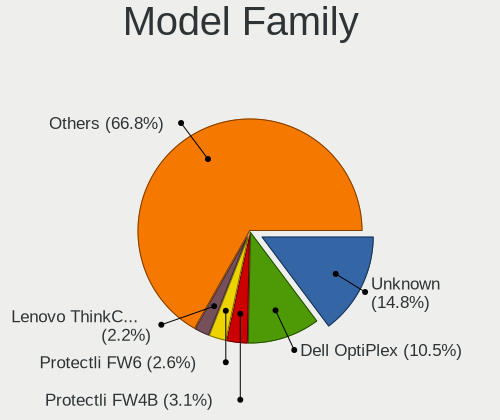
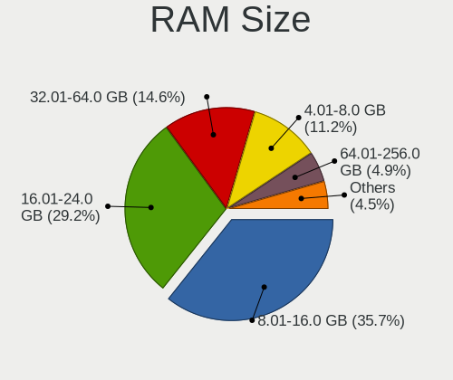
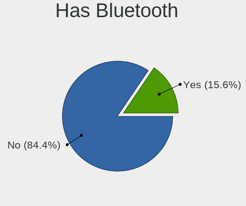
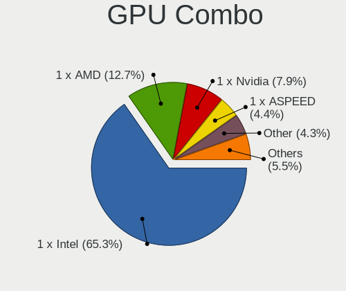
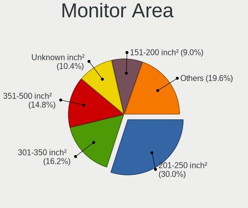
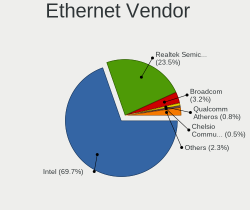
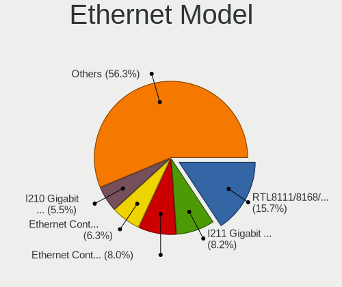
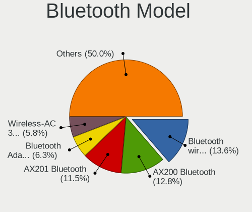
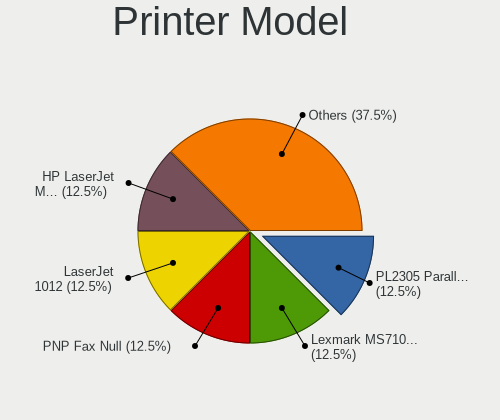
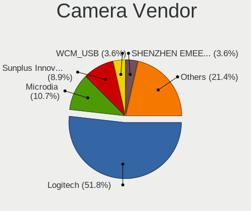

BSD in USA - Tested Hardware & Statistics (Desktops)
----------------------------------------------------

A project to collect tested hardware configurations for BSD in USA.

Anyone can contribute to this report by the [hw-probe](https://github.com/linuxhw/hw-probe/blob/master/INSTALL.BSD.md) tool:

    hw-probe -all -upload

Please contribute! Especially if your hardware is rare.

Contents
--------

* [ Test Cases ](#test-cases)

* [ System ](#system)
  - [ OS                       ](#os)
  - [ OS Family                ](#os-family)
  - [ Arch                     ](#arch)
  - [ DE                       ](#de)
  - [ Display Server           ](#display-server)
  - [ Display Manager          ](#display-manager)
  - [ OS Lang                  ](#os-lang)
  - [ Boot Mode                ](#boot-mode)
  - [ Filesystem               ](#filesystem)
  - [ Part. scheme             ](#part-scheme)

* [ Board ](#board)
  - [ Vendor                   ](#vendor)
  - [ Model                    ](#model)
  - [ Model Family             ](#model-family)
  - [ MFG Year                 ](#mfg-year)
  - [ Form Factor              ](#form-factor)
  - [ Coreboot                 ](#coreboot)
  - [ RAM Size                 ](#ram-size)
  - [ RAM Used                 ](#ram-used)
  - [ Total Drives             ](#total-drives)
  - [ Has CD-ROM               ](#has-cd-rom)
  - [ Has Ethernet             ](#has-ethernet)
  - [ Has WiFi                 ](#has-wifi)
  - [ Has Bluetooth            ](#has-bluetooth)

* [ Location ](#location)
  - [ Country                  ](#country)
  - [ City                     ](#city)

* [ Drives ](#drives)
  - [ Drive Vendor             ](#drive-vendor)
  - [ Drive Model              ](#drive-model)
  - [ HDD Vendor               ](#hdd-vendor)
  - [ SSD Vendor               ](#ssd-vendor)
  - [ Drive Kind               ](#drive-kind)
  - [ Drive Connector          ](#drive-connector)
  - [ Drive Size               ](#drive-size)
  - [ Space Total              ](#space-total)
  - [ Space Used               ](#space-used)
  - [ Malfunc. Drives          ](#malfunc-drives)
  - [ Malfunc. Drive Vendor    ](#malfunc-drive-vendor)
  - [ Malfunc. HDD Vendor      ](#malfunc-hdd-vendor)
  - [ Malfunc. Drive Kind      ](#malfunc-drive-kind)
  - [ Failed Drives            ](#failed-drives)
  - [ Failed Drive Vendor      ](#failed-drive-vendor)
  - [ Drive Status             ](#drive-status)

* [ Storage controller ](#storage-controller)
  - [ Storage Vendor           ](#storage-vendor)
  - [ Storage Model            ](#storage-model)
  - [ Storage Kind             ](#storage-kind)

* [ Processor ](#processor)
  - [ CPU Vendor               ](#cpu-vendor)
  - [ CPU Model                ](#cpu-model)
  - [ CPU Model Family         ](#cpu-model-family)
  - [ CPU Cores                ](#cpu-cores)
  - [ CPU Sockets              ](#cpu-sockets)
  - [ CPU Threads              ](#cpu-threads)
  - [ CPU Microarch            ](#cpu-microarch)

* [ Graphics ](#graphics)
  - [ GPU Vendor               ](#gpu-vendor)
  - [ GPU Model                ](#gpu-model)
  - [ GPU Combo                ](#gpu-combo)
  - [ GPU Driver               ](#gpu-driver)
  - [ GPU Memory               ](#gpu-memory)

* [ Monitor ](#monitor)
  - [ Monitor Vendor           ](#monitor-vendor)
  - [ Monitor Model            ](#monitor-model)
  - [ Monitor Resolution       ](#monitor-resolution)
  - [ Monitor Diagonal         ](#monitor-diagonal)
  - [ Monitor Width            ](#monitor-width)
  - [ Aspect Ratio             ](#aspect-ratio)
  - [ Monitor Area             ](#monitor-area)
  - [ Pixel Density            ](#pixel-density)
  - [ Multiple Monitors        ](#multiple-monitors)

* [ Network ](#network)
  - [ Net Controller Vendor    ](#net-controller-vendor)
  - [ Net Controller Model     ](#net-controller-model)
  - [ Wireless Vendor          ](#wireless-vendor)
  - [ Wireless Model           ](#wireless-model)
  - [ Ethernet Vendor          ](#ethernet-vendor)
  - [ Ethernet Model           ](#ethernet-model)
  - [ Net Controller Kind      ](#net-controller-kind)
  - [ Used Controller          ](#used-controller)
  - [ NICs                     ](#nics)
  - [ IPv6                     ](#ipv6)

* [ Bluetooth ](#bluetooth)
  - [ Bluetooth Vendor         ](#bluetooth-vendor)
  - [ Bluetooth Model          ](#bluetooth-model)

* [ Sound ](#sound)
  - [ Sound Vendor             ](#sound-vendor)
  - [ Sound Model              ](#sound-model)

* [ Memory ](#memory)
  - [ Memory Vendor            ](#memory-vendor)
  - [ Memory Model             ](#memory-model)
  - [ Memory Kind              ](#memory-kind)
  - [ Memory Form Factor       ](#memory-form-factor)
  - [ Memory Size              ](#memory-size)
  - [ Memory Speed             ](#memory-speed)

* [ Printers & scanners ](#printers--scanners)
  - [ Printer Vendor           ](#printer-vendor)
  - [ Printer Model            ](#printer-model)
  - [ Scanner Vendor           ](#scanner-vendor)
  - [ Scanner Model            ](#scanner-model)

* [ Camera ](#camera)
  - [ Camera Vendor            ](#camera-vendor)
  - [ Camera Model             ](#camera-model)

* [ Security ](#security)
  - [ Fingerprint Vendor       ](#fingerprint-vendor)
  - [ Fingerprint Model        ](#fingerprint-model)
  - [ Chipcard Vendor          ](#chipcard-vendor)
  - [ Chipcard Model           ](#chipcard-model)

* [ Unsupported ](#unsupported)
  - [ Unsupported Devices      ](#unsupported-devices)
  - [ Unsupported Device Types ](#unsupported-device-types)

Test Cases
----------

Total: 4098

| Vendor        | Model                       | Probe                                                     | Date         |
|---------------|-----------------------------|-----------------------------------------------------------|--------------|
| MW            | GMLK-2_5G4L                 | [23cb8e1723](https://bsd-hardware.info/?probe=23cb8e1723) | Feb 18, 2024 |
| Gigabyte      | H170-Gaming 3               | [5333db4eb9](https://bsd-hardware.info/?probe=5333db4eb9) | Feb 18, 2024 |
| Dell          | 0D28YY A00                  | [15db3df1ca](https://bsd-hardware.info/?probe=15db3df1ca) | Feb 18, 2024 |
| Unknown       | Unknown                     | [882809e2c7](https://bsd-hardware.info/?probe=882809e2c7) | Feb 18, 2024 |
| Unknown       | Unknown                     | [db839aa12a](https://bsd-hardware.info/?probe=db839aa12a) | Feb 18, 2024 |
| Protectli     | FW6 Ver                     | [35e8ff3d63](https://bsd-hardware.info/?probe=35e8ff3d63) | Feb 18, 2024 |
| Gigabyte      | H170-Gaming 3               | [4c03a20d4f](https://bsd-hardware.info/?probe=4c03a20d4f) | Feb 18, 2024 |
| HP            | 802E                        | [6ef690a057](https://bsd-hardware.info/?probe=6ef690a057) | Feb 17, 2024 |
| Unknown       | Unknown                     | [ebfcb0f78b](https://bsd-hardware.info/?probe=ebfcb0f78b) | Feb 17, 2024 |
| Techvision    | TVI7309X B0                 | [135d71a048](https://bsd-hardware.info/?probe=135d71a048) | Feb 17, 2024 |
| Foxconn       | 2ABF                        | [a7fb944efe](https://bsd-hardware.info/?probe=a7fb944efe) | Feb 17, 2024 |
| Dell          | 0WMJ54 A01                  | [7ccce31d2d](https://bsd-hardware.info/?probe=7ccce31d2d) | Feb 16, 2024 |
| Unknown       | Unknown                     | [13c84b6db8](https://bsd-hardware.info/?probe=13c84b6db8) | Feb 16, 2024 |
| Intel         | SKYBAY                      | [5288673757](https://bsd-hardware.info/?probe=5288673757) | Feb 15, 2024 |
| Supermicro    | X9SCL/X9SCMA                | [53bdb73b74](https://bsd-hardware.info/?probe=53bdb73b74) | Feb 14, 2024 |
| Protectli     | FW4B                        | [c9a2dee14e](https://bsd-hardware.info/?probe=c9a2dee14e) | Feb 14, 2024 |
| CncTion       | N5105-4L B0                 | [63fbf4cdbd](https://bsd-hardware.info/?probe=63fbf4cdbd) | Feb 14, 2024 |
| Dell          | 0YXT71 A00                  | [19c7684ced](https://bsd-hardware.info/?probe=19c7684ced) | Feb 14, 2024 |
| ASUSTek       | PRIME A520M-A II            | [acb70accb8](https://bsd-hardware.info/?probe=acb70accb8) | Feb 14, 2024 |
| ASUSTek       | PRIME X370-PRO              | [7a18edf610](https://bsd-hardware.info/?probe=7a18edf610) | Feb 13, 2024 |
| ASRock        | X570 Phantom Gaming 4       | [d24c0ab2c0](https://bsd-hardware.info/?probe=d24c0ab2c0) | Feb 13, 2024 |
| Dell          | 02YYK5 A00                  | [47e43f818a](https://bsd-hardware.info/?probe=47e43f818a) | Feb 13, 2024 |
| Deciso        | Netboard A10 V2.1           | [9f620acb22](https://bsd-hardware.info/?probe=9f620acb22) | Feb 13, 2024 |
| HP            | 18E7                        | [ce1c65da2d](https://bsd-hardware.info/?probe=ce1c65da2d) | Feb 12, 2024 |
| Protectli     | FW2B Ver                    | [d2280903ce](https://bsd-hardware.info/?probe=d2280903ce) | Feb 12, 2024 |
| Intel         | SKYBAY                      | [7c8379fd02](https://bsd-hardware.info/?probe=7c8379fd02) | Feb 12, 2024 |
| IceWhale T... | ZimaBoard 832 ZMB           | [5d8c1ea60c](https://bsd-hardware.info/?probe=5d8c1ea60c) | Feb 12, 2024 |
| ASUSTek       | M5A97 R2.0                  | [c3d95743df](https://bsd-hardware.info/?probe=c3d95743df) | Feb 12, 2024 |
| MSI           | 890GXM-G65                  | [96d9ab3e95](https://bsd-hardware.info/?probe=96d9ab3e95) | Feb 12, 2024 |
| Unknown       | Unknown                     | [d05beec487](https://bsd-hardware.info/?probe=d05beec487) | Feb 11, 2024 |
| Dell          | 0FF3FN A00                  | [56b53a9e68](https://bsd-hardware.info/?probe=56b53a9e68) | Feb 11, 2024 |
| Dell          | 0H634K A00                  | [a39d975ae9](https://bsd-hardware.info/?probe=a39d975ae9) | Feb 11, 2024 |
| ASUSTek       | P5Q-E                       | [08506a1aff](https://bsd-hardware.info/?probe=08506a1aff) | Feb 11, 2024 |
| ASUSTek       | ROG CROSSHAIR VIII HERO     | [5f3d8e3288](https://bsd-hardware.info/?probe=5f3d8e3288) | Feb 11, 2024 |
| Unknown       | Unknown                     | [d447aefaf0](https://bsd-hardware.info/?probe=d447aefaf0) | Feb 11, 2024 |
| Protectli     | FW6 Ver                     | [9a3b41d070](https://bsd-hardware.info/?probe=9a3b41d070) | Feb 11, 2024 |
| Dell          | 0H4VK7 A00                  | [64725f3ed7](https://bsd-hardware.info/?probe=64725f3ed7) | Feb 11, 2024 |
| Unknown       | Unknown                     | [e4b4c15b64](https://bsd-hardware.info/?probe=e4b4c15b64) | Feb 11, 2024 |
| Dell          | 00V62H A01                  | [e583d1ae8c](https://bsd-hardware.info/?probe=e583d1ae8c) | Feb 11, 2024 |
| Dell          | 0H4VK7 A00                  | [c321c66eea](https://bsd-hardware.info/?probe=c321c66eea) | Feb 11, 2024 |
| Gigabyte      | H170-D3HP-CF                | [32822eef4c](https://bsd-hardware.info/?probe=32822eef4c) | Feb 11, 2024 |
| ASUSTek       | H97I-PLUS                   | [c5ca47db6b](https://bsd-hardware.info/?probe=c5ca47db6b) | Feb 10, 2024 |
| Advantech     | NAMB-3250 A102-1            | [09843ea5f1](https://bsd-hardware.info/?probe=09843ea5f1) | Feb 10, 2024 |
| Unknown       | Unknown                     | [b13923c3f1](https://bsd-hardware.info/?probe=b13923c3f1) | Feb 10, 2024 |
| Unknown       | Unknown                     | [d0bf9601a7](https://bsd-hardware.info/?probe=d0bf9601a7) | Feb 10, 2024 |
| Unknown       | Unknown                     | [c3f71c8e39](https://bsd-hardware.info/?probe=c3f71c8e39) | Feb 10, 2024 |
| HP            | 213D A01                    | [e80039f387](https://bsd-hardware.info/?probe=e80039f387) | Feb 09, 2024 |
| Unknown       | Unknown                     | [d8f999e5ce](https://bsd-hardware.info/?probe=d8f999e5ce) | Feb 09, 2024 |
| Unknown       | Unknown                     | [61ddfb16f5](https://bsd-hardware.info/?probe=61ddfb16f5) | Feb 09, 2024 |
| HP            | 1495                        | [570b4899ea](https://bsd-hardware.info/?probe=570b4899ea) | Feb 09, 2024 |
| PC Engines    | APU2                        | [2741a6da81](https://bsd-hardware.info/?probe=2741a6da81) | Feb 09, 2024 |
| Gigabyte      | B550 UD AC-Y1               | [1e285504a6](https://bsd-hardware.info/?probe=1e285504a6) | Feb 09, 2024 |
| Unknown       | TB100                       | [9075923143](https://bsd-hardware.info/?probe=9075923143) | Feb 09, 2024 |
| Foxconn       | 2ABF                        | [25d0533779](https://bsd-hardware.info/?probe=25d0533779) | Feb 09, 2024 |
| Unknown       | Unknown                     | [09beb1cb7a](https://bsd-hardware.info/?probe=09beb1cb7a) | Feb 08, 2024 |
| Protectli     | VP2420                      | [70f6cd6041](https://bsd-hardware.info/?probe=70f6cd6041) | Feb 08, 2024 |
| AZW           | EQ                          | [5b83388da9](https://bsd-hardware.info/?probe=5b83388da9) | Feb 08, 2024 |
| Unknown       | Unknown                     | [1d24f65624](https://bsd-hardware.info/?probe=1d24f65624) | Feb 07, 2024 |
| Lenovo        | 30FD SDK0J40705 WIN 3425... | [87313cc66c](https://bsd-hardware.info/?probe=87313cc66c) | Feb 07, 2024 |
| Datto         | SSD                         | [1d15370fce](https://bsd-hardware.info/?probe=1d15370fce) | Feb 07, 2024 |
| Unknown       | Unknown                     | [9b6ebfd710](https://bsd-hardware.info/?probe=9b6ebfd710) | Feb 07, 2024 |
| NEOSMAY       | BQM5                        | [766c55f303](https://bsd-hardware.info/?probe=766c55f303) | Feb 06, 2024 |
| Unknown       | ROUTER                      | [b0ad906a1b](https://bsd-hardware.info/?probe=b0ad906a1b) | Feb 06, 2024 |
| ASUSTek       | STRIX H270I GAMING          | [852785036c](https://bsd-hardware.info/?probe=852785036c) | Feb 06, 2024 |
| Protectli     | FW1 Ver                     | [587c9145bc](https://bsd-hardware.info/?probe=587c9145bc) | Feb 06, 2024 |
| Protectli     | FW4C Ver                    | [70908897af](https://bsd-hardware.info/?probe=70908897af) | Feb 06, 2024 |
| Intel         | STK1AW32SC H91596-303       | [14fcea4fb9](https://bsd-hardware.info/?probe=14fcea4fb9) | Feb 06, 2024 |
| ASRock        | Z390M-ITX/ac                | [d982b3a856](https://bsd-hardware.info/?probe=d982b3a856) | Feb 05, 2024 |
| Supermicro    | X9SCL/X9SCMA                | [494e0fc84e](https://bsd-hardware.info/?probe=494e0fc84e) | Feb 05, 2024 |
| Supermicro    | X11SDV-4C-TP8F              | [112139bde4](https://bsd-hardware.info/?probe=112139bde4) | Feb 05, 2024 |
| Foxconn       | 2ABF                        | [6e35ed141f](https://bsd-hardware.info/?probe=6e35ed141f) | Feb 05, 2024 |
| Silicom       | 80300-0134-g01              | [45cac52117](https://bsd-hardware.info/?probe=45cac52117) | Feb 05, 2024 |
| MSI           | A88XM-E45                   | [27c1aec350](https://bsd-hardware.info/?probe=27c1aec350) | Feb 04, 2024 |
| Lenovo        | 36C8 SDK0J40700 WIN 3258... | [ed12a75f82](https://bsd-hardware.info/?probe=ed12a75f82) | Feb 04, 2024 |
| ASRock        | H81M-ITX/WiFi               | [1b08d685ed](https://bsd-hardware.info/?probe=1b08d685ed) | Feb 04, 2024 |
| ASUSTek       | TUF B365M-PLUS GAMING       | [61580db8d6](https://bsd-hardware.info/?probe=61580db8d6) | Feb 04, 2024 |
| Protectli     | FW4B Ver                    | [f41dea5706](https://bsd-hardware.info/?probe=f41dea5706) | Feb 04, 2024 |
| MSI           | H81M-P33                    | [444eaddd27](https://bsd-hardware.info/?probe=444eaddd27) | Feb 04, 2024 |
| ASUSTek       | P5Q-E                       | [87358bcf94](https://bsd-hardware.info/?probe=87358bcf94) | Feb 04, 2024 |
| ASUSTek       | ROG CROSSHAIR VIII HERO     | [94f15f8857](https://bsd-hardware.info/?probe=94f15f8857) | Feb 04, 2024 |
| CWWK          | CW-AD4L-N V1                | [b578551813](https://bsd-hardware.info/?probe=b578551813) | Feb 04, 2024 |
| PC Engines    | APU2                        | [89f0caf8f9](https://bsd-hardware.info/?probe=89f0caf8f9) | Feb 04, 2024 |
| Dell          | 00V62H A01                  | [307c51641d](https://bsd-hardware.info/?probe=307c51641d) | Feb 04, 2024 |
| PC Engines    | APU2                        | [82cc76def6](https://bsd-hardware.info/?probe=82cc76def6) | Feb 04, 2024 |
| Dell          | 0D6H9T A00                  | [9454913bf3](https://bsd-hardware.info/?probe=9454913bf3) | Feb 03, 2024 |
| Protectli     | FW4B                        | [28f07a1d8b](https://bsd-hardware.info/?probe=28f07a1d8b) | Feb 03, 2024 |
| Intel         | DQ77MK AAG39642-500         | [1c126af269](https://bsd-hardware.info/?probe=1c126af269) | Feb 03, 2024 |
| Techvision    | TVI7309X B0                 | [b6b8dbf4f5](https://bsd-hardware.info/?probe=b6b8dbf4f5) | Feb 03, 2024 |
| Gigabyte      | Z77M-D3H-MVP                | [da4216fca7](https://bsd-hardware.info/?probe=da4216fca7) | Feb 03, 2024 |
| Intel         | HM570                       | [ecdee25f5b](https://bsd-hardware.info/?probe=ecdee25f5b) | Feb 02, 2024 |
| Dell          | 03NVJ6 A02                  | [97d38286fb](https://bsd-hardware.info/?probe=97d38286fb) | Feb 02, 2024 |
| Unknown       | Unknown                     | [c02da607f1](https://bsd-hardware.info/?probe=c02da607f1) | Feb 02, 2024 |
| Supermicro    | X9SCL/X9SCMA                | [f6dcaf9519](https://bsd-hardware.info/?probe=f6dcaf9519) | Feb 02, 2024 |
| Unknown       | Unknown                     | [a33d1e3c29](https://bsd-hardware.info/?probe=a33d1e3c29) | Feb 02, 2024 |
| PC Engines    | APU2                        | [0c9724263b](https://bsd-hardware.info/?probe=0c9724263b) | Feb 02, 2024 |
| ASRock        | B660M Steel Legend          | [3a5ae5a649](https://bsd-hardware.info/?probe=3a5ae5a649) | Feb 02, 2024 |
| Intel         | QHSW02                      | [90e2883020](https://bsd-hardware.info/?probe=90e2883020) | Feb 02, 2024 |
| HP            | 1495                        | [fc0f87fd50](https://bsd-hardware.info/?probe=fc0f87fd50) | Feb 01, 2024 |
| Gigabyte      | GA-MA78GM-S2HP              | [c0ca7a18ae](https://bsd-hardware.info/?probe=c0ca7a18ae) | Feb 01, 2024 |
| HP            | 18E9                        | [ec3dc64c17](https://bsd-hardware.info/?probe=ec3dc64c17) | Feb 01, 2024 |
| Unknown       | QSKL01                      | [a61418dbc3](https://bsd-hardware.info/?probe=a61418dbc3) | Feb 01, 2024 |
| Unknown       | Unknown                     | [fb9640755b](https://bsd-hardware.info/?probe=fb9640755b) | Feb 01, 2024 |
| Supermicro    | X9SCL/X9SCMA                | [d372d51db1](https://bsd-hardware.info/?probe=d372d51db1) | Jan 31, 2024 |
| ASRock        | AB350 Pro4                  | [0847b0594d](https://bsd-hardware.info/?probe=0847b0594d) | Jan 31, 2024 |
| ASUSTek       | A68HM-K                     | [f321ac1114](https://bsd-hardware.info/?probe=f321ac1114) | Jan 31, 2024 |
| Protectli     | FW2B Ver                    | [f8ddfd0269](https://bsd-hardware.info/?probe=f8ddfd0269) | Jan 30, 2024 |
| Protectli     | FW4C Ver                    | [eb2da2c88f](https://bsd-hardware.info/?probe=eb2da2c88f) | Jan 30, 2024 |
| Acer          | Veriton X275                | [8df1ac0855](https://bsd-hardware.info/?probe=8df1ac0855) | Jan 30, 2024 |
| Unknown       | Unknown                     | [b5924182bf](https://bsd-hardware.info/?probe=b5924182bf) | Jan 29, 2024 |
| Protectli     | FW1 Ver                     | [4b82e3a95d](https://bsd-hardware.info/?probe=4b82e3a95d) | Jan 28, 2024 |
| MSI           | H81M-P33                    | [d411f5eb4b](https://bsd-hardware.info/?probe=d411f5eb4b) | Jan 28, 2024 |
| ASUSTek       | P5Q-E                       | [22436fad84](https://bsd-hardware.info/?probe=22436fad84) | Jan 28, 2024 |
| ASUSTek       | ROG CROSSHAIR VIII HERO     | [ec38d3e15f](https://bsd-hardware.info/?probe=ec38d3e15f) | Jan 28, 2024 |
| Dell          | 07HXY6 A01                  | [1f9ff2f86a](https://bsd-hardware.info/?probe=1f9ff2f86a) | Jan 28, 2024 |
| Dell          | 07HXY6 A01                  | [55f2cc74d2](https://bsd-hardware.info/?probe=55f2cc74d2) | Jan 28, 2024 |
| Unknown       | QDNV01                      | [6e54e1cc98](https://bsd-hardware.info/?probe=6e54e1cc98) | Jan 28, 2024 |
| Inventec      | Z CLASS A02                 | [7a16c15977](https://bsd-hardware.info/?probe=7a16c15977) | Jan 27, 2024 |
| Unknown       | Unknown                     | [9a629cc792](https://bsd-hardware.info/?probe=9a629cc792) | Jan 27, 2024 |
| Unknown       | Unknown                     | [ac839a7f6c](https://bsd-hardware.info/?probe=ac839a7f6c) | Jan 27, 2024 |
| ASRock        | B550M Steel Legend          | [fa494be63d](https://bsd-hardware.info/?probe=fa494be63d) | Jan 26, 2024 |
| ASUSTek       | TUF Gaming B560M-PLUS WI... | [713a924dbc](https://bsd-hardware.info/?probe=713a924dbc) | Jan 26, 2024 |
| AZW           | EQ                          | [a14d6a1470](https://bsd-hardware.info/?probe=a14d6a1470) | Jan 26, 2024 |
| Unknown       | Unknown                     | [4b04b7d0f0](https://bsd-hardware.info/?probe=4b04b7d0f0) | Jan 26, 2024 |
| Unknown       | Unknown                     | [9cd2f0b2da](https://bsd-hardware.info/?probe=9cd2f0b2da) | Jan 25, 2024 |
| HP            | 843F                        | [650b67d779](https://bsd-hardware.info/?probe=650b67d779) | Jan 25, 2024 |
| AZW           | EQ                          | [c49b4d4d49](https://bsd-hardware.info/?probe=c49b4d4d49) | Jan 24, 2024 |
| ASRock        | J3455-ITX                   | [2aa7476d4f](https://bsd-hardware.info/?probe=2aa7476d4f) | Jan 24, 2024 |
| Unknown       | Unknown                     | [d70b467db3](https://bsd-hardware.info/?probe=d70b467db3) | Jan 24, 2024 |
| ASRock        | H81M-ITX/WiFi               | [e57514c59b](https://bsd-hardware.info/?probe=e57514c59b) | Jan 23, 2024 |
| ASRock        | AB350 Pro4                  | [20d9879f23](https://bsd-hardware.info/?probe=20d9879f23) | Jan 23, 2024 |
| ASRock        | H81M-ITX/WiFi               | [37e21779b0](https://bsd-hardware.info/?probe=37e21779b0) | Jan 23, 2024 |
| Gigabyte      | X570S AORUS ELITE           | [5862d464ac](https://bsd-hardware.info/?probe=5862d464ac) | Jan 22, 2024 |
| Supermicro    | X11SDV-4C-TP8F              | [649257b7d4](https://bsd-hardware.info/?probe=649257b7d4) | Jan 22, 2024 |
| Protectli     | FW4B Ver                    | [c948e4d72d](https://bsd-hardware.info/?probe=c948e4d72d) | Jan 22, 2024 |
| IBM           | 830381U                     | [a3f2d51f21](https://bsd-hardware.info/?probe=a3f2d51f21) | Jan 21, 2024 |
| Protectli     | FW4B Ver                    | [75746599d1](https://bsd-hardware.info/?probe=75746599d1) | Jan 21, 2024 |
| Protectli     | FW4B Ver                    | [4d272356f7](https://bsd-hardware.info/?probe=4d272356f7) | Jan 21, 2024 |
| Dell          | 0YNVJG A02                  | [82620ff3ea](https://bsd-hardware.info/?probe=82620ff3ea) | Jan 21, 2024 |
| AZW           | EQ                          | [bcaa597224](https://bsd-hardware.info/?probe=bcaa597224) | Jan 21, 2024 |
| Unknown       | Unknown                     | [4244a64777](https://bsd-hardware.info/?probe=4244a64777) | Jan 21, 2024 |
| Protectli     | VP2420                      | [dd5215657f](https://bsd-hardware.info/?probe=dd5215657f) | Jan 20, 2024 |
| Unknown       | Unknown                     | [492b9a5dd2](https://bsd-hardware.info/?probe=492b9a5dd2) | Jan 20, 2024 |
| IBM           | 830381U                     | [e44647b8cd](https://bsd-hardware.info/?probe=e44647b8cd) | Jan 20, 2024 |
| Microsoft     | Windows Dev Kit 2023        | [2cd25bfacf](https://bsd-hardware.info/?probe=2cd25bfacf) | Jan 19, 2024 |
| Intel         | CRESCENTBAY                 | [a5936e1878](https://bsd-hardware.info/?probe=a5936e1878) | Jan 19, 2024 |
| Unknown       | Unknown                     | [d4754523f7](https://bsd-hardware.info/?probe=d4754523f7) | Jan 19, 2024 |
| IceWhale T... | ZimaBoard 832 ZMB           | [9d74aa9072](https://bsd-hardware.info/?probe=9d74aa9072) | Jan 18, 2024 |
| Unknown       | QDNV01                      | [99d4f2dbf5](https://bsd-hardware.info/?probe=99d4f2dbf5) | Jan 18, 2024 |
| Unknown       | Unknown                     | [236d3f0732](https://bsd-hardware.info/?probe=236d3f0732) | Jan 18, 2024 |
| Supermicro    | X11SSH-F                    | [d273b1ed9f](https://bsd-hardware.info/?probe=d273b1ed9f) | Jan 18, 2024 |
| AZW           | EQ                          | [04e8043548](https://bsd-hardware.info/?probe=04e8043548) | Jan 17, 2024 |
| Unknown       | Unknown                     | [ad20eaae94](https://bsd-hardware.info/?probe=ad20eaae94) | Jan 17, 2024 |
| Protectli     | FW4C Ver                    | [fa84143aec](https://bsd-hardware.info/?probe=fa84143aec) | Jan 17, 2024 |
| Lenovo        | SHARKBAY NOK                | [fcd8f97c05](https://bsd-hardware.info/?probe=fcd8f97c05) | Jan 17, 2024 |
| Intel         | DH61AG AAG23736-400         | [89e63dd31d](https://bsd-hardware.info/?probe=89e63dd31d) | Jan 16, 2024 |
| Unknown       | Unknown                     | [6ef2456b35](https://bsd-hardware.info/?probe=6ef2456b35) | Jan 16, 2024 |
| Supermicro    | X11SSH-F                    | [e6e1960214](https://bsd-hardware.info/?probe=e6e1960214) | Jan 16, 2024 |
| ASUSTek       | P9X79 LE                    | [fc3b560a10](https://bsd-hardware.info/?probe=fc3b560a10) | Jan 15, 2024 |
| Lenovo        | 312A SDK0J40697 WIN 3305... | [1dfff45a5e](https://bsd-hardware.info/?probe=1dfff45a5e) | Jan 15, 2024 |
| CncTion       | N5105-4L B0                 | [de84a99395](https://bsd-hardware.info/?probe=de84a99395) | Jan 15, 2024 |
| HP            | 83E2                        | [f8de5b6abb](https://bsd-hardware.info/?probe=f8de5b6abb) | Jan 15, 2024 |
| CWWK          | CW-AD4L-N V1                | [c22ce22507](https://bsd-hardware.info/?probe=c22ce22507) | Jan 15, 2024 |
| AZW           | EQ                          | [16088b9f73](https://bsd-hardware.info/?probe=16088b9f73) | Jan 15, 2024 |
| Techvision    | TVI7309X B0                 | [0906af3cf9](https://bsd-hardware.info/?probe=0906af3cf9) | Jan 15, 2024 |
| Gigabyte      | Z590 AORUS PRO AX           | [96bd0ccc8b](https://bsd-hardware.info/?probe=96bd0ccc8b) | Jan 14, 2024 |
| Gigabyte      | Z690I A ULTRA LITE D4       | [7a7a48463f](https://bsd-hardware.info/?probe=7a7a48463f) | Jan 14, 2024 |
| Protectli     | FW6                         | [b17885bbf5](https://bsd-hardware.info/?probe=b17885bbf5) | Jan 13, 2024 |
| Gigabyte      | B550 UD AC-Y1               | [4e7a1908b5](https://bsd-hardware.info/?probe=4e7a1908b5) | Jan 13, 2024 |
| Unknown       | Unknown                     | [037f8126cc](https://bsd-hardware.info/?probe=037f8126cc) | Jan 13, 2024 |
| ASUSTek       | PRIME X370-PRO              | [a95eae54ba](https://bsd-hardware.info/?probe=a95eae54ba) | Jan 13, 2024 |
| ASRock        | X570 Phantom Gaming 4       | [f1224c8ebd](https://bsd-hardware.info/?probe=f1224c8ebd) | Jan 13, 2024 |
| Gigabyte      | X570S AORUS ELITE           | [e013ea04db](https://bsd-hardware.info/?probe=e013ea04db) | Jan 13, 2024 |
| Dell          | 02YYK5 A00                  | [336d472712](https://bsd-hardware.info/?probe=336d472712) | Jan 13, 2024 |
| ASUSTek       | TUF Gaming X570-PLUS        | [699a750910](https://bsd-hardware.info/?probe=699a750910) | Jan 13, 2024 |
| Unknown       | Unknown                     | [f6388b9dc0](https://bsd-hardware.info/?probe=f6388b9dc0) | Jan 13, 2024 |
| ASUSTek       | TUF Gaming X570-PLUS        | [a066488c25](https://bsd-hardware.info/?probe=a066488c25) | Jan 12, 2024 |
| ASUSTek       | ROG STRIX B550-F GAMING     | [9736c485c9](https://bsd-hardware.info/?probe=9736c485c9) | Jan 12, 2024 |
| Techvision    | TVI7309X B0                 | [f992fb318d](https://bsd-hardware.info/?probe=f992fb318d) | Jan 12, 2024 |
| Protectli     | FW4C Ver                    | [e9903fc76b](https://bsd-hardware.info/?probe=e9903fc76b) | Jan 12, 2024 |
| Unknown       | Unknown                     | [54f9f65b05](https://bsd-hardware.info/?probe=54f9f65b05) | Jan 12, 2024 |
| AZW           | EQ                          | [b80d010809](https://bsd-hardware.info/?probe=b80d010809) | Jan 12, 2024 |
| ASRock        | AB350 Pro4                  | [b2f960c437](https://bsd-hardware.info/?probe=b2f960c437) | Jan 11, 2024 |
| Techvision    | TVI7309X B0                 | [c642669941](https://bsd-hardware.info/?probe=c642669941) | Jan 11, 2024 |
| Dell          | 0XCR8D A03                  | [67a92b675d](https://bsd-hardware.info/?probe=67a92b675d) | Jan 11, 2024 |
| Protectli     | FW4C Ver                    | [62294dff5a](https://bsd-hardware.info/?probe=62294dff5a) | Jan 10, 2024 |
| Foxconn       | 2ABF                        | [af74c92cd6](https://bsd-hardware.info/?probe=af74c92cd6) | Jan 10, 2024 |
| Unknown       | Unknown                     | [8f7bfe9126](https://bsd-hardware.info/?probe=8f7bfe9126) | Jan 10, 2024 |
| Protectli     | FW2B Ver                    | [8735484351](https://bsd-hardware.info/?probe=8735484351) | Jan 10, 2024 |
| Gigabyte      | B450M DS3H-CF               | [67f7f97377](https://bsd-hardware.info/?probe=67f7f97377) | Jan 09, 2024 |
| Protectli     | FW6 Ver                     | [1d0dd537a8](https://bsd-hardware.info/?probe=1d0dd537a8) | Jan 09, 2024 |
| MSI           | Z270M MORTAR                | [a359d80a45](https://bsd-hardware.info/?probe=a359d80a45) | Jan 09, 2024 |
| CWWK          | CW-AD4L-N V1                | [2dbe56a276](https://bsd-hardware.info/?probe=2dbe56a276) | Jan 09, 2024 |
| Dell          | 0NW6H5 A00                  | [77a712a874](https://bsd-hardware.info/?probe=77a712a874) | Jan 09, 2024 |
| Supermicro    | X10SLH-N6-ST031             | [c877bf8ec0](https://bsd-hardware.info/?probe=c877bf8ec0) | Jan 09, 2024 |
| Unknown       | Unknown                     | [548ff32772](https://bsd-hardware.info/?probe=548ff32772) | Jan 08, 2024 |
| Unknown       | Unknown                     | [ef57a8bf7f](https://bsd-hardware.info/?probe=ef57a8bf7f) | Jan 08, 2024 |
| HP            | ProLiant ML110 G7           | [57c773fdc1](https://bsd-hardware.info/?probe=57c773fdc1) | Jan 08, 2024 |
| Gigabyte      | Z690I A ULTRA LITE D4       | [a4f06776ee](https://bsd-hardware.info/?probe=a4f06776ee) | Jan 08, 2024 |
| Dell          | 0XFWHV A00                  | [41503413eb](https://bsd-hardware.info/?probe=41503413eb) | Jan 08, 2024 |
| MSI           | H81M-P33                    | [e2407e0579](https://bsd-hardware.info/?probe=e2407e0579) | Jan 07, 2024 |
| ASUSTek       | P5Q-E                       | [e97b058f7c](https://bsd-hardware.info/?probe=e97b058f7c) | Jan 07, 2024 |
| ASUSTek       | ROG CROSSHAIR VIII HERO     | [d429a5298b](https://bsd-hardware.info/?probe=d429a5298b) | Jan 07, 2024 |
| ASUSTek       | TUF Gaming B450M-PLUS II    | [eda92591b5](https://bsd-hardware.info/?probe=eda92591b5) | Jan 07, 2024 |
| ASUSTek       | TUF Gaming B450M-PLUS II    | [12ff062207](https://bsd-hardware.info/?probe=12ff062207) | Jan 07, 2024 |
| Unknown       | Unknown                     | [6564d3ecfe](https://bsd-hardware.info/?probe=6564d3ecfe) | Jan 07, 2024 |
| Roqos         | Core RC10                   | [3f3aabf270](https://bsd-hardware.info/?probe=3f3aabf270) | Jan 06, 2024 |
| ASRock        | B550M Steel Legend          | [d24b57f807](https://bsd-hardware.info/?probe=d24b57f807) | Jan 06, 2024 |
| Dell          | 0XFWHV A00                  | [ef7c13ea0e](https://bsd-hardware.info/?probe=ef7c13ea0e) | Jan 06, 2024 |
| Roqos         | Core RC10                   | [7561797db6](https://bsd-hardware.info/?probe=7561797db6) | Jan 06, 2024 |
| Protectli     | FW2B Ver                    | [4a60768833](https://bsd-hardware.info/?probe=4a60768833) | Jan 06, 2024 |
| HP            | ProLiant ML110 G7           | [9939bc50d4](https://bsd-hardware.info/?probe=9939bc50d4) | Jan 05, 2024 |
| ASUSTek       | H97M-PLUS                   | [22f439df81](https://bsd-hardware.info/?probe=22f439df81) | Jan 05, 2024 |
| Silicom       | 80300-0214-G01 R407         | [bed6767a1f](https://bsd-hardware.info/?probe=bed6767a1f) | Jan 05, 2024 |
| Lenovo        | 3138 SDK0J40697 WIN 3305... | [319f5b8358](https://bsd-hardware.info/?probe=319f5b8358) | Jan 05, 2024 |
| HP            | 843F                        | [a0a5abafb6](https://bsd-hardware.info/?probe=a0a5abafb6) | Jan 05, 2024 |
| Lenovo        | SHARKBAY NOK                | [7aede6e8ce](https://bsd-hardware.info/?probe=7aede6e8ce) | Jan 04, 2024 |
| ASUSTek       | TUF Gaming X570-PLUS        | [bb0d74a396](https://bsd-hardware.info/?probe=bb0d74a396) | Jan 04, 2024 |
| ASRockRack    | EPYC3251D4I-2T              | [6e5054d1f1](https://bsd-hardware.info/?probe=6e5054d1f1) | Jan 04, 2024 |
| Intel         | QHSW02                      | [e505c16d73](https://bsd-hardware.info/?probe=e505c16d73) | Jan 04, 2024 |
| iKOOLCORE ... | R2                          | [b8be09aa4a](https://bsd-hardware.info/?probe=b8be09aa4a) | Jan 03, 2024 |
| Dell          | 0D24M8 A01                  | [17862ade20](https://bsd-hardware.info/?probe=17862ade20) | Jan 03, 2024 |
| Dell          | 0YXT71 A00                  | [3e716c2ad2](https://bsd-hardware.info/?probe=3e716c2ad2) | Jan 03, 2024 |
| Dell          | 0D02VH A01                  | [8e8fc6da64](https://bsd-hardware.info/?probe=8e8fc6da64) | Jan 03, 2024 |
| ASUSTek       | CM6870                      | [d7b4e67cdc](https://bsd-hardware.info/?probe=d7b4e67cdc) | Jan 03, 2024 |
| Unknown       | QGLK03                      | [6bdc39f976](https://bsd-hardware.info/?probe=6bdc39f976) | Jan 02, 2024 |
| Techvision    | TVI7309X B0                 | [c0f7a38e07](https://bsd-hardware.info/?probe=c0f7a38e07) | Jan 02, 2024 |
| AZW           | U59                         | [c8ffb92584](https://bsd-hardware.info/?probe=c8ffb92584) | Jan 02, 2024 |
| Protectli     | VP46xx                      | [f958569c30](https://bsd-hardware.info/?probe=f958569c30) | Jan 02, 2024 |
| Gowin Solu... | GW-MB-U01                   | [673266d486](https://bsd-hardware.info/?probe=673266d486) | Jan 01, 2024 |
| ASUSTek       | H97M-PLUS                   | [270a946916](https://bsd-hardware.info/?probe=270a946916) | Jan 01, 2024 |
| Alienware     | 07HV66 A00                  | [ea6a3f3020](https://bsd-hardware.info/?probe=ea6a3f3020) | Jan 01, 2024 |
| Protectli     | FW4B Ver                    | [3191952740](https://bsd-hardware.info/?probe=3191952740) | Jan 01, 2024 |
| MSI           | Z170A PC MATE               | [e05af13af9](https://bsd-hardware.info/?probe=e05af13af9) | Jan 01, 2024 |
| MSI           | Z270-A PRO                  | [2f2f406aa3](https://bsd-hardware.info/?probe=2f2f406aa3) | Dec 31, 2023 |
| MSI           | H81M-P33                    | [82e08820f2](https://bsd-hardware.info/?probe=82e08820f2) | Dec 31, 2023 |
| ASUSTek       | P5Q-E                       | [da3b88ef85](https://bsd-hardware.info/?probe=da3b88ef85) | Dec 31, 2023 |
| ASUSTek       | ROG CROSSHAIR VIII HERO     | [391f4c0e0b](https://bsd-hardware.info/?probe=391f4c0e0b) | Dec 31, 2023 |
| Intel         | SHARKBAY                    | [bcbbfa0368](https://bsd-hardware.info/?probe=bcbbfa0368) | Dec 31, 2023 |
| Unknown       | Unknown                     | [56ecba336a](https://bsd-hardware.info/?probe=56ecba336a) | Dec 31, 2023 |
| ASUSTek       | CM6870                      | [1889675f37](https://bsd-hardware.info/?probe=1889675f37) | Dec 30, 2023 |
| MSI           | MAG Z790 TOMAHAWK WIFI D... | [715a274a2e](https://bsd-hardware.info/?probe=715a274a2e) | Dec 30, 2023 |
| Protectli     | FW4A Ver                    | [39c4ea3a24](https://bsd-hardware.info/?probe=39c4ea3a24) | Dec 30, 2023 |
| HP            | 3397                        | [46b6923bcd](https://bsd-hardware.info/?probe=46b6923bcd) | Dec 30, 2023 |
| Protectli     | FW2B Ver                    | [3dbf91e1d4](https://bsd-hardware.info/?probe=3dbf91e1d4) | Dec 30, 2023 |
| Unknown       | QDNV01                      | [d2fed4bb5f](https://bsd-hardware.info/?probe=d2fed4bb5f) | Dec 30, 2023 |
| Protectli     | FW6 Ver                     | [de6046d060](https://bsd-hardware.info/?probe=de6046d060) | Dec 29, 2023 |
| PC Engines    | apu4                        | [3901782984](https://bsd-hardware.info/?probe=3901782984) | Dec 29, 2023 |
| Protectli     | VP2420                      | [39b80f6d35](https://bsd-hardware.info/?probe=39b80f6d35) | Dec 28, 2023 |
| HP            | 0B54h D                     | [0fc53a659f](https://bsd-hardware.info/?probe=0fc53a659f) | Dec 28, 2023 |
| Intel         | SHARKBAY                    | [55a9dc404b](https://bsd-hardware.info/?probe=55a9dc404b) | Dec 27, 2023 |
| Protectli     | VP2420                      | [a7e60ab925](https://bsd-hardware.info/?probe=a7e60ab925) | Dec 27, 2023 |
| HP            | 1998                        | [8bebbb8dab](https://bsd-hardware.info/?probe=8bebbb8dab) | Dec 27, 2023 |
| MSI           | Aspen                       | [ac6dd2b153](https://bsd-hardware.info/?probe=ac6dd2b153) | Dec 27, 2023 |
| Protectli     | FW4B                        | [cf4ead1922](https://bsd-hardware.info/?probe=cf4ead1922) | Dec 26, 2023 |
| Unknown       | Unknown                     | [48677111e5](https://bsd-hardware.info/?probe=48677111e5) | Dec 26, 2023 |
| Apple         | Mac-F221BEC8                | [d08712b71d](https://bsd-hardware.info/?probe=d08712b71d) | Dec 26, 2023 |
| Supermicro    | X11SDW-16C-TP13F+           | [49ed0c6dca](https://bsd-hardware.info/?probe=49ed0c6dca) | Dec 25, 2023 |
| Gigabyte      | Z690I A ULTRA LITE D4       | [304af7e00e](https://bsd-hardware.info/?probe=304af7e00e) | Dec 25, 2023 |
| Unknown       | QGLK03                      | [4be2a41109](https://bsd-hardware.info/?probe=4be2a41109) | Dec 25, 2023 |
| Unknown       | QGLK03                      | [b187a024cb](https://bsd-hardware.info/?probe=b187a024cb) | Dec 25, 2023 |
| Unknown       | QSKL01                      | [f69898815d](https://bsd-hardware.info/?probe=f69898815d) | Dec 25, 2023 |
| Lenovo        | 30D9 SDK0J40700 WIN 3258... | [504fb1678f](https://bsd-hardware.info/?probe=504fb1678f) | Dec 24, 2023 |
| ASUSTek       | P5Q-E                       | [04675127c2](https://bsd-hardware.info/?probe=04675127c2) | Dec 24, 2023 |
| ASUSTek       | ROG CROSSHAIR VIII HERO     | [1ef7136151](https://bsd-hardware.info/?probe=1ef7136151) | Dec 24, 2023 |
| Dell          | 0KV62T A00                  | [5844adb190](https://bsd-hardware.info/?probe=5844adb190) | Dec 24, 2023 |
| ASRock        | Z77 Extreme3                | [1656e8f6b0](https://bsd-hardware.info/?probe=1656e8f6b0) | Dec 24, 2023 |
| Unknown       | QGLK03                      | [a586279dd0](https://bsd-hardware.info/?probe=a586279dd0) | Dec 24, 2023 |
| Unknown       | Unknown                     | [da2b7d434e](https://bsd-hardware.info/?probe=da2b7d434e) | Dec 24, 2023 |
| Dell          | 0NC2VH A01                  | [06828fbfed](https://bsd-hardware.info/?probe=06828fbfed) | Dec 23, 2023 |
| Dell          | 0NC2VH A01                  | [3c06ec4635](https://bsd-hardware.info/?probe=3c06ec4635) | Dec 23, 2023 |
| AZW           | EQ                          | [9818e5f996](https://bsd-hardware.info/?probe=9818e5f996) | Dec 23, 2023 |
| Unknown       | Unknown                     | [97559370a8](https://bsd-hardware.info/?probe=97559370a8) | Dec 23, 2023 |
| Protectli     | FW4B Ver                    | [4b6a62bebe](https://bsd-hardware.info/?probe=4b6a62bebe) | Dec 22, 2023 |
| Dell          | 00V62H A01                  | [c4e5366baa](https://bsd-hardware.info/?probe=c4e5366baa) | Dec 22, 2023 |
| Shuttle       | FS77U                       | [9c746c0d5c](https://bsd-hardware.info/?probe=9c746c0d5c) | Dec 21, 2023 |
| Dell          | 0KV62T A00                  | [8a2c7af96c](https://bsd-hardware.info/?probe=8a2c7af96c) | Dec 21, 2023 |
| PC Engines    | apu4                        | [7fa270657e](https://bsd-hardware.info/?probe=7fa270657e) | Dec 21, 2023 |
| Intel         | DH61AG AAG23736-400         | [e6a38faa07](https://bsd-hardware.info/?probe=e6a38faa07) | Dec 21, 2023 |
| ASUSTek       | TUF Gaming B550M-PLUS       | [f9fd749985](https://bsd-hardware.info/?probe=f9fd749985) | Dec 21, 2023 |
| Protectli     | VP2420                      | [9a4aba32a7](https://bsd-hardware.info/?probe=9a4aba32a7) | Dec 21, 2023 |
| Dell          | 0NV0M7 A01                  | [835ca2056c](https://bsd-hardware.info/?probe=835ca2056c) | Dec 21, 2023 |
| Protectli     | FW4B                        | [d67b8b063a](https://bsd-hardware.info/?probe=d67b8b063a) | Dec 21, 2023 |
| Dell          | 02YYK5 A01                  | [6e070fbb90](https://bsd-hardware.info/?probe=6e070fbb90) | Dec 20, 2023 |
| Acer          | Aspire XC-1660G V:1.1       | [54b2061c80](https://bsd-hardware.info/?probe=54b2061c80) | Dec 19, 2023 |
| ASRock        | B550 Phantom Gaming 4       | [c00a69de7c](https://bsd-hardware.info/?probe=c00a69de7c) | Dec 19, 2023 |
| Advantech     | NAMB-3250 A102-1            | [bb91074237](https://bsd-hardware.info/?probe=bb91074237) | Dec 19, 2023 |
| Dell          | 04YP6J A02                  | [abcaede8e1](https://bsd-hardware.info/?probe=abcaede8e1) | Dec 19, 2023 |
| Protectli     | FW4A Ver                    | [9660edcc5c](https://bsd-hardware.info/?probe=9660edcc5c) | Dec 18, 2023 |
| Unknown       | Unknown                     | [107e747798](https://bsd-hardware.info/?probe=107e747798) | Dec 17, 2023 |
| ASUSTek       | P5Q-E                       | [5a4d01667e](https://bsd-hardware.info/?probe=5a4d01667e) | Dec 17, 2023 |
| ASUSTek       | ROG CROSSHAIR VIII HERO     | [ea79e98108](https://bsd-hardware.info/?probe=ea79e98108) | Dec 17, 2023 |
| ECS           | H81H3-WM                    | [9df1f030f9](https://bsd-hardware.info/?probe=9df1f030f9) | Dec 17, 2023 |
| Unknown       | Unknown                     | [88306fe484](https://bsd-hardware.info/?probe=88306fe484) | Dec 17, 2023 |
| Unknown       | Unknown                     | [6a3ef5165f](https://bsd-hardware.info/?probe=6a3ef5165f) | Dec 17, 2023 |
| Unknown       | Unknown                     | [cefdf7d9ca](https://bsd-hardware.info/?probe=cefdf7d9ca) | Dec 17, 2023 |
| Protectli     | FW4B                        | [b862c8c507](https://bsd-hardware.info/?probe=b862c8c507) | Dec 16, 2023 |
| Unknown       | Unknown                     | [df97b81bea](https://bsd-hardware.info/?probe=df97b81bea) | Dec 15, 2023 |
| AZW           | MINI S 10                   | [d8eee18baf](https://bsd-hardware.info/?probe=d8eee18baf) | Dec 15, 2023 |
| Unknown       | Unknown                     | [5adc44e122](https://bsd-hardware.info/?probe=5adc44e122) | Dec 15, 2023 |
| Techvision    | TVI7309X B0                 | [4b7be4588e](https://bsd-hardware.info/?probe=4b7be4588e) | Dec 15, 2023 |
| Unknown       | Unknown                     | [93f650efc3](https://bsd-hardware.info/?probe=93f650efc3) | Dec 15, 2023 |
| Gigabyte      | B75M-D3H                    | [9773ffcc27](https://bsd-hardware.info/?probe=9773ffcc27) | Dec 15, 2023 |
| Unknown       | Unknown                     | [a9f96c677c](https://bsd-hardware.info/?probe=a9f96c677c) | Dec 14, 2023 |
| CWWK          | MINIPC-G12                  | [e15a019715](https://bsd-hardware.info/?probe=e15a019715) | Dec 14, 2023 |
| Dell          | 0NK5PH A00                  | [60451d4e43](https://bsd-hardware.info/?probe=60451d4e43) | Dec 14, 2023 |
| ASUSTek       | PRIME X370-PRO              | [bc50d301fa](https://bsd-hardware.info/?probe=bc50d301fa) | Dec 13, 2023 |
| ASRock        | X570 Phantom Gaming 4       | [dced442907](https://bsd-hardware.info/?probe=dced442907) | Dec 13, 2023 |
| Unknown       | Unknown                     | [b2407b8a31](https://bsd-hardware.info/?probe=b2407b8a31) | Dec 13, 2023 |
| Dell          | 02YYK5 A00                  | [8eb8c9eff3](https://bsd-hardware.info/?probe=8eb8c9eff3) | Dec 13, 2023 |
| Intel         | QHSW02                      | [da6b7c7115](https://bsd-hardware.info/?probe=da6b7c7115) | Dec 13, 2023 |
| ASRock        | H170M-ITX/DL                | [79039f6105](https://bsd-hardware.info/?probe=79039f6105) | Dec 13, 2023 |
| MSI           | B150 GAMING M3              | [b5dc4da596](https://bsd-hardware.info/?probe=b5dc4da596) | Dec 12, 2023 |
| MSI           | MAG Z790 TOMAHAWK WIFI D... | [c05c574f37](https://bsd-hardware.info/?probe=c05c574f37) | Dec 12, 2023 |
| EVGA          | X570 DARK.0                 | [1c84a8169b](https://bsd-hardware.info/?probe=1c84a8169b) | Dec 11, 2023 |
| Intel         | Q3XXG4-P V1.0               | [becfed036a](https://bsd-hardware.info/?probe=becfed036a) | Dec 11, 2023 |
| ASUSTek       | ROG CROSSHAIR VIII HERO     | [68f73bf8ba](https://bsd-hardware.info/?probe=68f73bf8ba) | Dec 11, 2023 |
| ASRock        | H370M-ITX/ac                | [b806cc2a41](https://bsd-hardware.info/?probe=b806cc2a41) | Dec 10, 2023 |
| AZW           | EQ                          | [0280c1cdb9](https://bsd-hardware.info/?probe=0280c1cdb9) | Dec 10, 2023 |
| Unknown       | Unknown                     | [ec8c50c128](https://bsd-hardware.info/?probe=ec8c50c128) | Dec 10, 2023 |
| AZW           | EQ                          | [48537a5985](https://bsd-hardware.info/?probe=48537a5985) | Dec 10, 2023 |
| ASUSTek       | CM6870                      | [881ad2eacf](https://bsd-hardware.info/?probe=881ad2eacf) | Dec 10, 2023 |
| Dell          | 0YNVJG A02                  | [2d8992cd50](https://bsd-hardware.info/?probe=2d8992cd50) | Dec 10, 2023 |
| Unknown       | Unknown                     | [fc1097e9b0](https://bsd-hardware.info/?probe=fc1097e9b0) | Dec 10, 2023 |
| Unknown       | Unknown                     | [3e478d7459](https://bsd-hardware.info/?probe=3e478d7459) | Dec 10, 2023 |
| MSI           | H81M-P33                    | [2b1599aacd](https://bsd-hardware.info/?probe=2b1599aacd) | Dec 10, 2023 |
| ASUSTek       | Pro WS X570-ACE             | [89f0463ec6](https://bsd-hardware.info/?probe=89f0463ec6) | Dec 10, 2023 |
| Unknown       | Unknown                     | [edfa10c0dd](https://bsd-hardware.info/?probe=edfa10c0dd) | Dec 10, 2023 |
| ASRock        | B660M Phantom Gaming 4      | [e71ffa9a86](https://bsd-hardware.info/?probe=e71ffa9a86) | Dec 10, 2023 |
| ASRock        | Q1900B-ITX                  | [b7e23a4ed4](https://bsd-hardware.info/?probe=b7e23a4ed4) | Dec 10, 2023 |
| Dell          | 0HD5W2 A01                  | [3b6c1c2fbb](https://bsd-hardware.info/?probe=3b6c1c2fbb) | Dec 09, 2023 |
| ASUSTek       | CM6870                      | [78399ba39e](https://bsd-hardware.info/?probe=78399ba39e) | Dec 09, 2023 |
| Gigabyte      | B650 AORUS ELITE AX V2      | [7a6cdb3f06](https://bsd-hardware.info/?probe=7a6cdb3f06) | Dec 09, 2023 |
| Protectli     | FW4B Ver                    | [55094840ea](https://bsd-hardware.info/?probe=55094840ea) | Dec 09, 2023 |
| Unknown       | Unknown                     | [76f58e8986](https://bsd-hardware.info/?probe=76f58e8986) | Dec 09, 2023 |
| Dell          | 0D28YY A00                  | [20dbd4481a](https://bsd-hardware.info/?probe=20dbd4481a) | Dec 09, 2023 |
| Techvision    | TVI7309X B0                 | [8422bc152b](https://bsd-hardware.info/?probe=8422bc152b) | Dec 08, 2023 |
| Dell          | 00V62H A01                  | [a0591ac105](https://bsd-hardware.info/?probe=a0591ac105) | Dec 08, 2023 |
| ASRock        | Z370 Gaming K6              | [2074ab8412](https://bsd-hardware.info/?probe=2074ab8412) | Dec 08, 2023 |
| Intel         | Q3XXG4-P V1.0               | [050e7d8c01](https://bsd-hardware.info/?probe=050e7d8c01) | Dec 08, 2023 |
| Supermicro    | X11SDV-4C-TP8F              | [cf3304bda2](https://bsd-hardware.info/?probe=cf3304bda2) | Dec 08, 2023 |
| Dell          | 03NVJ6 A03                  | [c119d3003e](https://bsd-hardware.info/?probe=c119d3003e) | Dec 07, 2023 |
| Protectli     | VP46xx                      | [5051678913](https://bsd-hardware.info/?probe=5051678913) | Dec 07, 2023 |
| PC Engines    | APU2                        | [92c3ba510a](https://bsd-hardware.info/?probe=92c3ba510a) | Dec 07, 2023 |
| Unknown       | Unknown                     | [23b689f778](https://bsd-hardware.info/?probe=23b689f778) | Dec 07, 2023 |
| Techvision    | TVI7309X B0                 | [c906f764b0](https://bsd-hardware.info/?probe=c906f764b0) | Dec 07, 2023 |
| HP            | 213D A01                    | [a7ded310e3](https://bsd-hardware.info/?probe=a7ded310e3) | Dec 07, 2023 |
| Unknown       | Unknown                     | [a11b04691d](https://bsd-hardware.info/?probe=a11b04691d) | Dec 07, 2023 |
| Unknown       | Unknown                     | [ac7f59dc32](https://bsd-hardware.info/?probe=ac7f59dc32) | Dec 06, 2023 |
| Unknown       | Unknown                     | [ef425e8732](https://bsd-hardware.info/?probe=ef425e8732) | Dec 05, 2023 |
| Unknown       | Unknown                     | [2301bb487f](https://bsd-hardware.info/?probe=2301bb487f) | Dec 05, 2023 |
| ASUSTek       | TUF Gaming X570-PLUS        | [8c023b9c33](https://bsd-hardware.info/?probe=8c023b9c33) | Dec 05, 2023 |
| CWWK          | MINIPC-G12                  | [d6c18203b4](https://bsd-hardware.info/?probe=d6c18203b4) | Dec 04, 2023 |
| Lenovo        | XXXX FFFFFFFFFF             | [780619812e](https://bsd-hardware.info/?probe=780619812e) | Dec 04, 2023 |
| Lenovo        | XXXX FFFFFFFFFF             | [7ddfbf4af2](https://bsd-hardware.info/?probe=7ddfbf4af2) | Dec 04, 2023 |
| Protectli     | FW4B Ver                    | [267d300e4a](https://bsd-hardware.info/?probe=267d300e4a) | Dec 04, 2023 |
| GoWin Solu... | R86S                        | [494f638f4e](https://bsd-hardware.info/?probe=494f638f4e) | Dec 04, 2023 |
| Protectli     | FW6                         | [91d91ebf31](https://bsd-hardware.info/?probe=91d91ebf31) | Dec 04, 2023 |
| MiTAC         | UltraPoint                  | [346d03e78c](https://bsd-hardware.info/?probe=346d03e78c) | Dec 04, 2023 |
| Lenovo        | 30D2 SDK0J40697 WIN 3305... | [2fefe41bcd](https://bsd-hardware.info/?probe=2fefe41bcd) | Dec 03, 2023 |
| Lenovo        | 30D2 SDK0J40697 WIN 3305... | [d04fd54963](https://bsd-hardware.info/?probe=d04fd54963) | Dec 03, 2023 |
| AZW           | MINI S 10                   | [caf105bd1b](https://bsd-hardware.info/?probe=caf105bd1b) | Dec 02, 2023 |
| Intel         | D33217GKE G76540-207        | [761e1e0eae](https://bsd-hardware.info/?probe=761e1e0eae) | Dec 02, 2023 |
| Dell          | 0VRWRC A00                  | [8ffbff07d4](https://bsd-hardware.info/?probe=8ffbff07d4) | Dec 02, 2023 |
| HP            | 8265                        | [ec9e6fdd6e](https://bsd-hardware.info/?probe=ec9e6fdd6e) | Dec 02, 2023 |
| Protectli     | FW4C                        | [c3b8887f26](https://bsd-hardware.info/?probe=c3b8887f26) | Dec 02, 2023 |
| ASUSTek       | TUF Gaming X570-PRO         | [baf3e413d0](https://bsd-hardware.info/?probe=baf3e413d0) | Dec 01, 2023 |
| AZW           | EQ                          | [1f66e98633](https://bsd-hardware.info/?probe=1f66e98633) | Dec 01, 2023 |
| ASRock        | H110M-HDS                   | [519a82f253](https://bsd-hardware.info/?probe=519a82f253) | Dec 01, 2023 |
| AZW           | EQ                          | [a2f18cb86e](https://bsd-hardware.info/?probe=a2f18cb86e) | Nov 30, 2023 |
| Protectli     | FW6 Ver                     | [78fef35503](https://bsd-hardware.info/?probe=78fef35503) | Nov 30, 2023 |
| MUCAI         | H61 V1.6A                   | [8dfd16da29](https://bsd-hardware.info/?probe=8dfd16da29) | Nov 29, 2023 |
| Deciso        | Netboard A8                 | [53d89587d0](https://bsd-hardware.info/?probe=53d89587d0) | Nov 28, 2023 |
| Lenovo        | 312A SDK0J40697 WIN 3305... | [d45a39836c](https://bsd-hardware.info/?probe=d45a39836c) | Nov 28, 2023 |
| Unknown       | Unknown                     | [97fc765ff5](https://bsd-hardware.info/?probe=97fc765ff5) | Nov 28, 2023 |
| Supermicro    | X9SCL/X9SCMA                | [30e336f42f](https://bsd-hardware.info/?probe=30e336f42f) | Nov 28, 2023 |
| Intel         | Q3XXG4-P V1.0               | [be0344dcf2](https://bsd-hardware.info/?probe=be0344dcf2) | Nov 28, 2023 |
| GoWin Solu... | R86S-N                      | [1d40615c24](https://bsd-hardware.info/?probe=1d40615c24) | Nov 27, 2023 |
| WTM           | BKHD-N5105-5LAN B0          | [4d58c53d68](https://bsd-hardware.info/?probe=4d58c53d68) | Nov 27, 2023 |
| Lenovo        | ThinkServer TS140           | [af326ddda5](https://bsd-hardware.info/?probe=af326ddda5) | Nov 27, 2023 |
| Lenovo        | 1036 NO DPK                 | [3b18ff26c0](https://bsd-hardware.info/?probe=3b18ff26c0) | Nov 27, 2023 |
| Unknown       | Unknown                     | [14c7b94add](https://bsd-hardware.info/?probe=14c7b94add) | Nov 26, 2023 |
| Intel         | D33217GKE G76540-207        | [9b0af83da8](https://bsd-hardware.info/?probe=9b0af83da8) | Nov 26, 2023 |
| MSI           | H81M-P33                    | [b653e75063](https://bsd-hardware.info/?probe=b653e75063) | Nov 26, 2023 |
| ASUSTek       | P5Q-E                       | [1454187842](https://bsd-hardware.info/?probe=1454187842) | Nov 26, 2023 |
| ASUSTek       | ROG CROSSHAIR VIII HERO     | [28f6ec2a7b](https://bsd-hardware.info/?probe=28f6ec2a7b) | Nov 26, 2023 |
| Protectli     | FW6 Ver                     | [7241023750](https://bsd-hardware.info/?probe=7241023750) | Nov 26, 2023 |
| Dell          | 0XCR8D A01                  | [de52fe9aef](https://bsd-hardware.info/?probe=de52fe9aef) | Nov 26, 2023 |
| Unknown       | Unknown                     | [c3dc51f3fe](https://bsd-hardware.info/?probe=c3dc51f3fe) | Nov 25, 2023 |
| MSI           | X370 GAMING PRO CARBON      | [be568b54bf](https://bsd-hardware.info/?probe=be568b54bf) | Nov 25, 2023 |
| Supermicro    | X9SCL/X9SCMA                | [ece72d8870](https://bsd-hardware.info/?probe=ece72d8870) | Nov 24, 2023 |
| MSI           | MAG Z790 TOMAHAWK WIFI D... | [b479df9cfc](https://bsd-hardware.info/?probe=b479df9cfc) | Nov 24, 2023 |
| Techvision    | TVI7309X B0                 | [b7e6b2579a](https://bsd-hardware.info/?probe=b7e6b2579a) | Nov 24, 2023 |
| ASRock        | X399 Professional Gaming    | [9c9645e87a](https://bsd-hardware.info/?probe=9c9645e87a) | Nov 23, 2023 |
| CWWK          | MINIPC-G12                  | [2756c10ff8](https://bsd-hardware.info/?probe=2756c10ff8) | Nov 23, 2023 |
| Lenovo        | 3098 SDK0E50510 WIN         | [d883d8bbd1](https://bsd-hardware.info/?probe=d883d8bbd1) | Nov 23, 2023 |
| HP            | 8767 A                      | [12aa6c74c7](https://bsd-hardware.info/?probe=12aa6c74c7) | Nov 23, 2023 |
| Lenovo        | 312A SDK0J40697 WIN 3305... | [086dd66ae7](https://bsd-hardware.info/?probe=086dd66ae7) | Nov 22, 2023 |
| Dell          | 0GY6Y8 A00                  | [8181170ec9](https://bsd-hardware.info/?probe=8181170ec9) | Nov 22, 2023 |
| Cisco         | ASA5525 A0                  | [0e4aa1cec5](https://bsd-hardware.info/?probe=0e4aa1cec5) | Nov 22, 2023 |
| ASRock        | Z490M-ITX/ac                | [2c256503f5](https://bsd-hardware.info/?probe=2c256503f5) | Nov 22, 2023 |
| MUCAI         | H61 V1.6A                   | [f750403713](https://bsd-hardware.info/?probe=f750403713) | Nov 21, 2023 |
| CWWK          | MINIPC-G4                   | [d9b122a533](https://bsd-hardware.info/?probe=d9b122a533) | Nov 21, 2023 |
| Pegatron      | TRUCKEE                     | [9f4c9969f1](https://bsd-hardware.info/?probe=9f4c9969f1) | Nov 21, 2023 |
| Pegatron      | TRUCKEE                     | [8c8daeff55](https://bsd-hardware.info/?probe=8c8daeff55) | Nov 21, 2023 |
| Protectli     | FW4C                        | [7fa5301a63](https://bsd-hardware.info/?probe=7fa5301a63) | Nov 20, 2023 |
| AZW           | EQ                          | [cb2efd436d](https://bsd-hardware.info/?probe=cb2efd436d) | Nov 20, 2023 |
| Unknown       | Unknown                     | [6e5266f2a1](https://bsd-hardware.info/?probe=6e5266f2a1) | Nov 20, 2023 |
| ASRock        | X570 Phantom Gaming 4       | [4b6284d041](https://bsd-hardware.info/?probe=4b6284d041) | Nov 20, 2023 |
| AZW           | EQ                          | [adcc84f66a](https://bsd-hardware.info/?probe=adcc84f66a) | Nov 20, 2023 |
| Supermicro    | A2SAP-HA                    | [c912b74149](https://bsd-hardware.info/?probe=c912b74149) | Nov 20, 2023 |
| AZW           | EQ                          | [9f0dd7c0b4](https://bsd-hardware.info/?probe=9f0dd7c0b4) | Nov 20, 2023 |
| ASRock        | Z370 Gaming K6              | [0b219600a3](https://bsd-hardware.info/?probe=0b219600a3) | Nov 19, 2023 |
| Protectli     | VP2420                      | [42bac7a450](https://bsd-hardware.info/?probe=42bac7a450) | Nov 19, 2023 |
| Protectli     | FW4B Ver                    | [41bb4c277b](https://bsd-hardware.info/?probe=41bb4c277b) | Nov 19, 2023 |
| MSI           | H81M-P33                    | [6406980bbf](https://bsd-hardware.info/?probe=6406980bbf) | Nov 19, 2023 |
| ASUSTek       | P5Q-E                       | [e7ccb4156e](https://bsd-hardware.info/?probe=e7ccb4156e) | Nov 19, 2023 |
| ASUSTek       | ROG CROSSHAIR VIII HERO     | [a570c7994c](https://bsd-hardware.info/?probe=a570c7994c) | Nov 19, 2023 |
| ASUSTek       | TUF B450M-PLUS GAMING       | [e6bfeee196](https://bsd-hardware.info/?probe=e6bfeee196) | Nov 19, 2023 |
| Dell          | 0Y7WYT A00                  | [72987e629d](https://bsd-hardware.info/?probe=72987e629d) | Nov 19, 2023 |
| Protectli     | VP2420                      | [05284d48bc](https://bsd-hardware.info/?probe=05284d48bc) | Nov 19, 2023 |
| Supermicro    | H8SML                       | [c4a58844c5](https://bsd-hardware.info/?probe=c4a58844c5) | Nov 18, 2023 |
| ASUSTek       | TUF Gaming B560M-PLUS WI... | [cfbda53125](https://bsd-hardware.info/?probe=cfbda53125) | Nov 18, 2023 |
| ASUSTek       | Maximus VIII HERO           | [9ca9377fee](https://bsd-hardware.info/?probe=9ca9377fee) | Nov 17, 2023 |
| Protectli     | VP2420                      | [ee1cbf5fd0](https://bsd-hardware.info/?probe=ee1cbf5fd0) | Nov 17, 2023 |
| Fujitsu       | D3433-S2 S26361-D3433-S2    | [1b811bacb7](https://bsd-hardware.info/?probe=1b811bacb7) | Nov 17, 2023 |
| ASUSTek       | ROG Maximus XII APEX        | [204ee8891b](https://bsd-hardware.info/?probe=204ee8891b) | Nov 16, 2023 |
| ASUSTek       | ROG Maximus XII APEX        | [b34836b090](https://bsd-hardware.info/?probe=b34836b090) | Nov 16, 2023 |
| HP            | 18E7                        | [3cbe1117fa](https://bsd-hardware.info/?probe=3cbe1117fa) | Nov 14, 2023 |
| IceWhale T... | ZimaBoard 832 ZMB           | [b858bd0986](https://bsd-hardware.info/?probe=b858bd0986) | Nov 14, 2023 |
| Unknown       | Unknown                     | [db926657cc](https://bsd-hardware.info/?probe=db926657cc) | Nov 14, 2023 |
| Techvision    | TVI7309X B0                 | [253d230fd3](https://bsd-hardware.info/?probe=253d230fd3) | Nov 14, 2023 |
| Lenovo        | SHARKBAY SDK0E50510 WIN     | [ea2d57ac16](https://bsd-hardware.info/?probe=ea2d57ac16) | Nov 13, 2023 |
| ASUSTek       | PRIME X370-PRO              | [771c13f8ea](https://bsd-hardware.info/?probe=771c13f8ea) | Nov 13, 2023 |
| ASRock        | X570 Phantom Gaming 4       | [35ae423f7a](https://bsd-hardware.info/?probe=35ae423f7a) | Nov 13, 2023 |
| Dell          | 02YYK5 A00                  | [8b333abcaa](https://bsd-hardware.info/?probe=8b333abcaa) | Nov 13, 2023 |
| MUCAI         | H61 V1.6A                   | [bd3f1334ee](https://bsd-hardware.info/?probe=bd3f1334ee) | Nov 13, 2023 |
| Protectli     | VP4650                      | [0eeeb46242](https://bsd-hardware.info/?probe=0eeeb46242) | Nov 12, 2023 |
| Unknown       | Unknown                     | [a058c72d2c](https://bsd-hardware.info/?probe=a058c72d2c) | Nov 12, 2023 |
| Advantech     | NAMB-3250 A102-1            | [aabeab0c4f](https://bsd-hardware.info/?probe=aabeab0c4f) | Nov 12, 2023 |
| MSI           | H81M-P33                    | [a062354358](https://bsd-hardware.info/?probe=a062354358) | Nov 12, 2023 |
| ASUSTek       | P5Q-E                       | [0869172a54](https://bsd-hardware.info/?probe=0869172a54) | Nov 12, 2023 |
| ASUSTek       | ROG CROSSHAIR VIII HERO     | [b1e348523f](https://bsd-hardware.info/?probe=b1e348523f) | Nov 12, 2023 |
| Gigabyte      | C1037UN                     | [57a9aedd4e](https://bsd-hardware.info/?probe=57a9aedd4e) | Nov 12, 2023 |
| ASRockRack    | X470D4U2-2T                 | [f32f8bdf95](https://bsd-hardware.info/?probe=f32f8bdf95) | Nov 12, 2023 |
| MSI           | MS-7360                     | [07d8a855f3](https://bsd-hardware.info/?probe=07d8a855f3) | Nov 11, 2023 |
| Dell          | 0WMJ54 A01                  | [0f681ab133](https://bsd-hardware.info/?probe=0f681ab133) | Nov 11, 2023 |
| HP            | 805D                        | [f39c87a2a3](https://bsd-hardware.info/?probe=f39c87a2a3) | Nov 11, 2023 |
| Dell          | 042P49 A01                  | [14493eb926](https://bsd-hardware.info/?probe=14493eb926) | Nov 11, 2023 |
| Intel         | HM570                       | [6079db8b21](https://bsd-hardware.info/?probe=6079db8b21) | Nov 11, 2023 |
| Protectli     | FW6                         | [823022b2b0](https://bsd-hardware.info/?probe=823022b2b0) | Nov 10, 2023 |
| HP            | 1495                        | [e92d919eff](https://bsd-hardware.info/?probe=e92d919eff) | Nov 10, 2023 |
| Protectli     | VP2420                      | [3921d18b28](https://bsd-hardware.info/?probe=3921d18b28) | Nov 09, 2023 |
| PC Engines    | apu4                        | [85202e5b6e](https://bsd-hardware.info/?probe=85202e5b6e) | Nov 09, 2023 |
| HP            | 1495                        | [8be7b95a27](https://bsd-hardware.info/?probe=8be7b95a27) | Nov 09, 2023 |
| Unknown       | Unknown                     | [41e181dd6f](https://bsd-hardware.info/?probe=41e181dd6f) | Nov 09, 2023 |
| Intel         | Q3XXG4-P V1.0               | [b6cd3662e9](https://bsd-hardware.info/?probe=b6cd3662e9) | Nov 09, 2023 |
| ASRockRack    | X470D4U2-2T                 | [b7b9df03f3](https://bsd-hardware.info/?probe=b7b9df03f3) | Nov 09, 2023 |
| Intel         | QHSW02                      | [e06c922fda](https://bsd-hardware.info/?probe=e06c922fda) | Nov 08, 2023 |
| Unknown       | Unknown                     | [1987a99b64](https://bsd-hardware.info/?probe=1987a99b64) | Nov 07, 2023 |
| Dell          | 0M5DCD A00                  | [dfdd6ff4c4](https://bsd-hardware.info/?probe=dfdd6ff4c4) | Nov 07, 2023 |
| CncTion       | N6000-4L B0                 | [ed06cf2232](https://bsd-hardware.info/?probe=ed06cf2232) | Nov 07, 2023 |
| Apple         | MacPro4,1                   | [5960492992](https://bsd-hardware.info/?probe=5960492992) | Nov 07, 2023 |
| Unknown       | QSKL01                      | [46543dd22d](https://bsd-hardware.info/?probe=46543dd22d) | Nov 07, 2023 |
| Intel         | QHSW02                      | [3203d5ee34](https://bsd-hardware.info/?probe=3203d5ee34) | Nov 07, 2023 |
| Intel         | HM570                       | [004550243c](https://bsd-hardware.info/?probe=004550243c) | Nov 07, 2023 |
| Unknown       | Unknown                     | [624a69488f](https://bsd-hardware.info/?probe=624a69488f) | Nov 06, 2023 |
| ASUSTek       | AM1I-A                      | [a0580939a5](https://bsd-hardware.info/?probe=a0580939a5) | Nov 06, 2023 |
| HP            | 213D A01                    | [d475dfa7a4](https://bsd-hardware.info/?probe=d475dfa7a4) | Nov 06, 2023 |
| Protectli     | FW4B Ver                    | [bc88549a37](https://bsd-hardware.info/?probe=bc88549a37) | Nov 06, 2023 |
| Advantech     | NAMB-3250 A102-1            | [02f5e40f3d](https://bsd-hardware.info/?probe=02f5e40f3d) | Nov 06, 2023 |
| Cisco         | ASA5525 A0                  | [f6eb14f059](https://bsd-hardware.info/?probe=f6eb14f059) | Nov 06, 2023 |
| Unknown       | Unknown                     | [8b1079a297](https://bsd-hardware.info/?probe=8b1079a297) | Nov 06, 2023 |
| Dell          | 05XGC8 A01                  | [9e054bbcb2](https://bsd-hardware.info/?probe=9e054bbcb2) | Nov 06, 2023 |
| CncTion       | N6000-4L B0                 | [7ee545bad3](https://bsd-hardware.info/?probe=7ee545bad3) | Nov 06, 2023 |
| ASUSTek       | ROG STRIX B550-F GAMING     | [e8c7d22b1f](https://bsd-hardware.info/?probe=e8c7d22b1f) | Nov 05, 2023 |
| MSI           | H81M-P33                    | [d44c30f985](https://bsd-hardware.info/?probe=d44c30f985) | Nov 05, 2023 |
| ASUSTek       | P5Q-E                       | [dac3ca2eca](https://bsd-hardware.info/?probe=dac3ca2eca) | Nov 05, 2023 |
| ASUSTek       | ROG CROSSHAIR VIII HERO     | [e744712416](https://bsd-hardware.info/?probe=e744712416) | Nov 05, 2023 |
| Supermicro    | H8SML                       | [ab650cfab8](https://bsd-hardware.info/?probe=ab650cfab8) | Nov 05, 2023 |
| Unknown       | Unknown                     | [2a768a9f63](https://bsd-hardware.info/?probe=2a768a9f63) | Nov 05, 2023 |
| Unknown       | Unknown                     | [5d0e537b3e](https://bsd-hardware.info/?probe=5d0e537b3e) | Nov 05, 2023 |
| HP            | ProLiant ML10               | [43badefe76](https://bsd-hardware.info/?probe=43badefe76) | Nov 05, 2023 |
| Dell          | 0XCR8D A03                  | [cc58b2f58f](https://bsd-hardware.info/?probe=cc58b2f58f) | Nov 05, 2023 |
| Dell          | 00V62H A00                  | [0b678c5e33](https://bsd-hardware.info/?probe=0b678c5e33) | Nov 04, 2023 |
| Techvision    | TVI7309X B0                 | [90a26f497a](https://bsd-hardware.info/?probe=90a26f497a) | Nov 04, 2023 |
| HP            | 18E4                        | [479b255034](https://bsd-hardware.info/?probe=479b255034) | Nov 03, 2023 |
| Protectli     | FW6                         | [2dc16f3849](https://bsd-hardware.info/?probe=2dc16f3849) | Nov 03, 2023 |
| Shenzhen M... | RPBNB                       | [db0f05f919](https://bsd-hardware.info/?probe=db0f05f919) | Nov 03, 2023 |
| Shenzhen M... | RPBNB                       | [b729c4137a](https://bsd-hardware.info/?probe=b729c4137a) | Nov 03, 2023 |
| CWWK          | MINIPC-G12                  | [4fd9e1d707](https://bsd-hardware.info/?probe=4fd9e1d707) | Nov 02, 2023 |
| Unknown       | Unknown                     | [f1e1a3e8c8](https://bsd-hardware.info/?probe=f1e1a3e8c8) | Nov 02, 2023 |
| MW            | GMLK-2_5G4L                 | [ff78edaee6](https://bsd-hardware.info/?probe=ff78edaee6) | Nov 02, 2023 |
| Dell          | 0XCR8D A01                  | [224cc728f5](https://bsd-hardware.info/?probe=224cc728f5) | Nov 02, 2023 |
| Dell          | 0XCR8D A02                  | [f9df1890fa](https://bsd-hardware.info/?probe=f9df1890fa) | Nov 02, 2023 |
| Dell          | 0XCR8D A01                  | [83c8ab8d4b](https://bsd-hardware.info/?probe=83c8ab8d4b) | Nov 02, 2023 |
| Protectli     | VP2420                      | [7621eb7370](https://bsd-hardware.info/?probe=7621eb7370) | Nov 01, 2023 |
| Shuttle       | FS61                        | [24158fbe17](https://bsd-hardware.info/?probe=24158fbe17) | Oct 31, 2023 |
| Shuttle       | FS61                        | [2efb16a5f4](https://bsd-hardware.info/?probe=2efb16a5f4) | Oct 31, 2023 |
| ASRock        | X570 Phantom Gaming 4       | [c163891517](https://bsd-hardware.info/?probe=c163891517) | Oct 31, 2023 |
| CheckPoint    | T-110-00                    | [970671ce27](https://bsd-hardware.info/?probe=970671ce27) | Oct 31, 2023 |
| Gigabyte      | H370M D3H-CF                | [6b2553e06c](https://bsd-hardware.info/?probe=6b2553e06c) | Oct 30, 2023 |
| Seeed Stud... | ODYSSEY-X86J41X5 SD-BS-C... | [da2fa90c43](https://bsd-hardware.info/?probe=da2fa90c43) | Oct 30, 2023 |
| Dell          | 0KP561                      | [cd0ae50eb0](https://bsd-hardware.info/?probe=cd0ae50eb0) | Oct 30, 2023 |
| Dell          | 0WMJ54 A01                  | [10d46f39aa](https://bsd-hardware.info/?probe=10d46f39aa) | Oct 30, 2023 |
| Dell          | 0WMJ54 A01                  | [5995fa3115](https://bsd-hardware.info/?probe=5995fa3115) | Oct 30, 2023 |
| ShenZhen M... | MW-GMLK-2.5G6L              | [9567268d28](https://bsd-hardware.info/?probe=9567268d28) | Oct 30, 2023 |
| ShenZhen M... | MW-GMLK-2.5G6L              | [709f8e1566](https://bsd-hardware.info/?probe=709f8e1566) | Oct 29, 2023 |
| ASRock        | B450M Pro4 R2.0             | [b60083ef1f](https://bsd-hardware.info/?probe=b60083ef1f) | Oct 28, 2023 |
| ASRock        | H370M-ITX/ac                | [ace25d235f](https://bsd-hardware.info/?probe=ace25d235f) | Oct 28, 2023 |
| HP            | 2AF7                        | [a45659c9d2](https://bsd-hardware.info/?probe=a45659c9d2) | Oct 28, 2023 |
| Unknown       | Unknown                     | [3e99a14af3](https://bsd-hardware.info/?probe=3e99a14af3) | Oct 28, 2023 |
| Dell          | 09WH54 A01                  | [a012c0e1c9](https://bsd-hardware.info/?probe=a012c0e1c9) | Oct 27, 2023 |
| Intel         | Q3XXG4-P V1.0               | [03ef00fab1](https://bsd-hardware.info/?probe=03ef00fab1) | Oct 27, 2023 |
| Unknown       | Unknown                     | [7a9e2d88ed](https://bsd-hardware.info/?probe=7a9e2d88ed) | Oct 27, 2023 |
| Dell          | 0M5DCD A00                  | [f8ae786555](https://bsd-hardware.info/?probe=f8ae786555) | Oct 27, 2023 |
| Shenzhen M... | AHBNB OEM                   | [8a1a0cdc32](https://bsd-hardware.info/?probe=8a1a0cdc32) | Oct 27, 2023 |
| Supermicro    | X9SCL/X9SCMA                | [233d4d3b64](https://bsd-hardware.info/?probe=233d4d3b64) | Oct 26, 2023 |
| Unknown       | Unknown                     | [f06cbf02dc](https://bsd-hardware.info/?probe=f06cbf02dc) | Oct 25, 2023 |
| Protectli     | FW6 Ver                     | [66f5010f59](https://bsd-hardware.info/?probe=66f5010f59) | Oct 24, 2023 |
| Protectli     | FW6                         | [9ba0e874f4](https://bsd-hardware.info/?probe=9ba0e874f4) | Oct 24, 2023 |
| Unknown       | Unknown                     | [b42465c967](https://bsd-hardware.info/?probe=b42465c967) | Oct 23, 2023 |
| Techvision    | TVI7309X B0                 | [2424acbde7](https://bsd-hardware.info/?probe=2424acbde7) | Oct 23, 2023 |
| Supermicro    | X10SLM-F                    | [8e622421c6](https://bsd-hardware.info/?probe=8e622421c6) | Oct 23, 2023 |
| HP            | 3397                        | [2c004318d4](https://bsd-hardware.info/?probe=2c004318d4) | Oct 22, 2023 |
| Acer          | Aspire XC-830               | [6aea1130aa](https://bsd-hardware.info/?probe=6aea1130aa) | Oct 22, 2023 |
| Acer          | Aspire XC-830               | [3a4d822cfc](https://bsd-hardware.info/?probe=3a4d822cfc) | Oct 22, 2023 |
| MSI           | H81M-P33                    | [dd9ff802a9](https://bsd-hardware.info/?probe=dd9ff802a9) | Oct 22, 2023 |
| ASUSTek       | P5Q-E                       | [1b94fd9385](https://bsd-hardware.info/?probe=1b94fd9385) | Oct 22, 2023 |
| ASUSTek       | ROG CROSSHAIR VIII HERO     | [cc7fb797f5](https://bsd-hardware.info/?probe=cc7fb797f5) | Oct 22, 2023 |
| Protectli     | FW6 Ver                     | [e12093f6bd](https://bsd-hardware.info/?probe=e12093f6bd) | Oct 22, 2023 |
| HP            | 8054                        | [71b61dc284](https://bsd-hardware.info/?probe=71b61dc284) | Oct 21, 2023 |
| Techvision    | TVI7309X B0                 | [48bb0077c3](https://bsd-hardware.info/?probe=48bb0077c3) | Oct 20, 2023 |
| Protectli     | FW4A Ver                    | [d40c67f9ca](https://bsd-hardware.info/?probe=d40c67f9ca) | Oct 20, 2023 |
| Dell          | 0HD5W2 A01                  | [3f7a4e2865](https://bsd-hardware.info/?probe=3f7a4e2865) | Oct 20, 2023 |
| Gigabyte      | B85M-DS3H                   | [bd9d649fb6](https://bsd-hardware.info/?probe=bd9d649fb6) | Oct 19, 2023 |
| Unknown       | Unknown                     | [94f0b39689](https://bsd-hardware.info/?probe=94f0b39689) | Oct 19, 2023 |
| Dell          | 0NW6H5 A00                  | [606ed441ae](https://bsd-hardware.info/?probe=606ed441ae) | Oct 19, 2023 |
| Fujitsu       | D3433-S2 S26361-D3433-S2    | [26a1b95e16](https://bsd-hardware.info/?probe=26a1b95e16) | Oct 19, 2023 |
| ASRock        | 970 Extreme3 R2.0           | [6f6f1bf009](https://bsd-hardware.info/?probe=6f6f1bf009) | Oct 18, 2023 |
| CncTion       | J4125-4L-I225               | [d8114642f5](https://bsd-hardware.info/?probe=d8114642f5) | Oct 18, 2023 |
| Dell          | 0YXT71 A00                  | [1bf1c3b807](https://bsd-hardware.info/?probe=1bf1c3b807) | Oct 18, 2023 |
| AZW           | EQ                          | [0d647b68a6](https://bsd-hardware.info/?probe=0d647b68a6) | Oct 18, 2023 |
| AZW           | EQ                          | [71f6a16f5a](https://bsd-hardware.info/?probe=71f6a16f5a) | Oct 18, 2023 |
| HP            | 8299                        | [b4ba6a7e52](https://bsd-hardware.info/?probe=b4ba6a7e52) | Oct 18, 2023 |
| CncTion       | N5105-4L B0                 | [0f18316a17](https://bsd-hardware.info/?probe=0f18316a17) | Oct 18, 2023 |
| ASRock        | 970 Extreme3 R2.0           | [3dffc4d445](https://bsd-hardware.info/?probe=3dffc4d445) | Oct 18, 2023 |
| HP            | 8299                        | [8da92e01e0](https://bsd-hardware.info/?probe=8da92e01e0) | Oct 17, 2023 |
| ASUSTek       | X99-A/USB                   | [0f914c6351](https://bsd-hardware.info/?probe=0f914c6351) | Oct 17, 2023 |
| Dell          | 00V62H A00                  | [8ff0ba4fcb](https://bsd-hardware.info/?probe=8ff0ba4fcb) | Oct 16, 2023 |
| Intel         | DH55TC AAE70932-206         | [745b988354](https://bsd-hardware.info/?probe=745b988354) | Oct 15, 2023 |
| Dell          | 0WR7PY A03                  | [128323ada4](https://bsd-hardware.info/?probe=128323ada4) | Oct 15, 2023 |
| Techvision    | TVI7309X B0                 | [bf66ef021e](https://bsd-hardware.info/?probe=bf66ef021e) | Oct 15, 2023 |
| MSI           | H81M-P33                    | [6902d492db](https://bsd-hardware.info/?probe=6902d492db) | Oct 15, 2023 |
| ASUSTek       | P5Q-E                       | [094b766a05](https://bsd-hardware.info/?probe=094b766a05) | Oct 15, 2023 |
| ASUSTek       | ROG CROSSHAIR VIII HERO     | [b502116394](https://bsd-hardware.info/?probe=b502116394) | Oct 15, 2023 |
| Protectli     | VP4650                      | [9c073eb854](https://bsd-hardware.info/?probe=9c073eb854) | Oct 15, 2023 |
| Gigabyte      | Z68AP-D3                    | [ca5e8cfb2b](https://bsd-hardware.info/?probe=ca5e8cfb2b) | Oct 15, 2023 |
| Protectli     | VP2410                      | [aaffd45671](https://bsd-hardware.info/?probe=aaffd45671) | Oct 15, 2023 |
| ASUSTek       | PRIME X370-PRO              | [697f24cf01](https://bsd-hardware.info/?probe=697f24cf01) | Oct 13, 2023 |
| ASRock        | X570 Phantom Gaming 4       | [d14ff47394](https://bsd-hardware.info/?probe=d14ff47394) | Oct 13, 2023 |
| ASUSTek       | PRIME Z690-P                | [95653dd42d](https://bsd-hardware.info/?probe=95653dd42d) | Oct 13, 2023 |
| Protectli     | FW4C                        | [16326174bb](https://bsd-hardware.info/?probe=16326174bb) | Oct 13, 2023 |
| Dell          | 02YYK5 A00                  | [b57183cbb0](https://bsd-hardware.info/?probe=b57183cbb0) | Oct 13, 2023 |
| Supermicro    | X9SCL/X9SCMA                | [30f97615e6](https://bsd-hardware.info/?probe=30f97615e6) | Oct 13, 2023 |
| Unknown       | Unknown                     | [9145630ed9](https://bsd-hardware.info/?probe=9145630ed9) | Oct 12, 2023 |
| Pegatron      | 2AD5                        | [cdc40fe6a3](https://bsd-hardware.info/?probe=cdc40fe6a3) | Oct 11, 2023 |
| Dell          | 08WKV3 A00                  | [67379c4768](https://bsd-hardware.info/?probe=67379c4768) | Oct 11, 2023 |
| Intel         | Q3XXG4-P V1.0               | [3aa38e5b1f](https://bsd-hardware.info/?probe=3aa38e5b1f) | Oct 10, 2023 |
| AZW           | EQ                          | [ea7e5029de](https://bsd-hardware.info/?probe=ea7e5029de) | Oct 10, 2023 |
| Unknown       | Unknown                     | [89d680cba1](https://bsd-hardware.info/?probe=89d680cba1) | Oct 09, 2023 |
| HP            | 1497                        | [9ffee4ae55](https://bsd-hardware.info/?probe=9ffee4ae55) | Oct 09, 2023 |
| ASUSTek       | ProArt X670E-CREATOR WIF... | [f55c557bcf](https://bsd-hardware.info/?probe=f55c557bcf) | Oct 09, 2023 |
| EVGA          | X299 MICRO                  | [2907f2166d](https://bsd-hardware.info/?probe=2907f2166d) | Oct 09, 2023 |
| Gigabyte      | H470M DS3H                  | [80e01e48bf](https://bsd-hardware.info/?probe=80e01e48bf) | Oct 09, 2023 |
| ASRock        | Z690M Phantom Gaming 4      | [20ff855aec](https://bsd-hardware.info/?probe=20ff855aec) | Oct 08, 2023 |
| Unknown       | Unknown                     | [a64ed6b5d1](https://bsd-hardware.info/?probe=a64ed6b5d1) | Oct 08, 2023 |
| MSI           | H81M-P33                    | [a9729ebc38](https://bsd-hardware.info/?probe=a9729ebc38) | Oct 08, 2023 |
| ASUSTek       | P5Q-E                       | [06a76899d6](https://bsd-hardware.info/?probe=06a76899d6) | Oct 08, 2023 |
| ASUSTek       | ROG CROSSHAIR VIII HERO     | [cacbb83f98](https://bsd-hardware.info/?probe=cacbb83f98) | Oct 08, 2023 |
| Unknown       | Unknown                     | [bb66634f7c](https://bsd-hardware.info/?probe=bb66634f7c) | Oct 08, 2023 |
| MSI           | Aspen                       | [7bb665508f](https://bsd-hardware.info/?probe=7bb665508f) | Oct 07, 2023 |
| ASRock        | X570 Phantom Gaming 4       | [b3580a1e53](https://bsd-hardware.info/?probe=b3580a1e53) | Oct 07, 2023 |
| Intel         | CRESCENTBAY                 | [fb6d008bfc](https://bsd-hardware.info/?probe=fb6d008bfc) | Oct 06, 2023 |
| Intel         | QHSW02                      | [e0d4a273f5](https://bsd-hardware.info/?probe=e0d4a273f5) | Oct 06, 2023 |
| HP            | 8056                        | [7516a37588](https://bsd-hardware.info/?probe=7516a37588) | Oct 06, 2023 |
| Win elemen... | M600                        | [da4e03cd91](https://bsd-hardware.info/?probe=da4e03cd91) | Oct 05, 2023 |
| Win elemen... | M600                        | [27492e0298](https://bsd-hardware.info/?probe=27492e0298) | Oct 04, 2023 |
| Lenovo        | SHARKBAY 0B98401 WIN        | [17406f5021](https://bsd-hardware.info/?probe=17406f5021) | Oct 04, 2023 |
| Protectli     | FW4C                        | [671429444f](https://bsd-hardware.info/?probe=671429444f) | Oct 04, 2023 |
| Supermicro    | A2SDi-TP8F                  | [1792df4520](https://bsd-hardware.info/?probe=1792df4520) | Oct 04, 2023 |
| HP            | 83E2                        | [dbb1010907](https://bsd-hardware.info/?probe=dbb1010907) | Oct 03, 2023 |
| ASUSTek       | PRIME B560-PLUS AC-HES      | [471133280c](https://bsd-hardware.info/?probe=471133280c) | Oct 03, 2023 |
| Unknown       | Unknown                     | [cab6cdb306](https://bsd-hardware.info/?probe=cab6cdb306) | Oct 02, 2023 |
| Protectli     | VP2420                      | [c77ef1792c](https://bsd-hardware.info/?probe=c77ef1792c) | Oct 02, 2023 |
| Protectli     | VP46xx                      | [4985863bd8](https://bsd-hardware.info/?probe=4985863bd8) | Oct 01, 2023 |
| MSI           | H81M-P33                    | [da12fe3c05](https://bsd-hardware.info/?probe=da12fe3c05) | Oct 01, 2023 |
| ASUSTek       | P5Q-E                       | [6975204e47](https://bsd-hardware.info/?probe=6975204e47) | Oct 01, 2023 |
| Supermicro    | A2SDi-4C-HLN4F              | [f97e242e6b](https://bsd-hardware.info/?probe=f97e242e6b) | Oct 01, 2023 |
| Win elemen... | M600                        | [b5caabfd31](https://bsd-hardware.info/?probe=b5caabfd31) | Oct 01, 2023 |
| Win elemen... | M600                        | [7a1378a001](https://bsd-hardware.info/?probe=7a1378a001) | Oct 01, 2023 |
| Win elemen... | M600                        | [93cc6a1173](https://bsd-hardware.info/?probe=93cc6a1173) | Oct 01, 2023 |
| Gigabyte      | H470M DS3H                  | [604bce28c1](https://bsd-hardware.info/?probe=604bce28c1) | Sep 30, 2023 |
| Win elemen... | M600                        | [abc175c93b](https://bsd-hardware.info/?probe=abc175c93b) | Sep 30, 2023 |
| Win elemen... | M600                        | [5b7606e786](https://bsd-hardware.info/?probe=5b7606e786) | Sep 30, 2023 |
| MUCAI         | H61 V1.6A                   | [2008598c7e](https://bsd-hardware.info/?probe=2008598c7e) | Sep 29, 2023 |
| Unknown       | Unknown                     | [6ed3c7314d](https://bsd-hardware.info/?probe=6ed3c7314d) | Sep 29, 2023 |
| HP            | 0B54h D                     | [55122a1908](https://bsd-hardware.info/?probe=55122a1908) | Sep 29, 2023 |
| Supermicro    | X9SCL/X9SCMA                | [8a4596eefa](https://bsd-hardware.info/?probe=8a4596eefa) | Sep 27, 2023 |
| Intel         | DENLOW_REFRESH_WS           | [9ca318e043](https://bsd-hardware.info/?probe=9ca318e043) | Sep 27, 2023 |
| HP            | 8055                        | [b86f4f02a5](https://bsd-hardware.info/?probe=b86f4f02a5) | Sep 26, 2023 |
| Unknown       | Unknown                     | [a77db6c46a](https://bsd-hardware.info/?probe=a77db6c46a) | Sep 25, 2023 |
| Lenovo        | 312A SDK0J40697 WIN 3305... | [6153909c9e](https://bsd-hardware.info/?probe=6153909c9e) | Sep 25, 2023 |
| Unknown       | Unknown                     | [5232e5837b](https://bsd-hardware.info/?probe=5232e5837b) | Sep 25, 2023 |
| CncTion       | N4505-4L B0                 | [5880a22b30](https://bsd-hardware.info/?probe=5880a22b30) | Sep 25, 2023 |
| Protectli     | VP4630                      | [d5c0fe73ef](https://bsd-hardware.info/?probe=d5c0fe73ef) | Sep 24, 2023 |
| MSI           | H81M-P33                    | [971f3fdba1](https://bsd-hardware.info/?probe=971f3fdba1) | Sep 24, 2023 |
| ASUSTek       | P5Q-E                       | [6538212bd6](https://bsd-hardware.info/?probe=6538212bd6) | Sep 24, 2023 |
| ASUSTek       | ROG CROSSHAIR VIII HERO     | [f7aee1db53](https://bsd-hardware.info/?probe=f7aee1db53) | Sep 24, 2023 |
| Intel         | DQ77KB AAG40294-401         | [be147f7ff1](https://bsd-hardware.info/?probe=be147f7ff1) | Sep 24, 2023 |
| Protectli     | VP2420                      | [8644c80a4a](https://bsd-hardware.info/?probe=8644c80a4a) | Sep 24, 2023 |
| Protectli     | FW6 Ver                     | [d8ccddab5a](https://bsd-hardware.info/?probe=d8ccddab5a) | Sep 23, 2023 |
| Unknown       | Unknown                     | [3e1ef4a73c](https://bsd-hardware.info/?probe=3e1ef4a73c) | Sep 23, 2023 |
| IceWhale T... | ZimaBoard 216 ZMB           | [8386219e8f](https://bsd-hardware.info/?probe=8386219e8f) | Sep 22, 2023 |
| Dell          | 0HD5W2 A01                  | [5478cff8a7](https://bsd-hardware.info/?probe=5478cff8a7) | Sep 21, 2023 |
| Premio        | BlueCat XMB3 00C            | [423687627b](https://bsd-hardware.info/?probe=423687627b) | Sep 21, 2023 |
| Protectli     | FW4C Ver                    | [eae9f87345](https://bsd-hardware.info/?probe=eae9f87345) | Sep 20, 2023 |
| Supermicro    | A1SRi-2758F                 | [6ee2f45613](https://bsd-hardware.info/?probe=6ee2f45613) | Sep 20, 2023 |
| Supermicro    | A1SRi-2758F                 | [34bffe0ed1](https://bsd-hardware.info/?probe=34bffe0ed1) | Sep 20, 2023 |
| Intel         | Q3XXG4-P V1.0               | [60a616adf4](https://bsd-hardware.info/?probe=60a616adf4) | Sep 20, 2023 |
| Shenzhen M... | RPBNB                       | [07698e61c2](https://bsd-hardware.info/?probe=07698e61c2) | Sep 19, 2023 |
| Lenovo        | SHARKBAY SDK0E50510 WIN     | [0fe1aab1d8](https://bsd-hardware.info/?probe=0fe1aab1d8) | Sep 19, 2023 |
| Protectli     | VP2420                      | [c4599cac13](https://bsd-hardware.info/?probe=c4599cac13) | Sep 19, 2023 |
| Unknown       | Unknown                     | [0a9c074970](https://bsd-hardware.info/?probe=0a9c074970) | Sep 18, 2023 |
| Techvision    | TVI7309X B0                 | [5e7775568c](https://bsd-hardware.info/?probe=5e7775568c) | Sep 18, 2023 |
| Inventec      | DQ Class A02                | [e6e705b7cf](https://bsd-hardware.info/?probe=e6e705b7cf) | Sep 18, 2023 |
| Advantech     | NAMB-3250 A102-1            | [143c5f73fc](https://bsd-hardware.info/?probe=143c5f73fc) | Sep 17, 2023 |
| Lenovo        | 312A SDK0J40697 WIN 3305... | [31455b0d33](https://bsd-hardware.info/?probe=31455b0d33) | Sep 17, 2023 |
| Unknown       | Unknown                     | [31cf5dc87d](https://bsd-hardware.info/?probe=31cf5dc87d) | Sep 16, 2023 |
| Supermicro    | X9SCL/X9SCMA                | [a054400ef6](https://bsd-hardware.info/?probe=a054400ef6) | Sep 16, 2023 |
| Dell          | 02YYK5 A00                  | [a2d011d2d7](https://bsd-hardware.info/?probe=a2d011d2d7) | Sep 16, 2023 |
| MW            | GMLK-2_5G4L                 | [d36ff6181c](https://bsd-hardware.info/?probe=d36ff6181c) | Sep 15, 2023 |
| Unknown       | Unknown                     | [3fcc5727d3](https://bsd-hardware.info/?probe=3fcc5727d3) | Sep 15, 2023 |
| Gigabyte      | X470 AORUS ULTRA GAMING-... | [6fc18e3db7](https://bsd-hardware.info/?probe=6fc18e3db7) | Sep 15, 2023 |
| Protectli     | FW4B Ver                    | [9790cd72bc](https://bsd-hardware.info/?probe=9790cd72bc) | Sep 15, 2023 |
| Dell          | OptiPlex 3020               | [dfb6cce27d](https://bsd-hardware.info/?probe=dfb6cce27d) | Sep 14, 2023 |
| ASRock        | J1900D2Y                    | [2084583d47](https://bsd-hardware.info/?probe=2084583d47) | Sep 14, 2023 |
| ASRock        | J3455M                      | [f9809dfb0f](https://bsd-hardware.info/?probe=f9809dfb0f) | Sep 13, 2023 |
| Dell          | 04YP6J A02                  | [0933e1164a](https://bsd-hardware.info/?probe=0933e1164a) | Sep 13, 2023 |
| ASUSTek       | PRIME X370-PRO              | [5dee3a945f](https://bsd-hardware.info/?probe=5dee3a945f) | Sep 13, 2023 |
| ASRock        | X570 Phantom Gaming 4       | [9fee6e83fc](https://bsd-hardware.info/?probe=9fee6e83fc) | Sep 13, 2023 |
| Dell          | 02YYK5 A00                  | [ae320bd7de](https://bsd-hardware.info/?probe=ae320bd7de) | Sep 13, 2023 |
| HP            | 212B                        | [3370718b29](https://bsd-hardware.info/?probe=3370718b29) | Sep 13, 2023 |
| Protectli     | FW4B Ver                    | [984a64677e](https://bsd-hardware.info/?probe=984a64677e) | Sep 13, 2023 |
| ASRockRack    | X470D4U                     | [b0cd1ce0f4](https://bsd-hardware.info/?probe=b0cd1ce0f4) | Sep 13, 2023 |
| ASUSTek       | TUF Gaming B550M-PLUS (W... | [89a601d720](https://bsd-hardware.info/?probe=89a601d720) | Sep 12, 2023 |
| MW            | GMLK-2_5G4L                 | [7923196f55](https://bsd-hardware.info/?probe=7923196f55) | Sep 11, 2023 |
| MSI           | A520M-A PRO                 | [8b541c71a9](https://bsd-hardware.info/?probe=8b541c71a9) | Sep 11, 2023 |
| Unknown       | Unknown                     | [6610a56ab4](https://bsd-hardware.info/?probe=6610a56ab4) | Sep 11, 2023 |
| Unknown       | Unknown                     | [ccc62ac366](https://bsd-hardware.info/?probe=ccc62ac366) | Sep 10, 2023 |
| ASRock        | 4X4-4000 Series             | [525ed7878c](https://bsd-hardware.info/?probe=525ed7878c) | Sep 10, 2023 |
| ASRock        | 4X4-4000 Series             | [0131f46755](https://bsd-hardware.info/?probe=0131f46755) | Sep 10, 2023 |
| AZW           | EQ                          | [c6f83de1e4](https://bsd-hardware.info/?probe=c6f83de1e4) | Sep 10, 2023 |
| MSI           | H81M-P33                    | [57a847859f](https://bsd-hardware.info/?probe=57a847859f) | Sep 10, 2023 |
| ASUSTek       | P5Q-E                       | [b7e0d87f47](https://bsd-hardware.info/?probe=b7e0d87f47) | Sep 10, 2023 |
| ASUSTek       | ROG CROSSHAIR VIII HERO     | [c2378b3e83](https://bsd-hardware.info/?probe=c2378b3e83) | Sep 10, 2023 |
| Unknown       | QGLK03                      | [42ea8dfb44](https://bsd-hardware.info/?probe=42ea8dfb44) | Sep 10, 2023 |
| CWWK          | CW-AD4L-N V1                | [52764da7d8](https://bsd-hardware.info/?probe=52764da7d8) | Sep 10, 2023 |
| Supermicro    | X10SLM-F                    | [332a3f8516](https://bsd-hardware.info/?probe=332a3f8516) | Sep 09, 2023 |
| Supermicro    | X8DTH-i/6/iF/6F             | [df114e1b94](https://bsd-hardware.info/?probe=df114e1b94) | Sep 09, 2023 |
| Unknown       | Unknown                     | [8579d5fa0d](https://bsd-hardware.info/?probe=8579d5fa0d) | Sep 09, 2023 |
| Protectli     | FW4C Ver                    | [7ea278ed7a](https://bsd-hardware.info/?probe=7ea278ed7a) | Sep 09, 2023 |
| Protectli     | FW4C Ver                    | [331f3de91a](https://bsd-hardware.info/?probe=331f3de91a) | Sep 09, 2023 |
| Unknown       | Unknown                     | [ee507594a0](https://bsd-hardware.info/?probe=ee507594a0) | Sep 09, 2023 |
| Intel         | Q3XXG4-P V1.0               | [07d197cf04](https://bsd-hardware.info/?probe=07d197cf04) | Sep 09, 2023 |
| Unknown       | Unknown                     | [2e51c11ed2](https://bsd-hardware.info/?probe=2e51c11ed2) | Sep 08, 2023 |
| Unknown       | Unknown                     | [480823e372](https://bsd-hardware.info/?probe=480823e372) | Sep 08, 2023 |
| Dell          | 0NC2VH A01                  | [122601f717](https://bsd-hardware.info/?probe=122601f717) | Sep 08, 2023 |
| AZW           | MINI S 10                   | [4580cb5481](https://bsd-hardware.info/?probe=4580cb5481) | Sep 08, 2023 |
| Techvision    | TVI7309X B0                 | [aaeb12b1c6](https://bsd-hardware.info/?probe=aaeb12b1c6) | Sep 08, 2023 |
| Protectli     | VP2420                      | [2a8eb1b056](https://bsd-hardware.info/?probe=2a8eb1b056) | Sep 08, 2023 |
| Unknown       | Unknown                     | [fa747c859f](https://bsd-hardware.info/?probe=fa747c859f) | Sep 08, 2023 |
| Intel         | MAHOBAY                     | [a3e54e7628](https://bsd-hardware.info/?probe=a3e54e7628) | Sep 08, 2023 |
| Techvision    | TVI7309X B0                 | [eff74e8df0](https://bsd-hardware.info/?probe=eff74e8df0) | Sep 07, 2023 |
| Dell          | 05XGC8 A01                  | [7c0acfa5b9](https://bsd-hardware.info/?probe=7c0acfa5b9) | Sep 07, 2023 |
| Unknown       | Unknown                     | [94d9b19ade](https://bsd-hardware.info/?probe=94d9b19ade) | Sep 07, 2023 |
| Lenovo        | 0B98401 PRO                 | [4397f70291](https://bsd-hardware.info/?probe=4397f70291) | Sep 06, 2023 |
| AZW           | MINI S 10                   | [2daf516a05](https://bsd-hardware.info/?probe=2daf516a05) | Sep 06, 2023 |
| ASUSTek       | SABERTOOTH 990FX R2.0       | [0b7d85b124](https://bsd-hardware.info/?probe=0b7d85b124) | Sep 06, 2023 |
| Supermicro    | X9SCL/X9SCMA                | [3af68f2594](https://bsd-hardware.info/?probe=3af68f2594) | Sep 06, 2023 |
| Dell          | 096JG8 A01                  | [ec3e0338eb](https://bsd-hardware.info/?probe=ec3e0338eb) | Sep 06, 2023 |
| Dell          | 096JG8 A01                  | [84d768ee15](https://bsd-hardware.info/?probe=84d768ee15) | Sep 05, 2023 |
| Intel         | Q3XXG4-P V1.0               | [3fb536ecce](https://bsd-hardware.info/?probe=3fb536ecce) | Sep 05, 2023 |
| ASUSTek       | H97I-PLUS                   | [e92272bb87](https://bsd-hardware.info/?probe=e92272bb87) | Sep 05, 2023 |
| Supermicro    | X11SSH-F                    | [bff90e93d0](https://bsd-hardware.info/?probe=bff90e93d0) | Sep 05, 2023 |
| Unknown       | Unknown                     | [a4796e8170](https://bsd-hardware.info/?probe=a4796e8170) | Sep 04, 2023 |
| Dell          | 0NC2VH A01                  | [8cc0358a69](https://bsd-hardware.info/?probe=8cc0358a69) | Sep 04, 2023 |
| CWWK          | CW-AD4L-N V1                | [dd32d9d4e1](https://bsd-hardware.info/?probe=dd32d9d4e1) | Sep 04, 2023 |
| Unknown       | Unknown                     | [7d95befe6e](https://bsd-hardware.info/?probe=7d95befe6e) | Sep 04, 2023 |
| Intel         | S1200KP AAG34877-201        | [1b07865ce7](https://bsd-hardware.info/?probe=1b07865ce7) | Sep 04, 2023 |
| ASRock        | X570 Steel Legend WiFi a... | [a98f0b3d67](https://bsd-hardware.info/?probe=a98f0b3d67) | Sep 03, 2023 |
| Gigabyte      | A520I AC                    | [58e061f420](https://bsd-hardware.info/?probe=58e061f420) | Sep 03, 2023 |
| ASRock        | X570 Steel Legend WiFi a... | [d352ea60cf](https://bsd-hardware.info/?probe=d352ea60cf) | Sep 03, 2023 |
| MSI           | PRO Z790-P WIFI             | [fe53c55492](https://bsd-hardware.info/?probe=fe53c55492) | Sep 03, 2023 |
| MSI           | H81M-P33                    | [b47290007a](https://bsd-hardware.info/?probe=b47290007a) | Sep 03, 2023 |
| ASUSTek       | P5Q-E                       | [ef4604a40f](https://bsd-hardware.info/?probe=ef4604a40f) | Sep 03, 2023 |
| ASUSTek       | ROG CROSSHAIR VIII HERO     | [8d37c44440](https://bsd-hardware.info/?probe=8d37c44440) | Sep 03, 2023 |
| Unknown       | Unknown                     | [9c1891cda7](https://bsd-hardware.info/?probe=9c1891cda7) | Sep 03, 2023 |
| AAEON         | FWS-2363 V1.0               | [098bc5466b](https://bsd-hardware.info/?probe=098bc5466b) | Sep 03, 2023 |
| Dell          | 08NPPY A00                  | [1ae33cfe72](https://bsd-hardware.info/?probe=1ae33cfe72) | Sep 02, 2023 |
| ASRock        | J3455M                      | [762d4d9370](https://bsd-hardware.info/?probe=762d4d9370) | Sep 02, 2023 |
| Dell          | 0XCR8D A00                  | [b89126c9d9](https://bsd-hardware.info/?probe=b89126c9d9) | Sep 02, 2023 |
| MSI           | Z390-A PRO                  | [57925dc8bb](https://bsd-hardware.info/?probe=57925dc8bb) | Sep 02, 2023 |
| Unknown       | Unknown                     | [94487109c2](https://bsd-hardware.info/?probe=94487109c2) | Sep 01, 2023 |
| Shuttle       | FS77U                       | [149a8a1437](https://bsd-hardware.info/?probe=149a8a1437) | Sep 01, 2023 |
| Dell          | 0YXT71 A02                  | [b887caabe7](https://bsd-hardware.info/?probe=b887caabe7) | Aug 31, 2023 |
| Foxconn       | nT-A3000 series FAB         | [d9f360b4fe](https://bsd-hardware.info/?probe=d9f360b4fe) | Aug 31, 2023 |
| Dell          | 0WR7PY A02                  | [2557e04cf5](https://bsd-hardware.info/?probe=2557e04cf5) | Aug 31, 2023 |
| Biostar       | A68N-5545                   | [b2a1070e2d](https://bsd-hardware.info/?probe=b2a1070e2d) | Aug 31, 2023 |
| CWWK          | CW-AD4L-N V1                | [363a27fb74](https://bsd-hardware.info/?probe=363a27fb74) | Aug 31, 2023 |
| Infoblox      | IB-810                      | [34c0fa6bec](https://bsd-hardware.info/?probe=34c0fa6bec) | Aug 30, 2023 |
| Techvision    | TVI7309X B0                 | [259a7ec99d](https://bsd-hardware.info/?probe=259a7ec99d) | Aug 30, 2023 |
| Techvision    | TVI7309X B0                 | [20946147de](https://bsd-hardware.info/?probe=20946147de) | Aug 30, 2023 |
| Unknown       | Unknown                     | [8cfa60050b](https://bsd-hardware.info/?probe=8cfa60050b) | Aug 30, 2023 |
| Supermicro    | A1SRi-2758F                 | [c8b4f33fb1](https://bsd-hardware.info/?probe=c8b4f33fb1) | Aug 30, 2023 |
| Biostar       | A68N-5545                   | [c90edbc46a](https://bsd-hardware.info/?probe=c90edbc46a) | Aug 29, 2023 |
| Supermicro    | X9DRD-iF                    | [be36f2fe2b](https://bsd-hardware.info/?probe=be36f2fe2b) | Aug 28, 2023 |
| Dell          | 04Y8V0 A02                  | [a84c23941d](https://bsd-hardware.info/?probe=a84c23941d) | Aug 27, 2023 |
| Protectli     | FW6                         | [37b744ff79](https://bsd-hardware.info/?probe=37b744ff79) | Aug 27, 2023 |
| MSI           | H81M-P33                    | [2e9a066a01](https://bsd-hardware.info/?probe=2e9a066a01) | Aug 27, 2023 |
| ASUSTek       | P5Q-E                       | [9898ae1ead](https://bsd-hardware.info/?probe=9898ae1ead) | Aug 27, 2023 |
| ASUSTek       | ROG CROSSHAIR VIII HERO     | [0bb56ff672](https://bsd-hardware.info/?probe=0bb56ff672) | Aug 27, 2023 |
| Supermicro    | X11SDV-4C-TP8F-01           | [21e958a05d](https://bsd-hardware.info/?probe=21e958a05d) | Aug 26, 2023 |
| ASRock        | 970 Extreme3 R2.0           | [bf289c5941](https://bsd-hardware.info/?probe=bf289c5941) | Aug 26, 2023 |
| HP            | 8299                        | [77a077cb11](https://bsd-hardware.info/?probe=77a077cb11) | Aug 26, 2023 |
| Pegatron      | 2ACD                        | [c20fcb2b2f](https://bsd-hardware.info/?probe=c20fcb2b2f) | Aug 26, 2023 |
| Inventec      | Z CLASS A02                 | [8d7f83c319](https://bsd-hardware.info/?probe=8d7f83c319) | Aug 24, 2023 |
| MW            | GMLK-2_5G4L                 | [d07ade15d2](https://bsd-hardware.info/?probe=d07ade15d2) | Aug 23, 2023 |
| MSI           | PRO B550-VC                 | [005e9c7b4c](https://bsd-hardware.info/?probe=005e9c7b4c) | Aug 23, 2023 |
| AZW           | EQ                          | [a43bd92291](https://bsd-hardware.info/?probe=a43bd92291) | Aug 23, 2023 |
| Lenovo        | 3102 SDK0J40705 WIN 3425... | [1fcc80636d](https://bsd-hardware.info/?probe=1fcc80636d) | Aug 22, 2023 |
| Techvision    | TVI7309X B0                 | [ff55eb5161](https://bsd-hardware.info/?probe=ff55eb5161) | Aug 22, 2023 |
| Protectli     | FW4B                        | [6041b7e153](https://bsd-hardware.info/?probe=6041b7e153) | Aug 21, 2023 |
| Intel         | JSL MRD                     | [0f3ef76fb8](https://bsd-hardware.info/?probe=0f3ef76fb8) | Aug 21, 2023 |
| Cisco         | ASA5525 A0                  | [7c88ca29f7](https://bsd-hardware.info/?probe=7c88ca29f7) | Aug 21, 2023 |
| ASUSTek       | B85M-G R2.0                 | [3941ce5fae](https://bsd-hardware.info/?probe=3941ce5fae) | Aug 21, 2023 |
| ASRock        | X570M Pro4                  | [c03bc6fa91](https://bsd-hardware.info/?probe=c03bc6fa91) | Aug 21, 2023 |
| MSI           | MEG X570 ACE                | [0d69491bdd](https://bsd-hardware.info/?probe=0d69491bdd) | Aug 21, 2023 |
| MSI           | MEG X570 ACE                | [913cc77381](https://bsd-hardware.info/?probe=913cc77381) | Aug 21, 2023 |
| Unknown       | Unknown                     | [e57d2d76d2](https://bsd-hardware.info/?probe=e57d2d76d2) | Aug 21, 2023 |
| Unknown       | J3160-4L                    | [cf30fa594f](https://bsd-hardware.info/?probe=cf30fa594f) | Aug 21, 2023 |
| Intel         | DQ67SW AAG12527-310         | [e6bfadb400](https://bsd-hardware.info/?probe=e6bfadb400) | Aug 21, 2023 |
| Inventec      | Z CLASS A02                 | [3194978ea5](https://bsd-hardware.info/?probe=3194978ea5) | Aug 20, 2023 |
| Gigabyte      | GA-880GA-UD3H               | [35eb7df9a7](https://bsd-hardware.info/?probe=35eb7df9a7) | Aug 20, 2023 |
| MSI           | 990FXA-GD80                 | [70c65a5a34](https://bsd-hardware.info/?probe=70c65a5a34) | Aug 20, 2023 |
| Unknown       | Unknown                     | [3296816fc1](https://bsd-hardware.info/?probe=3296816fc1) | Aug 20, 2023 |
| ASRock        | H110M-STX                   | [5c819b9ff1](https://bsd-hardware.info/?probe=5c819b9ff1) | Aug 20, 2023 |
| ASUSTek       | TUF Gaming B450M-PLUS II    | [1b53079f34](https://bsd-hardware.info/?probe=1b53079f34) | Aug 19, 2023 |
| Protectli     | FW1 Ver                     | [8b49278bbd](https://bsd-hardware.info/?probe=8b49278bbd) | Aug 19, 2023 |
| Supermicro    | A1SRi-2758F                 | [c9c0312302](https://bsd-hardware.info/?probe=c9c0312302) | Aug 19, 2023 |
| Protectli     | FW2B Ver                    | [b200aabc73](https://bsd-hardware.info/?probe=b200aabc73) | Aug 18, 2023 |
| Unknown       | Unknown                     | [f7c887c84f](https://bsd-hardware.info/?probe=f7c887c84f) | Aug 18, 2023 |
| MSI           | MPG Z390 GAMING PRO CARB... | [df095be4ba](https://bsd-hardware.info/?probe=df095be4ba) | Aug 18, 2023 |
| Dell          | 0GY6Y8 A00                  | [e982da98d2](https://bsd-hardware.info/?probe=e982da98d2) | Aug 18, 2023 |
| MSI           | MS-7721                     | [a577019634](https://bsd-hardware.info/?probe=a577019634) | Aug 18, 2023 |
| MSI           | MS-7721                     | [678c81c8c1](https://bsd-hardware.info/?probe=678c81c8c1) | Aug 18, 2023 |
| Unknown       | Unknown                     | [3521bed0e8](https://bsd-hardware.info/?probe=3521bed0e8) | Aug 18, 2023 |
| Unknown       | QSKL01                      | [b768029249](https://bsd-hardware.info/?probe=b768029249) | Aug 18, 2023 |
| ASRock        | B660M Steel Legend          | [c50e637bc2](https://bsd-hardware.info/?probe=c50e637bc2) | Aug 18, 2023 |
| Supermicro    | A1SRi-2758F                 | [71fff01c39](https://bsd-hardware.info/?probe=71fff01c39) | Aug 18, 2023 |
| Protectli     | FW4B                        | [880c0c7069](https://bsd-hardware.info/?probe=880c0c7069) | Aug 18, 2023 |
| HP            | 1495                        | [556a339a7e](https://bsd-hardware.info/?probe=556a339a7e) | Aug 17, 2023 |
| Unknown       | Unknown                     | [a574d1cce5](https://bsd-hardware.info/?probe=a574d1cce5) | Aug 17, 2023 |
| Unknown       | Unknown                     | [20348d2f47](https://bsd-hardware.info/?probe=20348d2f47) | Aug 17, 2023 |
| Unknown       | YL-E3854L4-V2               | [6b85b4a31c](https://bsd-hardware.info/?probe=6b85b4a31c) | Aug 16, 2023 |
| MSI           | PRO Z790-P WIFI             | [fcb3075158](https://bsd-hardware.info/?probe=fcb3075158) | Aug 16, 2023 |
| Unknown       | Unknown                     | [e457a41b4a](https://bsd-hardware.info/?probe=e457a41b4a) | Aug 16, 2023 |
| Supermicro    | X11SDV-8C-TP8F              | [3b5ddbcb06](https://bsd-hardware.info/?probe=3b5ddbcb06) | Aug 16, 2023 |
| CncTion       | J4125-4L-I225               | [269cfa2253](https://bsd-hardware.info/?probe=269cfa2253) | Aug 16, 2023 |
| CWWK          | CW-AD4L-N V1                | [f710821a92](https://bsd-hardware.info/?probe=f710821a92) | Aug 16, 2023 |
| HP            | 18E7                        | [3c24defdf8](https://bsd-hardware.info/?probe=3c24defdf8) | Aug 16, 2023 |
| Gigabyte      | Z390 AORUS PRO WIFI-CF      | [fc152ce8d4](https://bsd-hardware.info/?probe=fc152ce8d4) | Aug 16, 2023 |
| Unknown       | Unknown                     | [86c4d1f8cf](https://bsd-hardware.info/?probe=86c4d1f8cf) | Aug 15, 2023 |
| Gigabyte      | G41M-ES2L                   | [30c58f7403](https://bsd-hardware.info/?probe=30c58f7403) | Aug 15, 2023 |
| PC Engines    | APU2                        | [c11fdc1cf9](https://bsd-hardware.info/?probe=c11fdc1cf9) | Aug 15, 2023 |
| Unknown       | Unknown                     | [99fd3696dd](https://bsd-hardware.info/?probe=99fd3696dd) | Aug 15, 2023 |
| AZW           | EQ                          | [5393736ae4](https://bsd-hardware.info/?probe=5393736ae4) | Aug 15, 2023 |
| Protectli     | FW4B Ver                    | [dbbd82bd80](https://bsd-hardware.info/?probe=dbbd82bd80) | Aug 15, 2023 |
| MSI           | B360M BAZOOKA               | [472c17f992](https://bsd-hardware.info/?probe=472c17f992) | Aug 15, 2023 |
| Dell          | 08NPPY A00                  | [aba7b573c1](https://bsd-hardware.info/?probe=aba7b573c1) | Aug 14, 2023 |
| MSI           | 990FXA-GD80                 | [169da97c61](https://bsd-hardware.info/?probe=169da97c61) | Aug 14, 2023 |
| Protectli     | FW4B                        | [417b740320](https://bsd-hardware.info/?probe=417b740320) | Aug 14, 2023 |
| Dell          | 0HY9JP A00                  | [c09110c605](https://bsd-hardware.info/?probe=c09110c605) | Aug 13, 2023 |
| Protectli     | VP2420                      | [b4bed593e9](https://bsd-hardware.info/?probe=b4bed593e9) | Aug 13, 2023 |
| Protectli     | VP2420                      | [b81c163920](https://bsd-hardware.info/?probe=b81c163920) | Aug 13, 2023 |
| ASUSTek       | PRIME X370-PRO              | [2529ce32a7](https://bsd-hardware.info/?probe=2529ce32a7) | Aug 13, 2023 |
| ASRock        | X570 Phantom Gaming 4       | [80fbf43a6c](https://bsd-hardware.info/?probe=80fbf43a6c) | Aug 13, 2023 |
| ASUSTek       | P5Q-E                       | [fbb75a1ace](https://bsd-hardware.info/?probe=fbb75a1ace) | Aug 13, 2023 |
| MSI           | H81M-P33                    | [c7b0e4ca6c](https://bsd-hardware.info/?probe=c7b0e4ca6c) | Aug 13, 2023 |
| ASUSTek       | ROG CROSSHAIR VIII HERO     | [245d908d1a](https://bsd-hardware.info/?probe=245d908d1a) | Aug 13, 2023 |
| Dell          | 02YYK5 A00                  | [fecdfd45c7](https://bsd-hardware.info/?probe=fecdfd45c7) | Aug 13, 2023 |
| MSI           | MPG Z390 GAMING PRO CARB... | [9d53e56e92](https://bsd-hardware.info/?probe=9d53e56e92) | Aug 13, 2023 |
| Supermicro    | X11SSH-F                    | [deb4e10cd2](https://bsd-hardware.info/?probe=deb4e10cd2) | Aug 13, 2023 |
| Supermicro    | X11SSH-F                    | [947caf3be1](https://bsd-hardware.info/?probe=947caf3be1) | Aug 13, 2023 |
| Unknown       | YL-E3854L4-V2               | [e21c4e8012](https://bsd-hardware.info/?probe=e21c4e8012) | Aug 13, 2023 |
| Unknown       | YL-E3854L4-V2               | [2b24029c25](https://bsd-hardware.info/?probe=2b24029c25) | Aug 12, 2023 |
| HP            | 8265                        | [cefac793c7](https://bsd-hardware.info/?probe=cefac793c7) | Aug 12, 2023 |
| MW            | GMLK-2_5G4L                 | [41f42269dc](https://bsd-hardware.info/?probe=41f42269dc) | Aug 12, 2023 |
| Protectli     | FW6 Ver                     | [edc2f0f879](https://bsd-hardware.info/?probe=edc2f0f879) | Aug 12, 2023 |
| Protectli     | FW4C Ver                    | [519987ec57](https://bsd-hardware.info/?probe=519987ec57) | Aug 12, 2023 |
| MW            | GMLK-2_5G4L                 | [2ee5b48d5c](https://bsd-hardware.info/?probe=2ee5b48d5c) | Aug 12, 2023 |
| Unknown       | Unknown                     | [e310e0d309](https://bsd-hardware.info/?probe=e310e0d309) | Aug 11, 2023 |
| HP            | 8054                        | [05cae0efcc](https://bsd-hardware.info/?probe=05cae0efcc) | Aug 11, 2023 |
| HP            | 8055                        | [d686196496](https://bsd-hardware.info/?probe=d686196496) | Aug 11, 2023 |
| HP            | 1495                        | [7591160534](https://bsd-hardware.info/?probe=7591160534) | Aug 11, 2023 |
| Shuttle       | FH270                       | [8b697be8be](https://bsd-hardware.info/?probe=8b697be8be) | Aug 11, 2023 |
| Unknown       | Unknown                     | [fdd28fbae2](https://bsd-hardware.info/?probe=fdd28fbae2) | Aug 10, 2023 |
| MSI           | B360M BAZOOKA               | [4b0b4b88a7](https://bsd-hardware.info/?probe=4b0b4b88a7) | Aug 10, 2023 |
| Gigabyte      | X570 UD                     | [d4b7006d24](https://bsd-hardware.info/?probe=d4b7006d24) | Aug 10, 2023 |
| Supermicro    | X12SDV-4C-SP6F              | [6a275811b8](https://bsd-hardware.info/?probe=6a275811b8) | Aug 10, 2023 |
| Techvision    | TVI7309X B0                 | [877307aa80](https://bsd-hardware.info/?probe=877307aa80) | Aug 09, 2023 |
| Premio        | BlueCat XMB3 00C            | [76abf23a1f](https://bsd-hardware.info/?probe=76abf23a1f) | Aug 08, 2023 |
| Dell          | 08NPPY A00                  | [c0884d7f16](https://bsd-hardware.info/?probe=c0884d7f16) | Aug 08, 2023 |
| ASUSTek       | K30AD_M31AD_M51AD_M32AD     | [c54bdb8e4b](https://bsd-hardware.info/?probe=c54bdb8e4b) | Aug 08, 2023 |
| ASUSTek       | PRIME Z590M-PLUS            | [87810aceef](https://bsd-hardware.info/?probe=87810aceef) | Aug 08, 2023 |
| PC Engines    | apu4                        | [bb7ad49154](https://bsd-hardware.info/?probe=bb7ad49154) | Aug 07, 2023 |
| Intel         | Q3XXG4-P V1.0               | [d880905ae7](https://bsd-hardware.info/?probe=d880905ae7) | Aug 07, 2023 |
| Intel         | SHARKBAY                    | [2a8896bb78](https://bsd-hardware.info/?probe=2a8896bb78) | Aug 07, 2023 |
| Intel         | Q3XXG4-P V1.0               | [5b58edb60b](https://bsd-hardware.info/?probe=5b58edb60b) | Aug 07, 2023 |
| Unknown       | Unknown                     | [16e7763338](https://bsd-hardware.info/?probe=16e7763338) | Aug 07, 2023 |
| Supermicro    | X9SCL/X9SCMA                | [19e34e504c](https://bsd-hardware.info/?probe=19e34e504c) | Aug 07, 2023 |
| PC Engines    | apu4                        | [57e0cc469e](https://bsd-hardware.info/?probe=57e0cc469e) | Aug 07, 2023 |
| Protectli     | FW6 Ver                     | [c05ddd6998](https://bsd-hardware.info/?probe=c05ddd6998) | Aug 07, 2023 |
| Protectli     | FW6 Ver                     | [4836027efd](https://bsd-hardware.info/?probe=4836027efd) | Aug 07, 2023 |
| Lenovo        | SHARKBAY 0B98401 WIN        | [ec37cc1ba1](https://bsd-hardware.info/?probe=ec37cc1ba1) | Aug 07, 2023 |
| ZOTAC         | Unknown                     | [415f49b491](https://bsd-hardware.info/?probe=415f49b491) | Aug 06, 2023 |
| Fujitsu       | D3313-G1 S26361-D3313-G1    | [d2ba7bbf34](https://bsd-hardware.info/?probe=d2ba7bbf34) | Aug 06, 2023 |
| Dell          | 0KWVT8 A03                  | [d203b32a8f](https://bsd-hardware.info/?probe=d203b32a8f) | Aug 06, 2023 |
| Supermicro    | X12SDV-4C-SP6F              | [5a87146725](https://bsd-hardware.info/?probe=5a87146725) | Aug 06, 2023 |
| MSI           | H81M-P33                    | [1f7493ada9](https://bsd-hardware.info/?probe=1f7493ada9) | Aug 06, 2023 |
| ASUSTek       | P5Q-E                       | [46b9ec2e56](https://bsd-hardware.info/?probe=46b9ec2e56) | Aug 06, 2023 |
| ASUSTek       | ROG CROSSHAIR VIII HERO     | [5bd8b552e6](https://bsd-hardware.info/?probe=5bd8b552e6) | Aug 06, 2023 |
| Acer          | Aspire TC-330               | [4d3de96309](https://bsd-hardware.info/?probe=4d3de96309) | Aug 05, 2023 |
| HP            | 843F                        | [d192efba82](https://bsd-hardware.info/?probe=d192efba82) | Aug 05, 2023 |
| Unknown       | Unknown                     | [0f6e0d9566](https://bsd-hardware.info/?probe=0f6e0d9566) | Aug 05, 2023 |
| Protectli     | FW4B Ver                    | [8446d61b81](https://bsd-hardware.info/?probe=8446d61b81) | Aug 04, 2023 |
| Dell          | 0NC2VH A01                  | [36d63888b2](https://bsd-hardware.info/?probe=36d63888b2) | Aug 04, 2023 |
| Dell          | 0NC2VH A01                  | [bee8eb05f2](https://bsd-hardware.info/?probe=bee8eb05f2) | Aug 04, 2023 |
| Protectli     | VP4650                      | [94d2d08a9d](https://bsd-hardware.info/?probe=94d2d08a9d) | Aug 04, 2023 |
| ASRock        | 4X4-4000 Series             | [da7d5e31aa](https://bsd-hardware.info/?probe=da7d5e31aa) | Aug 03, 2023 |
| Gigabyte      | X570 UD                     | [2bef587ef1](https://bsd-hardware.info/?probe=2bef587ef1) | Aug 03, 2023 |
| Unknown       | Unknown                     | [803f6b50b3](https://bsd-hardware.info/?probe=803f6b50b3) | Aug 03, 2023 |
| Unknown       | Unknown                     | [91dd6813a1](https://bsd-hardware.info/?probe=91dd6813a1) | Aug 03, 2023 |
| ASRock        | 4X4-4000 Series             | [d896138d30](https://bsd-hardware.info/?probe=d896138d30) | Aug 03, 2023 |
| HP            | 1495                        | [551688d163](https://bsd-hardware.info/?probe=551688d163) | Aug 03, 2023 |
| Shuttle       | FH270                       | [92c45a20de](https://bsd-hardware.info/?probe=92c45a20de) | Aug 02, 2023 |
| Dell          | 08NPPY A00                  | [249d4620d2](https://bsd-hardware.info/?probe=249d4620d2) | Aug 02, 2023 |
| ASRock        | B660-ITX                    | [c218c3c4d4](https://bsd-hardware.info/?probe=c218c3c4d4) | Aug 02, 2023 |
| Protectli     | VP2410 10                   | [3d653ab54c](https://bsd-hardware.info/?probe=3d653ab54c) | Aug 02, 2023 |
| Dell          | 0WR7PY A01                  | [54388809cd](https://bsd-hardware.info/?probe=54388809cd) | Aug 02, 2023 |
| ASRock        | B550M Steel Legend          | [ffc50e224c](https://bsd-hardware.info/?probe=ffc50e224c) | Aug 01, 2023 |
| Supermicro    | X7SPA-H                     | [de44613a90](https://bsd-hardware.info/?probe=de44613a90) | Aug 01, 2023 |
| Fujitsu       | D3433-S2 S26361-D3433-S2    | [bdb1c85615](https://bsd-hardware.info/?probe=bdb1c85615) | Aug 01, 2023 |
| CWWK          | CW-AD4L-N V1                | [9cf0b7fe7c](https://bsd-hardware.info/?probe=9cf0b7fe7c) | Aug 01, 2023 |
| AZW           | EQ                          | [24d56ab18f](https://bsd-hardware.info/?probe=24d56ab18f) | Aug 01, 2023 |
| ASRockRack    | X470D4U                     | [f26504cb5b](https://bsd-hardware.info/?probe=f26504cb5b) | Jul 31, 2023 |
| ASUSTek       | K30AD_M31AD_M51AD_M32AD     | [c045012233](https://bsd-hardware.info/?probe=c045012233) | Jul 31, 2023 |
| Protectli     | FW6                         | [aa7b970016](https://bsd-hardware.info/?probe=aa7b970016) | Jul 31, 2023 |
| Protectli     | FW1 Ver                     | [1d6213fd35](https://bsd-hardware.info/?probe=1d6213fd35) | Jul 30, 2023 |
| MSI           | H81M-P33                    | [9c27c27611](https://bsd-hardware.info/?probe=9c27c27611) | Jul 30, 2023 |
| ASUSTek       | P5Q-E                       | [a2dbe84ed3](https://bsd-hardware.info/?probe=a2dbe84ed3) | Jul 30, 2023 |
| ASUSTek       | ROG CROSSHAIR VIII HERO     | [591f8397a9](https://bsd-hardware.info/?probe=591f8397a9) | Jul 30, 2023 |
| Premio        | BlueCat XMB3 00C            | [c453573c71](https://bsd-hardware.info/?probe=c453573c71) | Jul 30, 2023 |
| Dell          | 05XGC8 A01                  | [38310a9c5e](https://bsd-hardware.info/?probe=38310a9c5e) | Jul 30, 2023 |
| HP            | 213D A01                    | [802a71b9f6](https://bsd-hardware.info/?probe=802a71b9f6) | Jul 29, 2023 |
| ASRockRack    | X470D4U                     | [fc2a96cc75](https://bsd-hardware.info/?probe=fc2a96cc75) | Jul 29, 2023 |
| Dell          | 0HD5W2 A00                  | [ce83168854](https://bsd-hardware.info/?probe=ce83168854) | Jul 29, 2023 |
| Dell          | 05XGC8 A01                  | [06e6afb4f1](https://bsd-hardware.info/?probe=06e6afb4f1) | Jul 28, 2023 |
| HP            | 18E4                        | [6a0ce7d626](https://bsd-hardware.info/?probe=6a0ce7d626) | Jul 28, 2023 |
| Techvision    | TVI7309X B0                 | [088f599199](https://bsd-hardware.info/?probe=088f599199) | Jul 28, 2023 |
| Dell          | 0NC2VH A01                  | [1595ce505c](https://bsd-hardware.info/?probe=1595ce505c) | Jul 28, 2023 |
| Unknown       | Unknown                     | [836d435712](https://bsd-hardware.info/?probe=836d435712) | Jul 28, 2023 |
| Unknown       | Unknown                     | [6d6a8cb863](https://bsd-hardware.info/?probe=6d6a8cb863) | Jul 28, 2023 |
| Dell          | 0KWVT8 A03                  | [fccf22f7a7](https://bsd-hardware.info/?probe=fccf22f7a7) | Jul 27, 2023 |
| Unknown       | Unknown                     | [9d078811ba](https://bsd-hardware.info/?probe=9d078811ba) | Jul 27, 2023 |
| Unknown       | Unknown                     | [dbb7d95d59](https://bsd-hardware.info/?probe=dbb7d95d59) | Jul 27, 2023 |
| Unknown       | Unknown                     | [7841057467](https://bsd-hardware.info/?probe=7841057467) | Jul 27, 2023 |
| Protectli     | VP2420                      | [87d17e77a8](https://bsd-hardware.info/?probe=87d17e77a8) | Jul 26, 2023 |
| CONTEC        | G1/EMB-CV1/iD2550           | [34f5c817fb](https://bsd-hardware.info/?probe=34f5c817fb) | Jul 26, 2023 |
| Dell          | 0NC2VH A01                  | [103e75cb64](https://bsd-hardware.info/?probe=103e75cb64) | Jul 25, 2023 |
| HP            | 339A                        | [b770568bae](https://bsd-hardware.info/?probe=b770568bae) | Jul 25, 2023 |
| Seeed Stud... | ODYSSEY-TGL-A               | [11ee31d0b3](https://bsd-hardware.info/?probe=11ee31d0b3) | Jul 24, 2023 |
| HP            | 1495                        | [3ddc49b877](https://bsd-hardware.info/?probe=3ddc49b877) | Jul 24, 2023 |
| Unknown       | Unknown                     | [bbae253aa2](https://bsd-hardware.info/?probe=bbae253aa2) | Jul 23, 2023 |
| HP            | 1495                        | [9de7021e50](https://bsd-hardware.info/?probe=9de7021e50) | Jul 23, 2023 |
| Protectli     | VP2420                      | [7f388b0128](https://bsd-hardware.info/?probe=7f388b0128) | Jul 23, 2023 |
| MSI           | H81M-P33                    | [14b1509851](https://bsd-hardware.info/?probe=14b1509851) | Jul 23, 2023 |
| ASUSTek       | P5Q-E                       | [7b725a65c4](https://bsd-hardware.info/?probe=7b725a65c4) | Jul 23, 2023 |
| ASUSTek       | ROG CROSSHAIR VIII HERO     | [877ddd1995](https://bsd-hardware.info/?probe=877ddd1995) | Jul 23, 2023 |
| Premio        | BlueCat XMB3 00C            | [974c8673b7](https://bsd-hardware.info/?probe=974c8673b7) | Jul 23, 2023 |
| Techvision    | TVI7309X B0                 | [a2f320b278](https://bsd-hardware.info/?probe=a2f320b278) | Jul 23, 2023 |
| Unknown       | Unknown                     | [4d91799b3c](https://bsd-hardware.info/?probe=4d91799b3c) | Jul 23, 2023 |
| PC Engines    | APU2                        | [e02df69b63](https://bsd-hardware.info/?probe=e02df69b63) | Jul 23, 2023 |
| Unknown       | Unknown                     | [fb0affa930](https://bsd-hardware.info/?probe=fb0affa930) | Jul 23, 2023 |
| Intel         | S1200KP AAG34877-201        | [26d7c98e18](https://bsd-hardware.info/?probe=26d7c98e18) | Jul 22, 2023 |
| Unknown       | Unknown                     | [36ccde4a75](https://bsd-hardware.info/?probe=36ccde4a75) | Jul 22, 2023 |
| ASRock        | 970 Extreme3 R2.0           | [89f4d8e6a0](https://bsd-hardware.info/?probe=89f4d8e6a0) | Jul 22, 2023 |
| Unknown       | Unknown                     | [267063ed35](https://bsd-hardware.info/?probe=267063ed35) | Jul 22, 2023 |
| Dell          | 00V62H A00                  | [db56801c55](https://bsd-hardware.info/?probe=db56801c55) | Jul 21, 2023 |
| Unknown       | QGLK03                      | [d7396cc0e8](https://bsd-hardware.info/?probe=d7396cc0e8) | Jul 21, 2023 |
| Shuttle       | FX48 V10                    | [c0ac40d196](https://bsd-hardware.info/?probe=c0ac40d196) | Jul 21, 2023 |
| HP            | 3397                        | [c6d7ddd8e8](https://bsd-hardware.info/?probe=c6d7ddd8e8) | Jul 19, 2023 |
| Protectli     | FW4B Ver                    | [5b3f040896](https://bsd-hardware.info/?probe=5b3f040896) | Jul 19, 2023 |
| HP            | 81C5 MVB                    | [1a4fbc384d](https://bsd-hardware.info/?probe=1a4fbc384d) | Jul 19, 2023 |
| Intel         | HURONRIVER                  | [b7f28022b2](https://bsd-hardware.info/?probe=b7f28022b2) | Jul 19, 2023 |
| HP            | 1495                        | [174216c4d3](https://bsd-hardware.info/?probe=174216c4d3) | Jul 18, 2023 |
| Dell          | 0WMJ54 A01                  | [fe07363baa](https://bsd-hardware.info/?probe=fe07363baa) | Jul 18, 2023 |
| ASUSTek       | PRIME B560M-A AC            | [13985f2c0c](https://bsd-hardware.info/?probe=13985f2c0c) | Jul 18, 2023 |
| Lenovo        | ThinkServer TS140           | [b5f034579d](https://bsd-hardware.info/?probe=b5f034579d) | Jul 17, 2023 |
| Apple         | Mac-F221BEC8                | [3a5b0b3193](https://bsd-hardware.info/?probe=3a5b0b3193) | Jul 17, 2023 |
| ASUSTek       | ROG STRIX B550-I GAMING     | [93dd663d57](https://bsd-hardware.info/?probe=93dd663d57) | Jul 16, 2023 |
| ASUSTek       | H97M-E                      | [82bc9b32bd](https://bsd-hardware.info/?probe=82bc9b32bd) | Jul 16, 2023 |
| Unknown       | Unknown                     | [a0b045dfd2](https://bsd-hardware.info/?probe=a0b045dfd2) | Jul 15, 2023 |
| HP            | 1495                        | [7756cc81eb](https://bsd-hardware.info/?probe=7756cc81eb) | Jul 15, 2023 |
| PC Engines    | APU2                        | [167d51d317](https://bsd-hardware.info/?probe=167d51d317) | Jul 14, 2023 |
| HP            | 8055                        | [1274fc1b5e](https://bsd-hardware.info/?probe=1274fc1b5e) | Jul 14, 2023 |
| Protectli     | VP2420                      | [26957c4a08](https://bsd-hardware.info/?probe=26957c4a08) | Jul 14, 2023 |
| HP            | 8299                        | [5874bc1020](https://bsd-hardware.info/?probe=5874bc1020) | Jul 14, 2023 |
| Protectli     | FW6                         | [f337c2d283](https://bsd-hardware.info/?probe=f337c2d283) | Jul 13, 2023 |
| PC Engines    | APU2                        | [a1af1a8c1d](https://bsd-hardware.info/?probe=a1af1a8c1d) | Jul 13, 2023 |
| ASUSTek       | STRIX H270I GAMING          | [f1899c02c1](https://bsd-hardware.info/?probe=f1899c02c1) | Jul 13, 2023 |
| ASUSTek       | PRIME X370-PRO              | [88fae8d98c](https://bsd-hardware.info/?probe=88fae8d98c) | Jul 13, 2023 |
| ASRock        | X570 Phantom Gaming 4       | [1516e2960a](https://bsd-hardware.info/?probe=1516e2960a) | Jul 13, 2023 |
| Dell          | 02YYK5 A00                  | [32b118286e](https://bsd-hardware.info/?probe=32b118286e) | Jul 13, 2023 |
| Unknown       | Unknown                     | [c580a701d0](https://bsd-hardware.info/?probe=c580a701d0) | Jul 12, 2023 |
| Gigabyte      | B450M DS3H-CF               | [4ec99c1909](https://bsd-hardware.info/?probe=4ec99c1909) | Jul 12, 2023 |
| Unknown       | Unknown                     | [7e735a2b8f](https://bsd-hardware.info/?probe=7e735a2b8f) | Jul 12, 2023 |
| ASUSTek       | PRIME B760M-A D4            | [d13984b682](https://bsd-hardware.info/?probe=d13984b682) | Jul 12, 2023 |
| Techvision    | TVI7309X B0                 | [3658cb969a](https://bsd-hardware.info/?probe=3658cb969a) | Jul 11, 2023 |
| Hardkernel    | ODROID-H3                   | [63f0cba062](https://bsd-hardware.info/?probe=63f0cba062) | Jul 10, 2023 |
| Unknown       | Unknown                     | [fe3184dd5b](https://bsd-hardware.info/?probe=fe3184dd5b) | Jul 10, 2023 |
| ASUSTek       | PRIME B760M-A D4            | [a24f2cca34](https://bsd-hardware.info/?probe=a24f2cca34) | Jul 10, 2023 |
| PC Engines    | apu4                        | [8f0a65309f](https://bsd-hardware.info/?probe=8f0a65309f) | Jul 10, 2023 |
| HP            | 8299                        | [9cfe218328](https://bsd-hardware.info/?probe=9cfe218328) | Jul 10, 2023 |
| PC Engines    | apu4                        | [b82b8da585](https://bsd-hardware.info/?probe=b82b8da585) | Jul 10, 2023 |
| AZW           | EQ                          | [46754d358b](https://bsd-hardware.info/?probe=46754d358b) | Jul 10, 2023 |
| AZW           | EQ                          | [3f38b7c248](https://bsd-hardware.info/?probe=3f38b7c248) | Jul 10, 2023 |
| Protectli     | VP2420                      | [83135eaeca](https://bsd-hardware.info/?probe=83135eaeca) | Jul 10, 2023 |
| HP            | 802E                        | [298896b37a](https://bsd-hardware.info/?probe=298896b37a) | Jul 09, 2023 |
| Unknown       | QCML03                      | [63a27fdd5b](https://bsd-hardware.info/?probe=63a27fdd5b) | Jul 09, 2023 |
| Intel         | DH55TC AAE70932-206         | [bbfc2c35b1](https://bsd-hardware.info/?probe=bbfc2c35b1) | Jul 09, 2023 |
| MSI           | H81M-P33                    | [f0de15f4e2](https://bsd-hardware.info/?probe=f0de15f4e2) | Jul 09, 2023 |
| ASUSTek       | P5Q-E                       | [3bb3ebc39d](https://bsd-hardware.info/?probe=3bb3ebc39d) | Jul 09, 2023 |
| ASUSTek       | ROG CROSSHAIR VIII HERO     | [87bb7727a2](https://bsd-hardware.info/?probe=87bb7727a2) | Jul 09, 2023 |
| Seeed Stud... | ODYSSEY-TGL-A               | [264f689c35](https://bsd-hardware.info/?probe=264f689c35) | Jul 09, 2023 |
| Unknown       | Unknown                     | [7395b234bc](https://bsd-hardware.info/?probe=7395b234bc) | Jul 09, 2023 |
| Acer          | Aspire XC-830               | [b121db09fb](https://bsd-hardware.info/?probe=b121db09fb) | Jul 09, 2023 |
| Protectli     | FW1 Ver                     | [f5844f1fbd](https://bsd-hardware.info/?probe=f5844f1fbd) | Jul 09, 2023 |
| Protectli     | VP2410 10                   | [75f3eb7e81](https://bsd-hardware.info/?probe=75f3eb7e81) | Jul 08, 2023 |
| Unknown       | Unknown                     | [80eb767d39](https://bsd-hardware.info/?probe=80eb767d39) | Jul 08, 2023 |
| HP            | 3397                        | [3d32ba4cd9](https://bsd-hardware.info/?probe=3d32ba4cd9) | Jul 08, 2023 |
| Unknown       | Unknown                     | [a780f8f8ad](https://bsd-hardware.info/?probe=a780f8f8ad) | Jul 08, 2023 |
| Unknown       | Unknown                     | [273d642ff6](https://bsd-hardware.info/?probe=273d642ff6) | Jul 08, 2023 |
| Unknown       | Unknown                     | [b07e2a5b47](https://bsd-hardware.info/?probe=b07e2a5b47) | Jul 08, 2023 |
| Intel         | Q3XXG4-P V1.0               | [2100c4c1d0](https://bsd-hardware.info/?probe=2100c4c1d0) | Jul 07, 2023 |
| HP            | 1495                        | [3e7cdee510](https://bsd-hardware.info/?probe=3e7cdee510) | Jul 07, 2023 |
| Lenovo        | ThinkCentre M81 7518E1U     | [2c818e6169](https://bsd-hardware.info/?probe=2c818e6169) | Jul 06, 2023 |
| AZW           | EQ                          | [158f9680b5](https://bsd-hardware.info/?probe=158f9680b5) | Jul 06, 2023 |
| Protectli     | FW4B Ver                    | [fd8e3ee5d6](https://bsd-hardware.info/?probe=fd8e3ee5d6) | Jul 06, 2023 |
| HP            | 8265                        | [c0f867283f](https://bsd-hardware.info/?probe=c0f867283f) | Jul 06, 2023 |
| Protectli     | FW4B Ver                    | [45dd8f839f](https://bsd-hardware.info/?probe=45dd8f839f) | Jul 06, 2023 |
| Dell          | 0WR7PY A01                  | [6a32c3663b](https://bsd-hardware.info/?probe=6a32c3663b) | Jul 05, 2023 |
| Unknown       | Unknown                     | [4060a343aa](https://bsd-hardware.info/?probe=4060a343aa) | Jul 05, 2023 |
| Dell          | 0J3C2F A02                  | [a97b53bcf5](https://bsd-hardware.info/?probe=a97b53bcf5) | Jul 05, 2023 |
| Dell          | 0NW6H5 A00                  | [2ac2980803](https://bsd-hardware.info/?probe=2ac2980803) | Jul 05, 2023 |
| Protectli     | FW4B                        | [b73a26aa23](https://bsd-hardware.info/?probe=b73a26aa23) | Jul 05, 2023 |
| IceWhale T... | ZimaBoard 432 ZMB           | [529a30afc2](https://bsd-hardware.info/?probe=529a30afc2) | Jul 04, 2023 |
| MW            | GMLK-2_5G4L                 | [8a446692ce](https://bsd-hardware.info/?probe=8a446692ce) | Jul 04, 2023 |
| Intel         | Q3XXG4-P V1.0               | [5838cc1cac](https://bsd-hardware.info/?probe=5838cc1cac) | Jul 04, 2023 |
| Protectli     | FW4B Ver                    | [37fd6c7e30](https://bsd-hardware.info/?probe=37fd6c7e30) | Jul 04, 2023 |
| Protectli     | FW4B Ver                    | [dc56a8a565](https://bsd-hardware.info/?probe=dc56a8a565) | Jul 04, 2023 |
| Dell          | 0WR7PY A01                  | [d1662eef0f](https://bsd-hardware.info/?probe=d1662eef0f) | Jul 04, 2023 |
| Intel         | CRESCENTBAY                 | [d919ca6b12](https://bsd-hardware.info/?probe=d919ca6b12) | Jul 03, 2023 |
| ASUSTek       | ROG STRIX X570-E GAMING     | [e212a51c70](https://bsd-hardware.info/?probe=e212a51c70) | Jul 03, 2023 |
| Protectli     | FW4C Ver                    | [3b591d1374](https://bsd-hardware.info/?probe=3b591d1374) | Jul 03, 2023 |
| Seeed Stud... | ODYSSEY-X86J4105 SD-BS-C... | [c265c181c2](https://bsd-hardware.info/?probe=c265c181c2) | Jul 03, 2023 |
| Supermicro    | X9SCL/X9SCMA                | [4a7a333c20](https://bsd-hardware.info/?probe=4a7a333c20) | Jul 02, 2023 |
| MSI           | H81M-P33                    | [71edaf952e](https://bsd-hardware.info/?probe=71edaf952e) | Jul 02, 2023 |
| ASUSTek       | P5Q-E                       | [98254451c1](https://bsd-hardware.info/?probe=98254451c1) | Jul 02, 2023 |
| ASUSTek       | ROG CROSSHAIR VIII HERO     | [977d44457e](https://bsd-hardware.info/?probe=977d44457e) | Jul 02, 2023 |
| Dell          | 03KWTV A00                  | [d8f6429e70](https://bsd-hardware.info/?probe=d8f6429e70) | Jul 02, 2023 |
| Fujitsu       | D3433-S2 S26361-D3433-S2    | [496439b2aa](https://bsd-hardware.info/?probe=496439b2aa) | Jul 02, 2023 |
| Gigabyte      | MSQ87TN-00                  | [276b7100a2](https://bsd-hardware.info/?probe=276b7100a2) | Jul 01, 2023 |
| Gigabyte      | F2A68HM-H                   | [7cce12e9cf](https://bsd-hardware.info/?probe=7cce12e9cf) | Jul 01, 2023 |
| Protectli     | FW4A Ver                    | [997c72b98d](https://bsd-hardware.info/?probe=997c72b98d) | Jul 01, 2023 |
| Protectli     | FW6 Ver                     | [61c7be6541](https://bsd-hardware.info/?probe=61c7be6541) | Jul 01, 2023 |
| ASUSTek       | ROG STRIX X570-F GAMING     | [b6cfa09740](https://bsd-hardware.info/?probe=b6cfa09740) | Jun 30, 2023 |
| Protectli     | FW6 Ver                     | [5c6f36540d](https://bsd-hardware.info/?probe=5c6f36540d) | Jun 29, 2023 |
| Protectli     | VP2420                      | [950ff902c2](https://bsd-hardware.info/?probe=950ff902c2) | Jun 29, 2023 |
| Intel         | DQ67SW AAG12527-310         | [5b272b02cb](https://bsd-hardware.info/?probe=5b272b02cb) | Jun 29, 2023 |
| HP            | 8055                        | [94df572de4](https://bsd-hardware.info/?probe=94df572de4) | Jun 29, 2023 |
| Dell          | 0NW6H5 A00                  | [0cdc2b47b2](https://bsd-hardware.info/?probe=0cdc2b47b2) | Jun 29, 2023 |

...

See full list of test cases in the file [Test_Cases.md](</Location/USA/Desktop/Test_Cases.md>).

System
------

OS
--

Installed operating systems

| Name             | Desktops | Percent |
|------------------|----------|---------|
| OPNsense 23.1.11 | 97       | 3.07%   |
| OPNsense 21.7.7  | 67       | 2.12%   |
| OPNsense 23.7.10 | 63       | 1.99%   |
| OPNsense 22.7.10 | 63       | 1.99%   |
| OPNsense 23.1    | 58       | 1.84%   |
| OPNsense 23.1.7  | 56       | 1.77%   |
| OPNsense 21.7.3  | 56       | 1.77%   |
| OPNsense 22.1.10 | 54       | 1.71%   |
| OPNsense 23.7.9  | 52       | 1.65%   |
| OPNsense 23.1.5  | 52       | 1.65%   |
| OPNsense 23.7.1  | 51       | 1.61%   |
| OPNsense 22.7.4  | 51       | 1.61%   |
| OPNsense 21.1.5  | 49       | 1.55%   |
| OPNsense 23.7.7  | 47       | 1.49%   |
| OPNsense 22.1    | 47       | 1.49%   |
| OPNsense 23.1.1  | 46       | 1.46%   |
| OPNsense 20.7.8  | 46       | 1.46%   |
| OPNsense 21.7.1  | 45       | 1.42%   |
| OPNsense 22.1.8  | 44       | 1.39%   |
| OPNsense 21.1.3  | 43       | 1.36%   |
| OPNsense 23.7.3  | 42       | 1.33%   |
| OPNsense 23.1.6  | 41       | 1.3%    |
| OPNsense 23.7.12 | 40       | 1.27%   |
| OPNsense 21.1.4  | 40       | 1.27%   |
| OPNsense 23.1.9  | 39       | 1.23%   |
| OPNsense 24.1.1  | 38       | 1.2%    |
| OPNsense 22.7.8  | 38       | 1.2%    |
| OPNsense 21.1    | 38       | 1.2%    |
| OPNsense 21.1.8  | 37       | 1.17%   |
| OPNsense 23.7.11 | 36       | 1.14%   |
| OPNsense 23.7.8  | 35       | 1.11%   |
| OPNsense 23.7    | 35       | 1.11%   |
| OPNsense 22.7.11 | 34       | 1.08%   |
| OPNsense 22.1.6  | 34       | 1.08%   |
| OPNsense 22.1.2  | 34       | 1.08%   |
| OPNsense 22.7.6  | 33       | 1.04%   |
| OPNsense 23.1.3  | 32       | 1.01%   |
| OPNsense 22.7.7  | 32       | 1.01%   |
| OPNsense 22.7.9  | 31       | 0.98%   |
| OPNsense 22.1.4  | 31       | 0.98%   |

OS Family
---------

OS without a version

| Name        | Desktops | Percent |
|-------------|----------|---------|
| OPNsense    | 1625     | 75.48%  |
| FreeBSD     | 254      | 11.8%   |
| helloSystem | 124      | 5.76%   |
| OpenBSD     | 43       | 2%      |
| GhostBSD    | 24       | 1.11%   |
| NomadBSD    | 17       | 0.79%   |
| pfSense     | 15       | 0.7%    |
| FreeNAS     | 14       | 0.65%   |
| MidnightBSD | 13       | 0.6%    |
| TrueNAS     | 9        | 0.42%   |
| NetBSD      | 5        | 0.23%   |
| XigmaNAS    | 2        | 0.09%   |
| OS108       | 2        | 0.09%   |
| HardenedBSD | 2        | 0.09%   |
| MyBee       | 1        | 0.05%   |
| FuryBSD     | 1        | 0.05%   |
| DragonFly   | 1        | 0.05%   |
| ClonOS      | 1        | 0.05%   |

Arch
----

OS architecture (x86_64, i586, etc.)

| Name    | Desktops | Percent |
|---------|----------|---------|
| amd64   | 2113     | 98.83%  |
| i386    | 10       | 0.47%   |
| arm64   | 10       | 0.47%   |
| powerpc | 4        | 0.19%   |
| sparc64 | 1        | 0.05%   |

DE
--

Desktop Environment

| Name          | Desktops | Percent |
|---------------|----------|---------|
| Console       | 1801     | 82.84%  |
| helloDesktop  | 136      | 6.26%   |
| XFCE          | 43       | 1.98%   |
| KDE5          | 39       | 1.79%   |
| MATE          | 35       | 1.61%   |
| TWM           | 28       | 1.29%   |
| GNOME         | 24       | 1.1%    |
| Openbox       | 20       | 0.92%   |
| fvwm          | 19       | 0.87%   |
| i3            | 12       | 0.55%   |
| Cinnamon      | 4        | 0.18%   |
| Lumina        | 3        | 0.14%   |
| Enlightenment | 3        | 0.14%   |
| Picom         | 2        | 0.09%   |
| Xfwm4         | 1        | 0.05%   |
| Window Maker  | 1        | 0.05%   |
| fvwm2         | 1        | 0.05%   |
| Fluxbox       | 1        | 0.05%   |
| DWM           | 1        | 0.05%   |

Display Server
--------------

X11 or Wayland

| Name    | Desktops | Percent |
|---------|----------|---------|
| Console | 1810     | 84.19%  |
| X11     | 339      | 15.77%  |
| Wayland | 1        | 0.05%   |

Display Manager
---------------

SDDM, LightDM, etc.

| Name    | Desktops | Percent |
|---------|----------|---------|
| Console | 1883     | 87.46%  |
| SLiM    | 156      | 7.25%   |
| LightDM | 41       | 1.9%    |
| SDDM    | 34       | 1.58%   |
| XDM     | 25       | 1.16%   |
| GDM     | 14       | 0.65%   |

OS Lang
-------

Language

| Lang            | Desktops | Percent |
|-----------------|----------|---------|
| Unknown         | 1792     | 81.94%  |
| en_US           | 204      | 9.33%   |
| C               | 164      | 7.5%    |
| en              | 13       | 0.59%   |
| fr_FR           | 5        | 0.23%   |
| fr              | 4        | 0.18%   |
| ru_RU           | 1        | 0.05%   |
| ru              | 1        | 0.05%   |
| en_US.utf-8     | 1        | 0.05%   |
| en_US.ISO8859-1 | 1        | 0.05%   |
| en_GB           | 1        | 0.05%   |

Boot Mode
---------

EFI or BIOS

| Mode | Desktops | Percent |
|------|----------|---------|
| EFI  | 1917     | 88.18%  |
| BIOS | 257      | 11.82%  |

Filesystem
----------

Type of filesystem

| Type    | Desktops | Percent |
|---------|----------|---------|
| Ufs     | 1196     | 54.07%  |
| Zfs     | 927      | 41.91%  |
| Cd9660  | 44       | 1.99%   |
| Ffs     | 43       | 1.94%   |
| Hammer2 | 1        | 0.05%   |
| Unknown | 1        | 0.05%   |

Part. scheme
------------

Scheme of partitioning

| Type    | Desktops | Percent |
|---------|----------|---------|
| GPT     | 2027     | 93.84%  |
| MBR     | 118      | 5.46%   |
| Unknown | 12       | 0.56%   |
| BSD     | 3        | 0.14%   |

Board
-----

Vendor
------

Motherboard manufacturer

| Name                       | Desktops | Percent |
|----------------------------|----------|---------|
| Dell                       | 277      | 12.96%  |
| Unknown                    | 267      | 12.49%  |
| Protectli                  | 244      | 11.41%  |
| Hewlett-Packard            | 188      | 8.79%   |
| ASUSTek Computer           | 181      | 8.47%   |
| ASRock                     | 120      | 5.61%   |
| Intel                      | 114      | 5.33%   |
| Supermicro                 | 109      | 5.1%    |
| Gigabyte Technology        | 93       | 4.35%   |
| MSI                        | 80       | 3.74%   |
| Lenovo                     | 74       | 3.46%   |
| PC Engines                 | 44       | 2.06%   |
| AZW                        | 30       | 1.4%    |
| Techvision                 | 29       | 1.36%   |
| MW                         | 16       | 0.75%   |
| CWWK                       | 15       | 0.7%    |
| Biostar                    | 13       | 0.61%   |
| Acer                       | 13       | 0.61%   |
| ASRockRack                 | 12       | 0.56%   |
| Shuttle                    | 10       | 0.47%   |
| Foxconn                    | 10       | 0.47%   |
| Seeed Studio               | 9        | 0.42%   |
| Apple                      | 9        | 0.42%   |
| IceWhale Technology        | 7        | 0.33%   |
| Hardkernel                 | 7        | 0.33%   |
| GoWin Solution             | 7        | 0.33%   |
| Fujitsu                    | 7        | 0.33%   |
| CheckPoint                 | 7        | 0.33%   |
| CncTion                    | 6        | 0.28%   |
| AAEON                      | 6        | 0.28%   |
| SeeedStudio                | 5        | 0.23%   |
| Pegatron                   | 5        | 0.23%   |
| Cisco                      | 5        | 0.23%   |
| BESSTAR Tech               | 5        | 0.23%   |
| TYAN Computer              | 4        | 0.19%   |
| Silicom                    | 4        | 0.19%   |
| ShenZhen MinWin Technology | 4        | 0.19%   |
| MiTAC                      | 4        | 0.19%   |
| Google                     | 4        | 0.19%   |
| ECS                        | 4        | 0.19%   |

Model
-----

Motherboard model

| Name                      | Desktops | Percent |
|---------------------------|----------|---------|
| Unknown                   | 270      | 12.63%  |
| Protectli FW4B            | 77       | 3.6%    |
| Protectli FW6             | 63       | 2.95%   |
| Intel Q3XXG4-P V1.0       | 42       | 1.96%   |
| Techvision TVI7309X       | 29       | 1.36%   |
| Dell OptiPlex 9020        | 29       | 1.36%   |
| ASUS All Series           | 27       | 1.26%   |
| HP t620 PLUS Quad Core TC | 26       | 1.22%   |
| Dell OptiPlex 3020        | 26       | 1.22%   |
| Supermicro X9SCL/X9SCM    | 22       | 1.03%   |
| PC Engines APU2           | 22       | 1.03%   |
| Dell OptiPlex 7010        | 20       | 0.94%   |
| Protectli FW4C            | 17       | 0.8%    |
| PC Engines apu4           | 17       | 0.8%    |
| Protectli VP2420          | 16       | 0.75%   |
| Protectli FW2B            | 16       | 0.75%   |
| MW GMLK-2_5G4L            | 16       | 0.75%   |
| Protectli VP2410          | 15       | 0.7%    |
| AZW EQ                    | 15       | 0.7%    |
| Dell OptiPlex 7040        | 14       | 0.65%   |
| Dell OptiPlex 990         | 13       | 0.61%   |
| HP EliteDesk 800 G1 SFF   | 12       | 0.56%   |
| Protectli FW1             | 11       | 0.51%   |
| HP EliteDesk 800 G3 SFF   | 11       | 0.51%   |
| Dell OptiPlex 9010        | 10       | 0.47%   |
| Dell OptiPlex 790         | 10       | 0.47%   |
| Dell OptiPlex 3040        | 10       | 0.47%   |
| ASUS TUF Gaming X570-PLUS | 10       | 0.47%   |
| Intel Nobilis             | 9        | 0.42%   |
| HP ProDesk 600 G1 SFF     | 9        | 0.42%   |
| HP Compaq Elite 8300 SFF  | 9        | 0.42%   |
| Dell OptiPlex 390         | 9        | 0.42%   |
| Protectli FW4A            | 8        | 0.37%   |
| Dell OptiPlex 7020        | 8        | 0.37%   |
| CWWK CW-AD4L-N V1         | 8        | 0.37%   |
| Protectli FW6E            | 7        | 0.33%   |
| Protectli FW6D            | 7        | 0.33%   |
| MSI MS-7721               | 7        | 0.33%   |
| Intel CRESCENTBAY         | 7        | 0.33%   |
| HP Slim Desktop 290-p0xxx | 7        | 0.33%   |

Model Family
------------

Motherboard model prefix

| Name                | Desktops | Percent |
|---------------------|----------|---------|
| Unknown             | 270      | 12.63%  |
| Dell OptiPlex       | 219      | 10.24%  |
| Protectli FW4B      | 77       | 3.6%    |
| Protectli FW6       | 63       | 2.95%   |
| Lenovo ThinkCentre  | 51       | 2.39%   |
| HP EliteDesk        | 49       | 2.29%   |
| Intel Q3XXG4-P      | 43       | 2.01%   |
| HP ProDesk          | 33       | 1.54%   |
| ASUS ROG            | 32       | 1.5%    |
| ASUS TUF            | 30       | 1.4%    |
| Techvision TVI7309X | 29       | 1.36%   |
| HP t620             | 28       | 1.31%   |
| ASUS PRIME          | 27       | 1.26%   |
| ASUS All            | 27       | 1.26%   |
| HP Compaq           | 25       | 1.17%   |
| Supermicro X9SCL    | 22       | 1.03%   |
| PC Engines APU2     | 22       | 1.03%   |
| Dell Inspiron       | 22       | 1.03%   |
| Dell Precision      | 18       | 0.84%   |
| Protectli FW4C      | 17       | 0.8%    |
| PC Engines apu4     | 17       | 0.8%    |
| Protectli VP2420    | 16       | 0.75%   |
| Protectli FW2B      | 16       | 0.75%   |
| MW GMLK-2           | 16       | 0.75%   |
| Protectli VP2410    | 15       | 0.7%    |
| AZW EQ              | 15       | 0.7%    |
| ASRock X570         | 15       | 0.7%    |
| Protectli FW1       | 11       | 0.51%   |
| HP Slim             | 10       | 0.47%   |
| Acer Aspire         | 10       | 0.47%   |
| Intel Nobilis       | 9        | 0.42%   |
| Protectli FW4A      | 8        | 0.37%   |
| Lenovo IdeaCentre   | 8        | 0.37%   |
| CWWK CW-AD4L-N      | 8        | 0.37%   |
| Protectli FW6E      | 7        | 0.33%   |
| Protectli FW6D      | 7        | 0.33%   |
| MSI MS-7721         | 7        | 0.33%   |
| Intel CRESCENTBAY   | 7        | 0.33%   |
| IceWhale ZimaBoard  | 7        | 0.33%   |
| HP Pavilion         | 7        | 0.33%   |

MFG Year
--------

Motherboard manufacture year

| Year    | Desktops | Percent |
|---------|----------|---------|
| 2018    | 281      | 13.14%  |
| 2022    | 242      | 11.32%  |
| 2019    | 206      | 9.64%   |
| 2016    | 180      | 8.42%   |
| 2021    | 164      | 7.67%   |
| 2014    | 157      | 7.34%   |
| 2020    | 138      | 6.45%   |
| 2023    | 118      | 5.52%   |
| 2013    | 118      | 5.52%   |
| 2011    | 104      | 4.86%   |
| 2017    | 100      | 4.68%   |
| 2012    | 99       | 4.63%   |
| 2015    | 84       | 3.93%   |
| 2010    | 46       | 2.15%   |
| 2008    | 31       | 1.45%   |
| Unknown | 29       | 1.36%   |
| 2009    | 26       | 1.22%   |
| 2007    | 8        | 0.37%   |
| 2006    | 2        | 0.09%   |
| 2004    | 2        | 0.09%   |
| 2005    | 1        | 0.05%   |
| 2003    | 1        | 0.05%   |
| 2001    | 1        | 0.05%   |

Form Factor
-----------

Physical design of the computer

| Name    | Desktops | Percent |
|---------|----------|---------|
| Desktop | 2138     | 100%    |

Coreboot
--------

Have coreboot on board

| Used | Desktops | Percent |
|------|----------|---------|
| No   | 2030     | 94.95%  |
| Yes  | 108      | 5.05%   |

RAM Size
--------

Total RAM memory

| Size in GB      | Desktops | Percent |
|-----------------|----------|---------|
| 8.01-16.0       | 798      | 36.17%  |
| 16.01-24.0      | 608      | 27.56%  |
| 4.01-8.0        | 295      | 13.37%  |
| 32.01-64.0      | 294      | 13.33%  |
| 64.01-256.0     | 99       | 4.49%   |
| 24.01-32.0      | 45       | 2.04%   |
| 2.01-3.0        | 39       | 1.77%   |
| 3.01-4.0        | 9        | 0.41%   |
| 0.51-1.0        | 8        | 0.36%   |
| 1.01-2.0        | 5        | 0.23%   |
| 0.01-0.5        | 4        | 0.18%   |
| More than 256.0 | 2        | 0.09%   |

RAM Used
--------

Used RAM memory

| Used GB     | Desktops | Percent |
|-------------|----------|---------|
| 0.01-0.5    | 929      | 41.45%  |
| 0.51-1.0    | 762      | 34%     |
| 1.01-2.0    | 353      | 15.75%  |
| 2.01-3.0    | 61       | 2.72%   |
| 4.01-8.0    | 39       | 1.74%   |
| 3.01-4.0    | 30       | 1.34%   |
| 8.01-16.0   | 20       | 0.89%   |
| 16.01-24.0  | 11       | 0.49%   |
| Unknown     | 10       | 0.45%   |
| 32.01-64.0  | 8        | 0.36%   |
| 24.01-32.0  | 8        | 0.36%   |
| 64.01-256.0 | 5        | 0.22%   |
| 0           | 5        | 0.22%   |

Total Drives
------------

Number of drives on board

| Drives | Desktops | Percent |
|--------|----------|---------|
| 1      | 1539     | 69.04%  |
| 2      | 266      | 11.93%  |
| 0      | 187      | 8.39%   |
| 3      | 91       | 4.08%   |
| 4      | 45       | 2.02%   |
| 5      | 31       | 1.39%   |
| 6      | 21       | 0.94%   |
| 7      | 13       | 0.58%   |
| 8      | 7        | 0.31%   |
| 9      | 6        | 0.27%   |
| 10     | 5        | 0.22%   |
| 12     | 3        | 0.13%   |
| 11     | 3        | 0.13%   |
| 21     | 2        | 0.09%   |
| 17     | 2        | 0.09%   |
| 14     | 2        | 0.09%   |
| 40     | 1        | 0.04%   |
| 26     | 1        | 0.04%   |
| 22     | 1        | 0.04%   |
| 19     | 1        | 0.04%   |
| 18     | 1        | 0.04%   |
| 13     | 1        | 0.04%   |

Has CD-ROM
----------

Has CD-ROM on board

| Presented | Desktops | Percent |
|-----------|----------|---------|
| No        | 1729     | 79.79%  |
| Yes       | 438      | 20.21%  |

Has Ethernet
------------

Has Ethernet on board

| Presented | Desktops | Percent |
|-----------|----------|---------|
| Yes       | 2120     | 99.16%  |
| No        | 18       | 0.84%   |

Has WiFi
--------

Has WiFi module

| Presented | Desktops | Percent |
|-----------|----------|---------|
| No        | 1706     | 78.87%  |
| Yes       | 457      | 21.13%  |

Has Bluetooth
-------------

Has Bluetooth module

| Presented | Desktops | Percent |
|-----------|----------|---------|
| No        | 1848     | 85.75%  |
| Yes       | 307      | 14.25%  |

Location
--------

Country
-------

Geographic location (country)

| Country | Desktops | Percent |
|---------|----------|---------|
| USA     | 2138     | 100%    |

City
----

Geographic location (city)

| City           | Desktops | Percent |
|----------------|----------|---------|
| Seattle        | 39       | 1.62%   |
| Denver         | 38       | 1.58%   |
| New York       | 31       | 1.29%   |
| Brooklyn       | 26       | 1.08%   |
| Chicago        | 24       | 1%      |
| Austin         | 23       | 0.96%   |
| Portland       | 22       | 0.91%   |
| Atlanta        | 20       | 0.83%   |
| Los Angeles    | 19       | 0.79%   |
| Dallas         | 19       | 0.79%   |
| Houston        | 18       | 0.75%   |
| Grand Rapids   | 17       | 0.71%   |
| Columbus       | 17       | 0.71%   |
| Rochester      | 16       | 0.66%   |
| Oakland        | 16       | 0.66%   |
| Phoenix        | 15       | 0.62%   |
| Mountain View  | 15       | 0.62%   |
| Springfield    | 14       | 0.58%   |
| San Francisco  | 13       | 0.54%   |
| Ypsilanti      | 12       | 0.5%    |
| Pittsburgh     | 12       | 0.5%    |
| Oklahoma City  | 12       | 0.5%    |
| San Antonio    | 11       | 0.46%   |
| Philadelphia   | 11       | 0.46%   |
| Fort Worth     | 11       | 0.46%   |
| Salt Lake City | 10       | 0.42%   |
| Raleigh        | 10       | 0.42%   |
| Minneapolis    | 10       | 0.42%   |
| Miami          | 10       | 0.42%   |
| Charlotte      | 10       | 0.42%   |
| San Jose       | 9        | 0.37%   |
| Orlando        | 9        | 0.37%   |
| Milwaukee      | 9        | 0.37%   |
| Las Vegas      | 9        | 0.37%   |
| Jacksonville   | 9        | 0.37%   |
| Tampa          | 8        | 0.33%   |
| St Louis       | 8        | 0.33%   |
| Silver Spring  | 8        | 0.33%   |
| Salem          | 8        | 0.33%   |
| Indianapolis   | 8        | 0.33%   |

Drives
------

Drive Vendor
------------

Hard drive vendors

| Vendor              | Desktops | Drives | Percent |
|---------------------|----------|--------|---------|
| Samsung Electronics | 415      | 931    | 16.17%  |
| WDC                 | 301      | 1065   | 11.73%  |
| Seagate             | 240      | 638    | 9.35%   |
| Kingston            | 196      | 278    | 7.64%   |
| Crucial             | 126      | 192    | 4.91%   |
| Intel               | 103      | 230    | 4.01%   |
| SanDisk             | 94       | 129    | 3.66%   |
| Transcend           | 76       | 143    | 2.96%   |
| Toshiba             | 76       | 127    | 2.96%   |
| Hoodisk             | 73       | 104    | 2.84%   |
| Protectli           | 67       | 111    | 2.61%   |
| China               | 60       | 82     | 2.34%   |
| SK hynix            | 55       | 82     | 2.14%   |
| SPCC                | 51       | 101    | 1.99%   |
| Phison              | 51       | 83     | 1.99%   |
| A-DATA Technology   | 51       | 80     | 1.99%   |
| PNY                 | 47       | 73     | 1.83%   |
| Hitachi             | 41       | 100    | 1.6%    |
| Dogfish             | 29       | 54     | 1.13%   |
| Team                | 28       | 55     | 1.09%   |
| BIWIN               | 25       | 42     | 0.97%   |
| HGST                | 24       | 71     | 0.93%   |
| Hewlett-Packard     | 21       | 53     | 0.82%   |
| Silicon Motion      | 20       | 31     | 0.78%   |
| Micron Technology   | 18       | 25     | 0.7%    |
| OCZ                 | 17       | 27     | 0.66%   |
| FORESEE             | 16       | 25     | 0.62%   |
| Fanxiang            | 12       | 19     | 0.47%   |
| Lexar               | 11       | 12     | 0.43%   |
| Apacer              | 11       | 15     | 0.43%   |
| NVMe                | 10       | 16     | 0.39%   |
| Mushkin             | 10       | 16     | 0.39%   |
| Patriot             | 9        | 10     | 0.35%   |
| KIOXIA              | 9        | 15     | 0.35%   |
| KingSpec            | 9        | 13     | 0.35%   |
| Corsair             | 9        | 40     | 0.35%   |
| CWDISK              | 8        | 9      | 0.31%   |
| Plextor             | 7        | 12     | 0.27%   |
| Innodisk            | 7        | 9      | 0.27%   |
| Zheino              | 6        | 11     | 0.23%   |

Drive Model
-----------

Hard drive models

| Model                           | Desktops | Percent |
|---------------------------------|----------|---------|
| Hoodisk SSD 32GB                | 30       | 1.06%   |
| Kingston SUV500MS240G 240GB     | 24       | 0.85%   |
| Hoodisk SSD 128GB               | 24       | 0.85%   |
| Samsung SSD 850 EVO 250GB       | 23       | 0.81%   |
| Seagate ST500DM002-1BD142 500GB | 22       | 0.78%   |
| Kingston SUV500MS120G 120GB     | 21       | 0.74%   |
| Samsung SSD 860 EVO 500GB       | 20       | 0.71%   |
| Kingston SA400S37240G 240GB     | 20       | 0.71%   |
| Samsung SSD 970 EVO Plus 500GB  | 19       | 0.67%   |
| Samsung SSD 860 EVO 250GB       | 19       | 0.67%   |
| Protectli 120GB mSATA           | 19       | 0.67%   |
| BIWIN SSD 128GB                 | 19       | 0.67%   |
| Kingston SA400S37120G 120GB     | 17       | 0.6%    |
| Samsung SSD 860 EVO 1TB         | 16       | 0.56%   |
| PNY CS900 120GB SSD             | 16       | 0.56%   |
| Samsung SSD 870 EVO 500GB       | 15       | 0.53%   |
| Samsung SSD 850 EVO 500GB       | 15       | 0.53%   |
| Kingston SV300S37A120G 120GB    | 15       | 0.53%   |
| WDC WD800JD-75MSA3 80GB         | 14       | 0.49%   |
| Samsung SSD 970 EVO Plus 1TB    | 14       | 0.49%   |
| WDC WD10EZEX-08WN4A0 1TB        | 13       | 0.46%   |
| Crucial CT250MX500SSD1 250GB    | 13       | 0.46%   |
| Transcend TS128GMSA230S 128GB   | 12       | 0.42%   |
| Protectli 64GB mSATA            | 12       | 0.42%   |
| Toshiba DT01ACA100 1TB          | 11       | 0.39%   |
| Team TM8FP6256G 256GB           | 11       | 0.39%   |
| SPCC Solid State Disk 128GB     | 11       | 0.39%   |
| Samsung SSD 980 500GB           | 11       | 0.39%   |
| Protectli 240GB mSATA           | 11       | 0.39%   |
| Phison Sabrent 1TB              | 11       | 0.39%   |
| Kingston SKC600MS256G 256GB     | 11       | 0.39%   |
| Hoodisk SSD 64GB                | 11       | 0.39%   |
| China SATA SSD 120GB            | 11       | 0.39%   |
| Seagate ST2000DM008-2FR102 2TB  | 10       | 0.35%   |
| Samsung SSD 980 PRO 1TB         | 10       | 0.35%   |
| Phison PCIe SSD 512GB           | 10       | 0.35%   |
| Crucial CT500MX500SSD1 500GB    | 10       | 0.35%   |
| Crucial CT240BX500SSD1 240GB    | 10       | 0.35%   |
| SPCC M.2 PCIe SSD 128GB         | 9        | 0.32%   |
| Seagate ST1000DM003-1CH162 1TB  | 9        | 0.32%   |

HDD Vendor
----------

Hard disk drive vendors

| Vendor                             | Desktops | Drives | Percent |
|------------------------------------|----------|--------|---------|
| WDC                                | 241      | 926    | 37.54%  |
| Seagate                            | 233      | 620    | 36.29%  |
| Toshiba                            | 56       | 100    | 8.72%   |
| Hitachi                            | 40       | 99     | 6.23%   |
| HGST                               | 24       | 71     | 3.74%   |
| Samsung Electronics                | 9        | 11     | 1.4%    |
| Hewlett-Packard                    | 6        | 19     | 0.93%   |
| NVMe                               | 4        | 8      | 0.62%   |
| Maxtor                             | 4        | 7      | 0.62%   |
| Apple                              | 4        | 5      | 0.62%   |
| Lexar                              | 3        | 3      | 0.47%   |
| HPE                                | 2        | 7      | 0.31%   |
| Fujitsu                            | 2        | 3      | 0.31%   |
| Adaptec                            | 2        | 2      | 0.31%   |
| WD MediaMax                        | 1        | 3      | 0.16%   |
| QUANTUM                            | 1        | 2      | 0.16%   |
| Product:              USB DISK 3.0 | 1        | 1      | 0.16%   |
| Memorex                            | 1        | 1      | 0.16%   |
| MaxDigital                         | 1        | 1      | 0.16%   |
| MARVELL                            | 1        | 1      | 0.16%   |
| LSI                                | 1        | 4      | 0.16%   |
| IBM-ESXS                           | 1        | 1      | 0.16%   |
| IBM-207x                           | 1        | 1      | 0.16%   |
| HPT                                | 1        | 8      | 0.16%   |
| ExcelStor Technology               | 1        | 4      | 0.16%   |
| ASMT                               | 1        | 1      | 0.16%   |

SSD Vendor
----------

Solid state drive vendors

| Vendor              | Desktops | Drives | Percent |
|---------------------|----------|--------|---------|
| Samsung Electronics | 273      | 640    | 18.61%  |
| Kingston            | 175      | 255    | 11.93%  |
| Crucial             | 95       | 150    | 6.48%   |
| SanDisk             | 92       | 123    | 6.27%   |
| Transcend           | 73       | 139    | 4.98%   |
| Intel               | 71       | 178    | 4.84%   |
| Hoodisk             | 71       | 102    | 4.84%   |
| Protectli           | 67       | 111    | 4.57%   |
| China               | 60       | 82     | 4.09%   |
| A-DATA Technology   | 43       | 65     | 2.93%   |
| PNY                 | 42       | 66     | 2.86%   |
| WDC                 | 33       | 68     | 2.25%   |
| SPCC                | 32       | 73     | 2.18%   |
| Dogfish             | 29       | 54     | 1.98%   |
| SK hynix            | 26       | 32     | 1.77%   |
| BIWIN               | 25       | 42     | 1.7%    |
| Phison              | 19       | 26     | 1.3%    |
| OCZ                 | 17       | 27     | 1.16%   |
| Micron Technology   | 14       | 19     | 0.95%   |
| FORESEE             | 13       | 22     | 0.89%   |
| Toshiba             | 11       | 17     | 0.75%   |
| Apacer              | 11       | 15     | 0.75%   |
| Team                | 10       | 32     | 0.68%   |
| KingSpec            | 9        | 13     | 0.61%   |
| Mushkin             | 8        | 13     | 0.55%   |
| Lexar               | 8        | 9      | 0.55%   |
| Patriot             | 7        | 8      | 0.48%   |
| Innodisk            | 7        | 9      | 0.48%   |
| Hewlett-Packard     | 7        | 12     | 0.48%   |
| CWDISK              | 7        | 8      | 0.48%   |
| Zheino              | 6        | 11     | 0.41%   |
| ShiJi               | 6        | 7      | 0.41%   |
| Seagate             | 6        | 13     | 0.41%   |
| Corsair             | 6        | 11     | 0.41%   |
| NVMe                | 5        | 7      | 0.34%   |
| LITEONIT            | 5        | 8      | 0.34%   |
| LITEON              | 5        | 8      | 0.34%   |
| Intenso             | 5        | 11     | 0.34%   |
| Vaseky              | 4        | 4      | 0.27%   |
| T-FORCE             | 4        | 4      | 0.27%   |

Drive Kind
----------

HDD or SSD

| Kind | Desktops | Drives | Percent |
|------|----------|--------|---------|
| SSD  | 1319     | 2595   | 57.37%  |
| HDD  | 515      | 1909   | 22.4%   |
| NVMe | 465      | 838    | 20.23%  |

Drive Connector
---------------

SATA, SAS, NVMe, etc.

| Type | Desktops | Drives | Percent |
|------|----------|--------|---------|
| SATA | 1651     | 4504   | 78.02%  |
| NVMe | 465      | 838    | 21.98%  |

Drive Size
----------

Size of hard drive

| Size in TB | Desktops | Drives | Percent |
|------------|----------|--------|---------|
| 0.01-0.5   | 1399     | 2663   | 72.6%   |
| 0.51-1.0   | 267      | 594    | 13.86%  |
| 1.01-2.0   | 109      | 340    | 5.66%   |
| 4.01-10.0  | 55       | 463    | 2.85%   |
| 3.01-4.0   | 48       | 207    | 2.49%   |
| 2.01-3.0   | 32       | 117    | 1.66%   |
| 10.01-20.0 | 17       | 120    | 0.88%   |

Space Total
-----------

Amount of disk space available on the file system

| Size in GB     | Desktops | Percent |
|----------------|----------|---------|
| 101-250        | 922      | 41.2%   |
| 251-500        | 421      | 18.81%  |
| 51-100         | 216      | 9.65%   |
| 21-50          | 214      | 9.56%   |
| 501-1000       | 203      | 9.07%   |
| 1-20           | 178      | 7.95%   |
| 1001-2000      | 49       | 2.19%   |
| More than 3000 | 23       | 1.03%   |
| 2001-3000      | 6        | 0.27%   |
| Unknown        | 6        | 0.27%   |

Space Used
----------

Amount of used disk space

| Used GB        | Desktops | Percent |
|----------------|----------|---------|
| 1-20           | 2010     | 90.5%   |
| 21-50          | 118      | 5.31%   |
| 51-100         | 41       | 1.85%   |
| 101-250        | 19       | 0.86%   |
| 251-500        | 10       | 0.45%   |
| More than 3000 | 7        | 0.32%   |
| Unknown        | 6        | 0.27%   |
| 501-1000       | 4        | 0.18%   |
| 1001-2000      | 3        | 0.14%   |
| 2001-3000      | 2        | 0.09%   |
| 0              | 1        | 0.05%   |

Malfunc. Drives
---------------

Drive models with a malfunction

| Model                                 | Desktops | Drives | Percent |
|---------------------------------------|----------|--------|---------|
| Seagate ST500DM002-1BD142 500GB       | 8        | 12     | 2.79%   |
| Crucial CT275MX300SSD1 275GB          | 5        | 8      | 1.74%   |
| Seagate ST3500418AS 500GB             | 4        | 11     | 1.39%   |
| Kingston SV300S37A120G 120GB          | 4        | 5      | 1.39%   |
| WDC WD5000AAKX-60U6AA0 500GB          | 3        | 4      | 1.05%   |
| WDC WD20EARS-00MVWB0 2TB              | 3        | 3      | 1.05%   |
| Seagate ST2000DM008-2FR102 2TB        | 3        | 3      | 1.05%   |
| Seagate ST1000DM003-9YN162 1TB        | 3        | 7      | 1.05%   |
| Kingston SV300S37A60G 64GB            | 3        | 3      | 1.05%   |
| WDC WD5000AAKX-001CA0 500GB           | 2        | 4      | 0.7%    |
| WDC WD30EFRX-68EUZN0 3TB              | 2        | 9      | 0.7%    |
| WDC WD2001FASS-00W2B0 2TB             | 2        | 3      | 0.7%    |
| WDC WD1600AAJS-75M0A0 160GB           | 2        | 2      | 0.7%    |
| Toshiba DT01ACA050 500GB              | 2        | 2      | 0.7%    |
| SPCC Solid State Disk 512GB           | 2        | 3      | 0.7%    |
| SK hynix SC210 mSATA 256GB            | 2        | 3      | 0.7%    |
| Seagate ST500LT012-1DG142 500GB       | 2        | 3      | 0.7%    |
| Seagate ST5000DM000-1FK178 5TB        | 2        | 3      | 0.7%    |
| Seagate ST3500413AS 500GB             | 2        | 10     | 0.7%    |
| Seagate ST31000528AS 1TB              | 2        | 2      | 0.7%    |
| Seagate ST2000DL001-9VT156 2TB        | 2        | 2      | 0.7%    |
| Samsung Electronics SSD 950 PRO 256GB | 2        | 2      | 0.7%    |
| Samsung Electronics SSD 870 EVO 250GB | 2        | 4      | 0.7%    |
| Samsung Electronics SSD 850 EVO 500GB | 2        | 2      | 0.7%    |
| MyDigitalSSD SB2 240GB                | 2        | 4      | 0.7%    |
| Kingston SUV400S37120G 120GB          | 2        | 3      | 0.7%    |
| Kingston SNS4151S316G 16GB            | 2        | 3      | 0.7%    |
| Kingston SMS200S360G 64GB             | 2        | 2      | 0.7%    |
| Kingston SMS200S3120G 120GB           | 2        | 2      | 0.7%    |
| Intel SSDSC2BF180A4L 180GB            | 2        | 3      | 0.7%    |
| Intel SSDSA2M120G2GC 120GB            | 2        | 4      | 0.7%    |
| Intel SSDSA2M080G2GC 80GB             | 2        | 2      | 0.7%    |
| Hitachi HUA722020ALA330 2TB           | 2        | 5      | 0.7%    |
| Hitachi HTS725032A9A364 320GB         | 2        | 2      | 0.7%    |
| HGST HTS725050A7E630 500GB            | 2        | 2      | 0.7%    |
| Crucial CT512M550SSD1 512GB           | 2        | 5      | 0.7%    |
| Crucial CT240M500SSD1 240GB           | 2        | 3      | 0.7%    |
| Crucial CT1050MX300SSD4 1TB           | 2        | 2      | 0.7%    |
| Apacer 32GB SATA Flash Drive          | 2        | 2      | 0.7%    |
| Apacer 16GB SATA Flash Drive          | 2        | 3      | 0.7%    |

Malfunc. Drive Vendor
---------------------

Vendors of faulty drives

| Vendor               | Desktops | Drives | Percent |
|----------------------|----------|--------|---------|
| Seagate              | 60       | 106    | 21.74%  |
| WDC                  | 50       | 86     | 18.12%  |
| Kingston             | 24       | 31     | 8.7%    |
| Samsung Electronics  | 20       | 28     | 7.25%   |
| Crucial              | 18       | 25     | 6.52%   |
| Intel                | 16       | 22     | 5.8%    |
| Hitachi              | 13       | 19     | 4.71%   |
| Toshiba              | 11       | 11     | 3.99%   |
| SanDisk              | 9        | 11     | 3.26%   |
| SK hynix             | 7        | 11     | 2.54%   |
| HGST                 | 6        | 6      | 2.17%   |
| Apacer               | 4        | 5      | 1.45%   |
| SPCC                 | 3        | 6      | 1.09%   |
| OCZ                  | 3        | 3      | 1.09%   |
| Maxtor               | 3        | 6      | 1.09%   |
| LITEON               | 3        | 4      | 1.09%   |
| PNY                  | 2        | 2      | 0.72%   |
| Plextor              | 2        | 2      | 0.72%   |
| MyDigitalSSD         | 2        | 4      | 0.72%   |
| A-DATA Technology    | 2        | 2      | 0.72%   |
| WD MediaMax          | 1        | 3      | 0.36%   |
| VisionTek            | 1        | 1      | 0.36%   |
| Transcend            | 1        | 4      | 0.36%   |
| Phison               | 1        | 1      | 0.36%   |
| Patriot              | 1        | 1      | 0.36%   |
| Micron Technology    | 1        | 1      | 0.36%   |
| LITEONIT             | 1        | 3      | 0.36%   |
| KingDian             | 1        | 1      | 0.36%   |
| KeepData             | 1        | 1      | 0.36%   |
| INDMEM               | 1        | 1      | 0.36%   |
| HPE                  | 1        | 3      | 0.36%   |
| Hewlett-Packard      | 1        | 4      | 0.36%   |
| Fujitsu              | 1        | 1      | 0.36%   |
| ExcelStor Technology | 1        | 2      | 0.36%   |
| EDGE                 | 1        | 1      | 0.36%   |
| Dogfish              | 1        | 5      | 0.36%   |
| Corsair              | 1        | 1      | 0.36%   |
| BIWIN                | 1        | 1      | 0.36%   |

Malfunc. HDD Vendor
-------------------

Vendors of faulty HDD drives

| Vendor               | Desktops | Drives | Percent |
|----------------------|----------|--------|---------|
| Seagate              | 60       | 106    | 40.54%  |
| WDC                  | 49       | 85     | 33.11%  |
| Hitachi              | 13       | 19     | 8.78%   |
| Toshiba              | 9        | 9      | 6.08%   |
| HGST                 | 6        | 6      | 4.05%   |
| Samsung Electronics  | 3        | 3      | 2.03%   |
| Maxtor               | 3        | 6      | 2.03%   |
| WD MediaMax          | 1        | 3      | 0.68%   |
| HPE                  | 1        | 3      | 0.68%   |
| Hewlett-Packard      | 1        | 4      | 0.68%   |
| Fujitsu              | 1        | 1      | 0.68%   |
| ExcelStor Technology | 1        | 2      | 0.68%   |

Malfunc. Drive Kind
-------------------

Kinds of faulty drives

| Kind | Desktops | Drives | Percent |
|------|----------|--------|---------|
| HDD  | 141      | 247    | 52.61%  |
| SSD  | 121      | 172    | 45.15%  |
| NVMe | 6        | 6      | 2.24%   |

Failed Drives
-------------

Failed drive models

| Model                                        | Desktops | Drives | Percent |
|----------------------------------------------|----------|--------|---------|
| WDC WD3200L 320GB                            | 1        | 1      | 11.11%  |
| SK hynix SC308 SATA 256GB                    | 1        | 1      | 11.11%  |
| Seagate ST3500418AS 500GB                    | 1        | 2      | 11.11%  |
| Samsung Electronics SSD 970 EVO Plus 500GB   | 1        | 1      | 11.11%  |
| Samsung Electronics PM981 NVMe 256GB         | 1        | 1      | 11.11%  |
| Samsung Electronics MZVLB256HBHQ-000H1 256GB | 1        | 1      | 11.11%  |
| Samsung Electronics HD204UI 2TB              | 1        | 2      | 11.11%  |
| Kingston SA2000M8500G 500GB                  | 1        | 2      | 11.11%  |
| Intel SSDSC2KB019T8 1.9TB                    | 1        | 2      | 11.11%  |

Failed Drive Vendor
-------------------

Failed drive vendors

| Vendor              | Desktops | Drives | Percent |
|---------------------|----------|--------|---------|
| Samsung Electronics | 4        | 5      | 44.44%  |
| WDC                 | 1        | 1      | 11.11%  |
| SK hynix            | 1        | 1      | 11.11%  |
| Seagate             | 1        | 2      | 11.11%  |
| Kingston            | 1        | 2      | 11.11%  |
| Intel               | 1        | 2      | 11.11%  |

Drive Status
------------

Number of failed and malfunc. drives

| Status   | Desktops | Drives | Percent |
|----------|----------|--------|---------|
| Works    | 1804     | 4809   | 84.89%  |
| Malfunc  | 263      | 425    | 12.38%  |
| Detected | 49       | 95     | 2.31%   |
| Failed   | 9        | 13     | 0.42%   |

Storage controller
------------------

Storage Vendor
--------------

Storage controller vendors

| Vendor                                  | Desktops | Percent |
|-----------------------------------------|----------|---------|
| Intel                                   | 1681     | 59.72%  |
| AMD                                     | 378      | 13.43%  |
| Samsung Electronics                     | 169      | 6%      |
| SanDisk                                 | 78       | 2.77%   |
| ASMedia Technology                      | 64       | 2.27%   |
| Silicon Motion                          | 57       | 2.02%   |
| Phison Electronics                      | 56       | 1.99%   |
| Broadcom / LSI                          | 44       | 1.56%   |
| Marvell Technology Group                | 34       | 1.21%   |
| SK hynix                                | 32       | 1.14%   |
| Micron/Crucial Technology               | 29       | 1.03%   |
| MAXIO Technology (Hangzhou)             | 27       | 0.96%   |
| Kingston Technology Company             | 22       | 0.78%   |
| Realtek Semiconductor                   | 16       | 0.57%   |
| JMicron Technology                      | 16       | 0.57%   |
| Chelsio Communications                  | 15       | 0.53%   |
| KIOXIA                                  | 11       | 0.39%   |
| Nvidia                                  | 9        | 0.32%   |
| Toshiba                                 | 8        | 0.28%   |
| Micron Technology                       | 7        | 0.25%   |
| Adaptec                                 | 7        | 0.25%   |
| Shenzhen Longsys Electronics            | 6        | 0.21%   |
| ADATA Technology                        | 6        | 0.21%   |
| Seagate Technology                      | 5        | 0.18%   |
| Hosin Global Electronics                | 5        | 0.18%   |
| Lite-On Technology                      | 4        | 0.14%   |
| VIA Technologies                        | 3        | 0.11%   |
| Transcend                               | 3        | 0.11%   |
| Silicon Image                           | 3        | 0.11%   |
| Solid State Storage Technology          | 2        | 0.07%   |
| Silicon Integrated Systems [SiS]        | 2        | 0.07%   |
| Shenzhen Unionmemory Information System | 2        | 0.07%   |
| HighPoint Technologies                  | 2        | 0.07%   |
| Hewlett-Packard                         | 2        | 0.07%   |
| Biwin Storage Technology                | 2        | 0.07%   |
| Union Memory (Shenzhen)                 | 1        | 0.04%   |
| Solidigm                                | 1        | 0.04%   |
| O2 Micro                                | 1        | 0.04%   |
| INNOGRIT                                | 1        | 0.04%   |
| Innodisk                                | 1        | 0.04%   |

Storage Model
-------------

Storage controller models

| Model                                                                                   | Desktops | Percent |
|-----------------------------------------------------------------------------------------|----------|---------|
| AMD FCH SATA Controller [AHCI mode]                                                     | 245      | 7.72%   |
| Intel 8 Series/C220 Series Chipset Family 6-port SATA Controller 1 [AHCI mode]          | 167      | 5.26%   |
| Intel Atom/Celeron/Pentium Processor x5-E8000/J3xxx/N3xxx Series SATA Controller        | 127      | 4%      |
| Intel Sunrise Point-LP SATA Controller [AHCI mode]                                      | 123      | 3.88%   |
| Intel Celeron/Pentium Silver Processor SATA Controller                                  | 106      | 3.34%   |
| Intel Q170/Q150/B150/H170/H110/Z170/CM236 Chipset SATA Controller [AHCI Mode]           | 105      | 3.31%   |
| Intel 6 Series/C200 Series Chipset Family 6 port Desktop SATA AHCI Controller           | 104      | 3.28%   |
| Intel SATA Controller [RAID mode]                                                       | 97       | 3.06%   |
| Intel Jasper Lake SATA AHCI Controller                                                  | 90       | 2.84%   |
| Samsung NVMe SSD Controller SM981/PM981/PM983                                           | 83       | 2.62%   |
| Intel Cannon Lake PCH SATA AHCI Controller                                              | 71       | 2.24%   |
| Intel 7 Series/C210 Series Chipset Family 6-port SATA Controller [AHCI mode]            | 71       | 2.24%   |
| Intel 200 Series PCH SATA controller [AHCI mode]                                        | 67       | 2.11%   |
| Silicon Motion SM2263EN/SM2263XT (DRAM-less) NVMe SSD Controllers                       | 56       | 1.76%   |
| ASMedia ASM1061/ASM1062 Serial ATA Controller                                           | 55       | 1.73%   |
| Intel Atom Processor E3800 Series SATA AHCI Controller                                  | 51       | 1.61%   |
| AMD 400 Series Chipset SATA Controller                                                  | 49       | 1.54%   |
| AMD 500 Series Chipset SATA Controller                                                  | 41       | 1.29%   |
| Intel unknown                                                                           | 40       | 1.26%   |
| AMD SB7x0/SB8x0/SB9x0 SATA Controller [AHCI mode]                                       | 40       | 1.26%   |
| Intel Wildcat Point-LP SATA Controller [AHCI Mode]                                      | 38       | 1.2%    |
| Samsung NVMe SSD Controller 980 (DRAM-less)                                             | 29       | 0.91%   |
| AMD SB7x0/SB8x0/SB9x0 IDE Controller                                                    | 29       | 0.91%   |
| MAXIO (Hangzhou) NVMe SSD Controller MAP1202 (DRAM-less)                                | 27       | 0.85%   |
| Samsung NVMe SSD Controller SM961/PM961/SM963                                           | 26       | 0.82%   |
| Phison E12 NVMe Controller                                                              | 26       | 0.82%   |
| Intel 8 Series SATA Controller 1 [AHCI mode]                                            | 26       | 0.82%   |
| Samsung NVMe SSD Controller PM9A1/PM9A3/980PRO                                          | 24       | 0.76%   |
| Intel Elkhart Lake SATA AHCI                                                            | 23       | 0.72%   |
| Intel 82801G (ICH7 Family) IDE Controller                                               | 21       | 0.66%   |
| SK hynix Gold P31/BC711/PC711 NVMe Solid State Drive                                    | 20       | 0.63%   |
| Micron/Crucial P2 [Nick P2] / P3 / P3 Plus NVMe PCIe SSD (DRAM-less)                    | 20       | 0.63%   |
| Intel 500 Series Chipset Family SATA AHCI Controller                                    | 20       | 0.63%   |
| Broadcom / LSI SAS2008 PCI-Express Fusion-MPT SAS-2 [Falcon]                            | 20       | 0.63%   |
| AMD FCH SATA Controller [IDE mode]                                                      | 20       | 0.63%   |
| Intel NM10/ICH7 Family SATA Controller [IDE mode]                                       | 19       | 0.6%    |
| Intel Comet Lake SATA AHCI Controller                                                   | 19       | 0.6%    |
| SanDisk Extreme Pro / WD Black SN750 / PC SN730 / Red SN700 NVMe SSD                    | 18       | 0.57%   |
| Intel 82801JI (ICH10 Family) SATA AHCI Controller                                       | 18       | 0.57%   |
| Intel 6 Series/C200 Series Chipset Family Desktop SATA Controller (IDE mode, ports 0-3) | 18       | 0.57%   |

Storage Kind
------------

Kind of storage controller (IDE, SATA, NVMe, SAS, ...)

| Kind | Desktops | Percent |
|------|----------|---------|
| SATA | 1836     | 65.97%  |
| NVMe | 539      | 19.37%  |
| IDE  | 211      | 7.58%   |
| RAID | 128      | 4.6%    |
| SAS  | 43       | 1.55%   |
| SCSI | 26       | 0.93%   |

Processor
---------

CPU Vendor
----------

Processor vendors

| Vendor   | Desktops | Percent |
|----------|----------|---------|
| Intel    | 1731     | 80.85%  |
| AMD      | 394      | 18.4%   |
| ARM      | 7        | 0.33%   |
| IBM      | 3        | 0.14%   |
| Unknown  | 3        | 0.14%   |
| NXP      | 1        | 0.05%   |
| Motorola | 1        | 0.05%   |
| i        | 1        | 0.05%   |

CPU Model
---------

Processor models

| Model                                    | Desktops | Percent |
|------------------------------------------|----------|---------|
| Intel Celeron J4125 CPU @ 2.00GHz        | 87       | 3.99%   |
| Intel Celeron N5105 @ 2.00GHz            | 81       | 3.72%   |
| Intel Celeron CPU J3160 @ 1.60GHz        | 79       | 3.63%   |
| Intel Core i5-6500 CPU @ 3.20GHz         | 45       | 2.07%   |
| Intel N100                               | 44       | 2.02%   |
| AMD GX-412TC SOC                         | 40       | 1.84%   |
| Intel Core i5-4570 CPU @ 3.20GHz         | 37       | 1.7%    |
| Intel Core i5-7200U CPU @ 2.50GHz        | 33       | 1.52%   |
| Intel Core i5-3470 CPU @ 3.20GHz         | 31       | 1.42%   |
| Intel Celeron CPU J1900 @ 1.99GHz        | 28       | 1.29%   |
| Intel Core i7-3770 CPU @ 3.40GHz         | 26       | 1.19%   |
| AMD GX-420CA SOC with Radeon HD Graphics | 26       | 1.19%   |
| Intel Core i5-4590 CPU @ 3.30GHz         | 25       | 1.15%   |
| Intel Atom CPU D525 @ 1.80GHz            | 20       | 0.92%   |
| Intel Core i5-8250U CPU @ 1.60GHz        | 19       | 0.87%   |
| Intel Pentium CPU J3710 @ 1.60GHz        | 18       | 0.83%   |
| Intel Celeron CPU 3865U @ 1.80GHz        | 18       | 0.83%   |
| Intel Core i7-6700 CPU @ 3.40GHz         | 17       | 0.78%   |
| Intel Core i3-7100U CPU @ 2.40GHz        | 17       | 0.78%   |
| Intel Celeron CPU J3060 @ 1.60GHz        | 17       | 0.78%   |
| Intel Pentium Silver N6005 @ 2.00GHz     | 16       | 0.73%   |
| Intel Core i7-4770 CPU @ 3.40GHz         | 16       | 0.73%   |
| Intel Core i5-7500 CPU @ 3.40GHz         | 16       | 0.73%   |
| Intel Core i5-2400 CPU @ 3.10GH          | 16       | 0.73%   |
| Intel Celeron J6412 @ 2.00GHz            | 16       | 0.73%   |
| Intel Atom CPU E3845 @ 1.91GHz           | 15       | 0.69%   |
| Intel Xeon D-2123IT CPU @ 2.20GHz        | 14       | 0.64%   |
| Intel Core i7-8550U CPU @ 1.80GHz        | 14       | 0.64%   |
| Intel Core i7-4790 CPU @ 3.60GHz         | 14       | 0.64%   |
| Intel Core i5-2400 CPU @ 3.10GHz         | 14       | 0.64%   |
| AMD Ryzen 7 5700G with Radeon Graphics   | 14       | 0.64%   |
| Intel Xeon CPU E3-1230 V2 @ 3.30GHz      | 13       | 0.6%    |
| Intel Core i7-7500U CPU @ 2.70GHz        | 13       | 0.6%    |
| Intel Celeron J4105 CPU @ 1.50GHz        | 12       | 0.55%   |
| AMD Ryzen 7 2700 Eight-Core Processor    | 12       | 0.55%   |
| AMD Ryzen 5 5600G with Radeon Graphics   | 12       | 0.55%   |
| Intel Core i5-5200U CPU @ 2.20GHz        | 11       | 0.51%   |
| Intel Core i3-4160 CPU @ 3.60GHz         | 11       | 0.51%   |
| Intel Core i3-10100 CPU @ 3.60GHz        | 11       | 0.51%   |
| Intel Atom CPU C3558 @ 2.20GHz           | 11       | 0.51%   |

CPU Model Family
----------------

Processor model prefix

| Model                   | Desktops | Percent |
|-------------------------|----------|---------|
| Intel Core i5           | 453      | 20.93%  |
| Intel Celeron           | 418      | 19.32%  |
| Intel Core i7           | 226      | 10.44%  |
| Intel Xeon              | 166      | 7.67%   |
| Intel Core i3           | 155      | 7.16%   |
| Other                   | 117      | 5.41%   |
| Intel Atom              | 89       | 4.11%   |
| AMD GX                  | 79       | 3.65%   |
| AMD Ryzen 7             | 78       | 3.6%    |
| AMD Ryzen 5             | 58       | 2.68%   |
| Intel Pentium           | 50       | 2.31%   |
| AMD Ryzen 9             | 31       | 1.43%   |
| AMD FX                  | 23       | 1.06%   |
| Intel Core 2 Duo        | 18       | 0.83%   |
| Intel Pentium Silver    | 17       | 0.79%   |
| AMD Ryzen 3             | 16       | 0.74%   |
| Intel Core 2 Quad       | 14       | 0.65%   |
| AMD A10                 | 13       | 0.6%    |
| AMD Phenom II X4        | 10       | 0.46%   |
| AMD Athlon              | 10       | 0.46%   |
| Intel Core i9           | 9        | 0.42%   |
| AMD Ryzen 5 PRO         | 8        | 0.37%   |
| Intel Pentium Dual-Core | 7        | 0.32%   |
| ARM Cortex              | 7        | 0.32%   |
| AMD A8                  | 7        | 0.32%   |
| AMD Ryzen Threadripper  | 6        | 0.28%   |
| AMD Opteron             | 6        | 0.28%   |
| AMD G                   | 6        | 0.28%   |
| AMD A6                  | 6        | 0.28%   |
| AMD A4                  | 6        | 0.28%   |
| Intel Pentium 4         | 5        | 0.23%   |
| AMD Phenom II X6        | 5        | 0.23%   |
| Intel Pentium Gold      | 4        | 0.18%   |
| Intel Core 2            | 4        | 0.18%   |
| AMD Athlon 64 X2        | 4        | 0.18%   |
| Intel 686-class         | 3        | 0.14%   |
| AMD E2                  | 3        | 0.14%   |
| Intel Pentium D         | 2        | 0.09%   |
| Intel Genuine           | 2        | 0.09%   |
| AMD Sempron             | 2        | 0.09%   |

CPU Cores
---------

Number of processor cores

| Number  | Desktops | Percent |
|---------|----------|---------|
| 4       | 1256     | 57.96%  |
| 2       | 423      | 19.52%  |
| 8       | 117      | 5.4%    |
| 6       | 107      | 4.94%   |
| 16      | 84       | 3.88%   |
| 12      | 67       | 3.09%   |
| Unknown | 51       | 2.35%   |
| 32      | 17       | 0.78%   |
| 24      | 16       | 0.74%   |
| 1       | 11       | 0.51%   |
| 10      | 7        | 0.32%   |
| 14      | 3        | 0.14%   |
| 48      | 2        | 0.09%   |
| 3       | 2        | 0.09%   |
| 64      | 1        | 0.05%   |
| 36      | 1        | 0.05%   |
| 28      | 1        | 0.05%   |
| 20      | 1        | 0.05%   |

CPU Sockets
-----------

Number of sockets

| Number  | Desktops | Percent |
|---------|----------|---------|
| 1       | 2090     | 97.66%  |
| 2       | 26       | 1.21%   |
| Unknown | 22       | 1.03%   |
| 8       | 1        | 0.05%   |
| 4       | 1        | 0.05%   |

CPU Threads
-----------

Threads per core (Hyper-Threading)

| Number  | Desktops | Percent |
|---------|----------|---------|
| 1       | 1418     | 65.86%  |
| 2       | 680      | 31.58%  |
| Unknown | 55       | 2.55%   |

CPU Microarch
-------------

Microarchitecture

| Name          | Desktops | Percent |
|---------------|----------|---------|
| KabyLake      | 268      | 12.36%  |
| Unknown       | 259      | 11.95%  |
| Haswell       | 243      | 11.21%  |
| Silvermont    | 193      | 8.9%    |
| Skylake       | 153      | 7.06%   |
| IvyBridge     | 146      | 6.73%   |
| SandyBridge   | 108      | 4.98%   |
| Goldmont plus | 106      | 4.89%   |
| Zen 3         | 63       | 2.91%   |
| Broadwell     | 55       | 2.54%   |
| Zen 2         | 54       | 2.49%   |
| Zen+          | 49       | 2.26%   |
| Puma          | 46       | 2.12%   |
| CometLake     | 45       | 2.08%   |
| Jaguar        | 44       | 2.03%   |
| Bonnell       | 39       | 1.8%    |
| Piledriver    | 38       | 1.75%   |
| Goldmont      | 36       | 1.66%   |
| Penryn        | 35       | 1.61%   |
| Zen           | 33       | 1.52%   |
| Nehalem       | 29       | 1.34%   |
| K10           | 22       | 1.01%   |
| Core          | 21       | 0.97%   |
| Westmere      | 18       | 0.83%   |
| TigerLake     | 12       | 0.55%   |
| Bobcat        | 11       | 0.51%   |
| Steamroller   | 10       | 0.46%   |
| NetBurst      | 9        | 0.42%   |
| Excavator     | 9        | 0.42%   |
| K8 Hammer     | 8        | 0.37%   |
| K10 Llano     | 2        | 0.09%   |
| Bulldozer     | 2        | 0.09%   |
| P6            | 1        | 0.05%   |
| Geode         | 1        | 0.05%   |

Graphics
--------

GPU Vendor
----------

Vendors of graphics cards

| Vendor                                       | Desktops | Percent |
|----------------------------------------------|----------|---------|
| Intel                                        | 1418     | 67.78%  |
| AMD                                          | 321      | 15.34%  |
| Nvidia                                       | 213      | 10.18%  |
| ASPEED Technology                            | 82       | 3.92%   |
| Matrox Electronics Systems                   | 52       | 2.49%   |
| XGI Technology (eXtreme Graphics Innovation) | 4        | 0.19%   |
| Silicon Integrated Systems [SiS]             | 2        | 0.1%    |

GPU Model
---------

Graphics card models

| Model                                                                                    | Desktops | Percent |
|------------------------------------------------------------------------------------------|----------|---------|
| Intel Xeon E3-1200 v3/4th Gen Core Processor Integrated Graphics Controller              | 141      | 6.64%   |
| Intel Atom/Celeron/Pentium Processor x5-E8000/J3xxx/N3xxx Integrated Graphics Controller | 128      | 6.03%   |
| Intel HD Graphics 530                                                                    | 109      | 5.13%   |
| Intel GeminiLake [UHD Graphics 600]                                                      | 106      | 4.99%   |
| Intel JasperLake [UHD Graphics]                                                          | 104      | 4.9%    |
| ASPEED Technology ASPEED Graphics Family                                                 | 82       | 3.86%   |
| Intel CoffeeLake-S GT2 [UHD Graphics 630]                                                | 72       | 3.39%   |
| Intel 2nd Generation Core Processor Family Integrated Graphics Controller                | 72       | 3.39%   |
| Intel HD Graphics 620                                                                    | 65       | 3.06%   |
| Intel Alder Lake-N [UHD Graphics]                                                        | 65       | 3.06%   |
| Intel Xeon E3-1200 v2/3rd Gen Core processor Graphics Controller                         | 59       | 2.78%   |
| Intel Atom Processor Z36xxx/Z37xxx Series Graphics & Display                             | 51       | 2.4%    |
| Matrox Electronics Systems MGA G200eW WPCM450                                            | 46       | 2.17%   |
| Intel HD Graphics 630                                                                    | 42       | 1.98%   |
| Intel UHD Graphics 620                                                                   | 33       | 1.55%   |
| Intel IvyBridge GT2 [HD Graphics 4000]                                                   | 32       | 1.51%   |
| Intel CometLake-S GT2 [UHD Graphics 630]                                                 | 31       | 1.46%   |
| Nvidia GK208B [GeForce GT 710]                                                           | 27       | 1.27%   |
| Intel 4th Generation Core Processor Family Integrated Graphics Controller                | 27       | 1.27%   |
| AMD Cezanne [Radeon Vega Series / Radeon Vega Mobile Series]                             | 27       | 1.27%   |
| AMD Kabini [Radeon HD 8400E]                                                             | 26       | 1.22%   |
| AMD Ellesmere [Radeon RX 470/480/570/570X/580/580X/590]                                  | 26       | 1.22%   |
| Intel Haswell-ULT Integrated Graphics Controller                                         | 25       | 1.18%   |
| Intel HD Graphics 610                                                                    | 23       | 1.08%   |
| Intel Elkhart Lake [UHD Graphics Gen11 16EU]                                             | 23       | 1.08%   |
| Intel HD Graphics 5500                                                                   | 21       | 0.99%   |
| Intel Atom Processor D4xx/D5xx/N4xx/N5xx Integrated Graphics Controller                  | 20       | 0.94%   |
| Intel 4 Series Chipset Integrated Graphics Controller                                    | 19       | 0.89%   |
| AMD Picasso/Raven 2 [Radeon Vega Series / Radeon Vega Mobile Series]                     | 17       | 0.8%    |
| Nvidia GP108 [GeForce GT 1030]                                                           | 16       | 0.75%   |
| Intel HD Graphics 500                                                                    | 16       | 0.75%   |
| Intel HD Graphics 6000                                                                   | 13       | 0.61%   |
| AMD Raven Ridge [Radeon Vega Series / Radeon Vega Mobile Series]                         | 11       | 0.52%   |
| Intel TigerLake-LP GT2 [Iris Xe Graphics]                                                | 10       | 0.47%   |
| AMD RV730 XT [Radeon HD 4670]                                                            | 9        | 0.42%   |
| AMD RS780L [Radeon 3000]                                                                 | 9        | 0.42%   |
| Nvidia GP107 [GeForce GTX 1050 Ti]                                                       | 8        | 0.38%   |
| Intel Comet Lake UHD Graphics                                                            | 8        | 0.38%   |
| Intel CoffeeLake-S GT1 [UHD Graphics 610]                                                | 8        | 0.38%   |
| Intel Atom Processor D2xxx/N2xxx Integrated Graphics Controller                          | 8        | 0.38%   |

GPU Combo
---------

Combinations of graphics cards

| Name            | Desktops | Percent |
|-----------------|----------|---------|
| 1 x Intel       | 1363     | 62.96%  |
| 1 x AMD         | 300      | 13.86%  |
| 1 x Nvidia      | 188      | 8.68%   |
| Other           | 104      | 4.8%    |
| 1 x ASPEED      | 79       | 3.65%   |
| 1 x Matrox      | 50       | 2.31%   |
| 2 x Intel       | 32       | 1.48%   |
| Intel + Nvidia  | 16       | 0.74%   |
| 2 x AMD         | 8        | 0.37%   |
| Intel + AMD     | 5        | 0.23%   |
| AMD + Nvidia    | 5        | 0.23%   |
| 1 x XGI         | 4        | 0.18%   |
| 2 x Nvidia      | 3        | 0.14%   |
| 1 x SiS         | 2        | 0.09%   |
| Intel + ASPEED  | 2        | 0.09%   |
| Nvidia + ASPEED | 1        | 0.05%   |
| Intel + 2 x AMD | 1        | 0.05%   |
| AMD + Matrox    | 1        | 0.05%   |
| AMD + ASPEED    | 1        | 0.05%   |

GPU Driver
----------

Free vs proprietary

| Driver      | Desktops | Percent |
|-------------|----------|---------|
| Free        | 1920     | 89.1%   |
| Proprietary | 118      | 5.48%   |
| Unknown     | 117      | 5.43%   |

GPU Memory
----------

Total video memory

| Size in GB | Desktops | Percent |
|------------|----------|---------|
| Unknown    | 1969     | 91.24%  |
| 1.01-2.0   | 48       | 2.22%   |
| 3.01-4.0   | 36       | 1.67%   |
| 7.01-8.0   | 32       | 1.48%   |
| 0.51-1.0   | 25       | 1.16%   |
| 0.01-0.5   | 18       | 0.83%   |
| 5.01-6.0   | 14       | 0.65%   |
| 8.01-16.0  | 12       | 0.56%   |
| 4.01-5.0   | 2        | 0.09%   |
| 2.01-3.0   | 2        | 0.09%   |

Monitor
-------

Monitor Vendor
--------------

Monitor vendors

| Vendor               | Desktops | Percent |
|----------------------|----------|---------|
| Dell                 | 60       | 20.13%  |
| Goldstar             | 35       | 11.74%  |
| Acer                 | 34       | 11.41%  |
| Samsung Electronics  | 33       | 11.07%  |
| Hewlett-Packard      | 22       | 7.38%   |
| Ancor Communications | 18       | 6.04%   |
| ASUSTek Computer     | 10       | 3.36%   |
| AOC                  | 10       | 3.36%   |
| Vizio                | 8        | 2.68%   |
| Lenovo               | 8        | 2.68%   |
| ViewSonic            | 6        | 2.01%   |
| LG Electronics       | 6        | 2.01%   |
| BenQ                 | 5        | 1.68%   |
| Sceptre Tech         | 4        | 1.34%   |
| Apple                | 4        | 1.34%   |
| Sony                 | 3        | 1.01%   |
| Philips              | 3        | 1.01%   |
| MSI                  | 3        | 1.01%   |
| Insignia             | 3        | 1.01%   |
| Westinghouse         | 2        | 0.67%   |
| NEC Computers        | 2        | 0.67%   |
| Wacom                | 1        | 0.34%   |
| unknown              | 1        | 0.34%   |
| SHI                  | 1        | 0.34%   |
| SGT                  | 1        | 0.34%   |
| RS                   | 1        | 0.34%   |
| Pioneer Electronic   | 1        | 0.34%   |
| Lenovo Group Limited | 1        | 0.34%   |
| ITE                  | 1        | 0.34%   |
| Impression           | 1        | 0.34%   |
| Hitachi              | 1        | 0.34%   |
| HannStar             | 1        | 0.34%   |
| Gigabyte Technology  | 1        | 0.34%   |
| Gateway              | 1        | 0.34%   |
| Envision             | 1        | 0.34%   |
| DENON                | 1        | 0.34%   |
| Chimei Innolux       | 1        | 0.34%   |
| AU Optronics         | 1        | 0.34%   |
| ASRock               | 1        | 0.34%   |
| Unknown              | 1        | 0.34%   |

Monitor Model
-------------

Monitor models

| Model                                                               | Desktops | Percent |
|---------------------------------------------------------------------|----------|---------|
| Lenovo LEN X24A LEN60CF 1920x1080 530x300mm 24.0-inch               | 5        | 1.55%   |
| Samsung Electronics SyncMaster SAM00A4 1024x768 300x230mm 14.9-inch | 3        | 0.93%   |
| MSI G32C4 MSI3DA6 1920x1080 700x390mm 31.5-inch                     | 3        | 0.93%   |
| Dell U2518D DEL413C 2560x1440 550x310mm 24.9-inch                   | 3        | 0.93%   |
| Dell U2412M DELA07B 1920x1200 520x320mm 24.0-inch                   | 3        | 0.93%   |
| ASUSTek Computer VG245 AUS24A1 1920x1080 530x300mm 24.0-inch        | 3        | 0.93%   |
| Sony TV SNY9C01 1360x768                                            | 2        | 0.62%   |
| Samsung Electronics U28E510 SAM0D68 3840x2160 610x350mm 27.7-inch   | 2        | 0.62%   |
| Samsung Electronics S27C750 SAM0A60 1920x1080 600x340mm 27.2-inch   | 2        | 0.62%   |
| Hewlett-Packard All-in-One HWP4218 1600x900 440x250mm 19.9-inch     | 2        | 0.62%   |
| Goldstar W2246 GSM5784 1920x1080 480x270mm 21.7-inch                | 2        | 0.62%   |
| Goldstar LG ULTRAWIDE GSM59F1 2560x1080 580x240mm 24.7-inch         | 2        | 0.62%   |
| Goldstar LG Ultra HD GSM5B09 3840x2160 600x340mm 27.2-inch          | 2        | 0.62%   |
| Goldstar LG FULL HD GSM5B55 1920x1080 480x270mm 21.7-inch           | 2        | 0.62%   |
| Dell U2412M DELA07A 1920x1200 520x320mm 24.0-inch                   | 2        | 0.62%   |
| Dell S2716DG DELA0D1 2560x1440 600x340mm 27.2-inch                  | 2        | 0.62%   |
| Dell S2418HN/NX DEL4123 1920x1080 530x300mm 24.0-inch               | 2        | 0.62%   |
| ASUSTek Computer VP247 AUS24CA 1920x1080 520x290mm 23.4-inch        | 2        | 0.62%   |
| AOC 24G2W1G3- AOC2402 1920x1080 530x300mm 24.0-inch                 | 2        | 0.62%   |
| Ancor Communications VS248 ACI2498 1920x1080 530x300mm 24.0-inch    | 2        | 0.62%   |
| Ancor Communications VG248 ACI24A5 1920x1080 530x300mm 24.0-inch    | 2        | 0.62%   |
| Acer X183H ACR006A 1366x768 410x230mm 18.5-inch                     | 2        | 0.62%   |
| Acer V246HL ACR032E 1920x1080 530x300mm 24.0-inch                   | 2        | 0.62%   |
| Acer G276HL ACR0300 1920x1080 600x340mm 27.2-inch                   | 2        | 0.62%   |
| Westinghouse LCM-19w4 WDE1904 1440x900 410x260mm 19.1-inch          | 1        | 0.31%   |
| Westinghouse DWM40F3G1 WET1ECC 1920x1080 880x480mm 39.5-inch        | 1        | 0.31%   |
| Wacom One 13 WAC1070 1920x1080 290x170mm 13.2-inch                  | 1        | 0.31%   |
| Vizio SV370XVT VIZ0057 1920x1080 820x460mm 37.0-inch                | 1        | 0.31%   |
| Vizio LCD Monitor VIZ0022 1920x540 480x270mm 21.7-inch              | 1        | 0.31%   |
| Vizio E321VL VIZ0083 1366x768 700x400mm 31.7-inch                   | 1        | 0.31%   |
| Vizio E320i-B2 VIZ1002 1360x768 700x400mm 31.7-inch                 | 1        | 0.31%   |
| Vizio E320i-A0 VIZ0091 1366x768 700x390mm 31.5-inch                 | 1        | 0.31%   |
| Vizio D43-D2 VIZ1004 1920x1080 930x520mm 41.9-inch                  | 1        | 0.31%   |
| Vizio D32x-D1 VIZ1005 1920x1080 700x390mm 31.5-inch                 | 1        | 0.31%   |
| Vizio D32f-F1 VIZ1027 1920x1080 700x390mm 31.5-inch                 | 1        | 0.31%   |
| ViewSonic VX910 VSC3C19 1280x1024 380x300mm 19.1-inch               | 1        | 0.31%   |
| ViewSonic VX2250 SERIES VSCCB25 1920x1080 480x270mm 21.7-inch       | 1        | 0.31%   |
| ViewSonic N2635w-3M VSC1B24 1360x768 580x330mm 26.3-inch            | 1        | 0.31%   |
| ViewSonic LCD Monitor VSCE032 2560x1440 530x300mm 24.0-inch         | 1        | 0.31%   |
| ViewSonic LCD Monitor VSCDC2E 1920x1080 480x270mm 21.7-inch         | 1        | 0.31%   |

Monitor Resolution
------------------

Monitor screen resolution

| Resolution         | Desktops | Percent |
|--------------------|----------|---------|
| 1920x1080 (FHD)    | 109      | 36.95%  |
| 2560x1440 (QHD)    | 27       | 9.15%   |
| 3840x2160 (4K)     | 25       | 8.47%   |
| 1920x1200 (WUXGA)  | 19       | 6.44%   |
| 1280x1024 (SXGA)   | 16       | 5.42%   |
| 1680x1050 (WSXGA+) | 14       | 4.75%   |
| 2560x1080          | 11       | 3.73%   |
| 1600x900 (HD+)     | 10       | 3.39%   |
| 3440x1440          | 9        | 3.05%   |
| 1366x768 (WXGA)    | 9        | 3.05%   |
| 1440x900 (WXGA+)   | 8        | 2.71%   |
| Unknown            | 8        | 2.71%   |
| 1360x768           | 6        | 2.03%   |
| 1024x768 (XGA)     | 5        | 1.69%   |
| 1600x1200          | 4        | 1.36%   |
| 3840x1080          | 3        | 1.02%   |
| 2560x1600          | 3        | 1.02%   |
| 7860x2400          | 1        | 0.34%   |
| 5760x1080          | 1        | 0.34%   |
| 5120x1440          | 1        | 0.34%   |
| 4640x1080          | 1        | 0.34%   |
| 3840x1600          | 1        | 0.34%   |
| 3520x1080          | 1        | 0.34%   |
| 2806x900           | 1        | 0.34%   |
| 1920x540           | 1        | 0.34%   |
| 1024x600           | 1        | 0.34%   |

Monitor Diagonal
----------------

Diagonal size in inches

| Inches  | Desktops | Percent |
|---------|----------|---------|
| 24      | 55       | 18.46%  |
| 27      | 41       | 13.76%  |
| Unknown | 34       | 11.41%  |
| 31      | 25       | 8.39%   |
| 19      | 24       | 8.05%   |
| 21      | 23       | 7.72%   |
| 23      | 20       | 6.71%   |
| 34      | 14       | 4.7%    |
| 22      | 10       | 3.36%   |
| 17      | 8        | 2.68%   |
| 20      | 6        | 2.01%   |
| 18      | 6        | 2.01%   |
| 29      | 4        | 1.34%   |
| 14      | 4        | 1.34%   |
| 15      | 3        | 1.01%   |
| 13      | 3        | 1.01%   |
| 64      | 2        | 0.67%   |
| 42      | 2        | 0.67%   |
| 28      | 2        | 0.67%   |
| 52      | 1        | 0.34%   |
| 49      | 1        | 0.34%   |
| 43      | 1        | 0.34%   |
| 41      | 1        | 0.34%   |
| 39      | 1        | 0.34%   |
| 37      | 1        | 0.34%   |
| 35      | 1        | 0.34%   |
| 32      | 1        | 0.34%   |
| 26      | 1        | 0.34%   |
| 25      | 1        | 0.34%   |
| 16      | 1        | 0.34%   |
| 9       | 1        | 0.34%   |

Monitor Width
-------------

Physical width

| Width in mm | Desktops | Percent |
|-------------|----------|---------|
| 501-600     | 108      | 37.5%   |
| 401-500     | 60       | 20.83%  |
| 601-700     | 34       | 11.81%  |
| Unknown     | 34       | 11.81%  |
| 701-800     | 15       | 5.21%   |
| 301-350     | 12       | 4.17%   |
| 201-300     | 7        | 2.43%   |
| 351-400     | 6        | 2.08%   |
| 1001-1500   | 4        | 1.39%   |
| 901-1000    | 4        | 1.39%   |
| 801-900     | 3        | 1.04%   |
| 101-200     | 1        | 0.35%   |

Aspect Ratio
------------

Proportional relationship between the width and the height

| Ratio   | Desktops | Percent |
|---------|----------|---------|
| 16/9    | 166      | 59.71%  |
| 16/10   | 36       | 12.95%  |
| Unknown | 31       | 11.15%  |
| 21/9    | 19       | 6.83%   |
| 5/4     | 13       | 4.68%   |
| 4/3     | 9        | 3.24%   |
| 6/5     | 2        | 0.72%   |
| 32/9    | 1        | 0.36%   |
| 3/2     | 1        | 0.36%   |

Monitor Area
------------

Area in inch

| Area in inch | Desktops | Percent |
|----------------|----------|---------|
| 201-250        | 85       | 28.91%  |
| 351-500        | 43       | 14.63%  |
| 301-350        | 43       | 14.63%  |
| Unknown        | 34       | 11.56%  |
| 151-200        | 30       | 10.2%   |
| 251-300        | 23       | 7.82%   |
| 141-150        | 14       | 4.76%   |
| 501-1000       | 7        | 2.38%   |
| 101-110        | 4        | 1.36%   |
| More than 1000 | 3        | 1.02%   |
| 81-90          | 2        | 0.68%   |
| 121-130        | 2        | 0.68%   |
| 111-120        | 2        | 0.68%   |
| 71-80          | 1        | 0.34%   |
| 1-40           | 1        | 0.34%   |

Pixel Density
-------------

Pixels per inch

| Density | Desktops | Percent |
|---------|----------|---------|
| 51-100  | 171      | 61.29%  |
| 101-120 | 47       | 16.85%  |
| Unknown | 34       | 12.19%  |
| 121-160 | 12       | 4.3%    |
| 161-240 | 11       | 3.94%   |
| 1-50    | 4        | 1.43%   |

Multiple Monitors
-----------------

Total monitors connected

| Total | Desktops | Percent |
|-------|----------|---------|
| 0     | 1861     | 86.4%   |
| 1     | 250      | 11.61%  |
| 2     | 36       | 1.67%   |
| 3     | 6        | 0.28%   |
| 4     | 1        | 0.05%   |

Network
-------

Net Controller Vendor
---------------------

Controller vendors

| Vendor                          | Desktops | Percent |
|---------------------------------|----------|---------|
| Intel                           | 1828     | 62.69%  |
| Realtek Semiconductor           | 643      | 22.05%  |
| Qualcomm Atheros                | 110      | 3.77%   |
| Broadcom                        | 101      | 3.46%   |
| Mellanox Technologies           | 41       | 1.41%   |
| Ralink Technology               | 24       | 0.82%   |
| Chelsio Communications          | 17       | 0.58%   |
| IMC Networks                    | 16       | 0.55%   |
| U-Blox                          | 15       | 0.51%   |
| Ralink                          | 11       | 0.38%   |
| Aquantia                        | 10       | 0.34%   |
| Solarflare Communications       | 9        | 0.31%   |
| MediaTek                        | 8        | 0.27%   |
| Marvell Technology Group        | 7        | 0.24%   |
| D-Link System                   | 7        | 0.24%   |
| Seeed Technology                | 6        | 0.21%   |
| American Megatrends             | 6        | 0.21%   |
| TP-Link                         | 5        | 0.17%   |
| Sequans Communications          | 3        | 0.1%    |
| Novatel Wireless                | 3        | 0.1%    |
| Emulex                          | 3        | 0.1%    |
| Edimax Technology               | 3        | 0.1%    |
| VIA Technologies                | 2        | 0.07%   |
| Qualcomm Atheros Communications | 2        | 0.07%   |
| Linksys                         | 2        | 0.07%   |
| ICS Advent                      | 2        | 0.07%   |
| Belkin Components               | 2        | 0.07%   |
| ASUSTek Computer                | 2        | 0.07%   |
| Apple                           | 2        | 0.07%   |
| Accton Technology               | 2        | 0.07%   |
| 3Com                            | 2        | 0.07%   |
| ZyXEL Communications            | 1        | 0.03%   |
| Xiaomi                          | 1        | 0.03%   |
| Tehuti Networks                 | 1        | 0.03%   |
| Silicom                         | 1        | 0.03%   |
| Sierra Wireless                 | 1        | 0.03%   |
| Qualcomm Technologies           | 1        | 0.03%   |
| Pulse-Eight                     | 1        | 0.03%   |
| Oracle/SUN                      | 1        | 0.03%   |
| OPPO Electronics                | 1        | 0.03%   |

Net Controller Model
--------------------

Controller models

| Model                                                                         | Desktops | Percent |
|-------------------------------------------------------------------------------|----------|---------|
| Realtek RTL8111/8168/8211/8411 PCI Express Gigabit Ethernet Controller        | 525      | 14.08%  |
| Intel I211 Gigabit Network Connection                                         | 303      | 8.13%   |
| Intel I210 Gigabit Network Connection                                         | 184      | 4.93%   |
| Intel Ethernet Controller I225-V                                              | 181      | 4.85%   |
| Intel Ethernet Controller I226-V                                              | 151      | 4.05%   |
| Intel 82574L Gigabit Network Connection                                       | 140      | 3.75%   |
| Intel 82579LM Gigabit Network Connection (Lewisville)                         | 134      | 3.59%   |
| Intel I350 Gigabit Network Connection                                         | 125      | 3.35%   |
| Intel Ethernet Connection I217-LM                                             | 108      | 2.9%    |
| Intel 82583V Gigabit Network Connection                                       | 88       | 2.36%   |
| Intel 82580 Gigabit Network Connection                                        | 85       | 2.28%   |
| Realtek RTL8125 2.5GbE Controller                                             | 82       | 2.2%    |
| Intel 82571EB/82571GB Gigabit Ethernet Controller D0/D1 (copper applications) | 71       | 1.9%    |
| Intel 82576 Gigabit Network Connection                                        | 70       | 1.88%   |
| Intel Ethernet Connection (2) I219-LM                                         | 60       | 1.61%   |
| Intel Ethernet Controller 10-Gigabit X540-AT2                                 | 59       | 1.58%   |
| Intel 82599ES 10-Gigabit SFI/SFP+ Network Connection                          | 56       | 1.5%    |
| Intel 82571EB/82571GB Gigabit Ethernet Controller (Copper)                    | 55       | 1.47%   |
| Intel Wi-Fi 6 AX200                                                           | 53       | 1.42%   |
| Intel Ethernet Connection (2) I219-V                                          | 41       | 1.1%    |
| Intel Ethernet Controller X550                                                | 29       | 0.78%   |
| Mellanox MT27500 Family [ConnectX-3]                                          | 25       | 0.67%   |
| Intel Ethernet Connection (7) I219-LM                                         | 25       | 0.67%   |
| Intel 82575EB Gigabit Network Connection                                      | 23       | 0.62%   |
| Intel Dual Band Wireless-AC 3168NGW [Stone Peak]                              | 21       | 0.56%   |
| Intel 82579V Gigabit Network Connection                                       | 21       | 0.56%   |
| Intel Ethernet Connection (5) I219-LM                                         | 20       | 0.54%   |
| Realtek RTL8821CE 802.11ac PCIe Wireless Network Adapter                      | 19       | 0.51%   |
| Intel Ethernet Connection (7) I219-V                                          | 19       | 0.51%   |
| Intel Wi-Fi 6E(802.11ax) AX210/AX1675* 2x2 [Typhoon Peak]                     | 18       | 0.48%   |
| Intel Ethernet Connection X722 for 10GbE SFP+                                 | 18       | 0.48%   |
| Qualcomm Atheros AR928X Wireless Network Adapter (PCI-Express)                | 17       | 0.46%   |
| Intel Ethernet Connection X722 for 10GBASE-T                                  | 17       | 0.46%   |
| Intel Ethernet Connection (2) I218-V                                          | 16       | 0.43%   |
| IMC Networks 802.11 n/g/b Wireless LAN USB Mini-Card                          | 16       | 0.43%   |
| Qualcomm Atheros AR9485 Wireless Network Adapter                              | 15       | 0.4%    |
| Intel Wireless 3165                                                           | 15       | 0.4%    |
| Intel Ethernet Controller I225-LM                                             | 15       | 0.4%    |
| Realtek RTL8169 PCI Gigabit Ethernet Controller                               | 14       | 0.38%   |
| Qualcomm Atheros AR93xx Wireless Network Adapter                              | 14       | 0.38%   |

Wireless Vendor
---------------

Wireless vendors

| Vendor                          | Desktops | Percent |
|---------------------------------|----------|---------|
| Intel                           | 222      | 46.54%  |
| Qualcomm Atheros                | 90       | 18.87%  |
| Realtek Semiconductor           | 66       | 13.84%  |
| Ralink Technology               | 24       | 5.03%   |
| Broadcom                        | 20       | 4.19%   |
| IMC Networks                    | 16       | 3.35%   |
| Ralink                          | 11       | 2.31%   |
| MediaTek                        | 8        | 1.68%   |
| TP-Link                         | 5        | 1.05%   |
| Edimax Technology               | 3        | 0.63%   |
| Qualcomm Atheros Communications | 2        | 0.42%   |
| Belkin Components               | 2        | 0.42%   |
| ASUSTek Computer                | 2        | 0.42%   |
| ZyXEL Communications            | 1        | 0.21%   |
| Sierra Wireless                 | 1        | 0.21%   |
| Qualcomm Technologies           | 1        | 0.21%   |
| Linksys                         | 1        | 0.21%   |
| D-Link System                   | 1        | 0.21%   |
| D-Link                          | 1        | 0.21%   |

Wireless Model
--------------

Wireless models

| Model                                                           | Desktops | Percent |
|-----------------------------------------------------------------|----------|---------|
| Intel Wi-Fi 6 AX200                                             | 53       | 10.97%  |
| Intel Dual Band Wireless-AC 3168NGW [Stone Peak]                | 21       | 4.35%   |
| Realtek RTL8821CE 802.11ac PCIe Wireless Network Adapter        | 19       | 3.93%   |
| Intel Wi-Fi 6E(802.11ax) AX210/AX1675* 2x2 [Typhoon Peak]       | 18       | 3.73%   |
| Qualcomm Atheros AR928X Wireless Network Adapter (PCI-Express)  | 17       | 3.52%   |
| IMC Networks 802.11 n/g/b Wireless LAN USB Mini-Card            | 16       | 3.31%   |
| Qualcomm Atheros AR9485 Wireless Network Adapter                | 15       | 3.11%   |
| Intel Wireless 3165                                             | 15       | 3.11%   |
| Qualcomm Atheros AR93xx Wireless Network Adapter                | 14       | 2.9%    |
| Intel CNVi: Wi-Fi                                               | 14       | 2.9%    |
| Intel Wi-Fi 5(802.11ac) Wireless-AC 9x6x [Thunder Peak]         | 13       | 2.69%   |
| Intel Wireless 7265                                             | 11       | 2.28%   |
| Intel Wireless 7260                                             | 11       | 2.28%   |
| Intel Gemini Lake PCH CNVi WiFi                                 | 10       | 2.07%   |
| Qualcomm Atheros AR9462 Wireless Network Adapter                | 9        | 1.86%   |
| Intel Wireless 8260                                             | 9        | 1.86%   |
| Realtek RTL8822CE 802.11ac PCIe Wireless Network Adapter        | 8        | 1.66%   |
| Ralink RT5370 Wireless Adapter                                  | 8        | 1.66%   |
| Realtek RTL8188EUS 802.11n Wireless Network Adapter             | 7        | 1.45%   |
| Qualcomm Atheros QCA6174 802.11ac Wireless Network Adapter      | 7        | 1.45%   |
| Intel Cannon Lake PCH CNVi WiFi                                 | 7        | 1.45%   |
| Ralink RT5572 Wireless Adapter                                  | 6        | 1.24%   |
| Qualcomm Atheros QCA9377 802.11ac Wireless Network Adapter      | 6        | 1.24%   |
| MediaTek MT7921K (RZ608) Wi-Fi 6E 80MHz                         | 6        | 1.24%   |
| Intel Tiger Lake PCH CNVi WiFi                                  | 6        | 1.24%   |
| Qualcomm Atheros QCA986x/988x 802.11ac Wireless Network Adapter | 5        | 1.04%   |
| Qualcomm Atheros AR9287 Wireless Network Adapter (PCI-Express)  | 5        | 1.04%   |
| Intel Wireless 3160                                             | 5        | 1.04%   |
| Intel Centrino Wireless-N 2230                                  | 5        | 1.04%   |
| Realtek RTL8723BE PCIe Wireless Network Adapter                 | 4        | 0.83%   |
| Realtek RTL8188EE Wireless Network Adapter                      | 4        | 0.83%   |
| Ralink MT7601U Wireless Adapter                                 | 4        | 0.83%   |
| Ralink RT5390R 802.11bgn PCIe Wireless Network Adapter          | 4        | 0.83%   |
| Qualcomm Atheros QCA9565 / AR9565 Wireless Network Adapter      | 4        | 0.83%   |
| Intel Wireless 8265 / 8275                                      | 4        | 0.83%   |
| Intel Centrino Wireless-N 105                                   | 4        | 0.83%   |
| Broadcom BCM4352 802.11ac Dual Band Wireless Network Adapter    | 4        | 0.83%   |
| Broadcom BCM4322 802.11a/b/g/n Wireless LAN Controller          | 4        | 0.83%   |
| Realtek RTL88x2bu [AC1200 Techkey]                              | 3        | 0.62%   |
| Realtek RTL8822BE 802.11a/b/g/n/ac WiFi adapter                 | 3        | 0.62%   |

Ethernet Vendor
---------------

Ethernet vendors

| Vendor                        | Desktops | Percent |
|-------------------------------|----------|---------|
| Intel                         | 1769     | 68.97%  |
| Realtek Semiconductor         | 614      | 23.94%  |
| Broadcom                      | 83       | 3.24%   |
| Qualcomm Atheros              | 22       | 0.86%   |
| Chelsio Communications        | 15       | 0.58%   |
| Solarflare Communications     | 9        | 0.35%   |
| Aquantia                      | 9        | 0.35%   |
| Marvell Technology Group      | 7        | 0.27%   |
| D-Link System                 | 6        | 0.23%   |
| American Megatrends           | 6        | 0.23%   |
| Novatel Wireless              | 3        | 0.12%   |
| Emulex                        | 3        | 0.12%   |
| VIA Technologies              | 2        | 0.08%   |
| ICS Advent                    | 2        | 0.08%   |
| 3Com                          | 2        | 0.08%   |
| Xiaomi                        | 1        | 0.04%   |
| Tehuti Networks               | 1        | 0.04%   |
| Silicom                       | 1        | 0.04%   |
| Oracle/SUN                    | 1        | 0.04%   |
| OPPO Electronics              | 1        | 0.04%   |
| OnePlus Technology (Shenzhen) | 1        | 0.04%   |
| Nvidia                        | 1        | 0.04%   |
| National Semiconductor        | 1        | 0.04%   |
| Linksys                       | 1        | 0.04%   |
| Insyde Software               | 1        | 0.04%   |
| Apple                         | 1        | 0.04%   |
| ADMtek                        | 1        | 0.04%   |
| Accton Technology             | 1        | 0.04%   |

Ethernet Model
--------------

Ethernet models

| Model                                                                         | Desktops | Percent |
|-------------------------------------------------------------------------------|----------|---------|
| Realtek RTL8111/8168/8211/8411 PCI Express Gigabit Ethernet Controller        | 525      | 16.63%  |
| Intel I211 Gigabit Network Connection                                         | 303      | 9.6%    |
| Intel I210 Gigabit Network Connection                                         | 184      | 5.83%   |
| Intel Ethernet Controller I225-V                                              | 181      | 5.74%   |
| Intel Ethernet Controller I226-V                                              | 151      | 4.78%   |
| Intel 82574L Gigabit Network Connection                                       | 140      | 4.44%   |
| Intel 82579LM Gigabit Network Connection (Lewisville)                         | 134      | 4.25%   |
| Intel I350 Gigabit Network Connection                                         | 125      | 3.96%   |
| Intel Ethernet Connection I217-LM                                             | 108      | 3.42%   |
| Intel 82583V Gigabit Network Connection                                       | 88       | 2.79%   |
| Intel 82580 Gigabit Network Connection                                        | 85       | 2.69%   |
| Realtek RTL8125 2.5GbE Controller                                             | 79       | 2.5%    |
| Intel 82571EB/82571GB Gigabit Ethernet Controller D0/D1 (copper applications) | 71       | 2.25%   |
| Intel 82576 Gigabit Network Connection                                        | 70       | 2.22%   |
| Intel Ethernet Connection (2) I219-LM                                         | 60       | 1.9%    |
| Intel Ethernet Controller 10-Gigabit X540-AT2                                 | 59       | 1.87%   |
| Intel 82599ES 10-Gigabit SFI/SFP+ Network Connection                          | 56       | 1.77%   |
| Intel 82571EB/82571GB Gigabit Ethernet Controller (Copper)                    | 55       | 1.74%   |
| Intel Ethernet Connection (2) I219-V                                          | 41       | 1.3%    |
| Intel Ethernet Controller X550                                                | 29       | 0.92%   |
| Intel Ethernet Connection (7) I219-LM                                         | 25       | 0.79%   |
| Intel 82575EB Gigabit Network Connection                                      | 23       | 0.73%   |
| Intel 82579V Gigabit Network Connection                                       | 21       | 0.67%   |
| Intel Ethernet Connection (5) I219-LM                                         | 20       | 0.63%   |
| Intel Ethernet Connection (7) I219-V                                          | 19       | 0.6%    |
| Intel Ethernet Connection X722 for 10GbE SFP+                                 | 18       | 0.57%   |
| Intel Ethernet Connection X722 for 10GBASE-T                                  | 17       | 0.54%   |
| Intel Ethernet Connection (2) I218-V                                          | 16       | 0.51%   |
| Intel Ethernet Controller I225-LM                                             | 15       | 0.48%   |
| Realtek RTL8169 PCI Gigabit Ethernet Controller                               | 14       | 0.44%   |
| Intel 82575GB Gigabit Network Connection                                      | 13       | 0.41%   |
| Intel Ethernet Connection X553 1GbE                                           | 12       | 0.38%   |
| Intel Ethernet Connection I217-V                                              | 12       | 0.38%   |
| Broadcom NetXtreme II BCM5709 Gigabit Ethernet                                | 12       | 0.38%   |
| Broadcom NetXtreme BCM5720 Gigabit Ethernet PCIe                              | 12       | 0.38%   |
| Broadcom NetXtreme BCM5719 Gigabit Ethernet PCIe                              | 11       | 0.35%   |
| Realtek RTL8111/8168/8411 PCI Express Gigabit Ethernet Controller             | 10       | 0.32%   |
| Realtek RTL810xE PCI Express Fast Ethernet controller                         | 10       | 0.32%   |
| Intel Ethernet Connection I354                                                | 10       | 0.32%   |
| Intel Ethernet Controller X710 for 10GbE SFP+                                 | 9        | 0.29%   |

Net Controller Kind
-------------------

Ethernet, WiFi or modem

| Kind     | Desktops | Percent |
|----------|----------|---------|
| Ethernet | 2119     | 79.51%  |
| WiFi     | 458      | 17.19%  |
| Unknown  | 65       | 2.44%   |
| Modem    | 23       | 0.86%   |

Used Controller
---------------

Currently used network controller

| Kind     | Desktops | Percent |
|----------|----------|---------|
| Ethernet | 2070     | 96.68%  |
| WiFi     | 64       | 2.99%   |
| Unknown  | 7        | 0.33%   |

NICs
----

Total network controllers on board

| Total | Desktops | Percent |
|-------|----------|---------|
| 4     | 523      | 23.81%  |
| 2     | 403      | 18.34%  |
| 3     | 363      | 16.52%  |
| 1     | 272      | 12.38%  |
| 6     | 266      | 12.11%  |
| 5     | 210      | 9.56%   |
| 7     | 57       | 2.59%   |
| 8     | 38       | 1.73%   |
| 9     | 23       | 1.05%   |
| 0     | 12       | 0.55%   |
| 10    | 11       | 0.5%    |
| 11    | 4        | 0.18%   |
| 16    | 3        | 0.14%   |
| 15    | 3        | 0.14%   |
| 13    | 3        | 0.14%   |
| 14    | 2        | 0.09%   |
| 12    | 2        | 0.09%   |
| 20    | 1        | 0.05%   |
| 17    | 1        | 0.05%   |

IPv6
----

IPv6 vs IPv4

| Used | Desktops | Percent |
|------|----------|---------|
| No   | 1719     | 76.23%  |
| Yes  | 536      | 23.77%  |

Bluetooth
---------

Bluetooth Vendor
----------------

Controller vendors

| Vendor                          | Desktops | Percent |
|---------------------------------|----------|---------|
| Intel                           | 196      | 62.42%  |
| Realtek Semiconductor           | 34       | 10.83%  |
| Qualcomm Atheros Communications | 14       | 4.46%   |
| Cambridge Silicon Radio         | 13       | 4.14%   |
| ASUSTek Computer                | 12       | 3.82%   |
| Broadcom                        | 10       | 3.18%   |
| Apple                           | 10       | 3.18%   |
| IMC Networks                    | 8        | 2.55%   |
| MediaTek                        | 6        | 1.91%   |
| Lite-On Technology              | 5        | 1.59%   |
| TP-Link                         | 1        | 0.32%   |
| Ralink                          | 1        | 0.32%   |
| Primax Electronics              | 1        | 0.32%   |
| Foxconn / Hon Hai               | 1        | 0.32%   |
| Dynex                           | 1        | 0.32%   |
| Corsair                         | 1        | 0.32%   |

Bluetooth Model
---------------

Controller models

| Model                                                       | Desktops | Percent |
|-------------------------------------------------------------|----------|---------|
| Intel Bluetooth wireless interface                          | 47       | 14.92%  |
| Intel AX200 Bluetooth                                       | 47       | 14.92%  |
| Intel AX201 Bluetooth                                       | 28       | 8.89%   |
| Intel Wireless-AC 3168 Bluetooth                            | 22       | 6.98%   |
| Intel Bluetooth 9460/9560 Jefferson Peak (JfP)              | 20       | 6.35%   |
| Realtek Bluetooth Adapter                                   | 14       | 4.44%   |
| Intel AX210 Bluetooth                                       | 14       | 4.44%   |
| Cambridge Silicon Radio Bluetooth Dongle (HCI mode)         | 13       | 4.13%   |
| Realtek  Bluetooth 4.2 Adapter                              | 11       | 3.49%   |
| Intel Wireless-AC 9260 Bluetooth Adapter                    | 11       | 3.49%   |
| Intel Centrino Bluetooth Wireless Transceiver               | 8        | 2.54%   |
| Realtek Bluetooth 4.2 Adapter                               | 7        | 2.22%   |
| Apple Built-in Bluetooth 2.0+EDR HCI                        | 7        | 2.22%   |
| MediaTek RZ608 Bluetooth Adapter                            | 6        | 1.9%    |
| Broadcom BCM20702A0 Bluetooth 4.0                           | 6        | 1.9%    |
| Qualcomm Atheros AR3012 Bluetooth 4.0                       | 3        | 0.95%   |
| Qualcomm Atheros AR3011 Bluetooth (no firmware)             | 3        | 0.95%   |
| ASUS Qualcomm Bluetooth 4.1                                 | 3        | 0.95%   |
| Qualcomm Atheros Dell Wireless 1707 Bluetooth 4.0 LE Device | 2        | 0.63%   |
| Qualcomm Atheros AR9462 Bluetooth                           | 2        | 0.63%   |
| Lite-On Qualcomm Atheros QCA9377 Bluetooth                  | 2        | 0.63%   |
| Lite-On Bluetooth USB Module                                | 2        | 0.63%   |
| IMC Networks Realtek Bluetooth 4.0 + High Speed Chip        | 2        | 0.63%   |
| IMC Networks Qualcomm Atheros AR9462 Bluetooth 4.0 + HS     | 2        | 0.63%   |
| Broadcom 20702 Bluetooth 4.0 Adapter                        | 2        | 0.63%   |
| ASUS USB-BT500                                              | 2        | 0.63%   |
| ASUS Broadcom BCM20702A0 Bluetooth                          | 2        | 0.63%   |
| ASUS Bluetooth USB module                                   | 2        | 0.63%   |
| ASUS Bluetooth Controller                                   | 2        | 0.63%   |
| Apple Bluetooth Host Controller                             | 2        | 0.63%   |
| TP-Link Bluetooth 5.0 USB Adapter                           | 1        | 0.32%   |
| Realtek Dell Wireless 1801 Bluetooth 4.0 LE                 | 1        | 0.32%   |
| Realtek Bluetooth 4.0 Adapter                               | 1        | 0.32%   |
| Ralink RT3290 Bluetooth                                     | 1        | 0.32%   |
| Qualcomm Atheros QCA9377 Bluetooth 4.1                      | 1        | 0.32%   |
| Qualcomm Atheros QCA61x4 Bluetooth 4.1                      | 1        | 0.32%   |
| Qualcomm Atheros QCA61x4 Bluetooth 4.0                      | 1        | 0.32%   |
| Qualcomm Atheros AR9462 Bluetooth 3.0 + HS Adapter          | 1        | 0.32%   |
| Primax Rocketfish RF-FLBTAD Bluetooth Adapter               | 1        | 0.32%   |
| Lite-On Atheros AR9462 Bluetooth 4.0 + HS                   | 1        | 0.32%   |

Sound
-----

Sound Vendor
------------

Sound card vendors

| Vendor                                       | Desktops | Percent |
|----------------------------------------------|----------|---------|
| Intel                                        | 1338     | 66.2%   |
| AMD                                          | 380      | 18.8%   |
| Nvidia                                       | 189      | 9.35%   |
| C-Media Electronics                          | 38       | 1.88%   |
| Creative Labs                                | 14       | 0.69%   |
| SteelSeries ApS                              | 6        | 0.3%    |
| Logitech                                     | 5        | 0.25%   |
| Texas Instruments                            | 4        | 0.2%    |
| Blue Microphones                             | 4        | 0.2%    |
| Zoran Co. Personal Media Division (Nogatech) | 3        | 0.15%   |
| Corsair                                      | 3        | 0.15%   |
| Yamaha                                       | 2        | 0.1%    |
| Realtek Semiconductor                        | 2        | 0.1%    |
| Razer USA                                    | 2        | 0.1%    |
| Google                                       | 2        | 0.1%    |
| Creative Technology                          | 2        | 0.1%    |
| ASUSTek Computer                             | 2        | 0.1%    |
| XMOS                                         | 1        | 0.05%   |
| VIA Technologies                             | 1        | 0.05%   |
| Universal Audio                              | 1        | 0.05%   |
| Thesycon Systemsoftware & Consulting         | 1        | 0.05%   |
| Tenx Technology                              | 1        | 0.05%   |
| Silicon Integrated Systems [SiS]             | 1        | 0.05%   |
| Quanta                                       | 1        | 0.05%   |
| Nektar                                       | 1        | 0.05%   |
| LG Electronics                               | 1        | 0.05%   |
| KTMicro                                      | 1        | 0.05%   |
| KORG                                         | 1        | 0.05%   |
| Kingston Technology                          | 1        | 0.05%   |
| Hewlett-Packard                              | 1        | 0.05%   |
| Harman                                       | 1        | 0.05%   |
| Giga-Byte Technology                         | 1        | 0.05%   |
| Genesys Logic                                | 1        | 0.05%   |
| Generalplus Technology                       | 1        | 0.05%   |
| Focusrite-Novation                           | 1        | 0.05%   |
| Dell                                         | 1        | 0.05%   |
| Cirrus Logic                                 | 1        | 0.05%   |
| Cambridge Silicon Radio                      | 1        | 0.05%   |
| AudioQuest                                   | 1        | 0.05%   |
| Astro Gaming                                 | 1        | 0.05%   |

Sound Model
-----------

Sound card models

| Model                                                                                             | Desktops | Percent |
|---------------------------------------------------------------------------------------------------|----------|---------|
| Intel Xeon E3-1200 v3/4th Gen Core Processor HD Audio Controller                                  | 161      | 6.57%   |
| Intel 8 Series/C220 Series Chipset High Definition Audio Controller                               | 150      | 6.12%   |
| Intel Atom/Celeron/Pentium Processor x5-E8000/J3xxx/N3xxx Series High Definition Audio Controller | 122      | 4.98%   |
| Intel Jasper Lake HD Audio                                                                        | 104      | 4.24%   |
| Intel 100 Series/C230 Series Chipset Family HD Audio Controller                                   | 97       | 3.96%   |
| Intel Celeron/Pentium Silver Processor High Definition Audio                                      | 94       | 3.84%   |
| Intel 7 Series/C216 Chipset Family High Definition Audio Controller                               | 87       | 3.55%   |
| Intel 6 Series/C200 Series Chipset Family High Definition Audio Controller                        | 85       | 3.47%   |
| AMD Starship/Matisse HD Audio Controller                                                          | 73       | 2.98%   |
| Intel 200 Series PCH HD Audio                                                                     | 68       | 2.77%   |
| AMD FCH Azalia Controller                                                                         | 68       | 2.77%   |
| Intel Cannon Lake PCH cAVS                                                                        | 67       | 2.73%   |
| Intel Sunrise Point-LP HD Audio                                                                   | 64       | 2.61%   |
| AMD Family 17h/19h HD Audio Controller                                                            | 61       | 2.49%   |
| Intel Alder Lake-N PCH High Definition Audio Controller                                           | 60       | 2.45%   |
| AMD Kabini HDMI/DP Audio                                                                          | 46       | 1.88%   |
| AMD SBx00 Azalia (Intel HDA)                                                                      | 44       | 1.8%    |
| AMD Family 17h (Models 00h-0fh) HD Audio Controller                                               | 44       | 1.8%    |
| AMD Renoir Radeon High Definition Audio Controller                                                | 37       | 1.51%   |
| Intel Broadwell-U Audio Controller                                                                | 36       | 1.47%   |
| Nvidia GK208 HDMI/DP Audio Controller                                                             | 35       | 1.43%   |
| Intel Wildcat Point-LP High Definition Audio Controller                                           | 35       | 1.43%   |
| Intel Atom Processor Z36xxx/Z37xxx Series High Definition Audio Controller                        | 35       | 1.43%   |
| AMD Raven/Raven2/Fenghuang HDMI/DP Audio Controller                                               | 28       | 1.14%   |
| AMD Ellesmere HDMI Audio [Radeon RX 470/480 / 570/580/590]                                        | 27       | 1.1%    |
| Intel 8 Series HD Audio Controller                                                                | 26       | 1.06%   |
| Intel Haswell-ULT HD Audio Controller                                                             | 24       | 0.98%   |
| Intel Elkhart Lake High Density Audio bus interface                                               | 23       | 0.94%   |
| Intel NM10/ICH7 Family High Definition Audio Controller                                           | 21       | 0.86%   |
| Intel 82801JI (ICH10 Family) HD Audio Controller                                                  | 19       | 0.78%   |
| AMD Navi 21/23 HDMI/DP Audio Controller                                                           | 19       | 0.78%   |
| Nvidia GP108 High Definition Audio Controller                                                     | 16       | 0.65%   |
| Intel 9 Series Chipset Family HD Audio Controller                                                 | 16       | 0.65%   |
| AMD Oland/Hainan/Cape Verde/Pitcairn HDMI Audio [Radeon HD 7000 Series]                           | 16       | 0.65%   |
| Nvidia GP107GL High Definition Audio Controller                                                   | 15       | 0.61%   |
| Intel Celeron N3350/Pentium N4200/Atom E3900 Series Audio Cluster                                 | 15       | 0.61%   |
| Intel C600/X79 series chipset High Definition Audio Controller                                    | 15       | 0.61%   |
| Nvidia TU116 High Definition Audio Controller                                                     | 14       | 0.57%   |
| C-Media Electronics Audio Adapter (Unitek Y-247A)                                                 | 14       | 0.57%   |
| AMD Caicos HDMI Audio [Radeon HD 6450 / 7450/8450/8490 OEM / R5 230/235/235X OEM]                 | 14       | 0.57%   |

Memory
------

Memory Vendor
-------------

Memory module vendors

| Vendor                                  | Desktops | Percent |
|-----------------------------------------|----------|---------|
| Samsung Electronics                     | 351      | 15.17%  |
| Crucial                                 | 314      | 13.57%  |
| SK hynix                                | 275      | 11.88%  |
| Kingston                                | 226      | 9.77%   |
| Micron Technology                       | 205      | 8.86%   |
| Unknown                                 | 199      | 8.6%    |
| G.Skill                                 | 163      | 7.04%   |
| Corsair                                 | 137      | 5.92%   |
| Unknown                                 | 70       | 3.03%   |
| Team                                    | 62       | 2.68%   |
| Patriot                                 | 30       | 1.3%    |
| Ramaxel Technology                      | 27       | 1.17%   |
| Unknown (ABCD)                          | 23       | 0.99%   |
| Nanya Technology                        | 23       | 0.99%   |
| A-DATA Technology                       | 23       | 0.99%   |
| PNY                                     | 20       | 0.86%   |
| Kimtigo                                 | 17       | 0.73%   |
| Transcend                               | 16       | 0.69%   |
| Timetec                                 | 10       | 0.43%   |
| Silicon Power                           | 10       | 0.43%   |
| Super Talent                            | 7        | 0.3%    |
| SK_Hynix                                | 6        | 0.26%   |
| Innodisk                                | 6        | 0.26%   |
| Elpida                                  | 6        | 0.26%   |
| Avant                                   | 6        | 0.26%   |
| Silicon Power Computer & Communications | 5        | 0.22%   |
| GeIL                                    | 5        | 0.22%   |
| Sesame                                  | 4        | 0.17%   |
| Patriot Memory (PDP Systems)            | 4        | 0.17%   |
| Toshiba                                 | 3        | 0.13%   |
| Ramsta                                  | 3        | 0.13%   |
| Mushkin                                 | 3        | 0.13%   |
| CSX                                     | 3        | 0.13%   |
| Vasekey                                 | 2        | 0.09%   |
| Unknown (AB)                            | 2        | 0.09%   |
| Shenzhen Giant Hui Kang Tech            | 2        | 0.09%   |
| Neo Forza                               | 2        | 0.09%   |
| J&A Information                         | 2        | 0.09%   |
| GSkill                                  | 2        | 0.09%   |
| Apacer                                  | 2        | 0.09%   |

Memory Model
------------

Memory module models

| Model                                                        | Desktops | Percent |
|--------------------------------------------------------------|----------|---------|
| Unknown                                                      | 70       | 2.87%   |
| Unknown (ABCD) RAM 123456789012345678 4GB DIMM DDR4 2400MT/s | 23       | 0.94%   |
| Unknown RAM Module 8GB 1600MT/s                              | 21       | 0.86%   |
| Samsung RAM M471B1G73QH0-YK0 8GB DIMM DDR3 1600MT/s          | 19       | 0.78%   |
| Samsung RAM M378B5173DB0-CK0 4GB DIMM DDR3 1600MT/s          | 19       | 0.78%   |
| Unknown RAM Module 4GB SODIMM DDR3 1333MT/s                  | 18       | 0.74%   |
| Micron RAM 8JTF51264AZ-1G6E1 4GB DIMM DDR3 1600MT/s          | 17       | 0.7%    |
| SK hynix RAM HMT451U6BFR8A-PB 4GB DIMM DDR3 1600MT/s         | 15       | 0.62%   |
| Samsung RAM M471B5173QH0-YK0 4GB SODIMM DDR3 1600MT/s        | 15       | 0.62%   |
| Team RAM TEAMGROUP-UD4-3200 8GB DIMM DDR4 3200MT/s           | 12       | 0.49%   |
| SK hynix RAM HMT451U6AFR8C-PB 4GB DIMM DDR3 1600MT/s         | 12       | 0.49%   |
| Samsung RAM M471B1G73DB0-YK0 8GB DIMM DDR3 1600MT/s          | 12       | 0.49%   |
| Kimtigo RAM KT8GS3EDF 8GB SODIMM DDR3 1600MT/s               | 12       | 0.49%   |
| SK hynix RAM HMT351U6CFR8C-PB 4GB DIMM DDR3 1600MT/s         | 11       | 0.45%   |
| SK hynix RAM HMA81GS6AFR8N-UH 8GB SODIMM DDR4 2400MT/s       | 11       | 0.45%   |
| Samsung RAM M471B1G73EB0-YK0 8GB DIMM DDR3 1600MT/s          | 11       | 0.45%   |
| Crucial RAM CT16G48C40S5.M8A1 16GB SODIMM DDR5 4800MT/s      | 11       | 0.45%   |
| Crucial RAM CT102464BF160B.C16 8GB DIMM DDR3 1600MT/s        | 11       | 0.45%   |
| SK hynix RAM HMT351U6EFR8C-PB 4GB DIMM DDR3 1600MT/s         | 10       | 0.41%   |
| G.Skill RAM F4-3200C16-16GVK 16GB DIMM DDR4 3200MT/s         | 10       | 0.41%   |
| Crucial RAM CT16G56C46S5.M8G1 16GB SODIMM DDR5 5600MT/s      | 10       | 0.41%   |
| Crucial RAM CT102464BF160B.M16 8GB DIMM DDR3 1600MT/s        | 10       | 0.41%   |
| Unknown RAM Module 8GB DIMM DDR3 1600MT/s                    | 9        | 0.37%   |
| Unknown RAM Module 4GB DIMM DDR3 1333MT/s                    | 9        | 0.37%   |
| SK hynix RAM HMT451U6BFR8C-PB 4GB DIMM DDR3 1600MT/s         | 9        | 0.37%   |
| SK hynix RAM HMT451S6BFR8A-PB 4GB SODIMM DDR3 1600MT/s       | 9        | 0.37%   |
| SK hynix RAM HMT41GU6BFR8A-PB 8GB DIMM DDR3 1600MT/s         | 9        | 0.37%   |
| SK hynix RAM HMA81GU6AFR8N-UH 8GB DIMM DDR4 2400MT/s         | 9        | 0.37%   |
| Samsung RAM M471B5173QH0-YK0 4GB DIMM DDR3 1600MT/s          | 9        | 0.37%   |
| Corsair RAM CMZ16GX3M2A1600C10 8GB DIMM DDR3 1600MT/s        | 9        | 0.37%   |
| SK hynix RAM Module 8GB DIMM DDR4 2133MT/s                   | 8        | 0.33%   |
| SK hynix RAM HMA451U6AFR8N-TF 4GB DIMM DDR4 2133MT/s         | 8        | 0.33%   |
| Samsung RAM M378B5173EB0-CK0 4GB DIMM DDR3 1600MT/s          | 8        | 0.33%   |
| Crucial RAM BLS8G3D1609DS1S00. 8GB DIMM DDR3 1600MT/s        | 8        | 0.33%   |
| Corsair RAM CMK16GX4M2B3200C16 8GB DIMM DDR4 3200MT/s        | 8        | 0.33%   |
| Unknown RAM Module 2GB SODIMM DDR3 800MT/s                   | 7        | 0.29%   |
| Unknown RAM Module 2GB DIMM DDR2 800MT/s                     | 7        | 0.29%   |
| Team RAM TEAMGROUP-SD4-3200 16GB SODIMM DDR4 3200MT/s        | 7        | 0.29%   |
| Super Talent RAM SUPERTALENT02 4GB DIMM DDR3 1600MT/s        | 7        | 0.29%   |
| Samsung RAM M378B5173QH0-CK0 4GB DIMM DDR3 1600MT/s          | 7        | 0.29%   |

Memory Kind
-----------

Memory module kinds

| Kind         | Desktops | Percent |
|--------------|----------|---------|
| DDR4         | 910      | 44.67%  |
| DDR3         | 870      | 42.71%  |
| DDR5         | 63       | 3.09%   |
| Unknown      | 62       | 3.04%   |
| DDR2         | 54       | 2.65%   |
| LPDDR4       | 37       | 1.82%   |
| SDRAM        | 22       | 1.08%   |
| DDR          | 9        | 0.44%   |
| LPDDR5       | 8        | 0.39%   |
| LPDDR3       | 1        | 0.05%   |
| DDR2 FB-DIMM | 1        | 0.05%   |

Memory Form Factor
------------------

Physical design of the memory module

| Name         | Desktops | Percent |
|--------------|----------|---------|
| DIMM         | 1292     | 63.96%  |
| SODIMM       | 659      | 32.62%  |
| Unknown      | 41       | 2.03%   |
| Row Of Chips | 21       | 1.04%   |
| RIMM         | 6        | 0.3%    |
| FB-DIMM      | 1        | 0.05%   |

Memory Size
-----------

Memory module size

| Size  | Desktops | Percent |
|-------|----------|---------|
| 8192  | 913      | 42.13%  |
| 4096  | 587      | 27.09%  |
| 16384 | 345      | 15.92%  |
| 2048  | 183      | 8.44%   |
| 32768 | 101      | 4.66%   |
| 1024  | 31       | 1.43%   |
| 512   | 5        | 0.23%   |
| 65536 | 2        | 0.09%   |

Memory Speed
------------

Memory module speed

| Speed   | Desktops | Percent |
|---------|----------|---------|
| 1600    | 647      | 29.87%  |
| 2400    | 274      | 12.65%  |
| 3200    | 252      | 11.63%  |
| 1333    | 228      | 10.53%  |
| 2667    | 192      | 8.86%   |
| 2133    | 175      | 8.08%   |
| 800     | 59       | 2.72%   |
| 4800    | 50       | 2.31%   |
| 2666    | 46       | 2.12%   |
| 3600    | 35       | 1.62%   |
| 3000    | 31       | 1.43%   |
| 1066    | 29       | 1.34%   |
| 667     | 29       | 1.34%   |
| 1867    | 19       | 0.88%   |
| Unknown | 19       | 0.88%   |
| 1067    | 13       | 0.6%    |
| 5600    | 12       | 0.55%   |
| 2933    | 11       | 0.51%   |
| 6400    | 9        | 0.42%   |
| 1334    | 9        | 0.42%   |
| 1866    | 7        | 0.32%   |
| 533     | 6        | 0.28%   |
| 4000    | 3        | 0.14%   |
| 4267    | 2        | 0.09%   |
| 4133    | 1        | 0.05%   |
| 3534    | 1        | 0.05%   |
| 3333    | 1        | 0.05%   |
| 2866    | 1        | 0.05%   |
| 1639    | 1        | 0.05%   |
| 1400    | 1        | 0.05%   |
| 1033    | 1        | 0.05%   |
| 400     | 1        | 0.05%   |
| 266     | 1        | 0.05%   |

Printers & scanners
-------------------

Printer Vendor
--------------

Printer device vendors

| Vendor                | Desktops | Percent |
|-----------------------|----------|---------|
| Hewlett-Packard       | 2        | 28.57%  |
| Brother Industries    | 2        | 28.57%  |
| Prolific Technology   | 1        | 14.29%  |
| Lexmark International | 1        | 14.29%  |
| Apple                 | 1        | 14.29%  |

Printer Model
-------------

Printer device models

| Model                                                                    | Desktops | Percent |
|--------------------------------------------------------------------------|----------|---------|
| Prolific PL2305 Parallel Port                                            | 1        | 12.5%   |
| Lexmark International Lexmark MS710 Print                                | 1        | 12.5%   |
| HP PNP Fax Null                                                          | 1        | 12.5%   |
| HP LaserJet 1012                                                         | 1        | 12.5%   |
| HP HP LaserJet M101-M106 Printer HP LEDM HP LEDM IPP Printer IPP Printer | 1        | 12.5%   |
| Brother MFC-L2685DW                                                      | 1        | 12.5%   |
| Brother MFC-J485DW                                                       | 1        | 12.5%   |
| Apple Gamesir-G3s 2.10                                                   | 1        | 12.5%   |

Scanner Vendor
--------------

Scanner device vendors

| Vendor          | Desktops | Percent |
|-----------------|----------|---------|
| Seiko Epson     | 2        | 66.67%  |
| Hewlett-Packard | 1        | 33.33%  |

Scanner Model
-------------

Scanner device models

| Model                                                                               | Desktops | Percent |
|-------------------------------------------------------------------------------------|----------|---------|
| Seiko Epson WF-2850 Series EPSON Scanner USB2.0 Printer EPSON Utility USB2.0 Faxout | 2        | 66.67%  |
| HP ScanJet 5300c/5370c                                                              | 1        | 33.33%  |

Camera
------

Camera Vendor
-------------

Camera device vendors

| Vendor                        | Desktops | Percent |
|-------------------------------|----------|---------|
| Logitech                      | 21       | 47.73%  |
| Microdia                      | 5        | 11.36%  |
| Sunplus Innovation Technology | 4        | 9.09%   |
| WCM_USB                       | 2        | 4.55%   |
| SHENZHEN EMEET TECHNOLOGY     | 2        | 4.55%   |
| Generalplus Technology        | 2        | 4.55%   |
| Chicony Electronics           | 2        | 4.55%   |
| Xiongmai                      | 1        | 2.27%   |
| Suyin                         | 1        | 2.27%   |
| Quanta                        | 1        | 2.27%   |
| Lenovo                        | 1        | 2.27%   |
| Arkmicro Technologies         | 1        | 2.27%   |
| ARC International             | 1        | 2.27%   |

Camera Model
------------

Camera device models

| Model                                          | Desktops | Percent |
|------------------------------------------------|----------|---------|
| Logitech Webcam C270                           | 6        | 13.64%  |
| Logitech HD Pro Webcam C920                    | 6        | 13.64%  |
| Microdia Webcam Vitade AF                      | 3        | 6.82%   |
| Logitech C922 Pro Stream Webcam                | 3        | 6.82%   |
| WCM_USB WEB CAM                                | 2        | 4.55%   |
| Sunplus USB 2.0 Camera                         | 2        | 4.55%   |
| SHENZHEN EMEET TECHNOLOGY HD Webcam eMeet C960 | 2        | 4.55%   |
| Logitech Webcam C310                           | 2        | 4.55%   |
| Logitech BRIO Ultra HD Webcam                  | 2        | 4.55%   |
| Generalplus HD Webcam                          | 2        | 4.55%   |
| Xiongmai web camera                            | 1        | 2.27%   |
| Suyin Acer CrystalEye Webcam                   | 1        | 2.27%   |
| Sunplus HD Webcam                              | 1        | 2.27%   |
| Sunplus hama C-600 Pro Webcam                  | 1        | 2.27%   |
| Quanta Realtek DMFT RGB                        | 1        | 2.27%   |
| Microdia Ltd., USB  Live camera                | 1        | 2.27%   |
| Microdia Camera                                | 1        | 2.27%   |
| Logitech HD Webcam C615                        | 1        | 2.27%   |
| Logitech HD Webcam C525                        | 1        | 2.27%   |
| Lenovo Integrated Camera                       | 1        | 2.27%   |
| Chicony Ltd., HP 0.3MP Webcam                  | 1        | 2.27%   |
| Chicony HP High Definition 1MP Webcam          | 1        | 2.27%   |
| Arkmicro USB 2.0 PC CAMERA                     | 1        | 2.27%   |
| ARC International Camera                       | 1        | 2.27%   |

Security
--------

Fingerprint Vendor
------------------

Fingerprint sensor vendors

Zero info for selected period =(

Fingerprint Model
-----------------

Fingerprint sensor models

Zero info for selected period =(

Chipcard Vendor
---------------

Chipcard module vendors

Zero info for selected period =(

Chipcard Model
--------------

Chipcard module models

Zero info for selected period =(

Unsupported
-----------

Unsupported Devices
-------------------

Total unsupported devices on board

| Total | Desktops | Percent |
|-------|----------|---------|
| 1     | 1119     | 50.84%  |
| 0     | 659      | 29.94%  |
| 2     | 297      | 13.49%  |
| 3     | 97       | 4.41%   |
| 4     | 24       | 1.09%   |
| 7     | 2        | 0.09%   |
| 5     | 2        | 0.09%   |
| 6     | 1        | 0.05%   |

Unsupported Device Types
------------------------

Types of unsupported devices

| Type                     | Desktops | Percent |
|--------------------------|----------|---------|
| Communication controller | 1330     | 71.85%  |
| Net/wireless             | 154      | 8.32%   |
| Bluetooth                | 139      | 7.51%   |
| Firewire controller      | 62       | 3.35%   |
| Net/ethernet             | 40       | 2.16%   |
| Sound                    | 39       | 2.11%   |
| Card reader              | 37       | 2%      |
| Network                  | 34       | 1.84%   |
| Graphics card            | 8        | 0.43%   |
| Storage/raid             | 6        | 0.32%   |
| Storage/ata              | 1        | 0.05%   |
| Dvb card                 | 1        | 0.05%   |

