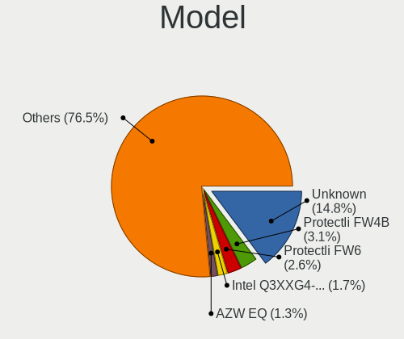
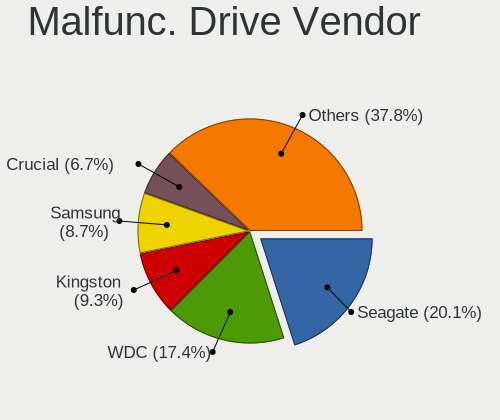
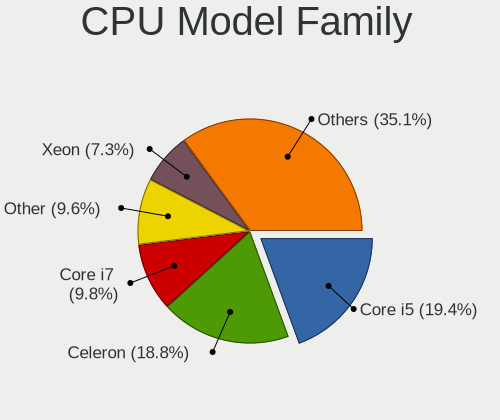
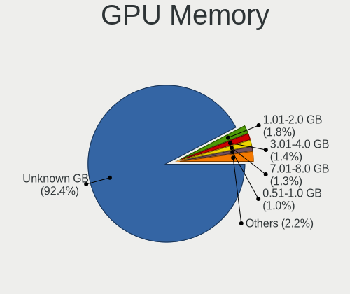
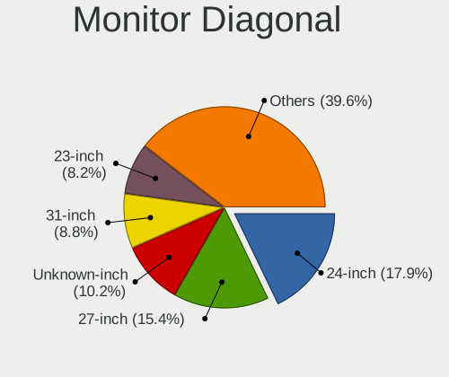
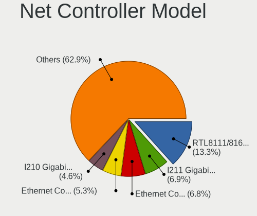
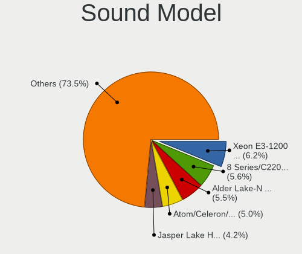
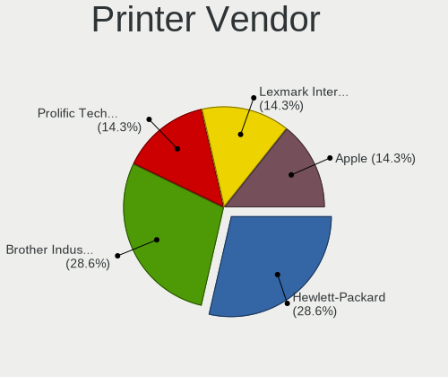
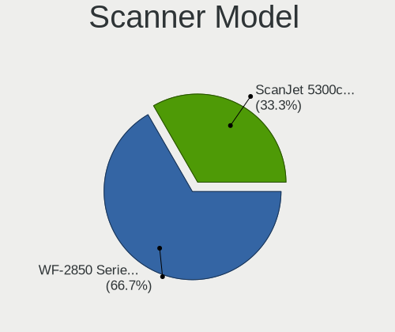
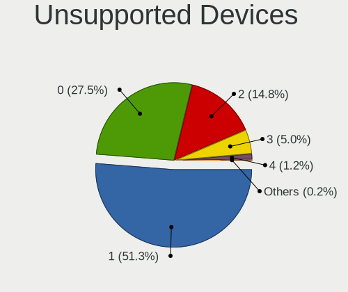

BSD in USA - Tested Hardware & Statistics (Desktops)
----------------------------------------------------

A project to collect tested hardware configurations for BSD in USA.

Anyone can contribute to this report by the [hw-probe](https://github.com/linuxhw/hw-probe/blob/master/INSTALL.BSD.md) tool:

    hw-probe -all -upload

Please contribute! Especially if your hardware is rare.

Contents
--------

* [ Test Cases ](#test-cases)

* [ System ](#system)
  - [ OS                       ](#os)
  - [ OS Family                ](#os-family)
  - [ Arch                     ](#arch)
  - [ DE                       ](#de)
  - [ Display Server           ](#display-server)
  - [ Display Manager          ](#display-manager)
  - [ OS Lang                  ](#os-lang)
  - [ Boot Mode                ](#boot-mode)
  - [ Filesystem               ](#filesystem)
  - [ Part. scheme             ](#part-scheme)

* [ Board ](#board)
  - [ Vendor                   ](#vendor)
  - [ Model                    ](#model)
  - [ Model Family             ](#model-family)
  - [ MFG Year                 ](#mfg-year)
  - [ Form Factor              ](#form-factor)
  - [ Coreboot                 ](#coreboot)
  - [ RAM Size                 ](#ram-size)
  - [ RAM Used                 ](#ram-used)
  - [ Total Drives             ](#total-drives)
  - [ Has CD-ROM               ](#has-cd-rom)
  - [ Has Ethernet             ](#has-ethernet)
  - [ Has WiFi                 ](#has-wifi)
  - [ Has Bluetooth            ](#has-bluetooth)

* [ Location ](#location)
  - [ Country                  ](#country)
  - [ City                     ](#city)

* [ Drives ](#drives)
  - [ Drive Vendor             ](#drive-vendor)
  - [ Drive Model              ](#drive-model)
  - [ HDD Vendor               ](#hdd-vendor)
  - [ SSD Vendor               ](#ssd-vendor)
  - [ Drive Kind               ](#drive-kind)
  - [ Drive Connector          ](#drive-connector)
  - [ Drive Size               ](#drive-size)
  - [ Space Total              ](#space-total)
  - [ Space Used               ](#space-used)
  - [ Malfunc. Drives          ](#malfunc-drives)
  - [ Malfunc. Drive Vendor    ](#malfunc-drive-vendor)
  - [ Malfunc. HDD Vendor      ](#malfunc-hdd-vendor)
  - [ Malfunc. Drive Kind      ](#malfunc-drive-kind)
  - [ Failed Drives            ](#failed-drives)
  - [ Failed Drive Vendor      ](#failed-drive-vendor)
  - [ Drive Status             ](#drive-status)

* [ Storage controller ](#storage-controller)
  - [ Storage Vendor           ](#storage-vendor)
  - [ Storage Model            ](#storage-model)
  - [ Storage Kind             ](#storage-kind)

* [ Processor ](#processor)
  - [ CPU Vendor               ](#cpu-vendor)
  - [ CPU Model                ](#cpu-model)
  - [ CPU Model Family         ](#cpu-model-family)
  - [ CPU Cores                ](#cpu-cores)
  - [ CPU Sockets              ](#cpu-sockets)
  - [ CPU Threads              ](#cpu-threads)
  - [ CPU Microarch            ](#cpu-microarch)

* [ Graphics ](#graphics)
  - [ GPU Vendor               ](#gpu-vendor)
  - [ GPU Model                ](#gpu-model)
  - [ GPU Combo                ](#gpu-combo)
  - [ GPU Driver               ](#gpu-driver)
  - [ GPU Memory               ](#gpu-memory)

* [ Monitor ](#monitor)
  - [ Monitor Vendor           ](#monitor-vendor)
  - [ Monitor Model            ](#monitor-model)
  - [ Monitor Resolution       ](#monitor-resolution)
  - [ Monitor Diagonal         ](#monitor-diagonal)
  - [ Monitor Width            ](#monitor-width)
  - [ Aspect Ratio             ](#aspect-ratio)
  - [ Monitor Area             ](#monitor-area)
  - [ Pixel Density            ](#pixel-density)
  - [ Multiple Monitors        ](#multiple-monitors)

* [ Network ](#network)
  - [ Net Controller Vendor    ](#net-controller-vendor)
  - [ Net Controller Model     ](#net-controller-model)
  - [ Wireless Vendor          ](#wireless-vendor)
  - [ Wireless Model           ](#wireless-model)
  - [ Ethernet Vendor          ](#ethernet-vendor)
  - [ Ethernet Model           ](#ethernet-model)
  - [ Net Controller Kind      ](#net-controller-kind)
  - [ Used Controller          ](#used-controller)
  - [ NICs                     ](#nics)
  - [ IPv6                     ](#ipv6)

* [ Bluetooth ](#bluetooth)
  - [ Bluetooth Vendor         ](#bluetooth-vendor)
  - [ Bluetooth Model          ](#bluetooth-model)

* [ Sound ](#sound)
  - [ Sound Vendor             ](#sound-vendor)
  - [ Sound Model              ](#sound-model)

* [ Memory ](#memory)
  - [ Memory Vendor            ](#memory-vendor)
  - [ Memory Model             ](#memory-model)
  - [ Memory Kind              ](#memory-kind)
  - [ Memory Form Factor       ](#memory-form-factor)
  - [ Memory Size              ](#memory-size)
  - [ Memory Speed             ](#memory-speed)

* [ Printers & scanners ](#printers--scanners)
  - [ Printer Vendor           ](#printer-vendor)
  - [ Printer Model            ](#printer-model)
  - [ Scanner Vendor           ](#scanner-vendor)
  - [ Scanner Model            ](#scanner-model)

* [ Camera ](#camera)
  - [ Camera Vendor            ](#camera-vendor)
  - [ Camera Model             ](#camera-model)

* [ Security ](#security)
  - [ Fingerprint Vendor       ](#fingerprint-vendor)
  - [ Fingerprint Model        ](#fingerprint-model)
  - [ Chipcard Vendor          ](#chipcard-vendor)
  - [ Chipcard Model           ](#chipcard-model)

* [ Unsupported ](#unsupported)
  - [ Unsupported Devices      ](#unsupported-devices)
  - [ Unsupported Device Types ](#unsupported-device-types)

Test Cases
----------

Total: 1797

| Vendor        | Model                       | Probe                                                     | Date         |
|---------------|-----------------------------|-----------------------------------------------------------|--------------|
| Dell          | 0WR7PY A01                  | [4154fda8ab](https://bsd-hardware.info/?probe=4154fda8ab) | May 31, 2022 |
| ASRock        | B450M Pro4                  | [3e62c80025](https://bsd-hardware.info/?probe=3e62c80025) | May 31, 2022 |
| NF-M2S        | ABIT                        | [bef9700756](https://bsd-hardware.info/?probe=bef9700756) | May 31, 2022 |
| Dell          | 05GD68 A00                  | [364b3d55e4](https://bsd-hardware.info/?probe=364b3d55e4) | May 31, 2022 |
| Supermicro    | X9SCL/X9SCM                 | [97f4daf2ad](https://bsd-hardware.info/?probe=97f4daf2ad) | May 30, 2022 |
| ASUSTek       | ROG STRIX B450-F GAMING     | [486ad2acae](https://bsd-hardware.info/?probe=486ad2acae) | May 30, 2022 |
| Protectli     | FW4B                        | [2b833c65c0](https://bsd-hardware.info/?probe=2b833c65c0) | May 29, 2022 |
| Protectli     | VP2410 10                   | [0f275a65af](https://bsd-hardware.info/?probe=0f275a65af) | May 29, 2022 |
| Unknown       | Unknown                     | [90b27f0ac1](https://bsd-hardware.info/?probe=90b27f0ac1) | May 29, 2022 |
| HP            | 1495                        | [e7fcfd6634](https://bsd-hardware.info/?probe=e7fcfd6634) | May 29, 2022 |
| Lenovo        | 32E1 SDK0J40697 WIN 3305... | [479e0f44cd](https://bsd-hardware.info/?probe=479e0f44cd) | May 29, 2022 |
| ASUSTek       | P5Q-E                       | [cf67e4079f](https://bsd-hardware.info/?probe=cf67e4079f) | May 29, 2022 |
| MSI           | H81M-P33                    | [ab2181e1b4](https://bsd-hardware.info/?probe=ab2181e1b4) | May 29, 2022 |
| ASUSTek       | ROG CROSSHAIR VIII HERO     | [8ebd281f5f](https://bsd-hardware.info/?probe=8ebd281f5f) | May 29, 2022 |
| Protectli     | FW6                         | [902d82819e](https://bsd-hardware.info/?probe=902d82819e) | May 29, 2022 |
| Dell          | 018D1Y A00                  | [cb624b7a18](https://bsd-hardware.info/?probe=cb624b7a18) | May 29, 2022 |
| Intel         | S1200KP AAG34877-201        | [f6bbaffaeb](https://bsd-hardware.info/?probe=f6bbaffaeb) | May 29, 2022 |
| ASUSTek       | PRIME Z590-P                | [3ef083287f](https://bsd-hardware.info/?probe=3ef083287f) | May 28, 2022 |
| ASUSTek       | PRIME Z590-P                | [53cb90d2b7](https://bsd-hardware.info/?probe=53cb90d2b7) | May 28, 2022 |
| ASUSTek       | P5QL-VM DO                  | [33145067d8](https://bsd-hardware.info/?probe=33145067d8) | May 28, 2022 |
| Intel         | S1200KP AAG34877-201        | [5e08455bea](https://bsd-hardware.info/?probe=5e08455bea) | May 28, 2022 |
| Lenovo        | MAHOBAY NOK                 | [d134ba2206](https://bsd-hardware.info/?probe=d134ba2206) | May 28, 2022 |
| Dell          | 0WR7PY A03                  | [0ba89b7a25](https://bsd-hardware.info/?probe=0ba89b7a25) | May 28, 2022 |
| Dell          | 06D7TR A00                  | [9c70320d7f](https://bsd-hardware.info/?probe=9c70320d7f) | May 27, 2022 |
| Unknown       | Unknown                     | [4e15ce78c8](https://bsd-hardware.info/?probe=4e15ce78c8) | May 26, 2022 |
| Dell          | 0VHWTR A02                  | [51c560673e](https://bsd-hardware.info/?probe=51c560673e) | May 26, 2022 |
| Lenovo        | 32E1 SDK0J40697 WIN 3305... | [6906c16701](https://bsd-hardware.info/?probe=6906c16701) | May 26, 2022 |
| HP            | 158A                        | [883958cd36](https://bsd-hardware.info/?probe=883958cd36) | May 25, 2022 |
| Unknown       | Unknown                     | [78d1ad4565](https://bsd-hardware.info/?probe=78d1ad4565) | May 25, 2022 |
| Unknown       | Unknown                     | [b1f95e9759](https://bsd-hardware.info/?probe=b1f95e9759) | May 25, 2022 |
| Dell          | 06D7TR A00                  | [bcf5c6db64](https://bsd-hardware.info/?probe=bcf5c6db64) | May 25, 2022 |
| BCM Advanc... | MX57QM B1                   | [54bafab9d8](https://bsd-hardware.info/?probe=54bafab9d8) | May 25, 2022 |
| Protectli     | FW6 Ver                     | [82b16236c3](https://bsd-hardware.info/?probe=82b16236c3) | May 25, 2022 |
| Intel         | Q3XXG4-P V1.0               | [4b97b0c947](https://bsd-hardware.info/?probe=4b97b0c947) | May 25, 2022 |
| Supermicro    | X10SDV-8C-TLN4F             | [4d5f6d3aa1](https://bsd-hardware.info/?probe=4d5f6d3aa1) | May 24, 2022 |
| Seeed Stud... | ODYSSEY-X86J41X5 SD-BS-C... | [db99798754](https://bsd-hardware.info/?probe=db99798754) | May 24, 2022 |
| Protectli     | FW4B Ver                    | [c7ff34d878](https://bsd-hardware.info/?probe=c7ff34d878) | May 24, 2022 |
| Unknown       | Unknown                     | [3307493f4f](https://bsd-hardware.info/?probe=3307493f4f) | May 23, 2022 |
| ASUSTek       | ROG STRIX B550-F GAMING     | [a74913bffa](https://bsd-hardware.info/?probe=a74913bffa) | May 23, 2022 |
| MSI           | H81M-P33                    | [d5a0fd71f2](https://bsd-hardware.info/?probe=d5a0fd71f2) | May 22, 2022 |
| ASUSTek       | P5Q-E                       | [2b93a0b59f](https://bsd-hardware.info/?probe=2b93a0b59f) | May 22, 2022 |
| ASUSTek       | ROG CROSSHAIR VIII HERO     | [becc2fddbd](https://bsd-hardware.info/?probe=becc2fddbd) | May 22, 2022 |
| Dell          | 06D7TR A00                  | [c87e967424](https://bsd-hardware.info/?probe=c87e967424) | May 22, 2022 |
| Unknown       | Unknown                     | [796fe84e29](https://bsd-hardware.info/?probe=796fe84e29) | May 21, 2022 |
| Protectli     | FW4B Ver                    | [e1121aa6ec](https://bsd-hardware.info/?probe=e1121aa6ec) | May 21, 2022 |
| Dell          | 0WR7PY A01                  | [357e1739ca](https://bsd-hardware.info/?probe=357e1739ca) | May 21, 2022 |
| HP            | 843F                        | [5321d06a75](https://bsd-hardware.info/?probe=5321d06a75) | May 20, 2022 |
| HP            | 8767 A                      | [ac8a395a20](https://bsd-hardware.info/?probe=ac8a395a20) | May 20, 2022 |
| Protectli     | VP2410 10                   | [ce636a7fbe](https://bsd-hardware.info/?probe=ce636a7fbe) | May 20, 2022 |
| ASUSTek       | TUF B350M-PLUS GAMING       | [819bed6cfb](https://bsd-hardware.info/?probe=819bed6cfb) | May 19, 2022 |
| Dell          | 042P49 A01                  | [195d06f6c7](https://bsd-hardware.info/?probe=195d06f6c7) | May 19, 2022 |
| Dell          | 042P49 A01                  | [901a883013](https://bsd-hardware.info/?probe=901a883013) | May 19, 2022 |
| Gigabyte      | X470 AORUS GAMING 7 WIFI... | [9c459aae41](https://bsd-hardware.info/?probe=9c459aae41) | May 19, 2022 |
| MSI           | K9N6PGM2-V2                 | [d5a6eba10b](https://bsd-hardware.info/?probe=d5a6eba10b) | May 19, 2022 |
| ASUSTek       | TUF Gaming B550M-PLUS       | [37ed1733b4](https://bsd-hardware.info/?probe=37ed1733b4) | May 16, 2022 |
| HP            | 3397                        | [11269254e4](https://bsd-hardware.info/?probe=11269254e4) | May 16, 2022 |
| Unknown       | Unknown                     | [0c224d66be](https://bsd-hardware.info/?probe=0c224d66be) | May 15, 2022 |
| MSI           | H81M-P33                    | [7ac64b1e55](https://bsd-hardware.info/?probe=7ac64b1e55) | May 15, 2022 |
| ASUSTek       | P5Q-E                       | [b8960b35d4](https://bsd-hardware.info/?probe=b8960b35d4) | May 15, 2022 |
| ASUSTek       | ROG CROSSHAIR VIII HERO     | [e07337b1a1](https://bsd-hardware.info/?probe=e07337b1a1) | May 15, 2022 |
| Protectli     | FW4A Ver                    | [2188b1004e](https://bsd-hardware.info/?probe=2188b1004e) | May 15, 2022 |
| Lenovo        | 32E1 SDK0J40697 WIN 3305... | [db440da034](https://bsd-hardware.info/?probe=db440da034) | May 15, 2022 |
| MSI           | MAG B550 TOMAHAWK           | [35ae334ef4](https://bsd-hardware.info/?probe=35ae334ef4) | May 14, 2022 |
| ShenZhen M... | MW-GMLK-2.5G6L              | [3d0599f15d](https://bsd-hardware.info/?probe=3d0599f15d) | May 14, 2022 |
| Lenovo        | 32E1 SDK0J40697 WIN 3305... | [eba3ba986d](https://bsd-hardware.info/?probe=eba3ba986d) | May 14, 2022 |
| Lenovo        | 32E1 SDK0J40697 WIN 3305... | [6fc43c37e6](https://bsd-hardware.info/?probe=6fc43c37e6) | May 13, 2022 |
| ASUSTek       | PRIME X370-PRO              | [6a9177eef7](https://bsd-hardware.info/?probe=6a9177eef7) | May 13, 2022 |
| ASRock        | X570 Phantom Gaming 4       | [11034dd80f](https://bsd-hardware.info/?probe=11034dd80f) | May 13, 2022 |
| Protectli     | FW2B Ver                    | [99ac04d77b](https://bsd-hardware.info/?probe=99ac04d77b) | May 12, 2022 |
| Protectli     | FW4B Ver                    | [045efeba21](https://bsd-hardware.info/?probe=045efeba21) | May 12, 2022 |
| MSI           | MAG B550 TOMAHAWK           | [abdd886f42](https://bsd-hardware.info/?probe=abdd886f42) | May 12, 2022 |
| Dell          | 0WMJ54 A00                  | [e0cc5006c2](https://bsd-hardware.info/?probe=e0cc5006c2) | May 11, 2022 |
| Dell          | 07T4MC A02                  | [38bdad88cc](https://bsd-hardware.info/?probe=38bdad88cc) | May 11, 2022 |
| ASUSTek       | P8H61-M LX PLUS R2.0        | [62c634b13e](https://bsd-hardware.info/?probe=62c634b13e) | May 11, 2022 |
| JGINYUE       | B85I PLUS V1.0              | [55e9734c09](https://bsd-hardware.info/?probe=55e9734c09) | May 10, 2022 |
| Protectli     | FW6D                        | [a1390bbbea](https://bsd-hardware.info/?probe=a1390bbbea) | May 10, 2022 |
| ASUSTek       | PRIME A320M-K               | [ffb2587425](https://bsd-hardware.info/?probe=ffb2587425) | May 10, 2022 |
| ASUSTek       | PRIME A320M-K               | [fe1055a1c3](https://bsd-hardware.info/?probe=fe1055a1c3) | May 09, 2022 |
| HP            | 802E                        | [8de7dc0ac0](https://bsd-hardware.info/?probe=8de7dc0ac0) | May 08, 2022 |
| MSI           | H81M-P33                    | [bafda9a2aa](https://bsd-hardware.info/?probe=bafda9a2aa) | May 08, 2022 |
| ASUSTek       | ROG CROSSHAIR VIII HERO     | [76e16e7fdc](https://bsd-hardware.info/?probe=76e16e7fdc) | May 08, 2022 |
| ASUSTek       | P5Q-E                       | [58cad4a2a5](https://bsd-hardware.info/?probe=58cad4a2a5) | May 08, 2022 |
| ASUSTek       | P5K-E                       | [fe9b1ec1cf](https://bsd-hardware.info/?probe=fe9b1ec1cf) | May 07, 2022 |
| Protectli     | FW4B Ver                    | [c6b6718765](https://bsd-hardware.info/?probe=c6b6718765) | May 07, 2022 |
| Dell          | 0D6H9T A03                  | [74b30f3577](https://bsd-hardware.info/?probe=74b30f3577) | May 07, 2022 |
| AZW           | GK55                        | [4d1aea90c4](https://bsd-hardware.info/?probe=4d1aea90c4) | May 07, 2022 |
| HP            | 8054                        | [6c53f040f5](https://bsd-hardware.info/?probe=6c53f040f5) | May 06, 2022 |
| Dell          | 0Y7WYT A00                  | [76674e4d62](https://bsd-hardware.info/?probe=76674e4d62) | May 06, 2022 |
| Protectli     | FW2B Ver                    | [6c7485ba6b](https://bsd-hardware.info/?probe=6c7485ba6b) | May 06, 2022 |
| Unknown       | J3160-4L                    | [13815ff079](https://bsd-hardware.info/?probe=13815ff079) | May 06, 2022 |
| Supermicro    | X7SPA-HF                    | [990036445e](https://bsd-hardware.info/?probe=990036445e) | May 05, 2022 |
| Protectli     | VP2410                      | [d80da79148](https://bsd-hardware.info/?probe=d80da79148) | May 05, 2022 |
| Protectli     | FW2B Ver                    | [b2eb9a10fa](https://bsd-hardware.info/?probe=b2eb9a10fa) | May 04, 2022 |
| Protectli     | FW4B Ver                    | [d4606bfb1a](https://bsd-hardware.info/?probe=d4606bfb1a) | May 04, 2022 |
| Protectli     | FW2B Ver                    | [632c881ec8](https://bsd-hardware.info/?probe=632c881ec8) | May 04, 2022 |
| Fujitsu       | D3224-A1 S26361-D3224-A1    | [54ead4b762](https://bsd-hardware.info/?probe=54ead4b762) | May 03, 2022 |
| Acer          | Aspire XC-1660G V:1.1       | [441a5f4a89](https://bsd-hardware.info/?probe=441a5f4a89) | May 03, 2022 |
| Intel         | Q3XXG4-P                    | [ed04988a23](https://bsd-hardware.info/?probe=ed04988a23) | May 03, 2022 |
| Supermicro    | X9SCL/X9SCMA                | [478294cdd3](https://bsd-hardware.info/?probe=478294cdd3) | May 02, 2022 |
| Supermicro    | X11SDV-4C-TP8F              | [6ccb91cdfe](https://bsd-hardware.info/?probe=6ccb91cdfe) | May 01, 2022 |
| Supermicro    | X11SDV-4C-TP8F              | [46c2b63c32](https://bsd-hardware.info/?probe=46c2b63c32) | May 01, 2022 |
| ASUSTek       | P5Q-E                       | [a28d0e9c9d](https://bsd-hardware.info/?probe=a28d0e9c9d) | May 01, 2022 |
| ASUSTek       | ROG CROSSHAIR VIII HERO     | [7b1cd9e231](https://bsd-hardware.info/?probe=7b1cd9e231) | May 01, 2022 |
| MSI           | H81M-P33                    | [30d7aec5a0](https://bsd-hardware.info/?probe=30d7aec5a0) | May 01, 2022 |
| Unknown       | J3160-4L                    | [7ceaeb49f9](https://bsd-hardware.info/?probe=7ceaeb49f9) | May 01, 2022 |
| Lenovo        | 32E1 SDK0J40697 WIN 3305... | [a8c820c8c2](https://bsd-hardware.info/?probe=a8c820c8c2) | May 01, 2022 |
| Lenovo        | 32E1 SDK0J40697 WIN 3305... | [e4970bf75f](https://bsd-hardware.info/?probe=e4970bf75f) | Apr 30, 2022 |
| MSI           | 2AE0                        | [9ff97b3d86](https://bsd-hardware.info/?probe=9ff97b3d86) | Apr 30, 2022 |
| IceWhale T... | ZimaBoard 832 ZMB           | [e16c0616d6](https://bsd-hardware.info/?probe=e16c0616d6) | Apr 30, 2022 |
| HP            | 1588h                       | [51ce2c6d49](https://bsd-hardware.info/?probe=51ce2c6d49) | Apr 28, 2022 |
| Protectli     | FW6 Ver                     | [2bd964cc84](https://bsd-hardware.info/?probe=2bd964cc84) | Apr 28, 2022 |
| Unknown       | X79-P3                      | [337d593ce0](https://bsd-hardware.info/?probe=337d593ce0) | Apr 28, 2022 |
| Lenovo        | 32E1 SDK0J40697 WIN 3305... | [a4fa09b7c1](https://bsd-hardware.info/?probe=a4fa09b7c1) | Apr 28, 2022 |
| Seeed Stud... | ODYSSEY-X86J41X5 SD-BS-C... | [c1df1360a2](https://bsd-hardware.info/?probe=c1df1360a2) | Apr 28, 2022 |
| MSI           | MS-7C37                     | [aaab7cf22a](https://bsd-hardware.info/?probe=aaab7cf22a) | Apr 28, 2022 |
| Supermicro    | X9SCL/X9SCMA                | [0d32ec9fe4](https://bsd-hardware.info/?probe=0d32ec9fe4) | Apr 27, 2022 |
| Supermicro    | X8SIL                       | [ea89820a66](https://bsd-hardware.info/?probe=ea89820a66) | Apr 27, 2022 |
| Protectli     | VP2410                      | [481fce8e01](https://bsd-hardware.info/?probe=481fce8e01) | Apr 26, 2022 |
| Protectli     | FW6 Ver                     | [8d2ca89ae5](https://bsd-hardware.info/?probe=8d2ca89ae5) | Apr 26, 2022 |
| Lenovo        | 32E1 SDK0J40697 WIN 3305... | [b6b5897fb7](https://bsd-hardware.info/?probe=b6b5897fb7) | Apr 25, 2022 |
| ASUSTek       | P5Q-E                       | [27a4680bec](https://bsd-hardware.info/?probe=27a4680bec) | Apr 24, 2022 |
| MSI           | H81M-P33                    | [d14d6194ed](https://bsd-hardware.info/?probe=d14d6194ed) | Apr 24, 2022 |
| ASUSTek       | ROG CROSSHAIR VIII HERO     | [76580a0375](https://bsd-hardware.info/?probe=76580a0375) | Apr 24, 2022 |
| Lenovo        | 32E1 SDK0J40697 WIN 3305... | [10ca96dd0a](https://bsd-hardware.info/?probe=10ca96dd0a) | Apr 24, 2022 |
| PC Engines    | apu4                        | [2de45511cd](https://bsd-hardware.info/?probe=2de45511cd) | Apr 24, 2022 |
| Lenovo        | 30C7 SDK0J40700 WIN 3258... | [66f185a3e5](https://bsd-hardware.info/?probe=66f185a3e5) | Apr 23, 2022 |
| Supermicro    | X9SCL/X9SCM                 | [947038b1f9](https://bsd-hardware.info/?probe=947038b1f9) | Apr 22, 2022 |
| Lenovo        | 32E1 SDK0J40697 WIN 3305... | [362ff46a0a](https://bsd-hardware.info/?probe=362ff46a0a) | Apr 22, 2022 |
| ASRock        | X570 Phantom Gaming 4       | [2fd6d176ce](https://bsd-hardware.info/?probe=2fd6d176ce) | Apr 21, 2022 |
| Lenovo        | 32E1 SDK0J40697 WIN 3305... | [9853d461a3](https://bsd-hardware.info/?probe=9853d461a3) | Apr 20, 2022 |
| Protectli     | FW4B Ver                    | [da5f95b60d](https://bsd-hardware.info/?probe=da5f95b60d) | Apr 20, 2022 |
| Protectli     | FW4B Ver                    | [c0c3696eab](https://bsd-hardware.info/?probe=c0c3696eab) | Apr 19, 2022 |
| ASUSTek       | ROG STRIX B550-F GAMING     | [6fc3367b15](https://bsd-hardware.info/?probe=6fc3367b15) | Apr 19, 2022 |
| Unknown       | YL-SKUL6                    | [8e2a35a0c8](https://bsd-hardware.info/?probe=8e2a35a0c8) | Apr 19, 2022 |
| ASUSTek       | ROG STRIX B550-F GAMING     | [b16f95dfea](https://bsd-hardware.info/?probe=b16f95dfea) | Apr 18, 2022 |
| MSI           | MAG B550 TOMAHAWK           | [bd82ff2e7e](https://bsd-hardware.info/?probe=bd82ff2e7e) | Apr 18, 2022 |
| Dell          | 0PC5F7 A02                  | [58b39b90ba](https://bsd-hardware.info/?probe=58b39b90ba) | Apr 17, 2022 |
| MSI           | H81M-P33                    | [4bc268cc37](https://bsd-hardware.info/?probe=4bc268cc37) | Apr 17, 2022 |
| ASUSTek       | P5Q-E                       | [1c967bd89f](https://bsd-hardware.info/?probe=1c967bd89f) | Apr 17, 2022 |
| ASUSTek       | ROG CROSSHAIR VIII HERO     | [c8badc9bc6](https://bsd-hardware.info/?probe=c8badc9bc6) | Apr 17, 2022 |
| Protectli     | FW6                         | [6f77a10d74](https://bsd-hardware.info/?probe=6f77a10d74) | Apr 16, 2022 |
| Protectli     | FW6 Ver                     | [a9702df869](https://bsd-hardware.info/?probe=a9702df869) | Apr 16, 2022 |
| Dell          | 0Y7WYT A00                  | [399a4fb92e](https://bsd-hardware.info/?probe=399a4fb92e) | Apr 15, 2022 |
| Protectli     | FW1 Ver                     | [09f1805532](https://bsd-hardware.info/?probe=09f1805532) | Apr 15, 2022 |
| Dell          | 0J3C2F A00                  | [8188392376](https://bsd-hardware.info/?probe=8188392376) | Apr 14, 2022 |
| Intel         | CRESCENTBAY                 | [7810c76897](https://bsd-hardware.info/?probe=7810c76897) | Apr 14, 2022 |
| Acer          | Veriton X275                | [06390b6cb1](https://bsd-hardware.info/?probe=06390b6cb1) | Apr 13, 2022 |
| Dell          | 04JGCK A01                  | [c3d7d0828b](https://bsd-hardware.info/?probe=c3d7d0828b) | Apr 13, 2022 |
| ASUSTek       | PRIME X370-PRO              | [f6bc20d345](https://bsd-hardware.info/?probe=f6bc20d345) | Apr 13, 2022 |
| ASRock        | X570 Phantom Gaming 4       | [bb9129d4df](https://bsd-hardware.info/?probe=bb9129d4df) | Apr 13, 2022 |
| MW            | GMLK-2_5G4L                 | [fd04d22de9](https://bsd-hardware.info/?probe=fd04d22de9) | Apr 13, 2022 |
| Alienware     | 0KM92T A00                  | [e96f2905eb](https://bsd-hardware.info/?probe=e96f2905eb) | Apr 13, 2022 |
| ASUSTek       | Maximus VIII HERO           | [c776760a11](https://bsd-hardware.info/?probe=c776760a11) | Apr 13, 2022 |
| Dell          | 0J3C2F A00                  | [b875a50291](https://bsd-hardware.info/?probe=b875a50291) | Apr 12, 2022 |
| Dell          | 0Y56T3 A00                  | [d9d86d5bfd](https://bsd-hardware.info/?probe=d9d86d5bfd) | Apr 12, 2022 |
| Intel         | DH67CL AAG10212-205         | [ecbb820987](https://bsd-hardware.info/?probe=ecbb820987) | Apr 12, 2022 |
| Gigabyte      | Z87X-UD5H-CF                | [4a23ea31be](https://bsd-hardware.info/?probe=4a23ea31be) | Apr 11, 2022 |
| Datto         | SSD                         | [f69d873f87](https://bsd-hardware.info/?probe=f69d873f87) | Apr 11, 2022 |
| Seeed Stud... | ODYSSEY-X86J4105 SD-BS-C... | [39ad080dfb](https://bsd-hardware.info/?probe=39ad080dfb) | Apr 11, 2022 |
| Dell          | 04YP6J A02                  | [f638ef3cbe](https://bsd-hardware.info/?probe=f638ef3cbe) | Apr 11, 2022 |
| Datto         | SSD                         | [6cd7c93838](https://bsd-hardware.info/?probe=6cd7c93838) | Apr 10, 2022 |
| Dell          | 0PC5F7 A02                  | [6c09c89949](https://bsd-hardware.info/?probe=6c09c89949) | Apr 10, 2022 |
| ASUSTek       | P5Q-E                       | [0cbb5faa2e](https://bsd-hardware.info/?probe=0cbb5faa2e) | Apr 10, 2022 |
| MSI           | H81M-P33                    | [52abbcbc5b](https://bsd-hardware.info/?probe=52abbcbc5b) | Apr 10, 2022 |
| ASUSTek       | ROG CROSSHAIR VIII HERO     | [5d759d6436](https://bsd-hardware.info/?probe=5d759d6436) | Apr 10, 2022 |
| Protectli     | FW4B Ver                    | [7b790f0366](https://bsd-hardware.info/?probe=7b790f0366) | Apr 10, 2022 |
| Intel         | DH67CL AAG10212-205         | [de2cd29be6](https://bsd-hardware.info/?probe=de2cd29be6) | Apr 10, 2022 |
| Intel         | DH67BL AAG10189-211         | [2a03c05cce](https://bsd-hardware.info/?probe=2a03c05cce) | Apr 10, 2022 |
| Protectli     | FW6E                        | [0a529f5f09](https://bsd-hardware.info/?probe=0a529f5f09) | Apr 10, 2022 |
| PC Engines    | APU2                        | [074d4aa53c](https://bsd-hardware.info/?probe=074d4aa53c) | Apr 10, 2022 |
| Intel         | DH61CR AAG14064-204         | [fa4b6b0257](https://bsd-hardware.info/?probe=fa4b6b0257) | Apr 09, 2022 |
| Intel         | DH61CR AAG14064-205         | [4436915ba0](https://bsd-hardware.info/?probe=4436915ba0) | Apr 09, 2022 |
| BESSTAR Te... | UM250 V1.0                  | [844323ad2d](https://bsd-hardware.info/?probe=844323ad2d) | Apr 09, 2022 |
| Intel         | DH61CR AAG14064-210         | [a01376dfc5](https://bsd-hardware.info/?probe=a01376dfc5) | Apr 09, 2022 |
| Intel         | DH61CR AAG14064-205         | [85a5d08117](https://bsd-hardware.info/?probe=85a5d08117) | Apr 09, 2022 |
| Dell          | 0T7D40 A01                  | [ef224ffce0](https://bsd-hardware.info/?probe=ef224ffce0) | Apr 09, 2022 |
| Intel         | DH67BL AAG10189-211         | [689ff6c484](https://bsd-hardware.info/?probe=689ff6c484) | Apr 09, 2022 |
| Protectli     | VP2410 10                   | [e128e81c96](https://bsd-hardware.info/?probe=e128e81c96) | Apr 09, 2022 |
| ASRock        | X570 Steel Legend WiFi a... | [703e042cfe](https://bsd-hardware.info/?probe=703e042cfe) | Apr 09, 2022 |
| Dell          | 0D6H9T A00                  | [e58bc4937d](https://bsd-hardware.info/?probe=e58bc4937d) | Apr 09, 2022 |
| Intel         | DH55TC AAE70932-302         | [b9a45002ae](https://bsd-hardware.info/?probe=b9a45002ae) | Apr 09, 2022 |
| Intel         | DH67CL AAG10212-205         | [68f10ed8de](https://bsd-hardware.info/?probe=68f10ed8de) | Apr 09, 2022 |
| Intel         | DH67CL AAG10212-205         | [092643d1c3](https://bsd-hardware.info/?probe=092643d1c3) | Apr 09, 2022 |
| Intel         | DH61CR AAG14064-205         | [02b581994b](https://bsd-hardware.info/?probe=02b581994b) | Apr 08, 2022 |
| Lenovo        | MAHOBAY NO DPK              | [840805d1fa](https://bsd-hardware.info/?probe=840805d1fa) | Apr 08, 2022 |
| Protectli     | FW2 Ver                     | [9f73c4b7e5](https://bsd-hardware.info/?probe=9f73c4b7e5) | Apr 08, 2022 |
| Unknown       | J3160-4L                    | [e97a752648](https://bsd-hardware.info/?probe=e97a752648) | Apr 08, 2022 |
| ASUSTek       | TUF Gaming B450M-PLUS II    | [50d12f98fc](https://bsd-hardware.info/?probe=50d12f98fc) | Apr 08, 2022 |
| ASRock        | B550M Steel Legend          | [ad0ab01ca8](https://bsd-hardware.info/?probe=ad0ab01ca8) | Apr 08, 2022 |
| Protectli     | FW6 Ver                     | [b3acaf2f6d](https://bsd-hardware.info/?probe=b3acaf2f6d) | Apr 07, 2022 |
| Protectli     | VP2410 10                   | [d24fcb00e2](https://bsd-hardware.info/?probe=d24fcb00e2) | Apr 07, 2022 |
| Unknown       | Unknown                     | [7d4820d983](https://bsd-hardware.info/?probe=7d4820d983) | Apr 07, 2022 |
| Protectli     | VP2410 10                   | [a083074e9a](https://bsd-hardware.info/?probe=a083074e9a) | Apr 07, 2022 |
| Acer          | Veriton X275                | [412c31c1a9](https://bsd-hardware.info/?probe=412c31c1a9) | Apr 07, 2022 |
| Protectli     | FW1 Ver                     | [183df9ebd2](https://bsd-hardware.info/?probe=183df9ebd2) | Apr 07, 2022 |
| MSI           | A78M-E45                    | [6db716258a](https://bsd-hardware.info/?probe=6db716258a) | Apr 07, 2022 |
| Supermicro    | X10SLL-F                    | [6e07653d46](https://bsd-hardware.info/?probe=6e07653d46) | Apr 07, 2022 |
| ASUSTek       | TUF Gaming X570-PLUS        | [2d04e83ea4](https://bsd-hardware.info/?probe=2d04e83ea4) | Apr 06, 2022 |
| ASRock        | AM1H-ITX                    | [5556bf474c](https://bsd-hardware.info/?probe=5556bf474c) | Apr 06, 2022 |
| Protectli     | FW1 Ver                     | [a3af5d0e88](https://bsd-hardware.info/?probe=a3af5d0e88) | Apr 06, 2022 |
| Unknown       | Unknown                     | [7644cc6811](https://bsd-hardware.info/?probe=7644cc6811) | Apr 06, 2022 |
| Dell          | 0PC5F7 A02                  | [e77c0c0cf7](https://bsd-hardware.info/?probe=e77c0c0cf7) | Apr 06, 2022 |
| Supermicro    | X9SAE                       | [a800ac2857](https://bsd-hardware.info/?probe=a800ac2857) | Apr 06, 2022 |
| HP            | 1998                        | [bf9a8c9cb2](https://bsd-hardware.info/?probe=bf9a8c9cb2) | Apr 06, 2022 |
| MSI           | 990FXA-GD80                 | [1581e2f112](https://bsd-hardware.info/?probe=1581e2f112) | Apr 06, 2022 |
| MSI           | 990FXA-GD80                 | [9c0d3e7793](https://bsd-hardware.info/?probe=9c0d3e7793) | Apr 06, 2022 |
| Supermicro    | X10SLL-F                    | [7b901b1d99](https://bsd-hardware.info/?probe=7b901b1d99) | Apr 05, 2022 |
| Protectli     | FW6                         | [9ab59de1ca](https://bsd-hardware.info/?probe=9ab59de1ca) | Apr 05, 2022 |
| HP            | 213D A01                    | [0c24a77be7](https://bsd-hardware.info/?probe=0c24a77be7) | Apr 05, 2022 |
| Protectli     | FW4B                        | [f51cc63f72](https://bsd-hardware.info/?probe=f51cc63f72) | Apr 05, 2022 |
| Dell          | 05GD68 A00                  | [d7efc57aa2](https://bsd-hardware.info/?probe=d7efc57aa2) | Apr 04, 2022 |
| ASUSTek       | M5A97 R2.0                  | [06bad6f773](https://bsd-hardware.info/?probe=06bad6f773) | Apr 04, 2022 |
| Protectli     | FW4B Ver                    | [746d840530](https://bsd-hardware.info/?probe=746d840530) | Apr 03, 2022 |
| HP            | 1495                        | [5e4e29bf54](https://bsd-hardware.info/?probe=5e4e29bf54) | Apr 03, 2022 |
| ASUSTek       | ROG CROSSHAIR VIII HERO     | [1043649da9](https://bsd-hardware.info/?probe=1043649da9) | Apr 03, 2022 |
| MSI           | H81M-P33                    | [b0d11aabb7](https://bsd-hardware.info/?probe=b0d11aabb7) | Apr 03, 2022 |
| ASUSTek       | P5Q-E                       | [dbaaa0dcda](https://bsd-hardware.info/?probe=dbaaa0dcda) | Apr 03, 2022 |
| HP            | 8054                        | [ea77aa3506](https://bsd-hardware.info/?probe=ea77aa3506) | Apr 03, 2022 |
| Gigabyte      | X570S I AORUS PRO AX        | [82e48f7eb4](https://bsd-hardware.info/?probe=82e48f7eb4) | Apr 03, 2022 |
| Dell          | 0PC5F7 A02                  | [93d77b3755](https://bsd-hardware.info/?probe=93d77b3755) | Apr 03, 2022 |
| eMachines     | EL1360G                     | [0443d39e17](https://bsd-hardware.info/?probe=0443d39e17) | Apr 02, 2022 |
| PC Engines    | apu4                        | [00e4f2931b](https://bsd-hardware.info/?probe=00e4f2931b) | Apr 02, 2022 |
| Dell          | 04YP6J A02                  | [8be7c68dfb](https://bsd-hardware.info/?probe=8be7c68dfb) | Apr 01, 2022 |
| Dell          | 0D6H9T A00                  | [7daab72741](https://bsd-hardware.info/?probe=7daab72741) | Apr 01, 2022 |
| Gigabyte      | GA-78LMT-S2P                | [01dcca775c](https://bsd-hardware.info/?probe=01dcca775c) | Apr 01, 2022 |
| Dell          | 05GD68 A00                  | [94d3e8af32](https://bsd-hardware.info/?probe=94d3e8af32) | Apr 01, 2022 |
| Dell          | 0GXM1W A00                  | [5bdcde54b1](https://bsd-hardware.info/?probe=5bdcde54b1) | Apr 01, 2022 |
| Dell          | 0G261D A00                  | [b64ddb6733](https://bsd-hardware.info/?probe=b64ddb6733) | Mar 31, 2022 |
| HP            | 158A                        | [5d463584db](https://bsd-hardware.info/?probe=5d463584db) | Mar 31, 2022 |
| ASUSTek       | PRIME A320I-K               | [bd9d4bb7a3](https://bsd-hardware.info/?probe=bd9d4bb7a3) | Mar 31, 2022 |
| Protectli     | FW6 Ver                     | [bffcfb13e3](https://bsd-hardware.info/?probe=bffcfb13e3) | Mar 31, 2022 |
| Supermicro    | X9SAEA                      | [bdb1c8e931](https://bsd-hardware.info/?probe=bdb1c8e931) | Mar 31, 2022 |
| Gigabyte      | GA-78LMT-S2P                | [653bba75e9](https://bsd-hardware.info/?probe=653bba75e9) | Mar 30, 2022 |
| Gigabyte      | GA-78LMT-S2P                | [cb50918ca3](https://bsd-hardware.info/?probe=cb50918ca3) | Mar 30, 2022 |
| MSI           | Z97 PC Mate                 | [6a276beb82](https://bsd-hardware.info/?probe=6a276beb82) | Mar 30, 2022 |
| Dell          | 0G261D A00                  | [97f0250f90](https://bsd-hardware.info/?probe=97f0250f90) | Mar 30, 2022 |
| Dell          | 0G261D A00                  | [91df634364](https://bsd-hardware.info/?probe=91df634364) | Mar 29, 2022 |
| Gigabyte      | H110N-CF                    | [89593af061](https://bsd-hardware.info/?probe=89593af061) | Mar 29, 2022 |
| Protectli     | FW4B                        | [e140c22680](https://bsd-hardware.info/?probe=e140c22680) | Mar 29, 2022 |
| Foxconn       | 2ADA                        | [8f507fcb9a](https://bsd-hardware.info/?probe=8f507fcb9a) | Mar 27, 2022 |
| Dell          | 0NC2VH A02                  | [2593acccf3](https://bsd-hardware.info/?probe=2593acccf3) | Mar 27, 2022 |
| MSI           | H61M-P25                    | [123cb1174a](https://bsd-hardware.info/?probe=123cb1174a) | Mar 27, 2022 |
| PC Engines    | APU                         | [941b9801bc](https://bsd-hardware.info/?probe=941b9801bc) | Mar 27, 2022 |
| MSI           | H81M-P33                    | [823d2d7336](https://bsd-hardware.info/?probe=823d2d7336) | Mar 27, 2022 |
| ASUSTek       | P5Q-E                       | [4e44bfd765](https://bsd-hardware.info/?probe=4e44bfd765) | Mar 27, 2022 |
| ASUSTek       | ROG CROSSHAIR VIII HERO     | [51507583f6](https://bsd-hardware.info/?probe=51507583f6) | Mar 27, 2022 |
| Dell          | 0M5DCD A00                  | [4c03d19a48](https://bsd-hardware.info/?probe=4c03d19a48) | Mar 27, 2022 |
| Dell          | 03KWTV A02                  | [7a341728eb](https://bsd-hardware.info/?probe=7a341728eb) | Mar 27, 2022 |
| Protectli     | FW4A Ver                    | [32d9eff6fb](https://bsd-hardware.info/?probe=32d9eff6fb) | Mar 27, 2022 |
| Dell          | 05GD68 A00                  | [28f9e0596c](https://bsd-hardware.info/?probe=28f9e0596c) | Mar 27, 2022 |
| Unknown       | Unknown                     | [bd9b55ea13](https://bsd-hardware.info/?probe=bd9b55ea13) | Mar 26, 2022 |
| Lenovo        | MAHOBAY Win8 Pro DPK MM ... | [3c86d96e65](https://bsd-hardware.info/?probe=3c86d96e65) | Mar 26, 2022 |
| Biostar       | NM70I-1037U                 | [d2c51a35cf](https://bsd-hardware.info/?probe=d2c51a35cf) | Mar 25, 2022 |
| Protectli     | FW4B                        | [9a1d787beb](https://bsd-hardware.info/?probe=9a1d787beb) | Mar 25, 2022 |
| MSI           | G41M-P33 Combo              | [03d5b67d7b](https://bsd-hardware.info/?probe=03d5b67d7b) | Mar 25, 2022 |
| Gigabyte      | H270N-WIFI-CF               | [07af378490](https://bsd-hardware.info/?probe=07af378490) | Mar 25, 2022 |
| ASUSTek       | P5KPL-CM                    | [d9e74758f3](https://bsd-hardware.info/?probe=d9e74758f3) | Mar 24, 2022 |
| Gigabyte      | GA-78LMT-S2P                | [574b11983b](https://bsd-hardware.info/?probe=574b11983b) | Mar 24, 2022 |
| Dell          | 0W0CHX A00                  | [9e9d0f7cb6](https://bsd-hardware.info/?probe=9e9d0f7cb6) | Mar 24, 2022 |
| Dell          | 0WMJ54 A00                  | [c9114be51e](https://bsd-hardware.info/?probe=c9114be51e) | Mar 23, 2022 |
| ASUSTek       | M4A78T-E                    | [7c46c8e712](https://bsd-hardware.info/?probe=7c46c8e712) | Mar 23, 2022 |
| Unknown       | Unknown                     | [b7caab74c8](https://bsd-hardware.info/?probe=b7caab74c8) | Mar 22, 2022 |
| HP            | 1495                        | [af6b21fdff](https://bsd-hardware.info/?probe=af6b21fdff) | Mar 22, 2022 |
| ASRock        | B550M Steel Legend          | [a752b8b4d6](https://bsd-hardware.info/?probe=a752b8b4d6) | Mar 22, 2022 |
| Supermicro    | X7SPA-H                     | [c0415b128f](https://bsd-hardware.info/?probe=c0415b128f) | Mar 22, 2022 |
| Unknown       | Unknown                     | [c4ffde79eb](https://bsd-hardware.info/?probe=c4ffde79eb) | Mar 21, 2022 |
| HP            | 1495                        | [ddcc87225d](https://bsd-hardware.info/?probe=ddcc87225d) | Mar 21, 2022 |
| MSI           | A78M-E45                    | [191e17803a](https://bsd-hardware.info/?probe=191e17803a) | Mar 21, 2022 |
| Dell          | 02YYK5 A01                  | [cddd1bf6a8](https://bsd-hardware.info/?probe=cddd1bf6a8) | Mar 20, 2022 |
| MSI           | X79A-GD45 Plus              | [47e069c6d9](https://bsd-hardware.info/?probe=47e069c6d9) | Mar 20, 2022 |
| Unknown       | Unknown                     | [91d8f0be69](https://bsd-hardware.info/?probe=91d8f0be69) | Mar 20, 2022 |
| ASRock        | X570 Pro4                   | [2aeeaaacfc](https://bsd-hardware.info/?probe=2aeeaaacfc) | Mar 20, 2022 |
| ASRock        | X570 Pro4                   | [4b6df22ff5](https://bsd-hardware.info/?probe=4b6df22ff5) | Mar 20, 2022 |
| ASRock        | AM1B-MDH                    | [2cd18e1270](https://bsd-hardware.info/?probe=2cd18e1270) | Mar 20, 2022 |
| MSI           | H81M-P33                    | [d9421c2715](https://bsd-hardware.info/?probe=d9421c2715) | Mar 20, 2022 |
| ASUSTek       | P5Q-E                       | [5a6cb7ab07](https://bsd-hardware.info/?probe=5a6cb7ab07) | Mar 20, 2022 |
| ASUSTek       | ROG CROSSHAIR VIII HERO     | [12814be80b](https://bsd-hardware.info/?probe=12814be80b) | Mar 20, 2022 |
| Unknown       | J3160-4L                    | [848b4d2d85](https://bsd-hardware.info/?probe=848b4d2d85) | Mar 20, 2022 |
| Unknown       | Unknown                     | [b137fe659e](https://bsd-hardware.info/?probe=b137fe659e) | Mar 20, 2022 |
| ASUSTek       | H81M-A                      | [89a5b0a1e2](https://bsd-hardware.info/?probe=89a5b0a1e2) | Mar 20, 2022 |
| Unknown       | Unknown                     | [4aabccc99e](https://bsd-hardware.info/?probe=4aabccc99e) | Mar 19, 2022 |
| Protectli     | FW4B                        | [0fc7d5fb74](https://bsd-hardware.info/?probe=0fc7d5fb74) | Mar 19, 2022 |
| ASRock        | H270M-ITX/ac                | [2ea4f88d47](https://bsd-hardware.info/?probe=2ea4f88d47) | Mar 18, 2022 |
| Intel         | Q3XXG4-P V1.0               | [fb3fd7ea82](https://bsd-hardware.info/?probe=fb3fd7ea82) | Mar 17, 2022 |
| MSI           | X79A-GD45 Plus              | [8aee77286e](https://bsd-hardware.info/?probe=8aee77286e) | Mar 17, 2022 |
| ASRock        | B450M Steel Legend          | [ebdfd000c6](https://bsd-hardware.info/?probe=ebdfd000c6) | Mar 17, 2022 |
| Unknown       | YL-E3854L4-V2               | [c3d9e88b9d](https://bsd-hardware.info/?probe=c3d9e88b9d) | Mar 16, 2022 |
| ASRock        | B450M Pro4                  | [5cf613062c](https://bsd-hardware.info/?probe=5cf613062c) | Mar 16, 2022 |
| PC Engines    | APU2                        | [ff8dfbf357](https://bsd-hardware.info/?probe=ff8dfbf357) | Mar 16, 2022 |
| Protectli     | VP2410                      | [be162c6555](https://bsd-hardware.info/?probe=be162c6555) | Mar 15, 2022 |
| Dell          | OptiPlex 980                | [49579d1cb3](https://bsd-hardware.info/?probe=49579d1cb3) | Mar 15, 2022 |
| Intel         | Q3XXG4-P V1.0               | [0bd1ef2b48](https://bsd-hardware.info/?probe=0bd1ef2b48) | Mar 15, 2022 |
| Intel         | D2500CC AAG81477-401        | [891baf81f6](https://bsd-hardware.info/?probe=891baf81f6) | Mar 14, 2022 |
| Protectli     | FW6 Ver                     | [c5d261e811](https://bsd-hardware.info/?probe=c5d261e811) | Mar 14, 2022 |
| Dell          | 05GD68 A00                  | [5426ab5339](https://bsd-hardware.info/?probe=5426ab5339) | Mar 13, 2022 |
| ASUSTek       | PRIME X370-PRO              | [3c28521de5](https://bsd-hardware.info/?probe=3c28521de5) | Mar 13, 2022 |
| Supermicro    | X9SCAA/-L                   | [fe27eac86a](https://bsd-hardware.info/?probe=fe27eac86a) | Mar 13, 2022 |
| ASUSTek       | ROG CROSSHAIR VIII HERO     | [d01a922777](https://bsd-hardware.info/?probe=d01a922777) | Mar 13, 2022 |
| ASRock        | B450M Pro4                  | [0e6ba0e5bc](https://bsd-hardware.info/?probe=0e6ba0e5bc) | Mar 13, 2022 |
| ASRock        | X570 Phantom Gaming 4       | [3b2e18a52e](https://bsd-hardware.info/?probe=3b2e18a52e) | Mar 13, 2022 |
| Dell          | 0FDY5C A00                  | [2ac306b67f](https://bsd-hardware.info/?probe=2ac306b67f) | Mar 13, 2022 |
| ASUSTek       | Q87T                        | [e407674aba](https://bsd-hardware.info/?probe=e407674aba) | Mar 13, 2022 |
| Dell          | 0FDY5C A00                  | [0baa77a129](https://bsd-hardware.info/?probe=0baa77a129) | Mar 13, 2022 |
| MSI           | H81TI                       | [71d1d55fdc](https://bsd-hardware.info/?probe=71d1d55fdc) | Mar 12, 2022 |
| Inventec      | DQ Class A02                | [f617253042](https://bsd-hardware.info/?probe=f617253042) | Mar 12, 2022 |
| Dell          | 0YF8P5 A00                  | [b55a699934](https://bsd-hardware.info/?probe=b55a699934) | Mar 11, 2022 |
| Cisco         | ASA5525 A0                  | [53a51ec160](https://bsd-hardware.info/?probe=53a51ec160) | Mar 11, 2022 |
| Intel         | Q3XXG4-P V1.0               | [b2653f69b2](https://bsd-hardware.info/?probe=b2653f69b2) | Mar 11, 2022 |
| Unknown       | Unknown                     | [d4c36f39a9](https://bsd-hardware.info/?probe=d4c36f39a9) | Mar 11, 2022 |
| ASRock        | X570 PG Velocita            | [d3596dff89](https://bsd-hardware.info/?probe=d3596dff89) | Mar 11, 2022 |
| Protectli     | VP2410 10                   | [4a7894f2d8](https://bsd-hardware.info/?probe=4a7894f2d8) | Mar 11, 2022 |
| MSI           | X79A-GD45 Plus              | [4f526205fb](https://bsd-hardware.info/?probe=4f526205fb) | Mar 10, 2022 |
| MSI           | X79A-GD45 Plus              | [dc59c075e8](https://bsd-hardware.info/?probe=dc59c075e8) | Mar 10, 2022 |
| Supermicro    | X9SCAA/-L                   | [f7d3072736](https://bsd-hardware.info/?probe=f7d3072736) | Mar 10, 2022 |
| Unknown       | Unknown                     | [78b36d5068](https://bsd-hardware.info/?probe=78b36d5068) | Mar 10, 2022 |
| MSI           | H81TI                       | [181123c364](https://bsd-hardware.info/?probe=181123c364) | Mar 09, 2022 |
| Protectli     | VP2410 10                   | [0b2fc3b509](https://bsd-hardware.info/?probe=0b2fc3b509) | Mar 09, 2022 |
| Protectli     | FW4A Ver                    | [9d724e72c3](https://bsd-hardware.info/?probe=9d724e72c3) | Mar 09, 2022 |
| Intel         | DENLOW_REFRESH_WS           | [a64041317e](https://bsd-hardware.info/?probe=a64041317e) | Mar 09, 2022 |
| Intel         | DENLOW_REFRESH_WS           | [c95222f0be](https://bsd-hardware.info/?probe=c95222f0be) | Mar 09, 2022 |
| Intel         | Q3XXG4-P V1.0               | [4774a3bc2f](https://bsd-hardware.info/?probe=4774a3bc2f) | Mar 09, 2022 |
| Gigabyte      | C246-WU4-CF                 | [17b3590a3f](https://bsd-hardware.info/?probe=17b3590a3f) | Mar 08, 2022 |
| Unknown       | Unknown                     | [359e795db4](https://bsd-hardware.info/?probe=359e795db4) | Mar 08, 2022 |
| Biostar       | A68N-5545                   | [33b05fc05a](https://bsd-hardware.info/?probe=33b05fc05a) | Mar 08, 2022 |
| Protectli     | FW2B                        | [f8f7cd07ed](https://bsd-hardware.info/?probe=f8f7cd07ed) | Mar 07, 2022 |
| Lenovo        | ThinkServer RS140           | [51ebc2c3fd](https://bsd-hardware.info/?probe=51ebc2c3fd) | Mar 07, 2022 |
| ASRock        | B550M Steel Legend          | [79d8e655a3](https://bsd-hardware.info/?probe=79d8e655a3) | Mar 06, 2022 |
| ASUSTek       | ROG CROSSHAIR VIII HERO     | [c2051f121a](https://bsd-hardware.info/?probe=c2051f121a) | Mar 06, 2022 |
| HP            | 1589                        | [8bd32670c2](https://bsd-hardware.info/?probe=8bd32670c2) | Mar 06, 2022 |
| Protectli     | VP2410                      | [3b3ae27cb3](https://bsd-hardware.info/?probe=3b3ae27cb3) | Mar 06, 2022 |
| Cisco         | ASA5525 A0                  | [dcd3ccf4bf](https://bsd-hardware.info/?probe=dcd3ccf4bf) | Mar 06, 2022 |
| Protectli     | FW2 Ver                     | [a2ef313477](https://bsd-hardware.info/?probe=a2ef313477) | Mar 05, 2022 |
| MSI           | H81TI                       | [153dcd203c](https://bsd-hardware.info/?probe=153dcd203c) | Mar 05, 2022 |
| MSI           | H81TI                       | [3ee80df440](https://bsd-hardware.info/?probe=3ee80df440) | Mar 05, 2022 |
| MSI           | X79A-GD45 Plus              | [7835f12a48](https://bsd-hardware.info/?probe=7835f12a48) | Mar 05, 2022 |
| HP            | 1589                        | [ac5534a122](https://bsd-hardware.info/?probe=ac5534a122) | Mar 05, 2022 |
| HP            | 805D                        | [629ff57837](https://bsd-hardware.info/?probe=629ff57837) | Mar 05, 2022 |
| ASRockRack    | X470D4U                     | [606d3086ce](https://bsd-hardware.info/?probe=606d3086ce) | Mar 05, 2022 |
| Unknown       | Unknown                     | [61eee68565](https://bsd-hardware.info/?probe=61eee68565) | Mar 04, 2022 |
| ASRock        | B550M Steel Legend          | [91a52ea2f4](https://bsd-hardware.info/?probe=91a52ea2f4) | Mar 04, 2022 |
| Protectli     | FW2B                        | [d1feb95382](https://bsd-hardware.info/?probe=d1feb95382) | Mar 04, 2022 |
| HP            | 213D A01                    | [abd079ec21](https://bsd-hardware.info/?probe=abd079ec21) | Mar 04, 2022 |
| HP            | 8054                        | [eb936bebde](https://bsd-hardware.info/?probe=eb936bebde) | Mar 04, 2022 |
| Dell          | 0GXM1W A00                  | [c4d10a26fd](https://bsd-hardware.info/?probe=c4d10a26fd) | Mar 04, 2022 |
| ASUSTek       | PRIME B550M-A               | [0d2956a144](https://bsd-hardware.info/?probe=0d2956a144) | Mar 04, 2022 |
| Intel         | D865PERL AAC27646-213       | [4e11b970ab](https://bsd-hardware.info/?probe=4e11b970ab) | Mar 03, 2022 |
| MSI           | X79A-GD45 Plus              | [8f059f2995](https://bsd-hardware.info/?probe=8f059f2995) | Mar 03, 2022 |
| MSI           | X79A-GD45 Plus              | [72a3c4a9e8](https://bsd-hardware.info/?probe=72a3c4a9e8) | Mar 03, 2022 |
| HP            | 1998                        | [4d90be9b25](https://bsd-hardware.info/?probe=4d90be9b25) | Mar 03, 2022 |
| Protectli     | FW6                         | [c4aa8d3b10](https://bsd-hardware.info/?probe=c4aa8d3b10) | Mar 02, 2022 |
| Supermicro    | X9SCL/X9SCMA                | [042c1efac3](https://bsd-hardware.info/?probe=042c1efac3) | Mar 01, 2022 |
| Supermicro    | X9SCL/X9SCMA                | [6f5348ed15](https://bsd-hardware.info/?probe=6f5348ed15) | Feb 28, 2022 |
| Dell          | 0KV62T A00                  | [0541a207c7](https://bsd-hardware.info/?probe=0541a207c7) | Feb 28, 2022 |
| Supermicro    | X11SDW-4C-TP13F             | [30789867a9](https://bsd-hardware.info/?probe=30789867a9) | Feb 28, 2022 |
| ASUSTek       | ROG CROSSHAIR VIII HERO     | [dd3af3538c](https://bsd-hardware.info/?probe=dd3af3538c) | Feb 27, 2022 |
| Supermicro    | X7SPA-H                     | [96f96ca6c8](https://bsd-hardware.info/?probe=96f96ca6c8) | Feb 26, 2022 |
| AZW           | GK55                        | [37a7a11604](https://bsd-hardware.info/?probe=37a7a11604) | Feb 25, 2022 |
| Protectli     | FW1 Ver                     | [67dc6e81cb](https://bsd-hardware.info/?probe=67dc6e81cb) | Feb 25, 2022 |
| Shuttle       | FS77U                       | [11d762ad87](https://bsd-hardware.info/?probe=11d762ad87) | Feb 25, 2022 |
| ASRock        | 4X4-4000 Series             | [f80d11c4a6](https://bsd-hardware.info/?probe=f80d11c4a6) | Feb 25, 2022 |
| Protectli     | FW4B Ver                    | [2165adbc0b](https://bsd-hardware.info/?probe=2165adbc0b) | Feb 25, 2022 |
| Unknown       | Unknown                     | [85f4efdcce](https://bsd-hardware.info/?probe=85f4efdcce) | Feb 25, 2022 |
| Seeed Stud... | ODYSSEY-X86J41X5 SD-BS-C... | [4c1f624666](https://bsd-hardware.info/?probe=4c1f624666) | Feb 24, 2022 |
| ASRock        | 4X4-V1000                   | [78d2871c20](https://bsd-hardware.info/?probe=78d2871c20) | Feb 24, 2022 |
| MSI           | B365M PRO-VDH               | [d45ca02f84](https://bsd-hardware.info/?probe=d45ca02f84) | Feb 24, 2022 |
| Supermicro    | X9SCL/X9SCMA                | [e39bea0ecc](https://bsd-hardware.info/?probe=e39bea0ecc) | Feb 24, 2022 |
| Protectli     | FW2 Ver                     | [0dcaab5517](https://bsd-hardware.info/?probe=0dcaab5517) | Feb 23, 2022 |
| Intel         | DCP847SKE G80890-107        | [f9d33f1ab1](https://bsd-hardware.info/?probe=f9d33f1ab1) | Feb 23, 2022 |
| Protectli     | FW4B Ver                    | [db40fbe7ff](https://bsd-hardware.info/?probe=db40fbe7ff) | Feb 23, 2022 |
| HP            | 213D A01                    | [22c937b261](https://bsd-hardware.info/?probe=22c937b261) | Feb 23, 2022 |
| AAEON         | FWS-2350 V1.0               | [370a1d5b35](https://bsd-hardware.info/?probe=370a1d5b35) | Feb 22, 2022 |
| Dell          | 0XCR8D A03                  | [2cdec939c5](https://bsd-hardware.info/?probe=2cdec939c5) | Feb 22, 2022 |
| ASRock        | A88M-G                      | [14fcd1e849](https://bsd-hardware.info/?probe=14fcd1e849) | Feb 21, 2022 |
| Supermicro    | X9SCL/X9SCMA                | [e0d9870e0d](https://bsd-hardware.info/?probe=e0d9870e0d) | Feb 21, 2022 |
| HP            | 8299                        | [d0295b3c4c](https://bsd-hardware.info/?probe=d0295b3c4c) | Feb 21, 2022 |
| MSI           | H110I PRO                   | [40407ebfea](https://bsd-hardware.info/?probe=40407ebfea) | Feb 21, 2022 |
| Protectli     | FW6                         | [3890615c33](https://bsd-hardware.info/?probe=3890615c33) | Feb 21, 2022 |
| Protectli     | FW4A Ver                    | [0b51b7c3c2](https://bsd-hardware.info/?probe=0b51b7c3c2) | Feb 20, 2022 |
| Dell          | 07T4MC A02                  | [4503bc72fa](https://bsd-hardware.info/?probe=4503bc72fa) | Feb 20, 2022 |
| Protectli     | FW4B Ver                    | [08699b2a14](https://bsd-hardware.info/?probe=08699b2a14) | Feb 20, 2022 |
| ASUSTek       | ROG CROSSHAIR VIII HERO     | [4380b61b37](https://bsd-hardware.info/?probe=4380b61b37) | Feb 20, 2022 |
| Unknown       | Unknown                     | [566fd652e7](https://bsd-hardware.info/?probe=566fd652e7) | Feb 20, 2022 |
| ASUSTek       | D500SA                      | [bc5703b5bb](https://bsd-hardware.info/?probe=bc5703b5bb) | Feb 19, 2022 |
| ASUSTek       | D500SA                      | [cd9b485fa1](https://bsd-hardware.info/?probe=cd9b485fa1) | Feb 19, 2022 |
| Dell          | 0M5DCD A00                  | [cb96e68e6e](https://bsd-hardware.info/?probe=cb96e68e6e) | Feb 19, 2022 |
| Protectli     | FW6E                        | [7b7cab7a5d](https://bsd-hardware.info/?probe=7b7cab7a5d) | Feb 19, 2022 |
| Protectli     | FW4B Ver                    | [e5148fc2d1](https://bsd-hardware.info/?probe=e5148fc2d1) | Feb 18, 2022 |
| ASRock        | AM1H-ITX                    | [03741351c2](https://bsd-hardware.info/?probe=03741351c2) | Feb 18, 2022 |
| ASRock        | FM2A88X Extreme6+           | [07546b5925](https://bsd-hardware.info/?probe=07546b5925) | Feb 18, 2022 |
| Protectli     | FW6 Ver                     | [55f90719ee](https://bsd-hardware.info/?probe=55f90719ee) | Feb 17, 2022 |
| Unknown       | Unknown                     | [d18945180c](https://bsd-hardware.info/?probe=d18945180c) | Feb 17, 2022 |
| Protectli     | FW4B Ver                    | [42fbb50b19](https://bsd-hardware.info/?probe=42fbb50b19) | Feb 17, 2022 |
| ASUSTek       | PRIME Z390-P                | [3a72227408](https://bsd-hardware.info/?probe=3a72227408) | Feb 16, 2022 |
| Unknown       | Unknown                     | [756ecc26dc](https://bsd-hardware.info/?probe=756ecc26dc) | Feb 15, 2022 |
| ASUSTek       | ROG STRIX Z590-I GAMING ... | [39b116ccfc](https://bsd-hardware.info/?probe=39b116ccfc) | Feb 15, 2022 |
| Protectli     | FW6 Ver                     | [99ffe0bf41](https://bsd-hardware.info/?probe=99ffe0bf41) | Feb 15, 2022 |
| ASRock        | H370M-ITX/ac                | [44fd3cd83c](https://bsd-hardware.info/?probe=44fd3cd83c) | Feb 15, 2022 |
| Protectli     | FW4A Ver                    | [8233c5f8f1](https://bsd-hardware.info/?probe=8233c5f8f1) | Feb 15, 2022 |
| Biostar       | TZ77XE3                     | [404f794f29](https://bsd-hardware.info/?probe=404f794f29) | Feb 15, 2022 |
| Protectli     | FW4B Ver                    | [2b1c9c2ac9](https://bsd-hardware.info/?probe=2b1c9c2ac9) | Feb 14, 2022 |
| HP            | 8768 A                      | [65fbd31da1](https://bsd-hardware.info/?probe=65fbd31da1) | Feb 14, 2022 |
| Supermicro    | X9SCL/X9SCMA                | [895aedc31f](https://bsd-hardware.info/?probe=895aedc31f) | Feb 14, 2022 |
| Protectli     | VP2410 10                   | [c3badf2478](https://bsd-hardware.info/?probe=c3badf2478) | Feb 14, 2022 |
| AAEON         | FWS-2350 V1.0               | [5e3ad5c095](https://bsd-hardware.info/?probe=5e3ad5c095) | Feb 13, 2022 |
| Dell          | 02YYK5 A01                  | [11123031c6](https://bsd-hardware.info/?probe=11123031c6) | Feb 13, 2022 |
| ASUSTek       | PRIME X370-PRO              | [7c826b01b0](https://bsd-hardware.info/?probe=7c826b01b0) | Feb 13, 2022 |
| ASUSTek       | ROG CROSSHAIR VIII HERO     | [d480af922b](https://bsd-hardware.info/?probe=d480af922b) | Feb 13, 2022 |
| ASRock        | X570 Phantom Gaming 4       | [60d6f27545](https://bsd-hardware.info/?probe=60d6f27545) | Feb 13, 2022 |
| ASRock        | H370M-ITX/ac                | [b008b252ec](https://bsd-hardware.info/?probe=b008b252ec) | Feb 13, 2022 |
| HP            | 18E9                        | [26b5a034ef](https://bsd-hardware.info/?probe=26b5a034ef) | Feb 13, 2022 |
| Biostar       | X470GTA                     | [b7fc5ef684](https://bsd-hardware.info/?probe=b7fc5ef684) | Feb 12, 2022 |
| HP            | 339A                        | [5364f6e168](https://bsd-hardware.info/?probe=5364f6e168) | Feb 12, 2022 |
| HP            | t620 Quad Core TC           | [965ced51e6](https://bsd-hardware.info/?probe=965ced51e6) | Feb 12, 2022 |
| ASUSTek       | PRIME Z390-P                | [abf34bbc7e](https://bsd-hardware.info/?probe=abf34bbc7e) | Feb 12, 2022 |
| Dell          | 07T4MC A02                  | [1945d30389](https://bsd-hardware.info/?probe=1945d30389) | Feb 12, 2022 |
| MSI           | H81M-P33                    | [5b4505d25e](https://bsd-hardware.info/?probe=5b4505d25e) | Feb 11, 2022 |
| ASUSTek       | P5Q-E                       | [42c29744d6](https://bsd-hardware.info/?probe=42c29744d6) | Feb 11, 2022 |
| ASUSTek       | ROG CROSSHAIR VIII HERO     | [1b042ff2e0](https://bsd-hardware.info/?probe=1b042ff2e0) | Feb 11, 2022 |
| Protectli     | FW6                         | [c68808d3b4](https://bsd-hardware.info/?probe=c68808d3b4) | Feb 11, 2022 |
| CheckPoint    | T-110-00                    | [d39b9bfdb5](https://bsd-hardware.info/?probe=d39b9bfdb5) | Feb 11, 2022 |
| ASRock        | H97M Pro4                   | [bf3238a37a](https://bsd-hardware.info/?probe=bf3238a37a) | Feb 10, 2022 |
| ASRock        | H97M Pro4                   | [a40da76ccc](https://bsd-hardware.info/?probe=a40da76ccc) | Feb 10, 2022 |
| ASUSTek       | AM1I-A                      | [e5c942af98](https://bsd-hardware.info/?probe=e5c942af98) | Feb 10, 2022 |
| Lenovo        | ThinkCentre M81 5048WG6     | [b127649e31](https://bsd-hardware.info/?probe=b127649e31) | Feb 09, 2022 |
| Seeed Stud... | ODYSSEY-X86J4105 SD-BS-C... | [837b90fc3d](https://bsd-hardware.info/?probe=837b90fc3d) | Feb 09, 2022 |
| Gigabyte      | 990FXA-UD3                  | [3c315d0c15](https://bsd-hardware.info/?probe=3c315d0c15) | Feb 09, 2022 |
| Gigabyte      | Z390 GAMING X-CF            | [ba4779341e](https://bsd-hardware.info/?probe=ba4779341e) | Feb 09, 2022 |
| ASUSTek       | PRIME Z390-P                | [b1931633be](https://bsd-hardware.info/?probe=b1931633be) | Feb 09, 2022 |
| Supermicro    | X8SIL                       | [76eb037c56](https://bsd-hardware.info/?probe=76eb037c56) | Feb 09, 2022 |
| HP            | 83EE                        | [b7a03a99a8](https://bsd-hardware.info/?probe=b7a03a99a8) | Feb 09, 2022 |
| ASUSTek       | PRIME Z390-P                | [f9c1e787a9](https://bsd-hardware.info/?probe=f9c1e787a9) | Feb 09, 2022 |
| PC Engines    | APU2                        | [7dd667f7a7](https://bsd-hardware.info/?probe=7dd667f7a7) | Feb 07, 2022 |
| Protectli     | FW6                         | [991d3c3dd1](https://bsd-hardware.info/?probe=991d3c3dd1) | Feb 06, 2022 |
| Supermicro    | X9SCL/X9SCMA                | [cc8df9973a](https://bsd-hardware.info/?probe=cc8df9973a) | Feb 06, 2022 |
| ASUSTek       | ROG CROSSHAIR VIII HERO     | [e41d9cff21](https://bsd-hardware.info/?probe=e41d9cff21) | Feb 06, 2022 |
| MSI           | H81M-P33                    | [049a615166](https://bsd-hardware.info/?probe=049a615166) | Feb 06, 2022 |
| ASUSTek       | P5Q-E                       | [5afa08fe32](https://bsd-hardware.info/?probe=5afa08fe32) | Feb 06, 2022 |
| Protectli     | FW2B Ver                    | [786c38a432](https://bsd-hardware.info/?probe=786c38a432) | Feb 06, 2022 |
| Gateway       | DX4870                      | [5035507c5c](https://bsd-hardware.info/?probe=5035507c5c) | Feb 05, 2022 |
| HP            | 802E                        | [e23b3e314a](https://bsd-hardware.info/?probe=e23b3e314a) | Feb 05, 2022 |
| Protectli     | FW4B                        | [0cb1d3159c](https://bsd-hardware.info/?probe=0cb1d3159c) | Feb 05, 2022 |
| Gateway       | DX4870                      | [1f31c4a99b](https://bsd-hardware.info/?probe=1f31c4a99b) | Feb 05, 2022 |
| MSI           | Z87-G41 PC Mate             | [2812aba400](https://bsd-hardware.info/?probe=2812aba400) | Feb 05, 2022 |
| Dell          | 04YP6J A02                  | [c010a04c70](https://bsd-hardware.info/?probe=c010a04c70) | Feb 04, 2022 |
| Apple         | Mac-F221BEC8                | [e5043f0af4](https://bsd-hardware.info/?probe=e5043f0af4) | Feb 04, 2022 |
| Shuttle       | FS77U                       | [9c9ca91062](https://bsd-hardware.info/?probe=9c9ca91062) | Feb 04, 2022 |
| Dell          | 05DN3X A00                  | [edef5c789d](https://bsd-hardware.info/?probe=edef5c789d) | Feb 04, 2022 |
| Biostar       | Hi-Fi B85N 3D               | [42edcad649](https://bsd-hardware.info/?probe=42edcad649) | Feb 03, 2022 |
| Protectli     | FW6                         | [3623aa027a](https://bsd-hardware.info/?probe=3623aa027a) | Feb 03, 2022 |
| ASRock        | E3C224D2I                   | [392d132699](https://bsd-hardware.info/?probe=392d132699) | Feb 03, 2022 |
| ASRock        | 4X4-4000 Series             | [b686c6eaed](https://bsd-hardware.info/?probe=b686c6eaed) | Feb 02, 2022 |
| Protectli     | FW4B Ver                    | [1b31ea8d07](https://bsd-hardware.info/?probe=1b31ea8d07) | Feb 02, 2022 |
| Protectli     | FW6 Ver                     | [0f0f9b9a98](https://bsd-hardware.info/?probe=0f0f9b9a98) | Feb 02, 2022 |
| Protectli     | FW6 Ver                     | [d5118ab7e5](https://bsd-hardware.info/?probe=d5118ab7e5) | Feb 02, 2022 |
| Pegatron      | NARRA5                      | [64d4fb9b97](https://bsd-hardware.info/?probe=64d4fb9b97) | Feb 02, 2022 |
| ASUSTek       | PRIME B460M-A R2.0          | [b60a9dd4e3](https://bsd-hardware.info/?probe=b60a9dd4e3) | Feb 02, 2022 |
| PC Engines    | apu4                        | [992f4b4d14](https://bsd-hardware.info/?probe=992f4b4d14) | Feb 01, 2022 |
| Dell          | 0H7TGR A00                  | [7201173441](https://bsd-hardware.info/?probe=7201173441) | Feb 01, 2022 |
| Protectli     | FW4B Ver                    | [b4cafacaa9](https://bsd-hardware.info/?probe=b4cafacaa9) | Jan 31, 2022 |
| NU591         | 1.0                         | [64707b8717](https://bsd-hardware.info/?probe=64707b8717) | Jan 31, 2022 |
| Intel         | Q3XXG4-P V1.0               | [8bbeb73a52](https://bsd-hardware.info/?probe=8bbeb73a52) | Jan 31, 2022 |
| Unknown       | Unknown                     | [2b6e82eb62](https://bsd-hardware.info/?probe=2b6e82eb62) | Jan 30, 2022 |
| ASUSTek       | ROG CROSSHAIR VIII HERO     | [03824075b4](https://bsd-hardware.info/?probe=03824075b4) | Jan 30, 2022 |
| Pegatron      | 2A99h                       | [e34b6118a2](https://bsd-hardware.info/?probe=e34b6118a2) | Jan 30, 2022 |
| ASUSTek       | Z97-A                       | [84d7fb3f1e](https://bsd-hardware.info/?probe=84d7fb3f1e) | Jan 30, 2022 |
| Dell          | 04YP6J A02                  | [2958542bdc](https://bsd-hardware.info/?probe=2958542bdc) | Jan 30, 2022 |
| Protectli     | FW6                         | [c5df895745](https://bsd-hardware.info/?probe=c5df895745) | Jan 30, 2022 |
| Protectli     | FW6                         | [dd3d00835b](https://bsd-hardware.info/?probe=dd3d00835b) | Jan 29, 2022 |
| Protectli     | FW6                         | [4578cb668d](https://bsd-hardware.info/?probe=4578cb668d) | Jan 29, 2022 |
| Gigabyte      | X570 I AORUS PRO WIFI       | [e0c2a150f7](https://bsd-hardware.info/?probe=e0c2a150f7) | Jan 29, 2022 |
| Protectli     | FW1 Ver                     | [e75384ef30](https://bsd-hardware.info/?probe=e75384ef30) | Jan 29, 2022 |
| ASRock        | B460M-HDV                   | [8a34a202ba](https://bsd-hardware.info/?probe=8a34a202ba) | Jan 29, 2022 |
| AZW           | GK55                        | [8eb99ff408](https://bsd-hardware.info/?probe=8eb99ff408) | Jan 28, 2022 |
| Protectli     | FW4B Ver                    | [7a18839e8f](https://bsd-hardware.info/?probe=7a18839e8f) | Jan 28, 2022 |
| Unknown       | Unknown                     | [aa4134c7e1](https://bsd-hardware.info/?probe=aa4134c7e1) | Jan 28, 2022 |
| Dell          | 05GD68 A00                  | [cbc57e2c23](https://bsd-hardware.info/?probe=cbc57e2c23) | Jan 28, 2022 |
| ASRock        | B460M-HDV                   | [4820df7f82](https://bsd-hardware.info/?probe=4820df7f82) | Jan 28, 2022 |
| HPE           | ProLiant MicroServer Gen... | [502af52245](https://bsd-hardware.info/?probe=502af52245) | Jan 27, 2022 |
| Silicom       | 80300-0134-g01              | [629b185e76](https://bsd-hardware.info/?probe=629b185e76) | Jan 27, 2022 |
| MSI           | A520M PRO                   | [eab7272687](https://bsd-hardware.info/?probe=eab7272687) | Jan 27, 2022 |
| Intel         | SHARKBAY                    | [3c34ac69a8](https://bsd-hardware.info/?probe=3c34ac69a8) | Jan 27, 2022 |
| Unknown       | Unknown                     | [a9d799ca71](https://bsd-hardware.info/?probe=a9d799ca71) | Jan 27, 2022 |
| Intel         | SHARKBAY                    | [96c8f9bd7f](https://bsd-hardware.info/?probe=96c8f9bd7f) | Jan 27, 2022 |
| Dell          | 0XCR8D A01                  | [d8f0949991](https://bsd-hardware.info/?probe=d8f0949991) | Jan 26, 2022 |
| ASRock        | IMB-1211-D                  | [f0e0f03e6d](https://bsd-hardware.info/?probe=f0e0f03e6d) | Jan 25, 2022 |
| Protectli     | FW1 Ver                     | [c9a7dc718b](https://bsd-hardware.info/?probe=c9a7dc718b) | Jan 25, 2022 |
| Protectli     | FW6                         | [b156e329de](https://bsd-hardware.info/?probe=b156e329de) | Jan 24, 2022 |
| HP            | 1998                        | [ae736675f7](https://bsd-hardware.info/?probe=ae736675f7) | Jan 24, 2022 |
| WYSE          | D CLASS                     | [5f31ae866c](https://bsd-hardware.info/?probe=5f31ae866c) | Jan 24, 2022 |
| Intel         | SHARKBAY                    | [e2493d7e67](https://bsd-hardware.info/?probe=e2493d7e67) | Jan 24, 2022 |
| Dell          | 05DN3X A00                  | [e0e63e69ef](https://bsd-hardware.info/?probe=e0e63e69ef) | Jan 23, 2022 |
| MSI           | Z170A MPOWER GAMING TITA... | [688b39ccd4](https://bsd-hardware.info/?probe=688b39ccd4) | Jan 23, 2022 |
| ASUSTek       | ROG CROSSHAIR VIII HERO     | [a90b68e57b](https://bsd-hardware.info/?probe=a90b68e57b) | Jan 23, 2022 |
| MSI           | H81M-P33                    | [9d6207401e](https://bsd-hardware.info/?probe=9d6207401e) | Jan 23, 2022 |
| ASUSTek       | P5Q-E                       | [691f4c1a9a](https://bsd-hardware.info/?probe=691f4c1a9a) | Jan 23, 2022 |
| Dell          | 0WR7PY A01                  | [cbf65c8423](https://bsd-hardware.info/?probe=cbf65c8423) | Jan 23, 2022 |
| Dell          | 05DN3X A00                  | [460ea5c41d](https://bsd-hardware.info/?probe=460ea5c41d) | Jan 23, 2022 |
| Dell          | 0593VH A00                  | [484d14dbef](https://bsd-hardware.info/?probe=484d14dbef) | Jan 22, 2022 |
| AAEON         | FWS-2362 V1.0               | [cf4c3dfc20](https://bsd-hardware.info/?probe=cf4c3dfc20) | Jan 22, 2022 |
| ASUSTek       | TUF GAMING Z690-PLUS WIF... | [20987053d9](https://bsd-hardware.info/?probe=20987053d9) | Jan 22, 2022 |
| Unknown       | Unknown                     | [ce8b8ddfea](https://bsd-hardware.info/?probe=ce8b8ddfea) | Jan 21, 2022 |
| ASUSTek       | ROG STRIX B450-F GAMING     | [670e41ed41](https://bsd-hardware.info/?probe=670e41ed41) | Jan 21, 2022 |
| ASRock        | 4X4-V1000                   | [5cce725cf3](https://bsd-hardware.info/?probe=5cce725cf3) | Jan 20, 2022 |
| HP            | ProLiant ML350 G6           | [4e059e9162](https://bsd-hardware.info/?probe=4e059e9162) | Jan 20, 2022 |
| HP            | 805D                        | [9f0932c9ca](https://bsd-hardware.info/?probe=9f0932c9ca) | Jan 19, 2022 |
| ASUSTek       | TUF GAMING Z690-PLUS WIF... | [5efec69038](https://bsd-hardware.info/?probe=5efec69038) | Jan 19, 2022 |
| AZW           | GK55                        | [c0727a2a34](https://bsd-hardware.info/?probe=c0727a2a34) | Jan 19, 2022 |
| Protectli     | FW6                         | [27d90b39b2](https://bsd-hardware.info/?probe=27d90b39b2) | Jan 19, 2022 |
| Gigabyte      | Z390 GAMING X-CF            | [b6c9853b57](https://bsd-hardware.info/?probe=b6c9853b57) | Jan 19, 2022 |
| Protectli     | FW6                         | [8cc5732c04](https://bsd-hardware.info/?probe=8cc5732c04) | Jan 19, 2022 |
| Dell          | 0YF8P5 A00                  | [913b2a7483](https://bsd-hardware.info/?probe=913b2a7483) | Jan 18, 2022 |
| Supermicro    | X11SDV-4C-TP8F              | [3e4e829ec5](https://bsd-hardware.info/?probe=3e4e829ec5) | Jan 18, 2022 |
| HP            | 18E9                        | [42faa6b9cc](https://bsd-hardware.info/?probe=42faa6b9cc) | Jan 16, 2022 |
| HP            | 18E9                        | [6002f6df46](https://bsd-hardware.info/?probe=6002f6df46) | Jan 16, 2022 |
| MSI           | H81M-P33                    | [4cc0e9443d](https://bsd-hardware.info/?probe=4cc0e9443d) | Jan 16, 2022 |
| ASUSTek       | P5Q-E                       | [d9f18d4d56](https://bsd-hardware.info/?probe=d9f18d4d56) | Jan 16, 2022 |
| ASUSTek       | ROG CROSSHAIR VIII HERO     | [7307e3e0be](https://bsd-hardware.info/?probe=7307e3e0be) | Jan 16, 2022 |
| HP            | 3396                        | [020ccd74d8](https://bsd-hardware.info/?probe=020ccd74d8) | Jan 16, 2022 |
| Supermicro    | X8SIL                       | [b7d91f388e](https://bsd-hardware.info/?probe=b7d91f388e) | Jan 16, 2022 |
| Unknown       | Unknown                     | [e5e7630114](https://bsd-hardware.info/?probe=e5e7630114) | Jan 15, 2022 |
| ASUSTek       | TUF Gaming B450M-PLUS II    | [ab838523ad](https://bsd-hardware.info/?probe=ab838523ad) | Jan 15, 2022 |
| Unknown       | Unknown                     | [0749412e04](https://bsd-hardware.info/?probe=0749412e04) | Jan 15, 2022 |
| Acer          | Veriton N4640G              | [5b25e24ac7](https://bsd-hardware.info/?probe=5b25e24ac7) | Jan 14, 2022 |
| ASUSTek       | PRIME H310M-K R2.0          | [8b55745b6f](https://bsd-hardware.info/?probe=8b55745b6f) | Jan 14, 2022 |
| Yanling       | YL-KBR6L Ver:1.01           | [1e5ce31a80](https://bsd-hardware.info/?probe=1e5ce31a80) | Jan 14, 2022 |
| Dell          | 0VNP2H A00                  | [f4d8160d05](https://bsd-hardware.info/?probe=f4d8160d05) | Jan 14, 2022 |
| ASRock        | 4X4-V1000                   | [d7c01566db](https://bsd-hardware.info/?probe=d7c01566db) | Jan 14, 2022 |
| ASRock        | 4X4-V1000                   | [22385dbd49](https://bsd-hardware.info/?probe=22385dbd49) | Jan 13, 2022 |
| ASRock        | IMB-1211-D                  | [47c6e8a0bd](https://bsd-hardware.info/?probe=47c6e8a0bd) | Jan 13, 2022 |
| Unknown       | Unknown                     | [f91f1d8ef0](https://bsd-hardware.info/?probe=f91f1d8ef0) | Jan 13, 2022 |
| Protectli     | FW1 Ver                     | [3e53a2000f](https://bsd-hardware.info/?probe=3e53a2000f) | Jan 13, 2022 |
| ASUSTek       | PRIME X370-PRO              | [1d7c4c096e](https://bsd-hardware.info/?probe=1d7c4c096e) | Jan 13, 2022 |
| Protectli     | FW6 Ver                     | [68a4f78572](https://bsd-hardware.info/?probe=68a4f78572) | Jan 13, 2022 |
| ASRock        | X570 Phantom Gaming 4       | [05903427da](https://bsd-hardware.info/?probe=05903427da) | Jan 13, 2022 |
| Acer          | Veriton N4640G              | [83d81ff445](https://bsd-hardware.info/?probe=83d81ff445) | Jan 13, 2022 |
| Lenovo        | ThinkCentre M71e 3134C3U    | [b68c6c249d](https://bsd-hardware.info/?probe=b68c6c249d) | Jan 13, 2022 |
| Biostar       | Hi-Fi B85N 3D               | [0c766195f9](https://bsd-hardware.info/?probe=0c766195f9) | Jan 13, 2022 |
| Dell          | 05GD68 A00                  | [ed773887d5](https://bsd-hardware.info/?probe=ed773887d5) | Jan 11, 2022 |
| Supermicro    | X7SBL                       | [c7d877a988](https://bsd-hardware.info/?probe=c7d877a988) | Jan 11, 2022 |
| Intel         | DH61CR AAG14064-210         | [15bb78bf9a](https://bsd-hardware.info/?probe=15bb78bf9a) | Jan 11, 2022 |
| Intel         | DQ35JO AAD82085-804         | [117b469a53](https://bsd-hardware.info/?probe=117b469a53) | Jan 11, 2022 |
| HP            | 213D A01                    | [3cbb73fdae](https://bsd-hardware.info/?probe=3cbb73fdae) | Jan 10, 2022 |
| Dell          | 05GD68 A00                  | [31b12dfd68](https://bsd-hardware.info/?probe=31b12dfd68) | Jan 09, 2022 |
| ASUSTek       | ROG CROSSHAIR VIII HERO     | [3e2010c5d6](https://bsd-hardware.info/?probe=3e2010c5d6) | Jan 09, 2022 |
| ASRock        | FM2A85X Extreme6            | [c87969f2d8](https://bsd-hardware.info/?probe=c87969f2d8) | Jan 09, 2022 |
| ASRock        | Z170M Extreme4              | [c518ded272](https://bsd-hardware.info/?probe=c518ded272) | Jan 09, 2022 |
| ASUSTek       | ROG STRIX B550-I GAMING     | [2cc4698cbc](https://bsd-hardware.info/?probe=2cc4698cbc) | Jan 09, 2022 |
| ASUSTek       | ROG STRIX B550-I GAMING     | [2481037b2a](https://bsd-hardware.info/?probe=2481037b2a) | Jan 09, 2022 |
| Lenovo        | ThinkCentre M71e 3134C3U    | [70729c458c](https://bsd-hardware.info/?probe=70729c458c) | Jan 09, 2022 |
| HP            | 213D A01                    | [458ac2a375](https://bsd-hardware.info/?probe=458ac2a375) | Jan 09, 2022 |
| Intel         | DH67CL AAG10212-205         | [1b0837ff84](https://bsd-hardware.info/?probe=1b0837ff84) | Jan 08, 2022 |
| ASUSTek       | K30AD_M31AD_M51AD_M32AD     | [7fb4c35298](https://bsd-hardware.info/?probe=7fb4c35298) | Jan 07, 2022 |
| PC Engines    | apu4                        | [53226e69c7](https://bsd-hardware.info/?probe=53226e69c7) | Jan 07, 2022 |
| Dell          | 0XCR8D A02                  | [e099f48d64](https://bsd-hardware.info/?probe=e099f48d64) | Jan 06, 2022 |
| ASRock        | 4X4-R1000                   | [52887278d6](https://bsd-hardware.info/?probe=52887278d6) | Jan 06, 2022 |
| Intel         | DENLOW_REFRESH_WS           | [a116296e11](https://bsd-hardware.info/?probe=a116296e11) | Jan 06, 2022 |
| ASUSTek       | TUF GAMING Z690-PLUS WIF... | [214026fb71](https://bsd-hardware.info/?probe=214026fb71) | Jan 05, 2022 |
| ASUSTek       | TUF GAMING Z690-PLUS WIF... | [340bebd4bd](https://bsd-hardware.info/?probe=340bebd4bd) | Jan 05, 2022 |
| Supermicro    | X9SCI/X9SCA                 | [bb6e24109b](https://bsd-hardware.info/?probe=bb6e24109b) | Jan 04, 2022 |
| ASRock        | H97M Pro4                   | [1b839c8bea](https://bsd-hardware.info/?probe=1b839c8bea) | Jan 04, 2022 |
| Dell          | 0D28YY A03                  | [344b9070be](https://bsd-hardware.info/?probe=344b9070be) | Jan 04, 2022 |
| ASUSTek       | TUF GAMING Z690-PLUS WIF... | [3bec70e797](https://bsd-hardware.info/?probe=3bec70e797) | Jan 03, 2022 |
| HP            | 8054                        | [cfe68ed04d](https://bsd-hardware.info/?probe=cfe68ed04d) | Jan 03, 2022 |
| Unknown       | YL-E3854L4-V2               | [4991f69260](https://bsd-hardware.info/?probe=4991f69260) | Jan 02, 2022 |
| Gigabyte      | GA-78LMT-USB3               | [f0e29c5f4a](https://bsd-hardware.info/?probe=f0e29c5f4a) | Jan 02, 2022 |
| MSI           | H81M-P33                    | [759c219ace](https://bsd-hardware.info/?probe=759c219ace) | Jan 02, 2022 |
| ASUSTek       | ROG CROSSHAIR VIII HERO     | [cc32542766](https://bsd-hardware.info/?probe=cc32542766) | Jan 02, 2022 |
| Intel CNCT... | Unknown                     | [a5359393bb](https://bsd-hardware.info/?probe=a5359393bb) | Jan 02, 2022 |
| Dell          | 0XCR8D A01                  | [f786a17641](https://bsd-hardware.info/?probe=f786a17641) | Jan 02, 2022 |
| Dell          | 0NC2VH A02                  | [da970c0503](https://bsd-hardware.info/?probe=da970c0503) | Jan 01, 2022 |
| Gigabyte      | GA-78LMT-USB3               | [6bf364954f](https://bsd-hardware.info/?probe=6bf364954f) | Jan 01, 2022 |
| Dell          | 0GXM1W A02                  | [913ad0dfdb](https://bsd-hardware.info/?probe=913ad0dfdb) | Jan 01, 2022 |
| Intel         | Q3XXG4-P V1.0               | [98ed242ae0](https://bsd-hardware.info/?probe=98ed242ae0) | Jan 01, 2022 |
| Intel         | Q3XXG4-P V1.0               | [410227a724](https://bsd-hardware.info/?probe=410227a724) | Dec 31, 2021 |
| ASUSTek       | P8Z77-V PRO                 | [6ceee057d4](https://bsd-hardware.info/?probe=6ceee057d4) | Dec 31, 2021 |
| Protectli     | FW4A Ver                    | [fb9459221a](https://bsd-hardware.info/?probe=fb9459221a) | Dec 31, 2021 |
| Intel         | S1200KP AAG34877-201        | [92db3ec130](https://bsd-hardware.info/?probe=92db3ec130) | Dec 31, 2021 |
| Unknown       | Unknown                     | [8cc06cf106](https://bsd-hardware.info/?probe=8cc06cf106) | Dec 30, 2021 |
| Intel         | S1200KP AAG34877-201        | [307194cefa](https://bsd-hardware.info/?probe=307194cefa) | Dec 30, 2021 |
| ASUSTek       | TUF GAMING Z690-PLUS WIF... | [a97f7ba585](https://bsd-hardware.info/?probe=a97f7ba585) | Dec 29, 2021 |
| Unknown       | Unknown                     | [f3b41be5e0](https://bsd-hardware.info/?probe=f3b41be5e0) | Dec 29, 2021 |
| HP            | 8768 A                      | [c9e43a99bd](https://bsd-hardware.info/?probe=c9e43a99bd) | Dec 29, 2021 |
| Dell          | 00V62H A01                  | [c44dcd591f](https://bsd-hardware.info/?probe=c44dcd591f) | Dec 29, 2021 |
| Unknown       | 1.21                        | [6f621660dc](https://bsd-hardware.info/?probe=6f621660dc) | Dec 27, 2021 |
| Gigabyte      | X470 AORUS ULTRA GAMING     | [2ee4c7fefe](https://bsd-hardware.info/?probe=2ee4c7fefe) | Dec 27, 2021 |
| Unknown       | Unknown                     | [4c5ee75776](https://bsd-hardware.info/?probe=4c5ee75776) | Dec 26, 2021 |
| MSI           | H81TI                       | [3dd9949ada](https://bsd-hardware.info/?probe=3dd9949ada) | Dec 26, 2021 |
| Biostar       | A68N-5545                   | [d15662b69a](https://bsd-hardware.info/?probe=d15662b69a) | Dec 26, 2021 |
| ASUSTek       | ROG CROSSHAIR VIII HERO     | [ffd55bcd2b](https://bsd-hardware.info/?probe=ffd55bcd2b) | Dec 26, 2021 |
| Dell          | 05GD68 A00                  | [8d388da134](https://bsd-hardware.info/?probe=8d388da134) | Dec 26, 2021 |
| Protectli     | FW6 Ver                     | [d6117ddfaf](https://bsd-hardware.info/?probe=d6117ddfaf) | Dec 26, 2021 |
| HP            | 1998                        | [fd5a36d128](https://bsd-hardware.info/?probe=fd5a36d128) | Dec 25, 2021 |
| Protectli     | FW6                         | [f9d06b6be7](https://bsd-hardware.info/?probe=f9d06b6be7) | Dec 25, 2021 |
| Unknown       | Unknown                     | [3628aecb52](https://bsd-hardware.info/?probe=3628aecb52) | Dec 25, 2021 |
| Unknown       | SKYBAY                      | [360ea3b215](https://bsd-hardware.info/?probe=360ea3b215) | Dec 24, 2021 |
| Protectli     | FW4B Ver                    | [02cf0125f4](https://bsd-hardware.info/?probe=02cf0125f4) | Dec 24, 2021 |
| Protectli     | FW6E                        | [96ae182705](https://bsd-hardware.info/?probe=96ae182705) | Dec 24, 2021 |
| Dell          | 0XCR8D A01                  | [d2706bf513](https://bsd-hardware.info/?probe=d2706bf513) | Dec 23, 2021 |
| ASRock        | X570 Steel Legend WiFi a... | [c13b78e6d5](https://bsd-hardware.info/?probe=c13b78e6d5) | Dec 23, 2021 |
| Intel         | D54250WYK H13922-304        | [61acc33619](https://bsd-hardware.info/?probe=61acc33619) | Dec 22, 2021 |
| Dell          | 05GD68 A00                  | [12890f068e](https://bsd-hardware.info/?probe=12890f068e) | Dec 22, 2021 |
| Unknown       | Unknown                     | [98970512b2](https://bsd-hardware.info/?probe=98970512b2) | Dec 22, 2021 |
| ASUSTek       | TUF GAMING Z690-PLUS WIF... | [fe32734b19](https://bsd-hardware.info/?probe=fe32734b19) | Dec 21, 2021 |
| HARDKERNEL    | ODROID-H2                   | [50b4c0c3d8](https://bsd-hardware.info/?probe=50b4c0c3d8) | Dec 21, 2021 |
| Gigabyte      | H170-D3HP-CF                | [a490614a39](https://bsd-hardware.info/?probe=a490614a39) | Dec 21, 2021 |
| ASUSTek       | Q170M-C                     | [7f9e35a31c](https://bsd-hardware.info/?probe=7f9e35a31c) | Dec 20, 2021 |
| HP            | 1998                        | [2f41a15a89](https://bsd-hardware.info/?probe=2f41a15a89) | Dec 20, 2021 |
| ASUSTek       | TUF GAMING Z690-PLUS WIF... | [acc21bb25e](https://bsd-hardware.info/?probe=acc21bb25e) | Dec 20, 2021 |
| HP            | 213D A01                    | [8142963322](https://bsd-hardware.info/?probe=8142963322) | Dec 20, 2021 |
| Dell          | 0D28YY A03                  | [cee408e7b3](https://bsd-hardware.info/?probe=cee408e7b3) | Dec 20, 2021 |
| HP            | 1998                        | [670cb75f92](https://bsd-hardware.info/?probe=670cb75f92) | Dec 19, 2021 |
| ASUSTek       | ROG CROSSHAIR VIII HERO     | [aad4c49e2c](https://bsd-hardware.info/?probe=aad4c49e2c) | Dec 19, 2021 |
| MSI           | B360I GMAING PRO AC         | [bd61cdb712](https://bsd-hardware.info/?probe=bd61cdb712) | Dec 19, 2021 |
| Dell          | 042P49 A01                  | [d699c3e5cc](https://bsd-hardware.info/?probe=d699c3e5cc) | Dec 19, 2021 |
| Unknown       | Unknown                     | [721fb907d6](https://bsd-hardware.info/?probe=721fb907d6) | Dec 19, 2021 |
| Unknown       | Unknown                     | [1fdba3066a](https://bsd-hardware.info/?probe=1fdba3066a) | Dec 19, 2021 |
| ASRock        | X570 Steel Legend WiFi a... | [7bf6ec598f](https://bsd-hardware.info/?probe=7bf6ec598f) | Dec 18, 2021 |
| Dell          | 0XCR8D A01                  | [7f93c3a163](https://bsd-hardware.info/?probe=7f93c3a163) | Dec 18, 2021 |
| Dell          | 0XCR8D A01                  | [87d334a369](https://bsd-hardware.info/?probe=87d334a369) | Dec 18, 2021 |
| Dell          | 0HD5W2 A00                  | [a96da2b00a](https://bsd-hardware.info/?probe=a96da2b00a) | Dec 17, 2021 |
| MSI           | B360I GMAING PRO AC         | [fe1f843bb8](https://bsd-hardware.info/?probe=fe1f843bb8) | Dec 17, 2021 |
| Protectli     | FW4B Ver                    | [4f57567b6d](https://bsd-hardware.info/?probe=4f57567b6d) | Dec 17, 2021 |
| HP            | 0A80h                       | [14fae8edd1](https://bsd-hardware.info/?probe=14fae8edd1) | Dec 15, 2021 |
| Gigabyte      | Z77X-UD3H                   | [759ce775c9](https://bsd-hardware.info/?probe=759ce775c9) | Dec 15, 2021 |
| Apple         | Mac-F223BEC8                | [7b2de50c60](https://bsd-hardware.info/?probe=7b2de50c60) | Dec 15, 2021 |
| Protectli     | FW4B Ver                    | [eb90b5c86c](https://bsd-hardware.info/?probe=eb90b5c86c) | Dec 15, 2021 |
| ASRock        | 4X4-4000 Series             | [4ceebfc921](https://bsd-hardware.info/?probe=4ceebfc921) | Dec 15, 2021 |
| Dell          | 0G261D A00                  | [aaa78b90c6](https://bsd-hardware.info/?probe=aaa78b90c6) | Dec 14, 2021 |
| Supermicro    | X11SDV-8C-TP8F              | [62d5dfc3bc](https://bsd-hardware.info/?probe=62d5dfc3bc) | Dec 14, 2021 |
| ASUSTek       | PRIME X370-PRO              | [d46498baa7](https://bsd-hardware.info/?probe=d46498baa7) | Dec 13, 2021 |
| ASRock        | X570 Phantom Gaming 4       | [e19753a0ea](https://bsd-hardware.info/?probe=e19753a0ea) | Dec 13, 2021 |
| Protectli     | FW4B                        | [10b5268650](https://bsd-hardware.info/?probe=10b5268650) | Dec 12, 2021 |
| ASUSTek       | ROG CROSSHAIR VIII HERO     | [8ba9932299](https://bsd-hardware.info/?probe=8ba9932299) | Dec 12, 2021 |
| MSI           | H81M-P33                    | [fe193c863a](https://bsd-hardware.info/?probe=fe193c863a) | Dec 12, 2021 |
| Dell          | 00V62H A01                  | [f506647253](https://bsd-hardware.info/?probe=f506647253) | Dec 12, 2021 |
| MSI           | H81TI                       | [7765c0b5c2](https://bsd-hardware.info/?probe=7765c0b5c2) | Dec 11, 2021 |
| HP            | 802E                        | [c2f79041a2](https://bsd-hardware.info/?probe=c2f79041a2) | Dec 11, 2021 |
| Dell          | 042P49 A01                  | [1d6991f838](https://bsd-hardware.info/?probe=1d6991f838) | Dec 11, 2021 |
| Dell          | 0T10XW A01                  | [dafed49b86](https://bsd-hardware.info/?probe=dafed49b86) | Dec 10, 2021 |
| HPE           | ProLiant MicroServer Gen... | [685a5fbe2b](https://bsd-hardware.info/?probe=685a5fbe2b) | Dec 10, 2021 |
| MSI           | MPG B550 GAMING EDGE WIF... | [a9423b3232](https://bsd-hardware.info/?probe=a9423b3232) | Dec 09, 2021 |
| Unknown       | Unknown                     | [40cfa0e9f4](https://bsd-hardware.info/?probe=40cfa0e9f4) | Dec 09, 2021 |
| Dell          | 0YF8P5 A00                  | [0f03a66475](https://bsd-hardware.info/?probe=0f03a66475) | Dec 09, 2021 |
| Dell          | 0YF8P5 A00                  | [83b36f7c3d](https://bsd-hardware.info/?probe=83b36f7c3d) | Dec 09, 2021 |
| MSI           | H81M-P33                    | [237b84b5fc](https://bsd-hardware.info/?probe=237b84b5fc) | Dec 09, 2021 |
| Cisco Syst... | UCSC-C240-M3L 74-10443-0... | [3956ad0525](https://bsd-hardware.info/?probe=3956ad0525) | Dec 09, 2021 |
| Dell          | 0T10XW A01                  | [6263b9bb54](https://bsd-hardware.info/?probe=6263b9bb54) | Dec 08, 2021 |
| Dell          | 00V62H A01                  | [32b2c0b8a9](https://bsd-hardware.info/?probe=32b2c0b8a9) | Dec 08, 2021 |
| Lenovo        | SHARKBAY SDK0J40700 WIN ... | [88be707589](https://bsd-hardware.info/?probe=88be707589) | Dec 08, 2021 |
| Protectli     | FW4B                        | [6d9bf9e26b](https://bsd-hardware.info/?probe=6d9bf9e26b) | Dec 07, 2021 |
| Dell          | 07T4MC A01                  | [90a1fd1c58](https://bsd-hardware.info/?probe=90a1fd1c58) | Dec 07, 2021 |
| Lenovo        | SHARKBAY SDK0E50510 WIN     | [dae7bbc334](https://bsd-hardware.info/?probe=dae7bbc334) | Dec 07, 2021 |
| HP            | 18E7                        | [5230b66421](https://bsd-hardware.info/?probe=5230b66421) | Dec 07, 2021 |
| Dell          | 0M9KCM A01                  | [4db0a0ea05](https://bsd-hardware.info/?probe=4db0a0ea05) | Dec 06, 2021 |
| Protectli     | FW6D                        | [df9a7afeb0](https://bsd-hardware.info/?probe=df9a7afeb0) | Dec 06, 2021 |
| Netgate       | SG-5100 1                   | [f3d0538565](https://bsd-hardware.info/?probe=f3d0538565) | Dec 06, 2021 |
| ASRock        | B460M-HDV                   | [4ab0c0291b](https://bsd-hardware.info/?probe=4ab0c0291b) | Dec 05, 2021 |
| ASUSTek       | ROG CROSSHAIR VIII HERO     | [4f463cab29](https://bsd-hardware.info/?probe=4f463cab29) | Dec 05, 2021 |
| Protectli     | FW6E                        | [eae3fddb05](https://bsd-hardware.info/?probe=eae3fddb05) | Dec 05, 2021 |
| Lenovo        | SHARKBAY SDK0J40700 WIN ... | [3471cccc2f](https://bsd-hardware.info/?probe=3471cccc2f) | Dec 04, 2021 |
| ASRock        | 970 Extreme3                | [14907c62f1](https://bsd-hardware.info/?probe=14907c62f1) | Dec 04, 2021 |
| HP            | 213D A01                    | [0d4e3746df](https://bsd-hardware.info/?probe=0d4e3746df) | Dec 04, 2021 |
| Dell          | 042P49 A01                  | [80187abb53](https://bsd-hardware.info/?probe=80187abb53) | Dec 04, 2021 |
| ASRockRack    | D1541D4U-2T8R               | [c04bbd635b](https://bsd-hardware.info/?probe=c04bbd635b) | Dec 03, 2021 |
| Unknown       | Unknown                     | [dcf2bc4856](https://bsd-hardware.info/?probe=dcf2bc4856) | Dec 03, 2021 |
| PC Engines    | apu4                        | [fa4c280ef5](https://bsd-hardware.info/?probe=fa4c280ef5) | Dec 02, 2021 |
| ASUSTek       | PRIME Z270-K                | [a2270b6f09](https://bsd-hardware.info/?probe=a2270b6f09) | Dec 02, 2021 |
| Dell          | 0Y5DDC A00                  | [888de14ef5](https://bsd-hardware.info/?probe=888de14ef5) | Dec 02, 2021 |
| HP            | 1495                        | [dfb22f2bfa](https://bsd-hardware.info/?probe=dfb22f2bfa) | Dec 02, 2021 |
| HP            | 805D                        | [9213803dc1](https://bsd-hardware.info/?probe=9213803dc1) | Dec 01, 2021 |
| MSI           | Z270-A PRO                  | [1815adc011](https://bsd-hardware.info/?probe=1815adc011) | Nov 30, 2021 |
| Dell          | 040DDP A01                  | [82b5746428](https://bsd-hardware.info/?probe=82b5746428) | Nov 29, 2021 |
| MSI           | H81M-P33                    | [effc42884a](https://bsd-hardware.info/?probe=effc42884a) | Nov 28, 2021 |
| ASUSTek       | ROG CROSSHAIR VIII HERO     | [67ba2e6efa](https://bsd-hardware.info/?probe=67ba2e6efa) | Nov 28, 2021 |
| ASUSTek       | P5Q-E                       | [158a4879ac](https://bsd-hardware.info/?probe=158a4879ac) | Nov 28, 2021 |
| Dell          | 051FJ8 A00                  | [011566c962](https://bsd-hardware.info/?probe=011566c962) | Nov 28, 2021 |
| HP            | 1825                        | [32f07d2ba3](https://bsd-hardware.info/?probe=32f07d2ba3) | Nov 28, 2021 |
| Dell          | 040DDP A01                  | [af013c7319](https://bsd-hardware.info/?probe=af013c7319) | Nov 28, 2021 |
| HP            | 802E                        | [241a5411df](https://bsd-hardware.info/?probe=241a5411df) | Nov 27, 2021 |
| ASUSTek       | ROG CROSSHAIR VIII HERO     | [a915598e32](https://bsd-hardware.info/?probe=a915598e32) | Nov 26, 2021 |
| Unknown       | Unknown                     | [e1b80e8633](https://bsd-hardware.info/?probe=e1b80e8633) | Nov 26, 2021 |
| ASRock        | AB350 Pro4                  | [ef35dd084e](https://bsd-hardware.info/?probe=ef35dd084e) | Nov 26, 2021 |
| Unknown       | Unknown                     | [349ba79d0f](https://bsd-hardware.info/?probe=349ba79d0f) | Nov 25, 2021 |
| Protectli     | FW2B                        | [d71495354f](https://bsd-hardware.info/?probe=d71495354f) | Nov 25, 2021 |
| Protectli     | FW2B                        | [6eade3df28](https://bsd-hardware.info/?probe=6eade3df28) | Nov 25, 2021 |
| HP            | 18E7                        | [6baaa1e265](https://bsd-hardware.info/?probe=6baaa1e265) | Nov 24, 2021 |
| Dell          | 0WMJ54 A00                  | [5d25853298](https://bsd-hardware.info/?probe=5d25853298) | Nov 24, 2021 |
| Protectli     | FW6 Ver                     | [ed5e8a7247](https://bsd-hardware.info/?probe=ed5e8a7247) | Nov 24, 2021 |
| friendlyel... | nanopi-r4s                  | [b3749cdb3a](https://bsd-hardware.info/?probe=b3749cdb3a) | Nov 23, 2021 |
| Unknown       | Unknown                     | [f104baa11a](https://bsd-hardware.info/?probe=f104baa11a) | Nov 23, 2021 |
| ASRock        | 4X4-4000 Series             | [d4b7282fa9](https://bsd-hardware.info/?probe=d4b7282fa9) | Nov 23, 2021 |
| MSI           | A78M-E35                    | [888be0d69e](https://bsd-hardware.info/?probe=888be0d69e) | Nov 22, 2021 |
| HP            | 0A80h                       | [1e1153ee69](https://bsd-hardware.info/?probe=1e1153ee69) | Nov 22, 2021 |
| Supermicro    | X7SPA-HF                    | [0ed5f516f4](https://bsd-hardware.info/?probe=0ed5f516f4) | Nov 21, 2021 |
| ASUSTek       | P5Q-E                       | [60ccf13a97](https://bsd-hardware.info/?probe=60ccf13a97) | Nov 21, 2021 |
| ASRock        | H470M-ITX/ac                | [f56cdd9fea](https://bsd-hardware.info/?probe=f56cdd9fea) | Nov 21, 2021 |
| ASUSTek       | ROG STRIX X470-F GAMING     | [afd0cf45c6](https://bsd-hardware.info/?probe=afd0cf45c6) | Nov 21, 2021 |
| Gigabyte      | Z87X-UD5H-CF                | [8f96dc5f9f](https://bsd-hardware.info/?probe=8f96dc5f9f) | Nov 20, 2021 |
| Dell          | 0M5DCD A00                  | [2f26c69137](https://bsd-hardware.info/?probe=2f26c69137) | Nov 20, 2021 |
| Protectli     | FW2B Ver                    | [2baed0aaa0](https://bsd-hardware.info/?probe=2baed0aaa0) | Nov 19, 2021 |
| HPE           | ProLiant MicroServer Gen... | [eaa0ab32ab](https://bsd-hardware.info/?probe=eaa0ab32ab) | Nov 19, 2021 |
| Unknown       | SKYBAY                      | [28b24958d4](https://bsd-hardware.info/?probe=28b24958d4) | Nov 18, 2021 |
| MSI           | A520M PRO                   | [fc07cea0a3](https://bsd-hardware.info/?probe=fc07cea0a3) | Nov 18, 2021 |
| Protectli     | FW4B Ver                    | [62e1d19bca](https://bsd-hardware.info/?probe=62e1d19bca) | Nov 18, 2021 |
| ASUSTek       | P8Z77-V PRO                 | [6bbe51bc60](https://bsd-hardware.info/?probe=6bbe51bc60) | Nov 16, 2021 |
| HP            | 87D6 SMVB                   | [ffa88d066b](https://bsd-hardware.info/?probe=ffa88d066b) | Nov 16, 2021 |
| HP            | 8169                        | [1af59afb39](https://bsd-hardware.info/?probe=1af59afb39) | Nov 16, 2021 |
| HP            | 3398                        | [bb2a90a8f9](https://bsd-hardware.info/?probe=bb2a90a8f9) | Nov 15, 2021 |
| PC Engines    | APU                         | [c1656cb13b](https://bsd-hardware.info/?probe=c1656cb13b) | Nov 15, 2021 |
| Intel         | D510MO AAE76523-302         | [b27ae3eef8](https://bsd-hardware.info/?probe=b27ae3eef8) | Nov 15, 2021 |
| PC Engines    | APU2                        | [87d51288c8](https://bsd-hardware.info/?probe=87d51288c8) | Nov 15, 2021 |
| Protectli     | FW2B Ver                    | [58bba7f038](https://bsd-hardware.info/?probe=58bba7f038) | Nov 15, 2021 |
| Protectli     | FW4B Ver                    | [366d784a93](https://bsd-hardware.info/?probe=366d784a93) | Nov 15, 2021 |
| ASUSTek       | K30AD_M31AD_M51AD_M32AD     | [600a6e2719](https://bsd-hardware.info/?probe=600a6e2719) | Nov 13, 2021 |
| Intel         | Q3XXG4-P V1.0               | [5e72cb00ce](https://bsd-hardware.info/?probe=5e72cb00ce) | Nov 13, 2021 |
| ASUSTek       | PRIME X370-PRO              | [bf9a0bc7f2](https://bsd-hardware.info/?probe=bf9a0bc7f2) | Nov 13, 2021 |
| ASRock        | X570 Phantom Gaming 4       | [1233db9192](https://bsd-hardware.info/?probe=1233db9192) | Nov 13, 2021 |
| ASUSTek       | D500SA                      | [90eafebd5b](https://bsd-hardware.info/?probe=90eafebd5b) | Nov 11, 2021 |
| Dell          | 042P49 A01                  | [d04b0e8136](https://bsd-hardware.info/?probe=d04b0e8136) | Nov 10, 2021 |
| Dell          | 042P49 A01                  | [d1b79c7b3b](https://bsd-hardware.info/?probe=d1b79c7b3b) | Nov 10, 2021 |
| MSI           | A88XM-E45                   | [108da653df](https://bsd-hardware.info/?probe=108da653df) | Nov 10, 2021 |
| Protectli     | FW4B                        | [e6be1d969e](https://bsd-hardware.info/?probe=e6be1d969e) | Nov 09, 2021 |
| MSI           | A88XM-E45                   | [c9bd4f21f2](https://bsd-hardware.info/?probe=c9bd4f21f2) | Nov 09, 2021 |
| Unknown       | Unknown                     | [ef259a919e](https://bsd-hardware.info/?probe=ef259a919e) | Nov 08, 2021 |
| ASUSTek       | D500SA                      | [699733f09d](https://bsd-hardware.info/?probe=699733f09d) | Nov 07, 2021 |
| Unknown       | Unknown                     | [3cf3f13adf](https://bsd-hardware.info/?probe=3cf3f13adf) | Nov 06, 2021 |
| Dell          | 05GD68 A00                  | [853d064c40](https://bsd-hardware.info/?probe=853d064c40) | Nov 06, 2021 |
| Dell          | 0XCR8D A02                  | [9c32023b10](https://bsd-hardware.info/?probe=9c32023b10) | Nov 06, 2021 |
| Dell          | 0T7D40 A01                  | [0072834141](https://bsd-hardware.info/?probe=0072834141) | Nov 05, 2021 |
| Unknown       | Unknown                     | [8d1aa480c4](https://bsd-hardware.info/?probe=8d1aa480c4) | Nov 05, 2021 |
| ASRock        | 970 Extreme4                | [cc090875b1](https://bsd-hardware.info/?probe=cc090875b1) | Nov 04, 2021 |
| ASUSTek       | P8H61-M LE/CSM R2.0         | [6cc4303787](https://bsd-hardware.info/?probe=6cc4303787) | Nov 04, 2021 |
| Dell          | 06D7TR A02                  | [201ba6cbba](https://bsd-hardware.info/?probe=201ba6cbba) | Nov 04, 2021 |
| Dell          | 0XCR8D A02                  | [7b427cce44](https://bsd-hardware.info/?probe=7b427cce44) | Nov 02, 2021 |
| HP            | 21D0                        | [f3532d1a92](https://bsd-hardware.info/?probe=f3532d1a92) | Nov 02, 2021 |
| Dell          | 07T4MC A01                  | [6a24ef1834](https://bsd-hardware.info/?probe=6a24ef1834) | Nov 02, 2021 |
| ASUSTek       | TUF GAMING X570-PLUS        | [a6b0693d9f](https://bsd-hardware.info/?probe=a6b0693d9f) | Nov 01, 2021 |
| Apple         | Mac-F221BEC8                | [bf9d536016](https://bsd-hardware.info/?probe=bf9d536016) | Oct 30, 2021 |
| MSI           | Z270 PC MATE                | [bc9dc27f58](https://bsd-hardware.info/?probe=bc9dc27f58) | Oct 30, 2021 |
| Supermicro    | X8SIL                       | [0a1aaded5e](https://bsd-hardware.info/?probe=0a1aaded5e) | Oct 30, 2021 |
| Dell          | 00V62H A01                  | [48a88b4e7f](https://bsd-hardware.info/?probe=48a88b4e7f) | Oct 30, 2021 |
| HP            | 1998                        | [6522ea54fb](https://bsd-hardware.info/?probe=6522ea54fb) | Oct 30, 2021 |
| HP            | 8054                        | [9493fe39d8](https://bsd-hardware.info/?probe=9493fe39d8) | Oct 30, 2021 |
| ASUSTek       | SABERTOOTH 990FX R2.0       | [206f086c58](https://bsd-hardware.info/?probe=206f086c58) | Oct 29, 2021 |
| Unknown       | Unknown                     | [b93d0bb45e](https://bsd-hardware.info/?probe=b93d0bb45e) | Oct 29, 2021 |
| Dell          | 0D6H9T A01                  | [4710c66527](https://bsd-hardware.info/?probe=4710c66527) | Oct 29, 2021 |
| MSI           | Z87-G45 GAMING              | [fc9ded949f](https://bsd-hardware.info/?probe=fc9ded949f) | Oct 28, 2021 |
| HPE           | ProLiant MicroServer Gen... | [48e0e26329](https://bsd-hardware.info/?probe=48e0e26329) | Oct 27, 2021 |
| Intel         | Q3XXG4-P V1.0               | [5a85d1b190](https://bsd-hardware.info/?probe=5a85d1b190) | Oct 26, 2021 |
| HPE           | ProLiant MicroServer Gen... | [b4f115c04a](https://bsd-hardware.info/?probe=b4f115c04a) | Oct 25, 2021 |
| Lenovo        | Annapurna CRB 0B98401 PR... | [6a43492765](https://bsd-hardware.info/?probe=6a43492765) | Oct 25, 2021 |
| ASUSTek       | P5Q-E                       | [d821d68ffa](https://bsd-hardware.info/?probe=d821d68ffa) | Oct 24, 2021 |
| MSI           | H81M-P33                    | [b4a1918b44](https://bsd-hardware.info/?probe=b4a1918b44) | Oct 24, 2021 |
| Supermicro    | X9SAEA                      | [ca1db64c12](https://bsd-hardware.info/?probe=ca1db64c12) | Oct 24, 2021 |
| MSI           | A68HM-E33 V2                | [d781b2fad4](https://bsd-hardware.info/?probe=d781b2fad4) | Oct 23, 2021 |
| HP            | ProLiant EC200a             | [0e17122d4b](https://bsd-hardware.info/?probe=0e17122d4b) | Oct 23, 2021 |
| Supermicro    | X10SLH-N6-ST031             | [7f3c55a93f](https://bsd-hardware.info/?probe=7f3c55a93f) | Oct 22, 2021 |
| Protectli     | FW4B Ver                    | [e3f5f05084](https://bsd-hardware.info/?probe=e3f5f05084) | Oct 22, 2021 |
| Unknown       | Unknown                     | [ebe6ec1c2e](https://bsd-hardware.info/?probe=ebe6ec1c2e) | Oct 21, 2021 |
| Dell          | 0GXM1W A02                  | [97170c4e9a](https://bsd-hardware.info/?probe=97170c4e9a) | Oct 21, 2021 |
| AZW           | GK55                        | [51cdf4c00f](https://bsd-hardware.info/?probe=51cdf4c00f) | Oct 21, 2021 |
| Intel         | MAHOBAY                     | [ca3d773843](https://bsd-hardware.info/?probe=ca3d773843) | Oct 20, 2021 |
| Intel         | MAHOBAY                     | [6f683b9670](https://bsd-hardware.info/?probe=6f683b9670) | Oct 20, 2021 |
| Dell          | 0F6X5P A00                  | [66578fc7f6](https://bsd-hardware.info/?probe=66578fc7f6) | Oct 20, 2021 |
| Unknown       | Unknown                     | [5a78ddf55a](https://bsd-hardware.info/?probe=5a78ddf55a) | Oct 20, 2021 |
| MSI           | Z87-G41 PC Mate             | [65fc461366](https://bsd-hardware.info/?probe=65fc461366) | Oct 19, 2021 |
| Dell          | 0G261D A00                  | [6a2b8f1bd1](https://bsd-hardware.info/?probe=6a2b8f1bd1) | Oct 19, 2021 |
| Dell          | 0G261D A00                  | [46a33b7175](https://bsd-hardware.info/?probe=46a33b7175) | Oct 19, 2021 |
| Unknown       | J3160-4L                    | [1aca52cbb5](https://bsd-hardware.info/?probe=1aca52cbb5) | Oct 18, 2021 |
| Supermicro    | X7SPA-HF                    | [37726be36a](https://bsd-hardware.info/?probe=37726be36a) | Oct 18, 2021 |
| Unknown       | Unknown                     | [296dc1c312](https://bsd-hardware.info/?probe=296dc1c312) | Oct 18, 2021 |
| HPE           | ProLiant MicroServer Gen... | [14cc9a517e](https://bsd-hardware.info/?probe=14cc9a517e) | Oct 17, 2021 |
| ASUSTek       | P5Q-E                       | [da31eaf836](https://bsd-hardware.info/?probe=da31eaf836) | Oct 17, 2021 |
| Supermicro    | X8SIE 0001                  | [fbd2abda35](https://bsd-hardware.info/?probe=fbd2abda35) | Oct 17, 2021 |
| Protectli     | FW6                         | [2f82d55f44](https://bsd-hardware.info/?probe=2f82d55f44) | Oct 17, 2021 |
| Protectli     | FW6                         | [1b31a606a1](https://bsd-hardware.info/?probe=1b31a606a1) | Oct 17, 2021 |
| Lenovo        | MAHOBAY NO DPK              | [9456a460f6](https://bsd-hardware.info/?probe=9456a460f6) | Oct 17, 2021 |
| Lenovo        | SHARKBAY 0B98401 WIN        | [aab1689079](https://bsd-hardware.info/?probe=aab1689079) | Oct 16, 2021 |
| Protectli     | FW4B                        | [1df97b5875](https://bsd-hardware.info/?probe=1df97b5875) | Oct 16, 2021 |
| Intel         | D2500CC AAG81477-401        | [4e4d615aa4](https://bsd-hardware.info/?probe=4e4d615aa4) | Oct 16, 2021 |
| Protectli     | FW6                         | [de39c4e316](https://bsd-hardware.info/?probe=de39c4e316) | Oct 15, 2021 |
| ASUSTek       | ROG STRIX X470-F GAMING     | [6ceda5d7b4](https://bsd-hardware.info/?probe=6ceda5d7b4) | Oct 15, 2021 |
| Intel         | Q3XXG4-P V1.0               | [7f0b11f08e](https://bsd-hardware.info/?probe=7f0b11f08e) | Oct 15, 2021 |
| Intel         | Q3XXG4-P V1.0               | [7b12949f91](https://bsd-hardware.info/?probe=7b12949f91) | Oct 15, 2021 |
| HP            | 1495                        | [e6117da66f](https://bsd-hardware.info/?probe=e6117da66f) | Oct 14, 2021 |
| HP            | 8767 A                      | [8bbd431806](https://bsd-hardware.info/?probe=8bbd431806) | Oct 14, 2021 |
| HP            | 8767 A                      | [6bc45054bb](https://bsd-hardware.info/?probe=6bc45054bb) | Oct 14, 2021 |
| ASUSTek       | PRIME X370-PRO              | [80719c7010](https://bsd-hardware.info/?probe=80719c7010) | Oct 13, 2021 |
| MSI           | MS-7D54                     | [ac1f6ee8a6](https://bsd-hardware.info/?probe=ac1f6ee8a6) | Oct 13, 2021 |
| ASRock        | X570 Phantom Gaming 4       | [f397fb3c85](https://bsd-hardware.info/?probe=f397fb3c85) | Oct 13, 2021 |
| HP            | 83EE                        | [57f7fc2820](https://bsd-hardware.info/?probe=57f7fc2820) | Oct 12, 2021 |
| ASUSTek       | PRIME A320I-K               | [f1f9badf9f](https://bsd-hardware.info/?probe=f1f9badf9f) | Oct 11, 2021 |
| HPE           | ProLiant MicroServer Gen... | [01a12ab58a](https://bsd-hardware.info/?probe=01a12ab58a) | Oct 11, 2021 |
| Protectli     | FW4B Ver                    | [7214a7eea0](https://bsd-hardware.info/?probe=7214a7eea0) | Oct 11, 2021 |
| MSI           | B360I GMAING PRO AC         | [9d99055e07](https://bsd-hardware.info/?probe=9d99055e07) | Oct 10, 2021 |
| HP            | 1998                        | [03d928d441](https://bsd-hardware.info/?probe=03d928d441) | Oct 10, 2021 |
| SeeedStudi... | ODYSSEY-X86J4105 SD-BS-C... | [eb1fdf2987](https://bsd-hardware.info/?probe=eb1fdf2987) | Oct 10, 2021 |
| Dell          | 0T7D40 A01                  | [27f6c4ab97](https://bsd-hardware.info/?probe=27f6c4ab97) | Oct 10, 2021 |
| Dell          | 0D6H9T A01                  | [f3139dd3db](https://bsd-hardware.info/?probe=f3139dd3db) | Oct 10, 2021 |
| Unknown       | Unknown                     | [cd6ab3dbbd](https://bsd-hardware.info/?probe=cd6ab3dbbd) | Oct 10, 2021 |
| Protectli     | FW6                         | [693d7d3cf9](https://bsd-hardware.info/?probe=693d7d3cf9) | Oct 07, 2021 |
| HP            | 87D6 SMVB                   | [f601f00e7c](https://bsd-hardware.info/?probe=f601f00e7c) | Oct 07, 2021 |
| Dell          | 0WMJ54 A01                  | [329d72f3dc](https://bsd-hardware.info/?probe=329d72f3dc) | Oct 07, 2021 |
| ECS           | H87H3-CM                    | [d440fee385](https://bsd-hardware.info/?probe=d440fee385) | Oct 07, 2021 |
| Unknown       | Unknown                     | [41c563505c](https://bsd-hardware.info/?probe=41c563505c) | Oct 07, 2021 |
| ASUSTek       | P5K-E                       | [598274c921](https://bsd-hardware.info/?probe=598274c921) | Oct 06, 2021 |
| Supermicro    | X10SRH-CLN4FA               | [8e713b55dc](https://bsd-hardware.info/?probe=8e713b55dc) | Oct 06, 2021 |
| HP            | 83EE                        | [e8e85c1ca0](https://bsd-hardware.info/?probe=e8e85c1ca0) | Oct 05, 2021 |
| Dell          | OptiPlex 3020               | [c391177240](https://bsd-hardware.info/?probe=c391177240) | Oct 05, 2021 |
| ASUSTek       | ROG STRIX X470-F GAMING     | [7259ec87e9](https://bsd-hardware.info/?probe=7259ec87e9) | Oct 05, 2021 |
| ASRock        | B365M-ITX/ac                | [1c8820a6d0](https://bsd-hardware.info/?probe=1c8820a6d0) | Oct 04, 2021 |
| Protectli     | FW6E                        | [036c9924e2](https://bsd-hardware.info/?probe=036c9924e2) | Oct 03, 2021 |
| HARDKERNEL    | ODROID-H2                   | [36cc46c31f](https://bsd-hardware.info/?probe=36cc46c31f) | Oct 03, 2021 |
| Protectli     | FW4A Ver                    | [ad535308b9](https://bsd-hardware.info/?probe=ad535308b9) | Oct 03, 2021 |
| Dell          | 07T4MC A01                  | [3faa61c6b6](https://bsd-hardware.info/?probe=3faa61c6b6) | Oct 02, 2021 |
| Intel         | MAHOBAY                     | [12a6275ec8](https://bsd-hardware.info/?probe=12a6275ec8) | Oct 02, 2021 |
| Dell          | 00V62H A01                  | [1fb8ec812d](https://bsd-hardware.info/?probe=1fb8ec812d) | Oct 02, 2021 |
| ASUSTek       | ROG STRIX X470-F GAMING     | [46672cf89f](https://bsd-hardware.info/?probe=46672cf89f) | Oct 01, 2021 |
| Shuttle       | FS81                        | [4b940ba173](https://bsd-hardware.info/?probe=4b940ba173) | Oct 01, 2021 |
| Dell          | 0773VG A00                  | [b3fe66a906](https://bsd-hardware.info/?probe=b3fe66a906) | Oct 01, 2021 |
| Protectli     | FW4B Ver                    | [57fb4a3de0](https://bsd-hardware.info/?probe=57fb4a3de0) | Oct 01, 2021 |
| Protectli     | FW4B                        | [a1b1b189b8](https://bsd-hardware.info/?probe=a1b1b189b8) | Oct 01, 2021 |
| ASUSTek       | ROG STRIX X470-F GAMING     | [838a177f57](https://bsd-hardware.info/?probe=838a177f57) | Sep 30, 2021 |
| Foxconn       | 2A92                        | [da467830af](https://bsd-hardware.info/?probe=da467830af) | Sep 30, 2021 |
| friendlyel... | nanopi-r4s                  | [19ccc78037](https://bsd-hardware.info/?probe=19ccc78037) | Sep 30, 2021 |
| HP            | 213D A01                    | [dc4805b8fe](https://bsd-hardware.info/?probe=dc4805b8fe) | Sep 30, 2021 |
| Dell          | 0PGKWF A00                  | [bea2e053b6](https://bsd-hardware.info/?probe=bea2e053b6) | Sep 30, 2021 |
| Unknown       | Unknown                     | [e92d361d59](https://bsd-hardware.info/?probe=e92d361d59) | Sep 30, 2021 |
| ASUSTek       | ROG STRIX X470-F GAMING     | [b3a18fcab3](https://bsd-hardware.info/?probe=b3a18fcab3) | Sep 29, 2021 |
| MSI           | A68HM GRENADE               | [238a9e47bf](https://bsd-hardware.info/?probe=238a9e47bf) | Sep 29, 2021 |
| HP            | 83EE                        | [6a01945e4f](https://bsd-hardware.info/?probe=6a01945e4f) | Sep 29, 2021 |
| ASRock        | B450M-HDV R4.0              | [faf3b185f8](https://bsd-hardware.info/?probe=faf3b185f8) | Sep 28, 2021 |
| Biostar       | NM70I-1037U                 | [41abc57d84](https://bsd-hardware.info/?probe=41abc57d84) | Sep 28, 2021 |
| ASRock        | SBC-311V                    | [918a861a9a](https://bsd-hardware.info/?probe=918a861a9a) | Sep 28, 2021 |
| MSI           | B450 TOMAHAWK MAX           | [74e5b610f0](https://bsd-hardware.info/?probe=74e5b610f0) | Sep 28, 2021 |
| Dell          | 0PGKWF A00                  | [5443808465](https://bsd-hardware.info/?probe=5443808465) | Sep 27, 2021 |
| ASUSTek       | P8H61-M LE/CSM R2.0         | [d0ec508304](https://bsd-hardware.info/?probe=d0ec508304) | Sep 27, 2021 |
| MSI           | B360I GMAING PRO AC         | [37e9992a6d](https://bsd-hardware.info/?probe=37e9992a6d) | Sep 26, 2021 |
| HP            | 87D6 SMVB                   | [90d91bc113](https://bsd-hardware.info/?probe=90d91bc113) | Sep 26, 2021 |
| ECS           | H87H3-CM                    | [6a7093dd98](https://bsd-hardware.info/?probe=6a7093dd98) | Sep 25, 2021 |
| Lenovo        | ThinkCentre M91p 7033HS8    | [4d9ee27ca1](https://bsd-hardware.info/?probe=4d9ee27ca1) | Sep 25, 2021 |
| Gigabyte      | H470M DS3H                  | [1079417b3a](https://bsd-hardware.info/?probe=1079417b3a) | Sep 25, 2021 |
| MSI           | B360I GMAING PRO AC         | [047971a5ac](https://bsd-hardware.info/?probe=047971a5ac) | Sep 25, 2021 |
| Protectli     | FW6                         | [a7744632c7](https://bsd-hardware.info/?probe=a7744632c7) | Sep 24, 2021 |
| Protectli     | FW6                         | [bbe677f4df](https://bsd-hardware.info/?probe=bbe677f4df) | Sep 24, 2021 |
| HP            | 18E7                        | [b42a07e240](https://bsd-hardware.info/?probe=b42a07e240) | Sep 23, 2021 |
| ASUSTek       | SABERTOOTH X58              | [8f00f132de](https://bsd-hardware.info/?probe=8f00f132de) | Sep 23, 2021 |
| ASUSTek       | PRIME Z590-A                | [1aa5ced5a0](https://bsd-hardware.info/?probe=1aa5ced5a0) | Sep 23, 2021 |
| Dell          | 0Y2K8N A01                  | [1559654b51](https://bsd-hardware.info/?probe=1559654b51) | Sep 23, 2021 |
| Protectli     | FW4B                        | [0b68bf6f64](https://bsd-hardware.info/?probe=0b68bf6f64) | Sep 23, 2021 |
| HP            | 213D A01                    | [61830f6fa1](https://bsd-hardware.info/?probe=61830f6fa1) | Sep 23, 2021 |
| ASRock        | X58 Extreme3                | [540fef417b](https://bsd-hardware.info/?probe=540fef417b) | Sep 22, 2021 |
| HP            | 8053                        | [47ffb60494](https://bsd-hardware.info/?probe=47ffb60494) | Sep 22, 2021 |
| Dell          | 0PC5F7 A02                  | [8f584694c1](https://bsd-hardware.info/?probe=8f584694c1) | Sep 22, 2021 |
| ASRock        | X570 Phantom Gaming 4       | [9b14548c15](https://bsd-hardware.info/?probe=9b14548c15) | Sep 21, 2021 |
| Dell          | 05GD68 A00                  | [2608af7e4a](https://bsd-hardware.info/?probe=2608af7e4a) | Sep 21, 2021 |
| Dell          | 0PC5F7 A02                  | [6cc89cef85](https://bsd-hardware.info/?probe=6cc89cef85) | Sep 21, 2021 |
| Intel         | Q3XXG4-P V1.0               | [8bbfc2f9a5](https://bsd-hardware.info/?probe=8bbfc2f9a5) | Sep 21, 2021 |
| Dell          | 0MGK50 A02                  | [9d2959b4f1](https://bsd-hardware.info/?probe=9d2959b4f1) | Sep 20, 2021 |
| HP            | 81B4 01                     | [179504116d](https://bsd-hardware.info/?probe=179504116d) | Sep 20, 2021 |
| HP            | 81B4 01                     | [5b28c9bb75](https://bsd-hardware.info/?probe=5b28c9bb75) | Sep 20, 2021 |
| Dell          | OptiPlex 3020               | [070a0c6d62](https://bsd-hardware.info/?probe=070a0c6d62) | Sep 19, 2021 |
| Dell          | 0PC5F7 A02                  | [4933d5c2cc](https://bsd-hardware.info/?probe=4933d5c2cc) | Sep 19, 2021 |
| HP            | Pro3500 Series              | [abf3223f32](https://bsd-hardware.info/?probe=abf3223f32) | Sep 19, 2021 |
| Protectli     | FW2 Ver                     | [60c812c0f1](https://bsd-hardware.info/?probe=60c812c0f1) | Sep 19, 2021 |
| Gigabyte      | B550M AORUS PRO-P           | [dc2846f63f](https://bsd-hardware.info/?probe=dc2846f63f) | Sep 17, 2021 |
| Intel         | Q3XXG4-P V1.0               | [c594be8de2](https://bsd-hardware.info/?probe=c594be8de2) | Sep 17, 2021 |
| Gigabyte      | B550M AORUS PRO-P           | [42b48701fc](https://bsd-hardware.info/?probe=42b48701fc) | Sep 17, 2021 |
| Dell          | 0YXT71 A00                  | [61b6483d97](https://bsd-hardware.info/?probe=61b6483d97) | Sep 16, 2021 |
| Unknown       | Unknown                     | [10bc85c7a2](https://bsd-hardware.info/?probe=10bc85c7a2) | Sep 16, 2021 |
| Protectli     | FW6E                        | [67c1cebe2a](https://bsd-hardware.info/?probe=67c1cebe2a) | Sep 16, 2021 |
| ASUSTek       | ROG STRIX B550-I GAMING     | [7a800aec88](https://bsd-hardware.info/?probe=7a800aec88) | Sep 15, 2021 |
| Gigabyte      | H77N-WIFI                   | [406769ac47](https://bsd-hardware.info/?probe=406769ac47) | Sep 14, 2021 |
| ASUSTek       | PRIME X370-PRO              | [433df71bee](https://bsd-hardware.info/?probe=433df71bee) | Sep 13, 2021 |
| ASRock        | X570 Phantom Gaming 4       | [e15f50c6b9](https://bsd-hardware.info/?probe=e15f50c6b9) | Sep 13, 2021 |
| HP            | 87D6 SMVB                   | [61fc69edfe](https://bsd-hardware.info/?probe=61fc69edfe) | Sep 13, 2021 |
| Protectli     | FW1 Ver                     | [e4f79935b4](https://bsd-hardware.info/?probe=e4f79935b4) | Sep 12, 2021 |
| Dell          | 0FDY5C A00                  | [6c9f25c5c1](https://bsd-hardware.info/?probe=6c9f25c5c1) | Sep 12, 2021 |
| Protectli     | FW4B                        | [c67de90bfc](https://bsd-hardware.info/?probe=c67de90bfc) | Sep 12, 2021 |
| Unknown       | Unknown                     | [806e0b22ab](https://bsd-hardware.info/?probe=806e0b22ab) | Sep 11, 2021 |
| ASUSTek       | P8Z77-V PRO                 | [354ca10bfa](https://bsd-hardware.info/?probe=354ca10bfa) | Sep 11, 2021 |
| MSI           | Z590 PRO WIFI               | [b77d4fef6b](https://bsd-hardware.info/?probe=b77d4fef6b) | Sep 11, 2021 |
| NF541         | Unknown                     | [deb29af749](https://bsd-hardware.info/?probe=deb29af749) | Sep 11, 2021 |
| ASRock        | X570 Taichi                 | [9dc50c0bcb](https://bsd-hardware.info/?probe=9dc50c0bcb) | Sep 11, 2021 |
| ASUSTek       | M4A89GTD-PRO/USB3           | [84c423434a](https://bsd-hardware.info/?probe=84c423434a) | Sep 11, 2021 |
| ASRock        | X570 Taichi                 | [d23af74c18](https://bsd-hardware.info/?probe=d23af74c18) | Sep 10, 2021 |
| Dell          | 0PGKWF A00                  | [b316258a96](https://bsd-hardware.info/?probe=b316258a96) | Sep 10, 2021 |
| ASRock        | B550M Pro4                  | [dc582ea4d3](https://bsd-hardware.info/?probe=dc582ea4d3) | Sep 09, 2021 |
| Intel         | D2500CC AAG81477-401        | [85426284c8](https://bsd-hardware.info/?probe=85426284c8) | Sep 08, 2021 |
| HP            | 158A                        | [a9b66cb0e1](https://bsd-hardware.info/?probe=a9b66cb0e1) | Sep 08, 2021 |
| PC Engines    | apu4                        | [c6dad186fd](https://bsd-hardware.info/?probe=c6dad186fd) | Sep 08, 2021 |
| HP            | 1998                        | [55ccf0d3b2](https://bsd-hardware.info/?probe=55ccf0d3b2) | Sep 07, 2021 |
| Lenovo        | Board                       | [685abcc739](https://bsd-hardware.info/?probe=685abcc739) | Sep 07, 2021 |
| ECS           | H87H3-CM                    | [29b39f8708](https://bsd-hardware.info/?probe=29b39f8708) | Sep 06, 2021 |
| ASUSTek       | M5A78L-M/USB3               | [cd59a282cb](https://bsd-hardware.info/?probe=cd59a282cb) | Sep 06, 2021 |
| Lenovo        | Annapurna CRB 0B98401 PR... | [7b38fcf037](https://bsd-hardware.info/?probe=7b38fcf037) | Sep 05, 2021 |
| ASUSTek       | ROG STRIX B550-I GAMING     | [1b6bf4666c](https://bsd-hardware.info/?probe=1b6bf4666c) | Sep 05, 2021 |
| Dell          | 0C522T A01                  | [f735ee3c9e](https://bsd-hardware.info/?probe=f735ee3c9e) | Sep 05, 2021 |
| Dell          | 0T7D40 A01                  | [a839217d30](https://bsd-hardware.info/?probe=a839217d30) | Sep 04, 2021 |
| Protectli     | FW2 Ver                     | [28482d1e06](https://bsd-hardware.info/?probe=28482d1e06) | Sep 04, 2021 |
| Dell          | 00V62H A01                  | [f1c4c11ad5](https://bsd-hardware.info/?probe=f1c4c11ad5) | Sep 04, 2021 |
| Protectli     | VP2410 10                   | [c6d1261b56](https://bsd-hardware.info/?probe=c6d1261b56) | Sep 03, 2021 |
| ASRock        | B460M-HDV                   | [e76f45ebd0](https://bsd-hardware.info/?probe=e76f45ebd0) | Sep 03, 2021 |
| ASUSTek       | ROG STRIX Z590-I GAMING ... | [db1b6f0e1a](https://bsd-hardware.info/?probe=db1b6f0e1a) | Sep 03, 2021 |
| Gigabyte      | H77N-WIFI                   | [4fc435af15](https://bsd-hardware.info/?probe=4fc435af15) | Sep 02, 2021 |
| Dell          | 0Y2K8N A01                  | [7294dc1dcc](https://bsd-hardware.info/?probe=7294dc1dcc) | Sep 01, 2021 |
| Dell          | 05GD68 A00                  | [2e846a7ec4](https://bsd-hardware.info/?probe=2e846a7ec4) | Sep 01, 2021 |
| ASUSTek       | ROG STRIX Z590-I GAMING ... | [65ef8f6efc](https://bsd-hardware.info/?probe=65ef8f6efc) | Sep 01, 2021 |
| ASRock        | B450M Pro4                  | [e90d968312](https://bsd-hardware.info/?probe=e90d968312) | Aug 31, 2021 |
| Protectli     | FW6 Ver                     | [5ef1909125](https://bsd-hardware.info/?probe=5ef1909125) | Aug 30, 2021 |
| ASRock        | 970 Extreme3                | [8f18868bb4](https://bsd-hardware.info/?probe=8f18868bb4) | Aug 30, 2021 |
| PC Engines    | apu4                        | [38cff3e9e8](https://bsd-hardware.info/?probe=38cff3e9e8) | Aug 30, 2021 |
| Unknown       | Unknown                     | [686eaab09e](https://bsd-hardware.info/?probe=686eaab09e) | Aug 29, 2021 |
| Dell          | 0GY6Y8 A03                  | [182d3c4c72](https://bsd-hardware.info/?probe=182d3c4c72) | Aug 29, 2021 |
| Dell          | 05XGC8 A01                  | [9806d5b700](https://bsd-hardware.info/?probe=9806d5b700) | Aug 28, 2021 |
| Intel         | Q3XXG4-P V1.0               | [371aec1235](https://bsd-hardware.info/?probe=371aec1235) | Aug 27, 2021 |
| ASUSTek       | Q87T                        | [57a56782ef](https://bsd-hardware.info/?probe=57a56782ef) | Aug 26, 2021 |
| Acer          | Veriton N4640G              | [fce5f4e0d7](https://bsd-hardware.info/?probe=fce5f4e0d7) | Aug 26, 2021 |
| Unknown       | Unknown                     | [9961153cf0](https://bsd-hardware.info/?probe=9961153cf0) | Aug 26, 2021 |
| Lenovo        | MAHOBAY NO DPK              | [020426ac54](https://bsd-hardware.info/?probe=020426ac54) | Aug 25, 2021 |
| Dell          | 051FJ8 A02                  | [df3437f765](https://bsd-hardware.info/?probe=df3437f765) | Aug 24, 2021 |
| Protectli     | FW6 Ver                     | [d2b46ff18f](https://bsd-hardware.info/?probe=d2b46ff18f) | Aug 24, 2021 |
| ASRock        | B460M-HDV                   | [e79ab39ca2](https://bsd-hardware.info/?probe=e79ab39ca2) | Aug 24, 2021 |
| ASRock        | H470M-ITX/ac                | [18e0ad8d87](https://bsd-hardware.info/?probe=18e0ad8d87) | Aug 23, 2021 |
| ASRock        | H470M-ITX/ac                | [a983343f95](https://bsd-hardware.info/?probe=a983343f95) | Aug 23, 2021 |
| Dell          | 0VNP2H A00                  | [2c50296946](https://bsd-hardware.info/?probe=2c50296946) | Aug 23, 2021 |
| ASRock        | B460M-HDV                   | [4b10756f82](https://bsd-hardware.info/?probe=4b10756f82) | Aug 23, 2021 |
| SeeedStudi... | ODYSSEY-X86J41X5 SD-BS-C... | [2171a264e0](https://bsd-hardware.info/?probe=2171a264e0) | Aug 22, 2021 |
| ASRock        | X570 PG Velocita            | [001beb2403](https://bsd-hardware.info/?probe=001beb2403) | Aug 22, 2021 |
| ASUSTek       | P8H67-M LE                  | [de48521527](https://bsd-hardware.info/?probe=de48521527) | Aug 22, 2021 |
| ASRock        | X570 Steel Legend WiFi a... | [9614fd11d7](https://bsd-hardware.info/?probe=9614fd11d7) | Aug 21, 2021 |
| Caswell       | CAF-0262                    | [2e9d24ee39](https://bsd-hardware.info/?probe=2e9d24ee39) | Aug 21, 2021 |
| Protectli     | VP2410 10                   | [a129b8f6ae](https://bsd-hardware.info/?probe=a129b8f6ae) | Aug 21, 2021 |
| Protectli     | FW2B Ver                    | [a2c1d6a764](https://bsd-hardware.info/?probe=a2c1d6a764) | Aug 21, 2021 |
| Dell          | 0N4YC8 A00                  | [2f98466ff6](https://bsd-hardware.info/?probe=2f98466ff6) | Aug 21, 2021 |
| BCM Advanc... | MX81HV/MX81H 10             | [c230c65919](https://bsd-hardware.info/?probe=c230c65919) | Aug 21, 2021 |
| Protectli     | FW6E                        | [d61913eca4](https://bsd-hardware.info/?probe=d61913eca4) | Aug 20, 2021 |
| Lenovo        | 3728 SDK0J40709 WIN 3259... | [7ba1ccc40d](https://bsd-hardware.info/?probe=7ba1ccc40d) | Aug 19, 2021 |
| EVGA          | X299 MICRO                  | [d04b55d1f6](https://bsd-hardware.info/?probe=d04b55d1f6) | Aug 19, 2021 |
| HP            | 1497                        | [4894c99abb](https://bsd-hardware.info/?probe=4894c99abb) | Aug 19, 2021 |
| Dell          | 0GM819                      | [5c23404ca7](https://bsd-hardware.info/?probe=5c23404ca7) | Aug 19, 2021 |
| Protectli     | FW6                         | [d7a95c513e](https://bsd-hardware.info/?probe=d7a95c513e) | Aug 18, 2021 |
| Dell          | 0MGK50 A02                  | [2468e9d0ba](https://bsd-hardware.info/?probe=2468e9d0ba) | Aug 17, 2021 |
| PC Engines    | apu4                        | [568add704c](https://bsd-hardware.info/?probe=568add704c) | Aug 17, 2021 |
| Protectli     | FW4B                        | [165ff2b385](https://bsd-hardware.info/?probe=165ff2b385) | Aug 17, 2021 |
| ASUSTek       | Q87T                        | [57e4101ebe](https://bsd-hardware.info/?probe=57e4101ebe) | Aug 15, 2021 |
| Gigabyte      | H170M-DS3H-CF               | [3801261bb9](https://bsd-hardware.info/?probe=3801261bb9) | Aug 15, 2021 |
| ASRock        | SBC-311V                    | [5ed1291564](https://bsd-hardware.info/?probe=5ed1291564) | Aug 15, 2021 |
| Gigabyte      | H170M-DS3H-CF               | [aa3bd9100e](https://bsd-hardware.info/?probe=aa3bd9100e) | Aug 15, 2021 |
| ASRock        | X570 PG Velocita            | [d2582c2836](https://bsd-hardware.info/?probe=d2582c2836) | Aug 14, 2021 |
| Protectli     | FW4B Ver                    | [145c7db68a](https://bsd-hardware.info/?probe=145c7db68a) | Aug 14, 2021 |
| Unknown       | Unknown                     | [1729b855bc](https://bsd-hardware.info/?probe=1729b855bc) | Aug 14, 2021 |
| SeeedStudi... | ODYSSEY-X86J41X5 SD-BS-C... | [a123b10da5](https://bsd-hardware.info/?probe=a123b10da5) | Aug 14, 2021 |
| Dell          | 0G261D A00                  | [ba9e468d6d](https://bsd-hardware.info/?probe=ba9e468d6d) | Aug 14, 2021 |
| ASUSTek       | PRIME X370-PRO              | [b5f1b8963a](https://bsd-hardware.info/?probe=b5f1b8963a) | Aug 13, 2021 |
| ASRock        | X570 Phantom Gaming 4       | [8331eb7cbf](https://bsd-hardware.info/?probe=8331eb7cbf) | Aug 13, 2021 |
| Protectli     | FW4B Ver                    | [ac4080d5d6](https://bsd-hardware.info/?probe=ac4080d5d6) | Aug 13, 2021 |
| ASRock        | X570 PG Velocita            | [42f7a9caee](https://bsd-hardware.info/?probe=42f7a9caee) | Aug 13, 2021 |
| Cisco Syst... | UCSC-C240-M3L 74-10443-0... | [adf41eedab](https://bsd-hardware.info/?probe=adf41eedab) | Aug 13, 2021 |
| Cisco Syst... | UCSC-C240-M3L 74-10443-0... | [4dd5f1c0c6](https://bsd-hardware.info/?probe=4dd5f1c0c6) | Aug 12, 2021 |
| MSI           | A88XM-E45                   | [d7e967aeea](https://bsd-hardware.info/?probe=d7e967aeea) | Aug 12, 2021 |
| ASUSTek       | K30AD_M31AD_M51AD_M32AD     | [ab29d44db2](https://bsd-hardware.info/?probe=ab29d44db2) | Aug 11, 2021 |
| Unknown       | Unknown                     | [b5b875da97](https://bsd-hardware.info/?probe=b5b875da97) | Aug 10, 2021 |
| Gigabyte      | B360M D3H-CF                | [1c88ce5779](https://bsd-hardware.info/?probe=1c88ce5779) | Aug 10, 2021 |
| Unknown       | Unknown                     | [830bd3c0e3](https://bsd-hardware.info/?probe=830bd3c0e3) | Aug 09, 2021 |
| Cisco Syst... | UCSC-C240-M3L 74-10443-0... | [1c835c20cb](https://bsd-hardware.info/?probe=1c835c20cb) | Aug 09, 2021 |
| HP            | 1493                        | [eb263f521c](https://bsd-hardware.info/?probe=eb263f521c) | Aug 08, 2021 |
| Dell          | 0N4YC8 A00                  | [d8fbf78325](https://bsd-hardware.info/?probe=d8fbf78325) | Aug 08, 2021 |
| Protectli     | FW4A Ver                    | [e63bdec3ea](https://bsd-hardware.info/?probe=e63bdec3ea) | Aug 08, 2021 |
| MSI           | H110M PRO-VD                | [35bcbf987d](https://bsd-hardware.info/?probe=35bcbf987d) | Aug 08, 2021 |
| Dell          | 0GY6Y8 A03                  | [4c5290e409](https://bsd-hardware.info/?probe=4c5290e409) | Aug 08, 2021 |
| Protectli     | FW4B                        | [696b969117](https://bsd-hardware.info/?probe=696b969117) | Aug 06, 2021 |
| Dell          | 0J3C2F A00                  | [877c877369](https://bsd-hardware.info/?probe=877c877369) | Aug 06, 2021 |
| HP            | 1998                        | [f03560bfc3](https://bsd-hardware.info/?probe=f03560bfc3) | Aug 06, 2021 |
| Protectli     | FW4B                        | [24bc90ea92](https://bsd-hardware.info/?probe=24bc90ea92) | Aug 06, 2021 |
| HP            | 213D A01                    | [748c6faed6](https://bsd-hardware.info/?probe=748c6faed6) | Aug 05, 2021 |
| ASUSTek       | PRIME A320M-K               | [b51a078bbf](https://bsd-hardware.info/?probe=b51a078bbf) | Aug 05, 2021 |
| ASRock        | X570 PG Velocita            | [cc7b6516f4](https://bsd-hardware.info/?probe=cc7b6516f4) | Aug 04, 2021 |
| Dell          | 0WMJ54 A00                  | [89b998e999](https://bsd-hardware.info/?probe=89b998e999) | Aug 04, 2021 |
| HP            | 213D A01                    | [614a928030](https://bsd-hardware.info/?probe=614a928030) | Aug 04, 2021 |
| Biostar       | A770E3                      | [4d0ac19b8e](https://bsd-hardware.info/?probe=4d0ac19b8e) | Aug 03, 2021 |
| Protectli     | FW6E                        | [c5c76db8da](https://bsd-hardware.info/?probe=c5c76db8da) | Aug 03, 2021 |
| HP            | 213D A01                    | [84ba40ddb0](https://bsd-hardware.info/?probe=84ba40ddb0) | Aug 03, 2021 |
| Supermicro    | X7SBL                       | [3b3d524239](https://bsd-hardware.info/?probe=3b3d524239) | Aug 02, 2021 |
| HP            | 3396                        | [8dc71dec4e](https://bsd-hardware.info/?probe=8dc71dec4e) | Aug 02, 2021 |
| ASRock        | Z77 Extreme6                | [2521c70747](https://bsd-hardware.info/?probe=2521c70747) | Aug 02, 2021 |
| Dell          | 0RY007                      | [c67ccf8bc6](https://bsd-hardware.info/?probe=c67ccf8bc6) | Aug 01, 2021 |
| ASUSTek       | A58M-A/USB3                 | [9ffd4220e8](https://bsd-hardware.info/?probe=9ffd4220e8) | Aug 01, 2021 |
| Dell          | 02YYK5 A00                  | [b1bae832ed](https://bsd-hardware.info/?probe=b1bae832ed) | Aug 01, 2021 |
| Protectli     | FW6                         | [c13daf706d](https://bsd-hardware.info/?probe=c13daf706d) | Aug 01, 2021 |
| Supermicro    | X9SCL/X9SCMA                | [0fad2a0e69](https://bsd-hardware.info/?probe=0fad2a0e69) | Jul 31, 2021 |
| Protectli     | FW4B Ver                    | [52d89fa5ba](https://bsd-hardware.info/?probe=52d89fa5ba) | Jul 31, 2021 |
| Dell          | 06D7TR A00                  | [18c7c31b5a](https://bsd-hardware.info/?probe=18c7c31b5a) | Jul 30, 2021 |
| Intel         | Q3XXG4-P V1.0               | [f51d3185ec](https://bsd-hardware.info/?probe=f51d3185ec) | Jul 30, 2021 |
| PC Engines    | APU2                        | [e315dbf56c](https://bsd-hardware.info/?probe=e315dbf56c) | Jul 29, 2021 |
| HP            | 213D A01                    | [f0a6717b22](https://bsd-hardware.info/?probe=f0a6717b22) | Jul 29, 2021 |
| Protectli     | FW4B                        | [5d374d6ac4](https://bsd-hardware.info/?probe=5d374d6ac4) | Jul 29, 2021 |
| Dell          | 0773VG A00                  | [b03ddfe9ef](https://bsd-hardware.info/?probe=b03ddfe9ef) | Jul 28, 2021 |
| Dell          | 0D6H9T A00                  | [2e68cf06bc](https://bsd-hardware.info/?probe=2e68cf06bc) | Jul 26, 2021 |
| Supermicro    | X9SCL/X9SCMA                | [06039f1388](https://bsd-hardware.info/?probe=06039f1388) | Jul 26, 2021 |
| ASRock        | X570 PG Velocita            | [cc37a2ea13](https://bsd-hardware.info/?probe=cc37a2ea13) | Jul 26, 2021 |
| Protectli     | FW4B                        | [172cbfe47a](https://bsd-hardware.info/?probe=172cbfe47a) | Jul 26, 2021 |
| Dell          | 0WMJ54 A00                  | [401b70e604](https://bsd-hardware.info/?probe=401b70e604) | Jul 26, 2021 |
| ASUSTek       | P8H61-M LE/CSM R2.0         | [9b9283d86c](https://bsd-hardware.info/?probe=9b9283d86c) | Jul 26, 2021 |
| HP            | 1495                        | [385d212bbf](https://bsd-hardware.info/?probe=385d212bbf) | Jul 25, 2021 |
| Unknown       | Unknown                     | [223d74d547](https://bsd-hardware.info/?probe=223d74d547) | Jul 25, 2021 |
| Dell          | 0J3C2F A00                  | [65488f07cc](https://bsd-hardware.info/?probe=65488f07cc) | Jul 25, 2021 |
| Protectli     | FW6 Ver                     | [def2d82cc3](https://bsd-hardware.info/?probe=def2d82cc3) | Jul 25, 2021 |
| Dell          | 0YNVJG A01                  | [dfbb0d6b6a](https://bsd-hardware.info/?probe=dfbb0d6b6a) | Jul 24, 2021 |
| Unknown       | Unknown                     | [bb3502a8a2](https://bsd-hardware.info/?probe=bb3502a8a2) | Jul 24, 2021 |
| Supermicro    | X11SDW-4C-TP13F             | [37d9c7eb58](https://bsd-hardware.info/?probe=37d9c7eb58) | Jul 24, 2021 |
| ASUSTek       | P8Z77-V PRO                 | [c232209943](https://bsd-hardware.info/?probe=c232209943) | Jul 23, 2021 |
| CheckPoint    | T-110-00                    | [818aa5fb85](https://bsd-hardware.info/?probe=818aa5fb85) | Jul 23, 2021 |
| Dell          | 0J3C2F A00                  | [c4dcc1c308](https://bsd-hardware.info/?probe=c4dcc1c308) | Jul 23, 2021 |
| Unknown       | Pine64 Rock64               | [0df3f7572c](https://bsd-hardware.info/?probe=0df3f7572c) | Jul 23, 2021 |
| ASRock        | X570 Phantom Gaming 4       | [586c14dd63](https://bsd-hardware.info/?probe=586c14dd63) | Jul 23, 2021 |
| ASUSTek       | PRIME X370-PRO              | [389bf7ae4b](https://bsd-hardware.info/?probe=389bf7ae4b) | Jul 23, 2021 |
| ASRock        | AM1H-ITX                    | [10a7632039](https://bsd-hardware.info/?probe=10a7632039) | Jul 22, 2021 |
| ASUSTek       | K30AD_M31AD_M51AD_M32AD     | [beb4cdbce8](https://bsd-hardware.info/?probe=beb4cdbce8) | Jul 22, 2021 |
| Supermicro    | X8SIE 0001                  | [f679c0bf61](https://bsd-hardware.info/?probe=f679c0bf61) | Jul 22, 2021 |
| ASUSTek       | H170 PRO GAMING             | [ef9820081f](https://bsd-hardware.info/?probe=ef9820081f) | Jul 21, 2021 |
| Unknown       | SKYBAY                      | [1a69f6814d](https://bsd-hardware.info/?probe=1a69f6814d) | Jul 21, 2021 |
| Protectli     | FW6 Ver                     | [4b7060f719](https://bsd-hardware.info/?probe=4b7060f719) | Jul 21, 2021 |
| Supermicro    | X8SIE 0001                  | [d739af226b](https://bsd-hardware.info/?probe=d739af226b) | Jul 20, 2021 |
| Unknown       | Unknown                     | [1c781b4783](https://bsd-hardware.info/?probe=1c781b4783) | Jul 20, 2021 |
| HP            | 1497                        | [d74e93fcd5](https://bsd-hardware.info/?probe=d74e93fcd5) | Jul 19, 2021 |
| Protectli     | FW4B Ver                    | [ad10c94800](https://bsd-hardware.info/?probe=ad10c94800) | Jul 19, 2021 |
| ASRock        | X570 PG Velocita            | [d3693e339e](https://bsd-hardware.info/?probe=d3693e339e) | Jul 19, 2021 |
| ASRock        | X570 PG Velocita            | [7bd5488131](https://bsd-hardware.info/?probe=7bd5488131) | Jul 18, 2021 |
| Protectli     | FW6D                        | [2f01b877d3](https://bsd-hardware.info/?probe=2f01b877d3) | Jul 17, 2021 |
| Cisco Syst... | UCSC-C240-M3L 74-10443-0... | [fb1c3af983](https://bsd-hardware.info/?probe=fb1c3af983) | Jul 16, 2021 |
| Dell          | 0D28YY A00                  | [07da149bf4](https://bsd-hardware.info/?probe=07da149bf4) | Jul 16, 2021 |
| Unknown       | Unknown                     | [c8e69a350b](https://bsd-hardware.info/?probe=c8e69a350b) | Jul 15, 2021 |
| ASUSTek       | H110M-K                     | [e9bece6526](https://bsd-hardware.info/?probe=e9bece6526) | Jul 15, 2021 |
| Protectli     | FW4B Ver                    | [446b931b3b](https://bsd-hardware.info/?probe=446b931b3b) | Jul 15, 2021 |
| Supermicro    | X7SBL                       | [759eb332f1](https://bsd-hardware.info/?probe=759eb332f1) | Jul 14, 2021 |
| Cisco Syst... | UCSC-C240-M3L 74-10443-0... | [9d729e0508](https://bsd-hardware.info/?probe=9d729e0508) | Jul 13, 2021 |
| ASUSTek       | PRIME X370-PRO              | [5038f75992](https://bsd-hardware.info/?probe=5038f75992) | Jul 13, 2021 |
| Supermicro    | X9SCL/X9SCMA                | [d1de766936](https://bsd-hardware.info/?probe=d1de766936) | Jul 13, 2021 |
| Unknown       | Pine64 Rock64               | [83c18360fc](https://bsd-hardware.info/?probe=83c18360fc) | Jul 12, 2021 |
| Dell          | 0GXM1W A02                  | [c5e214dab0](https://bsd-hardware.info/?probe=c5e214dab0) | Jul 12, 2021 |
| HP            | 213D A01                    | [d09a34d3e0](https://bsd-hardware.info/?probe=d09a34d3e0) | Jul 12, 2021 |
| ASRock        | B365M Pro4                  | [c9eba6fe87](https://bsd-hardware.info/?probe=c9eba6fe87) | Jul 11, 2021 |
| Protectli     | FW4B Ver                    | [eb7f6923ab](https://bsd-hardware.info/?probe=eb7f6923ab) | Jul 11, 2021 |
| Biostar       | NM70I-1037U                 | [d74626454a](https://bsd-hardware.info/?probe=d74626454a) | Jul 11, 2021 |
| MSI           | Z87-G41 PC Mate             | [f16590ed18](https://bsd-hardware.info/?probe=f16590ed18) | Jul 10, 2021 |
| Intel         | D33217GKE G76540-207        | [9905ac4fdc](https://bsd-hardware.info/?probe=9905ac4fdc) | Jul 10, 2021 |
| Dell          | 0D6H9T A00                  | [d018b9b0db](https://bsd-hardware.info/?probe=d018b9b0db) | Jul 10, 2021 |
| Unknown       | Pine64 Rock64               | [106c7823a8](https://bsd-hardware.info/?probe=106c7823a8) | Jul 10, 2021 |
| HP            | ProLiant ML350 G6           | [50230a7c87](https://bsd-hardware.info/?probe=50230a7c87) | Jul 10, 2021 |
| Protectli     | FW4B Ver                    | [9ddbb4bdca](https://bsd-hardware.info/?probe=9ddbb4bdca) | Jul 08, 2021 |
| Unknown       | Pine64 Rock64               | [9cffa29c69](https://bsd-hardware.info/?probe=9cffa29c69) | Jul 08, 2021 |
| Gigabyte      | J1900N-D3V                  | [8d9829babc](https://bsd-hardware.info/?probe=8d9829babc) | Jul 08, 2021 |
| Intel         | Q3XXG4-P V1.0               | [3473c7c7a4](https://bsd-hardware.info/?probe=3473c7c7a4) | Jul 07, 2021 |
| HP            | 1497                        | [5bff14c534](https://bsd-hardware.info/?probe=5bff14c534) | Jul 07, 2021 |
| Dell          | 051FJ8 A02                  | [5b3f21a21a](https://bsd-hardware.info/?probe=5b3f21a21a) | Jul 06, 2021 |
| Supermicro    | X10DRU-i+B                  | [26fd8cd5f0](https://bsd-hardware.info/?probe=26fd8cd5f0) | Jul 06, 2021 |
| Unknown       | Unknown                     | [4d2ba68c88](https://bsd-hardware.info/?probe=4d2ba68c88) | Jul 06, 2021 |
| Unknown       | Unknown                     | [5bee55f97a](https://bsd-hardware.info/?probe=5bee55f97a) | Jul 05, 2021 |
| Dell          | 0GXM1W A02                  | [99911a79eb](https://bsd-hardware.info/?probe=99911a79eb) | Jul 05, 2021 |
| Unknown       | Unknown                     | [8b4cd98eb4](https://bsd-hardware.info/?probe=8b4cd98eb4) | Jul 05, 2021 |
| NF541         | 1.0                         | [f2ee058bdf](https://bsd-hardware.info/?probe=f2ee058bdf) | Jul 04, 2021 |
| Protectli     | FW4A Ver                    | [01fb857d5f](https://bsd-hardware.info/?probe=01fb857d5f) | Jul 04, 2021 |
| ASRock        | X99 Taichi                  | [149d7abd05](https://bsd-hardware.info/?probe=149d7abd05) | Jul 04, 2021 |
| Protectli     | FW4B Ver                    | [b41f511db2](https://bsd-hardware.info/?probe=b41f511db2) | Jul 04, 2021 |
| Dell          | 0D6H9T A00                  | [2de4bc53aa](https://bsd-hardware.info/?probe=2de4bc53aa) | Jul 04, 2021 |
| Dell          | 0D6H9T A00                  | [324e8fc2a3](https://bsd-hardware.info/?probe=324e8fc2a3) | Jul 03, 2021 |
| ASRock        | B365M Pro4                  | [5c28f833ee](https://bsd-hardware.info/?probe=5c28f833ee) | Jul 03, 2021 |
| Gigabyte      | X570 AORUS ULTRA            | [7360fb3199](https://bsd-hardware.info/?probe=7360fb3199) | Jul 03, 2021 |
| Dell          | 05DN3X A00                  | [df4415dba4](https://bsd-hardware.info/?probe=df4415dba4) | Jul 03, 2021 |
| Supermicro    | X7SBL                       | [660d0d9728](https://bsd-hardware.info/?probe=660d0d9728) | Jul 02, 2021 |
| Dell          | 05GD68 A00                  | [07ea41af78](https://bsd-hardware.info/?probe=07ea41af78) | Jul 02, 2021 |
| Gigabyte      | J1900N-D3V                  | [02191a74f8](https://bsd-hardware.info/?probe=02191a74f8) | Jul 02, 2021 |
| ASUSTek       | P8H61-M LE/CSM R2.0         | [b3b7a82ec3](https://bsd-hardware.info/?probe=b3b7a82ec3) | Jul 01, 2021 |
| ASRock        | B450M Pro4                  | [75fc476c62](https://bsd-hardware.info/?probe=75fc476c62) | Jul 01, 2021 |
| Protectli     | FW6 Ver                     | [a4b830474d](https://bsd-hardware.info/?probe=a4b830474d) | Jun 30, 2021 |
| Dell          | 05GD68 A00                  | [b864abc428](https://bsd-hardware.info/?probe=b864abc428) | Jun 29, 2021 |
| AMI           | PA_1900SL                   | [380b54b271](https://bsd-hardware.info/?probe=380b54b271) | Jun 29, 2021 |
| Dell          | 0HN7XN A00                  | [94ff4bf5af](https://bsd-hardware.info/?probe=94ff4bf5af) | Jun 28, 2021 |
| Gigabyte      | Z87X-UD5H-CF                | [3522e3ba6d](https://bsd-hardware.info/?probe=3522e3ba6d) | Jun 28, 2021 |
| ASUSTek       | H110M-E/M.2                 | [f3b0bb0930](https://bsd-hardware.info/?probe=f3b0bb0930) | Jun 28, 2021 |
| CheckPoint    | T-110-00                    | [60d57e877e](https://bsd-hardware.info/?probe=60d57e877e) | Jun 28, 2021 |
| Gigabyte      | A320M-S2H-CF                | [c1a27ca913](https://bsd-hardware.info/?probe=c1a27ca913) | Jun 27, 2021 |
| ASRock        | B365M Pro4                  | [bdd241f842](https://bsd-hardware.info/?probe=bdd241f842) | Jun 27, 2021 |
| Deciso        | Netboard A10 V2.1           | [91db902e0a](https://bsd-hardware.info/?probe=91db902e0a) | Jun 27, 2021 |
| ASRock        | B365M Pro4                  | [6b747e47c0](https://bsd-hardware.info/?probe=6b747e47c0) | Jun 27, 2021 |
| Supermicro    | X9SCL/X9SCMA                | [f0a37c3314](https://bsd-hardware.info/?probe=f0a37c3314) | Jun 27, 2021 |
| HP            | 213D A01                    | [df730c4ae3](https://bsd-hardware.info/?probe=df730c4ae3) | Jun 26, 2021 |
| Gigabyte      | J1900N-D3V                  | [e6b61c2722](https://bsd-hardware.info/?probe=e6b61c2722) | Jun 25, 2021 |
| NF541         | 1.0                         | [bc730ae2a7](https://bsd-hardware.info/?probe=bc730ae2a7) | Jun 25, 2021 |
| MSI           | H61M-P25                    | [82bee2d471](https://bsd-hardware.info/?probe=82bee2d471) | Jun 23, 2021 |
| Dell          | 0J3C2F A00                  | [6dffb8caf3](https://bsd-hardware.info/?probe=6dffb8caf3) | Jun 23, 2021 |
| Gigabyte      | J1900N-D3V                  | [be065dd464](https://bsd-hardware.info/?probe=be065dd464) | Jun 22, 2021 |
| ASUSTek       | ROG STRIX X299-E GAMING     | [e91dc55970](https://bsd-hardware.info/?probe=e91dc55970) | Jun 22, 2021 |
| Unknown       | Unknown                     | [7c1045a38c](https://bsd-hardware.info/?probe=7c1045a38c) | Jun 21, 2021 |
| Foxconn       | 2ABF                        | [d30b2629eb](https://bsd-hardware.info/?probe=d30b2629eb) | Jun 21, 2021 |
| Intel         | D33217GKE G76540-207        | [f0cdb7ab9e](https://bsd-hardware.info/?probe=f0cdb7ab9e) | Jun 20, 2021 |
| Dell          | 0PGKWF A01                  | [9f09d62462](https://bsd-hardware.info/?probe=9f09d62462) | Jun 20, 2021 |
| Protectli     | FW6D                        | [c2f920c5c4](https://bsd-hardware.info/?probe=c2f920c5c4) | Jun 19, 2021 |
| MSI           | B450M PRO-M2 MAX            | [edcbaf755f](https://bsd-hardware.info/?probe=edcbaf755f) | Jun 19, 2021 |
| Protectli     | FW6 Ver                     | [83d0beaf06](https://bsd-hardware.info/?probe=83d0beaf06) | Jun 19, 2021 |
| Gigabyte      | AX370-Gaming-CF             | [d77be09267](https://bsd-hardware.info/?probe=d77be09267) | Jun 18, 2021 |
| Lenovo        | 36EB SDK0R32862 WIN 3258... | [9e9eedc9ed](https://bsd-hardware.info/?probe=9e9eedc9ed) | Jun 18, 2021 |
| Dell          | 0VNP2H A00                  | [24ca8690d6](https://bsd-hardware.info/?probe=24ca8690d6) | Jun 17, 2021 |
| Unknown       | Unknown                     | [5af28adc0f](https://bsd-hardware.info/?probe=5af28adc0f) | Jun 17, 2021 |
| Dell          | 0WMJ54 A00                  | [4e5fe6ba61](https://bsd-hardware.info/?probe=4e5fe6ba61) | Jun 17, 2021 |
| ASUSTek       | H110M-E/M.2                 | [b0b67667d3](https://bsd-hardware.info/?probe=b0b67667d3) | Jun 16, 2021 |
| Protectli     | FW6 Ver                     | [3e56f4809b](https://bsd-hardware.info/?probe=3e56f4809b) | Jun 16, 2021 |
| HP            | 8054                        | [c455e651a8](https://bsd-hardware.info/?probe=c455e651a8) | Jun 16, 2021 |
| Protectli     | FW4B                        | [c946a073e3](https://bsd-hardware.info/?probe=c946a073e3) | Jun 16, 2021 |
| Protectli     | FW6D                        | [8bcde38ce1](https://bsd-hardware.info/?probe=8bcde38ce1) | Jun 16, 2021 |
| ASRock        | C2750D4I                    | [09cbe1322a](https://bsd-hardware.info/?probe=09cbe1322a) | Jun 14, 2021 |
| Protectli     | FW2B Ver                    | [b04a869abf](https://bsd-hardware.info/?probe=b04a869abf) | Jun 14, 2021 |
| Protectli     | FW2B                        | [212343ea9b](https://bsd-hardware.info/?probe=212343ea9b) | Jun 14, 2021 |
| Intel         | Q3XXG4-P V1.0               | [7ccc22bfcb](https://bsd-hardware.info/?probe=7ccc22bfcb) | Jun 14, 2021 |
| ASUSTek       | PRIME X370-PRO              | [c066194e27](https://bsd-hardware.info/?probe=c066194e27) | Jun 13, 2021 |
| Protectli     | FW4B                        | [acee4b616a](https://bsd-hardware.info/?probe=acee4b616a) | Jun 13, 2021 |
| Intel         | Q3XXG4-P V1.0               | [ab6403c5f5](https://bsd-hardware.info/?probe=ab6403c5f5) | Jun 12, 2021 |
| Protectli     | FW6 Ver                     | [08f3e30174](https://bsd-hardware.info/?probe=08f3e30174) | Jun 12, 2021 |
| PC Engines    | APU2                        | [131c1a0e14](https://bsd-hardware.info/?probe=131c1a0e14) | Jun 11, 2021 |
| TYAN Compu... | S2925                       | [20d234f9b1](https://bsd-hardware.info/?probe=20d234f9b1) | Jun 11, 2021 |
| ASUSTek       | K30AD_M31AD_M51AD_M32AD     | [4a7330ae61](https://bsd-hardware.info/?probe=4a7330ae61) | Jun 10, 2021 |
| Gigabyte      | B550M AORUS PRO-P           | [162f499c31](https://bsd-hardware.info/?probe=162f499c31) | Jun 08, 2021 |
| Supermicro    | X8DTH-i/6/iF/6F             | [1e8ac47693](https://bsd-hardware.info/?probe=1e8ac47693) | Jun 08, 2021 |
| Supermicro    | X8DTH-i/6/iF/6F             | [bd4a74c5e5](https://bsd-hardware.info/?probe=bd4a74c5e5) | Jun 08, 2021 |
| Protectli     | FW6 Ver                     | [8fae98e5a6](https://bsd-hardware.info/?probe=8fae98e5a6) | Jun 07, 2021 |
| Dell          | 02YYK5 A01                  | [dff16cdd8a](https://bsd-hardware.info/?probe=dff16cdd8a) | Jun 07, 2021 |
| ASUSTek       | TUF B350M-PLUS GAMING       | [bd63de17b0](https://bsd-hardware.info/?probe=bd63de17b0) | Jun 07, 2021 |
| Lenovo        | Annapurna CRB 0B98401 PR... | [b896a8e94e](https://bsd-hardware.info/?probe=b896a8e94e) | Jun 06, 2021 |
| Supermicro    | X9SCL/X9SCMA                | [08eb9e54fe](https://bsd-hardware.info/?probe=08eb9e54fe) | Jun 06, 2021 |
| Lenovo        | Annapurna CRB 0B98401 PR... | [f52a68b344](https://bsd-hardware.info/?probe=f52a68b344) | Jun 06, 2021 |
| ASRock        | Z68 Extreme4 Gen3           | [58c8cdc060](https://bsd-hardware.info/?probe=58c8cdc060) | Jun 05, 2021 |
| Protectli     | FW6 Ver                     | [1767bcd04d](https://bsd-hardware.info/?probe=1767bcd04d) | Jun 05, 2021 |
| HP            | 1495                        | [03d5e3fac9](https://bsd-hardware.info/?probe=03d5e3fac9) | Jun 05, 2021 |
| Dell          | 0PGKWF A00                  | [1cdb97bfcc](https://bsd-hardware.info/?probe=1cdb97bfcc) | Jun 05, 2021 |
| Protectli     | FW6 Ver                     | [5378bd30c7](https://bsd-hardware.info/?probe=5378bd30c7) | Jun 04, 2021 |
| ASUSTek       | TUF Gaming B450M-PLUS II    | [308573e703](https://bsd-hardware.info/?probe=308573e703) | Jun 02, 2021 |
| PC Engines    | apu4                        | [d26409d322](https://bsd-hardware.info/?probe=d26409d322) | Jun 01, 2021 |
| Supermicro    | X7SPA-HF                    | [b316bfd5cf](https://bsd-hardware.info/?probe=b316bfd5cf) | Jun 01, 2021 |
| MSI           | X370 GAMING PRO CARBON      | [7a41fca3bb](https://bsd-hardware.info/?probe=7a41fca3bb) | Jun 01, 2021 |
| ASUSTek       | X99-A II                    | [6b06c67610](https://bsd-hardware.info/?probe=6b06c67610) | Jun 01, 2021 |
| Protectli     | FW4B Ver                    | [edef251989](https://bsd-hardware.info/?probe=edef251989) | Jun 01, 2021 |
| Unknown       | Unknown                     | [f2c0eb9d31](https://bsd-hardware.info/?probe=f2c0eb9d31) | May 31, 2021 |
| MSI           | B450 TOMAHAWK MAX II        | [a87473149b](https://bsd-hardware.info/?probe=a87473149b) | May 31, 2021 |
| MSI           | B450 TOMAHAWK MAX II        | [82d464f2a8](https://bsd-hardware.info/?probe=82d464f2a8) | May 31, 2021 |
| Protectli     | FW4B                        | [a1be147141](https://bsd-hardware.info/?probe=a1be147141) | May 31, 2021 |
| ASRock        | C2750D4I                    | [e08a5e6f7c](https://bsd-hardware.info/?probe=e08a5e6f7c) | May 31, 2021 |
| Protectli     | FW4B                        | [a1f02fe042](https://bsd-hardware.info/?probe=a1f02fe042) | May 31, 2021 |
| ASRock        | C2750D4I                    | [9bd610c0ea](https://bsd-hardware.info/?probe=9bd610c0ea) | May 31, 2021 |
| Protectli     | FW4B                        | [3a235b116c](https://bsd-hardware.info/?probe=3a235b116c) | May 30, 2021 |
| SeeedStudi... | ODYSSEY-X86J4105 SD-BS-C... | [403845d763](https://bsd-hardware.info/?probe=403845d763) | May 30, 2021 |
| HP            | 1906                        | [695eb546ef](https://bsd-hardware.info/?probe=695eb546ef) | May 29, 2021 |
| Supermicro    | X9SCL/X9SCMA                | [e308becda4](https://bsd-hardware.info/?probe=e308becda4) | May 29, 2021 |
| SeeedStudi... | ODYSSEY-X86J4105 SD-BS-C... | [f2aa5a598b](https://bsd-hardware.info/?probe=f2aa5a598b) | May 29, 2021 |
| Supermicro    | X9SCL/X9SCMA                | [28fdd2c2dc](https://bsd-hardware.info/?probe=28fdd2c2dc) | May 28, 2021 |
| Alienware     | Aurora Ryzen Edition        | [b9dc8b182c](https://bsd-hardware.info/?probe=b9dc8b182c) | May 28, 2021 |
| Unknown       | Unknown                     | [21977885ae](https://bsd-hardware.info/?probe=21977885ae) | May 28, 2021 |
| Unknown       | Unknown                     | [379c9ba65a](https://bsd-hardware.info/?probe=379c9ba65a) | May 28, 2021 |
| Lenovo        | ThinkServer TS440           | [6390c16543](https://bsd-hardware.info/?probe=6390c16543) | May 28, 2021 |
| ASUSTek       | K30AD_M31AD_M51AD_M32AD     | [bf53df8658](https://bsd-hardware.info/?probe=bf53df8658) | May 28, 2021 |
| Dell          | 0N4YC8 A00                  | [b5fe536096](https://bsd-hardware.info/?probe=b5fe536096) | May 26, 2021 |
| PC Engines    | apu2                        | [dc79be2cd4](https://bsd-hardware.info/?probe=dc79be2cd4) | May 26, 2021 |
| ASRock        | X570 Phantom Gaming-ITX/... | [2247c7130f](https://bsd-hardware.info/?probe=2247c7130f) | May 26, 2021 |
| Supermicro    | X9SCL/X9SCM                 | [b13bc6c946](https://bsd-hardware.info/?probe=b13bc6c946) | May 26, 2021 |
| MSI           | P67A-G43                    | [783df52955](https://bsd-hardware.info/?probe=783df52955) | May 26, 2021 |
| Protectli     | FW4B                        | [1eeaacea82](https://bsd-hardware.info/?probe=1eeaacea82) | May 25, 2021 |
| ASUSTek       | TUF B350M-PLUS GAMING       | [ba938810b9](https://bsd-hardware.info/?probe=ba938810b9) | May 25, 2021 |
| ASUSTek       | TUF Gaming B450M-PLUS II    | [29a31a7a93](https://bsd-hardware.info/?probe=29a31a7a93) | May 25, 2021 |
| ASRock        | J4105B-ITX                  | [08d15ae852](https://bsd-hardware.info/?probe=08d15ae852) | May 24, 2021 |
| PC Engines    | apu4                        | [3460be428f](https://bsd-hardware.info/?probe=3460be428f) | May 24, 2021 |
| PC Engines    | apu4                        | [b893df12a1](https://bsd-hardware.info/?probe=b893df12a1) | May 24, 2021 |
| Intel         | Q3XXG4-P V1.0               | [33ed23a0d8](https://bsd-hardware.info/?probe=33ed23a0d8) | May 24, 2021 |
| ASRock        | X570 Phantom Gaming-ITX/... | [4d15a3ffe3](https://bsd-hardware.info/?probe=4d15a3ffe3) | May 23, 2021 |
| Protectli     | FW4B Ver                    | [7b8aab7f3a](https://bsd-hardware.info/?probe=7b8aab7f3a) | May 23, 2021 |
| ASUSTek       | K30AD_M31AD_M51AD_M32AD     | [e436c22f0d](https://bsd-hardware.info/?probe=e436c22f0d) | May 23, 2021 |
| Supermicro    | X9SCL/X9SCMA                | [d141fe6c1e](https://bsd-hardware.info/?probe=d141fe6c1e) | May 22, 2021 |
| Dell          | 0WMJ54 A00                  | [09ba719aa7](https://bsd-hardware.info/?probe=09ba719aa7) | May 21, 2021 |
| Dell          | 0215PR A04                  | [dddf168db9](https://bsd-hardware.info/?probe=dddf168db9) | May 21, 2021 |
| Protectli     | FW4B Ver                    | [16c7d6a5a8](https://bsd-hardware.info/?probe=16c7d6a5a8) | May 20, 2021 |
| ASRock        | B450M Pro4                  | [950b4fbdc2](https://bsd-hardware.info/?probe=950b4fbdc2) | May 20, 2021 |
| ASRock        | B450M Pro4                  | [bba1e86617](https://bsd-hardware.info/?probe=bba1e86617) | May 18, 2021 |
| Dell          | 0773VG A00                  | [7c333c4f82](https://bsd-hardware.info/?probe=7c333c4f82) | May 18, 2021 |
| HP            | 843F                        | [08eea80f1c](https://bsd-hardware.info/?probe=08eea80f1c) | May 18, 2021 |
| ASUSTek       | P8Z77-V PRO                 | [eeceb3a84c](https://bsd-hardware.info/?probe=eeceb3a84c) | May 17, 2021 |
| Supermicro    | X7DCU                       | [b4b4ebc9f2](https://bsd-hardware.info/?probe=b4b4ebc9f2) | May 17, 2021 |
| Dell          | 03NVJ6 A03                  | [d9298b716f](https://bsd-hardware.info/?probe=d9298b716f) | May 17, 2021 |
| Unknown       | Unknown                     | [54d58e79b6](https://bsd-hardware.info/?probe=54d58e79b6) | May 16, 2021 |
| Dell          | 03NVJ6 A03                  | [3bd9e63ca9](https://bsd-hardware.info/?probe=3bd9e63ca9) | May 15, 2021 |
| MSI           | A88XM-E45                   | [b608a5e466](https://bsd-hardware.info/?probe=b608a5e466) | May 15, 2021 |
| ASRock        | X570 PG Velocita            | [970283a20c](https://bsd-hardware.info/?probe=970283a20c) | May 14, 2021 |
| Protectli     | FW6                         | [cc7f385529](https://bsd-hardware.info/?probe=cc7f385529) | May 14, 2021 |
| Intel         | Q3XXG4-P V1.0               | [ba0c41ef47](https://bsd-hardware.info/?probe=ba0c41ef47) | May 14, 2021 |
| Gigabyte      | B365M DS3H                  | [1f242ddc2a](https://bsd-hardware.info/?probe=1f242ddc2a) | May 13, 2021 |
| Intel         | Q3XXG4-P V1.0               | [9a0b59f88a](https://bsd-hardware.info/?probe=9a0b59f88a) | May 13, 2021 |
| Protectli     | FW6                         | [29b7576aef](https://bsd-hardware.info/?probe=29b7576aef) | May 13, 2021 |
| ASRock        | X570 PG Velocita            | [d854e94301](https://bsd-hardware.info/?probe=d854e94301) | May 12, 2021 |
| ASRock        | SBC-311V                    | [c7bd8beac9](https://bsd-hardware.info/?probe=c7bd8beac9) | May 11, 2021 |
| Protectli     | FW6                         | [914e765b39](https://bsd-hardware.info/?probe=914e765b39) | May 11, 2021 |
| Protectli     | FW4B Ver                    | [60f1f3f5e6](https://bsd-hardware.info/?probe=60f1f3f5e6) | May 11, 2021 |
| Dell          | 0PGKWF A00                  | [f9ebafe532](https://bsd-hardware.info/?probe=f9ebafe532) | May 10, 2021 |
| Protectli     | FW4B Ver                    | [95cc6af5e5](https://bsd-hardware.info/?probe=95cc6af5e5) | May 10, 2021 |
| Lenovo        | ThinkServer RS140           | [536e6b5fdf](https://bsd-hardware.info/?probe=536e6b5fdf) | May 10, 2021 |
| Seeed Stud... | ODYSSEY-X86J4105 SD-BS-C... | [5e8683bbf5](https://bsd-hardware.info/?probe=5e8683bbf5) | May 10, 2021 |
| CheckPoint    | T-160-00                    | [3c39d32973](https://bsd-hardware.info/?probe=3c39d32973) | May 10, 2021 |
| MSI           | Z87-G41 PC Mate             | [f924ef8333](https://bsd-hardware.info/?probe=f924ef8333) | May 09, 2021 |
| Dell          | 0MN1TX A03                  | [2757850646](https://bsd-hardware.info/?probe=2757850646) | May 07, 2021 |
| Protectli     | FW6E                        | [109253afd1](https://bsd-hardware.info/?probe=109253afd1) | May 07, 2021 |
| Dell          | 02YYK5 A01                  | [0e7e4ad541](https://bsd-hardware.info/?probe=0e7e4ad541) | May 06, 2021 |
| Intel         | CRESCENTBAY                 | [7f5cff0e01](https://bsd-hardware.info/?probe=7f5cff0e01) | May 05, 2021 |
| Dell          | 0WMJ54 A00                  | [e44bedb9ca](https://bsd-hardware.info/?probe=e44bedb9ca) | May 05, 2021 |
| ASRock        | Z170M Extreme4              | [e2d2bb7f28](https://bsd-hardware.info/?probe=e2d2bb7f28) | May 04, 2021 |
| ASUSTek       | TUF GAMING X570-PRO         | [4d7013aeab](https://bsd-hardware.info/?probe=4d7013aeab) | May 04, 2021 |
| Protectli     | FW4B                        | [6a6e31d8ec](https://bsd-hardware.info/?probe=6a6e31d8ec) | May 04, 2021 |
| Unknown       | Unknown                     | [83eac8b988](https://bsd-hardware.info/?probe=83eac8b988) | May 04, 2021 |
| ASUSTek       | TUF GAMING X570-PLUS        | [cbbf4f86cd](https://bsd-hardware.info/?probe=cbbf4f86cd) | May 03, 2021 |
| ASUSTek       | TUF GAMING X570-PLUS        | [7fc73d2db3](https://bsd-hardware.info/?probe=7fc73d2db3) | May 03, 2021 |
| Unknown       | Unknown                     | [00654df3c5](https://bsd-hardware.info/?probe=00654df3c5) | May 03, 2021 |
| Supermicro    | X11SDV-8C-TP8F              | [027afa82ff](https://bsd-hardware.info/?probe=027afa82ff) | May 02, 2021 |
| ASUSTek       | P8Z77-V PRO                 | [fc02a4314b](https://bsd-hardware.info/?probe=fc02a4314b) | May 02, 2021 |
| Lenovo        | SHARKBAY 0B98405 STD        | [82025f1ce1](https://bsd-hardware.info/?probe=82025f1ce1) | May 02, 2021 |
| Supermicro    | X11SDV-8C-TP8F              | [9f8ee09733](https://bsd-hardware.info/?probe=9f8ee09733) | May 01, 2021 |
| ASRock        | Z390M-ITX/ac                | [23196aa66b](https://bsd-hardware.info/?probe=23196aa66b) | Apr 30, 2021 |
| Lenovo        | SHARKBAY 0B98401 PRO        | [9c9e09c930](https://bsd-hardware.info/?probe=9c9e09c930) | Apr 30, 2021 |
| ASRock        | X570 PG Velocita            | [cf9b0c65bd](https://bsd-hardware.info/?probe=cf9b0c65bd) | Apr 30, 2021 |
| Protectli     | FW2B Ver                    | [302561bf98](https://bsd-hardware.info/?probe=302561bf98) | Apr 30, 2021 |
| Unknown       | Unknown                     | [3673051ad0](https://bsd-hardware.info/?probe=3673051ad0) | Apr 29, 2021 |
| MSI           | Z87-G41 PC Mate             | [8d808611e9](https://bsd-hardware.info/?probe=8d808611e9) | Apr 29, 2021 |
| Protectli     | FW4B Ver                    | [1ac43b919c](https://bsd-hardware.info/?probe=1ac43b919c) | Apr 28, 2021 |
| HP            | 213D A01                    | [ca0d4c949c](https://bsd-hardware.info/?probe=ca0d4c949c) | Apr 28, 2021 |
| HP            | 1998                        | [915e62dc4a](https://bsd-hardware.info/?probe=915e62dc4a) | Apr 28, 2021 |
| Dell          | 0F6X5P A00                  | [e9604e52c7](https://bsd-hardware.info/?probe=e9604e52c7) | Apr 27, 2021 |
| Intel         | D2500CC AAG81477-401        | [16732bec21](https://bsd-hardware.info/?probe=16732bec21) | Apr 26, 2021 |
| ASRock        | B75M                        | [d4713f1cc0](https://bsd-hardware.info/?probe=d4713f1cc0) | Apr 26, 2021 |
| Lenovo        | SHARKBAY 0B98401 PRO        | [2c6b17ebcf](https://bsd-hardware.info/?probe=2c6b17ebcf) | Apr 25, 2021 |
| Unknown       | SKYBAY                      | [db95470f69](https://bsd-hardware.info/?probe=db95470f69) | Apr 24, 2021 |
| Gigabyte      | 990FXA-UD3                  | [da3281b86a](https://bsd-hardware.info/?probe=da3281b86a) | Apr 24, 2021 |
| Supermicro    | X10SDV-8C-TLN4F             | [6a22da5c5d](https://bsd-hardware.info/?probe=6a22da5c5d) | Apr 24, 2021 |
| PC Engines    | apu4                        | [0e06bf4e54](https://bsd-hardware.info/?probe=0e06bf4e54) | Apr 23, 2021 |
| Lenovo        | 36F7 SDK0J40700 WIN 3258... | [c43975a08f](https://bsd-hardware.info/?probe=c43975a08f) | Apr 22, 2021 |
| ASUSTek       | PRIME X370-PRO              | [6251043541](https://bsd-hardware.info/?probe=6251043541) | Apr 22, 2021 |
| ASUSTek       | TUF GAMING X570-PLUS        | [a932c6d687](https://bsd-hardware.info/?probe=a932c6d687) | Apr 21, 2021 |
| Protectli     | FW4B                        | [8f43091029](https://bsd-hardware.info/?probe=8f43091029) | Apr 21, 2021 |
| MSI           | Z77IA-E53                   | [2bba0377ae](https://bsd-hardware.info/?probe=2bba0377ae) | Apr 21, 2021 |
| ASRock        | H110M-STX                   | [c98cb0e438](https://bsd-hardware.info/?probe=c98cb0e438) | Apr 19, 2021 |
| Dell          | 0F6X5P A00                  | [340ef34784](https://bsd-hardware.info/?probe=340ef34784) | Apr 19, 2021 |
| Dell          | 0F6X5P A00                  | [71de43bd04](https://bsd-hardware.info/?probe=71de43bd04) | Apr 19, 2021 |
| ASRock        | H61MV-ITX                   | [d1580fa078](https://bsd-hardware.info/?probe=d1580fa078) | Apr 19, 2021 |
| Unknown       | Unknown                     | [0303e38148](https://bsd-hardware.info/?probe=0303e38148) | Apr 19, 2021 |
| Supermicro    | X7SPA-HF                    | [418cc1382c](https://bsd-hardware.info/?probe=418cc1382c) | Apr 18, 2021 |
| ASUSTek       | P5Q-E                       | [be1821da8a](https://bsd-hardware.info/?probe=be1821da8a) | Apr 18, 2021 |
| MSI           | H81M-P33                    | [3a81fe2ee4](https://bsd-hardware.info/?probe=3a81fe2ee4) | Apr 18, 2021 |
| Unknown       | 1.21                        | [fce356321a](https://bsd-hardware.info/?probe=fce356321a) | Apr 18, 2021 |
| Dell          | 0F6X5P A00                  | [cb38d39ac4](https://bsd-hardware.info/?probe=cb38d39ac4) | Apr 17, 2021 |
| Dell          | 03X0YG A00                  | [0d491a998a](https://bsd-hardware.info/?probe=0d491a998a) | Apr 16, 2021 |
| Unknown       | Unknown                     | [71235517bf](https://bsd-hardware.info/?probe=71235517bf) | Apr 16, 2021 |
| Protectli     | FW6                         | [e3843d07e8](https://bsd-hardware.info/?probe=e3843d07e8) | Apr 16, 2021 |
| Protectli     | FW4B Ver                    | [d3485974d6](https://bsd-hardware.info/?probe=d3485974d6) | Apr 16, 2021 |
| ASUSTek       | SABERTOOTH 990FX R2.0       | [5b71c5420f](https://bsd-hardware.info/?probe=5b71c5420f) | Apr 15, 2021 |
| ASRock        | AM1H-ITX                    | [917ee44fe9](https://bsd-hardware.info/?probe=917ee44fe9) | Apr 15, 2021 |
| Unknown       | Unknown                     | [064e35c764](https://bsd-hardware.info/?probe=064e35c764) | Apr 15, 2021 |
| Protectli     | FW4B                        | [7110a24c43](https://bsd-hardware.info/?probe=7110a24c43) | Apr 14, 2021 |
| HP            | 3398                        | [86d164c878](https://bsd-hardware.info/?probe=86d164c878) | Apr 14, 2021 |
| ASRock        | H61MV-ITX                   | [022572de90](https://bsd-hardware.info/?probe=022572de90) | Apr 14, 2021 |
| Gigabyte      | B450M DS3H-CF               | [431eaac648](https://bsd-hardware.info/?probe=431eaac648) | Apr 14, 2021 |
| Lenovo        | Board                       | [6f464aad1f](https://bsd-hardware.info/?probe=6f464aad1f) | Apr 13, 2021 |
| HARDKERNEL    | ODROID-H2                   | [6d692b828a](https://bsd-hardware.info/?probe=6d692b828a) | Apr 13, 2021 |
| Supermicro    | X9SCL/X9SCM                 | [24962f6d31](https://bsd-hardware.info/?probe=24962f6d31) | Apr 12, 2021 |
| ASRock        | B460M-HDV                   | [808260bdee](https://bsd-hardware.info/?probe=808260bdee) | Apr 11, 2021 |
| CheckPoint    | T-110-00                    | [eb68c30d81](https://bsd-hardware.info/?probe=eb68c30d81) | Apr 11, 2021 |
| Protectli     | FW6 Ver                     | [215d0a6ff3](https://bsd-hardware.info/?probe=215d0a6ff3) | Apr 11, 2021 |
| Supermicro    | X7SPA-HF                    | [6e9cbcbd1c](https://bsd-hardware.info/?probe=6e9cbcbd1c) | Apr 11, 2021 |
| MSI           | H81M-P33                    | [335cf58a3f](https://bsd-hardware.info/?probe=335cf58a3f) | Apr 11, 2021 |
| ASUSTek       | P5Q-E                       | [03a078e8b7](https://bsd-hardware.info/?probe=03a078e8b7) | Apr 11, 2021 |
| Unknown       | Unknown                     | [b4a3cdbc50](https://bsd-hardware.info/?probe=b4a3cdbc50) | Apr 11, 2021 |
| Protectli     | FW6 Ver                     | [e13720d7a5](https://bsd-hardware.info/?probe=e13720d7a5) | Apr 10, 2021 |
| Protectli     | FW6D                        | [86f904d3ad](https://bsd-hardware.info/?probe=86f904d3ad) | Apr 10, 2021 |
| Protectli     | FW6D                        | [7ccc7e8ab6](https://bsd-hardware.info/?probe=7ccc7e8ab6) | Apr 09, 2021 |
| CheckPoint    | T-110-00                    | [c6ee141aca](https://bsd-hardware.info/?probe=c6ee141aca) | Apr 08, 2021 |
| HP            | 3397                        | [93995c5c65](https://bsd-hardware.info/?probe=93995c5c65) | Apr 06, 2021 |
| Protectli     | FW6E                        | [14911b04b6](https://bsd-hardware.info/?probe=14911b04b6) | Apr 06, 2021 |
| Dell          | 02YYK5 A01                  | [79793b3ca3](https://bsd-hardware.info/?probe=79793b3ca3) | Apr 06, 2021 |
| HP            | 213D A01                    | [94bbb4e510](https://bsd-hardware.info/?probe=94bbb4e510) | Apr 06, 2021 |
| Protectli     | FW6                         | [f7c8094370](https://bsd-hardware.info/?probe=f7c8094370) | Apr 06, 2021 |
| Dell          | 051FJ8 A02                  | [4cb0341268](https://bsd-hardware.info/?probe=4cb0341268) | Apr 06, 2021 |
| Protectli     | FW6                         | [a62304ffb9](https://bsd-hardware.info/?probe=a62304ffb9) | Apr 05, 2021 |
| Protectli     | FW4B Ver                    | [cdbeac60fe](https://bsd-hardware.info/?probe=cdbeac60fe) | Apr 05, 2021 |
| Dell          | 06D7TR A00                  | [17cbcee782](https://bsd-hardware.info/?probe=17cbcee782) | Apr 05, 2021 |
| Lenovo        | 3728 SDK0J40709 WIN 3259... | [acd4452f00](https://bsd-hardware.info/?probe=acd4452f00) | Apr 05, 2021 |
| ASRock        | X570 Phantom Gaming-ITX/... | [f6cecd17ee](https://bsd-hardware.info/?probe=f6cecd17ee) | Apr 04, 2021 |
| Dell          | 0T2HR0 A01                  | [0ea0ca31bf](https://bsd-hardware.info/?probe=0ea0ca31bf) | Apr 04, 2021 |
| HP            | 158A                        | [ec84d94d08](https://bsd-hardware.info/?probe=ec84d94d08) | Apr 04, 2021 |
| Supermicro    | X9SCAA/-L                   | [cf41e4b56d](https://bsd-hardware.info/?probe=cf41e4b56d) | Apr 04, 2021 |
| SeeedStudi... | ODYSSEY-X86J4105 SD-BS-C... | [ce29faf626](https://bsd-hardware.info/?probe=ce29faf626) | Apr 04, 2021 |
| Intel         | Q3XXG4-P V1.0               | [51acd781d2](https://bsd-hardware.info/?probe=51acd781d2) | Apr 04, 2021 |
| Dell          | 0KV3RP A00                  | [95cff0e170](https://bsd-hardware.info/?probe=95cff0e170) | Apr 04, 2021 |
| ASUSTek       | AT5IONT-I                   | [8fc74500dc](https://bsd-hardware.info/?probe=8fc74500dc) | Apr 04, 2021 |
| ASUSTek       | AT5IONT-I                   | [2a02533402](https://bsd-hardware.info/?probe=2a02533402) | Apr 03, 2021 |
| Lenovo        | MAHOBAY Win8 Pro DPK MM ... | [03901f905e](https://bsd-hardware.info/?probe=03901f905e) | Apr 03, 2021 |
| Dell          | 0KV3RP A00                  | [7b7495169b](https://bsd-hardware.info/?probe=7b7495169b) | Apr 03, 2021 |
| Dell          | 0KV3RP A00                  | [03e0a4e33d](https://bsd-hardware.info/?probe=03e0a4e33d) | Apr 03, 2021 |
| Protectli     | FW4B Ver                    | [82629683d8](https://bsd-hardware.info/?probe=82629683d8) | Apr 03, 2021 |
| HP            | 213D A01                    | [bec1b38ad4](https://bsd-hardware.info/?probe=bec1b38ad4) | Apr 03, 2021 |
| Dell          | 05GD68 A00                  | [c47de5a3b2](https://bsd-hardware.info/?probe=c47de5a3b2) | Apr 03, 2021 |
| Unknown       | Unknown                     | [0541b120c2](https://bsd-hardware.info/?probe=0541b120c2) | Apr 02, 2021 |
| HP            | 1998                        | [f1265f6478](https://bsd-hardware.info/?probe=f1265f6478) | Apr 02, 2021 |
| CheckPoint    | T-110-00                    | [6f97ff25bc](https://bsd-hardware.info/?probe=6f97ff25bc) | Apr 01, 2021 |
| ASUSTek       | P8H61-M LE/CSM R2.0         | [b02ff6550d](https://bsd-hardware.info/?probe=b02ff6550d) | Apr 01, 2021 |
| HP            | 158A                        | [bbe4b7acdd](https://bsd-hardware.info/?probe=bbe4b7acdd) | Apr 01, 2021 |
| Unknown       | Unknown                     | [4c936807e4](https://bsd-hardware.info/?probe=4c936807e4) | Apr 01, 2021 |
| HP            | 1495                        | [af5dacff9f](https://bsd-hardware.info/?probe=af5dacff9f) | Apr 01, 2021 |
| Dell          | 0WMJ54 A01                  | [0fdb487871](https://bsd-hardware.info/?probe=0fdb487871) | Apr 01, 2021 |
| Dell          | 042P49 A02                  | [e4e80d663f](https://bsd-hardware.info/?probe=e4e80d663f) | Apr 01, 2021 |
| Dell          | 06D7TR A00                  | [8204a3e41d](https://bsd-hardware.info/?probe=8204a3e41d) | Mar 31, 2021 |
| Dell          | 02YYK5 A01                  | [990a4afe09](https://bsd-hardware.info/?probe=990a4afe09) | Mar 31, 2021 |
| Protectli     | FW4B Ver                    | [ba4d63766b](https://bsd-hardware.info/?probe=ba4d63766b) | Mar 31, 2021 |
| Fujitsu       | D2778-C1 S26361-D2778-C1    | [ff2213e848](https://bsd-hardware.info/?probe=ff2213e848) | Mar 31, 2021 |
| Unknown       | Unknown                     | [79d1506b70](https://bsd-hardware.info/?probe=79d1506b70) | Mar 31, 2021 |
| Dell          | 0KV3RP A00                  | [9ff9106729](https://bsd-hardware.info/?probe=9ff9106729) | Mar 30, 2021 |
| AMI           | PA_1900SL                   | [307ed3b7f8](https://bsd-hardware.info/?probe=307ed3b7f8) | Mar 30, 2021 |
| Protectli     | FW4B Ver                    | [cc6f8c8f0a](https://bsd-hardware.info/?probe=cc6f8c8f0a) | Mar 30, 2021 |
| Unknown       | Unknown                     | [91dd02d436](https://bsd-hardware.info/?probe=91dd02d436) | Mar 30, 2021 |
| ShenZhen M... | MW-NANO-APL-4L              | [77ee9074e7](https://bsd-hardware.info/?probe=77ee9074e7) | Mar 29, 2021 |
| Biostar       | A68N-5000                   | [f30777abc6](https://bsd-hardware.info/?probe=f30777abc6) | Mar 29, 2021 |
| HP            | 3397                        | [f052f6e0e2](https://bsd-hardware.info/?probe=f052f6e0e2) | Mar 29, 2021 |
| HARDKERNEL    | ODROID-H2                   | [bd2b7a30d0](https://bsd-hardware.info/?probe=bd2b7a30d0) | Mar 29, 2021 |
| Protectli     | FW1 Ver                     | [fd3b57c9f6](https://bsd-hardware.info/?probe=fd3b57c9f6) | Mar 29, 2021 |
| Gigabyte      | Z77X-UD5H                   | [d3742d3898](https://bsd-hardware.info/?probe=d3742d3898) | Mar 29, 2021 |
| Dell          | 06D7TR A00                  | [633f9b0a8f](https://bsd-hardware.info/?probe=633f9b0a8f) | Mar 29, 2021 |
| ASUSTek       | LEONITE                     | [fc1c23bee2](https://bsd-hardware.info/?probe=fc1c23bee2) | Mar 28, 2021 |
| OEM           | 2550L2D-MX V1.1             | [b2dd538fbc](https://bsd-hardware.info/?probe=b2dd538fbc) | Mar 28, 2021 |
| Protectli     | FW4A Ver                    | [22d40e3b3d](https://bsd-hardware.info/?probe=22d40e3b3d) | Mar 28, 2021 |
| Lenovo        | 0B98401 PRO                 | [a407340a10](https://bsd-hardware.info/?probe=a407340a10) | Mar 27, 2021 |
| ASUSTek       | ROG CROSSHAIR VII HERO      | [8d2fcc286d](https://bsd-hardware.info/?probe=8d2fcc286d) | Mar 27, 2021 |
| Intel         | D33217GKE G76540-207        | [e074e8d4b1](https://bsd-hardware.info/?probe=e074e8d4b1) | Mar 27, 2021 |
| Protectli     | FW6 Ver                     | [83573c04aa](https://bsd-hardware.info/?probe=83573c04aa) | Mar 27, 2021 |
| Supermicro    | X9SCL/X9SCMA                | [abdff2fd05](https://bsd-hardware.info/?probe=abdff2fd05) | Mar 27, 2021 |
| HP            | 1495                        | [2ab72e6776](https://bsd-hardware.info/?probe=2ab72e6776) | Mar 27, 2021 |
| ASRock        | B75M                        | [ecace1cf8d](https://bsd-hardware.info/?probe=ecace1cf8d) | Mar 26, 2021 |
| Dell          | 0RY007                      | [7811e6dfdc](https://bsd-hardware.info/?probe=7811e6dfdc) | Mar 26, 2021 |
| Lenovo        | MAHOBAY Win8 Pro DPK MM ... | [7d32f6f68d](https://bsd-hardware.info/?probe=7d32f6f68d) | Mar 26, 2021 |
| ASRock        | J3455B-ITX                  | [335dd6fe98](https://bsd-hardware.info/?probe=335dd6fe98) | Mar 26, 2021 |
| ASUSTek       | P8H67-M LE                  | [14f96dd972](https://bsd-hardware.info/?probe=14f96dd972) | Mar 25, 2021 |
| Unknown       | Unknown                     | [c2a9d1b9a6](https://bsd-hardware.info/?probe=c2a9d1b9a6) | Mar 24, 2021 |
| SeeedStudi... | ODYSSEY-X86J4105 SD-BS-C... | [51d0ae9e00](https://bsd-hardware.info/?probe=51d0ae9e00) | Mar 24, 2021 |
| ASRock        | J3455B-ITX                  | [8d8b4bbbe6](https://bsd-hardware.info/?probe=8d8b4bbbe6) | Mar 23, 2021 |
| ASUSTek       | Leonite2                    | [2279dd7e5a](https://bsd-hardware.info/?probe=2279dd7e5a) | Mar 22, 2021 |
| ASRock        | B75M                        | [cfc397f228](https://bsd-hardware.info/?probe=cfc397f228) | Mar 22, 2021 |
| HP            | 1850                        | [3055c06d45](https://bsd-hardware.info/?probe=3055c06d45) | Mar 22, 2021 |
| Unknown       | Unknown                     | [03a7528a17](https://bsd-hardware.info/?probe=03a7528a17) | Mar 22, 2021 |
| TYAN Compu... | S2925                       | [5797bf8226](https://bsd-hardware.info/?probe=5797bf8226) | Mar 22, 2021 |
| HP            | 198E                        | [bbed0c5b6d](https://bsd-hardware.info/?probe=bbed0c5b6d) | Mar 21, 2021 |
| Supermicro    | X7SPA-HF                    | [2d74297a3d](https://bsd-hardware.info/?probe=2d74297a3d) | Mar 21, 2021 |
| ASUSTek       | P5Q-E                       | [4ae4e346eb](https://bsd-hardware.info/?probe=4ae4e346eb) | Mar 21, 2021 |
| Unknown       | Unknown                     | [859bbc67f1](https://bsd-hardware.info/?probe=859bbc67f1) | Mar 20, 2021 |
| ASRock        | X570 Phantom Gaming 4       | [a64a4e0792](https://bsd-hardware.info/?probe=a64a4e0792) | Mar 19, 2021 |
| ASUSTek       | H110M-K                     | [10a16dc7b0](https://bsd-hardware.info/?probe=10a16dc7b0) | Mar 19, 2021 |
| HP            | 1998                        | [0867602100](https://bsd-hardware.info/?probe=0867602100) | Mar 18, 2021 |
| Dell          | 040DDP A01                  | [ea99a48350](https://bsd-hardware.info/?probe=ea99a48350) | Mar 18, 2021 |
| Protectli     | FW4B Ver                    | [ce32fc9065](https://bsd-hardware.info/?probe=ce32fc9065) | Mar 17, 2021 |
| ASRock        | X370 Pro4                   | [1376dc139b](https://bsd-hardware.info/?probe=1376dc139b) | Mar 17, 2021 |
| ASRockRack    | E3C246D4U                   | [0967cbb366](https://bsd-hardware.info/?probe=0967cbb366) | Mar 17, 2021 |
| HP            | 843F                        | [ee25e87045](https://bsd-hardware.info/?probe=ee25e87045) | Mar 17, 2021 |
| ASUSTek       | Leonite2                    | [4b8be1b909](https://bsd-hardware.info/?probe=4b8be1b909) | Mar 17, 2021 |
| Gigabyte      | B450 AORUS ELITE            | [9f780aff14](https://bsd-hardware.info/?probe=9f780aff14) | Mar 16, 2021 |
| Gigabyte      | B450 AORUS ELITE            | [83aacceb4c](https://bsd-hardware.info/?probe=83aacceb4c) | Mar 16, 2021 |
| Intel         | Q3XXG4-P V1.0               | [9d04059c63](https://bsd-hardware.info/?probe=9d04059c63) | Mar 16, 2021 |
| MSI           | B460M-A PRO                 | [7df2645730](https://bsd-hardware.info/?probe=7df2645730) | Mar 16, 2021 |
| ASUSTek       | P7F-M                       | [8a9f749148](https://bsd-hardware.info/?probe=8a9f749148) | Mar 16, 2021 |
| Dell          | 0XCR8D A03                  | [f81908cdf4](https://bsd-hardware.info/?probe=f81908cdf4) | Mar 15, 2021 |
| AZW           | GK55                        | [6b9c6dbd36](https://bsd-hardware.info/?probe=6b9c6dbd36) | Mar 15, 2021 |
| ASRock        | SBC-311V                    | [6ad874d9d8](https://bsd-hardware.info/?probe=6ad874d9d8) | Mar 14, 2021 |
| MSI           | H81M-P33                    | [c0fea07919](https://bsd-hardware.info/?probe=c0fea07919) | Mar 14, 2021 |
| Acer          | Aspire XC-605G              | [ab53037fdb](https://bsd-hardware.info/?probe=ab53037fdb) | Mar 14, 2021 |
| HP            | 1998                        | [82c367e082](https://bsd-hardware.info/?probe=82c367e082) | Mar 14, 2021 |
| Unknown       | LakePort                    | [c44b09f89b](https://bsd-hardware.info/?probe=c44b09f89b) | Mar 13, 2021 |
| Deciso        | A10 1411                    | [a2dcf48cb5](https://bsd-hardware.info/?probe=a2dcf48cb5) | Mar 13, 2021 |
| Protectli     | FW6D                        | [cdba99222d](https://bsd-hardware.info/?probe=cdba99222d) | Mar 13, 2021 |
| MSI           | B450 GAMING PLUS            | [547fd655f0](https://bsd-hardware.info/?probe=547fd655f0) | Mar 13, 2021 |
| Unknown       | YL-SKUL6                    | [487a0b92f3](https://bsd-hardware.info/?probe=487a0b92f3) | Mar 12, 2021 |
| Protectli     | FW6 Ver                     | [3c48ec6530](https://bsd-hardware.info/?probe=3c48ec6530) | Mar 11, 2021 |
| Protectli     | FW4B                        | [148705417e](https://bsd-hardware.info/?probe=148705417e) | Mar 11, 2021 |
| ASUSTek       | Leonite2                    | [505419ce8e](https://bsd-hardware.info/?probe=505419ce8e) | Mar 11, 2021 |
| Dell          | 0D28YY A00                  | [37783aa1bd](https://bsd-hardware.info/?probe=37783aa1bd) | Mar 11, 2021 |
| Protectli     | FW4B                        | [00154f901b](https://bsd-hardware.info/?probe=00154f901b) | Mar 10, 2021 |
| Protectli     | FW4B Ver                    | [5b33901b1f](https://bsd-hardware.info/?probe=5b33901b1f) | Mar 10, 2021 |
| Protectli     | FW6D                        | [e72fccb62c](https://bsd-hardware.info/?probe=e72fccb62c) | Mar 09, 2021 |
| ASRock        | N3150B-ITX                  | [0fe33342f7](https://bsd-hardware.info/?probe=0fe33342f7) | Mar 09, 2021 |
| Supermicro    | X9SCL/X9SCMA                | [b021e75ee8](https://bsd-hardware.info/?probe=b021e75ee8) | Mar 08, 2021 |
| Intel         | D33217GKE G76540-207        | [1e239eb7f0](https://bsd-hardware.info/?probe=1e239eb7f0) | Mar 08, 2021 |
| Supermicro    | X7SPA-HF                    | [9dafdeae77](https://bsd-hardware.info/?probe=9dafdeae77) | Mar 07, 2021 |
| Protectli     | FW4B Ver                    | [7fc08bdc74](https://bsd-hardware.info/?probe=7fc08bdc74) | Mar 07, 2021 |
| HP            | 158A                        | [da9d6bf86f](https://bsd-hardware.info/?probe=da9d6bf86f) | Mar 07, 2021 |
| Dell          | 02YYK5 A00                  | [d4708d5f62](https://bsd-hardware.info/?probe=d4708d5f62) | Mar 07, 2021 |
| ASUSTek       | ROG CROSSHAIR VII HERO      | [fffd7a143e](https://bsd-hardware.info/?probe=fffd7a143e) | Mar 06, 2021 |
| Dell          | 040DDP A01                  | [7b27b7abb0](https://bsd-hardware.info/?probe=7b27b7abb0) | Mar 06, 2021 |
| MSI           | 970 GAMING                  | [56e5678551](https://bsd-hardware.info/?probe=56e5678551) | Mar 06, 2021 |
| ASRock        | Q1900M                      | [37088f0ae5](https://bsd-hardware.info/?probe=37088f0ae5) | Mar 06, 2021 |
| Intel         | Q3XXG4-P V1.0               | [ad6ee62898](https://bsd-hardware.info/?probe=ad6ee62898) | Mar 06, 2021 |
| ASUSTek       | ROG CROSSHAIR VII HERO      | [80f91b369f](https://bsd-hardware.info/?probe=80f91b369f) | Mar 05, 2021 |
| Shuttle       | FZ270                       | [cfa8b7294f](https://bsd-hardware.info/?probe=cfa8b7294f) | Mar 05, 2021 |
| ASUSTek       | P8H61-M LE/CSM R2.0         | [54ef2e1445](https://bsd-hardware.info/?probe=54ef2e1445) | Mar 04, 2021 |
| ASUSTek       | P7F-M                       | [3973c9e467](https://bsd-hardware.info/?probe=3973c9e467) | Mar 02, 2021 |
| Dell          | 0T7D40 A01                  | [a52e9cbb88](https://bsd-hardware.info/?probe=a52e9cbb88) | Mar 02, 2021 |
| HP            | 339A                        | [6b1072ee33](https://bsd-hardware.info/?probe=6b1072ee33) | Mar 01, 2021 |
| Gigabyte      | 990FXA-UD3 R5               | [b831f0d435](https://bsd-hardware.info/?probe=b831f0d435) | Mar 01, 2021 |
| Protectli     | FW4B Ver                    | [5706d3ab42](https://bsd-hardware.info/?probe=5706d3ab42) | Mar 01, 2021 |
| Supermicro    | X7SPA-HF                    | [88f669fbac](https://bsd-hardware.info/?probe=88f669fbac) | Feb 28, 2021 |
| MSI           | H81M-P33                    | [b3f09a241d](https://bsd-hardware.info/?probe=b3f09a241d) | Feb 28, 2021 |
| ASUSTek       | P5Q-E                       | [3c6b444246](https://bsd-hardware.info/?probe=3c6b444246) | Feb 28, 2021 |
| Intel         | J1900                       | [08582a598d](https://bsd-hardware.info/?probe=08582a598d) | Feb 28, 2021 |
| AZW           | GK55                        | [cca4d454d5](https://bsd-hardware.info/?probe=cca4d454d5) | Feb 28, 2021 |
| Dell          | 05GD68 A00                  | [e803c509ac](https://bsd-hardware.info/?probe=e803c509ac) | Feb 28, 2021 |
| Dell          | 00V62H A01                  | [87347d0c0a](https://bsd-hardware.info/?probe=87347d0c0a) | Feb 28, 2021 |
| Protectli     | FW6 Ver                     | [596a9834ef](https://bsd-hardware.info/?probe=596a9834ef) | Feb 28, 2021 |
| ASUSTek       | M5A78L-M LX PLUS            | [5046a9cb39](https://bsd-hardware.info/?probe=5046a9cb39) | Feb 27, 2021 |
| Unknown       | Unknown                     | [1afd7d4381](https://bsd-hardware.info/?probe=1afd7d4381) | Feb 27, 2021 |
| Protectli     | FW2B Ver                    | [2905679f05](https://bsd-hardware.info/?probe=2905679f05) | Feb 27, 2021 |
| Dell          | 02YYK5 A01                  | [ad60d09e48](https://bsd-hardware.info/?probe=ad60d09e48) | Feb 27, 2021 |
| ASRock        | AB350 Pro4                  | [8e0afc66b5](https://bsd-hardware.info/?probe=8e0afc66b5) | Feb 26, 2021 |
| Lenovo        | 312A SDK0J40697 WIN 3305... | [921a939ad2](https://bsd-hardware.info/?probe=921a939ad2) | Feb 26, 2021 |
| Shuttle       | FS61                        | [6a6c9f5bb1](https://bsd-hardware.info/?probe=6a6c9f5bb1) | Feb 25, 2021 |
| Protectli     | FW6 Ver                     | [c94d69c7d4](https://bsd-hardware.info/?probe=c94d69c7d4) | Feb 25, 2021 |
| Gigabyte      | F2A55M-DS2                  | [4d6813b28d](https://bsd-hardware.info/?probe=4d6813b28d) | Feb 25, 2021 |
| Intel         | Q3XXG4-P V1.0               | [e3a210ff87](https://bsd-hardware.info/?probe=e3a210ff87) | Feb 25, 2021 |
| Unknown       | Unknown                     | [1e980403db](https://bsd-hardware.info/?probe=1e980403db) | Feb 24, 2021 |
| Protectli     | FW4B Ver                    | [03997a9b80](https://bsd-hardware.info/?probe=03997a9b80) | Feb 24, 2021 |
| MSI           | MPG Z490 GAMING CARBON W... | [34f3a0a646](https://bsd-hardware.info/?probe=34f3a0a646) | Feb 24, 2021 |
| MSI           | MPG Z490 GAMING CARBON W... | [1cd829c99e](https://bsd-hardware.info/?probe=1cd829c99e) | Feb 24, 2021 |
| Lenovo        | 312A SDK0J40697 WIN 3305... | [1082918694](https://bsd-hardware.info/?probe=1082918694) | Feb 23, 2021 |
| ASRock        | AM1H-ITX                    | [5711cd36ad](https://bsd-hardware.info/?probe=5711cd36ad) | Feb 23, 2021 |
| ASRock        | AM1H-ITX                    | [9f2a56a964](https://bsd-hardware.info/?probe=9f2a56a964) | Feb 23, 2021 |
| Protectli     | FW6 Ver                     | [5762532cbd](https://bsd-hardware.info/?probe=5762532cbd) | Feb 22, 2021 |
| ASRock        | AM1H-ITX                    | [e632b96e96](https://bsd-hardware.info/?probe=e632b96e96) | Feb 22, 2021 |
| Gigabyte      | 990FXA-UD3                  | [4e77948419](https://bsd-hardware.info/?probe=4e77948419) | Feb 22, 2021 |
| ASUSTek       | SABERTOOTH 990FX R2.0       | [189e92f641](https://bsd-hardware.info/?probe=189e92f641) | Feb 22, 2021 |
| Protectli     | FW6 Ver                     | [b941e0de95](https://bsd-hardware.info/?probe=b941e0de95) | Feb 22, 2021 |
| Protectli     | FW6 Ver                     | [2e364bf240](https://bsd-hardware.info/?probe=2e364bf240) | Feb 21, 2021 |
| Intel         | DENLOW_REFRESH_WS           | [b936b490f3](https://bsd-hardware.info/?probe=b936b490f3) | Feb 21, 2021 |
| Unknown       | Board                       | [0369617696](https://bsd-hardware.info/?probe=0369617696) | Feb 21, 2021 |
| Gigabyte      | X570 UD                     | [bc62f512e1](https://bsd-hardware.info/?probe=bc62f512e1) | Feb 21, 2021 |
| Unknown       | Unknown                     | [dfb2047581](https://bsd-hardware.info/?probe=dfb2047581) | Feb 21, 2021 |
| Supermicro    | X11SDV-8C-TP8F              | [34a32ac328](https://bsd-hardware.info/?probe=34a32ac328) | Feb 20, 2021 |
| ASRock        | AB350 Pro4                  | [3680c4cd75](https://bsd-hardware.info/?probe=3680c4cd75) | Feb 20, 2021 |
| MiTAC         | PD12TI AAPD12TI-100         | [fa8416e015](https://bsd-hardware.info/?probe=fa8416e015) | Feb 20, 2021 |
| Protectli     | FW6 Ver                     | [be91ce7a3c](https://bsd-hardware.info/?probe=be91ce7a3c) | Feb 20, 2021 |
| Intel         | D53427RKE G87971-403        | [e1f811e98e](https://bsd-hardware.info/?probe=e1f811e98e) | Feb 20, 2021 |
| Lenovo        | SHARKBAY 0B98401 WIN        | [d60f06a51d](https://bsd-hardware.info/?probe=d60f06a51d) | Feb 20, 2021 |
| Intel         | J1900                       | [b34e5a9080](https://bsd-hardware.info/?probe=b34e5a9080) | Feb 19, 2021 |
| Lenovo        | Board                       | [344d52652b](https://bsd-hardware.info/?probe=344d52652b) | Feb 19, 2021 |
| Dell          | 0G261D A00                  | [c4e18e8962](https://bsd-hardware.info/?probe=c4e18e8962) | Feb 19, 2021 |
| ASUSTek       | TUF GAMING X570-PLUS        | [94c953e866](https://bsd-hardware.info/?probe=94c953e866) | Feb 18, 2021 |
| ASUSTek       | TUF GAMING X570-PRO         | [aaf73f12bf](https://bsd-hardware.info/?probe=aaf73f12bf) | Feb 18, 2021 |
| Unknown       | Unknown                     | [456fef584b](https://bsd-hardware.info/?probe=456fef584b) | Feb 17, 2021 |
| HP            | 213D A01                    | [78348c25e9](https://bsd-hardware.info/?probe=78348c25e9) | Feb 17, 2021 |
| Dell          | 0HD5W2 A01                  | [a0159bab57](https://bsd-hardware.info/?probe=a0159bab57) | Feb 17, 2021 |
| Protectli     | FW1 Ver                     | [11cdee4b52](https://bsd-hardware.info/?probe=11cdee4b52) | Feb 17, 2021 |
| MSI           | MPG X570 GAMING PLUS        | [b087324f05](https://bsd-hardware.info/?probe=b087324f05) | Feb 17, 2021 |
| MSI           | MPG X570 GAMING PLUS        | [d03a5bbea5](https://bsd-hardware.info/?probe=d03a5bbea5) | Feb 17, 2021 |
| Protectli     | FW6                         | [cf012041c9](https://bsd-hardware.info/?probe=cf012041c9) | Feb 16, 2021 |
| Gateway       | DX4870                      | [3c7520d73c](https://bsd-hardware.info/?probe=3c7520d73c) | Feb 16, 2021 |
| Dell          | 02YYK5 A01                  | [682b7860e2](https://bsd-hardware.info/?probe=682b7860e2) | Feb 16, 2021 |
| Shuttle       | FH61R                       | [c304543335](https://bsd-hardware.info/?probe=c304543335) | Feb 15, 2021 |
| Dell          | 0HY9JP A00                  | [ddabefae47](https://bsd-hardware.info/?probe=ddabefae47) | Feb 15, 2021 |
| ASRock        | Z170M Extreme4              | [9b72f6d86f](https://bsd-hardware.info/?probe=9b72f6d86f) | Feb 15, 2021 |
| ASRock        | B450M Pro4                  | [ef29c46355](https://bsd-hardware.info/?probe=ef29c46355) | Feb 15, 2021 |
| Shuttle       | FS61                        | [5d32784368](https://bsd-hardware.info/?probe=5d32784368) | Feb 15, 2021 |
| ASRock        | H110M-STX                   | [299df03ae2](https://bsd-hardware.info/?probe=299df03ae2) | Feb 15, 2021 |
| HP            | 8054                        | [57205a8489](https://bsd-hardware.info/?probe=57205a8489) | Feb 15, 2021 |
| Unknown       | Board                       | [4915424719](https://bsd-hardware.info/?probe=4915424719) | Feb 15, 2021 |
| HP            | 81B4 01                     | [1bf2cb9506](https://bsd-hardware.info/?probe=1bf2cb9506) | Feb 15, 2021 |
| Unknown       | Unknown                     | [b20511f905](https://bsd-hardware.info/?probe=b20511f905) | Feb 15, 2021 |
| Unknown       | Unknown                     | [a5ce703668](https://bsd-hardware.info/?probe=a5ce703668) | Feb 15, 2021 |
| Protectli     | FW6 Ver                     | [c752204183](https://bsd-hardware.info/?probe=c752204183) | Feb 15, 2021 |
| ASUSTek       | ROG STRIX TRX40-E GAMING    | [02f241b7d7](https://bsd-hardware.info/?probe=02f241b7d7) | Feb 14, 2021 |
| ASRock        | H470M-STX                   | [85683c5fbc](https://bsd-hardware.info/?probe=85683c5fbc) | Feb 14, 2021 |
| Protectli     | FW4B                        | [0be9347254](https://bsd-hardware.info/?probe=0be9347254) | Feb 14, 2021 |
| ASUSTek       | M5A99FX PRO R2.0            | [8082fefc2e](https://bsd-hardware.info/?probe=8082fefc2e) | Feb 14, 2021 |
| Unknown       | Unknown                     | [2057865ea8](https://bsd-hardware.info/?probe=2057865ea8) | Feb 14, 2021 |
| Dell          | 02YYK5 A01                  | [600f1c2949](https://bsd-hardware.info/?probe=600f1c2949) | Feb 13, 2021 |
| Intel         | CRESCENTBAY                 | [6cd4f3a3eb](https://bsd-hardware.info/?probe=6cd4f3a3eb) | Feb 12, 2021 |
| Google        | Panther                     | [1d1512889f](https://bsd-hardware.info/?probe=1d1512889f) | Feb 12, 2021 |
| Lenovo        | NOK                         | [2151be06ff](https://bsd-hardware.info/?probe=2151be06ff) | Feb 12, 2021 |
| Seeed Stud... | ODYSSEY-X86J4105 SD-BS-C... | [84e3f810ce](https://bsd-hardware.info/?probe=84e3f810ce) | Feb 12, 2021 |
| HP            | 213D A01                    | [76d49d9212](https://bsd-hardware.info/?probe=76d49d9212) | Feb 12, 2021 |
| HP            | 213D A01                    | [7577cce913](https://bsd-hardware.info/?probe=7577cce913) | Feb 12, 2021 |
| Dell          | 0FDY5C A00                  | [be3ec90430](https://bsd-hardware.info/?probe=be3ec90430) | Feb 12, 2021 |
| Dell          | 0T568R A00                  | [cd086a9092](https://bsd-hardware.info/?probe=cd086a9092) | Feb 12, 2021 |
| Biostar       | A68N-5545                   | [02abfc8c1b](https://bsd-hardware.info/?probe=02abfc8c1b) | Feb 12, 2021 |
| Unknown       | Unknown                     | [06756d4133](https://bsd-hardware.info/?probe=06756d4133) | Feb 11, 2021 |
| Unknown       | Unknown                     | [dd086f84de](https://bsd-hardware.info/?probe=dd086f84de) | Feb 11, 2021 |
| ASRock        | AB350 Gaming-ITX/ac         | [3a6a5a66f7](https://bsd-hardware.info/?probe=3a6a5a66f7) | Feb 11, 2021 |
| Sangoma Te... | SNG040 baytrail             | [eb583181c7](https://bsd-hardware.info/?probe=eb583181c7) | Feb 11, 2021 |
| Lenovo        | SHARKBAY 0B98401 WIN        | [9bd755dac6](https://bsd-hardware.info/?probe=9bd755dac6) | Feb 11, 2021 |
| Unknown       | Unknown                     | [7259f5cfa8](https://bsd-hardware.info/?probe=7259f5cfa8) | Feb 10, 2021 |
| Apple         | Mac-F42C88C8 Proto1         | [9517fd0273](https://bsd-hardware.info/?probe=9517fd0273) | Feb 10, 2021 |
| Dell          | 07T4MC A02                  | [64c6cebd51](https://bsd-hardware.info/?probe=64c6cebd51) | Feb 10, 2021 |
| Protectli     | FW6 Ver                     | [a83bfd7d74](https://bsd-hardware.info/?probe=a83bfd7d74) | Feb 09, 2021 |
| Lenovo        | NOK                         | [6a782a2b63](https://bsd-hardware.info/?probe=6a782a2b63) | Feb 09, 2021 |
| Protectli     | FW6 Ver                     | [173e5aec8a](https://bsd-hardware.info/?probe=173e5aec8a) | Feb 08, 2021 |
| Unknown       | 1.1                         | [b93f166e67](https://bsd-hardware.info/?probe=b93f166e67) | Feb 06, 2021 |
| ASUSTek       | TUF GAMING X570-PRO         | [334260d445](https://bsd-hardware.info/?probe=334260d445) | Feb 06, 2021 |
| LattePanda    | Alpha                       | [108ee0613e](https://bsd-hardware.info/?probe=108ee0613e) | Feb 06, 2021 |
| Protectli     | FW6 Ver                     | [ceb9768f18](https://bsd-hardware.info/?probe=ceb9768f18) | Feb 06, 2021 |
| Dell          | 0Y2MRG A00                  | [29097174e8](https://bsd-hardware.info/?probe=29097174e8) | Feb 06, 2021 |
| Unknown       | 1.1                         | [4a6775a28a](https://bsd-hardware.info/?probe=4a6775a28a) | Feb 06, 2021 |
| NU591         | 1.0                         | [336700855a](https://bsd-hardware.info/?probe=336700855a) | Feb 05, 2021 |
| HP            | 213D A01                    | [1772f1ca8f](https://bsd-hardware.info/?probe=1772f1ca8f) | Feb 05, 2021 |
| Dell          | 05GD68 A00                  | [bc841a59b2](https://bsd-hardware.info/?probe=bc841a59b2) | Feb 04, 2021 |
| Unknown       | Unknown                     | [c074ebe717](https://bsd-hardware.info/?probe=c074ebe717) | Feb 04, 2021 |
| Supermicro    | X9SCL/X9SCM                 | [f7f8c9a5fc](https://bsd-hardware.info/?probe=f7f8c9a5fc) | Feb 04, 2021 |
| TYAN Compu... | S2925                       | [38f9dae724](https://bsd-hardware.info/?probe=38f9dae724) | Feb 04, 2021 |
| Unknown       | Unknown                     | [6c5453d70d](https://bsd-hardware.info/?probe=6c5453d70d) | Feb 04, 2021 |
| Supermicro    | X11SDV-4C-TP8F              | [23f916d7bd](https://bsd-hardware.info/?probe=23f916d7bd) | Feb 04, 2021 |
| HP            | 213D A01                    | [2d8d68339b](https://bsd-hardware.info/?probe=2d8d68339b) | Feb 04, 2021 |
| Unknown       | Unknown                     | [2a527538db](https://bsd-hardware.info/?probe=2a527538db) | Feb 03, 2021 |
| Dell          | 0TP412                      | [358b634e4f](https://bsd-hardware.info/?probe=358b634e4f) | Feb 03, 2021 |
| ASRock        | Z370 Extreme4               | [6c4e7b2d67](https://bsd-hardware.info/?probe=6c4e7b2d67) | Feb 03, 2021 |
| PC Engines    | apu4                        | [1a7d859e90](https://bsd-hardware.info/?probe=1a7d859e90) | Feb 03, 2021 |
| ASRock        | QC5000M                     | [1a74a919f3](https://bsd-hardware.info/?probe=1a74a919f3) | Feb 03, 2021 |
| ASUSTek       | ROG ZENITH II EXTREME AL... | [454dccca92](https://bsd-hardware.info/?probe=454dccca92) | Feb 03, 2021 |
| Protectli     | FW4B Ver                    | [bd12a3391a](https://bsd-hardware.info/?probe=bd12a3391a) | Feb 02, 2021 |
| Intel         | DQ77KB AAG81483-500         | [73df4d6117](https://bsd-hardware.info/?probe=73df4d6117) | Feb 02, 2021 |
| ECS           | H67H2-CM                    | [64899aa335](https://bsd-hardware.info/?probe=64899aa335) | Feb 01, 2021 |
| ECS           | H67H2-CM                    | [8411460444](https://bsd-hardware.info/?probe=8411460444) | Feb 01, 2021 |
| Intel         | CRESCENTBAY                 | [d6a0d21517](https://bsd-hardware.info/?probe=d6a0d21517) | Feb 01, 2021 |
| Dell          | 05GD68 A00                  | [b25f2a9b48](https://bsd-hardware.info/?probe=b25f2a9b48) | Feb 01, 2021 |
| Dell          | 05GD68 A00                  | [2104d2cb27](https://bsd-hardware.info/?probe=2104d2cb27) | Feb 01, 2021 |
| Protectli     | FW6                         | [118f6b59d8](https://bsd-hardware.info/?probe=118f6b59d8) | Jan 31, 2021 |
| MSI           | B450I GAMING PLUS AC        | [fba459287e](https://bsd-hardware.info/?probe=fba459287e) | Jan 31, 2021 |
| ASUSTek       | TUF GAMING X570-PLUS        | [cf41f72474](https://bsd-hardware.info/?probe=cf41f72474) | Jan 31, 2021 |
| Protectli     | FW6 Ver                     | [80a92175ca](https://bsd-hardware.info/?probe=80a92175ca) | Jan 31, 2021 |
| ASRock        | B250M-HDV                   | [20bc81891c](https://bsd-hardware.info/?probe=20bc81891c) | Jan 31, 2021 |
| Unknown       | Unknown                     | [68703f4868](https://bsd-hardware.info/?probe=68703f4868) | Jan 31, 2021 |
| Unknown       | Unknown                     | [8e9f2fc82e](https://bsd-hardware.info/?probe=8e9f2fc82e) | Jan 31, 2021 |
| Protectli     | FW4B Ver                    | [2f0ee1a1f0](https://bsd-hardware.info/?probe=2f0ee1a1f0) | Jan 31, 2021 |
| Lenovo        | SHARKBAY 0B98401 WIN        | [2917a6fbe1](https://bsd-hardware.info/?probe=2917a6fbe1) | Jan 31, 2021 |
| Intel         | Q3XXG4-P V1.0               | [a841094a2c](https://bsd-hardware.info/?probe=a841094a2c) | Jan 31, 2021 |
| ASUSTek       | Q87T                        | [c607e8e40b](https://bsd-hardware.info/?probe=c607e8e40b) | Jan 30, 2021 |
| Lenovo        | SHARKBAY SDK0E50510 PRO     | [4e4dd7af43](https://bsd-hardware.info/?probe=4e4dd7af43) | Jan 30, 2021 |
| Gigabyte      | J1900N-D3V                  | [9e04a0ba43](https://bsd-hardware.info/?probe=9e04a0ba43) | Jan 30, 2021 |
| Dell          | 0GXM1W A02                  | [fff887fb82](https://bsd-hardware.info/?probe=fff887fb82) | Jan 29, 2021 |
| Protectli     | FW4B Ver                    | [36f23162cd](https://bsd-hardware.info/?probe=36f23162cd) | Jan 29, 2021 |
| Unknown       | Unknown                     | [f309320064](https://bsd-hardware.info/?probe=f309320064) | Jan 29, 2021 |
| Intel         | Q3XXG4-P V1.0               | [61425c25e8](https://bsd-hardware.info/?probe=61425c25e8) | Jan 29, 2021 |
| Protectli     | FW4B Ver                    | [22c24eb9f2](https://bsd-hardware.info/?probe=22c24eb9f2) | Jan 29, 2021 |
| HP            | 8054                        | [b98d39e5b4](https://bsd-hardware.info/?probe=b98d39e5b4) | Jan 29, 2021 |
| Protectli     | FW4B Ver                    | [1c46dbca46](https://bsd-hardware.info/?probe=1c46dbca46) | Jan 29, 2021 |
| Intel         | CARLOW                      | [6a8f1df183](https://bsd-hardware.info/?probe=6a8f1df183) | Jan 28, 2021 |
| Unknown       | Unknown                     | [b37e5af179](https://bsd-hardware.info/?probe=b37e5af179) | Jan 28, 2021 |
| Dell          | 0M9KCM A00                  | [ab9891cdf7](https://bsd-hardware.info/?probe=ab9891cdf7) | Jan 27, 2021 |
| Unknown       | Unknown                     | [21c0358252](https://bsd-hardware.info/?probe=21c0358252) | Jan 27, 2021 |
| Protectli     | FW6E                        | [5c15603329](https://bsd-hardware.info/?probe=5c15603329) | Jan 27, 2021 |
| Supermicro    | X10SDV-6C-TLN4F             | [b648094b2f](https://bsd-hardware.info/?probe=b648094b2f) | Jan 27, 2021 |
| Supermicro    | X10SDV-6C-TLN4F             | [150ffa1fee](https://bsd-hardware.info/?probe=150ffa1fee) | Jan 27, 2021 |
| PC Engines    | apu4                        | [c7d001bcce](https://bsd-hardware.info/?probe=c7d001bcce) | Jan 26, 2021 |
| Protectli     | FW6 Ver                     | [b3ba5de781](https://bsd-hardware.info/?probe=b3ba5de781) | Jan 26, 2021 |
| Sangoma Te... | SNG040 baytrail             | [2c24067617](https://bsd-hardware.info/?probe=2c24067617) | Jan 26, 2021 |
| Gateway       | DX4870                      | [c0cc5f9082](https://bsd-hardware.info/?probe=c0cc5f9082) | Jan 26, 2021 |
| Raspberry ... | Raspberry Pi 4 Model B      | [8c953bac3f](https://bsd-hardware.info/?probe=8c953bac3f) | Jan 25, 2021 |
| HP            | 2B18                        | [524474f943](https://bsd-hardware.info/?probe=524474f943) | Jan 25, 2021 |
| PC Engines    | apu4                        | [9937ede698](https://bsd-hardware.info/?probe=9937ede698) | Jan 25, 2021 |
| PC Engines    | APU2                        | [18b30664ab](https://bsd-hardware.info/?probe=18b30664ab) | Jan 25, 2021 |
| MSI           | A68HM GRENADE               | [01a0d9c9c2](https://bsd-hardware.info/?probe=01a0d9c9c2) | Jan 25, 2021 |
| Lenovo        | Board                       | [af82c30d52](https://bsd-hardware.info/?probe=af82c30d52) | Jan 24, 2021 |
| ASRock        | J1900D2Y                    | [6afbb54286](https://bsd-hardware.info/?probe=6afbb54286) | Jan 24, 2021 |
| MSI           | A68HM GRENADE               | [e7b7112a14](https://bsd-hardware.info/?probe=e7b7112a14) | Jan 24, 2021 |
| MSI           | A68HM GRENADE               | [d3bb6ad5ab](https://bsd-hardware.info/?probe=d3bb6ad5ab) | Jan 24, 2021 |
| ASRock        | J1900D2Y                    | [e556b754bb](https://bsd-hardware.info/?probe=e556b754bb) | Jan 24, 2021 |
| PC Engines    | APU2                        | [034d464a94](https://bsd-hardware.info/?probe=034d464a94) | Jan 24, 2021 |
| Supermicro    | X10SDV-6C-TLN4F             | [b21710c796](https://bsd-hardware.info/?probe=b21710c796) | Jan 23, 2021 |
| Protectli     | FW4B Ver                    | [09c4dade7a](https://bsd-hardware.info/?probe=09c4dade7a) | Jan 23, 2021 |
| HP            | 3397                        | [6233d3dbb1](https://bsd-hardware.info/?probe=6233d3dbb1) | Jan 23, 2021 |
| HP            | 3397                        | [d52b838306](https://bsd-hardware.info/?probe=d52b838306) | Jan 23, 2021 |
| ShenZhen M... | MW-NANO-APL-4L              | [8cfaf70e8d](https://bsd-hardware.info/?probe=8cfaf70e8d) | Jan 23, 2021 |
| Protectli     | FW4B Ver                    | [016130d5bd](https://bsd-hardware.info/?probe=016130d5bd) | Jan 23, 2021 |
| Dell          | 0N4YC8 A00                  | [b5df238cd7](https://bsd-hardware.info/?probe=b5df238cd7) | Jan 22, 2021 |
| ASUSTek       | Z97I-PLUS                   | [8cb817d664](https://bsd-hardware.info/?probe=8cb817d664) | Jan 22, 2021 |
| ASUSTek       | SABERTOOTH 990FX R2.0       | [94158c1b42](https://bsd-hardware.info/?probe=94158c1b42) | Jan 22, 2021 |
| ASUSTek       | M5A78L-M LX PLUS            | [5d2cf4e112](https://bsd-hardware.info/?probe=5d2cf4e112) | Jan 22, 2021 |
| Intel         | SHARKBAY                    | [c214a20144](https://bsd-hardware.info/?probe=c214a20144) | Jan 22, 2021 |
| Intel         | SHARKBAY                    | [78f9e84c14](https://bsd-hardware.info/?probe=78f9e84c14) | Jan 22, 2021 |
| Intel         | Q3XXG4-P V1.0               | [c229e84568](https://bsd-hardware.info/?probe=c229e84568) | Jan 22, 2021 |
| Protectli     | FW4B                        | [23c29e4692](https://bsd-hardware.info/?probe=23c29e4692) | Jan 22, 2021 |
| Protectli     | FW4B                        | [dae4a270ca](https://bsd-hardware.info/?probe=dae4a270ca) | Jan 21, 2021 |
| Protectli     | FW4B Ver                    | [2d9c6d7043](https://bsd-hardware.info/?probe=2d9c6d7043) | Jan 21, 2021 |
| HP            | 213D A01                    | [2e9a0fc5cf](https://bsd-hardware.info/?probe=2e9a0fc5cf) | Jan 21, 2021 |
| HP            | 213D A01                    | [e82377c852](https://bsd-hardware.info/?probe=e82377c852) | Jan 21, 2021 |
| Lenovo        | 30BC SDK0J40705 WIN 3425... | [2ea31d6c17](https://bsd-hardware.info/?probe=2ea31d6c17) | Jan 21, 2021 |
| Unknown       | Unknown                     | [24b38f9f61](https://bsd-hardware.info/?probe=24b38f9f61) | Jan 21, 2021 |
| HP            | 213D A01                    | [a9fd073aaa](https://bsd-hardware.info/?probe=a9fd073aaa) | Jan 21, 2021 |
| HP            | 843F                        | [6fa5f385f3](https://bsd-hardware.info/?probe=6fa5f385f3) | Jan 21, 2021 |
| Protectli     | FW6                         | [9a22bd68d2](https://bsd-hardware.info/?probe=9a22bd68d2) | Jan 21, 2021 |
| Protectli     | FW4B Ver                    | [6eebbd009a](https://bsd-hardware.info/?probe=6eebbd009a) | Jan 21, 2021 |
| Protectli     | FW4B                        | [cefbc52dbf](https://bsd-hardware.info/?probe=cefbc52dbf) | Jan 21, 2021 |
| Lenovo        | 30BC SDK0J40705 WIN 3425... | [42b6e9dea8](https://bsd-hardware.info/?probe=42b6e9dea8) | Jan 21, 2021 |
| HARDKERNEL    | ODROID-H2                   | [6f4d0c8aa5](https://bsd-hardware.info/?probe=6f4d0c8aa5) | Jan 21, 2021 |
| Supermicro    | X11SDW-4C-TP13F             | [9a967c1dca](https://bsd-hardware.info/?probe=9a967c1dca) | Jan 20, 2021 |
| Gigabyte      | A320M-S2H-CF                | [d4d9ea70dc](https://bsd-hardware.info/?probe=d4d9ea70dc) | Jan 20, 2021 |
| Lenovo        | ThinkServer TS140           | [3ce6116f8b](https://bsd-hardware.info/?probe=3ce6116f8b) | Jan 20, 2021 |
| ASRock        | B450M Pro4                  | [fbcd96f85d](https://bsd-hardware.info/?probe=fbcd96f85d) | Jan 20, 2021 |
| Supermicro    | X11SDW-4C-TP13F             | [164ae22efa](https://bsd-hardware.info/?probe=164ae22efa) | Jan 20, 2021 |
| HP            | 3397                        | [f0b2504b79](https://bsd-hardware.info/?probe=f0b2504b79) | Jan 20, 2021 |
| ASRock        | B450M Pro4                  | [611750f36f](https://bsd-hardware.info/?probe=611750f36f) | Jan 20, 2021 |
| HP            | 1998                        | [262d99f575](https://bsd-hardware.info/?probe=262d99f575) | Jan 20, 2021 |
| Unknown       | Unknown                     | [cd1c88205a](https://bsd-hardware.info/?probe=cd1c88205a) | Jan 20, 2021 |
| Protectli     | FW6 Ver                     | [a22074ce1a](https://bsd-hardware.info/?probe=a22074ce1a) | Jan 20, 2021 |
| ASRock        | X570 Taichi                 | [c684e49f24](https://bsd-hardware.info/?probe=c684e49f24) | Jan 20, 2021 |
| Unknown       | Unknown                     | [164ad04f85](https://bsd-hardware.info/?probe=164ad04f85) | Jan 19, 2021 |
| Unknown       | Unknown                     | [96ca836be9](https://bsd-hardware.info/?probe=96ca836be9) | Jan 19, 2021 |
| ASUSTek       | PRIME X570-P                | [77575d5da3](https://bsd-hardware.info/?probe=77575d5da3) | Jan 18, 2021 |
| MSI           | Z97 GAMING 5                | [9ef0da6093](https://bsd-hardware.info/?probe=9ef0da6093) | Jan 16, 2021 |
| EVGA          | X299 MICRO                  | [bcaab030b8](https://bsd-hardware.info/?probe=bcaab030b8) | Jan 13, 2021 |
| ASUSTek       | ROG STRIX B450-F GAMING     | [e187571226](https://bsd-hardware.info/?probe=e187571226) | Jan 12, 2021 |
| Gigabyte      | X570 AORUS MASTER           | [cfc292e9e8](https://bsd-hardware.info/?probe=cfc292e9e8) | Jan 07, 2021 |
| Protectli     | FW4B Ver                    | [dadf566436](https://bsd-hardware.info/?probe=dadf566436) | Jan 06, 2021 |
| Dell          | 0HY9JP A02                  | [b4d2af272e](https://bsd-hardware.info/?probe=b4d2af272e) | Jan 05, 2021 |
| HP            | 1589                        | [f97fc0533b](https://bsd-hardware.info/?probe=f97fc0533b) | Jan 02, 2021 |
| MSI           | X370 GAMING PRO CARBON      | [c279f7d056](https://bsd-hardware.info/?probe=c279f7d056) | Jan 01, 2021 |
| ASUSTek       | TUF B350M-PLUS GAMING       | [778268ad6f](https://bsd-hardware.info/?probe=778268ad6f) | Dec 30, 2020 |
| ASRock        | X570 Steel Legend WiFi a... | [a27f63a72c](https://bsd-hardware.info/?probe=a27f63a72c) | Dec 30, 2020 |
| Dell          | 0CU395                      | [c71de24556](https://bsd-hardware.info/?probe=c71de24556) | Dec 30, 2020 |
| Supermicro    | X7SPA-HF                    | [c36054c65f](https://bsd-hardware.info/?probe=c36054c65f) | Dec 27, 2020 |
| MSI           | 880G-E45                    | [76e8524ce1](https://bsd-hardware.info/?probe=76e8524ce1) | Dec 25, 2020 |
| MSI           | Z77A-GD80                   | [ff9b2a344c](https://bsd-hardware.info/?probe=ff9b2a344c) | Dec 25, 2020 |
| ASRock        | G41C-GS R2.0                | [5b5000d15c](https://bsd-hardware.info/?probe=5b5000d15c) | Dec 25, 2020 |
| ASUSTek       | TUF Gaming B450M-PLUS II    | [78b6751c3f](https://bsd-hardware.info/?probe=78b6751c3f) | Dec 24, 2020 |
| ASUSTek       | PRIME A320M-C R2.0          | [4c24fe6fc4](https://bsd-hardware.info/?probe=4c24fe6fc4) | Dec 24, 2020 |
| Unknown       | Unknown                     | [d67faf5c07](https://bsd-hardware.info/?probe=d67faf5c07) | Dec 24, 2020 |
| TYAN Compu... | Intel 440BX/GX Rev. 4       | [d2a09126c0](https://bsd-hardware.info/?probe=d2a09126c0) | Dec 23, 2020 |
| HP            | 18E7                        | [8c4d8cbfc9](https://bsd-hardware.info/?probe=8c4d8cbfc9) | Dec 22, 2020 |
| Unknown       | Unknown                     | [8cc94038f3](https://bsd-hardware.info/?probe=8cc94038f3) | Dec 21, 2020 |
| HP            | 213D A01                    | [623a12f06b](https://bsd-hardware.info/?probe=623a12f06b) | Dec 20, 2020 |
| Apple         | Mac-F221BEC8                | [65372542a1](https://bsd-hardware.info/?probe=65372542a1) | Dec 20, 2020 |
| Supermicro    | X7SPA-HF                    | [148098460a](https://bsd-hardware.info/?probe=148098460a) | Dec 20, 2020 |
| Unknown       | Unknown                     | [6487d57749](https://bsd-hardware.info/?probe=6487d57749) | Dec 19, 2020 |
| Gigabyte      | Z370 AORUS Ultra Gaming-... | [a3a96da3fb](https://bsd-hardware.info/?probe=a3a96da3fb) | Dec 19, 2020 |
| Foxconn       | 2ABF                        | [cf09f91e79](https://bsd-hardware.info/?probe=cf09f91e79) | Dec 19, 2020 |
| Gigabyte      | GA-A75-UD4H                 | [98fdc2713d](https://bsd-hardware.info/?probe=98fdc2713d) | Dec 18, 2020 |
| Gigabyte      | GA-A75-UD4H                 | [fb58243913](https://bsd-hardware.info/?probe=fb58243913) | Dec 18, 2020 |
| Supermicro    | X10SRi-F                    | [6452298012](https://bsd-hardware.info/?probe=6452298012) | Dec 18, 2020 |
| HP            | 3397                        | [3d51aa7204](https://bsd-hardware.info/?probe=3d51aa7204) | Dec 18, 2020 |
| ASUSTek       | TUF X299 MARK 2             | [b05dffbcb3](https://bsd-hardware.info/?probe=b05dffbcb3) | Dec 17, 2020 |
| ASUSTek       | PRIME A320M-K               | [aa2cac571b](https://bsd-hardware.info/?probe=aa2cac571b) | Dec 17, 2020 |
| Unknown       | Unknown                     | [aa113d54a8](https://bsd-hardware.info/?probe=aa113d54a8) | Dec 16, 2020 |
| HPE           | ProLiant ML30 Gen10         | [f8a95c37d5](https://bsd-hardware.info/?probe=f8a95c37d5) | Dec 16, 2020 |
| ASRock        | A300M-STX                   | [baf7799231](https://bsd-hardware.info/?probe=baf7799231) | Dec 16, 2020 |
| Dell          | 0VD5HY A07                  | [9e7f246e3f](https://bsd-hardware.info/?probe=9e7f246e3f) | Dec 16, 2020 |
| Supermicro    | X9SPV-F/LN4F                | [24031a56b9](https://bsd-hardware.info/?probe=24031a56b9) | Dec 16, 2020 |
| Supermicro    | X7SPA-HF                    | [84225d9f44](https://bsd-hardware.info/?probe=84225d9f44) | Dec 16, 2020 |
| ASRock        | X570 Phantom Gaming 4       | [84cf071529](https://bsd-hardware.info/?probe=84cf071529) | Dec 16, 2020 |
| Unknown       | ODYSSEY-X86J4105            | [17749e13c8](https://bsd-hardware.info/?probe=17749e13c8) | Dec 16, 2020 |
| ASUSTek       | H87M-E                      | [3072a7f257](https://bsd-hardware.info/?probe=3072a7f257) | Dec 16, 2020 |
| Netgate       | SG-5100 1                   | [8336fb3a61](https://bsd-hardware.info/?probe=8336fb3a61) | Dec 16, 2020 |
| Supermicro    | X9DR3-F                     | [31017ce819](https://bsd-hardware.info/?probe=31017ce819) | Dec 16, 2020 |
| ASRock        | X570 Steel Legend           | [3035e895be](https://bsd-hardware.info/?probe=3035e895be) | Dec 15, 2020 |
| ASRock        | X570 Steel Legend           | [b62a4e79b6](https://bsd-hardware.info/?probe=b62a4e79b6) | Dec 15, 2020 |
| ASUSTek       | TUF GAMING B450M-PLUS II    | [99fca48a73](https://bsd-hardware.info/?probe=99fca48a73) | Dec 06, 2020 |
| Dell          | 07T4MC A06                  | [db3a815b76](https://bsd-hardware.info/?probe=db3a815b76) | Nov 30, 2020 |
| Quanta        | 2AF5 011                    | [172f23efac](https://bsd-hardware.info/?probe=172f23efac) | Nov 29, 2020 |
| HP            | 158B                        | [3d780dd078](https://bsd-hardware.info/?probe=3d780dd078) | Nov 28, 2020 |
| Gigabyte      | AB350-Gaming 3-CF           | [81baaa5db7](https://bsd-hardware.info/?probe=81baaa5db7) | Nov 27, 2020 |
| Dell          | OptiPlex GX1 500M+          | [deb0d463ab](https://bsd-hardware.info/?probe=deb0d463ab) | Nov 27, 2020 |
| Dell          | OptiPlex GX1 500M+          | [5186eb9e52](https://bsd-hardware.info/?probe=5186eb9e52) | Nov 26, 2020 |
| Gigabyte      | AB350-Gaming 3-CF           | [dc2c5b8cbb](https://bsd-hardware.info/?probe=dc2c5b8cbb) | Nov 26, 2020 |
| Gigabyte      | AB350-Gaming 3-CF           | [edecb50f1a](https://bsd-hardware.info/?probe=edecb50f1a) | Nov 26, 2020 |
| ASUSTek       | PRIME X370-PRO              | [9cf79cf54b](https://bsd-hardware.info/?probe=9cf79cf54b) | Nov 22, 2020 |
| ASUSTek       | PRIME X370-PRO              | [cab036429d](https://bsd-hardware.info/?probe=cab036429d) | Nov 22, 2020 |
| Protectli     | FW6                         | [6c2e942517](https://bsd-hardware.info/?probe=6c2e942517) | Nov 18, 2020 |
| ASUSTek       | M5A99FX PRO R2.0            | [fe58627d0b](https://bsd-hardware.info/?probe=fe58627d0b) | Nov 18, 2020 |
| ASRock        | X570 Steel Legend WiFi a... | [86ba25be24](https://bsd-hardware.info/?probe=86ba25be24) | Nov 16, 2020 |
| ASUSTek       | TUF Gaming B450M-PLUS II    | [50ad3ee5fb](https://bsd-hardware.info/?probe=50ad3ee5fb) | Nov 16, 2020 |
| Supermicro    | X8DTH-i/6/iF/6F             | [778cb9f428](https://bsd-hardware.info/?probe=778cb9f428) | Nov 16, 2020 |
| ASRock        | X570 Phantom Gaming 4       | [cc075b3932](https://bsd-hardware.info/?probe=cc075b3932) | Nov 15, 2020 |
| HP            | 158B                        | [139ad0983a](https://bsd-hardware.info/?probe=139ad0983a) | Nov 14, 2020 |
| ASRock        | X570 Phantom Gaming 4       | [6a0c640524](https://bsd-hardware.info/?probe=6a0c640524) | Nov 12, 2020 |
| ASRock        | X570 Phantom Gaming 4       | [6060033216](https://bsd-hardware.info/?probe=6060033216) | Nov 12, 2020 |
| Lenovo        | ThinkCentre M92p 3212AD2    | [579528e284](https://bsd-hardware.info/?probe=579528e284) | Nov 10, 2020 |
| Dell          | 0X4N41 A01                  | [f73634d8ac](https://bsd-hardware.info/?probe=f73634d8ac) | Nov 07, 2020 |
| Supermicro    | X9SCL/X9SCMA                | [55cb2936f9](https://bsd-hardware.info/?probe=55cb2936f9) | Nov 06, 2020 |
| Soekris En... | net5501                     | [bd9930a18a](https://bsd-hardware.info/?probe=bd9930a18a) | Nov 06, 2020 |
| Soekris En... | net6501                     | [fdf124653b](https://bsd-hardware.info/?probe=fdf124653b) | Nov 06, 2020 |
| ASUSTek       | TUF GAMING X570-PRO         | [80457e5b01](https://bsd-hardware.info/?probe=80457e5b01) | Nov 05, 2020 |
| MSI           | MS-7A34                     | [8c87d6b643](https://bsd-hardware.info/?probe=8c87d6b643) | Nov 03, 2020 |
| ASRock        | X570 Phantom Gaming 4       | [b63de23b03](https://bsd-hardware.info/?probe=b63de23b03) | Nov 02, 2020 |
| Dell          | 02YYK5 A00                  | [3fc7c8bb8d](https://bsd-hardware.info/?probe=3fc7c8bb8d) | Nov 01, 2020 |
| ASRock        | X570 Phantom Gaming 4       | [14b263b0e4](https://bsd-hardware.info/?probe=14b263b0e4) | Nov 01, 2020 |
| ASRockRack    | X470D4U                     | [dd6020d86c](https://bsd-hardware.info/?probe=dd6020d86c) | Oct 31, 2020 |
| Unknown       | Unknown                     | [6838b82f11](https://bsd-hardware.info/?probe=6838b82f11) | Oct 30, 2020 |
| TYAN Compu... | Unknown                     | [5ba6da7c5f](https://bsd-hardware.info/?probe=5ba6da7c5f) | Oct 29, 2020 |
| Gigabyte      | 990FXA-UD3                  | [5179fdb72a](https://bsd-hardware.info/?probe=5179fdb72a) | Oct 29, 2020 |
| Gigabyte      | Z170X-Gaming 3              | [615ac68e50](https://bsd-hardware.info/?probe=615ac68e50) | Oct 29, 2020 |
| Gigabyte      | Z97X-UD3H-BK-CF             | [ccb2eb6bc6](https://bsd-hardware.info/?probe=ccb2eb6bc6) | Oct 29, 2020 |
| ASUSTek       | TUF Gaming B450M-PLUS II    | [164670d170](https://bsd-hardware.info/?probe=164670d170) | Oct 29, 2020 |
| HP            | 8433 11                     | [5a242d9c9e](https://bsd-hardware.info/?probe=5a242d9c9e) | Oct 29, 2020 |
| HP            | 8433 11                     | [958d23195d](https://bsd-hardware.info/?probe=958d23195d) | Oct 29, 2020 |
| Dell          | 0XCR8D A02                  | [18571970a9](https://bsd-hardware.info/?probe=18571970a9) | Oct 29, 2020 |
| Lenovo        | Board                       | [e5e50363ec](https://bsd-hardware.info/?probe=e5e50363ec) | Oct 28, 2020 |
| Gigabyte      | Z77X-UD5H                   | [7b7c8ae752](https://bsd-hardware.info/?probe=7b7c8ae752) | Oct 28, 2020 |
| HP            | 830C                        | [3094b77cc7](https://bsd-hardware.info/?probe=3094b77cc7) | Oct 28, 2020 |
| ASRock        | N3160-NUC IPC               | [8d13af2f0b](https://bsd-hardware.info/?probe=8d13af2f0b) | Oct 28, 2020 |
| ASRock        | N3160-NUC IPC               | [8714fe0665](https://bsd-hardware.info/?probe=8714fe0665) | Oct 28, 2020 |
| Intel         | D945GCF AAD73937-203        | [322450b653](https://bsd-hardware.info/?probe=322450b653) | Oct 27, 2020 |
| PC Engines    | apu2                        | [ce4c41d466](https://bsd-hardware.info/?probe=ce4c41d466) | Oct 26, 2020 |
| Dell          | PowerEdge R230              | [1422e9737b](https://bsd-hardware.info/?probe=1422e9737b) | Oct 26, 2020 |
| HP            | 120-1136                    | [12f3eb0227](https://bsd-hardware.info/?probe=12f3eb0227) | Oct 25, 2020 |
| Supermicro    | X11SSW-F                    | [ca07d7ef48](https://bsd-hardware.info/?probe=ca07d7ef48) | Oct 25, 2020 |
| PC Engines    | APU2                        | [5cee7fa636](https://bsd-hardware.info/?probe=5cee7fa636) | Oct 22, 2020 |
| Dell          | 0K240Y A01                  | [5ffeb3d23e](https://bsd-hardware.info/?probe=5ffeb3d23e) | Oct 22, 2020 |
| Gigabyte      | GA-MA770T-UD3P              | [2cb76e5886](https://bsd-hardware.info/?probe=2cb76e5886) | Oct 21, 2020 |
| PC Engines    | apu2                        | [a5b1c3a559](https://bsd-hardware.info/?probe=a5b1c3a559) | Oct 19, 2020 |
| HP            | 1589                        | [ffe6858cc1](https://bsd-hardware.info/?probe=ffe6858cc1) | Oct 14, 2020 |
| ASUSTek       | Rampage II Extreme          | [79a8c559bf](https://bsd-hardware.info/?probe=79a8c559bf) | Oct 01, 2020 |
| ASRock        | Z170M Extreme4              | [d9fa2574c6](https://bsd-hardware.info/?probe=d9fa2574c6) | Sep 30, 2020 |
| Dell          | 0F6X5P A00                  | [9114913ef6](https://bsd-hardware.info/?probe=9114913ef6) | Sep 29, 2020 |
| MSI           | X570-A PRO                  | [247ecc6e06](https://bsd-hardware.info/?probe=247ecc6e06) | Sep 25, 2020 |
| Protectli     | FW2B Ver                    | [4fcfd19048](https://bsd-hardware.info/?probe=4fcfd19048) | Sep 21, 2020 |
| Dell          | 0PC5F7 A03                  | [7ee09677a1](https://bsd-hardware.info/?probe=7ee09677a1) | Sep 21, 2020 |
| Google        | Panther                     | [0d68e9ddaa](https://bsd-hardware.info/?probe=0d68e9ddaa) | Sep 17, 2020 |
| Google        | Panther                     | [3fc498b163](https://bsd-hardware.info/?probe=3fc498b163) | Sep 17, 2020 |
| Supermicro    | X8SIL                       | [61e49d050e](https://bsd-hardware.info/?probe=61e49d050e) | Sep 16, 2020 |
| ASUSTek       | M5A97 LE R2.0               | [4d8f3a419d](https://bsd-hardware.info/?probe=4d8f3a419d) | Sep 15, 2020 |
| ASUSTek       | M5A97 LE R2.0               | [df8bb51672](https://bsd-hardware.info/?probe=df8bb51672) | Sep 15, 2020 |
| HP            | 8433 11                     | [b526beeda7](https://bsd-hardware.info/?probe=b526beeda7) | Sep 14, 2020 |
| ASUSTek       | TUF GAMING X570-PRO         | [ad993a51ed](https://bsd-hardware.info/?probe=ad993a51ed) | Sep 14, 2020 |
| ASRock        | Z170M Extreme4              | [a1137e365e](https://bsd-hardware.info/?probe=a1137e365e) | Sep 14, 2020 |
| Supermicro    | X7SPA-HF                    | [4fc8c45427](https://bsd-hardware.info/?probe=4fc8c45427) | Sep 13, 2020 |
| ASRock        | 4CoreDual-SATA2             | [dcc0cad9d7](https://bsd-hardware.info/?probe=dcc0cad9d7) | Sep 12, 2020 |
| ASRock        | 4CoreDual-SATA2             | [ab56103ab2](https://bsd-hardware.info/?probe=ab56103ab2) | Sep 12, 2020 |
| ASRock        | 4CoreDual-SATA2             | [5ee4974453](https://bsd-hardware.info/?probe=5ee4974453) | Sep 12, 2020 |
| ASRock        | Z170M Extreme4              | [b4ccd9a8ae](https://bsd-hardware.info/?probe=b4ccd9a8ae) | Sep 11, 2020 |
| ASUSTek       | TUF GAMING X570-PLUS        | [5e765b66b5](https://bsd-hardware.info/?probe=5e765b66b5) | Sep 08, 2020 |
| Supermicro    | X7SPA-HF                    | [8cae135795](https://bsd-hardware.info/?probe=8cae135795) | Sep 06, 2020 |
| Foxconn       | Napa HP P/N                 | [2a7cb7b214](https://bsd-hardware.info/?probe=2a7cb7b214) | Sep 03, 2020 |
| Unknown       | Unknown                     | [4b7abcf4fb](https://bsd-hardware.info/?probe=4b7abcf4fb) | Sep 02, 2020 |
| ASUSTek       | X99-DELUXE                  | [8e1b14e5b4](https://bsd-hardware.info/?probe=8e1b14e5b4) | Sep 02, 2020 |
| ASUSTek       | TUF Gaming B450M-PLUS II    | [b4663b7249](https://bsd-hardware.info/?probe=b4663b7249) | Aug 28, 2020 |
| ASUSTek       | EMERY                       | [c93b86b3ba](https://bsd-hardware.info/?probe=c93b86b3ba) | Aug 27, 2020 |
| Protectli     | FW6                         | [1454991c98](https://bsd-hardware.info/?probe=1454991c98) | Aug 27, 2020 |
| Dell          | 0RF703                      | [1170b4bfd8](https://bsd-hardware.info/?probe=1170b4bfd8) | Aug 26, 2020 |
| ASUSTek       | PRIME B550M-A               | [353d1226a2](https://bsd-hardware.info/?probe=353d1226a2) | Aug 23, 2020 |
| PC Engines    | apu4                        | [61a77b1498](https://bsd-hardware.info/?probe=61a77b1498) | Aug 21, 2020 |
| PC Engines    | apu4                        | [8f4ed98a45](https://bsd-hardware.info/?probe=8f4ed98a45) | Aug 21, 2020 |
| ASUSTek       | Maximus VII FORMULA         | [38571b0c9e](https://bsd-hardware.info/?probe=38571b0c9e) | Aug 19, 2020 |
| ASUSTek       | P8H67-M LX                  | [ba2fa91db8](https://bsd-hardware.info/?probe=ba2fa91db8) | Aug 19, 2020 |
| Supermicro    | X8SIL                       | [36c8203607](https://bsd-hardware.info/?probe=36c8203607) | Aug 19, 2020 |
| Supermicro    | X9SCL/X9SCM                 | [a95a7b56e8](https://bsd-hardware.info/?probe=a95a7b56e8) | Aug 19, 2020 |
| Supermicro    | X9DAi                       | [eb73c9d13d](https://bsd-hardware.info/?probe=eb73c9d13d) | Aug 19, 2020 |
| Supermicro    | X9SCL/X9SCM                 | [f71fb99cd3](https://bsd-hardware.info/?probe=f71fb99cd3) | Aug 19, 2020 |
| Supermicro    | PDSBM                       | [68d416e29f](https://bsd-hardware.info/?probe=68d416e29f) | Aug 19, 2020 |
| Intel         | Board                       | [6eed5441ee](https://bsd-hardware.info/?probe=6eed5441ee) | Aug 15, 2020 |
| MSI           | X370 GAMING PRO CARBON      | [7579c44fb1](https://bsd-hardware.info/?probe=7579c44fb1) | Aug 14, 2020 |
| ASRock        | 970 Extreme3                | [84a296de94](https://bsd-hardware.info/?probe=84a296de94) | Aug 14, 2020 |
| Dell          | OptiPlex 745                | [6de04c2c9c](https://bsd-hardware.info/?probe=6de04c2c9c) | Aug 14, 2020 |
| ASRock        | 970 Extreme3                | [e106ea7223](https://bsd-hardware.info/?probe=e106ea7223) | Aug 14, 2020 |
| ASUSTek       | PRIME X370-PRO              | [826e22891f](https://bsd-hardware.info/?probe=826e22891f) | Aug 02, 2020 |
| PC Engines    | apu2                        | [e491bf3b3d](https://bsd-hardware.info/?probe=e491bf3b3d) | Aug 02, 2020 |
| Lenovo        | ThinkServer TS140           | [f3d5c29655](https://bsd-hardware.info/?probe=f3d5c29655) | Aug 02, 2020 |
| ASUSTek       | TUF B350M-PLUS GAMING       | [53aa996eaa](https://bsd-hardware.info/?probe=53aa996eaa) | Jul 31, 2020 |
| Dell          | 0VHWTR A02                  | [33c49e1172](https://bsd-hardware.info/?probe=33c49e1172) | Jul 30, 2020 |
| Lenovo        | ThinkCentre M92p 3212AD2    | [ca76cc5467](https://bsd-hardware.info/?probe=ca76cc5467) | Jul 30, 2020 |
| Gigabyte      | Z370 AORUS Ultra Gaming-... | [4948f4ca5e](https://bsd-hardware.info/?probe=4948f4ca5e) | Jul 28, 2020 |
| Gigabyte      | EP45-UD3P                   | [7dc2e2b665](https://bsd-hardware.info/?probe=7dc2e2b665) | Jul 27, 2020 |
| ASRock        | A300M-STX                   | [f62a2ace5a](https://bsd-hardware.info/?probe=f62a2ace5a) | Jul 16, 2020 |
| ASUSTek       | ROG STRIX B450-F GAMING     | [152192ce7d](https://bsd-hardware.info/?probe=152192ce7d) | Jul 12, 2020 |
| Gigabyte      | Z370 AORUS Ultra Gaming-... | [a03e1c19c1](https://bsd-hardware.info/?probe=a03e1c19c1) | Jul 04, 2020 |
| ASRock        | Z97 Extreme6/ac             | [9c2d19d0c3](https://bsd-hardware.info/?probe=9c2d19d0c3) | Jul 03, 2020 |
| Gigabyte      | AB350-Gaming 3-CF           | [ef34d6e908](https://bsd-hardware.info/?probe=ef34d6e908) | Jun 30, 2020 |
| Gigabyte      | AB350-Gaming 3-CF           | [b955e8c3bc](https://bsd-hardware.info/?probe=b955e8c3bc) | Jun 30, 2020 |
| HP            | 86D3                        | [8d60ba9dfb](https://bsd-hardware.info/?probe=8d60ba9dfb) | Jun 12, 2020 |
| Unknown       | Unknown                     | [c50e3c95a2](https://bsd-hardware.info/?probe=c50e3c95a2) | Jun 04, 2020 |
| Unknown       | Unknown                     | [f434877e16](https://bsd-hardware.info/?probe=f434877e16) | Jun 04, 2020 |
| Unknown       | Unknown                     | [7cc94d89a3](https://bsd-hardware.info/?probe=7cc94d89a3) | Jun 04, 2020 |
| Supermicro    | X8SIA                       | [f620c0ef31](https://bsd-hardware.info/?probe=f620c0ef31) | Jun 03, 2020 |
| ADI Engine... | RCC-VE                      | [91f0c6425b](https://bsd-hardware.info/?probe=91f0c6425b) | Jun 03, 2020 |
| ASRockRack    | X470D4U                     | [cfef46be95](https://bsd-hardware.info/?probe=cfef46be95) | Jun 03, 2020 |
| Unknown       | Unknown                     | [58d8a2152a](https://bsd-hardware.info/?probe=58d8a2152a) | Jun 03, 2020 |
| Supermicro    | X7SPA-HF                    | [4377f719c7](https://bsd-hardware.info/?probe=4377f719c7) | May 31, 2020 |
| ASUSTek       | P5Q-E                       | [130ab3c706](https://bsd-hardware.info/?probe=130ab3c706) | May 31, 2020 |
| Dell          | 0XCR8D A00                  | [363e0b72c4](https://bsd-hardware.info/?probe=363e0b72c4) | May 30, 2020 |
| ASUSTek       | M5A78L-M LX PLUS            | [d99ae1aad1](https://bsd-hardware.info/?probe=d99ae1aad1) | May 29, 2020 |
| Gigabyte      | AB350-Gaming 3-CF           | [a34217ec03](https://bsd-hardware.info/?probe=a34217ec03) | May 28, 2020 |
| Gigabyte      | AB350-Gaming 3-CF           | [0d931ff2a1](https://bsd-hardware.info/?probe=0d931ff2a1) | May 28, 2020 |
| Supermicro    | X7SPA-HF                    | [c7ea6cabca](https://bsd-hardware.info/?probe=c7ea6cabca) | May 28, 2020 |
| MSI           | H81M-P33                    | [e10b99be8b](https://bsd-hardware.info/?probe=e10b99be8b) | May 28, 2020 |
| ASUSTek       | P5Q-E                       | [9d61a6e68c](https://bsd-hardware.info/?probe=9d61a6e68c) | May 28, 2020 |
| ASUSTek       | P5Q-E                       | [cf6acc34ac](https://bsd-hardware.info/?probe=cf6acc34ac) | May 28, 2020 |
| MSI           | 970 GAMING                  | [b1594a3f62](https://bsd-hardware.info/?probe=b1594a3f62) | May 26, 2020 |
| Unknown       | Unknown                     | [0eaf092a02](https://bsd-hardware.info/?probe=0eaf092a02) | May 25, 2020 |
| Supermicro    | X10DRi-T4+                  | [b44fe94131](https://bsd-hardware.info/?probe=b44fe94131) | May 23, 2020 |
| MiTAC         | PH12SI                      | [528e378206](https://bsd-hardware.info/?probe=528e378206) | May 23, 2020 |
| Unknown       | Unknown                     | [029262283e](https://bsd-hardware.info/?probe=029262283e) | May 23, 2020 |
| Lenovo        | ThinkServer TS440           | [dea751edf7](https://bsd-hardware.info/?probe=dea751edf7) | May 23, 2020 |
| ASUSTek       | M5A99FX PRO R2.0            | [db03bef1c6](https://bsd-hardware.info/?probe=db03bef1c6) | May 22, 2020 |
| MSI           | 970 GAMING                  | [eb5651f31c](https://bsd-hardware.info/?probe=eb5651f31c) | May 22, 2020 |
| ASUSTek       | TUF B350M-PLUS GAMING       | [20fac3b208](https://bsd-hardware.info/?probe=20fac3b208) | May 22, 2020 |
| ASUSTek       | TUF Gaming B450M-PLUS II    | [44681211ff](https://bsd-hardware.info/?probe=44681211ff) | May 22, 2020 |
| ASUSTek       | PRIME X370-PRO              | [7c311ee004](https://bsd-hardware.info/?probe=7c311ee004) | May 22, 2020 |

...

See full list of test cases in the file [Test_Cases.md](</Location/USA/Desktop/Test_Cases.md>).

System
------

OS
--

Installed operating systems

| Name                | Desktops | Percent |
|---------------------|----------|---------|
| OPNsense 21.7.7     | 67       | 4.91%   |
| OPNsense 21.7.3     | 56       | 4.11%   |
| OPNsense 21.1.5     | 49       | 3.59%   |
| OPNsense 22.1       | 47       | 3.45%   |
| OPNsense 20.7.8     | 46       | 3.37%   |
| OPNsense 21.7.1     | 45       | 3.3%    |
| OPNsense 21.1.3     | 44       | 3.23%   |
| OPNsense 21.1.4     | 40       | 2.93%   |
| OPNsense 21.1       | 39       | 2.86%   |
| OPNsense 21.1.8     | 37       | 2.71%   |
| OPNsense 22.1.6     | 34       | 2.49%   |
| OPNsense 22.1.2     | 34       | 2.49%   |
| OPNsense 22.1.4     | 32       | 2.35%   |
| OPNsense 21.1.1     | 31       | 2.27%   |
| OPNsense 21.1.7     | 28       | 2.05%   |
| OPNsense 21.7.6     | 27       | 1.98%   |
| OPNsense 22.1.7     | 25       | 1.83%   |
| OPNsense 21.1.6     | 25       | 1.83%   |
| OPNsense 22.1.1     | 24       | 1.76%   |
| OPNsense 21.7.5     | 24       | 1.76%   |
| FreeBSD 13.0        | 22       | 1.61%   |
| OPNsense 21.7.4     | 21       | 1.54%   |
| OPNsense 21.7       | 21       | 1.54%   |
| OPNsense 21.1.2     | 20       | 1.47%   |
| OPNsense 21.7.8     | 19       | 1.39%   |
| helloSystem 0.7.0   | 19       | 1.39%   |
| OPNsense 22.1.3     | 18       | 1.32%   |
| helloSystem 0.5.0   | 18       | 1.32%   |
| OPNsense 21.7.2     | 17       | 1.25%   |
| FreeBSD 12.2        | 17       | 1.25%   |
| OpenBSD 6.8         | 16       | 1.17%   |
| OPNsense 22.1.5     | 15       | 1.1%    |
| FreeBSD 13.0-p4     | 15       | 1.1%    |
| OPNsense 22.1.8     | 14       | 1.03%   |
| FreeBSD 12.1        | 12       | 0.88%   |
| helloSystem 0.4.0   | 11       | 0.81%   |
| FreeBSD 12.3        | 11       | 0.81%   |
| FreeBSD 12.2-p2     | 11       | 0.81%   |
| helloSystem 0.6.0   | 10       | 0.73%   |
| GhostBSD 20.04.02   | 10       | 0.73%   |
| FreeBSD 13.1        | 10       | 0.73%   |
| FreeBSD 13.0-STABLE | 10       | 0.73%   |
| OPNsense 21.1.9     | 9        | 0.66%   |
| FreeBSD 13.0-p11    | 9        | 0.66%   |
| FreeBSD 12.2-STABLE | 9        | 0.66%   |
| pfSense 2.4.5       | 8        | 0.59%   |
| OpenBSD 6.9         | 8        | 0.59%   |
| FreeBSD 13.0-p5     | 8        | 0.59%   |
| FreeBSD 12.2-p4     | 8        | 0.59%   |
| FreeBSD 12.2-p3     | 8        | 0.59%   |
| FreeBSD 12.1-p8     | 8        | 0.59%   |
| FreeBSD 13.0-p7     | 7        | 0.51%   |
| FreeBSD 12.1-p7     | 7        | 0.51%   |
| FreeBSD 12.1-p10    | 7        | 0.51%   |
| OpenBSD 7.0         | 6        | 0.44%   |
| FreeBSD 13.0-p10    | 6        | 0.44%   |
| NomadBSD 5806f915   | 5        | 0.37%   |
| FreeBSD 12.1-p5     | 5        | 0.37%   |
| TrueNAS 12.2-p6     | 4        | 0.29%   |
| TrueNAS 12.2-p2     | 4        | 0.29%   |

OS Family
---------

OS without a version

| Name        | Desktops | Percent |
|-------------|----------|---------|
| OPNsense    | 660      | 64.96%  |
| FreeBSD     | 184      | 18.11%  |
| helloSystem | 55       | 5.41%   |
| OpenBSD     | 34       | 3.35%   |
| GhostBSD    | 15       | 1.48%   |
| FreeNAS     | 14       | 1.38%   |
| NomadBSD    | 13       | 1.28%   |
| pfSense     | 12       | 1.18%   |
| TrueNAS     | 9        | 0.89%   |
| MidnightBSD | 9        | 0.89%   |
| NetBSD      | 4        | 0.39%   |
| OS108       | 2        | 0.2%    |
| HardenedBSD | 2        | 0.2%    |
| XigmaNAS    | 1        | 0.1%    |
| FuryBSD     | 1        | 0.1%    |
| DragonFly   | 1        | 0.1%    |

Arch
----

OS architecture (x86_64, i586, etc.)

| Name    | Desktops | Percent |
|---------|----------|---------|
| amd64   | 989      | 98.21%  |
| i386    | 8        | 0.79%   |
| arm64   | 8        | 0.79%   |
| powerpc | 2        | 0.2%    |

DE
--

Desktop Environment

| Name          | Desktops | Percent |
|---------------|----------|---------|
| Console       | 802      | 78.32%  |
| helloDesktop  | 58       | 5.66%   |
| XFCE          | 26       | 2.54%   |
| KDE5          | 26       | 2.54%   |
| MATE          | 23       | 2.25%   |
| Openbox       | 18       | 1.76%   |
| fvwm          | 18       | 1.76%   |
| TWM           | 17       | 1.66%   |
| GNOME         | 17       | 1.66%   |
| i3            | 9        | 0.88%   |
| Lumina        | 3        | 0.29%   |
| Cinnamon      | 3        | 0.29%   |
| Xfwm4         | 1        | 0.1%    |
| Window Maker  | 1        | 0.1%    |
| Picom         | 1        | 0.1%    |
| Enlightenment | 1        | 0.1%    |

Display Server
--------------

X11 or Wayland

| Name    | Desktops | Percent |
|---------|----------|---------|
| Console | 806      | 79.49%  |
| X11     | 207      | 20.41%  |
| Wayland | 1        | 0.1%    |

Display Manager
---------------

SDDM, LightDM, etc.

| Name    | Desktops | Percent |
|---------|----------|---------|
| Console | 860      | 84.9%   |
| SLiM    | 83       | 8.19%   |
| LightDM | 23       | 2.27%   |
| SDDM    | 21       | 2.07%   |
| XDM     | 17       | 1.68%   |
| GDM     | 9        | 0.89%   |

OS Lang
-------

Language

| Lang            | Desktops | Percent |
|-----------------|----------|---------|
| Unknown         | 810      | 78.49%  |
| en_US           | 137      | 13.28%  |
| C               | 82       | 7.95%   |
| en_US.utf-8     | 1        | 0.1%    |
| en_US.ISO8859-1 | 1        | 0.1%    |
| en_GB           | 1        | 0.1%    |

Boot Mode
---------

EFI or BIOS

| Mode | Desktops | Percent |
|------|----------|---------|
| EFI  | 823      | 79.9%   |
| BIOS | 207      | 20.1%   |

Filesystem
----------

Type of filesystem

| Type    | Desktops | Percent |
|---------|----------|---------|
| Ufs     | 640      | 61.84%  |
| Zfs     | 350      | 33.82%  |
| Ffs     | 34       | 3.29%   |
| Cd9660  | 9        | 0.87%   |
| Hammer2 | 1        | 0.1%    |
| Unknown | 1        | 0.1%    |

Part. scheme
------------

Scheme of partitioning

| Type    | Desktops | Percent |
|---------|----------|---------|
| GPT     | 909      | 89.03%  |
| MBR     | 101      | 9.89%   |
| Unknown | 8        | 0.78%   |
| BSD     | 3        | 0.29%   |

Board
-----

Vendor
------

Motherboard manufacturer

| Name                       | Desktops | Percent |
|----------------------------|----------|---------|
| Protectli                  | 135      | 13.41%  |
| Dell                       | 133      | 13.21%  |
| ASUSTek Computer           | 99       | 9.83%   |
| Hewlett-Packard            | 92       | 9.14%   |
| Unknown                    | 86       | 8.54%   |
| ASRock                     | 75       | 7.45%   |
| Supermicro                 | 61       | 6.06%   |
| Intel                      | 53       | 5.26%   |
| MSI                        | 49       | 4.87%   |
| Gigabyte Technology        | 43       | 4.27%   |
| Lenovo                     | 37       | 3.67%   |
| PC Engines                 | 26       | 2.58%   |
| Biostar                    | 8        | 0.79%   |
| SeeedStudio                | 6        | 0.6%    |
| Shuttle                    | 5        | 0.5%    |
| HARDKERNEL                 | 5        | 0.5%    |
| Foxconn                    | 5        | 0.5%    |
| AZW                        | 5        | 0.5%    |
| ASRockRack                 | 5        | 0.5%    |
| Apple                      | 5        | 0.5%    |
| CheckPoint                 | 4        | 0.4%    |
| Acer                       | 4        | 0.4%    |
| TYAN Computer              | 3        | 0.3%    |
| ShenZhen MinWin Technology | 3        | 0.3%    |
| Seeed Studio               | 3        | 0.3%    |
| HPE                        | 3        | 0.3%    |
| Soekris Engineering        | 2        | 0.2%    |
| Pegatron                   | 2        | 0.2%    |
| NU591                      | 2        | 0.2%    |
| NF541                      | 2        | 0.2%    |
| Netgate                    | 2        | 0.2%    |
| MiTAC                      | 2        | 0.2%    |
| Google                     | 2        | 0.2%    |
| Gateway                    | 2        | 0.2%    |
| Fujitsu                    | 2        | 0.2%    |
| friendlyelec               | 2        | 0.2%    |
| EVGA                       | 2        | 0.2%    |
| ECS                        | 2        | 0.2%    |
| Deciso                     | 2        | 0.2%    |
| BCM Advanced Research      | 2        | 0.2%    |
| Alienware                  | 2        | 0.2%    |
| AAEON                      | 2        | 0.2%    |
| Yanling                    | 1        | 0.1%    |
| WYSE                       | 1        | 0.1%    |
| Silicom                    | 1        | 0.1%    |
| Sangoma Technologies       | 1        | 0.1%    |
| Raspberry Pi Foundation    | 1        | 0.1%    |
| Quanta                     | 1        | 0.1%    |
| OEM                        | 1        | 0.1%    |
| NF-M2S                     | 1        | 0.1%    |
| MW                         | 1        | 0.1%    |
| LattePanda                 | 1        | 0.1%    |
| JGINYUE                    | 1        | 0.1%    |
| Inventec                   | 1        | 0.1%    |
| Intel CNCTION-IAF          | 1        | 0.1%    |
| IceWhale Technology        | 1        | 0.1%    |
| eMachines                  | 1        | 0.1%    |
| Datto                      | 1        | 0.1%    |
| Cisco Systems              | 1        | 0.1%    |
| Cisco                      | 1        | 0.1%    |

Model
-----

Motherboard model

| Name                             | Desktops | Percent |
|----------------------------------|----------|---------|
| Unknown                          | 88       | 8.74%   |
| Protectli FW4B                   | 52       | 5.16%   |
| Protectli FW6                    | 38       | 3.77%   |
| Intel Q3XXG4-P V1.0              | 20       | 1.99%   |
| HP t620 PLUS Quad Core TC        | 19       | 1.89%   |
| Dell OptiPlex 9020               | 17       | 1.69%   |
| Supermicro X9SCL/X9SCM           | 16       | 1.59%   |
| PC Engines apu4                  | 12       | 1.19%   |
| PC Engines apu2                  | 12       | 1.19%   |
| Dell OptiPlex 990                | 12       | 1.19%   |
| Protectli FW2B                   | 11       | 1.09%   |
| Dell OptiPlex 7010               | 11       | 1.09%   |
| Dell OptiPlex 3020               | 11       | 1.09%   |
| ASUS All Series                  | 11       | 1.09%   |
| Protectli VP2410                 | 9        | 0.89%   |
| HP EliteDesk 800 G1 SFF          | 9        | 0.89%   |
| Protectli FW6E                   | 7        | 0.7%    |
| Protectli FW6D                   | 7        | 0.7%    |
| Intel Nobilis                    | 7        | 0.7%    |
| Dell OptiPlex 790                | 7        | 0.7%    |
| Protectli FW1                    | 6        | 0.6%    |
| ASUS TUF GAMING X570-PLUS        | 6        | 0.6%    |
| Supermicro X7SPA-HF              | 5        | 0.5%    |
| HP EliteDesk 800 G2 SFF          | 5        | 0.5%    |
| HP Compaq 8200 Elite SFF PC      | 5        | 0.5%    |
| HARDKERNEL ODROID-H2             | 5        | 0.5%    |
| Dell OptiPlex 9010               | 5        | 0.5%    |
| Dell OptiPlex 390                | 5        | 0.5%    |
| Dell OptiPlex 3010               | 5        | 0.5%    |
| AZW GK55                         | 5        | 0.5%    |
| Supermicro X8SIL                 | 4        | 0.4%    |
| SeeedStudio ODYSSEY-X86J4105     | 4        | 0.4%    |
| Protectli FW4A                   | 4        | 0.4%    |
| MSI MS-7721                      | 4        | 0.4%    |
| HP Compaq Elite 8300 SFF         | 4        | 0.4%    |
| Dell OptiPlex 7020               | 4        | 0.4%    |
| Dell OptiPlex 5040               | 4        | 0.4%    |
| ASUS ROG STRIX B450-F GAMING     | 4        | 0.4%    |
| ASUS PRIME X370-PRO              | 4        | 0.4%    |
| ASRock B450M Pro4                | 4        | 0.4%    |
| MSI MS-7C37                      | 3        | 0.3%    |
| Intel CRESCENTBAY                | 3        | 0.3%    |
| HP Z420 Workstation              | 3        | 0.3%    |
| HP Slim Desktop 290-p0xxx        | 3        | 0.3%    |
| HP ProDesk 600 G1 SFF            | 3        | 0.3%    |
| Gigabyte Z370 AORUS Ultra Gaming | 3        | 0.3%    |
| Dell PowerEdge T30               | 3        | 0.3%    |
| Dell OptiPlex 7040               | 3        | 0.3%    |
| CheckPoint T-110-00              | 3        | 0.3%    |
| ASUS PRIME A320M-K               | 3        | 0.3%    |
| ASUS P8Z77-V PRO                 | 3        | 0.3%    |
| ASUS M5A99FX PRO R2.0            | 3        | 0.3%    |
| ASRock X570 Phantom Gaming 4     | 3        | 0.3%    |
| Apple MacPro5,1                  | 3        | 0.3%    |
| Supermicro X9SAE                 | 2        | 0.2%    |
| Supermicro X7SPA-H               | 2        | 0.2%    |
| Supermicro X7SBL                 | 2        | 0.2%    |
| Supermicro SYS-E200-8D           | 2        | 0.2%    |
| Supermicro SYS-5018D-FN4T        | 2        | 0.2%    |
| ShenZhen MinWin MW-NANO-APL-4L   | 2        | 0.2%    |

Model Family
------------

Motherboard model prefix

| Name                           | Desktops | Percent |
|--------------------------------|----------|---------|
| Dell OptiPlex                  | 106      | 10.53%  |
| Unknown                        | 88       | 8.74%   |
| Protectli FW4B                 | 52       | 5.16%   |
| Protectli FW6                  | 38       | 3.77%   |
| Lenovo ThinkCentre             | 26       | 2.58%   |
| Intel Q3XXG4-P                 | 21       | 2.09%   |
| HP t620                        | 20       | 1.99%   |
| ASUS PRIME                     | 19       | 1.89%   |
| HP EliteDesk                   | 17       | 1.69%   |
| Supermicro X9SCL               | 16       | 1.59%   |
| HP Compaq                      | 16       | 1.59%   |
| ASUS ROG                       | 16       | 1.59%   |
| ASUS TUF                       | 13       | 1.29%   |
| PC Engines apu4                | 12       | 1.19%   |
| PC Engines apu2                | 12       | 1.19%   |
| ASRock X570                    | 12       | 1.19%   |
| Protectli FW2B                 | 11       | 1.09%   |
| HP ProDesk                     | 11       | 1.09%   |
| ASUS All                       | 11       | 1.09%   |
| Protectli VP2410               | 9        | 0.89%   |
| Dell Precision                 | 9        | 0.89%   |
| Protectli FW6E                 | 7        | 0.7%    |
| Protectli FW6D                 | 7        | 0.7%    |
| Intel Nobilis                  | 7        | 0.7%    |
| Dell Inspiron                  | 7        | 0.7%    |
| Protectli FW1                  | 6        | 0.6%    |
| Supermicro X7SPA-HF            | 5        | 0.5%    |
| Lenovo IdeaCentre              | 5        | 0.5%    |
| HP Slim                        | 5        | 0.5%    |
| HARDKERNEL ODROID-H2           | 5        | 0.5%    |
| Dell PowerEdge                 | 5        | 0.5%    |
| AZW GK55                       | 5        | 0.5%    |
| ASRock B450M                   | 5        | 0.5%    |
| Supermicro X8SIL               | 4        | 0.4%    |
| SeeedStudio ODYSSEY-X86J4105   | 4        | 0.4%    |
| Protectli FW4A                 | 4        | 0.4%    |
| MSI MS-7721                    | 4        | 0.4%    |
| Gigabyte X570                  | 4        | 0.4%    |
| MSI MS-7C37                    | 3        | 0.3%    |
| Intel CRESCENTBAY              | 3        | 0.3%    |
| HPE ProLiant                   | 3        | 0.3%    |
| HP Z420                        | 3        | 0.3%    |
| Gigabyte Z370                  | 3        | 0.3%    |
| Dell XPS                       | 3        | 0.3%    |
| Dell Studio                    | 3        | 0.3%    |
| CheckPoint T-110-00            | 3        | 0.3%    |
| ASUS SABERTOOTH                | 3        | 0.3%    |
| ASUS P8Z77-V                   | 3        | 0.3%    |
| ASUS M5A99FX                   | 3        | 0.3%    |
| ASUS M5A78L-M                  | 3        | 0.3%    |
| ASRock B550M                   | 3        | 0.3%    |
| Apple MacPro5                  | 3        | 0.3%    |
| Supermicro X9SAE               | 2        | 0.2%    |
| Supermicro X7SPA-H             | 2        | 0.2%    |
| Supermicro X7SBL               | 2        | 0.2%    |
| Supermicro SYS-E200-8D         | 2        | 0.2%    |
| Supermicro SYS-5018D-FN4T      | 2        | 0.2%    |
| ShenZhen MinWin MW-NANO-APL-4L | 2        | 0.2%    |
| SeeedStudio ODYSSEY-X86J4125   | 2        | 0.2%    |
| Seeed Studio ODYSSEY-X86J4125  | 2        | 0.2%    |

MFG Year
--------

Motherboard manufacture year

| Year    | Desktops | Percent |
|---------|----------|---------|
| 2019    | 157      | 15.59%  |
| 2018    | 148      | 14.7%   |
| 2014    | 94       | 9.33%   |
| 2020    | 89       | 8.84%   |
| 2016    | 88       | 8.74%   |
| 2013    | 66       | 6.55%   |
| 2021    | 65       | 6.45%   |
| 2012    | 64       | 6.36%   |
| 2011    | 56       | 5.56%   |
| 2017    | 46       | 4.57%   |
| 2015    | 37       | 3.67%   |
| Unknown | 25       | 2.48%   |
| 2010    | 23       | 2.28%   |
| 2009    | 17       | 1.69%   |
| 2008    | 12       | 1.19%   |
| 2022    | 9        | 0.89%   |
| 2007    | 7        | 0.7%    |
| 2006    | 2        | 0.2%    |
| 2004    | 1        | 0.1%    |
| 2001    | 1        | 0.1%    |

Form Factor
-----------

Physical design of the computer

| Name    | Desktops | Percent |
|---------|----------|---------|
| Desktop | 1007     | 100%    |

Coreboot
--------

Have coreboot on board

| Used | Desktops | Percent |
|------|----------|---------|
| No   | 940      | 93.35%  |
| Yes  | 67       | 6.65%   |

RAM Size
--------

Total RAM memory

| Size in GB      | Desktops | Percent |
|-----------------|----------|---------|
| 8.01-16.0       | 381      | 37.1%   |
| 16.01-24.0      | 221      | 21.52%  |
| 4.01-8.0        | 182      | 17.72%  |
| 32.01-64.0      | 146      | 14.22%  |
| 64.01-256.0     | 41       | 3.99%   |
| 24.01-32.0      | 16       | 1.56%   |
| 2.01-3.0        | 16       | 1.56%   |
| 3.01-4.0        | 9        | 0.88%   |
| 1.01-2.0        | 5        | 0.49%   |
| 0.51-1.0        | 5        | 0.49%   |
| 0.01-0.5        | 4        | 0.39%   |
| More than 256.0 | 1        | 0.1%    |

RAM Used
--------

Used RAM memory

| Used GB     | Desktops | Percent |
|-------------|----------|---------|
| 0.01-0.5    | 482      | 45.3%   |
| 0.51-1.0    | 290      | 27.26%  |
| 1.01-2.0    | 158      | 14.85%  |
| 4.01-8.0    | 33       | 3.1%    |
| 2.01-3.0    | 24       | 2.26%   |
| 3.01-4.0    | 17       | 1.6%    |
| 8.01-16.0   | 17       | 1.6%    |
| 16.01-24.0  | 10       | 0.94%   |
| 32.01-64.0  | 9        | 0.85%   |
| 24.01-32.0  | 7        | 0.66%   |
| Unknown     | 7        | 0.66%   |
| 64.01-256.0 | 5        | 0.47%   |
| 0           | 5        | 0.47%   |

Total Drives
------------

Number of drives on board

| Drives | Desktops | Percent |
|--------|----------|---------|
| 1      | 697      | 66.89%  |
| 2      | 129      | 12.38%  |
| 0      | 63       | 6.05%   |
| 3      | 49       | 4.7%    |
| 4      | 31       | 2.98%   |
| 5      | 19       | 1.82%   |
| 6      | 17       | 1.63%   |
| 7      | 9        | 0.86%   |
| 9      | 5        | 0.48%   |
| 8      | 4        | 0.38%   |
| 12     | 3        | 0.29%   |
| 11     | 3        | 0.29%   |
| 10     | 3        | 0.29%   |
| 21     | 2        | 0.19%   |
| 17     | 2        | 0.19%   |
| 14     | 2        | 0.19%   |
| 40     | 1        | 0.1%    |
| 26     | 1        | 0.1%    |
| 19     | 1        | 0.1%    |
| 13     | 1        | 0.1%    |

Has CD-ROM
----------

Has CD-ROM on board

| Presented | Desktops | Percent |
|-----------|----------|---------|
| No        | 774      | 75.73%  |
| Yes       | 248      | 24.27%  |

Has Ethernet
------------

Has Ethernet on board

| Presented | Desktops | Percent |
|-----------|----------|---------|
| Yes       | 995      | 98.81%  |
| No        | 12       | 1.19%   |

Has WiFi
--------

Has WiFi module

| Presented | Desktops | Percent |
|-----------|----------|---------|
| No        | 807      | 79.35%  |
| Yes       | 210      | 20.65%  |

Has Bluetooth
-------------

Has Bluetooth module

| Presented | Desktops | Percent |
|-----------|----------|---------|
| No        | 887      | 87.48%  |
| Yes       | 127      | 12.52%  |

Location
--------

Country
-------

Geographic location (country)

| Country | Desktops | Percent |
|---------|----------|---------|
| USA     | 1007     | 100%    |

City
----

Geographic location (city)

| City                 | Desktops | Percent |
|----------------------|----------|---------|
| Denver               | 20       | 1.82%   |
| Chicago              | 16       | 1.46%   |
| Rochester            | 13       | 1.18%   |
| Seattle              | 12       | 1.09%   |
| Portland             | 12       | 1.09%   |
| Grand Rapids         | 12       | 1.09%   |
| Columbus             | 12       | 1.09%   |
| Brooklyn             | 12       | 1.09%   |
| New York             | 11       | 1%      |
| Ypsilanti            | 9        | 0.82%   |
| Austin               | 9        | 0.82%   |
| Springfield          | 8        | 0.73%   |
| Dallas               | 8        | 0.73%   |
| Atlanta              | 8        | 0.73%   |
| Mountain View        | 7        | 0.64%   |
| San Francisco        | 6        | 0.55%   |
| San Diego            | 6        | 0.55%   |
| Salem                | 6        | 0.55%   |
| Redmond              | 6        | 0.55%   |
| Poway                | 6        | 0.55%   |
| Miami                | 6        | 0.55%   |
| Fort Worth           | 6        | 0.55%   |
| Bothell              | 6        | 0.55%   |
| Teaneck              | 5        | 0.46%   |
| San Jose             | 5        | 0.46%   |
| San Antonio          | 5        | 0.46%   |
| Saint Paul           | 5        | 0.46%   |
| Raleigh              | 5        | 0.46%   |
| Pittsburgh           | 5        | 0.46%   |
| Oklahoma City        | 5        | 0.46%   |
| Minneapolis          | 5        | 0.46%   |
| Milwaukee            | 5        | 0.46%   |
| Madison              | 5        | 0.46%   |
| Los Angeles          | 5        | 0.46%   |
| Las Vegas            | 5        | 0.46%   |
| Fort Lauderdale      | 5        | 0.46%   |
| Bellevue             | 5        | 0.46%   |
| Vienna               | 4        | 0.36%   |
| Tucson               | 4        | 0.36%   |
| Scottsdale           | 4        | 0.36%   |
| Plymouth             | 4        | 0.36%   |
| Phoenix              | 4        | 0.36%   |
| Philadelphia         | 4        | 0.36%   |
| Oakland              | 4        | 0.36%   |
| Menlo Park           | 4        | 0.36%   |
| Littleton            | 4        | 0.36%   |
| Jacksonville         | 4        | 0.36%   |
| Independence         | 4        | 0.36%   |
| Houston              | 4        | 0.36%   |
| Hilliard             | 4        | 0.36%   |
| Hagerstown           | 4        | 0.36%   |
| Georgetown           | 4        | 0.36%   |
| Frisco               | 4        | 0.36%   |
| Durham               | 4        | 0.36%   |
| City of Saint Peters | 4        | 0.36%   |
| Beaverton            | 4        | 0.36%   |
| Westland             | 3        | 0.27%   |
| West Valley City     | 3        | 0.27%   |
| Trenton              | 3        | 0.27%   |
| Spring               | 3        | 0.27%   |

Drives
------

Drive Vendor
------------

Hard drive vendors

| Vendor                             | Desktops | Drives | Percent |
|------------------------------------|----------|--------|---------|
| Samsung Electronics                | 202      | 408    | 15.38%  |
| WDC                                | 184      | 589    | 14.01%  |
| Seagate                            | 156      | 421    | 11.88%  |
| Kingston                           | 109      | 146    | 8.3%    |
| SanDisk                            | 58       | 71     | 4.42%   |
| Crucial                            | 53       | 84     | 4.04%   |
| Intel                              | 48       | 106    | 3.66%   |
| Transcend                          | 41       | 70     | 3.12%   |
| Toshiba                            | 37       | 57     | 2.82%   |
| Protectli                          | 36       | 50     | 2.74%   |
| Hoodisk                            | 35       | 48     | 2.67%   |
| Phison                             | 32       | 45     | 2.44%   |
| Hitachi                            | 30       | 77     | 2.28%   |
| A-DATA Technology                  | 25       | 40     | 1.9%    |
| SK Hynix                           | 21       | 27     | 1.6%    |
| SPCC                               | 19       | 38     | 1.45%   |
| China                              | 19       | 21     | 1.45%   |
| HGST                               | 17       | 50     | 1.29%   |
| Dogfish                            | 17       | 24     | 1.29%   |
| BIWIN                              | 17       | 27     | 1.29%   |
| PNY                                | 16       | 24     | 1.22%   |
| OCZ                                | 13       | 20     | 0.99%   |
| Hewlett-Packard                    | 12       | 35     | 0.91%   |
| Apacer                             | 7        | 7      | 0.53%   |
| NVMe                               | 6        | 8      | 0.46%   |
| Corsair                            | 6        | 21     | 0.46%   |
| PLEXTOR                            | 5        | 10     | 0.38%   |
| KingSpec                           | 5        | 7      | 0.38%   |
| MyDigitalSSD                       | 4        | 6      | 0.3%    |
| Mushkin                            | 4        | 7      | 0.3%    |
| Micron Technology                  | 4        | 5      | 0.3%    |
| HPE                                | 4        | 10     | 0.3%    |
| FORESEE                            | 4        | 5      | 0.3%    |
| Apple                              | 4        | 5      | 0.3%    |
| Zheino                             | 3        | 7      | 0.23%   |
| LITEON                             | 3        | 5      | 0.23%   |
| Lexar                              | 3        | 3      | 0.23%   |
| KIOXIA                             | 3        | 6      | 0.23%   |
| Innodisk                           | 3        | 3      | 0.23%   |
| Wicgtyp                            | 2        | 3      | 0.15%   |
| Vaseky                             | 2        | 2      | 0.15%   |
| Team                               | 2        | 2      | 0.15%   |
| SSSTC                              | 2        | 2      | 0.15%   |
| ShiJi                              | 2        | 2      | 0.15%   |
| Pioneer                            | 2        | 3      | 0.15%   |
| Patriot                            | 2        | 2      | 0.15%   |
| MEMXPRO                            | 2        | 3      | 0.15%   |
| MAXTOR                             | 2        | 5      | 0.15%   |
| LITEONIT                           | 2        | 2      | 0.15%   |
| Intenso                            | 2        | 5      | 0.15%   |
| Drevo                              | 2        | 4      | 0.15%   |
| Adaptec                            | 2        | 2      | 0.15%   |
| ZTC                                | 1        | 2      | 0.08%   |
| XUM                                | 1        | 1      | 0.08%   |
| WD MediaMax                        | 1        | 3      | 0.08%   |
| VisionTek                          | 1        | 1      | 0.08%   |
| T-FORCE                            | 1        | 2      | 0.08%   |
| SATADOM                            | 1        | 2      | 0.08%   |
| QUANTUM                            | 1        | 1      | 0.08%   |
| Product:              USB DISK 3.0 | 1        | 1      | 0.08%   |

Drive Model
-----------

Hard drive models

| Model                            | Desktops | Percent |
|----------------------------------|----------|---------|
| Kingston SUV500MS240G 240GB      | 20       | 1.36%   |
| Kingston SUV500MS120G 120GB      | 17       | 1.16%   |
| Seagate ST500DM002-1BD142 500GB  | 15       | 1.02%   |
| Protectli 120GB mSATA            | 15       | 1.02%   |
| Hoodisk SSD 32GB                 | 14       | 0.95%   |
| Samsung SSD 850 EVO 250GB        | 13       | 0.89%   |
| Kingston SA400S37240G 240GB      | 13       | 0.89%   |
| BIWIN SSD 128GB                  | 13       | 0.89%   |
| Samsung SSD 860 EVO 500GB        | 12       | 0.82%   |
| WDC WD800JD-75MSA3 80GB          | 11       | 0.75%   |
| Samsung SSD 860 EVO 1TB          | 10       | 0.68%   |
| WDC WD10EZEX-08WN4A0 1TB         | 9        | 0.61%   |
| Samsung SSD 860 EVO 250GB        | 9        | 0.61%   |
| PNY CS900 120GB SSD              | 9        | 0.61%   |
| Kingston SA400S37120G 120GB      | 9        | 0.61%   |
| Hoodisk SSD 128GB                | 9        | 0.61%   |
| Toshiba DT01ACA100 1TB           | 8        | 0.54%   |
| SPCC Solid State Disk 128GB      | 8        | 0.54%   |
| Seagate ST4000DM000-1F2168 4TB   | 8        | 0.54%   |
| Samsung SSD 970 EVO Plus 500GB   | 8        | 0.54%   |
| Samsung SSD 850 EVO 500GB        | 8        | 0.54%   |
| Transcend TS128GMSA230S 128GB    | 7        | 0.48%   |
| Seagate ST1000DM003-1CH162 1TB   | 7        | 0.48%   |
| SanDisk SDSA6MM-016G-1006 16GB   | 7        | 0.48%   |
| Protectli 240GB mSATA            | 7        | 0.48%   |
| Hoodisk SSD 64GB                 | 7        | 0.48%   |
| Transcend TS32GSSD370 32GB       | 6        | 0.41%   |
| Seagate ST250DM000-1BD141 250GB  | 6        | 0.41%   |
| Samsung SSD 960 EVO 500GB        | 6        | 0.41%   |
| Samsung SSD 840 PRO Series 128GB | 6        | 0.41%   |
| Protectli 64GB mSATA             | 6        | 0.41%   |
| Phison SATA SSD 16GB             | 6        | 0.41%   |
| Phison Sabrent 1TB               | 6        | 0.41%   |
| WDC WDS100T2B0A-00SM50 1TB       | 5        | 0.34%   |
| WDC WD30EFRX-68EUZN0 3TB         | 5        | 0.34%   |
| Seagate ST8000DM004-2CX188 8TB   | 5        | 0.34%   |
| Seagate ST2000DM008-2FR102 2TB   | 5        | 0.34%   |
| SanDisk SSD PLUS 240GB           | 5        | 0.34%   |
| Samsung SSD 970 EVO Plus 250GB   | 5        | 0.34%   |
| Samsung SSD 970 EVO 500GB        | 5        | 0.34%   |
| Samsung SSD 860 EVO M.2 250GB    | 5        | 0.34%   |
| Kingston SV300S37A120G 120GB     | 5        | 0.34%   |
| DOGFISH SSD 512GB                | 5        | 0.34%   |
| Crucial CT240BX500SSD1 240GB     | 5        | 0.34%   |
| China SATA SSD 120GB             | 5        | 0.34%   |
| Transcend TS64GMSA370 64GB       | 4        | 0.27%   |
| Transcend TS64GMSA230S 64GB      | 4        | 0.27%   |
| Seagate ST4000DM004-2CV104 4TB   | 4        | 0.27%   |
| Seagate ST3500413AS 500GB        | 4        | 0.27%   |
| Seagate ST31000528AS 1TB         | 4        | 0.27%   |
| Seagate ST1000DM010-2EP102 1TB   | 4        | 0.27%   |
| SanDisk SDSSDA120G 120GB         | 4        | 0.27%   |
| Samsung SSD 980 PRO 500GB        | 4        | 0.27%   |
| Samsung SSD 970 EVO Plus 1TB     | 4        | 0.27%   |
| Samsung SSD 870 EVO 250GB        | 4        | 0.27%   |
| Samsung SSD 860 QVO 1TB          | 4        | 0.27%   |
| Samsung SSD 850 PRO 256GB        | 4        | 0.27%   |
| Samsung SSD 850 EVO mSATA 250GB  | 4        | 0.27%   |
| Phison SATA SSD 120GB            | 4        | 0.27%   |
| MyDigitalSSD SB2 128GB           | 4        | 0.27%   |

HDD Vendor
----------

Hard disk drive vendors

| Vendor                             | Desktops | Drives | Percent |
|------------------------------------|----------|--------|---------|
| WDC                                | 156      | 519    | 37.32%  |
| Seagate                            | 152      | 412    | 36.36%  |
| Toshiba                            | 31       | 48     | 7.42%   |
| Hitachi                            | 30       | 77     | 7.18%   |
| HGST                               | 17       | 50     | 4.07%   |
| Samsung Electronics                | 8        | 9      | 1.91%   |
| Hewlett-Packard                    | 4        | 14     | 0.96%   |
| Apple                              | 3        | 4      | 0.72%   |
| MAXTOR                             | 2        | 5      | 0.48%   |
| Lexar                              | 2        | 2      | 0.48%   |
| HPE                                | 2        | 6      | 0.48%   |
| Adaptec                            | 2        | 2      | 0.48%   |
| WD MediaMax                        | 1        | 3      | 0.24%   |
| QUANTUM                            | 1        | 1      | 0.24%   |
| Product:              USB DISK 3.0 | 1        | 1      | 0.24%   |
| MaxDigital                         | 1        | 1      | 0.24%   |
| LSI                                | 1        | 2      | 0.24%   |
| IBM-207x                           | 1        | 1      | 0.24%   |
| Fujitsu                            | 1        | 1      | 0.24%   |
| ExcelStor Technology               | 1        | 4      | 0.24%   |
| ASMT                               | 1        | 1      | 0.24%   |

SSD Vendor
----------

Solid state drive vendors

| Vendor              | Desktops | Drives | Percent |
|---------------------|----------|--------|---------|
| Samsung Electronics | 140      | 276    | 18.54%  |
| Kingston            | 107      | 144    | 14.17%  |
| SanDisk             | 56       | 66     | 7.42%   |
| Crucial             | 42       | 72     | 5.56%   |
| Transcend           | 41       | 70     | 5.43%   |
| Intel               | 38       | 91     | 5.03%   |
| Protectli           | 36       | 50     | 4.77%   |
| Hoodisk             | 35       | 48     | 4.64%   |
| Phison              | 20       | 27     | 2.65%   |
| China               | 19       | 21     | 2.52%   |
| A-DATA Technology   | 19       | 29     | 2.52%   |
| WDC                 | 18       | 45     | 2.38%   |
| SPCC                | 17       | 36     | 2.25%   |
| DOGFISH             | 17       | 24     | 2.25%   |
| BIWIN               | 17       | 27     | 2.25%   |
| PNY                 | 16       | 24     | 2.12%   |
| OCZ                 | 13       | 20     | 1.72%   |
| SK Hynix            | 9        | 11     | 1.19%   |
| Apacer              | 7        | 7      | 0.93%   |
| Toshiba             | 5        | 8      | 0.66%   |
| NVMe                | 5        | 7      | 0.66%   |
| KingSpec            | 5        | 7      | 0.66%   |
| Corsair             | 5        | 8      | 0.66%   |
| PLEXTOR             | 4        | 6      | 0.53%   |
| MyDigitalSSD        | 4        | 6      | 0.53%   |
| Hewlett-Packard     | 4        | 7      | 0.53%   |
| FORESEE             | 4        | 5      | 0.53%   |
| Zheino              | 3        | 7      | 0.4%    |
| Seagate             | 3        | 6      | 0.4%    |
| Mushkin             | 3        | 5      | 0.4%    |
| Micron Technology   | 3        | 3      | 0.4%    |
| LITEON              | 3        | 5      | 0.4%    |
| Innodisk            | 3        | 3      | 0.4%    |
| Wicgtyp             | 2        | 3      | 0.26%   |
| Vaseky              | 2        | 2      | 0.26%   |
| ShiJi               | 2        | 2      | 0.26%   |
| Pioneer             | 2        | 3      | 0.26%   |
| Patriot             | 2        | 2      | 0.26%   |
| MEMXPRO             | 2        | 3      | 0.26%   |
| LITEONIT            | 2        | 2      | 0.26%   |
| Intenso             | 2        | 5      | 0.26%   |
| HPE                 | 2        | 4      | 0.26%   |
| Drevo               | 2        | 4      | 0.26%   |
| ZTC                 | 1        | 2      | 0.13%   |
| XUM                 | 1        | 1      | 0.13%   |
| VisionTek           | 1        | 1      | 0.13%   |
| Team                | 1        | 1      | 0.13%   |
| SATADOM             | 1        | 2      | 0.13%   |
| OWC                 | 1        | 4      | 0.13%   |
| Micro Center        | 1        | 1      | 0.13%   |
| Lexar               | 1        | 1      | 0.13%   |
| Leven               | 1        | 2      | 0.13%   |
| KingDian            | 1        | 1      | 0.13%   |
| INDMEM              | 1        | 1      | 0.13%   |
| asmedia             | 1        | 1      | 0.13%   |
| Apple               | 1        | 1      | 0.13%   |
| Advantech           | 1        | 3      | 0.13%   |

Drive Kind
----------

HDD or SSD

| Kind | Desktops | Drives | Percent |
|------|----------|--------|---------|
| SSD  | 676      | 1223   | 58.89%  |
| HDD  | 325      | 1163   | 28.31%  |
| NVMe | 147      | 281    | 12.8%   |

Drive Connector
---------------

SATA, SAS, NVMe, etc.

| Type | Desktops | Drives | Percent |
|------|----------|--------|---------|
| SATA | 880      | 2386   | 85.69%  |
| NVMe | 147      | 281    | 14.31%  |

Drive Size
----------

Size of hard drive

| Size in TB | Desktops | Drives | Percent |
|------------|----------|--------|---------|
| 0.01-0.5   | 756      | 1349   | 71.19%  |
| 0.51-1.0   | 146      | 324    | 13.75%  |
| 1.01-2.0   | 60       | 182    | 5.65%   |
| 4.01-10.0  | 36       | 246    | 3.39%   |
| 3.01-4.0   | 31       | 122    | 2.92%   |
| 2.01-3.0   | 25       | 99     | 2.35%   |
| 10.01-20.0 | 8        | 64     | 0.75%   |

Space Total
-----------

Amount of disk space available on the file system

| Size in GB     | Desktops | Percent |
|----------------|----------|---------|
| 101-250        | 401      | 38.74%  |
| 251-500        | 170      | 16.43%  |
| 51-100         | 122      | 11.79%  |
| 21-50          | 113      | 10.92%  |
| 1-20           | 102      | 9.86%   |
| 501-1000       | 83       | 8.02%   |
| 1001-2000      | 22       | 2.13%   |
| More than 3000 | 14       | 1.35%   |
| Unknown        | 5        | 0.48%   |
| 2001-3000      | 3        | 0.29%   |

Space Used
----------

Amount of used disk space

| Used GB        | Desktops | Percent |
|----------------|----------|---------|
| 1-20           | 928      | 89.32%  |
| 21-50          | 54       | 5.2%    |
| 51-100         | 22       | 2.12%   |
| 101-250        | 11       | 1.06%   |
| 251-500        | 8        | 0.77%   |
| More than 3000 | 5        | 0.48%   |
| Unknown        | 5        | 0.48%   |
| 2001-3000      | 2        | 0.19%   |
| 501-1000       | 2        | 0.19%   |
| 1001-2000      | 1        | 0.1%    |
| 0              | 1        | 0.1%    |

Malfunc. Drives
---------------

Drive models with a malfunction

| Model                             | Desktops | Drives | Percent |
|-----------------------------------|----------|--------|---------|
| Seagate ST500DM002-1BD142 500GB   | 4        | 7      | 2.55%   |
| Crucial CT275MX300SSD1 275GB      | 4        | 7      | 2.55%   |
| Seagate ST3500418AS 500GB         | 3        | 10     | 1.91%   |
| WDC WD30EFRX-68EUZN0 3TB          | 2        | 6      | 1.27%   |
| Toshiba DT01ACA050 500GB          | 2        | 2      | 1.27%   |
| Seagate ST3500413AS 500GB         | 2        | 7      | 1.27%   |
| Seagate ST31000528AS 1TB          | 2        | 2      | 1.27%   |
| Seagate ST2000DM008-2FR102 2TB    | 2        | 2      | 1.27%   |
| Seagate ST1000DM003-9YN162 1TB    | 2        | 6      | 1.27%   |
| MyDigitalSSD SB2 128GB            | 2        | 4      | 1.27%   |
| Kingston SV300S37A60G 64GB        | 2        | 2      | 1.27%   |
| Kingston SNS4151S316G 16GB        | 2        | 2      | 1.27%   |
| Hitachi HTS725032A9A364 320GB     | 2        | 2      | 1.27%   |
| Crucial CT240M500SSD1 240GB       | 2        | 2      | 1.27%   |
| Apacer 32GB SATA Flash Drive      | 2        | 2      | 1.27%   |
| WDC WD60EFAX-68SHWN0 6TB          | 1        | 2      | 0.64%   |
| WDC WD6003FZBX-00K5WB0 6TB        | 1        | 1      | 0.64%   |
| WDC WD5000AAVS-00G9B1 500GB       | 1        | 1      | 0.64%   |
| WDC WD5000AAKX-60U6AA0 500GB      | 1        | 1      | 0.64%   |
| WDC WD5000AAKX-08ERMA0 500GB      | 1        | 1      | 0.64%   |
| WDC WD5000AAKX-083CA0 500GB       | 1        | 1      | 0.64%   |
| WDC WD5000AAKX-001CA0 500GB       | 1        | 3      | 0.64%   |
| WDC WD5000AAKS-00V1A0 500GB       | 1        | 2      | 0.64%   |
| WDC WD5000AADS-00S9B0 500GB       | 1        | 1      | 0.64%   |
| WDC WD4000AAKS-00C8A0 400GB       | 1        | 2      | 0.64%   |
| WDC WD3200AAJS-22B4A0 320GB       | 1        | 1      | 0.64%   |
| WDC WD3200AAJS-00L7A0 320GB       | 1        | 1      | 0.64%   |
| WDC WD2500JS-22NCB1 250GB         | 1        | 1      | 0.64%   |
| WDC WD2500AAKX-321CA0 250GB       | 1        | 1      | 0.64%   |
| WDC WD20EFRX-68EUZN0 2TB          | 1        | 6      | 0.64%   |
| WDC WD20EFRX-68AX9N0 2TB          | 1        | 2      | 0.64%   |
| WDC WD20EARX-00PASB0 2TB          | 1        | 1      | 0.64%   |
| WDC WD20EARS-00MVWB0 2TB          | 1        | 1      | 0.64%   |
| WDC WD2003FZEX-00SRLA0 2TB        | 1        | 3      | 0.64%   |
| WDC WD2002FYPS-01U1B0 2TB         | 1        | 2      | 0.64%   |
| WDC WD2001FASS-00W2B0 2TB         | 1        | 2      | 0.64%   |
| WDC WD1600BEKT-66F3T2 160GB       | 1        | 2      | 0.64%   |
| WDC WD1600AAJS-75M0A0 160GB       | 1        | 1      | 0.64%   |
| WDC WD1200BB-00HTA0 120GB         | 1        | 2      | 0.64%   |
| WDC WD10EZEX-08M2NA0 1TB          | 1        | 1      | 0.64%   |
| WDC WD10EADS-00M2B0 1TB           | 1        | 1      | 0.64%   |
| WDC WD1003FBYX-88 LEN 1TB         | 1        | 1      | 0.64%   |
| WD MediaMax WL2000GSA6454 2TB     | 1        | 3      | 0.64%   |
| VisionTek mSATA 120GB             | 1        | 1      | 0.64%   |
| Transcend 3E128-TS2-550B01 100GB  | 1        | 4      | 0.64%   |
| Toshiba MQ01ABD100 1TB            | 1        | 1      | 0.64%   |
| Toshiba MK3263GSX 320GB           | 1        | 1      | 0.64%   |
| Toshiba MK1655GSX 160GB           | 1        | 1      | 0.64%   |
| Toshiba DT01ABA300 3TB            | 1        | 1      | 0.64%   |
| SPCC Solid State Disk 128GB       | 1        | 2      | 0.64%   |
| SK Hynix SC210 mSATA 256GB        | 1        | 1      | 0.64%   |
| SK Hynix HFS256G3AMNB-2200A 256GB | 1        | 2      | 0.64%   |
| Seagate ST980310AS 80GB           | 1        | 1      | 0.64%   |
| Seagate ST9250827AS 250GB         | 1        | 1      | 0.64%   |
| Seagate ST6000NE0023-2EX110 6TB   | 1        | 2      | 0.64%   |
| Seagate ST500LT012-1DG142 500GB   | 1        | 2      | 0.64%   |
| Seagate ST4000DM000-1F2168 4TB    | 1        | 1      | 0.64%   |
| Seagate ST380815AS 80GB           | 1        | 1      | 0.64%   |
| Seagate ST3750640NS 752GB         | 1        | 2      | 0.64%   |
| Seagate ST3320620AS 320GB         | 1        | 1      | 0.64%   |

Malfunc. Drive Vendor
---------------------

Vendors of faulty drives

| Vendor               | Desktops | Drives | Percent |
|----------------------|----------|--------|---------|
| Seagate              | 36       | 71     | 24.16%  |
| WDC                  | 28       | 50     | 18.79%  |
| Kingston             | 11       | 14     | 7.38%   |
| Intel                | 11       | 13     | 7.38%   |
| Samsung Electronics  | 10       | 10     | 6.71%   |
| Hitachi              | 10       | 14     | 6.71%   |
| Crucial              | 8        | 11     | 5.37%   |
| Toshiba              | 6        | 6      | 4.03%   |
| SanDisk              | 3        | 5      | 2.01%   |
| OCZ                  | 3        | 3      | 2.01%   |
| HGST                 | 3        | 3      | 2.01%   |
| SK Hynix             | 2        | 3      | 1.34%   |
| MyDigitalSSD         | 2        | 4      | 1.34%   |
| Apacer               | 2        | 2      | 1.34%   |
| WD MediaMax          | 1        | 3      | 0.67%   |
| VisionTek            | 1        | 1      | 0.67%   |
| Transcend            | 1        | 4      | 0.67%   |
| SPCC                 | 1        | 2      | 0.67%   |
| Phison               | 1        | 1      | 0.67%   |
| MAXTOR               | 1        | 4      | 0.67%   |
| LITEON               | 1        | 2      | 0.67%   |
| KingDian             | 1        | 1      | 0.67%   |
| HPE                  | 1        | 2      | 0.67%   |
| Hewlett-Packard      | 1        | 4      | 0.67%   |
| Fujitsu              | 1        | 1      | 0.67%   |
| ExcelStor Technology | 1        | 2      | 0.67%   |
| Dogfish              | 1        | 4      | 0.67%   |
| BIWIN                | 1        | 1      | 0.67%   |

Malfunc. HDD Vendor
-------------------

Vendors of faulty HDD drives

| Vendor               | Desktops | Drives | Percent |
|----------------------|----------|--------|---------|
| Seagate              | 36       | 71     | 39.13%  |
| WDC                  | 28       | 50     | 30.43%  |
| Hitachi              | 10       | 14     | 10.87%  |
| Toshiba              | 6        | 6      | 6.52%   |
| Samsung Electronics  | 3        | 3      | 3.26%   |
| HGST                 | 3        | 3      | 3.26%   |
| WD MediaMax          | 1        | 3      | 1.09%   |
| Maxtor               | 1        | 4      | 1.09%   |
| HPE                  | 1        | 2      | 1.09%   |
| Hewlett-Packard      | 1        | 4      | 1.09%   |
| Fujitsu              | 1        | 1      | 1.09%   |
| ExcelStor Technology | 1        | 2      | 1.09%   |

Malfunc. Drive Kind
-------------------

Kinds of faulty drives

| Kind | Desktops | Drives | Percent |
|------|----------|--------|---------|
| HDD  | 86       | 163    | 60.14%  |
| SSD  | 56       | 77     | 39.16%  |
| NVMe | 1        | 1      | 0.7%    |

Failed Drives
-------------

Failed drive models

| Model                           | Desktops | Drives | Percent |
|---------------------------------|----------|--------|---------|
| Samsung Electronics HD204UI 2TB | 1        | 2      | 100%    |

Failed Drive Vendor
-------------------

Failed drive vendors

| Vendor              | Desktops | Drives | Percent |
|---------------------|----------|--------|---------|
| Samsung Electronics | 1        | 2      | 100%    |

Drive Status
------------

Number of failed and malfunc. drives

| Status   | Desktops | Drives | Percent |
|----------|----------|--------|---------|
| Works    | 863      | 2369   | 83.06%  |
| Malfunc  | 142      | 241    | 13.67%  |
| Detected | 33       | 55     | 3.18%   |
| Failed   | 1        | 2      | 0.1%    |

Storage controller
------------------

Storage Vendor
--------------

Storage controller vendors

| Vendor                           | Desktops | Percent |
|----------------------------------|----------|---------|
| Intel                            | 765      | 59.26%  |
| AMD                              | 219      | 16.96%  |
| Samsung Electronics              | 72       | 5.58%   |
| ASMedia Technology               | 36       | 2.79%   |
| Broadcom / LSI                   | 35       | 2.71%   |
| Sandisk                          | 24       | 1.86%   |
| Marvell Technology Group         | 23       | 1.78%   |
| Phison Electronics               | 16       | 1.24%   |
| SK Hynix                         | 13       | 1.01%   |
| Chelsio Communications           | 11       | 0.85%   |
| Micron/Crucial Technology        | 10       | 0.77%   |
| Silicon Motion                   | 8        | 0.62%   |
| JMicron Technology               | 8        | 0.62%   |
| Nvidia                           | 7        | 0.54%   |
| Adaptec                          | 7        | 0.54%   |
| KIOXIA                           | 4        | 0.31%   |
| ADATA Technology                 | 4        | 0.31%   |
| Shenzhen Longsys Electronics     | 3        | 0.23%   |
| Seagate Technology               | 3        | 0.23%   |
| Realtek Semiconductor            | 3        | 0.23%   |
| Kingston Technology Company      | 3        | 0.23%   |
| VIA Technologies                 | 2        | 0.15%   |
| Solid State Storage Technology   | 2        | 0.15%   |
| Silicon Image                    | 2        | 0.15%   |
| Micron Technology                | 2        | 0.15%   |
| Hewlett-Packard                  | 2        | 0.15%   |
| Toshiba                          | 1        | 0.08%   |
| Silicon Integrated Systems [SiS] | 1        | 0.08%   |
| Lite-On Technology               | 1        | 0.08%   |
| HighPoint Technologies           | 1        | 0.08%   |
| Broadcom                         | 1        | 0.08%   |
| Areca Technology                 | 1        | 0.08%   |
| 3ware                            | 1        | 0.08%   |

Storage Model
-------------

Storage controller models

| Model                                                                                   | Desktops | Percent |
|-----------------------------------------------------------------------------------------|----------|---------|
| AMD FCH SATA Controller [AHCI mode]                                                     | 150      | 10.12%  |
| Intel 8 Series/C220 Series Chipset Family 6-port SATA Controller 1 [AHCI mode]          | 91       | 6.14%   |
| Intel Sunrise Point-LP SATA Controller [AHCI mode]                                      | 84       | 5.67%   |
| Intel Atom/Celeron/Pentium Processor x5-E8000/J3xxx/N3xxx Series SATA Controller        | 71       | 4.79%   |
| Intel 6 Series/C200 Series Chipset Family 6 port Desktop SATA AHCI Controller           | 70       | 4.72%   |
| Intel Q170/Q150/B150/H170/H110/Z170/CM236 Chipset SATA Controller [AHCI Mode]           | 45       | 3.04%   |
| Intel SATA Controller [RAID mode]                                                       | 42       | 2.83%   |
| Intel 7 Series/C210 Series Chipset Family 6-port SATA Controller [AHCI mode]            | 41       | 2.77%   |
| Samsung NVMe SSD Controller SM981/PM981/PM983                                           | 35       | 2.36%   |
| Intel Celeron/Pentium Silver Processor SATA Controller                                  | 35       | 2.36%   |
| ASMedia ASM1062 Serial ATA Controller                                                   | 32       | 2.16%   |
| AMD 400 Series Chipset SATA Controller                                                  | 31       | 2.09%   |
| Intel Atom Processor E3800 Series SATA AHCI Controller                                  | 27       | 1.82%   |
| AMD SB7x0/SB8x0/SB9x0 SATA Controller [AHCI mode]                                       | 26       | 1.75%   |
| Intel 200 Series PCH SATA controller [AHCI mode]                                        | 23       | 1.55%   |
| Intel Cannon Lake PCH SATA AHCI Controller                                              | 21       | 1.42%   |
| Intel Wildcat Point-LP SATA Controller [AHCI Mode]                                      | 19       | 1.28%   |
| Samsung NVMe SSD Controller SM961/PM961/SM963                                           | 17       | 1.15%   |
| Broadcom / LSI SAS2008 PCI-Express Fusion-MPT SAS-2 [Falcon]                            | 17       | 1.15%   |
| AMD 500 Series Chipset SATA Controller                                                  | 16       | 1.08%   |
| AMD SB7x0/SB8x0/SB9x0 IDE Controller                                                    | 15       | 1.01%   |
| Intel 82801G (ICH7 Family) IDE Controller                                               | 14       | 0.94%   |
| AMD FCH SATA Controller [IDE mode]                                                      | 14       | 0.94%   |
| Unknown                                                                                 | 14       | 0.94%   |
| Phison E12 NVMe Controller                                                              | 13       | 0.88%   |
| Intel 82801JI (ICH10 Family) SATA AHCI Controller                                       | 13       | 0.88%   |
| Intel 6 Series/C200 Series Chipset Family Desktop SATA Controller (IDE mode, ports 0-3) | 13       | 0.88%   |
| Intel 6 Series/C200 Series Chipset Family Desktop SATA Controller (IDE mode, ports 4-5) | 12       | 0.81%   |
| Intel NM10/ICH7 Family SATA Controller [IDE mode]                                       | 11       | 0.74%   |
| Intel 5 Series/3400 Series Chipset 6 port SATA AHCI Controller                          | 11       | 0.74%   |
| Samsung NVMe SSD Controller PM9A1/PM9A3/980PRO                                          | 10       | 0.67%   |
| Intel 82801IR/IO/IH (ICH9R/DO/DH) 6 port SATA Controller [AHCI mode]                    | 10       | 0.67%   |
| Intel 8 Series SATA Controller 1 [AHCI mode]                                            | 10       | 0.67%   |
| Intel Comet Lake SATA AHCI Controller                                                   | 9        | 0.61%   |
| Sandisk WD Black SN750 / PC SN730 NVMe SSD                                              | 8        | 0.54%   |
| Intel NM10/ICH7 Family SATA Controller [AHCI mode]                                      | 8        | 0.54%   |
| Intel 82801HM/HEM (ICH8M/ICH8M-E) IDE Controller                                        | 8        | 0.54%   |
| AMD X370 Series Chipset SATA Controller                                                 | 8        | 0.54%   |
| AMD SB7x0/SB8x0/SB9x0 SATA Controller [IDE mode]                                        | 8        | 0.54%   |
| AMD FCH SATA Controller D                                                               | 8        | 0.54%   |
| Silicon Motion SM2263EN/SM2263XT SSD Controller                                         | 7        | 0.47%   |
| Sandisk WD Blue SN550 NVMe SSD                                                          | 7        | 0.47%   |
| Samsung NVMe SSD Controller SM951/PM951                                                 | 7        | 0.47%   |
| Marvell Group 88SE9172 SATA 6Gb/s Controller                                            | 7        | 0.47%   |
| Intel C600/X79 series chipset 6-Port SATA AHCI Controller                               | 7        | 0.47%   |
| Intel 9 Series Chipset Family SATA Controller [AHCI Mode]                               | 7        | 0.47%   |
| Intel 500 Series Chipset Family SATA AHCI Controller                                    | 7        | 0.47%   |
| AMD 300 Series Chipset SATA Controller                                                  | 7        | 0.47%   |
| SK Hynix Gold P31 SSD                                                                   | 6        | 0.4%    |
| Marvell Group 88SE9215 PCIe 2.0 x1 4-port SATA 6 Gb/s Controller                        | 6        | 0.4%    |
| Intel C620 Series Chipset Family SSATA Controller [AHCI mode]                           | 6        | 0.4%    |
| Intel C610/X99 series chipset sSATA Controller [AHCI mode]                              | 6        | 0.4%    |
| Intel C610/X99 series chipset 6-Port SATA Controller [AHCI mode]                        | 6        | 0.4%    |
| Intel C602 chipset 4-Port SATA Storage Control Unit                                     | 6        | 0.4%    |
| Intel 82801IR/IO/IH (ICH9R/DO/DH) 4 port SATA Controller [IDE mode]                     | 6        | 0.4%    |
| Intel 82801I (ICH9 Family) 2 port SATA Controller [IDE mode]                            | 6        | 0.4%    |
| Intel 7 Series Chipset Family 6-port SATA Controller [AHCI mode]                        | 6        | 0.4%    |
| Broadcom / LSI SAS3008 PCI-Express Fusion-MPT SAS-3                                     | 6        | 0.4%    |
| Marvell Group 88SE9230 PCIe 2.0 x2 4-port SATA 6 Gb/s RAID Controller                   | 5        | 0.34%   |
| Intel Celeron N3350/Pentium N4200/Atom E3900 Series SATA AHCI Controller                | 5        | 0.34%   |

Storage Kind
------------

Kind of storage controller (IDE, SATA, NVMe, SAS, ...)

| Kind | Desktops | Percent |
|------|----------|---------|
| SATA | 859      | 67.74%  |
| NVMe | 161      | 12.7%   |
| IDE  | 126      | 9.94%   |
| RAID | 67       | 5.28%   |
| SAS  | 36       | 2.84%   |
| SCSI | 19       | 1.5%    |

Processor
---------

CPU Vendor
----------

Processor vendors

| Vendor   | Desktops | Percent |
|----------|----------|---------|
| Intel    | 771      | 76.41%  |
| AMD      | 227      | 22.5%   |
| ARM      | 6        | 0.59%   |
| Unknown  | 2        | 0.2%    |
| Motorola | 1        | 0.1%    |
| IBM      | 1        | 0.1%    |
| i        | 1        | 0.1%    |

CPU Model
---------

Processor models

| Model                                       | Desktops | Percent |
|---------------------------------------------|----------|---------|
| Intel Celeron CPU J3160 @ 1.60GHz           | 52       | 5.1%    |
| AMD GX-412TC SOC                            | 24       | 2.35%   |
| Intel Celeron J4125 CPU @ 2.00GHz           | 23       | 2.25%   |
| Intel Core i5-7200U CPU @ 2.50GHz           | 21       | 2.06%   |
| Intel Core i5-4570 CPU @ 3.20GHz            | 20       | 1.96%   |
| AMD GX-420CA SOC with Radeon HD Graphics    | 19       | 1.86%   |
| Intel Core i5-3470 CPU @ 3.20GHz            | 17       | 1.67%   |
| Intel Celeron CPU J1900 @ 1.99GHz           | 17       | 1.67%   |
| Intel Core i3-7100U CPU @ 2.40GHz           | 16       | 1.57%   |
| Intel Core i5-6500 CPU @ 3.20GHz            | 15       | 1.47%   |
| Intel Atom CPU D525 @ 1.80GHz               | 15       | 1.47%   |
| Intel Core i7-3770 CPU @ 3.40GHz            | 14       | 1.37%   |
| Intel Core i5-8250U CPU @ 1.60GHz           | 14       | 1.37%   |
| Intel Core i5-4590 CPU @ 3.30GHz            | 14       | 1.37%   |
| Intel Celeron CPU J3060 @ 1.60GHz           | 12       | 1.18%   |
| Intel Core i5-2400 CPU @ 3.10GHz            | 11       | 1.08%   |
| Intel Core i5-2400 CPU @ 3.10GH             | 11       | 1.08%   |
| Intel Celeron CPU 3865U @ 1.80GHz           | 11       | 1.08%   |
| AMD Ryzen 7 2700 Eight-Core Processor       | 10       | 0.98%   |
| Intel Xeon CPU E3-1230 V2 @ 3.30GHz         | 8        | 0.78%   |
| Intel Core i7-8550U CPU @ 1.80GHz           | 8        | 0.78%   |
| Intel Core i7-7500U CPU @ 2.70GHz           | 8        | 0.78%   |
| Intel Core i7-4790 CPU @ 3.60GHz            | 8        | 0.78%   |
| Intel Celeron J4105 CPU @ 1.50GHz           | 8        | 0.78%   |
| AMD Ryzen 7 5800X 8-Core Processor          | 8        | 0.78%   |
| AMD Ryzen 7 2700X Eight-Core Processor      | 8        | 0.78%   |
| Intel Core i7-6700 CPU @ 3.40GHz            | 7        | 0.69%   |
| Intel Core i5-5200U CPU @ 2.20GHz           | 7        | 0.69%   |
| Intel Core i5-2320 CPU @ 3.00GHz            | 7        | 0.69%   |
| AMD Ryzen 9 3900X 12-Core Processor         | 7        | 0.69%   |
| AMD Ryzen 5 3600 6-Core Processor           | 7        | 0.69%   |
| Intel Core i7-4770 CPU @ 3.40GHz            | 6        | 0.59%   |
| Intel Core i3-10100 CPU @ 3.60GHz           | 6        | 0.59%   |
| Intel Atom CPU E3845 @ 1.91GHz              | 6        | 0.59%   |
| AMD Ryzen 7 3700X 8-Core Processor          | 6        | 0.59%   |
| AMD Ryzen 3 3200G with Radeon Vega Graphics | 6        | 0.59%   |
| Intel Core i7-7700K CPU @ 4.20GHz           | 5        | 0.49%   |
| Intel Core i7-5550U CPU @ 2.00GHz           | 5        | 0.49%   |
| Intel Core i7-4790K CPU @ 4.00GHz           | 5        | 0.49%   |
| Intel Core i7-2600 CPU @ 3.40GH             | 5        | 0.49%   |
| Intel Core i7-10700 CPU @ 2.90GHz           | 5        | 0.49%   |
| Intel Core i5-10400 CPU @ 2.90GHz           | 5        | 0.49%   |
| Intel Core i3-4160 CPU @ 3.60GHz            | 5        | 0.49%   |
| Intel Celeron J4115 CPU @ 1.80GHz           | 5        | 0.49%   |
| Intel Atom CPU C3558 @ 2.20GHz              | 5        | 0.49%   |
| ARM Cortex-A53 r0p4                         | 5        | 0.49%   |
| AMD Ryzen 7 1700 Eight-Core Processor       | 5        | 0.49%   |
| AMD Ryzen 5 5600G with Radeon Graphics      | 5        | 0.49%   |
| AMD FX-8320 Eight-Core Processor            | 5        | 0.49%   |
| Intel Xeon D-2123IT CPU @ 2.20GHz           | 4        | 0.39%   |
| Intel Xeon CPU E3-1226 v3 @ 3.30GHz         | 4        | 0.39%   |
| Intel Xeon CPU E3-1220L V2 @ 2.30GHz        | 4        | 0.39%   |
| Intel Core i7-6700K CPU @ 4.00GHz           | 4        | 0.39%   |
| Intel Core i5-7500 CPU @ 3.40GHz            | 4        | 0.39%   |
| Intel Core i5-5250U CPU @ 1.60GHz           | 4        | 0.39%   |
| Intel Core i5-2500 CPU @ 3.30GHz            | 4        | 0.39%   |
| Intel Core i3-4130 CPU @ 3.40GHz            | 4        | 0.39%   |
| Intel Core i3-3220 CPU @ 3.30GHz            | 4        | 0.39%   |
| Intel Core 2 Quad CPU Q6600 @ 2.40GHz       | 4        | 0.39%   |
| Intel Core 2 Duo                            | 4        | 0.39%   |

CPU Model Family
----------------

Processor model prefix

| Model                   | Desktops | Percent |
|-------------------------|----------|---------|
| Intel Core i5           | 225      | 22.17%  |
| Intel Celeron           | 151      | 14.88%  |
| Intel Core i7           | 117      | 11.53%  |
| Intel Xeon              | 93       | 9.16%   |
| Intel Core i3           | 74       | 7.29%   |
| AMD Ryzen 7             | 47       | 4.63%   |
| AMD GX                  | 47       | 4.63%   |
| Intel Atom              | 43       | 4.24%   |
| AMD Ryzen 5             | 30       | 2.96%   |
| Intel Pentium           | 17       | 1.67%   |
| AMD FX                  | 17       | 1.67%   |
| Other                   | 14       | 1.38%   |
| AMD Ryzen 9             | 14       | 1.38%   |
| Intel Core 2 Duo        | 12       | 1.18%   |
| AMD Ryzen 3             | 10       | 0.99%   |
| AMD A10                 | 8        | 0.79%   |
| Intel Core 2 Quad       | 7        | 0.69%   |
| AMD Athlon              | 7        | 0.69%   |
| ARM Cortex              | 6        | 0.59%   |
| AMD Phenom II X4        | 6        | 0.59%   |
| Intel Core i9           | 5        | 0.49%   |
| AMD A4                  | 5        | 0.49%   |
| Intel Pentium Dual-Core | 4        | 0.39%   |
| Intel Pentium 4         | 4        | 0.39%   |
| AMD Opteron             | 4        | 0.39%   |
| AMD A8                  | 4        | 0.39%   |
| Intel Core 2            | 3        | 0.3%    |
| AMD Ryzen 5 PRO         | 3        | 0.3%    |
| AMD Phenom II X6        | 3        | 0.3%    |
| AMD G                   | 3        | 0.3%    |
| AMD A6                  | 3        | 0.3%    |
| Intel Pentium Gold      | 2        | 0.2%    |
| Intel Pentium D         | 2        | 0.2%    |
| Intel Genuine           | 2        | 0.2%    |
| Intel 686-class         | 2        | 0.2%    |
| AMD Sempron             | 2        | 0.2%    |
| AMD Ryzen Threadripper  | 2        | 0.2%    |
| AMD Ryzen Embedded      | 2        | 0.2%    |
| AMD E2                  | 2        | 0.2%    |
| AMD E1                  | 2        | 0.2%    |
| AMD Athlon II X2        | 2        | 0.2%    |
| AMD Athlon 64 X2        | 2        | 0.2%    |
| Intel Pentium III       | 1        | 0.1%    |
| Intel Pentium Dual      | 1        | 0.1%    |
| Intel Core m3           | 1        | 0.1%    |
| AMD Phenom II X3        | 1        | 0.1%    |
| AMD Geode Integrated    | 1        | 0.1%    |
| AMD E                   | 1        | 0.1%    |
| AMD Athlon X4           | 1        | 0.1%    |

CPU Cores
---------

Number of processor cores

| Number  | Desktops | Percent |
|---------|----------|---------|
| 4       | 534      | 52.46%  |
| 2       | 237      | 23.28%  |
| 8       | 63       | 6.19%   |
| 16      | 43       | 4.22%   |
| 6       | 40       | 3.93%   |
| Unknown | 38       | 3.73%   |
| 12      | 33       | 3.24%   |
| 24      | 9        | 0.88%   |
| 1       | 7        | 0.69%   |
| 32      | 5        | 0.49%   |
| 10      | 3        | 0.29%   |
| 48      | 2        | 0.2%    |
| 14      | 2        | 0.2%    |
| 28      | 1        | 0.1%    |
| 3       | 1        | 0.1%    |

CPU Sockets
-----------

Number of sockets

| Number  | Desktops | Percent |
|---------|----------|---------|
| 1       | 973      | 96.43%  |
| 2       | 18       | 1.78%   |
| Unknown | 16       | 1.59%   |
| 8       | 1        | 0.1%    |
| 4       | 1        | 0.1%    |

CPU Threads
-----------

Threads per core (Hyper-Threading)

| Number  | Desktops | Percent |
|---------|----------|---------|
| 1       | 620      | 61.33%  |
| 2       | 351      | 34.72%  |
| Unknown | 40       | 3.96%   |

CPU Microarch
-------------

Microarchitecture

| Name          | Desktops | Percent |
|---------------|----------|---------|
| KabyLake      | 131      | 12.92%  |
| Haswell       | 122      | 12.03%  |
| Silvermont    | 103      | 10.16%  |
| IvyBridge     | 83       | 8.19%   |
| SandyBridge   | 73       | 7.2%    |
| Skylake       | 59       | 5.82%   |
| Zen 2         | 37       | 3.65%   |
| Goldmont plus | 36       | 3.55%   |
| Zen+          | 34       | 3.35%   |
| Jaguar        | 30       | 2.96%   |
| Broadwell     | 29       | 2.86%   |
| Bonnell       | 27       | 2.66%   |
| Piledriver    | 26       | 2.56%   |
| Puma          | 24       | 2.37%   |
| Penryn        | 22       | 2.17%   |
| Zen           | 21       | 2.07%   |
| Unknown       | 21       | 2.07%   |
| Nehalem       | 20       | 1.97%   |
| Zen 3         | 19       | 1.87%   |
| CometLake     | 18       | 1.78%   |
| Core          | 14       | 1.38%   |
| K10           | 13       | 1.28%   |
| Goldmont      | 11       | 1.08%   |
| Westmere      | 8        | 0.79%   |
| NetBurst      | 7        | 0.69%   |
| Bobcat        | 7        | 0.69%   |
| Steamroller   | 5        | 0.49%   |
| K8 Hammer     | 5        | 0.49%   |
| Excavator     | 5        | 0.49%   |
| P6            | 1        | 0.1%    |
| K10 Llano     | 1        | 0.1%    |
| Geode         | 1        | 0.1%    |
| Bulldozer     | 1        | 0.1%    |

Graphics
--------

GPU Vendor
----------

Vendors of graphics cards

| Vendor                                       | Desktops | Percent |
|----------------------------------------------|----------|---------|
| Intel                                        | 596      | 60.69%  |
| AMD                                          | 188      | 19.14%  |
| Nvidia                                       | 123      | 12.53%  |
| Matrox Electronics Systems                   | 40       | 4.07%   |
| ASPEED Technology                            | 31       | 3.16%   |
| XGI Technology (eXtreme Graphics Innovation) | 3        | 0.31%   |
| Silicon Integrated Systems [SiS]             | 1        | 0.1%    |

GPU Model
---------

Graphics card models

| Model                                                                                    | Desktops | Percent |
|------------------------------------------------------------------------------------------|----------|---------|
| Intel Xeon E3-1200 v3/4th Gen Core Processor Integrated Graphics Controller              | 71       | 7.18%   |
| Intel Atom/Celeron/Pentium Processor x5-E8000/J3xxx/N3xxx Integrated Graphics Controller | 70       | 7.08%   |
| Intel 2nd Generation Core Processor Family Integrated Graphics Controller                | 49       | 4.95%   |
| Intel HD Graphics 620                                                                    | 46       | 4.65%   |
| Intel HD Graphics 530                                                                    | 37       | 3.74%   |
| Matrox Electronics Systems MGA G200eW WPCM450                                            | 36       | 3.64%   |
| Intel GeminiLake [UHD Graphics 600]                                                      | 36       | 3.64%   |
| Intel Xeon E3-1200 v2/3rd Gen Core processor Graphics Controller                         | 32       | 3.24%   |
| ASPEED Technology ASPEED Graphics Family                                                 | 31       | 3.13%   |
| Intel Atom Processor Z36xxx/Z37xxx Series Graphics & Display                             | 26       | 2.63%   |
| Intel CoffeeLake-S GT2 [UHD Graphics 630]                                                | 23       | 2.33%   |
| Intel UHD Graphics 620                                                                   | 22       | 2.22%   |
| AMD Kabini [Radeon HD 8400E]                                                             | 19       | 1.92%   |
| AMD Ellesmere [Radeon RX 470/480/570/570X/580/580X/590]                                  | 19       | 1.92%   |
| Intel IvyBridge GT2 [HD Graphics 4000]                                                   | 17       | 1.72%   |
| Intel 4th Generation Core Processor Family Integrated Graphics Controller                | 17       | 1.72%   |
| Nvidia GK208B [GeForce GT 710]                                                           | 16       | 1.62%   |
| Intel CometLake-S GT2 [UHD Graphics 630]                                                 | 15       | 1.52%   |
| Intel HD Graphics 630                                                                    | 13       | 1.31%   |
| Intel Atom Processor D4xx/D5xx/N4xx/N5xx Integrated Graphics Controller                  | 13       | 1.31%   |
| Intel 4 Series Chipset Integrated Graphics Controller                                    | 13       | 1.31%   |
| Intel Kaby Lake-U GT1 Integrated Graphics Controller                                     | 11       | 1.11%   |
| Nvidia GP108 [GeForce GT 1030]                                                           | 10       | 1.01%   |
| Intel HD Graphics 5500                                                                   | 10       | 1.01%   |
| Intel Haswell-ULT Integrated Graphics Controller                                         | 10       | 1.01%   |
| Intel HD Graphics 6000                                                                   | 9        | 0.91%   |
| AMD Picasso/Raven 2 [Radeon Vega Series / Radeon Vega Mobile Series]                     | 9        | 0.91%   |
| AMD Cezanne                                                                              | 9        | 0.91%   |
| AMD RV730 XT [Radeon HD 4670]                                                            | 8        | 0.81%   |
| Nvidia GP106 [GeForce GTX 1060 6GB]                                                      | 6        | 0.61%   |
| Intel Xeon E3-1200 v3 Processor Integrated Graphics Controller                           | 6        | 0.61%   |
| Intel HD Graphics 500                                                                    | 6        | 0.61%   |
| Intel Atom Processor D2xxx/N2xxx Integrated Graphics Controller                          | 6        | 0.61%   |
| AMD RS780L [Radeon 3000]                                                                 | 6        | 0.61%   |
| AMD Raven Ridge [Radeon Vega Series / Radeon Vega Mobile Series]                         | 6        | 0.61%   |
| AMD Navi 10 [Radeon RX 5600 OEM/5600 XT / 5700/5700 XT]                                  | 6        | 0.61%   |
| AMD Cedar [Radeon HD 5000/6000/7350/8350 Series]                                         | 6        | 0.61%   |
| AMD Renoir                                                                               | 5        | 0.51%   |
| AMD Kaveri [Radeon R7 Graphics]                                                          | 5        | 0.51%   |
| Nvidia TU116 [GeForce GTX 1650 SUPER]                                                    | 4        | 0.4%    |
| Nvidia GP104 [GeForce GTX 1070]                                                          | 4        | 0.4%    |
| Nvidia GM204 [GeForce GTX 970]                                                           | 4        | 0.4%    |
| Nvidia GF106GL [Quadro 2000]                                                             | 4        | 0.4%    |
| Intel Skylake GT2 [HD Graphics 520]                                                      | 4        | 0.4%    |
| Intel CoffeeLake-S GT1 [UHD Graphics 610]                                                | 4        | 0.4%    |
| Intel 3rd Gen Core processor Graphics Controller                                         | 4        | 0.4%    |
| AMD Juniper XT [Radeon HD 5770]                                                          | 4        | 0.4%    |
| AMD Caicos PRO [Radeon HD 7450]                                                          | 4        | 0.4%    |
| Nvidia TU116 [GeForce GTX 1660 Ti]                                                       | 3        | 0.3%    |
| Nvidia GT218 [GeForce 210]                                                               | 3        | 0.3%    |
| Nvidia GP104 [GeForce GTX 1080]                                                          | 3        | 0.3%    |
| Nvidia GM107 [GeForce GTX 750 Ti]                                                        | 3        | 0.3%    |
| Nvidia GF119 [GeForce GT 610]                                                            | 3        | 0.3%    |
| Nvidia G84GL [Quadro FX 1700]                                                            | 3        | 0.3%    |
| Nvidia C61 [GeForce 6150SE nForce 430]                                                   | 3        | 0.3%    |
| Intel RocketLake-S GT1 [UHD Graphics 730]                                                | 3        | 0.3%    |
| Intel HD Graphics P530                                                                   | 3        | 0.3%    |
| Intel 82Q963/Q965 Integrated Graphics Controller                                         | 3        | 0.3%    |
| Intel 82G33/G31 Express Integrated Graphics Controller                                   | 3        | 0.3%    |
| Intel 82945G/GZ Integrated Graphics Controller                                           | 3        | 0.3%    |

GPU Combo
---------

Combinations of graphics cards

| Name            | Desktops | Percent |
|-----------------|----------|---------|
| 1 x Intel       | 562      | 55.26%  |
| 1 x AMD         | 176      | 17.31%  |
| 1 x Nvidia      | 106      | 10.42%  |
| Other           | 56       | 5.51%   |
| 1 x Matrox      | 38       | 3.74%   |
| 1 x ASPEED      | 29       | 2.85%   |
| 2 x Intel       | 20       | 1.97%   |
| Intel + Nvidia  | 10       | 0.98%   |
| 2 x AMD         | 4        | 0.39%   |
| 2 x Nvidia      | 3        | 0.29%   |
| 1 x XGI         | 3        | 0.29%   |
| Intel + AMD     | 3        | 0.29%   |
| AMD + Nvidia    | 3        | 0.29%   |
| 1 x SiS         | 1        | 0.1%    |
| Nvidia + ASPEED | 1        | 0.1%    |
| AMD + Matrox    | 1        | 0.1%    |
| AMD + ASPEED    | 1        | 0.1%    |

GPU Driver
----------

Free vs proprietary

| Driver      | Desktops | Percent |
|-------------|----------|---------|
| Free        | 879      | 86.52%  |
| Proprietary | 74       | 7.28%   |
| Unknown     | 63       | 6.2%    |

GPU Memory
----------

Total video memory

| Size in GB | Desktops | Percent |
|------------|----------|---------|
| Unknown    | 893      | 87.89%  |
| 1.01-2.0   | 35       | 3.44%   |
| 3.01-4.0   | 22       | 2.17%   |
| 7.01-8.0   | 20       | 1.97%   |
| 0.51-1.0   | 17       | 1.67%   |
| 0.01-0.5   | 12       | 1.18%   |
| 5.01-6.0   | 10       | 0.98%   |
| 8.01-16.0  | 4        | 0.39%   |
| 2.01-3.0   | 2        | 0.2%    |
| 4.01-5.0   | 1        | 0.1%    |

Monitor
-------

Monitor Vendor
--------------

Monitor vendors

| Vendor               | Desktops | Percent |
|----------------------|----------|---------|
| Dell                 | 38       | 19.69%  |
| Samsung Electronics  | 26       | 13.47%  |
| Goldstar             | 23       | 11.92%  |
| Acer                 | 22       | 11.4%   |
| Hewlett-Packard      | 16       | 8.29%   |
| Ancor Communications | 11       | 5.7%    |
| AOC                  | 7        | 3.63%   |
| LG Electronics       | 6        | 3.11%   |
| Lenovo               | 6        | 3.11%   |
| Vizio                | 5        | 2.59%   |
| ViewSonic            | 5        | 2.59%   |
| ASUSTek Computer     | 5        | 2.59%   |
| Sony                 | 3        | 1.55%   |
| BenQ                 | 3        | 1.55%   |
| Westinghouse         | 2        | 1.04%   |
| Philips              | 2        | 1.04%   |
| Insignia             | 2        | 1.04%   |
| Apple                | 2        | 1.04%   |
| unknown              | 1        | 0.52%   |
| SHI                  | 1        | 0.52%   |
| Sceptre Tech         | 1        | 0.52%   |
| NEC Computers        | 1        | 0.52%   |
| Hitachi              | 1        | 0.52%   |
| HannStar             | 1        | 0.52%   |
| Gateway              | 1        | 0.52%   |
| Envision             | 1        | 0.52%   |
| AU Optronics         | 1        | 0.52%   |

Monitor Model
-------------

Monitor models

| Model                                                                  | Desktops | Percent |
|------------------------------------------------------------------------|----------|---------|
| Lenovo LEN X24A LEN60CF 1920x1080 530x300mm 24.0-inch                  | 3        | 1.47%   |
| Dell U2518D DEL413C 2560x1440 550x310mm 24.9-inch                      | 3        | 1.47%   |
| Dell U2412M DELA07B 1920x1200 520x320mm 24.0-inch                      | 3        | 1.47%   |
| Sony TV SNY9C01 1360x768                                               | 2        | 0.98%   |
| Samsung Electronics U28E510 SAM0D68 3840x2160 610x350mm 27.7-inch      | 2        | 0.98%   |
| Samsung Electronics S27C750 SAM0A60 1920x1080 600x340mm 27.2-inch      | 2        | 0.98%   |
| Hewlett-Packard LCD Monitor HWP4218 1600x900 440x250mm 19.9-inch       | 2        | 0.98%   |
| Goldstar W2246 GSM5784 1920x1080 480x270mm 21.7-inch                   | 2        | 0.98%   |
| Goldstar LG Ultra HD GSM5B09 3840x2160 600x340mm 27.2-inch             | 2        | 0.98%   |
| Dell S2716DG DELA0D1 2560x1440 600x340mm 27.2-inch                     | 2        | 0.98%   |
| Dell S2418HN/NX DEL4123 1920x1080 530x300mm 24.0-inch                  | 2        | 0.98%   |
| ASUSTek Computer VP247 AUS24CA 1920x1080 520x290mm 23.4-inch           | 2        | 0.98%   |
| AOC 24G2W1G4 AOC2402 1920x1080 530x300mm 24.0-inch                     | 2        | 0.98%   |
| Acer V246HL ACR032E 1920x1080 530x300mm 24.0-inch                      | 2        | 0.98%   |
| Westinghouse LCM-19w4 WDE1904 1440x900 410x260mm 19.1-inch             | 1        | 0.49%   |
| Westinghouse DWM40F3G1 WET1ECC 1920x1080 880x480mm 39.5-inch           | 1        | 0.49%   |
| Vizio SV370XVT VIZ0057 1920x1080 820x460mm 37.0-inch                   | 1        | 0.49%   |
| Vizio LCD Monitor VIZ0022 1920x540 480x270mm 21.7-inch                 | 1        | 0.49%   |
| Vizio E320i-B2 VIZ1002 1360x768 700x400mm 31.7-inch                    | 1        | 0.49%   |
| Vizio E320i-A0 VIZ0091 1366x768 700x390mm 31.5-inch                    | 1        | 0.49%   |
| Vizio D32f-F1 VIZ1027 1920x1080 700x390mm 31.5-inch                    | 1        | 0.49%   |
| ViewSonic VX910 VSC3C19 1280x1024 380x300mm 19.1-inch                  | 1        | 0.49%   |
| ViewSonic N2635w-3M VSC1B24 1360x768 580x330mm 26.3-inch               | 1        | 0.49%   |
| ViewSonic LCD Monitor VSCE032 2560x1440 530x300mm 24.0-inch            | 1        | 0.49%   |
| ViewSonic LCD Monitor VSCDC2E 1920x1080 480x270mm 21.7-inch            | 1        | 0.49%   |
| ViewSonic LCD Monitor VA1938 Series                                    | 1        | 0.49%   |
| unknown LCD Monitor Dell SE2717H/HX 1920x1080                          | 1        | 0.49%   |
| Sony SDM-HS75P SNY2300 1280x1024 340x270mm 17.1-inch                   | 1        | 0.49%   |
| SHI LCD-TV**** SHI6102 1360x768 700x390mm 31.5-inch                    | 1        | 0.49%   |
| Sceptre Tech Sceptre E20 SPT080D 1600x900 410x280mm 19.5-inch          | 1        | 0.49%   |
| Samsung Electronics U32R59x SAM0F94 3840x2160 700x390mm 31.5-inch      | 1        | 0.49%   |
| Samsung Electronics U32J59x SAM0F35 3840x2160 700x390mm 31.5-inch      | 1        | 0.49%   |
| Samsung Electronics U32J59x SAM0F33 3840x2160 700x390mm 31.5-inch      | 1        | 0.49%   |
| Samsung Electronics SyncMaster SAM04D4 1920x1080 530x300mm 24.0-inch   | 1        | 0.49%   |
| Samsung Electronics SyncMaster SAM03EF 1680x1050 470x300mm 22.0-inch   | 1        | 0.49%   |
| Samsung Electronics SyncMaster SAM037C 1680x1050 470x300mm 22.0-inch   | 1        | 0.49%   |
| Samsung Electronics SyncMaster SAM0320 1680x1050 470x300mm 22.0-inch   | 1        | 0.49%   |
| Samsung Electronics SyncMaster SAM0236 2560x1600 640x400mm 29.7-inch   | 1        | 0.49%   |
| Samsung Electronics SyncMaster SAM00A4 1024x768 300x230mm 14.9-inch    | 1        | 0.49%   |
| Samsung Electronics S27E330 SAM0D91 1920x1080 600x340mm 27.2-inch      | 1        | 0.49%   |
| Samsung Electronics S27D590 SAM0BE9 1920x1080 600x340mm 27.2-inch      | 1        | 0.49%   |
| Samsung Electronics S27D590 SAM0B49 1920x1080 600x340mm 27.2-inch      | 1        | 0.49%   |
| Samsung Electronics S24E390 SAM0C1A 1920x1080 520x290mm 23.4-inch      | 1        | 0.49%   |
| Samsung Electronics S24E310 SAM0C2E 1920x1080 520x290mm 23.4-inch      | 1        | 0.49%   |
| Samsung Electronics LF32TU87 SAM706B 3840x2160 700x400mm 31.7-inch     | 1        | 0.49%   |
| Samsung Electronics LCD Monitor SyncMaster 1280x1024                   | 1        | 0.49%   |
| Samsung Electronics LCD Monitor SAM0FA2 3840x2160 1420x800mm 64.2-inch | 1        | 0.49%   |
| Samsung Electronics LCD Monitor SAM0F9F 3840x2160 1420x800mm 64.2-inch | 1        | 0.49%   |
| Samsung Electronics LCD Monitor SAM03A2 1440x900 410x260mm 19.1-inch   | 1        | 0.49%   |
| Samsung Electronics LCD Monitor S27C750 1920x1080                      | 1        | 0.49%   |
| Samsung Electronics LC24RG50 SAM0F90 1920x1080 530x300mm 24.0-inch     | 1        | 0.49%   |
| Samsung Electronics C49HG9x SAM0E5D 3840x1080 1200x340mm 49.1-inch     | 1        | 0.49%   |
| Samsung Electronics C32JG5x SAM0FDF 2560x1440 700x390mm 31.5-inch      | 1        | 0.49%   |
| Samsung Electronics C32F391 SAM0D34 1920x1080 700x390mm 31.5-inch      | 1        | 0.49%   |
| Philips PHL 326E8F PHLC170 2560x1440 700x390mm 31.5-inch               | 1        | 0.49%   |
| Philips PHL 276E8V PHLC18F 3840x2160 600x340mm 27.2-inch               | 1        | 0.49%   |
| NEC Computers LCD1770VX NEC6696 1280x1024 340x270mm 17.1-inch          | 1        | 0.49%   |
| LG Electronics LCD Monitor W1952 2806x900                              | 1        | 0.49%   |
| LG Electronics LCD Monitor LG ULTRAGEAR 2560x1440                      | 1        | 0.49%   |
| LG Electronics LCD Monitor LG Ultra HD 3840x2160                       | 1        | 0.49%   |

Monitor Resolution
------------------

Monitor screen resolution

| Resolution         | Desktops | Percent |
|--------------------|----------|---------|
| 1920x1080 (FHD)    | 68       | 36.17%  |
| 3840x2160 (4K)     | 20       | 10.64%  |
| 2560x1440 (QHD)    | 20       | 10.64%  |
| 1280x1024 (SXGA)   | 13       | 6.91%   |
| 1920x1200 (WUXGA)  | 10       | 5.32%   |
| 1680x1050 (WSXGA+) | 10       | 5.32%   |
| 1600x900 (HD+)     | 9        | 4.79%   |
| 1440x900 (WXGA+)   | 6        | 3.19%   |
| 1360x768           | 6        | 3.19%   |
| 3440x1440          | 5        | 2.66%   |
| 1366x768 (WXGA)    | 4        | 2.13%   |
| 2560x1600          | 3        | 1.6%    |
| 2560x1080          | 3        | 1.6%    |
| 1024x768 (XGA)     | 2        | 1.06%   |
| Unknown            | 2        | 1.06%   |
| 5760x1080          | 1        | 0.53%   |
| 3840x1600          | 1        | 0.53%   |
| 3840x1080          | 1        | 0.53%   |
| 2806x900           | 1        | 0.53%   |
| 1920x540           | 1        | 0.53%   |
| 1600x1200          | 1        | 0.53%   |
| 1024x600           | 1        | 0.53%   |

Monitor Diagonal
----------------

Diagonal size in inches

| Inches  | Desktops | Percent |
|---------|----------|---------|
| 24      | 35       | 18.13%  |
| 27      | 29       | 15.03%  |
| Unknown | 21       | 10.88%  |
| 19      | 18       | 9.33%   |
| 23      | 17       | 8.81%   |
| 31      | 15       | 7.77%   |
| 21      | 15       | 7.77%   |
| 17      | 8        | 4.15%   |
| 22      | 7        | 3.63%   |
| 34      | 6        | 3.11%   |
| 18      | 4        | 2.07%   |
| 64      | 2        | 1.04%   |
| 29      | 2        | 1.04%   |
| 15      | 2        | 1.04%   |
| 52      | 1        | 0.52%   |
| 49      | 1        | 0.52%   |
| 42      | 1        | 0.52%   |
| 39      | 1        | 0.52%   |
| 37      | 1        | 0.52%   |
| 32      | 1        | 0.52%   |
| 28      | 1        | 0.52%   |
| 26      | 1        | 0.52%   |
| 20      | 1        | 0.52%   |
| 14      | 1        | 0.52%   |
| 13      | 1        | 0.52%   |
| 9       | 1        | 0.52%   |

Monitor Width
-------------

Physical width

| Width in mm | Desktops | Percent |
|-------------|----------|---------|
| 501-600     | 76       | 40.43%  |
| 401-500     | 40       | 21.28%  |
| 601-700     | 21       | 11.17%  |
| Unknown     | 21       | 11.17%  |
| 301-350     | 10       | 5.32%   |
| 701-800     | 7        | 3.72%   |
| 1001-1500   | 4        | 2.13%   |
| 351-400     | 3        | 1.6%    |
| 801-900     | 2        | 1.06%   |
| 201-300     | 2        | 1.06%   |
| 101-200     | 1        | 0.53%   |
| 901-1000    | 1        | 0.53%   |

Aspect Ratio
------------

Proportional relationship between the width and the height

| Ratio   | Desktops | Percent |
|---------|----------|---------|
| 16/9    | 116      | 64.44%  |
| 16/10   | 23       | 12.78%  |
| Unknown | 18       | 10%     |
| 5/4     | 10       | 5.56%   |
| 21/9    | 7        | 3.89%   |
| 4/3     | 3        | 1.67%   |
| 6/5     | 1        | 0.56%   |
| 32/9    | 1        | 0.56%   |
| 3/2     | 1        | 0.56%   |

Monitor Area
------------

Area in inch

| Area in inch | Desktops | Percent |
|----------------|----------|---------|
| 201-250        | 58       | 30.53%  |
| 301-350        | 29       | 15.26%  |
| 351-500        | 24       | 12.63%  |
| Unknown        | 21       | 11.05%  |
| 151-200        | 19       | 10%     |
| 251-300        | 15       | 7.89%   |
| 141-150        | 12       | 6.32%   |
| 501-1000       | 4        | 2.11%   |
| More than 1000 | 3        | 1.58%   |
| 111-120        | 2        | 1.05%   |
| 81-90          | 1        | 0.53%   |
| 1-40           | 1        | 0.53%   |
| 101-110        | 1        | 0.53%   |

Pixel Density
-------------

Pixels per inch

| Density | Desktops | Percent |
|---------|----------|---------|
| 51-100  | 108      | 60.67%  |
| 101-120 | 29       | 16.29%  |
| Unknown | 21       | 11.8%   |
| 161-240 | 9        | 5.06%   |
| 121-160 | 8        | 4.49%   |
| 1-50    | 3        | 1.69%   |

Multiple Monitors
-----------------

Total monitors connected

| Total | Desktops | Percent |
|-------|----------|---------|
| 0     | 838      | 82.56%  |
| 1     | 150      | 14.78%  |
| 2     | 22       | 2.17%   |
| 3     | 5        | 0.49%   |

Network
-------

Net Controller Vendor
---------------------

Controller vendors

| Vendor                          | Desktops | Percent |
|---------------------------------|----------|---------|
| Intel                           | 829      | 60.56%  |
| Realtek Semiconductor           | 319      | 23.3%   |
| Qualcomm Atheros                | 57       | 4.16%   |
| Broadcom                        | 51       | 3.73%   |
| Mellanox Technologies           | 18       | 1.31%   |
| Ralink Technology               | 13       | 0.95%   |
| Chelsio Communications          | 13       | 0.95%   |
| Ralink                          | 8        | 0.58%   |
| IMC Networks                    | 7        | 0.51%   |
| Marvell Technology Group        | 5        | 0.37%   |
| U-Blox                          | 4        | 0.29%   |
| Solarflare Communications       | 4        | 0.29%   |
| Aquantia                        | 4        | 0.29%   |
| D-Link System                   | 3        | 0.22%   |
| VIA Technologies                | 2        | 0.15%   |
| TP-Link                         | 2        | 0.15%   |
| Seeed Technology                | 2        | 0.15%   |
| Qualcomm Atheros Communications | 2        | 0.15%   |
| Emulex                          | 2        | 0.15%   |
| Apple                           | 2        | 0.15%   |
| Accton Technology               | 2        | 0.15%   |
| 3Com                            | 2        | 0.15%   |
| Xiaomi                          | 1        | 0.07%   |
| Silicom                         | 1        | 0.07%   |
| Sierra Wireless                 | 1        | 0.07%   |
| Sequans Communications          | 1        | 0.07%   |
| Pulse-Eight                     | 1        | 0.07%   |
| Nvidia                          | 1        | 0.07%   |
| Novatel Wireless                | 1        | 0.07%   |
| National Semiconductor          | 1        | 0.07%   |
| MEDIATEK                        | 1        | 0.07%   |
| Linksys                         | 1        | 0.07%   |
| ICS Advent                      | 1        | 0.07%   |
| Exar                            | 1        | 0.07%   |
| Edimax Technology               | 1        | 0.07%   |
| Digium                          | 1        | 0.07%   |
| Bluegiga Technologies           | 1        | 0.07%   |
| Belkin Components               | 1        | 0.07%   |
| American Megatrends             | 1        | 0.07%   |
| ADMtek                          | 1        | 0.07%   |

Net Controller Model
--------------------

Controller models

| Model                                                                         | Desktops | Percent |
|-------------------------------------------------------------------------------|----------|---------|
| Realtek RTL8111/8168/8411 PCI Express Gigabit Ethernet Controller             | 264      | 15.34%  |
| Intel I211 Gigabit Network Connection                                         | 176      | 10.23%  |
| Intel I210 Gigabit Network Connection                                         | 109      | 6.33%   |
| Intel 82574L Gigabit Network Connection                                       | 87       | 5.06%   |
| Intel 82579LM Gigabit Network Connection (Lewisville)                         | 86       | 5%      |
| Intel I350 Gigabit Network Connection                                         | 68       | 3.95%   |
| Intel Ethernet Connection I217-LM                                             | 59       | 3.43%   |
| Intel 82583V Gigabit Network Connection                                       | 54       | 3.14%   |
| Intel 82580 Gigabit Network Connection                                        | 50       | 2.91%   |
| Intel 82571EB/82571GB Gigabit Ethernet Controller D0/D1 (copper applications) | 40       | 2.32%   |
| Realtek RTL8125 2.5GbE Controller                                             | 34       | 1.98%   |
| Intel 82576 Gigabit Network Connection                                        | 33       | 1.92%   |
| Intel 82571EB/82571GB Gigabit Ethernet Controller (Copper)                    | 32       | 1.86%   |
| Intel Wi-Fi 6 AX200                                                           | 30       | 1.74%   |
| Intel Ethernet Controller 10-Gigabit X540-AT2                                 | 22       | 1.28%   |
| Intel Ethernet Connection (2) I219-V                                          | 22       | 1.28%   |
| Intel Ethernet Connection (2) I219-LM                                         | 21       | 1.22%   |
| Intel 82579V Gigabit Network Connection                                       | 18       | 1.05%   |
| Qualcomm Atheros AR928X Wireless Network Adapter (PCI-Express)                | 14       | 0.81%   |
| Intel 82599ES 10-Gigabit SFI/SFP+ Network Connection                          | 13       | 0.76%   |
| Intel Ethernet Controller I225-V                                              | 12       | 0.7%    |
| Qualcomm Atheros AR93xx Wireless Network Adapter                              | 10       | 0.58%   |
| Mellanox MT27500 Family [ConnectX-3]                                          | 9        | 0.52%   |
| Intel Wireless-AC 9260                                                        | 9        | 0.52%   |
| Intel Dual Band Wireless-AC 3168NGW [Stone Peak]                              | 9        | 0.52%   |
| Broadcom NetXtreme BCM5720 Gigabit Ethernet PCIe                              | 9        | 0.52%   |
| Mellanox MT26448 [ConnectX EN 10GigE, PCIe 2.0 5GT/s]                         | 8        | 0.46%   |
| Intel Ethernet Connection (2) I218-V                                          | 8        | 0.46%   |
| Realtek RTL8169 PCI Gigabit Ethernet Controller                               | 7        | 0.41%   |
| Intel Wireless 7260                                                           | 7        | 0.41%   |
| Intel Wireless 3165                                                           | 7        | 0.41%   |
| Intel NM10/ICH7 Family LAN Controller                                         | 7        | 0.41%   |
| Intel Ethernet Controller X550                                                | 7        | 0.41%   |
| Intel Ethernet Connection I217-V                                              | 7        | 0.41%   |
| Intel Ethernet Connection (7) I219-LM                                         | 7        | 0.41%   |
| Intel 82572EI Gigabit Ethernet Controller (Copper)                            | 7        | 0.41%   |
| IMC Networks 802.11 n/g/b Wireless LAN USB Mini-Card                          | 7        | 0.41%   |
| Realtek RTL8821CE 802.11ac PCIe Wireless Network Adapter                      | 6        | 0.35%   |
| Realtek RTL810xE PCI Express Fast Ethernet controller                         | 6        | 0.35%   |
| Qualcomm Atheros AR9485 Wireless Network Adapter                              | 6        | 0.35%   |
| Intel Gemini Lake PCH CNVi WiFi                                               | 6        | 0.35%   |
| Intel Ethernet Connection X722 for 10GbE SFP+                                 | 6        | 0.35%   |
| Intel Ethernet Connection X722 for 10GBASE-T                                  | 6        | 0.35%   |
| Realtek RTL8188EUS 802.11n Wireless Network Adapter                           | 5        | 0.29%   |
| Ralink RT5370 Wireless Adapter                                                | 5        | 0.29%   |
| Qualcomm Atheros AR9462 Wireless Network Adapter                              | 5        | 0.29%   |
| Intel Ethernet Connection (7) I219-V                                          | 5        | 0.29%   |
| Intel Ethernet Connection (11) I219-V                                         | 5        | 0.29%   |
| Intel 82575GB Gigabit Network Connection                                      | 5        | 0.29%   |
| Intel 82575EB Gigabit Network Connection                                      | 5        | 0.29%   |
| Broadcom NetXtreme II BCM5709 Gigabit Ethernet                                | 5        | 0.29%   |
| Realtek RTL8822CE 802.11ac PCIe Wireless Network Adapter                      | 4        | 0.23%   |
| Realtek RTL8723BE PCIe Wireless Network Adapter                               | 4        | 0.23%   |
| Ralink RT5572 Wireless Adapter                                                | 4        | 0.23%   |
| Ralink RT5390R 802.11bgn PCIe Wireless Network Adapter                        | 4        | 0.23%   |
| Qualcomm Atheros Killer E220x Gigabit Ethernet Controller                     | 4        | 0.23%   |
| Marvell Group 88E8056 PCI-E Gigabit Ethernet Controller                       | 4        | 0.23%   |
| Intel Wireless 7265                                                           | 4        | 0.23%   |
| Intel Ethernet Controller I225-LM                                             | 4        | 0.23%   |
| Intel Ethernet Connection X553 1GbE                                           | 4        | 0.23%   |

Wireless Vendor
---------------

Wireless vendors

| Vendor                          | Desktops | Percent |
|---------------------------------|----------|---------|
| Intel                           | 92       | 41.44%  |
| Qualcomm Atheros                | 47       | 21.17%  |
| Realtek Semiconductor           | 34       | 15.32%  |
| Ralink Technology               | 13       | 5.86%   |
| Broadcom                        | 12       | 5.41%   |
| Ralink                          | 8        | 3.6%    |
| IMC Networks                    | 7        | 3.15%   |
| TP-Link                         | 2        | 0.9%    |
| Qualcomm Atheros Communications | 2        | 0.9%    |
| Sierra Wireless                 | 1        | 0.45%   |
| MEDIATEK                        | 1        | 0.45%   |
| Linksys                         | 1        | 0.45%   |
| Edimax Technology               | 1        | 0.45%   |
| Belkin Components               | 1        | 0.45%   |

Wireless Model
--------------

Wireless models

| Model                                                                                         | Desktops | Percent |
|-----------------------------------------------------------------------------------------------|----------|---------|
| Intel Wi-Fi 6 AX200                                                                           | 30       | 13.45%  |
| Qualcomm Atheros AR928X Wireless Network Adapter (PCI-Express)                                | 14       | 6.28%   |
| Qualcomm Atheros AR93xx Wireless Network Adapter                                              | 10       | 4.48%   |
| Intel Wireless-AC 9260                                                                        | 9        | 4.04%   |
| Intel Dual Band Wireless-AC 3168NGW [Stone Peak]                                              | 9        | 4.04%   |
| Intel Wireless 7260                                                                           | 7        | 3.14%   |
| Intel Wireless 3165                                                                           | 7        | 3.14%   |
| IMC Networks 802.11 n/g/b Wireless LAN USB Mini-Card                                          | 7        | 3.14%   |
| Realtek RTL8821CE 802.11ac PCIe Wireless Network Adapter                                      | 6        | 2.69%   |
| Qualcomm Atheros AR9485 Wireless Network Adapter                                              | 6        | 2.69%   |
| Intel Gemini Lake PCH CNVi WiFi                                                               | 6        | 2.69%   |
| Realtek RTL8188EUS 802.11n Wireless Network Adapter                                           | 5        | 2.24%   |
| Ralink RT5370 Wireless Adapter                                                                | 5        | 2.24%   |
| Qualcomm Atheros AR9462 Wireless Network Adapter                                              | 5        | 2.24%   |
| Realtek RTL8822CE 802.11ac PCIe Wireless Network Adapter                                      | 4        | 1.79%   |
| Realtek RTL8723BE PCIe Wireless Network Adapter                                               | 4        | 1.79%   |
| Ralink RT5572 Wireless Adapter                                                                | 4        | 1.79%   |
| Ralink RT5390R 802.11bgn PCIe Wireless Network Adapter                                        | 4        | 1.79%   |
| Intel Wireless 7265                                                                           | 4        | 1.79%   |
| Realtek RTL8822BE 802.11a/b/g/n/ac WiFi adapter                                               | 3        | 1.35%   |
| Realtek Realtek 8812AU/8821AU 802.11ac WLAN Adapter [USB Wireless Dual-Band Adapter 2.4/5Ghz] | 3        | 1.35%   |
| Qualcomm Atheros AR9285 Wireless Network Adapter (PCI-Express)                                | 3        | 1.35%   |
| Intel Wireless 8260                                                                           | 3        | 1.35%   |
| Intel Wireless 3160                                                                           | 3        | 1.35%   |
| Intel Wi-Fi 6 AX210/AX211/AX411 160MHz                                                        | 3        | 1.35%   |
| Broadcom BCM4360 802.11ac Wireless Network Adapter                                            | 3        | 1.35%   |
| Broadcom BCM4352 802.11ac Wireless Network Adapter                                            | 3        | 1.35%   |
| Realtek RTL8188EE Wireless Network Adapter                                                    | 2        | 0.9%    |
| Ralink RT5372 Wireless Adapter                                                                | 2        | 0.9%    |
| Ralink MT7601U Wireless Adapter                                                               | 2        | 0.9%    |
| Ralink RT5390 Wireless 802.11n 1T/1R PCIe                                                     | 2        | 0.9%    |
| Qualcomm Atheros QCA9377 802.11ac Wireless Network Adapter                                    | 2        | 0.9%    |
| Qualcomm Atheros QCA6174 802.11ac Wireless Network Adapter                                    | 2        | 0.9%    |
| Qualcomm Atheros AR9271 802.11n                                                               | 2        | 0.9%    |
| Qualcomm Atheros AR242x / AR542x Wireless Network Adapter (PCI-Express)                       | 2        | 0.9%    |
| Intel Comet Lake PCH CNVi WiFi                                                                | 2        | 0.9%    |
| Intel Centrino Wireless-N 2230                                                                | 2        | 0.9%    |
| Intel Centrino Advanced-N 6235                                                                | 2        | 0.9%    |
| Broadcom BCM43224 802.11a/b/g/n                                                               | 2        | 0.9%    |
| TP-Link RTL8812AU Archer T4U 802.11ac                                                         | 1        | 0.45%   |
| TP-Link Archer T2U PLUS [RTL8821AU]                                                           | 1        | 0.45%   |
| Sierra Wireless EM7455                                                                        | 1        | 0.45%   |
| Realtek RTL8814AU 802.11a/b/g/n/ac Wireless Adapter                                           | 1        | 0.45%   |
| Realtek RTL8812AU 802.11a/b/g/n/ac 2T2R DB WLAN Adapter                                       | 1        | 0.45%   |
| Realtek RTL8812AE 802.11ac PCIe Wireless Network Adapter                                      | 1        | 0.45%   |
| Realtek RTL8811AU 802.11a/b/g/n/ac WLAN Adapter                                               | 1        | 0.45%   |
| Realtek RTL8723AE PCIe Wireless Network Adapter                                               | 1        | 0.45%   |
| Realtek RTL8188CUS 802.11n WLAN Adapter                                                       | 1        | 0.45%   |
| Realtek RTL8188CE 802.11b/g/n WiFi Adapter                                                    | 1        | 0.45%   |
| Realtek Realtek 8811CU Wireless LAN 802.11ac USB NIC                                          | 1        | 0.45%   |
| Ralink RT3090 Wireless 802.11n 1T/1R PCIe                                                     | 1        | 0.45%   |
| Ralink RT2790 Wireless 802.11n 1T/2R PCIe                                                     | 1        | 0.45%   |
| Qualcomm Atheros AR958x 802.11abgn Wireless Network Adapter                                   | 1        | 0.45%   |
| Qualcomm Atheros AR922X Wireless Network Adapter                                              | 1        | 0.45%   |
| Qualcomm Atheros AR5418 Wireless Network Adapter [AR5008E 802.11(a)bgn] (PCI-Express)         | 1        | 0.45%   |
| MEDIATEK MT7921K (RZ608) Wi-Fi 6E 80MHz                                                       | 1        | 0.45%   |
| Linksys WUSB54G v4 802.11g Adapter [Ralink RT2500USB]                                         | 1        | 0.45%   |
| Intel Wireless 8265 / 8275                                                                    | 1        | 0.45%   |
| Intel Tiger Lake PCH CNVi WiFi                                                                | 1        | 0.45%   |
| Intel Centrino Wireless-N 105                                                                 | 1        | 0.45%   |

Ethernet Vendor
---------------

Ethernet vendors

| Vendor                    | Desktops | Percent |
|---------------------------|----------|---------|
| Intel                     | 799      | 66.75%  |
| Realtek Semiconductor     | 303      | 25.31%  |
| Broadcom                  | 40       | 3.34%   |
| Qualcomm Atheros          | 12       | 1%      |
| Chelsio Communications    | 11       | 0.92%   |
| Marvell Technology Group  | 5        | 0.42%   |
| Solarflare Communications | 4        | 0.33%   |
| Aquantia                  | 4        | 0.33%   |
| D-Link System             | 3        | 0.25%   |
| VIA Technologies          | 2        | 0.17%   |
| Emulex                    | 2        | 0.17%   |
| 3Com                      | 2        | 0.17%   |
| Xiaomi                    | 1        | 0.08%   |
| Silicom                   | 1        | 0.08%   |
| Nvidia                    | 1        | 0.08%   |
| Novatel Wireless          | 1        | 0.08%   |
| National Semiconductor    | 1        | 0.08%   |
| ICS Advent                | 1        | 0.08%   |
| Apple                     | 1        | 0.08%   |
| American Megatrends       | 1        | 0.08%   |
| ADMtek                    | 1        | 0.08%   |
| Accton Technology         | 1        | 0.08%   |

Ethernet Model
--------------

Ethernet models

| Model                                                                         | Desktops | Percent |
|-------------------------------------------------------------------------------|----------|---------|
| Realtek RTL8111/8168/8411 PCI Express Gigabit Ethernet Controller             | 264      | 18.14%  |
| Intel I211 Gigabit Network Connection                                         | 176      | 12.1%   |
| Intel I210 Gigabit Network Connection                                         | 109      | 7.49%   |
| Intel 82574L Gigabit Network Connection                                       | 87       | 5.98%   |
| Intel 82579LM Gigabit Network Connection (Lewisville)                         | 86       | 5.91%   |
| Intel I350 Gigabit Network Connection                                         | 68       | 4.67%   |
| Intel Ethernet Connection I217-LM                                             | 59       | 4.05%   |
| Intel 82583V Gigabit Network Connection                                       | 54       | 3.71%   |
| Intel 82580 Gigabit Network Connection                                        | 50       | 3.44%   |
| Intel 82571EB/82571GB Gigabit Ethernet Controller D0/D1 (copper applications) | 40       | 2.75%   |
| Intel 82576 Gigabit Network Connection                                        | 33       | 2.27%   |
| Intel 82571EB/82571GB Gigabit Ethernet Controller (Copper)                    | 32       | 2.2%    |
| Realtek RTL8125 2.5GbE Controller                                             | 31       | 2.13%   |
| Intel Ethernet Controller 10-Gigabit X540-AT2                                 | 22       | 1.51%   |
| Intel Ethernet Connection (2) I219-V                                          | 22       | 1.51%   |
| Intel Ethernet Connection (2) I219-LM                                         | 21       | 1.44%   |
| Intel 82579V Gigabit Network Connection                                       | 18       | 1.24%   |
| Intel 82599ES 10-Gigabit SFI/SFP+ Network Connection                          | 13       | 0.89%   |
| Intel Ethernet Controller I225-V                                              | 12       | 0.82%   |
| Broadcom NetXtreme BCM5720 Gigabit Ethernet PCIe                              | 9        | 0.62%   |
| Intel Ethernet Connection (2) I218-V                                          | 8        | 0.55%   |
| Realtek RTL8169 PCI Gigabit Ethernet Controller                               | 7        | 0.48%   |
| Intel NM10/ICH7 Family LAN Controller                                         | 7        | 0.48%   |
| Intel Ethernet Controller X550                                                | 7        | 0.48%   |
| Intel Ethernet Connection I217-V                                              | 7        | 0.48%   |
| Intel Ethernet Connection (7) I219-LM                                         | 7        | 0.48%   |
| Intel 82572EI Gigabit Ethernet Controller (Copper)                            | 7        | 0.48%   |
| Realtek RTL810xE PCI Express Fast Ethernet controller                         | 6        | 0.41%   |
| Intel Ethernet Connection X722 for 10GbE SFP+                                 | 6        | 0.41%   |
| Intel Ethernet Connection X722 for 10GBASE-T                                  | 6        | 0.41%   |
| Intel Ethernet Connection (7) I219-V                                          | 5        | 0.34%   |
| Intel Ethernet Connection (11) I219-V                                         | 5        | 0.34%   |
| Intel 82575GB Gigabit Network Connection                                      | 5        | 0.34%   |
| Intel 82575EB Gigabit Network Connection                                      | 5        | 0.34%   |
| Broadcom NetXtreme II BCM5709 Gigabit Ethernet                                | 5        | 0.34%   |
| Qualcomm Atheros Killer E220x Gigabit Ethernet Controller                     | 4        | 0.27%   |
| Marvell Group 88E8056 PCI-E Gigabit Ethernet Controller                       | 4        | 0.27%   |
| Intel Ethernet Controller I225-LM                                             | 4        | 0.27%   |
| Intel Ethernet Connection X553 1GbE                                           | 4        | 0.27%   |
| Intel Ethernet Connection X552/X557-AT 10GBASE-T                              | 4        | 0.27%   |
| Intel 82573L Gigabit Ethernet Controller                                      | 4        | 0.27%   |
| Aquantia AQC107 NBase-T/IEEE 802.3bz Ethernet Controller [AQtion]             | 4        | 0.27%   |
| Solarflare SFC9120 10G Ethernet Controller                                    | 3        | 0.21%   |
| Qualcomm Atheros AR8161 Gigabit Ethernet                                      | 3        | 0.21%   |
| Intel Ethernet Connection I354                                                | 3        | 0.21%   |
| Intel 82567LM-3 Gigabit Network Connection                                    | 3        | 0.21%   |
| Intel 82557/8/9/0/1 Ethernet Pro 100                                          | 3        | 0.21%   |
| Intel 82541PI Gigabit Ethernet Controller                                     | 3        | 0.21%   |
| D-Link System DGE-528T Gigabit Ethernet Adapter                               | 3        | 0.21%   |
| Chelsio T420-CR Unified Wire Ethernet Controller                              | 3        | 0.21%   |
| Broadcom NetXtreme BCM5754 Gigabit Ethernet PCI Express                       | 3        | 0.21%   |
| Realtek Killer E2600 Gigabit Ethernet Controller                              | 2        | 0.14%   |
| Qualcomm Atheros AR8121/AR8113/AR8114 Gigabit or Fast Ethernet                | 2        | 0.14%   |
| Marvell Group 88E8001 Gigabit Ethernet Controller                             | 2        | 0.14%   |
| Intel Ethernet Controller X710 for 10GbE SFP+                                 | 2        | 0.14%   |
| Intel Ethernet Connection I219-LM                                             | 2        | 0.14%   |
| Intel Ethernet Connection I218-V                                              | 2        | 0.14%   |
| Intel Ethernet Connection (5) I219-V                                          | 2        | 0.14%   |
| Intel Ethernet Connection (12) I219-V                                         | 2        | 0.14%   |
| Intel 82578DM Gigabit Network Connection                                      | 2        | 0.14%   |

Net Controller Kind
-------------------

Ethernet, WiFi or modem

| Kind     | Desktops | Percent |
|----------|----------|---------|
| Ethernet | 995      | 79.66%  |
| WiFi     | 211      | 16.89%  |
| Unknown  | 34       | 2.72%   |
| Modem    | 9        | 0.72%   |

Used Controller
---------------

Currently used network controller

| Kind     | Desktops | Percent |
|----------|----------|---------|
| Ethernet | 969      | 93.99%  |
| WiFi     | 55       | 5.33%   |
| Unknown  | 7        | 0.68%   |

NICs
----

Total network controllers on board

| Total | Desktops | Percent |
|-------|----------|---------|
| 2     | 211      | 20.57%  |
| 1     | 175      | 17.06%  |
| 4     | 164      | 15.98%  |
| 3     | 162      | 15.79%  |
| 6     | 140      | 13.65%  |
| 5     | 101      | 9.84%   |
| 7     | 26       | 2.53%   |
| 8     | 14       | 1.36%   |
| 9     | 10       | 0.97%   |
| 0     | 8        | 0.78%   |
| 11    | 3        | 0.29%   |
| 16    | 2        | 0.19%   |
| 14    | 2        | 0.19%   |
| 13    | 2        | 0.19%   |
| 12    | 2        | 0.19%   |
| 10    | 2        | 0.19%   |
| 20    | 1        | 0.1%    |
| 15    | 1        | 0.1%    |

IPv6
----

IPv6 vs IPv4

| Used | Desktops | Percent |
|------|----------|---------|
| No   | 865      | 82.38%  |
| Yes  | 185      | 17.62%  |

Bluetooth
---------

Bluetooth Vendor
----------------

Controller vendors

| Vendor                          | Desktops | Percent |
|---------------------------------|----------|---------|
| Intel                           | 77       | 58.78%  |
| Realtek Semiconductor           | 13       | 9.92%   |
| Cambridge Silicon Radio         | 8        | 6.11%   |
| Broadcom                        | 6        | 4.58%   |
| ASUSTek Computer                | 6        | 4.58%   |
| Apple                           | 6        | 4.58%   |
| Qualcomm Atheros Communications | 5        | 3.82%   |
| IMC Networks                    | 5        | 3.82%   |
| Lite-On Technology              | 3        | 2.29%   |
| MediaTek                        | 1        | 0.76%   |
| Dynex                           | 1        | 0.76%   |

Bluetooth Model
---------------

Controller models

| Model                                                    | Desktops | Percent |
|----------------------------------------------------------|----------|---------|
| Intel AX200 Bluetooth                                    | 25       | 19.08%  |
| Intel Bluetooth wireless interface                       | 16       | 12.21%  |
| Intel Wireless-AC 3168 Bluetooth                         | 10       | 7.63%   |
| Realtek  Bluetooth 4.2 Adapter                           | 9        | 6.87%   |
| Intel Wireless-AC 9260 Bluetooth Adapter                 | 8        | 6.11%   |
| Cambridge Silicon Radio Bluetooth Dongle (HCI mode)      | 8        | 6.11%   |
| Intel Bluetooth 9460/9560 Jefferson Peak (JfP)           | 6        | 4.58%   |
| Intel AX201 Bluetooth                                    | 5        | 3.82%   |
| Intel Centrino Bluetooth Wireless Transceiver            | 4        | 3.05%   |
| Broadcom BCM20702A0 Bluetooth 4.0                        | 4        | 3.05%   |
| Intel AX210 Bluetooth                                    | 3        | 2.29%   |
| Apple Built-in Bluetooth 2.0+EDR HCI                     | 3        | 2.29%   |
| Realtek  Bluetooth Adapter                               | 2        | 1.53%   |
| Lite-On Bluetooth USB Module                             | 2        | 1.53%   |
| IMC Networks Realtek Bluetooth 4.0 + High Speed Chip     | 2        | 1.53%   |
| Broadcom Broadcom 20702 Bluetooth 4.0 Adapter            | 2        | 1.53%   |
| ASUS Bluetooth Controller                                | 2        | 1.53%   |
| Apple Apple Broadcom Built-in Bluetooth                  | 2        | 1.53%   |
| Realtek  Bluetooth 4.0 Adapter                           | 1        | 0.76%   |
| Realtek Dell Wireless 1801 Bluetooth 4.0 LE              | 1        | 0.76%   |
| Qualcomm Atheros  QCA9377 Bluetooth 4.1                  | 1        | 0.76%   |
| Qualcomm Atheros  QCA61x4 Bluetooth 4.1                  | 1        | 0.76%   |
| Qualcomm Atheros QCA61x4 Bluetooth 4.0                   | 1        | 0.76%   |
| Qualcomm Atheros AR3012 Bluetooth 4.0                    | 1        | 0.76%   |
| Qualcomm Atheros AR3011 Bluetooth (no firmware)          | 1        | 0.76%   |
| MediaTek Wireless_Device                                 | 1        | 0.76%   |
| Lite-On Atheros AR9462 Bluetooth 4.0 + HS                | 1        | 0.76%   |
| IMC Networks Qualcomm Atheros Bluetooth 4.1              | 1        | 0.76%   |
| IMC Networks Qualcomm Atheros AR9462 Bluetooth 4.0 + HS  | 1        | 0.76%   |
| IMC Networks Atheros AR3012 Bluetooth 4.0 Adapter        | 1        | 0.76%   |
| Dynex Bluetooth 4.0 Adapter [Broadcom, 1.12, BCM20702A0] | 1        | 0.76%   |
| ASUS Broadcom BCM20702A0 Bluetooth                       | 1        | 0.76%   |
| ASUS Broadcom BCM20702 Single-Chip Bluetooth 4.0 + LE    | 1        | 0.76%   |
| ASUS Bluetooth USB module                                | 1        | 0.76%   |
| ASUS ASUS USB-BT500                                      | 1        | 0.76%   |
| Apple Bluetooth Host Controller                          | 1        | 0.76%   |

Sound
-----

Sound Vendor
------------

Sound card vendors

| Vendor                           | Desktops | Percent |
|----------------------------------|----------|---------|
| Intel                            | 557      | 58.76%  |
| AMD                              | 220      | 23.21%  |
| Nvidia                           | 106      | 11.18%  |
| C-Media Electronics              | 19       | 2%      |
| Creative Labs                    | 11       | 1.16%   |
| SteelSeries ApS                  | 5        | 0.53%   |
| Blue Microphones                 | 4        | 0.42%   |
| Logitech                         | 2        | 0.21%   |
| Corsair                          | 2        | 0.21%   |
| Yamaha                           | 1        | 0.11%   |
| XMOS                             | 1        | 0.11%   |
| VIA Technologies                 | 1        | 0.11%   |
| Texas Instruments                | 1        | 0.11%   |
| Tenx Technology                  | 1        | 0.11%   |
| Silicon Integrated Systems [SiS] | 1        | 0.11%   |
| Realtek Semiconductor            | 1        | 0.11%   |
| Razer USA                        | 1        | 0.11%   |
| Quanta                           | 1        | 0.11%   |
| Nektar                           | 1        | 0.11%   |
| LG Electronics                   | 1        | 0.11%   |
| KORG                             | 1        | 0.11%   |
| Kingston Technology              | 1        | 0.11%   |
| Genesys Logic                    | 1        | 0.11%   |
| Focusrite-Novation               | 1        | 0.11%   |
| Creative Technology              | 1        | 0.11%   |
| Cirrus Logic                     | 1        | 0.11%   |
| Cambridge Silicon Radio          | 1        | 0.11%   |
| ASUSTek Computer                 | 1        | 0.11%   |
| Astro Gaming                     | 1        | 0.11%   |
| Apple                            | 1        | 0.11%   |
| AKAI  Professional M.I.          | 1        | 0.11%   |

Sound Model
-----------

Sound card models

| Model                                                                                             | Desktops | Percent |
|---------------------------------------------------------------------------------------------------|----------|---------|
| Intel Xeon E3-1200 v3/4th Gen Core Processor HD Audio Controller                                  | 85       | 7.26%   |
| Intel 8 Series/C220 Series Chipset High Definition Audio Controller                               | 81       | 6.92%   |
| Intel Atom/Celeron/Pentium Processor x5-E8000/J3xxx/N3xxx Series High Definition Audio Controller | 68       | 5.81%   |
| Intel 6 Series/C200 Series Chipset Family High Definition Audio Controller                        | 60       | 5.12%   |
| Intel 7 Series/C216 Chipset Family High Definition Audio Controller                               | 45       | 3.84%   |
| Intel Sunrise Point-LP HD Audio                                                                   | 43       | 3.67%   |
| Intel 100 Series/C230 Series Chipset Family HD Audio Controller                                   | 43       | 3.67%   |
| AMD FCH Azalia Controller                                                                         | 42       | 3.59%   |
| AMD Starship/Matisse HD Audio Controller                                                          | 40       | 3.42%   |
| AMD Family 17h (Models 00h-0fh) HD Audio Controller                                               | 31       | 2.65%   |
| Intel Celeron/Pentium Silver Processor High Definition Audio                                      | 29       | 2.48%   |
| AMD SBx00 Azalia (Intel HDA)                                                                      | 27       | 2.31%   |
| AMD Kabini HDMI/DP Audio                                                                          | 27       | 2.31%   |
| AMD Family 17h/19h HD Audio Controller                                                            | 27       | 2.31%   |
| Intel 200 Series PCH HD Audio                                                                     | 23       | 1.96%   |
| Nvidia GK208 HDMI/DP Audio Controller                                                             | 20       | 1.71%   |
| Intel Broadwell-U Audio Controller                                                                | 20       | 1.71%   |
| Intel Atom Processor Z36xxx/Z37xxx Series High Definition Audio Controller                        | 20       | 1.71%   |
| AMD Ellesmere HDMI Audio [Radeon RX 470/480 / 570/580/590]                                        | 20       | 1.71%   |
| Intel Wildcat Point-LP High Definition Audio Controller                                           | 18       | 1.54%   |
| Intel Cannon Lake PCH cAVS                                                                        | 18       | 1.54%   |
| AMD Renoir Radeon High Definition Audio Controller                                                | 15       | 1.28%   |
| AMD Raven/Raven2/Fenghuang HDMI/DP Audio Controller                                               | 15       | 1.28%   |
| Intel NM10/ICH7 Family High Definition Audio Controller                                           | 14       | 1.2%    |
| Nvidia TU116 High Definition Audio Controller                                                     | 11       | 0.94%   |
| AMD RV710/730 HDMI Audio [Radeon HD 4000 series]                                                  | 11       | 0.94%   |
| Nvidia GP108 High Definition Audio Controller                                                     | 10       | 0.85%   |
| Intel 8 Series HD Audio Controller                                                                | 10       | 0.85%   |
| AMD Caicos HDMI Audio [Radeon HD 6450 / 7450/8450/8490 OEM / R5 230/235/235X OEM]                 | 10       | 0.85%   |
| Nvidia GP106 High Definition Audio Controller                                                     | 9        | 0.77%   |
| Intel Haswell-ULT HD Audio Controller                                                             | 9        | 0.77%   |
| Intel C600/X79 series chipset High Definition Audio Controller                                    | 9        | 0.77%   |
| Intel 82801JI (ICH10 Family) HD Audio Controller                                                  | 9        | 0.77%   |
| Intel Comet Lake PCH cAVS                                                                         | 8        | 0.68%   |
| AMD Trinity HDMI Audio Controller                                                                 | 8        | 0.68%   |
| Nvidia GP104 High Definition Audio Controller                                                     | 7        | 0.6%    |
| Intel 9 Series Chipset Family HD Audio Controller                                                 | 7        | 0.6%    |
| AMD Navi 21/23 HDMI/DP Audio Controller                                                           | 7        | 0.6%    |
| Nvidia High Definition Audio Controller                                                           | 6        | 0.51%   |
| Intel Comet Lake PCH-V cAVS                                                                       | 6        | 0.51%   |
| AMD Oland/Hainan/Cape Verde/Pitcairn HDMI Audio [Radeon HD 7000 Series]                           | 6        | 0.51%   |
| AMD Navi 10 HDMI Audio                                                                            | 6        | 0.51%   |
| Nvidia GM107 High Definition Audio Controller [GeForce 940MX]                                     | 5        | 0.43%   |
| Intel Celeron N3350/Pentium N4200/Atom E3900 Series Audio Cluster                                 | 5        | 0.43%   |
| Intel 82801JD/DO (ICH10 Family) HD Audio Controller                                               | 5        | 0.43%   |
| Creative Labs EMU10k2/CA0100/CA0102/CA10200 [Sound Blaster Audigy Series]                         | 5        | 0.43%   |
| C-Media Electronics Audio Adapter (Unitek Y-247A)                                                 | 5        | 0.43%   |
| AMD Baffin HDMI/DP Audio [Radeon RX 550 640SP / RX 560/560X]                                      | 5        | 0.43%   |
| Nvidia MCP61 High Definition Audio                                                                | 4        | 0.34%   |
| Nvidia GP107GL High Definition Audio Controller                                                   | 4        | 0.34%   |
| Nvidia GM204 High Definition Audio Controller                                                     | 4        | 0.34%   |
| Nvidia GF119 HDMI Audio Controller                                                                | 4        | 0.34%   |
| Nvidia GF106 High Definition Audio Controller                                                     | 4        | 0.34%   |
| Intel Tiger Lake-H HD Audio Controller                                                            | 4        | 0.34%   |
| Intel C610/X99 series chipset HD Audio Controller                                                 | 4        | 0.34%   |
| Intel 82801I (ICH9 Family) HD Audio Controller                                                    | 4        | 0.34%   |
| Intel 82801H (ICH8 Family) HD Audio Controller                                                    | 4        | 0.34%   |
| Blue Microphones Yeti Stereo Microphone                                                           | 4        | 0.34%   |
| AMD Kaveri HDMI/DP Audio Controller                                                               | 4        | 0.34%   |
| AMD Juniper HDMI Audio [Radeon HD 5700 Series]                                                    | 4        | 0.34%   |

Memory
------

Memory Vendor
-------------

Memory module vendors

| Vendor                       | Desktops | Percent |
|------------------------------|----------|---------|
| Samsung Electronics          | 156      | 14.8%   |
| Kingston                     | 129      | 12.24%  |
| Crucial                      | 127      | 12.05%  |
| Unknown                      | 125      | 11.86%  |
| SK Hynix                     | 122      | 11.57%  |
| Micron Technology            | 88       | 8.35%   |
| G.Skill                      | 75       | 7.12%   |
| Corsair                      | 71       | 6.74%   |
| Unknown                      | 16       | 1.52%   |
| Unknown (ABCD)               | 13       | 1.23%   |
| Patriot                      | 13       | 1.23%   |
| Team                         | 12       | 1.14%   |
| Ramaxel Technology           | 12       | 1.14%   |
| Nanya Technology             | 12       | 1.14%   |
| PNY                          | 11       | 1.04%   |
| A-DATA Technology            | 10       | 0.95%   |
| Transcend                    | 8        | 0.76%   |
| Kimtigo                      | 6        | 0.57%   |
| Super Talent                 | 5        | 0.47%   |
| Silicon Power                | 4        | 0.38%   |
| TIMETEC                      | 3        | 0.28%   |
| Innodisk                     | 3        | 0.28%   |
| GeIL                         | 3        | 0.28%   |
| Elpida                       | 3        | 0.28%   |
| Sesame                       | 2        | 0.19%   |
| Neo Forza                    | 2        | 0.19%   |
| GSkill                       | 2        | 0.19%   |
| Unigen                       | 1        | 0.09%   |
| Unifosa                      | 1        | 0.09%   |
| Undefined-00BA               | 1        | 0.09%   |
| Toshiba                      | 1        | 0.09%   |
| Teikon                       | 1        | 0.09%   |
| SHARETRONIC                  | 1        | 0.09%   |
| S                            | 1        | 0.09%   |
| Ramos Technology             | 1        | 0.09%   |
| Qimonda                      | 1        | 0.09%   |
| Pioneer                      | 1        | 0.09%   |
| Patriot Memory (PDP Systems) | 1        | 0.09%   |
| Nany                         | 1        | 0.09%   |
| HPE                          | 1        | 0.09%   |
| Golden Empire                | 1        | 0.09%   |
| EVGA                         | 1        | 0.09%   |
| CSX                          | 1        | 0.09%   |
| AVEXIR                       | 1        | 0.09%   |
| Avant                        | 1        | 0.09%   |
| Apacer                       | 1        | 0.09%   |
| Apac                         | 1        | 0.09%   |
| 7F61000000000000             | 1        | 0.09%   |

Memory Model
------------

Memory module models

| Model                                                          | Desktops | Percent |
|----------------------------------------------------------------|----------|---------|
| Unknown                                                        | 16       | 1.43%   |
| Unknown RAM Module 8GB 1600MT/s                                | 13       | 1.16%   |
| Unknown (ABCD) RAM 123456789012345678 2GB DIMM LPDDR4 2400MT/s | 13       | 1.16%   |
| Samsung RAM M471B5173QH0-YK0 4GB SODIMM DDR3 1600MT/s          | 12       | 1.07%   |
| Samsung RAM M471B1G73QH0-YK0 8GB DIMM DDR3 1600MT/s            | 11       | 0.98%   |
| Samsung RAM M378B5173DB0-CK0 4GB DIMM DDR3 1600MT/s            | 10       | 0.89%   |
| Micron RAM 8JTF51264AZ-1G6E1 4GB DIMM DDR3 1600MT/s            | 9        | 0.8%    |
| Crucial RAM CT102464BF160B.M16 8GB DIMM DDR3 1600MT/s          | 8        | 0.71%   |
| Unknown RAM Module 8GB DIMM DDR3 1600MT/s                      | 7        | 0.63%   |
| Unknown RAM Module 4GB SODIMM DDR3 1333MT/s                    | 7        | 0.63%   |
| SK Hynix RAM HMT451S6BFR8A-PB 4GB SODIMM DDR3 1600MT/s         | 7        | 0.63%   |
| Samsung RAM M471B5173QH0-YK0 4GB DIMM DDR3 1600MT/s            | 7        | 0.63%   |
| G.Skill RAM F4-3200C16-16GVK 16GB DIMM DDR4 3200MT/s           | 7        | 0.63%   |
| Corsair RAM CMZ16GX3M2A1600C10 8GB DIMM DDR3 1600MT/s          | 7        | 0.63%   |
| Unknown RAM Module 4GB DIMM DDR3 1333MT/s                      | 6        | 0.54%   |
| SK Hynix RAM HMT451U6BFR8A-PB 4GB DIMM DDR3 1600MT/s           | 6        | 0.54%   |
| SK Hynix RAM HMT451U6AFR8C-PB 4GB DIMM DDR3 1600MT/s           | 6        | 0.54%   |
| SK Hynix RAM HMT351U6EFR8C-PB 4GB DIMM DDR3 1600MT/s           | 6        | 0.54%   |
| SK Hynix RAM HMT351U6CFR8C-PB 4GB DIMM DDR3 1600MT/s           | 6        | 0.54%   |
| Samsung RAM M471B1G73DB0-YK0 8GB DIMM DDR3 1600MT/s            | 6        | 0.54%   |
| Samsung RAM M378B5173EB0-CK0 4GB DIMM DDR3 1600MT/s            | 6        | 0.54%   |
| Unknown RAM Module 2GB SODIMM DDR3 800MT/s                     | 5        | 0.45%   |
| Unknown RAM Module 2GB DIMM DDR2 800MT/s                       | 5        | 0.45%   |
| Super Talent RAM SUPERTALENT02 4GB DIMM DDR3 1333MT/s          | 5        | 0.45%   |
| SK Hynix RAM HMT451U6BFR8C-PB 4GB DIMM DDR3 1600MT/s           | 5        | 0.45%   |
| Samsung RAM M378B5773DH0-CH9 2GB DIMM DDR3 1333MT/s            | 5        | 0.45%   |
| Samsung RAM M378B5173QH0-CK0 4GB DIMM DDR3 1600MT/s            | 5        | 0.45%   |
| Ramaxel RAM RMR5030EF68F9W1600 4GB DIMM DDR3 1600MT/s          | 5        | 0.45%   |
| Kingston RAM 99U5700-028.A00G 8GB SODIMM DDR4 2400MT/s         | 5        | 0.45%   |
| Crucial RAM BLS8G3D1609DS1S00. 8GB DIMM DDR3 1600MT/s          | 5        | 0.45%   |
| Corsair RAM CMK16GX4M2B3200C16 8GB DIMM DDR4 3200MT/s          | 5        | 0.45%   |
| Unknown RAM Module 8GB DIMM DDR3 1333MT/s                      | 4        | 0.36%   |
| Unknown RAM Module 4GB SODIMM DDR3 800MT/s                     | 4        | 0.36%   |
| Samsung RAM M471B5173DB0-YK0 4GB SODIMM DDR3 1600MT/s          | 4        | 0.36%   |
| Samsung RAM M391B5173QH0-YK0 4GB DIMM DDR3 1600MT/s            | 4        | 0.36%   |
| Samsung RAM M378B5273CH0-CH9 4GB DIMM DDR3 1333MT/s            | 4        | 0.36%   |
| Nanya RAM NT4GC64B8HG0NF-DI 4GB DIMM DDR3 1600MT/s             | 4        | 0.36%   |
| Nanya RAM NT4GC64B8HG0NF-CG 4GB DIMM DDR3 1333MT/s             | 4        | 0.36%   |
| Micron RAM 8KTF25664AZ-1G4M1 2GB DIMM DDR3 1333MT/s            | 4        | 0.36%   |
| Micron RAM 18KSF1G72AZ-1G6P1 8GB DIMM DDR3 1600MT/s            | 4        | 0.36%   |
| Micron RAM 16KTF1G64HZ-1G6N1 8GB SODIMM DDR3 1600MT/s          | 4        | 0.36%   |
| Kingston RAM 99U5428-018.A00LF 8GB SODIMM DDR3 1600MT/s        | 4        | 0.36%   |
| Kingston RAM 99U5428-018.A00LF 8GB DIMM DDR3 1600MT/s          | 4        | 0.36%   |
| Kingston RAM 9965525-116.A00LF 8GB DIMM DDR3 1600MT/s          | 4        | 0.36%   |
| Kingston RAM 9905471-001.A01LF 2GB DIMM DDR3 1333MT/s          | 4        | 0.36%   |
| Kimtigo RAM KT8GS3EDF 8GB SODIMM DDR3 1600MT/s                 | 4        | 0.36%   |
| Crucial RAM CT8G4SFS824A.C8FP 8GB SODIMM DDR4 2400MT/s         | 4        | 0.36%   |
| Crucial RAM CT204864BF160B.M16 16GB SODIMM DDR3 1600MT/s       | 4        | 0.36%   |
| Crucial RAM CT102464BF160B.C16 8GB DIMM DDR3 1600MT/s          | 4        | 0.36%   |
| Corsair RAM CMSO16GX4M1A2133C15 16GB SODIMM DDR4 2133MT/s      | 4        | 0.36%   |
| Corsair RAM CMK32GX4M2B3200C16 16GB DIMM DDR4 3200MT/s         | 4        | 0.36%   |
| A-DATA RAM Module 4GB DIMM DDR3 1333MT/s                       | 4        | 0.36%   |
| Unknown RAM Module 8GB DIMM DDR4 2400MT/s                      | 3        | 0.27%   |
| Unknown RAM Module 4GB SODIMM DDR3 667MT/s                     | 3        | 0.27%   |
| Unknown RAM Module 4GB DIMM 1600MT/s                           | 3        | 0.27%   |
| Unknown RAM Module 4GB 1600MT/s                                | 3        | 0.27%   |
| Unknown RAM Module 2GB DIMM DDR3 1066MT/s                      | 3        | 0.27%   |
| Unknown RAM Module 2GB DIMM DDR 800MT/s                        | 3        | 0.27%   |
| Team RAM TEAMGROUP-UD4-3200 16GB DIMM DDR4 3200MT/s            | 3        | 0.27%   |
| SK Hynix RAM Module 4GB DIMM DDR3 1333MT/s                     | 3        | 0.27%   |

Memory Kind
-----------

Memory module kinds

| Kind    | Desktops | Percent |
|---------|----------|---------|
| DDR3    | 483      | 52.27%  |
| DDR4    | 341      | 36.9%   |
| DDR2    | 35       | 3.79%   |
| Unknown | 33       | 3.57%   |
| LPDDR4  | 13       | 1.41%   |
| SDRAM   | 9        | 0.97%   |
| DDR     | 9        | 0.97%   |
| LPDDR3  | 1        | 0.11%   |

Memory Form Factor
------------------

Physical design of the memory module

| Name         | Desktops | Percent |
|--------------|----------|---------|
| DIMM         | 673      | 73.23%  |
| SODIMM       | 216      | 23.5%   |
| Unknown      | 25       | 2.72%   |
| RIMM         | 3        | 0.33%   |
| Row Of Chips | 1        | 0.11%   |
| FB-DIMM      | 1        | 0.11%   |

Memory Size
-----------

Memory module size

| Size  | Desktops | Percent |
|-------|----------|---------|
| 8192  | 380      | 38.58%  |
| 4096  | 319      | 32.39%  |
| 16384 | 137      | 13.91%  |
| 2048  | 103      | 10.46%  |
| 32768 | 23       | 2.34%   |
| 1024  | 20       | 2.03%   |
| 512   | 3        | 0.3%    |

Memory Speed
------------

Memory module speed

| Speed   | Desktops | Percent |
|---------|----------|---------|
| 1600    | 335      | 34.29%  |
| 1333    | 139      | 14.23%  |
| 2400    | 117      | 11.98%  |
| 2133    | 85       | 8.7%    |
| 2667    | 63       | 6.45%   |
| 3200    | 52       | 5.32%   |
| 800     | 42       | 4.3%    |
| 2666    | 26       | 2.66%   |
| 667     | 18       | 1.84%   |
| 1066    | 16       | 1.64%   |
| 3600    | 14       | 1.43%   |
| Unknown | 13       | 1.33%   |
| 3000    | 10       | 1.02%   |
| 2933    | 8        | 0.82%   |
| 1867    | 7        | 0.72%   |
| 1067    | 7        | 0.72%   |
| 1334    | 6        | 0.61%   |
| 533     | 5        | 0.51%   |
| 1866    | 4        | 0.41%   |
| 1400    | 3        | 0.31%   |
| 4133    | 1        | 0.1%    |
| 3534    | 1        | 0.1%    |
| 3333    | 1        | 0.1%    |
| 2800    | 1        | 0.1%    |
| 2134    | 1        | 0.1%    |
| 1639    | 1        | 0.1%    |
| 400     | 1        | 0.1%    |

Printers & scanners
-------------------

Printer Vendor
--------------

Printer device vendors

| Vendor                | Desktops | Percent |
|-----------------------|----------|---------|
| Prolific Technology   | 1        | 25%     |
| Lexmark International | 1        | 25%     |
| Hewlett-Packard       | 1        | 25%     |
| Apple                 | 1        | 25%     |

Printer Model
-------------

Printer device models

| Model                                                                    | Desktops | Percent |
|--------------------------------------------------------------------------|----------|---------|
| Prolific PL2305 Parallel Port                                            | 1        | 20%     |
| Lexmark International Lexmark MS710 Print                                | 1        | 20%     |
| HP PNP Fax Null                                                          | 1        | 20%     |
| HP HP LaserJet M101-M106 Printer HP LEDM HP LEDM IPP Printer IPP Printer | 1        | 20%     |
| Apple Gamesir-G3s 2.10                                                   | 1        | 20%     |

Scanner Vendor
--------------

Scanner device vendors

| Vendor          | Desktops | Percent |
|-----------------|----------|---------|
| Hewlett-Packard | 1        | 100%    |

Scanner Model
-------------

Scanner device models

| Model                  | Desktops | Percent |
|------------------------|----------|---------|
| HP ScanJet 5300c/5370c | 1        | 100%    |

Camera
------

Camera Vendor
-------------

Camera device vendors

| Vendor                    | Desktops | Percent |
|---------------------------|----------|---------|
| Logitech                  | 17       | 50%     |
| Microdia                  | 5        | 14.71%  |
| WCM_USB                   | 2        | 5.88%   |
| Chicony Electronics       | 2        | 5.88%   |
| Xiongmai                  | 1        | 2.94%   |
| Suyin                     | 1        | 2.94%   |
| SHENZHEN EMEET TECHNOLOGY | 1        | 2.94%   |
| Quanta                    | 1        | 2.94%   |
| Lenovo                    | 1        | 2.94%   |
| Generalplus Technology    | 1        | 2.94%   |
| Arkmicro Technologies     | 1        | 2.94%   |
| ARC International         | 1        | 2.94%   |

Camera Model
------------

Camera device models

| Model                                          | Desktops | Percent |
|------------------------------------------------|----------|---------|
| Logitech HD Pro Webcam C920                    | 6        | 17.65%  |
| Logitech Webcam C270                           | 5        | 14.71%  |
| Microdia Webcam Vitade AF                      | 3        | 8.82%   |
| Logitech C922 Pro Stream Webcam                | 3        | 8.82%   |
| WCM_USB WEB CAM                                | 2        | 5.88%   |
| Logitech Webcam C310                           | 2        | 5.88%   |
| Xiongmai web camera                            | 1        | 2.94%   |
| Suyin Acer CrystalEye Webcam                   | 1        | 2.94%   |
| SHENZHEN EMEET TECHNOLOGY HD Webcam eMeet C960 | 1        | 2.94%   |
| Quanta Realtek DMFT - RGB                      | 1        | 2.94%   |
| Microdia Ltd., USB  Live camera                | 1        | 2.94%   |
| Microdia Camera                                | 1        | 2.94%   |
| Logitech HD Webcam C615                        | 1        | 2.94%   |
| Lenovo Lenovo 500 RGB Camera                   | 1        | 2.94%   |
| Generalplus GENERAL WEBCAM                     | 1        | 2.94%   |
| Chicony Ltd., HP 0.3MP Webcam                  | 1        | 2.94%   |
| Chicony HP High Definition 1MP Webcam          | 1        | 2.94%   |
| Arkmicro USB2.0 PC CAMERA                      | 1        | 2.94%   |
| ARC International Camera                       | 1        | 2.94%   |

Security
--------

Fingerprint Vendor
------------------

Fingerprint sensor vendors

Zero info for selected period =(

Fingerprint Model
-----------------

Fingerprint sensor models

Zero info for selected period =(

Chipcard Vendor
---------------

Chipcard module vendors

Zero info for selected period =(

Chipcard Model
--------------

Chipcard module models

Zero info for selected period =(

Unsupported
-----------

Unsupported Devices
-------------------

Total unsupported devices on board

| Total | Desktops | Percent |
|-------|----------|---------|
| 1     | 481      | 46.43%  |
| 0     | 375      | 36.2%   |
| 2     | 129      | 12.45%  |
| 3     | 37       | 3.57%   |
| 4     | 11       | 1.06%   |
| 7     | 1        | 0.1%    |
| 6     | 1        | 0.1%    |
| 5     | 1        | 0.1%    |

Unsupported Device Types
------------------------

Types of unsupported devices

| Type                     | Desktops | Percent |
|--------------------------|----------|---------|
| Communication controller | 539      | 66.79%  |
| Net/wireless             | 82       | 10.16%  |
| Firewire controller      | 46       | 5.7%    |
| Bluetooth                | 45       | 5.58%   |
| Net/ethernet             | 24       | 2.97%   |
| Sound                    | 21       | 2.6%    |
| Card reader              | 20       | 2.48%   |
| Network                  | 19       | 2.35%   |
| Graphics card            | 6        | 0.74%   |
| Storage/raid             | 3        | 0.37%   |
| Storage/ata              | 1        | 0.12%   |
| Dvb card                 | 1        | 0.12%   |

