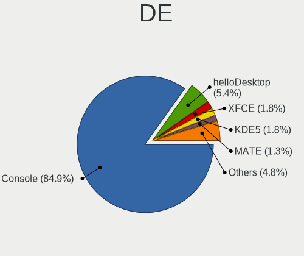
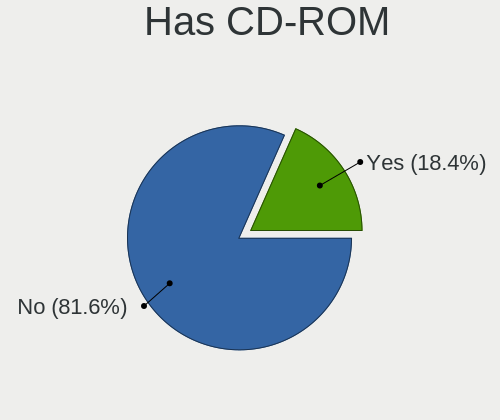
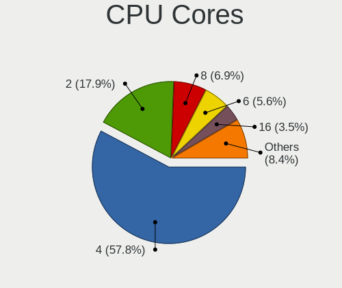
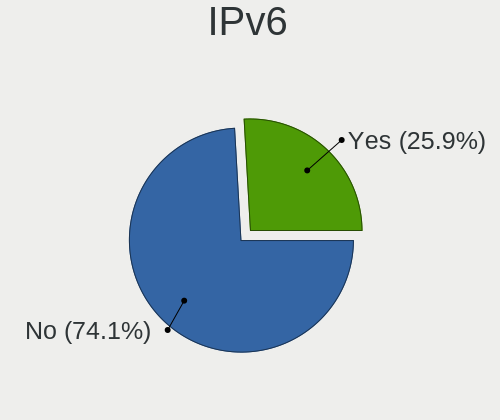
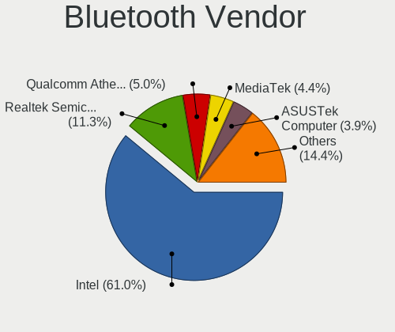
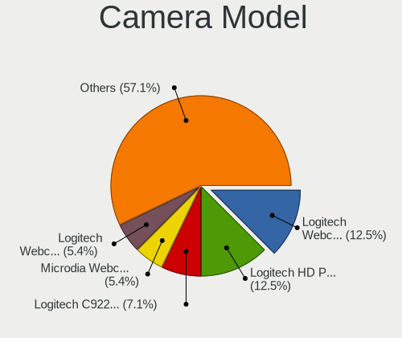

BSD in USA - Tested Hardware & Statistics (Desktops)
----------------------------------------------------

A project to collect tested hardware configurations for BSD in USA.

Anyone can contribute to this report by the [hw-probe](https://github.com/linuxhw/hw-probe/blob/master/INSTALL.BSD.md) tool:

    hw-probe -all -upload

Please contribute! Especially if your hardware is rare.

Contents
--------

* [ Test Cases ](#test-cases)

* [ System ](#system)
  - [ OS                       ](#os)
  - [ OS Family                ](#os-family)
  - [ Arch                     ](#arch)
  - [ DE                       ](#de)
  - [ Display Server           ](#display-server)
  - [ Display Manager          ](#display-manager)
  - [ OS Lang                  ](#os-lang)
  - [ Boot Mode                ](#boot-mode)
  - [ Filesystem               ](#filesystem)
  - [ Part. scheme             ](#part-scheme)

* [ Board ](#board)
  - [ Vendor                   ](#vendor)
  - [ Model                    ](#model)
  - [ Model Family             ](#model-family)
  - [ MFG Year                 ](#mfg-year)
  - [ Form Factor              ](#form-factor)
  - [ Coreboot                 ](#coreboot)
  - [ RAM Size                 ](#ram-size)
  - [ RAM Used                 ](#ram-used)
  - [ Total Drives             ](#total-drives)
  - [ Has CD-ROM               ](#has-cd-rom)
  - [ Has Ethernet             ](#has-ethernet)
  - [ Has WiFi                 ](#has-wifi)
  - [ Has Bluetooth            ](#has-bluetooth)

* [ Location ](#location)
  - [ Country                  ](#country)
  - [ City                     ](#city)

* [ Drives ](#drives)
  - [ Drive Vendor             ](#drive-vendor)
  - [ Drive Model              ](#drive-model)
  - [ HDD Vendor               ](#hdd-vendor)
  - [ SSD Vendor               ](#ssd-vendor)
  - [ Drive Kind               ](#drive-kind)
  - [ Drive Connector          ](#drive-connector)
  - [ Drive Size               ](#drive-size)
  - [ Space Total              ](#space-total)
  - [ Space Used               ](#space-used)
  - [ Malfunc. Drives          ](#malfunc-drives)
  - [ Malfunc. Drive Vendor    ](#malfunc-drive-vendor)
  - [ Malfunc. HDD Vendor      ](#malfunc-hdd-vendor)
  - [ Malfunc. Drive Kind      ](#malfunc-drive-kind)
  - [ Failed Drives            ](#failed-drives)
  - [ Failed Drive Vendor      ](#failed-drive-vendor)
  - [ Drive Status             ](#drive-status)

* [ Storage controller ](#storage-controller)
  - [ Storage Vendor           ](#storage-vendor)
  - [ Storage Model            ](#storage-model)
  - [ Storage Kind             ](#storage-kind)

* [ Processor ](#processor)
  - [ CPU Vendor               ](#cpu-vendor)
  - [ CPU Model                ](#cpu-model)
  - [ CPU Model Family         ](#cpu-model-family)
  - [ CPU Cores                ](#cpu-cores)
  - [ CPU Sockets              ](#cpu-sockets)
  - [ CPU Threads              ](#cpu-threads)
  - [ CPU Microarch            ](#cpu-microarch)

* [ Graphics ](#graphics)
  - [ GPU Vendor               ](#gpu-vendor)
  - [ GPU Model                ](#gpu-model)
  - [ GPU Combo                ](#gpu-combo)
  - [ GPU Driver               ](#gpu-driver)
  - [ GPU Memory               ](#gpu-memory)

* [ Monitor ](#monitor)
  - [ Monitor Vendor           ](#monitor-vendor)
  - [ Monitor Model            ](#monitor-model)
  - [ Monitor Resolution       ](#monitor-resolution)
  - [ Monitor Diagonal         ](#monitor-diagonal)
  - [ Monitor Width            ](#monitor-width)
  - [ Aspect Ratio             ](#aspect-ratio)
  - [ Monitor Area             ](#monitor-area)
  - [ Pixel Density            ](#pixel-density)
  - [ Multiple Monitors        ](#multiple-monitors)

* [ Network ](#network)
  - [ Net Controller Vendor    ](#net-controller-vendor)
  - [ Net Controller Model     ](#net-controller-model)
  - [ Wireless Vendor          ](#wireless-vendor)
  - [ Wireless Model           ](#wireless-model)
  - [ Ethernet Vendor          ](#ethernet-vendor)
  - [ Ethernet Model           ](#ethernet-model)
  - [ Net Controller Kind      ](#net-controller-kind)
  - [ Used Controller          ](#used-controller)
  - [ NICs                     ](#nics)
  - [ IPv6                     ](#ipv6)

* [ Bluetooth ](#bluetooth)
  - [ Bluetooth Vendor         ](#bluetooth-vendor)
  - [ Bluetooth Model          ](#bluetooth-model)

* [ Sound ](#sound)
  - [ Sound Vendor             ](#sound-vendor)
  - [ Sound Model              ](#sound-model)

* [ Memory ](#memory)
  - [ Memory Vendor            ](#memory-vendor)
  - [ Memory Model             ](#memory-model)
  - [ Memory Kind              ](#memory-kind)
  - [ Memory Form Factor       ](#memory-form-factor)
  - [ Memory Size              ](#memory-size)
  - [ Memory Speed             ](#memory-speed)

* [ Printers & scanners ](#printers--scanners)
  - [ Printer Vendor           ](#printer-vendor)
  - [ Printer Model            ](#printer-model)
  - [ Scanner Vendor           ](#scanner-vendor)
  - [ Scanner Model            ](#scanner-model)

* [ Camera ](#camera)
  - [ Camera Vendor            ](#camera-vendor)
  - [ Camera Model             ](#camera-model)

* [ Security ](#security)
  - [ Fingerprint Vendor       ](#fingerprint-vendor)
  - [ Fingerprint Model        ](#fingerprint-model)
  - [ Chipcard Vendor          ](#chipcard-vendor)
  - [ Chipcard Model           ](#chipcard-model)

* [ Unsupported ](#unsupported)
  - [ Unsupported Devices      ](#unsupported-devices)
  - [ Unsupported Device Types ](#unsupported-device-types)

Test Cases
----------

Total: 2754

| Vendor        | Model                       | Probe                                                     | Date         |
|---------------|-----------------------------|-----------------------------------------------------------|--------------|
| Dell          | 0N4YC8 A00                  | [bd01e6e577](https://bsd-hardware.info/?probe=bd01e6e577) | Apr 01, 2023 |
| Supermicro    | X11SDV-4C-TP8F              | [b41b088f96](https://bsd-hardware.info/?probe=b41b088f96) | Apr 01, 2023 |
| Supermicro    | X9SCL/X9SCMA                | [31ed779fdc](https://bsd-hardware.info/?probe=31ed779fdc) | Mar 31, 2023 |
| SolidRun      | CEX7 Platform               | [8e2e4d6686](https://bsd-hardware.info/?probe=8e2e4d6686) | Mar 31, 2023 |
| HP            | 1495                        | [a916ab2122](https://bsd-hardware.info/?probe=a916ab2122) | Mar 31, 2023 |
| Intel         | DENLOW_REFRESH_WS           | [1285cbe6ca](https://bsd-hardware.info/?probe=1285cbe6ca) | Mar 31, 2023 |
| Protectli     | FW4B Ver                    | [cc6e076383](https://bsd-hardware.info/?probe=cc6e076383) | Mar 31, 2023 |
| Gigabyte      | X570 UD                     | [a71a4da74b](https://bsd-hardware.info/?probe=a71a4da74b) | Mar 31, 2023 |
| Foxconn       | nT-A3000 series FAB         | [c13f32c492](https://bsd-hardware.info/?probe=c13f32c492) | Mar 30, 2023 |
| Inventec      | Z CLASS A02                 | [c654ef10d6](https://bsd-hardware.info/?probe=c654ef10d6) | Mar 30, 2023 |
| Protectli     | FW4B Ver                    | [27d9a92cda](https://bsd-hardware.info/?probe=27d9a92cda) | Mar 30, 2023 |
| Unknown       | Unknown                     | [44da021f65](https://bsd-hardware.info/?probe=44da021f65) | Mar 29, 2023 |
| Seeed Stud... | ODYSSEY-X86J4105 SD-BS-C... | [dc06ff6076](https://bsd-hardware.info/?probe=dc06ff6076) | Mar 29, 2023 |
| ASRock        | B550M Steel Legend          | [06a2d12cbe](https://bsd-hardware.info/?probe=06a2d12cbe) | Mar 29, 2023 |
| Supermicro    | C7SIM-Q                     | [47ce885e13](https://bsd-hardware.info/?probe=47ce885e13) | Mar 29, 2023 |
| ASRock        | H510M-HVS R2.0              | [38a784fcd8](https://bsd-hardware.info/?probe=38a784fcd8) | Mar 29, 2023 |
| Unknown       | Unknown                     | [723e81c698](https://bsd-hardware.info/?probe=723e81c698) | Mar 29, 2023 |
| Gigabyte      | X570S AORUS ELITE           | [3895705bbd](https://bsd-hardware.info/?probe=3895705bbd) | Mar 29, 2023 |
| Apple         | Mac-F221BEC8                | [b2a2fc8fe6](https://bsd-hardware.info/?probe=b2a2fc8fe6) | Mar 29, 2023 |
| ASUSTek       | TUF Gaming B450M-PLUS II    | [2c6fc04801](https://bsd-hardware.info/?probe=2c6fc04801) | Mar 29, 2023 |
| Unknown       | Unknown                     | [c6c33779dc](https://bsd-hardware.info/?probe=c6c33779dc) | Mar 29, 2023 |
| HP            | 18E7                        | [f83e0bbd69](https://bsd-hardware.info/?probe=f83e0bbd69) | Mar 28, 2023 |
| BESSTAR Te... | UM700                       | [78ee14c1a5](https://bsd-hardware.info/?probe=78ee14c1a5) | Mar 28, 2023 |
| Protectli     | FW4B                        | [17c0040b42](https://bsd-hardware.info/?probe=17c0040b42) | Mar 28, 2023 |
| HP            | 8054                        | [6c82269548](https://bsd-hardware.info/?probe=6c82269548) | Mar 27, 2023 |
| HP            | 213D A01                    | [d5efcf6e96](https://bsd-hardware.info/?probe=d5efcf6e96) | Mar 27, 2023 |
| ASUSTek       | Z97-E/USB                   | [e5a3f523a6](https://bsd-hardware.info/?probe=e5a3f523a6) | Mar 27, 2023 |
| WeiBu         | ADL-N Prod                  | [1d0a4ac0a1](https://bsd-hardware.info/?probe=1d0a4ac0a1) | Mar 27, 2023 |
| WeiBu         | ADL-N Prod                  | [91759ff33b](https://bsd-hardware.info/?probe=91759ff33b) | Mar 27, 2023 |
| Lenovo        | MAHOBAY NO DPK              | [0eab0142d5](https://bsd-hardware.info/?probe=0eab0142d5) | Mar 26, 2023 |
| CWWK          | MINIPC-G4                   | [06e3c70f23](https://bsd-hardware.info/?probe=06e3c70f23) | Mar 26, 2023 |
| CWWK          | MINIPC-G4                   | [8f47736c3b](https://bsd-hardware.info/?probe=8f47736c3b) | Mar 26, 2023 |
| ChangWang     | CW56-58                     | [39410cb2dd](https://bsd-hardware.info/?probe=39410cb2dd) | Mar 26, 2023 |
| MSI           | H81M-P33                    | [f07e9fd36c](https://bsd-hardware.info/?probe=f07e9fd36c) | Mar 26, 2023 |
| ASUSTek       | P5Q-E                       | [3f21567fdf](https://bsd-hardware.info/?probe=3f21567fdf) | Mar 26, 2023 |
| ASUSTek       | ROG CROSSHAIR VIII HERO     | [38a22651c6](https://bsd-hardware.info/?probe=38a22651c6) | Mar 26, 2023 |
| ASRock        | H510M-HVS R2.0              | [3db3c8f002](https://bsd-hardware.info/?probe=3db3c8f002) | Mar 26, 2023 |
| Dell          | 0HD5W2 A01                  | [284c499b74](https://bsd-hardware.info/?probe=284c499b74) | Mar 26, 2023 |
| Intel         | Q3XXG4-P V1.0               | [2634ccb935](https://bsd-hardware.info/?probe=2634ccb935) | Mar 26, 2023 |
| Acer          | Aspire XC-830               | [bc1cc29291](https://bsd-hardware.info/?probe=bc1cc29291) | Mar 26, 2023 |
| Acer          | Aspire XC-830               | [2affd2540a](https://bsd-hardware.info/?probe=2affd2540a) | Mar 26, 2023 |
| CheckPoint    | T-110-00                    | [eecf6b8096](https://bsd-hardware.info/?probe=eecf6b8096) | Mar 25, 2023 |
| Protectli     | FW4B                        | [3c333bad9c](https://bsd-hardware.info/?probe=3c333bad9c) | Mar 25, 2023 |
| Unknown       | Unknown                     | [c7c5a8ae97](https://bsd-hardware.info/?probe=c7c5a8ae97) | Mar 25, 2023 |
| Hardkernel    | ODROID-H3                   | [312a9b3461](https://bsd-hardware.info/?probe=312a9b3461) | Mar 25, 2023 |
| ASUSTek       | Z97-E/USB                   | [9aa3b17016](https://bsd-hardware.info/?probe=9aa3b17016) | Mar 25, 2023 |
| HP            | 8055                        | [03930fa6c3](https://bsd-hardware.info/?probe=03930fa6c3) | Mar 24, 2023 |
| Intel         | Q3XXG4-P V1.0               | [56c12d6bf6](https://bsd-hardware.info/?probe=56c12d6bf6) | Mar 24, 2023 |
| ASUSTek       | Z97-E/USB                   | [e9cbfc666b](https://bsd-hardware.info/?probe=e9cbfc666b) | Mar 24, 2023 |
| Intel         | Q3XXG4-P V1.0               | [e99acbbc10](https://bsd-hardware.info/?probe=e99acbbc10) | Mar 24, 2023 |
| HP            | 3397                        | [a3a77965fc](https://bsd-hardware.info/?probe=a3a77965fc) | Mar 23, 2023 |
| Lenovo        | ThinkCentre M910q 10MVCT... | [5459ed9c31](https://bsd-hardware.info/?probe=5459ed9c31) | Mar 22, 2023 |
| Dell          | 0WWJRX A00                  | [b016b1fb3c](https://bsd-hardware.info/?probe=b016b1fb3c) | Mar 22, 2023 |
| Protectli     | FW4C Ver                    | [73ecb1afc1](https://bsd-hardware.info/?probe=73ecb1afc1) | Mar 22, 2023 |
| ASRock        | B450M Pro4                  | [e2d0aa1444](https://bsd-hardware.info/?probe=e2d0aa1444) | Mar 22, 2023 |
| Protectli     | FW4B Ver                    | [c2546b211b](https://bsd-hardware.info/?probe=c2546b211b) | Mar 22, 2023 |
| ASUSTek       | M4A88TD-V EVO/USB3          | [c486bbb209](https://bsd-hardware.info/?probe=c486bbb209) | Mar 22, 2023 |
| NF596         | 1.0                         | [9de0fd33a4](https://bsd-hardware.info/?probe=9de0fd33a4) | Mar 22, 2023 |
| Protectli     | VP2410 10                   | [491f4cc780](https://bsd-hardware.info/?probe=491f4cc780) | Mar 22, 2023 |
| ASRock        | B460M-HDV                   | [e1ee6d8a11](https://bsd-hardware.info/?probe=e1ee6d8a11) | Mar 22, 2023 |
| ASRockRack    | E3C236D2I                   | [e407119ecf](https://bsd-hardware.info/?probe=e407119ecf) | Mar 22, 2023 |
| ASRockRack    | E3C236D2I                   | [0854f96185](https://bsd-hardware.info/?probe=0854f96185) | Mar 21, 2023 |
| ASRock        | X570M Pro4                  | [e405ff5adf](https://bsd-hardware.info/?probe=e405ff5adf) | Mar 21, 2023 |
| Supermicro    | X9SCL/X9SCMA                | [7bac9347ec](https://bsd-hardware.info/?probe=7bac9347ec) | Mar 21, 2023 |
| Techvision    | TVI7309X B0                 | [8d84f81be3](https://bsd-hardware.info/?probe=8d84f81be3) | Mar 21, 2023 |
| Lenovo        | 30BC SDK0J40705 WIN 3425... | [33b600b436](https://bsd-hardware.info/?probe=33b600b436) | Mar 20, 2023 |
| Silicom       | 80300-0134-g01              | [3cd6c5ba13](https://bsd-hardware.info/?probe=3cd6c5ba13) | Mar 20, 2023 |
| Techvision    | TVI7309X B0                 | [10f3485393](https://bsd-hardware.info/?probe=10f3485393) | Mar 20, 2023 |
| ASUSTek       | TUF Gaming B550M-PLUS       | [c07b0a75e5](https://bsd-hardware.info/?probe=c07b0a75e5) | Mar 20, 2023 |
| ASUSTek       | TUF Gaming B550M-PLUS       | [71d2b7317c](https://bsd-hardware.info/?probe=71d2b7317c) | Mar 19, 2023 |
| Unknown       | Unknown                     | [91b5500917](https://bsd-hardware.info/?probe=91b5500917) | Mar 19, 2023 |
| MSI           | H81M-P33                    | [17f0f138ee](https://bsd-hardware.info/?probe=17f0f138ee) | Mar 19, 2023 |
| ASUSTek       | P5Q-E                       | [da50d91be4](https://bsd-hardware.info/?probe=da50d91be4) | Mar 19, 2023 |
| ASUSTek       | ROG CROSSHAIR VIII HERO     | [726abe2f1d](https://bsd-hardware.info/?probe=726abe2f1d) | Mar 19, 2023 |
| Protectli     | FW4B Ver                    | [317c44acd2](https://bsd-hardware.info/?probe=317c44acd2) | Mar 19, 2023 |
| Datto         | SSD                         | [40831257b2](https://bsd-hardware.info/?probe=40831257b2) | Mar 19, 2023 |
| HP            | 212B                        | [d4d93ad679](https://bsd-hardware.info/?probe=d4d93ad679) | Mar 19, 2023 |
| ASUSTek       | CM6330_CM6630_CM6730_CM6... | [4e1fe3a676](https://bsd-hardware.info/?probe=4e1fe3a676) | Mar 18, 2023 |
| HP            | 18E7                        | [d3b280214a](https://bsd-hardware.info/?probe=d3b280214a) | Mar 18, 2023 |
| Unknown       | QD-CMU01                    | [c6ddfac225](https://bsd-hardware.info/?probe=c6ddfac225) | Mar 18, 2023 |
| Protectli     | FW6                         | [f24f1a8a3e](https://bsd-hardware.info/?probe=f24f1a8a3e) | Mar 17, 2023 |
| Unknown       | Unknown                     | [daaa6c0069](https://bsd-hardware.info/?probe=daaa6c0069) | Mar 17, 2023 |
| Protectli     | FW4B                        | [fd65403ca2](https://bsd-hardware.info/?probe=fd65403ca2) | Mar 17, 2023 |
| HP            | 3397                        | [2851f91f5f](https://bsd-hardware.info/?probe=2851f91f5f) | Mar 17, 2023 |
| Unknown       | Unknown                     | [d0a9398982](https://bsd-hardware.info/?probe=d0a9398982) | Mar 16, 2023 |
| Unknown       | Unknown                     | [19fc3562d9](https://bsd-hardware.info/?probe=19fc3562d9) | Mar 16, 2023 |
| Silicom       | 80300-0134-g01              | [228e446ed5](https://bsd-hardware.info/?probe=228e446ed5) | Mar 15, 2023 |
| Dell          | 0M9KCM A00                  | [27a1ab8450](https://bsd-hardware.info/?probe=27a1ab8450) | Mar 15, 2023 |
| Dell          | 078NPM A00                  | [234e8a451a](https://bsd-hardware.info/?probe=234e8a451a) | Mar 14, 2023 |
| ASUSTek       | Pro B550M-C                 | [a0e38ad11b](https://bsd-hardware.info/?probe=a0e38ad11b) | Mar 14, 2023 |
| Gigabyte      | H370M D3H-CF                | [8025ea3b29](https://bsd-hardware.info/?probe=8025ea3b29) | Mar 14, 2023 |
| Protectli     | FW4C Ver                    | [6b260b1da3](https://bsd-hardware.info/?probe=6b260b1da3) | Mar 14, 2023 |
| Intel         | HURONRIVER                  | [06f89fc17d](https://bsd-hardware.info/?probe=06f89fc17d) | Mar 14, 2023 |
| Lenovo        | 0B98401 PRO                 | [4e27c68fa1](https://bsd-hardware.info/?probe=4e27c68fa1) | Mar 14, 2023 |
| Google        | Panther                     | [3577da7e53](https://bsd-hardware.info/?probe=3577da7e53) | Mar 13, 2023 |
| Unknown       | Unknown                     | [51bc37434e](https://bsd-hardware.info/?probe=51bc37434e) | Mar 13, 2023 |
| Intel         | QHSW02                      | [ccfc6d4abf](https://bsd-hardware.info/?probe=ccfc6d4abf) | Mar 13, 2023 |
| Intel         | QHSW02                      | [b56a128e7e](https://bsd-hardware.info/?probe=b56a128e7e) | Mar 13, 2023 |
| MSI           | Z87-G41 PC Mate             | [f1dc71b749](https://bsd-hardware.info/?probe=f1dc71b749) | Mar 13, 2023 |
| ASUSTek       | PRIME X370-PRO              | [49764ec5fa](https://bsd-hardware.info/?probe=49764ec5fa) | Mar 13, 2023 |
| ASRock        | X570 Phantom Gaming 4       | [a8a9ed7f9e](https://bsd-hardware.info/?probe=a8a9ed7f9e) | Mar 13, 2023 |
| MSI           | Z87-G41 PC Mate             | [8f819aa5b0](https://bsd-hardware.info/?probe=8f819aa5b0) | Mar 13, 2023 |
| HP            | 8056                        | [164b3e5c3f](https://bsd-hardware.info/?probe=164b3e5c3f) | Mar 13, 2023 |
| HP            | 18E7                        | [a5f169c741](https://bsd-hardware.info/?probe=a5f169c741) | Mar 13, 2023 |
| Dell          | 02YYK5 A00                  | [82ec8cfd3b](https://bsd-hardware.info/?probe=82ec8cfd3b) | Mar 13, 2023 |
| HP            | 1495                        | [840b4864ab](https://bsd-hardware.info/?probe=840b4864ab) | Mar 13, 2023 |
| Unknown       | Unknown                     | [1bff43fa4b](https://bsd-hardware.info/?probe=1bff43fa4b) | Mar 13, 2023 |
| Unknown       | Unknown                     | [2b318d15c4](https://bsd-hardware.info/?probe=2b318d15c4) | Mar 13, 2023 |
| Protectli     | FW4B Ver                    | [a81fd51eee](https://bsd-hardware.info/?probe=a81fd51eee) | Mar 13, 2023 |
| HP            | 213D A01                    | [7021648a32](https://bsd-hardware.info/?probe=7021648a32) | Mar 13, 2023 |
| Lenovo        | SHARKBAY SDK0K17763 WIN ... | [c9279ce424](https://bsd-hardware.info/?probe=c9279ce424) | Mar 13, 2023 |
| Dell          | 02YYK5 A01                  | [fe42d48be1](https://bsd-hardware.info/?probe=fe42d48be1) | Mar 13, 2023 |
| GoWin Solu... | R86S                        | [44f983da74](https://bsd-hardware.info/?probe=44f983da74) | Mar 12, 2023 |
| Dell          | 0WMJ54 A00                  | [8a41ff57c2](https://bsd-hardware.info/?probe=8a41ff57c2) | Mar 12, 2023 |
| Supermicro    | X7DWE                       | [e40b569ff7](https://bsd-hardware.info/?probe=e40b569ff7) | Mar 12, 2023 |
| MSI           | H81M-P33                    | [12dbc1a2b3](https://bsd-hardware.info/?probe=12dbc1a2b3) | Mar 12, 2023 |
| ASUSTek       | P5Q-E                       | [bcd9058821](https://bsd-hardware.info/?probe=bcd9058821) | Mar 12, 2023 |
| ASUSTek       | ROG CROSSHAIR VIII HERO     | [d93ae717cc](https://bsd-hardware.info/?probe=d93ae717cc) | Mar 12, 2023 |
| ASRock        | 4X4-V1000                   | [f0582d78bf](https://bsd-hardware.info/?probe=f0582d78bf) | Mar 12, 2023 |
| Dell          | 0WMJ54 A01                  | [38af3096a6](https://bsd-hardware.info/?probe=38af3096a6) | Mar 12, 2023 |
| Dell          | 0KYJ8C A02                  | [53fa01007b](https://bsd-hardware.info/?probe=53fa01007b) | Mar 12, 2023 |
| Dell          | 02YYK5 A01                  | [69db0ac0a4](https://bsd-hardware.info/?probe=69db0ac0a4) | Mar 12, 2023 |
| Unknown       | Unknown                     | [83fa5b5a27](https://bsd-hardware.info/?probe=83fa5b5a27) | Mar 12, 2023 |
| ASUSTek       | ROG STRIX B550-F GAMING     | [37ee7b4f47](https://bsd-hardware.info/?probe=37ee7b4f47) | Mar 12, 2023 |
| HP            | 802E                        | [914384fca0](https://bsd-hardware.info/?probe=914384fca0) | Mar 11, 2023 |
| HP            | 1495                        | [a8b5c70376](https://bsd-hardware.info/?probe=a8b5c70376) | Mar 11, 2023 |
| HP            | 1495                        | [f238006f2e](https://bsd-hardware.info/?probe=f238006f2e) | Mar 11, 2023 |
| Techvision    | TVI7309X B0                 | [5cdfb9cc34](https://bsd-hardware.info/?probe=5cdfb9cc34) | Mar 10, 2023 |
| ASUSTek       | SABERTOOTH X58              | [37e1562772](https://bsd-hardware.info/?probe=37e1562772) | Mar 10, 2023 |
| GoWin Solu... | R86S                        | [b815ae3950](https://bsd-hardware.info/?probe=b815ae3950) | Mar 10, 2023 |
| Unknown       | Unknown                     | [0fc6796cea](https://bsd-hardware.info/?probe=0fc6796cea) | Mar 10, 2023 |
| maiyunda      | www.maiyunda.com            | [e09800b936](https://bsd-hardware.info/?probe=e09800b936) | Mar 10, 2023 |
| Supermicro    | X9SCL/X9SCMA                | [904fde472a](https://bsd-hardware.info/?probe=904fde472a) | Mar 10, 2023 |
| Dell          | 07F37C A01                  | [6819027308](https://bsd-hardware.info/?probe=6819027308) | Mar 10, 2023 |
| Unknown       | Unknown                     | [5082b8203b](https://bsd-hardware.info/?probe=5082b8203b) | Mar 09, 2023 |
| maiyunda      | www.maiyunda.com            | [8687dfb1bb](https://bsd-hardware.info/?probe=8687dfb1bb) | Mar 09, 2023 |
| Unknown       | Unknown                     | [12ac44cbf7](https://bsd-hardware.info/?probe=12ac44cbf7) | Mar 09, 2023 |
| Unknown       | Unknown                     | [486646710b](https://bsd-hardware.info/?probe=486646710b) | Mar 09, 2023 |
| Supermicro    | X9SCL/X9SCMA                | [bfa33e378d](https://bsd-hardware.info/?probe=bfa33e378d) | Mar 09, 2023 |
| Lenovo        | SHARKBAY 0B98401 WIN        | [61c0604160](https://bsd-hardware.info/?probe=61c0604160) | Mar 08, 2023 |
| PC Engines    | APU2                        | [bd7676affa](https://bsd-hardware.info/?probe=bd7676affa) | Mar 08, 2023 |
| Hardkernel    | ODROID-H3                   | [34cf4827d7](https://bsd-hardware.info/?probe=34cf4827d7) | Mar 07, 2023 |
| Pegatron      | 2ACD                        | [7058138064](https://bsd-hardware.info/?probe=7058138064) | Mar 07, 2023 |
| Supermicro    | X11SDV-4C-TP8F              | [d0bf3eb35d](https://bsd-hardware.info/?probe=d0bf3eb35d) | Mar 06, 2023 |
| HP            | 1495                        | [4a91a0efd9](https://bsd-hardware.info/?probe=4a91a0efd9) | Mar 06, 2023 |
| HP            | 1495                        | [1379869eeb](https://bsd-hardware.info/?probe=1379869eeb) | Mar 06, 2023 |
| Acer          | Veriton X2120G v1.0         | [f5acb2d032](https://bsd-hardware.info/?probe=f5acb2d032) | Mar 06, 2023 |
| Unknown       | N4000                       | [12afb5cc25](https://bsd-hardware.info/?probe=12afb5cc25) | Mar 06, 2023 |
| Protectli     | FW4B Ver                    | [98f6c8f34b](https://bsd-hardware.info/?probe=98f6c8f34b) | Mar 06, 2023 |
| Gigabyte      | X570 UD                     | [13e4d3ce10](https://bsd-hardware.info/?probe=13e4d3ce10) | Mar 05, 2023 |
| MSI           | H81M-P33                    | [dfa124b6f9](https://bsd-hardware.info/?probe=dfa124b6f9) | Mar 05, 2023 |
| ASUSTek       | P5Q-E                       | [64513c0ff5](https://bsd-hardware.info/?probe=64513c0ff5) | Mar 05, 2023 |
| ASUSTek       | ROG CROSSHAIR VIII HERO     | [ebba69095d](https://bsd-hardware.info/?probe=ebba69095d) | Mar 05, 2023 |
| Dell          | 0D02VH A01                  | [0a9a676d17](https://bsd-hardware.info/?probe=0a9a676d17) | Mar 05, 2023 |
| Unknown       | YL-J3160L4                  | [f75fee2a2d](https://bsd-hardware.info/?probe=f75fee2a2d) | Mar 05, 2023 |
| Dell          | 0KV62T A02                  | [986f18fa08](https://bsd-hardware.info/?probe=986f18fa08) | Mar 05, 2023 |
| Gigabyte      | Z390 UD                     | [8d278732dd](https://bsd-hardware.info/?probe=8d278732dd) | Mar 04, 2023 |
| Unknown       | Unknown                     | [a9e37e0391](https://bsd-hardware.info/?probe=a9e37e0391) | Mar 04, 2023 |
| AZW           | GK55                        | [c22ee2e279](https://bsd-hardware.info/?probe=c22ee2e279) | Mar 03, 2023 |
| Gigabyte      | H77N-WIFI                   | [d8c78b92a7](https://bsd-hardware.info/?probe=d8c78b92a7) | Mar 03, 2023 |
| Techvision    | TVI7309X B0                 | [822db616e5](https://bsd-hardware.info/?probe=822db616e5) | Mar 01, 2023 |
| ASRock        | H470M-STX                   | [98096adfaa](https://bsd-hardware.info/?probe=98096adfaa) | Mar 01, 2023 |
| Techvision    | TVI7309X B0                 | [5b6dd24e9a](https://bsd-hardware.info/?probe=5b6dd24e9a) | Mar 01, 2023 |
| Inventec      | Z CLASS A02                 | [2e40df5a32](https://bsd-hardware.info/?probe=2e40df5a32) | Mar 01, 2023 |
| Dell          | 0GY6Y8 A00                  | [72d45455a5](https://bsd-hardware.info/?probe=72d45455a5) | Feb 28, 2023 |
| Lenovo        | Kabini CRB 31900058 STD     | [735f2f3ece](https://bsd-hardware.info/?probe=735f2f3ece) | Feb 28, 2023 |
| Dell          | 0HHV7N A00                  | [ffbb7e1a96](https://bsd-hardware.info/?probe=ffbb7e1a96) | Feb 27, 2023 |
| Inventec      | Z CLASS A02                 | [1b11bb9003](https://bsd-hardware.info/?probe=1b11bb9003) | Feb 27, 2023 |
| ASUSTek       | PRIME A320M-R               | [652b3323c6](https://bsd-hardware.info/?probe=652b3323c6) | Feb 27, 2023 |
| Lenovo        | Kabini CRB 31900058 STD     | [b0fcea0c90](https://bsd-hardware.info/?probe=b0fcea0c90) | Feb 27, 2023 |
| Intel         | HM570                       | [2588c37fc2](https://bsd-hardware.info/?probe=2588c37fc2) | Feb 27, 2023 |
| HP            | 2215                        | [33881e14ce](https://bsd-hardware.info/?probe=33881e14ce) | Feb 27, 2023 |
| ASUSTek       | TUF Gaming Z590-PLUS        | [55afde6894](https://bsd-hardware.info/?probe=55afde6894) | Feb 26, 2023 |
| HP            | 1495                        | [70c761d6fe](https://bsd-hardware.info/?probe=70c761d6fe) | Feb 26, 2023 |
| MSI           | H81M-P33                    | [806efadc12](https://bsd-hardware.info/?probe=806efadc12) | Feb 26, 2023 |
| ASUSTek       | P5Q-E                       | [efb350b5f2](https://bsd-hardware.info/?probe=efb350b5f2) | Feb 26, 2023 |
| ASUSTek       | ROG CROSSHAIR VIII HERO     | [62567aa5d4](https://bsd-hardware.info/?probe=62567aa5d4) | Feb 26, 2023 |
| Gigabyte      | Z390 I AORUS PRO WIFI-CF    | [2e3026e0fd](https://bsd-hardware.info/?probe=2e3026e0fd) | Feb 26, 2023 |
| Techvision    | TVI7309X B0                 | [d558069dea](https://bsd-hardware.info/?probe=d558069dea) | Feb 26, 2023 |
| Dell          | 088DT1 A01                  | [d13b4a674b](https://bsd-hardware.info/?probe=d13b4a674b) | Feb 26, 2023 |
| Dell          | 0WMJ54 A01                  | [263be0365a](https://bsd-hardware.info/?probe=263be0365a) | Feb 26, 2023 |
| Techvision    | TVI7309X B0                 | [8a16d2e606](https://bsd-hardware.info/?probe=8a16d2e606) | Feb 24, 2023 |
| Gigabyte      | H77N-WIFI                   | [cd96288347](https://bsd-hardware.info/?probe=cd96288347) | Feb 24, 2023 |
| Unknown       | Unknown                     | [efce6f6c1e](https://bsd-hardware.info/?probe=efce6f6c1e) | Feb 24, 2023 |
| Lenovo        | SHARKBAY SDK0E50510 WIN     | [31122bd298](https://bsd-hardware.info/?probe=31122bd298) | Feb 24, 2023 |
| Gigabyte      | G31M-ES2L                   | [c55b1dd170](https://bsd-hardware.info/?probe=c55b1dd170) | Feb 23, 2023 |
| Supermicro    | X10SDV-6C-TLN4F             | [d6ab3464c6](https://bsd-hardware.info/?probe=d6ab3464c6) | Feb 23, 2023 |
| Dell          | 0WMJ54 A01                  | [26b7986e0b](https://bsd-hardware.info/?probe=26b7986e0b) | Feb 23, 2023 |
| Supermicro    | X9SCL/X9SCMA                | [96aceb6d32](https://bsd-hardware.info/?probe=96aceb6d32) | Feb 23, 2023 |
| ASUSTek       | Pro A520M-C II              | [542b244f4b](https://bsd-hardware.info/?probe=542b244f4b) | Feb 23, 2023 |
| Techvision    | TVI7309X B0                 | [765b1a8064](https://bsd-hardware.info/?probe=765b1a8064) | Feb 22, 2023 |
| Intel         | Q3XXG4-P V1.0               | [639886b591](https://bsd-hardware.info/?probe=639886b591) | Feb 22, 2023 |
| Gigabyte      | X570S AORUS ELITE           | [8d1496f3a9](https://bsd-hardware.info/?probe=8d1496f3a9) | Feb 22, 2023 |
| Protectli     | VP2410                      | [b31bcf2087](https://bsd-hardware.info/?probe=b31bcf2087) | Feb 22, 2023 |
| Protectli     | VP2410                      | [8dff61bc43](https://bsd-hardware.info/?probe=8dff61bc43) | Feb 22, 2023 |
| Unknown       | Unknown                     | [9e92cf3575](https://bsd-hardware.info/?probe=9e92cf3575) | Feb 22, 2023 |
| Supermicro    | X7SLA                       | [80d6f2c0f8](https://bsd-hardware.info/?probe=80d6f2c0f8) | Feb 21, 2023 |
| Protectli     | FW2B                        | [34b349eead](https://bsd-hardware.info/?probe=34b349eead) | Feb 21, 2023 |
| Dell          | 0GY6Y8 A00                  | [9a3d7de5ff](https://bsd-hardware.info/?probe=9a3d7de5ff) | Feb 21, 2023 |
| ASUSTek       | TUF Gaming Z590-PLUS        | [da5536f58a](https://bsd-hardware.info/?probe=da5536f58a) | Feb 21, 2023 |
| Unknown       | Unknown                     | [67c7a561a9](https://bsd-hardware.info/?probe=67c7a561a9) | Feb 21, 2023 |
| ASUSTek       | Pro A520M-C II              | [205bf8b29d](https://bsd-hardware.info/?probe=205bf8b29d) | Feb 20, 2023 |
| Lenovo        | 32E1 SDK0J40697 WIN 3305... | [820b3d1a1b](https://bsd-hardware.info/?probe=820b3d1a1b) | Feb 20, 2023 |
| Protectli     | VP4650                      | [44b691e7b8](https://bsd-hardware.info/?probe=44b691e7b8) | Feb 20, 2023 |
| Protectli     | VP4650                      | [a3011cc486](https://bsd-hardware.info/?probe=a3011cc486) | Feb 20, 2023 |
| ASRock        | X570 Taichi                 | [8eb068a097](https://bsd-hardware.info/?probe=8eb068a097) | Feb 20, 2023 |
| HP            | 8076 MVB,A                  | [7743861bae](https://bsd-hardware.info/?probe=7743861bae) | Feb 19, 2023 |
| MSI           | H81M-P33                    | [28f48b7936](https://bsd-hardware.info/?probe=28f48b7936) | Feb 19, 2023 |
| ASUSTek       | P5Q-E                       | [b3525afaa7](https://bsd-hardware.info/?probe=b3525afaa7) | Feb 19, 2023 |
| ASUSTek       | ROG CROSSHAIR VIII HERO     | [19c7044a7d](https://bsd-hardware.info/?probe=19c7044a7d) | Feb 19, 2023 |
| HP            | 1998                        | [e0ab2d859c](https://bsd-hardware.info/?probe=e0ab2d859c) | Feb 18, 2023 |
| Techvision    | TVI7309X B0                 | [633becefb6](https://bsd-hardware.info/?probe=633becefb6) | Feb 18, 2023 |
| AZW           | Green G1                    | [f5da027d84](https://bsd-hardware.info/?probe=f5da027d84) | Feb 17, 2023 |
| Dell          | 04YP6J A02                  | [26cd25b4ca](https://bsd-hardware.info/?probe=26cd25b4ca) | Feb 17, 2023 |
| Dell          | 04YP6J A02                  | [ef370f6033](https://bsd-hardware.info/?probe=ef370f6033) | Feb 17, 2023 |
| Jingsha       | x79-P3 by xUz               | [0e5ed7f4de](https://bsd-hardware.info/?probe=0e5ed7f4de) | Feb 17, 2023 |
| Supermicro    | X10SLH-N6-ST031             | [897a3b3bf5](https://bsd-hardware.info/?probe=897a3b3bf5) | Feb 16, 2023 |
| Protectli     | FW2B Ver                    | [b72039f369](https://bsd-hardware.info/?probe=b72039f369) | Feb 16, 2023 |
| ASUSTek       | ROG STRIX Z390-I GAMING     | [b241a8afd7](https://bsd-hardware.info/?probe=b241a8afd7) | Feb 16, 2023 |
| ASRock        | A520M-ITX/ac                | [dd083df1a2](https://bsd-hardware.info/?probe=dd083df1a2) | Feb 16, 2023 |
| Dell          | 05GD68 A00                  | [c6946f5300](https://bsd-hardware.info/?probe=c6946f5300) | Feb 15, 2023 |
| MSI           | A88XM-E45                   | [933b4d3226](https://bsd-hardware.info/?probe=933b4d3226) | Feb 15, 2023 |
| Unknown       | Unknown                     | [415389b74c](https://bsd-hardware.info/?probe=415389b74c) | Feb 14, 2023 |
| CncTion       | N5105-4L B0                 | [fb2a05c862](https://bsd-hardware.info/?probe=fb2a05c862) | Feb 14, 2023 |
| Dell          | 0NW6H5 A00                  | [b0020c937b](https://bsd-hardware.info/?probe=b0020c937b) | Feb 14, 2023 |
| PC Engines    | APU2                        | [0648ebd771](https://bsd-hardware.info/?probe=0648ebd771) | Feb 14, 2023 |
| ASRock        | B450M Pro4                  | [2d9ff025ff](https://bsd-hardware.info/?probe=2d9ff025ff) | Feb 14, 2023 |
| ASRock        | B450M Pro4                  | [7b60f91e47](https://bsd-hardware.info/?probe=7b60f91e47) | Feb 14, 2023 |
| Dell          | 0XCR8D A02                  | [a477c2b046](https://bsd-hardware.info/?probe=a477c2b046) | Feb 14, 2023 |
| Gigabyte      | H97N                        | [88e7d124ef](https://bsd-hardware.info/?probe=88e7d124ef) | Feb 14, 2023 |
| Dell          | 0D02VH A01                  | [a629bf3445](https://bsd-hardware.info/?probe=a629bf3445) | Feb 14, 2023 |
| ASUSTek       | PRIME X370-PRO              | [b3f41e1cb4](https://bsd-hardware.info/?probe=b3f41e1cb4) | Feb 13, 2023 |
| CWWK          | MINIPC-G4                   | [a186c77c21](https://bsd-hardware.info/?probe=a186c77c21) | Feb 13, 2023 |
| ASRock        | X570 Phantom Gaming 4       | [b962baf73d](https://bsd-hardware.info/?probe=b962baf73d) | Feb 13, 2023 |
| Dell          | 02YYK5 A00                  | [431374482e](https://bsd-hardware.info/?probe=431374482e) | Feb 13, 2023 |
| Dell          | 0NC2VH A01                  | [3e96602a8f](https://bsd-hardware.info/?probe=3e96602a8f) | Feb 13, 2023 |
| Supermicro    | X7SPA-HF                    | [6acbae85b9](https://bsd-hardware.info/?probe=6acbae85b9) | Feb 13, 2023 |
| ASUSTek       | P8Z68 DELUXE                | [f65675c771](https://bsd-hardware.info/?probe=f65675c771) | Feb 13, 2023 |
| ASUSTek       | H170I-PRO                   | [63000ada74](https://bsd-hardware.info/?probe=63000ada74) | Feb 12, 2023 |
| Dell          | 0D02VH A01                  | [d0823031a5](https://bsd-hardware.info/?probe=d0823031a5) | Feb 12, 2023 |
| Lenovo        | 3132 SDK0J40697 WIN 3305... | [5988d9a034](https://bsd-hardware.info/?probe=5988d9a034) | Feb 12, 2023 |
| Unknown       | Unknown                     | [71aa276f7f](https://bsd-hardware.info/?probe=71aa276f7f) | Feb 12, 2023 |
| Dell          | 0WMJ54 A00                  | [ba5f8c568b](https://bsd-hardware.info/?probe=ba5f8c568b) | Feb 12, 2023 |
| MSI           | H81M-P33                    | [84aff26f99](https://bsd-hardware.info/?probe=84aff26f99) | Feb 12, 2023 |
| ASUSTek       | P5Q-E                       | [4e899d9a1c](https://bsd-hardware.info/?probe=4e899d9a1c) | Feb 12, 2023 |
| ASUSTek       | ROG CROSSHAIR VIII HERO     | [d16e93b7f3](https://bsd-hardware.info/?probe=d16e93b7f3) | Feb 12, 2023 |
| Unknown       | Unknown                     | [133d9aedfd](https://bsd-hardware.info/?probe=133d9aedfd) | Feb 12, 2023 |
| HP            | 843B                        | [2b9c5f49f5](https://bsd-hardware.info/?probe=2b9c5f49f5) | Feb 12, 2023 |
| Dell          | 0PU052                      | [03bcc500c0](https://bsd-hardware.info/?probe=03bcc500c0) | Feb 12, 2023 |
| Dell          | 0PU052                      | [035408150f](https://bsd-hardware.info/?probe=035408150f) | Feb 11, 2023 |
| Intel         | Q3XXG4-P V1.0               | [0684ee3bb7](https://bsd-hardware.info/?probe=0684ee3bb7) | Feb 11, 2023 |
| Unknown       | Unknown                     | [7d908f5c62](https://bsd-hardware.info/?probe=7d908f5c62) | Feb 11, 2023 |
| Protectli     | FW4B Ver                    | [3724be73d9](https://bsd-hardware.info/?probe=3724be73d9) | Feb 11, 2023 |
| Dell          | 0773VG A00                  | [b9caeb411f](https://bsd-hardware.info/?probe=b9caeb411f) | Feb 11, 2023 |
| Unknown       | Unknown                     | [1d63a08b5d](https://bsd-hardware.info/?probe=1d63a08b5d) | Feb 10, 2023 |
| Protectli     | FW6 Ver                     | [882f0868fe](https://bsd-hardware.info/?probe=882f0868fe) | Feb 10, 2023 |
| Dell          | 051FJ8 A02                  | [f853cd2270](https://bsd-hardware.info/?probe=f853cd2270) | Feb 10, 2023 |
| Lenovo        | MAHOBAY NOK                 | [d6be869761](https://bsd-hardware.info/?probe=d6be869761) | Feb 09, 2023 |
| Gigabyte      | H270-HD3-CF                 | [a15eee8687](https://bsd-hardware.info/?probe=a15eee8687) | Feb 09, 2023 |
| Dell          | 051FJ8 A01                  | [573c8ffac2](https://bsd-hardware.info/?probe=573c8ffac2) | Feb 09, 2023 |
| Biostar       | TA970                       | [8c1a7aedf1](https://bsd-hardware.info/?probe=8c1a7aedf1) | Feb 09, 2023 |
| ASUSTek       | K30AD_M31AD_M51AD_M32AD     | [b9166d8134](https://bsd-hardware.info/?probe=b9166d8134) | Feb 08, 2023 |
| ADI Engine... | RCC                         | [d28d10f385](https://bsd-hardware.info/?probe=d28d10f385) | Feb 08, 2023 |
| Seeed Stud... | ODYSSEY-X86J41X5 SD-BS-C... | [d3b116f637](https://bsd-hardware.info/?probe=d3b116f637) | Feb 07, 2023 |
| Unknown       | Unknown                     | [9f2744c3af](https://bsd-hardware.info/?probe=9f2744c3af) | Feb 07, 2023 |
| Dell          | 02YYK5 A00                  | [259f0ae05e](https://bsd-hardware.info/?probe=259f0ae05e) | Feb 06, 2023 |
| CheckPoint    | T-120-00                    | [f1f935b515](https://bsd-hardware.info/?probe=f1f935b515) | Feb 06, 2023 |
| MSI           | MPG X570 GAMING PLUS        | [c04d9caf55](https://bsd-hardware.info/?probe=c04d9caf55) | Feb 06, 2023 |
| Unknown       | Unknown                     | [61019d305c](https://bsd-hardware.info/?probe=61019d305c) | Feb 06, 2023 |
| Dell          | 02YYK5 A01                  | [cc612f1fa0](https://bsd-hardware.info/?probe=cc612f1fa0) | Feb 06, 2023 |
| CheckPoint    | T-120-00                    | [fbce242920](https://bsd-hardware.info/?probe=fbce242920) | Feb 05, 2023 |
| MSI           | H81M-P33                    | [6f8f329a5b](https://bsd-hardware.info/?probe=6f8f329a5b) | Feb 05, 2023 |
| ASUSTek       | P5Q-E                       | [bd418783d4](https://bsd-hardware.info/?probe=bd418783d4) | Feb 05, 2023 |
| ASUSTek       | ROG CROSSHAIR VIII HERO     | [ec1ab0bf97](https://bsd-hardware.info/?probe=ec1ab0bf97) | Feb 05, 2023 |
| Dell          | 0PC5F7 A02                  | [5512097fd0](https://bsd-hardware.info/?probe=5512097fd0) | Feb 05, 2023 |
| Unknown       | Unknown                     | [b1713eb2b5](https://bsd-hardware.info/?probe=b1713eb2b5) | Feb 04, 2023 |
| PC Engines    | APU2                        | [79deea0fd2](https://bsd-hardware.info/?probe=79deea0fd2) | Feb 03, 2023 |
| Dell          | 0WR7PY A03                  | [84ad5cfa43](https://bsd-hardware.info/?probe=84ad5cfa43) | Feb 03, 2023 |
| Unknown       | Unknown                     | [5511770d75](https://bsd-hardware.info/?probe=5511770d75) | Feb 03, 2023 |
| Unknown       | Unknown                     | [e6c145f7b3](https://bsd-hardware.info/?probe=e6c145f7b3) | Feb 02, 2023 |
| Protectli     | FW4B                        | [a140b31d9d](https://bsd-hardware.info/?probe=a140b31d9d) | Feb 02, 2023 |
| Dell          | 0PTTT9 A01                  | [c8993dcca5](https://bsd-hardware.info/?probe=c8993dcca5) | Feb 02, 2023 |
| Protectli     | VP2410                      | [595e8af4d0](https://bsd-hardware.info/?probe=595e8af4d0) | Feb 02, 2023 |
| Supermicro    | X9SCL/X9SCMA                | [af957bb4fa](https://bsd-hardware.info/?probe=af957bb4fa) | Feb 01, 2023 |
| Dell          | 0J584C A00                  | [3f5428623d](https://bsd-hardware.info/?probe=3f5428623d) | Feb 01, 2023 |
| ASRock        | B450M Pro4                  | [27f3968fd4](https://bsd-hardware.info/?probe=27f3968fd4) | Jan 31, 2023 |
| Unknown       | Unknown                     | [c00728e738](https://bsd-hardware.info/?probe=c00728e738) | Jan 31, 2023 |
| Hardkernel    | ODROID-H3                   | [28530f37ec](https://bsd-hardware.info/?probe=28530f37ec) | Jan 31, 2023 |
| ASUSTek       | M5A99X EVO                  | [1e97ee1c05](https://bsd-hardware.info/?probe=1e97ee1c05) | Jan 31, 2023 |
| ASRock        | 970 Extreme3                | [5e2fd4b48f](https://bsd-hardware.info/?probe=5e2fd4b48f) | Jan 30, 2023 |
| Unknown       | Unknown                     | [348805aada](https://bsd-hardware.info/?probe=348805aada) | Jan 30, 2023 |
| Protectli     | FW6                         | [5a05c9fe40](https://bsd-hardware.info/?probe=5a05c9fe40) | Jan 30, 2023 |
| Dell          | 0WMJ54 A01                  | [5b55b50956](https://bsd-hardware.info/?probe=5b55b50956) | Jan 30, 2023 |
| Gigabyte      | H110M-A-CF                  | [27e7ae6041](https://bsd-hardware.info/?probe=27e7ae6041) | Jan 30, 2023 |
| MSI           | A88XM-E45                   | [f7eb6735d3](https://bsd-hardware.info/?probe=f7eb6735d3) | Jan 29, 2023 |
| MSI           | H81M-P33                    | [e6626da98c](https://bsd-hardware.info/?probe=e6626da98c) | Jan 29, 2023 |
| ASUSTek       | P5Q-E                       | [3d5ea9f313](https://bsd-hardware.info/?probe=3d5ea9f313) | Jan 29, 2023 |
| ASUSTek       | ROG CROSSHAIR VIII HERO     | [9b7532b795](https://bsd-hardware.info/?probe=9b7532b795) | Jan 29, 2023 |
| Techvision    | TVI7309X B0                 | [7cfdbb0e90](https://bsd-hardware.info/?probe=7cfdbb0e90) | Jan 29, 2023 |
| Protectli     | FW4B Ver                    | [7db7965ebb](https://bsd-hardware.info/?probe=7db7965ebb) | Jan 29, 2023 |
| HP            | 213D A01                    | [dea507ebe0](https://bsd-hardware.info/?probe=dea507ebe0) | Jan 29, 2023 |
| Protectli     | FW4B Ver                    | [ac63fa59a6](https://bsd-hardware.info/?probe=ac63fa59a6) | Jan 29, 2023 |
| Biostar       | Hi-Fi A85S3                 | [f4b661ad85](https://bsd-hardware.info/?probe=f4b661ad85) | Jan 28, 2023 |
| Dell          | 08NPPY A00                  | [1c4edf62e6](https://bsd-hardware.info/?probe=1c4edf62e6) | Jan 28, 2023 |
| ASRock        | B550M Phantom Gaming 4      | [a0a26f529c](https://bsd-hardware.info/?probe=a0a26f529c) | Jan 27, 2023 |
| HP            | 8299                        | [61b1c41f22](https://bsd-hardware.info/?probe=61b1c41f22) | Jan 27, 2023 |
| Protectli     | FW4B                        | [06eeeaa67b](https://bsd-hardware.info/?probe=06eeeaa67b) | Jan 27, 2023 |
| Dell          | 0HD5W2 A00                  | [226f25a086](https://bsd-hardware.info/?probe=226f25a086) | Jan 27, 2023 |
| Dell          | 02YYK5 A01                  | [56fea0c931](https://bsd-hardware.info/?probe=56fea0c931) | Jan 27, 2023 |
| ASUSTek       | M5A99X EVO                  | [18e688307e](https://bsd-hardware.info/?probe=18e688307e) | Jan 27, 2023 |
| AMD           | Kabini CRB                  | [3405de1629](https://bsd-hardware.info/?probe=3405de1629) | Jan 27, 2023 |
| Dell          | 0NC2VH A01                  | [d1e71effc5](https://bsd-hardware.info/?probe=d1e71effc5) | Jan 26, 2023 |
| Unknown       | Unknown                     | [bc41bdb431](https://bsd-hardware.info/?probe=bc41bdb431) | Jan 26, 2023 |
| Techvision    | TVI7309X B0                 | [1803740ba6](https://bsd-hardware.info/?probe=1803740ba6) | Jan 25, 2023 |
| Dell          | 02YYK5 A01                  | [82718999a8](https://bsd-hardware.info/?probe=82718999a8) | Jan 25, 2023 |
| HP            | 802E                        | [1f3bf517af](https://bsd-hardware.info/?probe=1f3bf517af) | Jan 25, 2023 |
| Google        | Panther                     | [73d3147166](https://bsd-hardware.info/?probe=73d3147166) | Jan 24, 2023 |
| Gigabyte      | H110M-A-CF                  | [54be5c792e](https://bsd-hardware.info/?probe=54be5c792e) | Jan 24, 2023 |
| HP            | 83F2                        | [970c786b06](https://bsd-hardware.info/?probe=970c786b06) | Jan 24, 2023 |
| Apple         | Mac-F221BEC8                | [556e872ffe](https://bsd-hardware.info/?probe=556e872ffe) | Jan 24, 2023 |
| Protectli     | FW4A Ver                    | [b91fe4d66f](https://bsd-hardware.info/?probe=b91fe4d66f) | Jan 23, 2023 |
| Dell          | 05GD68 A00                  | [f2f100ee10](https://bsd-hardware.info/?probe=f2f100ee10) | Jan 23, 2023 |
| Gigabyte      | B450 AORUS PRO WIFI-CF      | [d03f9c19f8](https://bsd-hardware.info/?probe=d03f9c19f8) | Jan 23, 2023 |
| Dell          | 0HHV7N A00                  | [771f2c4d96](https://bsd-hardware.info/?probe=771f2c4d96) | Jan 23, 2023 |
| ASUSTek       | X99-A/USB                   | [006553f965](https://bsd-hardware.info/?probe=006553f965) | Jan 23, 2023 |
| ASUSTek       | P5Q-E                       | [26d1d923d6](https://bsd-hardware.info/?probe=26d1d923d6) | Jan 22, 2023 |
| MSI           | H81M-P33                    | [0bbc074f1c](https://bsd-hardware.info/?probe=0bbc074f1c) | Jan 22, 2023 |
| ASUSTek       | ROG CROSSHAIR VIII HERO     | [28d8d82d34](https://bsd-hardware.info/?probe=28d8d82d34) | Jan 22, 2023 |
| AZW           | Green G1                    | [80498a4090](https://bsd-hardware.info/?probe=80498a4090) | Jan 21, 2023 |
| AZW           | Green G1                    | [0c84e93ba7](https://bsd-hardware.info/?probe=0c84e93ba7) | Jan 21, 2023 |
| MSI           | Z87-G41 PC Mate             | [7a21bfbfb9](https://bsd-hardware.info/?probe=7a21bfbfb9) | Jan 20, 2023 |
| Gigabyte      | F2A75M-HD2                  | [4770b980d6](https://bsd-hardware.info/?probe=4770b980d6) | Jan 20, 2023 |
| Intel         | DQ67SW AAG12527-310         | [a4688e4059](https://bsd-hardware.info/?probe=a4688e4059) | Jan 20, 2023 |
| ASUSTek       | ROG STRIX B450-F GAMING     | [2ea8c1d1a4](https://bsd-hardware.info/?probe=2ea8c1d1a4) | Jan 20, 2023 |
| Intel         | SHARKBAY                    | [47742b68d5](https://bsd-hardware.info/?probe=47742b68d5) | Jan 19, 2023 |
| Unknown       | Unknown                     | [62bad8c9f8](https://bsd-hardware.info/?probe=62bad8c9f8) | Jan 19, 2023 |
| Unknown       | Unknown                     | [28bb1a7282](https://bsd-hardware.info/?probe=28bb1a7282) | Jan 19, 2023 |
| Intel         | DQ77KB AAG81483-501         | [c5d050f0d6](https://bsd-hardware.info/?probe=c5d050f0d6) | Jan 18, 2023 |
| Dell          | 05XGC8 A01                  | [f929122d8a](https://bsd-hardware.info/?probe=f929122d8a) | Jan 18, 2023 |
| Intel         | DH67BL AAG10189-206         | [37ae895d75](https://bsd-hardware.info/?probe=37ae895d75) | Jan 17, 2023 |
| Intel         | DQ45CB AAE30148-302         | [349da05405](https://bsd-hardware.info/?probe=349da05405) | Jan 17, 2023 |
| Dell          | 0J584C A00                  | [65ce4b26be](https://bsd-hardware.info/?probe=65ce4b26be) | Jan 17, 2023 |
| Dell          | 0NW6H5 A00                  | [11943e270e](https://bsd-hardware.info/?probe=11943e270e) | Jan 17, 2023 |
| HP            | 1998                        | [6c36e5e82e](https://bsd-hardware.info/?probe=6c36e5e82e) | Jan 17, 2023 |
| Unknown       | Unknown                     | [63689d3fbc](https://bsd-hardware.info/?probe=63689d3fbc) | Jan 17, 2023 |
| Intel         | DQ67SW AAG12527-310         | [78a4659386](https://bsd-hardware.info/?probe=78a4659386) | Jan 16, 2023 |
| Unknown       | QD-CMU01                    | [768a10819b](https://bsd-hardware.info/?probe=768a10819b) | Jan 16, 2023 |
| HP            | 0AECh D                     | [25b7a10166](https://bsd-hardware.info/?probe=25b7a10166) | Jan 16, 2023 |
| ASRock        | H370M-ITX/ac                | [e25304fa01](https://bsd-hardware.info/?probe=e25304fa01) | Jan 15, 2023 |
| Supermicro    | M11SDV-8C-LN4F              | [af7a4d3493](https://bsd-hardware.info/?probe=af7a4d3493) | Jan 15, 2023 |
| MSI           | H81M-P33                    | [800b3bc34b](https://bsd-hardware.info/?probe=800b3bc34b) | Jan 15, 2023 |
| ASUSTek       | P5Q-E                       | [ffbcac312f](https://bsd-hardware.info/?probe=ffbcac312f) | Jan 15, 2023 |
| ASUSTek       | ROG CROSSHAIR VIII HERO     | [48e7397e29](https://bsd-hardware.info/?probe=48e7397e29) | Jan 15, 2023 |
| Silicom       | 80300-0214-G01 R311         | [547b59be2b](https://bsd-hardware.info/?probe=547b59be2b) | Jan 15, 2023 |
| Dell          | 0C2KJT A00                  | [9364056dac](https://bsd-hardware.info/?probe=9364056dac) | Jan 15, 2023 |
| ASUSTek       | Z97-A                       | [a975d143b8](https://bsd-hardware.info/?probe=a975d143b8) | Jan 15, 2023 |
| ASRock        | X570 Phantom Gaming 4       | [05cc17947c](https://bsd-hardware.info/?probe=05cc17947c) | Jan 15, 2023 |
| Supermicro    | X9SCL/X9SCMA                | [9c70b7e4e1](https://bsd-hardware.info/?probe=9c70b7e4e1) | Jan 15, 2023 |
| ASUSTek       | PRIME X370-PRO              | [f682e06d06](https://bsd-hardware.info/?probe=f682e06d06) | Jan 13, 2023 |
| Intel         | Q3XXG4-P V1.0               | [c5769bcae3](https://bsd-hardware.info/?probe=c5769bcae3) | Jan 13, 2023 |
| Dell          | 0T7D40 A01                  | [82f4b97203](https://bsd-hardware.info/?probe=82f4b97203) | Jan 13, 2023 |
| Dell          | 04Y8V0 A02                  | [a18d3bf0ea](https://bsd-hardware.info/?probe=a18d3bf0ea) | Jan 13, 2023 |
| ASUSTek       | Pro WS WRX80E-SAGE SE WI... | [95ebd841b2](https://bsd-hardware.info/?probe=95ebd841b2) | Jan 12, 2023 |
| Dell          | 051FJ8 A01                  | [8d5c03acf1](https://bsd-hardware.info/?probe=8d5c03acf1) | Jan 12, 2023 |
| Dell          | 0773VG A00                  | [8f3e58f2bc](https://bsd-hardware.info/?probe=8f3e58f2bc) | Jan 12, 2023 |
| Supermicro    | X9SCL/X9SCMA                | [4154475f49](https://bsd-hardware.info/?probe=4154475f49) | Jan 12, 2023 |
| Gigabyte      | Z390 AORUS ELITE            | [53a5719c6a](https://bsd-hardware.info/?probe=53a5719c6a) | Jan 12, 2023 |
| Dell          | 0NW6H5 A00                  | [b1b7d05863](https://bsd-hardware.info/?probe=b1b7d05863) | Jan 12, 2023 |
| Protectli     | FW6 Ver                     | [619a877f82](https://bsd-hardware.info/?probe=619a877f82) | Jan 12, 2023 |
| HP            | 843B                        | [3e2070415f](https://bsd-hardware.info/?probe=3e2070415f) | Jan 11, 2023 |
| Supermicro    | X9SCL/X9SCMA                | [5eedf320f8](https://bsd-hardware.info/?probe=5eedf320f8) | Jan 11, 2023 |
| ASUSTek       | ROG STRIX Z690-E GAMING ... | [5386547734](https://bsd-hardware.info/?probe=5386547734) | Jan 11, 2023 |
| Unknown       | Unknown                     | [9b1707aed4](https://bsd-hardware.info/?probe=9b1707aed4) | Jan 11, 2023 |
| HP            | 805D                        | [4912ca5cd6](https://bsd-hardware.info/?probe=4912ca5cd6) | Jan 11, 2023 |
| MSI           | H110M-A PRO M2              | [3cf7d4a076](https://bsd-hardware.info/?probe=3cf7d4a076) | Jan 11, 2023 |
| HP            | 805D                        | [3da9c57f1f](https://bsd-hardware.info/?probe=3da9c57f1f) | Jan 11, 2023 |
| ASUSTek       | TUF Gaming B450M-PLUS II    | [e4af143188](https://bsd-hardware.info/?probe=e4af143188) | Jan 10, 2023 |
| Supermicro    | X9SCL/X9SCMA                | [0b16265d11](https://bsd-hardware.info/?probe=0b16265d11) | Jan 10, 2023 |
| Techvision    | TVI7309X B0                 | [6b37f8e185](https://bsd-hardware.info/?probe=6b37f8e185) | Jan 10, 2023 |
| Protectli     | FW6 Ver                     | [c554f29fbb](https://bsd-hardware.info/?probe=c554f29fbb) | Jan 10, 2023 |
| Unknown       | Unknown                     | [2db049304e](https://bsd-hardware.info/?probe=2db049304e) | Jan 10, 2023 |
| MW            | GMLK-2_5G4L                 | [12a726c7f3](https://bsd-hardware.info/?probe=12a726c7f3) | Jan 10, 2023 |
| HP            | 8054                        | [7a7dd659c8](https://bsd-hardware.info/?probe=7a7dd659c8) | Jan 09, 2023 |
| Protectli     | FW6                         | [606f595213](https://bsd-hardware.info/?probe=606f595213) | Jan 09, 2023 |
| Protectli     | FW6                         | [6db7b1f01d](https://bsd-hardware.info/?probe=6db7b1f01d) | Jan 09, 2023 |
| Dell          | 04Y8V0 A02                  | [1ebacfe659](https://bsd-hardware.info/?probe=1ebacfe659) | Jan 09, 2023 |
| HP            | 8299                        | [f80e368b24](https://bsd-hardware.info/?probe=f80e368b24) | Jan 09, 2023 |
| ASUSTek       | ROG STRIX B450-F GAMING     | [917b19fbeb](https://bsd-hardware.info/?probe=917b19fbeb) | Jan 09, 2023 |
| Gigabyte      | Z97X-UD3H-BK-CF             | [c86fd3a6ff](https://bsd-hardware.info/?probe=c86fd3a6ff) | Jan 08, 2023 |
| Unknown       | Unknown                     | [0714b46000](https://bsd-hardware.info/?probe=0714b46000) | Jan 08, 2023 |
| Dell          | 0WMJ54 A01                  | [011121c9a5](https://bsd-hardware.info/?probe=011121c9a5) | Jan 08, 2023 |
| MSI           | H81M-P33                    | [585a3dc78c](https://bsd-hardware.info/?probe=585a3dc78c) | Jan 08, 2023 |
| ASUSTek       | P5Q-E                       | [1e9d8cc278](https://bsd-hardware.info/?probe=1e9d8cc278) | Jan 08, 2023 |
| ASUSTek       | ROG CROSSHAIR VIII HERO     | [490261883c](https://bsd-hardware.info/?probe=490261883c) | Jan 08, 2023 |
| CheckPoint    | T-180-00                    | [5cee1fe8d6](https://bsd-hardware.info/?probe=5cee1fe8d6) | Jan 08, 2023 |
| Unknown       | Unknown                     | [8c877bf16e](https://bsd-hardware.info/?probe=8c877bf16e) | Jan 08, 2023 |
| Protectli     | FW6                         | [6ce513ba71](https://bsd-hardware.info/?probe=6ce513ba71) | Jan 08, 2023 |
| Dell          | 05GD68 A00                  | [c42af2bdc3](https://bsd-hardware.info/?probe=c42af2bdc3) | Jan 08, 2023 |
| HP            | 3397                        | [516464d7ef](https://bsd-hardware.info/?probe=516464d7ef) | Jan 08, 2023 |
| Unknown       | Unknown                     | [bb243a8862](https://bsd-hardware.info/?probe=bb243a8862) | Jan 08, 2023 |
| HP            | 8617                        | [2dd1830de4](https://bsd-hardware.info/?probe=2dd1830de4) | Jan 07, 2023 |
| Dell          | 02K9CR A02                  | [3547d6c126](https://bsd-hardware.info/?probe=3547d6c126) | Jan 06, 2023 |
| Dell          | 0K240Y A02                  | [379b59f079](https://bsd-hardware.info/?probe=379b59f079) | Jan 05, 2023 |
| Unknown       | Unknown                     | [b3295065c3](https://bsd-hardware.info/?probe=b3295065c3) | Jan 05, 2023 |
| MW            | GMLK-2_5G4L                 | [e3f89954bd](https://bsd-hardware.info/?probe=e3f89954bd) | Jan 05, 2023 |
| ASUSTek       | X99-DELUXE                  | [9dc3183152](https://bsd-hardware.info/?probe=9dc3183152) | Jan 04, 2023 |
| Supermicro    | X10DRiB                     | [d120c268f7](https://bsd-hardware.info/?probe=d120c268f7) | Jan 04, 2023 |
| Supermicro    | X10DRi-T                    | [3bd4e1dc9c](https://bsd-hardware.info/?probe=3bd4e1dc9c) | Jan 04, 2023 |
| Unknown       | Unknown                     | [6062f9823e](https://bsd-hardware.info/?probe=6062f9823e) | Jan 04, 2023 |
| MW            | GMLK-2_5G4L                 | [f10075e5d1](https://bsd-hardware.info/?probe=f10075e5d1) | Jan 04, 2023 |
| Unknown       | Unknown                     | [42277bd8ff](https://bsd-hardware.info/?probe=42277bd8ff) | Jan 04, 2023 |
| Protectli     | FW6 Ver                     | [8069ed414b](https://bsd-hardware.info/?probe=8069ed414b) | Jan 03, 2023 |
| Intel         | Q3XXG4-P V1.0               | [7d6e899adb](https://bsd-hardware.info/?probe=7d6e899adb) | Jan 03, 2023 |
| HP            | 213D A01                    | [3a1fd3f0a0](https://bsd-hardware.info/?probe=3a1fd3f0a0) | Jan 02, 2023 |
| ASUSTek       | ROG STRIX B450-F GAMING     | [5159265605](https://bsd-hardware.info/?probe=5159265605) | Jan 02, 2023 |
| HP            | 8055                        | [c8f3d3687d](https://bsd-hardware.info/?probe=c8f3d3687d) | Jan 02, 2023 |
| ASUSTek       | TUF Gaming Z690-PLUS WIF... | [1697219032](https://bsd-hardware.info/?probe=1697219032) | Jan 02, 2023 |
| Gigabyte      | Z390 AORUS ELITE            | [dcf6e2df1a](https://bsd-hardware.info/?probe=dcf6e2df1a) | Jan 02, 2023 |
| SmbiosType... | SmbiosType2_BoardProduct... | [d8d62a103a](https://bsd-hardware.info/?probe=d8d62a103a) | Jan 02, 2023 |
| MSI           | H81M-P33                    | [0a57dcce99](https://bsd-hardware.info/?probe=0a57dcce99) | Jan 01, 2023 |
| ASUSTek       | P5Q-E                       | [d3306559de](https://bsd-hardware.info/?probe=d3306559de) | Jan 01, 2023 |
| ASUSTek       | ROG CROSSHAIR VIII HERO     | [772779fadf](https://bsd-hardware.info/?probe=772779fadf) | Jan 01, 2023 |
| Dell          | 0FDY5C A00                  | [6345f92400](https://bsd-hardware.info/?probe=6345f92400) | Jan 01, 2023 |
| Fujitsu       | D3313-G1 S26361-D3313-G1    | [0bf1c2abef](https://bsd-hardware.info/?probe=0bf1c2abef) | Dec 31, 2022 |
| Unknown       | Unknown                     | [68a847f5c2](https://bsd-hardware.info/?probe=68a847f5c2) | Dec 31, 2022 |
| GoWin Solu... | R86S                        | [4243d313a1](https://bsd-hardware.info/?probe=4243d313a1) | Dec 31, 2022 |
| ASUSTek       | TUF Gaming B450M-PLUS II    | [4d9a4bfc40](https://bsd-hardware.info/?probe=4d9a4bfc40) | Dec 30, 2022 |
| Protectli     | FW6                         | [0d62222b7a](https://bsd-hardware.info/?probe=0d62222b7a) | Dec 30, 2022 |
| Dell          | 0GN4PW A00                  | [77e235d9f8](https://bsd-hardware.info/?probe=77e235d9f8) | Dec 29, 2022 |
| Unknown       | Unknown                     | [1dab2c420a](https://bsd-hardware.info/?probe=1dab2c420a) | Dec 28, 2022 |
| Intel         | DENLOW_REFRESH_WS           | [4f86e686d2](https://bsd-hardware.info/?probe=4f86e686d2) | Dec 28, 2022 |
| Dell          | 0WMJ54 A01                  | [d4296fd9d8](https://bsd-hardware.info/?probe=d4296fd9d8) | Dec 26, 2022 |
| Unknown       | Unknown                     | [39bce6117f](https://bsd-hardware.info/?probe=39bce6117f) | Dec 26, 2022 |
| Dell          | 051FJ8 A01                  | [7f66a21d24](https://bsd-hardware.info/?probe=7f66a21d24) | Dec 26, 2022 |
| Unknown       | Unknown                     | [e52abbf1b8](https://bsd-hardware.info/?probe=e52abbf1b8) | Dec 26, 2022 |
| Protectli     | FW6                         | [90758fca97](https://bsd-hardware.info/?probe=90758fca97) | Dec 26, 2022 |
| ASUSTek       | P5Q-E                       | [bc829dbb1a](https://bsd-hardware.info/?probe=bc829dbb1a) | Dec 25, 2022 |
| MSI           | H81M-P33                    | [f73a37ab81](https://bsd-hardware.info/?probe=f73a37ab81) | Dec 25, 2022 |
| ASUSTek       | ROG CROSSHAIR VIII HERO     | [2e842ddb27](https://bsd-hardware.info/?probe=2e842ddb27) | Dec 25, 2022 |
| Cisco         | ASA5515 A0                  | [9e587b9499](https://bsd-hardware.info/?probe=9e587b9499) | Dec 25, 2022 |
| Gigabyte      | X399 AORUS Gaming 7         | [1769da5143](https://bsd-hardware.info/?probe=1769da5143) | Dec 25, 2022 |
| HP            | 213D A01                    | [bd620f0fc0](https://bsd-hardware.info/?probe=bd620f0fc0) | Dec 25, 2022 |
| Unknown       | Unknown                     | [bd212706ad](https://bsd-hardware.info/?probe=bd212706ad) | Dec 24, 2022 |
| Supermicro    | X10SRH-CLN4FA               | [84c360ad02](https://bsd-hardware.info/?probe=84c360ad02) | Dec 24, 2022 |
| ASUSTek       | GRYPHON Z87                 | [b29f2e4573](https://bsd-hardware.info/?probe=b29f2e4573) | Dec 24, 2022 |
| Dell          | 02YYK5 A01                  | [701c6e95d6](https://bsd-hardware.info/?probe=701c6e95d6) | Dec 24, 2022 |
| Gigabyte      | Z390 AORUS ELITE            | [91b7417b84](https://bsd-hardware.info/?probe=91b7417b84) | Dec 24, 2022 |
| MSI           | A78M-E35                    | [03176e6683](https://bsd-hardware.info/?probe=03176e6683) | Dec 23, 2022 |
| Intel         | SHARKBAY                    | [df221cefbc](https://bsd-hardware.info/?probe=df221cefbc) | Dec 22, 2022 |
| Dell          | 0UW457 A03                  | [47b66a0d86](https://bsd-hardware.info/?probe=47b66a0d86) | Dec 21, 2022 |
| Protectli     | FW2B Ver                    | [9596576df7](https://bsd-hardware.info/?probe=9596576df7) | Dec 20, 2022 |
| ASRock        | 4X4-4000 Series             | [31f17adc5b](https://bsd-hardware.info/?probe=31f17adc5b) | Dec 20, 2022 |
| Unknown       | Unknown                     | [4c5ccd04d0](https://bsd-hardware.info/?probe=4c5ccd04d0) | Dec 19, 2022 |
| Dell          | 0WMJ54 A01                  | [b84941cdd5](https://bsd-hardware.info/?probe=b84941cdd5) | Dec 19, 2022 |
| ASUSTek       | ROG CROSSHAIR VIII HERO     | [c1b0b83306](https://bsd-hardware.info/?probe=c1b0b83306) | Dec 18, 2022 |
| MSI           | H81M-P33                    | [78e4743abd](https://bsd-hardware.info/?probe=78e4743abd) | Dec 18, 2022 |
| ASUSTek       | P5Q-E                       | [f232e5746e](https://bsd-hardware.info/?probe=f232e5746e) | Dec 18, 2022 |
| ASRock        | H370M-ITX/ac                | [a40ada7f7f](https://bsd-hardware.info/?probe=a40ada7f7f) | Dec 18, 2022 |
| Unknown       | Unknown                     | [f6fababc22](https://bsd-hardware.info/?probe=f6fababc22) | Dec 18, 2022 |
| ASUSTek       | TUF Gaming B550-PLUS        | [a1b29c356e](https://bsd-hardware.info/?probe=a1b29c356e) | Dec 17, 2022 |
| Protectli     | FW6                         | [56f62226e7](https://bsd-hardware.info/?probe=56f62226e7) | Dec 17, 2022 |
| HP            | 213D A01                    | [088766f04d](https://bsd-hardware.info/?probe=088766f04d) | Dec 17, 2022 |
| Dell          | 0FDY5C A00                  | [afef2952f9](https://bsd-hardware.info/?probe=afef2952f9) | Dec 17, 2022 |
| BESSTAR Te... | UM350                       | [b7e599f99d](https://bsd-hardware.info/?probe=b7e599f99d) | Dec 17, 2022 |
| CncTion       | N5105-4L B0                 | [0da9ef9752](https://bsd-hardware.info/?probe=0da9ef9752) | Dec 17, 2022 |
| Unknown       | Unknown                     | [a94bfdaa5c](https://bsd-hardware.info/?probe=a94bfdaa5c) | Dec 16, 2022 |
| Intel         | DQ77KB AAG81483-501         | [cc51093e02](https://bsd-hardware.info/?probe=cc51093e02) | Dec 16, 2022 |
| HP            | 2215                        | [76f607b100](https://bsd-hardware.info/?probe=76f607b100) | Dec 14, 2022 |
| Techvision    | TVI7309X B0                 | [a77d60297f](https://bsd-hardware.info/?probe=a77d60297f) | Dec 14, 2022 |
| Apple         | Mac-F221BEC8                | [bc15367e9f](https://bsd-hardware.info/?probe=bc15367e9f) | Dec 14, 2022 |
| Unknown       | Unknown                     | [ad7f977515](https://bsd-hardware.info/?probe=ad7f977515) | Dec 13, 2022 |
| ASUSTek       | PRIME X370-PRO              | [f52a3d3fa6](https://bsd-hardware.info/?probe=f52a3d3fa6) | Dec 13, 2022 |
| Intel         | Q3XXG4-P V1.0               | [abed96a938](https://bsd-hardware.info/?probe=abed96a938) | Dec 13, 2022 |
| Gigabyte      | Z590 AORUS PRO AX           | [66e0c118d2](https://bsd-hardware.info/?probe=66e0c118d2) | Dec 13, 2022 |
| Unknown       | Unknown                     | [128ce54404](https://bsd-hardware.info/?probe=128ce54404) | Dec 12, 2022 |
| Gigabyte      | X99-Designare EX-CF         | [de5bf4b420](https://bsd-hardware.info/?probe=de5bf4b420) | Dec 12, 2022 |
| MSI           | H81M-P33                    | [1f110891d0](https://bsd-hardware.info/?probe=1f110891d0) | Dec 11, 2022 |
| ASUSTek       | P5Q-E                       | [028383847e](https://bsd-hardware.info/?probe=028383847e) | Dec 11, 2022 |
| ASUSTek       | ROG CROSSHAIR VIII HERO     | [99502ebe9a](https://bsd-hardware.info/?probe=99502ebe9a) | Dec 11, 2022 |
| Lenovo        | MAHOBAY NOK                 | [ad71b00b0d](https://bsd-hardware.info/?probe=ad71b00b0d) | Dec 11, 2022 |
| Dell          | 0WMJ54 A01                  | [4b14039072](https://bsd-hardware.info/?probe=4b14039072) | Dec 11, 2022 |
| Protectli     | FW4B Ver                    | [808108016d](https://bsd-hardware.info/?probe=808108016d) | Dec 10, 2022 |
| Intel         | Q3XXG4-P V1.0               | [0b08951f1c](https://bsd-hardware.info/?probe=0b08951f1c) | Dec 10, 2022 |
| Protectli     | VP2410 10                   | [3f55143fd9](https://bsd-hardware.info/?probe=3f55143fd9) | Dec 09, 2022 |
| MSI           | B450M BAZOOKA MAX WIFI      | [6b03cb139e](https://bsd-hardware.info/?probe=6b03cb139e) | Dec 09, 2022 |
| Dell          | 05GD68 A00                  | [b2f0da8246](https://bsd-hardware.info/?probe=b2f0da8246) | Dec 09, 2022 |
| ASUSTek       | TUF Gaming B450M-PLUS II    | [48d5feacf2](https://bsd-hardware.info/?probe=48d5feacf2) | Dec 08, 2022 |
| Protectli     | FW4C Ver                    | [71368e5cde](https://bsd-hardware.info/?probe=71368e5cde) | Dec 08, 2022 |
| ASRock        | 4X4-4000 Series             | [8ac499a511](https://bsd-hardware.info/?probe=8ac499a511) | Dec 07, 2022 |
| HP            | 1495                        | [3f033cb7f5](https://bsd-hardware.info/?probe=3f033cb7f5) | Dec 07, 2022 |
| Dell          | 0WMJ54 A01                  | [61347ab3e9](https://bsd-hardware.info/?probe=61347ab3e9) | Dec 06, 2022 |
| Unknown       | Unknown                     | [e3dad11b11](https://bsd-hardware.info/?probe=e3dad11b11) | Dec 06, 2022 |
| Dell          | 0WMJ54 A01                  | [5441995e7b](https://bsd-hardware.info/?probe=5441995e7b) | Dec 05, 2022 |
| Intel         | Q3XXG4-P V1.0               | [f130844e1e](https://bsd-hardware.info/?probe=f130844e1e) | Dec 05, 2022 |
| Supermicro    | X11SDV-4C-TP8F              | [05566134f9](https://bsd-hardware.info/?probe=05566134f9) | Dec 05, 2022 |
| Dell          | 02YYK5 A01                  | [54d1511b82](https://bsd-hardware.info/?probe=54d1511b82) | Dec 04, 2022 |
| MSI           | H81M-P33                    | [d72a45fb8f](https://bsd-hardware.info/?probe=d72a45fb8f) | Dec 04, 2022 |
| ASUSTek       | P5Q-E                       | [595d174631](https://bsd-hardware.info/?probe=595d174631) | Dec 04, 2022 |
| ASUSTek       | ROG CROSSHAIR VIII HERO     | [8ee41750dc](https://bsd-hardware.info/?probe=8ee41750dc) | Dec 04, 2022 |
| ASUSTek       | ROG STRIX X470-F GAMING     | [aeb690b9f3](https://bsd-hardware.info/?probe=aeb690b9f3) | Dec 03, 2022 |
| Dell          | 0PTTT9 A01                  | [1916a4064b](https://bsd-hardware.info/?probe=1916a4064b) | Dec 03, 2022 |
| ASUSTek       | ROG STRIX X470-F GAMING     | [d4e60c5984](https://bsd-hardware.info/?probe=d4e60c5984) | Dec 03, 2022 |
| Unknown       | Unknown                     | [90de1777bc](https://bsd-hardware.info/?probe=90de1777bc) | Dec 02, 2022 |
| Techvision    | TVI7309X B0                 | [f8719b2320](https://bsd-hardware.info/?probe=f8719b2320) | Dec 02, 2022 |
| Unknown       | Unknown                     | [243e309a04](https://bsd-hardware.info/?probe=243e309a04) | Dec 01, 2022 |
| Gigabyte      | Z170X-Gaming 3              | [03708406e8](https://bsd-hardware.info/?probe=03708406e8) | Dec 01, 2022 |
| HP            | 8054                        | [c25adeb2ff](https://bsd-hardware.info/?probe=c25adeb2ff) | Dec 01, 2022 |
| Unknown       | Unknown                     | [504a659236](https://bsd-hardware.info/?probe=504a659236) | Dec 01, 2022 |
| Gigabyte      | B450M DS3H-CF               | [794e041b13](https://bsd-hardware.info/?probe=794e041b13) | Nov 30, 2022 |
| Protectli     | FW6                         | [95f3201109](https://bsd-hardware.info/?probe=95f3201109) | Nov 30, 2022 |
| Protectli     | FW4A Ver                    | [9e6e0f5548](https://bsd-hardware.info/?probe=9e6e0f5548) | Nov 30, 2022 |
| ASUSTek       | ROG STRIX B450-F GAMING     | [7308d658dc](https://bsd-hardware.info/?probe=7308d658dc) | Nov 29, 2022 |
| HP            | 8299                        | [d697a2e953](https://bsd-hardware.info/?probe=d697a2e953) | Nov 29, 2022 |
| Intel         | Q3XXG4-P V1.0               | [b1f32ca8a1](https://bsd-hardware.info/?probe=b1f32ca8a1) | Nov 28, 2022 |
| Lenovo        | 370A SDK0J40700 WIN 3258... | [b4cc780c40](https://bsd-hardware.info/?probe=b4cc780c40) | Nov 28, 2022 |
| ShenZhen M... | MW-NANO-APL-4L              | [fd111870fa](https://bsd-hardware.info/?probe=fd111870fa) | Nov 28, 2022 |
| ASUSTek       | H97-PLUS                    | [39ece5deaf](https://bsd-hardware.info/?probe=39ece5deaf) | Nov 27, 2022 |
| MSI           | H81M-P33                    | [597d48d1c9](https://bsd-hardware.info/?probe=597d48d1c9) | Nov 27, 2022 |
| ASUSTek       | P5Q-E                       | [10d76fd431](https://bsd-hardware.info/?probe=10d76fd431) | Nov 27, 2022 |
| ASUSTek       | ROG CROSSHAIR VIII HERO     | [383341b2f1](https://bsd-hardware.info/?probe=383341b2f1) | Nov 27, 2022 |
| HP            | 18E7                        | [c7635c715f](https://bsd-hardware.info/?probe=c7635c715f) | Nov 26, 2022 |
| Intel         | DH87MC AAG74242-401         | [33c1878560](https://bsd-hardware.info/?probe=33c1878560) | Nov 26, 2022 |
| ASUSTek       | P5K-E                       | [2b00248458](https://bsd-hardware.info/?probe=2b00248458) | Nov 26, 2022 |
| Dell          | 0M017G A00                  | [3acaad9a7d](https://bsd-hardware.info/?probe=3acaad9a7d) | Nov 26, 2022 |
| Unknown       | Unknown                     | [6de307244e](https://bsd-hardware.info/?probe=6de307244e) | Nov 26, 2022 |
| Protectli     | FW2B Ver                    | [e03929e52f](https://bsd-hardware.info/?probe=e03929e52f) | Nov 25, 2022 |
| MSI           | Z170A GAMING M5             | [5740972ddc](https://bsd-hardware.info/?probe=5740972ddc) | Nov 25, 2022 |
| MW            | GMLK-2_5G4L                 | [de7f2ee053](https://bsd-hardware.info/?probe=de7f2ee053) | Nov 25, 2022 |
| Unknown       | Unknown                     | [5aa1f0193a](https://bsd-hardware.info/?probe=5aa1f0193a) | Nov 24, 2022 |
| Dell          | 07F37C A01                  | [08d048da80](https://bsd-hardware.info/?probe=08d048da80) | Nov 24, 2022 |
| ASUSTek       | TUF Gaming Z590-PLUS WIF... | [1b6870d481](https://bsd-hardware.info/?probe=1b6870d481) | Nov 23, 2022 |
| Dell          | 06D7TR A00                  | [7fabc0cb8a](https://bsd-hardware.info/?probe=7fabc0cb8a) | Nov 23, 2022 |
| Unknown       | Unknown                     | [337d5f0f4b](https://bsd-hardware.info/?probe=337d5f0f4b) | Nov 23, 2022 |
| Protectli     | FW4B                        | [d3090c9e8e](https://bsd-hardware.info/?probe=d3090c9e8e) | Nov 23, 2022 |
| PC Engines    | APU2                        | [4d33b6da51](https://bsd-hardware.info/?probe=4d33b6da51) | Nov 23, 2022 |
| CncTion       | N5105-4L B0                 | [d4791d1dfc](https://bsd-hardware.info/?probe=d4791d1dfc) | Nov 22, 2022 |
| Unknown       | Unknown                     | [fdffbdb940](https://bsd-hardware.info/?probe=fdffbdb940) | Nov 22, 2022 |
| Protectli     | FW4B Ver                    | [77fa42b66c](https://bsd-hardware.info/?probe=77fa42b66c) | Nov 21, 2022 |
| ASUSTek       | SABERTOOTH 990FX R2.0       | [f7129f1c87](https://bsd-hardware.info/?probe=f7129f1c87) | Nov 21, 2022 |
| ASUSTek       | SABERTOOTH 990FX R2.0       | [17aa370584](https://bsd-hardware.info/?probe=17aa370584) | Nov 21, 2022 |
| Unknown       | SKYBAY                      | [5030575f0a](https://bsd-hardware.info/?probe=5030575f0a) | Nov 20, 2022 |
| Dell          | 07F37C A01                  | [efb5c9d03d](https://bsd-hardware.info/?probe=efb5c9d03d) | Nov 20, 2022 |
| MSI           | H81M-P33                    | [d3303d1962](https://bsd-hardware.info/?probe=d3303d1962) | Nov 20, 2022 |
| ASUSTek       | P5Q-E                       | [b1512a254c](https://bsd-hardware.info/?probe=b1512a254c) | Nov 20, 2022 |
| ASUSTek       | ROG CROSSHAIR VIII HERO     | [521e5ffa8e](https://bsd-hardware.info/?probe=521e5ffa8e) | Nov 20, 2022 |
| HP            | 8054                        | [2c1e20c9e7](https://bsd-hardware.info/?probe=2c1e20c9e7) | Nov 20, 2022 |
| Hardkernel    | ODROID-H3                   | [ec7611edd1](https://bsd-hardware.info/?probe=ec7611edd1) | Nov 20, 2022 |
| Techvision    | TVI7309X B0                 | [c226ac3d9b](https://bsd-hardware.info/?probe=c226ac3d9b) | Nov 20, 2022 |
| ASUSTek       | PRIME B450M-A II            | [5d3ccb6891](https://bsd-hardware.info/?probe=5d3ccb6891) | Nov 20, 2022 |
| CncTion       | N5105-4L B0                 | [449dcd1463](https://bsd-hardware.info/?probe=449dcd1463) | Nov 19, 2022 |
| Dell          | 09D2HH A00                  | [794fe8eb65](https://bsd-hardware.info/?probe=794fe8eb65) | Nov 19, 2022 |
| Supermicro    | X11SDV-4C-TP8F              | [402a623ed0](https://bsd-hardware.info/?probe=402a623ed0) | Nov 19, 2022 |
| Foxconn       | H67S/H61SP                  | [80ad331089](https://bsd-hardware.info/?probe=80ad331089) | Nov 19, 2022 |
| Lenovo        | MAHOBAY NOK                 | [18062e5bd5](https://bsd-hardware.info/?probe=18062e5bd5) | Nov 19, 2022 |
| Dell          | 0GN4PW A00                  | [9127ec4dac](https://bsd-hardware.info/?probe=9127ec4dac) | Nov 19, 2022 |
| ASUSTek       | TUF B450M-PLUS GAMING       | [2eba32390f](https://bsd-hardware.info/?probe=2eba32390f) | Nov 19, 2022 |
| MSI           | Z97S SLI Krait Edition      | [f25480c54a](https://bsd-hardware.info/?probe=f25480c54a) | Nov 18, 2022 |
| HP            | 82FE 11                     | [547e5e3ce1](https://bsd-hardware.info/?probe=547e5e3ce1) | Nov 18, 2022 |
| Foxconn       | 2AB1                        | [f732942dd9](https://bsd-hardware.info/?probe=f732942dd9) | Nov 18, 2022 |
| Dell          | 051FJ8 A02                  | [296b446a8f](https://bsd-hardware.info/?probe=296b446a8f) | Nov 18, 2022 |
| MSI           | Z97S SLI Krait Edition      | [ddf3f8603a](https://bsd-hardware.info/?probe=ddf3f8603a) | Nov 17, 2022 |
| AAEON         | MF-001 V1.0                 | [d98d84f1a4](https://bsd-hardware.info/?probe=d98d84f1a4) | Nov 17, 2022 |
| Supermicro    | A2SDi-4C-HLN4F              | [9cd1c1fc21](https://bsd-hardware.info/?probe=9cd1c1fc21) | Nov 17, 2022 |
| Dell          | 05XGC8 A00                  | [15458aff84](https://bsd-hardware.info/?probe=15458aff84) | Nov 16, 2022 |
| MSI           | Z97S SLI Krait Edition      | [47f82850da](https://bsd-hardware.info/?probe=47f82850da) | Nov 16, 2022 |
| Dell          | 05XGC8 A00                  | [94afb24fbc](https://bsd-hardware.info/?probe=94afb24fbc) | Nov 16, 2022 |
| Intel         | Q3XXG4-P V1.0               | [5096994f99](https://bsd-hardware.info/?probe=5096994f99) | Nov 16, 2022 |
| ASUSTek       | P6T DELUXE V2               | [314916c885](https://bsd-hardware.info/?probe=314916c885) | Nov 15, 2022 |
| Protectli     | FW4B Ver                    | [dd637e0562](https://bsd-hardware.info/?probe=dd637e0562) | Nov 15, 2022 |
| Dell          | 06D7TR A00                  | [9e568eb5ee](https://bsd-hardware.info/?probe=9e568eb5ee) | Nov 14, 2022 |
| Intel         | Q3XXG4-P V1.0               | [74a717c2e6](https://bsd-hardware.info/?probe=74a717c2e6) | Nov 13, 2022 |
| ASUSTek       | PRIME X370-PRO              | [6f1e732a53](https://bsd-hardware.info/?probe=6f1e732a53) | Nov 13, 2022 |
| ASUSTek       | ROG CROSSHAIR VIII HERO     | [15e38a5ca8](https://bsd-hardware.info/?probe=15e38a5ca8) | Nov 13, 2022 |
| ASUSTek       | P5Q-E                       | [2b1175a4df](https://bsd-hardware.info/?probe=2b1175a4df) | Nov 13, 2022 |
| MSI           | H81M-P33                    | [98b0980231](https://bsd-hardware.info/?probe=98b0980231) | Nov 13, 2022 |
| Protectli     | FW4B Ver                    | [80c0d775a7](https://bsd-hardware.info/?probe=80c0d775a7) | Nov 13, 2022 |
| ASRock        | X570 Phantom Gaming 4       | [072f2a6c27](https://bsd-hardware.info/?probe=072f2a6c27) | Nov 13, 2022 |
| Unknown       | Unknown                     | [838256315e](https://bsd-hardware.info/?probe=838256315e) | Nov 13, 2022 |
| HP            | 8169                        | [e80c8a40a5](https://bsd-hardware.info/?probe=e80c8a40a5) | Nov 12, 2022 |
| Protectli     | FW4B Ver                    | [75b586fdfc](https://bsd-hardware.info/?probe=75b586fdfc) | Nov 12, 2022 |
| Unknown       | Unknown                     | [817c69a4b0](https://bsd-hardware.info/?probe=817c69a4b0) | Nov 12, 2022 |
| MSI           | MS-9897                     | [2527ac44f4](https://bsd-hardware.info/?probe=2527ac44f4) | Nov 12, 2022 |
| Unknown       | Unknown                     | [790e616e22](https://bsd-hardware.info/?probe=790e616e22) | Nov 12, 2022 |
| Dell          | 06D7TR A00                  | [b8ee0562af](https://bsd-hardware.info/?probe=b8ee0562af) | Nov 12, 2022 |
| Lenovo        | 370A SDK0J40700 WIN 3258... | [54dd33114e](https://bsd-hardware.info/?probe=54dd33114e) | Nov 12, 2022 |
| Protectli     | FW6 Ver                     | [23a0c08442](https://bsd-hardware.info/?probe=23a0c08442) | Nov 12, 2022 |
| Unknown       | Unknown                     | [a2b2bb3a77](https://bsd-hardware.info/?probe=a2b2bb3a77) | Nov 11, 2022 |
| ASRock        | J4005B-ITX                  | [554b92cae5](https://bsd-hardware.info/?probe=554b92cae5) | Nov 10, 2022 |
| BESSTAR Te... | TH50                        | [1300135627](https://bsd-hardware.info/?probe=1300135627) | Nov 10, 2022 |
| Cisco         | C170 A0                     | [3ba579a78c](https://bsd-hardware.info/?probe=3ba579a78c) | Nov 10, 2022 |
| AZW           | GK55                        | [d73ef4f4fc](https://bsd-hardware.info/?probe=d73ef4f4fc) | Nov 10, 2022 |
| Dell          | 0M5DCD A00                  | [4bb9a9324b](https://bsd-hardware.info/?probe=4bb9a9324b) | Nov 10, 2022 |
| Protectli     | FW6 Ver                     | [d75162607b](https://bsd-hardware.info/?probe=d75162607b) | Nov 09, 2022 |
| Intel         | JSL MRD                     | [5800246e28](https://bsd-hardware.info/?probe=5800246e28) | Nov 08, 2022 |
| Google        | Zako                        | [5d4b53e2d4](https://bsd-hardware.info/?probe=5d4b53e2d4) | Nov 08, 2022 |
| Unknown       | Unknown                     | [31ff384824](https://bsd-hardware.info/?probe=31ff384824) | Nov 07, 2022 |
| HP            | 8768 A                      | [c8a44e84c6](https://bsd-hardware.info/?probe=c8a44e84c6) | Nov 07, 2022 |
| ASUSTek       | TUF Gaming Z590-PLUS WIF... | [70e257e360](https://bsd-hardware.info/?probe=70e257e360) | Nov 06, 2022 |
| Unknown       | Unknown                     | [fed7f55a01](https://bsd-hardware.info/?probe=fed7f55a01) | Nov 06, 2022 |
| HP            | 18E7                        | [6a80fc5241](https://bsd-hardware.info/?probe=6a80fc5241) | Nov 06, 2022 |
| ASUSTek       | TUF Gaming Z590-PLUS WIF... | [59b8857bba](https://bsd-hardware.info/?probe=59b8857bba) | Nov 06, 2022 |
| MSI           | H81M-P33                    | [750d2f53c7](https://bsd-hardware.info/?probe=750d2f53c7) | Nov 06, 2022 |
| ASUSTek       | P5Q-E                       | [e427ea787e](https://bsd-hardware.info/?probe=e427ea787e) | Nov 06, 2022 |
| ASUSTek       | ROG CROSSHAIR VIII HERO     | [c6abe84145](https://bsd-hardware.info/?probe=c6abe84145) | Nov 06, 2022 |
| Protectli     | FW6                         | [654e223853](https://bsd-hardware.info/?probe=654e223853) | Nov 06, 2022 |
| Unknown       | Unknown                     | [a33d1a4123](https://bsd-hardware.info/?probe=a33d1a4123) | Nov 06, 2022 |
| Unknown       | Unknown                     | [6fb650e2e8](https://bsd-hardware.info/?probe=6fb650e2e8) | Nov 06, 2022 |
| Unknown       | Unknown                     | [3771535d50](https://bsd-hardware.info/?probe=3771535d50) | Nov 06, 2022 |
| Dell          | OptiPlex 5050               | [cfd442a25d](https://bsd-hardware.info/?probe=cfd442a25d) | Nov 06, 2022 |
| Protectli     | FW4B Ver                    | [33eea3a422](https://bsd-hardware.info/?probe=33eea3a422) | Nov 05, 2022 |
| Protectli     | FW4C Ver                    | [71c0c846f1](https://bsd-hardware.info/?probe=71c0c846f1) | Nov 05, 2022 |
| Dell          | 05GD68 A00                  | [946c93ec7b](https://bsd-hardware.info/?probe=946c93ec7b) | Nov 05, 2022 |
| Unknown       | Unknown                     | [4f58f89a6e](https://bsd-hardware.info/?probe=4f58f89a6e) | Nov 04, 2022 |
| HP            | 82A2                        | [d83974a5ed](https://bsd-hardware.info/?probe=d83974a5ed) | Nov 03, 2022 |
| HP            | 339A                        | [a1e829d9d9](https://bsd-hardware.info/?probe=a1e829d9d9) | Nov 03, 2022 |
| Dell          | 05GD68 A00                  | [8e0c8344af](https://bsd-hardware.info/?probe=8e0c8344af) | Nov 03, 2022 |
| HP            | 843F                        | [f921634ea0](https://bsd-hardware.info/?probe=f921634ea0) | Nov 02, 2022 |
| HP            | 843F                        | [bba76c5ce6](https://bsd-hardware.info/?probe=bba76c5ce6) | Nov 02, 2022 |
| Dell          | 05GD68 A00                  | [23483285a8](https://bsd-hardware.info/?probe=23483285a8) | Nov 01, 2022 |
| ASUSTek       | TUF Gaming Z590-PLUS WIF... | [6afa103d09](https://bsd-hardware.info/?probe=6afa103d09) | Oct 31, 2022 |
| Supermicro    | X10DRU-i+                   | [1ffd63a929](https://bsd-hardware.info/?probe=1ffd63a929) | Oct 31, 2022 |
| Unknown       | Unknown                     | [c14a3eb06b](https://bsd-hardware.info/?probe=c14a3eb06b) | Oct 31, 2022 |
| MSI           | H81M-P33                    | [b67d6a7bb2](https://bsd-hardware.info/?probe=b67d6a7bb2) | Oct 30, 2022 |
| ASUSTek       | P5Q-E                       | [8161bfd24d](https://bsd-hardware.info/?probe=8161bfd24d) | Oct 30, 2022 |
| ASUSTek       | ROG CROSSHAIR VIII HERO     | [a0896f17e4](https://bsd-hardware.info/?probe=a0896f17e4) | Oct 30, 2022 |
| Lenovo        | 3106 SDK0J40705 WIN 3425... | [d20bfb6d64](https://bsd-hardware.info/?probe=d20bfb6d64) | Oct 30, 2022 |
| HP            | 843B                        | [d7d572f9ad](https://bsd-hardware.info/?probe=d7d572f9ad) | Oct 29, 2022 |
| Intel         | Q3XXG4-P V1.0               | [02d617a604](https://bsd-hardware.info/?probe=02d617a604) | Oct 29, 2022 |
| Dell          | 0XCR8D A01                  | [a019244c85](https://bsd-hardware.info/?probe=a019244c85) | Oct 29, 2022 |
| Unknown       | Unknown                     | [9a12cd02f0](https://bsd-hardware.info/?probe=9a12cd02f0) | Oct 28, 2022 |
| MSI           | B360I GMAING PRO AC         | [7287c670f0](https://bsd-hardware.info/?probe=7287c670f0) | Oct 28, 2022 |
| ASRock        | B550M Phantom Gaming 4      | [16c226553c](https://bsd-hardware.info/?probe=16c226553c) | Oct 27, 2022 |
| Dell          | 0WMJ54 A01                  | [f89024b7be](https://bsd-hardware.info/?probe=f89024b7be) | Oct 27, 2022 |
| Protectli     | FW4B Ver                    | [766ee6f4eb](https://bsd-hardware.info/?probe=766ee6f4eb) | Oct 27, 2022 |
| Supermicro    | A2SDi-4C-HLN4F              | [f6df7bf1e8](https://bsd-hardware.info/?probe=f6df7bf1e8) | Oct 26, 2022 |
| Dell          | 05XGC8 A01                  | [97947568ee](https://bsd-hardware.info/?probe=97947568ee) | Oct 25, 2022 |
| ASUSTek       | TUF Gaming Z590-PLUS WIF... | [09e5063724](https://bsd-hardware.info/?probe=09e5063724) | Oct 24, 2022 |
| Fujitsu       | D3313-G1 S26361-D3313-G1    | [eea9a0bef3](https://bsd-hardware.info/?probe=eea9a0bef3) | Oct 24, 2022 |
| Intel         | DQ77MK AAG39642-500         | [0708c0f089](https://bsd-hardware.info/?probe=0708c0f089) | Oct 24, 2022 |
| Unknown       | YL-J3160L4                  | [746694bb1d](https://bsd-hardware.info/?probe=746694bb1d) | Oct 24, 2022 |
| MSI           | H81M-P33                    | [626f503cad](https://bsd-hardware.info/?probe=626f503cad) | Oct 23, 2022 |
| ASUSTek       | P5Q-E                       | [2b98739799](https://bsd-hardware.info/?probe=2b98739799) | Oct 23, 2022 |
| ASUSTek       | ROG CROSSHAIR VIII HERO     | [56dac6bc80](https://bsd-hardware.info/?probe=56dac6bc80) | Oct 23, 2022 |
| HP            | 843B                        | [9ea2590610](https://bsd-hardware.info/?probe=9ea2590610) | Oct 23, 2022 |
| Unknown       | 1.21                        | [f8a845fcda](https://bsd-hardware.info/?probe=f8a845fcda) | Oct 23, 2022 |
| Unknown       | Unknown                     | [89d0639a68](https://bsd-hardware.info/?probe=89d0639a68) | Oct 23, 2022 |
| ASRock        | B250M-HDV                   | [803b44339b](https://bsd-hardware.info/?probe=803b44339b) | Oct 22, 2022 |
| MSI           | 890GXM-G65                  | [03c116d78f](https://bsd-hardware.info/?probe=03c116d78f) | Oct 22, 2022 |
| Alienware     | 0PGRP5 A01                  | [e34219da0f](https://bsd-hardware.info/?probe=e34219da0f) | Oct 22, 2022 |
| Supermicro    | X8DTH-i/6/iF/6F             | [12f7ac40ac](https://bsd-hardware.info/?probe=12f7ac40ac) | Oct 21, 2022 |
| Dell          | 0FDY5C A00                  | [a47e59ad6b](https://bsd-hardware.info/?probe=a47e59ad6b) | Oct 21, 2022 |
| Dell          | 0FDY5C A00                  | [eb9ffe08e7](https://bsd-hardware.info/?probe=eb9ffe08e7) | Oct 21, 2022 |
| Protectli     | FW6                         | [528ef94fb5](https://bsd-hardware.info/?probe=528ef94fb5) | Oct 21, 2022 |
| Unknown       | Unknown                     | [1778396ba9](https://bsd-hardware.info/?probe=1778396ba9) | Oct 20, 2022 |
| Protectli     | FW4B Ver                    | [c75bcb519e](https://bsd-hardware.info/?probe=c75bcb519e) | Oct 18, 2022 |
| CncTion       | N5105-4L B0                 | [45d6590312](https://bsd-hardware.info/?probe=45d6590312) | Oct 18, 2022 |
| Dell          | 02K9CR A02                  | [a5cda6c49e](https://bsd-hardware.info/?probe=a5cda6c49e) | Oct 18, 2022 |
| Supermicro    | X10SLH-N6-ST031             | [2e4cd910d7](https://bsd-hardware.info/?probe=2e4cd910d7) | Oct 17, 2022 |
| Intel         | DH57DD AAE82022-202         | [01622a2528](https://bsd-hardware.info/?probe=01622a2528) | Oct 17, 2022 |
| ASUSTek       | TUF Gaming X570-PLUS        | [2885a5ce85](https://bsd-hardware.info/?probe=2885a5ce85) | Oct 17, 2022 |
| HP            | 1588h                       | [e78a0308c7](https://bsd-hardware.info/?probe=e78a0308c7) | Oct 16, 2022 |
| Protectli     | FW4B                        | [57ae1d8cda](https://bsd-hardware.info/?probe=57ae1d8cda) | Oct 15, 2022 |
| HP            | 8169                        | [86b1fbf917](https://bsd-hardware.info/?probe=86b1fbf917) | Oct 15, 2022 |
| ASUSTek       | TUF Gaming Z590-PLUS WIF... | [76a1007c46](https://bsd-hardware.info/?probe=76a1007c46) | Oct 15, 2022 |
| Protectli     | FW6 Ver                     | [55967e02f6](https://bsd-hardware.info/?probe=55967e02f6) | Oct 15, 2022 |
| TYAN Compu... | Tiger K8W Dual AMD Opter... | [bbd42243ae](https://bsd-hardware.info/?probe=bbd42243ae) | Oct 15, 2022 |
| Techvision    | TVI7309X B0                 | [b02dcbb7b5](https://bsd-hardware.info/?probe=b02dcbb7b5) | Oct 15, 2022 |
| TYAN Compu... | Tiger K8W Dual AMD Opter... | [0e9ac1e935](https://bsd-hardware.info/?probe=0e9ac1e935) | Oct 15, 2022 |
| TYAN Compu... | Intel 440BX/GX Rev. 4       | [8d99f317e4](https://bsd-hardware.info/?probe=8d99f317e4) | Oct 15, 2022 |
| Dell          | 0G1548 A00                  | [226af33d5b](https://bsd-hardware.info/?probe=226af33d5b) | Oct 15, 2022 |
| ASRock        | G41C-GS R2.0                | [06214241b3](https://bsd-hardware.info/?probe=06214241b3) | Oct 15, 2022 |
| AZW           | Green G1                    | [f6f16c5141](https://bsd-hardware.info/?probe=f6f16c5141) | Oct 15, 2022 |
| Supermicro    | X10SLL-F                    | [3b13ea475b](https://bsd-hardware.info/?probe=3b13ea475b) | Oct 14, 2022 |
| Dell          | 00V62H A00                  | [17a6b61af7](https://bsd-hardware.info/?probe=17a6b61af7) | Oct 14, 2022 |
| PC Engines    | APU2                        | [856e29140e](https://bsd-hardware.info/?probe=856e29140e) | Oct 14, 2022 |
| ASUSTek       | PRIME X370-PRO              | [10358c7207](https://bsd-hardware.info/?probe=10358c7207) | Oct 13, 2022 |
| ASRock        | X570 Phantom Gaming 4       | [b20b6c7997](https://bsd-hardware.info/?probe=b20b6c7997) | Oct 13, 2022 |
| ASRock        | B550M Phantom Gaming 4      | [0da821d451](https://bsd-hardware.info/?probe=0da821d451) | Oct 13, 2022 |
| Unknown       | Unknown                     | [7000ef7aeb](https://bsd-hardware.info/?probe=7000ef7aeb) | Oct 12, 2022 |
| Unknown       | Unknown                     | [94915735cc](https://bsd-hardware.info/?probe=94915735cc) | Oct 11, 2022 |
| MW            | GMLK-2_5G4L                 | [ff2b9a916f](https://bsd-hardware.info/?probe=ff2b9a916f) | Oct 11, 2022 |
| Supermicro    | X11SDV-4C-TP8F              | [2cba6fbbb7](https://bsd-hardware.info/?probe=2cba6fbbb7) | Oct 11, 2022 |
| ASUSTek       | TUF Gaming Z590-PLUS WIF... | [4c9069df20](https://bsd-hardware.info/?probe=4c9069df20) | Oct 10, 2022 |
| HP            | 1495                        | [cfa8ab5df3](https://bsd-hardware.info/?probe=cfa8ab5df3) | Oct 10, 2022 |
| Protectli     | FW1 Ver                     | [1015ef5e66](https://bsd-hardware.info/?probe=1015ef5e66) | Oct 09, 2022 |
| Seeed Stud... | ODYSSEY-X86J41X5 SD-BS-C... | [e08e2ca6e0](https://bsd-hardware.info/?probe=e08e2ca6e0) | Oct 09, 2022 |
| ASRock        | X399 Taichi                 | [c79fa6f001](https://bsd-hardware.info/?probe=c79fa6f001) | Oct 09, 2022 |
| Lenovo        | SHARKBAY 0B98401 PRO        | [e595ade938](https://bsd-hardware.info/?probe=e595ade938) | Oct 09, 2022 |
| MiTAC         | PH11CMI                     | [71802cdcad](https://bsd-hardware.info/?probe=71802cdcad) | Oct 09, 2022 |
| Lenovo        | SHARKBAY 0B98401 PRO        | [464739212c](https://bsd-hardware.info/?probe=464739212c) | Oct 08, 2022 |
| Lenovo        | ThinkCentre M72e 3664AD9    | [f6fded284d](https://bsd-hardware.info/?probe=f6fded284d) | Oct 08, 2022 |
| Unknown       | Unknown                     | [e4e47282a9](https://bsd-hardware.info/?probe=e4e47282a9) | Oct 08, 2022 |
| Techvision    | TVI7309X B0                 | [384de92279](https://bsd-hardware.info/?probe=384de92279) | Oct 07, 2022 |
| Intel         | SHARKBAY                    | [9d3eed2bec](https://bsd-hardware.info/?probe=9d3eed2bec) | Oct 07, 2022 |
| Unknown       | Unknown                     | [ad8b88d10b](https://bsd-hardware.info/?probe=ad8b88d10b) | Oct 07, 2022 |
| ASRock        | B450M-HDV                   | [84300e7dcc](https://bsd-hardware.info/?probe=84300e7dcc) | Oct 07, 2022 |
| ADI Engine... | RCC-VE                      | [f6a9012bb2](https://bsd-hardware.info/?probe=f6a9012bb2) | Oct 07, 2022 |
| Jingsha       | x79-P3 by xUz               | [7e24ab5841](https://bsd-hardware.info/?probe=7e24ab5841) | Oct 07, 2022 |
| Jingsha       | x79-P3 by xUz               | [11e04b0c73](https://bsd-hardware.info/?probe=11e04b0c73) | Oct 07, 2022 |
| Protectli     | FW4B                        | [89a0375ecb](https://bsd-hardware.info/?probe=89a0375ecb) | Oct 06, 2022 |
| Protectli     | VP4650                      | [c9f3c90f23](https://bsd-hardware.info/?probe=c9f3c90f23) | Oct 06, 2022 |
| HP            | 8299                        | [e0f84d2500](https://bsd-hardware.info/?probe=e0f84d2500) | Oct 05, 2022 |
| Dell          | 05GD68 A00                  | [ec799eed0c](https://bsd-hardware.info/?probe=ec799eed0c) | Oct 05, 2022 |
| Dell          | 0WMJ54 A00                  | [541e5011d9](https://bsd-hardware.info/?probe=541e5011d9) | Oct 04, 2022 |
| HP            | 18E7                        | [ad345682d8](https://bsd-hardware.info/?probe=ad345682d8) | Oct 04, 2022 |
| ASRock        | AM1H-ITX                    | [8123ab15ec](https://bsd-hardware.info/?probe=8123ab15ec) | Oct 03, 2022 |
| maiyunda      | www.maiyunda.com            | [d30234a34e](https://bsd-hardware.info/?probe=d30234a34e) | Oct 03, 2022 |
| Unknown       | Unknown                     | [f2647037ec](https://bsd-hardware.info/?probe=f2647037ec) | Oct 02, 2022 |
| HPE           | ProLiant ML30 Gen10         | [f1b45790d4](https://bsd-hardware.info/?probe=f1b45790d4) | Oct 02, 2022 |
| HP            | 8767 A                      | [9d98b3baa4](https://bsd-hardware.info/?probe=9d98b3baa4) | Oct 02, 2022 |
| HP            | 212B                        | [7bc6506336](https://bsd-hardware.info/?probe=7bc6506336) | Oct 01, 2022 |
| AAEON         | FWS-2350 V1.0               | [00cc54cbad](https://bsd-hardware.info/?probe=00cc54cbad) | Oct 01, 2022 |
| Unknown       | Unknown                     | [01566cd078](https://bsd-hardware.info/?probe=01566cd078) | Oct 01, 2022 |
| Gigabyte      | Z390 UD                     | [376550557f](https://bsd-hardware.info/?probe=376550557f) | Sep 30, 2022 |
| Jingsha       | x79-P3 by xUz               | [6853ba1191](https://bsd-hardware.info/?probe=6853ba1191) | Sep 30, 2022 |
| Biostar       | N68S3B                      | [24c8fcee9a](https://bsd-hardware.info/?probe=24c8fcee9a) | Sep 29, 2022 |
| ASRock        | B450M-HDV                   | [a3e25236fc](https://bsd-hardware.info/?probe=a3e25236fc) | Sep 28, 2022 |
| Unknown       | Unknown                     | [2926e2dc6f](https://bsd-hardware.info/?probe=2926e2dc6f) | Sep 28, 2022 |
| Unknown       | Unknown                     | [c3f8e853ef](https://bsd-hardware.info/?probe=c3f8e853ef) | Sep 28, 2022 |
| Techvision    | TVI7309X B0                 | [441eb24fd2](https://bsd-hardware.info/?probe=441eb24fd2) | Sep 28, 2022 |
| ASUSTek       | M5A78L-M/USB3               | [3234a0b453](https://bsd-hardware.info/?probe=3234a0b453) | Sep 28, 2022 |
| Supermicro    | X11SDV-4C-TP8F              | [390f4301dd](https://bsd-hardware.info/?probe=390f4301dd) | Sep 27, 2022 |
| Intel         | DH87MC AAG74242-401         | [5e823b71da](https://bsd-hardware.info/?probe=5e823b71da) | Sep 27, 2022 |
| Supermicro    | X11SBA-LN4F                 | [4c7f997199](https://bsd-hardware.info/?probe=4c7f997199) | Sep 26, 2022 |
| Unknown       | Unknown                     | [69a8b9b8d9](https://bsd-hardware.info/?probe=69a8b9b8d9) | Sep 26, 2022 |
| ASRock        | B550M Phantom Gaming 4      | [cfcfd2a636](https://bsd-hardware.info/?probe=cfcfd2a636) | Sep 26, 2022 |
| ASRock        | 990FX Extreme3              | [68d99cffe1](https://bsd-hardware.info/?probe=68d99cffe1) | Sep 26, 2022 |
| ASRock        | B550M Phantom Gaming 4      | [83607fc711](https://bsd-hardware.info/?probe=83607fc711) | Sep 25, 2022 |
| HP            | 3397                        | [8b019e6a96](https://bsd-hardware.info/?probe=8b019e6a96) | Sep 25, 2022 |
| ASRock        | 990FX Extreme3              | [c81d389fd2](https://bsd-hardware.info/?probe=c81d389fd2) | Sep 25, 2022 |
| Biostar       | N68S3B                      | [59bd37df63](https://bsd-hardware.info/?probe=59bd37df63) | Sep 25, 2022 |
| MSI           | A88XM-E45                   | [d9d06daa51](https://bsd-hardware.info/?probe=d9d06daa51) | Sep 24, 2022 |
| HP            | 18E7                        | [02ac7695d7](https://bsd-hardware.info/?probe=02ac7695d7) | Sep 24, 2022 |
| Unknown       | Unknown                     | [8f42ff0969](https://bsd-hardware.info/?probe=8f42ff0969) | Sep 24, 2022 |
| Unknown       | Unknown                     | [95b1404339](https://bsd-hardware.info/?probe=95b1404339) | Sep 23, 2022 |
| Dell          | 042P49 A01                  | [13f6367ce8](https://bsd-hardware.info/?probe=13f6367ce8) | Sep 22, 2022 |
| Unknown       | Unknown                     | [b7bfcbef72](https://bsd-hardware.info/?probe=b7bfcbef72) | Sep 22, 2022 |
| ASRock        | X570 Phantom Gaming 4       | [1a89d78fa4](https://bsd-hardware.info/?probe=1a89d78fa4) | Sep 22, 2022 |
| Unknown       | Unknown                     | [8e55c8e637](https://bsd-hardware.info/?probe=8e55c8e637) | Sep 20, 2022 |
| HP            | 1495                        | [163ac0a58b](https://bsd-hardware.info/?probe=163ac0a58b) | Sep 20, 2022 |
| Supermicro    | X9SCL/X9SCMA                | [16479f1a2c](https://bsd-hardware.info/?probe=16479f1a2c) | Sep 20, 2022 |
| Unknown       | Unknown                     | [1ceba97eb9](https://bsd-hardware.info/?probe=1ceba97eb9) | Sep 20, 2022 |
| Intel         | SHARKBAY                    | [afbedcb189](https://bsd-hardware.info/?probe=afbedcb189) | Sep 20, 2022 |
| Lenovo        | 32E1 SDK0J40697 WIN 3305... | [b394504429](https://bsd-hardware.info/?probe=b394504429) | Sep 19, 2022 |
| Lenovo        | 32E1 SDK0J40697 WIN 3305... | [d1c81ef222](https://bsd-hardware.info/?probe=d1c81ef222) | Sep 19, 2022 |
| Dell          | 01TJ2K A02                  | [b34cf533f3](https://bsd-hardware.info/?probe=b34cf533f3) | Sep 19, 2022 |
| Lenovo        | ThinkStation D10 6493WEU    | [526e5eea0b](https://bsd-hardware.info/?probe=526e5eea0b) | Sep 18, 2022 |
| Supermicro    | A2SDi-TP8F                  | [db2194c9b9](https://bsd-hardware.info/?probe=db2194c9b9) | Sep 18, 2022 |
| HP            | 213D A01                    | [6e8a38b6ca](https://bsd-hardware.info/?probe=6e8a38b6ca) | Sep 18, 2022 |
| EAGLE EYE ... | BayTrail-D Rev.00           | [261f623516](https://bsd-hardware.info/?probe=261f623516) | Sep 18, 2022 |
| CONTEC        | G1/EMB-CV1/iD2550           | [266ef0ca6a](https://bsd-hardware.info/?probe=266ef0ca6a) | Sep 18, 2022 |
| Supermicro    | A2SDi-TP8F                  | [8c67aa0f6e](https://bsd-hardware.info/?probe=8c67aa0f6e) | Sep 15, 2022 |
| Gigabyte      | H270-HD3-CF                 | [0157925fad](https://bsd-hardware.info/?probe=0157925fad) | Sep 15, 2022 |
| AZW           | Green G1                    | [1ccd8f86b3](https://bsd-hardware.info/?probe=1ccd8f86b3) | Sep 14, 2022 |
| Protectli     | FW6                         | [23227c99a0](https://bsd-hardware.info/?probe=23227c99a0) | Sep 14, 2022 |
| Dell          | 0FDY5C A00                  | [cce6101086](https://bsd-hardware.info/?probe=cce6101086) | Sep 14, 2022 |
| Techvision    | TVI7309X B0                 | [a444259756](https://bsd-hardware.info/?probe=a444259756) | Sep 14, 2022 |
| Unknown       | Unknown                     | [992ddc4118](https://bsd-hardware.info/?probe=992ddc4118) | Sep 14, 2022 |
| Intel         | D945GCLF2 AAE46416-106      | [8e2f7792eb](https://bsd-hardware.info/?probe=8e2f7792eb) | Sep 13, 2022 |
| ASUSTek       | PRIME X370-PRO              | [f023ae7ed2](https://bsd-hardware.info/?probe=f023ae7ed2) | Sep 13, 2022 |
| ASRock        | X570 Phantom Gaming 4       | [baaf9cbda6](https://bsd-hardware.info/?probe=baaf9cbda6) | Sep 13, 2022 |
| Protectli     | FW4B                        | [0553a226de](https://bsd-hardware.info/?probe=0553a226de) | Sep 13, 2022 |
| Protectli     | FW4B                        | [0ccd9a9f2c](https://bsd-hardware.info/?probe=0ccd9a9f2c) | Sep 12, 2022 |
| HP            | 8054                        | [3385f78f9c](https://bsd-hardware.info/?probe=3385f78f9c) | Sep 12, 2022 |
| MSI           | H81M-E33                    | [b80a45410b](https://bsd-hardware.info/?probe=b80a45410b) | Sep 12, 2022 |
| Unknown       | Unknown                     | [700e6ba6a9](https://bsd-hardware.info/?probe=700e6ba6a9) | Sep 11, 2022 |
| MSI           | H81M-E33                    | [66d179c5f4](https://bsd-hardware.info/?probe=66d179c5f4) | Sep 11, 2022 |
| ASUSTek       | P5Q-E                       | [1cbbe33027](https://bsd-hardware.info/?probe=1cbbe33027) | Sep 11, 2022 |
| MSI           | H81M-P33                    | [3b668ace72](https://bsd-hardware.info/?probe=3b668ace72) | Sep 11, 2022 |
| ASUSTek       | ROG CROSSHAIR VIII HERO     | [62c287a993](https://bsd-hardware.info/?probe=62c287a993) | Sep 11, 2022 |
| Dell          | 0NW6H5 A00                  | [ce6906d604](https://bsd-hardware.info/?probe=ce6906d604) | Sep 10, 2022 |
| MSI           | A88XM-E45                   | [2df6d013e9](https://bsd-hardware.info/?probe=2df6d013e9) | Sep 10, 2022 |
| CONTEC        | G1/EMB-CV1/iD2550           | [0df35f9c64](https://bsd-hardware.info/?probe=0df35f9c64) | Sep 10, 2022 |
| Intel         | DH87MC AAG74242-401         | [6b449e63d3](https://bsd-hardware.info/?probe=6b449e63d3) | Sep 10, 2022 |
| AZW           | Green G1                    | [b9e82f5157](https://bsd-hardware.info/?probe=b9e82f5157) | Sep 09, 2022 |
| EAGLE EYE ... | BayTrail-D Rev.00           | [1e62e2ea85](https://bsd-hardware.info/?probe=1e62e2ea85) | Sep 09, 2022 |
| Techvision    | TVI7309X B0                 | [4e393e3814](https://bsd-hardware.info/?probe=4e393e3814) | Sep 08, 2022 |
| Protectli     | FW4B                        | [b934171c54](https://bsd-hardware.info/?probe=b934171c54) | Sep 07, 2022 |
| Techvision    | TVI7309X B0                 | [3c3c40a10f](https://bsd-hardware.info/?probe=3c3c40a10f) | Sep 07, 2022 |
| Protectli     | VP2410 10                   | [f431032a32](https://bsd-hardware.info/?probe=f431032a32) | Sep 07, 2022 |
| HP            | 1495                        | [4ba1b5820e](https://bsd-hardware.info/?probe=4ba1b5820e) | Sep 06, 2022 |
| ASRock        | 4X4-4000 Series             | [00ee0319aa](https://bsd-hardware.info/?probe=00ee0319aa) | Sep 06, 2022 |
| Unknown       | J3160-4L                    | [817b37c259](https://bsd-hardware.info/?probe=817b37c259) | Sep 06, 2022 |
| Supermicro    | X10SLH-N6-ST031             | [34bc2f5c5b](https://bsd-hardware.info/?probe=34bc2f5c5b) | Sep 04, 2022 |
| MSI           | H81M-P33                    | [3f7258c807](https://bsd-hardware.info/?probe=3f7258c807) | Sep 04, 2022 |
| ASUSTek       | P5Q-E                       | [cced3168c8](https://bsd-hardware.info/?probe=cced3168c8) | Sep 04, 2022 |
| ASUSTek       | ROG CROSSHAIR VIII HERO     | [61b82d5ebb](https://bsd-hardware.info/?probe=61b82d5ebb) | Sep 04, 2022 |
| Protectli     | FW4B Ver                    | [a769499d94](https://bsd-hardware.info/?probe=a769499d94) | Sep 04, 2022 |
| MSI           | A68HM-E33 V2                | [0f35d398cb](https://bsd-hardware.info/?probe=0f35d398cb) | Sep 04, 2022 |
| Protectli     | FW4B                        | [86a4422a0f](https://bsd-hardware.info/?probe=86a4422a0f) | Sep 04, 2022 |
| Unknown       | Unknown                     | [4034fae93d](https://bsd-hardware.info/?probe=4034fae93d) | Sep 04, 2022 |
| Dell          | 0WMJ54 A00                  | [39ee331ecb](https://bsd-hardware.info/?probe=39ee331ecb) | Sep 03, 2022 |
| Unknown       | Unknown                     | [b2e4674180](https://bsd-hardware.info/?probe=b2e4674180) | Sep 03, 2022 |
| Protectli     | FW4B                        | [1e384b1cf6](https://bsd-hardware.info/?probe=1e384b1cf6) | Sep 02, 2022 |
| Gigabyte      | H270-HD3-CF                 | [ce9dc034c9](https://bsd-hardware.info/?probe=ce9dc034c9) | Sep 02, 2022 |
| HP            | 213D A01                    | [5e8fa931ef](https://bsd-hardware.info/?probe=5e8fa931ef) | Sep 02, 2022 |
| Supermicro    | X10SLH-N6-ST031             | [73304d07bb](https://bsd-hardware.info/?probe=73304d07bb) | Sep 01, 2022 |
| Jingsha       | x79-P3 by xUz               | [9148bf85ec](https://bsd-hardware.info/?probe=9148bf85ec) | Sep 01, 2022 |
| Unknown       | Unknown                     | [b62a001fe9](https://bsd-hardware.info/?probe=b62a001fe9) | Sep 01, 2022 |
| Dell          | 07F37C A01                  | [53de9cce89](https://bsd-hardware.info/?probe=53de9cce89) | Sep 01, 2022 |
| Intel         | MAHOBAY                     | [78b1cb4ae5](https://bsd-hardware.info/?probe=78b1cb4ae5) | Aug 31, 2022 |
| Lenovo        | 32E1 SDK0J40697 WIN 3305... | [0563755b0d](https://bsd-hardware.info/?probe=0563755b0d) | Aug 31, 2022 |
| Unknown       | Unknown                     | [e8259494a3](https://bsd-hardware.info/?probe=e8259494a3) | Aug 31, 2022 |
| Unknown       | Unknown                     | [98d9c506c9](https://bsd-hardware.info/?probe=98d9c506c9) | Aug 30, 2022 |
| Unknown       | Unknown                     | [6bc59f4024](https://bsd-hardware.info/?probe=6bc59f4024) | Aug 30, 2022 |
| Dell          | 0NW6H5 A00                  | [8d047e7667](https://bsd-hardware.info/?probe=8d047e7667) | Aug 29, 2022 |
| Unknown       | Unknown                     | [411daea5f8](https://bsd-hardware.info/?probe=411daea5f8) | Aug 29, 2022 |
| MW            | GMLK-2_5G4L                 | [19e3294fe9](https://bsd-hardware.info/?probe=19e3294fe9) | Aug 29, 2022 |
| Lenovo        | MAHOBAY NO DPK              | [4d7efd6aa6](https://bsd-hardware.info/?probe=4d7efd6aa6) | Aug 28, 2022 |
| ASUSTek       | ROG STRIX B550-I GAMING     | [079adb24f8](https://bsd-hardware.info/?probe=079adb24f8) | Aug 28, 2022 |
| MW            | GMLK-2_5G4L                 | [29d63f7027](https://bsd-hardware.info/?probe=29d63f7027) | Aug 27, 2022 |
| Dell          | 030VXY A02                  | [9acd691261](https://bsd-hardware.info/?probe=9acd691261) | Aug 26, 2022 |
| HP            | 21B4 A01                    | [93eab13f35](https://bsd-hardware.info/?probe=93eab13f35) | Aug 26, 2022 |
| Supermicro    | X10SLH-N6-ST031             | [05d009b0df](https://bsd-hardware.info/?probe=05d009b0df) | Aug 26, 2022 |
| Unknown       | YL-E3845L4-V2               | [ee6fe793f2](https://bsd-hardware.info/?probe=ee6fe793f2) | Aug 24, 2022 |
| Dell          | 04YP6J A02                  | [38269a215a](https://bsd-hardware.info/?probe=38269a215a) | Aug 24, 2022 |
| Protectli     | VP2410                      | [67a5cd38d0](https://bsd-hardware.info/?probe=67a5cd38d0) | Aug 24, 2022 |
| Dell          | 088DT1 A01                  | [55090e4971](https://bsd-hardware.info/?probe=55090e4971) | Aug 24, 2022 |
| Lenovo        | 3098 SDK0E50510 WIN         | [f237a01839](https://bsd-hardware.info/?probe=f237a01839) | Aug 24, 2022 |
| Supermicro    | X11SDW-4C-TP13F             | [84a08c6936](https://bsd-hardware.info/?probe=84a08c6936) | Aug 23, 2022 |
| ASRock        | X570 Phantom Gaming 4       | [17f4ac1979](https://bsd-hardware.info/?probe=17f4ac1979) | Aug 23, 2022 |
| Unknown       | Unknown                     | [8d3dee7258](https://bsd-hardware.info/?probe=8d3dee7258) | Aug 23, 2022 |
| Protectli     | FW4B                        | [d2dd7771d2](https://bsd-hardware.info/?probe=d2dd7771d2) | Aug 22, 2022 |
| Gigabyte      | Z390 UD                     | [27049ee122](https://bsd-hardware.info/?probe=27049ee122) | Aug 21, 2022 |
| MSI           | H81M-P33                    | [89535fc84c](https://bsd-hardware.info/?probe=89535fc84c) | Aug 21, 2022 |
| ASUSTek       | P5Q-E                       | [ac2d88c2dd](https://bsd-hardware.info/?probe=ac2d88c2dd) | Aug 21, 2022 |
| ASUSTek       | ROG CROSSHAIR VIII HERO     | [b5786b8119](https://bsd-hardware.info/?probe=b5786b8119) | Aug 21, 2022 |
| Cisco         | ASA5525 A0                  | [5a8641fc9d](https://bsd-hardware.info/?probe=5a8641fc9d) | Aug 21, 2022 |
| Unknown       | Unknown                     | [15a2225cc6](https://bsd-hardware.info/?probe=15a2225cc6) | Aug 20, 2022 |
| Cisco         | ASA5525 A0                  | [80152a4fc3](https://bsd-hardware.info/?probe=80152a4fc3) | Aug 20, 2022 |
| ASRock        | B550 Extreme4               | [ce0d33d973](https://bsd-hardware.info/?probe=ce0d33d973) | Aug 19, 2022 |
| Protectli     | FW4B                        | [2fdd88b8b8](https://bsd-hardware.info/?probe=2fdd88b8b8) | Aug 19, 2022 |
| Dell          | 0PTTT9 A00                  | [c7490e7180](https://bsd-hardware.info/?probe=c7490e7180) | Aug 18, 2022 |
| Unknown       | Unknown                     | [52da85a309](https://bsd-hardware.info/?probe=52da85a309) | Aug 18, 2022 |
| Unknown       | Unknown                     | [029b31e61f](https://bsd-hardware.info/?probe=029b31e61f) | Aug 17, 2022 |
| CncTion       | J4125-4L-I225               | [ec4f43e1bb](https://bsd-hardware.info/?probe=ec4f43e1bb) | Aug 17, 2022 |
| Unknown       | Unknown                     | [db2cb12805](https://bsd-hardware.info/?probe=db2cb12805) | Aug 17, 2022 |
| Dell          | 0D6H9T A03                  | [16e5b72b64](https://bsd-hardware.info/?probe=16e5b72b64) | Aug 16, 2022 |
| ASRock        | B460M-HDV                   | [9b48c66296](https://bsd-hardware.info/?probe=9b48c66296) | Aug 15, 2022 |
| Dell          | 0VHWTR A02                  | [29c3379293](https://bsd-hardware.info/?probe=29c3379293) | Aug 15, 2022 |
| MSI           | H81M-P33                    | [3d0836d403](https://bsd-hardware.info/?probe=3d0836d403) | Aug 14, 2022 |
| ASUSTek       | P5Q-E                       | [c50be0ecae](https://bsd-hardware.info/?probe=c50be0ecae) | Aug 14, 2022 |
| ASUSTek       | ROG CROSSHAIR VIII HERO     | [4b6ad32189](https://bsd-hardware.info/?probe=4b6ad32189) | Aug 14, 2022 |
| Dell          | 0WMJ54 A01                  | [f453f94dd3](https://bsd-hardware.info/?probe=f453f94dd3) | Aug 14, 2022 |
| MiTAC         | PH11CMI                     | [8656b8a7b9](https://bsd-hardware.info/?probe=8656b8a7b9) | Aug 14, 2022 |
| HP            | 82B4                        | [f8c65040bf](https://bsd-hardware.info/?probe=f8c65040bf) | Aug 13, 2022 |
| Fujitsu       | D3313-G1 S26361-D3313-G1    | [35f0eac5f1](https://bsd-hardware.info/?probe=35f0eac5f1) | Aug 13, 2022 |
| Fujitsu       | D3313-G1 S26361-D3313-G1    | [6d6e03307e](https://bsd-hardware.info/?probe=6d6e03307e) | Aug 13, 2022 |
| ASUSTek       | PRIME X370-PRO              | [5d4af4fba9](https://bsd-hardware.info/?probe=5d4af4fba9) | Aug 13, 2022 |
| Lenovo        | 32E1 SDK0J40697 WIN 3305... | [95c42fcc82](https://bsd-hardware.info/?probe=95c42fcc82) | Aug 13, 2022 |
| ASRock        | X570 Phantom Gaming 4       | [1292c617d2](https://bsd-hardware.info/?probe=1292c617d2) | Aug 13, 2022 |
| AZW           | GK55                        | [b34aad2082](https://bsd-hardware.info/?probe=b34aad2082) | Aug 12, 2022 |
| Supermicro    | X10DRU-i+                   | [f3ca1d1814](https://bsd-hardware.info/?probe=f3ca1d1814) | Aug 12, 2022 |
| Intel         | SHARKBAY                    | [9fa2ad6213](https://bsd-hardware.info/?probe=9fa2ad6213) | Aug 12, 2022 |
| Protectli     | FW6 Ver                     | [12ec460778](https://bsd-hardware.info/?probe=12ec460778) | Aug 12, 2022 |
| ASRock        | X570 PG Velocita            | [a91ccd3112](https://bsd-hardware.info/?probe=a91ccd3112) | Aug 11, 2022 |
| Jingsha       | x79-P3 by xUz               | [8bcb2eaddc](https://bsd-hardware.info/?probe=8bcb2eaddc) | Aug 11, 2022 |
| HP            | 1495                        | [fbfa0fdedc](https://bsd-hardware.info/?probe=fbfa0fdedc) | Aug 11, 2022 |
| Dell          | 07F37C A01                  | [d263572380](https://bsd-hardware.info/?probe=d263572380) | Aug 10, 2022 |
| Jingsha       | x79-P3 by xUz               | [6fb93918f0](https://bsd-hardware.info/?probe=6fb93918f0) | Aug 10, 2022 |
| Protectli     | VP2410                      | [a9ecca1096](https://bsd-hardware.info/?probe=a9ecca1096) | Aug 09, 2022 |
| ASRock        | J3455-ITX                   | [b26884e164](https://bsd-hardware.info/?probe=b26884e164) | Aug 07, 2022 |
| Unknown       | Unknown                     | [0185519e19](https://bsd-hardware.info/?probe=0185519e19) | Aug 06, 2022 |
| ASRock        | 970A-G                      | [5014e97cb5](https://bsd-hardware.info/?probe=5014e97cb5) | Aug 06, 2022 |
| Unknown       | Unknown                     | [4444668ecb](https://bsd-hardware.info/?probe=4444668ecb) | Aug 06, 2022 |
| Protectli     | FW4B Ver                    | [67619bab07](https://bsd-hardware.info/?probe=67619bab07) | Aug 06, 2022 |
| ASUSTek       | CM6330_CM6630_CM6730_CM6... | [cdd6baad68](https://bsd-hardware.info/?probe=cdd6baad68) | Aug 05, 2022 |
| PC Engines    | APU2                        | [9bc1aa868e](https://bsd-hardware.info/?probe=9bc1aa868e) | Aug 05, 2022 |
| Gigabyte      | X570 AORUS ELITE WIFI       | [850198c512](https://bsd-hardware.info/?probe=850198c512) | Aug 05, 2022 |
| Gigabyte      | X570 AORUS ELITE WIFI       | [cddf42b097](https://bsd-hardware.info/?probe=cddf42b097) | Aug 05, 2022 |
| Unknown       | YL-E3845L4-V2               | [7b27220307](https://bsd-hardware.info/?probe=7b27220307) | Aug 04, 2022 |
| Dell          | 042P49 A01                  | [fe87e22e26](https://bsd-hardware.info/?probe=fe87e22e26) | Aug 04, 2022 |
| Dell          | 042P49 A01                  | [2980d9d398](https://bsd-hardware.info/?probe=2980d9d398) | Aug 04, 2022 |
| ASRockRack    | X470D4U                     | [a32da79434](https://bsd-hardware.info/?probe=a32da79434) | Aug 04, 2022 |
| SmbiosType... | SmbiosType2_BoardProduct... | [3c63a3a259](https://bsd-hardware.info/?probe=3c63a3a259) | Aug 03, 2022 |
| Protectli     | VP2410 10                   | [4c0ff1f949](https://bsd-hardware.info/?probe=4c0ff1f949) | Aug 03, 2022 |
| ASUSTek       | CM6330_CM6630_CM6730_CM6... | [d4462c2aca](https://bsd-hardware.info/?probe=d4462c2aca) | Aug 03, 2022 |
| NF792         | 1.0                         | [93f777a0ae](https://bsd-hardware.info/?probe=93f777a0ae) | Aug 02, 2022 |
| Intel         | Q3XXG4-P V1.0               | [f89554f1b3](https://bsd-hardware.info/?probe=f89554f1b3) | Aug 02, 2022 |
| Protectli     | FW6 Ver                     | [b4745f3fbf](https://bsd-hardware.info/?probe=b4745f3fbf) | Aug 01, 2022 |
| Dell          | 0GY6Y8 A03                  | [910403ba69](https://bsd-hardware.info/?probe=910403ba69) | Aug 01, 2022 |
| Dell          | 0GY6Y8 A03                  | [2257be098f](https://bsd-hardware.info/?probe=2257be098f) | Aug 01, 2022 |
| Protectli     | FW4A Ver                    | [47bd308b5f](https://bsd-hardware.info/?probe=47bd308b5f) | Jul 31, 2022 |
| Intel         | Q3XXG4-P V1.0               | [5b73e61a78](https://bsd-hardware.info/?probe=5b73e61a78) | Jul 31, 2022 |
| Unknown       | Unknown                     | [125a4a6501](https://bsd-hardware.info/?probe=125a4a6501) | Jul 31, 2022 |
| ASUSTek       | TUF Gaming Z590-PLUS        | [7c5137f2f8](https://bsd-hardware.info/?probe=7c5137f2f8) | Jul 30, 2022 |
| ASUSTek       | TUF Gaming Z590-PLUS        | [3f6e556a7c](https://bsd-hardware.info/?probe=3f6e556a7c) | Jul 30, 2022 |
| ASUSTek       | CM6330_CM6630_CM6730_CM6... | [0887dc2e0e](https://bsd-hardware.info/?probe=0887dc2e0e) | Jul 30, 2022 |
| Unknown       | Unknown                     | [d6920a8af5](https://bsd-hardware.info/?probe=d6920a8af5) | Jul 30, 2022 |
| Dell          | 05GD68 A00                  | [4e108a3b49](https://bsd-hardware.info/?probe=4e108a3b49) | Jul 30, 2022 |
| Intel         | D54250WYK H13922-303        | [168056c169](https://bsd-hardware.info/?probe=168056c169) | Jul 30, 2022 |
| WesternDig... | BBC 0001                    | [5673b5c8e8](https://bsd-hardware.info/?probe=5673b5c8e8) | Jul 29, 2022 |
| HP            | 213D A01                    | [c24cba449b](https://bsd-hardware.info/?probe=c24cba449b) | Jul 29, 2022 |
| Acer          | Veriton X275                | [8fdb6785a9](https://bsd-hardware.info/?probe=8fdb6785a9) | Jul 29, 2022 |
| Dell          | 040DDP A01                  | [5d4d3d7553](https://bsd-hardware.info/?probe=5d4d3d7553) | Jul 29, 2022 |
| Intel         | Q3XXG4-P V1.0               | [cd35c4b6ce](https://bsd-hardware.info/?probe=cd35c4b6ce) | Jul 29, 2022 |
| AAEON         | MIX-TLUD1 V1.0              | [6b1ea56289](https://bsd-hardware.info/?probe=6b1ea56289) | Jul 29, 2022 |
| Dell          | 0VHWTR A02                  | [eb7ac52c45](https://bsd-hardware.info/?probe=eb7ac52c45) | Jul 28, 2022 |
| Supermicro    | X11SDV-4C-TP8F              | [d7b0e73f03](https://bsd-hardware.info/?probe=d7b0e73f03) | Jul 27, 2022 |
| Dell          | 0T7D40 A01                  | [3db94efbf6](https://bsd-hardware.info/?probe=3db94efbf6) | Jul 27, 2022 |
| Jingsha       | x79-P3 by xUz               | [32ed0bcfa9](https://bsd-hardware.info/?probe=32ed0bcfa9) | Jul 26, 2022 |
| HP            | 18E7                        | [0d18e24e2e](https://bsd-hardware.info/?probe=0d18e24e2e) | Jul 26, 2022 |
| Dell          | 07F37C A01                  | [dfea879cdc](https://bsd-hardware.info/?probe=dfea879cdc) | Jul 26, 2022 |
| ASUSTek       | M5A78L-M LX PLUS            | [9b3459c1ec](https://bsd-hardware.info/?probe=9b3459c1ec) | Jul 25, 2022 |
| Shuttle       | FS310                       | [4dd7894e83](https://bsd-hardware.info/?probe=4dd7894e83) | Jul 25, 2022 |
| Acer          | Aspire XC-830               | [84cfd4b073](https://bsd-hardware.info/?probe=84cfd4b073) | Jul 24, 2022 |
| AAEON         | FWS-2350 V1.0               | [e16dd36daf](https://bsd-hardware.info/?probe=e16dd36daf) | Jul 24, 2022 |
| Dell          | 04Y8V0 A02                  | [4ab59b9029](https://bsd-hardware.info/?probe=4ab59b9029) | Jul 24, 2022 |
| ASUSTek       | TUF Gaming Z590-PLUS        | [b392e9fcc9](https://bsd-hardware.info/?probe=b392e9fcc9) | Jul 23, 2022 |
| HP            | 213D A01                    | [26c8ae3969](https://bsd-hardware.info/?probe=26c8ae3969) | Jul 22, 2022 |
| Protectli     | FW4B Ver                    | [224d08a214](https://bsd-hardware.info/?probe=224d08a214) | Jul 22, 2022 |
| HP            | 82A2                        | [7ec5ec44a5](https://bsd-hardware.info/?probe=7ec5ec44a5) | Jul 21, 2022 |
| ASUSTek       | ROG CROSSHAIR VIII HERO     | [52cc45aba9](https://bsd-hardware.info/?probe=52cc45aba9) | Jul 21, 2022 |
| Protectli     | FW6                         | [5a13dd0c28](https://bsd-hardware.info/?probe=5a13dd0c28) | Jul 21, 2022 |
| ASUSTek       | ROG CROSSHAIR VIII HERO     | [3182740b56](https://bsd-hardware.info/?probe=3182740b56) | Jul 21, 2022 |
| Gigabyte      | Z87X-UD5H-CF                | [70c9122b95](https://bsd-hardware.info/?probe=70c9122b95) | Jul 20, 2022 |
| Unknown       | YL-E3854L4-V2               | [cd601ead3a](https://bsd-hardware.info/?probe=cd601ead3a) | Jul 20, 2022 |
| Dell          | 08HPGT A02                  | [ae260e17eb](https://bsd-hardware.info/?probe=ae260e17eb) | Jul 19, 2022 |
| Jingsha       | x79-P3 by xUz               | [ae58265601](https://bsd-hardware.info/?probe=ae58265601) | Jul 18, 2022 |
| Protectli     | FW6 Ver                     | [e4e89253c3](https://bsd-hardware.info/?probe=e4e89253c3) | Jul 17, 2022 |
| ASUSTek       | ROG CROSSHAIR VIII HERO     | [3bf44f4bb5](https://bsd-hardware.info/?probe=3bf44f4bb5) | Jul 17, 2022 |
| Lenovo        | 361A SDK0J40700 WIN 3258... | [8671985fad](https://bsd-hardware.info/?probe=8671985fad) | Jul 17, 2022 |
| Dell          | 04Y8V0 A02                  | [5bba9aafa1](https://bsd-hardware.info/?probe=5bba9aafa1) | Jul 17, 2022 |
| HP            | 1589                        | [3f9d19b372](https://bsd-hardware.info/?probe=3f9d19b372) | Jul 16, 2022 |
| Dell          | 051FJ8 A02                  | [39de8d3c92](https://bsd-hardware.info/?probe=39de8d3c92) | Jul 15, 2022 |
| Intel         | Q3XXG4-P V1.0               | [e294973f12](https://bsd-hardware.info/?probe=e294973f12) | Jul 15, 2022 |
| ASUSTek       | ROG CROSSHAIR VIII HERO     | [9771cb16c0](https://bsd-hardware.info/?probe=9771cb16c0) | Jul 15, 2022 |
| Unknown       | Unknown                     | [1058650b8e](https://bsd-hardware.info/?probe=1058650b8e) | Jul 15, 2022 |
| Unknown       | Unknown                     | [e4795fcc70](https://bsd-hardware.info/?probe=e4795fcc70) | Jul 15, 2022 |
| ASUSTek       | ROG CROSSHAIR VIII HERO     | [1e8b0433e8](https://bsd-hardware.info/?probe=1e8b0433e8) | Jul 15, 2022 |
| Dell          | 06D7TR A00                  | [e567cc10e7](https://bsd-hardware.info/?probe=e567cc10e7) | Jul 14, 2022 |
| ASUSTek       | ROG CROSSHAIR VIII HERO     | [85a49cb7be](https://bsd-hardware.info/?probe=85a49cb7be) | Jul 14, 2022 |
| MW            | GMLK-2_5G4L                 | [300b7cfcb6](https://bsd-hardware.info/?probe=300b7cfcb6) | Jul 13, 2022 |
| Protectli     | VP2410 10                   | [ffb2821bab](https://bsd-hardware.info/?probe=ffb2821bab) | Jul 13, 2022 |
| Supermicro    | X11SDV-4C-TP8F              | [3f5548c246](https://bsd-hardware.info/?probe=3f5548c246) | Jul 12, 2022 |
| ASRock        | X570 PG Velocita            | [ceb7ed4c1e](https://bsd-hardware.info/?probe=ceb7ed4c1e) | Jul 12, 2022 |
| PC Engines    | APU2                        | [57b035462a](https://bsd-hardware.info/?probe=57b035462a) | Jul 12, 2022 |
| Protectli     | FW2 Ver                     | [89ba2534c0](https://bsd-hardware.info/?probe=89ba2534c0) | Jul 12, 2022 |
| Unknown       | Unknown                     | [322ee9f1c9](https://bsd-hardware.info/?probe=322ee9f1c9) | Jul 11, 2022 |
| SmbiosType... | SmbiosType2_BoardProduct... | [eee15ff905](https://bsd-hardware.info/?probe=eee15ff905) | Jul 11, 2022 |
| Unknown       | Unknown                     | [abf18d0628](https://bsd-hardware.info/?probe=abf18d0628) | Jul 11, 2022 |
| Protectli     | FW6 Ver                     | [0ff1996217](https://bsd-hardware.info/?probe=0ff1996217) | Jul 11, 2022 |
| Jingsha       | x79-P3 by xUz               | [b4f18ad479](https://bsd-hardware.info/?probe=b4f18ad479) | Jul 11, 2022 |
| HP            | 1495                        | [7ed22254af](https://bsd-hardware.info/?probe=7ed22254af) | Jul 11, 2022 |
| HP            | 1495                        | [1bf0dc0f98](https://bsd-hardware.info/?probe=1bf0dc0f98) | Jul 11, 2022 |
| Protectli     | FW6                         | [cf0a97896f](https://bsd-hardware.info/?probe=cf0a97896f) | Jul 10, 2022 |
| ASUSTek       | ROG CROSSHAIR VIII HERO     | [4c74cdfb76](https://bsd-hardware.info/?probe=4c74cdfb76) | Jul 10, 2022 |
| ASUSTek       | ROG CROSSHAIR VIII HERO     | [6edc61f549](https://bsd-hardware.info/?probe=6edc61f549) | Jul 10, 2022 |
| Jingsha       | x79-P3 by xUz               | [eec1480bc7](https://bsd-hardware.info/?probe=eec1480bc7) | Jul 10, 2022 |
| Intel         | Q3XXG4-P V1.0               | [f9226218a0](https://bsd-hardware.info/?probe=f9226218a0) | Jul 09, 2022 |
| Supermicro    | X11SBA-LN4F                 | [fc85312fc7](https://bsd-hardware.info/?probe=fc85312fc7) | Jul 08, 2022 |
| Dell          | 05GD68 A00                  | [3c9057ab65](https://bsd-hardware.info/?probe=3c9057ab65) | Jul 08, 2022 |
| Dell          | 01TJ2K A02                  | [467070c750](https://bsd-hardware.info/?probe=467070c750) | Jul 08, 2022 |
| Protectli     | VP2410                      | [e5c8ed1549](https://bsd-hardware.info/?probe=e5c8ed1549) | Jul 07, 2022 |
| ASUSTek       | PRIME A520M-A II            | [0819ecdcf9](https://bsd-hardware.info/?probe=0819ecdcf9) | Jul 07, 2022 |
| ASUSTek       | PRIME A520M-A II            | [d459d3431a](https://bsd-hardware.info/?probe=d459d3431a) | Jul 07, 2022 |
| Unknown       | YL-E3854L4-V2               | [1326524180](https://bsd-hardware.info/?probe=1326524180) | Jul 07, 2022 |
| Lenovo        | SHARKBAY SDK0E50510 WIN     | [5d668f86de](https://bsd-hardware.info/?probe=5d668f86de) | Jul 06, 2022 |
| MiTAC         | PH11CMI                     | [9111d63b0a](https://bsd-hardware.info/?probe=9111d63b0a) | Jul 06, 2022 |
| ASRock        | X570 PG Velocita            | [08359c2723](https://bsd-hardware.info/?probe=08359c2723) | Jul 06, 2022 |
| Protectli     | VP2410 10                   | [bc786895e5](https://bsd-hardware.info/?probe=bc786895e5) | Jul 05, 2022 |
| ASRock        | H370M-ITX/ac                | [ebc1f9cbf1](https://bsd-hardware.info/?probe=ebc1f9cbf1) | Jul 05, 2022 |
| MSI           | B550M PRO-VDH WIFI          | [5116ea39c1](https://bsd-hardware.info/?probe=5116ea39c1) | Jul 05, 2022 |
| Protectli     | FW6E                        | [efa044fab5](https://bsd-hardware.info/?probe=efa044fab5) | Jul 05, 2022 |
| Dell          | 042P49 A01                  | [85404f4f29](https://bsd-hardware.info/?probe=85404f4f29) | Jul 04, 2022 |
| ASUSTek       | ROG STRIX B450-F GAMING     | [041ad7f035](https://bsd-hardware.info/?probe=041ad7f035) | Jul 04, 2022 |
| ASRock        | H370M-ITX/ac                | [ce09ce2aa9](https://bsd-hardware.info/?probe=ce09ce2aa9) | Jul 04, 2022 |
| Dell          | 01TJ2K A02                  | [b9037d1fb0](https://bsd-hardware.info/?probe=b9037d1fb0) | Jul 04, 2022 |
| Fujitsu       | D3313-E1 S26361-D3313-E1    | [f261de9b25](https://bsd-hardware.info/?probe=f261de9b25) | Jul 03, 2022 |
| HP            | 843F                        | [30700c4158](https://bsd-hardware.info/?probe=30700c4158) | Jul 03, 2022 |
| Intel         | Q3XXG4-P V1.0               | [720d51613e](https://bsd-hardware.info/?probe=720d51613e) | Jul 03, 2022 |
| Unknown       | Unknown                     | [5b79558a40](https://bsd-hardware.info/?probe=5b79558a40) | Jul 03, 2022 |
| Intel         | Q3XXG4-P V1.0               | [699fea1ac9](https://bsd-hardware.info/?probe=699fea1ac9) | Jul 02, 2022 |
| Protectli     | FW4B Ver                    | [83349fd2bf](https://bsd-hardware.info/?probe=83349fd2bf) | Jul 01, 2022 |
| Protectli     | VP2410 10                   | [7c1ae96d22](https://bsd-hardware.info/?probe=7c1ae96d22) | Jun 29, 2022 |
| PC Engines    | apu4                        | [b139faa593](https://bsd-hardware.info/?probe=b139faa593) | Jun 28, 2022 |
| ASUSTek       | GRYPHON Z87                 | [56594ec74b](https://bsd-hardware.info/?probe=56594ec74b) | Jun 28, 2022 |
| AZW           | Green G1                    | [8364810fca](https://bsd-hardware.info/?probe=8364810fca) | Jun 27, 2022 |
| AZW           | GK55                        | [82e212ab9e](https://bsd-hardware.info/?probe=82e212ab9e) | Jun 27, 2022 |
| ASUSTek       | ROG STRIX Z590-I GAMING ... | [b628bb87a6](https://bsd-hardware.info/?probe=b628bb87a6) | Jun 26, 2022 |
| Dell          | 0D6H9T A00                  | [b71ecdf543](https://bsd-hardware.info/?probe=b71ecdf543) | Jun 26, 2022 |
| Unknown       | Unknown                     | [3d2f470da6](https://bsd-hardware.info/?probe=3d2f470da6) | Jun 24, 2022 |
| SmbiosType... | SmbiosType2_BoardProduct... | [d80af3d3b1](https://bsd-hardware.info/?probe=d80af3d3b1) | Jun 24, 2022 |
| ALLEGIANCE... | X79 V3.3F                   | [190560a4f4](https://bsd-hardware.info/?probe=190560a4f4) | Jun 23, 2022 |
| Lenovo        | 0B98401 PRO                 | [ef2ff887f3](https://bsd-hardware.info/?probe=ef2ff887f3) | Jun 22, 2022 |
| HP            | 8906 SMVB                   | [c7ea52a92e](https://bsd-hardware.info/?probe=c7ea52a92e) | Jun 22, 2022 |
| Protectli     | FW6 Ver                     | [b0a265f65f](https://bsd-hardware.info/?probe=b0a265f65f) | Jun 21, 2022 |
| Protectli     | FW4B Ver                    | [0efa4b4878](https://bsd-hardware.info/?probe=0efa4b4878) | Jun 20, 2022 |
| ASUSTek       | ROG STRIX B450-F GAMING     | [081b5f8bec](https://bsd-hardware.info/?probe=081b5f8bec) | Jun 20, 2022 |
| Protectli     | FW4B Ver                    | [24d72267be](https://bsd-hardware.info/?probe=24d72267be) | Jun 19, 2022 |
| Dell          | 0WMJ54 A01                  | [78716ab7b5](https://bsd-hardware.info/?probe=78716ab7b5) | Jun 19, 2022 |
| Protectli     | FW6D                        | [04f0fbbc41](https://bsd-hardware.info/?probe=04f0fbbc41) | Jun 19, 2022 |
| TYAN Compu... | Tiger K8W Dual AMD Opter... | [3129273bd4](https://bsd-hardware.info/?probe=3129273bd4) | Jun 18, 2022 |
| MSI           | B360I GMAING PRO AC         | [9d92cd0269](https://bsd-hardware.info/?probe=9d92cd0269) | Jun 18, 2022 |
| Unknown       | YL-E3854L4-V2               | [54003932e8](https://bsd-hardware.info/?probe=54003932e8) | Jun 17, 2022 |
| HP            | 2B29                        | [e8c355314e](https://bsd-hardware.info/?probe=e8c355314e) | Jun 17, 2022 |
| HP            | 1589                        | [3765f1cb09](https://bsd-hardware.info/?probe=3765f1cb09) | Jun 17, 2022 |
| Biostar       | H61MGC                      | [c3328d9806](https://bsd-hardware.info/?probe=c3328d9806) | Jun 17, 2022 |
| Gigabyte      | C1007UN-D                   | [a8d5fadd58](https://bsd-hardware.info/?probe=a8d5fadd58) | Jun 15, 2022 |
| Protectli     | FW6 Ver                     | [a9d98de213](https://bsd-hardware.info/?probe=a9d98de213) | Jun 15, 2022 |
| HP            | 83EE                        | [34235b8478](https://bsd-hardware.info/?probe=34235b8478) | Jun 14, 2022 |

...

See full list of test cases in the file [Test_Cases.md](</Location/USA/Desktop/Test_Cases.md>).

System
------

OS
--

Installed operating systems

| Name              | Desktops | Percent |
|-------------------|----------|---------|
| OPNsense 21.7.7   | 67       | 3.12%   |
| OPNsense 22.7.10  | 63       | 2.94%   |
| OPNsense 23.1     | 56       | 2.61%   |
| OPNsense 21.7.3   | 56       | 2.61%   |
| OPNsense 22.1.10  | 52       | 2.42%   |
| OPNsense 22.7.4   | 51       | 2.38%   |
| OPNsense 21.1.5   | 49       | 2.28%   |
| OPNsense 22.1     | 47       | 2.19%   |
| OPNsense 20.7.8   | 46       | 2.14%   |
| OPNsense 23.1.1   | 45       | 2.1%    |
| OPNsense 21.7.1   | 45       | 2.1%    |
| OPNsense 22.1.8   | 44       | 2.05%   |
| OPNsense 21.1.3   | 44       | 2.05%   |
| OPNsense 21.1.4   | 40       | 1.86%   |
| OPNsense 22.7.8   | 38       | 1.77%   |
| OPNsense 21.1     | 38       | 1.77%   |
| OPNsense 21.1.8   | 37       | 1.72%   |
| OPNsense 22.1.6   | 34       | 1.58%   |
| OPNsense 22.1.2   | 34       | 1.58%   |
| OPNsense 22.7.9   | 32       | 1.49%   |
| OPNsense 22.7.7   | 32       | 1.49%   |
| OPNsense 22.7.6   | 32       | 1.49%   |
| OPNsense 23.1.3   | 31       | 1.44%   |
| OPNsense 22.1.4   | 31       | 1.44%   |
| OPNsense 21.1.1   | 30       | 1.4%    |
| OPNsense 21.7.6   | 29       | 1.35%   |
| OPNsense 23.1.4   | 28       | 1.3%    |
| OPNsense 22.7.2   | 28       | 1.3%    |
| OPNsense 21.1.7   | 28       | 1.3%    |
| helloSystem 0.7.0 | 28       | 1.3%    |
| OPNsense 22.1.7   | 26       | 1.21%   |
| OPNsense 22.7.11  | 25       | 1.16%   |
| OPNsense 22.7     | 25       | 1.16%   |
| OPNsense 21.1.6   | 25       | 1.16%   |
| OPNsense 22.1.1   | 24       | 1.12%   |
| OPNsense 21.7.5   | 24       | 1.12%   |
| FreeBSD 13.1      | 24       | 1.12%   |
| FreeBSD 13.0      | 22       | 1.03%   |
| OPNsense 22.1.9   | 21       | 0.98%   |
| OPNsense 21.7.8   | 21       | 0.98%   |

OS Family
---------

OS without a version

| Name        | Desktops | Percent |
|-------------|----------|---------|
| OPNsense    | 1073     | 70.73%  |
| FreeBSD     | 220      | 14.5%   |
| helloSystem | 90       | 5.93%   |
| OpenBSD     | 38       | 2.5%    |
| GhostBSD    | 21       | 1.38%   |
| pfSense     | 15       | 0.99%   |
| NomadBSD    | 15       | 0.99%   |
| FreeNAS     | 14       | 0.92%   |
| MidnightBSD | 11       | 0.73%   |
| TrueNAS     | 9        | 0.59%   |
| NetBSD      | 4        | 0.26%   |
| OS108       | 2        | 0.13%   |
| HardenedBSD | 2        | 0.13%   |
| XigmaNAS    | 1        | 0.07%   |
| FuryBSD     | 1        | 0.07%   |
| DragonFly   | 1        | 0.07%   |

Arch
----

OS architecture (x86_64, i586, etc.)

| Name    | Desktops | Percent |
|---------|----------|---------|
| amd64   | 1485     | 98.61%  |
| i386    | 9        | 0.6%    |
| arm64   | 9        | 0.6%    |
| powerpc | 3        | 0.2%    |

DE
--

Desktop Environment

| Name          | Desktops | Percent |
|---------------|----------|---------|
| Console       | 1237     | 80.8%   |
| helloDesktop  | 97       | 6.34%   |
| XFCE          | 33       | 2.16%   |
| KDE5          | 30       | 1.96%   |
| MATE          | 29       | 1.89%   |
| TWM           | 24       | 1.57%   |
| openbox       | 20       | 1.31%   |
| GNOME         | 19       | 1.24%   |
| fvwm          | 18       | 1.18%   |
| i3            | 11       | 0.72%   |
| Cinnamon      | 4        | 0.26%   |
| Lumina        | 3        | 0.2%    |
| Xfwm4         | 1        | 0.07%   |
| Window Maker  | 1        | 0.07%   |
| Picom         | 1        | 0.07%   |
| Fluxbox       | 1        | 0.07%   |
| Enlightenment | 1        | 0.07%   |
| DWM           | 1        | 0.07%   |

Display Server
--------------

X11 or Wayland

| Name    | Desktops | Percent |
|---------|----------|---------|
| Console | 1243     | 81.99%  |
| X11     | 272      | 17.94%  |
| Wayland | 1        | 0.07%   |

Display Manager
---------------

SDDM, LightDM, etc.

| Name    | Desktops | Percent |
|---------|----------|---------|
| Console | 1309     | 86.4%   |
| SLiM    | 121      | 7.99%   |
| LightDM | 30       | 1.98%   |
| SDDM    | 26       | 1.72%   |
| XDM     | 20       | 1.32%   |
| GDM     | 9        | 0.59%   |

OS Lang
-------

Language

| Lang            | Desktops | Percent |
|-----------------|----------|---------|
| Unknown         | 1229     | 79.75%  |
| en_US           | 170      | 11.03%  |
| C               | 123      | 7.98%   |
| en              | 9        | 0.58%   |
| fr_FR           | 3        | 0.19%   |
| fr              | 3        | 0.19%   |
| ru_RU           | 1        | 0.06%   |
| en_US.utf-8     | 1        | 0.06%   |
| en_US.ISO8859-1 | 1        | 0.06%   |
| en_GB           | 1        | 0.06%   |

Boot Mode
---------

EFI or BIOS

| Mode | Desktops | Percent |
|------|----------|---------|
| EFI  | 1299     | 84.52%  |
| BIOS | 238      | 15.48%  |

Filesystem
----------

Type of filesystem

| Type    | Desktops | Percent |
|---------|----------|---------|
| Ufs     | 891      | 57.23%  |
| Zfs     | 595      | 38.21%  |
| Ffs     | 38       | 2.44%   |
| Cd9660  | 31       | 1.99%   |
| Hammer2 | 1        | 0.06%   |
| Unknown | 1        | 0.06%   |

Part. scheme
------------

Scheme of partitioning

| Type    | Desktops | Percent |
|---------|----------|---------|
| GPT     | 1401     | 91.93%  |
| MBR     | 110      | 7.22%   |
| Unknown | 10       | 0.66%   |
| BSD     | 3        | 0.2%    |

Board
-----

Vendor
------

Motherboard manufacturer

| Name                          | Desktops | Percent |
|-------------------------------|----------|---------|
| Dell                          | 207      | 13.75%  |
| Protectli                     | 177      | 11.75%  |
| Unknown                       | 159      | 10.56%  |
| Hewlett-Packard               | 141      | 9.36%   |
| ASUSTek Computer              | 136      | 9.03%   |
| ASRock                        | 93       | 6.18%   |
| Supermicro                    | 88       | 5.84%   |
| Intel                         | 83       | 5.51%   |
| Gigabyte Technology           | 68       | 4.52%   |
| MSI                           | 60       | 3.98%   |
| Lenovo                        | 53       | 3.52%   |
| PC Engines                    | 29       | 1.93%   |
| Techvision                    | 16       | 1.06%   |
| Biostar                       | 12       | 0.8%    |
| AZW                           | 11       | 0.73%   |
| Foxconn                       | 8        | 0.53%   |
| Apple                         | 8        | 0.53%   |
| Seeed Studio                  | 7        | 0.46%   |
| ASRockRack                    | 7        | 0.46%   |
| Acer                          | 7        | 0.46%   |
| Shuttle                       | 6        | 0.4%    |
| SeeedStudio                   | 6        | 0.4%    |
| Hardkernel                    | 6        | 0.4%    |
| CheckPoint                    | 6        | 0.4%    |
| MW                            | 5        | 0.33%   |
| Fujitsu                       | 5        | 0.33%   |
| TYAN Computer                 | 4        | 0.27%   |
| Google                        | 4        | 0.27%   |
| Cisco                         | 4        | 0.27%   |
| BESSTAR Tech                  | 4        | 0.27%   |
| AAEON                         | 4        | 0.27%   |
| Silicom                       | 3        | 0.2%    |
| ShenZhen MinWin Technology    | 3        | 0.2%    |
| Pegatron                      | 3        | 0.2%    |
| MiTAC                         | 3        | 0.2%    |
| CncTion                       | 3        | 0.2%    |
| Alienware                     | 3        | 0.2%    |
| ADI Engineering               | 3        | 0.2%    |
| Soekris Engineering           | 2        | 0.13%   |
| SmbiosType2_BoardManufacturer | 2        | 0.13%   |

Model
-----

Motherboard model

| Name                          | Desktops | Percent |
|-------------------------------|----------|---------|
| Unknown                       | 161      | 10.69%  |
| Protectli FW4B                | 68       | 4.52%   |
| Protectli FW6                 | 50       | 3.32%   |
| Intel Q3XXG4-P V1.0           | 33       | 2.19%   |
| HP t620 PLUS Quad Core TC     | 24       | 1.59%   |
| Dell OptiPlex 3020            | 22       | 1.46%   |
| Supermicro X9SCL/X9SCM        | 21       | 1.39%   |
| Dell OptiPlex 9020            | 21       | 1.39%   |
| ASUS All Series               | 19       | 1.26%   |
| Techvision TVI7309X           | 16       | 1.06%   |
| PC Engines APU2               | 14       | 0.93%   |
| Dell OptiPlex 7010            | 14       | 0.93%   |
| Protectli VP2410              | 13       | 0.86%   |
| Protectli FW2B                | 13       | 0.86%   |
| PC Engines apu4               | 13       | 0.86%   |
| Dell OptiPlex 990             | 13       | 0.86%   |
| HP EliteDesk 800 G1 SFF       | 11       | 0.73%   |
| Intel Nobilis                 | 9        | 0.6%    |
| Dell OptiPlex 9010            | 9        | 0.6%    |
| Protectli FW6E                | 7        | 0.46%   |
| Protectli FW6D                | 7        | 0.46%   |
| Protectli FW1                 | 7        | 0.46%   |
| HP ProDesk 600 G1 SFF         | 7        | 0.46%   |
| HP EliteDesk 800 G2 SFF       | 7        | 0.46%   |
| HP Compaq Elite 8300 SFF      | 7        | 0.46%   |
| Dell OptiPlex 790             | 7        | 0.46%   |
| Dell OptiPlex 390             | 7        | 0.46%   |
| AZW GK55                      | 7        | 0.46%   |
| ASUS TUF GAMING X570-PLUS     | 7        | 0.46%   |
| Supermicro X7SPA-HF           | 6        | 0.4%    |
| HP Compaq 8200 Elite SFF PC   | 6        | 0.4%    |
| Dell OptiPlex 7020            | 6        | 0.4%    |
| Dell OptiPlex 5050            | 6        | 0.4%    |
| Dell OptiPlex 5040            | 6        | 0.4%    |
| Dell OptiPlex 3010            | 6        | 0.4%    |
| ASUS ROG STRIX B450-F GAMING  | 6        | 0.4%    |
| Seeed Studio ODYSSEY-X86J4125 | 5        | 0.33%   |
| Protectli FW4A                | 5        | 0.33%   |
| MW GMLK-2_5G4L                | 5        | 0.33%   |
| MSI MS-7721                   | 5        | 0.33%   |

Model Family
------------

Motherboard model prefix

| Name                          | Desktops | Percent |
|-------------------------------|----------|---------|
| Unknown                       | 161      | 10.69%  |
| Dell OptiPlex                 | 159      | 10.56%  |
| Protectli FW4B                | 68       | 4.52%   |
| Protectli FW6                 | 50       | 3.32%   |
| Lenovo ThinkCentre            | 36       | 2.39%   |
| Intel Q3XXG4-P                | 34       | 2.26%   |
| HP EliteDesk                  | 29       | 1.93%   |
| HP t620                       | 26       | 1.73%   |
| HP ProDesk                    | 23       | 1.53%   |
| ASUS ROG                      | 23       | 1.53%   |
| ASUS PRIME                    | 22       | 1.46%   |
| Supermicro X9SCL              | 21       | 1.39%   |
| ASUS TUF                      | 21       | 1.39%   |
| HP Compaq                     | 20       | 1.33%   |
| ASUS All                      | 19       | 1.26%   |
| Dell Inspiron                 | 17       | 1.13%   |
| Techvision TVI7309X           | 16       | 1.06%   |
| Dell Precision                | 15       | 1%      |
| ASRock X570                   | 15       | 1%      |
| PC Engines APU2               | 14       | 0.93%   |
| Protectli VP2410              | 13       | 0.86%   |
| Protectli FW2B                | 13       | 0.86%   |
| PC Engines apu4               | 13       | 0.86%   |
| Intel Nobilis                 | 9        | 0.6%    |
| HP Slim                       | 8        | 0.53%   |
| Protectli FW6E                | 7        | 0.46%   |
| Protectli FW6D                | 7        | 0.46%   |
| Protectli FW1                 | 7        | 0.46%   |
| Lenovo IdeaCentre             | 7        | 0.46%   |
| HP Pavilion                   | 7        | 0.46%   |
| Gigabyte X570                 | 7        | 0.46%   |
| AZW GK55                      | 7        | 0.46%   |
| Supermicro X7SPA-HF           | 6        | 0.4%    |
| Seeed Studio ODYSSEY-X86J4125 | 5        | 0.33%   |
| Protectli FW4A                | 5        | 0.33%   |
| MW GMLK-2                     | 5        | 0.33%   |
| MSI MS-7721                   | 5        | 0.33%   |
| HARDKERNEL ODROID-H2          | 5        | 0.33%   |
| Gigabyte Z390                 | 5        | 0.33%   |
| ASUS M5A78L-M                 | 5        | 0.33%   |

MFG Year
--------

Motherboard manufacture year

| Year    | Desktops | Percent |
|---------|----------|---------|
| 2019    | 201      | 13.35%  |
| 2018    | 201      | 13.35%  |
| 2016    | 126      | 8.37%   |
| 2014    | 122      | 8.1%    |
| 2022    | 120      | 7.97%   |
| 2020    | 117      | 7.77%   |
| 2021    | 107      | 7.1%    |
| 2013    | 98       | 6.51%   |
| 2011    | 89       | 5.91%   |
| 2012    | 80       | 5.31%   |
| 2017    | 73       | 4.85%   |
| 2015    | 55       | 3.65%   |
| 2010    | 39       | 2.59%   |
| Unknown | 26       | 1.73%   |
| 2009    | 21       | 1.39%   |
| 2008    | 16       | 1.06%   |
| 2007    | 8        | 0.53%   |
| 2006    | 2        | 0.13%   |
| 2004    | 2        | 0.13%   |
| 2023    | 1        | 0.07%   |
| 2003    | 1        | 0.07%   |
| 2001    | 1        | 0.07%   |

Form Factor
-----------

Physical design of the computer

| Name    | Desktops | Percent |
|---------|----------|---------|
| Desktop | 1506     | 100%    |

Coreboot
--------

Have coreboot on board

| Used | Desktops | Percent |
|------|----------|---------|
| No   | 1423     | 94.49%  |
| Yes  | 83       | 5.51%   |

RAM Size
--------

Total RAM memory

| Size in GB      | Desktops | Percent |
|-----------------|----------|---------|
| 8.01-16.0       | 567      | 36.56%  |
| 16.01-24.0      | 384      | 24.76%  |
| 4.01-8.0        | 239      | 15.41%  |
| 32.01-64.0      | 207      | 13.35%  |
| 64.01-256.0     | 67       | 4.32%   |
| 2.01-3.0        | 31       | 2%      |
| 24.01-32.0      | 30       | 1.93%   |
| 3.01-4.0        | 9        | 0.58%   |
| 0.51-1.0        | 7        | 0.45%   |
| 1.01-2.0        | 5        | 0.32%   |
| 0.01-0.5        | 4        | 0.26%   |
| More than 256.0 | 1        | 0.06%   |

RAM Used
--------

Used RAM memory

| Used GB     | Desktops | Percent |
|-------------|----------|---------|
| 0.01-0.5    | 697      | 43.92%  |
| 0.51-1.0    | 479      | 30.18%  |
| 1.01-2.0    | 243      | 15.31%  |
| 2.01-3.0    | 41       | 2.58%   |
| 4.01-8.0    | 39       | 2.46%   |
| 3.01-4.0    | 25       | 1.58%   |
| 8.01-16.0   | 18       | 1.13%   |
| 16.01-24.0  | 11       | 0.69%   |
| 32.01-64.0  | 8        | 0.5%    |
| 24.01-32.0  | 8        | 0.5%    |
| Unknown     | 8        | 0.5%    |
| 64.01-256.0 | 5        | 0.32%   |
| 0           | 5        | 0.32%   |

Total Drives
------------

Number of drives on board

| Drives | Desktops | Percent |
|--------|----------|---------|
| 1      | 1067     | 68.05%  |
| 2      | 195      | 12.44%  |
| 0      | 108      | 6.89%   |
| 3      | 72       | 4.59%   |
| 4      | 36       | 2.3%    |
| 5      | 28       | 1.79%   |
| 6      | 18       | 1.15%   |
| 7      | 11       | 0.7%    |
| 9      | 6        | 0.38%   |
| 8      | 5        | 0.32%   |
| 10     | 4        | 0.26%   |
| 12     | 3        | 0.19%   |
| 11     | 3        | 0.19%   |
| 21     | 2        | 0.13%   |
| 17     | 2        | 0.13%   |
| 14     | 2        | 0.13%   |
| 40     | 1        | 0.06%   |
| 26     | 1        | 0.06%   |
| 22     | 1        | 0.06%   |
| 19     | 1        | 0.06%   |
| 18     | 1        | 0.06%   |
| 13     | 1        | 0.06%   |

Has CD-ROM
----------

Has CD-ROM on board

| Presented | Desktops | Percent |
|-----------|----------|---------|
| No        | 1188     | 77.65%  |
| Yes       | 342      | 22.35%  |

Has Ethernet
------------

Has Ethernet on board

| Presented | Desktops | Percent |
|-----------|----------|---------|
| Yes       | 1492     | 99.07%  |
| No        | 14       | 0.93%   |

Has WiFi
--------

Has WiFi module

| Presented | Desktops | Percent |
|-----------|----------|---------|
| No        | 1202     | 78.92%  |
| Yes       | 321      | 21.08%  |

Has Bluetooth
-------------

Has Bluetooth module

| Presented | Desktops | Percent |
|-----------|----------|---------|
| No        | 1309     | 86.23%  |
| Yes       | 209      | 13.77%  |

Location
--------

Country
-------

Geographic location (country)

| Country | Desktops | Percent |
|---------|----------|---------|
| USA     | 1506     | 100%    |

City
----

Geographic location (city)

| City           | Desktops | Percent |
|----------------|----------|---------|
| Denver         | 25       | 1.5%    |
| Seattle        | 23       | 1.38%   |
| Chicago        | 20       | 1.2%    |
| Austin         | 20       | 1.2%    |
| New York       | 19       | 1.14%   |
| Portland       | 18       | 1.08%   |
| Grand Rapids   | 15       | 0.9%    |
| Brooklyn       | 15       | 0.9%    |
| Rochester      | 14       | 0.84%   |
| Dallas         | 13       | 0.78%   |
| Columbus       | 13       | 0.78%   |
| Mountain View  | 12       | 0.72%   |
| Houston        | 12       | 0.72%   |
| Atlanta        | 12       | 0.72%   |
| Los Angeles    | 11       | 0.66%   |
| Ypsilanti      | 10       | 0.6%    |
| Springfield    | 10       | 0.6%    |
| Fort Worth     | 10       | 0.6%    |
| Oakland        | 9        | 0.54%   |
| Miami          | 9        | 0.54%   |
| San Francisco  | 8        | 0.48%   |
| Minneapolis    | 8        | 0.48%   |
| Milwaukee      | 8        | 0.48%   |
| Salem          | 7        | 0.42%   |
| Raleigh        | 7        | 0.42%   |
| Oklahoma City  | 7        | 0.42%   |
| Charlotte      | 7        | 0.42%   |
| Alexandria     | 7        | 0.42%   |
| Silver Spring  | 6        | 0.36%   |
| San Diego      | 6        | 0.36%   |
| San Antonio    | 6        | 0.36%   |
| Salt Lake City | 6        | 0.36%   |
| Saint Paul     | 6        | 0.36%   |
| Redmond        | 6        | 0.36%   |
| Poway          | 6        | 0.36%   |
| Plymouth       | 6        | 0.36%   |
| Pittsburgh     | 6        | 0.36%   |
| Philadelphia   | 6        | 0.36%   |
| Omaha          | 6        | 0.36%   |
| Las Vegas      | 6        | 0.36%   |

Drives
------

Drive Vendor
------------

Hard drive vendors

| Vendor              | Desktops | Drives | Percent |
|---------------------|----------|--------|---------|
| Samsung Electronics | 292      | 621    | 15.45%  |
| WDC                 | 253      | 806    | 13.39%  |
| Seagate             | 201      | 539    | 10.63%  |
| Kingston            | 153      | 211    | 8.1%    |
| SanDisk             | 81       | 103    | 4.29%   |
| Crucial             | 79       | 120    | 4.18%   |
| Intel               | 67       | 152    | 3.54%   |
| Toshiba             | 56       | 93     | 2.96%   |
| Hoodisk             | 54       | 73     | 2.86%   |
| Transcend           | 52       | 106    | 2.75%   |
| Protectli           | 48       | 77     | 2.54%   |
| A-DATA Technology   | 42       | 64     | 2.22%   |
| Phison              | 41       | 64     | 2.17%   |
| Hitachi             | 36       | 89     | 1.9%    |
| China               | 36       | 46     | 1.9%    |
| PNY                 | 35       | 49     | 1.85%   |
| SK hynix            | 34       | 44     | 1.8%    |
| SPCC                | 29       | 53     | 1.53%   |
| Dogfish             | 22       | 38     | 1.16%   |
| BIWIN               | 21       | 34     | 1.11%   |
| HGST                | 19       | 65     | 1.01%   |
| Team                | 14       | 22     | 0.74%   |
| OCZ                 | 13       | 21     | 0.69%   |
| Hewlett-Packard     | 13       | 37     | 0.69%   |
| Micron Technology   | 11       | 13     | 0.58%   |
| FORESEE             | 10       | 13     | 0.53%   |
| Apacer              | 10       | 11     | 0.53%   |
| Corsair             | 9        | 28     | 0.48%   |
| NVMe                | 8        | 11     | 0.42%   |
| Patriot             | 7        | 8      | 0.37%   |
| Mushkin             | 7        | 10     | 0.37%   |
| KingSpec            | 7        | 10     | 0.37%   |
| Zheino              | 6        | 11     | 0.32%   |
| Silicon Motion      | 6        | 8      | 0.32%   |
| Innodisk            | 6        | 7      | 0.32%   |
| ShiJi               | 5        | 6      | 0.26%   |
| Plextor             | 5        | 10     | 0.26%   |
| LITEON              | 5        | 8      | 0.26%   |
| KIOXIA              | 5        | 11     | 0.26%   |
| CWDISK              | 5        | 5      | 0.26%   |

Drive Model
-----------

Hard drive models

| Model                            | Desktops | Percent |
|----------------------------------|----------|---------|
| Kingston SUV500MS240G 240GB      | 22       | 1.04%   |
| Hoodisk SSD 32GB                 | 22       | 1.04%   |
| Seagate ST500DM002-1BD142 500GB  | 21       | 1%      |
| Samsung SSD 850 EVO 250GB        | 20       | 0.95%   |
| Kingston SUV500MS120G 120GB      | 19       | 0.9%    |
| Protectli 120GB mSATA            | 17       | 0.81%   |
| BIWIN SSD 128GB                  | 17       | 0.81%   |
| Kingston SA400S37240G 240GB      | 16       | 0.76%   |
| Kingston SA400S37120G 120GB      | 15       | 0.71%   |
| Hoodisk SSD 128GB                | 15       | 0.71%   |
| WDC WD800JD-75MSA3 80GB          | 14       | 0.66%   |
| Samsung SSD 860 EVO 500GB        | 14       | 0.66%   |
| PNY CS900 120GB SSD              | 14       | 0.66%   |
| Samsung SSD 860 EVO 250GB        | 13       | 0.62%   |
| Samsung SSD 860 EVO 1TB          | 13       | 0.62%   |
| Samsung SSD 850 EVO 500GB        | 13       | 0.62%   |
| WDC WD10EZEX-08WN4A0 1TB         | 12       | 0.57%   |
| Samsung SSD 970 EVO Plus 500GB   | 12       | 0.57%   |
| Phison Sabrent 1TB               | 11       | 0.52%   |
| Hoodisk SSD 64GB                 | 11       | 0.52%   |
| Crucial CT250MX500SSD1 250GB     | 11       | 0.52%   |
| SPCC Solid State Disk 128GB      | 10       | 0.47%   |
| Samsung SSD 870 EVO 500GB        | 10       | 0.47%   |
| Protectli 64GB mSATA             | 10       | 0.47%   |
| Toshiba DT01ACA100 1TB           | 9        | 0.43%   |
| SanDisk SDSA6MM-016G-1006 16GB   | 9        | 0.43%   |
| Samsung SSD 970 EVO Plus 1TB     | 9        | 0.43%   |
| Transcend TS128GMSA230S 128GB    | 8        | 0.38%   |
| Seagate ST4000DM000-1F2168 4TB   | 8        | 0.38%   |
| Samsung SSD 960 EVO 500GB        | 8        | 0.38%   |
| Protectli 240GB mSATA            | 8        | 0.38%   |
| Kingston SV300S37A120G 120GB     | 8        | 0.38%   |
| China SATA SSD 120GB             | 8        | 0.38%   |
| Seagate ST250DM000-1BD141 250GB  | 7        | 0.33%   |
| Seagate ST1000DM003-1CH162 1TB   | 7        | 0.33%   |
| SanDisk SDSSDA120G 120GB         | 7        | 0.33%   |
| Samsung SSD 860 EVO M.2 250GB    | 7        | 0.33%   |
| Samsung SSD 850 EVO mSATA 250GB  | 7        | 0.33%   |
| Samsung SSD 840 PRO Series 128GB | 7        | 0.33%   |
| Dogfish SSD 128GB                | 7        | 0.33%   |

HDD Vendor
----------

Hard disk drive vendors

| Vendor                             | Desktops | Drives | Percent |
|------------------------------------|----------|--------|---------|
| WDC                                | 205      | 698    | 38.18%  |
| Seagate                            | 196      | 525    | 36.5%   |
| Toshiba                            | 44       | 78     | 8.19%   |
| Hitachi                            | 36       | 89     | 6.7%    |
| HGST                               | 19       | 65     | 3.54%   |
| Samsung Electronics                | 8        | 9      | 1.49%   |
| Hewlett-Packard                    | 4        | 14     | 0.74%   |
| Maxtor                             | 3        | 6      | 0.56%   |
| Apple                              | 3        | 4      | 0.56%   |
| NVMe                               | 2        | 3      | 0.37%   |
| Lexar                              | 2        | 2      | 0.37%   |
| HPE                                | 2        | 7      | 0.37%   |
| Adaptec                            | 2        | 2      | 0.37%   |
| WD MediaMax                        | 1        | 3      | 0.19%   |
| QUANTUM                            | 1        | 2      | 0.19%   |
| Product:              USB DISK 3.0 | 1        | 1      | 0.19%   |
| MaxDigital                         | 1        | 1      | 0.19%   |
| MARVELL                            | 1        | 1      | 0.19%   |
| LSI                                | 1        | 3      | 0.19%   |
| IBM-207x                           | 1        | 1      | 0.19%   |
| HPT                                | 1        | 8      | 0.19%   |
| Fujitsu                            | 1        | 1      | 0.19%   |
| ExcelStor Technology               | 1        | 4      | 0.19%   |
| ASMT                               | 1        | 1      | 0.19%   |

SSD Vendor
----------

Solid state drive vendors

| Vendor              | Desktops | Drives | Percent |
|---------------------|----------|--------|---------|
| Samsung Electronics | 202      | 429    | 18.43%  |
| Kingston            | 140      | 198    | 12.77%  |
| SanDisk             | 79       | 98     | 7.21%   |
| Crucial             | 64       | 103    | 5.84%   |
| Hoodisk             | 53       | 72     | 4.84%   |
| Transcend           | 51       | 105    | 4.65%   |
| Intel               | 49       | 124    | 4.47%   |
| Protectli           | 48       | 77     | 4.38%   |
| China               | 36       | 46     | 3.28%   |
| A-DATA Technology   | 34       | 50     | 3.1%    |
| PNY                 | 33       | 47     | 3.01%   |
| WDC                 | 26       | 58     | 2.37%   |
| Dogfish             | 22       | 38     | 2.01%   |
| SPCC                | 21       | 44     | 1.92%   |
| BIWIN               | 21       | 34     | 1.92%   |
| Phison              | 19       | 25     | 1.73%   |
| SK hynix            | 18       | 21     | 1.64%   |
| OCZ                 | 13       | 21     | 1.19%   |
| Toshiba             | 10       | 13     | 0.91%   |
| FORESEE             | 10       | 13     | 0.91%   |
| Apacer              | 10       | 11     | 0.91%   |
| Micron Technology   | 9        | 10     | 0.82%   |
| Team                | 7        | 14     | 0.64%   |
| KingSpec            | 7        | 10     | 0.64%   |
| Zheino              | 6        | 11     | 0.55%   |
| Patriot             | 6        | 7      | 0.55%   |
| Innodisk            | 6        | 7      | 0.55%   |
| Corsair             | 6        | 11     | 0.55%   |
| ShiJi               | 5        | 6      | 0.46%   |
| NVMe                | 5        | 7      | 0.46%   |
| Mushkin             | 5        | 7      | 0.46%   |
| LITEON              | 5        | 8      | 0.46%   |
| Hewlett-Packard     | 5        | 9      | 0.46%   |
| Seagate             | 4        | 9      | 0.36%   |
| Plextor             | 4        | 6      | 0.36%   |
| MyDigitalSSD        | 4        | 6      | 0.36%   |
| LITEONIT            | 4        | 7      | 0.36%   |
| Intenso             | 4        | 9      | 0.36%   |
| CWDISK              | 4        | 4      | 0.36%   |
| Vaseky              | 3        | 3      | 0.27%   |

Drive Kind
----------

HDD or SSD

| Kind | Desktops | Drives | Percent |
|------|----------|--------|---------|
| SSD  | 985      | 1840   | 58.74%  |
| HDD  | 428      | 1528   | 25.52%  |
| NVMe | 264      | 478    | 15.74%  |

Drive Connector
---------------

SATA, SAS, NVMe, etc.

| Type | Desktops | Drives | Percent |
|------|----------|--------|---------|
| SATA | 1260     | 3368   | 82.68%  |
| NVMe | 264      | 478    | 17.32%  |

Drive Size
----------

Size of hard drive

| Size in TB | Desktops | Drives | Percent |
|------------|----------|--------|---------|
| 0.01-0.5   | 1073     | 1962   | 72.01%  |
| 0.51-1.0   | 206      | 457    | 13.83%  |
| 1.01-2.0   | 85       | 245    | 5.7%    |
| 4.01-10.0  | 44       | 339    | 2.95%   |
| 3.01-4.0   | 41       | 164    | 2.75%   |
| 2.01-3.0   | 28       | 111    | 1.88%   |
| 10.01-20.0 | 13       | 90     | 0.87%   |

Space Total
-----------

Amount of disk space available on the file system

| Size in GB     | Desktops | Percent |
|----------------|----------|---------|
| 101-250        | 633      | 40.37%  |
| 251-500        | 271      | 17.28%  |
| 51-100         | 163      | 10.4%   |
| 21-50          | 161      | 10.27%  |
| 1-20           | 143      | 9.12%   |
| 501-1000       | 134      | 8.55%   |
| 1001-2000      | 36       | 2.3%    |
| More than 3000 | 16       | 1.02%   |
| Unknown        | 6        | 0.38%   |
| 2001-3000      | 5        | 0.32%   |

Space Used
----------

Amount of used disk space

| Used GB        | Desktops | Percent |
|----------------|----------|---------|
| 1-20           | 1408     | 90.43%  |
| 21-50          | 78       | 5.01%   |
| 51-100         | 31       | 1.99%   |
| 101-250        | 12       | 0.77%   |
| 251-500        | 10       | 0.64%   |
| Unknown        | 6        | 0.39%   |
| More than 3000 | 5        | 0.32%   |
| 501-1000       | 3        | 0.19%   |
| 2001-3000      | 2        | 0.13%   |
| 1001-2000      | 1        | 0.06%   |
| 0              | 1        | 0.06%   |

Malfunc. Drives
---------------

Drive models with a malfunction

| Model                                 | Desktops | Drives | Percent |
|---------------------------------------|----------|--------|---------|
| Seagate ST500DM002-1BD142 500GB       | 7        | 11     | 3.15%   |
| Crucial CT275MX300SSD1 275GB          | 4        | 7      | 1.8%    |
| WDC WD5000AAKX-60U6AA0 500GB          | 3        | 3      | 1.35%   |
| Seagate ST3500418AS 500GB             | 3        | 10     | 1.35%   |
| Seagate ST2000DM008-2FR102 2TB        | 3        | 3      | 1.35%   |
| Kingston SV300S37A60G 64GB            | 3        | 3      | 1.35%   |
| WDC WD30EFRX-68EUZN0 3TB              | 2        | 9      | 0.9%    |
| WDC WD2001FASS-00W2B0 2TB             | 2        | 3      | 0.9%    |
| WDC WD1600AAJS-75M0A0 160GB           | 2        | 2      | 0.9%    |
| Toshiba DT01ACA050 500GB              | 2        | 2      | 0.9%    |
| SK hynix SC210 mSATA 256GB            | 2        | 2      | 0.9%    |
| Seagate ST500LT012-1DG142 500GB       | 2        | 3      | 0.9%    |
| Seagate ST3500413AS 500GB             | 2        | 10     | 0.9%    |
| Seagate ST31000528AS 1TB              | 2        | 2      | 0.9%    |
| Seagate ST2000DL001-9VT156 2TB        | 2        | 2      | 0.9%    |
| Seagate ST1000DM003-9YN162 1TB        | 2        | 6      | 0.9%    |
| Samsung Electronics SSD 950 PRO 256GB | 2        | 2      | 0.9%    |
| Samsung Electronics SSD 850 EVO 500GB | 2        | 2      | 0.9%    |
| MyDigitalSSD SB2 256GB                | 2        | 4      | 0.9%    |
| Kingston SUV400S37120G 120GB          | 2        | 3      | 0.9%    |
| Kingston SNS4151S316G 16GB            | 2        | 2      | 0.9%    |
| Kingston SMS200S3120G 120GB           | 2        | 2      | 0.9%    |
| Hitachi HUA722020ALA330 2TB           | 2        | 3      | 0.9%    |
| Hitachi HTS725032A9A364 320GB         | 2        | 2      | 0.9%    |
| HGST HTS725050A7E630 500GB            | 2        | 2      | 0.9%    |
| Crucial CT240M500SSD1 240GB           | 2        | 3      | 0.9%    |
| Apacer 32GB SATA Flash Drive          | 2        | 2      | 0.9%    |
| WDC WDS500G2B0A-00SM50 500GB          | 1        | 1      | 0.45%   |
| WDC WD80EDAZ-11TA3A0 8TB              | 1        | 1      | 0.45%   |
| WDC WD60EFAX-68SHWN0 6TB              | 1        | 2      | 0.45%   |
| WDC WD6003FZBX-00K5WB0 6TB            | 1        | 1      | 0.45%   |
| WDC WD5000AAVS-00G9B1 500GB           | 1        | 1      | 0.45%   |
| WDC WD5000AAKX-08ERMA0 500GB          | 1        | 1      | 0.45%   |
| WDC WD5000AAKX-083CA0 500GB           | 1        | 1      | 0.45%   |
| WDC WD5000AAKX-00ERMA0 500GB          | 1        | 1      | 0.45%   |
| WDC WD5000AAKX-001CA0 500GB           | 1        | 3      | 0.45%   |
| WDC WD5000AAKS-00V1A0 500GB           | 1        | 2      | 0.45%   |
| WDC WD5000AADS-00S9B0 500GB           | 1        | 1      | 0.45%   |
| WDC WD4000AAKS-00C8A0 400GB           | 1        | 3      | 0.45%   |
| WDC WD3200AAJS-22B4A0 320GB           | 1        | 1      | 0.45%   |

Malfunc. Drive Vendor
---------------------

Vendors of faulty drives

| Vendor               | Desktops | Drives | Percent |
|----------------------|----------|--------|---------|
| Seagate              | 51       | 92     | 23.94%  |
| WDC                  | 37       | 65     | 17.37%  |
| Kingston             | 16       | 19     | 7.51%   |
| Samsung Electronics  | 15       | 19     | 7.04%   |
| Hitachi              | 13       | 17     | 6.1%    |
| Intel                | 11       | 13     | 5.16%   |
| Toshiba              | 10       | 10     | 4.69%   |
| Crucial              | 10       | 14     | 4.69%   |
| SK hynix             | 6        | 8      | 2.82%   |
| SanDisk              | 6        | 8      | 2.82%   |
| HGST                 | 4        | 4      | 1.88%   |
| OCZ                  | 3        | 3      | 1.41%   |
| LITEON               | 3        | 4      | 1.41%   |
| Apacer               | 3        | 3      | 1.41%   |
| MyDigitalSSD         | 2        | 4      | 0.94%   |
| Maxtor               | 2        | 5      | 0.94%   |
| A-DATA Technology    | 2        | 2      | 0.94%   |
| WD MediaMax          | 1        | 3      | 0.47%   |
| VisionTek            | 1        | 1      | 0.47%   |
| Transcend            | 1        | 4      | 0.47%   |
| SPCC                 | 1        | 3      | 0.47%   |
| PNY                  | 1        | 1      | 0.47%   |
| Phison               | 1        | 1      | 0.47%   |
| Patriot              | 1        | 1      | 0.47%   |
| Micron Technology    | 1        | 1      | 0.47%   |
| LITEONIT             | 1        | 3      | 0.47%   |
| KingDian             | 1        | 1      | 0.47%   |
| INDMEM               | 1        | 1      | 0.47%   |
| HPE                  | 1        | 3      | 0.47%   |
| Hewlett-Packard      | 1        | 4      | 0.47%   |
| Fujitsu              | 1        | 1      | 0.47%   |
| ExcelStor Technology | 1        | 2      | 0.47%   |
| EDGE                 | 1        | 1      | 0.47%   |
| Dogfish              | 1        | 5      | 0.47%   |
| Corsair              | 1        | 1      | 0.47%   |
| BIWIN                | 1        | 1      | 0.47%   |

Malfunc. HDD Vendor
-------------------

Vendors of faulty HDD drives

| Vendor               | Desktops | Drives | Percent |
|----------------------|----------|--------|---------|
| Seagate              | 51       | 92     | 41.8%   |
| WDC                  | 36       | 64     | 29.51%  |
| Hitachi              | 13       | 17     | 10.66%  |
| Toshiba              | 8        | 8      | 6.56%   |
| HGST                 | 4        | 4      | 3.28%   |
| Samsung Electronics  | 3        | 3      | 2.46%   |
| Maxtor               | 2        | 5      | 1.64%   |
| WD MediaMax          | 1        | 3      | 0.82%   |
| HPE                  | 1        | 3      | 0.82%   |
| Hewlett-Packard      | 1        | 4      | 0.82%   |
| Fujitsu              | 1        | 1      | 0.82%   |
| ExcelStor Technology | 1        | 2      | 0.82%   |

Malfunc. Drive Kind
-------------------

Kinds of faulty drives

| Kind | Desktops | Drives | Percent |
|------|----------|--------|---------|
| HDD  | 116      | 206    | 56.31%  |
| SSD  | 88       | 120    | 42.72%  |
| NVMe | 2        | 2      | 0.97%   |

Failed Drives
-------------

Failed drive models

| Model                                      | Desktops | Drives | Percent |
|--------------------------------------------|----------|--------|---------|
| SK hynix SC308 SATA 256GB                  | 1        | 1      | 20%     |
| Seagate ST3500418AS 500GB                  | 1        | 2      | 20%     |
| Samsung Electronics SSD 970 EVO Plus 500GB | 1        | 1      | 20%     |
| Samsung Electronics HD204UI 2TB            | 1        | 2      | 20%     |
| Kingston SA2000M8500G 500GB                | 1        | 1      | 20%     |

Failed Drive Vendor
-------------------

Failed drive vendors

| Vendor              | Desktops | Drives | Percent |
|---------------------|----------|--------|---------|
| Samsung Electronics | 2        | 3      | 40%     |
| SK hynix            | 1        | 1      | 20%     |
| Seagate             | 1        | 2      | 20%     |
| Kingston            | 1        | 1      | 20%     |

Drive Status
------------

Number of failed and malfunc. drives

| Status   | Desktops | Drives | Percent |
|----------|----------|--------|---------|
| Works    | 1286     | 3431   | 83.83%  |
| Malfunc  | 203      | 328    | 13.23%  |
| Detected | 40       | 80     | 2.61%   |
| Failed   | 5        | 7      | 0.33%   |

Storage controller
------------------

Storage Vendor
--------------

Storage controller vendors

| Vendor                           | Desktops | Percent |
|----------------------------------|----------|---------|
| Intel                            | 1170     | 60.37%  |
| AMD                              | 294      | 15.17%  |
| Samsung Electronics              | 108      | 5.57%   |
| SanDisk                          | 49       | 2.53%   |
| ASMedia Technology               | 46       | 2.37%   |
| Broadcom / LSI                   | 40       | 2.06%   |
| Phison Electronics               | 38       | 1.96%   |
| Marvell Technology Group         | 29       | 1.5%    |
| Silicon Motion                   | 23       | 1.19%   |
| SK hynix                         | 17       | 0.88%   |
| Micron/Crucial Technology        | 14       | 0.72%   |
| Kingston Technology Company      | 13       | 0.67%   |
| Chelsio Communications           | 13       | 0.67%   |
| JMicron Technology               | 11       | 0.57%   |
| Nvidia                           | 9        | 0.46%   |
| MAXIO Technology (Hangzhou)      | 7        | 0.36%   |
| Adaptec                          | 7        | 0.36%   |
| KIOXIA                           | 6        | 0.31%   |
| ADATA Technology                 | 6        | 0.31%   |
| Seagate Technology               | 5        | 0.26%   |
| Realtek Semiconductor            | 5        | 0.26%   |
| VIA Technologies                 | 3        | 0.15%   |
| Silicon Image                    | 3        | 0.15%   |
| Shenzhen Longsys Electronics     | 3        | 0.15%   |
| Micron Technology                | 3        | 0.15%   |
| Toshiba                          | 2        | 0.1%    |
| Solid State Storage Technology   | 2        | 0.1%    |
| HighPoint Technologies           | 2        | 0.1%    |
| Hewlett-Packard                  | 2        | 0.1%    |
| Transcend                        | 1        | 0.05%   |
| Silicon Integrated Systems [SiS] | 1        | 0.05%   |
| Lite-On Technology               | 1        | 0.05%   |
| Innodisk                         | 1        | 0.05%   |
| Broadcom                         | 1        | 0.05%   |
| Biwin Storage Technology         | 1        | 0.05%   |
| Areca Technology                 | 1        | 0.05%   |
| 3ware                            | 1        | 0.05%   |

Storage Model
-------------

Storage controller models

| Model                                                                                   | Desktops | Percent |
|-----------------------------------------------------------------------------------------|----------|---------|
| AMD FCH SATA Controller [AHCI mode]                                                     | 195      | 8.78%   |
| Intel 8 Series/C220 Series Chipset Family 6-port SATA Controller 1 [AHCI mode]          | 130      | 5.85%   |
| Intel Sunrise Point-LP SATA Controller [AHCI mode]                                      | 104      | 4.68%   |
| Intel Atom/Celeron/Pentium Processor x5-E8000/J3xxx/N3xxx Series SATA Controller        | 101      | 4.55%   |
| Intel 6 Series/C200 Series Chipset Family 6 port Desktop SATA AHCI Controller           | 86       | 3.87%   |
| Intel Celeron/Pentium Silver Processor SATA Controller                                  | 76       | 3.42%   |
| Intel Q170/Q150/B150/H170/H110/Z170/CM236 Chipset SATA Controller [AHCI Mode]           | 68       | 3.06%   |
| Intel SATA Controller [RAID mode]                                                       | 65       | 2.93%   |
| Intel 7 Series/C210 Series Chipset Family 6-port SATA Controller [AHCI mode]            | 55       | 2.48%   |
| Samsung NVMe SSD Controller SM981/PM981/PM983                                           | 54       | 2.43%   |
| Intel Jasper Lake SATA AHCI Controller                                                  | 44       | 1.98%   |
| Intel Cannon Lake PCH SATA AHCI Controller                                              | 42       | 1.89%   |
| ASMedia ASM1062 Serial ATA Controller                                                   | 42       | 1.89%   |
| AMD 400 Series Chipset SATA Controller                                                  | 42       | 1.89%   |
| Intel 200 Series PCH SATA controller [AHCI mode]                                        | 39       | 1.76%   |
| Intel Atom Processor E3800 Series SATA AHCI Controller                                  | 36       | 1.62%   |
| AMD SB7x0/SB8x0/SB9x0 SATA Controller [AHCI mode]                                       | 33       | 1.49%   |
| AMD 500 Series Chipset SATA Controller                                                  | 28       | 1.26%   |
| Intel Wildcat Point-LP SATA Controller [AHCI Mode]                                      | 27       | 1.22%   |
| Silicon Motion SM2263EN/SM2263XT SSD Controller                                         | 22       | 0.99%   |
| Phison E12 NVMe Controller                                                              | 22       | 0.99%   |
| AMD SB7x0/SB8x0/SB9x0 IDE Controller                                                    | 22       | 0.99%   |
| Samsung NVMe SSD Controller SM961/PM961/SM963                                           | 20       | 0.9%    |
| Intel 8 Series SATA Controller 1 [AHCI mode]                                            | 20       | 0.9%    |
| Broadcom / LSI SAS2008 PCI-Express Fusion-MPT SAS-2 [Falcon]                            | 20       | 0.9%    |
| Intel 82801JI (ICH10 Family) SATA AHCI Controller                                       | 17       | 0.77%   |
| Intel 82801G (ICH7 Family) IDE Controller                                               | 17       | 0.77%   |
| Samsung NVMe SSD Controller PM9A1/PM9A3/980PRO                                          | 15       | 0.68%   |
| Intel NM10/ICH7 Family SATA Controller [IDE mode]                                       | 15       | 0.68%   |
| Intel C610/X99 series chipset sSATA Controller [AHCI mode]                              | 15       | 0.68%   |
| Intel 6 Series/C200 Series Chipset Family Desktop SATA Controller (IDE mode, ports 0-3) | 15       | 0.68%   |
| AMD FCH SATA Controller [IDE mode]                                                      | 15       | 0.68%   |
| SanDisk WD Black SN750 / PC SN730 NVMe SSD                                              | 14       | 0.63%   |
| Intel C610/X99 series chipset 6-Port SATA Controller [AHCI mode]                        | 14       | 0.63%   |
| Intel 6 Series/C200 Series Chipset Family Desktop SATA Controller (IDE mode, ports 4-5) | 14       | 0.63%   |
| Intel 5 Series/3400 Series Chipset 6 port SATA AHCI Controller                          | 14       | 0.63%   |
| Unknown                                                                                 | 14       | 0.63%   |
| Samsung NVMe SSD Controller 980                                                         | 13       | 0.59%   |
| Intel 9 Series Chipset Family SATA Controller [AHCI Mode]                               | 13       | 0.59%   |
| Intel 82801HM/HEM (ICH8M/ICH8M-E) IDE Controller                                        | 13       | 0.59%   |

Storage Kind
------------

Kind of storage controller (IDE, SATA, NVMe, SAS, ...)

| Kind | Desktops | Percent |
|------|----------|---------|
| SATA | 1291     | 67.24%  |
| NVMe | 294      | 15.31%  |
| IDE  | 172      | 8.96%   |
| RAID | 101      | 5.26%   |
| SAS  | 40       | 2.08%   |
| SCSI | 22       | 1.15%   |

Processor
---------

CPU Vendor
----------

Processor vendors

| Vendor   | Desktops | Percent |
|----------|----------|---------|
| Intel    | 1188     | 78.78%  |
| AMD      | 307      | 20.36%  |
| ARM      | 6        | 0.4%    |
| IBM      | 2        | 0.13%   |
| Unknown  | 2        | 0.13%   |
| NXP      | 1        | 0.07%   |
| Motorola | 1        | 0.07%   |
| i        | 1        | 0.07%   |

CPU Model
---------

Processor models

| Model                                    | Desktops | Percent |
|------------------------------------------|----------|---------|
| Intel Celeron CPU J3160 @ 1.60GHz        | 71       | 4.64%   |
| Intel Celeron J4125 CPU @ 2.00GHz        | 58       | 3.79%   |
| Intel Celeron N5105 @ 2.00GHz            | 41       | 2.68%   |
| Intel Core i5-7200U CPU @ 2.50GHz        | 28       | 1.83%   |
| Intel Core i5-6500 CPU @ 3.20GHz         | 28       | 1.83%   |
| AMD GX-412TC SOC                         | 27       | 1.76%   |
| Intel Core i5-4570 CPU @ 3.20GHz         | 26       | 1.7%    |
| Intel Core i5-3470 CPU @ 3.20GHz         | 24       | 1.57%   |
| AMD GX-420CA SOC with Radeon HD Graphics | 24       | 1.57%   |
| Intel Core i5-4590 CPU @ 3.30GHz         | 22       | 1.44%   |
| Intel Celeron CPU J1900 @ 1.99GHz        | 20       | 1.31%   |
| Intel Core i7-3770 CPU @ 3.40GHz         | 19       | 1.24%   |
| Intel Atom CPU D525 @ 1.80GHz            | 18       | 1.18%   |
| Intel Core i5-8250U CPU @ 1.60GHz        | 17       | 1.11%   |
| Intel Core i3-7100U CPU @ 2.40GHz        | 17       | 1.11%   |
| Intel Celeron CPU J3060 @ 1.60GHz        | 14       | 0.91%   |
| Intel Celeron CPU 3865U @ 1.80GHz        | 13       | 0.85%   |
| Intel Xeon CPU E3-1230 V2 @ 3.30GHz      | 12       | 0.78%   |
| Intel Core i5-2400 CPU @ 3.10GH          | 12       | 0.78%   |
| Intel Celeron J4105 CPU @ 1.50GHz        | 12       | 0.78%   |
| Intel Core i7-8550U CPU @ 1.80GHz        | 11       | 0.72%   |
| Intel Core i7-7500U CPU @ 2.70GHz        | 11       | 0.72%   |
| Intel Core i7-4770 CPU @ 3.40GHz         | 11       | 0.72%   |
| Intel Core i5-2400 CPU @ 3.10GHz         | 11       | 0.72%   |
| AMD Ryzen 7 2700 Eight-Core Processor    | 11       | 0.72%   |
| Intel Xeon D-2123IT CPU @ 2.20GHz        | 10       | 0.65%   |
| Intel Core i7-6700 CPU @ 3.40GHz         | 10       | 0.65%   |
| Intel Core i7-4790 CPU @ 3.60GHz         | 10       | 0.65%   |
| Intel Core i3-10100 CPU @ 3.60GHz        | 10       | 0.65%   |
| AMD Ryzen 7 2700X Eight-Core Processor   | 10       | 0.65%   |
| AMD Ryzen 5 5600G with Radeon Graphics   | 10       | 0.65%   |
| Intel Core i5-7500 CPU @ 3.40GHz         | 9        | 0.59%   |
| Intel Core i3-4160 CPU @ 3.60GHz         | 9        | 0.59%   |
| Intel Atom CPU E3845 @ 1.91GHz           | 9        | 0.59%   |
| AMD Ryzen 7 5800X 8-Core Processor       | 9        | 0.59%   |
| AMD Ryzen 7 5700G with Radeon Graphics   | 9        | 0.59%   |
| AMD Ryzen 5 3600 6-Core Processor        | 9        | 0.59%   |
| Intel Pentium Silver N6005 @ 2.00GHz     | 8        | 0.52%   |
| Intel Core i5-5200U CPU @ 2.20GHz        | 8        | 0.52%   |
| Intel Core i3-8100 CPU @ 3.60GHz         | 8        | 0.52%   |

CPU Model Family
----------------

Processor model prefix

| Model                   | Desktops | Percent |
|-------------------------|----------|---------|
| Intel Core i5           | 325      | 21.34%  |
| Intel Celeron           | 279      | 18.32%  |
| Intel Core i7           | 165      | 10.83%  |
| Intel Xeon              | 135      | 8.86%   |
| Intel Core i3           | 116      | 7.62%   |
| Intel Atom              | 66       | 4.33%   |
| AMD Ryzen 7             | 60       | 3.94%   |
| AMD GX                  | 60       | 3.94%   |
| AMD Ryzen 5             | 46       | 3.02%   |
| Intel Pentium           | 30       | 1.97%   |
| Other                   | 29       | 1.9%    |
| AMD FX                  | 21       | 1.38%   |
| AMD Ryzen 9             | 19       | 1.25%   |
| Intel Core 2 Duo        | 14       | 0.92%   |
| AMD Ryzen 3             | 13       | 0.85%   |
| AMD A10                 | 12       | 0.79%   |
| AMD Phenom II X4        | 10       | 0.66%   |
| Intel Core 2 Quad       | 9        | 0.59%   |
| AMD Athlon              | 9        | 0.59%   |
| Intel Pentium Silver    | 8        | 0.53%   |
| Intel Core i9           | 7        | 0.46%   |
| ARM Cortex              | 6        | 0.39%   |
| AMD Ryzen 5 PRO         | 6        | 0.39%   |
| AMD A8                  | 6        | 0.39%   |
| Intel Pentium Dual-Core | 5        | 0.33%   |
| AMD Ryzen Threadripper  | 5        | 0.33%   |
| AMD Opteron             | 5        | 0.33%   |
| AMD A4                  | 5        | 0.33%   |
| Intel Pentium 4         | 4        | 0.26%   |
| Intel Core 2            | 4        | 0.26%   |
| AMD G                   | 4        | 0.26%   |
| AMD A6                  | 4        | 0.26%   |
| AMD Phenom II X6        | 3        | 0.2%    |
| AMD E2                  | 3        | 0.2%    |
| AMD Athlon 64 X2        | 3        | 0.2%    |
| Intel Pentium Gold      | 2        | 0.13%   |
| Intel Pentium D         | 2        | 0.13%   |
| Intel Genuine           | 2        | 0.13%   |
| Intel 686-class         | 2        | 0.13%   |
| AMD Sempron             | 2        | 0.13%   |

CPU Cores
---------

Number of processor cores

| Number  | Desktops | Percent |
|---------|----------|---------|
| 4       | 843      | 55.28%  |
| 2       | 335      | 21.97%  |
| 8       | 82       | 5.38%   |
| 6       | 65       | 4.26%   |
| 16      | 62       | 4.07%   |
| 12      | 51       | 3.34%   |
| Unknown | 43       | 2.82%   |
| 24      | 12       | 0.79%   |
| 1       | 10       | 0.66%   |
| 32      | 8        | 0.52%   |
| 10      | 5        | 0.33%   |
| 48      | 2        | 0.13%   |
| 14      | 2        | 0.13%   |
| 3       | 2        | 0.13%   |
| 64      | 1        | 0.07%   |
| 28      | 1        | 0.07%   |
| 20      | 1        | 0.07%   |

CPU Sockets
-----------

Number of sockets

| Number  | Desktops | Percent |
|---------|----------|---------|
| 1       | 1466     | 97.21%  |
| 2       | 23       | 1.53%   |
| Unknown | 17       | 1.13%   |
| 8       | 1        | 0.07%   |
| 4       | 1        | 0.07%   |

CPU Threads
-----------

Threads per core (Hyper-Threading)

| Number  | Desktops | Percent |
|---------|----------|---------|
| 1       | 951      | 62.73%  |
| 2       | 519      | 34.23%  |
| Unknown | 46       | 3.03%   |

CPU Microarch
-------------

Microarchitecture

| Name          | Desktops | Percent |
|---------------|----------|---------|
| KabyLake      | 193      | 12.66%  |
| Haswell       | 187      | 12.27%  |
| Silvermont    | 146      | 9.58%   |
| IvyBridge     | 112      | 7.35%   |
| Skylake       | 96       | 6.3%    |
| SandyBridge   | 89       | 5.84%   |
| Unknown       | 87       | 5.71%   |
| Goldmont plus | 77       | 5.05%   |
| Zen 2         | 46       | 3.02%   |
| Zen+          | 45       | 2.95%   |
| Broadwell     | 45       | 2.95%   |
| Zen 3         | 40       | 2.62%   |
| Jaguar        | 39       | 2.56%   |
| Bonnell       | 37       | 2.43%   |
| Puma          | 32       | 2.1%    |
| Piledriver    | 31       | 2.03%   |
| CometLake     | 31       | 2.03%   |
| Penryn        | 26       | 1.71%   |
| Nehalem       | 26       | 1.71%   |
| Zen           | 24       | 1.57%   |
| K10           | 19       | 1.25%   |
| Goldmont      | 17       | 1.12%   |
| Core          | 17       | 1.12%   |
| Westmere      | 14       | 0.92%   |
| Bobcat        | 9        | 0.59%   |
| NetBurst      | 8        | 0.52%   |
| Steamroller   | 7        | 0.46%   |
| K8 Hammer     | 7        | 0.46%   |
| Excavator     | 6        | 0.39%   |
| TigerLake     | 5        | 0.33%   |
| K10 Llano     | 2        | 0.13%   |
| Bulldozer     | 2        | 0.13%   |
| P6            | 1        | 0.07%   |
| Geode         | 1        | 0.07%   |

Graphics
--------

GPU Vendor
----------

Vendors of graphics cards

| Vendor                                       | Desktops | Percent |
|----------------------------------------------|----------|---------|
| Intel                                        | 945      | 63.98%  |
| AMD                                          | 253      | 17.13%  |
| Nvidia                                       | 172      | 11.65%  |
| ASPEED Technology                            | 57       | 3.86%   |
| Matrox Electronics Systems                   | 46       | 3.11%   |
| XGI Technology (eXtreme Graphics Innovation) | 3        | 0.2%    |
| Silicon Integrated Systems [SiS]             | 1        | 0.07%   |

GPU Model
---------

Graphics card models

| Model                                                                                    | Desktops | Percent |
|------------------------------------------------------------------------------------------|----------|---------|
| Intel Xeon E3-1200 v3/4th Gen Core Processor Integrated Graphics Controller              | 109      | 7.3%    |
| Intel Atom/Celeron/Pentium Processor x5-E8000/J3xxx/N3xxx Integrated Graphics Controller | 101      | 6.76%   |
| Intel GeminiLake [UHD Graphics 600]                                                      | 77       | 5.15%   |
| Intel HD Graphics 530                                                                    | 64       | 4.28%   |
| Intel 2nd Generation Core Processor Family Integrated Graphics Controller                | 58       | 3.88%   |
| Intel HD Graphics 620                                                                    | 57       | 3.82%   |
| ASPEED Technology ASPEED Graphics Family                                                 | 57       | 3.82%   |
| Intel JasperLake [UHD Graphics]                                                          | 50       | 3.35%   |
| Intel Xeon E3-1200 v2/3rd Gen Core processor Graphics Controller                         | 44       | 2.95%   |
| Intel CoffeeLake-S GT2 [UHD Graphics 630]                                                | 44       | 2.95%   |
| Matrox Electronics Systems MGA G200eW WPCM450                                            | 42       | 2.81%   |
| Intel Atom Processor Z36xxx/Z37xxx Series Graphics & Display                             | 35       | 2.34%   |
| Intel UHD Graphics 620                                                                   | 28       | 1.87%   |
| Intel IvyBridge GT2 [HD Graphics 4000]                                                   | 24       | 1.61%   |
| Intel HD Graphics 630                                                                    | 24       | 1.61%   |
| AMD Kabini [Radeon HD 8400E]                                                             | 24       | 1.61%   |
| Intel CometLake-S GT2 [UHD Graphics 630]                                                 | 23       | 1.54%   |
| Intel 4th Generation Core Processor Family Integrated Graphics Controller                | 23       | 1.54%   |
| AMD Ellesmere [Radeon RX 470/480/570/570X/580/580X/590]                                  | 23       | 1.54%   |
| Nvidia GK208B [GeForce GT 710]                                                           | 21       | 1.41%   |
| AMD Cezanne [Radeon Vega Series / Radeon Vega Mobile Series]                             | 20       | 1.34%   |
| Intel Haswell-ULT Integrated Graphics Controller                                         | 19       | 1.27%   |
| Intel Atom Processor D4xx/D5xx/N4xx/N5xx Integrated Graphics Controller                  | 18       | 1.2%    |
| Intel HD Graphics 610                                                                    | 17       | 1.14%   |
| AMD Picasso/Raven 2 [Radeon Vega Series / Radeon Vega Mobile Series]                     | 16       | 1.07%   |
| Intel 4 Series Chipset Integrated Graphics Controller                                    | 15       | 1%      |
| Intel HD Graphics 5500                                                                   | 14       | 0.94%   |
| Nvidia GP108 [GeForce GT 1030]                                                           | 13       | 0.87%   |
| Intel HD Graphics 6000                                                                   | 12       | 0.8%    |
| Intel Atom Processor D2xxx/N2xxx Integrated Graphics Controller                          | 8        | 0.54%   |
| AMD RV730 XT [Radeon HD 4670]                                                            | 8        | 0.54%   |
| AMD RS780L [Radeon 3000]                                                                 | 8        | 0.54%   |
| Nvidia GP106 [GeForce GTX 1060 6GB]                                                      | 7        | 0.47%   |
| Intel HD Graphics 500                                                                    | 7        | 0.47%   |
| AMD Renoir                                                                               | 7        | 0.47%   |
| AMD Raven Ridge [Radeon Vega Series / Radeon Vega Mobile Series]                         | 7        | 0.47%   |
| AMD Kaveri [Radeon R7 Graphics]                                                          | 7        | 0.47%   |
| AMD Cedar [Radeon HD 5000/6000/7350/8350 Series]                                         | 7        | 0.47%   |
| Nvidia GP107 [GeForce GTX 1050 Ti]                                                       | 6        | 0.4%    |
| Nvidia GP104 [GeForce GTX 1070]                                                          | 6        | 0.4%    |

GPU Combo
---------

Combinations of graphics cards

| Name            | Desktops | Percent |
|-----------------|----------|---------|
| 1 x Intel       | 898      | 59.04%  |
| 1 x AMD         | 239      | 15.71%  |
| 1 x Nvidia      | 152      | 9.99%   |
| Other           | 70       | 4.6%    |
| 1 x ASPEED      | 54       | 3.55%   |
| 1 x Matrox      | 44       | 2.89%   |
| 2 x Intel       | 26       | 1.71%   |
| Intel + Nvidia  | 13       | 0.85%   |
| Intel + AMD     | 5        | 0.33%   |
| 2 x AMD         | 4        | 0.26%   |
| AMD + Nvidia    | 4        | 0.26%   |
| 2 x Nvidia      | 3        | 0.2%    |
| 1 x XGI         | 3        | 0.2%    |
| Intel + ASPEED  | 2        | 0.13%   |
| 1 x SiS         | 1        | 0.07%   |
| Nvidia + ASPEED | 1        | 0.07%   |
| AMD + Matrox    | 1        | 0.07%   |
| AMD + ASPEED    | 1        | 0.07%   |

GPU Driver
----------

Free vs proprietary

| Driver      | Desktops | Percent |
|-------------|----------|---------|
| Free        | 1340     | 88.33%  |
| Proprietary | 97       | 6.39%   |
| Unknown     | 80       | 5.27%   |

GPU Memory
----------

Total video memory

| Size in GB | Desktops | Percent |
|------------|----------|---------|
| Unknown    | 1366     | 89.99%  |
| 1.01-2.0   | 44       | 2.9%    |
| 3.01-4.0   | 28       | 1.84%   |
| 7.01-8.0   | 25       | 1.65%   |
| 0.51-1.0   | 20       | 1.32%   |
| 0.01-0.5   | 14       | 0.92%   |
| 5.01-6.0   | 12       | 0.79%   |
| 8.01-16.0  | 6        | 0.4%    |
| 2.01-3.0   | 2        | 0.13%   |
| 4.01-5.0   | 1        | 0.07%   |

Monitor
-------

Monitor Vendor
--------------

Monitor vendors

| Vendor               | Desktops | Percent |
|----------------------|----------|---------|
| Dell                 | 47       | 19.5%   |
| Samsung Electronics  | 29       | 12.03%  |
| Goldstar             | 29       | 12.03%  |
| Acer                 | 28       | 11.62%  |
| Hewlett-Packard      | 18       | 7.47%   |
| Ancor Communications | 16       | 6.64%   |
| ASUSTek Computer     | 8        | 3.32%   |
| Vizio                | 7        | 2.9%    |
| AOC                  | 7        | 2.9%    |
| LG Electronics       | 6        | 2.49%   |
| Lenovo               | 6        | 2.49%   |
| ViewSonic            | 5        | 2.07%   |
| Sceptre Tech         | 4        | 1.66%   |
| BenQ                 | 4        | 1.66%   |
| Sony                 | 3        | 1.24%   |
| Philips              | 3        | 1.24%   |
| MSI                  | 3        | 1.24%   |
| Apple                | 3        | 1.24%   |
| Westinghouse         | 2        | 0.83%   |
| Insignia             | 2        | 0.83%   |
| unknown              | 1        | 0.41%   |
| SHI                  | 1        | 0.41%   |
| SGT                  | 1        | 0.41%   |
| NEC Computers        | 1        | 0.41%   |
| Lenovo Group Limited | 1        | 0.41%   |
| Hitachi              | 1        | 0.41%   |
| HannStar             | 1        | 0.41%   |
| Gateway              | 1        | 0.41%   |
| Envision             | 1        | 0.41%   |
| Chimei Innolux       | 1        | 0.41%   |
| AU Optronics         | 1        | 0.41%   |

Monitor Model
-------------

Monitor models

| Model                                                               | Desktops | Percent |
|---------------------------------------------------------------------|----------|---------|
| MSI G32C4 MSI3DA6 1920x1080 700x390mm 31.5-inch                     | 3        | 1.18%   |
| Lenovo LEN X24A LEN60CF 1920x1080 530x300mm 24.0-inch               | 3        | 1.18%   |
| Dell U2518D DEL413C 2560x1440 550x310mm 24.9-inch                   | 3        | 1.18%   |
| Dell U2412M DELA07B 1920x1200 520x320mm 24.0-inch                   | 3        | 1.18%   |
| ASUSTek Computer VG245 AUS24A1 1920x1080 530x300mm 24.0-inch        | 3        | 1.18%   |
| Sony TV SNY9C01 1360x768                                            | 2        | 0.78%   |
| Samsung Electronics U28E510 SAM0D68 3840x2160 610x350mm 27.7-inch   | 2        | 0.78%   |
| Samsung Electronics SyncMaster SAM00A4 1024x768 300x230mm 14.9-inch | 2        | 0.78%   |
| Samsung Electronics S27C750 SAM0A60 1920x1080 600x340mm 27.2-inch   | 2        | 0.78%   |
| Hewlett-Packard LCD Monitor HWP4218 1600x900 440x250mm 19.9-inch    | 2        | 0.78%   |
| Goldstar W2246 GSM5784 1920x1080 480x270mm 21.7-inch                | 2        | 0.78%   |
| Goldstar LG Ultra HD GSM5B09 3840x2160 600x340mm 27.2-inch          | 2        | 0.78%   |
| Dell S2716DG DELA0D1 2560x1440 600x340mm 27.2-inch                  | 2        | 0.78%   |
| Dell S2418HN/NX DEL4123 1920x1080 530x300mm 24.0-inch               | 2        | 0.78%   |
| ASUSTek Computer VP247 AUS24CA 1920x1080 520x290mm 23.4-inch        | 2        | 0.78%   |
| AOC 24G2W1G4 AOC2402 1920x1080 530x300mm 24.0-inch                  | 2        | 0.78%   |
| Ancor Communications VS248 ACI2498 1920x1080 530x300mm 24.0-inch    | 2        | 0.78%   |
| Acer V246HL ACR032E 1920x1080 530x300mm 24.0-inch                   | 2        | 0.78%   |
| Westinghouse LCM-19w4 WDE1904 1440x900 410x260mm 19.1-inch          | 1        | 0.39%   |
| Westinghouse DWM40F3G1 WET1ECC 1920x1080 880x480mm 39.5-inch        | 1        | 0.39%   |
| Vizio SV370XVT VIZ0057 1920x1080 820x460mm 37.0-inch                | 1        | 0.39%   |
| Vizio LCD Monitor VIZ0022 1920x540 480x270mm 21.7-inch              | 1        | 0.39%   |
| Vizio E320i-B2 VIZ1002 1360x768 700x400mm 31.7-inch                 | 1        | 0.39%   |
| Vizio E320i-A0 VIZ0091 1366x768 700x390mm 31.5-inch                 | 1        | 0.39%   |
| Vizio D43-D2 VIZ1004 1920x1080 930x520mm 41.9-inch                  | 1        | 0.39%   |
| Vizio D32x-D1 VIZ1005 1920x1080 700x390mm 31.5-inch                 | 1        | 0.39%   |
| Vizio D32f-F1 VIZ1027 1920x1080 700x390mm 31.5-inch                 | 1        | 0.39%   |
| ViewSonic VX910 VSC3C19 1280x1024 380x300mm 19.1-inch               | 1        | 0.39%   |
| ViewSonic N2635w-3M VSC1B24 1360x768 580x330mm 26.3-inch            | 1        | 0.39%   |
| ViewSonic LCD Monitor VSCE032 2560x1440 530x300mm 24.0-inch         | 1        | 0.39%   |
| ViewSonic LCD Monitor VSCDC2E 1920x1080 480x270mm 21.7-inch         | 1        | 0.39%   |
| ViewSonic LCD Monitor VA1938 Series                                 | 1        | 0.39%   |
| unknown LCD Monitor Dell SE2717H/HX 1920x1080                       | 1        | 0.39%   |
| Sony SDM-HS75P SNY2300 1280x1024 340x270mm 17.1-inch                | 1        | 0.39%   |
| SHI LCD-TV**** SHI6102 1360x768 700x390mm 31.5-inch                 | 1        | 0.39%   |
| SGT LC156LF1L_03 SGT1560 1920x1080 300x260mm 15.6-inch              | 1        | 0.39%   |
| Sceptre Tech Sceptre P30 SPT0BCC 2560x1080 690x290mm 29.5-inch      | 1        | 0.39%   |
| Sceptre Tech Sceptre E20 SPT080D 1600x900 410x280mm 19.5-inch       | 1        | 0.39%   |
| Sceptre Tech Sceptre C35 SPT0DB7 3440x1440 820x350mm 35.1-inch      | 1        | 0.39%   |
| Sceptre Tech C305W-2560UN SPT0C0D 2560x1080 690x290mm 29.5-inch     | 1        | 0.39%   |

Monitor Resolution
------------------

Monitor screen resolution

| Resolution         | Desktops | Percent |
|--------------------|----------|---------|
| 1920x1080 (FHD)    | 85       | 36.02%  |
| 2560x1440 (QHD)    | 24       | 10.17%  |
| 3840x2160 (4K)     | 22       | 9.32%   |
| 1920x1200 (WUXGA)  | 14       | 5.93%   |
| 1280x1024 (SXGA)   | 13       | 5.51%   |
| 1680x1050 (WSXGA+) | 12       | 5.08%   |
| 1600x900 (HD+)     | 10       | 4.24%   |
| 2560x1080          | 9        | 3.81%   |
| 3440x1440          | 7        | 2.97%   |
| 1440x900 (WXGA+)   | 7        | 2.97%   |
| 1360x768           | 6        | 2.54%   |
| Unknown            | 5        | 2.12%   |
| 1366x768 (WXGA)    | 4        | 1.69%   |
| 1024x768 (XGA)     | 4        | 1.69%   |
| 2560x1600          | 3        | 1.27%   |
| 3840x1080          | 2        | 0.85%   |
| 1600x1200          | 2        | 0.85%   |
| 5760x1080          | 1        | 0.42%   |
| 4640x1080          | 1        | 0.42%   |
| 3840x1600          | 1        | 0.42%   |
| 3520x1080          | 1        | 0.42%   |
| 2806x900           | 1        | 0.42%   |
| 1920x540           | 1        | 0.42%   |
| 1024x600           | 1        | 0.42%   |

Monitor Diagonal
----------------

Diagonal size in inches

| Inches  | Desktops | Percent |
|---------|----------|---------|
| 24      | 41       | 17.08%  |
| 27      | 32       | 13.33%  |
| Unknown | 28       | 11.67%  |
| 31      | 23       | 9.58%   |
| 19      | 21       | 8.75%   |
| 21      | 18       | 7.5%    |
| 23      | 17       | 7.08%   |
| 34      | 11       | 4.58%   |
| 22      | 8        | 3.33%   |
| 17      | 7        | 2.92%   |
| 29      | 4        | 1.67%   |
| 18      | 4        | 1.67%   |
| 20      | 3        | 1.25%   |
| 15      | 3        | 1.25%   |
| 14      | 3        | 1.25%   |
| 64      | 2        | 0.83%   |
| 13      | 2        | 0.83%   |
| 52      | 1        | 0.42%   |
| 49      | 1        | 0.42%   |
| 42      | 1        | 0.42%   |
| 41      | 1        | 0.42%   |
| 39      | 1        | 0.42%   |
| 37      | 1        | 0.42%   |
| 35      | 1        | 0.42%   |
| 32      | 1        | 0.42%   |
| 28      | 1        | 0.42%   |
| 26      | 1        | 0.42%   |
| 25      | 1        | 0.42%   |
| 16      | 1        | 0.42%   |
| 9       | 1        | 0.42%   |

Monitor Width
-------------

Physical width

| Width in mm | Desktops | Percent |
|-------------|----------|---------|
| 501-600     | 84       | 36.21%  |
| 401-500     | 47       | 20.26%  |
| 601-700     | 31       | 13.36%  |
| Unknown     | 28       | 12.07%  |
| 701-800     | 12       | 5.17%   |
| 301-350     | 11       | 4.74%   |
| 201-300     | 5        | 2.16%   |
| 351-400     | 4        | 1.72%   |
| 1001-1500   | 4        | 1.72%   |
| 801-900     | 3        | 1.29%   |
| 901-1000    | 2        | 0.86%   |
| 101-200     | 1        | 0.43%   |

Aspect Ratio
------------

Proportional relationship between the width and the height

| Ratio   | Desktops | Percent |
|---------|----------|---------|
| 16/9    | 136      | 60.71%  |
| 16/10   | 28       | 12.5%   |
| Unknown | 25       | 11.16%  |
| 21/9    | 15       | 6.7%    |
| 5/4     | 10       | 4.46%   |
| 4/3     | 6        | 2.68%   |
| 6/5     | 2        | 0.89%   |
| 32/9    | 1        | 0.45%   |
| 3/2     | 1        | 0.45%   |

Monitor Area
------------

Area in inch

| Area in inch | Desktops | Percent |
|----------------|----------|---------|
| 201-250        | 67       | 28.27%  |
| 351-500        | 38       | 16.03%  |
| 301-350        | 34       | 14.35%  |
| Unknown        | 28       | 11.81%  |
| 151-200        | 24       | 10.13%  |
| 251-300        | 17       | 7.17%   |
| 141-150        | 11       | 4.64%   |
| 501-1000       | 5        | 2.11%   |
| More than 1000 | 3        | 1.27%   |
| 101-110        | 3        | 1.27%   |
| 81-90          | 2        | 0.84%   |
| 121-130        | 2        | 0.84%   |
| 111-120        | 2        | 0.84%   |
| 1-40           | 1        | 0.42%   |

Pixel Density
-------------

Pixels per inch

| Density | Desktops | Percent |
|---------|----------|---------|
| 51-100  | 135      | 60.54%  |
| 101-120 | 36       | 16.14%  |
| Unknown | 28       | 12.56%  |
| 121-160 | 12       | 5.38%   |
| 161-240 | 9        | 4.04%   |
| 1-50    | 3        | 1.35%   |

Multiple Monitors
-----------------

Total monitors connected

| Total | Desktops | Percent |
|-------|----------|---------|
| 0     | 1282     | 84.4%   |
| 1     | 202      | 13.3%   |
| 2     | 29       | 1.91%   |
| 3     | 6        | 0.39%   |

Network
-------

Net Controller Vendor
---------------------

Controller vendors

| Vendor                          | Desktops | Percent |
|---------------------------------|----------|---------|
| Intel                           | 1266     | 61.04%  |
| Realtek Semiconductor           | 484      | 23.34%  |
| Qualcomm Atheros                | 82       | 3.95%   |
| Broadcom                        | 77       | 3.71%   |
| Mellanox Technologies           | 30       | 1.45%   |
| Ralink Technology               | 17       | 0.82%   |
| Chelsio Communications          | 15       | 0.72%   |
| IMC Networks                    | 12       | 0.58%   |
| Ralink                          | 10       | 0.48%   |
| U-Blox                          | 8        | 0.39%   |
| Solarflare Communications       | 8        | 0.39%   |
| Marvell Technology Group        | 6        | 0.29%   |
| Aquantia                        | 6        | 0.29%   |
| Seeed Technology                | 5        | 0.24%   |
| Novatel Wireless                | 3        | 0.14%   |
| Emulex                          | 3        | 0.14%   |
| D-Link System                   | 3        | 0.14%   |
| VIA Technologies                | 2        | 0.1%    |
| TP-Link                         | 2        | 0.1%    |
| Sequans Communications          | 2        | 0.1%    |
| Qualcomm Atheros Communications | 2        | 0.1%    |
| MediaTek                        | 2        | 0.1%    |
| Linksys                         | 2        | 0.1%    |
| Edimax Technology               | 2        | 0.1%    |
| Apple                           | 2        | 0.1%    |
| American Megatrends             | 2        | 0.1%    |
| Accton Technology               | 2        | 0.1%    |
| 3Com                            | 2        | 0.1%    |
| ZyXEL Communications            | 1        | 0.05%   |
| Xiaomi                          | 1        | 0.05%   |
| Tehuti Networks                 | 1        | 0.05%   |
| Silicom                         | 1        | 0.05%   |
| Sierra Wireless                 | 1        | 0.05%   |
| Pulse-Eight                     | 1        | 0.05%   |
| OnePlus Technology (Shenzhen)   | 1        | 0.05%   |
| Nvidia                          | 1        | 0.05%   |
| National Semiconductor          | 1        | 0.05%   |
| ICS Advent                      | 1        | 0.05%   |
| Google                          | 1        | 0.05%   |
| Exar                            | 1        | 0.05%   |

Net Controller Model
--------------------

Controller models

| Model                                                                         | Desktops | Percent |
|-------------------------------------------------------------------------------|----------|---------|
| Realtek RTL8111/8168/8411 PCI Express Gigabit Ethernet Controller             | 399      | 15.2%   |
| Intel I211 Gigabit Network Connection                                         | 240      | 9.14%   |
| Intel I210 Gigabit Network Connection                                         | 136      | 5.18%   |
| Intel 82574L Gigabit Network Connection                                       | 118      | 4.5%    |
| Intel 82579LM Gigabit Network Connection (Lewisville)                         | 114      | 4.34%   |
| Intel I350 Gigabit Network Connection                                         | 103      | 3.92%   |
| Intel Ethernet Controller I225-V                                              | 80       | 3.05%   |
| Intel Ethernet Connection I217-LM                                             | 80       | 3.05%   |
| Intel 82580 Gigabit Network Connection                                        | 74       | 2.82%   |
| Intel 82583V Gigabit Network Connection                                       | 69       | 2.63%   |
| Realtek RTL8125 2.5GbE Controller                                             | 57       | 2.17%   |
| Intel 82571EB/82571GB Gigabit Ethernet Controller D0/D1 (copper applications) | 53       | 2.02%   |
| Intel 82576 Gigabit Network Connection                                        | 49       | 1.87%   |
| Intel Wi-Fi 6 AX200                                                           | 42       | 1.6%    |
| Intel 82571EB/82571GB Gigabit Ethernet Controller (Copper)                    | 42       | 1.6%    |
| Intel Ethernet Controller 10-Gigabit X540-AT2                                 | 39       | 1.49%   |
| Intel Ethernet Connection (2) I219-LM                                         | 38       | 1.45%   |
| Intel Ethernet Controller I226-V                                              | 36       | 1.37%   |
| Intel 82599ES 10-Gigabit SFI/SFP+ Network Connection                          | 33       | 1.26%   |
| Intel Ethernet Connection (2) I219-V                                          | 29       | 1.1%    |
| Intel 82579V Gigabit Network Connection                                       | 20       | 0.76%   |
| Mellanox MT27500 Family [ConnectX-3]                                          | 17       | 0.65%   |
| Qualcomm Atheros AR928X Wireless Network Adapter (PCI-Express)                | 16       | 0.61%   |
| Intel Dual Band Wireless-AC 3168NGW [Stone Peak]                              | 16       | 0.61%   |
| Intel Wireless 3165                                                           | 14       | 0.53%   |
| Intel Ethernet Connection (7) I219-LM                                         | 14       | 0.53%   |
| Intel 82575EB Gigabit Network Connection                                      | 14       | 0.53%   |
| Intel Ethernet Connection (2) I218-V                                          | 13       | 0.5%    |
| Realtek RTL8169 PCI Gigabit Ethernet Controller                               | 12       | 0.46%   |
| Qualcomm Atheros AR93xx Wireless Network Adapter                              | 12       | 0.46%   |
| Intel Wi-Fi 6 AX210/AX211/AX411 160MHz                                        | 12       | 0.46%   |
| Intel Ethernet Controller X550                                                | 12       | 0.46%   |
| Intel Ethernet Connection X722 for 10GbE SFP+                                 | 12       | 0.46%   |
| Intel Ethernet Connection X722 for 10GBASE-T                                  | 12       | 0.46%   |
| Intel Ethernet Connection I217-V                                              | 12       | 0.46%   |
| IMC Networks 802.11 n/g/b Wireless LAN USB Mini-Card                          | 12       | 0.46%   |
| Realtek RTL8821CE 802.11ac PCIe Wireless Network Adapter                      | 11       | 0.42%   |
| Intel Wireless-AC 9260                                                        | 11       | 0.42%   |
| Intel Ethernet Connection (7) I219-V                                          | 11       | 0.42%   |
| Broadcom NetXtreme BCM5720 Gigabit Ethernet PCIe                              | 10       | 0.38%   |

Wireless Vendor
---------------

Wireless vendors

| Vendor                          | Desktops | Percent |
|---------------------------------|----------|---------|
| Intel                           | 152      | 45.37%  |
| Qualcomm Atheros                | 68       | 20.3%   |
| Realtek Semiconductor           | 47       | 14.03%  |
| Ralink Technology               | 17       | 5.07%   |
| Broadcom                        | 17       | 5.07%   |
| IMC Networks                    | 12       | 3.58%   |
| Ralink                          | 10       | 2.99%   |
| TP-Link                         | 2        | 0.6%    |
| Qualcomm Atheros Communications | 2        | 0.6%    |
| MediaTek                        | 2        | 0.6%    |
| Edimax Technology               | 2        | 0.6%    |
| ZyXEL Communications            | 1        | 0.3%    |
| Sierra Wireless                 | 1        | 0.3%    |
| Linksys                         | 1        | 0.3%    |
| Belkin Components               | 1        | 0.3%    |

Wireless Model
--------------

Wireless models

| Model                                                                                         | Desktops | Percent |
|-----------------------------------------------------------------------------------------------|----------|---------|
| Intel Wi-Fi 6 AX200                                                                           | 42       | 12.46%  |
| Qualcomm Atheros AR928X Wireless Network Adapter (PCI-Express)                                | 16       | 4.75%   |
| Intel Dual Band Wireless-AC 3168NGW [Stone Peak]                                              | 16       | 4.75%   |
| Intel Wireless 3165                                                                           | 14       | 4.15%   |
| Qualcomm Atheros AR93xx Wireless Network Adapter                                              | 12       | 3.56%   |
| Intel Wi-Fi 6 AX210/AX211/AX411 160MHz                                                        | 12       | 3.56%   |
| IMC Networks 802.11 n/g/b Wireless LAN USB Mini-Card                                          | 12       | 3.56%   |
| Realtek RTL8821CE 802.11ac PCIe Wireless Network Adapter                                      | 11       | 3.26%   |
| Intel Wireless-AC 9260                                                                        | 11       | 3.26%   |
| Qualcomm Atheros AR9485 Wireless Network Adapter                                              | 9        | 2.67%   |
| Intel Wireless 7260                                                                           | 9        | 2.67%   |
| Intel Gemini Lake PCH CNVi WiFi                                                               | 9        | 2.67%   |
| Qualcomm Atheros AR9462 Wireless Network Adapter                                              | 8        | 2.37%   |
| Intel Wireless 7265                                                                           | 8        | 2.37%   |
| Ralink RT5370 Wireless Adapter                                                                | 7        | 2.08%   |
| Realtek RTL8188EUS 802.11n Wireless Network Adapter                                           | 6        | 1.78%   |
| Realtek RTL8822CE 802.11ac PCIe Wireless Network Adapter                                      | 5        | 1.48%   |
| Ralink RT5572 Wireless Adapter                                                                | 5        | 1.48%   |
| Intel Centrino Wireless-N 2230                                                                | 5        | 1.48%   |
| Realtek RTL8723BE PCIe Wireless Network Adapter                                               | 4        | 1.19%   |
| Ralink RT5390R 802.11bgn PCIe Wireless Network Adapter                                        | 4        | 1.19%   |
| Qualcomm Atheros QCA9565 / AR9565 Wireless Network Adapter                                    | 4        | 1.19%   |
| Qualcomm Atheros QCA9377 802.11ac Wireless Network Adapter                                    | 4        | 1.19%   |
| Qualcomm Atheros QCA6174 802.11ac Wireless Network Adapter                                    | 4        | 1.19%   |
| Intel Wireless 8260                                                                           | 4        | 1.19%   |
| Intel Wireless 3160                                                                           | 4        | 1.19%   |
| Broadcom BCM4352 802.11ac Wireless Network Adapter                                            | 4        | 1.19%   |
| Realtek RTL8822BE 802.11a/b/g/n/ac WiFi adapter                                               | 3        | 0.89%   |
| Realtek Realtek 8812AU/8821AU 802.11ac WLAN Adapter [USB Wireless Dual-Band Adapter 2.4/5Ghz] | 3        | 0.89%   |
| Ralink RT5390 Wireless 802.11n 1T/1R PCIe                                                     | 3        | 0.89%   |
| Qualcomm Atheros AR9285 Wireless Network Adapter (PCI-Express)                                | 3        | 0.89%   |
| Intel Wireless 8265 / 8275                                                                    | 3        | 0.89%   |
| Intel Centrino Wireless-N 105                                                                 | 3        | 0.89%   |
| Intel Centrino Advanced-N 6235                                                                | 3        | 0.89%   |
| Broadcom BCM4360 802.11ac Wireless Network Adapter                                            | 3        | 0.89%   |
| Broadcom BCM4322 802.11a/b/g/n Wireless LAN Controller                                        | 3        | 0.89%   |
| Realtek RTL88x2bu [AC1200 Techkey]                                                            | 2        | 0.59%   |
| Realtek RTL8812AE 802.11ac PCIe Wireless Network Adapter                                      | 2        | 0.59%   |
| Realtek RTL8723AE PCIe Wireless Network Adapter                                               | 2        | 0.59%   |
| Realtek RTL8188EE Wireless Network Adapter                                                    | 2        | 0.59%   |

Ethernet Vendor
---------------

Ethernet vendors

| Vendor                        | Desktops | Percent |
|-------------------------------|----------|---------|
| Intel                         | 1223     | 67.16%  |
| Realtek Semiconductor         | 462      | 25.37%  |
| Broadcom                      | 61       | 3.35%   |
| Qualcomm Atheros              | 16       | 0.88%   |
| Chelsio Communications        | 13       | 0.71%   |
| Solarflare Communications     | 8        | 0.44%   |
| Marvell Technology Group      | 6        | 0.33%   |
| Aquantia                      | 6        | 0.33%   |
| Novatel Wireless              | 3        | 0.16%   |
| Emulex                        | 3        | 0.16%   |
| D-Link System                 | 3        | 0.16%   |
| VIA Technologies              | 2        | 0.11%   |
| American Megatrends           | 2        | 0.11%   |
| 3Com                          | 2        | 0.11%   |
| Xiaomi                        | 1        | 0.05%   |
| Tehuti Networks               | 1        | 0.05%   |
| Silicom                       | 1        | 0.05%   |
| OnePlus Technology (Shenzhen) | 1        | 0.05%   |
| Nvidia                        | 1        | 0.05%   |
| National Semiconductor        | 1        | 0.05%   |
| Linksys                       | 1        | 0.05%   |
| ICS Advent                    | 1        | 0.05%   |
| Apple                         | 1        | 0.05%   |
| ADMtek                        | 1        | 0.05%   |
| Accton Technology             | 1        | 0.05%   |

Ethernet Model
--------------

Ethernet models

| Model                                                                         | Desktops | Percent |
|-------------------------------------------------------------------------------|----------|---------|
| Realtek RTL8111/8168/8411 PCI Express Gigabit Ethernet Controller             | 399      | 17.94%  |
| Intel I211 Gigabit Network Connection                                         | 240      | 10.79%  |
| Intel I210 Gigabit Network Connection                                         | 136      | 6.12%   |
| Intel 82574L Gigabit Network Connection                                       | 118      | 5.31%   |
| Intel 82579LM Gigabit Network Connection (Lewisville)                         | 114      | 5.13%   |
| Intel I350 Gigabit Network Connection                                         | 103      | 4.63%   |
| Intel Ethernet Controller I225-V                                              | 80       | 3.6%    |
| Intel Ethernet Connection I217-LM                                             | 80       | 3.6%    |
| Intel 82580 Gigabit Network Connection                                        | 74       | 3.33%   |
| Intel 82583V Gigabit Network Connection                                       | 69       | 3.1%    |
| Realtek RTL8125 2.5GbE Controller                                             | 55       | 2.47%   |
| Intel 82571EB/82571GB Gigabit Ethernet Controller D0/D1 (copper applications) | 53       | 2.38%   |
| Intel 82576 Gigabit Network Connection                                        | 49       | 2.2%    |
| Intel 82571EB/82571GB Gigabit Ethernet Controller (Copper)                    | 42       | 1.89%   |
| Intel Ethernet Controller 10-Gigabit X540-AT2                                 | 39       | 1.75%   |
| Intel Ethernet Connection (2) I219-LM                                         | 38       | 1.71%   |
| Intel Ethernet Controller I226-V                                              | 36       | 1.62%   |
| Intel 82599ES 10-Gigabit SFI/SFP+ Network Connection                          | 33       | 1.48%   |
| Intel Ethernet Connection (2) I219-V                                          | 29       | 1.3%    |
| Intel 82579V Gigabit Network Connection                                       | 20       | 0.9%    |
| Intel Ethernet Connection (7) I219-LM                                         | 14       | 0.63%   |
| Intel 82575EB Gigabit Network Connection                                      | 14       | 0.63%   |
| Intel Ethernet Connection (2) I218-V                                          | 13       | 0.58%   |
| Realtek RTL8169 PCI Gigabit Ethernet Controller                               | 12       | 0.54%   |
| Intel Ethernet Controller X550                                                | 12       | 0.54%   |
| Intel Ethernet Connection X722 for 10GbE SFP+                                 | 12       | 0.54%   |
| Intel Ethernet Connection X722 for 10GBASE-T                                  | 12       | 0.54%   |
| Intel Ethernet Connection I217-V                                              | 12       | 0.54%   |
| Intel Ethernet Connection (7) I219-V                                          | 11       | 0.49%   |
| Broadcom NetXtreme BCM5720 Gigabit Ethernet PCIe                              | 10       | 0.45%   |
| Realtek RTL810xE PCI Express Fast Ethernet controller                         | 9        | 0.4%    |
| Intel 82572EI Gigabit Ethernet Controller (Copper)                            | 9        | 0.4%    |
| Intel Ethernet Controller I225-LM                                             | 8        | 0.36%   |
| Broadcom NetXtreme II BCM5709 Gigabit Ethernet                                | 8        | 0.36%   |
| Intel NM10/ICH7 Family LAN Controller                                         | 7        | 0.31%   |
| Intel Ethernet Connection X553 1GbE                                           | 7        | 0.31%   |
| Intel Ethernet Connection (5) I219-LM                                         | 7        | 0.31%   |
| Intel 82575GB Gigabit Network Connection                                      | 7        | 0.31%   |
| Broadcom NetXtreme BCM5719 Gigabit Ethernet PCIe                              | 7        | 0.31%   |
| Intel Ethernet Connection I354                                                | 6        | 0.27%   |

Net Controller Kind
-------------------

Ethernet, WiFi or modem

| Kind     | Desktops | Percent |
|----------|----------|---------|
| Ethernet | 1492     | 79.53%  |
| WiFi     | 322      | 17.16%  |
| Unknown  | 46       | 2.45%   |
| Modem    | 16       | 0.85%   |

Used Controller
---------------

Currently used network controller

| Kind     | Desktops | Percent |
|----------|----------|---------|
| Ethernet | 1459     | 95.73%  |
| WiFi     | 58       | 3.81%   |
| Unknown  | 7        | 0.46%   |

NICs
----

Total network controllers on board

| Total | Desktops | Percent |
|-------|----------|---------|
| 4     | 310      | 20.08%  |
| 2     | 298      | 19.3%   |
| 3     | 240      | 15.54%  |
| 1     | 222      | 14.38%  |
| 6     | 193      | 12.5%   |
| 5     | 163      | 10.56%  |
| 7     | 41       | 2.66%   |
| 8     | 28       | 1.81%   |
| 9     | 16       | 1.04%   |
| 10    | 10       | 0.65%   |
| 0     | 9        | 0.58%   |
| 16    | 3        | 0.19%   |
| 11    | 3        | 0.19%   |
| 14    | 2        | 0.13%   |
| 13    | 2        | 0.13%   |
| 12    | 2        | 0.13%   |
| 20    | 1        | 0.06%   |
| 15    | 1        | 0.06%   |

IPv6
----

IPv6 vs IPv4

| Used | Desktops | Percent |
|------|----------|---------|
| No   | 1232     | 78.42%  |
| Yes  | 339      | 21.58%  |

Bluetooth
---------

Bluetooth Vendor
----------------

Controller vendors

| Vendor                          | Desktops | Percent |
|---------------------------------|----------|---------|
| Intel                           | 128      | 60.09%  |
| Realtek Semiconductor           | 19       | 8.92%   |
| Cambridge Silicon Radio         | 13       | 6.1%    |
| Qualcomm Atheros Communications | 12       | 5.63%   |
| ASUSTek Computer                | 9        | 4.23%   |
| Apple                           | 9        | 4.23%   |
| IMC Networks                    | 7        | 3.29%   |
| Broadcom                        | 7        | 3.29%   |
| Lite-On Technology              | 4        | 1.88%   |
| MediaTek                        | 2        | 0.94%   |
| TP-Link                         | 1        | 0.47%   |
| Primax Electronics              | 1        | 0.47%   |
| Dynex                           | 1        | 0.47%   |

Bluetooth Model
---------------

Controller models

| Model                                                       | Desktops | Percent |
|-------------------------------------------------------------|----------|---------|
| Intel AX200 Bluetooth                                       | 35       | 16.36%  |
| Intel Bluetooth wireless interface                          | 33       | 15.42%  |
| Intel Wireless-AC 3168 Bluetooth                            | 16       | 7.48%   |
| Cambridge Silicon Radio Bluetooth Dongle (HCI mode)         | 13       | 6.07%   |
| Intel Bluetooth 9460/9560 Jefferson Peak (JfP)              | 11       | 5.14%   |
| Intel Wireless-AC 9260 Bluetooth Adapter                    | 10       | 4.67%   |
| Intel AX210 Bluetooth                                       | 10       | 4.67%   |
| Realtek  Bluetooth 4.2 Adapter                              | 9        | 4.21%   |
| Intel Centrino Bluetooth Wireless Transceiver               | 8        | 3.74%   |
| Intel AX201 Bluetooth                                       | 6        | 2.8%    |
| Apple Built-in Bluetooth 2.0+EDR HCI                        | 6        | 2.8%    |
| Realtek Bluetooth 4.2 Adapter                               | 5        | 2.34%   |
| Broadcom BCM20702A0 Bluetooth 4.0                           | 4        | 1.87%   |
| Realtek Bluetooth Adapter                                   | 3        | 1.4%    |
| Qualcomm Atheros Dell Wireless 1707 Bluetooth 4.0 LE Device | 2        | 0.93%   |
| Qualcomm Atheros AR9462 Bluetooth                           | 2        | 0.93%   |
| Qualcomm Atheros AR3012 Bluetooth 4.0                       | 2        | 0.93%   |
| Qualcomm Atheros AR3011 Bluetooth (no firmware)             | 2        | 0.93%   |
| MediaTek RZ608 Bluetooth Adapter                            | 2        | 0.93%   |
| Lite-On Bluetooth USB Module                                | 2        | 0.93%   |
| IMC Networks Realtek Bluetooth 4.0 + High Speed Chip        | 2        | 0.93%   |
| IMC Networks Qualcomm Atheros AR9462 Bluetooth 4.0 + HS     | 2        | 0.93%   |
| Broadcom 20702 Bluetooth 4.0 Adapter                        | 2        | 0.93%   |
| ASUS Broadcom BCM20702A0 Bluetooth                          | 2        | 0.93%   |
| ASUS Bluetooth USB module                                   | 2        | 0.93%   |
| ASUS Bluetooth Controller                                   | 2        | 0.93%   |
| Apple Bluetooth Host Controller                             | 2        | 0.93%   |
| TP-Link Bluetooth 5.0 USB Adapter                           | 1        | 0.47%   |
| Realtek Dell Wireless 1801 Bluetooth 4.0 LE                 | 1        | 0.47%   |
| Realtek Bluetooth 4.0 Adapter                               | 1        | 0.47%   |
| Qualcomm Atheros QCA9377 Bluetooth 4.1                      | 1        | 0.47%   |
| Qualcomm Atheros QCA61x4 Bluetooth 4.1                      | 1        | 0.47%   |
| Qualcomm Atheros QCA61x4 Bluetooth 4.0                      | 1        | 0.47%   |
| Qualcomm Atheros AR9462 Bluetooth 3.0 + HS Adapter          | 1        | 0.47%   |
| Primax Rocketfish RF-FLBTAD Bluetooth Adapter               | 1        | 0.47%   |
| Lite-On Qualcomm Atheros QCA9377 Bluetooth                  | 1        | 0.47%   |
| Lite-On Atheros AR9462 Bluetooth 4.0 + HS                   | 1        | 0.47%   |
| IMC Networks Qualcomm Atheros Bluetooth 4.1                 | 1        | 0.47%   |
| IMC Networks Bluetooth                                      | 1        | 0.47%   |
| IMC Networks Atheros AR3012 Bluetooth 4.0 Adapter           | 1        | 0.47%   |

Sound
-----

Sound Vendor
------------

Sound card vendors

| Vendor                               | Desktops | Percent |
|--------------------------------------|----------|---------|
| Intel                                | 886      | 62.18%  |
| AMD                                  | 300      | 21.05%  |
| Nvidia                               | 152      | 10.67%  |
| C-Media Electronics                  | 28       | 1.96%   |
| Creative Labs                        | 12       | 0.84%   |
| SteelSeries ApS                      | 6        | 0.42%   |
| Blue Microphones                     | 4        | 0.28%   |
| Texas Instruments                    | 3        | 0.21%   |
| Logitech                             | 3        | 0.21%   |
| Corsair                              | 3        | 0.21%   |
| Yamaha                               | 2        | 0.14%   |
| Razer USA                            | 2        | 0.14%   |
| Google                               | 2        | 0.14%   |
| ASUSTek Computer                     | 2        | 0.14%   |
| XMOS                                 | 1        | 0.07%   |
| VIA Technologies                     | 1        | 0.07%   |
| Thesycon Systemsoftware & Consulting | 1        | 0.07%   |
| Tenx Technology                      | 1        | 0.07%   |
| Silicon Integrated Systems [SiS]     | 1        | 0.07%   |
| Realtek Semiconductor                | 1        | 0.07%   |
| Quanta                               | 1        | 0.07%   |
| Nektar                               | 1        | 0.07%   |
| LG Electronics                       | 1        | 0.07%   |
| KORG                                 | 1        | 0.07%   |
| Kingston Technology                  | 1        | 0.07%   |
| Genesys Logic                        | 1        | 0.07%   |
| Focusrite-Novation                   | 1        | 0.07%   |
| Dell                                 | 1        | 0.07%   |
| Creative Technology                  | 1        | 0.07%   |
| Cirrus Logic                         | 1        | 0.07%   |
| Cambridge Silicon Radio              | 1        | 0.07%   |
| Astro Gaming                         | 1        | 0.07%   |
| Apple                                | 1        | 0.07%   |
| AKAI  Professional M.I.              | 1        | 0.07%   |

Sound Model
-----------

Sound card models

| Model                                                                                             | Desktops | Percent |
|---------------------------------------------------------------------------------------------------|----------|---------|
| Intel Xeon E3-1200 v3/4th Gen Core Processor HD Audio Controller                                  | 128      | 7.29%   |
| Intel 8 Series/C220 Series Chipset High Definition Audio Controller                               | 116      | 6.61%   |
| Intel Atom/Celeron/Pentium Processor x5-E8000/J3xxx/N3xxx Series High Definition Audio Controller | 96       | 5.47%   |
| Intel 6 Series/C200 Series Chipset Family High Definition Audio Controller                        | 71       | 4.05%   |
| Intel Celeron/Pentium Silver Processor High Definition Audio                                      | 67       | 3.82%   |
| Intel 7 Series/C216 Chipset Family High Definition Audio Controller                               | 64       | 3.65%   |
| Intel 100 Series/C230 Series Chipset Family HD Audio Controller                                   | 64       | 3.65%   |
| AMD FCH Azalia Controller                                                                         | 57       | 3.25%   |
| AMD Starship/Matisse HD Audio Controller                                                          | 54       | 3.08%   |
| Intel Sunrise Point-LP HD Audio                                                                   | 52       | 2.96%   |
| Intel Jasper Lake HD Audio                                                                        | 50       | 2.85%   |
| AMD Family 17h/19h HD Audio Controller                                                            | 43       | 2.45%   |
| Intel Cannon Lake PCH cAVS                                                                        | 40       | 2.28%   |
| Intel 200 Series PCH HD Audio                                                                     | 39       | 2.22%   |
| AMD Kabini HDMI/DP Audio                                                                          | 39       | 2.22%   |
| AMD SBx00 Azalia (Intel HDA)                                                                      | 37       | 2.11%   |
| AMD Family 17h (Models 00h-0fh) HD Audio Controller                                               | 37       | 2.11%   |
| AMD Renoir Radeon High Definition Audio Controller                                                | 29       | 1.65%   |
| Intel Broadwell-U Audio Controller                                                                | 27       | 1.54%   |
| Nvidia GK208 HDMI/DP Audio Controller                                                             | 26       | 1.48%   |
| Intel Atom Processor Z36xxx/Z37xxx Series High Definition Audio Controller                        | 26       | 1.48%   |
| Intel Wildcat Point-LP High Definition Audio Controller                                           | 25       | 1.42%   |
| AMD Ellesmere HDMI Audio [Radeon RX 470/480 / 570/580/590]                                        | 24       | 1.37%   |
| AMD Raven/Raven2/Fenghuang HDMI/DP Audio Controller                                               | 23       | 1.31%   |
| Intel 8 Series HD Audio Controller                                                                | 20       | 1.14%   |
| Intel Haswell-ULT HD Audio Controller                                                             | 19       | 1.08%   |
| Intel NM10/ICH7 Family High Definition Audio Controller                                           | 17       | 0.97%   |
| Intel 82801JI (ICH10 Family) HD Audio Controller                                                  | 16       | 0.91%   |
| Intel C600/X79 series chipset High Definition Audio Controller                                    | 14       | 0.8%    |
| Nvidia TU116 High Definition Audio Controller                                                     | 13       | 0.74%   |
| Nvidia GP108 High Definition Audio Controller                                                     | 13       | 0.74%   |
| Intel 9 Series Chipset Family HD Audio Controller                                                 | 12       | 0.68%   |
| AMD RV710/730 HDMI Audio [Radeon HD 4000 series]                                                  | 12       | 0.68%   |
| AMD Navi 21/23 HDMI/DP Audio Controller                                                           | 12       | 0.68%   |
| Intel Comet Lake PCH-V cAVS                                                                       | 11       | 0.63%   |
| Nvidia GP106 High Definition Audio Controller                                                     | 10       | 0.57%   |
| Nvidia GP104 High Definition Audio Controller                                                     | 10       | 0.57%   |
| Nvidia GM107 High Definition Audio Controller [GeForce 940MX]                                     | 10       | 0.57%   |
| Intel C610/X99 series chipset HD Audio Controller                                                 | 10       | 0.57%   |
| AMD Trinity HDMI Audio Controller                                                                 | 10       | 0.57%   |

Memory
------

Memory Vendor
-------------

Memory module vendors

| Vendor                                  | Desktops | Percent |
|-----------------------------------------|----------|---------|
| Samsung Electronics                     | 235      | 14.53%  |
| SK hynix                                | 201      | 12.43%  |
| Crucial                                 | 198      | 12.24%  |
| Kingston                                | 179      | 11.07%  |
| Unknown                                 | 156      | 9.65%   |
| Micron Technology                       | 147      | 9.09%   |
| G.Skill                                 | 101      | 6.25%   |
| Corsair                                 | 100      | 6.18%   |
| Unknown                                 | 48       | 2.97%   |
| Team                                    | 29       | 1.79%   |
| Ramaxel Technology                      | 22       | 1.36%   |
| Patriot                                 | 22       | 1.36%   |
| Unknown (ABCD)                          | 17       | 1.05%   |
| Nanya Technology                        | 17       | 1.05%   |
| A-DATA Technology                       | 17       | 1.05%   |
| PNY                                     | 16       | 0.99%   |
| Transcend                               | 11       | 0.68%   |
| Kimtigo                                 | 9        | 0.56%   |
| Timetec                                 | 7        | 0.43%   |
| Super Talent                            | 7        | 0.43%   |
| Silicon Power                           | 6        | 0.37%   |
| Elpida                                  | 5        | 0.31%   |
| Silicon Power Computer & Communications | 4        | 0.25%   |
| Sesame                                  | 4        | 0.25%   |
| Avant                                   | 4        | 0.25%   |
| SK_Hynix                                | 3        | 0.19%   |
| Patriot Memory (PDP Systems)            | 3        | 0.19%   |
| Innodisk                                | 3        | 0.19%   |
| GeIL                                    | 3        | 0.19%   |
| Toshiba                                 | 2        | 0.12%   |
| Ramsta                                  | 2        | 0.12%   |
| Neo Forza                               | 2        | 0.12%   |
| Mushkin                                 | 2        | 0.12%   |
| J&A Information                         | 2        | 0.12%   |
| GSkill                                  | 2        | 0.12%   |
| Vasekey                                 | 1        | 0.06%   |
| V-Color                                 | 1        | 0.06%   |
| Unknown (0B38)                          | 1        | 0.06%   |
| Unigen                                  | 1        | 0.06%   |
| Unifosa                                 | 1        | 0.06%   |

Memory Model
------------

Memory module models

| Model                                                          | Desktops | Percent |
|----------------------------------------------------------------|----------|---------|
| Unknown                                                        | 48       | 2.82%   |
| Unknown RAM Module 8GB 1600MT/s                                | 17       | 1%      |
| Unknown (ABCD) RAM 123456789012345678 2GB DIMM LPDDR4 2400MT/s | 17       | 1%      |
| Samsung RAM M471B5173QH0-YK0 4GB SODIMM DDR3 1600MT/s          | 14       | 0.82%   |
| Samsung RAM M471B1G73QH0-YK0 8GB DIMM DDR3 1600MT/s            | 13       | 0.76%   |
| SK hynix RAM HMT451U6BFR8A-PB 4GB DIMM DDR3 1600MT/s           | 12       | 0.7%    |
| Micron RAM 8JTF51264AZ-1G6E1 4GB DIMM DDR3 1600MT/s            | 12       | 0.7%    |
| Samsung RAM M378B5173DB0-CK0 4GB DIMM DDR3 1600MT/s            | 11       | 0.65%   |
| Unknown RAM Module 4GB SODIMM DDR3 1333MT/s                    | 10       | 0.59%   |
| SK hynix RAM HMT451U6AFR8C-PB 4GB DIMM DDR3 1600MT/s           | 10       | 0.59%   |
| SK hynix RAM HMT351U6CFR8C-PB 4GB DIMM DDR3                    | 10       | 0.59%   |
| SK hynix RAM HMT451S6BFR8A-PB 4GB SODIMM DDR3 1600MT/s         | 9        | 0.53%   |
| SK hynix RAM HMT351U6EFR8C-PB 4GB DIMM DDR3 1600MT/s           | 9        | 0.53%   |
| Unknown RAM Module 8GB DIMM DDR3 1600MT/s                      | 8        | 0.47%   |
| Samsung RAM M471B5173QH0-YK0 4GB DIMM DDR3 1600MT/s            | 8        | 0.47%   |
| Samsung RAM M471B1G73DB0-YK0 8GB DIMM DDR3 1600MT/s            | 8        | 0.47%   |
| G.Skill RAM F4-3200C16-16GVK 16GB DIMM DDR4 3200MT/s           | 8        | 0.47%   |
| Crucial RAM CT102464BF160B.M16 8GB DIMM DDR3 1600MT/s          | 8        | 0.47%   |
| Corsair RAM CMZ16GX3M2A1600C10 8GB DIMM DDR3 1600MT/s          | 8        | 0.47%   |
| Super Talent RAM SUPERTALENT02 4GB DIMM DDR3 1600MT/s          | 7        | 0.41%   |
| Samsung RAM M471B1G73EB0-YK0 8GB DIMM DDR3 1600MT/s            | 7        | 0.41%   |
| Ramaxel RAM RMR5030EF68F9W1600 4GB DIMM DDR3 1600MT/s          | 7        | 0.41%   |
| Kimtigo RAM KT8GS3EDF 8GB SODIMM DDR3 1600MT/s                 | 7        | 0.41%   |
| Crucial RAM BLS4G3D1609DS1S00. 4GB DIMM DDR3 1600MT/s          | 7        | 0.41%   |
| Corsair RAM CMK16GX4M2B3200C16 8GB DIMM DDR4 3200MT/s          | 7        | 0.41%   |
| Unknown RAM Module 4GB DIMM DDR3 1333MT/s                      | 6        | 0.35%   |
| Unknown RAM Module 2GB SODIMM DDR3 800MT/s                     | 6        | 0.35%   |
| Unknown RAM Module 2GB DIMM DDR2 800MT/s                       | 6        | 0.35%   |
| SK hynix RAM HMT451U6BFR8C-PB 4GB DIMM DDR3 1600MT/s           | 6        | 0.35%   |
| SK hynix RAM HMT41GU6BFR8A-PB 8GB DIMM DDR3 1600MT/s           | 6        | 0.35%   |
| SK hynix RAM HMA81GS6AFR8N-UH 8GB SODIMM DDR4 2400MT/s         | 6        | 0.35%   |
| Samsung RAM M378B5173QH0-CK0 4GB DIMM DDR3 1600MT/s            | 6        | 0.35%   |
| Samsung RAM M378B5173EB0-CK0 4GB DIMM DDR3 1600MT/s            | 6        | 0.35%   |
| Kingston RAM 99U5428-018.A00LF 8GB SODIMM DDR3 1600MT/s        | 6        | 0.35%   |
| Kingston RAM 99U5428-018.A00LF 8GB DIMM DDR3 1600MT/s          | 6        | 0.35%   |
| Crucial RAM CT102464BF160B.C16 8GB DIMM DDR3 1600MT/s          | 6        | 0.35%   |
| Crucial RAM BLS8G3D1609DS1S00. 8GB DIMM DDR3 1600MT/s          | 6        | 0.35%   |
| Unknown RAM Module 4GB DIMM DDR3 1600MT/s                      | 5        | 0.29%   |
| Team RAM TEAMGROUP-UD4-3200 32GB DIMM DDR4 3200MT/s            | 5        | 0.29%   |
| SK hynix RAM Module 8GB DIMM DDR4 2133MT/s                     | 5        | 0.29%   |

Memory Kind
-----------

Memory module kinds

| Kind         | Desktops | Percent |
|--------------|----------|---------|
| DDR3         | 672      | 47.59%  |
| DDR4         | 598      | 42.35%  |
| Unknown      | 49       | 3.47%   |
| DDR2         | 46       | 3.26%   |
| LPDDR4       | 22       | 1.56%   |
| SDRAM        | 13       | 0.92%   |
| DDR          | 9        | 0.64%   |
| LPDDR3       | 1        | 0.07%   |
| DDR5         | 1        | 0.07%   |
| DDR2 FB-DIMM | 1        | 0.07%   |

Memory Form Factor
------------------

Physical design of the memory module

| Name         | Desktops | Percent |
|--------------|----------|---------|
| DIMM         | 966      | 68.8%   |
| SODIMM       | 393      | 27.99%  |
| Unknown      | 34       | 2.42%   |
| Row Of Chips | 5        | 0.36%   |
| RIMM         | 5        | 0.36%   |
| FB-DIMM      | 1        | 0.07%   |

Memory Size
-----------

Memory module size

| Size  | Desktops | Percent |
|-------|----------|---------|
| 8192  | 623      | 41.31%  |
| 4096  | 447      | 29.64%  |
| 16384 | 215      | 14.26%  |
| 2048  | 145      | 9.62%   |
| 32768 | 49       | 3.25%   |
| 1024  | 23       | 1.53%   |
| 512   | 5        | 0.33%   |
| 65536 | 1        | 0.07%   |

Memory Speed
------------

Memory module speed

| Speed   | Desktops | Percent |
|---------|----------|---------|
| 1600    | 489      | 32.62%  |
| 2400    | 200      | 13.34%  |
| 1333    | 176      | 11.74%  |
| 3200    | 128      | 8.54%   |
| 2133    | 128      | 8.54%   |
| 2667    | 117      | 7.81%   |
| 800     | 50       | 3.34%   |
| 2666    | 39       | 2.6%    |
| 667     | 28       | 1.87%   |
| 3000    | 24       | 1.6%    |
| 3600    | 22       | 1.47%   |
| 1066    | 21       | 1.4%    |
| Unknown | 15       | 1%      |
| 1867    | 13       | 0.87%   |
| 1067    | 11       | 0.73%   |
| 1334    | 8        | 0.53%   |
| 2933    | 6        | 0.4%    |
| 1866    | 6        | 0.4%    |
| 533     | 6        | 0.4%    |
| 4000    | 2        | 0.13%   |
| 4800    | 1        | 0.07%   |
| 4267    | 1        | 0.07%   |
| 4133    | 1        | 0.07%   |
| 3534    | 1        | 0.07%   |
| 3333    | 1        | 0.07%   |
| 2134    | 1        | 0.07%   |
| 1639    | 1        | 0.07%   |
| 1400    | 1        | 0.07%   |
| 400     | 1        | 0.07%   |
| 266     | 1        | 0.07%   |

Printers & scanners
-------------------

Printer Vendor
--------------

Printer device vendors

| Vendor                | Desktops | Percent |
|-----------------------|----------|---------|
| Hewlett-Packard       | 2        | 28.57%  |
| Brother Industries    | 2        | 28.57%  |
| Prolific Technology   | 1        | 14.29%  |
| Lexmark International | 1        | 14.29%  |
| Apple                 | 1        | 14.29%  |

Printer Model
-------------

Printer device models

| Model                                                                    | Desktops | Percent |
|--------------------------------------------------------------------------|----------|---------|
| Prolific PL2305 Parallel Port                                            | 1        | 12.5%   |
| Lexmark International Lexmark MS710 Print                                | 1        | 12.5%   |
| HP PNP Fax Null                                                          | 1        | 12.5%   |
| HP LaserJet 1012                                                         | 1        | 12.5%   |
| HP HP LaserJet M101-M106 Printer HP LEDM HP LEDM IPP Printer IPP Printer | 1        | 12.5%   |
| Brother MFC-L2685DW                                                      | 1        | 12.5%   |
| Brother MFC-J485DW                                                       | 1        | 12.5%   |
| Apple Gamesir-G3s 2.10                                                   | 1        | 12.5%   |

Scanner Vendor
--------------

Scanner device vendors

| Vendor          | Desktops | Percent |
|-----------------|----------|---------|
| Seiko Epson     | 1        | 50%     |
| Hewlett-Packard | 1        | 50%     |

Scanner Model
-------------

Scanner device models

| Model                                                                               | Desktops | Percent |
|-------------------------------------------------------------------------------------|----------|---------|
| Seiko Epson WF-2850 Series EPSON Scanner USB2.0 Printer EPSON Utility USB2.0 Faxout | 1        | 50%     |
| HP ScanJet 5300c/5370c                                                              | 1        | 50%     |

Camera
------

Camera Vendor
-------------

Camera device vendors

| Vendor                        | Desktops | Percent |
|-------------------------------|----------|---------|
| Logitech                      | 19       | 50%     |
| Microdia                      | 5        | 13.16%  |
| WCM_USB                       | 2        | 5.26%   |
| SHENZHEN EMEET TECHNOLOGY     | 2        | 5.26%   |
| Chicony Electronics           | 2        | 5.26%   |
| Xiongmai                      | 1        | 2.63%   |
| Suyin                         | 1        | 2.63%   |
| Sunplus Innovation Technology | 1        | 2.63%   |
| Quanta                        | 1        | 2.63%   |
| Lenovo                        | 1        | 2.63%   |
| Generalplus Technology        | 1        | 2.63%   |
| Arkmicro Technologies         | 1        | 2.63%   |
| ARC International             | 1        | 2.63%   |

Camera Model
------------

Camera device models

| Model                                          | Desktops | Percent |
|------------------------------------------------|----------|---------|
| Logitech Webcam C270                           | 6        | 15.79%  |
| Logitech HD Pro Webcam C920                    | 6        | 15.79%  |
| Microdia Webcam Vitade AF                      | 3        | 7.89%   |
| Logitech C922 Pro Stream Webcam                | 3        | 7.89%   |
| WCM_USB WEB CAM                                | 2        | 5.26%   |
| SHENZHEN EMEET TECHNOLOGY HD Webcam eMeet C960 | 2        | 5.26%   |
| Logitech Webcam C310                           | 2        | 5.26%   |
| Xiongmai web camera                            | 1        | 2.63%   |
| Suyin Acer CrystalEye Webcam                   | 1        | 2.63%   |
| Sunplus USB 2.0 Camera                         | 1        | 2.63%   |
| Quanta Realtek DMFT RGB                        | 1        | 2.63%   |
| Microdia Ltd., USB  Live camera                | 1        | 2.63%   |
| Microdia Camera                                | 1        | 2.63%   |
| Logitech HD Webcam C615                        | 1        | 2.63%   |
| Logitech HD Webcam C525                        | 1        | 2.63%   |
| Lenovo Integrated Camera                       | 1        | 2.63%   |
| Generalplus HD Webcam                          | 1        | 2.63%   |
| Chicony Ltd., HP 0.3MP Webcam                  | 1        | 2.63%   |
| Chicony HP High Definition 1MP Webcam          | 1        | 2.63%   |
| Arkmicro USB 2.0 PC CAMERA                     | 1        | 2.63%   |
| ARC International Camera                       | 1        | 2.63%   |

Security
--------

Fingerprint Vendor
------------------

Fingerprint sensor vendors

Zero info for selected period =(

Fingerprint Model
-----------------

Fingerprint sensor models

Zero info for selected period =(

Chipcard Vendor
---------------

Chipcard module vendors

Zero info for selected period =(

Chipcard Model
--------------

Chipcard module models

Zero info for selected period =(

Unsupported
-----------

Unsupported Devices
-------------------

Total unsupported devices on board

| Total | Desktops | Percent |
|-------|----------|---------|
| 1     | 757      | 48.81%  |
| 0     | 513      | 33.08%  |
| 2     | 201      | 12.96%  |
| 3     | 64       | 4.13%   |
| 4     | 13       | 0.84%   |
| 7     | 1        | 0.06%   |
| 6     | 1        | 0.06%   |
| 5     | 1        | 0.06%   |

Unsupported Device Types
------------------------

Types of unsupported devices

| Type                     | Desktops | Percent |
|--------------------------|----------|---------|
| Communication controller | 874      | 69.98%  |
| Net/wireless             | 108      | 8.65%   |
| Bluetooth                | 85       | 6.81%   |
| Firewire controller      | 56       | 4.48%   |
| Card reader              | 31       | 2.48%   |
| Net/ethernet             | 30       | 2.4%    |
| Sound                    | 28       | 2.24%   |
| Network                  | 23       | 1.84%   |
| Graphics card            | 8        | 0.64%   |
| Storage/raid             | 4        | 0.32%   |
| Storage/ata              | 1        | 0.08%   |
| Dvb card                 | 1        | 0.08%   |

