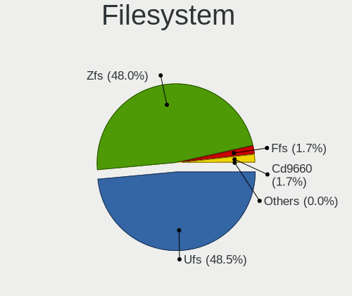
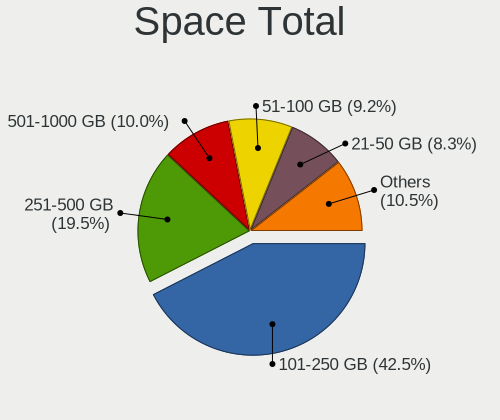
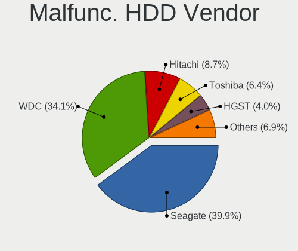
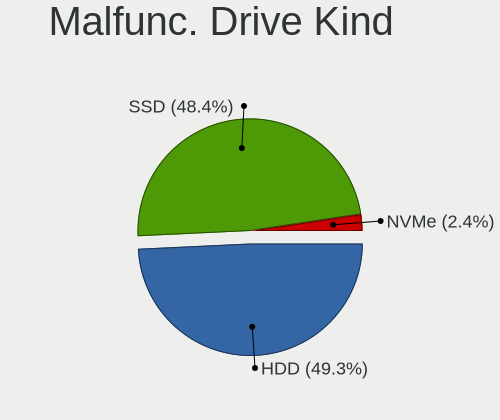
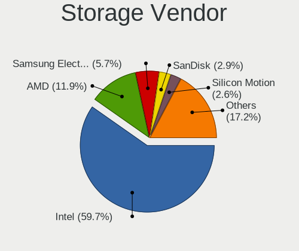
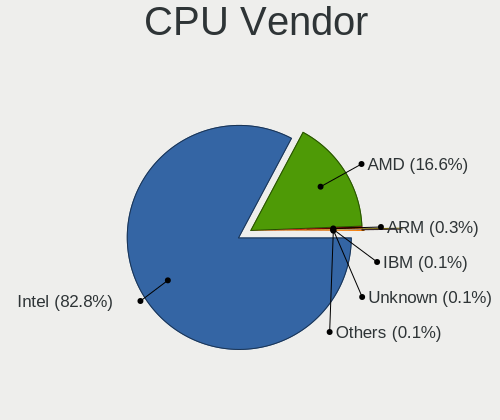
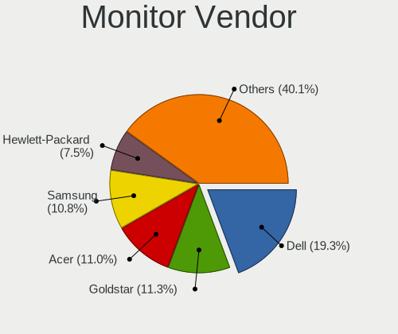
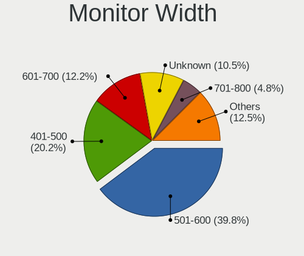
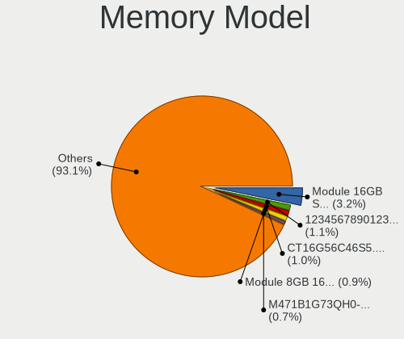
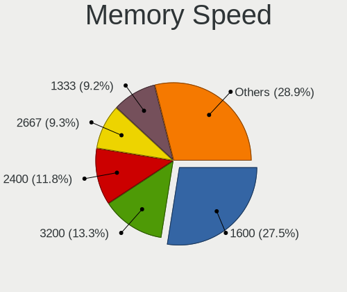

BSD in USA - Tested Hardware & Statistics (Desktops)
----------------------------------------------------

A project to collect tested hardware configurations for BSD in USA.

Anyone can contribute to this report by the [hw-probe](https://github.com/linuxhw/hw-probe/blob/master/INSTALL.BSD.md) tool:

    hw-probe -all -upload

Please contribute! Especially if your hardware is rare.

Contents
--------

* [ Test Cases ](#test-cases)

* [ System ](#system)
  - [ OS                       ](#os)
  - [ OS Family                ](#os-family)
  - [ Arch                     ](#arch)
  - [ DE                       ](#de)
  - [ Display Server           ](#display-server)
  - [ Display Manager          ](#display-manager)
  - [ OS Lang                  ](#os-lang)
  - [ Boot Mode                ](#boot-mode)
  - [ Filesystem               ](#filesystem)
  - [ Part. scheme             ](#part-scheme)

* [ Board ](#board)
  - [ Vendor                   ](#vendor)
  - [ Model                    ](#model)
  - [ Model Family             ](#model-family)
  - [ MFG Year                 ](#mfg-year)
  - [ Form Factor              ](#form-factor)
  - [ Coreboot                 ](#coreboot)
  - [ RAM Size                 ](#ram-size)
  - [ RAM Used                 ](#ram-used)
  - [ Total Drives             ](#total-drives)
  - [ Has CD-ROM               ](#has-cd-rom)
  - [ Has Ethernet             ](#has-ethernet)
  - [ Has WiFi                 ](#has-wifi)
  - [ Has Bluetooth            ](#has-bluetooth)

* [ Location ](#location)
  - [ Country                  ](#country)
  - [ City                     ](#city)

* [ Drives ](#drives)
  - [ Drive Vendor             ](#drive-vendor)
  - [ Drive Model              ](#drive-model)
  - [ HDD Vendor               ](#hdd-vendor)
  - [ SSD Vendor               ](#ssd-vendor)
  - [ Drive Kind               ](#drive-kind)
  - [ Drive Connector          ](#drive-connector)
  - [ Drive Size               ](#drive-size)
  - [ Space Total              ](#space-total)
  - [ Space Used               ](#space-used)
  - [ Malfunc. Drives          ](#malfunc-drives)
  - [ Malfunc. Drive Vendor    ](#malfunc-drive-vendor)
  - [ Malfunc. HDD Vendor      ](#malfunc-hdd-vendor)
  - [ Malfunc. Drive Kind      ](#malfunc-drive-kind)
  - [ Failed Drives            ](#failed-drives)
  - [ Failed Drive Vendor      ](#failed-drive-vendor)
  - [ Drive Status             ](#drive-status)

* [ Storage controller ](#storage-controller)
  - [ Storage Vendor           ](#storage-vendor)
  - [ Storage Model            ](#storage-model)
  - [ Storage Kind             ](#storage-kind)

* [ Processor ](#processor)
  - [ CPU Vendor               ](#cpu-vendor)
  - [ CPU Model                ](#cpu-model)
  - [ CPU Model Family         ](#cpu-model-family)
  - [ CPU Cores                ](#cpu-cores)
  - [ CPU Sockets              ](#cpu-sockets)
  - [ CPU Threads              ](#cpu-threads)
  - [ CPU Microarch            ](#cpu-microarch)

* [ Graphics ](#graphics)
  - [ GPU Vendor               ](#gpu-vendor)
  - [ GPU Model                ](#gpu-model)
  - [ GPU Combo                ](#gpu-combo)
  - [ GPU Driver               ](#gpu-driver)
  - [ GPU Memory               ](#gpu-memory)

* [ Monitor ](#monitor)
  - [ Monitor Vendor           ](#monitor-vendor)
  - [ Monitor Model            ](#monitor-model)
  - [ Monitor Resolution       ](#monitor-resolution)
  - [ Monitor Diagonal         ](#monitor-diagonal)
  - [ Monitor Width            ](#monitor-width)
  - [ Aspect Ratio             ](#aspect-ratio)
  - [ Monitor Area             ](#monitor-area)
  - [ Pixel Density            ](#pixel-density)
  - [ Multiple Monitors        ](#multiple-monitors)

* [ Network ](#network)
  - [ Net Controller Vendor    ](#net-controller-vendor)
  - [ Net Controller Model     ](#net-controller-model)
  - [ Wireless Vendor          ](#wireless-vendor)
  - [ Wireless Model           ](#wireless-model)
  - [ Ethernet Vendor          ](#ethernet-vendor)
  - [ Ethernet Model           ](#ethernet-model)
  - [ Net Controller Kind      ](#net-controller-kind)
  - [ Used Controller          ](#used-controller)
  - [ NICs                     ](#nics)
  - [ IPv6                     ](#ipv6)

* [ Bluetooth ](#bluetooth)
  - [ Bluetooth Vendor         ](#bluetooth-vendor)
  - [ Bluetooth Model          ](#bluetooth-model)

* [ Sound ](#sound)
  - [ Sound Vendor             ](#sound-vendor)
  - [ Sound Model              ](#sound-model)

* [ Memory ](#memory)
  - [ Memory Vendor            ](#memory-vendor)
  - [ Memory Model             ](#memory-model)
  - [ Memory Kind              ](#memory-kind)
  - [ Memory Form Factor       ](#memory-form-factor)
  - [ Memory Size              ](#memory-size)
  - [ Memory Speed             ](#memory-speed)

* [ Printers & scanners ](#printers--scanners)
  - [ Printer Vendor           ](#printer-vendor)
  - [ Printer Model            ](#printer-model)
  - [ Scanner Vendor           ](#scanner-vendor)
  - [ Scanner Model            ](#scanner-model)

* [ Camera ](#camera)
  - [ Camera Vendor            ](#camera-vendor)
  - [ Camera Model             ](#camera-model)

* [ Security ](#security)
  - [ Fingerprint Vendor       ](#fingerprint-vendor)
  - [ Fingerprint Model        ](#fingerprint-model)
  - [ Chipcard Vendor          ](#chipcard-vendor)
  - [ Chipcard Model           ](#chipcard-model)

* [ Unsupported ](#unsupported)
  - [ Unsupported Devices      ](#unsupported-devices)
  - [ Unsupported Device Types ](#unsupported-device-types)

Test Cases
----------

Total: 3107

| Vendor        | Model                       | Probe                                                     | Date         |
|---------------|-----------------------------|-----------------------------------------------------------|--------------|
| Protectli     | FW6 Ver                     | [61c7be6541](https://bsd-hardware.info/?probe=61c7be6541) | Jul 01, 2023 |
| ASUSTek       | ROG STRIX X570-F GAMING     | [b6cfa09740](https://bsd-hardware.info/?probe=b6cfa09740) | Jun 30, 2023 |
| Protectli     | FW6 Ver                     | [5c6f36540d](https://bsd-hardware.info/?probe=5c6f36540d) | Jun 29, 2023 |
| Protectli     | VP2420                      | [950ff902c2](https://bsd-hardware.info/?probe=950ff902c2) | Jun 29, 2023 |
| Intel         | DQ67SW AAG12527-310         | [5b272b02cb](https://bsd-hardware.info/?probe=5b272b02cb) | Jun 29, 2023 |
| HP            | 8055                        | [94df572de4](https://bsd-hardware.info/?probe=94df572de4) | Jun 29, 2023 |
| Dell          | 0NW6H5 A00                  | [0cdc2b47b2](https://bsd-hardware.info/?probe=0cdc2b47b2) | Jun 29, 2023 |
| HP            | 8595                        | [e1a82ff0c5](https://bsd-hardware.info/?probe=e1a82ff0c5) | Jun 29, 2023 |
| Unknown       | Unknown                     | [41e020bc03](https://bsd-hardware.info/?probe=41e020bc03) | Jun 29, 2023 |
| Intel         | MAHOBAY                     | [4053bc358e](https://bsd-hardware.info/?probe=4053bc358e) | Jun 29, 2023 |
| Dell          | 0NC2VH A01                  | [d5a7320a8a](https://bsd-hardware.info/?probe=d5a7320a8a) | Jun 28, 2023 |
| HP            | 339A                        | [b08e1fc092](https://bsd-hardware.info/?probe=b08e1fc092) | Jun 27, 2023 |
| ASUSTek       | TUF Gaming B550M-PLUS (W... | [4d99bc4b63](https://bsd-hardware.info/?probe=4d99bc4b63) | Jun 27, 2023 |
| ASUSTek       | TUF Gaming B550M-PLUS (W... | [8866724f46](https://bsd-hardware.info/?probe=8866724f46) | Jun 27, 2023 |
| Supermicro    | X11SDV-4C-TP8F              | [bc448a4c10](https://bsd-hardware.info/?probe=bc448a4c10) | Jun 27, 2023 |
| Supermicro    | X9SCL/X9SCMA                | [489b7b6bae](https://bsd-hardware.info/?probe=489b7b6bae) | Jun 26, 2023 |
| Unknown       | Unknown                     | [cd3b925f27](https://bsd-hardware.info/?probe=cd3b925f27) | Jun 26, 2023 |
| Gigabyte      | C1037UN                     | [fccc3f4b80](https://bsd-hardware.info/?probe=fccc3f4b80) | Jun 26, 2023 |
| AZW           | EQ                          | [c410cd5c1c](https://bsd-hardware.info/?probe=c410cd5c1c) | Jun 25, 2023 |
| Gigabyte      | B450M DS3H-CF               | [dc937eee63](https://bsd-hardware.info/?probe=dc937eee63) | Jun 25, 2023 |
| MSI           | H81M-P33                    | [80bd24461a](https://bsd-hardware.info/?probe=80bd24461a) | Jun 25, 2023 |
| ASUSTek       | P5Q-E                       | [e368d55893](https://bsd-hardware.info/?probe=e368d55893) | Jun 25, 2023 |
| ASUSTek       | ROG CROSSHAIR VIII HERO     | [483865aca5](https://bsd-hardware.info/?probe=483865aca5) | Jun 25, 2023 |
| Unknown       | Unknown                     | [32e290d370](https://bsd-hardware.info/?probe=32e290d370) | Jun 25, 2023 |
| Protectli     | FW6 Ver                     | [6210e8f0bc](https://bsd-hardware.info/?probe=6210e8f0bc) | Jun 24, 2023 |
| Techvision    | TVI7309X B0                 | [93213fc931](https://bsd-hardware.info/?probe=93213fc931) | Jun 24, 2023 |
| Dell          | 0Y7WYT A00                  | [a931ed9f0a](https://bsd-hardware.info/?probe=a931ed9f0a) | Jun 23, 2023 |
| Lenovo        | 312A SDK0J40697 WIN 3305... | [b6916f61a8](https://bsd-hardware.info/?probe=b6916f61a8) | Jun 23, 2023 |
| AZW           | EQ                          | [8a85da80b2](https://bsd-hardware.info/?probe=8a85da80b2) | Jun 23, 2023 |
| CWWK          | CW-AD4L-N V1                | [b7ca7c7195](https://bsd-hardware.info/?probe=b7ca7c7195) | Jun 22, 2023 |
| Unknown       | Unknown                     | [f73625157c](https://bsd-hardware.info/?probe=f73625157c) | Jun 22, 2023 |
| Protectli     | VP2410                      | [94e2177a56](https://bsd-hardware.info/?probe=94e2177a56) | Jun 22, 2023 |
| Dell          | 0NW6H5 A00                  | [7d3a60d628](https://bsd-hardware.info/?probe=7d3a60d628) | Jun 22, 2023 |
| Techvision    | TVI7309X B0                 | [178a67ff39](https://bsd-hardware.info/?probe=178a67ff39) | Jun 21, 2023 |
| Dell          | 0NC2VH A01                  | [f094606e8f](https://bsd-hardware.info/?probe=f094606e8f) | Jun 21, 2023 |
| Hardkernel    | ODROID-H3                   | [8f550b0d75](https://bsd-hardware.info/?probe=8f550b0d75) | Jun 21, 2023 |
| BESSTAR Te... | TH50                        | [efc396837c](https://bsd-hardware.info/?probe=efc396837c) | Jun 21, 2023 |
| Techvision    | TVI7309X B0                 | [12d57aa9d9](https://bsd-hardware.info/?probe=12d57aa9d9) | Jun 21, 2023 |
| CWWK          | CW-AD4L-N V1                | [a09d71cc14](https://bsd-hardware.info/?probe=a09d71cc14) | Jun 21, 2023 |
| HP            | 802E                        | [595a5d4f60](https://bsd-hardware.info/?probe=595a5d4f60) | Jun 21, 2023 |
| Unknown       | Unknown                     | [d0c184ae86](https://bsd-hardware.info/?probe=d0c184ae86) | Jun 20, 2023 |
| Techvision    | TVI7309X B0                 | [1fa198f78d](https://bsd-hardware.info/?probe=1fa198f78d) | Jun 19, 2023 |
| Intel         | CRESCENTBAY                 | [e8c8da464a](https://bsd-hardware.info/?probe=e8c8da464a) | Jun 19, 2023 |
| Dell          | 07F37C A01                  | [16e5a062a2](https://bsd-hardware.info/?probe=16e5a062a2) | Jun 18, 2023 |
| ASRock        | X570 Phantom Gaming 4       | [705c750691](https://bsd-hardware.info/?probe=705c750691) | Jun 17, 2023 |
| HP            | 83E9                        | [23ec260317](https://bsd-hardware.info/?probe=23ec260317) | Jun 16, 2023 |
| Unknown       | Unknown                     | [a6d5232f75](https://bsd-hardware.info/?probe=a6d5232f75) | Jun 16, 2023 |
| Unknown       | Unknown                     | [06754d9e71](https://bsd-hardware.info/?probe=06754d9e71) | Jun 15, 2023 |
| Dell          | 08NPPY A00                  | [8586467924](https://bsd-hardware.info/?probe=8586467924) | Jun 15, 2023 |
| MW            | GMLK-2_5G4L                 | [3274745a08](https://bsd-hardware.info/?probe=3274745a08) | Jun 15, 2023 |
| Protectli     | VP2420                      | [82ecf3a046](https://bsd-hardware.info/?probe=82ecf3a046) | Jun 14, 2023 |
| ASUSTek       | PRIME X370-PRO              | [6e8e70ddc2](https://bsd-hardware.info/?probe=6e8e70ddc2) | Jun 13, 2023 |
| ASRock        | X570 Phantom Gaming 4       | [c19a29f083](https://bsd-hardware.info/?probe=c19a29f083) | Jun 13, 2023 |
| MSI           | X370 GAMING PRO CARBON      | [33b64d3084](https://bsd-hardware.info/?probe=33b64d3084) | Jun 13, 2023 |
| Dell          | 02YYK5 A00                  | [0dc0eab687](https://bsd-hardware.info/?probe=0dc0eab687) | Jun 13, 2023 |
| Pegatron      | 2AD5                        | [751e307940](https://bsd-hardware.info/?probe=751e307940) | Jun 13, 2023 |
| HP            | 213D A01                    | [2a6603c79a](https://bsd-hardware.info/?probe=2a6603c79a) | Jun 12, 2023 |
| Dell          | 0D28YY A00                  | [9f14962984](https://bsd-hardware.info/?probe=9f14962984) | Jun 11, 2023 |
| MSI           | H81M-P33                    | [3d9a05635f](https://bsd-hardware.info/?probe=3d9a05635f) | Jun 11, 2023 |
| ASUSTek       | P5Q-E                       | [b8f3eeed4b](https://bsd-hardware.info/?probe=b8f3eeed4b) | Jun 11, 2023 |
| ASUSTek       | ROG CROSSHAIR VIII HERO     | [9c888141fb](https://bsd-hardware.info/?probe=9c888141fb) | Jun 11, 2023 |
| Protectli     | FW6 Ver                     | [3f8a97d0e7](https://bsd-hardware.info/?probe=3f8a97d0e7) | Jun 11, 2023 |
| Intel         | S1200KP AAG34877-201        | [39eba90e6a](https://bsd-hardware.info/?probe=39eba90e6a) | Jun 10, 2023 |
| Gigabyte      | C1037UN                     | [d8f7cea73b](https://bsd-hardware.info/?probe=d8f7cea73b) | Jun 10, 2023 |
| Intel         | S1200KP AAG34877-201        | [ec04f3f6d5](https://bsd-hardware.info/?probe=ec04f3f6d5) | Jun 10, 2023 |
| Protectli     | FW4B Ver                    | [af56081a76](https://bsd-hardware.info/?probe=af56081a76) | Jun 10, 2023 |
| Protectli     | FW6 Ver                     | [6cc2f54681](https://bsd-hardware.info/?probe=6cc2f54681) | Jun 10, 2023 |
| ASUSTek       | PRIME B760M-A D4            | [7d23d1c91f](https://bsd-hardware.info/?probe=7d23d1c91f) | Jun 09, 2023 |
| PC Engines    | APU2                        | [24545e8f90](https://bsd-hardware.info/?probe=24545e8f90) | Jun 09, 2023 |
| Dell          | 0YXT71 A02                  | [e42082ba89](https://bsd-hardware.info/?probe=e42082ba89) | Jun 09, 2023 |
| MSI           | MS-7360                     | [f54096f3e5](https://bsd-hardware.info/?probe=f54096f3e5) | Jun 08, 2023 |
| ASUSTek       | M11AD                       | [7ffef5814d](https://bsd-hardware.info/?probe=7ffef5814d) | Jun 07, 2023 |
| MW            | GMLK-2_5G4L                 | [54c23902c7](https://bsd-hardware.info/?probe=54c23902c7) | Jun 07, 2023 |
| Pegatron      | 2AD5                        | [e50d3f9b86](https://bsd-hardware.info/?probe=e50d3f9b86) | Jun 06, 2023 |
| Dell          | 0NC2VH A01                  | [0b9ad8d7d8](https://bsd-hardware.info/?probe=0b9ad8d7d8) | Jun 06, 2023 |
| HP            | 843F                        | [57b6c258ad](https://bsd-hardware.info/?probe=57b6c258ad) | Jun 06, 2023 |
| Acer          | Aspire XC-1660G V:1.1       | [e07bfb044b](https://bsd-hardware.info/?probe=e07bfb044b) | Jun 06, 2023 |
| HP            | 212B                        | [4db61072c4](https://bsd-hardware.info/?probe=4db61072c4) | Jun 05, 2023 |
| MW            | GMLK-2_5G4L                 | [e137b3e686](https://bsd-hardware.info/?probe=e137b3e686) | Jun 05, 2023 |
| HP            | 339A                        | [74f857c400](https://bsd-hardware.info/?probe=74f857c400) | Jun 05, 2023 |
| MSI           | H81M-P33                    | [88598bfbf5](https://bsd-hardware.info/?probe=88598bfbf5) | Jun 04, 2023 |
| ASUSTek       | P5Q-E                       | [fac0ed387e](https://bsd-hardware.info/?probe=fac0ed387e) | Jun 04, 2023 |
| ASUSTek       | ROG CROSSHAIR VIII HERO     | [3c76deca15](https://bsd-hardware.info/?probe=3c76deca15) | Jun 04, 2023 |
| HP            | 802E                        | [2af6f8a101](https://bsd-hardware.info/?probe=2af6f8a101) | Jun 04, 2023 |
| Acer          | Aspire XC-1660G V:1.1       | [cf05481728](https://bsd-hardware.info/?probe=cf05481728) | Jun 04, 2023 |
| HP            | 805A                        | [3ad8551330](https://bsd-hardware.info/?probe=3ad8551330) | Jun 04, 2023 |
| Protectli     | FW4B Ver                    | [0f5b2ad316](https://bsd-hardware.info/?probe=0f5b2ad316) | Jun 03, 2023 |
| Unknown       | Unknown                     | [ffb4544d8c](https://bsd-hardware.info/?probe=ffb4544d8c) | Jun 03, 2023 |
| Protectli     | FW6 Ver                     | [a42fcbbc12](https://bsd-hardware.info/?probe=a42fcbbc12) | Jun 03, 2023 |
| Dell          | 08NPPY A00                  | [538e16bf08](https://bsd-hardware.info/?probe=538e16bf08) | Jun 03, 2023 |
| AAEON         | FWS-2360 V1.0               | [bcb707d6d0](https://bsd-hardware.info/?probe=bcb707d6d0) | Jun 02, 2023 |
| Unknown       | Unknown                     | [2702f3486a](https://bsd-hardware.info/?probe=2702f3486a) | Jun 02, 2023 |
| ASRockRack    | X570D4U-2L2T                | [4cada5d71b](https://bsd-hardware.info/?probe=4cada5d71b) | Jun 02, 2023 |
| Unknown       | Unknown                     | [09b74995b7](https://bsd-hardware.info/?probe=09b74995b7) | Jun 02, 2023 |
| Supermicro    | X9SCL/X9SCMA                | [2348a2736e](https://bsd-hardware.info/?probe=2348a2736e) | Jun 02, 2023 |
| Unknown       | Unknown                     | [a3bc187a6b](https://bsd-hardware.info/?probe=a3bc187a6b) | Jun 02, 2023 |
| HP            | 805A                        | [b50fd38c94](https://bsd-hardware.info/?probe=b50fd38c94) | Jun 01, 2023 |
| Intel         | Q3XXG4-P V1.0               | [ef66603fb9](https://bsd-hardware.info/?probe=ef66603fb9) | Jun 01, 2023 |
| ASRock        | FM2A78M-ITX+                | [aecc8b1372](https://bsd-hardware.info/?probe=aecc8b1372) | Jun 01, 2023 |
| Dell          | 05XGC8 A01                  | [c40e01cab3](https://bsd-hardware.info/?probe=c40e01cab3) | Jun 01, 2023 |
| Acer          | Aspire XC-1660G V:1.1       | [8b0669a87d](https://bsd-hardware.info/?probe=8b0669a87d) | May 31, 2023 |
| HP            | 802E                        | [2b1f2776cd](https://bsd-hardware.info/?probe=2b1f2776cd) | May 31, 2023 |
| Gigabyte      | C1037UN                     | [7502577edc](https://bsd-hardware.info/?probe=7502577edc) | May 31, 2023 |
| CWWK          | CW-AD4L-N V1                | [d5a2882e49](https://bsd-hardware.info/?probe=d5a2882e49) | May 31, 2023 |
| Unknown       | Unknown                     | [f6643f3b06](https://bsd-hardware.info/?probe=f6643f3b06) | May 31, 2023 |
| Fujitsu       | D3313-G1 S26361-D3313-G1    | [c7f2f78173](https://bsd-hardware.info/?probe=c7f2f78173) | May 31, 2023 |
| Gigabyte      | C1037UN                     | [79e0162b9c](https://bsd-hardware.info/?probe=79e0162b9c) | May 30, 2023 |
| Intel         | S1200KP AAG34877-201        | [b264e962d0](https://bsd-hardware.info/?probe=b264e962d0) | May 30, 2023 |
| Dell          | 00V62H A01                  | [7d2e30807a](https://bsd-hardware.info/?probe=7d2e30807a) | May 30, 2023 |
| Protectli     | FW6 Ver                     | [21bad05407](https://bsd-hardware.info/?probe=21bad05407) | May 29, 2023 |
| Intel         | SKYBAY                      | [86747c5b22](https://bsd-hardware.info/?probe=86747c5b22) | May 29, 2023 |
| Unknown       | iKoolCore R1 iKoolCore R... | [a12b5d1715](https://bsd-hardware.info/?probe=a12b5d1715) | May 29, 2023 |
| Intel         | JSL MRD                     | [6fa703d206](https://bsd-hardware.info/?probe=6fa703d206) | May 28, 2023 |
| ASUSTek       | ROG CROSSHAIR VIII HERO     | [28c84f71fd](https://bsd-hardware.info/?probe=28c84f71fd) | May 28, 2023 |
| ASUSTek       | P5Q-E                       | [cf8b2af78b](https://bsd-hardware.info/?probe=cf8b2af78b) | May 28, 2023 |
| Intel         | JSL MRD                     | [fc7970abd1](https://bsd-hardware.info/?probe=fc7970abd1) | May 28, 2023 |
| PC Engines    | APU2                        | [4c27451012](https://bsd-hardware.info/?probe=4c27451012) | May 28, 2023 |
| PC Engines    | APU2                        | [6b276a70c5](https://bsd-hardware.info/?probe=6b276a70c5) | May 28, 2023 |
| Unknown       | iKoolCore R1 iKoolCore R... | [3560dcfedc](https://bsd-hardware.info/?probe=3560dcfedc) | May 27, 2023 |
| Unknown       | iKoolCore R1 iKoolCore R... | [2caaa9f6cf](https://bsd-hardware.info/?probe=2caaa9f6cf) | May 27, 2023 |
| ASRock        | H270M-ITX/ac                | [69aaebd77e](https://bsd-hardware.info/?probe=69aaebd77e) | May 27, 2023 |
| Unknown       | Unknown                     | [0918049f45](https://bsd-hardware.info/?probe=0918049f45) | May 27, 2023 |
| Intel         | S1200KP AAG34877-201        | [5bf84ec376](https://bsd-hardware.info/?probe=5bf84ec376) | May 27, 2023 |
| Protectli     | FW6                         | [f7626db73e](https://bsd-hardware.info/?probe=f7626db73e) | May 27, 2023 |
| ASUSTek       | Z97-E/USB                   | [dbda738a56](https://bsd-hardware.info/?probe=dbda738a56) | May 27, 2023 |
| Dell          | 051FJ8 A02                  | [d0d211e4e7](https://bsd-hardware.info/?probe=d0d211e4e7) | May 27, 2023 |
| ChangWang     | CW56-58                     | [b6b902639c](https://bsd-hardware.info/?probe=b6b902639c) | May 27, 2023 |
| Dell          | 051FJ8 A02                  | [8ba976666f](https://bsd-hardware.info/?probe=8ba976666f) | May 27, 2023 |
| Lenovo        | 30D0 SDK0J40705 WIN 3425... | [8514299fe4](https://bsd-hardware.info/?probe=8514299fe4) | May 26, 2023 |
| Supermicro    | X9SCL/X9SCMA                | [19c6226530](https://bsd-hardware.info/?probe=19c6226530) | May 26, 2023 |
| Protectli     | VP2420                      | [2b716b3dd3](https://bsd-hardware.info/?probe=2b716b3dd3) | May 26, 2023 |
| Protectli     | FW4B Ver                    | [90b4ae806f](https://bsd-hardware.info/?probe=90b4ae806f) | May 25, 2023 |
| HP            | 8299                        | [14a7b5fc70](https://bsd-hardware.info/?probe=14a7b5fc70) | May 24, 2023 |
| Unknown       | Unknown                     | [a9d20f955e](https://bsd-hardware.info/?probe=a9d20f955e) | May 24, 2023 |
| Dell          | 0NC2VH A01                  | [572d966731](https://bsd-hardware.info/?probe=572d966731) | May 24, 2023 |
| ASUSTek       | PRIME A520M-A II            | [eba55377e0](https://bsd-hardware.info/?probe=eba55377e0) | May 22, 2023 |
| Supermicro    | X8SIL                       | [21823c6dbd](https://bsd-hardware.info/?probe=21823c6dbd) | May 22, 2023 |
| Unknown       | Unknown                     | [b5e5e8e2cc](https://bsd-hardware.info/?probe=b5e5e8e2cc) | May 21, 2023 |
| MSI           | H81M-P33                    | [cadb0f588f](https://bsd-hardware.info/?probe=cadb0f588f) | May 21, 2023 |
| ASUSTek       | P5Q-E                       | [4a55c4a669](https://bsd-hardware.info/?probe=4a55c4a669) | May 21, 2023 |
| ASUSTek       | ROG CROSSHAIR VIII HERO     | [f2fb56c7dc](https://bsd-hardware.info/?probe=f2fb56c7dc) | May 21, 2023 |
| Intel         | Q3XXG4-P V1.0               | [7c28bf2d83](https://bsd-hardware.info/?probe=7c28bf2d83) | May 20, 2023 |
| Gigabyte      | X570 UD                     | [5576c293d8](https://bsd-hardware.info/?probe=5576c293d8) | May 20, 2023 |
| ASUSTek       | Z87M-PLUS                   | [58da7daed7](https://bsd-hardware.info/?probe=58da7daed7) | May 20, 2023 |
| ASUSTek       | Z97-E/USB                   | [484774ff19](https://bsd-hardware.info/?probe=484774ff19) | May 19, 2023 |
| HP            | 18E7                        | [477f3d4c80](https://bsd-hardware.info/?probe=477f3d4c80) | May 19, 2023 |
| Shuttle       | FH270                       | [95b532312a](https://bsd-hardware.info/?probe=95b532312a) | May 18, 2023 |
| Supermicro    | X7SBL                       | [b5ba4ba0e8](https://bsd-hardware.info/?probe=b5ba4ba0e8) | May 18, 2023 |
| Protectli     | FW4C                        | [a8252edc71](https://bsd-hardware.info/?probe=a8252edc71) | May 18, 2023 |
| HP            | 8299                        | [6d2f149a51](https://bsd-hardware.info/?probe=6d2f149a51) | May 18, 2023 |
| Techvision    | TVI7309X B0                 | [c4546c2b83](https://bsd-hardware.info/?probe=c4546c2b83) | May 17, 2023 |
| MW            | GMLK-2_5G4L                 | [39516c2e91](https://bsd-hardware.info/?probe=39516c2e91) | May 16, 2023 |
| MSI           | Z170A PC MATE               | [9c08a669ab](https://bsd-hardware.info/?probe=9c08a669ab) | May 16, 2023 |
| MSI           | Z170A PC MATE               | [75a9fd684a](https://bsd-hardware.info/?probe=75a9fd684a) | May 16, 2023 |
| MSI           | H81TI                       | [798ddd2aa1](https://bsd-hardware.info/?probe=798ddd2aa1) | May 16, 2023 |
| Lenovo        | 30D0 SDK0J40705 WIN 3425... | [27be69ed61](https://bsd-hardware.info/?probe=27be69ed61) | May 15, 2023 |
| MW            | GMLK-2_5G4L                 | [bc475b9528](https://bsd-hardware.info/?probe=bc475b9528) | May 15, 2023 |
| Protectli     | FW6 Ver                     | [ea9ff40bdb](https://bsd-hardware.info/?probe=ea9ff40bdb) | May 14, 2023 |
| ASRock        | 4X4-V1000                   | [189073c58e](https://bsd-hardware.info/?probe=189073c58e) | May 14, 2023 |
| HP            | 8054                        | [1ffc97728a](https://bsd-hardware.info/?probe=1ffc97728a) | May 14, 2023 |
| Supermicro    | X9SCL/X9SCMA                | [cb87f3725f](https://bsd-hardware.info/?probe=cb87f3725f) | May 14, 2023 |
| MSI           | H81M-P33                    | [ebf1ee8152](https://bsd-hardware.info/?probe=ebf1ee8152) | May 14, 2023 |
| ASUSTek       | P5Q-E                       | [2bf04b4cf1](https://bsd-hardware.info/?probe=2bf04b4cf1) | May 14, 2023 |
| ASUSTek       | ROG CROSSHAIR VIII HERO     | [ae7796a444](https://bsd-hardware.info/?probe=ae7796a444) | May 14, 2023 |
| Protectli     | FW1 Ver                     | [824016ccf0](https://bsd-hardware.info/?probe=824016ccf0) | May 14, 2023 |
| Dell          | 0MGK50 A01                  | [4222f2f8a5](https://bsd-hardware.info/?probe=4222f2f8a5) | May 13, 2023 |
| Unknown       | N4000                       | [48742290f1](https://bsd-hardware.info/?probe=48742290f1) | May 13, 2023 |
| Dell          | 0PC5F7 A02                  | [b22c9a0cdf](https://bsd-hardware.info/?probe=b22c9a0cdf) | May 13, 2023 |
| Unknown       | Unknown                     | [00a94d98fb](https://bsd-hardware.info/?probe=00a94d98fb) | May 13, 2023 |
| Unknown       | Unknown                     | [2e9d95aed5](https://bsd-hardware.info/?probe=2e9d95aed5) | May 13, 2023 |
| MSI           | PRO B550M-VC WIFI           | [1daa68fb84](https://bsd-hardware.info/?probe=1daa68fb84) | May 13, 2023 |
| ASUSTek       | PRIME X370-PRO              | [a477479a00](https://bsd-hardware.info/?probe=a477479a00) | May 13, 2023 |
| ASRock        | X570 Phantom Gaming 4       | [de9fcd9543](https://bsd-hardware.info/?probe=de9fcd9543) | May 13, 2023 |
| Dell          | 02YYK5 A00                  | [71e4a5f1ec](https://bsd-hardware.info/?probe=71e4a5f1ec) | May 13, 2023 |
| BCM Advanc... | MX81HV/MX81H 10             | [f58c8bdd86](https://bsd-hardware.info/?probe=f58c8bdd86) | May 13, 2023 |
| Gigabyte      | GA-78LMT-USB3               | [a7fe22ce82](https://bsd-hardware.info/?probe=a7fe22ce82) | May 13, 2023 |
| Biostar       | H61MGC                      | [001611da7e](https://bsd-hardware.info/?probe=001611da7e) | May 12, 2023 |
| Unknown       | YL-J3160L4                  | [fc9a0ecef6](https://bsd-hardware.info/?probe=fc9a0ecef6) | May 12, 2023 |
| JHZD          | BQM5                        | [6b32c22615](https://bsd-hardware.info/?probe=6b32c22615) | May 12, 2023 |
| JHZD          | BQM5                        | [fbbaf0b924](https://bsd-hardware.info/?probe=fbbaf0b924) | May 11, 2023 |
| Protectli     | FW6 Ver                     | [fc8375381d](https://bsd-hardware.info/?probe=fc8375381d) | May 11, 2023 |
| ASRock        | H370M-ITX/ac                | [1e9cfaf845](https://bsd-hardware.info/?probe=1e9cfaf845) | May 11, 2023 |
| ASUSTek       | ROG STRIX B450-F GAMING     | [834174a5a8](https://bsd-hardware.info/?probe=834174a5a8) | May 11, 2023 |
| HP            | 1588h                       | [f1d543fb77](https://bsd-hardware.info/?probe=f1d543fb77) | May 11, 2023 |
| Protectli     | FW6 Ver                     | [f76a340f4a](https://bsd-hardware.info/?probe=f76a340f4a) | May 11, 2023 |
| Protectli     | FW6                         | [37432c6de1](https://bsd-hardware.info/?probe=37432c6de1) | May 10, 2023 |
| Dell          | 0Y7WYT A00                  | [89abd9548b](https://bsd-hardware.info/?probe=89abd9548b) | May 10, 2023 |
| Lenovo        | 3111 SDK0J40705 WIN 3425... | [42b97c3277](https://bsd-hardware.info/?probe=42b97c3277) | May 10, 2023 |
| Dell          | 0NV0M7 A01                  | [72cdd452c8](https://bsd-hardware.info/?probe=72cdd452c8) | May 10, 2023 |
| Intel         | Q3XXG4-P V1.0               | [3359e9a10e](https://bsd-hardware.info/?probe=3359e9a10e) | May 10, 2023 |
| Lenovo        | 3111 SDK0J40705 WIN 3425... | [df84be1ef9](https://bsd-hardware.info/?probe=df84be1ef9) | May 10, 2023 |
| ASUSTek       | P10S-E Series               | [37451da8a7](https://bsd-hardware.info/?probe=37451da8a7) | May 08, 2023 |
| Dell          | 040DDP A01                  | [d5fa48cd90](https://bsd-hardware.info/?probe=d5fa48cd90) | May 07, 2023 |
| MSI           | H81M-P33                    | [55cfed4de4](https://bsd-hardware.info/?probe=55cfed4de4) | May 07, 2023 |
| ASUSTek       | P5Q-E                       | [0cb51a327e](https://bsd-hardware.info/?probe=0cb51a327e) | May 07, 2023 |
| ASUSTek       | ROG CROSSHAIR VIII HERO     | [7e41914431](https://bsd-hardware.info/?probe=7e41914431) | May 07, 2023 |
| Supermicro    | X11SDV-4C-TP8F-01           | [733c921923](https://bsd-hardware.info/?probe=733c921923) | May 07, 2023 |
| Dell          | 0HD5W2 A01                  | [a583770abc](https://bsd-hardware.info/?probe=a583770abc) | May 07, 2023 |
| Lenovo        | SHARKBAY 0B98401 PRO        | [f2ea102ee1](https://bsd-hardware.info/?probe=f2ea102ee1) | May 06, 2023 |
| ASRock        | X570 PG Velocita            | [46925c3dda](https://bsd-hardware.info/?probe=46925c3dda) | May 06, 2023 |
| AZW           | MINI S 10                   | [123024f70d](https://bsd-hardware.info/?probe=123024f70d) | May 06, 2023 |
| Dell          | 0Y7WYT A00                  | [dfb339020a](https://bsd-hardware.info/?probe=dfb339020a) | May 06, 2023 |
| Dell          | 0NV0M7 A01                  | [85256a78f6](https://bsd-hardware.info/?probe=85256a78f6) | May 05, 2023 |
| Unknown       | Unknown                     | [2002ddd198](https://bsd-hardware.info/?probe=2002ddd198) | May 05, 2023 |
| Protectli     | VP2420                      | [3fcbd494fc](https://bsd-hardware.info/?probe=3fcbd494fc) | May 05, 2023 |
| Supermicro    | X11SCV-Q                    | [7a6949713d](https://bsd-hardware.info/?probe=7a6949713d) | May 05, 2023 |
| CWWK          | MINIPC-G12                  | [f2ab15324b](https://bsd-hardware.info/?probe=f2ab15324b) | May 05, 2023 |
| ASUSTek       | PRIME B560M-A AC            | [bdd112ce9b](https://bsd-hardware.info/?probe=bdd112ce9b) | May 05, 2023 |
| Supermicro    | X9SCL/X9SCMA                | [982f87fd4d](https://bsd-hardware.info/?probe=982f87fd4d) | May 05, 2023 |
| Dell          | 0F6X5P A00                  | [ba619e879e](https://bsd-hardware.info/?probe=ba619e879e) | May 04, 2023 |
| GoWin Solu... | R86S                        | [a1274a9d0c](https://bsd-hardware.info/?probe=a1274a9d0c) | May 04, 2023 |
| Intel         | DQ77KB AAG81483-501         | [38f47bf53f](https://bsd-hardware.info/?probe=38f47bf53f) | May 04, 2023 |
| Protectli     | FW6 Ver                     | [5e30b0e6b1](https://bsd-hardware.info/?probe=5e30b0e6b1) | May 04, 2023 |
| Unknown       | Unknown                     | [c430ceb253](https://bsd-hardware.info/?probe=c430ceb253) | May 04, 2023 |
| ASUSTek       | PRIME B760M-A D4            | [31c9c606ab](https://bsd-hardware.info/?probe=31c9c606ab) | May 04, 2023 |
| Unknown       | Unknown                     | [4277dc49d0](https://bsd-hardware.info/?probe=4277dc49d0) | May 04, 2023 |
| Dell          | 0252PH A04                  | [0cc9ef6521](https://bsd-hardware.info/?probe=0cc9ef6521) | May 03, 2023 |
| Dell          | 0252PH A04                  | [acaf59c3d5](https://bsd-hardware.info/?probe=acaf59c3d5) | May 03, 2023 |
| HP            | 82B4                        | [1bcefd3823](https://bsd-hardware.info/?probe=1bcefd3823) | May 02, 2023 |
| Dell          | 0T7D40 A00                  | [83ccb5ff07](https://bsd-hardware.info/?probe=83ccb5ff07) | May 02, 2023 |
| ASUSTek       | ROG STRIX B550-F GAMING     | [3f089673e0](https://bsd-hardware.info/?probe=3f089673e0) | May 01, 2023 |
| ASUSTek       | ROG STRIX B550-F GAMING     | [396d7f268c](https://bsd-hardware.info/?probe=396d7f268c) | May 01, 2023 |
| IceWhale T... | ZimaBoard 832 ZMB           | [a59b6fc6dc](https://bsd-hardware.info/?probe=a59b6fc6dc) | Apr 30, 2023 |
| IceWhale T... | ZimaBoard 832 ZMB           | [2cc6521d1f](https://bsd-hardware.info/?probe=2cc6521d1f) | Apr 30, 2023 |
| Dell          | 0FF3FN A00                  | [717b46840a](https://bsd-hardware.info/?probe=717b46840a) | Apr 30, 2023 |
| Dell          | 0H634K A00                  | [5e783a1c2e](https://bsd-hardware.info/?probe=5e783a1c2e) | Apr 30, 2023 |
| MSI           | H81M-P33                    | [e28acf1164](https://bsd-hardware.info/?probe=e28acf1164) | Apr 30, 2023 |
| ASUSTek       | P5Q-E                       | [33d1b6e2d2](https://bsd-hardware.info/?probe=33d1b6e2d2) | Apr 30, 2023 |
| ASUSTek       | ROG CROSSHAIR VIII HERO     | [b0d9eaaceb](https://bsd-hardware.info/?probe=b0d9eaaceb) | Apr 30, 2023 |
| Gigabyte      | B450M DS3H-CF               | [2b922b7925](https://bsd-hardware.info/?probe=2b922b7925) | Apr 30, 2023 |
| HP            | 83E1                        | [d3e5e9a563](https://bsd-hardware.info/?probe=d3e5e9a563) | Apr 30, 2023 |
| Dell          | 00V62H A00                  | [ad97036f62](https://bsd-hardware.info/?probe=ad97036f62) | Apr 29, 2023 |
| Supermicro    | X11SDV-4C-TP8F              | [dbdb6539fb](https://bsd-hardware.info/?probe=dbdb6539fb) | Apr 29, 2023 |
| Protectli     | FW4C Ver                    | [29ecd63e1e](https://bsd-hardware.info/?probe=29ecd63e1e) | Apr 28, 2023 |
| Unknown       | iKoolCore R1 iKoolCore R... | [9495b45b30](https://bsd-hardware.info/?probe=9495b45b30) | Apr 28, 2023 |
| Protectli     | VP2420                      | [b980175f4f](https://bsd-hardware.info/?probe=b980175f4f) | Apr 28, 2023 |
| Gigabyte      | Z590 AORUS ULTRA            | [f6200a69eb](https://bsd-hardware.info/?probe=f6200a69eb) | Apr 28, 2023 |
| NCR           | Richmond BIOS.6.0           | [e41e1e5c70](https://bsd-hardware.info/?probe=e41e1e5c70) | Apr 28, 2023 |
| Protectli     | FW4B Ver                    | [ef3774c8f2](https://bsd-hardware.info/?probe=ef3774c8f2) | Apr 28, 2023 |
| Protectli     | VP2420                      | [8b2758be02](https://bsd-hardware.info/?probe=8b2758be02) | Apr 27, 2023 |
| HP            | 8299                        | [f26926526d](https://bsd-hardware.info/?probe=f26926526d) | Apr 27, 2023 |
| ASUSTek       | PRIME B760M-A D4            | [9d15e108e6](https://bsd-hardware.info/?probe=9d15e108e6) | Apr 27, 2023 |
| Dell          | 0252PH A04                  | [f497e66dec](https://bsd-hardware.info/?probe=f497e66dec) | Apr 27, 2023 |
| HP            | 83EE                        | [b5a00cabd1](https://bsd-hardware.info/?probe=b5a00cabd1) | Apr 26, 2023 |
| Unknown       | Unknown                     | [ece1b6bacb](https://bsd-hardware.info/?probe=ece1b6bacb) | Apr 26, 2023 |
| HP            | 859B                        | [357ef27be4](https://bsd-hardware.info/?probe=357ef27be4) | Apr 26, 2023 |
| HP            | 82B4                        | [58c58b6a82](https://bsd-hardware.info/?probe=58c58b6a82) | Apr 26, 2023 |
| HP            | 8056                        | [44fb168511](https://bsd-hardware.info/?probe=44fb168511) | Apr 26, 2023 |
| AZW           | EQ                          | [8dd15b5070](https://bsd-hardware.info/?probe=8dd15b5070) | Apr 26, 2023 |
| Lenovo        | 3132 SDK0J40697 WIN 3305... | [6efffdce00](https://bsd-hardware.info/?probe=6efffdce00) | Apr 25, 2023 |
| ASUSTek       | P10S-E Series               | [e6d1a90732](https://bsd-hardware.info/?probe=e6d1a90732) | Apr 25, 2023 |
| HP            | 83E1                        | [865bd9b84e](https://bsd-hardware.info/?probe=865bd9b84e) | Apr 25, 2023 |
| Supermicro    | X11SDV-8C-TP8F              | [b56e27db28](https://bsd-hardware.info/?probe=b56e27db28) | Apr 25, 2023 |
| Dell          | 0NV0M7 A01                  | [601f819826](https://bsd-hardware.info/?probe=601f819826) | Apr 25, 2023 |
| ASUSTek       | ROG CROSSHAIR VIII HERO     | [cf0771c3a2](https://bsd-hardware.info/?probe=cf0771c3a2) | Apr 25, 2023 |
| Supermicro    | X11SDV-4C-TP8F-01           | [02d2e2ea42](https://bsd-hardware.info/?probe=02d2e2ea42) | Apr 25, 2023 |
| HP            | 18E7                        | [777359d3c1](https://bsd-hardware.info/?probe=777359d3c1) | Apr 24, 2023 |
| ASUSTek       | TUF Gaming X670E-PLUS WI... | [d3373e972b](https://bsd-hardware.info/?probe=d3373e972b) | Apr 24, 2023 |
| Protectli     | FW4C Ver                    | [39d17845fb](https://bsd-hardware.info/?probe=39d17845fb) | Apr 24, 2023 |
| AZW           | EQ                          | [fe3205803d](https://bsd-hardware.info/?probe=fe3205803d) | Apr 24, 2023 |
| ASRock        | X370 Pro4                   | [9678198b3b](https://bsd-hardware.info/?probe=9678198b3b) | Apr 24, 2023 |
| Dell          | 0NV0M7 A01                  | [280ab26f33](https://bsd-hardware.info/?probe=280ab26f33) | Apr 24, 2023 |
| Supermicro    | A1SRi-2758F                 | [750e44f983](https://bsd-hardware.info/?probe=750e44f983) | Apr 24, 2023 |
| MW            | GMLK-2_5G4L                 | [b3a756536a](https://bsd-hardware.info/?probe=b3a756536a) | Apr 23, 2023 |
| MSI           | H81M-P33                    | [6df7a17ff2](https://bsd-hardware.info/?probe=6df7a17ff2) | Apr 23, 2023 |
| ASUSTek       | P5Q-E                       | [37564b68c3](https://bsd-hardware.info/?probe=37564b68c3) | Apr 23, 2023 |
| ASUSTek       | ROG CROSSHAIR VIII HERO     | [d44a98739c](https://bsd-hardware.info/?probe=d44a98739c) | Apr 23, 2023 |
| Protectli     | VP2410 10                   | [463567a3e6](https://bsd-hardware.info/?probe=463567a3e6) | Apr 23, 2023 |
| Techvision    | TVI7309X B0                 | [dab120ab36](https://bsd-hardware.info/?probe=dab120ab36) | Apr 23, 2023 |
| ASUSTek       | TUF Gaming B560M-PLUS WI... | [50ff0c14dd](https://bsd-hardware.info/?probe=50ff0c14dd) | Apr 22, 2023 |
| PC Engines    | apu1                        | [9838a040ba](https://bsd-hardware.info/?probe=9838a040ba) | Apr 22, 2023 |
| PC Engines    | apu1                        | [6e3df79f6d](https://bsd-hardware.info/?probe=6e3df79f6d) | Apr 22, 2023 |
| Supermicro    | A2SDi-4C-HLN4F              | [631a166cee](https://bsd-hardware.info/?probe=631a166cee) | Apr 22, 2023 |
| Protectli     | FW4B Ver                    | [f241a78410](https://bsd-hardware.info/?probe=f241a78410) | Apr 22, 2023 |
| HP            | 82B4                        | [35360c7568](https://bsd-hardware.info/?probe=35360c7568) | Apr 22, 2023 |
| Unknown       | Unknown                     | [66614019db](https://bsd-hardware.info/?probe=66614019db) | Apr 22, 2023 |
| Supermicro    | X9SCL/X9SCMA                | [9b975ac704](https://bsd-hardware.info/?probe=9b975ac704) | Apr 22, 2023 |
| PC Engines    | APU                         | [c4238a76d1](https://bsd-hardware.info/?probe=c4238a76d1) | Apr 21, 2023 |
| PC Engines    | APU                         | [ae3ce982fe](https://bsd-hardware.info/?probe=ae3ce982fe) | Apr 21, 2023 |
| HP            | 83F2                        | [1ff683e02b](https://bsd-hardware.info/?probe=1ff683e02b) | Apr 20, 2023 |
| Acer          | Aspire TC-885 V:1.1         | [6f85c5453c](https://bsd-hardware.info/?probe=6f85c5453c) | Apr 20, 2023 |
| GoWin Solu... | R86S                        | [5e94539f7f](https://bsd-hardware.info/?probe=5e94539f7f) | Apr 20, 2023 |
| Lenovo        | 310B SDK0J40697 WIN 3305... | [94507dfaf6](https://bsd-hardware.info/?probe=94507dfaf6) | Apr 20, 2023 |
| MW            | GMLK-2_5G4L                 | [24162b26be](https://bsd-hardware.info/?probe=24162b26be) | Apr 20, 2023 |
| PC Engines    | APU3                        | [110d848c38](https://bsd-hardware.info/?probe=110d848c38) | Apr 19, 2023 |
| Protectli     | FW4B Ver                    | [d727bd2723](https://bsd-hardware.info/?probe=d727bd2723) | Apr 19, 2023 |
| Dell          | 05XGC8 A01                  | [d89f79132d](https://bsd-hardware.info/?probe=d89f79132d) | Apr 19, 2023 |
| HP            | 8299                        | [a9e845749a](https://bsd-hardware.info/?probe=a9e845749a) | Apr 19, 2023 |
| Intel         | Q3XXG4-P V1.0               | [c626643f89](https://bsd-hardware.info/?probe=c626643f89) | Apr 18, 2023 |
| HP            | 8055                        | [83ecb873fe](https://bsd-hardware.info/?probe=83ecb873fe) | Apr 18, 2023 |
| AZW           | EQ                          | [c9fe4601ec](https://bsd-hardware.info/?probe=c9fe4601ec) | Apr 18, 2023 |
| PC Engines    | APU2                        | [5d714a9c0d](https://bsd-hardware.info/?probe=5d714a9c0d) | Apr 18, 2023 |
| Gigabyte      | A520M DS3H AC               | [16021ac5b5](https://bsd-hardware.info/?probe=16021ac5b5) | Apr 17, 2023 |
| ASRock        | B250M-HDV                   | [3608477e76](https://bsd-hardware.info/?probe=3608477e76) | Apr 16, 2023 |
| MSI           | H81M-P33                    | [e285cc821f](https://bsd-hardware.info/?probe=e285cc821f) | Apr 16, 2023 |
| ASUSTek       | P5Q-E                       | [b79bdd39da](https://bsd-hardware.info/?probe=b79bdd39da) | Apr 16, 2023 |
| ASUSTek       | ROG CROSSHAIR VIII HERO     | [e6734bf5e3](https://bsd-hardware.info/?probe=e6734bf5e3) | Apr 16, 2023 |
| Techvision    | TVI7309X B0                 | [4110309ccc](https://bsd-hardware.info/?probe=4110309ccc) | Apr 16, 2023 |
| Gigabyte      | X670E AORUS MASTER          | [773b28fbc7](https://bsd-hardware.info/?probe=773b28fbc7) | Apr 16, 2023 |
| ASUSTek       | P5BV-E                      | [f134ff34ba](https://bsd-hardware.info/?probe=f134ff34ba) | Apr 15, 2023 |
| Techvision    | TVI7309X B0                 | [3b0562fe2a](https://bsd-hardware.info/?probe=3b0562fe2a) | Apr 15, 2023 |
| MW            | GMLK-2_5G4L                 | [4127e0b00d](https://bsd-hardware.info/?probe=4127e0b00d) | Apr 15, 2023 |
| Protectli     | FW6                         | [15753be1b9](https://bsd-hardware.info/?probe=15753be1b9) | Apr 15, 2023 |
| MW            | GMLK-2_5G4L                 | [e665283e47](https://bsd-hardware.info/?probe=e665283e47) | Apr 15, 2023 |
| ASRockRack    | C226M WS                    | [06a8ca514a](https://bsd-hardware.info/?probe=06a8ca514a) | Apr 14, 2023 |
| MSI           | Z87-G41 PC Mate             | [3958a90c04](https://bsd-hardware.info/?probe=3958a90c04) | Apr 13, 2023 |
| MW            | GMLK-2_5G4L                 | [93632f99ad](https://bsd-hardware.info/?probe=93632f99ad) | Apr 13, 2023 |
| ASUSTek       | PRIME X370-PRO              | [e2b6422180](https://bsd-hardware.info/?probe=e2b6422180) | Apr 13, 2023 |
| ASRock        | X570 Phantom Gaming 4       | [f54d0b103e](https://bsd-hardware.info/?probe=f54d0b103e) | Apr 13, 2023 |
| Dell          | 02YYK5 A00                  | [3f95d84c6f](https://bsd-hardware.info/?probe=3f95d84c6f) | Apr 13, 2023 |
| ECS           | Z77H2-AX                    | [32a290eb5f](https://bsd-hardware.info/?probe=32a290eb5f) | Apr 13, 2023 |
| Dell          | 03NVJ6 A00                  | [128489e571](https://bsd-hardware.info/?probe=128489e571) | Apr 12, 2023 |
| HP            | 212B                        | [0fb2a36b23](https://bsd-hardware.info/?probe=0fb2a36b23) | Apr 12, 2023 |
| ASUSTek       | P8Z77-V LX                  | [6622d21ee9](https://bsd-hardware.info/?probe=6622d21ee9) | Apr 12, 2023 |
| Supermicro    | C7SIM-Q                     | [dca54cc956](https://bsd-hardware.info/?probe=dca54cc956) | Apr 11, 2023 |
| Techvision    | TVI7309X B0                 | [f44190a72a](https://bsd-hardware.info/?probe=f44190a72a) | Apr 11, 2023 |
| Protectli     | FW4B Ver                    | [c9d3e3ccd9](https://bsd-hardware.info/?probe=c9d3e3ccd9) | Apr 11, 2023 |
| Protectli     | FW4C Ver                    | [14e9a37e55](https://bsd-hardware.info/?probe=14e9a37e55) | Apr 11, 2023 |
| Dell          | 04JGCK A01                  | [5eb06957e2](https://bsd-hardware.info/?probe=5eb06957e2) | Apr 10, 2023 |
| Dell          | 04JGCK A01                  | [43e509c47b](https://bsd-hardware.info/?probe=43e509c47b) | Apr 10, 2023 |
| MSI           | H81M-P33                    | [90ab4216eb](https://bsd-hardware.info/?probe=90ab4216eb) | Apr 09, 2023 |
| ASUSTek       | P5Q-E                       | [62358071bf](https://bsd-hardware.info/?probe=62358071bf) | Apr 09, 2023 |
| ASUSTek       | ROG CROSSHAIR VIII HERO     | [a06682a305](https://bsd-hardware.info/?probe=a06682a305) | Apr 09, 2023 |
| HP            | 212B                        | [6dc537109d](https://bsd-hardware.info/?probe=6dc537109d) | Apr 09, 2023 |
| ASUSTek       | ROG STRIX B450-F GAMING     | [0e9cae4351](https://bsd-hardware.info/?probe=0e9cae4351) | Apr 09, 2023 |
| GoWin Solu... | R86S                        | [6b448c285b](https://bsd-hardware.info/?probe=6b448c285b) | Apr 08, 2023 |
| Dell          | 02YYK5 A01                  | [c4cb33b0a1](https://bsd-hardware.info/?probe=c4cb33b0a1) | Apr 08, 2023 |
| Protectli     | FW6 Ver                     | [7525421240](https://bsd-hardware.info/?probe=7525421240) | Apr 08, 2023 |
| HP            | 83EF                        | [56fd6177cd](https://bsd-hardware.info/?probe=56fd6177cd) | Apr 07, 2023 |
| HP            | 83F2                        | [40a4bc3252](https://bsd-hardware.info/?probe=40a4bc3252) | Apr 06, 2023 |
| PC Engines    | APU2                        | [83b404b047](https://bsd-hardware.info/?probe=83b404b047) | Apr 06, 2023 |
| Dell          | 0WMJ54 A01                  | [ea48bd3665](https://bsd-hardware.info/?probe=ea48bd3665) | Apr 06, 2023 |
| Intel         | MAHOBAY                     | [bae6bb22e0](https://bsd-hardware.info/?probe=bae6bb22e0) | Apr 06, 2023 |
| Dell          | 05GD68 A00                  | [00cc70100d](https://bsd-hardware.info/?probe=00cc70100d) | Apr 06, 2023 |
| Gigabyte      | Z97X-UD3H-BK-CF             | [eb5e28d965](https://bsd-hardware.info/?probe=eb5e28d965) | Apr 05, 2023 |
| Unknown       | Unknown                     | [3e06c6010d](https://bsd-hardware.info/?probe=3e06c6010d) | Apr 05, 2023 |
| Dell          | 0KWVT8 A03                  | [05465e4575](https://bsd-hardware.info/?probe=05465e4575) | Apr 04, 2023 |
| Techvision    | TVI7309X B0                 | [6a4aceff9b](https://bsd-hardware.info/?probe=6a4aceff9b) | Apr 04, 2023 |
| Unknown       | Unknown                     | [3fdf1c8c26](https://bsd-hardware.info/?probe=3fdf1c8c26) | Apr 04, 2023 |
| CWWK          | MINIPC-G4                   | [ece70e8117](https://bsd-hardware.info/?probe=ece70e8117) | Apr 04, 2023 |
| Protectli     | FW4C                        | [b0d1010d58](https://bsd-hardware.info/?probe=b0d1010d58) | Apr 04, 2023 |
| Dell          | 0HD5W2 A00                  | [43c6f94486](https://bsd-hardware.info/?probe=43c6f94486) | Apr 04, 2023 |
| MW            | GMLK-2_5G4L                 | [61ab7d478c](https://bsd-hardware.info/?probe=61ab7d478c) | Apr 03, 2023 |
| Gigabyte      | X570 UD                     | [e0b56a9911](https://bsd-hardware.info/?probe=e0b56a9911) | Apr 03, 2023 |
| Techvision    | TVI7309X B0                 | [1d4b3bd94f](https://bsd-hardware.info/?probe=1d4b3bd94f) | Apr 03, 2023 |
| HP            | 212B                        | [00c0cbbc9a](https://bsd-hardware.info/?probe=00c0cbbc9a) | Apr 03, 2023 |
| Techvision    | TVI7309X B0                 | [6b05bd9d53](https://bsd-hardware.info/?probe=6b05bd9d53) | Apr 03, 2023 |
| MSI           | H81M-P33                    | [0013b5dfa4](https://bsd-hardware.info/?probe=0013b5dfa4) | Apr 02, 2023 |
| ASUSTek       | P5Q-E                       | [ff7383d618](https://bsd-hardware.info/?probe=ff7383d618) | Apr 02, 2023 |
| ASUSTek       | ROG CROSSHAIR VIII HERO     | [d4cc6cf349](https://bsd-hardware.info/?probe=d4cc6cf349) | Apr 02, 2023 |
| HP            | 82A2                        | [92fb7830a2](https://bsd-hardware.info/?probe=92fb7830a2) | Apr 02, 2023 |
| ASUSTek       | Z97-E/USB                   | [0ce88445bf](https://bsd-hardware.info/?probe=0ce88445bf) | Apr 02, 2023 |
| Sun           | SUNW,T5140                  | [a285e4f43a](https://bsd-hardware.info/?probe=a285e4f43a) | Apr 02, 2023 |
| Protectli     | VP2410                      | [8eda4d8e3d](https://bsd-hardware.info/?probe=8eda4d8e3d) | Apr 01, 2023 |
| Dell          | 0N4YC8 A00                  | [bd01e6e577](https://bsd-hardware.info/?probe=bd01e6e577) | Apr 01, 2023 |
| Supermicro    | X11SDV-4C-TP8F              | [b41b088f96](https://bsd-hardware.info/?probe=b41b088f96) | Apr 01, 2023 |
| Supermicro    | X9SCL/X9SCMA                | [31ed779fdc](https://bsd-hardware.info/?probe=31ed779fdc) | Mar 31, 2023 |
| SolidRun      | CEX7 Platform               | [8e2e4d6686](https://bsd-hardware.info/?probe=8e2e4d6686) | Mar 31, 2023 |
| HP            | 1495                        | [a916ab2122](https://bsd-hardware.info/?probe=a916ab2122) | Mar 31, 2023 |
| Intel         | DENLOW_REFRESH_WS           | [1285cbe6ca](https://bsd-hardware.info/?probe=1285cbe6ca) | Mar 31, 2023 |
| Protectli     | FW4B Ver                    | [cc6e076383](https://bsd-hardware.info/?probe=cc6e076383) | Mar 31, 2023 |
| Gigabyte      | X570 UD                     | [a71a4da74b](https://bsd-hardware.info/?probe=a71a4da74b) | Mar 31, 2023 |
| Foxconn       | nT-A3000 series FAB         | [c13f32c492](https://bsd-hardware.info/?probe=c13f32c492) | Mar 30, 2023 |
| Inventec      | Z CLASS A02                 | [c654ef10d6](https://bsd-hardware.info/?probe=c654ef10d6) | Mar 30, 2023 |
| Protectli     | FW4B Ver                    | [27d9a92cda](https://bsd-hardware.info/?probe=27d9a92cda) | Mar 30, 2023 |
| Unknown       | Unknown                     | [44da021f65](https://bsd-hardware.info/?probe=44da021f65) | Mar 29, 2023 |
| Seeed Stud... | ODYSSEY-X86J4105 SD-BS-C... | [dc06ff6076](https://bsd-hardware.info/?probe=dc06ff6076) | Mar 29, 2023 |
| ASRock        | B550M Steel Legend          | [06a2d12cbe](https://bsd-hardware.info/?probe=06a2d12cbe) | Mar 29, 2023 |
| Supermicro    | C7SIM-Q                     | [47ce885e13](https://bsd-hardware.info/?probe=47ce885e13) | Mar 29, 2023 |
| ASRock        | H510M-HVS R2.0              | [38a784fcd8](https://bsd-hardware.info/?probe=38a784fcd8) | Mar 29, 2023 |
| Unknown       | Unknown                     | [723e81c698](https://bsd-hardware.info/?probe=723e81c698) | Mar 29, 2023 |
| Gigabyte      | X570S AORUS ELITE           | [3895705bbd](https://bsd-hardware.info/?probe=3895705bbd) | Mar 29, 2023 |
| Apple         | Mac-F221BEC8                | [b2a2fc8fe6](https://bsd-hardware.info/?probe=b2a2fc8fe6) | Mar 29, 2023 |
| ASUSTek       | TUF Gaming B450M-PLUS II    | [2c6fc04801](https://bsd-hardware.info/?probe=2c6fc04801) | Mar 29, 2023 |
| Unknown       | Unknown                     | [c6c33779dc](https://bsd-hardware.info/?probe=c6c33779dc) | Mar 29, 2023 |
| HP            | 18E7                        | [f83e0bbd69](https://bsd-hardware.info/?probe=f83e0bbd69) | Mar 28, 2023 |
| BESSTAR Te... | UM700                       | [78ee14c1a5](https://bsd-hardware.info/?probe=78ee14c1a5) | Mar 28, 2023 |
| Protectli     | FW4B                        | [17c0040b42](https://bsd-hardware.info/?probe=17c0040b42) | Mar 28, 2023 |
| HP            | 8054                        | [6c82269548](https://bsd-hardware.info/?probe=6c82269548) | Mar 27, 2023 |
| HP            | 213D A01                    | [d5efcf6e96](https://bsd-hardware.info/?probe=d5efcf6e96) | Mar 27, 2023 |
| ASUSTek       | Z97-E/USB                   | [e5a3f523a6](https://bsd-hardware.info/?probe=e5a3f523a6) | Mar 27, 2023 |
| WeiBu         | ADL-N Prod                  | [1d0a4ac0a1](https://bsd-hardware.info/?probe=1d0a4ac0a1) | Mar 27, 2023 |
| WeiBu         | ADL-N Prod                  | [91759ff33b](https://bsd-hardware.info/?probe=91759ff33b) | Mar 27, 2023 |
| Lenovo        | MAHOBAY NO DPK              | [0eab0142d5](https://bsd-hardware.info/?probe=0eab0142d5) | Mar 26, 2023 |
| CWWK          | MINIPC-G4                   | [06e3c70f23](https://bsd-hardware.info/?probe=06e3c70f23) | Mar 26, 2023 |
| CWWK          | MINIPC-G4                   | [8f47736c3b](https://bsd-hardware.info/?probe=8f47736c3b) | Mar 26, 2023 |
| ChangWang     | CW56-58                     | [39410cb2dd](https://bsd-hardware.info/?probe=39410cb2dd) | Mar 26, 2023 |
| MSI           | H81M-P33                    | [f07e9fd36c](https://bsd-hardware.info/?probe=f07e9fd36c) | Mar 26, 2023 |
| ASUSTek       | P5Q-E                       | [3f21567fdf](https://bsd-hardware.info/?probe=3f21567fdf) | Mar 26, 2023 |
| ASUSTek       | ROG CROSSHAIR VIII HERO     | [38a22651c6](https://bsd-hardware.info/?probe=38a22651c6) | Mar 26, 2023 |
| ASRock        | H510M-HVS R2.0              | [3db3c8f002](https://bsd-hardware.info/?probe=3db3c8f002) | Mar 26, 2023 |
| Dell          | 0HD5W2 A01                  | [284c499b74](https://bsd-hardware.info/?probe=284c499b74) | Mar 26, 2023 |
| Intel         | Q3XXG4-P V1.0               | [2634ccb935](https://bsd-hardware.info/?probe=2634ccb935) | Mar 26, 2023 |
| Acer          | Aspire XC-830               | [bc1cc29291](https://bsd-hardware.info/?probe=bc1cc29291) | Mar 26, 2023 |
| Acer          | Aspire XC-830               | [2affd2540a](https://bsd-hardware.info/?probe=2affd2540a) | Mar 26, 2023 |
| CheckPoint    | T-110-00                    | [eecf6b8096](https://bsd-hardware.info/?probe=eecf6b8096) | Mar 25, 2023 |
| Protectli     | FW4B                        | [3c333bad9c](https://bsd-hardware.info/?probe=3c333bad9c) | Mar 25, 2023 |
| Unknown       | Unknown                     | [c7c5a8ae97](https://bsd-hardware.info/?probe=c7c5a8ae97) | Mar 25, 2023 |
| Hardkernel    | ODROID-H3                   | [312a9b3461](https://bsd-hardware.info/?probe=312a9b3461) | Mar 25, 2023 |
| ASUSTek       | Z97-E/USB                   | [9aa3b17016](https://bsd-hardware.info/?probe=9aa3b17016) | Mar 25, 2023 |
| HP            | 8055                        | [03930fa6c3](https://bsd-hardware.info/?probe=03930fa6c3) | Mar 24, 2023 |
| Intel         | Q3XXG4-P V1.0               | [56c12d6bf6](https://bsd-hardware.info/?probe=56c12d6bf6) | Mar 24, 2023 |
| ASUSTek       | Z97-E/USB                   | [e9cbfc666b](https://bsd-hardware.info/?probe=e9cbfc666b) | Mar 24, 2023 |
| Intel         | Q3XXG4-P V1.0               | [e99acbbc10](https://bsd-hardware.info/?probe=e99acbbc10) | Mar 24, 2023 |
| HP            | 3397                        | [a3a77965fc](https://bsd-hardware.info/?probe=a3a77965fc) | Mar 23, 2023 |
| Lenovo        | ThinkCentre M910q 10MVCT... | [5459ed9c31](https://bsd-hardware.info/?probe=5459ed9c31) | Mar 22, 2023 |
| Dell          | 0WWJRX A00                  | [b016b1fb3c](https://bsd-hardware.info/?probe=b016b1fb3c) | Mar 22, 2023 |
| Protectli     | FW4C Ver                    | [73ecb1afc1](https://bsd-hardware.info/?probe=73ecb1afc1) | Mar 22, 2023 |
| ASRock        | B450M Pro4                  | [e2d0aa1444](https://bsd-hardware.info/?probe=e2d0aa1444) | Mar 22, 2023 |
| Protectli     | FW4B Ver                    | [c2546b211b](https://bsd-hardware.info/?probe=c2546b211b) | Mar 22, 2023 |
| ASUSTek       | M4A88TD-V EVO/USB3          | [c486bbb209](https://bsd-hardware.info/?probe=c486bbb209) | Mar 22, 2023 |
| NF596         | 1.0                         | [9de0fd33a4](https://bsd-hardware.info/?probe=9de0fd33a4) | Mar 22, 2023 |
| Protectli     | VP2410 10                   | [491f4cc780](https://bsd-hardware.info/?probe=491f4cc780) | Mar 22, 2023 |
| ASRock        | B460M-HDV                   | [e1ee6d8a11](https://bsd-hardware.info/?probe=e1ee6d8a11) | Mar 22, 2023 |
| ASRockRack    | E3C236D2I                   | [e407119ecf](https://bsd-hardware.info/?probe=e407119ecf) | Mar 22, 2023 |
| ASRockRack    | E3C236D2I                   | [0854f96185](https://bsd-hardware.info/?probe=0854f96185) | Mar 21, 2023 |
| ASRock        | X570M Pro4                  | [e405ff5adf](https://bsd-hardware.info/?probe=e405ff5adf) | Mar 21, 2023 |
| Supermicro    | X9SCL/X9SCMA                | [7bac9347ec](https://bsd-hardware.info/?probe=7bac9347ec) | Mar 21, 2023 |
| Techvision    | TVI7309X B0                 | [8d84f81be3](https://bsd-hardware.info/?probe=8d84f81be3) | Mar 21, 2023 |
| Lenovo        | 30BC SDK0J40705 WIN 3425... | [33b600b436](https://bsd-hardware.info/?probe=33b600b436) | Mar 20, 2023 |
| Silicom       | 80300-0134-g01              | [3cd6c5ba13](https://bsd-hardware.info/?probe=3cd6c5ba13) | Mar 20, 2023 |
| Techvision    | TVI7309X B0                 | [10f3485393](https://bsd-hardware.info/?probe=10f3485393) | Mar 20, 2023 |
| ASUSTek       | TUF Gaming B550M-PLUS       | [c07b0a75e5](https://bsd-hardware.info/?probe=c07b0a75e5) | Mar 20, 2023 |
| ASUSTek       | TUF Gaming B550M-PLUS       | [71d2b7317c](https://bsd-hardware.info/?probe=71d2b7317c) | Mar 19, 2023 |
| Unknown       | Unknown                     | [91b5500917](https://bsd-hardware.info/?probe=91b5500917) | Mar 19, 2023 |
| MSI           | H81M-P33                    | [17f0f138ee](https://bsd-hardware.info/?probe=17f0f138ee) | Mar 19, 2023 |
| ASUSTek       | P5Q-E                       | [da50d91be4](https://bsd-hardware.info/?probe=da50d91be4) | Mar 19, 2023 |
| ASUSTek       | ROG CROSSHAIR VIII HERO     | [726abe2f1d](https://bsd-hardware.info/?probe=726abe2f1d) | Mar 19, 2023 |
| Protectli     | FW4B Ver                    | [317c44acd2](https://bsd-hardware.info/?probe=317c44acd2) | Mar 19, 2023 |
| Datto         | SSD                         | [40831257b2](https://bsd-hardware.info/?probe=40831257b2) | Mar 19, 2023 |
| HP            | 212B                        | [d4d93ad679](https://bsd-hardware.info/?probe=d4d93ad679) | Mar 19, 2023 |
| ASUSTek       | CM6330_CM6630_CM6730_CM6... | [4e1fe3a676](https://bsd-hardware.info/?probe=4e1fe3a676) | Mar 18, 2023 |
| HP            | 18E7                        | [d3b280214a](https://bsd-hardware.info/?probe=d3b280214a) | Mar 18, 2023 |
| Unknown       | QD-CMU01                    | [c6ddfac225](https://bsd-hardware.info/?probe=c6ddfac225) | Mar 18, 2023 |
| Protectli     | FW6                         | [f24f1a8a3e](https://bsd-hardware.info/?probe=f24f1a8a3e) | Mar 17, 2023 |
| Unknown       | Unknown                     | [daaa6c0069](https://bsd-hardware.info/?probe=daaa6c0069) | Mar 17, 2023 |
| Protectli     | FW4B                        | [fd65403ca2](https://bsd-hardware.info/?probe=fd65403ca2) | Mar 17, 2023 |
| HP            | 3397                        | [2851f91f5f](https://bsd-hardware.info/?probe=2851f91f5f) | Mar 17, 2023 |
| Unknown       | Unknown                     | [d0a9398982](https://bsd-hardware.info/?probe=d0a9398982) | Mar 16, 2023 |
| Unknown       | Unknown                     | [19fc3562d9](https://bsd-hardware.info/?probe=19fc3562d9) | Mar 16, 2023 |
| Silicom       | 80300-0134-g01              | [228e446ed5](https://bsd-hardware.info/?probe=228e446ed5) | Mar 15, 2023 |
| Dell          | 0M9KCM A00                  | [27a1ab8450](https://bsd-hardware.info/?probe=27a1ab8450) | Mar 15, 2023 |
| Dell          | 078NPM A00                  | [234e8a451a](https://bsd-hardware.info/?probe=234e8a451a) | Mar 14, 2023 |
| ASUSTek       | Pro B550M-C                 | [a0e38ad11b](https://bsd-hardware.info/?probe=a0e38ad11b) | Mar 14, 2023 |
| Gigabyte      | H370M D3H-CF                | [8025ea3b29](https://bsd-hardware.info/?probe=8025ea3b29) | Mar 14, 2023 |
| Protectli     | FW4C Ver                    | [6b260b1da3](https://bsd-hardware.info/?probe=6b260b1da3) | Mar 14, 2023 |
| Intel         | HURONRIVER                  | [06f89fc17d](https://bsd-hardware.info/?probe=06f89fc17d) | Mar 14, 2023 |
| Lenovo        | 0B98401 PRO                 | [4e27c68fa1](https://bsd-hardware.info/?probe=4e27c68fa1) | Mar 14, 2023 |
| Google        | Panther                     | [3577da7e53](https://bsd-hardware.info/?probe=3577da7e53) | Mar 13, 2023 |
| Unknown       | Unknown                     | [51bc37434e](https://bsd-hardware.info/?probe=51bc37434e) | Mar 13, 2023 |
| Intel         | QHSW02                      | [ccfc6d4abf](https://bsd-hardware.info/?probe=ccfc6d4abf) | Mar 13, 2023 |
| Intel         | QHSW02                      | [b56a128e7e](https://bsd-hardware.info/?probe=b56a128e7e) | Mar 13, 2023 |
| MSI           | Z87-G41 PC Mate             | [f1dc71b749](https://bsd-hardware.info/?probe=f1dc71b749) | Mar 13, 2023 |
| ASUSTek       | PRIME X370-PRO              | [49764ec5fa](https://bsd-hardware.info/?probe=49764ec5fa) | Mar 13, 2023 |
| ASRock        | X570 Phantom Gaming 4       | [a8a9ed7f9e](https://bsd-hardware.info/?probe=a8a9ed7f9e) | Mar 13, 2023 |
| MSI           | Z87-G41 PC Mate             | [8f819aa5b0](https://bsd-hardware.info/?probe=8f819aa5b0) | Mar 13, 2023 |
| HP            | 8056                        | [164b3e5c3f](https://bsd-hardware.info/?probe=164b3e5c3f) | Mar 13, 2023 |
| HP            | 18E7                        | [a5f169c741](https://bsd-hardware.info/?probe=a5f169c741) | Mar 13, 2023 |
| Dell          | 02YYK5 A00                  | [82ec8cfd3b](https://bsd-hardware.info/?probe=82ec8cfd3b) | Mar 13, 2023 |
| HP            | 1495                        | [840b4864ab](https://bsd-hardware.info/?probe=840b4864ab) | Mar 13, 2023 |
| Unknown       | Unknown                     | [1bff43fa4b](https://bsd-hardware.info/?probe=1bff43fa4b) | Mar 13, 2023 |
| Unknown       | Unknown                     | [2b318d15c4](https://bsd-hardware.info/?probe=2b318d15c4) | Mar 13, 2023 |
| Protectli     | FW4B Ver                    | [a81fd51eee](https://bsd-hardware.info/?probe=a81fd51eee) | Mar 13, 2023 |
| HP            | 213D A01                    | [7021648a32](https://bsd-hardware.info/?probe=7021648a32) | Mar 13, 2023 |
| Lenovo        | SHARKBAY SDK0K17763 WIN ... | [c9279ce424](https://bsd-hardware.info/?probe=c9279ce424) | Mar 13, 2023 |
| Dell          | 02YYK5 A01                  | [fe42d48be1](https://bsd-hardware.info/?probe=fe42d48be1) | Mar 13, 2023 |
| GoWin Solu... | R86S                        | [44f983da74](https://bsd-hardware.info/?probe=44f983da74) | Mar 12, 2023 |
| Dell          | 0WMJ54 A00                  | [8a41ff57c2](https://bsd-hardware.info/?probe=8a41ff57c2) | Mar 12, 2023 |
| Supermicro    | X7DWE                       | [e40b569ff7](https://bsd-hardware.info/?probe=e40b569ff7) | Mar 12, 2023 |
| MSI           | H81M-P33                    | [12dbc1a2b3](https://bsd-hardware.info/?probe=12dbc1a2b3) | Mar 12, 2023 |
| ASUSTek       | P5Q-E                       | [bcd9058821](https://bsd-hardware.info/?probe=bcd9058821) | Mar 12, 2023 |
| ASUSTek       | ROG CROSSHAIR VIII HERO     | [d93ae717cc](https://bsd-hardware.info/?probe=d93ae717cc) | Mar 12, 2023 |
| ASRock        | 4X4-V1000                   | [f0582d78bf](https://bsd-hardware.info/?probe=f0582d78bf) | Mar 12, 2023 |
| Dell          | 0WMJ54 A01                  | [38af3096a6](https://bsd-hardware.info/?probe=38af3096a6) | Mar 12, 2023 |
| Dell          | 0KYJ8C A02                  | [53fa01007b](https://bsd-hardware.info/?probe=53fa01007b) | Mar 12, 2023 |
| Dell          | 02YYK5 A01                  | [69db0ac0a4](https://bsd-hardware.info/?probe=69db0ac0a4) | Mar 12, 2023 |
| Unknown       | Unknown                     | [83fa5b5a27](https://bsd-hardware.info/?probe=83fa5b5a27) | Mar 12, 2023 |
| ASUSTek       | ROG STRIX B550-F GAMING     | [37ee7b4f47](https://bsd-hardware.info/?probe=37ee7b4f47) | Mar 12, 2023 |
| HP            | 802E                        | [914384fca0](https://bsd-hardware.info/?probe=914384fca0) | Mar 11, 2023 |
| HP            | 1495                        | [a8b5c70376](https://bsd-hardware.info/?probe=a8b5c70376) | Mar 11, 2023 |
| HP            | 1495                        | [f238006f2e](https://bsd-hardware.info/?probe=f238006f2e) | Mar 11, 2023 |
| Techvision    | TVI7309X B0                 | [5cdfb9cc34](https://bsd-hardware.info/?probe=5cdfb9cc34) | Mar 10, 2023 |
| ASUSTek       | SABERTOOTH X58              | [37e1562772](https://bsd-hardware.info/?probe=37e1562772) | Mar 10, 2023 |
| GoWin Solu... | R86S                        | [b815ae3950](https://bsd-hardware.info/?probe=b815ae3950) | Mar 10, 2023 |
| Unknown       | Unknown                     | [0fc6796cea](https://bsd-hardware.info/?probe=0fc6796cea) | Mar 10, 2023 |
| maiyunda      | www.maiyunda.com            | [e09800b936](https://bsd-hardware.info/?probe=e09800b936) | Mar 10, 2023 |
| Supermicro    | X9SCL/X9SCMA                | [904fde472a](https://bsd-hardware.info/?probe=904fde472a) | Mar 10, 2023 |
| Dell          | 07F37C A01                  | [6819027308](https://bsd-hardware.info/?probe=6819027308) | Mar 10, 2023 |
| Unknown       | Unknown                     | [5082b8203b](https://bsd-hardware.info/?probe=5082b8203b) | Mar 09, 2023 |
| maiyunda      | www.maiyunda.com            | [8687dfb1bb](https://bsd-hardware.info/?probe=8687dfb1bb) | Mar 09, 2023 |
| Unknown       | Unknown                     | [12ac44cbf7](https://bsd-hardware.info/?probe=12ac44cbf7) | Mar 09, 2023 |
| Unknown       | Unknown                     | [486646710b](https://bsd-hardware.info/?probe=486646710b) | Mar 09, 2023 |
| Supermicro    | X9SCL/X9SCMA                | [bfa33e378d](https://bsd-hardware.info/?probe=bfa33e378d) | Mar 09, 2023 |
| Lenovo        | SHARKBAY 0B98401 WIN        | [61c0604160](https://bsd-hardware.info/?probe=61c0604160) | Mar 08, 2023 |
| PC Engines    | APU2                        | [bd7676affa](https://bsd-hardware.info/?probe=bd7676affa) | Mar 08, 2023 |
| Hardkernel    | ODROID-H3                   | [34cf4827d7](https://bsd-hardware.info/?probe=34cf4827d7) | Mar 07, 2023 |
| Pegatron      | 2ACD                        | [7058138064](https://bsd-hardware.info/?probe=7058138064) | Mar 07, 2023 |
| Supermicro    | X11SDV-4C-TP8F              | [d0bf3eb35d](https://bsd-hardware.info/?probe=d0bf3eb35d) | Mar 06, 2023 |
| HP            | 1495                        | [4a91a0efd9](https://bsd-hardware.info/?probe=4a91a0efd9) | Mar 06, 2023 |
| HP            | 1495                        | [1379869eeb](https://bsd-hardware.info/?probe=1379869eeb) | Mar 06, 2023 |
| Acer          | Veriton X2120G v1.0         | [f5acb2d032](https://bsd-hardware.info/?probe=f5acb2d032) | Mar 06, 2023 |
| Unknown       | N4000                       | [12afb5cc25](https://bsd-hardware.info/?probe=12afb5cc25) | Mar 06, 2023 |
| Protectli     | FW4B Ver                    | [98f6c8f34b](https://bsd-hardware.info/?probe=98f6c8f34b) | Mar 06, 2023 |
| Gigabyte      | X570 UD                     | [13e4d3ce10](https://bsd-hardware.info/?probe=13e4d3ce10) | Mar 05, 2023 |
| MSI           | H81M-P33                    | [dfa124b6f9](https://bsd-hardware.info/?probe=dfa124b6f9) | Mar 05, 2023 |
| ASUSTek       | P5Q-E                       | [64513c0ff5](https://bsd-hardware.info/?probe=64513c0ff5) | Mar 05, 2023 |
| ASUSTek       | ROG CROSSHAIR VIII HERO     | [ebba69095d](https://bsd-hardware.info/?probe=ebba69095d) | Mar 05, 2023 |
| Dell          | 0D02VH A01                  | [0a9a676d17](https://bsd-hardware.info/?probe=0a9a676d17) | Mar 05, 2023 |
| Unknown       | YL-J3160L4                  | [f75fee2a2d](https://bsd-hardware.info/?probe=f75fee2a2d) | Mar 05, 2023 |
| Dell          | 0KV62T A02                  | [986f18fa08](https://bsd-hardware.info/?probe=986f18fa08) | Mar 05, 2023 |
| Gigabyte      | Z390 UD                     | [8d278732dd](https://bsd-hardware.info/?probe=8d278732dd) | Mar 04, 2023 |
| Unknown       | Unknown                     | [a9e37e0391](https://bsd-hardware.info/?probe=a9e37e0391) | Mar 04, 2023 |
| AZW           | GK55                        | [c22ee2e279](https://bsd-hardware.info/?probe=c22ee2e279) | Mar 03, 2023 |
| Gigabyte      | H77N-WIFI                   | [d8c78b92a7](https://bsd-hardware.info/?probe=d8c78b92a7) | Mar 03, 2023 |
| Techvision    | TVI7309X B0                 | [822db616e5](https://bsd-hardware.info/?probe=822db616e5) | Mar 01, 2023 |
| ASRock        | H470M-STX                   | [98096adfaa](https://bsd-hardware.info/?probe=98096adfaa) | Mar 01, 2023 |
| Techvision    | TVI7309X B0                 | [5b6dd24e9a](https://bsd-hardware.info/?probe=5b6dd24e9a) | Mar 01, 2023 |
| Inventec      | Z CLASS A02                 | [2e40df5a32](https://bsd-hardware.info/?probe=2e40df5a32) | Mar 01, 2023 |
| Dell          | 0GY6Y8 A00                  | [72d45455a5](https://bsd-hardware.info/?probe=72d45455a5) | Feb 28, 2023 |
| Lenovo        | Kabini CRB 31900058 STD     | [735f2f3ece](https://bsd-hardware.info/?probe=735f2f3ece) | Feb 28, 2023 |
| Dell          | 0HHV7N A00                  | [ffbb7e1a96](https://bsd-hardware.info/?probe=ffbb7e1a96) | Feb 27, 2023 |
| Inventec      | Z CLASS A02                 | [1b11bb9003](https://bsd-hardware.info/?probe=1b11bb9003) | Feb 27, 2023 |
| ASUSTek       | PRIME A320M-R               | [652b3323c6](https://bsd-hardware.info/?probe=652b3323c6) | Feb 27, 2023 |
| Lenovo        | Kabini CRB 31900058 STD     | [b0fcea0c90](https://bsd-hardware.info/?probe=b0fcea0c90) | Feb 27, 2023 |
| Intel         | HM570                       | [2588c37fc2](https://bsd-hardware.info/?probe=2588c37fc2) | Feb 27, 2023 |
| HP            | 2215                        | [33881e14ce](https://bsd-hardware.info/?probe=33881e14ce) | Feb 27, 2023 |
| ASUSTek       | TUF Gaming Z590-PLUS        | [55afde6894](https://bsd-hardware.info/?probe=55afde6894) | Feb 26, 2023 |
| HP            | 1495                        | [70c761d6fe](https://bsd-hardware.info/?probe=70c761d6fe) | Feb 26, 2023 |
| MSI           | H81M-P33                    | [806efadc12](https://bsd-hardware.info/?probe=806efadc12) | Feb 26, 2023 |
| ASUSTek       | P5Q-E                       | [efb350b5f2](https://bsd-hardware.info/?probe=efb350b5f2) | Feb 26, 2023 |
| ASUSTek       | ROG CROSSHAIR VIII HERO     | [62567aa5d4](https://bsd-hardware.info/?probe=62567aa5d4) | Feb 26, 2023 |
| Gigabyte      | Z390 I AORUS PRO WIFI-CF    | [2e3026e0fd](https://bsd-hardware.info/?probe=2e3026e0fd) | Feb 26, 2023 |
| Techvision    | TVI7309X B0                 | [d558069dea](https://bsd-hardware.info/?probe=d558069dea) | Feb 26, 2023 |
| Dell          | 088DT1 A01                  | [d13b4a674b](https://bsd-hardware.info/?probe=d13b4a674b) | Feb 26, 2023 |
| Dell          | 0WMJ54 A01                  | [263be0365a](https://bsd-hardware.info/?probe=263be0365a) | Feb 26, 2023 |
| Techvision    | TVI7309X B0                 | [8a16d2e606](https://bsd-hardware.info/?probe=8a16d2e606) | Feb 24, 2023 |
| Gigabyte      | H77N-WIFI                   | [cd96288347](https://bsd-hardware.info/?probe=cd96288347) | Feb 24, 2023 |
| Unknown       | Unknown                     | [efce6f6c1e](https://bsd-hardware.info/?probe=efce6f6c1e) | Feb 24, 2023 |
| Lenovo        | SHARKBAY SDK0E50510 WIN     | [31122bd298](https://bsd-hardware.info/?probe=31122bd298) | Feb 24, 2023 |
| Gigabyte      | G31M-ES2L                   | [c55b1dd170](https://bsd-hardware.info/?probe=c55b1dd170) | Feb 23, 2023 |
| Supermicro    | X10SDV-6C-TLN4F             | [d6ab3464c6](https://bsd-hardware.info/?probe=d6ab3464c6) | Feb 23, 2023 |
| Dell          | 0WMJ54 A01                  | [26b7986e0b](https://bsd-hardware.info/?probe=26b7986e0b) | Feb 23, 2023 |
| Supermicro    | X9SCL/X9SCMA                | [96aceb6d32](https://bsd-hardware.info/?probe=96aceb6d32) | Feb 23, 2023 |
| ASUSTek       | Pro A520M-C II              | [542b244f4b](https://bsd-hardware.info/?probe=542b244f4b) | Feb 23, 2023 |
| Techvision    | TVI7309X B0                 | [765b1a8064](https://bsd-hardware.info/?probe=765b1a8064) | Feb 22, 2023 |
| Intel         | Q3XXG4-P V1.0               | [639886b591](https://bsd-hardware.info/?probe=639886b591) | Feb 22, 2023 |
| Gigabyte      | X570S AORUS ELITE           | [8d1496f3a9](https://bsd-hardware.info/?probe=8d1496f3a9) | Feb 22, 2023 |
| Protectli     | VP2410                      | [b31bcf2087](https://bsd-hardware.info/?probe=b31bcf2087) | Feb 22, 2023 |
| Protectli     | VP2410                      | [8dff61bc43](https://bsd-hardware.info/?probe=8dff61bc43) | Feb 22, 2023 |
| Unknown       | Unknown                     | [9e92cf3575](https://bsd-hardware.info/?probe=9e92cf3575) | Feb 22, 2023 |
| Supermicro    | X7SLA                       | [80d6f2c0f8](https://bsd-hardware.info/?probe=80d6f2c0f8) | Feb 21, 2023 |
| Protectli     | FW2B                        | [34b349eead](https://bsd-hardware.info/?probe=34b349eead) | Feb 21, 2023 |
| Dell          | 0GY6Y8 A00                  | [9a3d7de5ff](https://bsd-hardware.info/?probe=9a3d7de5ff) | Feb 21, 2023 |
| ASUSTek       | TUF Gaming Z590-PLUS        | [da5536f58a](https://bsd-hardware.info/?probe=da5536f58a) | Feb 21, 2023 |
| Unknown       | Unknown                     | [67c7a561a9](https://bsd-hardware.info/?probe=67c7a561a9) | Feb 21, 2023 |
| ASUSTek       | Pro A520M-C II              | [205bf8b29d](https://bsd-hardware.info/?probe=205bf8b29d) | Feb 20, 2023 |
| Lenovo        | 32E1 SDK0J40697 WIN 3305... | [820b3d1a1b](https://bsd-hardware.info/?probe=820b3d1a1b) | Feb 20, 2023 |
| Protectli     | VP4650                      | [44b691e7b8](https://bsd-hardware.info/?probe=44b691e7b8) | Feb 20, 2023 |
| Protectli     | VP4650                      | [a3011cc486](https://bsd-hardware.info/?probe=a3011cc486) | Feb 20, 2023 |
| ASRock        | X570 Taichi                 | [8eb068a097](https://bsd-hardware.info/?probe=8eb068a097) | Feb 20, 2023 |
| HP            | 8076 MVB,A                  | [7743861bae](https://bsd-hardware.info/?probe=7743861bae) | Feb 19, 2023 |
| MSI           | H81M-P33                    | [28f48b7936](https://bsd-hardware.info/?probe=28f48b7936) | Feb 19, 2023 |
| ASUSTek       | P5Q-E                       | [b3525afaa7](https://bsd-hardware.info/?probe=b3525afaa7) | Feb 19, 2023 |
| ASUSTek       | ROG CROSSHAIR VIII HERO     | [19c7044a7d](https://bsd-hardware.info/?probe=19c7044a7d) | Feb 19, 2023 |
| HP            | 1998                        | [e0ab2d859c](https://bsd-hardware.info/?probe=e0ab2d859c) | Feb 18, 2023 |
| Techvision    | TVI7309X B0                 | [633becefb6](https://bsd-hardware.info/?probe=633becefb6) | Feb 18, 2023 |
| AZW           | Green G1                    | [f5da027d84](https://bsd-hardware.info/?probe=f5da027d84) | Feb 17, 2023 |
| Dell          | 04YP6J A02                  | [26cd25b4ca](https://bsd-hardware.info/?probe=26cd25b4ca) | Feb 17, 2023 |
| Dell          | 04YP6J A02                  | [ef370f6033](https://bsd-hardware.info/?probe=ef370f6033) | Feb 17, 2023 |
| Jingsha       | x79-P3 by xUz               | [0e5ed7f4de](https://bsd-hardware.info/?probe=0e5ed7f4de) | Feb 17, 2023 |
| Supermicro    | X10SLH-N6-ST031             | [897a3b3bf5](https://bsd-hardware.info/?probe=897a3b3bf5) | Feb 16, 2023 |
| Protectli     | FW2B Ver                    | [b72039f369](https://bsd-hardware.info/?probe=b72039f369) | Feb 16, 2023 |
| ASUSTek       | ROG STRIX Z390-I GAMING     | [b241a8afd7](https://bsd-hardware.info/?probe=b241a8afd7) | Feb 16, 2023 |
| ASRock        | A520M-ITX/ac                | [dd083df1a2](https://bsd-hardware.info/?probe=dd083df1a2) | Feb 16, 2023 |
| Dell          | 05GD68 A00                  | [c6946f5300](https://bsd-hardware.info/?probe=c6946f5300) | Feb 15, 2023 |
| MSI           | A88XM-E45                   | [933b4d3226](https://bsd-hardware.info/?probe=933b4d3226) | Feb 15, 2023 |
| Unknown       | Unknown                     | [415389b74c](https://bsd-hardware.info/?probe=415389b74c) | Feb 14, 2023 |
| CncTion       | N5105-4L B0                 | [fb2a05c862](https://bsd-hardware.info/?probe=fb2a05c862) | Feb 14, 2023 |
| Dell          | 0NW6H5 A00                  | [b0020c937b](https://bsd-hardware.info/?probe=b0020c937b) | Feb 14, 2023 |
| PC Engines    | APU2                        | [0648ebd771](https://bsd-hardware.info/?probe=0648ebd771) | Feb 14, 2023 |
| ASRock        | B450M Pro4                  | [2d9ff025ff](https://bsd-hardware.info/?probe=2d9ff025ff) | Feb 14, 2023 |
| ASRock        | B450M Pro4                  | [7b60f91e47](https://bsd-hardware.info/?probe=7b60f91e47) | Feb 14, 2023 |
| Dell          | 0XCR8D A02                  | [a477c2b046](https://bsd-hardware.info/?probe=a477c2b046) | Feb 14, 2023 |
| Gigabyte      | H97N                        | [88e7d124ef](https://bsd-hardware.info/?probe=88e7d124ef) | Feb 14, 2023 |
| Dell          | 0D02VH A01                  | [a629bf3445](https://bsd-hardware.info/?probe=a629bf3445) | Feb 14, 2023 |
| ASUSTek       | PRIME X370-PRO              | [b3f41e1cb4](https://bsd-hardware.info/?probe=b3f41e1cb4) | Feb 13, 2023 |
| CWWK          | MINIPC-G4                   | [a186c77c21](https://bsd-hardware.info/?probe=a186c77c21) | Feb 13, 2023 |
| ASRock        | X570 Phantom Gaming 4       | [b962baf73d](https://bsd-hardware.info/?probe=b962baf73d) | Feb 13, 2023 |
| Dell          | 02YYK5 A00                  | [431374482e](https://bsd-hardware.info/?probe=431374482e) | Feb 13, 2023 |
| Dell          | 0NC2VH A01                  | [3e96602a8f](https://bsd-hardware.info/?probe=3e96602a8f) | Feb 13, 2023 |
| Supermicro    | X7SPA-HF                    | [6acbae85b9](https://bsd-hardware.info/?probe=6acbae85b9) | Feb 13, 2023 |
| ASUSTek       | P8Z68 DELUXE                | [f65675c771](https://bsd-hardware.info/?probe=f65675c771) | Feb 13, 2023 |
| ASUSTek       | H170I-PRO                   | [63000ada74](https://bsd-hardware.info/?probe=63000ada74) | Feb 12, 2023 |
| Dell          | 0D02VH A01                  | [d0823031a5](https://bsd-hardware.info/?probe=d0823031a5) | Feb 12, 2023 |
| Lenovo        | 3132 SDK0J40697 WIN 3305... | [5988d9a034](https://bsd-hardware.info/?probe=5988d9a034) | Feb 12, 2023 |
| Unknown       | Unknown                     | [71aa276f7f](https://bsd-hardware.info/?probe=71aa276f7f) | Feb 12, 2023 |
| Dell          | 0WMJ54 A00                  | [ba5f8c568b](https://bsd-hardware.info/?probe=ba5f8c568b) | Feb 12, 2023 |
| MSI           | H81M-P33                    | [84aff26f99](https://bsd-hardware.info/?probe=84aff26f99) | Feb 12, 2023 |
| ASUSTek       | P5Q-E                       | [4e899d9a1c](https://bsd-hardware.info/?probe=4e899d9a1c) | Feb 12, 2023 |
| ASUSTek       | ROG CROSSHAIR VIII HERO     | [d16e93b7f3](https://bsd-hardware.info/?probe=d16e93b7f3) | Feb 12, 2023 |
| Unknown       | Unknown                     | [133d9aedfd](https://bsd-hardware.info/?probe=133d9aedfd) | Feb 12, 2023 |
| HP            | 843B                        | [2b9c5f49f5](https://bsd-hardware.info/?probe=2b9c5f49f5) | Feb 12, 2023 |
| Dell          | 0PU052                      | [03bcc500c0](https://bsd-hardware.info/?probe=03bcc500c0) | Feb 12, 2023 |
| Dell          | 0PU052                      | [035408150f](https://bsd-hardware.info/?probe=035408150f) | Feb 11, 2023 |
| Intel         | Q3XXG4-P V1.0               | [0684ee3bb7](https://bsd-hardware.info/?probe=0684ee3bb7) | Feb 11, 2023 |
| Unknown       | Unknown                     | [7d908f5c62](https://bsd-hardware.info/?probe=7d908f5c62) | Feb 11, 2023 |
| Protectli     | FW4B Ver                    | [3724be73d9](https://bsd-hardware.info/?probe=3724be73d9) | Feb 11, 2023 |
| Dell          | 0773VG A00                  | [b9caeb411f](https://bsd-hardware.info/?probe=b9caeb411f) | Feb 11, 2023 |
| Unknown       | Unknown                     | [1d63a08b5d](https://bsd-hardware.info/?probe=1d63a08b5d) | Feb 10, 2023 |
| Protectli     | FW6 Ver                     | [882f0868fe](https://bsd-hardware.info/?probe=882f0868fe) | Feb 10, 2023 |
| Dell          | 051FJ8 A02                  | [f853cd2270](https://bsd-hardware.info/?probe=f853cd2270) | Feb 10, 2023 |
| Lenovo        | MAHOBAY NOK                 | [d6be869761](https://bsd-hardware.info/?probe=d6be869761) | Feb 09, 2023 |
| Gigabyte      | H270-HD3-CF                 | [a15eee8687](https://bsd-hardware.info/?probe=a15eee8687) | Feb 09, 2023 |
| Dell          | 051FJ8 A01                  | [573c8ffac2](https://bsd-hardware.info/?probe=573c8ffac2) | Feb 09, 2023 |
| Biostar       | TA970                       | [8c1a7aedf1](https://bsd-hardware.info/?probe=8c1a7aedf1) | Feb 09, 2023 |
| ASUSTek       | K30AD_M31AD_M51AD_M32AD     | [b9166d8134](https://bsd-hardware.info/?probe=b9166d8134) | Feb 08, 2023 |
| ADI Engine... | RCC                         | [d28d10f385](https://bsd-hardware.info/?probe=d28d10f385) | Feb 08, 2023 |
| Seeed Stud... | ODYSSEY-X86J41X5 SD-BS-C... | [d3b116f637](https://bsd-hardware.info/?probe=d3b116f637) | Feb 07, 2023 |
| Unknown       | Unknown                     | [9f2744c3af](https://bsd-hardware.info/?probe=9f2744c3af) | Feb 07, 2023 |
| Dell          | 02YYK5 A00                  | [259f0ae05e](https://bsd-hardware.info/?probe=259f0ae05e) | Feb 06, 2023 |
| CheckPoint    | T-120-00                    | [f1f935b515](https://bsd-hardware.info/?probe=f1f935b515) | Feb 06, 2023 |
| MSI           | MPG X570 GAMING PLUS        | [c04d9caf55](https://bsd-hardware.info/?probe=c04d9caf55) | Feb 06, 2023 |
| Unknown       | Unknown                     | [61019d305c](https://bsd-hardware.info/?probe=61019d305c) | Feb 06, 2023 |
| Dell          | 02YYK5 A01                  | [cc612f1fa0](https://bsd-hardware.info/?probe=cc612f1fa0) | Feb 06, 2023 |
| CheckPoint    | T-120-00                    | [fbce242920](https://bsd-hardware.info/?probe=fbce242920) | Feb 05, 2023 |
| MSI           | H81M-P33                    | [6f8f329a5b](https://bsd-hardware.info/?probe=6f8f329a5b) | Feb 05, 2023 |
| ASUSTek       | P5Q-E                       | [bd418783d4](https://bsd-hardware.info/?probe=bd418783d4) | Feb 05, 2023 |
| ASUSTek       | ROG CROSSHAIR VIII HERO     | [ec1ab0bf97](https://bsd-hardware.info/?probe=ec1ab0bf97) | Feb 05, 2023 |
| Dell          | 0PC5F7 A02                  | [5512097fd0](https://bsd-hardware.info/?probe=5512097fd0) | Feb 05, 2023 |
| Unknown       | Unknown                     | [b1713eb2b5](https://bsd-hardware.info/?probe=b1713eb2b5) | Feb 04, 2023 |
| PC Engines    | APU2                        | [79deea0fd2](https://bsd-hardware.info/?probe=79deea0fd2) | Feb 03, 2023 |
| Dell          | 0WR7PY A03                  | [84ad5cfa43](https://bsd-hardware.info/?probe=84ad5cfa43) | Feb 03, 2023 |
| Unknown       | Unknown                     | [5511770d75](https://bsd-hardware.info/?probe=5511770d75) | Feb 03, 2023 |
| Unknown       | Unknown                     | [e6c145f7b3](https://bsd-hardware.info/?probe=e6c145f7b3) | Feb 02, 2023 |
| Protectli     | FW4B                        | [a140b31d9d](https://bsd-hardware.info/?probe=a140b31d9d) | Feb 02, 2023 |
| Dell          | 0PTTT9 A01                  | [c8993dcca5](https://bsd-hardware.info/?probe=c8993dcca5) | Feb 02, 2023 |
| Protectli     | VP2410                      | [595e8af4d0](https://bsd-hardware.info/?probe=595e8af4d0) | Feb 02, 2023 |
| Supermicro    | X9SCL/X9SCMA                | [af957bb4fa](https://bsd-hardware.info/?probe=af957bb4fa) | Feb 01, 2023 |
| Dell          | 0J584C A00                  | [3f5428623d](https://bsd-hardware.info/?probe=3f5428623d) | Feb 01, 2023 |
| ASRock        | B450M Pro4                  | [27f3968fd4](https://bsd-hardware.info/?probe=27f3968fd4) | Jan 31, 2023 |
| Unknown       | Unknown                     | [c00728e738](https://bsd-hardware.info/?probe=c00728e738) | Jan 31, 2023 |
| Hardkernel    | ODROID-H3                   | [28530f37ec](https://bsd-hardware.info/?probe=28530f37ec) | Jan 31, 2023 |
| ASUSTek       | M5A99X EVO                  | [1e97ee1c05](https://bsd-hardware.info/?probe=1e97ee1c05) | Jan 31, 2023 |
| ASRock        | 970 Extreme3                | [5e2fd4b48f](https://bsd-hardware.info/?probe=5e2fd4b48f) | Jan 30, 2023 |
| Unknown       | Unknown                     | [348805aada](https://bsd-hardware.info/?probe=348805aada) | Jan 30, 2023 |
| Protectli     | FW6                         | [5a05c9fe40](https://bsd-hardware.info/?probe=5a05c9fe40) | Jan 30, 2023 |
| Dell          | 0WMJ54 A01                  | [5b55b50956](https://bsd-hardware.info/?probe=5b55b50956) | Jan 30, 2023 |
| Gigabyte      | H110M-A-CF                  | [27e7ae6041](https://bsd-hardware.info/?probe=27e7ae6041) | Jan 30, 2023 |
| MSI           | A88XM-E45                   | [f7eb6735d3](https://bsd-hardware.info/?probe=f7eb6735d3) | Jan 29, 2023 |
| MSI           | H81M-P33                    | [e6626da98c](https://bsd-hardware.info/?probe=e6626da98c) | Jan 29, 2023 |
| ASUSTek       | P5Q-E                       | [3d5ea9f313](https://bsd-hardware.info/?probe=3d5ea9f313) | Jan 29, 2023 |
| ASUSTek       | ROG CROSSHAIR VIII HERO     | [9b7532b795](https://bsd-hardware.info/?probe=9b7532b795) | Jan 29, 2023 |
| Techvision    | TVI7309X B0                 | [7cfdbb0e90](https://bsd-hardware.info/?probe=7cfdbb0e90) | Jan 29, 2023 |
| Protectli     | FW4B Ver                    | [7db7965ebb](https://bsd-hardware.info/?probe=7db7965ebb) | Jan 29, 2023 |
| HP            | 213D A01                    | [dea507ebe0](https://bsd-hardware.info/?probe=dea507ebe0) | Jan 29, 2023 |
| Protectli     | FW4B Ver                    | [ac63fa59a6](https://bsd-hardware.info/?probe=ac63fa59a6) | Jan 29, 2023 |
| Biostar       | Hi-Fi A85S3                 | [f4b661ad85](https://bsd-hardware.info/?probe=f4b661ad85) | Jan 28, 2023 |
| Dell          | 08NPPY A00                  | [1c4edf62e6](https://bsd-hardware.info/?probe=1c4edf62e6) | Jan 28, 2023 |
| ASRock        | B550M Phantom Gaming 4      | [a0a26f529c](https://bsd-hardware.info/?probe=a0a26f529c) | Jan 27, 2023 |
| HP            | 8299                        | [61b1c41f22](https://bsd-hardware.info/?probe=61b1c41f22) | Jan 27, 2023 |
| Protectli     | FW4B                        | [06eeeaa67b](https://bsd-hardware.info/?probe=06eeeaa67b) | Jan 27, 2023 |
| Dell          | 0HD5W2 A00                  | [226f25a086](https://bsd-hardware.info/?probe=226f25a086) | Jan 27, 2023 |
| Dell          | 02YYK5 A01                  | [56fea0c931](https://bsd-hardware.info/?probe=56fea0c931) | Jan 27, 2023 |
| ASUSTek       | M5A99X EVO                  | [18e688307e](https://bsd-hardware.info/?probe=18e688307e) | Jan 27, 2023 |
| AMD           | Kabini CRB                  | [3405de1629](https://bsd-hardware.info/?probe=3405de1629) | Jan 27, 2023 |
| Dell          | 0NC2VH A01                  | [d1e71effc5](https://bsd-hardware.info/?probe=d1e71effc5) | Jan 26, 2023 |
| Unknown       | Unknown                     | [bc41bdb431](https://bsd-hardware.info/?probe=bc41bdb431) | Jan 26, 2023 |
| Techvision    | TVI7309X B0                 | [1803740ba6](https://bsd-hardware.info/?probe=1803740ba6) | Jan 25, 2023 |
| Dell          | 02YYK5 A01                  | [82718999a8](https://bsd-hardware.info/?probe=82718999a8) | Jan 25, 2023 |
| HP            | 802E                        | [1f3bf517af](https://bsd-hardware.info/?probe=1f3bf517af) | Jan 25, 2023 |
| Google        | Panther                     | [73d3147166](https://bsd-hardware.info/?probe=73d3147166) | Jan 24, 2023 |
| Gigabyte      | H110M-A-CF                  | [54be5c792e](https://bsd-hardware.info/?probe=54be5c792e) | Jan 24, 2023 |
| HP            | 83F2                        | [970c786b06](https://bsd-hardware.info/?probe=970c786b06) | Jan 24, 2023 |
| Apple         | Mac-F221BEC8                | [556e872ffe](https://bsd-hardware.info/?probe=556e872ffe) | Jan 24, 2023 |
| Protectli     | FW4A Ver                    | [b91fe4d66f](https://bsd-hardware.info/?probe=b91fe4d66f) | Jan 23, 2023 |
| Dell          | 05GD68 A00                  | [f2f100ee10](https://bsd-hardware.info/?probe=f2f100ee10) | Jan 23, 2023 |
| Gigabyte      | B450 AORUS PRO WIFI-CF      | [d03f9c19f8](https://bsd-hardware.info/?probe=d03f9c19f8) | Jan 23, 2023 |
| Dell          | 0HHV7N A00                  | [771f2c4d96](https://bsd-hardware.info/?probe=771f2c4d96) | Jan 23, 2023 |
| ASUSTek       | X99-A/USB                   | [006553f965](https://bsd-hardware.info/?probe=006553f965) | Jan 23, 2023 |
| ASUSTek       | P5Q-E                       | [26d1d923d6](https://bsd-hardware.info/?probe=26d1d923d6) | Jan 22, 2023 |
| MSI           | H81M-P33                    | [0bbc074f1c](https://bsd-hardware.info/?probe=0bbc074f1c) | Jan 22, 2023 |
| ASUSTek       | ROG CROSSHAIR VIII HERO     | [28d8d82d34](https://bsd-hardware.info/?probe=28d8d82d34) | Jan 22, 2023 |
| AZW           | Green G1                    | [80498a4090](https://bsd-hardware.info/?probe=80498a4090) | Jan 21, 2023 |
| AZW           | Green G1                    | [0c84e93ba7](https://bsd-hardware.info/?probe=0c84e93ba7) | Jan 21, 2023 |
| MSI           | Z87-G41 PC Mate             | [7a21bfbfb9](https://bsd-hardware.info/?probe=7a21bfbfb9) | Jan 20, 2023 |
| Gigabyte      | F2A75M-HD2                  | [4770b980d6](https://bsd-hardware.info/?probe=4770b980d6) | Jan 20, 2023 |
| Intel         | DQ67SW AAG12527-310         | [a4688e4059](https://bsd-hardware.info/?probe=a4688e4059) | Jan 20, 2023 |
| ASUSTek       | ROG STRIX B450-F GAMING     | [2ea8c1d1a4](https://bsd-hardware.info/?probe=2ea8c1d1a4) | Jan 20, 2023 |
| Intel         | SHARKBAY                    | [47742b68d5](https://bsd-hardware.info/?probe=47742b68d5) | Jan 19, 2023 |
| Unknown       | Unknown                     | [62bad8c9f8](https://bsd-hardware.info/?probe=62bad8c9f8) | Jan 19, 2023 |
| Unknown       | Unknown                     | [28bb1a7282](https://bsd-hardware.info/?probe=28bb1a7282) | Jan 19, 2023 |
| Intel         | DQ77KB AAG81483-501         | [c5d050f0d6](https://bsd-hardware.info/?probe=c5d050f0d6) | Jan 18, 2023 |
| Dell          | 05XGC8 A01                  | [f929122d8a](https://bsd-hardware.info/?probe=f929122d8a) | Jan 18, 2023 |
| Intel         | DH67BL AAG10189-206         | [37ae895d75](https://bsd-hardware.info/?probe=37ae895d75) | Jan 17, 2023 |
| Intel         | DQ45CB AAE30148-302         | [349da05405](https://bsd-hardware.info/?probe=349da05405) | Jan 17, 2023 |
| Dell          | 0J584C A00                  | [65ce4b26be](https://bsd-hardware.info/?probe=65ce4b26be) | Jan 17, 2023 |
| Dell          | 0NW6H5 A00                  | [11943e270e](https://bsd-hardware.info/?probe=11943e270e) | Jan 17, 2023 |
| HP            | 1998                        | [6c36e5e82e](https://bsd-hardware.info/?probe=6c36e5e82e) | Jan 17, 2023 |
| Unknown       | Unknown                     | [63689d3fbc](https://bsd-hardware.info/?probe=63689d3fbc) | Jan 17, 2023 |
| Intel         | DQ67SW AAG12527-310         | [78a4659386](https://bsd-hardware.info/?probe=78a4659386) | Jan 16, 2023 |
| Unknown       | QD-CMU01                    | [768a10819b](https://bsd-hardware.info/?probe=768a10819b) | Jan 16, 2023 |
| HP            | 0AECh D                     | [25b7a10166](https://bsd-hardware.info/?probe=25b7a10166) | Jan 16, 2023 |
| ASRock        | H370M-ITX/ac                | [e25304fa01](https://bsd-hardware.info/?probe=e25304fa01) | Jan 15, 2023 |
| Supermicro    | M11SDV-8C-LN4F              | [af7a4d3493](https://bsd-hardware.info/?probe=af7a4d3493) | Jan 15, 2023 |
| MSI           | H81M-P33                    | [800b3bc34b](https://bsd-hardware.info/?probe=800b3bc34b) | Jan 15, 2023 |
| ASUSTek       | P5Q-E                       | [ffbcac312f](https://bsd-hardware.info/?probe=ffbcac312f) | Jan 15, 2023 |
| ASUSTek       | ROG CROSSHAIR VIII HERO     | [48e7397e29](https://bsd-hardware.info/?probe=48e7397e29) | Jan 15, 2023 |
| Silicom       | 80300-0214-G01 R311         | [547b59be2b](https://bsd-hardware.info/?probe=547b59be2b) | Jan 15, 2023 |
| Dell          | 0C2KJT A00                  | [9364056dac](https://bsd-hardware.info/?probe=9364056dac) | Jan 15, 2023 |
| ASUSTek       | Z97-A                       | [a975d143b8](https://bsd-hardware.info/?probe=a975d143b8) | Jan 15, 2023 |
| ASRock        | X570 Phantom Gaming 4       | [05cc17947c](https://bsd-hardware.info/?probe=05cc17947c) | Jan 15, 2023 |
| Supermicro    | X9SCL/X9SCMA                | [9c70b7e4e1](https://bsd-hardware.info/?probe=9c70b7e4e1) | Jan 15, 2023 |
| ASUSTek       | PRIME X370-PRO              | [f682e06d06](https://bsd-hardware.info/?probe=f682e06d06) | Jan 13, 2023 |
| Intel         | Q3XXG4-P V1.0               | [c5769bcae3](https://bsd-hardware.info/?probe=c5769bcae3) | Jan 13, 2023 |
| Dell          | 0T7D40 A01                  | [82f4b97203](https://bsd-hardware.info/?probe=82f4b97203) | Jan 13, 2023 |
| Dell          | 04Y8V0 A02                  | [a18d3bf0ea](https://bsd-hardware.info/?probe=a18d3bf0ea) | Jan 13, 2023 |
| ASUSTek       | Pro WS WRX80E-SAGE SE WI... | [95ebd841b2](https://bsd-hardware.info/?probe=95ebd841b2) | Jan 12, 2023 |
| Dell          | 051FJ8 A01                  | [8d5c03acf1](https://bsd-hardware.info/?probe=8d5c03acf1) | Jan 12, 2023 |
| Dell          | 0773VG A00                  | [8f3e58f2bc](https://bsd-hardware.info/?probe=8f3e58f2bc) | Jan 12, 2023 |
| Supermicro    | X9SCL/X9SCMA                | [4154475f49](https://bsd-hardware.info/?probe=4154475f49) | Jan 12, 2023 |
| Gigabyte      | Z390 AORUS ELITE            | [53a5719c6a](https://bsd-hardware.info/?probe=53a5719c6a) | Jan 12, 2023 |
| Dell          | 0NW6H5 A00                  | [b1b7d05863](https://bsd-hardware.info/?probe=b1b7d05863) | Jan 12, 2023 |
| Protectli     | FW6 Ver                     | [619a877f82](https://bsd-hardware.info/?probe=619a877f82) | Jan 12, 2023 |
| HP            | 843B                        | [3e2070415f](https://bsd-hardware.info/?probe=3e2070415f) | Jan 11, 2023 |
| Supermicro    | X9SCL/X9SCMA                | [5eedf320f8](https://bsd-hardware.info/?probe=5eedf320f8) | Jan 11, 2023 |
| ASUSTek       | ROG STRIX Z690-E GAMING ... | [5386547734](https://bsd-hardware.info/?probe=5386547734) | Jan 11, 2023 |
| Unknown       | Unknown                     | [9b1707aed4](https://bsd-hardware.info/?probe=9b1707aed4) | Jan 11, 2023 |
| HP            | 805D                        | [4912ca5cd6](https://bsd-hardware.info/?probe=4912ca5cd6) | Jan 11, 2023 |
| MSI           | H110M-A PRO M2              | [3cf7d4a076](https://bsd-hardware.info/?probe=3cf7d4a076) | Jan 11, 2023 |
| HP            | 805D                        | [3da9c57f1f](https://bsd-hardware.info/?probe=3da9c57f1f) | Jan 11, 2023 |
| ASUSTek       | TUF Gaming B450M-PLUS II    | [e4af143188](https://bsd-hardware.info/?probe=e4af143188) | Jan 10, 2023 |
| Supermicro    | X9SCL/X9SCMA                | [0b16265d11](https://bsd-hardware.info/?probe=0b16265d11) | Jan 10, 2023 |
| Techvision    | TVI7309X B0                 | [6b37f8e185](https://bsd-hardware.info/?probe=6b37f8e185) | Jan 10, 2023 |
| Protectli     | FW6 Ver                     | [c554f29fbb](https://bsd-hardware.info/?probe=c554f29fbb) | Jan 10, 2023 |
| Unknown       | Unknown                     | [2db049304e](https://bsd-hardware.info/?probe=2db049304e) | Jan 10, 2023 |
| MW            | GMLK-2_5G4L                 | [12a726c7f3](https://bsd-hardware.info/?probe=12a726c7f3) | Jan 10, 2023 |
| HP            | 8054                        | [7a7dd659c8](https://bsd-hardware.info/?probe=7a7dd659c8) | Jan 09, 2023 |
| Protectli     | FW6                         | [606f595213](https://bsd-hardware.info/?probe=606f595213) | Jan 09, 2023 |
| Protectli     | FW6                         | [6db7b1f01d](https://bsd-hardware.info/?probe=6db7b1f01d) | Jan 09, 2023 |
| Dell          | 04Y8V0 A02                  | [1ebacfe659](https://bsd-hardware.info/?probe=1ebacfe659) | Jan 09, 2023 |
| HP            | 8299                        | [f80e368b24](https://bsd-hardware.info/?probe=f80e368b24) | Jan 09, 2023 |
| ASUSTek       | ROG STRIX B450-F GAMING     | [917b19fbeb](https://bsd-hardware.info/?probe=917b19fbeb) | Jan 09, 2023 |
| Gigabyte      | Z97X-UD3H-BK-CF             | [c86fd3a6ff](https://bsd-hardware.info/?probe=c86fd3a6ff) | Jan 08, 2023 |
| Unknown       | Unknown                     | [0714b46000](https://bsd-hardware.info/?probe=0714b46000) | Jan 08, 2023 |
| Dell          | 0WMJ54 A01                  | [011121c9a5](https://bsd-hardware.info/?probe=011121c9a5) | Jan 08, 2023 |
| MSI           | H81M-P33                    | [585a3dc78c](https://bsd-hardware.info/?probe=585a3dc78c) | Jan 08, 2023 |
| ASUSTek       | P5Q-E                       | [1e9d8cc278](https://bsd-hardware.info/?probe=1e9d8cc278) | Jan 08, 2023 |
| ASUSTek       | ROG CROSSHAIR VIII HERO     | [490261883c](https://bsd-hardware.info/?probe=490261883c) | Jan 08, 2023 |
| CheckPoint    | T-180-00                    | [5cee1fe8d6](https://bsd-hardware.info/?probe=5cee1fe8d6) | Jan 08, 2023 |
| Unknown       | Unknown                     | [8c877bf16e](https://bsd-hardware.info/?probe=8c877bf16e) | Jan 08, 2023 |
| Protectli     | FW6                         | [6ce513ba71](https://bsd-hardware.info/?probe=6ce513ba71) | Jan 08, 2023 |
| Dell          | 05GD68 A00                  | [c42af2bdc3](https://bsd-hardware.info/?probe=c42af2bdc3) | Jan 08, 2023 |
| HP            | 3397                        | [516464d7ef](https://bsd-hardware.info/?probe=516464d7ef) | Jan 08, 2023 |
| Unknown       | Unknown                     | [bb243a8862](https://bsd-hardware.info/?probe=bb243a8862) | Jan 08, 2023 |
| HP            | 8617                        | [2dd1830de4](https://bsd-hardware.info/?probe=2dd1830de4) | Jan 07, 2023 |
| Dell          | 02K9CR A02                  | [3547d6c126](https://bsd-hardware.info/?probe=3547d6c126) | Jan 06, 2023 |
| Dell          | 0K240Y A02                  | [379b59f079](https://bsd-hardware.info/?probe=379b59f079) | Jan 05, 2023 |
| Unknown       | Unknown                     | [b3295065c3](https://bsd-hardware.info/?probe=b3295065c3) | Jan 05, 2023 |
| MW            | GMLK-2_5G4L                 | [e3f89954bd](https://bsd-hardware.info/?probe=e3f89954bd) | Jan 05, 2023 |
| ASUSTek       | X99-DELUXE                  | [9dc3183152](https://bsd-hardware.info/?probe=9dc3183152) | Jan 04, 2023 |
| Supermicro    | X10DRiB                     | [d120c268f7](https://bsd-hardware.info/?probe=d120c268f7) | Jan 04, 2023 |
| Supermicro    | X10DRi-T                    | [3bd4e1dc9c](https://bsd-hardware.info/?probe=3bd4e1dc9c) | Jan 04, 2023 |
| Unknown       | Unknown                     | [6062f9823e](https://bsd-hardware.info/?probe=6062f9823e) | Jan 04, 2023 |
| MW            | GMLK-2_5G4L                 | [f10075e5d1](https://bsd-hardware.info/?probe=f10075e5d1) | Jan 04, 2023 |
| Unknown       | Unknown                     | [42277bd8ff](https://bsd-hardware.info/?probe=42277bd8ff) | Jan 04, 2023 |
| Protectli     | FW6 Ver                     | [8069ed414b](https://bsd-hardware.info/?probe=8069ed414b) | Jan 03, 2023 |
| Intel         | Q3XXG4-P V1.0               | [7d6e899adb](https://bsd-hardware.info/?probe=7d6e899adb) | Jan 03, 2023 |
| HP            | 213D A01                    | [3a1fd3f0a0](https://bsd-hardware.info/?probe=3a1fd3f0a0) | Jan 02, 2023 |
| ASUSTek       | ROG STRIX B450-F GAMING     | [5159265605](https://bsd-hardware.info/?probe=5159265605) | Jan 02, 2023 |
| HP            | 8055                        | [c8f3d3687d](https://bsd-hardware.info/?probe=c8f3d3687d) | Jan 02, 2023 |
| ASUSTek       | TUF Gaming Z690-PLUS WIF... | [1697219032](https://bsd-hardware.info/?probe=1697219032) | Jan 02, 2023 |
| Gigabyte      | Z390 AORUS ELITE            | [dcf6e2df1a](https://bsd-hardware.info/?probe=dcf6e2df1a) | Jan 02, 2023 |
| SmbiosType... | SmbiosType2_BoardProduct... | [d8d62a103a](https://bsd-hardware.info/?probe=d8d62a103a) | Jan 02, 2023 |
| MSI           | H81M-P33                    | [0a57dcce99](https://bsd-hardware.info/?probe=0a57dcce99) | Jan 01, 2023 |
| ASUSTek       | P5Q-E                       | [d3306559de](https://bsd-hardware.info/?probe=d3306559de) | Jan 01, 2023 |
| ASUSTek       | ROG CROSSHAIR VIII HERO     | [772779fadf](https://bsd-hardware.info/?probe=772779fadf) | Jan 01, 2023 |
| Dell          | 0FDY5C A00                  | [6345f92400](https://bsd-hardware.info/?probe=6345f92400) | Jan 01, 2023 |
| Fujitsu       | D3313-G1 S26361-D3313-G1    | [0bf1c2abef](https://bsd-hardware.info/?probe=0bf1c2abef) | Dec 31, 2022 |
| Unknown       | Unknown                     | [68a847f5c2](https://bsd-hardware.info/?probe=68a847f5c2) | Dec 31, 2022 |
| GoWin Solu... | R86S                        | [4243d313a1](https://bsd-hardware.info/?probe=4243d313a1) | Dec 31, 2022 |
| ASUSTek       | TUF Gaming B450M-PLUS II    | [4d9a4bfc40](https://bsd-hardware.info/?probe=4d9a4bfc40) | Dec 30, 2022 |
| Protectli     | FW6                         | [0d62222b7a](https://bsd-hardware.info/?probe=0d62222b7a) | Dec 30, 2022 |
| Dell          | 0GN4PW A00                  | [77e235d9f8](https://bsd-hardware.info/?probe=77e235d9f8) | Dec 29, 2022 |
| Unknown       | Unknown                     | [1dab2c420a](https://bsd-hardware.info/?probe=1dab2c420a) | Dec 28, 2022 |
| Intel         | DENLOW_REFRESH_WS           | [4f86e686d2](https://bsd-hardware.info/?probe=4f86e686d2) | Dec 28, 2022 |
| Dell          | 0WMJ54 A01                  | [d4296fd9d8](https://bsd-hardware.info/?probe=d4296fd9d8) | Dec 26, 2022 |
| Unknown       | Unknown                     | [39bce6117f](https://bsd-hardware.info/?probe=39bce6117f) | Dec 26, 2022 |
| Dell          | 051FJ8 A01                  | [7f66a21d24](https://bsd-hardware.info/?probe=7f66a21d24) | Dec 26, 2022 |
| Unknown       | Unknown                     | [e52abbf1b8](https://bsd-hardware.info/?probe=e52abbf1b8) | Dec 26, 2022 |
| Protectli     | FW6                         | [90758fca97](https://bsd-hardware.info/?probe=90758fca97) | Dec 26, 2022 |
| ASUSTek       | P5Q-E                       | [bc829dbb1a](https://bsd-hardware.info/?probe=bc829dbb1a) | Dec 25, 2022 |
| MSI           | H81M-P33                    | [f73a37ab81](https://bsd-hardware.info/?probe=f73a37ab81) | Dec 25, 2022 |
| ASUSTek       | ROG CROSSHAIR VIII HERO     | [2e842ddb27](https://bsd-hardware.info/?probe=2e842ddb27) | Dec 25, 2022 |
| Cisco         | ASA5515 A0                  | [9e587b9499](https://bsd-hardware.info/?probe=9e587b9499) | Dec 25, 2022 |
| Gigabyte      | X399 AORUS Gaming 7         | [1769da5143](https://bsd-hardware.info/?probe=1769da5143) | Dec 25, 2022 |
| HP            | 213D A01                    | [bd620f0fc0](https://bsd-hardware.info/?probe=bd620f0fc0) | Dec 25, 2022 |
| Unknown       | Unknown                     | [bd212706ad](https://bsd-hardware.info/?probe=bd212706ad) | Dec 24, 2022 |
| Supermicro    | X10SRH-CLN4FA               | [84c360ad02](https://bsd-hardware.info/?probe=84c360ad02) | Dec 24, 2022 |
| ASUSTek       | GRYPHON Z87                 | [b29f2e4573](https://bsd-hardware.info/?probe=b29f2e4573) | Dec 24, 2022 |
| Dell          | 02YYK5 A01                  | [701c6e95d6](https://bsd-hardware.info/?probe=701c6e95d6) | Dec 24, 2022 |
| Gigabyte      | Z390 AORUS ELITE            | [91b7417b84](https://bsd-hardware.info/?probe=91b7417b84) | Dec 24, 2022 |
| MSI           | A78M-E35                    | [03176e6683](https://bsd-hardware.info/?probe=03176e6683) | Dec 23, 2022 |
| Intel         | SHARKBAY                    | [df221cefbc](https://bsd-hardware.info/?probe=df221cefbc) | Dec 22, 2022 |
| Dell          | 0UW457 A03                  | [47b66a0d86](https://bsd-hardware.info/?probe=47b66a0d86) | Dec 21, 2022 |
| Protectli     | FW2B Ver                    | [9596576df7](https://bsd-hardware.info/?probe=9596576df7) | Dec 20, 2022 |
| ASRock        | 4X4-4000 Series             | [31f17adc5b](https://bsd-hardware.info/?probe=31f17adc5b) | Dec 20, 2022 |
| Unknown       | Unknown                     | [4c5ccd04d0](https://bsd-hardware.info/?probe=4c5ccd04d0) | Dec 19, 2022 |
| Dell          | 0WMJ54 A01                  | [b84941cdd5](https://bsd-hardware.info/?probe=b84941cdd5) | Dec 19, 2022 |
| ASUSTek       | ROG CROSSHAIR VIII HERO     | [c1b0b83306](https://bsd-hardware.info/?probe=c1b0b83306) | Dec 18, 2022 |
| MSI           | H81M-P33                    | [78e4743abd](https://bsd-hardware.info/?probe=78e4743abd) | Dec 18, 2022 |
| ASUSTek       | P5Q-E                       | [f232e5746e](https://bsd-hardware.info/?probe=f232e5746e) | Dec 18, 2022 |
| ASRock        | H370M-ITX/ac                | [a40ada7f7f](https://bsd-hardware.info/?probe=a40ada7f7f) | Dec 18, 2022 |
| Unknown       | Unknown                     | [f6fababc22](https://bsd-hardware.info/?probe=f6fababc22) | Dec 18, 2022 |
| ASUSTek       | TUF Gaming B550-PLUS        | [a1b29c356e](https://bsd-hardware.info/?probe=a1b29c356e) | Dec 17, 2022 |
| Protectli     | FW6                         | [56f62226e7](https://bsd-hardware.info/?probe=56f62226e7) | Dec 17, 2022 |
| HP            | 213D A01                    | [088766f04d](https://bsd-hardware.info/?probe=088766f04d) | Dec 17, 2022 |
| Dell          | 0FDY5C A00                  | [afef2952f9](https://bsd-hardware.info/?probe=afef2952f9) | Dec 17, 2022 |
| BESSTAR Te... | UM350                       | [b7e599f99d](https://bsd-hardware.info/?probe=b7e599f99d) | Dec 17, 2022 |
| CncTion       | N5105-4L B0                 | [0da9ef9752](https://bsd-hardware.info/?probe=0da9ef9752) | Dec 17, 2022 |
| Unknown       | Unknown                     | [a94bfdaa5c](https://bsd-hardware.info/?probe=a94bfdaa5c) | Dec 16, 2022 |
| Intel         | DQ77KB AAG81483-501         | [cc51093e02](https://bsd-hardware.info/?probe=cc51093e02) | Dec 16, 2022 |
| HP            | 2215                        | [76f607b100](https://bsd-hardware.info/?probe=76f607b100) | Dec 14, 2022 |
| Techvision    | TVI7309X B0                 | [a77d60297f](https://bsd-hardware.info/?probe=a77d60297f) | Dec 14, 2022 |
| Apple         | Mac-F221BEC8                | [bc15367e9f](https://bsd-hardware.info/?probe=bc15367e9f) | Dec 14, 2022 |
| Unknown       | Unknown                     | [ad7f977515](https://bsd-hardware.info/?probe=ad7f977515) | Dec 13, 2022 |
| ASUSTek       | PRIME X370-PRO              | [f52a3d3fa6](https://bsd-hardware.info/?probe=f52a3d3fa6) | Dec 13, 2022 |
| Intel         | Q3XXG4-P V1.0               | [abed96a938](https://bsd-hardware.info/?probe=abed96a938) | Dec 13, 2022 |
| Gigabyte      | Z590 AORUS PRO AX           | [66e0c118d2](https://bsd-hardware.info/?probe=66e0c118d2) | Dec 13, 2022 |
| Unknown       | Unknown                     | [128ce54404](https://bsd-hardware.info/?probe=128ce54404) | Dec 12, 2022 |
| Gigabyte      | X99-Designare EX-CF         | [de5bf4b420](https://bsd-hardware.info/?probe=de5bf4b420) | Dec 12, 2022 |
| MSI           | H81M-P33                    | [1f110891d0](https://bsd-hardware.info/?probe=1f110891d0) | Dec 11, 2022 |
| ASUSTek       | P5Q-E                       | [028383847e](https://bsd-hardware.info/?probe=028383847e) | Dec 11, 2022 |
| ASUSTek       | ROG CROSSHAIR VIII HERO     | [99502ebe9a](https://bsd-hardware.info/?probe=99502ebe9a) | Dec 11, 2022 |
| Lenovo        | MAHOBAY NOK                 | [ad71b00b0d](https://bsd-hardware.info/?probe=ad71b00b0d) | Dec 11, 2022 |
| Dell          | 0WMJ54 A01                  | [4b14039072](https://bsd-hardware.info/?probe=4b14039072) | Dec 11, 2022 |
| Protectli     | FW4B Ver                    | [808108016d](https://bsd-hardware.info/?probe=808108016d) | Dec 10, 2022 |
| Intel         | Q3XXG4-P V1.0               | [0b08951f1c](https://bsd-hardware.info/?probe=0b08951f1c) | Dec 10, 2022 |
| Protectli     | VP2410 10                   | [3f55143fd9](https://bsd-hardware.info/?probe=3f55143fd9) | Dec 09, 2022 |
| MSI           | B450M BAZOOKA MAX WIFI      | [6b03cb139e](https://bsd-hardware.info/?probe=6b03cb139e) | Dec 09, 2022 |
| Dell          | 05GD68 A00                  | [b2f0da8246](https://bsd-hardware.info/?probe=b2f0da8246) | Dec 09, 2022 |
| ASUSTek       | TUF Gaming B450M-PLUS II    | [48d5feacf2](https://bsd-hardware.info/?probe=48d5feacf2) | Dec 08, 2022 |
| Protectli     | FW4C Ver                    | [71368e5cde](https://bsd-hardware.info/?probe=71368e5cde) | Dec 08, 2022 |
| ASRock        | 4X4-4000 Series             | [8ac499a511](https://bsd-hardware.info/?probe=8ac499a511) | Dec 07, 2022 |
| HP            | 1495                        | [3f033cb7f5](https://bsd-hardware.info/?probe=3f033cb7f5) | Dec 07, 2022 |
| Dell          | 0WMJ54 A01                  | [61347ab3e9](https://bsd-hardware.info/?probe=61347ab3e9) | Dec 06, 2022 |
| Unknown       | Unknown                     | [e3dad11b11](https://bsd-hardware.info/?probe=e3dad11b11) | Dec 06, 2022 |
| Dell          | 0WMJ54 A01                  | [5441995e7b](https://bsd-hardware.info/?probe=5441995e7b) | Dec 05, 2022 |
| Intel         | Q3XXG4-P V1.0               | [f130844e1e](https://bsd-hardware.info/?probe=f130844e1e) | Dec 05, 2022 |
| Supermicro    | X11SDV-4C-TP8F              | [05566134f9](https://bsd-hardware.info/?probe=05566134f9) | Dec 05, 2022 |
| Dell          | 02YYK5 A01                  | [54d1511b82](https://bsd-hardware.info/?probe=54d1511b82) | Dec 04, 2022 |
| MSI           | H81M-P33                    | [d72a45fb8f](https://bsd-hardware.info/?probe=d72a45fb8f) | Dec 04, 2022 |
| ASUSTek       | P5Q-E                       | [595d174631](https://bsd-hardware.info/?probe=595d174631) | Dec 04, 2022 |
| ASUSTek       | ROG CROSSHAIR VIII HERO     | [8ee41750dc](https://bsd-hardware.info/?probe=8ee41750dc) | Dec 04, 2022 |
| ASUSTek       | ROG STRIX X470-F GAMING     | [aeb690b9f3](https://bsd-hardware.info/?probe=aeb690b9f3) | Dec 03, 2022 |
| Dell          | 0PTTT9 A01                  | [1916a4064b](https://bsd-hardware.info/?probe=1916a4064b) | Dec 03, 2022 |
| ASUSTek       | ROG STRIX X470-F GAMING     | [d4e60c5984](https://bsd-hardware.info/?probe=d4e60c5984) | Dec 03, 2022 |
| Unknown       | Unknown                     | [90de1777bc](https://bsd-hardware.info/?probe=90de1777bc) | Dec 02, 2022 |
| Techvision    | TVI7309X B0                 | [f8719b2320](https://bsd-hardware.info/?probe=f8719b2320) | Dec 02, 2022 |
| Unknown       | Unknown                     | [243e309a04](https://bsd-hardware.info/?probe=243e309a04) | Dec 01, 2022 |
| Gigabyte      | Z170X-Gaming 3              | [03708406e8](https://bsd-hardware.info/?probe=03708406e8) | Dec 01, 2022 |
| HP            | 8054                        | [c25adeb2ff](https://bsd-hardware.info/?probe=c25adeb2ff) | Dec 01, 2022 |
| Unknown       | Unknown                     | [504a659236](https://bsd-hardware.info/?probe=504a659236) | Dec 01, 2022 |
| Gigabyte      | B450M DS3H-CF               | [794e041b13](https://bsd-hardware.info/?probe=794e041b13) | Nov 30, 2022 |
| Protectli     | FW6                         | [95f3201109](https://bsd-hardware.info/?probe=95f3201109) | Nov 30, 2022 |
| Protectli     | FW4A Ver                    | [9e6e0f5548](https://bsd-hardware.info/?probe=9e6e0f5548) | Nov 30, 2022 |
| ASUSTek       | ROG STRIX B450-F GAMING     | [7308d658dc](https://bsd-hardware.info/?probe=7308d658dc) | Nov 29, 2022 |
| HP            | 8299                        | [d697a2e953](https://bsd-hardware.info/?probe=d697a2e953) | Nov 29, 2022 |
| Intel         | Q3XXG4-P V1.0               | [b1f32ca8a1](https://bsd-hardware.info/?probe=b1f32ca8a1) | Nov 28, 2022 |
| Lenovo        | 370A SDK0J40700 WIN 3258... | [b4cc780c40](https://bsd-hardware.info/?probe=b4cc780c40) | Nov 28, 2022 |
| ShenZhen M... | MW-NANO-APL-4L              | [fd111870fa](https://bsd-hardware.info/?probe=fd111870fa) | Nov 28, 2022 |
| ASUSTek       | H97-PLUS                    | [39ece5deaf](https://bsd-hardware.info/?probe=39ece5deaf) | Nov 27, 2022 |
| MSI           | H81M-P33                    | [597d48d1c9](https://bsd-hardware.info/?probe=597d48d1c9) | Nov 27, 2022 |
| ASUSTek       | P5Q-E                       | [10d76fd431](https://bsd-hardware.info/?probe=10d76fd431) | Nov 27, 2022 |
| ASUSTek       | ROG CROSSHAIR VIII HERO     | [383341b2f1](https://bsd-hardware.info/?probe=383341b2f1) | Nov 27, 2022 |
| HP            | 18E7                        | [c7635c715f](https://bsd-hardware.info/?probe=c7635c715f) | Nov 26, 2022 |
| Intel         | DH87MC AAG74242-401         | [33c1878560](https://bsd-hardware.info/?probe=33c1878560) | Nov 26, 2022 |
| ASUSTek       | P5K-E                       | [2b00248458](https://bsd-hardware.info/?probe=2b00248458) | Nov 26, 2022 |
| Dell          | 0M017G A00                  | [3acaad9a7d](https://bsd-hardware.info/?probe=3acaad9a7d) | Nov 26, 2022 |
| Unknown       | Unknown                     | [6de307244e](https://bsd-hardware.info/?probe=6de307244e) | Nov 26, 2022 |
| Protectli     | FW2B Ver                    | [e03929e52f](https://bsd-hardware.info/?probe=e03929e52f) | Nov 25, 2022 |
| MSI           | Z170A GAMING M5             | [5740972ddc](https://bsd-hardware.info/?probe=5740972ddc) | Nov 25, 2022 |
| MW            | GMLK-2_5G4L                 | [de7f2ee053](https://bsd-hardware.info/?probe=de7f2ee053) | Nov 25, 2022 |
| Unknown       | Unknown                     | [5aa1f0193a](https://bsd-hardware.info/?probe=5aa1f0193a) | Nov 24, 2022 |
| Dell          | 07F37C A01                  | [08d048da80](https://bsd-hardware.info/?probe=08d048da80) | Nov 24, 2022 |
| ASUSTek       | TUF Gaming Z590-PLUS WIF... | [1b6870d481](https://bsd-hardware.info/?probe=1b6870d481) | Nov 23, 2022 |
| Dell          | 06D7TR A00                  | [7fabc0cb8a](https://bsd-hardware.info/?probe=7fabc0cb8a) | Nov 23, 2022 |
| Unknown       | Unknown                     | [337d5f0f4b](https://bsd-hardware.info/?probe=337d5f0f4b) | Nov 23, 2022 |
| Protectli     | FW4B                        | [d3090c9e8e](https://bsd-hardware.info/?probe=d3090c9e8e) | Nov 23, 2022 |
| PC Engines    | APU2                        | [4d33b6da51](https://bsd-hardware.info/?probe=4d33b6da51) | Nov 23, 2022 |
| CncTion       | N5105-4L B0                 | [d4791d1dfc](https://bsd-hardware.info/?probe=d4791d1dfc) | Nov 22, 2022 |
| Unknown       | Unknown                     | [fdffbdb940](https://bsd-hardware.info/?probe=fdffbdb940) | Nov 22, 2022 |
| Protectli     | FW4B Ver                    | [77fa42b66c](https://bsd-hardware.info/?probe=77fa42b66c) | Nov 21, 2022 |
| ASUSTek       | SABERTOOTH 990FX R2.0       | [f7129f1c87](https://bsd-hardware.info/?probe=f7129f1c87) | Nov 21, 2022 |
| ASUSTek       | SABERTOOTH 990FX R2.0       | [17aa370584](https://bsd-hardware.info/?probe=17aa370584) | Nov 21, 2022 |
| Unknown       | SKYBAY                      | [5030575f0a](https://bsd-hardware.info/?probe=5030575f0a) | Nov 20, 2022 |
| Dell          | 07F37C A01                  | [efb5c9d03d](https://bsd-hardware.info/?probe=efb5c9d03d) | Nov 20, 2022 |
| MSI           | H81M-P33                    | [d3303d1962](https://bsd-hardware.info/?probe=d3303d1962) | Nov 20, 2022 |
| ASUSTek       | P5Q-E                       | [b1512a254c](https://bsd-hardware.info/?probe=b1512a254c) | Nov 20, 2022 |
| ASUSTek       | ROG CROSSHAIR VIII HERO     | [521e5ffa8e](https://bsd-hardware.info/?probe=521e5ffa8e) | Nov 20, 2022 |
| HP            | 8054                        | [2c1e20c9e7](https://bsd-hardware.info/?probe=2c1e20c9e7) | Nov 20, 2022 |
| Hardkernel    | ODROID-H3                   | [ec7611edd1](https://bsd-hardware.info/?probe=ec7611edd1) | Nov 20, 2022 |
| Techvision    | TVI7309X B0                 | [c226ac3d9b](https://bsd-hardware.info/?probe=c226ac3d9b) | Nov 20, 2022 |
| ASUSTek       | PRIME B450M-A II            | [5d3ccb6891](https://bsd-hardware.info/?probe=5d3ccb6891) | Nov 20, 2022 |
| CncTion       | N5105-4L B0                 | [449dcd1463](https://bsd-hardware.info/?probe=449dcd1463) | Nov 19, 2022 |
| Dell          | 09D2HH A00                  | [794fe8eb65](https://bsd-hardware.info/?probe=794fe8eb65) | Nov 19, 2022 |
| Supermicro    | X11SDV-4C-TP8F              | [402a623ed0](https://bsd-hardware.info/?probe=402a623ed0) | Nov 19, 2022 |
| Foxconn       | H67S/H61SP                  | [80ad331089](https://bsd-hardware.info/?probe=80ad331089) | Nov 19, 2022 |
| Lenovo        | MAHOBAY NOK                 | [18062e5bd5](https://bsd-hardware.info/?probe=18062e5bd5) | Nov 19, 2022 |
| Dell          | 0GN4PW A00                  | [9127ec4dac](https://bsd-hardware.info/?probe=9127ec4dac) | Nov 19, 2022 |
| ASUSTek       | TUF B450M-PLUS GAMING       | [2eba32390f](https://bsd-hardware.info/?probe=2eba32390f) | Nov 19, 2022 |
| MSI           | Z97S SLI Krait Edition      | [f25480c54a](https://bsd-hardware.info/?probe=f25480c54a) | Nov 18, 2022 |
| HP            | 82FE 11                     | [547e5e3ce1](https://bsd-hardware.info/?probe=547e5e3ce1) | Nov 18, 2022 |
| Foxconn       | 2AB1                        | [f732942dd9](https://bsd-hardware.info/?probe=f732942dd9) | Nov 18, 2022 |
| Dell          | 051FJ8 A02                  | [296b446a8f](https://bsd-hardware.info/?probe=296b446a8f) | Nov 18, 2022 |
| MSI           | Z97S SLI Krait Edition      | [ddf3f8603a](https://bsd-hardware.info/?probe=ddf3f8603a) | Nov 17, 2022 |
| AAEON         | MF-001 V1.0                 | [d98d84f1a4](https://bsd-hardware.info/?probe=d98d84f1a4) | Nov 17, 2022 |
| Supermicro    | A2SDi-4C-HLN4F              | [9cd1c1fc21](https://bsd-hardware.info/?probe=9cd1c1fc21) | Nov 17, 2022 |
| Dell          | 05XGC8 A00                  | [15458aff84](https://bsd-hardware.info/?probe=15458aff84) | Nov 16, 2022 |
| MSI           | Z97S SLI Krait Edition      | [47f82850da](https://bsd-hardware.info/?probe=47f82850da) | Nov 16, 2022 |
| Dell          | 05XGC8 A00                  | [94afb24fbc](https://bsd-hardware.info/?probe=94afb24fbc) | Nov 16, 2022 |
| Intel         | Q3XXG4-P V1.0               | [5096994f99](https://bsd-hardware.info/?probe=5096994f99) | Nov 16, 2022 |
| ASUSTek       | P6T DELUXE V2               | [314916c885](https://bsd-hardware.info/?probe=314916c885) | Nov 15, 2022 |
| Protectli     | FW4B Ver                    | [dd637e0562](https://bsd-hardware.info/?probe=dd637e0562) | Nov 15, 2022 |
| Dell          | 06D7TR A00                  | [9e568eb5ee](https://bsd-hardware.info/?probe=9e568eb5ee) | Nov 14, 2022 |
| Intel         | Q3XXG4-P V1.0               | [74a717c2e6](https://bsd-hardware.info/?probe=74a717c2e6) | Nov 13, 2022 |
| ASUSTek       | PRIME X370-PRO              | [6f1e732a53](https://bsd-hardware.info/?probe=6f1e732a53) | Nov 13, 2022 |
| ASUSTek       | ROG CROSSHAIR VIII HERO     | [15e38a5ca8](https://bsd-hardware.info/?probe=15e38a5ca8) | Nov 13, 2022 |
| ASUSTek       | P5Q-E                       | [2b1175a4df](https://bsd-hardware.info/?probe=2b1175a4df) | Nov 13, 2022 |
| MSI           | H81M-P33                    | [98b0980231](https://bsd-hardware.info/?probe=98b0980231) | Nov 13, 2022 |
| Protectli     | FW4B Ver                    | [80c0d775a7](https://bsd-hardware.info/?probe=80c0d775a7) | Nov 13, 2022 |
| ASRock        | X570 Phantom Gaming 4       | [072f2a6c27](https://bsd-hardware.info/?probe=072f2a6c27) | Nov 13, 2022 |
| Unknown       | Unknown                     | [838256315e](https://bsd-hardware.info/?probe=838256315e) | Nov 13, 2022 |
| HP            | 8169                        | [e80c8a40a5](https://bsd-hardware.info/?probe=e80c8a40a5) | Nov 12, 2022 |
| Protectli     | FW4B Ver                    | [75b586fdfc](https://bsd-hardware.info/?probe=75b586fdfc) | Nov 12, 2022 |
| Unknown       | Unknown                     | [817c69a4b0](https://bsd-hardware.info/?probe=817c69a4b0) | Nov 12, 2022 |
| MSI           | MS-9897                     | [2527ac44f4](https://bsd-hardware.info/?probe=2527ac44f4) | Nov 12, 2022 |
| Unknown       | Unknown                     | [790e616e22](https://bsd-hardware.info/?probe=790e616e22) | Nov 12, 2022 |
| Dell          | 06D7TR A00                  | [b8ee0562af](https://bsd-hardware.info/?probe=b8ee0562af) | Nov 12, 2022 |
| Lenovo        | 370A SDK0J40700 WIN 3258... | [54dd33114e](https://bsd-hardware.info/?probe=54dd33114e) | Nov 12, 2022 |
| Protectli     | FW6 Ver                     | [23a0c08442](https://bsd-hardware.info/?probe=23a0c08442) | Nov 12, 2022 |
| Unknown       | Unknown                     | [a2b2bb3a77](https://bsd-hardware.info/?probe=a2b2bb3a77) | Nov 11, 2022 |
| ASRock        | J4005B-ITX                  | [554b92cae5](https://bsd-hardware.info/?probe=554b92cae5) | Nov 10, 2022 |
| BESSTAR Te... | TH50                        | [1300135627](https://bsd-hardware.info/?probe=1300135627) | Nov 10, 2022 |
| Cisco         | C170 A0                     | [3ba579a78c](https://bsd-hardware.info/?probe=3ba579a78c) | Nov 10, 2022 |
| AZW           | GK55                        | [d73ef4f4fc](https://bsd-hardware.info/?probe=d73ef4f4fc) | Nov 10, 2022 |
| Dell          | 0M5DCD A00                  | [4bb9a9324b](https://bsd-hardware.info/?probe=4bb9a9324b) | Nov 10, 2022 |
| Protectli     | FW6 Ver                     | [d75162607b](https://bsd-hardware.info/?probe=d75162607b) | Nov 09, 2022 |
| Intel         | JSL MRD                     | [5800246e28](https://bsd-hardware.info/?probe=5800246e28) | Nov 08, 2022 |
| Google        | Zako                        | [5d4b53e2d4](https://bsd-hardware.info/?probe=5d4b53e2d4) | Nov 08, 2022 |
| Unknown       | Unknown                     | [31ff384824](https://bsd-hardware.info/?probe=31ff384824) | Nov 07, 2022 |
| HP            | 8768 A                      | [c8a44e84c6](https://bsd-hardware.info/?probe=c8a44e84c6) | Nov 07, 2022 |
| ASUSTek       | TUF Gaming Z590-PLUS WIF... | [70e257e360](https://bsd-hardware.info/?probe=70e257e360) | Nov 06, 2022 |
| Unknown       | Unknown                     | [fed7f55a01](https://bsd-hardware.info/?probe=fed7f55a01) | Nov 06, 2022 |
| HP            | 18E7                        | [6a80fc5241](https://bsd-hardware.info/?probe=6a80fc5241) | Nov 06, 2022 |
| ASUSTek       | TUF Gaming Z590-PLUS WIF... | [59b8857bba](https://bsd-hardware.info/?probe=59b8857bba) | Nov 06, 2022 |
| MSI           | H81M-P33                    | [750d2f53c7](https://bsd-hardware.info/?probe=750d2f53c7) | Nov 06, 2022 |
| ASUSTek       | P5Q-E                       | [e427ea787e](https://bsd-hardware.info/?probe=e427ea787e) | Nov 06, 2022 |
| ASUSTek       | ROG CROSSHAIR VIII HERO     | [c6abe84145](https://bsd-hardware.info/?probe=c6abe84145) | Nov 06, 2022 |
| Protectli     | FW6                         | [654e223853](https://bsd-hardware.info/?probe=654e223853) | Nov 06, 2022 |
| Unknown       | Unknown                     | [a33d1a4123](https://bsd-hardware.info/?probe=a33d1a4123) | Nov 06, 2022 |
| Unknown       | Unknown                     | [6fb650e2e8](https://bsd-hardware.info/?probe=6fb650e2e8) | Nov 06, 2022 |
| Unknown       | Unknown                     | [3771535d50](https://bsd-hardware.info/?probe=3771535d50) | Nov 06, 2022 |
| Dell          | OptiPlex 5050               | [cfd442a25d](https://bsd-hardware.info/?probe=cfd442a25d) | Nov 06, 2022 |
| Protectli     | FW4B Ver                    | [33eea3a422](https://bsd-hardware.info/?probe=33eea3a422) | Nov 05, 2022 |
| Protectli     | FW4C Ver                    | [71c0c846f1](https://bsd-hardware.info/?probe=71c0c846f1) | Nov 05, 2022 |
| Dell          | 05GD68 A00                  | [946c93ec7b](https://bsd-hardware.info/?probe=946c93ec7b) | Nov 05, 2022 |
| Unknown       | Unknown                     | [4f58f89a6e](https://bsd-hardware.info/?probe=4f58f89a6e) | Nov 04, 2022 |
| HP            | 82A2                        | [d83974a5ed](https://bsd-hardware.info/?probe=d83974a5ed) | Nov 03, 2022 |
| HP            | 339A                        | [a1e829d9d9](https://bsd-hardware.info/?probe=a1e829d9d9) | Nov 03, 2022 |
| Dell          | 05GD68 A00                  | [8e0c8344af](https://bsd-hardware.info/?probe=8e0c8344af) | Nov 03, 2022 |
| HP            | 843F                        | [f921634ea0](https://bsd-hardware.info/?probe=f921634ea0) | Nov 02, 2022 |
| HP            | 843F                        | [bba76c5ce6](https://bsd-hardware.info/?probe=bba76c5ce6) | Nov 02, 2022 |
| Dell          | 05GD68 A00                  | [23483285a8](https://bsd-hardware.info/?probe=23483285a8) | Nov 01, 2022 |
| ASUSTek       | TUF Gaming Z590-PLUS WIF... | [6afa103d09](https://bsd-hardware.info/?probe=6afa103d09) | Oct 31, 2022 |
| Supermicro    | X10DRU-i+                   | [1ffd63a929](https://bsd-hardware.info/?probe=1ffd63a929) | Oct 31, 2022 |
| Unknown       | Unknown                     | [c14a3eb06b](https://bsd-hardware.info/?probe=c14a3eb06b) | Oct 31, 2022 |
| MSI           | H81M-P33                    | [b67d6a7bb2](https://bsd-hardware.info/?probe=b67d6a7bb2) | Oct 30, 2022 |
| ASUSTek       | P5Q-E                       | [8161bfd24d](https://bsd-hardware.info/?probe=8161bfd24d) | Oct 30, 2022 |
| ASUSTek       | ROG CROSSHAIR VIII HERO     | [a0896f17e4](https://bsd-hardware.info/?probe=a0896f17e4) | Oct 30, 2022 |
| Lenovo        | 3106 SDK0J40705 WIN 3425... | [d20bfb6d64](https://bsd-hardware.info/?probe=d20bfb6d64) | Oct 30, 2022 |
| HP            | 843B                        | [d7d572f9ad](https://bsd-hardware.info/?probe=d7d572f9ad) | Oct 29, 2022 |
| Intel         | Q3XXG4-P V1.0               | [02d617a604](https://bsd-hardware.info/?probe=02d617a604) | Oct 29, 2022 |
| Dell          | 0XCR8D A01                  | [a019244c85](https://bsd-hardware.info/?probe=a019244c85) | Oct 29, 2022 |
| Unknown       | Unknown                     | [9a12cd02f0](https://bsd-hardware.info/?probe=9a12cd02f0) | Oct 28, 2022 |
| MSI           | B360I GMAING PRO AC         | [7287c670f0](https://bsd-hardware.info/?probe=7287c670f0) | Oct 28, 2022 |
| ASRock        | B550M Phantom Gaming 4      | [16c226553c](https://bsd-hardware.info/?probe=16c226553c) | Oct 27, 2022 |
| Dell          | 0WMJ54 A01                  | [f89024b7be](https://bsd-hardware.info/?probe=f89024b7be) | Oct 27, 2022 |
| Protectli     | FW4B Ver                    | [766ee6f4eb](https://bsd-hardware.info/?probe=766ee6f4eb) | Oct 27, 2022 |
| Supermicro    | A2SDi-4C-HLN4F              | [f6df7bf1e8](https://bsd-hardware.info/?probe=f6df7bf1e8) | Oct 26, 2022 |
| Dell          | 05XGC8 A01                  | [97947568ee](https://bsd-hardware.info/?probe=97947568ee) | Oct 25, 2022 |
| ASUSTek       | TUF Gaming Z590-PLUS WIF... | [09e5063724](https://bsd-hardware.info/?probe=09e5063724) | Oct 24, 2022 |
| Fujitsu       | D3313-G1 S26361-D3313-G1    | [eea9a0bef3](https://bsd-hardware.info/?probe=eea9a0bef3) | Oct 24, 2022 |
| Intel         | DQ77MK AAG39642-500         | [0708c0f089](https://bsd-hardware.info/?probe=0708c0f089) | Oct 24, 2022 |
| Unknown       | YL-J3160L4                  | [746694bb1d](https://bsd-hardware.info/?probe=746694bb1d) | Oct 24, 2022 |
| MSI           | H81M-P33                    | [626f503cad](https://bsd-hardware.info/?probe=626f503cad) | Oct 23, 2022 |
| ASUSTek       | P5Q-E                       | [2b98739799](https://bsd-hardware.info/?probe=2b98739799) | Oct 23, 2022 |
| ASUSTek       | ROG CROSSHAIR VIII HERO     | [56dac6bc80](https://bsd-hardware.info/?probe=56dac6bc80) | Oct 23, 2022 |
| HP            | 843B                        | [9ea2590610](https://bsd-hardware.info/?probe=9ea2590610) | Oct 23, 2022 |
| Unknown       | 1.21                        | [f8a845fcda](https://bsd-hardware.info/?probe=f8a845fcda) | Oct 23, 2022 |
| Unknown       | Unknown                     | [89d0639a68](https://bsd-hardware.info/?probe=89d0639a68) | Oct 23, 2022 |
| ASRock        | B250M-HDV                   | [803b44339b](https://bsd-hardware.info/?probe=803b44339b) | Oct 22, 2022 |

...

See full list of test cases in the file [Test_Cases.md](</Location/USA/Desktop/Test_Cases.md>).

System
------

OS
--

Installed operating systems

| Name              | Desktops | Percent |
|-------------------|----------|---------|
| OPNsense 21.7.7   | 67       | 2.79%   |
| OPNsense 22.7.10  | 64       | 2.66%   |
| OPNsense 23.1     | 57       | 2.37%   |
| OPNsense 21.7.3   | 56       | 2.33%   |
| OPNsense 23.1.7   | 55       | 2.29%   |
| OPNsense 23.1.5   | 52       | 2.16%   |
| OPNsense 22.1.10  | 52       | 2.16%   |
| OPNsense 22.7.4   | 51       | 2.12%   |
| OPNsense 21.1.5   | 49       | 2.04%   |
| OPNsense 22.1     | 47       | 1.95%   |
| OPNsense 23.1.1   | 46       | 1.91%   |
| OPNsense 20.7.8   | 46       | 1.91%   |
| OPNsense 21.7.1   | 45       | 1.87%   |
| OPNsense 22.1.8   | 44       | 1.83%   |
| OPNsense 21.1.3   | 43       | 1.79%   |
| OPNsense 23.1.6   | 41       | 1.7%    |
| OPNsense 21.1.4   | 40       | 1.66%   |
| OPNsense 22.7.8   | 38       | 1.58%   |
| OPNsense 21.1     | 38       | 1.58%   |
| OPNsense 23.1.9   | 37       | 1.54%   |
| OPNsense 21.1.8   | 37       | 1.54%   |
| OPNsense 22.1.6   | 34       | 1.41%   |
| OPNsense 22.1.2   | 34       | 1.41%   |
| OPNsense 22.7.6   | 33       | 1.37%   |
| OPNsense 23.1.3   | 32       | 1.33%   |
| OPNsense 22.7.9   | 32       | 1.33%   |
| OPNsense 22.7.7   | 32       | 1.33%   |
| OPNsense 22.1.4   | 31       | 1.29%   |
| OPNsense 22.7.11  | 30       | 1.25%   |
| OPNsense 21.1.1   | 30       | 1.25%   |
| OPNsense 21.7.6   | 29       | 1.21%   |
| OPNsense 23.1.4   | 28       | 1.16%   |
| OPNsense 22.7.2   | 28       | 1.16%   |
| OPNsense 21.1.7   | 28       | 1.16%   |
| helloSystem 0.7.0 | 28       | 1.16%   |
| OPNsense 22.1.7   | 26       | 1.08%   |
| OPNsense 22.7     | 25       | 1.04%   |
| OPNsense 21.1.6   | 25       | 1.04%   |
| FreeBSD 13.1      | 25       | 1.04%   |
| OPNsense 22.1.1   | 24       | 1%      |

OS Family
---------

OS without a version

| Name        | Desktops | Percent |
|-------------|----------|---------|
| OPNsense    | 1222     | 72.31%  |
| FreeBSD     | 226      | 13.37%  |
| helloSystem | 100      | 5.92%   |
| OpenBSD     | 40       | 2.37%   |
| GhostBSD    | 22       | 1.3%    |
| NomadBSD    | 17       | 1.01%   |
| pfSense     | 15       | 0.89%   |
| FreeNAS     | 14       | 0.83%   |
| MidnightBSD | 12       | 0.71%   |
| TrueNAS     | 9        | 0.53%   |
| NetBSD      | 4        | 0.24%   |
| OS108       | 2        | 0.12%   |
| HardenedBSD | 2        | 0.12%   |
| XigmaNAS    | 1        | 0.06%   |
| MyBee       | 1        | 0.06%   |
| FuryBSD     | 1        | 0.06%   |
| DragonFly   | 1        | 0.06%   |
| ClonOS      | 1        | 0.06%   |

Arch
----

OS architecture (x86_64, i586, etc.)

| Name    | Desktops | Percent |
|---------|----------|---------|
| amd64   | 1656     | 98.69%  |
| i386    | 9        | 0.54%   |
| arm64   | 9        | 0.54%   |
| powerpc | 3        | 0.18%   |
| sparc64 | 1        | 0.06%   |

DE
--

Desktop Environment

| Name          | Desktops | Percent |
|---------------|----------|---------|
| Console       | 1388     | 81.41%  |
| helloDesktop  | 109      | 6.39%   |
| XFCE          | 36       | 2.11%   |
| KDE5          | 34       | 1.99%   |
| MATE          | 30       | 1.76%   |
| TWM           | 24       | 1.41%   |
| Openbox       | 20       | 1.17%   |
| GNOME         | 20       | 1.17%   |
| fvwm          | 18       | 1.06%   |
| i3            | 11       | 0.65%   |
| Cinnamon      | 4        | 0.23%   |
| Lumina        | 3        | 0.18%   |
| Enlightenment | 3        | 0.18%   |
| Xfwm4         | 1        | 0.06%   |
| Window Maker  | 1        | 0.06%   |
| Picom         | 1        | 0.06%   |
| Fluxbox       | 1        | 0.06%   |
| DWM           | 1        | 0.06%   |

Display Server
--------------

X11 or Wayland

| Name    | Desktops | Percent |
|---------|----------|---------|
| Console | 1395     | 82.59%  |
| X11     | 293      | 17.35%  |
| Wayland | 1        | 0.06%   |

Display Manager
---------------

SDDM, LightDM, etc.

| Name    | Desktops | Percent |
|---------|----------|---------|
| Console | 1464     | 86.68%  |
| SLiM    | 132      | 7.82%   |
| LightDM | 33       | 1.95%   |
| SDDM    | 29       | 1.72%   |
| XDM     | 21       | 1.24%   |
| GDM     | 10       | 0.59%   |

OS Lang
-------

Language

| Lang            | Desktops | Percent |
|-----------------|----------|---------|
| Unknown         | 1381     | 80.43%  |
| en_US           | 183      | 10.66%  |
| C               | 129      | 7.51%   |
| en              | 12       | 0.7%    |
| fr_FR           | 4        | 0.23%   |
| fr              | 4        | 0.23%   |
| ru_RU           | 1        | 0.06%   |
| en_US.utf-8     | 1        | 0.06%   |
| en_US.ISO8859-1 | 1        | 0.06%   |
| en_GB           | 1        | 0.06%   |

Boot Mode
---------

EFI or BIOS

| Mode | Desktops | Percent |
|------|----------|---------|
| EFI  | 1465     | 85.57%  |
| BIOS | 247      | 14.43%  |

Filesystem
----------

Type of filesystem

| Type    | Desktops | Percent |
|---------|----------|---------|
| Ufs     | 968      | 55.7%   |
| Zfs     | 694      | 39.93%  |
| Ffs     | 40       | 2.3%    |
| Cd9660  | 34       | 1.96%   |
| Hammer2 | 1        | 0.06%   |
| Unknown | 1        | 0.06%   |

Part. scheme
------------

Scheme of partitioning

| Type    | Desktops | Percent |
|---------|----------|---------|
| GPT     | 1569     | 92.35%  |
| MBR     | 116      | 6.83%   |
| Unknown | 11       | 0.65%   |
| BSD     | 3        | 0.18%   |

Board
-----

Vendor
------

Motherboard manufacturer

| Name                       | Desktops | Percent |
|----------------------------|----------|---------|
| Dell                       | 228      | 13.59%  |
| Protectli                  | 196      | 11.68%  |
| Unknown                    | 177      | 10.55%  |
| Hewlett-Packard            | 160      | 9.54%   |
| ASUSTek Computer           | 150      | 8.94%   |
| ASRock                     | 96       | 5.72%   |
| Supermicro                 | 95       | 5.66%   |
| Intel                      | 93       | 5.54%   |
| Gigabyte Technology        | 75       | 4.47%   |
| MSI                        | 65       | 3.87%   |
| Lenovo                     | 58       | 3.46%   |
| PC Engines                 | 35       | 2.09%   |
| Techvision                 | 21       | 1.25%   |
| AZW                        | 15       | 0.89%   |
| Biostar                    | 12       | 0.72%   |
| MW                         | 11       | 0.66%   |
| Acer                       | 10       | 0.6%    |
| ASRockRack                 | 9        | 0.54%   |
| Foxconn                    | 8        | 0.48%   |
| Apple                      | 8        | 0.48%   |
| Shuttle                    | 7        | 0.42%   |
| Seeed Studio               | 7        | 0.42%   |
| SeeedStudio                | 6        | 0.36%   |
| HARDKERNEL                 | 6        | 0.36%   |
| Fujitsu                    | 6        | 0.36%   |
| CWWK                       | 6        | 0.36%   |
| CheckPoint                 | 6        | 0.36%   |
| BESSTAR Tech               | 5        | 0.3%    |
| AAEON                      | 5        | 0.3%    |
| TYAN Computer              | 4        | 0.24%   |
| Pegatron                   | 4        | 0.24%   |
| GoWin Solution             | 4        | 0.24%   |
| Google                     | 4        | 0.24%   |
| Cisco                      | 4        | 0.24%   |
| Silicom                    | 3        | 0.18%   |
| ShenZhen MinWin Technology | 3        | 0.18%   |
| MiTAC                      | 3        | 0.18%   |
| IceWhale Technology        | 3        | 0.18%   |
| ECS                        | 3        | 0.18%   |
| CncTion                    | 3        | 0.18%   |

Model
-----

Motherboard model

| Name                        | Desktops | Percent |
|-----------------------------|----------|---------|
| Unknown                     | 179      | 10.67%  |
| Protectli FW4B              | 68       | 4.05%   |
| Protectli FW6               | 57       | 3.4%    |
| Intel Q3XXG4-P V1.0         | 37       | 2.21%   |
| HP t620 PLUS Quad Core TC   | 24       | 1.43%   |
| Dell OptiPlex 9020          | 23       | 1.37%   |
| Dell OptiPlex 3020          | 22       | 1.31%   |
| Techvision TVI7309X         | 21       | 1.25%   |
| Supermicro X9SCL/X9SCM      | 21       | 1.25%   |
| ASUS All Series             | 20       | 1.19%   |
| PC Engines APU2             | 17       | 1.01%   |
| Protectli VP2410            | 15       | 0.89%   |
| Dell OptiPlex 7010          | 15       | 0.89%   |
| Protectli FW2B              | 13       | 0.77%   |
| PC Engines apu4             | 13       | 0.77%   |
| Dell OptiPlex 990           | 13       | 0.77%   |
| MW GMLK-2_5G4L              | 11       | 0.66%   |
| HP EliteDesk 800 G1 SFF     | 11       | 0.66%   |
| Protectli FW4C              | 9        | 0.54%   |
| Intel Nobilis               | 9        | 0.54%   |
| Dell OptiPlex 9010          | 9        | 0.54%   |
| Dell OptiPlex 7040          | 9        | 0.54%   |
| Protectli FW1               | 8        | 0.48%   |
| HP ProDesk 600 G1 SFF       | 8        | 0.48%   |
| Dell OptiPlex 390           | 8        | 0.48%   |
| Protectli FW6E              | 7        | 0.42%   |
| Protectli FW6D              | 7        | 0.42%   |
| HP EliteDesk 800 G3 SFF     | 7        | 0.42%   |
| HP EliteDesk 800 G2 SFF     | 7        | 0.42%   |
| HP Compaq Elite 8300 SFF    | 7        | 0.42%   |
| Dell OptiPlex 790           | 7        | 0.42%   |
| Dell OptiPlex 3040          | 7        | 0.42%   |
| AZW GK55                    | 7        | 0.42%   |
| ASUS TUF GAMING X570-PLUS   | 7        | 0.42%   |
| Supermicro X7SPA-HF         | 6        | 0.36%   |
| HP Z240 SFF Workstation     | 6        | 0.36%   |
| HP Compaq 8200 Elite SFF PC | 6        | 0.36%   |
| Dell OptiPlex 7060          | 6        | 0.36%   |
| Dell OptiPlex 7020          | 6        | 0.36%   |
| Dell OptiPlex 5050          | 6        | 0.36%   |

Model Family
------------

Motherboard model prefix

| Name                          | Desktops | Percent |
|-------------------------------|----------|---------|
| Unknown                       | 179      | 10.67%  |
| Dell OptiPlex                 | 176      | 10.49%  |
| Protectli FW4B                | 68       | 4.05%   |
| Protectli FW6                 | 57       | 3.4%    |
| Lenovo ThinkCentre            | 40       | 2.38%   |
| HP EliteDesk                  | 39       | 2.32%   |
| Intel Q3XXG4-P                | 38       | 2.26%   |
| HP ProDesk                    | 30       | 1.79%   |
| HP t620                       | 26       | 1.55%   |
| ASUS ROG                      | 26       | 1.55%   |
| ASUS TUF                      | 24       | 1.43%   |
| ASUS PRIME                    | 24       | 1.43%   |
| Techvision TVI7309X           | 21       | 1.25%   |
| Supermicro X9SCL              | 21       | 1.25%   |
| HP Compaq                     | 20       | 1.19%   |
| ASUS All                      | 20       | 1.19%   |
| Dell Inspiron                 | 18       | 1.07%   |
| PC Engines APU2               | 17       | 1.01%   |
| Dell Precision                | 16       | 0.95%   |
| Protectli VP2410              | 15       | 0.89%   |
| ASRock X570                   | 15       | 0.89%   |
| Protectli FW2B                | 13       | 0.77%   |
| PC Engines apu4               | 13       | 0.77%   |
| MW GMLK-2                     | 11       | 0.66%   |
| Protectli FW4C                | 9        | 0.54%   |
| Intel Nobilis                 | 9        | 0.54%   |
| Protectli FW1                 | 8        | 0.48%   |
| HP Slim                       | 8        | 0.48%   |
| Protectli FW6E                | 7        | 0.42%   |
| Protectli FW6D                | 7        | 0.42%   |
| Lenovo IdeaCentre             | 7        | 0.42%   |
| HP Pavilion                   | 7        | 0.42%   |
| Gigabyte X570                 | 7        | 0.42%   |
| AZW GK55                      | 7        | 0.42%   |
| Acer Aspire                   | 7        | 0.42%   |
| Supermicro X7SPA-HF           | 6        | 0.36%   |
| HP Z240                       | 6        | 0.36%   |
| Supermicro X8SIL              | 5        | 0.3%    |
| Seeed Studio ODYSSEY-X86J4125 | 5        | 0.3%    |
| Protectli FW4A                | 5        | 0.3%    |

MFG Year
--------

Motherboard manufacture year

| Year    | Desktops | Percent |
|---------|----------|---------|
| 2018    | 219      | 13.05%  |
| 2019    | 213      | 12.69%  |
| 2022    | 158      | 9.42%   |
| 2016    | 143      | 8.52%   |
| 2014    | 130      | 7.75%   |
| 2021    | 127      | 7.57%   |
| 2020    | 123      | 7.33%   |
| 2013    | 107      | 6.38%   |
| 2011    | 92       | 5.48%   |
| 2012    | 83       | 4.95%   |
| 2017    | 82       | 4.89%   |
| 2015    | 55       | 3.28%   |
| 2010    | 41       | 2.44%   |
| Unknown | 27       | 1.61%   |
| 2008    | 25       | 1.49%   |
| 2009    | 23       | 1.37%   |
| 2023    | 16       | 0.95%   |
| 2007    | 8        | 0.48%   |
| 2006    | 2        | 0.12%   |
| 2004    | 2        | 0.12%   |
| 2003    | 1        | 0.06%   |
| 2001    | 1        | 0.06%   |

Form Factor
-----------

Physical design of the computer

| Name    | Desktops | Percent |
|---------|----------|---------|
| Desktop | 1678     | 100%    |

Coreboot
--------

Have coreboot on board

| Used | Desktops | Percent |
|------|----------|---------|
| No   | 1587     | 94.58%  |
| Yes  | 91       | 5.42%   |

RAM Size
--------

Total RAM memory

| Size in GB      | Desktops | Percent |
|-----------------|----------|---------|
| 8.01-16.0       | 637      | 36.84%  |
| 16.01-24.0      | 441      | 25.51%  |
| 4.01-8.0        | 256      | 14.81%  |
| 32.01-64.0      | 226      | 13.07%  |
| 64.01-256.0     | 78       | 4.51%   |
| 24.01-32.0      | 33       | 1.91%   |
| 2.01-3.0        | 32       | 1.85%   |
| 3.01-4.0        | 9        | 0.52%   |
| 0.51-1.0        | 7        | 0.4%    |
| 1.01-2.0        | 5        | 0.29%   |
| 0.01-0.5        | 4        | 0.23%   |
| More than 256.0 | 1        | 0.06%   |

RAM Used
--------

Used RAM memory

| Used GB     | Desktops | Percent |
|-------------|----------|---------|
| 0.01-0.5    | 770      | 43.63%  |
| 0.51-1.0    | 551      | 31.22%  |
| 1.01-2.0    | 268      | 15.18%  |
| 2.01-3.0    | 45       | 2.55%   |
| 4.01-8.0    | 39       | 2.21%   |
| 3.01-4.0    | 28       | 1.59%   |
| 8.01-16.0   | 19       | 1.08%   |
| 16.01-24.0  | 11       | 0.62%   |
| 32.01-64.0  | 8        | 0.45%   |
| 24.01-32.0  | 8        | 0.45%   |
| Unknown     | 8        | 0.45%   |
| 64.01-256.0 | 5        | 0.28%   |
| 0           | 5        | 0.28%   |

Total Drives
------------

Number of drives on board

| Drives | Desktops | Percent |
|--------|----------|---------|
| 1      | 1196     | 68.5%   |
| 2      | 218      | 12.49%  |
| 0      | 126      | 7.22%   |
| 3      | 75       | 4.3%    |
| 4      | 38       | 2.18%   |
| 5      | 29       | 1.66%   |
| 6      | 19       | 1.09%   |
| 7      | 11       | 0.63%   |
| 9      | 6        | 0.34%   |
| 10     | 5        | 0.29%   |
| 8      | 5        | 0.29%   |
| 12     | 3        | 0.17%   |
| 11     | 3        | 0.17%   |
| 21     | 2        | 0.11%   |
| 17     | 2        | 0.11%   |
| 14     | 2        | 0.11%   |
| 40     | 1        | 0.06%   |
| 26     | 1        | 0.06%   |
| 22     | 1        | 0.06%   |
| 19     | 1        | 0.06%   |
| 18     | 1        | 0.06%   |
| 13     | 1        | 0.06%   |

Has CD-ROM
----------

Has CD-ROM on board

| Presented | Desktops | Percent |
|-----------|----------|---------|
| No        | 1336     | 78.5%   |
| Yes       | 366      | 21.5%   |

Has Ethernet
------------

Has Ethernet on board

| Presented | Desktops | Percent |
|-----------|----------|---------|
| Yes       | 1663     | 99.11%  |
| No        | 15       | 0.89%   |

Has WiFi
--------

Has WiFi module

| Presented | Desktops | Percent |
|-----------|----------|---------|
| No        | 1335     | 78.53%  |
| Yes       | 365      | 21.47%  |

Has Bluetooth
-------------

Has Bluetooth module

| Presented | Desktops | Percent |
|-----------|----------|---------|
| No        | 1450     | 85.7%   |
| Yes       | 242      | 14.3%   |

Location
--------

Country
-------

Geographic location (country)

| Country | Desktops | Percent |
|---------|----------|---------|
| USA     | 1678     | 100%    |

City
----

Geographic location (city)

| City           | Desktops | Percent |
|----------------|----------|---------|
| Denver         | 33       | 1.77%   |
| Seattle        | 28       | 1.5%    |
| Austin         | 23       | 1.24%   |
| New York       | 21       | 1.13%   |
| Chicago        | 21       | 1.13%   |
| Brooklyn       | 19       | 1.02%   |
| Portland       | 18       | 0.97%   |
| Rochester      | 15       | 0.81%   |
| Grand Rapids   | 15       | 0.81%   |
| Dallas         | 15       | 0.81%   |
| Columbus       | 15       | 0.81%   |
| Los Angeles    | 14       | 0.75%   |
| Atlanta        | 14       | 0.75%   |
| Houston        | 13       | 0.7%    |
| Springfield    | 12       | 0.64%   |
| Mountain View  | 12       | 0.64%   |
| Ypsilanti      | 11       | 0.59%   |
| Phoenix        | 11       | 0.59%   |
| San Francisco  | 10       | 0.54%   |
| Oakland        | 10       | 0.54%   |
| Fort Worth     | 10       | 0.54%   |
| Minneapolis    | 9        | 0.48%   |
| Miami          | 9        | 0.48%   |
| Salem          | 8        | 0.43%   |
| Pittsburgh     | 8        | 0.43%   |
| Milwaukee      | 8        | 0.43%   |
| Silver Spring  | 7        | 0.38%   |
| San Antonio    | 7        | 0.38%   |
| Salt Lake City | 7        | 0.38%   |
| Raleigh        | 7        | 0.38%   |
| Philadelphia   | 7        | 0.38%   |
| Oklahoma City  | 7        | 0.38%   |
| Indianapolis   | 7        | 0.38%   |
| Fremont        | 7        | 0.38%   |
| Charlotte      | 7        | 0.38%   |
| Alexandria     | 7        | 0.38%   |
| Tucson         | 6        | 0.32%   |
| San Jose       | 6        | 0.32%   |
| San Diego      | 6        | 0.32%   |
| Saint Paul     | 6        | 0.32%   |

Drives
------

Drive Vendor
------------

Hard drive vendors

| Vendor              | Desktops | Drives | Percent |
|---------------------|----------|--------|---------|
| Samsung Electronics | 334      | 713    | 16.09%  |
| WDC                 | 265      | 876    | 12.76%  |
| Seagate             | 211      | 557    | 10.16%  |
| Kingston            | 168      | 234    | 8.09%   |
| Crucial             | 94       | 142    | 4.53%   |
| SanDisk             | 84       | 107    | 4.05%   |
| Intel               | 75       | 165    | 3.61%   |
| Toshiba             | 60       | 102    | 2.89%   |
| Transcend           | 58       | 115    | 2.79%   |
| Hoodisk             | 58       | 77     | 2.79%   |
| Protectli           | 55       | 87     | 2.65%   |
| China               | 44       | 55     | 2.12%   |
| A-DATA Technology   | 43       | 70     | 2.07%   |
| Phison              | 42       | 71     | 2.02%   |
| PNY                 | 40       | 55     | 1.93%   |
| SK hynix            | 38       | 50     | 1.83%   |
| Hitachi             | 36       | 90     | 1.73%   |
| SPCC                | 33       | 67     | 1.59%   |
| Dogfish             | 24       | 44     | 1.16%   |
| BIWIN               | 21       | 35     | 1.01%   |
| HGST                | 20       | 66     | 0.96%   |
| Team                | 14       | 26     | 0.67%   |
| Hewlett-Packard     | 14       | 38     | 0.67%   |
| OCZ                 | 13       | 21     | 0.63%   |
| Micron Technology   | 13       | 16     | 0.63%   |
| FORESEE             | 13       | 17     | 0.63%   |
| Apacer              | 11       | 12     | 0.53%   |
| NVMe                | 9        | 13     | 0.43%   |
| Mushkin             | 9        | 15     | 0.43%   |
| Corsair             | 9        | 31     | 0.43%   |
| KingSpec            | 8        | 11     | 0.39%   |
| Innodisk            | 8        | 9      | 0.39%   |
| Patriot             | 7        | 8      | 0.34%   |
| Lexar               | 7        | 8      | 0.34%   |
| Fanxiang            | 7        | 8      | 0.34%   |
| Zheino              | 6        | 11     | 0.29%   |
| Silicon Motion      | 6        | 10     | 0.29%   |
| LITEON              | 6        | 9      | 0.29%   |
| ShiJi               | 5        | 6      | 0.24%   |
| Plextor             | 5        | 10     | 0.24%   |

Drive Model
-----------

Hard drive models

| Model                           | Desktops | Percent |
|---------------------------------|----------|---------|
| Hoodisk SSD 32GB                | 24       | 1.04%   |
| Kingston SUV500MS240G 240GB     | 22       | 0.96%   |
| Seagate ST500DM002-1BD142 500GB | 21       | 0.91%   |
| Samsung SSD 850 EVO 250GB       | 21       | 0.91%   |
| Kingston SUV500MS120G 120GB     | 19       | 0.83%   |
| Kingston SA400S37240G 240GB     | 18       | 0.78%   |
| Protectli 120GB mSATA           | 17       | 0.74%   |
| BIWIN SSD 128GB                 | 17       | 0.74%   |
| Samsung SSD 860 EVO 500GB       | 16       | 0.7%    |
| Kingston SA400S37120G 120GB     | 16       | 0.7%    |
| Hoodisk SSD 128GB               | 16       | 0.7%    |
| Samsung SSD 970 EVO Plus 500GB  | 15       | 0.65%   |
| Samsung SSD 860 EVO 1TB         | 15       | 0.65%   |
| PNY CS900 120GB SSD             | 15       | 0.65%   |
| WDC WD800JD-75MSA3 80GB         | 14       | 0.61%   |
| Samsung SSD 860 EVO 250GB       | 14       | 0.61%   |
| Samsung SSD 970 EVO Plus 1TB    | 13       | 0.56%   |
| Samsung SSD 850 EVO 500GB       | 13       | 0.56%   |
| WDC WD10EZEX-08WN4A0 1TB        | 12       | 0.52%   |
| Kingston SV300S37A120G 120GB    | 12       | 0.52%   |
| Crucial CT250MX500SSD1 250GB    | 12       | 0.52%   |
| Phison Sabrent 1TB              | 11       | 0.48%   |
| Hoodisk SSD 64GB                | 11       | 0.48%   |
| Toshiba DT01ACA100 1TB          | 10       | 0.43%   |
| SPCC Solid State Disk 128GB     | 10       | 0.43%   |
| Samsung SSD 870 EVO 500GB       | 10       | 0.43%   |
| Protectli 64GB mSATA            | 10       | 0.43%   |
| Protectli 240GB mSATA           | 10       | 0.43%   |
| China SATA SSD 120GB            | 10       | 0.43%   |
| Seagate ST2000DM008-2FR102 2TB  | 9        | 0.39%   |
| SanDisk SDSA6MM-016G-1006 16GB  | 9        | 0.39%   |
| Crucial CT240BX500SSD1 240GB    | 9        | 0.39%   |
| Transcend TS128GMSA230S 128GB   | 8        | 0.35%   |
| Seagate ST4000DM000-1F2168 4TB  | 8        | 0.35%   |
| Seagate ST250DM000-1BD141 250GB | 8        | 0.35%   |
| Seagate ST1000DM003-1CH162 1TB  | 8        | 0.35%   |
| Samsung SSD 960 EVO 500GB       | 8        | 0.35%   |
| SanDisk SDSSDA120G 120GB        | 7        | 0.3%    |
| Samsung SSD 980 500GB           | 7        | 0.3%    |
| Samsung SSD 870 EVO 1TB         | 7        | 0.3%    |

HDD Vendor
----------

Hard disk drive vendors

| Vendor                             | Desktops | Drives | Percent |
|------------------------------------|----------|--------|---------|
| WDC                                | 211      | 756    | 37.68%  |
| Seagate                            | 205      | 542    | 36.61%  |
| Toshiba                            | 47       | 85     | 8.39%   |
| Hitachi                            | 36       | 90     | 6.43%   |
| HGST                               | 20       | 66     | 3.57%   |
| Samsung Electronics                | 8        | 9      | 1.43%   |
| Hewlett-Packard                    | 4        | 14     | 0.71%   |
| NVMe                               | 3        | 5      | 0.54%   |
| Maxtor                             | 3        | 6      | 0.54%   |
| Lexar                              | 3        | 3      | 0.54%   |
| Apple                              | 3        | 4      | 0.54%   |
| HPE                                | 2        | 7      | 0.36%   |
| Adaptec                            | 2        | 2      | 0.36%   |
| WD MediaMax                        | 1        | 3      | 0.18%   |
| QUANTUM                            | 1        | 2      | 0.18%   |
| Product:              USB DISK 3.0 | 1        | 1      | 0.18%   |
| Memorex                            | 1        | 1      | 0.18%   |
| MaxDigital                         | 1        | 1      | 0.18%   |
| MARVELL                            | 1        | 1      | 0.18%   |
| LSI                                | 1        | 3      | 0.18%   |
| IBM-ESXS                           | 1        | 1      | 0.18%   |
| IBM-207x                           | 1        | 1      | 0.18%   |
| HPT                                | 1        | 8      | 0.18%   |
| Fujitsu                            | 1        | 1      | 0.18%   |
| ExcelStor Technology               | 1        | 4      | 0.18%   |
| ASMT                               | 1        | 1      | 0.18%   |

SSD Vendor
----------

Solid state drive vendors

| Vendor              | Desktops | Drives | Percent |
|---------------------|----------|--------|---------|
| Samsung Electronics | 226      | 488    | 18.66%  |
| Kingston            | 151      | 217    | 12.47%  |
| SanDisk             | 82       | 102    | 6.77%   |
| Crucial             | 76       | 120    | 6.28%   |
| Transcend           | 57       | 114    | 4.71%   |
| Hoodisk             | 57       | 76     | 4.71%   |
| Protectli           | 55       | 87     | 4.54%   |
| Intel               | 55       | 135    | 4.54%   |
| China               | 44       | 55     | 3.63%   |
| PNY                 | 37       | 52     | 3.06%   |
| A-DATA Technology   | 35       | 55     | 2.89%   |
| WDC                 | 29       | 61     | 2.39%   |
| Dogfish             | 24       | 44     | 1.98%   |
| SPCC                | 23       | 55     | 1.9%    |
| BIWIN               | 21       | 35     | 1.73%   |
| SK hynix            | 20       | 24     | 1.65%   |
| Phison              | 19       | 26     | 1.57%   |
| OCZ                 | 13       | 21     | 1.07%   |
| FORESEE             | 13       | 17     | 1.07%   |
| Apacer              | 11       | 12     | 0.91%   |
| Toshiba             | 10       | 13     | 0.83%   |
| Micron Technology   | 10       | 11     | 0.83%   |
| KingSpec            | 8        | 11     | 0.66%   |
| Innodisk            | 8        | 9      | 0.66%   |
| Team                | 7        | 18     | 0.58%   |
| Mushkin             | 7        | 12     | 0.58%   |
| Zheino              | 6        | 11     | 0.5%    |
| Patriot             | 6        | 7      | 0.5%    |
| Corsair             | 6        | 11     | 0.5%    |
| ShiJi               | 5        | 6      | 0.41%   |
| Seagate             | 5        | 10     | 0.41%   |
| NVMe                | 5        | 7      | 0.41%   |
| LITEON              | 5        | 8      | 0.41%   |
| Intenso             | 5        | 11     | 0.41%   |
| Hewlett-Packard     | 5        | 9      | 0.41%   |
| Plextor             | 4        | 6      | 0.33%   |
| MyDigitalSSD        | 4        | 6      | 0.33%   |
| LITEONIT            | 4        | 7      | 0.33%   |
| Lexar               | 4        | 5      | 0.33%   |
| INDMEM              | 4        | 6      | 0.33%   |

Drive Kind
----------

HDD or SSD

| Kind | Desktops | Drives | Percent |
|------|----------|--------|---------|
| SSD  | 1092     | 2048   | 59%     |
| HDD  | 445      | 1617   | 24.04%  |
| NVMe | 314      | 565    | 16.96%  |

Drive Connector
---------------

SATA, SAS, NVMe, etc.

| Type | Desktops | Drives | Percent |
|------|----------|--------|---------|
| SATA | 1376     | 3665   | 81.42%  |
| NVMe | 314      | 565    | 18.58%  |

Drive Size
----------

Size of hard drive

| Size in TB | Desktops | Drives | Percent |
|------------|----------|--------|---------|
| 0.01-0.5   | 1171     | 2149   | 72.51%  |
| 0.51-1.0   | 223      | 489    | 13.81%  |
| 1.01-2.0   | 91       | 267    | 5.63%   |
| 3.01-4.0   | 44       | 176    | 2.72%   |
| 4.01-10.0  | 44       | 369    | 2.72%   |
| 2.01-3.0   | 29       | 117    | 1.8%    |
| 10.01-20.0 | 13       | 98     | 0.8%    |

Space Total
-----------

Amount of disk space available on the file system

| Size in GB     | Desktops | Percent |
|----------------|----------|---------|
| 101-250        | 709      | 40.54%  |
| 251-500        | 309      | 17.67%  |
| 51-100         | 180      | 10.29%  |
| 21-50          | 178      | 10.18%  |
| 1-20           | 154      | 8.81%   |
| 501-1000       | 152      | 8.69%   |
| 1001-2000      | 39       | 2.23%   |
| More than 3000 | 17       | 0.97%   |
| Unknown        | 6        | 0.34%   |
| 2001-3000      | 5        | 0.29%   |

Space Used
----------

Amount of used disk space

| Used GB        | Desktops | Percent |
|----------------|----------|---------|
| 1-20           | 1573     | 90.77%  |
| 21-50          | 87       | 5.02%   |
| 51-100         | 32       | 1.85%   |
| 101-250        | 13       | 0.75%   |
| 251-500        | 10       | 0.58%   |
| Unknown        | 6        | 0.35%   |
| More than 3000 | 5        | 0.29%   |
| 501-1000       | 3        | 0.17%   |
| 2001-3000      | 2        | 0.12%   |
| 1001-2000      | 1        | 0.06%   |
| 0              | 1        | 0.06%   |

Malfunc. Drives
---------------

Drive models with a malfunction

| Model                                 | Desktops | Drives | Percent |
|---------------------------------------|----------|--------|---------|
| Seagate ST500DM002-1BD142 500GB       | 7        | 11     | 2.93%   |
| Crucial CT275MX300SSD1 275GB          | 4        | 7      | 1.67%   |
| WDC WD5000AAKX-60U6AA0 500GB          | 3        | 3      | 1.26%   |
| Seagate ST3500418AS 500GB             | 3        | 10     | 1.26%   |
| Seagate ST2000DM008-2FR102 2TB        | 3        | 3      | 1.26%   |
| Kingston SV300S37A60G 64GB            | 3        | 3      | 1.26%   |
| Kingston SV300S37A120G 120GB          | 3        | 3      | 1.26%   |
| WDC WD30EFRX-68EUZN0 3TB              | 2        | 9      | 0.84%   |
| WDC WD2001FASS-00W2B0 2TB             | 2        | 3      | 0.84%   |
| WDC WD1600AAJS-75M0A0 160GB           | 2        | 2      | 0.84%   |
| Toshiba DT01ACA050 500GB              | 2        | 2      | 0.84%   |
| SK hynix SC210 mSATA 256GB            | 2        | 3      | 0.84%   |
| Seagate ST500LT012-1DG142 500GB       | 2        | 3      | 0.84%   |
| Seagate ST3500413AS 500GB             | 2        | 10     | 0.84%   |
| Seagate ST31000528AS 1TB              | 2        | 2      | 0.84%   |
| Seagate ST2000DL001-9VT156 2TB        | 2        | 2      | 0.84%   |
| Seagate ST1000DM003-9YN162 1TB        | 2        | 6      | 0.84%   |
| Samsung Electronics SSD 950 PRO 256GB | 2        | 2      | 0.84%   |
| Samsung Electronics SSD 850 EVO 500GB | 2        | 2      | 0.84%   |
| MyDigitalSSD SB2 256GB                | 2        | 4      | 0.84%   |
| Kingston SUV400S37120G 120GB          | 2        | 3      | 0.84%   |
| Kingston SNS4151S316G 16GB            | 2        | 3      | 0.84%   |
| Kingston SMS200S3120G 120GB           | 2        | 2      | 0.84%   |
| Hitachi HUA722020ALA330 2TB           | 2        | 3      | 0.84%   |
| Hitachi HTS725032A9A364 320GB         | 2        | 2      | 0.84%   |
| HGST HTS725050A7E630 500GB            | 2        | 2      | 0.84%   |
| Crucial CT512M550SSD1 512GB           | 2        | 3      | 0.84%   |
| Crucial CT240M500SSD1 240GB           | 2        | 3      | 0.84%   |
| Crucial CT1050MX300SSD4 1TB           | 2        | 2      | 0.84%   |
| Apacer 32GB SATA Flash Drive          | 2        | 2      | 0.84%   |
| Apacer 16GB SATA Flash Drive          | 2        | 2      | 0.84%   |
| WDC WDS500G2B0A-00SM50 500GB          | 1        | 1      | 0.42%   |
| WDC WD80EDAZ-11TA3A0 8TB              | 1        | 3      | 0.42%   |
| WDC WD60EFAX-68SHWN0 6TB              | 1        | 2      | 0.42%   |
| WDC WD6003FZBX-00K5WB0 6TB            | 1        | 1      | 0.42%   |
| WDC WD5000AAVS-00G9B1 500GB           | 1        | 1      | 0.42%   |
| WDC WD5000AAKX-08ERMA0 500GB          | 1        | 1      | 0.42%   |
| WDC WD5000AAKX-083CA0 500GB           | 1        | 1      | 0.42%   |
| WDC WD5000AAKX-00ERMA0 500GB          | 1        | 1      | 0.42%   |
| WDC WD5000AAKX-001CA0 500GB           | 1        | 3      | 0.42%   |

Malfunc. Drive Vendor
---------------------

Vendors of faulty drives

| Vendor               | Desktops | Drives | Percent |
|----------------------|----------|--------|---------|
| Seagate              | 52       | 94     | 22.61%  |
| WDC                  | 38       | 68     | 16.52%  |
| Kingston             | 19       | 23     | 8.26%   |
| Samsung Electronics  | 16       | 21     | 6.96%   |
| Intel                | 13       | 15     | 5.65%   |
| Hitachi              | 13       | 17     | 5.65%   |
| Crucial              | 13       | 18     | 5.65%   |
| Toshiba              | 10       | 10     | 4.35%   |
| SK hynix             | 7        | 10     | 3.04%   |
| SanDisk              | 6        | 8      | 2.61%   |
| HGST                 | 5        | 5      | 2.17%   |
| Apacer               | 4        | 4      | 1.74%   |
| OCZ                  | 3        | 3      | 1.3%    |
| LITEON               | 3        | 4      | 1.3%    |
| SPCC                 | 2        | 4      | 0.87%   |
| PNY                  | 2        | 2      | 0.87%   |
| MyDigitalSSD         | 2        | 4      | 0.87%   |
| Maxtor               | 2        | 5      | 0.87%   |
| A-DATA Technology    | 2        | 2      | 0.87%   |
| WD MediaMax          | 1        | 3      | 0.43%   |
| VisionTek            | 1        | 1      | 0.43%   |
| Transcend            | 1        | 4      | 0.43%   |
| Phison               | 1        | 1      | 0.43%   |
| Patriot              | 1        | 1      | 0.43%   |
| Micron Technology    | 1        | 1      | 0.43%   |
| LITEONIT             | 1        | 3      | 0.43%   |
| KingDian             | 1        | 1      | 0.43%   |
| KeepData             | 1        | 1      | 0.43%   |
| INDMEM               | 1        | 1      | 0.43%   |
| HPE                  | 1        | 3      | 0.43%   |
| Hewlett-Packard      | 1        | 4      | 0.43%   |
| Fujitsu              | 1        | 1      | 0.43%   |
| ExcelStor Technology | 1        | 2      | 0.43%   |
| EDGE                 | 1        | 1      | 0.43%   |
| Dogfish              | 1        | 5      | 0.43%   |
| Corsair              | 1        | 1      | 0.43%   |
| BIWIN                | 1        | 1      | 0.43%   |

Malfunc. HDD Vendor
-------------------

Vendors of faulty HDD drives

| Vendor               | Desktops | Drives | Percent |
|----------------------|----------|--------|---------|
| Seagate              | 52       | 94     | 41.6%   |
| WDC                  | 37       | 67     | 29.6%   |
| Hitachi              | 13       | 17     | 10.4%   |
| Toshiba              | 8        | 8      | 6.4%    |
| HGST                 | 5        | 5      | 4%      |
| Samsung Electronics  | 3        | 3      | 2.4%    |
| Maxtor               | 2        | 5      | 1.6%    |
| WD MediaMax          | 1        | 3      | 0.8%    |
| HPE                  | 1        | 3      | 0.8%    |
| Hewlett-Packard      | 1        | 4      | 0.8%    |
| Fujitsu              | 1        | 1      | 0.8%    |
| ExcelStor Technology | 1        | 2      | 0.8%    |

Malfunc. Drive Kind
-------------------

Kinds of faulty drives

| Kind | Desktops | Drives | Percent |
|------|----------|--------|---------|
| HDD  | 119      | 212    | 53.36%  |
| SSD  | 102      | 138    | 45.74%  |
| NVMe | 2        | 2      | 0.9%    |

Failed Drives
-------------

Failed drive models

| Model                                      | Desktops | Drives | Percent |
|--------------------------------------------|----------|--------|---------|
| SK hynix SC308 SATA 256GB                  | 1        | 1      | 16.67%  |
| Seagate ST3500418AS 500GB                  | 1        | 2      | 16.67%  |
| Samsung Electronics SSD 970 EVO Plus 500GB | 1        | 1      | 16.67%  |
| Samsung Electronics PM981 NVMe 256GB       | 1        | 1      | 16.67%  |
| Samsung Electronics HD204UI 2TB            | 1        | 2      | 16.67%  |
| Kingston SA2000M8500G 500GB                | 1        | 1      | 16.67%  |

Failed Drive Vendor
-------------------

Failed drive vendors

| Vendor              | Desktops | Drives | Percent |
|---------------------|----------|--------|---------|
| Samsung Electronics | 3        | 4      | 50%     |
| SK hynix            | 1        | 1      | 16.67%  |
| Seagate             | 1        | 2      | 16.67%  |
| Kingston            | 1        | 1      | 16.67%  |

Drive Status
------------

Number of failed and malfunc. drives

| Status   | Desktops | Drives | Percent |
|----------|----------|--------|---------|
| Works    | 1430     | 3784   | 84.17%  |
| Malfunc  | 219      | 352    | 12.89%  |
| Detected | 44       | 86     | 2.59%   |
| Failed   | 6        | 8      | 0.35%   |

Storage controller
------------------

Storage Vendor
--------------

Storage controller vendors

| Vendor                                  | Desktops | Percent |
|-----------------------------------------|----------|---------|
| Intel                                   | 1309     | 60.27%  |
| AMD                                     | 318      | 14.64%  |
| Samsung Electronics                     | 129      | 5.94%   |
| SanDisk                                 | 61       | 2.81%   |
| ASMedia Technology                      | 50       | 2.3%    |
| Phison Electronics                      | 41       | 1.89%   |
| Broadcom / LSI                          | 41       | 1.89%   |
| Marvell Technology Group                | 31       | 1.43%   |
| Silicon Motion                          | 28       | 1.29%   |
| SK hynix                                | 19       | 0.87%   |
| Micron/Crucial Technology               | 18       | 0.83%   |
| Kingston Technology Company             | 17       | 0.78%   |
| MAXIO Technology (Hangzhou)             | 14       | 0.64%   |
| Chelsio Communications                  | 13       | 0.6%    |
| JMicron Technology                      | 12       | 0.55%   |
| Nvidia                                  | 9        | 0.41%   |
| Adaptec                                 | 7        | 0.32%   |
| KIOXIA                                  | 6        | 0.28%   |
| ADATA Technology                        | 6        | 0.28%   |
| Seagate Technology                      | 5        | 0.23%   |
| Realtek Semiconductor                   | 5        | 0.23%   |
| Micron Technology                       | 4        | 0.18%   |
| VIA Technologies                        | 3        | 0.14%   |
| Silicon Image                           | 3        | 0.14%   |
| Shenzhen Longsys Electronics            | 3        | 0.14%   |
| Toshiba                                 | 2        | 0.09%   |
| Solid State Storage Technology          | 2        | 0.09%   |
| Shenzhen Unionmemory Information System | 2        | 0.09%   |
| Lite-On Technology                      | 2        | 0.09%   |
| HighPoint Technologies                  | 2        | 0.09%   |
| Hewlett-Packard                         | 2        | 0.09%   |
| Union Memory (Shenzhen)                 | 1        | 0.05%   |
| Transcend                               | 1        | 0.05%   |
| Silicon Integrated Systems [SiS]        | 1        | 0.05%   |
| Innodisk                                | 1        | 0.05%   |
| Broadcom                                | 1        | 0.05%   |
| Biwin Storage Technology                | 1        | 0.05%   |
| Areca Technology                        | 1        | 0.05%   |
| 3ware                                   | 1        | 0.05%   |

Storage Model
-------------

Storage controller models

| Model                                                                                   | Desktops | Percent |
|-----------------------------------------------------------------------------------------|----------|---------|
| AMD FCH SATA Controller [AHCI mode]                                                     | 209      | 8.42%   |
| Intel 8 Series/C220 Series Chipset Family 6-port SATA Controller 1 [AHCI mode]          | 139      | 5.6%    |
| Intel Sunrise Point-LP SATA Controller [AHCI mode]                                      | 112      | 4.51%   |
| Intel Atom/Celeron/Pentium Processor x5-E8000/J3xxx/N3xxx Series SATA Controller        | 106      | 4.27%   |
| Intel Celeron/Pentium Silver Processor SATA Controller                                  | 89       | 3.58%   |
| Intel 6 Series/C200 Series Chipset Family 6 port Desktop SATA AHCI Controller           | 89       | 3.58%   |
| Intel Q170/Q150/B150/H170/H110/Z170/CM236 Chipset SATA Controller [AHCI Mode]           | 83       | 3.34%   |
| Intel SATA Controller [RAID mode]                                                       | 75       | 3.02%   |
| Samsung NVMe SSD Controller SM981/PM981/PM983                                           | 68       | 2.74%   |
| Intel 7 Series/C210 Series Chipset Family 6-port SATA Controller [AHCI mode]            | 58       | 2.34%   |
| Intel Cannon Lake PCH SATA AHCI Controller                                              | 54       | 2.17%   |
| Intel Jasper Lake SATA AHCI Controller                                                  | 53       | 2.13%   |
| Intel 200 Series PCH SATA controller [AHCI mode]                                        | 49       | 1.97%   |
| ASMedia ASM1062 Serial ATA Controller                                                   | 44       | 1.77%   |
| AMD 400 Series Chipset SATA Controller                                                  | 43       | 1.73%   |
| Intel Atom Processor E3800 Series SATA AHCI Controller                                  | 37       | 1.49%   |
| AMD SB7x0/SB8x0/SB9x0 SATA Controller [AHCI mode]                                       | 36       | 1.45%   |
| AMD 500 Series Chipset SATA Controller                                                  | 32       | 1.29%   |
| Intel Wildcat Point-LP SATA Controller [AHCI Mode]                                      | 30       | 1.21%   |
| Silicon Motion SM2263EN/SM2263XT SSD Controller                                         | 27       | 1.09%   |
| AMD SB7x0/SB8x0/SB9x0 IDE Controller                                                    | 24       | 0.97%   |
| Samsung NVMe SSD Controller SM961/PM961/SM963                                           | 22       | 0.89%   |
| Phison E12 NVMe Controller                                                              | 22       | 0.89%   |
| Intel 8 Series SATA Controller 1 [AHCI mode]                                            | 22       | 0.89%   |
| Intel 82801G (ICH7 Family) IDE Controller                                               | 20       | 0.81%   |
| Broadcom / LSI SAS2008 PCI-Express Fusion-MPT SAS-2 [Falcon]                            | 20       | 0.81%   |
| Unknown                                                                                 | 20       | 0.81%   |
| Samsung NVMe SSD Controller PM9A1/PM9A3/980PRO                                          | 17       | 0.68%   |
| Intel NM10/ICH7 Family SATA Controller [IDE mode]                                       | 17       | 0.68%   |
| Intel 82801JI (ICH10 Family) SATA AHCI Controller                                       | 17       | 0.68%   |
| AMD FCH SATA Controller [IDE mode]                                                      | 17       | 0.68%   |
| Samsung NVMe SSD Controller 980                                                         | 16       | 0.64%   |
| Intel 6 Series/C200 Series Chipset Family Desktop SATA Controller (IDE mode, ports 0-3) | 16       | 0.64%   |
| Intel 500 Series Chipset Family SATA AHCI Controller                                    | 16       | 0.64%   |
| SanDisk WD Black SN750 / PC SN730 NVMe SSD                                              | 15       | 0.6%    |
| Intel C620 Series Chipset Family SSATA Controller [AHCI mode]                           | 15       | 0.6%    |
| Intel C610/X99 series chipset sSATA Controller [AHCI mode]                              | 15       | 0.6%    |
| Intel 6 Series/C200 Series Chipset Family Desktop SATA Controller (IDE mode, ports 4-5) | 15       | 0.6%    |
| Intel 5 Series/3400 Series Chipset 6 port SATA AHCI Controller                          | 15       | 0.6%    |
| MAXIO (Hangzhou) NVMe SSD Controller MAP1202                                            | 14       | 0.56%   |

Storage Kind
------------

Kind of storage controller (IDE, SATA, NVMe, SAS, ...)

| Kind | Desktops | Percent |
|------|----------|---------|
| SATA | 1439     | 66.81%  |
| NVMe | 354      | 16.43%  |
| IDE  | 184      | 8.54%   |
| RAID | 114      | 5.29%   |
| SAS  | 40       | 1.86%   |
| SCSI | 23       | 1.07%   |

Processor
---------

CPU Vendor
----------

Processor vendors

| Vendor   | Desktops | Percent |
|----------|----------|---------|
| Intel    | 1334     | 79.4%   |
| AMD      | 332      | 19.76%  |
| ARM      | 6        | 0.36%   |
| Unknown  | 3        | 0.18%   |
| IBM      | 2        | 0.12%   |
| NXP      | 1        | 0.06%   |
| Motorola | 1        | 0.06%   |
| i        | 1        | 0.06%   |

CPU Model
---------

Processor models

| Model                                    | Desktops | Percent |
|------------------------------------------|----------|---------|
| Intel Celeron J4125 CPU @ 2.00GHz        | 71       | 4.15%   |
| Intel Celeron CPU J3160 @ 1.60GHz        | 71       | 4.15%   |
| Intel Celeron N5105 @ 2.00GHz            | 51       | 2.98%   |
| Intel Core i5-6500 CPU @ 3.20GHz         | 34       | 1.99%   |
| AMD GX-412TC SOC                         | 31       | 1.81%   |
| Intel Core i5-7200U CPU @ 2.50GHz        | 30       | 1.75%   |
| Intel Core i5-4570 CPU @ 3.20GHz         | 26       | 1.52%   |
| Intel Core i5-3470 CPU @ 3.20GHz         | 25       | 1.46%   |
| AMD GX-420CA SOC with Radeon HD Graphics | 24       | 1.4%    |
| Intel Core i5-4590 CPU @ 3.30GHz         | 23       | 1.35%   |
| Intel Core i7-3770 CPU @ 3.40GHz         | 21       | 1.23%   |
| Intel Celeron CPU J1900 @ 1.99GHz        | 21       | 1.23%   |
| Intel Core i5-8250U CPU @ 1.60GHz        | 18       | 1.05%   |
| Intel Atom CPU D525 @ 1.80GHz            | 18       | 1.05%   |
| Intel Core i3-7100U CPU @ 2.40GHz        | 17       | 0.99%   |
| Intel Celeron CPU 3865U @ 1.80GHz        | 16       | 0.94%   |
| Intel Core i7-6700 CPU @ 3.40GHz         | 14       | 0.82%   |
| Intel Celeron CPU J3060 @ 1.60GHz        | 14       | 0.82%   |
| Intel Xeon D-2123IT CPU @ 2.20GHz        | 12       | 0.7%    |
| Intel Xeon CPU E3-1230 V2 @ 3.30GHz      | 12       | 0.7%    |
| Intel Core i7-8550U CPU @ 1.80GHz        | 12       | 0.7%    |
| Intel Core i7-4770 CPU @ 3.40GHz         | 12       | 0.7%    |
| Intel Core i5-7500 CPU @ 3.40GHz         | 12       | 0.7%    |
| Intel Core i5-2400 CPU @ 3.10GHz         | 12       | 0.7%    |
| Intel Core i5-2400 CPU @ 3.10GH          | 12       | 0.7%    |
| Intel Celeron J4105 CPU @ 1.50GHz        | 12       | 0.7%    |
| Intel Pentium Silver N6005 @ 2.00GHz     | 11       | 0.64%   |
| Intel Core i7-7500U CPU @ 2.70GHz        | 11       | 0.64%   |
| Intel Core i7-4790 CPU @ 3.60GHz         | 11       | 0.64%   |
| AMD Ryzen 7 2700 Eight-Core Processor    | 11       | 0.64%   |
| Intel Pentium CPU J3710 @ 1.60GHz        | 10       | 0.58%   |
| Intel Core i3-4160 CPU @ 3.60GHz         | 10       | 0.58%   |
| Intel Core i3-10100 CPU @ 3.60GHz        | 10       | 0.58%   |
| Intel Atom CPU C3558 @ 2.20GHz           | 10       | 0.58%   |
| AMD Ryzen 7 5800X 8-Core Processor       | 10       | 0.58%   |
| AMD Ryzen 7 2700X Eight-Core Processor   | 10       | 0.58%   |
| AMD Ryzen 5 5600G with Radeon Graphics   | 10       | 0.58%   |
| Intel Core i5-5200U CPU @ 2.20GHz        | 9        | 0.53%   |
| Intel Core i3-8100 CPU @ 3.60GHz         | 9        | 0.53%   |
| Intel Atom CPU E3845 @ 1.91GHz           | 9        | 0.53%   |

CPU Model Family
----------------

Processor model prefix

| Model                   | Desktops | Percent |
|-------------------------|----------|---------|
| Intel Core i5           | 364      | 21.42%  |
| Intel Celeron           | 317      | 18.66%  |
| Intel Core i7           | 186      | 10.95%  |
| Intel Xeon              | 144      | 8.48%   |
| Intel Core i3           | 125      | 7.36%   |
| Intel Atom              | 70       | 4.12%   |
| AMD Ryzen 7             | 65       | 3.83%   |
| AMD GX                  | 65       | 3.83%   |
| AMD Ryzen 5             | 48       | 2.83%   |
| Other                   | 47       | 2.77%   |
| Intel Pentium           | 36       | 2.12%   |
| AMD Ryzen 9             | 24       | 1.41%   |
| AMD FX                  | 22       | 1.29%   |
| Intel Core 2 Duo        | 17       | 1%      |
| AMD Ryzen 3             | 14       | 0.82%   |
| AMD A10                 | 13       | 0.77%   |
| Intel Pentium Silver    | 11       | 0.65%   |
| Intel Core 2 Quad       | 11       | 0.65%   |
| AMD Phenom II X4        | 10       | 0.59%   |
| AMD Athlon              | 9        | 0.53%   |
| Intel Core i9           | 7        | 0.41%   |
| AMD Ryzen 5 PRO         | 7        | 0.41%   |
| ARM Cortex              | 6        | 0.35%   |
| AMD G                   | 6        | 0.35%   |
| AMD A8                  | 6        | 0.35%   |
| Intel Pentium Dual-Core | 5        | 0.29%   |
| AMD Ryzen Threadripper  | 5        | 0.29%   |
| AMD Opteron             | 5        | 0.29%   |
| AMD A4                  | 5        | 0.29%   |
| Intel Pentium 4         | 4        | 0.24%   |
| Intel Core 2            | 4        | 0.24%   |
| AMD Phenom II X6        | 4        | 0.24%   |
| AMD A6                  | 4        | 0.24%   |
| AMD E2                  | 3        | 0.18%   |
| AMD Athlon 64 X2        | 3        | 0.18%   |
| Intel Pentium Gold      | 2        | 0.12%   |
| Intel Pentium D         | 2        | 0.12%   |
| Intel Genuine           | 2        | 0.12%   |
| Intel 686-class         | 2        | 0.12%   |
| AMD Sempron             | 2        | 0.12%   |

CPU Cores
---------

Number of processor cores

| Number  | Desktops | Percent |
|---------|----------|---------|
| 4       | 951      | 55.88%  |
| 2       | 361      | 21.21%  |
| 8       | 92       | 5.41%   |
| 6       | 81       | 4.76%   |
| 16      | 67       | 3.94%   |
| 12      | 53       | 3.11%   |
| Unknown | 46       | 2.7%    |
| 24      | 14       | 0.82%   |
| 32      | 11       | 0.65%   |
| 1       | 10       | 0.59%   |
| 10      | 6        | 0.35%   |
| 14      | 3        | 0.18%   |
| 48      | 2        | 0.12%   |
| 3       | 2        | 0.12%   |
| 64      | 1        | 0.06%   |
| 28      | 1        | 0.06%   |
| 20      | 1        | 0.06%   |

CPU Sockets
-----------

Number of sockets

| Number  | Desktops | Percent |
|---------|----------|---------|
| 1       | 1637     | 97.44%  |
| 2       | 23       | 1.37%   |
| Unknown | 18       | 1.07%   |
| 8       | 1        | 0.06%   |
| 4       | 1        | 0.06%   |

CPU Threads
-----------

Threads per core (Hyper-Threading)

| Number  | Desktops | Percent |
|---------|----------|---------|
| 1       | 1071     | 63.34%  |
| 2       | 571      | 33.77%  |
| Unknown | 49       | 2.9%    |

CPU Microarch
-------------

Microarchitecture

| Name          | Desktops | Percent |
|---------------|----------|---------|
| KabyLake      | 223      | 13.12%  |
| Haswell       | 201      | 11.82%  |
| Silvermont    | 154      | 9.06%   |
| Unknown       | 122      | 7.18%   |
| IvyBridge     | 120      | 7.06%   |
| Skylake       | 119      | 7%      |
| SandyBridge   | 92       | 5.41%   |
| Goldmont plus | 90       | 5.29%   |
| Zen 2         | 48       | 2.82%   |
| Broadwell     | 48       | 2.82%   |
| Zen 3         | 46       | 2.71%   |
| Zen+          | 45       | 2.65%   |
| Jaguar        | 39       | 2.29%   |
| Puma          | 37       | 2.18%   |
| Bonnell       | 36       | 2.12%   |
| CometLake     | 33       | 1.94%   |
| Piledriver    | 32       | 1.88%   |
| Penryn        | 30       | 1.76%   |
| Zen           | 28       | 1.65%   |
| Nehalem       | 27       | 1.59%   |
| Goldmont      | 22       | 1.29%   |
| K10           | 20       | 1.18%   |
| Core          | 19       | 1.12%   |
| Westmere      | 14       | 0.82%   |
| Bobcat        | 11       | 0.65%   |
| Steamroller   | 9        | 0.53%   |
| TigerLake     | 8        | 0.47%   |
| NetBurst      | 8        | 0.47%   |
| K8 Hammer     | 7        | 0.41%   |
| Excavator     | 6        | 0.35%   |
| K10 Llano     | 2        | 0.12%   |
| Bulldozer     | 2        | 0.12%   |
| P6            | 1        | 0.06%   |
| Geode         | 1        | 0.06%   |

Graphics
--------

GPU Vendor
----------

Vendors of graphics cards

| Vendor                                       | Desktops | Percent |
|----------------------------------------------|----------|---------|
| Intel                                        | 1071     | 65.19%  |
| AMD                                          | 270      | 16.43%  |
| Nvidia                                       | 184      | 11.2%   |
| ASPEED Technology                            | 66       | 4.02%   |
| Matrox Electronics Systems                   | 47       | 2.86%   |
| XGI Technology (eXtreme Graphics Innovation) | 4        | 0.24%   |
| Silicon Integrated Systems [SiS]             | 1        | 0.06%   |

GPU Model
---------

Graphics card models

| Model                                                                                    | Desktops | Percent |
|------------------------------------------------------------------------------------------|----------|---------|
| Intel Xeon E3-1200 v3/4th Gen Core Processor Integrated Graphics Controller              | 114      | 6.84%   |
| Intel Atom/Celeron/Pentium Processor x5-E8000/J3xxx/N3xxx Integrated Graphics Controller | 106      | 6.36%   |
| Intel GeminiLake [UHD Graphics 600]                                                      | 90       | 5.4%    |
| Intel HD Graphics 530                                                                    | 82       | 4.92%   |
| ASPEED Technology ASPEED Graphics Family                                                 | 66       | 3.96%   |
| Intel JasperLake [UHD Graphics]                                                          | 64       | 3.84%   |
| Intel 2nd Generation Core Processor Family Integrated Graphics Controller                | 61       | 3.66%   |
| Intel HD Graphics 620                                                                    | 59       | 3.54%   |
| Intel CoffeeLake-S GT2 [UHD Graphics 630]                                                | 58       | 3.48%   |
| Intel Xeon E3-1200 v2/3rd Gen Core processor Graphics Controller                         | 47       | 2.82%   |
| Matrox Electronics Systems MGA G200eW WPCM450                                            | 43       | 2.58%   |
| Intel Atom Processor Z36xxx/Z37xxx Series Graphics & Display                             | 36       | 2.16%   |
| Intel UHD Graphics 620                                                                   | 30       | 1.8%    |
| Intel HD Graphics 630                                                                    | 30       | 1.8%    |
| Intel IvyBridge GT2 [HD Graphics 4000]                                                   | 26       | 1.56%   |
| Intel CometLake-S GT2 [UHD Graphics 630]                                                 | 25       | 1.5%    |
| Intel 4th Generation Core Processor Family Integrated Graphics Controller                | 24       | 1.44%   |
| AMD Kabini [Radeon HD 8400E]                                                             | 24       | 1.44%   |
| AMD Ellesmere [Radeon RX 470/480/570/570X/580/580X/590]                                  | 24       | 1.44%   |
| Nvidia GK208B [GeForce GT 710]                                                           | 23       | 1.38%   |
| Intel HD Graphics 610                                                                    | 21       | 1.26%   |
| Intel Haswell-ULT Integrated Graphics Controller                                         | 21       | 1.26%   |
| AMD Cezanne [Radeon Vega Series / Radeon Vega Mobile Series]                             | 20       | 1.2%    |
| Intel Atom Processor D4xx/D5xx/N4xx/N5xx Integrated Graphics Controller                  | 18       | 1.08%   |
| Intel 4 Series Chipset Integrated Graphics Controller                                    | 17       | 1.02%   |
| Intel HD Graphics 5500                                                                   | 16       | 0.96%   |
| AMD Picasso/Raven 2 [Radeon Vega Series / Radeon Vega Mobile Series]                     | 16       | 0.96%   |
| Nvidia GP108 [GeForce GT 1030]                                                           | 13       | 0.78%   |
| Intel HD Graphics 6000                                                                   | 12       | 0.72%   |
| Intel HD Graphics 500                                                                    | 9        | 0.54%   |
| Intel Elkhart Lake [UHD Graphics Gen11 16EU]                                             | 9        | 0.54%   |
| Intel Alder Lake-N [UHD Graphics]                                                        | 8        | 0.48%   |
| Intel 3rd Gen Core processor Graphics Controller                                         | 8        | 0.48%   |
| AMD RV730 XT [Radeon HD 4670]                                                            | 8        | 0.48%   |
| AMD RS780L [Radeon 3000]                                                                 | 8        | 0.48%   |
| AMD Raven Ridge [Radeon Vega Series / Radeon Vega Mobile Series]                         | 8        | 0.48%   |
| AMD Kaveri [Radeon R7 Graphics]                                                          | 8        | 0.48%   |
| Nvidia GP106 [GeForce GTX 1060 6GB]                                                      | 7        | 0.42%   |
| Intel Xeon E3-1200 v3 Processor Integrated Graphics Controller                           | 7        | 0.42%   |
| Intel TigerLake-LP GT2 [Iris Xe Graphics]                                                | 7        | 0.42%   |

GPU Combo
---------

Combinations of graphics cards

| Name            | Desktops | Percent |
|-----------------|----------|---------|
| 1 x Intel       | 1022     | 60.19%  |
| 1 x AMD         | 254      | 14.96%  |
| 1 x Nvidia      | 162      | 9.54%   |
| Other           | 82       | 4.83%   |
| 1 x ASPEED      | 63       | 3.71%   |
| 1 x Matrox      | 45       | 2.65%   |
| 2 x Intel       | 27       | 1.59%   |
| Intel + Nvidia  | 15       | 0.88%   |
| 2 x AMD         | 6        | 0.35%   |
| Intel + AMD     | 5        | 0.29%   |
| 1 x XGI         | 4        | 0.24%   |
| AMD + Nvidia    | 4        | 0.24%   |
| 2 x Nvidia      | 3        | 0.18%   |
| Intel + ASPEED  | 2        | 0.12%   |
| 1 x SiS         | 1        | 0.06%   |
| Nvidia + ASPEED | 1        | 0.06%   |
| AMD + Matrox    | 1        | 0.06%   |
| AMD + ASPEED    | 1        | 0.06%   |

GPU Driver
----------

Free vs proprietary

| Driver      | Desktops | Percent |
|-------------|----------|---------|
| Free        | 1496     | 88.47%  |
| Proprietary | 102      | 6.03%   |
| Unknown     | 93       | 5.5%    |

GPU Memory
----------

Total video memory

| Size in GB | Desktops | Percent |
|------------|----------|---------|
| Unknown    | 1533     | 90.55%  |
| 1.01-2.0   | 45       | 2.66%   |
| 3.01-4.0   | 29       | 1.71%   |
| 7.01-8.0   | 26       | 1.54%   |
| 0.51-1.0   | 21       | 1.24%   |
| 0.01-0.5   | 15       | 0.89%   |
| 5.01-6.0   | 13       | 0.77%   |
| 8.01-16.0  | 8        | 0.47%   |
| 2.01-3.0   | 2        | 0.12%   |
| 4.01-5.0   | 1        | 0.06%   |

Monitor
-------

Monitor Vendor
--------------

Monitor vendors

| Vendor               | Desktops | Percent |
|----------------------|----------|---------|
| Dell                 | 49       | 19.44%  |
| Goldstar             | 31       | 12.3%   |
| Acer                 | 30       | 11.9%   |
| Samsung Electronics  | 29       | 11.51%  |
| Hewlett-Packard      | 19       | 7.54%   |
| Ancor Communications | 16       | 6.35%   |
| ASUSTek Computer     | 9        | 3.57%   |
| Vizio                | 7        | 2.78%   |
| AOC                  | 7        | 2.78%   |
| LG Electronics       | 6        | 2.38%   |
| Lenovo               | 6        | 2.38%   |
| ViewSonic            | 5        | 1.98%   |
| Sceptre Tech         | 4        | 1.59%   |
| BenQ                 | 4        | 1.59%   |
| Sony                 | 3        | 1.19%   |
| Philips              | 3        | 1.19%   |
| MSI                  | 3        | 1.19%   |
| Insignia             | 3        | 1.19%   |
| Apple                | 3        | 1.19%   |
| Westinghouse         | 2        | 0.79%   |
| unknown              | 1        | 0.4%    |
| SHI                  | 1        | 0.4%    |
| SGT                  | 1        | 0.4%    |
| Pioneer Electronic   | 1        | 0.4%    |
| NEC Computers        | 1        | 0.4%    |
| Lenovo Group Limited | 1        | 0.4%    |
| Hitachi              | 1        | 0.4%    |
| HannStar             | 1        | 0.4%    |
| Gateway              | 1        | 0.4%    |
| Envision             | 1        | 0.4%    |
| Chimei Innolux       | 1        | 0.4%    |
| AU Optronics         | 1        | 0.4%    |
| Unknown              | 1        | 0.4%    |

Monitor Model
-------------

Monitor models

| Model                                                               | Desktops | Percent |
|---------------------------------------------------------------------|----------|---------|
| MSI G32C4 MSI3DA6 1920x1080 700x390mm 31.5-inch                     | 3        | 1.12%   |
| Lenovo LEN X24A LEN60CF 1920x1080 530x300mm 24.0-inch               | 3        | 1.12%   |
| Dell U2518D DEL413C 2560x1440 550x310mm 24.9-inch                   | 3        | 1.12%   |
| Dell U2412M DELA07B 1920x1200 520x320mm 24.0-inch                   | 3        | 1.12%   |
| ASUSTek Computer VG245 AUS24A1 1920x1080 530x300mm 24.0-inch        | 3        | 1.12%   |
| Sony TV SNY9C01 1360x768                                            | 2        | 0.75%   |
| Samsung Electronics U28E510 SAM0D68 3840x2160 610x350mm 27.7-inch   | 2        | 0.75%   |
| Samsung Electronics SyncMaster SAM00A4 1024x768 300x230mm 14.9-inch | 2        | 0.75%   |
| Samsung Electronics S27C750 SAM0A60 1920x1080 600x340mm 27.2-inch   | 2        | 0.75%   |
| Hewlett-Packard LCD Monitor HWP4218 1600x900 440x250mm 19.9-inch    | 2        | 0.75%   |
| Goldstar W2246 GSM5784 1920x1080 480x270mm 21.7-inch                | 2        | 0.75%   |
| Goldstar LG Ultra HD GSM5B09 3840x2160 600x340mm 27.2-inch          | 2        | 0.75%   |
| Goldstar LG FULL HD GSM5B55 1920x1080 480x270mm 21.7-inch           | 2        | 0.75%   |
| Dell S2716DG DELA0D1 2560x1440 600x340mm 27.2-inch                  | 2        | 0.75%   |
| Dell S2418HN/NX DEL4123 1920x1080 530x300mm 24.0-inch               | 2        | 0.75%   |
| ASUSTek Computer VP247 AUS24CA 1920x1080 520x290mm 23.4-inch        | 2        | 0.75%   |
| AOC 24G2W1G4 AOC2402 1920x1080 530x300mm 24.0-inch                  | 2        | 0.75%   |
| Ancor Communications VS248 ACI2498 1920x1080 530x300mm 24.0-inch    | 2        | 0.75%   |
| Acer V246HL ACR032E 1920x1080 530x300mm 24.0-inch                   | 2        | 0.75%   |
| Westinghouse LCM-19w4 WDE1904 1440x900 410x260mm 19.1-inch          | 1        | 0.37%   |
| Westinghouse DWM40F3G1 WET1ECC 1920x1080 880x480mm 39.5-inch        | 1        | 0.37%   |
| Vizio SV370XVT VIZ0057 1920x1080 820x460mm 37.0-inch                | 1        | 0.37%   |
| Vizio LCD Monitor VIZ0022 1920x540 480x270mm 21.7-inch              | 1        | 0.37%   |
| Vizio E320i-B2 VIZ1002 1360x768 700x400mm 31.7-inch                 | 1        | 0.37%   |
| Vizio E320i-A0 VIZ0091 1366x768 700x390mm 31.5-inch                 | 1        | 0.37%   |
| Vizio D43-D2 VIZ1004 1920x1080 930x520mm 41.9-inch                  | 1        | 0.37%   |
| Vizio D32x-D1 VIZ1005 1920x1080 700x390mm 31.5-inch                 | 1        | 0.37%   |
| Vizio D32f-F1 VIZ1027 1920x1080 700x390mm 31.5-inch                 | 1        | 0.37%   |
| ViewSonic VX910 VSC3C19 1280x1024 380x300mm 19.1-inch               | 1        | 0.37%   |
| ViewSonic N2635w-3M VSC1B24 1360x768 580x330mm 26.3-inch            | 1        | 0.37%   |
| ViewSonic LCD Monitor VSCE032 2560x1440 530x300mm 24.0-inch         | 1        | 0.37%   |
| ViewSonic LCD Monitor VSCDC2E 1920x1080 480x270mm 21.7-inch         | 1        | 0.37%   |
| ViewSonic LCD Monitor VA1938 Series                                 | 1        | 0.37%   |
| unknown LCD Monitor Dell SE2717H/HX 1920x1080                       | 1        | 0.37%   |
| Sony SDM-HS75P SNY2300 1280x1024 340x270mm 17.1-inch                | 1        | 0.37%   |
| SHI LCD-TV**** SHI6102 1360x768 700x390mm 31.5-inch                 | 1        | 0.37%   |
| SGT LC156LF1L_03 SGT1560 1920x1080 300x260mm 15.6-inch              | 1        | 0.37%   |
| Sceptre Tech Sceptre P30 SPT0BCC 2560x1080 690x290mm 29.5-inch      | 1        | 0.37%   |
| Sceptre Tech Sceptre E20 SPT080D 1600x900 410x280mm 19.5-inch       | 1        | 0.37%   |
| Sceptre Tech Sceptre C35 SPT0DB7 3440x1440 820x350mm 35.1-inch      | 1        | 0.37%   |

Monitor Resolution
------------------

Monitor screen resolution

| Resolution         | Desktops | Percent |
|--------------------|----------|---------|
| 1920x1080 (FHD)    | 90       | 36.44%  |
| 3840x2160 (4K)     | 24       | 9.72%   |
| 2560x1440 (QHD)    | 24       | 9.72%   |
| 1920x1200 (WUXGA)  | 14       | 5.67%   |
| 1280x1024 (SXGA)   | 14       | 5.67%   |
| 1680x1050 (WSXGA+) | 12       | 4.86%   |
| 1600x900 (HD+)     | 10       | 4.05%   |
| 2560x1080          | 9        | 3.64%   |
| 3440x1440          | 8        | 3.24%   |
| 1440x900 (WXGA+)   | 7        | 2.83%   |
| 1366x768 (WXGA)    | 6        | 2.43%   |
| 1360x768           | 6        | 2.43%   |
| Unknown            | 5        | 2.02%   |
| 1024x768 (XGA)     | 4        | 1.62%   |
| 2560x1600          | 3        | 1.21%   |
| 3840x1080          | 2        | 0.81%   |
| 1600x1200          | 2        | 0.81%   |
| 5760x1080          | 1        | 0.4%    |
| 4640x1080          | 1        | 0.4%    |
| 3840x1600          | 1        | 0.4%    |
| 3520x1080          | 1        | 0.4%    |
| 2806x900           | 1        | 0.4%    |
| 1920x540           | 1        | 0.4%    |
| 1024x600           | 1        | 0.4%    |

Monitor Diagonal
----------------

Diagonal size in inches

| Inches  | Desktops | Percent |
|---------|----------|---------|
| 24      | 42       | 16.73%  |
| 27      | 34       | 13.55%  |
| Unknown | 30       | 11.95%  |
| 31      | 23       | 9.16%   |
| 19      | 22       | 8.76%   |
| 21      | 19       | 7.57%   |
| 23      | 18       | 7.17%   |
| 34      | 12       | 4.78%   |
| 22      | 8        | 3.19%   |
| 17      | 7        | 2.79%   |
| 18      | 5        | 1.99%   |
| 29      | 4        | 1.59%   |
| 20      | 3        | 1.2%    |
| 15      | 3        | 1.2%    |
| 14      | 3        | 1.2%    |
| 64      | 2        | 0.8%    |
| 42      | 2        | 0.8%    |
| 13      | 2        | 0.8%    |
| 52      | 1        | 0.4%    |
| 49      | 1        | 0.4%    |
| 41      | 1        | 0.4%    |
| 39      | 1        | 0.4%    |
| 37      | 1        | 0.4%    |
| 35      | 1        | 0.4%    |
| 32      | 1        | 0.4%    |
| 28      | 1        | 0.4%    |
| 26      | 1        | 0.4%    |
| 25      | 1        | 0.4%    |
| 16      | 1        | 0.4%    |
| 9       | 1        | 0.4%    |

Monitor Width
-------------

Physical width

| Width in mm | Desktops | Percent |
|-------------|----------|---------|
| 501-600     | 88       | 36.21%  |
| 401-500     | 49       | 20.16%  |
| 601-700     | 31       | 12.76%  |
| Unknown     | 30       | 12.35%  |
| 701-800     | 13       | 5.35%   |
| 301-350     | 11       | 4.53%   |
| 351-400     | 5        | 2.06%   |
| 201-300     | 5        | 2.06%   |
| 1001-1500   | 4        | 1.65%   |
| 801-900     | 3        | 1.23%   |
| 901-1000    | 3        | 1.23%   |
| 101-200     | 1        | 0.41%   |

Aspect Ratio
------------

Proportional relationship between the width and the height

| Ratio   | Desktops | Percent |
|---------|----------|---------|
| 16/9    | 142      | 60.68%  |
| 16/10   | 28       | 11.97%  |
| Unknown | 27       | 11.54%  |
| 21/9    | 16       | 6.84%   |
| 5/4     | 11       | 4.7%    |
| 4/3     | 6        | 2.56%   |
| 6/5     | 2        | 0.85%   |
| 32/9    | 1        | 0.43%   |
| 3/2     | 1        | 0.43%   |

Monitor Area
------------

Area in inch

| Area in inch | Desktops | Percent |
|----------------|----------|---------|
| 201-250        | 70       | 28.23%  |
| 351-500        | 39       | 15.73%  |
| 301-350        | 36       | 14.52%  |
| Unknown        | 30       | 12.1%   |
| 151-200        | 25       | 10.08%  |
| 251-300        | 17       | 6.85%   |
| 141-150        | 12       | 4.84%   |
| 501-1000       | 6        | 2.42%   |
| More than 1000 | 3        | 1.21%   |
| 101-110        | 3        | 1.21%   |
| 81-90          | 2        | 0.81%   |
| 121-130        | 2        | 0.81%   |
| 111-120        | 2        | 0.81%   |
| 1-40           | 1        | 0.4%    |

Pixel Density
-------------

Pixels per inch

| Density | Desktops | Percent |
|---------|----------|---------|
| 51-100  | 140      | 60.09%  |
| 101-120 | 38       | 16.31%  |
| Unknown | 30       | 12.88%  |
| 121-160 | 12       | 5.15%   |
| 161-240 | 10       | 4.29%   |
| 1-50    | 3        | 1.29%   |

Multiple Monitors
-----------------

Total monitors connected

| Total | Desktops | Percent |
|-------|----------|---------|
| 0     | 1441     | 85.22%  |
| 1     | 214      | 12.66%  |
| 2     | 30       | 1.77%   |
| 3     | 6        | 0.35%   |

Network
-------

Net Controller Vendor
---------------------

Controller vendors

| Vendor                          | Desktops | Percent |
|---------------------------------|----------|---------|
| Intel                           | 1415     | 61.26%  |
| Realtek Semiconductor           | 529      | 22.9%   |
| Qualcomm Atheros                | 90       | 3.9%    |
| Broadcom                        | 85       | 3.68%   |
| Mellanox Technologies           | 34       | 1.47%   |
| Ralink Technology               | 19       | 0.82%   |
| Chelsio Communications          | 15       | 0.65%   |
| IMC Networks                    | 13       | 0.56%   |
| U-Blox                          | 12       | 0.52%   |
| Ralink                          | 11       | 0.48%   |
| Solarflare Communications       | 9        | 0.39%   |
| Aquantia                        | 7        | 0.3%    |
| Marvell Technology Group        | 6        | 0.26%   |
| Seeed Technology                | 5        | 0.22%   |
| D-Link System                   | 5        | 0.22%   |
| MediaTek                        | 4        | 0.17%   |
| TP-Link                         | 3        | 0.13%   |
| Sequans Communications          | 3        | 0.13%   |
| Novatel Wireless                | 3        | 0.13%   |
| Emulex                          | 3        | 0.13%   |
| American Megatrends             | 3        | 0.13%   |
| VIA Technologies                | 2        | 0.09%   |
| Qualcomm Atheros Communications | 2        | 0.09%   |
| Linksys                         | 2        | 0.09%   |
| Edimax Technology               | 2        | 0.09%   |
| Belkin Components               | 2        | 0.09%   |
| Apple                           | 2        | 0.09%   |
| Accton Technology               | 2        | 0.09%   |
| 3Com                            | 2        | 0.09%   |
| ZyXEL Communications            | 1        | 0.04%   |
| Xiaomi                          | 1        | 0.04%   |
| Tehuti Networks                 | 1        | 0.04%   |
| Silicom                         | 1        | 0.04%   |
| Sierra Wireless                 | 1        | 0.04%   |
| Pulse-Eight                     | 1        | 0.04%   |
| Oracle/SUN                      | 1        | 0.04%   |
| OnePlus Technology (Shenzhen)   | 1        | 0.04%   |
| Nvidia                          | 1        | 0.04%   |
| NetXen Incorporated             | 1        | 0.04%   |
| National Semiconductor          | 1        | 0.04%   |

Net Controller Model
--------------------

Controller models

| Model                                                                         | Desktops | Percent |
|-------------------------------------------------------------------------------|----------|---------|
| Realtek RTL8111/8168/8411 PCI Express Gigabit Ethernet Controller             | 437      | 14.84%  |
| Intel I211 Gigabit Network Connection                                         | 259      | 8.8%    |
| Intel I210 Gigabit Network Connection                                         | 149      | 5.06%   |
| Intel 82574L Gigabit Network Connection                                       | 124      | 4.21%   |
| Intel 82579LM Gigabit Network Connection (Lewisville)                         | 116      | 3.94%   |
| Intel Ethernet Controller I225-V                                              | 112      | 3.8%    |
| Intel I350 Gigabit Network Connection                                         | 111      | 3.77%   |
| Intel Ethernet Connection I217-LM                                             | 88       | 2.99%   |
| Intel 82580 Gigabit Network Connection                                        | 76       | 2.58%   |
| Intel 82583V Gigabit Network Connection                                       | 74       | 2.51%   |
| Realtek RTL8125 2.5GbE Controller                                             | 63       | 2.14%   |
| Intel Ethernet Controller I226-V                                              | 56       | 1.9%    |
| Intel 82571EB/82571GB Gigabit Ethernet Controller D0/D1 (copper applications) | 56       | 1.9%    |
| Intel 82576 Gigabit Network Connection                                        | 54       | 1.83%   |
| Intel Ethernet Connection (2) I219-LM                                         | 49       | 1.66%   |
| Intel Wi-Fi 6 AX200                                                           | 46       | 1.56%   |
| Intel 82571EB/82571GB Gigabit Ethernet Controller (Copper)                    | 45       | 1.53%   |
| Intel Ethernet Controller 10-Gigabit X540-AT2                                 | 44       | 1.49%   |
| Intel 82599ES 10-Gigabit SFI/SFP+ Network Connection                          | 41       | 1.39%   |
| Intel Ethernet Connection (2) I219-V                                          | 32       | 1.09%   |
| Intel Ethernet Connection (7) I219-LM                                         | 22       | 0.75%   |
| Mellanox MT27500 Family [ConnectX-3]                                          | 20       | 0.68%   |
| Intel 82579V Gigabit Network Connection                                       | 20       | 0.68%   |
| Qualcomm Atheros AR928X Wireless Network Adapter (PCI-Express)                | 17       | 0.58%   |
| Intel Ethernet Controller X550                                                | 17       | 0.58%   |
| Intel Dual Band Wireless-AC 3168NGW [Stone Peak]                              | 17       | 0.58%   |
| Intel 82575EB Gigabit Network Connection                                      | 17       | 0.58%   |
| Intel Wi-Fi 6 AX210/AX211/AX411 160MHz                                        | 15       | 0.51%   |
| Intel Ethernet Connection X722 for 10GbE SFP+                                 | 15       | 0.51%   |
| Intel Ethernet Connection X722 for 10GBASE-T                                  | 15       | 0.51%   |
| Intel Wireless 3165                                                           | 14       | 0.48%   |
| Intel Ethernet Connection (2) I218-V                                          | 14       | 0.48%   |
| Realtek RTL8169 PCI Gigabit Ethernet Controller                               | 13       | 0.44%   |
| Qualcomm Atheros AR93xx Wireless Network Adapter                              | 13       | 0.44%   |
| IMC Networks 802.11 n/g/b Wireless LAN USB Mini-Card                          | 13       | 0.44%   |
| Realtek RTL8821CE 802.11ac PCIe Wireless Network Adapter                      | 12       | 0.41%   |
| Intel Wireless-AC 9260                                                        | 12       | 0.41%   |
| Intel Ethernet Controller I225-LM                                             | 12       | 0.41%   |
| Intel Ethernet Connection I217-V                                              | 12       | 0.41%   |
| Intel Ethernet Connection (7) I219-V                                          | 12       | 0.41%   |

Wireless Vendor
---------------

Wireless vendors

| Vendor                          | Desktops | Percent |
|---------------------------------|----------|---------|
| Intel                           | 175      | 45.93%  |
| Qualcomm Atheros                | 74       | 19.42%  |
| Realtek Semiconductor           | 51       | 13.39%  |
| Ralink Technology               | 19       | 4.99%   |
| Broadcom                        | 19       | 4.99%   |
| IMC Networks                    | 13       | 3.41%   |
| Ralink                          | 11       | 2.89%   |
| MediaTek                        | 4        | 1.05%   |
| TP-Link                         | 3        | 0.79%   |
| Qualcomm Atheros Communications | 2        | 0.52%   |
| Edimax Technology               | 2        | 0.52%   |
| Belkin Components               | 2        | 0.52%   |
| ZyXEL Communications            | 1        | 0.26%   |
| Sierra Wireless                 | 1        | 0.26%   |
| Linksys                         | 1        | 0.26%   |
| D-Link System                   | 1        | 0.26%   |
| D-Link                          | 1        | 0.26%   |
| ASUSTek Computer                | 1        | 0.26%   |

Wireless Model
--------------

Wireless models

| Model                                                                                         | Desktops | Percent |
|-----------------------------------------------------------------------------------------------|----------|---------|
| Intel Wi-Fi 6 AX200                                                                           | 46       | 11.95%  |
| Qualcomm Atheros AR928X Wireless Network Adapter (PCI-Express)                                | 17       | 4.42%   |
| Intel Dual Band Wireless-AC 3168NGW [Stone Peak]                                              | 17       | 4.42%   |
| Intel Wi-Fi 6 AX210/AX211/AX411 160MHz                                                        | 15       | 3.9%    |
| Intel Wireless 3165                                                                           | 14       | 3.64%   |
| Qualcomm Atheros AR93xx Wireless Network Adapter                                              | 13       | 3.38%   |
| IMC Networks 802.11 n/g/b Wireless LAN USB Mini-Card                                          | 13       | 3.38%   |
| Realtek RTL8821CE 802.11ac PCIe Wireless Network Adapter                                      | 12       | 3.12%   |
| Intel Wireless-AC 9260                                                                        | 12       | 3.12%   |
| Qualcomm Atheros AR9485 Wireless Network Adapter                                              | 9        | 2.34%   |
| Qualcomm Atheros AR9462 Wireless Network Adapter                                              | 9        | 2.34%   |
| Intel Wireless 7265                                                                           | 9        | 2.34%   |
| Intel Wireless 7260                                                                           | 9        | 2.34%   |
| Intel Gemini Lake PCH CNVi WiFi                                                               | 9        | 2.34%   |
| Ralink RT5370 Wireless Adapter                                                                | 7        | 1.82%   |
| Intel Wireless 8260                                                                           | 7        | 1.82%   |
| Realtek RTL8822CE 802.11ac PCIe Wireless Network Adapter                                      | 6        | 1.56%   |
| Realtek RTL8188EUS 802.11n Wireless Network Adapter                                           | 6        | 1.56%   |
| Ralink RT5572 Wireless Adapter                                                                | 5        | 1.3%    |
| Intel Centrino Wireless-N 2230                                                                | 5        | 1.3%    |
| Realtek RTL8723BE PCIe Wireless Network Adapter                                               | 4        | 1.04%   |
| Ralink RT5390R 802.11bgn PCIe Wireless Network Adapter                                        | 4        | 1.04%   |
| Qualcomm Atheros QCA9565 / AR9565 Wireless Network Adapter                                    | 4        | 1.04%   |
| Qualcomm Atheros QCA9377 802.11ac Wireless Network Adapter                                    | 4        | 1.04%   |
| Qualcomm Atheros QCA6174 802.11ac Wireless Network Adapter                                    | 4        | 1.04%   |
| MediaTek MT7921K (RZ608) Wi-Fi 6E 80MHz                                                       | 4        | 1.04%   |
| Intel Wireless 8265 / 8275                                                                    | 4        | 1.04%   |
| Intel Wireless 3160                                                                           | 4        | 1.04%   |
| Intel Tiger Lake PCH CNVi WiFi                                                                | 4        | 1.04%   |
| Intel Cannon Lake PCH CNVi WiFi                                                               | 4        | 1.04%   |
| Broadcom BCM4352 802.11ac Wireless Network Adapter                                            | 4        | 1.04%   |
| Realtek RTL88x2bu [AC1200 Techkey]                                                            | 3        | 0.78%   |
| Realtek RTL8822BE 802.11a/b/g/n/ac WiFi adapter                                               | 3        | 0.78%   |
| Realtek RTL8812AE 802.11ac PCIe Wireless Network Adapter                                      | 3        | 0.78%   |
| Realtek Realtek 8812AU/8821AU 802.11ac WLAN Adapter [USB Wireless Dual-Band Adapter 2.4/5Ghz] | 3        | 0.78%   |
| Ralink MT7601U Wireless Adapter                                                               | 3        | 0.78%   |
| Ralink RT5390 Wireless 802.11n 1T/1R PCIe                                                     | 3        | 0.78%   |
| Qualcomm Atheros QCA986x/988x 802.11ac Wireless Network Adapter                               | 3        | 0.78%   |
| Qualcomm Atheros AR9285 Wireless Network Adapter (PCI-Express)                                | 3        | 0.78%   |
| Intel Centrino Wireless-N 105                                                                 | 3        | 0.78%   |

Ethernet Vendor
---------------

Ethernet vendors

| Vendor                        | Desktops | Percent |
|-------------------------------|----------|---------|
| Intel                         | 1367     | 67.61%  |
| Realtek Semiconductor         | 505      | 24.98%  |
| Broadcom                      | 68       | 3.36%   |
| Qualcomm Atheros              | 18       | 0.89%   |
| Chelsio Communications        | 13       | 0.64%   |
| Solarflare Communications     | 9        | 0.45%   |
| Aquantia                      | 7        | 0.35%   |
| Marvell Technology Group      | 6        | 0.3%    |
| D-Link System                 | 4        | 0.2%    |
| Novatel Wireless              | 3        | 0.15%   |
| Emulex                        | 3        | 0.15%   |
| American Megatrends           | 3        | 0.15%   |
| VIA Technologies              | 2        | 0.1%    |
| 3Com                          | 2        | 0.1%    |
| Xiaomi                        | 1        | 0.05%   |
| Tehuti Networks               | 1        | 0.05%   |
| Silicom                       | 1        | 0.05%   |
| Oracle/SUN                    | 1        | 0.05%   |
| OnePlus Technology (Shenzhen) | 1        | 0.05%   |
| Nvidia                        | 1        | 0.05%   |
| National Semiconductor        | 1        | 0.05%   |
| Linksys                       | 1        | 0.05%   |
| ICS Advent                    | 1        | 0.05%   |
| Apple                         | 1        | 0.05%   |
| ADMtek                        | 1        | 0.05%   |
| Accton Technology             | 1        | 0.05%   |

Ethernet Model
--------------

Ethernet models

| Model                                                                         | Desktops | Percent |
|-------------------------------------------------------------------------------|----------|---------|
| Realtek RTL8111/8168/8411 PCI Express Gigabit Ethernet Controller             | 437      | 17.59%  |
| Intel I211 Gigabit Network Connection                                         | 259      | 10.42%  |
| Intel I210 Gigabit Network Connection                                         | 149      | 6%      |
| Intel 82574L Gigabit Network Connection                                       | 124      | 4.99%   |
| Intel 82579LM Gigabit Network Connection (Lewisville)                         | 116      | 4.67%   |
| Intel Ethernet Controller I225-V                                              | 112      | 4.51%   |
| Intel I350 Gigabit Network Connection                                         | 111      | 4.47%   |
| Intel Ethernet Connection I217-LM                                             | 88       | 3.54%   |
| Intel 82580 Gigabit Network Connection                                        | 76       | 3.06%   |
| Intel 82583V Gigabit Network Connection                                       | 74       | 2.98%   |
| Realtek RTL8125 2.5GbE Controller                                             | 61       | 2.45%   |
| Intel Ethernet Controller I226-V                                              | 56       | 2.25%   |
| Intel 82571EB/82571GB Gigabit Ethernet Controller D0/D1 (copper applications) | 56       | 2.25%   |
| Intel 82576 Gigabit Network Connection                                        | 54       | 2.17%   |
| Intel Ethernet Connection (2) I219-LM                                         | 49       | 1.97%   |
| Intel 82571EB/82571GB Gigabit Ethernet Controller (Copper)                    | 45       | 1.81%   |
| Intel Ethernet Controller 10-Gigabit X540-AT2                                 | 44       | 1.77%   |
| Intel 82599ES 10-Gigabit SFI/SFP+ Network Connection                          | 41       | 1.65%   |
| Intel Ethernet Connection (2) I219-V                                          | 32       | 1.29%   |
| Intel Ethernet Connection (7) I219-LM                                         | 22       | 0.89%   |
| Intel 82579V Gigabit Network Connection                                       | 20       | 0.8%    |
| Intel Ethernet Controller X550                                                | 17       | 0.68%   |
| Intel 82575EB Gigabit Network Connection                                      | 17       | 0.68%   |
| Intel Ethernet Connection X722 for 10GbE SFP+                                 | 15       | 0.6%    |
| Intel Ethernet Connection X722 for 10GBASE-T                                  | 15       | 0.6%    |
| Intel Ethernet Connection (2) I218-V                                          | 14       | 0.56%   |
| Realtek RTL8169 PCI Gigabit Ethernet Controller                               | 13       | 0.52%   |
| Intel Ethernet Controller I225-LM                                             | 12       | 0.48%   |
| Intel Ethernet Connection I217-V                                              | 12       | 0.48%   |
| Intel Ethernet Connection (7) I219-V                                          | 12       | 0.48%   |
| Intel Ethernet Connection (5) I219-LM                                         | 11       | 0.44%   |
| Broadcom NetXtreme BCM5720 Gigabit Ethernet PCIe                              | 11       | 0.44%   |
| Intel Ethernet Connection X553 1GbE                                           | 10       | 0.4%    |
| Realtek RTL810xE PCI Express Fast Ethernet controller                         | 9        | 0.36%   |
| Intel 82572EI Gigabit Ethernet Controller (Copper)                            | 9        | 0.36%   |
| Broadcom NetXtreme II BCM5709 Gigabit Ethernet                                | 9        | 0.36%   |
| Broadcom NetXtreme BCM5719 Gigabit Ethernet PCIe                              | 9        | 0.36%   |
| Intel Ethernet Connection I354                                                | 8        | 0.32%   |
| Intel 82575GB Gigabit Network Connection                                      | 8        | 0.32%   |
| Intel NM10/ICH7 Family LAN Controller                                         | 7        | 0.28%   |

Net Controller Kind
-------------------

Ethernet, WiFi or modem

| Kind     | Desktops | Percent |
|----------|----------|---------|
| Ethernet | 1663     | 79.15%  |
| WiFi     | 366      | 17.42%  |
| Unknown  | 52       | 2.48%   |
| Modem    | 20       | 0.95%   |

Used Controller
---------------

Currently used network controller

| Kind     | Desktops | Percent |
|----------|----------|---------|
| Ethernet | 1620     | 95.91%  |
| WiFi     | 62       | 3.67%   |
| Unknown  | 7        | 0.41%   |

NICs
----

Total network controllers on board

| Total | Desktops | Percent |
|-------|----------|---------|
| 4     | 364      | 21.11%  |
| 2     | 323      | 18.74%  |
| 3     | 280      | 16.24%  |
| 1     | 239      | 13.86%  |
| 6     | 209      | 12.12%  |
| 5     | 175      | 10.15%  |
| 7     | 47       | 2.73%   |
| 8     | 33       | 1.91%   |
| 9     | 17       | 0.99%   |
| 10    | 12       | 0.7%    |
| 0     | 10       | 0.58%   |
| 11    | 4        | 0.23%   |
| 16    | 3        | 0.17%   |
| 14    | 2        | 0.12%   |
| 13    | 2        | 0.12%   |
| 12    | 2        | 0.12%   |
| 20    | 1        | 0.06%   |
| 15    | 1        | 0.06%   |

IPv6
----

IPv6 vs IPv4

| Used | Desktops | Percent |
|------|----------|---------|
| No   | 1376     | 78.4%   |
| Yes  | 379      | 21.6%   |

Bluetooth
---------

Bluetooth Vendor
----------------

Controller vendors

| Vendor                          | Desktops | Percent |
|---------------------------------|----------|---------|
| Intel                           | 152      | 61.54%  |
| Realtek Semiconductor           | 23       | 9.31%   |
| Qualcomm Atheros Communications | 13       | 5.26%   |
| Cambridge Silicon Radio         | 13       | 5.26%   |
| Broadcom                        | 9        | 3.64%   |
| ASUSTek Computer                | 9        | 3.64%   |
| Apple                           | 9        | 3.64%   |
| IMC Networks                    | 7        | 2.83%   |
| MediaTek                        | 4        | 1.62%   |
| Lite-On Technology              | 4        | 1.62%   |
| TP-Link                         | 1        | 0.4%    |
| Ralink                          | 1        | 0.4%    |
| Primax Electronics              | 1        | 0.4%    |
| Dynex                           | 1        | 0.4%    |

Bluetooth Model
---------------

Controller models

| Model                                                       | Desktops | Percent |
|-------------------------------------------------------------|----------|---------|
| Intel AX200 Bluetooth                                       | 39       | 15.73%  |
| Intel Bluetooth wireless interface                          | 38       | 15.32%  |
| Intel Wireless-AC 3168 Bluetooth                            | 18       | 7.26%   |
| Intel Bluetooth 9460/9560 Jefferson Peak (JfP)              | 14       | 5.65%   |
| Intel AX210 Bluetooth                                       | 13       | 5.24%   |
| Intel AX201 Bluetooth                                       | 13       | 5.24%   |
| Cambridge Silicon Radio Bluetooth Dongle (HCI mode)         | 13       | 5.24%   |
| Intel Wireless-AC 9260 Bluetooth Adapter                    | 10       | 4.03%   |
| Realtek  Bluetooth 4.2 Adapter                              | 9        | 3.63%   |
| Intel Centrino Bluetooth Wireless Transceiver               | 8        | 3.23%   |
| Realtek Bluetooth Adapter                                   | 7        | 2.82%   |
| Apple Built-in Bluetooth 2.0+EDR HCI                        | 6        | 2.42%   |
| Realtek Bluetooth 4.2 Adapter                               | 5        | 2.02%   |
| Broadcom BCM20702A0 Bluetooth 4.0                           | 5        | 2.02%   |
| MediaTek RZ608 Bluetooth Adapter                            | 4        | 1.61%   |
| Qualcomm Atheros AR3011 Bluetooth (no firmware)             | 3        | 1.21%   |
| Qualcomm Atheros Dell Wireless 1707 Bluetooth 4.0 LE Device | 2        | 0.81%   |
| Qualcomm Atheros AR9462 Bluetooth                           | 2        | 0.81%   |
| Qualcomm Atheros AR3012 Bluetooth 4.0                       | 2        | 0.81%   |
| Lite-On Bluetooth USB Module                                | 2        | 0.81%   |
| IMC Networks Realtek Bluetooth 4.0 + High Speed Chip        | 2        | 0.81%   |
| IMC Networks Qualcomm Atheros AR9462 Bluetooth 4.0 + HS     | 2        | 0.81%   |
| Broadcom 20702 Bluetooth 4.0 Adapter                        | 2        | 0.81%   |
| ASUS Broadcom BCM20702A0 Bluetooth                          | 2        | 0.81%   |
| ASUS Bluetooth USB module                                   | 2        | 0.81%   |
| ASUS Bluetooth Controller                                   | 2        | 0.81%   |
| Apple Bluetooth Host Controller                             | 2        | 0.81%   |
| TP-Link Bluetooth 5.0 USB Adapter                           | 1        | 0.4%    |
| Realtek Dell Wireless 1801 Bluetooth 4.0 LE                 | 1        | 0.4%    |
| Realtek Bluetooth 4.0 Adapter                               | 1        | 0.4%    |
| Ralink RT3290 Bluetooth                                     | 1        | 0.4%    |
| Qualcomm Atheros QCA9377 Bluetooth 4.1                      | 1        | 0.4%    |
| Qualcomm Atheros QCA61x4 Bluetooth 4.1                      | 1        | 0.4%    |
| Qualcomm Atheros QCA61x4 Bluetooth 4.0                      | 1        | 0.4%    |
| Qualcomm Atheros AR9462 Bluetooth 3.0 + HS Adapter          | 1        | 0.4%    |
| Primax Rocketfish RF-FLBTAD Bluetooth Adapter               | 1        | 0.4%    |
| Lite-On Qualcomm Atheros QCA9377 Bluetooth                  | 1        | 0.4%    |
| Lite-On Atheros AR9462 Bluetooth 4.0 + HS                   | 1        | 0.4%    |
| IMC Networks Qualcomm Atheros Bluetooth 4.1                 | 1        | 0.4%    |
| IMC Networks Bluetooth                                      | 1        | 0.4%    |

Sound
-----

Sound Vendor
------------

Sound card vendors

| Vendor                               | Desktops | Percent |
|--------------------------------------|----------|---------|
| Intel                                | 1003     | 63.52%  |
| AMD                                  | 322      | 20.39%  |
| Nvidia                               | 162      | 10.26%  |
| C-Media Electronics                  | 30       | 1.9%    |
| Creative Labs                        | 13       | 0.82%   |
| SteelSeries ApS                      | 6        | 0.38%   |
| Logitech                             | 4        | 0.25%   |
| Blue Microphones                     | 4        | 0.25%   |
| Texas Instruments                    | 3        | 0.19%   |
| Corsair                              | 3        | 0.19%   |
| Yamaha                               | 2        | 0.13%   |
| Razer USA                            | 2        | 0.13%   |
| Google                               | 2        | 0.13%   |
| ASUSTek Computer                     | 2        | 0.13%   |
| XMOS                                 | 1        | 0.06%   |
| VIA Technologies                     | 1        | 0.06%   |
| Thesycon Systemsoftware & Consulting | 1        | 0.06%   |
| Tenx Technology                      | 1        | 0.06%   |
| Silicon Integrated Systems [SiS]     | 1        | 0.06%   |
| Realtek Semiconductor                | 1        | 0.06%   |
| Quanta                               | 1        | 0.06%   |
| Nektar                               | 1        | 0.06%   |
| LG Electronics                       | 1        | 0.06%   |
| KORG                                 | 1        | 0.06%   |
| Kingston Technology                  | 1        | 0.06%   |
| Genesys Logic                        | 1        | 0.06%   |
| Focusrite-Novation                   | 1        | 0.06%   |
| Dell                                 | 1        | 0.06%   |
| Creative Technology                  | 1        | 0.06%   |
| Cirrus Logic                         | 1        | 0.06%   |
| Cambridge Silicon Radio              | 1        | 0.06%   |
| AudioQuest                           | 1        | 0.06%   |
| Astro Gaming                         | 1        | 0.06%   |
| Apple                                | 1        | 0.06%   |
| AKAI  Professional M.I.              | 1        | 0.06%   |

Sound Model
-----------

Sound card models

| Model                                                                                             | Desktops | Percent |
|---------------------------------------------------------------------------------------------------|----------|---------|
| Intel Xeon E3-1200 v3/4th Gen Core Processor HD Audio Controller                                  | 135      | 6.97%   |
| Intel 8 Series/C220 Series Chipset High Definition Audio Controller                               | 125      | 6.45%   |
| Intel Atom/Celeron/Pentium Processor x5-E8000/J3xxx/N3xxx Series High Definition Audio Controller | 101      | 5.21%   |
| Intel Celeron/Pentium Silver Processor High Definition Audio                                      | 78       | 4.02%   |
| Intel 100 Series/C230 Series Chipset Family HD Audio Controller                                   | 78       | 4.02%   |
| Intel 6 Series/C200 Series Chipset Family High Definition Audio Controller                        | 72       | 3.72%   |
| Intel 7 Series/C216 Chipset Family High Definition Audio Controller                               | 71       | 3.66%   |
| Intel Jasper Lake HD Audio                                                                        | 64       | 3.3%    |
| AMD Starship/Matisse HD Audio Controller                                                          | 61       | 3.15%   |
| AMD FCH Azalia Controller                                                                         | 59       | 3.04%   |
| Intel Sunrise Point-LP HD Audio                                                                   | 57       | 2.94%   |
| Intel Cannon Lake PCH cAVS                                                                        | 52       | 2.68%   |
| Intel 200 Series PCH HD Audio                                                                     | 49       | 2.53%   |
| AMD Family 17h/19h HD Audio Controller                                                            | 48       | 2.48%   |
| AMD Kabini HDMI/DP Audio                                                                          | 40       | 2.06%   |
| AMD Family 17h (Models 00h-0fh) HD Audio Controller                                               | 40       | 2.06%   |
| AMD SBx00 Azalia (Intel HDA)                                                                      | 38       | 1.96%   |
| Nvidia GK208 HDMI/DP Audio Controller                                                             | 31       | 1.6%    |
| AMD Renoir Radeon High Definition Audio Controller                                                | 30       | 1.55%   |
| Intel Broadwell-U Audio Controller                                                                | 29       | 1.5%    |
| Intel Wildcat Point-LP High Definition Audio Controller                                           | 28       | 1.44%   |
| Intel Atom Processor Z36xxx/Z37xxx Series High Definition Audio Controller                        | 27       | 1.39%   |
| AMD Ellesmere HDMI Audio [Radeon RX 470/480 / 570/580/590]                                        | 25       | 1.29%   |
| AMD Raven/Raven2/Fenghuang HDMI/DP Audio Controller                                               | 24       | 1.24%   |
| Intel 8 Series HD Audio Controller                                                                | 22       | 1.14%   |
| Intel Haswell-ULT HD Audio Controller                                                             | 21       | 1.08%   |
| Intel NM10/ICH7 Family High Definition Audio Controller                                           | 18       | 0.93%   |
| AMD Navi 21/23 HDMI/DP Audio Controller                                                           | 17       | 0.88%   |
| Intel 82801JI (ICH10 Family) HD Audio Controller                                                  | 16       | 0.83%   |
| Nvidia TU116 High Definition Audio Controller                                                     | 14       | 0.72%   |
| Intel C600/X79 series chipset High Definition Audio Controller                                    | 14       | 0.72%   |
| AMD Oland/Hainan/Cape Verde/Pitcairn HDMI Audio [Radeon HD 7000 Series]                           | 14       | 0.72%   |
| Nvidia GP108 High Definition Audio Controller                                                     | 13       | 0.67%   |
| Intel 9 Series Chipset Family HD Audio Controller                                                 | 13       | 0.67%   |
| AMD RV710/730 HDMI Audio [Radeon HD 4000 series]                                                  | 12       | 0.62%   |
| Intel Comet Lake PCH-V cAVS                                                                       | 11       | 0.57%   |
| AMD Caicos HDMI Audio [Radeon HD 6450 / 7450/8450/8490 OEM / R5 230/235/235X OEM]                 | 11       | 0.57%   |
| Nvidia GP107GL High Definition Audio Controller                                                   | 10       | 0.52%   |
| Nvidia GP106 High Definition Audio Controller                                                     | 10       | 0.52%   |
| Nvidia GP104 High Definition Audio Controller                                                     | 10       | 0.52%   |

Memory
------

Memory Vendor
-------------

Memory module vendors

| Vendor                                  | Desktops | Percent |
|-----------------------------------------|----------|---------|
| Samsung Electronics                     | 262      | 14.49%  |
| Crucial                                 | 227      | 12.56%  |
| SK hynix                                | 225      | 12.44%  |
| Kingston                                | 199      | 11.01%  |
| Unknown                                 | 167      | 9.24%   |
| Micron Technology                       | 163      | 9.02%   |
| G.Skill                                 | 121      | 6.69%   |
| Corsair                                 | 109      | 6.03%   |
| Unknown                                 | 53       | 2.93%   |
| Team                                    | 35       | 1.94%   |
| Patriot                                 | 24       | 1.33%   |
| Ramaxel Technology                      | 22       | 1.22%   |
| Unknown (ABCD)                          | 19       | 1.05%   |
| Nanya Technology                        | 18       | 1%      |
| A-DATA Technology                       | 18       | 1%      |
| PNY                                     | 17       | 0.94%   |
| Transcend                               | 13       | 0.72%   |
| Kimtigo                                 | 10       | 0.55%   |
| Timetec                                 | 8        | 0.44%   |
| Silicon Power                           | 8        | 0.44%   |
| Super Talent                            | 7        | 0.39%   |
| Innodisk                                | 6        | 0.33%   |
| Elpida                                  | 6        | 0.33%   |
| Avant                                   | 5        | 0.28%   |
| SK_Hynix                                | 4        | 0.22%   |
| Silicon Power Computer & Communications | 4        | 0.22%   |
| Sesame                                  | 4        | 0.22%   |
| Toshiba                                 | 3        | 0.17%   |
| Ramsta                                  | 3        | 0.17%   |
| Patriot Memory (PDP Systems)            | 3        | 0.17%   |
| GeIL                                    | 3        | 0.17%   |
| Neo Forza                               | 2        | 0.11%   |
| Mushkin                                 | 2        | 0.11%   |
| J&A Information                         | 2        | 0.11%   |
| GSkill                                  | 2        | 0.11%   |
| Wodposit                                | 1        | 0.06%   |
| Vasekey                                 | 1        | 0.06%   |
| V-Color                                 | 1        | 0.06%   |
| Unknown (D386)                          | 1        | 0.06%   |
| Unknown (0B38)                          | 1        | 0.06%   |

Memory Model
------------

Memory module models

| Model                                                        | Desktops | Percent |
|--------------------------------------------------------------|----------|---------|
| Unknown                                                      | 53       | 2.79%   |
| Unknown RAM Module 8GB 1600MT/s                              | 19       | 1%      |
| Unknown (ABCD) RAM 123456789012345678 4GB DIMM DDR4 2400MT/s | 19       | 1%      |
| Micron RAM 8JTF51264AZ-1G6E1 4GB DIMM DDR3 1600MT/s          | 15       | 0.79%   |
| SK hynix RAM HMT451U6BFR8A-PB 4GB DIMM DDR3 1600MT/s         | 14       | 0.74%   |
| Samsung RAM M471B5173QH0-YK0 4GB SODIMM DDR3 1600MT/s        | 14       | 0.74%   |
| Samsung RAM M471B1G73QH0-YK0 8GB DIMM DDR3 1600MT/s          | 14       | 0.74%   |
| Samsung RAM M378B5173DB0-CK0 4GB DIMM DDR3 1600MT/s          | 14       | 0.74%   |
| Unknown RAM Module 4GB SODIMM DDR3 1333MT/s                  | 12       | 0.63%   |
| SK hynix RAM HMT451U6AFR8C-PB 4GB DIMM DDR3 1600MT/s         | 11       | 0.58%   |
| SK hynix RAM HMT351U6CFR8C-PB 4GB DIMM DDR3 1600MT/s         | 10       | 0.53%   |
| Samsung RAM M471B1G73DB0-YK0 8GB DIMM DDR3 1600MT/s          | 10       | 0.53%   |
| SK hynix RAM HMT451S6BFR8A-PB 4GB SODIMM DDR3 1600MT/s       | 9        | 0.47%   |
| SK hynix RAM HMT351U6EFR8C-PB 4GB DIMM DDR3 1600MT/s         | 9        | 0.47%   |
| SK hynix RAM HMA81GS6AFR8N-UH 8GB SODIMM DDR4 2400MT/s       | 9        | 0.47%   |
| G.Skill RAM F4-3200C16-16GVK 16GB DIMM DDR4 3200MT/s         | 9        | 0.47%   |
| Unknown RAM Module 8GB DIMM DDR3 1600MT/s                    | 8        | 0.42%   |
| Samsung RAM M471B5173QH0-YK0 4GB DIMM DDR3 1600MT/s          | 8        | 0.42%   |
| Crucial RAM CT102464BF160B.M16 8GB DIMM DDR3 1600MT/s        | 8        | 0.42%   |
| Corsair RAM CMZ16GX3M2A1600C10 8GB DIMM DDR3 1600MT/s        | 8        | 0.42%   |
| Team RAM TEAMGROUP-UD4-3200 32GB DIMM DDR4 3200MT/s          | 7        | 0.37%   |
| Super Talent RAM SUPERTALENT02 4GB DIMM DDR3 1600MT/s        | 7        | 0.37%   |
| SK hynix RAM Module 8GB DIMM DDR4 2133MT/s                   | 7        | 0.37%   |
| SK hynix RAM HMT451U6BFR8C-PB 4GB DIMM DDR3 1600MT/s         | 7        | 0.37%   |
| Samsung RAM M471B1G73EB0-YK0 8GB DIMM DDR3 1600MT/s          | 7        | 0.37%   |
| Ramaxel RAM RMR5030EF68F9W1600 4GB DIMM DDR3 1600MT/s        | 7        | 0.37%   |
| Kimtigo RAM KT8GS3EDF 8GB SODIMM DDR3 1600MT/s               | 7        | 0.37%   |
| Crucial RAM CT102464BF160B.C16 8GB DIMM DDR3 1600MT/s        | 7        | 0.37%   |
| Crucial RAM BLS8G3D1609DS1S00. 8GB DIMM DDR3 1600MT/s        | 7        | 0.37%   |
| Crucial RAM BLS4G3D1609DS1S00. 4GB DIMM DDR3 1600MT/s        | 7        | 0.37%   |
| Corsair RAM CMK16GX4M2B3200C16 8GB DIMM DDR4 3200MT/s        | 7        | 0.37%   |
| Unknown RAM Module 4GB DIMM DDR3 1333MT/s                    | 6        | 0.32%   |
| Unknown RAM Module 2GB SODIMM DDR3 800MT/s                   | 6        | 0.32%   |
| Unknown RAM Module 2GB DIMM DDR2 800MT/s                     | 6        | 0.32%   |
| SK hynix RAM HMT41GU6BFR8A-PB 8GB DIMM DDR3 1600MT/s         | 6        | 0.32%   |
| SK hynix RAM HMA81GU6AFR8N-UH 8GB DIMM DDR4 2400MT/s         | 6        | 0.32%   |
| SK hynix RAM HMA451U6AFR8N-TF 4GB DIMM DDR4 2133MT/s         | 6        | 0.32%   |
| Samsung RAM M378B5173QH0-CK0 4GB DIMM DDR3 1600MT/s          | 6        | 0.32%   |
| Samsung RAM M378B5173EB0-CK0 4GB DIMM DDR3 1600MT/s          | 6        | 0.32%   |
| Kingston RAM 99U5428-018.A00LF 8GB SODIMM DDR3 1600MT/s      | 6        | 0.32%   |

Memory Kind
-----------

Memory module kinds

| Kind         | Desktops | Percent |
|--------------|----------|---------|
| DDR3         | 715      | 45.14%  |
| DDR4         | 697      | 44%     |
| Unknown      | 52       | 3.28%   |
| DDR2         | 49       | 3.09%   |
| LPDDR4       | 31       | 1.96%   |
| SDRAM        | 20       | 1.26%   |
| DDR5         | 9        | 0.57%   |
| DDR          | 9        | 0.57%   |
| LPDDR3       | 1        | 0.06%   |
| DDR2 FB-DIMM | 1        | 0.06%   |

Memory Form Factor
------------------

Physical design of the memory module

| Name         | Desktops | Percent |
|--------------|----------|---------|
| DIMM         | 1056     | 67.22%  |
| SODIMM       | 461      | 29.34%  |
| Unknown      | 36       | 2.29%   |
| Row Of Chips | 12       | 0.76%   |
| RIMM         | 5        | 0.32%   |
| FB-DIMM      | 1        | 0.06%   |

Memory Size
-----------

Memory module size

| Size  | Desktops | Percent |
|-------|----------|---------|
| 8192  | 707      | 42.01%  |
| 4096  | 487      | 28.94%  |
| 16384 | 245      | 14.56%  |
| 2048  | 152      | 9.03%   |
| 32768 | 61       | 3.62%   |
| 1024  | 25       | 1.49%   |
| 512   | 5        | 0.3%    |
| 65536 | 1        | 0.06%   |

Memory Speed
------------

Memory module speed

| Speed   | Desktops | Percent |
|---------|----------|---------|
| 1600    | 525      | 31.27%  |
| 2400    | 225      | 13.4%   |
| 1333    | 188      | 11.2%   |
| 3200    | 166      | 9.89%   |
| 2133    | 149      | 8.87%   |
| 2667    | 140      | 8.34%   |
| 800     | 53       | 3.16%   |
| 2666    | 40       | 2.38%   |
| 667     | 28       | 1.67%   |
| 3600    | 24       | 1.43%   |
| 3000    | 24       | 1.43%   |
| 1066    | 22       | 1.31%   |
| Unknown | 18       | 1.07%   |
| 1867    | 13       | 0.77%   |
| 2933    | 11       | 0.66%   |
| 1067    | 11       | 0.66%   |
| 4800    | 9        | 0.54%   |
| 1334    | 8        | 0.48%   |
| 1866    | 7        | 0.42%   |
| 533     | 6        | 0.36%   |
| 4267    | 2        | 0.12%   |
| 4000    | 2        | 0.12%   |
| 4133    | 1        | 0.06%   |
| 3534    | 1        | 0.06%   |
| 3333    | 1        | 0.06%   |
| 2866    | 1        | 0.06%   |
| 1639    | 1        | 0.06%   |
| 1400    | 1        | 0.06%   |
| 400     | 1        | 0.06%   |
| 266     | 1        | 0.06%   |

Printers & scanners
-------------------

Printer Vendor
--------------

Printer device vendors

| Vendor                | Desktops | Percent |
|-----------------------|----------|---------|
| Hewlett-Packard       | 2        | 28.57%  |
| Brother Industries    | 2        | 28.57%  |
| Prolific Technology   | 1        | 14.29%  |
| Lexmark International | 1        | 14.29%  |
| Apple                 | 1        | 14.29%  |

Printer Model
-------------

Printer device models

| Model                                                                    | Desktops | Percent |
|--------------------------------------------------------------------------|----------|---------|
| Prolific PL2305 Parallel Port                                            | 1        | 12.5%   |
| Lexmark International Lexmark MS710 Print                                | 1        | 12.5%   |
| HP PNP Fax Null                                                          | 1        | 12.5%   |
| HP LaserJet 1012                                                         | 1        | 12.5%   |
| HP HP LaserJet M101-M106 Printer HP LEDM HP LEDM IPP Printer IPP Printer | 1        | 12.5%   |
| Brother MFC-L2685DW                                                      | 1        | 12.5%   |
| Brother MFC-J485DW                                                       | 1        | 12.5%   |
| Apple Gamesir-G3s 2.10                                                   | 1        | 12.5%   |

Scanner Vendor
--------------

Scanner device vendors

| Vendor          | Desktops | Percent |
|-----------------|----------|---------|
| Seiko Epson     | 1        | 50%     |
| Hewlett-Packard | 1        | 50%     |

Scanner Model
-------------

Scanner device models

| Model                                                                               | Desktops | Percent |
|-------------------------------------------------------------------------------------|----------|---------|
| Seiko Epson WF-2850 Series EPSON Scanner USB2.0 Printer EPSON Utility USB2.0 Faxout | 1        | 50%     |
| HP ScanJet 5300c/5370c                                                              | 1        | 50%     |

Camera
------

Camera Vendor
-------------

Camera device vendors

| Vendor                        | Desktops | Percent |
|-------------------------------|----------|---------|
| Logitech                      | 20       | 48.78%  |
| Microdia                      | 5        | 12.2%   |
| Sunplus Innovation Technology | 3        | 7.32%   |
| WCM_USB                       | 2        | 4.88%   |
| SHENZHEN EMEET TECHNOLOGY     | 2        | 4.88%   |
| Chicony Electronics           | 2        | 4.88%   |
| Xiongmai                      | 1        | 2.44%   |
| Suyin                         | 1        | 2.44%   |
| Quanta                        | 1        | 2.44%   |
| Lenovo                        | 1        | 2.44%   |
| Generalplus Technology        | 1        | 2.44%   |
| Arkmicro Technologies         | 1        | 2.44%   |
| ARC International             | 1        | 2.44%   |

Camera Model
------------

Camera device models

| Model                                          | Desktops | Percent |
|------------------------------------------------|----------|---------|
| Logitech Webcam C270                           | 6        | 14.63%  |
| Logitech HD Pro Webcam C920                    | 6        | 14.63%  |
| Microdia Webcam Vitade AF                      | 3        | 7.32%   |
| Logitech C922 Pro Stream Webcam                | 3        | 7.32%   |
| WCM_USB WEB CAM                                | 2        | 4.88%   |
| Sunplus USB 2.0 Camera                         | 2        | 4.88%   |
| SHENZHEN EMEET TECHNOLOGY HD Webcam eMeet C960 | 2        | 4.88%   |
| Logitech Webcam C310                           | 2        | 4.88%   |
| Xiongmai web camera                            | 1        | 2.44%   |
| Suyin Acer CrystalEye Webcam                   | 1        | 2.44%   |
| Sunplus SPCA2650 AV Camera                     | 1        | 2.44%   |
| Quanta Realtek DMFT RGB                        | 1        | 2.44%   |
| Microdia Ltd., USB  Live camera                | 1        | 2.44%   |
| Microdia Camera                                | 1        | 2.44%   |
| Logitech HD Webcam C615                        | 1        | 2.44%   |
| Logitech HD Webcam C525                        | 1        | 2.44%   |
| Logitech BRIO Ultra HD Webcam                  | 1        | 2.44%   |
| Lenovo Integrated Camera                       | 1        | 2.44%   |
| Generalplus HD Webcam                          | 1        | 2.44%   |
| Chicony Ltd., HP 0.3MP Webcam                  | 1        | 2.44%   |
| Chicony HP High Definition 1MP Webcam          | 1        | 2.44%   |
| Arkmicro USB 2.0 PC CAMERA                     | 1        | 2.44%   |
| ARC International Camera                       | 1        | 2.44%   |

Security
--------

Fingerprint Vendor
------------------

Fingerprint sensor vendors

Zero info for selected period =(

Fingerprint Model
-----------------

Fingerprint sensor models

Zero info for selected period =(

Chipcard Vendor
---------------

Chipcard module vendors

Zero info for selected period =(

Chipcard Model
--------------

Chipcard module models

Zero info for selected period =(

Unsupported
-----------

Unsupported Devices
-------------------

Total unsupported devices on board

| Total | Desktops | Percent |
|-------|----------|---------|
| 1     | 852      | 49.31%  |
| 0     | 547      | 31.66%  |
| 2     | 231      | 13.37%  |
| 3     | 77       | 4.46%   |
| 4     | 17       | 0.98%   |
| 7     | 2        | 0.12%   |
| 6     | 1        | 0.06%   |
| 5     | 1        | 0.06%   |

Unsupported Device Types
------------------------

Types of unsupported devices

| Type                     | Desktops | Percent |
|--------------------------|----------|---------|
| Communication controller | 1005     | 70.13%  |
| Net/wireless             | 126      | 8.79%   |
| Bluetooth                | 104      | 7.26%   |
| Firewire controller      | 58       | 4.05%   |
| Sound                    | 34       | 2.37%   |
| Net/ethernet             | 33       | 2.3%    |
| Card reader              | 32       | 2.23%   |
| Network                  | 25       | 1.74%   |
| Graphics card            | 8        | 0.56%   |
| Storage/raid             | 6        | 0.42%   |
| Storage/ata              | 1        | 0.07%   |
| Dvb card                 | 1        | 0.07%   |

