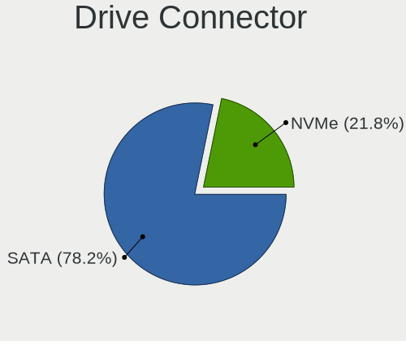
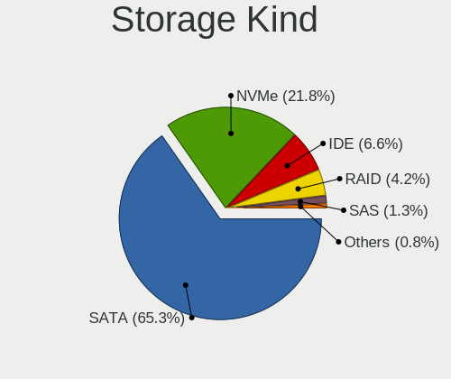
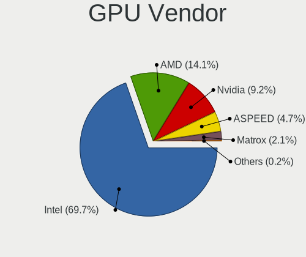
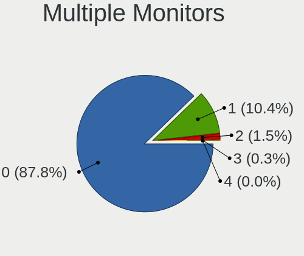
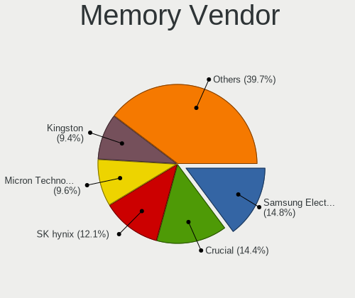
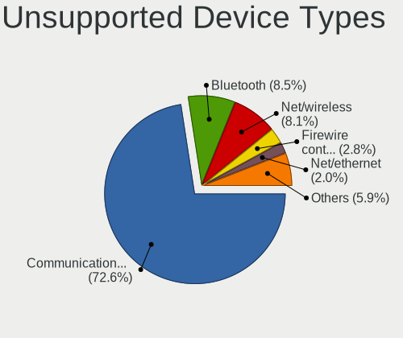

BSD in USA - Tested Hardware & Statistics (Desktops)
----------------------------------------------------

A project to collect tested hardware configurations for BSD in USA.

Anyone can contribute to this report by the [hw-probe](https://github.com/linuxhw/hw-probe/blob/master/INSTALL.BSD.md) tool:

    hw-probe -all -upload

Please contribute! Especially if your hardware is rare.

Contents
--------

* [ Test Cases ](#test-cases)

* [ System ](#system)
  - [ OS                       ](#os)
  - [ OS Family                ](#os-family)
  - [ Arch                     ](#arch)
  - [ DE                       ](#de)
  - [ Display Server           ](#display-server)
  - [ Display Manager          ](#display-manager)
  - [ OS Lang                  ](#os-lang)
  - [ Boot Mode                ](#boot-mode)
  - [ Filesystem               ](#filesystem)
  - [ Part. scheme             ](#part-scheme)

* [ Board ](#board)
  - [ Vendor                   ](#vendor)
  - [ Model                    ](#model)
  - [ Model Family             ](#model-family)
  - [ MFG Year                 ](#mfg-year)
  - [ Form Factor              ](#form-factor)
  - [ Coreboot                 ](#coreboot)
  - [ RAM Size                 ](#ram-size)
  - [ RAM Used                 ](#ram-used)
  - [ Total Drives             ](#total-drives)
  - [ Has CD-ROM               ](#has-cd-rom)
  - [ Has Ethernet             ](#has-ethernet)
  - [ Has WiFi                 ](#has-wifi)
  - [ Has Bluetooth            ](#has-bluetooth)

* [ Location ](#location)
  - [ Country                  ](#country)
  - [ City                     ](#city)

* [ Drives ](#drives)
  - [ Drive Vendor             ](#drive-vendor)
  - [ Drive Model              ](#drive-model)
  - [ HDD Vendor               ](#hdd-vendor)
  - [ SSD Vendor               ](#ssd-vendor)
  - [ Drive Kind               ](#drive-kind)
  - [ Drive Connector          ](#drive-connector)
  - [ Drive Size               ](#drive-size)
  - [ Space Total              ](#space-total)
  - [ Space Used               ](#space-used)
  - [ Malfunc. Drives          ](#malfunc-drives)
  - [ Malfunc. Drive Vendor    ](#malfunc-drive-vendor)
  - [ Malfunc. HDD Vendor      ](#malfunc-hdd-vendor)
  - [ Malfunc. Drive Kind      ](#malfunc-drive-kind)
  - [ Failed Drives            ](#failed-drives)
  - [ Failed Drive Vendor      ](#failed-drive-vendor)
  - [ Drive Status             ](#drive-status)

* [ Storage controller ](#storage-controller)
  - [ Storage Vendor           ](#storage-vendor)
  - [ Storage Model            ](#storage-model)
  - [ Storage Kind             ](#storage-kind)

* [ Processor ](#processor)
  - [ CPU Vendor               ](#cpu-vendor)
  - [ CPU Model                ](#cpu-model)
  - [ CPU Model Family         ](#cpu-model-family)
  - [ CPU Cores                ](#cpu-cores)
  - [ CPU Sockets              ](#cpu-sockets)
  - [ CPU Threads              ](#cpu-threads)
  - [ CPU Microarch            ](#cpu-microarch)

* [ Graphics ](#graphics)
  - [ GPU Vendor               ](#gpu-vendor)
  - [ GPU Model                ](#gpu-model)
  - [ GPU Combo                ](#gpu-combo)
  - [ GPU Driver               ](#gpu-driver)
  - [ GPU Memory               ](#gpu-memory)

* [ Monitor ](#monitor)
  - [ Monitor Vendor           ](#monitor-vendor)
  - [ Monitor Model            ](#monitor-model)
  - [ Monitor Resolution       ](#monitor-resolution)
  - [ Monitor Diagonal         ](#monitor-diagonal)
  - [ Monitor Width            ](#monitor-width)
  - [ Aspect Ratio             ](#aspect-ratio)
  - [ Monitor Area             ](#monitor-area)
  - [ Pixel Density            ](#pixel-density)
  - [ Multiple Monitors        ](#multiple-monitors)

* [ Network ](#network)
  - [ Net Controller Vendor    ](#net-controller-vendor)
  - [ Net Controller Model     ](#net-controller-model)
  - [ Wireless Vendor          ](#wireless-vendor)
  - [ Wireless Model           ](#wireless-model)
  - [ Ethernet Vendor          ](#ethernet-vendor)
  - [ Ethernet Model           ](#ethernet-model)
  - [ Net Controller Kind      ](#net-controller-kind)
  - [ Used Controller          ](#used-controller)
  - [ NICs                     ](#nics)
  - [ IPv6                     ](#ipv6)

* [ Bluetooth ](#bluetooth)
  - [ Bluetooth Vendor         ](#bluetooth-vendor)
  - [ Bluetooth Model          ](#bluetooth-model)

* [ Sound ](#sound)
  - [ Sound Vendor             ](#sound-vendor)
  - [ Sound Model              ](#sound-model)

* [ Memory ](#memory)
  - [ Memory Vendor            ](#memory-vendor)
  - [ Memory Model             ](#memory-model)
  - [ Memory Kind              ](#memory-kind)
  - [ Memory Form Factor       ](#memory-form-factor)
  - [ Memory Size              ](#memory-size)
  - [ Memory Speed             ](#memory-speed)

* [ Printers & scanners ](#printers--scanners)
  - [ Printer Vendor           ](#printer-vendor)
  - [ Printer Model            ](#printer-model)
  - [ Scanner Vendor           ](#scanner-vendor)
  - [ Scanner Model            ](#scanner-model)

* [ Camera ](#camera)
  - [ Camera Vendor            ](#camera-vendor)
  - [ Camera Model             ](#camera-model)

* [ Security ](#security)
  - [ Fingerprint Vendor       ](#fingerprint-vendor)
  - [ Fingerprint Model        ](#fingerprint-model)
  - [ Chipcard Vendor          ](#chipcard-vendor)
  - [ Chipcard Model           ](#chipcard-model)

* [ Unsupported ](#unsupported)
  - [ Unsupported Devices      ](#unsupported-devices)
  - [ Unsupported Device Types ](#unsupported-device-types)

Test Cases
----------

Total: 5631

| Vendor        | Model                       | Probe                                                     | Date         |
|---------------|-----------------------------|-----------------------------------------------------------|--------------|
| MSI           | Z270M MORTAR                | [52d87b1ad7](https://bsd-hardware.info/?probe=52d87b1ad7) | Jan 06, 2025 |
| MW            | GMLK-2_5G4L                 | [aef8a88a74](https://bsd-hardware.info/?probe=aef8a88a74) | Jan 06, 2025 |
| MW            | GMLK-2_5G4L                 | [56c096c579](https://bsd-hardware.info/?probe=56c096c579) | Jan 06, 2025 |
| Unknown       | Unknown                     | [72473eb7c0](https://bsd-hardware.info/?probe=72473eb7c0) | Jan 06, 2025 |
| Supermicro    | A1SRi-2758F                 | [3e6fbd3ab8](https://bsd-hardware.info/?probe=3e6fbd3ab8) | Jan 06, 2025 |
| MSI           | H81M-P33                    | [4de04d7c63](https://bsd-hardware.info/?probe=4de04d7c63) | Jan 05, 2025 |
| ASUSTek       | P5Q-E                       | [ced4dbfd4b](https://bsd-hardware.info/?probe=ced4dbfd4b) | Jan 05, 2025 |
| ASUSTek       | ROG CROSSHAIR VIII HERO     | [c5f2cf7f1e](https://bsd-hardware.info/?probe=c5f2cf7f1e) | Jan 05, 2025 |
| ASRock        | Z690M-ITX/ax                | [9d38560d6a](https://bsd-hardware.info/?probe=9d38560d6a) | Jan 05, 2025 |
| Protectli     | FW2B Ver                    | [705883b807](https://bsd-hardware.info/?probe=705883b807) | Jan 04, 2025 |
| Dell          | 0FDY5C A00                  | [ccba495e89](https://bsd-hardware.info/?probe=ccba495e89) | Jan 04, 2025 |
| MSI           | Z270M MORTAR                | [6c0213efea](https://bsd-hardware.info/?probe=6c0213efea) | Jan 04, 2025 |
| PC Engines    | apu4                        | [aba651f461](https://bsd-hardware.info/?probe=aba651f461) | Jan 04, 2025 |
| Dell          | 0WMJ54 A01                  | [a87d1a2609](https://bsd-hardware.info/?probe=a87d1a2609) | Jan 04, 2025 |
| Lenovo        | ThinkStation P320 Tiny 3... | [c8a55cde50](https://bsd-hardware.info/?probe=c8a55cde50) | Jan 04, 2025 |
| ASUSTek       | SABERTOOTH X58              | [92e2cb380a](https://bsd-hardware.info/?probe=92e2cb380a) | Jan 03, 2025 |
| SJRC          | ADLN-6L                     | [9afe02f983](https://bsd-hardware.info/?probe=9afe02f983) | Jan 03, 2025 |
| ASUSTek       | B150M-PLUS D3               | [d269e833ba](https://bsd-hardware.info/?probe=d269e833ba) | Jan 03, 2025 |
| Intel         | MAHOBAY                     | [e1fbd3a5ef](https://bsd-hardware.info/?probe=e1fbd3a5ef) | Jan 03, 2025 |
| Lenovo        | 3106 SDK0J40697 WIN 3305... | [9f03b43d72](https://bsd-hardware.info/?probe=9f03b43d72) | Jan 03, 2025 |
| Protectli     | FW6 Ver                     | [e66a74f63e](https://bsd-hardware.info/?probe=e66a74f63e) | Jan 03, 2025 |
| Dell          | 0YP4HV A00                  | [f4bf8c469e](https://bsd-hardware.info/?probe=f4bf8c469e) | Jan 03, 2025 |
| Dell          | 0YP4HV A00                  | [7c407b8021](https://bsd-hardware.info/?probe=7c407b8021) | Jan 03, 2025 |
| ASUSTek       | PRIME H310M-E R2.0          | [d5f369f5da](https://bsd-hardware.info/?probe=d5f369f5da) | Jan 03, 2025 |
| Dell          | 0WMJ54 A01                  | [2fb7873b0b](https://bsd-hardware.info/?probe=2fb7873b0b) | Jan 02, 2025 |
| Dell          | 0JJ7YG A00                  | [60a9be6897](https://bsd-hardware.info/?probe=60a9be6897) | Jan 02, 2025 |
| Dell          | 01D4TT A00                  | [447a0925d1](https://bsd-hardware.info/?probe=447a0925d1) | Jan 02, 2025 |
| Dell          | 0JJ7YG A00                  | [f586af63cf](https://bsd-hardware.info/?probe=f586af63cf) | Jan 02, 2025 |
| MSI           | MAG B550M MORTAR WIFI       | [9b908a1339](https://bsd-hardware.info/?probe=9b908a1339) | Jan 02, 2025 |
| Protectli     | V1410                       | [2f503f2fc2](https://bsd-hardware.info/?probe=2f503f2fc2) | Jan 02, 2025 |
| Unknown       | Unknown                     | [3b5881e6d2](https://bsd-hardware.info/?probe=3b5881e6d2) | Jan 02, 2025 |
| Dell          | 0WMJ54 A01                  | [f5ab48d136](https://bsd-hardware.info/?probe=f5ab48d136) | Jan 02, 2025 |
| Intel         | S1200KP AAG34877-201        | [80e080363c](https://bsd-hardware.info/?probe=80e080363c) | Jan 01, 2025 |
| Trigkey       | Green G5                    | [b319e43076](https://bsd-hardware.info/?probe=b319e43076) | Jan 01, 2025 |
| Dell          | 08NPPY A00                  | [a9e88edfae](https://bsd-hardware.info/?probe=a9e88edfae) | Jan 01, 2025 |
| Unknown       | adnasc01                    | [e4417d31c4](https://bsd-hardware.info/?probe=e4417d31c4) | Jan 01, 2025 |
| HP            | 83E2                        | [c0cce366c3](https://bsd-hardware.info/?probe=c0cce366c3) | Jan 01, 2025 |
| Seeed Stud... | ODYSSEY-X86J41X5 SD-BS-C... | [6c1907d15b](https://bsd-hardware.info/?probe=6c1907d15b) | Jan 01, 2025 |
| Gigabyte      | EP43T-UD3L                  | [4c4764a3fe](https://bsd-hardware.info/?probe=4c4764a3fe) | Jan 01, 2025 |
| ASUSTek       | Z97I-PLUS                   | [280124bd49](https://bsd-hardware.info/?probe=280124bd49) | Dec 31, 2024 |
| Protectli     | FW4B                        | [fddeda1514](https://bsd-hardware.info/?probe=fddeda1514) | Dec 31, 2024 |
| HP            | 8055                        | [ad2cab0e5d](https://bsd-hardware.info/?probe=ad2cab0e5d) | Dec 31, 2024 |
| Unknown       | Unknown                     | [1c2ec43b47](https://bsd-hardware.info/?probe=1c2ec43b47) | Dec 31, 2024 |
| ASUSTek       | Z97-PRO GAMER               | [8fe128b9b2](https://bsd-hardware.info/?probe=8fe128b9b2) | Dec 31, 2024 |
| Advantech     | NAMB-3250 A102-1            | [975b60a167](https://bsd-hardware.info/?probe=975b60a167) | Dec 31, 2024 |
| AZW           | EQ                          | [89e2185696](https://bsd-hardware.info/?probe=89e2185696) | Dec 31, 2024 |
| Unknown       | Unknown                     | [f85ed259c8](https://bsd-hardware.info/?probe=f85ed259c8) | Dec 30, 2024 |
| Intel         | JSL MRD                     | [91ddafe16b](https://bsd-hardware.info/?probe=91ddafe16b) | Dec 30, 2024 |
| HP            | 1998                        | [da5ac06da2](https://bsd-hardware.info/?probe=da5ac06da2) | Dec 30, 2024 |
| ASUSTek       | TUF Gaming B560M-PLUS WI... | [e69f71eb23](https://bsd-hardware.info/?probe=e69f71eb23) | Dec 30, 2024 |
| Supermicro    | X9SCL/X9SCMA                | [7b307c888b](https://bsd-hardware.info/?probe=7b307c888b) | Dec 30, 2024 |
| ASRock        | X570 Phantom Gaming-ITX/... | [f72205b123](https://bsd-hardware.info/?probe=f72205b123) | Dec 30, 2024 |
| Dell EMC      | EDGE680-CPU A00             | [b5233e4ced](https://bsd-hardware.info/?probe=b5233e4ced) | Dec 30, 2024 |
| Unknown       | adnasc01                    | [b813bc581d](https://bsd-hardware.info/?probe=b813bc581d) | Dec 30, 2024 |
| ASUSTek       | Maximus V FORMULA           | [3e59dc6c59](https://bsd-hardware.info/?probe=3e59dc6c59) | Dec 30, 2024 |
| ASUSTek       | Maximus VIII RANGER         | [2d3eb6c2f5](https://bsd-hardware.info/?probe=2d3eb6c2f5) | Dec 30, 2024 |
| Dell          | OptiPlex 5070               | [e2e08cab4b](https://bsd-hardware.info/?probe=e2e08cab4b) | Dec 29, 2024 |
| ASUSTek       | PRIME Z270-A                | [601c3c7a49](https://bsd-hardware.info/?probe=601c3c7a49) | Dec 29, 2024 |
| Intel         | QHSW02                      | [07fd887929](https://bsd-hardware.info/?probe=07fd887929) | Dec 29, 2024 |
| Unknown       | Unknown                     | [b9ca7abc2d](https://bsd-hardware.info/?probe=b9ca7abc2d) | Dec 29, 2024 |
| MSI           | H81M-P33                    | [a1fc208c90](https://bsd-hardware.info/?probe=a1fc208c90) | Dec 29, 2024 |
| ASUSTek       | P5Q-E                       | [f497fed563](https://bsd-hardware.info/?probe=f497fed563) | Dec 29, 2024 |
| ASUSTek       | ROG CROSSHAIR VIII HERO     | [71afdfab99](https://bsd-hardware.info/?probe=71afdfab99) | Dec 29, 2024 |
| Unknown       | Unknown                     | [2e57c5140f](https://bsd-hardware.info/?probe=2e57c5140f) | Dec 29, 2024 |
| Dell          | OptiPlex 5070               | [12d5d8ce92](https://bsd-hardware.info/?probe=12d5d8ce92) | Dec 29, 2024 |
| Trigkey       | Green G5                    | [560c067a01](https://bsd-hardware.info/?probe=560c067a01) | Dec 29, 2024 |
| Protectli     | FW2B Ver                    | [0f9a74892c](https://bsd-hardware.info/?probe=0f9a74892c) | Dec 29, 2024 |
| Dell          | 0NW6H5 A00                  | [d2f12e9d57](https://bsd-hardware.info/?probe=d2f12e9d57) | Dec 28, 2024 |
| BOSGAME       | Ecolite Series              | [c1083a8777](https://bsd-hardware.info/?probe=c1083a8777) | Dec 28, 2024 |
| ASUSTek       | Maximus V FORMULA           | [6a110d5e92](https://bsd-hardware.info/?probe=6a110d5e92) | Dec 28, 2024 |
| Intel         | QHSW02                      | [0e73244f65](https://bsd-hardware.info/?probe=0e73244f65) | Dec 28, 2024 |
| Protectli     | V1410                       | [b6727da944](https://bsd-hardware.info/?probe=b6727da944) | Dec 27, 2024 |
| Protectli     | V1410                       | [09e8629eb8](https://bsd-hardware.info/?probe=09e8629eb8) | Dec 27, 2024 |
| Dell          | OptiPlex 5070               | [5a98f9dd3a](https://bsd-hardware.info/?probe=5a98f9dd3a) | Dec 27, 2024 |
| Dell          | OptiPlex 5070               | [7ee0a90c4b](https://bsd-hardware.info/?probe=7ee0a90c4b) | Dec 27, 2024 |
| Dell          | 07F37C A01                  | [6518ba4c6c](https://bsd-hardware.info/?probe=6518ba4c6c) | Dec 26, 2024 |
| MW            | GMLK-2_5G4L                 | [1dbdbd867c](https://bsd-hardware.info/?probe=1dbdbd867c) | Dec 26, 2024 |
| Gigabyte      | B760M C                     | [b3926cb9a9](https://bsd-hardware.info/?probe=b3926cb9a9) | Dec 26, 2024 |
| Gigabyte      | B760M C                     | [c01a3f3d27](https://bsd-hardware.info/?probe=c01a3f3d27) | Dec 26, 2024 |
| Unknown       | Unknown                     | [9f549fa7ce](https://bsd-hardware.info/?probe=9f549fa7ce) | Dec 26, 2024 |
| Unknown       | Unknown                     | [4937ea1ef5](https://bsd-hardware.info/?probe=4937ea1ef5) | Dec 25, 2024 |
| Gigabyte      | Z77X-UP4 TH                 | [3b5e5eeea4](https://bsd-hardware.info/?probe=3b5e5eeea4) | Dec 25, 2024 |
| Dell          | 0HD5W2 A01                  | [5e50386e5c](https://bsd-hardware.info/?probe=5e50386e5c) | Dec 25, 2024 |
| Dell          | 0WMJ54 A01                  | [e677c34698](https://bsd-hardware.info/?probe=e677c34698) | Dec 25, 2024 |
| Unknown       | Unknown                     | [f3922a40a8](https://bsd-hardware.info/?probe=f3922a40a8) | Dec 24, 2024 |
| Unknown       | Unknown                     | [25a20f4c0e](https://bsd-hardware.info/?probe=25a20f4c0e) | Dec 24, 2024 |
| MSI           | 970 GAMING                  | [7caa8db16a](https://bsd-hardware.info/?probe=7caa8db16a) | Dec 24, 2024 |
| HP            | 339A                        | [ad9ed0ee8d](https://bsd-hardware.info/?probe=ad9ed0ee8d) | Dec 24, 2024 |
| ASUSTek       | TUF Gaming X570-PLUS        | [2c141d9a6e](https://bsd-hardware.info/?probe=2c141d9a6e) | Dec 24, 2024 |
| Dell          | 0FF3FN A00                  | [33a3dcb343](https://bsd-hardware.info/?probe=33a3dcb343) | Dec 24, 2024 |
| Shenzhen M... | AHWSA                       | [929e0f0aa1](https://bsd-hardware.info/?probe=929e0f0aa1) | Dec 23, 2024 |
| Infoblox      | IB-810                      | [94e43c90e0](https://bsd-hardware.info/?probe=94e43c90e0) | Dec 23, 2024 |
| Dell          | 0YXT71 A00                  | [fc782b729d](https://bsd-hardware.info/?probe=fc782b729d) | Dec 23, 2024 |
| MW            | GMLK-2_5G4L                 | [bd781ad496](https://bsd-hardware.info/?probe=bd781ad496) | Dec 23, 2024 |
| Techvision    | TVI7309X B0                 | [92cefa8a8c](https://bsd-hardware.info/?probe=92cefa8a8c) | Dec 22, 2024 |
| Dell          | 08NPPY A00                  | [a94c82e978](https://bsd-hardware.info/?probe=a94c82e978) | Dec 22, 2024 |
| Dell          | 0FDY5C A00                  | [97a894078c](https://bsd-hardware.info/?probe=97a894078c) | Dec 22, 2024 |
| Alienware     | 0VDT73 A00                  | [cc0448c975](https://bsd-hardware.info/?probe=cc0448c975) | Dec 22, 2024 |
| Unknown       | QDNV01                      | [877dbd28c5](https://bsd-hardware.info/?probe=877dbd28c5) | Dec 22, 2024 |
| Protectli     | FW6 Ver                     | [f8133ffca6](https://bsd-hardware.info/?probe=f8133ffca6) | Dec 22, 2024 |
| Supermicro    | X9SCL/X9SCM                 | [dd220a27af](https://bsd-hardware.info/?probe=dd220a27af) | Dec 22, 2024 |
| IceWhale T... | ZimaBoard 832 ZMB           | [0fd27a04f7](https://bsd-hardware.info/?probe=0fd27a04f7) | Dec 22, 2024 |
| ASRock        | B550 Phantom Gaming 4       | [ce9a08d930](https://bsd-hardware.info/?probe=ce9a08d930) | Dec 22, 2024 |
| ASUSTek       | Z97-PRO GAMER               | [e7c1d45a38](https://bsd-hardware.info/?probe=e7c1d45a38) | Dec 21, 2024 |
| Dell          | 00V62H A00                  | [0b6e2a4e95](https://bsd-hardware.info/?probe=0b6e2a4e95) | Dec 21, 2024 |
| Dell          | 00V62H A01                  | [3048d1b957](https://bsd-hardware.info/?probe=3048d1b957) | Dec 21, 2024 |
| Unknown       | Unknown                     | [cf2ef7e381](https://bsd-hardware.info/?probe=cf2ef7e381) | Dec 21, 2024 |
| Unknown       | QDNV01                      | [95d17434b8](https://bsd-hardware.info/?probe=95d17434b8) | Dec 21, 2024 |
| MSI           | Z270M MORTAR                | [1bf2d8a709](https://bsd-hardware.info/?probe=1bf2d8a709) | Dec 21, 2024 |
| ASUSTek       | TUF Gaming B560M-PLUS WI... | [bee58d9e52](https://bsd-hardware.info/?probe=bee58d9e52) | Dec 21, 2024 |
| HP            | 1998                        | [a875c0ccf0](https://bsd-hardware.info/?probe=a875c0ccf0) | Dec 20, 2024 |
| Protectli     | FW6                         | [221484fba7](https://bsd-hardware.info/?probe=221484fba7) | Dec 20, 2024 |
| ASUSTek       | PRIME Z270-A                | [9a8a0a932a](https://bsd-hardware.info/?probe=9a8a0a932a) | Dec 20, 2024 |
| HP            | 0B4Ch D                     | [4278f18694](https://bsd-hardware.info/?probe=4278f18694) | Dec 20, 2024 |
| Gigabyte      | Z490I AORUS ULTRA           | [12aa966592](https://bsd-hardware.info/?probe=12aa966592) | Dec 20, 2024 |
| MSI           | MAG B550M MORTAR WIFI       | [84a86156de](https://bsd-hardware.info/?probe=84a86156de) | Dec 20, 2024 |
| Dell          | 0WMJ54 A01                  | [79aa961e28](https://bsd-hardware.info/?probe=79aa961e28) | Dec 19, 2024 |
| Dell          | 0HD5W2 A01                  | [075230a87b](https://bsd-hardware.info/?probe=075230a87b) | Dec 19, 2024 |
| Unknown       | YL-SKUL6-7 Series           | [58389edbfa](https://bsd-hardware.info/?probe=58389edbfa) | Dec 18, 2024 |
| Dell          | 0D6H9T A00                  | [53d4b51f32](https://bsd-hardware.info/?probe=53d4b51f32) | Dec 18, 2024 |
| Protectli     | FW4B                        | [ae842a3368](https://bsd-hardware.info/?probe=ae842a3368) | Dec 18, 2024 |
| Dell          | 0WMJ54 A01                  | [122081b48c](https://bsd-hardware.info/?probe=122081b48c) | Dec 18, 2024 |
| HP            | 82A2                        | [7f93f17101](https://bsd-hardware.info/?probe=7f93f17101) | Dec 18, 2024 |
| Fujitsu       | D3433-S2 S26361-D3433-S2    | [c6673ef4fb](https://bsd-hardware.info/?probe=c6673ef4fb) | Dec 17, 2024 |
| Unknown       | Unknown                     | [40eb87fd37](https://bsd-hardware.info/?probe=40eb87fd37) | Dec 17, 2024 |
| AZW           | EQ                          | [5fb971011a](https://bsd-hardware.info/?probe=5fb971011a) | Dec 17, 2024 |
| Unknown       | Unknown                     | [931a89f2d1](https://bsd-hardware.info/?probe=931a89f2d1) | Dec 16, 2024 |
| Dell          | 0FF3FN A00                  | [6f008745da](https://bsd-hardware.info/?probe=6f008745da) | Dec 16, 2024 |
| Dell          | 07WP95 A01                  | [7dccc03284](https://bsd-hardware.info/?probe=7dccc03284) | Dec 16, 2024 |
| AZW           | EQ                          | [cdc2be64c3](https://bsd-hardware.info/?probe=cdc2be64c3) | Dec 15, 2024 |
| Supermicro    | X9SCL/X9SCMA                | [f520de0eef](https://bsd-hardware.info/?probe=f520de0eef) | Dec 15, 2024 |
| AZW           | EQ                          | [427eade38e](https://bsd-hardware.info/?probe=427eade38e) | Dec 15, 2024 |
| Unknown       | Unknown                     | [f57757a059](https://bsd-hardware.info/?probe=f57757a059) | Dec 14, 2024 |
| Gigabyte      | Z490I AORUS ULTRA           | [d2cec3b140](https://bsd-hardware.info/?probe=d2cec3b140) | Dec 14, 2024 |
| Dell          | 0WMJ54 A01                  | [bc26b0ad7f](https://bsd-hardware.info/?probe=bc26b0ad7f) | Dec 14, 2024 |
| AZW           | EQ                          | [2828b59ca4](https://bsd-hardware.info/?probe=2828b59ca4) | Dec 14, 2024 |
| Unknown       | QGLK03                      | [f11efa36fc](https://bsd-hardware.info/?probe=f11efa36fc) | Dec 14, 2024 |
| Unknown       | QDNV01                      | [6d7de0a35e](https://bsd-hardware.info/?probe=6d7de0a35e) | Dec 14, 2024 |
| Protectli     | VP6630                      | [c4d391ee74](https://bsd-hardware.info/?probe=c4d391ee74) | Dec 14, 2024 |
| GoWin Solu... | R86S                        | [fec0e025ff](https://bsd-hardware.info/?probe=fec0e025ff) | Dec 13, 2024 |
| Unknown       | Unknown                     | [04c8beca54](https://bsd-hardware.info/?probe=04c8beca54) | Dec 13, 2024 |
| Protectli     | V1410                       | [8b38528c6a](https://bsd-hardware.info/?probe=8b38528c6a) | Dec 13, 2024 |
| Intel         | DH61AG AAG23736-400         | [ac76ab9cf5](https://bsd-hardware.info/?probe=ac76ab9cf5) | Dec 13, 2024 |
| Dell          | 02YYK5 A00                  | [dfd626feb6](https://bsd-hardware.info/?probe=dfd626feb6) | Dec 13, 2024 |
| Unknown       | Unknown                     | [ed46ec5a1f](https://bsd-hardware.info/?probe=ed46ec5a1f) | Dec 13, 2024 |
| VGKE          | N95                         | [456e2dd02e](https://bsd-hardware.info/?probe=456e2dd02e) | Dec 13, 2024 |
| ASRock        | B550 Phantom Gaming 4       | [132bcb0d2a](https://bsd-hardware.info/?probe=132bcb0d2a) | Dec 13, 2024 |
| HP            | 802E                        | [a73cbe8149](https://bsd-hardware.info/?probe=a73cbe8149) | Dec 12, 2024 |
| Unknown       | QDNV01                      | [f2df17ea71](https://bsd-hardware.info/?probe=f2df17ea71) | Dec 12, 2024 |
| ASRock        | Z370M Pro4                  | [e97904a981](https://bsd-hardware.info/?probe=e97904a981) | Dec 12, 2024 |
| IceWhale T... | ZimaBoard 832 ZMB           | [28d155dd95](https://bsd-hardware.info/?probe=28d155dd95) | Dec 12, 2024 |
| Unknown       | ROUTER                      | [64ce081f31](https://bsd-hardware.info/?probe=64ce081f31) | Dec 12, 2024 |
| Protectli     | VP4630                      | [04f464a725](https://bsd-hardware.info/?probe=04f464a725) | Dec 11, 2024 |
| Unknown       | QDNV01                      | [61510207af](https://bsd-hardware.info/?probe=61510207af) | Dec 11, 2024 |
| Protectli     | VP4630                      | [90fd44ca00](https://bsd-hardware.info/?probe=90fd44ca00) | Dec 11, 2024 |
| ASUSTek       | SABERTOOTH X58              | [f34dc483d5](https://bsd-hardware.info/?probe=f34dc483d5) | Dec 11, 2024 |
| Intel         | ADL-4L                      | [f3c65c2394](https://bsd-hardware.info/?probe=f3c65c2394) | Dec 11, 2024 |
| Protectli     | FW6                         | [85c85ff13e](https://bsd-hardware.info/?probe=85c85ff13e) | Dec 11, 2024 |
| Dell          | 0MGK50 A00                  | [43ded3b6d5](https://bsd-hardware.info/?probe=43ded3b6d5) | Dec 10, 2024 |
| Unknown       | Unknown                     | [c3010f06f3](https://bsd-hardware.info/?probe=c3010f06f3) | Dec 10, 2024 |
| HP            | 8054                        | [252f0cf51b](https://bsd-hardware.info/?probe=252f0cf51b) | Dec 10, 2024 |
| ASUSTek       | PRIME Z790-A WIFI           | [09413cb67c](https://bsd-hardware.info/?probe=09413cb67c) | Dec 10, 2024 |
| GoWin Solu... | R86S                        | [971f443507](https://bsd-hardware.info/?probe=971f443507) | Dec 09, 2024 |
| Unknown       | QDNV01                      | [881aa7c3be](https://bsd-hardware.info/?probe=881aa7c3be) | Dec 09, 2024 |
| Dell          | 0YJMC0 A02                  | [8a6e226054](https://bsd-hardware.info/?probe=8a6e226054) | Dec 09, 2024 |
| ShenZhen M... | MW-GMLK-2.5G6L              | [89c3e8f75c](https://bsd-hardware.info/?probe=89c3e8f75c) | Dec 09, 2024 |
| Unknown       | QCML02                      | [a6f3640fd8](https://bsd-hardware.info/?probe=a6f3640fd8) | Dec 09, 2024 |
| Protectli     | FW6 Ver                     | [ba507c395e](https://bsd-hardware.info/?probe=ba507c395e) | Dec 09, 2024 |
| Unknown       | QCML02                      | [30378a61c3](https://bsd-hardware.info/?probe=30378a61c3) | Dec 09, 2024 |
| Dell          | 0T7D40 A01                  | [4cfeb93125](https://bsd-hardware.info/?probe=4cfeb93125) | Dec 09, 2024 |
| Protectli     | VP2420                      | [c539321419](https://bsd-hardware.info/?probe=c539321419) | Dec 09, 2024 |
| Unknown       | QDNV01                      | [fed4778ce8](https://bsd-hardware.info/?probe=fed4778ce8) | Dec 08, 2024 |
| Protectli     | FW1 Ver                     | [0886b7bcf1](https://bsd-hardware.info/?probe=0886b7bcf1) | Dec 08, 2024 |
| Unknown       | Unknown                     | [de026455d9](https://bsd-hardware.info/?probe=de026455d9) | Dec 08, 2024 |
| Dell          | 08NPPY A00                  | [977d532fb8](https://bsd-hardware.info/?probe=977d532fb8) | Dec 07, 2024 |
| Lenovo        | SKYBAY SDK0J40705 WIN 34... | [fb966a942a](https://bsd-hardware.info/?probe=fb966a942a) | Dec 07, 2024 |
| Unknown       | Unknown                     | [6435c060c8](https://bsd-hardware.info/?probe=6435c060c8) | Dec 07, 2024 |
| GoWin Solu... | R86S                        | [55685eeb85](https://bsd-hardware.info/?probe=55685eeb85) | Dec 07, 2024 |
| Dell          | 05GD68 A00                  | [eb955cee95](https://bsd-hardware.info/?probe=eb955cee95) | Dec 06, 2024 |
| ASUSTek       | D500SA                      | [d1a788187e](https://bsd-hardware.info/?probe=d1a788187e) | Dec 06, 2024 |
| ASUSTek       | PRIME Z790-A WIFI           | [7839a021dc](https://bsd-hardware.info/?probe=7839a021dc) | Dec 06, 2024 |
| Dell          | 07WP95 A01                  | [18aef5be33](https://bsd-hardware.info/?probe=18aef5be33) | Dec 06, 2024 |
| Shenzhen M... | AHWSA                       | [fa4c1042c1](https://bsd-hardware.info/?probe=fa4c1042c1) | Dec 05, 2024 |
| Protectli     | FW6 Ver                     | [d35bd9310c](https://bsd-hardware.info/?probe=d35bd9310c) | Dec 05, 2024 |
| Unknown       | ROUTER                      | [9af72def1f](https://bsd-hardware.info/?probe=9af72def1f) | Dec 05, 2024 |
| HP            | 1998                        | [6233446d5e](https://bsd-hardware.info/?probe=6233446d5e) | Dec 04, 2024 |
| ASUSTek       | CROSSHAIR V FORMULA-Z       | [8fbade62a5](https://bsd-hardware.info/?probe=8fbade62a5) | Dec 04, 2024 |
| HP            | 339A                        | [3c450d9163](https://bsd-hardware.info/?probe=3c450d9163) | Dec 04, 2024 |
| Supermicro    | X11SDV-4C-TP8F              | [ff4d9d279d](https://bsd-hardware.info/?probe=ff4d9d279d) | Dec 04, 2024 |
| ASUSTek       | ROG STRIX B550-F GAMING     | [ba4099f218](https://bsd-hardware.info/?probe=ba4099f218) | Dec 04, 2024 |
| Supermicro    | X7DBU                       | [fc50e5a8a4](https://bsd-hardware.info/?probe=fc50e5a8a4) | Dec 04, 2024 |
| Protectli     | FW4B Ver                    | [6078d4ac6d](https://bsd-hardware.info/?probe=6078d4ac6d) | Dec 04, 2024 |
| Foxconn       | AHD1S                       | [de4e6051ae](https://bsd-hardware.info/?probe=de4e6051ae) | Dec 04, 2024 |
| Intel         | MAHOBAY                     | [c27e4750d2](https://bsd-hardware.info/?probe=c27e4750d2) | Dec 03, 2024 |
| Supermicro    | A1SRi-2758F                 | [7c779086d3](https://bsd-hardware.info/?probe=7c779086d3) | Dec 03, 2024 |
| ASRock        | N100M                       | [530dd6daef](https://bsd-hardware.info/?probe=530dd6daef) | Dec 03, 2024 |
| Lenovo        | MAHOBAY Win8 Pro DPK MM ... | [4b79e0bdbe](https://bsd-hardware.info/?probe=4b79e0bdbe) | Dec 02, 2024 |
| Dell          | 0YJMC0 A02                  | [e266af3c4c](https://bsd-hardware.info/?probe=e266af3c4c) | Dec 01, 2024 |
| Techvision    | TVI7309X B0                 | [2774e932cb](https://bsd-hardware.info/?probe=2774e932cb) | Dec 01, 2024 |
| MSI           | Z490-A PRO                  | [50ca527f2b](https://bsd-hardware.info/?probe=50ca527f2b) | Dec 01, 2024 |
| Unknown       | Unknown                     | [d39e379bda](https://bsd-hardware.info/?probe=d39e379bda) | Dec 01, 2024 |
| MSI           | H81M-P33                    | [a910f6b4a8](https://bsd-hardware.info/?probe=a910f6b4a8) | Dec 01, 2024 |
| ASUSTek       | P5Q-E                       | [dd9d2b4701](https://bsd-hardware.info/?probe=dd9d2b4701) | Dec 01, 2024 |
| ASUSTek       | ROG CROSSHAIR VIII HERO     | [aaabbe33c6](https://bsd-hardware.info/?probe=aaabbe33c6) | Dec 01, 2024 |
| Supermicro    | X11SDV-4C-TP8F              | [c1d1a0a203](https://bsd-hardware.info/?probe=c1d1a0a203) | Dec 01, 2024 |
| Supermicro    | A1SRi 123456789             | [745f4b6682](https://bsd-hardware.info/?probe=745f4b6682) | Dec 01, 2024 |
| Unknown       | Unknown                     | [f2d5915c37](https://bsd-hardware.info/?probe=f2d5915c37) | Dec 01, 2024 |
| Lenovo        | ThinkCentre M715q 10M2S0... | [9082d8b443](https://bsd-hardware.info/?probe=9082d8b443) | Dec 01, 2024 |
| Techvision    | TVI7309X B0                 | [936f1cf164](https://bsd-hardware.info/?probe=936f1cf164) | Dec 01, 2024 |
| Gigabyte      | C1037UN                     | [881fe2dddd](https://bsd-hardware.info/?probe=881fe2dddd) | Nov 30, 2024 |
| ASUSTek       | PRIME B450M-A II            | [20d9d6bd7b](https://bsd-hardware.info/?probe=20d9d6bd7b) | Nov 30, 2024 |
| Supermicro    | M11SDV-8C-LN4F              | [fbca60a68a](https://bsd-hardware.info/?probe=fbca60a68a) | Nov 30, 2024 |
| Unknown       | Unknown                     | [b3d7bdb73f](https://bsd-hardware.info/?probe=b3d7bdb73f) | Nov 30, 2024 |
| Dell          | 0YXT71 A00                  | [11cad93f24](https://bsd-hardware.info/?probe=11cad93f24) | Nov 29, 2024 |
| Unknown       | Unknown                     | [809babc888](https://bsd-hardware.info/?probe=809babc888) | Nov 29, 2024 |
| HP            | 3048h                       | [36a9b2f835](https://bsd-hardware.info/?probe=36a9b2f835) | Nov 29, 2024 |
| ASUSTek       | ROG STRIX B550-I GAMING     | [b9694f6726](https://bsd-hardware.info/?probe=b9694f6726) | Nov 29, 2024 |
| Protectli     | FW1 Ver                     | [a8e980a004](https://bsd-hardware.info/?probe=a8e980a004) | Nov 28, 2024 |
| Supermicro    | A1SRi-2758F                 | [adacb50c52](https://bsd-hardware.info/?probe=adacb50c52) | Nov 28, 2024 |
| Unknown       | Unknown                     | [88f7fc5770](https://bsd-hardware.info/?probe=88f7fc5770) | Nov 28, 2024 |
| ASRock        | E3C226D2I                   | [b872c811d8](https://bsd-hardware.info/?probe=b872c811d8) | Nov 28, 2024 |
| Unknown       | Unknown                     | [cd7af4ce2e](https://bsd-hardware.info/?probe=cd7af4ce2e) | Nov 28, 2024 |
| Unknown       | Unknown                     | [6b95721cd2](https://bsd-hardware.info/?probe=6b95721cd2) | Nov 27, 2024 |
| ASUSTek       | CROSSHAIR V FORMULA-Z       | [8282b592ac](https://bsd-hardware.info/?probe=8282b592ac) | Nov 27, 2024 |
| CncTion       | J4125-4L-I225               | [a6541ec947](https://bsd-hardware.info/?probe=a6541ec947) | Nov 27, 2024 |
| Protectli     | FW6 Ver                     | [ff2f3667a7](https://bsd-hardware.info/?probe=ff2f3667a7) | Nov 27, 2024 |
| Techvision    | TVI7309X B0                 | [6d2e2757a1](https://bsd-hardware.info/?probe=6d2e2757a1) | Nov 26, 2024 |
| Unknown       | QDNV01                      | [98aafbcae9](https://bsd-hardware.info/?probe=98aafbcae9) | Nov 26, 2024 |
| Protectli     | FW6                         | [c05460d9ae](https://bsd-hardware.info/?probe=c05460d9ae) | Nov 26, 2024 |
| ShenZhen M... | MW-GMLK-2.5G6L              | [f58d8e2122](https://bsd-hardware.info/?probe=f58d8e2122) | Nov 26, 2024 |
| MSI           | H310M PRO-M2 PLUS           | [db040ae85a](https://bsd-hardware.info/?probe=db040ae85a) | Nov 26, 2024 |
| Lenovo        | SKYBAY SDK0J40705 WIN 34... | [6cae463825](https://bsd-hardware.info/?probe=6cae463825) | Nov 26, 2024 |
| Unknown       | Unknown                     | [300e6c8024](https://bsd-hardware.info/?probe=300e6c8024) | Nov 25, 2024 |
| PC Engines    | APU3                        | [87ce049caa](https://bsd-hardware.info/?probe=87ce049caa) | Nov 25, 2024 |
| Supermicro    | X11SDW-8C-TP13F             | [27385b062c](https://bsd-hardware.info/?probe=27385b062c) | Nov 25, 2024 |
| Dell          | 0T7D40 A01                  | [e5d3e617f3](https://bsd-hardware.info/?probe=e5d3e617f3) | Nov 25, 2024 |
| MSI           | H81M-P33                    | [9e5c756f1f](https://bsd-hardware.info/?probe=9e5c756f1f) | Nov 24, 2024 |
| ASUSTek       | P5Q-E                       | [2d7f40d5f5](https://bsd-hardware.info/?probe=2d7f40d5f5) | Nov 24, 2024 |
| ASUSTek       | ROG CROSSHAIR VIII HERO     | [ed997ac3e9](https://bsd-hardware.info/?probe=ed997ac3e9) | Nov 24, 2024 |
| Trigkey       | Green G5                    | [610e4d3506](https://bsd-hardware.info/?probe=610e4d3506) | Nov 24, 2024 |
| Lenovo        | SKYBAY SDK0J40705 WIN 34... | [8a4a441c60](https://bsd-hardware.info/?probe=8a4a441c60) | Nov 23, 2024 |
| Unknown       | Unknown                     | [b68fea4f7c](https://bsd-hardware.info/?probe=b68fea4f7c) | Nov 23, 2024 |
| Lenovo        | SKYBAY SDK0J40705 WIN 34... | [1dcf4cbd3d](https://bsd-hardware.info/?probe=1dcf4cbd3d) | Nov 23, 2024 |
| Protectli     | FW4B Ver                    | [e0e42cac94](https://bsd-hardware.info/?probe=e0e42cac94) | Nov 23, 2024 |
| ASUSTek       | Maximus VI HERO             | [e606e48c03](https://bsd-hardware.info/?probe=e606e48c03) | Nov 23, 2024 |
| Supermicro    | X12SDV-4C-SP6F              | [24538ad488](https://bsd-hardware.info/?probe=24538ad488) | Nov 23, 2024 |
| AZW           | EQ                          | [c9ffc39bdc](https://bsd-hardware.info/?probe=c9ffc39bdc) | Nov 22, 2024 |
| Unknown       | Unknown                     | [ba56222c51](https://bsd-hardware.info/?probe=ba56222c51) | Nov 22, 2024 |
| Protectli     | FW2B Ver                    | [eaf91534c2](https://bsd-hardware.info/?probe=eaf91534c2) | Nov 22, 2024 |
| Intel         | HM570                       | [ed04f558f8](https://bsd-hardware.info/?probe=ed04f558f8) | Nov 22, 2024 |
| Unknown       | Unknown                     | [1e8eb4f28c](https://bsd-hardware.info/?probe=1e8eb4f28c) | Nov 22, 2024 |
| Protectli     | VP6650                      | [db351cd4d9](https://bsd-hardware.info/?probe=db351cd4d9) | Nov 22, 2024 |
| Lenovo        | 30C9 SDK0J40705 WIN 3425... | [80514ce1ec](https://bsd-hardware.info/?probe=80514ce1ec) | Nov 22, 2024 |
| pc1           | ID-PCI7E                    | [faccfe1d3b](https://bsd-hardware.info/?probe=faccfe1d3b) | Nov 22, 2024 |
| Intel         | MAHOBAY                     | [03e1a3a88b](https://bsd-hardware.info/?probe=03e1a3a88b) | Nov 21, 2024 |
| Dell          | 08NPPY A00                  | [f1e99521b6](https://bsd-hardware.info/?probe=f1e99521b6) | Nov 21, 2024 |
| Shenzhen M... | AHWSA                       | [26f56da44b](https://bsd-hardware.info/?probe=26f56da44b) | Nov 21, 2024 |
| Apple         | Mac-F223BEC8                | [6c8eff9f8a](https://bsd-hardware.info/?probe=6c8eff9f8a) | Nov 20, 2024 |
| Supermicro    | X9SCL/X9SCMA                | [cd9dc8fa65](https://bsd-hardware.info/?probe=cd9dc8fa65) | Nov 20, 2024 |
| Lenovo        | MAHOBAY Win8 Pro DPK MM ... | [b5bccd485a](https://bsd-hardware.info/?probe=b5bccd485a) | Nov 20, 2024 |
| Unknown       | Unknown                     | [b63c750759](https://bsd-hardware.info/?probe=b63c750759) | Nov 19, 2024 |
| ASUSTek       | ROG STRIX B550-F GAMING ... | [43f93bb4ab](https://bsd-hardware.info/?probe=43f93bb4ab) | Nov 19, 2024 |
| Unknown       | Unknown                     | [89843a75ad](https://bsd-hardware.info/?probe=89843a75ad) | Nov 19, 2024 |
| ASUSTek       | ROG STRIX B550-F GAMING     | [51118016ec](https://bsd-hardware.info/?probe=51118016ec) | Nov 19, 2024 |
| Dell          | 0WR7PY A01                  | [717d2d2065](https://bsd-hardware.info/?probe=717d2d2065) | Nov 19, 2024 |
| Unknown       | QDNV01                      | [94efe1f339](https://bsd-hardware.info/?probe=94efe1f339) | Nov 19, 2024 |
| Supermicro    | X8SIE                       | [f9fe22450b](https://bsd-hardware.info/?probe=f9fe22450b) | Nov 19, 2024 |
| Protectli     | FW4A Ver                    | [53c26b5311](https://bsd-hardware.info/?probe=53c26b5311) | Nov 18, 2024 |
| Techvision    | TVI7309X B0                 | [aa78bf0a87](https://bsd-hardware.info/?probe=aa78bf0a87) | Nov 18, 2024 |
| ASRock        | J4105B-ITX                  | [7fd6c94e26](https://bsd-hardware.info/?probe=7fd6c94e26) | Nov 18, 2024 |
| Foxconn       | PANGU-B 1A32N3500-600-G     | [07f16ac5d7](https://bsd-hardware.info/?probe=07f16ac5d7) | Nov 18, 2024 |
| Protectli     | FW4A Ver                    | [8a17eff754](https://bsd-hardware.info/?probe=8a17eff754) | Nov 18, 2024 |
| Dell          | 08K0X7 A00                  | [9d6151ce25](https://bsd-hardware.info/?probe=9d6151ce25) | Nov 18, 2024 |
| Intel         | MB331                       | [34901a8dcc](https://bsd-hardware.info/?probe=34901a8dcc) | Nov 18, 2024 |
| Intel         | DENLOW_REFRESH_WS           | [70346b61e6](https://bsd-hardware.info/?probe=70346b61e6) | Nov 18, 2024 |
| Unknown       | Unknown                     | [28acc05f2f](https://bsd-hardware.info/?probe=28acc05f2f) | Nov 17, 2024 |
| Unknown       | Unknown                     | [81287e9bb1](https://bsd-hardware.info/?probe=81287e9bb1) | Nov 17, 2024 |
| Intel         | MB331                       | [b70c88d0d7](https://bsd-hardware.info/?probe=b70c88d0d7) | Nov 17, 2024 |
| Unknown       | Unknown                     | [1f711d9ed6](https://bsd-hardware.info/?probe=1f711d9ed6) | Nov 17, 2024 |
| Protectli     | FW6 Ver                     | [ffe2e8cde2](https://bsd-hardware.info/?probe=ffe2e8cde2) | Nov 17, 2024 |
| MSI           | 970 GAMING                  | [c0436dfea6](https://bsd-hardware.info/?probe=c0436dfea6) | Nov 17, 2024 |
| Dell          | 07HXY6 A01                  | [910a689bfa](https://bsd-hardware.info/?probe=910a689bfa) | Nov 17, 2024 |
| MSI           | B650 GAMING PLUS WIFI       | [434fcb2264](https://bsd-hardware.info/?probe=434fcb2264) | Nov 17, 2024 |
| Unknown       | Unknown                     | [c3f9ae3321](https://bsd-hardware.info/?probe=c3f9ae3321) | Nov 17, 2024 |
| MSI           | B650 GAMING PLUS WIFI       | [7ae29d1e0f](https://bsd-hardware.info/?probe=7ae29d1e0f) | Nov 17, 2024 |
| Gigabyte      | B450 AORUS M                | [ed01f027f5](https://bsd-hardware.info/?probe=ed01f027f5) | Nov 17, 2024 |
| ASUSTek       | ROG STRIX B550-F GAMING     | [523072e069](https://bsd-hardware.info/?probe=523072e069) | Nov 16, 2024 |
| Biostar       | B550MH                      | [13016fffa1](https://bsd-hardware.info/?probe=13016fffa1) | Nov 16, 2024 |
| Protectli     | V1410                       | [338cc5bf3d](https://bsd-hardware.info/?probe=338cc5bf3d) | Nov 16, 2024 |
| Unknown       | QDNV01                      | [ada3ae66fe](https://bsd-hardware.info/?probe=ada3ae66fe) | Nov 16, 2024 |
| ASUSTek       | D500SA                      | [c21aeb779b](https://bsd-hardware.info/?probe=c21aeb779b) | Nov 16, 2024 |
| AZW           | EQ                          | [1878949c41](https://bsd-hardware.info/?probe=1878949c41) | Nov 16, 2024 |
| ASUSTek       | D500SA                      | [9c9fb2b595](https://bsd-hardware.info/?probe=9c9fb2b595) | Nov 15, 2024 |
| AZW           | EQ                          | [07180434c7](https://bsd-hardware.info/?probe=07180434c7) | Nov 15, 2024 |
| Unknown       | QGLK03                      | [12de5b893b](https://bsd-hardware.info/?probe=12de5b893b) | Nov 15, 2024 |
| MSI           | PRO B760M-P DDR4            | [6bb1eb040a](https://bsd-hardware.info/?probe=6bb1eb040a) | Nov 15, 2024 |
| Unknown       | Unknown                     | [75fae19e94](https://bsd-hardware.info/?probe=75fae19e94) | Nov 15, 2024 |
| Protectli     | VP6670                      | [08a6c0e92d](https://bsd-hardware.info/?probe=08a6c0e92d) | Nov 15, 2024 |
| ASRock        | J3455-ITX                   | [e744ed49f2](https://bsd-hardware.info/?probe=e744ed49f2) | Nov 15, 2024 |
| Supermicro    | X11SDW-8C-TP13F             | [fc0bf710f5](https://bsd-hardware.info/?probe=fc0bf710f5) | Nov 15, 2024 |
| Gigabyte      | Z390 AORUS PRO WIFI-CF      | [f54bc7d733](https://bsd-hardware.info/?probe=f54bc7d733) | Nov 14, 2024 |
| Unknown       | Unknown                     | [fb6c41f228](https://bsd-hardware.info/?probe=fb6c41f228) | Nov 14, 2024 |
| Unknown       | Unknown                     | [57fb6e98cb](https://bsd-hardware.info/?probe=57fb6e98cb) | Nov 14, 2024 |
| Unknown       | J3160-4L                    | [60e64ba75c](https://bsd-hardware.info/?probe=60e64ba75c) | Nov 13, 2024 |
| CWWK          | CW-AD4L-N V1                | [6ff228e26d](https://bsd-hardware.info/?probe=6ff228e26d) | Nov 13, 2024 |
| CWWK          | CW-AD4L-N V1                | [86b849d8a6](https://bsd-hardware.info/?probe=86b849d8a6) | Nov 13, 2024 |
| Unknown       | Unknown                     | [9108766b12](https://bsd-hardware.info/?probe=9108766b12) | Nov 13, 2024 |
| ChangWang     | CW56-58                     | [4e42f97f48](https://bsd-hardware.info/?probe=4e42f97f48) | Nov 13, 2024 |
| Dell          | 04YP6J A02                  | [ce2354f59f](https://bsd-hardware.info/?probe=ce2354f59f) | Nov 13, 2024 |
| Dell          | 02YYK5 A00                  | [4d8e9ed13c](https://bsd-hardware.info/?probe=4d8e9ed13c) | Nov 13, 2024 |
| Dell          | 0Y0MYH A01                  | [d47ec33ba4](https://bsd-hardware.info/?probe=d47ec33ba4) | Nov 13, 2024 |
| Lenovo        | ThinkCentre M715q 10M2S0... | [bb5dc8520d](https://bsd-hardware.info/?probe=bb5dc8520d) | Nov 13, 2024 |
| Unknown       | Unknown                     | [8ff615858c](https://bsd-hardware.info/?probe=8ff615858c) | Nov 13, 2024 |
| Protectli     | FW4B                        | [da3c96b1f2](https://bsd-hardware.info/?probe=da3c96b1f2) | Nov 12, 2024 |
| Intel         | ADL-4L                      | [7e2b5782e0](https://bsd-hardware.info/?probe=7e2b5782e0) | Nov 12, 2024 |
| ASUSTek       | ROG STRIX B550-F GAMING ... | [2cda07b3f5](https://bsd-hardware.info/?probe=2cda07b3f5) | Nov 12, 2024 |
| Dell          | 0HD5W2 A01                  | [b9b0b10a15](https://bsd-hardware.info/?probe=b9b0b10a15) | Nov 12, 2024 |
| Protectli     | VP2420                      | [ece38de1cc](https://bsd-hardware.info/?probe=ece38de1cc) | Nov 12, 2024 |
| Protectli     | FW4B                        | [3fd1232ac4](https://bsd-hardware.info/?probe=3fd1232ac4) | Nov 12, 2024 |
| Unknown       | Unknown                     | [851de38361](https://bsd-hardware.info/?probe=851de38361) | Nov 12, 2024 |
| ASUSTek       | TUF Gaming B560M-PLUS WI... | [e36d556ad9](https://bsd-hardware.info/?probe=e36d556ad9) | Nov 12, 2024 |
| ASUSTek       | TUF Gaming B460M-PLUS       | [36fb402076](https://bsd-hardware.info/?probe=36fb402076) | Nov 11, 2024 |
| Unknown       | Unknown                     | [47767f4737](https://bsd-hardware.info/?probe=47767f4737) | Nov 11, 2024 |
| ASUSTek       | TUF Gaming B450M-PLUS II    | [8f87e1ac76](https://bsd-hardware.info/?probe=8f87e1ac76) | Nov 11, 2024 |
| G57IX         | Unknown                     | [f136ef38b5](https://bsd-hardware.info/?probe=f136ef38b5) | Nov 11, 2024 |
| MSI           | 970 GAMING                  | [690e504a65](https://bsd-hardware.info/?probe=690e504a65) | Nov 11, 2024 |
| MSI           | PRO Z790-P WIFI DDR4        | [91ff3e1c4e](https://bsd-hardware.info/?probe=91ff3e1c4e) | Nov 11, 2024 |
| Shenzhen M... | AHWSA                       | [3565c4d1ce](https://bsd-hardware.info/?probe=3565c4d1ce) | Nov 11, 2024 |
| ASUSTek       | TUF Gaming B460M-PLUS       | [7306c02351](https://bsd-hardware.info/?probe=7306c02351) | Nov 11, 2024 |
| ASRock        | Z370M Pro4                  | [862e72f60c](https://bsd-hardware.info/?probe=862e72f60c) | Nov 10, 2024 |
| Shuttle       | FH61V                       | [b21fb707aa](https://bsd-hardware.info/?probe=b21fb707aa) | Nov 10, 2024 |
| Protectli     | FW6                         | [7acb887a55](https://bsd-hardware.info/?probe=7acb887a55) | Nov 10, 2024 |
| Lenovo        | MAHOBAY NO DPK              | [b145fb7ebb](https://bsd-hardware.info/?probe=b145fb7ebb) | Nov 09, 2024 |
| AZW           | EQ                          | [b9c0842178](https://bsd-hardware.info/?probe=b9c0842178) | Nov 09, 2024 |
| Protectli     | FW2B                        | [048515a923](https://bsd-hardware.info/?probe=048515a923) | Nov 09, 2024 |
| Dell          | 04Y8V0 A01                  | [12f65253fe](https://bsd-hardware.info/?probe=12f65253fe) | Nov 09, 2024 |
| MSI           | PRO Z790-P WIFI DDR4        | [cc6df5de19](https://bsd-hardware.info/?probe=cc6df5de19) | Nov 09, 2024 |
| Protectli     | FW4A Ver                    | [9a67c1a94e](https://bsd-hardware.info/?probe=9a67c1a94e) | Nov 08, 2024 |
| MSI           | PRO Z790-P WIFI DDR4        | [e069d424cb](https://bsd-hardware.info/?probe=e069d424cb) | Nov 08, 2024 |
| Protectli     | V1410                       | [ad73a9fd15](https://bsd-hardware.info/?probe=ad73a9fd15) | Nov 08, 2024 |
| ASRock        | Z590 Pro4                   | [0383e0778f](https://bsd-hardware.info/?probe=0383e0778f) | Nov 08, 2024 |
| CloudGenix    | ion 7000                    | [bf08b154de](https://bsd-hardware.info/?probe=bf08b154de) | Nov 08, 2024 |
| Supermicro    | C7SIM-Q                     | [a4b9fb2cc7](https://bsd-hardware.info/?probe=a4b9fb2cc7) | Nov 08, 2024 |
| Unknown       | Unknown                     | [d99af18566](https://bsd-hardware.info/?probe=d99af18566) | Nov 08, 2024 |
| HP            | 1495                        | [5b7ca2c045](https://bsd-hardware.info/?probe=5b7ca2c045) | Nov 08, 2024 |
| Intel         | DENLOW_REFRESH_WS           | [77ab54639c](https://bsd-hardware.info/?probe=77ab54639c) | Nov 07, 2024 |
| Dell          | 042P49 A01                  | [b529b5b49e](https://bsd-hardware.info/?probe=b529b5b49e) | Nov 07, 2024 |
| Supermicro    | M11SDV-8C-LN4F              | [1e31f29168](https://bsd-hardware.info/?probe=1e31f29168) | Nov 07, 2024 |
| Unknown       | Unknown                     | [eec671fa8a](https://bsd-hardware.info/?probe=eec671fa8a) | Nov 07, 2024 |
| Supermicro    | X11SDV-4C-TP8F              | [8ddac4498f](https://bsd-hardware.info/?probe=8ddac4498f) | Nov 07, 2024 |
| IceWhale T... | ZimaBoard 432 ZMB           | [8121c24d0f](https://bsd-hardware.info/?probe=8121c24d0f) | Nov 06, 2024 |
| Supermicro    | A1SRi 123456789             | [b3e7b0381b](https://bsd-hardware.info/?probe=b3e7b0381b) | Nov 06, 2024 |
| Unknown       | Unknown                     | [7b8203f3b4](https://bsd-hardware.info/?probe=7b8203f3b4) | Nov 06, 2024 |
| IceWhale T... | ZimaBoard 832 ZMB           | [65acfbe417](https://bsd-hardware.info/?probe=65acfbe417) | Nov 06, 2024 |
| ASRock        | N100M                       | [9cae9ac82b](https://bsd-hardware.info/?probe=9cae9ac82b) | Nov 05, 2024 |
| Unknown       | QDNV01                      | [533ced093e](https://bsd-hardware.info/?probe=533ced093e) | Nov 05, 2024 |
| Dell          | 0T7D40 A01                  | [8fd4d473fc](https://bsd-hardware.info/?probe=8fd4d473fc) | Nov 05, 2024 |
| Dell          | 0G214D A00                  | [71d4e0ef91](https://bsd-hardware.info/?probe=71d4e0ef91) | Nov 05, 2024 |
| Supermicro    | X9SCL/X9SCMA                | [1f02968b7c](https://bsd-hardware.info/?probe=1f02968b7c) | Nov 05, 2024 |
| CloudGenix    | ion 7000                    | [ada68c9c86](https://bsd-hardware.info/?probe=ada68c9c86) | Nov 04, 2024 |
| Dell          | 0WMJ54 A01                  | [36fcf17f40](https://bsd-hardware.info/?probe=36fcf17f40) | Nov 04, 2024 |
| Dell          | 00V62H A00                  | [0b4bf6ef50](https://bsd-hardware.info/?probe=0b4bf6ef50) | Nov 04, 2024 |
| Protectli     | VP2420                      | [3c1bff4c83](https://bsd-hardware.info/?probe=3c1bff4c83) | Nov 04, 2024 |
| Protectli     | FW4B                        | [4d5251cc45](https://bsd-hardware.info/?probe=4d5251cc45) | Nov 04, 2024 |
| Dell          | 0W0CHX A01                  | [07b9e69a20](https://bsd-hardware.info/?probe=07b9e69a20) | Nov 04, 2024 |
| Dell          | 0W0CHX A01                  | [cfa78b7bfd](https://bsd-hardware.info/?probe=cfa78b7bfd) | Nov 04, 2024 |
| AZW           | EQ                          | [8759829bd4](https://bsd-hardware.info/?probe=8759829bd4) | Nov 03, 2024 |
| Unknown       | QDNV01                      | [ca3ac415c7](https://bsd-hardware.info/?probe=ca3ac415c7) | Nov 03, 2024 |
| Unknown       | Unknown                     | [5553803295](https://bsd-hardware.info/?probe=5553803295) | Nov 03, 2024 |
| ASRockRack    | X470D4U                     | [ac50fa66c3](https://bsd-hardware.info/?probe=ac50fa66c3) | Nov 03, 2024 |
| MSI           | PRO Z790-P WIFI             | [b85eb0bf0c](https://bsd-hardware.info/?probe=b85eb0bf0c) | Nov 03, 2024 |
| Unknown       | Unknown                     | [27fbd4cff9](https://bsd-hardware.info/?probe=27fbd4cff9) | Nov 03, 2024 |
| AZW           | EQ                          | [130315114a](https://bsd-hardware.info/?probe=130315114a) | Nov 03, 2024 |
| Supermicro    | X9SCL/X9SCMA                | [339106feb6](https://bsd-hardware.info/?probe=339106feb6) | Nov 02, 2024 |
| HP            | 83E1                        | [1885c6e89b](https://bsd-hardware.info/?probe=1885c6e89b) | Nov 02, 2024 |
| HP            | 83E1                        | [b69f3be6cc](https://bsd-hardware.info/?probe=b69f3be6cc) | Nov 02, 2024 |
| Dell          | 0WMJ54 A01                  | [9684e73aaf](https://bsd-hardware.info/?probe=9684e73aaf) | Nov 01, 2024 |
| Unknown       | QGLK03                      | [78633b1036](https://bsd-hardware.info/?probe=78633b1036) | Nov 01, 2024 |
| ASRock        | H270M-ITX/ac                | [016301bac4](https://bsd-hardware.info/?probe=016301bac4) | Nov 01, 2024 |
| Dell          | 0Y0MYH A01                  | [4f7c41fa6d](https://bsd-hardware.info/?probe=4f7c41fa6d) | Nov 01, 2024 |
| MSI           | PRO B550-VC                 | [4ef20421c9](https://bsd-hardware.info/?probe=4ef20421c9) | Nov 01, 2024 |
| ASUSTek       | M5A99X EVO                  | [497b67a38e](https://bsd-hardware.info/?probe=497b67a38e) | Nov 01, 2024 |
| Unknown       | Unknown                     | [8413a82b26](https://bsd-hardware.info/?probe=8413a82b26) | Nov 01, 2024 |
| Supermicro    | X12SDV-4C-SP6F              | [3e38bf79cf](https://bsd-hardware.info/?probe=3e38bf79cf) | Nov 01, 2024 |
| MSI           | H310M PRO-M2 PLUS           | [8c3d77a23b](https://bsd-hardware.info/?probe=8c3d77a23b) | Oct 31, 2024 |
| ASUSTek       | CM6330_CM6630_CM6730_CM6... | [26a36c7d8f](https://bsd-hardware.info/?probe=26a36c7d8f) | Oct 31, 2024 |
| Dell          | 042P49 A01                  | [64d7a12182](https://bsd-hardware.info/?probe=64d7a12182) | Oct 31, 2024 |
| ShenZhen M... | MW-GMLK-2.5G6L              | [c50cf46562](https://bsd-hardware.info/?probe=c50cf46562) | Oct 31, 2024 |
| Dell          | 0WMJ54 A01                  | [0ea15ad3c1](https://bsd-hardware.info/?probe=0ea15ad3c1) | Oct 31, 2024 |
| Unknown       | QDNV01                      | [d330d9a5fe](https://bsd-hardware.info/?probe=d330d9a5fe) | Oct 31, 2024 |
| ASUSTek       | AM1I-A                      | [51e3e93bcd](https://bsd-hardware.info/?probe=51e3e93bcd) | Oct 30, 2024 |
| MSI           | H310M PRO-M2 PLUS           | [8ad31a1bad](https://bsd-hardware.info/?probe=8ad31a1bad) | Oct 30, 2024 |
| Dell          | 0T10XW A00                  | [9f3cec2607](https://bsd-hardware.info/?probe=9f3cec2607) | Oct 30, 2024 |
| ASRock        | H270M-ITX/ac                | [b948d02159](https://bsd-hardware.info/?probe=b948d02159) | Oct 30, 2024 |
| SJRC          | ADLN-6L                     | [0cc1d296e1](https://bsd-hardware.info/?probe=0cc1d296e1) | Oct 29, 2024 |
| ASRock        | J3355B-ITX                  | [d5360ca331](https://bsd-hardware.info/?probe=d5360ca331) | Oct 29, 2024 |
| Unknown       | Unknown                     | [ee69990eca](https://bsd-hardware.info/?probe=ee69990eca) | Oct 29, 2024 |
| AZW           | EQ                          | [5492fa5d3b](https://bsd-hardware.info/?probe=5492fa5d3b) | Oct 29, 2024 |
| NEWSMAY TE... | AC8F-POE in                 | [c2ada1c0b3](https://bsd-hardware.info/?probe=c2ada1c0b3) | Oct 29, 2024 |
| Unknown       | Unknown                     | [ad7dc146f5](https://bsd-hardware.info/?probe=ad7dc146f5) | Oct 28, 2024 |
| CncTion       | J4125-4L-I225               | [f3cba97ee0](https://bsd-hardware.info/?probe=f3cba97ee0) | Oct 28, 2024 |
| Unknown       | Unknown                     | [09a6a4092c](https://bsd-hardware.info/?probe=09a6a4092c) | Oct 27, 2024 |
| Unknown       | Unknown                     | [fb165d30dd](https://bsd-hardware.info/?probe=fb165d30dd) | Oct 27, 2024 |
| Intel         | ADL-4L                      | [e14f02b4d2](https://bsd-hardware.info/?probe=e14f02b4d2) | Oct 27, 2024 |
| Supermicro    | A1SRi 123456789             | [987344659e](https://bsd-hardware.info/?probe=987344659e) | Oct 27, 2024 |
| Unknown       | QDNV01                      | [735aebd4b6](https://bsd-hardware.info/?probe=735aebd4b6) | Oct 27, 2024 |
| AZW           | U59                         | [71b82eb65b](https://bsd-hardware.info/?probe=71b82eb65b) | Oct 27, 2024 |
| Unknown       | QGLK03                      | [92c823a8aa](https://bsd-hardware.info/?probe=92c823a8aa) | Oct 26, 2024 |
| Unknown       | Unknown                     | [4d8773c1a5](https://bsd-hardware.info/?probe=4d8773c1a5) | Oct 26, 2024 |
| Supermicro    | X12SDV-4C-SP6F              | [8c93bb2dd3](https://bsd-hardware.info/?probe=8c93bb2dd3) | Oct 25, 2024 |
| Dell          | 00V62H A01                  | [a6c20b1787](https://bsd-hardware.info/?probe=a6c20b1787) | Oct 25, 2024 |
| GoWin Solu... | R86S                        | [9a8e7d2621](https://bsd-hardware.info/?probe=9a8e7d2621) | Oct 25, 2024 |
| Protectli     | VP2420                      | [8c25817d7f](https://bsd-hardware.info/?probe=8c25817d7f) | Oct 25, 2024 |
| Protectli     | V1410                       | [5bcc1ea0b0](https://bsd-hardware.info/?probe=5bcc1ea0b0) | Oct 25, 2024 |
| AZW           | EQ                          | [e9d5c0af4a](https://bsd-hardware.info/?probe=e9d5c0af4a) | Oct 23, 2024 |
| ASRock        | Z590 Pro4                   | [48a2a90fd0](https://bsd-hardware.info/?probe=48a2a90fd0) | Oct 23, 2024 |
| Unknown       | Unknown                     | [9e465aa6fb](https://bsd-hardware.info/?probe=9e465aa6fb) | Oct 23, 2024 |
| Intel         | BOX-J41L4A V3.01            | [cd3ccb9404](https://bsd-hardware.info/?probe=cd3ccb9404) | Oct 22, 2024 |
| ASRock        | IMB-194-D                   | [1b1a038c35](https://bsd-hardware.info/?probe=1b1a038c35) | Oct 22, 2024 |
| Intel         | QHSW02                      | [86de4c5b26](https://bsd-hardware.info/?probe=86de4c5b26) | Oct 21, 2024 |
| Protectli     | VP2420                      | [1f891d9c4a](https://bsd-hardware.info/?probe=1f891d9c4a) | Oct 21, 2024 |
| MSI           | X470 GAMING PLUS            | [11ef4c2c54](https://bsd-hardware.info/?probe=11ef4c2c54) | Oct 21, 2024 |
| AZW           | EQ                          | [adc30fd643](https://bsd-hardware.info/?probe=adc30fd643) | Oct 21, 2024 |
| Unknown       | QDNV01                      | [4f243b14a8](https://bsd-hardware.info/?probe=4f243b14a8) | Oct 20, 2024 |
| Unknown       | Unknown                     | [5a8f364eb8](https://bsd-hardware.info/?probe=5a8f364eb8) | Oct 20, 2024 |
| ASUSTek       | STRIX Z270G GAMING          | [c8fcd08977](https://bsd-hardware.info/?probe=c8fcd08977) | Oct 20, 2024 |
| Advantech     | DPX-W257                    | [e535508fb5](https://bsd-hardware.info/?probe=e535508fb5) | Oct 20, 2024 |
| Advantech     | DPX-W257                    | [9fb313cabb](https://bsd-hardware.info/?probe=9fb313cabb) | Oct 20, 2024 |
| Gigabyte      | B450M DS3H WIFI-CF          | [2c4cb4fd49](https://bsd-hardware.info/?probe=2c4cb4fd49) | Oct 20, 2024 |
| Unknown       | QDNV01                      | [d256b5624d](https://bsd-hardware.info/?probe=d256b5624d) | Oct 20, 2024 |
| Protectli     | VP6670                      | [23c2fd3796](https://bsd-hardware.info/?probe=23c2fd3796) | Oct 20, 2024 |
| CncTion       | N5105-4L B0                 | [4ddeea2ddf](https://bsd-hardware.info/?probe=4ddeea2ddf) | Oct 19, 2024 |
| Intel         | DENLOW_REFRESH_WS           | [37af3aae2a](https://bsd-hardware.info/?probe=37af3aae2a) | Oct 19, 2024 |
| Protectli     | FW6                         | [a2c443c351](https://bsd-hardware.info/?probe=a2c443c351) | Oct 19, 2024 |
| ASRock        | IMB-194-D                   | [8c85fad66f](https://bsd-hardware.info/?probe=8c85fad66f) | Oct 18, 2024 |
| MSI           | MPG Z590 GAMING FORCE       | [e99cab767a](https://bsd-hardware.info/?probe=e99cab767a) | Oct 18, 2024 |
| Unknown       | Unknown                     | [f4d5b935bb](https://bsd-hardware.info/?probe=f4d5b935bb) | Oct 18, 2024 |
| Supermicro    | X11SSL-F                    | [31d3089c5c](https://bsd-hardware.info/?probe=31d3089c5c) | Oct 18, 2024 |
| Unknown       | Unknown                     | [d61cd0981e](https://bsd-hardware.info/?probe=d61cd0981e) | Oct 18, 2024 |
| Supermicro    | X11SSL-F                    | [4995068770](https://bsd-hardware.info/?probe=4995068770) | Oct 17, 2024 |
| Unknown       | Unknown                     | [7af526765b](https://bsd-hardware.info/?probe=7af526765b) | Oct 17, 2024 |
| Unknown       | Unknown                     | [ccaf29050d](https://bsd-hardware.info/?probe=ccaf29050d) | Oct 17, 2024 |
| Unknown       | Unknown                     | [d408973732](https://bsd-hardware.info/?probe=d408973732) | Oct 17, 2024 |
| Intel         | D2500CC AAG81477-401        | [d5bf92c2a4](https://bsd-hardware.info/?probe=d5bf92c2a4) | Oct 17, 2024 |
| HP            | 1998                        | [5d64a82475](https://bsd-hardware.info/?probe=5d64a82475) | Oct 17, 2024 |
| Lenovo        | SHARKBAY 0B98401 WIN        | [fa31be6f2f](https://bsd-hardware.info/?probe=fa31be6f2f) | Oct 17, 2024 |
| Dell          | 0YNVJG A01                  | [c1e2c8a108](https://bsd-hardware.info/?probe=c1e2c8a108) | Oct 16, 2024 |
| IceWhale T... | ZimaBoard 832 ZMB           | [128853dfe0](https://bsd-hardware.info/?probe=128853dfe0) | Oct 16, 2024 |
| Gigabyte      | Z390 AORUS PRO WIFI-CF      | [73c2d74f5b](https://bsd-hardware.info/?probe=73c2d74f5b) | Oct 16, 2024 |
| Unknown       | Unknown                     | [f26fea613d](https://bsd-hardware.info/?probe=f26fea613d) | Oct 16, 2024 |
| Intel         | Q3XXG4-P V1.0               | [7af6b2227a](https://bsd-hardware.info/?probe=7af6b2227a) | Oct 15, 2024 |
| Techvision    | TVI7309X B0                 | [2dd54002d8](https://bsd-hardware.info/?probe=2dd54002d8) | Oct 15, 2024 |
| Unknown       | Unknown                     | [2ffd3f2808](https://bsd-hardware.info/?probe=2ffd3f2808) | Oct 14, 2024 |
| Supermicro    | X10SDV-6C-TLN4F             | [3c94f9a284](https://bsd-hardware.info/?probe=3c94f9a284) | Oct 14, 2024 |
| Protectli     | VP6630                      | [7f8046d96c](https://bsd-hardware.info/?probe=7f8046d96c) | Oct 14, 2024 |
| Protectli     | VP6630                      | [dba8ed6741](https://bsd-hardware.info/?probe=dba8ed6741) | Oct 14, 2024 |
| Lenovo        | 0x30F617AA SDK0J40697 WI... | [83db74b59f](https://bsd-hardware.info/?probe=83db74b59f) | Oct 14, 2024 |
| Dell          | 00V62H A00                  | [22d88db350](https://bsd-hardware.info/?probe=22d88db350) | Oct 13, 2024 |
| Unknown       | Unknown                     | [56448b4771](https://bsd-hardware.info/?probe=56448b4771) | Oct 13, 2024 |
| Dell          | 0YXT71 A01                  | [a50ed2f28d](https://bsd-hardware.info/?probe=a50ed2f28d) | Oct 13, 2024 |
| Acer          | Aspire M5910                | [2448fef112](https://bsd-hardware.info/?probe=2448fef112) | Oct 13, 2024 |
| MSI           | H81M-P33                    | [a47d55306c](https://bsd-hardware.info/?probe=a47d55306c) | Oct 13, 2024 |
| ASUSTek       | P5Q-E                       | [5f32e7b082](https://bsd-hardware.info/?probe=5f32e7b082) | Oct 13, 2024 |
| ASUSTek       | ROG CROSSHAIR VIII HERO     | [27016d6537](https://bsd-hardware.info/?probe=27016d6537) | Oct 13, 2024 |
| Intel         | Q3XXG4-P V1.0               | [912888b100](https://bsd-hardware.info/?probe=912888b100) | Oct 13, 2024 |
| Dell          | 02YYK5 A00                  | [321c2c4b42](https://bsd-hardware.info/?probe=321c2c4b42) | Oct 13, 2024 |
| Unknown       | KPADLU3R10                  | [bc699e66a2](https://bsd-hardware.info/?probe=bc699e66a2) | Oct 13, 2024 |
| Protectli     | FW4C Ver                    | [32bad59395](https://bsd-hardware.info/?probe=32bad59395) | Oct 12, 2024 |
| MSI           | X470 GAMING PLUS            | [04bc08afe0](https://bsd-hardware.info/?probe=04bc08afe0) | Oct 12, 2024 |
| Unknown       | Unknown                     | [941a117f96](https://bsd-hardware.info/?probe=941a117f96) | Oct 12, 2024 |
| Unknown       | Unknown                     | [f3ddd04a30](https://bsd-hardware.info/?probe=f3ddd04a30) | Oct 12, 2024 |
| Silicom       | 80300-0134-g01              | [a49a15f7e1](https://bsd-hardware.info/?probe=a49a15f7e1) | Oct 12, 2024 |
| Gigabyte      | Z370 AORUS Ultra Gaming-... | [b8416db286](https://bsd-hardware.info/?probe=b8416db286) | Oct 12, 2024 |
| ASRock        | Z370M Pro4                  | [236b6e55e7](https://bsd-hardware.info/?probe=236b6e55e7) | Oct 12, 2024 |
| Supermicro    | X12SDV-4C-SP6F              | [584d950fc0](https://bsd-hardware.info/?probe=584d950fc0) | Oct 12, 2024 |
| Intel         | CARLOW                      | [21e1c3c2a5](https://bsd-hardware.info/?probe=21e1c3c2a5) | Oct 11, 2024 |
| HP            | 802E                        | [5b124e0c72](https://bsd-hardware.info/?probe=5b124e0c72) | Oct 11, 2024 |
| Protectli     | VP6630                      | [b0ca58cb0c](https://bsd-hardware.info/?probe=b0ca58cb0c) | Oct 11, 2024 |
| Lenovo        | 313C SDK0J40697 WIN 3305... | [76740cda6d](https://bsd-hardware.info/?probe=76740cda6d) | Oct 11, 2024 |
| Protectli     | V1410                       | [f530484996](https://bsd-hardware.info/?probe=f530484996) | Oct 11, 2024 |
| Unknown       | T3 MRD                      | [e31ea54e44](https://bsd-hardware.info/?probe=e31ea54e44) | Oct 11, 2024 |
| Dell          | 04YP6J A02                  | [9380a859d6](https://bsd-hardware.info/?probe=9380a859d6) | Oct 10, 2024 |
| Dell          | 04YP6J A02                  | [75e4040b94](https://bsd-hardware.info/?probe=75e4040b94) | Oct 10, 2024 |
| Dell          | 0R1PCR A00                  | [d4abcde1eb](https://bsd-hardware.info/?probe=d4abcde1eb) | Oct 10, 2024 |
| Unknown       | Unknown                     | [8bdc82b46f](https://bsd-hardware.info/?probe=8bdc82b46f) | Oct 10, 2024 |
| Protectli     | VP2420                      | [0de9d72775](https://bsd-hardware.info/?probe=0de9d72775) | Oct 10, 2024 |
| Unknown       | QGLK03                      | [393d6ff10f](https://bsd-hardware.info/?probe=393d6ff10f) | Oct 10, 2024 |
| HP            | 0B4Ch D                     | [bcb5491fcd](https://bsd-hardware.info/?probe=bcb5491fcd) | Oct 10, 2024 |
| Dell          | 00V62H A01                  | [e7437426c5](https://bsd-hardware.info/?probe=e7437426c5) | Oct 10, 2024 |
| Advantech     | NAMB-3250 A102-1            | [ee4f5adee1](https://bsd-hardware.info/?probe=ee4f5adee1) | Oct 10, 2024 |
| Unknown       | T3 MRD                      | [73a9841c4f](https://bsd-hardware.info/?probe=73a9841c4f) | Oct 09, 2024 |
| Protectli     | V1410                       | [0468ac89f1](https://bsd-hardware.info/?probe=0468ac89f1) | Oct 09, 2024 |
| Unknown       | Unknown                     | [18b065562c](https://bsd-hardware.info/?probe=18b065562c) | Oct 09, 2024 |
| MSI           | PRO B550M-VC WIFI           | [566f6b1b2f](https://bsd-hardware.info/?probe=566f6b1b2f) | Oct 09, 2024 |
| Dell          | 0HHV7N A00                  | [ef5b400680](https://bsd-hardware.info/?probe=ef5b400680) | Oct 09, 2024 |
| MSI           | PRO B550M-VC WIFI           | [8ad5f1d680](https://bsd-hardware.info/?probe=8ad5f1d680) | Oct 09, 2024 |
| CncTion       | J4125-4L-I225               | [2a2e1442e9](https://bsd-hardware.info/?probe=2a2e1442e9) | Oct 09, 2024 |
| Dell          | 02YYK5 A00                  | [4138e28df7](https://bsd-hardware.info/?probe=4138e28df7) | Oct 08, 2024 |
| HP            | 1497                        | [2c10adeb06](https://bsd-hardware.info/?probe=2c10adeb06) | Oct 08, 2024 |
| Dell EMC      | EDGE620-CPU A00             | [fe5f517f9e](https://bsd-hardware.info/?probe=fe5f517f9e) | Oct 08, 2024 |
| Unknown       | Unknown                     | [f4153e714d](https://bsd-hardware.info/?probe=f4153e714d) | Oct 08, 2024 |
| HP            | 213D A01                    | [4e4793e343](https://bsd-hardware.info/?probe=4e4793e343) | Oct 07, 2024 |
| Unknown       | Unknown                     | [d46b649f6d](https://bsd-hardware.info/?probe=d46b649f6d) | Oct 07, 2024 |
| HP            | 83EE                        | [ffdcc00a9f](https://bsd-hardware.info/?probe=ffdcc00a9f) | Oct 07, 2024 |
| Lenovo        | 3111 SDK0J40697 WIN 3305... | [ea45ad26d8](https://bsd-hardware.info/?probe=ea45ad26d8) | Oct 07, 2024 |
| Silicom       | 80300-0134-g01              | [2b529e500b](https://bsd-hardware.info/?probe=2b529e500b) | Oct 07, 2024 |
| Supermicro    | X10SLL-F                    | [144c6ba473](https://bsd-hardware.info/?probe=144c6ba473) | Oct 07, 2024 |
| Intel         | Q3XXG4-P V1.0               | [92e0354e98](https://bsd-hardware.info/?probe=92e0354e98) | Oct 06, 2024 |
| Protectli     | VP6670                      | [23f454b706](https://bsd-hardware.info/?probe=23f454b706) | Oct 06, 2024 |
| Protectli     | VP6670                      | [9fad842df2](https://bsd-hardware.info/?probe=9fad842df2) | Oct 06, 2024 |
| ASRock        | N100M                       | [d71a96e266](https://bsd-hardware.info/?probe=d71a96e266) | Oct 06, 2024 |
| MSI           | H81M-P33                    | [fd33f9f838](https://bsd-hardware.info/?probe=fd33f9f838) | Oct 06, 2024 |
| ASUSTek       | P5Q-E                       | [a1eb43b45a](https://bsd-hardware.info/?probe=a1eb43b45a) | Oct 06, 2024 |
| ASUSTek       | ROG CROSSHAIR VIII HERO     | [4c2adb15b8](https://bsd-hardware.info/?probe=4c2adb15b8) | Oct 06, 2024 |
| Lenovo        | 310C SDK0J40697 WIN 3305... | [d5488cd6f7](https://bsd-hardware.info/?probe=d5488cd6f7) | Oct 06, 2024 |
| Unknown       | QDNV01                      | [47788e4180](https://bsd-hardware.info/?probe=47788e4180) | Oct 06, 2024 |
| Intel         | BOX-J41L4A V3.01            | [03c748554c](https://bsd-hardware.info/?probe=03c748554c) | Oct 06, 2024 |
| Protectli     | VP2420                      | [0775b7fdf5](https://bsd-hardware.info/?probe=0775b7fdf5) | Oct 05, 2024 |
| Unknown       | Unknown                     | [55fbff91d1](https://bsd-hardware.info/?probe=55fbff91d1) | Oct 04, 2024 |
| Unknown       | Unknown                     | [b08b0b3b6a](https://bsd-hardware.info/?probe=b08b0b3b6a) | Oct 04, 2024 |
| Protectli     | VP2420                      | [39c5f315cb](https://bsd-hardware.info/?probe=39c5f315cb) | Oct 03, 2024 |
| MSI           | X470 GAMING PLUS            | [f46975a506](https://bsd-hardware.info/?probe=f46975a506) | Oct 03, 2024 |
| Unknown       | Unknown                     | [b68849346e](https://bsd-hardware.info/?probe=b68849346e) | Oct 03, 2024 |
| Dell          | 0YXT71 A00                  | [5716bbcde9](https://bsd-hardware.info/?probe=5716bbcde9) | Oct 03, 2024 |
| Unknown       | Unknown                     | [0dab59f92f](https://bsd-hardware.info/?probe=0dab59f92f) | Oct 03, 2024 |
| Unknown       | Unknown                     | [382ac8fc66](https://bsd-hardware.info/?probe=382ac8fc66) | Oct 03, 2024 |
| Dell          | 030VXY A02                  | [12db6c8f3e](https://bsd-hardware.info/?probe=12db6c8f3e) | Oct 03, 2024 |
| Cisco         | ASA5525 A0                  | [c5725e1bcf](https://bsd-hardware.info/?probe=c5725e1bcf) | Oct 02, 2024 |
| HP            | 859B                        | [3e71152895](https://bsd-hardware.info/?probe=3e71152895) | Oct 02, 2024 |
| Unknown       | Unknown                     | [ff8a4f97f2](https://bsd-hardware.info/?probe=ff8a4f97f2) | Oct 02, 2024 |
| Unknown       | Unknown                     | [9b8975788c](https://bsd-hardware.info/?probe=9b8975788c) | Oct 01, 2024 |
| HP            | 859B                        | [cd99cb8c8c](https://bsd-hardware.info/?probe=cd99cb8c8c) | Oct 01, 2024 |
| Protectli     | VP2420                      | [cb7471a202](https://bsd-hardware.info/?probe=cb7471a202) | Oct 01, 2024 |
| Dell          | 096JG8 A01                  | [76aabacac7](https://bsd-hardware.info/?probe=76aabacac7) | Oct 01, 2024 |
| Protectli     | VP2420                      | [37a9bd637d](https://bsd-hardware.info/?probe=37a9bd637d) | Sep 30, 2024 |
| NEWSMAY TE... | AC8F-POE in                 | [634e1192c1](https://bsd-hardware.info/?probe=634e1192c1) | Sep 30, 2024 |
| MSI           | X470 GAMING PLUS            | [40cef83e7f](https://bsd-hardware.info/?probe=40cef83e7f) | Sep 30, 2024 |
| Dell          | 07WP95 A01                  | [89360a5810](https://bsd-hardware.info/?probe=89360a5810) | Sep 29, 2024 |
| HP            | 82A2                        | [cffd6d0301](https://bsd-hardware.info/?probe=cffd6d0301) | Sep 29, 2024 |
| HP            | 213D A01                    | [20c3c79a92](https://bsd-hardware.info/?probe=20c3c79a92) | Sep 29, 2024 |
| AZW           | EQ                          | [d4deb6998a](https://bsd-hardware.info/?probe=d4deb6998a) | Sep 28, 2024 |
| MSI           | H61M-P25                    | [23965b8b28](https://bsd-hardware.info/?probe=23965b8b28) | Sep 28, 2024 |
| Dell          | 0JJ7YG A00                  | [a79cc51c41](https://bsd-hardware.info/?probe=a79cc51c41) | Sep 28, 2024 |
| Unknown       | QDNV01                      | [af0134e700](https://bsd-hardware.info/?probe=af0134e700) | Sep 28, 2024 |
| Unknown       | Unknown                     | [4ef8c20106](https://bsd-hardware.info/?probe=4ef8c20106) | Sep 28, 2024 |
| Supermicro    | X7SPA-H                     | [7325ab0cfb](https://bsd-hardware.info/?probe=7325ab0cfb) | Sep 28, 2024 |
| ASRock        | Z690 Taichi                 | [bd745d1ac8](https://bsd-hardware.info/?probe=bd745d1ac8) | Sep 28, 2024 |
| Unknown       | Unknown                     | [b1cd64b670](https://bsd-hardware.info/?probe=b1cd64b670) | Sep 27, 2024 |
| Unknown       | Unknown                     | [61e492d738](https://bsd-hardware.info/?probe=61e492d738) | Sep 27, 2024 |
| MSI           | PRO Z790-P WIFI             | [a010a93b0f](https://bsd-hardware.info/?probe=a010a93b0f) | Sep 27, 2024 |
| Dell          | 07WP95 A01                  | [09605fe2bb](https://bsd-hardware.info/?probe=09605fe2bb) | Sep 27, 2024 |
| Supermicro    | A2SDi-TP8F                  | [522f85e3a2](https://bsd-hardware.info/?probe=522f85e3a2) | Sep 26, 2024 |
| Shenzhen M... | AHWSA                       | [20f7847fd4](https://bsd-hardware.info/?probe=20f7847fd4) | Sep 26, 2024 |
| CncTion       | N6000-4L B0                 | [1073769b6e](https://bsd-hardware.info/?probe=1073769b6e) | Sep 26, 2024 |
| Dell          | 0Y2K8N A00                  | [9eab6cb80e](https://bsd-hardware.info/?probe=9eab6cb80e) | Sep 26, 2024 |
| Intel         | ADL-4L                      | [b6f55958a4](https://bsd-hardware.info/?probe=b6f55958a4) | Sep 25, 2024 |
| Unknown       | QDNV01                      | [d30e450ff4](https://bsd-hardware.info/?probe=d30e450ff4) | Sep 25, 2024 |
| Unknown       | Unknown                     | [2235d70f26](https://bsd-hardware.info/?probe=2235d70f26) | Sep 25, 2024 |
| Shenzhen M... | AHBNB OEM                   | [14068c40e2](https://bsd-hardware.info/?probe=14068c40e2) | Sep 25, 2024 |
| AZW           | EQ                          | [39dfd1e1a6](https://bsd-hardware.info/?probe=39dfd1e1a6) | Sep 24, 2024 |
| ASUSTek       | P8Z77-V PRO                 | [de0ed84afb](https://bsd-hardware.info/?probe=de0ed84afb) | Sep 24, 2024 |
| MSI           | X470 GAMING PLUS            | [cb6ee9bf5a](https://bsd-hardware.info/?probe=cb6ee9bf5a) | Sep 24, 2024 |
| HP            | 8767 A                      | [d76c4135b0](https://bsd-hardware.info/?probe=d76c4135b0) | Sep 24, 2024 |
| MSI           | Z87-G43 GAMING              | [7fcdbd6660](https://bsd-hardware.info/?probe=7fcdbd6660) | Sep 24, 2024 |
| Shenzhen M... | AHBNB OEM                   | [7bc48c4d81](https://bsd-hardware.info/?probe=7bc48c4d81) | Sep 24, 2024 |
| ASRock        | AM1B-MDH                    | [69418b9b9b](https://bsd-hardware.info/?probe=69418b9b9b) | Sep 24, 2024 |
| ASUSTek       | SABERTOOTH X58              | [47138b3361](https://bsd-hardware.info/?probe=47138b3361) | Sep 24, 2024 |
| Unknown       | Unknown                     | [64dab6e5a7](https://bsd-hardware.info/?probe=64dab6e5a7) | Sep 24, 2024 |
| Unknown       | Unknown                     | [3a8026f4fa](https://bsd-hardware.info/?probe=3a8026f4fa) | Sep 24, 2024 |
| Dell          | 0WMJ54 A01                  | [b1e801af1b](https://bsd-hardware.info/?probe=b1e801af1b) | Sep 23, 2024 |
| CncTion       | J4125-4L-I225               | [caec74c52e](https://bsd-hardware.info/?probe=caec74c52e) | Sep 23, 2024 |
| Unknown       | Unknown                     | [03b816e169](https://bsd-hardware.info/?probe=03b816e169) | Sep 23, 2024 |
| Dell          | 0WMJ54 A01                  | [912fc36e23](https://bsd-hardware.info/?probe=912fc36e23) | Sep 23, 2024 |
| Unknown       | Unknown                     | [1ecaaa2ea9](https://bsd-hardware.info/?probe=1ecaaa2ea9) | Sep 22, 2024 |
| Gigabyte      | MZBSWIP-SI                  | [fd8f63fd5c](https://bsd-hardware.info/?probe=fd8f63fd5c) | Sep 22, 2024 |
| HP            | 213D A01                    | [682e330685](https://bsd-hardware.info/?probe=682e330685) | Sep 22, 2024 |
| Gigabyte      | H97-HD3                     | [b446fce80b](https://bsd-hardware.info/?probe=b446fce80b) | Sep 22, 2024 |
| Unknown       | Unknown                     | [eb859b1270](https://bsd-hardware.info/?probe=eb859b1270) | Sep 21, 2024 |
| Supermicro    | X11SDV-4C-TP8F              | [e44d1c2b16](https://bsd-hardware.info/?probe=e44d1c2b16) | Sep 21, 2024 |
| HP            | 83F2                        | [3164fae47f](https://bsd-hardware.info/?probe=3164fae47f) | Sep 21, 2024 |
| ECS           | H81H3-WM                    | [2295d6539a](https://bsd-hardware.info/?probe=2295d6539a) | Sep 21, 2024 |
| Supermicro    | X11SDV-4C-TP8F              | [ab1bde91c7](https://bsd-hardware.info/?probe=ab1bde91c7) | Sep 21, 2024 |
| Unknown       | Unknown                     | [5f14fd2c7e](https://bsd-hardware.info/?probe=5f14fd2c7e) | Sep 21, 2024 |
| Advantech     | NAMB-3250 A102-1            | [330f3912bf](https://bsd-hardware.info/?probe=330f3912bf) | Sep 20, 2024 |
| Dell          | 0T7D40 A00                  | [b77f2af71f](https://bsd-hardware.info/?probe=b77f2af71f) | Sep 20, 2024 |
| IceWhale T... | ZimaBoard 832 ZMB           | [30dd6f7b9e](https://bsd-hardware.info/?probe=30dd6f7b9e) | Sep 20, 2024 |
| Supermicro    | X9SCL/X9SCMA                | [0e3442cfbe](https://bsd-hardware.info/?probe=0e3442cfbe) | Sep 20, 2024 |
| MSI           | MS-B0B11                    | [aedfebf41f](https://bsd-hardware.info/?probe=aedfebf41f) | Sep 20, 2024 |
| MSI           | MS-B0B11                    | [f171219ede](https://bsd-hardware.info/?probe=f171219ede) | Sep 19, 2024 |
| Alienware     | 0VDT73 A00                  | [742b1c8f8b](https://bsd-hardware.info/?probe=742b1c8f8b) | Sep 19, 2024 |
| Protectli     | VP4630                      | [4e669ea059](https://bsd-hardware.info/?probe=4e669ea059) | Sep 18, 2024 |
| ASRock        | Z490M-ITX/ac                | [d56a51a744](https://bsd-hardware.info/?probe=d56a51a744) | Sep 18, 2024 |
| Protectli     | VP4630                      | [10158cdc51](https://bsd-hardware.info/?probe=10158cdc51) | Sep 18, 2024 |
| DFI           | SB630-CRM                   | [7f60b929ea](https://bsd-hardware.info/?probe=7f60b929ea) | Sep 18, 2024 |
| Unknown       | QDNV01                      | [a5fd716796](https://bsd-hardware.info/?probe=a5fd716796) | Sep 18, 2024 |
| Unknown       | SKYBAY                      | [66a54c775e](https://bsd-hardware.info/?probe=66a54c775e) | Sep 18, 2024 |
| Unknown       | ROUTER                      | [e36266c0b5](https://bsd-hardware.info/?probe=e36266c0b5) | Sep 18, 2024 |
| ASUSTek       | E35M1-M PRO                 | [9e2d1b11c3](https://bsd-hardware.info/?probe=9e2d1b11c3) | Sep 17, 2024 |
| Dell          | 03KWTV A00                  | [7bfb28ab86](https://bsd-hardware.info/?probe=7bfb28ab86) | Sep 17, 2024 |
| Intel         | BOX-J41L4A V3.01            | [00a3592812](https://bsd-hardware.info/?probe=00a3592812) | Sep 17, 2024 |
| AZW           | EQ                          | [bbc4bfc64f](https://bsd-hardware.info/?probe=bbc4bfc64f) | Sep 17, 2024 |
| ASRock        | N100M                       | [624a5c053e](https://bsd-hardware.info/?probe=624a5c053e) | Sep 16, 2024 |
| ASRock        | B550 Phantom Gaming 4       | [486cde1a0b](https://bsd-hardware.info/?probe=486cde1a0b) | Sep 16, 2024 |
| Unknown       | Unknown                     | [a753331332](https://bsd-hardware.info/?probe=a753331332) | Sep 16, 2024 |
| Protectli     | VP2410 10                   | [c8ab113460](https://bsd-hardware.info/?probe=c8ab113460) | Sep 16, 2024 |
| Protectli     | V1410                       | [3a26650203](https://bsd-hardware.info/?probe=3a26650203) | Sep 16, 2024 |
| HP            | 213D A01                    | [cf02e4ed51](https://bsd-hardware.info/?probe=cf02e4ed51) | Sep 15, 2024 |
| HP            | 339A                        | [e3bb97716a](https://bsd-hardware.info/?probe=e3bb97716a) | Sep 15, 2024 |
| ASUSTek       | TUF Gaming B450M-PRO S      | [25bed13946](https://bsd-hardware.info/?probe=25bed13946) | Sep 15, 2024 |
| Unknown       | Unknown                     | [4b8ab7bd59](https://bsd-hardware.info/?probe=4b8ab7bd59) | Sep 15, 2024 |
| ASRock        | Z370M Pro4                  | [c360dd9bf6](https://bsd-hardware.info/?probe=c360dd9bf6) | Sep 15, 2024 |
| MSI           | 970 GAMING                  | [54a49ef19c](https://bsd-hardware.info/?probe=54a49ef19c) | Sep 14, 2024 |
| Unknown       | Unknown                     | [80a53e9ff8](https://bsd-hardware.info/?probe=80a53e9ff8) | Sep 14, 2024 |
| Dell          | 05XGC8 A01                  | [7b993096f2](https://bsd-hardware.info/?probe=7b993096f2) | Sep 14, 2024 |
| Unknown       | QDNV01                      | [3ffe35c459](https://bsd-hardware.info/?probe=3ffe35c459) | Sep 14, 2024 |
| Supermicro    | X10SLH-N6-ST031             | [8e17894541](https://bsd-hardware.info/?probe=8e17894541) | Sep 14, 2024 |
| Unknown       | Unknown                     | [db2255a8b6](https://bsd-hardware.info/?probe=db2255a8b6) | Sep 14, 2024 |
| AZW           | EQ                          | [bacd609b64](https://bsd-hardware.info/?probe=bacd609b64) | Sep 13, 2024 |
| Unknown       | Unknown                     | [f84e4b22e7](https://bsd-hardware.info/?probe=f84e4b22e7) | Sep 13, 2024 |
| Dell          | 02YYK5 A00                  | [a51b613237](https://bsd-hardware.info/?probe=a51b613237) | Sep 13, 2024 |
| HP            | 213D A01                    | [ac1aae2cf4](https://bsd-hardware.info/?probe=ac1aae2cf4) | Sep 13, 2024 |
| Intel         | JSL MRD                     | [804d85438b](https://bsd-hardware.info/?probe=804d85438b) | Sep 12, 2024 |
| Protectli     | FW6 Ver                     | [b140d3408a](https://bsd-hardware.info/?probe=b140d3408a) | Sep 12, 2024 |
| HP            | 802E                        | [020ab385f7](https://bsd-hardware.info/?probe=020ab385f7) | Sep 11, 2024 |
| Unknown       | QDNV01                      | [86d668be90](https://bsd-hardware.info/?probe=86d668be90) | Sep 11, 2024 |
| Supermicro    | X12SDV-4C-SP6F              | [d3e94c4221](https://bsd-hardware.info/?probe=d3e94c4221) | Sep 11, 2024 |
| Protectli     | VP2420                      | [05dc5fc789](https://bsd-hardware.info/?probe=05dc5fc789) | Sep 11, 2024 |
| Dell          | 0NW6H5 A00                  | [fd2079a8c1](https://bsd-hardware.info/?probe=fd2079a8c1) | Sep 11, 2024 |
| Unknown       | Unknown                     | [c427e74018](https://bsd-hardware.info/?probe=c427e74018) | Sep 11, 2024 |
| HP            | 8062                        | [cd6ad4397a](https://bsd-hardware.info/?probe=cd6ad4397a) | Sep 11, 2024 |
| AZW           | EQ                          | [3254af3ecc](https://bsd-hardware.info/?probe=3254af3ecc) | Sep 10, 2024 |
| Dell          | 0W0CHX A01                  | [b93da3e6ff](https://bsd-hardware.info/?probe=b93da3e6ff) | Sep 10, 2024 |
| Unknown       | Unknown                     | [597da5fb03](https://bsd-hardware.info/?probe=597da5fb03) | Sep 10, 2024 |
| Lenovo        | 3111 SDK0J40697 WIN 3305... | [864195dc42](https://bsd-hardware.info/?probe=864195dc42) | Sep 10, 2024 |
| Protectli     | VP2420                      | [88d590212e](https://bsd-hardware.info/?probe=88d590212e) | Sep 09, 2024 |
| ASUSTek       | SABERTOOTH X58              | [90220b30ee](https://bsd-hardware.info/?probe=90220b30ee) | Sep 09, 2024 |
| ASRock        | N100M                       | [f120e919df](https://bsd-hardware.info/?probe=f120e919df) | Sep 09, 2024 |
| Techvision    | TVI7309X B0                 | [989a21f892](https://bsd-hardware.info/?probe=989a21f892) | Sep 09, 2024 |
| ASRockRack    | E3C236D2I                   | [d20296dd42](https://bsd-hardware.info/?probe=d20296dd42) | Sep 09, 2024 |
| Unknown       | QSKL01                      | [ad42a01f4f](https://bsd-hardware.info/?probe=ad42a01f4f) | Sep 08, 2024 |
| Unknown       | QSKL01                      | [2cc748a207](https://bsd-hardware.info/?probe=2cc748a207) | Sep 08, 2024 |
| Shuttle       | FS310                       | [f490800f8c](https://bsd-hardware.info/?probe=f490800f8c) | Sep 08, 2024 |
| IceWhale T... | ZimaBoard 832 ZMB           | [f7650da68d](https://bsd-hardware.info/?probe=f7650da68d) | Sep 08, 2024 |
| MSI           | H81M-P33                    | [501f155011](https://bsd-hardware.info/?probe=501f155011) | Sep 08, 2024 |
| ASUSTek       | P5Q-E                       | [6d991754a1](https://bsd-hardware.info/?probe=6d991754a1) | Sep 08, 2024 |
| ASUSTek       | ROG CROSSHAIR VIII HERO     | [4555603f55](https://bsd-hardware.info/?probe=4555603f55) | Sep 08, 2024 |
| Gigabyte      | H97-HD3                     | [0129ada156](https://bsd-hardware.info/?probe=0129ada156) | Sep 08, 2024 |
| Cisco         | ASA5555 A0                  | [e213d1a97f](https://bsd-hardware.info/?probe=e213d1a97f) | Sep 08, 2024 |
| Supermicro    | X10SDV-8C-TLN4F             | [05551c2520](https://bsd-hardware.info/?probe=05551c2520) | Sep 07, 2024 |
| Gigabyte      | Z690I A ULTRA LITE D4       | [ddd2d0624f](https://bsd-hardware.info/?probe=ddd2d0624f) | Sep 07, 2024 |
| Protectli     | FW4B                        | [5085ded271](https://bsd-hardware.info/?probe=5085ded271) | Sep 07, 2024 |
| Unknown       | Unknown                     | [6d1da9236a](https://bsd-hardware.info/?probe=6d1da9236a) | Sep 06, 2024 |
| Gigabyte      | MSQ87TN-00                  | [111e34d5b2](https://bsd-hardware.info/?probe=111e34d5b2) | Sep 06, 2024 |
| HP            | 1998                        | [eb664e66a6](https://bsd-hardware.info/?probe=eb664e66a6) | Sep 06, 2024 |
| Unknown       | QDNV01                      | [7c80a2e711](https://bsd-hardware.info/?probe=7c80a2e711) | Sep 06, 2024 |
| Protectli     | FW6 Ver                     | [8b6996f721](https://bsd-hardware.info/?probe=8b6996f721) | Sep 06, 2024 |
| Dell          | 05XGC8 A01                  | [dec9e4eb88](https://bsd-hardware.info/?probe=dec9e4eb88) | Sep 06, 2024 |
| ASUSTek       | AM1I-A                      | [71264da58d](https://bsd-hardware.info/?probe=71264da58d) | Sep 05, 2024 |
| HP            | 1495                        | [bf36a892ec](https://bsd-hardware.info/?probe=bf36a892ec) | Sep 05, 2024 |
| HP            | 1495                        | [200812d721](https://bsd-hardware.info/?probe=200812d721) | Sep 05, 2024 |
| Unknown       | Unknown                     | [d593d6adaa](https://bsd-hardware.info/?probe=d593d6adaa) | Sep 04, 2024 |
| AZW           | EQ                          | [e23b847995](https://bsd-hardware.info/?probe=e23b847995) | Sep 04, 2024 |
| Protectli     | FW4C Ver                    | [c972968958](https://bsd-hardware.info/?probe=c972968958) | Sep 04, 2024 |
| Unknown       | Unknown                     | [82c4afd7a0](https://bsd-hardware.info/?probe=82c4afd7a0) | Sep 04, 2024 |
| Unknown       | Unknown                     | [31a33433fe](https://bsd-hardware.info/?probe=31a33433fe) | Sep 04, 2024 |
| ASUSTek       | PRIME B350-PLUS             | [889da33e98](https://bsd-hardware.info/?probe=889da33e98) | Sep 04, 2024 |
| Protectli     | V1410                       | [180b32050c](https://bsd-hardware.info/?probe=180b32050c) | Sep 04, 2024 |
| Dell          | 0WMJ54 A01                  | [2b452d7c9c](https://bsd-hardware.info/?probe=2b452d7c9c) | Sep 04, 2024 |
| Unknown       | QDNV01                      | [cb7ae53563](https://bsd-hardware.info/?probe=cb7ae53563) | Sep 03, 2024 |
| AZW           | EQ                          | [d844a5d6ed](https://bsd-hardware.info/?probe=d844a5d6ed) | Sep 03, 2024 |
| Lenovo        | SHARKBAY 0B98401 WIN        | [0439bb24a8](https://bsd-hardware.info/?probe=0439bb24a8) | Sep 03, 2024 |
| NEWSMAY TE... | AC8F-POE in                 | [86b17df59c](https://bsd-hardware.info/?probe=86b17df59c) | Sep 03, 2024 |
| Protectli     | VP2420                      | [044790bec5](https://bsd-hardware.info/?probe=044790bec5) | Sep 03, 2024 |
| Protectli     | FW6                         | [eea23ab2c0](https://bsd-hardware.info/?probe=eea23ab2c0) | Sep 02, 2024 |
| ASRock        | B450M Pro4                  | [bb4384f200](https://bsd-hardware.info/?probe=bb4384f200) | Sep 02, 2024 |
| MSI           | MEG X670E ACE               | [7a4b9f7ab3](https://bsd-hardware.info/?probe=7a4b9f7ab3) | Sep 02, 2024 |
| AZW           | EQ                          | [6984bbae5a](https://bsd-hardware.info/?probe=6984bbae5a) | Sep 02, 2024 |
| ASUSTek       | SABERTOOTH 990FX            | [da5774ddfc](https://bsd-hardware.info/?probe=da5774ddfc) | Sep 02, 2024 |
| Protectli     | FW6 Ver                     | [f5fa1f2581](https://bsd-hardware.info/?probe=f5fa1f2581) | Sep 02, 2024 |
| Lenovo        | ThinkCentre M715q 10M2S0... | [66a3b3e94e](https://bsd-hardware.info/?probe=66a3b3e94e) | Sep 02, 2024 |
| Unknown       | Unknown                     | [844106fdf1](https://bsd-hardware.info/?probe=844106fdf1) | Sep 01, 2024 |
| MSI           | H81M-P33                    | [e3c0874758](https://bsd-hardware.info/?probe=e3c0874758) | Sep 01, 2024 |
| ASUSTek       | P5Q-E                       | [50014d5a6e](https://bsd-hardware.info/?probe=50014d5a6e) | Sep 01, 2024 |
| ASUSTek       | ROG CROSSHAIR VIII HERO     | [6d2430cad3](https://bsd-hardware.info/?probe=6d2430cad3) | Sep 01, 2024 |
| Gigabyte      | A520I AC                    | [1c01bc0a96](https://bsd-hardware.info/?probe=1c01bc0a96) | Sep 01, 2024 |
| HP            | 0B4Ch D                     | [ffe937a08d](https://bsd-hardware.info/?probe=ffe937a08d) | Sep 01, 2024 |
| AZW           | EQ                          | [9240dc2612](https://bsd-hardware.info/?probe=9240dc2612) | Sep 01, 2024 |
| Unknown       | YL-SKUL6                    | [0cf21c39fa](https://bsd-hardware.info/?probe=0cf21c39fa) | Sep 01, 2024 |
| CncTion       | J4125-4L-I225               | [caf7f74205](https://bsd-hardware.info/?probe=caf7f74205) | Sep 01, 2024 |
| CncTion       | J4125-4L-I225               | [474bed6e20](https://bsd-hardware.info/?probe=474bed6e20) | Sep 01, 2024 |
| MSI           | MEG X670E ACE               | [5002ff60fc](https://bsd-hardware.info/?probe=5002ff60fc) | Sep 01, 2024 |
| AAEON         | FWS-2362 V1.0               | [3230602161](https://bsd-hardware.info/?probe=3230602161) | Aug 31, 2024 |
| MSI           | X470 GAMING PLUS            | [831e0a7313](https://bsd-hardware.info/?probe=831e0a7313) | Aug 31, 2024 |
| Unknown       | Unknown                     | [4f859e0f33](https://bsd-hardware.info/?probe=4f859e0f33) | Aug 30, 2024 |
| Unknown       | QDNV01                      | [ccf7db2122](https://bsd-hardware.info/?probe=ccf7db2122) | Aug 30, 2024 |
| Unknown       | Unknown                     | [2edf9fc46e](https://bsd-hardware.info/?probe=2edf9fc46e) | Aug 29, 2024 |
| ASRock        | B550M Phantom Gaming 4      | [253205ac7b](https://bsd-hardware.info/?probe=253205ac7b) | Aug 29, 2024 |
| Intel         | Q3XXG4-P                    | [072a3b6857](https://bsd-hardware.info/?probe=072a3b6857) | Aug 29, 2024 |
| Lenovo        | SDK0E50519 WIN              | [9a3bf417b6](https://bsd-hardware.info/?probe=9a3bf417b6) | Aug 29, 2024 |
| Protectli     | FW4B                        | [fc282d477e](https://bsd-hardware.info/?probe=fc282d477e) | Aug 28, 2024 |
| Unknown       | Unknown                     | [0b707e57a2](https://bsd-hardware.info/?probe=0b707e57a2) | Aug 28, 2024 |
| Protectli     | VP2420                      | [34918fa61d](https://bsd-hardware.info/?probe=34918fa61d) | Aug 28, 2024 |
| VGKE          | N95                         | [b4104eb85c](https://bsd-hardware.info/?probe=b4104eb85c) | Aug 28, 2024 |
| HP            | 859B                        | [8ed8810f01](https://bsd-hardware.info/?probe=8ed8810f01) | Aug 28, 2024 |
| Unknown       | Unknown                     | [f7924f363d](https://bsd-hardware.info/?probe=f7924f363d) | Aug 27, 2024 |
| Shenzhen M... | AHWSA                       | [e950ae6aa3](https://bsd-hardware.info/?probe=e950ae6aa3) | Aug 27, 2024 |
| Unknown       | Unknown                     | [012e8c9187](https://bsd-hardware.info/?probe=012e8c9187) | Aug 27, 2024 |
| Unknown       | Unknown                     | [fefea6e7cb](https://bsd-hardware.info/?probe=fefea6e7cb) | Aug 27, 2024 |
| Supermicro    | X7SBL                       | [5c77df02b7](https://bsd-hardware.info/?probe=5c77df02b7) | Aug 26, 2024 |
| CWWK          | CW-AD4L-N V1                | [1b06cd5c30](https://bsd-hardware.info/?probe=1b06cd5c30) | Aug 26, 2024 |
| Gowin Solu... | GW-MB-U01                   | [53a7690e15](https://bsd-hardware.info/?probe=53a7690e15) | Aug 26, 2024 |
| Dell          | 0T10XW A00                  | [b421f6c4f7](https://bsd-hardware.info/?probe=b421f6c4f7) | Aug 25, 2024 |
| IceWhale T... | ZimaBoard 832 ZMB           | [6cd8c89a11](https://bsd-hardware.info/?probe=6cd8c89a11) | Aug 25, 2024 |
| Dell          | 0FDY5C A00                  | [f8239b3bd1](https://bsd-hardware.info/?probe=f8239b3bd1) | Aug 25, 2024 |
| MSI           | MPG Z590 GAMING FORCE       | [35f28692a7](https://bsd-hardware.info/?probe=35f28692a7) | Aug 25, 2024 |
| HP            | 2129                        | [be8891e59a](https://bsd-hardware.info/?probe=be8891e59a) | Aug 25, 2024 |
| Protectli     | VP6650                      | [757d4e0d34](https://bsd-hardware.info/?probe=757d4e0d34) | Aug 25, 2024 |
| HP            | 2129                        | [b2e76238aa](https://bsd-hardware.info/?probe=b2e76238aa) | Aug 25, 2024 |
| Protectli     | VP2420                      | [f9cac6e5ac](https://bsd-hardware.info/?probe=f9cac6e5ac) | Aug 24, 2024 |
| Dell          | 08NPPY A00                  | [b0e98d324c](https://bsd-hardware.info/?probe=b0e98d324c) | Aug 24, 2024 |
| ASRock        | H110M-HDS                   | [f383d025fc](https://bsd-hardware.info/?probe=f383d025fc) | Aug 24, 2024 |
| Unknown       | Unknown                     | [daeb64794d](https://bsd-hardware.info/?probe=daeb64794d) | Aug 24, 2024 |
| Protectli     | VP6650                      | [77c53b6ba4](https://bsd-hardware.info/?probe=77c53b6ba4) | Aug 24, 2024 |
| ASRock        | 970 Extreme3 R2.0           | [606b5088dc](https://bsd-hardware.info/?probe=606b5088dc) | Aug 24, 2024 |
| Dell          | 0WMJ54 A01                  | [6206ea5625](https://bsd-hardware.info/?probe=6206ea5625) | Aug 24, 2024 |
| ASRock        | B450 Gaming-ITX/ac          | [4b64d3ca1f](https://bsd-hardware.info/?probe=4b64d3ca1f) | Aug 24, 2024 |
| Unknown       | QDNV01                      | [cb04714497](https://bsd-hardware.info/?probe=cb04714497) | Aug 23, 2024 |
| Unknown       | Unknown                     | [b2e8999761](https://bsd-hardware.info/?probe=b2e8999761) | Aug 22, 2024 |
| Dell          | 0NC2VH A01                  | [3c2acbbff6](https://bsd-hardware.info/?probe=3c2acbbff6) | Aug 22, 2024 |
| Unknown       | Unknown                     | [061e27be1d](https://bsd-hardware.info/?probe=061e27be1d) | Aug 22, 2024 |
| Protectli     | VP2420                      | [bbb42d9695](https://bsd-hardware.info/?probe=bbb42d9695) | Aug 22, 2024 |
| Protectli     | FW4B                        | [61ff91f7f9](https://bsd-hardware.info/?probe=61ff91f7f9) | Aug 22, 2024 |
| Dell          | 00V62H A00                  | [4efb646d65](https://bsd-hardware.info/?probe=4efb646d65) | Aug 22, 2024 |
| Protectli     | FW1 Ver                     | [ad7971dc08](https://bsd-hardware.info/?probe=ad7971dc08) | Aug 22, 2024 |
| ASRock        | Z370M Pro4                  | [c87e7ce544](https://bsd-hardware.info/?probe=c87e7ce544) | Aug 22, 2024 |
| Supermicro    | X7DVL                       | [93929fd201](https://bsd-hardware.info/?probe=93929fd201) | Aug 21, 2024 |
| Intel         | Q3XXG4-P V1.0               | [2e32706196](https://bsd-hardware.info/?probe=2e32706196) | Aug 21, 2024 |
| Protectli     | FW4C Ver                    | [25c93d1f46](https://bsd-hardware.info/?probe=25c93d1f46) | Aug 21, 2024 |
| Foxconn       | 2ADA                        | [f0883d79ec](https://bsd-hardware.info/?probe=f0883d79ec) | Aug 21, 2024 |
| HP            | 1495                        | [7d11476cb4](https://bsd-hardware.info/?probe=7d11476cb4) | Aug 21, 2024 |
| Advantech     | DPX-W257                    | [ca38c0686c](https://bsd-hardware.info/?probe=ca38c0686c) | Aug 21, 2024 |
| Unknown       | T100                        | [fa4875a7d5](https://bsd-hardware.info/?probe=fa4875a7d5) | Aug 21, 2024 |
| Intel         | Q3XXG4-P V1.0               | [2727fa1a8f](https://bsd-hardware.info/?probe=2727fa1a8f) | Aug 21, 2024 |
| ASRock        | IMB-157                     | [23b78b403c](https://bsd-hardware.info/?probe=23b78b403c) | Aug 20, 2024 |
| Protectli     | FW4C                        | [ca2e28d03b](https://bsd-hardware.info/?probe=ca2e28d03b) | Aug 20, 2024 |
| GoWin Solu... | R86S                        | [0670ae3ca8](https://bsd-hardware.info/?probe=0670ae3ca8) | Aug 20, 2024 |
| Protectli     | FW4C Ver                    | [2107b9b7df](https://bsd-hardware.info/?probe=2107b9b7df) | Aug 20, 2024 |
| MSI           | MPG Z590 GAMING FORCE       | [0428315711](https://bsd-hardware.info/?probe=0428315711) | Aug 20, 2024 |
| Protectli     | FW6                         | [cbd53e3379](https://bsd-hardware.info/?probe=cbd53e3379) | Aug 19, 2024 |
| Protectli     | FW4B                        | [7fbf42cf0a](https://bsd-hardware.info/?probe=7fbf42cf0a) | Aug 19, 2024 |
| Intel         | Q3XXG4-P V1.0               | [251e5ec501](https://bsd-hardware.info/?probe=251e5ec501) | Aug 19, 2024 |
| ASRock        | Z370M Pro4                  | [733c3e8f47](https://bsd-hardware.info/?probe=733c3e8f47) | Aug 18, 2024 |
| GoWin Solu... | R86S                        | [f099233300](https://bsd-hardware.info/?probe=f099233300) | Aug 18, 2024 |
| ASRockRack    | C3558D4I-4L                 | [2d019a0f05](https://bsd-hardware.info/?probe=2d019a0f05) | Aug 18, 2024 |
| MSI           | H81M-P33                    | [6b69bd06db](https://bsd-hardware.info/?probe=6b69bd06db) | Aug 18, 2024 |
| ASUSTek       | P5Q-E                       | [f4e719a968](https://bsd-hardware.info/?probe=f4e719a968) | Aug 18, 2024 |
| ASUSTek       | ROG CROSSHAIR VIII HERO     | [5fe961f1a0](https://bsd-hardware.info/?probe=5fe961f1a0) | Aug 18, 2024 |
| Unknown       | Unknown                     | [eba7d40165](https://bsd-hardware.info/?probe=eba7d40165) | Aug 17, 2024 |
| Supermicro    | X11SDV-8C-TP8F              | [efe066faa9](https://bsd-hardware.info/?probe=efe066faa9) | Aug 17, 2024 |
| Win Elemen... | M8S                         | [2757a6e8a4](https://bsd-hardware.info/?probe=2757a6e8a4) | Aug 17, 2024 |
| ADI Engine... | RCC-VE                      | [214a5de7f8](https://bsd-hardware.info/?probe=214a5de7f8) | Aug 17, 2024 |
| Unknown       | YL-SKUL6                    | [f3a026565d](https://bsd-hardware.info/?probe=f3a026565d) | Aug 16, 2024 |
| Dell          | 0HD5W2 A01                  | [3456bb7266](https://bsd-hardware.info/?probe=3456bb7266) | Aug 15, 2024 |
| Dell          | 0WMJ54 A01                  | [31fa79038d](https://bsd-hardware.info/?probe=31fa79038d) | Aug 15, 2024 |
| Dell          | 0NW6H5 A00                  | [b3ff74028a](https://bsd-hardware.info/?probe=b3ff74028a) | Aug 15, 2024 |
| Unknown       | Unknown                     | [d4251a9f16](https://bsd-hardware.info/?probe=d4251a9f16) | Aug 15, 2024 |
| Deciso        | Netboard A8                 | [ad01c76099](https://bsd-hardware.info/?probe=ad01c76099) | Aug 14, 2024 |
| CWWK          | CW-J6-6L                    | [5909264e85](https://bsd-hardware.info/?probe=5909264e85) | Aug 14, 2024 |
| CWWK          | CW-J6-6L                    | [74485308b6](https://bsd-hardware.info/?probe=74485308b6) | Aug 14, 2024 |
| Unknown       | Unknown                     | [b694dab12a](https://bsd-hardware.info/?probe=b694dab12a) | Aug 14, 2024 |
| AZW           | EQ                          | [17b7c7b79d](https://bsd-hardware.info/?probe=17b7c7b79d) | Aug 14, 2024 |
| Advantech     | NAMB-3250 A102-1            | [27e1db586a](https://bsd-hardware.info/?probe=27e1db586a) | Aug 14, 2024 |
| Dell          | 04Y8V0 A02                  | [a63a8d0040](https://bsd-hardware.info/?probe=a63a8d0040) | Aug 14, 2024 |
| AZW           | U59                         | [77e187947f](https://bsd-hardware.info/?probe=77e187947f) | Aug 13, 2024 |
| Dell          | 02YYK5 A00                  | [cc3196dc21](https://bsd-hardware.info/?probe=cc3196dc21) | Aug 13, 2024 |
| Shuttle       | FS310                       | [89b793dbf2](https://bsd-hardware.info/?probe=89b793dbf2) | Aug 13, 2024 |
| ASUSTek       | CG8350                      | [9b030a0a4f](https://bsd-hardware.info/?probe=9b030a0a4f) | Aug 13, 2024 |
| Protectli     | V1410                       | [2caa840a8a](https://bsd-hardware.info/?probe=2caa840a8a) | Aug 13, 2024 |
| ASRock        | N100M                       | [a73110a0ea](https://bsd-hardware.info/?probe=a73110a0ea) | Aug 12, 2024 |
| ASRock        | N100M                       | [c8d25e1765](https://bsd-hardware.info/?probe=c8d25e1765) | Aug 12, 2024 |
| PC Engines    | APU2                        | [4fef238fd0](https://bsd-hardware.info/?probe=4fef238fd0) | Aug 12, 2024 |
| AZW           | EQ                          | [02febae0ee](https://bsd-hardware.info/?probe=02febae0ee) | Aug 12, 2024 |
| ASUSTek       | CG8350                      | [2b5de314f0](https://bsd-hardware.info/?probe=2b5de314f0) | Aug 12, 2024 |
| Protectli     | FW4B                        | [edb9a7d7f2](https://bsd-hardware.info/?probe=edb9a7d7f2) | Aug 12, 2024 |
| MSI           | B450I GAMING PLUS MAX WI... | [abca29e921](https://bsd-hardware.info/?probe=abca29e921) | Aug 12, 2024 |
| MSI           | B550 GAMING GEN3            | [09c4b51ebb](https://bsd-hardware.info/?probe=09c4b51ebb) | Aug 12, 2024 |
| Techvision    | TVI7309X B0                 | [7e15b3c18a](https://bsd-hardware.info/?probe=7e15b3c18a) | Aug 12, 2024 |
| ASRockRack    | EPYC3451D4I2-2T             | [aab7eb4ccc](https://bsd-hardware.info/?probe=aab7eb4ccc) | Aug 12, 2024 |
| Gigabyte      | X570 I AORUS PRO WIFI       | [a25d997f15](https://bsd-hardware.info/?probe=a25d997f15) | Aug 11, 2024 |
| Dell          | 0NC2VH A01                  | [965df1bc22](https://bsd-hardware.info/?probe=965df1bc22) | Aug 11, 2024 |
| Protectli     | FW6E                        | [1e4d8bbe0d](https://bsd-hardware.info/?probe=1e4d8bbe0d) | Aug 11, 2024 |
| ASUSTek       | P5Q-E                       | [eb7aecd79c](https://bsd-hardware.info/?probe=eb7aecd79c) | Aug 11, 2024 |
| Protectli     | FW4B Ver                    | [5525fe5a64](https://bsd-hardware.info/?probe=5525fe5a64) | Aug 11, 2024 |
| BCM           | MX3160N                     | [21903781a9](https://bsd-hardware.info/?probe=21903781a9) | Aug 10, 2024 |
| Protectli     | V1410                       | [19d70e9f15](https://bsd-hardware.info/?probe=19d70e9f15) | Aug 10, 2024 |
| ASUSTek       | TUF Gaming B450M-PLUS II    | [07bdbdd1ec](https://bsd-hardware.info/?probe=07bdbdd1ec) | Aug 09, 2024 |
| MSI           | B350M BAZOOKA               | [ea0e584b5e](https://bsd-hardware.info/?probe=ea0e584b5e) | Aug 09, 2024 |
| HP            | 1998                        | [95c1ead3ad](https://bsd-hardware.info/?probe=95c1ead3ad) | Aug 09, 2024 |
| Dell          | 0WMJ54 A01                  | [9a26e93bba](https://bsd-hardware.info/?probe=9a26e93bba) | Aug 09, 2024 |
| Unknown       | Unknown                     | [b8a2777017](https://bsd-hardware.info/?probe=b8a2777017) | Aug 09, 2024 |
| Shenzhen M... | AHBNB OEM                   | [bf0f36e998](https://bsd-hardware.info/?probe=bf0f36e998) | Aug 09, 2024 |
| Unknown       | QDNV01                      | [066e5a530a](https://bsd-hardware.info/?probe=066e5a530a) | Aug 08, 2024 |
| NORCO         | MITX-6932                   | [e6d527df93](https://bsd-hardware.info/?probe=e6d527df93) | Aug 08, 2024 |
| ASUSTek       | D500SA                      | [f52d97a4b3](https://bsd-hardware.info/?probe=f52d97a4b3) | Aug 08, 2024 |
| CWWK          | CW-AD4L-N V1                | [c5ece0e6db](https://bsd-hardware.info/?probe=c5ece0e6db) | Aug 08, 2024 |
| MSI           | Z170A PC MATE               | [87c935193b](https://bsd-hardware.info/?probe=87c935193b) | Aug 08, 2024 |
| MSI           | PRO Z790-P WIFI             | [66b7a9c587](https://bsd-hardware.info/?probe=66b7a9c587) | Aug 08, 2024 |
| Protectli     | FW6                         | [5c8ace3b00](https://bsd-hardware.info/?probe=5c8ace3b00) | Aug 07, 2024 |
| Foxconn       | AHD1S                       | [f8fa1f4ecc](https://bsd-hardware.info/?probe=f8fa1f4ecc) | Aug 07, 2024 |
| MSI           | MPG Z590 GAMING FORCE       | [f31372e55b](https://bsd-hardware.info/?probe=f31372e55b) | Aug 07, 2024 |
| Protectli     | VP6670                      | [c19c167cc5](https://bsd-hardware.info/?probe=c19c167cc5) | Aug 07, 2024 |
| Dell          | 0VNP2H A01                  | [fe86b91485](https://bsd-hardware.info/?probe=fe86b91485) | Aug 06, 2024 |
| Protectli     | VP6670                      | [35ecaab287](https://bsd-hardware.info/?probe=35ecaab287) | Aug 06, 2024 |
| Unknown       | Unknown                     | [e8ac6b59d5](https://bsd-hardware.info/?probe=e8ac6b59d5) | Aug 06, 2024 |
| AZW           | EQ                          | [187e2c9919](https://bsd-hardware.info/?probe=187e2c9919) | Aug 06, 2024 |
| Unknown       | QDNV01                      | [5183160a29](https://bsd-hardware.info/?probe=5183160a29) | Aug 05, 2024 |
| Protectli     | VP6670                      | [d6b3e63431](https://bsd-hardware.info/?probe=d6b3e63431) | Aug 05, 2024 |
| Unknown       | Unknown                     | [f3cf678b34](https://bsd-hardware.info/?probe=f3cf678b34) | Aug 05, 2024 |
| Intel         | Q3XXG4-P V1.0               | [87c2c7dd5c](https://bsd-hardware.info/?probe=87c2c7dd5c) | Aug 05, 2024 |
| Protectli     | VP2420                      | [7d7ee446ab](https://bsd-hardware.info/?probe=7d7ee446ab) | Aug 04, 2024 |
| Unknown       | Unknown                     | [5515e3550f](https://bsd-hardware.info/?probe=5515e3550f) | Aug 04, 2024 |
| Intel         | Q3XXG4-P V1.0               | [91f09e558b](https://bsd-hardware.info/?probe=91f09e558b) | Aug 04, 2024 |
| ASUSTek       | ROG CROSSHAIR VIII HERO     | [d5924117c3](https://bsd-hardware.info/?probe=d5924117c3) | Aug 04, 2024 |
| MSI           | X370 GAMING PRO CARBON      | [a5419f8a70](https://bsd-hardware.info/?probe=a5419f8a70) | Aug 04, 2024 |
| Intel         | Q3XXG4-P V1.0               | [21471727c7](https://bsd-hardware.info/?probe=21471727c7) | Aug 04, 2024 |
| ASRock        | X300M-STX                   | [50dd5072a2](https://bsd-hardware.info/?probe=50dd5072a2) | Aug 04, 2024 |
| Protectli     | FW4C                        | [b6c1d9b70e](https://bsd-hardware.info/?probe=b6c1d9b70e) | Aug 03, 2024 |
| Unknown       | Unknown                     | [b2dee0d306](https://bsd-hardware.info/?probe=b2dee0d306) | Aug 03, 2024 |
| ASRock        | B550M Phantom Gaming 4      | [796c3a3c07](https://bsd-hardware.info/?probe=796c3a3c07) | Aug 03, 2024 |
| Dell          | 04YP6J A02                  | [28d188c98f](https://bsd-hardware.info/?probe=28d188c98f) | Aug 03, 2024 |
| HP            | 83E1                        | [9478651d8a](https://bsd-hardware.info/?probe=9478651d8a) | Aug 03, 2024 |
| Dell          | 05GD68 A00                  | [3de068aa66](https://bsd-hardware.info/?probe=3de068aa66) | Aug 03, 2024 |
| Unknown       | Unknown                     | [3c4a3664ae](https://bsd-hardware.info/?probe=3c4a3664ae) | Aug 02, 2024 |
| ASUSTek       | PRIME Z270-A                | [59b79c2821](https://bsd-hardware.info/?probe=59b79c2821) | Aug 02, 2024 |
| Unknown       | Unknown                     | [006d48e7e1](https://bsd-hardware.info/?probe=006d48e7e1) | Aug 02, 2024 |
| Shenzhen M... | DNBID                       | [3eab37d343](https://bsd-hardware.info/?probe=3eab37d343) | Aug 01, 2024 |
| Unknown       | Unknown                     | [56594495f1](https://bsd-hardware.info/?probe=56594495f1) | Aug 01, 2024 |
| Trigkey       | Green G5                    | [c6c925c712](https://bsd-hardware.info/?probe=c6c925c712) | Aug 01, 2024 |
| Gigabyte      | B360N WIFI-CF               | [2a95298a46](https://bsd-hardware.info/?probe=2a95298a46) | Aug 01, 2024 |
| MSI           | X470 GAMING PLUS            | [fdb9e1e711](https://bsd-hardware.info/?probe=fdb9e1e711) | Jul 31, 2024 |
| Protectli     | VP2420                      | [53a2c9b98f](https://bsd-hardware.info/?probe=53a2c9b98f) | Jul 31, 2024 |
| HP            | 339A                        | [b50b59ee35](https://bsd-hardware.info/?probe=b50b59ee35) | Jul 31, 2024 |
| HP            | 339A                        | [6e35242183](https://bsd-hardware.info/?probe=6e35242183) | Jul 31, 2024 |
| Unknown       | T100                        | [691992ecde](https://bsd-hardware.info/?probe=691992ecde) | Jul 31, 2024 |
| Unknown       | Unknown                     | [24101b0e8e](https://bsd-hardware.info/?probe=24101b0e8e) | Jul 31, 2024 |
| Intel         | HM570                       | [ed24479294](https://bsd-hardware.info/?probe=ed24479294) | Jul 31, 2024 |
| Protectli     | FW2B Ver                    | [f371b9494d](https://bsd-hardware.info/?probe=f371b9494d) | Jul 30, 2024 |
| Protectli     | VP2420                      | [2988e36145](https://bsd-hardware.info/?probe=2988e36145) | Jul 30, 2024 |
| Unknown       | Unknown                     | [973f5df36a](https://bsd-hardware.info/?probe=973f5df36a) | Jul 30, 2024 |
| Supermicro    | A1SRi 123456789             | [23520811af](https://bsd-hardware.info/?probe=23520811af) | Jul 30, 2024 |
| Unknown       | Unknown                     | [3eb3c4b5be](https://bsd-hardware.info/?probe=3eb3c4b5be) | Jul 29, 2024 |
| Unknown       | Unknown                     | [7aa8eb75af](https://bsd-hardware.info/?probe=7aa8eb75af) | Jul 29, 2024 |
| Protectli     | VP6670                      | [f9037a361f](https://bsd-hardware.info/?probe=f9037a361f) | Jul 29, 2024 |
| Shenzhen M... | DNBID                       | [5b748f7890](https://bsd-hardware.info/?probe=5b748f7890) | Jul 29, 2024 |
| Dell          | 0WR7PY A02                  | [f656b0b637](https://bsd-hardware.info/?probe=f656b0b637) | Jul 29, 2024 |
| AZW           | EQ                          | [516614274a](https://bsd-hardware.info/?probe=516614274a) | Jul 28, 2024 |
| Supermicro    | X9SCL/X9SCMA                | [4977d7b06a](https://bsd-hardware.info/?probe=4977d7b06a) | Jul 28, 2024 |
| MSI           | H81M-P33                    | [c810c53c9c](https://bsd-hardware.info/?probe=c810c53c9c) | Jul 28, 2024 |
| MW            | GMLK-2_5G4L                 | [08ebc2d72d](https://bsd-hardware.info/?probe=08ebc2d72d) | Jul 28, 2024 |
| ASUSTek       | SABERTOOTH X58              | [240e3487f6](https://bsd-hardware.info/?probe=240e3487f6) | Jul 28, 2024 |
| Techvision    | TVI7309X B0                 | [4c2cc12934](https://bsd-hardware.info/?probe=4c2cc12934) | Jul 28, 2024 |
| JHZD          | BQM5                        | [e29c1aef41](https://bsd-hardware.info/?probe=e29c1aef41) | Jul 28, 2024 |
| Protectli     | VP46xx                      | [85fd189a89](https://bsd-hardware.info/?probe=85fd189a89) | Jul 27, 2024 |
| Intel         | S1200KP AAG34877-201        | [9baaf4f2c5](https://bsd-hardware.info/?probe=9baaf4f2c5) | Jul 27, 2024 |
| MSI           | MPG Z590 GAMING FORCE       | [c32b5f2f1c](https://bsd-hardware.info/?probe=c32b5f2f1c) | Jul 27, 2024 |
| Shenzhen M... | DNBID                       | [2830d551ea](https://bsd-hardware.info/?probe=2830d551ea) | Jul 27, 2024 |
| Intel         | Q3XXG4-P V1.0               | [5c6dabb8bc](https://bsd-hardware.info/?probe=5c6dabb8bc) | Jul 27, 2024 |
| ASRock        | B550M Phantom Gaming 4      | [8871b3d28a](https://bsd-hardware.info/?probe=8871b3d28a) | Jul 27, 2024 |
| ASUSTek       | STRIX B250G GAMING          | [f18c3a7168](https://bsd-hardware.info/?probe=f18c3a7168) | Jul 27, 2024 |
| Protectli     | FW6 Ver                     | [1ed908ce25](https://bsd-hardware.info/?probe=1ed908ce25) | Jul 26, 2024 |
| Unknown       | Unknown                     | [9caaa5b423](https://bsd-hardware.info/?probe=9caaa5b423) | Jul 26, 2024 |
| Dell          | 0NV0M7 A01                  | [ca27c75560](https://bsd-hardware.info/?probe=ca27c75560) | Jul 26, 2024 |
| Intel         | MAHOBAY                     | [be4e600380](https://bsd-hardware.info/?probe=be4e600380) | Jul 26, 2024 |
| HP            | 845A                        | [5785a271cd](https://bsd-hardware.info/?probe=5785a271cd) | Jul 26, 2024 |
| Unknown       | Unknown                     | [a034856476](https://bsd-hardware.info/?probe=a034856476) | Jul 26, 2024 |
| Unknown       | QDNV01                      | [735df3eaad](https://bsd-hardware.info/?probe=735df3eaad) | Jul 26, 2024 |
| ASRockRack    | EPYC3451D4I2-2T             | [da2a979f58](https://bsd-hardware.info/?probe=da2a979f58) | Jul 26, 2024 |
| Unknown       | QDNV01                      | [12d36e67d8](https://bsd-hardware.info/?probe=12d36e67d8) | Jul 26, 2024 |
| AZW           | EQ                          | [f7e430f457](https://bsd-hardware.info/?probe=f7e430f457) | Jul 26, 2024 |
| Lenovo        | 3132 SDK0J40697 WIN 3305... | [50238b5853](https://bsd-hardware.info/?probe=50238b5853) | Jul 25, 2024 |
| Unknown       | Unknown                     | [be031128fd](https://bsd-hardware.info/?probe=be031128fd) | Jul 25, 2024 |
| Protectli     | VP6670                      | [320e9766be](https://bsd-hardware.info/?probe=320e9766be) | Jul 25, 2024 |
| SJRC          | SJ-ADLN-6L                  | [ac8e51e0b6](https://bsd-hardware.info/?probe=ac8e51e0b6) | Jul 25, 2024 |
| AZW           | EQ                          | [ae205e4298](https://bsd-hardware.info/?probe=ae205e4298) | Jul 25, 2024 |
| HP            | 83E1                        | [35d56084d9](https://bsd-hardware.info/?probe=35d56084d9) | Jul 25, 2024 |
| Protectli     | FW6 Ver                     | [4328e5d3d9](https://bsd-hardware.info/?probe=4328e5d3d9) | Jul 25, 2024 |
| Unknown       | QDNV01                      | [894145a4ab](https://bsd-hardware.info/?probe=894145a4ab) | Jul 24, 2024 |
| Dell          | 0PGKWF A02                  | [124fc5cd4a](https://bsd-hardware.info/?probe=124fc5cd4a) | Jul 24, 2024 |
| Dell          | 0WR7PY A02                  | [b76107adcd](https://bsd-hardware.info/?probe=b76107adcd) | Jul 24, 2024 |
| ASRock        | Z370M Pro4                  | [b4f83095e8](https://bsd-hardware.info/?probe=b4f83095e8) | Jul 24, 2024 |
| Shenzhen M... | AHWSA                       | [55f878b809](https://bsd-hardware.info/?probe=55f878b809) | Jul 24, 2024 |
| WeiBu         | ADL-N Prod                  | [75ae00b548](https://bsd-hardware.info/?probe=75ae00b548) | Jul 24, 2024 |
| JHZD          | BQM5                        | [d4521867ba](https://bsd-hardware.info/?probe=d4521867ba) | Jul 23, 2024 |
| Acer          | Aspire X1420G               | [0c39b0ca11](https://bsd-hardware.info/?probe=0c39b0ca11) | Jul 23, 2024 |
| Acer          | Aspire X1420G               | [1deaab0240](https://bsd-hardware.info/?probe=1deaab0240) | Jul 23, 2024 |
| HP            | 158A                        | [a27b94392b](https://bsd-hardware.info/?probe=a27b94392b) | Jul 22, 2024 |
| Gigabyte      | F2A68HM-H                   | [2cb67c2a48](https://bsd-hardware.info/?probe=2cb67c2a48) | Jul 22, 2024 |
| Unknown       | QDNV01                      | [48e53ae28c](https://bsd-hardware.info/?probe=48e53ae28c) | Jul 22, 2024 |
| Lenovo        | SHARKBAY NOK                | [88fefb87d6](https://bsd-hardware.info/?probe=88fefb87d6) | Jul 21, 2024 |
| Intel         | S1200KP AAG34877-201        | [a26f9191c1](https://bsd-hardware.info/?probe=a26f9191c1) | Jul 21, 2024 |
| Unknown       | Unknown                     | [2703d753e1](https://bsd-hardware.info/?probe=2703d753e1) | Jul 21, 2024 |
| CWWK          | CW-ADLN-PCIE-4L             | [0dac96b71c](https://bsd-hardware.info/?probe=0dac96b71c) | Jul 21, 2024 |
| ASUSTek       | PRIME B250M-C               | [cd5f8d2116](https://bsd-hardware.info/?probe=cd5f8d2116) | Jul 21, 2024 |
| HP            | 158A                        | [77639436aa](https://bsd-hardware.info/?probe=77639436aa) | Jul 20, 2024 |
| Lenovo        | MAHOBAY Win8 Pro DPK MM ... | [49b7656a8c](https://bsd-hardware.info/?probe=49b7656a8c) | Jul 20, 2024 |
| HP            | 158A                        | [baa2c8b4f7](https://bsd-hardware.info/?probe=baa2c8b4f7) | Jul 20, 2024 |
| WeiBu         | ADL-N Prod                  | [225b347201](https://bsd-hardware.info/?probe=225b347201) | Jul 20, 2024 |
| ASRock        | Z370M Pro4                  | [074155450b](https://bsd-hardware.info/?probe=074155450b) | Jul 20, 2024 |
| ASRock        | J4105-ITX                   | [0b35b8c80a](https://bsd-hardware.info/?probe=0b35b8c80a) | Jul 20, 2024 |
| AZW           | EQ                          | [34ce1480fc](https://bsd-hardware.info/?probe=34ce1480fc) | Jul 19, 2024 |
| ASUSTek       | SABERTOOTH X58              | [42ada28689](https://bsd-hardware.info/?probe=42ada28689) | Jul 19, 2024 |
| CheckPoint    | T-180-00                    | [da7565864b](https://bsd-hardware.info/?probe=da7565864b) | Jul 19, 2024 |
| BESSTAR Te... | UM300 V1.0                  | [19f1303d70](https://bsd-hardware.info/?probe=19f1303d70) | Jul 18, 2024 |
| ASUSTek       | P8Z68-V PRO GEN3            | [e682ee9035](https://bsd-hardware.info/?probe=e682ee9035) | Jul 18, 2024 |
| Unknown       | QDNV01                      | [0c223168c1](https://bsd-hardware.info/?probe=0c223168c1) | Jul 17, 2024 |
| Unknown       | Unknown                     | [ada498f03a](https://bsd-hardware.info/?probe=ada498f03a) | Jul 17, 2024 |
| CWWK          | CW-AD4L-N V1                | [8f6c6b9f62](https://bsd-hardware.info/?probe=8f6c6b9f62) | Jul 17, 2024 |
| Unknown       | Unknown                     | [d0cf771abd](https://bsd-hardware.info/?probe=d0cf771abd) | Jul 17, 2024 |
| Dell          | 0WMJ54 A01                  | [e38a27d8f0](https://bsd-hardware.info/?probe=e38a27d8f0) | Jul 17, 2024 |
| Dell          | 0HD5W2 A01                  | [9ca29b9115](https://bsd-hardware.info/?probe=9ca29b9115) | Jul 16, 2024 |
| Unknown       | Unknown                     | [98b4b5e5c1](https://bsd-hardware.info/?probe=98b4b5e5c1) | Jul 16, 2024 |
| Dell          | 042P49 A01                  | [7a1370611b](https://bsd-hardware.info/?probe=7a1370611b) | Jul 15, 2024 |
| MSI           | Z270-A PRO                  | [67f25b30c0](https://bsd-hardware.info/?probe=67f25b30c0) | Jul 15, 2024 |
| HP            | ProLiant EC200a             | [ddcdf7ba03](https://bsd-hardware.info/?probe=ddcdf7ba03) | Jul 15, 2024 |
| Unknown       | QDNV01                      | [603c820ffd](https://bsd-hardware.info/?probe=603c820ffd) | Jul 15, 2024 |
| ASUSTek       | TUF Gaming X570-PLUS        | [cca488376a](https://bsd-hardware.info/?probe=cca488376a) | Jul 14, 2024 |
| ASUSTek       | TUF Gaming X570-PLUS        | [37831b36d6](https://bsd-hardware.info/?probe=37831b36d6) | Jul 14, 2024 |
| MSI           | H81M-P33                    | [b218dc32a8](https://bsd-hardware.info/?probe=b218dc32a8) | Jul 14, 2024 |
| ASUSTek       | P5Q-E                       | [a93627695c](https://bsd-hardware.info/?probe=a93627695c) | Jul 14, 2024 |
| ASUSTek       | ROG CROSSHAIR VIII HERO     | [444d8544de](https://bsd-hardware.info/?probe=444d8544de) | Jul 14, 2024 |
| HP            | 1998                        | [a95f71ad2a](https://bsd-hardware.info/?probe=a95f71ad2a) | Jul 14, 2024 |
| iKOOLCORE ... | R2                          | [457c9ab408](https://bsd-hardware.info/?probe=457c9ab408) | Jul 14, 2024 |
| Dell          | 0T10XW A01                  | [daa07ede0e](https://bsd-hardware.info/?probe=daa07ede0e) | Jul 14, 2024 |
| MSI           | A520M-A PRO                 | [3bb280ab1b](https://bsd-hardware.info/?probe=3bb280ab1b) | Jul 14, 2024 |
| Unknown       | Unknown                     | [98248e389e](https://bsd-hardware.info/?probe=98248e389e) | Jul 13, 2024 |
| AAEON         | FWS-2350 V1.0               | [6f8699c78e](https://bsd-hardware.info/?probe=6f8699c78e) | Jul 13, 2024 |
| Supermicro    | A2SAP-HA                    | [b1d02a417e](https://bsd-hardware.info/?probe=b1d02a417e) | Jul 13, 2024 |
| Unknown       | Unknown                     | [fe75bdcc01](https://bsd-hardware.info/?probe=fe75bdcc01) | Jul 13, 2024 |
| Dell          | 02YYK5 A00                  | [59ee3ee7c4](https://bsd-hardware.info/?probe=59ee3ee7c4) | Jul 13, 2024 |
| Unknown       | Unknown                     | [172d052450](https://bsd-hardware.info/?probe=172d052450) | Jul 13, 2024 |
| Dell          | 02YYK5 A01                  | [ccbfdb639c](https://bsd-hardware.info/?probe=ccbfdb639c) | Jul 13, 2024 |
| ASUSTek       | PRIME Z270-A                | [f860e23512](https://bsd-hardware.info/?probe=f860e23512) | Jul 13, 2024 |
| MSI           | X470 GAMING PLUS            | [159dc55958](https://bsd-hardware.info/?probe=159dc55958) | Jul 12, 2024 |
| Lenovo        | 1064 SDK0T76528 WIN 3556... | [f07524d905](https://bsd-hardware.info/?probe=f07524d905) | Jul 12, 2024 |
| Dell          | 0HD5W2 A01                  | [8edf90d086](https://bsd-hardware.info/?probe=8edf90d086) | Jul 12, 2024 |
| Supermicro    | X9SCL/X9SCMA                | [acf4ddad7c](https://bsd-hardware.info/?probe=acf4ddad7c) | Jul 11, 2024 |
| MSI           | PRO B760-VC WIFI            | [e7fae0a304](https://bsd-hardware.info/?probe=e7fae0a304) | Jul 11, 2024 |
| ASUSTek       | ProArt Z790-CREATOR WIFI    | [9e1ff60a44](https://bsd-hardware.info/?probe=9e1ff60a44) | Jul 11, 2024 |
| Unknown       | QD-CMU01                    | [0aaec9ca78](https://bsd-hardware.info/?probe=0aaec9ca78) | Jul 11, 2024 |
| Dell          | 04YP6J A02                  | [c862f7c77f](https://bsd-hardware.info/?probe=c862f7c77f) | Jul 10, 2024 |
| Protectli     | FW4C                        | [3b0d8a4c4c](https://bsd-hardware.info/?probe=3b0d8a4c4c) | Jul 10, 2024 |
| Intel         | HM570                       | [95c5a0fc86](https://bsd-hardware.info/?probe=95c5a0fc86) | Jul 09, 2024 |
| Shenzhen M... | DNBID                       | [f302cef165](https://bsd-hardware.info/?probe=f302cef165) | Jul 09, 2024 |
| Unknown       | Unknown                     | [5a47a7be45](https://bsd-hardware.info/?probe=5a47a7be45) | Jul 09, 2024 |
| HP            | 339A                        | [d88e6ae1e3](https://bsd-hardware.info/?probe=d88e6ae1e3) | Jul 09, 2024 |
| ASUSTek       | ROG STRIX B550-F GAMING     | [e47e0025dd](https://bsd-hardware.info/?probe=e47e0025dd) | Jul 08, 2024 |
| HP            | 83E2                        | [fb09175fbb](https://bsd-hardware.info/?probe=fb09175fbb) | Jul 08, 2024 |
| MSI           | H81M-P33                    | [e76ffa15a4](https://bsd-hardware.info/?probe=e76ffa15a4) | Jul 07, 2024 |
| ASUSTek       | P5Q-E                       | [a33387b7a5](https://bsd-hardware.info/?probe=a33387b7a5) | Jul 07, 2024 |
| ASUSTek       | ROG CROSSHAIR VIII HERO     | [e923df9fa3](https://bsd-hardware.info/?probe=e923df9fa3) | Jul 07, 2024 |
| MSI           | A520M-A PRO                 | [9ce0b7ed33](https://bsd-hardware.info/?probe=9ce0b7ed33) | Jul 07, 2024 |
| Protectli     | VP2420                      | [3717034a5f](https://bsd-hardware.info/?probe=3717034a5f) | Jul 07, 2024 |
| Supermicro    | X11SDV-4C-TP8F              | [38b9313227](https://bsd-hardware.info/?probe=38b9313227) | Jul 06, 2024 |
| Unknown       | NF-MCP61                    | [74d9784221](https://bsd-hardware.info/?probe=74d9784221) | Jul 06, 2024 |
| Unknown       | Unknown                     | [2b4b99dc6c](https://bsd-hardware.info/?probe=2b4b99dc6c) | Jul 06, 2024 |
| Dell          | 0PU052                      | [a91b7a5b34](https://bsd-hardware.info/?probe=a91b7a5b34) | Jul 06, 2024 |
| Supermicro    | X9SCL/X9SCMA                | [8487fa7b55](https://bsd-hardware.info/?probe=8487fa7b55) | Jul 06, 2024 |
| Unknown       | NF-MCP61                    | [b2f074d817](https://bsd-hardware.info/?probe=b2f074d817) | Jul 06, 2024 |
| Dell          | 008PGD A00                  | [a2812f8b56](https://bsd-hardware.info/?probe=a2812f8b56) | Jul 06, 2024 |
| Supermicro    | A1SRi-2758F                 | [e2e2b134c7](https://bsd-hardware.info/?probe=e2e2b134c7) | Jul 06, 2024 |
| HP            | 805A                        | [d2369f0277](https://bsd-hardware.info/?probe=d2369f0277) | Jul 06, 2024 |
| Protectli     | FW4B                        | [89cecf6d9b](https://bsd-hardware.info/?probe=89cecf6d9b) | Jul 05, 2024 |
| Unknown       | QDNV01                      | [4fd922fac3](https://bsd-hardware.info/?probe=4fd922fac3) | Jul 05, 2024 |
| Unknown       | Unknown                     | [db34dd9117](https://bsd-hardware.info/?probe=db34dd9117) | Jul 05, 2024 |
| Unknown       | Unknown                     | [c6789538d2](https://bsd-hardware.info/?probe=c6789538d2) | Jul 04, 2024 |
| Dell          | 0WMJ54 A01                  | [5da13035c7](https://bsd-hardware.info/?probe=5da13035c7) | Jul 03, 2024 |
| Unknown       | Unknown                     | [674ccd18d6](https://bsd-hardware.info/?probe=674ccd18d6) | Jul 02, 2024 |
| Unknown       | KPADLU3R10                  | [160162d6cd](https://bsd-hardware.info/?probe=160162d6cd) | Jul 02, 2024 |
| ChangWang     | CW56-58                     | [b8f4e2475e](https://bsd-hardware.info/?probe=b8f4e2475e) | Jul 02, 2024 |
| ASRock        | X570 Phantom Gaming-ITX/... | [44832defd1](https://bsd-hardware.info/?probe=44832defd1) | Jul 02, 2024 |
| Unknown       | QDNV01                      | [e0b5b4be8d](https://bsd-hardware.info/?probe=e0b5b4be8d) | Jul 02, 2024 |
| GoWin Solu... | R86S                        | [8597041076](https://bsd-hardware.info/?probe=8597041076) | Jul 02, 2024 |
| ASUSTek       | P9X79 WS                    | [08fdfb0356](https://bsd-hardware.info/?probe=08fdfb0356) | Jul 02, 2024 |
| AZW           | SER                         | [e226d0b9f4](https://bsd-hardware.info/?probe=e226d0b9f4) | Jul 01, 2024 |
| AZW           | SER                         | [f7be2f6fd7](https://bsd-hardware.info/?probe=f7be2f6fd7) | Jul 01, 2024 |
| Unknown       | Unknown                     | [6f1601f1a5](https://bsd-hardware.info/?probe=6f1601f1a5) | Jul 01, 2024 |
| HPE           | ProLiant MicroServer Gen... | [49344e8a17](https://bsd-hardware.info/?probe=49344e8a17) | Jun 30, 2024 |
| AZW           | EQ                          | [c3364375a4](https://bsd-hardware.info/?probe=c3364375a4) | Jun 30, 2024 |
| Dell          | 0HMF7C A01                  | [de7c0ead10](https://bsd-hardware.info/?probe=de7c0ead10) | Jun 30, 2024 |
| Protectli     | VP2420                      | [24859c63db](https://bsd-hardware.info/?probe=24859c63db) | Jun 30, 2024 |
| Protectli     | FW6 Ver                     | [0354a2a74f](https://bsd-hardware.info/?probe=0354a2a74f) | Jun 29, 2024 |
| HP            | 8169                        | [0dfa851796](https://bsd-hardware.info/?probe=0dfa851796) | Jun 27, 2024 |
| ASRock        | Z370M Pro4                  | [6deb650ddd](https://bsd-hardware.info/?probe=6deb650ddd) | Jun 27, 2024 |
| Shenzhen M... | DNBID                       | [5c788c9025](https://bsd-hardware.info/?probe=5c788c9025) | Jun 27, 2024 |
| HP            | 8906 SMVB                   | [88c2ca2c89](https://bsd-hardware.info/?probe=88c2ca2c89) | Jun 27, 2024 |
| Intel         | SHARKBAY                    | [6a43a8dc05](https://bsd-hardware.info/?probe=6a43a8dc05) | Jun 27, 2024 |
| CloudGenix    | ion 7000                    | [f0d6d75e59](https://bsd-hardware.info/?probe=f0d6d75e59) | Jun 27, 2024 |
| AZW           | EQ                          | [86dea22257](https://bsd-hardware.info/?probe=86dea22257) | Jun 26, 2024 |
| Shenzhen M... | DNBID                       | [e3cb5d2da0](https://bsd-hardware.info/?probe=e3cb5d2da0) | Jun 26, 2024 |
| Gigabyte      | P55-UD4P                    | [7412d17770](https://bsd-hardware.info/?probe=7412d17770) | Jun 26, 2024 |
| MSI           | MAG B550M MORTAR WIFI       | [2478cbfab5](https://bsd-hardware.info/?probe=2478cbfab5) | Jun 26, 2024 |

...

See full list of test cases in the file [Test_Cases.md](</Location/USA/Desktop/Test_Cases.md>).

System
------

OS
--

Installed operating systems

| Name             | Desktops | Percent |
|------------------|----------|---------|
| OPNsense 23.1.11 | 99       | 2.26%   |
| OPNsense 24.1.10 | 80       | 1.83%   |
| OPNsense 24.7.11 | 73       | 1.67%   |
| OPNsense 24.1.6  | 73       | 1.67%   |
| OPNsense 24.7    | 69       | 1.57%   |
| OPNsense 21.7.7  | 67       | 1.53%   |
| OPNsense 23.7.10 | 64       | 1.46%   |
| OPNsense 23.7.12 | 63       | 1.44%   |
| OPNsense 22.7.10 | 63       | 1.44%   |
| OPNsense 24.7.8  | 61       | 1.39%   |
| OPNsense 23.1    | 58       | 1.32%   |
| OPNsense 23.1.7  | 56       | 1.28%   |
| OPNsense 21.7.3  | 56       | 1.28%   |
| OPNsense 22.1.10 | 55       | 1.25%   |
| OPNsense 23.7.9  | 52       | 1.19%   |
| OPNsense 24.1.4  | 51       | 1.16%   |
| OPNsense 23.7.1  | 51       | 1.16%   |
| OPNsense 23.1.5  | 51       | 1.16%   |
| OPNsense 22.7.4  | 51       | 1.16%   |
| OPNsense 24.1.9  | 50       | 1.14%   |
| OPNsense 24.1.2  | 50       | 1.14%   |
| OPNsense 24.7.6  | 49       | 1.12%   |
| OPNsense 21.1.5  | 49       | 1.12%   |
| OPNsense 24.7.7  | 48       | 1.1%    |
| OPNsense 24.7.3  | 48       | 1.1%    |
| OPNsense 23.7.7  | 48       | 1.1%    |
| OPNsense 22.1    | 48       | 1.1%    |
| OPNsense 24.7.4  | 47       | 1.07%   |
| OPNsense 24.7.10 | 47       | 1.07%   |
| OPNsense 24.1.7  | 47       | 1.07%   |
| OPNsense 23.1.1  | 46       | 1.05%   |
| OPNsense 20.7.8  | 46       | 1.05%   |
| OPNsense 21.7.1  | 45       | 1.03%   |
| OPNsense 24.1.8  | 44       | 1%      |
| OPNsense 23.7.3  | 44       | 1%      |
| OPNsense 22.1.8  | 44       | 1%      |
| OPNsense 24.1.3  | 43       | 0.98%   |
| OPNsense 21.1.3  | 43       | 0.98%   |
| OPNsense 24.7.5  | 42       | 0.96%   |
| OPNsense 24.7.9  | 41       | 0.94%   |

OS Family
---------

OS without a version

| Name        | Desktops | Percent |
|-------------|----------|---------|
| OPNsense    | 2270     | 78.76%  |
| FreeBSD     | 303      | 10.51%  |
| helloSystem | 139      | 4.82%   |
| OpenBSD     | 51       | 1.77%   |
| GhostBSD    | 29       | 1.01%   |
| NomadBSD    | 18       | 0.62%   |
| pfSense     | 15       | 0.52%   |
| MidnightBSD | 15       | 0.52%   |
| FreeNAS     | 14       | 0.49%   |
| TrueNAS     | 12       | 0.42%   |
| NetBSD      | 6        | 0.21%   |
| XigmaNAS    | 2        | 0.07%   |
| OS108       | 2        | 0.07%   |
| HardenedBSD | 2        | 0.07%   |
| MyBee       | 1        | 0.03%   |
| FuryBSD     | 1        | 0.03%   |
| DragonFly   | 1        | 0.03%   |
| ClonOS      | 1        | 0.03%   |

Arch
----

OS architecture (x86_64, i586, etc.)

| Name    | Desktops | Percent |
|---------|----------|---------|
| amd64   | 2836     | 99.06%  |
| i386    | 11       | 0.38%   |
| arm64   | 11       | 0.38%   |
| powerpc | 4        | 0.14%   |
| sparc64 | 1        | 0.03%   |

DE
--

Desktop Environment

| Name          | Desktops | Percent |
|---------------|----------|---------|
| Console       | 2465     | 84.88%  |
| helloDesktop  | 158      | 5.44%   |
| XFCE          | 53       | 1.83%   |
| KDE5          | 51       | 1.76%   |
| MATE          | 39       | 1.34%   |
| TWM           | 34       | 1.17%   |
| GNOME         | 28       | 0.96%   |
| Openbox       | 21       | 0.72%   |
| fvwm          | 19       | 0.65%   |
| i3            | 14       | 0.48%   |
| Enlightenment | 5        | 0.17%   |
| Cinnamon      | 5        | 0.17%   |
| Lumina        | 3        | 0.1%    |
| Picom         | 2        | 0.07%   |
| Xfwm4         | 1        | 0.03%   |
| Window Maker  | 1        | 0.03%   |
| StumpWM       | 1        | 0.03%   |
| KDE           | 1        | 0.03%   |
| fvwm2         | 1        | 0.03%   |
| Fluxbox       | 1        | 0.03%   |
| DWM           | 1        | 0.03%   |

Display Server
--------------

X11 or Wayland

| Name    | Desktops | Percent |
|---------|----------|---------|
| Console | 2476     | 86.09%  |
| X11     | 398      | 13.84%  |
| Wayland | 2        | 0.07%   |

Display Manager
---------------

SDDM, LightDM, etc.

| Name    | Desktops | Percent |
|---------|----------|---------|
| Console | 2570     | 89.17%  |
| SLiM    | 173      | 6%      |
| LightDM | 49       | 1.7%    |
| SDDM    | 48       | 1.67%   |
| XDM     | 26       | 0.9%    |
| GDM     | 16       | 0.56%   |

OS Lang
-------

Language

| Lang            | Desktops | Percent |
|-----------------|----------|---------|
| Unknown         | 2446     | 83.74%  |
| en_US           | 233      | 7.98%   |
| C               | 212      | 7.26%   |
| en              | 13       | 0.45%   |
| fr_FR           | 6        | 0.21%   |
| fr              | 4        | 0.14%   |
| en_CA           | 2        | 0.07%   |
| ru_RU           | 1        | 0.03%   |
| ru              | 1        | 0.03%   |
| en_US.utf-8     | 1        | 0.03%   |
| en_US.ISO8859-1 | 1        | 0.03%   |
| en_GB           | 1        | 0.03%   |

Boot Mode
---------

EFI or BIOS

| Mode | Desktops | Percent |
|------|----------|---------|
| EFI  | 2624     | 90.42%  |
| BIOS | 278      | 9.58%   |

Filesystem
----------

Type of filesystem

| Type    | Desktops | Percent |
|---------|----------|---------|
| Ufs     | 1441     | 48.53%  |
| Zfs     | 1424     | 47.96%  |
| Ffs     | 51       | 1.72%   |
| Cd9660  | 51       | 1.72%   |
| Hammer2 | 1        | 0.03%   |
| Unknown | 1        | 0.03%   |

Part. scheme
------------

Scheme of partitioning

| Type    | Desktops | Percent |
|---------|----------|---------|
| GPT     | 2746     | 95.15%  |
| MBR     | 123      | 4.26%   |
| Unknown | 14       | 0.49%   |
| BSD     | 3        | 0.1%    |

Board
-----

Vendor
------

Motherboard manufacturer

| Name                                 | Desktops | Percent |
|--------------------------------------|----------|---------|
| Unknown                              | 417      | 14.57%  |
| Dell                                 | 370      | 12.92%  |
| Protectli                            | 330      | 11.53%  |
| Hewlett-Packard                      | 234      | 8.17%   |
| ASUSTek Computer                     | 225      | 7.86%   |
| ASRock                               | 146      | 5.1%    |
| Intel                                | 145      | 5.06%   |
| Supermicro                           | 131      | 4.58%   |
| Gigabyte Technology                  | 115      | 4.02%   |
| MSI                                  | 110      | 3.84%   |
| Lenovo                               | 91       | 3.18%   |
| AZW                                  | 57       | 1.99%   |
| PC Engines                           | 46       | 1.61%   |
| Techvision                           | 36       | 1.26%   |
| CWWK                                 | 26       | 0.91%   |
| MW                                   | 19       | 0.66%   |
| IceWhale Technology                  | 17       | 0.59%   |
| Shenzhen Meigao Electronic Equipment | 16       | 0.56%   |
| Gowin Solution                       | 16       | 0.56%   |
| ASRockRack                           | 16       | 0.56%   |
| Acer                                 | 15       | 0.52%   |
| Foxconn                              | 14       | 0.49%   |
| Biostar                              | 14       | 0.49%   |
| Shuttle                              | 13       | 0.45%   |
| Apple                                | 12       | 0.42%   |
| Seeed Studio                         | 10       | 0.35%   |
| CheckPoint                           | 10       | 0.35%   |
| Advantech                            | 9        | 0.31%   |
| Fujitsu                              | 8        | 0.28%   |
| CncTion                              | 8        | 0.28%   |
| Cisco                                | 8        | 0.28%   |
| AAEON                                | 8        | 0.28%   |
| Hardkernel                           | 7        | 0.24%   |
| Alienware                            | 7        | 0.24%   |
| Pegatron                             | 6        | 0.21%   |
| BESSTAR Tech                         | 6        | 0.21%   |
| Silicom                              | 5        | 0.17%   |
| SeeedStudio                          | 5        | 0.17%   |
| Google                               | 5        | 0.17%   |
| Deciso                               | 5        | 0.17%   |

Model
-----

Motherboard model

| Name                                              | Desktops | Percent |
|---------------------------------------------------|----------|---------|
| Unknown                                           | 423      | 14.77%  |
| Protectli FW4B                                    | 88       | 3.07%   |
| Protectli FW6                                     | 74       | 2.58%   |
| Intel Q3XXG4-P V1.0                               | 50       | 1.75%   |
| AZW EQ                                            | 38       | 1.33%   |
| Techvision TVI7309X                               | 36       | 1.26%   |
| Dell OptiPlex 3020                                | 35       | 1.22%   |
| Dell OptiPlex 9020                                | 33       | 1.15%   |
| ASUS All Series                                   | 33       | 1.15%   |
| Protectli VP2420                                  | 31       | 1.08%   |
| HP t620 PLUS Quad Core TC                         | 31       | 1.08%   |
| Protectli FW4C                                    | 29       | 1.01%   |
| Protectli FW2B                                    | 26       | 0.91%   |
| Supermicro X9SCL/X9SCM                            | 23       | 0.8%    |
| PC Engines APU2                                   | 23       | 0.8%    |
| Dell OptiPlex 7010                                | 23       | 0.8%    |
| Dell OptiPlex 7040                                | 20       | 0.7%    |
| MW GMLK-2_5G4L                                    | 19       | 0.66%   |
| Protectli VP2410                                  | 18       | 0.63%   |
| PC Engines apu4                                   | 17       | 0.59%   |
| HP EliteDesk 800 G1 SFF                           | 17       | 0.59%   |
| Dell OptiPlex 990                                 | 16       | 0.56%   |
| Dell OptiPlex 3040                                | 16       | 0.56%   |
| CWWK CW-AD4L-N V1                                 | 15       | 0.52%   |
| Shenzhen Meigao Electronic Equipment Venus Series | 13       | 0.45%   |
| Protectli FW1                                     | 13       | 0.45%   |
| IceWhale ZimaBoard 832 ZMB                        | 13       | 0.45%   |
| GoWin Solution R86S                               | 12       | 0.42%   |
| Dell OptiPlex 790                                 | 12       | 0.42%   |
| Dell OptiPlex 7050                                | 12       | 0.42%   |
| Dell OptiPlex 5050                                | 12       | 0.42%   |
| HP EliteDesk 800 G3 SFF                           | 11       | 0.38%   |
| HP EliteDesk 800 G2 SFF                           | 11       | 0.38%   |
| Dell OptiPlex 9010                                | 11       | 0.38%   |
| HP Compaq Elite 8300 SFF                          | 10       | 0.35%   |
| Dell OptiPlex 7020                                | 10       | 0.35%   |
| Dell OptiPlex 3060                                | 10       | 0.35%   |
| Dell OptiPlex 3050                                | 10       | 0.35%   |
| Dell OptiPlex 3010                                | 10       | 0.35%   |
| ASUS TUF GAMING X570-PLUS                         | 10       | 0.35%   |

Model Family
------------

Motherboard model prefix

| Name                                       | Desktops | Percent |
|--------------------------------------------|----------|---------|
| Unknown                                    | 423      | 14.77%  |
| Dell OptiPlex                              | 302      | 10.55%  |
| Protectli FW4B                             | 88       | 3.07%   |
| Protectli FW6                              | 74       | 2.58%   |
| Lenovo ThinkCentre                         | 63       | 2.2%    |
| HP EliteDesk                               | 63       | 2.2%    |
| Intel Q3XXG4-P                             | 52       | 1.82%   |
| HP ProDesk                                 | 44       | 1.54%   |
| AZW EQ                                     | 38       | 1.33%   |
| ASUS PRIME                                 | 38       | 1.33%   |
| Techvision TVI7309X                        | 36       | 1.26%   |
| ASUS ROG                                   | 36       | 1.26%   |
| HP t620                                    | 33       | 1.15%   |
| ASUS TUF                                   | 33       | 1.15%   |
| ASUS All                                   | 33       | 1.15%   |
| HP Compaq                                  | 32       | 1.12%   |
| Protectli VP2420                           | 31       | 1.08%   |
| Protectli FW4C                             | 29       | 1.01%   |
| Protectli FW2B                             | 26       | 0.91%   |
| Dell Precision                             | 25       | 0.87%   |
| Dell Inspiron                              | 24       | 0.84%   |
| Supermicro X9SCL                           | 23       | 0.8%    |
| PC Engines APU2                            | 23       | 0.8%    |
| MW GMLK-2                                  | 19       | 0.66%   |
| Protectli VP2410                           | 18       | 0.63%   |
| PC Engines apu4                            | 17       | 0.59%   |
| IceWhale ZimaBoard                         | 17       | 0.59%   |
| ASRock X570                                | 16       | 0.56%   |
| CWWK CW-AD4L-N                             | 15       | 0.52%   |
| Shenzhen Meigao Electronic Equipment Venus | 13       | 0.45%   |
| Protectli FW1                              | 13       | 0.45%   |
| GoWin Solution R86S                        | 12       | 0.42%   |
| Acer Aspire                                | 12       | 0.42%   |
| Lenovo ThinkStation                        | 10       | 0.35%   |
| HP Slim                                    | 10       | 0.35%   |
| Protectli FW4A                             | 9        | 0.31%   |
| Intel Nobilis                              | 9        | 0.31%   |
| Gigabyte X570                              | 9        | 0.31%   |
| Protectli FW6E                             | 8        | 0.28%   |
| MSI MS-7721                                | 8        | 0.28%   |

MFG Year
--------

Motherboard manufacture year

| Year    | Desktops | Percent |
|---------|----------|---------|
| 2022    | 314      | 10.97%  |
| 2018    | 298      | 10.41%  |
| 2023    | 282      | 9.85%   |
| 2016    | 213      | 7.44%   |
| 2017    | 207      | 7.23%   |
| 2021    | 201      | 7.02%   |
| 2019    | 199      | 6.95%   |
| 2014    | 187      | 6.53%   |
| 2013    | 176      | 6.15%   |
| 2020    | 166      | 5.8%    |
| 2012    | 133      | 4.65%   |
| 2011    | 119      | 4.16%   |
| 2015    | 101      | 3.53%   |
| 2024    | 92       | 3.21%   |
| 2010    | 52       | 1.82%   |
| 2008    | 40       | 1.4%    |
| 2009    | 33       | 1.15%   |
| Unknown | 31       | 1.08%   |
| 2007    | 12       | 0.42%   |
| 2006    | 2        | 0.07%   |
| 2004    | 2        | 0.07%   |
| 2005    | 1        | 0.03%   |
| 2003    | 1        | 0.03%   |
| 2001    | 1        | 0.03%   |

Form Factor
-----------

Physical design of the computer

| Name    | Desktops | Percent |
|---------|----------|---------|
| Desktop | 2863     | 100%    |

Coreboot
--------

Have coreboot on board

| Used | Desktops | Percent |
|------|----------|---------|
| No   | 2733     | 95.46%  |
| Yes  | 130      | 4.54%   |

RAM Size
--------

Total RAM memory

| Size in GB      | Desktops | Percent |
|-----------------|----------|---------|
| 8.01-16.0       | 1059     | 35.7%   |
| 16.01-24.0      | 867      | 29.23%  |
| 32.01-64.0      | 432      | 14.57%  |
| 4.01-8.0        | 332      | 11.19%  |
| 64.01-256.0     | 144      | 4.86%   |
| 24.01-32.0      | 58       | 1.96%   |
| 2.01-3.0        | 43       | 1.45%   |
| 3.01-4.0        | 10       | 0.34%   |
| 0.51-1.0        | 9        | 0.3%    |
| 1.01-2.0        | 6        | 0.2%    |
| 0.01-0.5        | 4        | 0.13%   |
| More than 256.0 | 2        | 0.07%   |

RAM Used
--------

Used RAM memory

| Used GB     | Desktops | Percent |
|-------------|----------|---------|
| 0.01-0.5    | 1152     | 38.35%  |
| 0.51-1.0    | 1108     | 36.88%  |
| 1.01-2.0    | 501      | 16.68%  |
| 2.01-3.0    | 92       | 3.06%   |
| 4.01-8.0    | 43       | 1.43%   |
| 3.01-4.0    | 39       | 1.3%    |
| 8.01-16.0   | 21       | 0.7%    |
| 16.01-24.0  | 11       | 0.37%   |
| Unknown     | 11       | 0.37%   |
| 32.01-64.0  | 8        | 0.27%   |
| 24.01-32.0  | 8        | 0.27%   |
| 64.01-256.0 | 5        | 0.17%   |
| 0           | 5        | 0.17%   |

Total Drives
------------

Number of drives on board

| Drives | Desktops | Percent |
|--------|----------|---------|
| 1      | 1972     | 65.13%  |
| 0      | 450      | 14.86%  |
| 2      | 339      | 11.2%   |
| 3      | 103      | 3.4%    |
| 4      | 53       | 1.75%   |
| 5      | 36       | 1.19%   |
| 6      | 22       | 0.73%   |
| 7      | 14       | 0.46%   |
| 10     | 7        | 0.23%   |
| 9      | 7        | 0.23%   |
| 8      | 7        | 0.23%   |
| 12     | 3        | 0.1%    |
| 11     | 3        | 0.1%    |
| 21     | 2        | 0.07%   |
| 17     | 2        | 0.07%   |
| 14     | 2        | 0.07%   |
| 40     | 1        | 0.03%   |
| 26     | 1        | 0.03%   |
| 22     | 1        | 0.03%   |
| 19     | 1        | 0.03%   |
| 18     | 1        | 0.03%   |
| 13     | 1        | 0.03%   |

Has CD-ROM
----------

Has CD-ROM on board

| Presented | Desktops | Percent |
|-----------|----------|---------|
| No        | 2368     | 81.63%  |
| Yes       | 533      | 18.37%  |

Has Ethernet
------------

Has Ethernet on board

| Presented | Desktops | Percent |
|-----------|----------|---------|
| Yes       | 2842     | 99.27%  |
| No        | 21       | 0.73%   |

Has WiFi
--------

Has WiFi module

| Presented | Desktops | Percent |
|-----------|----------|---------|
| No        | 2275     | 78.56%  |
| Yes       | 621      | 21.44%  |

Has Bluetooth
-------------

Has Bluetooth module

| Presented | Desktops | Percent |
|-----------|----------|---------|
| No        | 2437     | 84.44%  |
| Yes       | 449      | 15.56%  |

Location
--------

Country
-------

Geographic location (country)

| Country | Desktops | Percent |
|---------|----------|---------|
| USA     | 2863     | 100%    |

City
----

Geographic location (city)

| City           | Desktops | Percent |
|----------------|----------|---------|
| Seattle        | 59       | 1.81%   |
| Denver         | 52       | 1.6%    |
| New York       | 39       | 1.2%    |
| Chicago        | 33       | 1.01%   |
| Los Angeles    | 32       | 0.98%   |
| Portland       | 31       | 0.95%   |
| Brooklyn       | 29       | 0.89%   |
| Austin         | 28       | 0.86%   |
| Oakland        | 27       | 0.83%   |
| Columbus       | 25       | 0.77%   |
| Dallas         | 24       | 0.74%   |
| Atlanta        | 24       | 0.74%   |
| Philadelphia   | 21       | 0.65%   |
| San Francisco  | 20       | 0.61%   |
| Grand Rapids   | 20       | 0.61%   |
| Houston        | 19       | 0.58%   |
| Rochester      | 18       | 0.55%   |
| Phoenix        | 18       | 0.55%   |
| Springfield    | 17       | 0.52%   |
| Ypsilanti      | 16       | 0.49%   |
| Minneapolis    | 16       | 0.49%   |
| San Jose       | 15       | 0.46%   |
| San Antonio    | 15       | 0.46%   |
| Mountain View  | 15       | 0.46%   |
| St Louis       | 14       | 0.43%   |
| Pittsburgh     | 14       | 0.43%   |
| Las Vegas      | 14       | 0.43%   |
| Orlando        | 13       | 0.4%    |
| Oklahoma City  | 13       | 0.4%    |
| Jacksonville   | 13       | 0.4%    |
| Fort Worth     | 13       | 0.4%    |
| Boston         | 13       | 0.4%    |
| Tucson         | 12       | 0.37%   |
| Salt Lake City | 12       | 0.37%   |
| Raleigh        | 12       | 0.37%   |
| Charlotte      | 12       | 0.37%   |
| Milwaukee      | 11       | 0.34%   |
| Miami          | 11       | 0.34%   |
| Fremont        | 11       | 0.34%   |
| San Diego      | 10       | 0.31%   |

Drives
------

Drive Vendor
------------

Hard drive vendors

| Vendor              | Desktops | Drives | Percent |
|---------------------|----------|--------|---------|
| Samsung Electronics | 517      | 1166   | 16.26%  |
| WDC                 | 351      | 1196   | 11.04%  |
| Seagate             | 271      | 715    | 8.52%   |
| Kingston            | 242      | 354    | 7.61%   |
| Crucial             | 154      | 257    | 4.84%   |
| SanDisk             | 130      | 182    | 4.09%   |
| Intel               | 129      | 283    | 4.06%   |
| Toshiba             | 98       | 169    | 3.08%   |
| China               | 92       | 132    | 2.89%   |
| Transcend           | 89       | 168    | 2.8%    |
| Protectli           | 89       | 154    | 2.8%    |
| Hoodisk             | 82       | 124    | 2.58%   |
| SK hynix            | 69       | 110    | 2.17%   |
| A-DATA Technology   | 61       | 97     | 1.92%   |
| PNY                 | 60       | 101    | 1.89%   |
| Phison              | 59       | 100    | 1.86%   |
| SPCC                | 58       | 130    | 1.82%   |
| Hitachi             | 48       | 115    | 1.51%   |
| Team                | 43       | 89     | 1.35%   |
| Dogfish             | 33       | 61     | 1.04%   |
| FORESEE             | 29       | 44     | 0.91%   |
| BIWIN               | 29       | 48     | 0.91%   |
| HGST                | 28       | 83     | 0.88%   |
| Silicon Motion      | 27       | 43     | 0.85%   |
| Micron Technology   | 24       | 39     | 0.75%   |
| Hewlett-Packard     | 24       | 60     | 0.75%   |
| OCZ                 | 23       | 36     | 0.72%   |
| Patriot             | 15       | 16     | 0.47%   |
| Lexar               | 14       | 20     | 0.44%   |
| Fanxiang            | 14       | 25     | 0.44%   |
| NVMe                | 13       | 22     | 0.41%   |
| Apacer              | 13       | 17     | 0.41%   |
| Mushkin             | 12       | 20     | 0.38%   |
| KIOXIA              | 12       | 18     | 0.38%   |
| T-FORCE             | 11       | 13     | 0.35%   |
| ShiJi               | 11       | 14     | 0.35%   |
| KingSpec            | 10       | 15     | 0.31%   |
| Corsair             | 10       | 42     | 0.31%   |
| CWDISK              | 9        | 11     | 0.28%   |
| Plextor             | 8        | 13     | 0.25%   |

Drive Model
-----------

Hard drive models

| Model                           | Desktops | Percent |
|---------------------------------|----------|---------|
| Samsung SSD 850 EVO 250GB       | 33       | 0.95%   |
| Hoodisk SSD 32GB                | 32       | 0.92%   |
| Protectli 120GB mSATA           | 29       | 0.83%   |
| Kingston SA400S37240G 240GB     | 29       | 0.83%   |
| Hoodisk SSD 128GB               | 29       | 0.83%   |
| Samsung SSD 860 EVO 250GB       | 25       | 0.72%   |
| Seagate ST500DM002-1BD142 500GB | 24       | 0.69%   |
| Samsung SSD 860 EVO 500GB       | 24       | 0.69%   |
| Kingston SUV500MS240G 240GB     | 24       | 0.69%   |
| Kingston SUV500MS120G 120GB     | 24       | 0.69%   |
| BIWIN SSD 128GB                 | 23       | 0.66%   |
| Samsung SSD 970 EVO Plus 500GB  | 21       | 0.6%    |
| Samsung SSD 870 EVO 500GB       | 21       | 0.6%    |
| Kingston SA400S37120G 120GB     | 21       | 0.6%    |
| Samsung SSD 850 EVO 500GB       | 19       | 0.55%   |
| Samsung SSD 860 EVO 1TB         | 18       | 0.52%   |
| Kingston SV300S37A120G 120GB    | 18       | 0.52%   |
| PNY CS900 120GB SSD             | 17       | 0.49%   |
| China SATA SSD 120GB            | 17       | 0.49%   |
| WDC WD10EZEX-08WN4A0 1TB        | 16       | 0.46%   |
| Samsung SSD 970 EVO Plus 1TB    | 16       | 0.46%   |
| Kingston SKC600MS256G 256GB     | 16       | 0.46%   |
| WDC WD800JD-75MSA3 80GB         | 15       | 0.43%   |
| Transcend TS128GMSA230S 128GB   | 15       | 0.43%   |
| Team TM8FP6256G 256GB           | 15       | 0.43%   |
| Protectli 64GB mSATA            | 15       | 0.43%   |
| Phison PCIe SSD 128GB           | 15       | 0.43%   |
| Crucial CT250MX500SSD1 250GB    | 15       | 0.43%   |
| WDC WDS500G2B0A-00SM50 500GB    | 14       | 0.4%    |
| Samsung SSD 870 EVO 1TB         | 13       | 0.37%   |
| FORESEE 128GB SSD               | 13       | 0.37%   |
| Crucial CT240BX500SSD1 240GB    | 13       | 0.37%   |
| SPCC Solid State Disk 128GB     | 12       | 0.35%   |
| SanDisk SDSSDA120G 120GB        | 12       | 0.35%   |
| Samsung SSD 980 500GB           | 12       | 0.35%   |
| Protectli 240GB mSATA           | 12       | 0.35%   |
| Hoodisk SSD 64GB                | 12       | 0.35%   |
| Crucial CT500MX500SSD1 500GB    | 12       | 0.35%   |
| Toshiba DT01ACA100 1TB          | 11       | 0.32%   |
| Seagate ST2000DM008-2FR102 2TB  | 11       | 0.32%   |

HDD Vendor
----------

Hard disk drive vendors

| Vendor                             | Desktops | Drives | Percent |
|------------------------------------|----------|--------|---------|
| WDC                                | 273      | 1019   | 37.14%  |
| Seagate                            | 262      | 693    | 35.65%  |
| Toshiba                            | 70       | 129    | 9.52%   |
| Hitachi                            | 46       | 113    | 6.26%   |
| HGST                               | 28       | 83     | 3.81%   |
| Samsung Electronics                | 11       | 13     | 1.5%    |
| Hewlett-Packard                    | 6        | 19     | 0.82%   |
| NVMe                               | 5        | 12     | 0.68%   |
| Maxtor                             | 4        | 7      | 0.54%   |
| Apple                              | 4        | 5      | 0.54%   |
| Lexar                              | 3        | 3      | 0.41%   |
| WD MediaMax                        | 2        | 4      | 0.27%   |
| IBM-207x                           | 2        | 2      | 0.27%   |
| HPE                                | 2        | 7      | 0.27%   |
| Fujitsu                            | 2        | 3      | 0.27%   |
| Adaptec                            | 2        | 2      | 0.27%   |
| USB                                | 1        | 1      | 0.14%   |
| QUANTUM                            | 1        | 2      | 0.14%   |
| Product:              USB DISK 3.0 | 1        | 1      | 0.14%   |
| OPENBSD                            | 1        | 1      | 0.14%   |
| Memorex                            | 1        | 1      | 0.14%   |
| MaxDigital                         | 1        | 1      | 0.14%   |
| MARVELL                            | 1        | 1      | 0.14%   |
| LSI                                | 1        | 4      | 0.14%   |
| IBM-ESXS                           | 1        | 1      | 0.14%   |
| HPT                                | 1        | 8      | 0.14%   |
| ExcelStor Technology               | 1        | 4      | 0.14%   |
| ASMT                               | 1        | 1      | 0.14%   |
| ASMedia                            | 1        | 2      | 0.14%   |

SSD Vendor
----------

Solid state drive vendors

| Vendor              | Desktops | Drives | Percent |
|---------------------|----------|--------|---------|
| Samsung Electronics | 351      | 823    | 18.7%   |
| Kingston            | 215      | 319    | 11.45%  |
| SanDisk             | 128      | 176    | 6.82%   |
| Crucial             | 118      | 202    | 6.29%   |
| China               | 92       | 132    | 4.9%    |
| Protectli           | 89       | 154    | 4.74%   |
| Intel               | 87       | 214    | 4.64%   |
| Transcend           | 86       | 164    | 4.58%   |
| Hoodisk             | 80       | 122    | 4.26%   |
| PNY                 | 55       | 93     | 2.93%   |
| A-DATA Technology   | 53       | 82     | 2.82%   |
| WDC                 | 45       | 95     | 2.4%    |
| SPCC                | 37       | 92     | 1.97%   |
| Dogfish             | 33       | 61     | 1.76%   |
| SK hynix            | 32       | 45     | 1.7%    |
| BIWIN               | 29       | 48     | 1.55%   |
| FORESEE             | 24       | 38     | 1.28%   |
| OCZ                 | 23       | 36     | 1.23%   |
| Phison              | 19       | 26     | 1.01%   |
| Micron Technology   | 19       | 32     | 1.01%   |
| Team                | 18       | 59     | 0.96%   |
| Toshiba             | 16       | 24     | 0.85%   |
| Apacer              | 13       | 17     | 0.69%   |
| Patriot             | 11       | 12     | 0.59%   |
| Lexar               | 11       | 17     | 0.59%   |
| Mushkin             | 10       | 17     | 0.53%   |
| KingSpec            | 10       | 15     | 0.53%   |
| T-FORCE             | 9        | 10     | 0.48%   |
| Seagate             | 8        | 17     | 0.43%   |
| Innodisk            | 8        | 10     | 0.43%   |
| Hewlett-Packard     | 8        | 14     | 0.43%   |
| CWDISK              | 8        | 10     | 0.43%   |
| ShiJi               | 7        | 9      | 0.37%   |
| NVMe                | 7        | 9      | 0.37%   |
| LITEONIT            | 7        | 13     | 0.37%   |
| Intenso             | 7        | 17     | 0.37%   |
| Corsair             | 7        | 13     | 0.37%   |
| Zheino              | 6        | 13     | 0.32%   |
| LITEON              | 6        | 12     | 0.32%   |
| Vaseky              | 4        | 4      | 0.21%   |

Drive Kind
----------

HDD or SSD

| Kind | Desktops | Drives | Percent |
|------|----------|--------|---------|
| SSD  | 1691     | 3396   | 59.02%  |
| HDD  | 597      | 2142   | 20.84%  |
| NVMe | 577      | 1045   | 20.14%  |

Drive Connector
---------------

SATA, SAS, NVMe, etc.

| Type | Desktops | Drives | Percent |
|------|----------|--------|---------|
| SATA | 2071     | 5538   | 78.21%  |
| NVMe | 577      | 1045   | 21.79%  |

Drive Size
----------

Size of hard drive

| Size in TB | Desktops | Drives | Percent |
|------------|----------|--------|---------|
| 0.01-0.5   | 1739     | 3334   | 72.7%   |
| 0.51-1.0   | 350      | 774    | 14.63%  |
| 1.01-2.0   | 136      | 450    | 5.69%   |
| 4.01-10.0  | 58       | 477    | 2.42%   |
| 3.01-4.0   | 52       | 244    | 2.17%   |
| 2.01-3.0   | 35       | 124    | 1.46%   |
| 10.01-20.0 | 22       | 135    | 0.92%   |

Space Total
-----------

Amount of disk space available on the file system

| Size in GB     | Desktops | Percent |
|----------------|----------|---------|
| 101-250        | 1273     | 42.48%  |
| 251-500        | 583      | 19.45%  |
| 501-1000       | 299      | 9.98%   |
| 51-100         | 277      | 9.24%   |
| 21-50          | 249      | 8.31%   |
| 1-20           | 202      | 6.74%   |
| 1001-2000      | 74       | 2.47%   |
| More than 3000 | 26       | 0.87%   |
| 2001-3000      | 8        | 0.27%   |
| Unknown        | 6        | 0.2%    |

Space Used
----------

Amount of used disk space

| Used GB        | Desktops | Percent |
|----------------|----------|---------|
| 1-20           | 2709     | 90.66%  |
| 21-50          | 164      | 5.49%   |
| 51-100         | 53       | 1.77%   |
| 101-250        | 24       | 0.8%    |
| 251-500        | 12       | 0.4%    |
| More than 3000 | 8        | 0.27%   |
| Unknown        | 6        | 0.2%    |
| 501-1000       | 5        | 0.17%   |
| 1001-2000      | 4        | 0.13%   |
| 2001-3000      | 2        | 0.07%   |
| 0              | 1        | 0.03%   |

Malfunc. Drives
---------------

Drive models with a malfunction

| Model                                        | Desktops | Drives | Percent |
|----------------------------------------------|----------|--------|---------|
| Seagate ST500DM002-1BD142 500GB              | 9        | 13     | 2.51%   |
| Crucial CT275MX300SSD1 275GB                 | 7        | 11     | 1.96%   |
| Seagate ST3500418AS 500GB                    | 4        | 11     | 1.12%   |
| Seagate ST1000DM003-9YN162 1TB               | 4        | 8      | 1.12%   |
| Kingston SV300S37A120G 120GB                 | 4        | 5      | 1.12%   |
| WDC WD5000AAKX-60U6AA0 500GB                 | 3        | 4      | 0.84%   |
| WDC WD20EARS-00MVWB0 2TB                     | 3        | 3      | 0.84%   |
| Seagate ST2000DM008-2FR102 2TB               | 3        | 6      | 0.84%   |
| Samsung Electronics SSD 850 EVO 500GB        | 3        | 3      | 0.84%   |
| Kingston SV300S37A60G 64GB                   | 3        | 3      | 0.84%   |
| Kingston SMS200S360G 64GB                    | 3        | 3      | 0.84%   |
| Kingston SA400S37240G 240GB                  | 3        | 3      | 0.84%   |
| Intel SSDSC2BF180A4L 180GB                   | 3        | 4      | 0.84%   |
| Intel SSDSA2M120G2GC 120GB                   | 3        | 8      | 0.84%   |
| HGST HTS725050A7E630 500GB                   | 3        | 3      | 0.84%   |
| WDC WD5003ABYZ-011FA0 500GB                  | 2        | 4      | 0.56%   |
| WDC WD5000AAKX-001CA0 500GB                  | 2        | 4      | 0.56%   |
| WDC WD30EFRX-68EUZN0 3TB                     | 2        | 9      | 0.56%   |
| WDC WD2001FASS-00W2B0 2TB                    | 2        | 3      | 0.56%   |
| WDC WD1600AAJS-75M0A0 160GB                  | 2        | 2      | 0.56%   |
| Toshiba KSG60ZMV256G M.2 2280 256GB          | 2        | 2      | 0.56%   |
| Toshiba DT01ACA050 500GB                     | 2        | 2      | 0.56%   |
| SPCC Solid State Disk 512GB                  | 2        | 3      | 0.56%   |
| SK hynix SC210 mSATA 256GB                   | 2        | 3      | 0.56%   |
| Seagate ST9500420AS 500GB                    | 2        | 3      | 0.56%   |
| Seagate ST500LT012-1DG142 500GB              | 2        | 3      | 0.56%   |
| Seagate ST5000DM000-1FK178 5TB               | 2        | 5      | 0.56%   |
| Seagate ST380815AS 80GB                      | 2        | 2      | 0.56%   |
| Seagate ST3500413AS 500GB                    | 2        | 10     | 0.56%   |
| Seagate ST31000528AS 1TB                     | 2        | 2      | 0.56%   |
| Seagate ST2000DL001-9VT156 2TB               | 2        | 2      | 0.56%   |
| Seagate ST1000LX015-1U7172 1TB               | 2        | 2      | 0.56%   |
| SanDisk SSD PLUS 240 GB                      | 2        | 2      | 0.56%   |
| SanDisk SDSSDA120G 120GB                     | 2        | 2      | 0.56%   |
| Samsung Electronics SSD 950 PRO 256GB        | 2        | 2      | 0.56%   |
| Samsung Electronics SSD 870 EVO 250GB        | 2        | 4      | 0.56%   |
| Samsung Electronics SSD 870 EVO 1TB          | 2        | 2      | 0.56%   |
| Samsung Electronics SSD 840 PRO Series 128GB | 2        | 2      | 0.56%   |
| Samsung Electronics SSD 840 EVO 250GB        | 2        | 4      | 0.56%   |
| MyDigitalSSD SB2 240GB                       | 2        | 4      | 0.56%   |

Malfunc. Drive Vendor
---------------------

Vendors of faulty drives

| Vendor               | Desktops | Drives | Percent |
|----------------------|----------|--------|---------|
| Seagate              | 69       | 123    | 20.06%  |
| WDC                  | 60       | 102    | 17.44%  |
| Kingston             | 32       | 42     | 9.3%    |
| Samsung Electronics  | 30       | 39     | 8.72%   |
| Crucial              | 23       | 37     | 6.69%   |
| Intel                | 22       | 33     | 6.4%    |
| Toshiba              | 15       | 20     | 4.36%   |
| Hitachi              | 15       | 23     | 4.36%   |
| SanDisk              | 14       | 16     | 4.07%   |
| SK hynix             | 10       | 16     | 2.91%   |
| HGST                 | 7        | 7      | 2.03%   |
| Apacer               | 4        | 5      | 1.16%   |
| SPCC                 | 3        | 6      | 0.87%   |
| OCZ                  | 3        | 3      | 0.87%   |
| Maxtor               | 3        | 6      | 0.87%   |
| LITEON               | 3        | 6      | 0.87%   |
| Transcend            | 2        | 5      | 0.58%   |
| PNY                  | 2        | 2      | 0.58%   |
| Plextor              | 2        | 2      | 0.58%   |
| MyDigitalSSD         | 2        | 4      | 0.58%   |
| LITEONIT             | 2        | 5      | 0.58%   |
| Corsair              | 2        | 2      | 0.58%   |
| BIWIN                | 2        | 2      | 0.58%   |
| A-DATA Technology    | 2        | 2      | 0.58%   |
| WD MediaMax          | 1        | 3      | 0.29%   |
| VisionTek            | 1        | 1      | 0.29%   |
| Phison               | 1        | 1      | 0.29%   |
| Patriot              | 1        | 1      | 0.29%   |
| Micron Technology    | 1        | 1      | 0.29%   |
| KingDian             | 1        | 1      | 0.29%   |
| KeepData             | 1        | 1      | 0.29%   |
| INDMEM               | 1        | 1      | 0.29%   |
| HPE                  | 1        | 3      | 0.29%   |
| Hewlett-Packard      | 1        | 4      | 0.29%   |
| Fujitsu              | 1        | 1      | 0.29%   |
| ExcelStor Technology | 1        | 2      | 0.29%   |
| EDGE                 | 1        | 1      | 0.29%   |
| Dogfish              | 1        | 5      | 0.29%   |
| China                | 1        | 1      | 0.29%   |

Malfunc. HDD Vendor
-------------------

Vendors of faulty HDD drives

| Vendor               | Desktops | Drives | Percent |
|----------------------|----------|--------|---------|
| Seagate              | 69       | 123    | 39.88%  |
| WDC                  | 59       | 101    | 34.1%   |
| Hitachi              | 15       | 23     | 8.67%   |
| Toshiba              | 11       | 16     | 6.36%   |
| HGST                 | 7        | 7      | 4.05%   |
| Samsung Electronics  | 4        | 4      | 2.31%   |
| Maxtor               | 3        | 6      | 1.73%   |
| WD MediaMax          | 1        | 3      | 0.58%   |
| HPE                  | 1        | 3      | 0.58%   |
| Hewlett-Packard      | 1        | 4      | 0.58%   |
| Fujitsu              | 1        | 1      | 0.58%   |
| ExcelStor Technology | 1        | 2      | 0.58%   |

Malfunc. Drive Kind
-------------------

Kinds of faulty drives

| Kind | Desktops | Drives | Percent |
|------|----------|--------|---------|
| HDD  | 165      | 293    | 49.25%  |
| SSD  | 162      | 234    | 48.36%  |
| NVMe | 8        | 8      | 2.39%   |

Failed Drives
-------------

Failed drive models

| Model                                        | Desktops | Drives | Percent |
|----------------------------------------------|----------|--------|---------|
| WDC WD3200L 320GB                            | 1        | 1      | 7.69%   |
| Toshiba KXG50ZNV256G NVMe 256GB              | 1        | 1      | 7.69%   |
| SK hynix SC308 SATA 256GB                    | 1        | 1      | 7.69%   |
| Seagate ST3500418AS 500GB                    | 1        | 2      | 7.69%   |
| Samsung Electronics SSD 970 EVO Plus 500GB   | 1        | 1      | 7.69%   |
| Samsung Electronics SSD 960 EVO 500GB        | 1        | 1      | 7.69%   |
| Samsung Electronics PM981 NVMe 256GB         | 1        | 1      | 7.69%   |
| Samsung Electronics MZVLB256HBHQ-000H1 256GB | 1        | 1      | 7.69%   |
| Samsung Electronics HD204UI 2TB              | 1        | 2      | 7.69%   |
| Phison PCIe SSD 128GB                        | 1        | 1      | 7.69%   |
| Kingston SA2000M8500G 500GB                  | 1        | 2      | 7.69%   |
| Intel SSDSC2KB019T8 1.9TB                    | 1        | 2      | 7.69%   |
| Crucial CT500P3PSSD8 500GB                   | 1        | 1      | 7.69%   |

Failed Drive Vendor
-------------------

Failed drive vendors

| Vendor              | Desktops | Drives | Percent |
|---------------------|----------|--------|---------|
| Samsung Electronics | 5        | 6      | 38.46%  |
| WDC                 | 1        | 1      | 7.69%   |
| Toshiba             | 1        | 1      | 7.69%   |
| SK hynix            | 1        | 1      | 7.69%   |
| Seagate             | 1        | 2      | 7.69%   |
| Phison              | 1        | 1      | 7.69%   |
| Kingston            | 1        | 2      | 7.69%   |
| Intel               | 1        | 2      | 7.69%   |
| Crucial             | 1        | 1      | 7.69%   |

Drive Status
------------

Number of failed and malfunc. drives

| Status   | Desktops | Drives | Percent |
|----------|----------|--------|---------|
| Works    | 2276     | 5918   | 84.93%  |
| Malfunc  | 330      | 535    | 12.31%  |
| Detected | 61       | 113    | 2.28%   |
| Failed   | 13       | 17     | 0.49%   |

Storage controller
------------------

Storage Vendor
--------------

Storage controller vendors

| Vendor                                  | Desktops | Percent |
|-----------------------------------------|----------|---------|
| Intel                                   | 2276     | 59.74%  |
| AMD                                     | 453      | 11.89%  |
| Samsung Electronics                     | 216      | 5.67%   |
| SanDisk                                 | 110      | 2.89%   |
| Silicon Motion                          | 98       | 2.57%   |
| Phison Electronics                      | 85       | 2.23%   |
| ASMedia Technology                      | 77       | 2.02%   |
| MAXIO Technology (Hangzhou)             | 56       | 1.47%   |
| SK hynix                                | 50       | 1.31%   |
| Broadcom / LSI                          | 47       | 1.23%   |
| Marvell Technology Group                | 43       | 1.13%   |
| Kingston Technology Company             | 41       | 1.08%   |
| Micron/Crucial Technology               | 40       | 1.05%   |
| JMicron Technology                      | 26       | 0.68%   |
| Realtek Semiconductor                   | 23       | 0.6%    |
| Micron Technology                       | 19       | 0.5%    |
| Chelsio Communications                  | 18       | 0.47%   |
| Hosin Global Electronics                | 16       | 0.42%   |
| Toshiba                                 | 15       | 0.39%   |
| KIOXIA                                  | 15       | 0.39%   |
| Nvidia                                  | 12       | 0.31%   |
| Shenzhen Longsys Electronics            | 8        | 0.21%   |
| ADATA Technology                        | 7        | 0.18%   |
| Adaptec                                 | 7        | 0.18%   |
| Seagate Technology                      | 5        | 0.13%   |
| Lite-On Technology                      | 5        | 0.13%   |
| INNOGRIT                                | 5        | 0.13%   |
| VIA Technologies                        | 4        | 0.1%    |
| Transcend                               | 4        | 0.1%    |
| Solidigm                                | 3        | 0.08%   |
| Solid State Storage Technology          | 3        | 0.08%   |
| Silicon Image                           | 3        | 0.08%   |
| Biwin Storage Technology                | 3        | 0.08%   |
| Yangtze Memory Technologies             | 2        | 0.05%   |
| Silicon Integrated Systems [SiS]        | 2        | 0.05%   |
| Shenzhen Unionmemory Information System | 2        | 0.05%   |
| HighPoint Technologies                  | 2        | 0.05%   |
| Hewlett-Packard                         | 2        | 0.05%   |
| Union Memory (Shenzhen)                 | 1        | 0.03%   |
| O2 Micro                                | 1        | 0.03%   |

Storage Model
-------------

Storage controller models

| Model                                                                            | Desktops | Percent |
|----------------------------------------------------------------------------------|----------|---------|
| AMD FCH SATA Controller [AHCI mode]                                              | 290      | 6.78%   |
| Intel 8 Series/C220 Series Chipset Family 6-port SATA Controller 1 [AHCI mode]   | 208      | 4.86%   |
| Intel Atom/Celeron/Pentium Processor x5-E8000/J3xxx/N3xxx Series SATA Controller | 167      | 3.9%    |
| Intel Q170/Q150/B150/H170/H110/Z170/CM236 Chipset SATA Controller [AHCI Mode]    | 145      | 3.39%   |
| Intel Sunrise Point-LP SATA Controller [AHCI mode]                               | 140      | 3.27%   |
| Intel Alder Lake-N SATA AHCI Controller                                          | 139      | 3.25%   |
| Intel 6 Series/C200 Series Chipset Family 6 port Desktop SATA AHCI Controller    | 130      | 3.04%   |
| Intel Celeron/Pentium Silver Processor SATA Controller                           | 126      | 2.94%   |
| Intel SATA Controller [RAID Mode]                                                | 124      | 2.9%    |
| Intel Jasper Lake SATA AHCI Controller                                           | 118      | 2.76%   |
| Samsung NVMe SSD Controller SM981/PM981/PM983                                    | 99       | 2.31%   |
| Intel 200 Series PCH SATA controller [AHCI mode]                                 | 96       | 2.24%   |
| Silicon Motion SM2263EN/SM2263XT (DRAM-less) NVMe SSD Controllers                | 95       | 2.22%   |
| Intel Cannon Lake PCH SATA AHCI Controller                                       | 93       | 2.17%   |
| Intel 7 Series/C210 Series Chipset Family 6-port SATA Controller [AHCI mode]     | 84       | 1.96%   |
| AMD 400 Series Chipset SATA Controller                                           | 67       | 1.57%   |
| ASMedia ASM1061/ASM1062 Serial ATA Controller                                    | 65       | 1.52%   |
| Intel Atom Processor E3800 Series SATA AHCI Controller                           | 56       | 1.31%   |
| MAXIO (Hangzhou) NVMe SSD Controller MAP1202 (DRAM-less)                         | 55       | 1.29%   |
| AMD 500 Series Chipset SATA Controller                                           | 52       | 1.22%   |
| AMD SB7x0/SB8x0/SB9x0 SATA Controller [AHCI mode]                                | 49       | 1.15%   |
| Intel Elkhart Lake SATA AHCI                                                     | 45       | 1.05%   |
| Intel Wildcat Point-LP SATA Controller [AHCI Mode]                               | 44       | 1.03%   |
| Intel Atom Processor C3000 Series SATA Controller 1                              | 38       | 0.89%   |
| Samsung NVMe SSD Controller 980 (DRAM-less)                                      | 37       | 0.86%   |
| Intel Atom Processor C3000 Series SATA Controller 0                              | 35       | 0.82%   |
| Intel Alder Lake-P SATA AHCI Controller                                          | 35       | 0.82%   |
| Intel 8 Series SATA Controller 1 [AHCI mode]                                     | 32       | 0.75%   |
| AMD SB7x0/SB8x0/SB9x0 IDE Controller                                             | 32       | 0.75%   |
| Samsung NVMe SSD Controller SM961/PM961/SM963                                    | 31       | 0.72%   |
| Samsung NVMe SSD Controller PM9A1/PM9A3/980PRO                                   | 31       | 0.72%   |
| Intel Celeron N3350/Pentium N4200/Atom E3900 Series SATA AHCI Controller         | 31       | 0.72%   |
| Phison E12 NVMe Controller                                                       | 30       | 0.7%    |
| Micron/Crucial P2 [Nick P2] / P3 / P3 Plus NVMe PCIe SSD (DRAM-less)             | 28       | 0.65%   |
| Intel 5 Series/3400 Series Chipset 6 port SATA AHCI Controller                   | 28       | 0.65%   |
| Intel Comet Lake SATA AHCI Controller                                            | 27       | 0.63%   |
| SK hynix Gold P31/BC711/PC711 NVMe Solid State Drive                             | 26       | 0.61%   |
| Intel 82801G (ICH7 Family) IDE Controller                                        | 25       | 0.58%   |
| Phison PS5013-E13 PCIe3 NVMe Controller (DRAM-less)                              | 24       | 0.56%   |
| Intel 500 Series Chipset Family SATA AHCI Controller                             | 24       | 0.56%   |

Storage Kind
------------

Kind of storage controller (IDE, SATA, NVMe, SAS, ...)

| Kind | Desktops | Percent |
|------|----------|---------|
| SATA | 2461     | 65.28%  |
| NVMe | 821      | 21.78%  |
| IDE  | 250      | 6.63%   |
| RAID | 160      | 4.24%   |
| SAS  | 48       | 1.27%   |
| SCSI | 30       | 0.8%    |

Processor
---------

CPU Vendor
----------

Processor vendors

| Vendor   | Desktops | Percent |
|----------|----------|---------|
| Intel    | 2375     | 82.78%  |
| AMD      | 476      | 16.59%  |
| ARM      | 8        | 0.28%   |
| IBM      | 3        | 0.1%    |
| Unknown  | 3        | 0.1%    |
| VIA      | 1        | 0.03%   |
| NXP      | 1        | 0.03%   |
| Motorola | 1        | 0.03%   |
| i        | 1        | 0.03%   |

CPU Model
---------

Processor models

| Model                                    | Desktops | Percent |
|------------------------------------------|----------|---------|
| Intel N100                               | 153      | 5.25%   |
| Intel Celeron N5105 @ 2.00GHz            | 106      | 3.64%   |
| Intel Celeron J4125 CPU @ 2.00GHz        | 104      | 3.57%   |
| Intel Celeron CPU J3160 @ 1.60GHz        | 90       | 3.09%   |
| Intel Core i5-6500 CPU @ 3.20GHz         | 60       | 2.06%   |
| Intel Core i5-4570 CPU @ 3.20GHz         | 43       | 1.48%   |
| AMD GX-412TC SOC                         | 42       | 1.44%   |
| Intel Core i5-3470 CPU @ 3.20GHz         | 41       | 1.41%   |
| Intel Core i5-7200U CPU @ 2.50GHz        | 36       | 1.24%   |
| AMD GX-420CA SOC with Radeon HD Graphics | 32       | 1.1%    |
| Intel Pentium CPU J3710 @ 1.60GHz        | 31       | 1.06%   |
| Intel Core i7-3770 CPU @ 3.40GHz         | 31       | 1.06%   |
| Intel Celeron J6412 @ 2.00GHz            | 31       | 1.06%   |
| Intel Core i5-4590 CPU @ 3.30GHz         | 30       | 1.03%   |
| Intel Celeron CPU J1900 @ 1.99GHz        | 30       | 1.03%   |
| Intel Celeron CPU J3060 @ 1.60GHz        | 27       | 0.93%   |
| Intel Core i7-6700 CPU @ 3.40GHz         | 24       | 0.82%   |
| Intel Core i3-N305                       | 24       | 0.82%   |
| Intel Core i5-7500 CPU @ 3.40GHz         | 23       | 0.79%   |
| Intel Core i5-8250U CPU @ 1.60GHz        | 21       | 0.72%   |
| Intel Atom CPU D525 @ 1.80GHz            | 21       | 0.72%   |
| Intel Celeron CPU 3865U @ 1.80GHz        | 20       | 0.69%   |
| Intel Core i3-7100U CPU @ 2.40GHz        | 19       | 0.65%   |
| Intel Pentium Silver N6005 @ 2.00GHz     | 18       | 0.62%   |
| Intel Core i7-7700 CPU @ 3.60GHz         | 18       | 0.62%   |
| Intel Core i7-4770 CPU @ 3.40GHz         | 18       | 0.62%   |
| Intel Core i5-8500 CPU @ 3.00GHz         | 18       | 0.62%   |
| Intel Core i5-2400 CPU @ 3.10GH          | 18       | 0.62%   |
| AMD Ryzen 7 5700G with Radeon Graphics   | 18       | 0.62%   |
| Intel Core i7-8550U CPU @ 1.80GHz        | 17       | 0.58%   |
| Intel Core i7-4790 CPU @ 3.60GHz         | 17       | 0.58%   |
| Intel Atom CPU E3845 @ 1.91GHz           | 17       | 0.58%   |
| Intel Atom CPU C3758R @ 2.40GHz          | 17       | 0.58%   |
| Intel Atom CPU C3558 @ 2.20GHz           | 16       | 0.55%   |
| Intel Xeon D-2123IT CPU @ 2.20GHz        | 15       | 0.51%   |
| Intel Core i5-2400 CPU @ 3.10GHz         | 15       | 0.51%   |
| Intel Celeron J4105 CPU @ 1.50GHz        | 15       | 0.51%   |
| AMD Ryzen 5 5600G with Radeon Graphics   | 15       | 0.51%   |
| Intel Xeon CPU E3-1230 V2 @ 3.30GHz      | 14       | 0.48%   |
| Intel N95                                | 14       | 0.48%   |

CPU Model Family
----------------

Processor model prefix

| Model                   | Desktops | Percent |
|-------------------------|----------|---------|
| Intel Core i5           | 562      | 19.41%  |
| Intel Celeron           | 545      | 18.83%  |
| Intel Core i7           | 284      | 9.81%   |
| Other                   | 277      | 9.57%   |
| Intel Xeon              | 212      | 7.32%   |
| Intel Core i3           | 212      | 7.32%   |
| Intel Atom              | 134      | 4.63%   |
| AMD Ryzen 7             | 93       | 3.21%   |
| AMD GX                  | 88       | 3.04%   |
| AMD Ryzen 5             | 79       | 2.73%   |
| Intel Pentium           | 72       | 2.49%   |
| AMD Ryzen 9             | 38       | 1.31%   |
| AMD FX                  | 32       | 1.11%   |
| Intel Core 2 Duo        | 24       | 0.83%   |
| Intel Pentium Silver    | 19       | 0.66%   |
| AMD Ryzen 3             | 19       | 0.66%   |
| Intel Core 2 Quad       | 17       | 0.59%   |
| AMD A10                 | 16       | 0.55%   |
| Intel Core i9           | 12       | 0.41%   |
| AMD Athlon              | 12       | 0.41%   |
| Intel Pentium Gold      | 10       | 0.35%   |
| Intel Pentium Dual-Core | 10       | 0.35%   |
| AMD Phenom II X4        | 10       | 0.35%   |
| AMD Ryzen 5 PRO         | 9        | 0.31%   |
| ARM Cortex              | 8        | 0.28%   |
| AMD A8                  | 8        | 0.28%   |
| AMD A6                  | 7        | 0.24%   |
| AMD Ryzen Threadripper  | 6        | 0.21%   |
| AMD Opteron             | 6        | 0.21%   |
| AMD G                   | 6        | 0.21%   |
| AMD A4                  | 6        | 0.21%   |
| Intel Pentium 4         | 5        | 0.17%   |
| AMD Phenom II X6        | 5        | 0.17%   |
| AMD Athlon 64 X2        | 5        | 0.17%   |
| Intel Core 2            | 4        | 0.14%   |
| AMD Ryzen Embedded      | 4        | 0.14%   |
| AMD EPYC                | 4        | 0.14%   |
| AMD E                   | 4        | 0.14%   |
| Intel Genuine           | 3        | 0.1%    |
| Intel 686-class         | 3        | 0.1%    |

CPU Cores
---------

Number of processor cores

| Number  | Desktops | Percent |
|---------|----------|---------|
| 4       | 1684     | 57.75%  |
| 2       | 521      | 17.87%  |
| 8       | 201      | 6.89%   |
| 6       | 162      | 5.56%   |
| 16      | 103      | 3.53%   |
| 12      | 96       | 3.29%   |
| Unknown | 57       | 1.95%   |
| 32      | 21       | 0.72%   |
| 24      | 20       | 0.69%   |
| 10      | 16       | 0.55%   |
| 1       | 12       | 0.41%   |
| 20      | 6        | 0.21%   |
| 3       | 5        | 0.17%   |
| 28      | 4        | 0.14%   |
| 14      | 4        | 0.14%   |
| 48      | 2        | 0.07%   |
| 64      | 1        | 0.03%   |
| 36      | 1        | 0.03%   |

CPU Sockets
-----------

Number of sockets

| Number  | Desktops | Percent |
|---------|----------|---------|
| 1       | 2807     | 97.94%  |
| 2       | 33       | 1.15%   |
| Unknown | 24       | 0.84%   |
| 8       | 1        | 0.03%   |
| 4       | 1        | 0.03%   |

CPU Threads
-----------

Threads per core (Hyper-Threading)

| Number  | Desktops | Percent |
|---------|----------|---------|
| 1       | 1960     | 67.49%  |
| 2       | 882      | 30.37%  |
| Unknown | 62       | 2.13%   |

CPU Microarch
-------------

Microarchitecture

| Name          | Desktops | Percent |
|---------------|----------|---------|
| Unknown       | 506      | 17.44%  |
| KabyLake      | 341      | 11.75%  |
| Haswell       | 295      | 10.17%  |
| Silvermont    | 247      | 8.51%   |
| Skylake       | 206      | 7.1%    |
| IvyBridge     | 189      | 6.51%   |
| Goldmont plus | 126      | 4.34%   |
| SandyBridge   | 119      | 4.1%    |
| Zen 3         | 82       | 2.83%   |
| Goldmont      | 81       | 2.79%   |
| Broadwell     | 67       | 2.31%   |
| Zen 2         | 66       | 2.28%   |
| CometLake     | 58       | 2%      |
| Zen+          | 57       | 1.96%   |
| Jaguar        | 51       | 1.76%   |
| Puma          | 49       | 1.69%   |
| Piledriver    | 46       | 1.59%   |
| Penryn        | 44       | 1.52%   |
| Zen           | 41       | 1.41%   |
| Bonnell       | 41       | 1.41%   |
| Nehalem       | 38       | 1.31%   |
| Core          | 27       | 0.93%   |
| Westmere      | 24       | 0.83%   |
| K10           | 24       | 0.83%   |
| TigerLake     | 14       | 0.48%   |
| Bobcat        | 13       | 0.45%   |
| Excavator     | 11       | 0.38%   |
| Steamroller   | 10       | 0.34%   |
| NetBurst      | 9        | 0.31%   |
| K8 Hammer     | 9        | 0.31%   |
| Bulldozer     | 6        | 0.21%   |
| K10 Llano     | 2        | 0.07%   |
| P6            | 1        | 0.03%   |
| Geode         | 1        | 0.03%   |

Graphics
--------

GPU Vendor
----------

Vendors of graphics cards

| Vendor                                       | Desktops | Percent |
|----------------------------------------------|----------|---------|
| Intel                                        | 1966     | 69.67%  |
| AMD                                          | 398      | 14.1%   |
| Nvidia                                       | 259      | 9.18%   |
| ASPEED Technology                            | 133      | 4.71%   |
| Matrox Electronics Systems                   | 59       | 2.09%   |
| XGI Technology (eXtreme Graphics Innovation) | 4        | 0.14%   |
| Silicon Integrated Systems [SiS]             | 2        | 0.07%   |
| VIA Technologies                             | 1        | 0.04%   |

GPU Model
---------

Graphics card models

| Model                                                                                    | Desktops | Percent |
|------------------------------------------------------------------------------------------|----------|---------|
| Intel Alder Lake-N [UHD Graphics]                                                        | 196      | 6.84%   |
| Intel Xeon E3-1200 v3/4th Gen Core Processor Integrated Graphics Controller              | 176      | 6.14%   |
| Intel Atom/Celeron/Pentium Processor x5-E8000/J3xxx/N3xxx Integrated Graphics Controller | 169      | 5.9%    |
| Intel HD Graphics 530                                                                    | 150      | 5.24%   |
| Intel JasperLake [UHD Graphics]                                                          | 137      | 4.78%   |
| ASPEED Technology ASPEED Graphics Family                                                 | 133      | 4.64%   |
| Intel GeminiLake [UHD Graphics 600]                                                      | 126      | 4.4%    |
| Intel CoffeeLake-S GT2 [UHD Graphics 630]                                                | 101      | 3.53%   |
| Intel Xeon E3-1200 v2/3rd Gen Core processor Graphics Controller                         | 82       | 2.86%   |
| Intel 2nd Generation Core Processor Family Integrated Graphics Controller                | 81       | 2.83%   |
| Intel HD Graphics 620                                                                    | 72       | 2.51%   |
| Intel HD Graphics 630                                                                    | 66       | 2.3%    |
| Intel Atom Processor Z36xxx/Z37xxx Series Graphics & Display                             | 56       | 1.95%   |
| Matrox Electronics Systems MGA G200eW WPCM450                                            | 50       | 1.75%   |
| Intel Elkhart Lake [UHD Graphics Gen11 16EU]                                             | 45       | 1.57%   |
| Intel UHD Graphics 620                                                                   | 39       | 1.36%   |
| Intel IvyBridge GT2 [HD Graphics 4000]                                                   | 39       | 1.36%   |
| AMD Cezanne [Radeon Vega Series / Radeon Vega Mobile Series]                             | 38       | 1.33%   |
| Intel CometLake-S GT2 [UHD Graphics 630]                                                 | 37       | 1.29%   |
| Intel 4th Generation Core Processor Family Integrated Graphics Controller                | 33       | 1.15%   |
| AMD Kabini [Radeon HD 8400E]                                                             | 32       | 1.12%   |
| Intel Haswell-ULT Integrated Graphics Controller                                         | 31       | 1.08%   |
| Nvidia GK208B [GeForce GT 710]                                                           | 30       | 1.05%   |
| Intel HD Graphics 500                                                                    | 29       | 1.01%   |
| Intel HD Graphics 610                                                                    | 28       | 0.98%   |
| AMD Ellesmere [Radeon RX 470/480/570/570X/580/580X/590]                                  | 28       | 0.98%   |
| Intel 4 Series Chipset Integrated Graphics Controller                                    | 26       | 0.91%   |
| Intel HD Graphics 5500                                                                   | 22       | 0.77%   |
| AMD Picasso/Raven 2 [Radeon Vega Series / Radeon Vega Mobile Series]                     | 22       | 0.77%   |
| Intel Atom Processor D4xx/D5xx/N4xx/N5xx Integrated Graphics Controller                  | 21       | 0.73%   |
| Nvidia GP108 [GeForce GT 1030]                                                           | 18       | 0.63%   |
| Intel HD Graphics 6000                                                                   | 17       | 0.59%   |
| AMD Raven Ridge [Radeon Vega Series / Radeon Vega Mobile Series]                         | 15       | 0.52%   |
| AMD Renoir [Radeon Vega Series / Radeon Vega Mobile Series]                              | 14       | 0.49%   |
| Intel Comet Lake UHD Graphics                                                            | 13       | 0.45%   |
| Intel Alder Lake-UP3 GT1 [UHD Graphics]                                                  | 13       | 0.45%   |
| Intel TigerLake-LP GT2 [Iris Xe Graphics]                                                | 12       | 0.42%   |
| Nvidia GP107 [GeForce GTX 1050 Ti]                                                       | 9        | 0.31%   |
| Intel CoffeeLake-S GT1 [UHD Graphics 610]                                                | 9        | 0.31%   |
| Intel Atom Processor D2xxx/N2xxx Integrated Graphics Controller                          | 9        | 0.31%   |

GPU Combo
---------

Combinations of graphics cards

| Name            | Desktops | Percent |
|-----------------|----------|---------|
| 1 x Intel       | 1896     | 65.29%  |
| 1 x AMD         | 368      | 12.67%  |
| 1 x Nvidia      | 228      | 7.85%   |
| 1 x ASPEED      | 128      | 4.41%   |
| Other           | 125      | 4.3%    |
| 1 x Matrox      | 57       | 1.96%   |
| 2 x Intel       | 38       | 1.31%   |
| Intel + Nvidia  | 20       | 0.69%   |
| 2 x AMD         | 10       | 0.34%   |
| Intel + AMD     | 9        | 0.31%   |
| AMD + Nvidia    | 7        | 0.24%   |
| 1 x XGI         | 4        | 0.14%   |
| 2 x Nvidia      | 3        | 0.1%    |
| Intel + ASPEED  | 3        | 0.1%    |
| 1 x SiS         | 2        | 0.07%   |
| AMD + ASPEED    | 2        | 0.07%   |
| 1 x VIA         | 1        | 0.03%   |
| Nvidia + ASPEED | 1        | 0.03%   |
| Intel + 2 x AMD | 1        | 0.03%   |
| AMD + Matrox    | 1        | 0.03%   |

GPU Driver
----------

Free vs proprietary

| Driver      | Desktops | Percent |
|-------------|----------|---------|
| Free        | 2615     | 90.61%  |
| Unknown     | 139      | 4.82%   |
| Proprietary | 132      | 4.57%   |

GPU Memory
----------

Total video memory

| Size in GB | Desktops | Percent |
|------------|----------|---------|
| Unknown    | 2669     | 92.35%  |
| 1.01-2.0   | 51       | 1.76%   |
| 3.01-4.0   | 40       | 1.38%   |
| 7.01-8.0   | 38       | 1.31%   |
| 0.51-1.0   | 29       | 1%      |
| 0.01-0.5   | 25       | 0.87%   |
| 5.01-6.0   | 17       | 0.59%   |
| 8.01-16.0  | 17       | 0.59%   |
| 4.01-5.0   | 2        | 0.07%   |
| 2.01-3.0   | 2        | 0.07%   |

Monitor
-------

Monitor Vendor
--------------

Monitor vendors

| Vendor               | Desktops | Percent |
|----------------------|----------|---------|
| Dell                 | 70       | 19.34%  |
| Goldstar             | 41       | 11.33%  |
| Acer                 | 40       | 11.05%  |
| Samsung Electronics  | 39       | 10.77%  |
| Hewlett-Packard      | 27       | 7.46%   |
| Ancor Communications | 21       | 5.8%    |
| ASUSTek Computer     | 15       | 4.14%   |
| ViewSonic            | 10       | 2.76%   |
| Lenovo               | 10       | 2.76%   |
| AOC                  | 10       | 2.76%   |
| Vizio                | 9        | 2.49%   |
| BenQ                 | 8        | 2.21%   |
| LG Electronics       | 7        | 1.93%   |
| Sceptre Tech         | 5        | 1.38%   |
| MSI                  | 5        | 1.38%   |
| Apple                | 5        | 1.38%   |
| Sony                 | 4        | 1.1%    |
| Philips              | 4        | 1.1%    |
| Insignia             | 3        | 0.83%   |
| Westinghouse         | 2        | 0.55%   |
| ONN                  | 2        | 0.55%   |
| NEC Computers        | 2        | 0.55%   |
| Wacom                | 1        | 0.28%   |
| VKK                  | 1        | 0.28%   |
| Viotek               | 1        | 0.28%   |
| unknown              | 1        | 0.28%   |
| SHI                  | 1        | 0.28%   |
| SGT                  | 1        | 0.28%   |
| RS                   | 1        | 0.28%   |
| Pioneer Electronic   | 1        | 0.28%   |
| Lenovo Group Limited | 1        | 0.28%   |
| ITE                  | 1        | 0.28%   |
| Impression           | 1        | 0.28%   |
| HKC                  | 1        | 0.28%   |
| Hitachi              | 1        | 0.28%   |
| HannStar             | 1        | 0.28%   |
| Gigabyte Technology  | 1        | 0.28%   |
| Gateway              | 1        | 0.28%   |
| Envision             | 1        | 0.28%   |
| DENON                | 1        | 0.28%   |

Monitor Model
-------------

Monitor models

| Model                                                               | Desktops | Percent |
|---------------------------------------------------------------------|----------|---------|
| Lenovo LEN X24A LEN60CF 1920x1080 530x300mm 24.0-inch               | 5        | 1.29%   |
| Dell U2412M DELA07B 1920x1200 520x320mm 24.0-inch                   | 4        | 1.03%   |
| Samsung Electronics SyncMaster SAM00A4 1024x768 300x230mm 14.9-inch | 3        | 0.77%   |
| MSI G32C4 MSI3DA6 1920x1080 700x390mm 31.5-inch                     | 3        | 0.77%   |
| Goldstar LG Ultra HD GSM5B09 3840x2160 600x340mm 27.2-inch          | 3        | 0.77%   |
| Dell U2518D DEL413C 2560x1440 550x310mm 24.9-inch                   | 3        | 0.77%   |
| ASUSTek Computer VG245 AUS24A1 1920x1080 530x300mm 24.0-inch        | 3        | 0.77%   |
| Sony TV SNY9C01 1360x768                                            | 2        | 0.51%   |
| Samsung Electronics U28E510 SAM0D68 3840x2160 610x350mm 27.7-inch   | 2        | 0.51%   |
| Samsung Electronics S27C750 SAM0A60 1920x1080 600x340mm 27.2-inch   | 2        | 0.51%   |
| Philips PHL 326E8F PHLC170 2560x1440 700x390mm 31.5-inch            | 2        | 0.51%   |
| ONN 100002487 ONN0101 1920x1080 520x320mm 24.0-inch                 | 2        | 0.51%   |
| Hewlett-Packard All-in-One HWP4218 1600x900 440x250mm 19.9-inch     | 2        | 0.51%   |
| Goldstar W2246 GSM5784 1920x1080 480x270mm 21.7-inch                | 2        | 0.51%   |
| Goldstar LG ULTRAWIDE GSM59F1 2560x1080 580x240mm 24.7-inch         | 2        | 0.51%   |
| Goldstar LG FULL HD GSM5B55 1920x1080 480x270mm 21.7-inch           | 2        | 0.51%   |
| Dell U2412M DELA07A 1920x1200 520x320mm 24.0-inch                   | 2        | 0.51%   |
| Dell S2716DG DELA0D1 2560x1440 600x340mm 27.2-inch                  | 2        | 0.51%   |
| Dell S2418HN/NX DEL4123 1920x1080 530x300mm 24.0-inch               | 2        | 0.51%   |
| Dell P2715Q DEL40BD 3840x2160 600x340mm 27.2-inch                   | 2        | 0.51%   |
| Dell E2414H DEL4091 1920x1080 530x300mm 24.0-inch                   | 2        | 0.51%   |
| BenQ PD3200U BNQ8025 3840x2160 710x400mm 32.1-inch                  | 2        | 0.51%   |
| ASUSTek Computer VP247 AUS24CA 1920x1080 520x290mm 23.4-inch        | 2        | 0.51%   |
| ASUSTek Computer PA279 AUS2768 3840x2160 600x340mm 27.2-inch        | 2        | 0.51%   |
| AOC 24B2W1G5 AOC2402 1920x1080 530x300mm 24.0-inch                  | 2        | 0.51%   |
| Ancor Communications VS248 ACI2498 1920x1080 530x300mm 24.0-inch    | 2        | 0.51%   |
| Ancor Communications VG248 ACI24A5 1920x1080 530x300mm 24.0-inch    | 2        | 0.51%   |
| Acer X183H ACR006A 1366x768 410x230mm 18.5-inch                     | 2        | 0.51%   |
| Acer V246HL ACR032E 1920x1080 530x300mm 24.0-inch                   | 2        | 0.51%   |
| Acer G276HL ACR0300 1920x1080 600x340mm 27.2-inch                   | 2        | 0.51%   |
| Westinghouse LCM-19w4 WDE1904 1440x900 410x260mm 19.1-inch          | 1        | 0.26%   |
| Westinghouse DWM40F3G1 WET1ECC 1920x1080 880x480mm 39.5-inch        | 1        | 0.26%   |
| Wacom One 13 WAC1070 1920x1080 290x170mm 13.2-inch                  | 1        | 0.26%   |
| VKK VK1160C VKK1160 1920x1080 260x150mm 11.8-inch                   | 1        | 0.26%   |
| Vizio V435-H1 VIZ1039 3840x2160 940x530mm 42.5-inch                 | 1        | 0.26%   |
| Vizio SV370XVT VIZ0057 1920x1080 820x460mm 37.0-inch                | 1        | 0.26%   |
| Vizio LCD Monitor VIZ0022 1920x540 480x270mm 21.7-inch              | 1        | 0.26%   |
| Vizio E321VL VIZ0083 1366x768 700x400mm 31.7-inch                   | 1        | 0.26%   |
| Vizio E320i-B2 VIZ1002 1360x768 700x400mm 31.7-inch                 | 1        | 0.26%   |
| Vizio E320i-A0 VIZ0091 1366x768 700x390mm 31.5-inch                 | 1        | 0.26%   |

Monitor Resolution
------------------

Monitor screen resolution

| Resolution         | Desktops | Percent |
|--------------------|----------|---------|
| 1920x1080 (FHD)    | 139      | 39.49%  |
| 3840x2160 (4K)     | 38       | 10.8%   |
| 2560x1440 (QHD)    | 30       | 8.52%   |
| 1920x1200 (WUXGA)  | 20       | 5.68%   |
| 1280x1024 (SXGA)   | 19       | 5.4%    |
| 1680x1050 (WSXGA+) | 15       | 4.26%   |
| 2560x1080          | 12       | 3.41%   |
| 1366x768 (WXGA)    | 12       | 3.41%   |
| 1600x900 (HD+)     | 10       | 2.84%   |
| 3440x1440          | 9        | 2.56%   |
| 1440x900 (WXGA+)   | 9        | 2.56%   |
| Unknown            | 8        | 2.27%   |
| 1360x768           | 6        | 1.7%    |
| 1024x768 (XGA)     | 5        | 1.42%   |
| 2560x1600          | 4        | 1.14%   |
| 1600x1200          | 4        | 1.14%   |
| 3840x1080          | 3        | 0.85%   |
| 7860x2400          | 1        | 0.28%   |
| 5760x1080          | 1        | 0.28%   |
| 5120x1440          | 1        | 0.28%   |
| 4640x1080          | 1        | 0.28%   |
| 3840x1600          | 1        | 0.28%   |
| 3520x1080          | 1        | 0.28%   |
| 2806x900           | 1        | 0.28%   |
| 1920x540           | 1        | 0.28%   |
| 1024x600           | 1        | 0.28%   |

Monitor Diagonal
----------------

Diagonal size in inches

| Inches  | Desktops | Percent |
|---------|----------|---------|
| 24      | 65       | 17.86%  |
| 27      | 56       | 15.38%  |
| Unknown | 37       | 10.16%  |
| 31      | 32       | 8.79%   |
| 23      | 30       | 8.24%   |
| 21      | 30       | 8.24%   |
| 19      | 25       | 6.87%   |
| 34      | 14       | 3.85%   |
| 22      | 11       | 3.02%   |
| 17      | 10       | 2.75%   |
| 18      | 9        | 2.47%   |
| 20      | 6        | 1.65%   |
| 29      | 5        | 1.37%   |
| 14      | 5        | 1.37%   |
| 42      | 3        | 0.82%   |
| 32      | 3        | 0.82%   |
| 15      | 3        | 0.82%   |
| 13      | 3        | 0.82%   |
| 64      | 2        | 0.55%   |
| 43      | 2        | 0.55%   |
| 28      | 2        | 0.55%   |
| 52      | 1        | 0.27%   |
| 49      | 1        | 0.27%   |
| 41      | 1        | 0.27%   |
| 39      | 1        | 0.27%   |
| 37      | 1        | 0.27%   |
| 35      | 1        | 0.27%   |
| 26      | 1        | 0.27%   |
| 25      | 1        | 0.27%   |
| 16      | 1        | 0.27%   |
| 11      | 1        | 0.27%   |
| 9       | 1        | 0.27%   |

Monitor Width
-------------

Physical width

| Width in mm | Desktops | Percent |
|-------------|----------|---------|
| 501-600     | 140      | 39.77%  |
| 401-500     | 71       | 20.17%  |
| 601-700     | 43       | 12.22%  |
| Unknown     | 37       | 10.51%  |
| 701-800     | 17       | 4.83%   |
| 301-350     | 15       | 4.26%   |
| 201-300     | 8        | 2.27%   |
| 351-400     | 7        | 1.99%   |
| 901-1000    | 6        | 1.7%    |
| 1001-1500   | 4        | 1.14%   |
| 801-900     | 3        | 0.85%   |
| 101-200     | 1        | 0.28%   |

Aspect Ratio
------------

Proportional relationship between the width and the height

| Ratio   | Desktops | Percent |
|---------|----------|---------|
| 16/9    | 212      | 63.1%   |
| 16/10   | 42       | 12.5%   |
| Unknown | 34       | 10.12%  |
| 21/9    | 19       | 5.65%   |
| 5/4     | 15       | 4.46%   |
| 4/3     | 9        | 2.68%   |
| 6/5     | 3        | 0.89%   |
| 32/9    | 1        | 0.3%    |
| 3/2     | 1        | 0.3%    |

Monitor Area
------------

Area in inch

| Area in inch | Desktops | Percent |
|----------------|----------|---------|
| 201-250        | 107      | 29.97%  |
| 301-350        | 58       | 16.25%  |
| 351-500        | 53       | 14.85%  |
| Unknown        | 37       | 10.36%  |
| 151-200        | 32       | 8.96%   |
| 251-300        | 26       | 7.28%   |
| 141-150        | 18       | 5.04%   |
| 501-1000       | 9        | 2.52%   |
| 101-110        | 4        | 1.12%   |
| More than 1000 | 3        | 0.84%   |
| 81-90          | 3        | 0.84%   |
| 121-130        | 2        | 0.56%   |
| 111-120        | 2        | 0.56%   |
| 71-80          | 1        | 0.28%   |
| 51-60          | 1        | 0.28%   |
| 1-40           | 1        | 0.28%   |

Pixel Density
-------------

Pixels per inch

| Density | Desktops | Percent |
|---------|----------|---------|
| 51-100  | 207      | 60.35%  |
| 101-120 | 58       | 16.91%  |
| Unknown | 37       | 10.79%  |
| 121-160 | 19       | 5.54%   |
| 161-240 | 18       | 5.25%   |
| 1-50    | 4        | 1.17%   |

Multiple Monitors
-----------------

Total monitors connected

| Total | Desktops | Percent |
|-------|----------|---------|
| 0     | 2535     | 87.81%  |
| 1     | 301      | 10.43%  |
| 2     | 42       | 1.45%   |
| 3     | 8        | 0.28%   |
| 4     | 1        | 0.03%   |

Network
-------

Net Controller Vendor
---------------------

Controller vendors

| Vendor                          | Desktops | Percent |
|---------------------------------|----------|---------|
| Intel                           | 2481     | 63.53%  |
| Realtek Semiconductor           | 850      | 21.77%  |
| Qualcomm Atheros                | 135      | 3.46%   |
| Broadcom                        | 135      | 3.46%   |
| Mellanox Technologies           | 59       | 1.51%   |
| Ralink Technology               | 26       | 0.67%   |
| MediaTek                        | 22       | 0.56%   |
| Chelsio Communications          | 21       | 0.54%   |
| U-Blox                          | 19       | 0.49%   |
| IMC Networks                    | 19       | 0.49%   |
| Ralink                          | 12       | 0.31%   |
| Aquantia                        | 12       | 0.31%   |
| Solarflare Communications       | 11       | 0.28%   |
| D-Link System                   | 9        | 0.23%   |
| Seeed Technology                | 7        | 0.18%   |
| Marvell Technology Group        | 7        | 0.18%   |
| American Megatrends             | 7        | 0.18%   |
| TP-Link                         | 6        | 0.15%   |
| Edimax Technology               | 6        | 0.15%   |
| Emulex                          | 5        | 0.13%   |
| Sequans Communications          | 4        | 0.1%    |
| Novatel Wireless                | 4        | 0.1%    |
| 3Com                            | 3        | 0.08%   |
| VIA Technologies                | 2        | 0.05%   |
| Qualcomm Atheros Communications | 2        | 0.05%   |
| National Semiconductor          | 2        | 0.05%   |
| Linksys                         | 2        | 0.05%   |
| Insyde Software                 | 2        | 0.05%   |
| ICS Advent                      | 2        | 0.05%   |
| Google                          | 2        | 0.05%   |
| D-Link                          | 2        | 0.05%   |
| Belkin Components               | 2        | 0.05%   |
| ASUSTek Computer                | 2        | 0.05%   |
| Apple                           | 2        | 0.05%   |
| Accton Technology               | 2        | 0.05%   |
| ZyXEL Communications            | 1        | 0.03%   |
| Xiaomi                          | 1        | 0.03%   |
| Tehuti Networks                 | 1        | 0.03%   |
| Silicom                         | 1        | 0.03%   |
| Sierra Wireless                 | 1        | 0.03%   |

Net Controller Model
--------------------

Controller models

| Model                                                                         | Desktops | Percent |
|-------------------------------------------------------------------------------|----------|---------|
| Realtek RTL8111/8168/8211/8411 PCI Express Gigabit Ethernet Controller        | 681      | 13.33%  |
| Intel I211 Gigabit Network Connection                                         | 355      | 6.95%   |
| Intel Ethernet Controller I226-V                                              | 348      | 6.81%   |
| Intel Ethernet Controller I225-V                                              | 273      | 5.34%   |
| Intel I210 Gigabit Network Connection                                         | 237      | 4.64%   |
| Intel I350 Gigabit Network Connection                                         | 179      | 3.5%    |
| Intel 82574L Gigabit Network Connection                                       | 173      | 3.39%   |
| Intel 82579LM Gigabit Network Connection (Lewisville)                         | 159      | 3.11%   |
| Intel Ethernet Connection I217-LM                                             | 127      | 2.49%   |
| Realtek RTL8125 2.5GbE Controller                                             | 118      | 2.31%   |
| Intel 82599ES 10-Gigabit SFI/SFP+ Network Connection                          | 100      | 1.96%   |
| Intel 82583V Gigabit Network Connection                                       | 99       | 1.94%   |
| Intel 82580 Gigabit Network Connection                                        | 95       | 1.86%   |
| Intel 82576 Gigabit Network Connection                                        | 89       | 1.74%   |
| Intel Ethernet Connection (2) I219-LM                                         | 83       | 1.62%   |
| Intel Ethernet Controller 10-Gigabit X540-AT2                                 | 79       | 1.55%   |
| Intel 82571EB/82571GB Gigabit Ethernet Controller D0/D1 (copper applications) | 79       | 1.55%   |
| Intel Wi-Fi 6 AX200                                                           | 65       | 1.27%   |
| Intel 82571EB/82571GB Gigabit Ethernet Controller (Copper)                    | 62       | 1.21%   |
| Intel Ethernet Connection (2) I219-V                                          | 58       | 1.14%   |
| Intel Ethernet Controller X550                                                | 45       | 0.88%   |
| Mellanox MT27500 Family [ConnectX-3]                                          | 37       | 0.72%   |
| Intel Ethernet Connection X553 10 GbE SFP+                                    | 37       | 0.72%   |
| Intel CNVi: Wi-Fi                                                             | 37       | 0.72%   |
| Intel Ethernet Connection (7) I219-LM                                         | 35       | 0.68%   |
| Intel 82575EB Gigabit Network Connection                                      | 35       | 0.68%   |
| Realtek RTL8821CE 802.11ac PCIe Wireless Network Adapter                      | 34       | 0.67%   |
| Intel Ethernet Controller X710 for 10GbE SFP+                                 | 33       | 0.65%   |
| Intel Wi-Fi 6E(802.11ax) AX210/AX1675* 2x2 [Typhoon Peak]                     | 30       | 0.59%   |
| Intel 82579V Gigabit Network Connection                                       | 27       | 0.53%   |
| Intel Ethernet Connection (7) I219-V                                          | 26       | 0.51%   |
| Intel Ethernet Connection (5) I219-LM                                         | 26       | 0.51%   |
| Intel Dual Band Wireless-AC 3168NGW [Stone Peak]                              | 26       | 0.51%   |
| Intel Ethernet Controller I225-LM                                             | 25       | 0.49%   |
| Intel Ethernet Connection X722 for 10GbE SFP+                                 | 22       | 0.43%   |
| Qualcomm Atheros AR9485 Wireless Network Adapter                              | 20       | 0.39%   |
| Intel Ethernet Connection X722 for 10GBASE-T                                  | 20       | 0.39%   |
| Intel Ethernet Connection (2) I218-V                                          | 20       | 0.39%   |
| Realtek RTL8169 PCI Gigabit Ethernet Controller                               | 19       | 0.37%   |
| IMC Networks 802.11 n/g/b Wireless LAN USB Mini-Card                          | 19       | 0.37%   |

Wireless Vendor
---------------

Wireless vendors

| Vendor                          | Desktops | Percent |
|---------------------------------|----------|---------|
| Intel                           | 308      | 47.53%  |
| Qualcomm Atheros                | 112      | 17.28%  |
| Realtek Semiconductor           | 97       | 14.97%  |
| Broadcom                        | 29       | 4.48%   |
| Ralink Technology               | 26       | 4.01%   |
| MediaTek                        | 20       | 3.09%   |
| IMC Networks                    | 19       | 2.93%   |
| Ralink                          | 12       | 1.85%   |
| TP-Link                         | 6        | 0.93%   |
| Edimax Technology               | 6        | 0.93%   |
| Qualcomm Atheros Communications | 2        | 0.31%   |
| D-Link                          | 2        | 0.31%   |
| Belkin Components               | 2        | 0.31%   |
| ASUSTek Computer                | 2        | 0.31%   |
| ZyXEL Communications            | 1        | 0.15%   |
| Sierra Wireless                 | 1        | 0.15%   |
| Qualcomm Technologies           | 1        | 0.15%   |
| Linksys                         | 1        | 0.15%   |
| D-Link System                   | 1        | 0.15%   |

Wireless Model
--------------

Wireless models

| Model                                                           | Desktops | Percent |
|-----------------------------------------------------------------|----------|---------|
| Intel Wi-Fi 6 AX200                                             | 65       | 9.89%   |
| Intel CNVi: Wi-Fi                                               | 37       | 5.63%   |
| Realtek RTL8821CE 802.11ac PCIe Wireless Network Adapter        | 34       | 5.18%   |
| Intel Wi-Fi 6E(802.11ax) AX210/AX1675* 2x2 [Typhoon Peak]       | 30       | 4.57%   |
| Intel Dual Band Wireless-AC 3168NGW [Stone Peak]                | 26       | 3.96%   |
| Qualcomm Atheros AR9485 Wireless Network Adapter                | 20       | 3.04%   |
| IMC Networks 802.11 n/g/b Wireless LAN USB Mini-Card            | 19       | 2.89%   |
| Qualcomm Atheros AR928X Wireless Network Adapter (PCI-Express)  | 18       | 2.74%   |
| Intel Wireless 3165                                             | 18       | 2.74%   |
| Qualcomm Atheros AR93xx Wireless Network Adapter                | 17       | 2.59%   |
| Intel Wireless 7265                                             | 16       | 2.44%   |
| Intel Wi-Fi 5(802.11ac) Wireless-AC 9x6x [Thunder Peak]         | 14       | 2.13%   |
| Intel Wireless 8260                                             | 13       | 1.98%   |
| Intel Wireless 7260                                             | 13       | 1.98%   |
| Qualcomm Atheros AR9462 Wireless Network Adapter                | 11       | 1.67%   |
| Realtek RTL8188EUS 802.11n Wireless Network Adapter             | 10       | 1.52%   |
| Qualcomm Atheros QCA6174 802.11ac Wireless Network Adapter      | 10       | 1.52%   |
| MediaTek MT7922 802.11ax PCI Express Wireless Network Adapter   | 10       | 1.52%   |
| Intel Gemini Lake PCH CNVi WiFi                                 | 10       | 1.52%   |
| Ralink RT5370 Wireless Adapter                                  | 9        | 1.37%   |
| Qualcomm Atheros QCA986x/988x 802.11ac Wireless Network Adapter | 9        | 1.37%   |
| MediaTek MT7921K (RZ608) Wi-Fi 6E 80MHz                         | 9        | 1.37%   |
| Intel Cannon Lake PCH CNVi WiFi                                 | 9        | 1.37%   |
| Broadcom BCM4352 802.11ac Dual Band Wireless Network Adapter    | 9        | 1.37%   |
| Realtek RTL8822CE 802.11ac PCIe Wireless Network Adapter        | 8        | 1.22%   |
| Qualcomm Atheros QCA9377 802.11ac Wireless Network Adapter      | 7        | 1.07%   |
| Intel Wireless 8265 / 8275                                      | 7        | 1.07%   |
| Ralink RT5572 Wireless Adapter                                  | 6        | 0.91%   |
| Qualcomm Atheros QCA9565 / AR9565 Wireless Network Adapter      | 6        | 0.91%   |
| Intel Wireless 3160                                             | 6        | 0.91%   |
| Intel Wi-Fi 6 AX201 160MHz                                      | 6        | 0.91%   |
| Intel Tiger Lake PCH CNVi WiFi                                  | 6        | 0.91%   |
| Edimax EW-7811Un 802.11n Wireless Adapter [Realtek RTL8188CUS]  | 6        | 0.91%   |
| Realtek RTL88x2bu [AC1200 Techkey]                              | 5        | 0.76%   |
| Qualcomm Atheros AR9287 Wireless Network Adapter (PCI-Express)  | 5        | 0.76%   |
| Intel Centrino Wireless-N 2230                                  | 5        | 0.76%   |
| Intel Centrino Wireless-N 105                                   | 5        | 0.76%   |
| Broadcom BCM4360 802.11ac Dual Band Wireless Network Adapter    | 5        | 0.76%   |
| Realtek RTL8852BE PCIe 802.11ax Wireless Network Controller     | 4        | 0.61%   |
| Realtek RTL8822BE 802.11a/b/g/n/ac WiFi adapter                 | 4        | 0.61%   |

Ethernet Vendor
---------------

Ethernet vendors

| Vendor                        | Desktops | Percent |
|-------------------------------|----------|---------|
| Intel                         | 2397     | 69.66%  |
| Realtek Semiconductor         | 810      | 23.54%  |
| Broadcom                      | 110      | 3.2%    |
| Qualcomm Atheros              | 26       | 0.76%   |
| Chelsio Communications        | 18       | 0.52%   |
| Solarflare Communications     | 11       | 0.32%   |
| Aquantia                      | 11       | 0.32%   |
| D-Link System                 | 8        | 0.23%   |
| Marvell Technology Group      | 7        | 0.2%    |
| American Megatrends           | 7        | 0.2%    |
| Emulex                        | 5        | 0.15%   |
| Novatel Wireless              | 4        | 0.12%   |
| 3Com                          | 3        | 0.09%   |
| VIA Technologies              | 2        | 0.06%   |
| National Semiconductor        | 2        | 0.06%   |
| MediaTek                      | 2        | 0.06%   |
| Insyde Software               | 2        | 0.06%   |
| ICS Advent                    | 2        | 0.06%   |
| Xiaomi                        | 1        | 0.03%   |
| Tehuti Networks               | 1        | 0.03%   |
| Silicom                       | 1        | 0.03%   |
| Samsung Electronics           | 1        | 0.03%   |
| Quectel Wireless Solutions    | 1        | 0.03%   |
| Oracle/SUN                    | 1        | 0.03%   |
| OPPO Electronics              | 1        | 0.03%   |
| OnePlus Technology (Shenzhen) | 1        | 0.03%   |
| Nvidia                        | 1        | 0.03%   |
| Linksys                       | 1        | 0.03%   |
| Google                        | 1        | 0.03%   |
| Apple                         | 1        | 0.03%   |
| ADMtek                        | 1        | 0.03%   |
| Accton Technology             | 1        | 0.03%   |

Ethernet Model
--------------

Ethernet models

| Model                                                                         | Desktops | Percent |
|-------------------------------------------------------------------------------|----------|---------|
| Realtek RTL8111/8168/8211/8411 PCI Express Gigabit Ethernet Controller        | 681      | 15.71%  |
| Intel I211 Gigabit Network Connection                                         | 355      | 8.19%   |
| Intel Ethernet Controller I226-V                                              | 348      | 8.03%   |
| Intel Ethernet Controller I225-V                                              | 273      | 6.3%    |
| Intel I210 Gigabit Network Connection                                         | 237      | 5.47%   |
| Intel I350 Gigabit Network Connection                                         | 179      | 4.13%   |
| Intel 82574L Gigabit Network Connection                                       | 173      | 3.99%   |
| Intel 82579LM Gigabit Network Connection (Lewisville)                         | 159      | 3.67%   |
| Intel Ethernet Connection I217-LM                                             | 127      | 2.93%   |
| Realtek RTL8125 2.5GbE Controller                                             | 116      | 2.68%   |
| Intel 82599ES 10-Gigabit SFI/SFP+ Network Connection                          | 100      | 2.31%   |
| Intel 82583V Gigabit Network Connection                                       | 99       | 2.28%   |
| Intel 82580 Gigabit Network Connection                                        | 95       | 2.19%   |
| Intel 82576 Gigabit Network Connection                                        | 89       | 2.05%   |
| Intel Ethernet Connection (2) I219-LM                                         | 83       | 1.92%   |
| Intel Ethernet Controller 10-Gigabit X540-AT2                                 | 79       | 1.82%   |
| Intel 82571EB/82571GB Gigabit Ethernet Controller D0/D1 (copper applications) | 79       | 1.82%   |
| Intel 82571EB/82571GB Gigabit Ethernet Controller (Copper)                    | 62       | 1.43%   |
| Intel Ethernet Connection (2) I219-V                                          | 58       | 1.34%   |
| Intel Ethernet Controller X550                                                | 45       | 1.04%   |
| Intel Ethernet Connection X553 10 GbE SFP+                                    | 37       | 0.85%   |
| Intel Ethernet Connection (7) I219-LM                                         | 35       | 0.81%   |
| Intel 82575EB Gigabit Network Connection                                      | 35       | 0.81%   |
| Intel Ethernet Controller X710 for 10GbE SFP+                                 | 33       | 0.76%   |
| Intel 82579V Gigabit Network Connection                                       | 27       | 0.62%   |
| Intel Ethernet Connection (7) I219-V                                          | 26       | 0.6%    |
| Intel Ethernet Connection (5) I219-LM                                         | 26       | 0.6%    |
| Intel Ethernet Controller I225-LM                                             | 25       | 0.58%   |
| Intel Ethernet Connection X722 for 10GbE SFP+                                 | 22       | 0.51%   |
| Intel Ethernet Connection X722 for 10GBASE-T                                  | 20       | 0.46%   |
| Intel Ethernet Connection (2) I218-V                                          | 20       | 0.46%   |
| Realtek RTL8169 PCI Gigabit Ethernet Controller                               | 19       | 0.44%   |
| Intel Ethernet Connection X553 1GbE                                           | 17       | 0.39%   |
| Broadcom NetXtreme II BCM57810 10 Gigabit Ethernet                            | 17       | 0.39%   |
| Intel Ethernet Connection I354                                                | 16       | 0.37%   |
| Intel 82575GB Gigabit Network Connection                                      | 15       | 0.35%   |
| Broadcom NetXtreme BCM5720 Gigabit Ethernet PCIe                              | 15       | 0.35%   |
| Broadcom NetXtreme BCM5719 Gigabit Ethernet PCIe                              | 15       | 0.35%   |
| Realtek RTL8111/8168/8411 PCI Express Gigabit Ethernet Controller             | 14       | 0.32%   |
| Intel Ethernet Connection I217-V                                              | 14       | 0.32%   |

Net Controller Kind
-------------------

Ethernet, WiFi or modem

| Kind     | Desktops | Percent |
|----------|----------|---------|
| Ethernet | 2842     | 79.41%  |
| WiFi     | 622      | 17.38%  |
| Unknown  | 86       | 2.4%    |
| Modem    | 29       | 0.81%   |

Used Controller
---------------

Currently used network controller

| Kind     | Desktops | Percent |
|----------|----------|---------|
| Ethernet | 2770     | 97.02%  |
| WiFi     | 78       | 2.73%   |
| Unknown  | 7        | 0.25%   |

NICs
----

Total network controllers on board

| Total | Desktops | Percent |
|-------|----------|---------|
| 4     | 730      | 24.8%   |
| 2     | 521      | 17.7%   |
| 3     | 503      | 17.09%  |
| 6     | 367      | 12.47%  |
| 1     | 307      | 10.43%  |
| 5     | 272      | 9.24%   |
| 7     | 77       | 2.62%   |
| 9     | 62       | 2.11%   |
| 8     | 51       | 1.73%   |
| 10    | 16       | 0.54%   |
| 0     | 13       | 0.44%   |
| 11    | 6        | 0.2%    |
| 16    | 5        | 0.17%   |
| 13    | 4        | 0.14%   |
| 15    | 3        | 0.1%    |
| 12    | 3        | 0.1%    |
| 14    | 2        | 0.07%   |
| 20    | 1        | 0.03%   |
| 17    | 1        | 0.03%   |

IPv6
----

IPv6 vs IPv4

| Used | Desktops | Percent |
|------|----------|---------|
| No   | 2251     | 74.09%  |
| Yes  | 787      | 25.91%  |

Bluetooth
---------

Bluetooth Vendor
----------------

Controller vendors

| Vendor                          | Desktops | Percent |
|---------------------------------|----------|---------|
| Intel                           | 280      | 61%     |
| Realtek Semiconductor           | 52       | 11.33%  |
| Qualcomm Atheros Communications | 23       | 5.01%   |
| MediaTek                        | 20       | 4.36%   |
| ASUSTek Computer                | 18       | 3.92%   |
| Cambridge Silicon Radio         | 16       | 3.49%   |
| IMC Networks                    | 13       | 2.83%   |
| Broadcom                        | 12       | 2.61%   |
| Apple                           | 12       | 2.61%   |
| Lite-On Technology              | 5        | 1.09%   |
| Foxconn / Hon Hai               | 2        | 0.44%   |
| TP-Link                         | 1        | 0.22%   |
| Ralink                          | 1        | 0.22%   |
| Primax Electronics              | 1        | 0.22%   |
| Dynex                           | 1        | 0.22%   |
| Corsair                         | 1        | 0.22%   |
| Unknown                         | 1        | 0.22%   |

Bluetooth Model
---------------

Controller models

| Model                                                       | Desktops | Percent |
|-------------------------------------------------------------|----------|---------|
| Intel Bluetooth wireless interface                          | 63       | 13.64%  |
| Intel AX200 Bluetooth                                       | 59       | 12.77%  |
| Intel AX201 Bluetooth                                       | 53       | 11.47%  |
| Realtek Bluetooth Adapter                                   | 29       | 6.28%   |
| Intel Wireless-AC 3168 Bluetooth                            | 27       | 5.84%   |
| Intel Bluetooth 9460/9560 Jefferson Peak (JfP)              | 27       | 5.84%   |
| Intel AX210 Bluetooth                                       | 26       | 5.63%   |
| Cambridge Silicon Radio Bluetooth Dongle (HCI mode)         | 16       | 3.46%   |
| Realtek  Bluetooth 4.2 Adapter                              | 13       | 2.81%   |
| Intel Wireless-AC 9260 Bluetooth Adapter                    | 12       | 2.6%    |
| Intel Centrino Bluetooth Wireless Transceiver               | 10       | 2.16%   |
| MediaTek RZ608 Bluetooth Adapter                            | 9        | 1.95%   |
| Realtek Bluetooth 4.2 Adapter                               | 8        | 1.73%   |
| Apple Built-in Bluetooth 2.0+EDR HCI                        | 8        | 1.73%   |
| MediaTek Wireless_Device                                    | 7        | 1.52%   |
| Broadcom BCM20702A0 Bluetooth 4.0                           | 7        | 1.52%   |
| Qualcomm Atheros AR3012 Bluetooth 4.0                       | 6        | 1.3%    |
| Qualcomm Atheros AR3011 Bluetooth (no firmware)             | 5        | 1.08%   |
| Intel AX211 Bluetooth                                       | 5        | 1.08%   |
| Qualcomm Atheros Dell Wireless 1707 Bluetooth 4.0 LE Device | 4        | 0.87%   |
| ASUS Qualcomm Bluetooth 4.1                                 | 4        | 0.87%   |
| ASUS Broadcom BCM20702A0 Bluetooth                          | 4        | 0.87%   |
| ASUS Bluetooth USB module                                   | 4        | 0.87%   |
| Qualcomm Atheros QCA61x4 Bluetooth 4.0                      | 3        | 0.65%   |
| Qualcomm Atheros AR9462 Bluetooth                           | 3        | 0.65%   |
| MediaTek RZ616 Bluetooth Adapter                            | 3        | 0.65%   |
| IMC Networks Realtek Bluetooth 4.0 + High Speed Chip        | 3        | 0.65%   |
| Broadcom 20702 Bluetooth 4.0 Adapter                        | 3        | 0.65%   |
| Apple Bluetooth Host Controller                             | 3        | 0.65%   |
| Lite-On Qualcomm Atheros QCA9377 Bluetooth                  | 2        | 0.43%   |
| Lite-On Bluetooth USB Module                                | 2        | 0.43%   |
| IMC Networks Realtek Bluetooth Adapter                      | 2        | 0.43%   |
| IMC Networks Qualcomm Atheros AR9462 Bluetooth 4.0 + HS     | 2        | 0.43%   |
| IMC Networks Bluetooth                                      | 2        | 0.43%   |
| ASUS USB-BT500                                              | 2        | 0.43%   |
| ASUS Bluetooth Controller                                   | 2        | 0.43%   |
| TP-Link Bluetooth 5.0 USB Adapter                           | 1        | 0.22%   |
| Realtek Dell Wireless 1801 Bluetooth 4.0 LE                 | 1        | 0.22%   |
| Realtek Bluetooth 4.0 Adapter                               | 1        | 0.22%   |
| Ralink RT3290 Bluetooth                                     | 1        | 0.22%   |

Sound
-----

Sound Vendor
------------

Sound card vendors

| Vendor                                       | Desktops | Percent |
|----------------------------------------------|----------|---------|
| Intel                                        | 1838     | 68.43%  |
| AMD                                          | 465      | 17.31%  |
| Nvidia                                       | 231      | 8.6%    |
| C-Media Electronics                          | 45       | 1.68%   |
| Creative Labs                                | 15       | 0.56%   |
| Zoran Co. Personal Media Division (Nogatech) | 11       | 0.41%   |
| Logitech                                     | 8        | 0.3%    |
| SteelSeries ApS                              | 6        | 0.22%   |
| Texas Instruments                            | 5        | 0.19%   |
| Blue Microphones                             | 5        | 0.19%   |
| Micro Star International                     | 3        | 0.11%   |
| KTMicro                                      | 3        | 0.11%   |
| Creative Technology                          | 3        | 0.11%   |
| Corsair                                      | 3        | 0.11%   |
| Yamaha                                       | 2        | 0.07%   |
| Walmart                                      | 2        | 0.07%   |
| VIA Technologies                             | 2        | 0.07%   |
| Thesycon Systemsoftware & Consulting         | 2        | 0.07%   |
| Realtek Semiconductor                        | 2        | 0.07%   |
| Razer USA                                    | 2        | 0.07%   |
| JMTek                                        | 2        | 0.07%   |
| Google                                       | 2        | 0.07%   |
| Focusrite-Novation                           | 2        | 0.07%   |
| Dell                                         | 2        | 0.07%   |
| ASUSTek Computer                             | 2        | 0.07%   |
| XMOS                                         | 1        | 0.04%   |
| Universal Audio                              | 1        | 0.04%   |
| Tenx Technology                              | 1        | 0.04%   |
| Silicon Integrated Systems [SiS]             | 1        | 0.04%   |
| Shure                                        | 1        | 0.04%   |
| Quanta                                       | 1        | 0.04%   |
| Nektar                                       | 1        | 0.04%   |
| LG Electronics                               | 1        | 0.04%   |
| KORG                                         | 1        | 0.04%   |
| Kingston Technology                          | 1        | 0.04%   |
| Huawei Technologies                          | 1        | 0.04%   |
| Hewlett-Packard                              | 1        | 0.04%   |
| Harman Kardon                                | 1        | 0.04%   |
| Harman                                       | 1        | 0.04%   |
| Giga-Byte Technology                         | 1        | 0.04%   |

Sound Model
-----------

Sound card models

| Model                                                                                             | Desktops | Percent |
|---------------------------------------------------------------------------------------------------|----------|---------|
| Intel Xeon E3-1200 v3/4th Gen Core Processor HD Audio Controller                                  | 200      | 6.2%    |
| Intel 8 Series/C220 Series Chipset High Definition Audio Controller                               | 180      | 5.58%   |
| Intel Alder Lake-N PCH High Definition Audio Controller                                           | 177      | 5.49%   |
| Intel Atom/Celeron/Pentium Processor x5-E8000/J3xxx/N3xxx Series High Definition Audio Controller | 162      | 5.02%   |
| Intel Jasper Lake HD Audio                                                                        | 137      | 4.25%   |
| Intel 100 Series/C230 Series Chipset Family HD Audio Controller                                   | 131      | 4.06%   |
| Intel Celeron/Pentium Silver Processor High Definition Audio                                      | 111      | 3.44%   |
| Intel 6 Series/C200 Series Chipset Family High Definition Audio Controller                        | 103      | 3.19%   |
| Intel 7 Series/C216 Chipset Family High Definition Audio Controller                               | 101      | 3.13%   |
| Intel 200 Series PCH HD Audio                                                                     | 100      | 3.1%    |
| Intel Cannon Lake PCH cAVS                                                                        | 90       | 2.79%   |
| AMD Family 17h/19h/1ah HD Audio Controller                                                        | 90       | 2.79%   |
| AMD Starship/Matisse HD Audio Controller                                                          | 84       | 2.6%    |
| AMD FCH Azalia Controller                                                                         | 77       | 2.39%   |
| Intel Sunrise Point-LP HD Audio                                                                   | 73       | 2.26%   |
| AMD Renoir Radeon High Definition Audio Controller                                                | 58       | 1.8%    |
| AMD Kabini HDMI/DP Audio                                                                          | 55       | 1.7%    |
| AMD SBx00 Azalia (Intel HDA)                                                                      | 51       | 1.58%   |
| AMD Family 17h (Models 00h-0fh) HD Audio Controller                                               | 48       | 1.49%   |
| Intel Elkhart Lake High Density Audio bus interface                                               | 45       | 1.39%   |
| Intel Broadwell-U Audio Controller                                                                | 42       | 1.3%    |
| Intel Wildcat Point-LP High Definition Audio Controller                                           | 41       | 1.27%   |
| Nvidia GK208 HDMI/DP Audio Controller                                                             | 40       | 1.24%   |
| Intel Atom Processor Z36xxx/Z37xxx Series High Definition Audio Controller                        | 39       | 1.21%   |
| AMD Raven/Raven2/Fenghuang HDMI/DP Audio Controller                                               | 37       | 1.15%   |
| Intel Alder Lake PCH-P High Definition Audio Controller                                           | 32       | 0.99%   |
| Intel 8 Series HD Audio Controller                                                                | 32       | 0.99%   |
| Intel Haswell-ULT HD Audio Controller                                                             | 29       | 0.9%    |
| AMD Ellesmere HDMI Audio [Radeon RX 470/480 / 570/580/590]                                        | 29       | 0.9%    |
| Intel 82801JI (ICH10 Family) HD Audio Controller                                                  | 25       | 0.77%   |
| AMD Navi 21/23 HDMI/DP Audio Controller                                                           | 25       | 0.77%   |
| Intel NM10/ICH7 Family High Definition Audio Controller                                           | 24       | 0.74%   |
| Intel Celeron N3350/Pentium N4200/Atom E3900 Series Audio Cluster                                 | 24       | 0.74%   |
| AMD Oland/Hainan/Cape Verde/Pitcairn HDMI Audio [Radeon HD 7000 Series]                           | 22       | 0.68%   |
| C-Media Electronics Audio Adapter (Unitek Y-247A)                                                 | 21       | 0.65%   |
| Intel 9 Series Chipset Family HD Audio Controller                                                 | 20       | 0.62%   |
| Intel C600/X79 series chipset High Definition Audio Controller                                    | 19       | 0.59%   |
| Nvidia GP108 High Definition Audio Controller                                                     | 18       | 0.56%   |
| AMD Caicos HDMI Audio [Radeon HD 6450 / 7450/8450/8490 OEM / R5 230/235/235X OEM]                 | 18       | 0.56%   |
| Nvidia TU116 High Definition Audio Controller                                                     | 17       | 0.53%   |

Memory
------

Memory Vendor
-------------

Memory module vendors

| Vendor                                  | Desktops | Percent |
|-----------------------------------------|----------|---------|
| Samsung Electronics                     | 460      | 14.83%  |
| Crucial                                 | 447      | 14.41%  |
| SK hynix                                | 375      | 12.09%  |
| Micron Technology                       | 298      | 9.61%   |
| Kingston                                | 291      | 9.38%   |
| Unknown                                 | 233      | 7.51%   |
| G.Skill                                 | 206      | 6.64%   |
| Corsair                                 | 184      | 5.93%   |
| Unknown                                 | 106      | 3.42%   |
| Team                                    | 82       | 2.64%   |
| Patriot                                 | 38       | 1.23%   |
| Unknown (ABCD)                          | 35       | 1.13%   |
| Ramaxel Technology                      | 31       | 1%      |
| A-DATA Technology                       | 31       | 1%      |
| Nanya Technology                        | 25       | 0.81%   |
| PNY                                     | 23       | 0.74%   |
| Transcend                               | 22       | 0.71%   |
| Kimtigo                                 | 19       | 0.61%   |
| Timetec                                 | 17       | 0.55%   |
| Silicon Power                           | 13       | 0.42%   |
| Super Talent                            | 9        | 0.29%   |
| Avant                                   | 9        | 0.29%   |
| Toshiba                                 | 8        | 0.26%   |
| Silicon Power Computer & Communications | 8        | 0.26%   |
| Elpida                                  | 8        | 0.26%   |
| Innodisk                                | 7        | 0.23%   |
| SK_Hynix                                | 6        | 0.19%   |
| Patriot Memory (PDP Systems)            | 6        | 0.19%   |
| Sesame                                  | 5        | 0.16%   |
| GeIL                                    | 5        | 0.16%   |
| Vasekey                                 | 4        | 0.13%   |
| Unknown (AB)                            | 4        | 0.13%   |
| Mushkin                                 | 4        | 0.13%   |
| Lexar Co Limited                        | 4        | 0.13%   |
| Apacer                                  | 4        | 0.13%   |
| Unknown (0x0C6E)                        | 3        | 0.1%    |
| Ramsta                                  | 3        | 0.1%    |
| Neo Forza                               | 3        | 0.1%    |
| CSX                                     | 3        | 0.1%    |
| Unknown (0x0E25)                        | 2        | 0.06%   |

Memory Model
------------

Memory module models

| Model                                                          | Desktops | Percent |
|----------------------------------------------------------------|----------|---------|
| Unknown                                                        | 106      | 3.24%   |
| Unknown (ABCD) RAM 123456789012345678 2GB DIMM LPDDR4 2133MT/s | 35       | 1.07%   |
| Crucial RAM CT16G56C46S5.M8G1 16GB SODIMM DDR5 5600MT/s        | 33       | 1.01%   |
| Unknown RAM Module 8GB 1600MT/s                                | 31       | 0.95%   |
| Samsung RAM M471B1G73QH0-YK0 8GB DIMM DDR3 1600MT/s            | 22       | 0.67%   |
| Micron RAM 8JTF51264AZ-1G6E1 4GB DIMM DDR3 1600MT/s            | 22       | 0.67%   |
| Crucial RAM CT16G48C40S5.M8A1 16GB SODIMM DDR5 4800MT/s        | 22       | 0.67%   |
| SK hynix RAM HMT451U6AFR8C-PB 4GB DIMM DDR3 1600MT/s           | 21       | 0.64%   |
| Samsung RAM M378B5173DB0-CK0 4GB DIMM DDR3 1600MT/s            | 20       | 0.61%   |
| Unknown RAM Module 4GB SODIMM DDR3 1333MT/s                    | 18       | 0.55%   |
| SK hynix RAM HMT451U6BFR8A-PB 4GB DIMM DDR3 1600MT/s           | 17       | 0.52%   |
| Samsung RAM M471B1G73DB0-YK0 8GB DIMM DDR3 1600MT/s            | 17       | 0.52%   |
| SK hynix RAM HMT41GU6BFR8A-PB 8GB DIMM DDR3 1600MT/s           | 16       | 0.49%   |
| SK hynix RAM HMT351U6CFR8C-PB 4GB DIMM DDR3 1600MT/s           | 16       | 0.49%   |
| Samsung RAM M471B5173QH0-YK0 4GB SODIMM DDR3 1600MT/s          | 16       | 0.49%   |
| Team RAM TEAMGROUP-UD4-3200 8GB DIMM DDR4 3200MT/s             | 15       | 0.46%   |
| SK hynix RAM HMA81GS6AFR8N-UH 8GB SODIMM DDR4 2400MT/s         | 15       | 0.46%   |
| Samsung RAM M471B1G73EB0-YK0 8GB DIMM DDR3 1600MT/s            | 15       | 0.46%   |
| SK hynix RAM HMT451U6BFR8C-PB 4GB DIMM DDR3 1600MT/s           | 14       | 0.43%   |
| Kimtigo RAM KT8GS3EDF 8GB SODIMM DDR3 1600MT/s                 | 14       | 0.43%   |
| G.Skill RAM F4-3200C16-16GVK 16GB DIMM DDR4 3200MT/s           | 14       | 0.43%   |
| Samsung RAM M425R1GB4BB0-CQKOL 8GB SODIMM DDR5 4800MT/s        | 13       | 0.4%    |
| Unknown RAM Module 8GB DIMM DDR3 1600MT/s                      | 12       | 0.37%   |
| SK hynix RAM Module 8GB DIMM DDR4 2133MT/s                     | 12       | 0.37%   |
| SK hynix RAM HMT451S6BFR8A-PB 4GB SODIMM DDR3 1600MT/s         | 12       | 0.37%   |
| SK hynix RAM HMA81GU6AFR8N-UH 8GB DIMM DDR4 2400MT/s           | 12       | 0.37%   |
| Unknown RAM Module 4GB DIMM DDR3 1333MT/s                      | 11       | 0.34%   |
| Team RAM TEAMGROUP-SD4-3200 16GB SODIMM DDR4 3200MT/s          | 11       | 0.34%   |
| SK hynix RAM HMT351U6EFR8C-PB 4GB DIMM DDR3 1600MT/s           | 11       | 0.34%   |
| Crucial RAM CT8G48C40S5.M4A1 8GB SODIMM DDR5 4800MT/s          | 11       | 0.34%   |
| Crucial RAM CT102464BF160B.M16 8GB DIMM DDR3 1600MT/s          | 11       | 0.34%   |
| Crucial RAM CT102464BF160B.C16 8GB DIMM DDR3 1600MT/s          | 11       | 0.34%   |
| Crucial RAM BLS8G3D1609DS1S00. 8GB DIMM DDR3 1866MT/s          | 11       | 0.34%   |
| Corsair RAM CMK16GX4M2B3200C16 8GB DIMM DDR4 3200MT/s          | 11       | 0.34%   |
| Samsung RAM M471B5173QH0-YK0 4GB DIMM DDR3 1600MT/s            | 10       | 0.31%   |
| Samsung RAM M378B5173EB0-CK0 4GB DIMM DDR3 1600MT/s            | 10       | 0.31%   |
| Corsair RAM CMSX16GX5M1A4800C40 16GB SODIMM DDR5 4800MT/s      | 10       | 0.31%   |
| Super Talent RAM SUPERTALENT02 4GB DIMM DDR3 1600MT/s          | 9        | 0.27%   |
| SK hynix RAM HMA451U6AFR8N-TF 4GB DIMM DDR4 2133MT/s           | 9        | 0.27%   |
| Samsung RAM M378B5273CH0-CH9 4GB DIMM DDR3 1333MT/s            | 9        | 0.27%   |

Memory Kind
-----------

Memory module kinds

| Kind         | Desktops | Percent |
|--------------|----------|---------|
| DDR4         | 1206     | 43.89%  |
| DDR3         | 1070     | 38.94%  |
| DDR5         | 196      | 7.13%   |
| Unknown      | 80       | 2.91%   |
| LPDDR4       | 65       | 2.37%   |
| DDR2         | 64       | 2.33%   |
| LPDDR5       | 29       | 1.06%   |
| SDRAM        | 25       | 0.91%   |
| DDR          | 10       | 0.36%   |
| LPDDR3       | 1        | 0.04%   |
| DRAM         | 1        | 0.04%   |
| DDR2 FB-DIMM | 1        | 0.04%   |

Memory Form Factor
------------------

Physical design of the memory module

| Name         | Desktops | Percent |
|--------------|----------|---------|
| DIMM         | 1661     | 60.86%  |
| SODIMM       | 943      | 34.55%  |
| Row Of Chips | 58       | 2.13%   |
| Unknown      | 57       | 2.09%   |
| RIMM         | 8        | 0.29%   |
| FB-DIMM      | 1        | 0.04%   |
| Chip         | 1        | 0.04%   |

Memory Size
-----------

Memory module size

| Size  | Desktops | Percent |
|-------|----------|---------|
| 8192  | 1211     | 41.5%   |
| 4096  | 717      | 24.57%  |
| 16384 | 547      | 18.75%  |
| 2048  | 216      | 7.4%    |
| 32768 | 176      | 6.03%   |
| 1024  | 38       | 1.3%    |
| 3072  | 5        | 0.17%   |
| 512   | 5        | 0.17%   |
| 65536 | 2        | 0.07%   |
| 49152 | 1        | 0.03%   |

Memory Speed
------------

Memory module speed

| Speed   | Desktops | Percent |
|---------|----------|---------|
| 1600    | 805      | 27.5%   |
| 3200    | 388      | 13.26%  |
| 2400    | 345      | 11.79%  |
| 2667    | 273      | 9.33%   |
| 1333    | 270      | 9.22%   |
| 2133    | 209      | 7.14%   |
| 4800    | 144      | 4.92%   |
| 800     | 67       | 2.29%   |
| 5600    | 59       | 2.02%   |
| 2666    | 55       | 1.88%   |
| 3600    | 43       | 1.47%   |
| 1066    | 38       | 1.3%    |
| 3000    | 37       | 1.26%   |
| 667     | 32       | 1.09%   |
| Unknown | 25       | 0.85%   |
| 6400    | 24       | 0.82%   |
| 1867    | 24       | 0.82%   |
| 1866    | 20       | 0.68%   |
| 2933    | 14       | 0.48%   |
| 1067    | 13       | 0.44%   |
| 1334    | 9        | 0.31%   |
| 533     | 6        | 0.2%    |
| 4267    | 5        | 0.17%   |
| 5200    | 3        | 0.1%    |
| 4000    | 3        | 0.1%    |
| 6600    | 2        | 0.07%   |
| 3733    | 2        | 0.07%   |
| 400     | 2        | 0.07%   |
| 4133    | 1        | 0.03%   |
| 3534    | 1        | 0.03%   |
| 3333    | 1        | 0.03%   |
| 2866    | 1        | 0.03%   |
| 2800    | 1        | 0.03%   |
| 2600    | 1        | 0.03%   |
| 1639    | 1        | 0.03%   |
| 1400    | 1        | 0.03%   |
| 1033    | 1        | 0.03%   |
| 266     | 1        | 0.03%   |

Printers & scanners
-------------------

Printer Vendor
--------------

Printer device vendors

| Vendor                | Desktops | Percent |
|-----------------------|----------|---------|
| Hewlett-Packard       | 2        | 28.57%  |
| Brother Industries    | 2        | 28.57%  |
| Prolific Technology   | 1        | 14.29%  |
| Lexmark International | 1        | 14.29%  |
| Apple                 | 1        | 14.29%  |

Printer Model
-------------

Printer device models

| Model                                                                    | Desktops | Percent |
|--------------------------------------------------------------------------|----------|---------|
| Prolific PL2305 Parallel Port                                            | 1        | 12.5%   |
| Lexmark International Lexmark MS710 Print                                | 1        | 12.5%   |
| HP PNP Fax Null                                                          | 1        | 12.5%   |
| HP LaserJet 1012                                                         | 1        | 12.5%   |
| HP HP LaserJet M101-M106 Printer HP LEDM HP LEDM IPP Printer IPP Printer | 1        | 12.5%   |
| Brother MFC-L2685DW                                                      | 1        | 12.5%   |
| Brother MFC-J485DW                                                       | 1        | 12.5%   |
| Apple Gamesir-G3s 2.10                                                   | 1        | 12.5%   |

Scanner Vendor
--------------

Scanner device vendors

| Vendor          | Desktops | Percent |
|-----------------|----------|---------|
| Seiko Epson     | 2        | 66.67%  |
| Hewlett-Packard | 1        | 33.33%  |

Scanner Model
-------------

Scanner device models

| Model                                                                               | Desktops | Percent |
|-------------------------------------------------------------------------------------|----------|---------|
| Seiko Epson WF-2850 Series EPSON Scanner USB2.0 Printer EPSON Utility USB2.0 Faxout | 2        | 66.67%  |
| HP ScanJet 5300c/5370c                                                              | 1        | 33.33%  |

Camera
------

Camera Vendor
-------------

Camera device vendors

| Vendor                        | Desktops | Percent |
|-------------------------------|----------|---------|
| Logitech                      | 29       | 51.79%  |
| Microdia                      | 6        | 10.71%  |
| Sunplus Innovation Technology | 5        | 8.93%   |
| WCM_USB                       | 2        | 3.57%   |
| SHENZHEN EMEET TECHNOLOGY     | 2        | 3.57%   |
| Generalplus Technology        | 2        | 3.57%   |
| Chicony Electronics           | 2        | 3.57%   |
| Xiongmai                      | 1        | 1.79%   |
| Suyin                         | 1        | 1.79%   |
| Silicon Motion                | 1        | 1.79%   |
| Quanta                        | 1        | 1.79%   |
| Lenovo                        | 1        | 1.79%   |
| Cubeternet                    | 1        | 1.79%   |
| Arkmicro Technologies         | 1        | 1.79%   |
| ARC International             | 1        | 1.79%   |

Camera Model
------------

Camera device models

| Model                                                               | Desktops | Percent |
|---------------------------------------------------------------------|----------|---------|
| Logitech Webcam C270                                                | 7        | 12.5%   |
| Logitech HD Pro Webcam C920                                         | 7        | 12.5%   |
| Logitech C922 Pro Stream Webcam                                     | 4        | 7.14%   |
| Microdia Webcam Vitade AF                                           | 3        | 5.36%   |
| Logitech Webcam C310                                                | 3        | 5.36%   |
| WCM_USB WEB CAM                                                     | 2        | 3.57%   |
| Sunplus USB 2.0 Camera                                              | 2        | 3.57%   |
| SHENZHEN EMEET TECHNOLOGY HD Webcam eMeet C960                      | 2        | 3.57%   |
| Logitech Logi Webcam C920e                                          | 2        | 3.57%   |
| Logitech BRIO Ultra HD Webcam                                       | 2        | 3.57%   |
| Generalplus HD Webcam                                               | 2        | 3.57%   |
| Xiongmai web camera                                                 | 1        | 1.79%   |
| Suyin Acer CrystalEye Webcam                                        | 1        | 1.79%   |
| Sunplus LTD, NexiGo N930AF FHD Webcam                               | 1        | 1.79%   |
| Sunplus Integrated_Webcam_HD                                        | 1        | 1.79%   |
| Sunplus HD Webcam                                                   | 1        | 1.79%   |
| Silicon Motion LG HD WebCam                                         | 1        | 1.79%   |
| Quanta Realtek DMFT RGB                                             | 1        | 1.79%   |
| Microdia PC-LM1E                                                    | 1        | 1.79%   |
| Microdia Ltd., USB  Live camera                                     | 1        | 1.79%   |
| Microdia Camera                                                     | 1        | 1.79%   |
| Logitech QuickCam OEM Cisco VT Camera II                            | 1        | 1.79%   |
| Logitech HD Webcam C615                                             | 1        | 1.79%   |
| Logitech HD Webcam C525                                             | 1        | 1.79%   |
| Logitech C920 HD Pro Webcam                                         | 1        | 1.79%   |
| Lenovo Integrated Camera                                            | 1        | 1.79%   |
| Cubeternet EtronTech CMOS based eSP570 WebCam [Onyx Titanium TC101] | 1        | 1.79%   |
| Chicony Ltd., HP 0.3MP Webcam                                       | 1        | 1.79%   |
| Chicony HP High Definition 1MP Webcam                               | 1        | 1.79%   |
| Arkmicro USB 2.0 PC CAMERA                                          | 1        | 1.79%   |
| ARC International Camera                                            | 1        | 1.79%   |

Security
--------

Fingerprint Vendor
------------------

Fingerprint sensor vendors

Zero info for selected period =(

Fingerprint Model
-----------------

Fingerprint sensor models

Zero info for selected period =(

Chipcard Vendor
---------------

Chipcard module vendors

Zero info for selected period =(

Chipcard Model
--------------

Chipcard module models

Zero info for selected period =(

Unsupported
-----------

Unsupported Devices
-------------------

Total unsupported devices on board

| Total | Desktops | Percent |
|-------|----------|---------|
| 1     | 1511     | 51.26%  |
| 0     | 811      | 27.51%  |
| 2     | 436      | 14.79%  |
| 3     | 148      | 5.02%   |
| 4     | 35       | 1.19%   |
| 5     | 4        | 0.14%   |
| 7     | 2        | 0.07%   |
| 6     | 1        | 0.03%   |

Unsupported Device Types
------------------------

Types of unsupported devices

| Type                     | Desktops | Percent |
|--------------------------|----------|---------|
| Communication controller | 1868     | 72.57%  |
| Bluetooth                | 219      | 8.51%   |
| Net/wireless             | 209      | 8.12%   |
| Firewire controller      | 73       | 2.84%   |
| Net/ethernet             | 52       | 2.02%   |
| Sound                    | 50       | 1.94%   |
| Card reader              | 45       | 1.75%   |
| Network                  | 40       | 1.55%   |
| Graphics card            | 8        | 0.31%   |
| Storage/raid             | 7        | 0.27%   |
| Dvb card                 | 2        | 0.08%   |
| Storage/ata              | 1        | 0.04%   |

