BSD in USA - Tested Hardware & Statistics (Notebooks)
-----------------------------------------------------

A project to collect tested hardware configurations for BSD in USA.

Anyone can contribute to this report by the [hw-probe](https://github.com/linuxhw/hw-probe/blob/master/INSTALL.BSD.md) tool:

    hw-probe -all -upload

Please contribute! Especially if your hardware is rare.

Contents
--------

* [ Test Cases ](#test-cases)

* [ System ](#system)
  - [ OS                       ](#os)
  - [ OS Family                ](#os-family)
  - [ Arch                     ](#arch)
  - [ DE                       ](#de)
  - [ Display Server           ](#display-server)
  - [ Display Manager          ](#display-manager)
  - [ OS Lang                  ](#os-lang)
  - [ Boot Mode                ](#boot-mode)
  - [ Filesystem               ](#filesystem)
  - [ Part. scheme             ](#part-scheme)

* [ Board ](#board)
  - [ Vendor                   ](#vendor)
  - [ Model                    ](#model)
  - [ Model Family             ](#model-family)
  - [ MFG Year                 ](#mfg-year)
  - [ Form Factor              ](#form-factor)
  - [ Coreboot                 ](#coreboot)
  - [ RAM Size                 ](#ram-size)
  - [ RAM Used                 ](#ram-used)
  - [ Total Drives             ](#total-drives)
  - [ Has CD-ROM               ](#has-cd-rom)
  - [ Has Ethernet             ](#has-ethernet)
  - [ Has WiFi                 ](#has-wifi)
  - [ Has Bluetooth            ](#has-bluetooth)

* [ Location ](#location)
  - [ Country                  ](#country)
  - [ City                     ](#city)

* [ Drives ](#drives)
  - [ Drive Vendor             ](#drive-vendor)
  - [ Drive Model              ](#drive-model)
  - [ HDD Vendor               ](#hdd-vendor)
  - [ SSD Vendor               ](#ssd-vendor)
  - [ Drive Kind               ](#drive-kind)
  - [ Drive Connector          ](#drive-connector)
  - [ Drive Size               ](#drive-size)
  - [ Space Total              ](#space-total)
  - [ Space Used               ](#space-used)
  - [ Malfunc. Drives          ](#malfunc-drives)
  - [ Malfunc. Drive Vendor    ](#malfunc-drive-vendor)
  - [ Malfunc. HDD Vendor      ](#malfunc-hdd-vendor)
  - [ Malfunc. Drive Kind      ](#malfunc-drive-kind)
  - [ Failed Drives            ](#failed-drives)
  - [ Failed Drive Vendor      ](#failed-drive-vendor)
  - [ Drive Status             ](#drive-status)

* [ Storage controller ](#storage-controller)
  - [ Storage Vendor           ](#storage-vendor)
  - [ Storage Model            ](#storage-model)
  - [ Storage Kind             ](#storage-kind)

* [ Processor ](#processor)
  - [ CPU Vendor               ](#cpu-vendor)
  - [ CPU Model                ](#cpu-model)
  - [ CPU Model Family         ](#cpu-model-family)
  - [ CPU Cores                ](#cpu-cores)
  - [ CPU Sockets              ](#cpu-sockets)
  - [ CPU Threads              ](#cpu-threads)
  - [ CPU Microarch            ](#cpu-microarch)

* [ Graphics ](#graphics)
  - [ GPU Vendor               ](#gpu-vendor)
  - [ GPU Model                ](#gpu-model)
  - [ GPU Combo                ](#gpu-combo)
  - [ GPU Driver               ](#gpu-driver)
  - [ GPU Memory               ](#gpu-memory)

* [ Monitor ](#monitor)
  - [ Monitor Vendor           ](#monitor-vendor)
  - [ Monitor Model            ](#monitor-model)
  - [ Monitor Resolution       ](#monitor-resolution)
  - [ Monitor Diagonal         ](#monitor-diagonal)
  - [ Monitor Width            ](#monitor-width)
  - [ Aspect Ratio             ](#aspect-ratio)
  - [ Monitor Area             ](#monitor-area)
  - [ Pixel Density            ](#pixel-density)
  - [ Multiple Monitors        ](#multiple-monitors)

* [ Network ](#network)
  - [ Net Controller Vendor    ](#net-controller-vendor)
  - [ Net Controller Model     ](#net-controller-model)
  - [ Wireless Vendor          ](#wireless-vendor)
  - [ Wireless Model           ](#wireless-model)
  - [ Ethernet Vendor          ](#ethernet-vendor)
  - [ Ethernet Model           ](#ethernet-model)
  - [ Net Controller Kind      ](#net-controller-kind)
  - [ Used Controller          ](#used-controller)
  - [ NICs                     ](#nics)
  - [ IPv6                     ](#ipv6)

* [ Bluetooth ](#bluetooth)
  - [ Bluetooth Vendor         ](#bluetooth-vendor)
  - [ Bluetooth Model          ](#bluetooth-model)

* [ Sound ](#sound)
  - [ Sound Vendor             ](#sound-vendor)
  - [ Sound Model              ](#sound-model)

* [ Memory ](#memory)
  - [ Memory Vendor            ](#memory-vendor)
  - [ Memory Model             ](#memory-model)
  - [ Memory Kind              ](#memory-kind)
  - [ Memory Form Factor       ](#memory-form-factor)
  - [ Memory Size              ](#memory-size)
  - [ Memory Speed             ](#memory-speed)

* [ Printers & scanners ](#printers--scanners)
  - [ Printer Vendor           ](#printer-vendor)
  - [ Printer Model            ](#printer-model)
  - [ Scanner Vendor           ](#scanner-vendor)
  - [ Scanner Model            ](#scanner-model)

* [ Camera ](#camera)
  - [ Camera Vendor            ](#camera-vendor)
  - [ Camera Model             ](#camera-model)

* [ Security ](#security)
  - [ Fingerprint Vendor       ](#fingerprint-vendor)
  - [ Fingerprint Model        ](#fingerprint-model)
  - [ Chipcard Vendor          ](#chipcard-vendor)
  - [ Chipcard Model           ](#chipcard-model)

* [ Unsupported ](#unsupported)
  - [ Unsupported Devices      ](#unsupported-devices)
  - [ Unsupported Device Types ](#unsupported-device-types)

Test Cases
----------

Total: 1211

| Vendor        | Model                       | Probe                                                     | Date         |
|---------------|-----------------------------|-----------------------------------------------------------|--------------|
| Dell          | Latitude 5520               | [3d736273f2](https://bsd-hardware.info/?probe=3d736273f2) | Jan 03, 2026 |
| Dell          | Latitude 5520               | [cced2f8275](https://bsd-hardware.info/?probe=cced2f8275) | Jan 03, 2026 |
| Panasonic     | CF-54-3                     | [d80dd851b2](https://bsd-hardware.info/?probe=d80dd851b2) | Jan 01, 2026 |
| HP            | EliteBook 840 14 inch G9... | [eb83aa2496](https://bsd-hardware.info/?probe=eb83aa2496) | Jan 01, 2026 |
| Deciso        | NetBoard-A20                | [2c1df99f46](https://bsd-hardware.info/?probe=2c1df99f46) | Dec 31, 2025 |
| Lenovo        | ThinkPad T440p 20AN0069U... | [8b6c965d1a](https://bsd-hardware.info/?probe=8b6c965d1a) | Dec 31, 2025 |
| Dell          | Latitude E6540              | [884c965707](https://bsd-hardware.info/?probe=884c965707) | Dec 30, 2025 |
| Dell          | Latitude 7480               | [29771b2eb5](https://bsd-hardware.info/?probe=29771b2eb5) | Dec 28, 2025 |
| Deciso        | NetBoard-A20                | [80bb405674](https://bsd-hardware.info/?probe=80bb405674) | Dec 28, 2025 |
| Lenovo        | ThinkPad T480 20L5000UUS    | [47c9a5affa](https://bsd-hardware.info/?probe=47c9a5affa) | Dec 27, 2025 |
| Datto         | Unknown                     | [705177afca](https://bsd-hardware.info/?probe=705177afca) | Dec 27, 2025 |
| Deciso        | Netboard A20                | [656af0975a](https://bsd-hardware.info/?probe=656af0975a) | Dec 26, 2025 |
| Lenovo        | ThinkPad T440s 20AQ006HU... | [8529812cdc](https://bsd-hardware.info/?probe=8529812cdc) | Dec 17, 2025 |
| Framework     | Laptop (13th Gen Intel C... | [0df002d7d3](https://bsd-hardware.info/?probe=0df002d7d3) | Dec 17, 2025 |
| Dell          | Precision 7540              | [d3e63cb32f](https://bsd-hardware.info/?probe=d3e63cb32f) | Dec 16, 2025 |
| Panasonic     | CF-54-3                     | [c3cdd5d151](https://bsd-hardware.info/?probe=c3cdd5d151) | Dec 15, 2025 |
| Lenovo        | ThinkPad T470 20HES5800H    | [2bba86b282](https://bsd-hardware.info/?probe=2bba86b282) | Dec 12, 2025 |
| Deciso        | Netboard A20                | [bd1909e469](https://bsd-hardware.info/?probe=bd1909e469) | Dec 12, 2025 |
| Lenovo        | IdeaPad 3 14ITL05 81X7      | [8ef3d22d4e](https://bsd-hardware.info/?probe=8ef3d22d4e) | Dec 06, 2025 |
| Toshiba       | Satellite A205              | [d385629375](https://bsd-hardware.info/?probe=d385629375) | Dec 06, 2025 |
| Google        | Cyan                        | [a84462ef5b](https://bsd-hardware.info/?probe=a84462ef5b) | Dec 05, 2025 |
| Deciso        | Netboard A20                | [eae455b7f9](https://bsd-hardware.info/?probe=eae455b7f9) | Dec 02, 2025 |
| Lenovo        | ThinkPad X1 Carbon 6th 2... | [c2a21615fc](https://bsd-hardware.info/?probe=c2a21615fc) | Nov 29, 2025 |
| HP            | EliteBook 2740p             | [a77a906af9](https://bsd-hardware.info/?probe=a77a906af9) | Nov 29, 2025 |
| ASUSTek       | X555LB                      | [520bce0450](https://bsd-hardware.info/?probe=520bce0450) | Nov 28, 2025 |
| Deciso        | Netboard A20                | [c317cec96f](https://bsd-hardware.info/?probe=c317cec96f) | Nov 27, 2025 |
| Lenovo        | IdeaPad 3 14ITL05 81X7      | [44564093cf](https://bsd-hardware.info/?probe=44564093cf) | Nov 27, 2025 |
| Lenovo        | ThinkPad X1 Carbon 6th 2... | [8beefd1b93](https://bsd-hardware.info/?probe=8beefd1b93) | Nov 27, 2025 |
| Lenovo        | IdeaPad 3 14ITL05 81X7      | [054ae79565](https://bsd-hardware.info/?probe=054ae79565) | Nov 22, 2025 |
| Lenovo        | IdeaPad 5 Pro 14ARH7 82S... | [e94c48ab53](https://bsd-hardware.info/?probe=e94c48ab53) | Nov 22, 2025 |
| Lenovo        | IdeaPad 3 14ITL05 81X7      | [770d387999](https://bsd-hardware.info/?probe=770d387999) | Nov 22, 2025 |
| IBM           | 2648EU2                     | [73113a619e](https://bsd-hardware.info/?probe=73113a619e) | Nov 18, 2025 |
| EVOC          | P870DMx-(G)                 | [cf60d7d0d9](https://bsd-hardware.info/?probe=cf60d7d0d9) | Nov 18, 2025 |
| Deciso        | NetBoard-A20                | [fd33c9b936](https://bsd-hardware.info/?probe=fd33c9b936) | Nov 18, 2025 |
| Lenovo        | IdeaPad S145-15IWL 81MV     | [497a7e92e4](https://bsd-hardware.info/?probe=497a7e92e4) | Nov 18, 2025 |
| JUNCO         | NBO-N315-01                 | [b6263c96a9](https://bsd-hardware.info/?probe=b6263c96a9) | Nov 18, 2025 |
| Panasonic     | CF-54-3                     | [772ce919da](https://bsd-hardware.info/?probe=772ce919da) | Nov 17, 2025 |
| Lenovo        | IdeaPad 5 Pro 14ARH7 82S... | [c0e6c7b846](https://bsd-hardware.info/?probe=c0e6c7b846) | Nov 17, 2025 |
| Deciso        | NetBoard-A20                | [e052222377](https://bsd-hardware.info/?probe=e052222377) | Nov 11, 2025 |
| Deciso        | NetBoard-A10                | [5af1e03f4d](https://bsd-hardware.info/?probe=5af1e03f4d) | Nov 08, 2025 |
| Dell          | Latitude 5591               | [a5eaec0f76](https://bsd-hardware.info/?probe=a5eaec0f76) | Nov 08, 2025 |
| Framework     | Laptop (13th Gen Intel C... | [d64d24a34c](https://bsd-hardware.info/?probe=d64d24a34c) | Nov 06, 2025 |
| Dell          | Latitude 5591               | [b3d1b616f7](https://bsd-hardware.info/?probe=b3d1b616f7) | Nov 03, 2025 |
| Acer          | Aspire A515-45              | [f54f641738](https://bsd-hardware.info/?probe=f54f641738) | Nov 02, 2025 |
| Lenovo        | ThinkPad T430 2347AY1       | [559508d035](https://bsd-hardware.info/?probe=559508d035) | Oct 31, 2025 |
| System76      | Lemur Pro                   | [a00b147d68](https://bsd-hardware.info/?probe=a00b147d68) | Oct 30, 2025 |
| Dell          | Precision M6500             | [baa9b56f7a](https://bsd-hardware.info/?probe=baa9b56f7a) | Oct 30, 2025 |
| Dell          | Latitude 5591               | [31f7224676](https://bsd-hardware.info/?probe=31f7224676) | Oct 30, 2025 |
| Lenovo        | ThinkPad E575 20H8000HUS    | [8da24fbfa3](https://bsd-hardware.info/?probe=8da24fbfa3) | Oct 30, 2025 |
| Deciso        | NetBoard-A20                | [6c8304aa42](https://bsd-hardware.info/?probe=6c8304aa42) | Oct 30, 2025 |
| Dell          | Pro 14 PC14250              | [fddf9bb9b5](https://bsd-hardware.info/?probe=fddf9bb9b5) | Oct 26, 2025 |
| Dell          | Pro 14 PC14250              | [dbc5c59d2a](https://bsd-hardware.info/?probe=dbc5c59d2a) | Oct 24, 2025 |
| ASUSTek       | VivoBook S15 X530UA         | [b0d9036cbf](https://bsd-hardware.info/?probe=b0d9036cbf) | Oct 23, 2025 |
| Deciso        | NetBoard-A20                | [c0d41f4619](https://bsd-hardware.info/?probe=c0d41f4619) | Oct 21, 2025 |
| Deciso        | NetBoard-A10_Gen.3          | [18c29ea953](https://bsd-hardware.info/?probe=18c29ea953) | Oct 17, 2025 |
| Lenovo        | ThinkPad P50 20ENCTO1WW     | [ab35890cc5](https://bsd-hardware.info/?probe=ab35890cc5) | Oct 14, 2025 |
| Deciso        | NetBoard-A10_Gen.3          | [8f8950d727](https://bsd-hardware.info/?probe=8f8950d727) | Oct 10, 2025 |
| Dell          | Inspiron 5559               | [99739a132e](https://bsd-hardware.info/?probe=99739a132e) | Oct 08, 2025 |
| Dell          | Latitude 5431               | [3028b93c2b](https://bsd-hardware.info/?probe=3028b93c2b) | Oct 07, 2025 |
| Lenovo        | ThinkPad L450 20DT001DUS    | [1d5d95e524](https://bsd-hardware.info/?probe=1d5d95e524) | Oct 03, 2025 |
| MSI           | Modern 14 C7M               | [e990e1bf8a](https://bsd-hardware.info/?probe=e990e1bf8a) | Oct 03, 2025 |
| Apple         | MacBookPro13,3              | [49878f209a](https://bsd-hardware.info/?probe=49878f209a) | Sep 24, 2025 |
| Lenovo        | ThinkPad X1 Carbon 7th 2... | [9bc55cab8a](https://bsd-hardware.info/?probe=9bc55cab8a) | Sep 20, 2025 |
| Deciso        | NetBoard-A20                | [dfeb63e943](https://bsd-hardware.info/?probe=dfeb63e943) | Sep 18, 2025 |
| Lenovo        | ThinkPad X140e 20BLS0030... | [454ae015b7](https://bsd-hardware.info/?probe=454ae015b7) | Sep 17, 2025 |
| Dell          | G15 5530                    | [89bca24698](https://bsd-hardware.info/?probe=89bca24698) | Sep 15, 2025 |
| Lenovo        | ThinkPad P14s Gen 6 AMD ... | [b12001af14](https://bsd-hardware.info/?probe=b12001af14) | Sep 11, 2025 |
| Dell          | Latitude E6420              | [38783351e9](https://bsd-hardware.info/?probe=38783351e9) | Sep 11, 2025 |
| Micro Comp... | Venus series                | [a52a669839](https://bsd-hardware.info/?probe=a52a669839) | Sep 08, 2025 |
| Lenovo        | ThinkPad W550s 20E20017U... | [8e43f0b009](https://bsd-hardware.info/?probe=8e43f0b009) | Sep 07, 2025 |
| Dell          | XPS 17 9730                 | [c6f48f597f](https://bsd-hardware.info/?probe=c6f48f597f) | Sep 03, 2025 |
| Alienware     | 17 R4                       | [e3d6925ee7](https://bsd-hardware.info/?probe=e3d6925ee7) | Aug 30, 2025 |
| Apple         | MacBookAir5,1               | [052f8e7d66](https://bsd-hardware.info/?probe=052f8e7d66) | Aug 27, 2025 |
| Lenovo        | ThinkPad W550s 20E20017U... | [79c0e926f9](https://bsd-hardware.info/?probe=79c0e926f9) | Aug 26, 2025 |
| Lenovo        | ThinkPad T495 20NKS0VS00    | [d5e5e1f2f8](https://bsd-hardware.info/?probe=d5e5e1f2f8) | Aug 26, 2025 |
| SZ Reachin... | DreamQuest Pro Plus         | [77d77049a1](https://bsd-hardware.info/?probe=77d77049a1) | Aug 20, 2025 |
| Deciso        | Netboard A20                | [ab541d4289](https://bsd-hardware.info/?probe=ab541d4289) | Aug 18, 2025 |
| Deciso        | Netboard A20                | [f036841467](https://bsd-hardware.info/?probe=f036841467) | Aug 18, 2025 |
| SZ Reachin... | DreamQuest Pro Plus         | [87a47990f9](https://bsd-hardware.info/?probe=87a47990f9) | Aug 18, 2025 |
| Deciso        | NetBoard-A10_Gen.3          | [547ce08f35](https://bsd-hardware.info/?probe=547ce08f35) | Aug 15, 2025 |
| Deciso        | Netboard A20                | [f493b33da8](https://bsd-hardware.info/?probe=f493b33da8) | Aug 12, 2025 |
| Dell          | Latitude D530               | [5dd5b05ff4](https://bsd-hardware.info/?probe=5dd5b05ff4) | Aug 12, 2025 |
| Apple         | MacBookPro11,2              | [3c9c9bc960](https://bsd-hardware.info/?probe=3c9c9bc960) | Jul 31, 2025 |
| Deciso        | Netboard A20                | [e9c0342718](https://bsd-hardware.info/?probe=e9c0342718) | Jul 30, 2025 |
| Dell          | Inspiron 5559               | [04e7a6f515](https://bsd-hardware.info/?probe=04e7a6f515) | Jul 28, 2025 |
| Dell          | Inspiron 5559               | [83fb8af9ba](https://bsd-hardware.info/?probe=83fb8af9ba) | Jul 28, 2025 |
| Deciso        | NetBoard-A20                | [f4a5757572](https://bsd-hardware.info/?probe=f4a5757572) | Jul 27, 2025 |
| Dell          | Latitude D530               | [fbd02acd99](https://bsd-hardware.info/?probe=fbd02acd99) | Jul 22, 2025 |
| Framework     | Laptop 13 (AMD Ryzen 704... | [42973b3925](https://bsd-hardware.info/?probe=42973b3925) | Jul 20, 2025 |
| Deciso        | NetBoard-A20                | [7398f5d81e](https://bsd-hardware.info/?probe=7398f5d81e) | Jul 20, 2025 |
| Dell          | Inspiron 5770               | [dd915fa06f](https://bsd-hardware.info/?probe=dd915fa06f) | Jul 13, 2025 |
| Lenovo        | ThinkPad X1 Extreme 2nd ... | [4fb85f2ff3](https://bsd-hardware.info/?probe=4fb85f2ff3) | Jul 10, 2025 |
| Panasonic     | FZ55-2                      | [3597b6acba](https://bsd-hardware.info/?probe=3597b6acba) | Jul 08, 2025 |
| Framework     | Laptop (12th Gen Intel C... | [d5951aeb99](https://bsd-hardware.info/?probe=d5951aeb99) | Jun 29, 2025 |
| Framework     | Laptop (12th Gen Intel C... | [326a5bd160](https://bsd-hardware.info/?probe=326a5bd160) | Jun 26, 2025 |
| Dell          | Pro 16 PC16250              | [fd3536cb97](https://bsd-hardware.info/?probe=fd3536cb97) | Jun 24, 2025 |
| Lenovo        | ThinkPad T14s Gen 4 21F8... | [f93e472163](https://bsd-hardware.info/?probe=f93e472163) | Jun 24, 2025 |
| Dell          | G5 5505                     | [eefff15112](https://bsd-hardware.info/?probe=eefff15112) | Jun 24, 2025 |
| Lenovo        | ThinkPad X1 Extreme 2nd ... | [1aa1ee9ee4](https://bsd-hardware.info/?probe=1aa1ee9ee4) | Jun 21, 2025 |
| Lenovo        | ThinkPad T480 20L50011US    | [f309736bcc](https://bsd-hardware.info/?probe=f309736bcc) | Jun 19, 2025 |
| Dell          | Latitude E5540              | [1673f60df4](https://bsd-hardware.info/?probe=1673f60df4) | Jun 16, 2025 |
| Lenovo        | ThinkPad T530 2392AQU       | [a7989c05a7](https://bsd-hardware.info/?probe=a7989c05a7) | Jun 12, 2025 |
| Lenovo        | ThinkPad X140e 20BLS0030... | [91a25e5e00](https://bsd-hardware.info/?probe=91a25e5e00) | Jun 11, 2025 |
| Lenovo        | ThinkPad T530 2392AQU       | [d933ba787d](https://bsd-hardware.info/?probe=d933ba787d) | Jun 07, 2025 |
| Unknown       | Unknown                     | [670e866704](https://bsd-hardware.info/?probe=670e866704) | Jun 06, 2025 |
| Lenovo        | ThinkPad T420 4236GW8       | [275d725844](https://bsd-hardware.info/?probe=275d725844) | Jun 03, 2025 |
| Deciso        | NetBoard-A20                | [17018195cc](https://bsd-hardware.info/?probe=17018195cc) | Jun 03, 2025 |
| Dell          | MXC051                      | [fd793b19e5](https://bsd-hardware.info/?probe=fd793b19e5) | May 24, 2025 |
| Deciso        | NetBoard-A10                | [254235f67f](https://bsd-hardware.info/?probe=254235f67f) | May 19, 2025 |
| Lenovo        | Edge 2-1580 80QF            | [1149223c0f](https://bsd-hardware.info/?probe=1149223c0f) | May 18, 2025 |
| Dell          | DCS6005                     | [c0f8f29a69](https://bsd-hardware.info/?probe=c0f8f29a69) | May 13, 2025 |
| Lenovo        | ThinkPad T440p 20AW004HU... | [58e1a05cc1](https://bsd-hardware.info/?probe=58e1a05cc1) | May 12, 2025 |
| Dell          | XPS 17 9730                 | [a4fc91108a](https://bsd-hardware.info/?probe=a4fc91108a) | May 09, 2025 |
| Apple         | MacBookAir6,2               | [feb5d991bc](https://bsd-hardware.info/?probe=feb5d991bc) | May 08, 2025 |
| ASUSTek       | ROG Zephyrus G15 GA503QR... | [a6dd532b8e](https://bsd-hardware.info/?probe=a6dd532b8e) | May 08, 2025 |
| Lenovo        | ThinkPad P52s 20LB0021US    | [5225894c36](https://bsd-hardware.info/?probe=5225894c36) | May 01, 2025 |
| Deciso        | NetBoard-A20                | [f1ed370ba9](https://bsd-hardware.info/?probe=f1ed370ba9) | May 01, 2025 |
| ASUSTek       | GL503VD                     | [7ccca851ba](https://bsd-hardware.info/?probe=7ccca851ba) | Apr 27, 2025 |
| Acer          | Aspire A715-72G             | [732e17bbc7](https://bsd-hardware.info/?probe=732e17bbc7) | Apr 27, 2025 |
| ASUSTek       | K54C                        | [edee4fc655](https://bsd-hardware.info/?probe=edee4fc655) | Apr 27, 2025 |
| Dell          | G5 5505                     | [464a561b68](https://bsd-hardware.info/?probe=464a561b68) | Apr 24, 2025 |
| Lenovo        | ThinkPad T440p 20AN009CU... | [525f911ce1](https://bsd-hardware.info/?probe=525f911ce1) | Apr 17, 2025 |
| Deciso        | NetBoard-A20                | [dd21e99cbf](https://bsd-hardware.info/?probe=dd21e99cbf) | Apr 14, 2025 |
| Dell          | Precision M4800             | [9cc1c2089d](https://bsd-hardware.info/?probe=9cc1c2089d) | Apr 14, 2025 |
| Deciso        | NetBoard-A20                | [a0bf4563f3](https://bsd-hardware.info/?probe=a0bf4563f3) | Apr 14, 2025 |
| Dell          | Precision M4800             | [7dddf66c8c](https://bsd-hardware.info/?probe=7dddf66c8c) | Apr 14, 2025 |
| Toshiba       | Satellite L955              | [08a58feb06](https://bsd-hardware.info/?probe=08a58feb06) | Apr 13, 2025 |
| HP            | Laptop 15-bs0xx             | [1016dc0df2](https://bsd-hardware.info/?probe=1016dc0df2) | Apr 12, 2025 |
| Dell          | G5 5505                     | [68c2a37c22](https://bsd-hardware.info/?probe=68c2a37c22) | Apr 10, 2025 |
| Lenovo        | ThinkPad T14 Gen 3 21CF0... | [308a804976](https://bsd-hardware.info/?probe=308a804976) | Apr 09, 2025 |
| Lenovo        | ThinkPad T14 Gen 2a 20XL... | [6267b90265](https://bsd-hardware.info/?probe=6267b90265) | Apr 06, 2025 |
| HP            | Laptop 15-ef0xxx            | [ceb247c26b](https://bsd-hardware.info/?probe=ceb247c26b) | Apr 04, 2025 |
| Deciso        | NetBoard-A20                | [71337c8fba](https://bsd-hardware.info/?probe=71337c8fba) | Apr 04, 2025 |
| Acer          | Aspire A715-72G             | [b96f13784f](https://bsd-hardware.info/?probe=b96f13784f) | Apr 03, 2025 |
| Lenovo        | ThinkPad X140e 20BLS0030... | [09033922c5](https://bsd-hardware.info/?probe=09033922c5) | Mar 31, 2025 |
| Lenovo        | ThinkPad X270 20HN001HUS    | [e5d3892b46](https://bsd-hardware.info/?probe=e5d3892b46) | Mar 31, 2025 |
| COLORFUL      | X15 XS 22                   | [cd2bc17c4a](https://bsd-hardware.info/?probe=cd2bc17c4a) | Mar 28, 2025 |
| Dell          | XPS 13 9360                 | [31f9120390](https://bsd-hardware.info/?probe=31f9120390) | Mar 28, 2025 |
| Lenovo        | ThinkPad T480 20L6S4KS00    | [40217d0c72](https://bsd-hardware.info/?probe=40217d0c72) | Mar 26, 2025 |
| Lenovo        | Legion S7 15ACH6 82K8       | [cc3cc39541](https://bsd-hardware.info/?probe=cc3cc39541) | Mar 21, 2025 |
| Lenovo        | ThinkPad W510 4318CTO       | [dfb5bb914a](https://bsd-hardware.info/?probe=dfb5bb914a) | Mar 18, 2025 |
| Lenovo        | Legion S7 15ACH6 82K8       | [9294266766](https://bsd-hardware.info/?probe=9294266766) | Mar 15, 2025 |
| HP            | EliteBook 840 G3            | [f4c410fcc5](https://bsd-hardware.info/?probe=f4c410fcc5) | Mar 11, 2025 |
| Dell          | Latitude 5550               | [492daf584a](https://bsd-hardware.info/?probe=492daf584a) | Mar 11, 2025 |
| Dell          | Latitude 7430               | [891c106bce](https://bsd-hardware.info/?probe=891c106bce) | Mar 10, 2025 |
| Deciso        | NetBoard-A10                | [c810e7edf4](https://bsd-hardware.info/?probe=c810e7edf4) | Mar 10, 2025 |
| Lenovo        | ThinkPad W550s 20E2000QU... | [8e2f33a68c](https://bsd-hardware.info/?probe=8e2f33a68c) | Mar 07, 2025 |
| Lenovo        | ThinkPad W550s 20E2000QU... | [0243819ad2](https://bsd-hardware.info/?probe=0243819ad2) | Mar 07, 2025 |
| Dell          | Latitude 5431               | [5cd43f7dc9](https://bsd-hardware.info/?probe=5cd43f7dc9) | Mar 06, 2025 |
| Lenovo        | ThinkPad T480s 20L8S6P20... | [961f90895d](https://bsd-hardware.info/?probe=961f90895d) | Mar 05, 2025 |
| Lenovo        | IdeaPad 1 14IGL05 81VU      | [84a91bc1c5](https://bsd-hardware.info/?probe=84a91bc1c5) | Mar 03, 2025 |
| HP            | Presario CQ57               | [91909e779e](https://bsd-hardware.info/?probe=91909e779e) | Mar 02, 2025 |
| HP            | Presario CQ57               | [4f45d4e41d](https://bsd-hardware.info/?probe=4f45d4e41d) | Mar 01, 2025 |
| Framework     | Laptop 13 (Intel Core Ul... | [a57810b950](https://bsd-hardware.info/?probe=a57810b950) | Mar 01, 2025 |
| Datto         | 1000                        | [17060889d4](https://bsd-hardware.info/?probe=17060889d4) | Feb 26, 2025 |
| Apple         | MacBookAir6,2               | [51c51ca4ab](https://bsd-hardware.info/?probe=51c51ca4ab) | Feb 25, 2025 |
| Lenovo        | ThinkPad T460s 20F9003AU... | [b153085b62](https://bsd-hardware.info/?probe=b153085b62) | Feb 23, 2025 |
| Dell          | Inspiron 5559               | [58c98f59ef](https://bsd-hardware.info/?probe=58c98f59ef) | Feb 22, 2025 |
| ASUSTek       | TP500LAG                    | [99de910bb9](https://bsd-hardware.info/?probe=99de910bb9) | Feb 21, 2025 |
| HP            | ProBook 4310s               | [134569627f](https://bsd-hardware.info/?probe=134569627f) | Feb 20, 2025 |
| Dell          | Latitude 5280               | [52fda1996f](https://bsd-hardware.info/?probe=52fda1996f) | Feb 16, 2025 |
| Deciso        | NetBoard-A10                | [d402d9d7f2](https://bsd-hardware.info/?probe=d402d9d7f2) | Feb 16, 2025 |
| HP            | Dev One Notebook PC         | [8d9ec6acdb](https://bsd-hardware.info/?probe=8d9ec6acdb) | Feb 15, 2025 |
| Apple         | MacBookAir6,2               | [bf28ea06ac](https://bsd-hardware.info/?probe=bf28ea06ac) | Feb 15, 2025 |
| HP            | Dev One Notebook PC         | [73b795a481](https://bsd-hardware.info/?probe=73b795a481) | Feb 15, 2025 |
| ASUSTek       | X553MA                      | [5b79f0b209](https://bsd-hardware.info/?probe=5b79f0b209) | Feb 14, 2025 |
| Lenovo        | ThinkPad X390 20Q1S5GY00    | [962357f040](https://bsd-hardware.info/?probe=962357f040) | Feb 13, 2025 |
| Deciso        | NetBoard-A20                | [9eaed1767c](https://bsd-hardware.info/?probe=9eaed1767c) | Feb 13, 2025 |
| Lenovo        | ThinkPad X390 20Q1S5GY00    | [6ea800a5a8](https://bsd-hardware.info/?probe=6ea800a5a8) | Feb 11, 2025 |
| Lenovo        | IdeaPad 1 15IJL7 82LX       | [cf39ab30b6](https://bsd-hardware.info/?probe=cf39ab30b6) | Feb 11, 2025 |
| Dell          | Inspiron N5010              | [8f006ed1f6](https://bsd-hardware.info/?probe=8f006ed1f6) | Feb 09, 2025 |
| System76      | Pangolin                    | [d41c78ca04](https://bsd-hardware.info/?probe=d41c78ca04) | Feb 09, 2025 |
| Apple         | MacBookPro11,2              | [3e1c40aa06](https://bsd-hardware.info/?probe=3e1c40aa06) | Feb 06, 2025 |
| Lenovo        | ThinkPad T14 Gen 2i 20W0... | [647c24d1aa](https://bsd-hardware.info/?probe=647c24d1aa) | Feb 06, 2025 |
| HP            | Stream Laptop 14-cb0XX      | [d8bcaabceb](https://bsd-hardware.info/?probe=d8bcaabceb) | Feb 03, 2025 |
| Panasonic     | CFSX4-1                     | [e60cf57567](https://bsd-hardware.info/?probe=e60cf57567) | Jan 31, 2025 |
| Apple         | MacBookPro11,1              | [fc93b80fe3](https://bsd-hardware.info/?probe=fc93b80fe3) | Jan 29, 2025 |
| Lenovo        | ThinkPad X1 Carbon 20KH0... | [96338bb360](https://bsd-hardware.info/?probe=96338bb360) | Jan 27, 2025 |
| Deciso        | Netboard A20                | [bab94f86da](https://bsd-hardware.info/?probe=bab94f86da) | Jan 23, 2025 |
| Deciso        | Netboard A20                | [7fe07437ce](https://bsd-hardware.info/?probe=7fe07437ce) | Jan 23, 2025 |
| Lenovo        | ThinkPad W510 4318CTO       | [0f4f92ae2a](https://bsd-hardware.info/?probe=0f4f92ae2a) | Jan 22, 2025 |
| HP            | EliteBook 840 G7 Noteboo... | [4f2e1ac14e](https://bsd-hardware.info/?probe=4f2e1ac14e) | Jan 21, 2025 |
| Lenovo        | ThinkPad E15 Gen 2 20T80... | [22637a1fba](https://bsd-hardware.info/?probe=22637a1fba) | Jan 20, 2025 |
| ASUSTek       | VivoBook_ASUSLaptop X513... | [92fa554924](https://bsd-hardware.info/?probe=92fa554924) | Jan 16, 2025 |
| MSI           | Modern 15 A5M               | [01630b8307](https://bsd-hardware.info/?probe=01630b8307) | Jan 16, 2025 |
| MSI           | Bravo 15 A4DDR              | [72a64f98fd](https://bsd-hardware.info/?probe=72a64f98fd) | Jan 16, 2025 |
| Dell          | Inspiron 5559               | [8e0851c982](https://bsd-hardware.info/?probe=8e0851c982) | Jan 14, 2025 |
| HP            | EliteBook 840 14 inch G9... | [bd63d115ac](https://bsd-hardware.info/?probe=bd63d115ac) | Jan 13, 2025 |
| ASUSTek       | ASUS TUF Gaming A16 FA61... | [e08951307d](https://bsd-hardware.info/?probe=e08951307d) | Jan 12, 2025 |
| Dell          | Latitude 5540               | [8d17bc716b](https://bsd-hardware.info/?probe=8d17bc716b) | Jan 11, 2025 |
| BESSTAR Te... | U820                        | [40c4abae4d](https://bsd-hardware.info/?probe=40c4abae4d) | Jan 10, 2025 |
| Apple         | MacBookPro11,4              | [f990a4641f](https://bsd-hardware.info/?probe=f990a4641f) | Jan 03, 2025 |
| youyeetoo     | X1 SBC                      | [645ba05e41](https://bsd-hardware.info/?probe=645ba05e41) | Jan 02, 2025 |
| Lenovo        | ThinkPad X220 Tablet 429... | [5270850f20](https://bsd-hardware.info/?probe=5270850f20) | Jan 02, 2025 |
| Lenovo        | ThinkPad T420s 417153U      | [f3220cb60d](https://bsd-hardware.info/?probe=f3220cb60d) | Jan 02, 2025 |
| Dell          | Precision 7540              | [481eeb3296](https://bsd-hardware.info/?probe=481eeb3296) | Jan 02, 2025 |
| HP            | Presario CQ57               | [97f4e3b3f9](https://bsd-hardware.info/?probe=97f4e3b3f9) | Dec 30, 2024 |
| Deciso        | Netboard A20                | [8fab4ef775](https://bsd-hardware.info/?probe=8fab4ef775) | Dec 29, 2024 |
| Lenovo        | ThinkPad T490 20N20028US    | [609bd09ed4](https://bsd-hardware.info/?probe=609bd09ed4) | Dec 28, 2024 |
| Dell          | Latitude 5500               | [36b6d99530](https://bsd-hardware.info/?probe=36b6d99530) | Dec 26, 2024 |
| Lenovo        | ThinkPad T430 2344BPU       | [1432f4e11c](https://bsd-hardware.info/?probe=1432f4e11c) | Dec 25, 2024 |
| Gateway       | LT40                        | [7546fc1fd0](https://bsd-hardware.info/?probe=7546fc1fd0) | Dec 25, 2024 |
| Dell          | Latitude D620               | [df7fa9c810](https://bsd-hardware.info/?probe=df7fa9c810) | Dec 25, 2024 |
| Lenovo        | ThinkPad T430 2342CTO       | [10ab9145d9](https://bsd-hardware.info/?probe=10ab9145d9) | Dec 24, 2024 |
| Deciso        | Netboard A20                | [932588d77a](https://bsd-hardware.info/?probe=932588d77a) | Dec 22, 2024 |
| HP            | 2000                        | [0705a401f8](https://bsd-hardware.info/?probe=0705a401f8) | Dec 16, 2024 |
| HP            | Laptop 14-dq2xxx            | [fc481181a6](https://bsd-hardware.info/?probe=fc481181a6) | Dec 14, 2024 |
| Apple         | MacBookPro11,1              | [0aea251037](https://bsd-hardware.info/?probe=0aea251037) | Dec 13, 2024 |
| Lenovo        | ThinkPad X250 20CLS14400    | [d3a7de0e4b](https://bsd-hardware.info/?probe=d3a7de0e4b) | Dec 12, 2024 |
| Deciso        | NetBoard-A20                | [d253682d99](https://bsd-hardware.info/?probe=d253682d99) | Dec 10, 2024 |
| Apple         | MacBookAir6,2               | [bf94f894cb](https://bsd-hardware.info/?probe=bf94f894cb) | Dec 07, 2024 |
| Apple         | MacBookAir6,2               | [831f538244](https://bsd-hardware.info/?probe=831f538244) | Dec 06, 2024 |
| Deciso        | Netboard A20                | [02f8326943](https://bsd-hardware.info/?probe=02f8326943) | Dec 06, 2024 |
| Framework     | Laptop 16 (AMD Ryzen 704... | [ebaa050586](https://bsd-hardware.info/?probe=ebaa050586) | Dec 06, 2024 |
| Deciso        | NetBoard-A20                | [664484892c](https://bsd-hardware.info/?probe=664484892c) | Dec 05, 2024 |
| Deciso        | NetBoard-A10_Gen.3          | [449237e52a](https://bsd-hardware.info/?probe=449237e52a) | Dec 03, 2024 |
| Dell          | Latitude 5320               | [aeca583292](https://bsd-hardware.info/?probe=aeca583292) | Nov 27, 2024 |
| Dell          | Latitude E5440              | [289f3c134f](https://bsd-hardware.info/?probe=289f3c134f) | Nov 24, 2024 |
| Deciso        | NetBoard-A20                | [85c8370a30](https://bsd-hardware.info/?probe=85c8370a30) | Nov 22, 2024 |
| Deciso        | NetBoard-A20                | [d3e65107db](https://bsd-hardware.info/?probe=d3e65107db) | Nov 19, 2024 |
| Panasonic     | CFSX4-1                     | [2bfe5665da](https://bsd-hardware.info/?probe=2bfe5665da) | Nov 14, 2024 |
| Lenovo        | ThinkPad T530 2392AQU       | [b614df64c1](https://bsd-hardware.info/?probe=b614df64c1) | Nov 13, 2024 |
| Lenovo        | ThinkPad T530 2392AQU       | [4f62b90287](https://bsd-hardware.info/?probe=4f62b90287) | Nov 13, 2024 |
| Panasonic     | CFSX4-1                     | [3b6c29e294](https://bsd-hardware.info/?probe=3b6c29e294) | Nov 13, 2024 |
| Toshiba       | Satellite L655              | [dc1b79d2f5](https://bsd-hardware.info/?probe=dc1b79d2f5) | Nov 13, 2024 |
| Toshiba       | Satellite L655              | [8a36444ca1](https://bsd-hardware.info/?probe=8a36444ca1) | Nov 13, 2024 |
| HP            | Laptop 15t-dy200            | [bb0b650de5](https://bsd-hardware.info/?probe=bb0b650de5) | Nov 11, 2024 |
| Dell          | Inspiron 5559               | [4044711f14](https://bsd-hardware.info/?probe=4044711f14) | Nov 10, 2024 |
| Lenovo        | ThinkPad P51 20HHCTO1WW     | [fa70f945fe](https://bsd-hardware.info/?probe=fa70f945fe) | Nov 03, 2024 |
| ASUSTek       | VivoBook_ASUSLaptop X140... | [90c3811006](https://bsd-hardware.info/?probe=90c3811006) | Nov 01, 2024 |
| ASUSTek       | VivoBook_ASUSLaptop X140... | [a137d76671](https://bsd-hardware.info/?probe=a137d76671) | Nov 01, 2024 |
| Deciso        | NetBoard-A20                | [c48c73ac00](https://bsd-hardware.info/?probe=c48c73ac00) | Oct 30, 2024 |
| Deciso        | NetBoard-A20                | [9a4bbbaaea](https://bsd-hardware.info/?probe=9a4bbbaaea) | Oct 30, 2024 |
| Acer          | Aspire ES1-512              | [7027c4efd5](https://bsd-hardware.info/?probe=7027c4efd5) | Oct 28, 2024 |
| Lenovo        | ThinkPad X200 745496U       | [324b718161](https://bsd-hardware.info/?probe=324b718161) | Oct 26, 2024 |
| Lenovo        | ThinkPad Edge E545 20B20... | [934ff561a5](https://bsd-hardware.info/?probe=934ff561a5) | Oct 20, 2024 |
| Dell          | Latitude 5290 2-in-1        | [ddd11037f6](https://bsd-hardware.info/?probe=ddd11037f6) | Oct 20, 2024 |
| Lenovo        | ThinkPad W530 24491A0       | [6c6e16db1a](https://bsd-hardware.info/?probe=6c6e16db1a) | Oct 19, 2024 |
| Dell          | Inspiron 13-7368            | [2dc255b034](https://bsd-hardware.info/?probe=2dc255b034) | Oct 17, 2024 |
| ASUSTek       | ASUS TUF Gaming A16 FA60... | [c926ec5baf](https://bsd-hardware.info/?probe=c926ec5baf) | Oct 11, 2024 |
| Deciso        | NetBoard-A10_Gen.3          | [9c0970e29d](https://bsd-hardware.info/?probe=9c0970e29d) | Oct 11, 2024 |
| Lenovo        | ThinkPad W530 24491A0       | [37cb237ce2](https://bsd-hardware.info/?probe=37cb237ce2) | Oct 07, 2024 |
| Lenovo        | ThinkPad T495 20NJ0008US    | [12b6d4abf3](https://bsd-hardware.info/?probe=12b6d4abf3) | Oct 06, 2024 |
| Lenovo        | ThinkPad W530 24491A0       | [74e780b044](https://bsd-hardware.info/?probe=74e780b044) | Oct 05, 2024 |
| System76      | Pangolin                    | [956c014a4d](https://bsd-hardware.info/?probe=956c014a4d) | Oct 04, 2024 |
| Lenovo        | ThinkPad P73 20QRCTO1WW     | [7ca711991e](https://bsd-hardware.info/?probe=7ca711991e) | Oct 03, 2024 |
| Lenovo        | ThinkPad P51 20HHCTO1WW     | [c1a712cb6a](https://bsd-hardware.info/?probe=c1a712cb6a) | Sep 30, 2024 |
| Dell          | Inspiron 5559               | [cebd0ef1e3](https://bsd-hardware.info/?probe=cebd0ef1e3) | Sep 25, 2024 |
| Google        | Dragonair                   | [47b39b3760](https://bsd-hardware.info/?probe=47b39b3760) | Sep 23, 2024 |
| Deciso        | NetBoard-A10_Gen.3          | [f1eadfeb56](https://bsd-hardware.info/?probe=f1eadfeb56) | Sep 23, 2024 |
| Apple         | MacBook6,1                  | [6b5e02a63b](https://bsd-hardware.info/?probe=6b5e02a63b) | Sep 22, 2024 |
| Dell          | Precision M4800             | [e44c7842b3](https://bsd-hardware.info/?probe=e44c7842b3) | Sep 22, 2024 |
| Deciso        | NetBoard-A20                | [0e3030f76f](https://bsd-hardware.info/?probe=0e3030f76f) | Sep 20, 2024 |
| Lenovo        | ThinkPad T450s 20BWS2FQ0... | [8a1f8b7ead](https://bsd-hardware.info/?probe=8a1f8b7ead) | Sep 20, 2024 |
| Google        | Dragonair                   | [ec1f3c073b](https://bsd-hardware.info/?probe=ec1f3c073b) | Sep 20, 2024 |
| Lenovo        | IdeaPad Gaming 3 15ACH6 ... | [14457d4dfe](https://bsd-hardware.info/?probe=14457d4dfe) | Sep 19, 2024 |
| Lenovo        | ThinkPad T420 41786UU       | [81062d2bf1](https://bsd-hardware.info/?probe=81062d2bf1) | Sep 17, 2024 |
| Dell          | Latitude 5591               | [99f8e55057](https://bsd-hardware.info/?probe=99f8e55057) | Sep 14, 2024 |
| Dell          | Latitude 5591               | [618f474b5c](https://bsd-hardware.info/?probe=618f474b5c) | Sep 14, 2024 |
| Dell          | Latitude E6540              | [14fbf15794](https://bsd-hardware.info/?probe=14fbf15794) | Sep 13, 2024 |
| Dell          | Latitude E7440              | [0e95a909ad](https://bsd-hardware.info/?probe=0e95a909ad) | Sep 11, 2024 |
| Panasonic     | CFSX4-1                     | [545a918b07](https://bsd-hardware.info/?probe=545a918b07) | Sep 07, 2024 |
| Google        | Dragonair                   | [d49059cd45](https://bsd-hardware.info/?probe=d49059cd45) | Sep 06, 2024 |
| Lenovo        | IdeaPad 100S-14IBR 80R9     | [2fd4b148bb](https://bsd-hardware.info/?probe=2fd4b148bb) | Sep 06, 2024 |
| 10ZiG Tech... | 6000q                       | [b73e2b66f3](https://bsd-hardware.info/?probe=b73e2b66f3) | Sep 04, 2024 |
| Lenovo        | ThinkPad T470s W10DG 20J... | [8c91d180a9](https://bsd-hardware.info/?probe=8c91d180a9) | Aug 31, 2024 |
| HP            | Stream Notebook             | [7d427180ae](https://bsd-hardware.info/?probe=7d427180ae) | Aug 30, 2024 |
| ASUSTek       | UX305FA                     | [8f27558fdf](https://bsd-hardware.info/?probe=8f27558fdf) | Aug 29, 2024 |
| Lenovo        | ThinkPad T420 4236GW8       | [8c20a09638](https://bsd-hardware.info/?probe=8c20a09638) | Aug 27, 2024 |
| Panasonic     | CFSX4-1                     | [afe54c104a](https://bsd-hardware.info/?probe=afe54c104a) | Aug 24, 2024 |
| Acer          | Aspire A514-52              | [69ff95eed9](https://bsd-hardware.info/?probe=69ff95eed9) | Aug 22, 2024 |
| ' '           | Unknown                     | [ad1210fffc](https://bsd-hardware.info/?probe=ad1210fffc) | Aug 21, 2024 |
| eMachines     | eM250                       | [98c37607a3](https://bsd-hardware.info/?probe=98c37607a3) | Aug 16, 2024 |
| Deciso        | Netboard A20                | [4f0184edb9](https://bsd-hardware.info/?probe=4f0184edb9) | Aug 12, 2024 |
| Deciso        | Netboard A20                | [ea92f3755c](https://bsd-hardware.info/?probe=ea92f3755c) | Aug 12, 2024 |
| HP            | ProBook 640 G2              | [fa5e1f0cae](https://bsd-hardware.info/?probe=fa5e1f0cae) | Aug 11, 2024 |
| Deciso        | DEC2700 - OPNsense Appli... | [ead51ad07e](https://bsd-hardware.info/?probe=ead51ad07e) | Aug 10, 2024 |
| HP            | Pavilion 17                 | [ae76b7e522](https://bsd-hardware.info/?probe=ae76b7e522) | Aug 10, 2024 |
| Lenovo        | ThinkPad T480s 20L8S6JH0... | [5f5e0baa4e](https://bsd-hardware.info/?probe=5f5e0baa4e) | Aug 05, 2024 |
| Deciso        | NetBoard-A20                | [6e2d4de700](https://bsd-hardware.info/?probe=6e2d4de700) | Aug 04, 2024 |
| Dell          | Inspiron 5559               | [55e351abed](https://bsd-hardware.info/?probe=55e351abed) | Aug 03, 2024 |
| Panasonic     | CFSX4-1                     | [78d6d40878](https://bsd-hardware.info/?probe=78d6d40878) | Aug 02, 2024 |
| Deciso        | Netboard A20                | [7acf15f622](https://bsd-hardware.info/?probe=7acf15f622) | Aug 02, 2024 |
| Unknown       | Unknown                     | [a11ba2df03](https://bsd-hardware.info/?probe=a11ba2df03) | Aug 01, 2024 |
| Lenovo        | ThinkPad T480s 20L8S6JH0... | [1ab89ce2c3](https://bsd-hardware.info/?probe=1ab89ce2c3) | Jul 28, 2024 |
| Lenovo        | ThinkPad T470s 20HGS3RV0... | [271f4b1030](https://bsd-hardware.info/?probe=271f4b1030) | Jul 27, 2024 |
| Lenovo        | ThinkPad T470s 20HGS3RV0... | [a5fe1bd04d](https://bsd-hardware.info/?probe=a5fe1bd04d) | Jul 27, 2024 |
| Lenovo        | ThinkPad X260 20F6005LUS    | [e23e2f1aaa](https://bsd-hardware.info/?probe=e23e2f1aaa) | Jul 26, 2024 |
| Dell          | Latitude 3410               | [c5b69d8cf7](https://bsd-hardware.info/?probe=c5b69d8cf7) | Jul 23, 2024 |
| Deciso        | Netboard A20                | [88ee8f326e](https://bsd-hardware.info/?probe=88ee8f326e) | Jul 17, 2024 |
| HP            | Pavilion Gaming Laptop 1... | [b66947b74a](https://bsd-hardware.info/?probe=b66947b74a) | Jul 16, 2024 |
| Deciso        | NetBoard-A20                | [9e78e19ba3](https://bsd-hardware.info/?probe=9e78e19ba3) | Jul 14, 2024 |
| Dell          | Precision 3561              | [8e7a5bcecd](https://bsd-hardware.info/?probe=8e7a5bcecd) | Jul 11, 2024 |
| Dell          | Latitude 7280               | [f6f77a8b31](https://bsd-hardware.info/?probe=f6f77a8b31) | Jul 10, 2024 |
| Apple         | PowerBook6,8                | [91910550d4](https://bsd-hardware.info/?probe=91910550d4) | Jul 09, 2024 |
| Panasonic     | CFSX4-1                     | [2bba859d5a](https://bsd-hardware.info/?probe=2bba859d5a) | Jul 06, 2024 |
| Lenovo        | ThinkPad T14 Gen 1 20UES... | [ca7824f89c](https://bsd-hardware.info/?probe=ca7824f89c) | Jul 04, 2024 |
| Dell          | Latitude 7280               | [ad0933e8bd](https://bsd-hardware.info/?probe=ad0933e8bd) | Jul 04, 2024 |
| Dell          | Latitude 7280               | [28a70adb15](https://bsd-hardware.info/?probe=28a70adb15) | Jul 02, 2024 |
| Framework     | Laptop 16 (AMD Ryzen 704... | [e27538e64c](https://bsd-hardware.info/?probe=e27538e64c) | Jun 28, 2024 |
| Deciso        | NetBoard-A20                | [ce6e248577](https://bsd-hardware.info/?probe=ce6e248577) | Jun 26, 2024 |
| Deciso        | NetBoard-A20                | [9df4dc04cd](https://bsd-hardware.info/?probe=9df4dc04cd) | Jun 22, 2024 |
| Deciso        | NetBoard-A10_Gen.3          | [cb664834ff](https://bsd-hardware.info/?probe=cb664834ff) | Jun 21, 2024 |
| Acer          | TravelMate B311-31          | [5b03e6f7ec](https://bsd-hardware.info/?probe=5b03e6f7ec) | Jun 20, 2024 |
| Lenovo        | ThinkPad X1 Extreme 2nd ... | [a74ac046b0](https://bsd-hardware.info/?probe=a74ac046b0) | Jun 19, 2024 |
| 10ZiG Tech... | 6000q                       | [2a1970f9cd](https://bsd-hardware.info/?probe=2a1970f9cd) | Jun 17, 2024 |
| ASUSTek       | X540LA                      | [0e87e95b25](https://bsd-hardware.info/?probe=0e87e95b25) | Jun 17, 2024 |
| Acer          | TravelMate B311-31          | [5a2eaacf36](https://bsd-hardware.info/?probe=5a2eaacf36) | Jun 16, 2024 |
| HP            | Pavilion dv6500             | [49f31626da](https://bsd-hardware.info/?probe=49f31626da) | Jun 16, 2024 |
| Lenovo        | ThinkPad T14 Gen 3 21CF0... | [67cec80204](https://bsd-hardware.info/?probe=67cec80204) | Jun 15, 2024 |
| Dell          | Latitude E6410              | [30f7b05dcf](https://bsd-hardware.info/?probe=30f7b05dcf) | Jun 15, 2024 |
| TUXEDO        | Pulse 15 Gen1               | [863d61d71e](https://bsd-hardware.info/?probe=863d61d71e) | Jun 12, 2024 |
| TUXEDO        | Pulse 15 Gen1               | [77a2048193](https://bsd-hardware.info/?probe=77a2048193) | Jun 12, 2024 |
| Framework     | Laptop                      | [f43baabeee](https://bsd-hardware.info/?probe=f43baabeee) | Jun 12, 2024 |
| Google        | Astronaut                   | [7d888b2dd9](https://bsd-hardware.info/?probe=7d888b2dd9) | Jun 05, 2024 |
| Dell          | Latitude 7440               | [5f2fdfaf4f](https://bsd-hardware.info/?probe=5f2fdfaf4f) | Jun 02, 2024 |
| HP            | Laptop 15-gw0xxx            | [03970270a7](https://bsd-hardware.info/?probe=03970270a7) | Jun 01, 2024 |
| Lenovo        | ThinkPad T430s 2355A61      | [3eb843c23a](https://bsd-hardware.info/?probe=3eb843c23a) | May 21, 2024 |
| Deciso        | NetBoard-A20                | [88b7811b6a](https://bsd-hardware.info/?probe=88b7811b6a) | May 19, 2024 |
| Panasonic     | CFSX4-1                     | [0032ef2a58](https://bsd-hardware.info/?probe=0032ef2a58) | May 18, 2024 |
| Lenovo        | ThinkPad T495 20NJ0008US    | [dc41ec80ef](https://bsd-hardware.info/?probe=dc41ec80ef) | May 14, 2024 |
| Apple         | PowerBook6,8                | [d0f3a361a3](https://bsd-hardware.info/?probe=d0f3a361a3) | May 13, 2024 |
| Apple         | PowerBook6,8                | [272fd15611](https://bsd-hardware.info/?probe=272fd15611) | May 12, 2024 |
| Deciso        | NetBoard-A20                | [e1ae5157f7](https://bsd-hardware.info/?probe=e1ae5157f7) | May 12, 2024 |
| Lenovo        | ThinkPad T530 2394EE9       | [9bc81955aa](https://bsd-hardware.info/?probe=9bc81955aa) | May 08, 2024 |
| Lenovo        | ThinkPad T530 2394EE9       | [651bd2de24](https://bsd-hardware.info/?probe=651bd2de24) | May 08, 2024 |
| Alienware     | Area-51m A00                | [53d5d4eb1e](https://bsd-hardware.info/?probe=53d5d4eb1e) | May 07, 2024 |
| Dell          | XPS 13 9360                 | [c9ad91fc61](https://bsd-hardware.info/?probe=c9ad91fc61) | May 07, 2024 |
| Lenovo        | ThinkPad X1 Nano Gen 1 2... | [b97dcbade6](https://bsd-hardware.info/?probe=b97dcbade6) | May 07, 2024 |
| Dell          | Precision 7560              | [62956576cd](https://bsd-hardware.info/?probe=62956576cd) | May 06, 2024 |
| Apple         | MacBookPro8,1               | [23e113910f](https://bsd-hardware.info/?probe=23e113910f) | May 05, 2024 |
| Apple         | MacBookPro8,1               | [55560acf02](https://bsd-hardware.info/?probe=55560acf02) | May 05, 2024 |
| Lenovo        | ThinkPad L420 7827W27       | [5231c79a27](https://bsd-hardware.info/?probe=5231c79a27) | May 05, 2024 |
| Dell          | Latitude 7390               | [b9b511f4d6](https://bsd-hardware.info/?probe=b9b511f4d6) | May 04, 2024 |
| Dell          | Precision 3571              | [d8015bf7e8](https://bsd-hardware.info/?probe=d8015bf7e8) | May 03, 2024 |
| Dell          | Precision 7560              | [2f6e45641d](https://bsd-hardware.info/?probe=2f6e45641d) | May 02, 2024 |
| Apple         | PowerBook6,8                | [fa66040f75](https://bsd-hardware.info/?probe=fa66040f75) | May 02, 2024 |
| Lenovo        | ThinkPad X1 Carbon Gen 1... | [49d6f53542](https://bsd-hardware.info/?probe=49d6f53542) | Apr 30, 2024 |
| Dell          | XPS 13 9360                 | [26185f189e](https://bsd-hardware.info/?probe=26185f189e) | Apr 30, 2024 |
| Unknown       | Unknown                     | [3c24648eb3](https://bsd-hardware.info/?probe=3c24648eb3) | Apr 30, 2024 |
| Lenovo        | ThinkPad A485 20MU000VUS    | [0323476838](https://bsd-hardware.info/?probe=0323476838) | Apr 28, 2024 |
| Panasonic     | CFSX4-1                     | [58c0214ae8](https://bsd-hardware.info/?probe=58c0214ae8) | Apr 25, 2024 |
| HP            | ProBook 440 G2              | [459837155f](https://bsd-hardware.info/?probe=459837155f) | Apr 24, 2024 |
| Apple         | MacBookAir4,1               | [a6e153110d](https://bsd-hardware.info/?probe=a6e153110d) | Apr 22, 2024 |
| Notebook      | NV4XMB,ME,MZ                | [bf1d7a54d1](https://bsd-hardware.info/?probe=bf1d7a54d1) | Apr 22, 2024 |
| Lenovo        | ThinkPad T440 20B7S01V00    | [3008b64c82](https://bsd-hardware.info/?probe=3008b64c82) | Apr 22, 2024 |
| Dell          | Precision 7680              | [4987815b22](https://bsd-hardware.info/?probe=4987815b22) | Apr 21, 2024 |
| Lenovo        | ThinkPad X230 Tablet 343... | [2400099ef5](https://bsd-hardware.info/?probe=2400099ef5) | Apr 19, 2024 |
| Lenovo        | ThinkPad X230 Tablet 343... | [0a6e2a3b33](https://bsd-hardware.info/?probe=0a6e2a3b33) | Apr 18, 2024 |
| SLIMBOOK      | PROX14-AMD                  | [b874667e73](https://bsd-hardware.info/?probe=b874667e73) | Apr 17, 2024 |
| Apple         | MacBookPro8,1               | [6778d6844d](https://bsd-hardware.info/?probe=6778d6844d) | Apr 17, 2024 |
| LG Electro... | 17Z90Q-K.AAC7U1             | [8e3f536127](https://bsd-hardware.info/?probe=8e3f536127) | Apr 16, 2024 |
| Sony          | VGN-FZ4000E                 | [f3d6322ab6](https://bsd-hardware.info/?probe=f3d6322ab6) | Apr 12, 2024 |
| Lenovo        | ThinkPad X260 20F60093US    | [3b7eee9621](https://bsd-hardware.info/?probe=3b7eee9621) | Apr 04, 2024 |
| Lenovo        | ThinkPad W530 2447GH2       | [0cb3f41765](https://bsd-hardware.info/?probe=0cb3f41765) | Apr 01, 2024 |
| Lenovo        | N22 80S6                    | [7f8b876a83](https://bsd-hardware.info/?probe=7f8b876a83) | Mar 26, 2024 |
| eMachines     | E525                        | [3c06a422b8](https://bsd-hardware.info/?probe=3c06a422b8) | Mar 23, 2024 |
| Framework     | Laptop                      | [2c49c1b561](https://bsd-hardware.info/?probe=2c49c1b561) | Mar 12, 2024 |
| Deciso        | NetBoard-A20                | [1840f71538](https://bsd-hardware.info/?probe=1840f71538) | Mar 10, 2024 |
| Dell          | Latitude E6220              | [5a42aa442f](https://bsd-hardware.info/?probe=5a42aa442f) | Mar 09, 2024 |
| Google        | Droid                       | [47f0dcc73c](https://bsd-hardware.info/?probe=47f0dcc73c) | Mar 06, 2024 |
| ASUSTek       | VivoBook_ASUSLaptop S560... | [fa7a3ad31d](https://bsd-hardware.info/?probe=fa7a3ad31d) | Mar 05, 2024 |
| Lenovo        | ThinkPad T490 20N3S4PX02    | [0dc4820d7e](https://bsd-hardware.info/?probe=0dc4820d7e) | Mar 05, 2024 |
| Lenovo        | ThinkPad T490 20N3S4PX02    | [c3f8fdaebb](https://bsd-hardware.info/?probe=c3f8fdaebb) | Mar 05, 2024 |
| Lenovo        | ThinkPad T480s 20L8S45W0... | [6c6fcc3427](https://bsd-hardware.info/?probe=6c6fcc3427) | Mar 04, 2024 |
| Dell          | Inspiron 5559               | [2010f287bf](https://bsd-hardware.info/?probe=2010f287bf) | Mar 03, 2024 |
| Lenovo        | ThinkPad T480s 20L8S45W0... | [b35f962bce](https://bsd-hardware.info/?probe=b35f962bce) | Mar 01, 2024 |
| Panasonic     | CFSX4-1                     | [5821783809](https://bsd-hardware.info/?probe=5821783809) | Mar 01, 2024 |
| Lenovo        | ThinkPad T495 20NJ0000US    | [052c7d6fdf](https://bsd-hardware.info/?probe=052c7d6fdf) | Mar 01, 2024 |
| Apple         | MacBookPro12,1              | [736c13e863](https://bsd-hardware.info/?probe=736c13e863) | Feb 25, 2024 |
| Dell          | Precision M4800             | [2fb6088a6c](https://bsd-hardware.info/?probe=2fb6088a6c) | Feb 25, 2024 |
| Dell          | Precision M4800             | [8b92089beb](https://bsd-hardware.info/?probe=8b92089beb) | Feb 25, 2024 |
| Dell          | Inspiron 5559               | [ac72a9a34a](https://bsd-hardware.info/?probe=ac72a9a34a) | Feb 23, 2024 |
| HP            | ProBook 450 G3              | [8e96322919](https://bsd-hardware.info/?probe=8e96322919) | Feb 22, 2024 |
| Dell          | Latitude E6540              | [92ba9b26e1](https://bsd-hardware.info/?probe=92ba9b26e1) | Feb 21, 2024 |
| Lenovo        | ThinkPad T450 20BU000GUS    | [e1d99a4966](https://bsd-hardware.info/?probe=e1d99a4966) | Feb 13, 2024 |
| ASUSTek       | ASUS TUF Gaming A16 FA61... | [5306df5921](https://bsd-hardware.info/?probe=5306df5921) | Feb 12, 2024 |
| Dell          | Latitude 7490               | [32828d5d84](https://bsd-hardware.info/?probe=32828d5d84) | Feb 10, 2024 |
| Panasonic     | CF-52VDA131M                | [1ebdac9598](https://bsd-hardware.info/?probe=1ebdac9598) | Feb 07, 2024 |
| Dell          | XPS 15 9530                 | [f9481e59b6](https://bsd-hardware.info/?probe=f9481e59b6) | Feb 01, 2024 |
| Panasonic     | CFSX4-1                     | [d998c9373a](https://bsd-hardware.info/?probe=d998c9373a) | Jan 25, 2024 |
| Lenovo        | ThinkPad E15 Gen 2 20TD0... | [fcc009f8ba](https://bsd-hardware.info/?probe=fcc009f8ba) | Jan 15, 2024 |
| Dell          | Latitude 7490               | [e2c44b78da](https://bsd-hardware.info/?probe=e2c44b78da) | Jan 14, 2024 |
| Dell          | Latitude 7490               | [ed2a38e9f5](https://bsd-hardware.info/?probe=ed2a38e9f5) | Jan 13, 2024 |
| Dell          | Latitude E5420              | [eabdd44efe](https://bsd-hardware.info/?probe=eabdd44efe) | Jan 13, 2024 |
| Lenovo        | ThinkPad T14s Gen 4 21F6... | [79707e220e](https://bsd-hardware.info/?probe=79707e220e) | Jan 11, 2024 |
| Dell          | Inspiron 14-3452            | [47ac3f7eaa](https://bsd-hardware.info/?probe=47ac3f7eaa) | Jan 09, 2024 |
| Dell          | Inspiron 5555               | [1449593b79](https://bsd-hardware.info/?probe=1449593b79) | Jan 07, 2024 |
| Dell          | XPS 15 9530                 | [13f09671ce](https://bsd-hardware.info/?probe=13f09671ce) | Jan 07, 2024 |
| ASUSTek       | X551MA                      | [63dc88d57d](https://bsd-hardware.info/?probe=63dc88d57d) | Jan 06, 2024 |
| ASUSTek       | X551MA                      | [91eda59c82](https://bsd-hardware.info/?probe=91eda59c82) | Jan 06, 2024 |
| HP            | Laptop 15t-dy100            | [61130d2b74](https://bsd-hardware.info/?probe=61130d2b74) | Jan 03, 2024 |
| Lenovo        | ThinkPad T490s 20NX000MU... | [1271688c43](https://bsd-hardware.info/?probe=1271688c43) | Jan 02, 2024 |
| Panasonic     | CFSX4-1                     | [e54393775b](https://bsd-hardware.info/?probe=e54393775b) | Dec 29, 2023 |
| Deciso        | Netboard A20                | [c545672f6f](https://bsd-hardware.info/?probe=c545672f6f) | Dec 28, 2023 |
| Apple         | MacBookAir6,2               | [47fdb04811](https://bsd-hardware.info/?probe=47fdb04811) | Dec 25, 2023 |
| Lenovo        | ThinkPad X131e 33672T9      | [93f964da45](https://bsd-hardware.info/?probe=93f964da45) | Dec 25, 2023 |
| ASUSTek       | ASUS TUF Gaming A16 FA61... | [278ab700ae](https://bsd-hardware.info/?probe=278ab700ae) | Dec 24, 2023 |
| Dell          | Latitude E7240              | [f2229124bf](https://bsd-hardware.info/?probe=f2229124bf) | Dec 22, 2023 |
| Lenovo        | ThinkPad A485 20MU000VUS    | [98663cbfef](https://bsd-hardware.info/?probe=98663cbfef) | Dec 22, 2023 |
| Apple         | PowerBook3,5                | [53313e58d8](https://bsd-hardware.info/?probe=53313e58d8) | Dec 20, 2023 |
| Dell          | Latitude E7240              | [7d5e8bcb8a](https://bsd-hardware.info/?probe=7d5e8bcb8a) | Dec 19, 2023 |
| Lenovo        | ThinkPad P17 Gen 2i 20YV... | [10fb96c00d](https://bsd-hardware.info/?probe=10fb96c00d) | Dec 18, 2023 |
| Lenovo        | ThinkPad P1 20MD002MUS      | [c0dcfec41d](https://bsd-hardware.info/?probe=c0dcfec41d) | Dec 16, 2023 |
| Google        | Lindar rev3                 | [2e748fc42c](https://bsd-hardware.info/?probe=2e748fc42c) | Dec 13, 2023 |
| Lenovo        | ThinkPad T14s Gen 4 21F6... | [a7fcca51be](https://bsd-hardware.info/?probe=a7fcca51be) | Dec 13, 2023 |
| Dell          | Inspiron 5559               | [09f5b25e72](https://bsd-hardware.info/?probe=09f5b25e72) | Dec 12, 2023 |
| Deciso        | NetBoard-A20                | [06e5f53429](https://bsd-hardware.info/?probe=06e5f53429) | Dec 10, 2023 |
| Google        | Parrot                      | [c10a95cbcc](https://bsd-hardware.info/?probe=c10a95cbcc) | Dec 10, 2023 |
| Google        | Parrot                      | [3a69ea2682](https://bsd-hardware.info/?probe=3a69ea2682) | Dec 10, 2023 |
| Sony          | VJS122C11L                  | [7d100c8e2c](https://bsd-hardware.info/?probe=7d100c8e2c) | Dec 06, 2023 |
| Dell          | Inspiron 7558               | [b34a8742d5](https://bsd-hardware.info/?probe=b34a8742d5) | Nov 26, 2023 |
| Dell          | Latitude E5540              | [d12acc0425](https://bsd-hardware.info/?probe=d12acc0425) | Nov 25, 2023 |
| Dell          | Inspiron 7558               | [aad8d359f3](https://bsd-hardware.info/?probe=aad8d359f3) | Nov 24, 2023 |
| Google        | Dragonair                   | [713cf1bc38](https://bsd-hardware.info/?probe=713cf1bc38) | Nov 24, 2023 |
| Lenovo        | ThinkPad A485 20MU000VUS    | [8f21b7d70f](https://bsd-hardware.info/?probe=8f21b7d70f) | Nov 24, 2023 |
| Dell          | Latitude E5440              | [629fba28cc](https://bsd-hardware.info/?probe=629fba28cc) | Nov 23, 2023 |
| Acer          | JM11-MS                     | [0490895189](https://bsd-hardware.info/?probe=0490895189) | Nov 23, 2023 |
| Dell          | XPS 13 9360                 | [9b3cb9cbd6](https://bsd-hardware.info/?probe=9b3cb9cbd6) | Nov 21, 2023 |
| HP            | Notebook                    | [c583c221c7](https://bsd-hardware.info/?probe=c583c221c7) | Nov 17, 2023 |
| HP            | Notebook                    | [5d2df329aa](https://bsd-hardware.info/?probe=5d2df329aa) | Nov 17, 2023 |
| Lenovo        | ThinkPad X230 2320A5U       | [48f8b6a93a](https://bsd-hardware.info/?probe=48f8b6a93a) | Nov 16, 2023 |
| Dell          | G5 5505                     | [088aea32c0](https://bsd-hardware.info/?probe=088aea32c0) | Nov 15, 2023 |
| Panasonic     | CFSX4-1                     | [f0f418db58](https://bsd-hardware.info/?probe=f0f418db58) | Nov 11, 2023 |
| Lenovo        | ThinkPad T480 20L6S5VP00    | [5eb914094b](https://bsd-hardware.info/?probe=5eb914094b) | Nov 09, 2023 |
| Gateway       | NV79                        | [2a7dd49956](https://bsd-hardware.info/?probe=2a7dd49956) | Nov 09, 2023 |
| Lenovo        | ThinkPad T480 20L5000WUS    | [4dcf84c76c](https://bsd-hardware.info/?probe=4dcf84c76c) | Oct 31, 2023 |
| Panasonic     | CFSX4-1                     | [32b7f19d78](https://bsd-hardware.info/?probe=32b7f19d78) | Oct 30, 2023 |
| Panasonic     | CFSX4-1                     | [522298f90a](https://bsd-hardware.info/?probe=522298f90a) | Oct 29, 2023 |
| HP            | ZBook 15 G3                 | [74c3cbd1a3](https://bsd-hardware.info/?probe=74c3cbd1a3) | Oct 29, 2023 |
| IBM           | ThinkPad R51 2889W11        | [26d2e55032](https://bsd-hardware.info/?probe=26d2e55032) | Oct 28, 2023 |
| Lenovo        | ThinkPad T490 20N3X50500    | [364c7828be](https://bsd-hardware.info/?probe=364c7828be) | Oct 24, 2023 |
| Lenovo        | ThinkPad T410 2518C3U       | [e4b35a3ff6](https://bsd-hardware.info/?probe=e4b35a3ff6) | Oct 21, 2023 |
| Dell          | Latitude 5490               | [eeab525ffd](https://bsd-hardware.info/?probe=eeab525ffd) | Oct 20, 2023 |
| Panasonic     | CFSX4-1                     | [d3ad63aa13](https://bsd-hardware.info/?probe=d3ad63aa13) | Oct 19, 2023 |
| Dell          | Inspiron 5559               | [0ae4cee8b3](https://bsd-hardware.info/?probe=0ae4cee8b3) | Oct 17, 2023 |
| Apple         | MacBook5,2                  | [5f364ec930](https://bsd-hardware.info/?probe=5f364ec930) | Oct 17, 2023 |
| IBM           | ThinkPad R51 2889W11        | [45836fafc3](https://bsd-hardware.info/?probe=45836fafc3) | Oct 12, 2023 |
| Toshiba       | Satellite C55-A             | [f27ea283cf](https://bsd-hardware.info/?probe=f27ea283cf) | Oct 12, 2023 |
| Dell          | Precision 7550              | [a21e06c16c](https://bsd-hardware.info/?probe=a21e06c16c) | Oct 11, 2023 |
| Deciso        | NetBoard-A20                | [ddffd0a126](https://bsd-hardware.info/?probe=ddffd0a126) | Oct 10, 2023 |
| Lenovo        | ThinkPad T410 2518C3U       | [36daf066ca](https://bsd-hardware.info/?probe=36daf066ca) | Oct 08, 2023 |
| Lenovo        | ThinkPad T460s 20FAS2AD0... | [ac6742bd0f](https://bsd-hardware.info/?probe=ac6742bd0f) | Oct 07, 2023 |
| Lenovo        | ThinkPad T460s 20FAS2AD0... | [3e15173331](https://bsd-hardware.info/?probe=3e15173331) | Oct 07, 2023 |
| Lenovo        | ThinkPad P73 20QRCTO1WW     | [88e8c64b6f](https://bsd-hardware.info/?probe=88e8c64b6f) | Oct 04, 2023 |
| Google        | Auron_Paine                 | [d202b4dd6f](https://bsd-hardware.info/?probe=d202b4dd6f) | Oct 02, 2023 |
| Google        | Auron_Paine                 | [1c44cf70e8](https://bsd-hardware.info/?probe=1c44cf70e8) | Oct 02, 2023 |
| Google        | Auron_Paine                 | [021624028a](https://bsd-hardware.info/?probe=021624028a) | Oct 01, 2023 |
| Dell          | Inspiron 5559               | [7a6b97e997](https://bsd-hardware.info/?probe=7a6b97e997) | Oct 01, 2023 |
| Deciso        | Netboard A20                | [3877143e37](https://bsd-hardware.info/?probe=3877143e37) | Sep 29, 2023 |
| Panasonic     | CFSX4-1                     | [86abd76c4e](https://bsd-hardware.info/?probe=86abd76c4e) | Sep 27, 2023 |
| Lenovo        | ThinkPad T16 Gen 2 21HHC... | [74d0396f87](https://bsd-hardware.info/?probe=74d0396f87) | Sep 27, 2023 |
| Lenovo        | ThinkPad X220 Tablet 429... | [0c56aeb6b5](https://bsd-hardware.info/?probe=0c56aeb6b5) | Sep 27, 2023 |
| Lenovo        | ThinkPad P16 Gen 1 21D60... | [231aedbf9e](https://bsd-hardware.info/?probe=231aedbf9e) | Sep 25, 2023 |
| Lenovo        | ThinkPad P50 20EN0012US     | [a1945198c6](https://bsd-hardware.info/?probe=a1945198c6) | Sep 21, 2023 |
| Panasonic     | CFSX4-1                     | [398d7a6f26](https://bsd-hardware.info/?probe=398d7a6f26) | Sep 20, 2023 |
| Lenovo        | ThinkPad Edge E531 68852... | [cc3bef6a45](https://bsd-hardware.info/?probe=cc3bef6a45) | Sep 15, 2023 |
| Deciso        | NetBoard-A20                | [0c65fb5e8c](https://bsd-hardware.info/?probe=0c65fb5e8c) | Sep 15, 2023 |
| GPU Compan... | GWTC116-2                   | [03a8809fe4](https://bsd-hardware.info/?probe=03a8809fe4) | Sep 13, 2023 |
| GPU Compan... | GWTC116-2                   | [7ba189ff8a](https://bsd-hardware.info/?probe=7ba189ff8a) | Sep 13, 2023 |
| Lenovo        | ThinkPad X140e 20BMS03E0... | [54b04ea958](https://bsd-hardware.info/?probe=54b04ea958) | Sep 12, 2023 |
| Lenovo        | ThinkPad X61 Tablet 7762... | [252fc12d3b](https://bsd-hardware.info/?probe=252fc12d3b) | Sep 09, 2023 |
| HP            | Pavilion g7                 | [4870da3b0e](https://bsd-hardware.info/?probe=4870da3b0e) | Sep 07, 2023 |
| LG Electro... | 16U70Q-K.AAS7U1             | [82e3b2e5f8](https://bsd-hardware.info/?probe=82e3b2e5f8) | Sep 06, 2023 |
| Dell          | Inspiron 15 7000 Gaming     | [67e9eafa7e](https://bsd-hardware.info/?probe=67e9eafa7e) | Sep 05, 2023 |
| Lenovo        | ThinkPad X61 Tablet 7762... | [00dd1bd84e](https://bsd-hardware.info/?probe=00dd1bd84e) | Sep 04, 2023 |
| Toshiba       | QOSMIO X775                 | [d92a05ab1d](https://bsd-hardware.info/?probe=d92a05ab1d) | Sep 04, 2023 |
| Lenovo        | ThinkPad P50 20EN0012US     | [9d1b9e7af6](https://bsd-hardware.info/?probe=9d1b9e7af6) | Sep 03, 2023 |
| HP            | EliteBook 8540w             | [5e44dfed67](https://bsd-hardware.info/?probe=5e44dfed67) | Sep 01, 2023 |
| Panasonic     | CFSX4-1                     | [8f54654916](https://bsd-hardware.info/?probe=8f54654916) | Sep 01, 2023 |
| Acer          | Aspire A515-55              | [fcbd8a3f31](https://bsd-hardware.info/?probe=fcbd8a3f31) | Aug 31, 2023 |
| Deciso        | NetBoard-A20                | [0119402f80](https://bsd-hardware.info/?probe=0119402f80) | Aug 30, 2023 |
| Dell          | Latitude E4310              | [7645de3654](https://bsd-hardware.info/?probe=7645de3654) | Aug 30, 2023 |
| Lenovo        | IdeaPad 110S-11IBR 80WG     | [e74ef1d37c](https://bsd-hardware.info/?probe=e74ef1d37c) | Aug 29, 2023 |
| Lenovo        | ThinkPad T490 20RYS06R00    | [978cd1d6bc](https://bsd-hardware.info/?probe=978cd1d6bc) | Aug 28, 2023 |
| Dell          | Latitude 7280               | [c858f191cf](https://bsd-hardware.info/?probe=c858f191cf) | Aug 27, 2023 |
| HP            | ENVY Notebook 13-ab0XX      | [3d96f4d5b4](https://bsd-hardware.info/?probe=3d96f4d5b4) | Aug 26, 2023 |
| Lenovo        | ThinkPad X1 Carbon 7th 2... | [c8e95f3772](https://bsd-hardware.info/?probe=c8e95f3772) | Aug 26, 2023 |
| Lenovo        | ThinkPad X1 Carbon Gen 9... | [f1a43ebe23](https://bsd-hardware.info/?probe=f1a43ebe23) | Aug 24, 2023 |
| Dell          | Inspiron 15-7568            | [9e555f0b24](https://bsd-hardware.info/?probe=9e555f0b24) | Aug 24, 2023 |
| Dell          | Latitude 7490               | [0b05de2297](https://bsd-hardware.info/?probe=0b05de2297) | Aug 24, 2023 |
| Lenovo        | IdeaPad 330-15IKB 81DE      | [1bc7f67754](https://bsd-hardware.info/?probe=1bc7f67754) | Aug 18, 2023 |
| Acer          | Aspire A315-59              | [9a8ad54cd3](https://bsd-hardware.info/?probe=9a8ad54cd3) | Aug 16, 2023 |
| Lenovo        | IdeaPad Slim 9 14ITL5 82... | [be7bd4b126](https://bsd-hardware.info/?probe=be7bd4b126) | Aug 15, 2023 |
| Lenovo        | ThinkPad X220 4286CTO       | [2db86b4dff](https://bsd-hardware.info/?probe=2db86b4dff) | Aug 11, 2023 |
| Apple         | MacBookPro11,1              | [4a2c98005b](https://bsd-hardware.info/?probe=4a2c98005b) | Aug 04, 2023 |
| Apple         | MacBookPro9,2               | [53e133857b](https://bsd-hardware.info/?probe=53e133857b) | Jul 29, 2023 |
| Dell          | Inspiron 3180               | [e97b5d9219](https://bsd-hardware.info/?probe=e97b5d9219) | Jul 25, 2023 |
| Deciso        | Netboard A20                | [9030d92418](https://bsd-hardware.info/?probe=9030d92418) | Jul 25, 2023 |
| Panasonic     | CFSX4-1                     | [461ad23cc9](https://bsd-hardware.info/?probe=461ad23cc9) | Jul 24, 2023 |
| Panasonic     | CFSX4-1                     | [1ac1ddd084](https://bsd-hardware.info/?probe=1ac1ddd084) | Jul 24, 2023 |
| Toshiba       | Satellite L655              | [67080aeb1d](https://bsd-hardware.info/?probe=67080aeb1d) | Jul 20, 2023 |
| Lenovo        | ThinkPad X395 20NLCTO1WW    | [826ba238d8](https://bsd-hardware.info/?probe=826ba238d8) | Jul 16, 2023 |
| Lenovo        | ThinkPad X395 20NLCTO1WW    | [0273f2f271](https://bsd-hardware.info/?probe=0273f2f271) | Jul 16, 2023 |
| 10ZiG Tech... | 5900q                       | [3c3668fcd2](https://bsd-hardware.info/?probe=3c3668fcd2) | Jul 14, 2023 |
| HP            | Laptop 14-cf2xxx            | [91965a9c00](https://bsd-hardware.info/?probe=91965a9c00) | Jul 13, 2023 |
| Getac         | F110G2                      | [b7b9efc38d](https://bsd-hardware.info/?probe=b7b9efc38d) | Jul 09, 2023 |
| Lenovo        | ThinkPad T480s 20L8S45W0... | [80ac9dddda](https://bsd-hardware.info/?probe=80ac9dddda) | Jul 08, 2023 |
| Lenovo        | ThinkPad T590 20N4001PUS    | [9e3b26b01b](https://bsd-hardware.info/?probe=9e3b26b01b) | Jul 06, 2023 |
| Deciso        | Netboard A20                | [dd0a39a4d0](https://bsd-hardware.info/?probe=dd0a39a4d0) | Jul 05, 2023 |
| Unknown       | Unknown                     | [ae2bb37185](https://bsd-hardware.info/?probe=ae2bb37185) | Jul 03, 2023 |
| Lenovo        | ThinkPad T60 20076PU        | [cb47bfef12](https://bsd-hardware.info/?probe=cb47bfef12) | Jun 30, 2023 |
| Lenovo        | ThinkPad T440p 20AW000BU... | [9a7628d17b](https://bsd-hardware.info/?probe=9a7628d17b) | Jun 26, 2023 |
| Apple         | MacBook2,1                  | [9e864bfe3b](https://bsd-hardware.info/?probe=9e864bfe3b) | Jun 18, 2023 |
| Dell          | Inspiron 5559               | [b0659ff5bf](https://bsd-hardware.info/?probe=b0659ff5bf) | Jun 18, 2023 |
| Unknown       | Unknown                     | [e218344894](https://bsd-hardware.info/?probe=e218344894) | Jun 15, 2023 |
| Panasonic     | CFSX4-1                     | [ff83a965d2](https://bsd-hardware.info/?probe=ff83a965d2) | Jun 15, 2023 |
| Lenovo        | ThinkPad T430 2344BZU       | [01df487b47](https://bsd-hardware.info/?probe=01df487b47) | Jun 14, 2023 |
| Lenovo        | IdeaPad 310-15IKB 80TV      | [76809610f9](https://bsd-hardware.info/?probe=76809610f9) | Jun 13, 2023 |
| Dell          | Inspiron 3180               | [cb769078b4](https://bsd-hardware.info/?probe=cb769078b4) | Jun 10, 2023 |
| Dell          | Inspiron 5593               | [8bedc249ea](https://bsd-hardware.info/?probe=8bedc249ea) | Jun 10, 2023 |
| Dell          | Inspiron 7548               | [c80bb80e8f](https://bsd-hardware.info/?probe=c80bb80e8f) | Jun 10, 2023 |
| Dell          | Inspiron 5559               | [fe5f99c4b0](https://bsd-hardware.info/?probe=fe5f99c4b0) | Jun 06, 2023 |
| Lenovo        | ThinkPad T500 2082BNU       | [dedd066084](https://bsd-hardware.info/?probe=dedd066084) | Jun 06, 2023 |
| Lenovo        | IdeaPad Slim 9 14ITL5 82... | [03e1e6d302](https://bsd-hardware.info/?probe=03e1e6d302) | Jun 05, 2023 |
| Deciso        | Netboard A20                | [eb03ae7215](https://bsd-hardware.info/?probe=eb03ae7215) | Jun 05, 2023 |
| Unknown       | Unknown                     | [a243045cc3](https://bsd-hardware.info/?probe=a243045cc3) | Jun 04, 2023 |
| Dell          | G5 5505                     | [5a3c1f19a0](https://bsd-hardware.info/?probe=5a3c1f19a0) | Jun 03, 2023 |
| Dell          | G5 5505                     | [1b10aecc38](https://bsd-hardware.info/?probe=1b10aecc38) | Jun 02, 2023 |
| Dell          | Inspiron 5559               | [330c08c388](https://bsd-hardware.info/?probe=330c08c388) | Jun 01, 2023 |
| Dell          | Inspiron 5559               | [53cf3cea13](https://bsd-hardware.info/?probe=53cf3cea13) | Jun 01, 2023 |
| Dell          | Inspiron 5559               | [23cad3f06e](https://bsd-hardware.info/?probe=23cad3f06e) | May 28, 2023 |
| Acer          | Nitro AN515-42              | [adc687fcfe](https://bsd-hardware.info/?probe=adc687fcfe) | May 26, 2023 |
| Lenovo        | ThinkPad X140e 20BMS03E0... | [580c52399f](https://bsd-hardware.info/?probe=580c52399f) | May 25, 2023 |
| Lenovo        | Yoga 2 Pro 20266            | [a2726e621b](https://bsd-hardware.info/?probe=a2726e621b) | May 25, 2023 |
| Dell          | Inspiron 5559               | [9a2c066dfa](https://bsd-hardware.info/?probe=9a2c066dfa) | May 23, 2023 |
| Lenovo        | ThinkPad X140e 20BMS03E0... | [84e3ac62d5](https://bsd-hardware.info/?probe=84e3ac62d5) | May 23, 2023 |
| Dell          | Inspiron 5559               | [a87acae699](https://bsd-hardware.info/?probe=a87acae699) | May 21, 2023 |
| HP            | ProBook 455 G3              | [b6a6c91115](https://bsd-hardware.info/?probe=b6a6c91115) | May 21, 2023 |
| Lenovo        | ThinkPad 11e 20DAS0S300     | [44d30cfcf6](https://bsd-hardware.info/?probe=44d30cfcf6) | May 21, 2023 |
| Valve         | Jupiter                     | [7be0869603](https://bsd-hardware.info/?probe=7be0869603) | May 19, 2023 |
| Valve         | Jupiter                     | [ef56a2bd17](https://bsd-hardware.info/?probe=ef56a2bd17) | May 19, 2023 |
| Panasonic     | CF-30KAPAXAM                | [62910ad9d9](https://bsd-hardware.info/?probe=62910ad9d9) | May 17, 2023 |
| Dell          | Inspiron 5559               | [dca662fc41](https://bsd-hardware.info/?probe=dca662fc41) | May 16, 2023 |
| Panasonic     | CF-30KAPAXAM                | [1c918b79b0](https://bsd-hardware.info/?probe=1c918b79b0) | May 06, 2023 |
| Apple         | MacBookPro11,5              | [45bffd3275](https://bsd-hardware.info/?probe=45bffd3275) | May 03, 2023 |
| Lenovo        | Flex 2-15 20405             | [3773da7851](https://bsd-hardware.info/?probe=3773da7851) | May 03, 2023 |
| HP            | Compaq Presario CQ50        | [f296048a29](https://bsd-hardware.info/?probe=f296048a29) | May 03, 2023 |
| Dell          | Latitude E5570              | [98e3f9821b](https://bsd-hardware.info/?probe=98e3f9821b) | Apr 29, 2023 |
| Apple         | MacBookPro8,3               | [08e155a558](https://bsd-hardware.info/?probe=08e155a558) | Apr 27, 2023 |
| HP            | OMEN by Laptop 15-dc1xxx    | [fc81710889](https://bsd-hardware.info/?probe=fc81710889) | Apr 27, 2023 |
| Deciso        | NetBoard-A20                | [3d0f6b629d](https://bsd-hardware.info/?probe=3d0f6b629d) | Apr 25, 2023 |
| Google        | Peppy                       | [d162160498](https://bsd-hardware.info/?probe=d162160498) | Apr 24, 2023 |
| HP            | Pavilion 17                 | [0f891b4377](https://bsd-hardware.info/?probe=0f891b4377) | Apr 21, 2023 |
| HP            | OMEN by Laptop 15-dc1xxx    | [e17bcecec8](https://bsd-hardware.info/?probe=e17bcecec8) | Apr 21, 2023 |
| HP            | Laptop 14-dk1xxx            | [464059d8b1](https://bsd-hardware.info/?probe=464059d8b1) | Apr 18, 2023 |
| Toshiba       | PORTEGE R700                | [8b196955ac](https://bsd-hardware.info/?probe=8b196955ac) | Apr 15, 2023 |
| Lenovo        | ThinkPad R61 89208RU        | [e892cdffee](https://bsd-hardware.info/?probe=e892cdffee) | Apr 13, 2023 |
| TUXEDO        | Pulse 15 Gen1               | [bee20c6a4c](https://bsd-hardware.info/?probe=bee20c6a4c) | Apr 12, 2023 |
| Unknown       | Unknown                     | [5bfbfb213e](https://bsd-hardware.info/?probe=5bfbfb213e) | Apr 09, 2023 |
| Dell          | Latitude 7300               | [d036260cce](https://bsd-hardware.info/?probe=d036260cce) | Apr 08, 2023 |
| Fujitsu       | LIFEBOOK U810               | [3073cd605c](https://bsd-hardware.info/?probe=3073cd605c) | Apr 06, 2023 |
| Fujitsu       | LIFEBOOK U810               | [c7718b4aa3](https://bsd-hardware.info/?probe=c7718b4aa3) | Apr 03, 2023 |
| Lenovo        | ThinkBook 14-IML 20RV       | [48b0a1024e](https://bsd-hardware.info/?probe=48b0a1024e) | Apr 02, 2023 |
| Lenovo        | ThinkPad T590 20N4001PUS    | [0b93ef8199](https://bsd-hardware.info/?probe=0b93ef8199) | Apr 02, 2023 |
| ASUSTek       | ASUS TUF Gaming A15 FA50... | [9bac0139f1](https://bsd-hardware.info/?probe=9bac0139f1) | Apr 01, 2023 |
| Lenovo        | ThinkPad X220 4290DK6       | [96c83a2846](https://bsd-hardware.info/?probe=96c83a2846) | Mar 31, 2023 |
| Toshiba       | Satellite L675D             | [0bf578daec](https://bsd-hardware.info/?probe=0bf578daec) | Mar 30, 2023 |
| Dell          | Latitude 5590               | [7e87d436df](https://bsd-hardware.info/?probe=7e87d436df) | Mar 29, 2023 |
| Google        | Stout                       | [d8346bb5da](https://bsd-hardware.info/?probe=d8346bb5da) | Mar 29, 2023 |
| Lenovo        | ThinkPad X1 Extreme 20MF... | [b4805cd318](https://bsd-hardware.info/?probe=b4805cd318) | Mar 27, 2023 |
| Dell          | Inspiron 5559               | [7652c9891e](https://bsd-hardware.info/?probe=7652c9891e) | Mar 26, 2023 |
| ASUSTek       | ASUS TUF Gaming A15 FA50... | [a46f77ccdc](https://bsd-hardware.info/?probe=a46f77ccdc) | Mar 25, 2023 |
| ASUSTek       | ASUS TUF Gaming A15 FA50... | [b64571464f](https://bsd-hardware.info/?probe=b64571464f) | Mar 25, 2023 |
| Lenovo        | ThinkPad X230 Tablet 343... | [8e798ca6ef](https://bsd-hardware.info/?probe=8e798ca6ef) | Mar 25, 2023 |
| Lenovo        | ThinkPad W541 20EF000NUS    | [34b156c20c](https://bsd-hardware.info/?probe=34b156c20c) | Mar 24, 2023 |
| Dell          | Latitude 5500               | [8db518ef3d](https://bsd-hardware.info/?probe=8db518ef3d) | Mar 24, 2023 |
| Acer          | Nitro AN515-53              | [a46e065fac](https://bsd-hardware.info/?probe=a46e065fac) | Mar 23, 2023 |
| Dell          | Inspiron 5559               | [f294f7ae04](https://bsd-hardware.info/?probe=f294f7ae04) | Mar 23, 2023 |
| Lenovo        | ThinkPad T61 7658CTO        | [f00e571f76](https://bsd-hardware.info/?probe=f00e571f76) | Mar 23, 2023 |
| Lenovo        | IdeaPad 330-15IKB 81DE      | [be9a45f529](https://bsd-hardware.info/?probe=be9a45f529) | Mar 18, 2023 |
| Lenovo        | IdeaPad 330-15IKB 81DE      | [a365a5b411](https://bsd-hardware.info/?probe=a365a5b411) | Mar 18, 2023 |
| Apple         | MacBook4,1                  | [6f2790802d](https://bsd-hardware.info/?probe=6f2790802d) | Mar 18, 2023 |
| Dell          | Inspiron 5559               | [705ac0b37f](https://bsd-hardware.info/?probe=705ac0b37f) | Mar 18, 2023 |
| IGEL Techn... | M350C                       | [a04efafd2e](https://bsd-hardware.info/?probe=a04efafd2e) | Mar 18, 2023 |
| Dell          | Inspiron 5559               | [dcab531d1e](https://bsd-hardware.info/?probe=dcab531d1e) | Mar 18, 2023 |
| HP            | Pavilion dv5                | [113fe74799](https://bsd-hardware.info/?probe=113fe74799) | Mar 18, 2023 |
| HP            | Pavilion TS Sleekbook 14    | [d57e5b1b88](https://bsd-hardware.info/?probe=d57e5b1b88) | Mar 15, 2023 |
| Dell          | Inspiron 7520               | [8b259d99ec](https://bsd-hardware.info/?probe=8b259d99ec) | Mar 13, 2023 |
| Lenovo        | ThinkPad X220 4286CTO       | [5ce3dfe4a2](https://bsd-hardware.info/?probe=5ce3dfe4a2) | Mar 13, 2023 |
| Lenovo        | ThinkPad E495 20NEA00QUS    | [8b112aa100](https://bsd-hardware.info/?probe=8b112aa100) | Mar 13, 2023 |
| Acer          | Nitro AN515-54              | [6e97a003ec](https://bsd-hardware.info/?probe=6e97a003ec) | Mar 12, 2023 |
| Lenovo        | ThinkPad P52s 20LBS0FH00    | [80dd48bca9](https://bsd-hardware.info/?probe=80dd48bca9) | Mar 12, 2023 |
| Acer          | Swift SF314-42              | [aa89c48cb7](https://bsd-hardware.info/?probe=aa89c48cb7) | Mar 12, 2023 |
| Apple         | MacBookAir1,1               | [2142f08b3f](https://bsd-hardware.info/?probe=2142f08b3f) | Mar 12, 2023 |
| Lenovo        | ThinkPad P52s 20LBS0FH00    | [a4366e53ba](https://bsd-hardware.info/?probe=a4366e53ba) | Mar 10, 2023 |
| Lenovo        | ThinkPad X220 4286CTO       | [e5a43dd311](https://bsd-hardware.info/?probe=e5a43dd311) | Mar 10, 2023 |
| Lenovo        | ThinkPad P52s 20LBS0FH00    | [44a8bf8fbc](https://bsd-hardware.info/?probe=44a8bf8fbc) | Mar 10, 2023 |
| Lenovo        | ThinkPad X1 Carbon 3444F... | [1a31b27b2a](https://bsd-hardware.info/?probe=1a31b27b2a) | Mar 08, 2023 |
| Lenovo        | ThinkPad T480s 20L7002CU... | [0e051e7291](https://bsd-hardware.info/?probe=0e051e7291) | Feb 27, 2023 |
| ASUSTek       | X541SA                      | [9d406d735e](https://bsd-hardware.info/?probe=9d406d735e) | Feb 26, 2023 |
| Lenovo        | ThinkPad T440s 20AQ005SU... | [7750c38cd0](https://bsd-hardware.info/?probe=7750c38cd0) | Feb 25, 2023 |
| Dell          | Latitude 5591               | [fb33d7a0c4](https://bsd-hardware.info/?probe=fb33d7a0c4) | Feb 25, 2023 |
| ASUSTek       | VivoBook_ASUSLaptop E410... | [95c66df5a4](https://bsd-hardware.info/?probe=95c66df5a4) | Feb 24, 2023 |
| HP            | ZBook 15 G3                 | [ff6ddb74bb](https://bsd-hardware.info/?probe=ff6ddb74bb) | Feb 21, 2023 |
| Lenovo        | ThinkPad W520 427638U       | [baa0e928a8](https://bsd-hardware.info/?probe=baa0e928a8) | Feb 18, 2023 |
| Dell          | Inspiron 5767               | [39b4581223](https://bsd-hardware.info/?probe=39b4581223) | Feb 18, 2023 |
| Lenovo        | ThinkPad T61p 6457UN2       | [67b2e8db2b](https://bsd-hardware.info/?probe=67b2e8db2b) | Feb 18, 2023 |
| Dell          | Inspiron 5767               | [fd58d235b3](https://bsd-hardware.info/?probe=fd58d235b3) | Feb 18, 2023 |
| Lenovo        | ThinkPad T61p 6457UN2       | [f7646f9d7f](https://bsd-hardware.info/?probe=f7646f9d7f) | Feb 18, 2023 |
| Google        | Lulu                        | [cf598483cf](https://bsd-hardware.info/?probe=cf598483cf) | Feb 17, 2023 |
| Lenovo        | ThinkPad 13 20GJCTO1WW      | [59713ca193](https://bsd-hardware.info/?probe=59713ca193) | Feb 15, 2023 |
| Deciso        | OPNsense Appliance          | [1eda4c5b48](https://bsd-hardware.info/?probe=1eda4c5b48) | Feb 15, 2023 |
| Panasonic     | CF-30KAPAXAM                | [f686e3756c](https://bsd-hardware.info/?probe=f686e3756c) | Feb 13, 2023 |
| HP            | Laptop 14-df0xxx            | [1dc503f21d](https://bsd-hardware.info/?probe=1dc503f21d) | Feb 09, 2023 |
| HP            | Pavilion dv6                | [d6c8ad1034](https://bsd-hardware.info/?probe=d6c8ad1034) | Feb 08, 2023 |
| Panasonic     | CF-30KAPAXAM                | [baa7612257](https://bsd-hardware.info/?probe=baa7612257) | Feb 07, 2023 |
| HP            | Victus by Gaming Laptop ... | [b97af82e5c](https://bsd-hardware.info/?probe=b97af82e5c) | Feb 05, 2023 |
| Lenovo        | IdeaPad 3 15ITL6 82H8       | [c771b7daf4](https://bsd-hardware.info/?probe=c771b7daf4) | Feb 05, 2023 |
| HP            | ENVY TS m6 Sleekbook        | [402494618a](https://bsd-hardware.info/?probe=402494618a) | Feb 01, 2023 |
| HP            | ENVY TS m6 Sleekbook        | [63d90da096](https://bsd-hardware.info/?probe=63d90da096) | Feb 01, 2023 |
| HP            | EliteBook 8440p             | [d732f4d6c4](https://bsd-hardware.info/?probe=d732f4d6c4) | Jan 31, 2023 |
| Lenovo        | ThinkPad E585 20KV0010US    | [9cfe2dd858](https://bsd-hardware.info/?probe=9cfe2dd858) | Jan 28, 2023 |
| Google        | Kefka                       | [83771661c6](https://bsd-hardware.info/?probe=83771661c6) | Jan 27, 2023 |
| Deciso        | Netboard A20                | [07de4617d2](https://bsd-hardware.info/?probe=07de4617d2) | Jan 26, 2023 |
| Deciso        | NetBoard-A20                | [0a40a0b8e2](https://bsd-hardware.info/?probe=0a40a0b8e2) | Jan 24, 2023 |
| Deciso        | NetBoard-A20                | [211bc64e5e](https://bsd-hardware.info/?probe=211bc64e5e) | Jan 24, 2023 |
| Dell          | Latitude 5580               | [90cd22ad55](https://bsd-hardware.info/?probe=90cd22ad55) | Jan 24, 2023 |
| Apple         | MacBookPro9,2               | [aaccb6df1a](https://bsd-hardware.info/?probe=aaccb6df1a) | Jan 23, 2023 |
| Lenovo        | ThinkPad W541 20EF000NUS    | [200a92d510](https://bsd-hardware.info/?probe=200a92d510) | Jan 23, 2023 |
| Dell          | Inspiron 15-7568            | [44e36adfa4](https://bsd-hardware.info/?probe=44e36adfa4) | Jan 23, 2023 |
| Panasonic     | CF-C1BWFAZ1M                | [d129d929ac](https://bsd-hardware.info/?probe=d129d929ac) | Jan 22, 2023 |
| Datto         | 1000                        | [3d2880dd30](https://bsd-hardware.info/?probe=3d2880dd30) | Jan 21, 2023 |
| Lenovo        | ThinkPad X1 Carbon Gen 9... | [1d040b684b](https://bsd-hardware.info/?probe=1d040b684b) | Jan 21, 2023 |
| Acer          | TravelMate B311-31          | [dc3f072645](https://bsd-hardware.info/?probe=dc3f072645) | Jan 19, 2023 |
| Datto         | Unknown                     | [0b70f2b2b0](https://bsd-hardware.info/?probe=0b70f2b2b0) | Jan 18, 2023 |
| Datto         | 1000                        | [c2abd24ed6](https://bsd-hardware.info/?probe=c2abd24ed6) | Jan 18, 2023 |
| Apple         | MacBookAir7,2               | [d8007634f3](https://bsd-hardware.info/?probe=d8007634f3) | Jan 17, 2023 |
| Unknown       | Unknown                     | [c85b254f84](https://bsd-hardware.info/?probe=c85b254f84) | Jan 15, 2023 |
| Lenovo        | Legion S7 15ACH6 82K8       | [ad094a458b](https://bsd-hardware.info/?probe=ad094a458b) | Jan 14, 2023 |
| HP            | Presario V2000 (EZ621UA#... | [847af5b70f](https://bsd-hardware.info/?probe=847af5b70f) | Jan 14, 2023 |
| Dell          | Latitude E6420              | [cb7b02c421](https://bsd-hardware.info/?probe=cb7b02c421) | Jan 11, 2023 |
| Datto         | 1000                        | [ab1aa0f250](https://bsd-hardware.info/?probe=ab1aa0f250) | Jan 11, 2023 |
| Lenovo        | ThinkPad T410 2518C3U       | [82e9263905](https://bsd-hardware.info/?probe=82e9263905) | Jan 11, 2023 |
| Lenovo        | Legion S7 15ACH6 82K8       | [9bda43254c](https://bsd-hardware.info/?probe=9bda43254c) | Jan 10, 2023 |
| Dell          | Inspiron 5558               | [97b65880b0](https://bsd-hardware.info/?probe=97b65880b0) | Jan 09, 2023 |
| Deciso        | OPNsense Appliance          | [cc421d80b4](https://bsd-hardware.info/?probe=cc421d80b4) | Jan 08, 2023 |
| Lenovo        | ThinkPad T410 2518C3U       | [3b0ef08599](https://bsd-hardware.info/?probe=3b0ef08599) | Jan 01, 2023 |
| Deciso        | OPNsense Appliance          | [21e1293019](https://bsd-hardware.info/?probe=21e1293019) | Dec 31, 2022 |
| Lenovo        | ThinkPad T410 2518C3U       | [c791e3e3fd](https://bsd-hardware.info/?probe=c791e3e3fd) | Dec 30, 2022 |
| Deciso        | OPNsense Appliance          | [8b4c84d972](https://bsd-hardware.info/?probe=8b4c84d972) | Dec 30, 2022 |
| Google        | Peppy                       | [e063619f03](https://bsd-hardware.info/?probe=e063619f03) | Dec 27, 2022 |
| Deciso        | OPNsense Appliance          | [3fc9a4fd5c](https://bsd-hardware.info/?probe=3fc9a4fd5c) | Dec 26, 2022 |
| Lenovo        | ThinkPad T480 20L6S13100    | [67daa912fa](https://bsd-hardware.info/?probe=67daa912fa) | Dec 23, 2022 |
| Dell          | Vostro 1400                 | [087a3d269f](https://bsd-hardware.info/?probe=087a3d269f) | Dec 23, 2022 |
| Deciso        | OPNsense Appliance          | [062fb4cccd](https://bsd-hardware.info/?probe=062fb4cccd) | Dec 23, 2022 |
| Lenovo        | Yoga 710-11IKB 80V6         | [1d3ccd1fe6](https://bsd-hardware.info/?probe=1d3ccd1fe6) | Dec 22, 2022 |
| Lenovo        | Legion Y530-15ICH 81FV      | [527bf6bbe4](https://bsd-hardware.info/?probe=527bf6bbe4) | Dec 22, 2022 |
| Lenovo        | ThinkPad T530 2392AQU       | [9a3cbe1893](https://bsd-hardware.info/?probe=9a3cbe1893) | Dec 19, 2022 |
| Lenovo        | ThinkPad X200 Tablet 744... | [ea686f63f5](https://bsd-hardware.info/?probe=ea686f63f5) | Dec 19, 2022 |
| Framework     | Laptop                      | [9dcd3592db](https://bsd-hardware.info/?probe=9dcd3592db) | Dec 19, 2022 |
| Dell          | Precision M4800             | [b7a834c4d0](https://bsd-hardware.info/?probe=b7a834c4d0) | Dec 18, 2022 |
| Lenovo        | ThinkPad X1 Carbon Gen 1... | [809da57d90](https://bsd-hardware.info/?probe=809da57d90) | Dec 11, 2022 |
| DFI           | BE17X(170/171/173)          | [9822160345](https://bsd-hardware.info/?probe=9822160345) | Dec 05, 2022 |
| Google        | Lick                        | [8099b2df21](https://bsd-hardware.info/?probe=8099b2df21) | Dec 04, 2022 |
| Google        | Lick                        | [9eb2abcdcc](https://bsd-hardware.info/?probe=9eb2abcdcc) | Dec 03, 2022 |
| Dell          | Latitude 5590               | [0a17f04eba](https://bsd-hardware.info/?probe=0a17f04eba) | Dec 02, 2022 |
| Lenovo        | ThinkPad T460 20FMS0XL23    | [bc7585ec56](https://bsd-hardware.info/?probe=bc7585ec56) | Nov 28, 2022 |
| Lenovo        | Legion Y530-15ICH 81FV      | [eaf4ec693e](https://bsd-hardware.info/?probe=eaf4ec693e) | Nov 19, 2022 |
| Dell          | Latitude E7240              | [ea99621380](https://bsd-hardware.info/?probe=ea99621380) | Nov 12, 2022 |
| Deciso        | Netboard A20                | [0320675a86](https://bsd-hardware.info/?probe=0320675a86) | Nov 10, 2022 |
| HP            | EliteBook 840 G3            | [5807159f51](https://bsd-hardware.info/?probe=5807159f51) | Nov 08, 2022 |
| Samsung       | 750TDA                      | [a880b1f616](https://bsd-hardware.info/?probe=a880b1f616) | Nov 02, 2022 |
| Lenovo        | ThinkPad T450s 20BXCTO1W... | [7708c4bb19](https://bsd-hardware.info/?probe=7708c4bb19) | Nov 02, 2022 |
| Lenovo        | ThinkPad T450s 20BXCTO1W... | [22d3fc953a](https://bsd-hardware.info/?probe=22d3fc953a) | Nov 01, 2022 |
| Dell          | Latitude 5591               | [40957fa567](https://bsd-hardware.info/?probe=40957fa567) | Oct 31, 2022 |
| Lenovo        | ThinkPad A485 20MU000VUS    | [b816902c0b](https://bsd-hardware.info/?probe=b816902c0b) | Oct 31, 2022 |
| Lenovo        | ThinkPad T470p 20J7S0BR0... | [2776d8c350](https://bsd-hardware.info/?probe=2776d8c350) | Oct 30, 2022 |
| Lenovo        | ThinkPad W530 24491A0       | [4a700f43f8](https://bsd-hardware.info/?probe=4a700f43f8) | Oct 30, 2022 |
| Apple         | MacBook4,1                  | [015f0a0a6d](https://bsd-hardware.info/?probe=015f0a0a6d) | Oct 27, 2022 |
| Lenovo        | ThinkPad T420s 4174DL7      | [82d774e711](https://bsd-hardware.info/?probe=82d774e711) | Oct 26, 2022 |
| Lenovo        | ThinkPad X1 Carbon Gen 1... | [caad4323ba](https://bsd-hardware.info/?probe=caad4323ba) | Oct 23, 2022 |
| Dell          | Latitude 5591               | [04f53f51c8](https://bsd-hardware.info/?probe=04f53f51c8) | Oct 12, 2022 |
| Dell          | Latitude 5591               | [eda94b6c48](https://bsd-hardware.info/?probe=eda94b6c48) | Oct 11, 2022 |
| Dell          | Latitude E6420              | [48c26d2a17](https://bsd-hardware.info/?probe=48c26d2a17) | Oct 10, 2022 |
| Lenovo        | ThinkPad X270 20HMS04P00    | [7647b7a0b2](https://bsd-hardware.info/?probe=7647b7a0b2) | Oct 07, 2022 |
| Lenovo        | ThinkPad T410 2518C3U       | [627206d154](https://bsd-hardware.info/?probe=627206d154) | Oct 04, 2022 |
| Dell          | Precision M4800             | [0fcbdeeeb7](https://bsd-hardware.info/?probe=0fcbdeeeb7) | Oct 02, 2022 |
| Lenovo        | ThinkPad W530 2436CTO       | [6515a18552](https://bsd-hardware.info/?probe=6515a18552) | Sep 29, 2022 |
| Lenovo        | Legion Y540-17IRH 81Q4      | [62b9a56103](https://bsd-hardware.info/?probe=62b9a56103) | Sep 29, 2022 |
| System76      | Gazelle                     | [d087321049](https://bsd-hardware.info/?probe=d087321049) | Sep 24, 2022 |
| System76      | Gazelle                     | [6d5d4f5021](https://bsd-hardware.info/?probe=6d5d4f5021) | Sep 24, 2022 |
| Deciso        | Netboard A20                | [388e27791d](https://bsd-hardware.info/?probe=388e27791d) | Sep 23, 2022 |
| Toshiba       | PORTEGE R700                | [10b85eccae](https://bsd-hardware.info/?probe=10b85eccae) | Sep 19, 2022 |
| Lenovo        | ThinkPad X250 20CLS1WP01    | [1b75ee6295](https://bsd-hardware.info/?probe=1b75ee6295) | Sep 19, 2022 |
| Deciso        | Netboard A20                | [8af40be425](https://bsd-hardware.info/?probe=8af40be425) | Sep 13, 2022 |
| Dell          | XPS M1330                   | [d84548dd9b](https://bsd-hardware.info/?probe=d84548dd9b) | Sep 11, 2022 |
| Dell          | Precision 7540              | [f39c0f4d92](https://bsd-hardware.info/?probe=f39c0f4d92) | Sep 08, 2022 |
| Dell          | Precision 7550              | [d2bf200529](https://bsd-hardware.info/?probe=d2bf200529) | Sep 06, 2022 |
| Valve         | Jupiter                     | [4e58d828cc](https://bsd-hardware.info/?probe=4e58d828cc) | Sep 01, 2022 |
| Dell          | Precision 7550              | [71f615178f](https://bsd-hardware.info/?probe=71f615178f) | Aug 27, 2022 |
| Lenovo        | ThinkPad A485 20MU000VUS    | [296e81dd9d](https://bsd-hardware.info/?probe=296e81dd9d) | Aug 21, 2022 |
| Unknown       | Unknown                     | [1dfb3adb6b](https://bsd-hardware.info/?probe=1dfb3adb6b) | Aug 20, 2022 |
| Lenovo        | ThinkPad A485 20MU000VUS    | [b79fa4531e](https://bsd-hardware.info/?probe=b79fa4531e) | Aug 20, 2022 |
| Lenovo        | ThinkPad 11e 4th Gen 20H... | [ba1ea734b1](https://bsd-hardware.info/?probe=ba1ea734b1) | Aug 19, 2022 |
| Deciso        | NetBoard-A20                | [7ec18da9e4](https://bsd-hardware.info/?probe=7ec18da9e4) | Aug 19, 2022 |
| Google        | Peppy                       | [e2e0a1953d](https://bsd-hardware.info/?probe=e2e0a1953d) | Aug 18, 2022 |
| Dell          | Studio 1537                 | [a185649600](https://bsd-hardware.info/?probe=a185649600) | Aug 17, 2022 |
| HP            | Victus by Gaming Laptop ... | [e09aa880f9](https://bsd-hardware.info/?probe=e09aa880f9) | Aug 16, 2022 |
| Deciso        | NetBoard-A10                | [9d82dae644](https://bsd-hardware.info/?probe=9d82dae644) | Aug 11, 2022 |
| Dell          | Inspiron 15-3567            | [cdc6bc6ef8](https://bsd-hardware.info/?probe=cdc6bc6ef8) | Aug 03, 2022 |
| Dell          | Inspiron 5559               | [13baedb59b](https://bsd-hardware.info/?probe=13baedb59b) | Jul 31, 2022 |
| Dell          | Precision 5560              | [3dc82c6d91](https://bsd-hardware.info/?probe=3dc82c6d91) | Jul 23, 2022 |
| Deciso        | Netboard A20                | [2bc988b18a](https://bsd-hardware.info/?probe=2bc988b18a) | Jul 18, 2022 |
| Dell          | Inspiron 15-3567            | [15c5d9fdd9](https://bsd-hardware.info/?probe=15c5d9fdd9) | Jul 17, 2022 |
| Deciso        | Netboard A20                | [a4be4171b6](https://bsd-hardware.info/?probe=a4be4171b6) | Jul 17, 2022 |
| Lenovo        | ThinkPad X260 20F6S0KA00    | [117014d55f](https://bsd-hardware.info/?probe=117014d55f) | Jul 14, 2022 |
| Apple         | MacBookAir5,2               | [894b6f82cf](https://bsd-hardware.info/?probe=894b6f82cf) | Jul 13, 2022 |
| Deciso        | Netboard A20                | [743b330db3](https://bsd-hardware.info/?probe=743b330db3) | Jul 12, 2022 |
| Toshiba       | Satellite L305D             | [b0311b8175](https://bsd-hardware.info/?probe=b0311b8175) | Jul 12, 2022 |
| ASUSTek       | VivoBook_ASUSLaptop E210... | [7081ddd59c](https://bsd-hardware.info/?probe=7081ddd59c) | Jul 11, 2022 |
| Toshiba       | Satellite L305D             | [ed950787b0](https://bsd-hardware.info/?probe=ed950787b0) | Jul 10, 2022 |
| Dell          | Latitude E6420              | [c41c8ff4f4](https://bsd-hardware.info/?probe=c41c8ff4f4) | Jul 07, 2022 |
| Unknown       | Unknown                     | [584ecf8423](https://bsd-hardware.info/?probe=584ecf8423) | Jul 05, 2022 |
| Dell          | XPS 13 7390                 | [3c2e2da462](https://bsd-hardware.info/?probe=3c2e2da462) | Jul 02, 2022 |
| Dell          | XPS 13 7390                 | [b870cd3698](https://bsd-hardware.info/?probe=b870cd3698) | Jul 01, 2022 |
| LG Electro... | 17Z990-R.AAC9U1             | [5777cb6dc6](https://bsd-hardware.info/?probe=5777cb6dc6) | Jul 01, 2022 |
| Dell          | Inspiron 15-3552            | [8cdc3bd7ab](https://bsd-hardware.info/?probe=8cdc3bd7ab) | Jul 01, 2022 |
| Unknown       | Unknown                     | [d9e6e5b83a](https://bsd-hardware.info/?probe=d9e6e5b83a) | Jun 29, 2022 |
| Deciso        | NetBoard-A10                | [ace8b06cd3](https://bsd-hardware.info/?probe=ace8b06cd3) | Jun 29, 2022 |
| Toshiba       | PORTEGE R700                | [d9c359c2ab](https://bsd-hardware.info/?probe=d9c359c2ab) | Jun 28, 2022 |
| Lenovo        | ThinkPad X270 20HN001HUS    | [139e4817d7](https://bsd-hardware.info/?probe=139e4817d7) | Jun 21, 2022 |
| HP            | Compaq tc4400 (EN357UT#A... | [f4e4e3826b](https://bsd-hardware.info/?probe=f4e4e3826b) | Jun 19, 2022 |
| Lenovo        | ThinkPad A485 20MU000VUS    | [43d7380492](https://bsd-hardware.info/?probe=43d7380492) | Jun 15, 2022 |
| Lenovo        | ThinkPad A485 20MU000VUS    | [a3e3500ca5](https://bsd-hardware.info/?probe=a3e3500ca5) | Jun 15, 2022 |
| Lenovo        | ThinkPad X260 20F5S45W00    | [acfa5c94d5](https://bsd-hardware.info/?probe=acfa5c94d5) | Jun 12, 2022 |
| Dell          | Precision M4800             | [4d77bb0082](https://bsd-hardware.info/?probe=4d77bb0082) | Jun 08, 2022 |
| Lenovo        | ThinkPad X220 4286CTO       | [cb98f3014e](https://bsd-hardware.info/?probe=cb98f3014e) | Jun 05, 2022 |
| Lenovo        | ThinkPad T440p 20AWS0DU0... | [8029eb2018](https://bsd-hardware.info/?probe=8029eb2018) | Jun 04, 2022 |
| Dell          | Latitude E5500              | [b1cb5de914](https://bsd-hardware.info/?probe=b1cb5de914) | Jun 03, 2022 |
| Lenovo        | ThinkPad W520 4282AD4       | [40198abaa2](https://bsd-hardware.info/?probe=40198abaa2) | Jun 02, 2022 |
| GPD           | MicroPC                     | [a448570ff9](https://bsd-hardware.info/?probe=a448570ff9) | May 31, 2022 |
| Dell          | Inspiron 5559               | [283a074737](https://bsd-hardware.info/?probe=283a074737) | May 31, 2022 |
| GPD           | MicroPC                     | [0046ab7c9b](https://bsd-hardware.info/?probe=0046ab7c9b) | May 31, 2022 |
| System76      | Galago Pro                  | [126ebc1522](https://bsd-hardware.info/?probe=126ebc1522) | May 29, 2022 |
| Dell          | Latitude E6430              | [d7ced37bac](https://bsd-hardware.info/?probe=d7ced37bac) | May 29, 2022 |
| Deciso        | Netboard A20                | [eba0ffa870](https://bsd-hardware.info/?probe=eba0ffa870) | May 23, 2022 |
| Dell          | Precision M4800             | [6a703b66f8](https://bsd-hardware.info/?probe=6a703b66f8) | May 22, 2022 |
| Deciso        | Netboard A20                | [1fe95544bd](https://bsd-hardware.info/?probe=1fe95544bd) | May 22, 2022 |
| Timi          | TM1701                      | [a28220d11f](https://bsd-hardware.info/?probe=a28220d11f) | May 22, 2022 |
| HP            | Pavilion dv6                | [73e328ad87](https://bsd-hardware.info/?probe=73e328ad87) | May 20, 2022 |
| Deciso        | Netboard A20                | [f78f6b9abb](https://bsd-hardware.info/?probe=f78f6b9abb) | May 20, 2022 |
| Dell          | Precision M4800             | [6dc325b553](https://bsd-hardware.info/?probe=6dc325b553) | May 15, 2022 |
| Acer          | Aspire A715-42G             | [991f67362f](https://bsd-hardware.info/?probe=991f67362f) | May 12, 2022 |
| Acer          | Aspire A715-42G             | [6dce802641](https://bsd-hardware.info/?probe=6dce802641) | May 10, 2022 |
| Dell          | Latitude 2100               | [40406069ee](https://bsd-hardware.info/?probe=40406069ee) | May 09, 2022 |
| Lenovo        | ThinkPad X250 20CLS02V00    | [7e2771b8f6](https://bsd-hardware.info/?probe=7e2771b8f6) | May 08, 2022 |
| Dell          | Inspiron 15-7568            | [850df51257](https://bsd-hardware.info/?probe=850df51257) | May 06, 2022 |
| Lenovo        | ThinkPad X220 42872WU       | [e99738632d](https://bsd-hardware.info/?probe=e99738632d) | May 06, 2022 |
| Toshiba       | Satellite P25               | [6a920e9c8a](https://bsd-hardware.info/?probe=6a920e9c8a) | May 01, 2022 |
| HP            | Laptop 15-dw1xxx            | [7a212b5833](https://bsd-hardware.info/?probe=7a212b5833) | Apr 29, 2022 |
| Framework     | Laptop                      | [5d6cb039ea](https://bsd-hardware.info/?probe=5d6cb039ea) | Apr 25, 2022 |
| Apple         | MacBookPro8,3               | [e588c93d54](https://bsd-hardware.info/?probe=e588c93d54) | Apr 24, 2022 |
| HP            | 2000                        | [e9599a9bc3](https://bsd-hardware.info/?probe=e9599a9bc3) | Apr 22, 2022 |
| TUXEDO        | Pulse 15 Gen1               | [b4a6761ab3](https://bsd-hardware.info/?probe=b4a6761ab3) | Apr 21, 2022 |
| Lenovo        | G51-35 80M8                 | [285328cb61](https://bsd-hardware.info/?probe=285328cb61) | Apr 16, 2022 |
| Deciso        | Netboard A20                | [aa1f373bfb](https://bsd-hardware.info/?probe=aa1f373bfb) | Apr 12, 2022 |
| TUXEDO        | Pulse 15 Gen1               | [0e836941e0](https://bsd-hardware.info/?probe=0e836941e0) | Apr 11, 2022 |
| Deciso        | Netboard A20                | [d12cd9d1a1](https://bsd-hardware.info/?probe=d12cd9d1a1) | Apr 11, 2022 |
| Datto         | 1000                        | [745e356caa](https://bsd-hardware.info/?probe=745e356caa) | Apr 11, 2022 |
| Lenovo        | ThinkPad X220 42872WU       | [3b7da460a2](https://bsd-hardware.info/?probe=3b7da460a2) | Apr 10, 2022 |
| Lenovo        | ThinkPad T495 20NJ0000US    | [c626b32508](https://bsd-hardware.info/?probe=c626b32508) | Apr 09, 2022 |
| Dell          | Vostro 1400                 | [7e0964d31d](https://bsd-hardware.info/?probe=7e0964d31d) | Apr 08, 2022 |
| Deciso        | Netboard A20                | [c6217643cc](https://bsd-hardware.info/?probe=c6217643cc) | Apr 07, 2022 |
| Gigabyte      | MMLP7AP-00                  | [8116ea4eac](https://bsd-hardware.info/?probe=8116ea4eac) | Apr 07, 2022 |
| MSI           | Bravo 15 A4DDR              | [1868573e9a](https://bsd-hardware.info/?probe=1868573e9a) | Apr 02, 2022 |
| Datto         | 1000                        | [5974640141](https://bsd-hardware.info/?probe=5974640141) | Mar 31, 2022 |
| Deciso        | Netboard A20                | [51a8ceefee](https://bsd-hardware.info/?probe=51a8ceefee) | Mar 26, 2022 |
| Deciso        | Netboard A20                | [43a1f11ae0](https://bsd-hardware.info/?probe=43a1f11ae0) | Mar 26, 2022 |
| Lenovo        | ThinkPad X1 Extreme 20MF... | [1af600b3ae](https://bsd-hardware.info/?probe=1af600b3ae) | Mar 24, 2022 |
| Lenovo        | ThinkPad X230 2325BV9       | [d2a16f6102](https://bsd-hardware.info/?probe=d2a16f6102) | Mar 23, 2022 |
| Lenovo        | ThinkPad X13 Gen 1 20UF0... | [693d365311](https://bsd-hardware.info/?probe=693d365311) | Mar 23, 2022 |
| Gateway       | NV55C                       | [a63381d681](https://bsd-hardware.info/?probe=a63381d681) | Mar 22, 2022 |
| HP            | EliteBook 850 G3            | [1ae8321767](https://bsd-hardware.info/?probe=1ae8321767) | Mar 20, 2022 |
| HP            | Pavilion dv6                | [dee0853f4b](https://bsd-hardware.info/?probe=dee0853f4b) | Mar 17, 2022 |
| Lenovo        | ThinkPad T420 4236MBU       | [8bd2318fb6](https://bsd-hardware.info/?probe=8bd2318fb6) | Mar 15, 2022 |
| HP            | Pavilion Laptop 15-cs0xx... | [ed0add65a3](https://bsd-hardware.info/?probe=ed0add65a3) | Mar 14, 2022 |
| Lenovo        | ThinkPad X201 32492EU       | [4a5ba4f3e4](https://bsd-hardware.info/?probe=4a5ba4f3e4) | Mar 13, 2022 |
| Apple         | MacBookPro12,1              | [e04a1b354c](https://bsd-hardware.info/?probe=e04a1b354c) | Mar 11, 2022 |
| Apple         | MacBookPro12,1              | [ac59621182](https://bsd-hardware.info/?probe=ac59621182) | Mar 10, 2022 |
| Lenovo        | IdeaPad N585                | [e22da97709](https://bsd-hardware.info/?probe=e22da97709) | Mar 10, 2022 |
| Lenovo        | ThinkPad X220 Tablet 429... | [dbd5c6e5e3](https://bsd-hardware.info/?probe=dbd5c6e5e3) | Mar 07, 2022 |
| ASUSTek       | ROG Zephyrus G14 GA402RJ... | [20cdc9d999](https://bsd-hardware.info/?probe=20cdc9d999) | Mar 06, 2022 |
| Lenovo        | ThinkPad T440s 20AQ006HU... | [2af47b6502](https://bsd-hardware.info/?probe=2af47b6502) | Mar 03, 2022 |
| Framework     | Laptop                      | [1f58e0594f](https://bsd-hardware.info/?probe=1f58e0594f) | Mar 01, 2022 |
| Dell          | Latitude D630               | [ae56d2cedd](https://bsd-hardware.info/?probe=ae56d2cedd) | Feb 28, 2022 |
| HP            | EliteBook Folio 9470m       | [e2cc942e3e](https://bsd-hardware.info/?probe=e2cc942e3e) | Feb 28, 2022 |
| Lenovo        | ThinkPad T440p 20AWS1JN0... | [cba9255f4a](https://bsd-hardware.info/?probe=cba9255f4a) | Feb 27, 2022 |
| Dell          | Inspiron 5559               | [c34e21ffd5](https://bsd-hardware.info/?probe=c34e21ffd5) | Feb 26, 2022 |
| Lenovo        | ThinkPad T61 766301U        | [f5f25efdcc](https://bsd-hardware.info/?probe=f5f25efdcc) | Feb 22, 2022 |
| Apple         | MacBook6,1                  | [d680290d84](https://bsd-hardware.info/?probe=d680290d84) | Feb 22, 2022 |
| Apple         | MacBook6,1                  | [304508ed18](https://bsd-hardware.info/?probe=304508ed18) | Feb 21, 2022 |
| Dell          | Latitude 7480               | [f0e8e4a30a](https://bsd-hardware.info/?probe=f0e8e4a30a) | Feb 21, 2022 |
| Dell          | Inspiron 3537               | [932550132e](https://bsd-hardware.info/?probe=932550132e) | Feb 20, 2022 |
| Lenovo        | ThinkPad T61 766301U        | [6eec3232e2](https://bsd-hardware.info/?probe=6eec3232e2) | Feb 19, 2022 |
| Lenovo        | ThinkPad T460 20FNCTO1WW    | [deac163b52](https://bsd-hardware.info/?probe=deac163b52) | Feb 19, 2022 |
| Acer          | AO725                       | [f53f627e62](https://bsd-hardware.info/?probe=f53f627e62) | Feb 19, 2022 |
| Lenovo        | ThinkPad T430 2349AK1       | [86fd351c81](https://bsd-hardware.info/?probe=86fd351c81) | Feb 16, 2022 |
| ASUSTek       | 1215B                       | [1ccf85f60d](https://bsd-hardware.info/?probe=1ccf85f60d) | Feb 10, 2022 |
| Notebook      | NS50_70MU                   | [3b3ff8b95d](https://bsd-hardware.info/?probe=3b3ff8b95d) | Feb 05, 2022 |
| Dell          | Latitude D630               | [b34db656b5](https://bsd-hardware.info/?probe=b34db656b5) | Feb 05, 2022 |
| Lenovo        | IdeaPad Gaming 3 15ARH05... | [e660899158](https://bsd-hardware.info/?probe=e660899158) | Feb 03, 2022 |
| Dell          | G3 3500                     | [536a7a1b38](https://bsd-hardware.info/?probe=536a7a1b38) | Jan 31, 2022 |
| MSI           | Summit E13FlipEvo A11MT     | [61e3f35ee8](https://bsd-hardware.info/?probe=61e3f35ee8) | Jan 31, 2022 |
| Deciso        | Netboard A20                | [43addbbe84](https://bsd-hardware.info/?probe=43addbbe84) | Jan 28, 2022 |
| Deciso        | Netboard A20                | [5f9588cc87](https://bsd-hardware.info/?probe=5f9588cc87) | Jan 27, 2022 |
| Apple         | MacBookPro9,2               | [208819a667](https://bsd-hardware.info/?probe=208819a667) | Jan 27, 2022 |
| Dell          | Inspiron 15 7000 Gaming     | [652e2e284f](https://bsd-hardware.info/?probe=652e2e284f) | Jan 26, 2022 |
| Dell          | Inspiron 5555               | [e54be582a7](https://bsd-hardware.info/?probe=e54be582a7) | Jan 25, 2022 |
| Lenovo        | IdeaPad L340-15IWL 81LG     | [bb6cc55d53](https://bsd-hardware.info/?probe=bb6cc55d53) | Jan 23, 2022 |
| Deciso        | Netboard A20                | [a25a10c535](https://bsd-hardware.info/?probe=a25a10c535) | Jan 22, 2022 |
| HP            | Pavilion Gaming Laptop 1... | [7859f220b9](https://bsd-hardware.info/?probe=7859f220b9) | Jan 22, 2022 |
| Deciso        | Netboard A20                | [3559282047](https://bsd-hardware.info/?probe=3559282047) | Jan 18, 2022 |
| Unknown       | Unknown                     | [699e8fdf32](https://bsd-hardware.info/?probe=699e8fdf32) | Jan 16, 2022 |
| Lenovo        | ThinkPad X220 Tablet 429... | [5a585443b2](https://bsd-hardware.info/?probe=5a585443b2) | Jan 15, 2022 |
| HP            | Laptop 15-dw2xxx            | [a6d7796cea](https://bsd-hardware.info/?probe=a6d7796cea) | Jan 13, 2022 |
| Dell          | Latitude 5510               | [a620d284cb](https://bsd-hardware.info/?probe=a620d284cb) | Jan 12, 2022 |
| Dell          | Latitude E5510              | [5c6b94df97](https://bsd-hardware.info/?probe=5c6b94df97) | Jan 09, 2022 |
| Dell          | Latitude E6530              | [0fa21bcf23](https://bsd-hardware.info/?probe=0fa21bcf23) | Jan 09, 2022 |
| Dell          | Inspiron 3505               | [8d4b342fda](https://bsd-hardware.info/?probe=8d4b342fda) | Jan 08, 2022 |
| Dell          | Inspiron 3505               | [8cbe3d4581](https://bsd-hardware.info/?probe=8cbe3d4581) | Jan 08, 2022 |
| HP            | Laptop 14-dk0xxx            | [e7b40f6e3b](https://bsd-hardware.info/?probe=e7b40f6e3b) | Jan 06, 2022 |
| Dell          | XPS 15 9575                 | [e7925aa387](https://bsd-hardware.info/?probe=e7925aa387) | Jan 05, 2022 |
| Framework     | Laptop                      | [324f0fdebc](https://bsd-hardware.info/?probe=324f0fdebc) | Jan 05, 2022 |
| Framework     | Laptop                      | [ba81f48282](https://bsd-hardware.info/?probe=ba81f48282) | Jan 05, 2022 |
| Framework     | Laptop                      | [9c201bb573](https://bsd-hardware.info/?probe=9c201bb573) | Jan 01, 2022 |
| Deciso        | DEC2700 - OPNsense Appli... | [30590e8ccf](https://bsd-hardware.info/?probe=30590e8ccf) | Dec 31, 2021 |
| Dell          | Inspiron 3521               | [b246d110af](https://bsd-hardware.info/?probe=b246d110af) | Dec 28, 2021 |
| Lenovo        | ThinkPad X250 20CLS1WP01    | [87bc0b8924](https://bsd-hardware.info/?probe=87bc0b8924) | Dec 22, 2021 |
| HP            | Pavilion Gaming Laptop 1... | [4c22212c20](https://bsd-hardware.info/?probe=4c22212c20) | Dec 20, 2021 |
| HP            | Pavilion Gaming Laptop 1... | [1a193c7bf9](https://bsd-hardware.info/?probe=1a193c7bf9) | Dec 20, 2021 |
| HP            | 15 Notebook PC              | [1e888f2278](https://bsd-hardware.info/?probe=1e888f2278) | Dec 20, 2021 |
| Lenovo        | ThinkPad L470 20J40013US    | [32080a81c5](https://bsd-hardware.info/?probe=32080a81c5) | Dec 15, 2021 |
| Lenovo        | ThinkPad L470 20J40013US    | [e517ae0a82](https://bsd-hardware.info/?probe=e517ae0a82) | Dec 15, 2021 |
| Dell          | Inspiron 3521               | [d8bcea438a](https://bsd-hardware.info/?probe=d8bcea438a) | Dec 15, 2021 |
| Deciso        | Netboard A20                | [22eae64139](https://bsd-hardware.info/?probe=22eae64139) | Dec 14, 2021 |
| HP            | ZBook Studio G4             | [cdc6f54d97](https://bsd-hardware.info/?probe=cdc6f54d97) | Dec 14, 2021 |
| Framework     | Laptop                      | [46dec0c088](https://bsd-hardware.info/?probe=46dec0c088) | Dec 08, 2021 |
| Framework     | Laptop                      | [a8cd4dc680](https://bsd-hardware.info/?probe=a8cd4dc680) | Dec 08, 2021 |
| Toshiba       | Satellite P755              | [44818070a2](https://bsd-hardware.info/?probe=44818070a2) | Dec 08, 2021 |
| Lenovo        | ThinkPad X61 7675H7U        | [545cbe065d](https://bsd-hardware.info/?probe=545cbe065d) | Dec 06, 2021 |
| HP            | Laptop 15-dw0xxx            | [4903f23b62](https://bsd-hardware.info/?probe=4903f23b62) | Dec 05, 2021 |
| Lenovo        | ThinkPad 13 20GJCTO1WW      | [e4b923d500](https://bsd-hardware.info/?probe=e4b923d500) | Dec 02, 2021 |
| Lenovo        | ThinkPad T520 4243E51       | [82f5612822](https://bsd-hardware.info/?probe=82f5612822) | Nov 29, 2021 |
| Dell          | Latitude 5510               | [3da78c9445](https://bsd-hardware.info/?probe=3da78c9445) | Nov 24, 2021 |
| Acer          | Aspire A315-21              | [44c1f82bee](https://bsd-hardware.info/?probe=44c1f82bee) | Nov 20, 2021 |
| Deciso        | Netboard A20                | [6e7cf5b40b](https://bsd-hardware.info/?probe=6e7cf5b40b) | Nov 20, 2021 |
| Acer          | AO722                       | [98b88ae138](https://bsd-hardware.info/?probe=98b88ae138) | Nov 15, 2021 |
| Datto         | 1000                        | [294ee97676](https://bsd-hardware.info/?probe=294ee97676) | Nov 15, 2021 |
| Deciso        | Netboard A20                | [424007a067](https://bsd-hardware.info/?probe=424007a067) | Nov 13, 2021 |
| Deciso        | Netboard A20                | [127c951a65](https://bsd-hardware.info/?probe=127c951a65) | Nov 12, 2021 |
| Dell          | Vostro 1400                 | [1c594c9ded](https://bsd-hardware.info/?probe=1c594c9ded) | Nov 12, 2021 |
| Apple         | MacBook3,1                  | [61f1f0aef0](https://bsd-hardware.info/?probe=61f1f0aef0) | Nov 10, 2021 |
| Lenovo        | ThinkPad Yoga 11e 20DAS0... | [cdccf02902](https://bsd-hardware.info/?probe=cdccf02902) | Nov 04, 2021 |
| Lenovo        | ThinkPad Yoga 11e 20DAS0... | [2471e3f337](https://bsd-hardware.info/?probe=2471e3f337) | Nov 04, 2021 |
| Lenovo        | IdeaPad U430 Touch 20270    | [bf50a58600](https://bsd-hardware.info/?probe=bf50a58600) | Nov 04, 2021 |
| Dell          | Latitude D630               | [7e3a92badc](https://bsd-hardware.info/?probe=7e3a92badc) | Nov 02, 2021 |
| HP            | EliteBook Folio 1040 G3     | [d23636abb2](https://bsd-hardware.info/?probe=d23636abb2) | Oct 31, 2021 |
| MSI           | GS65 Stealth Thin 8RF       | [eb5c495379](https://bsd-hardware.info/?probe=eb5c495379) | Oct 30, 2021 |
| Acer          | Aspire E5-573G              | [e390271460](https://bsd-hardware.info/?probe=e390271460) | Oct 29, 2021 |
| HP            | Pavilion g6                 | [9754bc2e72](https://bsd-hardware.info/?probe=9754bc2e72) | Oct 27, 2021 |
| GPD           | MicroPC                     | [8d0ac5e551](https://bsd-hardware.info/?probe=8d0ac5e551) | Oct 25, 2021 |
| ASUSTek       | TUF Gaming FX505DU_FX505... | [2d72b6939d](https://bsd-hardware.info/?probe=2d72b6939d) | Oct 24, 2021 |
| Deciso        | Netboard A20                | [d0a79955c6](https://bsd-hardware.info/?probe=d0a79955c6) | Oct 22, 2021 |
| Deciso        | Netboard A20                | [36387cac1a](https://bsd-hardware.info/?probe=36387cac1a) | Oct 21, 2021 |
| Lenovo        | IdeaPad 320-15ABR 80XS      | [d6c59472e5](https://bsd-hardware.info/?probe=d6c59472e5) | Oct 15, 2021 |
| Dell          | Inspiron 5570               | [9eab523504](https://bsd-hardware.info/?probe=9eab523504) | Oct 14, 2021 |
| HP            | Pavilion Gaming Laptop 1... | [3c64328fbe](https://bsd-hardware.info/?probe=3c64328fbe) | Oct 13, 2021 |
| Apple         | MacBookPro10,1              | [1a3d253769](https://bsd-hardware.info/?probe=1a3d253769) | Oct 12, 2021 |
| Deciso        | Netboard A20                | [e4698339bc](https://bsd-hardware.info/?probe=e4698339bc) | Oct 10, 2021 |
| Deciso        | Netboard A20                | [bde99a9c6a](https://bsd-hardware.info/?probe=bde99a9c6a) | Oct 10, 2021 |
| ASUSTek       | K53E                        | [4572d8b5e7](https://bsd-hardware.info/?probe=4572d8b5e7) | Oct 08, 2021 |
| Framework     | Laptop                      | [1e67a5d922](https://bsd-hardware.info/?probe=1e67a5d922) | Oct 08, 2021 |
| HP            | Pavilion Gaming Laptop 1... | [f02ef8c047](https://bsd-hardware.info/?probe=f02ef8c047) | Oct 04, 2021 |
| Dell          | Latitude E4300              | [fdb3de3036](https://bsd-hardware.info/?probe=fdb3de3036) | Oct 03, 2021 |
| Lenovo        | ThinkPad A485 20MU000VUS    | [4b03ca3191](https://bsd-hardware.info/?probe=4b03ca3191) | Oct 03, 2021 |
| Dell          | Inspiron 3521               | [748b6d14f4](https://bsd-hardware.info/?probe=748b6d14f4) | Oct 02, 2021 |
| Valve         | Jupiter                     | [e5aca4b7d0](https://bsd-hardware.info/?probe=e5aca4b7d0) | Oct 02, 2021 |
| Lenovo        | ThinkPad X230 Tablet 343... | [efdfee9023](https://bsd-hardware.info/?probe=efdfee9023) | Oct 01, 2021 |
| Lenovo        | IdeaPad 320-15AST 80XV      | [1c4cf7c21c](https://bsd-hardware.info/?probe=1c4cf7c21c) | Sep 30, 2021 |
| HP            | Stream Notebook PC 11       | [c8ea8a4c4f](https://bsd-hardware.info/?probe=c8ea8a4c4f) | Sep 30, 2021 |
| HP            | Pavilion dm4                | [bb5a564a50](https://bsd-hardware.info/?probe=bb5a564a50) | Sep 30, 2021 |
| Lenovo        | Flex 2-15 20405             | [76ea6529ac](https://bsd-hardware.info/?probe=76ea6529ac) | Sep 26, 2021 |
| System76      | Darter Pro                  | [f99c9f56b7](https://bsd-hardware.info/?probe=f99c9f56b7) | Sep 25, 2021 |
| Lenovo        | ThinkPad T410 2518C5U       | [e937639adc](https://bsd-hardware.info/?probe=e937639adc) | Sep 25, 2021 |
| Dell          | Precision 7710              | [f0bebc2b21](https://bsd-hardware.info/?probe=f0bebc2b21) | Sep 23, 2021 |
| System76      | Galago Pro                  | [ebe0575f31](https://bsd-hardware.info/?probe=ebe0575f31) | Sep 23, 2021 |
| Dell          | Precision 7710              | [46e9438bf9](https://bsd-hardware.info/?probe=46e9438bf9) | Sep 22, 2021 |
| Dell          | Latitude 5491               | [006dc5a9f4](https://bsd-hardware.info/?probe=006dc5a9f4) | Sep 22, 2021 |
| Dell          | Latitude E7450              | [4f1e40ad63](https://bsd-hardware.info/?probe=4f1e40ad63) | Sep 21, 2021 |
| Lenovo        | ThinkPad T61 64607EU        | [34e48b691d](https://bsd-hardware.info/?probe=34e48b691d) | Sep 17, 2021 |
| ASUSTek       | G551JW                      | [5624c69d4b](https://bsd-hardware.info/?probe=5624c69d4b) | Sep 16, 2021 |
| System76      | Galago Pro                  | [41cd62c0fe](https://bsd-hardware.info/?probe=41cd62c0fe) | Sep 16, 2021 |
| Lenovo        | ThinkPad W540 20BG0014US    | [b6dffe77eb](https://bsd-hardware.info/?probe=b6dffe77eb) | Sep 15, 2021 |
| HP            | G42                         | [738ccd1adf](https://bsd-hardware.info/?probe=738ccd1adf) | Sep 15, 2021 |
| Dell          | XPS 13 7390 2-in-1          | [577e0ed7fe](https://bsd-hardware.info/?probe=577e0ed7fe) | Sep 13, 2021 |
| HP            | 250 G5 Notebook PC          | [6e50039406](https://bsd-hardware.info/?probe=6e50039406) | Sep 09, 2021 |
| Apple         | MacBookPro6,2               | [4632683b4b](https://bsd-hardware.info/?probe=4632683b4b) | Sep 08, 2021 |
| Lenovo        | ThinkPad E14 Gen 2 20T6S... | [4cc349d29a](https://bsd-hardware.info/?probe=4cc349d29a) | Sep 08, 2021 |
| Lenovo        | ThinkPad X250 20CM0046US    | [1ed50b75f1](https://bsd-hardware.info/?probe=1ed50b75f1) | Sep 08, 2021 |
| ASUSTek       | G551JW                      | [309b5d559f](https://bsd-hardware.info/?probe=309b5d559f) | Sep 07, 2021 |
| System76      | Galago Pro                  | [203560e1f5](https://bsd-hardware.info/?probe=203560e1f5) | Sep 07, 2021 |
| System76      | Galago Pro                  | [d3b33c7681](https://bsd-hardware.info/?probe=d3b33c7681) | Sep 07, 2021 |
| System76      | Kudu                        | [c10fc12e40](https://bsd-hardware.info/?probe=c10fc12e40) | Sep 05, 2021 |
| Lenovo        | ThinkPad T61 6459CTO        | [713b72cfff](https://bsd-hardware.info/?probe=713b72cfff) | Sep 05, 2021 |
| HP            | 2000                        | [4e83c9da3f](https://bsd-hardware.info/?probe=4e83c9da3f) | Sep 02, 2021 |
| HP            | 2000                        | [7a48e639e6](https://bsd-hardware.info/?probe=7a48e639e6) | Sep 02, 2021 |
| Sony          | VGN-P698E                   | [c8274e858d](https://bsd-hardware.info/?probe=c8274e858d) | Aug 30, 2021 |
| Lenovo        | FLEX 3-1120 80LX            | [2f1a1a42b8](https://bsd-hardware.info/?probe=2f1a1a42b8) | Aug 29, 2021 |
| Lenovo        | ThinkPad P73 20QRS00200     | [dfc86a0368](https://bsd-hardware.info/?probe=dfc86a0368) | Aug 29, 2021 |
| HP            | ZBook 15 G3                 | [01521236eb](https://bsd-hardware.info/?probe=01521236eb) | Aug 27, 2021 |
| Apple         | MacBookPro8,3               | [455af20b0d](https://bsd-hardware.info/?probe=455af20b0d) | Aug 26, 2021 |
| HP            | ZBook 15 G3                 | [d05a95551d](https://bsd-hardware.info/?probe=d05a95551d) | Aug 24, 2021 |
| HP            | ZBook 15 G3                 | [c37c317da3](https://bsd-hardware.info/?probe=c37c317da3) | Aug 24, 2021 |
| Deciso        | Netboard A20                | [971ff9ea80](https://bsd-hardware.info/?probe=971ff9ea80) | Aug 22, 2021 |
| HP            | Pavilion dv6                | [8054d6310f](https://bsd-hardware.info/?probe=8054d6310f) | Aug 19, 2021 |
| IBM           | ThinkPad T42 2374K46        | [d93b6d68fa](https://bsd-hardware.info/?probe=d93b6d68fa) | Aug 18, 2021 |
| Lenovo        | Yoga 6 13ARE05 82FN         | [6f7976c329](https://bsd-hardware.info/?probe=6f7976c329) | Aug 16, 2021 |
| ASUSTek       | X55CR                       | [c7c812c2c9](https://bsd-hardware.info/?probe=c7c812c2c9) | Aug 15, 2021 |
| Lenovo        | ThinkPad T61 6459CTO        | [b5018b8651](https://bsd-hardware.info/?probe=b5018b8651) | Aug 14, 2021 |
| Unknown       | Unknown                     | [3cf2ad31a8](https://bsd-hardware.info/?probe=3cf2ad31a8) | Aug 14, 2021 |
| HP            | Pavilion g6                 | [f1dc5150c2](https://bsd-hardware.info/?probe=f1dc5150c2) | Aug 13, 2021 |
| Dell          | Latitude E7240              | [762d8366d0](https://bsd-hardware.info/?probe=762d8366d0) | Aug 12, 2021 |
| Dell          | G3 3579                     | [91c803fdf2](https://bsd-hardware.info/?probe=91c803fdf2) | Aug 09, 2021 |
| HP            | 2000                        | [d2240a960b](https://bsd-hardware.info/?probe=d2240a960b) | Aug 05, 2021 |
| HP            | 2000                        | [65d183fe41](https://bsd-hardware.info/?probe=65d183fe41) | Aug 05, 2021 |
| Lenovo        | Legion Y7000P 81LD          | [7364ae3b3d](https://bsd-hardware.info/?probe=7364ae3b3d) | Aug 04, 2021 |
| Apple         | MacBookPro8,1               | [1d941ee61d](https://bsd-hardware.info/?probe=1d941ee61d) | Jul 31, 2021 |
| Lenovo        | ThinkPad T410 2516DCU       | [c3aa245b5d](https://bsd-hardware.info/?probe=c3aa245b5d) | Jul 27, 2021 |
| Unknown       | Unknown                     | [6f9c88c35e](https://bsd-hardware.info/?probe=6f9c88c35e) | Jul 24, 2021 |
| Dell          | G5 5505                     | [9933a09c4f](https://bsd-hardware.info/?probe=9933a09c4f) | Jul 24, 2021 |
| GPU Compan... | GWTN156-5                   | [bc44d767cc](https://bsd-hardware.info/?probe=bc44d767cc) | Jul 22, 2021 |
| Lenovo        | ThinkPad W520 42763KU       | [e16321d2fb](https://bsd-hardware.info/?probe=e16321d2fb) | Jul 21, 2021 |
| IBM           | ThinkPad T43 26686CU        | [122a5774ab](https://bsd-hardware.info/?probe=122a5774ab) | Jul 21, 2021 |
| IBM           | ThinkPad T43 26686CU        | [fdb4ebcf10](https://bsd-hardware.info/?probe=fdb4ebcf10) | Jul 21, 2021 |
| Apple         | MacBookPro8,1               | [89a9db74f9](https://bsd-hardware.info/?probe=89a9db74f9) | Jul 21, 2021 |
| Lenovo        | ThinkPad T410 2516DCU       | [04b19bd02a](https://bsd-hardware.info/?probe=04b19bd02a) | Jul 21, 2021 |
| HP            | Stream 11 Pro G4 EE         | [bd2bf6b0a0](https://bsd-hardware.info/?probe=bd2bf6b0a0) | Jul 20, 2021 |
| Dell          | Inspiron 3521               | [1fed4e841b](https://bsd-hardware.info/?probe=1fed4e841b) | Jul 19, 2021 |
| Dell          | Inspiron 5559               | [e38b3f1f93](https://bsd-hardware.info/?probe=e38b3f1f93) | Jul 19, 2021 |
| Framework     | Laptop                      | [8a7b477512](https://bsd-hardware.info/?probe=8a7b477512) | Jul 15, 2021 |
| Apple         | MacBookPro9,2               | [6cca4dee6f](https://bsd-hardware.info/?probe=6cca4dee6f) | Jul 15, 2021 |
| Framework     | Laptop                      | [647138144b](https://bsd-hardware.info/?probe=647138144b) | Jul 14, 2021 |
| Apple         | MacBook5,1                  | [1e54d2fbdf](https://bsd-hardware.info/?probe=1e54d2fbdf) | Jul 05, 2021 |
| Apple         | MacBook5,1                  | [f5d7a16498](https://bsd-hardware.info/?probe=f5d7a16498) | Jul 05, 2021 |
| Unknown       | Unknown                     | [fb7b81afdd](https://bsd-hardware.info/?probe=fb7b81afdd) | Jul 04, 2021 |
| HP            | Pavilion dm1                | [a863347147](https://bsd-hardware.info/?probe=a863347147) | Jul 03, 2021 |
| HP            | ProBook 4440s               | [4aac49bc1e](https://bsd-hardware.info/?probe=4aac49bc1e) | Jul 01, 2021 |
| Dell          | Inspiron 15-5568            | [3ed52ae70d](https://bsd-hardware.info/?probe=3ed52ae70d) | Jul 01, 2021 |
| HP            | Pavilion 17                 | [9929e0c39b](https://bsd-hardware.info/?probe=9929e0c39b) | Jun 30, 2021 |
| Toshiba       | Satellite C655D             | [10bdf263b3](https://bsd-hardware.info/?probe=10bdf263b3) | Jun 27, 2021 |
| Unknown       | Unknown                     | [dcfbb8a46e](https://bsd-hardware.info/?probe=dcfbb8a46e) | Jun 26, 2021 |
| Dell          | Latitude E6420              | [2e8b431cc6](https://bsd-hardware.info/?probe=2e8b431cc6) | Jun 25, 2021 |
| Lenovo        | ThinkPad W520 42763KU       | [591cbc0879](https://bsd-hardware.info/?probe=591cbc0879) | Jun 24, 2021 |
| Dell          | Inspiron 5567               | [0b90603ace](https://bsd-hardware.info/?probe=0b90603ace) | Jun 23, 2021 |
| Dell          | Precision 7710              | [33653d0c28](https://bsd-hardware.info/?probe=33653d0c28) | Jun 22, 2021 |
| Lenovo        | ThinkPad X230 2325WWB       | [786669cc9c](https://bsd-hardware.info/?probe=786669cc9c) | Jun 21, 2021 |
| Dell          | Studio 1558                 | [c2ba752ab5](https://bsd-hardware.info/?probe=c2ba752ab5) | Jun 20, 2021 |
| Unknown       | Unknown                     | [f37bf77853](https://bsd-hardware.info/?probe=f37bf77853) | Jun 20, 2021 |
| HP            | ENVY x2 Detachable PC 13    | [8c78180ff9](https://bsd-hardware.info/?probe=8c78180ff9) | Jun 20, 2021 |
| HP            | ENVY x2 Detachable PC 13    | [2e7a8b5be3](https://bsd-hardware.info/?probe=2e7a8b5be3) | Jun 20, 2021 |
| IBM           | ThinkPad T42 2374K46        | [acf931a3e0](https://bsd-hardware.info/?probe=acf931a3e0) | Jun 19, 2021 |
| Lenovo        | ThinkPad T60 20076PU        | [7138c789e3](https://bsd-hardware.info/?probe=7138c789e3) | Jun 19, 2021 |
| ASUSTek       | VivoBook_ASUSLaptop X712... | [0fe1337b93](https://bsd-hardware.info/?probe=0fe1337b93) | Jun 19, 2021 |
| Dell          | Latitude E5420              | [1ed3ff35f6](https://bsd-hardware.info/?probe=1ed3ff35f6) | Jun 19, 2021 |
| Lenovo        | ThinkPad T60 20076PU        | [7d36d27958](https://bsd-hardware.info/?probe=7d36d27958) | Jun 19, 2021 |
| Lenovo        | ThinkPad Edge E530 62724... | [78abd376db](https://bsd-hardware.info/?probe=78abd376db) | Jun 18, 2021 |
| Lenovo        | ThinkPad T420 4236FJ1       | [808f58228e](https://bsd-hardware.info/?probe=808f58228e) | Jun 17, 2021 |
| Dell          | G5 5505                     | [97319295ee](https://bsd-hardware.info/?probe=97319295ee) | Jun 13, 2021 |
| Lenovo        | ThinkPad X1 Carbon Gen 8... | [1138d47591](https://bsd-hardware.info/?probe=1138d47591) | Jun 10, 2021 |
| Dell          | Latitude D530               | [ef0dac3de0](https://bsd-hardware.info/?probe=ef0dac3de0) | Jun 09, 2021 |
| Acer          | Aspire E5-573G              | [52de90ff3d](https://bsd-hardware.info/?probe=52de90ff3d) | Jun 02, 2021 |
| Apple         | MacBookPro9,1               | [afc70d9c77](https://bsd-hardware.info/?probe=afc70d9c77) | Jun 01, 2021 |
| Lenovo        | ThinkPad T490 20N3X50500    | [6311d603ff](https://bsd-hardware.info/?probe=6311d603ff) | May 31, 2021 |
| System76      | Gazelle                     | [f9c37f2c8d](https://bsd-hardware.info/?probe=f9c37f2c8d) | May 30, 2021 |
| HP            | Pavilion Laptop 15-cc0xx    | [9dd5a9eeef](https://bsd-hardware.info/?probe=9dd5a9eeef) | May 30, 2021 |
| Lenovo        | ThinkPad X250 20CMCTO1WW    | [107ac19795](https://bsd-hardware.info/?probe=107ac19795) | May 28, 2021 |
| Acer          | Nitro AN515-54              | [337a8b5a3d](https://bsd-hardware.info/?probe=337a8b5a3d) | May 28, 2021 |
| ASUSTek       | 1015PX                      | [c6e717c1e9](https://bsd-hardware.info/?probe=c6e717c1e9) | May 24, 2021 |
| Unknown       | Unknown                     | [b296fb35e2](https://bsd-hardware.info/?probe=b296fb35e2) | May 19, 2021 |
| Unknown       | Unknown                     | [750e01de05](https://bsd-hardware.info/?probe=750e01de05) | May 19, 2021 |
| ASUSTek       | G750JM                      | [37be4ea27a](https://bsd-hardware.info/?probe=37be4ea27a) | May 13, 2021 |
| Apple         | MacBookPro6,2               | [0ab44e95df](https://bsd-hardware.info/?probe=0ab44e95df) | May 12, 2021 |
| Dell          | G5 5505                     | [ba74d8eee0](https://bsd-hardware.info/?probe=ba74d8eee0) | May 08, 2021 |
| Dell          | G5 5505                     | [23ae99e489](https://bsd-hardware.info/?probe=23ae99e489) | May 08, 2021 |
| Dell          | Latitude E5570              | [c8477da717](https://bsd-hardware.info/?probe=c8477da717) | May 07, 2021 |
| HP            | Laptop 17-by0xxx            | [10af242f8b](https://bsd-hardware.info/?probe=10af242f8b) | May 07, 2021 |
| HP            | Laptop 17-by0xxx            | [b0b4ca9f27](https://bsd-hardware.info/?probe=b0b4ca9f27) | May 07, 2021 |
| Lenovo        | ThinkPad P73 20QRCTO1WW     | [d5adf152a7](https://bsd-hardware.info/?probe=d5adf152a7) | May 05, 2021 |
| HP            | Laptop 17-by0xxx            | [47221a4d1d](https://bsd-hardware.info/?probe=47221a4d1d) | Apr 30, 2021 |
| Toshiba       | Satellite C655D             | [6398601e16](https://bsd-hardware.info/?probe=6398601e16) | Apr 29, 2021 |
| Dell          | Inspiron N4010              | [c1a55b1147](https://bsd-hardware.info/?probe=c1a55b1147) | Apr 29, 2021 |
| Lenovo        | ThinkPad T430 2344C4U       | [0f001f65d2](https://bsd-hardware.info/?probe=0f001f65d2) | Apr 27, 2021 |
| Dell          | Latitude E5420              | [32f03aa888](https://bsd-hardware.info/?probe=32f03aa888) | Apr 27, 2021 |
| Dell          | Latitude E5420              | [4b4cd45ac7](https://bsd-hardware.info/?probe=4b4cd45ac7) | Apr 26, 2021 |
| Dell          | Latitude E5420              | [6457b99e73](https://bsd-hardware.info/?probe=6457b99e73) | Apr 26, 2021 |
| Dell          | Precision 5510              | [063d746a48](https://bsd-hardware.info/?probe=063d746a48) | Apr 25, 2021 |
| Dell          | Precision 5510              | [6bb3b7aa11](https://bsd-hardware.info/?probe=6bb3b7aa11) | Apr 25, 2021 |
| HP            | ProBook 4530s               | [4fb8582dc1](https://bsd-hardware.info/?probe=4fb8582dc1) | Apr 24, 2021 |
| HP            | Laptop 17-by0xxx            | [4f4a6b1ab0](https://bsd-hardware.info/?probe=4f4a6b1ab0) | Apr 24, 2021 |
| Dell          | Precision 5520              | [7d5f7b5033](https://bsd-hardware.info/?probe=7d5f7b5033) | Apr 23, 2021 |

...

See full list of test cases in the file [Test_Cases.md](</Location/USA/Notebook/Test_Cases.md>).

System
------

OS
--

Installed operating systems

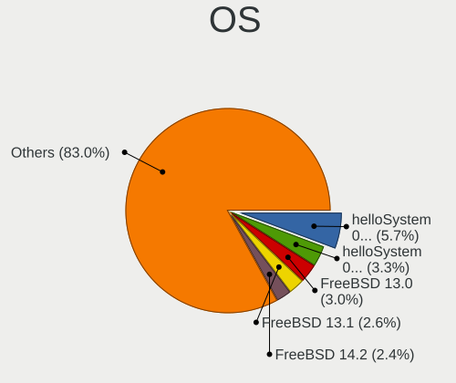

| Name                 | Notebooks | Percent |
|----------------------|-----------|---------|
| helloSystem 0.8.1    | 55        | 5.7%    |
| helloSystem 0.7.0    | 32        | 3.32%   |
| FreeBSD 13.0         | 29        | 3.01%   |
| FreeBSD 13.1         | 25        | 2.59%   |
| FreeBSD 14.2         | 23        | 2.38%   |
| helloSystem 0.8.0    | 22        | 2.28%   |
| helloSystem 0.5.0    | 20        | 2.07%   |
| helloSystem 0.9.0    | 19        | 1.97%   |
| FreeBSD 13.2         | 18        | 1.87%   |
| OpenBSD 6.9          | 14        | 1.45%   |
| OpenBSD 6.8          | 14        | 1.45%   |
| helloSystem 0.4.0    | 14        | 1.45%   |
| FreeBSD 14.3         | 14        | 1.45%   |
| FreeBSD 14.0-CURRENT | 14        | 1.45%   |
| GhostBSD 20.04.02    | 13        | 1.35%   |
| FreeBSD 14.1         | 12        | 1.24%   |
| FreeBSD 12.1-p8      | 12        | 1.24%   |
| OpenBSD 7.5          | 11        | 1.14%   |
| FreeBSD 15.0-CURRENT | 11        | 1.14%   |
| FreeBSD 13.0-p4      | 11        | 1.14%   |
| FreeBSD 14.0         | 10        | 1.04%   |
| FreeBSD 12.2         | 10        | 1.04%   |
| OpenBSD 7.4          | 9         | 0.93%   |
| OpenBSD 7.2          | 9         | 0.93%   |
| OpenBSD 7.0          | 8         | 0.83%   |
| helloSystem 0.6.0    | 8         | 0.83%   |
| FreeBSD 15.0         | 8         | 0.83%   |
| FreeBSD 13.1-p7      | 8         | 0.83%   |
| FreeBSD 13.1-p5      | 8         | 0.83%   |
| GhostBSD 24.01.1     | 7         | 0.73%   |
| GhostBSD 21.08.27    | 7         | 0.73%   |
| FreeBSD 14.2-p2      | 7         | 0.73%   |
| FreeBSD 12.2-p2      | 7         | 0.73%   |
| OpenBSD 7.6          | 6         | 0.62%   |
| OpenBSD 6.7          | 6         | 0.62%   |
| NomadBSD 5806f915    | 6         | 0.62%   |
| NomadBSD 1.3.2       | 6         | 0.62%   |
| FreeBSD 13.0-STABLE  | 6         | 0.62%   |
| FreeBSD 13.0-p2      | 6         | 0.62%   |
| FreeBSD 12.2-p3      | 6         | 0.62%   |

OS Family
---------

OS without a version

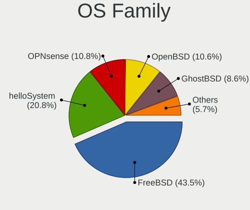

| Name        | Notebooks | Percent |
|-------------|-----------|---------|
| FreeBSD     | 345       | 43.51%  |
| helloSystem | 165       | 20.81%  |
| OPNsense    | 86        | 10.84%  |
| OpenBSD     | 84        | 10.59%  |
| GhostBSD    | 68        | 8.58%   |
| NomadBSD    | 22        | 2.77%   |
| NetBSD      | 9         | 1.13%   |
| HardenedBSD | 5         | 0.63%   |
| MidnightBSD | 4         | 0.5%    |
| DragonFly   | 3         | 0.38%   |
| pfSense     | 1         | 0.13%   |
| FuryBSD     | 1         | 0.13%   |

Arch
----

OS architecture (x86_64, i586, etc.)

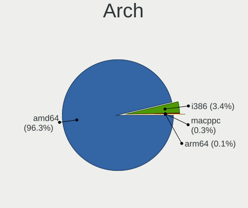

| Name   | Notebooks | Percent |
|--------|-----------|---------|
| amd64  | 746       | 96.26%  |
| i386   | 26        | 3.35%   |
| macppc | 2         | 0.26%   |
| arm64  | 1         | 0.13%   |

DE
--

Desktop Environment

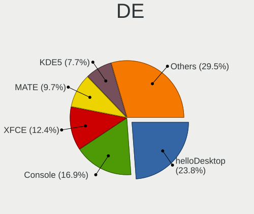

| Name          | Notebooks | Percent |
|---------------|-----------|---------|
| helloDesktop  | 196       | 23.82%  |
| Console       | 139       | 16.89%  |
| XFCE          | 102       | 12.39%  |
| MATE          | 80        | 9.72%   |
| KDE5          | 63        | 7.65%   |
| TWM           | 42        | 5.1%    |
| GNOME         | 38        | 4.62%   |
| fvwm          | 38        | 4.62%   |
| Openbox       | 25        | 3.04%   |
| i3            | 25        | 3.04%   |
| LXQt          | 11        | 1.34%   |
| Cinnamon      | 9         | 1.09%   |
| KDE6          | 8         | 0.97%   |
| KDE           | 8         | 0.97%   |
| Fluxbox       | 7         | 0.85%   |
| Enlightenment | 5         | 0.61%   |
| stumpwm       | 3         | 0.36%   |
| AwesomeWM     | 3         | 0.36%   |
| wlroots       | 2         | 0.24%   |
| Lumina        | 2         | 0.24%   |
| Hyprland      | 2         | 0.24%   |
| GNUstep       | 2         | 0.24%   |
| DWM           | 2         | 0.24%   |
| Xfwm4         | 1         | 0.12%   |
| X-Cinnamon    | 1         | 0.12%   |
| Wayfire       | 1         | 0.12%   |
| spectrwm      | 1         | 0.12%   |
| sdorfehs      | 1         | 0.12%   |
| LXDE          | 1         | 0.12%   |
| iwm           | 1         | 0.12%   |
| ctwm          | 1         | 0.12%   |
| Compton       | 1         | 0.12%   |
| CDE           | 1         | 0.12%   |
| Budgie        | 1         | 0.12%   |

Display Server
--------------

X11 or Wayland

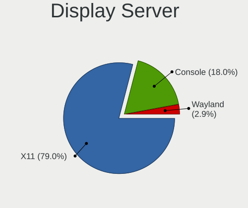

| Name    | Notebooks | Percent |
|---------|-----------|---------|
| X11     | 622       | 79.03%  |
| Console | 142       | 18.04%  |
| Wayland | 23        | 2.92%   |

Display Manager
---------------

SDDM, LightDM, etc.

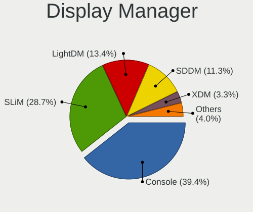

| Name    | Notebooks | Percent |
|---------|-----------|---------|
| Console | 318       | 39.36%  |
| SLiM    | 232       | 28.71%  |
| LightDM | 108       | 13.37%  |
| SDDM    | 91        | 11.26%  |
| XDM     | 27        | 3.34%   |
| GDM     | 25        | 3.09%   |
| Ly      | 7         | 0.87%   |

OS Lang
-------

Language

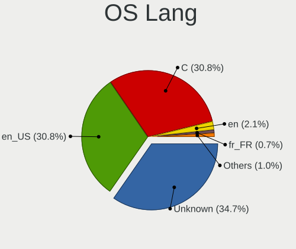

| Lang            | Notebooks | Percent |
|-----------------|-----------|---------|
| Unknown         | 282       | 34.69%  |
| en_US           | 250       | 30.75%  |
| C               | 250       | 30.75%  |
| en              | 17        | 2.09%   |
| fr_FR           | 6         | 0.74%   |
| en_US.US-ASCII  | 2         | 0.25%   |
| zh_CN           | 1         | 0.12%   |
| es_CO           | 1         | 0.12%   |
| en_US.ISO8859-1 | 1         | 0.12%   |
| en_GB           | 1         | 0.12%   |
| en_CA           | 1         | 0.12%   |
| de_DE           | 1         | 0.12%   |

Boot Mode
---------

EFI or BIOS

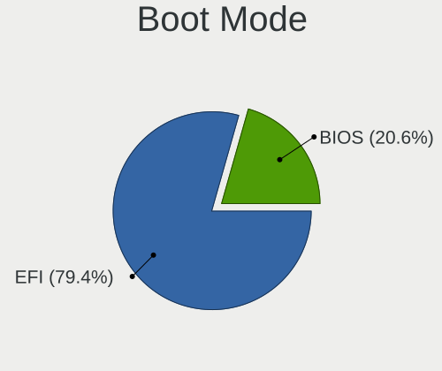

| Mode | Notebooks | Percent |
|------|-----------|---------|
| EFI  | 624       | 79.39%  |
| BIOS | 162       | 20.61%  |

Filesystem
----------

Type of filesystem

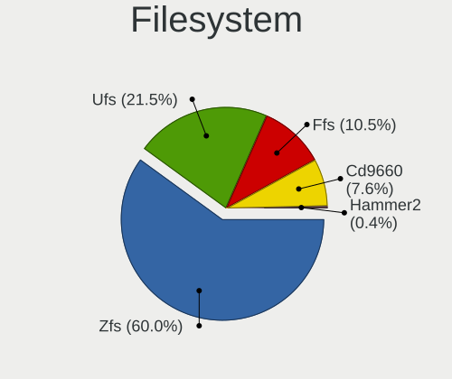

| Type    | Notebooks | Percent |
|---------|-----------|---------|
| Zfs     | 482       | 60.02%  |
| Ufs     | 173       | 21.54%  |
| Ffs     | 84        | 10.46%  |
| Cd9660  | 61        | 7.6%    |
| Hammer2 | 3         | 0.37%   |

Part. scheme
------------

Scheme of partitioning

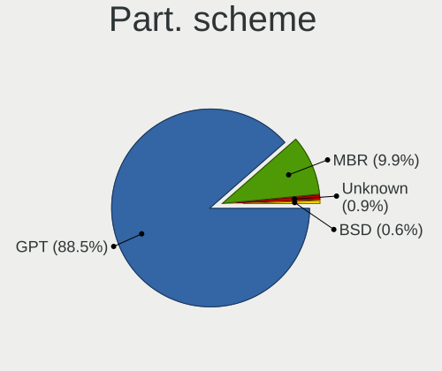

| Type    | Notebooks | Percent |
|---------|-----------|---------|
| GPT     | 696       | 88.55%  |
| MBR     | 78        | 9.92%   |
| Unknown | 7         | 0.89%   |
| BSD     | 5         | 0.64%   |

Board
-----

Vendor
------

Motherboard manufacturer

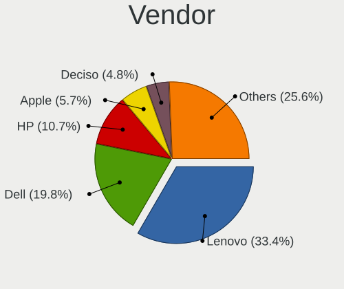

| Name                             | Notebooks | Percent |
|----------------------------------|-----------|---------|
| Lenovo                           | 258       | 33.38%  |
| Dell                             | 153       | 19.79%  |
| Hewlett-Packard                  | 83        | 10.74%  |
| Apple                            | 44        | 5.69%   |
| Deciso                           | 37        | 4.79%   |
| ASUSTek Computer                 | 35        | 4.53%   |
| Acer                             | 24        | 3.1%    |
| Toshiba                          | 15        | 1.94%   |
| Google                           | 15        | 1.94%   |
| Framework                        | 15        | 1.94%   |
| System76                         | 12        | 1.55%   |
| Unknown                          | 9         | 1.16%   |
| Panasonic                        | 7         | 0.91%   |
| MSI                              | 6         | 0.78%   |
| Datto                            | 6         | 0.78%   |
| Sony                             | 4         | 0.52%   |
| IBM                              | 4         | 0.52%   |
| Gateway                          | 4         | 0.52%   |
| LG Electronics                   | 3         | 0.39%   |
| Alienware                        | 3         | 0.39%   |
| Valve                            | 2         | 0.26%   |
| TUXEDO                           | 2         | 0.26%   |
| Timi                             | 2         | 0.26%   |
| Samsung Electronics              | 2         | 0.26%   |
| Notebook                         | 2         | 0.26%   |
| GPU Company                      | 2         | 0.26%   |
| eMachines                        | 2         | 0.26%   |
| DFI                              | 2         | 0.26%   |
| 10ZiG Technology                 | 2         | 0.26%   |
| youyeetoo                        | 1         | 0.13%   |
| SZ ReachingTech Limited          | 1         | 0.13%   |
| SLIMBOOK                         | 1         | 0.13%   |
| Razer                            | 1         | 0.13%   |
| MOTILE                           | 1         | 0.13%   |
| Micro Computer (HK) Tech Limited | 1         | 0.13%   |
| JUNCO                            | 1         | 0.13%   |
| IGEL Technology                  | 1         | 0.13%   |
| GPD                              | 1         | 0.13%   |
| Gigabyte Technology              | 1         | 0.13%   |
| Getac                            | 1         | 0.13%   |

Model
-----

Motherboard model

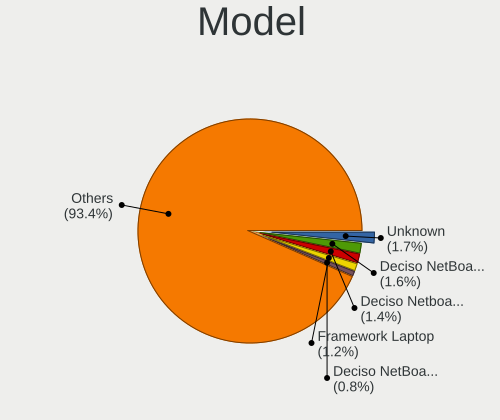

| Name                                | Notebooks | Percent |
|-------------------------------------|-----------|---------|
| Unknown                             | 13        | 1.68%   |
| Deciso NetBoard-A20                 | 12        | 1.55%   |
| Deciso Netboard A20                 | 11        | 1.42%   |
| Framework Laptop                    | 9         | 1.16%   |
| Deciso NetBoard-A10_Gen.3           | 6         | 0.78%   |
| Dell XPS 13 9360                    | 5         | 0.65%   |
| Dell Latitude E6420                 | 5         | 0.65%   |
| Dell Inspiron 3521                  | 5         | 0.65%   |
| Deciso NetBoard-A10                 | 5         | 0.65%   |
| Lenovo ThinkPad X220 4286CTO        | 4         | 0.52%   |
| HP Pavilion dv6                     | 4         | 0.52%   |
| HP 2000                             | 4         | 0.52%   |
| Dell Precision M4800                | 4         | 0.52%   |
| Dell Precision 7540                 | 4         | 0.52%   |
| Dell Latitude E7240                 | 4         | 0.52%   |
| Datto 1000                          | 4         | 0.52%   |
| Apple MacBookPro9,2                 | 4         | 0.52%   |
| Google Peppy                        | 3         | 0.39%   |
| Dell Latitude E5420                 | 3         | 0.39%   |
| Dell Latitude 7490                  | 3         | 0.39%   |
| Apple MacBookPro8,3                 | 3         | 0.39%   |
| Apple MacBookPro6,2                 | 3         | 0.39%   |
| Apple MacBookPro11,1                | 3         | 0.39%   |
| Apple MacBookAir6,2                 | 3         | 0.39%   |
| Valve Jupiter                       | 2         | 0.26%   |
| TUXEDO Pulse 15 Gen1                | 2         | 0.26%   |
| Toshiba PORTEGE R700                | 2         | 0.26%   |
| System76 Kudu                       | 2         | 0.26%   |
| System76 Gazelle                    | 2         | 0.26%   |
| System76 Galago Pro                 | 2         | 0.26%   |
| System76 Bonobo Extreme             | 2         | 0.26%   |
| Panasonic CF-54-3                   | 2         | 0.26%   |
| Lenovo ThinkPad X270 20HN001HUS     | 2         | 0.26%   |
| Lenovo ThinkPad X250 20CLS1WP01     | 2         | 0.26%   |
| Lenovo ThinkPad X220 Tablet 42962WU | 2         | 0.26%   |
| Lenovo ThinkPad X220 42872WU        | 2         | 0.26%   |
| Lenovo ThinkPad W530 2436CTO        | 2         | 0.26%   |
| Lenovo ThinkPad T60 20076PU         | 2         | 0.26%   |
| Lenovo ThinkPad T530 2392AQU        | 2         | 0.26%   |
| Lenovo ThinkPad T440s 20AQ006HUS    | 2         | 0.26%   |

Model Family
------------

Motherboard model prefix

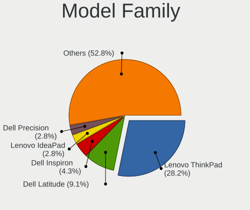

| Name                | Notebooks | Percent |
|---------------------|-----------|---------|
| Lenovo ThinkPad     | 218       | 28.2%   |
| Dell Latitude       | 70        | 9.06%   |
| Dell Inspiron       | 33        | 4.27%   |
| Lenovo IdeaPad      | 22        | 2.85%   |
| Dell Precision      | 22        | 2.85%   |
| HP Pavilion         | 18        | 2.33%   |
| HP Laptop           | 15        | 1.94%   |
| Framework Laptop    | 15        | 1.94%   |
| Dell XPS            | 14        | 1.81%   |
| Unknown             | 13        | 1.68%   |
| Toshiba Satellite   | 12        | 1.55%   |
| HP EliteBook        | 12        | 1.55%   |
| Deciso NetBoard-A20 | 12        | 1.55%   |
| Acer Aspire         | 12        | 1.55%   |
| HP ProBook          | 11        | 1.42%   |
| Deciso NetBoard-A10 | 11        | 1.42%   |
| Deciso Netboard     | 11        | 1.42%   |
| ASUS VivoBook       | 9         | 1.16%   |
| Apple MacBookPro11  | 8         | 1.03%   |
| Lenovo Legion       | 5         | 0.65%   |
| Apple MacBookPro9   | 5         | 0.65%   |
| Apple MacBookPro8   | 5         | 0.65%   |
| HP Stream           | 4         | 0.52%   |
| HP 2000             | 4         | 0.52%   |
| Datto 1000          | 4         | 0.52%   |
| Acer Nitro          | 4         | 0.52%   |
| Lenovo Yoga         | 3         | 0.39%   |
| Lenovo Flex         | 3         | 0.39%   |
| IBM ThinkPad        | 3         | 0.39%   |
| HP ZBook            | 3         | 0.39%   |
| HP OMEN             | 3         | 0.39%   |
| HP ENVY             | 3         | 0.39%   |
| Google Peppy        | 3         | 0.39%   |
| ASUS ASUS           | 3         | 0.39%   |
| Apple MacBookPro6   | 3         | 0.39%   |
| Apple MacBookAir6   | 3         | 0.39%   |
| Valve Jupiter       | 2         | 0.26%   |
| TUXEDO Pulse        | 2         | 0.26%   |
| Toshiba PORTEGE     | 2         | 0.26%   |
| System76 Kudu       | 2         | 0.26%   |

MFG Year
--------

Motherboard manufacture year

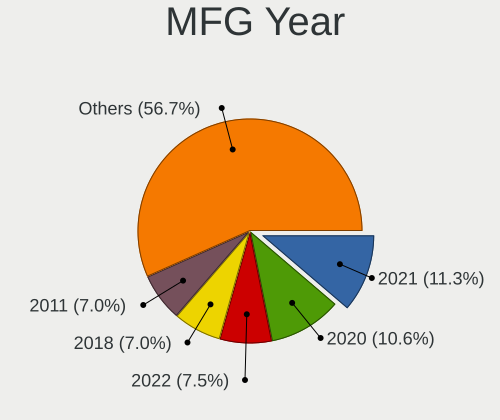

| Year    | Notebooks | Percent |
|---------|-----------|---------|
| 2021    | 87        | 11.25%  |
| 2020    | 82        | 10.61%  |
| 2022    | 58        | 7.5%    |
| 2018    | 54        | 6.99%   |
| 2011    | 54        | 6.99%   |
| 2013    | 49        | 6.34%   |
| 2019    | 48        | 6.21%   |
| 2016    | 44        | 5.69%   |
| 2015    | 44        | 5.69%   |
| 2012    | 42        | 5.43%   |
| 2014    | 34        | 4.4%    |
| 2023    | 31        | 4.01%   |
| 2017    | 30        | 3.88%   |
| 2010    | 27        | 3.49%   |
| 2009    | 20        | 2.59%   |
| 2024    | 18        | 2.33%   |
| 2008    | 14        | 1.81%   |
| 2007    | 13        | 1.68%   |
| 2025    | 7         | 0.91%   |
| 2006    | 7         | 0.91%   |
| 2005    | 3         | 0.39%   |
| Unknown | 3         | 0.39%   |
| 2004    | 2         | 0.26%   |
| 2002    | 2         | 0.26%   |

Form Factor
-----------

Physical design of the computer

| Name     | Notebooks | Percent |
|----------|-----------|---------|
| Notebook | 773       | 100%    |

Coreboot
--------

Have coreboot on board

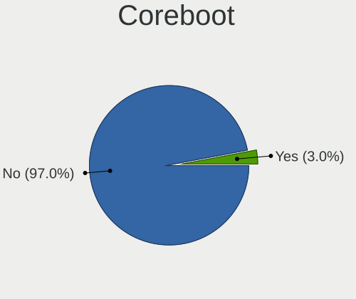

| Used | Notebooks | Percent |
|------|-----------|---------|
| No   | 750       | 97.02%  |
| Yes  | 23        | 2.98%   |

RAM Size
--------

Total RAM memory

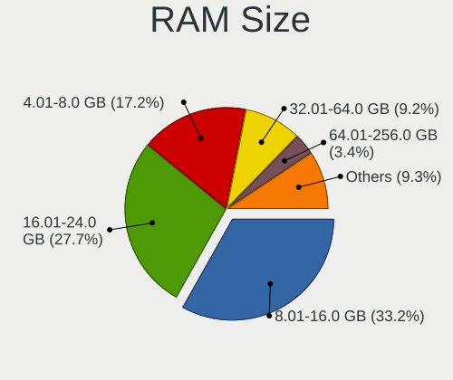

| Size in GB  | Notebooks | Percent |
|-------------|-----------|---------|
| 8.01-16.0   | 263       | 33.17%  |
| 16.01-24.0  | 220       | 27.74%  |
| 4.01-8.0    | 136       | 17.15%  |
| 32.01-64.0  | 73        | 9.21%   |
| 64.01-256.0 | 27        | 3.4%    |
| 2.01-3.0    | 26        | 3.28%   |
| 3.01-4.0    | 21        | 2.65%   |
| 24.01-32.0  | 13        | 1.64%   |
| 1.01-2.0    | 6         | 0.76%   |
| 0.51-1.0    | 6         | 0.76%   |
| 0.01-0.5    | 2         | 0.25%   |

RAM Used
--------

Used RAM memory

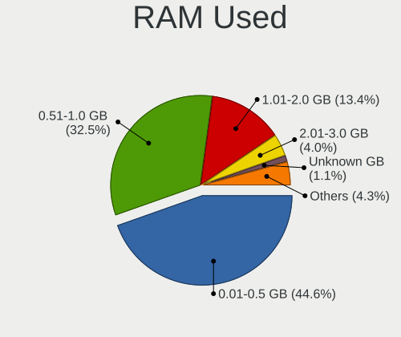

| Used GB     | Notebooks | Percent |
|-------------|-----------|---------|
| 0.01-0.5    | 355       | 44.6%   |
| 0.51-1.0    | 259       | 32.54%  |
| 1.01-2.0    | 107       | 13.44%  |
| 2.01-3.0    | 32        | 4.02%   |
| Unknown     | 9         | 1.13%   |
| 4.01-8.0    | 8         | 1.01%   |
| 8.01-16.0   | 8         | 1.01%   |
| 0           | 8         | 1.01%   |
| 3.01-4.0    | 6         | 0.75%   |
| 16.01-24.0  | 2         | 0.25%   |
| 24.01-32.0  | 1         | 0.13%   |
| 64.01-256.0 | 1         | 0.13%   |

Total Drives
------------

Number of drives on board

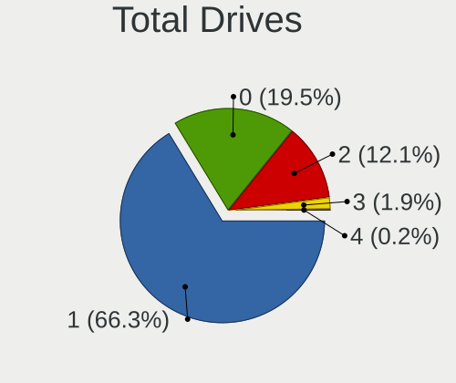

| Drives | Notebooks | Percent |
|--------|-----------|---------|
| 1      | 537       | 66.3%   |
| 0      | 158       | 19.51%  |
| 2      | 98        | 12.1%   |
| 3      | 15        | 1.85%   |
| 4      | 2         | 0.25%   |

Has CD-ROM
----------

Has CD-ROM on board

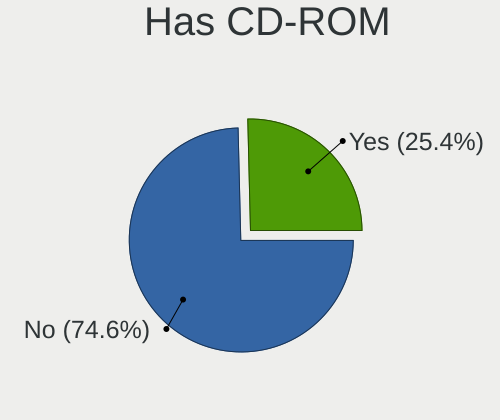

| Presented | Notebooks | Percent |
|-----------|-----------|---------|
| No        | 582       | 74.62%  |
| Yes       | 198       | 25.38%  |

Has Ethernet
------------

Has Ethernet on board

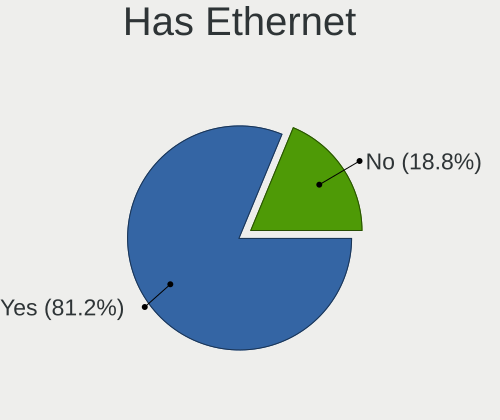

| Presented | Notebooks | Percent |
|-----------|-----------|---------|
| Yes       | 628       | 81.24%  |
| No        | 145       | 18.76%  |

Has WiFi
--------

Has WiFi module

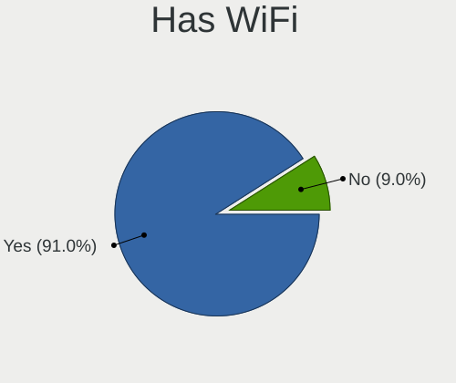

| Presented | Notebooks | Percent |
|-----------|-----------|---------|
| Yes       | 706       | 90.98%  |
| No        | 70        | 9.02%   |

Has Bluetooth
-------------

Has Bluetooth module

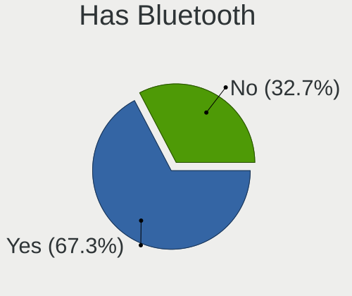

| Presented | Notebooks | Percent |
|-----------|-----------|---------|
| Yes       | 527       | 67.31%  |
| No        | 256       | 32.69%  |

Location
--------

Country
-------

Geographic location (country)

| Country | Notebooks | Percent |
|---------|-----------|---------|
| USA     | 773       | 100%    |

City
----

Geographic location (city)

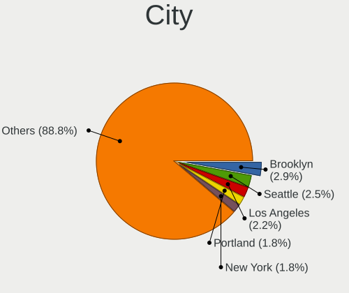

| City          | Notebooks | Percent |
|---------------|-----------|---------|
| Brooklyn      | 24        | 2.89%   |
| Seattle       | 21        | 2.53%   |
| Los Angeles   | 18        | 2.17%   |
| Portland      | 15        | 1.81%   |
| New York      | 15        | 1.81%   |
| Chicago       | 14        | 1.68%   |
| Denver        | 10        | 1.2%    |
| Washington    | 7         | 0.84%   |
| Sun Prairie   | 7         | 0.84%   |
| San Antonio   | 7         | 0.84%   |
| Concord       | 7         | 0.84%   |
| San Francisco | 6         | 0.72%   |
| Charlotte     | 6         | 0.72%   |
| Sanford       | 5         | 0.6%    |
| San Jose      | 5         | 0.6%    |
| Rochester     | 5         | 0.6%    |
| Madison       | 5         | 0.6%    |
| Las Vegas     | 5         | 0.6%    |
| Fayetteville  | 5         | 0.6%    |
| Dallas        | 5         | 0.6%    |
| Albuquerque   | 5         | 0.6%    |
| Whittier      | 4         | 0.48%   |
| Vienna        | 4         | 0.48%   |
| Springfield   | 4         | 0.48%   |
| San Diego     | 4         | 0.48%   |
| Richmond      | 4         | 0.48%   |
| Redmond       | 4         | 0.48%   |
| Queens        | 4         | 0.48%   |
| Oklahoma City | 4         | 0.48%   |
| Lafayette     | 4         | 0.48%   |
| Indian Trail  | 4         | 0.48%   |
| Harrisburg    | 4         | 0.48%   |
| Frisco        | 4         | 0.48%   |
| Fresno        | 4         | 0.48%   |
| Columbia      | 4         | 0.48%   |
| Bothell       | 4         | 0.48%   |
| Berkeley      | 4         | 0.48%   |
| Austin        | 4         | 0.48%   |
| Atlanta       | 4         | 0.48%   |
| Ashburn       | 4         | 0.48%   |

Drives
------

Drive Vendor
------------

Hard drive vendors

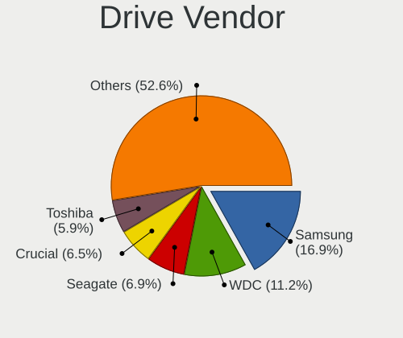

| Vendor              | Notebooks | Drives | Percent |
|---------------------|-----------|--------|---------|
| Samsung Electronics | 125       | 148    | 16.89%  |
| WDC                 | 83        | 89     | 11.22%  |
| Seagate             | 51        | 55     | 6.89%   |
| Crucial             | 48        | 80     | 6.49%   |
| Toshiba             | 44        | 58     | 5.95%   |
| SanDisk             | 43        | 55     | 5.81%   |
| Transcend           | 38        | 82     | 5.14%   |
| Kingston            | 30        | 33     | 4.05%   |
| SK hynix            | 24        | 24     | 3.24%   |
| Intel               | 23        | 26     | 3.11%   |
| Hitachi             | 21        | 23     | 2.84%   |
| PNY                 | 20        | 38     | 2.7%    |
| NVMe                | 20        | 26     | 2.7%    |
| Apple               | 19        | 19     | 2.57%   |
| HGST                | 13        | 16     | 1.76%   |
| Micron Technology   | 12        | 14     | 1.62%   |
| SPCC                | 10        | 11     | 1.35%   |
| OWC                 | 9         | 10     | 1.22%   |
| Phison              | 8         | 15     | 1.08%   |
| KingSpec            | 7         | 7      | 0.95%   |
| A-DATA Technology   | 7         | 10     | 0.95%   |
| KIOXIA              | 6         | 6      | 0.81%   |
| Corsair             | 6         | 6      | 0.81%   |
| Lexar               | 5         | 13     | 0.68%   |
| Fujitsu             | 5         | 5      | 0.68%   |
| SSSTC               | 4         | 4      | 0.54%   |
| Mushkin             | 4         | 4      | 0.54%   |
| China               | 4         | 5      | 0.54%   |
| Zheino              | 3         | 6      | 0.41%   |
| Team                | 3         | 4      | 0.41%   |
| LITEONIT            | 3         | 3      | 0.41%   |
| Hewlett-Packard     | 3         | 3      | 0.41%   |
| Dogfish             | 3         | 4      | 0.41%   |
| Patriot             | 2         | 2      | 0.27%   |
| OCZ                 | 2         | 2      | 0.27%   |
| Netac               | 2         | 2      | 0.27%   |
| MyDigitalSSD        | 2         | 2      | 0.27%   |
| LITEON              | 2         | 2      | 0.27%   |
| Intenso             | 2         | 2      | 0.27%   |
| Generic             | 2         | 2      | 0.27%   |

Drive Model
-----------

Hard drive models

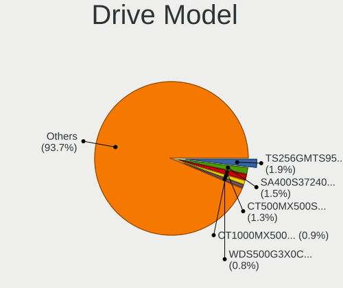

| Model                                | Notebooks | Percent |
|--------------------------------------|-----------|---------|
| Transcend TS256GMTS952T2 256GB       | 14        | 1.85%   |
| Kingston SA400S37240G 240GB          | 11        | 1.46%   |
| Crucial CT500MX500SSD1 500GB         | 10        | 1.32%   |
| Crucial CT1000MX500SSD1 1TB          | 7         | 0.93%   |
| WDC WDS500G3X0C-00SJG0 500GB         | 6         | 0.79%   |
| Toshiba MQ01ABD100 1TB               | 6         | 0.79%   |
| Seagate ST1000LM035-1RK172 1TB       | 6         | 0.79%   |
| Samsung SSD 850 EVO 250GB            | 6         | 0.79%   |
| Seagate ST500LM021-1KJ152 500GB      | 5         | 0.66%   |
| SanDisk SSD PLUS 240GB               | 5         | 0.66%   |
| Samsung SSD 970 EVO Plus 500GB       | 5         | 0.66%   |
| PNY CS900 240GB SSD                  | 5         | 0.66%   |
| PNY CS900 1TB SSD                    | 5         | 0.66%   |
| NVMe WDC PC SN730 SDB 256GB          | 5         | 0.66%   |
| WDC WDBNCE5000PNC 500GB              | 4         | 0.53%   |
| Transcend TS128GMTS430S 128GB        | 4         | 0.53%   |
| Toshiba MQ01ABF050 500GB             | 4         | 0.53%   |
| SK hynix SC311 SATA 256GB            | 4         | 0.53%   |
| Seagate ST500LT012-9WS142 500GB      | 4         | 0.53%   |
| Samsung SSD 970 EVO Plus 1TB         | 4         | 0.53%   |
| Samsung SSD 860 EVO 1TB              | 4         | 0.53%   |
| Samsung SSD 850 PRO 512GB            | 4         | 0.53%   |
| Samsung SSD 850 EVO 500GB            | 4         | 0.53%   |
| Samsung MZVLW256HEHP-000L7 256GB     | 4         | 0.53%   |
| HGST HTS721010A9E630 1TB             | 4         | 0.53%   |
| Crucial CT120BX500SSD1 120GB         | 4         | 0.53%   |
| Apple SSD SM0256F 256GB              | 4         | 0.53%   |
| WDC WD1600BEVT-22ZCT0 160GB          | 3         | 0.4%    |
| WDC PC SN730 SDBQNTY-512G-1001 512GB | 3         | 0.4%    |
| Transcend TS512GMTS952T2 512GB       | 3         | 0.4%    |
| SPCC Solid State Disk 128GB          | 3         | 0.4%    |
| Seagate ST320LT007-9ZV142 320GB      | 3         | 0.4%    |
| SanDisk SDSSDA120G 120GB             | 3         | 0.4%    |
| Samsung SSD 850 EVO 1TB              | 3         | 0.4%    |
| Samsung MZVLB512HBJQ-000L7 512GB     | 3         | 0.4%    |
| Samsung MZVLB256HBHQ-000L7 256GB     | 3         | 0.4%    |
| Samsung MZVLB1T0HBLR-000L2 1TB       | 3         | 0.4%    |
| Samsung MZNLN256HCHP-000L7 256GB     | 3         | 0.4%    |
| PNY CS900 120GB SSD                  | 3         | 0.4%    |
| Phison PCIe SSD 2TB                  | 3         | 0.4%    |

HDD Vendor
----------

Hard disk drive vendors

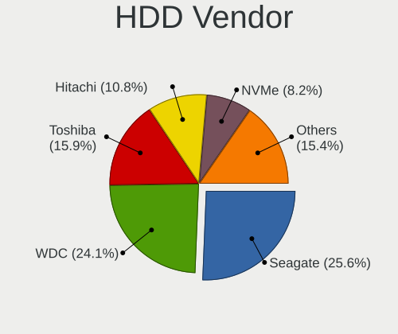

| Vendor              | Notebooks | Drives | Percent |
|---------------------|-----------|--------|---------|
| Seagate             | 50        | 54     | 25.64%  |
| WDC                 | 47        | 48     | 24.1%   |
| Toshiba             | 31        | 43     | 15.9%   |
| Hitachi             | 21        | 23     | 10.77%  |
| NVMe                | 16        | 19     | 8.21%   |
| HGST                | 13        | 16     | 6.67%   |
| Fujitsu             | 5         | 5      | 2.56%   |
| Samsung Electronics | 4         | 5      | 2.05%   |
| Apple               | 3         | 3      | 1.54%   |
| Generic             | 2         | 2      | 1.03%   |
| OPENBSD             | 1         | 1      | 0.51%   |
| IBM/Hitachi         | 1         | 1      | 0.51%   |
| General             | 1         | 1      | 0.51%   |

SSD Vendor
----------

Solid state drive vendors

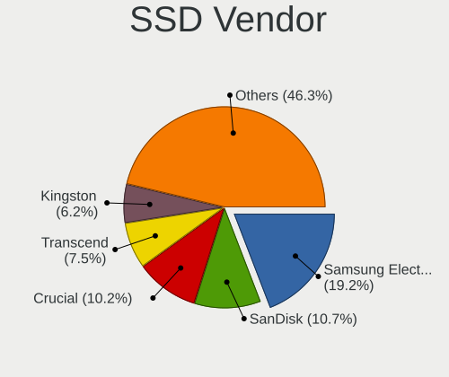

| Vendor              | Notebooks | Drives | Percent |
|---------------------|-----------|--------|---------|
| Samsung Electronics | 77        | 84     | 19.15%  |
| SanDisk             | 43        | 55     | 10.7%   |
| Crucial             | 41        | 64     | 10.2%   |
| Transcend           | 30        | 70     | 7.46%   |
| Kingston            | 25        | 27     | 6.22%   |
| PNY                 | 20        | 38     | 4.98%   |
| Apple               | 16        | 16     | 3.98%   |
| Intel               | 15        | 17     | 3.73%   |
| WDC                 | 14        | 14     | 3.48%   |
| SK hynix            | 13        | 13     | 3.23%   |
| OWC                 | 9         | 10     | 2.24%   |
| SPCC                | 8         | 8      | 1.99%   |
| KingSpec            | 7         | 7      | 1.74%   |
| Corsair             | 6         | 6      | 1.49%   |
| A-DATA Technology   | 6         | 6      | 1.49%   |
| Toshiba             | 5         | 6      | 1.24%   |
| NVMe                | 5         | 6      | 1.24%   |
| Lexar               | 5         | 13     | 1.24%   |
| Micron Technology   | 4         | 4      | 1%      |
| China               | 4         | 5      | 1%      |
| Zheino              | 3         | 6      | 0.75%   |
| Team                | 3         | 4      | 0.75%   |
| SSSTC               | 3         | 3      | 0.75%   |
| Phison              | 3         | 3      | 0.75%   |
| Mushkin             | 3         | 3      | 0.75%   |
| LITEONIT            | 3         | 3      | 0.75%   |
| Hewlett-Packard     | 3         | 3      | 0.75%   |
| Dogfish             | 3         | 4      | 0.75%   |
| Patriot             | 2         | 2      | 0.5%    |
| OCZ                 | 2         | 2      | 0.5%    |
| Netac               | 2         | 2      | 0.5%    |
| MyDigitalSSD        | 2         | 2      | 0.5%    |
| BIWIN               | 2         | 3      | 0.5%    |
| ZTC                 | 1         | 1      | 0.25%   |
| Timetec             | 1         | 1      | 0.25%   |
| Seagate             | 1         | 1      | 0.25%   |
| Plextor             | 1         | 1      | 0.25%   |
| Pioneer             | 1         | 1      | 0.25%   |
| LITEON              | 1         | 1      | 0.25%   |
| Kingchuxing         | 1         | 2      | 0.25%   |

Drive Kind
----------

HDD or SSD

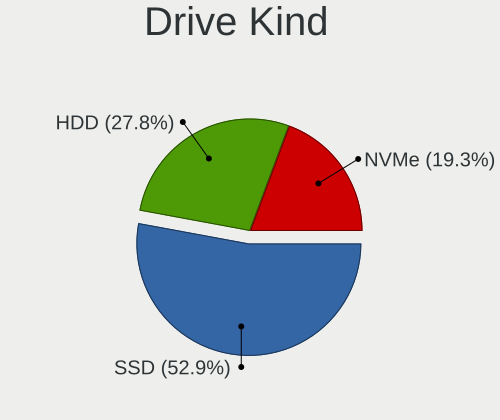

| Kind | Notebooks | Drives | Percent |
|------|-----------|--------|---------|
| SSD  | 364       | 533    | 52.91%  |
| HDD  | 191       | 221    | 27.76%  |
| NVMe | 133       | 194    | 19.33%  |

Drive Connector
---------------

SATA, SAS, NVMe, etc.

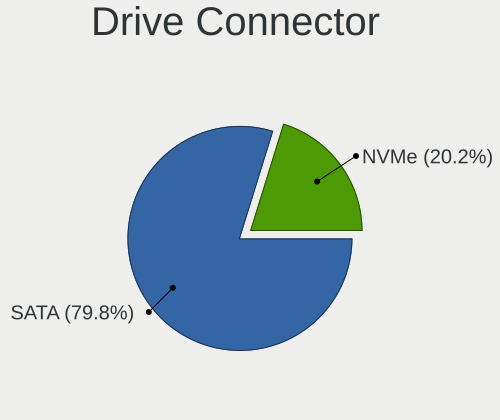

| Type | Notebooks | Drives | Percent |
|------|-----------|--------|---------|
| SATA | 525       | 754    | 79.79%  |
| NVMe | 133       | 194    | 20.21%  |

Drive Size
----------

Size of hard drive

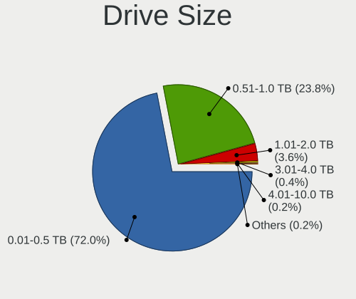

| Size in TB | Notebooks | Drives | Percent |
|------------|-----------|--------|---------|
| 0.01-0.5   | 403       | 542    | 71.96%  |
| 0.51-1.0   | 133       | 183    | 23.75%  |
| 1.01-2.0   | 20        | 25     | 3.57%   |
| 3.01-4.0   | 2         | 2      | 0.36%   |
| 2.01-3.0   | 1         | 1      | 0.18%   |
| 4.01-10.0  | 1         | 1      | 0.18%   |

Space Total
-----------

Amount of disk space available on the file system

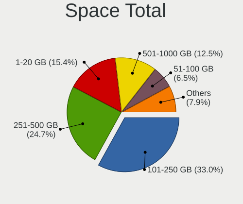

| Size in GB     | Notebooks | Percent |
|----------------|-----------|---------|
| 101-250        | 268       | 33.05%  |
| 251-500        | 200       | 24.66%  |
| 1-20           | 125       | 15.41%  |
| 501-1000       | 101       | 12.45%  |
| 51-100         | 53        | 6.54%   |
| 21-50          | 31        | 3.82%   |
| 1001-2000      | 24        | 2.96%   |
| Unknown        | 4         | 0.49%   |
| More than 3000 | 3         | 0.37%   |
| 2001-3000      | 2         | 0.25%   |

Space Used
----------

Amount of used disk space

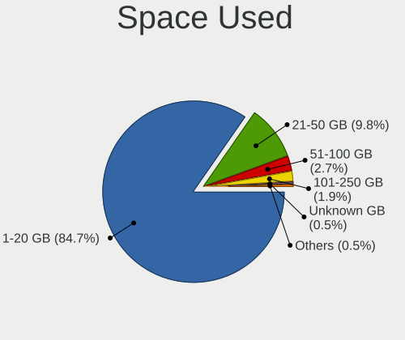

| Used GB  | Notebooks | Percent |
|----------|-----------|---------|
| 1-20     | 684       | 84.65%  |
| 21-50    | 79        | 9.78%   |
| 51-100   | 22        | 2.72%   |
| 101-250  | 15        | 1.86%   |
| Unknown  | 4         | 0.5%    |
| 251-500  | 3         | 0.37%   |
| 501-1000 | 1         | 0.12%   |

Malfunc. Drives
---------------

Drive models with a malfunction

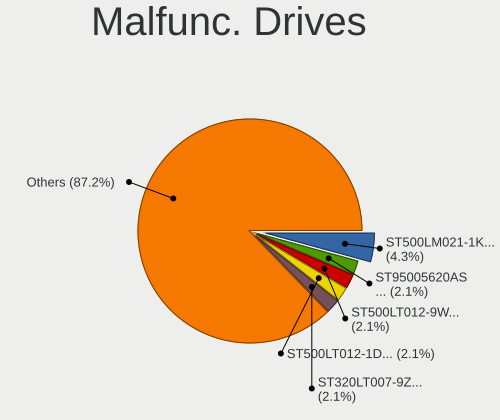

| Model                                | Notebooks | Drives | Percent |
|--------------------------------------|-----------|--------|---------|
| Seagate ST500LM021-1KJ152 500GB      | 4         | 4      | 4.26%   |
| SSSTC CVB-8D128-HP 128GB             | 2         | 2      | 2.13%   |
| Seagate ST95005620AS 500GB           | 2         | 2      | 2.13%   |
| Seagate ST500LT012-9WS142 500GB      | 2         | 2      | 2.13%   |
| Seagate ST500LT012-1DG142 500GB      | 2         | 2      | 2.13%   |
| Seagate ST320LT007-9ZV142 320GB      | 2         | 2      | 2.13%   |
| SanDisk SSD PLUS 240GB               | 2         | 2      | 2.13%   |
| HGST HTS721010A9E630 1TB             | 2         | 2      | 2.13%   |
| WDC WD5000LPCX-75VHAT0 500GB         | 1         | 1      | 1.06%   |
| WDC WD3200BPVT-75ZEST0 320GB         | 1         | 1      | 1.06%   |
| WDC WD3200BPVT-75JJ5T0 320GB         | 1         | 1      | 1.06%   |
| WDC WD3200BEKT-60V5T1 320GB          | 1         | 1      | 1.06%   |
| WDC WD30PURZ-85AKKY0 3TB             | 1         | 1      | 1.06%   |
| WDC WD1600BEKT-66F3T2 160GB          | 1         | 1      | 1.06%   |
| Transcend TS256GMTS830S 256GB        | 1         | 1      | 1.06%   |
| Toshiba THNSNK256GVN8 M.2 2280 256GB | 1         | 1      | 1.06%   |
| Toshiba THNSNK128GVN8 M.2 2280 128GB | 1         | 1      | 1.06%   |
| Toshiba MQ04ABF100 1TB               | 1         | 1      | 1.06%   |
| Toshiba MQ01ACF032 320GB             | 1         | 3      | 1.06%   |
| Toshiba MQ01ABF050 500GB             | 1         | 1      | 1.06%   |
| Toshiba MQ01ABD100 1TB               | 1         | 1      | 1.06%   |
| Toshiba MQ01ABD075 752GB             | 1         | 1      | 1.06%   |
| Toshiba MK7559GSXF 752GB             | 1         | 1      | 1.06%   |
| Toshiba MK5061GSYN 500GB             | 1         | 1      | 1.06%   |
| Toshiba MK3265GSXN 320GB             | 1         | 5      | 1.06%   |
| Toshiba MK3261GSYN 320GB             | 1         | 1      | 1.06%   |
| Toshiba MK1655GSX 160GB              | 1         | 1      | 1.06%   |
| Toshiba MK1637GSX 160GB              | 1         | 3      | 1.06%   |
| SK hynix SC401 SATA 256GB            | 1         | 1      | 1.06%   |
| SK hynix SC210 mSATA 256GB           | 1         | 1      | 1.06%   |
| Seagate ST96023AS 58GB               | 1         | 1      | 1.06%   |
| Seagate ST9500420AS 500GB            | 1         | 1      | 1.06%   |
| Seagate ST9500325AS 500GB            | 1         | 1      | 1.06%   |
| Seagate ST9320423AS 320GB            | 1         | 1      | 1.06%   |
| Seagate ST750LM022 HN-M750MBB 752GB  | 1         | 1      | 1.06%   |
| Seagate ST500LM000-SSHD-8GB          | 1         | 1      | 1.06%   |
| Seagate ST500LM000-1EJ162 500GB      | 1         | 2      | 1.06%   |
| Seagate ST2000LM003 HN-M201RAD 2TB   | 1         | 1      | 1.06%   |
| Seagate ST1000LM035-1RK172 1TB       | 1         | 2      | 1.06%   |
| Seagate ST1000LM024 HN-M101MBB 1TB   | 1         | 1      | 1.06%   |

Malfunc. Drive Vendor
---------------------

Vendors of faulty drives

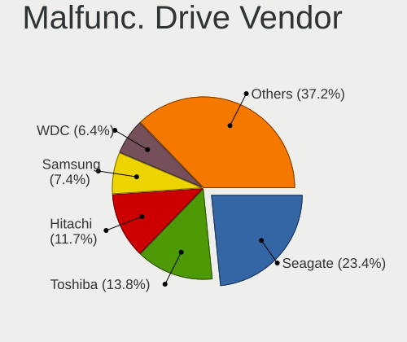

| Vendor              | Notebooks | Drives | Percent |
|---------------------|-----------|--------|---------|
| Seagate             | 22        | 24     | 23.4%   |
| Toshiba             | 13        | 21     | 13.83%  |
| Hitachi             | 11        | 12     | 11.7%   |
| Samsung Electronics | 7         | 8      | 7.45%   |
| WDC                 | 6         | 6      | 6.38%   |
| HGST                | 6         | 7      | 6.38%   |
| Kingston            | 5         | 5      | 5.32%   |
| Intel               | 4         | 4      | 4.26%   |
| SanDisk             | 3         | 3      | 3.19%   |
| SSSTC               | 2         | 2      | 2.13%   |
| SK hynix            | 2         | 2      | 2.13%   |
| Crucial             | 2         | 2      | 2.13%   |
| Apple               | 2         | 2      | 2.13%   |
| Transcend           | 1         | 1      | 1.06%   |
| Patriot             | 1         | 1      | 1.06%   |
| LITEON              | 1         | 1      | 1.06%   |
| KingSpec            | 1         | 1      | 1.06%   |
| IBM/Hitachi         | 1         | 1      | 1.06%   |
| Fujitsu             | 1         | 1      | 1.06%   |
| Fanxiang            | 1         | 2      | 1.06%   |
| Eluktro             | 1         | 2      | 1.06%   |
| Corsair             | 1         | 1      | 1.06%   |

Malfunc. HDD Vendor
-------------------

Vendors of faulty HDD drives

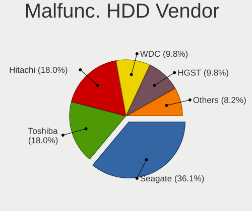

| Vendor              | Notebooks | Drives | Percent |
|---------------------|-----------|--------|---------|
| Seagate             | 22        | 24     | 36.07%  |
| Toshiba             | 11        | 19     | 18.03%  |
| Hitachi             | 11        | 12     | 18.03%  |
| WDC                 | 6         | 6      | 9.84%   |
| HGST                | 6         | 7      | 9.84%   |
| Samsung Electronics | 2         | 3      | 3.28%   |
| IBM/Hitachi         | 1         | 1      | 1.64%   |
| Fujitsu             | 1         | 1      | 1.64%   |
| Apple               | 1         | 1      | 1.64%   |

Malfunc. Drive Kind
-------------------

Kinds of faulty drives

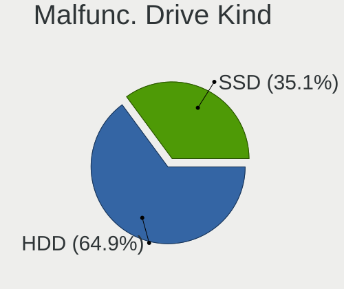

| Kind | Notebooks | Drives | Percent |
|------|-----------|--------|---------|
| HDD  | 61        | 74     | 64.89%  |
| SSD  | 33        | 35     | 35.11%  |

Failed Drives
-------------

Failed drive models

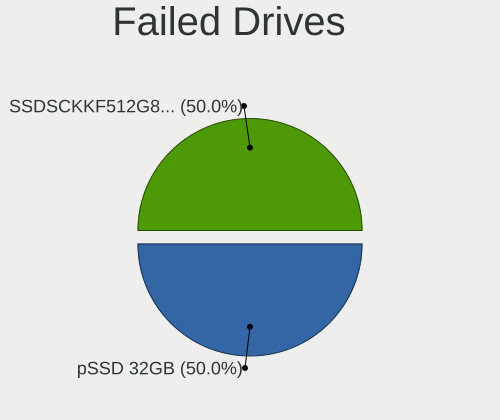

| Model                          | Notebooks | Drives | Percent |
|--------------------------------|-----------|--------|---------|
| SanDisk pSSD 32GB              | 1         | 1      | 50%     |
| Intel SSDSCKKF512G8 SATA 512GB | 1         | 1      | 50%     |

Failed Drive Vendor
-------------------

Failed drive vendors

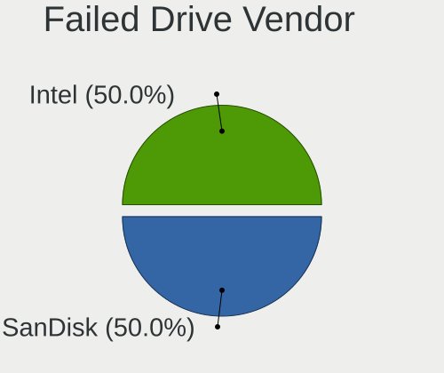

| Vendor  | Notebooks | Drives | Percent |
|---------|-----------|--------|---------|
| SanDisk | 1         | 1      | 50%     |
| Intel   | 1         | 1      | 50%     |

Drive Status
------------

Number of failed and malfunc. drives

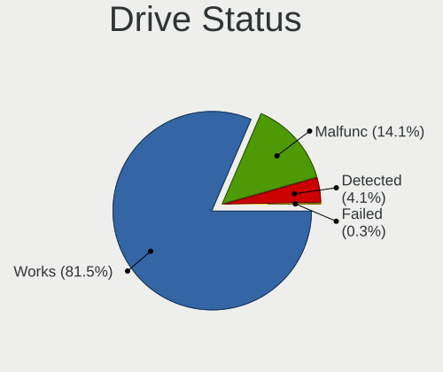

| Status   | Notebooks | Drives | Percent |
|----------|-----------|--------|---------|
| Works    | 536       | 802    | 81.46%  |
| Malfunc  | 93        | 109    | 14.13%  |
| Detected | 27        | 35     | 4.1%    |
| Failed   | 2         | 2      | 0.3%    |

Storage controller
------------------

Storage Vendor
--------------

Storage controller vendors

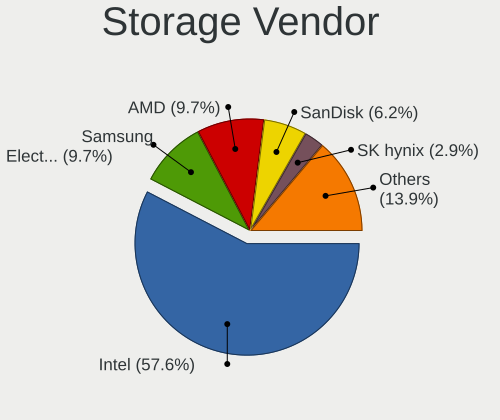

| Vendor                                  | Notebooks | Percent |
|-----------------------------------------|-----------|---------|
| Intel                                   | 499       | 57.62%  |
| Samsung Electronics                     | 84        | 9.7%    |
| AMD                                     | 84        | 9.7%    |
| SanDisk                                 | 54        | 6.24%   |
| SK hynix                                | 25        | 2.89%   |
| Transcend                               | 20        | 2.31%   |
| Micron Technology                       | 17        | 1.96%   |
| KIOXIA                                  | 14        | 1.62%   |
| Toshiba                                 | 11        | 1.27%   |
| Phison Electronics                      | 10        | 1.15%   |
| Micron/Crucial Technology               | 8         | 0.92%   |
| Kingston Technology Company             | 8         | 0.92%   |
| MAXIO Technology (Hangzhou)             | 6         | 0.69%   |
| Silicon Motion                          | 4         | 0.46%   |
| Realtek Semiconductor                   | 4         | 0.46%   |
| Nvidia                                  | 3         | 0.35%   |
| Union Memory (Shenzhen)                 | 2         | 0.23%   |
| Lenovo                                  | 2         | 0.23%   |
| JMicron Technology                      | 2         | 0.23%   |
| Yangtze Memory Technologies             | 1         | 0.12%   |
| Solid State Storage Technology          | 1         | 0.12%   |
| Silicon Integrated Systems [SiS]        | 1         | 0.12%   |
| Shenzhen Unionmemory Information System | 1         | 0.12%   |
| Shenzhen Longsys Electronics            | 1         | 0.12%   |
| Seagate Technology                      | 1         | 0.12%   |
| Marvell Technology Group                | 1         | 0.12%   |
| Lite-On Technology                      | 1         | 0.12%   |
| ADATA Technology                        | 1         | 0.12%   |

Storage Model
-------------

Storage controller models

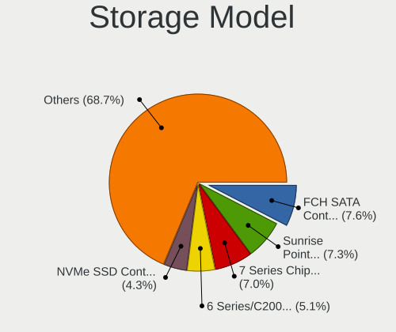

| Model                                                                            | Notebooks | Percent |
|----------------------------------------------------------------------------------|-----------|---------|
| AMD FCH SATA Controller [AHCI mode]                                              | 71        | 7.61%   |
| Intel Sunrise Point-LP SATA Controller [AHCI mode]                               | 68        | 7.29%   |
| Intel 7 Series Chipset Family 6-port SATA Controller [AHCI mode]                 | 65        | 6.97%   |
| Intel 6 Series/C200 Series Chipset Family 6 port Mobile SATA AHCI Controller     | 48        | 5.14%   |
| Samsung NVMe SSD Controller SM981/PM981/PM983                                    | 40        | 4.29%   |
| Intel Wildcat Point-LP SATA Controller [AHCI Mode]                               | 32        | 3.43%   |
| Intel 82801 Mobile SATA Controller [RAID mode]                                   | 30        | 3.22%   |
| SanDisk Extreme Pro / WD Black SN750 / PC SN730 / Red SN700 NVMe SSD             | 22        | 2.36%   |
| Intel 82801HM/HEM (ICH8M/ICH8M-E) IDE Controller                                 | 22        | 2.36%   |
| Intel 8 Series SATA Controller 1 [AHCI mode]                                     | 22        | 2.36%   |
| Intel 82801HM/HEM (ICH8M/ICH8M-E) SATA Controller [AHCI mode]                    | 21        | 2.25%   |
| Intel 8 Series/C220 Series Chipset Family 6-port SATA Controller 1 [AHCI mode]   | 20        | 2.14%   |
| Intel Cannon Lake Mobile PCH SATA AHCI Controller                                | 19        | 2.04%   |
| Intel 5 Series/3400 Series Chipset 4 port SATA AHCI Controller                   | 15        | 1.61%   |
| Intel 5 Series/3400 Series Chipset 6 port SATA AHCI Controller                   | 14        | 1.5%    |
| SK hynix Gold P31/BC711/PC711 NVMe Solid State Drive                             | 13        | 1.39%   |
| Intel 82801IBM/IEM (ICH9M/ICH9M-E) 4 port SATA Controller [AHCI mode]            | 13        | 1.39%   |
| Samsung NVMe SSD Controller 980 (DRAM-less)                                      | 12        | 1.29%   |
| Intel Q170/Q150/B150/H170/H110/Z170/CM236 Chipset SATA Controller [AHCI Mode]    | 12        | 1.29%   |
| Samsung NVMe SSD Controller SM961/PM961/SM963                                    | 11        | 1.18%   |
| Transcend NVMe PCIe SSD 220S/240S/MTE710T                                        | 9         | 0.96%   |
| KIOXIA NVMe SSD Controller BG4 (DRAM-less)                                       | 9         | 0.96%   |
| Intel 82801GBM/GHM (ICH7-M Family) SATA Controller [AHCI mode]                   | 9         | 0.96%   |
| Intel 82801G (ICH7 Family) IDE Controller                                        | 9         | 0.96%   |
| AMD SB7x0/SB8x0/SB9x0 SATA Controller [AHCI mode]                                | 9         | 0.96%   |
| Samsung NVMe SSD Controller PM9A1/PM9A3/980PRO                                   | 8         | 0.86%   |
| Intel Volume Management Device NVMe RAID Controller                              | 8         | 0.86%   |
| Intel Celeron/Pentium Silver Processor SATA Controller                           | 8         | 0.86%   |
| Transcend NVMe PCIe SSD 110S/112S/120S/MTE300S/MTE400S/MTE652T2 (DRAM-less)      | 7         | 0.75%   |
| SanDisk WD PC SN810 / Black SN850 NVMe SSD                                       | 7         | 0.75%   |
| Samsung S4LN053X01 AHCI SSD Controller(Apple slot)                               | 7         | 0.75%   |
| Intel Comet Lake SATA AHCI Controller                                            | 7         | 0.75%   |
| Intel Atom/Celeron/Pentium Processor x5-E8000/J3xxx/N3xxx Series SATA Controller | 7         | 0.75%   |
| MAXIO (Hangzhou) NVMe SSD Controller MAP1202 (DRAM-less)                         | 6         | 0.64%   |
| Intel SSD DC P4101/Pro 7600p/760p/E 6100p Series                                 | 6         | 0.64%   |
| Intel HM170/QM170 Chipset SATA Controller [AHCI Mode]                            | 6         | 0.64%   |
| Intel Cannon Point-LP SATA Controller [AHCI Mode]                                | 6         | 0.64%   |
| Intel Atom Processor E3800 Series SATA AHCI Controller                           | 6         | 0.64%   |
| Sandisk WD SN560/SN740/SN770/SN5000 NVMe SSD                                     | 5         | 0.54%   |
| Phison E12 NVMe Controller                                                       | 5         | 0.54%   |

Storage Kind
------------

Kind of storage controller (IDE, SATA, NVMe, SAS, ...)

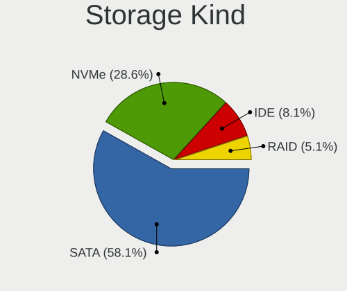

| Kind | Notebooks | Percent |
|------|-----------|---------|
| SATA | 514       | 58.14%  |
| NVMe | 253       | 28.62%  |
| IDE  | 72        | 8.14%   |
| RAID | 45        | 5.09%   |

Processor
---------

CPU Vendor
----------

Processor vendors

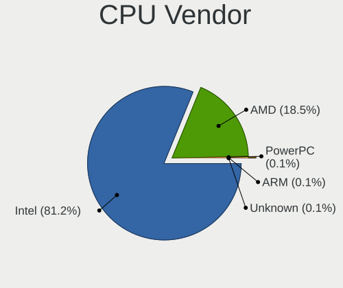

| Vendor  | Notebooks | Percent |
|---------|-----------|---------|
| Intel   | 629       | 81.16%  |
| AMD     | 143       | 18.45%  |
| PowerPC | 1         | 0.13%   |
| ARM     | 1         | 0.13%   |
| Unknown | 1         | 0.13%   |

CPU Model
---------

Processor models

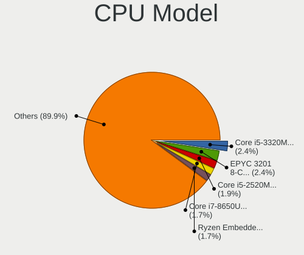

| Model                                   | Notebooks | Percent |
|-----------------------------------------|-----------|---------|
| Intel Core i5-3320M CPU @ 2.60GHz       | 19        | 2.43%   |
| AMD EPYC 3201 8-Core Processor          | 19        | 2.43%   |
| Intel Core i5-2520M CPU @ 2.50GHz       | 15        | 1.92%   |
| Intel Core i7-8650U CPU @ 1.90GHz       | 13        | 1.66%   |
| AMD Ryzen Embedded V1500B               | 13        | 1.66%   |
| Intel Core i7-6600U CPU @ 2.60GHz       | 10        | 1.28%   |
| Intel Core i5-8250U CPU @ 1.60GHz       | 10        | 1.28%   |
| Intel 11th Gen Core i5-1135G7 @ 2.40GHz | 10        | 1.28%   |
| Intel Core i5-5300U CPU @ 2.30GHz       | 9         | 1.15%   |
| Intel Core i5-5200U CPU @ 2.20GHz       | 9         | 1.15%   |
| Intel Core i5-7200U CPU @ 2.50GHz       | 8         | 1.02%   |
| Intel Core i5-6300U CPU @ 2.40GHz       | 8         | 1.02%   |
| Intel Core 2 Duo                        | 8         | 1.02%   |
| Intel Celeron N4020 CPU @ 1.10GHz       | 8         | 1.02%   |
| AMD Ryzen 7 4800H with Radeon Graphics  | 8         | 1.02%   |
| Intel Core i7-8565U CPU @ 1.80GHz       | 7         | 0.9%    |
| Intel Core i7-3520M CPU @ 2.90GHz       | 7         | 0.9%    |
| Intel Core i5-6200U CPU @ 2.30GHz       | 7         | 0.9%    |
| Intel Core i7-8550U CPU @ 1.80GHz       | 6         | 0.77%   |
| Intel Core i7-7500U CPU @ 2.70GHz       | 6         | 0.77%   |
| Intel Core i5-8350U CPU @ 1.70GHz       | 6         | 0.77%   |
| Intel Core i5-7300U CPU @ 2.60GHz       | 6         | 0.77%   |
| Intel Core i3-3227U CPU @ 1.90GHz       | 6         | 0.77%   |
| Intel CPU Version                       | 5         | 0.64%   |
| Intel Core i7-9750H CPU @ 2.60GHz       | 5         | 0.64%   |
| Intel Core i7-8750H CPU @ 2.20GHz       | 5         | 0.64%   |
| Intel Core i7-6500U CPU @ 2.50GHz       | 5         | 0.64%   |
| Intel Core i7-5500U CPU @ 2.40GHz       | 5         | 0.64%   |
| Intel Core i7-10510U CPU @ 1.80GHz      | 5         | 0.64%   |
| Intel Core i5-4300M CPU @ 2.60GHz       | 5         | 0.64%   |
| Intel Core i5-4210U CPU @ 1.70GHz       | 5         | 0.64%   |
| Intel Core 2 Duo CPU T7300 @ 2.00GHz    | 5         | 0.64%   |
| Intel 11th Gen Core i7-1165G7 @ 2.80GHz | 5         | 0.64%   |
| AMD Ryzen 7 4700U with Radeon Graphics  | 5         | 0.64%   |
| Intel Core i7-8665U CPU @ 1.90GHz       | 4         | 0.51%   |
| Intel Core i7-7700HQ CPU @ 2.80GHz      | 4         | 0.51%   |
| Intel Core i7-6820HQ CPU @ 2.70GHz      | 4         | 0.51%   |
| Intel Core i7-4810MQ CPU @ 2.80GHz      | 4         | 0.51%   |
| Intel Core i7-4600U CPU @ 2.10GHz       | 4         | 0.51%   |
| Intel Core i7-1065G7 CPU @ 1.30GHz      | 4         | 0.51%   |

CPU Model Family
----------------

Processor model prefix

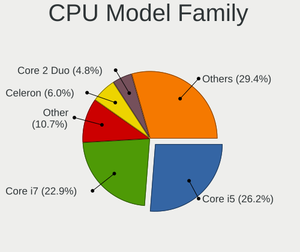

| Model                  | Notebooks | Percent |
|------------------------|-----------|---------|
| Intel Core i5          | 204       | 26.22%  |
| Intel Core i7          | 178       | 22.88%  |
| Other                  | 83        | 10.67%  |
| Intel Celeron          | 47        | 6.04%   |
| Intel Core 2 Duo       | 37        | 4.76%   |
| Intel Core i3          | 33        | 4.24%   |
| AMD EPYC               | 24        | 3.08%   |
| AMD Ryzen 7            | 22        | 2.83%   |
| AMD Ryzen Embedded     | 14        | 1.8%    |
| AMD Ryzen 5            | 14        | 1.8%    |
| Intel Pentium          | 10        | 1.29%   |
| AMD Ryzen 7 PRO        | 8         | 1.03%   |
| Intel Core 2           | 7         | 0.9%    |
| Intel Atom             | 7         | 0.9%    |
| AMD Ryzen 5 PRO        | 7         | 0.9%    |
| Intel Core i9          | 6         | 0.77%   |
| AMD Ryzen 3            | 6         | 0.77%   |
| AMD A10                | 6         | 0.77%   |
| Intel Xeon             | 5         | 0.64%   |
| Intel Pentium M        | 5         | 0.64%   |
| Intel Genuine          | 5         | 0.64%   |
| AMD Ryzen 9            | 5         | 0.64%   |
| Intel Core             | 4         | 0.51%   |
| AMD GX                 | 4         | 0.51%   |
| AMD A6                 | 4         | 0.51%   |
| Intel Pentium Silver   | 3         | 0.39%   |
| Intel Pentium 4        | 3         | 0.39%   |
| AMD E1                 | 3         | 0.39%   |
| AMD E                  | 3         | 0.39%   |
| AMD Phenom II          | 2         | 0.26%   |
| AMD C-50               | 2         | 0.26%   |
| AMD A8                 | 2         | 0.26%   |
| Intel Pentium III      | 1         | 0.13%   |
| Intel Pentium Dual     | 1         | 0.13%   |
| Intel Mobile Pentium 4 | 1         | 0.13%   |
| Intel Mobile Celeron   | 1         | 0.13%   |
| Intel Core m3          | 1         | 0.13%   |
| Intel Core 2 Extreme   | 1         | 0.13%   |
| ARM Cortex             | 1         | 0.13%   |
| AMD Turion 64 Mobile   | 1         | 0.13%   |

CPU Cores
---------

Number of processor cores

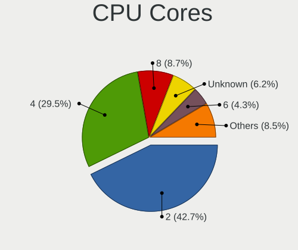

| Number  | Notebooks | Percent |
|---------|-----------|---------|
| 2       | 336       | 42.75%  |
| 4       | 232       | 29.52%  |
| 8       | 68        | 8.65%   |
| Unknown | 49        | 6.23%   |
| 6       | 34        | 4.33%   |
| 16      | 22        | 2.8%    |
| 1       | 17        | 2.16%   |
| 12      | 15        | 1.91%   |
| 20      | 6         | 0.76%   |
| 10      | 3         | 0.38%   |
| 32      | 1         | 0.13%   |
| 22      | 1         | 0.13%   |
| 14      | 1         | 0.13%   |
| 7       | 1         | 0.13%   |

CPU Sockets
-----------

Number of sockets

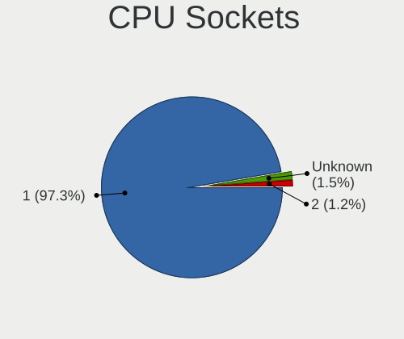

| Number  | Notebooks | Percent |
|---------|-----------|---------|
| 1       | 754       | 97.29%  |
| Unknown | 12        | 1.55%   |
| 2       | 9         | 1.16%   |

CPU Threads
-----------

Threads per core (Hyper-Threading)

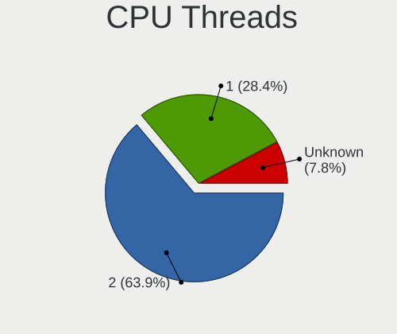

| Number  | Notebooks | Percent |
|---------|-----------|---------|
| 2       | 502       | 63.87%  |
| 1       | 223       | 28.37%  |
| Unknown | 61        | 7.76%   |

CPU Microarch
-------------

Microarchitecture

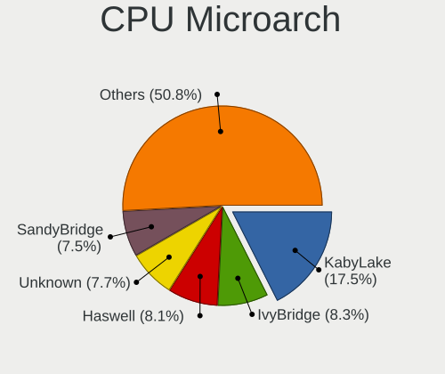

| Name            | Notebooks | Percent |
|-----------------|-----------|---------|
| KabyLake        | 136       | 17.55%  |
| IvyBridge       | 64        | 8.26%   |
| Haswell         | 63        | 8.13%   |
| Unknown         | 60        | 7.74%   |
| SandyBridge     | 58        | 7.48%   |
| Skylake         | 46        | 5.94%   |
| Zen             | 41        | 5.29%   |
| Broadwell       | 36        | 4.65%   |
| Westmere        | 30        | 3.87%   |
| TigerLake       | 29        | 3.74%   |
| Penryn          | 25        | 3.23%   |
| Core            | 25        | 3.23%   |
| Silvermont      | 19        | 2.45%   |
| Zen+            | 18        | 2.32%   |
| Zen 2           | 18        | 2.32%   |
| Goldmont plus   | 16        | 2.06%   |
| Zen 3           | 11        | 1.42%   |
| Bonnell         | 10        | 1.29%   |
| Bobcat          | 8         | 1.03%   |
| P6              | 7         | 0.9%    |
| Excavator       | 7         | 0.9%    |
| Jaguar          | 6         | 0.77%   |
| IceLake         | 6         | 0.77%   |
| CometLake       | 6         | 0.77%   |
| Goldmont        | 5         | 0.65%   |
| Piledriver      | 4         | 0.52%   |
| Nehalem         | 4         | 0.52%   |
| K10             | 4         | 0.52%   |
| Puma            | 3         | 0.39%   |
| NetBurst        | 3         | 0.39%   |
| Steamroller     | 2         | 0.26%   |
| K8 Hammer       | 2         | 0.26%   |
| K10 Llano       | 2         | 0.26%   |
| K8 & K10 hybrid | 1         | 0.13%   |

Graphics
--------

GPU Vendor
----------

Vendors of graphics cards

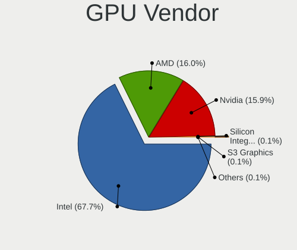

| Vendor                           | Notebooks | Percent |
|----------------------------------|-----------|---------|
| Intel                            | 574       | 67.69%  |
| AMD                              | 136       | 16.04%  |
| Nvidia                           | 135       | 15.92%  |
| Silicon Integrated Systems [SiS] | 1         | 0.12%   |
| S3 Graphics                      | 1         | 0.12%   |
| ASPEED Technology                | 1         | 0.12%   |

GPU Model
---------

Graphics card models

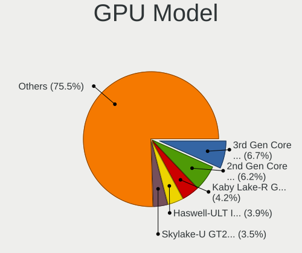

| Model                                                                                    | Notebooks | Percent |
|------------------------------------------------------------------------------------------|-----------|---------|
| Intel 3rd Gen Core processor Graphics Controller                                         | 59        | 6.7%    |
| Intel 2nd Generation Core Processor Family Integrated Graphics Controller                | 55        | 6.24%   |
| Intel Kaby Lake-R GT2 [UHD Graphics 620]                                                 | 37        | 4.2%    |
| Intel Haswell-ULT Integrated Graphics Controller                                         | 34        | 3.86%   |
| Intel Skylake-U GT2 [HD Graphics 520]                                                    | 31        | 3.52%   |
| Intel Broadwell-U GT2 [HD Graphics 5500]                                                 | 30        | 3.41%   |
| Intel Kaby Lake-U GT2 [HD Graphics 620]                                                  | 26        | 2.95%   |
| Intel Core Processor Integrated Graphics Controller                                      | 25        | 2.84%   |
| Intel TigerLake-LP GT2 [Iris Xe Graphics]                                                | 24        | 2.72%   |
| Intel 4th Gen Core Processor Integrated Graphics Controller                              | 23        | 2.61%   |
| Intel WhiskeyLake-U GT2 [UHD Graphics 620]                                               | 19        | 2.16%   |
| Intel CoffeeLake-H GT2 [UHD Graphics 630]                                                | 18        | 2.04%   |
| AMD Picasso/Raven 2 [Radeon Vega Series / Radeon Vega Mobile Series]                     | 18        | 2.04%   |
| AMD Renoir [Radeon Vega Series / Radeon Vega Mobile Series]                              | 17        | 1.93%   |
| Intel Mobile GM965/GL960 Integrated Graphics Controller (secondary)                      | 15        | 1.7%    |
| Intel Mobile GM965/GL960 Integrated Graphics Controller (primary)                        | 15        | 1.7%    |
| Intel Mobile 4 Series Chipset Integrated Graphics Controller                             | 14        | 1.59%   |
| Intel GeminiLake [UHD Graphics 600]                                                      | 13        | 1.48%   |
| Intel CometLake-U GT2 [UHD Graphics]                                                     | 12        | 1.36%   |
| Intel Atom/Celeron/Pentium Processor x5-E8000/J3xxx/N3xxx Integrated Graphics Controller | 12        | 1.36%   |
| Intel Mobile 945GM/GMS/GME, 943/940GML Express Integrated Graphics Controller            | 11        | 1.25%   |
| Intel Skylake-H GT2 [HD Graphics 530]                                                    | 10        | 1.14%   |
| Intel Kaby Lake-H GT2 [HD Graphics 630]                                                  | 10        | 1.14%   |
| Intel Raptor Lake-P [Iris Xe Graphics]                                                   | 9         | 1.02%   |
| Nvidia TU117M [GeForce GTX 1650 Mobile / Max-Q]                                          | 8         | 0.91%   |
| Intel Alder Lake-P GT2 [Iris Xe Graphics]                                                | 8         | 0.91%   |
| AMD Cezanne [Radeon Vega Series / Radeon Vega Mobile Series]                             | 8         | 0.91%   |
| Intel Mobile 945GSE Express Integrated Graphics Controller                               | 7         | 0.79%   |
| Intel Atom Processor Z36xxx/Z37xxx Series Graphics & Display                             | 7         | 0.79%   |
| Nvidia GP107M [GeForce GTX 1050 Ti Mobile]                                               | 6         | 0.68%   |
| Nvidia TU116M [GeForce GTX 1660 Ti Mobile]                                               | 5         | 0.57%   |
| Nvidia GP108M [GeForce MX150]                                                            | 5         | 0.57%   |
| Nvidia GP107M [GeForce GTX 1050 Mobile]                                                  | 5         | 0.57%   |
| Nvidia G86M [Quadro NVS 140M]                                                            | 5         | 0.57%   |
| Intel TigerLake-H GT1 [UHD Graphics]                                                     | 5         | 0.57%   |
| AMD Phoenix1                                                                             | 5         | 0.57%   |
| Nvidia GT218M [NVS 3100M]                                                                | 4         | 0.45%   |
| Nvidia GK107GLM [Quadro K1100M]                                                          | 4         | 0.45%   |
| Intel Tiger Lake-LP GT2 [UHD Graphics G4]                                                | 4         | 0.45%   |
| Intel Mobile 945GM/GMS, 943/940GML Express Integrated Graphics Controller                | 4         | 0.45%   |

GPU Combo
---------

Combinations of graphics cards

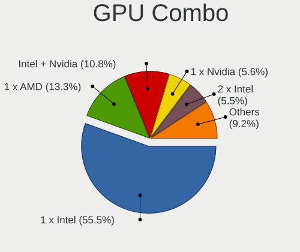

| Name            | Notebooks | Percent |
|-----------------|-----------|---------|
| 1 x Intel       | 433       | 55.51%  |
| 1 x AMD         | 104       | 13.33%  |
| Intel + Nvidia  | 84        | 10.77%  |
| 1 x Nvidia      | 44        | 5.64%   |
| 2 x Intel       | 43        | 5.51%   |
| Other           | 37        | 4.74%   |
| Intel + AMD     | 15        | 1.92%   |
| AMD + Nvidia    | 11        | 1.41%   |
| 2 x AMD         | 6         | 0.77%   |
| 1 x SiS         | 1         | 0.13%   |
| 1 x S3 Graphics | 1         | 0.13%   |
| 1 x ASPEED      | 1         | 0.13%   |

GPU Driver
----------

Free vs proprietary

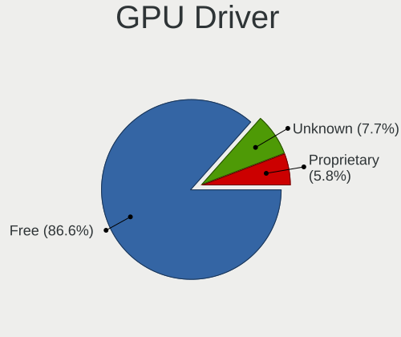

| Driver      | Notebooks | Percent |
|-------------|-----------|---------|
| Free        | 676       | 86.56%  |
| Unknown     | 60        | 7.68%   |
| Proprietary | 45        | 5.76%   |

GPU Memory
----------

Total video memory

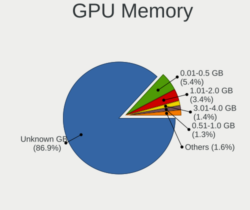

| Size in GB | Notebooks | Percent |
|------------|-----------|---------|
| Unknown    | 688       | 86.87%  |
| 0.01-0.5   | 43        | 5.43%   |
| 1.01-2.0   | 27        | 3.41%   |
| 3.01-4.0   | 11        | 1.39%   |
| 0.51-1.0   | 10        | 1.26%   |
| 5.01-6.0   | 9         | 1.14%   |
| 7.01-8.0   | 3         | 0.38%   |
| 2.01-3.0   | 1         | 0.13%   |

Monitor
-------

Monitor Vendor
--------------

Monitor vendors

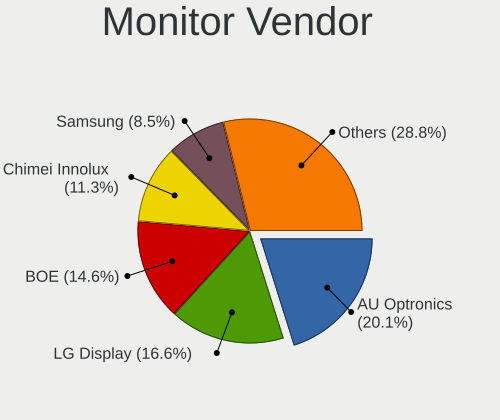

| Vendor                  | Notebooks | Percent |
|-------------------------|-----------|---------|
| AU Optronics            | 109       | 20.15%  |
| LG Display              | 90        | 16.64%  |
| BOE                     | 79        | 14.6%   |
| Chimei Innolux          | 61        | 11.28%  |
| Samsung Electronics     | 46        | 8.5%    |
| Lenovo                  | 27        | 4.99%   |
| Apple                   | 25        | 4.62%   |
| Sharp                   | 13        | 2.4%    |
| InfoVision              | 10        | 1.85%   |
| Chi Mei Optoelectronics | 9         | 1.66%   |
| Hewlett-Packard         | 6         | 1.11%   |
| Dell                    | 6         | 1.11%   |
| Sceptre Tech            | 4         | 0.74%   |
| Acer                    | 4         | 0.74%   |
| LGD                     | 3         | 0.55%   |
| LG Philips              | 3         | 0.55%   |
| Goldstar                | 3         | 0.55%   |
| BenQ                    | 3         | 0.55%   |
| ASUSTek Computer        | 3         | 0.55%   |
| AOC                     | 3         | 0.55%   |
| Ancor Communications    | 3         | 0.55%   |
| Vizio                   | 2         | 0.37%   |
| ViewSonic               | 2         | 0.37%   |
| PANDA                   | 2         | 0.37%   |
| Panasonic               | 2         | 0.37%   |
| IBM                     | 2         | 0.37%   |
| HannStar                | 2         | 0.37%   |
| CTO                     | 2         | 0.37%   |
| CSO                     | 2         | 0.37%   |
| Toshiba                 | 1         | 0.18%   |
| Tech Concepts           | 1         | 0.18%   |
| Sony                    | 1         | 0.18%   |
| Seiko/Epson             | 1         | 0.18%   |
| Quanta Display          | 1         | 0.18%   |
| LG Electronics          | 1         | 0.18%   |
| Lenovo Group Limited    | 1         | 0.18%   |
| HJW                     | 1         | 0.18%   |
| Hitachi                 | 1         | 0.18%   |
| DZX                     | 1         | 0.18%   |
| CSW                     | 1         | 0.18%   |

Monitor Model
-------------

Monitor models

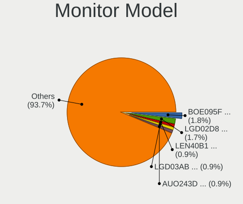

| Model                                                                    | Notebooks | Percent |
|--------------------------------------------------------------------------|-----------|---------|
| BOE LCD Monitor BOE095F 2256x1504 280x190mm 13.3-inch                    | 10        | 1.84%   |
| LG Display LCD Monitor LGD02D8 1366x768 280x160mm 12.7-inch              | 9         | 1.66%   |
| LG Display LCD Monitor LGD03AB 1366x768 340x190mm 15.3-inch              | 5         | 0.92%   |
| Lenovo LCD Monitor LEN40B1 1600x900 340x190mm 15.3-inch                  | 5         | 0.92%   |
| AU Optronics LCD Monitor AUO243D 1920x1080 310x170mm 13.9-inch           | 5         | 0.92%   |
| Samsung Electronics LCD Monitor SEC5441 1366x768 340x190mm 15.3-inch     | 4         | 0.74%   |
| Samsung Electronics LCD Monitor SEC324C 1600x900 310x170mm 13.9-inch     | 4         | 0.74%   |
| LG Display LCD Monitor LGD05FA 1920x1080 310x170mm 13.9-inch             | 4         | 0.74%   |
| Lenovo LCD Monitor LEN4035 1280x800 300x190mm 14.0-inch                  | 4         | 0.74%   |
| Chimei Innolux LCD Monitor CMN14D4 1920x1080 310x170mm 13.9-inch         | 4         | 0.74%   |
| Chimei Innolux LCD Monitor CMN14C9 1920x1080 310x170mm 13.9-inch         | 4         | 0.74%   |
| Chimei Innolux LCD Monitor CMN1132 1366x768 260x140mm 11.6-inch          | 4         | 0.74%   |
| AU Optronics LCD Monitor AUO403D 1920x1080 310x170mm 13.9-inch           | 4         | 0.74%   |
| AU Optronics LCD Monitor AUO213E 1600x900 310x170mm 13.9-inch            | 4         | 0.74%   |
| Sceptre Tech Sceptre P30 SPT0BCC 2560x1080 690x290mm 29.5-inch           | 3         | 0.55%   |
| Samsung Electronics LCD Monitor SEC3157 1280x800 300x190mm 14.0-inch     | 3         | 0.55%   |
| LG Display LCD Monitor LGD02DC 1366x768 340x190mm 15.3-inch              | 3         | 0.55%   |
| Lenovo LCD Monitor LEN40B2 1920x1080 340x190mm 15.3-inch                 | 3         | 0.55%   |
| Lenovo LCD Monitor LEN4031 1280x800 300x190mm 14.0-inch                  | 3         | 0.55%   |
| Lenovo LCD Monitor LEN4011 1280x800 260x160mm 12.0-inch                  | 3         | 0.55%   |
| InfoVision LCD Monitor IVO0489 1366x768 260x140mm 11.6-inch              | 3         | 0.55%   |
| Chimei Innolux LCD Monitor CMN14C0 1920x1080 310x170mm 13.9-inch         | 3         | 0.55%   |
| Chi Mei Optoelectronics LCD Monitor CMO15A2 1366x768 340x190mm 15.3-inch | 3         | 0.55%   |
| BOE LCD Monitor BOE0731 1366x768 260x140mm 11.6-inch                     | 3         | 0.55%   |
| BOE LCD Monitor BOE06CB 1920x1080 340x190mm 15.3-inch                    | 3         | 0.55%   |
| BOE LCD Monitor BOE05DA 1366x768 280x160mm 12.7-inch                     | 3         | 0.55%   |
| AU Optronics LCD Monitor AUO133D 1920x1080 310x170mm 13.9-inch           | 3         | 0.55%   |
| Apple Color LCD APPA018 2560x1600 290x180mm 13.4-inch                    | 3         | 0.55%   |
| Sharp LCD Monitor SHP1481 1920x1080 290x170mm 13.2-inch                  | 2         | 0.37%   |
| Sharp LCD Monitor SHP144A 3200x1800 290x170mm 13.2-inch                  | 2         | 0.37%   |
| Samsung Electronics LCD Monitor SEC3047 1366x768 280x160mm 12.7-inch     | 2         | 0.37%   |
| Samsung Electronics LCD Monitor SDC4C46 3840x2160 340x190mm 15.3-inch    | 2         | 0.37%   |
| Samsung Electronics LCD Monitor SDC424A 3200x1800 290x170mm 13.2-inch    | 2         | 0.37%   |
| Panasonic LCD Monitor MEI96A2 2880x1620 340x190mm 15.3-inch              | 2         | 0.37%   |
| LG Display LCD Monitor LGD40A0 1366x768 310x170mm 13.9-inch              | 2         | 0.37%   |
| LG Display LCD Monitor LGD05E5 1920x1080 340x190mm 15.3-inch             | 2         | 0.37%   |
| LG Display LCD Monitor LGD058B 2560x1440 310x170mm 13.9-inch             | 2         | 0.37%   |
| LG Display LCD Monitor LGD0521 1920x1080 310x170mm 13.9-inch             | 2         | 0.37%   |
| LG Display LCD Monitor LGD046F 1920x1080 340x190mm 15.3-inch             | 2         | 0.37%   |
| LG Display LCD Monitor LGD0459 1920x1080 380x210mm 17.1-inch             | 2         | 0.37%   |

Monitor Resolution
------------------

Monitor screen resolution

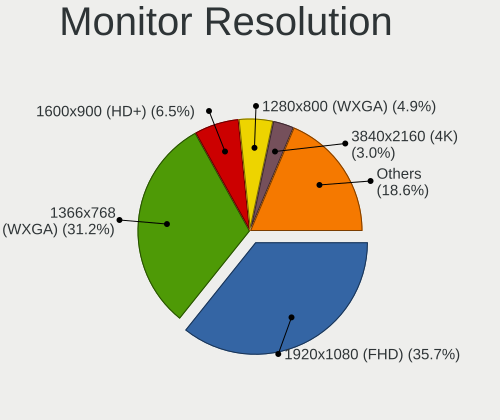

| Resolution         | Notebooks | Percent |
|--------------------|-----------|---------|
| 1920x1080 (FHD)    | 188       | 35.74%  |
| 1366x768 (WXGA)    | 164       | 31.18%  |
| 1600x900 (HD+)     | 34        | 6.46%   |
| 1280x800 (WXGA)    | 26        | 4.94%   |
| 3840x2160 (4K)     | 16        | 3.04%   |
| 1920x1200 (WUXGA)  | 16        | 3.04%   |
| 2560x1440 (QHD)    | 15        | 2.85%   |
| 2256x1504          | 10        | 1.9%    |
| 1440x900 (WXGA+)   | 8         | 1.52%   |
| 2560x1600          | 7         | 1.33%   |
| 1024x600           | 5         | 0.95%   |
| 3200x1800 (QHD+)   | 4         | 0.76%   |
| 2560x1080          | 4         | 0.76%   |
| 2880x1800          | 3         | 0.57%   |
| 1680x1050 (WSXGA+) | 3         | 0.57%   |
| 1024x768 (XGA)     | 3         | 0.57%   |
| 3440x1440          | 2         | 0.38%   |
| 2240x1400          | 2         | 0.38%   |
| 1280x1024 (SXGA)   | 2         | 0.38%   |
| Unknown            | 2         | 0.38%   |
| 7040x1440          | 1         | 0.19%   |
| 5760x2160          | 1         | 0.19%   |
| 4480x1080          | 1         | 0.19%   |
| 3840x2400          | 1         | 0.19%   |
| 3840x1600          | 1         | 0.19%   |
| 3840x1080          | 1         | 0.19%   |
| 2160x1350          | 1         | 0.19%   |
| 1920x1280          | 1         | 0.19%   |
| 1400x1050          | 1         | 0.19%   |
| 1360x768           | 1         | 0.19%   |
| 1280x854           | 1         | 0.19%   |
| 1280x768           | 1         | 0.19%   |

Monitor Diagonal
----------------

Diagonal size in inches

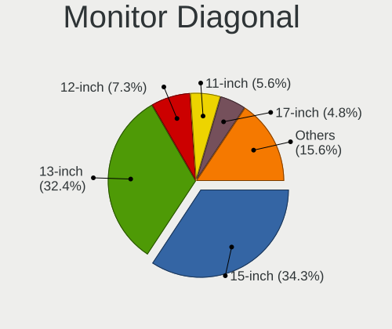

| Inches  | Notebooks | Percent |
|---------|-----------|---------|
| 15      | 184       | 34.26%  |
| 13      | 174       | 32.4%   |
| 12      | 39        | 7.26%   |
| 11      | 30        | 5.59%   |
| 17      | 26        | 4.84%   |
| 14      | 23        | 4.28%   |
| 27      | 14        | 2.61%   |
| 24      | 8         | 1.49%   |
| Unknown | 8         | 1.49%   |
| 23      | 4         | 0.74%   |
| 29      | 3         | 0.56%   |
| 21      | 3         | 0.56%   |
| 19      | 3         | 0.56%   |
| 10      | 3         | 0.56%   |
| 64      | 2         | 0.37%   |
| 34      | 2         | 0.37%   |
| 31      | 2         | 0.37%   |
| 26      | 2         | 0.37%   |
| 52      | 1         | 0.19%   |
| 48      | 1         | 0.19%   |
| 37      | 1         | 0.19%   |
| 35      | 1         | 0.19%   |
| 16      | 1         | 0.19%   |
| 9       | 1         | 0.19%   |
| 8       | 1         | 0.19%   |

Monitor Width
-------------

Physical width

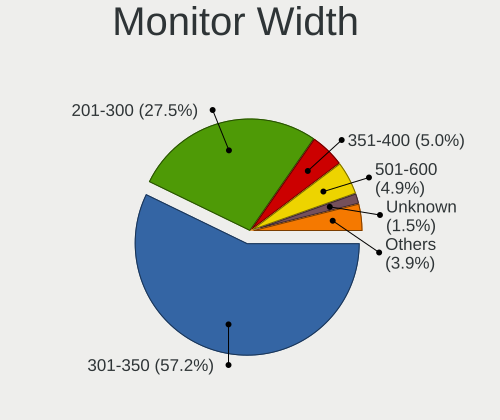

| Width in mm | Notebooks | Percent |
|-------------|-----------|---------|
| 301-350     | 306       | 57.2%   |
| 201-300     | 147       | 27.48%  |
| 351-400     | 27        | 5.05%   |
| 501-600     | 26        | 4.86%   |
| Unknown     | 8         | 1.5%    |
| 601-700     | 6         | 1.12%   |
| 401-500     | 5         | 0.93%   |
| 1001-1500   | 4         | 0.75%   |
| 801-900     | 2         | 0.37%   |
| 701-800     | 2         | 0.37%   |
| 101-200     | 2         | 0.37%   |

Aspect Ratio
------------

Proportional relationship between the width and the height

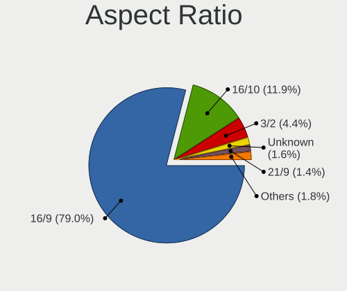

| Ratio   | Notebooks | Percent |
|---------|-----------|---------|
| 16/9    | 399       | 79.01%  |
| 16/10   | 60        | 11.88%  |
| 3/2     | 22        | 4.36%   |
| Unknown | 8         | 1.58%   |
| 21/9    | 7         | 1.39%   |
| 4/3     | 5         | 0.99%   |
| 5/4     | 2         | 0.4%    |
| 6/5     | 1         | 0.2%    |
| 32/9    | 1         | 0.2%    |

Monitor Area
------------

Area in inch²

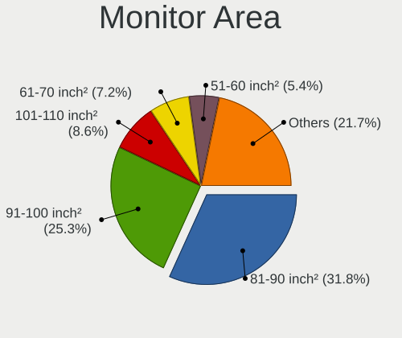

| Area in inch² | Notebooks | Percent |
|----------------|-----------|---------|
| 81-90          | 171       | 31.78%  |
| 91-100         | 136       | 25.28%  |
| 101-110        | 46        | 8.55%   |
| 61-70          | 39        | 7.25%   |
| 51-60          | 29        | 5.39%   |
| 71-80          | 23        | 4.28%   |
| 121-130        | 22        | 4.09%   |
| 301-350        | 18        | 3.35%   |
| 201-250        | 14        | 2.6%    |
| Unknown        | 8         | 1.49%   |
| 111-120        | 7         | 1.3%    |
| 351-500        | 5         | 0.93%   |
| 131-140        | 4         | 0.74%   |
| More than 1000 | 3         | 0.56%   |
| 41-50          | 3         | 0.56%   |
| 151-200        | 3         | 0.56%   |
| 1-40           | 2         | 0.37%   |
| 251-300        | 2         | 0.37%   |
| 501-1000       | 2         | 0.37%   |
| 141-150        | 1         | 0.19%   |

Pixel Density
-------------

Pixels per inch

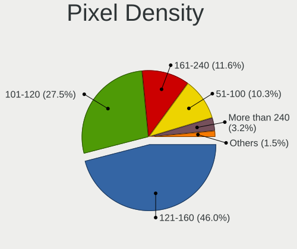

| Density       | Notebooks | Percent |
|---------------|-----------|---------|
| 121-160       | 246       | 45.98%  |
| 101-120       | 147       | 27.48%  |
| 161-240       | 62        | 11.59%  |
| 51-100        | 55        | 10.28%  |
| More than 240 | 17        | 3.18%   |
| Unknown       | 8         | 1.5%    |

Multiple Monitors
-----------------

Total monitors connected

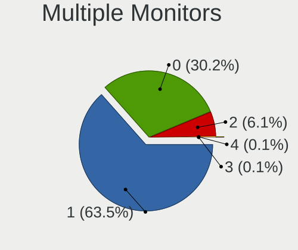

| Total | Notebooks | Percent |
|-------|-----------|---------|
| 1     | 502       | 63.46%  |
| 0     | 239       | 30.21%  |
| 2     | 48        | 6.07%   |
| 4     | 1         | 0.13%   |
| 3     | 1         | 0.13%   |

Network
-------

Net Controller Vendor
---------------------

Controller vendors

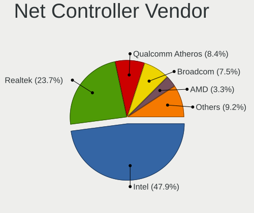

| Vendor                           | Notebooks | Percent |
|----------------------------------|-----------|---------|
| Intel                            | 556       | 47.93%  |
| Realtek Semiconductor            | 275       | 23.71%  |
| Qualcomm Atheros                 | 97        | 8.36%   |
| Broadcom                         | 87        | 7.5%    |
| AMD                              | 38        | 3.28%   |
| TP-Link                          | 12        | 1.03%   |
| Edimax Technology                | 11        | 0.95%   |
| MediaTek                         | 10        | 0.86%   |
| Marvell Technology Group         | 10        | 0.86%   |
| Google                           | 8         | 0.69%   |
| NetGear                          | 6         | 0.52%   |
| Samsung Electronics              | 5         | 0.43%   |
| Ralink Technology                | 5         | 0.43%   |
| Ralink                           | 5         | 0.43%   |
| U-Blox                           | 3         | 0.26%   |
| Sierra Wireless                  | 3         | 0.26%   |
| Qualcomm                         | 3         | 0.26%   |
| Nvidia                           | 3         | 0.26%   |
| ASUSTek Computer                 | 3         | 0.26%   |
| Xiaomi                           | 2         | 0.17%   |
| Qualcomm Technologies            | 2         | 0.17%   |
| Novatel Wireless                 | 2         | 0.17%   |
| Apple                            | 2         | 0.17%   |
| Silicon Integrated Systems [SiS] | 1         | 0.09%   |
| Qualcomm Atheros Communications  | 1         | 0.09%   |
| OnePlus Technology (Shenzhen)    | 1         | 0.09%   |
| Motorola PCS                     | 1         | 0.09%   |
| Microchip Technology             | 1         | 0.09%   |
| Lenovo                           | 1         | 0.09%   |
| Kinesis                          | 1         | 0.09%   |
| Huawei Technologies              | 1         | 0.09%   |
| dog hunter                       | 1         | 0.09%   |
| Dell                             | 1         | 0.09%   |
| D-Link System                    | 1         | 0.09%   |
| D-Link                           | 1         | 0.09%   |

Net Controller Model
--------------------

Controller models

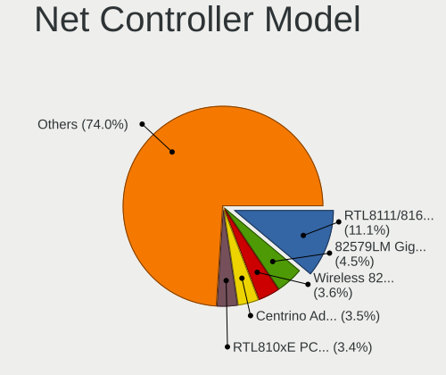

| Model                                                                  | Notebooks | Percent |
|------------------------------------------------------------------------|-----------|---------|
| Realtek RTL8111/8168/8211/8411 PCI Express Gigabit Ethernet Controller | 167       | 11.08%  |
| Intel 82579LM Gigabit Network Connection (Lewisville)                  | 68        | 4.51%   |
| Intel Wireless 8265 / 8275                                             | 54        | 3.58%   |
| Intel Centrino Advanced-N 6205 [Taylor Peak]                           | 52        | 3.45%   |
| Realtek RTL810xE PCI Express Fast Ethernet controller                  | 51        | 3.38%   |
| Intel Wireless 7260                                                    | 45        | 2.99%   |
| AMD XGMAC 10GbE Controller                                             | 37        | 2.46%   |
| Intel Wireless 7265                                                    | 34        | 2.26%   |
| Intel Wireless 8260                                                    | 32        | 2.12%   |
| Intel Wi-Fi 6 AX200                                                    | 32        | 2.12%   |
| Intel Ethernet Connection (4) I219-LM                                  | 30        | 1.99%   |
| Intel I210 Gigabit Network Connection                                  | 25        | 1.66%   |
| Intel Wi-Fi 6E(802.11ax) AX210/AX1675* 2x2 [Typhoon Peak]              | 24        | 1.59%   |
| Intel Wi-Fi 6 AX201                                                    | 20        | 1.33%   |
| Intel Ethernet Connection I217-LM                                      | 18        | 1.19%   |
| Realtek RTL8821CE 802.11ac PCIe Wireless Network Adapter               | 15        | 1%      |
| Intel Ethernet Connection I219-LM                                      | 15        | 1%      |
| Intel Cannon Point-LP CNVi [Wireless-AC]                               | 15        | 1%      |
| Intel 82577LM Gigabit Network Connection                               | 15        | 1%      |
| Qualcomm Atheros AR9285 Wireless Network Adapter (PCI-Express)         | 14        | 0.93%   |
| Intel Ethernet Connection (3) I218-LM                                  | 14        | 0.93%   |
| Realtek RTL8188CE 802.11b/g/n WiFi Adapter                             | 13        | 0.86%   |
| Intel Wireless 3165                                                    | 13        | 0.86%   |
| Intel Wi-Fi 5(802.11ac) Wireless-AC 9x6x [Thunder Peak]                | 13        | 0.86%   |
| Intel Ethernet Connection I218-LM                                      | 13        | 0.86%   |
| Realtek RTL8188EUS 802.11n Wireless Network Adapter                    | 12        | 0.8%    |
| Qualcomm Atheros AR9462 Wireless Network Adapter                       | 12        | 0.8%    |
| Intel Wireless 3160                                                    | 12        | 0.8%    |
| Qualcomm Atheros QCA6174 802.11ac Wireless Network Adapter             | 11        | 0.73%   |
| Qualcomm Atheros AR9485 Wireless Network Adapter                       | 11        | 0.73%   |
| Intel Ethernet Connection (7) I219-LM                                  | 11        | 0.73%   |
| Edimax EW-7811Un 802.11n Wireless Adapter [Realtek RTL8188CUS]         | 11        | 0.73%   |
| Broadcom BCM4331 802.11a/b/g/n                                         | 11        | 0.73%   |
| Intel PRO/Wireless 4965 AG or AGN [Kedron] Network Connection          | 10        | 0.66%   |
| Intel Comet Lake PCH-LP CNVi WiFi                                      | 10        | 0.66%   |
| Intel Cannon Lake PCH CNVi WiFi                                        | 10        | 0.66%   |
| Intel Alder Lake-P PCH CNVi WiFi                                       | 10        | 0.66%   |
| Broadcom NetXtreme BCM57765 Gigabit Ethernet PCIe                      | 10        | 0.66%   |
| Broadcom BCM4360 802.11ac Dual Band Wireless Network Adapter           | 10        | 0.66%   |
| Realtek USB 2.5GbE Controller                                          | 9         | 0.6%    |

Wireless Vendor
---------------

Wireless vendors

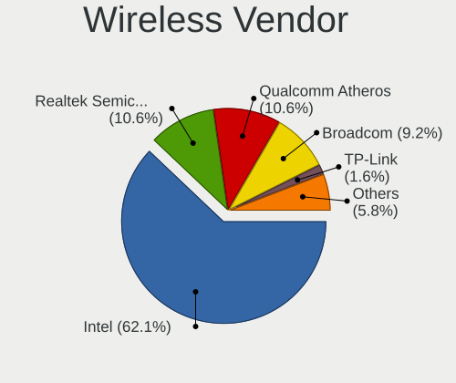

| Vendor                          | Notebooks | Percent |
|---------------------------------|-----------|---------|
| Intel                           | 478       | 62.08%  |
| Realtek Semiconductor           | 82        | 10.65%  |
| Qualcomm Atheros                | 82        | 10.65%  |
| Broadcom                        | 71        | 9.22%   |
| TP-Link                         | 12        | 1.56%   |
| Edimax Technology               | 11        | 1.43%   |
| MediaTek                        | 7         | 0.91%   |
| NetGear                         | 6         | 0.78%   |
| Ralink Technology               | 5         | 0.65%   |
| Ralink                          | 5         | 0.65%   |
| ASUSTek Computer                | 3         | 0.39%   |
| Sierra Wireless                 | 2         | 0.26%   |
| Qualcomm Technologies           | 2         | 0.26%   |
| Qualcomm Atheros Communications | 1         | 0.13%   |
| Dell                            | 1         | 0.13%   |
| D-Link System                   | 1         | 0.13%   |
| D-Link                          | 1         | 0.13%   |

Wireless Model
--------------

Wireless models

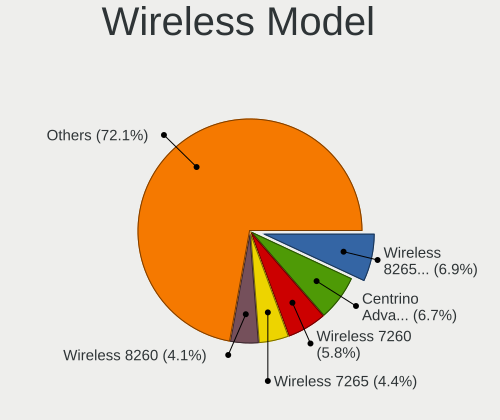

| Model                                                          | Notebooks | Percent |
|----------------------------------------------------------------|-----------|---------|
| Intel Wireless 8265 / 8275                                     | 54        | 6.93%   |
| Intel Centrino Advanced-N 6205 [Taylor Peak]                   | 52        | 6.68%   |
| Intel Wireless 7260                                            | 45        | 5.78%   |
| Intel Wireless 7265                                            | 34        | 4.36%   |
| Intel Wireless 8260                                            | 32        | 4.11%   |
| Intel Wi-Fi 6 AX200                                            | 32        | 4.11%   |
| Intel Wi-Fi 6E(802.11ax) AX210/AX1675* 2x2 [Typhoon Peak]      | 24        | 3.08%   |
| Intel Wi-Fi 6 AX201                                            | 20        | 2.57%   |
| Realtek RTL8821CE 802.11ac PCIe Wireless Network Adapter       | 15        | 1.93%   |
| Intel Cannon Point-LP CNVi [Wireless-AC]                       | 15        | 1.93%   |
| Qualcomm Atheros AR9285 Wireless Network Adapter (PCI-Express) | 14        | 1.8%    |
| Realtek RTL8188CE 802.11b/g/n WiFi Adapter                     | 13        | 1.67%   |
| Intel Wireless 3165                                            | 13        | 1.67%   |
| Intel Wi-Fi 5(802.11ac) Wireless-AC 9x6x [Thunder Peak]        | 13        | 1.67%   |
| Realtek RTL8188EUS 802.11n Wireless Network Adapter            | 12        | 1.54%   |
| Qualcomm Atheros AR9462 Wireless Network Adapter               | 12        | 1.54%   |
| Intel Wireless 3160                                            | 12        | 1.54%   |
| Qualcomm Atheros QCA6174 802.11ac Wireless Network Adapter     | 11        | 1.41%   |
| Qualcomm Atheros AR9485 Wireless Network Adapter               | 11        | 1.41%   |
| Edimax EW-7811Un 802.11n Wireless Adapter [Realtek RTL8188CUS] | 11        | 1.41%   |
| Broadcom BCM4331 802.11a/b/g/n                                 | 11        | 1.41%   |
| Intel PRO/Wireless 4965 AG or AGN [Kedron] Network Connection  | 10        | 1.28%   |
| Intel Comet Lake PCH-LP CNVi WiFi                              | 10        | 1.28%   |
| Intel Cannon Lake PCH CNVi WiFi                                | 10        | 1.28%   |
| Intel Alder Lake-P PCH CNVi WiFi                               | 10        | 1.28%   |
| Broadcom BCM4360 802.11ac Dual Band Wireless Network Adapter   | 10        | 1.28%   |
| Intel Raptor Lake PCH CNVi WiFi                                | 9         | 1.16%   |
| Broadcom BCM43224 802.11a/b/g/n                                | 9         | 1.16%   |
| Broadcom BCM4313 802.11bgn Wireless Network Adapter            | 9         | 1.16%   |
| Realtek RTL8822CE 802.11ac PCIe Wireless Network Adapter       | 8         | 1.03%   |
| Intel Centrino Ultimate-N 6300                                 | 8         | 1.03%   |
| Qualcomm Atheros QCA9565 / AR9565 Wireless Network Adapter     | 7         | 0.9%    |
| Qualcomm Atheros QCA9377 802.11ac Wireless Network Adapter     | 7         | 0.9%    |
| Qualcomm Atheros AR928X Wireless Network Adapter (PCI-Express) | 7         | 0.9%    |
| Intel WiFi Link 5100                                           | 7         | 0.9%    |
| Intel Centrino Advanced-N 6200                                 | 7         | 0.9%    |
| TP-Link AC600 wireless Realtek RTL8811AU [Archer T2U Nano]     | 6         | 0.77%   |
| Realtek RTL8188CUS 802.11n WLAN Adapter                        | 6         | 0.77%   |
| Intel Centrino Wireless-N 2230                                 | 6         | 0.77%   |
| Intel Centrino Wireless-N 1000 [Condor Peak]                   | 6         | 0.77%   |

Ethernet Vendor
---------------

Ethernet vendors

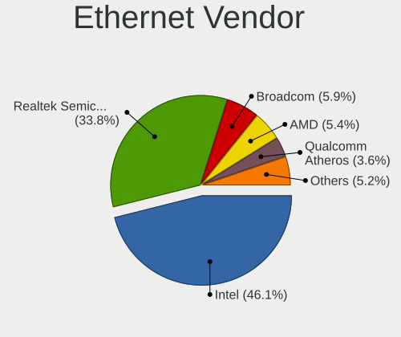

| Vendor                           | Notebooks | Percent |
|----------------------------------|-----------|---------|
| Intel                            | 318       | 46.09%  |
| Realtek Semiconductor            | 233       | 33.77%  |
| Broadcom                         | 41        | 5.94%   |
| AMD                              | 37        | 5.36%   |
| Qualcomm Atheros                 | 25        | 3.62%   |
| Marvell Technology Group         | 10        | 1.45%   |
| Samsung Electronics              | 5         | 0.72%   |
| Qualcomm                         | 3         | 0.43%   |
| Nvidia                           | 3         | 0.43%   |
| Xiaomi                           | 2         | 0.29%   |
| Novatel Wireless                 | 2         | 0.29%   |
| MediaTek                         | 2         | 0.29%   |
| Google                           | 2         | 0.29%   |
| Silicon Integrated Systems [SiS] | 1         | 0.14%   |
| OnePlus Technology (Shenzhen)    | 1         | 0.14%   |
| Motorola PCS                     | 1         | 0.14%   |
| Microchip Technology             | 1         | 0.14%   |
| Lenovo                           | 1         | 0.14%   |
| Huawei Technologies              | 1         | 0.14%   |
| Apple                            | 1         | 0.14%   |

Ethernet Model
--------------

Ethernet models

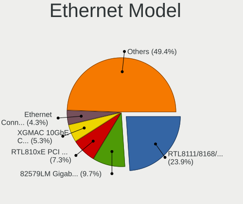

| Model                                                                  | Notebooks | Percent |
|------------------------------------------------------------------------|-----------|---------|
| Realtek RTL8111/8168/8211/8411 PCI Express Gigabit Ethernet Controller | 167       | 23.93%  |
| Intel 82579LM Gigabit Network Connection (Lewisville)                  | 68        | 9.74%   |
| Realtek RTL810xE PCI Express Fast Ethernet controller                  | 51        | 7.31%   |
| AMD XGMAC 10GbE Controller                                             | 37        | 5.3%    |
| Intel Ethernet Connection (4) I219-LM                                  | 30        | 4.3%    |
| Intel I210 Gigabit Network Connection                                  | 25        | 3.58%   |
| Intel Ethernet Connection I217-LM                                      | 18        | 2.58%   |
| Intel Ethernet Connection I219-LM                                      | 15        | 2.15%   |
| Intel 82577LM Gigabit Network Connection                               | 15        | 2.15%   |
| Intel Ethernet Connection (3) I218-LM                                  | 14        | 2.01%   |
| Intel Ethernet Connection I218-LM                                      | 13        | 1.86%   |
| Intel Ethernet Connection (7) I219-LM                                  | 11        | 1.58%   |
| Broadcom NetXtreme BCM57765 Gigabit Ethernet PCIe                      | 10        | 1.43%   |
| Realtek USB 2.5GbE Controller                                          | 9         | 1.29%   |
| Intel Ethernet Connection (4) I219-V                                   | 9         | 1.29%   |
| Intel 82566MM Gigabit Network Connection                               | 9         | 1.29%   |
| Intel Ethernet Connection (2) I219-LM                                  | 8         | 1.15%   |
| Intel Ethernet Controller I225-V                                       | 7         | 1%      |
| Intel Ethernet Connection (6) I219-V                                   | 7         | 1%      |
| Intel Ethernet Controller I226-V                                       | 6         | 0.86%   |
| Broadcom NetXtreme BCM57762 Gigabit Ethernet PCIe                      | 6         | 0.86%   |
| Intel I211 Gigabit Network Connection                                  | 5         | 0.72%   |
| Intel Ethernet Connection I219-V                                       | 5         | 0.72%   |
| Intel Ethernet Connection (6) I219-LM                                  | 5         | 0.72%   |
| Broadcom NetXtreme BCM5764M Gigabit Ethernet PCIe                      | 5         | 0.72%   |
| Qualcomm Atheros AR8152 v2.0 Fast Ethernet                             | 4         | 0.57%   |
| Intel 82574L Gigabit Network Connection                                | 4         | 0.57%   |
| Intel 82567LM Gigabit Network Connection                               | 4         | 0.57%   |
| Broadcom NetXtreme BCM5755M Gigabit Ethernet PCI Express               | 4         | 0.57%   |
| Samsung GT-I9070 (network tethering, USB debugging enabled)            | 3         | 0.43%   |
| Realtek RTL-8100/8101L/8139 PCI Fast Ethernet Adapter                  | 3         | 0.43%   |
| Qualcomm Atheros Killer E2500 Gigabit Ethernet Controller              | 3         | 0.43%   |
| Qualcomm Atheros AR8162 Fast Ethernet                                  | 3         | 0.43%   |
| Qualcomm Atheros AR8151 v2.0 Gigabit Ethernet                          | 3         | 0.43%   |
| Qualcomm Atheros AR8132 Fast Ethernet                                  | 3         | 0.43%   |
| Nvidia MCP79 Ethernet                                                  | 3         | 0.43%   |
| Marvell Group 88E8058 PCI-E Gigabit Ethernet Controller                | 3         | 0.43%   |
| Intel Ethernet Connection (3) I218-V                                   | 3         | 0.43%   |
| Intel Ethernet Connection (13) I219-LM                                 | 3         | 0.43%   |
| Intel 82573L Gigabit Ethernet Controller                               | 3         | 0.43%   |

Net Controller Kind
-------------------

Ethernet, WiFi or modem

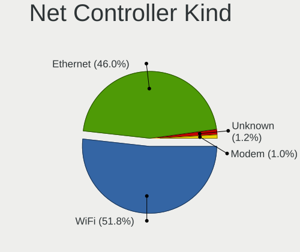

| Kind     | Notebooks | Percent |
|----------|-----------|---------|
| WiFi     | 706       | 51.76%  |
| Ethernet | 628       | 46.04%  |
| Unknown  | 17        | 1.25%   |
| Modem    | 13        | 0.95%   |

Used Controller
---------------

Currently used network controller

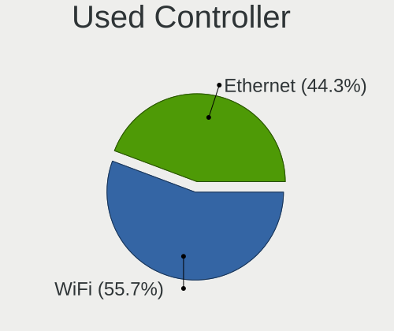

| Kind     | Notebooks | Percent |
|----------|-----------|---------|
| WiFi     | 488       | 55.71%  |
| Ethernet | 388       | 44.29%  |

NICs
----

Total network controllers on board

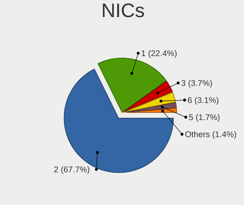

| Total | Notebooks | Percent |
|-------|-----------|---------|
| 2     | 526       | 67.7%   |
| 1     | 174       | 22.39%  |
| 3     | 29        | 3.73%   |
| 6     | 24        | 3.09%   |
| 5     | 13        | 1.67%   |
| 0     | 7         | 0.9%    |
| 8     | 3         | 0.39%   |
| 9     | 1         | 0.13%   |

IPv6
----

IPv6 vs IPv4

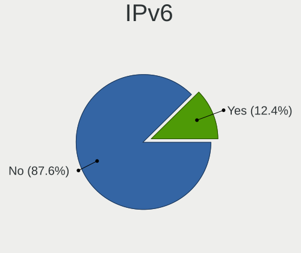

| Used | Notebooks | Percent |
|------|-----------|---------|
| No   | 695       | 87.64%  |
| Yes  | 98        | 12.36%  |

Bluetooth
---------

Bluetooth Vendor
----------------

Controller vendors

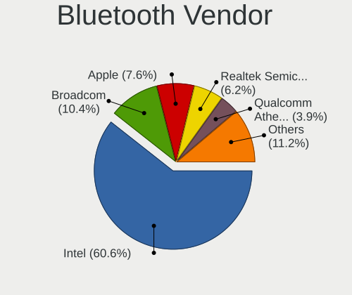

| Vendor                          | Notebooks | Percent |
|---------------------------------|-----------|---------|
| Intel                           | 325       | 60.63%  |
| Broadcom                        | 56        | 10.45%  |
| Apple                           | 41        | 7.65%   |
| Realtek Semiconductor           | 33        | 6.16%   |
| Qualcomm Atheros Communications | 21        | 3.92%   |
| IMC Networks                    | 17        | 3.17%   |
| Dell                            | 11        | 2.05%   |
| Foxconn / Hon Hai               | 10        | 1.87%   |
| Lite-On Technology              | 4         | 0.75%   |
| Alps Electric                   | 4         | 0.75%   |
| MediaTek                        | 3         | 0.56%   |
| Hewlett-Packard                 | 3         | 0.56%   |
| USI                             | 1         | 0.19%   |
| TP-Link                         | 1         | 0.19%   |
| Taiyo Yuden                     | 1         | 0.19%   |
| Shenzhen Goodix Technology      | 1         | 0.19%   |
| Ralink                          | 1         | 0.19%   |
| Esel International              | 1         | 0.19%   |
| Cambridge Silicon Radio         | 1         | 0.19%   |
| ASUSTek Computer                | 1         | 0.19%   |

Bluetooth Model
---------------

Controller models

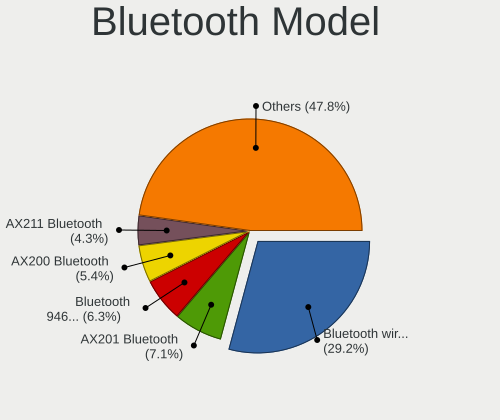

| Model                                                       | Notebooks | Percent |
|-------------------------------------------------------------|-----------|---------|
| Intel Bluetooth wireless interface                          | 157       | 29.18%  |
| Intel AX201 Bluetooth                                       | 38        | 7.06%   |
| Intel Bluetooth 9460/9560 Jefferson Peak (JfP)              | 34        | 6.32%   |
| Intel AX200 Bluetooth                                       | 29        | 5.39%   |
| Intel AX211 Bluetooth                                       | 23        | 4.28%   |
| Intel AX210 Bluetooth                                       | 21        | 3.9%    |
| Broadcom BCM20702 Bluetooth 4.0 [ThinkPad]                  | 21        | 3.9%    |
| Apple Bluetooth Host Controller                             | 21        | 3.9%    |
| Broadcom BCM2045B (BDC-2.1)                                 | 15        | 2.79%   |
| Realtek  Bluetooth 4.2 Adapter                              | 11        | 2.04%   |
| Intel Wireless-AC 9260 Bluetooth Adapter                    | 11        | 2.04%   |
| Apple Broadcom Built-in Bluetooth                           | 9         | 1.67%   |
| Foxconn / Hon Hai Bluetooth USB Module                      | 8         | 1.49%   |
| Intel Centrino Bluetooth Wireless Transceiver               | 7         | 1.3%    |
| Broadcom BCM2045B (BDC-2) [Bluetooth Controller]            | 7         | 1.3%    |
| Realtek Bluetooth Adapter                                   | 6         | 1.12%   |
| IMC Networks Realtek Bluetooth Adapter                      | 6         | 1.12%   |
| Dell DW375 Bluetooth Module                                 | 6         | 1.12%   |
| Apple Built-in iSight (no firmware loaded)                  | 6         | 1.12%   |
| Qualcomm Atheros QCA9377 Bluetooth 4.1                      | 5         | 0.93%   |
| Qualcomm Atheros QCA61x4 Bluetooth 4.1                      | 5         | 0.93%   |
| Apple Built-in Bluetooth 2.0+EDR HCI                        | 5         | 0.93%   |
| Realtek Bluetooth 4.2 Adapter                               | 4         | 0.74%   |
| Broadcom BCM20702A0 Bluetooth 4.0                           | 4         | 0.74%   |
| Realtek RTL8821A Bluetooth                                  | 3         | 0.56%   |
| Realtek Bluetooth 4.0 Adapter                               | 3         | 0.56%   |
| MediaTek Wireless_Device                                    | 3         | 0.56%   |
| Intel Wireless-AC 3168 Bluetooth                            | 3         | 0.56%   |
| IMC Networks MediaTek Bluetooth Adapter                     | 3         | 0.56%   |
| Broadcom BCM2045B (BDC-2.1) [Bluetooth Controller]          | 3         | 0.56%   |
| Realtek Wireless Bluetooth Adapter                          | 2         | 0.37%   |
| Realtek RTL8822BE Bluetooth 4.2 Adapter                     | 2         | 0.37%   |
| Qualcomm Atheros Dell Wireless 1707 Bluetooth 4.0 LE Device | 2         | 0.37%   |
| Qualcomm Atheros AR9462 Bluetooth                           | 2         | 0.37%   |
| Lite-On Bluetooth USB Module                                | 2         | 0.37%   |
| IMC Networks Qualcomm Atheros Bluetooth 4.0 + HS            | 2         | 0.37%   |
| IMC Networks Bluetooth module                               | 2         | 0.37%   |
| HP Broadcom 2070 Bluetooth Combo                            | 2         | 0.37%   |
| Foxconn / Hon Hai MediaTek Bluetooth Adapter                | 2         | 0.37%   |
| Dell Broadcom BCM20702A0 Bluetooth                          | 2         | 0.37%   |

Sound
-----

Sound Vendor
------------

Sound card vendors

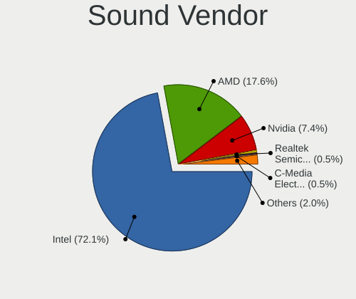

| Vendor                                       | Notebooks | Percent |
|----------------------------------------------|-----------|---------|
| Intel                                        | 620       | 72.09%  |
| AMD                                          | 151       | 17.56%  |
| Nvidia                                       | 64        | 7.44%   |
| Realtek Semiconductor                        | 4         | 0.47%   |
| C-Media Electronics                          | 4         | 0.47%   |
| Texas Instruments                            | 3         | 0.35%   |
| CMX Systems                                  | 2         | 0.23%   |
| Cambridge Silicon Radio                      | 2         | 0.23%   |
| Zoran Co. Personal Media Division (Nogatech) | 1         | 0.12%   |
| Silicon Integrated Systems [SiS]             | 1         | 0.12%   |
| Logitech                                     | 1         | 0.12%   |
| Lenovo                                       | 1         | 0.12%   |
| JMTek                                        | 1         | 0.12%   |
| GN Netcom                                    | 1         | 0.12%   |
| ESS Technology                               | 1         | 0.12%   |
| Creative Technology                          | 1         | 0.12%   |
| Blue Microphones                             | 1         | 0.12%   |
| Unknown                                      | 1         | 0.12%   |

Sound Model
-----------

Sound card models

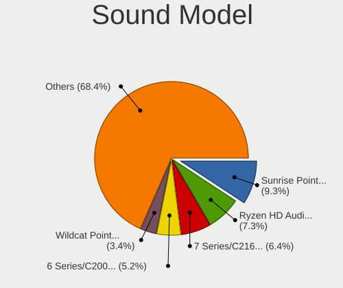

| Model                                                                                             | Notebooks | Percent |
|---------------------------------------------------------------------------------------------------|-----------|---------|
| Intel Sunrise Point-LP HD Audio                                                                   | 97        | 9.26%   |
| AMD Ryzen HD Audio Controller                                                                     | 77        | 7.35%   |
| Intel 7 Series/C216 Chipset Family High Definition Audio Controller                               | 67        | 6.39%   |
| Intel 6 Series/C200 Series Chipset Family High Definition Audio Controller                        | 54        | 5.15%   |
| Intel Wildcat Point-LP High Definition Audio Controller                                           | 36        | 3.44%   |
| Intel Broadwell-U Audio Controller                                                                | 36        | 3.44%   |
| Intel Haswell-ULT HD Audio Controller                                                             | 34        | 3.24%   |
| Intel 8 Series HD Audio Controller                                                                | 33        | 3.15%   |
| Intel 5 Series/3400 Series Chipset High Definition Audio                                          | 33        | 3.15%   |
| Intel Tiger Lake-LP Smart Sound Technology Audio Controller                                       | 29        | 2.77%   |
| Intel 8 Series/C220 Series Chipset High Definition Audio Controller                               | 29        | 2.77%   |
| Intel Cannon Lake PCH cAVS                                                                        | 27        | 2.58%   |
| Intel 82801H (ICH8 Family) HD Audio Controller                                                    | 24        | 2.29%   |
| AMD Renoir/Cezanne HDMI/DP Audio Controller                                                       | 24        | 2.29%   |
| Intel Xeon E3-1200 v3/4th Gen Core Processor HD Audio Controller                                  | 23        | 2.19%   |
| Intel Cannon Point-LP High Definition Audio Controller                                            | 21        | 2%      |
| AMD Raven/Raven2/Fenghuang HDMI/DP Audio Controller                                               | 21        | 2%      |
| AMD FCH Azalia Controller                                                                         | 21        | 2%      |
| AMD Family 17h (Models 00h-0fh) HD Audio Controller                                               | 17        | 1.62%   |
| Intel NM10/ICH7 Family High Definition Audio Controller                                           | 16        | 1.53%   |
| Intel Celeron/Pentium Silver Processor High Definition Audio                                      | 16        | 1.53%   |
| Intel 82801I (ICH9 Family) HD Audio Controller                                                    | 16        | 1.53%   |
| Intel Alder Lake PCH-P High Definition Audio Controller                                           | 14        | 1.34%   |
| Intel Comet Lake PCH-LP cAVS                                                                      | 13        | 1.24%   |
| Intel 100 Series/C230 Series Chipset Family HD Audio Controller                                   | 13        | 1.24%   |
| AMD Kabini HDMI/DP Audio                                                                          | 13        | 1.24%   |
| Intel Atom/Celeron/Pentium Processor x5-E8000/J3xxx/N3xxx Series High Definition Audio Controller | 12        | 1.15%   |
| AMD Radeon High Definition Audio Controller                                                       | 12        | 1.15%   |
| Intel Raptor Lake-P/U/H cAVS                                                                      | 11        | 1.05%   |
| Intel CM238 HD Audio Controller                                                                   | 11        | 1.05%   |
| Nvidia TU107 GeForce GTX 1650 High Definition Audio Controller                                    | 10        | 0.95%   |
| AMD SBx00 Azalia (Intel HDA)                                                                      | 9         | 0.86%   |
| Nvidia TU106 High Definition Audio Controller                                                     | 7         | 0.67%   |
| Intel Atom Processor Z36xxx/Z37xxx Series High Definition Audio Controller                        | 7         | 0.67%   |
| AMD Family 15h (Models 60h-6fh) Audio Controller                                                  | 7         | 0.67%   |
| Nvidia GT216 HDMI Audio Controller                                                                | 6         | 0.57%   |
| Intel Ice Lake-LP Smart Sound Technology Audio Controller                                         | 6         | 0.57%   |
| AMD Wrestler HDMI Audio                                                                           | 6         | 0.57%   |
| Nvidia TU116 High Definition Audio Controller                                                     | 5         | 0.48%   |
| Nvidia GP107GL High Definition Audio Controller                                                   | 5         | 0.48%   |

Memory
------

Memory Vendor
-------------

Memory module vendors

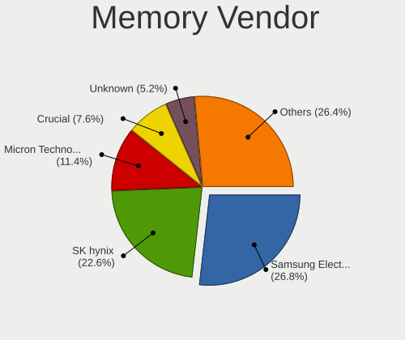

| Vendor              | Notebooks | Percent |
|---------------------|-----------|---------|
| Samsung Electronics | 228       | 26.79%  |
| SK hynix            | 192       | 22.56%  |
| Micron Technology   | 97        | 11.4%   |
| Crucial             | 65        | 7.64%   |
| Unknown             | 44        | 5.17%   |
| Transcend           | 36        | 4.23%   |
| Unknown             | 28        | 3.29%   |
| Kingston            | 25        | 2.94%   |
| Elpida              | 21        | 2.47%   |
| A-DATA Technology   | 18        | 2.12%   |
| Ramaxel Technology  | 16        | 1.88%   |
| G.Skill             | 13        | 1.53%   |
| Nanya Technology    | 12        | 1.41%   |
| PNY                 | 8         | 0.94%   |
| Team                | 6         | 0.71%   |
| Corsair             | 5         | 0.59%   |
| Avant               | 5         | 0.59%   |
| Unknown (ABCD)      | 4         | 0.47%   |
| Timetec             | 4         | 0.47%   |
| Goldkey             | 3         | 0.35%   |
| Super Talent        | 2         | 0.24%   |
| Sesame              | 2         | 0.24%   |
| Patriot             | 2         | 0.24%   |
| Unknown (0x0E9D)    | 1         | 0.12%   |
| Swissbit            | 1         | 0.12%   |
| Silicon Power       | 1         | 0.12%   |
| PKI/Kingston        | 1         | 0.12%   |
| Neo Forza           | 1         | 0.12%   |
| Golden Empire       | 1         | 0.12%   |
| Gold Key            | 1         | 0.12%   |
| fef5                | 1         | 0.12%   |
| CSX                 | 1         | 0.12%   |
| Axiom               | 1         | 0.12%   |
| Apacer              | 1         | 0.12%   |
| 8CFD000080AD        | 1         | 0.12%   |
| 8CAE000080CE        | 1         | 0.12%   |
| 4ea5                | 1         | 0.12%   |
| 09490000802C        | 1         | 0.12%   |

Memory Model
------------

Memory module models

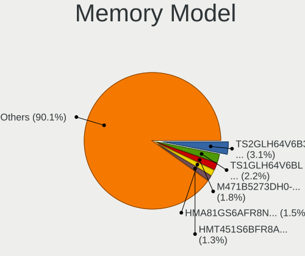

| Model                                                            | Notebooks | Percent |
|------------------------------------------------------------------|-----------|---------|
| Unknown                                                          | 28        | 3.07%   |
| Transcend RAM TS1GLH64V6BL 8GB SODIMM DDR4 2667MT/s              | 20        | 2.2%    |
| Samsung RAM M471B5273DH0-CH9 4GB SODIMM DDR3 1334MT/s            | 16        | 1.76%   |
| SK hynix RAM HMA81GS6AFR8N-UH 8GB SODIMM DDR4 2400MT/s           | 14        | 1.54%   |
| SK hynix RAM HMT451S6BFR8A-PB 4GB SODIMM DDR3 1600MT/s           | 12        | 1.32%   |
| Samsung RAM M471B5273DH0-CK0 8GB SODIMM DDR3 1600MT/s            | 11        | 1.21%   |
| SK hynix RAM HMT41GS6BFR8A-PB 8GB SODIMM DDR3 1600MT/s           | 10        | 1.1%    |
| Samsung RAM M471B5273CH0-CH9 4GB SODIMM DDR3 1334MT/s            | 10        | 1.1%    |
| Samsung RAM M471B5173QH0-YK0 4GB SODIMM DDR3 1600MT/s            | 9         | 0.99%   |
| Samsung RAM M471A1K43CB1-CTD 8GB SODIMM DDR4 3200MT/s            | 9         | 0.99%   |
| Samsung RAM M471A1K43CB1-CRC 8GB SODIMM DDR4 2667MT/s            | 9         | 0.99%   |
| Samsung RAM M471A1K43BB1-CRC 8GB SODIMM DDR4 2400MT/s            | 9         | 0.99%   |
| Unknown RAM Module 2GB SODIMM DDR2 667MT/s                       | 8         | 0.88%   |
| SK hynix RAM HMT351S6CFR8C-PB 4GB SODIMM DDR3 1600MT/s           | 8         | 0.88%   |
| Samsung RAM M471B1G73QH0-YK0 8GB SODIMM DDR3 1867MT/s            | 8         | 0.88%   |
| Samsung RAM M471B1G73EB0-YK0 8GB SODIMM DDR3 1600MT/s            | 7         | 0.77%   |
| Micron RAM 8KTF51264HZ-1G6E1 4GB SODIMM DDR3 1600MT/s            | 7         | 0.77%   |
| Crucial RAM CT102464BF160B.M16 8GB SODIMM DDR3 1600MT/s          | 7         | 0.77%   |
| Unknown RAM Module 2GB SODIMM DDR2                               | 6         | 0.66%   |
| SK hynix RAM HMT425S6AFR6A-PB 2GB SODIMM DDR3 3200MT/s           | 6         | 0.66%   |
| Samsung RAM M471B5173DB0-YK0 4GB SODIMM DDR3 1600MT/s            | 6         | 0.66%   |
| Samsung RAM M471A5244CB0-CWE 4GB SODIMM DDR4 3200MT/s            | 6         | 0.66%   |
| Micron RAM 4ATF51264HZ-2G6E1 4GB SODIMM DDR4 2667MT/s            | 6         | 0.66%   |
| Transcend RAM TS1GLH64V6B3 8GB SODIMM DDR4 1333MT/s              | 5         | 0.55%   |
| SK hynix RAM HMT451S6AFR8A-PB 4GB SODIMM DDR3 1600MT/s           | 5         | 0.55%   |
| SK hynix RAM HMT351S6EFR8A-PB 4GB SODIMM DDR3 1600MT/s           | 5         | 0.55%   |
| SK hynix RAM HMA81GS6DJR8N-XN 8GB SODIMM DDR4 3200MT/s           | 5         | 0.55%   |
| Samsung RAM M471B1G73DB0-YK0 8GB SODIMM DDR3 1600MT/s            | 5         | 0.55%   |
| Micron RAM 4ATS1G64HZ-2G6E1 8GB SODIMM DDR4 2667MT/s             | 5         | 0.55%   |
| Unknown RAM Module 8GB SODIMM DDR3 1333MT/s                      | 4         | 0.44%   |
| Unknown (ABCD) RAM 123456789012345678 1GB SODIMM LPDDR4 2400MT/s | 4         | 0.44%   |
| Team RAM TEAMGROUP-SD4-3200 32GB SODIMM DDR4 3200MT/s            | 4         | 0.44%   |
| SK hynix RAM Module 8GB SODIMM DDR3 1600MT/s                     | 4         | 0.44%   |
| SK hynix RAM Module 4GB SODIMM DDR3 1600MT/s                     | 4         | 0.44%   |
| SK hynix RAM HYMP125S64CP8-S6 2GB SODIMM DDR2 975MT/s            | 4         | 0.44%   |
| SK hynix RAM HMT41GS6DFR8A-PB 8GB SODIMM DDR3 1600MT/s           | 4         | 0.44%   |
| SK hynix RAM HMT41GS6AFR8A-PB 8GB SODIMM DDR3 1600MT/s           | 4         | 0.44%   |
| SK hynix RAM HMT351S6EFR8C-PB 4GB SODIMM DDR3 1600MT/s           | 4         | 0.44%   |
| SK hynix RAM HMT351S6CFR8C-H9 4GB SODIMM DDR3 1333MT/s           | 4         | 0.44%   |
| SK hynix RAM HMAA1GS6CJR6N-XN 8GB SODIMM DDR4 3200MT/s           | 4         | 0.44%   |

Memory Kind
-----------

Memory module kinds

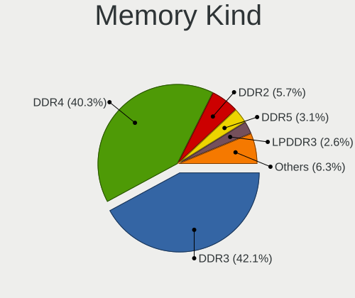

| Kind    | Notebooks | Percent |
|---------|-----------|---------|
| DDR3    | 296       | 42.11%  |
| DDR4    | 283       | 40.26%  |
| DDR2    | 40        | 5.69%   |
| DDR5    | 22        | 3.13%   |
| LPDDR3  | 18        | 2.56%   |
| LPDDR4  | 16        | 2.28%   |
| LPDDR5  | 12        | 1.71%   |
| DDR     | 8         | 1.14%   |
| Unknown | 4         | 0.57%   |
| SDRAM   | 3         | 0.43%   |
| SRAM    | 1         | 0.14%   |

Memory Form Factor
------------------

Physical design of the memory module

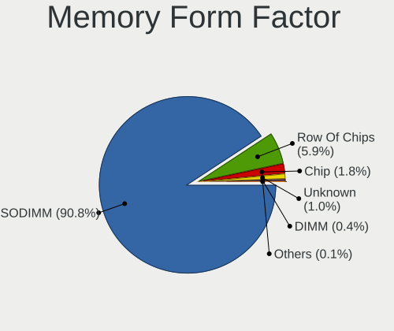

| Name            | Notebooks | Percent |
|-----------------|-----------|---------|
| SODIMM          | 648       | 90.76%  |
| Row Of Chips    | 42        | 5.88%   |
| Chip            | 13        | 1.82%   |
| Unknown         | 7         | 0.98%   |
| DIMM            | 3         | 0.42%   |
| Proprietary Car | 1         | 0.14%   |

Memory Size
-----------

Memory module size

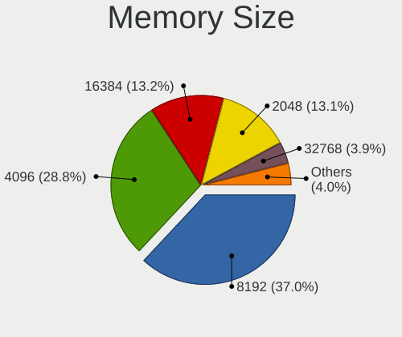

| Size  | Notebooks | Percent |
|-------|-----------|---------|
| 8192  | 296       | 36.95%  |
| 4096  | 231       | 28.84%  |
| 16384 | 106       | 13.23%  |
| 2048  | 105       | 13.11%  |
| 32768 | 31        | 3.87%   |
| 1024  | 25        | 3.12%   |
| 512   | 4         | 0.5%    |
| 65536 | 1         | 0.12%   |
| 49152 | 1         | 0.12%   |
| 256   | 1         | 0.12%   |

Memory Speed
------------

Memory module speed

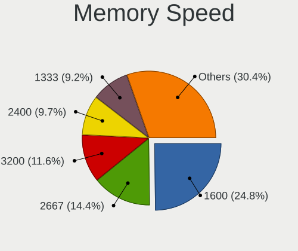

| Speed   | Notebooks | Percent |
|---------|-----------|---------|
| 1600    | 195       | 24.81%  |
| 2667    | 113       | 14.38%  |
| 3200    | 91        | 11.58%  |
| 2400    | 76        | 9.67%   |
| 1333    | 72        | 9.16%   |
| 2133    | 45        | 5.73%   |
| 1334    | 44        | 5.6%    |
| 667     | 28        | 3.56%   |
| 1867    | 17        | 2.16%   |
| 1067    | 15        | 1.91%   |
| Unknown | 12        | 1.53%   |
| 5600    | 11        | 1.4%    |
| 4800    | 11        | 1.4%    |
| 6400    | 9         | 1.15%   |
| 800     | 9         | 1.15%   |
| 4267    | 7         | 0.89%   |
| 533     | 7         | 0.89%   |
| 3733    | 4         | 0.51%   |
| 1200    | 4         | 0.51%   |
| 975     | 4         | 0.51%   |
| 4266    | 3         | 0.38%   |
| 1066    | 2         | 0.25%   |
| 4000    | 1         | 0.13%   |
| 2933    | 1         | 0.13%   |
| 2048    | 1         | 0.13%   |
| 1596    | 1         | 0.13%   |
| 333     | 1         | 0.13%   |
| 200     | 1         | 0.13%   |
| 166     | 1         | 0.13%   |

Printers & scanners
-------------------

Printer Vendor
--------------

Printer device vendors

Zero info for selected period =(

Printer Model
-------------

Printer device models

Zero info for selected period =(

Scanner Vendor
--------------

Scanner device vendors

Zero info for selected period =(

Scanner Model
-------------

Scanner device models

Zero info for selected period =(

Camera
------

Camera Vendor
-------------

Camera device vendors

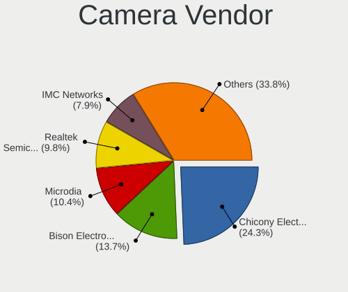

| Vendor                                 | Notebooks | Percent |
|----------------------------------------|-----------|---------|
| Chicony Electronics                    | 126       | 24.32%  |
| Bison Electronics                      | 71        | 13.71%  |
| Microdia                               | 54        | 10.42%  |
| Realtek Semiconductor                  | 51        | 9.85%   |
| IMC Networks                           | 41        | 7.92%   |
| Sunplus Innovation Technology          | 37        | 7.14%   |
| Quanta                                 | 18        | 3.47%   |
| Lite-On Technology                     | 18        | 3.47%   |
| Luxvisions Innotech Limited            | 16        | 3.09%   |
| Cheng Uei Precision Industry (Foxlink) | 15        | 2.9%    |
| Apple                                  | 15        | 2.9%    |
| Suyin                                  | 11        | 2.12%   |
| Syntek                                 | 7         | 1.35%   |
| Lenovo                                 | 5         | 0.97%   |
| Importek                               | 5         | 0.97%   |
| Alcor Micro                            | 4         | 0.77%   |
| Ricoh                                  | 3         | 0.58%   |
| Primax Electronics                     | 3         | 0.58%   |
| Logitech                               | 3         | 0.58%   |
| Shenzhen Kingcome Optoelectronic       | 2         | 0.39%   |
| OmniVision Technologies                | 2         | 0.39%   |
| Intel                                  | 2         | 0.39%   |
| Framework                              | 2         | 0.39%   |
| Z-Star Microelectronics                | 1         | 0.19%   |
| Y Media                                | 1         | 0.19%   |
| Supreme Electronics                    | 1         | 0.19%   |
| Silicon Motion                         | 1         | 0.19%   |
| Jiangxi Shinetech Optical              | 1         | 0.19%   |
| Goodong Industry                       | 1         | 0.19%   |
| ALi                                    | 1         | 0.19%   |

Camera Model
------------

Camera device models

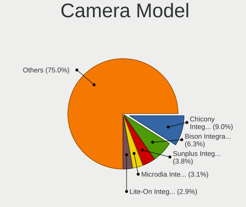

| Model                                               | Notebooks | Percent |
|-----------------------------------------------------|-----------|---------|
| Chicony Integrated Camera                           | 47        | 8.99%   |
| Bison Integrated Camera                             | 33        | 6.31%   |
| Sunplus Integrated_Webcam_HD                        | 20        | 3.82%   |
| Microdia Integrated_Webcam_HD                       | 16        | 3.06%   |
| Lite-On Integrated Camera                           | 15        | 2.87%   |
| IMC Networks Integrated Camera                      | 15        | 2.87%   |
| Microdia Integrated Webcam                          | 13        | 2.49%   |
| Realtek Integrated_Webcam_HD                        | 11        | 2.1%    |
| Chicony Lenovo Integrated Camera (0.3MP)            | 11        | 2.1%    |
| Bison SunplusIT Integrated Camera                   | 10        | 1.91%   |
| Apple FaceTime HD Camera                            | 10        | 1.91%   |
| Realtek USB 2.0 PC Camera                           | 8         | 1.53%   |
| Luxvisions Innotech Limited Integrated Camera       | 8         | 1.53%   |
| Chicony Integrated Camera (1280x720@30)             | 8         | 1.53%   |
| Bison ThinkPad Integrated Camera                    | 8         | 1.53%   |
| Realtek Laptop Camera                               | 7         | 1.34%   |
| Quanta HP TrueVision HD Camera                      | 7         | 1.34%   |
| Chicony Integrated Camera [ThinkPad]                | 7         | 1.34%   |
| Chicony HD Webcam                                   | 7         | 1.34%   |
| IMC Networks Realtek PC Camera                      | 6         | 1.15%   |
| IMC Networks EasyCamera                             | 6         | 1.15%   |
| Chicony thinkpad t430s camera                       | 6         | 1.15%   |
| Realtek Integrated Webcam HD                        | 5         | 0.96%   |
| Microdia Integrated Webcam HD                       | 5         | 0.96%   |
| Chicony Integrated IR Camera                        | 5         | 0.96%   |
| Cheng Uei Precision Industry (Foxlink) HP HD Camera | 5         | 0.96%   |
| Syntek EasyCamera                                   | 4         | 0.76%   |
| Sunplus Laptop_Integrated_Webcam_FHD                | 4         | 0.76%   |
| Realtek USB Camera                                  | 4         | 0.76%   |
| Realtek Integrated_Webcam_FHD                       | 4         | 0.76%   |
| Microdia Integrated_Webcam_FHD                      | 4         | 0.76%   |
| Microdia Dell Laptop Integrated Webcam HD           | 4         | 0.76%   |
| Lenovo Integrated Webcam [R5U877]                   | 4         | 0.76%   |
| Chicony HP TrueVision HD Camera                     | 4         | 0.76%   |
| Chicony Chicony USB2.0 Camera                       | 4         | 0.76%   |
| Bison USB HD Webcam                                 | 4         | 0.76%   |
| Bison SunplusIT INC. Integrated Camera              | 4         | 0.76%   |
| Bison Lenovo Integrated Webcam                      | 4         | 0.76%   |
| Sunplus HD WebCam                                   | 3         | 0.57%   |
| Realtek Integrated Webcam                           | 3         | 0.57%   |

Security
--------

Fingerprint Vendor
------------------

Fingerprint sensor vendors

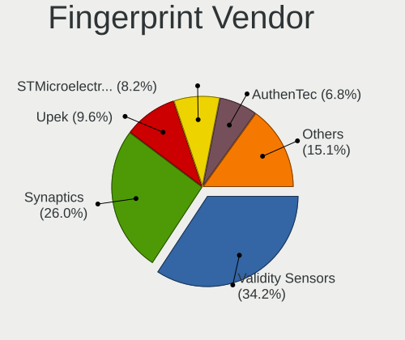

| Vendor                     | Notebooks | Percent |
|----------------------------|-----------|---------|
| Validity Sensors           | 50        | 34.25%  |
| Synaptics                  | 38        | 26.03%  |
| Upek                       | 14        | 9.59%   |
| STMicroelectronics         | 12        | 8.22%   |
| AuthenTec                  | 10        | 6.85%   |
| Shenzhen Goodix Technology | 8         | 5.48%   |
| Elan Microelectronics      | 6         | 4.11%   |
| FocalTech Systems          | 3         | 2.05%   |
| Broadcom                   | 3         | 2.05%   |
| Samsung Electronics        | 1         | 0.68%   |
| LighTuning Technology      | 1         | 0.68%   |

Fingerprint Model
-----------------

Fingerprint sensor models

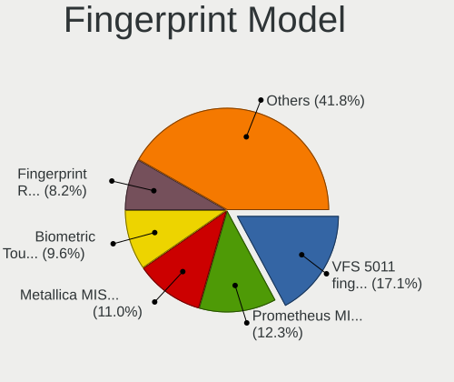

| Model                                                                             | Notebooks | Percent |
|-----------------------------------------------------------------------------------|-----------|---------|
| Validity Sensors VFS 5011 fingerprint sensor                                      | 25        | 17.12%  |
| Synaptics Prometheus MIS Touch Fingerprint Reader                                 | 18        | 12.33%  |
| Synaptics Metallica MIS Touch Fingerprint Reader                                  | 16        | 10.96%  |
| Upek Biometric Touchchip/Touchstrip Fingerprint Sensor                            | 14        | 9.59%   |
| STMicroelectronics Fingerprint Reader                                             | 12        | 8.22%   |
| Validity Sensors VFS495 Fingerprint Reader                                        | 7         | 4.79%   |
| Shenzhen Goodix Fingerprint Reader                                                | 7         | 4.79%   |
| Validity Sensors VFS7500 Touch Fingerprint Sensor                                 | 5         | 3.42%   |
| Elan Fingerprint Sensor                                                           | 5         | 3.42%   |
| AuthenTec AES2810                                                                 | 5         | 3.42%   |
| Validity Sensors Synaptics WBDI                                                   | 4         | 2.74%   |
| Validity Sensors VFS5011 Fingerprint Reader                                       | 3         | 2.05%   |
| Synaptics FS7604 Touch Fingerprint Sensor with PurePrint                          | 3         | 2.05%   |
| Broadcom BCM5880 Secure Applications Processor with fingerprint swipe sensor      | 3         | 2.05%   |
| AuthenTec AES2501 Fingerprint Sensor                                              | 3         | 2.05%   |
| Validity Sensors VFS7552 Touch Fingerprint Sensor                                 | 2         | 1.37%   |
| FocalTech Systems Fingerprint Reader                                              | 2         | 1.37%   |
| AuthenTec AES1660                                                                 | 2         | 1.37%   |
| Validity Sensors VFS491                                                           | 1         | 0.68%   |
| Validity Sensors VFS471 Fingerprint Reader                                        | 1         | 0.68%   |
| Validity Sensors VFS301 Fingerprint Reader                                        | 1         | 0.68%   |
| Validity Sensors Fingerprint scanner                                              | 1         | 0.68%   |
| Synaptics WBDI                                                                    | 1         | 0.68%   |
| Shenzhen Goodix Fingerprint Reader SGX                                            | 1         | 0.68%   |
| Samsung CanvasBio Fingerprint Reader                                              | 1         | 0.68%   |
| LighTuning EgisTec Touch Fingerprint Sensor                                       | 1         | 0.68%   |
| FocalTech Systems FocalTech Fingerprint Device Realtek USB2.0 Finger Print Bridge | 1         | 0.68%   |
| Elan WBF Fingerprint Sensor                                                       | 1         | 0.68%   |

Chipcard Vendor
---------------

Chipcard module vendors

Zero info for selected period =(

Chipcard Model
--------------

Chipcard module models

Zero info for selected period =(

Unsupported
-----------

Unsupported Devices
-------------------

Total unsupported devices on board

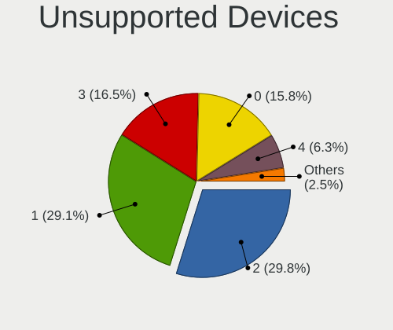

| Total | Notebooks | Percent |
|-------|-----------|---------|
| 2     | 241       | 29.83%  |
| 1     | 235       | 29.08%  |
| 3     | 133       | 16.46%  |
| 0     | 128       | 15.84%  |
| 4     | 51        | 6.31%   |
| 5     | 15        | 1.86%   |
| 6     | 5         | 0.62%   |

Unsupported Device Types
------------------------

Types of unsupported devices

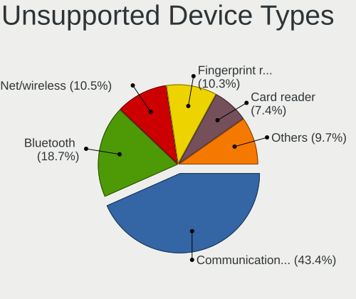

| Type                     | Notebooks | Percent |
|--------------------------|-----------|---------|
| Communication controller | 531       | 43.38%  |
| Bluetooth                | 229       | 18.71%  |
| Net/wireless             | 129       | 10.54%  |
| Fingerprint reader       | 126       | 10.29%  |
| Card reader              | 90        | 7.35%   |
| Firewire controller      | 45        | 3.68%   |
| Sound                    | 17        | 1.39%   |
| Storage                  | 14        | 1.14%   |
| Graphics card            | 14        | 1.14%   |
| Network                  | 11        | 0.9%    |
| Modem                    | 8         | 0.65%   |
| Net/ethernet             | 5         | 0.41%   |
| Storage/ata              | 3         | 0.25%   |
| Storage/ide              | 1         | 0.08%   |
| Dvb card                 | 1         | 0.08%   |

