BSD in USA - Tested Hardware & Statistics (Notebooks)
-----------------------------------------------------

A project to collect tested hardware configurations for BSD in USA.

Anyone can contribute to this report by the [hw-probe](https://github.com/linuxhw/hw-probe/blob/master/INSTALL.BSD.md) tool:

    hw-probe -all -upload

Please contribute! Especially if your hardware is rare.

Contents
--------

* [ Test Cases ](#test-cases)

* [ System ](#system)
  - [ OS                       ](#os)
  - [ OS Family                ](#os-family)
  - [ Arch                     ](#arch)
  - [ DE                       ](#de)
  - [ Display Server           ](#display-server)
  - [ Display Manager          ](#display-manager)
  - [ OS Lang                  ](#os-lang)
  - [ Boot Mode                ](#boot-mode)
  - [ Filesystem               ](#filesystem)
  - [ Part. scheme             ](#part-scheme)

* [ Board ](#board)
  - [ Vendor                   ](#vendor)
  - [ Model                    ](#model)
  - [ Model Family             ](#model-family)
  - [ MFG Year                 ](#mfg-year)
  - [ Form Factor              ](#form-factor)
  - [ Coreboot                 ](#coreboot)
  - [ RAM Size                 ](#ram-size)
  - [ RAM Used                 ](#ram-used)
  - [ Total Drives             ](#total-drives)
  - [ Has CD-ROM               ](#has-cd-rom)
  - [ Has Ethernet             ](#has-ethernet)
  - [ Has WiFi                 ](#has-wifi)
  - [ Has Bluetooth            ](#has-bluetooth)

* [ Location ](#location)
  - [ Country                  ](#country)
  - [ City                     ](#city)

* [ Drives ](#drives)
  - [ Drive Vendor             ](#drive-vendor)
  - [ Drive Model              ](#drive-model)
  - [ HDD Vendor               ](#hdd-vendor)
  - [ SSD Vendor               ](#ssd-vendor)
  - [ Drive Kind               ](#drive-kind)
  - [ Drive Connector          ](#drive-connector)
  - [ Drive Size               ](#drive-size)
  - [ Space Total              ](#space-total)
  - [ Space Used               ](#space-used)
  - [ Malfunc. Drives          ](#malfunc-drives)
  - [ Malfunc. Drive Vendor    ](#malfunc-drive-vendor)
  - [ Malfunc. HDD Vendor      ](#malfunc-hdd-vendor)
  - [ Malfunc. Drive Kind      ](#malfunc-drive-kind)
  - [ Failed Drives            ](#failed-drives)
  - [ Failed Drive Vendor      ](#failed-drive-vendor)
  - [ Drive Status             ](#drive-status)

* [ Storage controller ](#storage-controller)
  - [ Storage Vendor           ](#storage-vendor)
  - [ Storage Model            ](#storage-model)
  - [ Storage Kind             ](#storage-kind)

* [ Processor ](#processor)
  - [ CPU Vendor               ](#cpu-vendor)
  - [ CPU Model                ](#cpu-model)
  - [ CPU Model Family         ](#cpu-model-family)
  - [ CPU Cores                ](#cpu-cores)
  - [ CPU Sockets              ](#cpu-sockets)
  - [ CPU Threads              ](#cpu-threads)
  - [ CPU Microarch            ](#cpu-microarch)

* [ Graphics ](#graphics)
  - [ GPU Vendor               ](#gpu-vendor)
  - [ GPU Model                ](#gpu-model)
  - [ GPU Combo                ](#gpu-combo)
  - [ GPU Driver               ](#gpu-driver)
  - [ GPU Memory               ](#gpu-memory)

* [ Monitor ](#monitor)
  - [ Monitor Vendor           ](#monitor-vendor)
  - [ Monitor Model            ](#monitor-model)
  - [ Monitor Resolution       ](#monitor-resolution)
  - [ Monitor Diagonal         ](#monitor-diagonal)
  - [ Monitor Width            ](#monitor-width)
  - [ Aspect Ratio             ](#aspect-ratio)
  - [ Monitor Area             ](#monitor-area)
  - [ Pixel Density            ](#pixel-density)
  - [ Multiple Monitors        ](#multiple-monitors)

* [ Network ](#network)
  - [ Net Controller Vendor    ](#net-controller-vendor)
  - [ Net Controller Model     ](#net-controller-model)
  - [ Wireless Vendor          ](#wireless-vendor)
  - [ Wireless Model           ](#wireless-model)
  - [ Ethernet Vendor          ](#ethernet-vendor)
  - [ Ethernet Model           ](#ethernet-model)
  - [ Net Controller Kind      ](#net-controller-kind)
  - [ Used Controller          ](#used-controller)
  - [ NICs                     ](#nics)
  - [ IPv6                     ](#ipv6)

* [ Bluetooth ](#bluetooth)
  - [ Bluetooth Vendor         ](#bluetooth-vendor)
  - [ Bluetooth Model          ](#bluetooth-model)

* [ Sound ](#sound)
  - [ Sound Vendor             ](#sound-vendor)
  - [ Sound Model              ](#sound-model)

* [ Memory ](#memory)
  - [ Memory Vendor            ](#memory-vendor)
  - [ Memory Model             ](#memory-model)
  - [ Memory Kind              ](#memory-kind)
  - [ Memory Form Factor       ](#memory-form-factor)
  - [ Memory Size              ](#memory-size)
  - [ Memory Speed             ](#memory-speed)

* [ Printers & scanners ](#printers--scanners)
  - [ Printer Vendor           ](#printer-vendor)
  - [ Printer Model            ](#printer-model)
  - [ Scanner Vendor           ](#scanner-vendor)
  - [ Scanner Model            ](#scanner-model)

* [ Camera ](#camera)
  - [ Camera Vendor            ](#camera-vendor)
  - [ Camera Model             ](#camera-model)

* [ Security ](#security)
  - [ Fingerprint Vendor       ](#fingerprint-vendor)
  - [ Fingerprint Model        ](#fingerprint-model)
  - [ Chipcard Vendor          ](#chipcard-vendor)
  - [ Chipcard Model           ](#chipcard-model)

* [ Unsupported ](#unsupported)
  - [ Unsupported Devices      ](#unsupported-devices)
  - [ Unsupported Device Types ](#unsupported-device-types)

Test Cases
----------

Total: 511

| Vendor        | Model                       | Probe                                                     | Date         |
|---------------|-----------------------------|-----------------------------------------------------------|--------------|
| GPD           | MicroPC                     | [a448570ff9](https://bsd-hardware.info/?probe=a448570ff9) | May 31, 2022 |
| Dell          | Inspiron 5559               | [ca9f2125af](https://bsd-hardware.info/?probe=ca9f2125af) | May 31, 2022 |
| Dell          | Inspiron 5559               | [283a074737](https://bsd-hardware.info/?probe=283a074737) | May 31, 2022 |
| GPD           | MicroPC                     | [0046ab7c9b](https://bsd-hardware.info/?probe=0046ab7c9b) | May 31, 2022 |
| System76      | Galago Pro                  | [126ebc1522](https://bsd-hardware.info/?probe=126ebc1522) | May 29, 2022 |
| Dell          | Latitude E6430              | [d7ced37bac](https://bsd-hardware.info/?probe=d7ced37bac) | May 29, 2022 |
| Deciso        | Netboard A20                | [eba0ffa870](https://bsd-hardware.info/?probe=eba0ffa870) | May 23, 2022 |
| Dell          | Precision M4800             | [6a703b66f8](https://bsd-hardware.info/?probe=6a703b66f8) | May 22, 2022 |
| Deciso        | Netboard A20                | [1fe95544bd](https://bsd-hardware.info/?probe=1fe95544bd) | May 22, 2022 |
| Timi          | TM1701                      | [a28220d11f](https://bsd-hardware.info/?probe=a28220d11f) | May 22, 2022 |
| HP            | Pavilion dv6                | [73e328ad87](https://bsd-hardware.info/?probe=73e328ad87) | May 20, 2022 |
| Deciso        | Netboard A20                | [f78f6b9abb](https://bsd-hardware.info/?probe=f78f6b9abb) | May 20, 2022 |
| Dell          | Precision M4800             | [6dc325b553](https://bsd-hardware.info/?probe=6dc325b553) | May 15, 2022 |
| Acer          | Aspire A715-42G             | [991f67362f](https://bsd-hardware.info/?probe=991f67362f) | May 12, 2022 |
| Acer          | Aspire A715-42G             | [6dce802641](https://bsd-hardware.info/?probe=6dce802641) | May 10, 2022 |
| Dell          | Latitude 2100               | [40406069ee](https://bsd-hardware.info/?probe=40406069ee) | May 09, 2022 |
| Lenovo        | ThinkPad X250 20CLS02V00    | [7e2771b8f6](https://bsd-hardware.info/?probe=7e2771b8f6) | May 08, 2022 |
| Dell          | Inspiron 15-7568            | [850df51257](https://bsd-hardware.info/?probe=850df51257) | May 06, 2022 |
| Lenovo        | ThinkPad X220 42872WU       | [e99738632d](https://bsd-hardware.info/?probe=e99738632d) | May 06, 2022 |
| Toshiba       | Satellite P25               | [6a920e9c8a](https://bsd-hardware.info/?probe=6a920e9c8a) | May 01, 2022 |
| HP            | Laptop 15-dw1xxx            | [7a212b5833](https://bsd-hardware.info/?probe=7a212b5833) | Apr 29, 2022 |
| Framework     | Laptop                      | [5d6cb039ea](https://bsd-hardware.info/?probe=5d6cb039ea) | Apr 25, 2022 |
| Apple         | MacBookPro8,3               | [e588c93d54](https://bsd-hardware.info/?probe=e588c93d54) | Apr 24, 2022 |
| HP            | 2000                        | [e9599a9bc3](https://bsd-hardware.info/?probe=e9599a9bc3) | Apr 22, 2022 |
| TUXEDO        | Pulse 15 Gen1               | [b4a6761ab3](https://bsd-hardware.info/?probe=b4a6761ab3) | Apr 21, 2022 |
| Lenovo        | G51-35 80M8                 | [285328cb61](https://bsd-hardware.info/?probe=285328cb61) | Apr 16, 2022 |
| Deciso        | Netboard A20                | [aa1f373bfb](https://bsd-hardware.info/?probe=aa1f373bfb) | Apr 12, 2022 |
| TUXEDO        | Pulse 15 Gen1               | [0e836941e0](https://bsd-hardware.info/?probe=0e836941e0) | Apr 11, 2022 |
| Deciso        | Netboard A20                | [d12cd9d1a1](https://bsd-hardware.info/?probe=d12cd9d1a1) | Apr 11, 2022 |
| Datto         | 1000                        | [745e356caa](https://bsd-hardware.info/?probe=745e356caa) | Apr 11, 2022 |
| Lenovo        | ThinkPad X220 42872WU       | [3b7da460a2](https://bsd-hardware.info/?probe=3b7da460a2) | Apr 10, 2022 |
| Lenovo        | ThinkPad T495 20NJ0000US    | [c626b32508](https://bsd-hardware.info/?probe=c626b32508) | Apr 09, 2022 |
| Dell          | Vostro 1400                 | [7e0964d31d](https://bsd-hardware.info/?probe=7e0964d31d) | Apr 08, 2022 |
| Deciso        | Netboard A20                | [c6217643cc](https://bsd-hardware.info/?probe=c6217643cc) | Apr 07, 2022 |
| Gigabyte      | MMLP7AP-00                  | [8116ea4eac](https://bsd-hardware.info/?probe=8116ea4eac) | Apr 07, 2022 |
| MSI           | Bravo 15 A4DDR              | [1868573e9a](https://bsd-hardware.info/?probe=1868573e9a) | Apr 02, 2022 |
| Datto         | 1000                        | [5974640141](https://bsd-hardware.info/?probe=5974640141) | Mar 31, 2022 |
| Deciso        | Netboard A20                | [51a8ceefee](https://bsd-hardware.info/?probe=51a8ceefee) | Mar 26, 2022 |
| Deciso        | Netboard A20                | [43a1f11ae0](https://bsd-hardware.info/?probe=43a1f11ae0) | Mar 26, 2022 |
| Lenovo        | ThinkPad X1 Extreme 20MF... | [1af600b3ae](https://bsd-hardware.info/?probe=1af600b3ae) | Mar 24, 2022 |
| Lenovo        | ThinkPad X230 2325BV9       | [d2a16f6102](https://bsd-hardware.info/?probe=d2a16f6102) | Mar 23, 2022 |
| Lenovo        | ThinkPad X13 Gen 1 20UF0... | [693d365311](https://bsd-hardware.info/?probe=693d365311) | Mar 23, 2022 |
| Gateway       | NV55C                       | [a63381d681](https://bsd-hardware.info/?probe=a63381d681) | Mar 22, 2022 |
| HP            | EliteBook 850 G3            | [1ae8321767](https://bsd-hardware.info/?probe=1ae8321767) | Mar 20, 2022 |
| HP            | Pavilion dv6                | [dee0853f4b](https://bsd-hardware.info/?probe=dee0853f4b) | Mar 17, 2022 |
| Lenovo        | ThinkPad T420 4236MBU       | [8bd2318fb6](https://bsd-hardware.info/?probe=8bd2318fb6) | Mar 15, 2022 |
| HP            | Pavilion Laptop 15-cs0xx... | [ed0add65a3](https://bsd-hardware.info/?probe=ed0add65a3) | Mar 14, 2022 |
| Lenovo        | ThinkPad X201 32492EU       | [4a5ba4f3e4](https://bsd-hardware.info/?probe=4a5ba4f3e4) | Mar 13, 2022 |
| Apple         | MacBookPro12,1              | [e04a1b354c](https://bsd-hardware.info/?probe=e04a1b354c) | Mar 11, 2022 |
| Apple         | MacBookPro12,1              | [ac59621182](https://bsd-hardware.info/?probe=ac59621182) | Mar 10, 2022 |
| Lenovo        | IdeaPad N585                | [e22da97709](https://bsd-hardware.info/?probe=e22da97709) | Mar 10, 2022 |
| Lenovo        | ThinkPad X220 Tablet 429... | [dbd5c6e5e3](https://bsd-hardware.info/?probe=dbd5c6e5e3) | Mar 07, 2022 |
| ASUSTek       | ROG Zephyrus G14 GA402RJ... | [20cdc9d999](https://bsd-hardware.info/?probe=20cdc9d999) | Mar 06, 2022 |
| Lenovo        | ThinkPad T440s 20AQ006HU... | [2af47b6502](https://bsd-hardware.info/?probe=2af47b6502) | Mar 03, 2022 |
| Framework     | Laptop                      | [1f58e0594f](https://bsd-hardware.info/?probe=1f58e0594f) | Mar 01, 2022 |
| Dell          | Latitude D630               | [ae56d2cedd](https://bsd-hardware.info/?probe=ae56d2cedd) | Feb 28, 2022 |
| HP            | EliteBook Folio 9470m       | [e2cc942e3e](https://bsd-hardware.info/?probe=e2cc942e3e) | Feb 28, 2022 |
| Lenovo        | ThinkPad T440p 20AWS1JN0... | [cba9255f4a](https://bsd-hardware.info/?probe=cba9255f4a) | Feb 27, 2022 |
| Dell          | Inspiron 5559               | [c34e21ffd5](https://bsd-hardware.info/?probe=c34e21ffd5) | Feb 26, 2022 |
| Lenovo        | ThinkPad T61 766301U        | [f5f25efdcc](https://bsd-hardware.info/?probe=f5f25efdcc) | Feb 22, 2022 |
| Apple         | MacBook6,1                  | [d680290d84](https://bsd-hardware.info/?probe=d680290d84) | Feb 22, 2022 |
| Apple         | MacBook6,1                  | [304508ed18](https://bsd-hardware.info/?probe=304508ed18) | Feb 21, 2022 |
| Dell          | Latitude 7480               | [f0e8e4a30a](https://bsd-hardware.info/?probe=f0e8e4a30a) | Feb 21, 2022 |
| Dell          | Inspiron 3537               | [932550132e](https://bsd-hardware.info/?probe=932550132e) | Feb 20, 2022 |
| Lenovo        | ThinkPad T61 766301U        | [6eec3232e2](https://bsd-hardware.info/?probe=6eec3232e2) | Feb 19, 2022 |
| Lenovo        | ThinkPad T460 20FNCTO1WW    | [deac163b52](https://bsd-hardware.info/?probe=deac163b52) | Feb 19, 2022 |
| Acer          | AO725                       | [f53f627e62](https://bsd-hardware.info/?probe=f53f627e62) | Feb 19, 2022 |
| Lenovo        | ThinkPad T430 2349AK1       | [86fd351c81](https://bsd-hardware.info/?probe=86fd351c81) | Feb 16, 2022 |
| ASUSTek       | 1215B                       | [1ccf85f60d](https://bsd-hardware.info/?probe=1ccf85f60d) | Feb 10, 2022 |
| Notebook      | NS50_70MU                   | [3b3ff8b95d](https://bsd-hardware.info/?probe=3b3ff8b95d) | Feb 05, 2022 |
| Dell          | Latitude D630               | [b34db656b5](https://bsd-hardware.info/?probe=b34db656b5) | Feb 05, 2022 |
| Lenovo        | IdeaPad Gaming 3 15ARH05... | [e660899158](https://bsd-hardware.info/?probe=e660899158) | Feb 03, 2022 |
| Dell          | G3 3500                     | [536a7a1b38](https://bsd-hardware.info/?probe=536a7a1b38) | Jan 31, 2022 |
| MSI           | Summit E13FlipEvo A11MT     | [61e3f35ee8](https://bsd-hardware.info/?probe=61e3f35ee8) | Jan 31, 2022 |
| Deciso        | Netboard A20                | [43addbbe84](https://bsd-hardware.info/?probe=43addbbe84) | Jan 28, 2022 |
| Deciso        | Netboard A20                | [5f9588cc87](https://bsd-hardware.info/?probe=5f9588cc87) | Jan 27, 2022 |
| Apple         | MacBookPro9,2               | [208819a667](https://bsd-hardware.info/?probe=208819a667) | Jan 27, 2022 |
| Dell          | Inspiron 15 7000 Gaming     | [652e2e284f](https://bsd-hardware.info/?probe=652e2e284f) | Jan 26, 2022 |
| Dell          | Inspiron 5555               | [e54be582a7](https://bsd-hardware.info/?probe=e54be582a7) | Jan 25, 2022 |
| Lenovo        | IdeaPad L340-15IWL 81LG     | [bb6cc55d53](https://bsd-hardware.info/?probe=bb6cc55d53) | Jan 23, 2022 |
| Deciso        | Netboard A20                | [a25a10c535](https://bsd-hardware.info/?probe=a25a10c535) | Jan 22, 2022 |
| HP            | Pavilion Gaming Laptop 1... | [7859f220b9](https://bsd-hardware.info/?probe=7859f220b9) | Jan 22, 2022 |
| Deciso        | Netboard A20                | [3559282047](https://bsd-hardware.info/?probe=3559282047) | Jan 18, 2022 |
| Unknown       | Unknown                     | [699e8fdf32](https://bsd-hardware.info/?probe=699e8fdf32) | Jan 16, 2022 |
| Lenovo        | ThinkPad X220 Tablet 429... | [5a585443b2](https://bsd-hardware.info/?probe=5a585443b2) | Jan 15, 2022 |
| HP            | Laptop 15-dw2xxx            | [a6d7796cea](https://bsd-hardware.info/?probe=a6d7796cea) | Jan 13, 2022 |
| Dell          | Latitude 5510               | [a620d284cb](https://bsd-hardware.info/?probe=a620d284cb) | Jan 12, 2022 |
| Dell          | Latitude E5510              | [5c6b94df97](https://bsd-hardware.info/?probe=5c6b94df97) | Jan 09, 2022 |
| Dell          | Latitude E6530              | [0fa21bcf23](https://bsd-hardware.info/?probe=0fa21bcf23) | Jan 09, 2022 |
| Dell          | Inspiron 3505               | [8d4b342fda](https://bsd-hardware.info/?probe=8d4b342fda) | Jan 08, 2022 |
| Dell          | Inspiron 3505               | [8cbe3d4581](https://bsd-hardware.info/?probe=8cbe3d4581) | Jan 08, 2022 |
| HP            | Laptop 14-dk0xxx            | [e7b40f6e3b](https://bsd-hardware.info/?probe=e7b40f6e3b) | Jan 06, 2022 |
| Dell          | XPS 15 9575                 | [e7925aa387](https://bsd-hardware.info/?probe=e7925aa387) | Jan 05, 2022 |
| Framework     | Laptop                      | [324f0fdebc](https://bsd-hardware.info/?probe=324f0fdebc) | Jan 05, 2022 |
| Framework     | Laptop                      | [ba81f48282](https://bsd-hardware.info/?probe=ba81f48282) | Jan 05, 2022 |
| Deciso        | Netboard A20                | [7d859a2d87](https://bsd-hardware.info/?probe=7d859a2d87) | Jan 04, 2022 |
| Deciso        | Netboard A20                | [3896ed1da8](https://bsd-hardware.info/?probe=3896ed1da8) | Jan 04, 2022 |
| Deciso        | Netboard A20                | [c092bc0341](https://bsd-hardware.info/?probe=c092bc0341) | Jan 04, 2022 |
| Lenovo        | ThinkPad A485 20MU000VUS    | [0c153d0c98](https://bsd-hardware.info/?probe=0c153d0c98) | Jan 02, 2022 |
| Framework     | Laptop                      | [9c201bb573](https://bsd-hardware.info/?probe=9c201bb573) | Jan 01, 2022 |
| Deciso        | DEC2700 - OPNsense Appli... | [30590e8ccf](https://bsd-hardware.info/?probe=30590e8ccf) | Dec 31, 2021 |
| Deciso        | Netboard A20                | [3499735c40](https://bsd-hardware.info/?probe=3499735c40) | Dec 31, 2021 |
| Deciso        | Netboard A20                | [9d39675350](https://bsd-hardware.info/?probe=9d39675350) | Dec 30, 2021 |
| Deciso        | Netboard A20                | [41bc512034](https://bsd-hardware.info/?probe=41bc512034) | Dec 30, 2021 |
| Deciso        | Netboard A20                | [291b7f2750](https://bsd-hardware.info/?probe=291b7f2750) | Dec 30, 2021 |
| Dell          | Inspiron 3521               | [b246d110af](https://bsd-hardware.info/?probe=b246d110af) | Dec 28, 2021 |
| Lenovo        | ThinkPad X250 20CLS1WP01    | [87bc0b8924](https://bsd-hardware.info/?probe=87bc0b8924) | Dec 22, 2021 |
| HP            | Pavilion Gaming Laptop 1... | [4c22212c20](https://bsd-hardware.info/?probe=4c22212c20) | Dec 20, 2021 |
| HP            | Pavilion Gaming Laptop 1... | [1a193c7bf9](https://bsd-hardware.info/?probe=1a193c7bf9) | Dec 20, 2021 |
| HP            | 15 Notebook PC              | [1e888f2278](https://bsd-hardware.info/?probe=1e888f2278) | Dec 20, 2021 |
| Lenovo        | ThinkPad L470 20J40013US    | [32080a81c5](https://bsd-hardware.info/?probe=32080a81c5) | Dec 15, 2021 |
| Lenovo        | ThinkPad L470 20J40013US    | [e517ae0a82](https://bsd-hardware.info/?probe=e517ae0a82) | Dec 15, 2021 |
| Dell          | Inspiron 3521               | [d8bcea438a](https://bsd-hardware.info/?probe=d8bcea438a) | Dec 15, 2021 |
| Deciso        | Netboard A20                | [22eae64139](https://bsd-hardware.info/?probe=22eae64139) | Dec 14, 2021 |
| HP            | ZBook Studio G4             | [cdc6f54d97](https://bsd-hardware.info/?probe=cdc6f54d97) | Dec 14, 2021 |
| Framework     | Laptop                      | [46dec0c088](https://bsd-hardware.info/?probe=46dec0c088) | Dec 08, 2021 |
| Framework     | Laptop                      | [a8cd4dc680](https://bsd-hardware.info/?probe=a8cd4dc680) | Dec 08, 2021 |
| Toshiba       | Satellite P755              | [44818070a2](https://bsd-hardware.info/?probe=44818070a2) | Dec 08, 2021 |
| Lenovo        | ThinkPad X61 7675H7U        | [545cbe065d](https://bsd-hardware.info/?probe=545cbe065d) | Dec 06, 2021 |
| HP            | Laptop 15-dw0xxx            | [4903f23b62](https://bsd-hardware.info/?probe=4903f23b62) | Dec 05, 2021 |
| Lenovo        | ThinkPad 13 20GJCTO1WW      | [e4b923d500](https://bsd-hardware.info/?probe=e4b923d500) | Dec 02, 2021 |
| Lenovo        | ThinkPad T520 4243E51       | [82f5612822](https://bsd-hardware.info/?probe=82f5612822) | Nov 29, 2021 |
| Dell          | Latitude 5510               | [3da78c9445](https://bsd-hardware.info/?probe=3da78c9445) | Nov 24, 2021 |
| Acer          | Aspire A315-21              | [44c1f82bee](https://bsd-hardware.info/?probe=44c1f82bee) | Nov 20, 2021 |
| Deciso        | Netboard A20                | [6e7cf5b40b](https://bsd-hardware.info/?probe=6e7cf5b40b) | Nov 20, 2021 |
| Acer          | AO722                       | [98b88ae138](https://bsd-hardware.info/?probe=98b88ae138) | Nov 15, 2021 |
| Datto         | 1000                        | [294ee97676](https://bsd-hardware.info/?probe=294ee97676) | Nov 15, 2021 |
| Deciso        | Netboard A20                | [424007a067](https://bsd-hardware.info/?probe=424007a067) | Nov 13, 2021 |
| Deciso        | Netboard A20                | [127c951a65](https://bsd-hardware.info/?probe=127c951a65) | Nov 12, 2021 |
| Dell          | Vostro 1400                 | [1c594c9ded](https://bsd-hardware.info/?probe=1c594c9ded) | Nov 12, 2021 |
| Apple         | MacBook3,1                  | [61f1f0aef0](https://bsd-hardware.info/?probe=61f1f0aef0) | Nov 10, 2021 |
| Lenovo        | ThinkPad Yoga 11e 20DAS0... | [cdccf02902](https://bsd-hardware.info/?probe=cdccf02902) | Nov 04, 2021 |
| Lenovo        | ThinkPad Yoga 11e 20DAS0... | [2471e3f337](https://bsd-hardware.info/?probe=2471e3f337) | Nov 04, 2021 |
| Lenovo        | IdeaPad U430 Touch 20270    | [bf50a58600](https://bsd-hardware.info/?probe=bf50a58600) | Nov 04, 2021 |
| Dell          | Latitude D630               | [7e3a92badc](https://bsd-hardware.info/?probe=7e3a92badc) | Nov 02, 2021 |
| HP            | EliteBook Folio 1040 G3     | [d23636abb2](https://bsd-hardware.info/?probe=d23636abb2) | Oct 31, 2021 |
| MSI           | GS65 Stealth Thin 8RF       | [eb5c495379](https://bsd-hardware.info/?probe=eb5c495379) | Oct 30, 2021 |
| Acer          | Aspire E5-573G              | [e390271460](https://bsd-hardware.info/?probe=e390271460) | Oct 29, 2021 |
| HP            | Pavilion g6                 | [9754bc2e72](https://bsd-hardware.info/?probe=9754bc2e72) | Oct 27, 2021 |
| GPD           | MicroPC                     | [8d0ac5e551](https://bsd-hardware.info/?probe=8d0ac5e551) | Oct 25, 2021 |
| ASUSTek       | TUF Gaming FX505DU_FX505... | [2d72b6939d](https://bsd-hardware.info/?probe=2d72b6939d) | Oct 24, 2021 |
| Deciso        | Netboard A20                | [d0a79955c6](https://bsd-hardware.info/?probe=d0a79955c6) | Oct 22, 2021 |
| Deciso        | Netboard A20                | [36387cac1a](https://bsd-hardware.info/?probe=36387cac1a) | Oct 21, 2021 |
| Lenovo        | ThinkPad A485 20MU000VUS    | [eaa64b8f25](https://bsd-hardware.info/?probe=eaa64b8f25) | Oct 16, 2021 |
| Lenovo        | IdeaPad 320-15ABR 80XS      | [d6c59472e5](https://bsd-hardware.info/?probe=d6c59472e5) | Oct 15, 2021 |
| Dell          | Inspiron 5570               | [9eab523504](https://bsd-hardware.info/?probe=9eab523504) | Oct 14, 2021 |
| HP            | Pavilion Gaming Laptop 1... | [3c64328fbe](https://bsd-hardware.info/?probe=3c64328fbe) | Oct 13, 2021 |
| Apple         | MacBookPro10,1              | [1a3d253769](https://bsd-hardware.info/?probe=1a3d253769) | Oct 12, 2021 |
| Deciso        | Netboard A20                | [e4698339bc](https://bsd-hardware.info/?probe=e4698339bc) | Oct 10, 2021 |
| Deciso        | Netboard A20                | [bde99a9c6a](https://bsd-hardware.info/?probe=bde99a9c6a) | Oct 10, 2021 |
| ASUSTek       | K53E                        | [4572d8b5e7](https://bsd-hardware.info/?probe=4572d8b5e7) | Oct 08, 2021 |
| Framework     | Laptop                      | [1e67a5d922](https://bsd-hardware.info/?probe=1e67a5d922) | Oct 08, 2021 |
| HP            | Pavilion Gaming Laptop 1... | [f02ef8c047](https://bsd-hardware.info/?probe=f02ef8c047) | Oct 04, 2021 |
| Dell          | Latitude E4300              | [fdb3de3036](https://bsd-hardware.info/?probe=fdb3de3036) | Oct 03, 2021 |
| Lenovo        | ThinkPad A485 20MU000VUS    | [4b03ca3191](https://bsd-hardware.info/?probe=4b03ca3191) | Oct 03, 2021 |
| Dell          | Inspiron 3521               | [748b6d14f4](https://bsd-hardware.info/?probe=748b6d14f4) | Oct 02, 2021 |
| Framework     | Laptop                      | [e5aca4b7d0](https://bsd-hardware.info/?probe=e5aca4b7d0) | Oct 02, 2021 |
| Lenovo        | ThinkPad X230 Tablet 343... | [efdfee9023](https://bsd-hardware.info/?probe=efdfee9023) | Oct 01, 2021 |
| Lenovo        | IdeaPad 320-15AST 80XV      | [1c4cf7c21c](https://bsd-hardware.info/?probe=1c4cf7c21c) | Sep 30, 2021 |
| HP            | Stream Notebook PC 11       | [c8ea8a4c4f](https://bsd-hardware.info/?probe=c8ea8a4c4f) | Sep 30, 2021 |
| HP            | Pavilion dm4                | [bb5a564a50](https://bsd-hardware.info/?probe=bb5a564a50) | Sep 30, 2021 |
| Lenovo        | Flex 2-15 20405             | [76ea6529ac](https://bsd-hardware.info/?probe=76ea6529ac) | Sep 26, 2021 |
| System76      | Darter Pro                  | [f99c9f56b7](https://bsd-hardware.info/?probe=f99c9f56b7) | Sep 25, 2021 |
| Lenovo        | ThinkPad T410 2518C5U       | [e937639adc](https://bsd-hardware.info/?probe=e937639adc) | Sep 25, 2021 |
| Dell          | Precision 7710              | [f0bebc2b21](https://bsd-hardware.info/?probe=f0bebc2b21) | Sep 23, 2021 |
| System76      | Galago Pro                  | [ebe0575f31](https://bsd-hardware.info/?probe=ebe0575f31) | Sep 23, 2021 |
| System76      | Galago Pro                  | [2769c09619](https://bsd-hardware.info/?probe=2769c09619) | Sep 23, 2021 |
| Dell          | Precision 7710              | [46e9438bf9](https://bsd-hardware.info/?probe=46e9438bf9) | Sep 22, 2021 |
| Dell          | Latitude 5491               | [006dc5a9f4](https://bsd-hardware.info/?probe=006dc5a9f4) | Sep 22, 2021 |
| Dell          | Latitude E7450              | [4f1e40ad63](https://bsd-hardware.info/?probe=4f1e40ad63) | Sep 21, 2021 |
| Lenovo        | ThinkPad T61 64607EU        | [34e48b691d](https://bsd-hardware.info/?probe=34e48b691d) | Sep 17, 2021 |
| ASUSTek       | G551JW                      | [5624c69d4b](https://bsd-hardware.info/?probe=5624c69d4b) | Sep 16, 2021 |
| System76      | Galago Pro                  | [41cd62c0fe](https://bsd-hardware.info/?probe=41cd62c0fe) | Sep 16, 2021 |
| Lenovo        | ThinkPad W540 20BG0014US    | [b6dffe77eb](https://bsd-hardware.info/?probe=b6dffe77eb) | Sep 15, 2021 |
| HP            | G42                         | [738ccd1adf](https://bsd-hardware.info/?probe=738ccd1adf) | Sep 15, 2021 |
| Dell          | XPS 13 7390 2-in-1          | [577e0ed7fe](https://bsd-hardware.info/?probe=577e0ed7fe) | Sep 13, 2021 |
| HP            | 250 G5 Notebook PC          | [6e50039406](https://bsd-hardware.info/?probe=6e50039406) | Sep 09, 2021 |
| Apple         | MacBookPro6,2               | [4632683b4b](https://bsd-hardware.info/?probe=4632683b4b) | Sep 08, 2021 |
| Lenovo        | ThinkPad E14 Gen 2 20T6S... | [4cc349d29a](https://bsd-hardware.info/?probe=4cc349d29a) | Sep 08, 2021 |
| Lenovo        | ThinkPad X250 20CM0046US    | [1ed50b75f1](https://bsd-hardware.info/?probe=1ed50b75f1) | Sep 08, 2021 |
| ASUSTek       | G551JW                      | [309b5d559f](https://bsd-hardware.info/?probe=309b5d559f) | Sep 07, 2021 |
| System76      | Galago Pro                  | [203560e1f5](https://bsd-hardware.info/?probe=203560e1f5) | Sep 07, 2021 |
| System76      | Galago Pro                  | [d3b33c7681](https://bsd-hardware.info/?probe=d3b33c7681) | Sep 07, 2021 |
| System76      | Kudu                        | [c10fc12e40](https://bsd-hardware.info/?probe=c10fc12e40) | Sep 05, 2021 |
| Lenovo        | ThinkPad T61 6459CTO        | [713b72cfff](https://bsd-hardware.info/?probe=713b72cfff) | Sep 05, 2021 |
| HP            | 2000                        | [4e83c9da3f](https://bsd-hardware.info/?probe=4e83c9da3f) | Sep 02, 2021 |
| HP            | 2000                        | [7a48e639e6](https://bsd-hardware.info/?probe=7a48e639e6) | Sep 02, 2021 |
| Sony          | VGN-P698E                   | [c8274e858d](https://bsd-hardware.info/?probe=c8274e858d) | Aug 30, 2021 |
| Lenovo        | FLEX 3-1120 80LX            | [2f1a1a42b8](https://bsd-hardware.info/?probe=2f1a1a42b8) | Aug 29, 2021 |
| Lenovo        | ThinkPad P73 20QRS00200     | [dfc86a0368](https://bsd-hardware.info/?probe=dfc86a0368) | Aug 29, 2021 |
| HP            | ZBook 15 G3                 | [01521236eb](https://bsd-hardware.info/?probe=01521236eb) | Aug 27, 2021 |
| Apple         | MacBookPro8,3               | [455af20b0d](https://bsd-hardware.info/?probe=455af20b0d) | Aug 26, 2021 |
| HP            | ZBook 15 G3                 | [d05a95551d](https://bsd-hardware.info/?probe=d05a95551d) | Aug 24, 2021 |
| HP            | ZBook 15 G3                 | [c37c317da3](https://bsd-hardware.info/?probe=c37c317da3) | Aug 24, 2021 |
| Deciso        | Netboard A20                | [971ff9ea80](https://bsd-hardware.info/?probe=971ff9ea80) | Aug 22, 2021 |
| HP            | Pavilion dv6                | [8054d6310f](https://bsd-hardware.info/?probe=8054d6310f) | Aug 19, 2021 |
| IBM           | ThinkPad T42 2374K46        | [d93b6d68fa](https://bsd-hardware.info/?probe=d93b6d68fa) | Aug 18, 2021 |
| Lenovo        | Yoga 6 13ARE05 82FN         | [6f7976c329](https://bsd-hardware.info/?probe=6f7976c329) | Aug 16, 2021 |
| ASUSTek       | X55CR                       | [c7c812c2c9](https://bsd-hardware.info/?probe=c7c812c2c9) | Aug 15, 2021 |
| Lenovo        | ThinkPad T61 6459CTO        | [b5018b8651](https://bsd-hardware.info/?probe=b5018b8651) | Aug 14, 2021 |
| Unknown       | Unknown                     | [3cf2ad31a8](https://bsd-hardware.info/?probe=3cf2ad31a8) | Aug 14, 2021 |
| HP            | Pavilion g6                 | [f1dc5150c2](https://bsd-hardware.info/?probe=f1dc5150c2) | Aug 13, 2021 |
| Dell          | Latitude E7240              | [762d8366d0](https://bsd-hardware.info/?probe=762d8366d0) | Aug 12, 2021 |
| Dell          | G3 3579                     | [91c803fdf2](https://bsd-hardware.info/?probe=91c803fdf2) | Aug 09, 2021 |
| HP            | 2000                        | [d2240a960b](https://bsd-hardware.info/?probe=d2240a960b) | Aug 05, 2021 |
| HP            | 2000                        | [65d183fe41](https://bsd-hardware.info/?probe=65d183fe41) | Aug 05, 2021 |
| Lenovo        | Legion Y7000P 81LD          | [7364ae3b3d](https://bsd-hardware.info/?probe=7364ae3b3d) | Aug 04, 2021 |
| Apple         | MacBookPro8,1               | [1d941ee61d](https://bsd-hardware.info/?probe=1d941ee61d) | Jul 31, 2021 |
| Lenovo        | ThinkPad T410 2516DCU       | [c3aa245b5d](https://bsd-hardware.info/?probe=c3aa245b5d) | Jul 27, 2021 |
| Unknown       | Unknown                     | [6f9c88c35e](https://bsd-hardware.info/?probe=6f9c88c35e) | Jul 24, 2021 |
| Dell          | G5 5505                     | [9933a09c4f](https://bsd-hardware.info/?probe=9933a09c4f) | Jul 24, 2021 |
| GPU Compan... | GWTN156-5                   | [bc44d767cc](https://bsd-hardware.info/?probe=bc44d767cc) | Jul 22, 2021 |
| Lenovo        | ThinkPad W520 42763KU       | [e16321d2fb](https://bsd-hardware.info/?probe=e16321d2fb) | Jul 21, 2021 |
| IBM           | ThinkPad T43 26686CU        | [122a5774ab](https://bsd-hardware.info/?probe=122a5774ab) | Jul 21, 2021 |
| IBM           | ThinkPad T43 26686CU        | [fdb4ebcf10](https://bsd-hardware.info/?probe=fdb4ebcf10) | Jul 21, 2021 |
| Apple         | MacBookPro8,1               | [89a9db74f9](https://bsd-hardware.info/?probe=89a9db74f9) | Jul 21, 2021 |
| Lenovo        | ThinkPad T410 2516DCU       | [04b19bd02a](https://bsd-hardware.info/?probe=04b19bd02a) | Jul 21, 2021 |
| HP            | Stream 11 Pro G4 EE         | [bd2bf6b0a0](https://bsd-hardware.info/?probe=bd2bf6b0a0) | Jul 20, 2021 |
| Dell          | Inspiron 3521               | [1fed4e841b](https://bsd-hardware.info/?probe=1fed4e841b) | Jul 19, 2021 |
| Dell          | Inspiron 5559               | [e38b3f1f93](https://bsd-hardware.info/?probe=e38b3f1f93) | Jul 19, 2021 |
| Framework     | Laptop                      | [8a7b477512](https://bsd-hardware.info/?probe=8a7b477512) | Jul 15, 2021 |
| Apple         | MacBookPro9,2               | [6cca4dee6f](https://bsd-hardware.info/?probe=6cca4dee6f) | Jul 15, 2021 |
| Framework     | Laptop                      | [647138144b](https://bsd-hardware.info/?probe=647138144b) | Jul 14, 2021 |
| Apple         | MacBook5,1                  | [1e54d2fbdf](https://bsd-hardware.info/?probe=1e54d2fbdf) | Jul 05, 2021 |
| Apple         | MacBook5,1                  | [f5d7a16498](https://bsd-hardware.info/?probe=f5d7a16498) | Jul 05, 2021 |
| Unknown       | Unknown                     | [fb7b81afdd](https://bsd-hardware.info/?probe=fb7b81afdd) | Jul 04, 2021 |
| HP            | Pavilion dm1                | [a863347147](https://bsd-hardware.info/?probe=a863347147) | Jul 03, 2021 |
| HP            | ProBook 4440s               | [4aac49bc1e](https://bsd-hardware.info/?probe=4aac49bc1e) | Jul 01, 2021 |
| Dell          | Inspiron 15-5568            | [3ed52ae70d](https://bsd-hardware.info/?probe=3ed52ae70d) | Jul 01, 2021 |
| HP            | Pavilion 17                 | [9929e0c39b](https://bsd-hardware.info/?probe=9929e0c39b) | Jun 30, 2021 |
| Unknown       | Unknown                     | [53465d6022](https://bsd-hardware.info/?probe=53465d6022) | Jun 28, 2021 |
| Toshiba       | Satellite C655D             | [10bdf263b3](https://bsd-hardware.info/?probe=10bdf263b3) | Jun 27, 2021 |
| Unknown       | Unknown                     | [dcfbb8a46e](https://bsd-hardware.info/?probe=dcfbb8a46e) | Jun 26, 2021 |
| Dell          | Latitude E6420              | [2e8b431cc6](https://bsd-hardware.info/?probe=2e8b431cc6) | Jun 25, 2021 |
| Lenovo        | ThinkPad W520 42763KU       | [591cbc0879](https://bsd-hardware.info/?probe=591cbc0879) | Jun 24, 2021 |
| Dell          | Inspiron 5567               | [0b90603ace](https://bsd-hardware.info/?probe=0b90603ace) | Jun 23, 2021 |
| Dell          | Precision 7710              | [33653d0c28](https://bsd-hardware.info/?probe=33653d0c28) | Jun 22, 2021 |
| Lenovo        | ThinkPad X230 2325WWB       | [786669cc9c](https://bsd-hardware.info/?probe=786669cc9c) | Jun 21, 2021 |
| Dell          | Studio 1558                 | [c2ba752ab5](https://bsd-hardware.info/?probe=c2ba752ab5) | Jun 20, 2021 |
| Unknown       | Unknown                     | [f37bf77853](https://bsd-hardware.info/?probe=f37bf77853) | Jun 20, 2021 |
| HP            | ENVY x2 Detachable PC 13    | [8c78180ff9](https://bsd-hardware.info/?probe=8c78180ff9) | Jun 20, 2021 |
| HP            | ENVY x2 Detachable PC 13    | [2e7a8b5be3](https://bsd-hardware.info/?probe=2e7a8b5be3) | Jun 20, 2021 |
| IBM           | ThinkPad T42 2374K46        | [acf931a3e0](https://bsd-hardware.info/?probe=acf931a3e0) | Jun 19, 2021 |
| Lenovo        | ThinkPad T60 20076PU        | [7138c789e3](https://bsd-hardware.info/?probe=7138c789e3) | Jun 19, 2021 |
| ASUSTek       | VivoBook_ASUSLaptop X712... | [0fe1337b93](https://bsd-hardware.info/?probe=0fe1337b93) | Jun 19, 2021 |
| Dell          | Latitude E5420              | [1ed3ff35f6](https://bsd-hardware.info/?probe=1ed3ff35f6) | Jun 19, 2021 |
| Lenovo        | ThinkPad T60 20076PU        | [7d36d27958](https://bsd-hardware.info/?probe=7d36d27958) | Jun 19, 2021 |
| Lenovo        | ThinkPad Edge E530 62724... | [78abd376db](https://bsd-hardware.info/?probe=78abd376db) | Jun 18, 2021 |
| Lenovo        | ThinkPad T420 4236FJ1       | [808f58228e](https://bsd-hardware.info/?probe=808f58228e) | Jun 17, 2021 |
| Dell          | G5 5505                     | [97319295ee](https://bsd-hardware.info/?probe=97319295ee) | Jun 13, 2021 |
| Lenovo        | ThinkPad X1 Carbon Gen 8... | [1138d47591](https://bsd-hardware.info/?probe=1138d47591) | Jun 10, 2021 |
| Dell          | Latitude D530               | [ef0dac3de0](https://bsd-hardware.info/?probe=ef0dac3de0) | Jun 09, 2021 |
| Acer          | Aspire E5-573G              | [52de90ff3d](https://bsd-hardware.info/?probe=52de90ff3d) | Jun 02, 2021 |
| Apple         | MacBookPro9,1               | [afc70d9c77](https://bsd-hardware.info/?probe=afc70d9c77) | Jun 01, 2021 |
| Lenovo        | ThinkPad T490 20N3X50500    | [6311d603ff](https://bsd-hardware.info/?probe=6311d603ff) | May 31, 2021 |
| System76      | Gazelle                     | [f9c37f2c8d](https://bsd-hardware.info/?probe=f9c37f2c8d) | May 30, 2021 |
| HP            | Pavilion Laptop 15-cc0xx    | [9dd5a9eeef](https://bsd-hardware.info/?probe=9dd5a9eeef) | May 30, 2021 |
| Lenovo        | ThinkPad X250 20CMCTO1WW    | [107ac19795](https://bsd-hardware.info/?probe=107ac19795) | May 28, 2021 |
| Acer          | Nitro AN515-54              | [337a8b5a3d](https://bsd-hardware.info/?probe=337a8b5a3d) | May 28, 2021 |
| ASUSTek       | 1015PX                      | [c6e717c1e9](https://bsd-hardware.info/?probe=c6e717c1e9) | May 24, 2021 |
| Unknown       | Unknown                     | [b296fb35e2](https://bsd-hardware.info/?probe=b296fb35e2) | May 19, 2021 |
| Unknown       | Unknown                     | [750e01de05](https://bsd-hardware.info/?probe=750e01de05) | May 19, 2021 |
| ASUSTek       | G750JM                      | [37be4ea27a](https://bsd-hardware.info/?probe=37be4ea27a) | May 13, 2021 |
| Apple         | MacBookPro6,2               | [0ab44e95df](https://bsd-hardware.info/?probe=0ab44e95df) | May 12, 2021 |
| Dell          | G5 5505                     | [ba74d8eee0](https://bsd-hardware.info/?probe=ba74d8eee0) | May 08, 2021 |
| Dell          | G5 5505                     | [23ae99e489](https://bsd-hardware.info/?probe=23ae99e489) | May 08, 2021 |
| Dell          | Latitude E5570              | [c8477da717](https://bsd-hardware.info/?probe=c8477da717) | May 07, 2021 |
| HP            | Laptop 17-by0xxx            | [10af242f8b](https://bsd-hardware.info/?probe=10af242f8b) | May 07, 2021 |
| HP            | Laptop 17-by0xxx            | [b0b4ca9f27](https://bsd-hardware.info/?probe=b0b4ca9f27) | May 07, 2021 |
| Lenovo        | ThinkPad P73 20QRCTO1WW     | [d5adf152a7](https://bsd-hardware.info/?probe=d5adf152a7) | May 05, 2021 |
| HP            | Laptop 17-by0xxx            | [47221a4d1d](https://bsd-hardware.info/?probe=47221a4d1d) | Apr 30, 2021 |
| Toshiba       | Satellite C655D             | [6398601e16](https://bsd-hardware.info/?probe=6398601e16) | Apr 29, 2021 |
| Dell          | Inspiron N4010              | [c1a55b1147](https://bsd-hardware.info/?probe=c1a55b1147) | Apr 29, 2021 |
| HP            | Laptop 17-by0xxx            | [14cf64712f](https://bsd-hardware.info/?probe=14cf64712f) | Apr 29, 2021 |
| Lenovo        | ThinkPad T430 2344C4U       | [0f001f65d2](https://bsd-hardware.info/?probe=0f001f65d2) | Apr 27, 2021 |
| Dell          | Latitude E5420              | [32f03aa888](https://bsd-hardware.info/?probe=32f03aa888) | Apr 27, 2021 |
| Dell          | Latitude E5420              | [4b4cd45ac7](https://bsd-hardware.info/?probe=4b4cd45ac7) | Apr 26, 2021 |
| Dell          | Latitude E5420              | [6457b99e73](https://bsd-hardware.info/?probe=6457b99e73) | Apr 26, 2021 |
| Dell          | Precision 5510              | [063d746a48](https://bsd-hardware.info/?probe=063d746a48) | Apr 25, 2021 |
| Dell          | Precision 5510              | [6bb3b7aa11](https://bsd-hardware.info/?probe=6bb3b7aa11) | Apr 25, 2021 |
| HP            | ProBook 4530s               | [4fb8582dc1](https://bsd-hardware.info/?probe=4fb8582dc1) | Apr 24, 2021 |
| HP            | Laptop 17-by0xxx            | [4f4a6b1ab0](https://bsd-hardware.info/?probe=4f4a6b1ab0) | Apr 24, 2021 |
| Dell          | Precision 5520              | [7d5f7b5033](https://bsd-hardware.info/?probe=7d5f7b5033) | Apr 23, 2021 |
| Alienware     | M15x                        | [0b60c1cb25](https://bsd-hardware.info/?probe=0b60c1cb25) | Apr 22, 2021 |
| Dell          | Latitude 5580               | [f967516613](https://bsd-hardware.info/?probe=f967516613) | Apr 20, 2021 |
| Deciso        | Netboard A20                | [29856c2092](https://bsd-hardware.info/?probe=29856c2092) | Apr 19, 2021 |
| Lenovo        | ThinkPad X201 Tablet 298... | [4faceaf6e5](https://bsd-hardware.info/?probe=4faceaf6e5) | Apr 17, 2021 |
| Dell          | XPS 13 9360                 | [f8bfc70f13](https://bsd-hardware.info/?probe=f8bfc70f13) | Apr 13, 2021 |
| Lenovo        | ThinkPad T400 7417TPU       | [981517a51a](https://bsd-hardware.info/?probe=981517a51a) | Apr 13, 2021 |
| Dell          | Latitude D610               | [d2cbb1f229](https://bsd-hardware.info/?probe=d2cbb1f229) | Apr 12, 2021 |
| Dell          | Inspiron 3521               | [9050866fb2](https://bsd-hardware.info/?probe=9050866fb2) | Apr 12, 2021 |
| Deciso        | Netboard A20                | [209a39e5ae](https://bsd-hardware.info/?probe=209a39e5ae) | Apr 11, 2021 |
| Deciso        | Netboard A20                | [7b0aee5afd](https://bsd-hardware.info/?probe=7b0aee5afd) | Apr 10, 2021 |
| Deciso        | Netboard A20                | [9bfa19b9dc](https://bsd-hardware.info/?probe=9bfa19b9dc) | Apr 10, 2021 |
| Lenovo        | ThinkPad A485 20MUS07E00    | [812939c17f](https://bsd-hardware.info/?probe=812939c17f) | Apr 05, 2021 |
| Lenovo        | ThinkPad A485 20MUS07E00    | [22b35a127a](https://bsd-hardware.info/?probe=22b35a127a) | Apr 05, 2021 |
| Lenovo        | ThinkPad L15 Gen 1 20U3C... | [2de4bc8337](https://bsd-hardware.info/?probe=2de4bc8337) | Apr 04, 2021 |
| Dell          | Latitude E5420              | [be14a1d28e](https://bsd-hardware.info/?probe=be14a1d28e) | Apr 04, 2021 |
| Deciso        | Netboard A20                | [a3057b99f1](https://bsd-hardware.info/?probe=a3057b99f1) | Apr 02, 2021 |
| Sony          | VGN-FW290J                  | [4a6ca78bc0](https://bsd-hardware.info/?probe=4a6ca78bc0) | Apr 01, 2021 |
| HP            | ProBook 640 G1              | [6bc6c5b2bf](https://bsd-hardware.info/?probe=6bc6c5b2bf) | Mar 31, 2021 |
| Deciso        | Netboard A20                | [a096d54ca7](https://bsd-hardware.info/?probe=a096d54ca7) | Mar 27, 2021 |
| Dell          | Precision M4600             | [04fb75b4ea](https://bsd-hardware.info/?probe=04fb75b4ea) | Mar 26, 2021 |
| Lenovo        | ThinkPad Edge 05796AU       | [4a094815c0](https://bsd-hardware.info/?probe=4a094815c0) | Mar 24, 2021 |
| Lenovo        | ThinkPad R61 77331CU        | [d223a9b1fb](https://bsd-hardware.info/?probe=d223a9b1fb) | Mar 23, 2021 |
| ASUSTek       | 900A                        | [e920222f0e](https://bsd-hardware.info/?probe=e920222f0e) | Mar 23, 2021 |
| ASUSTek       | 900A                        | [a76303a060](https://bsd-hardware.info/?probe=a76303a060) | Mar 21, 2021 |
| Apple         | MacBookPro6,2               | [d0b3b5da10](https://bsd-hardware.info/?probe=d0b3b5da10) | Mar 21, 2021 |
| Dell          | Latitude 5580               | [175191ccff](https://bsd-hardware.info/?probe=175191ccff) | Mar 18, 2021 |
| Dell          | Latitude 5580               | [f6225cf8d8](https://bsd-hardware.info/?probe=f6225cf8d8) | Mar 18, 2021 |
| DFI           | BE17X(170/171/173)          | [9e0509bd54](https://bsd-hardware.info/?probe=9e0509bd54) | Mar 18, 2021 |
| Samsung       | 950XCJ/951XCJ/950XCR        | [bec05a34de](https://bsd-hardware.info/?probe=bec05a34de) | Mar 18, 2021 |
| Gateway       | Solo 450                    | [41e40c653e](https://bsd-hardware.info/?probe=41e40c653e) | Mar 16, 2021 |
| Lenovo        | ThinkPad T61 766416U        | [cf75f7c9cb](https://bsd-hardware.info/?probe=cf75f7c9cb) | Mar 13, 2021 |
| Lenovo        | ThinkPad T61 766416U        | [b90180457c](https://bsd-hardware.info/?probe=b90180457c) | Mar 13, 2021 |
| Lenovo        | ThinkPad T530 2392ASU       | [39f3a4f234](https://bsd-hardware.info/?probe=39f3a4f234) | Mar 09, 2021 |
| Gateway       | Solo 450                    | [5dcb6e0ef6](https://bsd-hardware.info/?probe=5dcb6e0ef6) | Mar 09, 2021 |
| HP            | ProBook 450 G2              | [9f4a3cd83d](https://bsd-hardware.info/?probe=9f4a3cd83d) | Mar 08, 2021 |
| Lenovo        | ThinkPad T60 20076PU        | [5375f351a5](https://bsd-hardware.info/?probe=5375f351a5) | Mar 05, 2021 |
| Apple         | MacBook2,1                  | [360f29bf3b](https://bsd-hardware.info/?probe=360f29bf3b) | Mar 05, 2021 |
| Apple         | MacBook2,1                  | [f6e7638f87](https://bsd-hardware.info/?probe=f6e7638f87) | Mar 05, 2021 |
| ASUSTek       | X55CR                       | [e887ee2ff5](https://bsd-hardware.info/?probe=e887ee2ff5) | Mar 03, 2021 |
| ASUSTek       | X55CR                       | [e1e4548d22](https://bsd-hardware.info/?probe=e1e4548d22) | Mar 03, 2021 |
| Lenovo        | ThinkPad X1 Carbon 3rd 2... | [6a4b5b90b7](https://bsd-hardware.info/?probe=6a4b5b90b7) | Mar 02, 2021 |
| Lenovo        | ThinkPad T490 20N3X50500    | [5f4ec887b6](https://bsd-hardware.info/?probe=5f4ec887b6) | Mar 02, 2021 |
| Acer          | Spin SP111-32N              | [9f44af71aa](https://bsd-hardware.info/?probe=9f44af71aa) | Feb 28, 2021 |
| Dell          | Inspiron 1000               | [70604dcbfa](https://bsd-hardware.info/?probe=70604dcbfa) | Feb 28, 2021 |
| Dell          | Latitude 5580               | [ab4ea78367](https://bsd-hardware.info/?probe=ab4ea78367) | Feb 28, 2021 |
| ASUSTek       | X555LAB                     | [b0364fffaf](https://bsd-hardware.info/?probe=b0364fffaf) | Feb 25, 2021 |
| ASUSTek       | X555LAB                     | [45d57c2be0](https://bsd-hardware.info/?probe=45d57c2be0) | Feb 24, 2021 |
| Dell          | XPS 13 9333                 | [7c78b3d42a](https://bsd-hardware.info/?probe=7c78b3d42a) | Feb 24, 2021 |
| ASUSTek       | VivoBook_ASUSLaptop X712... | [7f35ef7fa9](https://bsd-hardware.info/?probe=7f35ef7fa9) | Feb 23, 2021 |
| Dell          | Inspiron 910                | [047950e61b](https://bsd-hardware.info/?probe=047950e61b) | Feb 22, 2021 |
| Lenovo        | ThinkPad X1 Carbon 4th 4... | [f8f9140d92](https://bsd-hardware.info/?probe=f8f9140d92) | Feb 21, 2021 |
| Acer          | AOA150                      | [91e5ec60b9](https://bsd-hardware.info/?probe=91e5ec60b9) | Feb 21, 2021 |
| IBM           | ThinkPad T42 2374K46        | [311f93ab37](https://bsd-hardware.info/?probe=311f93ab37) | Feb 20, 2021 |
| Dell          | Latitude E7450              | [0a8e2a2e29](https://bsd-hardware.info/?probe=0a8e2a2e29) | Feb 19, 2021 |
| ASUSTek       | G73Jh                       | [ba7fb8e83c](https://bsd-hardware.info/?probe=ba7fb8e83c) | Feb 19, 2021 |
| HP            | ProBook 440 G2              | [63038d613f](https://bsd-hardware.info/?probe=63038d613f) | Feb 19, 2021 |
| Dell          | Inspiron 3521               | [10490aef33](https://bsd-hardware.info/?probe=10490aef33) | Feb 17, 2021 |
| Lenovo        | ThinkPad T490 20RYS06R00    | [12c985b708](https://bsd-hardware.info/?probe=12c985b708) | Feb 17, 2021 |
| ASUSTek       | G73Jh                       | [e730b4215a](https://bsd-hardware.info/?probe=e730b4215a) | Feb 17, 2021 |
| ASUSTek       | G73Jh                       | [35164ad41b](https://bsd-hardware.info/?probe=35164ad41b) | Feb 17, 2021 |
| Acer          | Spin SP111-32N              | [dd7644026b](https://bsd-hardware.info/?probe=dd7644026b) | Feb 16, 2021 |
| Lenovo        | ThinkPad T430 23427YU       | [79d1896352](https://bsd-hardware.info/?probe=79d1896352) | Feb 16, 2021 |
| MOTILE        | M142                        | [5ec101bb3e](https://bsd-hardware.info/?probe=5ec101bb3e) | Feb 15, 2021 |
| Apple         | MacBookPro6,2               | [4d83633f97](https://bsd-hardware.info/?probe=4d83633f97) | Feb 15, 2021 |
| Dell          | G7 7500                     | [a1c2eaee5f](https://bsd-hardware.info/?probe=a1c2eaee5f) | Feb 14, 2021 |
| Dell          | Inspiron 1000               | [104175ae13](https://bsd-hardware.info/?probe=104175ae13) | Feb 13, 2021 |
| Dell          | Inspiron 3521               | [3a73ecd855](https://bsd-hardware.info/?probe=3a73ecd855) | Feb 12, 2021 |
| Lenovo        | ThinkPad T61 6459CTO        | [c2c9931f74](https://bsd-hardware.info/?probe=c2c9931f74) | Feb 12, 2021 |
| Lenovo        | ThinkPad T61 6459CTO        | [c9e6341e78](https://bsd-hardware.info/?probe=c9e6341e78) | Feb 12, 2021 |
| Dell          | Inspiron 3521               | [afd71fdf87](https://bsd-hardware.info/?probe=afd71fdf87) | Feb 12, 2021 |
| DFI           | BE17X(170/171/173)          | [63442140dd](https://bsd-hardware.info/?probe=63442140dd) | Feb 11, 2021 |
| Dell          | Inspiron 3521               | [43196baf75](https://bsd-hardware.info/?probe=43196baf75) | Feb 11, 2021 |
| Dell          | Inspiron 3521               | [b3569ebb39](https://bsd-hardware.info/?probe=b3569ebb39) | Feb 11, 2021 |
| Lenovo        | ThinkPad L512 25975XU       | [b4d22f4179](https://bsd-hardware.info/?probe=b4d22f4179) | Feb 10, 2021 |
| Lenovo        | 20QD0000US                  | [8d1c80c2cb](https://bsd-hardware.info/?probe=8d1c80c2cb) | Feb 09, 2021 |
| Lenovo        | ThinkPad X230 Tablet 343... | [55debb2f24](https://bsd-hardware.info/?probe=55debb2f24) | Feb 08, 2021 |
| Lenovo        | 20QD0000US                  | [77e80759a0](https://bsd-hardware.info/?probe=77e80759a0) | Feb 08, 2021 |
| System76      | Galago Pro                  | [8f39c38e2e](https://bsd-hardware.info/?probe=8f39c38e2e) | Feb 08, 2021 |
| Chuwi         | CoreBox X                   | [2e51dfe463](https://bsd-hardware.info/?probe=2e51dfe463) | Feb 07, 2021 |
| Chuwi         | CoreBox X                   | [be6f23d3ed](https://bsd-hardware.info/?probe=be6f23d3ed) | Feb 07, 2021 |
| Apple         | MacBookPro8,2               | [ad4260feeb](https://bsd-hardware.info/?probe=ad4260feeb) | Feb 02, 2021 |
| Lenovo        | ThinkPad X220 4286CTO       | [c69095f46d](https://bsd-hardware.info/?probe=c69095f46d) | Feb 02, 2021 |
| Lenovo        | ThinkPad T470s 20HGS1VD0... | [faa7becf82](https://bsd-hardware.info/?probe=faa7becf82) | Feb 01, 2021 |
| Apple         | MacBookPro6,2               | [6174748602](https://bsd-hardware.info/?probe=6174748602) | Feb 01, 2021 |
| Lenovo        | ThinkPad X230 Tablet 343... | [dbc05e2913](https://bsd-hardware.info/?probe=dbc05e2913) | Jan 30, 2021 |
| Dell          | Latitude E5570              | [bcf60e66d7](https://bsd-hardware.info/?probe=bcf60e66d7) | Jan 26, 2021 |
| Acer          | Aspire 5515                 | [d9ef473a7a](https://bsd-hardware.info/?probe=d9ef473a7a) | Jan 25, 2021 |
| System76      | Bonobo Extreme              | [8e91df5bb8](https://bsd-hardware.info/?probe=8e91df5bb8) | Jan 20, 2021 |
| Lenovo        | ThinkPad X1 Carbon 3444A... | [b659b95d1a](https://bsd-hardware.info/?probe=b659b95d1a) | Jan 18, 2021 |
| Dell          | Vostro 1510                 | [ef1c0e0f2e](https://bsd-hardware.info/?probe=ef1c0e0f2e) | Jan 17, 2021 |
| HP            | OMEN by HP Laptop           | [14857eb6b7](https://bsd-hardware.info/?probe=14857eb6b7) | Jan 15, 2021 |
| Lenovo        | ThinkPad E590 20NB005MUS    | [f32bbdaff3](https://bsd-hardware.info/?probe=f32bbdaff3) | Jan 13, 2021 |
| Sony          | VGN-FW290J                  | [6683d77c92](https://bsd-hardware.info/?probe=6683d77c92) | Jan 11, 2021 |
| Dell          | Latitude 7480               | [9c8bd9c479](https://bsd-hardware.info/?probe=9c8bd9c479) | Jan 04, 2021 |
| Dell          | Latitude 7480               | [78d3823932](https://bsd-hardware.info/?probe=78d3823932) | Jan 04, 2021 |
| Lenovo        | ThinkPad X220 4286CTO       | [c5e7d3037f](https://bsd-hardware.info/?probe=c5e7d3037f) | Jan 03, 2021 |
| Lenovo        | ThinkPad E590 20NB005MUS    | [bb0846a279](https://bsd-hardware.info/?probe=bb0846a279) | Dec 30, 2020 |
| Lenovo        | ThinkPad E590 20NB005MUS    | [59a72ffcad](https://bsd-hardware.info/?probe=59a72ffcad) | Dec 29, 2020 |
| Lenovo        | ThinkPad E590 20NB005MUS    | [41c388c760](https://bsd-hardware.info/?probe=41c388c760) | Dec 29, 2020 |
| Lenovo        | ThinkPad E590 20NB005MUS    | [6491c362f0](https://bsd-hardware.info/?probe=6491c362f0) | Dec 29, 2020 |
| Lenovo        | IdeaPad S340-15IWL 81N8     | [b6ae43880d](https://bsd-hardware.info/?probe=b6ae43880d) | Dec 22, 2020 |
| HP            | 2000                        | [f83c769501](https://bsd-hardware.info/?probe=f83c769501) | Dec 18, 2020 |
| HP            | OMEN Laptop 15-en0xxx       | [d019e14245](https://bsd-hardware.info/?probe=d019e14245) | Dec 18, 2020 |
| Lenovo        | ThinkPad T490 20N3X50500    | [c4d6dd6438](https://bsd-hardware.info/?probe=c4d6dd6438) | Dec 16, 2020 |
| HP            | OMEN Laptop 15-en0xxx       | [7b7c8bf457](https://bsd-hardware.info/?probe=7b7c8bf457) | Dec 16, 2020 |
| Toshiba       | Satellite C655D             | [23ca402ed6](https://bsd-hardware.info/?probe=23ca402ed6) | Dec 16, 2020 |
| Lenovo        | IdeaPad Slim 7 14IIL05 8... | [3278083ba9](https://bsd-hardware.info/?probe=3278083ba9) | Dec 16, 2020 |
| Dell          | XPS 15 9570                 | [91c4a075a1](https://bsd-hardware.info/?probe=91c4a075a1) | Dec 16, 2020 |
| Lenovo        | ThinkPad T450 20BV0064US    | [b397848c7e](https://bsd-hardware.info/?probe=b397848c7e) | Dec 16, 2020 |
| Lenovo        | G50-80 80E5                 | [61c248a1e6](https://bsd-hardware.info/?probe=61c248a1e6) | Dec 16, 2020 |
| Toshiba       | Satellite C855              | [6bc78fc7fc](https://bsd-hardware.info/?probe=6bc78fc7fc) | Dec 16, 2020 |
| Lenovo        | ThinkPad T420s 417153U      | [7af178dcda](https://bsd-hardware.info/?probe=7af178dcda) | Dec 15, 2020 |
| Eluktronic... | THINN-15                    | [b898297110](https://bsd-hardware.info/?probe=b898297110) | Dec 10, 2020 |
| Eluktronic... | THINN-15                    | [6e254f47fd](https://bsd-hardware.info/?probe=6e254f47fd) | Dec 10, 2020 |
| Eluktronic... | THINN-15                    | [78bab7cda9](https://bsd-hardware.info/?probe=78bab7cda9) | Dec 10, 2020 |
| Acer          | Peppy                       | [d15caaca04](https://bsd-hardware.info/?probe=d15caaca04) | Dec 08, 2020 |
| Dell          | Latitude 3300               | [108a030875](https://bsd-hardware.info/?probe=108a030875) | Dec 07, 2020 |
| Apple         | MacBookPro11,3              | [26f15a2838](https://bsd-hardware.info/?probe=26f15a2838) | Dec 07, 2020 |
| Lenovo        | ThinkPad T490 20RYS06R00    | [21d88f733e](https://bsd-hardware.info/?probe=21d88f733e) | Dec 07, 2020 |
| Lenovo        | ThinkPad T490 20RYS06R00    | [cdfcd11f7b](https://bsd-hardware.info/?probe=cdfcd11f7b) | Dec 07, 2020 |
| Lenovo        | ThinkPad T410 2537NB5       | [d6a3aa6f8d](https://bsd-hardware.info/?probe=d6a3aa6f8d) | Dec 06, 2020 |
| Lenovo        | ThinkPad R400 7439X13       | [0d85bf3f3a](https://bsd-hardware.info/?probe=0d85bf3f3a) | Dec 03, 2020 |
| MSI           | X460/X460DX                 | [099fbcbec8](https://bsd-hardware.info/?probe=099fbcbec8) | Dec 01, 2020 |
| HP            | ProBook 640 G1              | [8f36943974](https://bsd-hardware.info/?probe=8f36943974) | Nov 29, 2020 |
| Lenovo        | ThinkPad T490 20N3X50500    | [ab385a348d](https://bsd-hardware.info/?probe=ab385a348d) | Nov 18, 2020 |
| Lenovo        | ThinkPad A485 20MU000VUS    | [624be8f7d6](https://bsd-hardware.info/?probe=624be8f7d6) | Nov 16, 2020 |
| HP            | ProBook 640 G1              | [bf763e72ad](https://bsd-hardware.info/?probe=bf763e72ad) | Nov 13, 2020 |
| Lenovo        | ThinkPad T60 87445BU        | [bfd9130d4b](https://bsd-hardware.info/?probe=bfd9130d4b) | Nov 10, 2020 |
| HP            | ProBook 650 G2              | [b6c63ea3f8](https://bsd-hardware.info/?probe=b6c63ea3f8) | Nov 09, 2020 |
| HP            | ProBook 650 G2              | [0d5f2584b7](https://bsd-hardware.info/?probe=0d5f2584b7) | Nov 09, 2020 |
| System76      | Serval WS                   | [0ac6aed43b](https://bsd-hardware.info/?probe=0ac6aed43b) | Nov 09, 2020 |
| System76      | Bonobo Extreme              | [de33b2c793](https://bsd-hardware.info/?probe=de33b2c793) | Nov 09, 2020 |
| System76      | Serval WS                   | [b23f15f795](https://bsd-hardware.info/?probe=b23f15f795) | Nov 09, 2020 |
| Apple         | MacBookPro6,2               | [81e299fd14](https://bsd-hardware.info/?probe=81e299fd14) | Nov 03, 2020 |
| Lenovo        | ThinkPad W530 2436CTO       | [ded161fe2e](https://bsd-hardware.info/?probe=ded161fe2e) | Oct 31, 2020 |
| Lenovo        | ThinkPad W530 2436CTO       | [e108d4a375](https://bsd-hardware.info/?probe=e108d4a375) | Oct 31, 2020 |
| Lenovo        | ThinkPad T490 20N3X50500    | [d5b0402c0e](https://bsd-hardware.info/?probe=d5b0402c0e) | Oct 29, 2020 |
| Lenovo        | ThinkPad T490 20N3X50500    | [393a8ce89a](https://bsd-hardware.info/?probe=393a8ce89a) | Oct 28, 2020 |
| Lenovo        | ThinkPad T490 20N3X50500    | [0a6ee35d3a](https://bsd-hardware.info/?probe=0a6ee35d3a) | Oct 28, 2020 |
| Lenovo        | ThinkPad T450 20BV0005US    | [603e66300a](https://bsd-hardware.info/?probe=603e66300a) | Oct 27, 2020 |
| Toshiba       | Satellite C655D             | [4492d307fc](https://bsd-hardware.info/?probe=4492d307fc) | Oct 25, 2020 |
| Lenovo        | Unknown                     | [7bab490506](https://bsd-hardware.info/?probe=7bab490506) | Oct 23, 2020 |
| Lenovo        | ThinkPad X1 Carbon 3rd 2... | [03602ed2c0](https://bsd-hardware.info/?probe=03602ed2c0) | Oct 23, 2020 |
| Lenovo        | Unknown                     | [c659708e94](https://bsd-hardware.info/?probe=c659708e94) | Oct 23, 2020 |
| Lenovo        | ThinkPad X230 2325R74       | [82398321f6](https://bsd-hardware.info/?probe=82398321f6) | Oct 21, 2020 |
| Lenovo        | ThinkPad X230 2325R74       | [1cc3cc20e8](https://bsd-hardware.info/?probe=1cc3cc20e8) | Oct 21, 2020 |
| Dell          | Latitude E7240              | [0e736e5e31](https://bsd-hardware.info/?probe=0e736e5e31) | Oct 20, 2020 |
| ASUSTek       | G551JW                      | [594e6f28fb](https://bsd-hardware.info/?probe=594e6f28fb) | Oct 19, 2020 |
| Acer          | Aspire one                  | [8514ff3ee8](https://bsd-hardware.info/?probe=8514ff3ee8) | Oct 14, 2020 |
| Lenovo        | ThinkPad T480 20L5S1S000    | [ec1fa2e60c](https://bsd-hardware.info/?probe=ec1fa2e60c) | Oct 13, 2020 |
| Lenovo        | ThinkPad T480 20L5S1S000    | [655613c78b](https://bsd-hardware.info/?probe=655613c78b) | Oct 04, 2020 |
| Dell          | Latitude E7240              | [fe74f6600f](https://bsd-hardware.info/?probe=fe74f6600f) | Oct 03, 2020 |
| Dell          | Precision 7530              | [717309ee39](https://bsd-hardware.info/?probe=717309ee39) | Sep 28, 2020 |
| Dell          | Precision 7530              | [6a2635237f](https://bsd-hardware.info/?probe=6a2635237f) | Sep 28, 2020 |
| Dell          | Precision 5510              | [a167382d6e](https://bsd-hardware.info/?probe=a167382d6e) | Sep 26, 2020 |
| Dell          | Precision 5510              | [621d3ea7a0](https://bsd-hardware.info/?probe=621d3ea7a0) | Sep 26, 2020 |
| Dell          | Precision 5510              | [80d5930e7d](https://bsd-hardware.info/?probe=80d5930e7d) | Sep 26, 2020 |
| Dell          | Precision 5510              | [e6fb884d8f](https://bsd-hardware.info/?probe=e6fb884d8f) | Sep 26, 2020 |
| Dell          | Precision 5510              | [837ffdd649](https://bsd-hardware.info/?probe=837ffdd649) | Sep 26, 2020 |
| Lenovo        | ThinkPad T530 24295VU       | [f7d13e4696](https://bsd-hardware.info/?probe=f7d13e4696) | Sep 23, 2020 |
| Lenovo        | ThinkPad T530 24295VU       | [45f410f4e4](https://bsd-hardware.info/?probe=45f410f4e4) | Sep 23, 2020 |
| Lenovo        | ThinkPad A485 20MU000VUS    | [4d2c24a0e3](https://bsd-hardware.info/?probe=4d2c24a0e3) | Sep 15, 2020 |
| Lenovo        | ThinkPad X395 20NL000HGE    | [fbf90aaf0d](https://bsd-hardware.info/?probe=fbf90aaf0d) | Sep 11, 2020 |
| Lenovo        | ThinkPad X395 20NL000HGE    | [e06815d9dc](https://bsd-hardware.info/?probe=e06815d9dc) | Sep 11, 2020 |
| Toshiba       | Satellite C75D-B            | [9fb68e38d8](https://bsd-hardware.info/?probe=9fb68e38d8) | Sep 10, 2020 |
| Dell          | Precision M4800             | [ce29daf5ad](https://bsd-hardware.info/?probe=ce29daf5ad) | Sep 05, 2020 |
| Dell          | Precision M4800             | [1565096482](https://bsd-hardware.info/?probe=1565096482) | Sep 04, 2020 |
| Dell          | Precision M4800             | [ec0e767276](https://bsd-hardware.info/?probe=ec0e767276) | Sep 04, 2020 |
| Lenovo        | ThinkPad T420 4180MNU       | [4ea892826e](https://bsd-hardware.info/?probe=4ea892826e) | Sep 02, 2020 |
| Lenovo        | ThinkPad T495 20NJ0002US    | [0f7fdfb5f8](https://bsd-hardware.info/?probe=0f7fdfb5f8) | Sep 01, 2020 |
| Lenovo        | ThinkPad T470s W10DG 20J... | [309d82d225](https://bsd-hardware.info/?probe=309d82d225) | Aug 29, 2020 |
| Lenovo        | ThinkPad T60 20076PU        | [522182f3c4](https://bsd-hardware.info/?probe=522182f3c4) | Aug 29, 2020 |
| IBM           | ThinkPad T42 2374K46        | [bdd45acd8d](https://bsd-hardware.info/?probe=bdd45acd8d) | Aug 29, 2020 |
| ASUSTek       | K53SD                       | [975e9ccbe2](https://bsd-hardware.info/?probe=975e9ccbe2) | Aug 27, 2020 |
| Lenovo        | ThinkPad T530 239242U       | [7c8087322d](https://bsd-hardware.info/?probe=7c8087322d) | Aug 27, 2020 |
| Google        | Link                        | [ad371b5358](https://bsd-hardware.info/?probe=ad371b5358) | Aug 22, 2020 |
| Dell          | Latitude 2100               | [13dd55a097](https://bsd-hardware.info/?probe=13dd55a097) | Aug 20, 2020 |
| Razer         | Blade Stealth               | [a467ffacf3](https://bsd-hardware.info/?probe=a467ffacf3) | Aug 17, 2020 |
| Razer         | Blade Stealth               | [37b1b5d950](https://bsd-hardware.info/?probe=37b1b5d950) | Aug 17, 2020 |
| Unknown       | Unknown                     | [2dca4f98fc](https://bsd-hardware.info/?probe=2dca4f98fc) | Aug 17, 2020 |
| Apple         | MacBookAir4,1               | [b517071f26](https://bsd-hardware.info/?probe=b517071f26) | Aug 15, 2020 |
| Apple         | MacBookPro8,3               | [052524523b](https://bsd-hardware.info/?probe=052524523b) | Aug 15, 2020 |
| Lenovo        | ThinkPad X220 4286CTO       | [90e154cf08](https://bsd-hardware.info/?probe=90e154cf08) | Aug 14, 2020 |
| Lenovo        | ThinkPad X220 4286CTO       | [c98c08b739](https://bsd-hardware.info/?probe=c98c08b739) | Aug 14, 2020 |
| System76      | Kudu                        | [418b97d56f](https://bsd-hardware.info/?probe=418b97d56f) | Aug 14, 2020 |
| Lenovo        | ThinkPad T440p 20AWS3UX0... | [ce9330472e](https://bsd-hardware.info/?probe=ce9330472e) | Aug 13, 2020 |
| Lenovo        | ThinkPad T440p 20AWS3UX0... | [a215fde229](https://bsd-hardware.info/?probe=a215fde229) | Aug 13, 2020 |
| Lenovo        | ThinkPad T440p 20AWS3UX0... | [ce38287004](https://bsd-hardware.info/?probe=ce38287004) | Aug 13, 2020 |
| HP            | ProBook 640 G1              | [4b7eaf5a6a](https://bsd-hardware.info/?probe=4b7eaf5a6a) | Aug 12, 2020 |
| Toshiba       | Satellite C655D             | [26c82135bc](https://bsd-hardware.info/?probe=26c82135bc) | Aug 09, 2020 |
| HP            | EliteBook 820 G1            | [12ac8fc96f](https://bsd-hardware.info/?probe=12ac8fc96f) | Aug 07, 2020 |
| Toshiba       | Satellite C655D             | [d88981f3c3](https://bsd-hardware.info/?probe=d88981f3c3) | Aug 05, 2020 |
| Toshiba       | Satellite C655D             | [0d7992edcb](https://bsd-hardware.info/?probe=0d7992edcb) | Aug 01, 2020 |
| Lenovo        | ThinkPad T60 87445BU        | [37a42caa92](https://bsd-hardware.info/?probe=37a42caa92) | Jul 30, 2020 |
| HP            | Laptop 15-bs0xx             | [4cfc4cff49](https://bsd-hardware.info/?probe=4cfc4cff49) | Jul 28, 2020 |
| Dell          | Inspiron 3521               | [300cbce244](https://bsd-hardware.info/?probe=300cbce244) | Jul 26, 2020 |
| Timi          | RedmiBook 14 II             | [a7bf2669ce](https://bsd-hardware.info/?probe=a7bf2669ce) | Jul 24, 2020 |
| Dell          | Precision M4800             | [bbd03815ce](https://bsd-hardware.info/?probe=bbd03815ce) | Jul 20, 2020 |
| Toshiba       | Satellite C655D             | [191b32d117](https://bsd-hardware.info/?probe=191b32d117) | Jul 17, 2020 |
| Toshiba       | Satellite C655D             | [1a5890839c](https://bsd-hardware.info/?probe=1a5890839c) | Jul 16, 2020 |
| Toshiba       | Satellite C655D             | [ea366ca7f6](https://bsd-hardware.info/?probe=ea366ca7f6) | Jul 16, 2020 |
| Toshiba       | Satellite C655D             | [9b2cb9f62c](https://bsd-hardware.info/?probe=9b2cb9f62c) | Jul 15, 2020 |
| Toshiba       | Satellite C655D             | [981c74a766](https://bsd-hardware.info/?probe=981c74a766) | Jul 15, 2020 |
| Dell          | Precision 7550              | [9983a81086](https://bsd-hardware.info/?probe=9983a81086) | Jul 10, 2020 |
| Lenovo        | ThinkPad T440p 20AWS0VK0... | [b726c4536b](https://bsd-hardware.info/?probe=b726c4536b) | Jul 04, 2020 |
| Acer          | Peppy                       | [f5bf2c1fc7](https://bsd-hardware.info/?probe=f5bf2c1fc7) | Jun 18, 2020 |
| Lenovo        | ThinkPad T480s 20L7CTO1W... | [2d0dc32ced](https://bsd-hardware.info/?probe=2d0dc32ced) | Jun 16, 2020 |
| ASUSTek       | VivoBook 15_ASUS Laptop ... | [dfef5fdcbf](https://bsd-hardware.info/?probe=dfef5fdcbf) | Jun 10, 2020 |
| Dell          | Latitude E6410              | [996540c1dc](https://bsd-hardware.info/?probe=996540c1dc) | Jun 04, 2020 |
| Toshiba       | Satellite L775D             | [bb218a14a6](https://bsd-hardware.info/?probe=bb218a14a6) | Jun 03, 2020 |
| Toshiba       | Satellite L775D             | [f0ec90217a](https://bsd-hardware.info/?probe=f0ec90217a) | Jun 03, 2020 |
| Dell          | Latitude E6320              | [2ebfa76c28](https://bsd-hardware.info/?probe=2ebfa76c28) | Jun 01, 2020 |
| Lenovo        | ThinkPad X220 42872WU       | [a95465cdda](https://bsd-hardware.info/?probe=a95465cdda) | May 29, 2020 |
| Lenovo        | ThinkPad T430s 2352CTO      | [f4e8ffb5dc](https://bsd-hardware.info/?probe=f4e8ffb5dc) | May 27, 2020 |
| Lenovo        | ThinkPad T460p 20FXS0H70... | [dfd9a97efc](https://bsd-hardware.info/?probe=dfd9a97efc) | May 27, 2020 |
| Lenovo        | ThinkPad T460p 20FXS0H70... | [0c4faa7698](https://bsd-hardware.info/?probe=0c4faa7698) | May 27, 2020 |
| Lenovo        | ThinkPad T430s 2352CTO      | [59c5b6d6b9](https://bsd-hardware.info/?probe=59c5b6d6b9) | May 27, 2020 |
| Lenovo        | ThinkPad X230 2324A57       | [6ea713bf51](https://bsd-hardware.info/?probe=6ea713bf51) | May 25, 2020 |
| Lenovo        | ThinkPad X230 2324A57       | [7b67911c5a](https://bsd-hardware.info/?probe=7b67911c5a) | May 25, 2020 |
| Lenovo        | ThinkPad X1 Carbon 6th 2... | [b4ca8bbc46](https://bsd-hardware.info/?probe=b4ca8bbc46) | May 25, 2020 |
| Lenovo        | ThinkPad T420 4180B39       | [916596bfa8](https://bsd-hardware.info/?probe=916596bfa8) | May 25, 2020 |
| Lenovo        | ThinkPad T430s 23539LU      | [eab6164233](https://bsd-hardware.info/?probe=eab6164233) | May 23, 2020 |
| Lenovo        | ThinkPad T440p 20AN00DEU... | [9ff1537692](https://bsd-hardware.info/?probe=9ff1537692) | May 23, 2020 |
| Lenovo        | ThinkPad X1 Carbon 3460A... | [8ed0fee673](https://bsd-hardware.info/?probe=8ed0fee673) | May 22, 2020 |
| Lenovo        | ThinkPad A485 20MU000VUS    | [010db0aed4](https://bsd-hardware.info/?probe=010db0aed4) | May 22, 2020 |
| Lenovo        | ThinkPad T440p 20AWS07F0... | [9001a6ea5b](https://bsd-hardware.info/?probe=9001a6ea5b) | May 22, 2020 |
| Lenovo        | ThinkPad T440p 20AWS07F0... | [79ec87b2db](https://bsd-hardware.info/?probe=79ec87b2db) | May 22, 2020 |
| Dell          | Precision 7540              | [aa891d8f27](https://bsd-hardware.info/?probe=aa891d8f27) | May 22, 2020 |

System
------

OS
--

Installed operating systems

| Name                          | Notebooks | Percent |
|-------------------------------|-----------|---------|
| FreeBSD 13.0                  | 28        | 7.43%   |
| helloSystem 0.7.0             | 21        | 5.57%   |
| helloSystem 0.5.0             | 20        | 5.31%   |
| OpenBSD 6.9                   | 14        | 3.71%   |
| OpenBSD 6.8                   | 14        | 3.71%   |
| helloSystem 0.4.0             | 14        | 3.71%   |
| GhostBSD 20.04.02             | 13        | 3.45%   |
| FreeBSD 12.1-p8               | 12        | 3.18%   |
| FreeBSD 13.0-p4               | 11        | 2.92%   |
| FreeBSD 12.2                  | 10        | 2.65%   |
| FreeBSD 14.0-CURRENT          | 9         | 2.39%   |
| OpenBSD 7.0                   | 8         | 2.12%   |
| GhostBSD 21.08.27             | 7         | 1.86%   |
| FreeBSD 12.2-p2               | 7         | 1.86%   |
| OpenBSD 6.7                   | 6         | 1.59%   |
| NomadBSD 5806f915             | 6         | 1.59%   |
| NomadBSD 1.3.2                | 6         | 1.59%   |
| helloSystem 0.6.0             | 6         | 1.59%   |
| FreeBSD 13.0-STABLE           | 6         | 1.59%   |
| FreeBSD 13.0-p2               | 6         | 1.59%   |
| FreeBSD 12.2-p3               | 6         | 1.59%   |
| FreeBSD 13.1                  | 5         | 1.33%   |
| FreeBSD 13.0-p11              | 5         | 1.33%   |
| FreeBSD 12.2-p4               | 5         | 1.33%   |
| FreeBSD 12.1-p10              | 5         | 1.33%   |
| FreeBSD 12.1                  | 5         | 1.33%   |
| OPNsense 21.7.7               | 4         | 1.06%   |
| OPNsense 21.1                 | 4         | 1.06%   |
| FreeBSD 13.0-p7               | 4         | 1.06%   |
| FreeBSD 13.0-p5               | 4         | 1.06%   |
| FreeBSD 13.0-p3               | 4         | 1.06%   |
| FreeBSD 13.0-CURRENT          | 4         | 1.06%   |
| FreeBSD 12.2-p6               | 4         | 1.06%   |
| OPNsense 22.1.7               | 3         | 0.8%    |
| OPNsense 22.1.5               | 3         | 0.8%    |
| OPNsense 21.7.3               | 3         | 0.8%    |
| FreeBSD 13.1-RC6              | 3         | 0.8%    |
| FreeBSD 12.2-STABLE           | 3         | 0.8%    |
| FreeBSD 12.1-STABLE           | 3         | 0.8%    |
| FreeBSD 12.1-p5               | 3         | 0.8%    |
| OPNsense 22.1.4               | 2         | 0.53%   |
| OPNsense 22.1.1               | 2         | 0.53%   |
| OPNsense 22.1                 | 2         | 0.53%   |
| OPNsense 21.1.4               | 2         | 0.53%   |
| OpenBSD 7.1                   | 2         | 0.53%   |
| helloSystem 0.8.0             | 2         | 0.53%   |
| HardenedBSD 13.0-STABLE-HBSD  | 2         | 0.53%   |
| HardenedBSD 13.0-CURRENT-HBSD | 2         | 0.53%   |
| FreeBSD 13.0-RC1              | 2         | 0.53%   |
| FreeBSD 13.0-p6               | 2         | 0.53%   |
| FreeBSD 13.0-BETA1            | 2         | 0.53%   |
| FreeBSD 12.2-p9               | 2         | 0.53%   |
| FreeBSD 12.2-p8               | 2         | 0.53%   |
| FreeBSD 12.2-p11              | 2         | 0.53%   |
| FreeBSD 12.1-p9               | 2         | 0.53%   |
| FreeBSD 12.1-p4               | 2         | 0.53%   |
| DragonFly 6.0                 | 2         | 0.53%   |
| OPNsense 21.7.5               | 1         | 0.27%   |
| OPNsense 21.7.4               | 1         | 0.27%   |
| OPNsense 21.7.2               | 1         | 0.27%   |

OS Family
---------

OS without a version

| Name        | Notebooks | Percent |
|-------------|-----------|---------|
| FreeBSD     | 156       | 47.42%  |
| helloSystem | 60        | 18.24%  |
| OpenBSD     | 43        | 13.07%  |
| OPNsense    | 25        | 7.6%    |
| GhostBSD    | 21        | 6.38%   |
| NomadBSD    | 13        | 3.95%   |
| HardenedBSD | 4         | 1.22%   |
| DragonFly   | 3         | 0.91%   |
| MidnightBSD | 2         | 0.61%   |
| NetBSD      | 1         | 0.3%    |
| FuryBSD     | 1         | 0.3%    |

Arch
----

OS architecture (x86_64, i586, etc.)

| Name  | Notebooks | Percent |
|-------|-----------|---------|
| amd64 | 303       | 94.1%   |
| i386  | 18        | 5.59%   |
| arm64 | 1         | 0.31%   |

DE
--

Desktop Environment

| Name          | Notebooks | Percent |
|---------------|-----------|---------|
| helloDesktop  | 58        | 17.11%  |
| XFCE          | 43        | 12.68%  |
| Console       | 42        | 12.39%  |
| fvwm          | 38        | 11.21%  |
| KDE5          | 31        | 9.14%   |
| MATE          | 30        | 8.85%   |
| TWM           | 25        | 7.37%   |
| Openbox       | 18        | 5.31%   |
| GNOME         | 15        | 4.42%   |
| i3            | 13        | 3.83%   |
| Cinnamon      | 6         | 1.77%   |
| Enlightenment | 4         | 1.18%   |
| Fluxbox       | 3         | 0.88%   |
| AwesomeWM     | 3         | 0.88%   |
| GNUstep       | 2         | 0.59%   |
| Xfwm4         | 1         | 0.29%   |
| spectrwm      | 1         | 0.29%   |
| LXQt          | 1         | 0.29%   |
| LXDE          | 1         | 0.29%   |
| Lumina        | 1         | 0.29%   |
| DWM           | 1         | 0.29%   |
| Compton       | 1         | 0.29%   |
| CDE           | 1         | 0.29%   |

Display Server
--------------

X11 or Wayland

| Name    | Notebooks | Percent |
|---------|-----------|---------|
| X11     | 272       | 83.69%  |
| Console | 50        | 15.38%  |
| Wayland | 3         | 0.92%   |

Display Manager
---------------

SDDM, LightDM, etc.

| Name    | Notebooks | Percent |
|---------|-----------|---------|
| Console | 135       | 40.06%  |
| SLiM    | 110       | 32.64%  |
| SDDM    | 34        | 10.09%  |
| LightDM | 32        | 9.5%    |
| XDM     | 12        | 3.56%   |
| GDM     | 12        | 3.56%   |
| Ly      | 2         | 0.59%   |

OS Lang
-------

Language

| Lang            | Notebooks | Percent |
|-----------------|-----------|---------|
| Unknown         | 130       | 38.69%  |
| en_US           | 117       | 34.82%  |
| C               | 83        | 24.7%   |
| en_US.US-ASCII  | 2         | 0.6%    |
| es_CO           | 1         | 0.3%    |
| en_US.ISO8859-1 | 1         | 0.3%    |
| en_GB           | 1         | 0.3%    |
| de_DE           | 1         | 0.3%    |

Boot Mode
---------

EFI or BIOS

| Mode | Notebooks | Percent |
|------|-----------|---------|
| EFI  | 230       | 70.34%  |
| BIOS | 97        | 29.66%  |

Filesystem
----------

Type of filesystem

| Type    | Notebooks | Percent |
|---------|-----------|---------|
| Zfs     | 175       | 52.71%  |
| Ufs     | 98        | 29.52%  |
| Ffs     | 43        | 12.95%  |
| Cd9660  | 13        | 3.92%   |
| Hammer2 | 3         | 0.9%    |

Part. scheme
------------

Scheme of partitioning

| Type    | Notebooks | Percent |
|---------|-----------|---------|
| GPT     | 272       | 82.93%  |
| MBR     | 49        | 14.94%  |
| Unknown | 5         | 1.52%   |
| BSD     | 2         | 0.61%   |

Board
-----

Vendor
------

Motherboard manufacturer

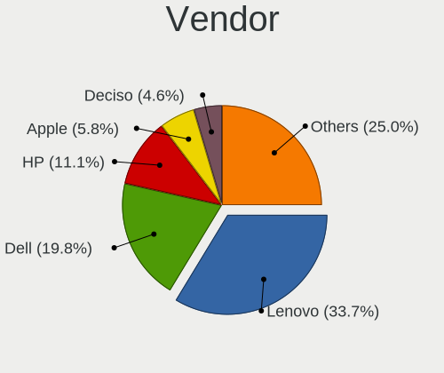

| Name                | Notebooks | Percent |
|---------------------|-----------|---------|
| Lenovo              | 108       | 33.75%  |
| Dell                | 65        | 20.31%  |
| Hewlett-Packard     | 40        | 12.5%   |
| Apple               | 18        | 5.63%   |
| ASUSTek Computer    | 16        | 5%      |
| Acer                | 11        | 3.44%   |
| Deciso              | 10        | 3.13%   |
| System76            | 9         | 2.81%   |
| Framework           | 7         | 2.19%   |
| Toshiba             | 6         | 1.88%   |
| MSI                 | 4         | 1.25%   |
| Unknown             | 3         | 0.94%   |
| Timi                | 2         | 0.63%   |
| Sony                | 2         | 0.63%   |
| IBM                 | 2         | 0.63%   |
| Gateway             | 2         | 0.63%   |
| Datto               | 2         | 0.63%   |
| TUXEDO              | 1         | 0.31%   |
| Samsung Electronics | 1         | 0.31%   |
| Razer               | 1         | 0.31%   |
| Notebook            | 1         | 0.31%   |
| MOTILE              | 1         | 0.31%   |
| GPU Company         | 1         | 0.31%   |
| GPD                 | 1         | 0.31%   |
| Google              | 1         | 0.31%   |
| Gigabyte Technology | 1         | 0.31%   |
| Eluktronics         | 1         | 0.31%   |
| DFI                 | 1         | 0.31%   |
| Chuwi               | 1         | 0.31%   |
| Alienware           | 1         | 0.31%   |

Model
-----

Motherboard model

| Name                                    | Notebooks | Percent |
|-----------------------------------------|-----------|---------|
| Deciso Netboard A20                     | 9         | 2.81%   |
| Framework Laptop                        | 7         | 2.19%   |
| Dell Inspiron 3521                      | 5         | 1.56%   |
| Unknown                                 | 4         | 1.25%   |
| HP Pavilion dv6                         | 3         | 0.94%   |
| HP 2000                                 | 3         | 0.94%   |
| Dell Latitude E5420                     | 3         | 0.94%   |
| Apple MacBookPro6,2                     | 3         | 0.94%   |
| System76 Kudu                           | 2         | 0.63%   |
| System76 Galago Pro                     | 2         | 0.63%   |
| System76 Bonobo Extreme                 | 2         | 0.63%   |
| Lenovo ThinkPad X220 42872WU            | 2         | 0.63%   |
| Lenovo ThinkPad X220 4286CTO            | 2         | 0.63%   |
| Lenovo ThinkPad T60 20076PU             | 2         | 0.63%   |
| Lenovo ThinkPad T430s 2352CTO           | 2         | 0.63%   |
| Dell Precision M4800                    | 2         | 0.63%   |
| Dell Precision 7710                     | 2         | 0.63%   |
| Dell Latitude E7450                     | 2         | 0.63%   |
| Dell Latitude E7240                     | 2         | 0.63%   |
| Dell Latitude D630                      | 2         | 0.63%   |
| Dell Latitude 2100                      | 2         | 0.63%   |
| Datto 1000                              | 2         | 0.63%   |
| ASUS VivoBook_ASUSLaptop X712DAP_M712DA | 2         | 0.63%   |
| ASUS G551JW                             | 2         | 0.63%   |
| Apple MacBookPro9,2                     | 2         | 0.63%   |
| Apple MacBookPro8,3                     | 2         | 0.63%   |
| TUXEDO Pulse 15 Gen1                    | 1         | 0.31%   |
| Toshiba Satellite P755                  | 1         | 0.31%   |
| Toshiba Satellite P25                   | 1         | 0.31%   |
| Toshiba Satellite L775D                 | 1         | 0.31%   |
| Toshiba Satellite C855                  | 1         | 0.31%   |
| Toshiba Satellite C75D-B                | 1         | 0.31%   |
| Toshiba Satellite C655D                 | 1         | 0.31%   |
| Timi TM1701                             | 1         | 0.31%   |
| Timi RedmiBook 14 II                    | 1         | 0.31%   |
| System76 Serval WS                      | 1         | 0.31%   |
| System76 Gazelle                        | 1         | 0.31%   |
| System76 Darter Pro                     | 1         | 0.31%   |
| Sony VGN-P698E                          | 1         | 0.31%   |
| Sony VGN-FW290J                         | 1         | 0.31%   |
| Samsung 950XCJ/951XCJ/950XCR            | 1         | 0.31%   |
| Razer Blade Stealth                     | 1         | 0.31%   |
| Notebook NS50_70MU                      | 1         | 0.31%   |
| MSI X460/X460DX                         | 1         | 0.31%   |
| MSI Summit E13FlipEvo A11MT             | 1         | 0.31%   |
| MSI GS65 Stealth Thin 8RF               | 1         | 0.31%   |
| MSI Bravo 15 A4DDR                      | 1         | 0.31%   |
| MOTILE M142                             | 1         | 0.31%   |
| Lenovo Yoga 6 13ARE05 82FN              | 1         | 0.31%   |
| Lenovo ThinkPad Yoga 11e 20DAS02S00     | 1         | 0.31%   |
| Lenovo ThinkPad X61 7675H7U             | 1         | 0.31%   |
| Lenovo ThinkPad X395 20NL000HGE         | 1         | 0.31%   |
| Lenovo ThinkPad X250 20CMCTO1WW         | 1         | 0.31%   |
| Lenovo ThinkPad X250 20CM0046US         | 1         | 0.31%   |
| Lenovo ThinkPad X250 20CLS1WP01         | 1         | 0.31%   |
| Lenovo ThinkPad X250 20CLS02V00         | 1         | 0.31%   |
| Lenovo ThinkPad X230 Tablet 34383C8     | 1         | 0.31%   |
| Lenovo ThinkPad X230 Tablet 34371N3     | 1         | 0.31%   |
| Lenovo ThinkPad X230 Tablet 343522U     | 1         | 0.31%   |
| Lenovo ThinkPad X230 2325WWB            | 1         | 0.31%   |

Model Family
------------

Motherboard model prefix

| Name                  | Notebooks | Percent |
|-----------------------|-----------|---------|
| Lenovo ThinkPad       | 92        | 28.75%  |
| Dell Latitude         | 26        | 8.13%   |
| Dell Inspiron         | 17        | 5.31%   |
| HP Pavilion           | 11        | 3.44%   |
| Dell Precision        | 10        | 3.13%   |
| Deciso Netboard       | 9         | 2.81%   |
| Lenovo IdeaPad        | 8         | 2.5%    |
| Framework Laptop      | 7         | 2.19%   |
| Toshiba Satellite     | 6         | 1.88%   |
| HP ProBook            | 6         | 1.88%   |
| HP Laptop             | 6         | 1.88%   |
| Dell XPS              | 5         | 1.56%   |
| Acer Aspire           | 5         | 1.56%   |
| HP EliteBook          | 4         | 1.25%   |
| Apple MacBookPro8     | 4         | 1.25%   |
| Unknown               | 4         | 1.25%   |
| HP 2000               | 3         | 0.94%   |
| ASUS VivoBook         | 3         | 0.94%   |
| Apple MacBookPro9     | 3         | 0.94%   |
| Apple MacBookPro6     | 3         | 0.94%   |
| System76 Kudu         | 2         | 0.63%   |
| System76 Galago       | 2         | 0.63%   |
| System76 Bonobo       | 2         | 0.63%   |
| Lenovo Flex           | 2         | 0.63%   |
| IBM ThinkPad          | 2         | 0.63%   |
| HP ZBook              | 2         | 0.63%   |
| HP Stream             | 2         | 0.63%   |
| HP OMEN               | 2         | 0.63%   |
| Dell Vostro           | 2         | 0.63%   |
| Dell G3               | 2         | 0.63%   |
| Datto 1000            | 2         | 0.63%   |
| ASUS G551JW           | 2         | 0.63%   |
| TUXEDO Pulse          | 1         | 0.31%   |
| Timi TM1701           | 1         | 0.31%   |
| Timi RedmiBook        | 1         | 0.31%   |
| System76 Serval       | 1         | 0.31%   |
| System76 Gazelle      | 1         | 0.31%   |
| System76 Darter       | 1         | 0.31%   |
| Sony VGN-P698E        | 1         | 0.31%   |
| Sony VGN-FW290J       | 1         | 0.31%   |
| Samsung 950XCJ        | 1         | 0.31%   |
| Razer Blade           | 1         | 0.31%   |
| Notebook NS50         | 1         | 0.31%   |
| MSI X460              | 1         | 0.31%   |
| MSI Summit            | 1         | 0.31%   |
| MSI GS65              | 1         | 0.31%   |
| MSI Bravo             | 1         | 0.31%   |
| MOTILE M142           | 1         | 0.31%   |
| Lenovo Yoga           | 1         | 0.31%   |
| Lenovo Legion         | 1         | 0.31%   |
| Lenovo G51-35         | 1         | 0.31%   |
| Lenovo G50-80         | 1         | 0.31%   |
| Lenovo 20QD0000US     | 1         | 0.31%   |
| HP G42                | 1         | 0.31%   |
| HP ENVY               | 1         | 0.31%   |
| HP 250                | 1         | 0.31%   |
| HP 15                 | 1         | 0.31%   |
| GPU Company GWTN156-5 | 1         | 0.31%   |
| GPD MicroPC           | 1         | 0.31%   |
| Google Link           | 1         | 0.31%   |

MFG Year
--------

Motherboard manufacture year

| Year    | Notebooks | Percent |
|---------|-----------|---------|
| 2020    | 47        | 14.69%  |
| 2021    | 35        | 10.94%  |
| 2019    | 31        | 9.69%   |
| 2015    | 31        | 9.69%   |
| 2011    | 29        | 9.06%   |
| 2018    | 25        | 7.81%   |
| 2013    | 19        | 5.94%   |
| 2016    | 17        | 5.31%   |
| 2012    | 14        | 4.38%   |
| 2010    | 14        | 4.38%   |
| 2014    | 13        | 4.06%   |
| 2009    | 12        | 3.75%   |
| 2017    | 9         | 2.81%   |
| 2008    | 7         | 2.19%   |
| 2007    | 6         | 1.88%   |
| 2006    | 5         | 1.56%   |
| 2004    | 2         | 0.63%   |
| 2022    | 1         | 0.31%   |
| 2005    | 1         | 0.31%   |
| 2002    | 1         | 0.31%   |
| Unknown | 1         | 0.31%   |

Form Factor
-----------

Physical design of the computer

| Name     | Notebooks | Percent |
|----------|-----------|---------|
| Notebook | 320       | 100%    |

Coreboot
--------

Have coreboot on board

| Used | Notebooks | Percent |
|------|-----------|---------|
| No   | 315       | 98.44%  |
| Yes  | 5         | 1.56%   |

RAM Size
--------

Total RAM memory

| Size in GB  | Notebooks | Percent |
|-------------|-----------|---------|
| 8.01-16.0   | 125       | 38.46%  |
| 16.01-24.0  | 77        | 23.69%  |
| 4.01-8.0    | 55        | 16.92%  |
| 32.01-64.0  | 23        | 7.08%   |
| 3.01-4.0    | 14        | 4.31%   |
| 2.01-3.0    | 14        | 4.31%   |
| 64.01-256.0 | 9         | 2.77%   |
| 1.01-2.0    | 3         | 0.92%   |
| 24.01-32.0  | 2         | 0.62%   |
| 0.51-1.0    | 2         | 0.62%   |
| 0.01-0.5    | 1         | 0.31%   |

RAM Used
--------

Used RAM memory

| Used GB     | Notebooks | Percent |
|-------------|-----------|---------|
| 0.01-0.5    | 162       | 49.54%  |
| 0.51-1.0    | 95        | 29.05%  |
| 1.01-2.0    | 32        | 9.79%   |
| 2.01-3.0    | 17        | 5.2%    |
| 8.01-16.0   | 7         | 2.14%   |
| 4.01-8.0    | 4         | 1.22%   |
| 0           | 4         | 1.22%   |
| 16.01-24.0  | 2         | 0.61%   |
| 3.01-4.0    | 1         | 0.31%   |
| 24.01-32.0  | 1         | 0.31%   |
| 64.01-256.0 | 1         | 0.31%   |
| Unknown     | 1         | 0.31%   |

Total Drives
------------

Number of drives on board

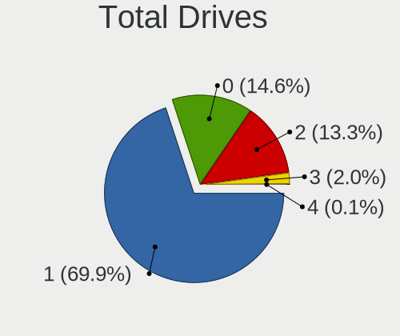

| Drives | Notebooks | Percent |
|--------|-----------|---------|
| 1      | 260       | 78.79%  |
| 2      | 48        | 14.55%  |
| 0      | 11        | 3.33%   |
| 3      | 10        | 3.03%   |
| 4      | 1         | 0.3%    |

Has CD-ROM
----------

Has CD-ROM on board

| Presented | Notebooks | Percent |
|-----------|-----------|---------|
| No        | 210       | 64.81%  |
| Yes       | 114       | 35.19%  |

Has Ethernet
------------

Has Ethernet on board

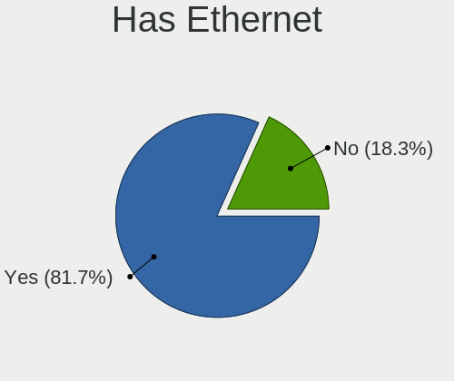

| Presented | Notebooks | Percent |
|-----------|-----------|---------|
| Yes       | 281       | 87.81%  |
| No        | 39        | 12.19%  |

Has WiFi
--------

Has WiFi module

| Presented | Notebooks | Percent |
|-----------|-----------|---------|
| Yes       | 301       | 93.77%  |
| No        | 20        | 6.23%   |

Has Bluetooth
-------------

Has Bluetooth module

| Presented | Notebooks | Percent |
|-----------|-----------|---------|
| Yes       | 203       | 62.65%  |
| No        | 121       | 37.35%  |

Location
--------

Country
-------

Geographic location (country)

| Country | Notebooks | Percent |
|---------|-----------|---------|
| USA     | 320       | 100%    |

City
----

Geographic location (city)

| City             | Notebooks | Percent |
|------------------|-----------|---------|
| Brooklyn         | 21        | 6.18%   |
| Seattle          | 8         | 2.35%   |
| Portland         | 8         | 2.35%   |
| Los Angeles      | 7         | 2.06%   |
| Chicago          | 6         | 1.76%   |
| Washington       | 5         | 1.47%   |
| New York         | 5         | 1.47%   |
| Vienna           | 4         | 1.18%   |
| Frisco           | 4         | 1.18%   |
| Whittier         | 3         | 0.88%   |
| Rochester        | 3         | 0.88%   |
| Phoenix          | 3         | 0.88%   |
| Midvale          | 3         | 0.88%   |
| Harrisburg       | 3         | 0.88%   |
| Eugene           | 3         | 0.88%   |
| Dublin           | 3         | 0.88%   |
| Dallas           | 3         | 0.88%   |
| Charlotte        | 3         | 0.88%   |
| Apex             | 3         | 0.88%   |
| Springfield      | 2         | 0.59%   |
| San Diego        | 2         | 0.59%   |
| San Antonio      | 2         | 0.59%   |
| Queens           | 2         | 0.59%   |
| Papillion        | 2         | 0.59%   |
| Palmer           | 2         | 0.59%   |
| Omaha            | 2         | 0.59%   |
| Oklahoma City    | 2         | 0.59%   |
| New Braunfels    | 2         | 0.59%   |
| Las Vegas        | 2         | 0.59%   |
| Lake Forest      | 2         | 0.59%   |
| Lafayette        | 2         | 0.59%   |
| Hyattsville      | 2         | 0.59%   |
| Henderson        | 2         | 0.59%   |
| Hannibal         | 2         | 0.59%   |
| Gettysburg       | 2         | 0.59%   |
| Fresno           | 2         | 0.59%   |
| Frederick        | 2         | 0.59%   |
| Columbia         | 2         | 0.59%   |
| Clemmons         | 2         | 0.59%   |
| Chapel Hill      | 2         | 0.59%   |
| Belmar           | 2         | 0.59%   |
| Atlanta          | 2         | 0.59%   |
| Ypsilanti        | 1         | 0.29%   |
| Youngsville      | 1         | 0.29%   |
| Yaphank          | 1         | 0.29%   |
| Woodland         | 1         | 0.29%   |
| Wheatland        | 1         | 0.29%   |
| West Valley City | 1         | 0.29%   |
| West Orange      | 1         | 0.29%   |
| Wenatchee        | 1         | 0.29%   |
| Wausau           | 1         | 0.29%   |
| Waukee           | 1         | 0.29%   |
| Warsaw           | 1         | 0.29%   |
| Warrensburg      | 1         | 0.29%   |
| Warner           | 1         | 0.29%   |
| Vandalia         | 1         | 0.29%   |
| Vancouver        | 1         | 0.29%   |
| Valencia         | 1         | 0.29%   |
| Vacaville        | 1         | 0.29%   |
| Urbandale        | 1         | 0.29%   |

Drives
------

Drive Vendor
------------

Hard drive vendors

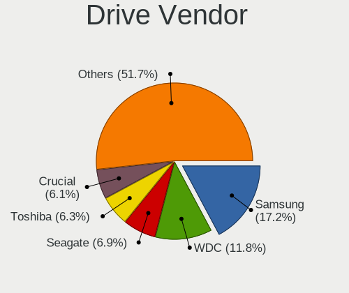

| Vendor              | Notebooks | Drives | Percent |
|---------------------|-----------|--------|---------|
| Samsung Electronics | 66        | 79     | 17.79%  |
| WDC                 | 60        | 63     | 16.17%  |
| Crucial             | 26        | 34     | 7.01%   |
| Toshiba             | 23        | 31     | 6.2%    |
| Seagate             | 23        | 25     | 6.2%    |
| SanDisk             | 21        | 24     | 5.66%   |
| Transcend           | 16        | 28     | 4.31%   |
| NVMe                | 12        | 16     | 3.23%   |
| Kingston            | 11        | 12     | 2.96%   |
| Intel               | 11        | 13     | 2.96%   |
| Hitachi             | 9         | 11     | 2.43%   |
| SK Hynix            | 8         | 8      | 2.16%   |
| Apple               | 8         | 8      | 2.16%   |
| PNY                 | 7         | 8      | 1.89%   |
| Phison              | 7         | 14     | 1.89%   |
| OWC                 | 7         | 8      | 1.89%   |
| HGST                | 7         | 8      | 1.89%   |
| SPCC                | 4         | 4      | 1.08%   |
| KingSpec            | 4         | 4      | 1.08%   |
| Corsair             | 4         | 4      | 1.08%   |
| Zheino              | 3         | 6      | 0.81%   |
| Mushkin             | 3         | 3      | 0.81%   |
| Micron Technology   | 3         | 3      | 0.81%   |
| A-DATA Technology   | 3         | 4      | 0.81%   |
| SSSTC               | 2         | 2      | 0.54%   |
| Netac               | 2         | 2      | 0.54%   |
| Lexar               | 2         | 4      | 0.54%   |
| BIWIN               | 2         | 3      | 0.54%   |
| ZTC                 | 1         | 1      | 0.27%   |
| Team                | 1         | 2      | 0.27%   |
| T-FORCE             | 1         | 1      | 0.27%   |
| Silicon Motion      | 1         | 1      | 0.27%   |
| PLEXTOR             | 1         | 1      | 0.27%   |
| Patriot             | 1         | 1      | 0.27%   |
| OPENBSD             | 1         | 1      | 0.27%   |
| LITEONIT            | 1         | 1      | 0.27%   |
| LITEON              | 1         | 1      | 0.27%   |
| Lenovo              | 1         | 1      | 0.27%   |
| KIOXIA              | 1         | 1      | 0.27%   |
| IBM/Hitachi         | 1         | 1      | 0.27%   |
| Hewlett-Packard     | 1         | 1      | 0.27%   |
| Generic             | 1         | 1      | 0.27%   |
| Fujitsu             | 1         | 1      | 0.27%   |
| FLEXXON             | 1         | 1      | 0.27%   |
| China               | 1         | 1      | 0.27%   |

Drive Model
-----------

Hard drive models

| Model                                | Notebooks | Percent |
|--------------------------------------|-----------|---------|
| Crucial CT500MX500SSD1 500GB         | 9         | 2.37%   |
| Transcend TS256GMTS952T2 256GB       | 8         | 2.11%   |
| Crucial CT1000MX500SSD1 1TB          | 5         | 1.32%   |
| Toshiba MQ01ABD100 1TB               | 4         | 1.06%   |
| Seagate ST500LM021-1KJ152 500GB      | 4         | 1.06%   |
| SanDisk SSD PLUS 240GB               | 4         | 1.06%   |
| Samsung SSD 850 EVO 250GB            | 4         | 1.06%   |
| NVMe WDC PC SN730 SDB 256GB          | 4         | 1.06%   |
| Kingston SA400S37240G 240GB          | 4         | 1.06%   |
| WDC WDS500G3X0C-00SJG0 500GB         | 3         | 0.79%   |
| WDC WDBNCE5000PNC 500GB              | 3         | 0.79%   |
| WDC WD1600BEVT-22ZCT0 160GB          | 3         | 0.79%   |
| Toshiba MQ01ABF050 500GB             | 3         | 0.79%   |
| Samsung SSD 970 EVO Plus 500GB       | 3         | 0.79%   |
| Samsung SSD 970 EVO Plus 1TB         | 3         | 0.79%   |
| Samsung SSD 850 PRO 512GB            | 3         | 0.79%   |
| Samsung SSD 850 EVO 1TB              | 3         | 0.79%   |
| Phison PCIe SSD 512GB                | 3         | 0.79%   |
| Hitachi HTS547550A9E384 500GB        | 3         | 0.79%   |
| Crucial CT120BX500SSD1 120GB         | 3         | 0.79%   |
| WDC WD5000LPCX-24C6HT0 500GB         | 2         | 0.53%   |
| WDC WD10SPZX-24Z10 1TB               | 2         | 0.53%   |
| WDC WD10JPVX-22JC3T0 1TB             | 2         | 0.53%   |
| WDC PC SN730 SDBQNTY-512G-1001 512GB | 2         | 0.53%   |
| WDC PC SN730 NVMe 1024GB             | 2         | 0.53%   |
| WDC PC SN530 SDBPNPZ-256G-1002 256GB | 2         | 0.53%   |
| Transcend TS128GMTS430S 128GB        | 2         | 0.53%   |
| Toshiba KXG50ZNV256G NVMe 256GB      | 2         | 0.53%   |
| SSSTC CVB-8D128-HP 128GB             | 2         | 0.53%   |
| SPCC Solid State Disk 128GB          | 2         | 0.53%   |
| SK Hynix SC311 SATA 256GB            | 2         | 0.53%   |
| Seagate ST500LT012-9WS142 500GB      | 2         | 0.53%   |
| Seagate ST320LT007-9ZV142 320GB      | 2         | 0.53%   |
| Seagate ST2000LM003 HN-M201RAD 2TB   | 2         | 0.53%   |
| Seagate ST1000LM035-1RK172 1TB       | 2         | 0.53%   |
| SanDisk pSSD 256GB                   | 2         | 0.53%   |
| Samsung SSD 860 EVO 500GB            | 2         | 0.53%   |
| Samsung SSD 860 EVO 1TB              | 2         | 0.53%   |
| Samsung SSD 850 EVO 500GB            | 2         | 0.53%   |
| Samsung MZVLW256HEHP-000L7 256GB     | 2         | 0.53%   |
| Samsung MZVLB512HBJQ-000L7 512GB     | 2         | 0.53%   |
| Samsung MZVLB256HBHQ-000L7 256GB     | 2         | 0.53%   |
| Samsung MZNLN256HCHP-000L7 256GB     | 2         | 0.53%   |
| Samsung MZ7TY256HDHP-000L7 256GB     | 2         | 0.53%   |
| OWC Mercury Extreme Pro SSD 240GB    | 2         | 0.53%   |
| OWC Mercury EXTREME Pro 6G SSD       | 2         | 0.53%   |
| OWC Mercury Electra 6G SSD           | 2         | 0.53%   |
| NVMe Samsung SSD 970 250GB           | 2         | 0.53%   |
| Intel SSDSC2KW256G8 256GB            | 2         | 0.53%   |
| Intel SSDPEKKF256G8L 256GB           | 2         | 0.53%   |
| HGST HTS725050A7E630 500GB           | 2         | 0.53%   |
| HGST HTS721010A9E630 1TB             | 2         | 0.53%   |
| Crucial CT525MX300SSD1 528GB         | 2         | 0.53%   |
| BIWIN SSD 256GB                      | 2         | 0.53%   |
| ZTC MS001-128G                       | 1         | 0.26%   |
| Zheino CHN-mSATAQ3-120 120GB         | 1         | 0.26%   |
| Zheino CHN mSATAM1 256 256GB         | 1         | 0.26%   |
| Zheino CHN mSATA01M 060 64GB         | 1         | 0.26%   |
| WDC WDS500G2B0A-00SM50 500GB         | 1         | 0.26%   |
| WDC WDS500G1X0E-00AFY0 500GB         | 1         | 0.26%   |

HDD Vendor
----------

Hard disk drive vendors

| Vendor              | Notebooks | Drives | Percent |
|---------------------|-----------|--------|---------|
| WDC                 | 36        | 37     | 32.43%  |
| Seagate             | 23        | 25     | 20.72%  |
| Toshiba             | 18        | 26     | 16.22%  |
| NVMe                | 10        | 12     | 9.01%   |
| Hitachi             | 9         | 11     | 8.11%   |
| HGST                | 7         | 8      | 6.31%   |
| Apple               | 3         | 3      | 2.7%    |
| Samsung Electronics | 1         | 2      | 0.9%    |
| OPENBSD             | 1         | 1      | 0.9%    |
| IBM/Hitachi         | 1         | 1      | 0.9%    |
| Generic             | 1         | 1      | 0.9%    |
| Fujitsu             | 1         | 1      | 0.9%    |

SSD Vendor
----------

Solid state drive vendors

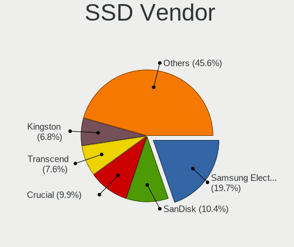

| Vendor              | Notebooks | Drives | Percent |
|---------------------|-----------|--------|---------|
| Samsung Electronics | 45        | 50     | 23.56%  |
| Crucial             | 23        | 29     | 12.04%  |
| SanDisk             | 21        | 24     | 10.99%  |
| Transcend           | 15        | 27     | 7.85%   |
| Kingston            | 9         | 9      | 4.71%   |
| WDC                 | 8         | 8      | 4.19%   |
| PNY                 | 7         | 8      | 3.66%   |
| OWC                 | 7         | 8      | 3.66%   |
| Intel               | 7         | 8      | 3.66%   |
| SK Hynix            | 5         | 5      | 2.62%   |
| Apple               | 5         | 5      | 2.62%   |
| KingSpec            | 4         | 4      | 2.09%   |
| Corsair             | 4         | 4      | 2.09%   |
| Zheino              | 3         | 6      | 1.57%   |
| SPCC                | 3         | 3      | 1.57%   |
| NVMe                | 3         | 3      | 1.57%   |
| SSSTC               | 2         | 2      | 1.05%   |
| Phison              | 2         | 2      | 1.05%   |
| Netac               | 2         | 2      | 1.05%   |
| Mushkin             | 2         | 2      | 1.05%   |
| Lexar               | 2         | 4      | 1.05%   |
| BIWIN               | 2         | 3      | 1.05%   |
| A-DATA Technology   | 2         | 2      | 1.05%   |
| ZTC                 | 1         | 1      | 0.52%   |
| Team                | 1         | 2      | 0.52%   |
| PLEXTOR             | 1         | 1      | 0.52%   |
| Patriot             | 1         | 1      | 0.52%   |
| LITEONIT            | 1         | 1      | 0.52%   |
| Hewlett-Packard     | 1         | 1      | 0.52%   |
| FLEXXON             | 1         | 1      | 0.52%   |
| China               | 1         | 1      | 0.52%   |

Drive Kind
----------

HDD or SSD

| Kind | Notebooks | Drives | Percent |
|------|-----------|--------|---------|
| SSD  | 171       | 227    | 49.57%  |
| HDD  | 109       | 128    | 31.59%  |
| NVMe | 65        | 92     | 18.84%  |

Drive Connector
---------------

SATA, SAS, NVMe, etc.

| Type | Notebooks | Drives | Percent |
|------|-----------|--------|---------|
| SATA | 264       | 355    | 80.24%  |
| NVMe | 65        | 92     | 19.76%  |

Drive Size
----------

Size of hard drive

| Size in TB | Notebooks | Drives | Percent |
|------------|-----------|--------|---------|
| 0.01-0.5   | 203       | 263    | 72.5%   |
| 0.51-1.0   | 70        | 83     | 25%     |
| 1.01-2.0   | 7         | 9      | 2.5%    |

Space Total
-----------

Amount of disk space available on the file system

| Size in GB | Notebooks | Percent |
|------------|-----------|---------|
| 101-250    | 113       | 33.63%  |
| 251-500    | 92        | 27.38%  |
| 1-20       | 54        | 16.07%  |
| 501-1000   | 40        | 11.9%   |
| 51-100     | 19        | 5.65%   |
| 21-50      | 9         | 2.68%   |
| 1001-2000  | 7         | 2.08%   |
| Unknown    | 2         | 0.6%    |

Space Used
----------

Amount of used disk space

| Used GB | Notebooks | Percent |
|---------|-----------|---------|
| 1-20    | 276       | 83.38%  |
| 21-50   | 30        | 9.06%   |
| 101-250 | 11        | 3.32%   |
| 51-100  | 11        | 3.32%   |
| Unknown | 2         | 0.6%    |
| 251-500 | 1         | 0.3%    |

Malfunc. Drives
---------------

Drive models with a malfunction

| Model                                              | Notebooks | Drives | Percent |
|----------------------------------------------------|-----------|--------|---------|
| Seagate ST500LM021-1KJ152 500GB                    | 3         | 3      | 6.98%   |
| SSSTC CVB-8D128-HP 128GB                           | 2         | 2      | 4.65%   |
| WDC WD5000LPCX-75VHAT0 500GB                       | 1         | 1      | 2.33%   |
| WDC WD3200BPVT-75ZEST0 320GB                       | 1         | 1      | 2.33%   |
| WDC WD3200BPVT-75JJ5T0 320GB                       | 1         | 1      | 2.33%   |
| WDC WD3200BEKT-60V5T1 320GB                        | 1         | 1      | 2.33%   |
| WDC WD1600BEKT-66F3T2 160GB                        | 1         | 1      | 2.33%   |
| Toshiba MQ01ABF050 500GB                           | 1         | 1      | 2.33%   |
| Toshiba MQ01ABD100 1TB                             | 1         | 1      | 2.33%   |
| Toshiba MQ01ABD075 752GB                           | 1         | 1      | 2.33%   |
| Toshiba MK7559GSXF 752GB                           | 1         | 1      | 2.33%   |
| Toshiba MK5061GSYN 500GB                           | 1         | 1      | 2.33%   |
| Toshiba MK3265GSXN 320GB                           | 1         | 6      | 2.33%   |
| Toshiba MK1637GSX 160GB                            | 1         | 2      | 2.33%   |
| SK Hynix SC210 mSATA 256GB                         | 1         | 1      | 2.33%   |
| Seagate ST96023AS 58GB                             | 1         | 1      | 2.33%   |
| Seagate ST95005620AS 500GB                         | 1         | 1      | 2.33%   |
| Seagate ST9320423AS 320GB                          | 1         | 1      | 2.33%   |
| Seagate ST500LT012-9WS142 500GB                    | 1         | 1      | 2.33%   |
| Seagate ST320LT007-9ZV142 320GB                    | 1         | 1      | 2.33%   |
| Seagate ST2000LM003 HN-M201RAD 2TB                 | 1         | 1      | 2.33%   |
| SanDisk SSD PLUS 240GB                             | 1         | 1      | 2.33%   |
| SanDisk SD5SG2128G1052E 128GB                      | 1         | 1      | 2.33%   |
| Samsung Electronics SSD UM410 Series 2.5-inch 16GB | 1         | 1      | 2.33%   |
| Samsung Electronics HM121HI 120GB                  | 1         | 2      | 2.33%   |
| Kingston SV300S37A120G 120GB                       | 1         | 1      | 2.33%   |
| Kingston SNS4151S332G 32GB                         | 1         | 1      | 2.33%   |
| Kingston SMSM151S3128GD 128GB                      | 1         | 1      | 2.33%   |
| Kingston SA400S37240G 240GB                        | 1         | 1      | 2.33%   |
| KingSpec KSD-PA25.6-032MS 32GB                     | 1         | 1      | 2.33%   |
| Intel SSDSC2KW256G8 256GB                          | 1         | 1      | 2.33%   |
| IBM/Hitachi IC25N080ATMR04-0 80GB                  | 1         | 1      | 2.33%   |
| Hitachi HTS722010K9SA00 100GB                      | 1         | 1      | 2.33%   |
| Hitachi HTS547550A9E384 500GB                      | 1         | 1      | 2.33%   |
| Hitachi HTS545025B9SA02 250GB                      | 1         | 2      | 2.33%   |
| Hitachi HTS543225A7A384 250GB                      | 1         | 1      | 2.33%   |
| HGST HTS725025A7E630 250GB                         | 1         | 1      | 2.33%   |
| HGST HTS721010A9E630 1TB                           | 1         | 1      | 2.33%   |
| HGST HTS545050A7E680 500GB                         | 1         | 1      | 2.33%   |
| Apple HDD HTS545050A7E362 500GB                    | 1         | 1      | 2.33%   |

Malfunc. Drive Vendor
---------------------

Vendors of faulty drives

| Vendor              | Notebooks | Drives | Percent |
|---------------------|-----------|--------|---------|
| Seagate             | 9         | 9      | 20.93%  |
| Toshiba             | 7         | 13     | 16.28%  |
| WDC                 | 5         | 5      | 11.63%  |
| Kingston            | 4         | 4      | 9.3%    |
| Hitachi             | 4         | 5      | 9.3%    |
| HGST                | 3         | 3      | 6.98%   |
| SSSTC               | 2         | 2      | 4.65%   |
| SanDisk             | 2         | 2      | 4.65%   |
| Samsung Electronics | 2         | 3      | 4.65%   |
| SK Hynix            | 1         | 1      | 2.33%   |
| KingSpec            | 1         | 1      | 2.33%   |
| Intel               | 1         | 1      | 2.33%   |
| IBM/Hitachi         | 1         | 1      | 2.33%   |
| Apple               | 1         | 1      | 2.33%   |

Malfunc. HDD Vendor
-------------------

Vendors of faulty HDD drives

| Vendor              | Notebooks | Drives | Percent |
|---------------------|-----------|--------|---------|
| Seagate             | 9         | 9      | 29.03%  |
| Toshiba             | 7         | 13     | 22.58%  |
| WDC                 | 5         | 5      | 16.13%  |
| Hitachi             | 4         | 5      | 12.9%   |
| HGST                | 3         | 3      | 9.68%   |
| Samsung Electronics | 1         | 2      | 3.23%   |
| IBM/Hitachi         | 1         | 1      | 3.23%   |
| Apple               | 1         | 1      | 3.23%   |

Malfunc. Drive Kind
-------------------

Kinds of faulty drives

| Kind | Notebooks | Drives | Percent |
|------|-----------|--------|---------|
| HDD  | 31        | 39     | 72.09%  |
| SSD  | 12        | 12     | 27.91%  |

Failed Drives
-------------

Failed drive models

Zero info for selected period =(

Failed Drive Vendor
-------------------

Failed drive vendors

Zero info for selected period =(

Drive Status
------------

Number of failed and malfunc. drives

| Status   | Notebooks | Drives | Percent |
|----------|-----------|--------|---------|
| Works    | 268       | 377    | 82.46%  |
| Malfunc  | 43        | 51     | 13.23%  |
| Detected | 14        | 19     | 4.31%   |

Storage controller
------------------

Storage Vendor
--------------

Storage controller vendors

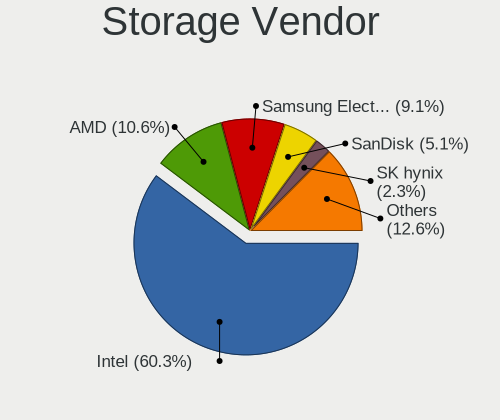

| Vendor                           | Notebooks | Percent |
|----------------------------------|-----------|---------|
| Intel                            | 225       | 62.67%  |
| AMD                              | 48        | 13.37%  |
| Samsung Electronics              | 27        | 7.52%   |
| Sandisk                          | 20        | 5.57%   |
| Phison Electronics               | 6         | 1.67%   |
| Toshiba                          | 5         | 1.39%   |
| SK Hynix                         | 5         | 1.39%   |
| Micron Technology                | 4         | 1.11%   |
| Silicon Motion                   | 2         | 0.56%   |
| Nvidia                           | 2         | 0.56%   |
| Lenovo                           | 2         | 0.56%   |
| KIOXIA                           | 2         | 0.56%   |
| Kingston Technology Company      | 2         | 0.56%   |
| JMicron Technology               | 2         | 0.56%   |
| Union Memory (Shenzhen)          | 1         | 0.28%   |
| Silicon Integrated Systems [SiS] | 1         | 0.28%   |
| Realtek Semiconductor            | 1         | 0.28%   |
| Micron/Crucial Technology        | 1         | 0.28%   |
| Lite-On Technology               | 1         | 0.28%   |
| ADATA Technology                 | 1         | 0.28%   |
| Unknown                          | 1         | 0.28%   |

Storage Model
-------------

Storage controller models

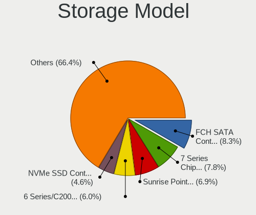

| Model                                                                          | Notebooks | Percent |
|--------------------------------------------------------------------------------|-----------|---------|
| AMD FCH SATA Controller [AHCI mode]                                            | 40        | 10.31%  |
| Intel 7 Series Chipset Family 6-port SATA Controller [AHCI mode]               | 36        | 9.28%   |
| Intel 6 Series/C200 Series Chipset Family 6 port Mobile SATA AHCI Controller   | 28        | 7.22%   |
| Intel Sunrise Point-LP SATA Controller [AHCI mode]                             | 20        | 5.15%   |
| Samsung NVMe SSD Controller SM981/PM981/PM983                                  | 18        | 4.64%   |
| Intel Wildcat Point-LP SATA Controller [AHCI Mode]                             | 14        | 3.61%   |
| Sandisk WD Black SN750 / PC SN730 NVMe SSD                                     | 12        | 3.09%   |
| Intel Cannon Lake Mobile PCH SATA AHCI Controller                              | 11        | 2.84%   |
| Intel 82801HM/HEM (ICH8M/ICH8M-E) IDE Controller                               | 11        | 2.84%   |
| Intel 82801 Mobile SATA Controller [RAID mode]                                 | 11        | 2.84%   |
| Intel 8 Series/C220 Series Chipset Family 6-port SATA Controller 1 [AHCI mode] | 11        | 2.84%   |
| Intel 82801HM/HEM (ICH8M/ICH8M-E) SATA Controller [AHCI mode]                  | 10        | 2.58%   |
| Intel 5 Series/3400 Series Chipset 4 port SATA AHCI Controller                 | 10        | 2.58%   |
| Unknown                                                                        | 10        | 2.58%   |
| Intel 8 Series SATA Controller 1 [AHCI mode]                                   | 9         | 2.32%   |
| Intel 82801GBM/GHM (ICH7-M Family) SATA Controller [AHCI mode]                 | 7         | 1.8%    |
| Intel Q170/Q150/B150/H170/H110/Z170/CM236 Chipset SATA Controller [AHCI Mode]  | 6         | 1.55%   |
| Intel 82801G (ICH7 Family) IDE Controller                                      | 6         | 1.55%   |
| AMD SB7x0/SB8x0/SB9x0 SATA Controller [AHCI mode]                              | 6         | 1.55%   |
| Intel 5 Series/3400 Series Chipset 6 port SATA AHCI Controller                 | 5         | 1.29%   |
| Samsung NVMe SSD Controller SM961/PM961/SM963                                  | 4         | 1.03%   |
| Phison E12 NVMe Controller                                                     | 4         | 1.03%   |
| Intel HM170/QM170 Chipset SATA Controller [AHCI Mode]                          | 4         | 1.03%   |
| Intel Comet Lake SATA AHCI Controller                                          | 4         | 1.03%   |
| Intel 82801IBM/IEM (ICH9M/ICH9M-E) 4 port SATA Controller [AHCI mode]          | 4         | 1.03%   |
| Toshiba unknown                                                                | 3         | 0.77%   |
| Sandisk WD Blue SN550 NVMe SSD                                                 | 3         | 0.77%   |
| Intel SSD Pro 7600p/760p/E 6100p Series                                        | 3         | 0.77%   |
| Intel Celeron/Pentium Silver Processor SATA Controller                         | 3         | 0.77%   |
| Intel Cannon Point-LP SATA Controller [AHCI Mode]                              | 3         | 0.77%   |
| Intel 7 Series Chipset Family 4-port SATA Controller [IDE mode]                | 3         | 0.77%   |
| Intel 7 Series Chipset Family 2-port SATA Controller [IDE mode]                | 3         | 0.77%   |
| AMD FCH IDE Controller                                                         | 3         | 0.77%   |
| SK Hynix hynix unknown                                                         | 2         | 0.52%   |
| Silicon Motion SM2263EN/SM2263XT SSD Controller                                | 2         | 0.52%   |
| Sandisk WD PC SN810 / Black SN850 NVMe SSD                                     | 2         | 0.52%   |
| Samsung NVMe SSD Controller 980                                                | 2         | 0.52%   |
| Nvidia MCP79 AHCI Controller                                                   | 2         | 0.52%   |
| Lenovo unknown                                                                 | 2         | 0.52%   |
| KIOXIA unknown                                                                 | 2         | 0.52%   |
| JMicron JMB360 AHCI Controller                                                 | 2         | 0.52%   |
| Intel Atom Processor E3800 Series SATA AHCI Controller                         | 2         | 0.52%   |
| Intel 82801HM/HEM (ICH8M/ICH8M-E) SATA Controller [IDE mode]                   | 2         | 0.52%   |
| Intel 82801GBM/GHM (ICH7-M Family) SATA Controller [IDE mode]                  | 2         | 0.52%   |
| Intel 82801FBM (ICH6M) SATA Controller                                         | 2         | 0.52%   |
| Intel 5 Series/3400 Series Chipset 4 port SATA IDE Controller                  | 2         | 0.52%   |
| Intel 5 Series/3400 Series Chipset 2 port SATA IDE Controller                  | 2         | 0.52%   |
| Intel 400 Series Chipset Family SATA AHCI Controller                           | 2         | 0.52%   |
| Union Memory (Shenzhen) Memory unknown                                         | 1         | 0.26%   |
| Toshiba XG6 NVMe SSD Controller                                                | 1         | 0.26%   |
| Toshiba BG3 NVMe SSD Controller                                                | 1         | 0.26%   |
| SK Hynix Gold P31 SSD                                                          | 1         | 0.26%   |
| SK Hynix BC511                                                                 | 1         | 0.26%   |
| SK Hynix BC501 NVMe Solid State Drive                                          | 1         | 0.26%   |
| Silicon Integrated Systems [SiS] 5518 UDMA IDE Controller                      | 1         | 0.26%   |
| Sandisk WD Blue SN500 / PC SN520 NVMe SSD                                      | 1         | 0.26%   |
| Sandisk unknown                                                                | 1         | 0.26%   |
| Sandisk PC SN520 NVMe SSD                                                      | 1         | 0.26%   |
| Samsung SM951 AHCI                                                             | 1         | 0.26%   |
| Samsung NVMe SSD Controller PM9A1/PM9A3/980PRO                                 | 1         | 0.26%   |

Storage Kind
------------

Kind of storage controller (IDE, SATA, NVMe, SAS, ...)

| Kind | Notebooks | Percent |
|------|-----------|---------|
| SATA | 242       | 65.41%  |
| NVMe | 76        | 20.54%  |
| IDE  | 40        | 10.81%  |
| RAID | 12        | 3.24%   |

Processor
---------

CPU Vendor
----------

Processor vendors

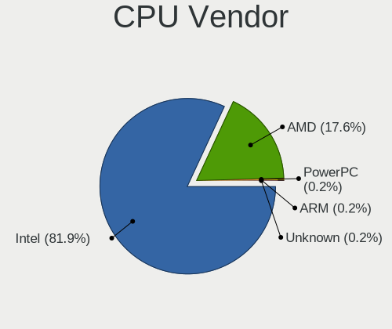

| Vendor | Notebooks | Percent |
|--------|-----------|---------|
| Intel  | 261       | 81.31%  |
| AMD    | 59        | 18.38%  |
| ARM    | 1         | 0.31%   |

CPU Model
---------

Processor models

| Model                                    | Notebooks | Percent |
|------------------------------------------|-----------|---------|
| Intel Core i5-3320M CPU @ 2.60GHz        | 13        | 3.99%   |
| Intel Core i5-2520M CPU @ 2.50GHz        | 7         | 2.15%   |
| Intel Core i5-8250U CPU @ 1.60GHz        | 6         | 1.84%   |
| Intel Core i5-5300U CPU @ 2.30GHz        | 5         | 1.53%   |
| Intel Core i5-5200U CPU @ 2.20GHz        | 5         | 1.53%   |
| Intel Core i3-3227U CPU @ 1.90GHz        | 5         | 1.53%   |
| Intel Core 2 Duo                         | 5         | 1.53%   |
| AMD Ryzen 7 4800H with Radeon Graphics   | 5         | 1.53%   |
| AMD EPYC 3201 8-Core Processor           | 5         | 1.53%   |
| Intel Core i7-3520M CPU @ 2.90GHz        | 4         | 1.23%   |
| Intel Core i7-10510U CPU @ 1.80GHz       | 4         | 1.23%   |
| Intel Core 2 Duo CPU T7300 @ 2.00GHz     | 4         | 1.23%   |
| Intel 11th Gen Core i7-1165G7 @ 2.80GHz  | 4         | 1.23%   |
| Intel 11th Gen Core i5-1135G7 @ 2.40GHz  | 4         | 1.23%   |
| AMD EPYC 3101 4-Core Processor           | 4         | 1.23%   |
| Intel CPU Version                        | 3         | 0.92%   |
| Intel Core i7-8750H CPU @ 2.20GHz        | 3         | 0.92%   |
| Intel Core i7-8565U CPU @ 1.80GHz        | 3         | 0.92%   |
| Intel Core i7-8550U CPU @ 1.80GHz        | 3         | 0.92%   |
| Intel Core i7-6820HQ CPU @ 2.70GHz       | 3         | 0.92%   |
| Intel Core i7-6600U CPU @ 2.60GHz        | 3         | 0.92%   |
| Intel Core i5-7200U CPU @ 2.50GHz        | 3         | 0.92%   |
| Intel Core i5-6440HQ CPU @ 2.60GHz       | 3         | 0.92%   |
| Intel Pentium Silver N5030 CPU @ 1.10GHz | 2         | 0.61%   |
| Intel Pentium M processor                | 2         | 0.61%   |
| Intel Pentium 4                          | 2         | 0.61%   |
| Intel Genuine CPU                        | 2         | 0.61%   |
| Intel Core i9-8950HK CPU @ 2.90GHz       | 2         | 0.61%   |
| Intel Core i7-9750H CPU @ 2.60GHz        | 2         | 0.61%   |
| Intel Core i7-7500U CPU @ 2.70GHz        | 2         | 0.61%   |
| Intel Core i7-6700HQ CPU @ 2.60GHz       | 2         | 0.61%   |
| Intel Core i7-6500U CPU @ 2.50GHz        | 2         | 0.61%   |
| Intel Core i7-5600U CPU @ 2.60GHz        | 2         | 0.61%   |
| Intel Core i7-4800MQ CPU @ 2.70GHz       | 2         | 0.61%   |
| Intel Core i7-4720HQ CPU @ 2.60GHz       | 2         | 0.61%   |
| Intel Core i7-4600U CPU @ 2.10GHz        | 2         | 0.61%   |
| Intel Core i7-3720QM CPU @ 2.60GHz       | 2         | 0.61%   |
| Intel Core i7-2760QM CPU @ 2.40GHz       | 2         | 0.61%   |
| Intel Core i7-2670QM CPU @ 2.20GHz       | 2         | 0.61%   |
| Intel Core i7-1065G7 CPU @ 1.30GHz       | 2         | 0.61%   |
| Intel Core i7 CPU M 620 @ 2.67GHz        | 2         | 0.61%   |
| Intel Core i5-7300U CPU @ 2.60GHz        | 2         | 0.61%   |
| Intel Core i5-7300HQ CPU @ 2.50GHz       | 2         | 0.61%   |
| Intel Core i5-6300U CPU @ 2.40GHz        | 2         | 0.61%   |
| Intel Core i5-6200U CPU @ 2.30GHz        | 2         | 0.61%   |
| Intel Core i5-4310U CPU @ 2.00GHz        | 2         | 0.61%   |
| Intel Core i5-4300M CPU @ 2.60GHz        | 2         | 0.61%   |
| Intel Core i5-3230M CPU @ 2.60GHz        | 2         | 0.61%   |
| Intel Core i5-3210M CPU @ 2.50GHz        | 2         | 0.61%   |
| Intel Core i5-2540M CPU @ 2.60GHz        | 2         | 0.61%   |
| Intel Core i5-2520M CPU @ 2.50GH         | 2         | 0.61%   |
| Intel Core i5-2450M CPU @ 2.50GHz        | 2         | 0.61%   |
| Intel Core i5-10300H CPU @ 2.50GHz       | 2         | 0.61%   |
| Intel Core i5-10210U CPU @ 1.60GHz       | 2         | 0.61%   |
| Intel Core i5 CPU M 560 @ 2.67GHz        | 2         | 0.61%   |
| Intel Core i5 CPU M 540 @ 2.53GHz        | 2         | 0.61%   |
| Intel Core i3-8145U CPU @ 2.10GHz        | 2         | 0.61%   |
| Intel Core 2 Duo CPU P8400 @ 2.26GHz     | 2         | 0.61%   |
| Intel Core 2 CPU T7200 @ 2.00GHz         | 2         | 0.61%   |
| Intel Core 2 CPU                         | 2         | 0.61%   |

CPU Model Family
----------------

Processor model prefix

| Model                  | Notebooks | Percent |
|------------------------|-----------|---------|
| Intel Core i5          | 95        | 29.32%  |
| Intel Core i7          | 77        | 23.77%  |
| Other                  | 20        | 6.17%   |
| Intel Core 2 Duo       | 19        | 5.86%   |
| Intel Core i3          | 18        | 5.56%   |
| Intel Celeron          | 9         | 2.78%   |
| AMD Ryzen 7            | 9         | 2.78%   |
| AMD EPYC               | 9         | 2.78%   |
| AMD Ryzen 5            | 6         | 1.85%   |
| Intel Atom             | 5         | 1.54%   |
| Intel Core 2           | 4         | 1.23%   |
| AMD Ryzen 5 PRO        | 4         | 1.23%   |
| Intel Pentium M        | 3         | 0.93%   |
| Intel Core i9          | 3         | 0.93%   |
| AMD Ryzen 7 PRO        | 3         | 0.93%   |
| AMD Ryzen 3            | 3         | 0.93%   |
| AMD A10                | 3         | 0.93%   |
| Intel Xeon             | 2         | 0.62%   |
| Intel Pentium Silver   | 2         | 0.62%   |
| Intel Pentium 4        | 2         | 0.62%   |
| Intel Pentium          | 2         | 0.62%   |
| Intel Genuine          | 2         | 0.62%   |
| AMD GX                 | 2         | 0.62%   |
| AMD E                  | 2         | 0.62%   |
| AMD C-50               | 2         | 0.62%   |
| AMD A8                 | 2         | 0.62%   |
| AMD A6                 | 2         | 0.62%   |
| Intel Pentium Dual     | 1         | 0.31%   |
| Intel Mobile Pentium 4 | 1         | 0.31%   |
| Intel Mobile Celeron   | 1         | 0.31%   |
| Intel Core m3          | 1         | 0.31%   |
| Intel Core 2 Extreme   | 1         | 0.31%   |
| ARM Cortex             | 1         | 0.31%   |
| AMD Ryzen Embedded     | 1         | 0.31%   |
| AMD Ryzen 9            | 1         | 0.31%   |
| AMD Phenom II          | 1         | 0.31%   |
| AMD E2                 | 1         | 0.31%   |
| AMD E1                 | 1         | 0.31%   |
| AMD C-60               | 1         | 0.31%   |
| AMD Athlon II Neo      | 1         | 0.31%   |
| AMD A12                | 1         | 0.31%   |

CPU Cores
---------

Number of processor cores

| Number  | Notebooks | Percent |
|---------|-----------|---------|
| 2       | 148       | 45.82%  |
| 4       | 99        | 30.65%  |
| Unknown | 26        | 8.05%   |
| 8       | 20        | 6.19%   |
| 6       | 9         | 2.79%   |
| 1       | 9         | 2.79%   |
| 16      | 8         | 2.48%   |
| 12      | 4         | 1.24%   |

CPU Sockets
-----------

Number of sockets

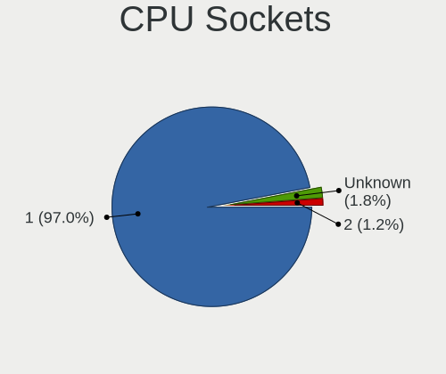

| Number  | Notebooks | Percent |
|---------|-----------|---------|
| 1       | 312       | 96.89%  |
| Unknown | 7         | 2.17%   |
| 2       | 3         | 0.93%   |

CPU Threads
-----------

Threads per core (Hyper-Threading)

| Number  | Notebooks | Percent |
|---------|-----------|---------|
| 2       | 209       | 64.71%  |
| 1       | 83        | 25.7%   |
| Unknown | 31        | 9.6%    |

CPU Microarch
-------------

Microarchitecture

| Name          | Notebooks | Percent |
|---------------|-----------|---------|
| KabyLake      | 50        | 15.58%  |
| IvyBridge     | 36        | 11.21%  |
| SandyBridge   | 32        | 9.97%   |
| Haswell       | 26        | 8.1%    |
| Skylake       | 19        | 5.92%   |
| Westmere      | 16        | 4.98%   |
| Broadwell     | 16        | 4.98%   |
| Core          | 14        | 4.36%   |
| Zen           | 12        | 3.74%   |
| Zen 2         | 11        | 3.43%   |
| Zen+          | 10        | 3.12%   |
| Penryn        | 10        | 3.12%   |
| TigerLake     | 9         | 2.8%    |
| Bonnell       | 8         | 2.49%   |
| Bobcat        | 7         | 2.18%   |
| Silvermont    | 4         | 1.25%   |
| Goldmont plus | 4         | 1.25%   |
| Excavator     | 4         | 1.25%   |
| CometLake     | 4         | 1.25%   |
| Puma          | 3         | 0.93%   |
| P6            | 3         | 0.93%   |
| NetBurst      | 3         | 0.93%   |
| IceLake       | 3         | 0.93%   |
| Unknown       | 3         | 0.93%   |
| Nehalem       | 2         | 0.62%   |
| K10 Llano     | 2         | 0.62%   |
| K10           | 2         | 0.62%   |
| Jaguar        | 2         | 0.62%   |
| Goldmont      | 2         | 0.62%   |
| Zen 3         | 1         | 0.31%   |
| Steamroller   | 1         | 0.31%   |
| Piledriver    | 1         | 0.31%   |
| K8 Hammer     | 1         | 0.31%   |

Graphics
--------

GPU Vendor
----------

Vendors of graphics cards

| Vendor                           | Notebooks | Percent |
|----------------------------------|-----------|---------|
| Intel                            | 231       | 64.35%  |
| AMD                              | 67        | 18.66%  |
| Nvidia                           | 60        | 16.71%  |
| Silicon Integrated Systems [SiS] | 1         | 0.28%   |

GPU Model
---------

Graphics card models

| Model                                                                         | Notebooks | Percent |
|-------------------------------------------------------------------------------|-----------|---------|
| Intel 3rd Gen Core processor Graphics Controller                              | 34        | 9.04%   |
| Intel 2nd Generation Core Processor Family Integrated Graphics Controller     | 30        | 7.98%   |
| Intel HD Graphics 5500                                                        | 14        | 3.72%   |
| Intel Core Processor Integrated Graphics Controller                           | 14        | 3.72%   |
| Intel Haswell-ULT Integrated Graphics Controller                              | 12        | 3.19%   |
| Intel 4th Gen Core Processor Integrated Graphics Controller                   | 12        | 3.19%   |
| Intel UHD Graphics 620                                                        | 10        | 2.66%   |
| Intel Skylake GT2 [HD Graphics 520]                                           | 10        | 2.66%   |
| AMD Renoir                                                                    | 10        | 2.66%   |
| AMD Picasso/Raven 2 [Radeon Vega Series / Radeon Vega Mobile Series]          | 10        | 2.66%   |
| Intel TigerLake-LP GT2 [Iris Xe Graphics]                                     | 9         | 2.39%   |
| Intel HD Graphics 620                                                         | 8         | 2.13%   |
| Intel HD Graphics 530                                                         | 8         | 2.13%   |
| Intel CoffeeLake-H GT2 [UHD Graphics 630]                                     | 8         | 2.13%   |
| Intel WhiskeyLake-U GT2 [UHD Graphics 620]                                    | 7         | 1.86%   |
| Intel Mobile GM965/GL960 Integrated Graphics Controller (secondary)           | 7         | 1.86%   |
| Intel Mobile GM965/GL960 Integrated Graphics Controller (primary)             | 7         | 1.86%   |
| Intel Mobile 945GM/GMS/GME, 943/940GML Express Integrated Graphics Controller | 7         | 1.86%   |
| Intel CometLake-U GT2 [UHD Graphics]                                          | 7         | 1.86%   |
| Intel Mobile 945GSE Express Integrated Graphics Controller                    | 6         | 1.6%    |
| Intel Mobile 4 Series Chipset Integrated Graphics Controller                  | 6         | 1.6%    |
| Intel HD Graphics 630                                                         | 5         | 1.33%   |
| Nvidia TU116M [GeForce GTX 1660 Ti Mobile]                                    | 4         | 1.06%   |
| Nvidia GP107M [GeForce GTX 1050 Ti Mobile]                                    | 4         | 1.06%   |
| Nvidia G86M [Quadro NVS 140M]                                                 | 4         | 1.06%   |
| Nvidia GT216M [GeForce GT 330M]                                               | 3         | 0.8%    |
| Intel CometLake-H GT2 [UHD Graphics]                                          | 3         | 0.8%    |
| Intel Atom Processor Z36xxx/Z37xxx Series Graphics & Display                  | 3         | 0.8%    |
| AMD RV515/M54 [Mobility Radeon X1400]                                         | 3         | 0.8%    |
| Nvidia TU117M [GeForce GTX 1650 Mobile / Max-Q]                               | 2         | 0.53%   |
| Nvidia TU117M                                                                 | 2         | 0.53%   |
| Nvidia TU106M [GeForce RTX 2070 Mobile / Max-Q Refresh]                       | 2         | 0.53%   |
| Nvidia GT218M [NVS 3100M]                                                     | 2         | 0.53%   |
| Nvidia GP108M [GeForce MX150]                                                 | 2         | 0.53%   |
| Nvidia GM107M [GeForce GTX 960M]                                              | 2         | 0.53%   |
| Nvidia GK107M [GeForce GT 650M Mac Edition]                                   | 2         | 0.53%   |
| Nvidia GF108GLM [NVS 5200M]                                                   | 2         | 0.53%   |
| Nvidia C79 [GeForce 9400M]                                                    | 2         | 0.53%   |
| Intel Iris Plus Graphics G7                                                   | 2         | 0.53%   |
| Intel GeminiLake [UHD Graphics 605]                                           | 2         | 0.53%   |
| Intel GeminiLake [UHD Graphics 600]                                           | 2         | 0.53%   |
| AMD Wrestler [Radeon HD 6250]                                                 | 2         | 0.53%   |
| AMD Wani [Radeon R5/R6/R7 Graphics]                                           | 2         | 0.53%   |
| AMD Venus XTX [Radeon HD 8890M / R9 M275X/M375X]                              | 2         | 0.53%   |
| AMD Sumo [Radeon HD 6520G]                                                    | 2         | 0.53%   |
| AMD Stoney [Radeon R2/R3/R4/R5 Graphics]                                      | 2         | 0.53%   |
| AMD RV370/M22 [Mobility Radeon X300]                                          | 2         | 0.53%   |
| AMD RS880M [Mobility Radeon HD 4225/4250]                                     | 2         | 0.53%   |
| AMD Raven Ridge [Radeon Vega Series / Radeon Vega Mobile Series]              | 2         | 0.53%   |
| AMD Mullins [Radeon R4/R5 Graphics]                                           | 2         | 0.53%   |
| AMD Kabini [Radeon HD 8330E]                                                  | 2         | 0.53%   |
| Silicon Integrated Systems [SiS] 65x/M650/740 PCI/AGP VGA Display Adapter     | 1         | 0.27%   |
| Nvidia TU117M [GeForce GTX 1650 Ti Mobile]                                    | 1         | 0.27%   |
| Nvidia TU117GLM [Quadro T2000 Mobile / Max-Q]                                 | 1         | 0.27%   |
| Nvidia TU106GLM [Quadro RTX 3000 Mobile / Max-Q]                              | 1         | 0.27%   |
| Nvidia TU104GLM [Quadro RTX 4000 Mobile / Max-Q]                              | 1         | 0.27%   |
| Nvidia NV34M [GeForce FX Go5200 64M]                                          | 1         | 0.27%   |
| Nvidia GT216M [GeForce GT 240M]                                               | 1         | 0.27%   |
| Nvidia GP107M [GeForce MX350]                                                 | 1         | 0.27%   |
| Nvidia GP107M [GeForce GTX 1050 Mobile]                                       | 1         | 0.27%   |

GPU Combo
---------

Combinations of graphics cards

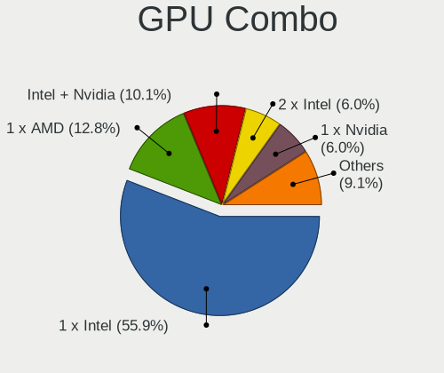

| Name           | Notebooks | Percent |
|----------------|-----------|---------|
| 1 x Intel      | 167       | 52.02%  |
| 1 x AMD        | 50        | 15.58%  |
| Intel + Nvidia | 34        | 10.59%  |
| 2 x Intel      | 21        | 6.54%   |
| 1 x Nvidia     | 21        | 6.54%   |
| Other          | 10        | 3.12%   |
| Intel + AMD    | 9         | 2.8%    |
| AMD + Nvidia   | 5         | 1.56%   |
| 2 x AMD        | 3         | 0.93%   |
| 1 x SiS        | 1         | 0.31%   |

GPU Driver
----------

Free vs proprietary

| Driver      | Notebooks | Percent |
|-------------|-----------|---------|
| Free        | 278       | 86.6%   |
| Proprietary | 23        | 7.17%   |
| Unknown     | 20        | 6.23%   |

GPU Memory
----------

Total video memory

| Size in GB | Notebooks | Percent |
|------------|-----------|---------|
| Unknown    | 277       | 84.71%  |
| 0.01-0.5   | 20        | 6.12%   |
| 1.01-2.0   | 15        | 4.59%   |
| 0.51-1.0   | 6         | 1.83%   |
| 3.01-4.0   | 5         | 1.53%   |
| 5.01-6.0   | 2         | 0.61%   |
| 7.01-8.0   | 1         | 0.31%   |
| 2.01-3.0   | 1         | 0.31%   |

Monitor
-------

Monitor Vendor
--------------

Monitor vendors

| Vendor                  | Notebooks | Percent |
|-------------------------|-----------|---------|
| LG Display              | 54        | 21.51%  |
| AU Optronics            | 42        | 16.73%  |
| BOE                     | 34        | 13.55%  |
| Samsung Electronics     | 23        | 9.16%   |
| Chimei Innolux          | 21        | 8.37%   |
| Lenovo                  | 17        | 6.77%   |
| Apple                   | 8         | 3.19%   |
| Sharp                   | 7         | 2.79%   |
| Chi Mei Optoelectronics | 7         | 2.79%   |
| Sceptre Tech            | 4         | 1.59%   |
| LGD                     | 3         | 1.2%    |
| Dell                    | 3         | 1.2%    |
| Ancor Communications    | 3         | 1.2%    |
| InfoVision              | 2         | 0.8%    |
| IBM                     | 2         | 0.8%    |
| Hewlett-Packard         | 2         | 0.8%    |
| HannStar                | 2         | 0.8%    |
| BenQ                    | 2         | 0.8%    |
| Acer                    | 2         | 0.8%    |
| Vizio                   | 1         | 0.4%    |
| Tech Concepts           | 1         | 0.4%    |
| PANDA                   | 1         | 0.4%    |
| Panasonic               | 1         | 0.4%    |
| LG Philips              | 1         | 0.4%    |
| LG Electronics          | 1         | 0.4%    |
| Lenovo Group Limited    | 1         | 0.4%    |
| HJW                     | 1         | 0.4%    |
| Goldstar                | 1         | 0.4%    |
| CTO                     | 1         | 0.4%    |
| ASUSTek Computer        | 1         | 0.4%    |
| AOC                     | 1         | 0.4%    |
| AGO                     | 1         | 0.4%    |

Monitor Model
-------------

Monitor models

| Model                                                                    | Notebooks | Percent |
|--------------------------------------------------------------------------|-----------|---------|
| LG Display LCD Monitor LGD02D8 1366x768 280x160mm 12.7-inch              | 6         | 2.38%   |
| BOE LCD Monitor BOE095F 2256x1504 280x190mm 13.3-inch                    | 6         | 2.38%   |
| LG Display LCD Monitor LGD03AB 1366x768 340x190mm 15.3-inch              | 5         | 1.98%   |
| Sceptre Tech Sceptre P30 SPT0BCC 2560x1080 690x290mm 29.5-inch           | 3         | 1.19%   |
| LG Display LCD Monitor LGD02DC 1366x768 340x190mm 15.3-inch              | 3         | 1.19%   |
| Lenovo LCD Monitor LEN40B1 1600x900 340x190mm 15.3-inch                  | 3         | 1.19%   |
| Lenovo LCD Monitor LEN4035 1280x800 300x190mm 14.0-inch                  | 3         | 1.19%   |
| Lenovo LCD Monitor LEN4031 1280x800 290x180mm 13.4-inch                  | 3         | 1.19%   |
| Chimei Innolux LCD Monitor CMN14D4 1920x1080 310x170mm 13.9-inch         | 3         | 1.19%   |
| Samsung Electronics LCD Monitor SEC324C 1600x900 310x170mm 13.9-inch     | 2         | 0.79%   |
| Samsung Electronics LCD Monitor SEC3157 1280x800 300x190mm 14.0-inch     | 2         | 0.79%   |
| LG Display LCD Monitor LGD05E5 1920x1080 340x190mm 15.3-inch             | 2         | 0.79%   |
| LG Display LCD Monitor LGD046F 1920x1080 340x190mm 15.3-inch             | 2         | 0.79%   |
| LG Display LCD Monitor LGD0459 1920x1080 380x210mm 17.1-inch             | 2         | 0.79%   |
| LG Display LCD Monitor LGD0418 2560x1440 310x170mm 13.9-inch             | 2         | 0.79%   |
| LG Display LCD Monitor LGD0335 1366x768 310x170mm 13.9-inch              | 2         | 0.79%   |
| Lenovo LCD Monitor LEN40B2 1920x1080 340x190mm 15.3-inch                 | 2         | 0.79%   |
| Lenovo LCD Monitor LEN4011 1280x800 260x160mm 12.0-inch                  | 2         | 0.79%   |
| IBM LCD Monitor IBM2887 1680x1050 330x210mm 15.4-inch                    | 2         | 0.79%   |
| Chi Mei Optoelectronics LCD Monitor CMO15A2 1366x768 340x190mm 15.3-inch | 2         | 0.79%   |
| BOE LCD Monitor BOE05DA 1366x768 280x160mm 12.7-inch                     | 2         | 0.79%   |
| AU Optronics LCD Monitor AUO403D 1920x1080 310x170mm 13.9-inch           | 2         | 0.79%   |
| Apple LCD Monitor APP9CC5 1280x800 290x180mm 13.4-inch                   | 2         | 0.79%   |
| Apple LCD Monitor APP9C5F 1280x800 290x180mm 13.4-inch                   | 2         | 0.79%   |
| Ancor Communications ASUS PB278 ACI27A3 2560x1440 600x340mm 27.2-inch    | 2         | 0.79%   |
| Vizio E65-F1 VIZ1035 3840x2160 1430x800mm 64.5-inch                      | 1         | 0.4%    |
| Tech Concepts LCD Monitor 43S435                                         | 1         | 0.4%    |
| Sharp LQ156M1JW01 SHP14C3 1920x1080 340x190mm 15.3-inch                  | 1         | 0.4%    |
| Sharp LQ134N1JW53 SHP1521 1920x1200 290x180mm 13.4-inch                  | 1         | 0.4%    |
| Sharp LCD Monitor SHP148E 1920x1080 340x190mm 15.3-inch                  | 1         | 0.4%    |
| Sharp LCD Monitor SHP148D 3840x2160 340x190mm 15.3-inch                  | 1         | 0.4%    |
| Sharp LCD Monitor SHP1476 3840x2160 350x190mm 15.7-inch                  | 1         | 0.4%    |
| Sharp LCD Monitor SHP1449 1920x1080 290x170mm 13.2-inch                  | 1         | 0.4%    |
| Sharp LCD Monitor SHP143E 3840x2160 350x190mm 15.7-inch                  | 1         | 0.4%    |
| Sceptre Tech Sceptre C35 SPT0DB7 3440x1440 820x350mm 35.1-inch           | 1         | 0.4%    |
| Samsung Electronics SyncMaster SAM010B 1280x1024 340x270mm 17.1-inch     | 1         | 0.4%    |
| Samsung Electronics LCD Monitor SEC5541 1366x768 340x190mm 15.3-inch     | 1         | 0.4%    |
| Samsung Electronics LCD Monitor SEC544B 1600x900 310x170mm 13.9-inch     | 1         | 0.4%    |
| Samsung Electronics LCD Monitor SEC5442 1440x900 300x190mm 14.0-inch     | 1         | 0.4%    |
| Samsung Electronics LCD Monitor SEC5441 1280x800 330x210mm 15.4-inch     | 1         | 0.4%    |
| Samsung Electronics LCD Monitor SEC4457 1440x900 300x190mm 14.0-inch     | 1         | 0.4%    |
| Samsung Electronics LCD Monitor SEC4351 1366x768 340x190mm 15.3-inch     | 1         | 0.4%    |
| Samsung Electronics LCD Monitor SEC4251 1366x768 340x190mm 15.3-inch     | 1         | 0.4%    |
| Samsung Electronics LCD Monitor SEC3942 1366x768 310x170mm 13.9-inch     | 1         | 0.4%    |
| Samsung Electronics LCD Monitor SEC354C 1366x768 350x200mm 15.9-inch     | 1         | 0.4%    |
| Samsung Electronics LCD Monitor SEC315A 1366x768 340x190mm 15.3-inch     | 1         | 0.4%    |
| Samsung Electronics LCD Monitor SEC3150 1366x768 340x190mm 15.3-inch     | 1         | 0.4%    |
| Samsung Electronics LCD Monitor SEC3047 1366x768 280x160mm 12.7-inch     | 1         | 0.4%    |
| Samsung Electronics LCD Monitor SDC8B4F 1920x1080 340x190mm 15.3-inch    | 1         | 0.4%    |
| Samsung Electronics LCD Monitor SDC4D42 1366x768 310x170mm 13.9-inch     | 1         | 0.4%    |
| Samsung Electronics LCD Monitor SDC424A 3200x1800 290x170mm 13.2-inch    | 1         | 0.4%    |
| Samsung Electronics LCD Monitor SDC364D 1920x1080 310x170mm 13.9-inch    | 1         | 0.4%    |
| Samsung Electronics LCD Monitor SDC314D 1366x768 310x170mm 13.9-inch     | 1         | 0.4%    |
| Samsung Electronics LCD Monitor SAM7016 3840x2160 1420x800mm 64.2-inch   | 1         | 0.4%    |
| Samsung Electronics C34H89x SAM0E25 3440x1440 800x330mm 34.1-inch        | 1         | 0.4%    |
| PANDA LCD Monitor NCP0040 1920x1080 340x190mm 15.3-inch                  | 1         | 0.4%    |
| Panasonic VVX13F009G00 MEI96A2 1920x1080 290x170mm 13.2-inch             | 1         | 0.4%    |
| LGD LCD Monitor 5760x2160                                                | 1         | 0.4%    |
| LGD LCD Monitor 4480x1080                                                | 1         | 0.4%    |
| LGD LCD Monitor 1920x1080                                                | 1         | 0.4%    |

Monitor Resolution
------------------

Monitor screen resolution

| Resolution         | Notebooks | Percent |
|--------------------|-----------|---------|
| 1366x768 (WXGA)    | 86        | 34.68%  |
| 1920x1080 (FHD)    | 74        | 29.84%  |
| 1600x900 (HD+)     | 20        | 8.06%   |
| 1280x800 (WXGA)    | 18        | 7.26%   |
| 2560x1440 (QHD)    | 10        | 4.03%   |
| 3840x2160 (4K)     | 7         | 2.82%   |
| 2256x1504          | 6         | 2.42%   |
| 2560x1080          | 4         | 1.61%   |
| 1440x900 (WXGA+)   | 4         | 1.61%   |
| 1024x600           | 4         | 1.61%   |
| 3440x1440          | 2         | 0.81%   |
| 1680x1050 (WSXGA+) | 2         | 0.81%   |
| Unknown            | 2         | 0.81%   |
| 5760x2160          | 1         | 0.4%    |
| 4480x1080          | 1         | 0.4%    |
| 3840x1600          | 1         | 0.4%    |
| 3200x1800 (QHD+)   | 1         | 0.4%    |
| 2880x1620          | 1         | 0.4%    |
| 2560x1600          | 1         | 0.4%    |
| 1920x1200 (WUXGA)  | 1         | 0.4%    |
| 1400x1050          | 1         | 0.4%    |
| 1280x1024 (SXGA)   | 1         | 0.4%    |

Monitor Diagonal
----------------

Diagonal size in inches

| Inches  | Notebooks | Percent |
|---------|-----------|---------|
| 15      | 87        | 34.94%  |
| 13      | 75        | 30.12%  |
| 12      | 19        | 7.63%   |
| 17      | 13        | 5.22%   |
| 14      | 13        | 5.22%   |
| 11      | 8         | 3.21%   |
| 27      | 7         | 2.81%   |
| Unknown | 6         | 2.41%   |
| 24      | 4         | 1.61%   |
| 29      | 3         | 1.2%    |
| 64      | 2         | 0.8%    |
| 34      | 2         | 0.8%    |
| 10      | 2         | 0.8%    |
| 37      | 1         | 0.4%    |
| 35      | 1         | 0.4%    |
| 31      | 1         | 0.4%    |
| 23      | 1         | 0.4%    |
| 19      | 1         | 0.4%    |
| 16      | 1         | 0.4%    |
| 9       | 1         | 0.4%    |
| 8       | 1         | 0.4%    |

Monitor Width
-------------

Physical width

| Width in mm | Notebooks | Percent |
|-------------|-----------|---------|
| 301-350     | 139       | 56.05%  |
| 201-300     | 65        | 26.21%  |
| 351-400     | 13        | 5.24%   |
| 501-600     | 11        | 4.44%   |
| Unknown     | 6         | 2.42%   |
| 601-700     | 5         | 2.02%   |
| 801-900     | 2         | 0.81%   |
| 701-800     | 2         | 0.81%   |
| 101-200     | 2         | 0.81%   |
| 1001-1500   | 2         | 0.81%   |
| 401-500     | 1         | 0.4%    |

Aspect Ratio
------------

Proportional relationship between the width and the height

| Ratio   | Notebooks | Percent |
|---------|-----------|---------|
| 16/9    | 188       | 79.66%  |
| 16/10   | 27        | 11.44%  |
| 21/9    | 7         | 2.97%   |
| 3/2     | 6         | 2.54%   |
| Unknown | 5         | 2.12%   |
| 4/3     | 2         | 0.85%   |
| 5/4     | 1         | 0.42%   |

Monitor Area
------------

Area in inch

| Area in inch | Notebooks | Percent |
|----------------|-----------|---------|
| 81-90          | 78        | 31.33%  |
| 91-100         | 70        | 28.11%  |
| 61-70          | 19        | 7.63%   |
| 101-110        | 19        | 7.63%   |
| 121-130        | 11        | 4.42%   |
| 301-350        | 10        | 4.02%   |
| 71-80          | 8         | 3.21%   |
| 51-60          | 8         | 3.21%   |
| Unknown        | 6         | 2.41%   |
| 201-250        | 5         | 2.01%   |
| 351-500        | 4         | 1.61%   |
| More than 1000 | 2         | 0.8%    |
| 41-50          | 2         | 0.8%    |
| 1-40           | 2         | 0.8%    |
| 151-200        | 1         | 0.4%    |
| 141-150        | 1         | 0.4%    |
| 131-140        | 1         | 0.4%    |
| 111-120        | 1         | 0.4%    |
| 501-1000       | 1         | 0.4%    |

Pixel Density
-------------

Pixels per inch

| Density       | Notebooks | Percent |
|---------------|-----------|---------|
| 121-160       | 106       | 42.74%  |
| 101-120       | 87        | 35.08%  |
| 51-100        | 23        | 9.27%   |
| 161-240       | 21        | 8.47%   |
| Unknown       | 6         | 2.42%   |
| More than 240 | 5         | 2.02%   |

Multiple Monitors
-----------------

Total monitors connected

| Total | Notebooks | Percent |
|-------|-----------|---------|
| 1     | 213       | 65.74%  |
| 0     | 85        | 26.23%  |
| 2     | 25        | 7.72%   |
| 3     | 1         | 0.31%   |

Network
-------

Net Controller Vendor
---------------------

Controller vendors

| Vendor                           | Notebooks | Percent |
|----------------------------------|-----------|---------|
| Intel                            | 224       | 45.9%   |
| Realtek Semiconductor            | 122       | 25%     |
| Qualcomm Atheros                 | 51        | 10.45%  |
| Broadcom                         | 42        | 8.61%   |
| AMD                              | 10        | 2.05%   |
| Edimax Technology                | 8         | 1.64%   |
| TP-Link                          | 4         | 0.82%   |
| Marvell Technology Group         | 4         | 0.82%   |
| Ralink                           | 3         | 0.61%   |
| NetGear                          | 3         | 0.61%   |
| Ralink Technology                | 2         | 0.41%   |
| Nvidia                           | 2         | 0.41%   |
| ASUSTek Computer                 | 2         | 0.41%   |
| Silicon Integrated Systems [SiS] | 1         | 0.2%    |
| Samsung Electronics              | 1         | 0.2%    |
| Qualcomm                         | 1         | 0.2%    |
| OnePlus Technology (Shenzhen)    | 1         | 0.2%    |
| Novatel Wireless                 | 1         | 0.2%    |
| MEDIATEK                         | 1         | 0.2%    |
| Lenovo                           | 1         | 0.2%    |
| Google                           | 1         | 0.2%    |
| dog hunter                       | 1         | 0.2%    |
| D-Link System                    | 1         | 0.2%    |
| D-Link                           | 1         | 0.2%    |

Net Controller Model
--------------------

Controller models

| Model                                                                   | Notebooks | Percent |
|-------------------------------------------------------------------------|-----------|---------|
| Realtek RTL8111/8168/8411 PCI Express Gigabit Ethernet Controller       | 78        | 12.17%  |
| Intel 82579LM Gigabit Network Connection (Lewisville)                   | 36        | 5.62%   |
| Realtek RTL810xE PCI Express Fast Ethernet controller                   | 29        | 4.52%   |
| Intel Centrino Advanced-N 6205 [Taylor Peak]                            | 27        | 4.21%   |
| Intel Wireless 7260                                                     | 20        | 3.12%   |
| Intel Wireless 8265 / 8275                                              | 16        | 2.5%    |
| Intel Wireless 8260                                                     | 15        | 2.34%   |
| Intel Wi-Fi 6 AX200                                                     | 15        | 2.34%   |
| Intel Wireless 7265                                                     | 14        | 2.18%   |
| Intel I210 Gigabit Network Connection                                   | 12        | 1.87%   |
| AMD Family 17h Processor 10 Gb Ethernet Controller Port 0               | 10        | 1.56%   |
| Qualcomm Atheros AR9285 Wireless Network Adapter (PCI-Express)          | 9         | 1.4%    |
| Intel Wireless-AC 9260                                                  | 9         | 1.4%    |
| Intel Ethernet Connection I217-LM                                       | 9         | 1.4%    |
| Intel Ethernet Connection (3) I218-LM                                   | 9         | 1.4%    |
| Realtek RTL8821CE 802.11ac PCIe Wireless Network Adapter                | 8         | 1.25%   |
| Realtek RTL8188CE 802.11b/g/n WiFi Adapter                              | 8         | 1.25%   |
| Edimax EW-7811Un 802.11n Wireless Adapter [Realtek RTL8188CUS]          | 8         | 1.25%   |
| Broadcom BCM4331 802.11a/b/g/n                                          | 8         | 1.25%   |
| Realtek RTL8188EUS 802.11n Wireless Network Adapter                     | 7         | 1.09%   |
| Intel Wireless 3165                                                     | 7         | 1.09%   |
| Broadcom NetXtreme BCM57765 Gigabit Ethernet PCIe                       | 7         | 1.09%   |
| Qualcomm Atheros AR9485 Wireless Network Adapter                        | 6         | 0.94%   |
| Intel Wi-Fi 6 AX210/AX211/AX411 160MHz                                  | 6         | 0.94%   |
| Intel PRO/Wireless 4965 AG or AGN [Kedron] Network Connection           | 6         | 0.94%   |
| Intel Ethernet Connection (2) I219-LM                                   | 6         | 0.94%   |
| Intel Comet Lake PCH-LP CNVi WiFi                                       | 6         | 0.94%   |
| Intel 82577LM Gigabit Network Connection                                | 6         | 0.94%   |
| Intel 82566MM Gigabit Network Connection                                | 6         | 0.94%   |
| Broadcom BCM43224 802.11a/b/g/n                                         | 6         | 0.94%   |
| Broadcom BCM4313 802.11bgn Wireless Network Adapter                     | 6         | 0.94%   |
| Qualcomm Atheros QCA9377 802.11ac Wireless Network Adapter              | 5         | 0.78%   |
| Intel Wireless 3160                                                     | 5         | 0.78%   |
| Intel Centrino Wireless-N 1000 [Condor Peak]                            | 5         | 0.78%   |
| Broadcom NetXtreme BCM5764M Gigabit Ethernet PCIe                       | 5         | 0.78%   |
| Qualcomm Atheros QCA6174 802.11ac Wireless Network Adapter              | 4         | 0.62%   |
| Qualcomm Atheros AR8152 v2.0 Fast Ethernet                              | 4         | 0.62%   |
| Qualcomm Atheros AR242x / AR542x Wireless Network Adapter (PCI-Express) | 4         | 0.62%   |
| Intel Ethernet Connection I219-LM                                       | 4         | 0.62%   |
| Intel Ethernet Connection I218-LM                                       | 4         | 0.62%   |
| Intel Ethernet Connection (7) I219-LM                                   | 4         | 0.62%   |
| Intel Ethernet Connection (4) I219-LM                                   | 4         | 0.62%   |
| Intel Cannon Point-LP CNVi [Wireless-AC]                                | 4         | 0.62%   |
| Intel Cannon Lake PCH CNVi WiFi                                         | 4         | 0.62%   |
| Qualcomm Atheros QCA9565 / AR9565 Wireless Network Adapter              | 3         | 0.47%   |
| Qualcomm Atheros AR9462 Wireless Network Adapter                        | 3         | 0.47%   |
| Qualcomm Atheros AR928X Wireless Network Adapter (PCI-Express)          | 3         | 0.47%   |
| NetGear A6100 AC600 DB Wireless Adapter [Realtek RTL8811AU]             | 3         | 0.47%   |
| Intel WiFi Link 5100                                                    | 3         | 0.47%   |
| Intel Wi-Fi 6 AX201                                                     | 3         | 0.47%   |
| Intel PRO/Wireless 5100 AGN [Shiloh] Network Connection                 | 3         | 0.47%   |
| Intel PRO/Wireless 3945ABG [Golan] Network Connection                   | 3         | 0.47%   |
| Intel Ethernet Connection I219-V                                        | 3         | 0.47%   |
| Intel Ethernet Connection (4) I219-V                                    | 3         | 0.47%   |
| Intel Comet Lake PCH CNVi WiFi                                          | 3         | 0.47%   |
| Intel Centrino Wireless-N 2230                                          | 3         | 0.47%   |
| Intel Centrino Ultimate-N 6300                                          | 3         | 0.47%   |
| Intel Centrino Advanced-N 6200                                          | 3         | 0.47%   |
| Intel 82573L Gigabit Ethernet Controller                                | 3         | 0.47%   |
| Broadcom NetXtreme BCM57762 Gigabit Ethernet PCIe                       | 3         | 0.47%   |

Wireless Vendor
---------------

Wireless vendors

| Vendor                | Notebooks | Percent |
|-----------------------|-----------|---------|
| Intel                 | 193       | 58.48%  |
| Qualcomm Atheros      | 43        | 13.03%  |
| Realtek Semiconductor | 35        | 10.61%  |
| Broadcom              | 35        | 10.61%  |
| Edimax Technology     | 8         | 2.42%   |
| TP-Link               | 4         | 1.21%   |
| Ralink                | 3         | 0.91%   |
| NetGear               | 3         | 0.91%   |
| Ralink Technology     | 2         | 0.61%   |
| ASUSTek Computer      | 2         | 0.61%   |
| D-Link System         | 1         | 0.3%    |
| D-Link                | 1         | 0.3%    |

Wireless Model
--------------

Wireless models

| Model                                                                                 | Notebooks | Percent |
|---------------------------------------------------------------------------------------|-----------|---------|
| Intel Centrino Advanced-N 6205 [Taylor Peak]                                          | 27        | 8.13%   |
| Intel Wireless 7260                                                                   | 20        | 6.02%   |
| Intel Wireless 8265 / 8275                                                            | 16        | 4.82%   |
| Intel Wireless 8260                                                                   | 15        | 4.52%   |
| Intel Wi-Fi 6 AX200                                                                   | 15        | 4.52%   |
| Intel Wireless 7265                                                                   | 14        | 4.22%   |
| Qualcomm Atheros AR9285 Wireless Network Adapter (PCI-Express)                        | 9         | 2.71%   |
| Intel Wireless-AC 9260                                                                | 9         | 2.71%   |
| Realtek RTL8821CE 802.11ac PCIe Wireless Network Adapter                              | 8         | 2.41%   |
| Realtek RTL8188CE 802.11b/g/n WiFi Adapter                                            | 8         | 2.41%   |
| Edimax EW-7811Un 802.11n Wireless Adapter [Realtek RTL8188CUS]                        | 8         | 2.41%   |
| Broadcom BCM4331 802.11a/b/g/n                                                        | 8         | 2.41%   |
| Realtek RTL8188EUS 802.11n Wireless Network Adapter                                   | 7         | 2.11%   |
| Intel Wireless 3165                                                                   | 7         | 2.11%   |
| Qualcomm Atheros AR9485 Wireless Network Adapter                                      | 6         | 1.81%   |
| Intel Wi-Fi 6 AX210/AX211/AX411 160MHz                                                | 6         | 1.81%   |
| Intel PRO/Wireless 4965 AG or AGN [Kedron] Network Connection                         | 6         | 1.81%   |
| Intel Comet Lake PCH-LP CNVi WiFi                                                     | 6         | 1.81%   |
| Broadcom BCM43224 802.11a/b/g/n                                                       | 6         | 1.81%   |
| Broadcom BCM4313 802.11bgn Wireless Network Adapter                                   | 6         | 1.81%   |
| Qualcomm Atheros QCA9377 802.11ac Wireless Network Adapter                            | 5         | 1.51%   |
| Intel Wireless 3160                                                                   | 5         | 1.51%   |
| Intel Centrino Wireless-N 1000 [Condor Peak]                                          | 5         | 1.51%   |
| Qualcomm Atheros QCA6174 802.11ac Wireless Network Adapter                            | 4         | 1.2%    |
| Qualcomm Atheros AR242x / AR542x Wireless Network Adapter (PCI-Express)               | 4         | 1.2%    |
| Intel Cannon Point-LP CNVi [Wireless-AC]                                              | 4         | 1.2%    |
| Intel Cannon Lake PCH CNVi WiFi                                                       | 4         | 1.2%    |
| Qualcomm Atheros QCA9565 / AR9565 Wireless Network Adapter                            | 3         | 0.9%    |
| Qualcomm Atheros AR9462 Wireless Network Adapter                                      | 3         | 0.9%    |
| Qualcomm Atheros AR928X Wireless Network Adapter (PCI-Express)                        | 3         | 0.9%    |
| NetGear A6100 AC600 DB Wireless Adapter [Realtek RTL8811AU]                           | 3         | 0.9%    |
| Intel WiFi Link 5100                                                                  | 3         | 0.9%    |
| Intel Wi-Fi 6 AX201                                                                   | 3         | 0.9%    |
| Intel PRO/Wireless 5100 AGN [Shiloh] Network Connection                               | 3         | 0.9%    |
| Intel PRO/Wireless 3945ABG [Golan] Network Connection                                 | 3         | 0.9%    |
| Intel Comet Lake PCH CNVi WiFi                                                        | 3         | 0.9%    |
| Intel Centrino Wireless-N 2230                                                        | 3         | 0.9%    |
| Intel Centrino Ultimate-N 6300                                                        | 3         | 0.9%    |
| Intel Centrino Advanced-N 6200                                                        | 3         | 0.9%    |
| Broadcom BCM4352 802.11ac Wireless Network Adapter                                    | 3         | 0.9%    |
| Broadcom BCM4322 802.11a/b/g/n Wireless LAN Controller                                | 3         | 0.9%    |
| TP-Link TL-WN823N v2/v3 [Realtek RTL8192EU]                                           | 2         | 0.6%    |
| TP-Link AC600 wireless Realtek RTL8811AU [Archer T2U Nano]                            | 2         | 0.6%    |
| Realtek RTL8822CE 802.11ac PCIe Wireless Network Adapter                              | 2         | 0.6%    |
| Realtek RTL8821AE 802.11ac PCIe Wireless Network Adapter                              | 2         | 0.6%    |
| Realtek RTL8723BE PCIe Wireless Network Adapter                                       | 2         | 0.6%    |
| Realtek RTL8191SEvB Wireless LAN Controller                                           | 2         | 0.6%    |
| Realtek RTL8188EE Wireless Network Adapter                                            | 2         | 0.6%    |
| Ralink RT5370 Wireless Adapter                                                        | 2         | 0.6%    |
| Ralink RT5390 Wireless 802.11n 1T/1R PCIe                                             | 2         | 0.6%    |
| Qualcomm Atheros AR5418 Wireless Network Adapter [AR5008E 802.11(a)bgn] (PCI-Express) | 2         | 0.6%    |
| Qualcomm Atheros AR5212 802.11abg NIC                                                 | 2         | 0.6%    |
| Intel Ice Lake-LP PCH CNVi WiFi                                                       | 2         | 0.6%    |
| Intel Dual Band Wireless-AC 3168NGW [Stone Peak]                                      | 2         | 0.6%    |
| Intel Centrino Wireless-N 1030 [Rainbow Peak]                                         | 2         | 0.6%    |
| Intel Centrino Advanced-N 6235                                                        | 2         | 0.6%    |
| Broadcom BCM4312 802.11b/g LP-PHY                                                     | 2         | 0.6%    |
| Realtek RTL8852AE 802.11ax PCIe Wireless Network Adapter                              | 1         | 0.3%    |
| Realtek RTL8723BU 802.11b/g/n WLAN Adapter                                            | 1         | 0.3%    |
| Realtek RTL8188CUS 802.11n WLAN Adapter                                               | 1         | 0.3%    |

Ethernet Vendor
---------------

Ethernet vendors

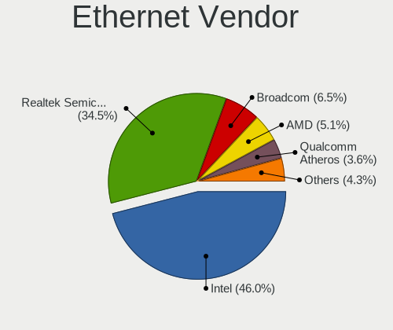

| Vendor                           | Notebooks | Percent |
|----------------------------------|-----------|---------|
| Intel                            | 126       | 42.28%  |
| Realtek Semiconductor            | 110       | 36.91%  |
| Broadcom                         | 25        | 8.39%   |
| Qualcomm Atheros                 | 14        | 4.7%    |
| AMD                              | 10        | 3.36%   |
| Marvell Technology Group         | 4         | 1.34%   |
| Nvidia                           | 2         | 0.67%   |
| Silicon Integrated Systems [SiS] | 1         | 0.34%   |
| Samsung Electronics              | 1         | 0.34%   |
| Qualcomm                         | 1         | 0.34%   |
| OnePlus Technology (Shenzhen)    | 1         | 0.34%   |
| Novatel Wireless                 | 1         | 0.34%   |
| Lenovo                           | 1         | 0.34%   |
| Google                           | 1         | 0.34%   |

Ethernet Model
--------------

Ethernet models

| Model                                                             | Notebooks | Percent |
|-------------------------------------------------------------------|-----------|---------|
| Realtek RTL8111/8168/8411 PCI Express Gigabit Ethernet Controller | 78        | 25.91%  |
| Intel 82579LM Gigabit Network Connection (Lewisville)             | 36        | 11.96%  |
| Realtek RTL810xE PCI Express Fast Ethernet controller             | 29        | 9.63%   |
| Intel I210 Gigabit Network Connection                             | 12        | 3.99%   |
| AMD Family 17h Processor 10 Gb Ethernet Controller Port 0         | 10        | 3.32%   |
| Intel Ethernet Connection I217-LM                                 | 9         | 2.99%   |
| Intel Ethernet Connection (3) I218-LM                             | 9         | 2.99%   |
| Broadcom NetXtreme BCM57765 Gigabit Ethernet PCIe                 | 7         | 2.33%   |
| Intel Ethernet Connection (2) I219-LM                             | 6         | 1.99%   |
| Intel 82577LM Gigabit Network Connection                          | 6         | 1.99%   |
| Intel 82566MM Gigabit Network Connection                          | 6         | 1.99%   |
| Broadcom NetXtreme BCM5764M Gigabit Ethernet PCIe                 | 5         | 1.66%   |
| Qualcomm Atheros AR8152 v2.0 Fast Ethernet                        | 4         | 1.33%   |
| Intel Ethernet Connection I219-LM                                 | 4         | 1.33%   |
| Intel Ethernet Connection I218-LM                                 | 4         | 1.33%   |
| Intel Ethernet Connection (7) I219-LM                             | 4         | 1.33%   |
| Intel Ethernet Connection (4) I219-LM                             | 4         | 1.33%   |
| Intel Ethernet Connection I219-V                                  | 3         | 1%      |
| Intel Ethernet Connection (4) I219-V                              | 3         | 1%      |
| Intel 82573L Gigabit Ethernet Controller                          | 3         | 1%      |
| Broadcom NetXtreme BCM57762 Gigabit Ethernet PCIe                 | 3         | 1%      |
| Broadcom NetXtreme BCM5761 Gigabit Ethernet PCIe                  | 3         | 1%      |
| Broadcom NetXtreme BCM5755M Gigabit Ethernet PCI Express          | 3         | 1%      |
| Qualcomm Atheros AR8151 v2.0 Gigabit Ethernet                     | 2         | 0.66%   |
| Nvidia MCP79 Ethernet                                             | 2         | 0.66%   |
| Intel Ethernet Connection (7) I219-V                              | 2         | 0.66%   |
| Intel Ethernet Connection (6) I219-V                              | 2         | 0.66%   |
| Intel Ethernet Connection (10) I219-V                             | 2         | 0.66%   |
| Intel 82567LM Gigabit Network Connection                          | 2         | 0.66%   |
| Silicon Integrated Systems [SiS] SiS900 PCI Fast Ethernet         | 1         | 0.33%   |
| Samsung Galaxy series, misc. (tethering mode)                     | 1         | 0.33%   |
| Realtek RTL8169 PCI Gigabit Ethernet Controller                   | 1         | 0.33%   |
| Realtek RTL-8100/8101L/8139 PCI Fast Ethernet Adapter             | 1         | 0.33%   |
| Realtek Killer E2500 Gigabit Ethernet Controller                  | 1         | 0.33%   |
| Qualcomm Atheros QCA8171 Gigabit Ethernet                         | 1         | 0.33%   |
| Qualcomm Atheros Killer E2500 Gigabit Ethernet Controller         | 1         | 0.33%   |
| Qualcomm Atheros AR8162 Fast Ethernet                             | 1         | 0.33%   |
| Qualcomm Atheros AR8161 Gigabit Ethernet                          | 1         | 0.33%   |
| Qualcomm Atheros AR8152 v1.1 Fast Ethernet                        | 1         | 0.33%   |
| Qualcomm Atheros AR8132 Fast Ethernet                             | 1         | 0.33%   |
| Qualcomm Atheros AR8131 Gigabit Ethernet                          | 1         | 0.33%   |
| Qualcomm Atheros AR8121/AR8113/AR8114 Gigabit or Fast Ethernet    | 1         | 0.33%   |
| Qualcomm ALCATEL Composite RNDIS Interface                        | 1         | 0.33%   |
| OnePlus (Shenzhen) IN2025 RNDIS Control RNDIS Ethernet Data       | 1         | 0.33%   |
| Novatel Wireless MiFi 8800L RNDIS Control RNDIS Ethernet Data     | 1         | 0.33%   |
| Marvell Group 88E8058 PCI-E Gigabit Ethernet Controller           | 1         | 0.33%   |
| Marvell Group 88E8057 PCI-E Gigabit Ethernet Controller           | 1         | 0.33%   |
| Marvell Group 88E8055 PCI-E Gigabit Ethernet Controller           | 1         | 0.33%   |
| Marvell Group 88E8053 PCI-E Gigabit Ethernet Controller           | 1         | 0.33%   |
| Lenovo USB-C Dock Ethernet                                        | 1         | 0.33%   |
| Intel I350 Gigabit Network Connection                             | 1         | 0.33%   |
| Intel Ethernet Connection (6) I219-LM                             | 1         | 0.33%   |
| Intel Ethernet Connection (3) I218-V                              | 1         | 0.33%   |
| Intel Ethernet Connection (11) I219-LM                            | 1         | 0.33%   |
| Intel Ethernet Connection (10) I219-LM                            | 1         | 0.33%   |
| Intel 82801CAM (ICH3) PRO/100 VE (LOM) Ethernet Controller        | 1         | 0.33%   |
| Intel 82577LC Gigabit Network Connection                          | 1         | 0.33%   |
| Intel 82574L Gigabit Network Connection                           | 1         | 0.33%   |
| Intel 82567LF Gigabit Network Connection                          | 1         | 0.33%   |
| Intel 82540EP Gigabit Ethernet Controller (Mobile)                | 1         | 0.33%   |

Net Controller Kind
-------------------

Ethernet, WiFi or modem

| Kind     | Notebooks | Percent |
|----------|-----------|---------|
| WiFi     | 301       | 51.02%  |
| Ethernet | 281       | 47.63%  |
| Modem    | 7         | 1.19%   |
| Unknown  | 1         | 0.17%   |

Used Controller
---------------

Currently used network controller

| Kind     | Notebooks | Percent |
|----------|-----------|---------|
| Ethernet | 237       | 50.86%  |
| WiFi     | 229       | 49.14%  |

NICs
----

Total network controllers on board

| Total | Notebooks | Percent |
|-------|-----------|---------|
| 2     | 249       | 77.33%  |
| 1     | 48        | 14.91%  |
| 3     | 13        | 4.04%   |
| 6     | 9         | 2.8%    |
| 0     | 2         | 0.62%   |
| 5     | 1         | 0.31%   |

IPv6
----

IPv6 vs IPv4

| Used | Notebooks | Percent |
|------|-----------|---------|
| No   | 296       | 90.52%  |
| Yes  | 31        | 9.48%   |

Bluetooth
---------

Bluetooth Vendor
----------------

Controller vendors

| Vendor                          | Notebooks | Percent |
|---------------------------------|-----------|---------|
| Intel                           | 114       | 55.61%  |
| Broadcom                        | 30        | 14.63%  |
| Apple                           | 18        | 8.78%   |
| Realtek Semiconductor           | 13        | 6.34%   |
| Qualcomm Atheros Communications | 10        | 4.88%   |
| IMC Networks                    | 6         | 2.93%   |
| Dell                            | 6         | 2.93%   |
| Foxconn / Hon Hai               | 3         | 1.46%   |
| Alps Electric                   | 2         | 0.98%   |
| Realtek                         | 1         | 0.49%   |
| Lite-On Technology              | 1         | 0.49%   |
| Hewlett-Packard                 | 1         | 0.49%   |

Bluetooth Model
---------------

Controller models

| Model                                                       | Notebooks | Percent |
|-------------------------------------------------------------|-----------|---------|
| Intel Bluetooth wireless interface                          | 58        | 28.16%  |
| Intel AX200 Bluetooth                                       | 14        | 6.8%    |
| Broadcom BCM20702 Bluetooth 4.0 [ThinkPad]                  | 12        | 5.83%   |
| Apple Bluetooth Host Controller                             | 12        | 5.83%   |
| Intel Bluetooth 9460/9560 Jefferson Peak (JfP)              | 11        | 5.34%   |
| Intel AX201 Bluetooth                                       | 11        | 5.34%   |
| Broadcom BCM2045B (BDC-2.1)                                 | 9         | 4.37%   |
| Intel Wireless-AC 9260 Bluetooth Adapter                    | 7         | 3.4%    |
| Realtek  Bluetooth 4.2 Adapter                              | 6         | 2.91%   |
| Intel AX210 Bluetooth                                       | 6         | 2.91%   |
| Intel Centrino Bluetooth Wireless Transceiver               | 4         | 1.94%   |
| Broadcom BCM2045B (BDC-2) [Bluetooth Controller]            | 4         | 1.94%   |
| Qualcomm Atheros  QCA9377 Bluetooth 4.1                     | 3         | 1.46%   |
| Foxconn / Hon Hai Bluetooth USB Module                      | 3         | 1.46%   |
| Dell DW375 Bluetooth Module                                 | 3         | 1.46%   |
| Broadcom BCM20702A0 Bluetooth 4.0                           | 3         | 1.46%   |
| Apple Apple Broadcom Built-in Bluetooth                     | 3         | 1.46%   |
| Realtek RTL8821A Bluetooth                                  | 2         | 0.97%   |
| Realtek Bluetooth Radio                                     | 2         | 0.97%   |
| Qualcomm Atheros AR9462 Bluetooth                           | 2         | 0.97%   |
| Intel Wireless-AC 3168 Bluetooth                            | 2         | 0.97%   |
| IMC Networks Bluetooth module                               | 2         | 0.97%   |
| Apple Built-in iSight (no firmware loaded)                  | 2         | 0.97%   |
| Alps Electric BCM2046 Bluetooth Device                      | 2         | 0.97%   |
| Realtek RTL8822BE Bluetooth 4.2 Adapter                     | 1         | 0.49%   |
| Realtek RTL8723B Bluetooth                                  | 1         | 0.49%   |
| Realtek  Bluetooth Adapter                                  | 1         | 0.49%   |
| Realtek  Bluetooth 4.0 Adapter                              | 1         | 0.49%   |
| Realtek Bluetooth Radio                                     | 1         | 0.49%   |
| Qualcomm Atheros  QCA61x4 Bluetooth 4.1                     | 1         | 0.49%   |
| Qualcomm Atheros QCA61x4 Bluetooth 4.0                      | 1         | 0.49%   |
| Qualcomm Atheros Dell Wireless 1820 Bluetooth 4.1LE         | 1         | 0.49%   |
| Qualcomm Atheros Dell Wireless 1707 Bluetooth 4.0 LE Device | 1         | 0.49%   |
| Qualcomm Atheros Atheros AR9462 Bluetooth 3.0 + HS Adapter  | 1         | 0.49%   |
| Lite-On Qualcomm Atheros QCA9377 Bluetooth                  | 1         | 0.49%   |
| Intel Centrino Advanced-N 6230 Bluetooth adapter            | 1         | 0.49%   |
| IMC Networks Wireless_Device                                | 1         | 0.49%   |
| IMC Networks Realtek Bluetooth Adapter                      | 1         | 0.49%   |
| IMC Networks Qualcomm Atheros Bluetooth 4.1                 | 1         | 0.49%   |
| IMC Networks Atheros AR3012 Bluetooth 4.0 Adapter           | 1         | 0.49%   |
| HP Atheros AR9285 Malbec Bluetooth Adapter                  | 1         | 0.49%   |
| Dell Wireless 360 Bluetooth                                 | 1         | 0.49%   |
| Dell Dell Wireless 380 Bluetooth 4.0 Module                 | 1         | 0.49%   |
| Dell Broadcom BCM20702A0 Bluetooth                          | 1         | 0.49%   |
| Broadcom BCM43142 Bluetooth 4.0                             | 1         | 0.49%   |
| Broadcom BCM20702A0 Bluetooth                               | 1         | 0.49%   |
| Apple Built-in Bluetooth 2.0+EDR HCI                        | 1         | 0.49%   |

Sound
-----

Sound Vendor
------------

Sound card vendors

| Vendor                           | Notebooks | Percent |
|----------------------------------|-----------|---------|
| Intel                            | 255       | 69.11%  |
| AMD                              | 68        | 18.43%  |
| Nvidia                           | 31        | 8.4%    |
| Realtek Semiconductor            | 3         | 0.81%   |
| C-Media Electronics              | 3         | 0.81%   |
| Texas Instruments                | 1         | 0.27%   |
| Silicon Integrated Systems [SiS] | 1         | 0.27%   |
| Logitech                         | 1         | 0.27%   |
| Lenovo                           | 1         | 0.27%   |
| JMTek                            | 1         | 0.27%   |
| ESS Technology                   | 1         | 0.27%   |
| CMX Systems                      | 1         | 0.27%   |
| Cambridge Silicon Radio          | 1         | 0.27%   |
| Blue Microphones                 | 1         | 0.27%   |

Sound Model
-----------

Sound card models

| Model                                                                      | Notebooks | Percent |
|----------------------------------------------------------------------------|-----------|---------|
| Intel 7 Series/C216 Chipset Family High Definition Audio Controller        | 38        | 8.43%   |
| Intel 6 Series/C200 Series Chipset Family High Definition Audio Controller | 30        | 6.65%   |
| Intel Sunrise Point-LP HD Audio                                            | 29        | 6.43%   |
| AMD Family 17h/19h HD Audio Controller                                     | 26        | 5.76%   |
| Intel 5 Series/3400 Series Chipset High Definition Audio                   | 18        | 3.99%   |
| Intel Wildcat Point-LP High Definition Audio Controller                    | 16        | 3.55%   |
| Intel Broadwell-U Audio Controller                                         | 16        | 3.55%   |
| Intel 8 Series/C220 Series Chipset High Definition Audio Controller        | 14        | 3.1%    |
| Intel Xeon E3-1200 v3/4th Gen Core Processor HD Audio Controller           | 12        | 2.66%   |
| Intel Haswell-ULT HD Audio Controller                                      | 12        | 2.66%   |
| Intel Cannon Lake PCH cAVS                                                 | 12        | 2.66%   |
| Intel 82801H (ICH8 Family) HD Audio Controller                             | 12        | 2.66%   |
| AMD FCH Azalia Controller                                                  | 12        | 2.66%   |
| Intel 8 Series HD Audio Controller                                         | 11        | 2.44%   |
| AMD Raven/Raven2/Fenghuang HDMI/DP Audio Controller                        | 11        | 2.44%   |
| Intel NM10/ICH7 Family High Definition Audio Controller                    | 10        | 2.22%   |
| Intel Tiger Lake-LP Smart Sound Technology Audio Controller                | 9         | 2%      |
| AMD Family 17h (Models 00h-0fh) HD Audio Controller                        | 9         | 2%      |
| Intel 100 Series/C230 Series Chipset Family HD Audio Controller            | 8         | 1.77%   |
| AMD Renoir Radeon High Definition Audio Controller                         | 8         | 1.77%   |
| Intel Comet Lake PCH-LP cAVS                                               | 7         | 1.55%   |
| Intel Cannon Point-LP High Definition Audio Controller                     | 7         | 1.55%   |
| AMD SBx00 Azalia (Intel HDA)                                               | 7         | 1.55%   |
| AMD Kabini HDMI/DP Audio                                                   | 7         | 1.55%   |
| Intel 82801I (ICH9 Family) HD Audio Controller                             | 6         | 1.33%   |
| Nvidia TU107 GeForce GTX 1650 High Definition Audio Controller             | 5         | 1.11%   |
| Intel CM238 HD Audio Controller                                            | 5         | 1.11%   |
| AMD Wrestler HDMI Audio                                                    | 5         | 1.11%   |
| Nvidia TU116 High Definition Audio Controller                              | 4         | 0.89%   |
| Nvidia GT216 HDMI Audio Controller                                         | 4         | 0.89%   |
| Intel Comet Lake PCH cAVS                                                  | 4         | 0.89%   |
| Intel Celeron/Pentium Silver Processor High Definition Audio               | 4         | 0.89%   |
| AMD Family 15h (Models 60h-6fh) Audio Controller                           | 4         | 0.89%   |
| Nvidia TU106 High Definition Audio Controller                              | 3         | 0.67%   |
| Nvidia GK107 HDMI Audio Controller                                         | 3         | 0.67%   |
| Intel Ice Lake-LP Smart Sound Technology Audio Controller                  | 3         | 0.67%   |
| Intel Atom Processor Z36xxx/Z37xxx Series High Definition Audio Controller | 3         | 0.67%   |
| AMD Oland/Hainan/Cape Verde/Pitcairn HDMI Audio [Radeon HD 7000 Series]    | 3         | 0.67%   |
| Realtek Semiconductor Realtek USB Audio                                    | 2         | 0.44%   |
| Nvidia MCP79 High Definition Audio                                         | 2         | 0.44%   |
| Nvidia High Definition Audio Controller                                    | 2         | 0.44%   |
| Nvidia GK104 HDMI Audio Controller                                         | 2         | 0.44%   |
| Nvidia GF108 High Definition Audio Controller                              | 2         | 0.44%   |
| Intel Celeron N3350/Pentium N4200/Atom E3900 Series Audio Cluster          | 2         | 0.44%   |
| Intel 82801FB/FBM/FR/FW/FRW (ICH6 Family) AC'97 Audio Controller           | 2         | 0.44%   |
| AMD Turks HDMI Audio [Radeon HD 6500/6600 / 6700M Series]                  | 2         | 0.44%   |
| AMD RS880 HDMI Audio [Radeon HD 4200 Series]                               | 2         | 0.44%   |
| AMD Navi 10 HDMI Audio                                                     | 2         | 0.44%   |
| AMD High Definition Audio Controller                                       | 2         | 0.44%   |
| AMD BeaverCreek HDMI Audio [Radeon HD 6500D and 6400G-6600G series]        | 2         | 0.44%   |
| AMD Baffin HDMI/DP Audio [Radeon RX 550 640SP / RX 560/560X]               | 2         | 0.44%   |
| Texas Instruments PCM2900C Audio CODEC                                     | 1         | 0.22%   |
| Silicon Integrated Systems [SiS] SiS7012 AC'97 Sound Controller            | 1         | 0.22%   |
| Realtek Semiconductor TX-384Khz Hifi Type-C Audio                          | 1         | 0.22%   |
| Nvidia TU104 HD Audio Controller                                           | 1         | 0.22%   |
| Nvidia GP107GL High Definition Audio Controller                            | 1         | 0.22%   |
| Nvidia GM107 High Definition Audio Controller [GeForce 940MX]              | 1         | 0.22%   |
| Nvidia GF106 High Definition Audio Controller                              | 1         | 0.22%   |
| Logitech H600 [Wireless Headset]                                           | 1         | 0.22%   |
| Lenovo ThinkPad USB-C Dock Gen2 USB Audio                                  | 1         | 0.22%   |

Memory
------

Memory Vendor
-------------

Memory module vendors

| Vendor              | Notebooks | Percent |
|---------------------|-----------|---------|
| Samsung Electronics | 101       | 29.36%  |
| SK Hynix            | 78        | 22.67%  |
| Micron Technology   | 34        | 9.88%   |
| Crucial             | 28        | 8.14%   |
| Unknown             | 26        | 7.56%   |
| Kingston            | 14        | 4.07%   |
| Transcend           | 11        | 3.2%    |
| Elpida              | 8         | 2.33%   |
| Nanya Technology    | 6         | 1.74%   |
| G.Skill             | 6         | 1.74%   |
| Ramaxel Technology  | 5         | 1.45%   |
| PNY                 | 4         | 1.16%   |
| Team                | 3         | 0.87%   |
| Goldkey             | 3         | 0.87%   |
| Avant               | 3         | 0.87%   |
| Unknown             | 2         | 0.58%   |
| Unknown (ABCD)      | 1         | 0.29%   |
| Super Talent        | 1         | 0.29%   |
| Silicon Power       | 1         | 0.29%   |
| Sesame              | 1         | 0.29%   |
| PKI/Kingston        | 1         | 0.29%   |
| Patriot             | 1         | 0.29%   |
| Golden Empire       | 1         | 0.29%   |
| Gold Key            | 1         | 0.29%   |
| Corsair             | 1         | 0.29%   |
| Apacer              | 1         | 0.29%   |
| A-DATA Technology   | 1         | 0.29%   |
| 09490000802C        | 1         | 0.29%   |

Memory Model
------------

Memory module models

| Model                                                   | Notebooks | Percent |
|---------------------------------------------------------|-----------|---------|
| Samsung RAM M471B5273DH0-CK0 4GB SODIMM DDR3 1600MT/s   | 8         | 2.12%   |
| Samsung RAM M471B5273CH0-CH9 4GB SODIMM DDR3 1334MT/s   | 8         | 2.12%   |
| Samsung RAM M471B5273DH0-CH9 4GB SODIMM DDR3 1334MT/s   | 7         | 1.85%   |
| Samsung RAM M471B5173QH0-YK0 4GB SODIMM DDR3 1600MT/s   | 7         | 1.85%   |
| Samsung RAM M471A1K43CB1-CTD 8GB SODIMM DDR4 2667MT/s   | 7         | 1.85%   |
| SK Hynix RAM HMT41GS6BFR8A-PB 8GB SODIMM DDR3 1600MT/s  | 6         | 1.59%   |
| Samsung RAM M471A1K43CB1-CRC 8GB SODIMM DDR4 2400MT/s   | 6         | 1.59%   |
| SK Hynix RAM HMT451S6AFR8A-PB 4GB SODIMM DDR3 1600MT/s  | 5         | 1.32%   |
| Samsung RAM M471B1G73QH0-YK0 8GB SODIMM DDR3 1867MT/s   | 5         | 1.32%   |
| Unknown RAM Module 2GB SODIMM DDR2 667MT/s              | 4         | 1.06%   |
| Unknown RAM Module 2GB SODIMM DDR2                      | 4         | 1.06%   |
| Transcend RAM TS1GLH64V6B3 8GB SODIMM DDR4 1333MT/s     | 4         | 1.06%   |
| SK Hynix RAM HMT451S6BFR8A-PB 4GB SODIMM DDR3 1600MT/s  | 4         | 1.06%   |
| SK Hynix RAM HMT425S6AFR6A-PB 2GB SODIMM DDR3 1600MT/s  | 4         | 1.06%   |
| SK Hynix RAM HMT351S6CFR8C-PB 4GB SODIMM DDR3 1600MT/s  | 4         | 1.06%   |
| Samsung RAM M471B1G73DB0-YK0 8GB SODIMM DDR3 1600MT/s   | 4         | 1.06%   |
| Samsung RAM M471A4G43MB1-CTD 32GB SODIMM DDR4 2667MT/s  | 4         | 1.06%   |
| Unknown RAM Module 4GB SODIMM DDR2 667MT/s              | 3         | 0.79%   |
| Transcend RAM TS1GLH64V6B 8GB SODIMM DDR4 1333MT/s      | 3         | 0.79%   |
| SK Hynix RAM HMT351S6BFR8C-H9 4GB SODIMM DDR3 1334MT/s  | 3         | 0.79%   |
| SK Hynix RAM HMA81GS6AFR8N-UH 8GB SODIMM DDR4 2400MT/s  | 3         | 0.79%   |
| Samsung RAM M471B5773CHS-CH9 2GB SODIMM DDR3 1333MT/s   | 3         | 0.79%   |
| Samsung RAM M471B1G73EB0-YK0 8GB SODIMM DDR3 1600MT/s   | 3         | 0.79%   |
| Samsung RAM M471A5244CB0-CWE 4GB SODIMM DDR4 3200MT/s   | 3         | 0.79%   |
| Samsung RAM M471A1K43BB1-CRC 8GB SODIMM DDR4 2400MT/s   | 3         | 0.79%   |
| Micron RAM 8KTF51264HZ-1G6E1 4GB SODIMM DDR3 1600MT/s   | 3         | 0.79%   |
| Crucial RAM CT8G4SFRA32A.M8FRS 8GB SODIMM DDR4 3200MT/s | 3         | 0.79%   |
| Crucial RAM CT51264BF160B.C16F 4GB SODIMM DDR3 1600MT/s | 3         | 0.79%   |
| Crucial RAM CT102464BF160B.M16 8GB SODIMM DDR3 1600MT/s | 3         | 0.79%   |
| Unknown RAM PartNum 0 512MB Chip DDR2 533MT/s           | 2         | 0.53%   |
| Unknown RAM Module 1GB SODIMM DDR                       | 2         | 0.53%   |
| Transcend RAM TS1GLH64V6BL 8GB SODIMM DDR4 2667MT/s     | 2         | 0.53%   |
| Team RAM TEAMGROUP-SD4-3200 16GB SODIMM DDR4 3200MT/s   | 2         | 0.53%   |
| SK Hynix RAM Module 4GB SODIMM DDR3 1067MT/s            | 2         | 0.53%   |
| SK Hynix RAM HYMP512S64CP8-Y5 1GB SODIMM DDR 667MT/s    | 2         | 0.53%   |
| SK Hynix RAM HYMP125S64CP8-Y5 2GB SODIMM DDR 667MT/s    | 2         | 0.53%   |
| SK Hynix RAM HYMP112S64CP6-Y5 1GB SODIMM DDR 667MT/s    | 2         | 0.53%   |
| SK Hynix RAM HMT41GS6DFR8A-PB 8GB SODIMM DDR3 1600MT/s  | 2         | 0.53%   |
| SK Hynix RAM HMT41GS6AFR8A-PB 8GB SODIMM DDR3 1600MT/s  | 2         | 0.53%   |
| SK Hynix RAM HMT351S6EFR8A-PB 4GB SODIMM DDR3 1600MT/s  | 2         | 0.53%   |
| SK Hynix RAM HMT351S6CFR8C-H9 4GB SODIMM DDR3 1333MT/s  | 2         | 0.53%   |
| SK Hynix RAM HMT351S6CFR8A-PB 4GB SODIMM DDR3 1333MT/s  | 2         | 0.53%   |
| SK Hynix RAM HMA851S6JJR6N-VK 4GB SODIMM DDR4 2667MT/s  | 2         | 0.53%   |
| SK Hynix RAM HMA81GS6JJR8N-VK 8GB SODIMM DDR4 2667MT/s  | 2         | 0.53%   |
| SK Hynix RAM HMA81GS6DJR8N-XN 8GB SODIMM DDR4 3200MT/s  | 2         | 0.53%   |
| SK Hynix RAM HMA81GS6CJR8N-VK 8GB SODIMM DDR4 2667MT/s  | 2         | 0.53%   |
| Samsung RAM Module 8GB Row Of Chips LPDDR3 2133MT/s     | 2         | 0.53%   |
| Samsung RAM M471B5773DH0-CH9 2GB SODIMM DDR3 1334MT/s   | 2         | 0.53%   |
| Samsung RAM M471B5173EB0-YK0 4GB SODIMM DDR3 1600MT/s   | 2         | 0.53%   |
| Samsung RAM M471B5173BH0-CK0 4GB SODIMM DDR3 1600MT/s   | 2         | 0.53%   |
| Samsung RAM M471A1G44AB0-CTD 8GB SODIMM DDR4 2667MT/s   | 2         | 0.53%   |
| Samsung RAM M4 70T2864QZ3-CF7 1GB SODIMM DDR2 800MT/s   | 2         | 0.53%   |
| Micron RAM 8KTF51264HZ-1G6N1 4GB SODIMM DDR3 1600MT/s   | 2         | 0.53%   |
| Micron RAM 4ATF51264HZ-2G6E1 4GB SODIMM DDR4 2667MT/s   | 2         | 0.53%   |
| Micron RAM 4ATF51264HZ-2G3E1 4GB SODIMM DDR4 2400MT/s   | 2         | 0.53%   |
| Micron RAM 16KTF1G64HZ-1G6E1 8GB SODIMM DDR3 1600MT/s   | 2         | 0.53%   |
| Micron RAM 16ATF1G64HZ-2G1A2 8GB SODIMM DDR4 2133MT/s   | 2         | 0.53%   |
| G.Skill RAM F3-10666CL9-4GBSQ 4GB SODIMM DDR3 1334MT/s  | 2         | 0.53%   |
| Elpida RAM EBJ41UF8BCS0-DJ-F 4GB SODIMM DDR3 1333MT/s   | 2         | 0.53%   |
| Crucial RAM CT102464BF160B.C16 8GB SODIMM DDR3 1600MT/s | 2         | 0.53%   |

Memory Kind
-----------

Memory module kinds

| Kind    | Notebooks | Percent |
|---------|-----------|---------|
| DDR3    | 148       | 51.93%  |
| DDR4    | 99        | 34.74%  |
| DDR2    | 19        | 6.67%   |
| LPDDR3  | 6         | 2.11%   |
| DDR     | 6         | 2.11%   |
| LPDDR4  | 3         | 1.05%   |
| Unknown | 2         | 0.7%    |
| SRAM    | 1         | 0.35%   |
| SDRAM   | 1         | 0.35%   |

Memory Form Factor
------------------

Physical design of the memory module

| Name         | Notebooks | Percent |
|--------------|-----------|---------|
| SODIMM       | 270       | 93.75%  |
| Row Of Chips | 9         | 3.13%   |
| Chip         | 7         | 2.43%   |
| Unknown      | 2         | 0.69%   |

Memory Size
-----------

Memory module size

| Size  | Notebooks | Percent |
|-------|-----------|---------|
| 8192  | 119       | 36.62%  |
| 4096  | 110       | 33.85%  |
| 2048  | 45        | 13.85%  |
| 16384 | 23        | 7.08%   |
| 1024  | 15        | 4.62%   |
| 32768 | 11        | 3.38%   |
| 512   | 1         | 0.31%   |
| 256   | 1         | 0.31%   |

Memory Speed
------------

Memory module speed

| Speed   | Notebooks | Percent |
|---------|-----------|---------|
| 1600    | 90        | 28.21%  |
| 1333    | 44        | 13.79%  |
| 2667    | 39        | 12.23%  |
| 2400    | 27        | 8.46%   |
| 1334    | 23        | 7.21%   |
| 3200    | 21        | 6.58%   |
| 2133    | 19        | 5.96%   |
| 667     | 13        | 4.08%   |
| 1867    | 8         | 2.51%   |
| 1067    | 8         | 2.51%   |
| 800     | 7         | 2.19%   |
| Unknown | 7         | 2.19%   |
| 533     | 4         | 1.25%   |
| 4267    | 2         | 0.63%   |
| 1200    | 2         | 0.63%   |
| 4800    | 1         | 0.31%   |
| 1866    | 1         | 0.31%   |
| 1066    | 1         | 0.31%   |
| 200     | 1         | 0.31%   |
| 166     | 1         | 0.31%   |

Printers & scanners
-------------------

Printer Vendor
--------------

Printer device vendors

Zero info for selected period =(

Printer Model
-------------

Printer device models

Zero info for selected period =(

Scanner Vendor
--------------

Scanner device vendors

Zero info for selected period =(

Scanner Model
-------------

Scanner device models

Zero info for selected period =(

Camera
------

Camera Vendor
-------------

Camera device vendors

| Vendor                                 | Notebooks | Percent |
|----------------------------------------|-----------|---------|
| Chicony Electronics                    | 60        | 28.57%  |
| Acer                                   | 23        | 10.95%  |
| Microdia                               | 19        | 9.05%   |
| IMC Networks                           | 17        | 8.1%    |
| Realtek Semiconductor                  | 15        | 7.14%   |
| Sunplus Innovation Technology          | 14        | 6.67%   |
| Apple                                  | 9         | 4.29%   |
| Suyin                                  | 7         | 3.33%   |
| Quanta                                 | 7         | 3.33%   |
| Lite-On Technology                     | 7         | 3.33%   |
| Cheng Uei Precision Industry (Foxlink) | 6         | 2.86%   |
| Luxvisions Innotech Limited            | 5         | 2.38%   |
| Syntek                                 | 3         | 1.43%   |
| Lenovo                                 | 3         | 1.43%   |
| Importek                               | 3         | 1.43%   |
| Ricoh                                  | 2         | 0.95%   |
| Primax Electronics                     | 2         | 0.95%   |
| Logitech                               | 2         | 0.95%   |
| Unknown                                | 1         | 0.48%   |
| Silicon Motion                         | 1         | 0.48%   |
| OmniVision Technologies                | 1         | 0.48%   |
| Intel                                  | 1         | 0.48%   |
| ALi                                    | 1         | 0.48%   |
| Alcor Micro                            | 1         | 0.48%   |

Camera Model
------------

Camera device models

| Model                                               | Notebooks | Percent |
|-----------------------------------------------------|-----------|---------|
| Chicony Integrated Camera                           | 18        | 8.53%   |
| Acer Integrated Camera                              | 15        | 7.11%   |
| Apple FaceTime HD Camera                            | 7         | 3.32%   |
| Sunplus Integrated_Webcam_HD                        | 6         | 2.84%   |
| Microdia Integrated Webcam                          | 6         | 2.84%   |
| Chicony Lenovo Integrated Camera (0.3MP)            | 6         | 2.84%   |
| Lite-On Integrated Camera                           | 5         | 2.37%   |
| IMC Networks Integrated Camera                      | 5         | 2.37%   |
| Chicony Integrated Camera [ThinkPad]                | 5         | 2.37%   |
| Chicony Integrated Camera (1280x720@30)             | 5         | 2.37%   |
| Realtek Integrated_Webcam_HD                        | 4         | 1.9%    |
| Microdia Dell Laptop Integrated Webcam HD           | 4         | 1.9%    |
| IMC Networks USB2.0 HD UVC WebCam                   | 4         | 1.9%    |
| Realtek Realtek USB2.0 PC Camera                    | 3         | 1.42%   |
| Quanta HP Webcam                                    | 3         | 1.42%   |
| Quanta HP TrueVision HD Camera                      | 3         | 1.42%   |
| Lenovo Integrated Webcam [R5U877]                   | 3         | 1.42%   |
| IMC Networks UVC VGA Webcam                         | 3         | 1.42%   |
| Chicony HD Webcam                                   | 3         | 1.42%   |
| Chicony Chicony USB2.0 Camera                       | 3         | 1.42%   |
| Acer ThinkPad Integrated Camera                     | 3         | 1.42%   |
| Syntek Lenovo EasyCamera                            | 2         | 0.95%   |
| Suyin Integrated_Webcam_HD                          | 2         | 0.95%   |
| Sunplus Laptop_Integrated_Webcam_FHD                | 2         | 0.95%   |
| Sunplus HD WebCam                                   | 2         | 0.95%   |
| Sunplus Dell E5570 integrated webcam                | 2         | 0.95%   |
| Realtek Laptop Camera                               | 2         | 0.95%   |
| Realtek Integrated Webcam                           | 2         | 0.95%   |
| Primax HP HD Webcam [Fixed]                         | 2         | 0.95%   |
| Microdia Integrated_Webcam_HD                       | 2         | 0.95%   |
| Luxvisions Innotech Limited Integrated Camera       | 2         | 0.95%   |
| Luxvisions Innotech Limited HP TrueVision HD Camera | 2         | 0.95%   |
| IMC Networks USB2.0 UVC HD Webcam                   | 2         | 0.95%   |
| Chicony VGA WebCam                                  | 2         | 0.95%   |
| Chicony thinkpad t430s camera                       | 2         | 0.95%   |
| Chicony HP TrueVision HD Camera                     | 2         | 0.95%   |
| Chicony HP HD Webcam [Fixed]                        | 2         | 0.95%   |
| Cheng Uei Precision Industry (Foxlink) HP HD Webcam | 2         | 0.95%   |
| Acer Lenovo Integrated Webcam                       | 2         | 0.95%   |
| Acer Lenovo EasyCamera                              | 2         | 0.95%   |
| Unknown 720p HD Camera                              | 1         | 0.47%   |
| Syntek EasyCamera                                   | 1         | 0.47%   |
| Suyin Integrated Webcam                             | 1         | 0.47%   |
| Suyin HP Webcam-101                                 | 1         | 0.47%   |
| Suyin HD WebCam                                     | 1         | 0.47%   |
| Suyin Acer CrystalEye Webcam                        | 1         | 0.47%   |
| Suyin 1.3M HD WebCam                                | 1         | 0.47%   |
| Sunplus MTD camera                                  | 1         | 0.47%   |
| Sunplus Integrated Webcam                           | 1         | 0.47%   |
| Silicon Motion Chromebook HD WebCam                 | 1         | 0.47%   |
| Ricoh Sony Visual Communication Camera              | 1         | 0.47%   |
| Ricoh Integrated Camera                             | 1         | 0.47%   |
| Realtek USB Camera                                  | 1         | 0.47%   |
| Realtek USB 2 Webcam                                | 1         | 0.47%   |
| Realtek Integrated Webcam HD                        | 1         | 0.47%   |
| Realtek EasyCamera                                  | 1         | 0.47%   |
| Quanta HP Webcam-50                                 | 1         | 0.47%   |
| OmniVision OV2640 Webcam                            | 1         | 0.47%   |
| Microdia Webcam Vitade AF                           | 1         | 0.47%   |
| Microdia Sonix USB 2.0 Camera                       | 1         | 0.47%   |

Security
--------

Fingerprint Vendor
------------------

Fingerprint sensor vendors

| Vendor                     | Notebooks | Percent |
|----------------------------|-----------|---------|
| Validity Sensors           | 22        | 37.29%  |
| Upek                       | 10        | 16.95%  |
| Synaptics                  | 10        | 16.95%  |
| STMicroelectronics         | 9         | 15.25%  |
| Shenzhen Goodix Technology | 4         | 6.78%   |
| Samsung Electronics        | 1         | 1.69%   |
| Focal-systems.Corp         | 1         | 1.69%   |
| Broadcom                   | 1         | 1.69%   |
| AuthenTec                  | 1         | 1.69%   |

Fingerprint Model
-----------------

Fingerprint sensor models

| Model                                                                        | Notebooks | Percent |
|------------------------------------------------------------------------------|-----------|---------|
| Validity Sensors VFS 5011 fingerprint sensor                                 | 11        | 18.64%  |
| Upek Biometric Touchchip/Touchstrip Fingerprint Sensor                       | 10        | 16.95%  |
| STMicroelectronics Fingerprint Reader                                        | 9         | 15.25%  |
| Synaptics Prometheus MIS Touch Fingerprint Reader                            | 5         | 8.47%   |
| Synaptics Metallica MIS Touch Fingerprint Reader                             | 4         | 6.78%   |
| Shenzhen Goodix Fingerprint Reader                                           | 4         | 6.78%   |
| Validity Sensors VFS495 Fingerprint Reader                                   | 3         | 5.08%   |
| Validity Sensors VFS7500 Touch Fingerprint Sensor                            | 2         | 3.39%   |
| Validity Sensors VFS5011 Fingerprint Reader                                  | 1         | 1.69%   |
| Validity Sensors VFS491                                                      | 1         | 1.69%   |
| Validity Sensors VFS471 Fingerprint Reader                                   | 1         | 1.69%   |
| Validity Sensors VFS301 Fingerprint Reader                                   | 1         | 1.69%   |
| Validity Sensors Synaptics WBDI                                              | 1         | 1.69%   |
| Validity Sensors Fingerprint scanner                                         | 1         | 1.69%   |
| Synaptics product 0x00be                                                     | 1         | 1.69%   |
| Samsung Fingerprint Sensor Device - 730B                                     | 1         | 1.69%   |
| Focal-systems.Corp FocalTech Fingerprint reader                              | 1         | 1.69%   |
| Broadcom BCM5880 Secure Applications Processor with fingerprint swipe sensor | 1         | 1.69%   |
| AuthenTec AES2810                                                            | 1         | 1.69%   |

Chipcard Vendor
---------------

Chipcard module vendors

Zero info for selected period =(

Chipcard Model
--------------

Chipcard module models

Zero info for selected period =(

Unsupported
-----------

Unsupported Devices
-------------------

Total unsupported devices on board

| Total | Notebooks | Percent |
|-------|-----------|---------|
| 1     | 102       | 30.18%  |
| 2     | 100       | 29.59%  |
| 3     | 54        | 15.98%  |
| 0     | 49        | 14.5%   |
| 4     | 24        | 7.1%    |
| 5     | 6         | 1.78%   |
| 6     | 3         | 0.89%   |

Unsupported Device Types
------------------------

Types of unsupported devices

| Type                     | Notebooks | Percent |
|--------------------------|-----------|---------|
| Communication controller | 216       | 40.99%  |
| Bluetooth                | 73        | 13.85%  |
| Net/wireless             | 67        | 12.71%  |
| Card reader              | 61        | 11.57%  |
| Fingerprint reader       | 49        | 9.3%    |
| Firewire controller      | 25        | 4.74%   |
| Sound                    | 9         | 1.71%   |
| Graphics card            | 7         | 1.33%   |
| Storage                  | 6         | 1.14%   |
| Modem                    | 6         | 1.14%   |
| Network                  | 3         | 0.57%   |
| Net/ethernet             | 2         | 0.38%   |
| Storage/ide              | 1         | 0.19%   |
| Storage/ata              | 1         | 0.19%   |
| Dvb card                 | 1         | 0.19%   |

