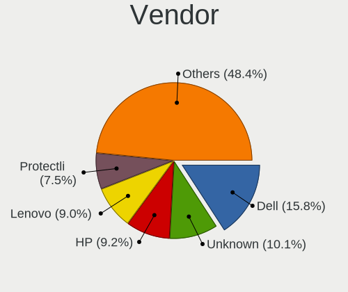
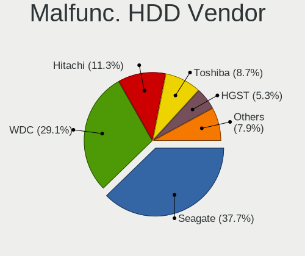
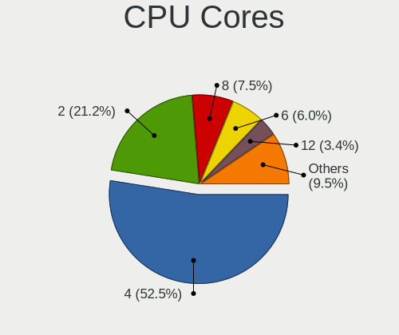
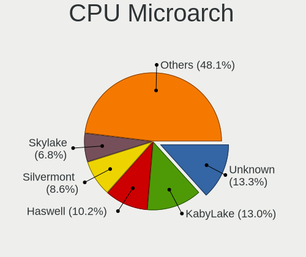
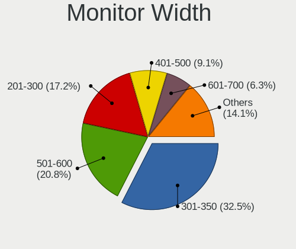
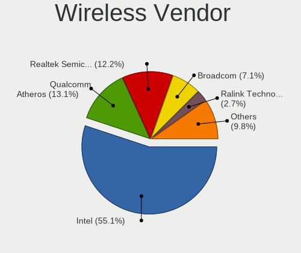
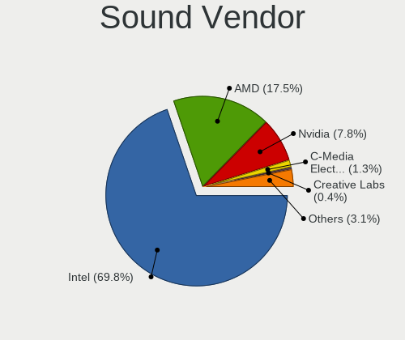

BSD in USA - Tested Hardware & Statistics
-----------------------------------------

A project to collect tested hardware configurations for BSD in USA.

Anyone can contribute to this report by the [hw-probe](https://github.com/linuxhw/hw-probe/blob/master/INSTALL.BSD.md) tool:

    hw-probe -all -upload

Please contribute! Especially if your hardware is rare.

This is a report for all computer types. See also reports for [desktops](/Location/USA/Desktop/README.md) and [notebooks](/Location/USA/Notebook/README.md).

Contents
--------

* [ Test Cases ](#test-cases)

* [ System ](#system)
  - [ OS                       ](#os)
  - [ OS Family                ](#os-family)
  - [ Arch                     ](#arch)
  - [ DE                       ](#de)
  - [ Display Server           ](#display-server)
  - [ Display Manager          ](#display-manager)
  - [ OS Lang                  ](#os-lang)
  - [ Boot Mode                ](#boot-mode)
  - [ Filesystem               ](#filesystem)
  - [ Part. scheme             ](#part-scheme)

* [ Board ](#board)
  - [ Vendor                   ](#vendor)
  - [ Model                    ](#model)
  - [ Model Family             ](#model-family)
  - [ MFG Year                 ](#mfg-year)
  - [ Form Factor              ](#form-factor)
  - [ Coreboot                 ](#coreboot)
  - [ RAM Size                 ](#ram-size)
  - [ RAM Used                 ](#ram-used)
  - [ Total Drives             ](#total-drives)
  - [ Has CD-ROM               ](#has-cd-rom)
  - [ Has Ethernet             ](#has-ethernet)
  - [ Has WiFi                 ](#has-wifi)
  - [ Has Bluetooth            ](#has-bluetooth)

* [ Location ](#location)
  - [ Country                  ](#country)
  - [ City                     ](#city)

* [ Drives ](#drives)
  - [ Drive Vendor             ](#drive-vendor)
  - [ Drive Model              ](#drive-model)
  - [ HDD Vendor               ](#hdd-vendor)
  - [ SSD Vendor               ](#ssd-vendor)
  - [ Drive Kind               ](#drive-kind)
  - [ Drive Connector          ](#drive-connector)
  - [ Drive Size               ](#drive-size)
  - [ Space Total              ](#space-total)
  - [ Space Used               ](#space-used)
  - [ Malfunc. Drives          ](#malfunc-drives)
  - [ Malfunc. Drive Vendor    ](#malfunc-drive-vendor)
  - [ Malfunc. HDD Vendor      ](#malfunc-hdd-vendor)
  - [ Malfunc. Drive Kind      ](#malfunc-drive-kind)
  - [ Failed Drives            ](#failed-drives)
  - [ Failed Drive Vendor      ](#failed-drive-vendor)
  - [ Drive Status             ](#drive-status)

* [ Storage controller ](#storage-controller)
  - [ Storage Vendor           ](#storage-vendor)
  - [ Storage Model            ](#storage-model)
  - [ Storage Kind             ](#storage-kind)

* [ Processor ](#processor)
  - [ CPU Vendor               ](#cpu-vendor)
  - [ CPU Model                ](#cpu-model)
  - [ CPU Model Family         ](#cpu-model-family)
  - [ CPU Cores                ](#cpu-cores)
  - [ CPU Sockets              ](#cpu-sockets)
  - [ CPU Threads              ](#cpu-threads)
  - [ CPU Microarch            ](#cpu-microarch)

* [ Graphics ](#graphics)
  - [ GPU Vendor               ](#gpu-vendor)
  - [ GPU Model                ](#gpu-model)
  - [ GPU Combo                ](#gpu-combo)
  - [ GPU Driver               ](#gpu-driver)
  - [ GPU Memory               ](#gpu-memory)

* [ Monitor ](#monitor)
  - [ Monitor Vendor           ](#monitor-vendor)
  - [ Monitor Model            ](#monitor-model)
  - [ Monitor Resolution       ](#monitor-resolution)
  - [ Monitor Diagonal         ](#monitor-diagonal)
  - [ Monitor Width            ](#monitor-width)
  - [ Aspect Ratio             ](#aspect-ratio)
  - [ Monitor Area             ](#monitor-area)
  - [ Pixel Density            ](#pixel-density)
  - [ Multiple Monitors        ](#multiple-monitors)

* [ Network ](#network)
  - [ Net Controller Vendor    ](#net-controller-vendor)
  - [ Net Controller Model     ](#net-controller-model)
  - [ Wireless Vendor          ](#wireless-vendor)
  - [ Wireless Model           ](#wireless-model)
  - [ Ethernet Vendor          ](#ethernet-vendor)
  - [ Ethernet Model           ](#ethernet-model)
  - [ Net Controller Kind      ](#net-controller-kind)
  - [ Used Controller          ](#used-controller)
  - [ NICs                     ](#nics)
  - [ IPv6                     ](#ipv6)

* [ Bluetooth ](#bluetooth)
  - [ Bluetooth Vendor         ](#bluetooth-vendor)
  - [ Bluetooth Model          ](#bluetooth-model)

* [ Sound ](#sound)
  - [ Sound Vendor             ](#sound-vendor)
  - [ Sound Model              ](#sound-model)

* [ Memory ](#memory)
  - [ Memory Vendor            ](#memory-vendor)
  - [ Memory Model             ](#memory-model)
  - [ Memory Kind              ](#memory-kind)
  - [ Memory Form Factor       ](#memory-form-factor)
  - [ Memory Size              ](#memory-size)
  - [ Memory Speed             ](#memory-speed)

* [ Printers & scanners ](#printers--scanners)
  - [ Printer Vendor           ](#printer-vendor)
  - [ Printer Model            ](#printer-model)
  - [ Scanner Vendor           ](#scanner-vendor)
  - [ Scanner Model            ](#scanner-model)

* [ Camera ](#camera)
  - [ Camera Vendor            ](#camera-vendor)
  - [ Camera Model             ](#camera-model)

* [ Security ](#security)
  - [ Fingerprint Vendor       ](#fingerprint-vendor)
  - [ Fingerprint Model        ](#fingerprint-model)
  - [ Chipcard Vendor          ](#chipcard-vendor)
  - [ Chipcard Model           ](#chipcard-model)

* [ Unsupported ](#unsupported)
  - [ Unsupported Devices      ](#unsupported-devices)
  - [ Unsupported Device Types ](#unsupported-device-types)

Test Cases
----------

Total: 5109

| Vendor        | Model                       | Form-Factor | Probe                                                     | Date         |
|---------------|-----------------------------|-------------|-----------------------------------------------------------|--------------|
| Techvision    | TVI7309X B0                 | Desktop     | [eff74e8df0](https://bsd-hardware.info/?probe=eff74e8df0) | Sep 07, 2023 |
| Dell          | 05XGC8 A01                  | Desktop     | [7c0acfa5b9](https://bsd-hardware.info/?probe=7c0acfa5b9) | Sep 07, 2023 |
| Unknown       | Unknown                     | Desktop     | [94d9b19ade](https://bsd-hardware.info/?probe=94d9b19ade) | Sep 07, 2023 |
| Lenovo        | 3136 SDK0J40697 WIN 3305... | Mini pc     | [b5aa3f010f](https://bsd-hardware.info/?probe=b5aa3f010f) | Sep 07, 2023 |
| AMI           | Aptio CRB                   | Mini pc     | [12145f939b](https://bsd-hardware.info/?probe=12145f939b) | Sep 07, 2023 |
| Dell          | 0KM5PX A01                  | Server      | [67f910daa9](https://bsd-hardware.info/?probe=67f910daa9) | Sep 06, 2023 |
| Lenovo        | 0B98401 PRO                 | Desktop     | [4397f70291](https://bsd-hardware.info/?probe=4397f70291) | Sep 06, 2023 |
| AZW           | MINI S 10                   | Desktop     | [2daf516a05](https://bsd-hardware.info/?probe=2daf516a05) | Sep 06, 2023 |
| ASUSTek       | SABERTOOTH 990FX R2.0       | Desktop     | [0b7d85b124](https://bsd-hardware.info/?probe=0b7d85b124) | Sep 06, 2023 |
| LG Electro... | 16U70Q-K.AAS7U1             | Notebook    | [82e3b2e5f8](https://bsd-hardware.info/?probe=82e3b2e5f8) | Sep 06, 2023 |
| Supermicro    | X9SCL/X9SCMA                | Desktop     | [3af68f2594](https://bsd-hardware.info/?probe=3af68f2594) | Sep 06, 2023 |
| Dell          | 096JG8 A01                  | Desktop     | [ec3e0338eb](https://bsd-hardware.info/?probe=ec3e0338eb) | Sep 06, 2023 |
| Dell          | 096JG8 A01                  | Desktop     | [84d768ee15](https://bsd-hardware.info/?probe=84d768ee15) | Sep 05, 2023 |
| Intel         | Q3XXG4-P V1.0               | Desktop     | [3fb536ecce](https://bsd-hardware.info/?probe=3fb536ecce) | Sep 05, 2023 |
| Dell          | Inspiron 15 7000 Gaming     | Notebook    | [67e9eafa7e](https://bsd-hardware.info/?probe=67e9eafa7e) | Sep 05, 2023 |
| Dell          | 0X3D66 A02                  | Server      | [8dcfb77863](https://bsd-hardware.info/?probe=8dcfb77863) | Sep 05, 2023 |
| ASUSTek       | H97I-PLUS                   | Desktop     | [e92272bb87](https://bsd-hardware.info/?probe=e92272bb87) | Sep 05, 2023 |
| Supermicro    | X11SSH-F                    | Desktop     | [bff90e93d0](https://bsd-hardware.info/?probe=bff90e93d0) | Sep 05, 2023 |
| Lenovo        | ThinkPad X61 Tablet 7762... | Notebook    | [00dd1bd84e](https://bsd-hardware.info/?probe=00dd1bd84e) | Sep 04, 2023 |
| Unknown       | Unknown                     | Desktop     | [a4796e8170](https://bsd-hardware.info/?probe=a4796e8170) | Sep 04, 2023 |
| Dell          | 0NC2VH A01                  | Desktop     | [8cc0358a69](https://bsd-hardware.info/?probe=8cc0358a69) | Sep 04, 2023 |
| CWWK          | CW-AD4L-N V1                | Desktop     | [dd32d9d4e1](https://bsd-hardware.info/?probe=dd32d9d4e1) | Sep 04, 2023 |
| Toshiba       | QOSMIO X775                 | Notebook    | [d92a05ab1d](https://bsd-hardware.info/?probe=d92a05ab1d) | Sep 04, 2023 |
| Unknown       | Unknown                     | Desktop     | [7d95befe6e](https://bsd-hardware.info/?probe=7d95befe6e) | Sep 04, 2023 |
| Intel         | S1200KP AAG34877-201        | Desktop     | [1b07865ce7](https://bsd-hardware.info/?probe=1b07865ce7) | Sep 04, 2023 |
| ASRock        | X570 Steel Legend WiFi a... | Desktop     | [a98f0b3d67](https://bsd-hardware.info/?probe=a98f0b3d67) | Sep 03, 2023 |
| Gigabyte      | A520I AC                    | Desktop     | [58e061f420](https://bsd-hardware.info/?probe=58e061f420) | Sep 03, 2023 |
| ASRock        | X570 Steel Legend WiFi a... | Desktop     | [d352ea60cf](https://bsd-hardware.info/?probe=d352ea60cf) | Sep 03, 2023 |
| MSI           | PRO Z790-P WIFI             | Desktop     | [fe53c55492](https://bsd-hardware.info/?probe=fe53c55492) | Sep 03, 2023 |
| MSI           | H81M-P33                    | Desktop     | [b47290007a](https://bsd-hardware.info/?probe=b47290007a) | Sep 03, 2023 |
| ASUSTek       | P5Q-E                       | Desktop     | [ef4604a40f](https://bsd-hardware.info/?probe=ef4604a40f) | Sep 03, 2023 |
| ASUSTek       | ROG CROSSHAIR VIII HERO     | Desktop     | [8d37c44440](https://bsd-hardware.info/?probe=8d37c44440) | Sep 03, 2023 |
| Unknown       | Unknown                     | Desktop     | [9c1891cda7](https://bsd-hardware.info/?probe=9c1891cda7) | Sep 03, 2023 |
| AAEON         | FWS-2363 V1.0               | Desktop     | [098bc5466b](https://bsd-hardware.info/?probe=098bc5466b) | Sep 03, 2023 |
| Lenovo        | ThinkPad P50 20EN0012US     | Notebook    | [9d1b9e7af6](https://bsd-hardware.info/?probe=9d1b9e7af6) | Sep 03, 2023 |
| Dell          | 08NPPY A00                  | Desktop     | [1ae33cfe72](https://bsd-hardware.info/?probe=1ae33cfe72) | Sep 02, 2023 |
| ASRock        | J3455M                      | Desktop     | [762d4d9370](https://bsd-hardware.info/?probe=762d4d9370) | Sep 02, 2023 |
| Dell          | 0XCR8D A00                  | Desktop     | [b89126c9d9](https://bsd-hardware.info/?probe=b89126c9d9) | Sep 02, 2023 |
| AMI           | Aptio CRB                   | Mini pc     | [b63ded7b81](https://bsd-hardware.info/?probe=b63ded7b81) | Sep 02, 2023 |
| MSI           | Z390-A PRO                  | Desktop     | [57925dc8bb](https://bsd-hardware.info/?probe=57925dc8bb) | Sep 02, 2023 |
| Unknown       | Unknown                     | Desktop     | [94487109c2](https://bsd-hardware.info/?probe=94487109c2) | Sep 01, 2023 |
| Supermicro    | X9DRD-iF                    | Server      | [708af02c7b](https://bsd-hardware.info/?probe=708af02c7b) | Sep 01, 2023 |
| HP            | EliteBook 8540w             | Notebook    | [5e44dfed67](https://bsd-hardware.info/?probe=5e44dfed67) | Sep 01, 2023 |
| Dell          | 0DRG19 A00                  | Mini pc     | [9e6cb6fe25](https://bsd-hardware.info/?probe=9e6cb6fe25) | Sep 01, 2023 |
| CompuLab      | fitlet2                     | Mini pc     | [525a1718ff](https://bsd-hardware.info/?probe=525a1718ff) | Sep 01, 2023 |
| Shuttle       | FS77U                       | Desktop     | [149a8a1437](https://bsd-hardware.info/?probe=149a8a1437) | Sep 01, 2023 |
| Panasonic     | CFSX4-1                     | Notebook    | [8f54654916](https://bsd-hardware.info/?probe=8f54654916) | Sep 01, 2023 |
| Dell          | 0YXT71 A02                  | Desktop     | [b887caabe7](https://bsd-hardware.info/?probe=b887caabe7) | Aug 31, 2023 |
| Foxconn       | nT-A3000 series FAB         | Desktop     | [d9f360b4fe](https://bsd-hardware.info/?probe=d9f360b4fe) | Aug 31, 2023 |
| Dell          | 0WR7PY A02                  | Desktop     | [2557e04cf5](https://bsd-hardware.info/?probe=2557e04cf5) | Aug 31, 2023 |
| Intel         | NUC8i7HNB J68197-602        | Mini pc     | [f2806a3c65](https://bsd-hardware.info/?probe=f2806a3c65) | Aug 31, 2023 |
| Biostar       | A68N-5545                   | Desktop     | [b2a1070e2d](https://bsd-hardware.info/?probe=b2a1070e2d) | Aug 31, 2023 |
| CWWK          | CW-AD4L-N V1                | Desktop     | [363a27fb74](https://bsd-hardware.info/?probe=363a27fb74) | Aug 31, 2023 |
| Acer          | Aspire A515-55              | Notebook    | [fcbd8a3f31](https://bsd-hardware.info/?probe=fcbd8a3f31) | Aug 31, 2023 |
| AMI           | Aptio CRB                   | Mini pc     | [97975e788b](https://bsd-hardware.info/?probe=97975e788b) | Aug 30, 2023 |
| Deciso        | NetBoard-A20                | Notebook    | [0119402f80](https://bsd-hardware.info/?probe=0119402f80) | Aug 30, 2023 |
| Infoblox      | IB-810                      | Desktop     | [34c0fa6bec](https://bsd-hardware.info/?probe=34c0fa6bec) | Aug 30, 2023 |
| Supermicro    | X12SDV-8C-SPT8FA            | Server      | [c46557f737](https://bsd-hardware.info/?probe=c46557f737) | Aug 30, 2023 |
| Techvision    | TVI7309X B0                 | Desktop     | [259a7ec99d](https://bsd-hardware.info/?probe=259a7ec99d) | Aug 30, 2023 |
| Techvision    | TVI7309X B0                 | Desktop     | [20946147de](https://bsd-hardware.info/?probe=20946147de) | Aug 30, 2023 |
| Unknown       | Unknown                     | Desktop     | [8cfa60050b](https://bsd-hardware.info/?probe=8cfa60050b) | Aug 30, 2023 |
| Dell          | Latitude E4310              | Notebook    | [7645de3654](https://bsd-hardware.info/?probe=7645de3654) | Aug 30, 2023 |
| Supermicro    | A1SRi-2758F                 | Desktop     | [c8b4f33fb1](https://bsd-hardware.info/?probe=c8b4f33fb1) | Aug 30, 2023 |
| Biostar       | A68N-5545                   | Desktop     | [c90edbc46a](https://bsd-hardware.info/?probe=c90edbc46a) | Aug 29, 2023 |
| Lenovo        | IdeaPad 110S-11IBR 80WG     | Notebook    | [e74ef1d37c](https://bsd-hardware.info/?probe=e74ef1d37c) | Aug 29, 2023 |
| Supermicro    | X9DRD-iF                    | Desktop     | [be36f2fe2b](https://bsd-hardware.info/?probe=be36f2fe2b) | Aug 28, 2023 |
| ATOPNUC       | MA90                        | Mini pc     | [e0d13077ea](https://bsd-hardware.info/?probe=e0d13077ea) | Aug 28, 2023 |
| Lenovo        | ThinkPad T490 20RYS06R00    | Notebook    | [978cd1d6bc](https://bsd-hardware.info/?probe=978cd1d6bc) | Aug 28, 2023 |
| Dell          | 04Y8V0 A02                  | Desktop     | [a84c23941d](https://bsd-hardware.info/?probe=a84c23941d) | Aug 27, 2023 |
| Protectli     | FW6                         | Desktop     | [37b744ff79](https://bsd-hardware.info/?probe=37b744ff79) | Aug 27, 2023 |
| Dell          | Latitude 7280               | Notebook    | [c858f191cf](https://bsd-hardware.info/?probe=c858f191cf) | Aug 27, 2023 |
| MSI           | H81M-P33                    | Desktop     | [2e9a066a01](https://bsd-hardware.info/?probe=2e9a066a01) | Aug 27, 2023 |
| ASUSTek       | P5Q-E                       | Desktop     | [9898ae1ead](https://bsd-hardware.info/?probe=9898ae1ead) | Aug 27, 2023 |
| ASUSTek       | ROG CROSSHAIR VIII HERO     | Desktop     | [0bb56ff672](https://bsd-hardware.info/?probe=0bb56ff672) | Aug 27, 2023 |
| HP            | 8103 A01                    | Mini pc     | [484d82cac6](https://bsd-hardware.info/?probe=484d82cac6) | Aug 27, 2023 |
| Supermicro    | X11SDV-4C-TP8F-01           | Desktop     | [21e958a05d](https://bsd-hardware.info/?probe=21e958a05d) | Aug 26, 2023 |
| ASRock        | 970 Extreme3 R2.0           | Desktop     | [bf289c5941](https://bsd-hardware.info/?probe=bf289c5941) | Aug 26, 2023 |
| HP            | 8299                        | Desktop     | [77a077cb11](https://bsd-hardware.info/?probe=77a077cb11) | Aug 26, 2023 |
| Pegatron      | 2ACD                        | Desktop     | [c20fcb2b2f](https://bsd-hardware.info/?probe=c20fcb2b2f) | Aug 26, 2023 |
| HP            | ENVY Notebook 13-ab0XX      | Notebook    | [3d96f4d5b4](https://bsd-hardware.info/?probe=3d96f4d5b4) | Aug 26, 2023 |
| Lenovo        | ThinkPad X1 Carbon 7th 2... | Notebook    | [c8e95f3772](https://bsd-hardware.info/?probe=c8e95f3772) | Aug 26, 2023 |
| Supermicro    | X10DRi-LN4+                 | Server      | [4978b62b97](https://bsd-hardware.info/?probe=4978b62b97) | Aug 24, 2023 |
| Lenovo        | ThinkPad X1 Carbon Gen 9... | Notebook    | [f1a43ebe23](https://bsd-hardware.info/?probe=f1a43ebe23) | Aug 24, 2023 |
| Inventec      | Z CLASS A02                 | Desktop     | [8d7f83c319](https://bsd-hardware.info/?probe=8d7f83c319) | Aug 24, 2023 |
| Dell          | Inspiron 15-7568            | Notebook    | [9e555f0b24](https://bsd-hardware.info/?probe=9e555f0b24) | Aug 24, 2023 |
| Dell          | Latitude 7490               | Notebook    | [0b05de2297](https://bsd-hardware.info/?probe=0b05de2297) | Aug 24, 2023 |
| MW            | GMLK-2_5G4L                 | Desktop     | [d07ade15d2](https://bsd-hardware.info/?probe=d07ade15d2) | Aug 23, 2023 |
| MSI           | PRO B550-VC                 | Desktop     | [005e9c7b4c](https://bsd-hardware.info/?probe=005e9c7b4c) | Aug 23, 2023 |
| AZW           | EQ                          | Desktop     | [a43bd92291](https://bsd-hardware.info/?probe=a43bd92291) | Aug 23, 2023 |
| Lenovo        | 3102 SDK0J40705 WIN 3425... | Desktop     | [1fcc80636d](https://bsd-hardware.info/?probe=1fcc80636d) | Aug 22, 2023 |
| Supermicro    | X9DRD-iF                    | Server      | [962bf51507](https://bsd-hardware.info/?probe=962bf51507) | Aug 22, 2023 |
| Techvision    | TVI7309X B0                 | Desktop     | [ff55eb5161](https://bsd-hardware.info/?probe=ff55eb5161) | Aug 22, 2023 |
| Protectli     | FW4B                        | Desktop     | [6041b7e153](https://bsd-hardware.info/?probe=6041b7e153) | Aug 21, 2023 |
| Intel         | JSL MRD                     | Desktop     | [0f3ef76fb8](https://bsd-hardware.info/?probe=0f3ef76fb8) | Aug 21, 2023 |
| Cisco         | ASA5525 A0                  | Desktop     | [7c88ca29f7](https://bsd-hardware.info/?probe=7c88ca29f7) | Aug 21, 2023 |
| Dell          | 0PXXHP A03                  | Server      | [e8eef1fb22](https://bsd-hardware.info/?probe=e8eef1fb22) | Aug 21, 2023 |
| ASUSTek       | B85M-G R2.0                 | Desktop     | [3941ce5fae](https://bsd-hardware.info/?probe=3941ce5fae) | Aug 21, 2023 |
| ASRock        | X570M Pro4                  | Desktop     | [c03bc6fa91](https://bsd-hardware.info/?probe=c03bc6fa91) | Aug 21, 2023 |
| MSI           | MEG X570 ACE                | Desktop     | [0d69491bdd](https://bsd-hardware.info/?probe=0d69491bdd) | Aug 21, 2023 |
| MSI           | MEG X570 ACE                | Desktop     | [913cc77381](https://bsd-hardware.info/?probe=913cc77381) | Aug 21, 2023 |
| Unknown       | Unknown                     | Desktop     | [e57d2d76d2](https://bsd-hardware.info/?probe=e57d2d76d2) | Aug 21, 2023 |
| Unknown       | J3160-4L                    | Desktop     | [cf30fa594f](https://bsd-hardware.info/?probe=cf30fa594f) | Aug 21, 2023 |
| Intel         | DQ67SW AAG12527-310         | Desktop     | [e6bfadb400](https://bsd-hardware.info/?probe=e6bfadb400) | Aug 21, 2023 |
| Inventec      | Z CLASS A02                 | Desktop     | [3194978ea5](https://bsd-hardware.info/?probe=3194978ea5) | Aug 20, 2023 |
| Dell          | 0D7449 A01                  | Server      | [33c9f97cb9](https://bsd-hardware.info/?probe=33c9f97cb9) | Aug 20, 2023 |
| Raspberry ... | Raspberry Pi 4 Model B      | Soc         | [2beb3e34d8](https://bsd-hardware.info/?probe=2beb3e34d8) | Aug 20, 2023 |
| Gigabyte      | GA-880GA-UD3H               | Desktop     | [35eb7df9a7](https://bsd-hardware.info/?probe=35eb7df9a7) | Aug 20, 2023 |
| MSI           | 990FXA-GD80                 | Desktop     | [70c65a5a34](https://bsd-hardware.info/?probe=70c65a5a34) | Aug 20, 2023 |
| Unknown       | Unknown                     | Desktop     | [3296816fc1](https://bsd-hardware.info/?probe=3296816fc1) | Aug 20, 2023 |
| ASRock        | H110M-STX                   | Desktop     | [5c819b9ff1](https://bsd-hardware.info/?probe=5c819b9ff1) | Aug 20, 2023 |
| ASUSTek       | TUF Gaming B450M-PLUS II    | Desktop     | [1b53079f34](https://bsd-hardware.info/?probe=1b53079f34) | Aug 19, 2023 |
| Protectli     | FW1 Ver                     | Desktop     | [8b49278bbd](https://bsd-hardware.info/?probe=8b49278bbd) | Aug 19, 2023 |
| Supermicro    | A1SRi-2758F                 | Desktop     | [c9c0312302](https://bsd-hardware.info/?probe=c9c0312302) | Aug 19, 2023 |
| Lenovo        | IdeaPad 330-15IKB 81DE      | Notebook    | [1bc7f67754](https://bsd-hardware.info/?probe=1bc7f67754) | Aug 18, 2023 |
| Protectli     | FW2B Ver                    | Desktop     | [b200aabc73](https://bsd-hardware.info/?probe=b200aabc73) | Aug 18, 2023 |
| Unknown       | Unknown                     | Desktop     | [f7c887c84f](https://bsd-hardware.info/?probe=f7c887c84f) | Aug 18, 2023 |
| MSI           | MPG Z390 GAMING PRO CARB... | Desktop     | [df095be4ba](https://bsd-hardware.info/?probe=df095be4ba) | Aug 18, 2023 |
| Dell          | 0GY6Y8 A00                  | Desktop     | [e982da98d2](https://bsd-hardware.info/?probe=e982da98d2) | Aug 18, 2023 |
| MSI           | MS-7721                     | Desktop     | [a577019634](https://bsd-hardware.info/?probe=a577019634) | Aug 18, 2023 |
| MSI           | MS-7721                     | Desktop     | [678c81c8c1](https://bsd-hardware.info/?probe=678c81c8c1) | Aug 18, 2023 |
| Unknown       | Unknown                     | Desktop     | [3521bed0e8](https://bsd-hardware.info/?probe=3521bed0e8) | Aug 18, 2023 |
| Unknown       | QSKL01                      | Desktop     | [b768029249](https://bsd-hardware.info/?probe=b768029249) | Aug 18, 2023 |
| ASRock        | B660M Steel Legend          | Desktop     | [c50e637bc2](https://bsd-hardware.info/?probe=c50e637bc2) | Aug 18, 2023 |
| Supermicro    | A1SRi-2758F                 | Desktop     | [71fff01c39](https://bsd-hardware.info/?probe=71fff01c39) | Aug 18, 2023 |
| Protectli     | FW4B                        | Desktop     | [880c0c7069](https://bsd-hardware.info/?probe=880c0c7069) | Aug 18, 2023 |
| HP            | 1495                        | Desktop     | [556a339a7e](https://bsd-hardware.info/?probe=556a339a7e) | Aug 17, 2023 |
| Unknown       | Unknown                     | Desktop     | [a574d1cce5](https://bsd-hardware.info/?probe=a574d1cce5) | Aug 17, 2023 |
| Unknown       | Unknown                     | Desktop     | [20348d2f47](https://bsd-hardware.info/?probe=20348d2f47) | Aug 17, 2023 |
| Unknown       | YL-E3854L4-V2               | Desktop     | [6b85b4a31c](https://bsd-hardware.info/?probe=6b85b4a31c) | Aug 16, 2023 |
| MSI           | PRO Z790-P WIFI             | Desktop     | [fcb3075158](https://bsd-hardware.info/?probe=fcb3075158) | Aug 16, 2023 |
| Dell          | 0F9NPY A00                  | Server      | [bc1b3da23f](https://bsd-hardware.info/?probe=bc1b3da23f) | Aug 16, 2023 |
| Dell          | 05KX61 A02                  | Server      | [2fe3211471](https://bsd-hardware.info/?probe=2fe3211471) | Aug 16, 2023 |
| Unknown       | Unknown                     | Desktop     | [e457a41b4a](https://bsd-hardware.info/?probe=e457a41b4a) | Aug 16, 2023 |
| Supermicro    | X11SDV-8C-TP8F              | Desktop     | [3b5ddbcb06](https://bsd-hardware.info/?probe=3b5ddbcb06) | Aug 16, 2023 |
| CncTion       | J4125-4L-I225               | Desktop     | [269cfa2253](https://bsd-hardware.info/?probe=269cfa2253) | Aug 16, 2023 |
| CWWK          | CW-AD4L-N V1                | Desktop     | [f710821a92](https://bsd-hardware.info/?probe=f710821a92) | Aug 16, 2023 |
| HP            | 18E7                        | Desktop     | [3c24defdf8](https://bsd-hardware.info/?probe=3c24defdf8) | Aug 16, 2023 |
| Acer          | Aspire A315-59              | Notebook    | [9a8ad54cd3](https://bsd-hardware.info/?probe=9a8ad54cd3) | Aug 16, 2023 |
| Gigabyte      | Z390 AORUS PRO WIFI-CF      | Desktop     | [fc152ce8d4](https://bsd-hardware.info/?probe=fc152ce8d4) | Aug 16, 2023 |
| Unknown       | Unknown                     | Desktop     | [86c4d1f8cf](https://bsd-hardware.info/?probe=86c4d1f8cf) | Aug 15, 2023 |
| Gigabyte      | G41M-ES2L                   | Desktop     | [30c58f7403](https://bsd-hardware.info/?probe=30c58f7403) | Aug 15, 2023 |
| Lenovo        | IdeaPad Slim 9 14ITL5 82... | Notebook    | [be7bd4b126](https://bsd-hardware.info/?probe=be7bd4b126) | Aug 15, 2023 |
| PC Engines    | APU2                        | Desktop     | [c11fdc1cf9](https://bsd-hardware.info/?probe=c11fdc1cf9) | Aug 15, 2023 |
| Unknown       | Unknown                     | Desktop     | [99fd3696dd](https://bsd-hardware.info/?probe=99fd3696dd) | Aug 15, 2023 |
| AZW           | EQ                          | Desktop     | [5393736ae4](https://bsd-hardware.info/?probe=5393736ae4) | Aug 15, 2023 |
| Protectli     | FW4B Ver                    | Desktop     | [dbbd82bd80](https://bsd-hardware.info/?probe=dbbd82bd80) | Aug 15, 2023 |
| MSI           | B360M BAZOOKA               | Desktop     | [472c17f992](https://bsd-hardware.info/?probe=472c17f992) | Aug 15, 2023 |
| Dell          | 08NPPY A00                  | Desktop     | [aba7b573c1](https://bsd-hardware.info/?probe=aba7b573c1) | Aug 14, 2023 |
| MSI           | 990FXA-GD80                 | Desktop     | [169da97c61](https://bsd-hardware.info/?probe=169da97c61) | Aug 14, 2023 |
| Protectli     | FW4B                        | Desktop     | [417b740320](https://bsd-hardware.info/?probe=417b740320) | Aug 14, 2023 |
| Dell          | 0HY9JP A00                  | Desktop     | [c09110c605](https://bsd-hardware.info/?probe=c09110c605) | Aug 13, 2023 |
| Protectli     | VP2420                      | Desktop     | [b4bed593e9](https://bsd-hardware.info/?probe=b4bed593e9) | Aug 13, 2023 |
| Protectli     | VP2420                      | Desktop     | [b81c163920](https://bsd-hardware.info/?probe=b81c163920) | Aug 13, 2023 |
| ASUSTek       | PRIME X370-PRO              | Desktop     | [2529ce32a7](https://bsd-hardware.info/?probe=2529ce32a7) | Aug 13, 2023 |
| ASRock        | X570 Phantom Gaming 4       | Desktop     | [80fbf43a6c](https://bsd-hardware.info/?probe=80fbf43a6c) | Aug 13, 2023 |
| ASUSTek       | P5Q-E                       | Desktop     | [fbb75a1ace](https://bsd-hardware.info/?probe=fbb75a1ace) | Aug 13, 2023 |
| MSI           | H81M-P33                    | Desktop     | [c7b0e4ca6c](https://bsd-hardware.info/?probe=c7b0e4ca6c) | Aug 13, 2023 |
| ASUSTek       | ROG CROSSHAIR VIII HERO     | Desktop     | [245d908d1a](https://bsd-hardware.info/?probe=245d908d1a) | Aug 13, 2023 |
| Dell          | 02YYK5 A00                  | Desktop     | [fecdfd45c7](https://bsd-hardware.info/?probe=fecdfd45c7) | Aug 13, 2023 |
| MSI           | MPG Z390 GAMING PRO CARB... | Desktop     | [9d53e56e92](https://bsd-hardware.info/?probe=9d53e56e92) | Aug 13, 2023 |
| Supermicro    | X11SSH-F                    | Desktop     | [deb4e10cd2](https://bsd-hardware.info/?probe=deb4e10cd2) | Aug 13, 2023 |
| Supermicro    | X11SSH-F                    | Desktop     | [947caf3be1](https://bsd-hardware.info/?probe=947caf3be1) | Aug 13, 2023 |
| Unknown       | YL-E3854L4-V2               | Desktop     | [e21c4e8012](https://bsd-hardware.info/?probe=e21c4e8012) | Aug 13, 2023 |
| Unknown       | YL-E3854L4-V2               | Desktop     | [2b24029c25](https://bsd-hardware.info/?probe=2b24029c25) | Aug 12, 2023 |
| HP            | 8265                        | Desktop     | [cefac793c7](https://bsd-hardware.info/?probe=cefac793c7) | Aug 12, 2023 |
| MW            | GMLK-2_5G4L                 | Desktop     | [41f42269dc](https://bsd-hardware.info/?probe=41f42269dc) | Aug 12, 2023 |
| Protectli     | FW6 Ver                     | Desktop     | [edc2f0f879](https://bsd-hardware.info/?probe=edc2f0f879) | Aug 12, 2023 |
| Protectli     | FW4C Ver                    | Desktop     | [519987ec57](https://bsd-hardware.info/?probe=519987ec57) | Aug 12, 2023 |
| MW            | GMLK-2_5G4L                 | Desktop     | [2ee5b48d5c](https://bsd-hardware.info/?probe=2ee5b48d5c) | Aug 12, 2023 |
| Unknown       | Unknown                     | Desktop     | [e310e0d309](https://bsd-hardware.info/?probe=e310e0d309) | Aug 11, 2023 |
| HP            | 8054                        | Desktop     | [05cae0efcc](https://bsd-hardware.info/?probe=05cae0efcc) | Aug 11, 2023 |
| HP            | 8055                        | Desktop     | [d686196496](https://bsd-hardware.info/?probe=d686196496) | Aug 11, 2023 |
| HP            | 1495                        | Desktop     | [7591160534](https://bsd-hardware.info/?probe=7591160534) | Aug 11, 2023 |
| Shuttle       | FH270                       | Desktop     | [8b697be8be](https://bsd-hardware.info/?probe=8b697be8be) | Aug 11, 2023 |
| Lenovo        | ThinkPad X220 4286CTO       | Notebook    | [2db86b4dff](https://bsd-hardware.info/?probe=2db86b4dff) | Aug 11, 2023 |
| Unknown       | Unknown                     | Desktop     | [fdd28fbae2](https://bsd-hardware.info/?probe=fdd28fbae2) | Aug 10, 2023 |
| MSI           | B360M BAZOOKA               | Desktop     | [4b0b4b88a7](https://bsd-hardware.info/?probe=4b0b4b88a7) | Aug 10, 2023 |
| Gigabyte      | X570 UD                     | Desktop     | [d4b7006d24](https://bsd-hardware.info/?probe=d4b7006d24) | Aug 10, 2023 |
| ATOPNUC       | MA90                        | Mini pc     | [4f4c550075](https://bsd-hardware.info/?probe=4f4c550075) | Aug 10, 2023 |
| Supermicro    | X12SDV-4C-SP6F              | Desktop     | [6a275811b8](https://bsd-hardware.info/?probe=6a275811b8) | Aug 10, 2023 |
| Supermicro    | A1SRi 123456789             | Mini pc     | [a66d0c2283](https://bsd-hardware.info/?probe=a66d0c2283) | Aug 10, 2023 |
| Techvision    | TVI7309X B0                 | Desktop     | [877307aa80](https://bsd-hardware.info/?probe=877307aa80) | Aug 09, 2023 |
| Premio        | BlueCat XMB3 00C            | Desktop     | [76abf23a1f](https://bsd-hardware.info/?probe=76abf23a1f) | Aug 08, 2023 |
| Dell          | 08NPPY A00                  | Desktop     | [c0884d7f16](https://bsd-hardware.info/?probe=c0884d7f16) | Aug 08, 2023 |
| Supermicro    | X10SDV-4C-TLN2F             | Server      | [211a64ef6e](https://bsd-hardware.info/?probe=211a64ef6e) | Aug 08, 2023 |
| Dell          | 00NH4P A07                  | Server      | [be1b164954](https://bsd-hardware.info/?probe=be1b164954) | Aug 08, 2023 |
| ASUSTek       | K30AD_M31AD_M51AD_M32AD     | Desktop     | [c54bdb8e4b](https://bsd-hardware.info/?probe=c54bdb8e4b) | Aug 08, 2023 |
| ASUSTek       | PRIME Z590M-PLUS            | Desktop     | [87810aceef](https://bsd-hardware.info/?probe=87810aceef) | Aug 08, 2023 |
| PC Engines    | apu4                        | Desktop     | [bb7ad49154](https://bsd-hardware.info/?probe=bb7ad49154) | Aug 07, 2023 |
| Intel         | Q3XXG4-P V1.0               | Desktop     | [d880905ae7](https://bsd-hardware.info/?probe=d880905ae7) | Aug 07, 2023 |
| Intel         | SHARKBAY                    | Desktop     | [2a8896bb78](https://bsd-hardware.info/?probe=2a8896bb78) | Aug 07, 2023 |
| Intel         | Q3XXG4-P V1.0               | Desktop     | [5b58edb60b](https://bsd-hardware.info/?probe=5b58edb60b) | Aug 07, 2023 |
| Unknown       | Unknown                     | Desktop     | [16e7763338](https://bsd-hardware.info/?probe=16e7763338) | Aug 07, 2023 |
| Supermicro    | X9SCL/X9SCMA                | Desktop     | [19e34e504c](https://bsd-hardware.info/?probe=19e34e504c) | Aug 07, 2023 |
| PC Engines    | apu4                        | Desktop     | [57e0cc469e](https://bsd-hardware.info/?probe=57e0cc469e) | Aug 07, 2023 |
| Protectli     | FW6 Ver                     | Desktop     | [c05ddd6998](https://bsd-hardware.info/?probe=c05ddd6998) | Aug 07, 2023 |
| Protectli     | FW6 Ver                     | Desktop     | [4836027efd](https://bsd-hardware.info/?probe=4836027efd) | Aug 07, 2023 |
| Lenovo        | SHARKBAY 0B98401 WIN        | Desktop     | [ec37cc1ba1](https://bsd-hardware.info/?probe=ec37cc1ba1) | Aug 07, 2023 |
| Dell          | 01G5C3 A02                  | Server      | [da26fc11fd](https://bsd-hardware.info/?probe=da26fc11fd) | Aug 07, 2023 |
| Lenovo        | 30FD SDK0J40705 WIN 3425... | Mini pc     | [6a45c89f9c](https://bsd-hardware.info/?probe=6a45c89f9c) | Aug 06, 2023 |
| Lenovo        | 312D SDK0J40697 WIN 3305... | Mini pc     | [21c932d1ca](https://bsd-hardware.info/?probe=21c932d1ca) | Aug 06, 2023 |
| ZOTAC         | Unknown                     | Desktop     | [415f49b491](https://bsd-hardware.info/?probe=415f49b491) | Aug 06, 2023 |
| Fujitsu       | D3313-G1 S26361-D3313-G1    | Desktop     | [d2ba7bbf34](https://bsd-hardware.info/?probe=d2ba7bbf34) | Aug 06, 2023 |
| Dell          | 0KWVT8 A03                  | Desktop     | [d203b32a8f](https://bsd-hardware.info/?probe=d203b32a8f) | Aug 06, 2023 |
| Supermicro    | X12SDV-4C-SP6F              | Desktop     | [5a87146725](https://bsd-hardware.info/?probe=5a87146725) | Aug 06, 2023 |
| Supermicro    | X10DRI-TB                   | Server      | [d4e7a4dde7](https://bsd-hardware.info/?probe=d4e7a4dde7) | Aug 06, 2023 |
| MSI           | H81M-P33                    | Desktop     | [1f7493ada9](https://bsd-hardware.info/?probe=1f7493ada9) | Aug 06, 2023 |
| ASUSTek       | P5Q-E                       | Desktop     | [46b9ec2e56](https://bsd-hardware.info/?probe=46b9ec2e56) | Aug 06, 2023 |
| ASUSTek       | ROG CROSSHAIR VIII HERO     | Desktop     | [5bd8b552e6](https://bsd-hardware.info/?probe=5bd8b552e6) | Aug 06, 2023 |
| Acer          | Aspire TC-330               | Desktop     | [4d3de96309](https://bsd-hardware.info/?probe=4d3de96309) | Aug 05, 2023 |
| HP            | 843F                        | Desktop     | [d192efba82](https://bsd-hardware.info/?probe=d192efba82) | Aug 05, 2023 |
| Unknown       | Unknown                     | Desktop     | [0f6e0d9566](https://bsd-hardware.info/?probe=0f6e0d9566) | Aug 05, 2023 |
| Protectli     | FW4B Ver                    | Desktop     | [8446d61b81](https://bsd-hardware.info/?probe=8446d61b81) | Aug 04, 2023 |
| Dell          | 0NC2VH A01                  | Desktop     | [36d63888b2](https://bsd-hardware.info/?probe=36d63888b2) | Aug 04, 2023 |
| Dell          | 0NC2VH A01                  | Desktop     | [bee8eb05f2](https://bsd-hardware.info/?probe=bee8eb05f2) | Aug 04, 2023 |
| Intel         | S2600GZ G29051-355          | Server      | [33697196aa](https://bsd-hardware.info/?probe=33697196aa) | Aug 04, 2023 |
| CompuLab      | fitlet2                     | Mini pc     | [1c593bf547](https://bsd-hardware.info/?probe=1c593bf547) | Aug 04, 2023 |
| Apple         | MacBookPro11,1              | Notebook    | [4a2c98005b](https://bsd-hardware.info/?probe=4a2c98005b) | Aug 04, 2023 |
| Protectli     | VP4650                      | Desktop     | [94d2d08a9d](https://bsd-hardware.info/?probe=94d2d08a9d) | Aug 04, 2023 |
| ASRock        | 4X4-4000 Series             | Desktop     | [da7d5e31aa](https://bsd-hardware.info/?probe=da7d5e31aa) | Aug 03, 2023 |
| Gigabyte      | X570 UD                     | Desktop     | [2bef587ef1](https://bsd-hardware.info/?probe=2bef587ef1) | Aug 03, 2023 |
| Dell          | 0G7MDY A12                  | Server      | [3caa904aa3](https://bsd-hardware.info/?probe=3caa904aa3) | Aug 03, 2023 |
| Dell          | 0G7MDY A12                  | Server      | [4dfb2ccae6](https://bsd-hardware.info/?probe=4dfb2ccae6) | Aug 03, 2023 |
| Unknown       | Unknown                     | Desktop     | [803f6b50b3](https://bsd-hardware.info/?probe=803f6b50b3) | Aug 03, 2023 |
| Unknown       | Unknown                     | Desktop     | [91dd6813a1](https://bsd-hardware.info/?probe=91dd6813a1) | Aug 03, 2023 |
| ASRock        | 4X4-4000 Series             | Desktop     | [d896138d30](https://bsd-hardware.info/?probe=d896138d30) | Aug 03, 2023 |
| HP            | 1495                        | Desktop     | [551688d163](https://bsd-hardware.info/?probe=551688d163) | Aug 03, 2023 |
| Shuttle       | FH270                       | Desktop     | [92c45a20de](https://bsd-hardware.info/?probe=92c45a20de) | Aug 02, 2023 |
| AMI           | Aptio CRB                   | Mini pc     | [e0a72a6c82](https://bsd-hardware.info/?probe=e0a72a6c82) | Aug 02, 2023 |
| Dell          | 08NPPY A00                  | Desktop     | [249d4620d2](https://bsd-hardware.info/?probe=249d4620d2) | Aug 02, 2023 |
| ASRock        | B660-ITX                    | Desktop     | [c218c3c4d4](https://bsd-hardware.info/?probe=c218c3c4d4) | Aug 02, 2023 |
| Protectli     | VP2410 10                   | Desktop     | [3d653ab54c](https://bsd-hardware.info/?probe=3d653ab54c) | Aug 02, 2023 |
| Dell          | 0DRG19 A00                  | Mini pc     | [3962253bda](https://bsd-hardware.info/?probe=3962253bda) | Aug 02, 2023 |
| Dell          | 0WR7PY A01                  | Desktop     | [54388809cd](https://bsd-hardware.info/?probe=54388809cd) | Aug 02, 2023 |
| ASRock        | B550M Steel Legend          | Desktop     | [ffc50e224c](https://bsd-hardware.info/?probe=ffc50e224c) | Aug 01, 2023 |
| Supermicro    | X7SPA-H                     | Desktop     | [de44613a90](https://bsd-hardware.info/?probe=de44613a90) | Aug 01, 2023 |
| Fujitsu       | D3433-S2 S26361-D3433-S2    | Desktop     | [bdb1c85615](https://bsd-hardware.info/?probe=bdb1c85615) | Aug 01, 2023 |
| CWWK          | CW-AD4L-N V1                | Desktop     | [9cf0b7fe7c](https://bsd-hardware.info/?probe=9cf0b7fe7c) | Aug 01, 2023 |
| Lenovo        | 312D SDK0J40697 WIN 3305... | Mini pc     | [1421e45cea](https://bsd-hardware.info/?probe=1421e45cea) | Aug 01, 2023 |
| AZW           | EQ                          | Desktop     | [24d56ab18f](https://bsd-hardware.info/?probe=24d56ab18f) | Aug 01, 2023 |
| ASRockRack    | X470D4U                     | Desktop     | [f26504cb5b](https://bsd-hardware.info/?probe=f26504cb5b) | Jul 31, 2023 |
| ASUSTek       | K30AD_M31AD_M51AD_M32AD     | Desktop     | [c045012233](https://bsd-hardware.info/?probe=c045012233) | Jul 31, 2023 |
| Sophos        | XG                          | Firewall    | [629bf7a092](https://bsd-hardware.info/?probe=629bf7a092) | Jul 31, 2023 |
| Protectli     | FW6                         | Desktop     | [aa7b970016](https://bsd-hardware.info/?probe=aa7b970016) | Jul 31, 2023 |
| Protectli     | FW1 Ver                     | Desktop     | [1d6213fd35](https://bsd-hardware.info/?probe=1d6213fd35) | Jul 30, 2023 |
| MSI           | H81M-P33                    | Desktop     | [9c27c27611](https://bsd-hardware.info/?probe=9c27c27611) | Jul 30, 2023 |
| ASUSTek       | P5Q-E                       | Desktop     | [a2dbe84ed3](https://bsd-hardware.info/?probe=a2dbe84ed3) | Jul 30, 2023 |
| ASUSTek       | ROG CROSSHAIR VIII HERO     | Desktop     | [591f8397a9](https://bsd-hardware.info/?probe=591f8397a9) | Jul 30, 2023 |
| Sophos        | XG                          | Firewall    | [a6fc41a58b](https://bsd-hardware.info/?probe=a6fc41a58b) | Jul 30, 2023 |
| Supermicro    | X10SDV-4C-TLN2F             | Server      | [72abf8e420](https://bsd-hardware.info/?probe=72abf8e420) | Jul 30, 2023 |
| Premio        | BlueCat XMB3 00C            | Desktop     | [c453573c71](https://bsd-hardware.info/?probe=c453573c71) | Jul 30, 2023 |
| Dell          | 05XGC8 A01                  | Desktop     | [38310a9c5e](https://bsd-hardware.info/?probe=38310a9c5e) | Jul 30, 2023 |
| HP            | 213D A01                    | Desktop     | [802a71b9f6](https://bsd-hardware.info/?probe=802a71b9f6) | Jul 29, 2023 |
| Sophos        | SG                          | Firewall    | [07e908538b](https://bsd-hardware.info/?probe=07e908538b) | Jul 29, 2023 |
| ASRockRack    | X470D4U                     | Desktop     | [fc2a96cc75](https://bsd-hardware.info/?probe=fc2a96cc75) | Jul 29, 2023 |
| AMI           | Aptio CRB                   | Mini pc     | [71b3719bfe](https://bsd-hardware.info/?probe=71b3719bfe) | Jul 29, 2023 |
| Cisco Syst... | ENCS5412/K9 M3              | Server      | [4a34cf5294](https://bsd-hardware.info/?probe=4a34cf5294) | Jul 29, 2023 |
| Lenovo        | 312D SDK0J40697 WIN 3305... | Mini pc     | [a1380ccfe1](https://bsd-hardware.info/?probe=a1380ccfe1) | Jul 29, 2023 |
| Dell          | 0HD5W2 A00                  | Desktop     | [ce83168854](https://bsd-hardware.info/?probe=ce83168854) | Jul 29, 2023 |
| Cisco Syst... | ENCS5412/K9 M3              | Server      | [2be0baa769](https://bsd-hardware.info/?probe=2be0baa769) | Jul 29, 2023 |
| Apple         | MacBookPro9,2               | Notebook    | [53e133857b](https://bsd-hardware.info/?probe=53e133857b) | Jul 29, 2023 |
| Dell          | 05XGC8 A01                  | Desktop     | [06e6afb4f1](https://bsd-hardware.info/?probe=06e6afb4f1) | Jul 28, 2023 |
| HP            | 18E4                        | Desktop     | [6a0ce7d626](https://bsd-hardware.info/?probe=6a0ce7d626) | Jul 28, 2023 |
| Dell          | 03X6X0 A03                  | Server      | [74ef7a9db3](https://bsd-hardware.info/?probe=74ef7a9db3) | Jul 28, 2023 |
| Techvision    | TVI7309X B0                 | Desktop     | [088f599199](https://bsd-hardware.info/?probe=088f599199) | Jul 28, 2023 |
| Dell          | 0NC2VH A01                  | Desktop     | [1595ce505c](https://bsd-hardware.info/?probe=1595ce505c) | Jul 28, 2023 |
| Unknown       | Unknown                     | Desktop     | [836d435712](https://bsd-hardware.info/?probe=836d435712) | Jul 28, 2023 |
| Unknown       | Unknown                     | Desktop     | [6d6a8cb863](https://bsd-hardware.info/?probe=6d6a8cb863) | Jul 28, 2023 |
| Dell          | 0KWVT8 A03                  | Desktop     | [fccf22f7a7](https://bsd-hardware.info/?probe=fccf22f7a7) | Jul 27, 2023 |
| Unknown       | Unknown                     | Desktop     | [9d078811ba](https://bsd-hardware.info/?probe=9d078811ba) | Jul 27, 2023 |
| Unknown       | Unknown                     | Desktop     | [dbb7d95d59](https://bsd-hardware.info/?probe=dbb7d95d59) | Jul 27, 2023 |
| Unknown       | Unknown                     | Desktop     | [7841057467](https://bsd-hardware.info/?probe=7841057467) | Jul 27, 2023 |
| Protectli     | VP2420                      | Desktop     | [87d17e77a8](https://bsd-hardware.info/?probe=87d17e77a8) | Jul 26, 2023 |
| ATOPNUC       | MA90                        | Mini pc     | [e266a42fa5](https://bsd-hardware.info/?probe=e266a42fa5) | Jul 26, 2023 |
| CONTEC        | G1/EMB-CV1/iD2550           | Desktop     | [34f5c817fb](https://bsd-hardware.info/?probe=34f5c817fb) | Jul 26, 2023 |
| HP            | 17E2                        | Mini pc     | [61d1f4cd45](https://bsd-hardware.info/?probe=61d1f4cd45) | Jul 25, 2023 |
| Dell          | Inspiron 3180               | Notebook    | [e97b5d9219](https://bsd-hardware.info/?probe=e97b5d9219) | Jul 25, 2023 |
| Dell          | 0NC2VH A01                  | Desktop     | [103e75cb64](https://bsd-hardware.info/?probe=103e75cb64) | Jul 25, 2023 |
| Deciso        | Netboard A20                | Notebook    | [9030d92418](https://bsd-hardware.info/?probe=9030d92418) | Jul 25, 2023 |
| HP            | 339A                        | Desktop     | [b770568bae](https://bsd-hardware.info/?probe=b770568bae) | Jul 25, 2023 |
| Seeed Stud... | ODYSSEY-TGL-A               | Desktop     | [11ee31d0b3](https://bsd-hardware.info/?probe=11ee31d0b3) | Jul 24, 2023 |
| Panasonic     | CFSX4-1                     | Notebook    | [461ad23cc9](https://bsd-hardware.info/?probe=461ad23cc9) | Jul 24, 2023 |
| HP            | 1495                        | Desktop     | [3ddc49b877](https://bsd-hardware.info/?probe=3ddc49b877) | Jul 24, 2023 |
| Panasonic     | CFSX4-1                     | Notebook    | [1ac1ddd084](https://bsd-hardware.info/?probe=1ac1ddd084) | Jul 24, 2023 |
| Unknown       | Unknown                     | Desktop     | [bbae253aa2](https://bsd-hardware.info/?probe=bbae253aa2) | Jul 23, 2023 |
| HP            | 1495                        | Desktop     | [9de7021e50](https://bsd-hardware.info/?probe=9de7021e50) | Jul 23, 2023 |
| Protectli     | VP2420                      | Desktop     | [7f388b0128](https://bsd-hardware.info/?probe=7f388b0128) | Jul 23, 2023 |
| MSI           | H81M-P33                    | Desktop     | [14b1509851](https://bsd-hardware.info/?probe=14b1509851) | Jul 23, 2023 |
| ASUSTek       | P5Q-E                       | Desktop     | [7b725a65c4](https://bsd-hardware.info/?probe=7b725a65c4) | Jul 23, 2023 |
| ASUSTek       | ROG CROSSHAIR VIII HERO     | Desktop     | [877ddd1995](https://bsd-hardware.info/?probe=877ddd1995) | Jul 23, 2023 |
| Premio        | BlueCat XMB3 00C            | Desktop     | [974c8673b7](https://bsd-hardware.info/?probe=974c8673b7) | Jul 23, 2023 |
| Techvision    | TVI7309X B0                 | Desktop     | [a2f320b278](https://bsd-hardware.info/?probe=a2f320b278) | Jul 23, 2023 |
| Unknown       | Unknown                     | Desktop     | [4d91799b3c](https://bsd-hardware.info/?probe=4d91799b3c) | Jul 23, 2023 |
| PC Engines    | APU2                        | Desktop     | [e02df69b63](https://bsd-hardware.info/?probe=e02df69b63) | Jul 23, 2023 |
| Unknown       | Unknown                     | Desktop     | [fb0affa930](https://bsd-hardware.info/?probe=fb0affa930) | Jul 23, 2023 |
| Intel         | S1200KP AAG34877-201        | Desktop     | [26d7c98e18](https://bsd-hardware.info/?probe=26d7c98e18) | Jul 22, 2023 |
| Acer          | Spin SP314-21               | Convertible | [375c9f30cd](https://bsd-hardware.info/?probe=375c9f30cd) | Jul 22, 2023 |
| Unknown       | Unknown                     | Desktop     | [36ccde4a75](https://bsd-hardware.info/?probe=36ccde4a75) | Jul 22, 2023 |
| ASRock        | 970 Extreme3 R2.0           | Desktop     | [89f4d8e6a0](https://bsd-hardware.info/?probe=89f4d8e6a0) | Jul 22, 2023 |
| Unknown       | Unknown                     | Desktop     | [267063ed35](https://bsd-hardware.info/?probe=267063ed35) | Jul 22, 2023 |
| HP            | ProBook x360 11 G7 Educa... | Convertible | [22e1b9f0d5](https://bsd-hardware.info/?probe=22e1b9f0d5) | Jul 22, 2023 |
| Dell          | 00V62H A00                  | Desktop     | [db56801c55](https://bsd-hardware.info/?probe=db56801c55) | Jul 21, 2023 |
| Unknown       | QGLK03                      | Desktop     | [d7396cc0e8](https://bsd-hardware.info/?probe=d7396cc0e8) | Jul 21, 2023 |
| Shuttle       | FX48 V10                    | Desktop     | [c0ac40d196](https://bsd-hardware.info/?probe=c0ac40d196) | Jul 21, 2023 |
| Toshiba       | Satellite L655              | Notebook    | [67080aeb1d](https://bsd-hardware.info/?probe=67080aeb1d) | Jul 20, 2023 |
| HPE           | ProLiant DL360 Gen10        | Server      | [115edf7c58](https://bsd-hardware.info/?probe=115edf7c58) | Jul 20, 2023 |
| HP            | 3397                        | Desktop     | [c6d7ddd8e8](https://bsd-hardware.info/?probe=c6d7ddd8e8) | Jul 19, 2023 |
| Protectli     | FW4B Ver                    | Desktop     | [5b3f040896](https://bsd-hardware.info/?probe=5b3f040896) | Jul 19, 2023 |
| HP            | 81C5 MVB                    | Desktop     | [1a4fbc384d](https://bsd-hardware.info/?probe=1a4fbc384d) | Jul 19, 2023 |
| Intel         | HURONRIVER                  | Desktop     | [b7f28022b2](https://bsd-hardware.info/?probe=b7f28022b2) | Jul 19, 2023 |
| HP            | 1495                        | Desktop     | [174216c4d3](https://bsd-hardware.info/?probe=174216c4d3) | Jul 18, 2023 |
| Dell          | 0WMJ54 A01                  | Desktop     | [fe07363baa](https://bsd-hardware.info/?probe=fe07363baa) | Jul 18, 2023 |
| ASUSTek       | PRIME B560M-A AC            | Desktop     | [13985f2c0c](https://bsd-hardware.info/?probe=13985f2c0c) | Jul 18, 2023 |
| Lenovo        | ThinkServer TS140           | Desktop     | [b5f034579d](https://bsd-hardware.info/?probe=b5f034579d) | Jul 17, 2023 |
| Lenovo        | 312D SDK0J40697 WIN 3305... | Mini pc     | [aeb5bc8b52](https://bsd-hardware.info/?probe=aeb5bc8b52) | Jul 17, 2023 |
| Apple         | Mac-F221BEC8                | Desktop     | [3a5b0b3193](https://bsd-hardware.info/?probe=3a5b0b3193) | Jul 17, 2023 |
| Lenovo        | ThinkPad X395 20NLCTO1WW    | Notebook    | [826ba238d8](https://bsd-hardware.info/?probe=826ba238d8) | Jul 16, 2023 |
| Lenovo        | ThinkPad X395 20NLCTO1WW    | Notebook    | [0273f2f271](https://bsd-hardware.info/?probe=0273f2f271) | Jul 16, 2023 |
| ASUSTek       | ROG STRIX B550-I GAMING     | Desktop     | [93dd663d57](https://bsd-hardware.info/?probe=93dd663d57) | Jul 16, 2023 |
| ASUSTek       | H97M-E                      | Desktop     | [82bc9b32bd](https://bsd-hardware.info/?probe=82bc9b32bd) | Jul 16, 2023 |
| HP            | 8103 A01                    | Mini pc     | [17401bacdc](https://bsd-hardware.info/?probe=17401bacdc) | Jul 16, 2023 |
| Unknown       | Unknown                     | Desktop     | [a0b045dfd2](https://bsd-hardware.info/?probe=a0b045dfd2) | Jul 15, 2023 |
| HP            | 1495                        | Desktop     | [7756cc81eb](https://bsd-hardware.info/?probe=7756cc81eb) | Jul 15, 2023 |
| Supermicro    | X9DRD-iF                    | Server      | [62035a5d06](https://bsd-hardware.info/?probe=62035a5d06) | Jul 15, 2023 |
| Lenovo        | 312D SDK0J40697 WIN 3305... | Mini pc     | [5f7014bcb6](https://bsd-hardware.info/?probe=5f7014bcb6) | Jul 15, 2023 |
| PC Engines    | APU2                        | Desktop     | [167d51d317](https://bsd-hardware.info/?probe=167d51d317) | Jul 14, 2023 |
| 10ZiG Tech... | 5900q                       | Notebook    | [3c3668fcd2](https://bsd-hardware.info/?probe=3c3668fcd2) | Jul 14, 2023 |
| HP            | 8055                        | Desktop     | [1274fc1b5e](https://bsd-hardware.info/?probe=1274fc1b5e) | Jul 14, 2023 |
| Protectli     | VP2420                      | Desktop     | [26957c4a08](https://bsd-hardware.info/?probe=26957c4a08) | Jul 14, 2023 |
| Sophos        | SG                          | Firewall    | [61bd0223ab](https://bsd-hardware.info/?probe=61bd0223ab) | Jul 14, 2023 |
| HP            | 8299                        | Desktop     | [5874bc1020](https://bsd-hardware.info/?probe=5874bc1020) | Jul 14, 2023 |
| Protectli     | FW6                         | Desktop     | [f337c2d283](https://bsd-hardware.info/?probe=f337c2d283) | Jul 13, 2023 |
| PC Engines    | APU2                        | Desktop     | [a1af1a8c1d](https://bsd-hardware.info/?probe=a1af1a8c1d) | Jul 13, 2023 |
| ASUSTek       | STRIX H270I GAMING          | Desktop     | [f1899c02c1](https://bsd-hardware.info/?probe=f1899c02c1) | Jul 13, 2023 |
| ASUSTek       | PRIME X370-PRO              | Desktop     | [88fae8d98c](https://bsd-hardware.info/?probe=88fae8d98c) | Jul 13, 2023 |
| ASRock        | X570 Phantom Gaming 4       | Desktop     | [1516e2960a](https://bsd-hardware.info/?probe=1516e2960a) | Jul 13, 2023 |
| Dell          | 02YYK5 A00                  | Desktop     | [32b118286e](https://bsd-hardware.info/?probe=32b118286e) | Jul 13, 2023 |
| HP            | Laptop 14-cf2xxx            | Notebook    | [91965a9c00](https://bsd-hardware.info/?probe=91965a9c00) | Jul 13, 2023 |
| Dell          | 0RC130 A03                  | Server      | [01cb31f643](https://bsd-hardware.info/?probe=01cb31f643) | Jul 12, 2023 |
| Unknown       | Unknown                     | Desktop     | [c580a701d0](https://bsd-hardware.info/?probe=c580a701d0) | Jul 12, 2023 |
| Gigabyte      | B450M DS3H-CF               | Desktop     | [4ec99c1909](https://bsd-hardware.info/?probe=4ec99c1909) | Jul 12, 2023 |
| Unknown       | Unknown                     | Desktop     | [7e735a2b8f](https://bsd-hardware.info/?probe=7e735a2b8f) | Jul 12, 2023 |
| ASUSTek       | PRIME B760M-A D4            | Desktop     | [d13984b682](https://bsd-hardware.info/?probe=d13984b682) | Jul 12, 2023 |
| Techvision    | TVI7309X B0                 | Desktop     | [3658cb969a](https://bsd-hardware.info/?probe=3658cb969a) | Jul 11, 2023 |
| Hardkernel    | ODROID-H3                   | Desktop     | [63f0cba062](https://bsd-hardware.info/?probe=63f0cba062) | Jul 10, 2023 |
| Unknown       | Unknown                     | Desktop     | [fe3184dd5b](https://bsd-hardware.info/?probe=fe3184dd5b) | Jul 10, 2023 |
| ASUSTek       | PRIME B760M-A D4            | Desktop     | [a24f2cca34](https://bsd-hardware.info/?probe=a24f2cca34) | Jul 10, 2023 |
| Dell          | 0HFG24 A02                  | Server      | [153d52d1c3](https://bsd-hardware.info/?probe=153d52d1c3) | Jul 10, 2023 |
| PC Engines    | apu4                        | Desktop     | [8f0a65309f](https://bsd-hardware.info/?probe=8f0a65309f) | Jul 10, 2023 |
| HP            | 8299                        | Desktop     | [9cfe218328](https://bsd-hardware.info/?probe=9cfe218328) | Jul 10, 2023 |
| PC Engines    | apu4                        | Desktop     | [b82b8da585](https://bsd-hardware.info/?probe=b82b8da585) | Jul 10, 2023 |
| AZW           | EQ                          | Desktop     | [46754d358b](https://bsd-hardware.info/?probe=46754d358b) | Jul 10, 2023 |
| AZW           | EQ                          | Desktop     | [3f38b7c248](https://bsd-hardware.info/?probe=3f38b7c248) | Jul 10, 2023 |
| Protectli     | VP2420                      | Desktop     | [83135eaeca](https://bsd-hardware.info/?probe=83135eaeca) | Jul 10, 2023 |
| HP            | 802E                        | Desktop     | [298896b37a](https://bsd-hardware.info/?probe=298896b37a) | Jul 09, 2023 |
| Unknown       | QCML03                      | Desktop     | [63a27fdd5b](https://bsd-hardware.info/?probe=63a27fdd5b) | Jul 09, 2023 |
| Intel         | DH55TC AAE70932-206         | Desktop     | [bbfc2c35b1](https://bsd-hardware.info/?probe=bbfc2c35b1) | Jul 09, 2023 |
| MSI           | H81M-P33                    | Desktop     | [f0de15f4e2](https://bsd-hardware.info/?probe=f0de15f4e2) | Jul 09, 2023 |
| ASUSTek       | P5Q-E                       | Desktop     | [3bb3ebc39d](https://bsd-hardware.info/?probe=3bb3ebc39d) | Jul 09, 2023 |
| ASUSTek       | ROG CROSSHAIR VIII HERO     | Desktop     | [87bb7727a2](https://bsd-hardware.info/?probe=87bb7727a2) | Jul 09, 2023 |
| Getac         | F110G2                      | Notebook    | [b7b9efc38d](https://bsd-hardware.info/?probe=b7b9efc38d) | Jul 09, 2023 |
| Seeed Stud... | ODYSSEY-TGL-A               | Desktop     | [264f689c35](https://bsd-hardware.info/?probe=264f689c35) | Jul 09, 2023 |
| Supermicro    | X10SDV-TLN4F                | Server      | [46021c73ca](https://bsd-hardware.info/?probe=46021c73ca) | Jul 09, 2023 |
| Unknown       | Unknown                     | Desktop     | [7395b234bc](https://bsd-hardware.info/?probe=7395b234bc) | Jul 09, 2023 |
| Sophos        | XG                          | Firewall    | [4c98fc4092](https://bsd-hardware.info/?probe=4c98fc4092) | Jul 09, 2023 |
| Acer          | Aspire XC-830               | Desktop     | [b121db09fb](https://bsd-hardware.info/?probe=b121db09fb) | Jul 09, 2023 |
| Protectli     | FW1 Ver                     | Desktop     | [f5844f1fbd](https://bsd-hardware.info/?probe=f5844f1fbd) | Jul 09, 2023 |
| Protectli     | VP2410 10                   | Desktop     | [75f3eb7e81](https://bsd-hardware.info/?probe=75f3eb7e81) | Jul 08, 2023 |
| Lenovo        | ThinkPad T480s 20L8S45W0... | Notebook    | [80ac9dddda](https://bsd-hardware.info/?probe=80ac9dddda) | Jul 08, 2023 |
| Unknown       | Unknown                     | Desktop     | [80eb767d39](https://bsd-hardware.info/?probe=80eb767d39) | Jul 08, 2023 |
| HP            | 3397                        | Desktop     | [3d32ba4cd9](https://bsd-hardware.info/?probe=3d32ba4cd9) | Jul 08, 2023 |
| Unknown       | Unknown                     | Desktop     | [a780f8f8ad](https://bsd-hardware.info/?probe=a780f8f8ad) | Jul 08, 2023 |
| Unknown       | Unknown                     | Desktop     | [273d642ff6](https://bsd-hardware.info/?probe=273d642ff6) | Jul 08, 2023 |
| Unknown       | Unknown                     | Desktop     | [b07e2a5b47](https://bsd-hardware.info/?probe=b07e2a5b47) | Jul 08, 2023 |
| Intel         | Q3XXG4-P V1.0               | Desktop     | [2100c4c1d0](https://bsd-hardware.info/?probe=2100c4c1d0) | Jul 07, 2023 |
| HP            | 1495                        | Desktop     | [3e7cdee510](https://bsd-hardware.info/?probe=3e7cdee510) | Jul 07, 2023 |
| Lenovo        | ThinkCentre M81 7518E1U     | Desktop     | [2c818e6169](https://bsd-hardware.info/?probe=2c818e6169) | Jul 06, 2023 |
| AZW           | EQ                          | Desktop     | [158f9680b5](https://bsd-hardware.info/?probe=158f9680b5) | Jul 06, 2023 |
| Protectli     | FW4B Ver                    | Desktop     | [fd8e3ee5d6](https://bsd-hardware.info/?probe=fd8e3ee5d6) | Jul 06, 2023 |
| HP            | 8265                        | Desktop     | [c0f867283f](https://bsd-hardware.info/?probe=c0f867283f) | Jul 06, 2023 |
| Protectli     | FW4B Ver                    | Desktop     | [45dd8f839f](https://bsd-hardware.info/?probe=45dd8f839f) | Jul 06, 2023 |
| Lenovo        | ThinkPad T590 20N4001PUS    | Notebook    | [9e3b26b01b](https://bsd-hardware.info/?probe=9e3b26b01b) | Jul 06, 2023 |
| Dell          | 0WR7PY A01                  | Desktop     | [6a32c3663b](https://bsd-hardware.info/?probe=6a32c3663b) | Jul 05, 2023 |
| Unknown       | Unknown                     | Desktop     | [4060a343aa](https://bsd-hardware.info/?probe=4060a343aa) | Jul 05, 2023 |
| Dell          | 0J3C2F A02                  | Desktop     | [a97b53bcf5](https://bsd-hardware.info/?probe=a97b53bcf5) | Jul 05, 2023 |
| Dell          | 0NW6H5 A00                  | Desktop     | [2ac2980803](https://bsd-hardware.info/?probe=2ac2980803) | Jul 05, 2023 |
| Protectli     | FW4B                        | Desktop     | [b73a26aa23](https://bsd-hardware.info/?probe=b73a26aa23) | Jul 05, 2023 |
| Deciso        | Netboard A20                | Notebook    | [dd0a39a4d0](https://bsd-hardware.info/?probe=dd0a39a4d0) | Jul 05, 2023 |
| IceWhale T... | ZimaBoard 432 ZMB           | Desktop     | [529a30afc2](https://bsd-hardware.info/?probe=529a30afc2) | Jul 04, 2023 |
| MW            | GMLK-2_5G4L                 | Desktop     | [8a446692ce](https://bsd-hardware.info/?probe=8a446692ce) | Jul 04, 2023 |
| Intel         | Q3XXG4-P V1.0               | Desktop     | [5838cc1cac](https://bsd-hardware.info/?probe=5838cc1cac) | Jul 04, 2023 |
| Protectli     | FW4B Ver                    | Desktop     | [37fd6c7e30](https://bsd-hardware.info/?probe=37fd6c7e30) | Jul 04, 2023 |
| Protectli     | FW4B Ver                    | Desktop     | [dc56a8a565](https://bsd-hardware.info/?probe=dc56a8a565) | Jul 04, 2023 |
| Dell          | 0W3F1J A00                  | Mini pc     | [09f34d5436](https://bsd-hardware.info/?probe=09f34d5436) | Jul 04, 2023 |
| Dell          | 0WR7PY A01                  | Desktop     | [d1662eef0f](https://bsd-hardware.info/?probe=d1662eef0f) | Jul 04, 2023 |
| AMI           | Aptio CRB                   | Mini pc     | [2e4b44e8af](https://bsd-hardware.info/?probe=2e4b44e8af) | Jul 04, 2023 |
| Intel         | CRESCENTBAY                 | Desktop     | [d919ca6b12](https://bsd-hardware.info/?probe=d919ca6b12) | Jul 03, 2023 |
| ASUSTek       | ROG STRIX X570-E GAMING     | Desktop     | [e212a51c70](https://bsd-hardware.info/?probe=e212a51c70) | Jul 03, 2023 |
| Protectli     | FW4C Ver                    | Desktop     | [3b591d1374](https://bsd-hardware.info/?probe=3b591d1374) | Jul 03, 2023 |
| Unknown       | Unknown                     | Notebook    | [ae2bb37185](https://bsd-hardware.info/?probe=ae2bb37185) | Jul 03, 2023 |
| Seeed Stud... | ODYSSEY-X86J4105 SD-BS-C... | Desktop     | [c265c181c2](https://bsd-hardware.info/?probe=c265c181c2) | Jul 03, 2023 |
| Supermicro    | X9SCL/X9SCMA                | Desktop     | [4a7a333c20](https://bsd-hardware.info/?probe=4a7a333c20) | Jul 02, 2023 |
| Supermicro    | A1SRi 123456789             | Mini pc     | [a096236226](https://bsd-hardware.info/?probe=a096236226) | Jul 02, 2023 |
| MSI           | H81M-P33                    | Desktop     | [71edaf952e](https://bsd-hardware.info/?probe=71edaf952e) | Jul 02, 2023 |
| ASUSTek       | P5Q-E                       | Desktop     | [98254451c1](https://bsd-hardware.info/?probe=98254451c1) | Jul 02, 2023 |
| ASUSTek       | ROG CROSSHAIR VIII HERO     | Desktop     | [977d44457e](https://bsd-hardware.info/?probe=977d44457e) | Jul 02, 2023 |
| Supermicro    | X10SLH-N6-ST031             | Server      | [f5160f6455](https://bsd-hardware.info/?probe=f5160f6455) | Jul 02, 2023 |
| Dell          | 03KWTV A00                  | Desktop     | [d8f6429e70](https://bsd-hardware.info/?probe=d8f6429e70) | Jul 02, 2023 |
| Fujitsu       | D3433-S2 S26361-D3433-S2    | Desktop     | [496439b2aa](https://bsd-hardware.info/?probe=496439b2aa) | Jul 02, 2023 |
| Dell          | 03X6X0 A06                  | Server      | [6c7703d57f](https://bsd-hardware.info/?probe=6c7703d57f) | Jul 02, 2023 |
| Gigabyte      | MSQ87TN-00                  | Desktop     | [276b7100a2](https://bsd-hardware.info/?probe=276b7100a2) | Jul 01, 2023 |
| Gigabyte      | F2A68HM-H                   | Desktop     | [7cce12e9cf](https://bsd-hardware.info/?probe=7cce12e9cf) | Jul 01, 2023 |
| Protectli     | FW4A Ver                    | Desktop     | [997c72b98d](https://bsd-hardware.info/?probe=997c72b98d) | Jul 01, 2023 |
| Protectli     | FW6 Ver                     | Desktop     | [61c7be6541](https://bsd-hardware.info/?probe=61c7be6541) | Jul 01, 2023 |
| Lenovo        | ThinkPad T60 20076PU        | Notebook    | [cb47bfef12](https://bsd-hardware.info/?probe=cb47bfef12) | Jun 30, 2023 |
| Lenovo        | 3136 SDK0J40697 WIN 3305... | Mini pc     | [0e1a626160](https://bsd-hardware.info/?probe=0e1a626160) | Jun 30, 2023 |
| ASUSTek       | ROG STRIX X570-F GAMING     | Desktop     | [b6cfa09740](https://bsd-hardware.info/?probe=b6cfa09740) | Jun 30, 2023 |
| Protectli     | FW6 Ver                     | Desktop     | [5c6f36540d](https://bsd-hardware.info/?probe=5c6f36540d) | Jun 29, 2023 |
| Protectli     | VP2420                      | Desktop     | [950ff902c2](https://bsd-hardware.info/?probe=950ff902c2) | Jun 29, 2023 |
| Intel         | DQ67SW AAG12527-310         | Desktop     | [5b272b02cb](https://bsd-hardware.info/?probe=5b272b02cb) | Jun 29, 2023 |
| HP            | 8055                        | Desktop     | [94df572de4](https://bsd-hardware.info/?probe=94df572de4) | Jun 29, 2023 |
| Dell          | 0NW6H5 A00                  | Desktop     | [0cdc2b47b2](https://bsd-hardware.info/?probe=0cdc2b47b2) | Jun 29, 2023 |
| HP            | 8595                        | Desktop     | [e1a82ff0c5](https://bsd-hardware.info/?probe=e1a82ff0c5) | Jun 29, 2023 |
| Unknown       | Unknown                     | Desktop     | [41e020bc03](https://bsd-hardware.info/?probe=41e020bc03) | Jun 29, 2023 |
| Intel         | MAHOBAY                     | Desktop     | [4053bc358e](https://bsd-hardware.info/?probe=4053bc358e) | Jun 29, 2023 |
| Dell          | 0NC2VH A01                  | Desktop     | [d5a7320a8a](https://bsd-hardware.info/?probe=d5a7320a8a) | Jun 28, 2023 |
| Dell          | 03X6X0 A00                  | Server      | [88c047f069](https://bsd-hardware.info/?probe=88c047f069) | Jun 28, 2023 |
| HP            | 339A                        | Desktop     | [b08e1fc092](https://bsd-hardware.info/?probe=b08e1fc092) | Jun 27, 2023 |
| Lenovo        | 3136 SDK0J40697 WIN 3305... | Mini pc     | [30240eb64b](https://bsd-hardware.info/?probe=30240eb64b) | Jun 27, 2023 |
| ASUSTek       | TUF Gaming B550M-PLUS (W... | Desktop     | [4d99bc4b63](https://bsd-hardware.info/?probe=4d99bc4b63) | Jun 27, 2023 |
| ASUSTek       | TUF Gaming B550M-PLUS (W... | Desktop     | [8866724f46](https://bsd-hardware.info/?probe=8866724f46) | Jun 27, 2023 |
| Supermicro    | X11SDV-4C-TP8F              | Desktop     | [bc448a4c10](https://bsd-hardware.info/?probe=bc448a4c10) | Jun 27, 2023 |
| Supermicro    | X9SCL/X9SCMA                | Desktop     | [489b7b6bae](https://bsd-hardware.info/?probe=489b7b6bae) | Jun 26, 2023 |
| Lenovo        | ThinkPad T440p 20AW000BU... | Notebook    | [9a7628d17b](https://bsd-hardware.info/?probe=9a7628d17b) | Jun 26, 2023 |
| Unknown       | Unknown                     | Desktop     | [cd3b925f27](https://bsd-hardware.info/?probe=cd3b925f27) | Jun 26, 2023 |
| Gigabyte      | C1037UN                     | Desktop     | [fccc3f4b80](https://bsd-hardware.info/?probe=fccc3f4b80) | Jun 26, 2023 |
| AZW           | EQ                          | Desktop     | [c410cd5c1c](https://bsd-hardware.info/?probe=c410cd5c1c) | Jun 25, 2023 |
| Gigabyte      | B450M DS3H-CF               | Desktop     | [dc937eee63](https://bsd-hardware.info/?probe=dc937eee63) | Jun 25, 2023 |
| MSI           | H81M-P33                    | Desktop     | [80bd24461a](https://bsd-hardware.info/?probe=80bd24461a) | Jun 25, 2023 |
| ASUSTek       | P5Q-E                       | Desktop     | [e368d55893](https://bsd-hardware.info/?probe=e368d55893) | Jun 25, 2023 |
| ASUSTek       | ROG CROSSHAIR VIII HERO     | Desktop     | [483865aca5](https://bsd-hardware.info/?probe=483865aca5) | Jun 25, 2023 |
| Unknown       | Unknown                     | Desktop     | [32e290d370](https://bsd-hardware.info/?probe=32e290d370) | Jun 25, 2023 |
| HP            | 8103 A01                    | Mini pc     | [feb4e78649](https://bsd-hardware.info/?probe=feb4e78649) | Jun 24, 2023 |
| AMI           | Aptio CRB                   | Mini pc     | [c72cc8a340](https://bsd-hardware.info/?probe=c72cc8a340) | Jun 24, 2023 |
| Protectli     | FW6 Ver                     | Desktop     | [6210e8f0bc](https://bsd-hardware.info/?probe=6210e8f0bc) | Jun 24, 2023 |
| Techvision    | TVI7309X B0                 | Desktop     | [93213fc931](https://bsd-hardware.info/?probe=93213fc931) | Jun 24, 2023 |
| Supermicro    | X10SLL-F                    | Server      | [fdf31a6e78](https://bsd-hardware.info/?probe=fdf31a6e78) | Jun 23, 2023 |
| Dell          | 0Y7WYT A00                  | Desktop     | [a931ed9f0a](https://bsd-hardware.info/?probe=a931ed9f0a) | Jun 23, 2023 |
| Lenovo        | 312A SDK0J40697 WIN 3305... | Desktop     | [b6916f61a8](https://bsd-hardware.info/?probe=b6916f61a8) | Jun 23, 2023 |
| AZW           | EQ                          | Desktop     | [8a85da80b2](https://bsd-hardware.info/?probe=8a85da80b2) | Jun 23, 2023 |
| BESSTAR Te... | GB7                         | Mini pc     | [bc8c23b6ff](https://bsd-hardware.info/?probe=bc8c23b6ff) | Jun 22, 2023 |
| NetGear       | ReadyNAS 3130               | Firewall    | [7fa1d24d06](https://bsd-hardware.info/?probe=7fa1d24d06) | Jun 22, 2023 |
| CWWK          | CW-AD4L-N V1                | Desktop     | [b7ca7c7195](https://bsd-hardware.info/?probe=b7ca7c7195) | Jun 22, 2023 |
| Unknown       | Unknown                     | Desktop     | [f73625157c](https://bsd-hardware.info/?probe=f73625157c) | Jun 22, 2023 |
| Protectli     | VP2410                      | Desktop     | [94e2177a56](https://bsd-hardware.info/?probe=94e2177a56) | Jun 22, 2023 |
| Dell          | 0NW6H5 A00                  | Desktop     | [7d3a60d628](https://bsd-hardware.info/?probe=7d3a60d628) | Jun 22, 2023 |
| HP            | ProLiant DL360 G7           | Server      | [ed967db034](https://bsd-hardware.info/?probe=ed967db034) | Jun 22, 2023 |
| Techvision    | TVI7309X B0                 | Desktop     | [178a67ff39](https://bsd-hardware.info/?probe=178a67ff39) | Jun 21, 2023 |
| Supermicro    | X10SLH-N6-ST031             | Server      | [572c03a709](https://bsd-hardware.info/?probe=572c03a709) | Jun 21, 2023 |
| Dell          | 0NC2VH A01                  | Desktop     | [f094606e8f](https://bsd-hardware.info/?probe=f094606e8f) | Jun 21, 2023 |
| Hardkernel    | ODROID-H3                   | Desktop     | [8f550b0d75](https://bsd-hardware.info/?probe=8f550b0d75) | Jun 21, 2023 |
| BESSTAR Te... | TH50                        | Desktop     | [efc396837c](https://bsd-hardware.info/?probe=efc396837c) | Jun 21, 2023 |
| Techvision    | TVI7309X B0                 | Desktop     | [12d57aa9d9](https://bsd-hardware.info/?probe=12d57aa9d9) | Jun 21, 2023 |
| CWWK          | CW-AD4L-N V1                | Desktop     | [a09d71cc14](https://bsd-hardware.info/?probe=a09d71cc14) | Jun 21, 2023 |
| HP            | 802E                        | Desktop     | [595a5d4f60](https://bsd-hardware.info/?probe=595a5d4f60) | Jun 21, 2023 |
| Unknown       | Unknown                     | Desktop     | [d0c184ae86](https://bsd-hardware.info/?probe=d0c184ae86) | Jun 20, 2023 |
| Supermicro    | M11SDV-4CT-LN4F             | Server      | [18f6f78915](https://bsd-hardware.info/?probe=18f6f78915) | Jun 19, 2023 |
| Techvision    | TVI7309X B0                 | Desktop     | [1fa198f78d](https://bsd-hardware.info/?probe=1fa198f78d) | Jun 19, 2023 |
| Intel         | CRESCENTBAY                 | Desktop     | [e8c8da464a](https://bsd-hardware.info/?probe=e8c8da464a) | Jun 19, 2023 |
| AMI           | Aptio CRB                   | Mini pc     | [1b3b10c231](https://bsd-hardware.info/?probe=1b3b10c231) | Jun 19, 2023 |
| Apple         | MacBook2,1                  | Notebook    | [9e864bfe3b](https://bsd-hardware.info/?probe=9e864bfe3b) | Jun 18, 2023 |
| Dell          | Inspiron 5559               | Notebook    | [b0659ff5bf](https://bsd-hardware.info/?probe=b0659ff5bf) | Jun 18, 2023 |
| Dell          | 07F37C A01                  | Desktop     | [16e5a062a2](https://bsd-hardware.info/?probe=16e5a062a2) | Jun 18, 2023 |
| Dell          | 05KX61 A02                  | Server      | [7131f9450f](https://bsd-hardware.info/?probe=7131f9450f) | Jun 18, 2023 |
| Dell          | 04415J A00                  | Mini pc     | [31c6e3d0b1](https://bsd-hardware.info/?probe=31c6e3d0b1) | Jun 17, 2023 |
| ASRock        | X570 Phantom Gaming 4       | Desktop     | [705c750691](https://bsd-hardware.info/?probe=705c750691) | Jun 17, 2023 |
| Dell          | 0HC3G4 A00                  | Mini pc     | [72ac0afa21](https://bsd-hardware.info/?probe=72ac0afa21) | Jun 16, 2023 |
| HP            | 83E9                        | Desktop     | [23ec260317](https://bsd-hardware.info/?probe=23ec260317) | Jun 16, 2023 |
| Unknown       | Unknown                     | Desktop     | [a6d5232f75](https://bsd-hardware.info/?probe=a6d5232f75) | Jun 16, 2023 |
| Unknown       | Unknown                     | Desktop     | [06754d9e71](https://bsd-hardware.info/?probe=06754d9e71) | Jun 15, 2023 |
| Unknown       | Unknown                     | Notebook    | [e218344894](https://bsd-hardware.info/?probe=e218344894) | Jun 15, 2023 |
| Panasonic     | CFSX4-1                     | Notebook    | [ff83a965d2](https://bsd-hardware.info/?probe=ff83a965d2) | Jun 15, 2023 |
| Dell          | 08NPPY A00                  | Desktop     | [8586467924](https://bsd-hardware.info/?probe=8586467924) | Jun 15, 2023 |
| MW            | GMLK-2_5G4L                 | Desktop     | [3274745a08](https://bsd-hardware.info/?probe=3274745a08) | Jun 15, 2023 |
| Lenovo        | ThinkPad T430 2344BZU       | Notebook    | [01df487b47](https://bsd-hardware.info/?probe=01df487b47) | Jun 14, 2023 |
| Lenovo        | 312D SDK0J40697 WIN 3305... | Mini pc     | [355639e85e](https://bsd-hardware.info/?probe=355639e85e) | Jun 14, 2023 |
| Dell          | 0VWT90 A00                  | Server      | [884ea7a785](https://bsd-hardware.info/?probe=884ea7a785) | Jun 14, 2023 |
| Protectli     | VP2420                      | Desktop     | [82ecf3a046](https://bsd-hardware.info/?probe=82ecf3a046) | Jun 14, 2023 |
| ASUSTek       | PRIME X370-PRO              | Desktop     | [6e8e70ddc2](https://bsd-hardware.info/?probe=6e8e70ddc2) | Jun 13, 2023 |
| ASRock        | X570 Phantom Gaming 4       | Desktop     | [c19a29f083](https://bsd-hardware.info/?probe=c19a29f083) | Jun 13, 2023 |
| MSI           | X370 GAMING PRO CARBON      | Desktop     | [33b64d3084](https://bsd-hardware.info/?probe=33b64d3084) | Jun 13, 2023 |
| Dell          | 02YYK5 A00                  | Desktop     | [0dc0eab687](https://bsd-hardware.info/?probe=0dc0eab687) | Jun 13, 2023 |
| Pegatron      | 2AD5                        | Desktop     | [751e307940](https://bsd-hardware.info/?probe=751e307940) | Jun 13, 2023 |
| Lenovo        | IdeaPad 310-15IKB 80TV      | Notebook    | [76809610f9](https://bsd-hardware.info/?probe=76809610f9) | Jun 13, 2023 |
| Dell          | 0VWT90 A00                  | Server      | [1860066c89](https://bsd-hardware.info/?probe=1860066c89) | Jun 12, 2023 |
| HP            | 213D A01                    | Desktop     | [2a6603c79a](https://bsd-hardware.info/?probe=2a6603c79a) | Jun 12, 2023 |
| Intel         | NUC11PABi5 M68265-500       | Mini pc     | [1db246e3ab](https://bsd-hardware.info/?probe=1db246e3ab) | Jun 12, 2023 |
| Dell          | 0D28YY A00                  | Desktop     | [9f14962984](https://bsd-hardware.info/?probe=9f14962984) | Jun 11, 2023 |
| MSI           | H81M-P33                    | Desktop     | [3d9a05635f](https://bsd-hardware.info/?probe=3d9a05635f) | Jun 11, 2023 |
| ASUSTek       | P5Q-E                       | Desktop     | [b8f3eeed4b](https://bsd-hardware.info/?probe=b8f3eeed4b) | Jun 11, 2023 |
| ASUSTek       | ROG CROSSHAIR VIII HERO     | Desktop     | [9c888141fb](https://bsd-hardware.info/?probe=9c888141fb) | Jun 11, 2023 |
| Protectli     | FW6 Ver                     | Desktop     | [3f8a97d0e7](https://bsd-hardware.info/?probe=3f8a97d0e7) | Jun 11, 2023 |
| Supermicro    | X11SBA-LN4FA                | Server      | [be7bf70aff](https://bsd-hardware.info/?probe=be7bf70aff) | Jun 11, 2023 |
| Intel         | S1200KP AAG34877-201        | Desktop     | [39eba90e6a](https://bsd-hardware.info/?probe=39eba90e6a) | Jun 10, 2023 |
| Dell          | Inspiron 3180               | Notebook    | [cb769078b4](https://bsd-hardware.info/?probe=cb769078b4) | Jun 10, 2023 |
| Dell          | Inspiron 5593               | Notebook    | [8bedc249ea](https://bsd-hardware.info/?probe=8bedc249ea) | Jun 10, 2023 |
| Dell          | Inspiron 7548               | Notebook    | [c80bb80e8f](https://bsd-hardware.info/?probe=c80bb80e8f) | Jun 10, 2023 |
| AMI           | Aptio CRB                   | Mini pc     | [ffeca6e776](https://bsd-hardware.info/?probe=ffeca6e776) | Jun 10, 2023 |
| Gigabyte      | C1037UN                     | Desktop     | [d8f7cea73b](https://bsd-hardware.info/?probe=d8f7cea73b) | Jun 10, 2023 |
| Intel         | S1200KP AAG34877-201        | Desktop     | [ec04f3f6d5](https://bsd-hardware.info/?probe=ec04f3f6d5) | Jun 10, 2023 |
| Protectli     | FW4B Ver                    | Desktop     | [af56081a76](https://bsd-hardware.info/?probe=af56081a76) | Jun 10, 2023 |
| Protectli     | FW6 Ver                     | Desktop     | [6cc2f54681](https://bsd-hardware.info/?probe=6cc2f54681) | Jun 10, 2023 |
| ASUSTek       | PRIME B760M-A D4            | Desktop     | [7d23d1c91f](https://bsd-hardware.info/?probe=7d23d1c91f) | Jun 09, 2023 |
| PC Engines    | APU2                        | Desktop     | [24545e8f90](https://bsd-hardware.info/?probe=24545e8f90) | Jun 09, 2023 |
| Dell          | 0YXT71 A02                  | Desktop     | [e42082ba89](https://bsd-hardware.info/?probe=e42082ba89) | Jun 09, 2023 |
| MSI           | MS-7360                     | Desktop     | [f54096f3e5](https://bsd-hardware.info/?probe=f54096f3e5) | Jun 08, 2023 |
| ASUSTek       | M11AD                       | Desktop     | [7ffef5814d](https://bsd-hardware.info/?probe=7ffef5814d) | Jun 07, 2023 |
| MW            | GMLK-2_5G4L                 | Desktop     | [54c23902c7](https://bsd-hardware.info/?probe=54c23902c7) | Jun 07, 2023 |
| Pegatron      | 2AD5                        | Desktop     | [e50d3f9b86](https://bsd-hardware.info/?probe=e50d3f9b86) | Jun 06, 2023 |
| Dell          | 0NC2VH A01                  | Desktop     | [0b9ad8d7d8](https://bsd-hardware.info/?probe=0b9ad8d7d8) | Jun 06, 2023 |
| Dell          | Inspiron 5559               | Notebook    | [fe5f99c4b0](https://bsd-hardware.info/?probe=fe5f99c4b0) | Jun 06, 2023 |
| Dell          | 04415J A00                  | Mini pc     | [eb7049ca10](https://bsd-hardware.info/?probe=eb7049ca10) | Jun 06, 2023 |
| HP            | 843F                        | Desktop     | [57b6c258ad](https://bsd-hardware.info/?probe=57b6c258ad) | Jun 06, 2023 |
| Lenovo        | ThinkPad T500 2082BNU       | Notebook    | [dedd066084](https://bsd-hardware.info/?probe=dedd066084) | Jun 06, 2023 |
| Acer          | Aspire XC-1660G V:1.1       | Desktop     | [e07bfb044b](https://bsd-hardware.info/?probe=e07bfb044b) | Jun 06, 2023 |
| Lenovo        | IdeaPad Slim 9 14ITL5 82... | Notebook    | [03e1e6d302](https://bsd-hardware.info/?probe=03e1e6d302) | Jun 05, 2023 |
| Deciso        | Netboard A20                | Notebook    | [eb03ae7215](https://bsd-hardware.info/?probe=eb03ae7215) | Jun 05, 2023 |
| HP            | 212B                        | Desktop     | [4db61072c4](https://bsd-hardware.info/?probe=4db61072c4) | Jun 05, 2023 |
| MW            | GMLK-2_5G4L                 | Desktop     | [e137b3e686](https://bsd-hardware.info/?probe=e137b3e686) | Jun 05, 2023 |
| HP            | 339A                        | Desktop     | [74f857c400](https://bsd-hardware.info/?probe=74f857c400) | Jun 05, 2023 |
| MSI           | H81M-P33                    | Desktop     | [88598bfbf5](https://bsd-hardware.info/?probe=88598bfbf5) | Jun 04, 2023 |
| ASUSTek       | P5Q-E                       | Desktop     | [fac0ed387e](https://bsd-hardware.info/?probe=fac0ed387e) | Jun 04, 2023 |
| ASUSTek       | ROG CROSSHAIR VIII HERO     | Desktop     | [3c76deca15](https://bsd-hardware.info/?probe=3c76deca15) | Jun 04, 2023 |
| HP            | 802E                        | Desktop     | [2af6f8a101](https://bsd-hardware.info/?probe=2af6f8a101) | Jun 04, 2023 |
| Acer          | Aspire XC-1660G V:1.1       | Desktop     | [cf05481728](https://bsd-hardware.info/?probe=cf05481728) | Jun 04, 2023 |
| Unknown       | Unknown                     | Notebook    | [a243045cc3](https://bsd-hardware.info/?probe=a243045cc3) | Jun 04, 2023 |
| HP            | 805A                        | Desktop     | [3ad8551330](https://bsd-hardware.info/?probe=3ad8551330) | Jun 04, 2023 |
| Protectli     | FW4B Ver                    | Desktop     | [0f5b2ad316](https://bsd-hardware.info/?probe=0f5b2ad316) | Jun 03, 2023 |
| Unknown       | Unknown                     | Desktop     | [ffb4544d8c](https://bsd-hardware.info/?probe=ffb4544d8c) | Jun 03, 2023 |
| Protectli     | FW6 Ver                     | Desktop     | [a42fcbbc12](https://bsd-hardware.info/?probe=a42fcbbc12) | Jun 03, 2023 |
| Dell          | 08NPPY A00                  | Desktop     | [538e16bf08](https://bsd-hardware.info/?probe=538e16bf08) | Jun 03, 2023 |
| Dell          | G5 5505                     | Notebook    | [5a3c1f19a0](https://bsd-hardware.info/?probe=5a3c1f19a0) | Jun 03, 2023 |
| AAEON         | FWS-2360 V1.0               | Desktop     | [bcb707d6d0](https://bsd-hardware.info/?probe=bcb707d6d0) | Jun 02, 2023 |
| Unknown       | Unknown                     | Desktop     | [2702f3486a](https://bsd-hardware.info/?probe=2702f3486a) | Jun 02, 2023 |
| ASRockRack    | X570D4U-2L2T                | Desktop     | [4cada5d71b](https://bsd-hardware.info/?probe=4cada5d71b) | Jun 02, 2023 |
| Unknown       | Unknown                     | Desktop     | [09b74995b7](https://bsd-hardware.info/?probe=09b74995b7) | Jun 02, 2023 |
| Supermicro    | X9SCL/X9SCMA                | Desktop     | [2348a2736e](https://bsd-hardware.info/?probe=2348a2736e) | Jun 02, 2023 |
| Unknown       | Unknown                     | Desktop     | [a3bc187a6b](https://bsd-hardware.info/?probe=a3bc187a6b) | Jun 02, 2023 |
| Dell          | G5 5505                     | Notebook    | [1b10aecc38](https://bsd-hardware.info/?probe=1b10aecc38) | Jun 02, 2023 |
| HP            | 805A                        | Desktop     | [b50fd38c94](https://bsd-hardware.info/?probe=b50fd38c94) | Jun 01, 2023 |
| Advantech     | FWA-1320 A103               | Server      | [0b78bc1741](https://bsd-hardware.info/?probe=0b78bc1741) | Jun 01, 2023 |
| Intel         | Q3XXG4-P V1.0               | Desktop     | [ef66603fb9](https://bsd-hardware.info/?probe=ef66603fb9) | Jun 01, 2023 |
| ASRock        | FM2A78M-ITX+                | Desktop     | [aecc8b1372](https://bsd-hardware.info/?probe=aecc8b1372) | Jun 01, 2023 |
| Dell          | 05XGC8 A01                  | Desktop     | [c40e01cab3](https://bsd-hardware.info/?probe=c40e01cab3) | Jun 01, 2023 |
| Dell          | Inspiron 5559               | Notebook    | [330c08c388](https://bsd-hardware.info/?probe=330c08c388) | Jun 01, 2023 |
| Dell          | Inspiron 5559               | Notebook    | [53cf3cea13](https://bsd-hardware.info/?probe=53cf3cea13) | Jun 01, 2023 |
| Acer          | Aspire XC-1660G V:1.1       | Desktop     | [8b0669a87d](https://bsd-hardware.info/?probe=8b0669a87d) | May 31, 2023 |
| HP            | 802E                        | Desktop     | [2b1f2776cd](https://bsd-hardware.info/?probe=2b1f2776cd) | May 31, 2023 |
| Gigabyte      | C1037UN                     | Desktop     | [7502577edc](https://bsd-hardware.info/?probe=7502577edc) | May 31, 2023 |
| CWWK          | CW-AD4L-N V1                | Desktop     | [d5a2882e49](https://bsd-hardware.info/?probe=d5a2882e49) | May 31, 2023 |
| Unknown       | Unknown                     | Desktop     | [f6643f3b06](https://bsd-hardware.info/?probe=f6643f3b06) | May 31, 2023 |
| Fujitsu       | D3313-G1 S26361-D3313-G1    | Desktop     | [c7f2f78173](https://bsd-hardware.info/?probe=c7f2f78173) | May 31, 2023 |
| Supermicro    | X10SDV-4C-TLN2F             | Server      | [d186c4c443](https://bsd-hardware.info/?probe=d186c4c443) | May 30, 2023 |
| Gigabyte      | C1037UN                     | Desktop     | [79e0162b9c](https://bsd-hardware.info/?probe=79e0162b9c) | May 30, 2023 |
| Intel         | S1200KP AAG34877-201        | Desktop     | [b264e962d0](https://bsd-hardware.info/?probe=b264e962d0) | May 30, 2023 |
| Dell          | 00V62H A01                  | Desktop     | [7d2e30807a](https://bsd-hardware.info/?probe=7d2e30807a) | May 30, 2023 |
| Protectli     | FW6 Ver                     | Desktop     | [21bad05407](https://bsd-hardware.info/?probe=21bad05407) | May 29, 2023 |
| Intel         | SKYBAY                      | Desktop     | [86747c5b22](https://bsd-hardware.info/?probe=86747c5b22) | May 29, 2023 |
| Unknown       | iKoolCore R1 iKoolCore R... | Desktop     | [a12b5d1715](https://bsd-hardware.info/?probe=a12b5d1715) | May 29, 2023 |
| Dell          | Inspiron 5559               | Notebook    | [23cad3f06e](https://bsd-hardware.info/?probe=23cad3f06e) | May 28, 2023 |
| Intel         | JSL MRD                     | Desktop     | [6fa703d206](https://bsd-hardware.info/?probe=6fa703d206) | May 28, 2023 |
| ASUSTek       | ROG CROSSHAIR VIII HERO     | Desktop     | [28c84f71fd](https://bsd-hardware.info/?probe=28c84f71fd) | May 28, 2023 |
| ASUSTek       | P5Q-E                       | Desktop     | [cf8b2af78b](https://bsd-hardware.info/?probe=cf8b2af78b) | May 28, 2023 |
| Intel         | JSL MRD                     | Desktop     | [fc7970abd1](https://bsd-hardware.info/?probe=fc7970abd1) | May 28, 2023 |
| PC Engines    | APU2                        | Desktop     | [4c27451012](https://bsd-hardware.info/?probe=4c27451012) | May 28, 2023 |
| PC Engines    | APU2                        | Desktop     | [6b276a70c5](https://bsd-hardware.info/?probe=6b276a70c5) | May 28, 2023 |
| Unknown       | iKoolCore R1 iKoolCore R... | Desktop     | [3560dcfedc](https://bsd-hardware.info/?probe=3560dcfedc) | May 27, 2023 |
| Unknown       | iKoolCore R1 iKoolCore R... | Desktop     | [2caaa9f6cf](https://bsd-hardware.info/?probe=2caaa9f6cf) | May 27, 2023 |
| ASRock        | H270M-ITX/ac                | Desktop     | [69aaebd77e](https://bsd-hardware.info/?probe=69aaebd77e) | May 27, 2023 |
| Unknown       | Unknown                     | Desktop     | [0918049f45](https://bsd-hardware.info/?probe=0918049f45) | May 27, 2023 |
| HP            | ProLiant DL360 G5           | Server      | [d8496263d4](https://bsd-hardware.info/?probe=d8496263d4) | May 27, 2023 |
| Intel         | S1200KP AAG34877-201        | Desktop     | [5bf84ec376](https://bsd-hardware.info/?probe=5bf84ec376) | May 27, 2023 |
| Protectli     | FW6                         | Desktop     | [f7626db73e](https://bsd-hardware.info/?probe=f7626db73e) | May 27, 2023 |
| ASUSTek       | Z97-E/USB                   | Desktop     | [dbda738a56](https://bsd-hardware.info/?probe=dbda738a56) | May 27, 2023 |
| Dell          | 051FJ8 A02                  | Desktop     | [d0d211e4e7](https://bsd-hardware.info/?probe=d0d211e4e7) | May 27, 2023 |
| ChangWang     | CW56-58                     | Desktop     | [b6b902639c](https://bsd-hardware.info/?probe=b6b902639c) | May 27, 2023 |
| Dell          | 051FJ8 A02                  | Desktop     | [8ba976666f](https://bsd-hardware.info/?probe=8ba976666f) | May 27, 2023 |
| Lenovo        | 30D0 SDK0J40705 WIN 3425... | Desktop     | [8514299fe4](https://bsd-hardware.info/?probe=8514299fe4) | May 26, 2023 |
| Acer          | Nitro AN515-42              | Notebook    | [adc687fcfe](https://bsd-hardware.info/?probe=adc687fcfe) | May 26, 2023 |
| Supermicro    | X9SCL/X9SCMA                | Desktop     | [19c6226530](https://bsd-hardware.info/?probe=19c6226530) | May 26, 2023 |
| Supermicro    | X10SDV-4C-TLN2F             | Server      | [acdcef4b1c](https://bsd-hardware.info/?probe=acdcef4b1c) | May 26, 2023 |
| Protectli     | VP2420                      | Desktop     | [2b716b3dd3](https://bsd-hardware.info/?probe=2b716b3dd3) | May 26, 2023 |
| Lenovo        | ThinkPad X140e 20BMS03E0... | Notebook    | [580c52399f](https://bsd-hardware.info/?probe=580c52399f) | May 25, 2023 |
| Protectli     | FW4B Ver                    | Desktop     | [90b4ae806f](https://bsd-hardware.info/?probe=90b4ae806f) | May 25, 2023 |
| Lenovo        | Yoga 2 Pro 20266            | Notebook    | [a2726e621b](https://bsd-hardware.info/?probe=a2726e621b) | May 25, 2023 |
| Supermicro    | M11SDV-8C-LN4F              | Server      | [3797f9d0a9](https://bsd-hardware.info/?probe=3797f9d0a9) | May 24, 2023 |
| HP            | 8299                        | Desktop     | [14a7b5fc70](https://bsd-hardware.info/?probe=14a7b5fc70) | May 24, 2023 |
| Unknown       | Unknown                     | Desktop     | [a9d20f955e](https://bsd-hardware.info/?probe=a9d20f955e) | May 24, 2023 |
| Dell          | 0NC2VH A01                  | Desktop     | [572d966731](https://bsd-hardware.info/?probe=572d966731) | May 24, 2023 |
| Dell          | Inspiron 5559               | Notebook    | [9a2c066dfa](https://bsd-hardware.info/?probe=9a2c066dfa) | May 23, 2023 |
| Lenovo        | ThinkPad X140e 20BMS03E0... | Notebook    | [84e3ac62d5](https://bsd-hardware.info/?probe=84e3ac62d5) | May 23, 2023 |
| ASUSTek       | PRIME A520M-A II            | Desktop     | [eba55377e0](https://bsd-hardware.info/?probe=eba55377e0) | May 22, 2023 |
| Supermicro    | X8SIL                       | Desktop     | [21823c6dbd](https://bsd-hardware.info/?probe=21823c6dbd) | May 22, 2023 |
| Unknown       | Unknown                     | Desktop     | [b5e5e8e2cc](https://bsd-hardware.info/?probe=b5e5e8e2cc) | May 21, 2023 |
| MSI           | H81M-P33                    | Desktop     | [cadb0f588f](https://bsd-hardware.info/?probe=cadb0f588f) | May 21, 2023 |
| ASUSTek       | P5Q-E                       | Desktop     | [4a55c4a669](https://bsd-hardware.info/?probe=4a55c4a669) | May 21, 2023 |
| ASUSTek       | ROG CROSSHAIR VIII HERO     | Desktop     | [f2fb56c7dc](https://bsd-hardware.info/?probe=f2fb56c7dc) | May 21, 2023 |
| Dell          | Inspiron 5559               | Notebook    | [a87acae699](https://bsd-hardware.info/?probe=a87acae699) | May 21, 2023 |
| HP            | ProBook 455 G3              | Notebook    | [b6a6c91115](https://bsd-hardware.info/?probe=b6a6c91115) | May 21, 2023 |
| Lenovo        | ThinkPad 11e 20DAS0S300     | Notebook    | [44d30cfcf6](https://bsd-hardware.info/?probe=44d30cfcf6) | May 21, 2023 |
| Intel         | Q3XXG4-P V1.0               | Desktop     | [7c28bf2d83](https://bsd-hardware.info/?probe=7c28bf2d83) | May 20, 2023 |
| Supermicro    | X10SLH-N6-ST031             | Server      | [9d1ee9fb7c](https://bsd-hardware.info/?probe=9d1ee9fb7c) | May 20, 2023 |
| Gigabyte      | X570 UD                     | Desktop     | [5576c293d8](https://bsd-hardware.info/?probe=5576c293d8) | May 20, 2023 |
| ASUSTek       | Z87M-PLUS                   | Desktop     | [58da7daed7](https://bsd-hardware.info/?probe=58da7daed7) | May 20, 2023 |
| Dell          | 03X6X0 A02                  | Server      | [0c153dcf2d](https://bsd-hardware.info/?probe=0c153dcf2d) | May 20, 2023 |
| Supermicro    | X9SRE/X9SRE-3F/X9SRi/X9S... | Server      | [4528db7fba](https://bsd-hardware.info/?probe=4528db7fba) | May 20, 2023 |
| Intel         | NUC11PHBi7 M26151-405       | Mini pc     | [186e5d4e15](https://bsd-hardware.info/?probe=186e5d4e15) | May 19, 2023 |
| Dell          | 0DRG19 A00                  | Mini pc     | [bf9eb20343](https://bsd-hardware.info/?probe=bf9eb20343) | May 19, 2023 |
| ASUSTek       | Z97-E/USB                   | Desktop     | [484774ff19](https://bsd-hardware.info/?probe=484774ff19) | May 19, 2023 |
| Valve         | Jupiter                     | Notebook    | [7be0869603](https://bsd-hardware.info/?probe=7be0869603) | May 19, 2023 |
| Valve         | Jupiter                     | Notebook    | [ef56a2bd17](https://bsd-hardware.info/?probe=ef56a2bd17) | May 19, 2023 |
| HP            | 18E7                        | Desktop     | [477f3d4c80](https://bsd-hardware.info/?probe=477f3d4c80) | May 19, 2023 |
| Shuttle       | FH270                       | Desktop     | [95b532312a](https://bsd-hardware.info/?probe=95b532312a) | May 18, 2023 |
| Supermicro    | X7SBL                       | Desktop     | [b5ba4ba0e8](https://bsd-hardware.info/?probe=b5ba4ba0e8) | May 18, 2023 |
| Protectli     | FW4C                        | Desktop     | [a8252edc71](https://bsd-hardware.info/?probe=a8252edc71) | May 18, 2023 |
| HP            | 8299                        | Desktop     | [6d2f149a51](https://bsd-hardware.info/?probe=6d2f149a51) | May 18, 2023 |
| Supermicro    | M11SDV-8C-LN4F              | Server      | [73335cbb47](https://bsd-hardware.info/?probe=73335cbb47) | May 17, 2023 |
| Panasonic     | CF-30KAPAXAM                | Notebook    | [62910ad9d9](https://bsd-hardware.info/?probe=62910ad9d9) | May 17, 2023 |
| Techvision    | TVI7309X B0                 | Desktop     | [c4546c2b83](https://bsd-hardware.info/?probe=c4546c2b83) | May 17, 2023 |
| AMI           | Aptio CRB                   | Mini pc     | [2f5ff5fa71](https://bsd-hardware.info/?probe=2f5ff5fa71) | May 17, 2023 |
| Supermicro    | M11SDV-8C-LN4F              | Server      | [12b0e44025](https://bsd-hardware.info/?probe=12b0e44025) | May 17, 2023 |
| Dell          | 03X6X0 A03                  | Server      | [b2287aeafe](https://bsd-hardware.info/?probe=b2287aeafe) | May 17, 2023 |
| MW            | GMLK-2_5G4L                 | Desktop     | [39516c2e91](https://bsd-hardware.info/?probe=39516c2e91) | May 16, 2023 |
| Dell          | 0XN8Y6 A09                  | Server      | [f130e8ac22](https://bsd-hardware.info/?probe=f130e8ac22) | May 16, 2023 |
| MSI           | Z170A PC MATE               | Desktop     | [9c08a669ab](https://bsd-hardware.info/?probe=9c08a669ab) | May 16, 2023 |
| MSI           | Z170A PC MATE               | Desktop     | [75a9fd684a](https://bsd-hardware.info/?probe=75a9fd684a) | May 16, 2023 |
| AMI           | Aptio CRB                   | Mini pc     | [ed8e952359](https://bsd-hardware.info/?probe=ed8e952359) | May 16, 2023 |
| MSI           | H81TI                       | Desktop     | [798ddd2aa1](https://bsd-hardware.info/?probe=798ddd2aa1) | May 16, 2023 |
| Dell          | Inspiron 5559               | Notebook    | [dca662fc41](https://bsd-hardware.info/?probe=dca662fc41) | May 16, 2023 |
| Dell          | 0D7449 A01                  | Server      | [9e81eed411](https://bsd-hardware.info/?probe=9e81eed411) | May 16, 2023 |
| Lenovo        | 30D0 SDK0J40705 WIN 3425... | Desktop     | [27be69ed61](https://bsd-hardware.info/?probe=27be69ed61) | May 15, 2023 |
| MW            | GMLK-2_5G4L                 | Desktop     | [bc475b9528](https://bsd-hardware.info/?probe=bc475b9528) | May 15, 2023 |
| Protectli     | FW6 Ver                     | Desktop     | [ea9ff40bdb](https://bsd-hardware.info/?probe=ea9ff40bdb) | May 14, 2023 |
| ASRock        | 4X4-V1000                   | Desktop     | [189073c58e](https://bsd-hardware.info/?probe=189073c58e) | May 14, 2023 |
| HP            | 8054                        | Desktop     | [1ffc97728a](https://bsd-hardware.info/?probe=1ffc97728a) | May 14, 2023 |
| Supermicro    | X9SCL/X9SCMA                | Desktop     | [cb87f3725f](https://bsd-hardware.info/?probe=cb87f3725f) | May 14, 2023 |
| Supermicro    | X9DRD-iF                    | Server      | [895dfa9596](https://bsd-hardware.info/?probe=895dfa9596) | May 14, 2023 |
| MSI           | H81M-P33                    | Desktop     | [ebf1ee8152](https://bsd-hardware.info/?probe=ebf1ee8152) | May 14, 2023 |
| ASUSTek       | P5Q-E                       | Desktop     | [2bf04b4cf1](https://bsd-hardware.info/?probe=2bf04b4cf1) | May 14, 2023 |
| ASUSTek       | ROG CROSSHAIR VIII HERO     | Desktop     | [ae7796a444](https://bsd-hardware.info/?probe=ae7796a444) | May 14, 2023 |
| Protectli     | FW1 Ver                     | Desktop     | [824016ccf0](https://bsd-hardware.info/?probe=824016ccf0) | May 14, 2023 |
| Supermicro    | M11SDV-8C-LN4F              | Server      | [71ad6e7c1c](https://bsd-hardware.info/?probe=71ad6e7c1c) | May 14, 2023 |
| Dell          | 0MGK50 A01                  | Desktop     | [4222f2f8a5](https://bsd-hardware.info/?probe=4222f2f8a5) | May 13, 2023 |
| Unknown       | N4000                       | Desktop     | [48742290f1](https://bsd-hardware.info/?probe=48742290f1) | May 13, 2023 |
| Dell          | 0PC5F7 A02                  | Desktop     | [b22c9a0cdf](https://bsd-hardware.info/?probe=b22c9a0cdf) | May 13, 2023 |
| Unknown       | Unknown                     | Desktop     | [00a94d98fb](https://bsd-hardware.info/?probe=00a94d98fb) | May 13, 2023 |
| Supermicro    | A1SRi 123456789             | Mini pc     | [362cbefc66](https://bsd-hardware.info/?probe=362cbefc66) | May 13, 2023 |
| AMI           | Aptio CRB                   | Mini pc     | [3e685e1db0](https://bsd-hardware.info/?probe=3e685e1db0) | May 13, 2023 |
| Unknown       | Unknown                     | Desktop     | [2e9d95aed5](https://bsd-hardware.info/?probe=2e9d95aed5) | May 13, 2023 |
| MSI           | PRO B550M-VC WIFI           | Desktop     | [1daa68fb84](https://bsd-hardware.info/?probe=1daa68fb84) | May 13, 2023 |
| ASUSTek       | PRIME X370-PRO              | Desktop     | [a477479a00](https://bsd-hardware.info/?probe=a477479a00) | May 13, 2023 |
| ASRock        | X570 Phantom Gaming 4       | Desktop     | [de9fcd9543](https://bsd-hardware.info/?probe=de9fcd9543) | May 13, 2023 |
| Dell          | 02YYK5 A00                  | Desktop     | [71e4a5f1ec](https://bsd-hardware.info/?probe=71e4a5f1ec) | May 13, 2023 |
| BCM Advanc... | MX81HV/MX81H 10             | Desktop     | [f58c8bdd86](https://bsd-hardware.info/?probe=f58c8bdd86) | May 13, 2023 |
| Gigabyte      | GA-78LMT-USB3               | Desktop     | [a7fe22ce82](https://bsd-hardware.info/?probe=a7fe22ce82) | May 13, 2023 |
| Intel         | S1200BTL E98681-306         | Server      | [ac2a74785a](https://bsd-hardware.info/?probe=ac2a74785a) | May 13, 2023 |
| Biostar       | H61MGC                      | Desktop     | [001611da7e](https://bsd-hardware.info/?probe=001611da7e) | May 12, 2023 |
| Unknown       | YL-J3160L4                  | Desktop     | [fc9a0ecef6](https://bsd-hardware.info/?probe=fc9a0ecef6) | May 12, 2023 |
| Lenovo        | 312D SDK0J40697 WIN 3305... | Mini pc     | [5dadf3509b](https://bsd-hardware.info/?probe=5dadf3509b) | May 12, 2023 |
| JHZD          | BQM5                        | Desktop     | [6b32c22615](https://bsd-hardware.info/?probe=6b32c22615) | May 12, 2023 |
| JHZD          | BQM5                        | Desktop     | [fbbaf0b924](https://bsd-hardware.info/?probe=fbbaf0b924) | May 11, 2023 |
| Protectli     | FW6 Ver                     | Desktop     | [fc8375381d](https://bsd-hardware.info/?probe=fc8375381d) | May 11, 2023 |
| ASRock        | H370M-ITX/ac                | Desktop     | [1e9cfaf845](https://bsd-hardware.info/?probe=1e9cfaf845) | May 11, 2023 |
| ASUSTek       | ROG STRIX B450-F GAMING     | Desktop     | [834174a5a8](https://bsd-hardware.info/?probe=834174a5a8) | May 11, 2023 |
| HP            | 1588h                       | Desktop     | [f1d543fb77](https://bsd-hardware.info/?probe=f1d543fb77) | May 11, 2023 |
| Protectli     | FW6 Ver                     | Desktop     | [f76a340f4a](https://bsd-hardware.info/?probe=f76a340f4a) | May 11, 2023 |
| Protectli     | FW6                         | Desktop     | [37432c6de1](https://bsd-hardware.info/?probe=37432c6de1) | May 10, 2023 |
| Intel         | NUC11PHBi7 M26151-405       | Mini pc     | [89cd98c281](https://bsd-hardware.info/?probe=89cd98c281) | May 10, 2023 |
| Dell          | 0Y7WYT A00                  | Desktop     | [89abd9548b](https://bsd-hardware.info/?probe=89abd9548b) | May 10, 2023 |
| Lenovo        | 3111 SDK0J40705 WIN 3425... | Desktop     | [42b97c3277](https://bsd-hardware.info/?probe=42b97c3277) | May 10, 2023 |
| Dell          | 0NV0M7 A01                  | Desktop     | [72cdd452c8](https://bsd-hardware.info/?probe=72cdd452c8) | May 10, 2023 |
| Intel         | Q3XXG4-P V1.0               | Desktop     | [3359e9a10e](https://bsd-hardware.info/?probe=3359e9a10e) | May 10, 2023 |
| Lenovo        | 3111 SDK0J40705 WIN 3425... | Desktop     | [df84be1ef9](https://bsd-hardware.info/?probe=df84be1ef9) | May 10, 2023 |
| ASUSTek       | P10S-E Series               | Desktop     | [37451da8a7](https://bsd-hardware.info/?probe=37451da8a7) | May 08, 2023 |
| HP            | 8103 A01                    | Mini pc     | [7fcf1a72ee](https://bsd-hardware.info/?probe=7fcf1a72ee) | May 08, 2023 |
| AZW           | SER V1.0                    | Mini pc     | [bb96adbb13](https://bsd-hardware.info/?probe=bb96adbb13) | May 08, 2023 |
| Dell          | 040DDP A01                  | Desktop     | [d5fa48cd90](https://bsd-hardware.info/?probe=d5fa48cd90) | May 07, 2023 |
| MSI           | H81M-P33                    | Desktop     | [55cfed4de4](https://bsd-hardware.info/?probe=55cfed4de4) | May 07, 2023 |
| ASUSTek       | P5Q-E                       | Desktop     | [0cb51a327e](https://bsd-hardware.info/?probe=0cb51a327e) | May 07, 2023 |
| ASUSTek       | ROG CROSSHAIR VIII HERO     | Desktop     | [7e41914431](https://bsd-hardware.info/?probe=7e41914431) | May 07, 2023 |
| Supermicro    | X11SDV-4C-TP8F-01           | Desktop     | [733c921923](https://bsd-hardware.info/?probe=733c921923) | May 07, 2023 |
| Sophos        | SG                          | Firewall    | [19b5a03391](https://bsd-hardware.info/?probe=19b5a03391) | May 07, 2023 |
| AMI           | Aptio CRB                   | Mini pc     | [9ae7407dc4](https://bsd-hardware.info/?probe=9ae7407dc4) | May 07, 2023 |
| Dell          | 0HD5W2 A01                  | Desktop     | [a583770abc](https://bsd-hardware.info/?probe=a583770abc) | May 07, 2023 |
| Lenovo        | SHARKBAY 0B98401 PRO        | Desktop     | [f2ea102ee1](https://bsd-hardware.info/?probe=f2ea102ee1) | May 06, 2023 |
| ASRock        | X570 PG Velocita            | Desktop     | [46925c3dda](https://bsd-hardware.info/?probe=46925c3dda) | May 06, 2023 |
| Panasonic     | CF-30KAPAXAM                | Notebook    | [1c918b79b0](https://bsd-hardware.info/?probe=1c918b79b0) | May 06, 2023 |
| AZW           | MINI S 10                   | Desktop     | [123024f70d](https://bsd-hardware.info/?probe=123024f70d) | May 06, 2023 |
| Dell          | 0Y7WYT A00                  | Desktop     | [dfb339020a](https://bsd-hardware.info/?probe=dfb339020a) | May 06, 2023 |
| Dell          | 0NV0M7 A01                  | Desktop     | [85256a78f6](https://bsd-hardware.info/?probe=85256a78f6) | May 05, 2023 |
| Unknown       | Unknown                     | Desktop     | [2002ddd198](https://bsd-hardware.info/?probe=2002ddd198) | May 05, 2023 |
| Protectli     | VP2420                      | Desktop     | [3fcbd494fc](https://bsd-hardware.info/?probe=3fcbd494fc) | May 05, 2023 |
| Supermicro    | X11SCV-Q                    | Desktop     | [7a6949713d](https://bsd-hardware.info/?probe=7a6949713d) | May 05, 2023 |
| CWWK          | MINIPC-G12                  | Desktop     | [f2ab15324b](https://bsd-hardware.info/?probe=f2ab15324b) | May 05, 2023 |
| ASUSTek       | PRIME B560M-A AC            | Desktop     | [bdd112ce9b](https://bsd-hardware.info/?probe=bdd112ce9b) | May 05, 2023 |
| Supermicro    | X9SCL/X9SCMA                | Desktop     | [982f87fd4d](https://bsd-hardware.info/?probe=982f87fd4d) | May 05, 2023 |
| Dell          | 0F6X5P A00                  | Desktop     | [ba619e879e](https://bsd-hardware.info/?probe=ba619e879e) | May 04, 2023 |
| GoWin Solu... | R86S                        | Desktop     | [a1274a9d0c](https://bsd-hardware.info/?probe=a1274a9d0c) | May 04, 2023 |
| Intel         | DQ77KB AAG81483-501         | Desktop     | [38f47bf53f](https://bsd-hardware.info/?probe=38f47bf53f) | May 04, 2023 |
| Protectli     | FW6 Ver                     | Desktop     | [5e30b0e6b1](https://bsd-hardware.info/?probe=5e30b0e6b1) | May 04, 2023 |
| Supermicro    | X10SLH-N6-ST031             | Server      | [797f0c4b0e](https://bsd-hardware.info/?probe=797f0c4b0e) | May 04, 2023 |
| Unknown       | Unknown                     | Desktop     | [c430ceb253](https://bsd-hardware.info/?probe=c430ceb253) | May 04, 2023 |
| Supermicro    | X10SLH-N6-ST031             | Server      | [baaf2935c4](https://bsd-hardware.info/?probe=baaf2935c4) | May 04, 2023 |
| ASUSTek       | PRIME B760M-A D4            | Desktop     | [31c9c606ab](https://bsd-hardware.info/?probe=31c9c606ab) | May 04, 2023 |
| Unknown       | QSKL01                      | Desktop     | [4277dc49d0](https://bsd-hardware.info/?probe=4277dc49d0) | May 04, 2023 |
| Dell          | 0252PH A04                  | Desktop     | [0cc9ef6521](https://bsd-hardware.info/?probe=0cc9ef6521) | May 03, 2023 |
| Dell          | 0252PH A04                  | Desktop     | [acaf59c3d5](https://bsd-hardware.info/?probe=acaf59c3d5) | May 03, 2023 |
| Apple         | MacBookPro11,5              | Notebook    | [45bffd3275](https://bsd-hardware.info/?probe=45bffd3275) | May 03, 2023 |
| Lenovo        | Flex 2-15 20405             | Notebook    | [3773da7851](https://bsd-hardware.info/?probe=3773da7851) | May 03, 2023 |
| Sophos        | XG                          | Firewall    | [cda12ab89f](https://bsd-hardware.info/?probe=cda12ab89f) | May 03, 2023 |
| HP            | Compaq Presario CQ50        | Notebook    | [f296048a29](https://bsd-hardware.info/?probe=f296048a29) | May 03, 2023 |
| HP            | 82B4                        | Desktop     | [1bcefd3823](https://bsd-hardware.info/?probe=1bcefd3823) | May 02, 2023 |
| Supermicro    | X10SLH-N6-ST031             | Server      | [e1628ea30a](https://bsd-hardware.info/?probe=e1628ea30a) | May 02, 2023 |
| Dell          | 0T7D40 A00                  | Desktop     | [83ccb5ff07](https://bsd-hardware.info/?probe=83ccb5ff07) | May 02, 2023 |
| ASUSTek       | ROG STRIX B550-F GAMING     | Desktop     | [3f089673e0](https://bsd-hardware.info/?probe=3f089673e0) | May 01, 2023 |
| ASUSTek       | ROG STRIX B550-F GAMING     | Desktop     | [396d7f268c](https://bsd-hardware.info/?probe=396d7f268c) | May 01, 2023 |
| IceWhale T... | ZimaBoard 832 ZMB           | Desktop     | [a59b6fc6dc](https://bsd-hardware.info/?probe=a59b6fc6dc) | Apr 30, 2023 |
| IceWhale T... | ZimaBoard 832 ZMB           | Desktop     | [2cc6521d1f](https://bsd-hardware.info/?probe=2cc6521d1f) | Apr 30, 2023 |
| Dell          | 0FF3FN A00                  | Desktop     | [717b46840a](https://bsd-hardware.info/?probe=717b46840a) | Apr 30, 2023 |
| Dell          | 0H634K A00                  | Desktop     | [5e783a1c2e](https://bsd-hardware.info/?probe=5e783a1c2e) | Apr 30, 2023 |
| Intel         | NUC7i3DNB J57625-512        | Mini pc     | [50836a160a](https://bsd-hardware.info/?probe=50836a160a) | Apr 30, 2023 |
| MSI           | H81M-P33                    | Desktop     | [e28acf1164](https://bsd-hardware.info/?probe=e28acf1164) | Apr 30, 2023 |
| ASUSTek       | P5Q-E                       | Desktop     | [33d1b6e2d2](https://bsd-hardware.info/?probe=33d1b6e2d2) | Apr 30, 2023 |
| ASUSTek       | ROG CROSSHAIR VIII HERO     | Desktop     | [b0d9eaaceb](https://bsd-hardware.info/?probe=b0d9eaaceb) | Apr 30, 2023 |
| Gigabyte      | B450M DS3H-CF               | Desktop     | [2b922b7925](https://bsd-hardware.info/?probe=2b922b7925) | Apr 30, 2023 |
| HP            | 83E1                        | Desktop     | [d3e5e9a563](https://bsd-hardware.info/?probe=d3e5e9a563) | Apr 30, 2023 |
| HP            | 8103 A01                    | Mini pc     | [51ec1cdb56](https://bsd-hardware.info/?probe=51ec1cdb56) | Apr 29, 2023 |
| Dell          | Latitude E5570              | Notebook    | [98e3f9821b](https://bsd-hardware.info/?probe=98e3f9821b) | Apr 29, 2023 |
| Dell          | 00V62H A00                  | Desktop     | [ad97036f62](https://bsd-hardware.info/?probe=ad97036f62) | Apr 29, 2023 |
| Supermicro    | X11SDV-4C-TP8F              | Desktop     | [dbdb6539fb](https://bsd-hardware.info/?probe=dbdb6539fb) | Apr 29, 2023 |
| Protectli     | FW4C Ver                    | Desktop     | [29ecd63e1e](https://bsd-hardware.info/?probe=29ecd63e1e) | Apr 28, 2023 |
| Unknown       | iKoolCore R1 iKoolCore R... | Desktop     | [9495b45b30](https://bsd-hardware.info/?probe=9495b45b30) | Apr 28, 2023 |
| Protectli     | VP2420                      | Desktop     | [b980175f4f](https://bsd-hardware.info/?probe=b980175f4f) | Apr 28, 2023 |
| Gigabyte      | Z590 AORUS ULTRA            | Desktop     | [f6200a69eb](https://bsd-hardware.info/?probe=f6200a69eb) | Apr 28, 2023 |
| NCR           | Richmond BIOS.6.0           | Desktop     | [e41e1e5c70](https://bsd-hardware.info/?probe=e41e1e5c70) | Apr 28, 2023 |
| Protectli     | FW4B Ver                    | Desktop     | [ef3774c8f2](https://bsd-hardware.info/?probe=ef3774c8f2) | Apr 28, 2023 |
| Dell          | 03X6X0 A02                  | Server      | [95a05a3e59](https://bsd-hardware.info/?probe=95a05a3e59) | Apr 28, 2023 |
| Protectli     | VP2420                      | Desktop     | [8b2758be02](https://bsd-hardware.info/?probe=8b2758be02) | Apr 27, 2023 |
| Apple         | MacBookPro8,3               | Notebook    | [08e155a558](https://bsd-hardware.info/?probe=08e155a558) | Apr 27, 2023 |
| Dell          | 081N4V A05                  | Server      | [e5f9ddcee3](https://bsd-hardware.info/?probe=e5f9ddcee3) | Apr 27, 2023 |
| HP            | 8299                        | Desktop     | [f26926526d](https://bsd-hardware.info/?probe=f26926526d) | Apr 27, 2023 |
| HP            | OMEN by Laptop 15-dc1xxx    | Notebook    | [fc81710889](https://bsd-hardware.info/?probe=fc81710889) | Apr 27, 2023 |
| ASUSTek       | PRIME B760M-A D4            | Desktop     | [9d15e108e6](https://bsd-hardware.info/?probe=9d15e108e6) | Apr 27, 2023 |
| Lenovo        | 312D SDK0J40697 WIN 3305... | Mini pc     | [8a4ea432e6](https://bsd-hardware.info/?probe=8a4ea432e6) | Apr 27, 2023 |
| Dell          | 0252PH A04                  | Desktop     | [f497e66dec](https://bsd-hardware.info/?probe=f497e66dec) | Apr 27, 2023 |
| Acer          | Spin SP314-21               | Convertible | [f5debc3ef8](https://bsd-hardware.info/?probe=f5debc3ef8) | Apr 27, 2023 |
| HP            | 83EE                        | Desktop     | [b5a00cabd1](https://bsd-hardware.info/?probe=b5a00cabd1) | Apr 26, 2023 |
| Unknown       | Unknown                     | Desktop     | [ece1b6bacb](https://bsd-hardware.info/?probe=ece1b6bacb) | Apr 26, 2023 |
| Supermicro    | A1SRi 123456789             | Mini pc     | [acb9ca23c8](https://bsd-hardware.info/?probe=acb9ca23c8) | Apr 26, 2023 |
| HP            | 859B                        | Desktop     | [357ef27be4](https://bsd-hardware.info/?probe=357ef27be4) | Apr 26, 2023 |
| HP            | 82B4                        | Desktop     | [58c58b6a82](https://bsd-hardware.info/?probe=58c58b6a82) | Apr 26, 2023 |
| HP            | 8056                        | Desktop     | [44fb168511](https://bsd-hardware.info/?probe=44fb168511) | Apr 26, 2023 |
| AZW           | EQ                          | Desktop     | [8dd15b5070](https://bsd-hardware.info/?probe=8dd15b5070) | Apr 26, 2023 |
| Lenovo        | 3132 SDK0J40697 WIN 3305... | Desktop     | [6efffdce00](https://bsd-hardware.info/?probe=6efffdce00) | Apr 25, 2023 |
| ASUSTek       | P10S-E Series               | Desktop     | [e6d1a90732](https://bsd-hardware.info/?probe=e6d1a90732) | Apr 25, 2023 |
| HP            | 83E1                        | Desktop     | [865bd9b84e](https://bsd-hardware.info/?probe=865bd9b84e) | Apr 25, 2023 |
| Deciso        | NetBoard-A20                | Notebook    | [3d0f6b629d](https://bsd-hardware.info/?probe=3d0f6b629d) | Apr 25, 2023 |
| Supermicro    | X11SDV-8C-TP8F              | Desktop     | [b56e27db28](https://bsd-hardware.info/?probe=b56e27db28) | Apr 25, 2023 |
| Dell          | 0F0XJ6 A11                  | Server      | [2d4f063c9f](https://bsd-hardware.info/?probe=2d4f063c9f) | Apr 25, 2023 |
| Dell          | 0NV0M7 A01                  | Desktop     | [601f819826](https://bsd-hardware.info/?probe=601f819826) | Apr 25, 2023 |
| ASUSTek       | ROG CROSSHAIR VIII HERO     | Desktop     | [cf0771c3a2](https://bsd-hardware.info/?probe=cf0771c3a2) | Apr 25, 2023 |
| Supermicro    | X11SDV-4C-TP8F-01           | Desktop     | [02d2e2ea42](https://bsd-hardware.info/?probe=02d2e2ea42) | Apr 25, 2023 |
| HP            | 18E7                        | Desktop     | [777359d3c1](https://bsd-hardware.info/?probe=777359d3c1) | Apr 24, 2023 |
| ASUSTek       | TUF Gaming X670E-PLUS WI... | Desktop     | [d3373e972b](https://bsd-hardware.info/?probe=d3373e972b) | Apr 24, 2023 |
| Protectli     | FW4C Ver                    | Desktop     | [39d17845fb](https://bsd-hardware.info/?probe=39d17845fb) | Apr 24, 2023 |
| AZW           | EQ                          | Desktop     | [fe3205803d](https://bsd-hardware.info/?probe=fe3205803d) | Apr 24, 2023 |
| ASRock        | X370 Pro4                   | Desktop     | [9678198b3b](https://bsd-hardware.info/?probe=9678198b3b) | Apr 24, 2023 |
| Dell          | 0NV0M7 A01                  | Desktop     | [280ab26f33](https://bsd-hardware.info/?probe=280ab26f33) | Apr 24, 2023 |
| Google        | Peppy                       | Notebook    | [d162160498](https://bsd-hardware.info/?probe=d162160498) | Apr 24, 2023 |
| Supermicro    | A1SRi-2758F                 | Desktop     | [750e44f983](https://bsd-hardware.info/?probe=750e44f983) | Apr 24, 2023 |
| MW            | GMLK-2_5G4L                 | Desktop     | [b3a756536a](https://bsd-hardware.info/?probe=b3a756536a) | Apr 23, 2023 |
| MSI           | H81M-P33                    | Desktop     | [6df7a17ff2](https://bsd-hardware.info/?probe=6df7a17ff2) | Apr 23, 2023 |
| ASUSTek       | P5Q-E                       | Desktop     | [37564b68c3](https://bsd-hardware.info/?probe=37564b68c3) | Apr 23, 2023 |
| ASUSTek       | ROG CROSSHAIR VIII HERO     | Desktop     | [d44a98739c](https://bsd-hardware.info/?probe=d44a98739c) | Apr 23, 2023 |
| Protectli     | VP2410 10                   | Desktop     | [463567a3e6](https://bsd-hardware.info/?probe=463567a3e6) | Apr 23, 2023 |
| Techvision    | TVI7309X B0                 | Desktop     | [dab120ab36](https://bsd-hardware.info/?probe=dab120ab36) | Apr 23, 2023 |
| ASUSTek       | TUF Gaming B560M-PLUS WI... | Desktop     | [50ff0c14dd](https://bsd-hardware.info/?probe=50ff0c14dd) | Apr 22, 2023 |
| PC Engines    | apu1                        | Desktop     | [9838a040ba](https://bsd-hardware.info/?probe=9838a040ba) | Apr 22, 2023 |
| PC Engines    | apu1                        | Desktop     | [6e3df79f6d](https://bsd-hardware.info/?probe=6e3df79f6d) | Apr 22, 2023 |
| Supermicro    | A2SDi-4C-HLN4F              | Desktop     | [631a166cee](https://bsd-hardware.info/?probe=631a166cee) | Apr 22, 2023 |
| Protectli     | FW4B Ver                    | Desktop     | [f241a78410](https://bsd-hardware.info/?probe=f241a78410) | Apr 22, 2023 |
| HP            | 82B4                        | Desktop     | [35360c7568](https://bsd-hardware.info/?probe=35360c7568) | Apr 22, 2023 |
| Unknown       | Unknown                     | Desktop     | [66614019db](https://bsd-hardware.info/?probe=66614019db) | Apr 22, 2023 |
| Supermicro    | X9SCL/X9SCMA                | Desktop     | [9b975ac704](https://bsd-hardware.info/?probe=9b975ac704) | Apr 22, 2023 |
| Supermicro    | A2SDi-4C-HLN4F              | Server      | [8e138145ca](https://bsd-hardware.info/?probe=8e138145ca) | Apr 22, 2023 |
| HP            | Pavilion 17                 | Notebook    | [0f891b4377](https://bsd-hardware.info/?probe=0f891b4377) | Apr 21, 2023 |
| PC Engines    | APU                         | Desktop     | [c4238a76d1](https://bsd-hardware.info/?probe=c4238a76d1) | Apr 21, 2023 |
| PC Engines    | APU                         | Desktop     | [ae3ce982fe](https://bsd-hardware.info/?probe=ae3ce982fe) | Apr 21, 2023 |
| HP            | OMEN by Laptop 15-dc1xxx    | Notebook    | [e17bcecec8](https://bsd-hardware.info/?probe=e17bcecec8) | Apr 21, 2023 |
| HP            | 83F2                        | Desktop     | [1ff683e02b](https://bsd-hardware.info/?probe=1ff683e02b) | Apr 20, 2023 |
| Acer          | Aspire TC-885 V:1.1         | Desktop     | [6f85c5453c](https://bsd-hardware.info/?probe=6f85c5453c) | Apr 20, 2023 |
| GoWin Solu... | R86S                        | Desktop     | [5e94539f7f](https://bsd-hardware.info/?probe=5e94539f7f) | Apr 20, 2023 |
| Lenovo        | 310B SDK0J40697 WIN 3305... | Desktop     | [94507dfaf6](https://bsd-hardware.info/?probe=94507dfaf6) | Apr 20, 2023 |
| MW            | GMLK-2_5G4L                 | Desktop     | [24162b26be](https://bsd-hardware.info/?probe=24162b26be) | Apr 20, 2023 |
| Dell          | 081N4V A05                  | Server      | [8189917b77](https://bsd-hardware.info/?probe=8189917b77) | Apr 20, 2023 |
| PC Engines    | APU3                        | Desktop     | [110d848c38](https://bsd-hardware.info/?probe=110d848c38) | Apr 19, 2023 |
| Protectli     | FW4B Ver                    | Desktop     | [d727bd2723](https://bsd-hardware.info/?probe=d727bd2723) | Apr 19, 2023 |
| Raspberry ... | Raspberry Pi                | Soc         | [3852dcb332](https://bsd-hardware.info/?probe=3852dcb332) | Apr 19, 2023 |
| Dell          | 05XGC8 A01                  | Desktop     | [d89f79132d](https://bsd-hardware.info/?probe=d89f79132d) | Apr 19, 2023 |
| HP            | 8299                        | Desktop     | [a9e845749a](https://bsd-hardware.info/?probe=a9e845749a) | Apr 19, 2023 |
| Intel         | Q3XXG4-P V1.0               | Desktop     | [c626643f89](https://bsd-hardware.info/?probe=c626643f89) | Apr 18, 2023 |
| HP            | 8055                        | Desktop     | [83ecb873fe](https://bsd-hardware.info/?probe=83ecb873fe) | Apr 18, 2023 |
| AZW           | EQ                          | Desktop     | [c9fe4601ec](https://bsd-hardware.info/?probe=c9fe4601ec) | Apr 18, 2023 |
| HP            | Laptop 14-dk1xxx            | Notebook    | [464059d8b1](https://bsd-hardware.info/?probe=464059d8b1) | Apr 18, 2023 |
| Apple         | Mac-35C5E08120C7EEAF Mac... | Mini pc     | [73ccbd2631](https://bsd-hardware.info/?probe=73ccbd2631) | Apr 18, 2023 |
| Acer          | Spin SP314-21               | Convertible | [820e7da3c8](https://bsd-hardware.info/?probe=820e7da3c8) | Apr 18, 2023 |
| PC Engines    | APU2                        | Desktop     | [5d714a9c0d](https://bsd-hardware.info/?probe=5d714a9c0d) | Apr 18, 2023 |
| BYTENUC       | AZ51                        | Mini pc     | [d03887218d](https://bsd-hardware.info/?probe=d03887218d) | Apr 18, 2023 |
| Gigabyte      | A520M DS3H AC               | Desktop     | [16021ac5b5](https://bsd-hardware.info/?probe=16021ac5b5) | Apr 17, 2023 |
| ASRock        | B250M-HDV                   | Desktop     | [3608477e76](https://bsd-hardware.info/?probe=3608477e76) | Apr 16, 2023 |
| MSI           | H81M-P33                    | Desktop     | [e285cc821f](https://bsd-hardware.info/?probe=e285cc821f) | Apr 16, 2023 |
| ASUSTek       | P5Q-E                       | Desktop     | [b79bdd39da](https://bsd-hardware.info/?probe=b79bdd39da) | Apr 16, 2023 |
| ASUSTek       | ROG CROSSHAIR VIII HERO     | Desktop     | [e6734bf5e3](https://bsd-hardware.info/?probe=e6734bf5e3) | Apr 16, 2023 |
| Techvision    | TVI7309X B0                 | Desktop     | [4110309ccc](https://bsd-hardware.info/?probe=4110309ccc) | Apr 16, 2023 |
| Gigabyte      | X670E AORUS MASTER          | Desktop     | [773b28fbc7](https://bsd-hardware.info/?probe=773b28fbc7) | Apr 16, 2023 |
| Intel         | NUC7i3DNB J57625-512        | Mini pc     | [a9c8c58abc](https://bsd-hardware.info/?probe=a9c8c58abc) | Apr 16, 2023 |
| AMI           | Aptio CRB                   | Mini pc     | [19b7b614dc](https://bsd-hardware.info/?probe=19b7b614dc) | Apr 15, 2023 |
| ASUSTek       | P5BV-E                      | Desktop     | [f134ff34ba](https://bsd-hardware.info/?probe=f134ff34ba) | Apr 15, 2023 |
| Toshiba       | PORTEGE R700                | Notebook    | [8b196955ac](https://bsd-hardware.info/?probe=8b196955ac) | Apr 15, 2023 |
| Techvision    | TVI7309X B0                 | Desktop     | [3b0562fe2a](https://bsd-hardware.info/?probe=3b0562fe2a) | Apr 15, 2023 |
| Supermicro    | X11SSQ-L-DE05BA             | Server      | [dcbd42abdd](https://bsd-hardware.info/?probe=dcbd42abdd) | Apr 15, 2023 |
| MW            | GMLK-2_5G4L                 | Desktop     | [4127e0b00d](https://bsd-hardware.info/?probe=4127e0b00d) | Apr 15, 2023 |
| Protectli     | FW6                         | Desktop     | [15753be1b9](https://bsd-hardware.info/?probe=15753be1b9) | Apr 15, 2023 |
| MW            | GMLK-2_5G4L                 | Desktop     | [e665283e47](https://bsd-hardware.info/?probe=e665283e47) | Apr 15, 2023 |
| ASRockRack    | C226M WS                    | Desktop     | [06a8ca514a](https://bsd-hardware.info/?probe=06a8ca514a) | Apr 14, 2023 |
| Supermicro    | M11SDV-4CT-LN4F             | Server      | [57a82eb257](https://bsd-hardware.info/?probe=57a82eb257) | Apr 14, 2023 |
| BYTENUC       | AZ51                        | Mini pc     | [1b2a188c77](https://bsd-hardware.info/?probe=1b2a188c77) | Apr 14, 2023 |
| MSI           | Z87-G41 PC Mate             | Desktop     | [3958a90c04](https://bsd-hardware.info/?probe=3958a90c04) | Apr 13, 2023 |
| Lenovo        | ThinkPad R61 89208RU        | Notebook    | [e892cdffee](https://bsd-hardware.info/?probe=e892cdffee) | Apr 13, 2023 |
| MW            | GMLK-2_5G4L                 | Desktop     | [93632f99ad](https://bsd-hardware.info/?probe=93632f99ad) | Apr 13, 2023 |
| ASUSTek       | PRIME X370-PRO              | Desktop     | [e2b6422180](https://bsd-hardware.info/?probe=e2b6422180) | Apr 13, 2023 |
| ASRock        | X570 Phantom Gaming 4       | Desktop     | [f54d0b103e](https://bsd-hardware.info/?probe=f54d0b103e) | Apr 13, 2023 |
| Dell          | 02YYK5 A00                  | Desktop     | [3f95d84c6f](https://bsd-hardware.info/?probe=3f95d84c6f) | Apr 13, 2023 |
| ECS           | Z77H2-AX                    | Desktop     | [32a290eb5f](https://bsd-hardware.info/?probe=32a290eb5f) | Apr 13, 2023 |
| TUXEDO        | Pulse 15 Gen1               | Notebook    | [bee20c6a4c](https://bsd-hardware.info/?probe=bee20c6a4c) | Apr 12, 2023 |
| Dell          | 03NVJ6 A00                  | Desktop     | [128489e571](https://bsd-hardware.info/?probe=128489e571) | Apr 12, 2023 |
| HP            | 212B                        | Desktop     | [0fb2a36b23](https://bsd-hardware.info/?probe=0fb2a36b23) | Apr 12, 2023 |
| Acer          | Spin SP314-21               | Convertible | [a5ee042606](https://bsd-hardware.info/?probe=a5ee042606) | Apr 12, 2023 |
| ASUSTek       | P8Z77-V LX                  | Desktop     | [6622d21ee9](https://bsd-hardware.info/?probe=6622d21ee9) | Apr 12, 2023 |
| Lenovo        | 314D SDK0J40700 WIN 3258... | Mini pc     | [a3dbe88338](https://bsd-hardware.info/?probe=a3dbe88338) | Apr 11, 2023 |
| Supermicro    | C7SIM-Q                     | Desktop     | [dca54cc956](https://bsd-hardware.info/?probe=dca54cc956) | Apr 11, 2023 |
| Supermicro    | M11SDV-8C+-LN4F             | Server      | [f7bcf353a9](https://bsd-hardware.info/?probe=f7bcf353a9) | Apr 11, 2023 |
| Techvision    | TVI7309X B0                 | Desktop     | [f44190a72a](https://bsd-hardware.info/?probe=f44190a72a) | Apr 11, 2023 |
| Protectli     | FW4B Ver                    | Desktop     | [c9d3e3ccd9](https://bsd-hardware.info/?probe=c9d3e3ccd9) | Apr 11, 2023 |
| Protectli     | FW4C Ver                    | Desktop     | [14e9a37e55](https://bsd-hardware.info/?probe=14e9a37e55) | Apr 11, 2023 |
| HP            | ProLiant DL360 G7           | Server      | [9e860251ae](https://bsd-hardware.info/?probe=9e860251ae) | Apr 10, 2023 |
| Dell          | 04JGCK A01                  | Desktop     | [5eb06957e2](https://bsd-hardware.info/?probe=5eb06957e2) | Apr 10, 2023 |
| Dell          | 04JGCK A01                  | Desktop     | [43e509c47b](https://bsd-hardware.info/?probe=43e509c47b) | Apr 10, 2023 |
| Unknown       | Unknown                     | Notebook    | [5bfbfb213e](https://bsd-hardware.info/?probe=5bfbfb213e) | Apr 09, 2023 |
| MSI           | H81M-P33                    | Desktop     | [90ab4216eb](https://bsd-hardware.info/?probe=90ab4216eb) | Apr 09, 2023 |
| ASUSTek       | P5Q-E                       | Desktop     | [62358071bf](https://bsd-hardware.info/?probe=62358071bf) | Apr 09, 2023 |
| ASUSTek       | ROG CROSSHAIR VIII HERO     | Desktop     | [a06682a305](https://bsd-hardware.info/?probe=a06682a305) | Apr 09, 2023 |
| AZW           | SER V1.0                    | Mini pc     | [689c25b4f6](https://bsd-hardware.info/?probe=689c25b4f6) | Apr 09, 2023 |
| HP            | 212B                        | Desktop     | [6dc537109d](https://bsd-hardware.info/?probe=6dc537109d) | Apr 09, 2023 |
| ASUSTek       | ROG STRIX B450-F GAMING     | Desktop     | [0e9cae4351](https://bsd-hardware.info/?probe=0e9cae4351) | Apr 09, 2023 |
| Lenovo        | 3136 SDK0J40697 WIN 3305... | Mini pc     | [b288c3264c](https://bsd-hardware.info/?probe=b288c3264c) | Apr 09, 2023 |
| GoWin Solu... | R86S                        | Desktop     | [6b448c285b](https://bsd-hardware.info/?probe=6b448c285b) | Apr 08, 2023 |
| Dell          | 02YYK5 A01                  | Desktop     | [c4cb33b0a1](https://bsd-hardware.info/?probe=c4cb33b0a1) | Apr 08, 2023 |
| Protectli     | FW6 Ver                     | Desktop     | [7525421240](https://bsd-hardware.info/?probe=7525421240) | Apr 08, 2023 |
| Dell          | 084XW4 A05                  | Server      | [4300ecfb51](https://bsd-hardware.info/?probe=4300ecfb51) | Apr 08, 2023 |
| Dell          | Latitude 7300               | Notebook    | [d036260cce](https://bsd-hardware.info/?probe=d036260cce) | Apr 08, 2023 |
| HP            | 83EF                        | Desktop     | [56fd6177cd](https://bsd-hardware.info/?probe=56fd6177cd) | Apr 07, 2023 |
| HP            | 83F2                        | Desktop     | [40a4bc3252](https://bsd-hardware.info/?probe=40a4bc3252) | Apr 06, 2023 |
| AMI           | Aptio CRB                   | Mini pc     | [6acbfb84ea](https://bsd-hardware.info/?probe=6acbfb84ea) | Apr 06, 2023 |
| PC Engines    | APU2                        | Desktop     | [83b404b047](https://bsd-hardware.info/?probe=83b404b047) | Apr 06, 2023 |
| Dell          | 0WMJ54 A01                  | Desktop     | [ea48bd3665](https://bsd-hardware.info/?probe=ea48bd3665) | Apr 06, 2023 |
| Intel         | MAHOBAY                     | Desktop     | [bae6bb22e0](https://bsd-hardware.info/?probe=bae6bb22e0) | Apr 06, 2023 |
| Dell          | 05GD68 A00                  | Desktop     | [00cc70100d](https://bsd-hardware.info/?probe=00cc70100d) | Apr 06, 2023 |
| Fujitsu       | LIFEBOOK U810               | Notebook    | [3073cd605c](https://bsd-hardware.info/?probe=3073cd605c) | Apr 06, 2023 |
| Gigabyte      | Z97X-UD3H-BK-CF             | Desktop     | [eb5e28d965](https://bsd-hardware.info/?probe=eb5e28d965) | Apr 05, 2023 |
| Unknown       | Unknown                     | Desktop     | [3e06c6010d](https://bsd-hardware.info/?probe=3e06c6010d) | Apr 05, 2023 |
| Dell          | 0KWVT8 A03                  | Desktop     | [05465e4575](https://bsd-hardware.info/?probe=05465e4575) | Apr 04, 2023 |
| Supermicro    | X10SDV-4C-TLN2F             | Server      | [540417a54b](https://bsd-hardware.info/?probe=540417a54b) | Apr 04, 2023 |
| Techvision    | TVI7309X B0                 | Desktop     | [6a4aceff9b](https://bsd-hardware.info/?probe=6a4aceff9b) | Apr 04, 2023 |
| Unknown       | Unknown                     | Desktop     | [3fdf1c8c26](https://bsd-hardware.info/?probe=3fdf1c8c26) | Apr 04, 2023 |
| CWWK          | MINIPC-G4                   | Desktop     | [ece70e8117](https://bsd-hardware.info/?probe=ece70e8117) | Apr 04, 2023 |
| Protectli     | FW4C                        | Desktop     | [b0d1010d58](https://bsd-hardware.info/?probe=b0d1010d58) | Apr 04, 2023 |
| Dell          | 0HD5W2 A00                  | Desktop     | [43c6f94486](https://bsd-hardware.info/?probe=43c6f94486) | Apr 04, 2023 |
| Fujitsu       | LIFEBOOK U810               | Notebook    | [c7718b4aa3](https://bsd-hardware.info/?probe=c7718b4aa3) | Apr 03, 2023 |
| Supermicro    | X10SDV-6C-TLN4F             | Server      | [d6a5747911](https://bsd-hardware.info/?probe=d6a5747911) | Apr 03, 2023 |
| MW            | GMLK-2_5G4L                 | Desktop     | [61ab7d478c](https://bsd-hardware.info/?probe=61ab7d478c) | Apr 03, 2023 |
| HP            | 81C6 MVB 0C                 | Server      | [65d2113596](https://bsd-hardware.info/?probe=65d2113596) | Apr 03, 2023 |
| Gigabyte      | X570 UD                     | Desktop     | [e0b56a9911](https://bsd-hardware.info/?probe=e0b56a9911) | Apr 03, 2023 |
| Techvision    | TVI7309X B0                 | Desktop     | [1d4b3bd94f](https://bsd-hardware.info/?probe=1d4b3bd94f) | Apr 03, 2023 |
| HP            | 212B                        | Desktop     | [00c0cbbc9a](https://bsd-hardware.info/?probe=00c0cbbc9a) | Apr 03, 2023 |
| Techvision    | TVI7309X B0                 | Desktop     | [6b05bd9d53](https://bsd-hardware.info/?probe=6b05bd9d53) | Apr 03, 2023 |
| Lenovo        | ThinkBook 14-IML 20RV       | Notebook    | [48b0a1024e](https://bsd-hardware.info/?probe=48b0a1024e) | Apr 02, 2023 |
| MSI           | H81M-P33                    | Desktop     | [0013b5dfa4](https://bsd-hardware.info/?probe=0013b5dfa4) | Apr 02, 2023 |
| ASUSTek       | P5Q-E                       | Desktop     | [ff7383d618](https://bsd-hardware.info/?probe=ff7383d618) | Apr 02, 2023 |
| ASUSTek       | ROG CROSSHAIR VIII HERO     | Desktop     | [d4cc6cf349](https://bsd-hardware.info/?probe=d4cc6cf349) | Apr 02, 2023 |
| HP            | 82A2                        | Desktop     | [92fb7830a2](https://bsd-hardware.info/?probe=92fb7830a2) | Apr 02, 2023 |
| Lenovo        | ThinkPad T590 20N4001PUS    | Notebook    | [0b93ef8199](https://bsd-hardware.info/?probe=0b93ef8199) | Apr 02, 2023 |
| ASUSTek       | Z97-E/USB                   | Desktop     | [0ce88445bf](https://bsd-hardware.info/?probe=0ce88445bf) | Apr 02, 2023 |
| Sun           | SUNW,T5140                  | Desktop     | [a285e4f43a](https://bsd-hardware.info/?probe=a285e4f43a) | Apr 02, 2023 |
| Protectli     | VP2410                      | Desktop     | [8eda4d8e3d](https://bsd-hardware.info/?probe=8eda4d8e3d) | Apr 01, 2023 |
| ASUSTek       | ASUS TUF Gaming A15 FA50... | Notebook    | [9bac0139f1](https://bsd-hardware.info/?probe=9bac0139f1) | Apr 01, 2023 |
| Dell          | 0N4YC8 A00                  | Desktop     | [bd01e6e577](https://bsd-hardware.info/?probe=bd01e6e577) | Apr 01, 2023 |
| Supermicro    | X11SDV-4C-TP8F              | Desktop     | [b41b088f96](https://bsd-hardware.info/?probe=b41b088f96) | Apr 01, 2023 |
| Supermicro    | X9SCL/X9SCMA                | Desktop     | [31ed779fdc](https://bsd-hardware.info/?probe=31ed779fdc) | Mar 31, 2023 |
| SolidRun      | CEX7 Platform               | Desktop     | [8e2e4d6686](https://bsd-hardware.info/?probe=8e2e4d6686) | Mar 31, 2023 |
| Dell          | 0F0XJ6 A11                  | Server      | [99f769056a](https://bsd-hardware.info/?probe=99f769056a) | Mar 31, 2023 |
| HP            | 1495                        | Desktop     | [a916ab2122](https://bsd-hardware.info/?probe=a916ab2122) | Mar 31, 2023 |
| Intel         | DENLOW_REFRESH_WS           | Desktop     | [1285cbe6ca](https://bsd-hardware.info/?probe=1285cbe6ca) | Mar 31, 2023 |
| Protectli     | FW4B Ver                    | Desktop     | [cc6e076383](https://bsd-hardware.info/?probe=cc6e076383) | Mar 31, 2023 |
| Lenovo        | ThinkPad X220 4290DK6       | Notebook    | [96c83a2846](https://bsd-hardware.info/?probe=96c83a2846) | Mar 31, 2023 |
| Gigabyte      | X570 UD                     | Desktop     | [a71a4da74b](https://bsd-hardware.info/?probe=a71a4da74b) | Mar 31, 2023 |
| Foxconn       | nT-A3000 series FAB         | Desktop     | [c13f32c492](https://bsd-hardware.info/?probe=c13f32c492) | Mar 30, 2023 |
| Inventec      | Z CLASS A02                 | Desktop     | [c654ef10d6](https://bsd-hardware.info/?probe=c654ef10d6) | Mar 30, 2023 |
| Protectli     | FW4B Ver                    | Desktop     | [27d9a92cda](https://bsd-hardware.info/?probe=27d9a92cda) | Mar 30, 2023 |
| Toshiba       | Satellite L675D             | Notebook    | [0bf578daec](https://bsd-hardware.info/?probe=0bf578daec) | Mar 30, 2023 |
| Unknown       | Unknown                     | Desktop     | [44da021f65](https://bsd-hardware.info/?probe=44da021f65) | Mar 29, 2023 |
| Seeed Stud... | ODYSSEY-X86J4105 SD-BS-C... | Desktop     | [dc06ff6076](https://bsd-hardware.info/?probe=dc06ff6076) | Mar 29, 2023 |
| ASRock        | B550M Steel Legend          | Desktop     | [06a2d12cbe](https://bsd-hardware.info/?probe=06a2d12cbe) | Mar 29, 2023 |
| Dell          | Latitude 5590               | Notebook    | [7e87d436df](https://bsd-hardware.info/?probe=7e87d436df) | Mar 29, 2023 |
| Supermicro    | C7SIM-Q                     | Desktop     | [47ce885e13](https://bsd-hardware.info/?probe=47ce885e13) | Mar 29, 2023 |
| Dell          | 0DRG19 A00                  | Mini pc     | [34ad91005f](https://bsd-hardware.info/?probe=34ad91005f) | Mar 29, 2023 |
| Google        | Stout                       | Notebook    | [d8346bb5da](https://bsd-hardware.info/?probe=d8346bb5da) | Mar 29, 2023 |
| ASRock        | H510M-HVS R2.0              | Desktop     | [38a784fcd8](https://bsd-hardware.info/?probe=38a784fcd8) | Mar 29, 2023 |
| Unknown       | Unknown                     | Desktop     | [723e81c698](https://bsd-hardware.info/?probe=723e81c698) | Mar 29, 2023 |
| Gigabyte      | X570S AORUS ELITE           | Desktop     | [3895705bbd](https://bsd-hardware.info/?probe=3895705bbd) | Mar 29, 2023 |
| Apple         | Mac-F221BEC8                | Desktop     | [b2a2fc8fe6](https://bsd-hardware.info/?probe=b2a2fc8fe6) | Mar 29, 2023 |
| ASUSTek       | TUF Gaming B450M-PLUS II    | Desktop     | [2c6fc04801](https://bsd-hardware.info/?probe=2c6fc04801) | Mar 29, 2023 |
| Unknown       | Unknown                     | Desktop     | [c6c33779dc](https://bsd-hardware.info/?probe=c6c33779dc) | Mar 29, 2023 |
| Supermicro    | X11SSL-F                    | Server      | [ac9e97cf34](https://bsd-hardware.info/?probe=ac9e97cf34) | Mar 28, 2023 |
| HP            | 18E7                        | Desktop     | [f83e0bbd69](https://bsd-hardware.info/?probe=f83e0bbd69) | Mar 28, 2023 |
| BESSTAR Te... | UM700                       | Desktop     | [78ee14c1a5](https://bsd-hardware.info/?probe=78ee14c1a5) | Mar 28, 2023 |
| Protectli     | FW4B                        | Desktop     | [17c0040b42](https://bsd-hardware.info/?probe=17c0040b42) | Mar 28, 2023 |
| Unknown       | Unknown                     | Firewall    | [c2c2b195e4](https://bsd-hardware.info/?probe=c2c2b195e4) | Mar 28, 2023 |
| Dell          | 0CNCJW A10                  | Server      | [f912d933df](https://bsd-hardware.info/?probe=f912d933df) | Mar 27, 2023 |
| Lenovo        | ThinkPad X1 Extreme 20MF... | Notebook    | [b4805cd318](https://bsd-hardware.info/?probe=b4805cd318) | Mar 27, 2023 |
| HP            | 8054                        | Desktop     | [6c82269548](https://bsd-hardware.info/?probe=6c82269548) | Mar 27, 2023 |
| HP            | 213D A01                    | Desktop     | [d5efcf6e96](https://bsd-hardware.info/?probe=d5efcf6e96) | Mar 27, 2023 |
| ASUSTek       | Z97-E/USB                   | Desktop     | [e5a3f523a6](https://bsd-hardware.info/?probe=e5a3f523a6) | Mar 27, 2023 |
| WeiBu         | ADL-N Prod                  | Desktop     | [1d0a4ac0a1](https://bsd-hardware.info/?probe=1d0a4ac0a1) | Mar 27, 2023 |
| WeiBu         | ADL-N Prod                  | Desktop     | [91759ff33b](https://bsd-hardware.info/?probe=91759ff33b) | Mar 27, 2023 |
| Lenovo        | MAHOBAY NO DPK              | Desktop     | [0eab0142d5](https://bsd-hardware.info/?probe=0eab0142d5) | Mar 26, 2023 |
| CWWK          | MINIPC-G4                   | Desktop     | [06e3c70f23](https://bsd-hardware.info/?probe=06e3c70f23) | Mar 26, 2023 |
| CWWK          | MINIPC-G4                   | Desktop     | [8f47736c3b](https://bsd-hardware.info/?probe=8f47736c3b) | Mar 26, 2023 |
| Dell          | 0C2GT0 A05                  | Server      | [2d32ae23e6](https://bsd-hardware.info/?probe=2d32ae23e6) | Mar 26, 2023 |
| ChangWang     | CW56-58                     | Desktop     | [39410cb2dd](https://bsd-hardware.info/?probe=39410cb2dd) | Mar 26, 2023 |
| Dell          | Inspiron 5559               | Notebook    | [7652c9891e](https://bsd-hardware.info/?probe=7652c9891e) | Mar 26, 2023 |
| MSI           | H81M-P33                    | Desktop     | [f07e9fd36c](https://bsd-hardware.info/?probe=f07e9fd36c) | Mar 26, 2023 |
| ASUSTek       | P5Q-E                       | Desktop     | [3f21567fdf](https://bsd-hardware.info/?probe=3f21567fdf) | Mar 26, 2023 |
| ASUSTek       | ROG CROSSHAIR VIII HERO     | Desktop     | [38a22651c6](https://bsd-hardware.info/?probe=38a22651c6) | Mar 26, 2023 |
| Lenovo        | 312D SDK0L22692 WIN 3306... | Mini pc     | [73519e765c](https://bsd-hardware.info/?probe=73519e765c) | Mar 26, 2023 |
| ASRock        | H510M-HVS R2.0              | Desktop     | [3db3c8f002](https://bsd-hardware.info/?probe=3db3c8f002) | Mar 26, 2023 |
| Dell          | 0HD5W2 A01                  | Desktop     | [284c499b74](https://bsd-hardware.info/?probe=284c499b74) | Mar 26, 2023 |
| Unknown       | Unknown                     | Firewall    | [e17beb7d4c](https://bsd-hardware.info/?probe=e17beb7d4c) | Mar 26, 2023 |
| Intel         | Q3XXG4-P V1.0               | Desktop     | [2634ccb935](https://bsd-hardware.info/?probe=2634ccb935) | Mar 26, 2023 |
| Acer          | Aspire XC-830               | Desktop     | [bc1cc29291](https://bsd-hardware.info/?probe=bc1cc29291) | Mar 26, 2023 |
| Acer          | Aspire XC-830               | Desktop     | [2affd2540a](https://bsd-hardware.info/?probe=2affd2540a) | Mar 26, 2023 |
| CheckPoint    | T-110-00                    | Desktop     | [eecf6b8096](https://bsd-hardware.info/?probe=eecf6b8096) | Mar 25, 2023 |
| Protectli     | FW4B                        | Desktop     | [3c333bad9c](https://bsd-hardware.info/?probe=3c333bad9c) | Mar 25, 2023 |
| Unknown       | Unknown                     | Desktop     | [c7c5a8ae97](https://bsd-hardware.info/?probe=c7c5a8ae97) | Mar 25, 2023 |
| Hardkernel    | ODROID-H3                   | Desktop     | [312a9b3461](https://bsd-hardware.info/?probe=312a9b3461) | Mar 25, 2023 |
| ASUSTek       | ASUS TUF Gaming A15 FA50... | Notebook    | [a46f77ccdc](https://bsd-hardware.info/?probe=a46f77ccdc) | Mar 25, 2023 |
| ASUSTek       | ASUS TUF Gaming A15 FA50... | Notebook    | [b64571464f](https://bsd-hardware.info/?probe=b64571464f) | Mar 25, 2023 |
| ASUSTek       | Z97-E/USB                   | Desktop     | [9aa3b17016](https://bsd-hardware.info/?probe=9aa3b17016) | Mar 25, 2023 |
| Lenovo        | ThinkPad X230 Tablet 343... | Notebook    | [8e798ca6ef](https://bsd-hardware.info/?probe=8e798ca6ef) | Mar 25, 2023 |
| Lenovo        | ThinkPad W541 20EF000NUS    | Notebook    | [34b156c20c](https://bsd-hardware.info/?probe=34b156c20c) | Mar 24, 2023 |
| HP            | 8055                        | Desktop     | [03930fa6c3](https://bsd-hardware.info/?probe=03930fa6c3) | Mar 24, 2023 |
| Intel         | Q3XXG4-P V1.0               | Desktop     | [56c12d6bf6](https://bsd-hardware.info/?probe=56c12d6bf6) | Mar 24, 2023 |
| Dell          | Latitude 5500               | Notebook    | [8db518ef3d](https://bsd-hardware.info/?probe=8db518ef3d) | Mar 24, 2023 |
| ASUSTek       | Z97-E/USB                   | Desktop     | [e9cbfc666b](https://bsd-hardware.info/?probe=e9cbfc666b) | Mar 24, 2023 |
| Intel         | Q3XXG4-P V1.0               | Desktop     | [e99acbbc10](https://bsd-hardware.info/?probe=e99acbbc10) | Mar 24, 2023 |
| Acer          | Nitro AN515-53              | Notebook    | [a46e065fac](https://bsd-hardware.info/?probe=a46e065fac) | Mar 23, 2023 |
| Dell          | Inspiron 5559               | Notebook    | [f294f7ae04](https://bsd-hardware.info/?probe=f294f7ae04) | Mar 23, 2023 |
| HP            | 3397                        | Desktop     | [a3a77965fc](https://bsd-hardware.info/?probe=a3a77965fc) | Mar 23, 2023 |
| Lenovo        | ThinkPad T61 7658CTO        | Notebook    | [f00e571f76](https://bsd-hardware.info/?probe=f00e571f76) | Mar 23, 2023 |
| Supermicro    | X9SRE/X9SRE-3F/X9SRi/X9S... | Server      | [bff3fc8a58](https://bsd-hardware.info/?probe=bff3fc8a58) | Mar 23, 2023 |
| Lenovo        | ThinkCentre M910q 10MVCT... | Desktop     | [5459ed9c31](https://bsd-hardware.info/?probe=5459ed9c31) | Mar 22, 2023 |
| Dell          | 0WWJRX A00                  | Desktop     | [b016b1fb3c](https://bsd-hardware.info/?probe=b016b1fb3c) | Mar 22, 2023 |
| Supermicro    | X10SDV-4C-TLN4F             | Server      | [7b22e68dea](https://bsd-hardware.info/?probe=7b22e68dea) | Mar 22, 2023 |
| Protectli     | FW4C Ver                    | Desktop     | [73ecb1afc1](https://bsd-hardware.info/?probe=73ecb1afc1) | Mar 22, 2023 |
| ASRock        | B450M Pro4                  | Desktop     | [e2d0aa1444](https://bsd-hardware.info/?probe=e2d0aa1444) | Mar 22, 2023 |
| Protectli     | FW4B Ver                    | Desktop     | [c2546b211b](https://bsd-hardware.info/?probe=c2546b211b) | Mar 22, 2023 |
| ASUSTek       | M4A88TD-V EVO/USB3          | Desktop     | [c486bbb209](https://bsd-hardware.info/?probe=c486bbb209) | Mar 22, 2023 |
| NF596         | 1.0                         | Desktop     | [9de0fd33a4](https://bsd-hardware.info/?probe=9de0fd33a4) | Mar 22, 2023 |
| Protectli     | VP2410 10                   | Desktop     | [491f4cc780](https://bsd-hardware.info/?probe=491f4cc780) | Mar 22, 2023 |
| HP            | ProLiant DL360 G7           | Server      | [1f8be65019](https://bsd-hardware.info/?probe=1f8be65019) | Mar 22, 2023 |
| ASRock        | B460M-HDV                   | Desktop     | [e1ee6d8a11](https://bsd-hardware.info/?probe=e1ee6d8a11) | Mar 22, 2023 |
| ASRockRack    | E3C236D2I                   | Desktop     | [e407119ecf](https://bsd-hardware.info/?probe=e407119ecf) | Mar 22, 2023 |
| Dell          | 081N4V A04                  | Server      | [d8a5f43d05](https://bsd-hardware.info/?probe=d8a5f43d05) | Mar 21, 2023 |
| ASRockRack    | E3C236D2I                   | Desktop     | [0854f96185](https://bsd-hardware.info/?probe=0854f96185) | Mar 21, 2023 |
| ASRock        | X570M Pro4                  | Desktop     | [e405ff5adf](https://bsd-hardware.info/?probe=e405ff5adf) | Mar 21, 2023 |
| Supermicro    | X9SCL/X9SCMA                | Desktop     | [7bac9347ec](https://bsd-hardware.info/?probe=7bac9347ec) | Mar 21, 2023 |
| Techvision    | TVI7309X B0                 | Desktop     | [8d84f81be3](https://bsd-hardware.info/?probe=8d84f81be3) | Mar 21, 2023 |
| Dell          | 0DRG19 A00                  | Mini pc     | [0fe355f959](https://bsd-hardware.info/?probe=0fe355f959) | Mar 21, 2023 |
| Lenovo        | 30BC SDK0J40705 WIN 3425... | Desktop     | [33b600b436](https://bsd-hardware.info/?probe=33b600b436) | Mar 20, 2023 |
| Supermicro    | X11SSL-F                    | Server      | [1aab89d35b](https://bsd-hardware.info/?probe=1aab89d35b) | Mar 20, 2023 |
| Silicom       | 80300-0134-g01              | Desktop     | [3cd6c5ba13](https://bsd-hardware.info/?probe=3cd6c5ba13) | Mar 20, 2023 |

...

See full list of test cases in the file [Test_Cases.md](</Location/USA/All/Test_Cases.md>).

System
------

OS
--

Installed operating systems

| Name              | Computers | Percent |
|-------------------|-----------|---------|
| OPNsense 23.1.11  | 111       | 2.78%   |
| OPNsense 21.7.7   | 90        | 2.25%   |
| OPNsense 22.7.10  | 82        | 2.05%   |
| OPNsense 23.1     | 80        | 2%      |
| OPNsense 21.7.3   | 77        | 1.93%   |
| OPNsense 23.1.7   | 69        | 1.73%   |
| OPNsense 21.7.1   | 69        | 1.73%   |
| OPNsense 23.1.1   | 68        | 1.7%    |
| OPNsense 22.1     | 68        | 1.7%    |
| OPNsense 21.1.5   | 67        | 1.68%   |
| OPNsense 22.1.10  | 66        | 1.65%   |
| helloSystem 0.7.0 | 66        | 1.65%   |
| OPNsense 23.1.5   | 65        | 1.63%   |
| OPNsense 22.7.4   | 65        | 1.63%   |
| OPNsense 20.7.8   | 61        | 1.53%   |
| OPNsense 21.1.4   | 60        | 1.5%    |
| FreeBSD 13.0      | 60        | 1.5%    |
| OPNsense 22.1.8   | 58        | 1.45%   |
| OPNsense 21.1.3   | 58        | 1.45%   |
| OPNsense 23.7.1   | 56        | 1.4%    |
| FreeBSD 13.1      | 56        | 1.4%    |
| OPNsense 23.1.9   | 54        | 1.35%   |
| OPNsense 23.1.6   | 54        | 1.35%   |
| OPNsense 21.1     | 51        | 1.28%   |
| OPNsense 22.7.9   | 50        | 1.25%   |
| OPNsense 22.7.6   | 50        | 1.25%   |
| OPNsense 21.1.8   | 50        | 1.25%   |
| helloSystem 0.8.1 | 50        | 1.25%   |
| helloSystem 0.8.0 | 48        | 1.2%    |
| OPNsense 23.7     | 47        | 1.18%   |
| OPNsense 22.7.8   | 45        | 1.13%   |
| OPNsense 22.7.2   | 45        | 1.13%   |
| OPNsense 22.7.11  | 43        | 1.08%   |
| OPNsense 22.7     | 43        | 1.08%   |
| OPNsense 22.1.6   | 42        | 1.05%   |
| OPNsense 22.1.4   | 42        | 1.05%   |
| OPNsense 22.1.2   | 42        | 1.05%   |
| OPNsense 21.1.7   | 42        | 1.05%   |
| OPNsense 21.1.1   | 42        | 1.05%   |
| helloSystem 0.5.0 | 42        | 1.05%   |

OS Family
---------

OS without a version

| Name        | Computers | Percent |
|-------------|-----------|---------|
| OPNsense    | 1823      | 62.73%  |
| FreeBSD     | 529       | 18.2%   |
| helloSystem | 259       | 8.91%   |
| OpenBSD     | 103       | 3.54%   |
| GhostBSD    | 61        | 2.1%    |
| NomadBSD    | 36        | 1.24%   |
| pfSense     | 18        | 0.62%   |
| FreeNAS     | 17        | 0.58%   |
| MidnightBSD | 16        | 0.55%   |
| TrueNAS     | 11        | 0.38%   |
| NetBSD      | 9         | 0.31%   |
| HardenedBSD | 9         | 0.31%   |
| DragonFly   | 6         | 0.21%   |
| FuryBSD     | 3         | 0.1%    |
| XigmaNAS    | 2         | 0.07%   |
| OS108       | 2         | 0.07%   |
| MyBee       | 1         | 0.03%   |
| ClonOS      | 1         | 0.03%   |

Arch
----

OS architecture (x86_64, i586, etc.)

| Name    | Computers | Percent |
|---------|-----------|---------|
| amd64   | 2823      | 98.02%  |
| i386    | 29        | 1.01%   |
| arm64   | 23        | 0.8%    |
| powerpc | 3         | 0.1%    |
| sparc64 | 1         | 0.03%   |
| evbarm  | 1         | 0.03%   |

DE
--

Desktop Environment

| Name          | Computers | Percent |
|---------------|-----------|---------|
| Console       | 2080      | 70.84%  |
| helloDesktop  | 279       | 9.5%    |
| XFCE          | 111       | 3.78%   |
| MATE          | 85        | 2.9%    |
| KDE5          | 83        | 2.83%   |
| fvwm          | 58        | 1.98%   |
| TWM           | 56        | 1.91%   |
| GNOME         | 50        | 1.7%    |
| Openbox       | 48        | 1.63%   |
| i3            | 31        | 1.06%   |
| Cinnamon      | 12        | 0.41%   |
| Enlightenment | 8         | 0.27%   |
| LXQt          | 6         | 0.2%    |
| Fluxbox       | 6         | 0.2%    |
| Lumina        | 5         | 0.17%   |
| AwesomeWM     | 3         | 0.1%    |
| Xfwm4         | 2         | 0.07%   |
| Picom         | 2         | 0.07%   |
| GNUstep       | 2         | 0.07%   |
| DWM           | 2         | 0.07%   |
| Window Maker  | 1         | 0.03%   |
| spectrwm      | 1         | 0.03%   |
| sdorfehs      | 1         | 0.03%   |
| LXDE          | 1         | 0.03%   |
| KDE           | 1         | 0.03%   |
| Compton       | 1         | 0.03%   |
| CDE           | 1         | 0.03%   |

Display Server
--------------

X11 or Wayland

| Name    | Computers | Percent |
|---------|-----------|---------|
| Console | 2104      | 72.65%  |
| X11     | 785       | 27.11%  |
| Wayland | 7         | 0.24%   |

Display Manager
---------------

SDDM, LightDM, etc.

| Name    | Computers | Percent |
|---------|-----------|---------|
| Console | 2299      | 78.81%  |
| SLiM    | 356       | 12.2%   |
| LightDM | 98        | 3.36%   |
| SDDM    | 83        | 2.85%   |
| XDM     | 46        | 1.58%   |
| GDM     | 32        | 1.1%    |
| Ly      | 3         | 0.1%    |

OS Lang
-------

Language

| Lang            | Computers | Percent |
|-----------------|-----------|---------|
| Unknown         | 2146      | 72.8%   |
| en_US           | 420       | 14.25%  |
| C               | 327       | 11.09%  |
| en              | 34        | 1.15%   |
| fr_FR           | 6         | 0.2%    |
| fr              | 4         | 0.14%   |
| ru_RU           | 2         | 0.07%   |
| en_US.US-ASCII  | 2         | 0.07%   |
| en_US.ISO8859-1 | 2         | 0.07%   |
| en_GB           | 2         | 0.07%   |
| es_CO           | 1         | 0.03%   |
| en_US.utf-8     | 1         | 0.03%   |
| de_DE           | 1         | 0.03%   |

Boot Mode
---------

EFI or BIOS

| Mode | Computers | Percent |
|------|-----------|---------|
| EFI  | 2488      | 85.06%  |
| BIOS | 437       | 14.94%  |

Filesystem
----------

Type of filesystem

| Type    | Computers | Percent |
|---------|-----------|---------|
| Ufs     | 1472      | 49.56%  |
| Zfs     | 1301      | 43.8%   |
| Ffs     | 103       | 3.47%   |
| Cd9660  | 87        | 2.93%   |
| Hammer2 | 6         | 0.2%    |
| Unknown | 1         | 0.03%   |

Part. scheme
------------

Scheme of partitioning

| Type    | Computers | Percent |
|---------|-----------|---------|
| GPT     | 2678      | 92.06%  |
| MBR     | 202       | 6.94%   |
| Unknown | 23        | 0.79%   |
| BSD     | 6         | 0.21%   |

Board
-----

Vendor
------

Motherboard manufacturer

| Name                    | Computers | Percent |
|-------------------------|-----------|---------|
| Dell                    | 474       | 16.47%  |
| Hewlett-Packard         | 292       | 10.15%  |
| Lenovo                  | 263       | 9.14%   |
| Supermicro              | 239       | 8.3%    |
| Unknown                 | 228       | 7.92%   |
| Protectli               | 214       | 7.44%   |
| ASUSTek Computer        | 183       | 6.36%   |
| Intel                   | 124       | 4.31%   |
| ASRock                  | 101       | 3.51%   |
| Gigabyte Technology     | 82        | 2.85%   |
| MSI                     | 76        | 2.64%   |
| AMI                     | 50        | 1.74%   |
| Apple                   | 48        | 1.67%   |
| PC Engines              | 39        | 1.36%   |
| Acer                    | 33        | 1.15%   |
| Techvision              | 24        | 0.83%   |
| Sophos                  | 20        | 0.69%   |
| Deciso                  | 20        | 0.69%   |
| AZW                     | 18        | 0.63%   |
| MW                      | 13        | 0.45%   |
| Biostar                 | 13        | 0.45%   |
| Toshiba                 | 12        | 0.42%   |
| Google                  | 12        | 0.42%   |
| CompuLab                | 12        | 0.42%   |
| BESSTAR Tech            | 11        | 0.38%   |
| ASRockRack              | 11        | 0.38%   |
| System76                | 10        | 0.35%   |
| CWWK                    | 10        | 0.35%   |
| AWOW                    | 10        | 0.35%   |
| Shuttle                 | 9         | 0.31%   |
| Seeed Studio            | 9         | 0.31%   |
| Fujitsu                 | 9         | 0.31%   |
| Foxconn                 | 8         | 0.28%   |
| Hardkernel              | 7         | 0.24%   |
| Framework               | 7         | 0.24%   |
| ZOTAC                   | 6         | 0.21%   |
| Raspberry Pi Foundation | 6         | 0.21%   |
| Datto                   | 6         | 0.21%   |
| Cisco Systems           | 6         | 0.21%   |
| CheckPoint              | 6         | 0.21%   |

Model
-----

Motherboard model

| Name                                | Computers | Percent |
|-------------------------------------|-----------|---------|
| Unknown                             | 235       | 8.17%   |
| Protectli FW4B                      | 73        | 2.54%   |
| Supermicro Super Server             | 64        | 2.22%   |
| Protectli FW6                       | 60        | 2.08%   |
| AMI Aptio CRB                       | 45        | 1.56%   |
| Intel Q3XXG4-P V1.0                 | 39        | 1.36%   |
| HP t730 Thin Client                 | 27        | 0.94%   |
| Techvision TVI7309X                 | 24        | 0.83%   |
| HP t620 PLUS Quad Core TC           | 24        | 0.83%   |
| Dell OptiPlex 9020                  | 24        | 0.83%   |
| ASUS All Series                     | 23        | 0.8%    |
| Dell PowerEdge R210 II              | 22        | 0.76%   |
| Dell OptiPlex 3020                  | 22        | 0.76%   |
| Supermicro X9SCL/X9SCM              | 21        | 0.73%   |
| Supermicro X10SLH-N6-ST031          | 19        | 0.66%   |
| PC Engines APU2                     | 19        | 0.66%   |
| Dell OptiPlex 7010                  | 18        | 0.63%   |
| Protectli VP2410                    | 15        | 0.52%   |
| PC Engines apu4                     | 15        | 0.52%   |
| Protectli FW2B                      | 13        | 0.45%   |
| MW GMLK-2_5G4L                      | 13        | 0.45%   |
| Dell Wyse 5070 Extended Thin Client | 13        | 0.45%   |
| Dell OptiPlex 990                   | 13        | 0.45%   |
| CompuLab fitlet2                    | 12        | 0.42%   |
| Supermicro A1SAi                    | 11        | 0.38%   |
| Protectli FW1                       | 11        | 0.38%   |
| HP EliteDesk 800 G1 SFF             | 11        | 0.38%   |
| Dell OptiPlex 7040                  | 11        | 0.38%   |
| Sophos XG                           | 10        | 0.35%   |
| Protectli FW4C                      | 10        | 0.35%   |
| HP EliteDesk 800 G3 SFF             | 10        | 0.35%   |
| Deciso Netboard A20                 | 10        | 0.35%   |
| Intel Nobilis                       | 9         | 0.31%   |
| Dell PowerEdge R610                 | 9         | 0.31%   |
| Dell OptiPlex 9010                  | 9         | 0.31%   |
| Dell OptiPlex 790                   | 9         | 0.31%   |
| Dell OptiPlex 3040                  | 9         | 0.31%   |
| Sophos SG                           | 8         | 0.28%   |
| Protectli VP2420                    | 8         | 0.28%   |
| HP ProDesk 600 G1 SFF               | 8         | 0.28%   |

Model Family
------------

Motherboard model prefix

| Name                       | Computers | Percent |
|----------------------------|-----------|---------|
| Unknown                    | 235       | 8.17%   |
| Dell OptiPlex              | 190       | 6.6%    |
| Lenovo ThinkPad            | 145       | 5.04%   |
| Dell PowerEdge             | 120       | 4.17%   |
| Protectli FW4B             | 73        | 2.54%   |
| Supermicro Super           | 64        | 2.22%   |
| Lenovo ThinkCentre         | 64        | 2.22%   |
| Protectli FW6              | 60        | 2.08%   |
| HP EliteDesk               | 46        | 1.6%    |
| Dell Inspiron              | 46        | 1.6%    |
| AMI Aptio                  | 45        | 1.56%   |
| Dell Latitude              | 41        | 1.42%   |
| Intel Q3XXG4-P             | 40        | 1.39%   |
| Dell Precision             | 31        | 1.08%   |
| HP ProDesk                 | 30        | 1.04%   |
| ASUS ROG                   | 29        | 1.01%   |
| HP t730                    | 27        | 0.94%   |
| HP t620                    | 26        | 0.9%    |
| ASUS PRIME                 | 26        | 0.9%    |
| HP Compaq                  | 25        | 0.87%   |
| ASUS TUF                   | 25        | 0.87%   |
| Techvision TVI7309X        | 24        | 0.83%   |
| HP Pavilion                | 23        | 0.8%    |
| ASUS All                   | 23        | 0.8%    |
| Supermicro X9SCL           | 21        | 0.73%   |
| HP ProLiant                | 21        | 0.73%   |
| Supermicro X10SLH-N6-ST031 | 19        | 0.66%   |
| PC Engines APU2            | 19        | 0.66%   |
| Acer Aspire                | 16        | 0.56%   |
| Protectli VP2410           | 15        | 0.52%   |
| PC Engines apu4            | 15        | 0.52%   |
| Lenovo IdeaPad             | 15        | 0.52%   |
| ASRock X570                | 15        | 0.52%   |
| Dell Wyse                  | 14        | 0.49%   |
| Protectli FW2B             | 13        | 0.45%   |
| MW GMLK-2                  | 13        | 0.45%   |
| Dell XPS                   | 12        | 0.42%   |
| CompuLab fitlet2           | 12        | 0.42%   |
| Supermicro A1SAi           | 11        | 0.38%   |
| Protectli FW1              | 11        | 0.38%   |

MFG Year
--------

Motherboard manufacture year

| Year    | Computers | Percent |
|---------|-----------|---------|
| 2018    | 380       | 13.2%   |
| 2019    | 280       | 9.73%   |
| 2022    | 256       | 8.9%    |
| 2020    | 253       | 8.79%   |
| 2021    | 234       | 8.13%   |
| 2016    | 207       | 7.19%   |
| 2014    | 188       | 6.53%   |
| 2013    | 173       | 6.01%   |
| 2011    | 163       | 5.66%   |
| 2015    | 157       | 5.46%   |
| 2017    | 151       | 5.25%   |
| 2012    | 142       | 4.93%   |
| 2010    | 73        | 2.54%   |
| 2023    | 49        | 1.7%    |
| 2009    | 46        | 1.6%    |
| 2008    | 42        | 1.46%   |
| Unknown | 39        | 1.36%   |
| 2007    | 22        | 0.76%   |
| 2006    | 15        | 0.52%   |
| 2004    | 4         | 0.14%   |
| 2005    | 1         | 0.03%   |
| 2003    | 1         | 0.03%   |
| 2002    | 1         | 0.03%   |
| 2001    | 1         | 0.03%   |

Form Factor
-----------

Physical design of the computer

| Name           | Computers | Percent |
|----------------|-----------|---------|
| Desktop        | 1822      | 63.31%  |
| Notebook       | 495       | 17.2%   |
| Server         | 291       | 10.11%  |
| Mini pc        | 202       | 7.02%   |
| Firewall       | 28        | 0.97%   |
| Convertible    | 19        | 0.66%   |
| System on chip | 14        | 0.49%   |
| All in one     | 7         | 0.24%   |

Coreboot
--------

Have coreboot on board

| Used | Computers | Percent |
|------|-----------|---------|
| No   | 2767      | 96.14%  |
| Yes  | 111       | 3.86%   |

RAM Size
--------

Total RAM memory

| Size in GB      | Computers | Percent |
|-----------------|-----------|---------|
| 8.01-16.0       | 1059      | 35.8%   |
| 16.01-24.0      | 728       | 24.61%  |
| 4.01-8.0        | 454       | 15.35%  |
| 32.01-64.0      | 366       | 12.37%  |
| 64.01-256.0     | 171       | 5.78%   |
| 2.01-3.0        | 61        | 2.06%   |
| 24.01-32.0      | 58        | 1.96%   |
| 3.01-4.0        | 30        | 1.01%   |
| 0.51-1.0        | 13        | 0.44%   |
| 1.01-2.0        | 9         | 0.3%    |
| 0.01-0.5        | 5         | 0.17%   |
| More than 256.0 | 4         | 0.14%   |

RAM Used
--------

Used RAM memory

| Used GB     | Computers | Percent |
|-------------|-----------|---------|
| 0.01-0.5    | 1310      | 43.46%  |
| 0.51-1.0    | 933       | 30.96%  |
| 1.01-2.0    | 445       | 14.76%  |
| 2.01-3.0    | 87        | 2.89%   |
| 4.01-8.0    | 70        | 2.32%   |
| 3.01-4.0    | 48        | 1.59%   |
| 8.01-16.0   | 40        | 1.33%   |
| 24.01-32.0  | 18        | 0.6%    |
| 16.01-24.0  | 18        | 0.6%    |
| 32.01-64.0  | 14        | 0.46%   |
| Unknown     | 14        | 0.46%   |
| 0           | 11        | 0.36%   |
| 64.01-256.0 | 6         | 0.2%    |

Total Drives
------------

Number of drives on board

| Drives | Computers | Percent |
|--------|-----------|---------|
| 1      | 2037      | 68.42%  |
| 2      | 395       | 13.27%  |
| 0      | 265       | 8.9%    |
| 3      | 107       | 3.59%   |
| 4      | 47        | 1.58%   |
| 5      | 33        | 1.11%   |
| 6      | 24        | 0.81%   |
| 7      | 13        | 0.44%   |
| 8      | 9         | 0.3%    |
| 14     | 8         | 0.27%   |
| 10     | 7         | 0.24%   |
| 12     | 6         | 0.2%    |
| 9      | 6         | 0.2%    |
| 11     | 4         | 0.13%   |
| 21     | 2         | 0.07%   |
| 18     | 2         | 0.07%   |
| 17     | 2         | 0.07%   |
| 58     | 1         | 0.03%   |
| 40     | 1         | 0.03%   |
| 30     | 1         | 0.03%   |
| 28     | 1         | 0.03%   |
| 26     | 1         | 0.03%   |
| 22     | 1         | 0.03%   |
| 19     | 1         | 0.03%   |
| 16     | 1         | 0.03%   |
| 15     | 1         | 0.03%   |
| 13     | 1         | 0.03%   |

Has CD-ROM
----------

Has CD-ROM on board

| Presented | Computers | Percent |
|-----------|-----------|---------|
| No        | 2279      | 78.34%  |
| Yes       | 630       | 21.66%  |

Has Ethernet
------------

Has Ethernet on board

| Presented | Computers | Percent |
|-----------|-----------|---------|
| Yes       | 2759      | 95.87%  |
| No        | 119       | 4.13%   |

Has WiFi
--------

Has WiFi module

| Presented | Computers | Percent |
|-----------|-----------|---------|
| No        | 1918      | 66%     |
| Yes       | 988       | 34%     |

Has Bluetooth
-------------

Has Bluetooth module

| Presented | Computers | Percent |
|-----------|-----------|---------|
| No        | 2210      | 76.18%  |
| Yes       | 691       | 23.82%  |

Location
--------

Country
-------

Geographic location (country)

| Country | Computers | Percent |
|---------|-----------|---------|
| USA     | 2878      | 100%    |

City
----

Geographic location (city)

| City          | Computers | Percent |
|---------------|-----------|---------|
| Seattle       | 51        | 1.6%    |
| Brooklyn      | 46        | 1.44%   |
| Chicago       | 44        | 1.38%   |
| New York      | 43        | 1.35%   |
| Denver        | 41        | 1.28%   |
| Los Angeles   | 35        | 1.09%   |
| Portland      | 32        | 1%      |
| Dallas        | 31        | 0.97%   |
| Austin        | 29        | 0.91%   |
| San Francisco | 24        | 0.75%   |
| Rochester     | 22        | 0.69%   |
| Columbus      | 22        | 0.69%   |
| Atlanta       | 22        | 0.69%   |
| Phoenix       | 21        | 0.66%   |
| Oakland       | 18        | 0.56%   |
| Grand Rapids  | 18        | 0.56%   |
| Springfield   | 17        | 0.53%   |
| Mountain View | 17        | 0.53%   |
| Houston       | 16        | 0.5%    |
| Ypsilanti     | 14        | 0.44%   |
| San Jose      | 14        | 0.44%   |
| Omaha         | 14        | 0.44%   |
| Las Vegas     | 14        | 0.44%   |
| Orlando       | 13        | 0.41%   |
| Minneapolis   | 13        | 0.41%   |
| San Antonio   | 12        | 0.38%   |
| Salem         | 12        | 0.38%   |
| Philadelphia  | 12        | 0.38%   |
| Milwaukee     | 12        | 0.38%   |
| Kansas City   | 12        | 0.38%   |
| Jacksonville  | 12        | 0.38%   |
| Charlotte     | 12        | 0.38%   |
| Washington    | 11        | 0.34%   |
| Saint Paul    | 11        | 0.34%   |
| Raleigh       | 11        | 0.34%   |
| Pittsburgh    | 11        | 0.34%   |
| Oklahoma City | 11        | 0.34%   |
| Indianapolis  | 11        | 0.34%   |
| Fremont       | 11        | 0.34%   |
| Vienna        | 10        | 0.31%   |

Drives
------

Drive Vendor
------------

Hard drive vendors

| Vendor              | Computers | Drives | Percent |
|---------------------|-----------|--------|---------|
| Samsung Electronics | 551       | 1058   | 16.28%  |
| WDC                 | 418       | 1236   | 12.35%  |
| Seagate             | 300       | 804    | 8.87%   |
| Kingston            | 231       | 312    | 6.83%   |
| Crucial             | 165       | 259    | 4.88%   |
| SanDisk             | 152       | 197    | 4.49%   |
| Intel               | 149       | 281    | 4.4%    |
| Toshiba             | 117       | 208    | 3.46%   |
| Transcend           | 112       | 211    | 3.31%   |
| SK hynix            | 72        | 98     | 2.13%   |
| Hoodisk             | 69        | 94     | 2.04%   |
| Hitachi             | 69        | 163    | 2.04%   |
| A-DATA Technology   | 66        | 106    | 1.95%   |
| China               | 65        | 99     | 1.92%   |
| PNY                 | 61        | 86     | 1.8%    |
| Protectli           | 60        | 94     | 1.77%   |
| Phison              | 60        | 98     | 1.77%   |
| SPCC                | 48        | 88     | 1.42%   |
| HGST                | 40        | 125    | 1.18%   |
| Micron Technology   | 37        | 49     | 1.09%   |
| Hewlett-Packard     | 37        | 114    | 1.09%   |
| Dogfish             | 30        | 52     | 0.89%   |
| NVMe                | 26        | 34     | 0.77%   |
| BIWIN               | 26        | 41     | 0.77%   |
| Team                | 23        | 39     | 0.68%   |
| FORESEE             | 23        | 35     | 0.68%   |
| OCZ                 | 21        | 32     | 0.62%   |
| Apple               | 21        | 25     | 0.62%   |
| Apacer              | 17        | 22     | 0.5%    |
| Corsair             | 16        | 40     | 0.47%   |
| KingSpec            | 15        | 19     | 0.44%   |
| Mushkin             | 14        | 21     | 0.41%   |
| KIOXIA              | 14        | 20     | 0.41%   |
| Silicon Motion      | 13        | 17     | 0.38%   |
| Patriot             | 12        | 15     | 0.35%   |
| Fanxiang            | 12        | 15     | 0.35%   |
| LITEON              | 11        | 17     | 0.33%   |
| Lexar               | 11        | 18     | 0.33%   |
| Zheino              | 10        | 18     | 0.3%    |
| Supermicro          | 10        | 10     | 0.3%    |

Drive Model
-----------

Hard drive models

| Model                           | Computers | Percent |
|---------------------------------|-----------|---------|
| Kingston SA400S37240G 240GB     | 34        | 0.91%   |
| Samsung SSD 850 EVO 250GB       | 32        | 0.86%   |
| Hoodisk SSD 32GB                | 28        | 0.75%   |
| Samsung SSD 970 EVO Plus 500GB  | 25        | 0.67%   |
| Samsung SSD 860 EVO 500GB       | 25        | 0.67%   |
| Kingston SUV500MS240G 240GB     | 24        | 0.65%   |
| Seagate ST500DM002-1BD142 500GB | 22        | 0.59%   |
| Kingston SA400S37120G 120GB     | 22        | 0.59%   |
| Kingston SUV500MS120G 120GB     | 21        | 0.56%   |
| Samsung SSD 860 EVO 1TB         | 20        | 0.54%   |
| PNY CS900 120GB SSD             | 20        | 0.54%   |
| Crucial CT500MX500SSD1 500GB    | 20        | 0.54%   |
| Samsung SSD 860 EVO 250GB       | 19        | 0.51%   |
| Samsung SSD 850 EVO 500GB       | 19        | 0.51%   |
| BIWIN SSD 128GB                 | 19        | 0.51%   |
| Samsung SSD 970 EVO Plus 1TB    | 18        | 0.48%   |
| Protectli 120GB mSATA           | 18        | 0.48%   |
| Hoodisk SSD 128GB               | 18        | 0.48%   |
| Hoodisk SSD 64GB                | 16        | 0.43%   |
| WDC WD800JD-75MSA3 80GB         | 15        | 0.4%    |
| SanDisk SSD PLUS 240GB          | 15        | 0.4%    |
| Crucial CT250MX500SSD1 250GB    | 15        | 0.4%    |
| Crucial CT1000MX500SSD1 1TB     | 15        | 0.4%    |
| Samsung SSD 870 EVO 500GB       | 14        | 0.38%   |
| Phison Sabrent 512GB            | 14        | 0.38%   |
| Kingston SV300S37A120G 120GB    | 14        | 0.38%   |
| FORESEE 128GB SSD               | 14        | 0.38%   |
| Transcend TS256GMTS952T2 256GB  | 13        | 0.35%   |
| SPCC Solid State Disk 128GB     | 13        | 0.35%   |
| Samsung SSD 860 EVO M.2 250GB   | 13        | 0.35%   |
| WDC WD10EZEX-08WN4A0 1TB        | 12        | 0.32%   |
| SanDisk SDSSDA120G 120GB        | 12        | 0.32%   |
| China SATA SSD 120GB            | 12        | 0.32%   |
| WDC WDS500G3X0C-00SJG0 500GB    | 11        | 0.3%    |
| WDC WD30EFRX-68EUZN0 3TB        | 11        | 0.3%    |
| Toshiba DT01ACA100 1TB          | 11        | 0.3%    |
| SanDisk SDSA6MM-016G-1006 16GB  | 11        | 0.3%    |
| Protectli 240GB mSATA           | 11        | 0.3%    |
| HP RAID 0 599GB                 | 11        | 0.3%    |
| Dogfish SSD 128GB               | 11        | 0.3%    |

HDD Vendor
----------

Hard disk drive vendors

| Vendor                             | Computers | Drives | Percent |
|------------------------------------|-----------|--------|---------|
| WDC                                | 308       | 1041   | 34.57%  |
| Seagate                            | 286       | 770    | 32.1%   |
| Toshiba                            | 92        | 175    | 10.33%  |
| Hitachi                            | 68        | 162    | 7.63%   |
| HGST                               | 40        | 121    | 4.49%   |
| Hewlett-Packard                    | 23        | 74     | 2.58%   |
| NVMe                               | 17        | 21     | 1.91%   |
| Samsung Electronics                | 12        | 17     | 1.35%   |
| Apple                              | 9         | 10     | 1.01%   |
| Maxtor                             | 5         | 9      | 0.56%   |
| Fujitsu                            | 4         | 4      | 0.45%   |
| Lexar                              | 3         | 3      | 0.34%   |
| LSI                                | 2         | 7      | 0.22%   |
| HPE                                | 2         | 7      | 0.22%   |
| Adaptec                            | 2         | 2      | 0.22%   |
| WD MediaMax                        | 1         | 3      | 0.11%   |
| QUANTUM                            | 1         | 2      | 0.11%   |
| Product:              USB DISK 3.0 | 1         | 1      | 0.11%   |
| OPENBSD                            | 1         | 1      | 0.11%   |
| NETAPP                             | 1         | 2      | 0.11%   |
| Memorex                            | 1         | 1      | 0.11%   |
| MaxDigital                         | 1         | 1      | 0.11%   |
| MARVELL                            | 1         | 1      | 0.11%   |
| IBM/Hitachi                        | 1         | 1      | 0.11%   |
| IBM-ESXS                           | 1         | 1      | 0.11%   |
| IBM-207x                           | 1         | 1      | 0.11%   |
| HPT                                | 1         | 8      | 0.11%   |
| Generic                            | 1         | 1      | 0.11%   |
| General                            | 1         | 1      | 0.11%   |
| ExcelStor Technology               | 1         | 4      | 0.11%   |
| Dell                               | 1         | 3      | 0.11%   |
| China                              | 1         | 1      | 0.11%   |
| ASMT                               | 1         | 1      | 0.11%   |

SSD Vendor
----------

Solid state drive vendors

| Vendor              | Computers | Drives | Percent |
|---------------------|-----------|--------|---------|
| Samsung Electronics | 359       | 709    | 18.48%  |
| Kingston            | 205       | 285    | 10.55%  |
| SanDisk             | 150       | 191    | 7.72%   |
| Crucial             | 137       | 211    | 7.05%   |
| Intel               | 108       | 223    | 5.56%   |
| Transcend           | 107       | 205    | 5.51%   |
| Hoodisk             | 68        | 93     | 3.5%    |
| China               | 64        | 98     | 3.29%   |
| Protectli           | 60        | 94     | 3.09%   |
| PNY                 | 57        | 82     | 2.93%   |
| A-DATA Technology   | 56        | 86     | 2.88%   |
| WDC                 | 48        | 86     | 2.47%   |
| SK hynix            | 39        | 54     | 2.01%   |
| SPCC                | 36        | 71     | 1.85%   |
| Dogfish             | 30        | 52     | 1.54%   |
| Phison              | 28        | 38     | 1.44%   |
| BIWIN               | 26        | 41     | 1.34%   |
| Micron Technology   | 24        | 31     | 1.24%   |
| FORESEE             | 23        | 35     | 1.18%   |
| OCZ                 | 21        | 32     | 1.08%   |
| Apacer              | 17        | 22     | 0.87%   |
| KingSpec            | 15        | 19     | 0.77%   |
| Seagate             | 13        | 27     | 0.67%   |
| Corsair             | 13        | 18     | 0.67%   |
| Team                | 12        | 26     | 0.62%   |
| Apple               | 12        | 15     | 0.62%   |
| Toshiba             | 11        | 15     | 0.57%   |
| Mushkin             | 11        | 17     | 0.57%   |
| Zheino              | 10        | 18     | 0.51%   |
| Supermicro          | 10        | 10     | 0.51%   |
| Patriot             | 10        | 13     | 0.51%   |
| OWC                 | 9         | 13     | 0.46%   |
| NVMe                | 9         | 11     | 0.46%   |
| LITEON              | 9         | 15     | 0.46%   |
| Innodisk            | 8         | 10     | 0.41%   |
| Plextor             | 7         | 12     | 0.36%   |
| LITEONIT            | 7         | 10     | 0.36%   |
| Lexar               | 7         | 14     | 0.36%   |
| Hewlett-Packard     | 7         | 12     | 0.36%   |
| Intenso             | 6         | 12     | 0.31%   |

Drive Kind
----------

HDD or SSD

| Kind | Computers | Drives | Percent |
|------|-----------|--------|---------|
| SSD  | 1745      | 3161   | 57.44%  |
| HDD  | 739       | 2457   | 24.33%  |
| NVMe | 554       | 927    | 18.24%  |

Drive Connector
---------------

SATA, SAS, NVMe, etc.

| Type | Computers | Drives | Percent |
|------|-----------|--------|---------|
| SATA | 2260      | 5618   | 80.31%  |
| NVMe | 554       | 927    | 19.69%  |

Drive Size
----------

Size of hard drive

| Size in TB | Computers | Drives | Percent |
|------------|-----------|--------|---------|
| 0.01-0.5   | 1880      | 3321   | 71.89%  |
| 0.51-1.0   | 414       | 830    | 15.83%  |
| 1.01-2.0   | 137       | 378    | 5.24%   |
| 4.01-10.0  | 64        | 523    | 2.45%   |
| 3.01-4.0   | 51        | 219    | 1.95%   |
| 2.01-3.0   | 49        | 201    | 1.87%   |
| 10.01-20.0 | 19        | 142    | 0.73%   |
| 20.01-50.0 | 1         | 4      | 0.04%   |

Space Total
-----------

Amount of disk space available on the file system

| Size in GB     | Computers | Percent |
|----------------|-----------|---------|
| 101-250        | 1187      | 39.65%  |
| 251-500        | 558       | 18.64%  |
| 1-20           | 299       | 9.99%   |
| 501-1000       | 288       | 9.62%   |
| 51-100         | 285       | 9.52%   |
| 21-50          | 262       | 8.75%   |
| 1001-2000      | 69        | 2.3%    |
| More than 3000 | 25        | 0.84%   |
| Unknown        | 13        | 0.43%   |
| 2001-3000      | 8         | 0.27%   |

Space Used
----------

Amount of used disk space

| Used GB        | Computers | Percent |
|----------------|-----------|---------|
| 1-20           | 2679      | 89.9%   |
| 21-50          | 164       | 5.5%    |
| 51-100         | 63        | 2.11%   |
| 101-250        | 31        | 1.04%   |
| 251-500        | 14        | 0.47%   |
| Unknown        | 13        | 0.44%   |
| 501-1000       | 6         | 0.2%    |
| More than 3000 | 5         | 0.17%   |
| 2001-3000      | 2         | 0.07%   |
| 1001-2000      | 2         | 0.07%   |
| 0              | 1         | 0.03%   |

Malfunc. Drives
---------------

Drive models with a malfunction

| Model                                 | Computers | Drives | Percent |
|---------------------------------------|-----------|--------|---------|
| Seagate ST500DM002-1BD142 500GB       | 8         | 12     | 2.03%   |
| Seagate ST500LM021-1KJ152 500GB       | 5         | 5      | 1.27%   |
| Apacer 16GB SATA Flash Drive          | 5         | 8      | 1.27%   |
| SanDisk SSD PLUS 240GB                | 4         | 5      | 1.02%   |
| Kingston SV300S37A60G 64GB            | 4         | 4      | 1.02%   |
| Kingston SV300S37A120G 120GB          | 4         | 4      | 1.02%   |
| Kingston SMS200S3120G 120GB           | 4         | 4      | 1.02%   |
| Crucial CT275MX300SSD1 275GB          | 4         | 7      | 1.02%   |
| WDC WD5000AAKX-60U6AA0 500GB          | 3         | 3      | 0.76%   |
| WDC WD30EFRX-68EUZN0 3TB              | 3         | 15     | 0.76%   |
| SK hynix SC210 mSATA 256GB            | 3         | 4      | 0.76%   |
| Seagate ST3500418AS 500GB             | 3         | 10     | 0.76%   |
| Seagate ST2000DM008-2FR102 2TB        | 3         | 3      | 0.76%   |
| Seagate ST1000DM003-9YN162 1TB        | 3         | 7      | 0.76%   |
| Apacer 32GB SATA Flash Drive          | 3         | 3      | 0.76%   |
| WDC WD5003ABYX-18WERA0 500GB          | 2         | 5      | 0.51%   |
| WDC WD20EARS-00MVWB0 2TB              | 2         | 2      | 0.51%   |
| WDC WD2001FASS-00W2B0 2TB             | 2         | 3      | 0.51%   |
| WDC WD1600BEKT-66F3T2 160GB           | 2         | 4      | 0.51%   |
| WDC WD1600AAJS-75M0A0 160GB           | 2         | 2      | 0.51%   |
| Toshiba MQ01ABF050 500GB              | 2         | 2      | 0.51%   |
| Toshiba MQ01ABD100 1TB                | 2         | 2      | 0.51%   |
| Toshiba DT01ACA050 500GB              | 2         | 2      | 0.51%   |
| SSSTC CVB-8D128-HP 128GB              | 2         | 2      | 0.51%   |
| SK hynix SC308 SATA 128GB             | 2         | 3      | 0.51%   |
| Seagate ST95005620AS 500GB            | 2         | 2      | 0.51%   |
| Seagate ST9500420AS 500GB             | 2         | 2      | 0.51%   |
| Seagate ST500LT012-1DG142 500GB       | 2         | 3      | 0.51%   |
| Seagate ST3500413AS 500GB             | 2         | 10     | 0.51%   |
| Seagate ST31000528AS 1TB              | 2         | 2      | 0.51%   |
| Seagate ST2000DL001-9VT156 2TB        | 2         | 2      | 0.51%   |
| Samsung Electronics SSD 950 PRO 256GB | 2         | 2      | 0.51%   |
| Samsung Electronics SSD 850 EVO 500GB | 2         | 2      | 0.51%   |
| MyDigitalSSD SB2 256GB                | 2         | 4      | 0.51%   |
| Kingston SUV400S37120G 120GB          | 2         | 3      | 0.51%   |
| Kingston SNS4151S316GD 16GB           | 2         | 4      | 0.51%   |
| Kingston SNS4151S316G 16GB            | 2         | 3      | 0.51%   |
| Kingston SMS200S360G 64GB             | 2         | 2      | 0.51%   |
| Kingston SA400S37240G 240GB           | 2         | 2      | 0.51%   |
| Intel SSDSC2BX200G4R 200GB            | 2         | 3      | 0.51%   |

Malfunc. Drive Vendor
---------------------

Vendors of faulty drives

| Vendor              | Computers | Drives | Percent |
|---------------------|-----------|--------|---------|
| Seagate             | 81        | 142    | 21.32%  |
| WDC                 | 58        | 112    | 15.26%  |
| Kingston            | 29        | 33     | 7.63%   |
| Intel               | 28        | 35     | 7.37%   |
| Samsung Electronics | 25        | 37     | 6.58%   |
| Hitachi             | 23        | 30     | 6.05%   |
| Toshiba             | 21        | 30     | 5.53%   |
| Crucial             | 18        | 26     | 4.74%   |
| SanDisk             | 13        | 16     | 3.42%   |
| HGST                | 10        | 10     | 2.63%   |
| SK hynix            | 9         | 12     | 2.37%   |
| Apacer              | 8         | 11     | 2.11%   |
| OCZ                 | 4         | 4      | 1.05%   |
| Micron Technology   | 4         | 5      | 1.05%   |
| HP Phison           | 4         | 4      | 1.05%   |
| Phison              | 3         | 3      | 0.79%   |
| Maxtor              | 3         | 6      | 0.79%   |
| LITEON              | 3         | 4      | 0.79%   |
| Apple               | 3         | 3      | 0.79%   |
| SSSTC               | 2         | 2      | 0.53%   |
| SPCC                | 2         | 4      | 0.53%   |
| PNY                 | 2         | 2      | 0.53%   |
| Patriot             | 2         | 2      | 0.53%   |
| MyDigitalSSD        | 2         | 4      | 0.53%   |
| Corsair             | 2         | 2      | 0.53%   |
| A-DATA Technology   | 2         | 2      | 0.53%   |
| ZTC                 | 1         | 3      | 0.26%   |
| Wintec              | 1         | 1      | 0.26%   |
| WD MediaMax         | 1         | 3      | 0.26%   |
| VisionTek           | 1         | 1      | 0.26%   |
| Transcend           | 1         | 4      | 0.26%   |
| LITEONIT            | 1         | 3      | 0.26%   |
| KingSpec            | 1         | 1      | 0.26%   |
| KingDian            | 1         | 1      | 0.26%   |
| KeepData            | 1         | 1      | 0.26%   |
| INDMEM              | 1         | 1      | 0.26%   |
| IBM/Hitachi         | 1         | 1      | 0.26%   |
| HPE                 | 1         | 3      | 0.26%   |
| Hewlett-Packard     | 1         | 4      | 0.26%   |
| Fujitsu             | 1         | 1      | 0.26%   |

Malfunc. HDD Vendor
-------------------

Vendors of faulty HDD drives

| Vendor               | Computers | Drives | Percent |
|----------------------|-----------|--------|---------|
| Seagate              | 81        | 142    | 39.13%  |
| WDC                  | 57        | 111    | 27.54%  |
| Hitachi              | 23        | 30     | 11.11%  |
| Toshiba              | 19        | 28     | 9.18%   |
| HGST                 | 10        | 10     | 4.83%   |
| Samsung Electronics  | 5         | 6      | 2.42%   |
| Maxtor               | 3         | 6      | 1.45%   |
| Apple                | 2         | 2      | 0.97%   |
| WD MediaMax          | 1         | 3      | 0.48%   |
| IBM/Hitachi          | 1         | 1      | 0.48%   |
| HPE                  | 1         | 3      | 0.48%   |
| Hewlett-Packard      | 1         | 4      | 0.48%   |
| Fujitsu              | 1         | 1      | 0.48%   |
| ExcelStor Technology | 1         | 2      | 0.48%   |
| China                | 1         | 1      | 0.48%   |

Malfunc. Drive Kind
-------------------

Kinds of faulty drives

| Kind | Computers | Drives | Percent |
|------|-----------|--------|---------|
| HDD  | 198       | 350    | 53.51%  |
| SSD  | 169       | 226    | 45.68%  |
| NVMe | 3         | 3      | 0.81%   |

Failed Drives
-------------

Failed drive models

| Model                                        | Computers | Drives | Percent |
|----------------------------------------------|-----------|--------|---------|
| Samsung Electronics MZYLN256HCHP-000L2 256GB | 2         | 2      | 20%     |
| WDC WD3200L 320GB                            | 1         | 1      | 10%     |
| SK hynix SC308 SATA 256GB                    | 1         | 1      | 10%     |
| Seagate ST3500418AS 500GB                    | 1         | 2      | 10%     |
| SanDisk pSSD 256GB                           | 1         | 1      | 10%     |
| Samsung Electronics SSD 970 EVO Plus 500GB   | 1         | 1      | 10%     |
| Samsung Electronics PM981 NVMe 256GB         | 1         | 1      | 10%     |
| Samsung Electronics HD204UI 2TB              | 1         | 2      | 10%     |
| Kingston SA2000M8500G 500GB                  | 1         | 1      | 10%     |

Failed Drive Vendor
-------------------

Failed drive vendors

| Vendor              | Computers | Drives | Percent |
|---------------------|-----------|--------|---------|
| Samsung Electronics | 5         | 6      | 50%     |
| WDC                 | 1         | 1      | 10%     |
| SK hynix            | 1         | 1      | 10%     |
| Seagate             | 1         | 2      | 10%     |
| SanDisk             | 1         | 1      | 10%     |
| Kingston            | 1         | 1      | 10%     |

Drive Status
------------

Number of failed and malfunc. drives

| Status   | Computers | Drives | Percent |
|----------|-----------|--------|---------|
| Works    | 2365      | 5793   | 83.78%  |
| Malfunc  | 363       | 579    | 12.86%  |
| Detected | 85        | 161    | 3.01%   |
| Failed   | 10        | 12     | 0.35%   |

Storage controller
------------------

Storage Vendor
--------------

Storage controller vendors

| Vendor                                  | Computers | Percent |
|-----------------------------------------|-----------|---------|
| Intel                                   | 2231      | 61.16%  |
| AMD                                     | 455       | 12.47%  |
| Samsung Electronics                     | 228       | 6.25%   |
| Broadcom / LSI                          | 133       | 3.65%   |
| SanDisk                                 | 107       | 2.93%   |
| Phison Electronics                      | 57        | 1.56%   |
| ASMedia Technology                      | 55        | 1.51%   |
| Silicon Motion                          | 42        | 1.15%   |
| Marvell Technology Group                | 37        | 1.01%   |
| SK hynix                                | 35        | 0.96%   |
| Micron/Crucial Technology               | 26        | 0.71%   |
| Kingston Technology Company             | 26        | 0.71%   |
| Chelsio Communications                  | 24        | 0.66%   |
| MAXIO Technology (Hangzhou)             | 19        | 0.52%   |
| Hewlett-Packard                         | 19        | 0.52%   |
| JMicron Technology                      | 16        | 0.44%   |
| Micron Technology                       | 15        | 0.41%   |
| KIOXIA                                  | 15        | 0.41%   |
| Nvidia                                  | 14        | 0.38%   |
| Toshiba                                 | 13        | 0.36%   |
| Adaptec                                 | 10        | 0.27%   |
| Realtek Semiconductor                   | 8         | 0.22%   |
| ADATA Technology                        | 8         | 0.22%   |
| Silicon Image                           | 6         | 0.16%   |
| Seagate Technology                      | 6         | 0.16%   |
| Transcend                               | 5         | 0.14%   |
| Shenzhen Longsys Electronics            | 4         | 0.11%   |
| VIA Technologies                        | 3         | 0.08%   |
| Solid State Storage Technology          | 3         | 0.08%   |
| Lite-On Technology                      | 3         | 0.08%   |
| Union Memory (Shenzhen)                 | 2         | 0.05%   |
| Silicon Integrated Systems [SiS]        | 2         | 0.05%   |
| Shenzhen Unionmemory Information System | 2         | 0.05%   |
| Netac Technology                        | 2         | 0.05%   |
| Lenovo                                  | 2         | 0.05%   |
| HighPoint Technologies                  | 2         | 0.05%   |
| Dell                                    | 2         | 0.05%   |
| Broadcom                                | 2         | 0.05%   |
| Biwin Storage Technology                | 2         | 0.05%   |
| Solidigm                                | 1         | 0.03%   |

Storage Model
-------------

Storage controller models

| Model                                                                            | Computers | Percent |
|----------------------------------------------------------------------------------|-----------|---------|
| AMD FCH SATA Controller [AHCI mode]                                              | 318       | 7.66%   |
| Intel 8 Series/C220 Series Chipset Family 6-port SATA Controller 1 [AHCI mode]   | 233       | 5.61%   |
| Intel Sunrise Point-LP SATA Controller [AHCI mode]                               | 164       | 3.95%   |
| Intel Atom/Celeron/Pentium Processor x5-E8000/J3xxx/N3xxx Series SATA Controller | 142       | 3.42%   |
| Intel Celeron/Pentium Silver Processor SATA Controller                           | 125       | 3.01%   |
| Samsung NVMe SSD Controller SM981/PM981/PM983                                    | 119       | 2.87%   |
| Intel 6 Series/C200 Series Chipset Family 6 port Desktop SATA AHCI Controller    | 117       | 2.82%   |
| Intel Q170/Q150/B150/H170/H110/Z170/CM236 Chipset SATA Controller [AHCI Mode]    | 115       | 2.77%   |
| Intel Cannon Lake PCH SATA AHCI Controller                                       | 81        | 1.95%   |
| Intel Atom Processor E3800 Series SATA AHCI Controller                           | 81        | 1.95%   |
| Intel SATA Controller [RAID mode]                                                | 80        | 1.93%   |
| Intel Jasper Lake SATA AHCI Controller                                           | 67        | 1.61%   |
| Intel 7 Series/C210 Series Chipset Family 6-port SATA Controller [AHCI mode]     | 64        | 1.54%   |
| Intel 200 Series PCH SATA controller [AHCI mode]                                 | 60        | 1.45%   |
| Intel 7 Series Chipset Family 6-port SATA Controller [AHCI mode]                 | 58        | 1.4%    |
| Intel Wildcat Point-LP SATA Controller [AHCI Mode]                               | 55        | 1.32%   |
| ASMedia ASM1062 Serial ATA Controller                                            | 49        | 1.18%   |
| Intel Celeron N3350/Pentium N4200/Atom E3900 Series SATA AHCI Controller         | 46        | 1.11%   |
| AMD SB7x0/SB8x0/SB9x0 SATA Controller [AHCI mode]                                | 46        | 1.11%   |
| AMD 400 Series Chipset SATA Controller                                           | 46        | 1.11%   |
| Intel 8 Series SATA Controller 1 [AHCI mode]                                     | 44        | 1.06%   |
| Intel 6 Series/C200 Series Chipset Family 6 port Mobile SATA AHCI Controller     | 42        | 1.01%   |
| Intel C610/X99 series chipset 6-Port SATA Controller [AHCI mode]                 | 41        | 0.99%   |
| Silicon Motion SM2263EN/SM2263XT (DRAM-less) NVMe SSD Controllers                | 40        | 0.96%   |
| Broadcom / LSI SAS2008 PCI-Express Fusion-MPT SAS-2 [Falcon]                     | 40        | 0.96%   |
| Intel C600/X79 series chipset 6-Port SATA AHCI Controller                        | 39        | 0.94%   |
| SanDisk WD Black SN750 / PC SN730 NVMe SSD                                       | 38        | 0.92%   |
| AMD FCH IDE Controller                                                           | 38        | 0.92%   |
| Samsung NVMe SSD Controller SM961/PM961/SM963                                    | 37        | 0.89%   |
| Intel C610/X99 series chipset sSATA Controller [AHCI mode]                       | 37        | 0.89%   |
| Samsung NVMe SSD Controller 980                                                  | 36        | 0.87%   |
| Intel Atom processor C2000 AHCI SATA3 Controller                                 | 36        | 0.87%   |
| AMD 500 Series Chipset SATA Controller                                           | 36        | 0.87%   |
| Intel Atom processor C2000 AHCI SATA2 Controller                                 | 32        | 0.77%   |
| Intel 82801HM/HEM (ICH8M/ICH8M-E) IDE Controller                                 | 32        | 0.77%   |
| Intel 5 Series/3400 Series Chipset 6 port SATA AHCI Controller                   | 32        | 0.77%   |
| Phison E12 NVMe Controller                                                       | 31        | 0.75%   |
| Intel 82801G (ICH7 Family) IDE Controller                                        | 31        | 0.75%   |
| AMD SB7x0/SB8x0/SB9x0 IDE Controller                                             | 27        | 0.65%   |
| Intel C620 Series Chipset Family SSATA Controller [AHCI mode]                    | 25        | 0.6%    |

Storage Kind
------------

Kind of storage controller (IDE, SATA, NVMe, SAS, ...)

| Kind | Computers | Percent |
|------|-----------|---------|
| SATA | 2375      | 64.68%  |
| NVMe | 621       | 16.91%  |
| IDE  | 332       | 9.04%   |
| RAID | 221       | 6.02%   |
| SAS  | 79        | 2.15%   |
| SCSI | 44        | 1.2%    |

Processor
---------

CPU Vendor
----------

Processor vendors

| Vendor   | Computers | Percent |
|----------|-----------|---------|
| Intel    | 2360      | 81.8%   |
| AMD      | 495       | 17.16%  |
| ARM      | 19        | 0.66%   |
| Unknown  | 5         | 0.17%   |
| IBM      | 2         | 0.07%   |
| NXP      | 1         | 0.03%   |
| Motorola | 1         | 0.03%   |
| i        | 1         | 0.03%   |
| Broadcom | 1         | 0.03%   |

CPU Model
---------

Processor models

| Model                                    | Computers | Percent |
|------------------------------------------|-----------|---------|
| Intel Celeron J4125 CPU @ 2.00GHz        | 83        | 2.83%   |
| Intel Celeron CPU J3160 @ 1.60GHz        | 76        | 2.59%   |
| Intel Celeron N5105 @ 2.00GHz            | 64        | 2.18%   |
| Intel Celeron CPU J1900 @ 1.99GHz        | 46        | 1.57%   |
| Intel Core i5-6500 CPU @ 3.20GHz         | 41        | 1.4%    |
| AMD GX-412TC SOC                         | 35        | 1.19%   |
| Intel Core i5-7200U CPU @ 2.50GHz        | 34        | 1.16%   |
| AMD RX-427BB with AMD Radeon R7 Graphics | 29        | 0.99%   |
| Intel Core i5-4570 CPU @ 3.20GHz         | 28        | 0.95%   |
| Intel Core i5-8250U CPU @ 1.60GHz        | 27        | 0.92%   |
| Intel Core i5-3470 CPU @ 3.20GHz         | 26        | 0.89%   |
| Intel Core i5-4590 CPU @ 3.30GHz         | 25        | 0.85%   |
| AMD GX-420CA SOC with Radeon HD Graphics | 25        | 0.85%   |
| Intel Core i7-3770 CPU @ 3.40GHz         | 23        | 0.78%   |
| Intel Core i3-7100U CPU @ 2.40GHz        | 22        | 0.75%   |
| Intel Celeron CPU J3455 @ 1.50GHz        | 21        | 0.72%   |
| Intel Pentium CPU N3700 @ 1.60GHz        | 20        | 0.68%   |
| Intel Atom CPU D525 @ 1.80GHz            | 19        | 0.65%   |
| Intel Core i7-8550U CPU @ 1.80GHz        | 18        | 0.61%   |
| Intel Xeon D-2123IT CPU @ 2.20GHz        | 17        | 0.58%   |
| Intel Core i7-7500U CPU @ 2.70GHz        | 17        | 0.58%   |
| Intel Core i5-7500 CPU @ 3.40GHz         | 16        | 0.55%   |
| Intel Core i5-5200U CPU @ 2.20GHz        | 16        | 0.55%   |
| Intel Celeron CPU 3865U @ 1.80GHz        | 16        | 0.55%   |
| Intel Atom CPU C3558 @ 2.20GHz           | 16        | 0.55%   |
| Intel Core i7-6700 CPU @ 3.40GHz         | 15        | 0.51%   |
| Intel Core i5-3320M CPU @ 2.60GHz        | 15        | 0.51%   |
| Intel Pentium Silver J5005 CPU @ 1.50GHz | 14        | 0.48%   |
| Intel Core i5-2400 CPU @ 3.10GH          | 14        | 0.48%   |
| Intel Core 2 Duo                         | 14        | 0.48%   |
| Intel Celeron CPU J3060 @ 1.60GHz        | 14        | 0.48%   |
| Intel Xeon CPU E3-1270 v3 @ 3.50GHz      | 13        | 0.44%   |
| Intel Pentium Silver N6005 @ 2.00GHz     | 13        | 0.44%   |
| Intel Core i7-4770 CPU @ 3.40GHz         | 13        | 0.44%   |
| Intel Core i5-2400 CPU @ 3.10GHz         | 13        | 0.44%   |
| Intel Celeron J4105 CPU @ 1.50GHz        | 13        | 0.44%   |
| Intel Atom CPU C2758 @ 2.40GHz           | 13        | 0.44%   |
| Intel Xeon CPU E3-1230 V2 @ 3.30GHz      | 12        | 0.41%   |
| Intel Xeon CPU D-1518 @ 2.20GHz          | 12        | 0.41%   |
| Intel Core i7-4790 CPU @ 3.60GHz         | 12        | 0.41%   |

CPU Model Family
----------------

Processor model prefix

| Model                   | Computers | Percent |
|-------------------------|-----------|---------|
| Intel Core i5           | 568       | 19.52%  |
| Intel Celeron           | 451       | 15.5%   |
| Intel Xeon              | 393       | 13.51%  |
| Intel Core i7           | 334       | 11.48%  |
| Intel Core i3           | 181       | 6.22%   |
| Other                   | 141       | 4.85%   |
| Intel Atom              | 141       | 4.85%   |
| AMD Ryzen 7             | 86        | 2.96%   |
| AMD GX                  | 73        | 2.51%   |
| Intel Pentium           | 66        | 2.27%   |
| AMD Ryzen 5             | 60        | 2.06%   |
| Intel Core 2 Duo        | 51        | 1.75%   |
| Intel Pentium Silver    | 29        | 1%      |
| AMD Ryzen 9             | 26        | 0.89%   |
| AMD FX                  | 23        | 0.79%   |
| AMD EPYC                | 23        | 0.79%   |
| AMD Ryzen 3             | 21        | 0.72%   |
| AMD A10                 | 19        | 0.65%   |
| ARM Cortex              | 18        | 0.62%   |
| Intel Core i9           | 13        | 0.45%   |
| Intel Core 2 Quad       | 12        | 0.41%   |
| AMD Ryzen 5 PRO         | 11        | 0.38%   |
| Intel Core 2            | 10        | 0.34%   |
| AMD Phenom II X4        | 10        | 0.34%   |
| AMD G                   | 10        | 0.34%   |
| AMD Athlon              | 10        | 0.34%   |
| AMD A8                  | 9         | 0.31%   |
| AMD Ryzen Embedded      | 8         | 0.27%   |
| AMD A6                  | 8         | 0.27%   |
| Intel Genuine           | 7         | 0.24%   |
| Intel Pentium Dual-Core | 6         | 0.21%   |
| Intel Pentium 4         | 6         | 0.21%   |
| AMD Opteron             | 6         | 0.21%   |
| AMD Ryzen Threadripper  | 5         | 0.17%   |
| AMD Phenom II X6        | 5         | 0.17%   |
| AMD A4                  | 5         | 0.17%   |
| AMD Ryzen 7 PRO         | 4         | 0.14%   |
| AMD E2                  | 4         | 0.14%   |
| AMD E1                  | 4         | 0.14%   |
| AMD E                   | 4         | 0.14%   |

CPU Cores
---------

Number of processor cores

| Number  | Computers | Percent |
|---------|-----------|---------|
| 4       | 1506      | 51.7%   |
| 2       | 688       | 23.62%  |
| 8       | 195       | 6.69%   |
| 6       | 141       | 4.84%   |
| 16      | 104       | 3.57%   |
| Unknown | 102       | 3.5%    |
| 12      | 91        | 3.12%   |
| 1       | 23        | 0.79%   |
| 24      | 19        | 0.65%   |
| 32      | 12        | 0.41%   |
| 10      | 10        | 0.34%   |
| 20      | 7         | 0.24%   |
| 48      | 3         | 0.1%    |
| 14      | 3         | 0.1%    |
| 64      | 2         | 0.07%   |
| 36      | 2         | 0.07%   |
| 28      | 2         | 0.07%   |
| 3       | 2         | 0.07%   |
| 40      | 1         | 0.03%   |

CPU Sockets
-----------

Number of sockets

| Number  | Computers | Percent |
|---------|-----------|---------|
| 1       | 2724      | 94.42%  |
| 2       | 119       | 4.12%   |
| Unknown | 40        | 1.39%   |
| 8       | 1         | 0.03%   |
| 4       | 1         | 0.03%   |

CPU Threads
-----------

Threads per core (Hyper-Threading)

| Number  | Computers | Percent |
|---------|-----------|---------|
| 1       | 1600      | 55.19%  |
| 2       | 1186      | 40.91%  |
| Unknown | 112       | 3.86%   |
| 4       | 1         | 0.03%   |

CPU Microarch
-------------

Microarchitecture

| Name            | Computers | Percent |
|-----------------|-----------|---------|
| KabyLake        | 381       | 13.08%  |
| Haswell         | 324       | 11.12%  |
| Silvermont      | 264       | 9.06%   |
| IvyBridge       | 205       | 7.04%   |
| Unknown         | 192       | 6.59%   |
| Skylake         | 189       | 6.49%   |
| SandyBridge     | 178       | 6.11%   |
| Goldmont plus   | 130       | 4.46%   |
| Broadwell       | 114       | 3.91%   |
| Goldmont        | 72        | 2.47%   |
| Westmere        | 71        | 2.44%   |
| Zen 2           | 65        | 2.23%   |
| Zen+            | 63        | 2.16%   |
| Zen             | 58        | 1.99%   |
| Penryn          | 58        | 1.99%   |
| Zen 3           | 57        | 1.96%   |
| Nehalem         | 48        | 1.65%   |
| Bonnell         | 48        | 1.65%   |
| Core            | 46        | 1.58%   |
| Puma            | 44        | 1.51%   |
| Jaguar          | 44        | 1.51%   |
| CometLake       | 44        | 1.51%   |
| Steamroller     | 39        | 1.34%   |
| Piledriver      | 38        | 1.3%    |
| TigerLake       | 31        | 1.06%   |
| K10             | 25        | 0.86%   |
| Bobcat          | 22        | 0.76%   |
| Excavator       | 19        | 0.65%   |
| NetBurst        | 16        | 0.55%   |
| K8 Hammer       | 10        | 0.34%   |
| P6              | 5         | 0.17%   |
| IceLake         | 5         | 0.17%   |
| K10 Llano       | 4         | 0.14%   |
| Bulldozer       | 2         | 0.07%   |
| K8 & K10 hybrid | 1         | 0.03%   |
| Geode           | 1         | 0.03%   |

Graphics
--------

GPU Vendor
----------

Vendors of graphics cards

| Vendor                                       | Computers | Percent |
|----------------------------------------------|-----------|---------|
| Intel                                        | 1743      | 60.29%  |
| AMD                                          | 459       | 15.88%  |
| Nvidia                                       | 293       | 10.13%  |
| ASPEED Technology                            | 199       | 6.88%   |
| Matrox Electronics Systems                   | 191       | 6.61%   |
| XGI Technology (eXtreme Graphics Innovation) | 4         | 0.14%   |
| Silicon Integrated Systems [SiS]             | 2         | 0.07%   |

GPU Model
---------

Graphics card models

| Model                                                                                    | Computers | Percent |
|------------------------------------------------------------------------------------------|-----------|---------|
| ASPEED Technology ASPEED Graphics Family                                                 | 199       | 6.75%   |
| Intel Atom/Celeron/Pentium Processor x5-E8000/J3xxx/N3xxx Integrated Graphics Controller | 143       | 4.85%   |
| Intel Xeon E3-1200 v3/4th Gen Core Processor Integrated Graphics Controller              | 126       | 4.28%   |
| Matrox Electronics Systems MGA G200eW WPCM450                                            | 115       | 3.9%    |
| Intel GeminiLake [UHD Graphics 600]                                                      | 114       | 3.87%   |
| Intel 2nd Generation Core Processor Family Integrated Graphics Controller                | 111       | 3.77%   |
| Intel HD Graphics 530                                                                    | 105       | 3.56%   |
| Intel JasperLake [UHD Graphics]                                                          | 81        | 2.75%   |
| Intel Atom Processor Z36xxx/Z37xxx Series Graphics & Display                             | 80        | 2.71%   |
| Intel HD Graphics 620                                                                    | 78        | 2.65%   |
| Intel CoffeeLake-S GT2 [UHD Graphics 630]                                                | 75        | 2.54%   |
| Intel UHD Graphics 620                                                                   | 57        | 1.93%   |
| Intel 3rd Gen Core processor Graphics Controller                                         | 54        | 1.83%   |
| Intel Xeon E3-1200 v2/3rd Gen Core processor Graphics Controller                         | 51        | 1.73%   |
| Intel HD Graphics 630                                                                    | 48        | 1.63%   |
| Matrox Electronics Systems G200eR2                                                       | 47        | 1.59%   |
| Intel Haswell-ULT Integrated Graphics Controller                                         | 46        | 1.56%   |
| Intel HD Graphics 500                                                                    | 42        | 1.43%   |
| Intel HD Graphics 5500                                                                   | 39        | 1.32%   |
| AMD Kaveri [Radeon R7 Graphics]                                                          | 37        | 1.26%   |
| AMD Picasso/Raven 2 [Radeon Vega Series / Radeon Vega Mobile Series]                     | 33        | 1.12%   |
| Intel TigerLake-LP GT2 [Iris Xe Graphics]                                                | 28        | 0.95%   |
| Intel CometLake-S GT2 [UHD Graphics 630]                                                 | 28        | 0.95%   |
| Intel IvyBridge GT2 [HD Graphics 4000]                                                   | 27        | 0.92%   |
| AMD Cezanne [Radeon Vega Series / Radeon Vega Mobile Series]                             | 27        | 0.92%   |
| Nvidia GK208B [GeForce GT 710]                                                           | 26        | 0.88%   |
| Intel Core Processor Integrated Graphics Controller                                      | 26        | 0.88%   |
| Intel 4th Generation Core Processor Family Integrated Graphics Controller                | 26        | 0.88%   |
| AMD Kabini [Radeon HD 8400E]                                                             | 25        | 0.85%   |
| AMD Ellesmere [Radeon RX 470/480/570/570X/580/580X/590]                                  | 24        | 0.81%   |
| Intel Skylake GT2 [HD Graphics 520]                                                      | 23        | 0.78%   |
| Intel WhiskeyLake-U GT2 [UHD Graphics 620]                                               | 21        | 0.71%   |
| Intel HD Graphics 610                                                                    | 21        | 0.71%   |
| Intel Atom Processor D4xx/D5xx/N4xx/N5xx Integrated Graphics Controller                  | 21        | 0.71%   |
| AMD Renoir                                                                               | 21        | 0.71%   |
| Intel Alder Lake-N [UHD Graphics]                                                        | 20        | 0.68%   |
| Intel 4 Series Chipset Integrated Graphics Controller                                    | 18        | 0.61%   |
| AMD ES1000                                                                               | 18        | 0.61%   |
| Intel GeminiLake [UHD Graphics 605]                                                      | 16        | 0.54%   |
| Intel 4th Gen Core Processor Integrated Graphics Controller                              | 15        | 0.51%   |

GPU Combo
---------

Combinations of graphics cards

| Name            | Computers | Percent |
|-----------------|-----------|---------|
| 1 x Intel       | 1580      | 54.35%  |
| 1 x AMD         | 413       | 14.21%  |
| 1 x Nvidia      | 208       | 7.16%   |
| 1 x Matrox      | 189       | 6.5%    |
| 1 x ASPEED      | 185       | 6.36%   |
| Other           | 129       | 4.44%   |
| Intel + Nvidia  | 68        | 2.34%   |
| 2 x Intel       | 66        | 2.27%   |
| Intel + AMD     | 23        | 0.79%   |
| AMD + Nvidia    | 11        | 0.38%   |
| 2 x AMD         | 10        | 0.34%   |
| Intel + ASPEED  | 8         | 0.28%   |
| Nvidia + ASPEED | 5         | 0.17%   |
| 1 x XGI         | 4         | 0.14%   |
| 2 x Nvidia      | 3         | 0.1%    |
| 1 x SiS         | 2         | 0.07%   |
| AMD + ASPEED    | 2         | 0.07%   |
| AMD + Matrox    | 1         | 0.03%   |

GPU Driver
----------

Free vs proprietary

| Driver      | Computers | Percent |
|-------------|-----------|---------|
| Free        | 2583      | 89.22%  |
| Unknown     | 163       | 5.63%   |
| Proprietary | 149       | 5.15%   |

GPU Memory
----------

Total video memory

| Size in GB | Computers | Percent |
|------------|-----------|---------|
| Unknown    | 2648      | 91.12%  |
| 1.01-2.0   | 65        | 2.24%   |
| 0.01-0.5   | 56        | 1.93%   |
| 3.01-4.0   | 40        | 1.38%   |
| 7.01-8.0   | 31        | 1.07%   |
| 0.51-1.0   | 31        | 1.07%   |
| 5.01-6.0   | 20        | 0.69%   |
| 8.01-16.0  | 10        | 0.34%   |
| 2.01-3.0   | 4         | 0.14%   |
| 4.01-5.0   | 1         | 0.03%   |

Monitor
-------

Monitor Vendor
--------------

Monitor vendors

| Vendor                  | Computers | Percent |
|-------------------------|-----------|---------|
| Samsung Electronics     | 69        | 10.42%  |
| AU Optronics            | 69        | 10.42%  |
| LG Display              | 68        | 10.27%  |
| Dell                    | 61        | 9.21%   |
| BOE                     | 49        | 7.4%    |
| Chimei Innolux          | 41        | 6.19%   |
| Goldstar                | 36        | 5.44%   |
| Acer                    | 33        | 4.98%   |
| Lenovo                  | 30        | 4.53%   |
| Hewlett-Packard         | 26        | 3.93%   |
| Apple                   | 22        | 3.32%   |
| Ancor Communications    | 22        | 3.32%   |
| AOC                     | 11        | 1.66%   |
| Vizio                   | 10        | 1.51%   |
| ASUSTek Computer        | 10        | 1.51%   |
| ViewSonic               | 9         | 1.36%   |
| Sharp                   | 9         | 1.36%   |
| Sceptre Tech            | 8         | 1.21%   |
| BenQ                    | 8         | 1.21%   |
| LG Electronics          | 7         | 1.06%   |
| Chi Mei Optoelectronics | 7         | 1.06%   |
| InfoVision              | 5         | 0.76%   |
| Sony                    | 3         | 0.45%   |
| Philips                 | 3         | 0.45%   |
| MSI                     | 3         | 0.45%   |
| LGD                     | 3         | 0.45%   |
| Lenovo Group Limited    | 3         | 0.45%   |
| Insignia                | 3         | 0.45%   |
| HannStar                | 3         | 0.45%   |
| Westinghouse            | 2         | 0.3%    |
| NEC Computers           | 2         | 0.3%    |
| LG Philips              | 2         | 0.3%    |
| IBM                     | 2         | 0.3%    |
| Unknown                 | 2         | 0.3%    |
| unknown                 | 1         | 0.15%   |
| Toshiba                 | 1         | 0.15%   |
| Tech Concepts           | 1         | 0.15%   |
| SHI                     | 1         | 0.15%   |
| SGT                     | 1         | 0.15%   |
| Seiko/Epson             | 1         | 0.15%   |

Monitor Model
-------------

Monitor models

| Model                                                                 | Computers | Percent |
|-----------------------------------------------------------------------|-----------|---------|
| BOE LCD Monitor BOE095F 2256x1504 280x190mm 13.3-inch                 | 7         | 1.02%   |
| LG Display LCD Monitor LGD02D8 1366x768 280x160mm 12.7-inch           | 6         | 0.88%   |
| LG Display LCD Monitor LGD03AB 1366x768 340x190mm 15.3-inch           | 5         | 0.73%   |
| Sceptre Tech Sceptre P30 SPT0BCC 2560x1080 690x290mm 29.5-inch        | 4         | 0.58%   |
| Samsung Electronics LCD Monitor SEC5441 1366x768 340x190mm 15.3-inch  | 4         | 0.58%   |
| Lenovo LCD Monitor LEN40B1 1600x900 340x190mm 15.3-inch               | 4         | 0.58%   |
| Lenovo LCD Monitor LEN4035 1280x800 300x190mm 14.0-inch               | 4         | 0.58%   |
| MSI G32C4 MSI3DA6 1920x1080 700x390mm 31.5-inch                       | 3         | 0.44%   |
| LG Display LCD Monitor LGD02DC 1366x768 340x190mm 15.3-inch           | 3         | 0.44%   |
| Lenovo LEN X24A LEN60CF 1920x1080 530x300mm 24.0-inch                 | 3         | 0.44%   |
| Lenovo LCD Monitor LEN40B2 1920x1080 340x190mm 15.3-inch              | 3         | 0.44%   |
| Lenovo LCD Monitor LEN4031 1280x800 300x190mm 14.0-inch               | 3         | 0.44%   |
| Lenovo LCD Monitor LEN4011 1280x800 260x160mm 12.0-inch               | 3         | 0.44%   |
| Goldstar LG FULL HD GSM5B55 1920x1080 480x270mm 21.7-inch             | 3         | 0.44%   |
| Dell U2518D DEL413C 2560x1440 550x310mm 24.9-inch                     | 3         | 0.44%   |
| Dell U2412M DELA07B 1920x1200 520x320mm 24.0-inch                     | 3         | 0.44%   |
| Dell S2418HN/NX DEL4123 1920x1080 530x300mm 24.0-inch                 | 3         | 0.44%   |
| Chimei Innolux LCD Monitor CMN14D4 1920x1080 310x170mm 13.9-inch      | 3         | 0.44%   |
| Chimei Innolux LCD Monitor CMN1132 1366x768 260x140mm 11.6-inch       | 3         | 0.44%   |
| BOE LCD Monitor BOE05DA 1366x768 280x160mm 12.7-inch                  | 3         | 0.44%   |
| AU Optronics LCD Monitor AUO213E 1600x900 310x170mm 13.9-inch         | 3         | 0.44%   |
| ASUSTek Computer VG245 AUS24A1 1920x1080 530x300mm 24.0-inch          | 3         | 0.44%   |
| Ancor Communications VS248 ACI2498 1920x1080 530x300mm 24.0-inch      | 3         | 0.44%   |
| Acer V246HL ACR032E 1920x1080 530x300mm 24.0-inch                     | 3         | 0.44%   |
| Sony TV SNY9C01 1360x768                                              | 2         | 0.29%   |
| Sceptre Tech Sceptre C35 SPT0DB7 3440x1440 820x350mm 35.1-inch        | 2         | 0.29%   |
| Samsung Electronics U28E510 SAM0D68 3840x2160 610x350mm 27.7-inch     | 2         | 0.29%   |
| Samsung Electronics SyncMaster SAM00A4 1024x768 300x230mm 14.9-inch   | 2         | 0.29%   |
| Samsung Electronics S27C750 SAM0A60 1920x1080 600x340mm 27.2-inch     | 2         | 0.29%   |
| Samsung Electronics LCD Monitor SEC324C 1600x900 310x170mm 13.9-inch  | 2         | 0.29%   |
| Samsung Electronics LCD Monitor SEC3157 1280x800 300x190mm 14.0-inch  | 2         | 0.29%   |
| Samsung Electronics LCD Monitor SDC4C46 3840x2160 340x190mm 15.3-inch | 2         | 0.29%   |
| Samsung Electronics LCD Monitor SDC424A 3200x1800 290x170mm 13.2-inch | 2         | 0.29%   |
| LG Display LCD Monitor LGD05E5 1920x1080 340x190mm 15.3-inch          | 2         | 0.29%   |
| LG Display LCD Monitor LGD058B 2560x1440 310x170mm 13.9-inch          | 2         | 0.29%   |
| LG Display LCD Monitor LGD046F 1920x1080 350x190mm 15.7-inch          | 2         | 0.29%   |
| LG Display LCD Monitor LGD0459 1920x1080 380x210mm 17.1-inch          | 2         | 0.29%   |
| LG Display LCD Monitor LGD0418 2560x1440 310x170mm 13.9-inch          | 2         | 0.29%   |
| LG Display LCD Monitor LGD0335 1366x768 310x170mm 13.9-inch           | 2         | 0.29%   |
| LG Display LCD Monitor LGD02EB 1366x768 310x170mm 13.9-inch           | 2         | 0.29%   |

Monitor Resolution
------------------

Monitor screen resolution

| Resolution         | Computers | Percent |
|--------------------|-----------|---------|
| 1920x1080 (FHD)    | 219       | 33.54%  |
| 1366x768 (WXGA)    | 128       | 19.6%   |
| 3840x2160 (4K)     | 45        | 6.89%   |
| 2560x1440 (QHD)    | 43        | 6.58%   |
| 1600x900 (HD+)     | 35        | 5.36%   |
| 1280x800 (WXGA)    | 26        | 3.98%   |
| 1920x1200 (WUXGA)  | 23        | 3.52%   |
| 1280x1024 (SXGA)   | 20        | 3.06%   |
| 1680x1050 (WSXGA+) | 17        | 2.6%    |
| 2560x1080          | 13        | 1.99%   |
| 3440x1440          | 12        | 1.84%   |
| 1440x900 (WXGA+)   | 12        | 1.84%   |
| 1360x768           | 8         | 1.23%   |
| 2256x1504          | 7         | 1.07%   |
| Unknown            | 7         | 1.07%   |
| 2560x1600          | 6         | 0.92%   |
| 1024x768 (XGA)     | 6         | 0.92%   |
| 1024x600           | 5         | 0.77%   |
| 3200x1800 (QHD+)   | 3         | 0.46%   |
| 3840x1600          | 2         | 0.31%   |
| 3840x1080          | 2         | 0.31%   |
| 1600x1200          | 2         | 0.31%   |
| 7040x1440          | 1         | 0.15%   |
| 5760x2160          | 1         | 0.15%   |
| 5760x1080          | 1         | 0.15%   |
| 4640x1080          | 1         | 0.15%   |
| 4480x1080          | 1         | 0.15%   |
| 3520x1080          | 1         | 0.15%   |
| 2880x1620          | 1         | 0.15%   |
| 2806x900           | 1         | 0.15%   |
| 1920x540           | 1         | 0.15%   |
| 1920x1920          | 1         | 0.15%   |
| 1400x1050          | 1         | 0.15%   |
| 1280x768           | 1         | 0.15%   |

Monitor Diagonal
----------------

Diagonal size in inches

| Inches  | Computers | Percent |
|---------|-----------|---------|
| 15      | 128       | 19.36%  |
| 13      | 112       | 16.94%  |
| 24      | 57        | 8.62%   |
| 27      | 50        | 7.56%   |
| Unknown | 43        | 6.51%   |
| 31      | 29        | 4.39%   |
| 19      | 26        | 3.93%   |
| 17      | 26        | 3.93%   |
| 12      | 26        | 3.93%   |
| 23      | 24        | 3.63%   |
| 21      | 24        | 3.63%   |
| 11      | 23        | 3.48%   |
| 14      | 21        | 3.18%   |
| 34      | 16        | 2.42%   |
| 22      | 9         | 1.36%   |
| 29      | 7         | 1.06%   |
| 20      | 5         | 0.76%   |
| 18      | 5         | 0.76%   |
| 64      | 4         | 0.61%   |
| 26      | 4         | 0.61%   |
| 42      | 2         | 0.3%    |
| 37      | 2         | 0.3%    |
| 35      | 2         | 0.3%    |
| 16      | 2         | 0.3%    |
| 10      | 2         | 0.3%    |
| 9       | 2         | 0.3%    |
| 54      | 1         | 0.15%   |
| 52      | 1         | 0.15%   |
| 49      | 1         | 0.15%   |
| 43      | 1         | 0.15%   |
| 41      | 1         | 0.15%   |
| 39      | 1         | 0.15%   |
| 32      | 1         | 0.15%   |
| 28      | 1         | 0.15%   |
| 25      | 1         | 0.15%   |
| 8       | 1         | 0.15%   |

Monitor Width
-------------

Physical width

| Width in mm | Computers | Percent |
|-------------|-----------|---------|
| 301-350     | 212       | 32.67%  |
| 501-600     | 122       | 18.8%   |
| 201-300     | 111       | 17.1%   |
| 401-500     | 60        | 9.24%   |
| Unknown     | 43        | 6.63%   |
| 601-700     | 42        | 6.47%   |
| 351-400     | 23        | 3.54%   |
| 701-800     | 17        | 2.62%   |
| 1001-1500   | 7         | 1.08%   |
| 801-900     | 5         | 0.77%   |
| 901-1000    | 4         | 0.62%   |
| 101-200     | 3         | 0.46%   |

Aspect Ratio
------------

Proportional relationship between the width and the height

| Ratio   | Computers | Percent |
|---------|-----------|---------|
| 16/9    | 437       | 70.6%   |
| 16/10   | 74        | 11.95%  |
| Unknown | 38        | 6.14%   |
| 21/9    | 25        | 4.04%   |
| 5/4     | 17        | 2.75%   |
| 3/2     | 13        | 2.1%    |
| 4/3     | 10        | 1.62%   |
| 6/5     | 3         | 0.48%   |
| 32/9    | 1         | 0.16%   |
| 1.00    | 1         | 0.16%   |

Monitor Area
------------

Area in inch

| Area in inch | Computers | Percent |
|----------------|-----------|---------|
| 81-90          | 111       | 16.87%  |
| 91-100         | 100       | 15.2%   |
| 201-250        | 93        | 14.13%  |
| 301-350        | 56        | 8.51%   |
| 351-500        | 51        | 7.75%   |
| Unknown        | 43        | 6.53%   |
| 151-200        | 31        | 4.71%   |
| 101-110        | 30        | 4.56%   |
| 61-70          | 27        | 4.1%    |
| 51-60          | 22        | 3.34%   |
| 251-300        | 21        | 3.19%   |
| 71-80          | 16        | 2.43%   |
| 141-150        | 16        | 2.43%   |
| 121-130        | 16        | 2.43%   |
| 501-1000       | 8         | 1.22%   |
| More than 1000 | 6         | 0.91%   |
| 111-120        | 4         | 0.61%   |
| 1-40           | 3         | 0.46%   |
| 41-50          | 2         | 0.3%    |
| 131-140        | 2         | 0.3%    |

Pixel Density
-------------

Pixels per inch

| Density       | Computers | Percent |
|---------------|-----------|---------|
| 51-100        | 199       | 31.05%  |
| 121-160       | 173       | 26.99%  |
| 101-120       | 161       | 25.12%  |
| 161-240       | 47        | 7.33%   |
| Unknown       | 43        | 6.71%   |
| More than 240 | 14        | 2.18%   |
| 1-50          | 4         | 0.62%   |

Multiple Monitors
-----------------

Total monitors connected

| Total | Computers | Percent |
|-------|-----------|---------|
| 0     | 2213      | 76.28%  |
| 1     | 614       | 21.17%  |
| 2     | 66        | 2.28%   |
| 3     | 7         | 0.24%   |
| 4     | 1         | 0.03%   |

Network
-------

Net Controller Vendor
---------------------

Controller vendors

| Vendor                          | Computers | Percent |
|---------------------------------|-----------|---------|
| Intel                           | 2322      | 57.68%  |
| Realtek Semiconductor           | 856       | 21.26%  |
| Broadcom                        | 291       | 7.23%   |
| Qualcomm Atheros                | 183       | 4.55%   |
| Mellanox Technologies           | 49        | 1.22%   |
| Ralink Technology               | 31        | 0.77%   |
| Chelsio Communications          | 27        | 0.67%   |
| IMC Networks                    | 20        | 0.5%    |
| AMD                             | 19        | 0.47%   |
| Marvell Technology Group        | 17        | 0.42%   |
| U-Blox                          | 16        | 0.4%    |
| Ralink                          | 15        | 0.37%   |
| TP-Link                         | 14        | 0.35%   |
| Edimax Technology               | 13        | 0.32%   |
| Solarflare Communications       | 12        | 0.3%    |
| Aquantia                        | 10        | 0.25%   |
| Google                          | 8         | 0.2%    |
| Novatel Wireless                | 7         | 0.17%   |
| NetGear                         | 7         | 0.17%   |
| MediaTek                        | 7         | 0.17%   |
| D-Link System                   | 7         | 0.17%   |
| Seeed Technology                | 6         | 0.15%   |
| Nvidia                          | 6         | 0.15%   |
| Emulex                          | 6         | 0.15%   |
| QLogic                          | 5         | 0.12%   |
| Dell                            | 5         | 0.12%   |
| ASUSTek Computer                | 5         | 0.12%   |
| Apple                           | 5         | 0.12%   |
| American Megatrends             | 4         | 0.1%    |
| Sierra Wireless                 | 3         | 0.07%   |
| Sequans Communications          | 3         | 0.07%   |
| Cisco Systems                   | 3         | 0.07%   |
| VIA Technologies                | 2         | 0.05%   |
| Qualcomm Atheros Communications | 2         | 0.05%   |
| Qualcomm                        | 2         | 0.05%   |
| OnePlus Technology (Shenzhen)   | 2         | 0.05%   |
| Linksys                         | 2         | 0.05%   |
| Insyde Software                 | 2         | 0.05%   |
| D-Link                          | 2         | 0.05%   |
| Belkin Components               | 2         | 0.05%   |

Net Controller Model
--------------------

Controller models

| Model                                                                         | Computers | Percent |
|-------------------------------------------------------------------------------|-----------|---------|
| Realtek RTL8111/8168/8411 PCI Express Gigabit Ethernet Controller             | 675       | 13.02%  |
| Intel I211 Gigabit Network Connection                                         | 321       | 6.19%   |
| Intel I210 Gigabit Network Connection                                         | 243       | 4.69%   |
| Intel I350 Gigabit Network Connection                                         | 217       | 4.19%   |
| Intel 82579LM Gigabit Network Connection (Lewisville)                         | 179       | 3.45%   |
| Intel Ethernet Controller I225-V                                              | 152       | 2.93%   |
| Intel 82574L Gigabit Network Connection                                       | 144       | 2.78%   |
| Intel Ethernet Connection I217-LM                                             | 116       | 2.24%   |
| Intel 82580 Gigabit Network Connection                                        | 90        | 1.74%   |
| Intel 82583V Gigabit Network Connection                                       | 88        | 1.7%    |
| Intel Ethernet Controller I226-V                                              | 82        | 1.58%   |
| Intel Wi-Fi 6 AX200                                                           | 79        | 1.52%   |
| Intel 82576 Gigabit Network Connection                                        | 77        | 1.49%   |
| Intel Ethernet Controller 10-Gigabit X540-AT2                                 | 76        | 1.47%   |
| Intel 82571EB/82571GB Gigabit Ethernet Controller D0/D1 (copper applications) | 74        | 1.43%   |
| Realtek RTL8125 2.5GbE Controller                                             | 73        | 1.41%   |
| Intel 82599ES 10-Gigabit SFI/SFP+ Network Connection                          | 73        | 1.41%   |
| Intel Ethernet Connection (2) I219-LM                                         | 65        | 1.25%   |
| Intel 82571EB/82571GB Gigabit Ethernet Controller (Copper)                    | 55        | 1.06%   |
| Broadcom NetXtreme BCM5720 Gigabit Ethernet PCIe                              | 52        | 1%      |
| Realtek RTL810xE PCI Express Fast Ethernet controller                         | 49        | 0.95%   |
| Intel Wireless 8265 / 8275                                                    | 49        | 0.95%   |
| Broadcom NetXtreme II BCM5709 Gigabit Ethernet                                | 45        | 0.87%   |
| Intel Centrino Advanced-N 6205 [Taylor Peak]                                  | 42        | 0.81%   |
| Intel Wireless 7265                                                           | 40        | 0.77%   |
| Intel Wireless 7260                                                           | 40        | 0.77%   |
| Intel Wireless 8260                                                           | 39        | 0.75%   |
| Intel Ethernet Connection I354                                                | 36        | 0.69%   |
| Intel Ethernet Connection (2) I219-V                                          | 35        | 0.68%   |
| Intel Ethernet Connection (7) I219-LM                                         | 34        | 0.66%   |
| Broadcom NetXtreme II BCM5716 Gigabit Ethernet                                | 34        | 0.66%   |
| Intel Wireless 3165                                                           | 32        | 0.62%   |
| Realtek RTL8821CE 802.11ac PCIe Wireless Network Adapter                      | 29        | 0.56%   |
| Intel Ethernet Controller X550                                                | 29        | 0.56%   |
| Mellanox MT27500 Family [ConnectX-3]                                          | 28        | 0.54%   |
| Intel Ethernet Connection (7) I219-V                                          | 25        | 0.48%   |
| Intel Wireless-AC 9260                                                        | 24        | 0.46%   |
| Intel Wi-Fi 6 AX210/AX211/AX411 160MHz                                        | 24        | 0.46%   |
| Intel Dual Band Wireless-AC 3168NGW [Stone Peak]                              | 24        | 0.46%   |
| Qualcomm Atheros AR928X Wireless Network Adapter (PCI-Express)                | 22        | 0.42%   |

Wireless Vendor
---------------

Wireless vendors

| Vendor                          | Computers | Percent |
|---------------------------------|-----------|---------|
| Intel                           | 576       | 54.24%  |
| Qualcomm Atheros                | 157       | 14.78%  |
| Realtek Semiconductor           | 125       | 11.77%  |
| Broadcom                        | 77        | 7.25%   |
| Ralink Technology               | 31        | 2.92%   |
| IMC Networks                    | 20        | 1.88%   |
| Ralink                          | 15        | 1.41%   |
| TP-Link                         | 14        | 1.32%   |
| Edimax Technology               | 13        | 1.22%   |
| NetGear                         | 7         | 0.66%   |
| MediaTek                        | 7         | 0.66%   |
| ASUSTek Computer                | 5         | 0.47%   |
| Sierra Wireless                 | 2         | 0.19%   |
| Qualcomm Atheros Communications | 2         | 0.19%   |
| D-Link System                   | 2         | 0.19%   |
| D-Link                          | 2         | 0.19%   |
| Belkin Components               | 2         | 0.19%   |
| ZyXEL Communications            | 1         | 0.09%   |
| Marvell Technology Group        | 1         | 0.09%   |
| Linksys                         | 1         | 0.09%   |
| Dell                            | 1         | 0.09%   |
| AboCom Systems                  | 1         | 0.09%   |

Wireless Model
--------------

Wireless models

| Model                                                                   | Computers | Percent |
|-------------------------------------------------------------------------|-----------|---------|
| Intel Wi-Fi 6 AX200                                                     | 79        | 7.36%   |
| Intel Wireless 8265 / 8275                                              | 49        | 4.57%   |
| Intel Centrino Advanced-N 6205 [Taylor Peak]                            | 42        | 3.91%   |
| Intel Wireless 7265                                                     | 40        | 3.73%   |
| Intel Wireless 7260                                                     | 40        | 3.73%   |
| Intel Wireless 8260                                                     | 39        | 3.63%   |
| Intel Wireless 3165                                                     | 32        | 2.98%   |
| Realtek RTL8821CE 802.11ac PCIe Wireless Network Adapter                | 29        | 2.7%    |
| Intel Wireless-AC 9260                                                  | 24        | 2.24%   |
| Intel Wi-Fi 6 AX210/AX211/AX411 160MHz                                  | 24        | 2.24%   |
| Intel Dual Band Wireless-AC 3168NGW [Stone Peak]                        | 24        | 2.24%   |
| Qualcomm Atheros AR928X Wireless Network Adapter (PCI-Express)          | 22        | 2.05%   |
| Intel Gemini Lake PCH CNVi WiFi                                         | 20        | 1.86%   |
| IMC Networks 802.11 n/g/b Wireless LAN USB Mini-Card                    | 20        | 1.86%   |
| Realtek RTL8188EUS 802.11n Wireless Network Adapter                     | 19        | 1.77%   |
| Qualcomm Atheros AR9485 Wireless Network Adapter                        | 19        | 1.77%   |
| Qualcomm Atheros AR9462 Wireless Network Adapter                        | 18        | 1.68%   |
| Qualcomm Atheros QCA9377 802.11ac Wireless Network Adapter              | 17        | 1.58%   |
| Intel Cannon Point-LP CNVi [Wireless-AC]                                | 16        | 1.49%   |
| Intel Cannon Lake PCH CNVi WiFi                                         | 16        | 1.49%   |
| Ralink RT5370 Wireless Adapter                                          | 15        | 1.4%    |
| Qualcomm Atheros AR9285 Wireless Network Adapter (PCI-Express)          | 15        | 1.4%    |
| Intel Wireless 3160                                                     | 15        | 1.4%    |
| Qualcomm Atheros QCA6174 802.11ac Wireless Network Adapter              | 14        | 1.3%    |
| Qualcomm Atheros AR93xx Wireless Network Adapter                        | 14        | 1.3%    |
| Broadcom BCM4331 802.11a/b/g/n                                          | 14        | 1.3%    |
| Realtek RTL8188CE 802.11b/g/n WiFi Adapter                              | 13        | 1.21%   |
| Edimax EW-7811Un 802.11n Wireless Adapter [Realtek RTL8188CUS]          | 13        | 1.21%   |
| Realtek RTL8822CE 802.11ac PCIe Wireless Network Adapter                | 12        | 1.12%   |
| Intel Wi-Fi 6 AX201                                                     | 11        | 1.03%   |
| Broadcom BCM43224 802.11a/b/g/n                                         | 10        | 0.93%   |
| Broadcom BCM4322 802.11a/b/g/n Wireless LAN Controller                  | 10        | 0.93%   |
| Qualcomm Atheros QCA9565 / AR9565 Wireless Network Adapter              | 9         | 0.84%   |
| Intel Comet Lake PCH-LP CNVi WiFi                                       | 9         | 0.84%   |
| Intel Centrino Wireless-N 2230                                          | 9         | 0.84%   |
| Broadcom BCM4360 802.11ac Wireless Network Adapter                      | 9         | 0.84%   |
| Intel PRO/Wireless 4965 AG or AGN [Kedron] Network Connection           | 8         | 0.75%   |
| Realtek RTL8723BE PCIe Wireless Network Adapter                         | 7         | 0.65%   |
| Qualcomm Atheros AR242x / AR542x Wireless Network Adapter (PCI-Express) | 7         | 0.65%   |
| Intel Tiger Lake PCH CNVi WiFi                                          | 7         | 0.65%   |

Ethernet Vendor
---------------

Ethernet vendors

| Vendor                           | Computers | Percent |
|----------------------------------|-----------|---------|
| Intel                            | 2078      | 62.99%  |
| Realtek Semiconductor            | 796       | 24.13%  |
| Broadcom                         | 245       | 7.43%   |
| Qualcomm Atheros                 | 34        | 1.03%   |
| Chelsio Communications           | 24        | 0.73%   |
| AMD                              | 18        | 0.55%   |
| Marvell Technology Group         | 15        | 0.45%   |
| Solarflare Communications        | 12        | 0.36%   |
| Aquantia                         | 9         | 0.27%   |
| Novatel Wireless                 | 7         | 0.21%   |
| Nvidia                           | 6         | 0.18%   |
| Emulex                           | 6         | 0.18%   |
| QLogic                           | 5         | 0.15%   |
| D-Link System                    | 5         | 0.15%   |
| Apple                            | 4         | 0.12%   |
| American Megatrends              | 4         | 0.12%   |
| Google                           | 3         | 0.09%   |
| Cisco Systems                    | 3         | 0.09%   |
| VIA Technologies                 | 2         | 0.06%   |
| Qualcomm                         | 2         | 0.06%   |
| OnePlus Technology (Shenzhen)    | 2         | 0.06%   |
| Insyde Software                  | 2         | 0.06%   |
| 3Com                             | 2         | 0.06%   |
| Xiaomi                           | 1         | 0.03%   |
| TRENDnet                         | 1         | 0.03%   |
| Tehuti Networks                  | 1         | 0.03%   |
| Silicon Integrated Systems [SiS] | 1         | 0.03%   |
| Silicom                          | 1         | 0.03%   |
| Samsung Electronics              | 1         | 0.03%   |
| Oracle/SUN                       | 1         | 0.03%   |
| National Semiconductor           | 1         | 0.03%   |
| MYRICOM                          | 1         | 0.03%   |
| Linksys                          | 1         | 0.03%   |
| Lenovo                           | 1         | 0.03%   |
| ICS Advent                       | 1         | 0.03%   |
| Amazon.com                       | 1         | 0.03%   |
| ADMtek                           | 1         | 0.03%   |
| Accton Technology                | 1         | 0.03%   |

Ethernet Model
--------------

Ethernet models

| Model                                                                         | Computers | Percent |
|-------------------------------------------------------------------------------|-----------|---------|
| Realtek RTL8111/8168/8411 PCI Express Gigabit Ethernet Controller             | 675       | 16.93%  |
| Intel I211 Gigabit Network Connection                                         | 321       | 8.05%   |
| Intel I210 Gigabit Network Connection                                         | 243       | 6.09%   |
| Intel I350 Gigabit Network Connection                                         | 217       | 5.44%   |
| Intel 82579LM Gigabit Network Connection (Lewisville)                         | 179       | 4.49%   |
| Intel Ethernet Controller I225-V                                              | 152       | 3.81%   |
| Intel 82574L Gigabit Network Connection                                       | 144       | 3.61%   |
| Intel Ethernet Connection I217-LM                                             | 116       | 2.91%   |
| Intel 82580 Gigabit Network Connection                                        | 90        | 2.26%   |
| Intel 82583V Gigabit Network Connection                                       | 88        | 2.21%   |
| Intel Ethernet Controller I226-V                                              | 82        | 2.06%   |
| Intel 82576 Gigabit Network Connection                                        | 77        | 1.93%   |
| Intel Ethernet Controller 10-Gigabit X540-AT2                                 | 76        | 1.91%   |
| Intel 82571EB/82571GB Gigabit Ethernet Controller D0/D1 (copper applications) | 74        | 1.86%   |
| Intel 82599ES 10-Gigabit SFI/SFP+ Network Connection                          | 73        | 1.83%   |
| Realtek RTL8125 2.5GbE Controller                                             | 70        | 1.76%   |
| Intel Ethernet Connection (2) I219-LM                                         | 65        | 1.63%   |
| Intel 82571EB/82571GB Gigabit Ethernet Controller (Copper)                    | 55        | 1.38%   |
| Broadcom NetXtreme BCM5720 Gigabit Ethernet PCIe                              | 52        | 1.3%    |
| Realtek RTL810xE PCI Express Fast Ethernet controller                         | 49        | 1.23%   |
| Broadcom NetXtreme II BCM5709 Gigabit Ethernet                                | 45        | 1.13%   |
| Intel Ethernet Connection I354                                                | 36        | 0.9%    |
| Intel Ethernet Connection (2) I219-V                                          | 35        | 0.88%   |
| Intel Ethernet Connection (7) I219-LM                                         | 34        | 0.85%   |
| Broadcom NetXtreme II BCM5716 Gigabit Ethernet                                | 34        | 0.85%   |
| Intel Ethernet Controller X550                                                | 29        | 0.73%   |
| Intel Ethernet Connection (7) I219-V                                          | 25        | 0.63%   |
| Intel Ethernet Connection X722 for 10GBASE-T                                  | 22        | 0.55%   |
| Intel Ethernet Connection X553 1GbE                                           | 21        | 0.53%   |
| Intel Ethernet Connection X722 for 10GbE SFP+                                 | 20        | 0.5%    |
| Intel 82579V Gigabit Network Connection                                       | 20        | 0.5%    |
| Intel 82575EB Gigabit Network Connection                                      | 20        | 0.5%    |
| Broadcom NetXtreme II BCM57810 10 Gigabit Ethernet                            | 18        | 0.45%   |
| AMD Family 17h Processor 10 Gb Ethernet Controller Port 0                     | 18        | 0.45%   |
| Intel Ethernet Connection X552/X557-AT 10GBASE-T                              | 17        | 0.43%   |
| Intel Ethernet Connection (5) I219-LM                                         | 17        | 0.43%   |
| Broadcom NetXtreme BCM5719 Gigabit Ethernet PCIe                              | 17        | 0.43%   |
| Realtek RTL8169 PCI Gigabit Ethernet Controller                               | 16        | 0.4%    |
| Intel Ethernet Controller X710 for 10GbE SFP+                                 | 16        | 0.4%    |
| Intel Ethernet Controller I225-LM                                             | 15        | 0.38%   |

Net Controller Kind
-------------------

Ethernet, WiFi or modem

| Kind     | Computers | Percent |
|----------|-----------|---------|
| Ethernet | 2759      | 71.33%  |
| WiFi     | 989       | 25.57%  |
| Unknown  | 85        | 2.2%    |
| Modem    | 35        | 0.9%    |

Used Controller
---------------

Currently used network controller

| Kind     | Computers | Percent |
|----------|-----------|---------|
| Ethernet | 2578      | 85.79%  |
| WiFi     | 418       | 13.91%  |
| Unknown  | 9         | 0.3%    |

NICs
----

Total network controllers on board

| Total | Computers | Percent |
|-------|-----------|---------|
| 2     | 838       | 28.42%  |
| 4     | 592       | 20.07%  |
| 3     | 402       | 13.63%  |
| 1     | 364       | 12.34%  |
| 6     | 311       | 10.55%  |
| 5     | 219       | 7.43%   |
| 8     | 66        | 2.24%   |
| 7     | 60        | 2.03%   |
| 0     | 27        | 0.92%   |
| 10    | 26        | 0.88%   |
| 9     | 22        | 0.75%   |
| 11    | 6         | 0.2%    |
| 13    | 4         | 0.14%   |
| 16    | 3         | 0.1%    |
| 14    | 3         | 0.1%    |
| 12    | 3         | 0.1%    |
| 15    | 2         | 0.07%   |
| 20    | 1         | 0.03%   |

IPv6
----

IPv6 vs IPv4

| Used | Computers | Percent |
|------|-----------|---------|
| No   | 2395      | 79.81%  |
| Yes  | 606       | 20.19%  |

Bluetooth
---------

Bluetooth Vendor
----------------

Controller vendors

| Vendor                          | Computers | Percent |
|---------------------------------|-----------|---------|
| Intel                           | 432       | 61.63%  |
| Broadcom                        | 51        | 7.28%   |
| Apple                           | 47        | 6.7%    |
| Realtek Semiconductor           | 45        | 6.42%   |
| Qualcomm Atheros Communications | 31        | 4.42%   |
| IMC Networks                    | 27        | 3.85%   |
| Cambridge Silicon Radio         | 14        | 2%      |
| ASUSTek Computer                | 12        | 1.71%   |
| Lite-On Technology              | 10        | 1.43%   |
| Dell                            | 9         | 1.28%   |
| Foxconn / Hon Hai               | 6         | 0.86%   |
| MediaTek                        | 5         | 0.71%   |
| Alps Electric                   | 4         | 0.57%   |
| Ralink                          | 2         | 0.29%   |
| TP-Link                         | 1         | 0.14%   |
| Taiyo Yuden                     | 1         | 0.14%   |
| Primax Electronics              | 1         | 0.14%   |
| Hewlett-Packard                 | 1         | 0.14%   |
| Esel International              | 1         | 0.14%   |
| Dynex                           | 1         | 0.14%   |

Bluetooth Model
---------------

Controller models

| Model                                                       | Computers | Percent |
|-------------------------------------------------------------|-----------|---------|
| Intel Bluetooth wireless interface                          | 178       | 25.28%  |
| Intel AX200 Bluetooth                                       | 71        | 10.09%  |
| Intel Bluetooth 9460/9560 Jefferson Peak (JfP)              | 60        | 8.52%   |
| Intel AX201 Bluetooth                                       | 40        | 5.68%   |
| Intel Wireless-AC 3168 Bluetooth                            | 25        | 3.55%   |
| Intel AX210 Bluetooth                                       | 22        | 3.13%   |
| Intel Wireless-AC 9260 Bluetooth Adapter                    | 21        | 2.98%   |
| Apple Bluetooth Host Controller                             | 21        | 2.98%   |
| Realtek  Bluetooth 4.2 Adapter                              | 18        | 2.56%   |
| Broadcom BCM20702 Bluetooth 4.0 [ThinkPad]                  | 16        | 2.27%   |
| Cambridge Silicon Radio Bluetooth Dongle (HCI mode)         | 14        | 1.99%   |
| Intel Centrino Bluetooth Wireless Transceiver               | 13        | 1.85%   |
| Realtek Bluetooth Adapter                                   | 12        | 1.7%    |
| Broadcom BCM2045B (BDC-2.1)                                 | 11        | 1.56%   |
| Apple Built-in Bluetooth 2.0+EDR HCI                        | 11        | 1.56%   |
| Apple Broadcom Built-in Bluetooth                           | 10        | 1.42%   |
| IMC Networks Realtek Bluetooth Adapter                      | 9         | 1.28%   |
| Broadcom BCM20702A0 Bluetooth 4.0                           | 9         | 1.28%   |
| Broadcom BCM2045B (BDC-2) [Bluetooth Controller]            | 7         | 0.99%   |
| Qualcomm Atheros QCA9377 Bluetooth 4.1                      | 6         | 0.85%   |
| Lite-On Bluetooth USB Module                                | 6         | 0.85%   |
| IMC Networks Qualcomm Atheros Bluetooth 4.1                 | 6         | 0.85%   |
| Foxconn / Hon Hai Bluetooth USB Module                      | 6         | 0.85%   |
| Realtek Bluetooth 4.2 Adapter                               | 5         | 0.71%   |
| Qualcomm Atheros Dell Wireless 1707 Bluetooth 4.0 LE Device | 5         | 0.71%   |
| Dell DW375 Bluetooth Module                                 | 5         | 0.71%   |
| Apple Built-in iSight (no firmware loaded)                  | 5         | 0.71%   |
| Qualcomm Atheros AR9462 Bluetooth                           | 4         | 0.57%   |
| Qualcomm Atheros AR3012 Bluetooth 4.0                       | 4         | 0.57%   |
| MediaTek RZ608 Bluetooth Adapter                            | 4         | 0.57%   |
| Realtek RTL8821A Bluetooth                                  | 3         | 0.43%   |
| Realtek Bluetooth 4.0 Adapter                               | 3         | 0.43%   |
| Qualcomm Atheros AR3011 Bluetooth (no firmware)             | 3         | 0.43%   |
| Lite-On Qualcomm Atheros QCA9377 Bluetooth                  | 3         | 0.43%   |
| ASUS USB-BT500                                              | 3         | 0.43%   |
| Realtek RTL8822BE Bluetooth 4.2 Adapter                     | 2         | 0.28%   |
| Ralink RT3290 Bluetooth                                     | 2         | 0.28%   |
| Qualcomm Atheros QCA61x4 Bluetooth 4.1                      | 2         | 0.28%   |
| Qualcomm Atheros QCA61x4 Bluetooth 4.0                      | 2         | 0.28%   |
| Qualcomm Atheros AR9462 Bluetooth 3.0 + HS Adapter          | 2         | 0.28%   |

Sound
-----

Sound Vendor
------------

Sound card vendors

| Vendor                                       | Computers | Percent |
|----------------------------------------------|-----------|---------|
| Intel                                        | 1676      | 66.35%  |
| AMD                                          | 497       | 19.68%  |
| Nvidia                                       | 227       | 8.99%   |
| C-Media Electronics                          | 37        | 1.46%   |
| Creative Labs                                | 13        | 0.51%   |
| SteelSeries ApS                              | 6         | 0.24%   |
| Logitech                                     | 6         | 0.24%   |
| Texas Instruments                            | 5         | 0.2%    |
| Realtek Semiconductor                        | 5         | 0.2%    |
| Blue Microphones                             | 5         | 0.2%    |
| Creative Technology                          | 3         | 0.12%   |
| Corsair                                      | 3         | 0.12%   |
| Yamaha                                       | 2         | 0.08%   |
| Silicon Integrated Systems [SiS]             | 2         | 0.08%   |
| Razer USA                                    | 2         | 0.08%   |
| MosArt Semiconductor                         | 2         | 0.08%   |
| Lenovo                                       | 2         | 0.08%   |
| Google                                       | 2         | 0.08%   |
| Generalplus Technology                       | 2         | 0.08%   |
| CMX Systems                                  | 2         | 0.08%   |
| Cambridge Silicon Radio                      | 2         | 0.08%   |
| ASUSTek Computer                             | 2         | 0.08%   |
| Apple                                        | 2         | 0.08%   |
| Zoran Co. Personal Media Division (Nogatech) | 1         | 0.04%   |
| XMOS                                         | 1         | 0.04%   |
| VIA Technologies                             | 1         | 0.04%   |
| Thesycon Systemsoftware & Consulting         | 1         | 0.04%   |
| Tenx Technology                              | 1         | 0.04%   |
| Quanta                                       | 1         | 0.04%   |
| Nektar                                       | 1         | 0.04%   |
| LG Electronics                               | 1         | 0.04%   |
| KORG                                         | 1         | 0.04%   |
| Kingston Technology                          | 1         | 0.04%   |
| JMTek                                        | 1         | 0.04%   |
| Hewlett-Packard                              | 1         | 0.04%   |
| Harman                                       | 1         | 0.04%   |
| Genesys Logic                                | 1         | 0.04%   |
| Focusrite-Novation                           | 1         | 0.04%   |
| ESS Technology                               | 1         | 0.04%   |
| Dell                                         | 1         | 0.04%   |

Sound Model
-----------

Sound card models

| Model                                                                                             | Computers | Percent |
|---------------------------------------------------------------------------------------------------|-----------|---------|
| Intel Xeon E3-1200 v3/4th Gen Core Processor HD Audio Controller                                  | 168       | 5.47%   |
| Intel 8 Series/C220 Series Chipset High Definition Audio Controller                               | 150       | 4.88%   |
| Intel Atom/Celeron/Pentium Processor x5-E8000/J3xxx/N3xxx Series High Definition Audio Controller | 135       | 4.39%   |
| Intel 7 Series/C216 Chipset Family High Definition Audio Controller                               | 128       | 4.17%   |
| Intel Sunrise Point-LP HD Audio                                                                   | 126       | 4.1%    |
| Intel 6 Series/C200 Series Chipset Family High Definition Audio Controller                        | 120       | 3.91%   |
| Intel Celeron/Pentium Silver Processor High Definition Audio                                      | 116       | 3.78%   |
| AMD FCH Azalia Controller                                                                         | 100       | 3.26%   |
| AMD Family 17h/19h HD Audio Controller                                                            | 97        | 3.16%   |
| Intel 100 Series/C230 Series Chipset Family HD Audio Controller                                   | 96        | 3.13%   |
| Intel Cannon Lake PCH cAVS                                                                        | 91        | 2.96%   |
| Intel Jasper Lake HD Audio                                                                        | 81        | 2.64%   |
| AMD Starship/Matisse HD Audio Controller                                                          | 64        | 2.08%   |
| Intel Atom Processor Z36xxx/Z37xxx Series High Definition Audio Controller                        | 61        | 1.99%   |
| Intel 200 Series PCH HD Audio                                                                     | 60        | 1.95%   |
| Intel Broadwell-U Audio Controller                                                                | 57        | 1.86%   |
| AMD Family 17h (Models 00h-0fh) HD Audio Controller                                               | 57        | 1.86%   |
| Intel Wildcat Point-LP High Definition Audio Controller                                           | 56        | 1.82%   |
| AMD SBx00 Azalia (Intel HDA)                                                                      | 53        | 1.73%   |
| AMD Kabini HDMI/DP Audio                                                                          | 53        | 1.73%   |
| AMD Renoir Radeon High Definition Audio Controller                                                | 49        | 1.6%    |
| Intel Haswell-ULT HD Audio Controller                                                             | 47        | 1.53%   |
| Intel 8 Series HD Audio Controller                                                                | 47        | 1.53%   |
| AMD Raven/Raven2/Fenghuang HDMI/DP Audio Controller                                               | 46        | 1.5%    |
| Intel Celeron N3350/Pentium N4200/Atom E3900 Series Audio Cluster                                 | 38        | 1.24%   |
| AMD Kaveri HDMI/DP Audio Controller                                                               | 36        | 1.17%   |
| Nvidia GK208 HDMI/DP Audio Controller                                                             | 34        | 1.11%   |
| Intel NM10/ICH7 Family High Definition Audio Controller                                           | 32        | 1.04%   |
| Intel 5 Series/3400 Series Chipset High Definition Audio                                          | 32        | 1.04%   |
| Intel Tiger Lake-LP Smart Sound Technology Audio Controller                                       | 28        | 0.91%   |
| AMD Ellesmere HDMI Audio [Radeon RX 470/480 / 570/580/590]                                        | 25        | 0.81%   |
| Intel 82801H (ICH8 Family) HD Audio Controller                                                    | 24        | 0.78%   |
| Intel Cannon Point-LP High Definition Audio Controller                                            | 22        | 0.72%   |
| Intel 82801I (ICH9 Family) HD Audio Controller                                                    | 20        | 0.65%   |
| Nvidia TU116 High Definition Audio Controller                                                     | 19        | 0.62%   |
| AMD Navi 21/23 HDMI/DP Audio Controller                                                           | 19        | 0.62%   |
| Intel 82801JI (ICH10 Family) HD Audio Controller                                                  | 18        | 0.59%   |
| AMD Oland/Hainan/Cape Verde/Pitcairn HDMI Audio [Radeon HD 7000 Series]                           | 18        | 0.59%   |
| Nvidia GP107GL High Definition Audio Controller                                                   | 17        | 0.55%   |
| Intel Comet Lake PCH-LP cAVS                                                                      | 16        | 0.52%   |

Memory
------

Memory Vendor
-------------

Memory module vendors

| Vendor                                  | Computers | Percent |
|-----------------------------------------|-----------|---------|
| Samsung Electronics                     | 576       | 18.5%   |
| SK hynix                                | 497       | 15.97%  |
| Micron Technology                       | 333       | 10.7%   |
| Crucial                                 | 326       | 10.47%  |
| Kingston                                | 267       | 8.58%   |
| Unknown                                 | 257       | 8.26%   |
| G.Skill                                 | 146       | 4.69%   |
| Corsair                                 | 121       | 3.89%   |
| Unknown                                 | 83        | 2.67%   |
| Team                                    | 54        | 1.73%   |
| Transcend                               | 42        | 1.35%   |
| Unknown (ABCD)                          | 41        | 1.32%   |
| Ramaxel Technology                      | 37        | 1.19%   |
| A-DATA Technology                       | 34        | 1.09%   |
| Nanya Technology                        | 32        | 1.03%   |
| Patriot                                 | 31        | 1%      |
| PNY                                     | 25        | 0.8%    |
| Elpida                                  | 22        | 0.71%   |
| Kimtigo                                 | 18        | 0.58%   |
| Timetec                                 | 15        | 0.48%   |
| Toshiba                                 | 12        | 0.39%   |
| Super Talent                            | 11        | 0.35%   |
| Silicon Power                           | 11        | 0.35%   |
| Avant                                   | 11        | 0.35%   |
| Innodisk                                | 7         | 0.22%   |
| Silicon Power Computer & Communications | 6         | 0.19%   |
| Sesame                                  | 6         | 0.19%   |
| SK_Hynix                                | 5         | 0.16%   |
| GeIL                                    | 4         | 0.13%   |
| Wodposit                                | 3         | 0.1%    |
| tigo                                    | 3         | 0.1%    |
| Ramsta                                  | 3         | 0.1%    |
| Patriot Memory (PDP Systems)            | 3         | 0.1%    |
| Neo Forza                               | 3         | 0.1%    |
| Mushkin                                 | 3         | 0.1%    |
| HPE                                     | 3         | 0.1%    |
| Hewlett-Packard                         | 3         | 0.1%    |
| Goldkey                                 | 3         | 0.1%    |
| Apacer                                  | 3         | 0.1%    |
| Vasekey                                 | 2         | 0.06%   |

Memory Model
------------

Memory module models

| Model                                                          | Computers | Percent |
|----------------------------------------------------------------|-----------|---------|
| Unknown                                                        | 83        | 2.49%   |
| Unknown (ABCD) RAM 123456789012345678 2GB DIMM LPDDR4 2400MT/s | 38        | 1.14%   |
| Samsung RAM M471B5173QH0-YK0 4GB SODIMM DDR3 1600MT/s          | 24        | 0.72%   |
| Unknown RAM Module 8GB 1600MT/s                                | 20        | 0.6%    |
| SK hynix RAM HMT451S6BFR8A-PB 4GB SODIMM DDR3 1600MT/s         | 19        | 0.57%   |
| SK hynix RAM HMA81GS6AFR8N-UH 8GB SODIMM DDR4 2400MT/s         | 18        | 0.54%   |
| Micron RAM 8JTF51264AZ-1G6E1 4GB DIMM DDR3 1600MT/s            | 18        | 0.54%   |
| Unknown RAM Module 4GB SODIMM DDR3 1333MT/s                    | 16        | 0.48%   |
| Samsung RAM M471B5173EB0-YK0 4GB SODIMM DDR3 1600MT/s          | 16        | 0.48%   |
| Samsung RAM M378B5173DB0-CK0 4GB DIMM DDR3 1600MT/s            | 16        | 0.48%   |
| SK hynix RAM HMT451U6BFR8A-PB 4GB DIMM DDR3 1600MT/s           | 15        | 0.45%   |
| Samsung RAM M471B5273DH0-CH9 4GB SODIMM DDR3 1334MT/s          | 15        | 0.45%   |
| Samsung RAM M471B1G73QH0-YK0 8GB DIMM DDR3 1600MT/s            | 15        | 0.45%   |
| Unknown RAM Module 4GB DIMM DDR3 1333MT/s                      | 14        | 0.42%   |
| Samsung RAM M471A1K43CB1-CTD 8GB SODIMM DDR4 2667MT/s          | 14        | 0.42%   |
| Samsung RAM M393A2G40DB0-CPB 16GB DIMM DDR4 2133MT/s           | 14        | 0.42%   |
| Unknown RAM Module 8GB DIMM DDR3 1600MT/s                      | 13        | 0.39%   |
| Samsung RAM M471B1G73DB0-YK0 8GB DIMM DDR3 1600MT/s            | 13        | 0.39%   |
| SK hynix RAM HMT451U6AFR8C-PB 4GB DIMM DDR3 1600MT/s           | 12        | 0.36%   |
| SK hynix RAM HMT351U6CFR8C-PB 4GB DIMM DDR3 1600MT/s           | 12        | 0.36%   |
| Samsung RAM M471B5273CH0-CH9 4GB SODIMM DDR3 1334MT/s          | 12        | 0.36%   |
| Samsung RAM M471A1K43CB1-CRC 8GB SODIMM DDR4 2667MT/s          | 12        | 0.36%   |
| Micron RAM 8KTF51264HZ-1G9P1 4GB SODIMM DDR3 1867MT/s          | 12        | 0.36%   |
| Crucial RAM CT102464BF160B.M16 8GB DIMM DDR3 1600MT/s          | 12        | 0.36%   |
| Crucial RAM CT102464BF160B.C16 8GB DIMM DDR3 1600MT/s          | 12        | 0.36%   |
| Unknown RAM Module 2GB SODIMM DDR2 667MT/s                     | 11        | 0.33%   |
| Team RAM TEAMGROUP-SD4-3200 8GB SODIMM DDR4 3200MT/s           | 11        | 0.33%   |
| SK hynix RAM HMT351U6EFR8C-PB 4GB DIMM DDR3 1600MT/s           | 11        | 0.33%   |
| Samsung RAM M471B1G73QH0-YK0 8GB SODIMM DDR3 1867MT/s          | 10        | 0.3%    |
| Samsung RAM M471A2K43CB1-CTD 16GB SODIMM DDR4 2667MT/s         | 10        | 0.3%    |
| Samsung RAM M378B5173QH0-CK0 4GB DIMM DDR3 1600MT/s            | 10        | 0.3%    |
| Super Talent RAM SUPERTALENT02 4GB DIMM DDR3 1600MT/s          | 9         | 0.27%   |
| SK hynix RAM HMT41GS6BFR8A-PB 8GB SODIMM DDR3 1600MT/s         | 9         | 0.27%   |
| Samsung RAM M471B5173QH0-YK0 4GB DIMM DDR3 1600MT/s            | 9         | 0.27%   |
| Samsung RAM M471A5244CB0-CRC 4GB SODIMM DDR4 2400MT/s          | 9         | 0.27%   |
| Samsung RAM M471A4G43MB1-CTD 32GB SODIMM DDR4 2667MT/s         | 9         | 0.27%   |
| G.Skill RAM F4-3200C16-16GVK 16GB DIMM DDR4 3200MT/s           | 9         | 0.27%   |
| Crucial RAM CT102464BF160B.M16 8GB SODIMM DDR3 1600MT/s        | 9         | 0.27%   |
| Unknown RAM Module 4GB DIMM DDR3 1600MT/s                      | 8         | 0.24%   |
| Team RAM TEAMGROUP-UD4-3200 16GB DIMM DDR4 3200MT/s            | 8         | 0.24%   |

Memory Kind
-----------

Memory module kinds

| Kind         | Computers | Percent |
|--------------|-----------|---------|
| DDR3         | 1279      | 47.14%  |
| DDR4         | 1126      | 41.5%   |
| DDR2         | 101       | 3.72%   |
| LPDDR4       | 66        | 2.43%   |
| Unknown      | 60        | 2.21%   |
| SDRAM        | 22        | 0.81%   |
| DDR5         | 20        | 0.74%   |
| LPDDR3       | 15        | 0.55%   |
| DDR          | 14        | 0.52%   |
| LPDDR5       | 5         | 0.18%   |
| DRAM         | 3         | 0.11%   |
| SRAM         | 1         | 0.04%   |
| DDR2 FB-DIMM | 1         | 0.04%   |

Memory Form Factor
------------------

Physical design of the memory module

| Name         | Computers | Percent |
|--------------|-----------|---------|
| DIMM         | 1500      | 55.45%  |
| SODIMM       | 1096      | 40.52%  |
| Row Of Chips | 43        | 1.59%   |
| Unknown      | 40        | 1.48%   |
| Chip         | 12        | 0.44%   |
| FB-DIMM      | 9         | 0.33%   |
| RIMM         | 5         | 0.18%   |

Memory Size
-----------

Memory module size

| Size   | Computers | Percent |
|--------|-----------|---------|
| 8192   | 1170      | 40%     |
| 4096   | 865       | 29.57%  |
| 16384  | 426       | 14.56%  |
| 2048   | 284       | 9.71%   |
| 32768  | 112       | 3.83%   |
| 1024   | 57        | 1.95%   |
| 512    | 7         | 0.24%   |
| 65536  | 2         | 0.07%   |
| 131072 | 1         | 0.03%   |
| 256    | 1         | 0.03%   |

Memory Speed
------------

Memory module speed

| Speed   | Computers | Percent |
|---------|-----------|---------|
| 1600    | 878       | 30.18%  |
| 2400    | 362       | 12.44%  |
| 1333    | 350       | 12.03%  |
| 2667    | 281       | 9.66%   |
| 3200    | 263       | 9.04%   |
| 2133    | 237       | 8.15%   |
| 800     | 69        | 2.37%   |
| 667     | 62        | 2.13%   |
| 2666    | 60        | 2.06%   |
| 1867    | 44        | 1.51%   |
| 1334    | 42        | 1.44%   |
| 1066    | 38        | 1.31%   |
| 1067    | 35        | 1.2%    |
| Unknown | 29        | 1%      |
| 3600    | 27        | 0.93%   |
| 3000    | 27        | 0.93%   |
| 4800    | 18        | 0.62%   |
| 2933    | 16        | 0.55%   |
| 1866    | 12        | 0.41%   |
| 533     | 11        | 0.38%   |
| 4267    | 10        | 0.34%   |
| 400     | 5         | 0.17%   |
| 6400    | 4         | 0.14%   |
| 975     | 4         | 0.14%   |
| 4266    | 3         | 0.1%    |
| 1400    | 3         | 0.1%    |
| 1200    | 3         | 0.1%    |
| 5600    | 2         | 0.07%   |
| 4000    | 2         | 0.07%   |
| 4133    | 1         | 0.03%   |
| 3733    | 1         | 0.03%   |
| 3534    | 1         | 0.03%   |
| 3333    | 1         | 0.03%   |
| 2866    | 1         | 0.03%   |
| 2048    | 1         | 0.03%   |
| 1639    | 1         | 0.03%   |
| 1596    | 1         | 0.03%   |
| 1033    | 1         | 0.03%   |
| 266     | 1         | 0.03%   |
| 200     | 1         | 0.03%   |

Printers & scanners
-------------------

Printer Vendor
--------------

Printer device vendors

| Vendor                | Computers | Percent |
|-----------------------|-----------|---------|
| Hewlett-Packard       | 2         | 28.57%  |
| Brother Industries    | 2         | 28.57%  |
| Prolific Technology   | 1         | 14.29%  |
| Lexmark International | 1         | 14.29%  |
| Apple                 | 1         | 14.29%  |

Printer Model
-------------

Printer device models

| Model                                                                    | Computers | Percent |
|--------------------------------------------------------------------------|-----------|---------|
| Prolific PL2305 Parallel Port                                            | 1         | 12.5%   |
| Lexmark International Lexmark MS710 Print                                | 1         | 12.5%   |
| HP PNP Fax Null                                                          | 1         | 12.5%   |
| HP LaserJet 1012                                                         | 1         | 12.5%   |
| HP HP LaserJet M101-M106 Printer HP LEDM HP LEDM IPP Printer IPP Printer | 1         | 12.5%   |
| Brother MFC-L2685DW                                                      | 1         | 12.5%   |
| Brother MFC-J485DW                                                       | 1         | 12.5%   |
| Apple Gamesir-G3s 2.10                                                   | 1         | 12.5%   |

Scanner Vendor
--------------

Scanner device vendors

| Vendor          | Computers | Percent |
|-----------------|-----------|---------|
| Seiko Epson     | 1         | 50%     |
| Hewlett-Packard | 1         | 50%     |

Scanner Model
-------------

Scanner device models

| Model                                                                               | Computers | Percent |
|-------------------------------------------------------------------------------------|-----------|---------|
| Seiko Epson WF-2850 Series EPSON Scanner USB2.0 Printer EPSON Utility USB2.0 Faxout | 1         | 50%     |
| HP ScanJet 5300c/5370c                                                              | 1         | 50%     |

Camera
------

Camera Vendor
-------------

Camera device vendors

| Vendor                                 | Computers | Percent |
|----------------------------------------|-----------|---------|
| Chicony Electronics                    | 100       | 25.64%  |
| Bison Electronics                      | 42        | 10.77%  |
| Realtek Semiconductor                  | 32        | 8.21%   |
| Microdia                               | 30        | 7.69%   |
| Sunplus Innovation Technology          | 28        | 7.18%   |
| IMC Networks                           | 27        | 6.92%   |
| Logitech                               | 26        | 6.67%   |
| Apple                                  | 15        | 3.85%   |
| Quanta                                 | 12        | 3.08%   |
| Suyin                                  | 10        | 2.56%   |
| Cheng Uei Precision Industry (Foxlink) | 10        | 2.56%   |
| Lite-On Technology                     | 9         | 2.31%   |
| Luxvisions Innotech Limited            | 7         | 1.79%   |
| Syntek                                 | 6         | 1.54%   |
| Lenovo                                 | 6         | 1.54%   |
| Primax Electronics                     | 3         | 0.77%   |
| Importek                               | 3         | 0.77%   |
| Alcor Micro                            | 3         | 0.77%   |
| WCM_USB                                | 2         | 0.51%   |
| SHENZHEN EMEET TECHNOLOGY              | 2         | 0.51%   |
| Ricoh                                  | 2         | 0.51%   |
| OmniVision Technologies                | 2         | 0.51%   |
| Intel                                  | 2         | 0.51%   |
| Generalplus Technology                 | 2         | 0.51%   |
| Z-Star Microelectronics                | 1         | 0.26%   |
| Xiongmai                               | 1         | 0.26%   |
| Supreme Electronics                    | 1         | 0.26%   |
| Silicon Motion                         | 1         | 0.26%   |
| Shenzhen Kingcome Optoelectronic       | 1         | 0.26%   |
| Goodong Industry                       | 1         | 0.26%   |
| Arkmicro Technologies                  | 1         | 0.26%   |
| ARC International                      | 1         | 0.26%   |
| ALi                                    | 1         | 0.26%   |

Camera Model
------------

Camera device models

| Model                                               | Computers | Percent |
|-----------------------------------------------------|-----------|---------|
| Chicony Integrated Camera                           | 31        | 7.85%   |
| Bison Integrated Camera                             | 22        | 5.57%   |
| Sunplus Integrated_Webcam_HD                        | 12        | 3.04%   |
| Realtek Integrated_Webcam_HD                        | 10        | 2.53%   |
| Chicony Lenovo Integrated Camera (0.3MP)            | 10        | 2.53%   |
| Apple FaceTime HD Camera                            | 10        | 2.53%   |
| IMC Networks Integrated Camera                      | 9         | 2.28%   |
| Chicony Integrated Camera (1280x720@30)             | 9         | 2.28%   |
| Realtek USB 2.0 PC Camera                           | 8         | 2.03%   |
| Microdia Integrated Webcam                          | 8         | 2.03%   |
| Logitech HD Pro Webcam C920                         | 7         | 1.77%   |
| Chicony Integrated Camera [ThinkPad]                | 7         | 1.77%   |
| Logitech Webcam C270                                | 6         | 1.52%   |
| Lite-On Integrated Camera                           | 6         | 1.52%   |
| Microdia Integrated_Webcam_HD                       | 5         | 1.27%   |
| Bison ThinkPad Integrated Camera                    | 5         | 1.27%   |
| Suyin Integrated_Webcam_HD                          | 4         | 1.01%   |
| Sunplus Laptop_Integrated_Webcam_FHD                | 4         | 1.01%   |
| Microdia Webcam Vitade AF                           | 4         | 1.01%   |
| Microdia Dell Laptop Integrated Webcam HD           | 4         | 1.01%   |
| Logitech BRIO Ultra HD Webcam                       | 4         | 1.01%   |
| Lenovo Integrated Webcam [R5U877]                   | 4         | 1.01%   |
| IMC Networks Realtek PC Camera                      | 4         | 1.01%   |
| Chicony Integrated IR Camera                        | 4         | 1.01%   |
| Chicony HP TrueVision HD Camera                     | 4         | 1.01%   |
| Apple FaceTime HD Camera (Built-in)                 | 4         | 1.01%   |
| Syntek EasyCamera                                   | 3         | 0.76%   |
| Sunplus HD WebCam                                   | 3         | 0.76%   |
| Realtek Laptop Camera                               | 3         | 0.76%   |
| Realtek Integrated Webcam HD                        | 3         | 0.76%   |
| Quanta HP Webcam                                    | 3         | 0.76%   |
| Quanta HP TrueVision HD Camera                      | 3         | 0.76%   |
| Luxvisions Innotech Limited Integrated Camera       | 3         | 0.76%   |
| Logitech C922 Pro Stream Webcam                     | 3         | 0.76%   |
| IMC Networks UVC VGA Webcam                         | 3         | 0.76%   |
| IMC Networks EasyCamera                             | 3         | 0.76%   |
| Chicony thinkpad t430s camera                       | 3         | 0.76%   |
| Chicony HD WebCam                                   | 3         | 0.76%   |
| Chicony Chicony USB2.0 Camera                       | 3         | 0.76%   |
| Cheng Uei Precision Industry (Foxlink) HP HD Camera | 3         | 0.76%   |

Security
--------

Fingerprint Vendor
------------------

Fingerprint sensor vendors

| Vendor                     | Computers | Percent |
|----------------------------|-----------|---------|
| Validity Sensors           | 31        | 32.29%  |
| Synaptics                  | 19        | 19.79%  |
| Upek                       | 13        | 13.54%  |
| STMicroelectronics         | 12        | 12.5%   |
| Shenzhen Goodix Technology | 7         | 7.29%   |
| AuthenTec                  | 7         | 7.29%   |
| Elan Microelectronics      | 2         | 2.08%   |
| Broadcom                   | 2         | 2.08%   |
| Samsung Electronics        | 1         | 1.04%   |
| LighTuning Technology      | 1         | 1.04%   |
| FocalTech Systems          | 1         | 1.04%   |

Fingerprint Model
-----------------

Fingerprint sensor models

| Model                                                                        | Computers | Percent |
|------------------------------------------------------------------------------|-----------|---------|
| Validity Sensors VFS 5011 fingerprint sensor                                 | 16        | 16.67%  |
| Upek Biometric Touchchip/Touchstrip Fingerprint Sensor                       | 13        | 13.54%  |
| STMicroelectronics Fingerprint Reader                                        | 12        | 12.5%   |
| Synaptics Prometheus MIS Touch Fingerprint Reader                            | 8         | 8.33%   |
| Synaptics Metallica MIS Touch Fingerprint Reader                             | 8         | 8.33%   |
| Shenzhen Goodix Fingerprint Reader                                           | 6         | 6.25%   |
| Validity Sensors Synaptics WBDI                                              | 4         | 4.17%   |
| Validity Sensors VFS7500 Touch Fingerprint Sensor                            | 3         | 3.13%   |
| Validity Sensors VFS495 Fingerprint Reader                                   | 3         | 3.13%   |
| AuthenTec AES2810                                                            | 3         | 3.13%   |
| Elan Fingerprint Sensor                                                      | 2         | 2.08%   |
| Broadcom BCM5880 Secure Applications Processor with fingerprint swipe sensor | 2         | 2.08%   |
| AuthenTec AES2501 Fingerprint Sensor                                         | 2         | 2.08%   |
| AuthenTec AES1660                                                            | 2         | 2.08%   |
| Validity Sensors VFS5011 Fingerprint Reader                                  | 1         | 1.04%   |
| Validity Sensors VFS491                                                      | 1         | 1.04%   |
| Validity Sensors VFS471 Fingerprint Reader                                   | 1         | 1.04%   |
| Validity Sensors VFS301 Fingerprint Reader                                   | 1         | 1.04%   |
| Validity Sensors Fingerprint scanner                                         | 1         | 1.04%   |
| Synaptics WBDI Fingerprint Reader USB 102                                    | 1         | 1.04%   |
| Synaptics WBDI                                                               | 1         | 1.04%   |
| Synaptics UWP WBDI                                                           | 1         | 1.04%   |
| Shenzhen Goodix Fingerprint Reader SGX                                       | 1         | 1.04%   |
| Samsung CanvasBio Fingerprint Reader                                         | 1         | 1.04%   |
| LighTuning EgisTec Touch Fingerprint Sensor                                  | 1         | 1.04%   |
| FocalTech Systems Fingerprint Reader                                         | 1         | 1.04%   |

Chipcard Vendor
---------------

Chipcard module vendors

Zero info for selected period =(

Chipcard Model
--------------

Chipcard module models

Zero info for selected period =(

Unsupported
-----------

Unsupported Devices
-------------------

Total unsupported devices on board

| Total | Computers | Percent |
|-------|-----------|---------|
| 1     | 1182      | 39.76%  |
| 0     | 904       | 30.41%  |
| 2     | 583       | 19.61%  |
| 3     | 223       | 7.5%    |
| 4     | 61        | 2.05%   |
| 5     | 13        | 0.44%   |
| 6     | 5         | 0.17%   |
| 7     | 2         | 0.07%   |

Unsupported Device Types
------------------------

Types of unsupported devices

| Type                     | Computers | Percent |
|--------------------------|-----------|---------|
| Communication controller | 1734      | 61.97%  |
| Bluetooth                | 296       | 10.58%  |
| Net/wireless             | 263       | 9.4%    |
| Card reader              | 133       | 4.75%   |
| Firewire controller      | 99        | 3.54%   |
| Fingerprint reader       | 81        | 2.89%   |
| Sound                    | 50        | 1.79%   |
| Net/ethernet             | 50        | 1.79%   |
| Network                  | 38        | 1.36%   |
| Graphics card            | 22        | 0.79%   |
| Storage                  | 11        | 0.39%   |
| Modem                    | 7         | 0.25%   |
| Storage/raid             | 6         | 0.21%   |
| Storage/ata              | 3         | 0.11%   |
| Dvb card                 | 3         | 0.11%   |
| Storage/ide              | 2         | 0.07%   |

