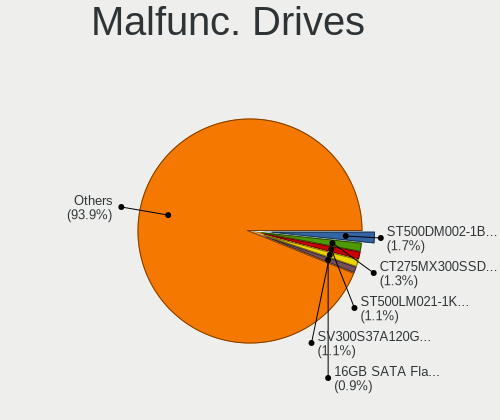
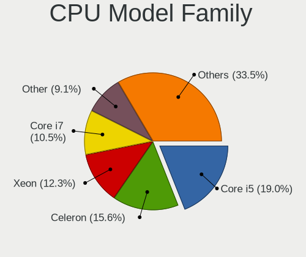
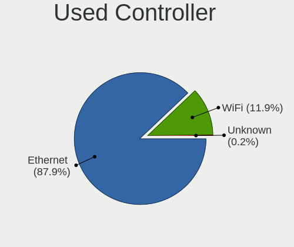
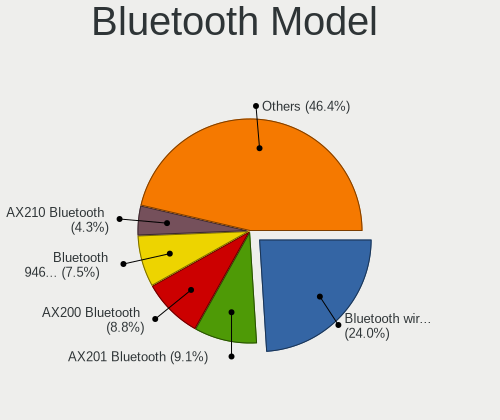
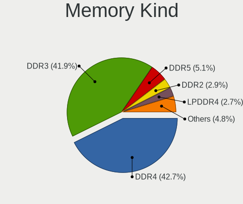

BSD in USA - Tested Hardware & Statistics
-----------------------------------------

A project to collect tested hardware configurations for BSD in USA.

Anyone can contribute to this report by the [hw-probe](https://github.com/linuxhw/hw-probe/blob/master/INSTALL.BSD.md) tool:

    hw-probe -all -upload

Please contribute! Especially if your hardware is rare.

This is a report for all computer types. See also reports for [desktops](/Location/USA/Desktop/README.md) and [notebooks](/Location/USA/Notebook/README.md).

Contents
--------

* [ Test Cases ](#test-cases)

* [ System ](#system)
  - [ OS                       ](#os)
  - [ OS Family                ](#os-family)
  - [ Arch                     ](#arch)
  - [ DE                       ](#de)
  - [ Display Server           ](#display-server)
  - [ Display Manager          ](#display-manager)
  - [ OS Lang                  ](#os-lang)
  - [ Boot Mode                ](#boot-mode)
  - [ Filesystem               ](#filesystem)
  - [ Part. scheme             ](#part-scheme)

* [ Board ](#board)
  - [ Vendor                   ](#vendor)
  - [ Model                    ](#model)
  - [ Model Family             ](#model-family)
  - [ MFG Year                 ](#mfg-year)
  - [ Form Factor              ](#form-factor)
  - [ Coreboot                 ](#coreboot)
  - [ RAM Size                 ](#ram-size)
  - [ RAM Used                 ](#ram-used)
  - [ Total Drives             ](#total-drives)
  - [ Has CD-ROM               ](#has-cd-rom)
  - [ Has Ethernet             ](#has-ethernet)
  - [ Has WiFi                 ](#has-wifi)
  - [ Has Bluetooth            ](#has-bluetooth)

* [ Location ](#location)
  - [ Country                  ](#country)
  - [ City                     ](#city)

* [ Drives ](#drives)
  - [ Drive Vendor             ](#drive-vendor)
  - [ Drive Model              ](#drive-model)
  - [ HDD Vendor               ](#hdd-vendor)
  - [ SSD Vendor               ](#ssd-vendor)
  - [ Drive Kind               ](#drive-kind)
  - [ Drive Connector          ](#drive-connector)
  - [ Drive Size               ](#drive-size)
  - [ Space Total              ](#space-total)
  - [ Space Used               ](#space-used)
  - [ Malfunc. Drives          ](#malfunc-drives)
  - [ Malfunc. Drive Vendor    ](#malfunc-drive-vendor)
  - [ Malfunc. HDD Vendor      ](#malfunc-hdd-vendor)
  - [ Malfunc. Drive Kind      ](#malfunc-drive-kind)
  - [ Failed Drives            ](#failed-drives)
  - [ Failed Drive Vendor      ](#failed-drive-vendor)
  - [ Drive Status             ](#drive-status)

* [ Storage controller ](#storage-controller)
  - [ Storage Vendor           ](#storage-vendor)
  - [ Storage Model            ](#storage-model)
  - [ Storage Kind             ](#storage-kind)

* [ Processor ](#processor)
  - [ CPU Vendor               ](#cpu-vendor)
  - [ CPU Model                ](#cpu-model)
  - [ CPU Model Family         ](#cpu-model-family)
  - [ CPU Cores                ](#cpu-cores)
  - [ CPU Sockets              ](#cpu-sockets)
  - [ CPU Threads              ](#cpu-threads)
  - [ CPU Microarch            ](#cpu-microarch)

* [ Graphics ](#graphics)
  - [ GPU Vendor               ](#gpu-vendor)
  - [ GPU Model                ](#gpu-model)
  - [ GPU Combo                ](#gpu-combo)
  - [ GPU Driver               ](#gpu-driver)
  - [ GPU Memory               ](#gpu-memory)

* [ Monitor ](#monitor)
  - [ Monitor Vendor           ](#monitor-vendor)
  - [ Monitor Model            ](#monitor-model)
  - [ Monitor Resolution       ](#monitor-resolution)
  - [ Monitor Diagonal         ](#monitor-diagonal)
  - [ Monitor Width            ](#monitor-width)
  - [ Aspect Ratio             ](#aspect-ratio)
  - [ Monitor Area             ](#monitor-area)
  - [ Pixel Density            ](#pixel-density)
  - [ Multiple Monitors        ](#multiple-monitors)

* [ Network ](#network)
  - [ Net Controller Vendor    ](#net-controller-vendor)
  - [ Net Controller Model     ](#net-controller-model)
  - [ Wireless Vendor          ](#wireless-vendor)
  - [ Wireless Model           ](#wireless-model)
  - [ Ethernet Vendor          ](#ethernet-vendor)
  - [ Ethernet Model           ](#ethernet-model)
  - [ Net Controller Kind      ](#net-controller-kind)
  - [ Used Controller          ](#used-controller)
  - [ NICs                     ](#nics)
  - [ IPv6                     ](#ipv6)

* [ Bluetooth ](#bluetooth)
  - [ Bluetooth Vendor         ](#bluetooth-vendor)
  - [ Bluetooth Model          ](#bluetooth-model)

* [ Sound ](#sound)
  - [ Sound Vendor             ](#sound-vendor)
  - [ Sound Model              ](#sound-model)

* [ Memory ](#memory)
  - [ Memory Vendor            ](#memory-vendor)
  - [ Memory Model             ](#memory-model)
  - [ Memory Kind              ](#memory-kind)
  - [ Memory Form Factor       ](#memory-form-factor)
  - [ Memory Size              ](#memory-size)
  - [ Memory Speed             ](#memory-speed)

* [ Printers & scanners ](#printers--scanners)
  - [ Printer Vendor           ](#printer-vendor)
  - [ Printer Model            ](#printer-model)
  - [ Scanner Vendor           ](#scanner-vendor)
  - [ Scanner Model            ](#scanner-model)

* [ Camera ](#camera)
  - [ Camera Vendor            ](#camera-vendor)
  - [ Camera Model             ](#camera-model)

* [ Security ](#security)
  - [ Fingerprint Vendor       ](#fingerprint-vendor)
  - [ Fingerprint Model        ](#fingerprint-model)
  - [ Chipcard Vendor          ](#chipcard-vendor)
  - [ Chipcard Model           ](#chipcard-model)

* [ Unsupported ](#unsupported)
  - [ Unsupported Devices      ](#unsupported-devices)
  - [ Unsupported Device Types ](#unsupported-device-types)

Test Cases
----------

Total: 3728

| Vendor        | Model                       | Form-Factor | Probe                                                     | Date         |
|---------------|-----------------------------|-------------|-----------------------------------------------------------|--------------|
| Gigabyte      | B450 AORUS PRO WIFI-CF      | Desktop     | [d03f9c19f8](https://bsd-hardware.info/?probe=d03f9c19f8) | Jan 23, 2023 |
| Dell          | 0HHV7N A00                  | Desktop     | [771f2c4d96](https://bsd-hardware.info/?probe=771f2c4d96) | Jan 23, 2023 |
| ASUSTek       | X99-A/USB                   | Desktop     | [006553f965](https://bsd-hardware.info/?probe=006553f965) | Jan 23, 2023 |
| ASUSTek       | P5Q-E                       | Desktop     | [26d1d923d6](https://bsd-hardware.info/?probe=26d1d923d6) | Jan 22, 2023 |
| MSI           | H81M-P33                    | Desktop     | [0bbc074f1c](https://bsd-hardware.info/?probe=0bbc074f1c) | Jan 22, 2023 |
| ASUSTek       | ROG CROSSHAIR VIII HERO     | Desktop     | [28d8d82d34](https://bsd-hardware.info/?probe=28d8d82d34) | Jan 22, 2023 |
| Panasonic     | CF-C1BWFAZ1M                | Notebook    | [d129d929ac](https://bsd-hardware.info/?probe=d129d929ac) | Jan 22, 2023 |
| Datto         | 1000                        | Notebook    | [3d2880dd30](https://bsd-hardware.info/?probe=3d2880dd30) | Jan 21, 2023 |
| AZW           | Green G1                    | Desktop     | [80498a4090](https://bsd-hardware.info/?probe=80498a4090) | Jan 21, 2023 |
| AZW           | Green G1                    | Desktop     | [0c84e93ba7](https://bsd-hardware.info/?probe=0c84e93ba7) | Jan 21, 2023 |
| Lenovo        | ThinkPad X1 Carbon Gen 9... | Notebook    | [1d040b684b](https://bsd-hardware.info/?probe=1d040b684b) | Jan 21, 2023 |
| MSI           | Z87-G41 PC Mate             | Desktop     | [7a21bfbfb9](https://bsd-hardware.info/?probe=7a21bfbfb9) | Jan 20, 2023 |
| Gigabyte      | F2A75M-HD2                  | Desktop     | [4770b980d6](https://bsd-hardware.info/?probe=4770b980d6) | Jan 20, 2023 |
| Intel         | DQ67SW AAG12527-310         | Desktop     | [a4688e4059](https://bsd-hardware.info/?probe=a4688e4059) | Jan 20, 2023 |
| ASUSTek       | ROG STRIX B450-F GAMING     | Desktop     | [2ea8c1d1a4](https://bsd-hardware.info/?probe=2ea8c1d1a4) | Jan 20, 2023 |
| Dell          | 04415J A00                  | Mini pc     | [8ffe26845d](https://bsd-hardware.info/?probe=8ffe26845d) | Jan 20, 2023 |
| Intel         | SHARKBAY                    | Desktop     | [47742b68d5](https://bsd-hardware.info/?probe=47742b68d5) | Jan 19, 2023 |
| Acer          | TravelMate B311-31          | Notebook    | [dc3f072645](https://bsd-hardware.info/?probe=dc3f072645) | Jan 19, 2023 |
| Unknown       | Unknown                     | Desktop     | [62bad8c9f8](https://bsd-hardware.info/?probe=62bad8c9f8) | Jan 19, 2023 |
| HP            | ProLiant DL120 Gen9         | Server      | [7df2c509dd](https://bsd-hardware.info/?probe=7df2c509dd) | Jan 19, 2023 |
| Unknown       | Unknown                     | Desktop     | [28bb1a7282](https://bsd-hardware.info/?probe=28bb1a7282) | Jan 19, 2023 |
| Datto         | Unknown                     | Notebook    | [0b70f2b2b0](https://bsd-hardware.info/?probe=0b70f2b2b0) | Jan 18, 2023 |
| Intel         | DQ77KB AAG81483-501         | Desktop     | [c5d050f0d6](https://bsd-hardware.info/?probe=c5d050f0d6) | Jan 18, 2023 |
| Datto         | 1000                        | Notebook    | [c2abd24ed6](https://bsd-hardware.info/?probe=c2abd24ed6) | Jan 18, 2023 |
| Dell          | 05XGC8 A01                  | Desktop     | [f929122d8a](https://bsd-hardware.info/?probe=f929122d8a) | Jan 18, 2023 |
| Intel         | DH67BL AAG10189-206         | Desktop     | [37ae895d75](https://bsd-hardware.info/?probe=37ae895d75) | Jan 17, 2023 |
| Intel         | DQ45CB AAE30148-302         | Desktop     | [349da05405](https://bsd-hardware.info/?probe=349da05405) | Jan 17, 2023 |
| Dell          | 0J584C A00                  | Desktop     | [65ce4b26be](https://bsd-hardware.info/?probe=65ce4b26be) | Jan 17, 2023 |
| Apple         | MacBookAir7,2               | Notebook    | [d8007634f3](https://bsd-hardware.info/?probe=d8007634f3) | Jan 17, 2023 |
| Dell          | 0NW6H5 A00                  | Desktop     | [11943e270e](https://bsd-hardware.info/?probe=11943e270e) | Jan 17, 2023 |
| HP            | 1998                        | Desktop     | [6c36e5e82e](https://bsd-hardware.info/?probe=6c36e5e82e) | Jan 17, 2023 |
| Unknown       | Unknown                     | Desktop     | [63689d3fbc](https://bsd-hardware.info/?probe=63689d3fbc) | Jan 17, 2023 |
| Intel         | DQ67SW AAG12527-310         | Desktop     | [78a4659386](https://bsd-hardware.info/?probe=78a4659386) | Jan 16, 2023 |
| Unknown       | QD-CMU01                    | Desktop     | [768a10819b](https://bsd-hardware.info/?probe=768a10819b) | Jan 16, 2023 |
| HP            | 0AECh D                     | Desktop     | [25b7a10166](https://bsd-hardware.info/?probe=25b7a10166) | Jan 16, 2023 |
| ASRock        | H370M-ITX/ac                | Desktop     | [e25304fa01](https://bsd-hardware.info/?probe=e25304fa01) | Jan 15, 2023 |
| Supermicro    | M11SDV-8C-LN4F              | Desktop     | [af7a4d3493](https://bsd-hardware.info/?probe=af7a4d3493) | Jan 15, 2023 |
| MSI           | H81M-P33                    | Desktop     | [800b3bc34b](https://bsd-hardware.info/?probe=800b3bc34b) | Jan 15, 2023 |
| ASUSTek       | P5Q-E                       | Desktop     | [ffbcac312f](https://bsd-hardware.info/?probe=ffbcac312f) | Jan 15, 2023 |
| ASUSTek       | ROG CROSSHAIR VIII HERO     | Desktop     | [48e7397e29](https://bsd-hardware.info/?probe=48e7397e29) | Jan 15, 2023 |
| Silicom       | 80300-0214-G01 R311         | Desktop     | [547b59be2b](https://bsd-hardware.info/?probe=547b59be2b) | Jan 15, 2023 |
| Dell          | 0C2KJT A00                  | Desktop     | [9364056dac](https://bsd-hardware.info/?probe=9364056dac) | Jan 15, 2023 |
| ASUSTek       | Z97-A                       | Desktop     | [a975d143b8](https://bsd-hardware.info/?probe=a975d143b8) | Jan 15, 2023 |
| ASRock        | X570 Phantom Gaming 4       | Desktop     | [05cc17947c](https://bsd-hardware.info/?probe=05cc17947c) | Jan 15, 2023 |
| Supermicro    | X9SCL/X9SCMA                | Desktop     | [9c70b7e4e1](https://bsd-hardware.info/?probe=9c70b7e4e1) | Jan 15, 2023 |
| Unknown       | Unknown                     | Notebook    | [c85b254f84](https://bsd-hardware.info/?probe=c85b254f84) | Jan 15, 2023 |
| Lenovo        | Legion S7 15ACH6 82K8       | Notebook    | [ad094a458b](https://bsd-hardware.info/?probe=ad094a458b) | Jan 14, 2023 |
| HP            | Presario V2000 (EZ621UA#... | Notebook    | [847af5b70f](https://bsd-hardware.info/?probe=847af5b70f) | Jan 14, 2023 |
| ASUSTek       | PRIME X370-PRO              | Desktop     | [f682e06d06](https://bsd-hardware.info/?probe=f682e06d06) | Jan 13, 2023 |
| AMI           | Aptio CRB                   | Mini pc     | [c908dc76a1](https://bsd-hardware.info/?probe=c908dc76a1) | Jan 13, 2023 |
| Intel         | Q3XXG4-P V1.0               | Desktop     | [c5769bcae3](https://bsd-hardware.info/?probe=c5769bcae3) | Jan 13, 2023 |
| Dell          | 0T7D40 A01                  | Desktop     | [82f4b97203](https://bsd-hardware.info/?probe=82f4b97203) | Jan 13, 2023 |
| Dell          | 04Y8V0 A02                  | Desktop     | [a18d3bf0ea](https://bsd-hardware.info/?probe=a18d3bf0ea) | Jan 13, 2023 |
| ASUSTek       | Pro WS WRX80E-SAGE SE WI... | Desktop     | [95ebd841b2](https://bsd-hardware.info/?probe=95ebd841b2) | Jan 12, 2023 |
| Dell          | 051FJ8 A01                  | Desktop     | [8d5c03acf1](https://bsd-hardware.info/?probe=8d5c03acf1) | Jan 12, 2023 |
| Dell          | 0773VG A00                  | Desktop     | [8f3e58f2bc](https://bsd-hardware.info/?probe=8f3e58f2bc) | Jan 12, 2023 |
| Supermicro    | X9SCL/X9SCMA                | Desktop     | [4154475f49](https://bsd-hardware.info/?probe=4154475f49) | Jan 12, 2023 |
| Gigabyte      | Z390 AORUS ELITE            | Desktop     | [53a5719c6a](https://bsd-hardware.info/?probe=53a5719c6a) | Jan 12, 2023 |
| Dell          | 0NW6H5 A00                  | Desktop     | [b1b7d05863](https://bsd-hardware.info/?probe=b1b7d05863) | Jan 12, 2023 |
| Protectli     | FW6 Ver                     | Desktop     | [619a877f82](https://bsd-hardware.info/?probe=619a877f82) | Jan 12, 2023 |
| Dell          | Latitude E6420              | Notebook    | [cb7b02c421](https://bsd-hardware.info/?probe=cb7b02c421) | Jan 11, 2023 |
| HP            | 843B                        | Desktop     | [3e2070415f](https://bsd-hardware.info/?probe=3e2070415f) | Jan 11, 2023 |
| Supermicro    | X9SCL/X9SCMA                | Desktop     | [5eedf320f8](https://bsd-hardware.info/?probe=5eedf320f8) | Jan 11, 2023 |
| Datto         | 1000                        | Notebook    | [ab1aa0f250](https://bsd-hardware.info/?probe=ab1aa0f250) | Jan 11, 2023 |
| Lenovo        | ThinkPad T410 2518C3U       | Notebook    | [82e9263905](https://bsd-hardware.info/?probe=82e9263905) | Jan 11, 2023 |
| ASUSTek       | ROG STRIX Z690-E GAMING ... | Desktop     | [5386547734](https://bsd-hardware.info/?probe=5386547734) | Jan 11, 2023 |
| Unknown       | Unknown                     | Desktop     | [9b1707aed4](https://bsd-hardware.info/?probe=9b1707aed4) | Jan 11, 2023 |
| HP            | 805D                        | Desktop     | [4912ca5cd6](https://bsd-hardware.info/?probe=4912ca5cd6) | Jan 11, 2023 |
| MSI           | H110M-A PRO M2              | Desktop     | [3cf7d4a076](https://bsd-hardware.info/?probe=3cf7d4a076) | Jan 11, 2023 |
| HP            | 805D                        | Desktop     | [3da9c57f1f](https://bsd-hardware.info/?probe=3da9c57f1f) | Jan 11, 2023 |
| ASUSTek       | TUF Gaming B450M-PLUS II    | Desktop     | [e4af143188](https://bsd-hardware.info/?probe=e4af143188) | Jan 10, 2023 |
| Supermicro    | X9SCL/X9SCMA                | Desktop     | [0b16265d11](https://bsd-hardware.info/?probe=0b16265d11) | Jan 10, 2023 |
| Techvision    | TVI7309X B0                 | Desktop     | [6b37f8e185](https://bsd-hardware.info/?probe=6b37f8e185) | Jan 10, 2023 |
| Dell          | 0RC130 A03                  | Server      | [861cdcfef1](https://bsd-hardware.info/?probe=861cdcfef1) | Jan 10, 2023 |
| Lenovo        | 312D SDK0J40697 WIN 3305... | Mini pc     | [b37db9216b](https://bsd-hardware.info/?probe=b37db9216b) | Jan 10, 2023 |
| Protectli     | FW6 Ver                     | Desktop     | [c554f29fbb](https://bsd-hardware.info/?probe=c554f29fbb) | Jan 10, 2023 |
| Lenovo        | Legion S7 15ACH6 82K8       | Notebook    | [9bda43254c](https://bsd-hardware.info/?probe=9bda43254c) | Jan 10, 2023 |
| Unknown       | Unknown                     | Desktop     | [2db049304e](https://bsd-hardware.info/?probe=2db049304e) | Jan 10, 2023 |
| MW            | GMLK-2_5G4L                 | Desktop     | [12a726c7f3](https://bsd-hardware.info/?probe=12a726c7f3) | Jan 10, 2023 |
| HP            | 8054                        | Desktop     | [7a7dd659c8](https://bsd-hardware.info/?probe=7a7dd659c8) | Jan 09, 2023 |
| Protectli     | FW6                         | Desktop     | [606f595213](https://bsd-hardware.info/?probe=606f595213) | Jan 09, 2023 |
| Protectli     | FW6                         | Desktop     | [6db7b1f01d](https://bsd-hardware.info/?probe=6db7b1f01d) | Jan 09, 2023 |
| Dell          | 04Y8V0 A02                  | Desktop     | [1ebacfe659](https://bsd-hardware.info/?probe=1ebacfe659) | Jan 09, 2023 |
| Supermicro    | X10SLH-N6-ST031             | Server      | [e217534893](https://bsd-hardware.info/?probe=e217534893) | Jan 09, 2023 |
| HP            | 8299                        | Desktop     | [f80e368b24](https://bsd-hardware.info/?probe=f80e368b24) | Jan 09, 2023 |
| ASUSTek       | ROG STRIX B450-F GAMING     | Desktop     | [917b19fbeb](https://bsd-hardware.info/?probe=917b19fbeb) | Jan 09, 2023 |
| Dell          | Inspiron 5558               | Notebook    | [97b65880b0](https://bsd-hardware.info/?probe=97b65880b0) | Jan 09, 2023 |
| Gigabyte      | Z97X-UD3H-BK-CF             | Desktop     | [c86fd3a6ff](https://bsd-hardware.info/?probe=c86fd3a6ff) | Jan 08, 2023 |
| Unknown       | Unknown                     | Desktop     | [0714b46000](https://bsd-hardware.info/?probe=0714b46000) | Jan 08, 2023 |
| Deciso        | OPNsense Appliance          | Notebook    | [cc421d80b4](https://bsd-hardware.info/?probe=cc421d80b4) | Jan 08, 2023 |
| Dell          | 0WMJ54 A01                  | Desktop     | [011121c9a5](https://bsd-hardware.info/?probe=011121c9a5) | Jan 08, 2023 |
| MSI           | H81M-P33                    | Desktop     | [585a3dc78c](https://bsd-hardware.info/?probe=585a3dc78c) | Jan 08, 2023 |
| ASUSTek       | P5Q-E                       | Desktop     | [1e9d8cc278](https://bsd-hardware.info/?probe=1e9d8cc278) | Jan 08, 2023 |
| ASUSTek       | ROG CROSSHAIR VIII HERO     | Desktop     | [490261883c](https://bsd-hardware.info/?probe=490261883c) | Jan 08, 2023 |
| CheckPoint    | T-180-00                    | Desktop     | [5cee1fe8d6](https://bsd-hardware.info/?probe=5cee1fe8d6) | Jan 08, 2023 |
| Unknown       | Unknown                     | Desktop     | [8c877bf16e](https://bsd-hardware.info/?probe=8c877bf16e) | Jan 08, 2023 |
| Protectli     | FW6                         | Desktop     | [6ce513ba71](https://bsd-hardware.info/?probe=6ce513ba71) | Jan 08, 2023 |
| Dell          | 05GD68 A00                  | Desktop     | [c42af2bdc3](https://bsd-hardware.info/?probe=c42af2bdc3) | Jan 08, 2023 |
| HP            | 3397                        | Desktop     | [516464d7ef](https://bsd-hardware.info/?probe=516464d7ef) | Jan 08, 2023 |
| Unknown       | Unknown                     | Desktop     | [bb243a8862](https://bsd-hardware.info/?probe=bb243a8862) | Jan 08, 2023 |
| HP            | 8617                        | Desktop     | [2dd1830de4](https://bsd-hardware.info/?probe=2dd1830de4) | Jan 07, 2023 |
| AMI           | Aptio CRB                   | Mini pc     | [44969e64ee](https://bsd-hardware.info/?probe=44969e64ee) | Jan 06, 2023 |
| Dell          | 02K9CR A02                  | Desktop     | [3547d6c126](https://bsd-hardware.info/?probe=3547d6c126) | Jan 06, 2023 |
| Supermicro    | X10SDV-6C-TLN4F             | Server      | [19dc10e659](https://bsd-hardware.info/?probe=19dc10e659) | Jan 05, 2023 |
| Dell          | 0K240Y A02                  | Desktop     | [379b59f079](https://bsd-hardware.info/?probe=379b59f079) | Jan 05, 2023 |
| Unknown       | Unknown                     | Desktop     | [b3295065c3](https://bsd-hardware.info/?probe=b3295065c3) | Jan 05, 2023 |
| MW            | GMLK-2_5G4L                 | Desktop     | [e3f89954bd](https://bsd-hardware.info/?probe=e3f89954bd) | Jan 05, 2023 |
| AMI           | Aptio CRB                   | Mini pc     | [6a0f56a7c4](https://bsd-hardware.info/?probe=6a0f56a7c4) | Jan 05, 2023 |
| AMI           | Aptio CRB                   | Mini pc     | [3e4f41ff05](https://bsd-hardware.info/?probe=3e4f41ff05) | Jan 05, 2023 |
| ASUSTek       | X99-DELUXE                  | Desktop     | [9dc3183152](https://bsd-hardware.info/?probe=9dc3183152) | Jan 04, 2023 |
| Supermicro    | X10DRiB                     | Desktop     | [d120c268f7](https://bsd-hardware.info/?probe=d120c268f7) | Jan 04, 2023 |
| Supermicro    | X10DRi-T                    | Desktop     | [3bd4e1dc9c](https://bsd-hardware.info/?probe=3bd4e1dc9c) | Jan 04, 2023 |
| Unknown       | Unknown                     | Desktop     | [6062f9823e](https://bsd-hardware.info/?probe=6062f9823e) | Jan 04, 2023 |
| MW            | GMLK-2_5G4L                 | Desktop     | [f10075e5d1](https://bsd-hardware.info/?probe=f10075e5d1) | Jan 04, 2023 |
| Unknown       | Unknown                     | Desktop     | [42277bd8ff](https://bsd-hardware.info/?probe=42277bd8ff) | Jan 04, 2023 |
| Supermicro    | X9DRD-iF                    | Server      | [97e19b4cd1](https://bsd-hardware.info/?probe=97e19b4cd1) | Jan 03, 2023 |
| Protectli     | FW6 Ver                     | Desktop     | [8069ed414b](https://bsd-hardware.info/?probe=8069ed414b) | Jan 03, 2023 |
| Intel         | Q3XXG4-P V1.0               | Desktop     | [7d6e899adb](https://bsd-hardware.info/?probe=7d6e899adb) | Jan 03, 2023 |
| HP            | 213D A01                    | Desktop     | [3a1fd3f0a0](https://bsd-hardware.info/?probe=3a1fd3f0a0) | Jan 02, 2023 |
| AMI           | Aptio CRB                   | Mini pc     | [203823deda](https://bsd-hardware.info/?probe=203823deda) | Jan 02, 2023 |
| ASUSTek       | ROG STRIX B450-F GAMING     | Desktop     | [5159265605](https://bsd-hardware.info/?probe=5159265605) | Jan 02, 2023 |
| Supermicro    | X10SDV-8C-TLN4F+            | Server      | [c96a5de4ed](https://bsd-hardware.info/?probe=c96a5de4ed) | Jan 02, 2023 |
| HP            | 8103 A01                    | Mini pc     | [989cfd51a8](https://bsd-hardware.info/?probe=989cfd51a8) | Jan 02, 2023 |
| HP            | 8055                        | Desktop     | [c8f3d3687d](https://bsd-hardware.info/?probe=c8f3d3687d) | Jan 02, 2023 |
| ASUSTek       | TUF Gaming Z690-PLUS WIF... | Desktop     | [1697219032](https://bsd-hardware.info/?probe=1697219032) | Jan 02, 2023 |
| Gigabyte      | Z390 AORUS ELITE            | Desktop     | [dcf6e2df1a](https://bsd-hardware.info/?probe=dcf6e2df1a) | Jan 02, 2023 |
| SmbiosType... | SmbiosType2_BoardProduct... | Desktop     | [d8d62a103a](https://bsd-hardware.info/?probe=d8d62a103a) | Jan 02, 2023 |
| Lenovo        | ThinkPad T410 2518C3U       | Notebook    | [3b0ef08599](https://bsd-hardware.info/?probe=3b0ef08599) | Jan 01, 2023 |
| MSI           | H81M-P33                    | Desktop     | [0a57dcce99](https://bsd-hardware.info/?probe=0a57dcce99) | Jan 01, 2023 |
| ASUSTek       | P5Q-E                       | Desktop     | [d3306559de](https://bsd-hardware.info/?probe=d3306559de) | Jan 01, 2023 |
| ASUSTek       | ROG CROSSHAIR VIII HERO     | Desktop     | [772779fadf](https://bsd-hardware.info/?probe=772779fadf) | Jan 01, 2023 |
| Dell          | 0FDY5C A00                  | Desktop     | [6345f92400](https://bsd-hardware.info/?probe=6345f92400) | Jan 01, 2023 |
| Dell          | 04415J A00                  | Mini pc     | [3737d80840](https://bsd-hardware.info/?probe=3737d80840) | Dec 31, 2022 |
| Deciso        | OPNsense Appliance          | Notebook    | [21e1293019](https://bsd-hardware.info/?probe=21e1293019) | Dec 31, 2022 |
| Fujitsu       | D3313-G1 S26361-D3313-G1    | Desktop     | [0bf1c2abef](https://bsd-hardware.info/?probe=0bf1c2abef) | Dec 31, 2022 |
| Dell          | 04415J A00                  | Mini pc     | [c6c6858ef0](https://bsd-hardware.info/?probe=c6c6858ef0) | Dec 31, 2022 |
| Unknown       | Unknown                     | Desktop     | [68a847f5c2](https://bsd-hardware.info/?probe=68a847f5c2) | Dec 31, 2022 |
| GoWin Solu... | R86S                        | Desktop     | [4243d313a1](https://bsd-hardware.info/?probe=4243d313a1) | Dec 31, 2022 |
| Lenovo        | ThinkPad T410 2518C3U       | Notebook    | [c791e3e3fd](https://bsd-hardware.info/?probe=c791e3e3fd) | Dec 30, 2022 |
| ASUSTek       | TUF Gaming B450M-PLUS II    | Desktop     | [4d9a4bfc40](https://bsd-hardware.info/?probe=4d9a4bfc40) | Dec 30, 2022 |
| Supermicro    | X10SDV-8C-TLN4F+            | Server      | [d4460f8031](https://bsd-hardware.info/?probe=d4460f8031) | Dec 30, 2022 |
| Protectli     | FW6                         | Desktop     | [0d62222b7a](https://bsd-hardware.info/?probe=0d62222b7a) | Dec 30, 2022 |
| Supermicro    | X10SDV-8C-TLN4F+            | Server      | [46c3e7ffdd](https://bsd-hardware.info/?probe=46c3e7ffdd) | Dec 30, 2022 |
| Deciso        | OPNsense Appliance          | Notebook    | [8b4c84d972](https://bsd-hardware.info/?probe=8b4c84d972) | Dec 30, 2022 |
| Dell          | 0GN4PW A00                  | Desktop     | [77e235d9f8](https://bsd-hardware.info/?probe=77e235d9f8) | Dec 29, 2022 |
| Unknown       | Unknown                     | Desktop     | [1dab2c420a](https://bsd-hardware.info/?probe=1dab2c420a) | Dec 28, 2022 |
| Intel         | DENLOW_REFRESH_WS           | Desktop     | [4f86e686d2](https://bsd-hardware.info/?probe=4f86e686d2) | Dec 28, 2022 |
| Google        | Peppy                       | Notebook    | [e063619f03](https://bsd-hardware.info/?probe=e063619f03) | Dec 27, 2022 |
| Lenovo        | 314D NOK                    | Mini pc     | [8cb1f1a8ea](https://bsd-hardware.info/?probe=8cb1f1a8ea) | Dec 27, 2022 |
| Dell          | 0WMJ54 A01                  | Desktop     | [d4296fd9d8](https://bsd-hardware.info/?probe=d4296fd9d8) | Dec 26, 2022 |
| Unknown       | Unknown                     | Desktop     | [39bce6117f](https://bsd-hardware.info/?probe=39bce6117f) | Dec 26, 2022 |
| Dell          | 051FJ8 A01                  | Desktop     | [7f66a21d24](https://bsd-hardware.info/?probe=7f66a21d24) | Dec 26, 2022 |
| Unknown       | Unknown                     | Desktop     | [e52abbf1b8](https://bsd-hardware.info/?probe=e52abbf1b8) | Dec 26, 2022 |
| Lenovo        | 314D NOK                    | Mini pc     | [5f713b6061](https://bsd-hardware.info/?probe=5f713b6061) | Dec 26, 2022 |
| Protectli     | FW6                         | Desktop     | [90758fca97](https://bsd-hardware.info/?probe=90758fca97) | Dec 26, 2022 |
| Dell          | 0M877N A01                  | Server      | [340dc7255c](https://bsd-hardware.info/?probe=340dc7255c) | Dec 26, 2022 |
| Deciso        | OPNsense Appliance          | Notebook    | [3fc9a4fd5c](https://bsd-hardware.info/?probe=3fc9a4fd5c) | Dec 26, 2022 |
| ASUSTek       | P5Q-E                       | Desktop     | [bc829dbb1a](https://bsd-hardware.info/?probe=bc829dbb1a) | Dec 25, 2022 |
| MSI           | H81M-P33                    | Desktop     | [f73a37ab81](https://bsd-hardware.info/?probe=f73a37ab81) | Dec 25, 2022 |
| ASUSTek       | ROG CROSSHAIR VIII HERO     | Desktop     | [2e842ddb27](https://bsd-hardware.info/?probe=2e842ddb27) | Dec 25, 2022 |
| Cisco         | ASA5515 A0                  | Desktop     | [9e587b9499](https://bsd-hardware.info/?probe=9e587b9499) | Dec 25, 2022 |
| Gigabyte      | X399 AORUS Gaming 7         | Desktop     | [1769da5143](https://bsd-hardware.info/?probe=1769da5143) | Dec 25, 2022 |
| HP            | 213D A01                    | Desktop     | [bd620f0fc0](https://bsd-hardware.info/?probe=bd620f0fc0) | Dec 25, 2022 |
| Unknown       | Unknown                     | Desktop     | [bd212706ad](https://bsd-hardware.info/?probe=bd212706ad) | Dec 24, 2022 |
| Lenovo        | 314D NOK                    | Mini pc     | [af60c7ce81](https://bsd-hardware.info/?probe=af60c7ce81) | Dec 24, 2022 |
| Supermicro    | X10SRH-CLN4FA               | Desktop     | [84c360ad02](https://bsd-hardware.info/?probe=84c360ad02) | Dec 24, 2022 |
| AMI           | Aptio CRB                   | Mini pc     | [153f99a846](https://bsd-hardware.info/?probe=153f99a846) | Dec 24, 2022 |
| ASUSTek       | GRYPHON Z87                 | Desktop     | [b29f2e4573](https://bsd-hardware.info/?probe=b29f2e4573) | Dec 24, 2022 |
| Dell          | 02YYK5 A01                  | Desktop     | [701c6e95d6](https://bsd-hardware.info/?probe=701c6e95d6) | Dec 24, 2022 |
| Gigabyte      | Z390 AORUS ELITE            | Desktop     | [91b7417b84](https://bsd-hardware.info/?probe=91b7417b84) | Dec 24, 2022 |
| MSI           | A78M-E35                    | Desktop     | [03176e6683](https://bsd-hardware.info/?probe=03176e6683) | Dec 23, 2022 |
| Dell          | 03X6X0 A00                  | Server      | [52327286e4](https://bsd-hardware.info/?probe=52327286e4) | Dec 23, 2022 |
| Dell          | 03X6X0 A00                  | Server      | [0d70cc442b](https://bsd-hardware.info/?probe=0d70cc442b) | Dec 23, 2022 |
| Lenovo        | ThinkPad T480 20L6S13100    | Notebook    | [67daa912fa](https://bsd-hardware.info/?probe=67daa912fa) | Dec 23, 2022 |
| Dell          | 03X6X0 A02                  | Server      | [e0b4e13386](https://bsd-hardware.info/?probe=e0b4e13386) | Dec 23, 2022 |
| Dell          | Vostro 1400                 | Notebook    | [087a3d269f](https://bsd-hardware.info/?probe=087a3d269f) | Dec 23, 2022 |
| Deciso        | OPNsense Appliance          | Notebook    | [062fb4cccd](https://bsd-hardware.info/?probe=062fb4cccd) | Dec 23, 2022 |
| Lenovo        | Yoga 710-11IKB 80V6         | Notebook    | [1d3ccd1fe6](https://bsd-hardware.info/?probe=1d3ccd1fe6) | Dec 22, 2022 |
| Lenovo        | Legion Y530-15ICH 81FV      | Notebook    | [527bf6bbe4](https://bsd-hardware.info/?probe=527bf6bbe4) | Dec 22, 2022 |
| Supermicro    | X10SDV-8C-TLN4F+            | Server      | [633b9a5425](https://bsd-hardware.info/?probe=633b9a5425) | Dec 22, 2022 |
| Intel         | SHARKBAY                    | Desktop     | [df221cefbc](https://bsd-hardware.info/?probe=df221cefbc) | Dec 22, 2022 |
| Dell          | 0UW457 A03                  | Desktop     | [47b66a0d86](https://bsd-hardware.info/?probe=47b66a0d86) | Dec 21, 2022 |
| Supermicro    | X10SLH-N6-ST031             | Server      | [16f59f69dc](https://bsd-hardware.info/?probe=16f59f69dc) | Dec 20, 2022 |
| Protectli     | FW2B Ver                    | Desktop     | [9596576df7](https://bsd-hardware.info/?probe=9596576df7) | Dec 20, 2022 |
| ASRock        | 4X4-4000 Series             | Desktop     | [31f17adc5b](https://bsd-hardware.info/?probe=31f17adc5b) | Dec 20, 2022 |
| Supermicro    | X10SDV-4C-TLN4F             | Server      | [c0c8d1f85e](https://bsd-hardware.info/?probe=c0c8d1f85e) | Dec 19, 2022 |
| Unknown       | Unknown                     | Desktop     | [4c5ccd04d0](https://bsd-hardware.info/?probe=4c5ccd04d0) | Dec 19, 2022 |
| Dell          | 0WMJ54 A01                  | Desktop     | [b84941cdd5](https://bsd-hardware.info/?probe=b84941cdd5) | Dec 19, 2022 |
| Lenovo        | ThinkPad T530 2392AQU       | Notebook    | [9a3cbe1893](https://bsd-hardware.info/?probe=9a3cbe1893) | Dec 19, 2022 |
| AMI           | Aptio CRB                   | Mini pc     | [fad0a431e5](https://bsd-hardware.info/?probe=fad0a431e5) | Dec 19, 2022 |
| Lenovo        | ThinkPad X200 Tablet 744... | Notebook    | [ea686f63f5](https://bsd-hardware.info/?probe=ea686f63f5) | Dec 19, 2022 |
| Framework     | Laptop                      | Notebook    | [9dcd3592db](https://bsd-hardware.info/?probe=9dcd3592db) | Dec 19, 2022 |
| HP            | ProLiant DL360p Gen8        | Server      | [b9df714117](https://bsd-hardware.info/?probe=b9df714117) | Dec 19, 2022 |
| Dell          | Edge Gateway 5000           | Mini pc     | [0af7422e2f](https://bsd-hardware.info/?probe=0af7422e2f) | Dec 18, 2022 |
| Dell          | Precision M4800             | Notebook    | [b7a834c4d0](https://bsd-hardware.info/?probe=b7a834c4d0) | Dec 18, 2022 |
| ASUSTek       | ROG CROSSHAIR VIII HERO     | Desktop     | [c1b0b83306](https://bsd-hardware.info/?probe=c1b0b83306) | Dec 18, 2022 |
| MSI           | H81M-P33                    | Desktop     | [78e4743abd](https://bsd-hardware.info/?probe=78e4743abd) | Dec 18, 2022 |
| ASUSTek       | P5Q-E                       | Desktop     | [f232e5746e](https://bsd-hardware.info/?probe=f232e5746e) | Dec 18, 2022 |
| Supermicro    | X11SCL-F                    | Server      | [638b27bc34](https://bsd-hardware.info/?probe=638b27bc34) | Dec 18, 2022 |
| ASRock        | H370M-ITX/ac                | Desktop     | [a40ada7f7f](https://bsd-hardware.info/?probe=a40ada7f7f) | Dec 18, 2022 |
| Unknown       | Unknown                     | Desktop     | [f6fababc22](https://bsd-hardware.info/?probe=f6fababc22) | Dec 18, 2022 |
| AMI           | Aptio CRB                   | Mini pc     | [e06fa5d522](https://bsd-hardware.info/?probe=e06fa5d522) | Dec 18, 2022 |
| ASUSTek       | TUF Gaming B550-PLUS        | Desktop     | [a1b29c356e](https://bsd-hardware.info/?probe=a1b29c356e) | Dec 17, 2022 |
| Protectli     | FW6                         | Desktop     | [56f62226e7](https://bsd-hardware.info/?probe=56f62226e7) | Dec 17, 2022 |
| HP            | 213D A01                    | Desktop     | [088766f04d](https://bsd-hardware.info/?probe=088766f04d) | Dec 17, 2022 |
| Dell          | 03X6X0 A02                  | Server      | [f6085ba691](https://bsd-hardware.info/?probe=f6085ba691) | Dec 17, 2022 |
| Dell          | 0FDY5C A00                  | Desktop     | [afef2952f9](https://bsd-hardware.info/?probe=afef2952f9) | Dec 17, 2022 |
| BESSTAR Te... | UM350                       | Desktop     | [b7e599f99d](https://bsd-hardware.info/?probe=b7e599f99d) | Dec 17, 2022 |
| CncTion       | N5105-4L B0                 | Desktop     | [0da9ef9752](https://bsd-hardware.info/?probe=0da9ef9752) | Dec 17, 2022 |
| Apple         | Mac-35C5E08120C7EEAF Mac... | Mini pc     | [2fe9b1b8c9](https://bsd-hardware.info/?probe=2fe9b1b8c9) | Dec 16, 2022 |
| Unknown       | Unknown                     | Desktop     | [a94bfdaa5c](https://bsd-hardware.info/?probe=a94bfdaa5c) | Dec 16, 2022 |
| AMI           | Aptio CRB                   | Mini pc     | [6bf18dfe5a](https://bsd-hardware.info/?probe=6bf18dfe5a) | Dec 16, 2022 |
| Intel         | DQ77KB AAG81483-501         | Desktop     | [cc51093e02](https://bsd-hardware.info/?probe=cc51093e02) | Dec 16, 2022 |
| HP            | 2215                        | Desktop     | [76f607b100](https://bsd-hardware.info/?probe=76f607b100) | Dec 14, 2022 |
| Techvision    | TVI7309X B0                 | Desktop     | [a77d60297f](https://bsd-hardware.info/?probe=a77d60297f) | Dec 14, 2022 |
| Dell          | 03X6X0 A02                  | Server      | [6ebcd7c974](https://bsd-hardware.info/?probe=6ebcd7c974) | Dec 14, 2022 |
| Apple         | Mac-F221BEC8                | Desktop     | [bc15367e9f](https://bsd-hardware.info/?probe=bc15367e9f) | Dec 14, 2022 |
| Unknown       | Unknown                     | Desktop     | [ad7f977515](https://bsd-hardware.info/?probe=ad7f977515) | Dec 13, 2022 |
| ASUSTek       | PRIME X370-PRO              | Desktop     | [f52a3d3fa6](https://bsd-hardware.info/?probe=f52a3d3fa6) | Dec 13, 2022 |
| Intel         | Q3XXG4-P V1.0               | Desktop     | [abed96a938](https://bsd-hardware.info/?probe=abed96a938) | Dec 13, 2022 |
| Gigabyte      | Z590 AORUS PRO AX           | Desktop     | [66e0c118d2](https://bsd-hardware.info/?probe=66e0c118d2) | Dec 13, 2022 |
| Unknown       | Unknown                     | Desktop     | [128ce54404](https://bsd-hardware.info/?probe=128ce54404) | Dec 12, 2022 |
| Supermicro    | M11SDV-4CT-LN4F             | Server      | [76519f54e9](https://bsd-hardware.info/?probe=76519f54e9) | Dec 12, 2022 |
| Gigabyte      | X99-Designare EX-CF         | Desktop     | [de5bf4b420](https://bsd-hardware.info/?probe=de5bf4b420) | Dec 12, 2022 |
| Lenovo        | 312D SDK0J40697 WIN 3305... | Mini pc     | [2bf8839d12](https://bsd-hardware.info/?probe=2bf8839d12) | Dec 12, 2022 |
| Lenovo        | ThinkPad X1 Carbon Gen 1... | Notebook    | [809da57d90](https://bsd-hardware.info/?probe=809da57d90) | Dec 11, 2022 |
| MSI           | H81M-P33                    | Desktop     | [1f110891d0](https://bsd-hardware.info/?probe=1f110891d0) | Dec 11, 2022 |
| ASUSTek       | P5Q-E                       | Desktop     | [028383847e](https://bsd-hardware.info/?probe=028383847e) | Dec 11, 2022 |
| ASUSTek       | ROG CROSSHAIR VIII HERO     | Desktop     | [99502ebe9a](https://bsd-hardware.info/?probe=99502ebe9a) | Dec 11, 2022 |
| Lenovo        | MAHOBAY NOK                 | Desktop     | [ad71b00b0d](https://bsd-hardware.info/?probe=ad71b00b0d) | Dec 11, 2022 |
| Dell          | 0WMJ54 A01                  | Desktop     | [4b14039072](https://bsd-hardware.info/?probe=4b14039072) | Dec 11, 2022 |
| Dell          | 03X6X0 A02                  | Server      | [0939871923](https://bsd-hardware.info/?probe=0939871923) | Dec 11, 2022 |
| Protectli     | FW4B Ver                    | Desktop     | [808108016d](https://bsd-hardware.info/?probe=808108016d) | Dec 10, 2022 |
| Intel         | Q3XXG4-P V1.0               | Desktop     | [0b08951f1c](https://bsd-hardware.info/?probe=0b08951f1c) | Dec 10, 2022 |
| Dell          | 0DRG19 A00                  | Mini pc     | [bbca9fc84f](https://bsd-hardware.info/?probe=bbca9fc84f) | Dec 09, 2022 |
| Protectli     | VP2410 10                   | Desktop     | [3f55143fd9](https://bsd-hardware.info/?probe=3f55143fd9) | Dec 09, 2022 |
| MSI           | B450M BAZOOKA MAX WIFI      | Desktop     | [6b03cb139e](https://bsd-hardware.info/?probe=6b03cb139e) | Dec 09, 2022 |
| Dell          | 05GD68 A00                  | Desktop     | [b2f0da8246](https://bsd-hardware.info/?probe=b2f0da8246) | Dec 09, 2022 |
| ASUSTek       | TUF Gaming B450M-PLUS II    | Desktop     | [48d5feacf2](https://bsd-hardware.info/?probe=48d5feacf2) | Dec 08, 2022 |
| Protectli     | FW4C Ver                    | Desktop     | [71368e5cde](https://bsd-hardware.info/?probe=71368e5cde) | Dec 08, 2022 |
| Lenovo        | 3136 SDK0J40697 WIN 3305... | Mini pc     | [9862c1b507](https://bsd-hardware.info/?probe=9862c1b507) | Dec 07, 2022 |
| Lenovo        | 3136 SDK0J40697 WIN 3305... | Mini pc     | [6db81b5ffe](https://bsd-hardware.info/?probe=6db81b5ffe) | Dec 07, 2022 |
| ASRock        | 4X4-4000 Series             | Desktop     | [8ac499a511](https://bsd-hardware.info/?probe=8ac499a511) | Dec 07, 2022 |
| HP            | 1495                        | Desktop     | [3f033cb7f5](https://bsd-hardware.info/?probe=3f033cb7f5) | Dec 07, 2022 |
| Sophos        | XG                          | Firewall    | [b29a7eaa33](https://bsd-hardware.info/?probe=b29a7eaa33) | Dec 07, 2022 |
| Dell          | 0WMJ54 A01                  | Desktop     | [61347ab3e9](https://bsd-hardware.info/?probe=61347ab3e9) | Dec 06, 2022 |
| Unknown       | Unknown                     | Desktop     | [e3dad11b11](https://bsd-hardware.info/?probe=e3dad11b11) | Dec 06, 2022 |
| DFI           | BE17X(170/171/173)          | Notebook    | [9822160345](https://bsd-hardware.info/?probe=9822160345) | Dec 05, 2022 |
| Dell          | 0WMJ54 A01                  | Desktop     | [5441995e7b](https://bsd-hardware.info/?probe=5441995e7b) | Dec 05, 2022 |
| Intel         | Q3XXG4-P V1.0               | Desktop     | [f130844e1e](https://bsd-hardware.info/?probe=f130844e1e) | Dec 05, 2022 |
| Supermicro    | X11SDV-4C-TP8F              | Desktop     | [05566134f9](https://bsd-hardware.info/?probe=05566134f9) | Dec 05, 2022 |
| Google        | Lick                        | Notebook    | [8099b2df21](https://bsd-hardware.info/?probe=8099b2df21) | Dec 04, 2022 |
| Dell          | 02YYK5 A01                  | Desktop     | [54d1511b82](https://bsd-hardware.info/?probe=54d1511b82) | Dec 04, 2022 |
| MSI           | H81M-P33                    | Desktop     | [d72a45fb8f](https://bsd-hardware.info/?probe=d72a45fb8f) | Dec 04, 2022 |
| ASUSTek       | P5Q-E                       | Desktop     | [595d174631](https://bsd-hardware.info/?probe=595d174631) | Dec 04, 2022 |
| ASUSTek       | ROG CROSSHAIR VIII HERO     | Desktop     | [8ee41750dc](https://bsd-hardware.info/?probe=8ee41750dc) | Dec 04, 2022 |
| Sophos        | XG                          | Firewall    | [a51c56cb12](https://bsd-hardware.info/?probe=a51c56cb12) | Dec 04, 2022 |
| Google        | Lick                        | Notebook    | [9eb2abcdcc](https://bsd-hardware.info/?probe=9eb2abcdcc) | Dec 03, 2022 |
| ASUSTek       | ROG STRIX X470-F GAMING     | Desktop     | [aeb690b9f3](https://bsd-hardware.info/?probe=aeb690b9f3) | Dec 03, 2022 |
| Dell          | 0PTTT9 A01                  | Desktop     | [1916a4064b](https://bsd-hardware.info/?probe=1916a4064b) | Dec 03, 2022 |
| ASUSTek       | ROG STRIX X470-F GAMING     | Desktop     | [d4e60c5984](https://bsd-hardware.info/?probe=d4e60c5984) | Dec 03, 2022 |
| Unknown       | Unknown                     | Desktop     | [90de1777bc](https://bsd-hardware.info/?probe=90de1777bc) | Dec 02, 2022 |
| Techvision    | TVI7309X B0                 | Desktop     | [f8719b2320](https://bsd-hardware.info/?probe=f8719b2320) | Dec 02, 2022 |
| AMI           | Aptio CRB                   | Mini pc     | [5c3941eb3f](https://bsd-hardware.info/?probe=5c3941eb3f) | Dec 02, 2022 |
| AMI           | Aptio CRB                   | Mini pc     | [d3b72fdce8](https://bsd-hardware.info/?probe=d3b72fdce8) | Dec 02, 2022 |
| Dell          | Latitude 5590               | Notebook    | [0a17f04eba](https://bsd-hardware.info/?probe=0a17f04eba) | Dec 02, 2022 |
| Unknown       | Unknown                     | Desktop     | [243e309a04](https://bsd-hardware.info/?probe=243e309a04) | Dec 01, 2022 |
| Gigabyte      | Z170X-Gaming 3              | Desktop     | [03708406e8](https://bsd-hardware.info/?probe=03708406e8) | Dec 01, 2022 |
| HP            | 8054                        | Desktop     | [c25adeb2ff](https://bsd-hardware.info/?probe=c25adeb2ff) | Dec 01, 2022 |
| Unknown       | Unknown                     | Desktop     | [504a659236](https://bsd-hardware.info/?probe=504a659236) | Dec 01, 2022 |
| HP            | 8103 A01                    | Mini pc     | [5cd982c2ee](https://bsd-hardware.info/?probe=5cd982c2ee) | Nov 30, 2022 |
| Gigabyte      | B450M DS3H-CF               | Desktop     | [794e041b13](https://bsd-hardware.info/?probe=794e041b13) | Nov 30, 2022 |
| Protectli     | FW6                         | Desktop     | [95f3201109](https://bsd-hardware.info/?probe=95f3201109) | Nov 30, 2022 |
| Protectli     | FW4A Ver                    | Desktop     | [9e6e0f5548](https://bsd-hardware.info/?probe=9e6e0f5548) | Nov 30, 2022 |
| ASUSTek       | ROG STRIX B450-F GAMING     | Desktop     | [7308d658dc](https://bsd-hardware.info/?probe=7308d658dc) | Nov 29, 2022 |
| HP            | 8299                        | Desktop     | [d697a2e953](https://bsd-hardware.info/?probe=d697a2e953) | Nov 29, 2022 |
| Lenovo        | ThinkPad T460 20FMS0XL23    | Notebook    | [bc7585ec56](https://bsd-hardware.info/?probe=bc7585ec56) | Nov 28, 2022 |
| Intel         | Q3XXG4-P V1.0               | Desktop     | [b1f32ca8a1](https://bsd-hardware.info/?probe=b1f32ca8a1) | Nov 28, 2022 |
| Lenovo        | 370A SDK0J40700 WIN 3258... | Desktop     | [b4cc780c40](https://bsd-hardware.info/?probe=b4cc780c40) | Nov 28, 2022 |
| ShenZhen M... | MW-NANO-APL-4L              | Desktop     | [fd111870fa](https://bsd-hardware.info/?probe=fd111870fa) | Nov 28, 2022 |
| ASUSTek       | H97-PLUS                    | Desktop     | [39ece5deaf](https://bsd-hardware.info/?probe=39ece5deaf) | Nov 27, 2022 |
| MSI           | H81M-P33                    | Desktop     | [597d48d1c9](https://bsd-hardware.info/?probe=597d48d1c9) | Nov 27, 2022 |
| ASUSTek       | P5Q-E                       | Desktop     | [10d76fd431](https://bsd-hardware.info/?probe=10d76fd431) | Nov 27, 2022 |
| ASUSTek       | ROG CROSSHAIR VIII HERO     | Desktop     | [383341b2f1](https://bsd-hardware.info/?probe=383341b2f1) | Nov 27, 2022 |
| HP            | 18E7                        | Desktop     | [c7635c715f](https://bsd-hardware.info/?probe=c7635c715f) | Nov 26, 2022 |
| Intel         | DH87MC AAG74242-401         | Desktop     | [33c1878560](https://bsd-hardware.info/?probe=33c1878560) | Nov 26, 2022 |
| ASUSTek       | P5K-E                       | Desktop     | [2b00248458](https://bsd-hardware.info/?probe=2b00248458) | Nov 26, 2022 |
| Dell          | 0M017G A00                  | Desktop     | [3acaad9a7d](https://bsd-hardware.info/?probe=3acaad9a7d) | Nov 26, 2022 |
| Unknown       | Unknown                     | Desktop     | [6de307244e](https://bsd-hardware.info/?probe=6de307244e) | Nov 26, 2022 |
| Protectli     | FW2B Ver                    | Desktop     | [e03929e52f](https://bsd-hardware.info/?probe=e03929e52f) | Nov 25, 2022 |
| Supermicro    | M11SDV-8C+-LN4F             | Server      | [bcf17b19ec](https://bsd-hardware.info/?probe=bcf17b19ec) | Nov 25, 2022 |
| Supermicro    | M11SDV-4CT-LN4F             | Server      | [dc8015adc3](https://bsd-hardware.info/?probe=dc8015adc3) | Nov 25, 2022 |
| Dell          | 0HFG24 A01                  | Server      | [ca48ff12d3](https://bsd-hardware.info/?probe=ca48ff12d3) | Nov 25, 2022 |
| MSI           | Z170A GAMING M5             | Desktop     | [5740972ddc](https://bsd-hardware.info/?probe=5740972ddc) | Nov 25, 2022 |
| MW            | GMLK-2_5G4L                 | Desktop     | [de7f2ee053](https://bsd-hardware.info/?probe=de7f2ee053) | Nov 25, 2022 |
| Unknown       | Unknown                     | Desktop     | [5aa1f0193a](https://bsd-hardware.info/?probe=5aa1f0193a) | Nov 24, 2022 |
| Dell          | 07F37C A01                  | Desktop     | [08d048da80](https://bsd-hardware.info/?probe=08d048da80) | Nov 24, 2022 |
| ASUSTek       | TUF Gaming Z590-PLUS WIF... | Desktop     | [1b6870d481](https://bsd-hardware.info/?probe=1b6870d481) | Nov 23, 2022 |
| Dell          | 06D7TR A00                  | Desktop     | [7fabc0cb8a](https://bsd-hardware.info/?probe=7fabc0cb8a) | Nov 23, 2022 |
| Unknown       | Unknown                     | Desktop     | [337d5f0f4b](https://bsd-hardware.info/?probe=337d5f0f4b) | Nov 23, 2022 |
| Protectli     | FW4B                        | Desktop     | [d3090c9e8e](https://bsd-hardware.info/?probe=d3090c9e8e) | Nov 23, 2022 |
| PC Engines    | APU2                        | Desktop     | [4d33b6da51](https://bsd-hardware.info/?probe=4d33b6da51) | Nov 23, 2022 |
| CncTion       | N5105-4L B0                 | Desktop     | [d4791d1dfc](https://bsd-hardware.info/?probe=d4791d1dfc) | Nov 22, 2022 |
| Dell          | Edge Gateway 5000           | Mini pc     | [18f8f8f8b5](https://bsd-hardware.info/?probe=18f8f8f8b5) | Nov 22, 2022 |
| Unknown       | Unknown                     | Desktop     | [fdffbdb940](https://bsd-hardware.info/?probe=fdffbdb940) | Nov 22, 2022 |
| Protectli     | FW4B Ver                    | Desktop     | [77fa42b66c](https://bsd-hardware.info/?probe=77fa42b66c) | Nov 21, 2022 |
| ASUSTek       | SABERTOOTH 990FX R2.0       | Desktop     | [f7129f1c87](https://bsd-hardware.info/?probe=f7129f1c87) | Nov 21, 2022 |
| ASUSTek       | SABERTOOTH 990FX R2.0       | Desktop     | [17aa370584](https://bsd-hardware.info/?probe=17aa370584) | Nov 21, 2022 |
| Supermicro    | M11SDV-4CT-LN4F             | Server      | [2d8d0056c4](https://bsd-hardware.info/?probe=2d8d0056c4) | Nov 21, 2022 |
| Unknown       | SKYBAY                      | Desktop     | [5030575f0a](https://bsd-hardware.info/?probe=5030575f0a) | Nov 20, 2022 |
| Dell          | 07F37C A01                  | Desktop     | [efb5c9d03d](https://bsd-hardware.info/?probe=efb5c9d03d) | Nov 20, 2022 |
| MSI           | H81M-P33                    | Desktop     | [d3303d1962](https://bsd-hardware.info/?probe=d3303d1962) | Nov 20, 2022 |
| ASUSTek       | P5Q-E                       | Desktop     | [b1512a254c](https://bsd-hardware.info/?probe=b1512a254c) | Nov 20, 2022 |
| ASUSTek       | ROG CROSSHAIR VIII HERO     | Desktop     | [521e5ffa8e](https://bsd-hardware.info/?probe=521e5ffa8e) | Nov 20, 2022 |
| HP            | 8054                        | Desktop     | [2c1e20c9e7](https://bsd-hardware.info/?probe=2c1e20c9e7) | Nov 20, 2022 |
| Hardkernel    | ODROID-H3                   | Desktop     | [ec7611edd1](https://bsd-hardware.info/?probe=ec7611edd1) | Nov 20, 2022 |
| Techvision    | TVI7309X B0                 | Desktop     | [c226ac3d9b](https://bsd-hardware.info/?probe=c226ac3d9b) | Nov 20, 2022 |
| ASUSTek       | PRIME B450M-A II            | Desktop     | [5d3ccb6891](https://bsd-hardware.info/?probe=5d3ccb6891) | Nov 20, 2022 |
| CncTion       | N5105-4L B0                 | Desktop     | [449dcd1463](https://bsd-hardware.info/?probe=449dcd1463) | Nov 19, 2022 |
| Dell          | 09D2HH A00                  | Desktop     | [794fe8eb65](https://bsd-hardware.info/?probe=794fe8eb65) | Nov 19, 2022 |
| Supermicro    | A2SDi-4C-HLN4F              | Server      | [bf83fc6cdb](https://bsd-hardware.info/?probe=bf83fc6cdb) | Nov 19, 2022 |
| Supermicro    | X11SDV-4C-TP8F              | Desktop     | [402a623ed0](https://bsd-hardware.info/?probe=402a623ed0) | Nov 19, 2022 |
| Foxconn       | H67S/H61SP                  | Desktop     | [80ad331089](https://bsd-hardware.info/?probe=80ad331089) | Nov 19, 2022 |
| Lenovo        | MAHOBAY NOK                 | Desktop     | [18062e5bd5](https://bsd-hardware.info/?probe=18062e5bd5) | Nov 19, 2022 |
| Dell          | 0GN4PW A00                  | Desktop     | [9127ec4dac](https://bsd-hardware.info/?probe=9127ec4dac) | Nov 19, 2022 |
| ASUSTek       | TUF B450M-PLUS GAMING       | Desktop     | [2eba32390f](https://bsd-hardware.info/?probe=2eba32390f) | Nov 19, 2022 |
| Lenovo        | Legion Y530-15ICH 81FV      | Notebook    | [eaf4ec693e](https://bsd-hardware.info/?probe=eaf4ec693e) | Nov 19, 2022 |
| MSI           | Z97S SLI Krait Edition      | Desktop     | [f25480c54a](https://bsd-hardware.info/?probe=f25480c54a) | Nov 18, 2022 |
| HP            | 82FE 11                     | Desktop     | [547e5e3ce1](https://bsd-hardware.info/?probe=547e5e3ce1) | Nov 18, 2022 |
| Foxconn       | 2AB1                        | Desktop     | [f732942dd9](https://bsd-hardware.info/?probe=f732942dd9) | Nov 18, 2022 |
| Dell          | 051FJ8 A02                  | Desktop     | [296b446a8f](https://bsd-hardware.info/?probe=296b446a8f) | Nov 18, 2022 |
| MSI           | Z97S SLI Krait Edition      | Desktop     | [ddf3f8603a](https://bsd-hardware.info/?probe=ddf3f8603a) | Nov 17, 2022 |
| AAEON         | MF-001 V1.0                 | Desktop     | [d98d84f1a4](https://bsd-hardware.info/?probe=d98d84f1a4) | Nov 17, 2022 |
| Supermicro    | A2SDi-4C-HLN4F              | Desktop     | [9cd1c1fc21](https://bsd-hardware.info/?probe=9cd1c1fc21) | Nov 17, 2022 |
| Dell          | 05XGC8 A00                  | Desktop     | [15458aff84](https://bsd-hardware.info/?probe=15458aff84) | Nov 16, 2022 |
| MSI           | Z97S SLI Krait Edition      | Desktop     | [47f82850da](https://bsd-hardware.info/?probe=47f82850da) | Nov 16, 2022 |
| HP            | ProLiant DL120 Gen9         | Server      | [94513a53f8](https://bsd-hardware.info/?probe=94513a53f8) | Nov 16, 2022 |
| Dell          | 05XGC8 A00                  | Desktop     | [94afb24fbc](https://bsd-hardware.info/?probe=94afb24fbc) | Nov 16, 2022 |
| Intel         | Q3XXG4-P V1.0               | Desktop     | [5096994f99](https://bsd-hardware.info/?probe=5096994f99) | Nov 16, 2022 |
| ASUSTek       | P6T DELUXE V2               | Desktop     | [314916c885](https://bsd-hardware.info/?probe=314916c885) | Nov 15, 2022 |
| Protectli     | FW4B Ver                    | Desktop     | [dd637e0562](https://bsd-hardware.info/?probe=dd637e0562) | Nov 15, 2022 |
| Dell          | 06D7TR A00                  | Desktop     | [9e568eb5ee](https://bsd-hardware.info/?probe=9e568eb5ee) | Nov 14, 2022 |
| Intel         | Q3XXG4-P V1.0               | Desktop     | [74a717c2e6](https://bsd-hardware.info/?probe=74a717c2e6) | Nov 13, 2022 |
| ASUSTek       | PRIME X370-PRO              | Desktop     | [6f1e732a53](https://bsd-hardware.info/?probe=6f1e732a53) | Nov 13, 2022 |
| ASUSTek       | ROG CROSSHAIR VIII HERO     | Desktop     | [15e38a5ca8](https://bsd-hardware.info/?probe=15e38a5ca8) | Nov 13, 2022 |
| ASUSTek       | P5Q-E                       | Desktop     | [2b1175a4df](https://bsd-hardware.info/?probe=2b1175a4df) | Nov 13, 2022 |
| MSI           | H81M-P33                    | Desktop     | [98b0980231](https://bsd-hardware.info/?probe=98b0980231) | Nov 13, 2022 |
| Protectli     | FW4B Ver                    | Desktop     | [80c0d775a7](https://bsd-hardware.info/?probe=80c0d775a7) | Nov 13, 2022 |
| ASRock        | X570 Phantom Gaming 4       | Desktop     | [072f2a6c27](https://bsd-hardware.info/?probe=072f2a6c27) | Nov 13, 2022 |
| Dell          | 04415J A00                  | Mini pc     | [5125bff15a](https://bsd-hardware.info/?probe=5125bff15a) | Nov 13, 2022 |
| Unknown       | Unknown                     | Desktop     | [838256315e](https://bsd-hardware.info/?probe=838256315e) | Nov 13, 2022 |
| Dell          | Latitude E7240              | Notebook    | [ea99621380](https://bsd-hardware.info/?probe=ea99621380) | Nov 12, 2022 |
| HP            | 8169                        | Desktop     | [e80c8a40a5](https://bsd-hardware.info/?probe=e80c8a40a5) | Nov 12, 2022 |
| Protectli     | FW4B Ver                    | Desktop     | [75b586fdfc](https://bsd-hardware.info/?probe=75b586fdfc) | Nov 12, 2022 |
| AMI           | Aptio CRB                   | Mini pc     | [f1cd4bdbf3](https://bsd-hardware.info/?probe=f1cd4bdbf3) | Nov 12, 2022 |
| Unknown       | Unknown                     | Desktop     | [817c69a4b0](https://bsd-hardware.info/?probe=817c69a4b0) | Nov 12, 2022 |
| MSI           | MS-9897                     | Desktop     | [2527ac44f4](https://bsd-hardware.info/?probe=2527ac44f4) | Nov 12, 2022 |
| Unknown       | Unknown                     | Desktop     | [790e616e22](https://bsd-hardware.info/?probe=790e616e22) | Nov 12, 2022 |
| Dell          | 06D7TR A00                  | Desktop     | [b8ee0562af](https://bsd-hardware.info/?probe=b8ee0562af) | Nov 12, 2022 |
| Lenovo        | 370A SDK0J40700 WIN 3258... | Desktop     | [54dd33114e](https://bsd-hardware.info/?probe=54dd33114e) | Nov 12, 2022 |
| Protectli     | FW6 Ver                     | Desktop     | [23a0c08442](https://bsd-hardware.info/?probe=23a0c08442) | Nov 12, 2022 |
| Unknown       | Unknown                     | Desktop     | [a2b2bb3a77](https://bsd-hardware.info/?probe=a2b2bb3a77) | Nov 11, 2022 |
| Supermicro    | X10SDV-8C-TLN4F+            | Server      | [515a9245ac](https://bsd-hardware.info/?probe=515a9245ac) | Nov 11, 2022 |
| Supermicro    | X10SDV-8C-TLN4F+            | Server      | [f12f8c8fb2](https://bsd-hardware.info/?probe=f12f8c8fb2) | Nov 11, 2022 |
| Supermicro    | X10SDV-TLN4F                | Server      | [2c96fe37f6](https://bsd-hardware.info/?probe=2c96fe37f6) | Nov 10, 2022 |
| ASRock        | J4005B-ITX                  | Desktop     | [554b92cae5](https://bsd-hardware.info/?probe=554b92cae5) | Nov 10, 2022 |
| Deciso        | Netboard A20                | Notebook    | [0320675a86](https://bsd-hardware.info/?probe=0320675a86) | Nov 10, 2022 |
| BESSTAR Te... | TH50                        | Desktop     | [1300135627](https://bsd-hardware.info/?probe=1300135627) | Nov 10, 2022 |
| Cisco         | C170 A0                     | Desktop     | [3ba579a78c](https://bsd-hardware.info/?probe=3ba579a78c) | Nov 10, 2022 |
| AZW           | GK55                        | Desktop     | [d73ef4f4fc](https://bsd-hardware.info/?probe=d73ef4f4fc) | Nov 10, 2022 |
| Dell          | 0M5DCD A00                  | Desktop     | [4bb9a9324b](https://bsd-hardware.info/?probe=4bb9a9324b) | Nov 10, 2022 |
| Protectli     | FW6 Ver                     | Desktop     | [d75162607b](https://bsd-hardware.info/?probe=d75162607b) | Nov 09, 2022 |
| Intel         | JSL MRD                     | Desktop     | [5800246e28](https://bsd-hardware.info/?probe=5800246e28) | Nov 08, 2022 |
| HP            | EliteBook 840 G3            | Notebook    | [5807159f51](https://bsd-hardware.info/?probe=5807159f51) | Nov 08, 2022 |
| Google        | Zako                        | Desktop     | [5d4b53e2d4](https://bsd-hardware.info/?probe=5d4b53e2d4) | Nov 08, 2022 |
| Dell          | 081N4V A08                  | Server      | [6454631448](https://bsd-hardware.info/?probe=6454631448) | Nov 07, 2022 |
| Unknown       | Unknown                     | Desktop     | [31ff384824](https://bsd-hardware.info/?probe=31ff384824) | Nov 07, 2022 |
| HP            | 8768 A                      | Desktop     | [c8a44e84c6](https://bsd-hardware.info/?probe=c8a44e84c6) | Nov 07, 2022 |
| ASUSTek       | TUF Gaming Z590-PLUS WIF... | Desktop     | [70e257e360](https://bsd-hardware.info/?probe=70e257e360) | Nov 06, 2022 |
| Unknown       | Unknown                     | Desktop     | [fed7f55a01](https://bsd-hardware.info/?probe=fed7f55a01) | Nov 06, 2022 |
| HP            | 18E7                        | Desktop     | [6a80fc5241](https://bsd-hardware.info/?probe=6a80fc5241) | Nov 06, 2022 |
| ASUSTek       | TUF Gaming Z590-PLUS WIF... | Desktop     | [59b8857bba](https://bsd-hardware.info/?probe=59b8857bba) | Nov 06, 2022 |
| MSI           | H81M-P33                    | Desktop     | [750d2f53c7](https://bsd-hardware.info/?probe=750d2f53c7) | Nov 06, 2022 |
| ASUSTek       | P5Q-E                       | Desktop     | [e427ea787e](https://bsd-hardware.info/?probe=e427ea787e) | Nov 06, 2022 |
| ASUSTek       | ROG CROSSHAIR VIII HERO     | Desktop     | [c6abe84145](https://bsd-hardware.info/?probe=c6abe84145) | Nov 06, 2022 |
| Protectli     | FW6                         | Desktop     | [654e223853](https://bsd-hardware.info/?probe=654e223853) | Nov 06, 2022 |
| Unknown       | Unknown                     | Desktop     | [a33d1a4123](https://bsd-hardware.info/?probe=a33d1a4123) | Nov 06, 2022 |
| Unknown       | Unknown                     | Desktop     | [6fb650e2e8](https://bsd-hardware.info/?probe=6fb650e2e8) | Nov 06, 2022 |
| Unknown       | Unknown                     | Desktop     | [3771535d50](https://bsd-hardware.info/?probe=3771535d50) | Nov 06, 2022 |
| Dell          | OptiPlex 5050               | Desktop     | [cfd442a25d](https://bsd-hardware.info/?probe=cfd442a25d) | Nov 06, 2022 |
| Protectli     | FW4B Ver                    | Desktop     | [33eea3a422](https://bsd-hardware.info/?probe=33eea3a422) | Nov 05, 2022 |
| Sophos        | SG                          | Firewall    | [d80c273f85](https://bsd-hardware.info/?probe=d80c273f85) | Nov 05, 2022 |
| Protectli     | FW4C Ver                    | Desktop     | [71c0c846f1](https://bsd-hardware.info/?probe=71c0c846f1) | Nov 05, 2022 |
| Dell          | 05GD68 A00                  | Desktop     | [946c93ec7b](https://bsd-hardware.info/?probe=946c93ec7b) | Nov 05, 2022 |
| Dell          | 0KM5PX A01                  | Server      | [a1a15662d0](https://bsd-hardware.info/?probe=a1a15662d0) | Nov 04, 2022 |
| Dell          | 0KM5PX A01                  | Server      | [0ee82f0b87](https://bsd-hardware.info/?probe=0ee82f0b87) | Nov 04, 2022 |
| Unknown       | Unknown                     | Desktop     | [4f58f89a6e](https://bsd-hardware.info/?probe=4f58f89a6e) | Nov 04, 2022 |
| HP            | 82A2                        | Desktop     | [d83974a5ed](https://bsd-hardware.info/?probe=d83974a5ed) | Nov 03, 2022 |
| HP            | 339A                        | Desktop     | [a1e829d9d9](https://bsd-hardware.info/?probe=a1e829d9d9) | Nov 03, 2022 |
| Sophos        | XG                          | Firewall    | [f2f91c4258](https://bsd-hardware.info/?probe=f2f91c4258) | Nov 03, 2022 |
| Dell          | 05GD68 A00                  | Desktop     | [8e0c8344af](https://bsd-hardware.info/?probe=8e0c8344af) | Nov 03, 2022 |
| Samsung       | 750TDA                      | Notebook    | [a880b1f616](https://bsd-hardware.info/?probe=a880b1f616) | Nov 02, 2022 |
| HP            | 843F                        | Desktop     | [f921634ea0](https://bsd-hardware.info/?probe=f921634ea0) | Nov 02, 2022 |
| Lenovo        | ThinkPad T450s 20BXCTO1W... | Notebook    | [7708c4bb19](https://bsd-hardware.info/?probe=7708c4bb19) | Nov 02, 2022 |
| HP            | 843F                        | Desktop     | [bba76c5ce6](https://bsd-hardware.info/?probe=bba76c5ce6) | Nov 02, 2022 |
| Lenovo        | ThinkPad T450s 20BXCTO1W... | Notebook    | [22d3fc953a](https://bsd-hardware.info/?probe=22d3fc953a) | Nov 01, 2022 |
| Sophos        | XG                          | Firewall    | [a245d23614](https://bsd-hardware.info/?probe=a245d23614) | Nov 01, 2022 |
| Dell          | 05GD68 A00                  | Desktop     | [23483285a8](https://bsd-hardware.info/?probe=23483285a8) | Nov 01, 2022 |
| Dell          | Latitude 5591               | Notebook    | [40957fa567](https://bsd-hardware.info/?probe=40957fa567) | Oct 31, 2022 |
| ASUSTek       | TUF Gaming Z590-PLUS WIF... | Desktop     | [6afa103d09](https://bsd-hardware.info/?probe=6afa103d09) | Oct 31, 2022 |
| Supermicro    | X10DRU-i+                   | Desktop     | [1ffd63a929](https://bsd-hardware.info/?probe=1ffd63a929) | Oct 31, 2022 |
| AWOW          | PC BOX                      | Mini pc     | [d2d5364c96](https://bsd-hardware.info/?probe=d2d5364c96) | Oct 31, 2022 |
| Unknown       | Unknown                     | Desktop     | [c14a3eb06b](https://bsd-hardware.info/?probe=c14a3eb06b) | Oct 31, 2022 |
| Lenovo        | ThinkPad A485 20MU000VUS    | Notebook    | [b816902c0b](https://bsd-hardware.info/?probe=b816902c0b) | Oct 31, 2022 |
| MSI           | H81M-P33                    | Desktop     | [b67d6a7bb2](https://bsd-hardware.info/?probe=b67d6a7bb2) | Oct 30, 2022 |
| ASUSTek       | P5Q-E                       | Desktop     | [8161bfd24d](https://bsd-hardware.info/?probe=8161bfd24d) | Oct 30, 2022 |
| ASUSTek       | ROG CROSSHAIR VIII HERO     | Desktop     | [a0896f17e4](https://bsd-hardware.info/?probe=a0896f17e4) | Oct 30, 2022 |
| Lenovo        | 3106 SDK0J40705 WIN 3425... | Desktop     | [d20bfb6d64](https://bsd-hardware.info/?probe=d20bfb6d64) | Oct 30, 2022 |
| Lenovo        | ThinkPad T470p 20J7S0BR0... | Notebook    | [2776d8c350](https://bsd-hardware.info/?probe=2776d8c350) | Oct 30, 2022 |
| Lenovo        | ThinkPad W530 24491A0       | Notebook    | [4a700f43f8](https://bsd-hardware.info/?probe=4a700f43f8) | Oct 30, 2022 |
| HP            | 843B                        | Desktop     | [d7d572f9ad](https://bsd-hardware.info/?probe=d7d572f9ad) | Oct 29, 2022 |
| Dell          | 03X6X0 A00                  | Server      | [f8652952a4](https://bsd-hardware.info/?probe=f8652952a4) | Oct 29, 2022 |
| Intel         | Q3XXG4-P V1.0               | Desktop     | [02d617a604](https://bsd-hardware.info/?probe=02d617a604) | Oct 29, 2022 |
| Dell          | 0XCR8D A01                  | Desktop     | [a019244c85](https://bsd-hardware.info/?probe=a019244c85) | Oct 29, 2022 |
| Unknown       | Unknown                     | Desktop     | [9a12cd02f0](https://bsd-hardware.info/?probe=9a12cd02f0) | Oct 28, 2022 |
| MSI           | B360I GMAING PRO AC         | Desktop     | [7287c670f0](https://bsd-hardware.info/?probe=7287c670f0) | Oct 28, 2022 |
| Apple         | MacBook4,1                  | Notebook    | [015f0a0a6d](https://bsd-hardware.info/?probe=015f0a0a6d) | Oct 27, 2022 |
| ASRock        | B550M Phantom Gaming 4      | Desktop     | [16c226553c](https://bsd-hardware.info/?probe=16c226553c) | Oct 27, 2022 |
| Dell          | 0WMJ54 A01                  | Desktop     | [f89024b7be](https://bsd-hardware.info/?probe=f89024b7be) | Oct 27, 2022 |
| Protectli     | FW4B Ver                    | Desktop     | [766ee6f4eb](https://bsd-hardware.info/?probe=766ee6f4eb) | Oct 27, 2022 |
| Dell          | 081N4V A05                  | Server      | [913791b3cc](https://bsd-hardware.info/?probe=913791b3cc) | Oct 26, 2022 |
| Supermicro    | A2SDi-4C-HLN4F              | Desktop     | [f6df7bf1e8](https://bsd-hardware.info/?probe=f6df7bf1e8) | Oct 26, 2022 |
| Lenovo        | ThinkPad T420s 4174DL7      | Notebook    | [82d774e711](https://bsd-hardware.info/?probe=82d774e711) | Oct 26, 2022 |
| Supermicro    | X11SSH-F                    | Server      | [66c10b64cb](https://bsd-hardware.info/?probe=66c10b64cb) | Oct 25, 2022 |
| Dell          | 05XGC8 A01                  | Desktop     | [97947568ee](https://bsd-hardware.info/?probe=97947568ee) | Oct 25, 2022 |
| ASUSTek       | TUF Gaming Z590-PLUS WIF... | Desktop     | [09e5063724](https://bsd-hardware.info/?probe=09e5063724) | Oct 24, 2022 |
| Fujitsu       | D3313-G1 S26361-D3313-G1    | Desktop     | [eea9a0bef3](https://bsd-hardware.info/?probe=eea9a0bef3) | Oct 24, 2022 |
| Intel         | DQ77MK AAG39642-500         | Desktop     | [0708c0f089](https://bsd-hardware.info/?probe=0708c0f089) | Oct 24, 2022 |
| Unknown       | YL-J3160L4                  | Desktop     | [746694bb1d](https://bsd-hardware.info/?probe=746694bb1d) | Oct 24, 2022 |
| HP            | ProLiant DL360 G5           | Server      | [8a90c37da4](https://bsd-hardware.info/?probe=8a90c37da4) | Oct 23, 2022 |
| Lenovo        | ThinkPad X1 Carbon Gen 1... | Notebook    | [caad4323ba](https://bsd-hardware.info/?probe=caad4323ba) | Oct 23, 2022 |
| MSI           | H81M-P33                    | Desktop     | [626f503cad](https://bsd-hardware.info/?probe=626f503cad) | Oct 23, 2022 |
| ASUSTek       | P5Q-E                       | Desktop     | [2b98739799](https://bsd-hardware.info/?probe=2b98739799) | Oct 23, 2022 |
| ASUSTek       | ROG CROSSHAIR VIII HERO     | Desktop     | [56dac6bc80](https://bsd-hardware.info/?probe=56dac6bc80) | Oct 23, 2022 |
| HP            | 843B                        | Desktop     | [9ea2590610](https://bsd-hardware.info/?probe=9ea2590610) | Oct 23, 2022 |
| Unknown       | 1.21                        | Desktop     | [f8a845fcda](https://bsd-hardware.info/?probe=f8a845fcda) | Oct 23, 2022 |
| Unknown       | Unknown                     | Desktop     | [89d0639a68](https://bsd-hardware.info/?probe=89d0639a68) | Oct 23, 2022 |
| Lenovo        | ThinkServer RS140           | Server      | [d6111b8ff1](https://bsd-hardware.info/?probe=d6111b8ff1) | Oct 23, 2022 |
| Dell          | 01W23F A02                  | Server      | [8e2465430e](https://bsd-hardware.info/?probe=8e2465430e) | Oct 22, 2022 |
| ASRock        | B250M-HDV                   | Desktop     | [803b44339b](https://bsd-hardware.info/?probe=803b44339b) | Oct 22, 2022 |
| Supermicro    | X9DRD-iF                    | Server      | [d21c2d1a10](https://bsd-hardware.info/?probe=d21c2d1a10) | Oct 22, 2022 |
| Supermicro    | X9DRD-iF                    | Server      | [c708a7828f](https://bsd-hardware.info/?probe=c708a7828f) | Oct 22, 2022 |
| Dell          | 0M877N A00                  | Server      | [dd965c2bfc](https://bsd-hardware.info/?probe=dd965c2bfc) | Oct 22, 2022 |
| Dell          | 0KM5PX A04                  | Server      | [9c2ca983ac](https://bsd-hardware.info/?probe=9c2ca983ac) | Oct 22, 2022 |
| MSI           | 890GXM-G65                  | Desktop     | [03c116d78f](https://bsd-hardware.info/?probe=03c116d78f) | Oct 22, 2022 |
| Alienware     | 0PGRP5 A01                  | Desktop     | [e34219da0f](https://bsd-hardware.info/?probe=e34219da0f) | Oct 22, 2022 |
| Supermicro    | X8DTH-i/6/iF/6F             | Desktop     | [12f7ac40ac](https://bsd-hardware.info/?probe=12f7ac40ac) | Oct 21, 2022 |
| Dell          | 0FDY5C A00                  | Desktop     | [a47e59ad6b](https://bsd-hardware.info/?probe=a47e59ad6b) | Oct 21, 2022 |
| Dell          | 0FDY5C A00                  | Desktop     | [eb9ffe08e7](https://bsd-hardware.info/?probe=eb9ffe08e7) | Oct 21, 2022 |
| Protectli     | FW6                         | Desktop     | [528ef94fb5](https://bsd-hardware.info/?probe=528ef94fb5) | Oct 21, 2022 |
| Dell          | 04415J A00                  | Mini pc     | [bef50b27cb](https://bsd-hardware.info/?probe=bef50b27cb) | Oct 20, 2022 |
| Unknown       | Unknown                     | Desktop     | [1778396ba9](https://bsd-hardware.info/?probe=1778396ba9) | Oct 20, 2022 |
| Supermicro    | X10SLL-F                    | Server      | [ef14460db8](https://bsd-hardware.info/?probe=ef14460db8) | Oct 19, 2022 |
| Protectli     | FW4B Ver                    | Desktop     | [c75bcb519e](https://bsd-hardware.info/?probe=c75bcb519e) | Oct 18, 2022 |
| CncTion       | N5105-4L B0                 | Desktop     | [45d6590312](https://bsd-hardware.info/?probe=45d6590312) | Oct 18, 2022 |
| Dell          | 02K9CR A02                  | Desktop     | [a5cda6c49e](https://bsd-hardware.info/?probe=a5cda6c49e) | Oct 18, 2022 |
| Supermicro    | X10SLH-N6-ST031             | Desktop     | [2e4cd910d7](https://bsd-hardware.info/?probe=2e4cd910d7) | Oct 17, 2022 |
| Dell          | 0CNCJW A10                  | Server      | [1bc8c02062](https://bsd-hardware.info/?probe=1bc8c02062) | Oct 17, 2022 |
| Dell          | 0CNCJW A10                  | Server      | [25666c6950](https://bsd-hardware.info/?probe=25666c6950) | Oct 17, 2022 |
| BESSTAR Te... | GB7B                        | Mini pc     | [75ee70a8cd](https://bsd-hardware.info/?probe=75ee70a8cd) | Oct 17, 2022 |
| Intel         | DH57DD AAE82022-202         | Desktop     | [01622a2528](https://bsd-hardware.info/?probe=01622a2528) | Oct 17, 2022 |
| ASUSTek       | TUF Gaming X570-PLUS        | Desktop     | [2885a5ce85](https://bsd-hardware.info/?probe=2885a5ce85) | Oct 17, 2022 |
| HP            | 1588h                       | Desktop     | [e78a0308c7](https://bsd-hardware.info/?probe=e78a0308c7) | Oct 16, 2022 |
| Protectli     | FW4B                        | Desktop     | [57ae1d8cda](https://bsd-hardware.info/?probe=57ae1d8cda) | Oct 15, 2022 |
| HP            | 8169                        | Desktop     | [86b1fbf917](https://bsd-hardware.info/?probe=86b1fbf917) | Oct 15, 2022 |
| ASUSTek       | TUF Gaming Z590-PLUS WIF... | Desktop     | [76a1007c46](https://bsd-hardware.info/?probe=76a1007c46) | Oct 15, 2022 |
| Protectli     | FW6 Ver                     | Desktop     | [55967e02f6](https://bsd-hardware.info/?probe=55967e02f6) | Oct 15, 2022 |
| TYAN Compu... | Tiger K8W Dual AMD Opter... | Desktop     | [bbd42243ae](https://bsd-hardware.info/?probe=bbd42243ae) | Oct 15, 2022 |
| Techvision    | TVI7309X B0                 | Desktop     | [b02dcbb7b5](https://bsd-hardware.info/?probe=b02dcbb7b5) | Oct 15, 2022 |
| TYAN Compu... | Tiger K8W Dual AMD Opter... | Desktop     | [0e9ac1e935](https://bsd-hardware.info/?probe=0e9ac1e935) | Oct 15, 2022 |
| Dell          | 081N4V A09                  | Server      | [3cbacacfa4](https://bsd-hardware.info/?probe=3cbacacfa4) | Oct 15, 2022 |
| TYAN Compu... | Intel 440BX/GX Rev. 4       | Desktop     | [8d99f317e4](https://bsd-hardware.info/?probe=8d99f317e4) | Oct 15, 2022 |
| Dell          | 0G1548 A00                  | Desktop     | [226af33d5b](https://bsd-hardware.info/?probe=226af33d5b) | Oct 15, 2022 |
| ASRock        | G41C-GS R2.0                | Desktop     | [06214241b3](https://bsd-hardware.info/?probe=06214241b3) | Oct 15, 2022 |
| AZW           | Green G1                    | Desktop     | [f6f16c5141](https://bsd-hardware.info/?probe=f6f16c5141) | Oct 15, 2022 |
| Supermicro    | X10SLL-F                    | Desktop     | [3b13ea475b](https://bsd-hardware.info/?probe=3b13ea475b) | Oct 14, 2022 |
| Dell          | 00V62H A00                  | Desktop     | [17a6b61af7](https://bsd-hardware.info/?probe=17a6b61af7) | Oct 14, 2022 |
| PC Engines    | APU2                        | Desktop     | [856e29140e](https://bsd-hardware.info/?probe=856e29140e) | Oct 14, 2022 |
| ASUSTek       | PRIME X370-PRO              | Desktop     | [10358c7207](https://bsd-hardware.info/?probe=10358c7207) | Oct 13, 2022 |
| ASRock        | X570 Phantom Gaming 4       | Desktop     | [b20b6c7997](https://bsd-hardware.info/?probe=b20b6c7997) | Oct 13, 2022 |
| ASRock        | B550M Phantom Gaming 4      | Desktop     | [0da821d451](https://bsd-hardware.info/?probe=0da821d451) | Oct 13, 2022 |
| Dell          | Latitude 5591               | Notebook    | [04f53f51c8](https://bsd-hardware.info/?probe=04f53f51c8) | Oct 12, 2022 |
| Unknown       | Unknown                     | Desktop     | [7000ef7aeb](https://bsd-hardware.info/?probe=7000ef7aeb) | Oct 12, 2022 |
| Unknown       | Unknown                     | Desktop     | [94915735cc](https://bsd-hardware.info/?probe=94915735cc) | Oct 11, 2022 |
| CompuLab      | fitlet2                     | Mini pc     | [abceadc2e3](https://bsd-hardware.info/?probe=abceadc2e3) | Oct 11, 2022 |
| MW            | GMLK-2_5G4L                 | Desktop     | [ff2b9a916f](https://bsd-hardware.info/?probe=ff2b9a916f) | Oct 11, 2022 |
| Supermicro    | X11SDV-4C-TP8F              | Desktop     | [2cba6fbbb7](https://bsd-hardware.info/?probe=2cba6fbbb7) | Oct 11, 2022 |
| Dell          | Latitude 5591               | Notebook    | [eda94b6c48](https://bsd-hardware.info/?probe=eda94b6c48) | Oct 11, 2022 |
| ASUSTek       | TUF Gaming Z590-PLUS WIF... | Desktop     | [4c9069df20](https://bsd-hardware.info/?probe=4c9069df20) | Oct 10, 2022 |
| HP            | 1495                        | Desktop     | [cfa8ab5df3](https://bsd-hardware.info/?probe=cfa8ab5df3) | Oct 10, 2022 |
| Dell          | Latitude E6420              | Notebook    | [48c26d2a17](https://bsd-hardware.info/?probe=48c26d2a17) | Oct 10, 2022 |
| Protectli     | FW1 Ver                     | Desktop     | [1015ef5e66](https://bsd-hardware.info/?probe=1015ef5e66) | Oct 09, 2022 |
| Seeed Stud... | ODYSSEY-X86J41X5 SD-BS-C... | Desktop     | [e08e2ca6e0](https://bsd-hardware.info/?probe=e08e2ca6e0) | Oct 09, 2022 |
| ASRock        | X399 Taichi                 | Desktop     | [c79fa6f001](https://bsd-hardware.info/?probe=c79fa6f001) | Oct 09, 2022 |
| Lenovo        | SHARKBAY 0B98401 PRO        | Desktop     | [e595ade938](https://bsd-hardware.info/?probe=e595ade938) | Oct 09, 2022 |
| MiTAC         | PH11CMI                     | Desktop     | [71802cdcad](https://bsd-hardware.info/?probe=71802cdcad) | Oct 09, 2022 |
| Lenovo        | SHARKBAY 0B98401 PRO        | Desktop     | [464739212c](https://bsd-hardware.info/?probe=464739212c) | Oct 08, 2022 |
| Lenovo        | ThinkCentre M72e 3664AD9    | Desktop     | [f6fded284d](https://bsd-hardware.info/?probe=f6fded284d) | Oct 08, 2022 |
| Unknown       | Unknown                     | Desktop     | [e4e47282a9](https://bsd-hardware.info/?probe=e4e47282a9) | Oct 08, 2022 |
| CompuLab      | fitlet2                     | Mini pc     | [82335a8874](https://bsd-hardware.info/?probe=82335a8874) | Oct 07, 2022 |
| Techvision    | TVI7309X B0                 | Desktop     | [384de92279](https://bsd-hardware.info/?probe=384de92279) | Oct 07, 2022 |
| Supermicro    | X8DT6                       | Server      | [2bd1529913](https://bsd-hardware.info/?probe=2bd1529913) | Oct 07, 2022 |
| Intel         | SHARKBAY                    | Desktop     | [9d3eed2bec](https://bsd-hardware.info/?probe=9d3eed2bec) | Oct 07, 2022 |
| Lenovo        | ThinkPad X270 20HMS04P00    | Notebook    | [7647b7a0b2](https://bsd-hardware.info/?probe=7647b7a0b2) | Oct 07, 2022 |
| Unknown       | Unknown                     | Desktop     | [ad8b88d10b](https://bsd-hardware.info/?probe=ad8b88d10b) | Oct 07, 2022 |
| ASRock        | B450M-HDV                   | Desktop     | [84300e7dcc](https://bsd-hardware.info/?probe=84300e7dcc) | Oct 07, 2022 |
| ADI Engine... | RCC-VE                      | Desktop     | [f6a9012bb2](https://bsd-hardware.info/?probe=f6a9012bb2) | Oct 07, 2022 |
| Jingsha       | x79-P3 by xUz               | Desktop     | [7e24ab5841](https://bsd-hardware.info/?probe=7e24ab5841) | Oct 07, 2022 |
| Jingsha       | x79-P3 by xUz               | Desktop     | [11e04b0c73](https://bsd-hardware.info/?probe=11e04b0c73) | Oct 07, 2022 |
| Protectli     | FW4B                        | Desktop     | [89a0375ecb](https://bsd-hardware.info/?probe=89a0375ecb) | Oct 06, 2022 |
| Protectli     | VP4650                      | Desktop     | [c9f3c90f23](https://bsd-hardware.info/?probe=c9f3c90f23) | Oct 06, 2022 |
| Dell          | 081N4V A04                  | Server      | [a2d73ebe76](https://bsd-hardware.info/?probe=a2d73ebe76) | Oct 05, 2022 |
| HP            | 8299                        | Desktop     | [e0f84d2500](https://bsd-hardware.info/?probe=e0f84d2500) | Oct 05, 2022 |
| Dell          | 05GD68 A00                  | Desktop     | [ec799eed0c](https://bsd-hardware.info/?probe=ec799eed0c) | Oct 05, 2022 |
| Sophos        | XG                          | Firewall    | [7db10dce96](https://bsd-hardware.info/?probe=7db10dce96) | Oct 05, 2022 |
| Dell          | 0WMJ54 A00                  | Desktop     | [541e5011d9](https://bsd-hardware.info/?probe=541e5011d9) | Oct 04, 2022 |
| HP            | 18E7                        | Desktop     | [ad345682d8](https://bsd-hardware.info/?probe=ad345682d8) | Oct 04, 2022 |
| Lenovo        | ThinkPad T410 2518C3U       | Notebook    | [627206d154](https://bsd-hardware.info/?probe=627206d154) | Oct 04, 2022 |
| Sophos        | XG                          | Firewall    | [6408d528c9](https://bsd-hardware.info/?probe=6408d528c9) | Oct 03, 2022 |
| ASRock        | AM1H-ITX                    | Desktop     | [8123ab15ec](https://bsd-hardware.info/?probe=8123ab15ec) | Oct 03, 2022 |
| maiyunda      | www.maiyunda.com            | Desktop     | [d30234a34e](https://bsd-hardware.info/?probe=d30234a34e) | Oct 03, 2022 |
| Unknown       | Unknown                     | Desktop     | [f2647037ec](https://bsd-hardware.info/?probe=f2647037ec) | Oct 02, 2022 |
| HPE           | ProLiant ML30 Gen10         | Desktop     | [f1b45790d4](https://bsd-hardware.info/?probe=f1b45790d4) | Oct 02, 2022 |
| Dell          | Precision M4800             | Notebook    | [0fcbdeeeb7](https://bsd-hardware.info/?probe=0fcbdeeeb7) | Oct 02, 2022 |
| Supermicro    | X10SDV-8C-TLN4F+            | Server      | [5671721752](https://bsd-hardware.info/?probe=5671721752) | Oct 02, 2022 |
| HP            | 8767 A                      | Desktop     | [9d98b3baa4](https://bsd-hardware.info/?probe=9d98b3baa4) | Oct 02, 2022 |
| HP            | 212B                        | Desktop     | [7bc6506336](https://bsd-hardware.info/?probe=7bc6506336) | Oct 01, 2022 |
| AAEON         | FWS-2350 V1.0               | Desktop     | [00cc54cbad](https://bsd-hardware.info/?probe=00cc54cbad) | Oct 01, 2022 |
| Unknown       | Unknown                     | Desktop     | [01566cd078](https://bsd-hardware.info/?probe=01566cd078) | Oct 01, 2022 |
| Dell          | 0PC5F7 A00                  | Desktop     | [376550557f](https://bsd-hardware.info/?probe=376550557f) | Sep 30, 2022 |
| Jingsha       | x79-P3 by xUz               | Desktop     | [6853ba1191](https://bsd-hardware.info/?probe=6853ba1191) | Sep 30, 2022 |
| Biostar       | N68S3B                      | Desktop     | [24c8fcee9a](https://bsd-hardware.info/?probe=24c8fcee9a) | Sep 29, 2022 |
| HP            | 17E2                        | Mini pc     | [15ec4829ce](https://bsd-hardware.info/?probe=15ec4829ce) | Sep 29, 2022 |
| Lenovo        | ThinkPad W530 2436CTO       | Notebook    | [6515a18552](https://bsd-hardware.info/?probe=6515a18552) | Sep 29, 2022 |
| Lenovo        | Legion Y540-17IRH 81Q4      | Notebook    | [62b9a56103](https://bsd-hardware.info/?probe=62b9a56103) | Sep 29, 2022 |
| ASRock        | B450M-HDV                   | Desktop     | [a3e25236fc](https://bsd-hardware.info/?probe=a3e25236fc) | Sep 28, 2022 |
| Unknown       | Unknown                     | Desktop     | [2926e2dc6f](https://bsd-hardware.info/?probe=2926e2dc6f) | Sep 28, 2022 |
| Unknown       | Unknown                     | Desktop     | [c3f8e853ef](https://bsd-hardware.info/?probe=c3f8e853ef) | Sep 28, 2022 |
| Techvision    | TVI7309X B0                 | Desktop     | [441eb24fd2](https://bsd-hardware.info/?probe=441eb24fd2) | Sep 28, 2022 |
| ASUSTek       | M5A78L-M/USB3               | Desktop     | [3234a0b453](https://bsd-hardware.info/?probe=3234a0b453) | Sep 28, 2022 |
| Sophos        | UTM                         | Firewall    | [9856bb0d34](https://bsd-hardware.info/?probe=9856bb0d34) | Sep 28, 2022 |
| Dell          | 081N4V A04                  | Server      | [34f2cbafda](https://bsd-hardware.info/?probe=34f2cbafda) | Sep 28, 2022 |
| Supermicro    | X11SDV-4C-TP8F              | Desktop     | [390f4301dd](https://bsd-hardware.info/?probe=390f4301dd) | Sep 27, 2022 |
| Intel         | DH87MC AAG74242-401         | Desktop     | [5e823b71da](https://bsd-hardware.info/?probe=5e823b71da) | Sep 27, 2022 |
| Supermicro    | X11SBA-LN4F                 | Desktop     | [4c7f997199](https://bsd-hardware.info/?probe=4c7f997199) | Sep 26, 2022 |
| Unknown       | Unknown                     | Desktop     | [69a8b9b8d9](https://bsd-hardware.info/?probe=69a8b9b8d9) | Sep 26, 2022 |
| ASRock        | B550M Phantom Gaming 4      | Desktop     | [cfcfd2a636](https://bsd-hardware.info/?probe=cfcfd2a636) | Sep 26, 2022 |
| ASRock        | 990FX Extreme3              | Desktop     | [68d99cffe1](https://bsd-hardware.info/?probe=68d99cffe1) | Sep 26, 2022 |
| ASRock        | B550M Phantom Gaming 4      | Desktop     | [83607fc711](https://bsd-hardware.info/?probe=83607fc711) | Sep 25, 2022 |
| HP            | 3397                        | Desktop     | [8b019e6a96](https://bsd-hardware.info/?probe=8b019e6a96) | Sep 25, 2022 |
| ASRock        | 990FX Extreme3              | Desktop     | [c81d389fd2](https://bsd-hardware.info/?probe=c81d389fd2) | Sep 25, 2022 |
| Biostar       | N68S3B                      | Desktop     | [59bd37df63](https://bsd-hardware.info/?probe=59bd37df63) | Sep 25, 2022 |
| System76      | Gazelle                     | Notebook    | [d087321049](https://bsd-hardware.info/?probe=d087321049) | Sep 24, 2022 |
| MSI           | A88XM-E45                   | Desktop     | [d9d06daa51](https://bsd-hardware.info/?probe=d9d06daa51) | Sep 24, 2022 |
| HP            | 18E7                        | Desktop     | [02ac7695d7](https://bsd-hardware.info/?probe=02ac7695d7) | Sep 24, 2022 |
| Unknown       | Unknown                     | Desktop     | [8f42ff0969](https://bsd-hardware.info/?probe=8f42ff0969) | Sep 24, 2022 |
| System76      | Gazelle                     | Notebook    | [6d5d4f5021](https://bsd-hardware.info/?probe=6d5d4f5021) | Sep 24, 2022 |
| Unknown       | Unknown                     | Desktop     | [95b1404339](https://bsd-hardware.info/?probe=95b1404339) | Sep 23, 2022 |
| Deciso        | Netboard A20                | Notebook    | [388e27791d](https://bsd-hardware.info/?probe=388e27791d) | Sep 23, 2022 |
| Intel         | S3210SH FRU Ver             | Server      | [e6d299ffc1](https://bsd-hardware.info/?probe=e6d299ffc1) | Sep 23, 2022 |
| Dell          | 042P49 A01                  | Desktop     | [13f6367ce8](https://bsd-hardware.info/?probe=13f6367ce8) | Sep 22, 2022 |
| Unknown       | Unknown                     | Desktop     | [b7bfcbef72](https://bsd-hardware.info/?probe=b7bfcbef72) | Sep 22, 2022 |
| ASRock        | X570 Phantom Gaming 4       | Desktop     | [1a89d78fa4](https://bsd-hardware.info/?probe=1a89d78fa4) | Sep 22, 2022 |
| Unknown       | Unknown                     | Desktop     | [8e55c8e637](https://bsd-hardware.info/?probe=8e55c8e637) | Sep 20, 2022 |
| HP            | 1495                        | Desktop     | [163ac0a58b](https://bsd-hardware.info/?probe=163ac0a58b) | Sep 20, 2022 |
| Supermicro    | X9SCL/X9SCMA                | Desktop     | [16479f1a2c](https://bsd-hardware.info/?probe=16479f1a2c) | Sep 20, 2022 |
| Unknown       | Unknown                     | Desktop     | [1ceba97eb9](https://bsd-hardware.info/?probe=1ceba97eb9) | Sep 20, 2022 |
| Intel         | SHARKBAY                    | Desktop     | [afbedcb189](https://bsd-hardware.info/?probe=afbedcb189) | Sep 20, 2022 |
| Supermicro    | X9DRD-iF                    | Server      | [f5e927f8ba](https://bsd-hardware.info/?probe=f5e927f8ba) | Sep 20, 2022 |
| Toshiba       | PORTEGE R700                | Notebook    | [10b85eccae](https://bsd-hardware.info/?probe=10b85eccae) | Sep 19, 2022 |
| Lenovo        | 32E1 SDK0J40697 WIN 3305... | Desktop     | [b394504429](https://bsd-hardware.info/?probe=b394504429) | Sep 19, 2022 |
| Lenovo        | ThinkPad X250 20CLS1WP01    | Notebook    | [1b75ee6295](https://bsd-hardware.info/?probe=1b75ee6295) | Sep 19, 2022 |
| AMI           | Aptio CRB                   | Mini pc     | [8956b895ab](https://bsd-hardware.info/?probe=8956b895ab) | Sep 19, 2022 |
| Lenovo        | 32E1 SDK0J40697 WIN 3305... | Desktop     | [d1c81ef222](https://bsd-hardware.info/?probe=d1c81ef222) | Sep 19, 2022 |
| Dell          | 01TJ2K A02                  | Desktop     | [b34cf533f3](https://bsd-hardware.info/?probe=b34cf533f3) | Sep 19, 2022 |
| Lenovo        | ThinkStation D10 6493WEU    | Desktop     | [526e5eea0b](https://bsd-hardware.info/?probe=526e5eea0b) | Sep 18, 2022 |
| Supermicro    | A2SDi-TP8F                  | Desktop     | [db2194c9b9](https://bsd-hardware.info/?probe=db2194c9b9) | Sep 18, 2022 |
| HP            | 213D A01                    | Desktop     | [6e8a38b6ca](https://bsd-hardware.info/?probe=6e8a38b6ca) | Sep 18, 2022 |
| EAGLE EYE ... | BayTrail-D Rev.00           | Desktop     | [261f623516](https://bsd-hardware.info/?probe=261f623516) | Sep 18, 2022 |
| CONTEC        | G1/EMB-CV1/iD2550           | Desktop     | [266ef0ca6a](https://bsd-hardware.info/?probe=266ef0ca6a) | Sep 18, 2022 |
| Standard      | SFFGL Series                | Mini pc     | [a537bcd507](https://bsd-hardware.info/?probe=a537bcd507) | Sep 16, 2022 |
| Intel         | NUC8BEB J72688-308          | Mini pc     | [ce024b9f84](https://bsd-hardware.info/?probe=ce024b9f84) | Sep 15, 2022 |
| Standard      | SFFGL Series                | Mini pc     | [f1b8de71f4](https://bsd-hardware.info/?probe=f1b8de71f4) | Sep 15, 2022 |
| Supermicro    | A2SDi-TP8F                  | Desktop     | [8c67aa0f6e](https://bsd-hardware.info/?probe=8c67aa0f6e) | Sep 15, 2022 |
| Dell          | 081N4V A04                  | Server      | [1b5150b554](https://bsd-hardware.info/?probe=1b5150b554) | Sep 15, 2022 |
| Supermicro    | X10DRL-i                    | Server      | [de856f28a4](https://bsd-hardware.info/?probe=de856f28a4) | Sep 15, 2022 |
| Gigabyte      | H270-HD3-CF                 | Desktop     | [0157925fad](https://bsd-hardware.info/?probe=0157925fad) | Sep 15, 2022 |
| Supermicro    | X11SSM-F                    | Server      | [a1dc602460](https://bsd-hardware.info/?probe=a1dc602460) | Sep 15, 2022 |
| AZW           | Green G1                    | Desktop     | [1ccd8f86b3](https://bsd-hardware.info/?probe=1ccd8f86b3) | Sep 14, 2022 |
| Protectli     | FW6                         | Desktop     | [23227c99a0](https://bsd-hardware.info/?probe=23227c99a0) | Sep 14, 2022 |
| HP            | 8103 A01                    | Mini pc     | [94ba5ceedb](https://bsd-hardware.info/?probe=94ba5ceedb) | Sep 14, 2022 |
| Dell          | 0FDY5C A00                  | Desktop     | [cce6101086](https://bsd-hardware.info/?probe=cce6101086) | Sep 14, 2022 |
| Techvision    | TVI7309X B0                 | Desktop     | [a444259756](https://bsd-hardware.info/?probe=a444259756) | Sep 14, 2022 |
| Unknown       | Unknown                     | Desktop     | [992ddc4118](https://bsd-hardware.info/?probe=992ddc4118) | Sep 14, 2022 |
| AMI           | Aptio CRB                   | Mini pc     | [e95ac333fe](https://bsd-hardware.info/?probe=e95ac333fe) | Sep 13, 2022 |
| Intel         | D945GCLF2 AAE46416-106      | Desktop     | [8e2f7792eb](https://bsd-hardware.info/?probe=8e2f7792eb) | Sep 13, 2022 |
| ASUSTek       | PRIME X370-PRO              | Desktop     | [f023ae7ed2](https://bsd-hardware.info/?probe=f023ae7ed2) | Sep 13, 2022 |
| Deciso        | Netboard A20                | Notebook    | [8af40be425](https://bsd-hardware.info/?probe=8af40be425) | Sep 13, 2022 |
| ASRock        | X570 Phantom Gaming 4       | Desktop     | [baaf9cbda6](https://bsd-hardware.info/?probe=baaf9cbda6) | Sep 13, 2022 |
| Protectli     | FW4B                        | Desktop     | [0553a226de](https://bsd-hardware.info/?probe=0553a226de) | Sep 13, 2022 |
| Protectli     | FW4B                        | Desktop     | [0ccd9a9f2c](https://bsd-hardware.info/?probe=0ccd9a9f2c) | Sep 12, 2022 |
| HP            | 8054                        | Desktop     | [3385f78f9c](https://bsd-hardware.info/?probe=3385f78f9c) | Sep 12, 2022 |
| MSI           | H81M-E33                    | Desktop     | [b80a45410b](https://bsd-hardware.info/?probe=b80a45410b) | Sep 12, 2022 |
| Unknown       | Unknown                     | Desktop     | [700e6ba6a9](https://bsd-hardware.info/?probe=700e6ba6a9) | Sep 11, 2022 |
| MSI           | H81M-E33                    | Desktop     | [66d179c5f4](https://bsd-hardware.info/?probe=66d179c5f4) | Sep 11, 2022 |
| ASUSTek       | P5Q-E                       | Desktop     | [1cbbe33027](https://bsd-hardware.info/?probe=1cbbe33027) | Sep 11, 2022 |
| MSI           | H81M-P33                    | Desktop     | [3b668ace72](https://bsd-hardware.info/?probe=3b668ace72) | Sep 11, 2022 |
| ASUSTek       | ROG CROSSHAIR VIII HERO     | Desktop     | [62c287a993](https://bsd-hardware.info/?probe=62c287a993) | Sep 11, 2022 |
| Dell          | XPS M1330                   | Notebook    | [d84548dd9b](https://bsd-hardware.info/?probe=d84548dd9b) | Sep 11, 2022 |
| Dell          | 0NW6H5 A00                  | Desktop     | [ce6906d604](https://bsd-hardware.info/?probe=ce6906d604) | Sep 10, 2022 |
| MSI           | A88XM-E45                   | Desktop     | [2df6d013e9](https://bsd-hardware.info/?probe=2df6d013e9) | Sep 10, 2022 |
| HP            | 8103 A01                    | Mini pc     | [34f00f7f28](https://bsd-hardware.info/?probe=34f00f7f28) | Sep 10, 2022 |
| CONTEC        | G1/EMB-CV1/iD2550           | Desktop     | [0df35f9c64](https://bsd-hardware.info/?probe=0df35f9c64) | Sep 10, 2022 |
| Intel         | DH87MC AAG74242-401         | Desktop     | [6b449e63d3](https://bsd-hardware.info/?probe=6b449e63d3) | Sep 10, 2022 |
| AZW           | Green G1                    | Desktop     | [b9e82f5157](https://bsd-hardware.info/?probe=b9e82f5157) | Sep 09, 2022 |
| EAGLE EYE ... | BayTrail-D Rev.00           | Desktop     | [1e62e2ea85](https://bsd-hardware.info/?probe=1e62e2ea85) | Sep 09, 2022 |
| Techvision    | TVI7309X B0                 | Desktop     | [4e393e3814](https://bsd-hardware.info/?probe=4e393e3814) | Sep 08, 2022 |
| Dell          | Precision 7540              | Notebook    | [f39c0f4d92](https://bsd-hardware.info/?probe=f39c0f4d92) | Sep 08, 2022 |
| Protectli     | FW4B                        | Desktop     | [b934171c54](https://bsd-hardware.info/?probe=b934171c54) | Sep 07, 2022 |
| Techvision    | TVI7309X B0                 | Desktop     | [3c3c40a10f](https://bsd-hardware.info/?probe=3c3c40a10f) | Sep 07, 2022 |
| Protectli     | VP2410 10                   | Desktop     | [f431032a32](https://bsd-hardware.info/?probe=f431032a32) | Sep 07, 2022 |
| HP            | 1495                        | Desktop     | [4ba1b5820e](https://bsd-hardware.info/?probe=4ba1b5820e) | Sep 06, 2022 |
| ASRock        | 4X4-4000 Series             | Desktop     | [00ee0319aa](https://bsd-hardware.info/?probe=00ee0319aa) | Sep 06, 2022 |
| Unknown       | J3160-4L                    | Desktop     | [817b37c259](https://bsd-hardware.info/?probe=817b37c259) | Sep 06, 2022 |
| Dell          | Precision 7550              | Notebook    | [d2bf200529](https://bsd-hardware.info/?probe=d2bf200529) | Sep 06, 2022 |
| Supermicro    | X10SLH-N6-ST031             | Desktop     | [34bc2f5c5b](https://bsd-hardware.info/?probe=34bc2f5c5b) | Sep 04, 2022 |
| HP            | ProLiant DL20 Gen9          | Server      | [1eb31c7e35](https://bsd-hardware.info/?probe=1eb31c7e35) | Sep 04, 2022 |
| HP            | ProLiant DL360 G5           | Server      | [770f185ee2](https://bsd-hardware.info/?probe=770f185ee2) | Sep 04, 2022 |
| Dell          | 0H5J4J A01                  | Server      | [ab1c1b4aad](https://bsd-hardware.info/?probe=ab1c1b4aad) | Sep 04, 2022 |
| MSI           | H81M-P33                    | Desktop     | [3f7258c807](https://bsd-hardware.info/?probe=3f7258c807) | Sep 04, 2022 |
| ASUSTek       | P5Q-E                       | Desktop     | [cced3168c8](https://bsd-hardware.info/?probe=cced3168c8) | Sep 04, 2022 |
| ASUSTek       | ROG CROSSHAIR VIII HERO     | Desktop     | [61b82d5ebb](https://bsd-hardware.info/?probe=61b82d5ebb) | Sep 04, 2022 |
| HP            | ProLiant DL360 G5           | Server      | [387e5946f7](https://bsd-hardware.info/?probe=387e5946f7) | Sep 04, 2022 |
| Protectli     | FW4B Ver                    | Desktop     | [a769499d94](https://bsd-hardware.info/?probe=a769499d94) | Sep 04, 2022 |
| MSI           | A68HM-E33 V2                | Desktop     | [0f35d398cb](https://bsd-hardware.info/?probe=0f35d398cb) | Sep 04, 2022 |
| Protectli     | FW4B                        | Desktop     | [86a4422a0f](https://bsd-hardware.info/?probe=86a4422a0f) | Sep 04, 2022 |
| Unknown       | Unknown                     | Desktop     | [4034fae93d](https://bsd-hardware.info/?probe=4034fae93d) | Sep 04, 2022 |
| Supermicro    | A2SDi-4C-HLN4F              | Server      | [5ea71c99c7](https://bsd-hardware.info/?probe=5ea71c99c7) | Sep 03, 2022 |
| Dell          | 0WMJ54 A00                  | Desktop     | [39ee331ecb](https://bsd-hardware.info/?probe=39ee331ecb) | Sep 03, 2022 |
| Unknown       | Unknown                     | Desktop     | [b2e4674180](https://bsd-hardware.info/?probe=b2e4674180) | Sep 03, 2022 |
| Protectli     | FW4B                        | Desktop     | [1e384b1cf6](https://bsd-hardware.info/?probe=1e384b1cf6) | Sep 02, 2022 |
| Gigabyte      | H270-HD3-CF                 | Desktop     | [ce9dc034c9](https://bsd-hardware.info/?probe=ce9dc034c9) | Sep 02, 2022 |
| HP            | 213D A01                    | Desktop     | [5e8fa931ef](https://bsd-hardware.info/?probe=5e8fa931ef) | Sep 02, 2022 |
| Supermicro    | X10SLH-N6-ST031             | Desktop     | [73304d07bb](https://bsd-hardware.info/?probe=73304d07bb) | Sep 01, 2022 |
| Jingsha       | x79-P3 by xUz               | Desktop     | [9148bf85ec](https://bsd-hardware.info/?probe=9148bf85ec) | Sep 01, 2022 |
| Unknown       | Unknown                     | Desktop     | [b62a001fe9](https://bsd-hardware.info/?probe=b62a001fe9) | Sep 01, 2022 |
| Dell          | 07F37C A01                  | Desktop     | [53de9cce89](https://bsd-hardware.info/?probe=53de9cce89) | Sep 01, 2022 |
| Valve         | Jupiter                     | Notebook    | [4e58d828cc](https://bsd-hardware.info/?probe=4e58d828cc) | Sep 01, 2022 |
| Intel         | MAHOBAY                     | Desktop     | [78b1cb4ae5](https://bsd-hardware.info/?probe=78b1cb4ae5) | Aug 31, 2022 |
| AMI           | Aptio CRB                   | Mini pc     | [77f98904c2](https://bsd-hardware.info/?probe=77f98904c2) | Aug 31, 2022 |
| Lenovo        | 32E1 SDK0J40697 WIN 3305... | Desktop     | [0563755b0d](https://bsd-hardware.info/?probe=0563755b0d) | Aug 31, 2022 |
| Unknown       | Unknown                     | Desktop     | [e8259494a3](https://bsd-hardware.info/?probe=e8259494a3) | Aug 31, 2022 |
| Unknown       | Unknown                     | Desktop     | [98d9c506c9](https://bsd-hardware.info/?probe=98d9c506c9) | Aug 30, 2022 |
| Unknown       | Unknown                     | Desktop     | [6bc59f4024](https://bsd-hardware.info/?probe=6bc59f4024) | Aug 30, 2022 |
| Dell          | 0NW6H5 A00                  | Desktop     | [8d047e7667](https://bsd-hardware.info/?probe=8d047e7667) | Aug 29, 2022 |
| Unknown       | Unknown                     | Desktop     | [411daea5f8](https://bsd-hardware.info/?probe=411daea5f8) | Aug 29, 2022 |
| Dell          | 04415J A00                  | Mini pc     | [97bf732bfe](https://bsd-hardware.info/?probe=97bf732bfe) | Aug 29, 2022 |
| MW            | GMLK-2_5G4L                 | Desktop     | [19e3294fe9](https://bsd-hardware.info/?probe=19e3294fe9) | Aug 29, 2022 |
| Lenovo        | MAHOBAY NO DPK              | Desktop     | [4d7efd6aa6](https://bsd-hardware.info/?probe=4d7efd6aa6) | Aug 28, 2022 |
| AMI           | Aptio CRB                   | Mini pc     | [a3677591ec](https://bsd-hardware.info/?probe=a3677591ec) | Aug 28, 2022 |
| ASUSTek       | ROG STRIX B550-I GAMING     | Desktop     | [079adb24f8](https://bsd-hardware.info/?probe=079adb24f8) | Aug 28, 2022 |
| Dell          | PowerEdge R610              | Server      | [6006aed07f](https://bsd-hardware.info/?probe=6006aed07f) | Aug 28, 2022 |
| Dell          | Precision 7550              | Notebook    | [71f615178f](https://bsd-hardware.info/?probe=71f615178f) | Aug 27, 2022 |
| Supermicro    | X8DTL                       | Server      | [37350b3ac0](https://bsd-hardware.info/?probe=37350b3ac0) | Aug 27, 2022 |
| Supermicro    | X10SLM+-LN4F                | Server      | [70a786b8b5](https://bsd-hardware.info/?probe=70a786b8b5) | Aug 27, 2022 |
| MW            | GMLK-2_5G4L                 | Desktop     | [29d63f7027](https://bsd-hardware.info/?probe=29d63f7027) | Aug 27, 2022 |
| Dell          | 030VXY A02                  | Desktop     | [9acd691261](https://bsd-hardware.info/?probe=9acd691261) | Aug 26, 2022 |
| HP            | 21B4 A01                    | Desktop     | [93eab13f35](https://bsd-hardware.info/?probe=93eab13f35) | Aug 26, 2022 |
| Supermicro    | X10SLH-N6-ST031             | Desktop     | [05d009b0df](https://bsd-hardware.info/?probe=05d009b0df) | Aug 26, 2022 |
| Unknown       | YL-E3845L4-V2               | Desktop     | [ee6fe793f2](https://bsd-hardware.info/?probe=ee6fe793f2) | Aug 24, 2022 |
| Dell          | 04YP6J A02                  | Desktop     | [38269a215a](https://bsd-hardware.info/?probe=38269a215a) | Aug 24, 2022 |
| Protectli     | VP2410                      | Desktop     | [67a5cd38d0](https://bsd-hardware.info/?probe=67a5cd38d0) | Aug 24, 2022 |
| Dell          | 088DT1 A01                  | Desktop     | [55090e4971](https://bsd-hardware.info/?probe=55090e4971) | Aug 24, 2022 |
| Lenovo        | 3098 SDK0E50510 WIN         | Desktop     | [f237a01839](https://bsd-hardware.info/?probe=f237a01839) | Aug 24, 2022 |
| Supermicro    | A1SRi                       | Mini pc     | [55a9138af4](https://bsd-hardware.info/?probe=55a9138af4) | Aug 23, 2022 |
| Supermicro    | X11SDW-4C-TP13F             | Desktop     | [84a08c6936](https://bsd-hardware.info/?probe=84a08c6936) | Aug 23, 2022 |
| Dell          | 0M877N A00                  | Server      | [acabd589fa](https://bsd-hardware.info/?probe=acabd589fa) | Aug 23, 2022 |
| ASRock        | X570 Phantom Gaming 4       | Desktop     | [17f4ac1979](https://bsd-hardware.info/?probe=17f4ac1979) | Aug 23, 2022 |
| Unknown       | Unknown                     | Desktop     | [8d3dee7258](https://bsd-hardware.info/?probe=8d3dee7258) | Aug 23, 2022 |
| Dell          | 0K29HN A01                  | Server      | [f96cb98005](https://bsd-hardware.info/?probe=f96cb98005) | Aug 23, 2022 |
| Protectli     | FW4B                        | Desktop     | [d2dd7771d2](https://bsd-hardware.info/?probe=d2dd7771d2) | Aug 22, 2022 |
| BESSTAR Te... | GK45                        | Convertible | [6399352798](https://bsd-hardware.info/?probe=6399352798) | Aug 21, 2022 |
| Dell          | 0PC5F7 A00                  | Desktop     | [27049ee122](https://bsd-hardware.info/?probe=27049ee122) | Aug 21, 2022 |
| Dell          | 02C2CP A06                  | Server      | [7c432603cf](https://bsd-hardware.info/?probe=7c432603cf) | Aug 21, 2022 |
| MSI           | H81M-P33                    | Desktop     | [89535fc84c](https://bsd-hardware.info/?probe=89535fc84c) | Aug 21, 2022 |
| ASUSTek       | P5Q-E                       | Desktop     | [ac2d88c2dd](https://bsd-hardware.info/?probe=ac2d88c2dd) | Aug 21, 2022 |
| ASUSTek       | ROG CROSSHAIR VIII HERO     | Desktop     | [b5786b8119](https://bsd-hardware.info/?probe=b5786b8119) | Aug 21, 2022 |
| Lenovo        | ThinkPad A485 20MU000VUS    | Notebook    | [296e81dd9d](https://bsd-hardware.info/?probe=296e81dd9d) | Aug 21, 2022 |
| Cisco         | ASA5525 A0                  | Desktop     | [5a8641fc9d](https://bsd-hardware.info/?probe=5a8641fc9d) | Aug 21, 2022 |
| Unknown       | Unknown                     | Desktop     | [15a2225cc6](https://bsd-hardware.info/?probe=15a2225cc6) | Aug 20, 2022 |
| Unknown       | Unknown                     | Notebook    | [1dfb3adb6b](https://bsd-hardware.info/?probe=1dfb3adb6b) | Aug 20, 2022 |
| Cisco         | ASA5525 A0                  | Desktop     | [80152a4fc3](https://bsd-hardware.info/?probe=80152a4fc3) | Aug 20, 2022 |
| Dell          | 04415J A00                  | Mini pc     | [6412c2a8e3](https://bsd-hardware.info/?probe=6412c2a8e3) | Aug 20, 2022 |
| Lenovo        | ThinkPad A485 20MU000VUS    | Notebook    | [b79fa4531e](https://bsd-hardware.info/?probe=b79fa4531e) | Aug 20, 2022 |
| Lenovo        | ThinkPad 11e 4th Gen 20H... | Notebook    | [ba1ea734b1](https://bsd-hardware.info/?probe=ba1ea734b1) | Aug 19, 2022 |
| Dell          | 00W9X3 A00                  | Server      | [869769654b](https://bsd-hardware.info/?probe=869769654b) | Aug 19, 2022 |
| ASRock        | B550 Extreme4               | Desktop     | [ce0d33d973](https://bsd-hardware.info/?probe=ce0d33d973) | Aug 19, 2022 |
| Deciso        | NetBoard-A20                | Notebook    | [7ec18da9e4](https://bsd-hardware.info/?probe=7ec18da9e4) | Aug 19, 2022 |
| Protectli     | FW4B                        | Desktop     | [2fdd88b8b8](https://bsd-hardware.info/?probe=2fdd88b8b8) | Aug 19, 2022 |
| Dell          | 0PTTT9 A00                  | Desktop     | [c7490e7180](https://bsd-hardware.info/?probe=c7490e7180) | Aug 18, 2022 |
| Dell          | 03XKDV A02                  | Server      | [88bb2bdb40](https://bsd-hardware.info/?probe=88bb2bdb40) | Aug 18, 2022 |
| Dell          | 04415J A00                  | Mini pc     | [6f22c3a6e3](https://bsd-hardware.info/?probe=6f22c3a6e3) | Aug 18, 2022 |
| Google        | Peppy                       | Notebook    | [e2e0a1953d](https://bsd-hardware.info/?probe=e2e0a1953d) | Aug 18, 2022 |
| Unknown       | Unknown                     | Desktop     | [52da85a309](https://bsd-hardware.info/?probe=52da85a309) | Aug 18, 2022 |
| Dell          | 04415J A00                  | Mini pc     | [a4e8c2c77e](https://bsd-hardware.info/?probe=a4e8c2c77e) | Aug 17, 2022 |
| Unknown       | Unknown                     | Desktop     | [029b31e61f](https://bsd-hardware.info/?probe=029b31e61f) | Aug 17, 2022 |
| CncTion       | J4125-4L-I225               | Desktop     | [ec4f43e1bb](https://bsd-hardware.info/?probe=ec4f43e1bb) | Aug 17, 2022 |
| Unknown       | Unknown                     | Desktop     | [db2cb12805](https://bsd-hardware.info/?probe=db2cb12805) | Aug 17, 2022 |
| Dell          | Studio 1537                 | Notebook    | [a185649600](https://bsd-hardware.info/?probe=a185649600) | Aug 17, 2022 |
| HP            | Victus by Gaming Laptop ... | Notebook    | [e09aa880f9](https://bsd-hardware.info/?probe=e09aa880f9) | Aug 16, 2022 |
| Dell          | 0D6H9T A03                  | Desktop     | [16e5b72b64](https://bsd-hardware.info/?probe=16e5b72b64) | Aug 16, 2022 |
| ASRock        | B460M-HDV                   | Desktop     | [9b48c66296](https://bsd-hardware.info/?probe=9b48c66296) | Aug 15, 2022 |
| Dell          | 0VHWTR A02                  | Desktop     | [29c3379293](https://bsd-hardware.info/?probe=29c3379293) | Aug 15, 2022 |
| Supermicro    | A1SRi 123456789             | Mini pc     | [179d983936](https://bsd-hardware.info/?probe=179d983936) | Aug 14, 2022 |
| HP            | 8103 A01                    | Mini pc     | [af7da50546](https://bsd-hardware.info/?probe=af7da50546) | Aug 14, 2022 |
| MSI           | H81M-P33                    | Desktop     | [3d0836d403](https://bsd-hardware.info/?probe=3d0836d403) | Aug 14, 2022 |
| ASUSTek       | P5Q-E                       | Desktop     | [c50be0ecae](https://bsd-hardware.info/?probe=c50be0ecae) | Aug 14, 2022 |
| ASUSTek       | ROG CROSSHAIR VIII HERO     | Desktop     | [4b6ad32189](https://bsd-hardware.info/?probe=4b6ad32189) | Aug 14, 2022 |
| Dell          | 0WMJ54 A01                  | Desktop     | [f453f94dd3](https://bsd-hardware.info/?probe=f453f94dd3) | Aug 14, 2022 |
| MiTAC         | PH11CMI                     | Desktop     | [8656b8a7b9](https://bsd-hardware.info/?probe=8656b8a7b9) | Aug 14, 2022 |
| HP            | 82B4                        | Desktop     | [f8c65040bf](https://bsd-hardware.info/?probe=f8c65040bf) | Aug 13, 2022 |
| Fujitsu       | D3313-G1 S26361-D3313-G1    | Desktop     | [35f0eac5f1](https://bsd-hardware.info/?probe=35f0eac5f1) | Aug 13, 2022 |
| Fujitsu       | D3313-G1 S26361-D3313-G1    | Desktop     | [6d6e03307e](https://bsd-hardware.info/?probe=6d6e03307e) | Aug 13, 2022 |
| ASUSTek       | PRIME X370-PRO              | Desktop     | [5d4af4fba9](https://bsd-hardware.info/?probe=5d4af4fba9) | Aug 13, 2022 |
| Lenovo        | 32E1 SDK0J40697 WIN 3305... | Desktop     | [95c42fcc82](https://bsd-hardware.info/?probe=95c42fcc82) | Aug 13, 2022 |
| ASRock        | X570 Phantom Gaming 4       | Desktop     | [1292c617d2](https://bsd-hardware.info/?probe=1292c617d2) | Aug 13, 2022 |
| Sophos        | XG                          | Firewall    | [64dd2d6993](https://bsd-hardware.info/?probe=64dd2d6993) | Aug 13, 2022 |
| AZW           | GK55                        | Desktop     | [b34aad2082](https://bsd-hardware.info/?probe=b34aad2082) | Aug 12, 2022 |
| Supermicro    | X10DRU-i+                   | Desktop     | [f3ca1d1814](https://bsd-hardware.info/?probe=f3ca1d1814) | Aug 12, 2022 |
| Intel         | SHARKBAY                    | Desktop     | [9fa2ad6213](https://bsd-hardware.info/?probe=9fa2ad6213) | Aug 12, 2022 |
| Protectli     | FW6 Ver                     | Desktop     | [12ec460778](https://bsd-hardware.info/?probe=12ec460778) | Aug 12, 2022 |
| ASRock        | X570 PG Velocita            | Desktop     | [a91ccd3112](https://bsd-hardware.info/?probe=a91ccd3112) | Aug 11, 2022 |
| Jingsha       | x79-P3 by xUz               | Desktop     | [8bcb2eaddc](https://bsd-hardware.info/?probe=8bcb2eaddc) | Aug 11, 2022 |
| HP            | 1495                        | Desktop     | [fbfa0fdedc](https://bsd-hardware.info/?probe=fbfa0fdedc) | Aug 11, 2022 |
| Deciso        | NetBoard-A10                | Notebook    | [9d82dae644](https://bsd-hardware.info/?probe=9d82dae644) | Aug 11, 2022 |
| Dell          | 09T7VV A04                  | Server      | [addcb4cb9b](https://bsd-hardware.info/?probe=addcb4cb9b) | Aug 11, 2022 |
| CompuLab      | fitlet2                     | Mini pc     | [adc2c951c6](https://bsd-hardware.info/?probe=adc2c951c6) | Aug 10, 2022 |
| Dell          | 07F37C A01                  | Desktop     | [d263572380](https://bsd-hardware.info/?probe=d263572380) | Aug 10, 2022 |
| AMI           | Aptio CRB                   | Mini pc     | [38b569fc94](https://bsd-hardware.info/?probe=38b569fc94) | Aug 10, 2022 |
| Jingsha       | x79-P3 by xUz               | Desktop     | [6fb93918f0](https://bsd-hardware.info/?probe=6fb93918f0) | Aug 10, 2022 |
| AMI           | Aptio CRB                   | Mini pc     | [49a60b6412](https://bsd-hardware.info/?probe=49a60b6412) | Aug 09, 2022 |
| Protectli     | VP2410                      | Desktop     | [a9ecca1096](https://bsd-hardware.info/?probe=a9ecca1096) | Aug 09, 2022 |
| Supermicro    | X10SLL-F                    | Server      | [da2ffefdff](https://bsd-hardware.info/?probe=da2ffefdff) | Aug 07, 2022 |
| Dell          | 0PXXHP A13                  | Server      | [370151a08f](https://bsd-hardware.info/?probe=370151a08f) | Aug 07, 2022 |
| ASRock        | J3455-ITX                   | Desktop     | [b26884e164](https://bsd-hardware.info/?probe=b26884e164) | Aug 07, 2022 |
| Dell          | 04415J A00                  | Mini pc     | [231400295f](https://bsd-hardware.info/?probe=231400295f) | Aug 07, 2022 |
| Unknown       | Unknown                     | Desktop     | [0185519e19](https://bsd-hardware.info/?probe=0185519e19) | Aug 06, 2022 |
| ASRock        | 970A-G                      | Desktop     | [5014e97cb5](https://bsd-hardware.info/?probe=5014e97cb5) | Aug 06, 2022 |
| Unknown       | Unknown                     | Desktop     | [4444668ecb](https://bsd-hardware.info/?probe=4444668ecb) | Aug 06, 2022 |
| Protectli     | FW4B Ver                    | Desktop     | [67619bab07](https://bsd-hardware.info/?probe=67619bab07) | Aug 06, 2022 |
| Dell          | 02C2CP A04                  | Server      | [30602e7478](https://bsd-hardware.info/?probe=30602e7478) | Aug 06, 2022 |
| ASUSTek       | CM6330_CM6630_CM6730_CM6... | Desktop     | [cdd6baad68](https://bsd-hardware.info/?probe=cdd6baad68) | Aug 05, 2022 |
| PC Engines    | APU2                        | Desktop     | [9bc1aa868e](https://bsd-hardware.info/?probe=9bc1aa868e) | Aug 05, 2022 |
| Gigabyte      | X570 AORUS ELITE WIFI       | Desktop     | [850198c512](https://bsd-hardware.info/?probe=850198c512) | Aug 05, 2022 |
| Gigabyte      | X570 AORUS ELITE WIFI       | Desktop     | [cddf42b097](https://bsd-hardware.info/?probe=cddf42b097) | Aug 05, 2022 |
| Unknown       | YL-E3845L4-V2               | Desktop     | [7b27220307](https://bsd-hardware.info/?probe=7b27220307) | Aug 04, 2022 |
| Dell          | 042P49 A01                  | Desktop     | [fe87e22e26](https://bsd-hardware.info/?probe=fe87e22e26) | Aug 04, 2022 |
| Dell          | 042P49 A01                  | Desktop     | [2980d9d398](https://bsd-hardware.info/?probe=2980d9d398) | Aug 04, 2022 |
| ASRockRack    | X470D4U                     | Desktop     | [a32da79434](https://bsd-hardware.info/?probe=a32da79434) | Aug 04, 2022 |
| Dell          | 0KM5PX A04                  | Server      | [6245559fe6](https://bsd-hardware.info/?probe=6245559fe6) | Aug 03, 2022 |
| SmbiosType... | SmbiosType2_BoardProduct... | Desktop     | [3c63a3a259](https://bsd-hardware.info/?probe=3c63a3a259) | Aug 03, 2022 |
| Dell          | Inspiron 15-3567            | Notebook    | [cdc6bc6ef8](https://bsd-hardware.info/?probe=cdc6bc6ef8) | Aug 03, 2022 |
| Protectli     | VP2410 10                   | Desktop     | [4c0ff1f949](https://bsd-hardware.info/?probe=4c0ff1f949) | Aug 03, 2022 |
| ASUSTek       | CM6330_CM6630_CM6730_CM6... | Desktop     | [d4462c2aca](https://bsd-hardware.info/?probe=d4462c2aca) | Aug 03, 2022 |
| Dell          | Edge Gateway 5000           | Mini pc     | [1a79f4d6d8](https://bsd-hardware.info/?probe=1a79f4d6d8) | Aug 03, 2022 |
| NF792         | 1.0                         | Desktop     | [93f777a0ae](https://bsd-hardware.info/?probe=93f777a0ae) | Aug 02, 2022 |
| Supermicro    | X10SDV-4C-TLN2F             | Server      | [c7f3604755](https://bsd-hardware.info/?probe=c7f3604755) | Aug 02, 2022 |
| Intel         | Q3XXG4-P V1.0               | Desktop     | [f89554f1b3](https://bsd-hardware.info/?probe=f89554f1b3) | Aug 02, 2022 |
| Protectli     | FW6 Ver                     | Desktop     | [b4745f3fbf](https://bsd-hardware.info/?probe=b4745f3fbf) | Aug 01, 2022 |
| Dell          | 0GY6Y8 A03                  | Desktop     | [910403ba69](https://bsd-hardware.info/?probe=910403ba69) | Aug 01, 2022 |
| Dell          | 0GY6Y8 A03                  | Desktop     | [2257be098f](https://bsd-hardware.info/?probe=2257be098f) | Aug 01, 2022 |
| Supermicro    | X10SLH-N6-ST031             | Server      | [7ba6844cb9](https://bsd-hardware.info/?probe=7ba6844cb9) | Jul 31, 2022 |
| Protectli     | FW4A Ver                    | Desktop     | [47bd308b5f](https://bsd-hardware.info/?probe=47bd308b5f) | Jul 31, 2022 |
| Dell          | Inspiron 5559               | Notebook    | [13baedb59b](https://bsd-hardware.info/?probe=13baedb59b) | Jul 31, 2022 |
| Intel         | Q3XXG4-P V1.0               | Desktop     | [5b73e61a78](https://bsd-hardware.info/?probe=5b73e61a78) | Jul 31, 2022 |
| Unknown       | Unknown                     | Desktop     | [125a4a6501](https://bsd-hardware.info/?probe=125a4a6501) | Jul 31, 2022 |
| Dell          | 01V648 A03                  | Server      | [33aed2a5c1](https://bsd-hardware.info/?probe=33aed2a5c1) | Jul 30, 2022 |
| ASUSTek       | TUF Gaming Z590-PLUS        | Desktop     | [7c5137f2f8](https://bsd-hardware.info/?probe=7c5137f2f8) | Jul 30, 2022 |
| ASUSTek       | TUF Gaming Z590-PLUS        | Desktop     | [3f6e556a7c](https://bsd-hardware.info/?probe=3f6e556a7c) | Jul 30, 2022 |
| ASUSTek       | CM6330_CM6630_CM6730_CM6... | Desktop     | [0887dc2e0e](https://bsd-hardware.info/?probe=0887dc2e0e) | Jul 30, 2022 |
| Unknown       | Unknown                     | Desktop     | [d6920a8af5](https://bsd-hardware.info/?probe=d6920a8af5) | Jul 30, 2022 |
| Dell          | 05GD68 A00                  | Desktop     | [4e108a3b49](https://bsd-hardware.info/?probe=4e108a3b49) | Jul 30, 2022 |
| Intel         | D54250WYK H13922-303        | Desktop     | [168056c169](https://bsd-hardware.info/?probe=168056c169) | Jul 30, 2022 |
| WesternDig... | BBC 0001                    | Desktop     | [5673b5c8e8](https://bsd-hardware.info/?probe=5673b5c8e8) | Jul 29, 2022 |
| HP            | 213D A01                    | Desktop     | [c24cba449b](https://bsd-hardware.info/?probe=c24cba449b) | Jul 29, 2022 |
| Acer          | Veriton X275                | Desktop     | [8fdb6785a9](https://bsd-hardware.info/?probe=8fdb6785a9) | Jul 29, 2022 |
| Dell          | 040DDP A01                  | Desktop     | [5d4d3d7553](https://bsd-hardware.info/?probe=5d4d3d7553) | Jul 29, 2022 |
| Intel         | Q3XXG4-P V1.0               | Desktop     | [cd35c4b6ce](https://bsd-hardware.info/?probe=cd35c4b6ce) | Jul 29, 2022 |
| AAEON         | MIX-TLUD1 V1.0              | Desktop     | [6b1ea56289](https://bsd-hardware.info/?probe=6b1ea56289) | Jul 29, 2022 |
| Dell          | 0VHWTR A02                  | Desktop     | [eb7ac52c45](https://bsd-hardware.info/?probe=eb7ac52c45) | Jul 28, 2022 |
| Supermicro    | X11SDV-4C-TP8F              | Desktop     | [d7b0e73f03](https://bsd-hardware.info/?probe=d7b0e73f03) | Jul 27, 2022 |
| Dell          | 0T7D40 A01                  | Desktop     | [3db94efbf6](https://bsd-hardware.info/?probe=3db94efbf6) | Jul 27, 2022 |
| Jingsha       | x79-P3 by xUz               | Desktop     | [32ed0bcfa9](https://bsd-hardware.info/?probe=32ed0bcfa9) | Jul 26, 2022 |
| HP            | 18E7                        | Desktop     | [0d18e24e2e](https://bsd-hardware.info/?probe=0d18e24e2e) | Jul 26, 2022 |
| Dell          | 07F37C A01                  | Desktop     | [dfea879cdc](https://bsd-hardware.info/?probe=dfea879cdc) | Jul 26, 2022 |
| AMI           | Aptio CRB                   | Mini pc     | [d32a6452bb](https://bsd-hardware.info/?probe=d32a6452bb) | Jul 25, 2022 |
| ASUSTek       | M5A78L-M LX PLUS            | Desktop     | [9b3459c1ec](https://bsd-hardware.info/?probe=9b3459c1ec) | Jul 25, 2022 |
| Shuttle       | FS310                       | Desktop     | [4dd7894e83](https://bsd-hardware.info/?probe=4dd7894e83) | Jul 25, 2022 |
| Supermicro    | X10SLH-N6-ST031             | Server      | [bf4826f24c](https://bsd-hardware.info/?probe=bf4826f24c) | Jul 24, 2022 |
| Acer          | Aspire XC-830               | Desktop     | [84cfd4b073](https://bsd-hardware.info/?probe=84cfd4b073) | Jul 24, 2022 |
| AAEON         | FWS-2350 V1.0               | Desktop     | [e16dd36daf](https://bsd-hardware.info/?probe=e16dd36daf) | Jul 24, 2022 |
| Dell          | 04Y8V0 A02                  | Desktop     | [4ab59b9029](https://bsd-hardware.info/?probe=4ab59b9029) | Jul 24, 2022 |
| Dell          | Precision 5560              | Notebook    | [3dc82c6d91](https://bsd-hardware.info/?probe=3dc82c6d91) | Jul 23, 2022 |
| ASUSTek       | TUF Gaming Z590-PLUS        | Desktop     | [b392e9fcc9](https://bsd-hardware.info/?probe=b392e9fcc9) | Jul 23, 2022 |
| AWOW          | AK34Pro                     | Mini pc     | [dc862477ff](https://bsd-hardware.info/?probe=dc862477ff) | Jul 23, 2022 |
| HP            | 8103 A01                    | Mini pc     | [17be7e6c35](https://bsd-hardware.info/?probe=17be7e6c35) | Jul 23, 2022 |
| HP            | 213D A01                    | Desktop     | [26c8ae3969](https://bsd-hardware.info/?probe=26c8ae3969) | Jul 22, 2022 |
| Protectli     | FW4B Ver                    | Desktop     | [224d08a214](https://bsd-hardware.info/?probe=224d08a214) | Jul 22, 2022 |
| Supermicro    | X10SLH-N6-ST031             | Server      | [0bf33c9e69](https://bsd-hardware.info/?probe=0bf33c9e69) | Jul 22, 2022 |
| HP            | 82A2                        | Desktop     | [7ec5ec44a5](https://bsd-hardware.info/?probe=7ec5ec44a5) | Jul 21, 2022 |
| Dell          | 08VT7V A05                  | Server      | [681d1997eb](https://bsd-hardware.info/?probe=681d1997eb) | Jul 21, 2022 |
| ASUSTek       | ROG CROSSHAIR VIII HERO     | Desktop     | [52cc45aba9](https://bsd-hardware.info/?probe=52cc45aba9) | Jul 21, 2022 |
| Protectli     | FW6                         | Desktop     | [5a13dd0c28](https://bsd-hardware.info/?probe=5a13dd0c28) | Jul 21, 2022 |
| Supermicro    | X10SLH-N6-ST031             | Server      | [7dfb067d40](https://bsd-hardware.info/?probe=7dfb067d40) | Jul 21, 2022 |
| ASUSTek       | ROG CROSSHAIR VIII HERO     | Desktop     | [3182740b56](https://bsd-hardware.info/?probe=3182740b56) | Jul 21, 2022 |
| Gigabyte      | Z87X-UD5H-CF                | Desktop     | [70c9122b95](https://bsd-hardware.info/?probe=70c9122b95) | Jul 20, 2022 |
| Unknown       | YL-E3854L4-V2               | Desktop     | [cd601ead3a](https://bsd-hardware.info/?probe=cd601ead3a) | Jul 20, 2022 |
| Dell          | 08HPGT A02                  | Desktop     | [ae260e17eb](https://bsd-hardware.info/?probe=ae260e17eb) | Jul 19, 2022 |
| Jingsha       | x79-P3 by xUz               | Desktop     | [ae58265601](https://bsd-hardware.info/?probe=ae58265601) | Jul 18, 2022 |
| Deciso        | Netboard A20                | Notebook    | [2bc988b18a](https://bsd-hardware.info/?probe=2bc988b18a) | Jul 18, 2022 |
| Dell          | Inspiron 15-3567            | Notebook    | [15c5d9fdd9](https://bsd-hardware.info/?probe=15c5d9fdd9) | Jul 17, 2022 |
| Protectli     | FW6 Ver                     | Desktop     | [e4e89253c3](https://bsd-hardware.info/?probe=e4e89253c3) | Jul 17, 2022 |
| Deciso        | Netboard A20                | Notebook    | [a4be4171b6](https://bsd-hardware.info/?probe=a4be4171b6) | Jul 17, 2022 |
| ASUSTek       | ROG CROSSHAIR VIII HERO     | Desktop     | [3bf44f4bb5](https://bsd-hardware.info/?probe=3bf44f4bb5) | Jul 17, 2022 |
| Lenovo        | 361A SDK0J40700 WIN 3258... | Desktop     | [8671985fad](https://bsd-hardware.info/?probe=8671985fad) | Jul 17, 2022 |
| Apple         | Mac-F2218EA9                | All in one  | [64b17b1b35](https://bsd-hardware.info/?probe=64b17b1b35) | Jul 17, 2022 |
| Dell          | 04Y8V0 A02                  | Desktop     | [5bba9aafa1](https://bsd-hardware.info/?probe=5bba9aafa1) | Jul 17, 2022 |
| Apple         | Mac-F2218EA9                | All in one  | [3c7cfd537b](https://bsd-hardware.info/?probe=3c7cfd537b) | Jul 17, 2022 |
| Supermicro    | X10SLH-N6-ST031             | Server      | [23f1880e42](https://bsd-hardware.info/?probe=23f1880e42) | Jul 16, 2022 |
| HP            | 1589                        | Desktop     | [3f9d19b372](https://bsd-hardware.info/?probe=3f9d19b372) | Jul 16, 2022 |
| Dell          | 051FJ8 A02                  | Desktop     | [39de8d3c92](https://bsd-hardware.info/?probe=39de8d3c92) | Jul 15, 2022 |
| Intel         | Q3XXG4-P V1.0               | Desktop     | [e294973f12](https://bsd-hardware.info/?probe=e294973f12) | Jul 15, 2022 |
| ASUSTek       | ROG CROSSHAIR VIII HERO     | Desktop     | [9771cb16c0](https://bsd-hardware.info/?probe=9771cb16c0) | Jul 15, 2022 |
| Unknown       | Unknown                     | Desktop     | [1058650b8e](https://bsd-hardware.info/?probe=1058650b8e) | Jul 15, 2022 |
| Unknown       | Unknown                     | Desktop     | [e4795fcc70](https://bsd-hardware.info/?probe=e4795fcc70) | Jul 15, 2022 |
| ASUSTek       | ROG CROSSHAIR VIII HERO     | Desktop     | [1e8b0433e8](https://bsd-hardware.info/?probe=1e8b0433e8) | Jul 15, 2022 |
| CompuLab      | fitlet2                     | Mini pc     | [f087f83248](https://bsd-hardware.info/?probe=f087f83248) | Jul 14, 2022 |
| Lenovo        | ThinkPad X260 20F6S0KA00    | Notebook    | [117014d55f](https://bsd-hardware.info/?probe=117014d55f) | Jul 14, 2022 |
| Dell          | 02C2CP A04                  | Server      | [3c3ab6b2c6](https://bsd-hardware.info/?probe=3c3ab6b2c6) | Jul 14, 2022 |
| Dell          | 06D7TR A00                  | Desktop     | [e567cc10e7](https://bsd-hardware.info/?probe=e567cc10e7) | Jul 14, 2022 |
| ASUSTek       | ROG CROSSHAIR VIII HERO     | Desktop     | [85a49cb7be](https://bsd-hardware.info/?probe=85a49cb7be) | Jul 14, 2022 |
| MW            | GMLK-2_5G4L                 | Desktop     | [300b7cfcb6](https://bsd-hardware.info/?probe=300b7cfcb6) | Jul 13, 2022 |
| Supermicro    | A1SRi-2558F                 | Mini pc     | [698d59d94e](https://bsd-hardware.info/?probe=698d59d94e) | Jul 13, 2022 |
| Protectli     | VP2410 10                   | Desktop     | [ffb2821bab](https://bsd-hardware.info/?probe=ffb2821bab) | Jul 13, 2022 |
| Apple         | MacBookAir5,2               | Notebook    | [894b6f82cf](https://bsd-hardware.info/?probe=894b6f82cf) | Jul 13, 2022 |
| Dell          | 01G5C3 A02                  | Server      | [ca50b43cb8](https://bsd-hardware.info/?probe=ca50b43cb8) | Jul 13, 2022 |
| Deciso        | Netboard A20                | Notebook    | [743b330db3](https://bsd-hardware.info/?probe=743b330db3) | Jul 12, 2022 |
| Supermicro    | X11SDV-4C-TP8F              | Desktop     | [3f5548c246](https://bsd-hardware.info/?probe=3f5548c246) | Jul 12, 2022 |
| ASRock        | X570 PG Velocita            | Desktop     | [ceb7ed4c1e](https://bsd-hardware.info/?probe=ceb7ed4c1e) | Jul 12, 2022 |
| PC Engines    | APU2                        | Desktop     | [57b035462a](https://bsd-hardware.info/?probe=57b035462a) | Jul 12, 2022 |
| Toshiba       | Satellite L305D             | Notebook    | [b0311b8175](https://bsd-hardware.info/?probe=b0311b8175) | Jul 12, 2022 |
| Protectli     | FW2 Ver                     | Desktop     | [89ba2534c0](https://bsd-hardware.info/?probe=89ba2534c0) | Jul 12, 2022 |
| Dell          | 01G5C3 A02                  | Server      | [266891233d](https://bsd-hardware.info/?probe=266891233d) | Jul 11, 2022 |
| ASUSTek       | VivoBook_ASUSLaptop E210... | Notebook    | [7081ddd59c](https://bsd-hardware.info/?probe=7081ddd59c) | Jul 11, 2022 |
| Unknown       | Unknown                     | Desktop     | [322ee9f1c9](https://bsd-hardware.info/?probe=322ee9f1c9) | Jul 11, 2022 |
| SmbiosType... | SmbiosType2_BoardProduct... | Desktop     | [eee15ff905](https://bsd-hardware.info/?probe=eee15ff905) | Jul 11, 2022 |
| Unknown       | Unknown                     | Desktop     | [abf18d0628](https://bsd-hardware.info/?probe=abf18d0628) | Jul 11, 2022 |
| Protectli     | FW6 Ver                     | Desktop     | [0ff1996217](https://bsd-hardware.info/?probe=0ff1996217) | Jul 11, 2022 |
| Jingsha       | x79-P3 by xUz               | Desktop     | [b4f18ad479](https://bsd-hardware.info/?probe=b4f18ad479) | Jul 11, 2022 |
| HP            | 1495                        | Desktop     | [7ed22254af](https://bsd-hardware.info/?probe=7ed22254af) | Jul 11, 2022 |
| HP            | 1495                        | Desktop     | [1bf0dc0f98](https://bsd-hardware.info/?probe=1bf0dc0f98) | Jul 11, 2022 |
| Supermicro    | X10SBAB                     | Server      | [1bf38a759a](https://bsd-hardware.info/?probe=1bf38a759a) | Jul 10, 2022 |
| Protectli     | FW6                         | Desktop     | [cf0a97896f](https://bsd-hardware.info/?probe=cf0a97896f) | Jul 10, 2022 |
| ASUSTek       | ROG CROSSHAIR VIII HERO     | Desktop     | [4c74cdfb76](https://bsd-hardware.info/?probe=4c74cdfb76) | Jul 10, 2022 |
| ASUSTek       | ROG CROSSHAIR VIII HERO     | Desktop     | [6edc61f549](https://bsd-hardware.info/?probe=6edc61f549) | Jul 10, 2022 |
| Jingsha       | x79-P3 by xUz               | Desktop     | [eec1480bc7](https://bsd-hardware.info/?probe=eec1480bc7) | Jul 10, 2022 |
| Toshiba       | Satellite L305D             | Notebook    | [ed950787b0](https://bsd-hardware.info/?probe=ed950787b0) | Jul 10, 2022 |
| Intel         | Q3XXG4-P V1.0               | Desktop     | [f9226218a0](https://bsd-hardware.info/?probe=f9226218a0) | Jul 09, 2022 |
| Supermicro    | X10SLH-N6-ST031             | Server      | [202827c443](https://bsd-hardware.info/?probe=202827c443) | Jul 09, 2022 |
| Supermicro    | X11SBA-LN4F                 | Desktop     | [fc85312fc7](https://bsd-hardware.info/?probe=fc85312fc7) | Jul 08, 2022 |
| Dell          | 05GD68 A00                  | Desktop     | [3c9057ab65](https://bsd-hardware.info/?probe=3c9057ab65) | Jul 08, 2022 |
| Dell          | 01TJ2K A02                  | Desktop     | [467070c750](https://bsd-hardware.info/?probe=467070c750) | Jul 08, 2022 |
| Protectli     | VP2410                      | Desktop     | [e5c8ed1549](https://bsd-hardware.info/?probe=e5c8ed1549) | Jul 07, 2022 |
| ASUSTek       | PRIME A520M-A II            | Desktop     | [0819ecdcf9](https://bsd-hardware.info/?probe=0819ecdcf9) | Jul 07, 2022 |
| ASUSTek       | PRIME A520M-A II            | Desktop     | [d459d3431a](https://bsd-hardware.info/?probe=d459d3431a) | Jul 07, 2022 |
| Dell          | Latitude E6420              | Notebook    | [c41c8ff4f4](https://bsd-hardware.info/?probe=c41c8ff4f4) | Jul 07, 2022 |
| Unknown       | YL-E3854L4-V2               | Desktop     | [1326524180](https://bsd-hardware.info/?probe=1326524180) | Jul 07, 2022 |
| Supermicro    | X10SLH-N6-ST031             | Server      | [9e17b85d9b](https://bsd-hardware.info/?probe=9e17b85d9b) | Jul 06, 2022 |
| Dell          | 0F9NPY A02                  | Server      | [f1bb207022](https://bsd-hardware.info/?probe=f1bb207022) | Jul 06, 2022 |
| Lenovo        | SHARKBAY SDK0E50510 WIN     | Desktop     | [5d668f86de](https://bsd-hardware.info/?probe=5d668f86de) | Jul 06, 2022 |
| MiTAC         | PH11CMI                     | Desktop     | [9111d63b0a](https://bsd-hardware.info/?probe=9111d63b0a) | Jul 06, 2022 |
| ASRock        | X570 PG Velocita            | Desktop     | [08359c2723](https://bsd-hardware.info/?probe=08359c2723) | Jul 06, 2022 |
| Dell          | 0F9NPY A02                  | Server      | [919d608fda](https://bsd-hardware.info/?probe=919d608fda) | Jul 05, 2022 |
| Protectli     | VP2410 10                   | Desktop     | [bc786895e5](https://bsd-hardware.info/?probe=bc786895e5) | Jul 05, 2022 |
| ASRock        | H370M-ITX/ac                | Desktop     | [ebc1f9cbf1](https://bsd-hardware.info/?probe=ebc1f9cbf1) | Jul 05, 2022 |
| MSI           | B550M PRO-VDH WIFI          | Desktop     | [5116ea39c1](https://bsd-hardware.info/?probe=5116ea39c1) | Jul 05, 2022 |
| Protectli     | FW6E                        | Desktop     | [efa044fab5](https://bsd-hardware.info/?probe=efa044fab5) | Jul 05, 2022 |
| Supermicro    | X11SDV-4C-TP8F              | Server      | [eb4105a1ba](https://bsd-hardware.info/?probe=eb4105a1ba) | Jul 05, 2022 |
| Unknown       | Unknown                     | Notebook    | [584ecf8423](https://bsd-hardware.info/?probe=584ecf8423) | Jul 05, 2022 |
| Dell          | 042P49 A01                  | Desktop     | [85404f4f29](https://bsd-hardware.info/?probe=85404f4f29) | Jul 04, 2022 |
| ASUSTek       | ROG STRIX B450-F GAMING     | Desktop     | [041ad7f035](https://bsd-hardware.info/?probe=041ad7f035) | Jul 04, 2022 |
| Intel         | NUC7i3BNB J22859-303        | Mini pc     | [886522d5e6](https://bsd-hardware.info/?probe=886522d5e6) | Jul 04, 2022 |
| Intel         | NUC11PABi5 K90634-305       | Mini pc     | [81e9f8506f](https://bsd-hardware.info/?probe=81e9f8506f) | Jul 04, 2022 |
| Intel         | NUC11PABi5 K90634-305       | Mini pc     | [d82547b583](https://bsd-hardware.info/?probe=d82547b583) | Jul 04, 2022 |
| Intel         | NUC7i3BNB J22859-303        | Mini pc     | [a3cba2571b](https://bsd-hardware.info/?probe=a3cba2571b) | Jul 04, 2022 |
| ASRock        | H370M-ITX/ac                | Desktop     | [ce09ce2aa9](https://bsd-hardware.info/?probe=ce09ce2aa9) | Jul 04, 2022 |
| Dell          | 01TJ2K A02                  | Desktop     | [b9037d1fb0](https://bsd-hardware.info/?probe=b9037d1fb0) | Jul 04, 2022 |
| Fujitsu       | D3313-E1 S26361-D3313-E1    | Desktop     | [f261de9b25](https://bsd-hardware.info/?probe=f261de9b25) | Jul 03, 2022 |
| AWOW          | PC BOX                      | Mini pc     | [34ada293b1](https://bsd-hardware.info/?probe=34ada293b1) | Jul 03, 2022 |
| HP            | 843F                        | Desktop     | [30700c4158](https://bsd-hardware.info/?probe=30700c4158) | Jul 03, 2022 |
| Intel         | Q3XXG4-P V1.0               | Desktop     | [720d51613e](https://bsd-hardware.info/?probe=720d51613e) | Jul 03, 2022 |
| HP            | ProLiant DL20 Gen9          | Server      | [f82d95a462](https://bsd-hardware.info/?probe=f82d95a462) | Jul 03, 2022 |
| Unknown       | Unknown                     | Desktop     | [5b79558a40](https://bsd-hardware.info/?probe=5b79558a40) | Jul 03, 2022 |
| Intel         | Q3XXG4-P V1.0               | Desktop     | [699fea1ac9](https://bsd-hardware.info/?probe=699fea1ac9) | Jul 02, 2022 |
| Dell          | XPS 13 7390                 | Notebook    | [3c2e2da462](https://bsd-hardware.info/?probe=3c2e2da462) | Jul 02, 2022 |
| Protectli     | FW4B Ver                    | Desktop     | [83349fd2bf](https://bsd-hardware.info/?probe=83349fd2bf) | Jul 01, 2022 |
| Dell          | XPS 13 7390                 | Notebook    | [b870cd3698](https://bsd-hardware.info/?probe=b870cd3698) | Jul 01, 2022 |
| Intel         | NUC8i5BESB K75953-303       | Mini pc     | [b0a9749159](https://bsd-hardware.info/?probe=b0a9749159) | Jul 01, 2022 |
| LG Electro... | 17Z990-R.AAC9U1             | Notebook    | [5777cb6dc6](https://bsd-hardware.info/?probe=5777cb6dc6) | Jul 01, 2022 |
| Dell          | Inspiron 15-3552            | Notebook    | [8cdc3bd7ab](https://bsd-hardware.info/?probe=8cdc3bd7ab) | Jul 01, 2022 |
| Supermicro    | X11SSQ-L-DE05BA             | Server      | [6244e44f35](https://bsd-hardware.info/?probe=6244e44f35) | Jun 30, 2022 |
| Unknown       | Unknown                     | Notebook    | [d9e6e5b83a](https://bsd-hardware.info/?probe=d9e6e5b83a) | Jun 29, 2022 |
| Deciso        | NetBoard-A10                | Notebook    | [ace8b06cd3](https://bsd-hardware.info/?probe=ace8b06cd3) | Jun 29, 2022 |
| Protectli     | VP2410 10                   | Desktop     | [7c1ae96d22](https://bsd-hardware.info/?probe=7c1ae96d22) | Jun 29, 2022 |
| CloudGenix    | ion 2000                    | Firewall    | [1c489d4e2e](https://bsd-hardware.info/?probe=1c489d4e2e) | Jun 28, 2022 |
| PC Engines    | apu4                        | Desktop     | [b139faa593](https://bsd-hardware.info/?probe=b139faa593) | Jun 28, 2022 |
| ASUSTek       | GRYPHON Z87                 | Desktop     | [56594ec74b](https://bsd-hardware.info/?probe=56594ec74b) | Jun 28, 2022 |
| Toshiba       | PORTEGE R700                | Notebook    | [d9c359c2ab](https://bsd-hardware.info/?probe=d9c359c2ab) | Jun 28, 2022 |
| AZW           | Green G1                    | Desktop     | [8364810fca](https://bsd-hardware.info/?probe=8364810fca) | Jun 27, 2022 |
| AZW           | GK55                        | Desktop     | [82e212ab9e](https://bsd-hardware.info/?probe=82e212ab9e) | Jun 27, 2022 |
| Supermicro    | X10SRL-F                    | Server      | [1499a2903d](https://bsd-hardware.info/?probe=1499a2903d) | Jun 27, 2022 |
| AMI           | Aptio CRB                   | Mini pc     | [3f2f69321d](https://bsd-hardware.info/?probe=3f2f69321d) | Jun 27, 2022 |
| ASUSTek       | ROG STRIX Z590-I GAMING ... | Desktop     | [b628bb87a6](https://bsd-hardware.info/?probe=b628bb87a6) | Jun 26, 2022 |
| Dell          | 0D6H9T A00                  | Desktop     | [b71ecdf543](https://bsd-hardware.info/?probe=b71ecdf543) | Jun 26, 2022 |
| Unknown       | Unknown                     | Desktop     | [3d2f470da6](https://bsd-hardware.info/?probe=3d2f470da6) | Jun 24, 2022 |
| SmbiosType... | SmbiosType2_BoardProduct... | Desktop     | [d80af3d3b1](https://bsd-hardware.info/?probe=d80af3d3b1) | Jun 24, 2022 |
| HP            | ProLiant DL360 G7           | Server      | [7baa424bfd](https://bsd-hardware.info/?probe=7baa424bfd) | Jun 23, 2022 |
| ALLEGIANCE... | X79 V3.3F                   | Desktop     | [190560a4f4](https://bsd-hardware.info/?probe=190560a4f4) | Jun 23, 2022 |
| Dell          | 0YDJK3 A10                  | Server      | [0fce035aee](https://bsd-hardware.info/?probe=0fce035aee) | Jun 22, 2022 |
| Lenovo        | 0B98401 PRO                 | Desktop     | [ef2ff887f3](https://bsd-hardware.info/?probe=ef2ff887f3) | Jun 22, 2022 |
| Supermicro    | X10SDV-TP8F                 | Server      | [9dfcf12ab1](https://bsd-hardware.info/?probe=9dfcf12ab1) | Jun 22, 2022 |
| HP            | 8906 SMVB                   | Desktop     | [c7ea52a92e](https://bsd-hardware.info/?probe=c7ea52a92e) | Jun 22, 2022 |
| Lenovo        | ThinkPad X270 20HN001HUS    | Notebook    | [139e4817d7](https://bsd-hardware.info/?probe=139e4817d7) | Jun 21, 2022 |
| Dell          | 0RC130 A03                  | Server      | [8b59f71f96](https://bsd-hardware.info/?probe=8b59f71f96) | Jun 21, 2022 |
| Protectli     | FW6 Ver                     | Desktop     | [b0a265f65f](https://bsd-hardware.info/?probe=b0a265f65f) | Jun 21, 2022 |
| Protectli     | FW4B Ver                    | Desktop     | [0efa4b4878](https://bsd-hardware.info/?probe=0efa4b4878) | Jun 20, 2022 |
| ASUSTek       | ROG STRIX B450-F GAMING     | Desktop     | [081b5f8bec](https://bsd-hardware.info/?probe=081b5f8bec) | Jun 20, 2022 |
| Protectli     | FW4B Ver                    | Desktop     | [24d72267be](https://bsd-hardware.info/?probe=24d72267be) | Jun 19, 2022 |
| Dell          | 0CNCJW A08                  | Server      | [cd8960f886](https://bsd-hardware.info/?probe=cd8960f886) | Jun 19, 2022 |
| Dell          | 0WMJ54 A01                  | Desktop     | [78716ab7b5](https://bsd-hardware.info/?probe=78716ab7b5) | Jun 19, 2022 |
| HP            | Compaq tc4400 (EN357UT#A... | Notebook    | [f4e4e3826b](https://bsd-hardware.info/?probe=f4e4e3826b) | Jun 19, 2022 |
| Protectli     | FW6D                        | Desktop     | [04f0fbbc41](https://bsd-hardware.info/?probe=04f0fbbc41) | Jun 19, 2022 |
| TYAN Compu... | Tiger K8W Dual AMD Opter... | Desktop     | [3129273bd4](https://bsd-hardware.info/?probe=3129273bd4) | Jun 18, 2022 |
| MSI           | B360I GMAING PRO AC         | Desktop     | [9d92cd0269](https://bsd-hardware.info/?probe=9d92cd0269) | Jun 18, 2022 |
| Unknown       | YL-E3854L4-V2               | Desktop     | [54003932e8](https://bsd-hardware.info/?probe=54003932e8) | Jun 17, 2022 |
| HP            | 2B29                        | Desktop     | [e8c355314e](https://bsd-hardware.info/?probe=e8c355314e) | Jun 17, 2022 |
| HP            | 1589                        | Desktop     | [3765f1cb09](https://bsd-hardware.info/?probe=3765f1cb09) | Jun 17, 2022 |
| Dell          | 0Y2G6P A03                  | Server      | [ecb370bba4](https://bsd-hardware.info/?probe=ecb370bba4) | Jun 17, 2022 |
| Biostar       | H61MGC                      | Desktop     | [c3328d9806](https://bsd-hardware.info/?probe=c3328d9806) | Jun 17, 2022 |
| Dell          | 0CNCJW A08                  | Server      | [8e0f43615e](https://bsd-hardware.info/?probe=8e0f43615e) | Jun 16, 2022 |
| Dell          | 0CNCJW A08                  | Server      | [8e5151768d](https://bsd-hardware.info/?probe=8e5151768d) | Jun 16, 2022 |
| ASUSTek       | ZenBook UX461FA_UX461FA     | Convertible | [3079ca74a6](https://bsd-hardware.info/?probe=3079ca74a6) | Jun 16, 2022 |
| Gigabyte      | C1007UN-D                   | Desktop     | [a8d5fadd58](https://bsd-hardware.info/?probe=a8d5fadd58) | Jun 15, 2022 |
| Dell          | 015TH9 A00                  | Server      | [9db5cc48b8](https://bsd-hardware.info/?probe=9db5cc48b8) | Jun 15, 2022 |
| Lenovo        | ThinkPad A485 20MU000VUS    | Notebook    | [43d7380492](https://bsd-hardware.info/?probe=43d7380492) | Jun 15, 2022 |
| Protectli     | FW6 Ver                     | Desktop     | [a9d98de213](https://bsd-hardware.info/?probe=a9d98de213) | Jun 15, 2022 |
| AMI           | Aptio CRB                   | Mini pc     | [7231380d11](https://bsd-hardware.info/?probe=7231380d11) | Jun 15, 2022 |
| Lenovo        | ThinkPad A485 20MU000VUS    | Notebook    | [a3e3500ca5](https://bsd-hardware.info/?probe=a3e3500ca5) | Jun 15, 2022 |
| HP            | 83EE                        | Desktop     | [34235b8478](https://bsd-hardware.info/?probe=34235b8478) | Jun 14, 2022 |
| Supermicro    | X11SDV-8C-TP8F              | Desktop     | [5a180cc6aa](https://bsd-hardware.info/?probe=5a180cc6aa) | Jun 14, 2022 |
| Dell          | 0F6X5P A00                  | Desktop     | [fcadb83b9e](https://bsd-hardware.info/?probe=fcadb83b9e) | Jun 14, 2022 |
| HP            | ProLiant DL360 G7           | Server      | [d0be82ee85](https://bsd-hardware.info/?probe=d0be82ee85) | Jun 14, 2022 |
| Dell          | 07T4MC A02                  | Desktop     | [5b60dfdcc1](https://bsd-hardware.info/?probe=5b60dfdcc1) | Jun 13, 2022 |
| Unknown       | EMB-B75A                    | Desktop     | [a2adb81748](https://bsd-hardware.info/?probe=a2adb81748) | Jun 13, 2022 |
| Dell          | 0NC2VH A01                  | Desktop     | [29a12ab775](https://bsd-hardware.info/?probe=29a12ab775) | Jun 13, 2022 |
| Supermicro    | X10SLH-N6-ST031             | Server      | [b627258b73](https://bsd-hardware.info/?probe=b627258b73) | Jun 13, 2022 |
| Supermicro    | X9SCL/X9SCMA                | Desktop     | [7b19e64a0e](https://bsd-hardware.info/?probe=7b19e64a0e) | Jun 13, 2022 |
| Dell          | PowerEdge R610              | Server      | [68bd058f04](https://bsd-hardware.info/?probe=68bd058f04) | Jun 13, 2022 |
| Dell          | 0HMF7C A01                  | Desktop     | [ad0f6d4b31](https://bsd-hardware.info/?probe=ad0f6d4b31) | Jun 13, 2022 |
| CompuLab      | fitlet2                     | Mini pc     | [db92ea33c8](https://bsd-hardware.info/?probe=db92ea33c8) | Jun 12, 2022 |
| Lenovo        | ThinkPad X260 20F5S45W00    | Notebook    | [acfa5c94d5](https://bsd-hardware.info/?probe=acfa5c94d5) | Jun 12, 2022 |
| Supermicro    | X9DR3-F                     | Desktop     | [d81151c0e8](https://bsd-hardware.info/?probe=d81151c0e8) | Jun 12, 2022 |
| ASUSTek       | Maximus VII FORMULA         | Desktop     | [5215d1ebb8](https://bsd-hardware.info/?probe=5215d1ebb8) | Jun 12, 2022 |
| Gigabyte      | H110M-M2-CF                 | Desktop     | [09d6e71897](https://bsd-hardware.info/?probe=09d6e71897) | Jun 12, 2022 |
| ASRock        | B550M Steel Legend          | Desktop     | [c6824c4f4a](https://bsd-hardware.info/?probe=c6824c4f4a) | Jun 11, 2022 |
| HP            | ProLiant DL20 Gen9          | Server      | [0c5556ab5f](https://bsd-hardware.info/?probe=0c5556ab5f) | Jun 11, 2022 |
| HP            | ProLiant DL20 Gen9          | Server      | [87ea02111d](https://bsd-hardware.info/?probe=87ea02111d) | Jun 10, 2022 |
| ASRock        | B450 Gaming K4              | Desktop     | [a03ff6ad9e](https://bsd-hardware.info/?probe=a03ff6ad9e) | Jun 10, 2022 |
| Dell          | 0804P1 A04                  | Server      | [c8ddb7dae6](https://bsd-hardware.info/?probe=c8ddb7dae6) | Jun 10, 2022 |
| Seeed Stud... | ODYSSEY-X86J41X5 SD-BS-C... | Desktop     | [65540f1006](https://bsd-hardware.info/?probe=65540f1006) | Jun 09, 2022 |
| Protectli     | VP2410 10                   | Desktop     | [61442e8deb](https://bsd-hardware.info/?probe=61442e8deb) | Jun 09, 2022 |
| Apple         | Mac-F2218EA9                | All in one  | [d1a197ec53](https://bsd-hardware.info/?probe=d1a197ec53) | Jun 09, 2022 |
| Dell          | Precision M4800             | Notebook    | [4d77bb0082](https://bsd-hardware.info/?probe=4d77bb0082) | Jun 08, 2022 |
| HP            | 1495                        | Desktop     | [ce6fa257fd](https://bsd-hardware.info/?probe=ce6fa257fd) | Jun 08, 2022 |
| AZW           | Green G1                    | Desktop     | [0443d21ba3](https://bsd-hardware.info/?probe=0443d21ba3) | Jun 08, 2022 |
| ASUSTek       | ROG STRIX B450-F GAMING     | Desktop     | [d54c86624e](https://bsd-hardware.info/?probe=d54c86624e) | Jun 08, 2022 |
| Gigabyte      | Z390 UD                     | Desktop     | [2e5eb217b5](https://bsd-hardware.info/?probe=2e5eb217b5) | Jun 08, 2022 |
| ADI           | MinnowBoard Turbot          | Desktop     | [917e897373](https://bsd-hardware.info/?probe=917e897373) | Jun 07, 2022 |
| Protectli     | FW6                         | Desktop     | [85d825c3a6](https://bsd-hardware.info/?probe=85d825c3a6) | Jun 07, 2022 |
| Dell          | 0VHWTR A02                  | Desktop     | [af39fe65b7](https://bsd-hardware.info/?probe=af39fe65b7) | Jun 07, 2022 |
| Apple         | MacPro4,1                   | Desktop     | [65380f3847](https://bsd-hardware.info/?probe=65380f3847) | Jun 06, 2022 |

...

See full list of test cases in the file [Test_Cases.md](</Location/USA/All/Test_Cases.md>).

System
------

OS
--

Installed operating systems

| Name              | Computers | Percent |
|-------------------|-----------|---------|
| OPNsense 21.7.7   | 90        | 3.05%   |
| OPNsense 22.7.10  | 84        | 2.85%   |
| OPNsense 21.7.3   | 77        | 2.61%   |
| OPNsense 21.7.1   | 69        | 2.34%   |
| OPNsense 22.1     | 68        | 2.31%   |
| OPNsense 21.1.5   | 67        | 2.27%   |
| helloSystem 0.7.0 | 66        | 2.24%   |
| OPNsense 22.7.4   | 65        | 2.2%    |
| OPNsense 22.1.10  | 61        | 2.07%   |
| OPNsense 20.7.8   | 61        | 2.07%   |
| OPNsense 21.1.4   | 60        | 2.03%   |
| FreeBSD 13.0      | 60        | 2.03%   |
| OPNsense 22.1.8   | 58        | 1.97%   |
| OPNsense 21.1.3   | 58        | 1.97%   |
| OPNsense 21.1     | 51        | 1.73%   |
| OPNsense 21.1.8   | 50        | 1.7%    |
| OPNsense 22.7.9   | 49        | 1.66%   |
| OPNsense 22.7.6   | 49        | 1.66%   |
| FreeBSD 13.1      | 46        | 1.56%   |
| OPNsense 22.7.2   | 45        | 1.53%   |
| OPNsense 22.7.8   | 44        | 1.49%   |
| OPNsense 22.7     | 43        | 1.46%   |
| OPNsense 22.1.6   | 42        | 1.42%   |
| OPNsense 22.1.4   | 42        | 1.42%   |
| OPNsense 22.1.2   | 42        | 1.42%   |
| OPNsense 21.1.7   | 42        | 1.42%   |
| OPNsense 21.1.1   | 42        | 1.42%   |
| helloSystem 0.5.0 | 42        | 1.42%   |
| OPNsense 22.7.7   | 40        | 1.36%   |
| OPNsense 22.1.1   | 36        | 1.22%   |
| OPNsense 21.7.6   | 36        | 1.22%   |
| OPNsense 21.1.6   | 36        | 1.22%   |
| OPNsense 22.1.7   | 33        | 1.12%   |
| FreeBSD 13.0-p4   | 33        | 1.12%   |
| OPNsense 21.7.5   | 32        | 1.09%   |
| OPNsense 21.7.4   | 31        | 1.05%   |
| OPNsense 21.1.2   | 31        | 1.05%   |
| OpenBSD 6.8       | 31        | 1.05%   |
| FreeBSD 12.2      | 30        | 1.02%   |
| OPNsense 21.7.8   | 29        | 0.98%   |

OS Family
---------

OS without a version

| Name        | Computers | Percent |
|-------------|-----------|---------|
| OPNsense    | 1313      | 59.79%  |
| FreeBSD     | 466       | 21.22%  |
| helloSystem | 160       | 7.29%   |
| OpenBSD     | 92        | 4.19%   |
| GhostBSD    | 46        | 2.09%   |
| NomadBSD    | 33        | 1.5%    |
| pfSense     | 18        | 0.82%   |
| FreeNAS     | 17        | 0.77%   |
| MidnightBSD | 14        | 0.64%   |
| TrueNAS     | 11        | 0.5%    |
| HardenedBSD | 9         | 0.41%   |
| DragonFly   | 6         | 0.27%   |
| NetBSD      | 5         | 0.23%   |
| FuryBSD     | 3         | 0.14%   |
| OS108       | 2         | 0.09%   |
| XigmaNAS    | 1         | 0.05%   |

Arch
----

OS architecture (x86_64, i586, etc.)

| Name    | Computers | Percent |
|---------|-----------|---------|
| amd64   | 2128      | 97.7%   |
| i386    | 27        | 1.24%   |
| arm64   | 21        | 0.96%   |
| powerpc | 2         | 0.09%   |

DE
--

Desktop Environment

| Name          | Computers | Percent |
|---------------|-----------|---------|
| Console       | 1551      | 69.83%  |
| helloDesktop  | 173       | 7.79%   |
| XFCE          | 93        | 4.19%   |
| MATE          | 67        | 3.02%   |
| KDE5          | 66        | 2.97%   |
| fvwm          | 58        | 2.61%   |
| TWM           | 51        | 2.3%    |
| Openbox       | 47        | 2.12%   |
| GNOME         | 42        | 1.89%   |
| i3            | 29        | 1.31%   |
| Cinnamon      | 12        | 0.54%   |
| Fluxbox       | 6         | 0.27%   |
| Enlightenment | 6         | 0.27%   |
| Lumina        | 4         | 0.18%   |
| AwesomeWM     | 3         | 0.14%   |
| Xfwm4         | 2         | 0.09%   |
| GNUstep       | 2         | 0.09%   |
| Window Maker  | 1         | 0.05%   |
| spectrwm      | 1         | 0.05%   |
| Picom         | 1         | 0.05%   |
| LXQt          | 1         | 0.05%   |
| LXDE          | 1         | 0.05%   |
| KDE           | 1         | 0.05%   |
| DWM           | 1         | 0.05%   |
| Compton       | 1         | 0.05%   |
| CDE           | 1         | 0.05%   |

Display Server
--------------

X11 or Wayland

| Name    | Computers | Percent |
|---------|-----------|---------|
| Console | 1571      | 71.7%   |
| X11     | 615       | 28.07%  |
| Wayland | 5         | 0.23%   |

Display Manager
---------------

SDDM, LightDM, etc.

| Name    | Computers | Percent |
|---------|-----------|---------|
| Console | 1744      | 79.16%  |
| SLiM    | 254       | 11.53%  |
| LightDM | 74        | 3.36%   |
| SDDM    | 67        | 3.04%   |
| XDM     | 38        | 1.72%   |
| GDM     | 24        | 1.09%   |
| Ly      | 2         | 0.09%   |

OS Lang
-------

Language

| Lang            | Computers | Percent |
|-----------------|-----------|---------|
| Unknown         | 1612      | 72.32%  |
| en_US           | 338       | 15.16%  |
| C               | 266       | 11.93%  |
| en              | 3         | 0.13%   |
| en_US.US-ASCII  | 2         | 0.09%   |
| en_US.ISO8859-1 | 2         | 0.09%   |
| en_GB           | 2         | 0.09%   |
| fr              | 1         | 0.04%   |
| es_CO           | 1         | 0.04%   |
| en_US.utf-8     | 1         | 0.04%   |
| de_DE           | 1         | 0.04%   |

Boot Mode
---------

EFI or BIOS

| Mode | Computers | Percent |
|------|-----------|---------|
| EFI  | 1820      | 82.17%  |
| BIOS | 395       | 17.83%  |

Filesystem
----------

Type of filesystem

| Type    | Computers | Percent |
|---------|-----------|---------|
| Ufs     | 1175      | 52.48%  |
| Zfs     | 921       | 41.13%  |
| Ffs     | 92        | 4.11%   |
| Cd9660  | 44        | 1.97%   |
| Hammer2 | 6         | 0.27%   |
| Unknown | 1         | 0.04%   |

Part. scheme
------------

Scheme of partitioning

| Type    | Computers | Percent |
|---------|-----------|---------|
| GPT     | 1994      | 90.6%   |
| MBR     | 182       | 8.27%   |
| Unknown | 19        | 0.86%   |
| BSD     | 6         | 0.27%   |

Board
-----

Vendor
------

Motherboard manufacturer

| Name                | Computers | Percent |
|---------------------|-----------|---------|
| Dell                | 367       | 16.87%  |
| Hewlett-Packard     | 220       | 10.11%  |
| Lenovo              | 198       | 9.1%    |
| Supermicro          | 196       | 9.01%   |
| Protectli           | 164       | 7.54%   |
| Unknown             | 157       | 7.22%   |
| ASUSTek Computer    | 146       | 6.71%   |
| Intel               | 93        | 4.27%   |
| ASRock              | 89        | 4.09%   |
| MSI                 | 63        | 2.9%    |
| Gigabyte Technology | 57        | 2.62%   |
| AMI                 | 40        | 1.84%   |
| Apple               | 35        | 1.61%   |
| PC Engines          | 28        | 1.29%   |
| Deciso              | 17        | 0.78%   |
| Acer                | 17        | 0.78%   |
| Sophos              | 16        | 0.74%   |
| CompuLab            | 11        | 0.51%   |
| AZW                 | 11        | 0.51%   |
| System76            | 10        | 0.46%   |
| Biostar             | 10        | 0.46%   |
| Toshiba             | 9         | 0.41%   |
| Techvision          | 9         | 0.41%   |
| AWOW                | 9         | 0.41%   |
| BESSTAR Tech        | 8         | 0.37%   |
| Google              | 7         | 0.32%   |
| Framework           | 7         | 0.32%   |
| Foxconn             | 7         | 0.32%   |
| ASRockRack          | 7         | 0.32%   |
| Shuttle             | 6         | 0.28%   |
| SeeedStudio         | 6         | 0.28%   |
| HARDKERNEL          | 6         | 0.28%   |
| Fujitsu             | 6         | 0.28%   |
| ZOTAC               | 5         | 0.23%   |
| Seeed Studio        | 5         | 0.23%   |
| MW                  | 5         | 0.23%   |
| Datto               | 5         | 0.23%   |
| Cisco Systems       | 5         | 0.23%   |
| CheckPoint          | 5         | 0.23%   |
| TYAN Computer       | 4         | 0.18%   |

Model
-----

Motherboard model

| Name                                | Computers | Percent |
|-------------------------------------|-----------|---------|
| Unknown                             | 163       | 7.49%   |
| Protectli FW4B                      | 63        | 2.9%    |
| Supermicro Super Server             | 51        | 2.34%   |
| Protectli FW6                       | 48        | 2.21%   |
| AMI Aptio CRB                       | 36        | 1.65%   |
| Intel Q3XXG4-P V1.0                 | 30        | 1.38%   |
| HP t620 PLUS Quad Core TC           | 21        | 0.97%   |
| Supermicro X9SCL/X9SCM              | 20        | 0.92%   |
| HP t730 Thin Client                 | 19        | 0.87%   |
| Dell OptiPlex 9020                  | 19        | 0.87%   |
| Dell OptiPlex 3020                  | 19        | 0.87%   |
| ASUS All Series                     | 18        | 0.83%   |
| Dell PowerEdge R210 II              | 17        | 0.78%   |
| Supermicro X10SLH-N6-ST031          | 16        | 0.74%   |
| PC Engines apu4                     | 13        | 0.6%    |
| PC Engines APU2                     | 13        | 0.6%    |
| Dell OptiPlex 990                   | 13        | 0.6%    |
| Protectli FW2B                      | 12        | 0.55%   |
| Protectli VP2410                    | 11        | 0.51%   |
| Dell OptiPlex 7010                  | 11        | 0.51%   |
| CompuLab fitlet2                    | 11        | 0.51%   |
| HP EliteDesk 800 G1 SFF             | 10        | 0.46%   |
| Deciso Netboard A20                 | 10        | 0.46%   |
| Techvision TVI7309X                 | 9         | 0.41%   |
| Supermicro A1SAi                    | 9         | 0.41%   |
| Sophos XG                           | 9         | 0.41%   |
| Intel Nobilis                       | 9         | 0.41%   |
| Dell PowerEdge R630                 | 8         | 0.37%   |
| Dell PowerEdge R610                 | 8         | 0.37%   |
| Protectli FW6E                      | 7         | 0.32%   |
| Protectli FW6D                      | 7         | 0.32%   |
| Protectli FW1                       | 7         | 0.32%   |
| HP EliteDesk 800 G2 SFF             | 7         | 0.32%   |
| Framework Laptop                    | 7         | 0.32%   |
| Dell Wyse 5070 Extended Thin Client | 7         | 0.32%   |
| Dell PowerEdge R220                 | 7         | 0.32%   |
| Dell OptiPlex 790                   | 7         | 0.32%   |
| Dell OptiPlex 390                   | 7         | 0.32%   |
| AZW GK55                            | 7         | 0.32%   |
| AWOW PC BOX                         | 7         | 0.32%   |

Model Family
------------

Motherboard model prefix

| Name                       | Computers | Percent |
|----------------------------|-----------|---------|
| Unknown                    | 163       | 7.49%   |
| Dell OptiPlex              | 139       | 6.39%   |
| Lenovo ThinkPad            | 116       | 5.33%   |
| Dell PowerEdge             | 95        | 4.37%   |
| Protectli FW4B             | 63        | 2.9%    |
| Supermicro Super           | 51        | 2.34%   |
| Protectli FW6              | 48        | 2.21%   |
| Lenovo ThinkCentre         | 43        | 1.98%   |
| AMI Aptio                  | 36        | 1.65%   |
| Dell Inspiron              | 34        | 1.56%   |
| Dell Latitude              | 33        | 1.52%   |
| Intel Q3XXG4-P             | 31        | 1.42%   |
| Dell Precision             | 30        | 1.38%   |
| HP EliteDesk               | 28        | 1.29%   |
| HP t620                    | 23        | 1.06%   |
| ASUS ROG                   | 22        | 1.01%   |
| ASUS TUF                   | 21        | 0.97%   |
| ASUS PRIME                 | 21        | 0.97%   |
| Supermicro X9SCL           | 20        | 0.92%   |
| HP t730                    | 19        | 0.87%   |
| HP ProLiant                | 19        | 0.87%   |
| HP ProDesk                 | 19        | 0.87%   |
| HP Pavilion                | 19        | 0.87%   |
| HP Compaq                  | 19        | 0.87%   |
| ASUS All                   | 18        | 0.83%   |
| Supermicro X10SLH-N6-ST031 | 16        | 0.74%   |
| ASRock X570                | 14        | 0.64%   |
| PC Engines apu4            | 13        | 0.6%    |
| PC Engines APU2            | 13        | 0.6%    |
| Protectli FW2B             | 12        | 0.55%   |
| Protectli VP2410           | 11        | 0.51%   |
| Dell XPS                   | 11        | 0.51%   |
| Deciso Netboard            | 11        | 0.51%   |
| CompuLab fitlet2           | 11        | 0.51%   |
| Techvision TVI7309X        | 9         | 0.41%   |
| Supermicro A1SAi           | 9         | 0.41%   |
| Sophos XG                  | 9         | 0.41%   |
| Intel Nobilis              | 9         | 0.41%   |
| Lenovo IdeaPad             | 8         | 0.37%   |
| HP Slim                    | 8         | 0.37%   |

MFG Year
--------

Motherboard manufacture year

| Year    | Computers | Percent |
|---------|-----------|---------|
| 2018    | 287       | 13.19%  |
| 2019    | 266       | 12.22%  |
| 2020    | 216       | 9.93%   |
| 2021    | 168       | 7.72%   |
| 2014    | 153       | 7.03%   |
| 2016    | 151       | 6.94%   |
| 2011    | 137       | 6.3%    |
| 2015    | 134       | 6.16%   |
| 2013    | 129       | 5.93%   |
| 2017    | 119       | 5.47%   |
| 2022    | 118       | 5.42%   |
| 2012    | 101       | 4.64%   |
| 2010    | 61        | 2.8%    |
| 2009    | 38        | 1.75%   |
| Unknown | 35        | 1.61%   |
| 2008    | 27        | 1.24%   |
| 2007    | 17        | 0.78%   |
| 2006    | 11        | 0.51%   |
| 2004    | 4         | 0.18%   |
| 2005    | 1         | 0.05%   |
| 2003    | 1         | 0.05%   |
| 2002    | 1         | 0.05%   |
| 2001    | 1         | 0.05%   |

Form Factor
-----------

Physical design of the computer

| Name           | Computers | Percent |
|----------------|-----------|---------|
| Desktop        | 1349      | 61.99%  |
| Notebook       | 391       | 17.97%  |
| Server         | 235       | 10.8%   |
| Mini pc        | 149       | 6.85%   |
| Firewall       | 22        | 1.01%   |
| Convertible    | 14        | 0.64%   |
| System on chip | 12        | 0.55%   |
| All in one     | 4         | 0.18%   |

Coreboot
--------

Have coreboot on board

| Used | Computers | Percent |
|------|-----------|---------|
| No   | 2090      | 96.05%  |
| Yes  | 86        | 3.95%   |

RAM Size
--------

Total RAM memory

| Size in GB      | Computers | Percent |
|-----------------|-----------|---------|
| 8.01-16.0       | 807       | 36.19%  |
| 16.01-24.0      | 513       | 23%     |
| 4.01-8.0        | 366       | 16.41%  |
| 32.01-64.0      | 280       | 12.56%  |
| 64.01-256.0     | 124       | 5.56%   |
| 2.01-3.0        | 46        | 2.06%   |
| 24.01-32.0      | 38        | 1.7%    |
| 3.01-4.0        | 28        | 1.26%   |
| 0.51-1.0        | 11        | 0.49%   |
| 1.01-2.0        | 9         | 0.4%    |
| 0.01-0.5        | 5         | 0.22%   |
| More than 256.0 | 3         | 0.13%   |

RAM Used
--------

Used RAM memory

| Used GB     | Computers | Percent |
|-------------|-----------|---------|
| 0.01-0.5    | 1027      | 44.95%  |
| 0.51-1.0    | 654       | 28.62%  |
| 1.01-2.0    | 327       | 14.31%  |
| 4.01-8.0    | 65        | 2.84%   |
| 2.01-3.0    | 65        | 2.84%   |
| 3.01-4.0    | 40        | 1.75%   |
| 8.01-16.0   | 35        | 1.53%   |
| 24.01-32.0  | 18        | 0.79%   |
| 16.01-24.0  | 18        | 0.79%   |
| 32.01-64.0  | 12        | 0.53%   |
| 0           | 10        | 0.44%   |
| Unknown     | 8         | 0.35%   |
| 64.01-256.0 | 6         | 0.26%   |

Total Drives
------------

Number of drives on board

| Drives | Computers | Percent |
|--------|-----------|---------|
| 1      | 1519      | 67.78%  |
| 2      | 300       | 13.39%  |
| 0      | 180       | 8.03%   |
| 3      | 93        | 4.15%   |
| 4      | 40        | 1.78%   |
| 5      | 26        | 1.16%   |
| 6      | 22        | 0.98%   |
| 7      | 11        | 0.49%   |
| 14     | 8         | 0.36%   |
| 12     | 6         | 0.27%   |
| 10     | 6         | 0.27%   |
| 8      | 6         | 0.27%   |
| 9      | 5         | 0.22%   |
| 11     | 4         | 0.18%   |
| 21     | 2         | 0.09%   |
| 18     | 2         | 0.09%   |
| 17     | 2         | 0.09%   |
| 58     | 1         | 0.04%   |
| 40     | 1         | 0.04%   |
| 28     | 1         | 0.04%   |
| 26     | 1         | 0.04%   |
| 22     | 1         | 0.04%   |
| 19     | 1         | 0.04%   |
| 16     | 1         | 0.04%   |
| 15     | 1         | 0.04%   |
| 13     | 1         | 0.04%   |

Has CD-ROM
----------

Has CD-ROM on board

| Presented | Computers | Percent |
|-----------|-----------|---------|
| No        | 1693      | 76.92%  |
| Yes       | 508       | 23.08%  |

Has Ethernet
------------

Has Ethernet on board

| Presented | Computers | Percent |
|-----------|-----------|---------|
| Yes       | 2088      | 95.96%  |
| No        | 88        | 4.04%   |

Has WiFi
--------

Has WiFi module

| Presented | Computers | Percent |
|-----------|-----------|---------|
| No        | 1446      | 65.91%  |
| Yes       | 748       | 34.09%  |

Has Bluetooth
-------------

Has Bluetooth module

| Presented | Computers | Percent |
|-----------|-----------|---------|
| No        | 1693      | 77.24%  |
| Yes       | 499       | 22.76%  |

Location
--------

Country
-------

Geographic location (country)

| Country | Computers | Percent |
|---------|-----------|---------|
| USA     | 2176      | 100%    |

City
----

Geographic location (city)

| City           | Computers | Percent |
|----------------|-----------|---------|
| Brooklyn       | 39        | 1.63%   |
| Chicago        | 37        | 1.55%   |
| Seattle        | 33        | 1.38%   |
| New York       | 30        | 1.26%   |
| Denver         | 29        | 1.22%   |
| Portland       | 26        | 1.09%   |
| Dallas         | 25        | 1.05%   |
| Austin         | 24        | 1.01%   |
| Los Angeles    | 21        | 0.88%   |
| Rochester      | 20        | 0.84%   |
| Atlanta        | 17        | 0.71%   |
| San Francisco  | 16        | 0.67%   |
| Grand Rapids   | 16        | 0.67%   |
| Mountain View  | 15        | 0.63%   |
| Columbus       | 15        | 0.63%   |
| Springfield    | 14        | 0.59%   |
| Phoenix        | 14        | 0.59%   |
| Ypsilanti      | 12        | 0.5%    |
| Oakland        | 12        | 0.5%    |
| Houston        | 12        | 0.5%    |
| Las Vegas      | 11        | 0.46%   |
| Vienna         | 10        | 0.42%   |
| Salem          | 10        | 0.42%   |
| Omaha          | 10        | 0.42%   |
| Minneapolis    | 10        | 0.42%   |
| Milwaukee      | 10        | 0.42%   |
| San Jose       | 9         | 0.38%   |
| San Antonio    | 9         | 0.38%   |
| Philadelphia   | 9         | 0.38%   |
| Miami          | 9         | 0.38%   |
| Lexington      | 9         | 0.38%   |
| Kansas City    | 9         | 0.38%   |
| Jacksonville   | 9         | 0.38%   |
| Brookline      | 9         | 0.38%   |
| Bothell        | 9         | 0.38%   |
| Washington     | 8         | 0.34%   |
| San Diego      | 8         | 0.34%   |
| Salt Lake City | 8         | 0.34%   |
| Saint Paul     | 8         | 0.34%   |
| Raleigh        | 8         | 0.34%   |

Drives
------

Drive Vendor
------------

Hard drive vendors

| Vendor              | Computers | Drives | Percent |
|---------------------|-----------|--------|---------|
| Samsung Electronics | 418       | 773    | 15.99%  |
| WDC                 | 352       | 993    | 13.47%  |
| Seagate             | 248       | 692    | 9.49%   |
| Kingston            | 175       | 231    | 6.69%   |
| Crucial             | 124       | 184    | 4.74%   |
| SanDisk             | 118       | 152    | 4.51%   |
| Intel               | 110       | 209    | 4.21%   |
| Toshiba             | 93        | 166    | 3.56%   |
| Transcend           | 89        | 168    | 3.4%    |
| Hitachi             | 61        | 151    | 2.33%   |
| Phison              | 53        | 83     | 2.03%   |
| Hoodisk             | 53        | 71     | 2.03%   |
| A-DATA Technology   | 53        | 83     | 2.03%   |
| SK hynix            | 47        | 59     | 1.8%    |
| Protectli           | 43        | 70     | 1.64%   |
| China               | 43        | 60     | 1.64%   |
| PNY                 | 42        | 59     | 1.61%   |
| HGST                | 34        | 99     | 1.3%    |
| SPCC                | 33        | 55     | 1.26%   |
| Hewlett-Packard     | 31        | 95     | 1.19%   |
| NVMe                | 23        | 30     | 0.88%   |
| Dogfish             | 22        | 34     | 0.84%   |
| BIWIN               | 22        | 35     | 0.84%   |
| Micron Technology   | 21        | 27     | 0.8%    |
| FORESEE             | 19        | 25     | 0.73%   |
| OCZ                 | 17        | 27     | 0.65%   |
| Apple               | 17        | 19     | 0.65%   |
| Corsair             | 14        | 31     | 0.54%   |
| Apacer              | 14        | 15     | 0.54%   |
| Team                | 13        | 17     | 0.5%    |
| KingSpec            | 13        | 16     | 0.5%    |
| Supermicro          | 10        | 10     | 0.38%   |
| LITEON              | 10        | 16     | 0.38%   |
| Zheino              | 9         | 16     | 0.34%   |
| Patriot             | 9         | 10     | 0.34%   |
| Mushkin             | 9         | 13     | 0.34%   |
| KIOXIA              | 9         | 15     | 0.34%   |
| Plextor             | 8         | 16     | 0.31%   |
| OWC                 | 8         | 12     | 0.31%   |
| LITEONIT            | 7         | 9      | 0.27%   |

Drive Model
-----------

Hard drive models

| Model                           | Computers | Percent |
|---------------------------------|-----------|---------|
| Samsung SSD 850 EVO 250GB       | 29        | 1.01%   |
| Kingston SA400S37240G 240GB     | 25        | 0.87%   |
| Kingston SUV500MS240G 240GB     | 22        | 0.76%   |
| Hoodisk SSD 32GB                | 21        | 0.73%   |
| Seagate ST500DM002-1BD142 500GB | 19        | 0.66%   |
| Samsung SSD 860 EVO 500GB       | 19        | 0.66%   |
| Kingston SUV500MS120G 120GB     | 19        | 0.66%   |
| Samsung SSD 970 EVO Plus 500GB  | 18        | 0.63%   |
| Samsung SSD 860 EVO 1TB         | 17        | 0.59%   |
| Samsung SSD 850 EVO 500GB       | 17        | 0.59%   |
| Protectli 120GB mSATA           | 16        | 0.56%   |
| PNY CS900 120GB SSD             | 16        | 0.56%   |
| BIWIN SSD 128GB                 | 16        | 0.56%   |
| WDC WD800JD-75MSA3 80GB         | 15        | 0.52%   |
| Samsung SSD 860 EVO 250GB       | 15        | 0.52%   |
| Kingston SA400S37120G 120GB     | 14        | 0.49%   |
| Hoodisk SSD 128GB               | 14        | 0.49%   |
| Crucial CT500MX500SSD1 500GB    | 14        | 0.49%   |
| Samsung SSD 860 EVO M.2 250GB   | 13        | 0.45%   |
| SanDisk SSD PLUS 240GB          | 12        | 0.42%   |
| Samsung SSD 970 EVO Plus 1TB    | 12        | 0.42%   |
| Phison Sabrent 2TB              | 12        | 0.42%   |
| Hoodisk SSD 64GB                | 12        | 0.42%   |
| FORESEE 128GB SSD               | 12        | 0.42%   |
| Crucial CT1000MX500SSD1 1TB     | 12        | 0.42%   |
| WDC WD10EZEX-08WN4A0 1TB        | 11        | 0.38%   |
| Transcend TS256GMTS952T2 256GB  | 11        | 0.38%   |
| SPCC Solid State Disk 128GB     | 11        | 0.38%   |
| WDC WDS500G3X0C-00SJG0 500GB    | 10        | 0.35%   |
| SanDisk SDSA6MM-016G-1006 16GB  | 10        | 0.35%   |
| Crucial CT250MX500SSD1 250GB    | 10        | 0.35%   |
| China SATA SSD 120GB            | 10        | 0.35%   |
| WDC WD30EFRX-68EUZN0 3TB        | 9         | 0.31%   |
| Toshiba DT01ACA100 1TB          | 9         | 0.31%   |
| Seagate ST4000DM000-1F2168 4TB  | 9         | 0.31%   |
| SanDisk SDSSDA120G 120GB        | 9         | 0.31%   |
| Samsung SSD 960 EVO 500GB       | 9         | 0.31%   |
| Samsung SSD 870 EVO 500GB       | 9         | 0.31%   |
| Kingston SV300S37A120G 120GB    | 9         | 0.31%   |
| HP RAID 0 480GB                 | 9         | 0.31%   |

HDD Vendor
----------

Hard disk drive vendors

| Vendor                             | Computers | Drives | Percent |
|------------------------------------|-----------|--------|---------|
| WDC                                | 265       | 839    | 35.38%  |
| Seagate                            | 238       | 666    | 31.78%  |
| Toshiba                            | 75        | 145    | 10.01%  |
| Hitachi                            | 61        | 151    | 8.14%   |
| HGST                               | 34        | 99     | 4.54%   |
| NVMe                               | 14        | 17     | 1.87%   |
| Hewlett-Packard                    | 14        | 49     | 1.87%   |
| Samsung Electronics                | 11        | 16     | 1.47%   |
| Apple                              | 8         | 9      | 1.07%   |
| Maxtor                             | 4         | 8      | 0.53%   |
| Fujitsu                            | 3         | 3      | 0.4%    |
| LSI                                | 2         | 7      | 0.27%   |
| Lexar                              | 2         | 2      | 0.27%   |
| HPE                                | 2         | 7      | 0.27%   |
| Adaptec                            | 2         | 2      | 0.27%   |
| WD MediaMax                        | 1         | 3      | 0.13%   |
| QUANTUM                            | 1         | 2      | 0.13%   |
| Product:              USB DISK 3.0 | 1         | 1      | 0.13%   |
| OPENBSD                            | 1         | 1      | 0.13%   |
| NETAPP                             | 1         | 2      | 0.13%   |
| MaxDigital                         | 1         | 1      | 0.13%   |
| MARVELL                            | 1         | 1      | 0.13%   |
| IBM/Hitachi                        | 1         | 1      | 0.13%   |
| IBM-207x                           | 1         | 1      | 0.13%   |
| Generic                            | 1         | 1      | 0.13%   |
| ExcelStor Technology               | 1         | 4      | 0.13%   |
| Dell                               | 1         | 3      | 0.13%   |
| China                              | 1         | 1      | 0.13%   |
| ASMT                               | 1         | 1      | 0.13%   |

SSD Vendor
----------

Solid state drive vendors

| Vendor              | Computers | Drives | Percent |
|---------------------|-----------|--------|---------|
| Samsung Electronics | 287       | 524    | 19.17%  |
| Kingston            | 161       | 216    | 10.75%  |
| SanDisk             | 116       | 147    | 7.75%   |
| Crucial             | 103       | 155    | 6.88%   |
| Transcend           | 84        | 162    | 5.61%   |
| Intel               | 83        | 171    | 5.54%   |
| Hoodisk             | 52        | 70     | 3.47%   |
| Protectli           | 43        | 70     | 2.87%   |
| A-DATA Technology   | 43        | 66     | 2.87%   |
| China               | 42        | 59     | 2.81%   |
| PNY                 | 41        | 58     | 2.74%   |
| WDC                 | 39        | 76     | 2.61%   |
| Phison              | 27        | 36     | 1.8%    |
| SPCC                | 25        | 47     | 1.67%   |
| SK hynix            | 24        | 31     | 1.6%    |
| Dogfish             | 22        | 34     | 1.47%   |
| BIWIN               | 22        | 35     | 1.47%   |
| FORESEE             | 19        | 25     | 1.27%   |
| OCZ                 | 17        | 27     | 1.14%   |
| Apacer              | 14        | 15     | 0.94%   |
| Micron Technology   | 13        | 17     | 0.87%   |
| KingSpec            | 13        | 16     | 0.87%   |
| Hewlett-Packard     | 12        | 22     | 0.8%    |
| Corsair             | 12        | 17     | 0.8%    |
| Supermicro          | 10        | 10     | 0.67%   |
| Zheino              | 9         | 16     | 0.6%    |
| Toshiba             | 9         | 12     | 0.6%    |
| Team                | 9         | 13     | 0.6%    |
| Seagate             | 9         | 20     | 0.6%    |
| NVMe                | 9         | 11     | 0.6%    |
| LITEON              | 9         | 15     | 0.6%    |
| Apple               | 9         | 10     | 0.6%    |
| Patriot             | 8         | 9      | 0.53%   |
| OWC                 | 8         | 12     | 0.53%   |
| Plextor             | 7         | 12     | 0.47%   |
| Mushkin             | 7         | 10     | 0.47%   |
| LITEONIT            | 7         | 9      | 0.47%   |
| Innodisk            | 6         | 7      | 0.4%    |
| Intenso             | 5         | 10     | 0.33%   |
| ShiJi               | 4         | 5      | 0.27%   |

Drive Kind
----------

HDD or SSD

| Kind | Computers | Drives | Percent |
|------|-----------|--------|---------|
| SSD  | 1349      | 2370   | 57.62%  |
| HDD  | 617       | 2043   | 26.36%  |
| NVMe | 375       | 620    | 16.02%  |

Drive Connector
---------------

SATA, SAS, NVMe, etc.

| Type | Computers | Drives | Percent |
|------|-----------|--------|---------|
| SATA | 1776      | 4413   | 82.57%  |
| NVMe | 375       | 620    | 17.43%  |

Drive Size
----------

Size of hard drive

| Size in TB | Computers | Drives | Percent |
|------------|-----------|--------|---------|
| 0.01-0.5   | 1484      | 2571   | 71.69%  |
| 0.51-1.0   | 329       | 656    | 15.89%  |
| 1.01-2.0   | 100       | 291    | 4.83%   |
| 4.01-10.0  | 59        | 432    | 2.85%   |
| 3.01-4.0   | 42        | 180    | 2.03%   |
| 2.01-3.0   | 41        | 167    | 1.98%   |
| 10.01-20.0 | 14        | 112    | 0.68%   |
| 20.01-50.0 | 1         | 4      | 0.05%   |

Space Total
-----------

Amount of disk space available on the file system

| Size in GB     | Computers | Percent |
|----------------|-----------|---------|
| 101-250        | 884       | 39.31%  |
| 251-500        | 417       | 18.54%  |
| 1-20           | 233       | 10.36%  |
| 51-100         | 221       | 9.83%   |
| 21-50          | 202       | 8.98%   |
| 501-1000       | 201       | 8.94%   |
| 1001-2000      | 52        | 2.31%   |
| More than 3000 | 20        | 0.89%   |
| Unknown        | 13        | 0.58%   |
| 2001-3000      | 6         | 0.27%   |

Space Used
----------

Amount of used disk space

| Used GB        | Computers | Percent |
|----------------|-----------|---------|
| 1-20           | 2010      | 89.37%  |
| 21-50          | 122       | 5.42%   |
| 51-100         | 52        | 2.31%   |
| 101-250        | 28        | 1.24%   |
| 251-500        | 13        | 0.58%   |
| Unknown        | 13        | 0.58%   |
| More than 3000 | 5         | 0.22%   |
| 2001-3000      | 2         | 0.09%   |
| 501-1000       | 2         | 0.09%   |
| 1001-2000      | 1         | 0.04%   |
| 0              | 1         | 0.04%   |

Malfunc. Drives
---------------

Drive models with a malfunction

| Model                                 | Computers | Drives | Percent |
|---------------------------------------|-----------|--------|---------|
| Seagate ST500DM002-1BD142 500GB       | 7         | 11     | 2.31%   |
| Seagate ST500LM021-1KJ152 500GB       | 4         | 4      | 1.32%   |
| Kingston SV300S37A60G 64GB            | 4         | 4      | 1.32%   |
| Kingston SMS200S3120G 120GB           | 4         | 4      | 1.32%   |
| Crucial CT275MX300SSD1 275GB          | 4         | 7      | 1.32%   |
| Apacer 16GB SATA Flash Drive          | 4         | 5      | 1.32%   |
| SK hynix SC210 mSATA 256GB            | 3         | 3      | 0.99%   |
| Seagate ST3500418AS 500GB             | 3         | 10     | 0.99%   |
| Apacer 32GB SATA Flash Drive          | 3         | 3      | 0.99%   |
| WDC WD5000AAKX-60U6AA0 500GB          | 2         | 2      | 0.66%   |
| WDC WD30EFRX-68EUZN0 3TB              | 2         | 9      | 0.66%   |
| WDC WD1600BEKT-66F3T2 160GB           | 2         | 4      | 0.66%   |
| Toshiba MQ01ABF050 500GB              | 2         | 2      | 0.66%   |
| Toshiba MQ01ABD100 1TB                | 2         | 2      | 0.66%   |
| Toshiba DT01ACA050 500GB              | 2         | 2      | 0.66%   |
| SSSTC CVB-8D128-HP 128GB              | 2         | 2      | 0.66%   |
| SK hynix SC308 SATA 128GB             | 2         | 3      | 0.66%   |
| Seagate ST500LT012-1DG142 500GB       | 2         | 3      | 0.66%   |
| Seagate ST3500413AS 500GB             | 2         | 10     | 0.66%   |
| Seagate ST31000528AS 1TB              | 2         | 2      | 0.66%   |
| Seagate ST2000DM008-2FR102 2TB        | 2         | 2      | 0.66%   |
| Seagate ST2000DL001-9VT156 2TB        | 2         | 2      | 0.66%   |
| Seagate ST1000DM003-9YN162 1TB        | 2         | 6      | 0.66%   |
| SanDisk SSD PLUS 240GB                | 2         | 3      | 0.66%   |
| Samsung Electronics SSD 850 EVO 500GB | 2         | 2      | 0.66%   |
| MyDigitalSSD SB2 128GB                | 2         | 4      | 0.66%   |
| Kingston SV300S37A120G 120GB          | 2         | 2      | 0.66%   |
| Kingston SUV400S37120G 120GB          | 2         | 3      | 0.66%   |
| Kingston SNS4151S316GD 16GB           | 2         | 4      | 0.66%   |
| Kingston SNS4151S316G 16GB            | 2         | 2      | 0.66%   |
| Intel SSDSC2BX200G4R 200GB            | 2         | 3      | 0.66%   |
| Intel SSDSA2M080G2GC 80GB             | 2         | 2      | 0.66%   |
| Hitachi HUA722020ALA331 2TB           | 2         | 4      | 0.66%   |
| Hitachi HTS725032A9A364 320GB         | 2         | 2      | 0.66%   |
| HGST HTS721010A9E630 1TB              | 2         | 2      | 0.66%   |
| Crucial CT480M500SSD1 480GB           | 2         | 3      | 0.66%   |
| Crucial CT240M500SSD1 240GB           | 2         | 3      | 0.66%   |
| ZTC SM201-064G                        | 1         | 3      | 0.33%   |
| Wintec 120GB SATA3 SF2281 SSD         | 1         | 1      | 0.33%   |
| WDC WDS500G2B0A-00SM50 500GB          | 1         | 1      | 0.33%   |

Malfunc. Drive Vendor
---------------------

Vendors of faulty drives

| Vendor               | Computers | Drives | Percent |
|----------------------|-----------|--------|---------|
| Seagate              | 63        | 117    | 21.58%  |
| WDC                  | 43        | 86     | 14.73%  |
| Kingston             | 24        | 27     | 8.22%   |
| Intel                | 23        | 29     | 7.88%   |
| Hitachi              | 20        | 26     | 6.85%   |
| Toshiba              | 19        | 28     | 6.51%   |
| Samsung Electronics  | 18        | 24     | 6.16%   |
| Crucial              | 12        | 17     | 4.11%   |
| SanDisk              | 7         | 10     | 2.4%    |
| HGST                 | 7         | 7      | 2.4%    |
| Apacer               | 7         | 8      | 2.4%    |
| SK hynix             | 6         | 8      | 2.05%   |
| OCZ                  | 4         | 4      | 1.37%   |
| LITEON               | 3         | 4      | 1.03%   |
| SSSTC                | 2         | 2      | 0.68%   |
| Phison               | 2         | 2      | 0.68%   |
| MyDigitalSSD         | 2         | 4      | 0.68%   |
| Micron Technology    | 2         | 2      | 0.68%   |
| Maxtor               | 2         | 5      | 0.68%   |
| HP Phison            | 2         | 2      | 0.68%   |
| Corsair              | 2         | 2      | 0.68%   |
| ZTC                  | 1         | 3      | 0.34%   |
| Wintec               | 1         | 1      | 0.34%   |
| WD MediaMax          | 1         | 3      | 0.34%   |
| VisionTek            | 1         | 1      | 0.34%   |
| Transcend            | 1         | 4      | 0.34%   |
| SPCC                 | 1         | 3      | 0.34%   |
| PNY                  | 1         | 1      | 0.34%   |
| Patriot              | 1         | 1      | 0.34%   |
| LITEONIT             | 1         | 2      | 0.34%   |
| KingSpec             | 1         | 1      | 0.34%   |
| KingDian             | 1         | 1      | 0.34%   |
| INDMEM               | 1         | 1      | 0.34%   |
| IBM/Hitachi          | 1         | 1      | 0.34%   |
| HPE                  | 1         | 3      | 0.34%   |
| Hewlett-Packard      | 1         | 4      | 0.34%   |
| Fujitsu              | 1         | 1      | 0.34%   |
| ExcelStor Technology | 1         | 2      | 0.34%   |
| Dogfish              | 1         | 5      | 0.34%   |
| China                | 1         | 1      | 0.34%   |

Malfunc. HDD Vendor
-------------------

Vendors of faulty HDD drives

| Vendor               | Computers | Drives | Percent |
|----------------------|-----------|--------|---------|
| Seagate              | 63        | 117    | 38.65%  |
| WDC                  | 42        | 85     | 25.77%  |
| Hitachi              | 20        | 26     | 12.27%  |
| Toshiba              | 17        | 26     | 10.43%  |
| HGST                 | 7         | 7      | 4.29%   |
| Samsung Electronics  | 4         | 5      | 2.45%   |
| Maxtor               | 2         | 5      | 1.23%   |
| WD MediaMax          | 1         | 3      | 0.61%   |
| IBM/Hitachi          | 1         | 1      | 0.61%   |
| HPE                  | 1         | 3      | 0.61%   |
| Hewlett-Packard      | 1         | 4      | 0.61%   |
| Fujitsu              | 1         | 1      | 0.61%   |
| ExcelStor Technology | 1         | 2      | 0.61%   |
| China                | 1         | 1      | 0.61%   |
| Apple                | 1         | 1      | 0.61%   |

Malfunc. Drive Kind
-------------------

Kinds of faulty drives

| Kind | Computers | Drives | Percent |
|------|-----------|--------|---------|
| HDD  | 156       | 287    | 54.93%  |
| SSD  | 126       | 167    | 44.37%  |
| NVMe | 2         | 2      | 0.7%    |

Failed Drives
-------------

Failed drive models

| Model                                        | Computers | Drives | Percent |
|----------------------------------------------|-----------|--------|---------|
| Samsung Electronics MZYLN256HCHP-000L2 256GB | 2         | 2      | 33.33%  |
| SK hynix SC308 SATA 256GB                    | 1         | 1      | 16.67%  |
| Seagate ST3500418AS 500GB                    | 1         | 2      | 16.67%  |
| Samsung Electronics SSD 970 EVO Plus 500GB   | 1         | 1      | 16.67%  |
| Samsung Electronics HD204UI 2TB              | 1         | 2      | 16.67%  |

Failed Drive Vendor
-------------------

Failed drive vendors

| Vendor              | Computers | Drives | Percent |
|---------------------|-----------|--------|---------|
| Samsung Electronics | 4         | 5      | 66.67%  |
| SK hynix            | 1         | 1      | 16.67%  |
| Seagate             | 1         | 2      | 16.67%  |

Drive Status
------------

Number of failed and malfunc. drives

| Status   | Computers | Drives | Percent |
|----------|-----------|--------|---------|
| Works    | 1797      | 4436   | 83.39%  |
| Malfunc  | 280       | 456    | 12.99%  |
| Detected | 72        | 133    | 3.34%   |
| Failed   | 6         | 8      | 0.28%   |

Storage controller
------------------

Storage Vendor
--------------

Storage controller vendors

| Vendor                           | Computers | Percent |
|----------------------------------|-----------|---------|
| Intel                            | 1680      | 61.72%  |
| AMD                              | 352       | 12.93%  |
| Samsung Electronics              | 155       | 5.69%   |
| Broadcom / LSI                   | 109       | 4%      |
| SanDisk                          | 73        | 2.68%   |
| ASMedia Technology               | 46        | 1.69%   |
| Phison Electronics               | 41        | 1.51%   |
| Marvell Technology Group         | 29        | 1.07%   |
| SK hynix                         | 26        | 0.96%   |
| Silicon Motion                   | 22        | 0.81%   |
| Chelsio Communications           | 20        | 0.73%   |
| Micron/Crucial Technology        | 18        | 0.66%   |
| Hewlett-Packard                  | 17        | 0.62%   |
| Kingston Technology Company      | 14        | 0.51%   |
| Nvidia                           | 13        | 0.48%   |
| KIOXIA                           | 11        | 0.4%    |
| Micron Technology                | 10        | 0.37%   |
| JMicron Technology               | 10        | 0.37%   |
| Toshiba                          | 8         | 0.29%   |
| ADATA Technology                 | 8         | 0.29%   |
| Adaptec                          | 8         | 0.29%   |
| Silicon Image                    | 6         | 0.22%   |
| Seagate Technology               | 6         | 0.22%   |
| Transcend                        | 5         | 0.18%   |
| MAXIO Technology (Hangzhou)      | 5         | 0.18%   |
| Shenzhen Longsys Electronics     | 4         | 0.15%   |
| Realtek Semiconductor            | 4         | 0.15%   |
| Solid State Storage Technology   | 3         | 0.11%   |
| VIA Technologies                 | 2         | 0.07%   |
| Silicon Integrated Systems [SiS] | 2         | 0.07%   |
| Lite-On Technology               | 2         | 0.07%   |
| Lenovo                           | 2         | 0.07%   |
| Broadcom                         | 2         | 0.07%   |
| Biwin Storage Technology         | 2         | 0.07%   |
| Union Memory (Shenzhen)          | 1         | 0.04%   |
| Innodisk                         | 1         | 0.04%   |
| HighPoint Technologies           | 1         | 0.04%   |
| Dell                             | 1         | 0.04%   |
| Areca Technology                 | 1         | 0.04%   |
| Amazon.com                       | 1         | 0.04%   |

Storage Model
-------------

Storage controller models

| Model                                                                            | Computers | Percent |
|----------------------------------------------------------------------------------|-----------|---------|
| AMD FCH SATA Controller [AHCI mode]                                              | 248       | 7.95%   |
| Intel 8 Series/C220 Series Chipset Family 6-port SATA Controller 1 [AHCI mode]   | 194       | 6.22%   |
| Intel Sunrise Point-LP SATA Controller [AHCI mode]                               | 136       | 4.36%   |
| Intel Atom/Celeron/Pentium Processor x5-E8000/J3xxx/N3xxx Series SATA Controller | 111       | 3.56%   |
| Intel 6 Series/C200 Series Chipset Family 6 port Desktop SATA AHCI Controller    | 102       | 3.27%   |
| Intel Celeron/Pentium Silver Processor SATA Controller                           | 84        | 2.69%   |
| Intel Q170/Q150/B150/H170/H110/Z170/CM236 Chipset SATA Controller [AHCI Mode]    | 81        | 2.6%    |
| Samsung NVMe SSD Controller SM981/PM981/PM983                                    | 79        | 2.53%   |
| Intel Atom Processor E3800 Series SATA AHCI Controller                           | 63        | 2.02%   |
| Intel SATA Controller [RAID mode]                                                | 56        | 1.79%   |
| Unknown                                                                          | 48        | 1.54%   |
| Intel 7 Series Chipset Family 6-port SATA Controller [AHCI mode]                 | 47        | 1.51%   |
| Intel 7 Series/C210 Series Chipset Family 6-port SATA Controller [AHCI mode]     | 46        | 1.47%   |
| Intel Cannon Lake PCH SATA AHCI Controller                                       | 44        | 1.41%   |
| AMD 400 Series Chipset SATA Controller                                           | 43        | 1.38%   |
| Intel Wildcat Point-LP SATA Controller [AHCI Mode]                               | 42        | 1.35%   |
| ASMedia ASM1062 Serial ATA Controller                                            | 42        | 1.35%   |
| Intel Celeron N3350/Pentium N4200/Atom E3900 Series SATA AHCI Controller         | 39        | 1.25%   |
| Intel 200 Series PCH SATA controller [AHCI mode]                                 | 39        | 1.25%   |
| Intel C610/X99 series chipset 6-Port SATA Controller [AHCI mode]                 | 38        | 1.22%   |
| AMD SB7x0/SB8x0/SB9x0 SATA Controller [AHCI mode]                                | 38        | 1.22%   |
| Broadcom / LSI SAS2008 PCI-Express Fusion-MPT SAS-2 [Falcon]                     | 37        | 1.19%   |
| Intel 8 Series SATA Controller 1 [AHCI mode]                                     | 34        | 1.09%   |
| Intel 6 Series/C200 Series Chipset Family 6 port Mobile SATA AHCI Controller     | 34        | 1.09%   |
| Intel C610/X99 series chipset sSATA Controller [AHCI mode]                       | 33        | 1.06%   |
| Intel Jasper Lake SATA AHCI Controller                                           | 32        | 1.03%   |
| Intel C600/X79 series chipset 6-Port SATA AHCI Controller                        | 31        | 0.99%   |
| SanDisk WD Black SN750 / PC SN730 NVMe SSD                                       | 30        | 0.96%   |
| Samsung NVMe SSD Controller SM961/PM961/SM963                                    | 30        | 0.96%   |
| Phison E12 NVMe Controller                                                       | 28        | 0.9%    |
| Intel Atom processor C2000 AHCI SATA3 Controller                                 | 28        | 0.9%    |
| AMD FCH IDE Controller                                                           | 28        | 0.9%    |
| Intel 82801HM/HEM (ICH8M/ICH8M-E) IDE Controller                                 | 25        | 0.8%    |
| Intel 82801G (ICH7 Family) IDE Controller                                        | 25        | 0.8%    |
| Intel 5 Series/3400 Series Chipset 6 port SATA AHCI Controller                   | 25        | 0.8%    |
| Intel Atom processor C2000 AHCI SATA2 Controller                                 | 24        | 0.77%   |
| AMD 500 Series Chipset SATA Controller                                           | 23        | 0.74%   |
| Samsung NVMe SSD Controller 980                                                  | 22        | 0.7%    |
| Intel 82801JI (ICH10 Family) SATA AHCI Controller                                | 21        | 0.67%   |
| AMD SB7x0/SB8x0/SB9x0 IDE Controller                                             | 21        | 0.67%   |

Storage Kind
------------

Kind of storage controller (IDE, SATA, NVMe, SAS, ...)

| Kind | Computers | Percent |
|------|-----------|---------|
| SATA | 1793      | 65.39%  |
| NVMe | 412       | 15.03%  |
| IDE  | 266       | 9.7%    |
| RAID | 167       | 6.09%   |
| SAS  | 69        | 2.52%   |
| SCSI | 35        | 1.28%   |

Processor
---------

CPU Vendor
----------

Processor vendors

| Vendor   | Computers | Percent |
|----------|-----------|---------|
| Intel    | 1774      | 81.34%  |
| AMD      | 382       | 17.51%  |
| ARM      | 18        | 0.83%   |
| Unknown  | 4         | 0.18%   |
| Motorola | 1         | 0.05%   |
| IBM      | 1         | 0.05%   |
| i        | 1         | 0.05%   |

CPU Model
---------

Processor models

| Model                                    | Computers | Percent |
|------------------------------------------|-----------|---------|
| Intel Celeron CPU J3160 @ 1.60GHz        | 66        | 2.98%   |
| Intel Celeron J4125 CPU @ 2.00GHz        | 53        | 2.4%    |
| Intel Celeron CPU J1900 @ 1.99GHz        | 36        | 1.63%   |
| Intel Core i5-7200U CPU @ 2.50GHz        | 30        | 1.36%   |
| Intel Celeron N5105 @ 2.00GHz            | 29        | 1.31%   |
| Intel Core i5-6500 CPU @ 3.20GHz         | 26        | 1.18%   |
| AMD GX-412TC SOC                         | 26        | 1.18%   |
| Intel Core i5-8250U CPU @ 1.60GHz        | 25        | 1.13%   |
| Intel Core i5-4570 CPU @ 3.20GHz         | 24        | 1.08%   |
| Intel Core i5-4590 CPU @ 3.30GHz         | 22        | 0.99%   |
| Intel Core i3-7100U CPU @ 2.40GHz        | 21        | 0.95%   |
| AMD RX-427BB with AMD Radeon R7 Graphics | 21        | 0.95%   |
| AMD GX-420CA SOC with Radeon HD Graphics | 21        | 0.95%   |
| Intel Core i5-3470 CPU @ 3.20GHz         | 19        | 0.86%   |
| Intel Celeron CPU J3455 @ 1.50GHz        | 19        | 0.86%   |
| Intel Pentium CPU N3700 @ 1.60GHz        | 16        | 0.72%   |
| Intel Core i7-3770 CPU @ 3.40GHz         | 16        | 0.72%   |
| Intel Atom CPU D525 @ 1.80GHz            | 16        | 0.72%   |
| Intel Core i7-8550U CPU @ 1.80GHz        | 14        | 0.63%   |
| Intel Core i5-5200U CPU @ 2.20GHz        | 14        | 0.63%   |
| Intel Core i5-3320M CPU @ 2.60GHz        | 14        | 0.63%   |
| Intel Xeon D-2123IT CPU @ 2.20GHz        | 13        | 0.59%   |
| Intel Core i7-7500U CPU @ 2.70GHz        | 13        | 0.59%   |
| Intel Celeron CPU J3060 @ 1.60GHz        | 13        | 0.59%   |
| Intel Celeron CPU 3865U @ 1.80GHz        | 13        | 0.59%   |
| Intel Atom CPU C3558 @ 2.20GHz           | 13        | 0.59%   |
| Intel Xeon CPU E3-1270 v3 @ 3.50GHz      | 12        | 0.54%   |
| Intel Core i5-2400 CPU @ 3.10GH          | 12        | 0.54%   |
| Intel Celeron J4105 CPU @ 1.50GHz        | 12        | 0.54%   |
| Intel Xeon CPU E3-1230 V2 @ 3.30GHz      | 11        | 0.5%    |
| Intel Xeon CPU D-1518 @ 2.20GHz          | 11        | 0.5%    |
| Intel Core i5-2400 CPU @ 3.10GHz         | 11        | 0.5%    |
| Intel Core i3-4160 CPU @ 3.60GHz         | 11        | 0.5%    |
| Intel Core 2 Duo                         | 11        | 0.5%    |
| AMD Ryzen 7 2700 Eight-Core Processor    | 11        | 0.5%    |
| Intel Core i7-4770 CPU @ 3.40GHz         | 10        | 0.45%   |
| Intel Core i3-10100 CPU @ 3.60GHz        | 10        | 0.45%   |
| AMD Ryzen 7 2700X Eight-Core Processor   | 10        | 0.45%   |
| AMD Ryzen 5 5600G with Radeon Graphics   | 10        | 0.45%   |
| Intel Core i5-7500 CPU @ 3.40GHz         | 9         | 0.41%   |

CPU Model Family
----------------

Processor model prefix

| Model                   | Computers | Percent |
|-------------------------|-----------|---------|
| Intel Core i5           | 436       | 19.84%  |
| Intel Xeon              | 322       | 14.65%  |
| Intel Celeron           | 316       | 14.38%  |
| Intel Core i7           | 251       | 11.42%  |
| Intel Core i3           | 143       | 6.51%   |
| Intel Atom              | 115       | 5.23%   |
| Other                   | 79        | 3.59%   |
| AMD Ryzen 7             | 66        | 3%      |
| AMD GX                  | 58        | 2.64%   |
| AMD Ryzen 5             | 47        | 2.14%   |
| Intel Pentium           | 46        | 2.09%   |
| Intel Core 2 Duo        | 38        | 1.73%   |
| AMD FX                  | 20        | 0.91%   |
| AMD Ryzen 9             | 18        | 0.82%   |
| AMD EPYC                | 18        | 0.82%   |
| ARM Cortex              | 17        | 0.77%   |
| AMD Ryzen 3             | 16        | 0.73%   |
| Intel Pentium Silver    | 15        | 0.68%   |
| AMD A10                 | 14        | 0.64%   |
| Intel Core i9           | 11        | 0.5%    |
| Intel Core 2 Quad       | 9         | 0.41%   |
| Intel Core 2            | 9         | 0.41%   |
| AMD Ryzen 5 PRO         | 9         | 0.41%   |
| AMD Phenom II X4        | 8         | 0.36%   |
| AMD A8                  | 8         | 0.36%   |
| AMD Athlon              | 7         | 0.32%   |
| Intel Pentium 4         | 6         | 0.27%   |
| AMD Ryzen Embedded      | 6         | 0.27%   |
| AMD Opteron             | 6         | 0.27%   |
| AMD G                   | 6         | 0.27%   |
| AMD Ryzen Threadripper  | 5         | 0.23%   |
| AMD A6                  | 5         | 0.23%   |
| AMD A4                  | 5         | 0.23%   |
| Intel Pentium Dual-Core | 4         | 0.18%   |
| Intel Genuine           | 4         | 0.18%   |
| Intel Pentium M         | 3         | 0.14%   |
| Intel Pentium D         | 3         | 0.14%   |
| AMD Ryzen 7 PRO         | 3         | 0.14%   |
| AMD Phenom II X6        | 3         | 0.14%   |
| AMD E2                  | 3         | 0.14%   |

CPU Cores
---------

Number of processor cores

| Number  | Computers | Percent |
|---------|-----------|---------|
| 4       | 1097      | 49.89%  |
| 2       | 555       | 25.24%  |
| 8       | 147       | 6.68%   |
| 6       | 95        | 4.32%   |
| 16      | 84        | 3.82%   |
| Unknown | 83        | 3.77%   |
| 12      | 69        | 3.14%   |
| 1       | 21        | 0.95%   |
| 24      | 13        | 0.59%   |
| 32      | 8         | 0.36%   |
| 20      | 7         | 0.32%   |
| 10      | 7         | 0.32%   |
| 48      | 3         | 0.14%   |
| 64      | 2         | 0.09%   |
| 36      | 2         | 0.09%   |
| 28      | 2         | 0.09%   |
| 14      | 2         | 0.09%   |
| 3       | 2         | 0.09%   |

CPU Sockets
-----------

Number of sockets

| Number  | Computers | Percent |
|---------|-----------|---------|
| 1       | 2048      | 93.86%  |
| 2       | 97        | 4.45%   |
| Unknown | 35        | 1.6%    |
| 8       | 1         | 0.05%   |
| 4       | 1         | 0.05%   |

CPU Threads
-----------

Threads per core (Hyper-Threading)

| Number  | Computers | Percent |
|---------|-----------|---------|
| 1       | 1161      | 53.04%  |
| 2       | 936       | 42.76%  |
| Unknown | 91        | 4.16%   |
| 4       | 1         | 0.05%   |

CPU Microarch
-------------

Microarchitecture

| Name            | Computers | Percent |
|-----------------|-----------|---------|
| KabyLake        | 280       | 12.74%  |
| Haswell         | 262       | 11.93%  |
| Silvermont      | 205       | 9.33%   |
| IvyBridge       | 161       | 7.33%   |
| SandyBridge     | 153       | 6.96%   |
| Skylake         | 128       | 5.83%   |
| Broadwell       | 93        | 4.23%   |
| Unknown         | 92        | 4.19%   |
| Goldmont plus   | 88        | 4.01%   |
| Goldmont        | 60        | 2.73%   |
| Westmere        | 59        | 2.69%   |
| Zen 2           | 56        | 2.55%   |
| Zen+            | 53        | 2.41%   |
| Zen             | 46        | 2.09%   |
| Penryn          | 44        | 2%      |
| Bonnell         | 42        | 1.91%   |
| Nehalem         | 39        | 1.78%   |
| Core            | 37        | 1.68%   |
| Jaguar          | 36        | 1.64%   |
| CometLake       | 36        | 1.64%   |
| Puma            | 34        | 1.55%   |
| Zen 3           | 32        | 1.46%   |
| Piledriver      | 30        | 1.37%   |
| Steamroller     | 28        | 1.27%   |
| K10             | 20        | 0.91%   |
| Bobcat          | 17        | 0.77%   |
| TigerLake       | 16        | 0.73%   |
| NetBurst        | 14        | 0.64%   |
| Excavator       | 12        | 0.55%   |
| K8 Hammer       | 10        | 0.46%   |
| P6              | 4         | 0.18%   |
| K10 Llano       | 3         | 0.14%   |
| IceLake         | 3         | 0.14%   |
| Bulldozer       | 2         | 0.09%   |
| K8 & K10 hybrid | 1         | 0.05%   |
| Geode           | 1         | 0.05%   |

Graphics
--------

GPU Vendor
----------

Vendors of graphics cards

| Vendor                                       | Computers | Percent |
|----------------------------------------------|-----------|---------|
| Intel                                        | 1274      | 58.31%  |
| AMD                                          | 350       | 16.02%  |
| Nvidia                                       | 239       | 10.94%  |
| Matrox Electronics Systems                   | 159       | 7.28%   |
| ASPEED Technology                            | 158       | 7.23%   |
| XGI Technology (eXtreme Graphics Innovation) | 3         | 0.14%   |
| Silicon Integrated Systems [SiS]             | 2         | 0.09%   |

GPU Model
---------

Graphics card models

| Model                                                                                    | Computers | Percent |
|------------------------------------------------------------------------------------------|-----------|---------|
| ASPEED Technology ASPEED Graphics Family                                                 | 158       | 7.1%    |
| Intel Atom/Celeron/Pentium Processor x5-E8000/J3xxx/N3xxx Integrated Graphics Controller | 111       | 4.99%   |
| Matrox Electronics Systems MGA G200eW WPCM450                                            | 98        | 4.41%   |
| Intel Xeon E3-1200 v3/4th Gen Core Processor Integrated Graphics Controller              | 96        | 4.32%   |
| Intel 2nd Generation Core Processor Family Integrated Graphics Controller                | 94        | 4.23%   |
| Intel GeminiLake [UHD Graphics 600]                                                      | 79        | 3.55%   |
| Intel HD Graphics 620                                                                    | 69        | 3.1%    |
| Intel HD Graphics 530                                                                    | 67        | 3.01%   |
| Intel Atom Processor Z36xxx/Z37xxx Series Graphics & Display                             | 62        | 2.79%   |
| Intel 3rd Gen Core processor Graphics Controller                                         | 44        | 1.98%   |
| Intel UHD Graphics 620                                                                   | 43        | 1.93%   |
| Matrox Electronics Systems G200eR2                                                       | 40        | 1.8%    |
| Intel CoffeeLake-S GT2 [UHD Graphics 630]                                                | 40        | 1.8%    |
| Intel Xeon E3-1200 v2/3rd Gen Core processor Graphics Controller                         | 37        | 1.66%   |
| Intel JasperLake [UHD Graphics]                                                          | 36        | 1.62%   |
| Intel HD Graphics 500                                                                    | 36        | 1.62%   |
| Intel Haswell-ULT Integrated Graphics Controller                                         | 35        | 1.57%   |
| Intel HD Graphics 630                                                                    | 32        | 1.44%   |
| Intel HD Graphics 5500                                                                   | 29        | 1.3%    |
| AMD Kaveri [Radeon R7 Graphics]                                                          | 28        | 1.26%   |
| Intel 4th Generation Core Processor Family Integrated Graphics Controller                | 24        | 1.08%   |
| AMD Picasso/Raven 2 [Radeon Vega Series / Radeon Vega Mobile Series]                     | 24        | 1.08%   |
| Intel CometLake-S GT2 [UHD Graphics 630]                                                 | 23        | 1.03%   |
| Nvidia GK208B [GeForce GT 710]                                                           | 22        | 0.99%   |
| AMD Ellesmere [Radeon RX 470/480/570/570X/580/580X/590]                                  | 22        | 0.99%   |
| Intel Core Processor Integrated Graphics Controller                                      | 21        | 0.94%   |
| AMD Kabini [Radeon HD 8400E]                                                             | 21        | 0.94%   |
| Intel IvyBridge GT2 [HD Graphics 4000]                                                   | 20        | 0.9%    |
| Intel Skylake GT2 [HD Graphics 520]                                                      | 19        | 0.85%   |
| Intel Atom Processor D4xx/D5xx/N4xx/N5xx Integrated Graphics Controller                  | 18        | 0.81%   |
| AMD Cezanne [Radeon Vega Series / Radeon Vega Mobile Series]                             | 18        | 0.81%   |
| Intel HD Graphics 610                                                                    | 17        | 0.76%   |
| Intel 4 Series Chipset Integrated Graphics Controller                                    | 16        | 0.72%   |
| AMD Renoir                                                                               | 16        | 0.72%   |
| Intel WhiskeyLake-U GT2 [UHD Graphics 620]                                               | 15        | 0.67%   |
| Intel TigerLake-LP GT2 [Iris Xe Graphics]                                                | 15        | 0.67%   |
| AMD ES1000                                                                               | 15        | 0.67%   |
| Intel HD Graphics 6000                                                                   | 14        | 0.63%   |
| Intel 4th Gen Core Processor Integrated Graphics Controller                              | 13        | 0.58%   |
| Nvidia GP108 [GeForce GT 1030]                                                           | 12        | 0.54%   |

GPU Combo
---------

Combinations of graphics cards

| Name            | Computers | Percent |
|-----------------|-----------|---------|
| 1 x Intel       | 1144      | 52.14%  |
| 1 x AMD         | 316       | 14.4%   |
| 1 x Nvidia      | 169       | 7.7%    |
| 1 x Matrox      | 157       | 7.16%   |
| 1 x ASPEED      | 150       | 6.84%   |
| Other           | 99        | 4.51%   |
| Intel + Nvidia  | 55        | 2.51%   |
| 2 x Intel       | 53        | 2.42%   |
| Intel + AMD     | 16        | 0.73%   |
| AMD + Nvidia    | 10        | 0.46%   |
| 2 x AMD         | 7         | 0.32%   |
| Intel + ASPEED  | 5         | 0.23%   |
| 2 x Nvidia      | 3         | 0.14%   |
| 1 x XGI         | 3         | 0.14%   |
| Nvidia + ASPEED | 3         | 0.14%   |
| 1 x SiS         | 2         | 0.09%   |
| AMD + Matrox    | 1         | 0.05%   |
| AMD + ASPEED    | 1         | 0.05%   |

GPU Driver
----------

Free vs proprietary

| Driver      | Computers | Percent |
|-------------|-----------|---------|
| Free        | 1945      | 88.89%  |
| Proprietary | 122       | 5.58%   |
| Unknown     | 121       | 5.53%   |

GPU Memory
----------

Total video memory

| Size in GB | Computers | Percent |
|------------|-----------|---------|
| Unknown    | 1988      | 90.53%  |
| 1.01-2.0   | 56        | 2.55%   |
| 0.01-0.5   | 40        | 1.82%   |
| 3.01-4.0   | 34        | 1.55%   |
| 7.01-8.0   | 27        | 1.23%   |
| 0.51-1.0   | 26        | 1.18%   |
| 5.01-6.0   | 15        | 0.68%   |
| 8.01-16.0  | 5         | 0.23%   |
| 2.01-3.0   | 4         | 0.18%   |
| 4.01-5.0   | 1         | 0.05%   |

Monitor
-------

Monitor Vendor
--------------

Monitor vendors

| Vendor                  | Computers | Percent |
|-------------------------|-----------|---------|
| Samsung Electronics     | 62        | 10.99%  |
| LG Display              | 62        | 10.99%  |
| AU Optronics            | 55        | 9.75%   |
| Dell                    | 52        | 9.22%   |
| BOE                     | 44        | 7.8%    |
| Chimei Innolux          | 32        | 5.67%   |
| Goldstar                | 31        | 5.5%    |
| Lenovo                  | 28        | 4.96%   |
| Acer                    | 28        | 4.96%   |
| Hewlett-Packard         | 22        | 3.9%    |
| Ancor Communications    | 20        | 3.55%   |
| Apple                   | 15        | 2.66%   |
| Vizio                   | 9         | 1.6%    |
| ASUSTek Computer        | 9         | 1.6%    |
| ViewSonic               | 8         | 1.42%   |
| Sharp                   | 8         | 1.42%   |
| Sceptre Tech            | 8         | 1.42%   |
| AOC                     | 8         | 1.42%   |
| LG Electronics          | 7         | 1.24%   |
| Chi Mei Optoelectronics | 7         | 1.24%   |
| BenQ                    | 6         | 1.06%   |
| Sony                    | 3         | 0.53%   |
| MSI                     | 3         | 0.53%   |
| LGD                     | 3         | 0.53%   |
| InfoVision              | 3         | 0.53%   |
| HannStar                | 3         | 0.53%   |
| Westinghouse            | 2         | 0.35%   |
| Philips                 | 2         | 0.35%   |
| NEC Computers           | 2         | 0.35%   |
| Insignia                | 2         | 0.35%   |
| IBM                     | 2         | 0.35%   |
| unknown                 | 1         | 0.18%   |
| Toshiba                 | 1         | 0.18%   |
| Tech Concepts           | 1         | 0.18%   |
| SHI                     | 1         | 0.18%   |
| SGT                     | 1         | 0.18%   |
| Quanta Display          | 1         | 0.18%   |
| PANDA                   | 1         | 0.18%   |
| Panasonic               | 1         | 0.18%   |
| LG Philips              | 1         | 0.18%   |

Monitor Model
-------------

Monitor models

| Model                                                                | Computers | Percent |
|----------------------------------------------------------------------|-----------|---------|
| BOE LCD Monitor BOE095F 2256x1504 280x190mm 13.3-inch                | 7         | 1.21%   |
| LG Display LCD Monitor LGD02D8 1366x768 280x160mm 12.7-inch          | 6         | 1.04%   |
| LG Display LCD Monitor LGD03AB 1366x768 340x190mm 15.3-inch          | 5         | 0.86%   |
| Sceptre Tech Sceptre P30 SPT0BCC 2560x1080 690x290mm 29.5-inch       | 4         | 0.69%   |
| Samsung Electronics LCD Monitor SEC5441 1366x768 340x190mm 15.3-inch | 4         | 0.69%   |
| Lenovo LCD Monitor LEN40B1 1600x900 340x190mm 15.3-inch              | 4         | 0.69%   |
| Lenovo LCD Monitor LEN4035 1280x800 300x190mm 14.0-inch              | 4         | 0.69%   |
| MSI G32C4 MSI3DA6 1920x1080 700x390mm 31.5-inch                      | 3         | 0.52%   |
| LG Display LCD Monitor LGD02DC 1366x768 340x190mm 15.3-inch          | 3         | 0.52%   |
| Lenovo LEN X24A LEN60CF 1920x1080 530x300mm 24.0-inch                | 3         | 0.52%   |
| Lenovo LCD Monitor LEN40B2 1920x1080 340x190mm 15.3-inch             | 3         | 0.52%   |
| Lenovo LCD Monitor LEN4031 1280x800 300x190mm 14.0-inch              | 3         | 0.52%   |
| Lenovo LCD Monitor LEN4011 1280x800 260x160mm 12.0-inch              | 3         | 0.52%   |
| Dell U2518D DEL413C 2560x1440 550x310mm 24.9-inch                    | 3         | 0.52%   |
| Dell U2412M DELA07B 1920x1200 520x320mm 24.0-inch                    | 3         | 0.52%   |
| Chimei Innolux LCD Monitor CMN14D4 1920x1080 310x170mm 13.9-inch     | 3         | 0.52%   |
| BOE LCD Monitor BOE05DA 1366x768 280x160mm 12.7-inch                 | 3         | 0.52%   |
| ASUSTek Computer VG245 AUS24A1 1920x1080 530x300mm 24.0-inch         | 3         | 0.52%   |
| Ancor Communications VS248 ACI2498 1920x1080 530x300mm 24.0-inch     | 3         | 0.52%   |
| Acer V246HL ACR032E 1920x1080 530x300mm 24.0-inch                    | 3         | 0.52%   |
| Sony TV SNY9C01 1360x768                                             | 2         | 0.35%   |
| Sceptre Tech Sceptre C35 SPT0DB7 3440x1440 820x350mm 35.1-inch       | 2         | 0.35%   |
| Samsung Electronics U28E510 SAM0D68 3840x2160 610x350mm 27.7-inch    | 2         | 0.35%   |
| Samsung Electronics SyncMaster SAM00A4 1024x768 300x230mm 14.9-inch  | 2         | 0.35%   |
| Samsung Electronics S27C750 SAM0A60 1920x1080 600x340mm 27.2-inch    | 2         | 0.35%   |
| Samsung Electronics LCD Monitor SEC324C 1600x900 310x170mm 13.9-inch | 2         | 0.35%   |
| Samsung Electronics LCD Monitor SEC3157 1280x800 300x190mm 14.0-inch | 2         | 0.35%   |
| LG Display LCD Monitor LGD05E5 1920x1080 340x190mm 15.3-inch         | 2         | 0.35%   |
| LG Display LCD Monitor LGD058B 2560x1440 310x170mm 13.9-inch         | 2         | 0.35%   |
| LG Display LCD Monitor LGD046F 1920x1080 340x190mm 15.3-inch         | 2         | 0.35%   |
| LG Display LCD Monitor LGD0459 1920x1080 380x210mm 17.1-inch         | 2         | 0.35%   |
| LG Display LCD Monitor LGD0418 2560x1440 310x170mm 13.9-inch         | 2         | 0.35%   |
| LG Display LCD Monitor LGD0335 1366x768 310x170mm 13.9-inch          | 2         | 0.35%   |
| LG Display LCD Monitor LGD02EB 1366x768 310x170mm 13.9-inch          | 2         | 0.35%   |
| LG Display LCD Monitor LGD02D3 1366x768 280x160mm 12.7-inch          | 2         | 0.35%   |
| IBM LCD Monitor IBM2887 1680x1050 330x210mm 15.4-inch                | 2         | 0.35%   |
| Hewlett-Packard LCD Monitor HWP4218 1600x900 440x250mm 19.9-inch     | 2         | 0.35%   |
| Goldstar W2246 GSM5784 1920x1080 480x270mm 21.7-inch                 | 2         | 0.35%   |
| Goldstar LG Ultra HD GSM5B09 3840x2160 600x340mm 27.2-inch           | 2         | 0.35%   |
| Goldstar LG HDR WFHD GSM7714 2560x1080 800x340mm 34.2-inch           | 2         | 0.35%   |

Monitor Resolution
------------------

Monitor screen resolution

| Resolution         | Computers | Percent |
|--------------------|-----------|---------|
| 1920x1080 (FHD)    | 185       | 33.39%  |
| 1366x768 (WXGA)    | 108       | 19.49%  |
| 2560x1440 (QHD)    | 39        | 7.04%   |
| 3840x2160 (4K)     | 36        | 6.5%    |
| 1600x900 (HD+)     | 32        | 5.78%   |
| 1280x800 (WXGA)    | 22        | 3.97%   |
| 1280x1024 (SXGA)   | 18        | 3.25%   |
| 1920x1200 (WUXGA)  | 16        | 2.89%   |
| 1680x1050 (WSXGA+) | 16        | 2.89%   |
| 2560x1080          | 12        | 2.17%   |
| 1440x900 (WXGA+)   | 11        | 1.99%   |
| 3440x1440          | 10        | 1.81%   |
| 2256x1504          | 7         | 1.26%   |
| 1360x768           | 7         | 1.26%   |
| 2560x1600          | 5         | 0.9%    |
| 1024x768 (XGA)     | 5         | 0.9%    |
| 1024x600           | 5         | 0.9%    |
| Unknown            | 4         | 0.72%   |
| 3840x1600          | 2         | 0.36%   |
| 3200x1800 (QHD+)   | 2         | 0.36%   |
| 1600x1200          | 2         | 0.36%   |
| 5760x2160          | 1         | 0.18%   |
| 5760x1080          | 1         | 0.18%   |
| 4480x1080          | 1         | 0.18%   |
| 3840x1080          | 1         | 0.18%   |
| 2880x1620          | 1         | 0.18%   |
| 2806x900           | 1         | 0.18%   |
| 1920x540           | 1         | 0.18%   |
| 1920x1920          | 1         | 0.18%   |
| 1400x1050          | 1         | 0.18%   |
| 1280x768           | 1         | 0.18%   |

Monitor Diagonal
----------------

Diagonal size in inches

| Inches  | Computers | Percent |
|---------|-----------|---------|
| 15      | 108       | 19.15%  |
| 13      | 94        | 16.67%  |
| 24      | 50        | 8.87%   |
| 27      | 45        | 7.98%   |
| Unknown | 28        | 4.96%   |
| 31      | 27        | 4.79%   |
| 12      | 26        | 4.61%   |
| 17      | 24        | 4.26%   |
| 19      | 23        | 4.08%   |
| 23      | 21        | 3.72%   |
| 21      | 19        | 3.37%   |
| 14      | 19        | 3.37%   |
| 11      | 16        | 2.84%   |
| 34      | 13        | 2.3%    |
| 22      | 8         | 1.42%   |
| 29      | 7         | 1.24%   |
| 20      | 5         | 0.89%   |
| 64      | 4         | 0.71%   |
| 18      | 4         | 0.71%   |
| 26      | 3         | 0.53%   |
| 37      | 2         | 0.35%   |
| 35      | 2         | 0.35%   |
| 16      | 2         | 0.35%   |
| 10      | 2         | 0.35%   |
| 9       | 2         | 0.35%   |
| 54      | 1         | 0.18%   |
| 52      | 1         | 0.18%   |
| 49      | 1         | 0.18%   |
| 42      | 1         | 0.18%   |
| 41      | 1         | 0.18%   |
| 39      | 1         | 0.18%   |
| 32      | 1         | 0.18%   |
| 28      | 1         | 0.18%   |
| 25      | 1         | 0.18%   |
| 8       | 1         | 0.18%   |

Monitor Width
-------------

Physical width

| Width in mm | Computers | Percent |
|-------------|-----------|---------|
| 301-350     | 181       | 32.79%  |
| 501-600     | 106       | 19.2%   |
| 201-300     | 94        | 17.03%  |
| 401-500     | 51        | 9.24%   |
| 601-700     | 40        | 7.25%   |
| Unknown     | 28        | 5.07%   |
| 351-400     | 21        | 3.8%    |
| 701-800     | 14        | 2.54%   |
| 1001-1500   | 7         | 1.27%   |
| 801-900     | 5         | 0.91%   |
| 101-200     | 3         | 0.54%   |
| 901-1000    | 2         | 0.36%   |

Aspect Ratio
------------

Proportional relationship between the width and the height

| Ratio   | Computers | Percent |
|---------|-----------|---------|
| 16/9    | 376       | 71.48%  |
| 16/10   | 63        | 11.98%  |
| Unknown | 24        | 4.56%   |
| 21/9    | 22        | 4.18%   |
| 5/4     | 15        | 2.85%   |
| 3/2     | 12        | 2.28%   |
| 4/3     | 9         | 1.71%   |
| 6/5     | 3         | 0.57%   |
| 32/9    | 1         | 0.19%   |
| 1.00    | 1         | 0.19%   |

Monitor Area
------------

Area in inch

| Area in inch | Computers | Percent |
|----------------|-----------|---------|
| 81-90          | 96        | 17.08%  |
| 91-100         | 83        | 14.77%  |
| 201-250        | 80        | 14.23%  |
| 301-350        | 50        | 8.9%    |
| 351-500        | 46        | 8.19%   |
| 151-200        | 28        | 4.98%   |
| Unknown        | 28        | 4.98%   |
| 61-70          | 27        | 4.8%    |
| 101-110        | 27        | 4.8%    |
| 251-300        | 19        | 3.38%   |
| 51-60          | 15        | 2.67%   |
| 121-130        | 15        | 2.67%   |
| 141-150        | 14        | 2.49%   |
| 71-80          | 12        | 2.14%   |
| More than 1000 | 6         | 1.07%   |
| 501-1000       | 6         | 1.07%   |
| 1-40           | 3         | 0.53%   |
| 111-120        | 3         | 0.53%   |
| 41-50          | 2         | 0.36%   |
| 131-140        | 2         | 0.36%   |

Pixel Density
-------------

Pixels per inch

| Density       | Computers | Percent |
|---------------|-----------|---------|
| 51-100        | 176       | 32.29%  |
| 121-160       | 150       | 27.52%  |
| 101-120       | 138       | 25.32%  |
| 161-240       | 41        | 7.52%   |
| Unknown       | 28        | 5.14%   |
| More than 240 | 9         | 1.65%   |
| 1-50          | 3         | 0.55%   |

Multiple Monitors
-----------------

Total monitors connected

| Total | Computers | Percent |
|-------|-----------|---------|
| 0     | 1665      | 75.85%  |
| 1     | 464       | 21.14%  |
| 2     | 59        | 2.69%   |
| 3     | 6         | 0.27%   |
| 4     | 1         | 0.05%   |

Network
-------

Net Controller Vendor
---------------------

Controller vendors

| Vendor                          | Computers | Percent |
|---------------------------------|-----------|---------|
| Intel                           | 1748      | 57.5%   |
| Realtek Semiconductor           | 647       | 21.28%  |
| Broadcom                        | 231       | 7.6%    |
| Qualcomm Atheros                | 137       | 4.51%   |
| Mellanox Technologies           | 38        | 1.25%   |
| Ralink Technology               | 25        | 0.82%   |
| Chelsio Communications          | 23        | 0.76%   |
| IMC Networks                    | 16        | 0.53%   |
| AMD                             | 16        | 0.53%   |
| Marvell Technology Group        | 13        | 0.43%   |
| Ralink                          | 11        | 0.36%   |
| Edimax Technology               | 11        | 0.36%   |
| TP-Link                         | 10        | 0.33%   |
| U-Blox                          | 7         | 0.23%   |
| Solarflare Communications       | 7         | 0.23%   |
| Novatel Wireless                | 6         | 0.2%    |
| Aquantia                        | 6         | 0.2%    |
| Nvidia                          | 5         | 0.16%   |
| NetGear                         | 5         | 0.16%   |
| MediaTek                        | 5         | 0.16%   |
| Emulex                          | 5         | 0.16%   |
| Apple                           | 5         | 0.16%   |
| Seeed Technology                | 4         | 0.13%   |
| QLogic                          | 4         | 0.13%   |
| Google                          | 4         | 0.13%   |
| D-Link System                   | 4         | 0.13%   |
| Cisco Systems                   | 3         | 0.1%    |
| ASUSTek Computer                | 3         | 0.1%    |
| VIA Technologies                | 2         | 0.07%   |
| Sierra Wireless                 | 2         | 0.07%   |
| Sequans Communications          | 2         | 0.07%   |
| Qualcomm Atheros Communications | 2         | 0.07%   |
| Dell                            | 2         | 0.07%   |
| American Megatrends             | 2         | 0.07%   |
| Accton Technology               | 2         | 0.07%   |
| 3Com                            | 2         | 0.07%   |
| ZyXEL Communications            | 1         | 0.03%   |
| ZTE WCDMA Technologies MSM      | 1         | 0.03%   |
| Xiaomi                          | 1         | 0.03%   |
| Tehuti Networks                 | 1         | 0.03%   |

Net Controller Model
--------------------

Controller models

| Model                                                                         | Computers | Percent |
|-------------------------------------------------------------------------------|-----------|---------|
| Realtek RTL8111/8168/8411 PCI Express Gigabit Ethernet Controller             | 508       | 13.07%  |
| Intel I211 Gigabit Network Connection                                         | 261       | 6.72%   |
| Intel I210 Gigabit Network Connection                                         | 196       | 5.04%   |
| Intel I350 Gigabit Network Connection                                         | 170       | 4.37%   |
| Intel 82579LM Gigabit Network Connection (Lewisville)                         | 149       | 3.83%   |
| Intel 82574L Gigabit Network Connection                                       | 120       | 3.09%   |
| Intel Ethernet Connection I217-LM                                             | 90        | 2.32%   |
| Intel Ethernet Controller I225-V                                              | 79        | 2.03%   |
| Intel 82580 Gigabit Network Connection                                        | 72        | 1.85%   |
| Intel 82583V Gigabit Network Connection                                       | 69        | 1.78%   |
| Intel Ethernet Controller 10-Gigabit X540-AT2                                 | 62        | 1.6%    |
| Intel 82571EB/82571GB Gigabit Ethernet Controller D0/D1 (copper applications) | 61        | 1.57%   |
| Intel 82576 Gigabit Network Connection                                        | 59        | 1.52%   |
| Intel Wi-Fi 6 AX200                                                           | 58        | 1.49%   |
| Realtek RTL8125 2.5GbE Controller                                             | 52        | 1.34%   |
| Intel 82571EB/82571GB Gigabit Ethernet Controller (Copper)                    | 46        | 1.18%   |
| Intel 82599ES 10-Gigabit SFI/SFP+ Network Connection                          | 45        | 1.16%   |
| Broadcom NetXtreme BCM5720 Gigabit Ethernet PCIe                              | 43        | 1.11%   |
| Realtek RTL810xE PCI Express Fast Ethernet controller                         | 41        | 1.06%   |
| Intel Ethernet Connection (2) I219-LM                                         | 40        | 1.03%   |
| Intel Centrino Advanced-N 6205 [Taylor Peak]                                  | 37        | 0.95%   |
| Intel Wireless 8265 / 8275                                                    | 34        | 0.87%   |
| Broadcom NetXtreme II BCM5709 Gigabit Ethernet                                | 34        | 0.87%   |
| Intel Wireless 7265                                                           | 31        | 0.8%    |
| Intel Wireless 7260                                                           | 31        | 0.8%    |
| Intel Wireless 8260                                                           | 30        | 0.77%   |
| Intel Wireless 3165                                                           | 28        | 0.72%   |
| Intel Ethernet Connection (2) I219-V                                          | 28        | 0.72%   |
| Intel Ethernet Connection I354                                                | 27        | 0.69%   |
| Broadcom NetXtreme II BCM5716 Gigabit Ethernet                                | 26        | 0.67%   |
| Realtek RTL8821CE 802.11ac PCIe Wireless Network Adapter                      | 21        | 0.54%   |
| Intel Wireless-AC 9260                                                        | 21        | 0.54%   |
| Qualcomm Atheros AR928X Wireless Network Adapter (PCI-Express)                | 20        | 0.51%   |
| Mellanox MT27500 Family [ConnectX-3]                                          | 20        | 0.51%   |
| Intel Dual Band Wireless-AC 3168NGW [Stone Peak]                              | 20        | 0.51%   |
| Intel Ethernet Controller I226-V                                              | 19        | 0.49%   |
| Intel 82579V Gigabit Network Connection                                       | 19        | 0.49%   |
| Intel Ethernet Controller X550                                                | 17        | 0.44%   |
| Intel Ethernet Connection X553 1GbE                                           | 17        | 0.44%   |
| Intel Ethernet Connection (7) I219-LM                                         | 17        | 0.44%   |

Wireless Vendor
---------------

Wireless vendors

| Vendor                          | Computers | Percent |
|---------------------------------|-----------|---------|
| Intel                           | 430       | 53.48%  |
| Qualcomm Atheros                | 117       | 14.55%  |
| Realtek Semiconductor           | 96        | 11.94%  |
| Broadcom                        | 65        | 8.08%   |
| Ralink Technology               | 25        | 3.11%   |
| IMC Networks                    | 16        | 1.99%   |
| Ralink                          | 11        | 1.37%   |
| Edimax Technology               | 11        | 1.37%   |
| TP-Link                         | 10        | 1.24%   |
| NetGear                         | 5         | 0.62%   |
| MediaTek                        | 4         | 0.5%    |
| ASUSTek Computer                | 3         | 0.37%   |
| Sierra Wireless                 | 2         | 0.25%   |
| Qualcomm Atheros Communications | 2         | 0.25%   |
| ZyXEL Communications            | 1         | 0.12%   |
| Marvell Technology Group        | 1         | 0.12%   |
| Linksys                         | 1         | 0.12%   |
| D-Link System                   | 1         | 0.12%   |
| D-Link                          | 1         | 0.12%   |
| Belkin Components               | 1         | 0.12%   |
| AboCom Systems                  | 1         | 0.12%   |

Wireless Model
--------------

Wireless models

| Model                                                                   | Computers | Percent |
|-------------------------------------------------------------------------|-----------|---------|
| Intel Wi-Fi 6 AX200                                                     | 58        | 7.16%   |
| Intel Centrino Advanced-N 6205 [Taylor Peak]                            | 37        | 4.57%   |
| Intel Wireless 8265 / 8275                                              | 34        | 4.2%    |
| Intel Wireless 7265                                                     | 31        | 3.83%   |
| Intel Wireless 7260                                                     | 31        | 3.83%   |
| Intel Wireless 8260                                                     | 30        | 3.7%    |
| Intel Wireless 3165                                                     | 28        | 3.46%   |
| Realtek RTL8821CE 802.11ac PCIe Wireless Network Adapter                | 21        | 2.59%   |
| Intel Wireless-AC 9260                                                  | 21        | 2.59%   |
| Qualcomm Atheros AR928X Wireless Network Adapter (PCI-Express)          | 20        | 2.47%   |
| Intel Dual Band Wireless-AC 3168NGW [Stone Peak]                        | 20        | 2.47%   |
| Intel Gemini Lake PCH CNVi WiFi                                         | 16        | 1.98%   |
| IMC Networks 802.11 n/g/b Wireless LAN USB Mini-Card                    | 16        | 1.98%   |
| Realtek RTL8188EUS 802.11n Wireless Network Adapter                     | 15        | 1.85%   |
| Qualcomm Atheros AR9485 Wireless Network Adapter                        | 15        | 1.85%   |
| Ralink RT5370 Wireless Adapter                                          | 14        | 1.73%   |
| Qualcomm Atheros AR9462 Wireless Network Adapter                        | 14        | 1.73%   |
| Intel Wi-Fi 6 AX210/AX211/AX411 160MHz                                  | 14        | 1.73%   |
| Qualcomm Atheros AR9285 Wireless Network Adapter (PCI-Express)          | 13        | 1.6%    |
| Intel Wireless 3160                                                     | 13        | 1.6%    |
| Intel Cannon Point-LP CNVi [Wireless-AC]                                | 12        | 1.48%   |
| Realtek RTL8188CE 802.11b/g/n WiFi Adapter                              | 11        | 1.36%   |
| Qualcomm Atheros QCA9377 802.11ac Wireless Network Adapter              | 11        | 1.36%   |
| Qualcomm Atheros AR93xx Wireless Network Adapter                        | 11        | 1.36%   |
| Edimax EW-7811Un 802.11n Wireless Adapter [Realtek RTL8188CUS]          | 11        | 1.36%   |
| Broadcom BCM4331 802.11a/b/g/n                                          | 11        | 1.36%   |
| Broadcom BCM43224 802.11a/b/g/n                                         | 10        | 1.23%   |
| Realtek RTL8822CE 802.11ac PCIe Wireless Network Adapter                | 8         | 0.99%   |
| Intel Comet Lake PCH-LP CNVi WiFi                                       | 8         | 0.99%   |
| Broadcom BCM4360 802.11ac Wireless Network Adapter                      | 8         | 0.99%   |
| Broadcom BCM4322 802.11a/b/g/n Wireless LAN Controller                  | 8         | 0.99%   |
| Qualcomm Atheros QCA9565 / AR9565 Wireless Network Adapter              | 7         | 0.86%   |
| Intel Cannon Lake PCH CNVi WiFi                                         | 7         | 0.86%   |
| Broadcom BCM4352 802.11ac Wireless Network Adapter                      | 7         | 0.86%   |
| Realtek RTL8723BE PCIe Wireless Network Adapter                         | 6         | 0.74%   |
| Qualcomm Atheros QCA6174 802.11ac Wireless Network Adapter              | 6         | 0.74%   |
| Qualcomm Atheros AR242x / AR542x Wireless Network Adapter (PCI-Express) | 6         | 0.74%   |
| Intel Wi-Fi 6 AX201                                                     | 6         | 0.74%   |
| Intel PRO/Wireless 4965 AG or AGN [Kedron] Network Connection           | 6         | 0.74%   |
| Intel Comet Lake PCH CNVi WiFi                                          | 6         | 0.74%   |

Ethernet Vendor
---------------

Ethernet vendors

| Vendor                           | Computers | Percent |
|----------------------------------|-----------|---------|
| Intel                            | 1558      | 62.57%  |
| Realtek Semiconductor            | 600       | 24.1%   |
| Broadcom                         | 191       | 7.67%   |
| Qualcomm Atheros                 | 28        | 1.12%   |
| Chelsio Communications           | 20        | 0.8%    |
| AMD                              | 15        | 0.6%    |
| Marvell Technology Group         | 12        | 0.48%   |
| Solarflare Communications        | 7         | 0.28%   |
| Novatel Wireless                 | 6         | 0.24%   |
| Aquantia                         | 6         | 0.24%   |
| Nvidia                           | 5         | 0.2%    |
| Emulex                           | 5         | 0.2%    |
| QLogic                           | 4         | 0.16%   |
| Apple                            | 4         | 0.16%   |
| Google                           | 3         | 0.12%   |
| D-Link System                    | 3         | 0.12%   |
| Cisco Systems                    | 3         | 0.12%   |
| VIA Technologies                 | 2         | 0.08%   |
| American Megatrends              | 2         | 0.08%   |
| 3Com                             | 2         | 0.08%   |
| Xiaomi                           | 1         | 0.04%   |
| Tehuti Networks                  | 1         | 0.04%   |
| Silicon Integrated Systems [SiS] | 1         | 0.04%   |
| Silicom                          | 1         | 0.04%   |
| Samsung Electronics              | 1         | 0.04%   |
| Qualcomm                         | 1         | 0.04%   |
| OnePlus Technology (Shenzhen)    | 1         | 0.04%   |
| National Semiconductor           | 1         | 0.04%   |
| MYRICOM                          | 1         | 0.04%   |
| Lenovo                           | 1         | 0.04%   |
| ICS Advent                       | 1         | 0.04%   |
| Amazon.com                       | 1         | 0.04%   |
| ADMtek                           | 1         | 0.04%   |
| Accton Technology                | 1         | 0.04%   |

Ethernet Model
--------------

Ethernet models

| Model                                                                         | Computers | Percent |
|-------------------------------------------------------------------------------|-----------|---------|
| Realtek RTL8111/8168/8411 PCI Express Gigabit Ethernet Controller             | 508       | 17.02%  |
| Intel I211 Gigabit Network Connection                                         | 261       | 8.75%   |
| Intel I210 Gigabit Network Connection                                         | 196       | 6.57%   |
| Intel I350 Gigabit Network Connection                                         | 170       | 5.7%    |
| Intel 82579LM Gigabit Network Connection (Lewisville)                         | 149       | 4.99%   |
| Intel 82574L Gigabit Network Connection                                       | 120       | 4.02%   |
| Intel Ethernet Connection I217-LM                                             | 90        | 3.02%   |
| Intel Ethernet Controller I225-V                                              | 79        | 2.65%   |
| Intel 82580 Gigabit Network Connection                                        | 72        | 2.41%   |
| Intel 82583V Gigabit Network Connection                                       | 69        | 2.31%   |
| Intel Ethernet Controller 10-Gigabit X540-AT2                                 | 62        | 2.08%   |
| Intel 82571EB/82571GB Gigabit Ethernet Controller D0/D1 (copper applications) | 61        | 2.04%   |
| Intel 82576 Gigabit Network Connection                                        | 59        | 1.98%   |
| Realtek RTL8125 2.5GbE Controller                                             | 48        | 1.61%   |
| Intel 82571EB/82571GB Gigabit Ethernet Controller (Copper)                    | 46        | 1.54%   |
| Intel 82599ES 10-Gigabit SFI/SFP+ Network Connection                          | 45        | 1.51%   |
| Broadcom NetXtreme BCM5720 Gigabit Ethernet PCIe                              | 43        | 1.44%   |
| Realtek RTL810xE PCI Express Fast Ethernet controller                         | 41        | 1.37%   |
| Intel Ethernet Connection (2) I219-LM                                         | 40        | 1.34%   |
| Broadcom NetXtreme II BCM5709 Gigabit Ethernet                                | 34        | 1.14%   |
| Intel Ethernet Connection (2) I219-V                                          | 28        | 0.94%   |
| Intel Ethernet Connection I354                                                | 27        | 0.9%    |
| Broadcom NetXtreme II BCM5716 Gigabit Ethernet                                | 26        | 0.87%   |
| Intel Ethernet Controller I226-V                                              | 19        | 0.64%   |
| Intel 82579V Gigabit Network Connection                                       | 19        | 0.64%   |
| Intel Ethernet Controller X550                                                | 17        | 0.57%   |
| Intel Ethernet Connection X553 1GbE                                           | 17        | 0.57%   |
| Intel Ethernet Connection (7) I219-LM                                         | 17        | 0.57%   |
| Intel Ethernet Connection X722 for 10GbE SFP+                                 | 15        | 0.5%    |
| Intel Ethernet Connection X722 for 10GBASE-T                                  | 15        | 0.5%    |
| Intel Ethernet Connection X552 10 GbE SFP+                                    | 15        | 0.5%    |
| AMD Family 17h Processor 10 Gb Ethernet Controller Port 0                     | 15        | 0.5%    |
| Intel Ethernet Connection (7) I219-V                                          | 14        | 0.47%   |
| Intel 82575EB Gigabit Network Connection                                      | 14        | 0.47%   |
| Intel Ethernet Connection (2) I218-V                                          | 13        | 0.44%   |
| Intel Ethernet Controller X710 for 10GbE SFP+                                 | 12        | 0.4%    |
| Intel Ethernet Connection X552/X557-AT 10GBASE-T                              | 12        | 0.4%    |
| Broadcom NetXtreme II BCM57810 10 Gigabit Ethernet                            | 12        | 0.4%    |
| Realtek RTL8169 PCI Gigabit Ethernet Controller                               | 11        | 0.37%   |
| Intel Ethernet Connection I217-V                                              | 11        | 0.37%   |

Net Controller Kind
-------------------

Ethernet, WiFi or modem

| Kind     | Computers | Percent |
|----------|-----------|---------|
| Ethernet | 2088      | 71.34%  |
| WiFi     | 749       | 25.59%  |
| Unknown  | 67        | 2.29%   |
| Modem    | 23        | 0.79%   |

Used Controller
---------------

Currently used network controller

| Kind     | Computers | Percent |
|----------|-----------|---------|
| Ethernet | 1968      | 84.43%  |
| WiFi     | 353       | 15.14%  |
| Unknown  | 10        | 0.43%   |

NICs
----

Total network controllers on board

| Total | Computers | Percent |
|-------|-----------|---------|
| 2     | 650       | 29.31%  |
| 4     | 396       | 17.85%  |
| 3     | 301       | 13.57%  |
| 1     | 288       | 12.98%  |
| 6     | 241       | 10.87%  |
| 5     | 170       | 7.66%   |
| 8     | 57        | 2.57%   |
| 7     | 40        | 1.8%    |
| 0     | 22        | 0.99%   |
| 10    | 19        | 0.86%   |
| 9     | 16        | 0.72%   |
| 11    | 5         | 0.23%   |
| 16    | 3         | 0.14%   |
| 14    | 3         | 0.14%   |
| 12    | 3         | 0.14%   |
| 13    | 2         | 0.09%   |
| 20    | 1         | 0.05%   |
| 15    | 1         | 0.05%   |

IPv6
----

IPv6 vs IPv4

| Used | Computers | Percent |
|------|-----------|---------|
| No   | 1833      | 81.14%  |
| Yes  | 426       | 18.86%  |

Bluetooth
---------

Bluetooth Vendor
----------------

Controller vendors

| Vendor                          | Computers | Percent |
|---------------------------------|-----------|---------|
| Intel                           | 312       | 61.54%  |
| Broadcom                        | 41        | 8.09%   |
| Apple                           | 35        | 6.9%    |
| Realtek Semiconductor           | 33        | 6.51%   |
| Qualcomm Atheros Communications | 21        | 4.14%   |
| IMC Networks                    | 21        | 4.14%   |
| Cambridge Silicon Radio         | 10        | 1.97%   |
| Dell                            | 8         | 1.58%   |
| ASUSTek Computer                | 8         | 1.58%   |
| Lite-On Technology              | 5         | 0.99%   |
| Foxconn / Hon Hai               | 5         | 0.99%   |
| Alps Electric                   | 3         | 0.59%   |
| MediaTek                        | 2         | 0.39%   |
| Realtek                         | 1         | 0.2%    |
| Hewlett-Packard                 | 1         | 0.2%    |
| Dynex                           | 1         | 0.2%    |

Bluetooth Model
---------------

Controller models

| Model                                                       | Computers | Percent |
|-------------------------------------------------------------|-----------|---------|
| Intel Bluetooth wireless interface                          | 132       | 25.98%  |
| Intel AX200 Bluetooth                                       | 52        | 10.24%  |
| Intel Bluetooth 9460/9560 Jefferson Peak (JfP)              | 38        | 7.48%   |
| Intel AX201 Bluetooth                                       | 25        | 4.92%   |
| Intel Wireless-AC 3168 Bluetooth                            | 21        | 4.13%   |
| Realtek  Bluetooth 4.2 Adapter                              | 20        | 3.94%   |
| Intel Wireless-AC 9260 Bluetooth Adapter                    | 19        | 3.74%   |
| Apple Bluetooth Host Controller                             | 17        | 3.35%   |
| Broadcom BCM20702 Bluetooth 4.0 [ThinkPad]                  | 14        | 2.76%   |
| Intel AX210 Bluetooth                                       | 12        | 2.36%   |
| Intel Centrino Bluetooth Wireless Transceiver               | 10        | 1.97%   |
| Cambridge Silicon Radio Bluetooth Dongle (HCI mode)         | 10        | 1.97%   |
| Broadcom BCM2045B (BDC-2.1)                                 | 10        | 1.97%   |
| Apple Built-in Bluetooth 2.0+EDR HCI                        | 8         | 1.57%   |
| Broadcom BCM20702A0 Bluetooth 4.0                           | 7         | 1.38%   |
| Apple Apple Broadcom Built-in Bluetooth                     | 7         | 1.38%   |
| IMC Networks Qualcomm Atheros Bluetooth 4.1                 | 5         | 0.98%   |
| Foxconn / Hon Hai Bluetooth USB Module                      | 5         | 0.98%   |
| Qualcomm Atheros  QCA9377 Bluetooth 4.1                     | 4         | 0.79%   |
| Qualcomm Atheros AR9462 Bluetooth                           | 4         | 0.79%   |
| IMC Networks Realtek Bluetooth Adapter                      | 4         | 0.79%   |
| Dell DW375 Bluetooth Module                                 | 4         | 0.79%   |
| Broadcom BCM2045B (BDC-2) [Bluetooth Controller]            | 4         | 0.79%   |
| Realtek  Bluetooth Adapter                                  | 3         | 0.59%   |
| Realtek Bluetooth Radio                                     | 3         | 0.59%   |
| Qualcomm Atheros Dell Wireless 1707 Bluetooth 4.0 LE Device | 3         | 0.59%   |
| Apple Built-in iSight (no firmware loaded)                  | 3         | 0.59%   |
| Realtek RTL8822BE Bluetooth 4.2 Adapter                     | 2         | 0.39%   |
| Realtek RTL8821A Bluetooth                                  | 2         | 0.39%   |
| Realtek  Bluetooth 4.0 Adapter                              | 2         | 0.39%   |
| Qualcomm Atheros  QCA61x4 Bluetooth 4.1                     | 2         | 0.39%   |
| Qualcomm Atheros QCA61x4 Bluetooth 4.0                      | 2         | 0.39%   |
| Qualcomm Atheros Atheros AR9462 Bluetooth 3.0 + HS Adapter  | 2         | 0.39%   |
| MediaTek Wireless_Device                                    | 2         | 0.39%   |
| Lite-On Qualcomm Atheros QCA9377 Bluetooth                  | 2         | 0.39%   |
| Lite-On Bluetooth USB Module                                | 2         | 0.39%   |
| Intel Intel Wireless Bluetooth                              | 2         | 0.39%   |
| IMC Networks Wireless_Device                                | 2         | 0.39%   |
| IMC Networks Realtek Bluetooth 4.0 + High Speed Chip        | 2         | 0.39%   |
| IMC Networks Bluetooth module                               | 2         | 0.39%   |

Sound
-----

Sound Vendor
------------

Sound card vendors

| Vendor                               | Computers | Percent |
|--------------------------------------|-----------|---------|
| Intel                                | 1230      | 65.04%  |
| AMD                                  | 383       | 20.25%  |
| Nvidia                               | 185       | 9.78%   |
| C-Media Electronics                  | 26        | 1.37%   |
| Creative Labs                        | 12        | 0.63%   |
| SteelSeries ApS                      | 6         | 0.32%   |
| Blue Microphones                     | 5         | 0.26%   |
| Realtek Semiconductor                | 4         | 0.21%   |
| Logitech                             | 4         | 0.21%   |
| Texas Instruments                    | 3         | 0.16%   |
| Silicon Integrated Systems [SiS]     | 2         | 0.11%   |
| Lenovo                               | 2         | 0.11%   |
| Google                               | 2         | 0.11%   |
| Corsair                              | 2         | 0.11%   |
| Cambridge Silicon Radio              | 2         | 0.11%   |
| ASUSTek Computer                     | 2         | 0.11%   |
| Yamaha                               | 1         | 0.05%   |
| XMOS                                 | 1         | 0.05%   |
| VIA Technologies                     | 1         | 0.05%   |
| Thesycon Systemsoftware & Consulting | 1         | 0.05%   |
| Tenx Technology                      | 1         | 0.05%   |
| Razer USA                            | 1         | 0.05%   |
| Quanta                               | 1         | 0.05%   |
| Nektar                               | 1         | 0.05%   |
| LG Electronics                       | 1         | 0.05%   |
| KORG                                 | 1         | 0.05%   |
| Kingston Technology                  | 1         | 0.05%   |
| JMTek                                | 1         | 0.05%   |
| Genesys Logic                        | 1         | 0.05%   |
| Focusrite-Novation                   | 1         | 0.05%   |
| ESS Technology                       | 1         | 0.05%   |
| Creative Technology                  | 1         | 0.05%   |
| CMX Systems                          | 1         | 0.05%   |
| Cirrus Logic                         | 1         | 0.05%   |
| Astro Gaming                         | 1         | 0.05%   |
| Apple                                | 1         | 0.05%   |
| AKAI  Professional M.I.              | 1         | 0.05%   |

Sound Model
-----------

Sound card models

| Model                                                                                             | Computers | Percent |
|---------------------------------------------------------------------------------------------------|-----------|---------|
| Intel Xeon E3-1200 v3/4th Gen Core Processor HD Audio Controller                                  | 133       | 5.78%   |
| Intel 8 Series/C220 Series Chipset High Definition Audio Controller                               | 121       | 5.26%   |
| Intel 6 Series/C200 Series Chipset Family High Definition Audio Controller                        | 106       | 4.6%    |
| Intel Atom/Celeron/Pentium Processor x5-E8000/J3xxx/N3xxx Series High Definition Audio Controller | 105       | 4.56%   |
| Intel Sunrise Point-LP HD Audio                                                                   | 102       | 4.43%   |
| Intel 7 Series/C216 Chipset Family High Definition Audio Controller                               | 96        | 4.17%   |
| Intel Celeron/Pentium Silver Processor High Definition Audio                                      | 77        | 3.34%   |
| AMD FCH Azalia Controller                                                                         | 77        | 3.34%   |
| Intel 100 Series/C230 Series Chipset Family HD Audio Controller                                   | 70        | 3.04%   |
| AMD Family 17h/19h HD Audio Controller                                                            | 68        | 2.95%   |
| Intel Cannon Lake PCH cAVS                                                                        | 52        | 2.26%   |
| AMD Starship/Matisse HD Audio Controller                                                          | 50        | 2.17%   |
| AMD Family 17h (Models 00h-0fh) HD Audio Controller                                               | 49        | 2.13%   |
| Intel Atom Processor Z36xxx/Z37xxx Series High Definition Audio Controller                        | 48        | 2.09%   |
| Intel Broadwell-U Audio Controller                                                                | 46        | 2%      |
| Intel Wildcat Point-LP High Definition Audio Controller                                           | 44        | 1.91%   |
| AMD SBx00 Azalia (Intel HDA)                                                                      | 43        | 1.87%   |
| AMD Kabini HDMI/DP Audio                                                                          | 43        | 1.87%   |
| Intel 200 Series PCH HD Audio                                                                     | 39        | 1.69%   |
| Intel Jasper Lake HD Audio                                                                        | 36        | 1.56%   |
| Intel Haswell-ULT HD Audio Controller                                                             | 36        | 1.56%   |
| Intel 8 Series HD Audio Controller                                                                | 36        | 1.56%   |
| Intel Celeron N3350/Pentium N4200/Atom E3900 Series Audio Cluster                                 | 33        | 1.43%   |
| AMD Raven/Raven2/Fenghuang HDMI/DP Audio Controller                                               | 33        | 1.43%   |
| AMD Renoir Radeon High Definition Audio Controller                                                | 32        | 1.39%   |
| Nvidia GK208 HDMI/DP Audio Controller                                                             | 27        | 1.17%   |
| Intel NM10/ICH7 Family High Definition Audio Controller                                           | 27        | 1.17%   |
| AMD Kaveri HDMI/DP Audio Controller                                                               | 27        | 1.17%   |
| Intel 5 Series/3400 Series Chipset High Definition Audio                                          | 25        | 1.09%   |
| AMD Ellesmere HDMI Audio [Radeon RX 470/480 / 570/580/590]                                        | 23        | 1%      |
| Intel 82801H (ICH8 Family) HD Audio Controller                                                    | 18        | 0.78%   |
| Nvidia TU116 High Definition Audio Controller                                                     | 17        | 0.74%   |
| Intel Cannon Point-LP High Definition Audio Controller                                            | 16        | 0.7%    |
| Intel Tiger Lake-LP Smart Sound Technology Audio Controller                                       | 15        | 0.65%   |
| Intel 82801JI (ICH10 Family) HD Audio Controller                                                  | 15        | 0.65%   |
| Intel Comet Lake PCH cAVS                                                                         | 14        | 0.61%   |
| Intel C600/X79 series chipset High Definition Audio Controller                                    | 14        | 0.61%   |
| Intel 82801I (ICH9 Family) HD Audio Controller                                                    | 14        | 0.61%   |
| AMD RV710/730 HDMI Audio [Radeon HD 4000 series]                                                  | 13        | 0.56%   |
| Nvidia GP108 High Definition Audio Controller                                                     | 12        | 0.52%   |

Memory
------

Memory Vendor
-------------

Memory module vendors

| Vendor                                  | Computers | Percent |
|-----------------------------------------|-----------|---------|
| Samsung Electronics                     | 437       | 18.84%  |
| SK hynix                                | 368       | 15.86%  |
| Micron Technology                       | 241       | 10.39%  |
| Crucial                                 | 239       | 10.3%   |
| Kingston                                | 213       | 9.18%   |
| Unknown                                 | 208       | 8.97%   |
| G.Skill                                 | 107       | 4.61%   |
| Corsair                                 | 92        | 3.97%   |
| Unknown                                 | 53        | 2.28%   |
| Unknown (ABCD)                          | 34        | 1.47%   |
| Transcend                               | 33        | 1.42%   |
| Team                                    | 29        | 1.25%   |
| Nanya Technology                        | 27        | 1.16%   |
| Patriot                                 | 24        | 1.03%   |
| A-DATA Technology                       | 24        | 1.03%   |
| Ramaxel Technology                      | 23        | 0.99%   |
| PNY                                     | 21        | 0.91%   |
| Elpida                                  | 17        | 0.73%   |
| Kimtigo                                 | 12        | 0.52%   |
| Toshiba                                 | 11        | 0.47%   |
| Super Talent                            | 11        | 0.47%   |
| Timetec                                 | 8         | 0.34%   |
| Silicon Power                           | 8         | 0.34%   |
| Avant                                   | 6         | 0.26%   |
| Sesame                                  | 4         | 0.17%   |
| Innodisk                                | 4         | 0.17%   |
| Silicon Power Computer & Communications | 3         | 0.13%   |
| Patriot Memory (PDP Systems)            | 3         | 0.13%   |
| Neo Forza                               | 3         | 0.13%   |
| Hewlett-Packard                         | 3         | 0.13%   |
| Goldkey                                 | 3         | 0.13%   |
| GeIL                                    | 3         | 0.13%   |
| Apacer                                  | 3         | 0.13%   |
| Qimonda                                 | 2         | 0.09%   |
| HPE                                     | 2         | 0.09%   |
| GSkill                                  | 2         | 0.09%   |
| Golden Empire                           | 2         | 0.09%   |
| Vasekey                                 | 1         | 0.04%   |
| V-Color                                 | 1         | 0.04%   |
| Unknown (0B38)                          | 1         | 0.04%   |

Memory Model
------------

Memory module models

| Model                                                        | Computers | Percent |
|--------------------------------------------------------------|-----------|---------|
| Unknown                                                      | 53        | 2.13%   |
| Unknown (ABCD) RAM 123456789012345678 4GB DIMM DDR4 2400MT/s | 31        | 1.25%   |
| Samsung RAM M471B5173QH0-YK0 4GB SODIMM DDR3 1600MT/s        | 22        | 0.88%   |
| Samsung RAM M471B5173EB0-YK0 4GB SODIMM DDR3 1600MT/s        | 16        | 0.64%   |
| Unknown RAM Module 8GB 1600MT/s                              | 15        | 0.6%    |
| SK hynix RAM HMT451S6BFR8A-PB 4GB SODIMM DDR3 1600MT/s       | 15        | 0.6%    |
| Unknown RAM Module 4GB DIMM DDR3 1333MT/s                    | 13        | 0.52%   |
| Samsung RAM M471A1K43CB1-CTD 8GB SODIMM DDR4 2667MT/s        | 13        | 0.52%   |
| Micron RAM 8JTF51264AZ-1G6E1 4GB DIMM DDR3 1600MT/s          | 13        | 0.52%   |
| Unknown RAM Module 8GB DIMM DDR3 1600MT/s                    | 12        | 0.48%   |
| SK hynix RAM HMT451U6BFR8A-PB 4GB DIMM DDR3 1600MT/s         | 12        | 0.48%   |
| Samsung RAM M471B1G73QH0-YK0 8GB DIMM DDR3 1600MT/s          | 12        | 0.48%   |
| Samsung RAM M393A2G40DB0-CPB 16GB DIMM DDR4 2133MT/s         | 12        | 0.48%   |
| SK hynix RAM HMT351U6CFR8C-PB 4GB DIMM DDR3 1600MT/s         | 11        | 0.44%   |
| Samsung RAM M471B5273DH0-CH9 4GB SODIMM DDR3 1334MT/s        | 11        | 0.44%   |
| Samsung RAM M471B5273CH0-CH9 4GB SODIMM DDR3 1334MT/s        | 11        | 0.44%   |
| Samsung RAM M378B5173DB0-CK0 4GB DIMM DDR3 1600MT/s          | 11        | 0.44%   |
| Unknown RAM Module 4GB SODIMM DDR3 1333MT/s                  | 10        | 0.4%    |
| Crucial RAM CT102464BF160B.M16 8GB DIMM DDR3 1600MT/s        | 10        | 0.4%    |
| Super Talent RAM SUPERTALENT02 4GB DIMM DDR3 1600MT/s        | 9         | 0.36%   |
| SK hynix RAM HMT351U6EFR8C-PB 4GB DIMM DDR3 1600MT/s         | 9         | 0.36%   |
| Samsung RAM M471B5173QH0-YK0 4GB DIMM DDR3 1600MT/s          | 9         | 0.36%   |
| Samsung RAM M471B1G73QH0-YK0 8GB SODIMM DDR3 1867MT/s        | 9         | 0.36%   |
| Samsung RAM M471B1G73DB0-YK0 8GB DIMM DDR3 1600MT/s          | 9         | 0.36%   |
| SK hynix RAM HMT451U6AFR8C-PB 4GB DIMM DDR3 1600MT/s         | 8         | 0.32%   |
| Samsung RAM M471B5273DH0-CK0 4GB SODIMM DDR3 1600MT/s        | 8         | 0.32%   |
| Samsung RAM M471A1K43CB1-CRC 8GB SODIMM DDR4 2400MT/s        | 8         | 0.32%   |
| Samsung RAM M378B5173QH0-CK0 4GB DIMM DDR3                   | 8         | 0.32%   |
| Crucial RAM CT102464BF160B.C16 8GB DIMM DDR3 1600MT/s        | 8         | 0.32%   |
| Corsair RAM CMZ16GX3M2A1600C10 8GB DIMM DDR3 1600MT/s        | 8         | 0.32%   |
| Unknown RAM Module 2GB SODIMM DDR2 667MT/s                   | 7         | 0.28%   |
| SK hynix RAM HMT41GS6BFR8A-PB 8GB SODIMM DDR3 1600MT/s       | 7         | 0.28%   |
| Samsung RAM M471A4G43MB1-CTD 32GB SODIMM DDR4 2667MT/s       | 7         | 0.28%   |
| Samsung RAM M391B5273DH0-CK0 4GB DIMM DDR3 1600MT/s          | 7         | 0.28%   |
| G.Skill RAM F4-3200C16-16GVK 16GB DIMM DDR4 3200MT/s         | 7         | 0.28%   |
| Crucial RAM CT102464BF160B.M16 8GB SODIMM DDR3 1600MT/s      | 7         | 0.28%   |
| Unknown RAM Module 2GB SODIMM DDR3 800MT/s                   | 6         | 0.24%   |
| Team RAM TEAMGROUP-UD4-3200 8GB DIMM DDR4 3200MT/s           | 6         | 0.24%   |
| SK hynix RAM HMT451U6BFR8C-PB 4GB DIMM DDR3 1600MT/s         | 6         | 0.24%   |
| SK hynix RAM HMT351S6CFR8C-PB 4GB SODIMM DDR3 1600MT/s       | 6         | 0.24%   |

Memory Kind
-----------

Memory module kinds

| Kind    | Computers | Percent |
|---------|-----------|---------|
| DDR3    | 1024      | 50.49%  |
| DDR4    | 784       | 38.66%  |
| DDR2    | 81        | 3.99%   |
| Unknown | 47        | 2.32%   |
| LPDDR4  | 43        | 2.12%   |
| DDR     | 15        | 0.74%   |
| LPDDR3  | 14        | 0.69%   |
| SDRAM   | 13        | 0.64%   |
| LPDDR5  | 3         | 0.15%   |
| DRAM    | 2         | 0.1%    |
| SRAM    | 1         | 0.05%   |
| DDR5    | 1         | 0.05%   |

Memory Form Factor
------------------

Physical design of the memory module

| Name         | Computers | Percent |
|--------------|-----------|---------|
| DIMM         | 1173      | 57.87%  |
| SODIMM       | 775       | 38.23%  |
| Unknown      | 33        | 1.63%   |
| Row Of Chips | 24        | 1.18%   |
| Chip         | 9         | 0.44%   |
| FB-DIMM      | 8         | 0.39%   |
| RIMM         | 5         | 0.25%   |

Memory Size
-----------

Memory module size

| Size   | Computers | Percent |
|--------|-----------|---------|
| 8192   | 848       | 38.81%  |
| 4096   | 692       | 31.67%  |
| 16384  | 302       | 13.82%  |
| 2048   | 228       | 10.43%  |
| 32768  | 62        | 2.84%   |
| 1024   | 43        | 1.97%   |
| 512    | 6         | 0.27%   |
| 65536  | 2         | 0.09%   |
| 131072 | 1         | 0.05%   |
| 256    | 1         | 0.05%   |

Memory Speed
------------

Memory module speed

| Speed   | Computers | Percent |
|---------|-----------|---------|
| 1600    | 692       | 31.83%  |
| 1333    | 287       | 13.2%   |
| 2400    | 267       | 12.28%  |
| 2133    | 189       | 8.69%   |
| 2667    | 178       | 8.19%   |
| 3200    | 151       | 6.95%   |
| 800     | 57        | 2.62%   |
| 667     | 50        | 2.3%    |
| 2666    | 48        | 2.21%   |
| 1334    | 37        | 1.7%    |
| 1066    | 33        | 1.52%   |
| 1867    | 32        | 1.47%   |
| 1067    | 29        | 1.33%   |
| Unknown | 23        | 1.06%   |
| 3000    | 21        | 0.97%   |
| 3600    | 19        | 0.87%   |
| 2933    | 11        | 0.51%   |
| 1866    | 11        | 0.51%   |
| 533     | 10        | 0.46%   |
| 4267    | 4         | 0.18%   |
| 975     | 4         | 0.18%   |
| 6400    | 3         | 0.14%   |
| 400     | 3         | 0.14%   |
| 4800    | 2         | 0.09%   |
| 1400    | 2         | 0.09%   |
| 1200    | 2         | 0.09%   |
| 4266    | 1         | 0.05%   |
| 4133    | 1         | 0.05%   |
| 3534    | 1         | 0.05%   |
| 3333    | 1         | 0.05%   |
| 2134    | 1         | 0.05%   |
| 1639    | 1         | 0.05%   |
| 266     | 1         | 0.05%   |
| 200     | 1         | 0.05%   |
| 166     | 1         | 0.05%   |

Printers & scanners
-------------------

Printer Vendor
--------------

Printer device vendors

| Vendor                | Computers | Percent |
|-----------------------|-----------|---------|
| Hewlett-Packard       | 2         | 28.57%  |
| Brother Industries    | 2         | 28.57%  |
| Prolific Technology   | 1         | 14.29%  |
| Lexmark International | 1         | 14.29%  |
| Apple                 | 1         | 14.29%  |

Printer Model
-------------

Printer device models

| Model                                                                    | Computers | Percent |
|--------------------------------------------------------------------------|-----------|---------|
| Prolific PL2305 Parallel Port                                            | 1         | 12.5%   |
| Lexmark International Lexmark MS710 Print                                | 1         | 12.5%   |
| HP PNP Fax Null                                                          | 1         | 12.5%   |
| HP LaserJet 1012                                                         | 1         | 12.5%   |
| HP HP LaserJet M101-M106 Printer HP LEDM HP LEDM IPP Printer IPP Printer | 1         | 12.5%   |
| Brother MFC-L2685DW                                                      | 1         | 12.5%   |
| Brother MFC-J485DW                                                       | 1         | 12.5%   |
| Apple Gamesir-G3s 2.10                                                   | 1         | 12.5%   |

Scanner Vendor
--------------

Scanner device vendors

| Vendor          | Computers | Percent |
|-----------------|-----------|---------|
| Hewlett-Packard | 1         | 100%    |

Scanner Model
-------------

Scanner device models

| Model                  | Computers | Percent |
|------------------------|-----------|---------|
| HP ScanJet 5300c/5370c | 1         | 100%    |

Camera
------

Camera Vendor
-------------

Camera device vendors

| Vendor                                 | Computers | Percent |
|----------------------------------------|-----------|---------|
| Chicony Electronics                    | 81        | 26.13%  |
| Acer                                   | 31        | 10%     |
| Microdia                               | 28        | 9.03%   |
| Realtek Semiconductor                  | 24        | 7.74%   |
| IMC Networks                           | 22        | 7.1%    |
| Logitech                               | 21        | 6.77%   |
| Sunplus Innovation Technology          | 17        | 5.48%   |
| Apple                                  | 11        | 3.55%   |
| Quanta                                 | 10        | 3.23%   |
| Suyin                                  | 9         | 2.9%    |
| Lite-On Technology                     | 8         | 2.58%   |
| Cheng Uei Precision Industry (Foxlink) | 8         | 2.58%   |
| Luxvisions Innotech Limited            | 7         | 2.26%   |
| Lenovo                                 | 5         | 1.61%   |
| Syntek                                 | 4         | 1.29%   |
| Importek                               | 3         | 0.97%   |
| WCM_USB                                | 2         | 0.65%   |
| SHENZHEN EMEET TECHNOLOGY              | 2         | 0.65%   |
| Ricoh                                  | 2         | 0.65%   |
| Primax Electronics                     | 2         | 0.65%   |
| OmniVision Technologies                | 2         | 0.65%   |
| Alcor Micro                            | 2         | 0.65%   |
| Z-Star Microelectronics                | 1         | 0.32%   |
| Xiongmai                               | 1         | 0.32%   |
| Unknown                                | 1         | 0.32%   |
| Silicon Motion                         | 1         | 0.32%   |
| Intel                                  | 1         | 0.32%   |
| Generalplus Technology                 | 1         | 0.32%   |
| Arkmicro Technologies                  | 1         | 0.32%   |
| ARC International                      | 1         | 0.32%   |
| ALi                                    | 1         | 0.32%   |

Camera Model
------------

Camera device models

| Model                                               | Computers | Percent |
|-----------------------------------------------------|-----------|---------|
| Chicony Integrated Camera                           | 26        | 8.28%   |
| Acer Integrated Camera                              | 17        | 5.41%   |
| Realtek Integrated_Webcam_HD                        | 8         | 2.55%   |
| Microdia Integrated Webcam                          | 8         | 2.55%   |
| Chicony Lenovo Integrated Camera (0.3MP)            | 8         | 2.55%   |
| Logitech HD Pro Webcam C920                         | 7         | 2.23%   |
| Apple FaceTime HD Camera                            | 7         | 2.23%   |
| Sunplus Integrated_Webcam_HD                        | 6         | 1.91%   |
| Lite-On Integrated Camera                           | 6         | 1.91%   |
| Chicony Integrated Camera [ThinkPad]                | 6         | 1.91%   |
| Chicony Integrated Camera (1280x720@30)             | 6         | 1.91%   |
| Realtek Realtek USB2.0 PC Camera                    | 5         | 1.59%   |
| Logitech Webcam C270                                | 5         | 1.59%   |
| IMC Networks USB2.0 HD UVC WebCam                   | 5         | 1.59%   |
| IMC Networks Integrated Camera                      | 5         | 1.59%   |
| Acer ThinkPad Integrated Camera                     | 5         | 1.59%   |
| Sunplus Laptop_Integrated_Webcam_FHD                | 4         | 1.27%   |
| Microdia Webcam Vitade AF                           | 4         | 1.27%   |
| Microdia Dell Laptop Integrated Webcam HD           | 4         | 1.27%   |
| Lenovo Integrated Webcam [R5U877]                   | 4         | 1.27%   |
| Chicony HD WebCam                                   | 4         | 1.27%   |
| Suyin Integrated_Webcam_HD                          | 3         | 0.96%   |
| Sunplus HD WebCam                                   | 3         | 0.96%   |
| Realtek Laptop Camera                               | 3         | 0.96%   |
| Quanta HP Webcam                                    | 3         | 0.96%   |
| Quanta HP TrueVision HD Camera                      | 3         | 0.96%   |
| Microdia Integrated_Webcam_HD                       | 3         | 0.96%   |
| Luxvisions Innotech Limited Integrated Camera       | 3         | 0.96%   |
| Logitech C922 Pro Stream Webcam                     | 3         | 0.96%   |
| IMC Networks UVC VGA Webcam                         | 3         | 0.96%   |
| IMC Networks EasyCamera                             | 3         | 0.96%   |
| Chicony Chicony USB2.0 Camera                       | 3         | 0.96%   |
| Cheng Uei Precision Industry (Foxlink) HP HD Camera | 3         | 0.96%   |
| Apple FaceTime HD Camera (Built-in)                 | 3         | 0.96%   |
| Acer Lenovo EasyCamera                              | 3         | 0.96%   |
| WCM_USB WEB CAM                                     | 2         | 0.64%   |
| Syntek Lenovo EasyCamera                            | 2         | 0.64%   |
| Syntek EasyCamera                                   | 2         | 0.64%   |
| Suyin Acer CrystalEye Webcam                        | 2         | 0.64%   |
| Sunplus Dell E5570 integrated webcam                | 2         | 0.64%   |

Security
--------

Fingerprint Vendor
------------------

Fingerprint sensor vendors

| Vendor                     | Computers | Percent |
|----------------------------|-----------|---------|
| Validity Sensors           | 27        | 36%     |
| Synaptics                  | 13        | 17.33%  |
| Upek                       | 11        | 14.67%  |
| STMicroelectronics         | 10        | 13.33%  |
| Shenzhen Goodix Technology | 5         | 6.67%   |
| AuthenTec                  | 5         | 6.67%   |
| Samsung Electronics        | 1         | 1.33%   |
| Focal-systems.Corp         | 1         | 1.33%   |
| Elan Microelectronics      | 1         | 1.33%   |
| Broadcom                   | 1         | 1.33%   |

Fingerprint Model
-----------------

Fingerprint sensor models

| Model                                                                        | Computers | Percent |
|------------------------------------------------------------------------------|-----------|---------|
| Validity Sensors VFS 5011 fingerprint sensor                                 | 13        | 17.33%  |
| Upek Biometric Touchchip/Touchstrip Fingerprint Sensor                       | 11        | 14.67%  |
| STMicroelectronics Fingerprint Reader                                        | 10        | 13.33%  |
| Synaptics Prometheus MIS Touch Fingerprint Reader                            | 5         | 6.67%   |
| Synaptics Metallica MIS Touch Fingerprint Reader                             | 5         | 6.67%   |
| Shenzhen Goodix Fingerprint Reader                                           | 5         | 6.67%   |
| Validity Sensors VFS7500 Touch Fingerprint Sensor                            | 3         | 4%      |
| Validity Sensors VFS495 Fingerprint Reader                                   | 3         | 4%      |
| Validity Sensors Synaptics WBDI                                              | 3         | 4%      |
| AuthenTec AuthenTec Inc. AES1660                                             | 2         | 2.67%   |
| AuthenTec AES2810                                                            | 2         | 2.67%   |
| Unknown                                                                      | 2         | 2.67%   |
| Validity Sensors VFS5011 Fingerprint Reader                                  | 1         | 1.33%   |
| Validity Sensors VFS491                                                      | 1         | 1.33%   |
| Validity Sensors VFS471 Fingerprint Reader                                   | 1         | 1.33%   |
| Validity Sensors VFS301 Fingerprint Reader                                   | 1         | 1.33%   |
| Validity Sensors Fingerprint scanner                                         | 1         | 1.33%   |
| Synaptics product 0x00be                                                     | 1         | 1.33%   |
| Samsung Fingerprint Sensor Device - 730B                                     | 1         | 1.33%   |
| Focal-systems.Corp FocalTech Fingerprint reader                              | 1         | 1.33%   |
| Elan ELAN WBF Fingerprint Sensor                                             | 1         | 1.33%   |
| Broadcom BCM5880 Secure Applications Processor with fingerprint swipe sensor | 1         | 1.33%   |
| AuthenTec AES2501 Fingerprint Sensor                                         | 1         | 1.33%   |

Chipcard Vendor
---------------

Chipcard module vendors

Zero info for selected period =(

Chipcard Model
--------------

Chipcard module models

Zero info for selected period =(

Unsupported
-----------

Unsupported Devices
-------------------

Total unsupported devices on board

| Total | Computers | Percent |
|-------|-----------|---------|
| 1     | 853       | 37.93%  |
| 0     | 708       | 31.48%  |
| 2     | 450       | 20.01%  |
| 3     | 172       | 7.65%   |
| 4     | 48        | 2.13%   |
| 5     | 12        | 0.53%   |
| 6     | 5         | 0.22%   |
| 7     | 1         | 0.04%   |

Unsupported Device Types
------------------------

Types of unsupported devices

| Type                     | Computers | Percent |
|--------------------------|-----------|---------|
| Communication controller | 1276      | 60.02%  |
| Bluetooth                | 215       | 10.11%  |
| Net/wireless             | 210       | 9.88%   |
| Card reader              | 119       | 5.6%    |
| Firewire controller      | 85        | 4%      |
| Fingerprint reader       | 62        | 2.92%   |
| Net/ethernet             | 41        | 1.93%   |
| Sound                    | 37        | 1.74%   |
| Network                  | 32        | 1.51%   |
| Graphics card            | 20        | 0.94%   |
| Storage                  | 11        | 0.52%   |
| Modem                    | 7         | 0.33%   |
| Storage/raid             | 3         | 0.14%   |
| Storage/ata              | 3         | 0.14%   |
| Dvb card                 | 3         | 0.14%   |
| Storage/ide              | 2         | 0.09%   |

