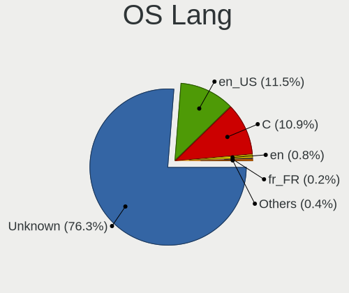
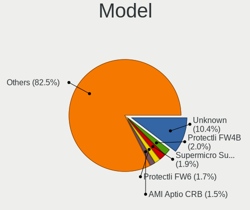
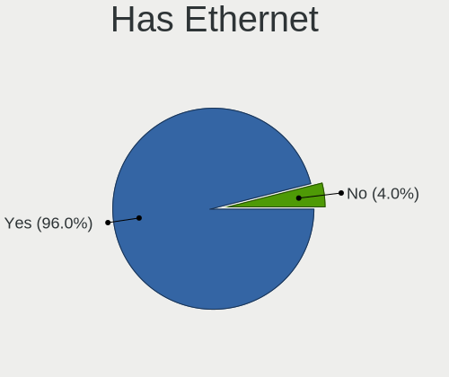
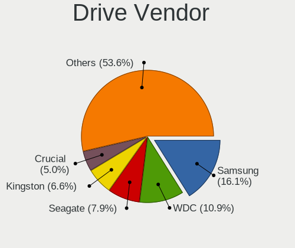
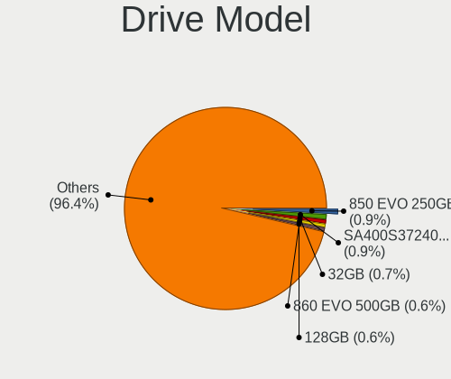
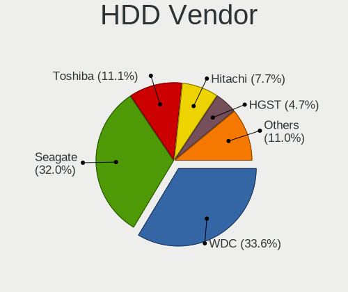
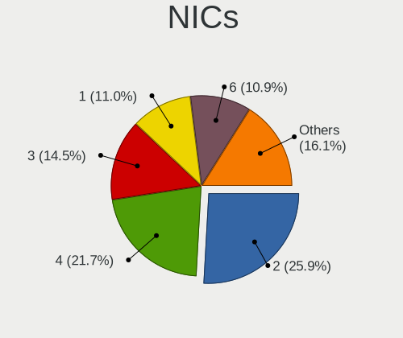
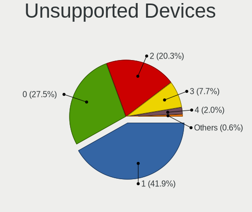

BSD in USA - Tested Hardware & Statistics
-----------------------------------------

A project to collect tested hardware configurations for BSD in USA.

Anyone can contribute to this report by the [hw-probe](https://github.com/linuxhw/hw-probe/blob/master/INSTALL.BSD.md) tool:

    hw-probe -all -upload

Please contribute! Especially if your hardware is rare.

This is a report for all computer types. See also reports for [desktops](/Location/USA/Desktop/README.md) and [notebooks](/Location/USA/Notebook/README.md).

Contents
--------

* [ Test Cases ](#test-cases)

* [ System ](#system)
  - [ OS                       ](#os)
  - [ OS Family                ](#os-family)
  - [ Arch                     ](#arch)
  - [ DE                       ](#de)
  - [ Display Server           ](#display-server)
  - [ Display Manager          ](#display-manager)
  - [ OS Lang                  ](#os-lang)
  - [ Boot Mode                ](#boot-mode)
  - [ Filesystem               ](#filesystem)
  - [ Part. scheme             ](#part-scheme)

* [ Board ](#board)
  - [ Vendor                   ](#vendor)
  - [ Model                    ](#model)
  - [ Model Family             ](#model-family)
  - [ MFG Year                 ](#mfg-year)
  - [ Form Factor              ](#form-factor)
  - [ Coreboot                 ](#coreboot)
  - [ RAM Size                 ](#ram-size)
  - [ RAM Used                 ](#ram-used)
  - [ Total Drives             ](#total-drives)
  - [ Has CD-ROM               ](#has-cd-rom)
  - [ Has Ethernet             ](#has-ethernet)
  - [ Has WiFi                 ](#has-wifi)
  - [ Has Bluetooth            ](#has-bluetooth)

* [ Location ](#location)
  - [ Country                  ](#country)
  - [ City                     ](#city)

* [ Drives ](#drives)
  - [ Drive Vendor             ](#drive-vendor)
  - [ Drive Model              ](#drive-model)
  - [ HDD Vendor               ](#hdd-vendor)
  - [ SSD Vendor               ](#ssd-vendor)
  - [ Drive Kind               ](#drive-kind)
  - [ Drive Connector          ](#drive-connector)
  - [ Drive Size               ](#drive-size)
  - [ Space Total              ](#space-total)
  - [ Space Used               ](#space-used)
  - [ Malfunc. Drives          ](#malfunc-drives)
  - [ Malfunc. Drive Vendor    ](#malfunc-drive-vendor)
  - [ Malfunc. HDD Vendor      ](#malfunc-hdd-vendor)
  - [ Malfunc. Drive Kind      ](#malfunc-drive-kind)
  - [ Failed Drives            ](#failed-drives)
  - [ Failed Drive Vendor      ](#failed-drive-vendor)
  - [ Drive Status             ](#drive-status)

* [ Storage controller ](#storage-controller)
  - [ Storage Vendor           ](#storage-vendor)
  - [ Storage Model            ](#storage-model)
  - [ Storage Kind             ](#storage-kind)

* [ Processor ](#processor)
  - [ CPU Vendor               ](#cpu-vendor)
  - [ CPU Model                ](#cpu-model)
  - [ CPU Model Family         ](#cpu-model-family)
  - [ CPU Cores                ](#cpu-cores)
  - [ CPU Sockets              ](#cpu-sockets)
  - [ CPU Threads              ](#cpu-threads)
  - [ CPU Microarch            ](#cpu-microarch)

* [ Graphics ](#graphics)
  - [ GPU Vendor               ](#gpu-vendor)
  - [ GPU Model                ](#gpu-model)
  - [ GPU Combo                ](#gpu-combo)
  - [ GPU Driver               ](#gpu-driver)
  - [ GPU Memory               ](#gpu-memory)

* [ Monitor ](#monitor)
  - [ Monitor Vendor           ](#monitor-vendor)
  - [ Monitor Model            ](#monitor-model)
  - [ Monitor Resolution       ](#monitor-resolution)
  - [ Monitor Diagonal         ](#monitor-diagonal)
  - [ Monitor Width            ](#monitor-width)
  - [ Aspect Ratio             ](#aspect-ratio)
  - [ Monitor Area             ](#monitor-area)
  - [ Pixel Density            ](#pixel-density)
  - [ Multiple Monitors        ](#multiple-monitors)

* [ Network ](#network)
  - [ Net Controller Vendor    ](#net-controller-vendor)
  - [ Net Controller Model     ](#net-controller-model)
  - [ Wireless Vendor          ](#wireless-vendor)
  - [ Wireless Model           ](#wireless-model)
  - [ Ethernet Vendor          ](#ethernet-vendor)
  - [ Ethernet Model           ](#ethernet-model)
  - [ Net Controller Kind      ](#net-controller-kind)
  - [ Used Controller          ](#used-controller)
  - [ NICs                     ](#nics)
  - [ IPv6                     ](#ipv6)

* [ Bluetooth ](#bluetooth)
  - [ Bluetooth Vendor         ](#bluetooth-vendor)
  - [ Bluetooth Model          ](#bluetooth-model)

* [ Sound ](#sound)
  - [ Sound Vendor             ](#sound-vendor)
  - [ Sound Model              ](#sound-model)

* [ Memory ](#memory)
  - [ Memory Vendor            ](#memory-vendor)
  - [ Memory Model             ](#memory-model)
  - [ Memory Kind              ](#memory-kind)
  - [ Memory Form Factor       ](#memory-form-factor)
  - [ Memory Size              ](#memory-size)
  - [ Memory Speed             ](#memory-speed)

* [ Printers & scanners ](#printers--scanners)
  - [ Printer Vendor           ](#printer-vendor)
  - [ Printer Model            ](#printer-model)
  - [ Scanner Vendor           ](#scanner-vendor)
  - [ Scanner Model            ](#scanner-model)

* [ Camera ](#camera)
  - [ Camera Vendor            ](#camera-vendor)
  - [ Camera Model             ](#camera-model)

* [ Security ](#security)
  - [ Fingerprint Vendor       ](#fingerprint-vendor)
  - [ Fingerprint Model        ](#fingerprint-model)
  - [ Chipcard Vendor          ](#chipcard-vendor)
  - [ Chipcard Model           ](#chipcard-model)

* [ Unsupported ](#unsupported)
  - [ Unsupported Devices      ](#unsupported-devices)
  - [ Unsupported Device Types ](#unsupported-device-types)

Test Cases
----------

Total: 3113

| Vendor        | Model                       | Form-Factor | Probe                                                     | Date         |
|---------------|-----------------------------|-------------|-----------------------------------------------------------|--------------|
| Protectli     | FW6 Ver                     | Desktop     | [b4745f3fbf](https://bsd-hardware.info/?probe=b4745f3fbf) | Aug 01, 2022 |
| Dell          | 0GY6Y8 A03                  | Desktop     | [910403ba69](https://bsd-hardware.info/?probe=910403ba69) | Aug 01, 2022 |
| Dell          | 0GY6Y8 A03                  | Desktop     | [2257be098f](https://bsd-hardware.info/?probe=2257be098f) | Aug 01, 2022 |
| Supermicro    | X10SLH-N6-ST031             | Server      | [7ba6844cb9](https://bsd-hardware.info/?probe=7ba6844cb9) | Jul 31, 2022 |
| Protectli     | FW4A Ver                    | Desktop     | [47bd308b5f](https://bsd-hardware.info/?probe=47bd308b5f) | Jul 31, 2022 |
| MSI           | H81M-P33                    | Desktop     | [10fc9a4368](https://bsd-hardware.info/?probe=10fc9a4368) | Jul 31, 2022 |
| ASUSTek       | P5Q-E                       | Desktop     | [10139014e1](https://bsd-hardware.info/?probe=10139014e1) | Jul 31, 2022 |
| ASUSTek       | ROG CROSSHAIR VIII HERO     | Desktop     | [1129960acb](https://bsd-hardware.info/?probe=1129960acb) | Jul 31, 2022 |
| Dell          | Inspiron 5559               | Notebook    | [13baedb59b](https://bsd-hardware.info/?probe=13baedb59b) | Jul 31, 2022 |
| Intel         | Q3XXG4-P V1.0               | Desktop     | [5b73e61a78](https://bsd-hardware.info/?probe=5b73e61a78) | Jul 31, 2022 |
| Unknown       | Unknown                     | Desktop     | [125a4a6501](https://bsd-hardware.info/?probe=125a4a6501) | Jul 31, 2022 |
| Dell          | 01V648 A03                  | Server      | [33aed2a5c1](https://bsd-hardware.info/?probe=33aed2a5c1) | Jul 30, 2022 |
| ASUSTek       | TUF Gaming Z590-PLUS        | Desktop     | [7c5137f2f8](https://bsd-hardware.info/?probe=7c5137f2f8) | Jul 30, 2022 |
| ASUSTek       | TUF Gaming Z590-PLUS        | Desktop     | [3f6e556a7c](https://bsd-hardware.info/?probe=3f6e556a7c) | Jul 30, 2022 |
| ASUSTek       | CM6330_CM6630_CM6730_CM6... | Desktop     | [0887dc2e0e](https://bsd-hardware.info/?probe=0887dc2e0e) | Jul 30, 2022 |
| Unknown       | Unknown                     | Desktop     | [d6920a8af5](https://bsd-hardware.info/?probe=d6920a8af5) | Jul 30, 2022 |
| Dell          | 05GD68 A00                  | Desktop     | [4e108a3b49](https://bsd-hardware.info/?probe=4e108a3b49) | Jul 30, 2022 |
| Intel         | D54250WYK H13922-303        | Desktop     | [168056c169](https://bsd-hardware.info/?probe=168056c169) | Jul 30, 2022 |
| WesternDig... | BBC 0001                    | Desktop     | [5673b5c8e8](https://bsd-hardware.info/?probe=5673b5c8e8) | Jul 29, 2022 |
| HP            | 213D A01                    | Desktop     | [c24cba449b](https://bsd-hardware.info/?probe=c24cba449b) | Jul 29, 2022 |
| Acer          | Veriton X275                | Desktop     | [8fdb6785a9](https://bsd-hardware.info/?probe=8fdb6785a9) | Jul 29, 2022 |
| Dell          | 040DDP A01                  | Desktop     | [5d4d3d7553](https://bsd-hardware.info/?probe=5d4d3d7553) | Jul 29, 2022 |
| Intel         | Q3XXG4-P V1.0               | Desktop     | [cd35c4b6ce](https://bsd-hardware.info/?probe=cd35c4b6ce) | Jul 29, 2022 |
| AAEON         | MIX-TLUD1 V1.0              | Desktop     | [6b1ea56289](https://bsd-hardware.info/?probe=6b1ea56289) | Jul 29, 2022 |
| Dell          | 0VHWTR A02                  | Desktop     | [eb7ac52c45](https://bsd-hardware.info/?probe=eb7ac52c45) | Jul 28, 2022 |
| Supermicro    | X11SDV-4C-TP8F              | Desktop     | [d7b0e73f03](https://bsd-hardware.info/?probe=d7b0e73f03) | Jul 27, 2022 |
| Dell          | 0T7D40 A01                  | Desktop     | [3db94efbf6](https://bsd-hardware.info/?probe=3db94efbf6) | Jul 27, 2022 |
| Supermicro    | X10SLH-N6-ST031             | Server      | [9597e7c0cc](https://bsd-hardware.info/?probe=9597e7c0cc) | Jul 27, 2022 |
| Unknown       | X79-P3                      | Desktop     | [32ed0bcfa9](https://bsd-hardware.info/?probe=32ed0bcfa9) | Jul 26, 2022 |
| HP            | 18E7                        | Desktop     | [0d18e24e2e](https://bsd-hardware.info/?probe=0d18e24e2e) | Jul 26, 2022 |
| Dell          | 07F37C A01                  | Desktop     | [dfea879cdc](https://bsd-hardware.info/?probe=dfea879cdc) | Jul 26, 2022 |
| AMI           | Aptio CRB                   | Mini pc     | [d32a6452bb](https://bsd-hardware.info/?probe=d32a6452bb) | Jul 25, 2022 |
| ASUSTek       | M5A78L-M LX PLUS            | Desktop     | [9b3459c1ec](https://bsd-hardware.info/?probe=9b3459c1ec) | Jul 25, 2022 |
| Shuttle       | FS310                       | Desktop     | [4dd7894e83](https://bsd-hardware.info/?probe=4dd7894e83) | Jul 25, 2022 |
| Supermicro    | X10SLH-N6-ST031             | Server      | [bf4826f24c](https://bsd-hardware.info/?probe=bf4826f24c) | Jul 24, 2022 |
| Acer          | Aspire XC-830               | Desktop     | [84cfd4b073](https://bsd-hardware.info/?probe=84cfd4b073) | Jul 24, 2022 |
| AAEON         | FWS-2350 V1.0               | Desktop     | [e16dd36daf](https://bsd-hardware.info/?probe=e16dd36daf) | Jul 24, 2022 |
| MSI           | H81M-P33                    | Desktop     | [2f7e57d927](https://bsd-hardware.info/?probe=2f7e57d927) | Jul 24, 2022 |
| ASUSTek       | P5Q-E                       | Desktop     | [6fd0d31624](https://bsd-hardware.info/?probe=6fd0d31624) | Jul 24, 2022 |
| Dell          | 04Y8V0 A02                  | Desktop     | [4ab59b9029](https://bsd-hardware.info/?probe=4ab59b9029) | Jul 24, 2022 |
| Dell          | Precision 5560              | Notebook    | [3dc82c6d91](https://bsd-hardware.info/?probe=3dc82c6d91) | Jul 23, 2022 |
| ASUSTek       | TUF Gaming Z590-PLUS        | Desktop     | [b392e9fcc9](https://bsd-hardware.info/?probe=b392e9fcc9) | Jul 23, 2022 |
| AWOW          | AK34Pro                     | Mini pc     | [dc862477ff](https://bsd-hardware.info/?probe=dc862477ff) | Jul 23, 2022 |
| HP            | 8103 A01                    | Mini pc     | [17be7e6c35](https://bsd-hardware.info/?probe=17be7e6c35) | Jul 23, 2022 |
| HP            | 213D A01                    | Desktop     | [26c8ae3969](https://bsd-hardware.info/?probe=26c8ae3969) | Jul 22, 2022 |
| Protectli     | FW4B Ver                    | Desktop     | [224d08a214](https://bsd-hardware.info/?probe=224d08a214) | Jul 22, 2022 |
| Supermicro    | X10SLH-N6-ST031             | Server      | [0bf33c9e69](https://bsd-hardware.info/?probe=0bf33c9e69) | Jul 22, 2022 |
| HP            | 82A2                        | Desktop     | [7ec5ec44a5](https://bsd-hardware.info/?probe=7ec5ec44a5) | Jul 21, 2022 |
| Dell          | 08VT7V A05                  | Server      | [681d1997eb](https://bsd-hardware.info/?probe=681d1997eb) | Jul 21, 2022 |
| ASUSTek       | ROG CROSSHAIR VIII HERO     | Desktop     | [52cc45aba9](https://bsd-hardware.info/?probe=52cc45aba9) | Jul 21, 2022 |
| Protectli     | FW6                         | Desktop     | [5a13dd0c28](https://bsd-hardware.info/?probe=5a13dd0c28) | Jul 21, 2022 |
| Supermicro    | X10SLH-N6-ST031             | Server      | [7dfb067d40](https://bsd-hardware.info/?probe=7dfb067d40) | Jul 21, 2022 |
| ASUSTek       | ROG CROSSHAIR VIII HERO     | Desktop     | [3182740b56](https://bsd-hardware.info/?probe=3182740b56) | Jul 21, 2022 |
| Gigabyte      | Z87X-UD5H-CF                | Desktop     | [70c9122b95](https://bsd-hardware.info/?probe=70c9122b95) | Jul 20, 2022 |
| Unknown       | YL-E3854L4-V2               | Desktop     | [cd601ead3a](https://bsd-hardware.info/?probe=cd601ead3a) | Jul 20, 2022 |
| Dell          | Inspiron 5559               | Notebook    | [321d3333dd](https://bsd-hardware.info/?probe=321d3333dd) | Jul 19, 2022 |
| Dell          | Inspiron 5559               | Notebook    | [6308d8da4f](https://bsd-hardware.info/?probe=6308d8da4f) | Jul 19, 2022 |
| Dell          | 08HPGT A02                  | Desktop     | [ae260e17eb](https://bsd-hardware.info/?probe=ae260e17eb) | Jul 19, 2022 |
| Unknown       | X79-P3                      | Desktop     | [ae58265601](https://bsd-hardware.info/?probe=ae58265601) | Jul 18, 2022 |
| Deciso        | Netboard A20                | Notebook    | [2bc988b18a](https://bsd-hardware.info/?probe=2bc988b18a) | Jul 18, 2022 |
| Dell          | Inspiron 15-3567            | Notebook    | [15c5d9fdd9](https://bsd-hardware.info/?probe=15c5d9fdd9) | Jul 17, 2022 |
| Protectli     | FW6 Ver                     | Desktop     | [e4e89253c3](https://bsd-hardware.info/?probe=e4e89253c3) | Jul 17, 2022 |
| Deciso        | Netboard A20                | Notebook    | [a4be4171b6](https://bsd-hardware.info/?probe=a4be4171b6) | Jul 17, 2022 |
| MSI           | H81M-P33                    | Desktop     | [c9d1bc6685](https://bsd-hardware.info/?probe=c9d1bc6685) | Jul 17, 2022 |
| ASUSTek       | P5Q-E                       | Desktop     | [7c02a92f29](https://bsd-hardware.info/?probe=7c02a92f29) | Jul 17, 2022 |
| ASUSTek       | ROG CROSSHAIR VIII HERO     | Desktop     | [3bf44f4bb5](https://bsd-hardware.info/?probe=3bf44f4bb5) | Jul 17, 2022 |
| Lenovo        | 361A SDK0J40700 WIN 3258... | Desktop     | [8671985fad](https://bsd-hardware.info/?probe=8671985fad) | Jul 17, 2022 |
| Apple         | Mac-F2218EA9                | All in one  | [64b17b1b35](https://bsd-hardware.info/?probe=64b17b1b35) | Jul 17, 2022 |
| Dell          | 04Y8V0 A02                  | Desktop     | [5bba9aafa1](https://bsd-hardware.info/?probe=5bba9aafa1) | Jul 17, 2022 |
| Apple         | Mac-F2218EA9                | All in one  | [3c7cfd537b](https://bsd-hardware.info/?probe=3c7cfd537b) | Jul 17, 2022 |
| Supermicro    | X10SLH-N6-ST031             | Server      | [23f1880e42](https://bsd-hardware.info/?probe=23f1880e42) | Jul 16, 2022 |
| HP            | 1589                        | Desktop     | [3f9d19b372](https://bsd-hardware.info/?probe=3f9d19b372) | Jul 16, 2022 |
| Dell          | 051FJ8 A02                  | Desktop     | [39de8d3c92](https://bsd-hardware.info/?probe=39de8d3c92) | Jul 15, 2022 |
| Intel         | Q3XXG4-P V1.0               | Desktop     | [e294973f12](https://bsd-hardware.info/?probe=e294973f12) | Jul 15, 2022 |
| ASUSTek       | ROG CROSSHAIR VIII HERO     | Desktop     | [9771cb16c0](https://bsd-hardware.info/?probe=9771cb16c0) | Jul 15, 2022 |
| Unknown       | Unknown                     | Desktop     | [1058650b8e](https://bsd-hardware.info/?probe=1058650b8e) | Jul 15, 2022 |
| Unknown       | Unknown                     | Desktop     | [e4795fcc70](https://bsd-hardware.info/?probe=e4795fcc70) | Jul 15, 2022 |
| ASUSTek       | ROG CROSSHAIR VIII HERO     | Desktop     | [1e8b0433e8](https://bsd-hardware.info/?probe=1e8b0433e8) | Jul 15, 2022 |
| CompuLab      | fitlet2                     | Mini pc     | [f087f83248](https://bsd-hardware.info/?probe=f087f83248) | Jul 14, 2022 |
| Lenovo        | ThinkPad X260 20F6S0KA00    | Notebook    | [117014d55f](https://bsd-hardware.info/?probe=117014d55f) | Jul 14, 2022 |
| Dell          | 02C2CP A04                  | Server      | [3c3ab6b2c6](https://bsd-hardware.info/?probe=3c3ab6b2c6) | Jul 14, 2022 |
| Dell          | 06D7TR A00                  | Desktop     | [e567cc10e7](https://bsd-hardware.info/?probe=e567cc10e7) | Jul 14, 2022 |
| ASUSTek       | ROG CROSSHAIR VIII HERO     | Desktop     | [85a49cb7be](https://bsd-hardware.info/?probe=85a49cb7be) | Jul 14, 2022 |
| MW            | GMLK-2_5G4L                 | Desktop     | [300b7cfcb6](https://bsd-hardware.info/?probe=300b7cfcb6) | Jul 13, 2022 |
| ASUSTek       | PRIME X370-PRO              | Desktop     | [5f63e8291a](https://bsd-hardware.info/?probe=5f63e8291a) | Jul 13, 2022 |
| Supermicro    | A1SRi-2558F                 | Mini pc     | [698d59d94e](https://bsd-hardware.info/?probe=698d59d94e) | Jul 13, 2022 |
| ASRock        | X570 Phantom Gaming 4       | Desktop     | [46e618c773](https://bsd-hardware.info/?probe=46e618c773) | Jul 13, 2022 |
| Protectli     | VP2410 10                   | Desktop     | [ffb2821bab](https://bsd-hardware.info/?probe=ffb2821bab) | Jul 13, 2022 |
| Apple         | MacBookAir5,2               | Notebook    | [894b6f82cf](https://bsd-hardware.info/?probe=894b6f82cf) | Jul 13, 2022 |
| Dell          | 01G5C3 A02                  | Server      | [ca50b43cb8](https://bsd-hardware.info/?probe=ca50b43cb8) | Jul 13, 2022 |
| Deciso        | Netboard A20                | Notebook    | [743b330db3](https://bsd-hardware.info/?probe=743b330db3) | Jul 12, 2022 |
| Supermicro    | X11SDV-4C-TP8F              | Desktop     | [3f5548c246](https://bsd-hardware.info/?probe=3f5548c246) | Jul 12, 2022 |
| ASRock        | X570 PG Velocita            | Desktop     | [ceb7ed4c1e](https://bsd-hardware.info/?probe=ceb7ed4c1e) | Jul 12, 2022 |
| PC Engines    | APU2                        | Desktop     | [57b035462a](https://bsd-hardware.info/?probe=57b035462a) | Jul 12, 2022 |
| Toshiba       | Satellite L305D             | Notebook    | [b0311b8175](https://bsd-hardware.info/?probe=b0311b8175) | Jul 12, 2022 |
| Protectli     | FW2 Ver                     | Desktop     | [89ba2534c0](https://bsd-hardware.info/?probe=89ba2534c0) | Jul 12, 2022 |
| Dell          | 01G5C3 A02                  | Server      | [266891233d](https://bsd-hardware.info/?probe=266891233d) | Jul 11, 2022 |
| ASUSTek       | VivoBook_ASUSLaptop E210... | Notebook    | [7081ddd59c](https://bsd-hardware.info/?probe=7081ddd59c) | Jul 11, 2022 |
| Unknown       | Unknown                     | Desktop     | [322ee9f1c9](https://bsd-hardware.info/?probe=322ee9f1c9) | Jul 11, 2022 |
| SmbiosType... | SmbiosType2_BoardProduct... | Desktop     | [eee15ff905](https://bsd-hardware.info/?probe=eee15ff905) | Jul 11, 2022 |
| Unknown       | Unknown                     | Desktop     | [abf18d0628](https://bsd-hardware.info/?probe=abf18d0628) | Jul 11, 2022 |
| Protectli     | FW6 Ver                     | Desktop     | [0ff1996217](https://bsd-hardware.info/?probe=0ff1996217) | Jul 11, 2022 |
| Intel         | Q3XXG4-P V1.0               | Desktop     | [ce9c6efd80](https://bsd-hardware.info/?probe=ce9c6efd80) | Jul 11, 2022 |
| Unknown       | X79-P3                      | Desktop     | [b4f18ad479](https://bsd-hardware.info/?probe=b4f18ad479) | Jul 11, 2022 |
| HP            | 1495                        | Desktop     | [7ed22254af](https://bsd-hardware.info/?probe=7ed22254af) | Jul 11, 2022 |
| HP            | 1495                        | Desktop     | [1bf0dc0f98](https://bsd-hardware.info/?probe=1bf0dc0f98) | Jul 11, 2022 |
| Supermicro    | X10SBAB                     | Server      | [1bf38a759a](https://bsd-hardware.info/?probe=1bf38a759a) | Jul 10, 2022 |
| MSI           | H81M-P33                    | Desktop     | [698249149d](https://bsd-hardware.info/?probe=698249149d) | Jul 10, 2022 |
| ASUSTek       | ROG CROSSHAIR VIII HERO     | Desktop     | [c2a2cdcbbb](https://bsd-hardware.info/?probe=c2a2cdcbbb) | Jul 10, 2022 |
| ASUSTek       | P5Q-E                       | Desktop     | [0c830d88dc](https://bsd-hardware.info/?probe=0c830d88dc) | Jul 10, 2022 |
| Protectli     | FW6                         | Desktop     | [cf0a97896f](https://bsd-hardware.info/?probe=cf0a97896f) | Jul 10, 2022 |
| ASUSTek       | ROG CROSSHAIR VIII HERO     | Desktop     | [4c74cdfb76](https://bsd-hardware.info/?probe=4c74cdfb76) | Jul 10, 2022 |
| ASUSTek       | ROG CROSSHAIR VIII HERO     | Desktop     | [6edc61f549](https://bsd-hardware.info/?probe=6edc61f549) | Jul 10, 2022 |
| Unknown       | X79-P3                      | Desktop     | [eec1480bc7](https://bsd-hardware.info/?probe=eec1480bc7) | Jul 10, 2022 |
| Toshiba       | Satellite L305D             | Notebook    | [ed950787b0](https://bsd-hardware.info/?probe=ed950787b0) | Jul 10, 2022 |
| Intel         | Q3XXG4-P V1.0               | Desktop     | [f9226218a0](https://bsd-hardware.info/?probe=f9226218a0) | Jul 09, 2022 |
| Supermicro    | X10SLH-N6-ST031             | Server      | [202827c443](https://bsd-hardware.info/?probe=202827c443) | Jul 09, 2022 |
| Supermicro    | X11SBA-LN4F                 | Desktop     | [fc85312fc7](https://bsd-hardware.info/?probe=fc85312fc7) | Jul 08, 2022 |
| Dell          | 05GD68 A00                  | Desktop     | [3c9057ab65](https://bsd-hardware.info/?probe=3c9057ab65) | Jul 08, 2022 |
| Dell          | 01TJ2K A02                  | Desktop     | [467070c750](https://bsd-hardware.info/?probe=467070c750) | Jul 08, 2022 |
| Protectli     | VP2410                      | Desktop     | [e5c8ed1549](https://bsd-hardware.info/?probe=e5c8ed1549) | Jul 07, 2022 |
| ASUSTek       | PRIME A520M-A II            | Desktop     | [0819ecdcf9](https://bsd-hardware.info/?probe=0819ecdcf9) | Jul 07, 2022 |
| ASUSTek       | PRIME A520M-A II            | Desktop     | [d459d3431a](https://bsd-hardware.info/?probe=d459d3431a) | Jul 07, 2022 |
| Dell          | Inspiron 5559               | Notebook    | [7bad2fce01](https://bsd-hardware.info/?probe=7bad2fce01) | Jul 07, 2022 |
| Dell          | Latitude E6420              | Notebook    | [c41c8ff4f4](https://bsd-hardware.info/?probe=c41c8ff4f4) | Jul 07, 2022 |
| Unknown       | YL-E3854L4-V2               | Desktop     | [1326524180](https://bsd-hardware.info/?probe=1326524180) | Jul 07, 2022 |
| Supermicro    | X10SLH-N6-ST031             | Server      | [9e17b85d9b](https://bsd-hardware.info/?probe=9e17b85d9b) | Jul 06, 2022 |
| Dell          | 0F9NPY A02                  | Server      | [f1bb207022](https://bsd-hardware.info/?probe=f1bb207022) | Jul 06, 2022 |
| Lenovo        | SHARKBAY SDK0E50510 WIN     | Desktop     | [5d668f86de](https://bsd-hardware.info/?probe=5d668f86de) | Jul 06, 2022 |
| MiTAC         | PH11CMI                     | Desktop     | [9111d63b0a](https://bsd-hardware.info/?probe=9111d63b0a) | Jul 06, 2022 |
| ASRock        | X570 PG Velocita            | Desktop     | [08359c2723](https://bsd-hardware.info/?probe=08359c2723) | Jul 06, 2022 |
| Dell          | 0F9NPY A02                  | Server      | [919d608fda](https://bsd-hardware.info/?probe=919d608fda) | Jul 05, 2022 |
| Protectli     | VP2410 10                   | Desktop     | [bc786895e5](https://bsd-hardware.info/?probe=bc786895e5) | Jul 05, 2022 |
| ASRock        | H370M-ITX/ac                | Desktop     | [ebc1f9cbf1](https://bsd-hardware.info/?probe=ebc1f9cbf1) | Jul 05, 2022 |
| MSI           | B550M PRO-VDH WIFI          | Desktop     | [5116ea39c1](https://bsd-hardware.info/?probe=5116ea39c1) | Jul 05, 2022 |
| Protectli     | FW6E                        | Desktop     | [efa044fab5](https://bsd-hardware.info/?probe=efa044fab5) | Jul 05, 2022 |
| Supermicro    | X11SDV-4C-TP8F              | Server      | [eb4105a1ba](https://bsd-hardware.info/?probe=eb4105a1ba) | Jul 05, 2022 |
| Unknown       | Unknown                     | Notebook    | [584ecf8423](https://bsd-hardware.info/?probe=584ecf8423) | Jul 05, 2022 |
| Dell          | 042P49 A01                  | Desktop     | [85404f4f29](https://bsd-hardware.info/?probe=85404f4f29) | Jul 04, 2022 |
| ASUSTek       | ROG STRIX B450-F GAMING     | Desktop     | [041ad7f035](https://bsd-hardware.info/?probe=041ad7f035) | Jul 04, 2022 |
| Intel         | NUC7i3BNB J22859-303        | Mini pc     | [886522d5e6](https://bsd-hardware.info/?probe=886522d5e6) | Jul 04, 2022 |
| Intel         | NUC11PABi5 K90634-305       | Mini pc     | [81e9f8506f](https://bsd-hardware.info/?probe=81e9f8506f) | Jul 04, 2022 |
| Intel         | NUC11PABi5 K90634-305       | Mini pc     | [d82547b583](https://bsd-hardware.info/?probe=d82547b583) | Jul 04, 2022 |
| Intel         | NUC7i3BNB J22859-303        | Mini pc     | [a3cba2571b](https://bsd-hardware.info/?probe=a3cba2571b) | Jul 04, 2022 |
| ASRock        | H370M-ITX/ac                | Desktop     | [ce09ce2aa9](https://bsd-hardware.info/?probe=ce09ce2aa9) | Jul 04, 2022 |
| Dell          | 01TJ2K A02                  | Desktop     | [b9037d1fb0](https://bsd-hardware.info/?probe=b9037d1fb0) | Jul 04, 2022 |
| Fujitsu       | D3313-E1 S26361-D3313-E1    | Desktop     | [f261de9b25](https://bsd-hardware.info/?probe=f261de9b25) | Jul 03, 2022 |
| AWOW          | PC BOX                      | Mini pc     | [34ada293b1](https://bsd-hardware.info/?probe=34ada293b1) | Jul 03, 2022 |
| MSI           | H81M-P33                    | Desktop     | [e482fbe2d2](https://bsd-hardware.info/?probe=e482fbe2d2) | Jul 03, 2022 |
| ASUSTek       | ROG CROSSHAIR VIII HERO     | Desktop     | [d5dd169581](https://bsd-hardware.info/?probe=d5dd169581) | Jul 03, 2022 |
| ASUSTek       | P5Q-E                       | Desktop     | [7a998b2fa4](https://bsd-hardware.info/?probe=7a998b2fa4) | Jul 03, 2022 |
| HP            | 843F                        | Desktop     | [30700c4158](https://bsd-hardware.info/?probe=30700c4158) | Jul 03, 2022 |
| Intel         | Q3XXG4-P V1.0               | Desktop     | [720d51613e](https://bsd-hardware.info/?probe=720d51613e) | Jul 03, 2022 |
| HP            | ProLiant DL20 Gen9          | Server      | [f82d95a462](https://bsd-hardware.info/?probe=f82d95a462) | Jul 03, 2022 |
| Unknown       | Unknown                     | Desktop     | [5b79558a40](https://bsd-hardware.info/?probe=5b79558a40) | Jul 03, 2022 |
| Intel         | Q3XXG4-P V1.0               | Desktop     | [699fea1ac9](https://bsd-hardware.info/?probe=699fea1ac9) | Jul 02, 2022 |
| Dell          | Inspiron 5559               | Notebook    | [452aabec42](https://bsd-hardware.info/?probe=452aabec42) | Jul 02, 2022 |
| Dell          | XPS 13 7390                 | Notebook    | [3c2e2da462](https://bsd-hardware.info/?probe=3c2e2da462) | Jul 02, 2022 |
| Dell          | XPS 13 7390                 | Notebook    | [5ec12d679e](https://bsd-hardware.info/?probe=5ec12d679e) | Jul 01, 2022 |
| Protectli     | FW4B Ver                    | Desktop     | [83349fd2bf](https://bsd-hardware.info/?probe=83349fd2bf) | Jul 01, 2022 |
| Dell          | XPS 13 7390                 | Notebook    | [b870cd3698](https://bsd-hardware.info/?probe=b870cd3698) | Jul 01, 2022 |
| Intel         | NUC8i5BESB K75953-303       | Mini pc     | [b0a9749159](https://bsd-hardware.info/?probe=b0a9749159) | Jul 01, 2022 |
| LG Electro... | 17Z990-R.AAC9U1             | Notebook    | [5777cb6dc6](https://bsd-hardware.info/?probe=5777cb6dc6) | Jul 01, 2022 |
| Dell          | Inspiron 15-3552            | Notebook    | [8cdc3bd7ab](https://bsd-hardware.info/?probe=8cdc3bd7ab) | Jul 01, 2022 |
| Supermicro    | X11SSQ-L-DE05BA             | Server      | [6244e44f35](https://bsd-hardware.info/?probe=6244e44f35) | Jun 30, 2022 |
| Unknown       | Unknown                     | Notebook    | [d9e6e5b83a](https://bsd-hardware.info/?probe=d9e6e5b83a) | Jun 29, 2022 |
| Deciso        | NetBoard-A10                | Notebook    | [ace8b06cd3](https://bsd-hardware.info/?probe=ace8b06cd3) | Jun 29, 2022 |
| Protectli     | VP2410 10                   | Desktop     | [7c1ae96d22](https://bsd-hardware.info/?probe=7c1ae96d22) | Jun 29, 2022 |
| CloudGenix    | ion 2000                    | Firewall    | [1c489d4e2e](https://bsd-hardware.info/?probe=1c489d4e2e) | Jun 28, 2022 |
| PC Engines    | apu4                        | Desktop     | [b139faa593](https://bsd-hardware.info/?probe=b139faa593) | Jun 28, 2022 |
| ASUSTek       | GRYPHON Z87                 | Desktop     | [56594ec74b](https://bsd-hardware.info/?probe=56594ec74b) | Jun 28, 2022 |
| Toshiba       | PORTEGE R700                | Notebook    | [d9c359c2ab](https://bsd-hardware.info/?probe=d9c359c2ab) | Jun 28, 2022 |
| AZW           | Green G1                    | Desktop     | [8364810fca](https://bsd-hardware.info/?probe=8364810fca) | Jun 27, 2022 |
| Dell          | Inspiron 5559               | Notebook    | [e0c49be06e](https://bsd-hardware.info/?probe=e0c49be06e) | Jun 27, 2022 |
| AZW           | GK55                        | Desktop     | [82e212ab9e](https://bsd-hardware.info/?probe=82e212ab9e) | Jun 27, 2022 |
| Supermicro    | X10SRL-F                    | Server      | [1499a2903d](https://bsd-hardware.info/?probe=1499a2903d) | Jun 27, 2022 |
| AMI           | Aptio CRB                   | Mini pc     | [3f2f69321d](https://bsd-hardware.info/?probe=3f2f69321d) | Jun 27, 2022 |
| ASUSTek       | ROG STRIX Z590-I GAMING ... | Desktop     | [b628bb87a6](https://bsd-hardware.info/?probe=b628bb87a6) | Jun 26, 2022 |
| MSI           | H81M-P33                    | Desktop     | [079fcf320f](https://bsd-hardware.info/?probe=079fcf320f) | Jun 26, 2022 |
| ASUSTek       | P5Q-E                       | Desktop     | [bbc59d9815](https://bsd-hardware.info/?probe=bbc59d9815) | Jun 26, 2022 |
| ASUSTek       | ROG CROSSHAIR VIII HERO     | Desktop     | [6eb02df970](https://bsd-hardware.info/?probe=6eb02df970) | Jun 26, 2022 |
| Dell          | 0D6H9T A00                  | Desktop     | [b71ecdf543](https://bsd-hardware.info/?probe=b71ecdf543) | Jun 26, 2022 |
| Unknown       | Unknown                     | Desktop     | [3d2f470da6](https://bsd-hardware.info/?probe=3d2f470da6) | Jun 24, 2022 |
| SmbiosType... | SmbiosType2_BoardProduct... | Desktop     | [d80af3d3b1](https://bsd-hardware.info/?probe=d80af3d3b1) | Jun 24, 2022 |
| HP            | ProLiant DL360 G7           | Server      | [7baa424bfd](https://bsd-hardware.info/?probe=7baa424bfd) | Jun 23, 2022 |
| ALLEGIANCE... | X79 V3.3F                   | Desktop     | [190560a4f4](https://bsd-hardware.info/?probe=190560a4f4) | Jun 23, 2022 |
| Dell          | 0YDJK3 A10                  | Server      | [0fce035aee](https://bsd-hardware.info/?probe=0fce035aee) | Jun 22, 2022 |
| Lenovo        | 0B98401 PRO                 | Desktop     | [ef2ff887f3](https://bsd-hardware.info/?probe=ef2ff887f3) | Jun 22, 2022 |
| Supermicro    | X10SDV-TP8F                 | Server      | [9dfcf12ab1](https://bsd-hardware.info/?probe=9dfcf12ab1) | Jun 22, 2022 |
| HP            | 8906 SMVB                   | Desktop     | [c7ea52a92e](https://bsd-hardware.info/?probe=c7ea52a92e) | Jun 22, 2022 |
| Lenovo        | ThinkPad X270 20HN001HUS    | Notebook    | [139e4817d7](https://bsd-hardware.info/?probe=139e4817d7) | Jun 21, 2022 |
| Dell          | 0RC130 A03                  | Server      | [8b59f71f96](https://bsd-hardware.info/?probe=8b59f71f96) | Jun 21, 2022 |
| Protectli     | FW6 Ver                     | Desktop     | [b0a265f65f](https://bsd-hardware.info/?probe=b0a265f65f) | Jun 21, 2022 |
| Protectli     | FW4B Ver                    | Desktop     | [0efa4b4878](https://bsd-hardware.info/?probe=0efa4b4878) | Jun 20, 2022 |
| ASUSTek       | ROG STRIX B450-F GAMING     | Desktop     | [081b5f8bec](https://bsd-hardware.info/?probe=081b5f8bec) | Jun 20, 2022 |
| Protectli     | FW4B Ver                    | Desktop     | [24d72267be](https://bsd-hardware.info/?probe=24d72267be) | Jun 19, 2022 |
| Dell          | 0CNCJW A08                  | Server      | [cd8960f886](https://bsd-hardware.info/?probe=cd8960f886) | Jun 19, 2022 |
| Dell          | 0CNCJW A08                  | Server      | [912e4925e9](https://bsd-hardware.info/?probe=912e4925e9) | Jun 19, 2022 |
| Dell          | Inspiron 5559               | Notebook    | [5b7a6bf8f8](https://bsd-hardware.info/?probe=5b7a6bf8f8) | Jun 19, 2022 |
| Dell          | 0WMJ54 A01                  | Desktop     | [78716ab7b5](https://bsd-hardware.info/?probe=78716ab7b5) | Jun 19, 2022 |
| HP            | Compaq tc4400 (EN357UT#A... | Notebook    | [f4e4e3826b](https://bsd-hardware.info/?probe=f4e4e3826b) | Jun 19, 2022 |
| Protectli     | FW6D                        | Desktop     | [04f0fbbc41](https://bsd-hardware.info/?probe=04f0fbbc41) | Jun 19, 2022 |
| TYAN Compu... | Tiger K8W Dual AMD Opter... | Desktop     | [3129273bd4](https://bsd-hardware.info/?probe=3129273bd4) | Jun 18, 2022 |
| MSI           | B360I GMAING PRO AC         | Desktop     | [9d92cd0269](https://bsd-hardware.info/?probe=9d92cd0269) | Jun 18, 2022 |
| Unknown       | YL-E3854L4-V2               | Desktop     | [54003932e8](https://bsd-hardware.info/?probe=54003932e8) | Jun 17, 2022 |
| HP            | 2B29                        | Desktop     | [e8c355314e](https://bsd-hardware.info/?probe=e8c355314e) | Jun 17, 2022 |
| HP            | 1589                        | Desktop     | [3765f1cb09](https://bsd-hardware.info/?probe=3765f1cb09) | Jun 17, 2022 |
| Dell          | 0Y2G6P A03                  | Server      | [ecb370bba4](https://bsd-hardware.info/?probe=ecb370bba4) | Jun 17, 2022 |
| Biostar       | H61MGC                      | Desktop     | [c3328d9806](https://bsd-hardware.info/?probe=c3328d9806) | Jun 17, 2022 |
| Dell          | 0CNCJW A08                  | Server      | [8e0f43615e](https://bsd-hardware.info/?probe=8e0f43615e) | Jun 16, 2022 |
| Dell          | 0CNCJW A08                  | Server      | [8e5151768d](https://bsd-hardware.info/?probe=8e5151768d) | Jun 16, 2022 |
| Dell          | Inspiron 5559               | Notebook    | [3344e5152d](https://bsd-hardware.info/?probe=3344e5152d) | Jun 16, 2022 |
| Dell          | Inspiron 5559               | Notebook    | [9f630c894a](https://bsd-hardware.info/?probe=9f630c894a) | Jun 16, 2022 |
| ASUSTek       | ZenBook UX461FA_UX461FA     | Convertible | [3079ca74a6](https://bsd-hardware.info/?probe=3079ca74a6) | Jun 16, 2022 |
| Gigabyte      | C1007UN-D                   | Desktop     | [a8d5fadd58](https://bsd-hardware.info/?probe=a8d5fadd58) | Jun 15, 2022 |
| Dell          | 015TH9 A00                  | Server      | [9db5cc48b8](https://bsd-hardware.info/?probe=9db5cc48b8) | Jun 15, 2022 |
| Lenovo        | ThinkPad A485 20MU000VUS    | Notebook    | [43d7380492](https://bsd-hardware.info/?probe=43d7380492) | Jun 15, 2022 |
| Protectli     | FW6 Ver                     | Desktop     | [a9d98de213](https://bsd-hardware.info/?probe=a9d98de213) | Jun 15, 2022 |
| AMI           | Aptio CRB                   | Mini pc     | [7231380d11](https://bsd-hardware.info/?probe=7231380d11) | Jun 15, 2022 |
| Lenovo        | ThinkPad A485 20MU000VUS    | Notebook    | [a3e3500ca5](https://bsd-hardware.info/?probe=a3e3500ca5) | Jun 15, 2022 |
| HP            | 83EE                        | Desktop     | [34235b8478](https://bsd-hardware.info/?probe=34235b8478) | Jun 14, 2022 |
| Supermicro    | X11SDV-8C-TP8F              | Desktop     | [5a180cc6aa](https://bsd-hardware.info/?probe=5a180cc6aa) | Jun 14, 2022 |
| Dell          | 0F6X5P A00                  | Desktop     | [fcadb83b9e](https://bsd-hardware.info/?probe=fcadb83b9e) | Jun 14, 2022 |
| HP            | ProLiant DL360 G7           | Server      | [d0be82ee85](https://bsd-hardware.info/?probe=d0be82ee85) | Jun 14, 2022 |
| Dell          | 07T4MC A02                  | Desktop     | [5b60dfdcc1](https://bsd-hardware.info/?probe=5b60dfdcc1) | Jun 13, 2022 |
| ASUSTek       | PRIME X370-PRO              | Desktop     | [8cc71bff7d](https://bsd-hardware.info/?probe=8cc71bff7d) | Jun 13, 2022 |
| Unknown       | EMB-B75A                    | Desktop     | [a2adb81748](https://bsd-hardware.info/?probe=a2adb81748) | Jun 13, 2022 |
| ASRock        | X570 Phantom Gaming 4       | Desktop     | [59fba84256](https://bsd-hardware.info/?probe=59fba84256) | Jun 13, 2022 |
| Dell          | 0NC2VH A01                  | Desktop     | [29a12ab775](https://bsd-hardware.info/?probe=29a12ab775) | Jun 13, 2022 |
| Supermicro    | X10SLH-N6-ST031             | Server      | [b627258b73](https://bsd-hardware.info/?probe=b627258b73) | Jun 13, 2022 |
| Supermicro    | X9SCL/X9SCMA                | Desktop     | [7b19e64a0e](https://bsd-hardware.info/?probe=7b19e64a0e) | Jun 13, 2022 |
| Dell          | PowerEdge R610              | Server      | [68bd058f04](https://bsd-hardware.info/?probe=68bd058f04) | Jun 13, 2022 |
| Dell          | 0HMF7C A01                  | Desktop     | [ad0f6d4b31](https://bsd-hardware.info/?probe=ad0f6d4b31) | Jun 13, 2022 |
| CompuLab      | fitlet2                     | Mini pc     | [db92ea33c8](https://bsd-hardware.info/?probe=db92ea33c8) | Jun 12, 2022 |
| MSI           | H81M-P33                    | Desktop     | [87a66430db](https://bsd-hardware.info/?probe=87a66430db) | Jun 12, 2022 |
| ASUSTek       | P5Q-E                       | Desktop     | [9b34d14850](https://bsd-hardware.info/?probe=9b34d14850) | Jun 12, 2022 |
| ASUSTek       | ROG CROSSHAIR VIII HERO     | Desktop     | [c281c439e8](https://bsd-hardware.info/?probe=c281c439e8) | Jun 12, 2022 |
| Dell          | Inspiron 5559               | Notebook    | [e7017b0ea5](https://bsd-hardware.info/?probe=e7017b0ea5) | Jun 12, 2022 |
| Lenovo        | ThinkPad X260 20F5S45W00    | Notebook    | [acfa5c94d5](https://bsd-hardware.info/?probe=acfa5c94d5) | Jun 12, 2022 |
| Supermicro    | X9DR3-F                     | Desktop     | [d81151c0e8](https://bsd-hardware.info/?probe=d81151c0e8) | Jun 12, 2022 |
| ASUSTek       | Maximus VII FORMULA         | Desktop     | [5215d1ebb8](https://bsd-hardware.info/?probe=5215d1ebb8) | Jun 12, 2022 |
| Gigabyte      | H110M-M2-CF                 | Desktop     | [09d6e71897](https://bsd-hardware.info/?probe=09d6e71897) | Jun 12, 2022 |
| ASRock        | B550M Steel Legend          | Desktop     | [c6824c4f4a](https://bsd-hardware.info/?probe=c6824c4f4a) | Jun 11, 2022 |
| HP            | ProLiant DL20 Gen9          | Server      | [0c5556ab5f](https://bsd-hardware.info/?probe=0c5556ab5f) | Jun 11, 2022 |
| HP            | ProLiant DL20 Gen9          | Server      | [87ea02111d](https://bsd-hardware.info/?probe=87ea02111d) | Jun 10, 2022 |
| ASRock        | B450 Gaming K4              | Desktop     | [a03ff6ad9e](https://bsd-hardware.info/?probe=a03ff6ad9e) | Jun 10, 2022 |
| Dell          | 0804P1 A04                  | Server      | [c8ddb7dae6](https://bsd-hardware.info/?probe=c8ddb7dae6) | Jun 10, 2022 |
| Seeed Stud... | ODYSSEY-X86J41X5 SD-BS-C... | Desktop     | [65540f1006](https://bsd-hardware.info/?probe=65540f1006) | Jun 09, 2022 |
| Protectli     | VP2410 10                   | Desktop     | [61442e8deb](https://bsd-hardware.info/?probe=61442e8deb) | Jun 09, 2022 |
| Apple         | Mac-F2218EA9                | All in one  | [d1a197ec53](https://bsd-hardware.info/?probe=d1a197ec53) | Jun 09, 2022 |
| Dell          | Precision M4800             | Notebook    | [4d77bb0082](https://bsd-hardware.info/?probe=4d77bb0082) | Jun 08, 2022 |
| Dell          | Precision M4800             | Notebook    | [b9169c863c](https://bsd-hardware.info/?probe=b9169c863c) | Jun 08, 2022 |
| HP            | 1495                        | Desktop     | [ce6fa257fd](https://bsd-hardware.info/?probe=ce6fa257fd) | Jun 08, 2022 |
| AZW           | Green G1                    | Desktop     | [0443d21ba3](https://bsd-hardware.info/?probe=0443d21ba3) | Jun 08, 2022 |
| ASUSTek       | ROG STRIX B450-F GAMING     | Desktop     | [d54c86624e](https://bsd-hardware.info/?probe=d54c86624e) | Jun 08, 2022 |
| Gigabyte      | Z390 UD                     | Desktop     | [2e5eb217b5](https://bsd-hardware.info/?probe=2e5eb217b5) | Jun 08, 2022 |
| ADI           | MinnowBoard Turbot          | Desktop     | [917e897373](https://bsd-hardware.info/?probe=917e897373) | Jun 07, 2022 |
| Protectli     | FW6                         | Desktop     | [85d825c3a6](https://bsd-hardware.info/?probe=85d825c3a6) | Jun 07, 2022 |
| Dell          | Inspiron 5559               | Notebook    | [1a9b85f6c5](https://bsd-hardware.info/?probe=1a9b85f6c5) | Jun 07, 2022 |
| Dell          | 0VHWTR A02                  | Desktop     | [af39fe65b7](https://bsd-hardware.info/?probe=af39fe65b7) | Jun 07, 2022 |
| Apple         | MacPro4,1                   | Desktop     | [65380f3847](https://bsd-hardware.info/?probe=65380f3847) | Jun 06, 2022 |
| Dell          | 0WMJ54 A00                  | Desktop     | [40510e311b](https://bsd-hardware.info/?probe=40510e311b) | Jun 06, 2022 |
| Sophos        | SG                          | Firewall    | [2f235d7404](https://bsd-hardware.info/?probe=2f235d7404) | Jun 06, 2022 |
| MSI           | Z590 PRO WIFI               | Desktop     | [29b410eeb6](https://bsd-hardware.info/?probe=29b410eeb6) | Jun 06, 2022 |
| Unknown       | Unknown                     | Desktop     | [03a994458a](https://bsd-hardware.info/?probe=03a994458a) | Jun 05, 2022 |
| Lenovo        | ThinkPad X220 4286CTO       | Notebook    | [cb98f3014e](https://bsd-hardware.info/?probe=cb98f3014e) | Jun 05, 2022 |
| Unknown       | Unknown                     | Desktop     | [2de97a7ff6](https://bsd-hardware.info/?probe=2de97a7ff6) | Jun 05, 2022 |
| Biostar       | Hi-Fi B85N 3D               | Desktop     | [b88e0faba8](https://bsd-hardware.info/?probe=b88e0faba8) | Jun 05, 2022 |
| MSI           | H81M-P33                    | Desktop     | [49ab973713](https://bsd-hardware.info/?probe=49ab973713) | Jun 05, 2022 |
| ASUSTek       | ROG CROSSHAIR VIII HERO     | Desktop     | [7f11ab4091](https://bsd-hardware.info/?probe=7f11ab4091) | Jun 05, 2022 |
| ASUSTek       | P5Q-E                       | Desktop     | [10381fadd6](https://bsd-hardware.info/?probe=10381fadd6) | Jun 05, 2022 |
| HP            | 8103 A01                    | Mini pc     | [97ef9e2512](https://bsd-hardware.info/?probe=97ef9e2512) | Jun 05, 2022 |
| Gigabyte      | H110M-M2-CF                 | Desktop     | [018c0120f3](https://bsd-hardware.info/?probe=018c0120f3) | Jun 05, 2022 |
| Lenovo        | ThinkPad T440p 20AWS0DU0... | Notebook    | [8029eb2018](https://bsd-hardware.info/?probe=8029eb2018) | Jun 04, 2022 |
| ZOTAC         | ZBOX-CI323NANO              | Mini pc     | [53f89519ba](https://bsd-hardware.info/?probe=53f89519ba) | Jun 04, 2022 |
| Dell          | Inspiron 5559               | Notebook    | [0f0c2bcf67](https://bsd-hardware.info/?probe=0f0c2bcf67) | Jun 04, 2022 |
| MSI           | B360I GMAING PRO AC         | Desktop     | [f29f648413](https://bsd-hardware.info/?probe=f29f648413) | Jun 04, 2022 |
| ASUSTek       | ROG STRIX B450-F GAMING     | Desktop     | [20ea25695a](https://bsd-hardware.info/?probe=20ea25695a) | Jun 04, 2022 |
| Dell          | 0WR7PY A01                  | Desktop     | [8fd5398904](https://bsd-hardware.info/?probe=8fd5398904) | Jun 04, 2022 |
| HP            | 8103 A01                    | Mini pc     | [4cddf5a2c8](https://bsd-hardware.info/?probe=4cddf5a2c8) | Jun 04, 2022 |
| Unknown       | Unknown                     | Desktop     | [6449ac13c1](https://bsd-hardware.info/?probe=6449ac13c1) | Jun 03, 2022 |
| Dell          | Latitude E5500              | Notebook    | [b1cb5de914](https://bsd-hardware.info/?probe=b1cb5de914) | Jun 03, 2022 |
| MSI           | B360I GMAING PRO AC         | Desktop     | [8754cf67fc](https://bsd-hardware.info/?probe=8754cf67fc) | Jun 03, 2022 |
| HP            | 8103 A01                    | Mini pc     | [544a5a6f8b](https://bsd-hardware.info/?probe=544a5a6f8b) | Jun 02, 2022 |
| Lenovo        | ThinkPad W520 4282AD4       | Notebook    | [40198abaa2](https://bsd-hardware.info/?probe=40198abaa2) | Jun 02, 2022 |
| Protectli     | FW4B Ver                    | Desktop     | [d55600f2bf](https://bsd-hardware.info/?probe=d55600f2bf) | Jun 02, 2022 |
| Dell          | 05GD68 A00                  | Desktop     | [207c4d519b](https://bsd-hardware.info/?probe=207c4d519b) | Jun 02, 2022 |
| Lenovo        | SHARKBAY 0B98405 STD        | Desktop     | [7820a44cbe](https://bsd-hardware.info/?probe=7820a44cbe) | Jun 01, 2022 |
| Dell          | 0WR7PY A01                  | Desktop     | [4154fda8ab](https://bsd-hardware.info/?probe=4154fda8ab) | May 31, 2022 |
| ASRock        | B450M Pro4                  | Desktop     | [3e62c80025](https://bsd-hardware.info/?probe=3e62c80025) | May 31, 2022 |
| GPD           | MicroPC                     | Notebook    | [a448570ff9](https://bsd-hardware.info/?probe=a448570ff9) | May 31, 2022 |
| Dell          | Inspiron 5559               | Notebook    | [ca9f2125af](https://bsd-hardware.info/?probe=ca9f2125af) | May 31, 2022 |
| Dell          | Inspiron 5559               | Notebook    | [283a074737](https://bsd-hardware.info/?probe=283a074737) | May 31, 2022 |
| GPD           | MicroPC                     | Notebook    | [0046ab7c9b](https://bsd-hardware.info/?probe=0046ab7c9b) | May 31, 2022 |
| NF-M2S        | ABIT                        | Desktop     | [bef9700756](https://bsd-hardware.info/?probe=bef9700756) | May 31, 2022 |
| Dell          | 05GD68 A00                  | Desktop     | [364b3d55e4](https://bsd-hardware.info/?probe=364b3d55e4) | May 31, 2022 |
| Supermicro    | X9SCL/X9SCM                 | Desktop     | [97f4daf2ad](https://bsd-hardware.info/?probe=97f4daf2ad) | May 30, 2022 |
| ASUSTek       | ROG STRIX B450-F GAMING     | Desktop     | [486ad2acae](https://bsd-hardware.info/?probe=486ad2acae) | May 30, 2022 |
| Protectli     | FW4B                        | Desktop     | [2b833c65c0](https://bsd-hardware.info/?probe=2b833c65c0) | May 29, 2022 |
| System76      | Galago Pro                  | Notebook    | [126ebc1522](https://bsd-hardware.info/?probe=126ebc1522) | May 29, 2022 |
| Protectli     | VP2410 10                   | Desktop     | [0f275a65af](https://bsd-hardware.info/?probe=0f275a65af) | May 29, 2022 |
| Unknown       | Unknown                     | Desktop     | [90b27f0ac1](https://bsd-hardware.info/?probe=90b27f0ac1) | May 29, 2022 |
| HP            | 1495                        | Desktop     | [e7fcfd6634](https://bsd-hardware.info/?probe=e7fcfd6634) | May 29, 2022 |
| Lenovo        | 32E1 SDK0J40697 WIN 3305... | Desktop     | [479e0f44cd](https://bsd-hardware.info/?probe=479e0f44cd) | May 29, 2022 |
| ASUSTek       | P5Q-E                       | Desktop     | [cf67e4079f](https://bsd-hardware.info/?probe=cf67e4079f) | May 29, 2022 |
| ASUSTek       | ROG CROSSHAIR VIII HERO     | Desktop     | [8ebd281f5f](https://bsd-hardware.info/?probe=8ebd281f5f) | May 29, 2022 |
| MSI           | H81M-P33                    | Desktop     | [ab2181e1b4](https://bsd-hardware.info/?probe=ab2181e1b4) | May 29, 2022 |
| Protectli     | FW6                         | Desktop     | [902d82819e](https://bsd-hardware.info/?probe=902d82819e) | May 29, 2022 |
| Dell          | Latitude E6430              | Notebook    | [d7ced37bac](https://bsd-hardware.info/?probe=d7ced37bac) | May 29, 2022 |
| Dell          | 018D1Y A00                  | Desktop     | [cb624b7a18](https://bsd-hardware.info/?probe=cb624b7a18) | May 29, 2022 |
| Intel         | S1200KP AAG34877-201        | Desktop     | [f6bbaffaeb](https://bsd-hardware.info/?probe=f6bbaffaeb) | May 29, 2022 |
| ASUSTek       | PRIME Z590-P                | Desktop     | [3ef083287f](https://bsd-hardware.info/?probe=3ef083287f) | May 28, 2022 |
| ASUSTek       | PRIME Z590-P                | Desktop     | [53cb90d2b7](https://bsd-hardware.info/?probe=53cb90d2b7) | May 28, 2022 |
| ASUSTek       | P5QL-VM DO                  | Desktop     | [33145067d8](https://bsd-hardware.info/?probe=33145067d8) | May 28, 2022 |
| Intel         | S1200KP AAG34877-201        | Desktop     | [5e08455bea](https://bsd-hardware.info/?probe=5e08455bea) | May 28, 2022 |
| Lenovo        | MAHOBAY NOK                 | Desktop     | [d134ba2206](https://bsd-hardware.info/?probe=d134ba2206) | May 28, 2022 |
| Dell          | 0WR7PY A03                  | Desktop     | [0ba89b7a25](https://bsd-hardware.info/?probe=0ba89b7a25) | May 28, 2022 |
| Dell          | 06D7TR A00                  | Desktop     | [9c70320d7f](https://bsd-hardware.info/?probe=9c70320d7f) | May 27, 2022 |
| Unknown       | Unknown                     | Desktop     | [4e15ce78c8](https://bsd-hardware.info/?probe=4e15ce78c8) | May 26, 2022 |
| Dell          | 0VHWTR A02                  | Desktop     | [51c560673e](https://bsd-hardware.info/?probe=51c560673e) | May 26, 2022 |
| Lenovo        | 32E1 SDK0J40697 WIN 3305... | Desktop     | [6906c16701](https://bsd-hardware.info/?probe=6906c16701) | May 26, 2022 |
| HP            | 158A                        | Desktop     | [883958cd36](https://bsd-hardware.info/?probe=883958cd36) | May 25, 2022 |
| Unknown       | Unknown                     | Desktop     | [78d1ad4565](https://bsd-hardware.info/?probe=78d1ad4565) | May 25, 2022 |
| Unknown       | Unknown                     | Desktop     | [b1f95e9759](https://bsd-hardware.info/?probe=b1f95e9759) | May 25, 2022 |
| Dell          | 06D7TR A00                  | Desktop     | [bcf5c6db64](https://bsd-hardware.info/?probe=bcf5c6db64) | May 25, 2022 |
| BCM Advanc... | MX57QM B1                   | Desktop     | [54bafab9d8](https://bsd-hardware.info/?probe=54bafab9d8) | May 25, 2022 |
| Protectli     | FW6 Ver                     | Desktop     | [82b16236c3](https://bsd-hardware.info/?probe=82b16236c3) | May 25, 2022 |
| Intel         | Q3XXG4-P V1.0               | Desktop     | [4b97b0c947](https://bsd-hardware.info/?probe=4b97b0c947) | May 25, 2022 |
| Supermicro    | X10SDV-8C-TLN4F             | Desktop     | [4d5f6d3aa1](https://bsd-hardware.info/?probe=4d5f6d3aa1) | May 24, 2022 |
| Intel         | NUC7i7BNB J31145-306        | Mini pc     | [934edfe03d](https://bsd-hardware.info/?probe=934edfe03d) | May 24, 2022 |
| Seeed Stud... | ODYSSEY-X86J41X5 SD-BS-C... | Desktop     | [db99798754](https://bsd-hardware.info/?probe=db99798754) | May 24, 2022 |
| Protectli     | FW4B Ver                    | Desktop     | [c7ff34d878](https://bsd-hardware.info/?probe=c7ff34d878) | May 24, 2022 |
| Unknown       | Unknown                     | Desktop     | [3307493f4f](https://bsd-hardware.info/?probe=3307493f4f) | May 23, 2022 |
| ASUSTek       | ROG STRIX B550-F GAMING     | Desktop     | [a74913bffa](https://bsd-hardware.info/?probe=a74913bffa) | May 23, 2022 |
| Supermicro    | X10SRi-FB                   | Server      | [c8a2c831e9](https://bsd-hardware.info/?probe=c8a2c831e9) | May 23, 2022 |
| Deciso        | Netboard A20                | Notebook    | [eba0ffa870](https://bsd-hardware.info/?probe=eba0ffa870) | May 23, 2022 |
| Dell          | Precision M4800             | Notebook    | [6a703b66f8](https://bsd-hardware.info/?probe=6a703b66f8) | May 22, 2022 |
| MSI           | H81M-P33                    | Desktop     | [d5a0fd71f2](https://bsd-hardware.info/?probe=d5a0fd71f2) | May 22, 2022 |
| ASUSTek       | P5Q-E                       | Desktop     | [2b93a0b59f](https://bsd-hardware.info/?probe=2b93a0b59f) | May 22, 2022 |
| ASUSTek       | ROG CROSSHAIR VIII HERO     | Desktop     | [becc2fddbd](https://bsd-hardware.info/?probe=becc2fddbd) | May 22, 2022 |
| Deciso        | Netboard A20                | Notebook    | [1fe95544bd](https://bsd-hardware.info/?probe=1fe95544bd) | May 22, 2022 |
| Dell          | 06D7TR A00                  | Desktop     | [c87e967424](https://bsd-hardware.info/?probe=c87e967424) | May 22, 2022 |
| HP            | ProLiant DL360 G7           | Server      | [f48cce1f02](https://bsd-hardware.info/?probe=f48cce1f02) | May 22, 2022 |
| Timi          | TM1701                      | Notebook    | [a28220d11f](https://bsd-hardware.info/?probe=a28220d11f) | May 22, 2022 |
| Unknown       | Unknown                     | Desktop     | [796fe84e29](https://bsd-hardware.info/?probe=796fe84e29) | May 21, 2022 |
| Protectli     | FW4B Ver                    | Desktop     | [e1121aa6ec](https://bsd-hardware.info/?probe=e1121aa6ec) | May 21, 2022 |
| Dell          | 0WR7PY A01                  | Desktop     | [357e1739ca](https://bsd-hardware.info/?probe=357e1739ca) | May 21, 2022 |
| HP            | 843F                        | Desktop     | [5321d06a75](https://bsd-hardware.info/?probe=5321d06a75) | May 20, 2022 |
| Sophos        | SG                          | Firewall    | [aa183f4d0d](https://bsd-hardware.info/?probe=aa183f4d0d) | May 20, 2022 |
| HP            | 8767 A                      | Desktop     | [ac8a395a20](https://bsd-hardware.info/?probe=ac8a395a20) | May 20, 2022 |
| HP            | Pavilion dv6                | Notebook    | [73e328ad87](https://bsd-hardware.info/?probe=73e328ad87) | May 20, 2022 |
| Protectli     | VP2410 10                   | Desktop     | [ce636a7fbe](https://bsd-hardware.info/?probe=ce636a7fbe) | May 20, 2022 |
| Deciso        | Netboard A20                | Notebook    | [f78f6b9abb](https://bsd-hardware.info/?probe=f78f6b9abb) | May 20, 2022 |
| ASUSTek       | TUF B350M-PLUS GAMING       | Desktop     | [819bed6cfb](https://bsd-hardware.info/?probe=819bed6cfb) | May 19, 2022 |
| Dell          | 042P49 A01                  | Desktop     | [195d06f6c7](https://bsd-hardware.info/?probe=195d06f6c7) | May 19, 2022 |
| Dell          | 042P49 A01                  | Desktop     | [901a883013](https://bsd-hardware.info/?probe=901a883013) | May 19, 2022 |
| Gigabyte      | X470 AORUS GAMING 7 WIFI... | Desktop     | [9c459aae41](https://bsd-hardware.info/?probe=9c459aae41) | May 19, 2022 |
| MSI           | K9N6PGM2-V2                 | Desktop     | [d5a6eba10b](https://bsd-hardware.info/?probe=d5a6eba10b) | May 19, 2022 |
| Intel         | NUC10i3FNB M38070-307       | Mini pc     | [7189b48418](https://bsd-hardware.info/?probe=7189b48418) | May 17, 2022 |
| ASUSTek       | TUF Gaming B550M-PLUS       | Desktop     | [37ed1733b4](https://bsd-hardware.info/?probe=37ed1733b4) | May 16, 2022 |
| HP            | 3397                        | Desktop     | [11269254e4](https://bsd-hardware.info/?probe=11269254e4) | May 16, 2022 |
| Lenovo        | 312D SDK0J40697 WIN 3305... | Mini pc     | [5688deb0a7](https://bsd-hardware.info/?probe=5688deb0a7) | May 16, 2022 |
| Unknown       | Unknown                     | Desktop     | [0c224d66be](https://bsd-hardware.info/?probe=0c224d66be) | May 15, 2022 |
| HP            | ProLiant DL360 G7           | Server      | [ed1ccabff0](https://bsd-hardware.info/?probe=ed1ccabff0) | May 15, 2022 |
| MSI           | H81M-P33                    | Desktop     | [7ac64b1e55](https://bsd-hardware.info/?probe=7ac64b1e55) | May 15, 2022 |
| ASUSTek       | P5Q-E                       | Desktop     | [b8960b35d4](https://bsd-hardware.info/?probe=b8960b35d4) | May 15, 2022 |
| ASUSTek       | ROG CROSSHAIR VIII HERO     | Desktop     | [e07337b1a1](https://bsd-hardware.info/?probe=e07337b1a1) | May 15, 2022 |
| Dell          | Precision M4800             | Notebook    | [6dc325b553](https://bsd-hardware.info/?probe=6dc325b553) | May 15, 2022 |
| Protectli     | FW4A Ver                    | Desktop     | [2188b1004e](https://bsd-hardware.info/?probe=2188b1004e) | May 15, 2022 |
| Supermicro    | X11SDV-4C-TP8F              | Server      | [628efb3066](https://bsd-hardware.info/?probe=628efb3066) | May 15, 2022 |
| Supermicro    | X11SDV-4C-TP8F              | Server      | [9f87323412](https://bsd-hardware.info/?probe=9f87323412) | May 15, 2022 |
| Lenovo        | 32E1 SDK0J40697 WIN 3305... | Desktop     | [db440da034](https://bsd-hardware.info/?probe=db440da034) | May 15, 2022 |
| MSI           | MAG B550 TOMAHAWK           | Desktop     | [35ae334ef4](https://bsd-hardware.info/?probe=35ae334ef4) | May 14, 2022 |
| ShenZhen M... | MW-GMLK-2.5G6L              | Desktop     | [3d0599f15d](https://bsd-hardware.info/?probe=3d0599f15d) | May 14, 2022 |
| Lenovo        | 32E1 SDK0J40697 WIN 3305... | Desktop     | [eba3ba986d](https://bsd-hardware.info/?probe=eba3ba986d) | May 14, 2022 |
| Lenovo        | 32E1 SDK0J40697 WIN 3305... | Desktop     | [6fc43c37e6](https://bsd-hardware.info/?probe=6fc43c37e6) | May 13, 2022 |
| ASUSTek       | PRIME X370-PRO              | Desktop     | [6a9177eef7](https://bsd-hardware.info/?probe=6a9177eef7) | May 13, 2022 |
| ASRock        | X570 Phantom Gaming 4       | Desktop     | [11034dd80f](https://bsd-hardware.info/?probe=11034dd80f) | May 13, 2022 |
| Protectli     | FW2B Ver                    | Desktop     | [99ac04d77b](https://bsd-hardware.info/?probe=99ac04d77b) | May 12, 2022 |
| Protectli     | FW4B Ver                    | Desktop     | [045efeba21](https://bsd-hardware.info/?probe=045efeba21) | May 12, 2022 |
| MSI           | MAG B550 TOMAHAWK           | Desktop     | [abdd886f42](https://bsd-hardware.info/?probe=abdd886f42) | May 12, 2022 |
| Acer          | Aspire A715-42G             | Notebook    | [991f67362f](https://bsd-hardware.info/?probe=991f67362f) | May 12, 2022 |
| AWOW          | PC BOX                      | Mini pc     | [285ffa8252](https://bsd-hardware.info/?probe=285ffa8252) | May 11, 2022 |
| Dell          | 0WMJ54 A00                  | Desktop     | [e0cc5006c2](https://bsd-hardware.info/?probe=e0cc5006c2) | May 11, 2022 |
| Dell          | 07T4MC A02                  | Desktop     | [38bdad88cc](https://bsd-hardware.info/?probe=38bdad88cc) | May 11, 2022 |
| ASUSTek       | P8H61-M LX PLUS R2.0        | Desktop     | [62c634b13e](https://bsd-hardware.info/?probe=62c634b13e) | May 11, 2022 |
| Acer          | Aspire A715-42G             | Notebook    | [6dce802641](https://bsd-hardware.info/?probe=6dce802641) | May 10, 2022 |
| Lenovo        | 312D SDK0J40697 WIN 3305... | Mini pc     | [97d7714d47](https://bsd-hardware.info/?probe=97d7714d47) | May 10, 2022 |
| JGINYUE       | B85I PLUS V1.0              | Desktop     | [55e9734c09](https://bsd-hardware.info/?probe=55e9734c09) | May 10, 2022 |
| Protectli     | FW6D                        | Desktop     | [a1390bbbea](https://bsd-hardware.info/?probe=a1390bbbea) | May 10, 2022 |
| ASUSTek       | PRIME A320M-K               | Desktop     | [ffb2587425](https://bsd-hardware.info/?probe=ffb2587425) | May 10, 2022 |
| ASUSTek       | PRIME A320M-K               | Desktop     | [fe1055a1c3](https://bsd-hardware.info/?probe=fe1055a1c3) | May 09, 2022 |
| Dell          | Latitude 2100               | Notebook    | [40406069ee](https://bsd-hardware.info/?probe=40406069ee) | May 09, 2022 |
| HP            | 802E                        | Desktop     | [8de7dc0ac0](https://bsd-hardware.info/?probe=8de7dc0ac0) | May 08, 2022 |
| ASUSTek       | P5Q-E                       | Desktop     | [58cad4a2a5](https://bsd-hardware.info/?probe=58cad4a2a5) | May 08, 2022 |
| MSI           | H81M-P33                    | Desktop     | [bafda9a2aa](https://bsd-hardware.info/?probe=bafda9a2aa) | May 08, 2022 |
| ASUSTek       | ROG CROSSHAIR VIII HERO     | Desktop     | [76e16e7fdc](https://bsd-hardware.info/?probe=76e16e7fdc) | May 08, 2022 |
| Lenovo        | ThinkPad X250 20CLS02V00    | Notebook    | [7e2771b8f6](https://bsd-hardware.info/?probe=7e2771b8f6) | May 08, 2022 |
| ASUSTek       | P5K-E                       | Desktop     | [fe9b1ec1cf](https://bsd-hardware.info/?probe=fe9b1ec1cf) | May 07, 2022 |
| Protectli     | FW4B Ver                    | Desktop     | [c6b6718765](https://bsd-hardware.info/?probe=c6b6718765) | May 07, 2022 |
| Dell          | 0D6H9T A03                  | Desktop     | [74b30f3577](https://bsd-hardware.info/?probe=74b30f3577) | May 07, 2022 |
| AZW           | GK55                        | Desktop     | [4d1aea90c4](https://bsd-hardware.info/?probe=4d1aea90c4) | May 07, 2022 |
| Dell          | Inspiron 15-7568            | Notebook    | [850df51257](https://bsd-hardware.info/?probe=850df51257) | May 06, 2022 |
| HP            | 8054                        | Desktop     | [6c53f040f5](https://bsd-hardware.info/?probe=6c53f040f5) | May 06, 2022 |
| Raspberry ... | Raspberry Pi                | Soc         | [659e98fd68](https://bsd-hardware.info/?probe=659e98fd68) | May 06, 2022 |
| Supermicro    | A1SAM-2550F                 | Server      | [919195c544](https://bsd-hardware.info/?probe=919195c544) | May 06, 2022 |
| HP            | 17E2                        | Mini pc     | [ac74e1cc65](https://bsd-hardware.info/?probe=ac74e1cc65) | May 06, 2022 |
| Dell          | 0Y7WYT A00                  | Desktop     | [76674e4d62](https://bsd-hardware.info/?probe=76674e4d62) | May 06, 2022 |
| Protectli     | FW2B Ver                    | Desktop     | [6c7485ba6b](https://bsd-hardware.info/?probe=6c7485ba6b) | May 06, 2022 |
| Lenovo        | ThinkPad X220 42872WU       | Notebook    | [e99738632d](https://bsd-hardware.info/?probe=e99738632d) | May 06, 2022 |
| Unknown       | J3160-4L                    | Desktop     | [13815ff079](https://bsd-hardware.info/?probe=13815ff079) | May 06, 2022 |
| Supermicro    | A1SAM-2550F                 | Server      | [e797df7273](https://bsd-hardware.info/?probe=e797df7273) | May 05, 2022 |
| Supermicro    | X7SPA-HF                    | Desktop     | [990036445e](https://bsd-hardware.info/?probe=990036445e) | May 05, 2022 |
| Protectli     | VP2410                      | Desktop     | [d80da79148](https://bsd-hardware.info/?probe=d80da79148) | May 05, 2022 |
| Protectli     | FW2B Ver                    | Desktop     | [b2eb9a10fa](https://bsd-hardware.info/?probe=b2eb9a10fa) | May 04, 2022 |
| Protectli     | FW4B Ver                    | Desktop     | [d4606bfb1a](https://bsd-hardware.info/?probe=d4606bfb1a) | May 04, 2022 |
| Protectli     | FW2B Ver                    | Desktop     | [632c881ec8](https://bsd-hardware.info/?probe=632c881ec8) | May 04, 2022 |
| Fujitsu       | D3224-A1 S26361-D3224-A1    | Desktop     | [54ead4b762](https://bsd-hardware.info/?probe=54ead4b762) | May 03, 2022 |
| Intel         | NUC10i7FNB K61360-303       | Mini pc     | [86ea07c719](https://bsd-hardware.info/?probe=86ea07c719) | May 03, 2022 |
| Acer          | Aspire XC-1660G V:1.1       | Desktop     | [441a5f4a89](https://bsd-hardware.info/?probe=441a5f4a89) | May 03, 2022 |
| Intel         | Q3XXG4-P                    | Desktop     | [ed04988a23](https://bsd-hardware.info/?probe=ed04988a23) | May 03, 2022 |
| Supermicro    | X9SCL/X9SCMA                | Desktop     | [478294cdd3](https://bsd-hardware.info/?probe=478294cdd3) | May 02, 2022 |
| AMI           | Aptio CRB                   | Mini pc     | [128b461a84](https://bsd-hardware.info/?probe=128b461a84) | May 02, 2022 |
| Supermicro    | X11SDV-4C-TP8F              | Desktop     | [6ccb91cdfe](https://bsd-hardware.info/?probe=6ccb91cdfe) | May 01, 2022 |
| Supermicro    | X11SDV-4C-TP8F              | Desktop     | [46c2b63c32](https://bsd-hardware.info/?probe=46c2b63c32) | May 01, 2022 |
| ASUSTek       | P5Q-E                       | Desktop     | [a28d0e9c9d](https://bsd-hardware.info/?probe=a28d0e9c9d) | May 01, 2022 |
| ASUSTek       | ROG CROSSHAIR VIII HERO     | Desktop     | [7b1cd9e231](https://bsd-hardware.info/?probe=7b1cd9e231) | May 01, 2022 |
| MSI           | H81M-P33                    | Desktop     | [30d7aec5a0](https://bsd-hardware.info/?probe=30d7aec5a0) | May 01, 2022 |
| Unknown       | J3160-4L                    | Desktop     | [7ceaeb49f9](https://bsd-hardware.info/?probe=7ceaeb49f9) | May 01, 2022 |
| Lenovo        | 32E1 SDK0J40697 WIN 3305... | Desktop     | [a8c820c8c2](https://bsd-hardware.info/?probe=a8c820c8c2) | May 01, 2022 |
| Toshiba       | Satellite P25               | Notebook    | [6a920e9c8a](https://bsd-hardware.info/?probe=6a920e9c8a) | May 01, 2022 |
| Lenovo        | 32E1 SDK0J40697 WIN 3305... | Desktop     | [e4970bf75f](https://bsd-hardware.info/?probe=e4970bf75f) | Apr 30, 2022 |
| MSI           | 2AE0                        | Desktop     | [9ff97b3d86](https://bsd-hardware.info/?probe=9ff97b3d86) | Apr 30, 2022 |
| IceWhale T... | ZimaBoard 832 ZMB           | Desktop     | [e16c0616d6](https://bsd-hardware.info/?probe=e16c0616d6) | Apr 30, 2022 |
| HP            | Laptop 15-dw1xxx            | Notebook    | [7a212b5833](https://bsd-hardware.info/?probe=7a212b5833) | Apr 29, 2022 |
| Dell          | 02C2CP A04                  | Server      | [6ea07b9e6c](https://bsd-hardware.info/?probe=6ea07b9e6c) | Apr 29, 2022 |
| HP            | 1588h                       | Desktop     | [51ce2c6d49](https://bsd-hardware.info/?probe=51ce2c6d49) | Apr 28, 2022 |
| Protectli     | FW6 Ver                     | Desktop     | [2bd964cc84](https://bsd-hardware.info/?probe=2bd964cc84) | Apr 28, 2022 |
| Unknown       | X79-P3                      | Desktop     | [337d593ce0](https://bsd-hardware.info/?probe=337d593ce0) | Apr 28, 2022 |
| Lenovo        | 32E1 SDK0J40697 WIN 3305... | Desktop     | [a4fa09b7c1](https://bsd-hardware.info/?probe=a4fa09b7c1) | Apr 28, 2022 |
| Seeed Stud... | ODYSSEY-X86J41X5 SD-BS-C... | Desktop     | [c1df1360a2](https://bsd-hardware.info/?probe=c1df1360a2) | Apr 28, 2022 |
| MSI           | MS-7C37                     | Desktop     | [aaab7cf22a](https://bsd-hardware.info/?probe=aaab7cf22a) | Apr 28, 2022 |
| Supermicro    | X9SCL/X9SCMA                | Desktop     | [0d32ec9fe4](https://bsd-hardware.info/?probe=0d32ec9fe4) | Apr 27, 2022 |
| Supermicro    | X8SIL                       | Desktop     | [ea89820a66](https://bsd-hardware.info/?probe=ea89820a66) | Apr 27, 2022 |
| Supermicro    | A1SRi-2558F                 | Mini pc     | [91f8607bd5](https://bsd-hardware.info/?probe=91f8607bd5) | Apr 27, 2022 |
| HP            | 17E2                        | Mini pc     | [4cd954cab1](https://bsd-hardware.info/?probe=4cd954cab1) | Apr 27, 2022 |
| HP            | 8103 A01                    | Mini pc     | [d3234681fe](https://bsd-hardware.info/?probe=d3234681fe) | Apr 26, 2022 |
| Protectli     | VP2410                      | Desktop     | [481fce8e01](https://bsd-hardware.info/?probe=481fce8e01) | Apr 26, 2022 |
| Protectli     | FW6 Ver                     | Desktop     | [8d2ca89ae5](https://bsd-hardware.info/?probe=8d2ca89ae5) | Apr 26, 2022 |
| Framework     | Laptop                      | Notebook    | [5d6cb039ea](https://bsd-hardware.info/?probe=5d6cb039ea) | Apr 25, 2022 |
| Lenovo        | 32E1 SDK0J40697 WIN 3305... | Desktop     | [b6b5897fb7](https://bsd-hardware.info/?probe=b6b5897fb7) | Apr 25, 2022 |
| Supermicro    | X10SLQ                      | Server      | [94e031b1e8](https://bsd-hardware.info/?probe=94e031b1e8) | Apr 24, 2022 |
| MSI           | H81M-P33                    | Desktop     | [d14d6194ed](https://bsd-hardware.info/?probe=d14d6194ed) | Apr 24, 2022 |
| ASUSTek       | P5Q-E                       | Desktop     | [27a4680bec](https://bsd-hardware.info/?probe=27a4680bec) | Apr 24, 2022 |
| ASUSTek       | ROG CROSSHAIR VIII HERO     | Desktop     | [76580a0375](https://bsd-hardware.info/?probe=76580a0375) | Apr 24, 2022 |
| Lenovo        | 32E1 SDK0J40697 WIN 3305... | Desktop     | [10ca96dd0a](https://bsd-hardware.info/?probe=10ca96dd0a) | Apr 24, 2022 |
| Apple         | MacBookPro8,3               | Notebook    | [e588c93d54](https://bsd-hardware.info/?probe=e588c93d54) | Apr 24, 2022 |
| PC Engines    | apu4                        | Desktop     | [2de45511cd](https://bsd-hardware.info/?probe=2de45511cd) | Apr 24, 2022 |
| Lenovo        | 30C7 SDK0J40700 WIN 3258... | Desktop     | [66f185a3e5](https://bsd-hardware.info/?probe=66f185a3e5) | Apr 23, 2022 |
| HP            | 2000                        | Notebook    | [e9599a9bc3](https://bsd-hardware.info/?probe=e9599a9bc3) | Apr 22, 2022 |
| Supermicro    | X9SCL/X9SCM                 | Desktop     | [947038b1f9](https://bsd-hardware.info/?probe=947038b1f9) | Apr 22, 2022 |
| Lenovo        | 32E1 SDK0J40697 WIN 3305... | Desktop     | [362ff46a0a](https://bsd-hardware.info/?probe=362ff46a0a) | Apr 22, 2022 |
| TUXEDO        | Pulse 15 Gen1               | Notebook    | [b4a6761ab3](https://bsd-hardware.info/?probe=b4a6761ab3) | Apr 21, 2022 |
| Supermicro    | X10SLH-N6-ST031             | Server      | [1365bb4de7](https://bsd-hardware.info/?probe=1365bb4de7) | Apr 21, 2022 |
| ASRock        | X570 Phantom Gaming 4       | Desktop     | [2fd6d176ce](https://bsd-hardware.info/?probe=2fd6d176ce) | Apr 21, 2022 |
| Supermicro    | X11SAT                      | Server      | [a888ae8488](https://bsd-hardware.info/?probe=a888ae8488) | Apr 21, 2022 |
| Lenovo        | 312D SDK0J40697 WIN 3305... | Mini pc     | [bae3bbc2be](https://bsd-hardware.info/?probe=bae3bbc2be) | Apr 21, 2022 |
| Dell          | 03XKDV A02                  | Server      | [83ed89069c](https://bsd-hardware.info/?probe=83ed89069c) | Apr 20, 2022 |
| Lenovo        | 32E1 SDK0J40697 WIN 3305... | Desktop     | [9853d461a3](https://bsd-hardware.info/?probe=9853d461a3) | Apr 20, 2022 |
| Protectli     | FW4B Ver                    | Desktop     | [da5f95b60d](https://bsd-hardware.info/?probe=da5f95b60d) | Apr 20, 2022 |
| Dell          | 0FKD45 A03                  | Server      | [dde6af4613](https://bsd-hardware.info/?probe=dde6af4613) | Apr 19, 2022 |
| Protectli     | FW4B Ver                    | Desktop     | [c0c3696eab](https://bsd-hardware.info/?probe=c0c3696eab) | Apr 19, 2022 |
| ASUSTek       | ROG STRIX B550-F GAMING     | Desktop     | [6fc3367b15](https://bsd-hardware.info/?probe=6fc3367b15) | Apr 19, 2022 |
| Unknown       | YL-SKUL6                    | Desktop     | [8e2a35a0c8](https://bsd-hardware.info/?probe=8e2a35a0c8) | Apr 19, 2022 |
| ASUSTek       | ROG STRIX B550-F GAMING     | Desktop     | [b16f95dfea](https://bsd-hardware.info/?probe=b16f95dfea) | Apr 18, 2022 |
| MSI           | MAG B550 TOMAHAWK           | Desktop     | [bd82ff2e7e](https://bsd-hardware.info/?probe=bd82ff2e7e) | Apr 18, 2022 |
| Dell          | 0PC5F7 A02                  | Desktop     | [58b39b90ba](https://bsd-hardware.info/?probe=58b39b90ba) | Apr 17, 2022 |
| MSI           | H81M-P33                    | Desktop     | [4bc268cc37](https://bsd-hardware.info/?probe=4bc268cc37) | Apr 17, 2022 |
| ASUSTek       | P5Q-E                       | Desktop     | [1c967bd89f](https://bsd-hardware.info/?probe=1c967bd89f) | Apr 17, 2022 |
| ASUSTek       | ROG CROSSHAIR VIII HERO     | Desktop     | [c8badc9bc6](https://bsd-hardware.info/?probe=c8badc9bc6) | Apr 17, 2022 |
| Protectli     | FW6                         | Desktop     | [6f77a10d74](https://bsd-hardware.info/?probe=6f77a10d74) | Apr 16, 2022 |
| Lenovo        | G51-35 80M8                 | Notebook    | [285328cb61](https://bsd-hardware.info/?probe=285328cb61) | Apr 16, 2022 |
| Protectli     | FW6 Ver                     | Desktop     | [a9702df869](https://bsd-hardware.info/?probe=a9702df869) | Apr 16, 2022 |
| Dell          | 0Y7WYT A00                  | Desktop     | [399a4fb92e](https://bsd-hardware.info/?probe=399a4fb92e) | Apr 15, 2022 |
| Protectli     | FW1 Ver                     | Desktop     | [09f1805532](https://bsd-hardware.info/?probe=09f1805532) | Apr 15, 2022 |
| Dell          | 0J3C2F A00                  | Desktop     | [8188392376](https://bsd-hardware.info/?probe=8188392376) | Apr 14, 2022 |
| Intel         | CRESCENTBAY                 | Desktop     | [7810c76897](https://bsd-hardware.info/?probe=7810c76897) | Apr 14, 2022 |
| Acer          | Veriton X275                | Desktop     | [06390b6cb1](https://bsd-hardware.info/?probe=06390b6cb1) | Apr 13, 2022 |
| Dell          | 04JGCK A01                  | Desktop     | [c3d7d0828b](https://bsd-hardware.info/?probe=c3d7d0828b) | Apr 13, 2022 |
| ASUSTek       | PRIME X370-PRO              | Desktop     | [f6bc20d345](https://bsd-hardware.info/?probe=f6bc20d345) | Apr 13, 2022 |
| ASRock        | X570 Phantom Gaming 4       | Desktop     | [bb9129d4df](https://bsd-hardware.info/?probe=bb9129d4df) | Apr 13, 2022 |
| MW            | GMLK-2_5G4L                 | Desktop     | [fd04d22de9](https://bsd-hardware.info/?probe=fd04d22de9) | Apr 13, 2022 |
| Supermicro    | X11SDV-4C-TP8F              | Server      | [872a05c140](https://bsd-hardware.info/?probe=872a05c140) | Apr 13, 2022 |
| Alienware     | 0KM92T A00                  | Desktop     | [e96f2905eb](https://bsd-hardware.info/?probe=e96f2905eb) | Apr 13, 2022 |
| ASUSTek       | Maximus VIII HERO           | Desktop     | [c776760a11](https://bsd-hardware.info/?probe=c776760a11) | Apr 13, 2022 |
| Lenovo        | ThinkPad X1 Yoga 1st 20F... | Convertible | [4cbd9f9314](https://bsd-hardware.info/?probe=4cbd9f9314) | Apr 12, 2022 |
| Dell          | 0J3C2F A00                  | Desktop     | [b875a50291](https://bsd-hardware.info/?probe=b875a50291) | Apr 12, 2022 |
| Dell          | 0Y56T3 A00                  | Desktop     | [d9d86d5bfd](https://bsd-hardware.info/?probe=d9d86d5bfd) | Apr 12, 2022 |
| Deciso        | Netboard A20                | Notebook    | [aa1f373bfb](https://bsd-hardware.info/?probe=aa1f373bfb) | Apr 12, 2022 |
| AWOW          | PC BOX                      | Mini pc     | [880174cb9b](https://bsd-hardware.info/?probe=880174cb9b) | Apr 12, 2022 |
| Intel         | DH67CL AAG10212-205         | Desktop     | [ecbb820987](https://bsd-hardware.info/?probe=ecbb820987) | Apr 12, 2022 |
| Supermicro    | X10SRi-FB                   | Server      | [970fa01d42](https://bsd-hardware.info/?probe=970fa01d42) | Apr 11, 2022 |
| Lenovo        | 3136 SDK0J40697 WIN 3305... | Mini pc     | [e0f42a2bb2](https://bsd-hardware.info/?probe=e0f42a2bb2) | Apr 11, 2022 |
| TUXEDO        | Pulse 15 Gen1               | Notebook    | [0e836941e0](https://bsd-hardware.info/?probe=0e836941e0) | Apr 11, 2022 |
| Gigabyte      | Z87X-UD5H-CF                | Desktop     | [4a23ea31be](https://bsd-hardware.info/?probe=4a23ea31be) | Apr 11, 2022 |
| Datto         | SSD                         | Desktop     | [f69d873f87](https://bsd-hardware.info/?probe=f69d873f87) | Apr 11, 2022 |
| Seeed Stud... | ODYSSEY-X86J4105 SD-BS-C... | Desktop     | [39ad080dfb](https://bsd-hardware.info/?probe=39ad080dfb) | Apr 11, 2022 |
| Deciso        | Netboard A20                | Notebook    | [d12cd9d1a1](https://bsd-hardware.info/?probe=d12cd9d1a1) | Apr 11, 2022 |
| Datto         | 1000                        | Notebook    | [745e356caa](https://bsd-hardware.info/?probe=745e356caa) | Apr 11, 2022 |
| Dell          | 04YP6J A02                  | Desktop     | [f638ef3cbe](https://bsd-hardware.info/?probe=f638ef3cbe) | Apr 11, 2022 |
| Dell          | 04415J A00                  | Mini pc     | [82fc6dbaab](https://bsd-hardware.info/?probe=82fc6dbaab) | Apr 10, 2022 |
| Datto         | SSD                         | Desktop     | [6cd7c93838](https://bsd-hardware.info/?probe=6cd7c93838) | Apr 10, 2022 |
| Dell          | 0PC5F7 A02                  | Desktop     | [6c09c89949](https://bsd-hardware.info/?probe=6c09c89949) | Apr 10, 2022 |
| MSI           | H81M-P33                    | Desktop     | [52abbcbc5b](https://bsd-hardware.info/?probe=52abbcbc5b) | Apr 10, 2022 |
| ASUSTek       | P5Q-E                       | Desktop     | [0cbb5faa2e](https://bsd-hardware.info/?probe=0cbb5faa2e) | Apr 10, 2022 |
| ASUSTek       | ROG CROSSHAIR VIII HERO     | Desktop     | [5d759d6436](https://bsd-hardware.info/?probe=5d759d6436) | Apr 10, 2022 |
| Protectli     | FW4B Ver                    | Desktop     | [7b790f0366](https://bsd-hardware.info/?probe=7b790f0366) | Apr 10, 2022 |
| Intel         | DH67CL AAG10212-205         | Desktop     | [de2cd29be6](https://bsd-hardware.info/?probe=de2cd29be6) | Apr 10, 2022 |
| Lenovo        | ThinkPad X220 42872WU       | Notebook    | [3b7da460a2](https://bsd-hardware.info/?probe=3b7da460a2) | Apr 10, 2022 |
| Intel         | DH67BL AAG10189-211         | Desktop     | [2a03c05cce](https://bsd-hardware.info/?probe=2a03c05cce) | Apr 10, 2022 |
| Protectli     | FW6E                        | Desktop     | [0a529f5f09](https://bsd-hardware.info/?probe=0a529f5f09) | Apr 10, 2022 |
| PC Engines    | APU2                        | Desktop     | [074d4aa53c](https://bsd-hardware.info/?probe=074d4aa53c) | Apr 10, 2022 |
| Intel         | DH61CR AAG14064-204         | Desktop     | [fa4b6b0257](https://bsd-hardware.info/?probe=fa4b6b0257) | Apr 09, 2022 |
| Intel         | DH61CR AAG14064-205         | Desktop     | [4436915ba0](https://bsd-hardware.info/?probe=4436915ba0) | Apr 09, 2022 |
| BESSTAR Te... | UM250 V1.0                  | Desktop     | [844323ad2d](https://bsd-hardware.info/?probe=844323ad2d) | Apr 09, 2022 |
| Intel         | DH61CR AAG14064-210         | Desktop     | [a01376dfc5](https://bsd-hardware.info/?probe=a01376dfc5) | Apr 09, 2022 |
| Intel         | DH61CR AAG14064-205         | Desktop     | [85a5d08117](https://bsd-hardware.info/?probe=85a5d08117) | Apr 09, 2022 |
| Dell          | 0T7D40 A01                  | Desktop     | [ef224ffce0](https://bsd-hardware.info/?probe=ef224ffce0) | Apr 09, 2022 |
| Intel         | DH67BL AAG10189-211         | Desktop     | [689ff6c484](https://bsd-hardware.info/?probe=689ff6c484) | Apr 09, 2022 |
| Protectli     | VP2410 10                   | Desktop     | [e128e81c96](https://bsd-hardware.info/?probe=e128e81c96) | Apr 09, 2022 |
| Lenovo        | ThinkPad T495 20NJ0000US    | Notebook    | [c626b32508](https://bsd-hardware.info/?probe=c626b32508) | Apr 09, 2022 |
| Dell          | 08VT7V A05                  | Server      | [0026813838](https://bsd-hardware.info/?probe=0026813838) | Apr 09, 2022 |
| ASRock        | X570 Steel Legend WiFi a... | Desktop     | [703e042cfe](https://bsd-hardware.info/?probe=703e042cfe) | Apr 09, 2022 |
| Dell          | 0D6H9T A00                  | Desktop     | [e58bc4937d](https://bsd-hardware.info/?probe=e58bc4937d) | Apr 09, 2022 |
| Intel         | DH55TC AAE70932-302         | Desktop     | [b9a45002ae](https://bsd-hardware.info/?probe=b9a45002ae) | Apr 09, 2022 |
| Intel         | DH67CL AAG10212-205         | Desktop     | [68f10ed8de](https://bsd-hardware.info/?probe=68f10ed8de) | Apr 09, 2022 |
| Intel         | DH67CL AAG10212-205         | Desktop     | [092643d1c3](https://bsd-hardware.info/?probe=092643d1c3) | Apr 09, 2022 |
| Intel         | DH61CR AAG14064-205         | Desktop     | [02b581994b](https://bsd-hardware.info/?probe=02b581994b) | Apr 08, 2022 |
| Lenovo        | MAHOBAY NO DPK              | Desktop     | [840805d1fa](https://bsd-hardware.info/?probe=840805d1fa) | Apr 08, 2022 |
| Supermicro    | X10SLH-N6-ST031             | Server      | [32db8548c0](https://bsd-hardware.info/?probe=32db8548c0) | Apr 08, 2022 |
| Dell          | Vostro 1400                 | Notebook    | [7e0964d31d](https://bsd-hardware.info/?probe=7e0964d31d) | Apr 08, 2022 |
| Protectli     | FW2 Ver                     | Desktop     | [9f73c4b7e5](https://bsd-hardware.info/?probe=9f73c4b7e5) | Apr 08, 2022 |
| Unknown       | J3160-4L                    | Desktop     | [e97a752648](https://bsd-hardware.info/?probe=e97a752648) | Apr 08, 2022 |
| ASUSTek       | TUF Gaming B450M-PLUS II    | Desktop     | [50d12f98fc](https://bsd-hardware.info/?probe=50d12f98fc) | Apr 08, 2022 |
| ASRock        | B550M Steel Legend          | Desktop     | [ad0ab01ca8](https://bsd-hardware.info/?probe=ad0ab01ca8) | Apr 08, 2022 |
| Protectli     | FW6 Ver                     | Desktop     | [b3acaf2f6d](https://bsd-hardware.info/?probe=b3acaf2f6d) | Apr 07, 2022 |
| Deciso        | Netboard A20                | Notebook    | [c6217643cc](https://bsd-hardware.info/?probe=c6217643cc) | Apr 07, 2022 |
| Protectli     | VP2410 10                   | Desktop     | [d24fcb00e2](https://bsd-hardware.info/?probe=d24fcb00e2) | Apr 07, 2022 |
| Gigabyte      | MMLP7AP-00                  | Notebook    | [8116ea4eac](https://bsd-hardware.info/?probe=8116ea4eac) | Apr 07, 2022 |
| Unknown       | Unknown                     | Desktop     | [7d4820d983](https://bsd-hardware.info/?probe=7d4820d983) | Apr 07, 2022 |
| Protectli     | VP2410 10                   | Desktop     | [a083074e9a](https://bsd-hardware.info/?probe=a083074e9a) | Apr 07, 2022 |
| Acer          | Veriton X275                | Desktop     | [412c31c1a9](https://bsd-hardware.info/?probe=412c31c1a9) | Apr 07, 2022 |
| Protectli     | FW1 Ver                     | Desktop     | [183df9ebd2](https://bsd-hardware.info/?probe=183df9ebd2) | Apr 07, 2022 |
| MSI           | A78M-E45                    | Desktop     | [6db716258a](https://bsd-hardware.info/?probe=6db716258a) | Apr 07, 2022 |
| Supermicro    | X10SLL-F                    | Desktop     | [6e07653d46](https://bsd-hardware.info/?probe=6e07653d46) | Apr 07, 2022 |
| ASUSTek       | TUF Gaming X570-PLUS        | Desktop     | [2d04e83ea4](https://bsd-hardware.info/?probe=2d04e83ea4) | Apr 06, 2022 |
| ASRock        | AM1H-ITX                    | Desktop     | [5556bf474c](https://bsd-hardware.info/?probe=5556bf474c) | Apr 06, 2022 |
| Dell          | 081N4V A12                  | Server      | [20f8611419](https://bsd-hardware.info/?probe=20f8611419) | Apr 06, 2022 |
| ZOTAC         | ZBOX-CI323NANO              | Mini pc     | [5ed8eb5a88](https://bsd-hardware.info/?probe=5ed8eb5a88) | Apr 06, 2022 |
| HP            | 8103 A01                    | Mini pc     | [60580ff26b](https://bsd-hardware.info/?probe=60580ff26b) | Apr 06, 2022 |
| Supermicro    | X10SLH-N6-ST031             | Server      | [cd798576f8](https://bsd-hardware.info/?probe=cd798576f8) | Apr 06, 2022 |
| Protectli     | FW1 Ver                     | Desktop     | [a3af5d0e88](https://bsd-hardware.info/?probe=a3af5d0e88) | Apr 06, 2022 |
| Unknown       | Unknown                     | Desktop     | [7644cc6811](https://bsd-hardware.info/?probe=7644cc6811) | Apr 06, 2022 |
| Dell          | 0PC5F7 A02                  | Desktop     | [e77c0c0cf7](https://bsd-hardware.info/?probe=e77c0c0cf7) | Apr 06, 2022 |
| Supermicro    | X9SAE                       | Desktop     | [a800ac2857](https://bsd-hardware.info/?probe=a800ac2857) | Apr 06, 2022 |
| HP            | 1998                        | Desktop     | [bf9a8c9cb2](https://bsd-hardware.info/?probe=bf9a8c9cb2) | Apr 06, 2022 |
| MSI           | 990FXA-GD80                 | Desktop     | [1581e2f112](https://bsd-hardware.info/?probe=1581e2f112) | Apr 06, 2022 |
| MSI           | 990FXA-GD80                 | Desktop     | [9c0d3e7793](https://bsd-hardware.info/?probe=9c0d3e7793) | Apr 06, 2022 |
| Supermicro    | X10SLL-F                    | Desktop     | [7b901b1d99](https://bsd-hardware.info/?probe=7b901b1d99) | Apr 05, 2022 |
| Protectli     | FW6                         | Desktop     | [9ab59de1ca](https://bsd-hardware.info/?probe=9ab59de1ca) | Apr 05, 2022 |
| HP            | 213D A01                    | Desktop     | [0c24a77be7](https://bsd-hardware.info/?probe=0c24a77be7) | Apr 05, 2022 |
| Protectli     | FW4B                        | Desktop     | [f51cc63f72](https://bsd-hardware.info/?probe=f51cc63f72) | Apr 05, 2022 |
| Dell          | 05GD68 A00                  | Desktop     | [d7efc57aa2](https://bsd-hardware.info/?probe=d7efc57aa2) | Apr 04, 2022 |
| ASUSTek       | M5A97 R2.0                  | Desktop     | [06bad6f773](https://bsd-hardware.info/?probe=06bad6f773) | Apr 04, 2022 |
| Protectli     | FW4B Ver                    | Desktop     | [746d840530](https://bsd-hardware.info/?probe=746d840530) | Apr 03, 2022 |
| HP            | 1495                        | Desktop     | [5e4e29bf54](https://bsd-hardware.info/?probe=5e4e29bf54) | Apr 03, 2022 |
| ASUSTek       | ROG CROSSHAIR VIII HERO     | Desktop     | [1043649da9](https://bsd-hardware.info/?probe=1043649da9) | Apr 03, 2022 |
| MSI           | H81M-P33                    | Desktop     | [b0d11aabb7](https://bsd-hardware.info/?probe=b0d11aabb7) | Apr 03, 2022 |
| ASUSTek       | P5Q-E                       | Desktop     | [dbaaa0dcda](https://bsd-hardware.info/?probe=dbaaa0dcda) | Apr 03, 2022 |
| HP            | 8054                        | Desktop     | [ea77aa3506](https://bsd-hardware.info/?probe=ea77aa3506) | Apr 03, 2022 |
| Gigabyte      | X570S I AORUS PRO AX        | Desktop     | [82e48f7eb4](https://bsd-hardware.info/?probe=82e48f7eb4) | Apr 03, 2022 |
| Dell          | 0PC5F7 A02                  | Desktop     | [93d77b3755](https://bsd-hardware.info/?probe=93d77b3755) | Apr 03, 2022 |
| eMachines     | EL1360G                     | Desktop     | [0443d39e17](https://bsd-hardware.info/?probe=0443d39e17) | Apr 02, 2022 |
| PC Engines    | apu4                        | Desktop     | [00e4f2931b](https://bsd-hardware.info/?probe=00e4f2931b) | Apr 02, 2022 |
| Supermicro    | X11SCL-LN4F                 | Server      | [bc53356d96](https://bsd-hardware.info/?probe=bc53356d96) | Apr 02, 2022 |
| MSI           | Bravo 15 A4DDR              | Notebook    | [1868573e9a](https://bsd-hardware.info/?probe=1868573e9a) | Apr 02, 2022 |
| Supermicro    | X8DTU-LN4+                  | Server      | [99a1843021](https://bsd-hardware.info/?probe=99a1843021) | Apr 01, 2022 |
| Dell          | 04YP6J A02                  | Desktop     | [8be7c68dfb](https://bsd-hardware.info/?probe=8be7c68dfb) | Apr 01, 2022 |
| Dell          | 0D6H9T A00                  | Desktop     | [7daab72741](https://bsd-hardware.info/?probe=7daab72741) | Apr 01, 2022 |
| Gigabyte      | GA-78LMT-S2P                | Desktop     | [01dcca775c](https://bsd-hardware.info/?probe=01dcca775c) | Apr 01, 2022 |
| Dell          | 05GD68 A00                  | Desktop     | [94d3e8af32](https://bsd-hardware.info/?probe=94d3e8af32) | Apr 01, 2022 |
| Dell          | 0GXM1W A00                  | Desktop     | [5bdcde54b1](https://bsd-hardware.info/?probe=5bdcde54b1) | Apr 01, 2022 |
| Datto         | 1000                        | Notebook    | [5974640141](https://bsd-hardware.info/?probe=5974640141) | Mar 31, 2022 |
| Dell          | 0G261D A00                  | Desktop     | [b64ddb6733](https://bsd-hardware.info/?probe=b64ddb6733) | Mar 31, 2022 |
| HP            | 158A                        | Desktop     | [5d463584db](https://bsd-hardware.info/?probe=5d463584db) | Mar 31, 2022 |
| ASUSTek       | PRIME A320I-K               | Desktop     | [bd9d4bb7a3](https://bsd-hardware.info/?probe=bd9d4bb7a3) | Mar 31, 2022 |
| Intel         | NUC8i7HVB J68196-502        | Mini pc     | [c84f270fba](https://bsd-hardware.info/?probe=c84f270fba) | Mar 31, 2022 |
| Protectli     | FW6 Ver                     | Desktop     | [bffcfb13e3](https://bsd-hardware.info/?probe=bffcfb13e3) | Mar 31, 2022 |
| Supermicro    | X9SAEA                      | Desktop     | [bdb1c8e931](https://bsd-hardware.info/?probe=bdb1c8e931) | Mar 31, 2022 |
| HP            | 17E2                        | Mini pc     | [f94c61b51a](https://bsd-hardware.info/?probe=f94c61b51a) | Mar 30, 2022 |
| Gigabyte      | GA-78LMT-S2P                | Desktop     | [653bba75e9](https://bsd-hardware.info/?probe=653bba75e9) | Mar 30, 2022 |
| Gigabyte      | GA-78LMT-S2P                | Desktop     | [cb50918ca3](https://bsd-hardware.info/?probe=cb50918ca3) | Mar 30, 2022 |
| MSI           | Z97 PC Mate                 | Desktop     | [6a276beb82](https://bsd-hardware.info/?probe=6a276beb82) | Mar 30, 2022 |
| Dell          | 0G261D A00                  | Desktop     | [97f0250f90](https://bsd-hardware.info/?probe=97f0250f90) | Mar 30, 2022 |
| Supermicro    | X10SLL-F                    | Server      | [ecb92e497e](https://bsd-hardware.info/?probe=ecb92e497e) | Mar 30, 2022 |
| Dell          | 0G261D A00                  | Desktop     | [91df634364](https://bsd-hardware.info/?probe=91df634364) | Mar 29, 2022 |
| Supermicro    | X8DTU-LN4+                  | Server      | [efd40250a4](https://bsd-hardware.info/?probe=efd40250a4) | Mar 29, 2022 |
| Gigabyte      | H110N-CF                    | Desktop     | [89593af061](https://bsd-hardware.info/?probe=89593af061) | Mar 29, 2022 |
| ZOTAC         | ZBOX-CI323NANO              | Mini pc     | [c24c0076af](https://bsd-hardware.info/?probe=c24c0076af) | Mar 29, 2022 |
| Protectli     | FW4B                        | Desktop     | [e140c22680](https://bsd-hardware.info/?probe=e140c22680) | Mar 29, 2022 |
| Supermicro    | X10SLH-N6-ST031             | Server      | [a51ca89399](https://bsd-hardware.info/?probe=a51ca89399) | Mar 28, 2022 |
| Supermicro    | X10SRi-FB                   | Server      | [0467221645](https://bsd-hardware.info/?probe=0467221645) | Mar 28, 2022 |
| Foxconn       | 2ADA                        | Desktop     | [8f507fcb9a](https://bsd-hardware.info/?probe=8f507fcb9a) | Mar 27, 2022 |
| Dell          | 0NC2VH A02                  | Desktop     | [2593acccf3](https://bsd-hardware.info/?probe=2593acccf3) | Mar 27, 2022 |
| MSI           | H61M-P25                    | Desktop     | [123cb1174a](https://bsd-hardware.info/?probe=123cb1174a) | Mar 27, 2022 |
| PC Engines    | APU                         | Desktop     | [941b9801bc](https://bsd-hardware.info/?probe=941b9801bc) | Mar 27, 2022 |
| MSI           | H81M-P33                    | Desktop     | [823d2d7336](https://bsd-hardware.info/?probe=823d2d7336) | Mar 27, 2022 |
| ASUSTek       | P5Q-E                       | Desktop     | [4e44bfd765](https://bsd-hardware.info/?probe=4e44bfd765) | Mar 27, 2022 |
| ASUSTek       | ROG CROSSHAIR VIII HERO     | Desktop     | [51507583f6](https://bsd-hardware.info/?probe=51507583f6) | Mar 27, 2022 |
| Supermicro    | X11SDV-4C-TP8F              | Server      | [38c2741e61](https://bsd-hardware.info/?probe=38c2741e61) | Mar 27, 2022 |
| Dell          | 0M5DCD A00                  | Desktop     | [4c03d19a48](https://bsd-hardware.info/?probe=4c03d19a48) | Mar 27, 2022 |
| Dell          | 03KWTV A02                  | Desktop     | [7a341728eb](https://bsd-hardware.info/?probe=7a341728eb) | Mar 27, 2022 |
| Supermicro    | X11SDV-4C-TP8F              | Server      | [d7e343be80](https://bsd-hardware.info/?probe=d7e343be80) | Mar 27, 2022 |
| Protectli     | FW4A Ver                    | Desktop     | [32d9eff6fb](https://bsd-hardware.info/?probe=32d9eff6fb) | Mar 27, 2022 |
| Dell          | 05GD68 A00                  | Desktop     | [28f9e0596c](https://bsd-hardware.info/?probe=28f9e0596c) | Mar 27, 2022 |
| Deciso        | Netboard A20                | Notebook    | [51a8ceefee](https://bsd-hardware.info/?probe=51a8ceefee) | Mar 26, 2022 |
| Deciso        | Netboard A20                | Notebook    | [43a1f11ae0](https://bsd-hardware.info/?probe=43a1f11ae0) | Mar 26, 2022 |
| Unknown       | Unknown                     | Desktop     | [bd9b55ea13](https://bsd-hardware.info/?probe=bd9b55ea13) | Mar 26, 2022 |
| Lenovo        | MAHOBAY Win8 Pro DPK MM ... | Desktop     | [3c86d96e65](https://bsd-hardware.info/?probe=3c86d96e65) | Mar 26, 2022 |
| Intel         | NUC6i5SYB H81131-502        | Mini pc     | [95646c7b48](https://bsd-hardware.info/?probe=95646c7b48) | Mar 25, 2022 |
| Biostar       | NM70I-1037U                 | Desktop     | [d2c51a35cf](https://bsd-hardware.info/?probe=d2c51a35cf) | Mar 25, 2022 |
| Intel         | NUC6i5SYB H81131-502        | Mini pc     | [94f78425f1](https://bsd-hardware.info/?probe=94f78425f1) | Mar 25, 2022 |
| Protectli     | FW4B                        | Desktop     | [9a1d787beb](https://bsd-hardware.info/?probe=9a1d787beb) | Mar 25, 2022 |
| MSI           | G41M-P33 Combo              | Desktop     | [03d5b67d7b](https://bsd-hardware.info/?probe=03d5b67d7b) | Mar 25, 2022 |
| Supermicro    | X10SLL-F                    | Server      | [723f46ef7a](https://bsd-hardware.info/?probe=723f46ef7a) | Mar 25, 2022 |
| Gigabyte      | H270N-WIFI-CF               | Desktop     | [07af378490](https://bsd-hardware.info/?probe=07af378490) | Mar 25, 2022 |
| ASUSTek       | P5KPL-CM                    | Desktop     | [d9e74758f3](https://bsd-hardware.info/?probe=d9e74758f3) | Mar 24, 2022 |
| Gigabyte      | GA-78LMT-S2P                | Desktop     | [574b11983b](https://bsd-hardware.info/?probe=574b11983b) | Mar 24, 2022 |
| Dell          | 0W0CHX A00                  | Desktop     | [9e9d0f7cb6](https://bsd-hardware.info/?probe=9e9d0f7cb6) | Mar 24, 2022 |
| Supermicro    | M11SDV-4CT-LN4FA            | Server      | [2c44e568ea](https://bsd-hardware.info/?probe=2c44e568ea) | Mar 24, 2022 |
| Supermicro    | M11SDV-8C-LN4F              | Server      | [15acb1b742](https://bsd-hardware.info/?probe=15acb1b742) | Mar 24, 2022 |
| Intel         | NUC6i5SYB H81131-502        | Mini pc     | [09116f9139](https://bsd-hardware.info/?probe=09116f9139) | Mar 24, 2022 |
| Lenovo        | ThinkPad X1 Extreme 20MF... | Notebook    | [1af600b3ae](https://bsd-hardware.info/?probe=1af600b3ae) | Mar 24, 2022 |
| Lenovo        | ThinkPad X230 2325BV9       | Notebook    | [d2a16f6102](https://bsd-hardware.info/?probe=d2a16f6102) | Mar 23, 2022 |
| Dell          | 0WMJ54 A00                  | Desktop     | [c9114be51e](https://bsd-hardware.info/?probe=c9114be51e) | Mar 23, 2022 |
| Lenovo        | ThinkPad X13 Gen 1 20UF0... | Notebook    | [693d365311](https://bsd-hardware.info/?probe=693d365311) | Mar 23, 2022 |
| ASUSTek       | M4A78T-E                    | Desktop     | [7c46c8e712](https://bsd-hardware.info/?probe=7c46c8e712) | Mar 23, 2022 |
| Unknown       | Unknown                     | Desktop     | [b7caab74c8](https://bsd-hardware.info/?probe=b7caab74c8) | Mar 22, 2022 |
| HP            | 1495                        | Desktop     | [af6b21fdff](https://bsd-hardware.info/?probe=af6b21fdff) | Mar 22, 2022 |
| Gateway       | NV55C                       | Notebook    | [a63381d681](https://bsd-hardware.info/?probe=a63381d681) | Mar 22, 2022 |
| ASRock        | B550M Steel Legend          | Desktop     | [a752b8b4d6](https://bsd-hardware.info/?probe=a752b8b4d6) | Mar 22, 2022 |
| Supermicro    | X7SPA-H                     | Desktop     | [c0415b128f](https://bsd-hardware.info/?probe=c0415b128f) | Mar 22, 2022 |
| Unknown       | Unknown                     | Desktop     | [c4ffde79eb](https://bsd-hardware.info/?probe=c4ffde79eb) | Mar 21, 2022 |
| HP            | 1495                        | Desktop     | [ddcc87225d](https://bsd-hardware.info/?probe=ddcc87225d) | Mar 21, 2022 |
| MSI           | A78M-E45                    | Desktop     | [191e17803a](https://bsd-hardware.info/?probe=191e17803a) | Mar 21, 2022 |
| Dell          | 02YYK5 A01                  | Desktop     | [cddd1bf6a8](https://bsd-hardware.info/?probe=cddd1bf6a8) | Mar 20, 2022 |
| MSI           | X79A-GD45 Plus              | Desktop     | [47e069c6d9](https://bsd-hardware.info/?probe=47e069c6d9) | Mar 20, 2022 |
| HP            | EliteBook 850 G3            | Notebook    | [1ae8321767](https://bsd-hardware.info/?probe=1ae8321767) | Mar 20, 2022 |
| Unknown       | Unknown                     | Desktop     | [91d8f0be69](https://bsd-hardware.info/?probe=91d8f0be69) | Mar 20, 2022 |
| Sophos        | SG                          | Firewall    | [866eb3c9cb](https://bsd-hardware.info/?probe=866eb3c9cb) | Mar 20, 2022 |
| ASRock        | X570 Pro4                   | Desktop     | [2aeeaaacfc](https://bsd-hardware.info/?probe=2aeeaaacfc) | Mar 20, 2022 |
| ASRock        | X570 Pro4                   | Desktop     | [4b6df22ff5](https://bsd-hardware.info/?probe=4b6df22ff5) | Mar 20, 2022 |
| ASRock        | AM1B-MDH                    | Desktop     | [2cd18e1270](https://bsd-hardware.info/?probe=2cd18e1270) | Mar 20, 2022 |
| MSI           | H81M-P33                    | Desktop     | [d9421c2715](https://bsd-hardware.info/?probe=d9421c2715) | Mar 20, 2022 |
| ASUSTek       | P5Q-E                       | Desktop     | [5a6cb7ab07](https://bsd-hardware.info/?probe=5a6cb7ab07) | Mar 20, 2022 |
| ASUSTek       | ROG CROSSHAIR VIII HERO     | Desktop     | [12814be80b](https://bsd-hardware.info/?probe=12814be80b) | Mar 20, 2022 |
| Unknown       | J3160-4L                    | Desktop     | [848b4d2d85](https://bsd-hardware.info/?probe=848b4d2d85) | Mar 20, 2022 |
| Unknown       | Unknown                     | Desktop     | [b137fe659e](https://bsd-hardware.info/?probe=b137fe659e) | Mar 20, 2022 |
| ASUSTek       | H81M-A                      | Desktop     | [89a5b0a1e2](https://bsd-hardware.info/?probe=89a5b0a1e2) | Mar 20, 2022 |
| Supermicro    | X11SDV-4C-TP8F              | Server      | [ee37b7abf2](https://bsd-hardware.info/?probe=ee37b7abf2) | Mar 19, 2022 |
| GEEK+         | Mini PC                     | Mini pc     | [74c2f601fd](https://bsd-hardware.info/?probe=74c2f601fd) | Mar 19, 2022 |
| Unknown       | Unknown                     | Desktop     | [4aabccc99e](https://bsd-hardware.info/?probe=4aabccc99e) | Mar 19, 2022 |
| Protectli     | FW4B                        | Desktop     | [0fc7d5fb74](https://bsd-hardware.info/?probe=0fc7d5fb74) | Mar 19, 2022 |
| ASRock        | H270M-ITX/ac                | Desktop     | [2ea4f88d47](https://bsd-hardware.info/?probe=2ea4f88d47) | Mar 18, 2022 |
| Supermicro    | M11SDV-4CT-LN4FA            | Server      | [16e7b1456b](https://bsd-hardware.info/?probe=16e7b1456b) | Mar 18, 2022 |
| Intel         | Q3XXG4-P V1.0               | Desktop     | [fb3fd7ea82](https://bsd-hardware.info/?probe=fb3fd7ea82) | Mar 17, 2022 |
| MSI           | X79A-GD45 Plus              | Desktop     | [8aee77286e](https://bsd-hardware.info/?probe=8aee77286e) | Mar 17, 2022 |
| HP            | Pavilion dv6                | Notebook    | [dee0853f4b](https://bsd-hardware.info/?probe=dee0853f4b) | Mar 17, 2022 |
| ASRock        | B450M Steel Legend          | Desktop     | [ebdfd000c6](https://bsd-hardware.info/?probe=ebdfd000c6) | Mar 17, 2022 |
| Unknown       | YL-E3854L4-V2               | Desktop     | [c3d9e88b9d](https://bsd-hardware.info/?probe=c3d9e88b9d) | Mar 16, 2022 |
| ASRock        | B450M Pro4                  | Desktop     | [5cf613062c](https://bsd-hardware.info/?probe=5cf613062c) | Mar 16, 2022 |
| PC Engines    | APU2                        | Desktop     | [ff8dfbf357](https://bsd-hardware.info/?probe=ff8dfbf357) | Mar 16, 2022 |
| Supermicro    | X10SLH-F/X10SLM+-F          | Server      | [e9dcb4c3da](https://bsd-hardware.info/?probe=e9dcb4c3da) | Mar 16, 2022 |
| Supermicro    | X10SLH-F/X10SLM+-F          | Server      | [660c9f4c3d](https://bsd-hardware.info/?probe=660c9f4c3d) | Mar 15, 2022 |
| Protectli     | VP2410                      | Desktop     | [be162c6555](https://bsd-hardware.info/?probe=be162c6555) | Mar 15, 2022 |
| Lenovo        | ThinkPad T420 4236MBU       | Notebook    | [8bd2318fb6](https://bsd-hardware.info/?probe=8bd2318fb6) | Mar 15, 2022 |
| Dell          | OptiPlex 980                | Desktop     | [49579d1cb3](https://bsd-hardware.info/?probe=49579d1cb3) | Mar 15, 2022 |
| Intel         | Q3XXG4-P V1.0               | Desktop     | [0bd1ef2b48](https://bsd-hardware.info/?probe=0bd1ef2b48) | Mar 15, 2022 |
| Intel         | D2500CC AAG81477-401        | Desktop     | [891baf81f6](https://bsd-hardware.info/?probe=891baf81f6) | Mar 14, 2022 |
| Protectli     | FW6 Ver                     | Desktop     | [c5d261e811](https://bsd-hardware.info/?probe=c5d261e811) | Mar 14, 2022 |
| HP            | Pavilion Laptop 15-cs0xx... | Notebook    | [ed0add65a3](https://bsd-hardware.info/?probe=ed0add65a3) | Mar 14, 2022 |
| Dell          | 05GD68 A00                  | Desktop     | [5426ab5339](https://bsd-hardware.info/?probe=5426ab5339) | Mar 13, 2022 |
| ASUSTek       | PRIME X370-PRO              | Desktop     | [3c28521de5](https://bsd-hardware.info/?probe=3c28521de5) | Mar 13, 2022 |
| Supermicro    | X9SCAA/-L                   | Desktop     | [fe27eac86a](https://bsd-hardware.info/?probe=fe27eac86a) | Mar 13, 2022 |
| Lenovo        | ThinkPad X201 32492EU       | Notebook    | [4a5ba4f3e4](https://bsd-hardware.info/?probe=4a5ba4f3e4) | Mar 13, 2022 |
| ASUSTek       | ROG CROSSHAIR VIII HERO     | Desktop     | [d01a922777](https://bsd-hardware.info/?probe=d01a922777) | Mar 13, 2022 |
| ASRock        | B450M Pro4                  | Desktop     | [0e6ba0e5bc](https://bsd-hardware.info/?probe=0e6ba0e5bc) | Mar 13, 2022 |
| ASRock        | X570 Phantom Gaming 4       | Desktop     | [3b2e18a52e](https://bsd-hardware.info/?probe=3b2e18a52e) | Mar 13, 2022 |
| Dell          | 0FDY5C A00                  | Desktop     | [2ac306b67f](https://bsd-hardware.info/?probe=2ac306b67f) | Mar 13, 2022 |
| ASUSTek       | Q87T                        | Desktop     | [e407674aba](https://bsd-hardware.info/?probe=e407674aba) | Mar 13, 2022 |
| Dell          | 0FDY5C A00                  | Desktop     | [0baa77a129](https://bsd-hardware.info/?probe=0baa77a129) | Mar 13, 2022 |
| MSI           | H81TI                       | Desktop     | [71d1d55fdc](https://bsd-hardware.info/?probe=71d1d55fdc) | Mar 12, 2022 |
| Inventec      | DQ Class A02                | Desktop     | [f617253042](https://bsd-hardware.info/?probe=f617253042) | Mar 12, 2022 |
| Dell          | 0YF8P5 A00                  | Desktop     | [b55a699934](https://bsd-hardware.info/?probe=b55a699934) | Mar 11, 2022 |
| Cisco         | ASA5525 A0                  | Desktop     | [53a51ec160](https://bsd-hardware.info/?probe=53a51ec160) | Mar 11, 2022 |
| Apple         | MacBookPro12,1              | Notebook    | [e04a1b354c](https://bsd-hardware.info/?probe=e04a1b354c) | Mar 11, 2022 |
| Intel         | Q3XXG4-P V1.0               | Desktop     | [b2653f69b2](https://bsd-hardware.info/?probe=b2653f69b2) | Mar 11, 2022 |
| Unknown       | Unknown                     | Desktop     | [d4c36f39a9](https://bsd-hardware.info/?probe=d4c36f39a9) | Mar 11, 2022 |
| ASRock        | X570 PG Velocita            | Desktop     | [d3596dff89](https://bsd-hardware.info/?probe=d3596dff89) | Mar 11, 2022 |
| Protectli     | VP2410 10                   | Desktop     | [4a7894f2d8](https://bsd-hardware.info/?probe=4a7894f2d8) | Mar 11, 2022 |
| Apple         | MacBookPro12,1              | Notebook    | [ac59621182](https://bsd-hardware.info/?probe=ac59621182) | Mar 10, 2022 |
| MSI           | X79A-GD45 Plus              | Desktop     | [4f526205fb](https://bsd-hardware.info/?probe=4f526205fb) | Mar 10, 2022 |
| MSI           | X79A-GD45 Plus              | Desktop     | [dc59c075e8](https://bsd-hardware.info/?probe=dc59c075e8) | Mar 10, 2022 |
| Supermicro    | X9SCAA/-L                   | Desktop     | [f7d3072736](https://bsd-hardware.info/?probe=f7d3072736) | Mar 10, 2022 |
| Unknown       | Unknown                     | Desktop     | [78b36d5068](https://bsd-hardware.info/?probe=78b36d5068) | Mar 10, 2022 |
| Lenovo        | IdeaPad N585                | Notebook    | [e22da97709](https://bsd-hardware.info/?probe=e22da97709) | Mar 10, 2022 |
| Supermicro    | X9DRD-iF                    | Server      | [2475a7b110](https://bsd-hardware.info/?probe=2475a7b110) | Mar 09, 2022 |
| MSI           | H81TI                       | Desktop     | [181123c364](https://bsd-hardware.info/?probe=181123c364) | Mar 09, 2022 |
| Protectli     | VP2410 10                   | Desktop     | [0b2fc3b509](https://bsd-hardware.info/?probe=0b2fc3b509) | Mar 09, 2022 |
| Protectli     | FW4A Ver                    | Desktop     | [9d724e72c3](https://bsd-hardware.info/?probe=9d724e72c3) | Mar 09, 2022 |
| Intel         | DENLOW_REFRESH_WS           | Desktop     | [a64041317e](https://bsd-hardware.info/?probe=a64041317e) | Mar 09, 2022 |
| Intel         | DENLOW_REFRESH_WS           | Desktop     | [c95222f0be](https://bsd-hardware.info/?probe=c95222f0be) | Mar 09, 2022 |
| HP            | 8103 A01                    | Mini pc     | [364241899f](https://bsd-hardware.info/?probe=364241899f) | Mar 09, 2022 |
| Intel         | Q3XXG4-P V1.0               | Desktop     | [4774a3bc2f](https://bsd-hardware.info/?probe=4774a3bc2f) | Mar 09, 2022 |
| Dell          | 01G5C3 A02                  | Server      | [da98b2ad6b](https://bsd-hardware.info/?probe=da98b2ad6b) | Mar 08, 2022 |
| Gigabyte      | C246-WU4-CF                 | Desktop     | [17b3590a3f](https://bsd-hardware.info/?probe=17b3590a3f) | Mar 08, 2022 |
| Unknown       | Unknown                     | Desktop     | [359e795db4](https://bsd-hardware.info/?probe=359e795db4) | Mar 08, 2022 |
| Biostar       | A68N-5545                   | Desktop     | [33b05fc05a](https://bsd-hardware.info/?probe=33b05fc05a) | Mar 08, 2022 |
| Protectli     | FW2B                        | Desktop     | [f8f7cd07ed](https://bsd-hardware.info/?probe=f8f7cd07ed) | Mar 07, 2022 |
| Lenovo        | ThinkServer RS140           | Desktop     | [51ebc2c3fd](https://bsd-hardware.info/?probe=51ebc2c3fd) | Mar 07, 2022 |
| Cisco Syst... | UCSC-C3K-M4SRB 73-17622-... | Server      | [f168e21dd6](https://bsd-hardware.info/?probe=f168e21dd6) | Mar 07, 2022 |
| Lenovo        | ThinkPad X220 Tablet 429... | Notebook    | [dbd5c6e5e3](https://bsd-hardware.info/?probe=dbd5c6e5e3) | Mar 07, 2022 |
| ASRock        | B550M Steel Legend          | Desktop     | [79d8e655a3](https://bsd-hardware.info/?probe=79d8e655a3) | Mar 06, 2022 |
| BESSTAR Te... | GB7                         | Mini pc     | [6044bde4fa](https://bsd-hardware.info/?probe=6044bde4fa) | Mar 06, 2022 |
| Unknown       | 0H47HH A07                  | Server      | [7cd73d4820](https://bsd-hardware.info/?probe=7cd73d4820) | Mar 06, 2022 |
| ASUSTek       | ROG Zephyrus G14 GA402RJ... | Notebook    | [20cdc9d999](https://bsd-hardware.info/?probe=20cdc9d999) | Mar 06, 2022 |
| ASUSTek       | ROG CROSSHAIR VIII HERO     | Desktop     | [c2051f121a](https://bsd-hardware.info/?probe=c2051f121a) | Mar 06, 2022 |
| HP            | 1589                        | Desktop     | [8bd32670c2](https://bsd-hardware.info/?probe=8bd32670c2) | Mar 06, 2022 |
| Barracuda ... | Barracuda Firewall X50      | Firewall    | [9097f70cc6](https://bsd-hardware.info/?probe=9097f70cc6) | Mar 06, 2022 |
| Protectli     | VP2410                      | Desktop     | [3b3ae27cb3](https://bsd-hardware.info/?probe=3b3ae27cb3) | Mar 06, 2022 |
| Cisco         | ASA5525 A0                  | Desktop     | [dcd3ccf4bf](https://bsd-hardware.info/?probe=dcd3ccf4bf) | Mar 06, 2022 |
| Protectli     | FW2 Ver                     | Desktop     | [a2ef313477](https://bsd-hardware.info/?probe=a2ef313477) | Mar 05, 2022 |
| MSI           | H81TI                       | Desktop     | [153dcd203c](https://bsd-hardware.info/?probe=153dcd203c) | Mar 05, 2022 |
| MSI           | H81TI                       | Desktop     | [3ee80df440](https://bsd-hardware.info/?probe=3ee80df440) | Mar 05, 2022 |
| MSI           | X79A-GD45 Plus              | Desktop     | [7835f12a48](https://bsd-hardware.info/?probe=7835f12a48) | Mar 05, 2022 |
| Supermicro    | X11SDV-4C-TP8F              | Server      | [68b13705c8](https://bsd-hardware.info/?probe=68b13705c8) | Mar 05, 2022 |
| HP            | 1589                        | Desktop     | [ac5534a122](https://bsd-hardware.info/?probe=ac5534a122) | Mar 05, 2022 |
| AMI           | Aptio CRB                   | Mini pc     | [2ecb6faba3](https://bsd-hardware.info/?probe=2ecb6faba3) | Mar 05, 2022 |
| HP            | 805D                        | Desktop     | [629ff57837](https://bsd-hardware.info/?probe=629ff57837) | Mar 05, 2022 |
| ASRockRack    | X470D4U                     | Desktop     | [606d3086ce](https://bsd-hardware.info/?probe=606d3086ce) | Mar 05, 2022 |
| Unknown       | Unknown                     | Desktop     | [61eee68565](https://bsd-hardware.info/?probe=61eee68565) | Mar 04, 2022 |
| ASRock        | B550M Steel Legend          | Desktop     | [91a52ea2f4](https://bsd-hardware.info/?probe=91a52ea2f4) | Mar 04, 2022 |
| Protectli     | FW2B                        | Desktop     | [d1feb95382](https://bsd-hardware.info/?probe=d1feb95382) | Mar 04, 2022 |
| HP            | 213D A01                    | Desktop     | [abd079ec21](https://bsd-hardware.info/?probe=abd079ec21) | Mar 04, 2022 |
| HP            | 8054                        | Desktop     | [eb936bebde](https://bsd-hardware.info/?probe=eb936bebde) | Mar 04, 2022 |
| Dell          | 0GXM1W A00                  | Desktop     | [c4d10a26fd](https://bsd-hardware.info/?probe=c4d10a26fd) | Mar 04, 2022 |
| ASUSTek       | PRIME B550M-A               | Desktop     | [0d2956a144](https://bsd-hardware.info/?probe=0d2956a144) | Mar 04, 2022 |
| Intel         | D865PERL AAC27646-213       | Desktop     | [4e11b970ab](https://bsd-hardware.info/?probe=4e11b970ab) | Mar 03, 2022 |
| HP            | 8103 A01                    | Mini pc     | [6a0515c9ea](https://bsd-hardware.info/?probe=6a0515c9ea) | Mar 03, 2022 |
| Lenovo        | ThinkPad T440s 20AQ006HU... | Notebook    | [2af47b6502](https://bsd-hardware.info/?probe=2af47b6502) | Mar 03, 2022 |
| AMI           | Aptio CRB                   | Mini pc     | [3cfeb5c1b0](https://bsd-hardware.info/?probe=3cfeb5c1b0) | Mar 03, 2022 |
| MSI           | X79A-GD45 Plus              | Desktop     | [8f059f2995](https://bsd-hardware.info/?probe=8f059f2995) | Mar 03, 2022 |
| MSI           | X79A-GD45 Plus              | Desktop     | [72a3c4a9e8](https://bsd-hardware.info/?probe=72a3c4a9e8) | Mar 03, 2022 |
| Supermicro    | X10SDV-4C-TLN2F             | Server      | [e7b4f8151a](https://bsd-hardware.info/?probe=e7b4f8151a) | Mar 03, 2022 |
| HP            | 1998                        | Desktop     | [4d90be9b25](https://bsd-hardware.info/?probe=4d90be9b25) | Mar 03, 2022 |
| Protectli     | FW6                         | Desktop     | [c4aa8d3b10](https://bsd-hardware.info/?probe=c4aa8d3b10) | Mar 02, 2022 |
| BESSTAR Te... | GB7                         | Mini pc     | [b11757993d](https://bsd-hardware.info/?probe=b11757993d) | Mar 02, 2022 |
| Framework     | Laptop                      | Notebook    | [1f58e0594f](https://bsd-hardware.info/?probe=1f58e0594f) | Mar 01, 2022 |
| Supermicro    | X9SCL/X9SCMA                | Desktop     | [042c1efac3](https://bsd-hardware.info/?probe=042c1efac3) | Mar 01, 2022 |
| Dell          | Latitude D630               | Notebook    | [ae56d2cedd](https://bsd-hardware.info/?probe=ae56d2cedd) | Feb 28, 2022 |
| HP            | EliteBook Folio 9470m       | Notebook    | [e2cc942e3e](https://bsd-hardware.info/?probe=e2cc942e3e) | Feb 28, 2022 |
| Supermicro    | X9SCL/X9SCMA                | Desktop     | [6f5348ed15](https://bsd-hardware.info/?probe=6f5348ed15) | Feb 28, 2022 |
| Dell          | 0KV62T A00                  | Desktop     | [0541a207c7](https://bsd-hardware.info/?probe=0541a207c7) | Feb 28, 2022 |
| AMI           | Aptio CRB                   | Mini pc     | [c6a8bef94c](https://bsd-hardware.info/?probe=c6a8bef94c) | Feb 28, 2022 |
| Supermicro    | X11SDW-4C-TP13F             | Desktop     | [30789867a9](https://bsd-hardware.info/?probe=30789867a9) | Feb 28, 2022 |
| Lenovo        | ThinkPad T440p 20AWS1JN0... | Notebook    | [cba9255f4a](https://bsd-hardware.info/?probe=cba9255f4a) | Feb 27, 2022 |
| ASUSTek       | ROG CROSSHAIR VIII HERO     | Desktop     | [dd3af3538c](https://bsd-hardware.info/?probe=dd3af3538c) | Feb 27, 2022 |
| Sophos        | SG                          | Firewall    | [52b212df0e](https://bsd-hardware.info/?probe=52b212df0e) | Feb 27, 2022 |
| Cisco Syst... | UCSC-C240-M4L 74-12420-0... | Server      | [5d94552e31](https://bsd-hardware.info/?probe=5d94552e31) | Feb 27, 2022 |
| AMI           | Aptio CRB                   | Mini pc     | [d5220b5a97](https://bsd-hardware.info/?probe=d5220b5a97) | Feb 27, 2022 |
| Supermicro    | X7SPA-H                     | Desktop     | [96f96ca6c8](https://bsd-hardware.info/?probe=96f96ca6c8) | Feb 26, 2022 |
| Dell          | Inspiron 5559               | Notebook    | [c34e21ffd5](https://bsd-hardware.info/?probe=c34e21ffd5) | Feb 26, 2022 |
| AZW           | GK55                        | Desktop     | [37a7a11604](https://bsd-hardware.info/?probe=37a7a11604) | Feb 25, 2022 |
| Protectli     | FW1 Ver                     | Desktop     | [67dc6e81cb](https://bsd-hardware.info/?probe=67dc6e81cb) | Feb 25, 2022 |
| Shuttle       | FS77U                       | Desktop     | [11d762ad87](https://bsd-hardware.info/?probe=11d762ad87) | Feb 25, 2022 |
| ASRock        | 4X4-4000 Series             | Desktop     | [f80d11c4a6](https://bsd-hardware.info/?probe=f80d11c4a6) | Feb 25, 2022 |
| Protectli     | FW4B Ver                    | Desktop     | [2165adbc0b](https://bsd-hardware.info/?probe=2165adbc0b) | Feb 25, 2022 |
| Unknown       | Unknown                     | Desktop     | [85f4efdcce](https://bsd-hardware.info/?probe=85f4efdcce) | Feb 25, 2022 |
| Seeed Stud... | ODYSSEY-X86J41X5 SD-BS-C... | Desktop     | [4c1f624666](https://bsd-hardware.info/?probe=4c1f624666) | Feb 24, 2022 |
| ASRock        | 4X4-V1000                   | Desktop     | [78d2871c20](https://bsd-hardware.info/?probe=78d2871c20) | Feb 24, 2022 |
| MSI           | B365M PRO-VDH               | Desktop     | [d45ca02f84](https://bsd-hardware.info/?probe=d45ca02f84) | Feb 24, 2022 |
| Supermicro    | X9SCL/X9SCMA                | Desktop     | [e39bea0ecc](https://bsd-hardware.info/?probe=e39bea0ecc) | Feb 24, 2022 |
| Intel         | NUC8i7HNB J68197-502        | Mini pc     | [7467d71c8d](https://bsd-hardware.info/?probe=7467d71c8d) | Feb 24, 2022 |
| Protectli     | FW2 Ver                     | Desktop     | [0dcaab5517](https://bsd-hardware.info/?probe=0dcaab5517) | Feb 23, 2022 |
| Intel         | DCP847SKE G80890-107        | Desktop     | [f9d33f1ab1](https://bsd-hardware.info/?probe=f9d33f1ab1) | Feb 23, 2022 |
| Protectli     | FW4B Ver                    | Desktop     | [db40fbe7ff](https://bsd-hardware.info/?probe=db40fbe7ff) | Feb 23, 2022 |
| Supermicro    | X10SDV-4C-TLN2F             | Server      | [9e5baf5188](https://bsd-hardware.info/?probe=9e5baf5188) | Feb 23, 2022 |
| Supermicro    | X9DRD-iF                    | Server      | [c810986bda](https://bsd-hardware.info/?probe=c810986bda) | Feb 23, 2022 |
| HP            | 213D A01                    | Desktop     | [22c937b261](https://bsd-hardware.info/?probe=22c937b261) | Feb 23, 2022 |
| AAEON         | FWS-2350 V1.0               | Desktop     | [370a1d5b35](https://bsd-hardware.info/?probe=370a1d5b35) | Feb 22, 2022 |
| CompuLab      | fitlet2                     | Mini pc     | [fd3cf39d29](https://bsd-hardware.info/?probe=fd3cf39d29) | Feb 22, 2022 |
| Lenovo        | ThinkPad T61 766301U        | Notebook    | [f5f25efdcc](https://bsd-hardware.info/?probe=f5f25efdcc) | Feb 22, 2022 |
| Dell          | 0XCR8D A03                  | Desktop     | [2cdec939c5](https://bsd-hardware.info/?probe=2cdec939c5) | Feb 22, 2022 |
| Apple         | MacBook6,1                  | Notebook    | [d680290d84](https://bsd-hardware.info/?probe=d680290d84) | Feb 22, 2022 |
| ASRock        | A88M-G                      | Desktop     | [14fcd1e849](https://bsd-hardware.info/?probe=14fcd1e849) | Feb 21, 2022 |
| Apple         | MacBook6,1                  | Notebook    | [304508ed18](https://bsd-hardware.info/?probe=304508ed18) | Feb 21, 2022 |
| Supermicro    | X9SCL/X9SCMA                | Desktop     | [e0d9870e0d](https://bsd-hardware.info/?probe=e0d9870e0d) | Feb 21, 2022 |
| Intel         | NUC8i7HVB J68196-502        | Mini pc     | [3ab33909b0](https://bsd-hardware.info/?probe=3ab33909b0) | Feb 21, 2022 |
| HP            | 8299                        | Desktop     | [d0295b3c4c](https://bsd-hardware.info/?probe=d0295b3c4c) | Feb 21, 2022 |
| MSI           | H110I PRO                   | Desktop     | [40407ebfea](https://bsd-hardware.info/?probe=40407ebfea) | Feb 21, 2022 |
| Dell          | Latitude 7480               | Notebook    | [f0e8e4a30a](https://bsd-hardware.info/?probe=f0e8e4a30a) | Feb 21, 2022 |
| Protectli     | FW6                         | Desktop     | [3890615c33](https://bsd-hardware.info/?probe=3890615c33) | Feb 21, 2022 |
| Protectli     | FW4A Ver                    | Desktop     | [0b51b7c3c2](https://bsd-hardware.info/?probe=0b51b7c3c2) | Feb 20, 2022 |
| Dell          | 07T4MC A02                  | Desktop     | [4503bc72fa](https://bsd-hardware.info/?probe=4503bc72fa) | Feb 20, 2022 |
| Protectli     | FW4B Ver                    | Desktop     | [08699b2a14](https://bsd-hardware.info/?probe=08699b2a14) | Feb 20, 2022 |
| ASUSTek       | ROG CROSSHAIR VIII HERO     | Desktop     | [4380b61b37](https://bsd-hardware.info/?probe=4380b61b37) | Feb 20, 2022 |
| Dell          | Inspiron 3537               | Notebook    | [932550132e](https://bsd-hardware.info/?probe=932550132e) | Feb 20, 2022 |
| Supermicro    | A1SRi-2358F                 | Mini pc     | [3385145494](https://bsd-hardware.info/?probe=3385145494) | Feb 20, 2022 |
| Unknown       | Unknown                     | Desktop     | [566fd652e7](https://bsd-hardware.info/?probe=566fd652e7) | Feb 20, 2022 |
| Lenovo        | ThinkPad T61 766301U        | Notebook    | [6eec3232e2](https://bsd-hardware.info/?probe=6eec3232e2) | Feb 19, 2022 |
| Lenovo        | ThinkPad T460 20FNCTO1WW    | Notebook    | [deac163b52](https://bsd-hardware.info/?probe=deac163b52) | Feb 19, 2022 |
| ASUSTek       | D500SA                      | Desktop     | [bc5703b5bb](https://bsd-hardware.info/?probe=bc5703b5bb) | Feb 19, 2022 |
| ASUSTek       | D500SA                      | Desktop     | [cd9b485fa1](https://bsd-hardware.info/?probe=cd9b485fa1) | Feb 19, 2022 |
| Acer          | AO725                       | Notebook    | [f53f627e62](https://bsd-hardware.info/?probe=f53f627e62) | Feb 19, 2022 |
| Dell          | 0M5DCD A00                  | Desktop     | [cb96e68e6e](https://bsd-hardware.info/?probe=cb96e68e6e) | Feb 19, 2022 |
| Protectli     | FW6E                        | Desktop     | [7b7cab7a5d](https://bsd-hardware.info/?probe=7b7cab7a5d) | Feb 19, 2022 |
| Protectli     | FW4B Ver                    | Desktop     | [e5148fc2d1](https://bsd-hardware.info/?probe=e5148fc2d1) | Feb 18, 2022 |
| ASRock        | AM1H-ITX                    | Desktop     | [03741351c2](https://bsd-hardware.info/?probe=03741351c2) | Feb 18, 2022 |
| HP            | 8103 A01                    | Mini pc     | [7c1d2a2218](https://bsd-hardware.info/?probe=7c1d2a2218) | Feb 18, 2022 |
| ASRock        | FM2A88X Extreme6+           | Desktop     | [07546b5925](https://bsd-hardware.info/?probe=07546b5925) | Feb 18, 2022 |
| Supermicro    | X10SDV-4C-TLN2F             | Server      | [aeb1ea5ad2](https://bsd-hardware.info/?probe=aeb1ea5ad2) | Feb 18, 2022 |
| Sophos        | XG                          | Firewall    | [c5cdb64fd0](https://bsd-hardware.info/?probe=c5cdb64fd0) | Feb 17, 2022 |
| Protectli     | FW6 Ver                     | Desktop     | [55f90719ee](https://bsd-hardware.info/?probe=55f90719ee) | Feb 17, 2022 |
| AMI           | Aptio CRB                   | Mini pc     | [36eba989d9](https://bsd-hardware.info/?probe=36eba989d9) | Feb 17, 2022 |
| Unknown       | Unknown                     | Desktop     | [d18945180c](https://bsd-hardware.info/?probe=d18945180c) | Feb 17, 2022 |
| Protectli     | FW4B Ver                    | Desktop     | [42fbb50b19](https://bsd-hardware.info/?probe=42fbb50b19) | Feb 17, 2022 |
| Lenovo        | ThinkPad T430 2349AK1       | Notebook    | [86fd351c81](https://bsd-hardware.info/?probe=86fd351c81) | Feb 16, 2022 |
| ASUSTek       | PRIME Z390-P                | Desktop     | [3a72227408](https://bsd-hardware.info/?probe=3a72227408) | Feb 16, 2022 |
| Cisco Syst... | UCSC-C3K-M4SRB 73-17622-... | Server      | [95c7aed281](https://bsd-hardware.info/?probe=95c7aed281) | Feb 16, 2022 |
| HPE           | ProLiant MicroServer Gen... | Server      | [57721bf0f2](https://bsd-hardware.info/?probe=57721bf0f2) | Feb 16, 2022 |
| Sophos        | XG                          | Firewall    | [666d1539ee](https://bsd-hardware.info/?probe=666d1539ee) | Feb 15, 2022 |
| Unknown       | Unknown                     | Desktop     | [756ecc26dc](https://bsd-hardware.info/?probe=756ecc26dc) | Feb 15, 2022 |
| ASUSTek       | ROG STRIX Z590-I GAMING ... | Desktop     | [39b116ccfc](https://bsd-hardware.info/?probe=39b116ccfc) | Feb 15, 2022 |
| Protectli     | FW6 Ver                     | Desktop     | [99ffe0bf41](https://bsd-hardware.info/?probe=99ffe0bf41) | Feb 15, 2022 |
| ASRock        | H370M-ITX/ac                | Desktop     | [44fd3cd83c](https://bsd-hardware.info/?probe=44fd3cd83c) | Feb 15, 2022 |
| Protectli     | FW4A Ver                    | Desktop     | [8233c5f8f1](https://bsd-hardware.info/?probe=8233c5f8f1) | Feb 15, 2022 |
| Biostar       | TZ77XE3                     | Desktop     | [404f794f29](https://bsd-hardware.info/?probe=404f794f29) | Feb 15, 2022 |
| Protectli     | FW4B Ver                    | Desktop     | [2b1c9c2ac9](https://bsd-hardware.info/?probe=2b1c9c2ac9) | Feb 14, 2022 |
| HP            | 8768 A                      | Desktop     | [65fbd31da1](https://bsd-hardware.info/?probe=65fbd31da1) | Feb 14, 2022 |
| Supermicro    | X9SCL/X9SCMA                | Desktop     | [895aedc31f](https://bsd-hardware.info/?probe=895aedc31f) | Feb 14, 2022 |
| Protectli     | VP2410 10                   | Desktop     | [c3badf2478](https://bsd-hardware.info/?probe=c3badf2478) | Feb 14, 2022 |
| AAEON         | FWS-2350 V1.0               | Desktop     | [5e3ad5c095](https://bsd-hardware.info/?probe=5e3ad5c095) | Feb 13, 2022 |
| Dell          | 02YYK5 A01                  | Desktop     | [11123031c6](https://bsd-hardware.info/?probe=11123031c6) | Feb 13, 2022 |
| ASUSTek       | PRIME X370-PRO              | Desktop     | [7c826b01b0](https://bsd-hardware.info/?probe=7c826b01b0) | Feb 13, 2022 |
| ASUSTek       | ROG CROSSHAIR VIII HERO     | Desktop     | [d480af922b](https://bsd-hardware.info/?probe=d480af922b) | Feb 13, 2022 |
| ASRock        | X570 Phantom Gaming 4       | Desktop     | [60d6f27545](https://bsd-hardware.info/?probe=60d6f27545) | Feb 13, 2022 |
| ASRock        | H370M-ITX/ac                | Desktop     | [b008b252ec](https://bsd-hardware.info/?probe=b008b252ec) | Feb 13, 2022 |
| HP            | 18E9                        | Desktop     | [26b5a034ef](https://bsd-hardware.info/?probe=26b5a034ef) | Feb 13, 2022 |
| Biostar       | X470GTA                     | Desktop     | [b7fc5ef684](https://bsd-hardware.info/?probe=b7fc5ef684) | Feb 12, 2022 |
| HP            | 339A                        | Desktop     | [5364f6e168](https://bsd-hardware.info/?probe=5364f6e168) | Feb 12, 2022 |
| HP            | t620 Quad Core TC           | Desktop     | [965ced51e6](https://bsd-hardware.info/?probe=965ced51e6) | Feb 12, 2022 |
| ASUSTek       | PRIME Z390-P                | Desktop     | [abf34bbc7e](https://bsd-hardware.info/?probe=abf34bbc7e) | Feb 12, 2022 |
| Dell          | 07T4MC A02                  | Desktop     | [1945d30389](https://bsd-hardware.info/?probe=1945d30389) | Feb 12, 2022 |
| MSI           | H81M-P33                    | Desktop     | [5b4505d25e](https://bsd-hardware.info/?probe=5b4505d25e) | Feb 11, 2022 |
| ASUSTek       | P5Q-E                       | Desktop     | [42c29744d6](https://bsd-hardware.info/?probe=42c29744d6) | Feb 11, 2022 |
| ASUSTek       | ROG CROSSHAIR VIII HERO     | Desktop     | [1b042ff2e0](https://bsd-hardware.info/?probe=1b042ff2e0) | Feb 11, 2022 |
| Protectli     | FW6                         | Desktop     | [c68808d3b4](https://bsd-hardware.info/?probe=c68808d3b4) | Feb 11, 2022 |
| CheckPoint    | T-110-00                    | Desktop     | [d39b9bfdb5](https://bsd-hardware.info/?probe=d39b9bfdb5) | Feb 11, 2022 |
| Dell          | 0F0XJ6 A11                  | Server      | [924a792460](https://bsd-hardware.info/?probe=924a792460) | Feb 11, 2022 |
| ASRock        | H97M Pro4                   | Desktop     | [bf3238a37a](https://bsd-hardware.info/?probe=bf3238a37a) | Feb 10, 2022 |
| ASRock        | H97M Pro4                   | Desktop     | [a40da76ccc](https://bsd-hardware.info/?probe=a40da76ccc) | Feb 10, 2022 |
| Supermicro    | M11SDV-4CT-LN4FA            | Server      | [7326628267](https://bsd-hardware.info/?probe=7326628267) | Feb 10, 2022 |
| ASUSTek       | AM1I-A                      | Desktop     | [e5c942af98](https://bsd-hardware.info/?probe=e5c942af98) | Feb 10, 2022 |
| ASUSTek       | 1215B                       | Notebook    | [1ccf85f60d](https://bsd-hardware.info/?probe=1ccf85f60d) | Feb 10, 2022 |
| Lenovo        | ThinkCentre M81 5048WG6     | Desktop     | [b127649e31](https://bsd-hardware.info/?probe=b127649e31) | Feb 09, 2022 |
| Seeed Stud... | ODYSSEY-X86J4105 SD-BS-C... | Desktop     | [837b90fc3d](https://bsd-hardware.info/?probe=837b90fc3d) | Feb 09, 2022 |
| Intel         | NUC5i5MYBE H47797-205       | Mini pc     | [8be9390356](https://bsd-hardware.info/?probe=8be9390356) | Feb 09, 2022 |
| Gigabyte      | 990FXA-UD3                  | Desktop     | [3c315d0c15](https://bsd-hardware.info/?probe=3c315d0c15) | Feb 09, 2022 |
| Supermicro    | X9DRD-iF                    | Server      | [b1f78d8320](https://bsd-hardware.info/?probe=b1f78d8320) | Feb 09, 2022 |
| ASUSTek       | TUF Gaming Z590-PLUS        | Desktop     | [ba4779341e](https://bsd-hardware.info/?probe=ba4779341e) | Feb 09, 2022 |
| ASUSTek       | PRIME Z390-P                | Desktop     | [b1931633be](https://bsd-hardware.info/?probe=b1931633be) | Feb 09, 2022 |
| Supermicro    | X8SIL                       | Desktop     | [76eb037c56](https://bsd-hardware.info/?probe=76eb037c56) | Feb 09, 2022 |
| Supermicro    | X8DTU-LN4+                  | Server      | [4a59c164c3](https://bsd-hardware.info/?probe=4a59c164c3) | Feb 09, 2022 |
| HP            | 83EE                        | Desktop     | [b7a03a99a8](https://bsd-hardware.info/?probe=b7a03a99a8) | Feb 09, 2022 |
| ASUSTek       | PRIME Z390-P                | Desktop     | [f9c1e787a9](https://bsd-hardware.info/?probe=f9c1e787a9) | Feb 09, 2022 |
| AMI           | Aptio CRB                   | Mini pc     | [1d5147686f](https://bsd-hardware.info/?probe=1d5147686f) | Feb 09, 2022 |
| AMI           | Aptio CRB                   | Mini pc     | [b8bf99287a](https://bsd-hardware.info/?probe=b8bf99287a) | Feb 07, 2022 |
| PC Engines    | APU2                        | Desktop     | [7dd667f7a7](https://bsd-hardware.info/?probe=7dd667f7a7) | Feb 07, 2022 |
| Protectli     | FW6                         | Desktop     | [991d3c3dd1](https://bsd-hardware.info/?probe=991d3c3dd1) | Feb 06, 2022 |
| HP            | 8522 A01                    | Mini pc     | [3cc1ba3677](https://bsd-hardware.info/?probe=3cc1ba3677) | Feb 06, 2022 |
| HP            | 8522 A01                    | Mini pc     | [cae055641a](https://bsd-hardware.info/?probe=cae055641a) | Feb 06, 2022 |
| Supermicro    | X9SCL/X9SCMA                | Desktop     | [cc8df9973a](https://bsd-hardware.info/?probe=cc8df9973a) | Feb 06, 2022 |
| ASUSTek       | ROG CROSSHAIR VIII HERO     | Desktop     | [e41d9cff21](https://bsd-hardware.info/?probe=e41d9cff21) | Feb 06, 2022 |
| MSI           | H81M-P33                    | Desktop     | [049a615166](https://bsd-hardware.info/?probe=049a615166) | Feb 06, 2022 |
| ASUSTek       | P5Q-E                       | Desktop     | [5afa08fe32](https://bsd-hardware.info/?probe=5afa08fe32) | Feb 06, 2022 |
| Protectli     | FW2B Ver                    | Desktop     | [786c38a432](https://bsd-hardware.info/?probe=786c38a432) | Feb 06, 2022 |
| Supermicro    | X10SLM+-LN4F                | Server      | [b35fe0072b](https://bsd-hardware.info/?probe=b35fe0072b) | Feb 06, 2022 |
| Notebook      | NS50_70MU                   | Notebook    | [3b3ff8b95d](https://bsd-hardware.info/?probe=3b3ff8b95d) | Feb 05, 2022 |
| Dell          | Latitude D630               | Notebook    | [b34db656b5](https://bsd-hardware.info/?probe=b34db656b5) | Feb 05, 2022 |
| Raspberry ... | Raspberry Pi                | Soc         | [840c7f2142](https://bsd-hardware.info/?probe=840c7f2142) | Feb 05, 2022 |
| Gateway       | DX4870                      | Desktop     | [5035507c5c](https://bsd-hardware.info/?probe=5035507c5c) | Feb 05, 2022 |
| HP            | 802E                        | Desktop     | [e23b3e314a](https://bsd-hardware.info/?probe=e23b3e314a) | Feb 05, 2022 |
| Protectli     | FW4B                        | Desktop     | [0cb1d3159c](https://bsd-hardware.info/?probe=0cb1d3159c) | Feb 05, 2022 |
| Gateway       | DX4870                      | Desktop     | [1f31c4a99b](https://bsd-hardware.info/?probe=1f31c4a99b) | Feb 05, 2022 |
| MSI           | Z87-G41 PC Mate             | Desktop     | [2812aba400](https://bsd-hardware.info/?probe=2812aba400) | Feb 05, 2022 |
| Dell          | 04YP6J A02                  | Desktop     | [c010a04c70](https://bsd-hardware.info/?probe=c010a04c70) | Feb 04, 2022 |
| Apple         | Mac-F221BEC8                | Desktop     | [e5043f0af4](https://bsd-hardware.info/?probe=e5043f0af4) | Feb 04, 2022 |
| Shuttle       | FS77U                       | Desktop     | [9c9ca91062](https://bsd-hardware.info/?probe=9c9ca91062) | Feb 04, 2022 |
| Dell          | 05DN3X A00                  | Desktop     | [edef5c789d](https://bsd-hardware.info/?probe=edef5c789d) | Feb 04, 2022 |
| Biostar       | Hi-Fi B85N 3D               | Desktop     | [42edcad649](https://bsd-hardware.info/?probe=42edcad649) | Feb 03, 2022 |
| Lenovo        | IdeaPad Gaming 3 15ARH05... | Notebook    | [e660899158](https://bsd-hardware.info/?probe=e660899158) | Feb 03, 2022 |
| Protectli     | FW6                         | Desktop     | [3623aa027a](https://bsd-hardware.info/?probe=3623aa027a) | Feb 03, 2022 |
| Intel         | NUC7i3BNB J22859-313        | Mini pc     | [bf63607cd6](https://bsd-hardware.info/?probe=bf63607cd6) | Feb 03, 2022 |
| ASRock        | E3C224D2I                   | Desktop     | [392d132699](https://bsd-hardware.info/?probe=392d132699) | Feb 03, 2022 |
| ASRock        | 4X4-4000 Series             | Desktop     | [b686c6eaed](https://bsd-hardware.info/?probe=b686c6eaed) | Feb 02, 2022 |
| Protectli     | FW4B Ver                    | Desktop     | [1b31ea8d07](https://bsd-hardware.info/?probe=1b31ea8d07) | Feb 02, 2022 |
| Protectli     | FW6 Ver                     | Desktop     | [0f0f9b9a98](https://bsd-hardware.info/?probe=0f0f9b9a98) | Feb 02, 2022 |
| Protectli     | FW6 Ver                     | Desktop     | [d5118ab7e5](https://bsd-hardware.info/?probe=d5118ab7e5) | Feb 02, 2022 |
| Pegatron      | NARRA5                      | Desktop     | [64d4fb9b97](https://bsd-hardware.info/?probe=64d4fb9b97) | Feb 02, 2022 |
| ASUSTek       | PRIME B460M-A R2.0          | Desktop     | [b60a9dd4e3](https://bsd-hardware.info/?probe=b60a9dd4e3) | Feb 02, 2022 |
| Sophos        | XG                          | Firewall    | [ea23451576](https://bsd-hardware.info/?probe=ea23451576) | Feb 01, 2022 |
| Supermicro    | X10SLH-N6-ST031             | Server      | [1b52653153](https://bsd-hardware.info/?probe=1b52653153) | Feb 01, 2022 |
| PC Engines    | apu4                        | Desktop     | [992f4b4d14](https://bsd-hardware.info/?probe=992f4b4d14) | Feb 01, 2022 |
| Dell          | 0H7TGR A00                  | Desktop     | [7201173441](https://bsd-hardware.info/?probe=7201173441) | Feb 01, 2022 |
| Dell          | G3 3500                     | Notebook    | [536a7a1b38](https://bsd-hardware.info/?probe=536a7a1b38) | Jan 31, 2022 |
| MSI           | Summit E13FlipEvo A11MT     | Notebook    | [61e3f35ee8](https://bsd-hardware.info/?probe=61e3f35ee8) | Jan 31, 2022 |
| Protectli     | FW4B Ver                    | Desktop     | [b4cafacaa9](https://bsd-hardware.info/?probe=b4cafacaa9) | Jan 31, 2022 |
| NU591         | 1.0                         | Desktop     | [64707b8717](https://bsd-hardware.info/?probe=64707b8717) | Jan 31, 2022 |
| Supermicro    | A1SRi-2758F                 | Mini pc     | [bab9a21997](https://bsd-hardware.info/?probe=bab9a21997) | Jan 31, 2022 |
| Intel         | Q3XXG4-P V1.0               | Desktop     | [8bbeb73a52](https://bsd-hardware.info/?probe=8bbeb73a52) | Jan 31, 2022 |
| Unknown       | Unknown                     | Desktop     | [2b6e82eb62](https://bsd-hardware.info/?probe=2b6e82eb62) | Jan 30, 2022 |
| Supermicro    | A2SDi-4C-HLN4F              | Server      | [10649d7543](https://bsd-hardware.info/?probe=10649d7543) | Jan 30, 2022 |
| ASUSTek       | ROG CROSSHAIR VIII HERO     | Desktop     | [03824075b4](https://bsd-hardware.info/?probe=03824075b4) | Jan 30, 2022 |
| Pegatron      | 2A99h                       | Desktop     | [e34b6118a2](https://bsd-hardware.info/?probe=e34b6118a2) | Jan 30, 2022 |
| ASUSTek       | Z97-A                       | Desktop     | [84d7fb3f1e](https://bsd-hardware.info/?probe=84d7fb3f1e) | Jan 30, 2022 |
| Dell          | 04YP6J A02                  | Desktop     | [2958542bdc](https://bsd-hardware.info/?probe=2958542bdc) | Jan 30, 2022 |
| Dell          | 0PM2CW A02                  | Server      | [74a0f773fb](https://bsd-hardware.info/?probe=74a0f773fb) | Jan 30, 2022 |
| Protectli     | FW6                         | Desktop     | [c5df895745](https://bsd-hardware.info/?probe=c5df895745) | Jan 30, 2022 |
| Protectli     | FW6                         | Desktop     | [dd3d00835b](https://bsd-hardware.info/?probe=dd3d00835b) | Jan 29, 2022 |
| Supermicro    | A1SRi-2758F                 | Mini pc     | [7bb8b3aeff](https://bsd-hardware.info/?probe=7bb8b3aeff) | Jan 29, 2022 |
| Sophos        | UTM                         | Firewall    | [a85512e02c](https://bsd-hardware.info/?probe=a85512e02c) | Jan 29, 2022 |
| Protectli     | FW6                         | Desktop     | [4578cb668d](https://bsd-hardware.info/?probe=4578cb668d) | Jan 29, 2022 |
| Gigabyte      | X570 I AORUS PRO WIFI       | Desktop     | [e0c2a150f7](https://bsd-hardware.info/?probe=e0c2a150f7) | Jan 29, 2022 |
| Protectli     | FW1 Ver                     | Desktop     | [e75384ef30](https://bsd-hardware.info/?probe=e75384ef30) | Jan 29, 2022 |
| ASRock        | B460M-HDV                   | Desktop     | [8a34a202ba](https://bsd-hardware.info/?probe=8a34a202ba) | Jan 29, 2022 |
| AZW           | GK55                        | Desktop     | [8eb99ff408](https://bsd-hardware.info/?probe=8eb99ff408) | Jan 28, 2022 |
| Protectli     | FW4B Ver                    | Desktop     | [7a18839e8f](https://bsd-hardware.info/?probe=7a18839e8f) | Jan 28, 2022 |
| Deciso        | Netboard A20                | Notebook    | [43addbbe84](https://bsd-hardware.info/?probe=43addbbe84) | Jan 28, 2022 |
| Unknown       | Unknown                     | Desktop     | [aa4134c7e1](https://bsd-hardware.info/?probe=aa4134c7e1) | Jan 28, 2022 |
| Dell          | 05GD68 A00                  | Desktop     | [cbc57e2c23](https://bsd-hardware.info/?probe=cbc57e2c23) | Jan 28, 2022 |
| AWOW          | PC BOX                      | Mini pc     | [4e40830faa](https://bsd-hardware.info/?probe=4e40830faa) | Jan 28, 2022 |
| ASRock        | B460M-HDV                   | Desktop     | [4820df7f82](https://bsd-hardware.info/?probe=4820df7f82) | Jan 28, 2022 |
| HPE           | ProLiant MicroServer Gen... | Desktop     | [502af52245](https://bsd-hardware.info/?probe=502af52245) | Jan 27, 2022 |
| Deciso        | Netboard A20                | Notebook    | [5f9588cc87](https://bsd-hardware.info/?probe=5f9588cc87) | Jan 27, 2022 |
| Silicom       | 80300-0134-g01              | Desktop     | [629b185e76](https://bsd-hardware.info/?probe=629b185e76) | Jan 27, 2022 |
| MSI           | A520M PRO                   | Desktop     | [eab7272687](https://bsd-hardware.info/?probe=eab7272687) | Jan 27, 2022 |
| Intel         | SHARKBAY                    | Desktop     | [3c34ac69a8](https://bsd-hardware.info/?probe=3c34ac69a8) | Jan 27, 2022 |
| Unknown       | Unknown                     | Desktop     | [a9d799ca71](https://bsd-hardware.info/?probe=a9d799ca71) | Jan 27, 2022 |
| Intel         | SHARKBAY                    | Desktop     | [96c8f9bd7f](https://bsd-hardware.info/?probe=96c8f9bd7f) | Jan 27, 2022 |
| Apple         | MacBookPro9,2               | Notebook    | [208819a667](https://bsd-hardware.info/?probe=208819a667) | Jan 27, 2022 |
| Supermicro    | X8DTU-LN4+                  | Server      | [fd60686ce0](https://bsd-hardware.info/?probe=fd60686ce0) | Jan 26, 2022 |
| Dell          | Inspiron 15 7000 Gaming     | Notebook    | [652e2e284f](https://bsd-hardware.info/?probe=652e2e284f) | Jan 26, 2022 |
| HP            | 8103 A01                    | Mini pc     | [add1419968](https://bsd-hardware.info/?probe=add1419968) | Jan 26, 2022 |
| Dell          | 0XCR8D A01                  | Desktop     | [d8f0949991](https://bsd-hardware.info/?probe=d8f0949991) | Jan 26, 2022 |
| ASRock        | IMB-1211-D                  | Desktop     | [f0e0f03e6d](https://bsd-hardware.info/?probe=f0e0f03e6d) | Jan 25, 2022 |
| Protectli     | FW1 Ver                     | Desktop     | [c9a7dc718b](https://bsd-hardware.info/?probe=c9a7dc718b) | Jan 25, 2022 |
| Dell          | Inspiron 5555               | Notebook    | [e54be582a7](https://bsd-hardware.info/?probe=e54be582a7) | Jan 25, 2022 |
| Protectli     | FW6                         | Desktop     | [b156e329de](https://bsd-hardware.info/?probe=b156e329de) | Jan 24, 2022 |
| Supermicro    | A1SAi 123456789             | Mini pc     | [83d1798c6e](https://bsd-hardware.info/?probe=83d1798c6e) | Jan 24, 2022 |
| HP            | 1998                        | Desktop     | [ae736675f7](https://bsd-hardware.info/?probe=ae736675f7) | Jan 24, 2022 |
| WYSE          | D CLASS                     | Desktop     | [5f31ae866c](https://bsd-hardware.info/?probe=5f31ae866c) | Jan 24, 2022 |
| Intel         | SHARKBAY                    | Desktop     | [e2493d7e67](https://bsd-hardware.info/?probe=e2493d7e67) | Jan 24, 2022 |
| AWOW          | PC BOX                      | Mini pc     | [bb741e1b8a](https://bsd-hardware.info/?probe=bb741e1b8a) | Jan 23, 2022 |
| Dell          | 05DN3X A00                  | Desktop     | [e0e63e69ef](https://bsd-hardware.info/?probe=e0e63e69ef) | Jan 23, 2022 |
| MSI           | Z170A MPOWER GAMING TITA... | Desktop     | [688b39ccd4](https://bsd-hardware.info/?probe=688b39ccd4) | Jan 23, 2022 |
| ASUSTek       | ROG CROSSHAIR VIII HERO     | Desktop     | [a90b68e57b](https://bsd-hardware.info/?probe=a90b68e57b) | Jan 23, 2022 |
| MSI           | H81M-P33                    | Desktop     | [9d6207401e](https://bsd-hardware.info/?probe=9d6207401e) | Jan 23, 2022 |
| ASUSTek       | P5Q-E                       | Desktop     | [691f4c1a9a](https://bsd-hardware.info/?probe=691f4c1a9a) | Jan 23, 2022 |
| Dell          | 0WR7PY A01                  | Desktop     | [cbf65c8423](https://bsd-hardware.info/?probe=cbf65c8423) | Jan 23, 2022 |
| Lenovo        | IdeaPad L340-15IWL 81LG     | Notebook    | [bb6cc55d53](https://bsd-hardware.info/?probe=bb6cc55d53) | Jan 23, 2022 |
| Dell          | 05DN3X A00                  | Desktop     | [460ea5c41d](https://bsd-hardware.info/?probe=460ea5c41d) | Jan 23, 2022 |
| Dell          | 0593VH A00                  | Desktop     | [484d14dbef](https://bsd-hardware.info/?probe=484d14dbef) | Jan 22, 2022 |
| Deciso        | Netboard A20                | Notebook    | [a25a10c535](https://bsd-hardware.info/?probe=a25a10c535) | Jan 22, 2022 |
| AAEON         | FWS-2362 V1.0               | Desktop     | [cf4c3dfc20](https://bsd-hardware.info/?probe=cf4c3dfc20) | Jan 22, 2022 |
| ASUSTek       | TUF GAMING Z690-PLUS WIF... | Desktop     | [20987053d9](https://bsd-hardware.info/?probe=20987053d9) | Jan 22, 2022 |
| HP            | Pavilion Gaming Laptop 1... | Notebook    | [7859f220b9](https://bsd-hardware.info/?probe=7859f220b9) | Jan 22, 2022 |
| Unknown       | Unknown                     | Desktop     | [ce8b8ddfea](https://bsd-hardware.info/?probe=ce8b8ddfea) | Jan 21, 2022 |
| ASUSTek       | ROG STRIX B450-F GAMING     | Desktop     | [670e41ed41](https://bsd-hardware.info/?probe=670e41ed41) | Jan 21, 2022 |
| ASRock        | 4X4-V1000                   | Desktop     | [5cce725cf3](https://bsd-hardware.info/?probe=5cce725cf3) | Jan 20, 2022 |
| HP            | ProLiant ML350 G6           | Desktop     | [4e059e9162](https://bsd-hardware.info/?probe=4e059e9162) | Jan 20, 2022 |
| HP            | 805D                        | Desktop     | [9f0932c9ca](https://bsd-hardware.info/?probe=9f0932c9ca) | Jan 19, 2022 |
| ASUSTek       | TUF GAMING Z690-PLUS WIF... | Desktop     | [5efec69038](https://bsd-hardware.info/?probe=5efec69038) | Jan 19, 2022 |
| AZW           | GK55                        | Desktop     | [c0727a2a34](https://bsd-hardware.info/?probe=c0727a2a34) | Jan 19, 2022 |
| Protectli     | FW6                         | Desktop     | [27d90b39b2](https://bsd-hardware.info/?probe=27d90b39b2) | Jan 19, 2022 |
| Gigabyte      | Z390 GAMING X-CF            | Desktop     | [b6c9853b57](https://bsd-hardware.info/?probe=b6c9853b57) | Jan 19, 2022 |
| Protectli     | FW6                         | Desktop     | [8cc5732c04](https://bsd-hardware.info/?probe=8cc5732c04) | Jan 19, 2022 |
| Dell          | 0YF8P5 A00                  | Desktop     | [913b2a7483](https://bsd-hardware.info/?probe=913b2a7483) | Jan 18, 2022 |
| Supermicro    | X11SDV-4C-TP8F              | Desktop     | [3e4e829ec5](https://bsd-hardware.info/?probe=3e4e829ec5) | Jan 18, 2022 |
| Deciso        | Netboard A20                | Notebook    | [3559282047](https://bsd-hardware.info/?probe=3559282047) | Jan 18, 2022 |
| Unknown       | Unknown                     | Notebook    | [699e8fdf32](https://bsd-hardware.info/?probe=699e8fdf32) | Jan 16, 2022 |
| HP            | 18E9                        | Desktop     | [42faa6b9cc](https://bsd-hardware.info/?probe=42faa6b9cc) | Jan 16, 2022 |
| HP            | 18E9                        | Desktop     | [6002f6df46](https://bsd-hardware.info/?probe=6002f6df46) | Jan 16, 2022 |
| MSI           | H81M-P33                    | Desktop     | [4cc0e9443d](https://bsd-hardware.info/?probe=4cc0e9443d) | Jan 16, 2022 |
| ASUSTek       | ROG CROSSHAIR VIII HERO     | Desktop     | [7307e3e0be](https://bsd-hardware.info/?probe=7307e3e0be) | Jan 16, 2022 |
| ASUSTek       | P5Q-E                       | Desktop     | [d9f18d4d56](https://bsd-hardware.info/?probe=d9f18d4d56) | Jan 16, 2022 |
| HP            | 3396                        | Desktop     | [020ccd74d8](https://bsd-hardware.info/?probe=020ccd74d8) | Jan 16, 2022 |
| Supermicro    | X8DTH                       | Server      | [2f589abf33](https://bsd-hardware.info/?probe=2f589abf33) | Jan 16, 2022 |
| Supermicro    | X8SIL                       | Desktop     | [b7d91f388e](https://bsd-hardware.info/?probe=b7d91f388e) | Jan 16, 2022 |
| Dell          | 0599V5 A06                  | Server      | [ba13bbecfd](https://bsd-hardware.info/?probe=ba13bbecfd) | Jan 16, 2022 |
| Dell          | 0599V5 A06                  | Server      | [5d84fb4075](https://bsd-hardware.info/?probe=5d84fb4075) | Jan 16, 2022 |
| Unknown       | Unknown                     | Desktop     | [e5e7630114](https://bsd-hardware.info/?probe=e5e7630114) | Jan 15, 2022 |
| ASUSTek       | TUF Gaming B450M-PLUS II    | Desktop     | [ab838523ad](https://bsd-hardware.info/?probe=ab838523ad) | Jan 15, 2022 |
| Lenovo        | ThinkPad X220 Tablet 429... | Notebook    | [5a585443b2](https://bsd-hardware.info/?probe=5a585443b2) | Jan 15, 2022 |
| Unknown       | Unknown                     | Desktop     | [0749412e04](https://bsd-hardware.info/?probe=0749412e04) | Jan 15, 2022 |
| Acer          | Veriton N4640G              | Desktop     | [5b25e24ac7](https://bsd-hardware.info/?probe=5b25e24ac7) | Jan 14, 2022 |
| ASUSTek       | PRIME H310M-K R2.0          | Desktop     | [8b55745b6f](https://bsd-hardware.info/?probe=8b55745b6f) | Jan 14, 2022 |
| Apple         | Mac-35C5E08120C7EEAF Mac... | Mini pc     | [3adbeee734](https://bsd-hardware.info/?probe=3adbeee734) | Jan 14, 2022 |
| Yanling       | YL-KBR6L Ver:1.01           | Desktop     | [1e5ce31a80](https://bsd-hardware.info/?probe=1e5ce31a80) | Jan 14, 2022 |
| Dell          | 0VNP2H A00                  | Desktop     | [f4d8160d05](https://bsd-hardware.info/?probe=f4d8160d05) | Jan 14, 2022 |
| ASRock        | 4X4-V1000                   | Desktop     | [d7c01566db](https://bsd-hardware.info/?probe=d7c01566db) | Jan 14, 2022 |
| ASRock        | 4X4-V1000                   | Desktop     | [22385dbd49](https://bsd-hardware.info/?probe=22385dbd49) | Jan 13, 2022 |
| HP            | Laptop 15-dw2xxx            | Notebook    | [a6d7796cea](https://bsd-hardware.info/?probe=a6d7796cea) | Jan 13, 2022 |
| ASRock        | IMB-1211-D                  | Desktop     | [47c6e8a0bd](https://bsd-hardware.info/?probe=47c6e8a0bd) | Jan 13, 2022 |
| Unknown       | Unknown                     | Desktop     | [f91f1d8ef0](https://bsd-hardware.info/?probe=f91f1d8ef0) | Jan 13, 2022 |
| Protectli     | FW1 Ver                     | Desktop     | [3e53a2000f](https://bsd-hardware.info/?probe=3e53a2000f) | Jan 13, 2022 |
| ASUSTek       | PRIME X370-PRO              | Desktop     | [1d7c4c096e](https://bsd-hardware.info/?probe=1d7c4c096e) | Jan 13, 2022 |
| Protectli     | FW6 Ver                     | Desktop     | [68a4f78572](https://bsd-hardware.info/?probe=68a4f78572) | Jan 13, 2022 |
| ASRock        | X570 Phantom Gaming 4       | Desktop     | [05903427da](https://bsd-hardware.info/?probe=05903427da) | Jan 13, 2022 |
| Acer          | Veriton N4640G              | Desktop     | [83d81ff445](https://bsd-hardware.info/?probe=83d81ff445) | Jan 13, 2022 |
| Lenovo        | ThinkCentre M71e 3134C3U    | Desktop     | [b68c6c249d](https://bsd-hardware.info/?probe=b68c6c249d) | Jan 13, 2022 |
| Biostar       | Hi-Fi B85N 3D               | Desktop     | [0c766195f9](https://bsd-hardware.info/?probe=0c766195f9) | Jan 13, 2022 |
| Dell          | Latitude 5510               | Notebook    | [a620d284cb](https://bsd-hardware.info/?probe=a620d284cb) | Jan 12, 2022 |
| Dell          | 05GD68 A00                  | Desktop     | [ed773887d5](https://bsd-hardware.info/?probe=ed773887d5) | Jan 11, 2022 |
| AWOW          | PC BOX                      | Mini pc     | [3ed918615d](https://bsd-hardware.info/?probe=3ed918615d) | Jan 11, 2022 |
| Supermicro    | X7SBL                       | Desktop     | [c7d877a988](https://bsd-hardware.info/?probe=c7d877a988) | Jan 11, 2022 |
| Supermicro    | X10SRi-FB                   | Server      | [b5cf5a33a0](https://bsd-hardware.info/?probe=b5cf5a33a0) | Jan 11, 2022 |
| Intel         | DH61CR AAG14064-210         | Desktop     | [15bb78bf9a](https://bsd-hardware.info/?probe=15bb78bf9a) | Jan 11, 2022 |
| Intel         | DQ35JO AAD82085-804         | Desktop     | [117b469a53](https://bsd-hardware.info/?probe=117b469a53) | Jan 11, 2022 |
| Supermicro    | X11SSL-F                    | Server      | [7e51dd7048](https://bsd-hardware.info/?probe=7e51dd7048) | Jan 10, 2022 |
| HP            | 213D A01                    | Desktop     | [3cbb73fdae](https://bsd-hardware.info/?probe=3cbb73fdae) | Jan 10, 2022 |
| Dell          | Latitude E5510              | Notebook    | [5c6b94df97](https://bsd-hardware.info/?probe=5c6b94df97) | Jan 09, 2022 |
| Dell          | 05GD68 A00                  | Desktop     | [31b12dfd68](https://bsd-hardware.info/?probe=31b12dfd68) | Jan 09, 2022 |
| ASUSTek       | ROG CROSSHAIR VIII HERO     | Desktop     | [3e2010c5d6](https://bsd-hardware.info/?probe=3e2010c5d6) | Jan 09, 2022 |
| ASRock        | FM2A85X Extreme6            | Desktop     | [c87969f2d8](https://bsd-hardware.info/?probe=c87969f2d8) | Jan 09, 2022 |
| ASRock        | Z170M Extreme4              | Desktop     | [c518ded272](https://bsd-hardware.info/?probe=c518ded272) | Jan 09, 2022 |
| Unknown       | Unknown                     | Firewall    | [ac861c4550](https://bsd-hardware.info/?probe=ac861c4550) | Jan 09, 2022 |
| ASUSTek       | ROG STRIX B550-I GAMING     | Desktop     | [2cc4698cbc](https://bsd-hardware.info/?probe=2cc4698cbc) | Jan 09, 2022 |
| ASUSTek       | ROG STRIX B550-I GAMING     | Desktop     | [2481037b2a](https://bsd-hardware.info/?probe=2481037b2a) | Jan 09, 2022 |
| Dell          | 0F0XJ6 A11                  | Server      | [0c84a2db52](https://bsd-hardware.info/?probe=0c84a2db52) | Jan 09, 2022 |
| Dell          | Latitude E6530              | Notebook    | [0fa21bcf23](https://bsd-hardware.info/?probe=0fa21bcf23) | Jan 09, 2022 |
| Lenovo        | ThinkCentre M71e 3134C3U    | Desktop     | [70729c458c](https://bsd-hardware.info/?probe=70729c458c) | Jan 09, 2022 |
| Unknown       | Unknown                     | Firewall    | [e8bcef29fc](https://bsd-hardware.info/?probe=e8bcef29fc) | Jan 09, 2022 |
| HP            | 213D A01                    | Desktop     | [458ac2a375](https://bsd-hardware.info/?probe=458ac2a375) | Jan 09, 2022 |
| Dell          | Inspiron 3505               | Notebook    | [8d4b342fda](https://bsd-hardware.info/?probe=8d4b342fda) | Jan 08, 2022 |
| Dell          | Inspiron 3505               | Notebook    | [8cbe3d4581](https://bsd-hardware.info/?probe=8cbe3d4581) | Jan 08, 2022 |
| Cisco Syst... | UCSC-C240-M4L 74-12420-0... | Server      | [1b3588ab2f](https://bsd-hardware.info/?probe=1b3588ab2f) | Jan 08, 2022 |
| Intel         | DH67CL AAG10212-205         | Desktop     | [1b0837ff84](https://bsd-hardware.info/?probe=1b0837ff84) | Jan 08, 2022 |
| ASUSTek       | K30AD_M31AD_M51AD_M32AD     | Desktop     | [7fb4c35298](https://bsd-hardware.info/?probe=7fb4c35298) | Jan 07, 2022 |
| PC Engines    | apu4                        | Desktop     | [53226e69c7](https://bsd-hardware.info/?probe=53226e69c7) | Jan 07, 2022 |
| Dell          | 0XCR8D A02                  | Desktop     | [e099f48d64](https://bsd-hardware.info/?probe=e099f48d64) | Jan 06, 2022 |
| HP            | Laptop 14-dk0xxx            | Notebook    | [e7b40f6e3b](https://bsd-hardware.info/?probe=e7b40f6e3b) | Jan 06, 2022 |
| ASRock        | 4X4-R1000                   | Desktop     | [52887278d6](https://bsd-hardware.info/?probe=52887278d6) | Jan 06, 2022 |
| Intel         | DENLOW_REFRESH_WS           | Desktop     | [a116296e11](https://bsd-hardware.info/?probe=a116296e11) | Jan 06, 2022 |
| ASUSTek       | TUF GAMING Z690-PLUS WIF... | Desktop     | [214026fb71](https://bsd-hardware.info/?probe=214026fb71) | Jan 05, 2022 |
| ASUSTek       | TUF GAMING Z690-PLUS WIF... | Desktop     | [340bebd4bd](https://bsd-hardware.info/?probe=340bebd4bd) | Jan 05, 2022 |
| HP            | ENVY x360 Convertible 15... | Convertible | [40a0d1e964](https://bsd-hardware.info/?probe=40a0d1e964) | Jan 05, 2022 |
| Dell          | XPS 15 9575                 | Notebook    | [e7925aa387](https://bsd-hardware.info/?probe=e7925aa387) | Jan 05, 2022 |
| Framework     | Laptop                      | Notebook    | [324f0fdebc](https://bsd-hardware.info/?probe=324f0fdebc) | Jan 05, 2022 |
| Framework     | Laptop                      | Notebook    | [ba81f48282](https://bsd-hardware.info/?probe=ba81f48282) | Jan 05, 2022 |
| Supermicro    | X9SCI/X9SCA                 | Desktop     | [bb6e24109b](https://bsd-hardware.info/?probe=bb6e24109b) | Jan 04, 2022 |
| Deciso        | Netboard A20                | Notebook    | [7d859a2d87](https://bsd-hardware.info/?probe=7d859a2d87) | Jan 04, 2022 |
| ASRock        | H97M Pro4                   | Desktop     | [1b839c8bea](https://bsd-hardware.info/?probe=1b839c8bea) | Jan 04, 2022 |
| Deciso        | Netboard A20                | Notebook    | [3896ed1da8](https://bsd-hardware.info/?probe=3896ed1da8) | Jan 04, 2022 |
| Dell          | 0D28YY A03                  | Desktop     | [344b9070be](https://bsd-hardware.info/?probe=344b9070be) | Jan 04, 2022 |
| Deciso        | Netboard A20                | Notebook    | [c092bc0341](https://bsd-hardware.info/?probe=c092bc0341) | Jan 04, 2022 |
| ASUSTek       | TUF GAMING Z690-PLUS WIF... | Desktop     | [3bec70e797](https://bsd-hardware.info/?probe=3bec70e797) | Jan 03, 2022 |
| HP            | 8054                        | Desktop     | [cfe68ed04d](https://bsd-hardware.info/?probe=cfe68ed04d) | Jan 03, 2022 |
| Supermicro    | X10SDV-4C-TLN2F             | Server      | [430341d742](https://bsd-hardware.info/?probe=430341d742) | Jan 03, 2022 |
| Unknown       | YL-E3854L4-V2               | Desktop     | [4991f69260](https://bsd-hardware.info/?probe=4991f69260) | Jan 02, 2022 |
| Gigabyte      | GA-78LMT-USB3               | Desktop     | [f0e29c5f4a](https://bsd-hardware.info/?probe=f0e29c5f4a) | Jan 02, 2022 |
| Supermicro    | X9DRD-iF                    | Server      | [4cbf240a3c](https://bsd-hardware.info/?probe=4cbf240a3c) | Jan 02, 2022 |
| MSI           | H81M-P33                    | Desktop     | [759c219ace](https://bsd-hardware.info/?probe=759c219ace) | Jan 02, 2022 |
| ASUSTek       | ROG CROSSHAIR VIII HERO     | Desktop     | [cc32542766](https://bsd-hardware.info/?probe=cc32542766) | Jan 02, 2022 |
| Intel CNCT... | Unknown                     | Desktop     | [a5359393bb](https://bsd-hardware.info/?probe=a5359393bb) | Jan 02, 2022 |
| Dell          | 0XCR8D A01                  | Desktop     | [f786a17641](https://bsd-hardware.info/?probe=f786a17641) | Jan 02, 2022 |
| Lenovo        | ThinkPad A485 20MU000VUS    | Notebook    | [0c153d0c98](https://bsd-hardware.info/?probe=0c153d0c98) | Jan 02, 2022 |
| Dell          | 0NC2VH A02                  | Desktop     | [da970c0503](https://bsd-hardware.info/?probe=da970c0503) | Jan 01, 2022 |
| Gigabyte      | GA-78LMT-USB3               | Desktop     | [6bf364954f](https://bsd-hardware.info/?probe=6bf364954f) | Jan 01, 2022 |
| Framework     | Laptop                      | Notebook    | [9c201bb573](https://bsd-hardware.info/?probe=9c201bb573) | Jan 01, 2022 |
| Dell          | 0GXM1W A02                  | Desktop     | [913ad0dfdb](https://bsd-hardware.info/?probe=913ad0dfdb) | Jan 01, 2022 |
| Intel         | Q3XXG4-P V1.0               | Desktop     | [98ed242ae0](https://bsd-hardware.info/?probe=98ed242ae0) | Jan 01, 2022 |
| Dell          | 0JD6X3 A05                  | Server      | [9eebd2154d](https://bsd-hardware.info/?probe=9eebd2154d) | Jan 01, 2022 |
| Deciso        | DEC2700 - OPNsense Appli... | Notebook    | [30590e8ccf](https://bsd-hardware.info/?probe=30590e8ccf) | Dec 31, 2021 |
| Intel         | Q3XXG4-P V1.0               | Desktop     | [410227a724](https://bsd-hardware.info/?probe=410227a724) | Dec 31, 2021 |
| ASUSTek       | P8Z77-V PRO                 | Desktop     | [6ceee057d4](https://bsd-hardware.info/?probe=6ceee057d4) | Dec 31, 2021 |
| Deciso        | Netboard A20                | Notebook    | [3499735c40](https://bsd-hardware.info/?probe=3499735c40) | Dec 31, 2021 |
| Protectli     | FW4A Ver                    | Desktop     | [fb9459221a](https://bsd-hardware.info/?probe=fb9459221a) | Dec 31, 2021 |
| Intel         | S1200KP AAG34877-201        | Desktop     | [92db3ec130](https://bsd-hardware.info/?probe=92db3ec130) | Dec 31, 2021 |
| Deciso        | Netboard A20                | Notebook    | [9d39675350](https://bsd-hardware.info/?probe=9d39675350) | Dec 30, 2021 |
| Deciso        | Netboard A20                | Notebook    | [41bc512034](https://bsd-hardware.info/?probe=41bc512034) | Dec 30, 2021 |
| Deciso        | Netboard A20                | Notebook    | [291b7f2750](https://bsd-hardware.info/?probe=291b7f2750) | Dec 30, 2021 |
| Unknown       | Unknown                     | Desktop     | [8cc06cf106](https://bsd-hardware.info/?probe=8cc06cf106) | Dec 30, 2021 |
| Intel         | S1200KP AAG34877-201        | Desktop     | [307194cefa](https://bsd-hardware.info/?probe=307194cefa) | Dec 30, 2021 |
| Supermicro    | A2SDi-8C+-HLN4F             | Server      | [b9b71bfb18](https://bsd-hardware.info/?probe=b9b71bfb18) | Dec 30, 2021 |
| Supermicro    | M11SDV-4CT-LN4FA            | Server      | [7796ea242e](https://bsd-hardware.info/?probe=7796ea242e) | Dec 29, 2021 |
| Supermicro    | M11SDV-4CT-LN4FA            | Server      | [e9d4af462c](https://bsd-hardware.info/?probe=e9d4af462c) | Dec 29, 2021 |
| ASUSTek       | TUF GAMING Z690-PLUS WIF... | Desktop     | [a97f7ba585](https://bsd-hardware.info/?probe=a97f7ba585) | Dec 29, 2021 |
| Unknown       | Unknown                     | Desktop     | [f3b41be5e0](https://bsd-hardware.info/?probe=f3b41be5e0) | Dec 29, 2021 |
| HP            | 8768 A                      | Desktop     | [c9e43a99bd](https://bsd-hardware.info/?probe=c9e43a99bd) | Dec 29, 2021 |
| Dell          | 00V62H A01                  | Desktop     | [c44dcd591f](https://bsd-hardware.info/?probe=c44dcd591f) | Dec 29, 2021 |
| Dell          | Inspiron 3521               | Notebook    | [b246d110af](https://bsd-hardware.info/?probe=b246d110af) | Dec 28, 2021 |
| Unknown       | 1.21                        | Desktop     | [6f621660dc](https://bsd-hardware.info/?probe=6f621660dc) | Dec 27, 2021 |
| Gigabyte      | X470 AORUS ULTRA GAMING     | Desktop     | [2ee4c7fefe](https://bsd-hardware.info/?probe=2ee4c7fefe) | Dec 27, 2021 |
| Supermicro    | X10SLH-N6-ST031             | Server      | [16152e4bec](https://bsd-hardware.info/?probe=16152e4bec) | Dec 27, 2021 |
| HP            | 8103 A01                    | Mini pc     | [ef3e506a31](https://bsd-hardware.info/?probe=ef3e506a31) | Dec 27, 2021 |
| Unknown       | Unknown                     | Desktop     | [4c5ee75776](https://bsd-hardware.info/?probe=4c5ee75776) | Dec 26, 2021 |
| MSI           | H81TI                       | Desktop     | [3dd9949ada](https://bsd-hardware.info/?probe=3dd9949ada) | Dec 26, 2021 |
| Biostar       | A68N-5545                   | Desktop     | [d15662b69a](https://bsd-hardware.info/?probe=d15662b69a) | Dec 26, 2021 |
| ASUSTek       | ROG CROSSHAIR VIII HERO     | Desktop     | [ffd55bcd2b](https://bsd-hardware.info/?probe=ffd55bcd2b) | Dec 26, 2021 |
| Dell          | 05GD68 A00                  | Desktop     | [8d388da134](https://bsd-hardware.info/?probe=8d388da134) | Dec 26, 2021 |
| Protectli     | FW6 Ver                     | Desktop     | [d6117ddfaf](https://bsd-hardware.info/?probe=d6117ddfaf) | Dec 26, 2021 |
| HP            | 1998                        | Desktop     | [fd5a36d128](https://bsd-hardware.info/?probe=fd5a36d128) | Dec 25, 2021 |
| Protectli     | FW6                         | Desktop     | [f9d06b6be7](https://bsd-hardware.info/?probe=f9d06b6be7) | Dec 25, 2021 |
| Unknown       | Unknown                     | Desktop     | [3628aecb52](https://bsd-hardware.info/?probe=3628aecb52) | Dec 25, 2021 |
| Unknown       | SKYBAY                      | Desktop     | [360ea3b215](https://bsd-hardware.info/?probe=360ea3b215) | Dec 24, 2021 |
| Protectli     | FW4B Ver                    | Desktop     | [02cf0125f4](https://bsd-hardware.info/?probe=02cf0125f4) | Dec 24, 2021 |
| Protectli     | FW6E                        | Desktop     | [96ae182705](https://bsd-hardware.info/?probe=96ae182705) | Dec 24, 2021 |
| Dell          | 0XCR8D A01                  | Desktop     | [d2706bf513](https://bsd-hardware.info/?probe=d2706bf513) | Dec 23, 2021 |
| ASRock        | X570 Steel Legend WiFi a... | Desktop     | [c13b78e6d5](https://bsd-hardware.info/?probe=c13b78e6d5) | Dec 23, 2021 |
| Intel         | D54250WYK H13922-304        | Desktop     | [61acc33619](https://bsd-hardware.info/?probe=61acc33619) | Dec 22, 2021 |
| Dell          | 05GD68 A00                  | Desktop     | [12890f068e](https://bsd-hardware.info/?probe=12890f068e) | Dec 22, 2021 |
| Lenovo        | ThinkPad X250 20CLS1WP01    | Notebook    | [87bc0b8924](https://bsd-hardware.info/?probe=87bc0b8924) | Dec 22, 2021 |
| Unknown       | Unknown                     | Desktop     | [98970512b2](https://bsd-hardware.info/?probe=98970512b2) | Dec 22, 2021 |
| ASUSTek       | TUF GAMING Z690-PLUS WIF... | Desktop     | [fe32734b19](https://bsd-hardware.info/?probe=fe32734b19) | Dec 21, 2021 |
| HARDKERNEL    | ODROID-H2                   | Desktop     | [50b4c0c3d8](https://bsd-hardware.info/?probe=50b4c0c3d8) | Dec 21, 2021 |
| Gigabyte      | H170-D3HP-CF                | Desktop     | [a490614a39](https://bsd-hardware.info/?probe=a490614a39) | Dec 21, 2021 |
| HP            | Pavilion Gaming Laptop 1... | Notebook    | [4c22212c20](https://bsd-hardware.info/?probe=4c22212c20) | Dec 20, 2021 |
| HP            | Pavilion Gaming Laptop 1... | Notebook    | [1a193c7bf9](https://bsd-hardware.info/?probe=1a193c7bf9) | Dec 20, 2021 |
| HP            | 15 Notebook PC              | Notebook    | [1e888f2278](https://bsd-hardware.info/?probe=1e888f2278) | Dec 20, 2021 |
| ASUSTek       | Q170M-C                     | Desktop     | [7f9e35a31c](https://bsd-hardware.info/?probe=7f9e35a31c) | Dec 20, 2021 |
| HP            | 1998                        | Desktop     | [2f41a15a89](https://bsd-hardware.info/?probe=2f41a15a89) | Dec 20, 2021 |
| ASUSTek       | TUF GAMING Z690-PLUS WIF... | Desktop     | [acc21bb25e](https://bsd-hardware.info/?probe=acc21bb25e) | Dec 20, 2021 |
| Supermicro    | A1SRi-2758F                 | Mini pc     | [dbbd0ceebf](https://bsd-hardware.info/?probe=dbbd0ceebf) | Dec 20, 2021 |
| HP            | 213D A01                    | Desktop     | [8142963322](https://bsd-hardware.info/?probe=8142963322) | Dec 20, 2021 |
| Dell          | 0D28YY A03                  | Desktop     | [cee408e7b3](https://bsd-hardware.info/?probe=cee408e7b3) | Dec 20, 2021 |
| HP            | 1998                        | Desktop     | [670cb75f92](https://bsd-hardware.info/?probe=670cb75f92) | Dec 19, 2021 |
| ASUSTek       | ROG CROSSHAIR VIII HERO     | Desktop     | [aad4c49e2c](https://bsd-hardware.info/?probe=aad4c49e2c) | Dec 19, 2021 |
| MSI           | B360I GMAING PRO AC         | Desktop     | [bd61cdb712](https://bsd-hardware.info/?probe=bd61cdb712) | Dec 19, 2021 |
| Dell          | 042P49 A01                  | Desktop     | [d699c3e5cc](https://bsd-hardware.info/?probe=d699c3e5cc) | Dec 19, 2021 |
| Unknown       | Unknown                     | Desktop     | [721fb907d6](https://bsd-hardware.info/?probe=721fb907d6) | Dec 19, 2021 |
| Unknown       | Unknown                     | Desktop     | [1fdba3066a](https://bsd-hardware.info/?probe=1fdba3066a) | Dec 19, 2021 |
| Supermicro    | A2SDi-4C-HLN4F              | Server      | [e393b30056](https://bsd-hardware.info/?probe=e393b30056) | Dec 18, 2021 |
| ASRock        | X570 Steel Legend WiFi a... | Desktop     | [7bf6ec598f](https://bsd-hardware.info/?probe=7bf6ec598f) | Dec 18, 2021 |
| Dell          | 0XCR8D A01                  | Desktop     | [7f93c3a163](https://bsd-hardware.info/?probe=7f93c3a163) | Dec 18, 2021 |
| Dell          | 0XCR8D A01                  | Desktop     | [87d334a369](https://bsd-hardware.info/?probe=87d334a369) | Dec 18, 2021 |
| Dell          | 0HD5W2 A00                  | Desktop     | [a96da2b00a](https://bsd-hardware.info/?probe=a96da2b00a) | Dec 17, 2021 |
| MSI           | B360I GMAING PRO AC         | Desktop     | [fe1f843bb8](https://bsd-hardware.info/?probe=fe1f843bb8) | Dec 17, 2021 |
| Protectli     | FW4B Ver                    | Desktop     | [4f57567b6d](https://bsd-hardware.info/?probe=4f57567b6d) | Dec 17, 2021 |
| Supermicro    | X10SLM+-LN4F                | Server      | [b0b70293ca](https://bsd-hardware.info/?probe=b0b70293ca) | Dec 17, 2021 |
| Supermicro    | A1SRi-2758F                 | Mini pc     | [b6faea1d9a](https://bsd-hardware.info/?probe=b6faea1d9a) | Dec 16, 2021 |
| Dell          | 0RC130 A03                  | Server      | [04f654ae47](https://bsd-hardware.info/?probe=04f654ae47) | Dec 16, 2021 |
| HP            | 0A80h                       | Desktop     | [14fae8edd1](https://bsd-hardware.info/?probe=14fae8edd1) | Dec 15, 2021 |
| Gigabyte      | Z77X-UD3H                   | Desktop     | [759ce775c9](https://bsd-hardware.info/?probe=759ce775c9) | Dec 15, 2021 |
| Apple         | Mac-F223BEC8                | Desktop     | [7b2de50c60](https://bsd-hardware.info/?probe=7b2de50c60) | Dec 15, 2021 |
| Protectli     | FW4B Ver                    | Desktop     | [eb90b5c86c](https://bsd-hardware.info/?probe=eb90b5c86c) | Dec 15, 2021 |
| ASRock        | 4X4-4000 Series             | Desktop     | [4ceebfc921](https://bsd-hardware.info/?probe=4ceebfc921) | Dec 15, 2021 |
| Lenovo        | ThinkPad L470 20J40013US    | Notebook    | [32080a81c5](https://bsd-hardware.info/?probe=32080a81c5) | Dec 15, 2021 |
| Lenovo        | ThinkPad L470 20J40013US    | Notebook    | [e517ae0a82](https://bsd-hardware.info/?probe=e517ae0a82) | Dec 15, 2021 |
| Dell          | Inspiron 3521               | Notebook    | [d8bcea438a](https://bsd-hardware.info/?probe=d8bcea438a) | Dec 15, 2021 |
| HP            | 18E6                        | All in one  | [dbee391b8d](https://bsd-hardware.info/?probe=dbee391b8d) | Dec 14, 2021 |
| Dell          | 0G261D A00                  | Desktop     | [aaa78b90c6](https://bsd-hardware.info/?probe=aaa78b90c6) | Dec 14, 2021 |
| Deciso        | Netboard A20                | Notebook    | [22eae64139](https://bsd-hardware.info/?probe=22eae64139) | Dec 14, 2021 |
| HP            | ZBook Studio G4             | Notebook    | [cdc6f54d97](https://bsd-hardware.info/?probe=cdc6f54d97) | Dec 14, 2021 |
| Supermicro    | X11SDV-8C-TP8F              | Desktop     | [62d5dfc3bc](https://bsd-hardware.info/?probe=62d5dfc3bc) | Dec 14, 2021 |
| ASUSTek       | PRIME X370-PRO              | Desktop     | [d46498baa7](https://bsd-hardware.info/?probe=d46498baa7) | Dec 13, 2021 |
| ASRock        | X570 Phantom Gaming 4       | Desktop     | [e19753a0ea](https://bsd-hardware.info/?probe=e19753a0ea) | Dec 13, 2021 |
| Protectli     | FW4B                        | Desktop     | [10b5268650](https://bsd-hardware.info/?probe=10b5268650) | Dec 12, 2021 |
| ASUSTek       | ROG CROSSHAIR VIII HERO     | Desktop     | [8ba9932299](https://bsd-hardware.info/?probe=8ba9932299) | Dec 12, 2021 |
| MSI           | H81M-P33                    | Desktop     | [fe193c863a](https://bsd-hardware.info/?probe=fe193c863a) | Dec 12, 2021 |
| Dell          | 00V62H A01                  | Desktop     | [f506647253](https://bsd-hardware.info/?probe=f506647253) | Dec 12, 2021 |
| MSI           | H81TI                       | Desktop     | [7765c0b5c2](https://bsd-hardware.info/?probe=7765c0b5c2) | Dec 11, 2021 |
| Dell          | Inspiron 3195               | Convertible | [8bbd2c16f7](https://bsd-hardware.info/?probe=8bbd2c16f7) | Dec 11, 2021 |
| ZOTAC         | ZBOX-CI323NANO              | Mini pc     | [192f80dc2f](https://bsd-hardware.info/?probe=192f80dc2f) | Dec 11, 2021 |
| HP            | 802E                        | Desktop     | [c2f79041a2](https://bsd-hardware.info/?probe=c2f79041a2) | Dec 11, 2021 |
| Dell          | 042P49 A01                  | Desktop     | [1d6991f838](https://bsd-hardware.info/?probe=1d6991f838) | Dec 11, 2021 |
| Dell          | 0T10XW A01                  | Desktop     | [dafed49b86](https://bsd-hardware.info/?probe=dafed49b86) | Dec 10, 2021 |
| HPE           | ProLiant MicroServer Gen... | Desktop     | [685a5fbe2b](https://bsd-hardware.info/?probe=685a5fbe2b) | Dec 10, 2021 |
| MSI           | MPG B550 GAMING EDGE WIF... | Desktop     | [a9423b3232](https://bsd-hardware.info/?probe=a9423b3232) | Dec 09, 2021 |
| Unknown       | Unknown                     | Desktop     | [40cfa0e9f4](https://bsd-hardware.info/?probe=40cfa0e9f4) | Dec 09, 2021 |
| Dell          | 0YF8P5 A00                  | Desktop     | [0f03a66475](https://bsd-hardware.info/?probe=0f03a66475) | Dec 09, 2021 |
| Dell          | 0YF8P5 A00                  | Desktop     | [83b36f7c3d](https://bsd-hardware.info/?probe=83b36f7c3d) | Dec 09, 2021 |
| MSI           | H81M-P33                    | Desktop     | [237b84b5fc](https://bsd-hardware.info/?probe=237b84b5fc) | Dec 09, 2021 |
| Cisco Syst... | UCSC-C240-M3L 74-10443-0... | Desktop     | [3956ad0525](https://bsd-hardware.info/?probe=3956ad0525) | Dec 09, 2021 |
| Framework     | Laptop                      | Notebook    | [46dec0c088](https://bsd-hardware.info/?probe=46dec0c088) | Dec 08, 2021 |
| Dell          | 0T10XW A01                  | Desktop     | [6263b9bb54](https://bsd-hardware.info/?probe=6263b9bb54) | Dec 08, 2021 |
| Supermicro    | A2SDi-8C-HLN4F              | Server      | [bb5a9b3a6f](https://bsd-hardware.info/?probe=bb5a9b3a6f) | Dec 08, 2021 |
| Framework     | Laptop                      | Notebook    | [a8cd4dc680](https://bsd-hardware.info/?probe=a8cd4dc680) | Dec 08, 2021 |
| Dell          | 00V62H A01                  | Desktop     | [32b2c0b8a9](https://bsd-hardware.info/?probe=32b2c0b8a9) | Dec 08, 2021 |
| Lenovo        | SHARKBAY SDK0J40700 WIN ... | Desktop     | [88be707589](https://bsd-hardware.info/?probe=88be707589) | Dec 08, 2021 |
| Toshiba       | Satellite P755              | Notebook    | [44818070a2](https://bsd-hardware.info/?probe=44818070a2) | Dec 08, 2021 |
| Protectli     | FW4B                        | Desktop     | [6d9bf9e26b](https://bsd-hardware.info/?probe=6d9bf9e26b) | Dec 07, 2021 |
| Dell          | 07T4MC A01                  | Desktop     | [90a1fd1c58](https://bsd-hardware.info/?probe=90a1fd1c58) | Dec 07, 2021 |
| Lenovo        | SHARKBAY SDK0E50510 WIN     | Desktop     | [dae7bbc334](https://bsd-hardware.info/?probe=dae7bbc334) | Dec 07, 2021 |
| HP            | 18E7                        | Desktop     | [5230b66421](https://bsd-hardware.info/?probe=5230b66421) | Dec 07, 2021 |
| Lenovo        | ThinkPad X61 7675H7U        | Notebook    | [545cbe065d](https://bsd-hardware.info/?probe=545cbe065d) | Dec 06, 2021 |
| Dell          | 0M9KCM A01                  | Desktop     | [4db0a0ea05](https://bsd-hardware.info/?probe=4db0a0ea05) | Dec 06, 2021 |
| Protectli     | FW6D                        | Desktop     | [df9a7afeb0](https://bsd-hardware.info/?probe=df9a7afeb0) | Dec 06, 2021 |
| Netgate       | SG-5100 1                   | Desktop     | [f3d0538565](https://bsd-hardware.info/?probe=f3d0538565) | Dec 06, 2021 |
| ASRock        | B460M-HDV                   | Desktop     | [4ab0c0291b](https://bsd-hardware.info/?probe=4ab0c0291b) | Dec 05, 2021 |
| ASUSTek       | ROG CROSSHAIR VIII HERO     | Desktop     | [4f463cab29](https://bsd-hardware.info/?probe=4f463cab29) | Dec 05, 2021 |
| Protectli     | FW6E                        | Desktop     | [eae3fddb05](https://bsd-hardware.info/?probe=eae3fddb05) | Dec 05, 2021 |
| HP            | Laptop 15-dw0xxx            | Notebook    | [4903f23b62](https://bsd-hardware.info/?probe=4903f23b62) | Dec 05, 2021 |
| Lenovo        | SHARKBAY SDK0J40700 WIN ... | Desktop     | [3471cccc2f](https://bsd-hardware.info/?probe=3471cccc2f) | Dec 04, 2021 |
| ASRock        | 970 Extreme3                | Desktop     | [14907c62f1](https://bsd-hardware.info/?probe=14907c62f1) | Dec 04, 2021 |
| HP            | 213D A01                    | Desktop     | [0d4e3746df](https://bsd-hardware.info/?probe=0d4e3746df) | Dec 04, 2021 |
| Dell          | 042P49 A01                  | Desktop     | [80187abb53](https://bsd-hardware.info/?probe=80187abb53) | Dec 04, 2021 |
| Sophos        | SG                          | Firewall    | [ef2f5519d8](https://bsd-hardware.info/?probe=ef2f5519d8) | Dec 03, 2021 |
| ASRockRack    | D1541D4U-2T8R               | Desktop     | [c04bbd635b](https://bsd-hardware.info/?probe=c04bbd635b) | Dec 03, 2021 |
| Unknown       | Unknown                     | Desktop     | [dcf2bc4856](https://bsd-hardware.info/?probe=dcf2bc4856) | Dec 03, 2021 |
| Lenovo        | ThinkPad 13 20GJCTO1WW      | Notebook    | [e4b923d500](https://bsd-hardware.info/?probe=e4b923d500) | Dec 02, 2021 |
| PC Engines    | apu4                        | Desktop     | [fa4c280ef5](https://bsd-hardware.info/?probe=fa4c280ef5) | Dec 02, 2021 |
| ASUSTek       | PRIME Z270-K                | Desktop     | [a2270b6f09](https://bsd-hardware.info/?probe=a2270b6f09) | Dec 02, 2021 |
| Dell          | 0Y5DDC A00                  | Desktop     | [888de14ef5](https://bsd-hardware.info/?probe=888de14ef5) | Dec 02, 2021 |
| HP            | 1495                        | Desktop     | [dfb22f2bfa](https://bsd-hardware.info/?probe=dfb22f2bfa) | Dec 02, 2021 |
| HP            | 805D                        | Desktop     | [9213803dc1](https://bsd-hardware.info/?probe=9213803dc1) | Dec 01, 2021 |
| MSI           | Z270-A PRO                  | Desktop     | [1815adc011](https://bsd-hardware.info/?probe=1815adc011) | Nov 30, 2021 |
| Dell          | 01CTXG A14                  | Server      | [b54739f9fa](https://bsd-hardware.info/?probe=b54739f9fa) | Nov 30, 2021 |
| Dell          | 040DDP A01                  | Desktop     | [82b5746428](https://bsd-hardware.info/?probe=82b5746428) | Nov 29, 2021 |
| Lenovo        | ThinkPad T520 4243E51       | Notebook    | [82f5612822](https://bsd-hardware.info/?probe=82f5612822) | Nov 29, 2021 |
| MSI           | H81M-P33                    | Desktop     | [effc42884a](https://bsd-hardware.info/?probe=effc42884a) | Nov 28, 2021 |
| ASUSTek       | ROG CROSSHAIR VIII HERO     | Desktop     | [67ba2e6efa](https://bsd-hardware.info/?probe=67ba2e6efa) | Nov 28, 2021 |
| ASUSTek       | P5Q-E                       | Desktop     | [158a4879ac](https://bsd-hardware.info/?probe=158a4879ac) | Nov 28, 2021 |
| Dell          | 051FJ8 A00                  | Desktop     | [011566c962](https://bsd-hardware.info/?probe=011566c962) | Nov 28, 2021 |
| HP            | 1825                        | Desktop     | [32f07d2ba3](https://bsd-hardware.info/?probe=32f07d2ba3) | Nov 28, 2021 |
| Dell          | 040DDP A01                  | Desktop     | [af013c7319](https://bsd-hardware.info/?probe=af013c7319) | Nov 28, 2021 |
| Dell          | 0F0XJ6 A11                  | Server      | [e5049a7fd4](https://bsd-hardware.info/?probe=e5049a7fd4) | Nov 28, 2021 |
| Dell          | 0TT6JF A08                  | Server      | [9db6b9cb7f](https://bsd-hardware.info/?probe=9db6b9cb7f) | Nov 27, 2021 |
| Dell          | 0TT6JF A08                  | Server      | [b6682d9527](https://bsd-hardware.info/?probe=b6682d9527) | Nov 27, 2021 |
| HP            | 802E                        | Desktop     | [241a5411df](https://bsd-hardware.info/?probe=241a5411df) | Nov 27, 2021 |
| HP            | ProBook x360 11 G6 EE       | Convertible | [7eaff44a64](https://bsd-hardware.info/?probe=7eaff44a64) | Nov 27, 2021 |
| Supermicro    | X8DTU-LN4+                  | Server      | [5765e2e263](https://bsd-hardware.info/?probe=5765e2e263) | Nov 26, 2021 |
| ASUSTek       | ROG CROSSHAIR VIII HERO     | Desktop     | [a915598e32](https://bsd-hardware.info/?probe=a915598e32) | Nov 26, 2021 |
| Dell          | Inspiron 3195               | Convertible | [5680c947ae](https://bsd-hardware.info/?probe=5680c947ae) | Nov 26, 2021 |
| Unknown       | Unknown                     | Desktop     | [e1b80e8633](https://bsd-hardware.info/?probe=e1b80e8633) | Nov 26, 2021 |
| ASRock        | AB350 Pro4                  | Desktop     | [ef35dd084e](https://bsd-hardware.info/?probe=ef35dd084e) | Nov 26, 2021 |
| Dell          | Inspiron 3195               | Convertible | [909ab22d27](https://bsd-hardware.info/?probe=909ab22d27) | Nov 25, 2021 |
| Unknown       | Unknown                     | Desktop     | [349ba79d0f](https://bsd-hardware.info/?probe=349ba79d0f) | Nov 25, 2021 |
| Protectli     | FW2B                        | Desktop     | [d71495354f](https://bsd-hardware.info/?probe=d71495354f) | Nov 25, 2021 |
| Protectli     | FW2B                        | Desktop     | [6eade3df28](https://bsd-hardware.info/?probe=6eade3df28) | Nov 25, 2021 |
| HP            | 18E7                        | Desktop     | [6baaa1e265](https://bsd-hardware.info/?probe=6baaa1e265) | Nov 24, 2021 |
| Dell          | 0WMJ54 A00                  | Desktop     | [5d25853298](https://bsd-hardware.info/?probe=5d25853298) | Nov 24, 2021 |
| Protectli     | FW6 Ver                     | Desktop     | [ed5e8a7247](https://bsd-hardware.info/?probe=ed5e8a7247) | Nov 24, 2021 |
| Dell          | Latitude 5510               | Notebook    | [3da78c9445](https://bsd-hardware.info/?probe=3da78c9445) | Nov 24, 2021 |
| friendlyel... | nanopi-r4s                  | Desktop     | [b3749cdb3a](https://bsd-hardware.info/?probe=b3749cdb3a) | Nov 23, 2021 |
| Unknown       | Unknown                     | Desktop     | [f104baa11a](https://bsd-hardware.info/?probe=f104baa11a) | Nov 23, 2021 |
| ASRock        | 4X4-4000 Series             | Desktop     | [d4b7282fa9](https://bsd-hardware.info/?probe=d4b7282fa9) | Nov 23, 2021 |
| MSI           | A78M-E35                    | Desktop     | [888be0d69e](https://bsd-hardware.info/?probe=888be0d69e) | Nov 22, 2021 |
| BESSTAR Te... | GB7                         | Mini pc     | [940ea811ad](https://bsd-hardware.info/?probe=940ea811ad) | Nov 22, 2021 |
| HP            | 0A80h                       | Desktop     | [1e1153ee69](https://bsd-hardware.info/?probe=1e1153ee69) | Nov 22, 2021 |
| Supermicro    | X9DRD-iF                    | Server      | [4e91b82819](https://bsd-hardware.info/?probe=4e91b82819) | Nov 21, 2021 |
| Supermicro    | X7SPA-HF                    | Desktop     | [0ed5f516f4](https://bsd-hardware.info/?probe=0ed5f516f4) | Nov 21, 2021 |
| ASUSTek       | P5Q-E                       | Desktop     | [60ccf13a97](https://bsd-hardware.info/?probe=60ccf13a97) | Nov 21, 2021 |
| CompuLab      | fitlet2                     | Mini pc     | [482c5cbf99](https://bsd-hardware.info/?probe=482c5cbf99) | Nov 21, 2021 |
| ASRock        | H470M-ITX/ac                | Desktop     | [f56cdd9fea](https://bsd-hardware.info/?probe=f56cdd9fea) | Nov 21, 2021 |
| ASUSTek       | ROG STRIX X470-F GAMING     | Desktop     | [afd0cf45c6](https://bsd-hardware.info/?probe=afd0cf45c6) | Nov 21, 2021 |
| Acer          | Aspire A315-21              | Notebook    | [44c1f82bee](https://bsd-hardware.info/?probe=44c1f82bee) | Nov 20, 2021 |
| Deciso        | Netboard A20                | Notebook    | [6e7cf5b40b](https://bsd-hardware.info/?probe=6e7cf5b40b) | Nov 20, 2021 |
| Gigabyte      | Z87X-UD5H-CF                | Desktop     | [8f96dc5f9f](https://bsd-hardware.info/?probe=8f96dc5f9f) | Nov 20, 2021 |
| Dell          | 0M5DCD A00                  | Desktop     | [2f26c69137](https://bsd-hardware.info/?probe=2f26c69137) | Nov 20, 2021 |
| Supermicro    | X10SDV-TP8F                 | Server      | [c860ecded3](https://bsd-hardware.info/?probe=c860ecded3) | Nov 20, 2021 |
| Protectli     | FW2B Ver                    | Desktop     | [2baed0aaa0](https://bsd-hardware.info/?probe=2baed0aaa0) | Nov 19, 2021 |
| HPE           | ProLiant MicroServer Gen... | Desktop     | [eaa0ab32ab](https://bsd-hardware.info/?probe=eaa0ab32ab) | Nov 19, 2021 |
| Unknown       | SKYBAY                      | Desktop     | [28b24958d4](https://bsd-hardware.info/?probe=28b24958d4) | Nov 18, 2021 |
| MSI           | A520M PRO                   | Desktop     | [fc07cea0a3](https://bsd-hardware.info/?probe=fc07cea0a3) | Nov 18, 2021 |
| Protectli     | FW4B Ver                    | Desktop     | [62e1d19bca](https://bsd-hardware.info/?probe=62e1d19bca) | Nov 18, 2021 |
| Dell          | 081N4V A09                  | Server      | [88ab309aeb](https://bsd-hardware.info/?probe=88ab309aeb) | Nov 17, 2021 |
| ASUSTek       | P8Z77-V PRO                 | Desktop     | [6bbe51bc60](https://bsd-hardware.info/?probe=6bbe51bc60) | Nov 16, 2021 |
| HP            | 87D6 SMVB                   | Desktop     | [ffa88d066b](https://bsd-hardware.info/?probe=ffa88d066b) | Nov 16, 2021 |
| HP            | 8169                        | Desktop     | [1af59afb39](https://bsd-hardware.info/?probe=1af59afb39) | Nov 16, 2021 |
| HP            | 3398                        | Desktop     | [bb2a90a8f9](https://bsd-hardware.info/?probe=bb2a90a8f9) | Nov 15, 2021 |
| PC Engines    | APU                         | Desktop     | [c1656cb13b](https://bsd-hardware.info/?probe=c1656cb13b) | Nov 15, 2021 |
| Supermicro    | A1SAi 123456789             | Mini pc     | [9f93934350](https://bsd-hardware.info/?probe=9f93934350) | Nov 15, 2021 |
| Acer          | AO722                       | Notebook    | [98b88ae138](https://bsd-hardware.info/?probe=98b88ae138) | Nov 15, 2021 |
| Intel         | D510MO AAE76523-302         | Desktop     | [b27ae3eef8](https://bsd-hardware.info/?probe=b27ae3eef8) | Nov 15, 2021 |
| PC Engines    | APU2                        | Desktop     | [87d51288c8](https://bsd-hardware.info/?probe=87d51288c8) | Nov 15, 2021 |
| Protectli     | FW2B Ver                    | Desktop     | [58bba7f038](https://bsd-hardware.info/?probe=58bba7f038) | Nov 15, 2021 |
| Datto         | 1000                        | Notebook    | [294ee97676](https://bsd-hardware.info/?probe=294ee97676) | Nov 15, 2021 |
| Lenovo        | 3135 SDK0J40697 WIN 3305... | Mini pc     | [497dd29170](https://bsd-hardware.info/?probe=497dd29170) | Nov 15, 2021 |
| Protectli     | FW4B Ver                    | Desktop     | [366d784a93](https://bsd-hardware.info/?probe=366d784a93) | Nov 15, 2021 |
| Supermicro    | X11SCL-IF                   | Server      | [a1cf339702](https://bsd-hardware.info/?probe=a1cf339702) | Nov 14, 2021 |
| ASUSTek       | K30AD_M31AD_M51AD_M32AD     | Desktop     | [600a6e2719](https://bsd-hardware.info/?probe=600a6e2719) | Nov 13, 2021 |
| Intel         | Q3XXG4-P V1.0               | Desktop     | [5e72cb00ce](https://bsd-hardware.info/?probe=5e72cb00ce) | Nov 13, 2021 |
| ASUSTek       | PRIME X370-PRO              | Desktop     | [bf9a0bc7f2](https://bsd-hardware.info/?probe=bf9a0bc7f2) | Nov 13, 2021 |
| ASRock        | X570 Phantom Gaming 4       | Desktop     | [1233db9192](https://bsd-hardware.info/?probe=1233db9192) | Nov 13, 2021 |
| Deciso        | Netboard A20                | Notebook    | [424007a067](https://bsd-hardware.info/?probe=424007a067) | Nov 13, 2021 |
| Dell          | 0FJ365 A00                  | Server      | [e988626e65](https://bsd-hardware.info/?probe=e988626e65) | Nov 13, 2021 |
| Supermicro    | X8DTU-LN4+                  | Server      | [23d55e28a7](https://bsd-hardware.info/?probe=23d55e28a7) | Nov 12, 2021 |
| AMI           | Aptio CRB                   | Mini pc     | [20f07a4e46](https://bsd-hardware.info/?probe=20f07a4e46) | Nov 12, 2021 |
| Deciso        | Netboard A20                | Notebook    | [127c951a65](https://bsd-hardware.info/?probe=127c951a65) | Nov 12, 2021 |
| Dell          | Vostro 1400                 | Notebook    | [1c594c9ded](https://bsd-hardware.info/?probe=1c594c9ded) | Nov 12, 2021 |
| ASUSTek       | D500SA                      | Desktop     | [90eafebd5b](https://bsd-hardware.info/?probe=90eafebd5b) | Nov 11, 2021 |
| HP            | 8103 A01                    | Mini pc     | [4846f1c003](https://bsd-hardware.info/?probe=4846f1c003) | Nov 11, 2021 |
| Dell          | 042P49 A01                  | Desktop     | [d04b0e8136](https://bsd-hardware.info/?probe=d04b0e8136) | Nov 10, 2021 |
| Dell          | 042P49 A01                  | Desktop     | [d1b79c7b3b](https://bsd-hardware.info/?probe=d1b79c7b3b) | Nov 10, 2021 |
| MSI           | A88XM-E45                   | Desktop     | [108da653df](https://bsd-hardware.info/?probe=108da653df) | Nov 10, 2021 |
| Apple         | MacBook3,1                  | Notebook    | [61f1f0aef0](https://bsd-hardware.info/?probe=61f1f0aef0) | Nov 10, 2021 |
| Dell          | 0W3F1J A00                  | Mini pc     | [29fc97472b](https://bsd-hardware.info/?probe=29fc97472b) | Nov 09, 2021 |
| Protectli     | FW4B                        | Desktop     | [e6be1d969e](https://bsd-hardware.info/?probe=e6be1d969e) | Nov 09, 2021 |
| MSI           | A88XM-E45                   | Desktop     | [c9bd4f21f2](https://bsd-hardware.info/?probe=c9bd4f21f2) | Nov 09, 2021 |
| Unknown       | Unknown                     | Desktop     | [ef259a919e](https://bsd-hardware.info/?probe=ef259a919e) | Nov 08, 2021 |
| ASUSTek       | D500SA                      | Desktop     | [699733f09d](https://bsd-hardware.info/?probe=699733f09d) | Nov 07, 2021 |
| Sophos        | XG                          | Firewall    | [143bf2f555](https://bsd-hardware.info/?probe=143bf2f555) | Nov 06, 2021 |
| Unknown       | Unknown                     | Desktop     | [3cf3f13adf](https://bsd-hardware.info/?probe=3cf3f13adf) | Nov 06, 2021 |
| Supermicro    | X11SDV-4C-TP8F              | Server      | [bf8fc2b3b5](https://bsd-hardware.info/?probe=bf8fc2b3b5) | Nov 06, 2021 |
| Dell          | 05GD68 A00                  | Desktop     | [853d064c40](https://bsd-hardware.info/?probe=853d064c40) | Nov 06, 2021 |
| Dell          | 0XCR8D A02                  | Desktop     | [9c32023b10](https://bsd-hardware.info/?probe=9c32023b10) | Nov 06, 2021 |
| Apple         | iMac13,1                    | All in one  | [3da0012112](https://bsd-hardware.info/?probe=3da0012112) | Nov 06, 2021 |
| Dell          | 0T7D40 A01                  | Desktop     | [0072834141](https://bsd-hardware.info/?probe=0072834141) | Nov 05, 2021 |
| Unknown       | Unknown                     | Desktop     | [8d1aa480c4](https://bsd-hardware.info/?probe=8d1aa480c4) | Nov 05, 2021 |
| Lenovo        | ThinkPad Yoga 11e 20DAS0... | Notebook    | [cdccf02902](https://bsd-hardware.info/?probe=cdccf02902) | Nov 04, 2021 |
| Lenovo        | ThinkPad Yoga 11e 20DAS0... | Notebook    | [2471e3f337](https://bsd-hardware.info/?probe=2471e3f337) | Nov 04, 2021 |
| Lenovo        | IdeaPad U430 Touch 20270    | Notebook    | [bf50a58600](https://bsd-hardware.info/?probe=bf50a58600) | Nov 04, 2021 |
| ASRock        | 970 Extreme4                | Desktop     | [cc090875b1](https://bsd-hardware.info/?probe=cc090875b1) | Nov 04, 2021 |
| ASUSTek       | P8H61-M LE/CSM R2.0         | Desktop     | [6cc4303787](https://bsd-hardware.info/?probe=6cc4303787) | Nov 04, 2021 |
| Dell          | 06D7TR A02                  | Desktop     | [201ba6cbba](https://bsd-hardware.info/?probe=201ba6cbba) | Nov 04, 2021 |
| HP            | Spectre x360 Convertible... | Convertible | [1b230dbc6a](https://bsd-hardware.info/?probe=1b230dbc6a) | Nov 03, 2021 |
| Dell          | 0XCR8D A02                  | Desktop     | [7b427cce44](https://bsd-hardware.info/?probe=7b427cce44) | Nov 02, 2021 |
| HP            | 21D0                        | Desktop     | [f3532d1a92](https://bsd-hardware.info/?probe=f3532d1a92) | Nov 02, 2021 |
| Dell          | 07T4MC A01                  | Desktop     | [6a24ef1834](https://bsd-hardware.info/?probe=6a24ef1834) | Nov 02, 2021 |
| Dell          | Latitude D630               | Notebook    | [7e3a92badc](https://bsd-hardware.info/?probe=7e3a92badc) | Nov 02, 2021 |
| ASUSTek       | TUF GAMING X570-PLUS        | Desktop     | [a6b0693d9f](https://bsd-hardware.info/?probe=a6b0693d9f) | Nov 01, 2021 |
| HP            | Spectre x360 Convertible... | Convertible | [547171ef28](https://bsd-hardware.info/?probe=547171ef28) | Nov 01, 2021 |
| Lenovo        | 314D SDK0J40697 WIN 3305... | Mini pc     | [34dcf2865b](https://bsd-hardware.info/?probe=34dcf2865b) | Oct 31, 2021 |
| HP            | ProLiant DL320e Gen8 v2     | Server      | [8efcc17ffa](https://bsd-hardware.info/?probe=8efcc17ffa) | Oct 31, 2021 |
| HP            | EliteBook Folio 1040 G3     | Notebook    | [d23636abb2](https://bsd-hardware.info/?probe=d23636abb2) | Oct 31, 2021 |
| AMI           | Aptio CRB                   | Mini pc     | [8007b490f1](https://bsd-hardware.info/?probe=8007b490f1) | Oct 30, 2021 |
| HP            | 8103 A01                    | Mini pc     | [1bd135da09](https://bsd-hardware.info/?probe=1bd135da09) | Oct 30, 2021 |
| Apple         | Mac-F221BEC8                | Desktop     | [bf9d536016](https://bsd-hardware.info/?probe=bf9d536016) | Oct 30, 2021 |
| MSI           | GS65 Stealth Thin 8RF       | Notebook    | [eb5c495379](https://bsd-hardware.info/?probe=eb5c495379) | Oct 30, 2021 |
| MSI           | Z270 PC MATE                | Desktop     | [bc9dc27f58](https://bsd-hardware.info/?probe=bc9dc27f58) | Oct 30, 2021 |
| Supermicro    | X8SIL                       | Desktop     | [0a1aaded5e](https://bsd-hardware.info/?probe=0a1aaded5e) | Oct 30, 2021 |
| Dell          | 00V62H A01                  | Desktop     | [48a88b4e7f](https://bsd-hardware.info/?probe=48a88b4e7f) | Oct 30, 2021 |
| HP            | 1998                        | Desktop     | [6522ea54fb](https://bsd-hardware.info/?probe=6522ea54fb) | Oct 30, 2021 |
| HP            | 8054                        | Desktop     | [9493fe39d8](https://bsd-hardware.info/?probe=9493fe39d8) | Oct 30, 2021 |
| ASUSTek       | SABERTOOTH 990FX R2.0       | Desktop     | [206f086c58](https://bsd-hardware.info/?probe=206f086c58) | Oct 29, 2021 |
| Unknown       | Unknown                     | Desktop     | [b93d0bb45e](https://bsd-hardware.info/?probe=b93d0bb45e) | Oct 29, 2021 |
| Dell          | 0D6H9T A01                  | Desktop     | [4710c66527](https://bsd-hardware.info/?probe=4710c66527) | Oct 29, 2021 |
| Acer          | Aspire E5-573G              | Notebook    | [e390271460](https://bsd-hardware.info/?probe=e390271460) | Oct 29, 2021 |
| Supermicro    | X10SLH-N6-ST031             | Server      | [f6191d32df](https://bsd-hardware.info/?probe=f6191d32df) | Oct 28, 2021 |
| MSI           | Z87-G45 GAMING              | Desktop     | [fc9ded949f](https://bsd-hardware.info/?probe=fc9ded949f) | Oct 28, 2021 |
| HPE           | ProLiant MicroServer Gen... | Desktop     | [48e0e26329](https://bsd-hardware.info/?probe=48e0e26329) | Oct 27, 2021 |
| HP            | Pavilion g6                 | Notebook    | [9754bc2e72](https://bsd-hardware.info/?probe=9754bc2e72) | Oct 27, 2021 |
| Intel         | Q3XXG4-P V1.0               | Desktop     | [5a85d1b190](https://bsd-hardware.info/?probe=5a85d1b190) | Oct 26, 2021 |
| GPD           | MicroPC                     | Notebook    | [8d0ac5e551](https://bsd-hardware.info/?probe=8d0ac5e551) | Oct 25, 2021 |
| HPE           | ProLiant MicroServer Gen... | Desktop     | [b4f115c04a](https://bsd-hardware.info/?probe=b4f115c04a) | Oct 25, 2021 |
| Lenovo        | Annapurna CRB 0B98401 PR... | Desktop     | [6a43492765](https://bsd-hardware.info/?probe=6a43492765) | Oct 25, 2021 |
| ASUSTek       | P5Q-E                       | Desktop     | [d821d68ffa](https://bsd-hardware.info/?probe=d821d68ffa) | Oct 24, 2021 |
| MSI           | H81M-P33                    | Desktop     | [b4a1918b44](https://bsd-hardware.info/?probe=b4a1918b44) | Oct 24, 2021 |
| Supermicro    | X9SAEA                      | Desktop     | [ca1db64c12](https://bsd-hardware.info/?probe=ca1db64c12) | Oct 24, 2021 |
| ASUSTek       | TUF Gaming FX505DU_FX505... | Notebook    | [2d72b6939d](https://bsd-hardware.info/?probe=2d72b6939d) | Oct 24, 2021 |
| Dell          | 02P9X9 A05                  | Server      | [e26c6a355d](https://bsd-hardware.info/?probe=e26c6a355d) | Oct 24, 2021 |
| MSI           | A68HM-E33 V2                | Desktop     | [d781b2fad4](https://bsd-hardware.info/?probe=d781b2fad4) | Oct 23, 2021 |
| HP            | ProLiant EC200a             | Desktop     | [0e17122d4b](https://bsd-hardware.info/?probe=0e17122d4b) | Oct 23, 2021 |
| Supermicro    | X10SLH-N6-ST031             | Desktop     | [7f3c55a93f](https://bsd-hardware.info/?probe=7f3c55a93f) | Oct 22, 2021 |
| Lenovo        | 312D SDK0J40697 WIN 3305... | Mini pc     | [457dd4a967](https://bsd-hardware.info/?probe=457dd4a967) | Oct 22, 2021 |
| Deciso        | Netboard A20                | Notebook    | [d0a79955c6](https://bsd-hardware.info/?probe=d0a79955c6) | Oct 22, 2021 |
| Protectli     | FW4B Ver                    | Desktop     | [e3f5f05084](https://bsd-hardware.info/?probe=e3f5f05084) | Oct 22, 2021 |
| Unknown       | Unknown                     | Desktop     | [ebe6ec1c2e](https://bsd-hardware.info/?probe=ebe6ec1c2e) | Oct 21, 2021 |
| Dell          | 0GXM1W A02                  | Desktop     | [97170c4e9a](https://bsd-hardware.info/?probe=97170c4e9a) | Oct 21, 2021 |
| Deciso        | Netboard A20                | Notebook    | [36387cac1a](https://bsd-hardware.info/?probe=36387cac1a) | Oct 21, 2021 |
| AZW           | GK55                        | Desktop     | [51cdf4c00f](https://bsd-hardware.info/?probe=51cdf4c00f) | Oct 21, 2021 |
| Intel         | MAHOBAY                     | Desktop     | [ca3d773843](https://bsd-hardware.info/?probe=ca3d773843) | Oct 20, 2021 |
| Intel         | MAHOBAY                     | Desktop     | [6f683b9670](https://bsd-hardware.info/?probe=6f683b9670) | Oct 20, 2021 |
| Dell          | 0F6X5P A00                  | Desktop     | [66578fc7f6](https://bsd-hardware.info/?probe=66578fc7f6) | Oct 20, 2021 |
| Unknown       | Unknown                     | Desktop     | [5a78ddf55a](https://bsd-hardware.info/?probe=5a78ddf55a) | Oct 20, 2021 |
| MSI           | Z87-G41 PC Mate             | Desktop     | [65fc461366](https://bsd-hardware.info/?probe=65fc461366) | Oct 19, 2021 |
| Dell          | 0G261D A00                  | Desktop     | [6a2b8f1bd1](https://bsd-hardware.info/?probe=6a2b8f1bd1) | Oct 19, 2021 |
| Dell          | 0G261D A00                  | Desktop     | [46a33b7175](https://bsd-hardware.info/?probe=46a33b7175) | Oct 19, 2021 |
| Unknown       | J3160-4L                    | Desktop     | [1aca52cbb5](https://bsd-hardware.info/?probe=1aca52cbb5) | Oct 18, 2021 |
| Dell          | 081N4V A10                  | Server      | [937ea04791](https://bsd-hardware.info/?probe=937ea04791) | Oct 18, 2021 |
| Supermicro    | X7SPA-HF                    | Desktop     | [37726be36a](https://bsd-hardware.info/?probe=37726be36a) | Oct 18, 2021 |
| Unknown       | Raspberry Pi                | Soc         | [9f66ee1b41](https://bsd-hardware.info/?probe=9f66ee1b41) | Oct 18, 2021 |
| Supermicro    | X10SLL-F                    | Server      | [3012cf9d6d](https://bsd-hardware.info/?probe=3012cf9d6d) | Oct 18, 2021 |
| Unknown       | Unknown                     | Desktop     | [296dc1c312](https://bsd-hardware.info/?probe=296dc1c312) | Oct 18, 2021 |
| HPE           | ProLiant MicroServer Gen... | Desktop     | [14cc9a517e](https://bsd-hardware.info/?probe=14cc9a517e) | Oct 17, 2021 |
| Dell          | 04415J A00                  | Mini pc     | [540abfbf96](https://bsd-hardware.info/?probe=540abfbf96) | Oct 17, 2021 |
| ASUSTek       | P5Q-E                       | Desktop     | [da31eaf836](https://bsd-hardware.info/?probe=da31eaf836) | Oct 17, 2021 |
| Supermicro    | X8SIE 0001                  | Desktop     | [fbd2abda35](https://bsd-hardware.info/?probe=fbd2abda35) | Oct 17, 2021 |
| Protectli     | FW6                         | Desktop     | [2f82d55f44](https://bsd-hardware.info/?probe=2f82d55f44) | Oct 17, 2021 |
| Protectli     | FW6                         | Desktop     | [1b31a606a1](https://bsd-hardware.info/?probe=1b31a606a1) | Oct 17, 2021 |
| Lenovo        | MAHOBAY NO DPK              | Desktop     | [9456a460f6](https://bsd-hardware.info/?probe=9456a460f6) | Oct 17, 2021 |
| Supermicro    | X11SDV-4C-TP8F              | Server      | [6e54087cde](https://bsd-hardware.info/?probe=6e54087cde) | Oct 17, 2021 |
| Lenovo        | SHARKBAY 0B98401 WIN        | Desktop     | [aab1689079](https://bsd-hardware.info/?probe=aab1689079) | Oct 16, 2021 |
| Protectli     | FW4B                        | Desktop     | [1df97b5875](https://bsd-hardware.info/?probe=1df97b5875) | Oct 16, 2021 |
| Intel         | D2500CC AAG81477-401        | Desktop     | [4e4d615aa4](https://bsd-hardware.info/?probe=4e4d615aa4) | Oct 16, 2021 |
| Lenovo        | ThinkPad A485 20MU000VUS    | Notebook    | [eaa64b8f25](https://bsd-hardware.info/?probe=eaa64b8f25) | Oct 16, 2021 |
| Intel         | NUC8BEB J72688-308          | Mini pc     | [f2f7fc6463](https://bsd-hardware.info/?probe=f2f7fc6463) | Oct 15, 2021 |
| Protectli     | FW6                         | Desktop     | [de39c4e316](https://bsd-hardware.info/?probe=de39c4e316) | Oct 15, 2021 |
| ASUSTek       | ROG STRIX X470-F GAMING     | Desktop     | [6ceda5d7b4](https://bsd-hardware.info/?probe=6ceda5d7b4) | Oct 15, 2021 |
| Lenovo        | IdeaPad 320-15ABR 80XS      | Notebook    | [d6c59472e5](https://bsd-hardware.info/?probe=d6c59472e5) | Oct 15, 2021 |
| Intel         | Q3XXG4-P V1.0               | Desktop     | [7f0b11f08e](https://bsd-hardware.info/?probe=7f0b11f08e) | Oct 15, 2021 |
| Intel         | Q3XXG4-P V1.0               | Desktop     | [7b12949f91](https://bsd-hardware.info/?probe=7b12949f91) | Oct 15, 2021 |
| Dell          | Inspiron 5570               | Notebook    | [9eab523504](https://bsd-hardware.info/?probe=9eab523504) | Oct 14, 2021 |
| HP            | 1495                        | Desktop     | [e6117da66f](https://bsd-hardware.info/?probe=e6117da66f) | Oct 14, 2021 |
| HP            | 8767 A                      | Desktop     | [8bbd431806](https://bsd-hardware.info/?probe=8bbd431806) | Oct 14, 2021 |
| HP            | 8767 A                      | Desktop     | [6bc45054bb](https://bsd-hardware.info/?probe=6bc45054bb) | Oct 14, 2021 |
| Supermicro    | X10SLM+-LN4F                | Server      | [3fc2ea4439](https://bsd-hardware.info/?probe=3fc2ea4439) | Oct 13, 2021 |
| ASUSTek       | PRIME X370-PRO              | Desktop     | [80719c7010](https://bsd-hardware.info/?probe=80719c7010) | Oct 13, 2021 |
| MSI           | MS-7D54                     | Desktop     | [ac1f6ee8a6](https://bsd-hardware.info/?probe=ac1f6ee8a6) | Oct 13, 2021 |
| ASRock        | X570 Phantom Gaming 4       | Desktop     | [f397fb3c85](https://bsd-hardware.info/?probe=f397fb3c85) | Oct 13, 2021 |
| HP            | Pavilion Gaming Laptop 1... | Notebook    | [3c64328fbe](https://bsd-hardware.info/?probe=3c64328fbe) | Oct 13, 2021 |
| HP            | 83EE                        | Desktop     | [57f7fc2820](https://bsd-hardware.info/?probe=57f7fc2820) | Oct 12, 2021 |
| Apple         | MacBookPro10,1              | Notebook    | [1a3d253769](https://bsd-hardware.info/?probe=1a3d253769) | Oct 12, 2021 |
| ASUSTek       | PRIME A320I-K               | Desktop     | [f1f9badf9f](https://bsd-hardware.info/?probe=f1f9badf9f) | Oct 11, 2021 |
| HPE           | ProLiant MicroServer Gen... | Desktop     | [01a12ab58a](https://bsd-hardware.info/?probe=01a12ab58a) | Oct 11, 2021 |
| Dell          | 09T7VV A05                  | Server      | [398d957306](https://bsd-hardware.info/?probe=398d957306) | Oct 11, 2021 |
| Supermicro    | X11SCE-F                    | Server      | [5731b09f69](https://bsd-hardware.info/?probe=5731b09f69) | Oct 11, 2021 |
| Protectli     | FW4B Ver                    | Desktop     | [7214a7eea0](https://bsd-hardware.info/?probe=7214a7eea0) | Oct 11, 2021 |
| Deciso        | Netboard A20                | Notebook    | [e4698339bc](https://bsd-hardware.info/?probe=e4698339bc) | Oct 10, 2021 |
| MSI           | B360I GMAING PRO AC         | Desktop     | [9d99055e07](https://bsd-hardware.info/?probe=9d99055e07) | Oct 10, 2021 |
| HP            | 1998                        | Desktop     | [03d928d441](https://bsd-hardware.info/?probe=03d928d441) | Oct 10, 2021 |
| Deciso        | Netboard A20                | Notebook    | [bde99a9c6a](https://bsd-hardware.info/?probe=bde99a9c6a) | Oct 10, 2021 |
| SeeedStudi... | ODYSSEY-X86J4105 SD-BS-C... | Desktop     | [eb1fdf2987](https://bsd-hardware.info/?probe=eb1fdf2987) | Oct 10, 2021 |
| Dell          | 0T7D40 A01                  | Desktop     | [27f6c4ab97](https://bsd-hardware.info/?probe=27f6c4ab97) | Oct 10, 2021 |
| Dell          | 0D6H9T A01                  | Desktop     | [f3139dd3db](https://bsd-hardware.info/?probe=f3139dd3db) | Oct 10, 2021 |
| Unknown       | Unknown                     | Desktop     | [cd6ab3dbbd](https://bsd-hardware.info/?probe=cd6ab3dbbd) | Oct 10, 2021 |
| Dell          | 0FJ365 A00                  | Server      | [d0290355fb](https://bsd-hardware.info/?probe=d0290355fb) | Oct 09, 2021 |
| ASUSTek       | K53E                        | Notebook    | [4572d8b5e7](https://bsd-hardware.info/?probe=4572d8b5e7) | Oct 08, 2021 |
| Framework     | Laptop                      | Notebook    | [1e67a5d922](https://bsd-hardware.info/?probe=1e67a5d922) | Oct 08, 2021 |
| Supermicro    | X10SLH-N6-ST031             | Server      | [3f4e9db35a](https://bsd-hardware.info/?probe=3f4e9db35a) | Oct 08, 2021 |
| Protectli     | FW6                         | Desktop     | [693d7d3cf9](https://bsd-hardware.info/?probe=693d7d3cf9) | Oct 07, 2021 |
| HP            | 87D6 SMVB                   | Desktop     | [f601f00e7c](https://bsd-hardware.info/?probe=f601f00e7c) | Oct 07, 2021 |
| Dell          | 0WMJ54 A01                  | Desktop     | [329d72f3dc](https://bsd-hardware.info/?probe=329d72f3dc) | Oct 07, 2021 |
| ECS           | H87H3-CM                    | Desktop     | [d440fee385](https://bsd-hardware.info/?probe=d440fee385) | Oct 07, 2021 |
| Unknown       | Unknown                     | Desktop     | [41c563505c](https://bsd-hardware.info/?probe=41c563505c) | Oct 07, 2021 |
| Supermicro    | X10SLM+-LN4F                | Server      | [f7daa45878](https://bsd-hardware.info/?probe=f7daa45878) | Oct 07, 2021 |
| Supermicro    | X10SLM+-LN4F                | Server      | [cd58b63951](https://bsd-hardware.info/?probe=cd58b63951) | Oct 07, 2021 |
| HP            | ProLiant DL380 G6           | Server      | [724d31cb0f](https://bsd-hardware.info/?probe=724d31cb0f) | Oct 06, 2021 |
| ASUSTek       | P5K-E                       | Desktop     | [598274c921](https://bsd-hardware.info/?probe=598274c921) | Oct 06, 2021 |
| Supermicro    | X10SLH-N6-ST031             | Server      | [9449add5c6](https://bsd-hardware.info/?probe=9449add5c6) | Oct 06, 2021 |
| Supermicro    | X10SRH-CLN4FA               | Desktop     | [8e713b55dc](https://bsd-hardware.info/?probe=8e713b55dc) | Oct 06, 2021 |
| HP            | ENVY x360 Convertible 15... | Convertible | [f45a4133bc](https://bsd-hardware.info/?probe=f45a4133bc) | Oct 06, 2021 |
| Unknown       | 0H47HH A07                  | Server      | [4c0e898b0e](https://bsd-hardware.info/?probe=4c0e898b0e) | Oct 06, 2021 |
| HP            | 83EE                        | Desktop     | [e8e85c1ca0](https://bsd-hardware.info/?probe=e8e85c1ca0) | Oct 05, 2021 |
| Dell          | OptiPlex 3020               | Desktop     | [c391177240](https://bsd-hardware.info/?probe=c391177240) | Oct 05, 2021 |
| ASUSTek       | ROG STRIX X470-F GAMING     | Desktop     | [7259ec87e9](https://bsd-hardware.info/?probe=7259ec87e9) | Oct 05, 2021 |
| ASRock        | B365M-ITX/ac                | Desktop     | [1c8820a6d0](https://bsd-hardware.info/?probe=1c8820a6d0) | Oct 04, 2021 |
| HP            | Pavilion Gaming Laptop 1... | Notebook    | [f02ef8c047](https://bsd-hardware.info/?probe=f02ef8c047) | Oct 04, 2021 |
| Supermicro    | X10SLM+-LN4F                | Server      | [99731485cc](https://bsd-hardware.info/?probe=99731485cc) | Oct 04, 2021 |
| Protectli     | FW6E                        | Desktop     | [036c9924e2](https://bsd-hardware.info/?probe=036c9924e2) | Oct 03, 2021 |
| HARDKERNEL    | ODROID-H2                   | Desktop     | [36cc46c31f](https://bsd-hardware.info/?probe=36cc46c31f) | Oct 03, 2021 |
| Dell          | Latitude E4300              | Notebook    | [fdb3de3036](https://bsd-hardware.info/?probe=fdb3de3036) | Oct 03, 2021 |
| Lenovo        | ThinkPad A485 20MU000VUS    | Notebook    | [4b03ca3191](https://bsd-hardware.info/?probe=4b03ca3191) | Oct 03, 2021 |
| Protectli     | FW4A Ver                    | Desktop     | [ad535308b9](https://bsd-hardware.info/?probe=ad535308b9) | Oct 03, 2021 |
| Dell          | 07T4MC A01                  | Desktop     | [3faa61c6b6](https://bsd-hardware.info/?probe=3faa61c6b6) | Oct 02, 2021 |
| Dell          | Inspiron 3521               | Notebook    | [748b6d14f4](https://bsd-hardware.info/?probe=748b6d14f4) | Oct 02, 2021 |
| Intel         | MAHOBAY                     | Desktop     | [12a6275ec8](https://bsd-hardware.info/?probe=12a6275ec8) | Oct 02, 2021 |
| Dell          | 0020HJ A02                  | Server      | [fbcc442d47](https://bsd-hardware.info/?probe=fbcc442d47) | Oct 02, 2021 |
| Framework     | Laptop                      | Notebook    | [e5aca4b7d0](https://bsd-hardware.info/?probe=e5aca4b7d0) | Oct 02, 2021 |
| Dell          | 00V62H A01                  | Desktop     | [1fb8ec812d](https://bsd-hardware.info/?probe=1fb8ec812d) | Oct 02, 2021 |
| ASUSTek       | ROG STRIX X470-F GAMING     | Desktop     | [46672cf89f](https://bsd-hardware.info/?probe=46672cf89f) | Oct 01, 2021 |
| ASUSTek       | P9D-M Series                | Server      | [8da8628142](https://bsd-hardware.info/?probe=8da8628142) | Oct 01, 2021 |
| Shuttle       | FS81                        | Desktop     | [4b940ba173](https://bsd-hardware.info/?probe=4b940ba173) | Oct 01, 2021 |
| Dell          | 0773VG A00                  | Desktop     | [b3fe66a906](https://bsd-hardware.info/?probe=b3fe66a906) | Oct 01, 2021 |
| Lenovo        | ThinkPad X230 Tablet 343... | Notebook    | [efdfee9023](https://bsd-hardware.info/?probe=efdfee9023) | Oct 01, 2021 |
| Protectli     | FW4B Ver                    | Desktop     | [57fb4a3de0](https://bsd-hardware.info/?probe=57fb4a3de0) | Oct 01, 2021 |
| Protectli     | FW4B                        | Desktop     | [a1b1b189b8](https://bsd-hardware.info/?probe=a1b1b189b8) | Oct 01, 2021 |
| Lenovo        | IdeaPad 320-15AST 80XV      | Notebook    | [1c4cf7c21c](https://bsd-hardware.info/?probe=1c4cf7c21c) | Sep 30, 2021 |
| ASUSTek       | ROG STRIX X470-F GAMING     | Desktop     | [838a177f57](https://bsd-hardware.info/?probe=838a177f57) | Sep 30, 2021 |
| HP            | Stream Notebook PC 11       | Notebook    | [c8ea8a4c4f](https://bsd-hardware.info/?probe=c8ea8a4c4f) | Sep 30, 2021 |
| HP            | Pavilion dm4                | Notebook    | [bb5a564a50](https://bsd-hardware.info/?probe=bb5a564a50) | Sep 30, 2021 |
| Unknown       | Raspberry Pi                | Soc         | [e902c727eb](https://bsd-hardware.info/?probe=e902c727eb) | Sep 30, 2021 |
| Foxconn       | 2A92                        | Desktop     | [da467830af](https://bsd-hardware.info/?probe=da467830af) | Sep 30, 2021 |
| friendlyel... | nanopi-r4s                  | Desktop     | [19ccc78037](https://bsd-hardware.info/?probe=19ccc78037) | Sep 30, 2021 |
| HP            | 213D A01                    | Desktop     | [dc4805b8fe](https://bsd-hardware.info/?probe=dc4805b8fe) | Sep 30, 2021 |
| Dell          | 0PGKWF A00                  | Desktop     | [bea2e053b6](https://bsd-hardware.info/?probe=bea2e053b6) | Sep 30, 2021 |
| Unknown       | Unknown                     | Desktop     | [e92d361d59](https://bsd-hardware.info/?probe=e92d361d59) | Sep 30, 2021 |
| CompuLab      | fitlet2                     | Mini pc     | [3fe694d1c9](https://bsd-hardware.info/?probe=3fe694d1c9) | Sep 29, 2021 |
| ASUSTek       | ROG STRIX X470-F GAMING     | Desktop     | [b3a18fcab3](https://bsd-hardware.info/?probe=b3a18fcab3) | Sep 29, 2021 |
| MSI           | A68HM GRENADE               | Desktop     | [238a9e47bf](https://bsd-hardware.info/?probe=238a9e47bf) | Sep 29, 2021 |
| HP            | 83EE                        | Desktop     | [6a01945e4f](https://bsd-hardware.info/?probe=6a01945e4f) | Sep 29, 2021 |
| ASRock        | B450M-HDV R4.0              | Desktop     | [faf3b185f8](https://bsd-hardware.info/?probe=faf3b185f8) | Sep 28, 2021 |
| Biostar       | NM70I-1037U                 | Desktop     | [41abc57d84](https://bsd-hardware.info/?probe=41abc57d84) | Sep 28, 2021 |
| ASRock        | SBC-311V                    | Desktop     | [918a861a9a](https://bsd-hardware.info/?probe=918a861a9a) | Sep 28, 2021 |
| MSI           | B450 TOMAHAWK MAX           | Desktop     | [74e5b610f0](https://bsd-hardware.info/?probe=74e5b610f0) | Sep 28, 2021 |
| Dell          | 0DRR0P A04                  | Server      | [95b17aa903](https://bsd-hardware.info/?probe=95b17aa903) | Sep 27, 2021 |
| Dell          | 0PGKWF A00                  | Desktop     | [5443808465](https://bsd-hardware.info/?probe=5443808465) | Sep 27, 2021 |
| ASUSTek       | P8H61-M LE/CSM R2.0         | Desktop     | [d0ec508304](https://bsd-hardware.info/?probe=d0ec508304) | Sep 27, 2021 |
| Supermicro    | X10SLH-N6-ST031             | Server      | [df4722a56b](https://bsd-hardware.info/?probe=df4722a56b) | Sep 27, 2021 |
| Lenovo        | Flex 2-15 20405             | Notebook    | [76ea6529ac](https://bsd-hardware.info/?probe=76ea6529ac) | Sep 26, 2021 |
| Intel         | NUC6CAYB J23203-403         | Mini pc     | [97fa44afb7](https://bsd-hardware.info/?probe=97fa44afb7) | Sep 26, 2021 |
| MSI           | B360I GMAING PRO AC         | Desktop     | [37e9992a6d](https://bsd-hardware.info/?probe=37e9992a6d) | Sep 26, 2021 |
| Intel         | NUC6CAYB J23203-403         | Mini pc     | [ce2e462843](https://bsd-hardware.info/?probe=ce2e462843) | Sep 26, 2021 |
| HP            | 87D6 SMVB                   | Desktop     | [90d91bc113](https://bsd-hardware.info/?probe=90d91bc113) | Sep 26, 2021 |
| ECS           | H87H3-CM                    | Desktop     | [6a7093dd98](https://bsd-hardware.info/?probe=6a7093dd98) | Sep 25, 2021 |
| Lenovo        | ThinkCentre M91p 7033HS8    | Desktop     | [4d9ee27ca1](https://bsd-hardware.info/?probe=4d9ee27ca1) | Sep 25, 2021 |
| Gigabyte      | H470M DS3H                  | Desktop     | [1079417b3a](https://bsd-hardware.info/?probe=1079417b3a) | Sep 25, 2021 |
| Dell          | 0MFXTY A01                  | Server      | [a14eb12d12](https://bsd-hardware.info/?probe=a14eb12d12) | Sep 25, 2021 |
| System76      | Darter Pro                  | Notebook    | [f99c9f56b7](https://bsd-hardware.info/?probe=f99c9f56b7) | Sep 25, 2021 |
| MSI           | B360I GMAING PRO AC         | Desktop     | [047971a5ac](https://bsd-hardware.info/?probe=047971a5ac) | Sep 25, 2021 |
| Lenovo        | ThinkPad T410 2518C5U       | Notebook    | [e937639adc](https://bsd-hardware.info/?probe=e937639adc) | Sep 25, 2021 |
| Protectli     | FW6                         | Desktop     | [a7744632c7](https://bsd-hardware.info/?probe=a7744632c7) | Sep 24, 2021 |
| Dell          | 0MFXTY A01                  | Server      | [2f51e71e57](https://bsd-hardware.info/?probe=2f51e71e57) | Sep 24, 2021 |
| Protectli     | FW6                         | Desktop     | [bbe677f4df](https://bsd-hardware.info/?probe=bbe677f4df) | Sep 24, 2021 |
| AWOW          | PC BOX                      | Mini pc     | [6067f0ac15](https://bsd-hardware.info/?probe=6067f0ac15) | Sep 23, 2021 |
| HP            | 18E7                        | Desktop     | [b42a07e240](https://bsd-hardware.info/?probe=b42a07e240) | Sep 23, 2021 |
| ASUSTek       | SABERTOOTH X58              | Desktop     | [8f00f132de](https://bsd-hardware.info/?probe=8f00f132de) | Sep 23, 2021 |
| ASUSTek       | PRIME Z590-A                | Desktop     | [1aa5ced5a0](https://bsd-hardware.info/?probe=1aa5ced5a0) | Sep 23, 2021 |
| Dell          | 0Y2K8N A01                  | Desktop     | [1559654b51](https://bsd-hardware.info/?probe=1559654b51) | Sep 23, 2021 |
| Dell          | Precision 7710              | Notebook    | [f0bebc2b21](https://bsd-hardware.info/?probe=f0bebc2b21) | Sep 23, 2021 |
| Protectli     | FW4B                        | Desktop     | [0b68bf6f64](https://bsd-hardware.info/?probe=0b68bf6f64) | Sep 23, 2021 |
| Supermicro    | X9DRD-iF                    | Server      | [31b9697264](https://bsd-hardware.info/?probe=31b9697264) | Sep 23, 2021 |
| Sophos        | UTM                         | Firewall    | [184f6efdf9](https://bsd-hardware.info/?probe=184f6efdf9) | Sep 23, 2021 |
| System76      | Galago Pro                  | Notebook    | [ebe0575f31](https://bsd-hardware.info/?probe=ebe0575f31) | Sep 23, 2021 |
| System76      | Galago Pro                  | Notebook    | [2769c09619](https://bsd-hardware.info/?probe=2769c09619) | Sep 23, 2021 |
| Supermicro    | X8DTU-LN4+                  | Server      | [e31ec74c64](https://bsd-hardware.info/?probe=e31ec74c64) | Sep 23, 2021 |
| HP            | 213D A01                    | Desktop     | [61830f6fa1](https://bsd-hardware.info/?probe=61830f6fa1) | Sep 23, 2021 |
| Supermicro    | X10SLM+-LN4F                | Server      | [3f838d69b4](https://bsd-hardware.info/?probe=3f838d69b4) | Sep 22, 2021 |
| HP            | 829A                        | Mini pc     | [43609b166f](https://bsd-hardware.info/?probe=43609b166f) | Sep 22, 2021 |
| ASRock        | X58 Extreme3                | Desktop     | [540fef417b](https://bsd-hardware.info/?probe=540fef417b) | Sep 22, 2021 |
| Dell          | Precision 7710              | Notebook    | [46e9438bf9](https://bsd-hardware.info/?probe=46e9438bf9) | Sep 22, 2021 |
| Supermicro    | X9DRD-iF                    | Server      | [1d3f28c18a](https://bsd-hardware.info/?probe=1d3f28c18a) | Sep 22, 2021 |
| HP            | 8053                        | Desktop     | [47ffb60494](https://bsd-hardware.info/?probe=47ffb60494) | Sep 22, 2021 |
| Dell          | Latitude 5491               | Notebook    | [006dc5a9f4](https://bsd-hardware.info/?probe=006dc5a9f4) | Sep 22, 2021 |
| Dell          | 0PC5F7 A02                  | Desktop     | [8f584694c1](https://bsd-hardware.info/?probe=8f584694c1) | Sep 22, 2021 |
| ASRock        | X570 Phantom Gaming 4       | Desktop     | [9b14548c15](https://bsd-hardware.info/?probe=9b14548c15) | Sep 21, 2021 |
| Dell          | 05GD68 A00                  | Desktop     | [2608af7e4a](https://bsd-hardware.info/?probe=2608af7e4a) | Sep 21, 2021 |
| Dell          | 0PC5F7 A02                  | Desktop     | [6cc89cef85](https://bsd-hardware.info/?probe=6cc89cef85) | Sep 21, 2021 |
| Intel         | Q3XXG4-P V1.0               | Desktop     | [8bbfc2f9a5](https://bsd-hardware.info/?probe=8bbfc2f9a5) | Sep 21, 2021 |
| Dell          | Latitude E7450              | Notebook    | [4f1e40ad63](https://bsd-hardware.info/?probe=4f1e40ad63) | Sep 21, 2021 |
| Dell          | 04F3CJ A03                  | Server      | [d778079c7f](https://bsd-hardware.info/?probe=d778079c7f) | Sep 20, 2021 |
| Dell          | 0MGK50 A02                  | Desktop     | [9d2959b4f1](https://bsd-hardware.info/?probe=9d2959b4f1) | Sep 20, 2021 |
| HP            | 81B4 01                     | Desktop     | [179504116d](https://bsd-hardware.info/?probe=179504116d) | Sep 20, 2021 |
| HP            | 81B4 01                     | Desktop     | [5b28c9bb75](https://bsd-hardware.info/?probe=5b28c9bb75) | Sep 20, 2021 |
| Dell          | 03X6X0 A08                  | Server      | [fccc8e2ca5](https://bsd-hardware.info/?probe=fccc8e2ca5) | Sep 20, 2021 |
| Dell          | OptiPlex 3020               | Desktop     | [070a0c6d62](https://bsd-hardware.info/?probe=070a0c6d62) | Sep 19, 2021 |
| Dell          | 0PC5F7 A02                  | Desktop     | [4933d5c2cc](https://bsd-hardware.info/?probe=4933d5c2cc) | Sep 19, 2021 |
| HP            | Pro3500 Series              | Desktop     | [abf3223f32](https://bsd-hardware.info/?probe=abf3223f32) | Sep 19, 2021 |
| Protectli     | FW2 Ver                     | Desktop     | [60c812c0f1](https://bsd-hardware.info/?probe=60c812c0f1) | Sep 19, 2021 |
| ZOTAC         | Board                       | Mini pc     | [18748adb4d](https://bsd-hardware.info/?probe=18748adb4d) | Sep 18, 2021 |
| Lenovo        | ThinkPad T61 64607EU        | Notebook    | [34e48b691d](https://bsd-hardware.info/?probe=34e48b691d) | Sep 17, 2021 |
| Gigabyte      | B550M AORUS PRO-P           | Desktop     | [dc2846f63f](https://bsd-hardware.info/?probe=dc2846f63f) | Sep 17, 2021 |
| Intel         | Q3XXG4-P V1.0               | Desktop     | [c594be8de2](https://bsd-hardware.info/?probe=c594be8de2) | Sep 17, 2021 |
| Gigabyte      | B550M AORUS PRO-P           | Desktop     | [42b48701fc](https://bsd-hardware.info/?probe=42b48701fc) | Sep 17, 2021 |
| Dell          | 0YXT71 A00                  | Desktop     | [61b6483d97](https://bsd-hardware.info/?probe=61b6483d97) | Sep 16, 2021 |
| Unknown       | Unknown                     | Desktop     | [10bc85c7a2](https://bsd-hardware.info/?probe=10bc85c7a2) | Sep 16, 2021 |
| Protectli     | FW6E                        | Desktop     | [67c1cebe2a](https://bsd-hardware.info/?probe=67c1cebe2a) | Sep 16, 2021 |
| ASUSTek       | G551JW                      | Notebook    | [5624c69d4b](https://bsd-hardware.info/?probe=5624c69d4b) | Sep 16, 2021 |
| System76      | Galago Pro                  | Notebook    | [41cd62c0fe](https://bsd-hardware.info/?probe=41cd62c0fe) | Sep 16, 2021 |
| ASUSTek       | ROG STRIX B550-I GAMING     | Desktop     | [7a800aec88](https://bsd-hardware.info/?probe=7a800aec88) | Sep 15, 2021 |
| Supermicro    | X10SDV-TP8F                 | Server      | [d7a45aca4f](https://bsd-hardware.info/?probe=d7a45aca4f) | Sep 15, 2021 |
| Supermicro    | X10SDV-TP8F                 | Server      | [085c0454b2](https://bsd-hardware.info/?probe=085c0454b2) | Sep 15, 2021 |
| Lenovo        | ThinkPad W540 20BG0014US    | Notebook    | [b6dffe77eb](https://bsd-hardware.info/?probe=b6dffe77eb) | Sep 15, 2021 |
| HP            | G42                         | Notebook    | [738ccd1adf](https://bsd-hardware.info/?probe=738ccd1adf) | Sep 15, 2021 |
| Gigabyte      | H77N-WIFI                   | Desktop     | [406769ac47](https://bsd-hardware.info/?probe=406769ac47) | Sep 14, 2021 |
| Dell          | 01V648 A02                  | Server      | [5d650e34e4](https://bsd-hardware.info/?probe=5d650e34e4) | Sep 14, 2021 |
| Dell          | XPS 13 7390 2-in-1          | Notebook    | [577e0ed7fe](https://bsd-hardware.info/?probe=577e0ed7fe) | Sep 13, 2021 |
| ASUSTek       | PRIME X370-PRO              | Desktop     | [433df71bee](https://bsd-hardware.info/?probe=433df71bee) | Sep 13, 2021 |
| ASRock        | X570 Phantom Gaming 4       | Desktop     | [e15f50c6b9](https://bsd-hardware.info/?probe=e15f50c6b9) | Sep 13, 2021 |
| AMI           | Aptio CRB                   | Mini pc     | [af8c40c4a6](https://bsd-hardware.info/?probe=af8c40c4a6) | Sep 13, 2021 |
| HP            | 87D6 SMVB                   | Desktop     | [61fc69edfe](https://bsd-hardware.info/?probe=61fc69edfe) | Sep 13, 2021 |
| Protectli     | FW1 Ver                     | Desktop     | [e4f79935b4](https://bsd-hardware.info/?probe=e4f79935b4) | Sep 12, 2021 |
| Dell          | 0FDY5C A00                  | Desktop     | [6c9f25c5c1](https://bsd-hardware.info/?probe=6c9f25c5c1) | Sep 12, 2021 |
| Supermicro    | X10SLH-N6-ST031             | Server      | [3710261359](https://bsd-hardware.info/?probe=3710261359) | Sep 12, 2021 |
| Protectli     | FW4B                        | Desktop     | [c67de90bfc](https://bsd-hardware.info/?probe=c67de90bfc) | Sep 12, 2021 |
| Unknown       | Unknown                     | Desktop     | [806e0b22ab](https://bsd-hardware.info/?probe=806e0b22ab) | Sep 11, 2021 |
| ASUSTek       | P8Z77-V PRO                 | Desktop     | [354ca10bfa](https://bsd-hardware.info/?probe=354ca10bfa) | Sep 11, 2021 |
| MSI           | Z590 PRO WIFI               | Desktop     | [b77d4fef6b](https://bsd-hardware.info/?probe=b77d4fef6b) | Sep 11, 2021 |
| NF541         | Unknown                     | Desktop     | [deb29af749](https://bsd-hardware.info/?probe=deb29af749) | Sep 11, 2021 |
| Supermicro    | X8DTU-LN4+                  | Server      | [edf2fd33bf](https://bsd-hardware.info/?probe=edf2fd33bf) | Sep 11, 2021 |
| Supermicro    | X11SDV-4C-TP8F              | Server      | [d754265a5f](https://bsd-hardware.info/?probe=d754265a5f) | Sep 11, 2021 |
| Dell          | 0FJ365 A00                  | Server      | [185c2929a8](https://bsd-hardware.info/?probe=185c2929a8) | Sep 11, 2021 |
| ASRock        | X570 Taichi                 | Desktop     | [9dc50c0bcb](https://bsd-hardware.info/?probe=9dc50c0bcb) | Sep 11, 2021 |
| ASUSTek       | M4A89GTD-PRO/USB3           | Desktop     | [84c423434a](https://bsd-hardware.info/?probe=84c423434a) | Sep 11, 2021 |
| Supermicro    | X10SLH-N6-ST031             | Server      | [88ee949708](https://bsd-hardware.info/?probe=88ee949708) | Sep 11, 2021 |
| ASRock        | X570 Taichi                 | Desktop     | [d23af74c18](https://bsd-hardware.info/?probe=d23af74c18) | Sep 10, 2021 |
| Dell          | 0PGKWF A00                  | Desktop     | [b316258a96](https://bsd-hardware.info/?probe=b316258a96) | Sep 10, 2021 |
| Supermicro    | A1SRM-2758F                 | Server      | [9ecd4cc08d](https://bsd-hardware.info/?probe=9ecd4cc08d) | Sep 10, 2021 |
| Supermicro    | X9DRD-iF                    | Server      | [da7d14460c](https://bsd-hardware.info/?probe=da7d14460c) | Sep 10, 2021 |
| HP            | 250 G5 Notebook PC          | Notebook    | [6e50039406](https://bsd-hardware.info/?probe=6e50039406) | Sep 09, 2021 |
| ASRock        | B550M Pro4                  | Desktop     | [dc582ea4d3](https://bsd-hardware.info/?probe=dc582ea4d3) | Sep 09, 2021 |
| Intel         | D2500CC AAG81477-401        | Desktop     | [85426284c8](https://bsd-hardware.info/?probe=85426284c8) | Sep 08, 2021 |
| Apple         | MacBookPro6,2               | Notebook    | [4632683b4b](https://bsd-hardware.info/?probe=4632683b4b) | Sep 08, 2021 |
| HP            | 158A                        | Desktop     | [a9b66cb0e1](https://bsd-hardware.info/?probe=a9b66cb0e1) | Sep 08, 2021 |
| PC Engines    | apu4                        | Desktop     | [c6dad186fd](https://bsd-hardware.info/?probe=c6dad186fd) | Sep 08, 2021 |
| Lenovo        | ThinkPad E14 Gen 2 20T6S... | Notebook    | [4cc349d29a](https://bsd-hardware.info/?probe=4cc349d29a) | Sep 08, 2021 |
| Lenovo        | ThinkPad X250 20CM0046US    | Notebook    | [1ed50b75f1](https://bsd-hardware.info/?probe=1ed50b75f1) | Sep 08, 2021 |
| HP            | 1998                        | Desktop     | [55ccf0d3b2](https://bsd-hardware.info/?probe=55ccf0d3b2) | Sep 07, 2021 |
| Lenovo        | Board                       | Desktop     | [685abcc739](https://bsd-hardware.info/?probe=685abcc739) | Sep 07, 2021 |
| ASUSTek       | G551JW                      | Notebook    | [309b5d559f](https://bsd-hardware.info/?probe=309b5d559f) | Sep 07, 2021 |
| System76      | Galago Pro                  | Notebook    | [203560e1f5](https://bsd-hardware.info/?probe=203560e1f5) | Sep 07, 2021 |
| System76      | Galago Pro                  | Notebook    | [d3b33c7681](https://bsd-hardware.info/?probe=d3b33c7681) | Sep 07, 2021 |
| ECS           | H87H3-CM                    | Desktop     | [29b39f8708](https://bsd-hardware.info/?probe=29b39f8708) | Sep 06, 2021 |
| HP            | ProLiant DL360 G7           | Server      | [1dde0ced02](https://bsd-hardware.info/?probe=1dde0ced02) | Sep 06, 2021 |
| ASUSTek       | M5A78L-M/USB3               | Desktop     | [cd59a282cb](https://bsd-hardware.info/?probe=cd59a282cb) | Sep 06, 2021 |
| System76      | Kudu                        | Notebook    | [c10fc12e40](https://bsd-hardware.info/?probe=c10fc12e40) | Sep 05, 2021 |
| Lenovo        | ThinkPad T61 6459CTO        | Notebook    | [713b72cfff](https://bsd-hardware.info/?probe=713b72cfff) | Sep 05, 2021 |
| Lenovo        | Annapurna CRB 0B98401 PR... | Desktop     | [7b38fcf037](https://bsd-hardware.info/?probe=7b38fcf037) | Sep 05, 2021 |
| ASUSTek       | ROG STRIX B550-I GAMING     | Desktop     | [1b6bf4666c](https://bsd-hardware.info/?probe=1b6bf4666c) | Sep 05, 2021 |
| Dell          | 0C522T A01                  | Desktop     | [f735ee3c9e](https://bsd-hardware.info/?probe=f735ee3c9e) | Sep 05, 2021 |
| Dell          | 0T7D40 A01                  | Desktop     | [a839217d30](https://bsd-hardware.info/?probe=a839217d30) | Sep 04, 2021 |
| Dell          | 09T7VV A05                  | Server      | [eb5c114f6b](https://bsd-hardware.info/?probe=eb5c114f6b) | Sep 04, 2021 |
| Protectli     | FW2 Ver                     | Desktop     | [28482d1e06](https://bsd-hardware.info/?probe=28482d1e06) | Sep 04, 2021 |
| Dell          | 00V62H A01                  | Desktop     | [f1c4c11ad5](https://bsd-hardware.info/?probe=f1c4c11ad5) | Sep 04, 2021 |
| Supermicro    | X10SDV-4C-TLN2F             | Server      | [3d34bfcd4f](https://bsd-hardware.info/?probe=3d34bfcd4f) | Sep 03, 2021 |
| Supermicro    | X10SDV-TP8F                 | Server      | [1db56dbbaa](https://bsd-hardware.info/?probe=1db56dbbaa) | Sep 03, 2021 |
| Protectli     | VP2410 10                   | Desktop     | [c6d1261b56](https://bsd-hardware.info/?probe=c6d1261b56) | Sep 03, 2021 |
| ASRock        | B460M-HDV                   | Desktop     | [e76f45ebd0](https://bsd-hardware.info/?probe=e76f45ebd0) | Sep 03, 2021 |
| ASUSTek       | ROG STRIX Z590-I GAMING ... | Desktop     | [db1b6f0e1a](https://bsd-hardware.info/?probe=db1b6f0e1a) | Sep 03, 2021 |
| HP            | 2000                        | Notebook    | [4e83c9da3f](https://bsd-hardware.info/?probe=4e83c9da3f) | Sep 02, 2021 |
| HP            | 2000                        | Notebook    | [7a48e639e6](https://bsd-hardware.info/?probe=7a48e639e6) | Sep 02, 2021 |
| Supermicro    | X10SLH-N6-ST031             | Server      | [734c98d27f](https://bsd-hardware.info/?probe=734c98d27f) | Sep 02, 2021 |
| Gigabyte      | H77N-WIFI                   | Desktop     | [4fc435af15](https://bsd-hardware.info/?probe=4fc435af15) | Sep 02, 2021 |
| Dell          | 0Y2K8N A01                  | Desktop     | [7294dc1dcc](https://bsd-hardware.info/?probe=7294dc1dcc) | Sep 01, 2021 |
| Dell          | 05GD68 A00                  | Desktop     | [2e846a7ec4](https://bsd-hardware.info/?probe=2e846a7ec4) | Sep 01, 2021 |
| ASUSTek       | ROG STRIX Z590-I GAMING ... | Desktop     | [65ef8f6efc](https://bsd-hardware.info/?probe=65ef8f6efc) | Sep 01, 2021 |
| Supermicro    | X10SLH-N6-ST031             | Server      | [1a6ed3cc1e](https://bsd-hardware.info/?probe=1a6ed3cc1e) | Sep 01, 2021 |
| Supermicro    | X8DTU-LN4+                  | Server      | [e717a42735](https://bsd-hardware.info/?probe=e717a42735) | Sep 01, 2021 |
| ASRock        | B450M Pro4                  | Desktop     | [e90d968312](https://bsd-hardware.info/?probe=e90d968312) | Aug 31, 2021 |
| Protectli     | FW6 Ver                     | Desktop     | [5ef1909125](https://bsd-hardware.info/?probe=5ef1909125) | Aug 30, 2021 |
| Dell          | 0MFXTY A01                  | Server      | [04bad07cf5](https://bsd-hardware.info/?probe=04bad07cf5) | Aug 30, 2021 |
| ASRock        | 970 Extreme3                | Desktop     | [8f18868bb4](https://bsd-hardware.info/?probe=8f18868bb4) | Aug 30, 2021 |
| Sony          | VGN-P698E                   | Notebook    | [c8274e858d](https://bsd-hardware.info/?probe=c8274e858d) | Aug 30, 2021 |
| Dell          | 00NH4P A07                  | Server      | [d5d287c66c](https://bsd-hardware.info/?probe=d5d287c66c) | Aug 30, 2021 |
| PC Engines    | apu4                        | Desktop     | [38cff3e9e8](https://bsd-hardware.info/?probe=38cff3e9e8) | Aug 30, 2021 |
| Dell          | 0VWT90 A02                  | Server      | [5172ee16d3](https://bsd-hardware.info/?probe=5172ee16d3) | Aug 30, 2021 |
| Unknown       | Unknown                     | Desktop     | [686eaab09e](https://bsd-hardware.info/?probe=686eaab09e) | Aug 29, 2021 |
| Supermicro    | X10SLH-N6-ST031             | Server      | [9b4db4849f](https://bsd-hardware.info/?probe=9b4db4849f) | Aug 29, 2021 |
| Supermicro    | X10SLH-N6-ST031             | Server      | [0a2916a18a](https://bsd-hardware.info/?probe=0a2916a18a) | Aug 29, 2021 |
| Lenovo        | FLEX 3-1120 80LX            | Notebook    | [2f1a1a42b8](https://bsd-hardware.info/?probe=2f1a1a42b8) | Aug 29, 2021 |
| Lenovo        | ThinkPad P73 20QRS00200     | Notebook    | [dfc86a0368](https://bsd-hardware.info/?probe=dfc86a0368) | Aug 29, 2021 |
| Dell          | 0GY6Y8 A03                  | Desktop     | [182d3c4c72](https://bsd-hardware.info/?probe=182d3c4c72) | Aug 29, 2021 |
| Dell          | 05XGC8 A01                  | Desktop     | [9806d5b700](https://bsd-hardware.info/?probe=9806d5b700) | Aug 28, 2021 |
| Supermicro    | X10SLH-N6-ST031             | Server      | [2e943fb1ca](https://bsd-hardware.info/?probe=2e943fb1ca) | Aug 28, 2021 |
| HP            | ZBook 15 G3                 | Notebook    | [01521236eb](https://bsd-hardware.info/?probe=01521236eb) | Aug 27, 2021 |
| Intel         | Q3XXG4-P V1.0               | Desktop     | [371aec1235](https://bsd-hardware.info/?probe=371aec1235) | Aug 27, 2021 |
| HP            | 18E6                        | All in one  | [20d70ad9ba](https://bsd-hardware.info/?probe=20d70ad9ba) | Aug 26, 2021 |
| ASUSTek       | Q87T                        | Desktop     | [57a56782ef](https://bsd-hardware.info/?probe=57a56782ef) | Aug 26, 2021 |
| Acer          | Veriton N4640G              | Desktop     | [fce5f4e0d7](https://bsd-hardware.info/?probe=fce5f4e0d7) | Aug 26, 2021 |
| Unknown       | Unknown                     | Desktop     | [9961153cf0](https://bsd-hardware.info/?probe=9961153cf0) | Aug 26, 2021 |
| Apple         | MacBookPro8,3               | Notebook    | [455af20b0d](https://bsd-hardware.info/?probe=455af20b0d) | Aug 26, 2021 |
| Lenovo        | MAHOBAY NO DPK              | Desktop     | [020426ac54](https://bsd-hardware.info/?probe=020426ac54) | Aug 25, 2021 |
| Dell          | 051FJ8 A02                  | Desktop     | [df3437f765](https://bsd-hardware.info/?probe=df3437f765) | Aug 24, 2021 |
| Protectli     | FW6 Ver                     | Desktop     | [d2b46ff18f](https://bsd-hardware.info/?probe=d2b46ff18f) | Aug 24, 2021 |
| ASRock        | B460M-HDV                   | Desktop     | [e79ab39ca2](https://bsd-hardware.info/?probe=e79ab39ca2) | Aug 24, 2021 |
| HP            | ZBook 15 G3                 | Notebook    | [d05a95551d](https://bsd-hardware.info/?probe=d05a95551d) | Aug 24, 2021 |
| HP            | ZBook 15 G3                 | Notebook    | [c37c317da3](https://bsd-hardware.info/?probe=c37c317da3) | Aug 24, 2021 |
| Supermicro    | X10SLH-N6-ST031             | Server      | [3f5721fa39](https://bsd-hardware.info/?probe=3f5721fa39) | Aug 23, 2021 |
| ASRock        | H470M-ITX/ac                | Desktop     | [18e0ad8d87](https://bsd-hardware.info/?probe=18e0ad8d87) | Aug 23, 2021 |
| Lanner        | Unknown                     | Firewall    | [fb003e1617](https://bsd-hardware.info/?probe=fb003e1617) | Aug 23, 2021 |
| ASRock        | H470M-ITX/ac                | Desktop     | [a983343f95](https://bsd-hardware.info/?probe=a983343f95) | Aug 23, 2021 |
| Dell          | 0VNP2H A00                  | Desktop     | [2c50296946](https://bsd-hardware.info/?probe=2c50296946) | Aug 23, 2021 |
| Sophos        | UTM                         | Firewall    | [f601ec9678](https://bsd-hardware.info/?probe=f601ec9678) | Aug 23, 2021 |
| ASRock        | B460M-HDV                   | Desktop     | [4b10756f82](https://bsd-hardware.info/?probe=4b10756f82) | Aug 23, 2021 |
| Supermicro    | X10SLH-N6-ST031             | Server      | [331e61b740](https://bsd-hardware.info/?probe=331e61b740) | Aug 23, 2021 |
| Deciso        | Netboard A20                | Notebook    | [971ff9ea80](https://bsd-hardware.info/?probe=971ff9ea80) | Aug 22, 2021 |
| SeeedStudi... | ODYSSEY-X86J41X5 SD-BS-C... | Desktop     | [2171a264e0](https://bsd-hardware.info/?probe=2171a264e0) | Aug 22, 2021 |
| ASRock        | X570 PG Velocita            | Desktop     | [001beb2403](https://bsd-hardware.info/?probe=001beb2403) | Aug 22, 2021 |
| ASUSTek       | P8H67-M LE                  | Desktop     | [de48521527](https://bsd-hardware.info/?probe=de48521527) | Aug 22, 2021 |
| AMI           | Aptio CRB                   | Mini pc     | [7225ac48c1](https://bsd-hardware.info/?probe=7225ac48c1) | Aug 21, 2021 |
| ASRock        | X570 Steel Legend WiFi a... | Desktop     | [9614fd11d7](https://bsd-hardware.info/?probe=9614fd11d7) | Aug 21, 2021 |
| Caswell       | CAF-0262                    | Desktop     | [2e9d24ee39](https://bsd-hardware.info/?probe=2e9d24ee39) | Aug 21, 2021 |
| Protectli     | VP2410 10                   | Desktop     | [a129b8f6ae](https://bsd-hardware.info/?probe=a129b8f6ae) | Aug 21, 2021 |
| Protectli     | FW2B Ver                    | Desktop     | [a2c1d6a764](https://bsd-hardware.info/?probe=a2c1d6a764) | Aug 21, 2021 |
| Supermicro    | X10SLH-N6-ST031             | Server      | [e4f8e1f055](https://bsd-hardware.info/?probe=e4f8e1f055) | Aug 21, 2021 |
| Dell          | 0N4YC8 A00                  | Desktop     | [2f98466ff6](https://bsd-hardware.info/?probe=2f98466ff6) | Aug 21, 2021 |
| BCM Advanc... | MX81HV/MX81H 10             | Desktop     | [c230c65919](https://bsd-hardware.info/?probe=c230c65919) | Aug 21, 2021 |
| Sophos        | XG                          | Firewall    | [084a4a00de](https://bsd-hardware.info/?probe=084a4a00de) | Aug 20, 2021 |
| Protectli     | FW6E                        | Desktop     | [d61913eca4](https://bsd-hardware.info/?probe=d61913eca4) | Aug 20, 2021 |
| Supermicro    | X8DTU-LN4+                  | Server      | [a9a2ecfc49](https://bsd-hardware.info/?probe=a9a2ecfc49) | Aug 19, 2021 |
| HP            | Pavilion dv6                | Notebook    | [8054d6310f](https://bsd-hardware.info/?probe=8054d6310f) | Aug 19, 2021 |
| Lenovo        | 3728 SDK0J40709 WIN 3259... | Desktop     | [7ba1ccc40d](https://bsd-hardware.info/?probe=7ba1ccc40d) | Aug 19, 2021 |
| Apple         | Mac-35C5E08120C7EEAF Mac... | Mini pc     | [56e95894fd](https://bsd-hardware.info/?probe=56e95894fd) | Aug 19, 2021 |
| EVGA          | X299 MICRO                  | Desktop     | [d04b55d1f6](https://bsd-hardware.info/?probe=d04b55d1f6) | Aug 19, 2021 |
| HP            | 1497                        | Desktop     | [4894c99abb](https://bsd-hardware.info/?probe=4894c99abb) | Aug 19, 2021 |
| Dell          | 0GM819                      | Desktop     | [5c23404ca7](https://bsd-hardware.info/?probe=5c23404ca7) | Aug 19, 2021 |
| Apple         | Mac-35C5E08120C7EEAF Mac... | Mini pc     | [e9f5b66d2f](https://bsd-hardware.info/?probe=e9f5b66d2f) | Aug 18, 2021 |
| IBM           | ThinkPad T42 2374K46        | Notebook    | [d93b6d68fa](https://bsd-hardware.info/?probe=d93b6d68fa) | Aug 18, 2021 |
| Protectli     | FW6                         | Desktop     | [d7a95c513e](https://bsd-hardware.info/?probe=d7a95c513e) | Aug 18, 2021 |
| Dell          | 0MGK50 A02                  | Desktop     | [2468e9d0ba](https://bsd-hardware.info/?probe=2468e9d0ba) | Aug 17, 2021 |
| PC Engines    | apu4                        | Desktop     | [568add704c](https://bsd-hardware.info/?probe=568add704c) | Aug 17, 2021 |
| Protectli     | FW4B                        | Desktop     | [165ff2b385](https://bsd-hardware.info/?probe=165ff2b385) | Aug 17, 2021 |
| Lenovo        | Yoga 6 13ARE05 82FN         | Notebook    | [6f7976c329](https://bsd-hardware.info/?probe=6f7976c329) | Aug 16, 2021 |
| Apple         | Mac-35C5E08120C7EEAF Mac... | Mini pc     | [f9fc5693ec](https://bsd-hardware.info/?probe=f9fc5693ec) | Aug 16, 2021 |
| ASUSTek       | X55CR                       | Notebook    | [c7c812c2c9](https://bsd-hardware.info/?probe=c7c812c2c9) | Aug 15, 2021 |
| ASUSTek       | Q87T                        | Desktop     | [57e4101ebe](https://bsd-hardware.info/?probe=57e4101ebe) | Aug 15, 2021 |
| Gigabyte      | H170M-DS3H-CF               | Desktop     | [3801261bb9](https://bsd-hardware.info/?probe=3801261bb9) | Aug 15, 2021 |
| ASRock        | SBC-311V                    | Desktop     | [5ed1291564](https://bsd-hardware.info/?probe=5ed1291564) | Aug 15, 2021 |
| Gigabyte      | H170M-DS3H-CF               | Desktop     | [aa3bd9100e](https://bsd-hardware.info/?probe=aa3bd9100e) | Aug 15, 2021 |
| ASRock        | X570 PG Velocita            | Desktop     | [d2582c2836](https://bsd-hardware.info/?probe=d2582c2836) | Aug 14, 2021 |
| Protectli     | FW4B Ver                    | Desktop     | [145c7db68a](https://bsd-hardware.info/?probe=145c7db68a) | Aug 14, 2021 |
| HP            | ProLiant DL360 G7           | Server      | [6dba41431a](https://bsd-hardware.info/?probe=6dba41431a) | Aug 14, 2021 |
| Unknown       | Unknown                     | Desktop     | [1729b855bc](https://bsd-hardware.info/?probe=1729b855bc) | Aug 14, 2021 |
| Lenovo        | ThinkPad T61 6459CTO        | Notebook    | [b5018b8651](https://bsd-hardware.info/?probe=b5018b8651) | Aug 14, 2021 |
| SeeedStudi... | ODYSSEY-X86J41X5 SD-BS-C... | Desktop     | [a123b10da5](https://bsd-hardware.info/?probe=a123b10da5) | Aug 14, 2021 |
| ASUSTek       | Q505UAR                     | Convertible | [b745dee7d6](https://bsd-hardware.info/?probe=b745dee7d6) | Aug 14, 2021 |
| Unknown       | Unknown                     | Notebook    | [3cf2ad31a8](https://bsd-hardware.info/?probe=3cf2ad31a8) | Aug 14, 2021 |
| Dell          | 0G261D A00                  | Desktop     | [ba9e468d6d](https://bsd-hardware.info/?probe=ba9e468d6d) | Aug 14, 2021 |
| HP            | Pavilion g6                 | Notebook    | [f1dc5150c2](https://bsd-hardware.info/?probe=f1dc5150c2) | Aug 13, 2021 |
| ASUSTek       | PRIME X370-PRO              | Desktop     | [b5f1b8963a](https://bsd-hardware.info/?probe=b5f1b8963a) | Aug 13, 2021 |
| ASRock        | X570 Phantom Gaming 4       | Desktop     | [8331eb7cbf](https://bsd-hardware.info/?probe=8331eb7cbf) | Aug 13, 2021 |
| Protectli     | FW4B Ver                    | Desktop     | [ac4080d5d6](https://bsd-hardware.info/?probe=ac4080d5d6) | Aug 13, 2021 |
| ASRock        | X570 PG Velocita            | Desktop     | [42f7a9caee](https://bsd-hardware.info/?probe=42f7a9caee) | Aug 13, 2021 |
| Cisco Syst... | UCSC-C240-M3L 74-10443-0... | Desktop     | [adf41eedab](https://bsd-hardware.info/?probe=adf41eedab) | Aug 13, 2021 |
| Dell          | 0X3D66 A01                  | Server      | [16c4967dc7](https://bsd-hardware.info/?probe=16c4967dc7) | Aug 13, 2021 |
| Cisco Syst... | UCSC-C240-M3L 74-10443-0... | Desktop     | [4dd5f1c0c6](https://bsd-hardware.info/?probe=4dd5f1c0c6) | Aug 12, 2021 |
| Dell          | Latitude E7240              | Notebook    | [762d8366d0](https://bsd-hardware.info/?probe=762d8366d0) | Aug 12, 2021 |
| MSI           | A88XM-E45                   | Desktop     | [d7e967aeea](https://bsd-hardware.info/?probe=d7e967aeea) | Aug 12, 2021 |
| ASUSTek       | K30AD_M31AD_M51AD_M32AD     | Desktop     | [ab29d44db2](https://bsd-hardware.info/?probe=ab29d44db2) | Aug 11, 2021 |
| Unknown       | Unknown                     | Desktop     | [b5b875da97](https://bsd-hardware.info/?probe=b5b875da97) | Aug 10, 2021 |
| Gigabyte      | B360M D3H-CF                | Desktop     | [1c88ce5779](https://bsd-hardware.info/?probe=1c88ce5779) | Aug 10, 2021 |
| HP            | 8103 A01                    | Mini pc     | [00384bec4a](https://bsd-hardware.info/?probe=00384bec4a) | Aug 10, 2021 |
| Unknown       | Unknown                     | Desktop     | [830bd3c0e3](https://bsd-hardware.info/?probe=830bd3c0e3) | Aug 09, 2021 |
| Dell          | G3 3579                     | Notebook    | [91c803fdf2](https://bsd-hardware.info/?probe=91c803fdf2) | Aug 09, 2021 |
| Cisco Syst... | UCSC-C240-M3L 74-10443-0... | Desktop     | [1c835c20cb](https://bsd-hardware.info/?probe=1c835c20cb) | Aug 09, 2021 |
| HP            | 1493                        | Desktop     | [eb263f521c](https://bsd-hardware.info/?probe=eb263f521c) | Aug 08, 2021 |
| Dell          | 0N4YC8 A00                  | Desktop     | [d8fbf78325](https://bsd-hardware.info/?probe=d8fbf78325) | Aug 08, 2021 |
| Protectli     | FW4A Ver                    | Desktop     | [e63bdec3ea](https://bsd-hardware.info/?probe=e63bdec3ea) | Aug 08, 2021 |
| MSI           | H110M PRO-VD                | Desktop     | [35bcbf987d](https://bsd-hardware.info/?probe=35bcbf987d) | Aug 08, 2021 |
| AMI           | Aptio CRB                   | Mini pc     | [7aaaafcb77](https://bsd-hardware.info/?probe=7aaaafcb77) | Aug 08, 2021 |
| Dell          | 0GY6Y8 A03                  | Desktop     | [4c5290e409](https://bsd-hardware.info/?probe=4c5290e409) | Aug 08, 2021 |
| Dell          | 0VV3F2 A01                  | Server      | [c0ad8d961b](https://bsd-hardware.info/?probe=c0ad8d961b) | Aug 07, 2021 |
| Apple         | Mac-8ED6AF5B48C039E1 Mac... | Mini pc     | [cc6ebf28a1](https://bsd-hardware.info/?probe=cc6ebf28a1) | Aug 07, 2021 |
| Barracuda ... | Barracuda Firewall X50      | Firewall    | [df244b01e0](https://bsd-hardware.info/?probe=df244b01e0) | Aug 07, 2021 |
| Protectli     | FW4B                        | Desktop     | [696b969117](https://bsd-hardware.info/?probe=696b969117) | Aug 06, 2021 |
| Dell          | 0J3C2F A00                  | Desktop     | [877c877369](https://bsd-hardware.info/?probe=877c877369) | Aug 06, 2021 |
| HP            | 1998                        | Desktop     | [f03560bfc3](https://bsd-hardware.info/?probe=f03560bfc3) | Aug 06, 2021 |
| Protectli     | FW4B                        | Desktop     | [24bc90ea92](https://bsd-hardware.info/?probe=24bc90ea92) | Aug 06, 2021 |
| HP            | 213D A01                    | Desktop     | [748c6faed6](https://bsd-hardware.info/?probe=748c6faed6) | Aug 05, 2021 |
| HP            | 2000                        | Notebook    | [d2240a960b](https://bsd-hardware.info/?probe=d2240a960b) | Aug 05, 2021 |
| HP            | 2000                        | Notebook    | [65d183fe41](https://bsd-hardware.info/?probe=65d183fe41) | Aug 05, 2021 |
| ASUSTek       | PRIME A320M-K               | Desktop     | [b51a078bbf](https://bsd-hardware.info/?probe=b51a078bbf) | Aug 05, 2021 |
| ASRock        | X570 PG Velocita            | Desktop     | [cc7b6516f4](https://bsd-hardware.info/?probe=cc7b6516f4) | Aug 04, 2021 |
| Dell          | 03XKDV A01                  | Server      | [101117934f](https://bsd-hardware.info/?probe=101117934f) | Aug 04, 2021 |
| Dell          | 0WMJ54 A00                  | Desktop     | [89b998e999](https://bsd-hardware.info/?probe=89b998e999) | Aug 04, 2021 |
| HP            | 213D A01                    | Desktop     | [614a928030](https://bsd-hardware.info/?probe=614a928030) | Aug 04, 2021 |
| Lenovo        | Legion Y7000P 81LD          | Notebook    | [7364ae3b3d](https://bsd-hardware.info/?probe=7364ae3b3d) | Aug 04, 2021 |
| Biostar       | A770E3                      | Desktop     | [4d0ac19b8e](https://bsd-hardware.info/?probe=4d0ac19b8e) | Aug 03, 2021 |
| Protectli     | FW6E                        | Desktop     | [c5c76db8da](https://bsd-hardware.info/?probe=c5c76db8da) | Aug 03, 2021 |
| HP            | 213D A01                    | Desktop     | [84ba40ddb0](https://bsd-hardware.info/?probe=84ba40ddb0) | Aug 03, 2021 |
| Supermicro    | X7SBL                       | Desktop     | [3b3d524239](https://bsd-hardware.info/?probe=3b3d524239) | Aug 02, 2021 |
| HP            | 3396                        | Desktop     | [8dc71dec4e](https://bsd-hardware.info/?probe=8dc71dec4e) | Aug 02, 2021 |
| AMI           | Aptio CRB                   | Mini pc     | [d514362239](https://bsd-hardware.info/?probe=d514362239) | Aug 02, 2021 |
| ASRock        | Z77 Extreme6                | Desktop     | [2521c70747](https://bsd-hardware.info/?probe=2521c70747) | Aug 02, 2021 |
| Dell          | 0RY007                      | Desktop     | [c67ccf8bc6](https://bsd-hardware.info/?probe=c67ccf8bc6) | Aug 01, 2021 |
| ASUSTek       | A58M-A/USB3                 | Desktop     | [9ffd4220e8](https://bsd-hardware.info/?probe=9ffd4220e8) | Aug 01, 2021 |
| Dell          | 0H5N7P A01                  | Server      | [50e51079a5](https://bsd-hardware.info/?probe=50e51079a5) | Aug 01, 2021 |
| Dell          | 02YYK5 A00                  | Desktop     | [b1bae832ed](https://bsd-hardware.info/?probe=b1bae832ed) | Aug 01, 2021 |
| Protectli     | FW6                         | Desktop     | [c13daf706d](https://bsd-hardware.info/?probe=c13daf706d) | Aug 01, 2021 |
| Supermicro    | X9SCL/X9SCMA                | Desktop     | [0fad2a0e69](https://bsd-hardware.info/?probe=0fad2a0e69) | Jul 31, 2021 |
| Apple         | MacBookPro8,1               | Notebook    | [1d941ee61d](https://bsd-hardware.info/?probe=1d941ee61d) | Jul 31, 2021 |
| AWOW          | PC BOX                      | Mini pc     | [5e7f872768](https://bsd-hardware.info/?probe=5e7f872768) | Jul 31, 2021 |
| Protectli     | FW4B Ver                    | Desktop     | [52d89fa5ba](https://bsd-hardware.info/?probe=52d89fa5ba) | Jul 31, 2021 |
| Dell          | 06D7TR A00                  | Desktop     | [18c7c31b5a](https://bsd-hardware.info/?probe=18c7c31b5a) | Jul 30, 2021 |
| Intel         | Q3XXG4-P V1.0               | Desktop     | [f51d3185ec](https://bsd-hardware.info/?probe=f51d3185ec) | Jul 30, 2021 |
| PC Engines    | APU2                        | Desktop     | [e315dbf56c](https://bsd-hardware.info/?probe=e315dbf56c) | Jul 29, 2021 |
| HP            | 213D A01                    | Desktop     | [f0a6717b22](https://bsd-hardware.info/?probe=f0a6717b22) | Jul 29, 2021 |
| Protectli     | FW4B                        | Desktop     | [5d374d6ac4](https://bsd-hardware.info/?probe=5d374d6ac4) | Jul 29, 2021 |
| HP            | 8103 A01                    | Mini pc     | [c7329e8ec2](https://bsd-hardware.info/?probe=c7329e8ec2) | Jul 29, 2021 |
| Dell          | 0773VG A00                  | Desktop     | [b03ddfe9ef](https://bsd-hardware.info/?probe=b03ddfe9ef) | Jul 28, 2021 |
| Lenovo        | ThinkPad T410 2516DCU       | Notebook    | [c3aa245b5d](https://bsd-hardware.info/?probe=c3aa245b5d) | Jul 27, 2021 |
| Supermicro    | X10SDV-4C-TLN2F             | Server      | [4b64bb9fc0](https://bsd-hardware.info/?probe=4b64bb9fc0) | Jul 27, 2021 |
| Dell          | 0D6H9T A00                  | Desktop     | [2e68cf06bc](https://bsd-hardware.info/?probe=2e68cf06bc) | Jul 26, 2021 |
| Supermicro    | X9SCL/X9SCMA                | Desktop     | [06039f1388](https://bsd-hardware.info/?probe=06039f1388) | Jul 26, 2021 |
| ASRock        | X570 PG Velocita            | Desktop     | [cc37a2ea13](https://bsd-hardware.info/?probe=cc37a2ea13) | Jul 26, 2021 |
| Protectli     | FW4B                        | Desktop     | [172cbfe47a](https://bsd-hardware.info/?probe=172cbfe47a) | Jul 26, 2021 |
| Dell          | 0WMJ54 A00                  | Desktop     | [401b70e604](https://bsd-hardware.info/?probe=401b70e604) | Jul 26, 2021 |
| ASUSTek       | P8H61-M LE/CSM R2.0         | Desktop     | [9b9283d86c](https://bsd-hardware.info/?probe=9b9283d86c) | Jul 26, 2021 |
| HP            | 1495                        | Desktop     | [385d212bbf](https://bsd-hardware.info/?probe=385d212bbf) | Jul 25, 2021 |
| Unknown       | Unknown                     | Desktop     | [223d74d547](https://bsd-hardware.info/?probe=223d74d547) | Jul 25, 2021 |
| Dell          | 0J3C2F A00                  | Desktop     | [65488f07cc](https://bsd-hardware.info/?probe=65488f07cc) | Jul 25, 2021 |
| Protectli     | FW6 Ver                     | Desktop     | [def2d82cc3](https://bsd-hardware.info/?probe=def2d82cc3) | Jul 25, 2021 |
| Dell          | 0YNVJG A01                  | Desktop     | [dfbb0d6b6a](https://bsd-hardware.info/?probe=dfbb0d6b6a) | Jul 24, 2021 |
| Unknown       | Unknown                     | Desktop     | [bb3502a8a2](https://bsd-hardware.info/?probe=bb3502a8a2) | Jul 24, 2021 |
| Unknown       | Unknown                     | Notebook    | [6f9c88c35e](https://bsd-hardware.info/?probe=6f9c88c35e) | Jul 24, 2021 |
| Supermicro    | X11SDW-4C-TP13F             | Desktop     | [37d9c7eb58](https://bsd-hardware.info/?probe=37d9c7eb58) | Jul 24, 2021 |
| Dell          | G5 5505                     | Notebook    | [9933a09c4f](https://bsd-hardware.info/?probe=9933a09c4f) | Jul 24, 2021 |
| ASUSTek       | P8Z77-V PRO                 | Desktop     | [c232209943](https://bsd-hardware.info/?probe=c232209943) | Jul 23, 2021 |
| CheckPoint    | T-110-00                    | Desktop     | [818aa5fb85](https://bsd-hardware.info/?probe=818aa5fb85) | Jul 23, 2021 |
| Dell          | 0J3C2F A00                  | Desktop     | [c4dcc1c308](https://bsd-hardware.info/?probe=c4dcc1c308) | Jul 23, 2021 |
| Unknown       | Pine64 Rock64               | Desktop     | [0df3f7572c](https://bsd-hardware.info/?probe=0df3f7572c) | Jul 23, 2021 |
| Sophos        | XG                          | Firewall    | [b63081d13d](https://bsd-hardware.info/?probe=b63081d13d) | Jul 23, 2021 |
| ASRock        | X570 Phantom Gaming 4       | Desktop     | [586c14dd63](https://bsd-hardware.info/?probe=586c14dd63) | Jul 23, 2021 |
| ASUSTek       | PRIME X370-PRO              | Desktop     | [389bf7ae4b](https://bsd-hardware.info/?probe=389bf7ae4b) | Jul 23, 2021 |
| Raspberry ... | Raspberry Pi                | Soc         | [fc6688138c](https://bsd-hardware.info/?probe=fc6688138c) | Jul 23, 2021 |
| ASRock        | AM1H-ITX                    | Desktop     | [10a7632039](https://bsd-hardware.info/?probe=10a7632039) | Jul 22, 2021 |
| GPU Compan... | GWTN156-5                   | Notebook    | [bc44d767cc](https://bsd-hardware.info/?probe=bc44d767cc) | Jul 22, 2021 |
| ASUSTek       | K30AD_M31AD_M51AD_M32AD     | Desktop     | [beb4cdbce8](https://bsd-hardware.info/?probe=beb4cdbce8) | Jul 22, 2021 |
| Supermicro    | X8SIE 0001                  | Desktop     | [f679c0bf61](https://bsd-hardware.info/?probe=f679c0bf61) | Jul 22, 2021 |
| ASUSTek       | H170 PRO GAMING             | Desktop     | [ef9820081f](https://bsd-hardware.info/?probe=ef9820081f) | Jul 21, 2021 |
| Unknown       | SKYBAY                      | Desktop     | [1a69f6814d](https://bsd-hardware.info/?probe=1a69f6814d) | Jul 21, 2021 |
| Lenovo        | ThinkPad W520 42763KU       | Notebook    | [e16321d2fb](https://bsd-hardware.info/?probe=e16321d2fb) | Jul 21, 2021 |
| IBM           | ThinkPad T43 26686CU        | Notebook    | [122a5774ab](https://bsd-hardware.info/?probe=122a5774ab) | Jul 21, 2021 |
| IBM           | ThinkPad T43 26686CU        | Notebook    | [fdb4ebcf10](https://bsd-hardware.info/?probe=fdb4ebcf10) | Jul 21, 2021 |
| Apple         | Mac-35C5E08120C7EEAF Mac... | Mini pc     | [3b2caf5a87](https://bsd-hardware.info/?probe=3b2caf5a87) | Jul 21, 2021 |
| Dell          | 0VV3F2 A01                  | Server      | [43c117849d](https://bsd-hardware.info/?probe=43c117849d) | Jul 21, 2021 |
| Protectli     | FW6 Ver                     | Desktop     | [4b7060f719](https://bsd-hardware.info/?probe=4b7060f719) | Jul 21, 2021 |
| Apple         | MacBookPro8,1               | Notebook    | [89a9db74f9](https://bsd-hardware.info/?probe=89a9db74f9) | Jul 21, 2021 |
| Lenovo        | ThinkPad T410 2516DCU       | Notebook    | [04b19bd02a](https://bsd-hardware.info/?probe=04b19bd02a) | Jul 21, 2021 |
| Dell          | 0VV3F2 A01                  | Server      | [6f8e92b5e0](https://bsd-hardware.info/?probe=6f8e92b5e0) | Jul 20, 2021 |
| Supermicro    | X8SIE 0001                  | Desktop     | [d739af226b](https://bsd-hardware.info/?probe=d739af226b) | Jul 20, 2021 |
| Unknown       | Unknown                     | Desktop     | [1c781b4783](https://bsd-hardware.info/?probe=1c781b4783) | Jul 20, 2021 |
| HP            | Stream 11 Pro G4 EE         | Notebook    | [bd2bf6b0a0](https://bsd-hardware.info/?probe=bd2bf6b0a0) | Jul 20, 2021 |
| Dell          | Inspiron 3521               | Notebook    | [1fed4e841b](https://bsd-hardware.info/?probe=1fed4e841b) | Jul 19, 2021 |
| HP            | 1497                        | Desktop     | [d74e93fcd5](https://bsd-hardware.info/?probe=d74e93fcd5) | Jul 19, 2021 |
| Dell          | Inspiron 5559               | Notebook    | [e38b3f1f93](https://bsd-hardware.info/?probe=e38b3f1f93) | Jul 19, 2021 |
| Cisco Syst... | UCSC-C240-M4L 74-12420-0... | Server      | [0d51f6e407](https://bsd-hardware.info/?probe=0d51f6e407) | Jul 19, 2021 |
| Protectli     | FW4B Ver                    | Desktop     | [ad10c94800](https://bsd-hardware.info/?probe=ad10c94800) | Jul 19, 2021 |
| ASRock        | X570 PG Velocita            | Desktop     | [d3693e339e](https://bsd-hardware.info/?probe=d3693e339e) | Jul 19, 2021 |
| ASRock        | X570 PG Velocita            | Desktop     | [7bd5488131](https://bsd-hardware.info/?probe=7bd5488131) | Jul 18, 2021 |
| Protectli     | FW6D                        | Desktop     | [2f01b877d3](https://bsd-hardware.info/?probe=2f01b877d3) | Jul 17, 2021 |
| ASUSTek       | PN50                        | Mini pc     | [3d12ac44e8](https://bsd-hardware.info/?probe=3d12ac44e8) | Jul 17, 2021 |
| Cisco Syst... | UCSC-C240-M3L 74-10443-0... | Desktop     | [fb1c3af983](https://bsd-hardware.info/?probe=fb1c3af983) | Jul 16, 2021 |
| Dell          | 0D28YY A00                  | Desktop     | [07da149bf4](https://bsd-hardware.info/?probe=07da149bf4) | Jul 16, 2021 |
| Dell          | 03XKDV A01                  | Server      | [ecf2d07731](https://bsd-hardware.info/?probe=ecf2d07731) | Jul 15, 2021 |
| Unknown       | Unknown                     | Desktop     | [c8e69a350b](https://bsd-hardware.info/?probe=c8e69a350b) | Jul 15, 2021 |
| Framework     | Laptop                      | Notebook    | [8a7b477512](https://bsd-hardware.info/?probe=8a7b477512) | Jul 15, 2021 |
| Apple         | MacBookPro9,2               | Notebook    | [6cca4dee6f](https://bsd-hardware.info/?probe=6cca4dee6f) | Jul 15, 2021 |
| ASUSTek       | H110M-K                     | Desktop     | [e9bece6526](https://bsd-hardware.info/?probe=e9bece6526) | Jul 15, 2021 |
| Protectli     | FW4B Ver                    | Desktop     | [446b931b3b](https://bsd-hardware.info/?probe=446b931b3b) | Jul 15, 2021 |
| Supermicro    | X7SBL                       | Desktop     | [759eb332f1](https://bsd-hardware.info/?probe=759eb332f1) | Jul 14, 2021 |
| Framework     | Laptop                      | Notebook    | [647138144b](https://bsd-hardware.info/?probe=647138144b) | Jul 14, 2021 |
| Cisco Syst... | UCSC-C240-M3L 74-10443-0... | Desktop     | [9d729e0508](https://bsd-hardware.info/?probe=9d729e0508) | Jul 13, 2021 |
| HP            | ProLiant DL380 G5           | Server      | [7dfaec9b01](https://bsd-hardware.info/?probe=7dfaec9b01) | Jul 13, 2021 |
| ASUSTek       | PRIME X370-PRO              | Desktop     | [5038f75992](https://bsd-hardware.info/?probe=5038f75992) | Jul 13, 2021 |
| Supermicro    | X9SCL/X9SCMA                | Desktop     | [d1de766936](https://bsd-hardware.info/?probe=d1de766936) | Jul 13, 2021 |
| Unknown       | Pine64 Rock64               | Desktop     | [83c18360fc](https://bsd-hardware.info/?probe=83c18360fc) | Jul 12, 2021 |
| Dell          | 0GXM1W A02                  | Desktop     | [c5e214dab0](https://bsd-hardware.info/?probe=c5e214dab0) | Jul 12, 2021 |
| HP            | 213D A01                    | Desktop     | [d09a34d3e0](https://bsd-hardware.info/?probe=d09a34d3e0) | Jul 12, 2021 |
| ASRock        | B365M Pro4                  | Desktop     | [c9eba6fe87](https://bsd-hardware.info/?probe=c9eba6fe87) | Jul 11, 2021 |
| Protectli     | FW4B Ver                    | Desktop     | [eb7f6923ab](https://bsd-hardware.info/?probe=eb7f6923ab) | Jul 11, 2021 |
| Biostar       | NM70I-1037U                 | Desktop     | [d74626454a](https://bsd-hardware.info/?probe=d74626454a) | Jul 11, 2021 |
| AMI           | Aptio CRB                   | Mini pc     | [b78c239679](https://bsd-hardware.info/?probe=b78c239679) | Jul 11, 2021 |
| HP            | 8103 A01                    | Mini pc     | [fb6e142886](https://bsd-hardware.info/?probe=fb6e142886) | Jul 11, 2021 |
| MSI           | Z87-G41 PC Mate             | Desktop     | [f16590ed18](https://bsd-hardware.info/?probe=f16590ed18) | Jul 10, 2021 |
| Intel         | D33217GKE G76540-207        | Desktop     | [9905ac4fdc](https://bsd-hardware.info/?probe=9905ac4fdc) | Jul 10, 2021 |
| Dell          | 0D6H9T A00                  | Desktop     | [d018b9b0db](https://bsd-hardware.info/?probe=d018b9b0db) | Jul 10, 2021 |
| AMI           | Aptio CRB                   | Mini pc     | [14931e7fb5](https://bsd-hardware.info/?probe=14931e7fb5) | Jul 10, 2021 |
| Unknown       | Pine64 Rock64               | Desktop     | [106c7823a8](https://bsd-hardware.info/?probe=106c7823a8) | Jul 10, 2021 |
| HP            | ProLiant ML350 G6           | Desktop     | [50230a7c87](https://bsd-hardware.info/?probe=50230a7c87) | Jul 10, 2021 |
| Dell          | 0HWVFX A00                  | Server      | [cc1848cfc9](https://bsd-hardware.info/?probe=cc1848cfc9) | Jul 09, 2021 |
| Dell          | 02C2CP A01                  | Server      | [ef527c911c](https://bsd-hardware.info/?probe=ef527c911c) | Jul 09, 2021 |
| Dell          | 0YDJK3 A02                  | Server      | [1b545ba200](https://bsd-hardware.info/?probe=1b545ba200) | Jul 09, 2021 |
| Protectli     | FW4B Ver                    | Desktop     | [9ddbb4bdca](https://bsd-hardware.info/?probe=9ddbb4bdca) | Jul 08, 2021 |
| HP            | ProLiant DL360e Gen8        | Server      | [d37478e67d](https://bsd-hardware.info/?probe=d37478e67d) | Jul 08, 2021 |
| Sophos        | XG                          | Firewall    | [e18bf58c88](https://bsd-hardware.info/?probe=e18bf58c88) | Jul 08, 2021 |
| Unknown       | Pine64 Rock64               | Desktop     | [9cffa29c69](https://bsd-hardware.info/?probe=9cffa29c69) | Jul 08, 2021 |
| AMI           | Aptio CRB                   | Mini pc     | [a7299e426d](https://bsd-hardware.info/?probe=a7299e426d) | Jul 08, 2021 |
| HP            | Pavilion x360 Convertibl... | Convertible | [40624b04c0](https://bsd-hardware.info/?probe=40624b04c0) | Jul 08, 2021 |
| Gigabyte      | J1900N-D3V                  | Desktop     | [8d9829babc](https://bsd-hardware.info/?probe=8d9829babc) | Jul 08, 2021 |
| Intel         | Q3XXG4-P V1.0               | Desktop     | [3473c7c7a4](https://bsd-hardware.info/?probe=3473c7c7a4) | Jul 07, 2021 |
| HPE           | ProLiant DL20 Gen10         | Server      | [9c250ae514](https://bsd-hardware.info/?probe=9c250ae514) | Jul 07, 2021 |
| HP            | 1497                        | Desktop     | [5bff14c534](https://bsd-hardware.info/?probe=5bff14c534) | Jul 07, 2021 |
| HP            | ProLiant DL380 G5           | Server      | [7592469656](https://bsd-hardware.info/?probe=7592469656) | Jul 06, 2021 |
| Dell          | 051FJ8 A02                  | Desktop     | [5b3f21a21a](https://bsd-hardware.info/?probe=5b3f21a21a) | Jul 06, 2021 |
| Supermicro    | X10DRU-i+B                  | Desktop     | [26fd8cd5f0](https://bsd-hardware.info/?probe=26fd8cd5f0) | Jul 06, 2021 |
| Dell          | 0VV3F2 A01                  | Server      | [4e4c09c422](https://bsd-hardware.info/?probe=4e4c09c422) | Jul 06, 2021 |
| Intel         | NUC7i7BNB J31145-306        | Mini pc     | [631f69c3f6](https://bsd-hardware.info/?probe=631f69c3f6) | Jul 06, 2021 |
| Supermicro    | X10SDV-TP8F                 | Server      | [22c86370b2](https://bsd-hardware.info/?probe=22c86370b2) | Jul 06, 2021 |
| Unknown       | Unknown                     | Desktop     | [4d2ba68c88](https://bsd-hardware.info/?probe=4d2ba68c88) | Jul 06, 2021 |
| Unknown       | Unknown                     | Desktop     | [5bee55f97a](https://bsd-hardware.info/?probe=5bee55f97a) | Jul 05, 2021 |
| Dell          | 0GXM1W A02                  | Desktop     | [99911a79eb](https://bsd-hardware.info/?probe=99911a79eb) | Jul 05, 2021 |
| Unknown       | Unknown                     | Desktop     | [8b4cd98eb4](https://bsd-hardware.info/?probe=8b4cd98eb4) | Jul 05, 2021 |
| Apple         | MacBook5,1                  | Notebook    | [1e54d2fbdf](https://bsd-hardware.info/?probe=1e54d2fbdf) | Jul 05, 2021 |
| Apple         | MacBook5,1                  | Notebook    | [f5d7a16498](https://bsd-hardware.info/?probe=f5d7a16498) | Jul 05, 2021 |
| NF541         | 1.0                         | Desktop     | [f2ee058bdf](https://bsd-hardware.info/?probe=f2ee058bdf) | Jul 04, 2021 |
| Protectli     | FW4A Ver                    | Desktop     | [01fb857d5f](https://bsd-hardware.info/?probe=01fb857d5f) | Jul 04, 2021 |
| ASRock        | X99 Taichi                  | Desktop     | [149d7abd05](https://bsd-hardware.info/?probe=149d7abd05) | Jul 04, 2021 |
| Protectli     | FW4B Ver                    | Desktop     | [b41f511db2](https://bsd-hardware.info/?probe=b41f511db2) | Jul 04, 2021 |
| Dell          | 0D6H9T A00                  | Desktop     | [2de4bc53aa](https://bsd-hardware.info/?probe=2de4bc53aa) | Jul 04, 2021 |
| Unknown       | Unknown                     | Notebook    | [fb7b81afdd](https://bsd-hardware.info/?probe=fb7b81afdd) | Jul 04, 2021 |
| Dell          | 0D6H9T A00                  | Desktop     | [324e8fc2a3](https://bsd-hardware.info/?probe=324e8fc2a3) | Jul 03, 2021 |
| ASRock        | B365M Pro4                  | Desktop     | [5c28f833ee](https://bsd-hardware.info/?probe=5c28f833ee) | Jul 03, 2021 |
| AMI           | Aptio CRB                   | Mini pc     | [6c4d659d65](https://bsd-hardware.info/?probe=6c4d659d65) | Jul 03, 2021 |
| Gigabyte      | X570 AORUS ULTRA            | Desktop     | [7360fb3199](https://bsd-hardware.info/?probe=7360fb3199) | Jul 03, 2021 |
| HP            | Pavilion dm1                | Notebook    | [a863347147](https://bsd-hardware.info/?probe=a863347147) | Jul 03, 2021 |
| Dell          | 05DN3X A00                  | Desktop     | [df4415dba4](https://bsd-hardware.info/?probe=df4415dba4) | Jul 03, 2021 |
| Supermicro    | X8DTU-LN4+                  | Server      | [e936417d99](https://bsd-hardware.info/?probe=e936417d99) | Jul 02, 2021 |
| Supermicro    | X7SBL                       | Desktop     | [660d0d9728](https://bsd-hardware.info/?probe=660d0d9728) | Jul 02, 2021 |
| Cisco Syst... | UCSC-C240-M4L 74-12420-0... | Server      | [2c38eae6bc](https://bsd-hardware.info/?probe=2c38eae6bc) | Jul 02, 2021 |
| Dell          | 05GD68 A00                  | Desktop     | [07ea41af78](https://bsd-hardware.info/?probe=07ea41af78) | Jul 02, 2021 |
| Cisco Syst... | UCSC-C240-M4L 74-12420-0... | Server      | [c339174f12](https://bsd-hardware.info/?probe=c339174f12) | Jul 02, 2021 |
| Gigabyte      | J1900N-D3V                  | Desktop     | [02191a74f8](https://bsd-hardware.info/?probe=02191a74f8) | Jul 02, 2021 |
| HP            | ProBook 4440s               | Notebook    | [4aac49bc1e](https://bsd-hardware.info/?probe=4aac49bc1e) | Jul 01, 2021 |
| ASUSTek       | P8H61-M LE/CSM R2.0         | Desktop     | [b3b7a82ec3](https://bsd-hardware.info/?probe=b3b7a82ec3) | Jul 01, 2021 |
| Dell          | 0VV3F2 A01                  | Server      | [10f62757e7](https://bsd-hardware.info/?probe=10f62757e7) | Jul 01, 2021 |
| ASRock        | B450M Pro4                  | Desktop     | [75fc476c62](https://bsd-hardware.info/?probe=75fc476c62) | Jul 01, 2021 |
| HP            | 8103 A01                    | Mini pc     | [d8e9b8ba36](https://bsd-hardware.info/?probe=d8e9b8ba36) | Jul 01, 2021 |
| Dell          | Inspiron 15-5568            | Notebook    | [3ed52ae70d](https://bsd-hardware.info/?probe=3ed52ae70d) | Jul 01, 2021 |
| Protectli     | FW6 Ver                     | Desktop     | [a4b830474d](https://bsd-hardware.info/?probe=a4b830474d) | Jun 30, 2021 |
| Fujitsu       | D2863 S26361-D2863-A10 W... | Server      | [8cebf32782](https://bsd-hardware.info/?probe=8cebf32782) | Jun 30, 2021 |
| HP            | Pavilion 17                 | Notebook    | [9929e0c39b](https://bsd-hardware.info/?probe=9929e0c39b) | Jun 30, 2021 |
| Dell          | 05GD68 A00                  | Desktop     | [b864abc428](https://bsd-hardware.info/?probe=b864abc428) | Jun 29, 2021 |
| Supermicro    | X10SLH-F/X10SLM+-F          | Server      | [da96bf3aa2](https://bsd-hardware.info/?probe=da96bf3aa2) | Jun 29, 2021 |
| AMI           | PA_1900SL                   | Desktop     | [380b54b271](https://bsd-hardware.info/?probe=380b54b271) | Jun 29, 2021 |
| Dell          | 0HN7XN A00                  | Desktop     | [94ff4bf5af](https://bsd-hardware.info/?probe=94ff4bf5af) | Jun 28, 2021 |
| Gigabyte      | Z87X-UD5H-CF                | Desktop     | [3522e3ba6d](https://bsd-hardware.info/?probe=3522e3ba6d) | Jun 28, 2021 |
| ASUSTek       | H110M-E/M.2                 | Desktop     | [f3b0bb0930](https://bsd-hardware.info/?probe=f3b0bb0930) | Jun 28, 2021 |
| Unknown       | Unknown                     | Notebook    | [53465d6022](https://bsd-hardware.info/?probe=53465d6022) | Jun 28, 2021 |
| CheckPoint    | T-110-00                    | Desktop     | [60d57e877e](https://bsd-hardware.info/?probe=60d57e877e) | Jun 28, 2021 |
| Toshiba       | Satellite C655D             | Notebook    | [10bdf263b3](https://bsd-hardware.info/?probe=10bdf263b3) | Jun 27, 2021 |
| Gigabyte      | A320M-S2H-CF                | Desktop     | [c1a27ca913](https://bsd-hardware.info/?probe=c1a27ca913) | Jun 27, 2021 |
| ASRock        | B365M Pro4                  | Desktop     | [bdd241f842](https://bsd-hardware.info/?probe=bdd241f842) | Jun 27, 2021 |
| Deciso        | Netboard A10 V2.1           | Desktop     | [91db902e0a](https://bsd-hardware.info/?probe=91db902e0a) | Jun 27, 2021 |
| ASRock        | B365M Pro4                  | Desktop     | [6b747e47c0](https://bsd-hardware.info/?probe=6b747e47c0) | Jun 27, 2021 |
| Supermicro    | X9SCL/X9SCMA                | Desktop     | [f0a37c3314](https://bsd-hardware.info/?probe=f0a37c3314) | Jun 27, 2021 |
| HP            | 213D A01                    | Desktop     | [df730c4ae3](https://bsd-hardware.info/?probe=df730c4ae3) | Jun 26, 2021 |
| Unknown       | Unknown                     | Notebook    | [dcfbb8a46e](https://bsd-hardware.info/?probe=dcfbb8a46e) | Jun 26, 2021 |
| HP            | ProLiant DL360e Gen8        | Server      | [34d6c18f04](https://bsd-hardware.info/?probe=34d6c18f04) | Jun 26, 2021 |
| Gigabyte      | J1900N-D3V                  | Desktop     | [e6b61c2722](https://bsd-hardware.info/?probe=e6b61c2722) | Jun 25, 2021 |
| NF541         | 1.0                         | Desktop     | [bc730ae2a7](https://bsd-hardware.info/?probe=bc730ae2a7) | Jun 25, 2021 |
| Dell          | Latitude E6420              | Notebook    | [2e8b431cc6](https://bsd-hardware.info/?probe=2e8b431cc6) | Jun 25, 2021 |
| Lenovo        | ThinkPad W520 42763KU       | Notebook    | [591cbc0879](https://bsd-hardware.info/?probe=591cbc0879) | Jun 24, 2021 |
| Dell          | Inspiron 5567               | Notebook    | [0b90603ace](https://bsd-hardware.info/?probe=0b90603ace) | Jun 23, 2021 |
| MSI           | H61M-P25                    | Desktop     | [82bee2d471](https://bsd-hardware.info/?probe=82bee2d471) | Jun 23, 2021 |
| Dell          | 0M332H A00                  | Server      | [708572ebdd](https://bsd-hardware.info/?probe=708572ebdd) | Jun 23, 2021 |
| Dell          | 0J3C2F A00                  | Desktop     | [6dffb8caf3](https://bsd-hardware.info/?probe=6dffb8caf3) | Jun 23, 2021 |
| Dell          | 0F0XJ6 A02                  | Server      | [92c9d47b71](https://bsd-hardware.info/?probe=92c9d47b71) | Jun 22, 2021 |
| CompuLab      | fitlet2                     | Mini pc     | [eee8ffb3e1](https://bsd-hardware.info/?probe=eee8ffb3e1) | Jun 22, 2021 |
| Gigabyte      | J1900N-D3V                  | Desktop     | [be065dd464](https://bsd-hardware.info/?probe=be065dd464) | Jun 22, 2021 |
| ASUSTek       | ROG STRIX X299-E GAMING     | Desktop     | [e91dc55970](https://bsd-hardware.info/?probe=e91dc55970) | Jun 22, 2021 |
| Dell          | Precision 7710              | Notebook    | [33653d0c28](https://bsd-hardware.info/?probe=33653d0c28) | Jun 22, 2021 |
| Lenovo        | ThinkPad X230 2325WWB       | Notebook    | [786669cc9c](https://bsd-hardware.info/?probe=786669cc9c) | Jun 21, 2021 |
| Unknown       | Unknown                     | Desktop     | [7c1045a38c](https://bsd-hardware.info/?probe=7c1045a38c) | Jun 21, 2021 |
| Foxconn       | 2ABF                        | Desktop     | [d30b2629eb](https://bsd-hardware.info/?probe=d30b2629eb) | Jun 21, 2021 |
| Intel         | D33217GKE G76540-207        | Desktop     | [f0cdb7ab9e](https://bsd-hardware.info/?probe=f0cdb7ab9e) | Jun 20, 2021 |
| Dell          | 0PGKWF A01                  | Desktop     | [9f09d62462](https://bsd-hardware.info/?probe=9f09d62462) | Jun 20, 2021 |
| Dell          | Studio 1558                 | Notebook    | [c2ba752ab5](https://bsd-hardware.info/?probe=c2ba752ab5) | Jun 20, 2021 |
| Unknown       | Unknown                     | Notebook    | [f37bf77853](https://bsd-hardware.info/?probe=f37bf77853) | Jun 20, 2021 |
| HP            | ENVY x2 Detachable PC 13    | Notebook    | [8c78180ff9](https://bsd-hardware.info/?probe=8c78180ff9) | Jun 20, 2021 |
| HP            | ENVY x2 Detachable PC 13    | Notebook    | [2e7a8b5be3](https://bsd-hardware.info/?probe=2e7a8b5be3) | Jun 20, 2021 |
| Protectli     | FW6D                        | Desktop     | [c2f920c5c4](https://bsd-hardware.info/?probe=c2f920c5c4) | Jun 19, 2021 |
| CompuLab      | fitlet2                     | Mini pc     | [d9c7305a4a](https://bsd-hardware.info/?probe=d9c7305a4a) | Jun 19, 2021 |
| IBM           | ThinkPad T42 2374K46        | Notebook    | [acf931a3e0](https://bsd-hardware.info/?probe=acf931a3e0) | Jun 19, 2021 |
| Lenovo        | ThinkPad T60 20076PU        | Notebook    | [7138c789e3](https://bsd-hardware.info/?probe=7138c789e3) | Jun 19, 2021 |
| ASUSTek       | VivoBook_ASUSLaptop X712... | Notebook    | [0fe1337b93](https://bsd-hardware.info/?probe=0fe1337b93) | Jun 19, 2021 |
| MSI           | B450M PRO-M2 MAX            | Desktop     | [edcbaf755f](https://bsd-hardware.info/?probe=edcbaf755f) | Jun 19, 2021 |
| Protectli     | FW6 Ver                     | Desktop     | [83d0beaf06](https://bsd-hardware.info/?probe=83d0beaf06) | Jun 19, 2021 |
| Dell          | Latitude E5420              | Notebook    | [1ed3ff35f6](https://bsd-hardware.info/?probe=1ed3ff35f6) | Jun 19, 2021 |
| Lenovo        | ThinkPad T60 20076PU        | Notebook    | [7d36d27958](https://bsd-hardware.info/?probe=7d36d27958) | Jun 19, 2021 |
| Gigabyte      | AX370-Gaming-CF             | Desktop     | [d77be09267](https://bsd-hardware.info/?probe=d77be09267) | Jun 18, 2021 |
| Lenovo        | ThinkPad Edge E530 62724... | Notebook    | [78abd376db](https://bsd-hardware.info/?probe=78abd376db) | Jun 18, 2021 |
| HP            | 8103 A01                    | Mini pc     | [6c4cd6cdbc](https://bsd-hardware.info/?probe=6c4cd6cdbc) | Jun 18, 2021 |
| Lenovo        | 36EB SDK0R32862 WIN 3258... | Desktop     | [9e9eedc9ed](https://bsd-hardware.info/?probe=9e9eedc9ed) | Jun 18, 2021 |
| Dell          | 0VNP2H A00                  | Desktop     | [24ca8690d6](https://bsd-hardware.info/?probe=24ca8690d6) | Jun 17, 2021 |
| Unknown       | Unknown                     | Desktop     | [5af28adc0f](https://bsd-hardware.info/?probe=5af28adc0f) | Jun 17, 2021 |
| Lenovo        | ThinkPad T420 4236FJ1       | Notebook    | [808f58228e](https://bsd-hardware.info/?probe=808f58228e) | Jun 17, 2021 |
| Dell          | 0WMJ54 A00                  | Desktop     | [4e5fe6ba61](https://bsd-hardware.info/?probe=4e5fe6ba61) | Jun 17, 2021 |
| ASUSTek       | H110M-E/M.2                 | Desktop     | [b0b67667d3](https://bsd-hardware.info/?probe=b0b67667d3) | Jun 16, 2021 |
| Protectli     | FW6 Ver                     | Desktop     | [3e56f4809b](https://bsd-hardware.info/?probe=3e56f4809b) | Jun 16, 2021 |
| HP            | 8054                        | Desktop     | [c455e651a8](https://bsd-hardware.info/?probe=c455e651a8) | Jun 16, 2021 |
| Protectli     | FW4B                        | Desktop     | [c946a073e3](https://bsd-hardware.info/?probe=c946a073e3) | Jun 16, 2021 |
| Protectli     | FW6D                        | Desktop     | [8bcde38ce1](https://bsd-hardware.info/?probe=8bcde38ce1) | Jun 16, 2021 |
| Supermicro    | X8DTU-LN4+                  | Server      | [d8659422b0](https://bsd-hardware.info/?probe=d8659422b0) | Jun 15, 2021 |
| Sophos        | XG                          | Firewall    | [0c3f9b64fc](https://bsd-hardware.info/?probe=0c3f9b64fc) | Jun 15, 2021 |
| Dell          | 00NH4P A09                  | Server      | [1098796c5f](https://bsd-hardware.info/?probe=1098796c5f) | Jun 14, 2021 |
| ASRock        | C2750D4I                    | Desktop     | [09cbe1322a](https://bsd-hardware.info/?probe=09cbe1322a) | Jun 14, 2021 |
| Protectli     | FW2B Ver                    | Desktop     | [b04a869abf](https://bsd-hardware.info/?probe=b04a869abf) | Jun 14, 2021 |
| Supermicro    | X8DTU-LN4+                  | Server      | [2af5afb7bb](https://bsd-hardware.info/?probe=2af5afb7bb) | Jun 14, 2021 |
| Protectli     | FW2B                        | Desktop     | [212343ea9b](https://bsd-hardware.info/?probe=212343ea9b) | Jun 14, 2021 |
| Intel         | Q3XXG4-P V1.0               | Desktop     | [7ccc22bfcb](https://bsd-hardware.info/?probe=7ccc22bfcb) | Jun 14, 2021 |
| ASUSTek       | PRIME X370-PRO              | Desktop     | [c066194e27](https://bsd-hardware.info/?probe=c066194e27) | Jun 13, 2021 |
| Protectli     | FW4B                        | Desktop     | [acee4b616a](https://bsd-hardware.info/?probe=acee4b616a) | Jun 13, 2021 |
| Dell          | G5 5505                     | Notebook    | [97319295ee](https://bsd-hardware.info/?probe=97319295ee) | Jun 13, 2021 |
| Intel         | Q3XXG4-P V1.0               | Desktop     | [ab6403c5f5](https://bsd-hardware.info/?probe=ab6403c5f5) | Jun 12, 2021 |
| AMI           | Aptio CRB                   | Mini pc     | [e48dd1615f](https://bsd-hardware.info/?probe=e48dd1615f) | Jun 12, 2021 |
| Protectli     | FW6 Ver                     | Desktop     | [08f3e30174](https://bsd-hardware.info/?probe=08f3e30174) | Jun 12, 2021 |
| PC Engines    | APU2                        | Desktop     | [131c1a0e14](https://bsd-hardware.info/?probe=131c1a0e14) | Jun 11, 2021 |
| AMI           | Aptio CRB                   | Mini pc     | [579f686058](https://bsd-hardware.info/?probe=579f686058) | Jun 11, 2021 |
| TYAN Compu... | S2925                       | Desktop     | [20d234f9b1](https://bsd-hardware.info/?probe=20d234f9b1) | Jun 11, 2021 |
| Unknown       | Unknown                     | Soc         | [ce45b72607](https://bsd-hardware.info/?probe=ce45b72607) | Jun 11, 2021 |
| AMI           | Aptio CRB                   | Mini pc     | [d9d87c2149](https://bsd-hardware.info/?probe=d9d87c2149) | Jun 11, 2021 |
| ASUSTek       | K30AD_M31AD_M51AD_M32AD     | Desktop     | [4a7330ae61](https://bsd-hardware.info/?probe=4a7330ae61) | Jun 10, 2021 |
| Lenovo        | ThinkPad X1 Carbon Gen 8... | Notebook    | [1138d47591](https://bsd-hardware.info/?probe=1138d47591) | Jun 10, 2021 |
| Dell          | 0H5N7P A01                  | Server      | [604294aa5c](https://bsd-hardware.info/?probe=604294aa5c) | Jun 09, 2021 |
| Dell          | Latitude D530               | Notebook    | [ef0dac3de0](https://bsd-hardware.info/?probe=ef0dac3de0) | Jun 09, 2021 |
| Supermicro    | H8SCM                       | Server      | [98f39aff26](https://bsd-hardware.info/?probe=98f39aff26) | Jun 08, 2021 |
| Gigabyte      | B550M AORUS PRO-P           | Desktop     | [162f499c31](https://bsd-hardware.info/?probe=162f499c31) | Jun 08, 2021 |
| Supermicro    | X8DTH-i/6/iF/6F             | Desktop     | [1e8ac47693](https://bsd-hardware.info/?probe=1e8ac47693) | Jun 08, 2021 |
| Supermicro    | X8DTH-i/6/iF/6F             | Desktop     | [bd4a74c5e5](https://bsd-hardware.info/?probe=bd4a74c5e5) | Jun 08, 2021 |
| Protectli     | FW6 Ver                     | Desktop     | [8fae98e5a6](https://bsd-hardware.info/?probe=8fae98e5a6) | Jun 07, 2021 |
| Dell          | 02YYK5 A01                  | Desktop     | [dff16cdd8a](https://bsd-hardware.info/?probe=dff16cdd8a) | Jun 07, 2021 |
| ASUSTek       | TUF B350M-PLUS GAMING       | Desktop     | [bd63de17b0](https://bsd-hardware.info/?probe=bd63de17b0) | Jun 07, 2021 |
| Lenovo        | Annapurna CRB 0B98401 PR... | Desktop     | [b896a8e94e](https://bsd-hardware.info/?probe=b896a8e94e) | Jun 06, 2021 |
| Supermicro    | X9SCL/X9SCMA                | Desktop     | [08eb9e54fe](https://bsd-hardware.info/?probe=08eb9e54fe) | Jun 06, 2021 |
| Lenovo        | Annapurna CRB 0B98401 PR... | Desktop     | [f52a68b344](https://bsd-hardware.info/?probe=f52a68b344) | Jun 06, 2021 |
| ASRock        | Z68 Extreme4 Gen3           | Desktop     | [58c8cdc060](https://bsd-hardware.info/?probe=58c8cdc060) | Jun 05, 2021 |
| Protectli     | FW6 Ver                     | Desktop     | [1767bcd04d](https://bsd-hardware.info/?probe=1767bcd04d) | Jun 05, 2021 |
| HP            | 1495                        | Desktop     | [03d5e3fac9](https://bsd-hardware.info/?probe=03d5e3fac9) | Jun 05, 2021 |
| Dell          | 0PGKWF A00                  | Desktop     | [1cdb97bfcc](https://bsd-hardware.info/?probe=1cdb97bfcc) | Jun 05, 2021 |
| AWOW          | PC BOX                      | Mini pc     | [352706c9c5](https://bsd-hardware.info/?probe=352706c9c5) | Jun 04, 2021 |
| Protectli     | FW6 Ver                     | Desktop     | [5378bd30c7](https://bsd-hardware.info/?probe=5378bd30c7) | Jun 04, 2021 |
| Sophos        | XG                          | Firewall    | [6324a2a9a9](https://bsd-hardware.info/?probe=6324a2a9a9) | Jun 04, 2021 |
| Sophos        | XG                          | Firewall    | [211ee5b65c](https://bsd-hardware.info/?probe=211ee5b65c) | Jun 04, 2021 |
| AWOW          | PC BOX                      | Mini pc     | [24318cc3cf](https://bsd-hardware.info/?probe=24318cc3cf) | Jun 03, 2021 |
| Supermicro    | Super Server                | Server      | [68579d4660](https://bsd-hardware.info/?probe=68579d4660) | Jun 03, 2021 |
| HP            | ProLiant DL180 G6           | Server      | [b1f7a57b01](https://bsd-hardware.info/?probe=b1f7a57b01) | Jun 02, 2021 |
| ASUSTek       | TUF Gaming B450M-PLUS II    | Desktop     | [308573e703](https://bsd-hardware.info/?probe=308573e703) | Jun 02, 2021 |
| Dell          | 0C4Y3R A02                  | Server      | [7cec65d8f8](https://bsd-hardware.info/?probe=7cec65d8f8) | Jun 02, 2021 |
| Sophos        | XG                          | Firewall    | [b6099e8ead](https://bsd-hardware.info/?probe=b6099e8ead) | Jun 02, 2021 |
| Acer          | Aspire E5-573G              | Notebook    | [52de90ff3d](https://bsd-hardware.info/?probe=52de90ff3d) | Jun 02, 2021 |
| Apple         | MacBookPro9,1               | Notebook    | [afc70d9c77](https://bsd-hardware.info/?probe=afc70d9c77) | Jun 01, 2021 |
| Dell          | 0CNCJW A08                  | Server      | [5acc629d2e](https://bsd-hardware.info/?probe=5acc629d2e) | Jun 01, 2021 |
| PC Engines    | apu4                        | Desktop     | [d26409d322](https://bsd-hardware.info/?probe=d26409d322) | Jun 01, 2021 |
| Supermicro    | X7SPA-HF                    | Desktop     | [b316bfd5cf](https://bsd-hardware.info/?probe=b316bfd5cf) | Jun 01, 2021 |
| MSI           | X370 GAMING PRO CARBON      | Desktop     | [7a41fca3bb](https://bsd-hardware.info/?probe=7a41fca3bb) | Jun 01, 2021 |
| ASUSTek       | X99-A II                    | Desktop     | [6b06c67610](https://bsd-hardware.info/?probe=6b06c67610) | Jun 01, 2021 |
| Protectli     | FW4B Ver                    | Desktop     | [edef251989](https://bsd-hardware.info/?probe=edef251989) | Jun 01, 2021 |
| Unknown       | Unknown                     | Desktop     | [f2c0eb9d31](https://bsd-hardware.info/?probe=f2c0eb9d31) | May 31, 2021 |
| Supermicro    | X8DTU-LN4+                  | Server      | [ccaf608bd7](https://bsd-hardware.info/?probe=ccaf608bd7) | May 31, 2021 |
| MSI           | B450 TOMAHAWK MAX II        | Desktop     | [a87473149b](https://bsd-hardware.info/?probe=a87473149b) | May 31, 2021 |
| MSI           | B450 TOMAHAWK MAX II        | Desktop     | [82d464f2a8](https://bsd-hardware.info/?probe=82d464f2a8) | May 31, 2021 |
| HP            | ProLiant DL380 G5           | Server      | [658be87971](https://bsd-hardware.info/?probe=658be87971) | May 31, 2021 |
| Protectli     | FW4B                        | Desktop     | [a1be147141](https://bsd-hardware.info/?probe=a1be147141) | May 31, 2021 |
| ASRock        | C2750D4I                    | Desktop     | [e08a5e6f7c](https://bsd-hardware.info/?probe=e08a5e6f7c) | May 31, 2021 |
| Protectli     | FW4B                        | Desktop     | [a1f02fe042](https://bsd-hardware.info/?probe=a1f02fe042) | May 31, 2021 |
| Lenovo        | ThinkPad T490 20N3X50500    | Notebook    | [6311d603ff](https://bsd-hardware.info/?probe=6311d603ff) | May 31, 2021 |
| ASRock        | C2750D4I                    | Desktop     | [9bd610c0ea](https://bsd-hardware.info/?probe=9bd610c0ea) | May 31, 2021 |
| System76      | Gazelle                     | Notebook    | [f9c37f2c8d](https://bsd-hardware.info/?probe=f9c37f2c8d) | May 30, 2021 |
| HP            | Pavilion Laptop 15-cc0xx    | Notebook    | [9dd5a9eeef](https://bsd-hardware.info/?probe=9dd5a9eeef) | May 30, 2021 |
| Protectli     | FW4B                        | Desktop     | [3a235b116c](https://bsd-hardware.info/?probe=3a235b116c) | May 30, 2021 |
| Dell          | 08VT7V A05                  | Server      | [77475b714a](https://bsd-hardware.info/?probe=77475b714a) | May 30, 2021 |
| SeeedStudi... | ODYSSEY-X86J4105 SD-BS-C... | Desktop     | [403845d763](https://bsd-hardware.info/?probe=403845d763) | May 30, 2021 |
| HP            | 1906                        | Desktop     | [695eb546ef](https://bsd-hardware.info/?probe=695eb546ef) | May 29, 2021 |
| Dell          | 0YDJK3 A02                  | Server      | [a2b6b36770](https://bsd-hardware.info/?probe=a2b6b36770) | May 29, 2021 |
| Dell          | 0YDJK3 A02                  | Server      | [663d28048d](https://bsd-hardware.info/?probe=663d28048d) | May 29, 2021 |
| Unknown       | Raspberry Pi                | Soc         | [4e4f164625](https://bsd-hardware.info/?probe=4e4f164625) | May 29, 2021 |
| Unknown       | Unknown                     | Soc         | [d96ade87e5](https://bsd-hardware.info/?probe=d96ade87e5) | May 29, 2021 |
| Supermicro    | X9SCL/X9SCMA                | Desktop     | [e308becda4](https://bsd-hardware.info/?probe=e308becda4) | May 29, 2021 |
| SeeedStudi... | ODYSSEY-X86J4105 SD-BS-C... | Desktop     | [f2aa5a598b](https://bsd-hardware.info/?probe=f2aa5a598b) | May 29, 2021 |
| Supermicro    | X9SCL/X9SCMA                | Desktop     | [28fdd2c2dc](https://bsd-hardware.info/?probe=28fdd2c2dc) | May 28, 2021 |
| Alienware     | Aurora Ryzen Edition        | Desktop     | [b9dc8b182c](https://bsd-hardware.info/?probe=b9dc8b182c) | May 28, 2021 |
| Unknown       | Unknown                     | Desktop     | [21977885ae](https://bsd-hardware.info/?probe=21977885ae) | May 28, 2021 |
| Unknown       | Unknown                     | Desktop     | [379c9ba65a](https://bsd-hardware.info/?probe=379c9ba65a) | May 28, 2021 |
| Lenovo        | ThinkServer TS440           | Desktop     | [6390c16543](https://bsd-hardware.info/?probe=6390c16543) | May 28, 2021 |
| Lenovo        | ThinkPad X250 20CMCTO1WW    | Notebook    | [107ac19795](https://bsd-hardware.info/?probe=107ac19795) | May 28, 2021 |
| Acer          | Nitro AN515-54              | Notebook    | [337a8b5a3d](https://bsd-hardware.info/?probe=337a8b5a3d) | May 28, 2021 |
| ASUSTek       | K30AD_M31AD_M51AD_M32AD     | Desktop     | [bf53df8658](https://bsd-hardware.info/?probe=bf53df8658) | May 28, 2021 |
| Dell          | 0N4YC8 A00                  | Desktop     | [b5fe536096](https://bsd-hardware.info/?probe=b5fe536096) | May 26, 2021 |
| PC Engines    | APU2                        | Desktop     | [dc79be2cd4](https://bsd-hardware.info/?probe=dc79be2cd4) | May 26, 2021 |
| ASRock        | X570 Phantom Gaming-ITX/... | Desktop     | [2247c7130f](https://bsd-hardware.info/?probe=2247c7130f) | May 26, 2021 |
| Supermicro    | X9SCL/X9SCM                 | Desktop     | [b13bc6c946](https://bsd-hardware.info/?probe=b13bc6c946) | May 26, 2021 |
| MSI           | P67A-G43                    | Desktop     | [783df52955](https://bsd-hardware.info/?probe=783df52955) | May 26, 2021 |
| Supermicro    | X8DTU-LN4+                  | Server      | [a16149aaa6](https://bsd-hardware.info/?probe=a16149aaa6) | May 25, 2021 |
| Protectli     | FW4B                        | Desktop     | [1eeaacea82](https://bsd-hardware.info/?probe=1eeaacea82) | May 25, 2021 |
| ASUSTek       | TUF B350M-PLUS GAMING       | Desktop     | [ba938810b9](https://bsd-hardware.info/?probe=ba938810b9) | May 25, 2021 |
| ASUSTek       | TUF Gaming B450M-PLUS II    | Desktop     | [29a31a7a93](https://bsd-hardware.info/?probe=29a31a7a93) | May 25, 2021 |
| Dell          | 02C2CP A01                  | Server      | [94f3a7b95a](https://bsd-hardware.info/?probe=94f3a7b95a) | May 25, 2021 |
| ASRock        | J4105B-ITX                  | Desktop     | [08d15ae852](https://bsd-hardware.info/?probe=08d15ae852) | May 24, 2021 |
| PC Engines    | apu4                        | Desktop     | [3460be428f](https://bsd-hardware.info/?probe=3460be428f) | May 24, 2021 |
| PC Engines    | apu4                        | Desktop     | [b893df12a1](https://bsd-hardware.info/?probe=b893df12a1) | May 24, 2021 |
| ASUSTek       | 1015PX                      | Notebook    | [c6e717c1e9](https://bsd-hardware.info/?probe=c6e717c1e9) | May 24, 2021 |
| Intel         | Q3XXG4-P V1.0               | Desktop     | [33ed23a0d8](https://bsd-hardware.info/?probe=33ed23a0d8) | May 24, 2021 |
| ASRock        | X570 Phantom Gaming-ITX/... | Desktop     | [4d15a3ffe3](https://bsd-hardware.info/?probe=4d15a3ffe3) | May 23, 2021 |
| Protectli     | FW4B Ver                    | Desktop     | [7b8aab7f3a](https://bsd-hardware.info/?probe=7b8aab7f3a) | May 23, 2021 |
| ASUSTek       | K30AD_M31AD_M51AD_M32AD     | Desktop     | [e436c22f0d](https://bsd-hardware.info/?probe=e436c22f0d) | May 23, 2021 |
| Supermicro    | X9SCL/X9SCMA                | Desktop     | [d141fe6c1e](https://bsd-hardware.info/?probe=d141fe6c1e) | May 22, 2021 |
| Dell          | 0H5N7P A01                  | Server      | [997da6a5c6](https://bsd-hardware.info/?probe=997da6a5c6) | May 22, 2021 |
| Dell          | 0WMJ54 A00                  | Desktop     | [09ba719aa7](https://bsd-hardware.info/?probe=09ba719aa7) | May 21, 2021 |
| Dell          | 0215PR A04                  | Desktop     | [dddf168db9](https://bsd-hardware.info/?probe=dddf168db9) | May 21, 2021 |
| HP            | 8103 A01                    | Mini pc     | [60e497b426](https://bsd-hardware.info/?probe=60e497b426) | May 21, 2021 |
| Protectli     | FW4B Ver                    | Desktop     | [16c7d6a5a8](https://bsd-hardware.info/?probe=16c7d6a5a8) | May 20, 2021 |
| ASRock        | B450M Pro4                  | Desktop     | [950b4fbdc2](https://bsd-hardware.info/?probe=950b4fbdc2) | May 20, 2021 |
| Supermicro    | A1SRi 123456789             | Mini pc     | [7e6bee8355](https://bsd-hardware.info/?probe=7e6bee8355) | May 20, 2021 |
| Unknown       | Unknown                     | Notebook    | [b296fb35e2](https://bsd-hardware.info/?probe=b296fb35e2) | May 19, 2021 |
| Unknown       | Unknown                     | Notebook    | [750e01de05](https://bsd-hardware.info/?probe=750e01de05) | May 19, 2021 |
| Supermicro    | X8DTU-LN4+                  | Server      | [e802a3c759](https://bsd-hardware.info/?probe=e802a3c759) | May 19, 2021 |
| HP            | ProLiant DL380 G6           | Server      | [467f7683f6](https://bsd-hardware.info/?probe=467f7683f6) | May 18, 2021 |
| ASRock        | B450M Pro4                  | Desktop     | [bba1e86617](https://bsd-hardware.info/?probe=bba1e86617) | May 18, 2021 |
| Dell          | 0773VG A00                  | Desktop     | [7c333c4f82](https://bsd-hardware.info/?probe=7c333c4f82) | May 18, 2021 |
| HP            | 843F                        | Desktop     | [08eea80f1c](https://bsd-hardware.info/?probe=08eea80f1c) | May 18, 2021 |
| ASUSTek       | P8Z77-V PRO                 | Desktop     | [eeceb3a84c](https://bsd-hardware.info/?probe=eeceb3a84c) | May 17, 2021 |
| Supermicro    | X7DCU                       | Desktop     | [b4b4ebc9f2](https://bsd-hardware.info/?probe=b4b4ebc9f2) | May 17, 2021 |
| Dell          | 03NVJ6 A03                  | Desktop     | [d9298b716f](https://bsd-hardware.info/?probe=d9298b716f) | May 17, 2021 |
| Unknown       | Unknown                     | Desktop     | [54d58e79b6](https://bsd-hardware.info/?probe=54d58e79b6) | May 16, 2021 |
| Dell          | 03NVJ6 A03                  | Desktop     | [3bd9e63ca9](https://bsd-hardware.info/?probe=3bd9e63ca9) | May 15, 2021 |
| AMI           | Aptio CRB                   | Mini pc     | [c832372ccb](https://bsd-hardware.info/?probe=c832372ccb) | May 15, 2021 |
| MSI           | A88XM-E45                   | Desktop     | [b608a5e466](https://bsd-hardware.info/?probe=b608a5e466) | May 15, 2021 |
| Supermicro    | X8DTU-LN4+                  | Server      | [30e4bc9d8e](https://bsd-hardware.info/?probe=30e4bc9d8e) | May 15, 2021 |
| Supermicro    | X8DTU-LN4+                  | Server      | [4ea69f0a96](https://bsd-hardware.info/?probe=4ea69f0a96) | May 15, 2021 |
| ASRock        | X570 PG Velocita            | Desktop     | [970283a20c](https://bsd-hardware.info/?probe=970283a20c) | May 14, 2021 |
| Protectli     | FW6                         | Desktop     | [cc7f385529](https://bsd-hardware.info/?probe=cc7f385529) | May 14, 2021 |
| Intel         | Q3XXG4-P V1.0               | Desktop     | [ba0c41ef47](https://bsd-hardware.info/?probe=ba0c41ef47) | May 14, 2021 |
| Dell          | 03X6X0 A03                  | Server      | [9301bd0e0f](https://bsd-hardware.info/?probe=9301bd0e0f) | May 14, 2021 |
| Intel         | NUC7i5BNB J31144-309        | Mini pc     | [26c56bcf3d](https://bsd-hardware.info/?probe=26c56bcf3d) | May 13, 2021 |
| Gigabyte      | B365M DS3H                  | Desktop     | [1f242ddc2a](https://bsd-hardware.info/?probe=1f242ddc2a) | May 13, 2021 |
| Intel         | Q3XXG4-P V1.0               | Desktop     | [9a0b59f88a](https://bsd-hardware.info/?probe=9a0b59f88a) | May 13, 2021 |
| AMI           | Aptio CRB                   | Mini pc     | [ce844ddb61](https://bsd-hardware.info/?probe=ce844ddb61) | May 13, 2021 |
| ASUSTek       | G750JM                      | Notebook    | [37be4ea27a](https://bsd-hardware.info/?probe=37be4ea27a) | May 13, 2021 |
| Protectli     | FW6                         | Desktop     | [29b7576aef](https://bsd-hardware.info/?probe=29b7576aef) | May 13, 2021 |
| ASRock        | X570 PG Velocita            | Desktop     | [d854e94301](https://bsd-hardware.info/?probe=d854e94301) | May 12, 2021 |
| Apple         | MacBookPro6,2               | Notebook    | [0ab44e95df](https://bsd-hardware.info/?probe=0ab44e95df) | May 12, 2021 |
| AWOW          | PC BOX                      | Mini pc     | [c47752d06f](https://bsd-hardware.info/?probe=c47752d06f) | May 12, 2021 |
| ASRock        | SBC-311V                    | Desktop     | [c7bd8beac9](https://bsd-hardware.info/?probe=c7bd8beac9) | May 11, 2021 |
| Protectli     | FW6                         | Desktop     | [914e765b39](https://bsd-hardware.info/?probe=914e765b39) | May 11, 2021 |
| Protectli     | FW4B Ver                    | Desktop     | [60f1f3f5e6](https://bsd-hardware.info/?probe=60f1f3f5e6) | May 11, 2021 |
| Dell          | 03X6X0 A03                  | Server      | [41c7e5e015](https://bsd-hardware.info/?probe=41c7e5e015) | May 11, 2021 |
| Dell          | 0PGKWF A00                  | Desktop     | [f9ebafe532](https://bsd-hardware.info/?probe=f9ebafe532) | May 10, 2021 |
| Protectli     | FW4B Ver                    | Desktop     | [95cc6af5e5](https://bsd-hardware.info/?probe=95cc6af5e5) | May 10, 2021 |
| Lenovo        | ThinkServer RS140           | Desktop     | [536e6b5fdf](https://bsd-hardware.info/?probe=536e6b5fdf) | May 10, 2021 |
| Seeed Stud... | ODYSSEY-X86J4105 SD-BS-C... | Desktop     | [5e8683bbf5](https://bsd-hardware.info/?probe=5e8683bbf5) | May 10, 2021 |
| CheckPoint    | T-160-00                    | Desktop     | [3c39d32973](https://bsd-hardware.info/?probe=3c39d32973) | May 10, 2021 |
| AMI           | Aptio CRB                   | Mini pc     | [1c67bf34d5](https://bsd-hardware.info/?probe=1c67bf34d5) | May 09, 2021 |
| MSI           | Z87-G41 PC Mate             | Desktop     | [f924ef8333](https://bsd-hardware.info/?probe=f924ef8333) | May 09, 2021 |
| CompuLab      | fitlet2                     | Mini pc     | [bbeeab53db](https://bsd-hardware.info/?probe=bbeeab53db) | May 09, 2021 |
| Dell          | G5 5505                     | Notebook    | [ba74d8eee0](https://bsd-hardware.info/?probe=ba74d8eee0) | May 08, 2021 |
| Dell          | G5 5505                     | Notebook    | [23ae99e489](https://bsd-hardware.info/?probe=23ae99e489) | May 08, 2021 |
| Dell          | Latitude E5570              | Notebook    | [c8477da717](https://bsd-hardware.info/?probe=c8477da717) | May 07, 2021 |
| Dell          | 0MN1TX A03                  | Desktop     | [2757850646](https://bsd-hardware.info/?probe=2757850646) | May 07, 2021 |
| Protectli     | FW6E                        | Desktop     | [109253afd1](https://bsd-hardware.info/?probe=109253afd1) | May 07, 2021 |
| HP            | Laptop 17-by0xxx            | Notebook    | [10af242f8b](https://bsd-hardware.info/?probe=10af242f8b) | May 07, 2021 |
| HP            | Laptop 17-by0xxx            | Notebook    | [b0b4ca9f27](https://bsd-hardware.info/?probe=b0b4ca9f27) | May 07, 2021 |
| Dell          | 02YYK5 A01                  | Desktop     | [0e7e4ad541](https://bsd-hardware.info/?probe=0e7e4ad541) | May 06, 2021 |
| Supermicro    | X10SDV-TP8F                 | Server      | [f45c04c331](https://bsd-hardware.info/?probe=f45c04c331) | May 05, 2021 |
| Intel         | CRESCENTBAY                 | Desktop     | [7f5cff0e01](https://bsd-hardware.info/?probe=7f5cff0e01) | May 05, 2021 |
| Lenovo        | ThinkPad P73 20QRCTO1WW     | Notebook    | [d5adf152a7](https://bsd-hardware.info/?probe=d5adf152a7) | May 05, 2021 |
| Dell          | 0WMJ54 A00                  | Desktop     | [e44bedb9ca](https://bsd-hardware.info/?probe=e44bedb9ca) | May 05, 2021 |
| Supermicro    | A1SAi 123456789             | Mini pc     | [b86c21f11a](https://bsd-hardware.info/?probe=b86c21f11a) | May 04, 2021 |
| ASRock        | Z170M Extreme4              | Desktop     | [e2d2bb7f28](https://bsd-hardware.info/?probe=e2d2bb7f28) | May 04, 2021 |
| ASUSTek       | TUF GAMING X570-PRO         | Desktop     | [4d7013aeab](https://bsd-hardware.info/?probe=4d7013aeab) | May 04, 2021 |
| Protectli     | FW4B                        | Desktop     | [6a6e31d8ec](https://bsd-hardware.info/?probe=6a6e31d8ec) | May 04, 2021 |
| Unknown       | Unknown                     | Desktop     | [83eac8b988](https://bsd-hardware.info/?probe=83eac8b988) | May 04, 2021 |
| Dell          | 08VT7V A05                  | Server      | [1e2251689f](https://bsd-hardware.info/?probe=1e2251689f) | May 04, 2021 |
| ASUSTek       | TUF GAMING X570-PLUS        | Desktop     | [cbbf4f86cd](https://bsd-hardware.info/?probe=cbbf4f86cd) | May 03, 2021 |
| ASUSTek       | TUF GAMING X570-PLUS        | Desktop     | [7fc73d2db3](https://bsd-hardware.info/?probe=7fc73d2db3) | May 03, 2021 |
| Unknown       | Unknown                     | Desktop     | [00654df3c5](https://bsd-hardware.info/?probe=00654df3c5) | May 03, 2021 |
| Supermicro    | A2SDi-4C-HLN4F              | Server      | [89c0064aeb](https://bsd-hardware.info/?probe=89c0064aeb) | May 02, 2021 |
| Supermicro    | X11SDV-8C-TP8F              | Desktop     | [027afa82ff](https://bsd-hardware.info/?probe=027afa82ff) | May 02, 2021 |
| ASUSTek       | P8Z77-V PRO                 | Desktop     | [fc02a4314b](https://bsd-hardware.info/?probe=fc02a4314b) | May 02, 2021 |
| Supermicro    | X10SLH-N6-ST031             | Server      | [0c0fe552aa](https://bsd-hardware.info/?probe=0c0fe552aa) | May 02, 2021 |
| Dell          | 01V648 A07                  | Server      | [a9cf80b10f](https://bsd-hardware.info/?probe=a9cf80b10f) | May 02, 2021 |
| Lenovo        | SHARKBAY 0B98405 STD        | Desktop     | [82025f1ce1](https://bsd-hardware.info/?probe=82025f1ce1) | May 02, 2021 |
| Barracuda ... | Barracuda Firewall X50      | Firewall    | [12b400125a](https://bsd-hardware.info/?probe=12b400125a) | May 01, 2021 |
| Advantech     | FWA-2320 A103               | Server      | [640b454366](https://bsd-hardware.info/?probe=640b454366) | May 01, 2021 |
| Advantech     | FWA-2320 A103               | Server      | [49fd9bf092](https://bsd-hardware.info/?probe=49fd9bf092) | May 01, 2021 |
| Supermicro    | X11SDV-8C-TP8F              | Desktop     | [9f8ee09733](https://bsd-hardware.info/?probe=9f8ee09733) | May 01, 2021 |
| ASRock        | Z390M-ITX/ac                | Desktop     | [23196aa66b](https://bsd-hardware.info/?probe=23196aa66b) | Apr 30, 2021 |
| HP            | Laptop 17-by0xxx            | Notebook    | [47221a4d1d](https://bsd-hardware.info/?probe=47221a4d1d) | Apr 30, 2021 |
| Lenovo        | SHARKBAY 0B98401 PRO        | Desktop     | [9c9e09c930](https://bsd-hardware.info/?probe=9c9e09c930) | Apr 30, 2021 |
| ASRock        | X570 PG Velocita            | Desktop     | [cf9b0c65bd](https://bsd-hardware.info/?probe=cf9b0c65bd) | Apr 30, 2021 |
| Protectli     | FW2B Ver                    | Desktop     | [302561bf98](https://bsd-hardware.info/?probe=302561bf98) | Apr 30, 2021 |
| Toshiba       | Satellite C655D             | Notebook    | [6398601e16](https://bsd-hardware.info/?probe=6398601e16) | Apr 29, 2021 |
| Dell          | Inspiron N4010              | Notebook    | [c1a55b1147](https://bsd-hardware.info/?probe=c1a55b1147) | Apr 29, 2021 |
| Unknown       | Unknown                     | Desktop     | [3673051ad0](https://bsd-hardware.info/?probe=3673051ad0) | Apr 29, 2021 |
| HP            | Laptop 17-by0xxx            | Notebook    | [14cf64712f](https://bsd-hardware.info/?probe=14cf64712f) | Apr 29, 2021 |
| MSI           | Z87-G41 PC Mate             | Desktop     | [8d808611e9](https://bsd-hardware.info/?probe=8d808611e9) | Apr 29, 2021 |
| Protectli     | FW4B Ver                    | Desktop     | [1ac43b919c](https://bsd-hardware.info/?probe=1ac43b919c) | Apr 28, 2021 |
| HP            | 213D A01                    | Desktop     | [ca0d4c949c](https://bsd-hardware.info/?probe=ca0d4c949c) | Apr 28, 2021 |
| HP            | 1998                        | Desktop     | [915e62dc4a](https://bsd-hardware.info/?probe=915e62dc4a) | Apr 28, 2021 |
| Lenovo        | ThinkPad T430 2344C4U       | Notebook    | [0f001f65d2](https://bsd-hardware.info/?probe=0f001f65d2) | Apr 27, 2021 |
| Dell          | 0F6X5P A00                  | Desktop     | [e9604e52c7](https://bsd-hardware.info/?probe=e9604e52c7) | Apr 27, 2021 |
| Dell          | Latitude E5420              | Notebook    | [32f03aa888](https://bsd-hardware.info/?probe=32f03aa888) | Apr 27, 2021 |
| Intel         | D2500CC AAG81477-401        | Desktop     | [16732bec21](https://bsd-hardware.info/?probe=16732bec21) | Apr 26, 2021 |
| Dell          | Latitude E5420              | Notebook    | [4b4cd45ac7](https://bsd-hardware.info/?probe=4b4cd45ac7) | Apr 26, 2021 |
| ASRock        | B75M                        | Desktop     | [d4713f1cc0](https://bsd-hardware.info/?probe=d4713f1cc0) | Apr 26, 2021 |
| Dell          | Latitude E5420              | Notebook    | [6457b99e73](https://bsd-hardware.info/?probe=6457b99e73) | Apr 26, 2021 |
| Dell          | Precision 5510              | Notebook    | [063d746a48](https://bsd-hardware.info/?probe=063d746a48) | Apr 25, 2021 |
| Dell          | Precision 5510              | Notebook    | [6bb3b7aa11](https://bsd-hardware.info/?probe=6bb3b7aa11) | Apr 25, 2021 |
| Lenovo        | SHARKBAY 0B98401 PRO        | Desktop     | [2c6b17ebcf](https://bsd-hardware.info/?probe=2c6b17ebcf) | Apr 25, 2021 |
| HP            | ProBook 4530s               | Notebook    | [4fb8582dc1](https://bsd-hardware.info/?probe=4fb8582dc1) | Apr 24, 2021 |
| Unknown       | SKYBAY                      | Desktop     | [db95470f69](https://bsd-hardware.info/?probe=db95470f69) | Apr 24, 2021 |
| Gigabyte      | 990FXA-UD3                  | Desktop     | [da3281b86a](https://bsd-hardware.info/?probe=da3281b86a) | Apr 24, 2021 |
| Intel         | NUC5i5MYBE H47797-205       | Mini pc     | [535c213eeb](https://bsd-hardware.info/?probe=535c213eeb) | Apr 24, 2021 |
| Supermicro    | X10SDV-8C-TLN4F             | Desktop     | [6a22da5c5d](https://bsd-hardware.info/?probe=6a22da5c5d) | Apr 24, 2021 |
| HP            | Laptop 17-by0xxx            | Notebook    | [4f4a6b1ab0](https://bsd-hardware.info/?probe=4f4a6b1ab0) | Apr 24, 2021 |
| AMI           | Aptio CRB                   | Mini pc     | [5a2304da47](https://bsd-hardware.info/?probe=5a2304da47) | Apr 24, 2021 |
| Dell          | 01G5C3 A02                  | Server      | [db450eafb5](https://bsd-hardware.info/?probe=db450eafb5) | Apr 23, 2021 |
| Dell          | 01G5C3 A02                  | Server      | [2dd1883da2](https://bsd-hardware.info/?probe=2dd1883da2) | Apr 23, 2021 |
| Dell          | 01G5C3 A02                  | Server      | [0f2aca0e38](https://bsd-hardware.info/?probe=0f2aca0e38) | Apr 23, 2021 |
| Dell          | 01G5C3 A02                  | Server      | [bc1a0d854b](https://bsd-hardware.info/?probe=bc1a0d854b) | Apr 23, 2021 |
| PC Engines    | apu4                        | Desktop     | [0e06bf4e54](https://bsd-hardware.info/?probe=0e06bf4e54) | Apr 23, 2021 |
| Dell          | Precision 5520              | Notebook    | [7d5f7b5033](https://bsd-hardware.info/?probe=7d5f7b5033) | Apr 23, 2021 |
| Alienware     | M15x                        | Notebook    | [0b60c1cb25](https://bsd-hardware.info/?probe=0b60c1cb25) | Apr 22, 2021 |
| Lenovo        | 36F7 SDK0J40700 WIN 3258... | Desktop     | [c43975a08f](https://bsd-hardware.info/?probe=c43975a08f) | Apr 22, 2021 |
| Dell          | 02C2CP A01                  | Server      | [04d7e0fef3](https://bsd-hardware.info/?probe=04d7e0fef3) | Apr 22, 2021 |
| ASUSTek       | PRIME X370-PRO              | Desktop     | [6251043541](https://bsd-hardware.info/?probe=6251043541) | Apr 22, 2021 |
| ASUSTek       | TUF GAMING X570-PLUS        | Desktop     | [a932c6d687](https://bsd-hardware.info/?probe=a932c6d687) | Apr 21, 2021 |
| Protectli     | FW4B                        | Desktop     | [8f43091029](https://bsd-hardware.info/?probe=8f43091029) | Apr 21, 2021 |
| MSI           | Z77IA-E53                   | Desktop     | [2bba0377ae](https://bsd-hardware.info/?probe=2bba0377ae) | Apr 21, 2021 |
| Lenovo        | 3172 SDK0T08861 WIN 3305... | Mini pc     | [1f7035c993](https://bsd-hardware.info/?probe=1f7035c993) | Apr 21, 2021 |
| GEEK+         | Mini PC                     | Mini pc     | [bef9a78364](https://bsd-hardware.info/?probe=bef9a78364) | Apr 21, 2021 |
| Dell          | Latitude 5580               | Notebook    | [f967516613](https://bsd-hardware.info/?probe=f967516613) | Apr 20, 2021 |
| ASRock        | H110M-STX                   | Desktop     | [c98cb0e438](https://bsd-hardware.info/?probe=c98cb0e438) | Apr 19, 2021 |
| Deciso        | Netboard A20                | Notebook    | [29856c2092](https://bsd-hardware.info/?probe=29856c2092) | Apr 19, 2021 |
| Dell          | 0F6X5P A00                  | Desktop     | [340ef34784](https://bsd-hardware.info/?probe=340ef34784) | Apr 19, 2021 |
| Dell          | 0F6X5P A00                  | Desktop     | [71de43bd04](https://bsd-hardware.info/?probe=71de43bd04) | Apr 19, 2021 |
| Dell          | 01V648 A07                  | Server      | [ef99ffc696](https://bsd-hardware.info/?probe=ef99ffc696) | Apr 19, 2021 |
| ASRock        | H61MV-ITX                   | Desktop     | [d1580fa078](https://bsd-hardware.info/?probe=d1580fa078) | Apr 19, 2021 |
| Unknown       | Unknown                     | Desktop     | [0303e38148](https://bsd-hardware.info/?probe=0303e38148) | Apr 19, 2021 |
| HP            | ProLiant DL180 G6           | Server      | [9c7985623b](https://bsd-hardware.info/?probe=9c7985623b) | Apr 18, 2021 |
| Supermicro    | X7SPA-HF                    | Desktop     | [418cc1382c](https://bsd-hardware.info/?probe=418cc1382c) | Apr 18, 2021 |
| ASUSTek       | P5Q-E                       | Desktop     | [be1821da8a](https://bsd-hardware.info/?probe=be1821da8a) | Apr 18, 2021 |
| MSI           | H81M-P33                    | Desktop     | [3a81fe2ee4](https://bsd-hardware.info/?probe=3a81fe2ee4) | Apr 18, 2021 |
| Unknown       | 1.21                        | Desktop     | [fce356321a](https://bsd-hardware.info/?probe=fce356321a) | Apr 18, 2021 |
| Dell          | 0F6X5P A00                  | Desktop     | [cb38d39ac4](https://bsd-hardware.info/?probe=cb38d39ac4) | Apr 17, 2021 |
| Unknown       | Raspberry Pi                | Soc         | [ce7b152e96](https://bsd-hardware.info/?probe=ce7b152e96) | Apr 17, 2021 |
| Unknown       | Raspberry Pi                | Soc         | [608812bde1](https://bsd-hardware.info/?probe=608812bde1) | Apr 17, 2021 |
| Lenovo        | ThinkPad X201 Tablet 298... | Notebook    | [4faceaf6e5](https://bsd-hardware.info/?probe=4faceaf6e5) | Apr 17, 2021 |
| Dell          | 03X0YG A00                  | Desktop     | [0d491a998a](https://bsd-hardware.info/?probe=0d491a998a) | Apr 16, 2021 |
| Unknown       | Unknown                     | Desktop     | [71235517bf](https://bsd-hardware.info/?probe=71235517bf) | Apr 16, 2021 |
| Protectli     | FW6                         | Desktop     | [e3843d07e8](https://bsd-hardware.info/?probe=e3843d07e8) | Apr 16, 2021 |
| Protectli     | FW4B Ver                    | Desktop     | [d3485974d6](https://bsd-hardware.info/?probe=d3485974d6) | Apr 16, 2021 |
| CompuLab      | fitlet2                     | Mini pc     | [0def6cb38e](https://bsd-hardware.info/?probe=0def6cb38e) | Apr 16, 2021 |
| ASUSTek       | SABERTOOTH 990FX R2.0       | Desktop     | [5b71c5420f](https://bsd-hardware.info/?probe=5b71c5420f) | Apr 15, 2021 |
| ASRock        | AM1H-ITX                    | Desktop     | [917ee44fe9](https://bsd-hardware.info/?probe=917ee44fe9) | Apr 15, 2021 |
| Unknown       | Unknown                     | Desktop     | [064e35c764](https://bsd-hardware.info/?probe=064e35c764) | Apr 15, 2021 |
| HP            | 8103 A01                    | Mini pc     | [c0bf950453](https://bsd-hardware.info/?probe=c0bf950453) | Apr 15, 2021 |
| Lenovo        | ThinkServer RS140           | Server      | [dabcab55bb](https://bsd-hardware.info/?probe=dabcab55bb) | Apr 15, 2021 |
| Protectli     | FW4B                        | Desktop     | [7110a24c43](https://bsd-hardware.info/?probe=7110a24c43) | Apr 14, 2021 |
| HP            | 3398                        | Desktop     | [86d164c878](https://bsd-hardware.info/?probe=86d164c878) | Apr 14, 2021 |
| ASRock        | H61MV-ITX                   | Desktop     | [022572de90](https://bsd-hardware.info/?probe=022572de90) | Apr 14, 2021 |
| Gigabyte      | B450M DS3H-CF               | Desktop     | [431eaac648](https://bsd-hardware.info/?probe=431eaac648) | Apr 14, 2021 |
| Lenovo        | Board                       | Desktop     | [6f464aad1f](https://bsd-hardware.info/?probe=6f464aad1f) | Apr 13, 2021 |
| Supermicro    | X11SSA-F                    | Server      | [b34ee32475](https://bsd-hardware.info/?probe=b34ee32475) | Apr 13, 2021 |
| Dell          | XPS 13 9360                 | Notebook    | [f8bfc70f13](https://bsd-hardware.info/?probe=f8bfc70f13) | Apr 13, 2021 |
| HARDKERNEL    | ODROID-H2                   | Desktop     | [6d692b828a](https://bsd-hardware.info/?probe=6d692b828a) | Apr 13, 2021 |
| Lenovo        | ThinkPad T400 7417TPU       | Notebook    | [981517a51a](https://bsd-hardware.info/?probe=981517a51a) | Apr 13, 2021 |
| Supermicro    | X9SCL/X9SCM                 | Desktop     | [24962f6d31](https://bsd-hardware.info/?probe=24962f6d31) | Apr 12, 2021 |
| Dell          | Latitude D610               | Notebook    | [d2cbb1f229](https://bsd-hardware.info/?probe=d2cbb1f229) | Apr 12, 2021 |
| Dell          | Inspiron 3521               | Notebook    | [9050866fb2](https://bsd-hardware.info/?probe=9050866fb2) | Apr 12, 2021 |
| ASRock        | B460M-HDV                   | Desktop     | [808260bdee](https://bsd-hardware.info/?probe=808260bdee) | Apr 11, 2021 |
| CheckPoint    | T-110-00                    | Desktop     | [eb68c30d81](https://bsd-hardware.info/?probe=eb68c30d81) | Apr 11, 2021 |
| Protectli     | FW6 Ver                     | Desktop     | [215d0a6ff3](https://bsd-hardware.info/?probe=215d0a6ff3) | Apr 11, 2021 |
| Supermicro    | X7SPA-HF                    | Desktop     | [6e9cbcbd1c](https://bsd-hardware.info/?probe=6e9cbcbd1c) | Apr 11, 2021 |
| MSI           | H81M-P33                    | Desktop     | [335cf58a3f](https://bsd-hardware.info/?probe=335cf58a3f) | Apr 11, 2021 |
| ASUSTek       | P5Q-E                       | Desktop     | [03a078e8b7](https://bsd-hardware.info/?probe=03a078e8b7) | Apr 11, 2021 |
| Deciso        | Netboard A20                | Notebook    | [209a39e5ae](https://bsd-hardware.info/?probe=209a39e5ae) | Apr 11, 2021 |
| Unknown       | Unknown                     | Desktop     | [b4a3cdbc50](https://bsd-hardware.info/?probe=b4a3cdbc50) | Apr 11, 2021 |
| CompuLab      | fitlet2                     | Mini pc     | [42ebf81b98](https://bsd-hardware.info/?probe=42ebf81b98) | Apr 11, 2021 |
| Deciso        | Netboard A20                | Notebook    | [7b0aee5afd](https://bsd-hardware.info/?probe=7b0aee5afd) | Apr 10, 2021 |
| Supermicro    | A1SRi 123456789             | Mini pc     | [dcdc6b58d1](https://bsd-hardware.info/?probe=dcdc6b58d1) | Apr 10, 2021 |
| Protectli     | FW6 Ver                     | Desktop     | [e13720d7a5](https://bsd-hardware.info/?probe=e13720d7a5) | Apr 10, 2021 |
| Protectli     | FW6D                        | Desktop     | [86f904d3ad](https://bsd-hardware.info/?probe=86f904d3ad) | Apr 10, 2021 |
| Deciso        | Netboard A20                | Notebook    | [9bfa19b9dc](https://bsd-hardware.info/?probe=9bfa19b9dc) | Apr 10, 2021 |
| Protectli     | FW6D                        | Desktop     | [7ccc7e8ab6](https://bsd-hardware.info/?probe=7ccc7e8ab6) | Apr 09, 2021 |
| AMI           | Aptio CRB                   | Mini pc     | [7025aaf9d2](https://bsd-hardware.info/?probe=7025aaf9d2) | Apr 09, 2021 |
| CheckPoint    | T-110-00                    | Desktop     | [c6ee141aca](https://bsd-hardware.info/?probe=c6ee141aca) | Apr 08, 2021 |
| Lenovo        | 314D SDK0J40700 WIN 3258... | Mini pc     | [8ce7e3a180](https://bsd-hardware.info/?probe=8ce7e3a180) | Apr 07, 2021 |
| AMI           | Aptio CRB                   | Mini pc     | [4ac244abb4](https://bsd-hardware.info/?probe=4ac244abb4) | Apr 07, 2021 |
| HP            | 3397                        | Desktop     | [93995c5c65](https://bsd-hardware.info/?probe=93995c5c65) | Apr 06, 2021 |
| Protectli     | FW6E                        | Desktop     | [14911b04b6](https://bsd-hardware.info/?probe=14911b04b6) | Apr 06, 2021 |
| Dell          | 02YYK5 A01                  | Desktop     | [79793b3ca3](https://bsd-hardware.info/?probe=79793b3ca3) | Apr 06, 2021 |
| HP            | 213D A01                    | Desktop     | [94bbb4e510](https://bsd-hardware.info/?probe=94bbb4e510) | Apr 06, 2021 |
| Protectli     | FW6                         | Desktop     | [f7c8094370](https://bsd-hardware.info/?probe=f7c8094370) | Apr 06, 2021 |
| Dell          | 051FJ8 A02                  | Desktop     | [4cb0341268](https://bsd-hardware.info/?probe=4cb0341268) | Apr 06, 2021 |
| Protectli     | FW6                         | Desktop     | [a62304ffb9](https://bsd-hardware.info/?probe=a62304ffb9) | Apr 05, 2021 |
| Lenovo        | ThinkPad A485 20MUS07E00    | Notebook    | [812939c17f](https://bsd-hardware.info/?probe=812939c17f) | Apr 05, 2021 |
| Lenovo        | ThinkPad A485 20MUS07E00    | Notebook    | [22b35a127a](https://bsd-hardware.info/?probe=22b35a127a) | Apr 05, 2021 |
| Protectli     | FW4B Ver                    | Desktop     | [cdbeac60fe](https://bsd-hardware.info/?probe=cdbeac60fe) | Apr 05, 2021 |
| Dell          | 06D7TR A00                  | Desktop     | [17cbcee782](https://bsd-hardware.info/?probe=17cbcee782) | Apr 05, 2021 |
| Lenovo        | 3728 SDK0J40709 WIN 3259... | Desktop     | [acd4452f00](https://bsd-hardware.info/?probe=acd4452f00) | Apr 05, 2021 |
| Lenovo        | ThinkPad L15 Gen 1 20U3C... | Notebook    | [2de4bc8337](https://bsd-hardware.info/?probe=2de4bc8337) | Apr 04, 2021 |
| ASRock        | X570 Phantom Gaming-ITX/... | Desktop     | [f6cecd17ee](https://bsd-hardware.info/?probe=f6cecd17ee) | Apr 04, 2021 |
| Dell          | 0T2HR0 A01                  | Desktop     | [0ea0ca31bf](https://bsd-hardware.info/?probe=0ea0ca31bf) | Apr 04, 2021 |
| HP            | 158A                        | Desktop     | [ec84d94d08](https://bsd-hardware.info/?probe=ec84d94d08) | Apr 04, 2021 |
| Dell          | Latitude E5420              | Notebook    | [be14a1d28e](https://bsd-hardware.info/?probe=be14a1d28e) | Apr 04, 2021 |
| Supermicro    | X10SDV-TP8F                 | Server      | [90388fd426](https://bsd-hardware.info/?probe=90388fd426) | Apr 04, 2021 |
| Supermicro    | X9SCAA/-L                   | Desktop     | [cf41e4b56d](https://bsd-hardware.info/?probe=cf41e4b56d) | Apr 04, 2021 |
| Supermicro    | X8DTU-LN4+                  | Server      | [4e391c1361](https://bsd-hardware.info/?probe=4e391c1361) | Apr 04, 2021 |
| SeeedStudi... | ODYSSEY-X86J4105 SD-BS-C... | Desktop     | [ce29faf626](https://bsd-hardware.info/?probe=ce29faf626) | Apr 04, 2021 |
| Intel         | Q3XXG4-P V1.0               | Desktop     | [51acd781d2](https://bsd-hardware.info/?probe=51acd781d2) | Apr 04, 2021 |
| Dell          | 0KV3RP A00                  | Desktop     | [95cff0e170](https://bsd-hardware.info/?probe=95cff0e170) | Apr 04, 2021 |
| ASUSTek       | AT5IONT-I                   | Desktop     | [8fc74500dc](https://bsd-hardware.info/?probe=8fc74500dc) | Apr 04, 2021 |
| ASUSTek       | AT5IONT-I                   | Desktop     | [2a02533402](https://bsd-hardware.info/?probe=2a02533402) | Apr 03, 2021 |
| Supermicro    | X10SDV-TP8F                 | Server      | [3fffa1507e](https://bsd-hardware.info/?probe=3fffa1507e) | Apr 03, 2021 |
| Lenovo        | MAHOBAY Win8 Pro DPK MM ... | Desktop     | [03901f905e](https://bsd-hardware.info/?probe=03901f905e) | Apr 03, 2021 |
| Dell          | 0KV3RP A00                  | Desktop     | [7b7495169b](https://bsd-hardware.info/?probe=7b7495169b) | Apr 03, 2021 |
| Dell          | 0KV3RP A00                  | Desktop     | [03e0a4e33d](https://bsd-hardware.info/?probe=03e0a4e33d) | Apr 03, 2021 |
| Supermicro    | X10SLH-N6-ST031             | Server      | [928f9fa905](https://bsd-hardware.info/?probe=928f9fa905) | Apr 03, 2021 |
| Protectli     | FW4B Ver                    | Desktop     | [82629683d8](https://bsd-hardware.info/?probe=82629683d8) | Apr 03, 2021 |
| HP            | 213D A01                    | Desktop     | [bec1b38ad4](https://bsd-hardware.info/?probe=bec1b38ad4) | Apr 03, 2021 |
| Dell          | 05GD68 A00                  | Desktop     | [c47de5a3b2](https://bsd-hardware.info/?probe=c47de5a3b2) | Apr 03, 2021 |
| Unknown       | Unknown                     | Desktop     | [0541b120c2](https://bsd-hardware.info/?probe=0541b120c2) | Apr 02, 2021 |
| Deciso        | Netboard A20                | Notebook    | [a3057b99f1](https://bsd-hardware.info/?probe=a3057b99f1) | Apr 02, 2021 |
| HP            | 1998                        | Desktop     | [f1265f6478](https://bsd-hardware.info/?probe=f1265f6478) | Apr 02, 2021 |
| CheckPoint    | T-110-00                    | Desktop     | [6f97ff25bc](https://bsd-hardware.info/?probe=6f97ff25bc) | Apr 01, 2021 |
| Supermicro    | X10SLH-F/X10SLM+-F          | Server      | [223968434f](https://bsd-hardware.info/?probe=223968434f) | Apr 01, 2021 |
| ASUSTek       | P8H61-M LE/CSM R2.0         | Desktop     | [b02ff6550d](https://bsd-hardware.info/?probe=b02ff6550d) | Apr 01, 2021 |
| HP            | 158A                        | Desktop     | [bbe4b7acdd](https://bsd-hardware.info/?probe=bbe4b7acdd) | Apr 01, 2021 |
| Unknown       | Unknown                     | Desktop     | [4c936807e4](https://bsd-hardware.info/?probe=4c936807e4) | Apr 01, 2021 |
| HP            | 1495                        | Desktop     | [af5dacff9f](https://bsd-hardware.info/?probe=af5dacff9f) | Apr 01, 2021 |
| Sony          | VGN-FW290J                  | Notebook    | [4a6ca78bc0](https://bsd-hardware.info/?probe=4a6ca78bc0) | Apr 01, 2021 |
| Supermicro    | X8DTU-LN4+                  | Server      | [1c0f8742a0](https://bsd-hardware.info/?probe=1c0f8742a0) | Apr 01, 2021 |
| Dell          | 0WMJ54 A01                  | Desktop     | [0fdb487871](https://bsd-hardware.info/?probe=0fdb487871) | Apr 01, 2021 |
| Advantech     | FWA-2320 A103               | Server      | [e35fa6fd83](https://bsd-hardware.info/?probe=e35fa6fd83) | Apr 01, 2021 |
| Dell          | 042P49 A02                  | Desktop     | [e4e80d663f](https://bsd-hardware.info/?probe=e4e80d663f) | Apr 01, 2021 |
| Dell          | 06D7TR A00                  | Desktop     | [8204a3e41d](https://bsd-hardware.info/?probe=8204a3e41d) | Mar 31, 2021 |
| HP            | ProBook 640 G1              | Notebook    | [6bc6c5b2bf](https://bsd-hardware.info/?probe=6bc6c5b2bf) | Mar 31, 2021 |
| Dell          | 02YYK5 A01                  | Desktop     | [990a4afe09](https://bsd-hardware.info/?probe=990a4afe09) | Mar 31, 2021 |
| Supermicro    | A1SRi-2558F                 | Mini pc     | [9b4271f7fd](https://bsd-hardware.info/?probe=9b4271f7fd) | Mar 31, 2021 |
| Protectli     | FW4B Ver                    | Desktop     | [ba4d63766b](https://bsd-hardware.info/?probe=ba4d63766b) | Mar 31, 2021 |
| Fujitsu       | D2778-C1 S26361-D2778-C1    | Desktop     | [ff2213e848](https://bsd-hardware.info/?probe=ff2213e848) | Mar 31, 2021 |
| Unknown       | Unknown                     | Desktop     | [79d1506b70](https://bsd-hardware.info/?probe=79d1506b70) | Mar 31, 2021 |
| Dell          | 0F0XJ6 A13                  | Server      | [9ee7ff6592](https://bsd-hardware.info/?probe=9ee7ff6592) | Mar 31, 2021 |
| Dell          | 0KV3RP A00                  | Desktop     | [9ff9106729](https://bsd-hardware.info/?probe=9ff9106729) | Mar 30, 2021 |
| AMI           | Aptio CRB                   | Mini pc     | [5c2fcb4e39](https://bsd-hardware.info/?probe=5c2fcb4e39) | Mar 30, 2021 |
| Supermicro    | X8DTU-LN4+                  | Server      | [ff327015f2](https://bsd-hardware.info/?probe=ff327015f2) | Mar 30, 2021 |
| AMI           | PA_1900SL                   | Desktop     | [307ed3b7f8](https://bsd-hardware.info/?probe=307ed3b7f8) | Mar 30, 2021 |
| Protectli     | FW4B Ver                    | Desktop     | [cc6f8c8f0a](https://bsd-hardware.info/?probe=cc6f8c8f0a) | Mar 30, 2021 |
| Unknown       | Unknown                     | Desktop     | [91dd02d436](https://bsd-hardware.info/?probe=91dd02d436) | Mar 30, 2021 |
| ShenZhen M... | MW-NANO-APL-4L              | Desktop     | [77ee9074e7](https://bsd-hardware.info/?probe=77ee9074e7) | Mar 29, 2021 |
| Biostar       | A68N-5000                   | Desktop     | [f30777abc6](https://bsd-hardware.info/?probe=f30777abc6) | Mar 29, 2021 |
| HP            | 3397                        | Desktop     | [f052f6e0e2](https://bsd-hardware.info/?probe=f052f6e0e2) | Mar 29, 2021 |
| HARDKERNEL    | ODROID-H2                   | Desktop     | [bd2b7a30d0](https://bsd-hardware.info/?probe=bd2b7a30d0) | Mar 29, 2021 |
| Protectli     | FW1 Ver                     | Desktop     | [fd3b57c9f6](https://bsd-hardware.info/?probe=fd3b57c9f6) | Mar 29, 2021 |
| Gigabyte      | Z77X-UD5H                   | Desktop     | [d3742d3898](https://bsd-hardware.info/?probe=d3742d3898) | Mar 29, 2021 |
| Dell          | 06D7TR A00                  | Desktop     | [633f9b0a8f](https://bsd-hardware.info/?probe=633f9b0a8f) | Mar 29, 2021 |
| ASUSTek       | LEONITE                     | Desktop     | [fc1c23bee2](https://bsd-hardware.info/?probe=fc1c23bee2) | Mar 28, 2021 |
| OEM           | 2550L2D-MX V1.1             | Desktop     | [b2dd538fbc](https://bsd-hardware.info/?probe=b2dd538fbc) | Mar 28, 2021 |
| Protectli     | FW4A Ver                    | Desktop     | [22d40e3b3d](https://bsd-hardware.info/?probe=22d40e3b3d) | Mar 28, 2021 |
| HP            | 8103 A01                    | Mini pc     | [0585732860](https://bsd-hardware.info/?probe=0585732860) | Mar 28, 2021 |
| Lenovo        | 0B98401 PRO                 | Desktop     | [a407340a10](https://bsd-hardware.info/?probe=a407340a10) | Mar 27, 2021 |
| ASUSTek       | ROG CROSSHAIR VII HERO      | Desktop     | [8d2fcc286d](https://bsd-hardware.info/?probe=8d2fcc286d) | Mar 27, 2021 |
| Intel         | D33217GKE G76540-207        | Desktop     | [e074e8d4b1](https://bsd-hardware.info/?probe=e074e8d4b1) | Mar 27, 2021 |
| Protectli     | FW6 Ver                     | Desktop     | [83573c04aa](https://bsd-hardware.info/?probe=83573c04aa) | Mar 27, 2021 |
| Advantech     | FWA-2320 A103               | Server      | [621ec6c07f](https://bsd-hardware.info/?probe=621ec6c07f) | Mar 27, 2021 |
| Advantech     | FWA-2320 A103               | Server      | [cafb8166f8](https://bsd-hardware.info/?probe=cafb8166f8) | Mar 27, 2021 |
| Supermicro    | X9SCL/X9SCMA                | Desktop     | [abdff2fd05](https://bsd-hardware.info/?probe=abdff2fd05) | Mar 27, 2021 |
| ASRockRack    | X200D6HM                    | Server      | [79a07689ec](https://bsd-hardware.info/?probe=79a07689ec) | Mar 27, 2021 |
| Lenovo        | 314D SDK0J40700 WIN 3258... | Mini pc     | [12767441cf](https://bsd-hardware.info/?probe=12767441cf) | Mar 27, 2021 |
| Deciso        | Netboard A20                | Notebook    | [a096d54ca7](https://bsd-hardware.info/?probe=a096d54ca7) | Mar 27, 2021 |
| HP            | 1495                        | Desktop     | [2ab72e6776](https://bsd-hardware.info/?probe=2ab72e6776) | Mar 27, 2021 |
| ASRock        | B75M                        | Desktop     | [ecace1cf8d](https://bsd-hardware.info/?probe=ecace1cf8d) | Mar 26, 2021 |
| Dell          | 0RY007                      | Desktop     | [7811e6dfdc](https://bsd-hardware.info/?probe=7811e6dfdc) | Mar 26, 2021 |
| Lenovo        | MAHOBAY Win8 Pro DPK MM ... | Desktop     | [7d32f6f68d](https://bsd-hardware.info/?probe=7d32f6f68d) | Mar 26, 2021 |
| ASRock        | J3455B-ITX                  | Desktop     | [335dd6fe98](https://bsd-hardware.info/?probe=335dd6fe98) | Mar 26, 2021 |
| Dell          | Precision M4600             | Notebook    | [04fb75b4ea](https://bsd-hardware.info/?probe=04fb75b4ea) | Mar 26, 2021 |
| ASUSTek       | P8H67-M LE                  | Desktop     | [14f96dd972](https://bsd-hardware.info/?probe=14f96dd972) | Mar 25, 2021 |
| Supermicro    | X10SDV-4C-TLN4F             | Server      | [12e3f4c980](https://bsd-hardware.info/?probe=12e3f4c980) | Mar 25, 2021 |
| AWOW          | PC BOX                      | Mini pc     | [d45f16ed7f](https://bsd-hardware.info/?probe=d45f16ed7f) | Mar 25, 2021 |
| Supermicro    | X8DTU-LN4+                  | Server      | [fa02ec6d4d](https://bsd-hardware.info/?probe=fa02ec6d4d) | Mar 24, 2021 |
| Lenovo        | ThinkPad Edge 05796AU       | Notebook    | [4a094815c0](https://bsd-hardware.info/?probe=4a094815c0) | Mar 24, 2021 |
| Unknown       | Unknown                     | Desktop     | [c2a9d1b9a6](https://bsd-hardware.info/?probe=c2a9d1b9a6) | Mar 24, 2021 |
| SeeedStudi... | ODYSSEY-X86J4105 SD-BS-C... | Desktop     | [51d0ae9e00](https://bsd-hardware.info/?probe=51d0ae9e00) | Mar 24, 2021 |
| Lenovo        | ThinkPad R61 77331CU        | Notebook    | [d223a9b1fb](https://bsd-hardware.info/?probe=d223a9b1fb) | Mar 23, 2021 |
| ASRock        | J3455B-ITX                  | Desktop     | [8d8b4bbbe6](https://bsd-hardware.info/?probe=8d8b4bbbe6) | Mar 23, 2021 |
| CompuLab      | fitlet2                     | Mini pc     | [424ca8f515](https://bsd-hardware.info/?probe=424ca8f515) | Mar 23, 2021 |
| ASUSTek       | 900A                        | Notebook    | [e920222f0e](https://bsd-hardware.info/?probe=e920222f0e) | Mar 23, 2021 |
| ASUSTek       | Leonite2                    | Desktop     | [2279dd7e5a](https://bsd-hardware.info/?probe=2279dd7e5a) | Mar 22, 2021 |
| ASRock        | B75M                        | Desktop     | [cfc397f228](https://bsd-hardware.info/?probe=cfc397f228) | Mar 22, 2021 |
| HP            | 1850                        | Desktop     | [3055c06d45](https://bsd-hardware.info/?probe=3055c06d45) | Mar 22, 2021 |
| Unknown       | Unknown                     | Desktop     | [03a7528a17](https://bsd-hardware.info/?probe=03a7528a17) | Mar 22, 2021 |
| TYAN Compu... | S2925                       | Desktop     | [5797bf8226](https://bsd-hardware.info/?probe=5797bf8226) | Mar 22, 2021 |
| HP            | 829A                        | Mini pc     | [2fc6120246](https://bsd-hardware.info/?probe=2fc6120246) | Mar 21, 2021 |
| ASUSTek       | 900A                        | Notebook    | [a76303a060](https://bsd-hardware.info/?probe=a76303a060) | Mar 21, 2021 |
| HP            | ProLiant DL360 G6           | Server      | [fc2224f94f](https://bsd-hardware.info/?probe=fc2224f94f) | Mar 21, 2021 |
| HP            | 198E                        | Desktop     | [bbed0c5b6d](https://bsd-hardware.info/?probe=bbed0c5b6d) | Mar 21, 2021 |
| Supermicro    | X7SPA-HF                    | Desktop     | [2d74297a3d](https://bsd-hardware.info/?probe=2d74297a3d) | Mar 21, 2021 |
| ASUSTek       | P5Q-E                       | Desktop     | [4ae4e346eb](https://bsd-hardware.info/?probe=4ae4e346eb) | Mar 21, 2021 |
| Lenovo        | 314D SDK0J40700 WIN 3258... | Mini pc     | [3aef179133](https://bsd-hardware.info/?probe=3aef179133) | Mar 21, 2021 |
| Apple         | MacBookPro6,2               | Notebook    | [d0b3b5da10](https://bsd-hardware.info/?probe=d0b3b5da10) | Mar 21, 2021 |
| Supermicro    | X10SDV-TP8F                 | Server      | [926e14496d](https://bsd-hardware.info/?probe=926e14496d) | Mar 21, 2021 |
| CompuLab      | fitlet2                     | Mini pc     | [56cfda9865](https://bsd-hardware.info/?probe=56cfda9865) | Mar 21, 2021 |
| Unknown       | Unknown                     | Desktop     | [859bbc67f1](https://bsd-hardware.info/?probe=859bbc67f1) | Mar 20, 2021 |
| ASRock        | X570 Phantom Gaming 4       | Desktop     | [a64a4e0792](https://bsd-hardware.info/?probe=a64a4e0792) | Mar 19, 2021 |
| ASUSTek       | H110M-K                     | Desktop     | [10a16dc7b0](https://bsd-hardware.info/?probe=10a16dc7b0) | Mar 19, 2021 |
| Supermicro    | X11SCL-IF                   | Server      | [70b8f97d6c](https://bsd-hardware.info/?probe=70b8f97d6c) | Mar 18, 2021 |
| Dell          | Latitude 5580               | Notebook    | [175191ccff](https://bsd-hardware.info/?probe=175191ccff) | Mar 18, 2021 |
| HP            | 1998                        | Desktop     | [0867602100](https://bsd-hardware.info/?probe=0867602100) | Mar 18, 2021 |
| Dell          | 0X3D66 A01                  | Server      | [eda4a540c7](https://bsd-hardware.info/?probe=eda4a540c7) | Mar 18, 2021 |
| Dell          | Latitude 5580               | Notebook    | [f6225cf8d8](https://bsd-hardware.info/?probe=f6225cf8d8) | Mar 18, 2021 |
| DFI           | BE17X(170/171/173)          | Notebook    | [9e0509bd54](https://bsd-hardware.info/?probe=9e0509bd54) | Mar 18, 2021 |
| Samsung       | 950XCJ/951XCJ/950XCR        | Notebook    | [bec05a34de](https://bsd-hardware.info/?probe=bec05a34de) | Mar 18, 2021 |
| Dell          | 040DDP A01                  | Desktop     | [ea99a48350](https://bsd-hardware.info/?probe=ea99a48350) | Mar 18, 2021 |
| Protectli     | FW4B Ver                    | Desktop     | [ce32fc9065](https://bsd-hardware.info/?probe=ce32fc9065) | Mar 17, 2021 |
| ASRock        | X370 Pro4                   | Desktop     | [1376dc139b](https://bsd-hardware.info/?probe=1376dc139b) | Mar 17, 2021 |
| ASRockRack    | E3C246D4U                   | Desktop     | [0967cbb366](https://bsd-hardware.info/?probe=0967cbb366) | Mar 17, 2021 |
| HP            | 843F                        | Desktop     | [ee25e87045](https://bsd-hardware.info/?probe=ee25e87045) | Mar 17, 2021 |
| ASUSTek       | Leonite2                    | Desktop     | [4b8be1b909](https://bsd-hardware.info/?probe=4b8be1b909) | Mar 17, 2021 |
| Gigabyte      | B450 AORUS ELITE            | Desktop     | [9f780aff14](https://bsd-hardware.info/?probe=9f780aff14) | Mar 16, 2021 |
| Gigabyte      | B450 AORUS ELITE            | Desktop     | [83aacceb4c](https://bsd-hardware.info/?probe=83aacceb4c) | Mar 16, 2021 |
| Supermicro    | X8DTU-LN4+                  | Server      | [4ff6ac9ef3](https://bsd-hardware.info/?probe=4ff6ac9ef3) | Mar 16, 2021 |
| Gateway       | Solo 450                    | Notebook    | [41e40c653e](https://bsd-hardware.info/?probe=41e40c653e) | Mar 16, 2021 |
| Intel         | Q3XXG4-P V1.0               | Desktop     | [9d04059c63](https://bsd-hardware.info/?probe=9d04059c63) | Mar 16, 2021 |
| MSI           | B460M-A PRO                 | Desktop     | [7df2645730](https://bsd-hardware.info/?probe=7df2645730) | Mar 16, 2021 |
| ASUSTek       | P7F-M                       | Desktop     | [8a9f749148](https://bsd-hardware.info/?probe=8a9f749148) | Mar 16, 2021 |
| Dell          | 0XCR8D A03                  | Desktop     | [f81908cdf4](https://bsd-hardware.info/?probe=f81908cdf4) | Mar 15, 2021 |
| AZW           | GK55                        | Desktop     | [6b9c6dbd36](https://bsd-hardware.info/?probe=6b9c6dbd36) | Mar 15, 2021 |
| ASRock        | SBC-311V                    | Desktop     | [6ad874d9d8](https://bsd-hardware.info/?probe=6ad874d9d8) | Mar 14, 2021 |
| MSI           | H81M-P33                    | Desktop     | [c0fea07919](https://bsd-hardware.info/?probe=c0fea07919) | Mar 14, 2021 |
| Acer          | Aspire XC-605G              | Desktop     | [ab53037fdb](https://bsd-hardware.info/?probe=ab53037fdb) | Mar 14, 2021 |
| HP            | 1998                        | Desktop     | [82c367e082](https://bsd-hardware.info/?probe=82c367e082) | Mar 14, 2021 |
| Supermicro    | X10SLH-N6-ST031             | Server      | [e7a9a290cb](https://bsd-hardware.info/?probe=e7a9a290cb) | Mar 14, 2021 |
| Supermicro    | X10SRA                      | Server      | [4da7433e8b](https://bsd-hardware.info/?probe=4da7433e8b) | Mar 14, 2021 |
| Unknown       | LakePort                    | Desktop     | [c44b09f89b](https://bsd-hardware.info/?probe=c44b09f89b) | Mar 13, 2021 |
| Lenovo        | ThinkPad T61 766416U        | Notebook    | [cf75f7c9cb](https://bsd-hardware.info/?probe=cf75f7c9cb) | Mar 13, 2021 |
| Lenovo        | ThinkPad T61 766416U        | Notebook    | [b90180457c](https://bsd-hardware.info/?probe=b90180457c) | Mar 13, 2021 |
| Deciso        | A10 1411                    | Desktop     | [a2dcf48cb5](https://bsd-hardware.info/?probe=a2dcf48cb5) | Mar 13, 2021 |
| Supermicro    | X11SSA-F                    | Server      | [8e712a9213](https://bsd-hardware.info/?probe=8e712a9213) | Mar 13, 2021 |
| Protectli     | FW6D                        | Desktop     | [cdba99222d](https://bsd-hardware.info/?probe=cdba99222d) | Mar 13, 2021 |
| MSI           | B450 GAMING PLUS            | Desktop     | [547fd655f0](https://bsd-hardware.info/?probe=547fd655f0) | Mar 13, 2021 |
| Unknown       | YL-SKUL6                    | Desktop     | [487a0b92f3](https://bsd-hardware.info/?probe=487a0b92f3) | Mar 12, 2021 |
| Protectli     | FW6 Ver                     | Desktop     | [3c48ec6530](https://bsd-hardware.info/?probe=3c48ec6530) | Mar 11, 2021 |
| Dell          | 0V52N7 A00                  | Server      | [a2ee02f234](https://bsd-hardware.info/?probe=a2ee02f234) | Mar 11, 2021 |
| Protectli     | FW4B                        | Desktop     | [148705417e](https://bsd-hardware.info/?probe=148705417e) | Mar 11, 2021 |
| ASUSTek       | Leonite2                    | Desktop     | [505419ce8e](https://bsd-hardware.info/?probe=505419ce8e) | Mar 11, 2021 |
| Dell          | 0D28YY A00                  | Desktop     | [37783aa1bd](https://bsd-hardware.info/?probe=37783aa1bd) | Mar 11, 2021 |
| Protectli     | FW4B                        | Desktop     | [00154f901b](https://bsd-hardware.info/?probe=00154f901b) | Mar 10, 2021 |
| Protectli     | FW4B Ver                    | Desktop     | [5b33901b1f](https://bsd-hardware.info/?probe=5b33901b1f) | Mar 10, 2021 |
| Protectli     | FW6D                        | Desktop     | [e72fccb62c](https://bsd-hardware.info/?probe=e72fccb62c) | Mar 09, 2021 |
| Lenovo        | ThinkPad T530 2392ASU       | Notebook    | [39f3a4f234](https://bsd-hardware.info/?probe=39f3a4f234) | Mar 09, 2021 |
| Dell          | 06NR82 A04                  | Server      | [55c1bd261f](https://bsd-hardware.info/?probe=55c1bd261f) | Mar 09, 2021 |
| Dell          | 06NR82 A04                  | Server      | [207e0edc13](https://bsd-hardware.info/?probe=207e0edc13) | Mar 09, 2021 |
| Gateway       | Solo 450                    | Notebook    | [5dcb6e0ef6](https://bsd-hardware.info/?probe=5dcb6e0ef6) | Mar 09, 2021 |
| ASRock        | N3150B-ITX                  | Desktop     | [0fe33342f7](https://bsd-hardware.info/?probe=0fe33342f7) | Mar 09, 2021 |
| HP            | ProBook 450 G2              | Notebook    | [9f4a3cd83d](https://bsd-hardware.info/?probe=9f4a3cd83d) | Mar 08, 2021 |
| Supermicro    | X9SCL/X9SCMA                | Desktop     | [b021e75ee8](https://bsd-hardware.info/?probe=b021e75ee8) | Mar 08, 2021 |
| Lenovo        | 314D SDK0J40700 WIN 3258... | Mini pc     | [5add07031a](https://bsd-hardware.info/?probe=5add07031a) | Mar 08, 2021 |
| Intel         | D33217GKE G76540-207        | Desktop     | [1e239eb7f0](https://bsd-hardware.info/?probe=1e239eb7f0) | Mar 08, 2021 |
| Lenovo        | 314D SDK0J40700 WIN 3258... | Mini pc     | [7de71cf499](https://bsd-hardware.info/?probe=7de71cf499) | Mar 07, 2021 |
| Supermicro    | X7SPA-HF                    | Desktop     | [9dafdeae77](https://bsd-hardware.info/?probe=9dafdeae77) | Mar 07, 2021 |
| HP            | ProLiant DL360 G5           | Server      | [710c4f4aab](https://bsd-hardware.info/?probe=710c4f4aab) | Mar 07, 2021 |
| Lenovo        | 314D SDK0J40700 WIN 3258... | Mini pc     | [f24e04ea25](https://bsd-hardware.info/?probe=f24e04ea25) | Mar 07, 2021 |
| Protectli     | FW4B Ver                    | Desktop     | [7fc08bdc74](https://bsd-hardware.info/?probe=7fc08bdc74) | Mar 07, 2021 |
| HP            | 158A                        | Desktop     | [da9d6bf86f](https://bsd-hardware.info/?probe=da9d6bf86f) | Mar 07, 2021 |
| Dell          | 02YYK5 A00                  | Desktop     | [d4708d5f62](https://bsd-hardware.info/?probe=d4708d5f62) | Mar 07, 2021 |
| Supermicro    | X11SSA-F                    | Server      | [e69a0777d1](https://bsd-hardware.info/?probe=e69a0777d1) | Mar 07, 2021 |
| ASUSTek       | ROG CROSSHAIR VII HERO      | Desktop     | [fffd7a143e](https://bsd-hardware.info/?probe=fffd7a143e) | Mar 06, 2021 |
| Dell          | 040DDP A01                  | Desktop     | [7b27b7abb0](https://bsd-hardware.info/?probe=7b27b7abb0) | Mar 06, 2021 |
| MSI           | 970 GAMING                  | Desktop     | [56e5678551](https://bsd-hardware.info/?probe=56e5678551) | Mar 06, 2021 |
| ASRock        | Q1900M                      | Desktop     | [37088f0ae5](https://bsd-hardware.info/?probe=37088f0ae5) | Mar 06, 2021 |
| Intel         | Q3XXG4-P V1.0               | Desktop     | [ad6ee62898](https://bsd-hardware.info/?probe=ad6ee62898) | Mar 06, 2021 |
| ASUSTek       | ROG CROSSHAIR VII HERO      | Desktop     | [80f91b369f](https://bsd-hardware.info/?probe=80f91b369f) | Mar 05, 2021 |
| Lenovo        | ThinkPad T60 20076PU        | Notebook    | [5375f351a5](https://bsd-hardware.info/?probe=5375f351a5) | Mar 05, 2021 |
| Apple         | MacBook2,1                  | Notebook    | [360f29bf3b](https://bsd-hardware.info/?probe=360f29bf3b) | Mar 05, 2021 |
| Apple         | MacBook2,1                  | Notebook    | [f6e7638f87](https://bsd-hardware.info/?probe=f6e7638f87) | Mar 05, 2021 |
| Shuttle       | FZ270                       | Desktop     | [cfa8b7294f](https://bsd-hardware.info/?probe=cfa8b7294f) | Mar 05, 2021 |
| ASUSTek       | P8H61-M LE/CSM R2.0         | Desktop     | [54ef2e1445](https://bsd-hardware.info/?probe=54ef2e1445) | Mar 04, 2021 |
| Dell          | 0V52N7 A00                  | Server      | [6a7bf1bd73](https://bsd-hardware.info/?probe=6a7bf1bd73) | Mar 04, 2021 |
| ASUSTek       | X55CR                       | Notebook    | [e887ee2ff5](https://bsd-hardware.info/?probe=e887ee2ff5) | Mar 03, 2021 |
| ASUSTek       | X55CR                       | Notebook    | [e1e4548d22](https://bsd-hardware.info/?probe=e1e4548d22) | Mar 03, 2021 |
| ASUSTek       | P7F-M                       | Desktop     | [3973c9e467](https://bsd-hardware.info/?probe=3973c9e467) | Mar 02, 2021 |
| HP            | ProLiant DL360 G5           | Server      | [788fb3f9e2](https://bsd-hardware.info/?probe=788fb3f9e2) | Mar 02, 2021 |
| Lenovo        | ThinkPad X1 Carbon 3rd 2... | Notebook    | [6a4b5b90b7](https://bsd-hardware.info/?probe=6a4b5b90b7) | Mar 02, 2021 |
| Supermicro    | A1SAi 123456789             | Mini pc     | [257830a186](https://bsd-hardware.info/?probe=257830a186) | Mar 02, 2021 |
| Dell          | 0T7D40 A01                  | Desktop     | [a52e9cbb88](https://bsd-hardware.info/?probe=a52e9cbb88) | Mar 02, 2021 |
| Lenovo        | ThinkPad T490 20N3X50500    | Notebook    | [5f4ec887b6](https://bsd-hardware.info/?probe=5f4ec887b6) | Mar 02, 2021 |
| HP            | 339A                        | Desktop     | [6b1072ee33](https://bsd-hardware.info/?probe=6b1072ee33) | Mar 01, 2021 |
| Gigabyte      | 990FXA-UD3 R5               | Desktop     | [b831f0d435](https://bsd-hardware.info/?probe=b831f0d435) | Mar 01, 2021 |
| Dell          | 09T7VV A02                  | Server      | [65c50d5505](https://bsd-hardware.info/?probe=65c50d5505) | Mar 01, 2021 |
| Protectli     | FW4B Ver                    | Desktop     | [5706d3ab42](https://bsd-hardware.info/?probe=5706d3ab42) | Mar 01, 2021 |
| Raspberry ... | Raspberry Pi                | Soc         | [749a4d6bbe](https://bsd-hardware.info/?probe=749a4d6bbe) | Mar 01, 2021 |
| Supermicro    | X7SPA-HF                    | Desktop     | [88f669fbac](https://bsd-hardware.info/?probe=88f669fbac) | Feb 28, 2021 |
| MSI           | H81M-P33                    | Desktop     | [b3f09a241d](https://bsd-hardware.info/?probe=b3f09a241d) | Feb 28, 2021 |
| ASUSTek       | P5Q-E                       | Desktop     | [3c6b444246](https://bsd-hardware.info/?probe=3c6b444246) | Feb 28, 2021 |
| Intel         | J1900                       | Desktop     | [08582a598d](https://bsd-hardware.info/?probe=08582a598d) | Feb 28, 2021 |
| Acer          | Spin SP111-32N              | Notebook    | [9f44af71aa](https://bsd-hardware.info/?probe=9f44af71aa) | Feb 28, 2021 |
| AZW           | GK55                        | Desktop     | [cca4d454d5](https://bsd-hardware.info/?probe=cca4d454d5) | Feb 28, 2021 |
| Dell          | 05GD68 A00                  | Desktop     | [e803c509ac](https://bsd-hardware.info/?probe=e803c509ac) | Feb 28, 2021 |
| Dell          | Inspiron 1000               | Notebook    | [70604dcbfa](https://bsd-hardware.info/?probe=70604dcbfa) | Feb 28, 2021 |
| Dell          | 00V62H A01                  | Desktop     | [87347d0c0a](https://bsd-hardware.info/?probe=87347d0c0a) | Feb 28, 2021 |
| Lenovo        | ThinkServer RS140           | Server      | [d636b9b0c7](https://bsd-hardware.info/?probe=d636b9b0c7) | Feb 28, 2021 |
| Supermicro    | X10SDV-2C-TP4F              | Server      | [fcc36d8d52](https://bsd-hardware.info/?probe=fcc36d8d52) | Feb 28, 2021 |
| Protectli     | FW6 Ver                     | Desktop     | [596a9834ef](https://bsd-hardware.info/?probe=596a9834ef) | Feb 28, 2021 |
| Dell          | Latitude 5580               | Notebook    | [ab4ea78367](https://bsd-hardware.info/?probe=ab4ea78367) | Feb 28, 2021 |
| ASUSTek       | M5A78L-M LX PLUS            | Desktop     | [5046a9cb39](https://bsd-hardware.info/?probe=5046a9cb39) | Feb 27, 2021 |
| Unknown       | Unknown                     | Desktop     | [1afd7d4381](https://bsd-hardware.info/?probe=1afd7d4381) | Feb 27, 2021 |
| Protectli     | FW2B Ver                    | Desktop     | [2905679f05](https://bsd-hardware.info/?probe=2905679f05) | Feb 27, 2021 |
| Sophos        | XG                          | Firewall    | [d910fc19a8](https://bsd-hardware.info/?probe=d910fc19a8) | Feb 27, 2021 |
| Dell          | 02YYK5 A01                  | Desktop     | [ad60d09e48](https://bsd-hardware.info/?probe=ad60d09e48) | Feb 27, 2021 |
| ASRock        | AB350 Pro4                  | Desktop     | [8e0afc66b5](https://bsd-hardware.info/?probe=8e0afc66b5) | Feb 26, 2021 |
| Lenovo        | 312A SDK0J40697 WIN 3305... | Desktop     | [921a939ad2](https://bsd-hardware.info/?probe=921a939ad2) | Feb 26, 2021 |
| Dell          | 0RC130 A03                  | Server      | [bb83934454](https://bsd-hardware.info/?probe=bb83934454) | Feb 26, 2021 |
| Dell          | 0V52N7 A00                  | Server      | [b6c611a2fd](https://bsd-hardware.info/?probe=b6c611a2fd) | Feb 26, 2021 |
| Shuttle       | FS61                        | Desktop     | [6a6c9f5bb1](https://bsd-hardware.info/?probe=6a6c9f5bb1) | Feb 25, 2021 |
| ASUSTek       | X555LAB                     | Notebook    | [b0364fffaf](https://bsd-hardware.info/?probe=b0364fffaf) | Feb 25, 2021 |
| Supermicro    | X8DTU-LN4+                  | Server      | [f3bdd3ecd1](https://bsd-hardware.info/?probe=f3bdd3ecd1) | Feb 25, 2021 |
| Protectli     | FW6 Ver                     | Desktop     | [c94d69c7d4](https://bsd-hardware.info/?probe=c94d69c7d4) | Feb 25, 2021 |
| Gigabyte      | F2A55M-DS2                  | Desktop     | [4d6813b28d](https://bsd-hardware.info/?probe=4d6813b28d) | Feb 25, 2021 |
| Intel         | Q3XXG4-P V1.0               | Desktop     | [e3a210ff87](https://bsd-hardware.info/?probe=e3a210ff87) | Feb 25, 2021 |
| Unknown       | Unknown                     | Desktop     | [1e980403db](https://bsd-hardware.info/?probe=1e980403db) | Feb 24, 2021 |
| ASUSTek       | X555LAB                     | Notebook    | [45d57c2be0](https://bsd-hardware.info/?probe=45d57c2be0) | Feb 24, 2021 |
| Dell          | XPS 13 9333                 | Notebook    | [7c78b3d42a](https://bsd-hardware.info/?probe=7c78b3d42a) | Feb 24, 2021 |
| Protectli     | FW4B Ver                    | Desktop     | [03997a9b80](https://bsd-hardware.info/?probe=03997a9b80) | Feb 24, 2021 |
| MSI           | MPG Z490 GAMING CARBON W... | Desktop     | [34f3a0a646](https://bsd-hardware.info/?probe=34f3a0a646) | Feb 24, 2021 |
| MSI           | MPG Z490 GAMING CARBON W... | Desktop     | [1cd829c99e](https://bsd-hardware.info/?probe=1cd829c99e) | Feb 24, 2021 |
| Lenovo        | 312A SDK0J40697 WIN 3305... | Desktop     | [1082918694](https://bsd-hardware.info/?probe=1082918694) | Feb 23, 2021 |
| ASUSTek       | VivoBook_ASUSLaptop X712... | Notebook    | [7f35ef7fa9](https://bsd-hardware.info/?probe=7f35ef7fa9) | Feb 23, 2021 |
| ASRock        | AM1H-ITX                    | Desktop     | [5711cd36ad](https://bsd-hardware.info/?probe=5711cd36ad) | Feb 23, 2021 |
| ASRock        | AM1H-ITX                    | Desktop     | [9f2a56a964](https://bsd-hardware.info/?probe=9f2a56a964) | Feb 23, 2021 |
| Protectli     | FW6 Ver                     | Desktop     | [5762532cbd](https://bsd-hardware.info/?probe=5762532cbd) | Feb 22, 2021 |
| Dell          | Inspiron 910                | Notebook    | [047950e61b](https://bsd-hardware.info/?probe=047950e61b) | Feb 22, 2021 |
| ASRock        | AM1H-ITX                    | Desktop     | [e632b96e96](https://bsd-hardware.info/?probe=e632b96e96) | Feb 22, 2021 |
| Gigabyte      | 990FXA-UD3                  | Desktop     | [4e77948419](https://bsd-hardware.info/?probe=4e77948419) | Feb 22, 2021 |
| ASUSTek       | SABERTOOTH 990FX R2.0       | Desktop     | [189e92f641](https://bsd-hardware.info/?probe=189e92f641) | Feb 22, 2021 |
| Protectli     | FW6 Ver                     | Desktop     | [b941e0de95](https://bsd-hardware.info/?probe=b941e0de95) | Feb 22, 2021 |
| HP            | ProLiant DL180 G6           | Server      | [70cbdab654](https://bsd-hardware.info/?probe=70cbdab654) | Feb 22, 2021 |
| Dell          | 015TH9 A00                  | Server      | [3881a96cee](https://bsd-hardware.info/?probe=3881a96cee) | Feb 21, 2021 |
| Protectli     | FW6 Ver                     | Desktop     | [2e364bf240](https://bsd-hardware.info/?probe=2e364bf240) | Feb 21, 2021 |
| PORSCHE DE... | BOOK ONE                    | Convertible | [e550e3ba04](https://bsd-hardware.info/?probe=e550e3ba04) | Feb 21, 2021 |
| Intel         | DENLOW_REFRESH_WS           | Desktop     | [b936b490f3](https://bsd-hardware.info/?probe=b936b490f3) | Feb 21, 2021 |
| Lenovo        | ThinkPad X1 Carbon 4th 4... | Notebook    | [f8f9140d92](https://bsd-hardware.info/?probe=f8f9140d92) | Feb 21, 2021 |
| Unknown       | Board                       | Desktop     | [0369617696](https://bsd-hardware.info/?probe=0369617696) | Feb 21, 2021 |
| Acer          | AOA150                      | Notebook    | [91e5ec60b9](https://bsd-hardware.info/?probe=91e5ec60b9) | Feb 21, 2021 |
| Apple         | Mac-8ED6AF5B48C039E1 Mac... | Mini pc     | [30912f2593](https://bsd-hardware.info/?probe=30912f2593) | Feb 21, 2021 |
| Gigabyte      | X570 UD                     | Desktop     | [bc62f512e1](https://bsd-hardware.info/?probe=bc62f512e1) | Feb 21, 2021 |
| Dell          | 0KM5PX A01                  | Server      | [197b821a46](https://bsd-hardware.info/?probe=197b821a46) | Feb 21, 2021 |
| Unknown       | Unknown                     | Desktop     | [dfb2047581](https://bsd-hardware.info/?probe=dfb2047581) | Feb 21, 2021 |
| Dell          | 0YK962 A03                  | Server      | [e98f23cd45](https://bsd-hardware.info/?probe=e98f23cd45) | Feb 21, 2021 |
| PORSCHE DE... | BOOK ONE                    | Convertible | [5bb5d378b3](https://bsd-hardware.info/?probe=5bb5d378b3) | Feb 20, 2021 |
| Supermicro    | X11SDV-8C-TP8F              | Desktop     | [34a32ac328](https://bsd-hardware.info/?probe=34a32ac328) | Feb 20, 2021 |
| ASRock        | AB350 Pro4                  | Desktop     | [3680c4cd75](https://bsd-hardware.info/?probe=3680c4cd75) | Feb 20, 2021 |
| MiTAC         | PD12TI AAPD12TI-100         | Desktop     | [fa8416e015](https://bsd-hardware.info/?probe=fa8416e015) | Feb 20, 2021 |
| Supermicro    | X8DTU-LN4+                  | Server      | [58e65954ed](https://bsd-hardware.info/?probe=58e65954ed) | Feb 20, 2021 |
| ZOTAC         | Board                       | Mini pc     | [fa53096934](https://bsd-hardware.info/?probe=fa53096934) | Feb 20, 2021 |
| IBM           | ThinkPad T42 2374K46        | Notebook    | [311f93ab37](https://bsd-hardware.info/?probe=311f93ab37) | Feb 20, 2021 |
| Protectli     | FW6 Ver                     | Desktop     | [be91ce7a3c](https://bsd-hardware.info/?probe=be91ce7a3c) | Feb 20, 2021 |
| Intel         | D53427RKE G87971-403        | Desktop     | [e1f811e98e](https://bsd-hardware.info/?probe=e1f811e98e) | Feb 20, 2021 |
| Lenovo        | SHARKBAY 0B98401 WIN        | Desktop     | [d60f06a51d](https://bsd-hardware.info/?probe=d60f06a51d) | Feb 20, 2021 |
| Dell          | Latitude E7450              | Notebook    | [0a8e2a2e29](https://bsd-hardware.info/?probe=0a8e2a2e29) | Feb 19, 2021 |
| ASUSTek       | G73Jh                       | Notebook    | [ba7fb8e83c](https://bsd-hardware.info/?probe=ba7fb8e83c) | Feb 19, 2021 |
| Intel         | J1900                       | Desktop     | [b34e5a9080](https://bsd-hardware.info/?probe=b34e5a9080) | Feb 19, 2021 |
| Lenovo        | Board                       | Desktop     | [344d52652b](https://bsd-hardware.info/?probe=344d52652b) | Feb 19, 2021 |
| HP            | ProBook 440 G2              | Notebook    | [63038d613f](https://bsd-hardware.info/?probe=63038d613f) | Feb 19, 2021 |
| Dell          | 0G261D A00                  | Desktop     | [c4e18e8962](https://bsd-hardware.info/?probe=c4e18e8962) | Feb 19, 2021 |
| ASUSTek       | TUF GAMING X570-PLUS        | Desktop     | [94c953e866](https://bsd-hardware.info/?probe=94c953e866) | Feb 18, 2021 |
| ASUSTek       | TUF GAMING X570-PRO         | Desktop     | [aaf73f12bf](https://bsd-hardware.info/?probe=aaf73f12bf) | Feb 18, 2021 |
| Dell          | 09T7VV A01                  | Server      | [9a50c858b8](https://bsd-hardware.info/?probe=9a50c858b8) | Feb 18, 2021 |
| Unknown       | Unknown                     | Desktop     | [456fef584b](https://bsd-hardware.info/?probe=456fef584b) | Feb 17, 2021 |
| Dell          | Inspiron 3521               | Notebook    | [10490aef33](https://bsd-hardware.info/?probe=10490aef33) | Feb 17, 2021 |
| HP            | 213D A01                    | Desktop     | [78348c25e9](https://bsd-hardware.info/?probe=78348c25e9) | Feb 17, 2021 |
| Lenovo        | ThinkPad T490 20RYS06R00    | Notebook    | [12c985b708](https://bsd-hardware.info/?probe=12c985b708) | Feb 17, 2021 |
| ASUSTek       | G73Jh                       | Notebook    | [e730b4215a](https://bsd-hardware.info/?probe=e730b4215a) | Feb 17, 2021 |
| ASUSTek       | G73Jh                       | Notebook    | [35164ad41b](https://bsd-hardware.info/?probe=35164ad41b) | Feb 17, 2021 |
| Dell          | 0HD5W2 A01                  | Desktop     | [a0159bab57](https://bsd-hardware.info/?probe=a0159bab57) | Feb 17, 2021 |
| Protectli     | FW1 Ver                     | Desktop     | [11cdee4b52](https://bsd-hardware.info/?probe=11cdee4b52) | Feb 17, 2021 |
| MSI           | MPG X570 GAMING PLUS        | Desktop     | [b087324f05](https://bsd-hardware.info/?probe=b087324f05) | Feb 17, 2021 |
| MSI           | MPG X570 GAMING PLUS        | Desktop     | [d03a5bbea5](https://bsd-hardware.info/?probe=d03a5bbea5) | Feb 17, 2021 |
| Protectli     | FW6                         | Desktop     | [cf012041c9](https://bsd-hardware.info/?probe=cf012041c9) | Feb 16, 2021 |
| Gateway       | DX4870                      | Desktop     | [3c7520d73c](https://bsd-hardware.info/?probe=3c7520d73c) | Feb 16, 2021 |
| Unknown       | Raspberry Pi                | Soc         | [a601b10377](https://bsd-hardware.info/?probe=a601b10377) | Feb 16, 2021 |
| Dell          | 02YYK5 A01                  | Desktop     | [682b7860e2](https://bsd-hardware.info/?probe=682b7860e2) | Feb 16, 2021 |
| Acer          | Spin SP111-32N              | Notebook    | [dd7644026b](https://bsd-hardware.info/?probe=dd7644026b) | Feb 16, 2021 |
| Lenovo        | ThinkPad T430 23427YU       | Notebook    | [79d1896352](https://bsd-hardware.info/?probe=79d1896352) | Feb 16, 2021 |
| MOTILE        | M142                        | Notebook    | [5ec101bb3e](https://bsd-hardware.info/?probe=5ec101bb3e) | Feb 15, 2021 |
| Shuttle       | FH61R                       | Desktop     | [c304543335](https://bsd-hardware.info/?probe=c304543335) | Feb 15, 2021 |
| Supermicro    | X8DTU-LN4+                  | Server      | [c47fd9539e](https://bsd-hardware.info/?probe=c47fd9539e) | Feb 15, 2021 |
| Dell          | 0HY9JP A00                  | Desktop     | [ddabefae47](https://bsd-hardware.info/?probe=ddabefae47) | Feb 15, 2021 |
| Apple         | MacBookPro6,2               | Notebook    | [4d83633f97](https://bsd-hardware.info/?probe=4d83633f97) | Feb 15, 2021 |
| ASRock        | Z170M Extreme4              | Desktop     | [9b72f6d86f](https://bsd-hardware.info/?probe=9b72f6d86f) | Feb 15, 2021 |
| ASRock        | B450M Pro4                  | Desktop     | [ef29c46355](https://bsd-hardware.info/?probe=ef29c46355) | Feb 15, 2021 |
| Shuttle       | FS61                        | Desktop     | [5d32784368](https://bsd-hardware.info/?probe=5d32784368) | Feb 15, 2021 |
| ASRock        | H110M-STX                   | Desktop     | [299df03ae2](https://bsd-hardware.info/?probe=299df03ae2) | Feb 15, 2021 |
| HP            | 8054                        | Desktop     | [57205a8489](https://bsd-hardware.info/?probe=57205a8489) | Feb 15, 2021 |
| Unknown       | Board                       | Desktop     | [4915424719](https://bsd-hardware.info/?probe=4915424719) | Feb 15, 2021 |
| HP            | 81B4 01                     | Desktop     | [1bf2cb9506](https://bsd-hardware.info/?probe=1bf2cb9506) | Feb 15, 2021 |
| Unknown       | Unknown                     | Desktop     | [b20511f905](https://bsd-hardware.info/?probe=b20511f905) | Feb 15, 2021 |
| Unknown       | Unknown                     | Desktop     | [a5ce703668](https://bsd-hardware.info/?probe=a5ce703668) | Feb 15, 2021 |
| Protectli     | FW6 Ver                     | Desktop     | [c752204183](https://bsd-hardware.info/?probe=c752204183) | Feb 15, 2021 |
| ASUSTek       | ROG STRIX TRX40-E GAMING    | Desktop     | [02f241b7d7](https://bsd-hardware.info/?probe=02f241b7d7) | Feb 14, 2021 |
| ASRock        | H470M-STX                   | Desktop     | [85683c5fbc](https://bsd-hardware.info/?probe=85683c5fbc) | Feb 14, 2021 |
| Protectli     | FW4B                        | Desktop     | [0be9347254](https://bsd-hardware.info/?probe=0be9347254) | Feb 14, 2021 |
| Supermicro    | X8DTU-LN4+                  | Server      | [6256ea28cc](https://bsd-hardware.info/?probe=6256ea28cc) | Feb 14, 2021 |
| AMI           | Aptio CRB                   | Mini pc     | [46fa0f889d](https://bsd-hardware.info/?probe=46fa0f889d) | Feb 14, 2021 |
| ASUSTek       | M5A99FX PRO R2.0            | Desktop     | [8082fefc2e](https://bsd-hardware.info/?probe=8082fefc2e) | Feb 14, 2021 |
| Unknown       | Unknown                     | Desktop     | [2057865ea8](https://bsd-hardware.info/?probe=2057865ea8) | Feb 14, 2021 |
| Dell          | G7 7500                     | Notebook    | [a1c2eaee5f](https://bsd-hardware.info/?probe=a1c2eaee5f) | Feb 14, 2021 |
| Supermicro    | X8DTU-LN4+                  | Server      | [32991fb4c7](https://bsd-hardware.info/?probe=32991fb4c7) | Feb 13, 2021 |
| Dell          | 03X6X0 A08                  | Server      | [7cd875b601](https://bsd-hardware.info/?probe=7cd875b601) | Feb 13, 2021 |
| Dell          | Inspiron 1000               | Notebook    | [104175ae13](https://bsd-hardware.info/?probe=104175ae13) | Feb 13, 2021 |
| Dell          | 02YYK5 A01                  | Desktop     | [600f1c2949](https://bsd-hardware.info/?probe=600f1c2949) | Feb 13, 2021 |
| Intel         | CRESCENTBAY                 | Desktop     | [6cd4f3a3eb](https://bsd-hardware.info/?probe=6cd4f3a3eb) | Feb 12, 2021 |
| Google        | Panther                     | Desktop     | [1d1512889f](https://bsd-hardware.info/?probe=1d1512889f) | Feb 12, 2021 |
| Lenovo        | NOK                         | Desktop     | [2151be06ff](https://bsd-hardware.info/?probe=2151be06ff) | Feb 12, 2021 |
| Seeed Stud... | ODYSSEY-X86J4105 SD-BS-C... | Desktop     | [84e3f810ce](https://bsd-hardware.info/?probe=84e3f810ce) | Feb 12, 2021 |
| HP            | 213D A01                    | Desktop     | [76d49d9212](https://bsd-hardware.info/?probe=76d49d9212) | Feb 12, 2021 |
| HP            | 213D A01                    | Desktop     | [7577cce913](https://bsd-hardware.info/?probe=7577cce913) | Feb 12, 2021 |
| Dell          | Inspiron 3521               | Notebook    | [3a73ecd855](https://bsd-hardware.info/?probe=3a73ecd855) | Feb 12, 2021 |
| Dell          | 0FDY5C A00                  | Desktop     | [be3ec90430](https://bsd-hardware.info/?probe=be3ec90430) | Feb 12, 2021 |
| Lenovo        | ThinkPad T61 6459CTO        | Notebook    | [c2c9931f74](https://bsd-hardware.info/?probe=c2c9931f74) | Feb 12, 2021 |
| Dell          | 0T568R A00                  | Desktop     | [cd086a9092](https://bsd-hardware.info/?probe=cd086a9092) | Feb 12, 2021 |
| Lenovo        | ThinkPad T61 6459CTO        | Notebook    | [c9e6341e78](https://bsd-hardware.info/?probe=c9e6341e78) | Feb 12, 2021 |
| AWOW          | PC BOX                      | Mini pc     | [c442ba31df](https://bsd-hardware.info/?probe=c442ba31df) | Feb 12, 2021 |
| Biostar       | A68N-5545                   | Desktop     | [02abfc8c1b](https://bsd-hardware.info/?probe=02abfc8c1b) | Feb 12, 2021 |
| Dell          | Inspiron 3521               | Notebook    | [afd71fdf87](https://bsd-hardware.info/?probe=afd71fdf87) | Feb 12, 2021 |
| Unknown       | Unknown                     | Desktop     | [06756d4133](https://bsd-hardware.info/?probe=06756d4133) | Feb 11, 2021 |
| Unknown       | Unknown                     | Desktop     | [dd086f84de](https://bsd-hardware.info/?probe=dd086f84de) | Feb 11, 2021 |
| ASRock        | AB350 Gaming-ITX/ac         | Desktop     | [3a6a5a66f7](https://bsd-hardware.info/?probe=3a6a5a66f7) | Feb 11, 2021 |
| DFI           | BE17X(170/171/173)          | Notebook    | [63442140dd](https://bsd-hardware.info/?probe=63442140dd) | Feb 11, 2021 |
| Sangoma Te... | SNG040 baytrail             | Desktop     | [eb583181c7](https://bsd-hardware.info/?probe=eb583181c7) | Feb 11, 2021 |
| Dell          | Inspiron 3521               | Notebook    | [43196baf75](https://bsd-hardware.info/?probe=43196baf75) | Feb 11, 2021 |
| Lenovo        | SHARKBAY 0B98401 WIN        | Desktop     | [9bd755dac6](https://bsd-hardware.info/?probe=9bd755dac6) | Feb 11, 2021 |
| Dell          | Inspiron 3521               | Notebook    | [b3569ebb39](https://bsd-hardware.info/?probe=b3569ebb39) | Feb 11, 2021 |
| Lenovo        | ThinkPad L512 25975XU       | Notebook    | [b4d22f4179](https://bsd-hardware.info/?probe=b4d22f4179) | Feb 10, 2021 |
| AMI           | Aptio CRB                   | Mini pc     | [17882acf63](https://bsd-hardware.info/?probe=17882acf63) | Feb 10, 2021 |
| Unknown       | Unknown                     | Desktop     | [7259f5cfa8](https://bsd-hardware.info/?probe=7259f5cfa8) | Feb 10, 2021 |
| Supermicro    | X8DTU-LN4+                  | Server      | [046e617af0](https://bsd-hardware.info/?probe=046e617af0) | Feb 10, 2021 |
| Apple         | Mac-F42C88C8 Proto1         | Desktop     | [9517fd0273](https://bsd-hardware.info/?probe=9517fd0273) | Feb 10, 2021 |
| Dell          | 07T4MC A02                  | Desktop     | [64c6cebd51](https://bsd-hardware.info/?probe=64c6cebd51) | Feb 10, 2021 |
| Protectli     | FW6 Ver                     | Desktop     | [a83bfd7d74](https://bsd-hardware.info/?probe=a83bfd7d74) | Feb 09, 2021 |
| Lenovo        | NOK                         | Desktop     | [6a782a2b63](https://bsd-hardware.info/?probe=6a782a2b63) | Feb 09, 2021 |
| Supermicro    | X8DTU-LN4+                  | Server      | [da63642b41](https://bsd-hardware.info/?probe=da63642b41) | Feb 09, 2021 |
| Lenovo        | 20QD0000US                  | Notebook    | [8d1c80c2cb](https://bsd-hardware.info/?probe=8d1c80c2cb) | Feb 09, 2021 |
| Lenovo        | ThinkPad X230 Tablet 343... | Notebook    | [55debb2f24](https://bsd-hardware.info/?probe=55debb2f24) | Feb 08, 2021 |
| Lenovo        | 20QD0000US                  | Notebook    | [77e80759a0](https://bsd-hardware.info/?probe=77e80759a0) | Feb 08, 2021 |
| AWOW          | PC BOX                      | Mini pc     | [97698225cd](https://bsd-hardware.info/?probe=97698225cd) | Feb 08, 2021 |
| System76      | Galago Pro                  | Notebook    | [8f39c38e2e](https://bsd-hardware.info/?probe=8f39c38e2e) | Feb 08, 2021 |
| Protectli     | FW6 Ver                     | Desktop     | [173e5aec8a](https://bsd-hardware.info/?probe=173e5aec8a) | Feb 08, 2021 |
| Supermicro    | X8DTU-LN4+                  | Server      | [77f4ae3269](https://bsd-hardware.info/?probe=77f4ae3269) | Feb 08, 2021 |
| Dell          | 0YDJK3 A02                  | Server      | [c5134d267d](https://bsd-hardware.info/?probe=c5134d267d) | Feb 08, 2021 |
| Chuwi         | CoreBox X                   | Notebook    | [2e51dfe463](https://bsd-hardware.info/?probe=2e51dfe463) | Feb 07, 2021 |
| Chuwi         | CoreBox X                   | Notebook    | [be6f23d3ed](https://bsd-hardware.info/?probe=be6f23d3ed) | Feb 07, 2021 |
| Dell          | 0DPRKF A05                  | Server      | [f23bf8e1a7](https://bsd-hardware.info/?probe=f23bf8e1a7) | Feb 06, 2021 |
| HP            | ProLiant DL180 G6           | Server      | [bc68eafebc](https://bsd-hardware.info/?probe=bc68eafebc) | Feb 06, 2021 |
| Unknown       | 1.1                         | Desktop     | [b93f166e67](https://bsd-hardware.info/?probe=b93f166e67) | Feb 06, 2021 |
| ASUSTek       | TUF GAMING X570-PRO         | Desktop     | [334260d445](https://bsd-hardware.info/?probe=334260d445) | Feb 06, 2021 |
| LattePanda    | Alpha                       | Desktop     | [108ee0613e](https://bsd-hardware.info/?probe=108ee0613e) | Feb 06, 2021 |
| Protectli     | FW6 Ver                     | Desktop     | [ceb9768f18](https://bsd-hardware.info/?probe=ceb9768f18) | Feb 06, 2021 |
| Dell          | 0Y2MRG A00                  | Desktop     | [29097174e8](https://bsd-hardware.info/?probe=29097174e8) | Feb 06, 2021 |
| Unknown       | 1.1                         | Desktop     | [4a6775a28a](https://bsd-hardware.info/?probe=4a6775a28a) | Feb 06, 2021 |
| Supermicro    | X8DTU-LN4+                  | Server      | [3b611e2762](https://bsd-hardware.info/?probe=3b611e2762) | Feb 06, 2021 |
| NU591         | 1.0                         | Desktop     | [336700855a](https://bsd-hardware.info/?probe=336700855a) | Feb 05, 2021 |
| HP            | 213D A01                    | Desktop     | [1772f1ca8f](https://bsd-hardware.info/?probe=1772f1ca8f) | Feb 05, 2021 |
| Dell          | 05GD68 A00                  | Desktop     | [bc841a59b2](https://bsd-hardware.info/?probe=bc841a59b2) | Feb 04, 2021 |
| Unknown       | Unknown                     | Desktop     | [c074ebe717](https://bsd-hardware.info/?probe=c074ebe717) | Feb 04, 2021 |
| Supermicro    | X9SCL/X9SCM                 | Desktop     | [f7f8c9a5fc](https://bsd-hardware.info/?probe=f7f8c9a5fc) | Feb 04, 2021 |
| TYAN Compu... | S2925                       | Desktop     | [38f9dae724](https://bsd-hardware.info/?probe=38f9dae724) | Feb 04, 2021 |
| Unknown       | Unknown                     | Desktop     | [6c5453d70d](https://bsd-hardware.info/?probe=6c5453d70d) | Feb 04, 2021 |
| Supermicro    | X11SDV-4C-TP8F              | Desktop     | [23f916d7bd](https://bsd-hardware.info/?probe=23f916d7bd) | Feb 04, 2021 |
| Dell          | 081N4V A09                  | Server      | [2459030020](https://bsd-hardware.info/?probe=2459030020) | Feb 04, 2021 |
| HP            | 213D A01                    | Desktop     | [2d8d68339b](https://bsd-hardware.info/?probe=2d8d68339b) | Feb 04, 2021 |
| HP            | 829A                        | Mini pc     | [33ee222572](https://bsd-hardware.info/?probe=33ee222572) | Feb 03, 2021 |
| Unknown       | Unknown                     | Desktop     | [2a527538db](https://bsd-hardware.info/?probe=2a527538db) | Feb 03, 2021 |
| Dell          | 0TP412                      | Desktop     | [358b634e4f](https://bsd-hardware.info/?probe=358b634e4f) | Feb 03, 2021 |
| Supermicro    | A1SRi-2558F                 | Mini pc     | [c8466036a7](https://bsd-hardware.info/?probe=c8466036a7) | Feb 03, 2021 |
| ASRock        | Z370 Extreme4               | Desktop     | [6c4e7b2d67](https://bsd-hardware.info/?probe=6c4e7b2d67) | Feb 03, 2021 |
| PC Engines    | apu4                        | Desktop     | [1a7d859e90](https://bsd-hardware.info/?probe=1a7d859e90) | Feb 03, 2021 |
| ASRock        | QC5000M                     | Desktop     | [1a74a919f3](https://bsd-hardware.info/?probe=1a74a919f3) | Feb 03, 2021 |
| ASUSTek       | ROG ZENITH II EXTREME AL... | Desktop     | [454dccca92](https://bsd-hardware.info/?probe=454dccca92) | Feb 03, 2021 |
| Protectli     | FW4B Ver                    | Desktop     | [bd12a3391a](https://bsd-hardware.info/?probe=bd12a3391a) | Feb 02, 2021 |
| Apple         | MacBookPro8,2               | Notebook    | [ad4260feeb](https://bsd-hardware.info/?probe=ad4260feeb) | Feb 02, 2021 |
| Lenovo        | ThinkPad X220 4286CTO       | Notebook    | [c69095f46d](https://bsd-hardware.info/?probe=c69095f46d) | Feb 02, 2021 |
| Intel         | DQ77KB AAG81483-500         | Desktop     | [73df4d6117](https://bsd-hardware.info/?probe=73df4d6117) | Feb 02, 2021 |
| ECS           | H67H2-CM                    | Desktop     | [64899aa335](https://bsd-hardware.info/?probe=64899aa335) | Feb 01, 2021 |
| ECS           | H67H2-CM                    | Desktop     | [8411460444](https://bsd-hardware.info/?probe=8411460444) | Feb 01, 2021 |
| Intel         | CRESCENTBAY                 | Desktop     | [d6a0d21517](https://bsd-hardware.info/?probe=d6a0d21517) | Feb 01, 2021 |
| Lenovo        | ThinkPad T470s 20HGS1VD0... | Notebook    | [faa7becf82](https://bsd-hardware.info/?probe=faa7becf82) | Feb 01, 2021 |
| AMI           | Aptio CRB                   | Mini pc     | [78ec41dd21](https://bsd-hardware.info/?probe=78ec41dd21) | Feb 01, 2021 |
| Dell          | 05GD68 A00                  | Desktop     | [b25f2a9b48](https://bsd-hardware.info/?probe=b25f2a9b48) | Feb 01, 2021 |
| Dell          | 05GD68 A00                  | Desktop     | [2104d2cb27](https://bsd-hardware.info/?probe=2104d2cb27) | Feb 01, 2021 |
| Apple         | MacBookPro6,2               | Notebook    | [6174748602](https://bsd-hardware.info/?probe=6174748602) | Feb 01, 2021 |
| Protectli     | FW6                         | Desktop     | [118f6b59d8](https://bsd-hardware.info/?probe=118f6b59d8) | Jan 31, 2021 |
| MSI           | B450I GAMING PLUS AC        | Desktop     | [fba459287e](https://bsd-hardware.info/?probe=fba459287e) | Jan 31, 2021 |
| ASUSTek       | TUF GAMING X570-PLUS        | Desktop     | [cf41f72474](https://bsd-hardware.info/?probe=cf41f72474) | Jan 31, 2021 |
| Protectli     | FW6 Ver                     | Desktop     | [80a92175ca](https://bsd-hardware.info/?probe=80a92175ca) | Jan 31, 2021 |
| ASRock        | B250M-HDV                   | Desktop     | [20bc81891c](https://bsd-hardware.info/?probe=20bc81891c) | Jan 31, 2021 |
| Unknown       | Unknown                     | Desktop     | [68703f4868](https://bsd-hardware.info/?probe=68703f4868) | Jan 31, 2021 |
| Unknown       | Unknown                     | Desktop     | [8e9f2fc82e](https://bsd-hardware.info/?probe=8e9f2fc82e) | Jan 31, 2021 |
| Protectli     | FW4B Ver                    | Desktop     | [2f0ee1a1f0](https://bsd-hardware.info/?probe=2f0ee1a1f0) | Jan 31, 2021 |
| Lenovo        | SHARKBAY 0B98401 WIN        | Desktop     | [2917a6fbe1](https://bsd-hardware.info/?probe=2917a6fbe1) | Jan 31, 2021 |
| Intel         | Q3XXG4-P V1.0               | Desktop     | [a841094a2c](https://bsd-hardware.info/?probe=a841094a2c) | Jan 31, 2021 |
| ASUSTek       | Q87T                        | Desktop     | [c607e8e40b](https://bsd-hardware.info/?probe=c607e8e40b) | Jan 30, 2021 |
| Lenovo        | ThinkPad X230 Tablet 343... | Notebook    | [dbc05e2913](https://bsd-hardware.info/?probe=dbc05e2913) | Jan 30, 2021 |
| Lenovo        | SHARKBAY SDK0E50510 PRO     | Desktop     | [4e4dd7af43](https://bsd-hardware.info/?probe=4e4dd7af43) | Jan 30, 2021 |
| Gigabyte      | J1900N-D3V                  | Desktop     | [9e04a0ba43](https://bsd-hardware.info/?probe=9e04a0ba43) | Jan 30, 2021 |
| Supermicro    | A1SRi 123456789             | Mini pc     | [a3064bbc6d](https://bsd-hardware.info/?probe=a3064bbc6d) | Jan 29, 2021 |
| Dell          | 0GXM1W A02                  | Desktop     | [fff887fb82](https://bsd-hardware.info/?probe=fff887fb82) | Jan 29, 2021 |
| Protectli     | FW4B Ver                    | Desktop     | [36f23162cd](https://bsd-hardware.info/?probe=36f23162cd) | Jan 29, 2021 |
| Unknown       | Unknown                     | Desktop     | [f309320064](https://bsd-hardware.info/?probe=f309320064) | Jan 29, 2021 |
| Intel         | Q3XXG4-P V1.0               | Desktop     | [61425c25e8](https://bsd-hardware.info/?probe=61425c25e8) | Jan 29, 2021 |
| Protectli     | FW4B Ver                    | Desktop     | [22c24eb9f2](https://bsd-hardware.info/?probe=22c24eb9f2) | Jan 29, 2021 |
| HP            | 8054                        | Desktop     | [b98d39e5b4](https://bsd-hardware.info/?probe=b98d39e5b4) | Jan 29, 2021 |
| Protectli     | FW4B Ver                    | Desktop     | [1c46dbca46](https://bsd-hardware.info/?probe=1c46dbca46) | Jan 29, 2021 |
| Intel         | CARLOW                      | Desktop     | [6a8f1df183](https://bsd-hardware.info/?probe=6a8f1df183) | Jan 28, 2021 |
| Supermicro    | X11SSM-F                    | Server      | [5044047b6e](https://bsd-hardware.info/?probe=5044047b6e) | Jan 28, 2021 |
| Unknown       | Unknown                     | Desktop     | [b37e5af179](https://bsd-hardware.info/?probe=b37e5af179) | Jan 28, 2021 |
| Dell          | 0M9KCM A00                  | Desktop     | [ab9891cdf7](https://bsd-hardware.info/?probe=ab9891cdf7) | Jan 27, 2021 |
| Unknown       | Unknown                     | Desktop     | [21c0358252](https://bsd-hardware.info/?probe=21c0358252) | Jan 27, 2021 |
| Protectli     | FW6E                        | Desktop     | [5c15603329](https://bsd-hardware.info/?probe=5c15603329) | Jan 27, 2021 |
| Supermicro    | X10SDV-6C-TLN4F             | Desktop     | [b648094b2f](https://bsd-hardware.info/?probe=b648094b2f) | Jan 27, 2021 |
| Supermicro    | X10SDV-6C-TLN4F             | Desktop     | [150ffa1fee](https://bsd-hardware.info/?probe=150ffa1fee) | Jan 27, 2021 |
| Dell          | 0RC130 A03                  | Server      | [f1bca650fe](https://bsd-hardware.info/?probe=f1bca650fe) | Jan 27, 2021 |
| PC Engines    | apu4                        | Desktop     | [c7d001bcce](https://bsd-hardware.info/?probe=c7d001bcce) | Jan 26, 2021 |
| Protectli     | FW6 Ver                     | Desktop     | [b3ba5de781](https://bsd-hardware.info/?probe=b3ba5de781) | Jan 26, 2021 |
| Sangoma Te... | SNG040 baytrail             | Desktop     | [2c24067617](https://bsd-hardware.info/?probe=2c24067617) | Jan 26, 2021 |
| Dell          | Latitude E5570              | Notebook    | [bcf60e66d7](https://bsd-hardware.info/?probe=bcf60e66d7) | Jan 26, 2021 |
| Gateway       | DX4870                      | Desktop     | [c0cc5f9082](https://bsd-hardware.info/?probe=c0cc5f9082) | Jan 26, 2021 |
| Supermicro    | X10DRi                      | Server      | [93a8b87e1c](https://bsd-hardware.info/?probe=93a8b87e1c) | Jan 26, 2021 |
| Barracuda ... | Barracuda Firewall X50      | Firewall    | [2783665207](https://bsd-hardware.info/?probe=2783665207) | Jan 26, 2021 |
| Raspberry ... | Raspberry Pi 4 Model B      | Desktop     | [8c953bac3f](https://bsd-hardware.info/?probe=8c953bac3f) | Jan 25, 2021 |
| HP            | 2B18                        | Desktop     | [524474f943](https://bsd-hardware.info/?probe=524474f943) | Jan 25, 2021 |
| PC Engines    | apu4                        | Desktop     | [9937ede698](https://bsd-hardware.info/?probe=9937ede698) | Jan 25, 2021 |
| PC Engines    | APU2                        | Desktop     | [18b30664ab](https://bsd-hardware.info/?probe=18b30664ab) | Jan 25, 2021 |
| MSI           | A68HM GRENADE               | Desktop     | [01a0d9c9c2](https://bsd-hardware.info/?probe=01a0d9c9c2) | Jan 25, 2021 |
| Acer          | Aspire 5515                 | Notebook    | [d9ef473a7a](https://bsd-hardware.info/?probe=d9ef473a7a) | Jan 25, 2021 |
| Supermicro    | X8DTU-LN4+                  | Server      | [dcba2bf34e](https://bsd-hardware.info/?probe=dcba2bf34e) | Jan 25, 2021 |
| Lenovo        | Board                       | Desktop     | [af82c30d52](https://bsd-hardware.info/?probe=af82c30d52) | Jan 24, 2021 |
| ASRock        | J1900D2Y                    | Desktop     | [6afbb54286](https://bsd-hardware.info/?probe=6afbb54286) | Jan 24, 2021 |
| MSI           | A68HM GRENADE               | Desktop     | [e7b7112a14](https://bsd-hardware.info/?probe=e7b7112a14) | Jan 24, 2021 |
| MSI           | A68HM GRENADE               | Desktop     | [d3bb6ad5ab](https://bsd-hardware.info/?probe=d3bb6ad5ab) | Jan 24, 2021 |
| ASRock        | J1900D2Y                    | Desktop     | [e556b754bb](https://bsd-hardware.info/?probe=e556b754bb) | Jan 24, 2021 |
| PC Engines    | APU2                        | Desktop     | [034d464a94](https://bsd-hardware.info/?probe=034d464a94) | Jan 24, 2021 |
| Dell          | 03X6X0 A02                  | Server      | [0e746f8896](https://bsd-hardware.info/?probe=0e746f8896) | Jan 24, 2021 |
| Dell          | 0YDJK3 A02                  | Server      | [6f7345e2bd](https://bsd-hardware.info/?probe=6f7345e2bd) | Jan 24, 2021 |
| Supermicro    | X10SDV-6C-TLN4F             | Desktop     | [b21710c796](https://bsd-hardware.info/?probe=b21710c796) | Jan 23, 2021 |
| Protectli     | FW4B Ver                    | Desktop     | [09c4dade7a](https://bsd-hardware.info/?probe=09c4dade7a) | Jan 23, 2021 |
| HP            | 3397                        | Desktop     | [6233d3dbb1](https://bsd-hardware.info/?probe=6233d3dbb1) | Jan 23, 2021 |
| HP            | 3397                        | Desktop     | [d52b838306](https://bsd-hardware.info/?probe=d52b838306) | Jan 23, 2021 |
| ShenZhen M... | MW-NANO-APL-4L              | Desktop     | [8cfaf70e8d](https://bsd-hardware.info/?probe=8cfaf70e8d) | Jan 23, 2021 |
| Sophos        | XG                          | Firewall    | [1c618f780c](https://bsd-hardware.info/?probe=1c618f780c) | Jan 23, 2021 |
| Protectli     | FW4B Ver                    | Desktop     | [016130d5bd](https://bsd-hardware.info/?probe=016130d5bd) | Jan 23, 2021 |
| AMI           | Aptio CRB                   | Mini pc     | [a3876a6564](https://bsd-hardware.info/?probe=a3876a6564) | Jan 23, 2021 |
| Dell          | 0N4YC8 A00                  | Desktop     | [b5df238cd7](https://bsd-hardware.info/?probe=b5df238cd7) | Jan 22, 2021 |
| ASUSTek       | Z97I-PLUS                   | Desktop     | [8cb817d664](https://bsd-hardware.info/?probe=8cb817d664) | Jan 22, 2021 |
| ASUSTek       | SABERTOOTH 990FX R2.0       | Desktop     | [94158c1b42](https://bsd-hardware.info/?probe=94158c1b42) | Jan 22, 2021 |
| ASUSTek       | M5A78L-M LX PLUS            | Desktop     | [5d2cf4e112](https://bsd-hardware.info/?probe=5d2cf4e112) | Jan 22, 2021 |
| Intel         | SHARKBAY                    | Desktop     | [c214a20144](https://bsd-hardware.info/?probe=c214a20144) | Jan 22, 2021 |
| Intel         | SHARKBAY                    | Desktop     | [78f9e84c14](https://bsd-hardware.info/?probe=78f9e84c14) | Jan 22, 2021 |
| Intel         | Q3XXG4-P V1.0               | Desktop     | [c229e84568](https://bsd-hardware.info/?probe=c229e84568) | Jan 22, 2021 |
| Protectli     | FW4B                        | Desktop     | [23c29e4692](https://bsd-hardware.info/?probe=23c29e4692) | Jan 22, 2021 |
| Protectli     | FW4B                        | Desktop     | [dae4a270ca](https://bsd-hardware.info/?probe=dae4a270ca) | Jan 21, 2021 |
| Lenovo        | 314D SDK0J40697 WIN 3305... | Mini pc     | [563c0c9894](https://bsd-hardware.info/?probe=563c0c9894) | Jan 21, 2021 |
| Supermicro    | A2SDi-4C-HLN4F              | Server      | [571f2e8552](https://bsd-hardware.info/?probe=571f2e8552) | Jan 21, 2021 |
| Supermicro    | A2SDi-4C-HLN4F              | Server      | [2ef84751cb](https://bsd-hardware.info/?probe=2ef84751cb) | Jan 21, 2021 |
| Protectli     | FW4B Ver                    | Desktop     | [2d9c6d7043](https://bsd-hardware.info/?probe=2d9c6d7043) | Jan 21, 2021 |
| HP            | 213D A01                    | Desktop     | [2e9a0fc5cf](https://bsd-hardware.info/?probe=2e9a0fc5cf) | Jan 21, 2021 |
| HP            | 213D A01                    | Desktop     | [e82377c852](https://bsd-hardware.info/?probe=e82377c852) | Jan 21, 2021 |
| Lenovo        | 30BC SDK0J40705 WIN 3425... | Desktop     | [2ea31d6c17](https://bsd-hardware.info/?probe=2ea31d6c17) | Jan 21, 2021 |
| Unknown       | Unknown                     | Desktop     | [24b38f9f61](https://bsd-hardware.info/?probe=24b38f9f61) | Jan 21, 2021 |
| HP            | 213D A01                    | Desktop     | [a9fd073aaa](https://bsd-hardware.info/?probe=a9fd073aaa) | Jan 21, 2021 |
| Silver Pea... | Unknown                     | Firewall    | [2917e964df](https://bsd-hardware.info/?probe=2917e964df) | Jan 21, 2021 |
| HP            | 843F                        | Desktop     | [6fa5f385f3](https://bsd-hardware.info/?probe=6fa5f385f3) | Jan 21, 2021 |
| Protectli     | FW6                         | Desktop     | [9a22bd68d2](https://bsd-hardware.info/?probe=9a22bd68d2) | Jan 21, 2021 |
| Protectli     | FW4B Ver                    | Desktop     | [6eebbd009a](https://bsd-hardware.info/?probe=6eebbd009a) | Jan 21, 2021 |
| Protectli     | FW4B                        | Desktop     | [cefbc52dbf](https://bsd-hardware.info/?probe=cefbc52dbf) | Jan 21, 2021 |
| Lenovo        | 30BC SDK0J40705 WIN 3425... | Desktop     | [42b6e9dea8](https://bsd-hardware.info/?probe=42b6e9dea8) | Jan 21, 2021 |
| HARDKERNEL    | ODROID-H2                   | Desktop     | [6f4d0c8aa5](https://bsd-hardware.info/?probe=6f4d0c8aa5) | Jan 21, 2021 |
| Supermicro    | X11SDW-4C-TP13F             | Desktop     | [9a967c1dca](https://bsd-hardware.info/?probe=9a967c1dca) | Jan 20, 2021 |
| Gigabyte      | A320M-S2H-CF                | Desktop     | [d4d9ea70dc](https://bsd-hardware.info/?probe=d4d9ea70dc) | Jan 20, 2021 |
| Lenovo        | ThinkServer TS140           | Desktop     | [3ce6116f8b](https://bsd-hardware.info/?probe=3ce6116f8b) | Jan 20, 2021 |
| ASRock        | B450M Pro4                  | Desktop     | [fbcd96f85d](https://bsd-hardware.info/?probe=fbcd96f85d) | Jan 20, 2021 |
| Supermicro    | X11SDW-4C-TP13F             | Desktop     | [164ae22efa](https://bsd-hardware.info/?probe=164ae22efa) | Jan 20, 2021 |
| HP            | 3397                        | Desktop     | [f0b2504b79](https://bsd-hardware.info/?probe=f0b2504b79) | Jan 20, 2021 |
| Unknown       | CMB-A9SC2                   | Server      | [8960a05012](https://bsd-hardware.info/?probe=8960a05012) | Jan 20, 2021 |
| ASRock        | B450M Pro4                  | Desktop     | [611750f36f](https://bsd-hardware.info/?probe=611750f36f) | Jan 20, 2021 |
| HP            | 1998                        | Desktop     | [262d99f575](https://bsd-hardware.info/?probe=262d99f575) | Jan 20, 2021 |
| Unknown       | Unknown                     | Desktop     | [cd1c88205a](https://bsd-hardware.info/?probe=cd1c88205a) | Jan 20, 2021 |
| System76      | Bonobo Extreme              | Notebook    | [8e91df5bb8](https://bsd-hardware.info/?probe=8e91df5bb8) | Jan 20, 2021 |
| Supermicro    | X8DTU-LN4+                  | Server      | [ecf7f03687](https://bsd-hardware.info/?probe=ecf7f03687) | Jan 20, 2021 |
| Protectli     | FW6 Ver                     | Desktop     | [a22074ce1a](https://bsd-hardware.info/?probe=a22074ce1a) | Jan 20, 2021 |
| ASRock        | X570 Taichi                 | Desktop     | [c684e49f24](https://bsd-hardware.info/?probe=c684e49f24) | Jan 20, 2021 |
| Unknown       | Unknown                     | Desktop     | [164ad04f85](https://bsd-hardware.info/?probe=164ad04f85) | Jan 19, 2021 |
| Unknown       | Unknown                     | Desktop     | [96ca836be9](https://bsd-hardware.info/?probe=96ca836be9) | Jan 19, 2021 |
| Intel         | NUC5i5RYB H40999-503        | Mini pc     | [f76929b920](https://bsd-hardware.info/?probe=f76929b920) | Jan 19, 2021 |
| ASUSTek       | PRIME X570-P                | Desktop     | [77575d5da3](https://bsd-hardware.info/?probe=77575d5da3) | Jan 18, 2021 |
| Lenovo        | ThinkPad X1 Carbon 3444A... | Notebook    | [b659b95d1a](https://bsd-hardware.info/?probe=b659b95d1a) | Jan 18, 2021 |
| Dell          | Vostro 1510                 | Notebook    | [ef1c0e0f2e](https://bsd-hardware.info/?probe=ef1c0e0f2e) | Jan 17, 2021 |
| MSI           | Z97 GAMING 5                | Desktop     | [9ef0da6093](https://bsd-hardware.info/?probe=9ef0da6093) | Jan 16, 2021 |
| HP            | OMEN by HP Laptop           | Notebook    | [14857eb6b7](https://bsd-hardware.info/?probe=14857eb6b7) | Jan 15, 2021 |
| ASUSTek       | Z9PR-D12 Series             | Server      | [c1d4bbd74e](https://bsd-hardware.info/?probe=c1d4bbd74e) | Jan 15, 2021 |
| Supermicro    | A2SDi-2C-HLN4F              | Server      | [61713ec1a6](https://bsd-hardware.info/?probe=61713ec1a6) | Jan 13, 2021 |
| EVGA          | X299 MICRO                  | Desktop     | [bcaab030b8](https://bsd-hardware.info/?probe=bcaab030b8) | Jan 13, 2021 |
| Lenovo        | ThinkPad E590 20NB005MUS    | Notebook    | [f32bbdaff3](https://bsd-hardware.info/?probe=f32bbdaff3) | Jan 13, 2021 |
| ASUSTek       | ROG STRIX B450-F GAMING     | Desktop     | [e187571226](https://bsd-hardware.info/?probe=e187571226) | Jan 12, 2021 |
| Sony          | VGN-FW290J                  | Notebook    | [6683d77c92](https://bsd-hardware.info/?probe=6683d77c92) | Jan 11, 2021 |
| Gigabyte      | X570 AORUS MASTER           | Desktop     | [cfc292e9e8](https://bsd-hardware.info/?probe=cfc292e9e8) | Jan 07, 2021 |
| Protectli     | FW4B Ver                    | Desktop     | [dadf566436](https://bsd-hardware.info/?probe=dadf566436) | Jan 06, 2021 |
| Dell          | 0HY9JP A02                  | Desktop     | [b4d2af272e](https://bsd-hardware.info/?probe=b4d2af272e) | Jan 05, 2021 |
| Dell          | Latitude 7480               | Notebook    | [9c8bd9c479](https://bsd-hardware.info/?probe=9c8bd9c479) | Jan 04, 2021 |
| Dell          | Latitude 7480               | Notebook    | [78d3823932](https://bsd-hardware.info/?probe=78d3823932) | Jan 04, 2021 |
| Lenovo        | ThinkPad X220 4286CTO       | Notebook    | [c5e7d3037f](https://bsd-hardware.info/?probe=c5e7d3037f) | Jan 03, 2021 |
| HP            | 1589                        | Desktop     | [f97fc0533b](https://bsd-hardware.info/?probe=f97fc0533b) | Jan 02, 2021 |
| MSI           | X370 GAMING PRO CARBON      | Desktop     | [c279f7d056](https://bsd-hardware.info/?probe=c279f7d056) | Jan 01, 2021 |
| ASUSTek       | TUF B350M-PLUS GAMING       | Desktop     | [778268ad6f](https://bsd-hardware.info/?probe=778268ad6f) | Dec 30, 2020 |
| ASRock        | X570 Steel Legend WiFi a... | Desktop     | [a27f63a72c](https://bsd-hardware.info/?probe=a27f63a72c) | Dec 30, 2020 |
| Dell          | 0CU395                      | Desktop     | [c71de24556](https://bsd-hardware.info/?probe=c71de24556) | Dec 30, 2020 |
| Lenovo        | ThinkPad E590 20NB005MUS    | Notebook    | [bb0846a279](https://bsd-hardware.info/?probe=bb0846a279) | Dec 30, 2020 |
| Lenovo        | ThinkPad E590 20NB005MUS    | Notebook    | [59a72ffcad](https://bsd-hardware.info/?probe=59a72ffcad) | Dec 29, 2020 |
| Lenovo        | ThinkPad E590 20NB005MUS    | Notebook    | [41c388c760](https://bsd-hardware.info/?probe=41c388c760) | Dec 29, 2020 |
| Lenovo        | ThinkPad E590 20NB005MUS    | Notebook    | [6491c362f0](https://bsd-hardware.info/?probe=6491c362f0) | Dec 29, 2020 |
| Supermicro    | X7SPA-HF                    | Desktop     | [c36054c65f](https://bsd-hardware.info/?probe=c36054c65f) | Dec 27, 2020 |
| MSI           | 880G-E45                    | Desktop     | [76e8524ce1](https://bsd-hardware.info/?probe=76e8524ce1) | Dec 25, 2020 |
| MSI           | Z77A-GD80                   | Desktop     | [ff9b2a344c](https://bsd-hardware.info/?probe=ff9b2a344c) | Dec 25, 2020 |
| ASRock        | G41C-GS R2.0                | Desktop     | [5b5000d15c](https://bsd-hardware.info/?probe=5b5000d15c) | Dec 25, 2020 |
| HP            | ProLiant DL360 G6           | Server      | [fa8992d938](https://bsd-hardware.info/?probe=fa8992d938) | Dec 25, 2020 |
| ASUSTek       | TUF Gaming B450M-PLUS II    | Desktop     | [78b6751c3f](https://bsd-hardware.info/?probe=78b6751c3f) | Dec 24, 2020 |
| ASUSTek       | PRIME A320M-C R2.0          | Desktop     | [4c24fe6fc4](https://bsd-hardware.info/?probe=4c24fe6fc4) | Dec 24, 2020 |
| Unknown       | Unknown                     | Desktop     | [d67faf5c07](https://bsd-hardware.info/?probe=d67faf5c07) | Dec 24, 2020 |
| Dell          | 0WTH3T A02                  | Server      | [813cc71069](https://bsd-hardware.info/?probe=813cc71069) | Dec 24, 2020 |
| TYAN Compu... | Intel 440BX/GX Rev. 4       | Desktop     | [d2a09126c0](https://bsd-hardware.info/?probe=d2a09126c0) | Dec 23, 2020 |
| HP            | 18E7                        | Desktop     | [8c4d8cbfc9](https://bsd-hardware.info/?probe=8c4d8cbfc9) | Dec 22, 2020 |
| Lenovo        | IdeaPad S340-15IWL 81N8     | Notebook    | [b6ae43880d](https://bsd-hardware.info/?probe=b6ae43880d) | Dec 22, 2020 |
| Unknown       | Unknown                     | Desktop     | [8cc94038f3](https://bsd-hardware.info/?probe=8cc94038f3) | Dec 21, 2020 |
| HP            | 213D A01                    | Desktop     | [623a12f06b](https://bsd-hardware.info/?probe=623a12f06b) | Dec 20, 2020 |
| Apple         | Mac-F221BEC8                | Desktop     | [65372542a1](https://bsd-hardware.info/?probe=65372542a1) | Dec 20, 2020 |
| Supermicro    | X7SPA-HF                    | Desktop     | [148098460a](https://bsd-hardware.info/?probe=148098460a) | Dec 20, 2020 |
| Unknown       | Unknown                     | Desktop     | [6487d57749](https://bsd-hardware.info/?probe=6487d57749) | Dec 19, 2020 |
| Gigabyte      | Z370 AORUS Ultra Gaming-... | Desktop     | [a3a96da3fb](https://bsd-hardware.info/?probe=a3a96da3fb) | Dec 19, 2020 |
| Foxconn       | 2ABF                        | Desktop     | [cf09f91e79](https://bsd-hardware.info/?probe=cf09f91e79) | Dec 19, 2020 |
| Gigabyte      | GA-A75-UD4H                 | Desktop     | [98fdc2713d](https://bsd-hardware.info/?probe=98fdc2713d) | Dec 18, 2020 |
| Gigabyte      | GA-A75-UD4H                 | Desktop     | [fb58243913](https://bsd-hardware.info/?probe=fb58243913) | Dec 18, 2020 |
| HP            | 2000                        | Notebook    | [f83c769501](https://bsd-hardware.info/?probe=f83c769501) | Dec 18, 2020 |
| Supermicro    | X10SRi-F                    | Desktop     | [6452298012](https://bsd-hardware.info/?probe=6452298012) | Dec 18, 2020 |
| HP            | 3397                        | Desktop     | [3d51aa7204](https://bsd-hardware.info/?probe=3d51aa7204) | Dec 18, 2020 |
| HP            | OMEN Laptop 15-en0xxx       | Notebook    | [d019e14245](https://bsd-hardware.info/?probe=d019e14245) | Dec 18, 2020 |
| ASUSTek       | TUF X299 MARK 2             | Desktop     | [b05dffbcb3](https://bsd-hardware.info/?probe=b05dffbcb3) | Dec 17, 2020 |
| ASUSTek       | PRIME A320M-K               | Desktop     | [aa2cac571b](https://bsd-hardware.info/?probe=aa2cac571b) | Dec 17, 2020 |
| AWOW          | PC BOX                      | Mini pc     | [c966a1e1f6](https://bsd-hardware.info/?probe=c966a1e1f6) | Dec 17, 2020 |
| Unknown       | Unknown                     | Desktop     | [aa113d54a8](https://bsd-hardware.info/?probe=aa113d54a8) | Dec 16, 2020 |
| HPE           | ProLiant ML30 Gen10         | Desktop     | [f8a95c37d5](https://bsd-hardware.info/?probe=f8a95c37d5) | Dec 16, 2020 |
| ASRock        | A300M-STX                   | Desktop     | [baf7799231](https://bsd-hardware.info/?probe=baf7799231) | Dec 16, 2020 |
| Dell          | 0VD5HY A07                  | Desktop     | [9e7f246e3f](https://bsd-hardware.info/?probe=9e7f246e3f) | Dec 16, 2020 |
| Lenovo        | ThinkPad T490 20N3X50500    | Notebook    | [c4d6dd6438](https://bsd-hardware.info/?probe=c4d6dd6438) | Dec 16, 2020 |
| Supermicro    | X9SPV-F/LN4F                | Desktop     | [24031a56b9](https://bsd-hardware.info/?probe=24031a56b9) | Dec 16, 2020 |
| Supermicro    | X7SPA-HF                    | Desktop     | [84225d9f44](https://bsd-hardware.info/?probe=84225d9f44) | Dec 16, 2020 |
| HP            | OMEN Laptop 15-en0xxx       | Notebook    | [7b7c8bf457](https://bsd-hardware.info/?probe=7b7c8bf457) | Dec 16, 2020 |
| Supermicro    | X11SSA-F                    | Server      | [8b95c95762](https://bsd-hardware.info/?probe=8b95c95762) | Dec 16, 2020 |
| ASRock        | X570 Phantom Gaming 4       | Desktop     | [84cf071529](https://bsd-hardware.info/?probe=84cf071529) | Dec 16, 2020 |
| AMI           | Aptio CRB                   | Mini pc     | [e9467c8d1f](https://bsd-hardware.info/?probe=e9467c8d1f) | Dec 16, 2020 |
| Unknown       | ODYSSEY-X86J4105            | Desktop     | [17749e13c8](https://bsd-hardware.info/?probe=17749e13c8) | Dec 16, 2020 |
| ASUSTek       | H87M-E                      | Desktop     | [3072a7f257](https://bsd-hardware.info/?probe=3072a7f257) | Dec 16, 2020 |
| Netgate       | SG-5100 1                   | Desktop     | [8336fb3a61](https://bsd-hardware.info/?probe=8336fb3a61) | Dec 16, 2020 |
| Supermicro    | X9DR3-F                     | Desktop     | [31017ce819](https://bsd-hardware.info/?probe=31017ce819) | Dec 16, 2020 |
| AWOW          | PC BOX                      | Mini pc     | [e975767e84](https://bsd-hardware.info/?probe=e975767e84) | Dec 16, 2020 |
| Toshiba       | Satellite C655D             | Notebook    | [23ca402ed6](https://bsd-hardware.info/?probe=23ca402ed6) | Dec 16, 2020 |
| Supermicro    | A2SDi-2C-HLN4F              | Server      | [41a47359c2](https://bsd-hardware.info/?probe=41a47359c2) | Dec 16, 2020 |
| Lenovo        | IdeaPad Slim 7 14IIL05 8... | Notebook    | [3278083ba9](https://bsd-hardware.info/?probe=3278083ba9) | Dec 16, 2020 |
| Dell          | XPS 15 9570                 | Notebook    | [91c4a075a1](https://bsd-hardware.info/?probe=91c4a075a1) | Dec 16, 2020 |
| Lenovo        | ThinkPad T450 20BV0064US    | Notebook    | [b397848c7e](https://bsd-hardware.info/?probe=b397848c7e) | Dec 16, 2020 |
| Lenovo        | G50-80 80E5                 | Notebook    | [61c248a1e6](https://bsd-hardware.info/?probe=61c248a1e6) | Dec 16, 2020 |
| Toshiba       | Satellite C855              | Notebook    | [6bc78fc7fc](https://bsd-hardware.info/?probe=6bc78fc7fc) | Dec 16, 2020 |
| Supermicro    | X10SLH-F/X10SLM+-F          | Server      | [0006d96181](https://bsd-hardware.info/?probe=0006d96181) | Dec 15, 2020 |
| Dell          | 0K399H A02                  | Server      | [d1244f5c61](https://bsd-hardware.info/?probe=d1244f5c61) | Dec 15, 2020 |
| Lenovo        | ThinkPad T420s 417153U      | Notebook    | [7af178dcda](https://bsd-hardware.info/?probe=7af178dcda) | Dec 15, 2020 |
| ASRock        | X570 Steel Legend           | Desktop     | [3035e895be](https://bsd-hardware.info/?probe=3035e895be) | Dec 15, 2020 |
| ASRock        | X570 Steel Legend           | Desktop     | [b62a4e79b6](https://bsd-hardware.info/?probe=b62a4e79b6) | Dec 15, 2020 |
| Eluktronic... | THINN-15                    | Notebook    | [b898297110](https://bsd-hardware.info/?probe=b898297110) | Dec 10, 2020 |
| Eluktronic... | THINN-15                    | Notebook    | [6e254f47fd](https://bsd-hardware.info/?probe=6e254f47fd) | Dec 10, 2020 |
| Eluktronic... | THINN-15                    | Notebook    | [78bab7cda9](https://bsd-hardware.info/?probe=78bab7cda9) | Dec 10, 2020 |
| Acer          | Peppy                       | Notebook    | [d15caaca04](https://bsd-hardware.info/?probe=d15caaca04) | Dec 08, 2020 |
| Dell          | Latitude 3300               | Notebook    | [108a030875](https://bsd-hardware.info/?probe=108a030875) | Dec 07, 2020 |
| Apple         | MacBookPro11,3              | Notebook    | [26f15a2838](https://bsd-hardware.info/?probe=26f15a2838) | Dec 07, 2020 |
| Lenovo        | ThinkPad T490 20RYS06R00    | Notebook    | [21d88f733e](https://bsd-hardware.info/?probe=21d88f733e) | Dec 07, 2020 |
| Lenovo        | ThinkPad T490 20RYS06R00    | Notebook    | [cdfcd11f7b](https://bsd-hardware.info/?probe=cdfcd11f7b) | Dec 07, 2020 |
| Lenovo        | ThinkPad T410 2537NB5       | Notebook    | [d6a3aa6f8d](https://bsd-hardware.info/?probe=d6a3aa6f8d) | Dec 06, 2020 |
| ASUSTek       | TUF GAMING B450M-PLUS II    | Desktop     | [99fca48a73](https://bsd-hardware.info/?probe=99fca48a73) | Dec 06, 2020 |
| Lenovo        | ThinkPad X1 Yoga 3rd 20L... | Convertible | [6c55fc2866](https://bsd-hardware.info/?probe=6c55fc2866) | Dec 05, 2020 |
| Lenovo        | ThinkPad R400 7439X13       | Notebook    | [0d85bf3f3a](https://bsd-hardware.info/?probe=0d85bf3f3a) | Dec 03, 2020 |
| Dell          | 0XDN97 A02                  | Server      | [3db5214e1e](https://bsd-hardware.info/?probe=3db5214e1e) | Dec 01, 2020 |
| MSI           | X460/X460DX                 | Notebook    | [099fbcbec8](https://bsd-hardware.info/?probe=099fbcbec8) | Dec 01, 2020 |
| Dell          | 0XDN97 A02                  | Server      | [6048a6a9a0](https://bsd-hardware.info/?probe=6048a6a9a0) | Dec 01, 2020 |
| Dell          | 0XDN97 A02                  | Server      | [7c21a2a389](https://bsd-hardware.info/?probe=7c21a2a389) | Dec 01, 2020 |
| Dell          | 07T4MC A06                  | Desktop     | [db3a815b76](https://bsd-hardware.info/?probe=db3a815b76) | Nov 30, 2020 |
| Quanta        | 2AF5 011                    | Desktop     | [172f23efac](https://bsd-hardware.info/?probe=172f23efac) | Nov 29, 2020 |
| HP            | ProBook 640 G1              | Notebook    | [8f36943974](https://bsd-hardware.info/?probe=8f36943974) | Nov 29, 2020 |
| HP            | 158B                        | Desktop     | [3d780dd078](https://bsd-hardware.info/?probe=3d780dd078) | Nov 28, 2020 |
| Gigabyte      | AB350-Gaming 3-CF           | Desktop     | [81baaa5db7](https://bsd-hardware.info/?probe=81baaa5db7) | Nov 27, 2020 |
| Dell          | OptiPlex GX1 500M+          | Desktop     | [deb0d463ab](https://bsd-hardware.info/?probe=deb0d463ab) | Nov 27, 2020 |
| Dell          | OptiPlex GX1 500M+          | Desktop     | [5186eb9e52](https://bsd-hardware.info/?probe=5186eb9e52) | Nov 26, 2020 |
| Gigabyte      | AB350-Gaming 3-CF           | Desktop     | [dc2c5b8cbb](https://bsd-hardware.info/?probe=dc2c5b8cbb) | Nov 26, 2020 |
| Gigabyte      | AB350-Gaming 3-CF           | Desktop     | [edecb50f1a](https://bsd-hardware.info/?probe=edecb50f1a) | Nov 26, 2020 |
| ASUSTek       | PRIME X370-PRO              | Desktop     | [9cf79cf54b](https://bsd-hardware.info/?probe=9cf79cf54b) | Nov 22, 2020 |
| ASUSTek       | PRIME X370-PRO              | Desktop     | [cab036429d](https://bsd-hardware.info/?probe=cab036429d) | Nov 22, 2020 |
| Lenovo        | ThinkPad T490 20N3X50500    | Notebook    | [ab385a348d](https://bsd-hardware.info/?probe=ab385a348d) | Nov 18, 2020 |
| Protectli     | FW6                         | Desktop     | [6c2e942517](https://bsd-hardware.info/?probe=6c2e942517) | Nov 18, 2020 |
| ASUSTek       | M5A99FX PRO R2.0            | Desktop     | [fe58627d0b](https://bsd-hardware.info/?probe=fe58627d0b) | Nov 18, 2020 |
| ASRock        | X570 Steel Legend WiFi a... | Desktop     | [86ba25be24](https://bsd-hardware.info/?probe=86ba25be24) | Nov 16, 2020 |
| Lenovo        | ThinkPad A485 20MU000VUS    | Notebook    | [624be8f7d6](https://bsd-hardware.info/?probe=624be8f7d6) | Nov 16, 2020 |
| ASUSTek       | TUF Gaming B450M-PLUS II    | Desktop     | [50ad3ee5fb](https://bsd-hardware.info/?probe=50ad3ee5fb) | Nov 16, 2020 |
| Supermicro    | X8DTH-i/6/iF/6F             | Desktop     | [778cb9f428](https://bsd-hardware.info/?probe=778cb9f428) | Nov 16, 2020 |
| ASRock        | X570 Phantom Gaming 4       | Desktop     | [cc075b3932](https://bsd-hardware.info/?probe=cc075b3932) | Nov 15, 2020 |
| Dell          | 01J90F A09                  | Server      | [fcd1a34e85](https://bsd-hardware.info/?probe=fcd1a34e85) | Nov 15, 2020 |
| HP            | 158B                        | Desktop     | [139ad0983a](https://bsd-hardware.info/?probe=139ad0983a) | Nov 14, 2020 |
| HP            | ProBook 640 G1              | Notebook    | [bf763e72ad](https://bsd-hardware.info/?probe=bf763e72ad) | Nov 13, 2020 |
| ASRock        | X570 Phantom Gaming 4       | Desktop     | [6a0c640524](https://bsd-hardware.info/?probe=6a0c640524) | Nov 12, 2020 |
| ASRock        | X570 Phantom Gaming 4       | Desktop     | [6060033216](https://bsd-hardware.info/?probe=6060033216) | Nov 12, 2020 |
| Lenovo        | ThinkPad T60 87445BU        | Notebook    | [bfd9130d4b](https://bsd-hardware.info/?probe=bfd9130d4b) | Nov 10, 2020 |
| Lenovo        | ThinkCentre M92p 3212AD2    | Desktop     | [579528e284](https://bsd-hardware.info/?probe=579528e284) | Nov 10, 2020 |
| HP            | ProBook 650 G2              | Notebook    | [b6c63ea3f8](https://bsd-hardware.info/?probe=b6c63ea3f8) | Nov 09, 2020 |
| HP            | ProBook 650 G2              | Notebook    | [0d5f2584b7](https://bsd-hardware.info/?probe=0d5f2584b7) | Nov 09, 2020 |
| System76      | Serval WS                   | Notebook    | [0ac6aed43b](https://bsd-hardware.info/?probe=0ac6aed43b) | Nov 09, 2020 |
| System76      | Bonobo Extreme              | Notebook    | [de33b2c793](https://bsd-hardware.info/?probe=de33b2c793) | Nov 09, 2020 |
| System76      | Serval WS                   | Notebook    | [b23f15f795](https://bsd-hardware.info/?probe=b23f15f795) | Nov 09, 2020 |
| Dell          | 0X4N41 A01                  | Desktop     | [f73634d8ac](https://bsd-hardware.info/?probe=f73634d8ac) | Nov 07, 2020 |
| Supermicro    | X9SCL/X9SCMA                | Desktop     | [55cb2936f9](https://bsd-hardware.info/?probe=55cb2936f9) | Nov 06, 2020 |
| Soekris En... | net5501                     | Desktop     | [bd9930a18a](https://bsd-hardware.info/?probe=bd9930a18a) | Nov 06, 2020 |
| Soekris En... | net6501                     | Desktop     | [fdf124653b](https://bsd-hardware.info/?probe=fdf124653b) | Nov 06, 2020 |
| ASUSTek       | TUF GAMING X570-PRO         | Desktop     | [80457e5b01](https://bsd-hardware.info/?probe=80457e5b01) | Nov 05, 2020 |
| MSI           | MS-7A34                     | Desktop     | [8c87d6b643](https://bsd-hardware.info/?probe=8c87d6b643) | Nov 03, 2020 |
| Apple         | MacBookPro6,2               | Notebook    | [81e299fd14](https://bsd-hardware.info/?probe=81e299fd14) | Nov 03, 2020 |
| ASRock        | X570 Phantom Gaming 4       | Desktop     | [b63de23b03](https://bsd-hardware.info/?probe=b63de23b03) | Nov 02, 2020 |
| Dell          | 02YYK5 A00                  | Desktop     | [3fc7c8bb8d](https://bsd-hardware.info/?probe=3fc7c8bb8d) | Nov 01, 2020 |
| ASRock        | X570 Phantom Gaming 4       | Desktop     | [14b263b0e4](https://bsd-hardware.info/?probe=14b263b0e4) | Nov 01, 2020 |
| Supermicro    | X11SSA-F                    | Server      | [28754cfa66](https://bsd-hardware.info/?probe=28754cfa66) | Nov 01, 2020 |
| Lenovo        | ThinkPad W530 2436CTO       | Notebook    | [ded161fe2e](https://bsd-hardware.info/?probe=ded161fe2e) | Oct 31, 2020 |
| Lenovo        | ThinkPad W530 2436CTO       | Notebook    | [e108d4a375](https://bsd-hardware.info/?probe=e108d4a375) | Oct 31, 2020 |
| ASRockRack    | X470D4U                     | Desktop     | [dd6020d86c](https://bsd-hardware.info/?probe=dd6020d86c) | Oct 31, 2020 |
| Unknown       | Unknown                     | Desktop     | [6838b82f11](https://bsd-hardware.info/?probe=6838b82f11) | Oct 30, 2020 |
| Lenovo        | ThinkPad T490 20N3X50500    | Notebook    | [d5b0402c0e](https://bsd-hardware.info/?probe=d5b0402c0e) | Oct 29, 2020 |
| TYAN Compu... | Unknown                     | Desktop     | [5ba6da7c5f](https://bsd-hardware.info/?probe=5ba6da7c5f) | Oct 29, 2020 |
| Sun Micros... | SUN FIRE X4150              | Server      | [806421299d](https://bsd-hardware.info/?probe=806421299d) | Oct 29, 2020 |
| Supermicro    | X8DT3                       | Server      | [0a771c7b0e](https://bsd-hardware.info/?probe=0a771c7b0e) | Oct 29, 2020 |
| Intel         | NUC5i5MYBE H47797-205       | Mini pc     | [7636c5c2b8](https://bsd-hardware.info/?probe=7636c5c2b8) | Oct 29, 2020 |
| Gigabyte      | 990FXA-UD3                  | Desktop     | [5179fdb72a](https://bsd-hardware.info/?probe=5179fdb72a) | Oct 29, 2020 |
| Gigabyte      | Z170X-Gaming 3              | Desktop     | [615ac68e50](https://bsd-hardware.info/?probe=615ac68e50) | Oct 29, 2020 |
| Supermicro    | X10SL7-F                    | Server      | [b6df404fea](https://bsd-hardware.info/?probe=b6df404fea) | Oct 29, 2020 |
| Gigabyte      | Z97X-UD3H-BK-CF             | Desktop     | [ccb2eb6bc6](https://bsd-hardware.info/?probe=ccb2eb6bc6) | Oct 29, 2020 |
| ASUSTek       | TUF Gaming B450M-PLUS II    | Desktop     | [164670d170](https://bsd-hardware.info/?probe=164670d170) | Oct 29, 2020 |
| HP            | 8433 11                     | Desktop     | [5a242d9c9e](https://bsd-hardware.info/?probe=5a242d9c9e) | Oct 29, 2020 |
| HP            | 8433 11                     | Desktop     | [958d23195d](https://bsd-hardware.info/?probe=958d23195d) | Oct 29, 2020 |
| Dell          | 0XCR8D A02                  | Desktop     | [18571970a9](https://bsd-hardware.info/?probe=18571970a9) | Oct 29, 2020 |
| Lenovo        | ThinkPad T490 20N3X50500    | Notebook    | [393a8ce89a](https://bsd-hardware.info/?probe=393a8ce89a) | Oct 28, 2020 |
| Lenovo        | Board                       | Desktop     | [e5e50363ec](https://bsd-hardware.info/?probe=e5e50363ec) | Oct 28, 2020 |
| Gigabyte      | Z77X-UD5H                   | Desktop     | [7b7c8ae752](https://bsd-hardware.info/?probe=7b7c8ae752) | Oct 28, 2020 |
| HP            | 830C                        | Desktop     | [3094b77cc7](https://bsd-hardware.info/?probe=3094b77cc7) | Oct 28, 2020 |
| Intel         | NUC6CAYB J23203-404         | Mini pc     | [61acc249ae](https://bsd-hardware.info/?probe=61acc249ae) | Oct 28, 2020 |
| Lenovo        | ThinkPad T490 20N3X50500    | Notebook    | [0a6ee35d3a](https://bsd-hardware.info/?probe=0a6ee35d3a) | Oct 28, 2020 |
| ASRock        | N3160-NUC IPC               | Desktop     | [8d13af2f0b](https://bsd-hardware.info/?probe=8d13af2f0b) | Oct 28, 2020 |
| ASRock        | N3160-NUC IPC               | Desktop     | [8714fe0665](https://bsd-hardware.info/?probe=8714fe0665) | Oct 28, 2020 |
| Intel         | D945GCF AAD73937-203        | Desktop     | [322450b653](https://bsd-hardware.info/?probe=322450b653) | Oct 27, 2020 |
| Lenovo        | ThinkPad T450 20BV0005US    | Notebook    | [603e66300a](https://bsd-hardware.info/?probe=603e66300a) | Oct 27, 2020 |
| PC Engines    | APU2                        | Desktop     | [ce4c41d466](https://bsd-hardware.info/?probe=ce4c41d466) | Oct 26, 2020 |
| Dell          | PowerEdge R230              | Desktop     | [1422e9737b](https://bsd-hardware.info/?probe=1422e9737b) | Oct 26, 2020 |
| Lenovo        | ThinkPad X1 Yoga 3rd 20L... | Convertible | [31f5a66353](https://bsd-hardware.info/?probe=31f5a66353) | Oct 25, 2020 |
| HP            | 120-1136                    | Desktop     | [12f3eb0227](https://bsd-hardware.info/?probe=12f3eb0227) | Oct 25, 2020 |
| Toshiba       | Satellite C655D             | Notebook    | [4492d307fc](https://bsd-hardware.info/?probe=4492d307fc) | Oct 25, 2020 |
| Supermicro    | X11SSW-F                    | Desktop     | [ca07d7ef48](https://bsd-hardware.info/?probe=ca07d7ef48) | Oct 25, 2020 |
| Lenovo        | Unknown                     | Notebook    | [7bab490506](https://bsd-hardware.info/?probe=7bab490506) | Oct 23, 2020 |
| Lenovo        | ThinkPad X1 Carbon 3rd 2... | Notebook    | [03602ed2c0](https://bsd-hardware.info/?probe=03602ed2c0) | Oct 23, 2020 |
| HP            | ENVY x360 Convertible 15... | Convertible | [adc45416ce](https://bsd-hardware.info/?probe=adc45416ce) | Oct 23, 2020 |
| Lenovo        | Unknown                     | Notebook    | [c659708e94](https://bsd-hardware.info/?probe=c659708e94) | Oct 23, 2020 |
| PC Engines    | APU2                        | Desktop     | [5cee7fa636](https://bsd-hardware.info/?probe=5cee7fa636) | Oct 22, 2020 |
| Dell          | 0K240Y A01                  | Desktop     | [5ffeb3d23e](https://bsd-hardware.info/?probe=5ffeb3d23e) | Oct 22, 2020 |
| Lenovo        | ThinkPad X230 2325R74       | Notebook    | [82398321f6](https://bsd-hardware.info/?probe=82398321f6) | Oct 21, 2020 |
| Lenovo        | ThinkPad X230 2325R74       | Notebook    | [1cc3cc20e8](https://bsd-hardware.info/?probe=1cc3cc20e8) | Oct 21, 2020 |
| Gigabyte      | GA-MA770T-UD3P              | Desktop     | [2cb76e5886](https://bsd-hardware.info/?probe=2cb76e5886) | Oct 21, 2020 |
| Dell          | Latitude E7240              | Notebook    | [0e736e5e31](https://bsd-hardware.info/?probe=0e736e5e31) | Oct 20, 2020 |
| PC Engines    | APU2                        | Desktop     | [a5b1c3a559](https://bsd-hardware.info/?probe=a5b1c3a559) | Oct 19, 2020 |
| ASUSTek       | G551JW                      | Notebook    | [594e6f28fb](https://bsd-hardware.info/?probe=594e6f28fb) | Oct 19, 2020 |
| HP            | 1589                        | Desktop     | [ffe6858cc1](https://bsd-hardware.info/?probe=ffe6858cc1) | Oct 14, 2020 |
| Acer          | Aspire one                  | Notebook    | [8514ff3ee8](https://bsd-hardware.info/?probe=8514ff3ee8) | Oct 14, 2020 |
| Lenovo        | ThinkPad T480 20L5S1S000    | Notebook    | [ec1fa2e60c](https://bsd-hardware.info/?probe=ec1fa2e60c) | Oct 13, 2020 |
| Lenovo        | ThinkPad T480 20L5S1S000    | Notebook    | [655613c78b](https://bsd-hardware.info/?probe=655613c78b) | Oct 04, 2020 |
| Dell          | Latitude E7240              | Notebook    | [fe74f6600f](https://bsd-hardware.info/?probe=fe74f6600f) | Oct 03, 2020 |
| ASUSTek       | Rampage II Extreme          | Desktop     | [79a8c559bf](https://bsd-hardware.info/?probe=79a8c559bf) | Oct 01, 2020 |
| ASRock        | Z170M Extreme4              | Desktop     | [d9fa2574c6](https://bsd-hardware.info/?probe=d9fa2574c6) | Sep 30, 2020 |
| Dell          | 0F6X5P A00                  | Desktop     | [9114913ef6](https://bsd-hardware.info/?probe=9114913ef6) | Sep 29, 2020 |
| Dell          | Precision 7530              | Notebook    | [717309ee39](https://bsd-hardware.info/?probe=717309ee39) | Sep 28, 2020 |
| Dell          | Precision 7530              | Notebook    | [6a2635237f](https://bsd-hardware.info/?probe=6a2635237f) | Sep 28, 2020 |
| Dell          | Precision 5510              | Notebook    | [a167382d6e](https://bsd-hardware.info/?probe=a167382d6e) | Sep 26, 2020 |
| Dell          | Precision 5510              | Notebook    | [621d3ea7a0](https://bsd-hardware.info/?probe=621d3ea7a0) | Sep 26, 2020 |
| Dell          | Precision 5510              | Notebook    | [80d5930e7d](https://bsd-hardware.info/?probe=80d5930e7d) | Sep 26, 2020 |
| Dell          | Precision 5510              | Notebook    | [e6fb884d8f](https://bsd-hardware.info/?probe=e6fb884d8f) | Sep 26, 2020 |
| Dell          | Precision 5510              | Notebook    | [837ffdd649](https://bsd-hardware.info/?probe=837ffdd649) | Sep 26, 2020 |
| MSI           | X570-A PRO                  | Desktop     | [247ecc6e06](https://bsd-hardware.info/?probe=247ecc6e06) | Sep 25, 2020 |
| Lenovo        | ThinkPad T530 24295VU       | Notebook    | [f7d13e4696](https://bsd-hardware.info/?probe=f7d13e4696) | Sep 23, 2020 |
| Lenovo        | ThinkPad T530 24295VU       | Notebook    | [45f410f4e4](https://bsd-hardware.info/?probe=45f410f4e4) | Sep 23, 2020 |
| Protectli     | FW2B Ver                    | Desktop     | [4fcfd19048](https://bsd-hardware.info/?probe=4fcfd19048) | Sep 21, 2020 |
| Dell          | 0PC5F7 A03                  | Desktop     | [7ee09677a1](https://bsd-hardware.info/?probe=7ee09677a1) | Sep 21, 2020 |
| Google        | Panther                     | Desktop     | [0d68e9ddaa](https://bsd-hardware.info/?probe=0d68e9ddaa) | Sep 17, 2020 |
| Google        | Panther                     | Desktop     | [3fc498b163](https://bsd-hardware.info/?probe=3fc498b163) | Sep 17, 2020 |
| Supermicro    | X8SIL                       | Desktop     | [61e49d050e](https://bsd-hardware.info/?probe=61e49d050e) | Sep 16, 2020 |
| Lenovo        | ThinkPad A485 20MU000VUS    | Notebook    | [4d2c24a0e3](https://bsd-hardware.info/?probe=4d2c24a0e3) | Sep 15, 2020 |
| HP            | ProLiant DL380 G7           | Server      | [29d2ccf6bb](https://bsd-hardware.info/?probe=29d2ccf6bb) | Sep 15, 2020 |
| ASUSTek       | M5A97 LE R2.0               | Desktop     | [4d8f3a419d](https://bsd-hardware.info/?probe=4d8f3a419d) | Sep 15, 2020 |
| ASUSTek       | M5A97 LE R2.0               | Desktop     | [df8bb51672](https://bsd-hardware.info/?probe=df8bb51672) | Sep 15, 2020 |
| HP            | 8433 11                     | Desktop     | [b526beeda7](https://bsd-hardware.info/?probe=b526beeda7) | Sep 14, 2020 |
| Unknown       | Raspberry Pi                | Soc         | [7a05270ddb](https://bsd-hardware.info/?probe=7a05270ddb) | Sep 14, 2020 |
| ASUSTek       | TUF GAMING X570-PRO         | Desktop     | [ad993a51ed](https://bsd-hardware.info/?probe=ad993a51ed) | Sep 14, 2020 |
| ASRock        | Z170M Extreme4              | Desktop     | [a1137e365e](https://bsd-hardware.info/?probe=a1137e365e) | Sep 14, 2020 |
| Supermicro    | X7SPA-HF                    | Desktop     | [4fc8c45427](https://bsd-hardware.info/?probe=4fc8c45427) | Sep 13, 2020 |
| ASRock        | 4CoreDual-SATA2             | Desktop     | [dcc0cad9d7](https://bsd-hardware.info/?probe=dcc0cad9d7) | Sep 12, 2020 |
| ASRock        | 4CoreDual-SATA2             | Desktop     | [ab56103ab2](https://bsd-hardware.info/?probe=ab56103ab2) | Sep 12, 2020 |
| ASRock        | 4CoreDual-SATA2             | Desktop     | [5ee4974453](https://bsd-hardware.info/?probe=5ee4974453) | Sep 12, 2020 |
| ASRock        | Z170M Extreme4              | Desktop     | [b4ccd9a8ae](https://bsd-hardware.info/?probe=b4ccd9a8ae) | Sep 11, 2020 |
| Lenovo        | ThinkPad X395 20NL000HGE    | Notebook    | [fbf90aaf0d](https://bsd-hardware.info/?probe=fbf90aaf0d) | Sep 11, 2020 |
| Lenovo        | ThinkPad X395 20NL000HGE    | Notebook    | [e06815d9dc](https://bsd-hardware.info/?probe=e06815d9dc) | Sep 11, 2020 |
| Toshiba       | Satellite C75D-B            | Notebook    | [9fb68e38d8](https://bsd-hardware.info/?probe=9fb68e38d8) | Sep 10, 2020 |
| ASUSTek       | TUF GAMING X570-PLUS        | Desktop     | [5e765b66b5](https://bsd-hardware.info/?probe=5e765b66b5) | Sep 08, 2020 |
| Supermicro    | X7SPA-HF                    | Desktop     | [8cae135795](https://bsd-hardware.info/?probe=8cae135795) | Sep 06, 2020 |
| Dell          | 0F0XJ6 A13                  | Server      | [3c3570b55d](https://bsd-hardware.info/?probe=3c3570b55d) | Sep 05, 2020 |
| Dell          | Precision M4800             | Notebook    | [ce29daf5ad](https://bsd-hardware.info/?probe=ce29daf5ad) | Sep 05, 2020 |
| Dell          | Precision M4800             | Notebook    | [1565096482](https://bsd-hardware.info/?probe=1565096482) | Sep 04, 2020 |
| Dell          | Precision M4800             | Notebook    | [ec0e767276](https://bsd-hardware.info/?probe=ec0e767276) | Sep 04, 2020 |
| Foxconn       | Napa HP P/N                 | Desktop     | [2a7cb7b214](https://bsd-hardware.info/?probe=2a7cb7b214) | Sep 03, 2020 |
| Unknown       | Unknown                     | Desktop     | [4b7abcf4fb](https://bsd-hardware.info/?probe=4b7abcf4fb) | Sep 02, 2020 |
| ASUSTek       | X99-DELUXE                  | Desktop     | [8e1b14e5b4](https://bsd-hardware.info/?probe=8e1b14e5b4) | Sep 02, 2020 |
| Lenovo        | ThinkPad T420 4180MNU       | Notebook    | [4ea892826e](https://bsd-hardware.info/?probe=4ea892826e) | Sep 02, 2020 |
| Lenovo        | ThinkPad T495 20NJ0002US    | Notebook    | [0f7fdfb5f8](https://bsd-hardware.info/?probe=0f7fdfb5f8) | Sep 01, 2020 |
| Lenovo        | ThinkPad T470s W10DG 20J... | Notebook    | [309d82d225](https://bsd-hardware.info/?probe=309d82d225) | Aug 29, 2020 |
| IBM           | ThinkPad T42 2374K46        | Notebook    | [bdd45acd8d](https://bsd-hardware.info/?probe=bdd45acd8d) | Aug 29, 2020 |
| Lenovo        | ThinkPad T60 20076PU        | Notebook    | [522182f3c4](https://bsd-hardware.info/?probe=522182f3c4) | Aug 29, 2020 |
| ASUSTek       | TUF Gaming B450M-PLUS II    | Desktop     | [b4663b7249](https://bsd-hardware.info/?probe=b4663b7249) | Aug 28, 2020 |
| ASUSTek       | EMERY                       | Desktop     | [c93b86b3ba](https://bsd-hardware.info/?probe=c93b86b3ba) | Aug 27, 2020 |
| ASUSTek       | K53SD                       | Notebook    | [975e9ccbe2](https://bsd-hardware.info/?probe=975e9ccbe2) | Aug 27, 2020 |
| Lenovo        | ThinkPad T530 239242U       | Notebook    | [7c8087322d](https://bsd-hardware.info/?probe=7c8087322d) | Aug 27, 2020 |
| Protectli     | FW6                         | Desktop     | [1454991c98](https://bsd-hardware.info/?probe=1454991c98) | Aug 27, 2020 |
| Dell          | 0RF703                      | Desktop     | [1170b4bfd8](https://bsd-hardware.info/?probe=1170b4bfd8) | Aug 26, 2020 |
| HP            | Spectre x360 Convertible... | Convertible | [3ae7eebb87](https://bsd-hardware.info/?probe=3ae7eebb87) | Aug 24, 2020 |
| ASUSTek       | PRIME B550M-A               | Desktop     | [353d1226a2](https://bsd-hardware.info/?probe=353d1226a2) | Aug 23, 2020 |
| Google        | Link                        | Notebook    | [ad371b5358](https://bsd-hardware.info/?probe=ad371b5358) | Aug 22, 2020 |
| PC Engines    | apu4                        | Desktop     | [61a77b1498](https://bsd-hardware.info/?probe=61a77b1498) | Aug 21, 2020 |
| PC Engines    | apu4                        | Desktop     | [8f4ed98a45](https://bsd-hardware.info/?probe=8f4ed98a45) | Aug 21, 2020 |
| Dell          | Latitude 2100               | Notebook    | [13dd55a097](https://bsd-hardware.info/?probe=13dd55a097) | Aug 20, 2020 |
| ASUSTek       | Maximus VII FORMULA         | Desktop     | [38571b0c9e](https://bsd-hardware.info/?probe=38571b0c9e) | Aug 19, 2020 |
| ASUSTek       | P8H67-M LX                  | Desktop     | [ba2fa91db8](https://bsd-hardware.info/?probe=ba2fa91db8) | Aug 19, 2020 |
| Supermicro    | X8SIL                       | Desktop     | [36c8203607](https://bsd-hardware.info/?probe=36c8203607) | Aug 19, 2020 |
| Supermicro    | X10SLL-F                    | Server      | [fad80ef902](https://bsd-hardware.info/?probe=fad80ef902) | Aug 19, 2020 |
| Supermicro    | X9SCL/X9SCM                 | Desktop     | [a95a7b56e8](https://bsd-hardware.info/?probe=a95a7b56e8) | Aug 19, 2020 |
| Supermicro    | X9DAi                       | Desktop     | [eb73c9d13d](https://bsd-hardware.info/?probe=eb73c9d13d) | Aug 19, 2020 |
| Supermicro    | X10SLL-F                    | Server      | [5008bc3f03](https://bsd-hardware.info/?probe=5008bc3f03) | Aug 19, 2020 |

...

See full list of test cases in the file [Test_Cases.md](</Location/USA/All/Test_Cases.md>).

System
------

OS
--

Installed operating systems

| Name                 | Computers | Percent |
|----------------------|-----------|---------|
| OPNsense 21.7.7      | 90        | 3.84%   |
| OPNsense 21.7.3      | 77        | 3.29%   |
| OPNsense 21.7.1      | 69        | 2.95%   |
| OPNsense 22.1        | 68        | 2.9%    |
| OPNsense 21.1.5      | 67        | 2.86%   |
| OPNsense 20.7.8      | 61        | 2.6%    |
| OPNsense 21.1.4      | 60        | 2.56%   |
| FreeBSD 13.0         | 60        | 2.56%   |
| OPNsense 22.1.8      | 58        | 2.48%   |
| OPNsense 21.1.3      | 58        | 2.48%   |
| helloSystem 0.7.0    | 52        | 2.22%   |
| OPNsense 21.1        | 51        | 2.18%   |
| OPNsense 21.1.8      | 50        | 2.13%   |
| OPNsense 22.1.10     | 49        | 2.09%   |
| OPNsense 22.1.6      | 42        | 1.79%   |
| OPNsense 22.1.4      | 42        | 1.79%   |
| OPNsense 22.1.2      | 42        | 1.79%   |
| OPNsense 21.1.7      | 42        | 1.79%   |
| OPNsense 21.1.1      | 42        | 1.79%   |
| helloSystem 0.5.0    | 42        | 1.79%   |
| OPNsense 22.1.1      | 36        | 1.54%   |
| OPNsense 21.1.6      | 36        | 1.54%   |
| FreeBSD 13.1         | 36        | 1.54%   |
| OPNsense 21.7.6      | 35        | 1.49%   |
| OPNsense 22.1.7      | 33        | 1.41%   |
| FreeBSD 13.0-p4      | 33        | 1.41%   |
| OPNsense 21.7.5      | 32        | 1.37%   |
| OPNsense 21.7.4      | 31        | 1.32%   |
| OPNsense 21.1.2      | 31        | 1.32%   |
| OpenBSD 6.8          | 31        | 1.32%   |
| FreeBSD 12.2         | 30        | 1.28%   |
| OPNsense 21.7        | 29        | 1.24%   |
| OPNsense 21.7.2      | 27        | 1.15%   |
| helloSystem 0.4.0    | 27        | 1.15%   |
| OPNsense 22.1.9      | 26        | 1.11%   |
| OPNsense 21.7.8      | 26        | 1.11%   |
| OPNsense 22.1.3      | 24        | 1.02%   |
| GhostBSD 20.04.02    | 24        | 1.02%   |
| FreeBSD 12.2-p2      | 24        | 1.02%   |
| OPNsense 22.7        | 23        | 0.98%   |
| OPNsense 22.1.5      | 23        | 0.98%   |
| OpenBSD 6.9          | 23        | 0.98%   |
| FreeBSD 12.1-p8      | 23        | 0.98%   |
| helloSystem 0.6.0    | 19        | 0.81%   |
| FreeBSD 12.1-p10     | 19        | 0.81%   |
| FreeBSD 14.0-CURRENT | 18        | 0.77%   |
| FreeBSD 12.1         | 18        | 0.77%   |
| FreeBSD 13.0-STABLE  | 17        | 0.73%   |
| FreeBSD 13.0-p11     | 17        | 0.73%   |
| FreeBSD 12.2-p3      | 17        | 0.73%   |
| NomadBSD 5806f915    | 16        | 0.68%   |
| FreeBSD 13.0-p5      | 16        | 0.68%   |
| OpenBSD 7.0          | 15        | 0.64%   |
| FreeBSD 12.2-STABLE  | 14        | 0.6%    |
| FreeBSD 13.0-p7      | 13        | 0.56%   |
| FreeBSD 12.2-p4      | 13        | 0.56%   |
| FreeBSD 12.3         | 12        | 0.51%   |
| pfSense 2.4.5        | 11        | 0.47%   |
| OpenBSD 6.7          | 11        | 0.47%   |
| FreeBSD 13.0-CURRENT | 11        | 0.47%   |

OS Family
---------

OS without a version

| Name        | Computers | Percent |
|-------------|-----------|---------|
| OPNsense    | 980       | 55.09%  |
| FreeBSD     | 428       | 24.06%  |
| helloSystem | 136       | 7.64%   |
| OpenBSD     | 82        | 4.61%   |
| GhostBSD    | 42        | 2.36%   |
| NomadBSD    | 32        | 1.8%    |
| FreeNAS     | 17        | 0.96%   |
| pfSense     | 15        | 0.84%   |
| TrueNAS     | 11        | 0.62%   |
| MidnightBSD | 11        | 0.62%   |
| HardenedBSD | 9         | 0.51%   |
| NetBSD      | 5         | 0.28%   |
| DragonFly   | 5         | 0.28%   |
| FuryBSD     | 3         | 0.17%   |
| OS108       | 2         | 0.11%   |
| XigmaNAS    | 1         | 0.06%   |

Arch
----

OS architecture (x86_64, i586, etc.)

| Name    | Computers | Percent |
|---------|-----------|---------|
| amd64   | 1713      | 97.22%  |
| i386    | 26        | 1.48%   |
| arm64   | 21        | 1.19%   |
| powerpc | 2         | 0.11%   |

DE
--

Desktop Environment

| Name          | Computers | Percent |
|---------------|-----------|---------|
| Console       | 1200      | 66.78%  |
| helloDesktop  | 138       | 7.68%   |
| XFCE          | 80        | 4.45%   |
| MATE          | 62        | 3.45%   |
| KDE5          | 62        | 3.45%   |
| fvwm          | 58        | 3.23%   |
| TWM           | 48        | 2.67%   |
| Openbox       | 46        | 2.56%   |
| GNOME         | 38        | 2.11%   |
| i3            | 24        | 1.34%   |
| Cinnamon      | 12        | 0.67%   |
| Enlightenment | 6         | 0.33%   |
| Lumina        | 4         | 0.22%   |
| Fluxbox       | 3         | 0.17%   |
| AwesomeWM     | 3         | 0.17%   |
| Xfwm4         | 2         | 0.11%   |
| GNUstep       | 2         | 0.11%   |
| Window Maker  | 1         | 0.06%   |
| spectrwm      | 1         | 0.06%   |
| Picom         | 1         | 0.06%   |
| LXQt          | 1         | 0.06%   |
| LXDE          | 1         | 0.06%   |
| KDE           | 1         | 0.06%   |
| DWM           | 1         | 0.06%   |
| Compton       | 1         | 0.06%   |
| CDE           | 1         | 0.06%   |

Display Server
--------------

X11 or Wayland

| Name    | Computers | Percent |
|---------|-----------|---------|
| Console | 1217      | 68.68%  |
| X11     | 550       | 31.04%  |
| Wayland | 5         | 0.28%   |

Display Manager
---------------

SDDM, LightDM, etc.

| Name    | Computers | Percent |
|---------|-----------|---------|
| Console | 1372      | 76.91%  |
| SLiM    | 224       | 12.56%  |
| LightDM | 68        | 3.81%   |
| SDDM    | 61        | 3.42%   |
| XDM     | 33        | 1.85%   |
| GDM     | 24        | 1.35%   |
| Ly      | 2         | 0.11%   |

OS Lang
-------

Language

| Lang            | Computers | Percent |
|-----------------|-----------|---------|
| Unknown         | 1266      | 70.14%  |
| en_US           | 308       | 17.06%  |
| C               | 222       | 12.3%   |
| en_US.US-ASCII  | 2         | 0.11%   |
| en_US.ISO8859-1 | 2         | 0.11%   |
| en_GB           | 2         | 0.11%   |
| es_CO           | 1         | 0.06%   |
| en_US.utf-8     | 1         | 0.06%   |
| de_DE           | 1         | 0.06%   |

Boot Mode
---------

EFI or BIOS

| Mode | Computers | Percent |
|------|-----------|---------|
| EFI  | 1430      | 79.67%  |
| BIOS | 365       | 20.33%  |

Filesystem
----------

Type of filesystem

| Type    | Computers | Percent |
|---------|-----------|---------|
| Ufs     | 991       | 54.75%  |
| Zfs     | 703       | 38.84%  |
| Ffs     | 82        | 4.53%   |
| Cd9660  | 28        | 1.55%   |
| Hammer2 | 5         | 0.28%   |
| Unknown | 1         | 0.06%   |

Part. scheme
------------

Scheme of partitioning

| Type    | Computers | Percent |
|---------|-----------|---------|
| GPT     | 1588      | 89.01%  |
| MBR     | 173       | 9.7%    |
| Unknown | 17        | 0.95%   |
| BSD     | 6         | 0.34%   |

Board
-----

Vendor
------

Motherboard manufacturer

| Name                       | Computers | Percent |
|----------------------------|-----------|---------|
| Dell                       | 290       | 16.48%  |
| Hewlett-Packard            | 181       | 10.28%  |
| Lenovo                     | 167       | 9.49%   |
| Supermicro                 | 157       | 8.92%   |
| Protectli                  | 141       | 8.01%   |
| ASUSTek Computer           | 128       | 7.27%   |
| Unknown                    | 109       | 6.19%   |
| ASRock                     | 77        | 4.38%   |
| Intel                      | 72        | 4.09%   |
| MSI                        | 55        | 3.13%   |
| Gigabyte Technology        | 46        | 2.61%   |
| Apple                      | 31        | 1.76%   |
| PC Engines                 | 27        | 1.53%   |
| AMI                        | 25        | 1.42%   |
| Acer                       | 16        | 0.91%   |
| Deciso                     | 14        | 0.8%    |
| Sophos                     | 12        | 0.68%   |
| System76                   | 9         | 0.51%   |
| CompuLab                   | 9         | 0.51%   |
| Biostar                    | 9         | 0.51%   |
| Toshiba                    | 8         | 0.45%   |
| AWOW                       | 8         | 0.45%   |
| Framework                  | 7         | 0.4%    |
| AZW                        | 7         | 0.4%    |
| Shuttle                    | 6         | 0.34%   |
| SeeedStudio                | 6         | 0.34%   |
| ASRockRack                 | 6         | 0.34%   |
| ZOTAC                      | 5         | 0.28%   |
| HPE                        | 5         | 0.28%   |
| HARDKERNEL                 | 5         | 0.28%   |
| Foxconn                    | 5         | 0.28%   |
| Cisco Systems              | 5         | 0.28%   |
| TYAN Computer              | 4         | 0.23%   |
| Seeed Studio               | 4         | 0.23%   |
| Raspberry Pi Foundation    | 4         | 0.23%   |
| Gateway                    | 4         | 0.23%   |
| Fujitsu                    | 4         | 0.23%   |
| CheckPoint                 | 4         | 0.23%   |
| BESSTAR Tech               | 4         | 0.23%   |
| ShenZhen MinWin Technology | 3         | 0.17%   |
| MiTAC                      | 3         | 0.17%   |
| Google                     | 3         | 0.17%   |
| Datto                      | 3         | 0.17%   |
| Alienware                  | 3         | 0.17%   |
| AAEON                      | 3         | 0.17%   |
| Timi                       | 2         | 0.11%   |
| Sony                       | 2         | 0.11%   |
| Soekris Engineering        | 2         | 0.11%   |
| Pegatron                   | 2         | 0.11%   |
| NU591                      | 2         | 0.11%   |
| NF541                      | 2         | 0.11%   |
| Netgate                    | 2         | 0.11%   |
| MW                         | 2         | 0.11%   |
| IBM                        | 2         | 0.11%   |
| GEEK+                      | 2         | 0.11%   |
| friendlyelec               | 2         | 0.11%   |
| EVGA                       | 2         | 0.11%   |
| ECS                        | 2         | 0.11%   |
| BCM Advanced Research      | 2         | 0.11%   |
| Yanling                    | 1         | 0.06%   |

Model
-----

Motherboard model

| Name                         | Computers | Percent |
|------------------------------|-----------|---------|
| Unknown                      | 114       | 6.48%   |
| Protectli FW4B               | 54        | 3.07%   |
| Protectli FW6                | 42        | 2.39%   |
| Supermicro Super Server      | 37        | 2.1%    |
| Intel Q3XXG4-P V1.0          | 22        | 1.25%   |
| AMI Aptio CRB                | 22        | 1.25%   |
| HP t620 PLUS Quad Core TC    | 20        | 1.14%   |
| Dell OptiPlex 9020           | 17        | 0.97%   |
| Supermicro X9SCL/X9SCM       | 16        | 0.91%   |
| Supermicro X10SLH-N6-ST031   | 16        | 0.91%   |
| HP t730 Thin Client          | 16        | 0.91%   |
| PC Engines apu4              | 13        | 0.74%   |
| Dell OptiPlex 3020           | 13        | 0.74%   |
| ASUS All Series              | 13        | 0.74%   |
| PC Engines APU2              | 12        | 0.68%   |
| Dell PowerEdge R210 II       | 12        | 0.68%   |
| Dell OptiPlex 990            | 12        | 0.68%   |
| Protectli FW2B               | 11        | 0.63%   |
| Dell OptiPlex 7010           | 11        | 0.63%   |
| Deciso Netboard A20          | 10        | 0.57%   |
| Protectli VP2410             | 9         | 0.51%   |
| HP EliteDesk 800 G1 SFF      | 9         | 0.51%   |
| CompuLab fitlet2             | 9         | 0.51%   |
| Dell PowerEdge R610          | 8         | 0.45%   |
| Supermicro A1SAi             | 7         | 0.4%    |
| Sophos XG                    | 7         | 0.4%    |
| Protectli FW6E               | 7         | 0.4%    |
| Protectli FW6D               | 7         | 0.4%    |
| Intel Nobilis                | 7         | 0.4%    |
| Framework Laptop             | 7         | 0.4%    |
| Dell OptiPlex 790            | 7         | 0.4%    |
| AWOW PC BOX                  | 7         | 0.4%    |
| Protectli FW1                | 6         | 0.34%   |
| Dell OptiPlex 390            | 6         | 0.34%   |
| AZW GK55                     | 6         | 0.34%   |
| ASUS TUF GAMING X570-PLUS    | 6         | 0.34%   |
| Supermicro X7SPA-HF          | 5         | 0.28%   |
| HP EliteDesk 800 G2 SFF      | 5         | 0.28%   |
| HP Compaq 8200 Elite SFF PC  | 5         | 0.28%   |
| HARDKERNEL ODROID-H2         | 5         | 0.28%   |
| Dell PowerEdge R630          | 5         | 0.28%   |
| Dell OptiPlex 9010           | 5         | 0.28%   |
| Dell OptiPlex 5040           | 5         | 0.28%   |
| Dell OptiPlex 3010           | 5         | 0.28%   |
| Dell Inspiron 3521           | 5         | 0.28%   |
| Supermicro X8SIL             | 4         | 0.23%   |
| Supermicro HYVE-ZEUS         | 4         | 0.23%   |
| Sophos SG                    | 4         | 0.23%   |
| SeeedStudio ODYSSEY-X86J4105 | 4         | 0.23%   |
| Protectli FW4A               | 4         | 0.23%   |
| MSI MS-7721                  | 4         | 0.23%   |
| HP Z420 Workstation          | 4         | 0.23%   |
| HP Slim Desktop 290-p0xxx    | 4         | 0.23%   |
| HP Compaq Elite 8300 SFF     | 4         | 0.23%   |
| Dell PowerEdge R710          | 4         | 0.23%   |
| Dell OptiPlex 7020           | 4         | 0.23%   |
| ASUS ROG STRIX B450-F GAMING | 4         | 0.23%   |
| ASUS PRIME X370-PRO          | 4         | 0.23%   |
| ASRock B450M Pro4            | 4         | 0.23%   |
| ZOTAC ZBOX-CI323NANO         | 3         | 0.17%   |

Model Family
------------

Motherboard model prefix

| Name                         | Computers | Percent |
|------------------------------|-----------|---------|
| Dell OptiPlex                | 114       | 6.48%   |
| Unknown                      | 114       | 6.48%   |
| Lenovo ThinkPad              | 100       | 5.68%   |
| Dell PowerEdge               | 75        | 4.26%   |
| Protectli FW4B               | 54        | 3.07%   |
| Protectli FW6                | 42        | 2.39%   |
| Supermicro Super             | 37        | 2.1%    |
| Lenovo ThinkCentre           | 35        | 1.99%   |
| Dell Latitude                | 28        | 1.59%   |
| Dell Inspiron                | 28        | 1.59%   |
| Intel Q3XXG4-P               | 23        | 1.31%   |
| Dell Precision               | 23        | 1.31%   |
| AMI Aptio                    | 22        | 1.25%   |
| HP t620                      | 21        | 1.19%   |
| ASUS PRIME                   | 20        | 1.14%   |
| HP EliteDesk                 | 19        | 1.08%   |
| ASUS ROG                     | 18        | 1.02%   |
| HP Compaq                    | 17        | 0.97%   |
| Supermicro X9SCL             | 16        | 0.91%   |
| Supermicro X10SLH-N6-ST031   | 16        | 0.91%   |
| HP t730                      | 16        | 0.91%   |
| HP ProLiant                  | 15        | 0.85%   |
| HP Pavilion                  | 15        | 0.85%   |
| ASUS TUF                     | 15        | 0.85%   |
| PC Engines apu4              | 13        | 0.74%   |
| ASUS All                     | 13        | 0.74%   |
| PC Engines APU2              | 12        | 0.68%   |
| HP ProDesk                   | 12        | 0.68%   |
| ASRock X570                  | 12        | 0.68%   |
| Protectli FW2B               | 11        | 0.63%   |
| Deciso Netboard              | 11        | 0.63%   |
| Protectli VP2410             | 9         | 0.51%   |
| Dell XPS                     | 9         | 0.51%   |
| CompuLab fitlet2             | 9         | 0.51%   |
| Lenovo IdeaPad               | 8         | 0.45%   |
| Acer Aspire                  | 8         | 0.45%   |
| Toshiba Satellite            | 7         | 0.4%    |
| Supermicro A1SAi             | 7         | 0.4%    |
| Sophos XG                    | 7         | 0.4%    |
| Protectli FW6E               | 7         | 0.4%    |
| Protectli FW6D               | 7         | 0.4%    |
| Intel Nobilis                | 7         | 0.4%    |
| HP ProBook                   | 7         | 0.4%    |
| Framework Laptop             | 7         | 0.4%    |
| AWOW PC                      | 7         | 0.4%    |
| Protectli FW1                | 6         | 0.34%   |
| Lenovo IdeaCentre            | 6         | 0.34%   |
| HP Slim                      | 6         | 0.34%   |
| HP Laptop                    | 6         | 0.34%   |
| AZW GK55                     | 6         | 0.34%   |
| Supermicro X7SPA-HF          | 5         | 0.28%   |
| HPE ProLiant                 | 5         | 0.28%   |
| HP ENVY                      | 5         | 0.28%   |
| HARDKERNEL ODROID-H2         | 5         | 0.28%   |
| ASRock B450M                 | 5         | 0.28%   |
| Supermicro X8SIL             | 4         | 0.23%   |
| Supermicro HYVE-ZEUS         | 4         | 0.23%   |
| Sophos SG                    | 4         | 0.23%   |
| SeeedStudio ODYSSEY-X86J4105 | 4         | 0.23%   |
| RPi Raspberry                | 4         | 0.23%   |

MFG Year
--------

Motherboard manufacture year

| Year    | Computers | Percent |
|---------|-----------|---------|
| 2018    | 250       | 14.2%   |
| 2019    | 234       | 13.3%   |
| 2020    | 185       | 10.51%  |
| 2021    | 145       | 8.24%   |
| 2014    | 129       | 7.33%   |
| 2016    | 126       | 7.16%   |
| 2015    | 112       | 6.36%   |
| 2013    | 107       | 6.08%   |
| 2011    | 105       | 5.97%   |
| 2012    | 92        | 5.23%   |
| 2017    | 83        | 4.72%   |
| 2010    | 46        | 2.61%   |
| 2009    | 36        | 2.05%   |
| Unknown | 35        | 1.99%   |
| 2022    | 22        | 1.25%   |
| 2008    | 22        | 1.25%   |
| 2007    | 14        | 0.8%    |
| 2006    | 10        | 0.57%   |
| 2004    | 4         | 0.23%   |
| 2005    | 1         | 0.06%   |
| 2002    | 1         | 0.06%   |
| 2001    | 1         | 0.06%   |

Form Factor
-----------

Physical design of the computer

| Name           | Computers | Percent |
|----------------|-----------|---------|
| Desktop        | 1073      | 60.97%  |
| Notebook       | 341       | 19.38%  |
| Server         | 187       | 10.63%  |
| Mini pc        | 112       | 6.36%   |
| Firewall       | 18        | 1.02%   |
| Convertible    | 13        | 0.74%   |
| System on chip | 12        | 0.68%   |
| All in one     | 4         | 0.23%   |

Coreboot
--------

Have coreboot on board

| Used | Computers | Percent |
|------|-----------|---------|
| No   | 1686      | 95.8%   |
| Yes  | 74        | 4.2%    |

RAM Size
--------

Total RAM memory

| Size in GB      | Computers | Percent |
|-----------------|-----------|---------|
| 8.01-16.0       | 641       | 35.71%  |
| 16.01-24.0      | 392       | 21.84%  |
| 4.01-8.0        | 317       | 17.66%  |
| 32.01-64.0      | 229       | 12.76%  |
| 64.01-256.0     | 101       | 5.63%   |
| 2.01-3.0        | 35        | 1.95%   |
| 24.01-32.0      | 30        | 1.67%   |
| 3.01-4.0        | 26        | 1.45%   |
| 0.51-1.0        | 9         | 0.5%    |
| 1.01-2.0        | 8         | 0.45%   |
| 0.01-0.5        | 5         | 0.28%   |
| More than 256.0 | 2         | 0.11%   |

RAM Used
--------

Used RAM memory

| Used GB     | Computers | Percent |
|-------------|-----------|---------|
| 0.01-0.5    | 828       | 44.71%  |
| 0.51-1.0    | 513       | 27.7%   |
| 1.01-2.0    | 261       | 14.09%  |
| 4.01-8.0    | 57        | 3.08%   |
| 2.01-3.0    | 55        | 2.97%   |
| 8.01-16.0   | 35        | 1.89%   |
| 3.01-4.0    | 33        | 1.78%   |
| 24.01-32.0  | 17        | 0.92%   |
| 16.01-24.0  | 16        | 0.86%   |
| 32.01-64.0  | 13        | 0.7%    |
| 0           | 10        | 0.54%   |
| Unknown     | 8         | 0.43%   |
| 64.01-256.0 | 6         | 0.32%   |

Total Drives
------------

Number of drives on board

| Drives | Computers | Percent |
|--------|-----------|---------|
| 1      | 1232      | 67.99%  |
| 2      | 245       | 13.52%  |
| 0      | 127       | 7.01%   |
| 3      | 70        | 3.86%   |
| 4      | 38        | 2.1%    |
| 6      | 21        | 1.16%   |
| 5      | 21        | 1.16%   |
| 7      | 10        | 0.55%   |
| 14     | 8         | 0.44%   |
| 12     | 6         | 0.33%   |
| 8      | 6         | 0.33%   |
| 9      | 5         | 0.28%   |
| 11     | 4         | 0.22%   |
| 10     | 4         | 0.22%   |
| 21     | 2         | 0.11%   |
| 18     | 2         | 0.11%   |
| 17     | 2         | 0.11%   |
| 58     | 1         | 0.06%   |
| 40     | 1         | 0.06%   |
| 28     | 1         | 0.06%   |
| 26     | 1         | 0.06%   |
| 22     | 1         | 0.06%   |
| 19     | 1         | 0.06%   |
| 16     | 1         | 0.06%   |
| 15     | 1         | 0.06%   |
| 13     | 1         | 0.06%   |

Has CD-ROM
----------

Has CD-ROM on board

| Presented | Computers | Percent |
|-----------|-----------|---------|
| No        | 1340      | 75.28%  |
| Yes       | 440       | 24.72%  |

Has Ethernet
------------

Has Ethernet on board

| Presented | Computers | Percent |
|-----------|-----------|---------|
| Yes       | 1684      | 95.68%  |
| No        | 76        | 4.32%   |

Has WiFi
--------

Has WiFi module

| Presented | Computers | Percent |
|-----------|-----------|---------|
| No        | 1147      | 64.62%  |
| Yes       | 628       | 35.38%  |

Has Bluetooth
-------------

Has Bluetooth module

| Presented | Computers | Percent |
|-----------|-----------|---------|
| No        | 1360      | 76.75%  |
| Yes       | 412       | 23.25%  |

Location
--------

Country
-------

Geographic location (country)

| Country | Computers | Percent |
|---------|-----------|---------|
| USA     | 1760      | 100%    |

City
----

Geographic location (city)

| City             | Computers | Percent |
|------------------|-----------|---------|
| Brooklyn         | 37        | 1.93%   |
| Chicago          | 30        | 1.57%   |
| Denver           | 28        | 1.46%   |
| Seattle          | 26        | 1.36%   |
| New York         | 22        | 1.15%   |
| Portland         | 21        | 1.1%    |
| Dallas           | 20        | 1.04%   |
| Rochester        | 18        | 0.94%   |
| Los Angeles      | 16        | 0.84%   |
| Columbus         | 15        | 0.78%   |
| Mountain View    | 13        | 0.68%   |
| Grand Rapids     | 13        | 0.68%   |
| Austin           | 13        | 0.68%   |
| San Francisco    | 12        | 0.63%   |
| Atlanta          | 12        | 0.63%   |
| Springfield      | 11        | 0.57%   |
| Phoenix          | 11        | 0.57%   |
| Ypsilanti        | 10        | 0.52%   |
| Vienna           | 10        | 0.52%   |
| Salem            | 10        | 0.52%   |
| Omaha            | 10        | 0.52%   |
| Las Vegas        | 10        | 0.52%   |
| Minneapolis      | 9         | 0.47%   |
| Bothell          | 9         | 0.47%   |
| Washington       | 8         | 0.42%   |
| San Jose         | 8         | 0.42%   |
| San Diego        | 8         | 0.42%   |
| San Antonio      | 8         | 0.42%   |
| Poway            | 8         | 0.42%   |
| Milwaukee        | 8         | 0.42%   |
| Madison          | 8         | 0.42%   |
| Lexington        | 8         | 0.42%   |
| Jacksonville     | 8         | 0.42%   |
| Frisco           | 8         | 0.42%   |
| Beaverton        | 8         | 0.42%   |
| West Valley City | 7         | 0.37%   |
| Scottsdale       | 7         | 0.37%   |
| Salt Lake City   | 7         | 0.37%   |
| Redmond          | 7         | 0.37%   |
| Oklahoma City    | 7         | 0.37%   |
| Oakland          | 7         | 0.37%   |
| Miami            | 7         | 0.37%   |
| Kansas City      | 7         | 0.37%   |
| Houston          | 7         | 0.37%   |
| Harrisburg       | 7         | 0.37%   |
| Fort Worth       | 7         | 0.37%   |
| Cleveland        | 7         | 0.37%   |
| Cary             | 7         | 0.37%   |
| Brookline        | 7         | 0.37%   |
| Teaneck          | 6         | 0.31%   |
| Raleigh          | 6         | 0.31%   |
| Pittsburgh       | 6         | 0.31%   |
| Philadelphia     | 6         | 0.31%   |
| Orlando          | 6         | 0.31%   |
| Georgetown       | 6         | 0.31%   |
| Fort Lauderdale  | 6         | 0.31%   |
| Durham           | 6         | 0.31%   |
| Dublin           | 6         | 0.31%   |
| Charlotte        | 6         | 0.31%   |
| Bellevue         | 6         | 0.31%   |

Drives
------

Drive Vendor
------------

Hard drive vendors

| Vendor              | Computers | Drives | Percent |
|---------------------|-----------|--------|---------|
| Samsung Electronics | 347       | 623    | 15.96%  |
| WDC                 | 304       | 884    | 13.98%  |
| Seagate             | 220       | 633    | 10.12%  |
| Kingston            | 141       | 185    | 6.49%   |
| SanDisk             | 106       | 134    | 4.88%   |
| Crucial             | 101       | 156    | 4.65%   |
| Intel               | 96        | 179    | 4.42%   |
| Toshiba             | 78        | 140    | 3.59%   |
| Transcend           | 72        | 126    | 3.31%   |
| Hitachi             | 56        | 143    | 2.58%   |
| Phison              | 44        | 68     | 2.02%   |
| A-DATA Technology   | 40        | 62     | 1.84%   |
| Hoodisk             | 39        | 54     | 1.79%   |
| Protectli           | 37        | 55     | 1.7%    |
| SK hynix            | 34        | 41     | 1.56%   |
| HGST                | 34        | 90     | 1.56%   |
| PNY                 | 30        | 43     | 1.38%   |
| China               | 30        | 38     | 1.38%   |
| Hewlett-Packard     | 27        | 88     | 1.24%   |
| SPCC                | 24        | 45     | 1.1%    |
| Dogfish             | 20        | 29     | 0.92%   |
| BIWIN               | 20        | 32     | 0.92%   |
| NVMe                | 19        | 25     | 0.87%   |
| OCZ                 | 17        | 26     | 0.78%   |
| Micron Technology   | 14        | 18     | 0.64%   |
| Apple               | 14        | 15     | 0.64%   |
| FORESEE             | 13        | 19     | 0.6%    |
| KingSpec            | 12        | 15     | 0.55%   |
| Corsair             | 12        | 29     | 0.55%   |
| Apacer              | 11        | 12     | 0.51%   |
| Mushkin             | 9         | 13     | 0.41%   |
| Plextor             | 8         | 16     | 0.37%   |
| OWC                 | 8         | 12     | 0.37%   |
| Zheino              | 7         | 14     | 0.32%   |
| Patriot             | 7         | 7      | 0.32%   |
| LITEON              | 7         | 11     | 0.32%   |
| LITEONIT            | 6         | 6      | 0.28%   |
| Lexar               | 6         | 10     | 0.28%   |
| KIOXIA              | 6         | 11     | 0.28%   |
| Team                | 5         | 7      | 0.23%   |
| Supermicro          | 5         | 5      | 0.23%   |
| SSSTC               | 5         | 5      | 0.23%   |
| HPE                 | 5         | 12     | 0.23%   |
| SATADOM             | 4         | 7      | 0.18%   |
| MyDigitalSSD        | 4         | 6      | 0.18%   |
| ZTC                 | 3         | 6      | 0.14%   |
| Maxtor              | 3         | 7      | 0.14%   |
| KingDian            | 3         | 3      | 0.14%   |
| Intenso             | 3         | 8      | 0.14%   |
| Innodisk            | 3         | 3      | 0.14%   |
| INDMEM              | 3         | 5      | 0.14%   |
| Fujitsu             | 3         | 3      | 0.14%   |
| Wicgtyp             | 2         | 3      | 0.09%   |
| Vaseky              | 2         | 2      | 0.09%   |
| T-FORCE             | 2         | 3      | 0.09%   |
| ShiJi               | 2         | 2      | 0.09%   |
| Pioneer             | 2         | 3      | 0.09%   |
| Netac               | 2         | 2      | 0.09%   |
| MEMXPRO             | 2         | 3      | 0.09%   |
| LSI                 | 2         | 6      | 0.09%   |

Drive Model
-----------

Hard drive models

| Model                            | Computers | Percent |
|----------------------------------|-----------|---------|
| Samsung SSD 850 EVO 250GB        | 22        | 0.91%   |
| Kingston SUV500MS240G 240GB      | 21        | 0.87%   |
| Kingston SA400S37240G 240GB      | 21        | 0.87%   |
| Kingston SUV500MS120G 120GB      | 18        | 0.75%   |
| Samsung SSD 860 EVO 500GB        | 17        | 0.71%   |
| Protectli 120GB mSATA            | 16        | 0.66%   |
| Hoodisk SSD 32GB                 | 16        | 0.66%   |
| Seagate ST500DM002-1BD142 500GB  | 15        | 0.62%   |
| Samsung SSD 970 EVO Plus 500GB   | 14        | 0.58%   |
| Samsung SSD 860 EVO 1TB          | 14        | 0.58%   |
| PNY CS900 120GB SSD              | 14        | 0.58%   |
| BIWIN SSD 128GB                  | 14        | 0.58%   |
| Samsung SSD 860 EVO 250GB        | 13        | 0.54%   |
| Samsung SSD 850 EVO 500GB        | 13        | 0.54%   |
| Kingston SA400S37120G 120GB      | 13        | 0.54%   |
| WDC WD800JD-75MSA3 80GB          | 12        | 0.5%    |
| SanDisk SSD PLUS 240GB           | 12        | 0.5%    |
| WDC WD10EZEX-08WN4A0 1TB         | 11        | 0.46%   |
| Crucial CT500MX500SSD1 500GB     | 11        | 0.46%   |
| SPCC Solid State Disk 128GB      | 10        | 0.42%   |
| Samsung SSD 860 EVO M.2 250GB    | 10        | 0.42%   |
| FORESEE 128GB SSD                | 10        | 0.42%   |
| Crucial CT1000MX500SSD1 1TB      | 10        | 0.42%   |
| Transcend TS256GMTS952T2 256GB   | 9         | 0.37%   |
| Seagate ST4000DM000-1F2168 4TB   | 9         | 0.37%   |
| SanDisk SDSA6MM-016G-1006 16GB   | 9         | 0.37%   |
| Hoodisk SSD 64GB                 | 9         | 0.37%   |
| Hoodisk SSD 128GB                | 9         | 0.37%   |
| Crucial CT250MX500SSD1 250GB     | 9         | 0.37%   |
| WDC WDS500G3X0C-00SJG0 500GB     | 8         | 0.33%   |
| WDC WD30EFRX-68EUZN0 3TB         | 8         | 0.33%   |
| Toshiba DT01ACA100 1TB           | 8         | 0.33%   |
| Seagate ST1000DM003-1CH162 1TB   | 8         | 0.33%   |
| SanDisk SDSSDA120G 120GB         | 8         | 0.33%   |
| Samsung SSD 970 EVO Plus 1TB     | 8         | 0.33%   |
| Samsung SSD 960 EVO 500GB        | 8         | 0.33%   |
| Crucial CT120BX500SSD1 120GB     | 8         | 0.33%   |
| Transcend TS128GMSA230S 128GB    | 7         | 0.29%   |
| Seagate ST500LM021-1KJ152 500GB  | 7         | 0.29%   |
| Samsung SSD 970 EVO Plus 250GB   | 7         | 0.29%   |
| Samsung SSD 960 EVO 250GB        | 7         | 0.29%   |
| Samsung SSD 840 PRO Series 128GB | 7         | 0.29%   |
| Protectli 240GB mSATA            | 7         | 0.29%   |
| Phison Sabrent 2TB               | 7         | 0.29%   |
| Kingston SV300S37A120G 120GB     | 7         | 0.29%   |
| HGST HTS721010A9E630 1TB         | 7         | 0.29%   |
| HP RAID 0 240GB                  | 7         | 0.29%   |
| Dogfish SSD 128GB                | 7         | 0.29%   |
| China SATA SSD 120GB             | 7         | 0.29%   |
| WDC WDS100T2B0A-00SM50 1TB       | 6         | 0.25%   |
| Transcend TS32GSSD370 32GB       | 6         | 0.25%   |
| Toshiba MQ01ABD100 1TB           | 6         | 0.25%   |
| Seagate ST8000DM004-2CX188 8TB   | 6         | 0.25%   |
| Seagate ST250DM000-1BD141 250GB  | 6         | 0.25%   |
| Seagate ST1000LM035-1RK172 1TB   | 6         | 0.25%   |
| Samsung SSD 970 EVO 500GB        | 6         | 0.25%   |
| Samsung SSD 870 EVO 250GB        | 6         | 0.25%   |
| Samsung SSD 860 QVO 1TB          | 6         | 0.25%   |
| Samsung SSD 850 PRO 512GB        | 6         | 0.25%   |
| Samsung SSD 850 EVO mSATA 250GB  | 6         | 0.25%   |

HDD Vendor
----------

Hard disk drive vendors

| Vendor                             | Computers | Drives | Percent |
|------------------------------------|-----------|--------|---------|
| WDC                                | 234       | 758    | 34.72%  |
| Seagate                            | 211       | 610    | 31.31%  |
| Toshiba                            | 66        | 125    | 9.79%   |
| Hitachi                            | 56        | 143    | 8.31%   |
| HGST                               | 34        | 90     | 5.04%   |
| Hewlett-Packard                    | 17        | 56     | 2.52%   |
| Samsung Electronics                | 11        | 16     | 1.63%   |
| NVMe                               | 11        | 13     | 1.63%   |
| Apple                              | 7         | 8      | 1.04%   |
| Maxtor                             | 3         | 7      | 0.45%   |
| Fujitsu                            | 3         | 3      | 0.45%   |
| LSI                                | 2         | 6      | 0.3%    |
| Lexar                              | 2         | 2      | 0.3%    |
| HPE                                | 2         | 7      | 0.3%    |
| Adaptec                            | 2         | 2      | 0.3%    |
| WD MediaMax                        | 1         | 3      | 0.15%   |
| QUANTUM                            | 1         | 1      | 0.15%   |
| Product:              USB DISK 3.0 | 1         | 1      | 0.15%   |
| OPENBSD                            | 1         | 1      | 0.15%   |
| NETAPP                             | 1         | 2      | 0.15%   |
| MaxDigital                         | 1         | 1      | 0.15%   |
| IBM/Hitachi                        | 1         | 1      | 0.15%   |
| IBM-207x                           | 1         | 1      | 0.15%   |
| Generic                            | 1         | 1      | 0.15%   |
| ExcelStor Technology               | 1         | 4      | 0.15%   |
| Dell                               | 1         | 3      | 0.15%   |
| China                              | 1         | 1      | 0.15%   |
| ASMT                               | 1         | 1      | 0.15%   |

SSD Vendor
----------

Solid state drive vendors

| Vendor              | Computers | Drives | Percent |
|---------------------|-----------|--------|---------|
| Samsung Electronics | 239       | 421    | 19.49%  |
| Kingston            | 134       | 177    | 10.93%  |
| SanDisk             | 104       | 129    | 8.48%   |
| Crucial             | 83        | 130    | 6.77%   |
| Intel               | 75        | 149    | 6.12%   |
| Transcend           | 68        | 121    | 5.55%   |
| Hoodisk             | 39        | 54     | 3.18%   |
| Protectli           | 37        | 55     | 3.02%   |
| WDC                 | 32        | 66     | 2.61%   |
| A-DATA Technology   | 32        | 47     | 2.61%   |
| PNY                 | 30        | 43     | 2.45%   |
| China               | 29        | 37     | 2.37%   |
| Phison              | 26        | 35     | 2.12%   |
| SPCC                | 21        | 42     | 1.71%   |
| Dogfish             | 20        | 29     | 1.63%   |
| BIWIN               | 20        | 32     | 1.63%   |
| SK hynix            | 17        | 19     | 1.39%   |
| OCZ                 | 17        | 26     | 1.39%   |
| FORESEE             | 13        | 19     | 1.06%   |
| KingSpec            | 12        | 15     | 0.98%   |
| Apacer              | 11        | 12     | 0.9%    |
| Corsair             | 10        | 13     | 0.82%   |
| Micron Technology   | 9         | 12     | 0.73%   |
| Seagate             | 8         | 18     | 0.65%   |
| OWC                 | 8         | 12     | 0.65%   |
| NVMe                | 8         | 10     | 0.65%   |
| Zheino              | 7         | 14     | 0.57%   |
| Plextor             | 7         | 12     | 0.57%   |
| Mushkin             | 7         | 10     | 0.57%   |
| Apple               | 7         | 7      | 0.57%   |
| Toshiba             | 6         | 9      | 0.49%   |
| Patriot             | 6         | 6      | 0.49%   |
| LITEONIT            | 6         | 6      | 0.49%   |
| LITEON              | 6         | 10     | 0.49%   |
| Supermicro          | 5         | 5      | 0.41%   |
| Hewlett-Packard     | 5         | 8      | 0.41%   |
| SATADOM             | 4         | 7      | 0.33%   |
| MyDigitalSSD        | 4         | 6      | 0.33%   |
| Lexar               | 4         | 8      | 0.33%   |
| ZTC                 | 3         | 6      | 0.24%   |
| Team                | 3         | 5      | 0.24%   |
| KingDian            | 3         | 3      | 0.24%   |
| Intenso             | 3         | 8      | 0.24%   |
| Innodisk            | 3         | 3      | 0.24%   |
| INDMEM              | 3         | 5      | 0.24%   |
| HPE                 | 3         | 5      | 0.24%   |
| Wicgtyp             | 2         | 3      | 0.16%   |
| Vaseky              | 2         | 2      | 0.16%   |
| SSSTC               | 2         | 2      | 0.16%   |
| ShiJi               | 2         | 2      | 0.16%   |
| Pioneer             | 2         | 3      | 0.16%   |
| Netac               | 2         | 2      | 0.16%   |
| MEMXPRO             | 2         | 3      | 0.16%   |
| Drevo               | 2         | 4      | 0.16%   |
| XUM                 | 1         | 1      | 0.08%   |
| Wintec              | 1         | 1      | 0.08%   |
| VisionTek           | 1         | 1      | 0.08%   |
| Micro Center        | 1         | 1      | 0.08%   |
| Leven               | 1         | 2      | 0.08%   |
| HP Phison           | 1         | 1      | 0.08%   |

Drive Kind
----------

HDD or SSD

| Kind | Computers | Drives | Percent |
|------|-----------|--------|---------|
| SSD  | 1102      | 1907   | 57.16%  |
| HDD  | 548       | 1867   | 28.42%  |
| NVMe | 278       | 484    | 14.42%  |

Drive Connector
---------------

SATA, SAS, NVMe, etc.

| Type | Computers | Drives | Percent |
|------|-----------|--------|---------|
| SATA | 1476      | 3774   | 84.15%  |
| NVMe | 278       | 484    | 15.85%  |

Drive Size
----------

Size of hard drive

| Size in TB | Computers | Drives | Percent |
|------------|-----------|--------|---------|
| 0.01-0.5   | 1232      | 2119   | 70.85%  |
| 0.51-1.0   | 277       | 561    | 15.93%  |
| 1.01-2.0   | 87        | 263    | 5%      |
| 4.01-10.0  | 54        | 397    | 3.11%   |
| 2.01-3.0   | 39        | 165    | 2.24%   |
| 3.01-4.0   | 36        | 159    | 2.07%   |
| 10.01-20.0 | 13        | 106    | 0.75%   |
| 20.01-50.0 | 1         | 4      | 0.06%   |

Space Total
-----------

Amount of disk space available on the file system

| Size in GB     | Computers | Percent |
|----------------|-----------|---------|
| 101-250        | 694       | 38.22%  |
| 251-500        | 326       | 17.95%  |
| 1-20           | 193       | 10.63%  |
| 51-100         | 192       | 10.57%  |
| 501-1000       | 171       | 9.42%   |
| 21-50          | 165       | 9.09%   |
| 1001-2000      | 42        | 2.31%   |
| More than 3000 | 18        | 0.99%   |
| Unknown        | 11        | 0.61%   |
| 2001-3000      | 4         | 0.22%   |

Space Used
----------

Amount of used disk space

| Used GB        | Computers | Percent |
|----------------|-----------|---------|
| 1-20           | 1608      | 88.6%   |
| 21-50          | 102       | 5.62%   |
| 51-100         | 44        | 2.42%   |
| 101-250        | 28        | 1.54%   |
| 251-500        | 11        | 0.61%   |
| Unknown        | 11        | 0.61%   |
| More than 3000 | 5         | 0.28%   |
| 2001-3000      | 2         | 0.11%   |
| 501-1000       | 2         | 0.11%   |
| 1001-2000      | 1         | 0.06%   |
| 0              | 1         | 0.06%   |

Malfunc. Drives
---------------

Drive models with a malfunction

| Model                                 | Computers | Drives | Percent |
|---------------------------------------|-----------|--------|---------|
| Seagate ST500DM002-1BD142 500GB       | 4         | 7      | 1.6%    |
| Crucial CT275MX300SSD1 275GB          | 4         | 7      | 1.6%    |
| SK hynix SC210 mSATA 256GB            | 3         | 3      | 1.2%    |
| Seagate ST500LM021-1KJ152 500GB       | 3         | 3      | 1.2%    |
| Seagate ST3500418AS 500GB             | 3         | 10     | 1.2%    |
| Kingston SMS200S3120G 120GB           | 3         | 3      | 1.2%    |
| Apacer 32GB SATA Flash Drive          | 3         | 3      | 1.2%    |
| WDC WD5000AAKX-60U6AA0 500GB          | 2         | 2      | 0.8%    |
| WDC WD30EFRX-68EUZN0 3TB              | 2         | 9      | 0.8%    |
| WDC WD1600BEKT-66F3T2 160GB           | 2         | 3      | 0.8%    |
| Toshiba MQ01ABD100 1TB                | 2         | 2      | 0.8%    |
| Toshiba DT01ACA050 500GB              | 2         | 2      | 0.8%    |
| SSSTC CVB-8D128-HP 128GB              | 2         | 2      | 0.8%    |
| Seagate ST3500413AS 500GB             | 2         | 8      | 0.8%    |
| Seagate ST31000528AS 1TB              | 2         | 2      | 0.8%    |
| Seagate ST2000DM008-2FR102 2TB        | 2         | 2      | 0.8%    |
| Seagate ST1000DM003-9YN162 1TB        | 2         | 6      | 0.8%    |
| SanDisk SSD PLUS 240GB                | 2         | 3      | 0.8%    |
| Samsung Electronics SSD 850 EVO 500GB | 2         | 2      | 0.8%    |
| MyDigitalSSD SB2 128GB                | 2         | 4      | 0.8%    |
| Kingston SV300S37A60G 64GB            | 2         | 2      | 0.8%    |
| Kingston SV300S37A120G 120GB          | 2         | 2      | 0.8%    |
| Kingston SNS4151S316G 16GB            | 2         | 2      | 0.8%    |
| Intel SSDSA2M080G2GC 80GB             | 2         | 2      | 0.8%    |
| Hitachi HUA722020ALA331 2TB           | 2         | 4      | 0.8%    |
| Hitachi HTS725032A9A364 320GB         | 2         | 2      | 0.8%    |
| HGST HTS721010A9E630 1TB              | 2         | 2      | 0.8%    |
| Crucial CT240M500SSD1 240GB           | 2         | 2      | 0.8%    |
| Apacer 16GB SATA Flash Drive          | 2         | 3      | 0.8%    |
| ZTC SM201-064G                        | 1         | 3      | 0.4%    |
| Wintec 120GB SATA3 SF2281 SSD         | 1         | 1      | 0.4%    |
| WDC WDS500G2B0A-00SM50 500GB          | 1         | 1      | 0.4%    |
| WDC WD60EFAX-68SHWN0 6TB              | 1         | 2      | 0.4%    |
| WDC WD6003FZBX-00K5WB0 6TB            | 1         | 1      | 0.4%    |
| WDC WD6002FFWX-68TZ4N0 6TB            | 1         | 7      | 0.4%    |
| WDC WD5003ABYX-18WERA0 500GB          | 1         | 4      | 0.4%    |
| WDC WD5000LPCX-75VHAT0 500GB          | 1         | 1      | 0.4%    |
| WDC WD5000AAVS-00G9B1 500GB           | 1         | 1      | 0.4%    |
| WDC WD5000AAKX-08ERMA0 500GB          | 1         | 1      | 0.4%    |
| WDC WD5000AAKX-083CA0 500GB           | 1         | 1      | 0.4%    |
| WDC WD5000AAKX-001CA0 500GB           | 1         | 3      | 0.4%    |
| WDC WD5000AAKS-00V1A0 500GB           | 1         | 2      | 0.4%    |
| WDC WD5000AADS-00S9B0 500GB           | 1         | 1      | 0.4%    |
| WDC WD40EFRX-68WT0N0 4TB              | 1         | 5      | 0.4%    |
| WDC WD4000AAKS-00C8A0 400GB           | 1         | 2      | 0.4%    |
| WDC WD3200BPVT-75ZEST0 320GB          | 1         | 1      | 0.4%    |
| WDC WD3200BPVT-75JJ5T0 320GB          | 1         | 1      | 0.4%    |
| WDC WD3200BEKT-60V5T1 320GB           | 1         | 1      | 0.4%    |
| WDC WD3200AAJS-22B4A0 320GB           | 1         | 1      | 0.4%    |
| WDC WD3200AAJS-00L7A0 320GB           | 1         | 1      | 0.4%    |
| WDC WD2500JS-22NCB1 250GB             | 1         | 1      | 0.4%    |
| WDC WD2500AAKX-321CA0 250GB           | 1         | 1      | 0.4%    |
| WDC WD20EFRX-68EUZN0 2TB              | 1         | 6      | 0.4%    |
| WDC WD20EFRX-68AX9N0 2TB              | 1         | 2      | 0.4%    |
| WDC WD20EARX-00PASB0 2TB              | 1         | 1      | 0.4%    |
| WDC WD20EARS-00MVWB0 2TB              | 1         | 1      | 0.4%    |
| WDC WD2003FZEX-00SRLA0 2TB            | 1         | 3      | 0.4%    |
| WDC WD2002FYPS-01U1B0 2TB             | 1         | 2      | 0.4%    |
| WDC WD2001FASS-00W2B0 2TB             | 1         | 2      | 0.4%    |
| WDC WD2000FYYZ 2TB                    | 1         | 2      | 0.4%    |

Malfunc. Drive Vendor
---------------------

Vendors of faulty drives

| Vendor               | Computers | Drives | Percent |
|----------------------|-----------|--------|---------|
| Seagate              | 53        | 102    | 22.18%  |
| WDC                  | 40        | 81     | 16.74%  |
| Intel                | 20        | 24     | 8.37%   |
| Kingston             | 18        | 21     | 7.53%   |
| Hitachi              | 17        | 23     | 7.11%   |
| Toshiba              | 14        | 20     | 5.86%   |
| Samsung Electronics  | 14        | 16     | 5.86%   |
| Crucial              | 11        | 15     | 4.6%    |
| HGST                 | 7         | 7      | 2.93%   |
| SanDisk              | 6         | 9      | 2.51%   |
| Apacer               | 5         | 6      | 2.09%   |
| SK hynix             | 4         | 5      | 1.67%   |
| OCZ                  | 4         | 4      | 1.67%   |
| SSSTC                | 2         | 2      | 0.84%   |
| MyDigitalSSD         | 2         | 4      | 0.84%   |
| ZTC                  | 1         | 3      | 0.42%   |
| Wintec               | 1         | 1      | 0.42%   |
| WD MediaMax          | 1         | 3      | 0.42%   |
| VisionTek            | 1         | 1      | 0.42%   |
| Transcend            | 1         | 4      | 0.42%   |
| SPCC                 | 1         | 3      | 0.42%   |
| Phison               | 1         | 1      | 0.42%   |
| Micron Technology    | 1         | 1      | 0.42%   |
| Maxtor               | 1         | 4      | 0.42%   |
| LITEON               | 1         | 2      | 0.42%   |
| KingSpec             | 1         | 1      | 0.42%   |
| KingDian             | 1         | 1      | 0.42%   |
| IBM/Hitachi          | 1         | 1      | 0.42%   |
| HPE                  | 1         | 3      | 0.42%   |
| HP Phison            | 1         | 1      | 0.42%   |
| Hewlett-Packard      | 1         | 4      | 0.42%   |
| Fujitsu              | 1         | 1      | 0.42%   |
| ExcelStor Technology | 1         | 2      | 0.42%   |
| Dogfish              | 1         | 5      | 0.42%   |
| China                | 1         | 1      | 0.42%   |
| BIWIN                | 1         | 1      | 0.42%   |
| Apple                | 1         | 1      | 0.42%   |

Malfunc. HDD Vendor
-------------------

Vendors of faulty HDD drives

| Vendor               | Computers | Drives | Percent |
|----------------------|-----------|--------|---------|
| Seagate              | 53        | 102    | 37.32%  |
| WDC                  | 39        | 80     | 27.46%  |
| Hitachi              | 17        | 23     | 11.97%  |
| Toshiba              | 13        | 19     | 9.15%   |
| HGST                 | 7         | 7      | 4.93%   |
| Samsung Electronics  | 4         | 5      | 2.82%   |
| WD MediaMax          | 1         | 3      | 0.7%    |
| Maxtor               | 1         | 4      | 0.7%    |
| IBM/Hitachi          | 1         | 1      | 0.7%    |
| HPE                  | 1         | 3      | 0.7%    |
| Hewlett-Packard      | 1         | 4      | 0.7%    |
| Fujitsu              | 1         | 1      | 0.7%    |
| ExcelStor Technology | 1         | 2      | 0.7%    |
| China                | 1         | 1      | 0.7%    |
| Apple                | 1         | 1      | 0.7%    |

Malfunc. Drive Kind
-------------------

Kinds of faulty drives

| Kind | Computers | Drives | Percent |
|------|-----------|--------|---------|
| HDD  | 135       | 256    | 58.44%  |
| SSD  | 95        | 127    | 41.13%  |
| NVMe | 1         | 1      | 0.43%   |

Failed Drives
-------------

Failed drive models

| Model                                        | Computers | Drives | Percent |
|----------------------------------------------|-----------|--------|---------|
| Samsung Electronics MZYLN256HCHP-000L2 256GB | 2         | 2      | 66.67%  |
| Samsung Electronics HD204UI 2TB              | 1         | 2      | 33.33%  |

Failed Drive Vendor
-------------------

Failed drive vendors

| Vendor              | Computers | Drives | Percent |
|---------------------|-----------|--------|---------|
| Samsung Electronics | 3         | 4      | 100%    |

Drive Status
------------

Number of failed and malfunc. drives

| Status   | Computers | Drives | Percent |
|----------|-----------|--------|---------|
| Works    | 1473      | 3757   | 83.41%  |
| Malfunc  | 227       | 384    | 12.85%  |
| Detected | 63        | 113    | 3.57%   |
| Failed   | 3         | 4      | 0.17%   |

Storage controller
------------------

Storage Vendor
--------------

Storage controller vendors

| Vendor                           | Computers | Percent |
|----------------------------------|-----------|---------|
| Intel                            | 1339      | 60.84%  |
| AMD                              | 306       | 13.9%   |
| Samsung Electronics              | 125       | 5.68%   |
| Broadcom / LSI                   | 96        | 4.36%   |
| SanDisk                          | 58        | 2.64%   |
| ASMedia Technology               | 41        | 1.86%   |
| Phison Electronics               | 28        | 1.27%   |
| Marvell Technology Group         | 26        | 1.18%   |
| SK hynix                         | 20        | 0.91%   |
| Chelsio Communications           | 17        | 0.77%   |
| Micron/Crucial Technology        | 14        | 0.64%   |
| Hewlett-Packard                  | 14        | 0.64%   |
| Silicon Motion                   | 11        | 0.5%    |
| Nvidia                           | 11        | 0.5%    |
| JMicron Technology               | 10        | 0.45%   |
| KIOXIA                           | 8         | 0.36%   |
| Kingston Technology Company      | 8         | 0.36%   |
| Adaptec                          | 8         | 0.36%   |
| Micron Technology                | 7         | 0.32%   |
| Toshiba                          | 6         | 0.27%   |
| Silicon Image                    | 6         | 0.27%   |
| ADATA Technology                 | 6         | 0.27%   |
| Shenzhen Longsys Electronics     | 4         | 0.18%   |
| Seagate Technology               | 4         | 0.18%   |
| Realtek Semiconductor            | 4         | 0.18%   |
| Unknown                          | 4         | 0.18%   |
| Solid State Storage Technology   | 3         | 0.14%   |
| VIA Technologies                 | 2         | 0.09%   |
| Silicon Integrated Systems [SiS] | 2         | 0.09%   |
| Lite-On Technology               | 2         | 0.09%   |
| Lenovo                           | 2         | 0.09%   |
| Broadcom                         | 2         | 0.09%   |
| Union Memory (Shenzhen)          | 1         | 0.05%   |
| HighPoint Technologies           | 1         | 0.05%   |
| Dell                             | 1         | 0.05%   |
| Biwin Storage Technology         | 1         | 0.05%   |
| Areca Technology                 | 1         | 0.05%   |
| Amazon.com                       | 1         | 0.05%   |
| 3ware                            | 1         | 0.05%   |

Storage Model
-------------

Storage controller models

| Model                                                                                   | Computers | Percent |
|-----------------------------------------------------------------------------------------|-----------|---------|
| AMD FCH SATA Controller [AHCI mode]                                                     | 220       | 8.74%   |
| Intel 8 Series/C220 Series Chipset Family 6-port SATA Controller 1 [AHCI mode]          | 156       | 6.2%    |
| Intel Sunrise Point-LP SATA Controller [AHCI mode]                                      | 121       | 4.81%   |
| Intel Atom/Celeron/Pentium Processor x5-E8000/J3xxx/N3xxx Series SATA Controller        | 86        | 3.42%   |
| Intel 6 Series/C200 Series Chipset Family 6 port Desktop SATA AHCI Controller           | 86        | 3.42%   |
| Samsung NVMe SSD Controller SM981/PM981/PM983                                           | 64        | 2.54%   |
| Intel Q170/Q150/B150/H170/H110/Z170/CM236 Chipset SATA Controller [AHCI Mode]           | 64        | 2.54%   |
| Intel Celeron/Pentium Silver Processor SATA Controller                                  | 52        | 2.07%   |
| Intel Atom Processor E3800 Series SATA AHCI Controller                                  | 52        | 2.07%   |
| Intel SATA Controller [RAID mode]                                                       | 46        | 1.83%   |
| Intel 7 Series Chipset Family 6-port SATA Controller [AHCI mode]                        | 44        | 1.75%   |
| Intel 7 Series/C210 Series Chipset Family 6-port SATA Controller [AHCI mode]            | 43        | 1.71%   |
| Intel Wildcat Point-LP SATA Controller [AHCI Mode]                                      | 37        | 1.47%   |
| ASMedia ASM1062 Serial ATA Controller                                                   | 37        | 1.47%   |
| Intel Cannon Lake PCH SATA AHCI Controller                                              | 36        | 1.43%   |
| Broadcom / LSI SAS2008 PCI-Express Fusion-MPT SAS-2 [Falcon]                            | 34        | 1.35%   |
| AMD SB7x0/SB8x0/SB9x0 SATA Controller [AHCI mode]                                       | 34        | 1.35%   |
| AMD 400 Series Chipset SATA Controller                                                  | 34        | 1.35%   |
| Intel Celeron N3350/Pentium N4200/Atom E3900 Series SATA AHCI Controller                | 33        | 1.31%   |
| Unknown                                                                                 | 33        | 1.31%   |
| Intel 6 Series/C200 Series Chipset Family 6 port Mobile SATA AHCI Controller            | 32        | 1.27%   |
| Samsung NVMe SSD Controller SM961/PM961/SM963                                           | 28        | 1.11%   |
| Intel 200 Series PCH SATA controller [AHCI mode]                                        | 26        | 1.03%   |
| SanDisk WD Black SN750 / PC SN730 NVMe SSD                                              | 25        | 0.99%   |
| Intel C610/X99 series chipset 6-Port SATA Controller [AHCI mode]                        | 25        | 0.99%   |
| Intel Atom processor C2000 AHCI SATA3 Controller                                        | 24        | 0.95%   |
| Intel 8 Series SATA Controller 1 [AHCI mode]                                            | 23        | 0.91%   |
| AMD FCH IDE Controller                                                                  | 23        | 0.91%   |
| Intel C600/X79 series chipset 6-Port SATA AHCI Controller                               | 22        | 0.87%   |
| Intel 82801G (ICH7 Family) IDE Controller                                               | 22        | 0.87%   |
| Intel C610/X99 series chipset sSATA Controller [AHCI mode]                              | 20        | 0.79%   |
| Intel Atom processor C2000 AHCI SATA2 Controller                                        | 20        | 0.79%   |
| Intel 82801HM/HEM (ICH8M/ICH8M-E) IDE Controller                                        | 20        | 0.79%   |
| Phison E12 NVMe Controller                                                              | 19        | 0.76%   |
| Intel 82801JI (ICH10 Family) SATA AHCI Controller                                       | 19        | 0.76%   |
| Intel 5 Series/3400 Series Chipset 6 port SATA AHCI Controller                          | 18        | 0.72%   |
| AMD SB7x0/SB8x0/SB9x0 IDE Controller                                                    | 18        | 0.72%   |
| AMD 500 Series Chipset SATA Controller                                                  | 18        | 0.72%   |
| Intel Comet Lake SATA AHCI Controller                                                   | 16        | 0.64%   |
| AMD FCH SATA Controller [IDE mode]                                                      | 16        | 0.64%   |
| Intel 6 Series/C200 Series Chipset Family Desktop SATA Controller (IDE mode, ports 0-3) | 15        | 0.6%    |
| SanDisk WD Blue SN550 NVMe SSD                                                          | 14        | 0.56%   |
| Intel 82801HM/HEM (ICH8M/ICH8M-E) SATA Controller [AHCI mode]                           | 14        | 0.56%   |
| Intel 6 Series/C200 Series Chipset Family Desktop SATA Controller (IDE mode, ports 4-5) | 14        | 0.56%   |
| Samsung NVMe SSD Controller 980                                                         | 13        | 0.52%   |
| Intel C620 Series Chipset Family SSATA Controller [AHCI mode]                           | 13        | 0.52%   |
| Intel 82801 Mobile SATA Controller [RAID mode]                                          | 13        | 0.52%   |
| Intel NM10/ICH7 Family SATA Controller [IDE mode]                                       | 12        | 0.48%   |
| Intel C620 Series Chipset Family SATA Controller [AHCI mode]                            | 12        | 0.48%   |
| Intel C602 chipset 4-Port SATA Storage Control Unit                                     | 12        | 0.48%   |
| Samsung NVMe SSD Controller PM9A1/PM9A3/980PRO                                          | 11        | 0.44%   |
| Intel Cannon Lake Mobile PCH SATA AHCI Controller                                       | 11        | 0.44%   |
| Intel C600/X79 series chipset SATA RAID Controller                                      | 11        | 0.44%   |
| Intel 82801IB (ICH9) 2 port SATA Controller [IDE mode]                                  | 11        | 0.44%   |
| Intel 5 Series/3400 Series Chipset 4 port SATA AHCI Controller                          | 11        | 0.44%   |
| AMD SB7x0/SB8x0/SB9x0 SATA Controller [IDE mode]                                        | 11        | 0.44%   |
| Intel Atom Processor C3000 Series SATA Controller 1                                     | 10        | 0.4%    |
| Intel 82801JI (ICH10 Family) 4 port SATA IDE Controller #1                              | 10        | 0.4%    |
| Intel 82801IR/IO/IH (ICH9R/DO/DH) 6 port SATA Controller [AHCI mode]                    | 10        | 0.4%    |
| Intel 500 Series Chipset Family SATA AHCI Controller                                    | 10        | 0.4%    |

Storage Kind
------------

Kind of storage controller (IDE, SATA, NVMe, SAS, ...)

| Kind | Computers | Percent |
|------|-----------|---------|
| SATA | 1440      | 65.34%  |
| NVMe | 307       | 13.93%  |
| IDE  | 224       | 10.16%  |
| RAID | 138       | 6.26%   |
| SAS  | 64        | 2.9%    |
| SCSI | 31        | 1.41%   |

Processor
---------

CPU Vendor
----------

Processor vendors

| Vendor   | Computers | Percent |
|----------|-----------|---------|
| Intel    | 1411      | 79.99%  |
| AMD      | 328       | 18.59%  |
| ARM      | 18        | 1.02%   |
| Unknown  | 4         | 0.23%   |
| Motorola | 1         | 0.06%   |
| IBM      | 1         | 0.06%   |
| i        | 1         | 0.06%   |

CPU Model
---------

Processor models

| Model                                    | Computers | Percent |
|------------------------------------------|-----------|---------|
| Intel Celeron CPU J3160 @ 1.60GHz        | 55        | 3.08%   |
| Intel Celeron J4125 CPU @ 2.00GHz        | 31        | 1.74%   |
| Intel Celeron CPU J1900 @ 1.99GHz        | 31        | 1.74%   |
| Intel Core i5-7200U CPU @ 2.50GHz        | 26        | 1.46%   |
| AMD GX-412TC SOC                         | 25        | 1.4%    |
| Intel Core i5-8250U CPU @ 1.60GHz        | 23        | 1.29%   |
| Intel Core i5-4570 CPU @ 3.20GHz         | 20        | 1.12%   |
| AMD GX-420CA SOC with Radeon HD Graphics | 20        | 1.12%   |
| Intel Core i3-7100U CPU @ 2.40GHz        | 19        | 1.07%   |
| Intel Core i5-4590 CPU @ 3.30GHz         | 18        | 1.01%   |
| Intel Core i5-3470 CPU @ 3.20GHz         | 17        | 0.95%   |
| AMD RX-427BB with AMD Radeon R7 Graphics | 17        | 0.95%   |
| Intel Core i5-6500 CPU @ 3.20GHz         | 16        | 0.9%    |
| Intel Celeron CPU J3455 @ 1.50GHz        | 16        | 0.9%    |
| Intel Core i7-3770 CPU @ 3.40GHz         | 15        | 0.84%   |
| Intel Atom CPU D525 @ 1.80GHz            | 15        | 0.84%   |
| Intel Core i7-8550U CPU @ 1.80GHz        | 13        | 0.73%   |
| Intel Core i5-3320M CPU @ 2.60GHz        | 13        | 0.73%   |
| Intel Core i7-7500U CPU @ 2.70GHz        | 12        | 0.67%   |
| Intel Core i5-5200U CPU @ 2.20GHz        | 12        | 0.67%   |
| Intel Celeron CPU J3060 @ 1.60GHz        | 12        | 0.67%   |
| Intel Celeron CPU 3865U @ 1.80GHz        | 12        | 0.67%   |
| Intel Core i5-2400 CPU @ 3.10GHz         | 11        | 0.62%   |
| Intel Core i5-2400 CPU @ 3.10GH          | 11        | 0.62%   |
| Intel Xeon D-2123IT CPU @ 2.20GHz        | 10        | 0.56%   |
| Intel Xeon CPU E3-1270 v3 @ 3.50GHz      | 10        | 0.56%   |
| Intel Xeon CPU D-1518 @ 2.20GHz          | 10        | 0.56%   |
| Intel Core 2 Duo                         | 10        | 0.56%   |
| Intel Atom CPU C3558 @ 2.20GHz           | 10        | 0.56%   |
| AMD Ryzen 7 2700 Eight-Core Processor    | 10        | 0.56%   |
| Intel Celeron J4105 CPU @ 1.50GHz        | 9         | 0.5%    |
| Intel Xeon CPU E3-1230 V2 @ 3.30GHz      | 8         | 0.45%   |
| Intel Core i7-4790 CPU @ 3.60GHz         | 8         | 0.45%   |
| ARM Cortex-A72 r0p3                      | 8         | 0.45%   |
| AMD Ryzen 7 5800X 8-Core Processor       | 8         | 0.45%   |
| AMD Ryzen 7 2700X Eight-Core Processor   | 8         | 0.45%   |
| AMD Ryzen 5 3600 6-Core Processor        | 8         | 0.45%   |
| Intel Xeon CPU E5620 @ 2.40GHz           | 7         | 0.39%   |
| Intel Xeon CPU E31220 @ 3.10GHz          | 7         | 0.39%   |
| Intel Pentium CPU N3700 @ 1.60GHz        | 7         | 0.39%   |
| Intel Core i7-6700 CPU @ 3.40GHz         | 7         | 0.39%   |
| Intel Core i5-5300U CPU @ 2.30GHz        | 7         | 0.39%   |
| Intel Core i5-2520M CPU @ 2.50GHz        | 7         | 0.39%   |
| Intel Core i5-2320 CPU @ 3.00GHz         | 7         | 0.39%   |
| Intel Core i3-10100 CPU @ 3.60GHz        | 7         | 0.39%   |
| Intel Atom CPU E3845 @ 1.91GHz           | 7         | 0.39%   |
| ARM Cortex-A53 r0p4                      | 7         | 0.39%   |
| AMD Ryzen 9 3900X 12-Core Processor      | 7         | 0.39%   |
| AMD Ryzen 7 3700X 8-Core Processor       | 7         | 0.39%   |
| Intel Xeon CPU E3-1226 v3 @ 3.30GHz      | 6         | 0.34%   |
| Intel Xeon                               | 6         | 0.34%   |
| Intel Core i7-6500U CPU @ 2.50GHz        | 6         | 0.34%   |
| Intel Core i7-5550U CPU @ 2.00GHz        | 6         | 0.34%   |
| Intel Core i7-4790K CPU @ 4.00GHz        | 6         | 0.34%   |
| Intel Core i7-4770 CPU @ 3.40GHz         | 6         | 0.34%   |
| Intel Core i5-5250U CPU @ 1.60GHz        | 6         | 0.34%   |
| Intel Core i3-8145U CPU @ 2.10GHz        | 6         | 0.34%   |
| Intel Core i3-4150 CPU @ 3.50GHz         | 6         | 0.34%   |
| Intel Atom Processor E3930 @ 1.30GHz     | 6         | 0.34%   |
| Intel Atom CPU C2558 @ 2.40GHz           | 6         | 0.34%   |

CPU Model Family
----------------

Processor model prefix

| Model                   | Computers | Percent |
|-------------------------|-----------|---------|
| Intel Core i5           | 364       | 20.51%  |
| Intel Xeon              | 255       | 14.37%  |
| Intel Celeron           | 221       | 12.45%  |
| Intel Core i7           | 218       | 12.28%  |
| Intel Core i3           | 114       | 6.42%   |
| Intel Atom              | 93        | 5.24%   |
| Other                   | 60        | 3.38%   |
| AMD Ryzen 7             | 59        | 3.32%   |
| AMD GX                  | 52        | 2.93%   |
| AMD Ryzen 5             | 39        | 2.2%    |
| Intel Core 2 Duo        | 34        | 1.92%   |
| Intel Pentium           | 30        | 1.69%   |
| AMD FX                  | 18        | 1.01%   |
| ARM Cortex              | 17        | 0.96%   |
| AMD Ryzen 9             | 16        | 0.9%    |
| AMD Ryzen 3             | 13        | 0.73%   |
| AMD EPYC                | 13        | 0.73%   |
| AMD A10                 | 11        | 0.62%   |
| Intel Core i9           | 9         | 0.51%   |
| Intel Core 2            | 8         | 0.45%   |
| Intel Core 2 Quad       | 7         | 0.39%   |
| AMD Ryzen 5 PRO         | 7         | 0.39%   |
| AMD Athlon              | 7         | 0.39%   |
| AMD A8                  | 7         | 0.39%   |
| Intel Pentium 4         | 6         | 0.34%   |
| AMD Phenom II X4        | 6         | 0.34%   |
| AMD Opteron             | 6         | 0.34%   |
| AMD Ryzen Embedded      | 5         | 0.28%   |
| AMD G                   | 5         | 0.28%   |
| AMD A6                  | 5         | 0.28%   |
| AMD A4                  | 5         | 0.28%   |
| Intel Pentium Silver    | 4         | 0.23%   |
| Intel Pentium Dual-Core | 4         | 0.23%   |
| Intel Genuine           | 4         | 0.23%   |
| Intel Pentium M         | 3         | 0.17%   |
| Intel Pentium D         | 3         | 0.17%   |
| AMD Ryzen 7 PRO         | 3         | 0.17%   |
| AMD Phenom II X6        | 3         | 0.17%   |
| AMD E2                  | 3         | 0.17%   |
| AMD E1                  | 3         | 0.17%   |
| AMD E                   | 3         | 0.17%   |
| Intel Pentium Gold      | 2         | 0.11%   |
| Intel Pentium Dual      | 2         | 0.11%   |
| Intel Core m3           | 2         | 0.11%   |
| Intel 686-class         | 2         | 0.11%   |
| AMD Sempron             | 2         | 0.11%   |
| AMD Ryzen Threadripper  | 2         | 0.11%   |
| AMD C-50                | 2         | 0.11%   |
| AMD Athlon II X2        | 2         | 0.11%   |
| AMD Athlon 64 X2        | 2         | 0.11%   |
| Intel Xeon Silver       | 1         | 0.06%   |
| Intel Xeon Platinum     | 1         | 0.06%   |
| Intel Pentium III       | 1         | 0.06%   |
| Intel Mobile Pentium 4  | 1         | 0.06%   |
| Intel Mobile Celeron    | 1         | 0.06%   |
| Intel Core 2 Extreme    | 1         | 0.06%   |
| AMD Phenom II X3        | 1         | 0.06%   |
| AMD Phenom II           | 1         | 0.06%   |
| AMD Geode Integrated    | 1         | 0.06%   |
| AMD C-60                | 1         | 0.06%   |

CPU Cores
---------

Number of processor cores

| Number  | Computers | Percent |
|---------|-----------|---------|
| 4       | 865       | 48.7%   |
| 2       | 465       | 26.18%  |
| 8       | 122       | 6.87%   |
| Unknown | 79        | 4.45%   |
| 6       | 72        | 4.05%   |
| 16      | 67        | 3.77%   |
| 12      | 53        | 2.98%   |
| 1       | 17        | 0.96%   |
| 24      | 11        | 0.62%   |
| 32      | 7         | 0.39%   |
| 10      | 5         | 0.28%   |
| 20      | 4         | 0.23%   |
| 48      | 3         | 0.17%   |
| 28      | 2         | 0.11%   |
| 14      | 2         | 0.11%   |
| 64      | 1         | 0.06%   |
| 3       | 1         | 0.06%   |

CPU Sockets
-----------

Number of sockets

| Number  | Computers | Percent |
|---------|-----------|---------|
| 1       | 1651      | 93.49%  |
| 2       | 79        | 4.47%   |
| Unknown | 34        | 1.93%   |
| 8       | 1         | 0.06%   |
| 4       | 1         | 0.06%   |

CPU Threads
-----------

Threads per core (Hyper-Threading)

| Number  | Computers | Percent |
|---------|-----------|---------|
| 1       | 908       | 51.36%  |
| 2       | 773       | 43.72%  |
| Unknown | 86        | 4.86%   |
| 4       | 1         | 0.06%   |

CPU Microarch
-------------

Microarchitecture

| Name            | Computers | Percent |
|-----------------|-----------|---------|
| KabyLake        | 237       | 13.38%  |
| Haswell         | 209       | 11.8%   |
| Silvermont      | 164       | 9.26%   |
| IvyBridge       | 138       | 7.79%   |
| SandyBridge     | 133       | 7.51%   |
| Skylake         | 102       | 5.76%   |
| Broadwell       | 70        | 3.95%   |
| Goldmont plus   | 54        | 3.05%   |
| Zen 2           | 52        | 2.94%   |
| Westmere        | 50        | 2.82%   |
| Goldmont        | 48        | 2.71%   |
| Zen+            | 44        | 2.48%   |
| Unknown         | 42        | 2.37%   |
| Zen             | 38        | 2.15%   |
| Penryn          | 37        | 2.09%   |
| Bonnell         | 37        | 2.09%   |
| Nehalem         | 33        | 1.86%   |
| Jaguar          | 33        | 1.86%   |
| Core            | 32        | 1.81%   |
| Puma            | 30        | 1.69%   |
| Piledriver      | 27        | 1.52%   |
| CometLake       | 27        | 1.52%   |
| Zen 3           | 23        | 1.3%    |
| Steamroller     | 22        | 1.24%   |
| K10             | 16        | 0.9%    |
| Bobcat          | 16        | 0.9%    |
| NetBurst        | 13        | 0.73%   |
| TigerLake       | 11        | 0.62%   |
| Excavator       | 11        | 0.62%   |
| K8 Hammer       | 8         | 0.45%   |
| P6              | 4         | 0.23%   |
| K10 Llano       | 3         | 0.17%   |
| IceLake         | 3         | 0.17%   |
| Bulldozer       | 2         | 0.11%   |
| K8 & K10 hybrid | 1         | 0.06%   |
| Geode           | 1         | 0.06%   |

Graphics
--------

GPU Vendor
----------

Vendors of graphics cards

| Vendor                                       | Computers | Percent |
|----------------------------------------------|-----------|---------|
| Intel                                        | 1005      | 57.01%  |
| AMD                                          | 306       | 17.36%  |
| Nvidia                                       | 201       | 11.4%   |
| Matrox Electronics Systems                   | 126       | 7.15%   |
| ASPEED Technology                            | 120       | 6.81%   |
| XGI Technology (eXtreme Graphics Innovation) | 3         | 0.17%   |
| Silicon Integrated Systems [SiS]             | 2         | 0.11%   |

GPU Model
---------

Graphics card models

| Model                                                                                    | Computers | Percent |
|------------------------------------------------------------------------------------------|-----------|---------|
| ASPEED Technology ASPEED Graphics Family                                                 | 120       | 6.7%    |
| Intel Atom/Celeron/Pentium Processor x5-E8000/J3xxx/N3xxx Integrated Graphics Controller | 85        | 4.75%   |
| Intel 2nd Generation Core Processor Family Integrated Graphics Controller                | 84        | 4.69%   |
| Matrox Electronics Systems MGA G200eW WPCM450                                            | 82        | 4.58%   |
| Intel Xeon E3-1200 v3/4th Gen Core Processor Integrated Graphics Controller              | 79        | 4.41%   |
| Intel HD Graphics 620                                                                    | 61        | 3.41%   |
| Intel Atom Processor Z36xxx/Z37xxx Series Graphics & Display                             | 52        | 2.91%   |
| Intel GeminiLake [UHD Graphics 600]                                                      | 50        | 2.79%   |
| Intel HD Graphics 530                                                                    | 48        | 2.68%   |
| Intel 3rd Gen Core processor Graphics Controller                                         | 40        | 2.23%   |
| Intel UHD Graphics 620                                                                   | 38        | 2.12%   |
| Intel CoffeeLake-S GT2 [UHD Graphics 630]                                                | 33        | 1.84%   |
| Intel Xeon E3-1200 v2/3rd Gen Core processor Graphics Controller                         | 32        | 1.79%   |
| Intel HD Graphics 500                                                                    | 31        | 1.73%   |
| Matrox Electronics Systems G200eR2                                                       | 26        | 1.45%   |
| Intel HD Graphics 5500                                                                   | 25        | 1.4%    |
| Intel Haswell-ULT Integrated Graphics Controller                                         | 25        | 1.4%    |
| Intel HD Graphics 630                                                                    | 23        | 1.28%   |
| AMD Kaveri [Radeon R7 Graphics]                                                          | 22        | 1.23%   |
| AMD Kabini [Radeon HD 8400E]                                                             | 20        | 1.12%   |
| AMD Ellesmere [Radeon RX 470/480/570/570X/580/580X/590]                                  | 20        | 1.12%   |
| Nvidia GK208B [GeForce GT 710]                                                           | 19        | 1.06%   |
| Intel IvyBridge GT2 [HD Graphics 4000]                                                   | 19        | 1.06%   |
| AMD Picasso/Raven 2 [Radeon Vega Series / Radeon Vega Mobile Series]                     | 19        | 1.06%   |
| Intel CometLake-S GT2 [UHD Graphics 630]                                                 | 18        | 1.01%   |
| Intel 4th Generation Core Processor Family Integrated Graphics Controller                | 18        | 1.01%   |
| Intel Skylake GT2 [HD Graphics 520]                                                      | 17        | 0.95%   |
| Intel Core Processor Integrated Graphics Controller                                      | 17        | 0.95%   |
| AMD Renoir                                                                               | 16        | 0.89%   |
| Intel Atom Processor D4xx/D5xx/N4xx/N5xx Integrated Graphics Controller                  | 15        | 0.84%   |
| Intel WhiskeyLake-U GT2 [UHD Graphics 620]                                               | 14        | 0.78%   |
| Intel 4th Gen Core Processor Integrated Graphics Controller                              | 13        | 0.73%   |
| Intel 4 Series Chipset Integrated Graphics Controller                                    | 13        | 0.73%   |
| AMD ES1000                                                                               | 13        | 0.73%   |
| Intel Kaby Lake-U GT1 Integrated Graphics Controller                                     | 12        | 0.67%   |
| Intel HD Graphics 6000                                                                   | 12        | 0.67%   |
| AMD Cezanne                                                                              | 12        | 0.67%   |
| Nvidia GP108 [GeForce GT 1030]                                                           | 11        | 0.61%   |
| Intel TigerLake-LP GT2 [Iris Xe Graphics]                                                | 10        | 0.56%   |
| Intel CometLake-U GT2 [UHD Graphics]                                                     | 10        | 0.56%   |
| Intel Xeon E3-1200 v3 Processor Integrated Graphics Controller                           | 9         | 0.5%    |
| Intel Mobile 945GM/GMS/GME, 943/940GML Express Integrated Graphics Controller            | 9         | 0.5%    |
| AMD RV730 XT [Radeon HD 4670]                                                            | 9         | 0.5%    |
| AMD Raven Ridge [Radeon Vega Series / Radeon Vega Mobile Series]                         | 9         | 0.5%    |
| Intel CoffeeLake-H GT2 [UHD Graphics 630]                                                | 8         | 0.45%   |
| Matrox Electronics Systems MGA G200e [Pilot] ServerEngines (SEP1)                        | 7         | 0.39%   |
| Intel Mobile GM965/GL960 Integrated Graphics Controller (secondary)                      | 7         | 0.39%   |
| Intel Mobile GM965/GL960 Integrated Graphics Controller (primary)                        | 7         | 0.39%   |
| Intel Mobile 945GSE Express Integrated Graphics Controller                               | 7         | 0.39%   |
| Intel Mobile 4 Series Chipset Integrated Graphics Controller                             | 7         | 0.39%   |
| Intel Atom Processor D2xxx/N2xxx Integrated Graphics Controller                          | 7         | 0.39%   |
| AMD RS780L [Radeon 3000]                                                                 | 7         | 0.39%   |
| AMD Navi 10 [Radeon RX 5600 OEM/5600 XT / 5700/5700 XT]                                  | 7         | 0.39%   |
| Nvidia GP106 [GeForce GTX 1060 6GB]                                                      | 6         | 0.34%   |
| Nvidia GP104 [GeForce GTX 1070]                                                          | 6         | 0.34%   |
| AMD Wani [Radeon R5/R6/R7 Graphics]                                                      | 6         | 0.34%   |
| AMD Cedar [Radeon HD 5000/6000/7350/8350 Series]                                         | 6         | 0.34%   |
| Matrox Electronics Systems Integrated Matrox G200eW3 Graphics Controller                 | 5         | 0.28%   |
| Intel CoffeeLake-S GT1 [UHD Graphics 610]                                                | 5         | 0.28%   |
| Nvidia TU116M [GeForce GTX 1660 Ti Mobile]                                               | 4         | 0.22%   |

GPU Combo
---------

Combinations of graphics cards

| Name            | Computers | Percent |
|-----------------|-----------|---------|
| 1 x Intel       | 897       | 50.62%  |
| 1 x AMD         | 275       | 15.52%  |
| 1 x Nvidia      | 141       | 7.96%   |
| 1 x Matrox      | 124       | 7%      |
| 1 x ASPEED      | 113       | 6.38%   |
| Other           | 87        | 4.91%   |
| Intel + Nvidia  | 46        | 2.6%    |
| 2 x Intel       | 44        | 2.48%   |
| Intel + AMD     | 14        | 0.79%   |
| AMD + Nvidia    | 8         | 0.45%   |
| 2 x AMD         | 7         | 0.4%    |
| 2 x Nvidia      | 3         | 0.17%   |
| 1 x XGI         | 3         | 0.17%   |
| Nvidia + ASPEED | 3         | 0.17%   |
| Intel + ASPEED  | 3         | 0.17%   |
| 1 x SiS         | 2         | 0.11%   |
| AMD + Matrox    | 1         | 0.06%   |
| AMD + ASPEED    | 1         | 0.06%   |

GPU Driver
----------

Free vs proprietary

| Driver      | Computers | Percent |
|-------------|-----------|---------|
| Free        | 1554      | 87.8%   |
| Proprietary | 108       | 6.1%    |
| Unknown     | 108       | 6.1%    |

GPU Memory
----------

Total video memory

| Size in GB | Computers | Percent |
|------------|-----------|---------|
| Unknown    | 1586      | 89.25%  |
| 1.01-2.0   | 53        | 2.98%   |
| 0.01-0.5   | 38        | 2.14%   |
| 3.01-4.0   | 30        | 1.69%   |
| 7.01-8.0   | 24        | 1.35%   |
| 0.51-1.0   | 24        | 1.35%   |
| 5.01-6.0   | 12        | 0.68%   |
| 8.01-16.0  | 5         | 0.28%   |
| 2.01-3.0   | 4         | 0.23%   |
| 4.01-5.0   | 1         | 0.06%   |

Monitor
-------

Monitor Vendor
--------------

Monitor vendors

| Vendor                  | Computers | Percent |
|-------------------------|-----------|---------|
| LG Display              | 59        | 11.71%  |
| Samsung Electronics     | 57        | 11.31%  |
| AU Optronics            | 48        | 9.52%   |
| Dell                    | 46        | 9.13%   |
| BOE                     | 37        | 7.34%   |
| Goldstar                | 28        | 5.56%   |
| Chimei Innolux          | 27        | 5.36%   |
| Acer                    | 26        | 5.16%   |
| Lenovo                  | 25        | 4.96%   |
| Hewlett-Packard         | 20        | 3.97%   |
| Ancor Communications    | 19        | 3.77%   |
| Apple                   | 12        | 2.38%   |
| ASUSTek Computer        | 9         | 1.79%   |
| ViewSonic               | 8         | 1.59%   |
| Sharp                   | 8         | 1.59%   |
| AOC                     | 8         | 1.59%   |
| Vizio                   | 7         | 1.39%   |
| LG Electronics          | 7         | 1.39%   |
| Chi Mei Optoelectronics | 7         | 1.39%   |
| Sceptre Tech            | 6         | 1.19%   |
| BenQ                    | 5         | 0.99%   |
| Sony                    | 3         | 0.6%    |
| LGD                     | 3         | 0.6%    |
| HannStar                | 3         | 0.6%    |
| Westinghouse            | 2         | 0.4%    |
| Philips                 | 2         | 0.4%    |
| NEC Computers           | 2         | 0.4%    |
| Insignia                | 2         | 0.4%    |
| InfoVision              | 2         | 0.4%    |
| IBM                     | 2         | 0.4%    |
| unknown                 | 1         | 0.2%    |
| Tech Concepts           | 1         | 0.2%    |
| SHI                     | 1         | 0.2%    |
| PANDA                   | 1         | 0.2%    |
| Panasonic               | 1         | 0.2%    |
| LG Philips              | 1         | 0.2%    |
| Lenovo Group Limited    | 1         | 0.2%    |
| HJW                     | 1         | 0.2%    |
| Hitachi                 | 1         | 0.2%    |
| Gateway                 | 1         | 0.2%    |
| Envision                | 1         | 0.2%    |
| Eizo                    | 1         | 0.2%    |
| CTO                     | 1         | 0.2%    |
| AGO                     | 1         | 0.2%    |

Monitor Model
-------------

Monitor models

| Model                                                                    | Computers | Percent |
|--------------------------------------------------------------------------|-----------|---------|
| LG Display LCD Monitor LGD02D8 1366x768 280x160mm 12.7-inch              | 6         | 1.16%   |
| BOE LCD Monitor BOE095F 2256x1504 280x190mm 13.3-inch                    | 6         | 1.16%   |
| LG Display LCD Monitor LGD03AB 1366x768 340x190mm 15.3-inch              | 5         | 0.97%   |
| Sceptre Tech Sceptre P30 SPT0BCC 2560x1080 690x290mm 29.5-inch           | 4         | 0.77%   |
| LG Display LCD Monitor LGD02DC 1366x768 340x190mm 15.3-inch              | 3         | 0.58%   |
| Lenovo LEN X24A LEN60CF 1920x1080 530x300mm 24.0-inch                    | 3         | 0.58%   |
| Lenovo LCD Monitor LEN40B2 1920x1080 340x190mm 15.3-inch                 | 3         | 0.58%   |
| Lenovo LCD Monitor LEN40B1 1600x900 340x190mm 15.3-inch                  | 3         | 0.58%   |
| Lenovo LCD Monitor LEN4035 1280x800 300x190mm 14.0-inch                  | 3         | 0.58%   |
| Lenovo LCD Monitor LEN4031 1280x800 300x190mm 14.0-inch                  | 3         | 0.58%   |
| Dell U2518D DEL413C 2560x1440 550x310mm 24.9-inch                        | 3         | 0.58%   |
| Dell U2412M DELA07B 1920x1200 520x320mm 24.0-inch                        | 3         | 0.58%   |
| Chimei Innolux LCD Monitor CMN14D4 1920x1080 310x170mm 13.9-inch         | 3         | 0.58%   |
| ASUSTek Computer VG245 AUS24A1 1920x1080 530x300mm 24.0-inch             | 3         | 0.58%   |
| Acer V246HL ACR032E 1920x1080 530x300mm 24.0-inch                        | 3         | 0.58%   |
| Sony TV SNY9C01 1360x768                                                 | 2         | 0.39%   |
| Samsung Electronics U28E510 SAM0D68 3840x2160 610x350mm 27.7-inch        | 2         | 0.39%   |
| Samsung Electronics S27C750 SAM0A60 1920x1080 600x340mm 27.2-inch        | 2         | 0.39%   |
| Samsung Electronics LCD Monitor SEC5441 1280x800 330x210mm 15.4-inch     | 2         | 0.39%   |
| Samsung Electronics LCD Monitor SEC324C 1600x900 310x170mm 13.9-inch     | 2         | 0.39%   |
| Samsung Electronics LCD Monitor SEC3157 1280x800 300x190mm 14.0-inch     | 2         | 0.39%   |
| LG Display LCD Monitor LGD05E5 1920x1080 340x190mm 15.3-inch             | 2         | 0.39%   |
| LG Display LCD Monitor LGD046F 1920x1080 340x190mm 15.3-inch             | 2         | 0.39%   |
| LG Display LCD Monitor LGD0459 1920x1080 380x210mm 17.1-inch             | 2         | 0.39%   |
| LG Display LCD Monitor LGD0418 2560x1440 310x170mm 13.9-inch             | 2         | 0.39%   |
| LG Display LCD Monitor LGD0335 1366x768 310x170mm 13.9-inch              | 2         | 0.39%   |
| LG Display LCD Monitor LGD02D3 1366x768 280x160mm 12.7-inch              | 2         | 0.39%   |
| Lenovo LCD Monitor LEN4011 1280x800 260x170mm 12.2-inch                  | 2         | 0.39%   |
| IBM LCD Monitor IBM2887 1680x1050 330x210mm 15.4-inch                    | 2         | 0.39%   |
| Hewlett-Packard LCD Monitor HWP4218 1600x900 440x250mm 19.9-inch         | 2         | 0.39%   |
| Goldstar W2246 GSM5784 1920x1080 480x270mm 21.7-inch                     | 2         | 0.39%   |
| Goldstar LG Ultra HD GSM5B09 3840x2160 600x340mm 27.2-inch               | 2         | 0.39%   |
| Goldstar LG HDR WFHD GSM7714 2560x1080 800x340mm 34.2-inch               | 2         | 0.39%   |
| Goldstar LG FULL HD GSM5B55 1920x1080 480x270mm 21.7-inch                | 2         | 0.39%   |
| Dell S2716DG DELA0D1 2560x1440 600x340mm 27.2-inch                       | 2         | 0.39%   |
| Dell S2418HN/NX DEL4123 1920x1080 530x300mm 24.0-inch                    | 2         | 0.39%   |
| Dell E196FP DELA015 1280x1024 380x300mm 19.1-inch                        | 2         | 0.39%   |
| Chimei Innolux LCD Monitor CMN14C9 1920x1080 310x170mm 13.9-inch         | 2         | 0.39%   |
| Chi Mei Optoelectronics LCD Monitor CMO15A2 1366x768 340x190mm 15.3-inch | 2         | 0.39%   |
| BOE LCD Monitor BOE0715 1366x768 250x140mm 11.3-inch                     | 2         | 0.39%   |
| BOE LCD Monitor BOE05DA 1366x768 280x160mm 12.7-inch                     | 2         | 0.39%   |
| AU Optronics LCD Monitor AUO403D 1920x1080 310x170mm 13.9-inch           | 2         | 0.39%   |
| AU Optronics LCD Monitor AUO11C2 1024x600 200x110mm 9.0-inch             | 2         | 0.39%   |
| AU Optronics LCD Monitor AUO106C 1366x768 280x160mm 12.7-inch            | 2         | 0.39%   |
| ASUSTek Computer VP247 AUS24CA 1920x1080 520x290mm 23.4-inch             | 2         | 0.39%   |
| Apple LCD Monitor APP9CC5 1280x800 290x180mm 13.4-inch                   | 2         | 0.39%   |
| Apple LCD Monitor APP9C5F 1280x800 290x180mm 13.4-inch                   | 2         | 0.39%   |
| Apple Color LCD APPA029 2560x1600 290x180mm 13.4-inch                    | 2         | 0.39%   |
| AOC 24G2W1G4 AOC2402 1920x1080 530x300mm 24.0-inch                       | 2         | 0.39%   |
| Ancor Communications VS248 ACI2498 1920x1080 530x300mm 24.0-inch         | 2         | 0.39%   |
| Ancor Communications ASUS VE278 ACI27F6 1920x1080 600x340mm 27.2-inch    | 2         | 0.39%   |
| Ancor Communications ASUS PB278 ACI27A3 2560x1440 600x340mm 27.2-inch    | 2         | 0.39%   |
| Westinghouse LCM-19w4 WDE1904 1440x900 410x260mm 19.1-inch               | 1         | 0.19%   |
| Westinghouse DWM40F3G1 WET1ECC 1920x1080 880x480mm 39.5-inch             | 1         | 0.19%   |
| Vizio SV370XVT VIZ0057 1920x1080 820x460mm 37.0-inch                     | 1         | 0.19%   |
| Vizio LCD Monitor VIZ0022 1920x540 480x270mm 21.7-inch                   | 1         | 0.19%   |
| Vizio E65-F1 VIZ1035 3840x2160 1430x800mm 64.5-inch                      | 1         | 0.19%   |
| Vizio E320i-B2 VIZ1002 1360x768 700x400mm 31.7-inch                      | 1         | 0.19%   |
| Vizio E320i-A0 VIZ0091 1366x768 700x390mm 31.5-inch                      | 1         | 0.19%   |
| Vizio D32x-D1 VIZ1005 1920x1080 700x390mm 31.5-inch                      | 1         | 0.19%   |

Monitor Resolution
------------------

Monitor screen resolution

| Resolution         | Computers | Percent |
|--------------------|-----------|---------|
| 1920x1080 (FHD)    | 162       | 32.66%  |
| 1366x768 (WXGA)    | 99        | 19.96%  |
| 2560x1440 (QHD)    | 36        | 7.26%   |
| 3840x2160 (4K)     | 34        | 6.85%   |
| 1600x900 (HD+)     | 29        | 5.85%   |
| 1280x800 (WXGA)    | 19        | 3.83%   |
| 1280x1024 (SXGA)   | 17        | 3.43%   |
| 1920x1200 (WUXGA)  | 15        | 3.02%   |
| 1680x1050 (WSXGA+) | 15        | 3.02%   |
| 1440x900 (WXGA+)   | 10        | 2.02%   |
| 3440x1440          | 8         | 1.61%   |
| 2560x1080          | 8         | 1.61%   |
| 2256x1504          | 6         | 1.21%   |
| 1360x768           | 6         | 1.21%   |
| 2560x1600          | 5         | 1.01%   |
| 1024x600           | 5         | 1.01%   |
| 1024x768 (XGA)     | 4         | 0.81%   |
| Unknown            | 4         | 0.81%   |
| 3840x1600          | 2         | 0.4%    |
| 3200x1800 (QHD+)   | 2         | 0.4%    |
| 5760x2160          | 1         | 0.2%    |
| 5760x1080          | 1         | 0.2%    |
| 4480x1080          | 1         | 0.2%    |
| 3840x1080          | 1         | 0.2%    |
| 2880x1620          | 1         | 0.2%    |
| 2806x900           | 1         | 0.2%    |
| 1920x540           | 1         | 0.2%    |
| 1920x1920          | 1         | 0.2%    |
| 1600x1200          | 1         | 0.2%    |
| 1400x1050          | 1         | 0.2%    |

Monitor Diagonal
----------------

Diagonal size in inches

| Inches  | Computers | Percent |
|---------|-----------|---------|
| 15      | 97        | 19.25%  |
| 13      | 84        | 16.67%  |
| 24      | 47        | 9.33%   |
| 27      | 41        | 8.13%   |
| Unknown | 28        | 5.56%   |
| 17      | 23        | 4.56%   |
| 12      | 23        | 4.56%   |
| 23      | 21        | 4.17%   |
| 19      | 21        | 4.17%   |
| 31      | 20        | 3.97%   |
| 21      | 18        | 3.57%   |
| 14      | 15        | 2.98%   |
| 11      | 12        | 2.38%   |
| 34      | 9         | 1.79%   |
| 22      | 8         | 1.59%   |
| 29      | 6         | 1.19%   |
| 64      | 4         | 0.79%   |
| 20      | 4         | 0.79%   |
| 18      | 4         | 0.79%   |
| 37      | 2         | 0.4%    |
| 26      | 2         | 0.4%    |
| 10      | 2         | 0.4%    |
| 9       | 2         | 0.4%    |
| 54      | 1         | 0.2%    |
| 52      | 1         | 0.2%    |
| 49      | 1         | 0.2%    |
| 42      | 1         | 0.2%    |
| 39      | 1         | 0.2%    |
| 35      | 1         | 0.2%    |
| 32      | 1         | 0.2%    |
| 28      | 1         | 0.2%    |
| 25      | 1         | 0.2%    |
| 16      | 1         | 0.2%    |
| 8       | 1         | 0.2%    |

Monitor Width
-------------

Physical width

| Width in mm | Computers | Percent |
|-------------|-----------|---------|
| 301-350     | 162       | 32.86%  |
| 501-600     | 100       | 20.28%  |
| 201-300     | 79        | 16.02%  |
| 401-500     | 48        | 9.74%   |
| 601-700     | 32        | 6.49%   |
| Unknown     | 28        | 5.68%   |
| 351-400     | 19        | 3.85%   |
| 701-800     | 10        | 2.03%   |
| 1001-1500   | 7         | 1.42%   |
| 801-900     | 4         | 0.81%   |
| 101-200     | 3         | 0.61%   |
| 901-1000    | 1         | 0.2%    |

Aspect Ratio
------------

Proportional relationship between the width and the height

| Ratio   | Computers | Percent |
|---------|-----------|---------|
| 16/9    | 341       | 72.4%   |
| 16/10   | 57        | 12.1%   |
| Unknown | 24        | 5.1%    |
| 21/9    | 16        | 3.4%    |
| 5/4     | 14        | 2.97%   |
| 3/2     | 9         | 1.91%   |
| 4/3     | 7         | 1.49%   |
| 6/5     | 1         | 0.21%   |
| 32/9    | 1         | 0.21%   |
| 1.00    | 1         | 0.21%   |

Monitor Area
------------

Area in inch

| Area in inch | Computers | Percent |
|----------------|-----------|---------|
| 81-90          | 83        | 16.57%  |
| 201-250        | 76        | 15.17%  |
| 91-100         | 76        | 15.17%  |
| 301-350        | 45        | 8.98%   |
| 351-500        | 34        | 6.79%   |
| Unknown        | 28        | 5.59%   |
| 151-200        | 25        | 4.99%   |
| 61-70          | 24        | 4.79%   |
| 101-110        | 23        | 4.59%   |
| 251-300        | 18        | 3.59%   |
| 141-150        | 14        | 2.79%   |
| 71-80          | 12        | 2.4%    |
| 51-60          | 11        | 2.2%    |
| 121-130        | 11        | 2.2%    |
| More than 1000 | 6         | 1.2%    |
| 501-1000       | 5         | 1%      |
| 1-40           | 3         | 0.6%    |
| 111-120        | 3         | 0.6%    |
| 41-50          | 2         | 0.4%    |
| 131-140        | 2         | 0.4%    |

Pixel Density
-------------

Pixels per inch

| Density       | Computers | Percent |
|---------------|-----------|---------|
| 51-100        | 154       | 31.69%  |
| 121-160       | 128       | 26.34%  |
| 101-120       | 128       | 26.34%  |
| 161-240       | 37        | 7.61%   |
| Unknown       | 28        | 5.76%   |
| More than 240 | 8         | 1.65%   |
| 1-50          | 3         | 0.62%   |

Multiple Monitors
-----------------

Total monitors connected

| Total | Computers | Percent |
|-------|-----------|---------|
| 0     | 1299      | 73.27%  |
| 1     | 415       | 23.41%  |
| 2     | 53        | 2.99%   |
| 3     | 6         | 0.34%   |

Network
-------

Net Controller Vendor
---------------------

Controller vendors

| Vendor                           | Computers | Percent |
|----------------------------------|-----------|---------|
| Intel                            | 1384      | 56.58%  |
| Realtek Semiconductor            | 538       | 22%     |
| Broadcom                         | 184       | 7.52%   |
| Qualcomm Atheros                 | 119       | 4.87%   |
| Mellanox Technologies            | 25        | 1.02%   |
| Ralink Technology                | 21        | 0.86%   |
| Chelsio Communications           | 20        | 0.82%   |
| AMD                              | 12        | 0.49%   |
| Ralink                           | 11        | 0.45%   |
| IMC Networks                     | 11        | 0.45%   |
| Marvell Technology Group         | 10        | 0.41%   |
| Edimax Technology                | 10        | 0.41%   |
| TP-Link                          | 7         | 0.29%   |
| Solarflare Communications        | 6         | 0.25%   |
| U-Blox                           | 5         | 0.2%    |
| Nvidia                           | 5         | 0.2%    |
| Novatel Wireless                 | 5         | 0.2%    |
| NetGear                          | 5         | 0.2%    |
| Aquantia                         | 5         | 0.2%    |
| QLogic                           | 4         | 0.16%   |
| Emulex                           | 4         | 0.16%   |
| D-Link System                    | 4         | 0.16%   |
| Apple                            | 4         | 0.16%   |
| Seeed Technology                 | 3         | 0.12%   |
| MediaTek                         | 3         | 0.12%   |
| Cisco Systems                    | 3         | 0.12%   |
| VIA Technologies                 | 2         | 0.08%   |
| Qualcomm Atheros Communications  | 2         | 0.08%   |
| Dell                             | 2         | 0.08%   |
| ASUSTek Computer                 | 2         | 0.08%   |
| Accton Technology                | 2         | 0.08%   |
| 3Com                             | 2         | 0.08%   |
| ZTE WCDMA Technologies MSM       | 1         | 0.04%   |
| Xiaomi                           | 1         | 0.04%   |
| Silicon Integrated Systems [SiS] | 1         | 0.04%   |
| Silicom                          | 1         | 0.04%   |
| Sierra Wireless                  | 1         | 0.04%   |
| Sequans Communications           | 1         | 0.04%   |
| Samsung Electronics              | 1         | 0.04%   |
| Qualcomm                         | 1         | 0.04%   |
| Pulse-Eight                      | 1         | 0.04%   |
| OnePlus Technology (Shenzhen)    | 1         | 0.04%   |
| National Semiconductor           | 1         | 0.04%   |
| Napatech A/S                     | 1         | 0.04%   |
| Linksys                          | 1         | 0.04%   |
| Lenovo                           | 1         | 0.04%   |
| ICS Advent                       | 1         | 0.04%   |
| Google                           | 1         | 0.04%   |
| Exar                             | 1         | 0.04%   |
| dog hunter                       | 1         | 0.04%   |
| Digium                           | 1         | 0.04%   |
| D-Link                           | 1         | 0.04%   |
| Bluegiga Technologies            | 1         | 0.04%   |
| Belkin Components                | 1         | 0.04%   |
| American Megatrends              | 1         | 0.04%   |
| Amazon.com                       | 1         | 0.04%   |
| ADMtek                           | 1         | 0.04%   |
| AboCom Systems                   | 1         | 0.04%   |

Net Controller Model
--------------------

Controller models

| Model                                                                         | Computers | Percent |
|-------------------------------------------------------------------------------|-----------|---------|
| Realtek RTL8111/8168/8411 PCI Express Gigabit Ethernet Controller             | 419       | 13.45%  |
| Intel I211 Gigabit Network Connection                                         | 222       | 7.13%   |
| Intel I210 Gigabit Network Connection                                         | 171       | 5.49%   |
| Intel 82579LM Gigabit Network Connection (Lewisville)                         | 127       | 4.08%   |
| Intel I350 Gigabit Network Connection                                         | 125       | 4.01%   |
| Intel 82574L Gigabit Network Connection                                       | 96        | 3.08%   |
| Intel Ethernet Connection I217-LM                                             | 78        | 2.5%    |
| Intel 82583V Gigabit Network Connection                                       | 61        | 1.96%   |
| Intel 82580 Gigabit Network Connection                                        | 61        | 1.96%   |
| Intel Wi-Fi 6 AX200                                                           | 50        | 1.61%   |
| Intel 82576 Gigabit Network Connection                                        | 49        | 1.57%   |
| Intel 82571EB/82571GB Gigabit Ethernet Controller D0/D1 (copper applications) | 49        | 1.57%   |
| Intel Ethernet Controller 10-Gigabit X540-AT2                                 | 46        | 1.48%   |
| Realtek RTL8125 2.5GbE Controller                                             | 40        | 1.28%   |
| Realtek RTL810xE PCI Express Fast Ethernet controller                         | 39        | 1.25%   |
| Intel 82571EB/82571GB Gigabit Ethernet Controller (Copper)                    | 39        | 1.25%   |
| Broadcom NetXtreme BCM5720 Gigabit Ethernet PCIe                              | 34        | 1.09%   |
| Intel Ethernet Connection (2) I219-LM                                         | 31        | 1%      |
| Intel Centrino Advanced-N 6205 [Taylor Peak]                                  | 30        | 0.96%   |
| Broadcom NetXtreme II BCM5709 Gigabit Ethernet                                | 30        | 0.96%   |
| Intel Wireless 7260                                                           | 29        | 0.93%   |
| Intel Wireless 8265 / 8275                                                    | 28        | 0.9%    |
| Intel Wireless 8260                                                           | 26        | 0.83%   |
| Intel Wireless 7265                                                           | 25        | 0.8%    |
| Intel 82599ES 10-Gigabit SFI/SFP+ Network Connection                          | 25        | 0.8%    |
| Intel Ethernet Connection (2) I219-V                                          | 24        | 0.77%   |
| Intel Ethernet Connection I354                                                | 23        | 0.74%   |
| Intel Wireless 3165                                                           | 21        | 0.67%   |
| Intel Ethernet Controller I225-V                                              | 21        | 0.67%   |
| Realtek RTL8821CE 802.11ac PCIe Wireless Network Adapter                      | 19        | 0.61%   |
| Qualcomm Atheros AR928X Wireless Network Adapter (PCI-Express)                | 19        | 0.61%   |
| Intel Wireless-AC 9260                                                        | 19        | 0.61%   |
| Broadcom NetXtreme II BCM5716 Gigabit Ethernet                                | 19        | 0.61%   |
| Intel 82579V Gigabit Network Connection                                       | 18        | 0.58%   |
| Intel Ethernet Connection (7) I219-LM                                         | 15        | 0.48%   |
| Intel Dual Band Wireless-AC 3168NGW [Stone Peak]                              | 15        | 0.48%   |
| Realtek RTL8188EUS 802.11n Wireless Network Adapter                           | 14        | 0.45%   |
| Qualcomm Atheros AR9485 Wireless Network Adapter                              | 13        | 0.42%   |
| Ralink RT5370 Wireless Adapter                                                | 12        | 0.39%   |
| Qualcomm Atheros AR9285 Wireless Network Adapter (PCI-Express)                | 12        | 0.39%   |
| Mellanox MT27500 Family [ConnectX-3]                                          | 12        | 0.39%   |
| Intel Ethernet Connection X722 for 10GbE SFP+                                 | 12        | 0.39%   |
| Intel Ethernet Connection X722 for 10GBASE-T                                  | 12        | 0.39%   |
| Intel Ethernet Connection X553 1GbE                                           | 12        | 0.39%   |
| AMD Family 17h Processor 10 Gb Ethernet Controller Port 0                     | 12        | 0.39%   |
| Realtek RTL8188CE 802.11b/g/n WiFi Adapter                                    | 11        | 0.35%   |
| Qualcomm Atheros QCA9377 802.11ac Wireless Network Adapter                    | 11        | 0.35%   |
| Qualcomm Atheros AR93xx Wireless Network Adapter                              | 11        | 0.35%   |
| Mellanox MT26448 [ConnectX EN 10GigE, PCIe 2.0 5GT/s]                         | 11        | 0.35%   |
| Intel Ethernet Controller X550                                                | 11        | 0.35%   |
| Intel Cannon Point-LP CNVi [Wireless-AC]                                      | 11        | 0.35%   |
| IMC Networks 802.11 n/g/b Wireless LAN USB Mini-Card                          | 11        | 0.35%   |
| Broadcom BCM4331 802.11a/b/g/n                                                | 11        | 0.35%   |
| Realtek RTL8169 PCI Gigabit Ethernet Controller                               | 10        | 0.32%   |
| Intel Wireless 3160                                                           | 10        | 0.32%   |
| Intel Wi-Fi 6 AX210/AX211/AX411 160MHz                                        | 10        | 0.32%   |
| Intel Gemini Lake PCH CNVi WiFi                                               | 10        | 0.32%   |
| Intel Ethernet Connection X552 10 GbE SFP+                                    | 10        | 0.32%   |
| Intel Ethernet Connection (7) I219-V                                          | 10        | 0.32%   |
| Intel Ethernet Connection (3) I218-LM                                         | 10        | 0.32%   |

Wireless Vendor
---------------

Wireless vendors

| Vendor                          | Computers | Percent |
|---------------------------------|-----------|---------|
| Intel                           | 355       | 52.59%  |
| Qualcomm Atheros                | 101       | 14.96%  |
| Realtek Semiconductor           | 84        | 12.44%  |
| Broadcom                        | 58        | 8.59%   |
| Ralink Technology               | 21        | 3.11%   |
| Ralink                          | 11        | 1.63%   |
| IMC Networks                    | 11        | 1.63%   |
| Edimax Technology               | 10        | 1.48%   |
| TP-Link                         | 7         | 1.04%   |
| NetGear                         | 5         | 0.74%   |
| Qualcomm Atheros Communications | 2         | 0.3%    |
| MediaTek                        | 2         | 0.3%    |
| ASUSTek Computer                | 2         | 0.3%    |
| Sierra Wireless                 | 1         | 0.15%   |
| Linksys                         | 1         | 0.15%   |
| D-Link System                   | 1         | 0.15%   |
| D-Link                          | 1         | 0.15%   |
| Belkin Components               | 1         | 0.15%   |
| AboCom Systems                  | 1         | 0.15%   |

Wireless Model
--------------

Wireless models

| Model                                                                                         | Computers | Percent |
|-----------------------------------------------------------------------------------------------|-----------|---------|
| Intel Wi-Fi 6 AX200                                                                           | 50        | 7.36%   |
| Intel Centrino Advanced-N 6205 [Taylor Peak]                                                  | 30        | 4.42%   |
| Intel Wireless 7260                                                                           | 29        | 4.27%   |
| Intel Wireless 8265 / 8275                                                                    | 28        | 4.12%   |
| Intel Wireless 8260                                                                           | 26        | 3.83%   |
| Intel Wireless 7265                                                                           | 25        | 3.68%   |
| Intel Wireless 3165                                                                           | 21        | 3.09%   |
| Realtek RTL8821CE 802.11ac PCIe Wireless Network Adapter                                      | 19        | 2.8%    |
| Qualcomm Atheros AR928X Wireless Network Adapter (PCI-Express)                                | 19        | 2.8%    |
| Intel Wireless-AC 9260                                                                        | 19        | 2.8%    |
| Intel Dual Band Wireless-AC 3168NGW [Stone Peak]                                              | 15        | 2.21%   |
| Realtek RTL8188EUS 802.11n Wireless Network Adapter                                           | 14        | 2.06%   |
| Qualcomm Atheros AR9485 Wireless Network Adapter                                              | 13        | 1.91%   |
| Ralink RT5370 Wireless Adapter                                                                | 12        | 1.77%   |
| Qualcomm Atheros AR9285 Wireless Network Adapter (PCI-Express)                                | 12        | 1.77%   |
| Realtek RTL8188CE 802.11b/g/n WiFi Adapter                                                    | 11        | 1.62%   |
| Qualcomm Atheros QCA9377 802.11ac Wireless Network Adapter                                    | 11        | 1.62%   |
| Qualcomm Atheros AR93xx Wireless Network Adapter                                              | 11        | 1.62%   |
| Intel Cannon Point-LP CNVi [Wireless-AC]                                                      | 11        | 1.62%   |
| IMC Networks 802.11 n/g/b Wireless LAN USB Mini-Card                                          | 11        | 1.62%   |
| Broadcom BCM4331 802.11a/b/g/n                                                                | 11        | 1.62%   |
| Intel Wireless 3160                                                                           | 10        | 1.47%   |
| Intel Wi-Fi 6 AX210/AX211/AX411 160MHz                                                        | 10        | 1.47%   |
| Intel Gemini Lake PCH CNVi WiFi                                                               | 10        | 1.47%   |
| Edimax EW-7811Un 802.11n Wireless Adapter [Realtek RTL8188CUS]                                | 10        | 1.47%   |
| Broadcom BCM43224 802.11a/b/g/n                                                               | 10        | 1.47%   |
| Qualcomm Atheros AR9462 Wireless Network Adapter                                              | 8         | 1.18%   |
| Intel Comet Lake PCH-LP CNVi WiFi                                                             | 8         | 1.18%   |
| Broadcom BCM4352 802.11ac Wireless Network Adapter                                            | 7         | 1.03%   |
| Broadcom BCM4322 802.11a/b/g/n Wireless LAN Controller                                        | 7         | 1.03%   |
| Realtek RTL8822CE 802.11ac PCIe Wireless Network Adapter                                      | 6         | 0.88%   |
| Realtek RTL8723BE PCIe Wireless Network Adapter                                               | 6         | 0.88%   |
| Qualcomm Atheros QCA6174 802.11ac Wireless Network Adapter                                    | 6         | 0.88%   |
| Qualcomm Atheros AR242x / AR542x Wireless Network Adapter (PCI-Express)                       | 6         | 0.88%   |
| Intel PRO/Wireless 4965 AG or AGN [Kedron] Network Connection                                 | 6         | 0.88%   |
| Broadcom BCM4360 802.11ac Wireless Network Adapter                                            | 6         | 0.88%   |
| Broadcom BCM4313 802.11bgn Wireless Network Adapter                                           | 6         | 0.88%   |
| Ralink RT5390R 802.11bgn PCIe Wireless Network Adapter                                        | 5         | 0.74%   |
| Qualcomm Atheros QCA9565 / AR9565 Wireless Network Adapter                                    | 5         | 0.74%   |
| Intel Comet Lake PCH CNVi WiFi                                                                | 5         | 0.74%   |
| Intel Centrino Wireless-N 2230                                                                | 5         | 0.74%   |
| Intel Centrino Wireless-N 1000 [Condor Peak]                                                  | 5         | 0.74%   |
| Intel Centrino Advanced-N 6235                                                                | 5         | 0.74%   |
| Intel Cannon Lake PCH CNVi WiFi                                                               | 5         | 0.74%   |
| Realtek RTL8188EE Wireless Network Adapter                                                    | 4         | 0.59%   |
| Ralink RT5572 Wireless Adapter                                                                | 4         | 0.59%   |
| Ralink RT5390 Wireless 802.11n 1T/1R PCIe                                                     | 4         | 0.59%   |
| NetGear A6100 AC600 DB Wireless Adapter [Realtek RTL8811AU]                                   | 4         | 0.59%   |
| Intel PRO/Wireless 3945ABG [Golan] Network Connection                                         | 4         | 0.59%   |
| Intel Centrino Advanced-N 6200                                                                | 4         | 0.59%   |
| TP-Link AC600 wireless Realtek RTL8811AU [Archer T2U Nano]                                    | 3         | 0.44%   |
| Realtek RTL8822BE 802.11a/b/g/n/ac WiFi adapter                                               | 3         | 0.44%   |
| Realtek RTL8191SEvB Wireless LAN Controller                                                   | 3         | 0.44%   |
| Realtek Realtek 8812AU/8821AU 802.11ac WLAN Adapter [USB Wireless Dual-Band Adapter 2.4/5Ghz] | 3         | 0.44%   |
| Qualcomm Atheros AR5418 Wireless Network Adapter [AR5008E 802.11(a)bgn] (PCI-Express)         | 3         | 0.44%   |
| Intel WiFi Link 5100                                                                          | 3         | 0.44%   |
| Intel Wi-Fi 6 AX201                                                                           | 3         | 0.44%   |
| Intel PRO/Wireless 5100 AGN [Shiloh] Network Connection                                       | 3         | 0.44%   |
| Intel Ice Lake-LP PCH CNVi WiFi                                                               | 3         | 0.44%   |
| Intel Centrino Ultimate-N 6300                                                                | 3         | 0.44%   |

Ethernet Vendor
---------------

Ethernet vendors

| Vendor                           | Computers | Percent |
|----------------------------------|-----------|---------|
| Intel                            | 1220      | 61.31%  |
| Realtek Semiconductor            | 500       | 25.13%  |
| Broadcom                         | 149       | 7.49%   |
| Qualcomm Atheros                 | 26        | 1.31%   |
| Chelsio Communications           | 17        | 0.85%   |
| AMD                              | 12        | 0.6%    |
| Marvell Technology Group         | 10        | 0.5%    |
| Solarflare Communications        | 6         | 0.3%    |
| Nvidia                           | 5         | 0.25%   |
| Novatel Wireless                 | 5         | 0.25%   |
| Aquantia                         | 5         | 0.25%   |
| QLogic                           | 4         | 0.2%    |
| Emulex                           | 4         | 0.2%    |
| D-Link System                    | 3         | 0.15%   |
| Cisco Systems                    | 3         | 0.15%   |
| Apple                            | 3         | 0.15%   |
| VIA Technologies                 | 2         | 0.1%    |
| 3Com                             | 2         | 0.1%    |
| Xiaomi                           | 1         | 0.05%   |
| Silicon Integrated Systems [SiS] | 1         | 0.05%   |
| Silicom                          | 1         | 0.05%   |
| Samsung Electronics              | 1         | 0.05%   |
| Qualcomm                         | 1         | 0.05%   |
| OnePlus Technology (Shenzhen)    | 1         | 0.05%   |
| National Semiconductor           | 1         | 0.05%   |
| Lenovo                           | 1         | 0.05%   |
| ICS Advent                       | 1         | 0.05%   |
| Google                           | 1         | 0.05%   |
| American Megatrends              | 1         | 0.05%   |
| Amazon.com                       | 1         | 0.05%   |
| ADMtek                           | 1         | 0.05%   |
| Accton Technology                | 1         | 0.05%   |

Ethernet Model
--------------

Ethernet models

| Model                                                                         | Computers | Percent |
|-------------------------------------------------------------------------------|-----------|---------|
| Realtek RTL8111/8168/8411 PCI Express Gigabit Ethernet Controller             | 419       | 17.69%  |
| Intel I211 Gigabit Network Connection                                         | 222       | 9.38%   |
| Intel I210 Gigabit Network Connection                                         | 171       | 7.22%   |
| Intel 82579LM Gigabit Network Connection (Lewisville)                         | 127       | 5.36%   |
| Intel I350 Gigabit Network Connection                                         | 125       | 5.28%   |
| Intel 82574L Gigabit Network Connection                                       | 96        | 4.05%   |
| Intel Ethernet Connection I217-LM                                             | 78        | 3.29%   |
| Intel 82583V Gigabit Network Connection                                       | 61        | 2.58%   |
| Intel 82580 Gigabit Network Connection                                        | 61        | 2.58%   |
| Intel 82576 Gigabit Network Connection                                        | 49        | 2.07%   |
| Intel 82571EB/82571GB Gigabit Ethernet Controller D0/D1 (copper applications) | 49        | 2.07%   |
| Intel Ethernet Controller 10-Gigabit X540-AT2                                 | 46        | 1.94%   |
| Realtek RTL810xE PCI Express Fast Ethernet controller                         | 39        | 1.65%   |
| Intel 82571EB/82571GB Gigabit Ethernet Controller (Copper)                    | 39        | 1.65%   |
| Realtek RTL8125 2.5GbE Controller                                             | 36        | 1.52%   |
| Broadcom NetXtreme BCM5720 Gigabit Ethernet PCIe                              | 34        | 1.44%   |
| Intel Ethernet Connection (2) I219-LM                                         | 31        | 1.31%   |
| Broadcom NetXtreme II BCM5709 Gigabit Ethernet                                | 30        | 1.27%   |
| Intel 82599ES 10-Gigabit SFI/SFP+ Network Connection                          | 25        | 1.06%   |
| Intel Ethernet Connection (2) I219-V                                          | 24        | 1.01%   |
| Intel Ethernet Connection I354                                                | 23        | 0.97%   |
| Intel Ethernet Controller I225-V                                              | 21        | 0.89%   |
| Broadcom NetXtreme II BCM5716 Gigabit Ethernet                                | 19        | 0.8%    |
| Intel 82579V Gigabit Network Connection                                       | 18        | 0.76%   |
| Intel Ethernet Connection (7) I219-LM                                         | 15        | 0.63%   |
| Intel Ethernet Connection X722 for 10GbE SFP+                                 | 12        | 0.51%   |
| Intel Ethernet Connection X722 for 10GBASE-T                                  | 12        | 0.51%   |
| Intel Ethernet Connection X553 1GbE                                           | 12        | 0.51%   |
| AMD Family 17h Processor 10 Gb Ethernet Controller Port 0                     | 12        | 0.51%   |
| Intel Ethernet Controller X550                                                | 11        | 0.46%   |
| Realtek RTL8169 PCI Gigabit Ethernet Controller                               | 10        | 0.42%   |
| Intel Ethernet Connection X552 10 GbE SFP+                                    | 10        | 0.42%   |
| Intel Ethernet Connection (7) I219-V                                          | 10        | 0.42%   |
| Intel Ethernet Connection (3) I218-LM                                         | 10        | 0.42%   |
| Intel Ethernet Controller X710 for 10GbE SFP+                                 | 9         | 0.38%   |
| Intel Ethernet Connection X552/X557-AT 10GBASE-T                              | 9         | 0.38%   |
| Intel Ethernet Connection (2) I218-V                                          | 9         | 0.38%   |
| Intel Ethernet Connection I217-V                                              | 8         | 0.34%   |
| Intel Ethernet Connection (4) I219-V                                          | 8         | 0.34%   |
| Intel 82572EI Gigabit Ethernet Controller (Copper)                            | 8         | 0.34%   |
| Broadcom NetXtreme BCM57765 Gigabit Ethernet PCIe                             | 8         | 0.34%   |
| Broadcom NetXtreme BCM57762 Gigabit Ethernet PCIe                             | 8         | 0.34%   |
| Intel NM10/ICH7 Family LAN Controller                                         | 7         | 0.3%    |
| Intel Ethernet Connection I219-LM                                             | 7         | 0.3%    |
| Intel 82577LM Gigabit Network Connection                                      | 7         | 0.3%    |
| Intel 82575EB Gigabit Network Connection                                      | 7         | 0.3%    |
| Intel 82573L Gigabit Ethernet Controller                                      | 7         | 0.3%    |
| Intel Ethernet Connection I219-V                                              | 6         | 0.25%   |
| Intel 82566MM Gigabit Network Connection                                      | 6         | 0.25%   |
| Broadcom NetXtreme II BCM57810 10 Gigabit Ethernet                            | 6         | 0.25%   |
| Broadcom NetXtreme BCM5764M Gigabit Ethernet PCIe                             | 6         | 0.25%   |
| Novatel Wireless MiFi 8800L RNDIS Control RNDIS Ethernet Data                 | 5         | 0.21%   |
| Intel Ethernet Controller I225-LM                                             | 5         | 0.21%   |
| Intel Ethernet Connection (4) I219-LM                                         | 5         | 0.21%   |
| Intel Ethernet Connection (11) I219-V                                         | 5         | 0.21%   |
| Intel Ethernet 10G 2P X520 Adapter                                            | 5         | 0.21%   |
| Intel 82575GB Gigabit Network Connection                                      | 5         | 0.21%   |
| Chelsio T520-CR Unified Wire Ethernet Controller                              | 5         | 0.21%   |
| Broadcom NetXtreme BCM5722 Gigabit Ethernet PCI Express                       | 5         | 0.21%   |
| Aquantia AQC107 NBase-T/IEEE 802.3bz Ethernet Controller [AQtion]             | 5         | 0.21%   |

Net Controller Kind
-------------------

Ethernet, WiFi or modem

| Kind     | Computers | Percent |
|----------|-----------|---------|
| Ethernet | 1684      | 70.73%  |
| WiFi     | 629       | 26.42%  |
| Unknown  | 49        | 2.06%   |
| Modem    | 19        | 0.8%    |

Used Controller
---------------

Currently used network controller

| Kind     | Computers | Percent |
|----------|-----------|---------|
| Ethernet | 1589      | 82.8%   |
| WiFi     | 321       | 16.73%  |
| Unknown  | 9         | 0.47%   |

NICs
----

Total network controllers on board

| Total | Computers | Percent |
|-------|-----------|---------|
| 2     | 567       | 31.68%  |
| 4     | 277       | 15.47%  |
| 1     | 255       | 14.25%  |
| 3     | 237       | 13.24%  |
| 6     | 192       | 10.73%  |
| 5     | 127       | 7.09%   |
| 8     | 38        | 2.12%   |
| 7     | 34        | 1.9%    |
| 0     | 22        | 1.23%   |
| 10    | 12        | 0.67%   |
| 9     | 12        | 0.67%   |
| 11    | 5         | 0.28%   |
| 14    | 3         | 0.17%   |
| 12    | 3         | 0.17%   |
| 16    | 2         | 0.11%   |
| 13    | 2         | 0.11%   |
| 20    | 1         | 0.06%   |
| 15    | 1         | 0.06%   |

IPv6
----

IPv6 vs IPv4

| Used | Computers | Percent |
|------|-----------|---------|
| No   | 1520      | 83.42%  |
| Yes  | 302       | 16.58%  |

Bluetooth
---------

Bluetooth Vendor
----------------

Controller vendors

| Vendor                          | Computers | Percent |
|---------------------------------|-----------|---------|
| Intel                           | 250       | 59.67%  |
| Broadcom                        | 37        | 8.83%   |
| Apple                           | 31        | 7.4%    |
| Realtek Semiconductor           | 28        | 6.68%   |
| Qualcomm Atheros Communications | 18        | 4.3%    |
| IMC Networks                    | 17        | 4.06%   |
| Cambridge Silicon Radio         | 9         | 2.15%   |
| ASUSTek Computer                | 8         | 1.91%   |
| Dell                            | 7         | 1.67%   |
| Lite-On Technology              | 5         | 1.19%   |
| Foxconn / Hon Hai               | 3         | 0.72%   |
| Alps Electric                   | 2         | 0.48%   |
| Realtek                         | 1         | 0.24%   |
| MediaTek                        | 1         | 0.24%   |
| Hewlett-Packard                 | 1         | 0.24%   |
| Dynex                           | 1         | 0.24%   |

Bluetooth Model
---------------

Controller models

| Model                                                       | Computers | Percent |
|-------------------------------------------------------------|-----------|---------|
| Intel Bluetooth wireless interface                          | 107       | 25.48%  |
| Intel AX200 Bluetooth                                       | 44        | 10.48%  |
| Intel Bluetooth 9460/9560 Jefferson Peak (JfP)              | 29        | 6.9%    |
| Intel AX201 Bluetooth                                       | 19        | 4.52%   |
| Realtek  Bluetooth 4.2 Adapter                              | 17        | 4.05%   |
| Intel Wireless-AC 9260 Bluetooth Adapter                    | 16        | 3.81%   |
| Intel Wireless-AC 3168 Bluetooth                            | 16        | 3.81%   |
| Apple Bluetooth Host Controller                             | 16        | 3.81%   |
| Broadcom BCM20702 Bluetooth 4.0 [ThinkPad]                  | 12        | 2.86%   |
| Intel Centrino Bluetooth Wireless Transceiver               | 9         | 2.14%   |
| Intel AX210 Bluetooth                                       | 9         | 2.14%   |
| Cambridge Silicon Radio Bluetooth Dongle (HCI mode)         | 9         | 2.14%   |
| Broadcom BCM2045B (BDC-2.1)                                 | 9         | 2.14%   |
| Broadcom BCM20702A0 Bluetooth 4.0                           | 7         | 1.67%   |
| Apple Built-in Bluetooth 2.0+EDR HCI                        | 7         | 1.67%   |
| Apple Apple Broadcom Built-in Bluetooth                     | 6         | 1.43%   |
| IMC Networks Qualcomm Atheros Bluetooth 4.1                 | 5         | 1.19%   |
| Qualcomm Atheros  QCA9377 Bluetooth 4.1                     | 4         | 0.95%   |
| IMC Networks Realtek Bluetooth Adapter                      | 4         | 0.95%   |
| Dell DW375 Bluetooth Module                                 | 4         | 0.95%   |
| Broadcom BCM2045B (BDC-2) [Bluetooth Controller]            | 4         | 0.95%   |
| Realtek  Bluetooth Adapter                                  | 3         | 0.71%   |
| Qualcomm Atheros Dell Wireless 1707 Bluetooth 4.0 LE Device | 3         | 0.71%   |
| Foxconn / Hon Hai Bluetooth USB Module                      | 3         | 0.71%   |
| Realtek RTL8821A Bluetooth                                  | 2         | 0.48%   |
| Realtek  Bluetooth 4.0 Adapter                              | 2         | 0.48%   |
| Realtek Bluetooth Radio                                     | 2         | 0.48%   |
| Qualcomm Atheros  QCA61x4 Bluetooth 4.1                     | 2         | 0.48%   |
| Qualcomm Atheros QCA61x4 Bluetooth 4.0                      | 2         | 0.48%   |
| Qualcomm Atheros AR9462 Bluetooth                           | 2         | 0.48%   |
| Lite-On Qualcomm Atheros QCA9377 Bluetooth                  | 2         | 0.48%   |
| Lite-On Bluetooth USB Module                                | 2         | 0.48%   |
| IMC Networks Realtek Bluetooth 4.0 + High Speed Chip        | 2         | 0.48%   |
| IMC Networks Bluetooth module                               | 2         | 0.48%   |
| IMC Networks Atheros AR3012 Bluetooth 4.0 Adapter           | 2         | 0.48%   |
| Broadcom Broadcom 20702 Bluetooth 4.0 Adapter               | 2         | 0.48%   |
| ASUS Bluetooth USB module                                   | 2         | 0.48%   |
| ASUS Bluetooth Controller                                   | 2         | 0.48%   |
| ASUS ASUS USB-BT500                                         | 2         | 0.48%   |
| Apple Built-in iSight (no firmware loaded)                  | 2         | 0.48%   |
| Alps Electric BCM2046 Bluetooth Device                      | 2         | 0.48%   |
| Realtek RTL8822BE Bluetooth 4.2 Adapter                     | 1         | 0.24%   |
| Realtek RTL8723B Bluetooth                                  | 1         | 0.24%   |
| Realtek Dell Wireless 1801 Bluetooth 4.0 LE                 | 1         | 0.24%   |
| Realtek Bluetooth Radio                                     | 1         | 0.24%   |
| Qualcomm Atheros Dell Wireless 1820 Bluetooth 4.1LE         | 1         | 0.24%   |
| Qualcomm Atheros Dell Wireless 1703 Bluetooth               | 1         | 0.24%   |
| Qualcomm Atheros Atheros AR9462 Bluetooth 3.0 + HS Adapter  | 1         | 0.24%   |
| Qualcomm Atheros AR3012 Bluetooth 4.0                       | 1         | 0.24%   |
| Qualcomm Atheros AR3011 Bluetooth (no firmware)             | 1         | 0.24%   |
| MediaTek Wireless_Device                                    | 1         | 0.24%   |
| Lite-On Atheros AR9462 Bluetooth 4.0 + HS                   | 1         | 0.24%   |
| Intel Centrino Advanced-N 6230 Bluetooth adapter            | 1         | 0.24%   |
| IMC Networks Wireless_Device                                | 1         | 0.24%   |
| IMC Networks Qualcomm Atheros AR9462 Bluetooth 4.0 + HS     | 1         | 0.24%   |
| HP Atheros AR9285 Malbec Bluetooth Adapter                  | 1         | 0.24%   |
| Dynex Bluetooth 4.0 Adapter [Broadcom, 1.12, BCM20702A0]    | 1         | 0.24%   |
| Dell Wireless 360 Bluetooth                                 | 1         | 0.24%   |
| Dell Dell Wireless 380 Bluetooth 4.0 Module                 | 1         | 0.24%   |
| Dell Broadcom BCM20702A0 Bluetooth                          | 1         | 0.24%   |

Sound
-----

Sound Vendor
------------

Sound card vendors

| Vendor                           | Computers | Percent |
|----------------------------------|-----------|---------|
| Intel                            | 977       | 63.32%  |
| AMD                              | 329       | 21.32%  |
| Nvidia                           | 153       | 9.92%   |
| C-Media Electronics              | 23        | 1.49%   |
| Creative Labs                    | 12        | 0.78%   |
| SteelSeries ApS                  | 5         | 0.32%   |
| Blue Microphones                 | 5         | 0.32%   |
| Realtek Semiconductor            | 4         | 0.26%   |
| Logitech                         | 4         | 0.26%   |
| Texas Instruments                | 2         | 0.13%   |
| Silicon Integrated Systems [SiS] | 2         | 0.13%   |
| Lenovo                           | 2         | 0.13%   |
| Corsair                          | 2         | 0.13%   |
| Cambridge Silicon Radio          | 2         | 0.13%   |
| Yamaha                           | 1         | 0.06%   |
| XMOS                             | 1         | 0.06%   |
| VIA Technologies                 | 1         | 0.06%   |
| Tenx Technology                  | 1         | 0.06%   |
| Razer USA                        | 1         | 0.06%   |
| Quanta                           | 1         | 0.06%   |
| Nektar                           | 1         | 0.06%   |
| LG Electronics                   | 1         | 0.06%   |
| KORG                             | 1         | 0.06%   |
| Kingston Technology              | 1         | 0.06%   |
| JMTek                            | 1         | 0.06%   |
| Genesys Logic                    | 1         | 0.06%   |
| Focusrite-Novation               | 1         | 0.06%   |
| ESS Technology                   | 1         | 0.06%   |
| Creative Technology              | 1         | 0.06%   |
| CMX Systems                      | 1         | 0.06%   |
| Cirrus Logic                     | 1         | 0.06%   |
| ASUSTek Computer                 | 1         | 0.06%   |
| Astro Gaming                     | 1         | 0.06%   |
| Apple                            | 1         | 0.06%   |
| AKAI  Professional M.I.          | 1         | 0.06%   |

Sound Model
-----------

Sound card models

| Model                                                                                             | Computers | Percent |
|---------------------------------------------------------------------------------------------------|-----------|---------|
| Intel Xeon E3-1200 v3/4th Gen Core Processor HD Audio Controller                                  | 110       | 5.83%   |
| Intel 8 Series/C220 Series Chipset High Definition Audio Controller                               | 102       | 5.41%   |
| Intel 6 Series/C200 Series Chipset Family High Definition Audio Controller                        | 95        | 5.04%   |
| Intel Sunrise Point-LP HD Audio                                                                   | 90        | 4.77%   |
| Intel 7 Series/C216 Chipset Family High Definition Audio Controller                               | 87        | 4.61%   |
| Intel Atom/Celeron/Pentium Processor x5-E8000/J3xxx/N3xxx Series High Definition Audio Controller | 82        | 4.35%   |
| AMD FCH Azalia Controller                                                                         | 68        | 3.61%   |
| AMD Family 17h/19h HD Audio Controller                                                            | 58        | 3.08%   |
| Intel 100 Series/C230 Series Chipset Family HD Audio Controller                                   | 57        | 3.02%   |
| Intel Celeron/Pentium Silver Processor High Definition Audio                                      | 47        | 2.49%   |
| AMD Starship/Matisse HD Audio Controller                                                          | 44        | 2.33%   |
| AMD Family 17h (Models 00h-0fh) HD Audio Controller                                               | 42        | 2.23%   |
| Intel Cannon Lake PCH cAVS                                                                        | 41        | 2.17%   |
| Intel Atom Processor Z36xxx/Z37xxx Series High Definition Audio Controller                        | 41        | 2.17%   |
| Intel Broadwell-U Audio Controller                                                                | 40        | 2.12%   |
| Intel Wildcat Point-LP High Definition Audio Controller                                           | 38        | 2.01%   |
| AMD SBx00 Azalia (Intel HDA)                                                                      | 38        | 2.01%   |
| AMD Kabini HDMI/DP Audio                                                                          | 37        | 1.96%   |
| Intel Celeron N3350/Pentium N4200/Atom E3900 Series Audio Cluster                                 | 28        | 1.48%   |
| Intel 200 Series PCH HD Audio                                                                     | 27        | 1.43%   |
| AMD Renoir Radeon High Definition Audio Controller                                                | 27        | 1.43%   |
| AMD Raven/Raven2/Fenghuang HDMI/DP Audio Controller                                               | 27        | 1.43%   |
| Intel NM10/ICH7 Family High Definition Audio Controller                                           | 25        | 1.33%   |
| Intel Haswell-ULT HD Audio Controller                                                             | 25        | 1.33%   |
| Intel 8 Series HD Audio Controller                                                                | 25        | 1.33%   |
| Nvidia GK208 HDMI/DP Audio Controller                                                             | 23        | 1.22%   |
| Intel 5 Series/3400 Series Chipset High Definition Audio                                          | 22        | 1.17%   |
| AMD Kaveri HDMI/DP Audio Controller                                                               | 21        | 1.11%   |
| AMD Ellesmere HDMI Audio [Radeon RX 470/480 / 570/580/590]                                        | 21        | 1.11%   |
| Intel 82801H (ICH8 Family) HD Audio Controller                                                    | 16        | 0.85%   |
| Nvidia TU116 High Definition Audio Controller                                                     | 15        | 0.8%    |
| Intel Cannon Point-LP High Definition Audio Controller                                            | 15        | 0.8%    |
| Intel Comet Lake PCH cAVS                                                                         | 12        | 0.64%   |
| Intel C600/X79 series chipset High Definition Audio Controller                                    | 12        | 0.64%   |
| AMD RV710/730 HDMI Audio [Radeon HD 4000 series]                                                  | 12        | 0.64%   |
| Nvidia GP108 High Definition Audio Controller                                                     | 11        | 0.58%   |
| Intel 82801I (ICH9 Family) HD Audio Controller                                                    | 11        | 0.58%   |
| AMD Caicos HDMI Audio [Radeon HD 6450 / 7450/8450/8490 OEM / R5 230/235/235X OEM]                 | 11        | 0.58%   |
| Nvidia GP104 High Definition Audio Controller                                                     | 10        | 0.53%   |
| Intel Tiger Lake-LP Smart Sound Technology Audio Controller                                       | 10        | 0.53%   |
| Intel Comet Lake PCH-LP cAVS                                                                      | 10        | 0.53%   |
| Intel 82801JI (ICH10 Family) HD Audio Controller                                                  | 10        | 0.53%   |
| AMD Wrestler HDMI Audio                                                                           | 10        | 0.53%   |
| AMD Oland/Hainan/Cape Verde/Pitcairn HDMI Audio [Radeon HD 7000 Series]                           | 10        | 0.53%   |
| Nvidia GP106 High Definition Audio Controller                                                     | 9         | 0.48%   |
| AMD Trinity HDMI Audio Controller                                                                 | 9         | 0.48%   |
| Nvidia High Definition Audio Controller                                                           | 8         | 0.42%   |
| Intel Comet Lake PCH-V cAVS                                                                       | 8         | 0.42%   |
| Intel 9 Series Chipset Family HD Audio Controller                                                 | 8         | 0.42%   |
| AMD Navi 21/23 HDMI/DP Audio Controller                                                           | 8         | 0.42%   |
| AMD Navi 10 HDMI Audio                                                                            | 8         | 0.42%   |
| AMD Family 15h (Models 60h-6fh) Audio Controller                                                  | 8         | 0.42%   |
| AMD Baffin HDMI/DP Audio [Radeon RX 550 640SP / RX 560/560X]                                      | 8         | 0.42%   |
| Nvidia GP107GL High Definition Audio Controller                                                   | 7         | 0.37%   |
| Intel CM238 HD Audio Controller                                                                   | 7         | 0.37%   |
| Nvidia TU107 GeForce GTX 1650 High Definition Audio Controller                                    | 6         | 0.32%   |
| Nvidia GM107 High Definition Audio Controller [GeForce 940MX]                                     | 6         | 0.32%   |
| Intel Tiger Lake-H HD Audio Controller                                                            | 6         | 0.32%   |
| C-Media Electronics Audio Adapter (Unitek Y-247A)                                                 | 6         | 0.32%   |
| Nvidia GM204 High Definition Audio Controller                                                     | 5         | 0.27%   |

Memory
------

Memory Vendor
-------------

Memory module vendors

| Vendor                       | Computers | Percent |
|------------------------------|-----------|---------|
| Samsung Electronics          | 363       | 19.53%  |
| SK hynix                     | 287       | 15.44%  |
| Crucial                      | 190       | 10.22%  |
| Micron Technology            | 183       | 9.84%   |
| Unknown                      | 182       | 9.79%   |
| Kingston                     | 180       | 9.68%   |
| G.Skill                      | 90        | 4.84%   |
| Corsair                      | 78        | 4.2%    |
| Unknown (ABCD)               | 29        | 1.56%   |
| Unknown                      | 27        | 1.45%   |
| Transcend                    | 26        | 1.4%    |
| Nanya Technology             | 24        | 1.29%   |
| Team                         | 19        | 1.02%   |
| Ramaxel Technology           | 19        | 1.02%   |
| Patriot                      | 19        | 1.02%   |
| A-DATA Technology            | 18        | 0.97%   |
| PNY                          | 17        | 0.91%   |
| Elpida                       | 13        | 0.7%    |
| Toshiba                      | 9         | 0.48%   |
| Super Talent                 | 9         | 0.48%   |
| Kimtigo                      | 9         | 0.48%   |
| TIMETEC                      | 6         | 0.32%   |
| Silicon Power                | 5         | 0.27%   |
| Innodisk                     | 4         | 0.22%   |
| Avant                        | 4         | 0.22%   |
| Sesame                       | 3         | 0.16%   |
| Goldkey                      | 3         | 0.16%   |
| GeIL                         | 3         | 0.16%   |
| Apacer                       | 3         | 0.16%   |
| Qimonda                      | 2         | 0.11%   |
| Patriot Memory (PDP Systems) | 2         | 0.11%   |
| Neo Forza                    | 2         | 0.11%   |
| HPE                          | 2         | 0.11%   |
| Hewlett-Packard              | 2         | 0.11%   |
| GSkill                       | 2         | 0.11%   |
| Golden Empire                | 2         | 0.11%   |
| Unknown (0B38)               | 1         | 0.05%   |
| Unknown (000000000C01)       | 1         | 0.05%   |
| Unigen                       | 1         | 0.05%   |
| Unifosa                      | 1         | 0.05%   |
| Undefined-00BA               | 1         | 0.05%   |
| Tigo                         | 1         | 0.05%   |
| Teikon                       | 1         | 0.05%   |
| SHARETRONIC                  | 1         | 0.05%   |
| S                            | 1         | 0.05%   |
| Ramos Technology             | 1         | 0.05%   |
| PKI/Kingston                 | 1         | 0.05%   |
| Pioneer                      | 1         | 0.05%   |
| Nany                         | 1         | 0.05%   |
| Intel                        | 1         | 0.05%   |
| Gold Key                     | 1         | 0.05%   |
| EVGA                         | 1         | 0.05%   |
| CSX                          | 1         | 0.05%   |
| AVEXIR                       | 1         | 0.05%   |
| Apac                         | 1         | 0.05%   |
| 873E0000873E                 | 1         | 0.05%   |
| 7F61000000000000             | 1         | 0.05%   |
| 09490000802C                 | 1         | 0.05%   |
| 06F100000C01                 | 1         | 0.05%   |

Memory Model
------------

Memory module models

| Model                                                             | Computers | Percent |
|-------------------------------------------------------------------|-----------|---------|
| Unknown (ABCD) RAM 123456789012345678 1536MB DIMM LPDDR4 2400MT/s | 27        | 1.35%   |
| Unknown                                                           | 27        | 1.35%   |
| Samsung RAM M471B5173QH0-YK0 4GB SODIMM DDR3 1600MT/s             | 21        | 1.05%   |
| SK hynix RAM HMT451S6BFR8A-PB 4GB SODIMM DDR3 1600MT/s            | 14        | 0.7%    |
| Unknown RAM Module 8GB 1600MT/s                                   | 13        | 0.65%   |
| Samsung RAM M471B5173EB0-YK0 4GB SODIMM DDR3 1600MT/s             | 13        | 0.65%   |
| Unknown RAM Module 4GB DIMM DDR3 1333MT/s                         | 12        | 0.6%    |
| Samsung RAM M471B5273DH0-CH9 4GB SODIMM DDR3 1334MT/s             | 11        | 0.55%   |
| Samsung RAM M471B5273CH0-CH9 4GB SODIMM DDR3 1334MT/s             | 11        | 0.55%   |
| Samsung RAM M471B1G73QH0-YK0 8GB DIMM DDR3 1600MT/s               | 11        | 0.55%   |
| Micron RAM 8JTF51264AZ-1G6E1 4GB DIMM DDR3 1600MT/s               | 11        | 0.55%   |
| Samsung RAM M471A1K43CB1-CTD 8GB SODIMM DDR4 2667MT/s             | 10        | 0.5%    |
| Samsung RAM M378B5173DB0-CK0 4GB DIMM DDR3 1600MT/s               | 10        | 0.5%    |
| Crucial RAM CT102464BF160B.M16 8GB DIMM DDR3 1600MT/s             | 10        | 0.5%    |
| Unknown RAM Module 8GB DIMM DDR3 1600MT/s                         | 9         | 0.45%   |
| Unknown RAM Module 4GB SODIMM DDR3 1333MT/s                       | 9         | 0.45%   |
| Samsung RAM M471B5173QH0-YK0 4GB DIMM DDR3 1600MT/s               | 9         | 0.45%   |
| Samsung RAM M393A2G40DB0-CPB 16GB DIMM DDR4 2133MT/s              | 9         | 0.45%   |
| Super Talent RAM SUPERTALENT02 4GB DIMM DDR3 1600MT/s             | 8         | 0.4%    |
| SK hynix RAM HMT451U6BFR8A-PB 4GB DIMM DDR3 1600MT/s              | 8         | 0.4%    |
| SK hynix RAM HMT351U6CFR8C-PB 4GB DIMM DDR3 1600MT/s              | 8         | 0.4%    |
| Samsung RAM M471B5273DH0-CK0 4GB SODIMM DDR3 1600MT/s             | 8         | 0.4%    |
| Samsung RAM M471A1K43CB1-CRC 8GB SODIMM DDR4 2400MT/s             | 8         | 0.4%    |
| Corsair RAM CMZ16GX3M2A1600C10 8GB DIMM DDR3 1600MT/s             | 8         | 0.4%    |
| SK hynix RAM HMT41GS6BFR8A-PB 8GB SODIMM DDR3 1600MT/s            | 7         | 0.35%   |
| SK hynix RAM HMT351U6EFR8C-PB 4GB DIMM DDR3 1600MT/s              | 7         | 0.35%   |
| Samsung RAM M471B1G73QH0-YK0 8GB SODIMM DDR3 1867MT/s             | 7         | 0.35%   |
| Samsung RAM M471B1G73DB0-YK0 8GB DIMM DDR3 1600MT/s               | 7         | 0.35%   |
| Samsung RAM M471A4G43MB1-CTD 0kB SODIMM DDR4 2667MT/s             | 7         | 0.35%   |
| Samsung RAM M378B5173QH0-CK0 4GB DIMM DDR3 1600MT/s               | 7         | 0.35%   |
| G.Skill RAM F4-3200C16-16GVK 16GB DIMM DDR4 3200MT/s              | 7         | 0.35%   |
| Crucial RAM CT102464BF160B.C16 8GB DIMM DDR3 1600MT/s             | 7         | 0.35%   |
| Unknown RAM Module 2GB SODIMM DDR2 667MT/s                        | 6         | 0.3%    |
| SK hynix RAM HMT451U6AFR8C-PB 4GB DIMM DDR3 1600MT/s              | 6         | 0.3%    |
| Samsung RAM M471B5173DB0-YK0 4GB SODIMM DDR3 1600MT/s             | 6         | 0.3%    |
| Samsung RAM M471B1G73DB0-YK0 8GB SODIMM DDR3 1600MT/s             | 6         | 0.3%    |
| Samsung RAM M391B5273DH0-CK0 4GB DIMM DDR3 1600MT/s               | 6         | 0.3%    |
| Samsung RAM M378B5173EB0-CK0 4GB DIMM DDR3 1600MT/s               | 6         | 0.3%    |
| Crucial RAM CT102464BF160B.C16 8GB SODIMM DDR3 1600MT/s           | 6         | 0.3%    |
| Crucial RAM BLS8G3D1609DS1S00. 8GB DIMM DDR3 1600MT/s             | 6         | 0.3%    |
| Corsair RAM CMK16GX4M2B3200C16 8GB DIMM DDR4 3200MT/s             | 6         | 0.3%    |
| Unknown RAM Module 8GB DIMM DDR3 1333MT/s                         | 5         | 0.25%   |
| Unknown RAM Module 4GB DIMM DDR3 1600MT/s                         | 5         | 0.25%   |
| Unknown RAM Module 2GB SODIMM DDR3 800MT/s                        | 5         | 0.25%   |
| Unknown RAM Module 2GB DIMM DDR2 800MT/s                          | 5         | 0.25%   |
| Transcend RAM TS1GLH64V6B3 8GB SODIMM DDR4 1333MT/s               | 5         | 0.25%   |
| SK hynix RAM HMT451U6BFR8C-PB 4GB DIMM DDR3 1600MT/s              | 5         | 0.25%   |
| SK hynix RAM HMT451S6AFR8A-PB 4GB SODIMM DDR3 1600MT/s            | 5         | 0.25%   |
| SK hynix RAM HMT351S6CFR8C-PB 4GB SODIMM DDR3 1600MT/s            | 5         | 0.25%   |
| SK hynix RAM HMA81GS6AFR8N-UH 8GB SODIMM DDR4 2400MT/s            | 5         | 0.25%   |
| Samsung RAM M471B1G73EB0-YK0 8GB SODIMM DDR3 1600MT/s             | 5         | 0.25%   |
| Samsung RAM M471A2K43CB1-CTD 16GB SODIMM DDR4 2667MT/s            | 5         | 0.25%   |
| Samsung RAM M391B5173QH0-YK0 4GB DIMM DDR3 1600MT/s               | 5         | 0.25%   |
| Samsung RAM M378B5773DH0-CH9 2GB DIMM DDR3 1333MT/s               | 5         | 0.25%   |
| Ramaxel RAM RMR5030EF68F9W1600 4GB DIMM DDR3 1600MT/s             | 5         | 0.25%   |
| Patriot RAM PSD38G1600L2S 8GB SODIMM DDR3 1600MT/s                | 5         | 0.25%   |
| Micron RAM 8KTF51264HZ-1G9P1 4GB SODIMM DDR3 1867MT/s             | 5         | 0.25%   |
| Micron RAM 8KTF51264HZ-1G6N1 4GB SODIMM DDR3 1600MT/s             | 5         | 0.25%   |
| Kingston RAM 99U5700-028.A00G 8GB SODIMM DDR4 2400MT/s            | 5         | 0.25%   |
| Crucial RAM CT204864BF160B.M16 16GB SODIMM DDR3 1600MT/s          | 5         | 0.25%   |

Memory Kind
-----------

Memory module kinds

| Kind    | Computers | Percent |
|---------|-----------|---------|
| DDR3    | 857       | 52.84%  |
| DDR4    | 586       | 36.13%  |
| DDR2    | 67        | 4.13%   |
| Unknown | 37        | 2.28%   |
| LPDDR4  | 33        | 2.03%   |
| DDR     | 15        | 0.92%   |
| LPDDR3  | 13        | 0.8%    |
| SDRAM   | 11        | 0.68%   |
| DRAM    | 2         | 0.12%   |
| SRAM    | 1         | 0.06%   |

Memory Form Factor
------------------

Physical design of the memory module

| Name         | Computers | Percent |
|--------------|-----------|---------|
| DIMM         | 943       | 58.21%  |
| SODIMM       | 615       | 37.96%  |
| Unknown      | 28        | 1.73%   |
| Row Of Chips | 16        | 0.99%   |
| Chip         | 9         | 0.56%   |
| FB-DIMM      | 6         | 0.37%   |
| RIMM         | 3         | 0.19%   |

Memory Size
-----------

Memory module size

| Size  | Computers | Percent |
|-------|-----------|---------|
| 8192  | 650       | 37.14%  |
| 4096  | 579       | 33.09%  |
| 16384 | 238       | 13.6%   |
| 2048  | 188       | 10.74%  |
| 32768 | 49        | 2.8%    |
| 1024  | 39        | 2.23%   |
| 512   | 4         | 0.23%   |
| 65536 | 2         | 0.11%   |
| 256   | 1         | 0.06%   |

Memory Speed
------------

Memory module speed

| Speed   | Computers | Percent |
|---------|-----------|---------|
| 1600    | 571       | 32.85%  |
| 1333    | 253       | 14.56%  |
| 2400    | 210       | 12.08%  |
| 2133    | 149       | 8.57%   |
| 2667    | 132       | 7.59%   |
| 3200    | 90        | 5.18%   |
| 800     | 52        | 2.99%   |
| 667     | 40        | 2.3%    |
| 2666    | 39        | 2.24%   |
| 1334    | 32        | 1.84%   |
| 1066    | 27        | 1.55%   |
| 1867    | 24        | 1.38%   |
| Unknown | 21        | 1.21%   |
| 1067    | 20        | 1.15%   |
| 3600    | 15        | 0.86%   |
| 3000    | 12        | 0.69%   |
| 2933    | 11        | 0.63%   |
| 533     | 9         | 0.52%   |
| 1866    | 8         | 0.46%   |
| 4267    | 3         | 0.17%   |
| 975     | 3         | 0.17%   |
| 400     | 3         | 0.17%   |
| 1400    | 2         | 0.12%   |
| 1200    | 2         | 0.12%   |
| 6400    | 1         | 0.06%   |
| 4800    | 1         | 0.06%   |
| 4133    | 1         | 0.06%   |
| 3534    | 1         | 0.06%   |
| 3333    | 1         | 0.06%   |
| 2800    | 1         | 0.06%   |
| 2134    | 1         | 0.06%   |
| 1639    | 1         | 0.06%   |
| 200     | 1         | 0.06%   |
| 166     | 1         | 0.06%   |

Printers & scanners
-------------------

Printer Vendor
--------------

Printer device vendors

| Vendor                | Computers | Percent |
|-----------------------|-----------|---------|
| Hewlett-Packard       | 2         | 33.33%  |
| Prolific Technology   | 1         | 16.67%  |
| Lexmark International | 1         | 16.67%  |
| Brother Industries    | 1         | 16.67%  |
| Apple                 | 1         | 16.67%  |

Printer Model
-------------

Printer device models

| Model                                                                    | Computers | Percent |
|--------------------------------------------------------------------------|-----------|---------|
| Prolific PL2305 Parallel Port                                            | 1         | 14.29%  |
| Lexmark International Lexmark MS710 Print                                | 1         | 14.29%  |
| HP PNP Fax Null                                                          | 1         | 14.29%  |
| HP LaserJet 1012                                                         | 1         | 14.29%  |
| HP HP LaserJet M101-M106 Printer HP LEDM HP LEDM IPP Printer IPP Printer | 1         | 14.29%  |
| Brother MFC-J485DW                                                       | 1         | 14.29%  |
| Apple Gamesir-G3s 2.10                                                   | 1         | 14.29%  |

Scanner Vendor
--------------

Scanner device vendors

| Vendor          | Computers | Percent |
|-----------------|-----------|---------|
| Hewlett-Packard | 1         | 100%    |

Scanner Model
-------------

Scanner device models

| Model                  | Computers | Percent |
|------------------------|-----------|---------|
| HP ScanJet 5300c/5370c | 1         | 100%    |

Camera
------

Camera Vendor
-------------

Camera device vendors

| Vendor                                 | Computers | Percent |
|----------------------------------------|-----------|---------|
| Chicony Electronics                    | 73        | 26.55%  |
| Acer                                   | 26        | 9.45%   |
| Microdia                               | 25        | 9.09%   |
| Logitech                               | 20        | 7.27%   |
| Realtek Semiconductor                  | 19        | 6.91%   |
| IMC Networks                           | 19        | 6.91%   |
| Sunplus Innovation Technology          | 15        | 5.45%   |
| Apple                                  | 11        | 4%      |
| Quanta                                 | 10        | 3.64%   |
| Suyin                                  | 9         | 3.27%   |
| Lite-On Technology                     | 7         | 2.55%   |
| Cheng Uei Precision Industry (Foxlink) | 7         | 2.55%   |
| Luxvisions Innotech Limited            | 5         | 1.82%   |
| Lenovo                                 | 4         | 1.45%   |
| Syntek                                 | 3         | 1.09%   |
| Importek                               | 3         | 1.09%   |
| WCM_USB                                | 2         | 0.73%   |
| SHENZHEN EMEET TECHNOLOGY              | 2         | 0.73%   |
| Ricoh                                  | 2         | 0.73%   |
| Primax Electronics                     | 2         | 0.73%   |
| Alcor Micro                            | 2         | 0.73%   |
| Xiongmai                               | 1         | 0.36%   |
| Unknown                                | 1         | 0.36%   |
| Silicon Motion                         | 1         | 0.36%   |
| OmniVision Technologies                | 1         | 0.36%   |
| Intel                                  | 1         | 0.36%   |
| Generalplus Technology                 | 1         | 0.36%   |
| Arkmicro Technologies                  | 1         | 0.36%   |
| ARC International                      | 1         | 0.36%   |
| ALi                                    | 1         | 0.36%   |

Camera Model
------------

Camera device models

| Model                                               | Computers | Percent |
|-----------------------------------------------------|-----------|---------|
| Chicony Integrated Camera                           | 21        | 7.55%   |
| Acer Integrated Camera                              | 15        | 5.4%    |
| Chicony Lenovo Integrated Camera (0.3MP)            | 8         | 2.88%   |
| Microdia Integrated Webcam                          | 7         | 2.52%   |
| Logitech HD Pro Webcam C920                         | 7         | 2.52%   |
| Apple FaceTime HD Camera                            | 7         | 2.52%   |
| Sunplus Integrated_Webcam_HD                        | 6         | 2.16%   |
| Realtek Integrated_Webcam_HD                        | 6         | 2.16%   |
| Chicony Integrated Camera (1280x720@30)             | 6         | 2.16%   |
| Logitech Webcam C270                                | 5         | 1.8%    |
| Lite-On Integrated Camera                           | 5         | 1.8%    |
| IMC Networks USB2.0 HD UVC WebCam                   | 5         | 1.8%    |
| IMC Networks Integrated Camera                      | 5         | 1.8%    |
| Chicony Integrated Camera [ThinkPad]                | 5         | 1.8%    |
| Realtek Realtek USB2.0 PC Camera                    | 4         | 1.44%   |
| Microdia Webcam Vitade AF                           | 4         | 1.44%   |
| Microdia Dell Laptop Integrated Webcam HD           | 4         | 1.44%   |
| Suyin Integrated_Webcam_HD                          | 3         | 1.08%   |
| Sunplus Laptop_Integrated_Webcam_FHD                | 3         | 1.08%   |
| Quanta HP Webcam                                    | 3         | 1.08%   |
| Quanta HP TrueVision HD Camera                      | 3         | 1.08%   |
| Logitech C922 Pro Stream Webcam                     | 3         | 1.08%   |
| Lenovo Integrated Webcam [R5U877]                   | 3         | 1.08%   |
| IMC Networks UVC VGA Webcam                         | 3         | 1.08%   |
| Chicony HD Webcam                                   | 3         | 1.08%   |
| Chicony Chicony USB2.0 Camera                       | 3         | 1.08%   |
| Apple FaceTime HD Camera (Built-in)                 | 3         | 1.08%   |
| Acer ThinkPad Integrated Camera                     | 3         | 1.08%   |
| Acer Lenovo EasyCamera                              | 3         | 1.08%   |
| WCM_USB WEB CAM                                     | 2         | 0.72%   |
| Syntek Lenovo EasyCamera                            | 2         | 0.72%   |
| Suyin Acer CrystalEye Webcam                        | 2         | 0.72%   |
| Sunplus HD WebCam                                   | 2         | 0.72%   |
| Sunplus Dell E5570 integrated webcam                | 2         | 0.72%   |
| SHENZHEN EMEET TECHNOLOGY HD Webcam eMeet C960      | 2         | 0.72%   |
| Realtek Laptop Camera                               | 2         | 0.72%   |
| Realtek Integrated Webcam                           | 2         | 0.72%   |
| Quanta Realtek DMFT - RGB                           | 2         | 0.72%   |
| Primax HP HD Webcam [Fixed]                         | 2         | 0.72%   |
| Microdia Integrated_Webcam_HD                       | 2         | 0.72%   |
| Luxvisions Innotech Limited Integrated Camera       | 2         | 0.72%   |
| Luxvisions Innotech Limited HP TrueVision HD Camera | 2         | 0.72%   |
| Logitech Webcam C310                                | 2         | 0.72%   |
| Logitech HD Webcam C615                             | 2         | 0.72%   |
| IMC Networks USB2.0 VGA UVC WebCam                  | 2         | 0.72%   |
| IMC Networks USB2.0 UVC HD Webcam                   | 2         | 0.72%   |
| Chicony VGA WebCam                                  | 2         | 0.72%   |
| Chicony thinkpad t430s camera                       | 2         | 0.72%   |
| Chicony Realtek DMFT - RGB                          | 2         | 0.72%   |
| Chicony HP Wide Vision HD Camera                    | 2         | 0.72%   |
| Chicony HP TrueVision HD Camera                     | 2         | 0.72%   |
| Chicony HP HD Webcam [Fixed]                        | 2         | 0.72%   |
| Cheng Uei Precision Industry (Foxlink) HP HD Webcam | 2         | 0.72%   |
| Cheng Uei Precision Industry (Foxlink) HP HD Camera | 2         | 0.72%   |
| Acer Lenovo Integrated Webcam                       | 2         | 0.72%   |
| Xiongmai web camera                                 | 1         | 0.36%   |
| Unknown 720p HD Camera                              | 1         | 0.36%   |
| Syntek EasyCamera                                   | 1         | 0.36%   |
| Suyin Integrated Webcam                             | 1         | 0.36%   |
| Suyin HP Webcam-101                                 | 1         | 0.36%   |

Security
--------

Fingerprint Vendor
------------------

Fingerprint sensor vendors

| Vendor                     | Computers | Percent |
|----------------------------|-----------|---------|
| Validity Sensors           | 25        | 36.23%  |
| Synaptics                  | 13        | 18.84%  |
| Upek                       | 10        | 14.49%  |
| STMicroelectronics         | 9         | 13.04%  |
| Shenzhen Goodix Technology | 5         | 7.25%   |
| AuthenTec                  | 3         | 4.35%   |
| Samsung Electronics        | 1         | 1.45%   |
| Focal-systems.Corp         | 1         | 1.45%   |
| Elan Microelectronics      | 1         | 1.45%   |
| Broadcom                   | 1         | 1.45%   |

Fingerprint Model
-----------------

Fingerprint sensor models

| Model                                                                        | Computers | Percent |
|------------------------------------------------------------------------------|-----------|---------|
| Validity Sensors VFS 5011 fingerprint sensor                                 | 12        | 17.39%  |
| Upek Biometric Touchchip/Touchstrip Fingerprint Sensor                       | 10        | 14.49%  |
| STMicroelectronics Fingerprint Reader                                        | 9         | 13.04%  |
| Synaptics Prometheus MIS Touch Fingerprint Reader                            | 5         | 7.25%   |
| Synaptics Metallica MIS Touch Fingerprint Reader                             | 5         | 7.25%   |
| Shenzhen Goodix Fingerprint Reader                                           | 5         | 7.25%   |
| Validity Sensors VFS7500 Touch Fingerprint Sensor                            | 3         | 4.35%   |
| Validity Sensors VFS495 Fingerprint Reader                                   | 3         | 4.35%   |
| Validity Sensors Synaptics WBDI                                              | 2         | 2.9%    |
| Unknown                                                                      | 2         | 2.9%    |
| Validity Sensors VFS5011 Fingerprint Reader                                  | 1         | 1.45%   |
| Validity Sensors VFS491                                                      | 1         | 1.45%   |
| Validity Sensors VFS471 Fingerprint Reader                                   | 1         | 1.45%   |
| Validity Sensors VFS301 Fingerprint Reader                                   | 1         | 1.45%   |
| Validity Sensors Fingerprint scanner                                         | 1         | 1.45%   |
| Synaptics product 0x00be                                                     | 1         | 1.45%   |
| Samsung Fingerprint Sensor Device - 730B                                     | 1         | 1.45%   |
| Focal-systems.Corp FocalTech Fingerprint reader                              | 1         | 1.45%   |
| Elan ELAN WBF Fingerprint Sensor                                             | 1         | 1.45%   |
| Broadcom BCM5880 Secure Applications Processor with fingerprint swipe sensor | 1         | 1.45%   |
| AuthenTec AuthenTec Inc. AES1660                                             | 1         | 1.45%   |
| AuthenTec AES2810                                                            | 1         | 1.45%   |
| AuthenTec AES2501 Fingerprint Sensor                                         | 1         | 1.45%   |

Chipcard Vendor
---------------

Chipcard module vendors

Zero info for selected period =(

Chipcard Model
--------------

Chipcard module models

Zero info for selected period =(

Unsupported
-----------

Unsupported Devices
-------------------

Total unsupported devices on board

| Total | Computers | Percent |
|-------|-----------|---------|
| 1     | 674       | 37.07%  |
| 0     | 585       | 32.18%  |
| 2     | 355       | 19.53%  |
| 3     | 141       | 7.76%   |
| 4     | 46        | 2.53%   |
| 5     | 11        | 0.61%   |
| 6     | 5         | 0.28%   |
| 7     | 1         | 0.06%   |

Unsupported Device Types
------------------------

Types of unsupported devices

| Type                     | Computers | Percent |
|--------------------------|-----------|---------|
| Communication controller | 1001      | 57.73%  |
| Net/wireless             | 186       | 10.73%  |
| Bluetooth                | 164       | 9.46%   |
| Card reader              | 110       | 6.34%   |
| Firewire controller      | 77        | 4.44%   |
| Fingerprint reader       | 58        | 3.34%   |
| Net/ethernet             | 37        | 2.13%   |
| Sound                    | 33        | 1.9%    |
| Network                  | 27        | 1.56%   |
| Graphics card            | 17        | 0.98%   |
| Storage                  | 8         | 0.46%   |
| Modem                    | 6         | 0.35%   |
| Storage/raid             | 3         | 0.17%   |
| Dvb card                 | 3         | 0.17%   |
| Storage/ide              | 2         | 0.12%   |
| Storage/ata              | 2         | 0.12%   |

