BSD - Tested Hardware & Statistics (Notebooks)
----------------------------------------------

A project to collect tested hardware configurations for BSD.

Anyone can contribute to this report by the [hw-probe](https://github.com/linuxhw/hw-probe/blob/master/INSTALL.BSD.md) tool:

    hw-probe -all -upload

Please contribute! Especially if your hardware is rare.

This report is for real hardware. Report for virtual hardware: [TestDays_VE](https://github.com/bsdhw/TestDays_VE)

Contents
--------

* [ Test Cases ](#test-cases)

* [ System ](#system)
  - [ OS                       ](#os)
  - [ OS Family                ](#os-family)
  - [ Arch                     ](#arch)
  - [ DE                       ](#de)
  - [ Display Server           ](#display-server)
  - [ Display Manager          ](#display-manager)
  - [ OS Lang                  ](#os-lang)
  - [ Boot Mode                ](#boot-mode)
  - [ Filesystem               ](#filesystem)
  - [ Part. scheme             ](#part-scheme)

* [ Board ](#board)
  - [ Vendor                   ](#vendor)
  - [ Model                    ](#model)
  - [ Model Family             ](#model-family)
  - [ MFG Year                 ](#mfg-year)
  - [ Form Factor              ](#form-factor)
  - [ Coreboot                 ](#coreboot)
  - [ RAM Size                 ](#ram-size)
  - [ RAM Used                 ](#ram-used)
  - [ Total Drives             ](#total-drives)
  - [ Has CD-ROM               ](#has-cd-rom)
  - [ Has Ethernet             ](#has-ethernet)
  - [ Has WiFi                 ](#has-wifi)
  - [ Has Bluetooth            ](#has-bluetooth)

* [ Location ](#location)
  - [ Country                  ](#country)
  - [ City                     ](#city)

* [ Drives ](#drives)
  - [ Drive Vendor             ](#drive-vendor)
  - [ Drive Model              ](#drive-model)
  - [ HDD Vendor               ](#hdd-vendor)
  - [ SSD Vendor               ](#ssd-vendor)
  - [ Drive Kind               ](#drive-kind)
  - [ Drive Connector          ](#drive-connector)
  - [ Drive Size               ](#drive-size)
  - [ Space Total              ](#space-total)
  - [ Space Used               ](#space-used)
  - [ Malfunc. Drives          ](#malfunc-drives)
  - [ Malfunc. Drive Vendor    ](#malfunc-drive-vendor)
  - [ Malfunc. HDD Vendor      ](#malfunc-hdd-vendor)
  - [ Malfunc. Drive Kind      ](#malfunc-drive-kind)
  - [ Failed Drives            ](#failed-drives)
  - [ Failed Drive Vendor      ](#failed-drive-vendor)
  - [ Drive Status             ](#drive-status)

* [ Storage controller ](#storage-controller)
  - [ Storage Vendor           ](#storage-vendor)
  - [ Storage Model            ](#storage-model)
  - [ Storage Kind             ](#storage-kind)

* [ Processor ](#processor)
  - [ CPU Vendor               ](#cpu-vendor)
  - [ CPU Model                ](#cpu-model)
  - [ CPU Model Family         ](#cpu-model-family)
  - [ CPU Cores                ](#cpu-cores)
  - [ CPU Sockets              ](#cpu-sockets)
  - [ CPU Threads              ](#cpu-threads)
  - [ CPU Microarch            ](#cpu-microarch)

* [ Graphics ](#graphics)
  - [ GPU Vendor               ](#gpu-vendor)
  - [ GPU Model                ](#gpu-model)
  - [ GPU Combo                ](#gpu-combo)
  - [ GPU Driver               ](#gpu-driver)
  - [ GPU Memory               ](#gpu-memory)

* [ Monitor ](#monitor)
  - [ Monitor Vendor           ](#monitor-vendor)
  - [ Monitor Model            ](#monitor-model)
  - [ Monitor Resolution       ](#monitor-resolution)
  - [ Monitor Diagonal         ](#monitor-diagonal)
  - [ Monitor Width            ](#monitor-width)
  - [ Aspect Ratio             ](#aspect-ratio)
  - [ Monitor Area             ](#monitor-area)
  - [ Pixel Density            ](#pixel-density)
  - [ Multiple Monitors        ](#multiple-monitors)

* [ Network ](#network)
  - [ Net Controller Vendor    ](#net-controller-vendor)
  - [ Net Controller Model     ](#net-controller-model)
  - [ Wireless Vendor          ](#wireless-vendor)
  - [ Wireless Model           ](#wireless-model)
  - [ Ethernet Vendor          ](#ethernet-vendor)
  - [ Ethernet Model           ](#ethernet-model)
  - [ Net Controller Kind      ](#net-controller-kind)
  - [ Used Controller          ](#used-controller)
  - [ NICs                     ](#nics)
  - [ IPv6                     ](#ipv6)

* [ Bluetooth ](#bluetooth)
  - [ Bluetooth Vendor         ](#bluetooth-vendor)
  - [ Bluetooth Model          ](#bluetooth-model)

* [ Sound ](#sound)
  - [ Sound Vendor             ](#sound-vendor)
  - [ Sound Model              ](#sound-model)

* [ Memory ](#memory)
  - [ Memory Vendor            ](#memory-vendor)
  - [ Memory Model             ](#memory-model)
  - [ Memory Kind              ](#memory-kind)
  - [ Memory Form Factor       ](#memory-form-factor)
  - [ Memory Size              ](#memory-size)
  - [ Memory Speed             ](#memory-speed)

* [ Printers & scanners ](#printers--scanners)
  - [ Printer Vendor           ](#printer-vendor)
  - [ Printer Model            ](#printer-model)
  - [ Scanner Vendor           ](#scanner-vendor)
  - [ Scanner Model            ](#scanner-model)

* [ Camera ](#camera)
  - [ Camera Vendor            ](#camera-vendor)
  - [ Camera Model             ](#camera-model)

* [ Security ](#security)
  - [ Fingerprint Vendor       ](#fingerprint-vendor)
  - [ Fingerprint Model        ](#fingerprint-model)
  - [ Chipcard Vendor          ](#chipcard-vendor)
  - [ Chipcard Model           ](#chipcard-model)

* [ Unsupported ](#unsupported)
  - [ Unsupported Devices      ](#unsupported-devices)
  - [ Unsupported Device Types ](#unsupported-device-types)

Test Cases
----------

Total: 6249

| Vendor        | Model                       | Probe                                                     | Date         |
|---------------|-----------------------------|-----------------------------------------------------------|--------------|
| HP            | EliteBook 840 G6            | [db8520eb33](https://bsd-hardware.info/?probe=db8520eb33) | Jan 03, 2026 |
| Dell          | Latitude 5520               | [3d736273f2](https://bsd-hardware.info/?probe=3d736273f2) | Jan 03, 2026 |
| Dell          | Latitude 5520               | [cced2f8275](https://bsd-hardware.info/?probe=cced2f8275) | Jan 03, 2026 |
| Lenovo        | ThinkPad T14 Gen 2i 20W1... | [c1426aac21](https://bsd-hardware.info/?probe=c1426aac21) | Jan 03, 2026 |
| Dell          | Inspiron 3542               | [7b61355c62](https://bsd-hardware.info/?probe=7b61355c62) | Jan 02, 2026 |
| ASUSTek       | VivoBook_ASUSLaptop X509... | [0f95b521f1](https://bsd-hardware.info/?probe=0f95b521f1) | Jan 02, 2026 |
| Panasonic     | CF-54-3                     | [d80dd851b2](https://bsd-hardware.info/?probe=d80dd851b2) | Jan 01, 2026 |
| HP            | EliteBook 840 14 inch G9... | [eb83aa2496](https://bsd-hardware.info/?probe=eb83aa2496) | Jan 01, 2026 |
| Lenovo        | ThinkPad X260 20F6006XUK    | [4810c46069](https://bsd-hardware.info/?probe=4810c46069) | Dec 31, 2025 |
| Deciso        | NetBoard-A20                | [2c1df99f46](https://bsd-hardware.info/?probe=2c1df99f46) | Dec 31, 2025 |
| Lenovo        | ThinkPad X240 20AMS0250T    | [897f3c936d](https://bsd-hardware.info/?probe=897f3c936d) | Dec 31, 2025 |
| Lenovo        | ThinkPad T440p 20AN0069U... | [8b6c965d1a](https://bsd-hardware.info/?probe=8b6c965d1a) | Dec 31, 2025 |
| Dell          | Inspiron 7570               | [a2828cbfd3](https://bsd-hardware.info/?probe=a2828cbfd3) | Dec 30, 2025 |
| Dell          | Latitude E6540              | [884c965707](https://bsd-hardware.info/?probe=884c965707) | Dec 30, 2025 |
| Deciso        | Netboard A20                | [7e9773146f](https://bsd-hardware.info/?probe=7e9773146f) | Dec 29, 2025 |
| Lenovo        | ThinkPad X200 7459PQ3       | [16dced7a44](https://bsd-hardware.info/?probe=16dced7a44) | Dec 29, 2025 |
| Lenovo        | ThinkPad T14 Gen 1 20S1S... | [d3e6eec9cc](https://bsd-hardware.info/?probe=d3e6eec9cc) | Dec 29, 2025 |
| Dell          | Latitude 7480               | [29771b2eb5](https://bsd-hardware.info/?probe=29771b2eb5) | Dec 28, 2025 |
| Deciso        | NetBoard-A20                | [80bb405674](https://bsd-hardware.info/?probe=80bb405674) | Dec 28, 2025 |
| HP            | EliteBook Folio 9470m       | [e5cd4a5c15](https://bsd-hardware.info/?probe=e5cd4a5c15) | Dec 28, 2025 |
| ASUSTek       | X550MD                      | [99a920a6c2](https://bsd-hardware.info/?probe=99a920a6c2) | Dec 28, 2025 |
| Lenovo        | ThinkPad T14 Gen 1 20S1S... | [d80d321b9c](https://bsd-hardware.info/?probe=d80d321b9c) | Dec 28, 2025 |
| Lenovo        | ThinkPad T420 4180W1A       | [0dadb9555c](https://bsd-hardware.info/?probe=0dadb9555c) | Dec 27, 2025 |
| ASUSTek       | X550MD                      | [02b8060e38](https://bsd-hardware.info/?probe=02b8060e38) | Dec 27, 2025 |
| Shuttle       | DS77U                       | [6bf60f3010](https://bsd-hardware.info/?probe=6bf60f3010) | Dec 27, 2025 |
| Lenovo        | ThinkPad T480 20L5000UUS    | [47c9a5affa](https://bsd-hardware.info/?probe=47c9a5affa) | Dec 27, 2025 |
| Datto         | Unknown                     | [705177afca](https://bsd-hardware.info/?probe=705177afca) | Dec 27, 2025 |
| Lenovo        | ThinkPad T460 20FMA00F00    | [69e4dd0799](https://bsd-hardware.info/?probe=69e4dd0799) | Dec 27, 2025 |
| Gigabyte      | GB-BSi7A-6500               | [851bdd1cc0](https://bsd-hardware.info/?probe=851bdd1cc0) | Dec 27, 2025 |
| Dell          | Precision 7510              | [df7db8b309](https://bsd-hardware.info/?probe=df7db8b309) | Dec 26, 2025 |
| Dell          | Vostro 3460                 | [389480a57d](https://bsd-hardware.info/?probe=389480a57d) | Dec 26, 2025 |
| Deciso        | Netboard A20                | [656af0975a](https://bsd-hardware.info/?probe=656af0975a) | Dec 26, 2025 |
| Apple         | MacBookPro9,2               | [a4a70bd026](https://bsd-hardware.info/?probe=a4a70bd026) | Dec 26, 2025 |
| Dell          | Latitude E6530              | [a59fc2c1a3](https://bsd-hardware.info/?probe=a59fc2c1a3) | Dec 26, 2025 |
| Apple         | MacBookAir7,2               | [f94a1abe6d](https://bsd-hardware.info/?probe=f94a1abe6d) | Dec 25, 2025 |
| Dell          | Inspiron 3521               | [c884d6e443](https://bsd-hardware.info/?probe=c884d6e443) | Dec 25, 2025 |
| Lenovo        | ThinkPad P50 20EN0008GE     | [b3d69c9aa9](https://bsd-hardware.info/?probe=b3d69c9aa9) | Dec 25, 2025 |
| Lenovo        | ThinkPad E14 Gen 3 20Y70... | [0d4d6a5811](https://bsd-hardware.info/?probe=0d4d6a5811) | Dec 25, 2025 |
| HP            | EliteBook 840 G7 Noteboo... | [ca65a8537b](https://bsd-hardware.info/?probe=ca65a8537b) | Dec 25, 2025 |
| Framework     | Laptop                      | [01363cf2f3](https://bsd-hardware.info/?probe=01363cf2f3) | Dec 24, 2025 |
| Lenovo        | ThinkPad T14s Gen 6 21QX... | [181d679221](https://bsd-hardware.info/?probe=181d679221) | Dec 24, 2025 |
| Framework     | Laptop                      | [54deb042d5](https://bsd-hardware.info/?probe=54deb042d5) | Dec 24, 2025 |
| HP            | Compaq 6820s                | [8575fe9e57](https://bsd-hardware.info/?probe=8575fe9e57) | Dec 23, 2025 |
| Monster       | ABRA A5 V20.4               | [87f774e1ed](https://bsd-hardware.info/?probe=87f774e1ed) | Dec 22, 2025 |
| HP            | 255 G8 Notebook PC          | [f0a1e79d8b](https://bsd-hardware.info/?probe=f0a1e79d8b) | Dec 22, 2025 |
| Deciso        | NetBoard-A20                | [06217f37f3](https://bsd-hardware.info/?probe=06217f37f3) | Dec 22, 2025 |
| Lenovo        | ThinkPad T450s 20BXCTO1W... | [537990517b](https://bsd-hardware.info/?probe=537990517b) | Dec 21, 2025 |
| Lenovo        | ThinkPad T480 20L6S9UJ0Y    | [6799072e37](https://bsd-hardware.info/?probe=6799072e37) | Dec 21, 2025 |
| Lenovo        | ThinkPad T480 20L6S9UJ0Y    | [e523952624](https://bsd-hardware.info/?probe=e523952624) | Dec 21, 2025 |
| Lenovo        | ThinkPad T14 Gen 2i 20W1... | [f83dfc4109](https://bsd-hardware.info/?probe=f83dfc4109) | Dec 21, 2025 |
| Deciso        | NetBoard-A10                | [e7efa80213](https://bsd-hardware.info/?probe=e7efa80213) | Dec 21, 2025 |
| Lenovo        | ThinkPad T14 Gen 2i 20W1... | [d811e53da8](https://bsd-hardware.info/?probe=d811e53da8) | Dec 21, 2025 |
| HP            | EliteBook 840 G2            | [e6c9e98a71](https://bsd-hardware.info/?probe=e6c9e98a71) | Dec 20, 2025 |
| Lenovo        | ThinkPad E14 Gen 3 20Y70... | [30220e13a3](https://bsd-hardware.info/?probe=30220e13a3) | Dec 20, 2025 |
| HP            | ProBook 640 G3              | [044c20e3ed](https://bsd-hardware.info/?probe=044c20e3ed) | Dec 18, 2025 |
| HP            | Pavilion Laptop 15-eg0xx... | [382db82098](https://bsd-hardware.info/?probe=382db82098) | Dec 18, 2025 |
| ASUSTek       | VivoBook 15_ASUS Laptop ... | [0fd5fecea1](https://bsd-hardware.info/?probe=0fd5fecea1) | Dec 17, 2025 |
| Lenovo        | ThinkPad T440s 20AQ006HU... | [8529812cdc](https://bsd-hardware.info/?probe=8529812cdc) | Dec 17, 2025 |
| Lenovo        | IdeaPad 5 15ITL05 82FG      | [fc59aadca7](https://bsd-hardware.info/?probe=fc59aadca7) | Dec 17, 2025 |
| Framework     | Laptop (13th Gen Intel C... | [0df002d7d3](https://bsd-hardware.info/?probe=0df002d7d3) | Dec 17, 2025 |
| HP            | ProBook 430 G2              | [db1c1eb244](https://bsd-hardware.info/?probe=db1c1eb244) | Dec 16, 2025 |
| Dell          | Precision 7540              | [d3e63cb32f](https://bsd-hardware.info/?probe=d3e63cb32f) | Dec 16, 2025 |
| Lenovo        | ThinkPad X1 Extreme 2nd ... | [ba3adeef09](https://bsd-hardware.info/?probe=ba3adeef09) | Dec 16, 2025 |
| Radio Vict... | A24Win8                     | [5c05bcf68a](https://bsd-hardware.info/?probe=5c05bcf68a) | Dec 15, 2025 |
| Panasonic     | CF-54-3                     | [c3cdd5d151](https://bsd-hardware.info/?probe=c3cdd5d151) | Dec 15, 2025 |
| Deciso        | NetBoard-A10                | [1afa4d67cd](https://bsd-hardware.info/?probe=1afa4d67cd) | Dec 14, 2025 |
| Apple         | PowerBook6,8                | [6141d3968e](https://bsd-hardware.info/?probe=6141d3968e) | Dec 14, 2025 |
| Apple         | PowerBook6,8                | [7e623a9032](https://bsd-hardware.info/?probe=7e623a9032) | Dec 14, 2025 |
| Apple         | PowerBook6,8                | [d7fbfee97f](https://bsd-hardware.info/?probe=d7fbfee97f) | Dec 14, 2025 |
| Lenovo        | IdeaPad Slim 5 16IRL8 82... | [ffcb3248bd](https://bsd-hardware.info/?probe=ffcb3248bd) | Dec 14, 2025 |
| Deciso        | NetBoard-A10_Gen.3          | [937bc95626](https://bsd-hardware.info/?probe=937bc95626) | Dec 14, 2025 |
| Deciso        | NetBoard-A20                | [95c5498986](https://bsd-hardware.info/?probe=95c5498986) | Dec 14, 2025 |
| Dynabook      | TECRA A65-M                 | [840b58a6a7](https://bsd-hardware.info/?probe=840b58a6a7) | Dec 13, 2025 |
| Dell          | Latitude 5410               | [0754c58554](https://bsd-hardware.info/?probe=0754c58554) | Dec 13, 2025 |
| Lenovo        | ThinkPad T470 20HES5800H    | [2bba86b282](https://bsd-hardware.info/?probe=2bba86b282) | Dec 12, 2025 |
| HP            | EliteBook 860 16 inch G9... | [cdfec7a726](https://bsd-hardware.info/?probe=cdfec7a726) | Dec 12, 2025 |
| HP            | ProBook 455 G2              | [ee7f7ebedd](https://bsd-hardware.info/?probe=ee7f7ebedd) | Dec 12, 2025 |
| Deciso        | Netboard A20                | [bd1909e469](https://bsd-hardware.info/?probe=bd1909e469) | Dec 12, 2025 |
| Dell          | Inspiron 3521               | [c8276a8838](https://bsd-hardware.info/?probe=c8276a8838) | Dec 12, 2025 |
| Deciso        | NetBoard-A10                | [aae23bbb2f](https://bsd-hardware.info/?probe=aae23bbb2f) | Dec 10, 2025 |
| Lenovo        | ThinkPad T480s 20L8S2340... | [8b275be7b0](https://bsd-hardware.info/?probe=8b275be7b0) | Dec 10, 2025 |
| MSI           | GF65 Thin 10UE              | [45706fe08c](https://bsd-hardware.info/?probe=45706fe08c) | Dec 10, 2025 |
| Unknown       | Unknown                     | [18c19e8434](https://bsd-hardware.info/?probe=18c19e8434) | Dec 10, 2025 |
| Dell          | G7 7588                     | [555121309a](https://bsd-hardware.info/?probe=555121309a) | Dec 10, 2025 |
| Unknown       | Unknown                     | [4632794cb1](https://bsd-hardware.info/?probe=4632794cb1) | Dec 09, 2025 |
| Sony          | SVE1512H1RW                 | [7f1d30e0b1](https://bsd-hardware.info/?probe=7f1d30e0b1) | Dec 09, 2025 |
| Toshiba       | Satellite A110              | [2ecccdf063](https://bsd-hardware.info/?probe=2ecccdf063) | Dec 08, 2025 |
| Lenovo        | ThinkPad E15 Gen 2 20T80... | [28e7de1846](https://bsd-hardware.info/?probe=28e7de1846) | Dec 08, 2025 |
| Lenovo        | ThinkPad E15 Gen 2 20T80... | [bea927e2fd](https://bsd-hardware.info/?probe=bea927e2fd) | Dec 08, 2025 |
| Dell          | Precision 3561              | [54c5a30bf4](https://bsd-hardware.info/?probe=54c5a30bf4) | Dec 08, 2025 |
| Dell          | Precision 3561              | [fcedc4b737](https://bsd-hardware.info/?probe=fcedc4b737) | Dec 08, 2025 |
| Dell          | Latitude 5520               | [a8c5ee2142](https://bsd-hardware.info/?probe=a8c5ee2142) | Dec 08, 2025 |
| Dell          | Latitude 5520               | [05c34d8bb3](https://bsd-hardware.info/?probe=05c34d8bb3) | Dec 08, 2025 |
| Lenovo        | ThinkPad T460s 20FAS3L00... | [576e8fb25d](https://bsd-hardware.info/?probe=576e8fb25d) | Dec 08, 2025 |
| Lenovo        | IdeaPad 330-15ICH 81FK      | [36459b9771](https://bsd-hardware.info/?probe=36459b9771) | Dec 08, 2025 |
| MSI           | Prestige 15 A10SC           | [7bab3ae3a8](https://bsd-hardware.info/?probe=7bab3ae3a8) | Dec 07, 2025 |
| Apple         | PowerBook6,5                | [d33a61a0da](https://bsd-hardware.info/?probe=d33a61a0da) | Dec 06, 2025 |
| Lenovo        | IdeaPad 3 14ITL05 81X7      | [8ef3d22d4e](https://bsd-hardware.info/?probe=8ef3d22d4e) | Dec 06, 2025 |
| Toshiba       | Satellite A205              | [d385629375](https://bsd-hardware.info/?probe=d385629375) | Dec 06, 2025 |
| LG Electro... | X110 Ver.001                | [edca9e69ec](https://bsd-hardware.info/?probe=edca9e69ec) | Dec 06, 2025 |
| SIEMENS       | SIMATIC IPC127E             | [eaab0caa02](https://bsd-hardware.info/?probe=eaab0caa02) | Dec 05, 2025 |
| Google        | Cyan                        | [a84462ef5b](https://bsd-hardware.info/?probe=a84462ef5b) | Dec 05, 2025 |
| Lenovo        | ThinkPad X230 2325I63       | [4641051623](https://bsd-hardware.info/?probe=4641051623) | Dec 04, 2025 |
| Apple         | PowerBook6,5                | [b533e32d61](https://bsd-hardware.info/?probe=b533e32d61) | Dec 04, 2025 |
| Deciso        | DEC2700 - OPNsense Appli... | [b618ebfac6](https://bsd-hardware.info/?probe=b618ebfac6) | Dec 04, 2025 |
| Lenovo        | IdeaPad 5 15ITL05 82FG      | [0828f6723d](https://bsd-hardware.info/?probe=0828f6723d) | Dec 03, 2025 |
| Deciso        | Netboard A20                | [eae455b7f9](https://bsd-hardware.info/?probe=eae455b7f9) | Dec 02, 2025 |
| Apple         | MacBookPro12,1              | [75cd631d59](https://bsd-hardware.info/?probe=75cd631d59) | Dec 02, 2025 |
| Deciso        | NetBoard-A10_Gen.3          | [239d703e1c](https://bsd-hardware.info/?probe=239d703e1c) | Dec 02, 2025 |
| Apple         | PowerBook6,8                | [7138e42cc5](https://bsd-hardware.info/?probe=7138e42cc5) | Dec 01, 2025 |
| ASUSTek       | UX303LB                     | [837da689bb](https://bsd-hardware.info/?probe=837da689bb) | Nov 30, 2025 |
| HUAWEI        | MRGFG-XX                    | [1d96ab83c2](https://bsd-hardware.info/?probe=1d96ab83c2) | Nov 30, 2025 |
| Lenovo        | ThinkPad X1 Carbon 6th 2... | [c2a21615fc](https://bsd-hardware.info/?probe=c2a21615fc) | Nov 29, 2025 |
| Apple         | MacBook7,1                  | [0ef8b03b05](https://bsd-hardware.info/?probe=0ef8b03b05) | Nov 29, 2025 |
| Lenovo        | ThinkPad X1 Carbon Gen 9... | [b8f03172e5](https://bsd-hardware.info/?probe=b8f03172e5) | Nov 29, 2025 |
| Unknown       | Unknown                     | [e34897e53f](https://bsd-hardware.info/?probe=e34897e53f) | Nov 29, 2025 |
| HP            | EliteBook 2740p             | [a77a906af9](https://bsd-hardware.info/?probe=a77a906af9) | Nov 29, 2025 |
| ASUSTek       | X555LB                      | [520bce0450](https://bsd-hardware.info/?probe=520bce0450) | Nov 28, 2025 |
| Deciso        | Netboard A20                | [c317cec96f](https://bsd-hardware.info/?probe=c317cec96f) | Nov 27, 2025 |
| Lenovo        | IdeaPad 3 14ITL05 81X7      | [44564093cf](https://bsd-hardware.info/?probe=44564093cf) | Nov 27, 2025 |
| Lenovo        | ThinkPad X1 Carbon 6th 2... | [8beefd1b93](https://bsd-hardware.info/?probe=8beefd1b93) | Nov 27, 2025 |
| Lenovo        | ThinkPad T480s 20L8S2340... | [97c632ed57](https://bsd-hardware.info/?probe=97c632ed57) | Nov 25, 2025 |
| Sony          | SVS1311E3RW                 | [e174d47027](https://bsd-hardware.info/?probe=e174d47027) | Nov 22, 2025 |
| HP            | ProBook 450 G5              | [ed1fd5f7a2](https://bsd-hardware.info/?probe=ed1fd5f7a2) | Nov 22, 2025 |
| Lenovo        | IdeaPad 3 14ITL05 81X7      | [054ae79565](https://bsd-hardware.info/?probe=054ae79565) | Nov 22, 2025 |
| Lenovo        | IdeaPad 5 Pro 14ARH7 82S... | [e94c48ab53](https://bsd-hardware.info/?probe=e94c48ab53) | Nov 22, 2025 |
| Google        | Setzer                      | [76376eb958](https://bsd-hardware.info/?probe=76376eb958) | Nov 22, 2025 |
| Alienware     | 17 R3                       | [7d28abe778](https://bsd-hardware.info/?probe=7d28abe778) | Nov 22, 2025 |
| Lenovo        | IdeaPad 3 14ITL05 81X7      | [770d387999](https://bsd-hardware.info/?probe=770d387999) | Nov 22, 2025 |
| Lenovo        | ThinkPad P50 20EQS05L02     | [661ffebdb3](https://bsd-hardware.info/?probe=661ffebdb3) | Nov 21, 2025 |
| Dell          | Precision M4600             | [a6449e24ba](https://bsd-hardware.info/?probe=a6449e24ba) | Nov 20, 2025 |
| HP            | ENVY 17                     | [9cbd204af8](https://bsd-hardware.info/?probe=9cbd204af8) | Nov 20, 2025 |
| Lenovo        | ThinkPad T470 20HD0001MX    | [af33f2a97a](https://bsd-hardware.info/?probe=af33f2a97a) | Nov 20, 2025 |
| Deciso        | NetBoard-A20                | [8eabf4ecbe](https://bsd-hardware.info/?probe=8eabf4ecbe) | Nov 19, 2025 |
| IBM           | 2648EU2                     | [73113a619e](https://bsd-hardware.info/?probe=73113a619e) | Nov 18, 2025 |
| Lenovo        | LOQ 15IRX9 83DV             | [dd92947fcc](https://bsd-hardware.info/?probe=dd92947fcc) | Nov 18, 2025 |
| Acer          | Aspire ES1-512              | [3bf0ca53c1](https://bsd-hardware.info/?probe=3bf0ca53c1) | Nov 18, 2025 |
| EVOC          | P870DMx-(G)                 | [cf60d7d0d9](https://bsd-hardware.info/?probe=cf60d7d0d9) | Nov 18, 2025 |
| Deciso        | NetBoard-A20                | [fd33c9b936](https://bsd-hardware.info/?probe=fd33c9b936) | Nov 18, 2025 |
| Lenovo        | IdeaPad S145-15IWL 81MV     | [497a7e92e4](https://bsd-hardware.info/?probe=497a7e92e4) | Nov 18, 2025 |
| JUNCO         | NBO-N315-01                 | [b6263c96a9](https://bsd-hardware.info/?probe=b6263c96a9) | Nov 18, 2025 |
| Lenovo        | ThinkPad T480s 20L8S2340... | [1618017f79](https://bsd-hardware.info/?probe=1618017f79) | Nov 17, 2025 |
| HP            | Laptop 14s-dy5xxx           | [3382b184b2](https://bsd-hardware.info/?probe=3382b184b2) | Nov 17, 2025 |
| Panasonic     | CF-54-3                     | [772ce919da](https://bsd-hardware.info/?probe=772ce919da) | Nov 17, 2025 |
| Lenovo        | IdeaPad 5 Pro 14ARH7 82S... | [c0e6c7b846](https://bsd-hardware.info/?probe=c0e6c7b846) | Nov 17, 2025 |
| Lenovo        | ThinkPad T530 2394CG6       | [6755d4b15e](https://bsd-hardware.info/?probe=6755d4b15e) | Nov 13, 2025 |
| Dell          | Vostro 3550                 | [1e90219208](https://bsd-hardware.info/?probe=1e90219208) | Nov 12, 2025 |
| Dell          | Latitude E6400              | [1e9d1dbfc3](https://bsd-hardware.info/?probe=1e9d1dbfc3) | Nov 11, 2025 |
| Lenovo        | ThinkPad E590 20NB000JAD    | [3b97dc759a](https://bsd-hardware.info/?probe=3b97dc759a) | Nov 11, 2025 |
| Deciso        | NetBoard-A20                | [e052222377](https://bsd-hardware.info/?probe=e052222377) | Nov 11, 2025 |
| Dell          | Precision 7510              | [e304ad6b53](https://bsd-hardware.info/?probe=e304ad6b53) | Nov 10, 2025 |
| ASUSTek       | Zenbook UM5302LA_UM5302L... | [a913ee3de7](https://bsd-hardware.info/?probe=a913ee3de7) | Nov 10, 2025 |
| Unknown       | Unknown                     | [4bcb9b5b7e](https://bsd-hardware.info/?probe=4bcb9b5b7e) | Nov 09, 2025 |
| Dell          | Latitude E5540              | [fc45b96d37](https://bsd-hardware.info/?probe=fc45b96d37) | Nov 09, 2025 |
| ASUSTek       | K53SC                       | [924b22d35b](https://bsd-hardware.info/?probe=924b22d35b) | Nov 09, 2025 |
| Apple         | MacBookPro6,2               | [70a14286fc](https://bsd-hardware.info/?probe=70a14286fc) | Nov 08, 2025 |
| Deciso        | NetBoard-A10                | [5af1e03f4d](https://bsd-hardware.info/?probe=5af1e03f4d) | Nov 08, 2025 |
| Dell          | Latitude 5591               | [a5eaec0f76](https://bsd-hardware.info/?probe=a5eaec0f76) | Nov 08, 2025 |
| Dell          | Latitude E5470              | [a7cb7055f2](https://bsd-hardware.info/?probe=a7cb7055f2) | Nov 08, 2025 |
| Framework     | Laptop (13th Gen Intel C... | [d64d24a34c](https://bsd-hardware.info/?probe=d64d24a34c) | Nov 06, 2025 |
| Lenovo        | ThinkPad X380 Yoga 20LJ0... | [0eb4c268ce](https://bsd-hardware.info/?probe=0eb4c268ce) | Nov 06, 2025 |
| Deciso        | NetBoard-A10_Gen.3          | [459c85a23f](https://bsd-hardware.info/?probe=459c85a23f) | Nov 05, 2025 |
| Lenovo        | ThinkPad P51 20HHCTO1WW     | [43c56d096c](https://bsd-hardware.info/?probe=43c56d096c) | Nov 05, 2025 |
| Intel         | H81U                        | [3024d89b6b](https://bsd-hardware.info/?probe=3024d89b6b) | Nov 05, 2025 |
| Acer          | Aspire One 721              | [0eaa05c265](https://bsd-hardware.info/?probe=0eaa05c265) | Nov 04, 2025 |
| Lenovo        | ThinkPad E590 20NB001AGE    | [619b6e28d5](https://bsd-hardware.info/?probe=619b6e28d5) | Nov 04, 2025 |
| Lenovo        | ThinkPad E590 20NB001AGE    | [f70a4e5f88](https://bsd-hardware.info/?probe=f70a4e5f88) | Nov 03, 2025 |
| Lenovo        | ThinkBook 16 G6 IRL 21KH    | [98f1ff2755](https://bsd-hardware.info/?probe=98f1ff2755) | Nov 03, 2025 |
| Dell          | Latitude 5591               | [b3d1b616f7](https://bsd-hardware.info/?probe=b3d1b616f7) | Nov 03, 2025 |
| eMachines     | E527                        | [81e8246163](https://bsd-hardware.info/?probe=81e8246163) | Nov 02, 2025 |
| Acer          | Aspire A515-45              | [f54f641738](https://bsd-hardware.info/?probe=f54f641738) | Nov 02, 2025 |
| Deciso        | NetBoard-A10                | [b4e4804f13](https://bsd-hardware.info/?probe=b4e4804f13) | Nov 01, 2025 |
| ASUSTek       | X71SL                       | [c2d43ad651](https://bsd-hardware.info/?probe=c2d43ad651) | Nov 01, 2025 |
| Lenovo        | ThinkPad X230 Tablet 343... | [89f294bb72](https://bsd-hardware.info/?probe=89f294bb72) | Nov 01, 2025 |
| Notebook      | NV4xPZ                      | [bf0f3f0eaa](https://bsd-hardware.info/?probe=bf0f3f0eaa) | Nov 01, 2025 |
| Lenovo        | Unknown                     | [96d1f6a4ad](https://bsd-hardware.info/?probe=96d1f6a4ad) | Oct 31, 2025 |
| Unknown       | Unknown                     | [f4459c125f](https://bsd-hardware.info/?probe=f4459c125f) | Oct 31, 2025 |
| Lenovo        | ThinkPad X220 4291ZFR       | [c7e13a8f2d](https://bsd-hardware.info/?probe=c7e13a8f2d) | Oct 31, 2025 |
| Deciso        | NetBoard-A10                | [1b8c7b9ec1](https://bsd-hardware.info/?probe=1b8c7b9ec1) | Oct 31, 2025 |
| Apple         | MacBookPro7,1               | [f4e3b1813c](https://bsd-hardware.info/?probe=f4e3b1813c) | Oct 31, 2025 |
| Lenovo        | ThinkPad T430 2347AY1       | [559508d035](https://bsd-hardware.info/?probe=559508d035) | Oct 31, 2025 |
| System76      | Lemur Pro                   | [a00b147d68](https://bsd-hardware.info/?probe=a00b147d68) | Oct 30, 2025 |
| Dell          | Precision M6500             | [baa9b56f7a](https://bsd-hardware.info/?probe=baa9b56f7a) | Oct 30, 2025 |
| Dell          | Latitude 5591               | [31f7224676](https://bsd-hardware.info/?probe=31f7224676) | Oct 30, 2025 |
| Lenovo        | ThinkPad E575 20H8000HUS    | [8da24fbfa3](https://bsd-hardware.info/?probe=8da24fbfa3) | Oct 30, 2025 |
| Deciso        | NetBoard-A20                | [6c8304aa42](https://bsd-hardware.info/?probe=6c8304aa42) | Oct 30, 2025 |
| ASUSTek       | K53SJ                       | [092f586122](https://bsd-hardware.info/?probe=092f586122) | Oct 28, 2025 |
| ASUSTek       | K52JB                       | [831c17b144](https://bsd-hardware.info/?probe=831c17b144) | Oct 28, 2025 |
| Lenovo        | ThinkPad E16 Gen 2 21MA0... | [9f7200e7da](https://bsd-hardware.info/?probe=9f7200e7da) | Oct 27, 2025 |
| Dell          | Pro 14 PC14250              | [fddf9bb9b5](https://bsd-hardware.info/?probe=fddf9bb9b5) | Oct 26, 2025 |
| Deciso        | NetBoard-A10_Gen.3          | [05b20ec8a9](https://bsd-hardware.info/?probe=05b20ec8a9) | Oct 25, 2025 |
| Lenovo        | ThinkPad T480s 20L8S3LR0... | [9079c945c0](https://bsd-hardware.info/?probe=9079c945c0) | Oct 24, 2025 |
| Dell          | Pro 14 PC14250              | [dbc5c59d2a](https://bsd-hardware.info/?probe=dbc5c59d2a) | Oct 24, 2025 |
| Lenovo        | ThinkPad W510 431924G       | [688ad4ad19](https://bsd-hardware.info/?probe=688ad4ad19) | Oct 23, 2025 |
| Lenovo        | ThinkPad P14s Gen 5 21G2... | [9138026580](https://bsd-hardware.info/?probe=9138026580) | Oct 23, 2025 |
| ASUSTek       | VivoBook S15 X530UA         | [b0d9036cbf](https://bsd-hardware.info/?probe=b0d9036cbf) | Oct 23, 2025 |
| Lenovo        | ThinkPad P16s Gen 2 21K9... | [f39d05d83f](https://bsd-hardware.info/?probe=f39d05d83f) | Oct 22, 2025 |
| Framework     | Laptop                      | [0dbd439072](https://bsd-hardware.info/?probe=0dbd439072) | Oct 21, 2025 |
| Apple         | MacBookAir4,1               | [682e6afdb7](https://bsd-hardware.info/?probe=682e6afdb7) | Oct 21, 2025 |
| Deciso        | NetBoard-A20                | [c0d41f4619](https://bsd-hardware.info/?probe=c0d41f4619) | Oct 21, 2025 |
| Samsung       | N150P                       | [e7870f807d](https://bsd-hardware.info/?probe=e7870f807d) | Oct 21, 2025 |
| Apple         | MacBookPro14,1              | [082e78551a](https://bsd-hardware.info/?probe=082e78551a) | Oct 20, 2025 |
| Panasonic     | CFSZ6-2                     | [dd60a72fa8](https://bsd-hardware.info/?probe=dd60a72fa8) | Oct 20, 2025 |
| eMachines     | eM350                       | [d170a6f699](https://bsd-hardware.info/?probe=d170a6f699) | Oct 17, 2025 |
| Lenovo        | ThinkPad T14 Gen 1 20S00... | [a315eaf0f4](https://bsd-hardware.info/?probe=a315eaf0f4) | Oct 17, 2025 |
| Deciso        | NetBoard-A10_Gen.3          | [18c29ea953](https://bsd-hardware.info/?probe=18c29ea953) | Oct 17, 2025 |
| HP            | Stream Laptop 14-ax0XX      | [fa039e4311](https://bsd-hardware.info/?probe=fa039e4311) | Oct 16, 2025 |
| Samsung       | NC10                        | [509d4a9b20](https://bsd-hardware.info/?probe=509d4a9b20) | Oct 16, 2025 |
| Lenovo        | ThinkPad Edge E531 68856... | [82e3af4243](https://bsd-hardware.info/?probe=82e3af4243) | Oct 15, 2025 |
| Lenovo        | ThinkPad X260 20F5S4Y80V    | [5e6a9e1927](https://bsd-hardware.info/?probe=5e6a9e1927) | Oct 15, 2025 |
| Deciso        | NetBoard-A20                | [b7c5de7267](https://bsd-hardware.info/?probe=b7c5de7267) | Oct 15, 2025 |
| ASUSTek       | ROG Strix G16 G614JVR_G6... | [429aa7318f](https://bsd-hardware.info/?probe=429aa7318f) | Oct 14, 2025 |
| Lenovo        | ThinkPad P50 20ENCTO1WW     | [ab35890cc5](https://bsd-hardware.info/?probe=ab35890cc5) | Oct 14, 2025 |
| Lenovo        | Legion Y540-15IRH-PG0 81... | [645b966439](https://bsd-hardware.info/?probe=645b966439) | Oct 12, 2025 |
| Acer          | Aspire E1-570               | [c862bcedb5](https://bsd-hardware.info/?probe=c862bcedb5) | Oct 11, 2025 |
| Framework     | Laptop                      | [bd3e6303f4](https://bsd-hardware.info/?probe=bd3e6303f4) | Oct 11, 2025 |
| Deciso        | NetBoard-A10_Gen.3          | [8f8950d727](https://bsd-hardware.info/?probe=8f8950d727) | Oct 10, 2025 |
| MSI           | Prestige 15 A10SC           | [ef5e399c5f](https://bsd-hardware.info/?probe=ef5e399c5f) | Oct 10, 2025 |
| MSI           | Prestige 15 A10SC           | [75b1aae0df](https://bsd-hardware.info/?probe=75b1aae0df) | Oct 10, 2025 |
| Deciso        | NetBoard-A20                | [9fd7be21d5](https://bsd-hardware.info/?probe=9fd7be21d5) | Oct 09, 2025 |
| Lenovo        | ThinkPad X220 42914CG       | [6f98d2a906](https://bsd-hardware.info/?probe=6f98d2a906) | Oct 08, 2025 |
| Dell          | Inspiron 5559               | [99739a132e](https://bsd-hardware.info/?probe=99739a132e) | Oct 08, 2025 |
| Maibenben     | Perfectum Series            | [e978b41d08](https://bsd-hardware.info/?probe=e978b41d08) | Oct 08, 2025 |
| Intel         | H81U                        | [660e54503e](https://bsd-hardware.info/?probe=660e54503e) | Oct 07, 2025 |
| Dell          | Latitude 5431               | [3028b93c2b](https://bsd-hardware.info/?probe=3028b93c2b) | Oct 07, 2025 |
| Maibenben     | Perfectum Series            | [6bc4e3e498](https://bsd-hardware.info/?probe=6bc4e3e498) | Oct 07, 2025 |
| Dell          | Latitude E6400              | [53652af94e](https://bsd-hardware.info/?probe=53652af94e) | Oct 06, 2025 |
| ASUSTek       | ASUS TUF Gaming A15 FA50... | [5ce21a2637](https://bsd-hardware.info/?probe=5ce21a2637) | Oct 06, 2025 |
| Toshiba       | Satellite A110              | [bec0a965e4](https://bsd-hardware.info/?probe=bec0a965e4) | Oct 06, 2025 |
| Toshiba       | Satellite A110              | [d6dad804a7](https://bsd-hardware.info/?probe=d6dad804a7) | Oct 06, 2025 |
| Deciso        | OPNsense Appliance          | [d3bc897dc3](https://bsd-hardware.info/?probe=d3bc897dc3) | Oct 06, 2025 |
| BenQ          | Joybook Lite U105i          | [ab622b4793](https://bsd-hardware.info/?probe=ab622b4793) | Oct 05, 2025 |
| Dell          | XPS 15 9560                 | [edd7a79478](https://bsd-hardware.info/?probe=edd7a79478) | Oct 05, 2025 |
| Lenovo        | IdeaPad 1 14ADA05 82GW      | [bf19a418e7](https://bsd-hardware.info/?probe=bf19a418e7) | Oct 04, 2025 |
| Lenovo        | ThinkPad L450 20DT001DUS    | [1d5d95e524](https://bsd-hardware.info/?probe=1d5d95e524) | Oct 03, 2025 |
| Lenovo        | IdeaPad L340-15IRH Gamin... | [82aa242d93](https://bsd-hardware.info/?probe=82aa242d93) | Oct 03, 2025 |
| MSI           | Modern 14 C7M               | [e990e1bf8a](https://bsd-hardware.info/?probe=e990e1bf8a) | Oct 03, 2025 |
| Lenovo        | ThinkPad E590 20NB000JAD    | [abbb8c3f7d](https://bsd-hardware.info/?probe=abbb8c3f7d) | Oct 02, 2025 |
| Lenovo        | ThinkPad E590 20NB000JAD    | [e451f87385](https://bsd-hardware.info/?probe=e451f87385) | Oct 02, 2025 |
| Dell          | Vostro 3446                 | [e68c1e9d2b](https://bsd-hardware.info/?probe=e68c1e9d2b) | Oct 01, 2025 |
| Lenovo        | IdeaPad L340-15IRH Gamin... | [8632b780ab](https://bsd-hardware.info/?probe=8632b780ab) | Oct 01, 2025 |
| Lenovo        | ThinkPad T14s Gen 4 21F8... | [4802ccae3c](https://bsd-hardware.info/?probe=4802ccae3c) | Sep 30, 2025 |
| Dell          | Latitude E6400              | [45c2c1f321](https://bsd-hardware.info/?probe=45c2c1f321) | Sep 30, 2025 |
| Lenovo        | ThinkPad T14s Gen 4 21F8... | [eca4ec1a99](https://bsd-hardware.info/?probe=eca4ec1a99) | Sep 30, 2025 |
| Apple         | MacBookAir6,1               | [2e6c5389c6](https://bsd-hardware.info/?probe=2e6c5389c6) | Sep 29, 2025 |
| Deciso        | NetBoard-A20                | [6052e9d63c](https://bsd-hardware.info/?probe=6052e9d63c) | Sep 28, 2025 |
| Dell          | XPS 15 9560                 | [f7eea5acab](https://bsd-hardware.info/?probe=f7eea5acab) | Sep 28, 2025 |
| HP            | ProBook 450 G2              | [58d9cf74e0](https://bsd-hardware.info/?probe=58d9cf74e0) | Sep 28, 2025 |
| Lenovo        | ThinkPad T14 Gen 2i 20W0... | [8921028708](https://bsd-hardware.info/?probe=8921028708) | Sep 27, 2025 |
| ASUSTek       | X555QG                      | [d3ff0c7e7b](https://bsd-hardware.info/?probe=d3ff0c7e7b) | Sep 27, 2025 |
| SZ Reachin... | DreamQuest Pro Plus         | [e8d1ba986d](https://bsd-hardware.info/?probe=e8d1ba986d) | Sep 27, 2025 |
| ASUSTek       | E502MA                      | [0aadbd63b9](https://bsd-hardware.info/?probe=0aadbd63b9) | Sep 27, 2025 |
| Acer          | Aspire A515-45              | [39fdb3cdce](https://bsd-hardware.info/?probe=39fdb3cdce) | Sep 25, 2025 |
| Acer          | Nitro AN515-43              | [4ca8bb5762](https://bsd-hardware.info/?probe=4ca8bb5762) | Sep 25, 2025 |
| HP            | EliteBook 850 G7 Noteboo... | [e111a98c7e](https://bsd-hardware.info/?probe=e111a98c7e) | Sep 24, 2025 |
| Apple         | MacBookPro13,3              | [49878f209a](https://bsd-hardware.info/?probe=49878f209a) | Sep 24, 2025 |
| Lenovo        | IdeaPad 120S-11IAP 81A4     | [1409bf720e](https://bsd-hardware.info/?probe=1409bf720e) | Sep 23, 2025 |
| Compaq        | 420                         | [cfd9456ae1](https://bsd-hardware.info/?probe=cfd9456ae1) | Sep 22, 2025 |
| Deciso        | Netboard A20                | [4f4b1784b9](https://bsd-hardware.info/?probe=4f4b1784b9) | Sep 22, 2025 |
| HP            | EliteBook 840 G8 Noteboo... | [24ce6e8685](https://bsd-hardware.info/?probe=24ce6e8685) | Sep 21, 2025 |
| Lenovo        | ThinkPad S1 Yoga 12 20DK... | [5498e09a7c](https://bsd-hardware.info/?probe=5498e09a7c) | Sep 21, 2025 |
| Lenovo        | ThinkPad E590 20NB000JAD    | [5ff8c53ea0](https://bsd-hardware.info/?probe=5ff8c53ea0) | Sep 21, 2025 |
| Lenovo        | ThinkPad E590 20NB000JAD    | [a26fd98763](https://bsd-hardware.info/?probe=a26fd98763) | Sep 21, 2025 |
| Lenovo        | IdeaPad 320-15IKB Touch ... | [73fb3456e7](https://bsd-hardware.info/?probe=73fb3456e7) | Sep 20, 2025 |
| Lenovo        | ThinkPad S1 Yoga 12 20DK... | [92e349dd86](https://bsd-hardware.info/?probe=92e349dd86) | Sep 20, 2025 |
| Lenovo        | ThinkPad X1 Carbon 7th 2... | [9bc55cab8a](https://bsd-hardware.info/?probe=9bc55cab8a) | Sep 20, 2025 |
| Compaq        | 420                         | [3f0f0af3f2](https://bsd-hardware.info/?probe=3f0f0af3f2) | Sep 20, 2025 |
| Lenovo        | IdeaPad S210 Touch 20257    | [104d4812ff](https://bsd-hardware.info/?probe=104d4812ff) | Sep 19, 2025 |
| Unknown       | Unknown                     | [7acbb22a0b](https://bsd-hardware.info/?probe=7acbb22a0b) | Sep 18, 2025 |
| Deciso        | NetBoard-A20                | [dfeb63e943](https://bsd-hardware.info/?probe=dfeb63e943) | Sep 18, 2025 |
| Dell          | Inspiron MM061              | [50ceab5039](https://bsd-hardware.info/?probe=50ceab5039) | Sep 18, 2025 |
| HP            | EliteBook Folio 9470m       | [4db41bab3d](https://bsd-hardware.info/?probe=4db41bab3d) | Sep 17, 2025 |
| HP            | EliteBook Folio 9470m       | [de941693ae](https://bsd-hardware.info/?probe=de941693ae) | Sep 17, 2025 |
| Lenovo        | ThinkPad X140e 20BLS0030... | [454ae015b7](https://bsd-hardware.info/?probe=454ae015b7) | Sep 17, 2025 |
| Lenovo        | ThinkPad E590 20NB0016SP    | [1411669996](https://bsd-hardware.info/?probe=1411669996) | Sep 16, 2025 |
| Unknown       | Unknown                     | [4ca824de96](https://bsd-hardware.info/?probe=4ca824de96) | Sep 15, 2025 |
| Dell          | G15 5530                    | [89bca24698](https://bsd-hardware.info/?probe=89bca24698) | Sep 15, 2025 |
| HP            | EliteBook 8530w             | [72c0fc303b](https://bsd-hardware.info/?probe=72c0fc303b) | Sep 15, 2025 |
| Acer          | Aspire E5-575G              | [f0511fe814](https://bsd-hardware.info/?probe=f0511fe814) | Sep 14, 2025 |
| Lenovo        | ThinkPad T420 4236PGG       | [a29d54028d](https://bsd-hardware.info/?probe=a29d54028d) | Sep 12, 2025 |
| Lenovo        | ThinkPad W540 20BG001KMH    | [625d27d4d1](https://bsd-hardware.info/?probe=625d27d4d1) | Sep 12, 2025 |
| Lenovo        | Lenovo                      | [e1cbef87c6](https://bsd-hardware.info/?probe=e1cbef87c6) | Sep 12, 2025 |
| HP            | EliteBook 850 G2            | [735796bf17](https://bsd-hardware.info/?probe=735796bf17) | Sep 11, 2025 |
| Lenovo        | ThinkPad P14s Gen 6 AMD ... | [b12001af14](https://bsd-hardware.info/?probe=b12001af14) | Sep 11, 2025 |
| Lenovo        | ThinkPad X1C 5th W10DG 2... | [452bedee71](https://bsd-hardware.info/?probe=452bedee71) | Sep 11, 2025 |
| Dell          | Latitude E6420              | [38783351e9](https://bsd-hardware.info/?probe=38783351e9) | Sep 11, 2025 |
| ASUSTek       | N61Ja                       | [5a3b8be549](https://bsd-hardware.info/?probe=5a3b8be549) | Sep 10, 2025 |
| Acer          | Aspire 5750ZG               | [1106ab4b9d](https://bsd-hardware.info/?probe=1106ab4b9d) | Sep 10, 2025 |
| Lenovo        | ThinkPad X1 Carbon 7th 2... | [be8b97c582](https://bsd-hardware.info/?probe=be8b97c582) | Sep 09, 2025 |
| Lenovo        | ThinkPad T580 20LAS1KA00    | [89a15e05f2](https://bsd-hardware.info/?probe=89a15e05f2) | Sep 09, 2025 |
| HUAWEI        | NBD-WXX9                    | [85032e0dc1](https://bsd-hardware.info/?probe=85032e0dc1) | Sep 08, 2025 |
| Deciso        | NetBoard-A10                | [32d12bb63e](https://bsd-hardware.info/?probe=32d12bb63e) | Sep 08, 2025 |
| Micro Comp... | Venus series                | [a52a669839](https://bsd-hardware.info/?probe=a52a669839) | Sep 08, 2025 |
| Deciso        | NetBoard-A10_Gen.3          | [8675986f46](https://bsd-hardware.info/?probe=8675986f46) | Sep 07, 2025 |
| Deciso        | NetBoard-A10_Gen.3          | [b652878208](https://bsd-hardware.info/?probe=b652878208) | Sep 07, 2025 |
| HP            | EliteBook 850 G2            | [cf6d05a5d4](https://bsd-hardware.info/?probe=cf6d05a5d4) | Sep 07, 2025 |
| Lenovo        | ThinkPad W550s 20E20017U... | [8e43f0b009](https://bsd-hardware.info/?probe=8e43f0b009) | Sep 07, 2025 |
| Lenovo        | ThinkPad T440s 20AQ007SM... | [52687cfcbb](https://bsd-hardware.info/?probe=52687cfcbb) | Sep 06, 2025 |
| Lenovo        | ThinkPad T14 Gen 1 20UES... | [f4673b7ded](https://bsd-hardware.info/?probe=f4673b7ded) | Sep 05, 2025 |
| Lenovo        | ThinkPad T470 W10DG 20JN... | [b4dfb3fe25](https://bsd-hardware.info/?probe=b4dfb3fe25) | Sep 04, 2025 |
| Lenovo        | ThinkPad E490 20N8CTO1WW    | [d1797c0b19](https://bsd-hardware.info/?probe=d1797c0b19) | Sep 03, 2025 |
| Chuwi         | FreeBook                    | [97e46a6e1d](https://bsd-hardware.info/?probe=97e46a6e1d) | Sep 03, 2025 |
| Dell          | XPS 17 9730                 | [c6f48f597f](https://bsd-hardware.info/?probe=c6f48f597f) | Sep 03, 2025 |
| Acidanther... | MacBookPro12,1              | [794c5d7f0a](https://bsd-hardware.info/?probe=794c5d7f0a) | Sep 02, 2025 |
| Lenovo        | ThinkPad X61s 76693JG       | [51e66f1bd2](https://bsd-hardware.info/?probe=51e66f1bd2) | Sep 01, 2025 |
| HP            | Laptop 14s-dq3xxx           | [218ba8d718](https://bsd-hardware.info/?probe=218ba8d718) | Sep 01, 2025 |
| ASUSTek       | ZenBook UX325UA_UM325UA     | [0b3f5f2e3b](https://bsd-hardware.info/?probe=0b3f5f2e3b) | Sep 01, 2025 |
| LG Electro... | 14Z960-GP5IL                | [75c2349878](https://bsd-hardware.info/?probe=75c2349878) | Sep 01, 2025 |
| Toshiba       | Satellite L870              | [116b976cef](https://bsd-hardware.info/?probe=116b976cef) | Sep 01, 2025 |
| ASUSTek       | ZenBook UX325UA_UM325UA     | [396db73e1b](https://bsd-hardware.info/?probe=396db73e1b) | Sep 01, 2025 |
| Toshiba       | Satellite A110              | [f770f0b8d0](https://bsd-hardware.info/?probe=f770f0b8d0) | Aug 31, 2025 |
| ASUSTek       | K52F                        | [a195186b8f](https://bsd-hardware.info/?probe=a195186b8f) | Aug 31, 2025 |
| Acer          | Aspire E5-574               | [83363756fe](https://bsd-hardware.info/?probe=83363756fe) | Aug 31, 2025 |
| Toshiba       | Satellite C800D             | [34b6824adf](https://bsd-hardware.info/?probe=34b6824adf) | Aug 31, 2025 |
| Acer          | Aspire 5610Z                | [bfe6e40db2](https://bsd-hardware.info/?probe=bfe6e40db2) | Aug 30, 2025 |
| Dell          | Latitude 3310               | [61c4266582](https://bsd-hardware.info/?probe=61c4266582) | Aug 30, 2025 |
| Dell          | Latitude 3310               | [34943491a2](https://bsd-hardware.info/?probe=34943491a2) | Aug 30, 2025 |
| Alienware     | 17 R4                       | [e3d6925ee7](https://bsd-hardware.info/?probe=e3d6925ee7) | Aug 30, 2025 |
| HASEE Comp... | N960Kx                      | [be67a81c28](https://bsd-hardware.info/?probe=be67a81c28) | Aug 29, 2025 |
| Lenovo        | ThinkPad X230 2325I63       | [c6fa50de14](https://bsd-hardware.info/?probe=c6fa50de14) | Aug 29, 2025 |
| Dell          | XPS 15 9560                 | [04d327f554](https://bsd-hardware.info/?probe=04d327f554) | Aug 29, 2025 |
| Unknown       | Unknown                     | [380533dd40](https://bsd-hardware.info/?probe=380533dd40) | Aug 28, 2025 |
| Lenovo        | ThinkPad X230 2325I63       | [8e461fbad1](https://bsd-hardware.info/?probe=8e461fbad1) | Aug 28, 2025 |
| Fujitsu       | LIFEBOOK A530               | [4a3ab3d46c](https://bsd-hardware.info/?probe=4a3ab3d46c) | Aug 28, 2025 |
| Acer          | Aspire V5-552               | [4fa113dd6b](https://bsd-hardware.info/?probe=4fa113dd6b) | Aug 28, 2025 |
| Acer          | Swift SF314-44              | [41da499caa](https://bsd-hardware.info/?probe=41da499caa) | Aug 27, 2025 |
| Lenovo        | ThinkPad X1 Yoga Gen 5 2... | [5e312137b3](https://bsd-hardware.info/?probe=5e312137b3) | Aug 27, 2025 |
| Apple         | MacBookAir5,1               | [052f8e7d66](https://bsd-hardware.info/?probe=052f8e7d66) | Aug 27, 2025 |
| Shuttle       | DS77U                       | [5437c88851](https://bsd-hardware.info/?probe=5437c88851) | Aug 26, 2025 |
| Lenovo        | ThinkPad W550s 20E20017U... | [79c0e926f9](https://bsd-hardware.info/?probe=79c0e926f9) | Aug 26, 2025 |
| Dell          | XPS 15 9560                 | [19f12b8a48](https://bsd-hardware.info/?probe=19f12b8a48) | Aug 26, 2025 |
| Lenovo        | ThinkPad T495 20NKS0VS00    | [d5e5e1f2f8](https://bsd-hardware.info/?probe=d5e5e1f2f8) | Aug 26, 2025 |
| Lenovo        | ThinkBook 14 G7 IML 21MR    | [d769d43558](https://bsd-hardware.info/?probe=d769d43558) | Aug 25, 2025 |
| Dell          | XPS 15 9560                 | [dd423a0dd3](https://bsd-hardware.info/?probe=dd423a0dd3) | Aug 25, 2025 |
| Unknown       | Unknown                     | [629522fe1b](https://bsd-hardware.info/?probe=629522fe1b) | Aug 24, 2025 |
| Deciso        | NetBoard-A10_Gen.3          | [542252ee3c](https://bsd-hardware.info/?probe=542252ee3c) | Aug 23, 2025 |
| HP            | Laptop 15-gw0xxx            | [d60426f7a9](https://bsd-hardware.info/?probe=d60426f7a9) | Aug 21, 2025 |
| Google        | Reef                        | [ff4733298b](https://bsd-hardware.info/?probe=ff4733298b) | Aug 20, 2025 |
| Lenovo        | Unknown                     | [9862e1a37f](https://bsd-hardware.info/?probe=9862e1a37f) | Aug 20, 2025 |
| SZ Reachin... | DreamQuest Pro Plus         | [77d77049a1](https://bsd-hardware.info/?probe=77d77049a1) | Aug 20, 2025 |
| ASUSTek       | BU403UA                     | [e654f9bd9f](https://bsd-hardware.info/?probe=e654f9bd9f) | Aug 19, 2025 |
| Dell          | Inspiron N4030              | [2f3a42bfcc](https://bsd-hardware.info/?probe=2f3a42bfcc) | Aug 19, 2025 |
| Lex           | 3I610C                      | [18d081937c](https://bsd-hardware.info/?probe=18d081937c) | Aug 18, 2025 |
| Deciso        | Netboard A20                | [ab541d4289](https://bsd-hardware.info/?probe=ab541d4289) | Aug 18, 2025 |
| Deciso        | Netboard A20                | [f036841467](https://bsd-hardware.info/?probe=f036841467) | Aug 18, 2025 |
| SZ Reachin... | DreamQuest Pro Plus         | [87a47990f9](https://bsd-hardware.info/?probe=87a47990f9) | Aug 18, 2025 |
| ASUSTek       | BU403UA                     | [dde40f3528](https://bsd-hardware.info/?probe=dde40f3528) | Aug 17, 2025 |
| Apple         | MacBookAir7,2               | [3382777131](https://bsd-hardware.info/?probe=3382777131) | Aug 16, 2025 |
| HP            | Laptop 14-bs0xx             | [b90b00b529](https://bsd-hardware.info/?probe=b90b00b529) | Aug 15, 2025 |
| Lenovo        | ThinkPad X1 Carbon 5th 2... | [b1a9d7d307](https://bsd-hardware.info/?probe=b1a9d7d307) | Aug 15, 2025 |
| ASUSTek       | VivoBook_ASUSLaptop K360... | [5da703587a](https://bsd-hardware.info/?probe=5da703587a) | Aug 15, 2025 |
| Apple         | MacBookPro9,2               | [15a2cdf7dd](https://bsd-hardware.info/?probe=15a2cdf7dd) | Aug 15, 2025 |
| Deciso        | NetBoard-A10_Gen.3          | [547ce08f35](https://bsd-hardware.info/?probe=547ce08f35) | Aug 15, 2025 |
| Lenovo        | ThinkPad E14 Gen 4 21EBC... | [df1bb40f1f](https://bsd-hardware.info/?probe=df1bb40f1f) | Aug 14, 2025 |
| Lenovo        | ThinkPad E14 Gen 4 21EBC... | [af569af8ca](https://bsd-hardware.info/?probe=af569af8ca) | Aug 14, 2025 |
| HP            | Laptop 14-bs0xx             | [2714c3f290](https://bsd-hardware.info/?probe=2714c3f290) | Aug 14, 2025 |
| Lenovo        | ThinkPad T60 200757U        | [3927aea578](https://bsd-hardware.info/?probe=3927aea578) | Aug 13, 2025 |
| Lenovo        | ThinkPad E14 Gen 3 20Y70... | [46654c0eef](https://bsd-hardware.info/?probe=46654c0eef) | Aug 13, 2025 |
| Lenovo        | ThinkPad T60 200757U        | [1d212095eb](https://bsd-hardware.info/?probe=1d212095eb) | Aug 13, 2025 |
| Deciso        | NetBoard-A20                | [29c55af4bd](https://bsd-hardware.info/?probe=29c55af4bd) | Aug 13, 2025 |
| Deciso        | Netboard A20                | [f493b33da8](https://bsd-hardware.info/?probe=f493b33da8) | Aug 12, 2025 |
| Dell          | Latitude D530               | [5dd5b05ff4](https://bsd-hardware.info/?probe=5dd5b05ff4) | Aug 12, 2025 |
| Lenovo        | ThinkPad X1 Extreme 20MF... | [27f17a9a16](https://bsd-hardware.info/?probe=27f17a9a16) | Aug 12, 2025 |
| Apple         | PowerBook2,2                | [658c98d8be](https://bsd-hardware.info/?probe=658c98d8be) | Aug 11, 2025 |
| Lenovo        | ThinkPad T14 Gen 1 20S00... | [b6bbe0a414](https://bsd-hardware.info/?probe=b6bbe0a414) | Aug 07, 2025 |
| Fujitsu       | CELSIUS H710                | [7a452d60ae](https://bsd-hardware.info/?probe=7a452d60ae) | Aug 06, 2025 |
| Apple         | MacBookPro9,2               | [e83ec139c4](https://bsd-hardware.info/?probe=e83ec139c4) | Aug 05, 2025 |
| Lenovo        | ThinkPad L420 782746U       | [45d26a88f2](https://bsd-hardware.info/?probe=45d26a88f2) | Aug 05, 2025 |
| Lenovo        | Unknown                     | [10b7d0fc70](https://bsd-hardware.info/?probe=10b7d0fc70) | Aug 05, 2025 |
| Apple         | MacBookPro9,2               | [99124c137a](https://bsd-hardware.info/?probe=99124c137a) | Aug 04, 2025 |
| Lenovo        | ThinkPad X390 20Q0003VUK    | [f60a291978](https://bsd-hardware.info/?probe=f60a291978) | Aug 04, 2025 |
| Dell          | Inspiron 3442               | [aa97e5091d](https://bsd-hardware.info/?probe=aa97e5091d) | Aug 04, 2025 |
| Lenovo        | ThinkPad T430 2347H76       | [84bb1f6dc9](https://bsd-hardware.info/?probe=84bb1f6dc9) | Aug 02, 2025 |
| Dell          | Latitude E6400              | [4094f1a022](https://bsd-hardware.info/?probe=4094f1a022) | Aug 02, 2025 |
| Panasonic     | CF-52VDC1FDE                | [ca727a60e1](https://bsd-hardware.info/?probe=ca727a60e1) | Aug 01, 2025 |
| HP            | EliteBook 660 16 inch G1... | [b45a4fd15d](https://bsd-hardware.info/?probe=b45a4fd15d) | Aug 01, 2025 |
| Deciso        | NetBoard-A10_Gen.3          | [8418d50aca](https://bsd-hardware.info/?probe=8418d50aca) | Jul 31, 2025 |
| Apple         | MacBookPro11,2              | [3c9c9bc960](https://bsd-hardware.info/?probe=3c9c9bc960) | Jul 31, 2025 |
| Dell          | Latitude E5540              | [d06f9ddc1e](https://bsd-hardware.info/?probe=d06f9ddc1e) | Jul 30, 2025 |
| Acer          | Aspire V3-571G              | [6e28f345f2](https://bsd-hardware.info/?probe=6e28f345f2) | Jul 30, 2025 |
| Fujitsu Si... | CELSIUS H270                | [17532c205c](https://bsd-hardware.info/?probe=17532c205c) | Jul 30, 2025 |
| Unknown       | Unknown                     | [ce23f3e4b1](https://bsd-hardware.info/?probe=ce23f3e4b1) | Jul 30, 2025 |
| Deciso        | Netboard A20                | [e9c0342718](https://bsd-hardware.info/?probe=e9c0342718) | Jul 30, 2025 |
| Deciso        | NetBoard-A10                | [3d2e8e7786](https://bsd-hardware.info/?probe=3d2e8e7786) | Jul 30, 2025 |
| Lenovo        | ThinkPad X200s 74695KG      | [144f1eaaf3](https://bsd-hardware.info/?probe=144f1eaaf3) | Jul 29, 2025 |
| Notebook      | NV4xPZ                      | [9f3758ea75](https://bsd-hardware.info/?probe=9f3758ea75) | Jul 29, 2025 |
| Lenovo        | ThinkPad T530 2394CTO       | [b94dd608c7](https://bsd-hardware.info/?probe=b94dd608c7) | Jul 29, 2025 |
| Deciso        | NetBoard-A10                | [e28cb637d9](https://bsd-hardware.info/?probe=e28cb637d9) | Jul 28, 2025 |
| Dell          | Inspiron 5559               | [04e7a6f515](https://bsd-hardware.info/?probe=04e7a6f515) | Jul 28, 2025 |
| Dell          | Inspiron 5559               | [83fb8af9ba](https://bsd-hardware.info/?probe=83fb8af9ba) | Jul 28, 2025 |
| Deciso        | NetBoard-A20                | [f4a5757572](https://bsd-hardware.info/?probe=f4a5757572) | Jul 27, 2025 |
| Unknown       | Unknown                     | [56803f24c8](https://bsd-hardware.info/?probe=56803f24c8) | Jul 25, 2025 |
| Acer          | Extensa 215-33              | [ec2e0ecefb](https://bsd-hardware.info/?probe=ec2e0ecefb) | Jul 23, 2025 |
| Deciso        | NetBoard-A10_Gen.3          | [e017b4e3f4](https://bsd-hardware.info/?probe=e017b4e3f4) | Jul 22, 2025 |
| Lenovo        | ThinkPad T420 4236C92       | [6557f903e8](https://bsd-hardware.info/?probe=6557f903e8) | Jul 22, 2025 |
| Dell          | Latitude 7280               | [01a83f46f7](https://bsd-hardware.info/?probe=01a83f46f7) | Jul 22, 2025 |
| Lenovo        | ThinkPad T420 4236C92       | [07ef4aef0f](https://bsd-hardware.info/?probe=07ef4aef0f) | Jul 22, 2025 |
| Dell          | Latitude D530               | [fbd02acd99](https://bsd-hardware.info/?probe=fbd02acd99) | Jul 22, 2025 |
| Lenovo        | ThinkPad X1 Extreme 20MF... | [dd477c8e6f](https://bsd-hardware.info/?probe=dd477c8e6f) | Jul 22, 2025 |
| Lenovo        | B470e HuronRiver Platfor... | [a4e9b01ed3](https://bsd-hardware.info/?probe=a4e9b01ed3) | Jul 21, 2025 |
| Dell          | Latitude E6540              | [f8f9116799](https://bsd-hardware.info/?probe=f8f9116799) | Jul 21, 2025 |
| Dell          | Latitude E6540              | [6cfe620b36](https://bsd-hardware.info/?probe=6cfe620b36) | Jul 20, 2025 |
| Framework     | Laptop 13 (AMD Ryzen 704... | [42973b3925](https://bsd-hardware.info/?probe=42973b3925) | Jul 20, 2025 |
| Lenovo        | ThinkPad X61s 76693JG       | [b88b84b626](https://bsd-hardware.info/?probe=b88b84b626) | Jul 20, 2025 |
| Deciso        | NetBoard-A20                | [7398f5d81e](https://bsd-hardware.info/?probe=7398f5d81e) | Jul 20, 2025 |
| Lenovo        | ThinkPad X1 Carbon 7th 2... | [f0fa38a3f7](https://bsd-hardware.info/?probe=f0fa38a3f7) | Jul 20, 2025 |
| Lenovo        | G550 2958                   | [7c91a69398](https://bsd-hardware.info/?probe=7c91a69398) | Jul 19, 2025 |
| Dell          | XPS 9320                    | [6fce7f517f](https://bsd-hardware.info/?probe=6fce7f517f) | Jul 18, 2025 |
| Lenovo        | ThinkPad E16 Gen 1 21JT0... | [a9be1b44cd](https://bsd-hardware.info/?probe=a9be1b44cd) | Jul 17, 2025 |
| Lenovo        | IdeaPadFlex 15 20309        | [d8fcb45611](https://bsd-hardware.info/?probe=d8fcb45611) | Jul 16, 2025 |
| Lenovo        | ThinkPad E16 Gen 1 21JT0... | [4d4154ead3](https://bsd-hardware.info/?probe=4d4154ead3) | Jul 16, 2025 |
| Apple         | MacBookPro6,2               | [cdcb93efe4](https://bsd-hardware.info/?probe=cdcb93efe4) | Jul 16, 2025 |
| Unknown       | Unknown                     | [f1d9181e89](https://bsd-hardware.info/?probe=f1d9181e89) | Jul 14, 2025 |
| MSI           | MS-1034                     | [41656bc5ba](https://bsd-hardware.info/?probe=41656bc5ba) | Jul 14, 2025 |
| Unknown       | Unknown                     | [94e7ba6834](https://bsd-hardware.info/?probe=94e7ba6834) | Jul 13, 2025 |
| Lenovo        | ThinkPad T430 2349CTO       | [2c62e80103](https://bsd-hardware.info/?probe=2c62e80103) | Jul 13, 2025 |
| Dell          | Inspiron 5770               | [dd915fa06f](https://bsd-hardware.info/?probe=dd915fa06f) | Jul 13, 2025 |
| Lenovo        | ThinkPad X1 Carbon 3rd 2... | [afc0b4763b](https://bsd-hardware.info/?probe=afc0b4763b) | Jul 12, 2025 |
| HUAWEI        | NBD-WXX9                    | [ae3523514a](https://bsd-hardware.info/?probe=ae3523514a) | Jul 12, 2025 |
| HUAWEI        | NBD-WXX9                    | [63a715355a](https://bsd-hardware.info/?probe=63a715355a) | Jul 12, 2025 |
| Lenovo        | ThinkPad T480 20L6SCEE0G    | [152d0c2886](https://bsd-hardware.info/?probe=152d0c2886) | Jul 12, 2025 |
| Lenovo        | ThinkPad X230 23257D2       | [02a16f3adc](https://bsd-hardware.info/?probe=02a16f3adc) | Jul 11, 2025 |
| Lenovo        | ThinkPad X1 Carbon 3rd 2... | [353a524eb8](https://bsd-hardware.info/?probe=353a524eb8) | Jul 10, 2025 |
| Lenovo        | ThinkPad X1 Extreme 2nd ... | [4fb85f2ff3](https://bsd-hardware.info/?probe=4fb85f2ff3) | Jul 10, 2025 |
| Lenovo        | ThinkPad E450 20DD001NIG    | [826e282120](https://bsd-hardware.info/?probe=826e282120) | Jul 10, 2025 |
| Lenovo        | ThinkPad E450 20DD001NIG    | [0189d9c053](https://bsd-hardware.info/?probe=0189d9c053) | Jul 10, 2025 |
| Dell          | Latitude 7280               | [818f642604](https://bsd-hardware.info/?probe=818f642604) | Jul 09, 2025 |
| Acer          | Aspire A315-23              | [c99285530d](https://bsd-hardware.info/?probe=c99285530d) | Jul 08, 2025 |
| Acer          | Aspire A315-23              | [2a25ab1af4](https://bsd-hardware.info/?probe=2a25ab1af4) | Jul 08, 2025 |
| Panasonic     | FZ55-2                      | [3597b6acba](https://bsd-hardware.info/?probe=3597b6acba) | Jul 08, 2025 |
| TongFang      | GX4HRXL                     | [62273ded61](https://bsd-hardware.info/?probe=62273ded61) | Jul 07, 2025 |
| Lenovo        | ThinkPad T430 2347H76       | [74c977c0d0](https://bsd-hardware.info/?probe=74c977c0d0) | Jul 06, 2025 |
| Lenovo        | ThinkPad X270 20HM004JBR    | [e4715f2336](https://bsd-hardware.info/?probe=e4715f2336) | Jul 06, 2025 |
| HP            | Pavilion 15                 | [752aebbc02](https://bsd-hardware.info/?probe=752aebbc02) | Jul 06, 2025 |
| Acer          | Aspire V5-431               | [5937febbf5](https://bsd-hardware.info/?probe=5937febbf5) | Jul 06, 2025 |
| Lenovo        | ThinkPad E15 20RD005HUS     | [27bc961fcd](https://bsd-hardware.info/?probe=27bc961fcd) | Jul 05, 2025 |
| TongFang      | GX4HRXL                     | [b54a0dfd0b](https://bsd-hardware.info/?probe=b54a0dfd0b) | Jul 04, 2025 |
| Deciso        | NetBoard-A10_Gen.3          | [b761fe6c78](https://bsd-hardware.info/?probe=b761fe6c78) | Jul 04, 2025 |
| Dell          | Latitude 5510               | [1aa765fb61](https://bsd-hardware.info/?probe=1aa765fb61) | Jul 04, 2025 |
| Apple         | MacBookAir7,2               | [3a129a1bbc](https://bsd-hardware.info/?probe=3a129a1bbc) | Jul 03, 2025 |
| Lenovo        | ThinkPad E450 20DDA01N00    | [1b5cdf08d1](https://bsd-hardware.info/?probe=1b5cdf08d1) | Jul 03, 2025 |
| Unknown       | Unknown                     | [2acde678f6](https://bsd-hardware.info/?probe=2acde678f6) | Jul 02, 2025 |
| Lenovo        | ThinkPad T480 20L6SCEE0G    | [51570e3c57](https://bsd-hardware.info/?probe=51570e3c57) | Jul 02, 2025 |
| Unknown       | Unknown                     | [a61f63498a](https://bsd-hardware.info/?probe=a61f63498a) | Jul 02, 2025 |
| Lenovo        | Legion R7000 APH9 83EG      | [4cf383ef70](https://bsd-hardware.info/?probe=4cf383ef70) | Jul 01, 2025 |
| Deciso        | NetBoard-A10                | [b397f417a1](https://bsd-hardware.info/?probe=b397f417a1) | Jun 30, 2025 |
| Lenovo        | ThinkPad X260 20F5S6BN00    | [84c5ccc6dd](https://bsd-hardware.info/?probe=84c5ccc6dd) | Jun 29, 2025 |
| Framework     | Laptop (12th Gen Intel C... | [d5951aeb99](https://bsd-hardware.info/?probe=d5951aeb99) | Jun 29, 2025 |
| Lenovo        | IdeaPad Gaming 3 15ARH7 ... | [c03744ab07](https://bsd-hardware.info/?probe=c03744ab07) | Jun 28, 2025 |
| Lenovo        | ThinkPad E14 Gen 4 21ECS... | [358f4cfd1b](https://bsd-hardware.info/?probe=358f4cfd1b) | Jun 28, 2025 |
| Deciso        | Netboard A20                | [437e0aaef5](https://bsd-hardware.info/?probe=437e0aaef5) | Jun 28, 2025 |
| Apple         | MacBookPro7,1               | [d8c63ec7df](https://bsd-hardware.info/?probe=d8c63ec7df) | Jun 28, 2025 |
| IPASON        | J115M                       | [50a1fff202](https://bsd-hardware.info/?probe=50a1fff202) | Jun 28, 2025 |
| IPASON        | J115M                       | [af32dd4cbb](https://bsd-hardware.info/?probe=af32dd4cbb) | Jun 27, 2025 |
| HP            | ProBook 630 G8 Notebook ... | [1aee77a27d](https://bsd-hardware.info/?probe=1aee77a27d) | Jun 27, 2025 |
| Notebook      | NV4xPZ                      | [f58e35dd07](https://bsd-hardware.info/?probe=f58e35dd07) | Jun 26, 2025 |
| Lenovo        | Legion R7000 APH9 83EG      | [6ed522ac59](https://bsd-hardware.info/?probe=6ed522ac59) | Jun 26, 2025 |
| ASUSTek       | VivoBook_ASUSLaptop X160... | [9e4e99a77d](https://bsd-hardware.info/?probe=9e4e99a77d) | Jun 26, 2025 |
| Framework     | Laptop (12th Gen Intel C... | [326a5bd160](https://bsd-hardware.info/?probe=326a5bd160) | Jun 26, 2025 |
| Notebook      | NV4xPZ                      | [79fb301f7d](https://bsd-hardware.info/?probe=79fb301f7d) | Jun 26, 2025 |
| Dell          | Pro 16 PC16250              | [fd3536cb97](https://bsd-hardware.info/?probe=fd3536cb97) | Jun 24, 2025 |
| Lenovo        | ThinkPad T14s Gen 4 21F8... | [f93e472163](https://bsd-hardware.info/?probe=f93e472163) | Jun 24, 2025 |
| Dell          | G5 5505                     | [eefff15112](https://bsd-hardware.info/?probe=eefff15112) | Jun 24, 2025 |
| Lenovo        | IdeaPad Gaming 3 15ARH7 ... | [2946586296](https://bsd-hardware.info/?probe=2946586296) | Jun 23, 2025 |
| Dell          | Latitude E6400              | [9bb64474ed](https://bsd-hardware.info/?probe=9bb64474ed) | Jun 23, 2025 |
| Lenovo        | ThinkPad 11e 20D90020US     | [268e1a6550](https://bsd-hardware.info/?probe=268e1a6550) | Jun 23, 2025 |
| ASUSTek       | ASUS TUF Gaming F15 FX50... | [a6defc0a59](https://bsd-hardware.info/?probe=a6defc0a59) | Jun 22, 2025 |
| Deciso        | DEC2700 - OPNsense Appli... | [df09b5c1ba](https://bsd-hardware.info/?probe=df09b5c1ba) | Jun 22, 2025 |
| Lenovo        | ThinkPad X1 Extreme 2nd ... | [1aa1ee9ee4](https://bsd-hardware.info/?probe=1aa1ee9ee4) | Jun 21, 2025 |
| Deciso        | NetBoard-A10 Gen.3          | [023b220776](https://bsd-hardware.info/?probe=023b220776) | Jun 21, 2025 |
| Apple         | MacBookPro7,1               | [670aabcf1b](https://bsd-hardware.info/?probe=670aabcf1b) | Jun 21, 2025 |
| Apple         | MacBook4,1                  | [22fdd3b950](https://bsd-hardware.info/?probe=22fdd3b950) | Jun 20, 2025 |
| Dell          | Inspiron 1520               | [6fbe37c316](https://bsd-hardware.info/?probe=6fbe37c316) | Jun 19, 2025 |
| Lenovo        | ThinkPad T480 20L50011US    | [f309736bcc](https://bsd-hardware.info/?probe=f309736bcc) | Jun 19, 2025 |
| Dell          | Latitude E5540              | [1673f60df4](https://bsd-hardware.info/?probe=1673f60df4) | Jun 16, 2025 |
| Lenovo        | ThinkPad T15 Gen 2i 20W5... | [50b9580d13](https://bsd-hardware.info/?probe=50b9580d13) | Jun 16, 2025 |
| Samsung       | 530XBB                      | [8c1e8658a8](https://bsd-hardware.info/?probe=8c1e8658a8) | Jun 15, 2025 |
| Maibenben     | MaiBook M                   | [4345a02b15](https://bsd-hardware.info/?probe=4345a02b15) | Jun 14, 2025 |
| Deciso        | NetBoard-A20                | [0e8844204d](https://bsd-hardware.info/?probe=0e8844204d) | Jun 14, 2025 |
| Echips Imp... | Echips Arctic [F141UL]      | [7aefa55346](https://bsd-hardware.info/?probe=7aefa55346) | Jun 13, 2025 |
| ASUSTek       | GL553VD                     | [e2e53ca4fb](https://bsd-hardware.info/?probe=e2e53ca4fb) | Jun 12, 2025 |
| Lenovo        | ThinkPad T530 2392AQU       | [a7989c05a7](https://bsd-hardware.info/?probe=a7989c05a7) | Jun 12, 2025 |
| Lenovo        | Legion Y9000K 2021H 82K6    | [943c47444a](https://bsd-hardware.info/?probe=943c47444a) | Jun 12, 2025 |
| HP            | Laptop 14-cf3xxx            | [ff6d7d9dad](https://bsd-hardware.info/?probe=ff6d7d9dad) | Jun 12, 2025 |
| Gigabyte      | U2442                       | [673e7e2279](https://bsd-hardware.info/?probe=673e7e2279) | Jun 11, 2025 |
| Lenovo        | ThinkPad X140e 20BLS0030... | [91a25e5e00](https://bsd-hardware.info/?probe=91a25e5e00) | Jun 11, 2025 |
| Lenovo        | ThinkPad P1 Gen 2 20QT00... | [9a40ea7fba](https://bsd-hardware.info/?probe=9a40ea7fba) | Jun 11, 2025 |
| Lex BayTra... | 2I385HW                     | [a5a6854250](https://bsd-hardware.info/?probe=a5a6854250) | Jun 10, 2025 |
| Plan Sarmi... | SH20JL1                     | [fe1bd095af](https://bsd-hardware.info/?probe=fe1bd095af) | Jun 10, 2025 |
| Lenovo        | ThinkPad T440p 20AWS4FB0... | [e04c5c639b](https://bsd-hardware.info/?probe=e04c5c639b) | Jun 09, 2025 |
| Lex BayTra... | 2I385HW                     | [5ad32c7bb8](https://bsd-hardware.info/?probe=5ad32c7bb8) | Jun 08, 2025 |
| Lenovo        | ThinkPad T530 2392AQU       | [d933ba787d](https://bsd-hardware.info/?probe=d933ba787d) | Jun 07, 2025 |
| Unknown       | Unknown                     | [670e866704](https://bsd-hardware.info/?probe=670e866704) | Jun 06, 2025 |
| Plan Sarmi... | SH20JL1                     | [f0e87e6eb6](https://bsd-hardware.info/?probe=f0e87e6eb6) | Jun 06, 2025 |
| Google        | Morphius                    | [430a74d111](https://bsd-hardware.info/?probe=430a74d111) | Jun 05, 2025 |
| HP            | Pavilion Notebook           | [1bc8976b6b](https://bsd-hardware.info/?probe=1bc8976b6b) | Jun 05, 2025 |
| Lenovo        | ThinkPad T420 4236GW8       | [275d725844](https://bsd-hardware.info/?probe=275d725844) | Jun 03, 2025 |
| Deciso        | NetBoard-A20                | [17018195cc](https://bsd-hardware.info/?probe=17018195cc) | Jun 03, 2025 |
| Unknown       | Unknown                     | [125098edef](https://bsd-hardware.info/?probe=125098edef) | Jun 01, 2025 |
| ASUSTek       | K53SJ                       | [7105ddca26](https://bsd-hardware.info/?probe=7105ddca26) | May 31, 2025 |
| HP            | ProBook 440 G3              | [e98046a043](https://bsd-hardware.info/?probe=e98046a043) | May 31, 2025 |
| Lenovo        | ThinkPad T430 2349GCG       | [81c10d471f](https://bsd-hardware.info/?probe=81c10d471f) | May 30, 2025 |
| Lenovo        | ThinkPad T480 20L6S01Q0L    | [dec1fd17c7](https://bsd-hardware.info/?probe=dec1fd17c7) | May 30, 2025 |
| Lenovo        | ThinkPad T470s 20HGS0W10... | [c343ca991e](https://bsd-hardware.info/?probe=c343ca991e) | May 30, 2025 |
| Apple         | MacBookAir7,2               | [90aebce5fd](https://bsd-hardware.info/?probe=90aebce5fd) | May 30, 2025 |
| Apple         | MacBookAir7,2               | [90d94c1634](https://bsd-hardware.info/?probe=90d94c1634) | May 30, 2025 |
| Deciso        | NetBoard-A20                | [3897673bfd](https://bsd-hardware.info/?probe=3897673bfd) | May 28, 2025 |
| MSI           | Modern 15 F13MG             | [1e4f28f01d](https://bsd-hardware.info/?probe=1e4f28f01d) | May 28, 2025 |
| ASUSTek       | 1015PEM                     | [8fa526616c](https://bsd-hardware.info/?probe=8fa526616c) | May 27, 2025 |
| Dell          | Latitude 7414               | [0d6031e0a3](https://bsd-hardware.info/?probe=0d6031e0a3) | May 27, 2025 |
| TUXEDO        | Aura 14 Gen3                | [c0e6e6aa82](https://bsd-hardware.info/?probe=c0e6e6aa82) | May 26, 2025 |
| Unknown       | Unknown                     | [c9382cf84d](https://bsd-hardware.info/?probe=c9382cf84d) | May 25, 2025 |
| Dell          | MXC051                      | [fd793b19e5](https://bsd-hardware.info/?probe=fd793b19e5) | May 24, 2025 |
| Unknown       | Unknown                     | [a217858f6e](https://bsd-hardware.info/?probe=a217858f6e) | May 23, 2025 |
| Notebook      | N7x0WU                      | [f0b4d34790](https://bsd-hardware.info/?probe=f0b4d34790) | May 23, 2025 |
| ASUSTek       | K52JK                       | [932785481b](https://bsd-hardware.info/?probe=932785481b) | May 23, 2025 |
| Lenovo        | ThinkPad L460 20FVS09Y00    | [c2a9872e05](https://bsd-hardware.info/?probe=c2a9872e05) | May 21, 2025 |
| Deciso        | NetBoard-A10_Gen.3          | [47d8451b23](https://bsd-hardware.info/?probe=47d8451b23) | May 21, 2025 |
| Deciso        | NetBoard-A10                | [570e6128be](https://bsd-hardware.info/?probe=570e6128be) | May 20, 2025 |
| Google        | Atlas                       | [812b61c436](https://bsd-hardware.info/?probe=812b61c436) | May 20, 2025 |
| Deciso        | NetBoard-A10                | [254235f67f](https://bsd-hardware.info/?probe=254235f67f) | May 19, 2025 |
| Lenovo        | ThinkPad T14 Gen 2a 20XK... | [10a1f2d4df](https://bsd-hardware.info/?probe=10a1f2d4df) | May 19, 2025 |
| Lenovo        | Edge 2-1580 80QF            | [1149223c0f](https://bsd-hardware.info/?probe=1149223c0f) | May 18, 2025 |
| Acer          | Aspire E1-522               | [abb894e898](https://bsd-hardware.info/?probe=abb894e898) | May 18, 2025 |
| Acer          | Aspire E1-522               | [4b34f1951d](https://bsd-hardware.info/?probe=4b34f1951d) | May 17, 2025 |
| ASUSTek       | VivoBook 15_ASUS Laptop ... | [3e651b3d8f](https://bsd-hardware.info/?probe=3e651b3d8f) | May 17, 2025 |
| HP            | Compaq Presario C700        | [1eaa14bba0](https://bsd-hardware.info/?probe=1eaa14bba0) | May 17, 2025 |
| Lenovo        | ThinkPad Z13 Gen 1 21D2C... | [f16a33ebbc](https://bsd-hardware.info/?probe=f16a33ebbc) | May 14, 2025 |
| Lenovo        | ThinkPad Z13 Gen 1 21D2C... | [b148424488](https://bsd-hardware.info/?probe=b148424488) | May 14, 2025 |
| Lenovo        | ThinkPad X1 Carbon Gen 9... | [572b1054a6](https://bsd-hardware.info/?probe=572b1054a6) | May 14, 2025 |
| ASUSTek       | ASUS TUF Gaming F15 FX50... | [a63d7e5fbd](https://bsd-hardware.info/?probe=a63d7e5fbd) | May 14, 2025 |
| Dell          | DCS6005                     | [c0f8f29a69](https://bsd-hardware.info/?probe=c0f8f29a69) | May 13, 2025 |
| Lenovo        | ThinkPad T440p 20AW004HU... | [58e1a05cc1](https://bsd-hardware.info/?probe=58e1a05cc1) | May 12, 2025 |
| ASUSTek       | K84HR                       | [d153180727](https://bsd-hardware.info/?probe=d153180727) | May 11, 2025 |
| Dell          | XPS 17 9730                 | [a4fc91108a](https://bsd-hardware.info/?probe=a4fc91108a) | May 09, 2025 |
| TUXEDO        | Aura 14 Gen3                | [f6a611315e](https://bsd-hardware.info/?probe=f6a611315e) | May 09, 2025 |
| Lenovo        | ThinkPad T450 20BUS26K07    | [8c23f251b4](https://bsd-hardware.info/?probe=8c23f251b4) | May 09, 2025 |
| Apple         | MacBookAir6,2               | [feb5d991bc](https://bsd-hardware.info/?probe=feb5d991bc) | May 08, 2025 |
| LG Electro... | Z360-G.BG71P1               | [ee691a990c](https://bsd-hardware.info/?probe=ee691a990c) | May 08, 2025 |
| Deciso        | NetBoard-A10_Gen.3          | [5189ae5b2c](https://bsd-hardware.info/?probe=5189ae5b2c) | May 08, 2025 |
| Lenovo        | ThinkPad P50 20EQS4RV00     | [370957ec7c](https://bsd-hardware.info/?probe=370957ec7c) | May 08, 2025 |
| ASUSTek       | ROG Zephyrus G15 GA503QR... | [a6dd532b8e](https://bsd-hardware.info/?probe=a6dd532b8e) | May 08, 2025 |
| Dell          | Inspiron 14 5430            | [9fbe40b32f](https://bsd-hardware.info/?probe=9fbe40b32f) | May 08, 2025 |
| Lenovo        | ThinkPad E16 Gen 2 21MA0... | [ea2b3fc4e5](https://bsd-hardware.info/?probe=ea2b3fc4e5) | May 07, 2025 |
| Lenovo        | ThinkPad T14s Gen 1 20T1... | [91ba807f62](https://bsd-hardware.info/?probe=91ba807f62) | May 06, 2025 |
| Deciso        | NetBoard-A20                | [969f891690](https://bsd-hardware.info/?probe=969f891690) | May 06, 2025 |
| HP            | ProBook 6475b               | [5b24b56c75](https://bsd-hardware.info/?probe=5b24b56c75) | May 06, 2025 |
| Unknown       | Unknown                     | [e2b0573723](https://bsd-hardware.info/?probe=e2b0573723) | May 05, 2025 |
| Multilaser    | UB22X                       | [fdc94fecc9](https://bsd-hardware.info/?probe=fdc94fecc9) | May 05, 2025 |
| Lenovo        | ThinkPad T530 2394CG6       | [be5d499c8f](https://bsd-hardware.info/?probe=be5d499c8f) | May 04, 2025 |
| Toshiba       | PORTEGE R930                | [0a9fabff21](https://bsd-hardware.info/?probe=0a9fabff21) | May 04, 2025 |
| HP            | Laptop 15-da2xxx            | [9c23b8ab2e](https://bsd-hardware.info/?probe=9c23b8ab2e) | May 03, 2025 |
| Dell          | Latitude 3350               | [135d776f4f](https://bsd-hardware.info/?probe=135d776f4f) | May 03, 2025 |
| MSI           | Bravo 15 A4DDR              | [50950418b7](https://bsd-hardware.info/?probe=50950418b7) | May 02, 2025 |
| MSI           | Bravo 15 A4DDR              | [6ca720edba](https://bsd-hardware.info/?probe=6ca720edba) | May 02, 2025 |
| Deciso        | NetBoard-A20                | [c25601af23](https://bsd-hardware.info/?probe=c25601af23) | May 01, 2025 |
| Lenovo        | ThinkPad X240 20AMS7M800    | [e39734e519](https://bsd-hardware.info/?probe=e39734e519) | May 01, 2025 |
| Lenovo        | ThinkPad X230 2325A39       | [41db2b37f5](https://bsd-hardware.info/?probe=41db2b37f5) | May 01, 2025 |
| Lenovo        | ThinkPad Edge E545 20B20... | [4e2ea48556](https://bsd-hardware.info/?probe=4e2ea48556) | May 01, 2025 |
| Panasonic     | CF-C1BD06EFG                | [72af222238](https://bsd-hardware.info/?probe=72af222238) | May 01, 2025 |
| Lenovo        | ThinkPad P52s 20LB0021US    | [5225894c36](https://bsd-hardware.info/?probe=5225894c36) | May 01, 2025 |
| Deciso        | NetBoard-A20                | [f1ed370ba9](https://bsd-hardware.info/?probe=f1ed370ba9) | May 01, 2025 |
| ASUSTek       | K53SJ                       | [4fc246d3b4](https://bsd-hardware.info/?probe=4fc246d3b4) | May 01, 2025 |
| Intel         | H81U                        | [72dc74f8d8](https://bsd-hardware.info/?probe=72dc74f8d8) | Apr 30, 2025 |
| MSI           | Bravo 15 A4DDR              | [ec1b01599f](https://bsd-hardware.info/?probe=ec1b01599f) | Apr 29, 2025 |
| Lenovo        | ThinkPad P14s Gen 5 21G2... | [7f491a1236](https://bsd-hardware.info/?probe=7f491a1236) | Apr 27, 2025 |
| ASUSTek       | VivoBook_ASUSLaptop X350... | [5b0fb2c488](https://bsd-hardware.info/?probe=5b0fb2c488) | Apr 27, 2025 |
| ASUSTek       | GL503VD                     | [7ccca851ba](https://bsd-hardware.info/?probe=7ccca851ba) | Apr 27, 2025 |
| Acer          | Aspire A715-72G             | [732e17bbc7](https://bsd-hardware.info/?probe=732e17bbc7) | Apr 27, 2025 |
| ASUSTek       | K54C                        | [edee4fc655](https://bsd-hardware.info/?probe=edee4fc655) | Apr 27, 2025 |
| HP            | ZBook 17 G2                 | [b831bd1de5](https://bsd-hardware.info/?probe=b831bd1de5) | Apr 27, 2025 |
| Lenovo        | ThinkPad Edge E540 20C60... | [8334cd4f0e](https://bsd-hardware.info/?probe=8334cd4f0e) | Apr 26, 2025 |
| Deciso        | NetBoard-A20                | [6e781d3078](https://bsd-hardware.info/?probe=6e781d3078) | Apr 25, 2025 |
| Lenovo        | ThinkPad X270 W10DG 20K5... | [ef103d1a10](https://bsd-hardware.info/?probe=ef103d1a10) | Apr 24, 2025 |
| Lenovo        | ThinkPad X61s 76673EJ       | [cfe34864ff](https://bsd-hardware.info/?probe=cfe34864ff) | Apr 24, 2025 |
| Dell          | G5 5505                     | [464a561b68](https://bsd-hardware.info/?probe=464a561b68) | Apr 24, 2025 |
| Framework     | Laptop 13 (Intel Core Ul... | [cb25db1d47](https://bsd-hardware.info/?probe=cb25db1d47) | Apr 23, 2025 |
| LG Electro... | 16Z90P-G.AP75D              | [c855a0ced2](https://bsd-hardware.info/?probe=c855a0ced2) | Apr 22, 2025 |
| Positivo      | S14BW01                     | [4eb5ebcf6d](https://bsd-hardware.info/?probe=4eb5ebcf6d) | Apr 22, 2025 |
| Acer          | Aspire 3610                 | [8ddde8b904](https://bsd-hardware.info/?probe=8ddde8b904) | Apr 20, 2025 |
| Unknown       | Apple MacBook Air (13-in... | [e037db52af](https://bsd-hardware.info/?probe=e037db52af) | Apr 20, 2025 |
| HP            | ZBook 17 G2                 | [0290af8d17](https://bsd-hardware.info/?probe=0290af8d17) | Apr 20, 2025 |
| Apple         | MacBookPro11,2              | [e509e895ef](https://bsd-hardware.info/?probe=e509e895ef) | Apr 19, 2025 |
| Acer          | Aspire A315-41              | [d926305201](https://bsd-hardware.info/?probe=d926305201) | Apr 19, 2025 |
| Apple         | MacBookAir4,2               | [a615ef12f0](https://bsd-hardware.info/?probe=a615ef12f0) | Apr 19, 2025 |
| Apple         | MacBookAir4,2               | [f61735bf09](https://bsd-hardware.info/?probe=f61735bf09) | Apr 19, 2025 |
| Deciso        | NetBoard-A10 Gen.3          | [4c33946a20](https://bsd-hardware.info/?probe=4c33946a20) | Apr 19, 2025 |
| Lenovo        | IdeaPad Gaming 3 15ACH6 ... | [e2270ae1bb](https://bsd-hardware.info/?probe=e2270ae1bb) | Apr 18, 2025 |
| Acer          | Aspire 5750ZG               | [ed11df05f9](https://bsd-hardware.info/?probe=ed11df05f9) | Apr 18, 2025 |
| Deciso        | OPNsense Appliance          | [ce02a7aa6d](https://bsd-hardware.info/?probe=ce02a7aa6d) | Apr 18, 2025 |
| ASUSTek       | K53SJ                       | [3a312f438d](https://bsd-hardware.info/?probe=3a312f438d) | Apr 18, 2025 |
| ASUSTek       | K53SJ                       | [1e240331e0](https://bsd-hardware.info/?probe=1e240331e0) | Apr 18, 2025 |
| Deciso        | NetBoard-A10                | [9cc6ac34ef](https://bsd-hardware.info/?probe=9cc6ac34ef) | Apr 17, 2025 |
| Lenovo        | ThinkPad T440p 20AN009CU... | [525f911ce1](https://bsd-hardware.info/?probe=525f911ce1) | Apr 17, 2025 |
| Lenovo        | ThinkPad E550 20DF0030US    | [5090f393c6](https://bsd-hardware.info/?probe=5090f393c6) | Apr 17, 2025 |
| Unknown       | Unknown                     | [9971ea70dd](https://bsd-hardware.info/?probe=9971ea70dd) | Apr 15, 2025 |
| Acer          | Aspire 5742Z                | [988a8ec99a](https://bsd-hardware.info/?probe=988a8ec99a) | Apr 15, 2025 |
| HP            | Laptop 14-bs0xx             | [5469c7dcb1](https://bsd-hardware.info/?probe=5469c7dcb1) | Apr 15, 2025 |
| Lenovo        | ThinkPad E550 20DF0030US    | [3ae8770905](https://bsd-hardware.info/?probe=3ae8770905) | Apr 15, 2025 |
| Deciso        | NetBoard-A20                | [dd21e99cbf](https://bsd-hardware.info/?probe=dd21e99cbf) | Apr 14, 2025 |
| Unknown       | Unknown                     | [ae529d347b](https://bsd-hardware.info/?probe=ae529d347b) | Apr 14, 2025 |
| Dell          | Precision M4800             | [9cc1c2089d](https://bsd-hardware.info/?probe=9cc1c2089d) | Apr 14, 2025 |
| Deciso        | NetBoard-A20                | [a0bf4563f3](https://bsd-hardware.info/?probe=a0bf4563f3) | Apr 14, 2025 |
| Dell          | Precision M4800             | [7dddf66c8c](https://bsd-hardware.info/?probe=7dddf66c8c) | Apr 14, 2025 |
| Apple         | MacBookPro13,1              | [595cae3f15](https://bsd-hardware.info/?probe=595cae3f15) | Apr 13, 2025 |
| Lenovo        | ThinkPad T410s 2912WAV      | [a95acc5b5c](https://bsd-hardware.info/?probe=a95acc5b5c) | Apr 13, 2025 |
| Positivo      | N4350                       | [6f75dfb6c3](https://bsd-hardware.info/?probe=6f75dfb6c3) | Apr 13, 2025 |
| Toshiba       | Satellite L955              | [08a58feb06](https://bsd-hardware.info/?probe=08a58feb06) | Apr 13, 2025 |
| HP            | Laptop 15-bs0xx             | [1016dc0df2](https://bsd-hardware.info/?probe=1016dc0df2) | Apr 12, 2025 |
| Lenovo        | ThinkPad X390 20Q1S30100    | [10f654b932](https://bsd-hardware.info/?probe=10f654b932) | Apr 12, 2025 |
| Acer          | TravelMate B118-M           | [2959c86683](https://bsd-hardware.info/?probe=2959c86683) | Apr 10, 2025 |
| Dell          | G5 5505                     | [68c2a37c22](https://bsd-hardware.info/?probe=68c2a37c22) | Apr 10, 2025 |
| ASUSTek       | X555LB                      | [712d49a30c](https://bsd-hardware.info/?probe=712d49a30c) | Apr 10, 2025 |
| ASUSTek       | X555LB                      | [60f8c81294](https://bsd-hardware.info/?probe=60f8c81294) | Apr 10, 2025 |
| Lenovo        | ThinkPad T14 Gen 3 21CF0... | [308a804976](https://bsd-hardware.info/?probe=308a804976) | Apr 09, 2025 |
| Acer          | Aspire S3-391               | [a7147a8af2](https://bsd-hardware.info/?probe=a7147a8af2) | Apr 09, 2025 |
| HP            | ProBook 4530s               | [b514e675c6](https://bsd-hardware.info/?probe=b514e675c6) | Apr 09, 2025 |
| Lenovo        | ThinkPad W530 24384FG       | [14e1094401](https://bsd-hardware.info/?probe=14e1094401) | Apr 08, 2025 |
| Lenovo        | ThinkPad E14 Gen 5 21JK0... | [86a1faf018](https://bsd-hardware.info/?probe=86a1faf018) | Apr 07, 2025 |
| Lenovo        | ThinkPad P14s Gen 1 20Y1... | [8e3bae7f65](https://bsd-hardware.info/?probe=8e3bae7f65) | Apr 07, 2025 |
| Lenovo        | ThinkPad T14 Gen 2a 20XL... | [6267b90265](https://bsd-hardware.info/?probe=6267b90265) | Apr 06, 2025 |
| ASUSTek       | ASUS TUF Gaming F15 FX50... | [601968f0ee](https://bsd-hardware.info/?probe=601968f0ee) | Apr 05, 2025 |
| Intel         | H81U                        | [012d8ef9d4](https://bsd-hardware.info/?probe=012d8ef9d4) | Apr 05, 2025 |
| Deciso        | NetBoard-A20                | [7f7138c22f](https://bsd-hardware.info/?probe=7f7138c22f) | Apr 05, 2025 |
| HP            | Laptop 15-ef0xxx            | [ceb247c26b](https://bsd-hardware.info/?probe=ceb247c26b) | Apr 04, 2025 |
| Toshiba       | Satellite U500              | [d1831ac8a5](https://bsd-hardware.info/?probe=d1831ac8a5) | Apr 04, 2025 |
| Deciso        | NetBoard-A20                | [71337c8fba](https://bsd-hardware.info/?probe=71337c8fba) | Apr 04, 2025 |
| Unknown       | Unknown                     | [562c57ad0f](https://bsd-hardware.info/?probe=562c57ad0f) | Apr 03, 2025 |
| Lenovo        | ThinkPad E14 Gen 5 21JK0... | [ca5bbce17c](https://bsd-hardware.info/?probe=ca5bbce17c) | Apr 03, 2025 |
| Deciso        | NetBoard-A10_Gen.3          | [325d4219a8](https://bsd-hardware.info/?probe=325d4219a8) | Apr 03, 2025 |
| Acer          | Aspire A715-72G             | [b96f13784f](https://bsd-hardware.info/?probe=b96f13784f) | Apr 03, 2025 |
| Lenovo        | ThinkPad T550 20CJS00X00    | [c766b545db](https://bsd-hardware.info/?probe=c766b545db) | Apr 02, 2025 |
| Deciso        | NetBoard-A10_Gen.3          | [34d7a9fb56](https://bsd-hardware.info/?probe=34d7a9fb56) | Apr 01, 2025 |
| Lenovo        | ThinkPad X270 20HM004JBR    | [2fdca1b5da](https://bsd-hardware.info/?probe=2fdca1b5da) | Apr 01, 2025 |
| HP            | Laptop 15-dw1xxx            | [a68b79252f](https://bsd-hardware.info/?probe=a68b79252f) | Mar 31, 2025 |
| Lenovo        | ThinkPad X140e 20BLS0030... | [09033922c5](https://bsd-hardware.info/?probe=09033922c5) | Mar 31, 2025 |
| Lenovo        | ThinkPad X270 20HN001HUS    | [e5d3892b46](https://bsd-hardware.info/?probe=e5d3892b46) | Mar 31, 2025 |
| MSI           | Modern 14 C12MO             | [46f8267f24](https://bsd-hardware.info/?probe=46f8267f24) | Mar 29, 2025 |
| HP            | EliteBook 840 G4            | [39ec553d8d](https://bsd-hardware.info/?probe=39ec553d8d) | Mar 29, 2025 |
| Dell          | G16 7630                    | [3b19a7c28a](https://bsd-hardware.info/?probe=3b19a7c28a) | Mar 29, 2025 |
| Lenovo        | ThinkPad X201 3680F9G       | [5e536e50f7](https://bsd-hardware.info/?probe=5e536e50f7) | Mar 28, 2025 |
| Lenovo        | ThinkPad T460 20FN002JUS    | [6cd500ca14](https://bsd-hardware.info/?probe=6cd500ca14) | Mar 28, 2025 |
| HP            | EliteBook 840 G4            | [3060a02a44](https://bsd-hardware.info/?probe=3060a02a44) | Mar 28, 2025 |
| COLORFUL      | X15 XS 22                   | [cd2bc17c4a](https://bsd-hardware.info/?probe=cd2bc17c4a) | Mar 28, 2025 |
| Dell          | XPS 13 9360                 | [31f9120390](https://bsd-hardware.info/?probe=31f9120390) | Mar 28, 2025 |
| HUAWEI        | BOHK-WAX9X                  | [38343a4b77](https://bsd-hardware.info/?probe=38343a4b77) | Mar 27, 2025 |
| ASUSTek       | K53E                        | [bf79f40041](https://bsd-hardware.info/?probe=bf79f40041) | Mar 27, 2025 |
| ASUSTek       | ZenBook UX325EA_UX325EA     | [9ba8fcca76](https://bsd-hardware.info/?probe=9ba8fcca76) | Mar 27, 2025 |
| Unknown       | Unknown                     | [81b1dc842f](https://bsd-hardware.info/?probe=81b1dc842f) | Mar 27, 2025 |
| Lenovo        | ThinkPad T480 20L6S4KS00    | [40217d0c72](https://bsd-hardware.info/?probe=40217d0c72) | Mar 26, 2025 |
| Dell          | Latitude 3450               | [8ef9fa6a4d](https://bsd-hardware.info/?probe=8ef9fa6a4d) | Mar 25, 2025 |
| Apple         | MacBookPro8,3               | [1a6d755f2f](https://bsd-hardware.info/?probe=1a6d755f2f) | Mar 25, 2025 |
| Lenovo        | ThinkPad E14 Gen 6 21M3C... | [c97f313465](https://bsd-hardware.info/?probe=c97f313465) | Mar 25, 2025 |
| HP            | ProBook 6470b               | [c4b73a523c](https://bsd-hardware.info/?probe=c4b73a523c) | Mar 24, 2025 |
| Samsung       | 550XDA                      | [6dcf2809ad](https://bsd-hardware.info/?probe=6dcf2809ad) | Mar 24, 2025 |
| Dell          | Latitude E6540              | [d36a68717a](https://bsd-hardware.info/?probe=d36a68717a) | Mar 24, 2025 |
| Samsung       | 550XDA                      | [eb376da91f](https://bsd-hardware.info/?probe=eb376da91f) | Mar 24, 2025 |
| Lenovo        | ThinkPad E14 Gen 5 21JK0... | [d551c92a9f](https://bsd-hardware.info/?probe=d551c92a9f) | Mar 23, 2025 |
| Lenovo        | ThinkPad X240 20AMS0250T    | [00326ed4b0](https://bsd-hardware.info/?probe=00326ed4b0) | Mar 22, 2025 |
| Dell          | Vostro 5471                 | [f8e21968bd](https://bsd-hardware.info/?probe=f8e21968bd) | Mar 22, 2025 |
| Lenovo        | ThinkPad E14 Gen 5 21JK0... | [153e453fda](https://bsd-hardware.info/?probe=153e453fda) | Mar 22, 2025 |
| Lenovo        | ThinkPad E14 Gen 5 21JK0... | [98729678c4](https://bsd-hardware.info/?probe=98729678c4) | Mar 22, 2025 |
| Lenovo        | ThinkPad P14s Gen 5 21G2... | [d0e4fd1ff7](https://bsd-hardware.info/?probe=d0e4fd1ff7) | Mar 22, 2025 |
| Apple         | MacBookPro8,3               | [274cca0d30](https://bsd-hardware.info/?probe=274cca0d30) | Mar 22, 2025 |
| Lenovo        | Legion S7 15ACH6 82K8       | [cc3cc39541](https://bsd-hardware.info/?probe=cc3cc39541) | Mar 21, 2025 |
| Lenovo        | IdeaPad S145-15IWL 81MV     | [b4c15f0f7b](https://bsd-hardware.info/?probe=b4c15f0f7b) | Mar 19, 2025 |
| Lenovo        | IdeaPad U430p 20269         | [778f70c7ca](https://bsd-hardware.info/?probe=778f70c7ca) | Mar 18, 2025 |
| Lenovo        | ThinkPad W510 4318CTO       | [dfb5bb914a](https://bsd-hardware.info/?probe=dfb5bb914a) | Mar 18, 2025 |
| Dell          | Latitude 3420               | [0fd9295c89](https://bsd-hardware.info/?probe=0fd9295c89) | Mar 17, 2025 |
| Apple         | MacBookPro11,1              | [f8c0464b07](https://bsd-hardware.info/?probe=f8c0464b07) | Mar 17, 2025 |
| HP            | ZBook 17 G2                 | [3ac44e90e5](https://bsd-hardware.info/?probe=3ac44e90e5) | Mar 16, 2025 |
| Deciso        | NetBoard-A10_Gen.3          | [104b02da18](https://bsd-hardware.info/?probe=104b02da18) | Mar 16, 2025 |
| Dell          | Latitude E6430              | [b3cd44d807](https://bsd-hardware.info/?probe=b3cd44d807) | Mar 15, 2025 |
| Lenovo        | Legion S7 15ACH6 82K8       | [9294266766](https://bsd-hardware.info/?probe=9294266766) | Mar 15, 2025 |
| Panasonic     | CFSZ6-2                     | [1b784b035f](https://bsd-hardware.info/?probe=1b784b035f) | Mar 15, 2025 |
| Apple         | MacBookPro11,1              | [80eb8ae134](https://bsd-hardware.info/?probe=80eb8ae134) | Mar 14, 2025 |
| Fujitsu       | LIFEBOOK U745               | [51a0ad3f62](https://bsd-hardware.info/?probe=51a0ad3f62) | Mar 14, 2025 |
| Lenovo        | G500 20236                  | [79165cce66](https://bsd-hardware.info/?probe=79165cce66) | Mar 13, 2025 |
| HP            | ENVY Laptop 17-da0xxx       | [5c09a6b720](https://bsd-hardware.info/?probe=5c09a6b720) | Mar 13, 2025 |
| Lenovo        | ThinkPad T14 Gen 1 20S00... | [213eaa1350](https://bsd-hardware.info/?probe=213eaa1350) | Mar 13, 2025 |
| Unknown       | Unknown                     | [1f9d88193f](https://bsd-hardware.info/?probe=1f9d88193f) | Mar 13, 2025 |
| Acer          | Swift SF316-51              | [5089137bb4](https://bsd-hardware.info/?probe=5089137bb4) | Mar 12, 2025 |
| Lenovo        | ThinkPad E14 20RBS3Q000     | [ddb3503b7b](https://bsd-hardware.info/?probe=ddb3503b7b) | Mar 12, 2025 |
| HP            | ZBook 17 G2                 | [67bcbc3b4c](https://bsd-hardware.info/?probe=67bcbc3b4c) | Mar 12, 2025 |
| Lenovo        | ThinkPad T14s Gen 1 20T1... | [b237672ad0](https://bsd-hardware.info/?probe=b237672ad0) | Mar 12, 2025 |
| Lenovo        | ThinkPad T495 20NKS01W0K    | [c273be5c22](https://bsd-hardware.info/?probe=c273be5c22) | Mar 12, 2025 |
| Apple         | MacBookPro7,1               | [8f97a3434e](https://bsd-hardware.info/?probe=8f97a3434e) | Mar 11, 2025 |
| Apple         | MacBookPro7,1               | [cb36bb789a](https://bsd-hardware.info/?probe=cb36bb789a) | Mar 11, 2025 |
| HP            | EliteBook 840 G3            | [f4c410fcc5](https://bsd-hardware.info/?probe=f4c410fcc5) | Mar 11, 2025 |
| Dell          | Latitude 5550               | [492daf584a](https://bsd-hardware.info/?probe=492daf584a) | Mar 11, 2025 |
| Lenovo        | ThinkPad X201 3323K2M       | [152f2fe4d7](https://bsd-hardware.info/?probe=152f2fe4d7) | Mar 11, 2025 |
| Dell          | Inspiron One 2310           | [13c9c06011](https://bsd-hardware.info/?probe=13c9c06011) | Mar 11, 2025 |
| Lenovo        | ThinkBook 15 G3 ACL 21A4    | [35f4485666](https://bsd-hardware.info/?probe=35f4485666) | Mar 11, 2025 |
| Dell          | Latitude E6420              | [38f99c7eee](https://bsd-hardware.info/?probe=38f99c7eee) | Mar 10, 2025 |
| Dell          | Latitude 7430               | [891c106bce](https://bsd-hardware.info/?probe=891c106bce) | Mar 10, 2025 |
| Deciso        | NetBoard-A10                | [c810e7edf4](https://bsd-hardware.info/?probe=c810e7edf4) | Mar 10, 2025 |
| HP            | EliteBook 820 G2            | [0e727af2b4](https://bsd-hardware.info/?probe=0e727af2b4) | Mar 10, 2025 |
| Sony          | SVE1511A1EW                 | [9cfe39bf5c](https://bsd-hardware.info/?probe=9cfe39bf5c) | Mar 09, 2025 |
| Apple         | MacBook5,1                  | [8c618c0e44](https://bsd-hardware.info/?probe=8c618c0e44) | Mar 09, 2025 |
| HP            | ZBook 17 G2                 | [ce7dcfac1b](https://bsd-hardware.info/?probe=ce7dcfac1b) | Mar 09, 2025 |
| Lenovo        | ThinkPad X260 20F5S0R20X    | [9ad7e4b282](https://bsd-hardware.info/?probe=9ad7e4b282) | Mar 09, 2025 |
| Lenovo        | ThinkPad X230 2325G70       | [51f976c6eb](https://bsd-hardware.info/?probe=51f976c6eb) | Mar 09, 2025 |
| ASUSTek       | X550JK                      | [fad19d4674](https://bsd-hardware.info/?probe=fad19d4674) | Mar 07, 2025 |
| Sony          | SVF15A17CLB                 | [79c7d2f9ca](https://bsd-hardware.info/?probe=79c7d2f9ca) | Mar 07, 2025 |
| Lenovo        | ThinkPad X270 20HMCTO1WW    | [aabbbe24c3](https://bsd-hardware.info/?probe=aabbbe24c3) | Mar 07, 2025 |
| Deciso        | NetBoard-A10_Gen.3          | [3b96741510](https://bsd-hardware.info/?probe=3b96741510) | Mar 07, 2025 |
| Unknown       | Unknown                     | [10149f6791](https://bsd-hardware.info/?probe=10149f6791) | Mar 07, 2025 |
| Lenovo        | ThinkPad W550s 20E2000QU... | [8e2f33a68c](https://bsd-hardware.info/?probe=8e2f33a68c) | Mar 07, 2025 |
| Lenovo        | ThinkPad W550s 20E2000QU... | [0243819ad2](https://bsd-hardware.info/?probe=0243819ad2) | Mar 07, 2025 |
| HP            | EliteBook 840 G4            | [e601ed69dd](https://bsd-hardware.info/?probe=e601ed69dd) | Mar 06, 2025 |
| Dell          | Latitude 5431               | [5cd43f7dc9](https://bsd-hardware.info/?probe=5cd43f7dc9) | Mar 06, 2025 |
| HUAWEI        | MACHR-WX9                   | [b5535a2385](https://bsd-hardware.info/?probe=b5535a2385) | Mar 05, 2025 |
| HP            | EliteBook 820 G2            | [ed0e3bf954](https://bsd-hardware.info/?probe=ed0e3bf954) | Mar 05, 2025 |
| Dell          | Vostro 15-3568              | [d93c357773](https://bsd-hardware.info/?probe=d93c357773) | Mar 05, 2025 |
| Lenovo        | ThinkPad T480s 20L8S6P20... | [961f90895d](https://bsd-hardware.info/?probe=961f90895d) | Mar 05, 2025 |
| HP            | Laptop 15s-eq1xxx           | [cac24c9711](https://bsd-hardware.info/?probe=cac24c9711) | Mar 05, 2025 |
| ASUSTek       | K55VD                       | [4672d15867](https://bsd-hardware.info/?probe=4672d15867) | Mar 04, 2025 |
| Lenovo        | ThinkPad T530 2394AG9       | [5c28f10554](https://bsd-hardware.info/?probe=5c28f10554) | Mar 04, 2025 |
| Lenovo        | ThinkBook 14 G7 IML 21MR    | [2ae86c9109](https://bsd-hardware.info/?probe=2ae86c9109) | Mar 04, 2025 |
| Lenovo        | IdeaPad 1 14IGL05 81VU      | [84a91bc1c5](https://bsd-hardware.info/?probe=84a91bc1c5) | Mar 03, 2025 |
| Dell          | Inspiron 5570               | [bd2ea8a8b7](https://bsd-hardware.info/?probe=bd2ea8a8b7) | Mar 03, 2025 |
| Dell          | Inspiron 5570               | [0e9acde3c6](https://bsd-hardware.info/?probe=0e9acde3c6) | Mar 02, 2025 |
| Fujitsu       | CELSIUS H7510               | [8dbaa0bbaa](https://bsd-hardware.info/?probe=8dbaa0bbaa) | Mar 02, 2025 |
| HP            | Presario CQ57               | [91909e779e](https://bsd-hardware.info/?probe=91909e779e) | Mar 02, 2025 |
| ASUSTek       | K55VD                       | [7eac5f9cf2](https://bsd-hardware.info/?probe=7eac5f9cf2) | Mar 02, 2025 |
| HP            | Presario CQ57               | [4f45d4e41d](https://bsd-hardware.info/?probe=4f45d4e41d) | Mar 01, 2025 |
| Framework     | Laptop                      | [044fd91ec8](https://bsd-hardware.info/?probe=044fd91ec8) | Mar 01, 2025 |
| Framework     | Laptop 13 (Intel Core Ul... | [a57810b950](https://bsd-hardware.info/?probe=a57810b950) | Mar 01, 2025 |
| Sony          | VPCEH2J1R                   | [83d89540ea](https://bsd-hardware.info/?probe=83d89540ea) | Feb 28, 2025 |
| Lenovo        | ThinkPad E480 20KNA013CD    | [96fd09d5d2](https://bsd-hardware.info/?probe=96fd09d5d2) | Feb 27, 2025 |
| Intel         | H81U                        | [fff893b8f5](https://bsd-hardware.info/?probe=fff893b8f5) | Feb 27, 2025 |
| Lenovo        | ThinkPad T490 20N3S51700    | [1252e6de60](https://bsd-hardware.info/?probe=1252e6de60) | Feb 27, 2025 |
| Datto         | 1000                        | [17060889d4](https://bsd-hardware.info/?probe=17060889d4) | Feb 26, 2025 |
| Deciso        | NetBoard-A10_Gen.3          | [64272d08b2](https://bsd-hardware.info/?probe=64272d08b2) | Feb 26, 2025 |
| Dell          | Vostro 15 3510              | [d47e0cff38](https://bsd-hardware.info/?probe=d47e0cff38) | Feb 25, 2025 |
| Apple         | MacBookAir6,2               | [51c51ca4ab](https://bsd-hardware.info/?probe=51c51ca4ab) | Feb 25, 2025 |
| Dell          | Precision 7720              | [94142594f2](https://bsd-hardware.info/?probe=94142594f2) | Feb 24, 2025 |
| Lenovo        | Slim 7 ProX 14ARH7 82V2     | [e72d5f45d2](https://bsd-hardware.info/?probe=e72d5f45d2) | Feb 24, 2025 |
| Lenovo        | ThinkPad T480s 20L7001LM... | [ab051c5c39](https://bsd-hardware.info/?probe=ab051c5c39) | Feb 24, 2025 |
| Lenovo        | ThinkPad P1 Gen 3 20TJS4... | [8e22203722](https://bsd-hardware.info/?probe=8e22203722) | Feb 24, 2025 |
| Dell          | Vostro 15 3510              | [e42fc07821](https://bsd-hardware.info/?probe=e42fc07821) | Feb 23, 2025 |
| XIAOMI        | Redmi Book Pro 14 2024      | [40f4bb4af1](https://bsd-hardware.info/?probe=40f4bb4af1) | Feb 23, 2025 |
| Lenovo        | ThinkPad T460s 20F9003AU... | [b153085b62](https://bsd-hardware.info/?probe=b153085b62) | Feb 23, 2025 |
| Lenovo        | ThinkPad T460 20FN002JUS    | [3141e284a2](https://bsd-hardware.info/?probe=3141e284a2) | Feb 22, 2025 |
| Dell          | Inspiron 5559               | [58c98f59ef](https://bsd-hardware.info/?probe=58c98f59ef) | Feb 22, 2025 |
| Framework     | Laptop (12th Gen Intel C... | [7a0b5ab0c5](https://bsd-hardware.info/?probe=7a0b5ab0c5) | Feb 22, 2025 |
| HP            | ProBook 430 G8 Notebook ... | [7aa930ff64](https://bsd-hardware.info/?probe=7aa930ff64) | Feb 22, 2025 |
| ASUSTek       | TP500LAG                    | [99de910bb9](https://bsd-hardware.info/?probe=99de910bb9) | Feb 21, 2025 |
| MSI           | Prestige 15 A10SC           | [bfe18a26ca](https://bsd-hardware.info/?probe=bfe18a26ca) | Feb 21, 2025 |
| Toshiba       | Satellite L50-C             | [9d0d1b266c](https://bsd-hardware.info/?probe=9d0d1b266c) | Feb 20, 2025 |
| MSI           | Prestige 15 A10SC           | [233117f858](https://bsd-hardware.info/?probe=233117f858) | Feb 20, 2025 |
| HP            | ProBook 4310s               | [134569627f](https://bsd-hardware.info/?probe=134569627f) | Feb 20, 2025 |
| HONOR         | BRN-HXX                     | [b560f90081](https://bsd-hardware.info/?probe=b560f90081) | Feb 19, 2025 |
| Deciso        | NetBoard-A10_Gen.3          | [dfb99d90dc](https://bsd-hardware.info/?probe=dfb99d90dc) | Feb 17, 2025 |
| Lenovo        | IdeaPad 3 14ALC6 82KT       | [fdf531586e](https://bsd-hardware.info/?probe=fdf531586e) | Feb 17, 2025 |
| Dell          | Latitude 5280               | [52fda1996f](https://bsd-hardware.info/?probe=52fda1996f) | Feb 16, 2025 |
| Deciso        | NetBoard-A10                | [d402d9d7f2](https://bsd-hardware.info/?probe=d402d9d7f2) | Feb 16, 2025 |
| Acer          | AOHAPPY2                    | [b8495fa045](https://bsd-hardware.info/?probe=b8495fa045) | Feb 15, 2025 |
| Lenovo        | ThinkPad T460 20FN003LUK    | [8d5ce1eca6](https://bsd-hardware.info/?probe=8d5ce1eca6) | Feb 15, 2025 |
| Apple         | MacBookPro8,3               | [959c936cc1](https://bsd-hardware.info/?probe=959c936cc1) | Feb 15, 2025 |
| HP            | Dev One Notebook PC         | [8d9ec6acdb](https://bsd-hardware.info/?probe=8d9ec6acdb) | Feb 15, 2025 |
| Apple         | MacBookAir6,2               | [bf28ea06ac](https://bsd-hardware.info/?probe=bf28ea06ac) | Feb 15, 2025 |
| HP            | Dev One Notebook PC         | [73b795a481](https://bsd-hardware.info/?probe=73b795a481) | Feb 15, 2025 |
| HP            | ProBook 450 G2              | [dcd7803dba](https://bsd-hardware.info/?probe=dcd7803dba) | Feb 14, 2025 |
| Unknown       | Unknown                     | [348e031ae2](https://bsd-hardware.info/?probe=348e031ae2) | Feb 14, 2025 |
| ASUSTek       | X553MA                      | [5b79f0b209](https://bsd-hardware.info/?probe=5b79f0b209) | Feb 14, 2025 |
| Lenovo        | ThinkPad T530 2394CG6       | [f92061a0db](https://bsd-hardware.info/?probe=f92061a0db) | Feb 13, 2025 |
| MSI           | Modern 15 F13MG             | [b7f27b9528](https://bsd-hardware.info/?probe=b7f27b9528) | Feb 13, 2025 |
| Deciso        | NetBoard-A10_Gen.3          | [e9045ae700](https://bsd-hardware.info/?probe=e9045ae700) | Feb 13, 2025 |
| Lenovo        | ThinkPad X390 20Q1S5GY00    | [962357f040](https://bsd-hardware.info/?probe=962357f040) | Feb 13, 2025 |
| Deciso        | NetBoard-A20                | [9eaed1767c](https://bsd-hardware.info/?probe=9eaed1767c) | Feb 13, 2025 |
| Toshiba       | Satellite L50D-C            | [f8d95e1977](https://bsd-hardware.info/?probe=f8d95e1977) | Feb 12, 2025 |
| Lenovo        | ThinkPad T470 20HES3JR02    | [3837e6f88b](https://bsd-hardware.info/?probe=3837e6f88b) | Feb 11, 2025 |
| Lenovo        | ThinkPad X390 20Q1S5GY00    | [6ea800a5a8](https://bsd-hardware.info/?probe=6ea800a5a8) | Feb 11, 2025 |
| Lenovo        | IdeaPad 1 15IJL7 82LX       | [cf39ab30b6](https://bsd-hardware.info/?probe=cf39ab30b6) | Feb 11, 2025 |
| Lenovo        | ThinkPad X1 Carbon 7th 2... | [9ffac6967e](https://bsd-hardware.info/?probe=9ffac6967e) | Feb 10, 2025 |
| Lenovo        | ThinkPad W541 20EG0005MS    | [11a9bebbb9](https://bsd-hardware.info/?probe=11a9bebbb9) | Feb 10, 2025 |
| Lenovo        | ThinkBook 13s G3 ACN 20Y... | [63bc47ac95](https://bsd-hardware.info/?probe=63bc47ac95) | Feb 09, 2025 |
| ASUSTek       | VivoBook_ASUSLaptop X350... | [9175934c9d](https://bsd-hardware.info/?probe=9175934c9d) | Feb 09, 2025 |
| Deciso        | NetBoard-A20                | [d19ffbe6b1](https://bsd-hardware.info/?probe=d19ffbe6b1) | Feb 09, 2025 |
| Unknown       | Unknown                     | [f2043db6fc](https://bsd-hardware.info/?probe=f2043db6fc) | Feb 09, 2025 |
| Dell          | Inspiron N5010              | [8f006ed1f6](https://bsd-hardware.info/?probe=8f006ed1f6) | Feb 09, 2025 |
| System76      | Pangolin                    | [d41c78ca04](https://bsd-hardware.info/?probe=d41c78ca04) | Feb 09, 2025 |
| Samsung       | 450R5J/450R5Q/4550RJ        | [31dba78154](https://bsd-hardware.info/?probe=31dba78154) | Feb 09, 2025 |
| Lenovo        | ThinkPad T14 Gen 4 21HES... | [3512f4f928](https://bsd-hardware.info/?probe=3512f4f928) | Feb 09, 2025 |
| Deciso        | NetBoard-A20                | [a68353717a](https://bsd-hardware.info/?probe=a68353717a) | Feb 08, 2025 |
| Lex BayTra... | 2I385HW                     | [cf486795d5](https://bsd-hardware.info/?probe=cf486795d5) | Feb 08, 2025 |
| Apple         | MacBook4,1                  | [f28a86fa7b](https://bsd-hardware.info/?probe=f28a86fa7b) | Feb 08, 2025 |
| Framework     | Laptop 13 (Intel Core Ul... | [d14d19f912](https://bsd-hardware.info/?probe=d14d19f912) | Feb 08, 2025 |
| Lenovo        | ThinkPad T460 20FN002JUS    | [53362c6f2b](https://bsd-hardware.info/?probe=53362c6f2b) | Feb 08, 2025 |
| Deciso        | NetBoard-A10                | [0e9166903b](https://bsd-hardware.info/?probe=0e9166903b) | Feb 08, 2025 |
| Lex BayTra... | 2I385HW                     | [59df95aa5d](https://bsd-hardware.info/?probe=59df95aa5d) | Feb 07, 2025 |
| Lenovo        | ThinkPad X230 Tablet 343... | [4c711cf418](https://bsd-hardware.info/?probe=4c711cf418) | Feb 06, 2025 |
| Apple         | MacBookPro11,2              | [3e1c40aa06](https://bsd-hardware.info/?probe=3e1c40aa06) | Feb 06, 2025 |
| Lenovo        | ThinkPad T490 20N3S32700    | [a562546586](https://bsd-hardware.info/?probe=a562546586) | Feb 06, 2025 |
| Lenovo        | ThinkPad T14 Gen 2i 20W0... | [647c24d1aa](https://bsd-hardware.info/?probe=647c24d1aa) | Feb 06, 2025 |
| Lenovo        | IdeaPad S145-15IWL 81MV     | [350016d15c](https://bsd-hardware.info/?probe=350016d15c) | Feb 06, 2025 |
| Deciso        | NetBoard-A20                | [2cc69c2963](https://bsd-hardware.info/?probe=2cc69c2963) | Feb 05, 2025 |
| Lenovo        | ThinkPad T560 20FJS0WT0J    | [2cae465b69](https://bsd-hardware.info/?probe=2cae465b69) | Feb 05, 2025 |
| Acer          | TravelMate P648-G3-M        | [a36092b332](https://bsd-hardware.info/?probe=a36092b332) | Feb 04, 2025 |
| Deciso        | DEC2700 - OPNsense Appli... | [4c21997357](https://bsd-hardware.info/?probe=4c21997357) | Feb 04, 2025 |
| HP            | Stream Laptop 14-cb0XX      | [d8bcaabceb](https://bsd-hardware.info/?probe=d8bcaabceb) | Feb 03, 2025 |
| Dell          | XPS 15 9500                 | [d10ad4bd32](https://bsd-hardware.info/?probe=d10ad4bd32) | Feb 03, 2025 |
| HP            | ProBook 6470b               | [fa5e35f567](https://bsd-hardware.info/?probe=fa5e35f567) | Feb 02, 2025 |
| Lenovo        | ThinkPad X270 W10DG 20K5... | [c7ac346691](https://bsd-hardware.info/?probe=c7ac346691) | Feb 01, 2025 |
| HP            | Compaq Presario CQ61        | [9900941be5](https://bsd-hardware.info/?probe=9900941be5) | Feb 01, 2025 |
| HP            | ZBook 15u G2                | [a1ca48576f](https://bsd-hardware.info/?probe=a1ca48576f) | Jan 31, 2025 |
| Panasonic     | CFSX4-1                     | [e60cf57567](https://bsd-hardware.info/?probe=e60cf57567) | Jan 31, 2025 |
| Lenovo        | ThinkPad X270 W10DG 20K5... | [b78bbd7374](https://bsd-hardware.info/?probe=b78bbd7374) | Jan 31, 2025 |
| Lenovo        | ThinkPad Edge E335 33557... | [883ca16dc9](https://bsd-hardware.info/?probe=883ca16dc9) | Jan 30, 2025 |
| Lenovo        | ThinkPad Edge E335 33557... | [02ed9624d3](https://bsd-hardware.info/?probe=02ed9624d3) | Jan 30, 2025 |
| Lenovo        | IdeaPad 3 14ABA7 82RM       | [df614aec75](https://bsd-hardware.info/?probe=df614aec75) | Jan 30, 2025 |
| Acer          | TravelMate B117-M           | [dba8ee6ee0](https://bsd-hardware.info/?probe=dba8ee6ee0) | Jan 29, 2025 |
| Lenovo        | ThinkPad T480 20L6SCEE0G    | [24f8c639d0](https://bsd-hardware.info/?probe=24f8c639d0) | Jan 29, 2025 |
| HASEE Comp... | HEC41                       | [8665b65c3c](https://bsd-hardware.info/?probe=8665b65c3c) | Jan 29, 2025 |
| Apple         | MacBookPro11,1              | [fc93b80fe3](https://bsd-hardware.info/?probe=fc93b80fe3) | Jan 29, 2025 |
| Lenovo        | ThinkPad T480 20L6SCEE0G    | [bea5e4b1c4](https://bsd-hardware.info/?probe=bea5e4b1c4) | Jan 28, 2025 |
| PC Special... | L140CU                      | [8ea58ac37a](https://bsd-hardware.info/?probe=8ea58ac37a) | Jan 27, 2025 |
| PC Special... | L140CU                      | [e7e0fcf140](https://bsd-hardware.info/?probe=e7e0fcf140) | Jan 27, 2025 |
| Sony          | VPCEH2M1R                   | [3f00ab2ad4](https://bsd-hardware.info/?probe=3f00ab2ad4) | Jan 27, 2025 |
| Lenovo        | ThinkPad X1 Carbon 20KH0... | [96338bb360](https://bsd-hardware.info/?probe=96338bb360) | Jan 27, 2025 |
| Lenovo        | ThinkPad T480 20L6SDF80H    | [8294ae0608](https://bsd-hardware.info/?probe=8294ae0608) | Jan 27, 2025 |
| Acer          | Aspire 5738                 | [1c49f1f6da](https://bsd-hardware.info/?probe=1c49f1f6da) | Jan 26, 2025 |
| HP            | ProBook 6550b               | [d6599b1f24](https://bsd-hardware.info/?probe=d6599b1f24) | Jan 26, 2025 |
| Haier         | T6-C                        | [06b37e1a45](https://bsd-hardware.info/?probe=06b37e1a45) | Jan 26, 2025 |
| HP            | ProBook 6550b               | [d1ce27da38](https://bsd-hardware.info/?probe=d1ce27da38) | Jan 24, 2025 |
| Unknown       | Unknown                     | [9d715b1030](https://bsd-hardware.info/?probe=9d715b1030) | Jan 24, 2025 |
| Deciso        | NetBoard-A20                | [4a1c139b76](https://bsd-hardware.info/?probe=4a1c139b76) | Jan 24, 2025 |
| Dell          | G15 5535                    | [16231c1f0d](https://bsd-hardware.info/?probe=16231c1f0d) | Jan 24, 2025 |
| Lenovo        | IdeaPad 320-15IKB Touch ... | [9d51fb7775](https://bsd-hardware.info/?probe=9d51fb7775) | Jan 24, 2025 |
| Deciso        | Netboard A20                | [bab94f86da](https://bsd-hardware.info/?probe=bab94f86da) | Jan 23, 2025 |
| Deciso        | Netboard A20                | [7fe07437ce](https://bsd-hardware.info/?probe=7fe07437ce) | Jan 23, 2025 |
| Fujitsu       | LIFEBOOK E549               | [2afbf7fe2f](https://bsd-hardware.info/?probe=2afbf7fe2f) | Jan 23, 2025 |
| Lenovo        | ThinkPad P50 20EQS4RV00     | [f4361f3b6f](https://bsd-hardware.info/?probe=f4361f3b6f) | Jan 23, 2025 |
| Lenovo        | ThinkPad W510 4318CTO       | [0f4f92ae2a](https://bsd-hardware.info/?probe=0f4f92ae2a) | Jan 22, 2025 |
| Dell          | Latitude 5480               | [e52c59a599](https://bsd-hardware.info/?probe=e52c59a599) | Jan 21, 2025 |
| Lenovo        | ThinkPad T470s 20HGS10F0... | [88bd5e9c42](https://bsd-hardware.info/?probe=88bd5e9c42) | Jan 21, 2025 |
| HP            | EliteBook 840 G7 Noteboo... | [4f2e1ac14e](https://bsd-hardware.info/?probe=4f2e1ac14e) | Jan 21, 2025 |
| Lenovo        | ThinkPad Edge E531 68855... | [abbd058fa0](https://bsd-hardware.info/?probe=abbd058fa0) | Jan 21, 2025 |
| HUAWEI        | EUL-WX9                     | [7f7d2f3ca5](https://bsd-hardware.info/?probe=7f7d2f3ca5) | Jan 21, 2025 |
| Deciso        | NetBoard-A20                | [ae68d72ef1](https://bsd-hardware.info/?probe=ae68d72ef1) | Jan 20, 2025 |
| Lenovo        | ThinkPad L380 20M6S2FU00    | [8cb99e3fe8](https://bsd-hardware.info/?probe=8cb99e3fe8) | Jan 20, 2025 |
| Deciso        | DEC2700 - OPNsense Appli... | [26031e117a](https://bsd-hardware.info/?probe=26031e117a) | Jan 20, 2025 |
| Lenovo        | ThinkPad T14 Gen 1 20S00... | [a9b1cd7741](https://bsd-hardware.info/?probe=a9b1cd7741) | Jan 20, 2025 |
| Lenovo        | ThinkPad E15 Gen 2 20T80... | [22637a1fba](https://bsd-hardware.info/?probe=22637a1fba) | Jan 20, 2025 |
| Lenovo        | ThinkPad L490 20Q5001YMX    | [c7d0aa0395](https://bsd-hardware.info/?probe=c7d0aa0395) | Jan 19, 2025 |
| Lenovo        | IdeaPad 3 14ABA7 82RM       | [89494c1784](https://bsd-hardware.info/?probe=89494c1784) | Jan 19, 2025 |
| Lenovo        | ThinkPad E16 Gen 2 21M6S... | [ec963eaccc](https://bsd-hardware.info/?probe=ec963eaccc) | Jan 18, 2025 |
| Apple         | MacBookPro9,2               | [6440069298](https://bsd-hardware.info/?probe=6440069298) | Jan 18, 2025 |
| Deciso        | NetBoard-A10_Gen.3          | [e73a3a31fd](https://bsd-hardware.info/?probe=e73a3a31fd) | Jan 17, 2025 |
| Lenovo        | ThinkBook 14-IML 20RV       | [576745c607](https://bsd-hardware.info/?probe=576745c607) | Jan 17, 2025 |
| ASUSTek       | VivoBook_ASUSLaptop X513... | [92fa554924](https://bsd-hardware.info/?probe=92fa554924) | Jan 16, 2025 |
| MSI           | Modern 15 A5M               | [01630b8307](https://bsd-hardware.info/?probe=01630b8307) | Jan 16, 2025 |
| MSI           | Bravo 15 A4DDR              | [72a64f98fd](https://bsd-hardware.info/?probe=72a64f98fd) | Jan 16, 2025 |
| Lenovo        | ThinkPad P14s Gen 5 21G2... | [a87754674c](https://bsd-hardware.info/?probe=a87754674c) | Jan 15, 2025 |
| Gigabyte      | A5 K1                       | [a275684fd0](https://bsd-hardware.info/?probe=a275684fd0) | Jan 14, 2025 |
| Intel         | H81U                        | [962094cb4e](https://bsd-hardware.info/?probe=962094cb4e) | Jan 14, 2025 |
| Lenovo        | ThinkPad P14s Gen 5 21G2... | [cf293b34e1](https://bsd-hardware.info/?probe=cf293b34e1) | Jan 14, 2025 |
| Dell          | Inspiron 5559               | [8e0851c982](https://bsd-hardware.info/?probe=8e0851c982) | Jan 14, 2025 |
| HP            | EliteBook 650 15.6 inch ... | [24a6ddb8c4](https://bsd-hardware.info/?probe=24a6ddb8c4) | Jan 13, 2025 |
| Lenovo        | ThinkPad P1 Gen 6 21FWS2... | [74c4c50b03](https://bsd-hardware.info/?probe=74c4c50b03) | Jan 13, 2025 |
| HP            | EliteBook 840 14 inch G9... | [bd63d115ac](https://bsd-hardware.info/?probe=bd63d115ac) | Jan 13, 2025 |
| Lenovo        | ThinkPad T490 20N3S3AL03    | [c89c27bef5](https://bsd-hardware.info/?probe=c89c27bef5) | Jan 12, 2025 |
| ASUSTek       | ASUS TUF Gaming A16 FA61... | [e08951307d](https://bsd-hardware.info/?probe=e08951307d) | Jan 12, 2025 |
| Lenovo        | ThinkPad T480 20L6SDKD00    | [d7ed3c65c7](https://bsd-hardware.info/?probe=d7ed3c65c7) | Jan 12, 2025 |
| Lenovo        | ThinkPad P15 Gen 1 20SUS... | [2670f4d9f7](https://bsd-hardware.info/?probe=2670f4d9f7) | Jan 12, 2025 |
| HP            | ZBook 14                    | [4fe5ab3a38](https://bsd-hardware.info/?probe=4fe5ab3a38) | Jan 12, 2025 |
| Deciso        | NetBoard-A20                | [c58a65e032](https://bsd-hardware.info/?probe=c58a65e032) | Jan 12, 2025 |
| Dell          | Latitude 5540               | [8d17bc716b](https://bsd-hardware.info/?probe=8d17bc716b) | Jan 11, 2025 |
| Deciso        | NetBoard-A10                | [67596e14f1](https://bsd-hardware.info/?probe=67596e14f1) | Jan 11, 2025 |
| Lenovo        | ThinkPad X1 Carbon Gen 1... | [d47a9e522d](https://bsd-hardware.info/?probe=d47a9e522d) | Jan 11, 2025 |
| BESSTAR Te... | U820                        | [40c4abae4d](https://bsd-hardware.info/?probe=40c4abae4d) | Jan 10, 2025 |
| Deciso        | DEC2700 - OPNsense Appli... | [e7e6ec6c7f](https://bsd-hardware.info/?probe=e7e6ec6c7f) | Jan 09, 2025 |
| HUAWEI        | NBD-WXX9                    | [434a020e3e](https://bsd-hardware.info/?probe=434a020e3e) | Jan 09, 2025 |
| Gigabyte      | G5 KF                       | [ceb54c33e7](https://bsd-hardware.info/?probe=ceb54c33e7) | Jan 08, 2025 |
| Lenovo        | ThinkPad T490 20N3S4PX00    | [4954bab835](https://bsd-hardware.info/?probe=4954bab835) | Jan 07, 2025 |
| Apple         | MacBookAir6,2               | [916585cf8f](https://bsd-hardware.info/?probe=916585cf8f) | Jan 07, 2025 |
| Dell          | XPS 13 9360                 | [58f441e50c](https://bsd-hardware.info/?probe=58f441e50c) | Jan 07, 2025 |
| Acer          | AO532h                      | [00b8f9da06](https://bsd-hardware.info/?probe=00b8f9da06) | Jan 06, 2025 |
| Lenovo        | ThinkPad T480s 20L8S7T30... | [3ae6ff393d](https://bsd-hardware.info/?probe=3ae6ff393d) | Jan 05, 2025 |
| Lenovo        | ThinkPad T480s 20L8S7T30... | [1a06e00ecf](https://bsd-hardware.info/?probe=1a06e00ecf) | Jan 05, 2025 |
| Lenovo        | IdeaPad S145-15API 81V7     | [4bd0423b13](https://bsd-hardware.info/?probe=4bd0423b13) | Jan 05, 2025 |
| Infinix       | YL51A5                      | [de145e7ce4](https://bsd-hardware.info/?probe=de145e7ce4) | Jan 05, 2025 |
| Dell          | Latitude E5520              | [e8415a5758](https://bsd-hardware.info/?probe=e8415a5758) | Jan 05, 2025 |
| HP            | OMEN by Transcend Gaming... | [4cc5cf0eab](https://bsd-hardware.info/?probe=4cc5cf0eab) | Jan 04, 2025 |
| HP            | Unknown                     | [babd844cfb](https://bsd-hardware.info/?probe=babd844cfb) | Jan 04, 2025 |
| Acer          | Aspire A514-54              | [adaff2786e](https://bsd-hardware.info/?probe=adaff2786e) | Jan 04, 2025 |
| HP            | Unknown                     | [54cd46759e](https://bsd-hardware.info/?probe=54cd46759e) | Jan 03, 2025 |
| HP            | EliteBook 840 G3            | [5e09879203](https://bsd-hardware.info/?probe=5e09879203) | Jan 03, 2025 |
| Dell          | Inspiron 3476               | [3dc38e6815](https://bsd-hardware.info/?probe=3dc38e6815) | Jan 03, 2025 |
| ASUSTek       | K53BY                       | [4b6604e875](https://bsd-hardware.info/?probe=4b6604e875) | Jan 03, 2025 |
| ASUSTek       | K53BY                       | [dac2953ae0](https://bsd-hardware.info/?probe=dac2953ae0) | Jan 03, 2025 |
| Apple         | MacBookPro11,4              | [f990a4641f](https://bsd-hardware.info/?probe=f990a4641f) | Jan 03, 2025 |
| Dell          | Latitude E7250              | [dbff7c2ebb](https://bsd-hardware.info/?probe=dbff7c2ebb) | Jan 02, 2025 |
| youyeetoo     | X1 SBC                      | [645ba05e41](https://bsd-hardware.info/?probe=645ba05e41) | Jan 02, 2025 |
| Lenovo        | ThinkBook 15 G2 ITL 20VE    | [c6697164fc](https://bsd-hardware.info/?probe=c6697164fc) | Jan 02, 2025 |
| Unknown       | Unknown                     | [1d7ea0d455](https://bsd-hardware.info/?probe=1d7ea0d455) | Jan 02, 2025 |
| Deciso        | NetBoard-A10                | [3ce7f19f0b](https://bsd-hardware.info/?probe=3ce7f19f0b) | Jan 02, 2025 |
| Framework     | Laptop 16 (AMD Ryzen 704... | [587525ebab](https://bsd-hardware.info/?probe=587525ebab) | Jan 02, 2025 |
| Lenovo        | ThinkPad X220 Tablet 429... | [5270850f20](https://bsd-hardware.info/?probe=5270850f20) | Jan 02, 2025 |
| Lenovo        | ThinkPad T420s 417153U      | [f3220cb60d](https://bsd-hardware.info/?probe=f3220cb60d) | Jan 02, 2025 |
| Dell          | Precision 7540              | [481eeb3296](https://bsd-hardware.info/?probe=481eeb3296) | Jan 02, 2025 |
| Sony          | VGN-NS21M_S                 | [ab610fe8e7](https://bsd-hardware.info/?probe=ab610fe8e7) | Jan 01, 2025 |
| Sony          | VGN-NS21M_S                 | [b848c2ce3e](https://bsd-hardware.info/?probe=b848c2ce3e) | Jan 01, 2025 |
| ASUSTek       | K53BY                       | [7e68090b10](https://bsd-hardware.info/?probe=7e68090b10) | Dec 31, 2024 |
| Dell          | Inspiron 3421               | [0cae3b71cd](https://bsd-hardware.info/?probe=0cae3b71cd) | Dec 31, 2024 |
| Dell          | Latitude 7390               | [12d707eac2](https://bsd-hardware.info/?probe=12d707eac2) | Dec 31, 2024 |
| Lenovo        | IdeaPad 320-15IKB Touch ... | [ed15ca801e](https://bsd-hardware.info/?probe=ed15ca801e) | Dec 30, 2024 |
| HP            | Presario CQ57               | [97f4e3b3f9](https://bsd-hardware.info/?probe=97f4e3b3f9) | Dec 30, 2024 |
| TUXEDO        | InfinityBook Pro AMD Gen... | [b880be6d5f](https://bsd-hardware.info/?probe=b880be6d5f) | Dec 30, 2024 |
| Lenovo        | ThinkBook 14 G6 IRL 21KG    | [221e1f01f4](https://bsd-hardware.info/?probe=221e1f01f4) | Dec 29, 2024 |
| Lenovo        | V15-ADA 82C7                | [62c66a5499](https://bsd-hardware.info/?probe=62c66a5499) | Dec 29, 2024 |
| Lenovo        | V15-ADA 82C7                | [67ea149c61](https://bsd-hardware.info/?probe=67ea149c61) | Dec 29, 2024 |
| HUAWEI        | MRGFG-XX                    | [e23afd3be3](https://bsd-hardware.info/?probe=e23afd3be3) | Dec 29, 2024 |
| HUAWEI        | MRGFG-XX                    | [6095e2193f](https://bsd-hardware.info/?probe=6095e2193f) | Dec 29, 2024 |
| Deciso        | Netboard A20                | [8fab4ef775](https://bsd-hardware.info/?probe=8fab4ef775) | Dec 29, 2024 |
| Lenovo        | IdeaPad 320-14IKB 80YF      | [81977dc6c5](https://bsd-hardware.info/?probe=81977dc6c5) | Dec 28, 2024 |
| HUAWEI        | KPL-W0X                     | [51514fe0c0](https://bsd-hardware.info/?probe=51514fe0c0) | Dec 28, 2024 |
| HUAWEI        | KPL-W0X                     | [7d9a498768](https://bsd-hardware.info/?probe=7d9a498768) | Dec 28, 2024 |
| Lenovo        | ThinkPad T490 20N20028US    | [609bd09ed4](https://bsd-hardware.info/?probe=609bd09ed4) | Dec 28, 2024 |
| Radio Vict... | A24Win8                     | [f85030bb1a](https://bsd-hardware.info/?probe=f85030bb1a) | Dec 27, 2024 |
| Radio Vict... | A24Win8                     | [17813c478e](https://bsd-hardware.info/?probe=17813c478e) | Dec 27, 2024 |
| Dell          | Latitude 5500               | [36b6d99530](https://bsd-hardware.info/?probe=36b6d99530) | Dec 26, 2024 |
| Dell          | Precision M2800             | [176ae44ed3](https://bsd-hardware.info/?probe=176ae44ed3) | Dec 25, 2024 |
| Lenovo        | ThinkPad X270 20HN0015MX    | [66b1686a32](https://bsd-hardware.info/?probe=66b1686a32) | Dec 25, 2024 |
| Lenovo        | ThinkPad T480 20L6S29D1V    | [c074abf948](https://bsd-hardware.info/?probe=c074abf948) | Dec 25, 2024 |
| Lenovo        | ThinkPad T430 2344BPU       | [1432f4e11c](https://bsd-hardware.info/?probe=1432f4e11c) | Dec 25, 2024 |
| Gateway       | LT40                        | [7546fc1fd0](https://bsd-hardware.info/?probe=7546fc1fd0) | Dec 25, 2024 |
| Dell          | Latitude D620               | [df7fa9c810](https://bsd-hardware.info/?probe=df7fa9c810) | Dec 25, 2024 |
| HUAWEI        | KPL-W0X                     | [ac7b8b09f0](https://bsd-hardware.info/?probe=ac7b8b09f0) | Dec 24, 2024 |
| Deciso        | OPNsense Appliance          | [5185740988](https://bsd-hardware.info/?probe=5185740988) | Dec 24, 2024 |
| Dell          | Precision 5510              | [ebf00fc632](https://bsd-hardware.info/?probe=ebf00fc632) | Dec 24, 2024 |
| Lenovo        | ThinkPad P14s Gen 1 20Y1... | [6eebafd5ad](https://bsd-hardware.info/?probe=6eebafd5ad) | Dec 24, 2024 |
| Apple         | MacBookPro8,3               | [af06d6afc4](https://bsd-hardware.info/?probe=af06d6afc4) | Dec 24, 2024 |
| Dell          | Inspiron 3458               | [c90d1d5857](https://bsd-hardware.info/?probe=c90d1d5857) | Dec 24, 2024 |
| Lenovo        | ThinkPad T430 2342CTO       | [10ab9145d9](https://bsd-hardware.info/?probe=10ab9145d9) | Dec 24, 2024 |
| Dell          | XPS 9320                    | [659b5961cc](https://bsd-hardware.info/?probe=659b5961cc) | Dec 23, 2024 |
| Unknown       | Unknown                     | [4c4387237d](https://bsd-hardware.info/?probe=4c4387237d) | Dec 23, 2024 |
| Deciso        | Netboard A20                | [932588d77a](https://bsd-hardware.info/?probe=932588d77a) | Dec 22, 2024 |
| Acer          | Aspire A315-510P            | [757979fc58](https://bsd-hardware.info/?probe=757979fc58) | Dec 22, 2024 |
| IGEL Techn... | H830C                       | [8865063b5a](https://bsd-hardware.info/?probe=8865063b5a) | Dec 21, 2024 |
| Lenovo        | ThinkPad X201 3626HMG       | [9fe06419eb](https://bsd-hardware.info/?probe=9fe06419eb) | Dec 21, 2024 |
| Lenovo        | ThinkPad X201 3626HMG       | [86efb87e9e](https://bsd-hardware.info/?probe=86efb87e9e) | Dec 21, 2024 |
| Dell          | Latitude 5420               | [89370a8376](https://bsd-hardware.info/?probe=89370a8376) | Dec 21, 2024 |
| HP            | Pavilion 15                 | [9d1a480f9d](https://bsd-hardware.info/?probe=9d1a480f9d) | Dec 19, 2024 |
| Lenovo        | ThinkBook 14 G2 ARE 20VF    | [1aec80e256](https://bsd-hardware.info/?probe=1aec80e256) | Dec 18, 2024 |
| Razer         | Blade 16 - RZ09-0510        | [be6f32ce1d](https://bsd-hardware.info/?probe=be6f32ce1d) | Dec 17, 2024 |
| HP            | 2000                        | [0705a401f8](https://bsd-hardware.info/?probe=0705a401f8) | Dec 16, 2024 |
| HP            | ProBook 4430s               | [45102636ac](https://bsd-hardware.info/?probe=45102636ac) | Dec 16, 2024 |
| HP            | EliteBook 840 G2            | [e70fd95a13](https://bsd-hardware.info/?probe=e70fd95a13) | Dec 16, 2024 |
| ASUSTek       | 900                         | [a4c9546642](https://bsd-hardware.info/?probe=a4c9546642) | Dec 15, 2024 |
| Lenovo        | ThinkPad T490 20N3S61A13    | [150320a6b1](https://bsd-hardware.info/?probe=150320a6b1) | Dec 15, 2024 |
| HP            | Laptop 14-dq2xxx            | [fc481181a6](https://bsd-hardware.info/?probe=fc481181a6) | Dec 14, 2024 |
| Deciso        | NetBoard-A10_Gen.3          | [9f6f476877](https://bsd-hardware.info/?probe=9f6f476877) | Dec 14, 2024 |
| Lenovo        | ThinkPad X1 Carbon Gen 9... | [1f7a60f418](https://bsd-hardware.info/?probe=1f7a60f418) | Dec 13, 2024 |
| Apple         | MacBookPro11,1              | [0aea251037](https://bsd-hardware.info/?probe=0aea251037) | Dec 13, 2024 |
| Unknown       | Unknown                     | [e02dd09c46](https://bsd-hardware.info/?probe=e02dd09c46) | Dec 12, 2024 |
| IBM           | ThinkPad T43 1871F1G        | [1fc4bc2661](https://bsd-hardware.info/?probe=1fc4bc2661) | Dec 12, 2024 |
| Lenovo        | ThinkPad X60s 1704R8G       | [cad87ee9a5](https://bsd-hardware.info/?probe=cad87ee9a5) | Dec 12, 2024 |
| Lenovo        | ThinkBook 15 G2 ITL 20VE    | [aa6a6969b9](https://bsd-hardware.info/?probe=aa6a6969b9) | Dec 12, 2024 |
| Lenovo        | ThinkPad X250 20CLS14400    | [d3a7de0e4b](https://bsd-hardware.info/?probe=d3a7de0e4b) | Dec 12, 2024 |
| Lenovo        | ThinkBook 15 G2 ITL 20VE    | [cfc56b5602](https://bsd-hardware.info/?probe=cfc56b5602) | Dec 11, 2024 |
| Deciso        | NetBoard-A20                | [d253682d99](https://bsd-hardware.info/?probe=d253682d99) | Dec 10, 2024 |
| Lenovo        | ThinkPad T495 20NKS01Y00    | [08608b8653](https://bsd-hardware.info/?probe=08608b8653) | Dec 10, 2024 |
| Framework     | Laptop 16 (AMD Ryzen 704... | [9f9235fcd6](https://bsd-hardware.info/?probe=9f9235fcd6) | Dec 10, 2024 |
| Unknown       | Unknown                     | [0fa7499053](https://bsd-hardware.info/?probe=0fa7499053) | Dec 09, 2024 |
| Acer          | Aspire 5755G                | [474ddb6777](https://bsd-hardware.info/?probe=474ddb6777) | Dec 08, 2024 |
| Deciso        | Netboard A20                | [7a9c98faa1](https://bsd-hardware.info/?probe=7a9c98faa1) | Dec 08, 2024 |
| Alienware     | m15 R6                      | [9060b1741b](https://bsd-hardware.info/?probe=9060b1741b) | Dec 08, 2024 |
| Acer          | Extensa 215-33              | [79a63f2804](https://bsd-hardware.info/?probe=79a63f2804) | Dec 07, 2024 |
| Acer          | Extensa 215-33              | [3d830ad581](https://bsd-hardware.info/?probe=3d830ad581) | Dec 07, 2024 |
| Timi          | TM1703                      | [6af452297e](https://bsd-hardware.info/?probe=6af452297e) | Dec 07, 2024 |
| ASUSTek       | N550JV                      | [43db70e6e9](https://bsd-hardware.info/?probe=43db70e6e9) | Dec 07, 2024 |
| Apple         | MacBookAir6,2               | [bf94f894cb](https://bsd-hardware.info/?probe=bf94f894cb) | Dec 07, 2024 |
| Apple         | MacBookAir6,2               | [831f538244](https://bsd-hardware.info/?probe=831f538244) | Dec 06, 2024 |
| HP            | EliteBook 840 G2            | [65370691ec](https://bsd-hardware.info/?probe=65370691ec) | Dec 06, 2024 |
| Lenovo        | ThinkPad T495 20NKS01Y00    | [4e006e39f5](https://bsd-hardware.info/?probe=4e006e39f5) | Dec 06, 2024 |
| Deciso        | Netboard A20                | [02f8326943](https://bsd-hardware.info/?probe=02f8326943) | Dec 06, 2024 |
| Framework     | Laptop 16 (AMD Ryzen 704... | [ebaa050586](https://bsd-hardware.info/?probe=ebaa050586) | Dec 06, 2024 |
| Dell          | Inspiron 5737               | [d63af5805c](https://bsd-hardware.info/?probe=d63af5805c) | Dec 05, 2024 |
| Deciso        | NetBoard-A20                | [664484892c](https://bsd-hardware.info/?probe=664484892c) | Dec 05, 2024 |
| Notebook      | N7x0WU                      | [d9312fac72](https://bsd-hardware.info/?probe=d9312fac72) | Dec 05, 2024 |
| Sony          | SVE11115ELW                 | [6a33a5005f](https://bsd-hardware.info/?probe=6a33a5005f) | Dec 05, 2024 |
| Dell          | Latitude 5591               | [fd917cf2f0](https://bsd-hardware.info/?probe=fd917cf2f0) | Dec 04, 2024 |
| HP            | 250 G3                      | [102fa9b597](https://bsd-hardware.info/?probe=102fa9b597) | Dec 04, 2024 |
| Dell          | Precision 5510              | [928a571c76](https://bsd-hardware.info/?probe=928a571c76) | Dec 03, 2024 |
| TUXEDO        | Pulse 14 Gen3               | [56a08b7475](https://bsd-hardware.info/?probe=56a08b7475) | Dec 03, 2024 |
| Dell          | Latitude E6540              | [7e1c664559](https://bsd-hardware.info/?probe=7e1c664559) | Dec 03, 2024 |
| HP            | Victus by Laptop 16-d0xx... | [196fb6634a](https://bsd-hardware.info/?probe=196fb6634a) | Dec 03, 2024 |
| Dell          | Latitude 5591               | [9515359a66](https://bsd-hardware.info/?probe=9515359a66) | Dec 03, 2024 |
| Alienware     | m15 R6                      | [477e29857e](https://bsd-hardware.info/?probe=477e29857e) | Dec 03, 2024 |
| Lenovo        | ThinkPad X1 Carbon 7th 2... | [b659f5f797](https://bsd-hardware.info/?probe=b659f5f797) | Dec 03, 2024 |
| Deciso        | NetBoard-A10_Gen.3          | [449237e52a](https://bsd-hardware.info/?probe=449237e52a) | Dec 03, 2024 |
| Fujitsu       | LIFEBOOK U727               | [804be89553](https://bsd-hardware.info/?probe=804be89553) | Dec 02, 2024 |
| Alienware     | m15 R6                      | [b19c3ccd89](https://bsd-hardware.info/?probe=b19c3ccd89) | Dec 02, 2024 |
| Sony          | VGN-FZ11MR                  | [0d1d0647c3](https://bsd-hardware.info/?probe=0d1d0647c3) | Dec 01, 2024 |
| HP            | ENVY 15                     | [c83ef9f375](https://bsd-hardware.info/?probe=c83ef9f375) | Nov 30, 2024 |
| Dell          | Precision 7730              | [57ea84435b](https://bsd-hardware.info/?probe=57ea84435b) | Nov 29, 2024 |
| HP            | ProBook 430 G2              | [9cfdbbc839](https://bsd-hardware.info/?probe=9cfdbbc839) | Nov 29, 2024 |
| Deciso        | NetBoard-A10_Gen.3          | [c97d6bf769](https://bsd-hardware.info/?probe=c97d6bf769) | Nov 29, 2024 |
| Framework     | Laptop 13 (Intel Core Ul... | [2bd04e188a](https://bsd-hardware.info/?probe=2bd04e188a) | Nov 29, 2024 |

...

System
------

OS
--

Installed operating systems

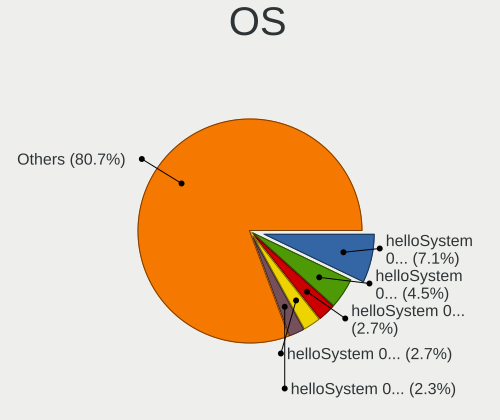

| Name                 | Notebooks | Percent |
|----------------------|-----------|---------|
| helloSystem 0.8.1    | 357       | 7.12%   |
| helloSystem 0.7.0    | 227       | 4.53%   |
| helloSystem 0.8.0    | 135       | 2.69%   |
| helloSystem 0.9.0    | 133       | 2.65%   |
| helloSystem 0.5.0    | 116       | 2.31%   |
| FreeBSD 13.1         | 115       | 2.29%   |
| FreeBSD 13.0         | 112       | 2.24%   |
| FreeBSD 14.2         | 104       | 2.08%   |
| helloSystem 0.4.0    | 92        | 1.84%   |
| OpenBSD 6.8          | 91        | 1.82%   |
| FreeBSD 14.0         | 77        | 1.54%   |
| FreeBSD 14.0-CURRENT | 75        | 1.5%    |
| FreeBSD 13.2         | 75        | 1.5%    |
| helloSystem 0.6.0    | 74        | 1.48%   |
| FreeBSD 14.1         | 62        | 1.24%   |
| GhostBSD 20.04.02    | 59        | 1.18%   |
| FreeBSD 12.2         | 59        | 1.18%   |
| OpenBSD 7.2          | 58        | 1.16%   |
| OpenBSD 6.9          | 55        | 1.1%    |
| OpenBSD 7.3          | 52        | 1.04%   |
| OpenBSD 7.0          | 51        | 1.02%   |
| FreeBSD 15.0-CURRENT | 51        | 1.02%   |
| FreeBSD 14.3         | 50        | 1%      |
| OpenBSD 7.6          | 45        | 0.9%    |
| OpenBSD 7.5          | 45        | 0.9%    |
| OpenBSD 7.1          | 43        | 0.86%   |
| FreeBSD 13.1-p5      | 41        | 0.82%   |
| OpenBSD 7.4          | 39        | 0.78%   |
| FreeBSD 13.0-p4      | 35        | 0.7%    |
| NomadBSD 1.3.2       | 34        | 0.68%   |
| helloSystem 0.8.2    | 34        | 0.68%   |
| FreeBSD 12.2-p2      | 34        | 0.68%   |
| NomadBSD 5806f915    | 33        | 0.66%   |
| FreeBSD 13.0-CURRENT | 31        | 0.62%   |
| OpenBSD 7.7          | 30        | 0.6%    |
| FreeBSD 14.0-p6      | 30        | 0.6%    |
| GhostBSD 21.08.27    | 29        | 0.58%   |
| NomadBSD 20240711    | 28        | 0.56%   |
| FreeBSD 14.1-p5      | 28        | 0.56%   |
| FreeBSD 13.0-STABLE  | 28        | 0.56%   |

OS Family
---------

OS without a version

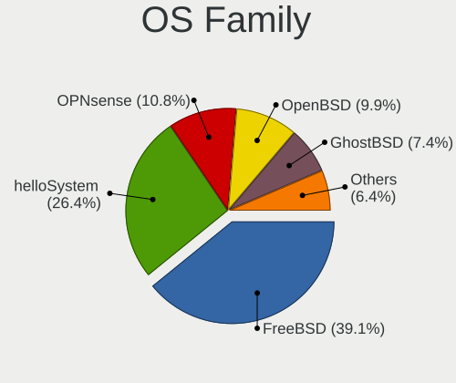

| Name        | Notebooks | Percent |
|-------------|-----------|---------|
| FreeBSD     | 1632      | 39.15%  |
| helloSystem | 1100      | 26.39%  |
| OPNsense    | 450       | 10.79%  |
| OpenBSD     | 412       | 9.88%   |
| GhostBSD    | 307       | 7.36%   |
| NomadBSD    | 167       | 4.01%   |
| NetBSD      | 56        | 1.34%   |
| DragonFly   | 10        | 0.24%   |
| HardenedBSD | 9         | 0.22%   |
| FuryBSD     | 7         | 0.17%   |
| MidnightBSD | 6         | 0.14%   |
| FuguIta     | 5         | 0.12%   |
| OS108       | 2         | 0.05%   |
| MyBee       | 2         | 0.05%   |
| pfSense     | 1         | 0.02%   |
| PC-BSD      | 1         | 0.02%   |
| LibertyBSD  | 1         | 0.02%   |
| ClonOS      | 1         | 0.02%   |

Arch
----

OS architecture (x86_64, i586, etc.)

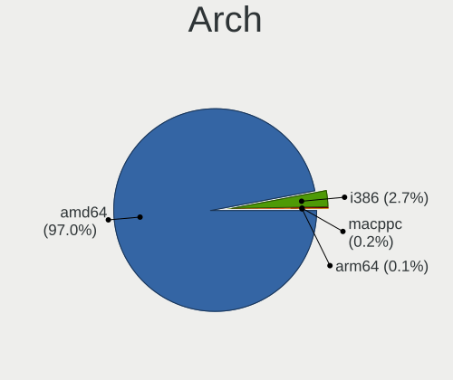

| Name   | Notebooks | Percent |
|--------|-----------|---------|
| amd64  | 3903      | 97.02%  |
| i386   | 108       | 2.68%   |
| macppc | 9         | 0.22%   |
| arm64  | 3         | 0.07%   |

DE
--

Desktop Environment

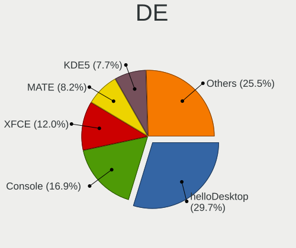

| Name          | Notebooks | Percent |
|---------------|-----------|---------|
| helloDesktop  | 1280      | 29.7%   |
| Console       | 730       | 16.94%  |
| XFCE          | 516       | 11.97%  |
| MATE          | 352       | 8.17%   |
| KDE5          | 334       | 7.75%   |
| fvwm          | 185       | 4.29%   |
| TWM           | 183       | 4.25%   |
| GNOME         | 179       | 4.15%   |
| Openbox       | 153       | 3.55%   |
| i3            | 115       | 2.67%   |
| LXQt          | 38        | 0.88%   |
| Cinnamon      | 27        | 0.63%   |
| KDE6          | 23        | 0.53%   |
| KDE           | 23        | 0.53%   |
| AwesomeWM     | 21        | 0.49%   |
| Fluxbox       | 16        | 0.37%   |
| Enlightenment | 12        | 0.28%   |
| LXDE          | 11        | 0.26%   |
| DWM           | 11        | 0.26%   |
| xinitrc       | 8         | 0.19%   |
| ICEWM         | 8         | 0.19%   |
| Picom         | 7         | 0.16%   |
| Hyprland      | 7         | 0.16%   |
| Lumina        | 6         | 0.14%   |
| stumpwm       | 5         | 0.12%   |
| iwm           | 5         | 0.12%   |
| ctwm          | 5         | 0.12%   |
| wlroots       | 4         | 0.09%   |
| Window Maker  | 4         | 0.09%   |
| GNUstep       | 4         | 0.09%   |
| Budgie        | 4         | 0.09%   |
| X-Cinnamon    | 3         | 0.07%   |
| spectrwm      | 3         | 0.07%   |
| WindowMaker   | 2         | 0.05%   |
| wayfire       | 2         | 0.05%   |
| sway          | 2         | 0.05%   |
| Mutter        | 2         | 0.05%   |
| Compton       | 2         | 0.05%   |
| CDE           | 2         | 0.05%   |
| Awesome       | 2         | 0.05%   |

Display Server
--------------

X11 or Wayland

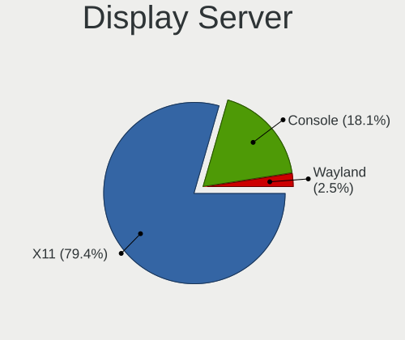

| Name    | Notebooks | Percent |
|---------|-----------|---------|
| X11     | 3242      | 79.44%  |
| Console | 739       | 18.11%  |
| Wayland | 100       | 2.45%   |

Display Manager
---------------

SDDM, LightDM, etc.

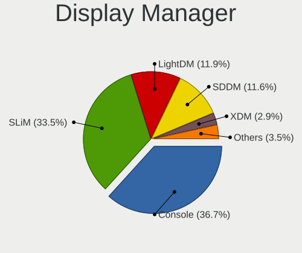

| Name    | Notebooks | Percent |
|---------|-----------|---------|
| Console | 1548      | 36.72%  |
| SLiM    | 1413      | 33.52%  |
| LightDM | 501       | 11.88%  |
| SDDM    | 487       | 11.55%  |
| XDM     | 121       | 2.87%   |
| GDM     | 104       | 2.47%   |
| Ly      | 37        | 0.88%   |
| WDM     | 3         | 0.07%   |
| PCDM    | 2         | 0.05%   |

OS Lang
-------

Language

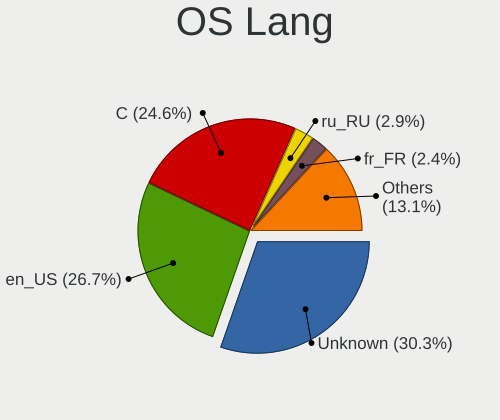

| Lang            | Notebooks | Percent |
|-----------------|-----------|---------|
| Unknown         | 1292      | 30.34%  |
| en_US           | 1138      | 26.73%  |
| C               | 1046      | 24.57%  |
| ru_RU           | 122       | 2.87%   |
| fr_FR           | 103       | 2.42%   |
| de_DE           | 96        | 2.25%   |
| es_ES           | 56        | 1.32%   |
| en_GB           | 54        | 1.27%   |
| en              | 51        | 1.2%    |
| zh_CN           | 31        | 0.73%   |
| pl_PL           | 27        | 0.63%   |
| it_IT           | 26        | 0.61%   |
| pt_BR           | 25        | 0.59%   |
| en_CA           | 12        | 0.28%   |
| en_AU           | 11        | 0.26%   |
| fi_FI           | 9         | 0.21%   |
| zh_TW           | 8         | 0.19%   |
| nl_NL           | 8         | 0.19%   |
| de              | 8         | 0.19%   |
| ru              | 7         | 0.16%   |
| tr_TR           | 6         | 0.14%   |
| pt              | 6         | 0.14%   |
| de_CH           | 6         | 0.14%   |
| cs_CZ           | 6         | 0.14%   |
| ko_KR           | 5         | 0.12%   |
| ja_JP           | 5         | 0.12%   |
| es              | 5         | 0.12%   |
| en_NZ           | 5         | 0.12%   |
| uk_UA           | 4         | 0.09%   |
| pt_PT           | 4         | 0.09%   |
| nb_NO           | 4         | 0.09%   |
| es_AR           | 4         | 0.09%   |
| en_US.ISO8859-1 | 4         | 0.09%   |
| hu_HU           | 3         | 0.07%   |
| es_MX           | 3         | 0.07%   |
| en_US.US-ASCII  | 3         | 0.07%   |
| de_DE.ISO8859-1 | 3         | 0.07%   |
| sv_SE           | 2         | 0.05%   |
| sk_SK           | 2         | 0.05%   |
| jp_JP           | 2         | 0.05%   |

Boot Mode
---------

EFI or BIOS

| Mode | Notebooks | Percent |
|------|-----------|---------|
| EFI  | 3347      | 82.16%  |
| BIOS | 727       | 17.84%  |

Filesystem
----------

Type of filesystem

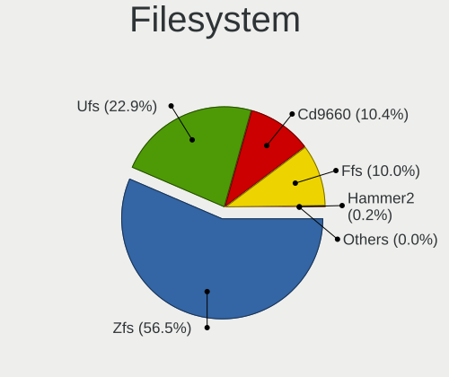

| Type    | Notebooks | Percent |
|---------|-----------|---------|
| Zfs     | 2363      | 56.46%  |
| Ufs     | 957       | 22.87%  |
| Cd9660  | 436       | 10.42%  |
| Ffs     | 419       | 10.01%  |
| Hammer2 | 8         | 0.19%   |
| Xfs     | 1         | 0.02%   |
| Nfs     | 1         | 0.02%   |

Part. scheme
------------

Scheme of partitioning

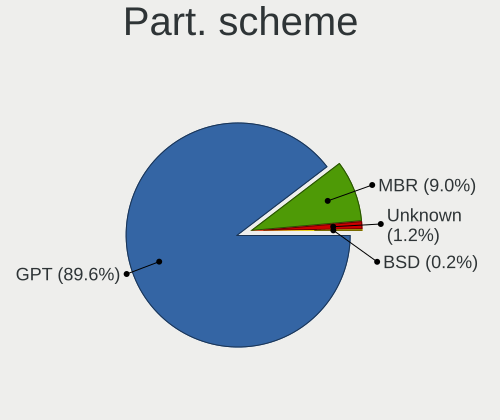

| Type    | Notebooks | Percent |
|---------|-----------|---------|
| GPT     | 3641      | 89.64%  |
| MBR     | 364       | 8.96%   |
| Unknown | 47        | 1.16%   |
| BSD     | 10        | 0.25%   |

Board
-----

Vendor
------

Motherboard manufacturer

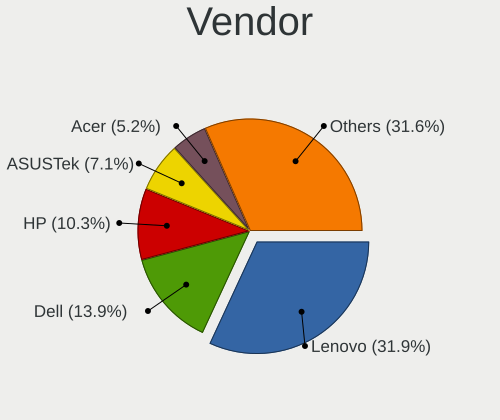

| Name                             | Notebooks | Percent |
|----------------------------------|-----------|---------|
| Lenovo                           | 1282      | 31.91%  |
| Dell                             | 560       | 13.94%  |
| Hewlett-Packard                  | 414       | 10.3%   |
| ASUSTek Computer                 | 286       | 7.12%   |
| Acer                             | 207       | 5.15%   |
| Apple                            | 185       | 4.6%    |
| Deciso                           | 172       | 4.28%   |
| Unknown                          | 97        | 2.41%   |
| Toshiba                          | 77        | 1.92%   |
| Samsung Electronics              | 62        | 1.54%   |
| MSI                              | 48        | 1.19%   |
| Sony                             | 47        | 1.17%   |
| Fujitsu                          | 44        | 1.1%    |
| Google                           | 37        | 0.92%   |
| Panasonic                        | 30        | 0.75%   |
| Framework                        | 29        | 0.72%   |
| Intel                            | 28        | 0.7%    |
| HUAWEI                           | 28        | 0.7%    |
| Notebook                         | 23        | 0.57%   |
| TUXEDO                           | 22        | 0.55%   |
| System76                         | 18        | 0.45%   |
| IBM                              | 16        | 0.4%    |
| LG Electronics                   | 14        | 0.35%   |
| Alienware                        | 14        | 0.35%   |
| Gigabyte Technology              | 12        | 0.3%    |
| Shuttle                          | 11        | 0.27%   |
| Timi                             | 10        | 0.25%   |
| Packard Bell                     | 9         | 0.22%   |
| Fujitsu Siemens                  | 9         | 0.22%   |
| eMachines                        | 9         | 0.22%   |
| Gateway                          | 8         | 0.2%    |
| Datto                            | 8         | 0.2%    |
| Star Labs                        | 7         | 0.17%   |
| Razer                            | 6         | 0.15%   |
| Micro Computer (HK) Tech Limited | 6         | 0.15%   |
| Medion                           | 6         | 0.15%   |
| GPD                              | 6         | 0.15%   |
| Chuwi                            | 6         | 0.15%   |
| SLIMBOOK                         | 5         | 0.12%   |
| IGEL Technology                  | 5         | 0.12%   |

Model
-----

Motherboard model

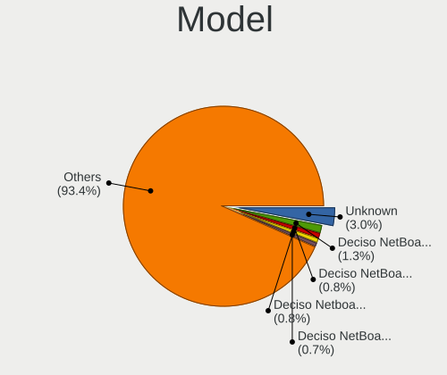

| Name                                 | Notebooks | Percent |
|--------------------------------------|-----------|---------|
| Unknown                              | 121       | 3.01%   |
| Deciso NetBoard-A20                  | 53        | 1.32%   |
| Deciso NetBoard-A10                  | 34        | 0.85%   |
| Deciso Netboard A20                  | 31        | 0.77%   |
| Deciso NetBoard-A10_Gen.3            | 27        | 0.67%   |
| Intel H81U                           | 15        | 0.37%   |
| Deciso DEC2700 - OPNsense Appliance  | 14        | 0.35%   |
| Apple MacBookPro9,2                  | 14        | 0.35%   |
| HP EliteBook 840 G3                  | 13        | 0.32%   |
| Dell Latitude E6420                  | 12        | 0.3%    |
| Framework Laptop                     | 11        | 0.27%   |
| Dell XPS 13 9360                     | 11        | 0.27%   |
| Deciso OPNsense Appliance            | 11        | 0.27%   |
| Apple MacBookAir7,2                  | 11        | 0.27%   |
| HP Notebook                          | 10        | 0.25%   |
| Dell Latitude E6430                  | 10        | 0.25%   |
| Apple MacBookAir6,2                  | 10        | 0.25%   |
| Apple MacBook4,1                     | 10        | 0.25%   |
| Dell Latitude E7240                  | 9         | 0.22%   |
| Dell Latitude E6540                  | 9         | 0.22%   |
| Dell Inspiron 3542                   | 9         | 0.22%   |
| Dell Inspiron 3442                   | 9         | 0.22%   |
| Apple MacBookPro8,1                  | 9         | 0.22%   |
| Apple MacBookPro11,1                 | 9         | 0.22%   |
| Apple MacBook5,1                     | 9         | 0.22%   |
| HP Pavilion g6                       | 8         | 0.2%    |
| Dell Precision M4800                 | 8         | 0.2%    |
| Dell Latitude 7280                   | 8         | 0.2%    |
| HP Pavilion Notebook                 | 7         | 0.17%   |
| HP Pavilion dv6                      | 7         | 0.17%   |
| HP 2000                              | 7         | 0.17%   |
| Dell Inspiron 3521                   | 7         | 0.17%   |
| Dell Inspiron 15-3567                | 7         | 0.17%   |
| Apple MacBookPro6,2                  | 7         | 0.17%   |
| Micro (HK) Tech Limited Venus series | 6         | 0.15%   |
| Lenovo ThinkPad X200 745969G         | 6         | 0.15%   |
| Dell Latitude E5570                  | 6         | 0.15%   |
| Dell Latitude E5470                  | 6         | 0.15%   |
| Dell Latitude 7490                   | 6         | 0.15%   |
| Apple MacBookPro7,1                  | 6         | 0.15%   |

Model Family
------------

Motherboard model prefix

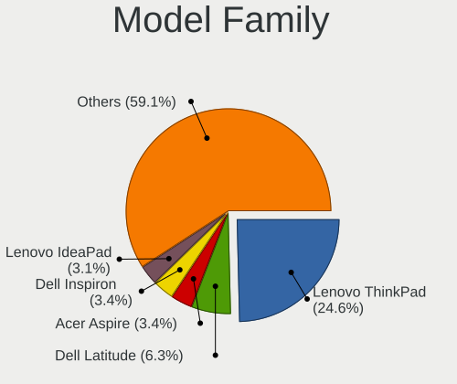

| Name                | Notebooks | Percent |
|---------------------|-----------|---------|
| Lenovo ThinkPad     | 989       | 24.61%  |
| Dell Latitude       | 252       | 6.27%   |
| Acer Aspire         | 138       | 3.43%   |
| Dell Inspiron       | 137       | 3.41%   |
| Lenovo IdeaPad      | 126       | 3.14%   |
| Unknown             | 121       | 3.01%   |
| HP EliteBook        | 89        | 2.22%   |
| HP Pavilion         | 65        | 1.62%   |
| HP ProBook          | 63        | 1.57%   |
| Deciso NetBoard-A10 | 63        | 1.57%   |
| Dell Precision      | 61        | 1.52%   |
| HP Laptop           | 57        | 1.42%   |
| Toshiba Satellite   | 54        | 1.34%   |
| Deciso NetBoard-A20 | 53        | 1.32%   |
| Dell XPS            | 48        | 1.19%   |
| ASUS VivoBook       | 47        | 1.17%   |
| Fujitsu LIFEBOOK    | 34        | 0.85%   |
| Dell Vostro         | 31        | 0.77%   |
| Deciso Netboard     | 31        | 0.77%   |
| Lenovo Legion       | 30        | 0.75%   |
| Framework Laptop    | 29        | 0.72%   |
| Lenovo Yoga         | 21        | 0.52%   |
| Lenovo ThinkBook    | 21        | 0.52%   |
| ASUS ASUS           | 21        | 0.52%   |
| Apple MacBookPro11  | 21        | 0.52%   |
| HP Compaq           | 18        | 0.45%   |
| Acer TravelMate     | 18        | 0.45%   |
| HP ZBook            | 17        | 0.42%   |
| Apple MacBookPro9   | 16        | 0.4%    |
| Apple MacBookPro8   | 16        | 0.4%    |
| Intel H81U          | 15        | 0.37%   |
| Deciso DEC2700      | 14        | 0.35%   |
| IBM ThinkPad        | 13        | 0.32%   |
| HP OMEN             | 13        | 0.32%   |
| ASUS ZenBook        | 13        | 0.32%   |
| Apple MacBookAir6   | 13        | 0.32%   |
| Acer Nitro          | 13        | 0.32%   |
| Apple MacBook5      | 12        | 0.3%    |
| MSI Modern          | 11        | 0.27%   |
| Deciso OPNsense     | 11        | 0.27%   |

MFG Year
--------

Motherboard manufacture year

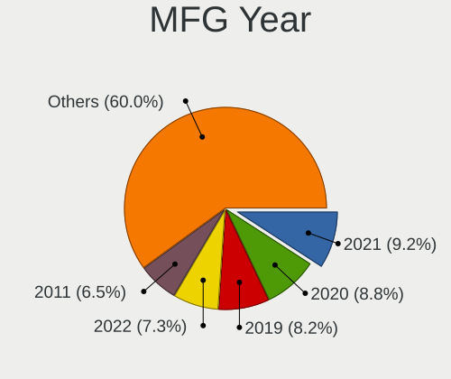

| Year    | Notebooks | Percent |
|---------|-----------|---------|
| 2021    | 368       | 9.16%   |
| 2020    | 353       | 8.79%   |
| 2019    | 329       | 8.19%   |
| 2022    | 295       | 7.34%   |
| 2011    | 262       | 6.52%   |
| 2018    | 260       | 6.47%   |
| 2013    | 259       | 6.45%   |
| 2012    | 244       | 6.07%   |
| 2016    | 230       | 5.72%   |
| 2015    | 219       | 5.45%   |
| 2017    | 202       | 5.03%   |
| 2014    | 185       | 4.6%    |
| 2010    | 177       | 4.41%   |
| 2023    | 154       | 3.83%   |
| 2009    | 130       | 3.24%   |
| 2008    | 100       | 2.49%   |
| 2024    | 99        | 2.46%   |
| 2007    | 53        | 1.32%   |
| 2006    | 30        | 0.75%   |
| 2025    | 26        | 0.65%   |
| Unknown | 18        | 0.45%   |
| 2005    | 11        | 0.27%   |
| 2004    | 5         | 0.12%   |
| 2003    | 5         | 0.12%   |
| 2002    | 4         | 0.1%    |

Form Factor
-----------

Physical design of the computer

| Name     | Notebooks | Percent |
|----------|-----------|---------|
| Notebook | 4018      | 100%    |

Coreboot
--------

Have coreboot on board

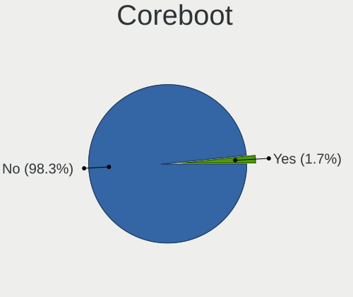

| Used | Notebooks | Percent |
|------|-----------|---------|
| No   | 3951      | 98.33%  |
| Yes  | 67        | 1.67%   |

RAM Size
--------

Total RAM memory

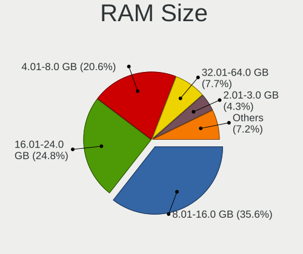

| Size in GB  | Notebooks | Percent |
|-------------|-----------|---------|
| 8.01-16.0   | 1454      | 35.55%  |
| 16.01-24.0  | 1013      | 24.77%  |
| 4.01-8.0    | 841       | 20.56%  |
| 32.01-64.0  | 313       | 7.65%   |
| 2.01-3.0    | 174       | 4.25%   |
| 3.01-4.0    | 89        | 2.18%   |
| 64.01-256.0 | 73        | 1.78%   |
| 24.01-32.0  | 57        | 1.39%   |
| 0.51-1.0    | 35        | 0.86%   |
| 1.01-2.0    | 28        | 0.68%   |
| 0.01-0.5    | 12        | 0.29%   |
| 0           | 1         | 0.02%   |

RAM Used
--------

Used RAM memory

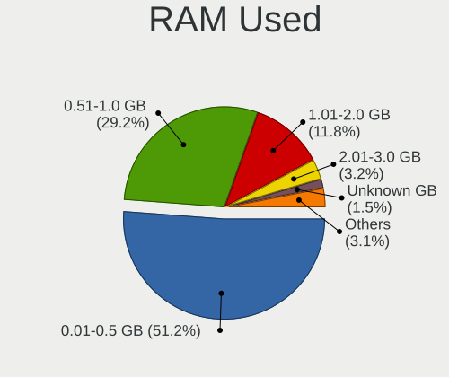

| Used GB     | Notebooks | Percent |
|-------------|-----------|---------|
| 0.01-0.5    | 2117      | 51.18%  |
| 0.51-1.0    | 1208      | 29.21%  |
| 1.01-2.0    | 488       | 11.8%   |
| 2.01-3.0    | 134       | 3.24%   |
| Unknown     | 61        | 1.47%   |
| 4.01-8.0    | 47        | 1.14%   |
| 0           | 28        | 0.68%   |
| 3.01-4.0    | 21        | 0.51%   |
| 8.01-16.0   | 21        | 0.51%   |
| 24.01-32.0  | 4         | 0.1%    |
| 16.01-24.0  | 4         | 0.1%    |
| 32.01-64.0  | 2         | 0.05%   |
| 64.01-256.0 | 1         | 0.02%   |

Total Drives
------------

Number of drives on board

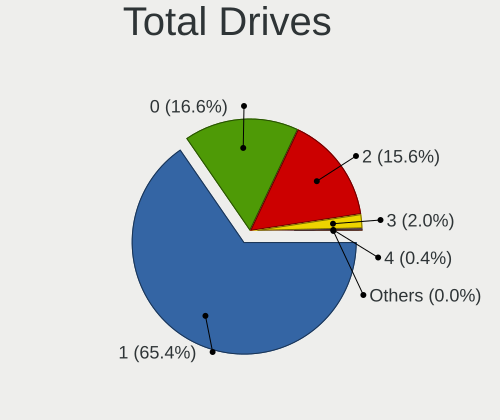

| Drives | Notebooks | Percent |
|--------|-----------|---------|
| 1      | 2742      | 65.39%  |
| 0      | 697       | 16.62%  |
| 2      | 653       | 15.57%  |
| 3      | 85        | 2.03%   |
| 4      | 15        | 0.36%   |
| 58     | 1         | 0.02%   |

Has CD-ROM
----------

Has CD-ROM on board

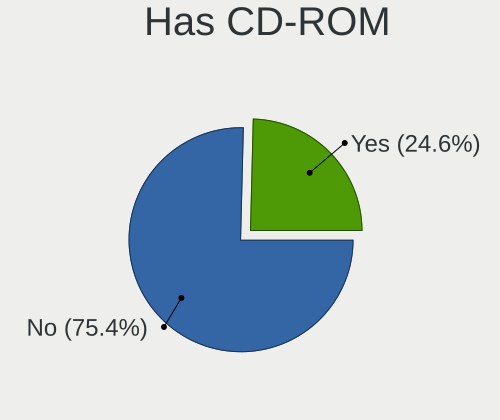

| Presented | Notebooks | Percent |
|-----------|-----------|---------|
| No        | 3055      | 75.39%  |
| Yes       | 997       | 24.61%  |

Has Ethernet
------------

Has Ethernet on board

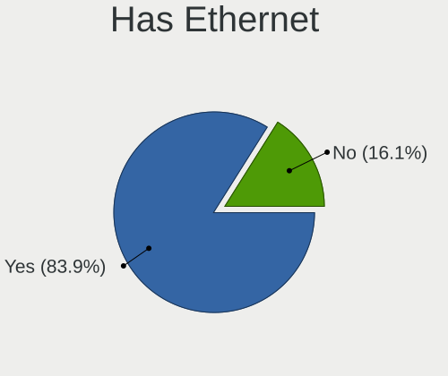

| Presented | Notebooks | Percent |
|-----------|-----------|---------|
| Yes       | 3374      | 83.93%  |
| No        | 646       | 16.07%  |

Has WiFi
--------

Has WiFi module

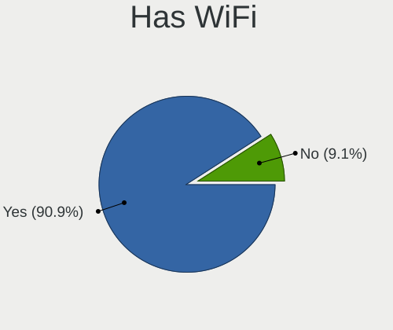

| Presented | Notebooks | Percent |
|-----------|-----------|---------|
| Yes       | 3667      | 90.92%  |
| No        | 366       | 9.08%   |

Has Bluetooth
-------------

Has Bluetooth module

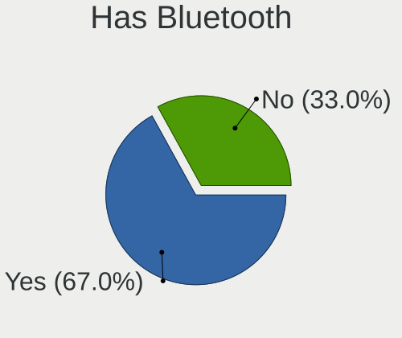

| Presented | Notebooks | Percent |
|-----------|-----------|---------|
| Yes       | 2725      | 66.97%  |
| No        | 1344      | 33.03%  |

Location
--------

Country
-------

Geographic location (country)

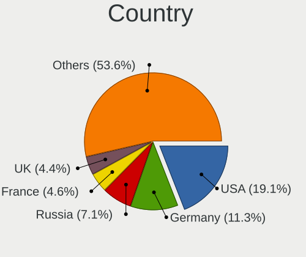

| Country     | Notebooks | Percent |
|-------------|-----------|---------|
| USA         | 773       | 19.07%  |
| Germany     | 457       | 11.27%  |
| Russia      | 287       | 7.08%   |
| France      | 187       | 4.61%   |
| UK          | 177       | 4.37%   |
| Brazil      | 144       | 3.55%   |
| Canada      | 133       | 3.28%   |
| Poland      | 129       | 3.18%   |
| Spain       | 113       | 2.79%   |
| China       | 104       | 2.57%   |
| Italy       | 100       | 2.47%   |
| Netherlands | 91        | 2.24%   |
| Australia   | 80        | 1.97%   |
| India       | 68        | 1.68%   |
| Switzerland | 67        | 1.65%   |
| Indonesia   | 62        | 1.53%   |
| Sweden      | 54        | 1.33%   |
| Hungary     | 45        | 1.11%   |
| Ukraine     | 44        | 1.09%   |
| Romania     | 44        | 1.09%   |
| Austria     | 43        | 1.06%   |
| Mexico      | 42        | 1.04%   |
| Czechia     | 39        | 0.96%   |
| Turkey      | 38        | 0.94%   |
| Finland     | 38        | 0.94%   |
| Argentina   | 33        | 0.81%   |
| Japan       | 32        | 0.79%   |
| Bulgaria    | 31        | 0.76%   |
| Portugal    | 30        | 0.74%   |
| Belgium     | 30        | 0.74%   |
| Norway      | 28        | 0.69%   |
| Denmark     | 25        | 0.62%   |
| Vietnam     | 20        | 0.49%   |
| Greece      | 20        | 0.49%   |
| Taiwan      | 19        | 0.47%   |
| Chile       | 19        | 0.47%   |
| Croatia     | 18        | 0.44%   |
| Philippines | 17        | 0.42%   |
| New Zealand | 17        | 0.42%   |
| Lithuania   | 17        | 0.42%   |

City
----

Geographic location (city)

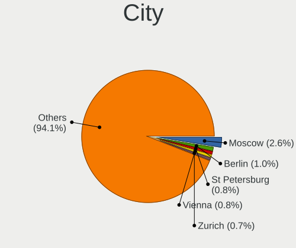

| City              | Notebooks | Percent |
|-------------------|-----------|---------|
| Moscow            | 113       | 2.56%   |
| Berlin            | 46        | 1.04%   |
| St Petersburg     | 37        | 0.84%   |
| Vienna            | 34        | 0.77%   |
| Zurich            | 32        | 0.72%   |
| Paris             | 32        | 0.72%   |
| Montreal          | 31        | 0.7%    |
| Sydney            | 26        | 0.59%   |
| Brooklyn          | 24        | 0.54%   |
| Jakarta           | 23        | 0.52%   |
| Seattle           | 21        | 0.48%   |
| Munich            | 21        | 0.48%   |
| Amsterdam         | 21        | 0.48%   |
| Budapest          | 20        | 0.45%   |
| Warsaw            | 19        | 0.43%   |
| Madrid            | 19        | 0.43%   |
| Sao Paulo         | 18        | 0.41%   |
| Los Angeles       | 18        | 0.41%   |
| Frankfurt am Main | 17        | 0.38%   |
| Saint-Laurent     | 16        | 0.36%   |
| Istanbul          | 16        | 0.36%   |
| Hamburg           | 16        | 0.36%   |
| Rome              | 15        | 0.34%   |
| Portland          | 15        | 0.34%   |
| New York          | 15        | 0.34%   |
| Milan             | 15        | 0.34%   |
| Melbourne         | 15        | 0.34%   |
| London            | 15        | 0.34%   |
| Kyiv              | 14        | 0.32%   |
| Chicago           | 14        | 0.32%   |
| Bucharest         | 14        | 0.32%   |
| Wroclaw           | 13        | 0.29%   |
| Sofia             | 13        | 0.29%   |
| Riga              | 13        | 0.29%   |
| Prague            | 13        | 0.29%   |
| Krakow            | 13        | 0.29%   |
| Bengaluru         | 13        | 0.29%   |
| Gdansk            | 12        | 0.27%   |
| Dublin            | 12        | 0.27%   |
| Athens            | 12        | 0.27%   |

Drives
------

Drive Vendor
------------

Hard drive vendors

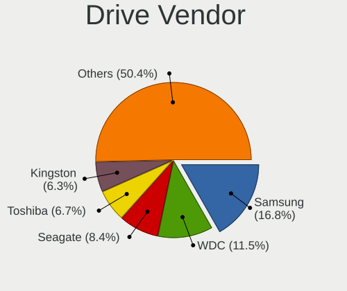

| Vendor              | Notebooks | Drives | Percent |
|---------------------|-----------|--------|---------|
| Samsung Electronics | 683       | 908    | 16.76%  |
| WDC                 | 468       | 619    | 11.49%  |
| Seagate             | 341       | 438    | 8.37%   |
| Toshiba             | 274       | 373    | 6.73%   |
| Kingston            | 256       | 313    | 6.28%   |
| SanDisk             | 196       | 239    | 4.81%   |
| Crucial             | 195       | 267    | 4.79%   |
| Transcend           | 190       | 301    | 4.66%   |
| Hitachi             | 142       | 172    | 3.49%   |
| Intel               | 132       | 161    | 3.24%   |
| NVMe                | 101       | 135    | 2.48%   |
| SK hynix            | 93        | 107    | 2.28%   |
| HGST                | 84        | 179    | 2.06%   |
| Apple               | 80        | 88     | 1.96%   |
| Micron Technology   | 67        | 79     | 1.64%   |
| A-DATA Technology   | 66        | 86     | 1.62%   |
| SPCC                | 36        | 48     | 0.88%   |
| Fujitsu             | 36        | 48     | 0.88%   |
| PNY                 | 33        | 52     | 0.81%   |
| China               | 29        | 32     | 0.71%   |
| Intenso             | 28        | 30     | 0.69%   |
| KingSpec            | 25        | 29     | 0.61%   |
| Phison              | 23        | 31     | 0.56%   |
| Gigabyte Technology | 23        | 30     | 0.56%   |
| LITEON              | 22        | 31     | 0.54%   |
| KIOXIA              | 22        | 22     | 0.54%   |
| Patriot             | 20        | 24     | 0.49%   |
| FORESEE             | 20        | 27     | 0.49%   |
| Apacer              | 20        | 27     | 0.49%   |
| OCZ                 | 15        | 20     | 0.37%   |
| SSSTC               | 14        | 16     | 0.34%   |
| LITEONIT            | 13        | 14     | 0.32%   |
| Lexar               | 13        | 23     | 0.32%   |
| Hewlett-Packard     | 13        | 17     | 0.32%   |
| Corsair             | 12        | 14     | 0.29%   |
| Team                | 11        | 13     | 0.27%   |
| Netac               | 11        | 11     | 0.27%   |
| Silicon Motion      | 10        | 11     | 0.25%   |
| OWC                 | 10        | 11     | 0.25%   |
| GOODRAM             | 10        | 10     | 0.25%   |

Drive Model
-----------

Hard drive models

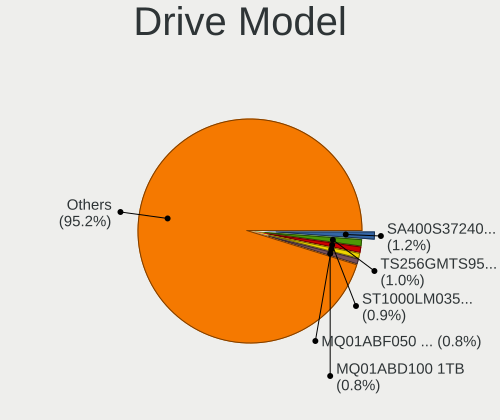

| Model                              | Notebooks | Percent |
|------------------------------------|-----------|---------|
| Kingston SA400S37240G 240GB        | 49        | 1.17%   |
| Transcend TS256GMTS952T2 256GB     | 44        | 1.05%   |
| Seagate ST1000LM035-1RK172 1TB     | 39        | 0.93%   |
| Toshiba MQ01ABF050 500GB           | 35        | 0.83%   |
| Toshiba MQ01ABD100 1TB             | 35        | 0.83%   |
| Seagate ST1000LM024 HN-M101MBB 1TB | 34        | 0.81%   |
| Samsung SSD 860 EVO 500GB          | 32        | 0.76%   |
| Crucial CT500MX500SSD1 500GB       | 29        | 0.69%   |
| Samsung SSD 850 EVO 250GB          | 26        | 0.62%   |
| Transcend TS256GMTE710T 256GB      | 25        | 0.6%    |
| Kingston SA400S37120G 120GB        | 25        | 0.6%    |
| Transcend TS256GMTE652T2 256GB     | 24        | 0.57%   |
| HGST HTS721010A9E630 1TB           | 24        | 0.57%   |
| WDC WDS240G2G0A-00JH30 240GB       | 21        | 0.5%    |
| Samsung SSD 860 EVO 250GB          | 21        | 0.5%    |
| Crucial CT240BX500SSD1 240GB       | 20        | 0.48%   |
| Seagate ST500LT012-1DG142 500GB    | 19        | 0.45%   |
| Samsung SSD 850 EVO 500GB          | 19        | 0.45%   |
| Crucial CT1000MX500SSD1 1TB        | 19        | 0.45%   |
| Kingston SV300S37A120G 120GB       | 18        | 0.43%   |
| Seagate ST9500325AS 500GB          | 17        | 0.4%    |
| Kingston SA400S37480G 480GB        | 17        | 0.4%    |
| HGST HTS725050A7E630 500GB         | 16        | 0.38%   |
| Toshiba MQ04ABF100 1TB             | 15        | 0.36%   |
| Seagate ST500LT012-9WS142 500GB    | 15        | 0.36%   |
| Apple SSD SM0128G 121GB            | 15        | 0.36%   |
| Seagate ST500LM021-1KJ152 500GB    | 14        | 0.33%   |
| Samsung SSD 860 EVO 1TB            | 14        | 0.33%   |
| Crucial CT480BX500SSD1 480GB       | 14        | 0.33%   |
| Samsung SSD 970 EVO Plus 1TB       | 13        | 0.31%   |
| Samsung SSD 840 EVO 250GB          | 13        | 0.31%   |
| Samsung MZVLW256HEHP-000L7 256GB   | 13        | 0.31%   |
| Intel SSDPEKKF256G8L 256GB         | 13        | 0.31%   |
| HGST HTS541010A9E680 1TB           | 13        | 0.31%   |
| Transcend TS128GMTE110S 128GB      | 12        | 0.29%   |
| Seagate ST9500420AS 500GB          | 12        | 0.29%   |
| SanDisk SSD PLUS 240GB             | 12        | 0.29%   |
| Seagate ST9320423AS 320GB          | 11        | 0.26%   |
| Seagate ST1000LM049-2GH172 1TB     | 11        | 0.26%   |
| Hitachi HTS547550A9E384 500GB      | 11        | 0.26%   |

HDD Vendor
----------

Hard disk drive vendors

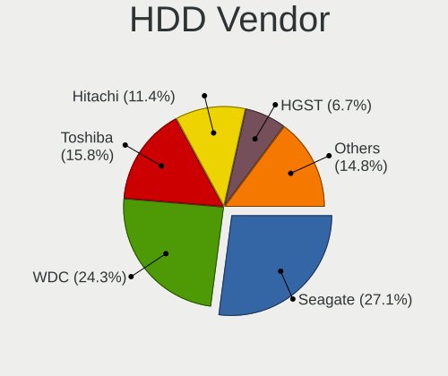

| Vendor                                 | Notebooks | Drives | Percent |
|----------------------------------------|-----------|--------|---------|
| Seagate                                | 338       | 435    | 27.06%  |
| WDC                                    | 303       | 397    | 24.26%  |
| Toshiba                                | 197       | 259    | 15.77%  |
| Hitachi                                | 142       | 172    | 11.37%  |
| HGST                                   | 84        | 179    | 6.73%   |
| NVMe                                   | 73        | 95     | 5.84%   |
| Samsung Electronics                    | 38        | 42     | 3.04%   |
| Fujitsu                                | 35        | 46     | 2.8%    |
| Apple                                  | 8         | 8      | 0.64%   |
| Generic                                | 5         | 5      | 0.4%    |
| JetFlash                               | 4         | 4      | 0.32%   |
| Product:              USB DISK 2.0     | 3         | 3      | 0.24%   |
| Product:              USB Flash Memory | 2         | 2      | 0.16%   |
| Lexar                                  | 2         | 3      | 0.16%   |
| Intenso                                | 2         | 2      | 0.16%   |
| WLW                                    | 1         | 1      | 0.08%   |
| Verbatim                               | 1         | 1      | 0.08%   |
| USB                                    | 1         | 1      | 0.08%   |
| UFD 2.0                                | 1         | 1      | 0.08%   |
| SMI                                    | 1         | 1      | 0.08%   |
| OPENBSD                                | 1         | 1      | 0.08%   |
| Maxtor                                 | 1         | 1      | 0.08%   |
| LDLC F6+                               | 1         | 1      | 0.08%   |
| IBM/Hitachi                            | 1         | 1      | 0.08%   |
| IBM                                    | 1         | 1      | 0.08%   |
| HPE                                    | 1         | 5      | 0.08%   |
| General                                | 1         | 1      | 0.08%   |
| CSD                                    | 1         | 1      | 0.08%   |

SSD Vendor
----------

Solid state drive vendors

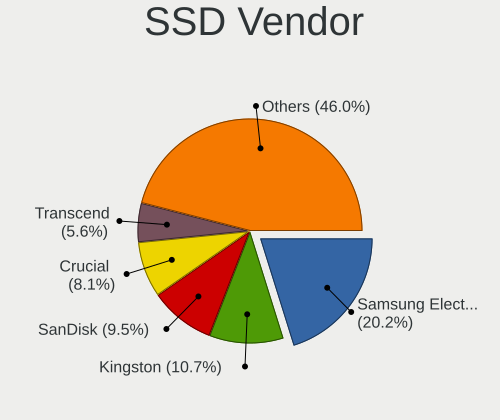

| Vendor              | Notebooks | Drives | Percent |
|---------------------|-----------|--------|---------|
| Samsung Electronics | 416       | 548    | 20.17%  |
| Kingston            | 221       | 272    | 10.72%  |
| SanDisk             | 195       | 238    | 9.46%   |
| Crucial             | 166       | 223    | 8.05%   |
| Transcend           | 116       | 203    | 5.63%   |
| Intel               | 85        | 108    | 4.12%   |
| WDC                 | 84        | 112    | 4.07%   |
| Apple               | 72        | 80     | 3.49%   |
| A-DATA Technology   | 46        | 61     | 2.23%   |
| SK hynix            | 41        | 42     | 1.99%   |
| Micron Technology   | 40        | 48     | 1.94%   |
| Toshiba             | 37        | 51     | 1.79%   |
| SPCC                | 33        | 43     | 1.6%    |
| PNY                 | 31        | 50     | 1.5%    |
| China               | 29        | 32     | 1.41%   |
| NVMe                | 25        | 29     | 1.21%   |
| KingSpec            | 25        | 29     | 1.21%   |
| Intenso             | 24        | 26     | 1.16%   |
| LITEON              | 21        | 30     | 1.02%   |
| Patriot             | 20        | 24     | 0.97%   |
| Apacer              | 20        | 27     | 0.97%   |
| Gigabyte Technology | 16        | 20     | 0.78%   |
| OCZ                 | 15        | 20     | 0.73%   |
| LITEONIT            | 13        | 14     | 0.63%   |
| FORESEE             | 13        | 20     | 0.63%   |
| Corsair             | 12        | 14     | 0.58%   |
| Team                | 11        | 13     | 0.53%   |
| Lexar               | 11        | 20     | 0.53%   |
| Hewlett-Packard     | 11        | 15     | 0.53%   |
| OWC                 | 10        | 11     | 0.48%   |
| Netac               | 10        | 10     | 0.48%   |
| GOODRAM             | 10        | 10     | 0.48%   |
| Phison              | 8         | 9      | 0.39%   |
| Dogfish             | 8         | 10     | 0.39%   |
| Plextor             | 6         | 7      | 0.29%   |
| Kston               | 6         | 10     | 0.29%   |
| Hoodisk             | 6         | 8      | 0.29%   |
| MidasForce          | 5         | 6      | 0.24%   |
| Fanxiang            | 5         | 7      | 0.24%   |
| BIWIN               | 5         | 7      | 0.24%   |

Drive Kind
----------

HDD or SSD

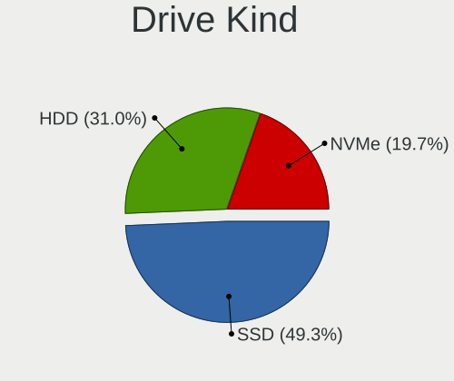

| Kind | Notebooks | Drives | Percent |
|------|-----------|--------|---------|
| SSD  | 1866      | 2671   | 49.33%  |
| HDD  | 1173      | 1669   | 31.01%  |
| NVMe | 744       | 1000   | 19.67%  |

Drive Connector
---------------

SATA, SAS, NVMe, etc.

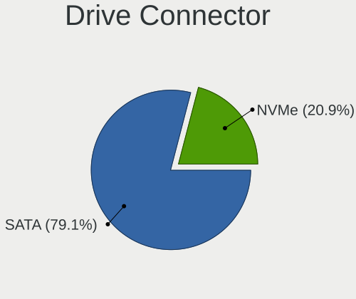

| Type | Notebooks | Drives | Percent |
|------|-----------|--------|---------|
| SATA | 2808      | 4340   | 79.05%  |
| NVMe | 744       | 1000   | 20.95%  |

Drive Size
----------

Size of hard drive

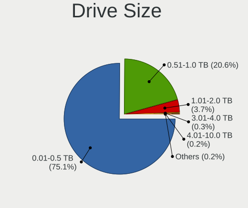

| Size in TB      | Notebooks | Drives | Percent |
|-----------------|-----------|--------|---------|
| 0.01-0.5        | 2268      | 3226   | 75.12%  |
| 0.51-1.0        | 621       | 897    | 20.57%  |
| 1.01-2.0        | 112       | 150    | 3.71%   |
| 3.01-4.0        | 8         | 56     | 0.26%   |
| 4.01-10.0       | 5         | 5      | 0.17%   |
| 2.01-3.0        | 3         | 4      | 0.1%    |
| More than 100.0 | 1         | 1      | 0.03%   |
| 0               | 1         | 1      | 0.03%   |

Space Total
-----------

Amount of disk space available on the file system

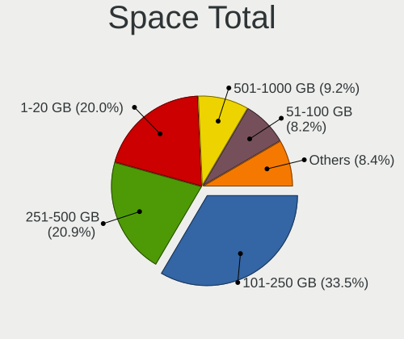

| Size in GB     | Notebooks | Percent |
|----------------|-----------|---------|
| 101-250        | 1430      | 33.47%  |
| 251-500        | 891       | 20.85%  |
| 1-20           | 853       | 19.96%  |
| 501-1000       | 391       | 9.15%   |
| 51-100         | 349       | 8.17%   |
| 21-50          | 232       | 5.43%   |
| 1001-2000      | 85        | 1.99%   |
| Unknown        | 29        | 0.68%   |
| More than 3000 | 8         | 0.19%   |
| 2001-3000      | 5         | 0.12%   |

Space Used
----------

Amount of used disk space

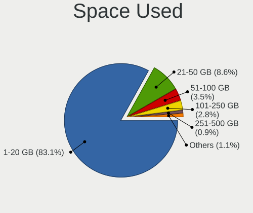

| Used GB        | Notebooks | Percent |
|----------------|-----------|---------|
| 1-20           | 3492      | 83.1%   |
| 21-50          | 362       | 8.61%   |
| 51-100         | 148       | 3.52%   |
| 101-250        | 116       | 2.76%   |
| 251-500        | 38        | 0.9%    |
| Unknown        | 29        | 0.69%   |
| 501-1000       | 15        | 0.36%   |
| More than 3000 | 1         | 0.02%   |
| 1001-2000      | 1         | 0.02%   |

Malfunc. Drives
---------------

Drive models with a malfunction

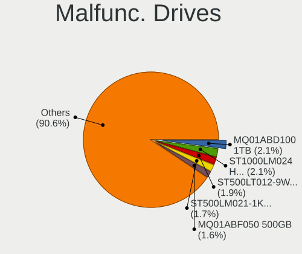

| Model                                | Notebooks | Drives | Percent |
|--------------------------------------|-----------|--------|---------|
| Toshiba MQ01ABD100 1TB               | 13        | 14     | 2.06%   |
| Seagate ST1000LM024 HN-M101MBB 1TB   | 13        | 17     | 2.06%   |
| Seagate ST500LT012-9WS142 500GB      | 12        | 16     | 1.9%    |
| Seagate ST500LM021-1KJ152 500GB      | 11        | 13     | 1.74%   |
| Toshiba MQ01ABF050 500GB             | 10        | 12     | 1.58%   |
| Seagate ST9500325AS 500GB            | 10        | 16     | 1.58%   |
| HGST HTS725050A7E630 500GB           | 10        | 16     | 1.58%   |
| Seagate ST9500420AS 500GB            | 9         | 12     | 1.43%   |
| Seagate ST500LT012-1DG142 500GB      | 9         | 10     | 1.43%   |
| Hitachi HTS541612J9SA00 120GB        | 9         | 9      | 1.43%   |
| HGST HTS541010A9E680 1TB             | 9         | 11     | 1.43%   |
| Seagate ST9320423AS 320GB            | 7         | 9      | 1.11%   |
| Seagate ST9320325AS 320GB            | 7         | 7      | 1.11%   |
| Seagate ST320LT007-9ZV142 320GB      | 7         | 7      | 1.11%   |
| Seagate ST1000LM035-1RK172 1TB       | 6         | 7      | 0.95%   |
| Seagate ST9250315AS 250GB            | 5         | 7      | 0.79%   |
| Hitachi HTS547550A9E384 500GB        | 5         | 6      | 0.79%   |
| Hitachi HTS545050B9A300 500GB        | 5         | 6      | 0.79%   |
| HGST HTS721010A9E630 1TB             | 5         | 29     | 0.79%   |
| HGST HTS545050A7E380 500GB           | 5         | 6      | 0.79%   |
| WDC WDS240G2G0A-00JH30 240GB         | 4         | 4      | 0.63%   |
| WDC WD10JPVX-60JC3T0 1TB             | 4         | 4      | 0.63%   |
| Toshiba MK3261GSYN 320GB             | 4         | 6      | 0.63%   |
| SK hynix SC210 mSATA 256GB           | 4         | 4      | 0.63%   |
| Seagate ST500LM000-1EJ162 500GB      | 4         | 5      | 0.63%   |
| Seagate ST320LT020-9YG142 320GB      | 4         | 5      | 0.63%   |
| Micron Technology 1100 SATA 256GB    | 4         | 4      | 0.63%   |
| Kingston SV300S37A120G 120GB         | 4         | 6      | 0.63%   |
| Kingston SA400S37240G 240GB          | 4         | 4      | 0.63%   |
| Intel SSDSC2BF180A4L 180GB           | 4         | 4      | 0.63%   |
| Hitachi HTS545050A7E380 500GB        | 4         | 4      | 0.63%   |
| Hitachi HTS545032B9A300 320GB        | 4         | 6      | 0.63%   |
| Hitachi HTS545025B9SA02 250GB        | 4         | 6      | 0.63%   |
| WDC WD5000LPCX-60VHAT0 500GB         | 3         | 5      | 0.48%   |
| WDC WD10JPCX-24UE4T0 1TB             | 3         | 4      | 0.48%   |
| Toshiba THNSNK256GVN8 M.2 2280 256GB | 3         | 11     | 0.48%   |
| Toshiba MQ01ACF032 320GB             | 3         | 5      | 0.48%   |
| Toshiba MQ01ABD075 752GB             | 3         | 3      | 0.48%   |
| Toshiba MQ01ABD050 500GB             | 3         | 4      | 0.48%   |
| Toshiba MQ01ABD032 320GB             | 3         | 4      | 0.48%   |

Malfunc. Drive Vendor
---------------------

Vendors of faulty drives

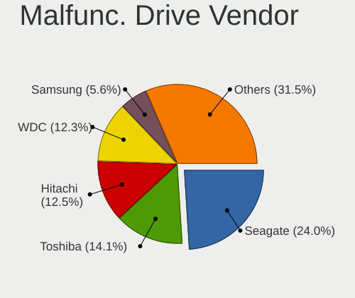

| Vendor              | Notebooks | Drives | Percent |
|---------------------|-----------|--------|---------|
| Seagate             | 150       | 192    | 24%     |
| Toshiba             | 88        | 118    | 14.08%  |
| Hitachi             | 78        | 95     | 12.48%  |
| WDC                 | 77        | 84     | 12.32%  |
| Samsung Electronics | 35        | 41     | 5.6%    |
| HGST                | 34        | 72     | 5.44%   |
| Kingston            | 30        | 34     | 4.8%    |
| Intel               | 26        | 30     | 4.16%   |
| SanDisk             | 14        | 15     | 2.24%   |
| Micron Technology   | 14        | 14     | 2.24%   |
| SK hynix            | 11        | 11     | 1.76%   |
| Crucial             | 10        | 14     | 1.6%    |
| Fujitsu             | 8         | 12     | 1.28%   |
| Apple               | 8         | 8      | 1.28%   |
| A-DATA Technology   | 4         | 12     | 0.64%   |
| SSSTC               | 3         | 3      | 0.48%   |
| OCZ                 | 3         | 3      | 0.48%   |
| LITEON              | 3         | 3      | 0.48%   |
| Corsair             | 3         | 3      | 0.48%   |
| Transcend           | 2         | 2      | 0.32%   |
| Netac               | 2         | 2      | 0.32%   |
| Fanxiang            | 2         | 3      | 0.32%   |
| China               | 2         | 3      | 0.32%   |
| XrayDisk            | 1         | 1      | 0.16%   |
| SMI                 | 1         | 1      | 0.16%   |
| ShiJi               | 1         | 1      | 0.16%   |
| PNY                 | 1         | 1      | 0.16%   |
| Phison              | 1         | 1      | 0.16%   |
| Patriot             | 1         | 1      | 0.16%   |
| LITEONIT            | 1         | 1      | 0.16%   |
| Lenovo              | 1         | 1      | 0.16%   |
| Kston               | 1         | 1      | 0.16%   |
| KingSpec            | 1         | 1      | 0.16%   |
| JWX                 | 1         | 1      | 0.16%   |
| Intenso             | 1         | 1      | 0.16%   |
| IBM/Hitachi         | 1         | 1      | 0.16%   |
| IBM                 | 1         | 1      | 0.16%   |
| Hewlett-Packard     | 1         | 2      | 0.16%   |
| Eluktro             | 1         | 2      | 0.16%   |
| Apacer              | 1         | 1      | 0.16%   |

Malfunc. HDD Vendor
-------------------

Vendors of faulty HDD drives

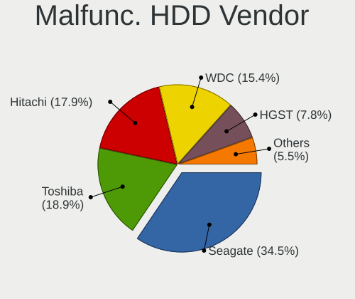

| Vendor              | Notebooks | Drives | Percent |
|---------------------|-----------|--------|---------|
| Seagate             | 150       | 192    | 34.48%  |
| Toshiba             | 82        | 104    | 18.85%  |
| Hitachi             | 78        | 95     | 17.93%  |
| WDC                 | 67        | 74     | 15.4%   |
| HGST                | 34        | 72     | 7.82%   |
| Samsung Electronics | 12        | 14     | 2.76%   |
| Fujitsu             | 8         | 12     | 1.84%   |
| Apple               | 2         | 2      | 0.46%   |
| IBM/Hitachi         | 1         | 1      | 0.23%   |
| IBM                 | 1         | 1      | 0.23%   |

Malfunc. Drive Kind
-------------------

Kinds of faulty drives

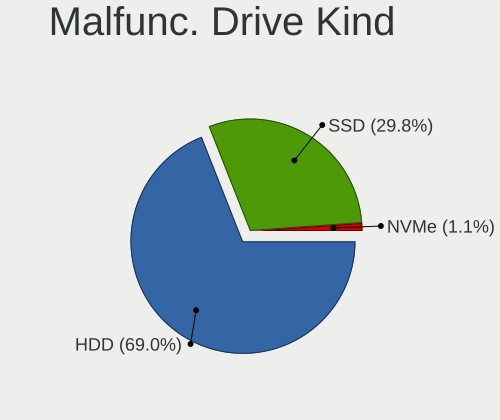

| Kind | Notebooks | Drives | Percent |
|------|-----------|--------|---------|
| HDD  | 421       | 567    | 69.02%  |
| SSD  | 182       | 220    | 29.84%  |
| NVMe | 7         | 7      | 1.15%   |

Failed Drives
-------------

Failed drive models

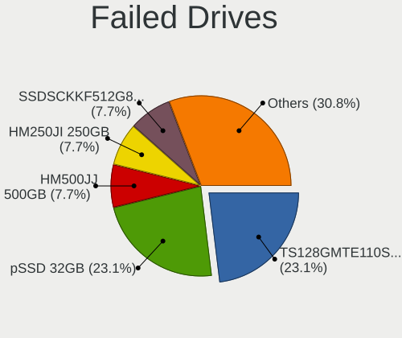

| Model                             | Notebooks | Drives | Percent |
|-----------------------------------|-----------|--------|---------|
| Transcend TS128GMTE110S 128GB     | 3         | 3      | 23.08%  |
| SanDisk pSSD 32GB                 | 3         | 3      | 23.08%  |
| Samsung Electronics HM500JJ 500GB | 1         | 1      | 7.69%   |
| Samsung Electronics HM250JI 250GB | 1         | 1      | 7.69%   |
| Intel SSDSCKKF512G8 SATA 512GB    | 1         | 1      | 7.69%   |
| HPE MK000480GWUGF 480GB           | 1         | 1      | 7.69%   |
| Hitachi HTS545025B9A300 250GB     | 1         | 1      | 7.69%   |
| CSD T65SX160N 4H0204656BY 160GB   | 1         | 1      | 7.69%   |
| Apple SSD SM256C 256GB            | 1         | 1      | 7.69%   |

Failed Drive Vendor
-------------------

Failed drive vendors

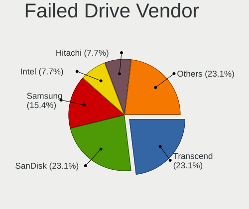

| Vendor              | Notebooks | Drives | Percent |
|---------------------|-----------|--------|---------|
| Transcend           | 3         | 3      | 23.08%  |
| SanDisk             | 3         | 3      | 23.08%  |
| Samsung Electronics | 2         | 2      | 15.38%  |
| Intel               | 1         | 1      | 7.69%   |
| HPE                 | 1         | 1      | 7.69%   |
| Hitachi             | 1         | 1      | 7.69%   |
| CSD                 | 1         | 1      | 7.69%   |
| Apple               | 1         | 1      | 7.69%   |

Drive Status
------------

Number of failed and malfunc. drives

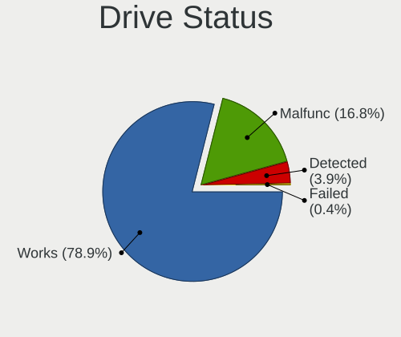

| Status   | Notebooks | Drives | Percent |
|----------|-----------|--------|---------|
| Works    | 2848      | 4340   | 78.94%  |
| Malfunc  | 606       | 794    | 16.8%   |
| Detected | 141       | 193    | 3.91%   |
| Failed   | 13        | 13     | 0.36%   |

Storage controller
------------------

Storage Vendor
--------------

Storage controller vendors

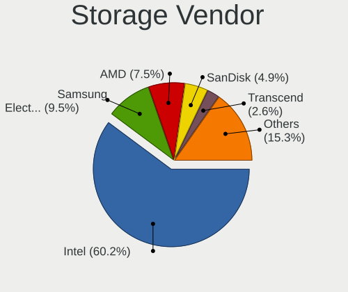

| Vendor                                  | Notebooks | Percent |
|-----------------------------------------|-----------|---------|
| Intel                                   | 2729      | 60.19%  |
| Samsung Electronics                     | 431       | 9.51%   |
| AMD                                     | 342       | 7.54%   |
| SanDisk                                 | 221       | 4.87%   |
| Transcend                               | 119       | 2.62%   |
| SK hynix                                | 100       | 2.21%   |
| Kingston Technology Company             | 63        | 1.39%   |
| Toshiba                                 | 58        | 1.28%   |
| Micron Technology                       | 58        | 1.28%   |
| Phison Electronics                      | 57        | 1.26%   |
| KIOXIA                                  | 53        | 1.17%   |
| Micron/Crucial Technology               | 51        | 1.12%   |
| Nvidia                                  | 42        | 0.93%   |
| Silicon Motion                          | 37        | 0.82%   |
| MAXIO Technology (Hangzhou)             | 24        | 0.53%   |
| ADATA Technology                        | 24        | 0.53%   |
| Solid State Storage Technology          | 18        | 0.4%    |
| Realtek Semiconductor                   | 15        | 0.33%   |
| Marvell Technology Group                | 15        | 0.33%   |
| Shenzhen Longsys Electronics            | 12        | 0.26%   |
| Silicon Integrated Systems [SiS]        | 9         | 0.2%    |
| Shenzhen Unionmemory Information System | 9         | 0.2%    |
| Lenovo                                  | 9         | 0.2%    |
| Union Memory (Shenzhen)                 | 7         | 0.15%   |
| JMicron Technology                      | 5         | 0.11%   |
| Biwin Storage Technology                | 5         | 0.11%   |
| Seagate Technology                      | 3         | 0.07%   |
| INNOGRIT                                | 3         | 0.07%   |
| Yangtze Memory Technologies             | 2         | 0.04%   |
| VIA Technologies                        | 2         | 0.04%   |
| Apple                                   | 2         | 0.04%   |
| ULi Electronics                         | 1         | 0.02%   |
| Solidigm                                | 1         | 0.02%   |
| Shenzhen Techwinsemi Technology         | 1         | 0.02%   |
| Netac Technology                        | 1         | 0.02%   |
| Lite-On Technology                      | 1         | 0.02%   |
| Hosin Global Electronics                | 1         | 0.02%   |
| Broadcom / LSI                          | 1         | 0.02%   |
| ASMedia Technology                      | 1         | 0.02%   |
| Unknown                                 | 1         | 0.02%   |

Storage Model
-------------

Storage controller models

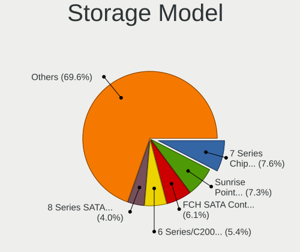

| Model                                                                            | Notebooks | Percent |
|----------------------------------------------------------------------------------|-----------|---------|
| Intel 7 Series Chipset Family 6-port SATA Controller [AHCI mode]                 | 367       | 7.58%   |
| Intel Sunrise Point-LP SATA Controller [AHCI mode]                               | 351       | 7.25%   |
| AMD FCH SATA Controller [AHCI mode]                                              | 297       | 6.14%   |
| Intel 6 Series/C200 Series Chipset Family 6 port Mobile SATA AHCI Controller     | 261       | 5.39%   |
| Intel 8 Series SATA Controller 1 [AHCI mode]                                     | 195       | 4.03%   |
| Intel Wildcat Point-LP SATA Controller [AHCI Mode]                               | 182       | 3.76%   |
| Samsung NVMe SSD Controller SM981/PM981/PM983                                    | 166       | 3.43%   |
| Intel 82801 Mobile SATA Controller [RAID mode]                                   | 136       | 2.81%   |
| Intel 82801IBM/IEM (ICH9M/ICH9M-E) 4 port SATA Controller [AHCI mode]            | 129       | 2.66%   |
| Intel 82801HM/HEM (ICH8M/ICH8M-E) SATA Controller [AHCI mode]                    | 89        | 1.84%   |
| Intel 82801HM/HEM (ICH8M/ICH8M-E) IDE Controller                                 | 89        | 1.84%   |
| Samsung NVMe SSD Controller 980 (DRAM-less)                                      | 84        | 1.74%   |
| Intel 8 Series/C220 Series Chipset Family 6-port SATA Controller 1 [AHCI mode]   | 77        | 1.59%   |
| Intel 5 Series/3400 Series Chipset 6 port SATA AHCI Controller                   | 75        | 1.55%   |
| SanDisk Extreme Pro / WD Black SN750 / PC SN730 / Red SN700 NVMe SSD             | 69        | 1.43%   |
| Intel 5 Series/3400 Series Chipset 4 port SATA AHCI Controller                   | 69        | 1.43%   |
| Transcend NVMe PCIe SSD 220S/240S/MTE710T                                        | 66        | 1.36%   |
| Intel Cannon Lake Mobile PCH SATA AHCI Controller                                | 62        | 1.28%   |
| Samsung NVMe SSD Controller PM9A1/PM9A3/980PRO                                   | 55        | 1.14%   |
| Intel Comet Lake SATA AHCI Controller                                            | 53        | 1.09%   |
| Samsung NVMe SSD Controller SM961/PM961/SM963                                    | 52        | 1.07%   |
| Intel NM10/ICH7 Family SATA Controller [AHCI mode]                               | 47        | 0.97%   |
| Transcend NVMe PCIe SSD 110S/112S/120S/MTE300S/MTE400S/MTE652T2 (DRAM-less)      | 46        | 0.95%   |
| Intel Q170/Q150/B150/H170/H110/Z170/CM236 Chipset SATA Controller [AHCI Mode]    | 45        | 0.93%   |
| Intel Volume Management Device NVMe RAID Controller                              | 44        | 0.91%   |
| Intel HM170/QM170 Chipset SATA Controller [AHCI Mode]                            | 41        | 0.85%   |
| Intel Atom Processor E3800 Series SATA AHCI Controller                           | 41        | 0.85%   |
| Intel Atom/Celeron/Pentium Processor x5-E8000/J3xxx/N3xxx Series SATA Controller | 40        | 0.83%   |
| Intel Cannon Point-LP SATA Controller [AHCI Mode]                                | 38        | 0.78%   |
| SK hynix Gold P31/BC711/PC711 NVMe Solid State Drive                             | 37        | 0.76%   |
| KIOXIA NVMe SSD Controller BG4 (DRAM-less)                                       | 34        | 0.7%    |
| Intel 82801GBM/GHM (ICH7-M Family) SATA Controller [IDE mode]                    | 34        | 0.7%    |
| Intel 82801G (ICH7 Family) IDE Controller                                        | 33        | 0.68%   |
| AMD SB7x0/SB8x0/SB9x0 SATA Controller [AHCI mode]                                | 33        | 0.68%   |
| Intel Celeron/Pentium Silver Processor SATA Controller                           | 32        | 0.66%   |
| Intel SSD DC P4101/Pro 7600p/760p/E 6100p Series                                 | 31        | 0.64%   |
| Nvidia MCP79 AHCI Controller                                                     | 30        | 0.62%   |
| Intel Tiger Lake-LP SATA Controller                                              | 30        | 0.62%   |
| SanDisk Ultra 3D / WD PC SN530, IX SN530, Blue SN550 NVMe SSD (DRAM-less)        | 29        | 0.6%    |
| Samsung S4LN058A01[SSUBX] AHCI SSD Controller (Apple slot)                       | 29        | 0.6%    |

Storage Kind
------------

Kind of storage controller (IDE, SATA, NVMe, SAS, ...)

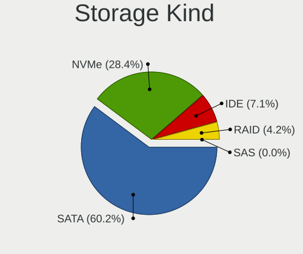

| Kind | Notebooks | Percent |
|------|-----------|---------|
| SATA | 2778      | 60.21%  |
| NVMe | 1311      | 28.41%  |
| IDE  | 328       | 7.11%   |
| RAID | 196       | 4.25%   |
| SAS  | 1         | 0.02%   |

Processor
---------

CPU Vendor
----------

Processor vendors

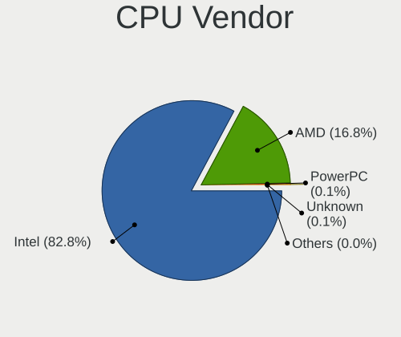

| Vendor       | Notebooks | Percent |
|--------------|-----------|---------|
| Intel        | 3332      | 82.82%  |
| AMD          | 676       | 16.8%   |
| PowerPC      | 6         | 0.15%   |
| Unknown      | 5         | 0.12%   |
| 11th         | 2         | 0.05%   |
| ARM          | 1         | 0.02%   |
| 123456789ABC | 1         | 0.02%   |

CPU Model
---------

Processor models

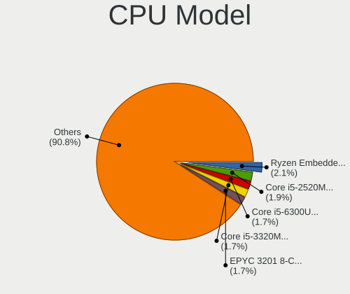

| Model                                   | Notebooks | Percent |
|-----------------------------------------|-----------|---------|
| AMD Ryzen Embedded V1500B               | 84        | 2.08%   |
| Intel Core i5-2520M CPU @ 2.50GHz       | 78        | 1.93%   |
| Intel Core i5-6300U CPU @ 2.40GHz       | 70        | 1.73%   |
| Intel Core i5-3320M CPU @ 2.60GHz       | 70        | 1.73%   |
| AMD EPYC 3201 8-Core Processor          | 69        | 1.7%    |
| Intel CPU Version                       | 54        | 1.33%   |
| Intel Core i5-7200U CPU @ 2.50GHz       | 52        | 1.28%   |
| Intel Core i5-5300U CPU @ 2.30GHz       | 50        | 1.24%   |
| Intel Core i5-5200U CPU @ 2.20GHz       | 49        | 1.21%   |
| Intel Core i5-6200U CPU @ 2.30GHz       | 48        | 1.19%   |
| Intel Core i7-8550U CPU @ 1.80GHz       | 47        | 1.16%   |
| Intel Core i5-8250U CPU @ 1.60GHz       | 47        | 1.16%   |
| Intel 11th Gen Core i5-1135G7 @ 2.40GHz | 44        | 1.09%   |
| Intel Core i5-10210U CPU @ 1.60GHz      | 41        | 1.01%   |
| Intel Core i5-3210M CPU @ 2.50GHz       | 40        | 0.99%   |
| Intel Core i5-4210U CPU @ 1.70GHz       | 36        | 0.89%   |
| Intel Core i7-8565U CPU @ 1.80GHz       | 35        | 0.86%   |
| Intel Core i5-7300U CPU @ 2.60GHz       | 34        | 0.84%   |
| Intel Core i7-6600U CPU @ 2.60GHz       | 32        | 0.79%   |
| Intel Core i5-8265U CPU @ 1.60GHz       | 32        | 0.79%   |
| Intel Core i7-3520M CPU @ 2.90GHz       | 31        | 0.77%   |
| Intel 11th Gen Core i7-1165G7 @ 2.80GHz | 30        | 0.74%   |
| Intel Core i5-8350U CPU @ 1.70GHz       | 29        | 0.72%   |
| Intel Core i5-4300U CPU @ 1.90GHz       | 29        | 0.72%   |
| Intel Core 2 Duo CPU P8600 @ 2.40GHz    | 29        | 0.72%   |
| Intel Core 2 Duo                        | 29        | 0.72%   |
| Intel Core i7-10510U CPU @ 1.80GHz      | 27        | 0.67%   |
| Intel Core i7-7500U CPU @ 2.70GHz       | 26        | 0.64%   |
| Intel Core i5 CPU M 520 @ 2.40GHz       | 26        | 0.64%   |
| Intel Core i7-8650U CPU @ 1.90GHz       | 25        | 0.62%   |
| Intel Core i3-6006U CPU @ 2.00GHz       | 25        | 0.62%   |
| Intel Core i7-5600U CPU @ 2.60GHz       | 24        | 0.59%   |
| Intel Core i3-4005U CPU @ 1.70GHz       | 24        | 0.59%   |
| Intel Core i7-8750H CPU @ 2.20GHz       | 23        | 0.57%   |
| Intel Core i7-5500U CPU @ 2.40GHz       | 23        | 0.57%   |
| Intel Core i5-4200U CPU @ 1.60GHz       | 23        | 0.57%   |
| Intel Core i5-3230M CPU @ 2.60GHz       | 23        | 0.57%   |
| AMD Ryzen 7 4800H with Radeon Graphics  | 23        | 0.57%   |
| Intel Core i7-10750H CPU @ 2.60GHz      | 22        | 0.54%   |
| AMD Ryzen 7 5700U with Radeon Graphics  | 21        | 0.52%   |

CPU Model Family
----------------

Processor model prefix

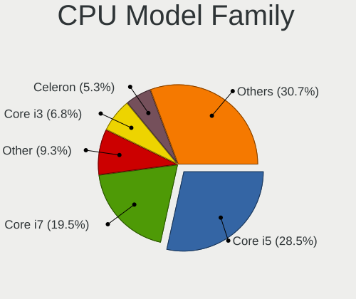

| Model                   | Notebooks | Percent |
|-------------------------|-----------|---------|
| Intel Core i5           | 1148      | 28.45%  |
| Intel Core i7           | 785       | 19.45%  |
| Other                   | 374       | 9.27%   |
| Intel Core i3           | 276       | 6.84%   |
| Intel Celeron           | 215       | 5.33%   |
| Intel Core 2 Duo        | 208       | 5.15%   |
| AMD Ryzen 7             | 131       | 3.25%   |
| AMD Ryzen 5             | 107       | 2.65%   |
| AMD EPYC                | 88        | 2.18%   |
| AMD Ryzen Embedded      | 86        | 2.13%   |
| Intel Pentium           | 81        | 2.01%   |
| Intel Atom              | 77        | 1.91%   |
| AMD Ryzen 7 PRO         | 33        | 0.82%   |
| Intel Genuine           | 26        | 0.64%   |
| AMD Ryzen 3             | 26        | 0.64%   |
| Intel Xeon              | 25        | 0.62%   |
| Intel Pentium M         | 25        | 0.62%   |
| AMD A6                  | 24        | 0.59%   |
| Intel Core 2            | 22        | 0.55%   |
| AMD Ryzen 9             | 18        | 0.45%   |
| AMD Ryzen 5 PRO         | 18        | 0.45%   |
| Intel Core              | 16        | 0.4%    |
| AMD E1                  | 16        | 0.4%    |
| AMD A8                  | 14        | 0.35%   |
| Intel Pentium Silver    | 13        | 0.32%   |
| Intel Pentium Dual      | 12        | 0.3%    |
| Intel Core i9           | 12        | 0.3%    |
| AMD E                   | 12        | 0.3%    |
| AMD A10                 | 12        | 0.3%    |
| Intel Pentium Dual-Core | 11        | 0.27%   |
| AMD Athlon              | 11        | 0.27%   |
| AMD A4                  | 11        | 0.27%   |
| Intel Core m3           | 10        | 0.25%   |
| AMD E2                  | 9         | 0.22%   |
| AMD GX                  | 6         | 0.15%   |
| Intel Pentium 4         | 5         | 0.12%   |
| Intel Core m7           | 5         | 0.12%   |
| Intel Core M            | 5         | 0.12%   |
| Intel Core Duo          | 5         | 0.12%   |
| Intel Celeron M         | 5         | 0.12%   |

CPU Cores
---------

Number of processor cores

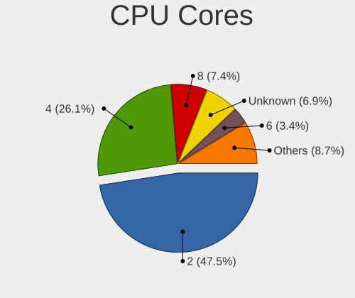

| Number  | Notebooks | Percent |
|---------|-----------|---------|
| 2       | 1930      | 47.55%  |
| 4       | 1060      | 26.11%  |
| 8       | 299       | 7.37%   |
| Unknown | 280       | 6.9%    |
| 6       | 136       | 3.35%   |
| 16      | 133       | 3.28%   |
| 1       | 94        | 2.32%   |
| 12      | 76        | 1.87%   |
| 10      | 19        | 0.47%   |
| 20      | 11        | 0.27%   |
| 32      | 5         | 0.12%   |
| 11      | 5         | 0.12%   |
| 7       | 3         | 0.07%   |
| 24      | 2         | 0.05%   |
| 22      | 2         | 0.05%   |
| 14      | 2         | 0.05%   |
| 9       | 1         | 0.02%   |
| 5       | 1         | 0.02%   |

CPU Sockets
-----------

Number of sockets

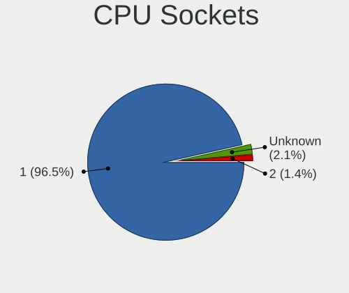

| Number  | Notebooks | Percent |
|---------|-----------|---------|
| 1       | 3892      | 96.48%  |
| Unknown | 86        | 2.13%   |
| 2       | 56        | 1.39%   |

CPU Threads
-----------

Threads per core (Hyper-Threading)

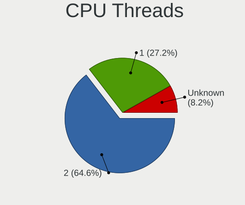

| Number  | Notebooks | Percent |
|---------|-----------|---------|
| 2       | 2619      | 64.59%  |
| 1       | 1104      | 27.23%  |
| Unknown | 332       | 8.19%   |

CPU Microarch
-------------

Microarchitecture

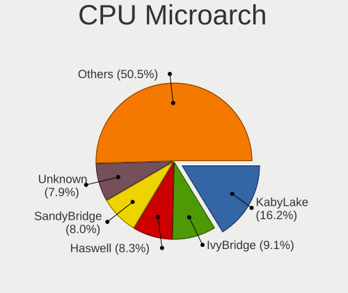

| Name            | Notebooks | Percent |
|-----------------|-----------|---------|
| KabyLake        | 655       | 16.24%  |
| IvyBridge       | 367       | 9.1%    |
| Haswell         | 334       | 8.28%   |
| SandyBridge     | 323       | 8.01%   |
| Unknown         | 319       | 7.91%   |
| Skylake         | 279       | 6.92%   |
| Broadwell       | 210       | 5.21%   |
| Penryn          | 200       | 4.96%   |
| Zen             | 199       | 4.93%   |
| Westmere        | 147       | 3.64%   |
| TigerLake       | 126       | 3.12%   |
| Core            | 114       | 2.83%   |
| Silvermont      | 101       | 2.5%    |
| Bonnell         | 85        | 2.11%   |
| Zen 2           | 77        | 1.91%   |
| Zen+            | 75        | 1.86%   |
| Zen 3           | 67        | 1.66%   |
| CometLake       | 52        | 1.29%   |
| P6              | 47        | 1.17%   |
| Goldmont plus   | 41        | 1.02%   |
| Excavator       | 31        | 0.77%   |
| Bobcat          | 30        | 0.74%   |
| Goldmont        | 24        | 0.6%    |
| IceLake         | 23        | 0.57%   |
| Jaguar          | 21        | 0.52%   |
| Puma            | 19        | 0.47%   |
| Piledriver      | 15        | 0.37%   |
| K10             | 13        | 0.32%   |
| Nehalem         | 10        | 0.25%   |
| K10 Llano       | 8         | 0.2%    |
| NetBurst        | 7         | 0.17%   |
| K8 Hammer       | 6         | 0.15%   |
| Steamroller     | 4         | 0.1%    |
| K8 & K10 hybrid | 3         | 0.07%   |
| Geode           | 1         | 0.02%   |

Graphics
--------

GPU Vendor
----------

Vendors of graphics cards

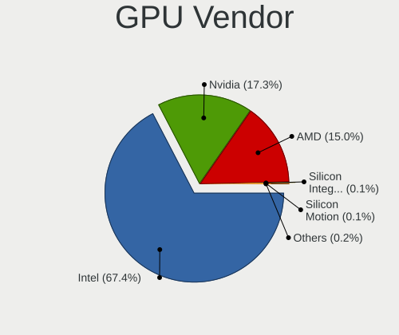

| Vendor                           | Notebooks | Percent |
|----------------------------------|-----------|---------|
| Intel                            | 3046      | 67.37%  |
| Nvidia                           | 781       | 17.27%  |
| AMD                              | 677       | 14.97%  |
| Silicon Integrated Systems [SiS] | 6         | 0.13%   |
| Silicon Motion                   | 3         | 0.07%   |
| VIA Technologies                 | 2         | 0.04%   |
| S3 Graphics                      | 2         | 0.04%   |
| Trident Microsystems             | 1         | 0.02%   |
| Matrox Electronics Systems       | 1         | 0.02%   |
| ATI                              | 1         | 0.02%   |
| ASPEED Technology                | 1         | 0.02%   |

GPU Model
---------

Graphics card models

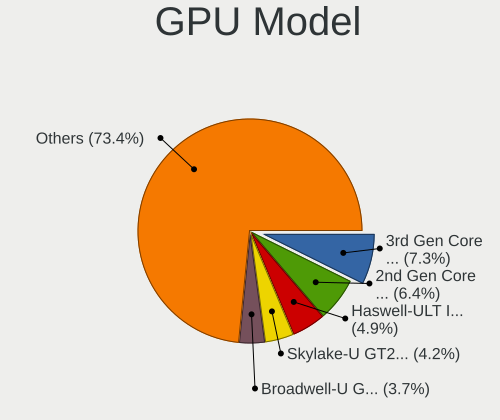

| Model                                                                                    | Notebooks | Percent |
|------------------------------------------------------------------------------------------|-----------|---------|
| Intel 3rd Gen Core processor Graphics Controller                                         | 344       | 7.34%   |
| Intel 2nd Generation Core Processor Family Integrated Graphics Controller                | 300       | 6.4%    |
| Intel Haswell-ULT Integrated Graphics Controller                                         | 231       | 4.93%   |
| Intel Skylake-U GT2 [HD Graphics 520]                                                    | 196       | 4.18%   |
| Intel Broadwell-U GT2 [HD Graphics 5500]                                                 | 174       | 3.71%   |
| Intel Kaby Lake-R GT2 [UHD Graphics 620]                                                 | 156       | 3.33%   |
| Intel Kaby Lake-U GT2 [HD Graphics 620]                                                  | 143       | 3.05%   |
| Intel Core Processor Integrated Graphics Controller                                      | 116       | 2.47%   |
| Intel TigerLake-LP GT2 [Iris Xe Graphics]                                                | 112       | 2.39%   |
| Intel Mobile 4 Series Chipset Integrated Graphics Controller                             | 106       | 2.26%   |
| Intel WhiskeyLake-U GT2 [UHD Graphics 620]                                               | 101       | 2.15%   |
| Intel CometLake-U GT2 [UHD Graphics]                                                     | 92        | 1.96%   |
| Intel 4th Gen Core Processor Integrated Graphics Controller                              | 83        | 1.77%   |
| AMD Picasso/Raven 2 [Radeon Vega Series / Radeon Vega Mobile Series]                     | 78        | 1.66%   |
| AMD Renoir [Radeon Vega Series / Radeon Vega Mobile Series]                              | 75        | 1.6%    |
| Intel CoffeeLake-H GT2 [UHD Graphics 630]                                                | 72        | 1.54%   |
| Intel Mobile GM965/GL960 Integrated Graphics Controller (secondary)                      | 69        | 1.47%   |
| Intel Mobile GM965/GL960 Integrated Graphics Controller (primary)                        | 69        | 1.47%   |
| Intel Mobile 945GM/GMS/GME, 943/940GML Express Integrated Graphics Controller            | 56        | 1.19%   |
| Intel Atom/Celeron/Pentium Processor x5-E8000/J3xxx/N3xxx Integrated Graphics Controller | 56        | 1.19%   |
| Nvidia TU117M [GeForce GTX 1650 Mobile / Max-Q]                                          | 55        | 1.17%   |
| Intel Atom Processor D4xx/D5xx/N4xx/N5xx Integrated Graphics Controller                  | 48        | 1.02%   |
| AMD Lucienne                                                                             | 46        | 0.98%   |
| Intel Skylake-H GT2 [HD Graphics 530]                                                    | 44        | 0.94%   |
| Intel Atom Processor Z36xxx/Z37xxx Series Graphics & Display                             | 44        | 0.94%   |
| AMD Cezanne [Radeon Vega Series / Radeon Vega Mobile Series]                             | 38        | 0.81%   |
| Nvidia GF117M [GeForce 610M/710M/810M/820M / GT 620M/625M/630M/720M]                     | 36        | 0.77%   |
| Intel CometLake-H GT2 [UHD Graphics]                                                     | 36        | 0.77%   |
| Intel Alder Lake-P GT2 [Iris Xe Graphics]                                                | 35        | 0.75%   |
| Intel Raptor Lake-P [Iris Xe Graphics]                                                   | 34        | 0.73%   |
| Intel Kaby Lake-H GT2 [HD Graphics 630]                                                  | 34        | 0.73%   |
| Intel GeminiLake [UHD Graphics 600]                                                      | 31        | 0.66%   |
| Intel Mobile 945GM/GMS, 943/940GML Express Integrated Graphics Controller                | 30        | 0.64%   |
| Nvidia GP107M [GeForce GTX 1050 Mobile]                                                  | 28        | 0.6%    |
| Intel Mobile 945GSE Express Integrated Graphics Controller                               | 26        | 0.55%   |
| AMD Rembrandt [Radeon 680M]                                                              | 24        | 0.51%   |
| Nvidia C79 [GeForce 9400M]                                                               | 23        | 0.49%   |
| AMD Stoney [Radeon R2/R3/R4/R5 Graphics]                                                 | 23        | 0.49%   |
| AMD Phoenix1                                                                             | 23        | 0.49%   |
| AMD Barcelo                                                                              | 23        | 0.49%   |

GPU Combo
---------

Combinations of graphics cards

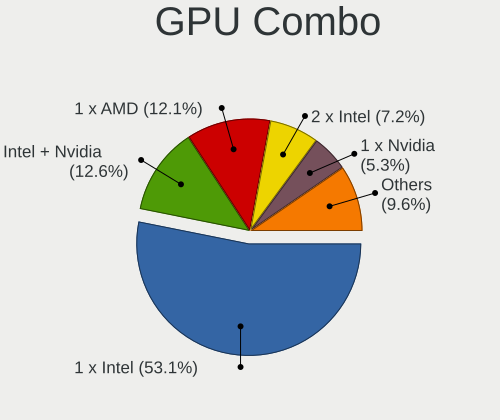

| Name                     | Notebooks | Percent |
|--------------------------|-----------|---------|
| 1 x Intel                | 2148      | 53.14%  |
| Intel + Nvidia           | 511       | 12.64%  |
| 1 x AMD                  | 490       | 12.12%  |
| 2 x Intel                | 290       | 7.17%   |
| 1 x Nvidia               | 216       | 5.34%   |
| Other                    | 178       | 4.4%    |
| Intel + AMD              | 100       | 2.47%   |
| AMD + Nvidia             | 58        | 1.43%   |
| 2 x AMD                  | 27        | 0.67%   |
| 1 x SiS                  | 6         | 0.15%   |
| 2 x Nvidia               | 5         | 0.12%   |
| 1 x Silicon Motion       | 3         | 0.07%   |
| 2 x Intel + 1 x Nvidia   | 2         | 0.05%   |
| 1 x VIA                  | 2         | 0.05%   |
| 1 x S3 Graphics          | 2         | 0.05%   |
| 1 x Trident Microsystems | 1         | 0.02%   |
| Intel + AMD + 1 x Nvidia | 1         | 0.02%   |
| 1 x ASPEED               | 1         | 0.02%   |
| AMD + Matrox             | 1         | 0.02%   |

GPU Driver
----------

Free vs proprietary

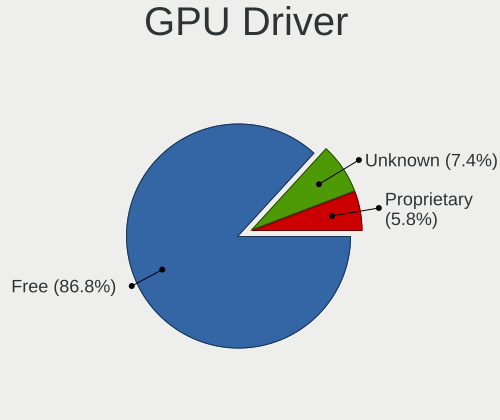

| Driver      | Notebooks | Percent |
|-------------|-----------|---------|
| Free        | 3533      | 86.81%  |
| Unknown     | 302       | 7.42%   |
| Proprietary | 235       | 5.77%   |

GPU Memory
----------

Total video memory

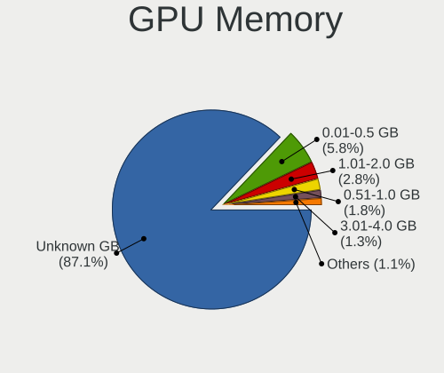

| Size in GB | Notebooks | Percent |
|------------|-----------|---------|
| Unknown    | 3566      | 87.1%   |
| 0.01-0.5   | 236       | 5.76%   |
| 1.01-2.0   | 116       | 2.83%   |
| 0.51-1.0   | 75        | 1.83%   |
| 3.01-4.0   | 54        | 1.32%   |
| 5.01-6.0   | 21        | 0.51%   |
| 7.01-8.0   | 18        | 0.44%   |
| 2.01-3.0   | 4         | 0.1%    |
| 8.01-16.0  | 4         | 0.1%    |

Monitor
-------

Monitor Vendor
--------------

Monitor vendors

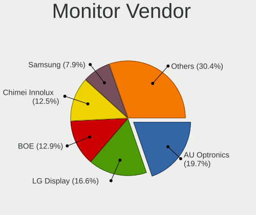

| Vendor                  | Notebooks | Percent |
|-------------------------|-----------|---------|
| AU Optronics            | 574       | 19.73%  |
| LG Display              | 482       | 16.56%  |
| BOE                     | 376       | 12.92%  |
| Chimei Innolux          | 364       | 12.51%  |
| Samsung Electronics     | 230       | 7.9%    |
| Lenovo                  | 141       | 4.85%   |
| Apple                   | 119       | 4.09%   |
| Sharp                   | 67        | 2.3%    |
| Chi Mei Optoelectronics | 57        | 1.96%   |
| Dell                    | 45        | 1.55%   |
| InfoVision              | 41        | 1.41%   |
| Goldstar                | 32        | 1.1%    |
| Hewlett-Packard         | 25        | 0.86%   |
| AOC                     | 24        | 0.82%   |
| PANDA                   | 23        | 0.79%   |
| LG Philips              | 22        | 0.76%   |
| CSO                     | 20        | 0.69%   |
| BenQ                    | 19        | 0.65%   |
| Philips                 | 16        | 0.55%   |
| HannStar                | 15        | 0.52%   |
| Acer                    | 15        | 0.52%   |
| Ancor Communications    | 14        | 0.48%   |
| Panasonic               | 10        | 0.34%   |
| Iiyama                  | 10        | 0.34%   |
| ViewSonic               | 9         | 0.31%   |
| LGD                     | 9         | 0.31%   |
| HKC                     | 9         | 0.31%   |
| CPT                     | 9         | 0.31%   |
| JDI                     | 8         | 0.27%   |
| ASUSTek Computer        | 7         | 0.24%   |
| Unknown                 | 7         | 0.24%   |
| IBM                     | 6         | 0.21%   |
| BOE Technology Group    | 6         | 0.21%   |
| Toshiba                 | 5         | 0.17%   |
| Sony                    | 5         | 0.17%   |
| Unknown                 | 4         | 0.14%   |
| TMX                     | 4         | 0.14%   |
| Sceptre Tech            | 4         | 0.14%   |
| Nvidia                  | 4         | 0.14%   |
| Lenovo Group Limited    | 4         | 0.14%   |

Monitor Model
-------------

Monitor models

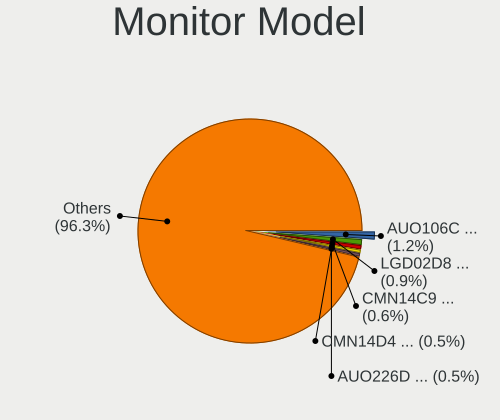

| Model                                                                | Notebooks | Percent |
|----------------------------------------------------------------------|-----------|---------|
| AU Optronics LCD Monitor AUO106C 1366x768 280x160mm 12.7-inch        | 34        | 1.16%   |
| LG Display LCD Monitor LGD02D8 1366x768 280x160mm 12.7-inch          | 25        | 0.85%   |
| Chimei Innolux LCD Monitor CMN14C9 1920x1080 310x170mm 13.9-inch     | 19        | 0.65%   |
| Chimei Innolux LCD Monitor CMN14D4 1920x1080 310x170mm 13.9-inch     | 15        | 0.51%   |
| AU Optronics LCD Monitor AUO226D 1920x1080 280x160mm 12.7-inch       | 15        | 0.51%   |
| LG Display LCD Monitor LGD02DC 1366x768 340x190mm 15.3-inch          | 14        | 0.48%   |
| Lenovo LCD Monitor LEN40B1 1600x900 340x190mm 15.3-inch              | 14        | 0.48%   |
| Lenovo LCD Monitor LEN4011 1280x800 260x160mm 12.0-inch              | 14        | 0.48%   |
| Chimei Innolux LCD Monitor CMN1132 1366x768 260x140mm 11.6-inch      | 14        | 0.48%   |
| AU Optronics LCD Monitor AUO243D 1920x1080 310x170mm 13.9-inch       | 14        | 0.48%   |
| Samsung Electronics LCD Monitor SEC5441 1366x768 340x190mm 15.3-inch | 13        | 0.44%   |
| BOE LCD Monitor BOE095F 2256x1504 280x190mm 13.3-inch                | 13        | 0.44%   |
| AU Optronics LCD Monitor AUO213E 1600x900 310x170mm 13.9-inch        | 13        | 0.44%   |
| Lenovo LCD Monitor LEN4010 1280x800 260x160mm 12.0-inch              | 12        | 0.41%   |
| AU Optronics LCD Monitor AUO38ED 1920x1080 340x190mm 15.3-inch       | 12        | 0.41%   |
| Samsung Electronics LCD Monitor SEC324C 1600x900 310x170mm 13.9-inch | 11        | 0.37%   |
| Samsung Electronics LCD Monitor SEC3047 1366x768 280x160mm 12.7-inch | 11        | 0.37%   |
| LG Display LCD Monitor LGD0521 1920x1080 310x170mm 13.9-inch         | 11        | 0.37%   |
| Lenovo LCD Monitor LEN40B2 1920x1080 340x190mm 15.3-inch             | 11        | 0.37%   |
| Lenovo LCD Monitor LEN4031 1280x800 300x190mm 14.0-inch              | 11        | 0.37%   |
| AU Optronics LCD Monitor AUO403D 1920x1080 310x170mm 13.9-inch       | 11        | 0.37%   |
| AU Optronics LCD Monitor AUO26EC 1366x768 340x190mm 15.3-inch        | 11        | 0.37%   |
| LG Display LCD Monitor LGD05FA 1920x1080 310x170mm 13.9-inch         | 10        | 0.34%   |
| Lenovo LCD Monitor LEN4035 1280x800 300x190mm 14.0-inch              | 10        | 0.34%   |
| Chimei Innolux LCD Monitor CMN15F5 1920x1080 340x190mm 15.3-inch     | 10        | 0.34%   |
| AU Optronics LCD Monitor AUO313C 1366x768 310x170mm 13.9-inch        | 10        | 0.34%   |
| AU Optronics LCD Monitor AUO22EC 1366x768 340x190mm 15.3-inch        | 10        | 0.34%   |
| AU Optronics LCD Monitor AUO21ED 1920x1080 340x190mm 15.3-inch       | 10        | 0.34%   |
| AU Optronics LCD Monitor AUO133D 1920x1080 310x170mm 13.9-inch       | 10        | 0.34%   |
| Panasonic LCD Monitor MEI96A2 2880x1620 340x190mm 15.3-inch          | 9         | 0.31%   |
| LG Display LCD Monitor LGD046F 1920x1080 340x190mm 15.3-inch         | 9         | 0.31%   |
| LG Display LCD Monitor LGD0456 1366x768 340x190mm 15.3-inch          | 9         | 0.31%   |
| LG Display LCD Monitor LGD0437 1920x1080 280x160mm 12.7-inch         | 9         | 0.31%   |
| LG Display LCD Monitor LGD03ED 1366x768 280x160mm 12.7-inch          | 9         | 0.31%   |
| Lenovo LCD Monitor LEN4036 1440x900 300x190mm 14.0-inch              | 9         | 0.31%   |
| HannStar LCD Monitor HSD03E9 1024x600 220x130mm 10.1-inch            | 9         | 0.31%   |
| Chimei Innolux LCD Monitor CMN15CA 1366x768 340x190mm 15.3-inch      | 9         | 0.31%   |
| Chimei Innolux LCD Monitor CMN14D5 1920x1080 310x170mm 13.9-inch     | 9         | 0.31%   |
| Chimei Innolux LCD Monitor CMN14B1 1920x1080 310x170mm 13.9-inch     | 9         | 0.31%   |
| AU Optronics LCD Monitor AUO71EC 1366x768 340x190mm 15.3-inch        | 9         | 0.31%   |

Monitor Resolution
------------------

Monitor screen resolution

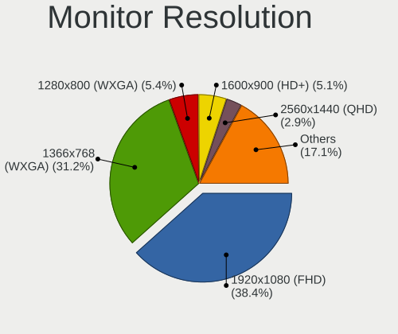

| Resolution         | Notebooks | Percent |
|--------------------|-----------|---------|
| 1920x1080 (FHD)    | 1083      | 38.38%  |
| 1366x768 (WXGA)    | 880       | 31.18%  |
| 1280x800 (WXGA)    | 151       | 5.35%   |
| 1600x900 (HD+)     | 144       | 5.1%    |
| 2560x1440 (QHD)    | 81        | 2.87%   |
| 3840x2160 (4K)     | 80        | 2.83%   |
| 1920x1200 (WUXGA)  | 66        | 2.34%   |
| 1440x900 (WXGA+)   | 60        | 2.13%   |
| 1024x600           | 43        | 1.52%   |
| 2560x1600          | 42        | 1.49%   |
| 2880x1800          | 24        | 0.85%   |
| 2256x1504          | 18        | 0.64%   |
| 1680x1050 (WSXGA+) | 18        | 0.64%   |
| 3200x1800 (QHD+)   | 16        | 0.57%   |
| 1280x1024 (SXGA)   | 16        | 0.57%   |
| 2560x1080          | 11        | 0.39%   |
| 1024x768 (XGA)     | 10        | 0.35%   |
| Unknown            | 7         | 0.25%   |
| 3840x2400          | 6         | 0.21%   |
| 3440x1440          | 6         | 0.21%   |
| 3000x2000          | 5         | 0.18%   |
| 2240x1400          | 5         | 0.18%   |
| 2160x1440          | 4         | 0.14%   |
| 1920x540           | 4         | 0.14%   |
| 1360x768           | 4         | 0.14%   |
| 3120x2080          | 3         | 0.11%   |
| 1400x1050          | 3         | 0.11%   |
| 5760x2160          | 2         | 0.07%   |
| 3840x1600          | 2         | 0.07%   |
| 3840x1080          | 2         | 0.07%   |
| 2880x1920          | 2         | 0.07%   |
| 2160x1350          | 2         | 0.07%   |
| 1920x1280          | 2         | 0.07%   |
| 1280x854           | 2         | 0.07%   |
| 9600x2160          | 1         | 0.04%   |
| 720x1280           | 1         | 0.04%   |
| 7040x1440          | 1         | 0.04%   |
| 5760x1080          | 1         | 0.04%   |
| 5440x1080          | 1         | 0.04%   |
| 4480x1080          | 1         | 0.04%   |

Monitor Diagonal
----------------

Diagonal size in inches

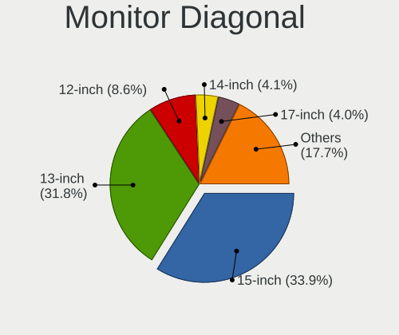

| Inches  | Notebooks | Percent |
|---------|-----------|---------|
| 15      | 982       | 33.89%  |
| 13      | 923       | 31.85%  |
| 12      | 248       | 8.56%   |
| 14      | 118       | 4.07%   |
| 17      | 115       | 3.97%   |
| 11      | 89        | 3.07%   |
| 24      | 74        | 2.55%   |
| 27      | 71        | 2.45%   |
| Unknown | 49        | 1.69%   |
| 23      | 38        | 1.31%   |
| 10      | 38        | 1.31%   |
| 21      | 24        | 0.83%   |
| 19      | 20        | 0.69%   |
| 31      | 14        | 0.48%   |
| 16      | 13        | 0.45%   |
| 34      | 12        | 0.41%   |
| 18      | 11        | 0.38%   |
| 9       | 9         | 0.31%   |
| 40      | 6         | 0.21%   |
| 22      | 5         | 0.17%   |
| 48      | 4         | 0.14%   |
| 64      | 3         | 0.1%    |
| 42      | 3         | 0.1%    |
| 32      | 3         | 0.1%    |
| 29      | 3         | 0.1%    |
| 26      | 3         | 0.1%    |
| 20      | 3         | 0.1%    |
| 39      | 2         | 0.07%   |
| 37      | 2         | 0.07%   |
| 28      | 2         | 0.07%   |
| 86      | 1         | 0.03%   |
| 54      | 1         | 0.03%   |
| 52      | 1         | 0.03%   |
| 49      | 1         | 0.03%   |
| 46      | 1         | 0.03%   |
| 43      | 1         | 0.03%   |
| 35      | 1         | 0.03%   |
| 33      | 1         | 0.03%   |
| 8       | 1         | 0.03%   |
| 6       | 1         | 0.03%   |

Monitor Width
-------------

Physical width

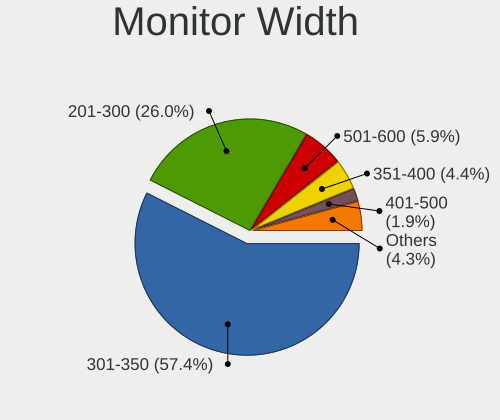

| Width in mm | Notebooks | Percent |
|-------------|-----------|---------|
| 301-350     | 1659      | 57.44%  |
| 201-300     | 751       | 26%     |
| 501-600     | 171       | 5.92%   |
| 351-400     | 128       | 4.43%   |
| 401-500     | 55        | 1.9%    |
| Unknown     | 49        | 1.7%    |
| 601-700     | 27        | 0.93%   |
| 701-800     | 16        | 0.55%   |
| 1001-1500   | 12        | 0.42%   |
| 801-900     | 11        | 0.38%   |
| 101-200     | 4         | 0.14%   |
| 901-1000    | 3         | 0.1%    |
| 1501-2000   | 1         | 0.03%   |
| 1-100       | 1         | 0.03%   |

Aspect Ratio
------------

Proportional relationship between the width and the height

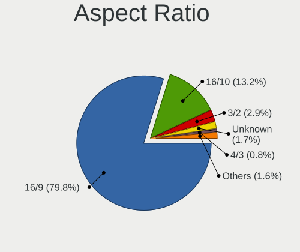

| Ratio   | Notebooks | Percent |
|---------|-----------|---------|
| 16/9    | 2154      | 79.78%  |
| 16/10   | 357       | 13.22%  |
| 3/2     | 78        | 2.89%   |
| Unknown | 47        | 1.74%   |
| 4/3     | 22        | 0.81%   |
| 21/9    | 19        | 0.7%    |
| 5/4     | 15        | 0.56%   |
| 1.96    | 2         | 0.07%   |
| 6/5     | 1         | 0.04%   |
| 32/9    | 1         | 0.04%   |
| 3.88    | 1         | 0.04%   |
| 3.18    | 1         | 0.04%   |
| 11/10   | 1         | 0.04%   |
| 0.46    | 1         | 0.04%   |

Monitor Area
------------

Area in inch²

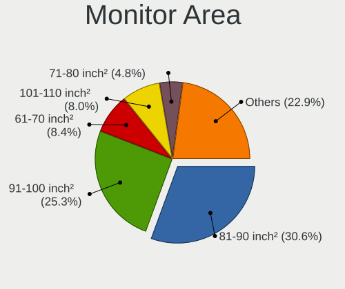

| Area in inch² | Notebooks | Percent |
|----------------|-----------|---------|
| 81-90          | 886       | 30.57%  |
| 91-100         | 734       | 25.33%  |
| 61-70          | 242       | 8.35%   |
| 101-110        | 233       | 8.04%   |
| 71-80          | 140       | 4.83%   |
| 201-250        | 126       | 4.35%   |
| 121-130        | 99        | 3.42%   |
| 51-60          | 87        | 3%      |
| 301-350        | 76        | 2.62%   |
| Unknown        | 49        | 1.69%   |
| 111-120        | 48        | 1.66%   |
| 41-50          | 45        | 1.55%   |
| 351-500        | 32        | 1.1%    |
| 151-200        | 25        | 0.86%   |
| 501-1000       | 18        | 0.62%   |
| 141-150        | 16        | 0.55%   |
| 251-300        | 15        | 0.52%   |
| 131-140        | 13        | 0.45%   |
| More than 1000 | 8         | 0.28%   |
| 1-40           | 6         | 0.21%   |

Pixel Density
-------------

Pixels per inch

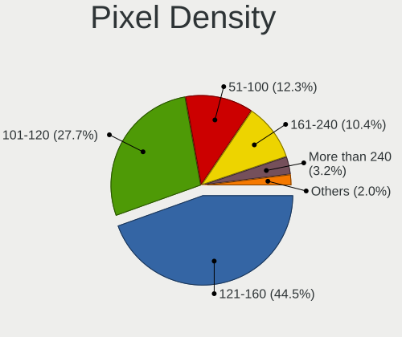

| Density       | Notebooks | Percent |
|---------------|-----------|---------|
| 121-160       | 1275      | 44.52%  |
| 101-120       | 793       | 27.69%  |
| 51-100        | 351       | 12.26%  |
| 161-240       | 297       | 10.37%  |
| More than 240 | 92        | 3.21%   |
| Unknown       | 49        | 1.71%   |
| 1-50          | 7         | 0.24%   |

Multiple Monitors
-----------------

Total monitors connected

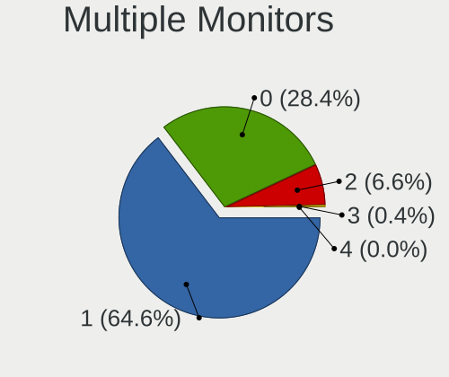

| Total | Notebooks | Percent |
|-------|-----------|---------|
| 1     | 2683      | 64.64%  |
| 0     | 1178      | 28.38%  |
| 2     | 274       | 6.6%    |
| 3     | 15        | 0.36%   |
| 4     | 1         | 0.02%   |

Network
-------

Net Controller Vendor
---------------------

Controller vendors

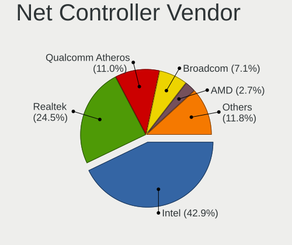

| Vendor                                 | Notebooks | Percent |
|----------------------------------------|-----------|---------|
| Intel                                  | 2700      | 42.86%  |
| Realtek Semiconductor                  | 1541      | 24.46%  |
| Qualcomm Atheros                       | 693       | 11%     |
| Broadcom                               | 450       | 7.14%   |
| AMD                                    | 173       | 2.75%   |
| Marvell Technology Group               | 75        | 1.19%   |
| MediaTek                               | 55        | 0.87%   |
| TP-Link                                | 53        | 0.84%   |
| Sierra Wireless                        | 47        | 0.75%   |
| Ralink Technology                      | 46        | 0.73%   |
| Ericsson Business Mobile Networks      | 42        | 0.67%   |
| Samsung Electronics                    | 40        | 0.63%   |
| Ralink                                 | 32        | 0.51%   |
| Nvidia                                 | 32        | 0.51%   |
| Edimax Technology                      | 29        | 0.46%   |
| Xiaomi                                 | 27        | 0.43%   |
| Dell                                   | 24        | 0.38%   |
| Google                                 | 20        | 0.32%   |
| JMicron Technology                     | 17        | 0.27%   |
| Hewlett-Packard                        | 15        | 0.24%   |
| Apple                                  | 14        | 0.22%   |
| Qualcomm Technologies                  | 13        | 0.21%   |
| Qualcomm                               | 12        | 0.19%   |
| Huawei Technologies                    | 12        | 0.19%   |
| D-Link System                          | 10        | 0.16%   |
| D-Link                                 | 10        | 0.16%   |
| Silicon Integrated Systems [SiS]       | 9         | 0.14%   |
| NetGear                                | 9         | 0.14%   |
| Qualcomm Atheros Communications        | 8         | 0.13%   |
| Lenovo                                 | 8         | 0.13%   |
| Fibocom                                | 8         | 0.13%   |
| ASUSTek Computer                       | 8         | 0.13%   |
| Motorola PCS                           | 7         | 0.11%   |
| OPPO Electronics                       | 6         | 0.1%    |
| U-Blox                                 | 4         | 0.06%   |
| ZTE WCDMA Technologies MSM             | 2         | 0.03%   |
| VIA Technologies                       | 2         | 0.03%   |
| Suzhou Motorcomm Electronic Technology | 2         | 0.03%   |
| Sony Ericsson Mobile Communications AB | 2         | 0.03%   |
| Realtek                                | 2         | 0.03%   |

Net Controller Model
--------------------

Controller models

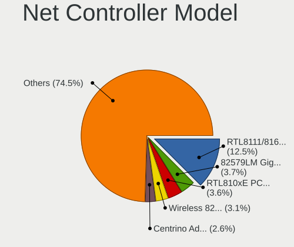

| Model                                                                  | Notebooks | Percent |
|------------------------------------------------------------------------|-----------|---------|
| Realtek RTL8111/8168/8211/8411 PCI Express Gigabit Ethernet Controller | 997       | 12.51%  |
| Intel 82579LM Gigabit Network Connection (Lewisville)                  | 292       | 3.67%   |
| Realtek RTL810xE PCI Express Fast Ethernet controller                  | 284       | 3.56%   |
| Intel Wireless 8265 / 8275                                             | 249       | 3.13%   |
| Intel Centrino Advanced-N 6205 [Taylor Peak]                           | 207       | 2.6%    |
| Intel Wireless 7265                                                    | 187       | 2.35%   |
| AMD XGMAC 10GbE Controller                                             | 172       | 2.16%   |
| Intel Wireless 8260                                                    | 171       | 2.15%   |
| Intel Wireless 7260                                                    | 163       | 2.05%   |
| Intel Wi-Fi 6 AX200                                                    | 130       | 1.63%   |
| Qualcomm Atheros QCA9565 / AR9565 Wireless Network Adapter             | 121       | 1.52%   |
| Qualcomm Atheros AR9285 Wireless Network Adapter (PCI-Express)         | 120       | 1.51%   |
| Intel Ethernet Connection (4) I219-LM                                  | 113       | 1.42%   |
| Intel Wi-Fi 6 AX201                                                    | 108       | 1.36%   |
| Intel I210 Gigabit Network Connection                                  | 106       | 1.33%   |
| Intel Ethernet Connection I219-LM                                      | 105       | 1.32%   |
| Qualcomm Atheros AR9485 Wireless Network Adapter                       | 103       | 1.29%   |
| Intel Wi-Fi 6E(802.11ax) AX210/AX1675* 2x2 [Typhoon Peak]              | 88        | 1.1%    |
| Realtek RTL8188EUS 802.11n Wireless Network Adapter                    | 85        | 1.07%   |
| Intel Ethernet Connection (3) I218-LM                                  | 79        | 0.99%   |
| Intel Comet Lake PCH-LP CNVi WiFi                                      | 78        | 0.98%   |
| Qualcomm Atheros QCA9377 802.11ac Wireless Network Adapter             | 72        | 0.9%    |
| Intel Cannon Point-LP CNVi [Wireless-AC]                               | 70        | 0.88%   |
| Intel Ethernet Connection I218-LM                                      | 68        | 0.85%   |
| Intel 82577LM Gigabit Network Connection                               | 67        | 0.84%   |
| Realtek RTL8821CE 802.11ac PCIe Wireless Network Adapter               | 64        | 0.8%    |
| Intel I211 Gigabit Network Connection                                  | 61        | 0.77%   |
| Broadcom BCM4313 802.11bgn Wireless Network Adapter                    | 59        | 0.74%   |
| Intel Ethernet Connection (4) I219-V                                   | 58        | 0.73%   |
| Intel Wireless 3165                                                    | 57        | 0.72%   |
| Intel Ethernet Connection I217-LM                                      | 56        | 0.7%    |
| Intel Centrino Ultimate-N 6300                                         | 54        | 0.68%   |
| Intel Wi-Fi 5(802.11ac) Wireless-AC 9x6x [Thunder Peak]                | 52        | 0.65%   |
| Intel 82567LM Gigabit Network Connection                               | 51        | 0.64%   |
| Intel PRO/Wireless 3945ABG [Golan] Network Connection                  | 50        | 0.63%   |
| Realtek RTL8822CE 802.11ac PCIe Wireless Network Adapter               | 47        | 0.59%   |
| Intel Centrino Advanced-N 6200                                         | 46        | 0.58%   |
| Intel Ethernet Controller I225-V                                       | 45        | 0.56%   |
| Intel Cannon Lake PCH CNVi WiFi                                        | 44        | 0.55%   |
| Qualcomm Atheros AR9462 Wireless Network Adapter                       | 43        | 0.54%   |

Wireless Vendor
---------------

Wireless vendors

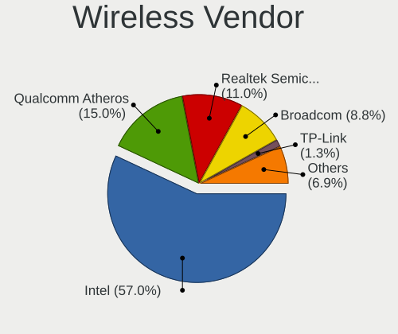

| Vendor                                | Notebooks | Percent |
|---------------------------------------|-----------|---------|
| Intel                                 | 2298      | 56.97%  |
| Qualcomm Atheros                      | 606       | 15.02%  |
| Realtek Semiconductor                 | 443       | 10.98%  |
| Broadcom                              | 357       | 8.85%   |
| TP-Link                               | 53        | 1.31%   |
| MediaTek                              | 47        | 1.17%   |
| Ralink Technology                     | 46        | 1.14%   |
| Sierra Wireless                       | 36        | 0.89%   |
| Ralink                                | 32        | 0.79%   |
| Edimax Technology                     | 29        | 0.72%   |
| Dell                                  | 15        | 0.37%   |
| Qualcomm Technologies                 | 13        | 0.32%   |
| D-Link                                | 10        | 0.25%   |
| NetGear                               | 9         | 0.22%   |
| D-Link System                         | 9         | 0.22%   |
| Qualcomm Atheros Communications       | 8         | 0.2%    |
| ASUSTek Computer                      | 8         | 0.2%    |
| Micro Star International              | 2         | 0.05%   |
| Mercucys                              | 2         | 0.05%   |
| IMC Networks                          | 2         | 0.05%   |
| BUFFALO                               | 2         | 0.05%   |
| Atheros                               | 2         | 0.05%   |
| ZyXEL Communications                  | 1         | 0.02%   |
| Sagem                                 | 1         | 0.02%   |
| Belkin Components                     | 1         | 0.02%   |
| AboCom Systems                        | 1         | 0.02%   |
| 802.11g Adapter [Linksys WUSB54GC v3] | 1         | 0.02%   |

Wireless Model
--------------

Wireless models

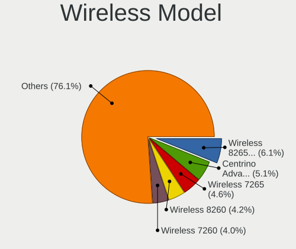

| Model                                                                   | Notebooks | Percent |
|-------------------------------------------------------------------------|-----------|---------|
| Intel Wireless 8265 / 8275                                              | 249       | 6.09%   |
| Intel Centrino Advanced-N 6205 [Taylor Peak]                            | 207       | 5.06%   |
| Intel Wireless 7265                                                     | 187       | 4.57%   |
| Intel Wireless 8260                                                     | 171       | 4.18%   |
| Intel Wireless 7260                                                     | 163       | 3.99%   |
| Intel Wi-Fi 6 AX200                                                     | 130       | 3.18%   |
| Qualcomm Atheros QCA9565 / AR9565 Wireless Network Adapter              | 121       | 2.96%   |
| Qualcomm Atheros AR9285 Wireless Network Adapter (PCI-Express)          | 120       | 2.93%   |
| Intel Wi-Fi 6 AX201                                                     | 108       | 2.64%   |
| Qualcomm Atheros AR9485 Wireless Network Adapter                        | 103       | 2.52%   |
| Intel Wi-Fi 6E(802.11ax) AX210/AX1675* 2x2 [Typhoon Peak]               | 88        | 2.15%   |
| Realtek RTL8188EUS 802.11n Wireless Network Adapter                     | 85        | 2.08%   |
| Intel Comet Lake PCH-LP CNVi WiFi                                       | 78        | 1.91%   |
| Qualcomm Atheros QCA9377 802.11ac Wireless Network Adapter              | 72        | 1.76%   |
| Intel Cannon Point-LP CNVi [Wireless-AC]                                | 70        | 1.71%   |
| Realtek RTL8821CE 802.11ac PCIe Wireless Network Adapter                | 64        | 1.56%   |
| Broadcom BCM4313 802.11bgn Wireless Network Adapter                     | 59        | 1.44%   |
| Intel Wireless 3165                                                     | 57        | 1.39%   |
| Intel Centrino Ultimate-N 6300                                          | 53        | 1.3%    |
| Intel Wi-Fi 5(802.11ac) Wireless-AC 9x6x [Thunder Peak]                 | 52        | 1.27%   |
| Intel PRO/Wireless 3945ABG [Golan] Network Connection                   | 50        | 1.22%   |
| Realtek RTL8822CE 802.11ac PCIe Wireless Network Adapter                | 47        | 1.15%   |
| Intel Centrino Advanced-N 6200                                          | 45        | 1.1%    |
| Intel Cannon Lake PCH CNVi WiFi                                         | 44        | 1.08%   |
| Qualcomm Atheros AR9462 Wireless Network Adapter                        | 43        | 1.05%   |
| Broadcom BCM4360 802.11ac Dual Band Wireless Network Adapter            | 42        | 1.03%   |
| Realtek RTL8188CE 802.11b/g/n WiFi Adapter                              | 41        | 1%      |
| Intel Comet Lake PCH CNVi WiFi                                          | 41        | 1%      |
| Broadcom BCM43224 802.11a/b/g/n                                         | 41        | 1%      |
| Qualcomm Atheros QCA6174 802.11ac Wireless Network Adapter              | 40        | 0.98%   |
| Realtek RTL8723BE PCIe Wireless Network Adapter                         | 39        | 0.95%   |
| Intel Alder Lake-P PCH CNVi WiFi                                        | 39        | 0.95%   |
| Qualcomm Atheros AR242x / AR542x Wireless Network Adapter (PCI-Express) | 37        | 0.9%    |
| Intel Wireless 3160                                                     | 37        | 0.9%    |
| Broadcom BCM4331 802.11a/b/g/n                                          | 37        | 0.9%    |
| Intel Dual Band Wireless-AC 3168NGW [Stone Peak]                        | 36        | 0.88%   |
| Broadcom BCM4322 802.11a/b/g/n Wireless LAN Controller                  | 36        | 0.88%   |
| Qualcomm Atheros AR928X Wireless Network Adapter (PCI-Express)          | 34        | 0.83%   |
| Intel Raptor Lake PCH CNVi WiFi                                         | 34        | 0.83%   |
| Intel PRO/Wireless 4965 AG or AGN [Kedron] Network Connection           | 33        | 0.81%   |

Ethernet Vendor
---------------

Ethernet vendors

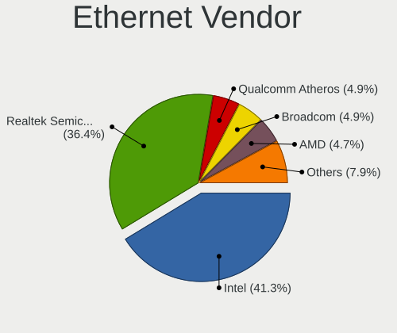

| Vendor                                 | Notebooks | Percent |
|----------------------------------------|-----------|---------|
| Intel                                  | 1514      | 41.3%   |
| Realtek Semiconductor                  | 1333      | 36.36%  |
| Qualcomm Atheros                       | 179       | 4.88%   |
| Broadcom                               | 178       | 4.86%   |
| AMD                                    | 172       | 4.69%   |
| Marvell Technology Group               | 75        | 2.05%   |
| Samsung Electronics                    | 40        | 1.09%   |
| Nvidia                                 | 32        | 0.87%   |
| Xiaomi                                 | 27        | 0.74%   |
| JMicron Technology                     | 17        | 0.46%   |
| Qualcomm                               | 12        | 0.33%   |
| Apple                                  | 11        | 0.3%    |
| Google                                 | 10        | 0.27%   |
| Silicon Integrated Systems [SiS]       | 8         | 0.22%   |
| Lenovo                                 | 8         | 0.22%   |
| Motorola PCS                           | 7         | 0.19%   |
| MediaTek                               | 7         | 0.19%   |
| OPPO Electronics                       | 6         | 0.16%   |
| Huawei Technologies                    | 6         | 0.16%   |
| VIA Technologies                       | 2         | 0.05%   |
| Suzhou Motorcomm Electronic Technology | 2         | 0.05%   |
| Sony Ericsson Mobile Communications AB | 2         | 0.05%   |
| Realtek                                | 2         | 0.05%   |
| OnePlus Technology (Shenzhen)          | 2         | 0.05%   |
| Novatel Wireless                       | 2         | 0.05%   |
| ICS Advent                             | 2         | 0.05%   |
| ZTE WCDMA Technologies MSM             | 1         | 0.03%   |
| T & A Mobile Phones                    | 1         | 0.03%   |
| Spreadtrum Communications              | 1         | 0.03%   |
| National Semiconductor                 | 1         | 0.03%   |
| Microsoft                              | 1         | 0.03%   |
| Microchip Technology                   | 1         | 0.03%   |
| HMD Global                             | 1         | 0.03%   |
| Attansic                               | 1         | 0.03%   |
| Aquantia                               | 1         | 0.03%   |
| 3Com                                   | 1         | 0.03%   |

Ethernet Model
--------------

Ethernet models

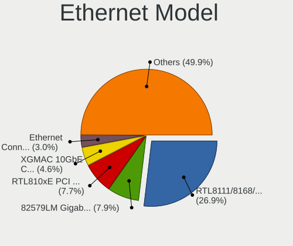

| Model                                                                  | Notebooks | Percent |
|------------------------------------------------------------------------|-----------|---------|
| Realtek RTL8111/8168/8211/8411 PCI Express Gigabit Ethernet Controller | 997       | 26.88%  |
| Intel 82579LM Gigabit Network Connection (Lewisville)                  | 292       | 7.87%   |
| Realtek RTL810xE PCI Express Fast Ethernet controller                  | 284       | 7.66%   |
| AMD XGMAC 10GbE Controller                                             | 172       | 4.64%   |
| Intel Ethernet Connection (4) I219-LM                                  | 113       | 3.05%   |
| Intel I210 Gigabit Network Connection                                  | 106       | 2.86%   |
| Intel Ethernet Connection I219-LM                                      | 105       | 2.83%   |
| Intel Ethernet Connection (3) I218-LM                                  | 79        | 2.13%   |
| Intel Ethernet Connection I218-LM                                      | 68        | 1.83%   |
| Intel 82577LM Gigabit Network Connection                               | 67        | 1.81%   |
| Intel I211 Gigabit Network Connection                                  | 61        | 1.64%   |
| Intel Ethernet Connection (4) I219-V                                   | 58        | 1.56%   |
| Intel Ethernet Connection I217-LM                                      | 56        | 1.51%   |
| Intel 82567LM Gigabit Network Connection                               | 51        | 1.38%   |
| Intel Ethernet Controller I225-V                                       | 45        | 1.21%   |
| Intel Ethernet Connection (2) I219-LM                                  | 35        | 0.94%   |
| Broadcom NetXtreme BCM57765 Gigabit Ethernet PCIe                      | 32        | 0.86%   |
| Qualcomm Atheros AR8152 v2.0 Fast Ethernet                             | 28        | 0.75%   |
| Nvidia MCP79 Ethernet                                                  | 28        | 0.75%   |
| Intel Ethernet Controller I226-V                                       | 28        | 0.75%   |
| Intel Ethernet Connection (6) I219-LM                                  | 28        | 0.75%   |
| Qualcomm Atheros AR8151 v2.0 Gigabit Ethernet                          | 27        | 0.73%   |
| Intel Ethernet Connection I219-V                                       | 27        | 0.73%   |
| Intel 82574L Gigabit Network Connection                                | 27        | 0.73%   |
| Samsung Galaxy series, misc. (tethering mode)                          | 25        | 0.67%   |
| Intel 82566MM Gigabit Network Connection                               | 25        | 0.67%   |
| Intel Ethernet Connection (6) I219-V                                   | 24        | 0.65%   |
| Realtek USB 2.5GbE Controller                                          | 21        | 0.57%   |
| Qualcomm Atheros AR8132 Fast Ethernet                                  | 21        | 0.57%   |
| Intel Ethernet Connection (7) I219-LM                                  | 21        | 0.57%   |
| Broadcom NetXtreme BCM5764M Gigabit Ethernet PCIe                      | 21        | 0.57%   |
| Marvell Group 88E8040 PCI-E Fast Ethernet Controller                   | 20        | 0.54%   |
| Xiaomi Mi/Redmi series (RNDIS)                                         | 19        | 0.51%   |
| Marvell Group 88E8058 PCI-E Gigabit Ethernet Controller                | 18        | 0.49%   |
| Intel Ethernet Connection (3) I218-V                                   | 18        | 0.49%   |
| Samsung GT-I9070 (network tethering, USB debugging enabled)            | 15        | 0.4%    |
| Realtek RTL-8100/8101L/8139 PCI Fast Ethernet Adapter                  | 15        | 0.4%    |
| Qualcomm Atheros AR8162 Fast Ethernet                                  | 15        | 0.4%    |
| Broadcom NetLink BCM57780 Gigabit Ethernet PCIe                        | 15        | 0.4%    |
| Qualcomm Atheros AR8131 Gigabit Ethernet                               | 14        | 0.38%   |

Net Controller Kind
-------------------

Ethernet, WiFi or modem

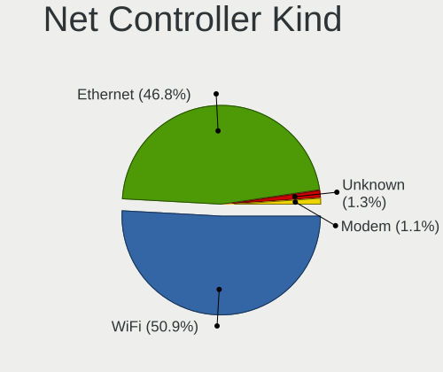

| Kind     | Notebooks | Percent |
|----------|-----------|---------|
| WiFi     | 3667      | 50.86%  |
| Ethernet | 3374      | 46.8%   |
| Unknown  | 91        | 1.26%   |
| Modem    | 78        | 1.08%   |

Used Controller
---------------

Currently used network controller

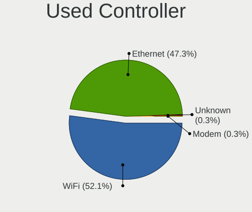

| Kind     | Notebooks | Percent |
|----------|-----------|---------|
| WiFi     | 2384      | 52.11%  |
| Ethernet | 2164      | 47.3%   |
| Unknown  | 14        | 0.31%   |
| Modem    | 13        | 0.28%   |

NICs
----

Total network controllers on board

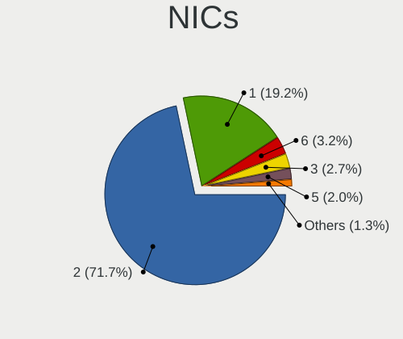

| Total | Notebooks | Percent |
|-------|-----------|---------|
| 2     | 2892      | 71.69%  |
| 1     | 774       | 19.19%  |
| 6     | 129       | 3.2%    |
| 3     | 107       | 2.65%   |
| 5     | 80        | 1.98%   |
| 0     | 28        | 0.69%   |
| 8     | 9         | 0.22%   |
| 9     | 6         | 0.15%   |
| 4     | 6         | 0.15%   |
| 7     | 2         | 0.05%   |
| 10    | 1         | 0.02%   |

IPv6
----

IPv6 vs IPv4

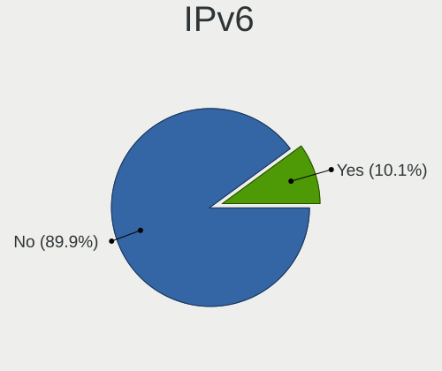

| Used | Notebooks | Percent |
|------|-----------|---------|
| No   | 3685      | 89.94%  |
| Yes  | 412       | 10.06%  |

Bluetooth
---------

Bluetooth Vendor
----------------

Controller vendors

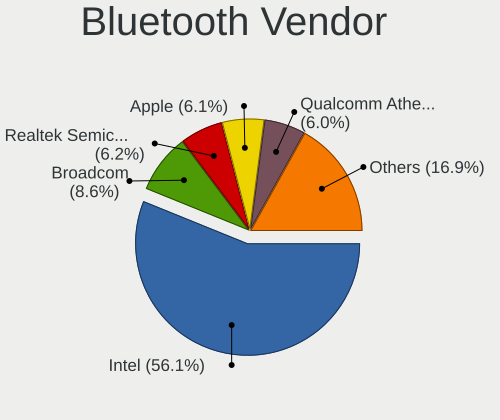

| Vendor                          | Notebooks | Percent |
|---------------------------------|-----------|---------|
| Intel                           | 1552      | 56.13%  |
| Broadcom                        | 238       | 8.61%   |
| Realtek Semiconductor           | 172       | 6.22%   |
| Apple                           | 169       | 6.11%   |
| Qualcomm Atheros Communications | 166       | 6%      |
| IMC Networks                    | 97        | 3.51%   |
| Foxconn / Hon Hai               | 86        | 3.11%   |
| Lite-On Technology              | 75        | 2.71%   |
| Dell                            | 45        | 1.63%   |
| Hewlett-Packard                 | 38        | 1.37%   |
| Cambridge Silicon Radio         | 22        | 0.8%    |
| Alps Electric                   | 20        | 0.72%   |
| ASUSTek Computer                | 18        | 0.65%   |
| Ralink                          | 13        | 0.47%   |
| MediaTek                        | 10        | 0.36%   |
| USI                             | 8         | 0.29%   |
| Skylight Digital                | 8         | 0.29%   |
| Toshiba                         | 6         | 0.22%   |
| TP-Link                         | 5         | 0.18%   |
| Askey Computer                  | 3         | 0.11%   |
| Taiyo Yuden                     | 2         | 0.07%   |
| Shenzhen Goodix Technology      | 2         | 0.07%   |
| Fujitsu                         | 2         | 0.07%   |
| Creative Technology             | 2         | 0.07%   |
| Chicony Electronics             | 2         | 0.07%   |
| Realtek                         | 1         | 0.04%   |
| Ralink Technology               | 1         | 0.04%   |
| Opticis                         | 1         | 0.04%   |
| Esel International              | 1         | 0.04%   |

Bluetooth Model
---------------

Controller models

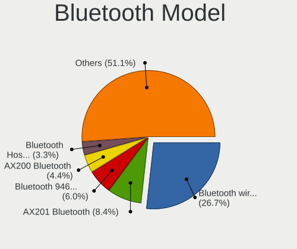

| Model                                                       | Notebooks | Percent |
|-------------------------------------------------------------|-----------|---------|
| Intel Bluetooth wireless interface                          | 742       | 26.74%  |
| Intel AX201 Bluetooth                                       | 233       | 8.4%    |
| Intel Bluetooth 9460/9560 Jefferson Peak (JfP)              | 167       | 6.02%   |
| Intel AX200 Bluetooth                                       | 123       | 4.43%   |
| Apple Bluetooth Host Controller                             | 91        | 3.28%   |
| Broadcom BCM20702 Bluetooth 4.0 [ThinkPad]                  | 82        | 2.95%   |
| Intel AX210 Bluetooth                                       | 81        | 2.92%   |
| Broadcom BCM2045B (BDC-2.1)                                 | 67        | 2.41%   |
| Intel AX211 Bluetooth                                       | 66        | 2.38%   |
| Realtek Bluetooth Adapter                                   | 61        | 2.2%    |
| Intel Centrino Bluetooth Wireless Transceiver               | 48        | 1.73%   |
| Intel Wireless-AC 9260 Bluetooth Adapter                    | 42        | 1.51%   |
| Apple Broadcom Built-in Bluetooth                           | 42        | 1.51%   |
| Intel Wireless-AC 3168 Bluetooth                            | 36        | 1.3%    |
| Qualcomm Atheros AR3012 Bluetooth 4.0                       | 35        | 1.26%   |
| Qualcomm Atheros QCA9377 Bluetooth 4.1                      | 31        | 1.12%   |
| Realtek  Bluetooth 4.2 Adapter                              | 26        | 0.94%   |
| Qualcomm Atheros AR9462 Bluetooth                           | 26        | 0.94%   |
| Foxconn / Hon Hai Bluetooth USB Module                      | 25        | 0.9%    |
| Cambridge Silicon Radio Bluetooth Dongle (HCI mode)         | 22        | 0.79%   |
| IMC Networks Realtek Bluetooth Adapter                      | 21        | 0.76%   |
| Lite-On Atheros AR3012 Bluetooth                            | 20        | 0.72%   |
| Apple Built-in Bluetooth 2.0+EDR HCI                        | 20        | 0.72%   |
| Realtek Bluetooth 4.2 Adapter                               | 19        | 0.68%   |
| Realtek Bluetooth 4.0 Adapter                               | 19        | 0.68%   |
| Dell DW375 Bluetooth Module                                 | 19        | 0.68%   |
| Broadcom BCM2045B (BDC-2) [Bluetooth Controller]            | 19        | 0.68%   |
| HP Bluetooth 2.0 Interface [Broadcom BCM2045]               | 17        | 0.61%   |
| Broadcom BCM2045B (BDC-2.1) [Bluetooth Controller]          | 17        | 0.61%   |
| Lite-On Qualcomm Atheros QCA9377 Bluetooth                  | 16        | 0.58%   |
| Foxconn / Hon Hai MediaTek Bluetooth Adapter                | 16        | 0.58%   |
| Apple Built-in iSight (no firmware loaded)                  | 16        | 0.58%   |
| Qualcomm Atheros QCA61x4 Bluetooth 4.0                      | 15        | 0.54%   |
| Intel Centrino Advanced-N 6230 Bluetooth adapter            | 15        | 0.54%   |
| IMC Networks Qualcomm Atheros Bluetooth 4.0 + HS            | 15        | 0.54%   |
| Dell Dell Wireless 380 Bluetooth 4.0 Module                 | 15        | 0.54%   |
| HP Broadcom 2070 Bluetooth Combo                            | 14        | 0.5%    |
| Ralink RT3290 Bluetooth                                     | 13        | 0.47%   |
| Alps Electric UGTZ4 Bluetooth                               | 13        | 0.47%   |
| Qualcomm Atheros Dell Wireless 1707 Bluetooth 4.0 LE Device | 12        | 0.43%   |

Sound
-----

Sound Vendor
------------

Sound card vendors

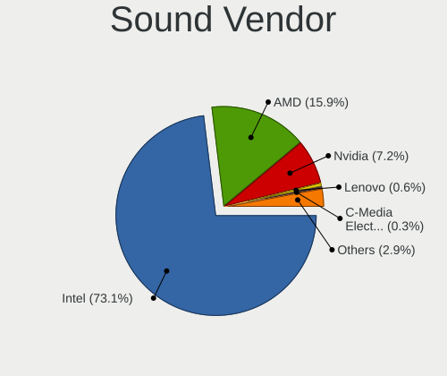

| Vendor                                       | Notebooks | Percent |
|----------------------------------------------|-----------|---------|
| Intel                                        | 3236      | 73.08%  |
| AMD                                          | 702       | 15.85%  |
| Nvidia                                       | 320       | 7.23%   |
| Lenovo                                       | 25        | 0.56%   |
| C-Media Electronics                          | 15        | 0.34%   |
| Realtek Semiconductor                        | 14        | 0.32%   |
| Texas Instruments                            | 11        | 0.25%   |
| GN Netcom                                    | 11        | 0.25%   |
| Logitech                                     | 10        | 0.23%   |
| Silicon Integrated Systems [SiS]             | 9         | 0.2%    |
| Zoran Co. Personal Media Division (Nogatech) | 8         | 0.18%   |
| ASUSTek Computer                             | 6         | 0.14%   |
| SteelSeries ApS                              | 5         | 0.11%   |
| Plantronics                                  | 5         | 0.11%   |
| Kingston Technology                          | 4         | 0.09%   |
| Creative Technology                          | 4         | 0.09%   |
| JMTek                                        | 3         | 0.07%   |
| Generalplus Technology                       | 3         | 0.07%   |
| Cambridge Silicon Radio                      | 3         | 0.07%   |
| VIA Technologies                             | 2         | 0.05%   |
| RODE Microphones                             | 2         | 0.05%   |
| Microsoft                                    | 2         | 0.05%   |
| Hewlett-Packard                              | 2         | 0.05%   |
| Focusrite-Novation                           | 2         | 0.05%   |
| ESS Technology                               | 2         | 0.05%   |
| DSEA A/S                                     | 2         | 0.05%   |
| CMX Systems                                  | 2         | 0.05%   |
| Unknown                                      | 2         | 0.05%   |
| XMOS                                         | 1         | 0.02%   |
| ULi Electronics                              | 1         | 0.02%   |
| Trust                                        | 1         | 0.02%   |
| Thesycon Systemsoftware & Consulting         | 1         | 0.02%   |
| Sony                                         | 1         | 0.02%   |
| PS Audio                                     | 1         | 0.02%   |
| Phison Electronics                           | 1         | 0.02%   |
| No brand                                     | 1         | 0.02%   |
| M-Audio                                      | 1         | 0.02%   |
| Elitegroup Computer Systems (ECS)            | 1         | 0.02%   |
| Corsair                                      | 1         | 0.02%   |
| Conexant Systems                             | 1         | 0.02%   |

Sound Model
-----------

Sound card models

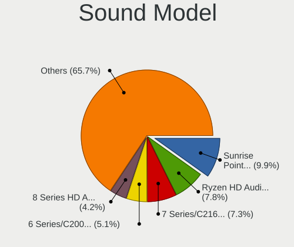

| Model                                                                                             | Notebooks | Percent |
|---------------------------------------------------------------------------------------------------|-----------|---------|
| Intel Sunrise Point-LP HD Audio                                                                   | 533       | 9.86%   |
| AMD Ryzen HD Audio Controller                                                                     | 423       | 7.82%   |
| Intel 7 Series/C216 Chipset Family High Definition Audio Controller                               | 394       | 7.29%   |
| Intel 6 Series/C200 Series Chipset Family High Definition Audio Controller                        | 278       | 5.14%   |
| Intel 8 Series HD Audio Controller                                                                | 229       | 4.23%   |
| Intel Haswell-ULT HD Audio Controller                                                             | 228       | 4.22%   |
| Intel Broadwell-U Audio Controller                                                                | 210       | 3.88%   |
| Intel Wildcat Point-LP High Definition Audio Controller                                           | 202       | 3.74%   |
| AMD Renoir/Cezanne HDMI/DP Audio Controller                                                       | 166       | 3.07%   |
| Intel 5 Series/3400 Series Chipset High Definition Audio                                          | 159       | 2.94%   |
| Intel 82801I (ICH9 Family) HD Audio Controller                                                    | 145       | 2.68%   |
| Intel Tiger Lake-LP Smart Sound Technology Audio Controller                                       | 127       | 2.35%   |
| Intel NM10/ICH7 Family High Definition Audio Controller                                           | 121       | 2.24%   |
| Intel Cannon Point-LP High Definition Audio Controller                                            | 108       | 2%      |
| Intel 8 Series/C220 Series Chipset High Definition Audio Controller                               | 101       | 1.87%   |
| Intel Comet Lake PCH-LP cAVS                                                                      | 99        | 1.83%   |
| Intel 82801H (ICH8 Family) HD Audio Controller                                                    | 97        | 1.79%   |
| AMD Raven/Raven2/Fenghuang HDMI/DP Audio Controller                                               | 96        | 1.78%   |
| Intel Cannon Lake PCH cAVS                                                                        | 90        | 1.66%   |
| Intel Xeon E3-1200 v3/4th Gen Core Processor HD Audio Controller                                  | 81        | 1.5%    |
| AMD FCH Azalia Controller                                                                         | 78        | 1.44%   |
| Intel 100 Series/C230 Series Chipset Family HD Audio Controller                                   | 59        | 1.09%   |
| Nvidia TU107 GeForce GTX 1650 High Definition Audio Controller                                    | 58        | 1.07%   |
| Intel Alder Lake PCH-P High Definition Audio Controller                                           | 57        | 1.05%   |
| AMD Radeon High Definition Audio Controller                                                       | 57        | 1.05%   |
| AMD Family 17h (Models 00h-0fh) HD Audio Controller                                               | 56        | 1.04%   |
| Intel Atom/Celeron/Pentium Processor x5-E8000/J3xxx/N3xxx Series High Definition Audio Controller | 54        | 1%      |
| AMD Kabini HDMI/DP Audio                                                                          | 47        | 0.87%   |
| Intel Comet Lake PCH cAVS                                                                         | 45        | 0.83%   |
| Intel Raptor Lake-P/U/H cAVS                                                                      | 42        | 0.78%   |
| Intel Atom Processor Z36xxx/Z37xxx Series High Definition Audio Controller                        | 42        | 0.78%   |
| Intel CM238 HD Audio Controller                                                                   | 41        | 0.76%   |
| Intel Celeron/Pentium Silver Processor High Definition Audio                                      | 41        | 0.76%   |
| AMD SBx00 Azalia (Intel HDA)                                                                      | 37        | 0.68%   |
| Nvidia MCP79 High Definition Audio                                                                | 31        | 0.57%   |
| AMD Family 15h (Models 60h-6fh) Audio Controller                                                  | 29        | 0.54%   |
| Intel Celeron N3350/Pentium N4200/Atom E3900 Series Audio Cluster                                 | 24        | 0.44%   |
| AMD Wrestler HDMI Audio                                                                           | 24        | 0.44%   |
| Nvidia GT216 HDMI Audio Controller                                                                | 23        | 0.43%   |
| Intel Tiger Lake-H HD Audio Controller                                                            | 23        | 0.43%   |

Memory
------

Memory Vendor
-------------

Memory module vendors

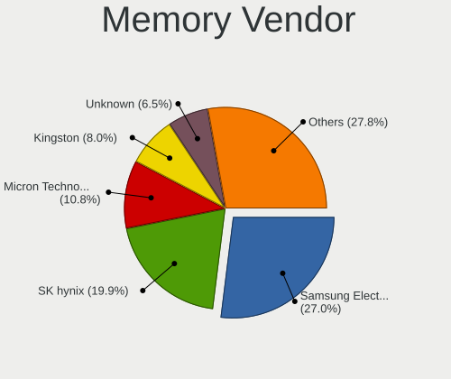

| Vendor              | Notebooks | Percent |
|---------------------|-----------|---------|
| Samsung Electronics | 1186      | 26.97%  |
| SK hynix            | 874       | 19.87%  |
| Micron Technology   | 477       | 10.85%  |
| Kingston            | 351       | 7.98%   |
| Unknown             | 286       | 6.5%    |
| Crucial             | 209       | 4.75%   |
| Transcend           | 187       | 4.25%   |
| Unknown             | 127       | 2.89%   |
| Elpida              | 105       | 2.39%   |
| Ramaxel Technology  | 98        | 2.23%   |
| A-DATA Technology   | 78        | 1.77%   |
| Nanya Technology    | 55        | 1.25%   |
| Corsair             | 46        | 1.05%   |
| Smart               | 39        | 0.89%   |
| G.Skill             | 35        | 0.8%    |
| Team                | 23        | 0.52%   |
| Unknown (ABCD)      | 18        | 0.41%   |
| Apacer              | 13        | 0.3%    |
| 48spaces            | 12        | 0.27%   |
| PNY                 | 11        | 0.25%   |
| Teikon              | 10        | 0.23%   |
| Patriot             | 8         | 0.18%   |
| GOODRAM             | 8         | 0.18%   |
| Avant               | 8         | 0.18%   |
| ASint Technology    | 8         | 0.18%   |
| Smart Brazil        | 6         | 0.14%   |
| Neo Forza           | 6         | 0.14%   |
| High Bridge         | 6         | 0.14%   |
| Goldkey             | 6         | 0.14%   |
| Timetec             | 5         | 0.11%   |
| Silicon Power       | 4         | 0.09%   |
| SHARETRONIC         | 4         | 0.09%   |
| Magnum Tech         | 4         | 0.09%   |
| AMD                 | 4         | 0.09%   |
| V-GeN               | 3         | 0.07%   |
| Qimonda             | 3         | 0.07%   |
| PUSKILL             | 3         | 0.07%   |
| GSkill              | 3         | 0.07%   |
| CSX                 | 3         | 0.07%   |
| Unifosa             | 2         | 0.05%   |

Memory Model
------------

Memory module models

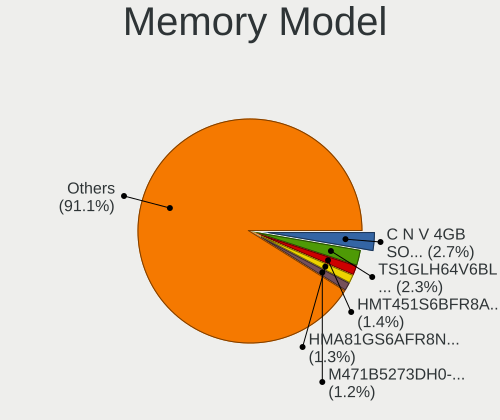

| Model                                                            | Notebooks | Percent |
|------------------------------------------------------------------|-----------|---------|
| Unknown                                                          | 127       | 2.71%   |
| Transcend RAM TS1GLH64V6BL 8GB SODIMM DDR4 2667MT/s              | 107       | 2.29%   |
| SK hynix RAM HMT451S6BFR8A-PB 4GB SODIMM DDR3 1600MT/s           | 66        | 1.41%   |
| SK hynix RAM HMA81GS6AFR8N-UH 8GB SODIMM DDR4 2400MT/s           | 59        | 1.26%   |
| Samsung RAM M471B5273DH0-CH9 4GB SODIMM DDR3 1334MT/s            | 57        | 1.22%   |
| SK hynix RAM HMT41GS6BFR8A-PB 8GB SODIMM DDR3 1600MT/s           | 56        | 1.2%    |
| Samsung RAM M471B5173QH0-YK0 4GB SODIMM DDR3 1600MT/s            | 56        | 1.2%    |
| SK hynix RAM HMT351S6CFR8C-PB 4GB SODIMM DDR3 1600MT/s           | 55        | 1.18%   |
| Samsung RAM M471B5173DB0-YK0 4GB SODIMM DDR3 1600MT/s            | 49        | 1.05%   |
| Samsung RAM M471B1G73QH0-YK0 8GB SODIMM DDR3 1867MT/s            | 46        | 0.98%   |
| Unknown RAM Module 2GB SODIMM DDR2 667MT/s                       | 44        | 0.94%   |
| Samsung RAM M471B5273CH0-CH9 4GB SODIMM DDR3 1334MT/s            | 38        | 0.81%   |
| Samsung RAM M471B1G73EB0-YK0 8GB SODIMM DDR3 1600MT/s            | 37        | 0.79%   |
| Samsung RAM M471A1K43CB1-CRC 8GB SODIMM DDR4 2667MT/s            | 33        | 0.71%   |
| Samsung RAM M471B5273DH0-CK0 8GB SODIMM DDR3 1600MT/s            | 31        | 0.66%   |
| Samsung RAM M471A1K43CB1-CTD 8GB SODIMM DDR4 3200MT/s            | 30        | 0.64%   |
| Samsung RAM M471B1G73DB0-YK0 8GB SODIMM DDR3 1600MT/s            | 29        | 0.62%   |
| Samsung RAM M471A5244CB0-CTD 4GB SODIMM DDR4 3200MT/s            | 29        | 0.62%   |
| Samsung RAM M471A1K43BB1-CRC 8GB SODIMM DDR4 2400MT/s            | 29        | 0.62%   |
| SK hynix RAM HMA81GS6CJR8N-VK 8GB SODIMM DDR4 2667MT/s           | 26        | 0.56%   |
| Samsung RAM M471B5173EB0-YK0 4GB SODIMM DDR3 1600MT/s            | 26        | 0.56%   |
| Samsung RAM M471A5244CB0-CRC 4GB SODIMM DDR4 2400MT/s            | 26        | 0.56%   |
| Samsung RAM M471A1G44AB0-CWE 8GB SODIMM DDR4 3200MT/s            | 26        | 0.56%   |
| Micron RAM 8KTF51264HZ-1G6E1 4GB SODIMM DDR3 1600MT/s            | 25        | 0.53%   |
| Samsung RAM M471A1G44BB0-CWE 8GB SODIMM DDR4 3200MT/s            | 24        | 0.51%   |
| SK hynix RAM HMT451S6AFR8A-PB 4GB SODIMM DDR3 1600MT/s           | 22        | 0.47%   |
| Samsung RAM M471A1K43DB1-CTD 8GB SODIMM DDR4 2667MT/s            | 22        | 0.47%   |
| Crucial RAM CT102464BF160B.M16 8GB SODIMM DDR3 1600MT/s          | 22        | 0.47%   |
| Unknown RAM Module 8GB SODIMM DDR3 1600MT/s                      | 20        | 0.43%   |
| SK hynix RAM HMAA1GS6CJR6N-XN 8GB SODIMM DDR4 3200MT/s           | 20        | 0.43%   |
| Samsung RAM M471B5773CHS-CH9 2GB SODIMM DDR3 1333MT/s            | 20        | 0.43%   |
| Samsung RAM M471A5244CB0-CWE 4GB SODIMM DDR4 3200MT/s            | 20        | 0.43%   |
| Unknown RAM Module 2GB SODIMM DDR2                               | 19        | 0.41%   |
| Unknown RAM Module 1GB SODIMM DDR2 667MT/s                       | 19        | 0.41%   |
| Micron RAM 4ATF1G64HZ-3G2E1 8GB SODIMM DDR4 3200MT/s             | 19        | 0.41%   |
| Micron RAM 16KTF1G64HZ-1G6E1 8GB SODIMM DDR3 1600MT/s            | 19        | 0.41%   |
| Transcend RAM TS512MLH64V6HL 4GB SODIMM DDR4 2667MT/s            | 18        | 0.38%   |
| SK hynix RAM HMA851S6AFR6N-UH 4GB SODIMM DDR4 2400MT/s           | 18        | 0.38%   |
| Samsung RAM M471A1K43EB1-CWE 8GB SODIMM DDR4 3200MT/s            | 18        | 0.38%   |
| Unknown (ABCD) RAM 123456789012345678 1GB SODIMM LPDDR4 2400MT/s | 17        | 0.36%   |

Memory Kind
-----------

Memory module kinds

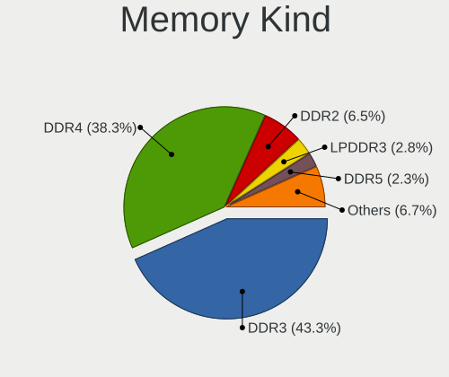

| Kind    | Notebooks | Percent |
|---------|-----------|---------|
| DDR3    | 1597      | 43.35%  |
| DDR4    | 1411      | 38.3%   |
| DDR2    | 240       | 6.51%   |
| LPDDR3  | 104       | 2.82%   |
| DDR5    | 86        | 2.33%   |
| LPDDR4  | 78        | 2.12%   |
| LPDDR5  | 54        | 1.47%   |
| Unknown | 40        | 1.09%   |
| DDR     | 37        | 1%      |
| SDRAM   | 25        | 0.68%   |
| DRAM    | 9         | 0.24%   |
| RAM     | 2         | 0.05%   |
| SRAM    | 1         | 0.03%   |

Memory Form Factor
------------------

Physical design of the memory module

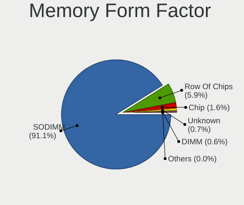

| Name            | Notebooks | Percent |
|-----------------|-----------|---------|
| SODIMM          | 3378      | 91.1%   |
| Row Of Chips    | 219       | 5.91%   |
| Chip            | 61        | 1.65%   |
| Unknown         | 27        | 0.73%   |
| DIMM            | 22        | 0.59%   |
| Proprietary Car | 1         | 0.03%   |

Memory Size
-----------

Memory module size

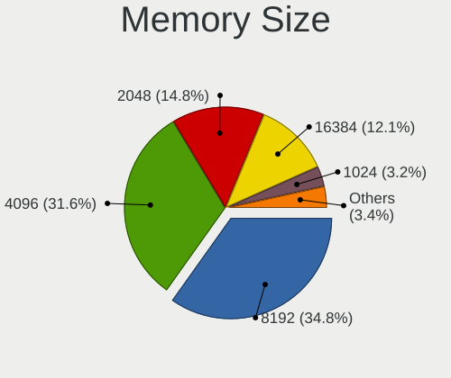

| Size  | Notebooks | Percent |
|-------|-----------|---------|
| 8192  | 1426      | 34.83%  |
| 4096  | 1292      | 31.56%  |
| 2048  | 606       | 14.8%   |
| 16384 | 496       | 12.12%  |
| 1024  | 133       | 3.25%   |
| 32768 | 104       | 2.54%   |
| 512   | 20        | 0.49%   |
| 256   | 6         | 0.15%   |
| 49152 | 3         | 0.07%   |
| 3072  | 2         | 0.05%   |
| 128   | 2         | 0.05%   |
| 65536 | 1         | 0.02%   |
| 12288 | 1         | 0.02%   |
| 6144  | 1         | 0.02%   |
| 2560  | 1         | 0.02%   |

Memory Speed
------------

Memory module speed

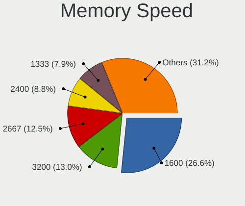

| Speed   | Notebooks | Percent |
|---------|-----------|---------|
| 1600    | 1065      | 26.59%  |
| 3200    | 522       | 13.03%  |
| 2667    | 502       | 12.53%  |
| 2400    | 351       | 8.76%   |
| 1333    | 317       | 7.91%   |
| 2133    | 219       | 5.47%   |
| 1334    | 190       | 4.74%   |
| 667     | 151       | 3.77%   |
| Unknown | 100       | 2.5%    |
| 1867    | 97        | 2.42%   |
| 1067    | 97        | 2.42%   |
| 800     | 84        | 2.1%    |
| 5600    | 50        | 1.25%   |
| 6400    | 40        | 1%      |
| 4800    | 36        | 0.9%    |
| 4267    | 34        | 0.85%   |
| 1066    | 32        | 0.8%    |
| 533     | 28        | 0.7%    |
| 975     | 21        | 0.52%   |
| 4266    | 11        | 0.27%   |
| 3733    | 10        | 0.25%   |
| 4000    | 6         | 0.15%   |
| 2048    | 6         | 0.15%   |
| 1866    | 5         | 0.12%   |
| 1200    | 5         | 0.12%   |
| 333     | 4         | 0.1%    |
| 2933    | 3         | 0.07%   |
| 1639    | 3         | 0.07%   |
| 8533    | 2         | 0.05%   |
| 7500    | 2         | 0.05%   |
| 400     | 2         | 0.05%   |
| 266     | 2         | 0.05%   |
| 166     | 2         | 0.05%   |
| 7467    | 1         | 0.02%   |
| 5200    | 1         | 0.02%   |
| 2800    | 1         | 0.02%   |
| 1596    | 1         | 0.02%   |
| 666     | 1         | 0.02%   |
| 200     | 1         | 0.02%   |
| 100     | 1         | 0.02%   |

Printers & scanners
-------------------

Printer Vendor
--------------

Printer device vendors

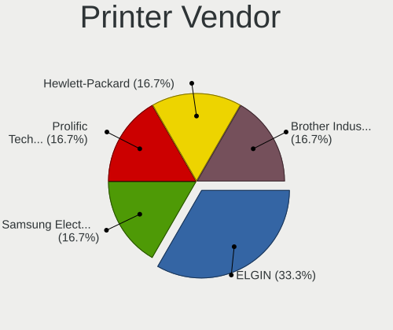

| Vendor              | Notebooks | Percent |
|---------------------|-----------|---------|
| ELGIN               | 2         | 33.33%  |
| Samsung Electronics | 1         | 16.67%  |
| Prolific Technology | 1         | 16.67%  |
| Hewlett-Packard     | 1         | 16.67%  |
| Brother Industries  | 1         | 16.67%  |

Printer Model
-------------

Printer device models

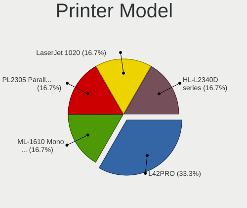

| Model                              | Notebooks | Percent |
|------------------------------------|-----------|---------|
| ELGIN L42PRO                       | 2         | 33.33%  |
| Samsung ML-1610 Mono Laser Printer | 1         | 16.67%  |
| Prolific PL2305 Parallel Port      | 1         | 16.67%  |
| HP LaserJet 1020                   | 1         | 16.67%  |
| Brother HL-L2340D series           | 1         | 16.67%  |

Scanner Vendor
--------------

Scanner device vendors

| Vendor | Notebooks | Percent |
|--------|-----------|---------|
| Canon  | 1         | 100%    |

Scanner Model
-------------

Scanner device models

| Model                   | Notebooks | Percent |
|-------------------------|-----------|---------|
| Canon CanoScan LiDE 120 | 1         | 100%    |

Camera
------

Camera Vendor
-------------

Camera device vendors

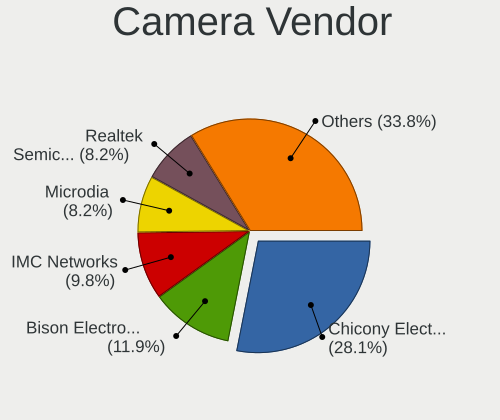

| Vendor                                 | Notebooks | Percent |
|----------------------------------------|-----------|---------|
| Chicony Electronics                    | 783       | 28.09%  |
| Bison Electronics                      | 333       | 11.95%  |
| IMC Networks                           | 272       | 9.76%   |
| Microdia                               | 229       | 8.22%   |
| Realtek Semiconductor                  | 228       | 8.18%   |
| Sunplus Innovation Technology          | 166       | 5.96%   |
| Lite-On Technology                     | 94        | 3.37%   |
| Suyin                                  | 83        | 2.98%   |
| Quanta                                 | 76        | 2.73%   |
| Cheng Uei Precision Industry (Foxlink) | 67        | 2.4%    |
| Syntek                                 | 64        | 2.3%    |
| Luxvisions Innotech Limited            | 60        | 2.15%   |
| Apple                                  | 54        | 1.94%   |
| Silicon Motion                         | 38        | 1.36%   |
| Lenovo                                 | 32        | 1.15%   |
| Alcor Micro                            | 30        | 1.08%   |
| Ricoh                                  | 19        | 0.68%   |
| ALi                                    | 19        | 0.68%   |
| Z-Star Microelectronics                | 18        | 0.65%   |
| Shenzhen Kingcome Optoelectronic       | 14        | 0.5%    |
| Logitech                               | 14        | 0.5%    |
| Importek                               | 12        | 0.43%   |
| Supreme Electronics                    | 11        | 0.39%   |
| Jiangxi Shinetech Optical              | 9         | 0.32%   |
| Framework                              | 7         | 0.25%   |
| Primax Electronics                     | 5         | 0.18%   |
| Unknown (3730304233343731345430)       | 4         | 0.14%   |
| OmniVision Technologies                | 4         | 0.14%   |
| Intel                                  | 4         | 0.14%   |
| DigiTech                               | 4         | 0.14%   |
| Y Media                                | 3         | 0.11%   |
| USB Camera                             | 3         | 0.11%   |
| Tripath Technology                     | 3         | 0.11%   |
| Foxconn / Hon Hai                      | 3         | 0.11%   |
| Unknown                                | 2         | 0.07%   |
| Pixart Imaging                         | 2         | 0.07%   |
| Genesys Logic                          | 2         | 0.07%   |
| DX-240124-XH                           | 2         | 0.07%   |
| Dell                                   | 2         | 0.07%   |
| Cubeternet                             | 2         | 0.07%   |

Camera Model
------------

Camera device models

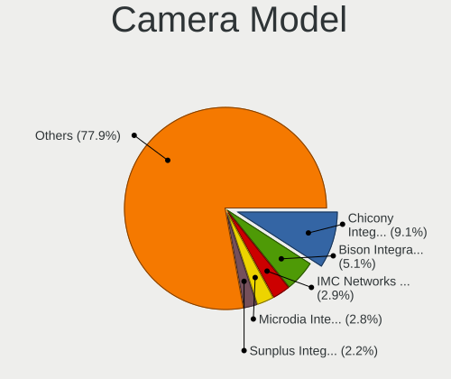

| Model                                         | Notebooks | Percent |
|-----------------------------------------------|-----------|---------|
| Chicony Integrated Camera                     | 257       | 9.14%   |
| Bison Integrated Camera                       | 143       | 5.08%   |
| IMC Networks Integrated Camera                | 82        | 2.92%   |
| Microdia Integrated_Webcam_HD                 | 79        | 2.81%   |
| Sunplus Integrated_Webcam_HD                  | 61        | 2.17%   |
| Lite-On Integrated Camera                     | 61        | 2.17%   |
| Chicony HD WebCam                             | 56        | 1.99%   |
| Microdia Integrated Webcam                    | 49        | 1.74%   |
| Realtek Integrated_Webcam_HD                  | 48        | 1.71%   |
| Chicony Lenovo Integrated Camera (0.3MP)      | 48        | 1.71%   |
| Bison SunplusIT Integrated Camera             | 40        | 1.42%   |
| IMC Networks Realtek PC Camera                | 38        | 1.35%   |
| IMC Networks EasyCamera                       | 36        | 1.28%   |
| Chicony Integrated Camera (1280x720@30)       | 33        | 1.17%   |
| Luxvisions Innotech Limited Integrated Camera | 32        | 1.14%   |
| Realtek USB 2.0 PC Camera                     | 31        | 1.1%    |
| Bison Lenovo EasyCamera                       | 31        | 1.1%    |
| Apple FaceTime HD Camera                      | 31        | 1.1%    |
| Bison ThinkPad Integrated Camera              | 28        | 1%      |
| Syntek Integrated Camera                      | 26        | 0.92%   |
| Chicony Integrated Camera [ThinkPad]          | 24        | 0.85%   |
| Realtek USB Camera                            | 23        | 0.82%   |
| Syntek Lenovo EasyCamera                      | 19        | 0.68%   |
| Chicony Integrated IR Camera                  | 19        | 0.68%   |
| Chicony HP HD Webcam [Fixed]                  | 19        | 0.68%   |
| Chicony Chicony USB2.0 Camera                 | 19        | 0.68%   |
| Quanta HP TrueVision HD Camera                | 18        | 0.64%   |
| Lenovo Integrated Webcam [R5U877]             | 18        | 0.64%   |
| Chicony FJ Camera                             | 18        | 0.64%   |
| Chicony Realtek DMFT RGB                      | 17        | 0.6%    |
| Chicony Lenovo EasyCamera                     | 17        | 0.6%    |
| Bison ThinkPad P50 Integrated Camera          | 17        | 0.6%    |
| Chicony USB2.0 VGA UVC WebCam                 | 16        | 0.57%   |
| Bison HD Webcam                               | 16        | 0.57%   |
| Syntek EasyCamera                             | 15        | 0.53%   |
| Sunplus Laptop_Integrated_Webcam_FHD          | 15        | 0.53%   |
| IMC Networks UVC VGA Webcam                   | 15        | 0.53%   |
| Bison Lenovo Integrated Webcam                | 15        | 0.53%   |
| Realtek Laptop Camera                         | 14        | 0.5%    |
| Microdia Laptop_Integrated_Webcam_HD          | 14        | 0.5%    |

Security
--------

Fingerprint Vendor
------------------

Fingerprint sensor vendors

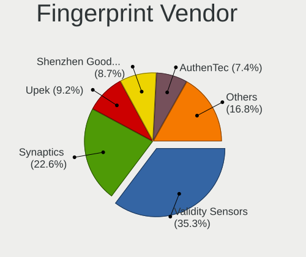

| Vendor                     | Notebooks | Percent |
|----------------------------|-----------|---------|
| Validity Sensors           | 287       | 35.26%  |
| Synaptics                  | 184       | 22.6%   |
| Upek                       | 75        | 9.21%   |
| Shenzhen Goodix Technology | 71        | 8.72%   |
| AuthenTec                  | 60        | 7.37%   |
| Elan Microelectronics      | 41        | 5.04%   |
| STMicroelectronics         | 34        | 4.18%   |
| Broadcom                   | 22        | 2.7%    |
| LighTuning Technology      | 18        | 2.21%   |
| FocalTech Systems          | 12        | 1.47%   |
| Fingerprint Cards          | 6         | 0.74%   |
| Samsung Electronics        | 3         | 0.37%   |
| Next Biometrics            | 1         | 0.12%   |

Fingerprint Model
-----------------

Fingerprint sensor models

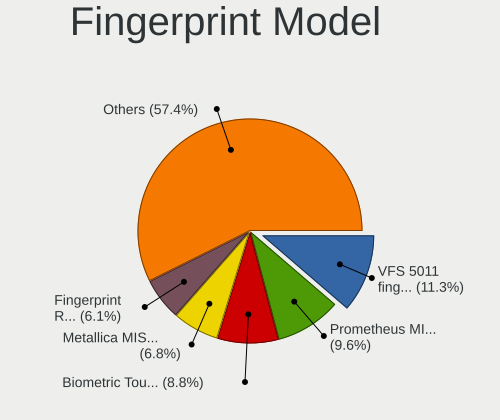

| Model                                                                        | Notebooks | Percent |
|------------------------------------------------------------------------------|-----------|---------|
| Validity Sensors VFS 5011 fingerprint sensor                                 | 92        | 11.3%   |
| Synaptics Prometheus MIS Touch Fingerprint Reader                            | 78        | 9.58%   |
| Upek Biometric Touchchip/Touchstrip Fingerprint Sensor                       | 72        | 8.85%   |
| Synaptics Metallica MIS Touch Fingerprint Reader                             | 55        | 6.76%   |
| Shenzhen Goodix Fingerprint Reader                                           | 50        | 6.14%   |
| Validity Sensors Synaptics WBDI                                              | 47        | 5.77%   |
| Validity Sensors VFS495 Fingerprint Reader                                   | 41        | 5.04%   |
| Elan Fingerprint Sensor                                                      | 37        | 4.55%   |
| STMicroelectronics Fingerprint Reader                                        | 34        | 4.18%   |
| Validity Sensors VFS7500 Touch Fingerprint Sensor                            | 27        | 3.32%   |
| Validity Sensors VFS5011 Fingerprint Reader                                  | 26        | 3.19%   |
| Broadcom BCM5880 Secure Applications Processor with fingerprint swipe sensor | 22        | 2.7%    |
| AuthenTec AES2810                                                            | 19        | 2.33%   |
| Synaptics Metallica MOH Touch Fingerprint Reader                             | 13        | 1.6%    |
| Synaptics FS7604 Touch Fingerprint Sensor with PurePrint                     | 13        | 1.6%    |
| Shenzhen Goodix  Fingerprint Device                                          | 13        | 1.6%    |
| AuthenTec AES2501 Fingerprint Sensor                                         | 13        | 1.6%    |
| Validity Sensors VFS491                                                      | 10        | 1.23%   |
| LighTuning EgisTec Touch Fingerprint Sensor                                  | 9         | 1.11%   |
| FocalTech Systems Fingerprint Reader                                         | 9         | 1.11%   |
| AuthenTec AES1660                                                            | 9         | 1.11%   |
| Shenzhen Goodix Fingerprint Reader SGX                                       | 8         | 0.98%   |
| LighTuning ES603 Swipe Fingerprint Sensor                                    | 8         | 0.98%   |
| Validity Sensors VFS451 Fingerprint Reader                                   | 7         | 0.86%   |
| Validity Sensors Swipe Fingerprint Sensor                                    | 7         | 0.86%   |
| Validity Sensors Fingerprint scanner                                         | 7         | 0.86%   |
| Synaptics WBDI Fingerprint Reader USB 086                                    | 7         | 0.86%   |
| AuthenTec AES1600                                                            | 7         | 0.86%   |
| Validity Sensors VFS471 Fingerprint Reader                                   | 6         | 0.74%   |
| Synaptics UWP WBDI Device                                                    | 6         | 0.74%   |
| Fingerprint Cards FPC Fingerprint Reader                                     | 6         | 0.74%   |
| Synaptics WBDI                                                               | 5         | 0.61%   |
| AuthenTec AES2660                                                            | 5         | 0.61%   |
| AuthenTec AES2550 Fingerprint Sensor                                         | 5         | 0.61%   |
| Validity Sensors VFS7552 Touch Fingerprint Sensor                            | 4         | 0.49%   |
| Validity Sensors VFS Fingerprint sensor                                      | 4         | 0.49%   |
| Validity Sensors Synaptics VFS7552 Touch Fingerprint Sensor with PurePrint   | 4         | 0.49%   |
| Elan WBF Fingerprint Sensor                                                  | 4         | 0.49%   |
| Validity Sensors VFS101 Fingerprint Reader                                   | 3         | 0.37%   |
| Upek TCS5B Fingerprint sensor                                                | 3         | 0.37%   |

Chipcard Vendor
---------------

Chipcard module vendors

Zero info for selected period =(

Chipcard Model
--------------

Chipcard module models

Zero info for selected period =(

Unsupported
-----------

Unsupported Devices
-------------------

Total unsupported devices on board

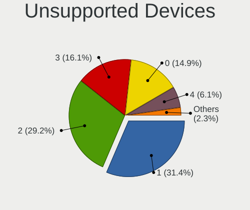

| Total | Notebooks | Percent |
|-------|-----------|---------|
| 1     | 1328      | 31.45%  |
| 2     | 1233      | 29.2%   |
| 3     | 680       | 16.1%   |
| 0     | 628       | 14.87%  |
| 4     | 256       | 6.06%   |
| 5     | 72        | 1.7%    |
| 6     | 18        | 0.43%   |
| 7     | 6         | 0.14%   |
| 9     | 1         | 0.02%   |
| 8     | 1         | 0.02%   |

Unsupported Device Types
------------------------

Types of unsupported devices

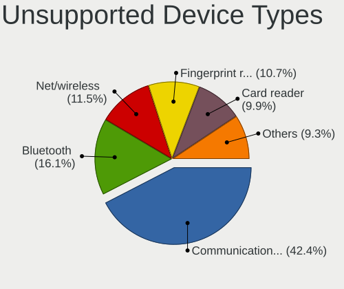

| Type                     | Notebooks | Percent |
|--------------------------|-----------|---------|
| Communication controller | 2767      | 42.43%  |
| Bluetooth                | 1049      | 16.08%  |
| Net/wireless             | 752       | 11.53%  |
| Fingerprint reader       | 701       | 10.75%  |
| Card reader              | 644       | 9.87%   |
| Firewire controller      | 235       | 3.6%    |
| Graphics card            | 98        | 1.5%    |
| Sound                    | 76        | 1.17%   |
| Network                  | 62        | 0.95%   |
| Storage                  | 59        | 0.9%    |
| Net/ethernet             | 34        | 0.52%   |
| Modem                    | 25        | 0.38%   |
| Storage/ata              | 10        | 0.15%   |
| Storage/raid             | 3         | 0.05%   |
| Dvb card                 | 3         | 0.05%   |
| Storage/nvme             | 2         | 0.03%   |
| Storage/ide              | 2         | 0.03%   |

