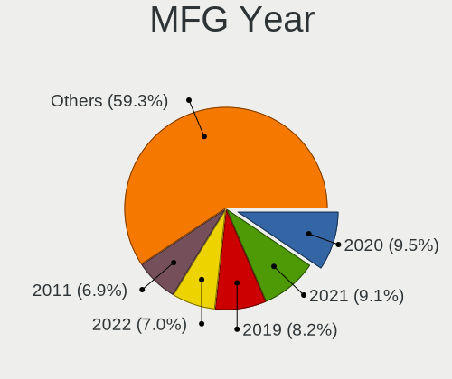
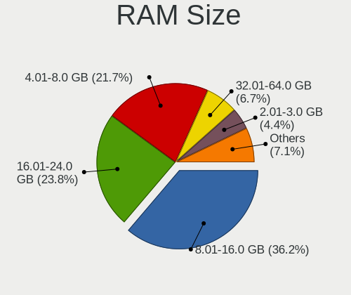
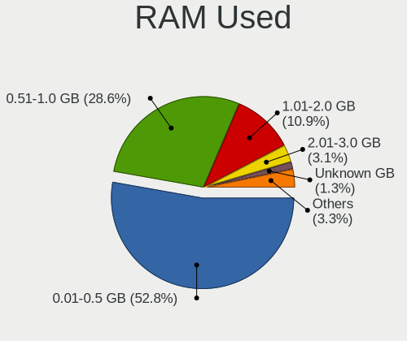
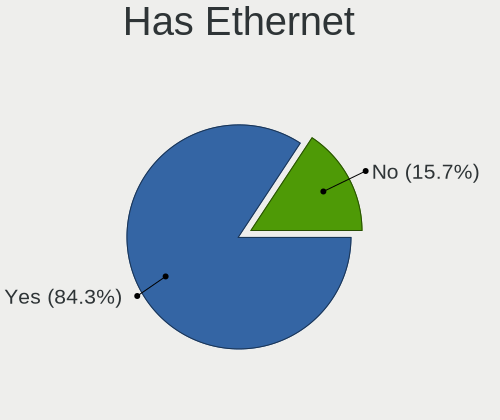
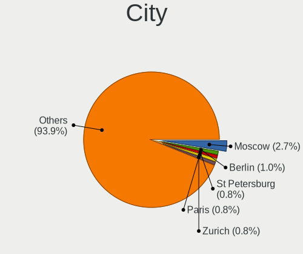
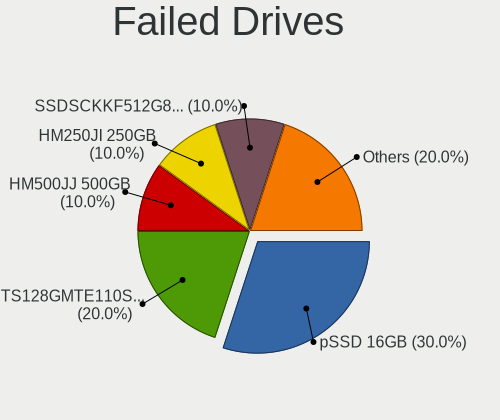
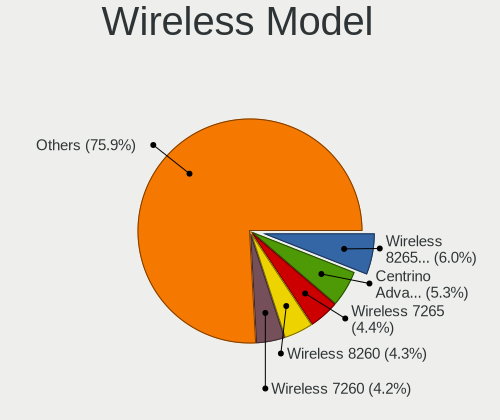
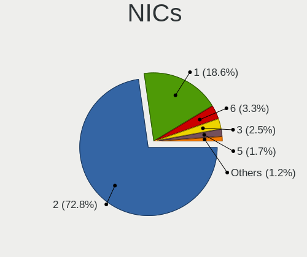
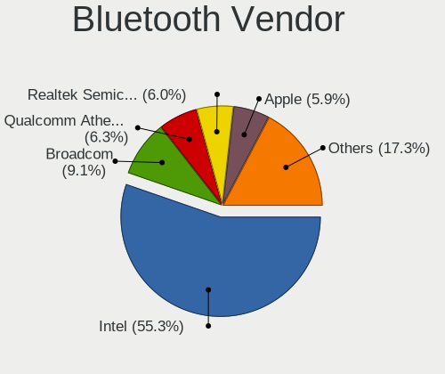
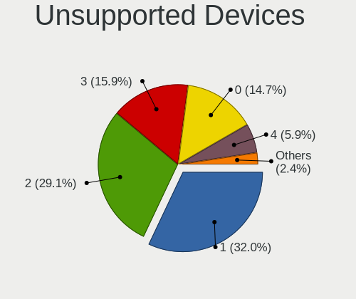

BSD - Tested Hardware & Statistics (Notebooks)
----------------------------------------------

A project to collect tested hardware configurations for BSD.

Anyone can contribute to this report by the [hw-probe](https://github.com/linuxhw/hw-probe/blob/master/INSTALL.BSD.md) tool:

    hw-probe -all -upload

Please contribute! Especially if your hardware is rare.

This report is for real hardware. Report for virtual hardware: [TestDays_VE](https://github.com/bsdhw/TestDays_VE)

Contents
--------

* [ Test Cases ](#test-cases)

* [ System ](#system)
  - [ OS                       ](#os)
  - [ OS Family                ](#os-family)
  - [ Arch                     ](#arch)
  - [ DE                       ](#de)
  - [ Display Server           ](#display-server)
  - [ Display Manager          ](#display-manager)
  - [ OS Lang                  ](#os-lang)
  - [ Boot Mode                ](#boot-mode)
  - [ Filesystem               ](#filesystem)
  - [ Part. scheme             ](#part-scheme)

* [ Board ](#board)
  - [ Vendor                   ](#vendor)
  - [ Model                    ](#model)
  - [ Model Family             ](#model-family)
  - [ MFG Year                 ](#mfg-year)
  - [ Form Factor              ](#form-factor)
  - [ Coreboot                 ](#coreboot)
  - [ RAM Size                 ](#ram-size)
  - [ RAM Used                 ](#ram-used)
  - [ Total Drives             ](#total-drives)
  - [ Has CD-ROM               ](#has-cd-rom)
  - [ Has Ethernet             ](#has-ethernet)
  - [ Has WiFi                 ](#has-wifi)
  - [ Has Bluetooth            ](#has-bluetooth)

* [ Location ](#location)
  - [ Country                  ](#country)
  - [ City                     ](#city)

* [ Drives ](#drives)
  - [ Drive Vendor             ](#drive-vendor)
  - [ Drive Model              ](#drive-model)
  - [ HDD Vendor               ](#hdd-vendor)
  - [ SSD Vendor               ](#ssd-vendor)
  - [ Drive Kind               ](#drive-kind)
  - [ Drive Connector          ](#drive-connector)
  - [ Drive Size               ](#drive-size)
  - [ Space Total              ](#space-total)
  - [ Space Used               ](#space-used)
  - [ Malfunc. Drives          ](#malfunc-drives)
  - [ Malfunc. Drive Vendor    ](#malfunc-drive-vendor)
  - [ Malfunc. HDD Vendor      ](#malfunc-hdd-vendor)
  - [ Malfunc. Drive Kind      ](#malfunc-drive-kind)
  - [ Failed Drives            ](#failed-drives)
  - [ Failed Drive Vendor      ](#failed-drive-vendor)
  - [ Drive Status             ](#drive-status)

* [ Storage controller ](#storage-controller)
  - [ Storage Vendor           ](#storage-vendor)
  - [ Storage Model            ](#storage-model)
  - [ Storage Kind             ](#storage-kind)

* [ Processor ](#processor)
  - [ CPU Vendor               ](#cpu-vendor)
  - [ CPU Model                ](#cpu-model)
  - [ CPU Model Family         ](#cpu-model-family)
  - [ CPU Cores                ](#cpu-cores)
  - [ CPU Sockets              ](#cpu-sockets)
  - [ CPU Threads              ](#cpu-threads)
  - [ CPU Microarch            ](#cpu-microarch)

* [ Graphics ](#graphics)
  - [ GPU Vendor               ](#gpu-vendor)
  - [ GPU Model                ](#gpu-model)
  - [ GPU Combo                ](#gpu-combo)
  - [ GPU Driver               ](#gpu-driver)
  - [ GPU Memory               ](#gpu-memory)

* [ Monitor ](#monitor)
  - [ Monitor Vendor           ](#monitor-vendor)
  - [ Monitor Model            ](#monitor-model)
  - [ Monitor Resolution       ](#monitor-resolution)
  - [ Monitor Diagonal         ](#monitor-diagonal)
  - [ Monitor Width            ](#monitor-width)
  - [ Aspect Ratio             ](#aspect-ratio)
  - [ Monitor Area             ](#monitor-area)
  - [ Pixel Density            ](#pixel-density)
  - [ Multiple Monitors        ](#multiple-monitors)

* [ Network ](#network)
  - [ Net Controller Vendor    ](#net-controller-vendor)
  - [ Net Controller Model     ](#net-controller-model)
  - [ Wireless Vendor          ](#wireless-vendor)
  - [ Wireless Model           ](#wireless-model)
  - [ Ethernet Vendor          ](#ethernet-vendor)
  - [ Ethernet Model           ](#ethernet-model)
  - [ Net Controller Kind      ](#net-controller-kind)
  - [ Used Controller          ](#used-controller)
  - [ NICs                     ](#nics)
  - [ IPv6                     ](#ipv6)

* [ Bluetooth ](#bluetooth)
  - [ Bluetooth Vendor         ](#bluetooth-vendor)
  - [ Bluetooth Model          ](#bluetooth-model)

* [ Sound ](#sound)
  - [ Sound Vendor             ](#sound-vendor)
  - [ Sound Model              ](#sound-model)

* [ Memory ](#memory)
  - [ Memory Vendor            ](#memory-vendor)
  - [ Memory Model             ](#memory-model)
  - [ Memory Kind              ](#memory-kind)
  - [ Memory Form Factor       ](#memory-form-factor)
  - [ Memory Size              ](#memory-size)
  - [ Memory Speed             ](#memory-speed)

* [ Printers & scanners ](#printers--scanners)
  - [ Printer Vendor           ](#printer-vendor)
  - [ Printer Model            ](#printer-model)
  - [ Scanner Vendor           ](#scanner-vendor)
  - [ Scanner Model            ](#scanner-model)

* [ Camera ](#camera)
  - [ Camera Vendor            ](#camera-vendor)
  - [ Camera Model             ](#camera-model)

* [ Security ](#security)
  - [ Fingerprint Vendor       ](#fingerprint-vendor)
  - [ Fingerprint Model        ](#fingerprint-model)
  - [ Chipcard Vendor          ](#chipcard-vendor)
  - [ Chipcard Model           ](#chipcard-model)

* [ Unsupported ](#unsupported)
  - [ Unsupported Devices      ](#unsupported-devices)
  - [ Unsupported Device Types ](#unsupported-device-types)

Test Cases
----------

Total: 4236

| Vendor        | Model                       | Probe                                                     | Date         |
|---------------|-----------------------------|-----------------------------------------------------------|--------------|
| Lenovo        | ThinkPad T490s 20NX000MU... | [1271688c43](https://bsd-hardware.info/?probe=1271688c43) | Jan 02, 2024 |
| Lenovo        | ThinkPad T14 Gen 3 21CF0... | [2ab7b9d6b2](https://bsd-hardware.info/?probe=2ab7b9d6b2) | Jan 02, 2024 |
| ASUSTek       | VivoBook_ASUSLaptop X160... | [77d8cc2e7c](https://bsd-hardware.info/?probe=77d8cc2e7c) | Jan 02, 2024 |
| Samsung       | R510/P510                   | [920e7e2d14](https://bsd-hardware.info/?probe=920e7e2d14) | Dec 31, 2023 |
| Dell          | Vostro V130                 | [44e78243c2](https://bsd-hardware.info/?probe=44e78243c2) | Dec 30, 2023 |
| Dell          | Vostro 5470                 | [56472e8f51](https://bsd-hardware.info/?probe=56472e8f51) | Dec 30, 2023 |
| HP            | EliteBook 2540p             | [c915c03729](https://bsd-hardware.info/?probe=c915c03729) | Dec 30, 2023 |
| Deciso        | NetBoard-A10                | [1545839e21](https://bsd-hardware.info/?probe=1545839e21) | Dec 29, 2023 |
| Deciso        | NetBoard-A10                | [66f7dd1f06](https://bsd-hardware.info/?probe=66f7dd1f06) | Dec 29, 2023 |
| Panasonic     | CFSX4-1                     | [e54393775b](https://bsd-hardware.info/?probe=e54393775b) | Dec 29, 2023 |
| Lenovo        | IdeaPad 5 15ALC05 82LN      | [f34b5d84dd](https://bsd-hardware.info/?probe=f34b5d84dd) | Dec 28, 2023 |
| Deciso        | Netboard A20                | [c545672f6f](https://bsd-hardware.info/?probe=c545672f6f) | Dec 28, 2023 |
| Toshiba       | Satellite P300              | [4ddf360812](https://bsd-hardware.info/?probe=4ddf360812) | Dec 27, 2023 |
| Lenovo        | ThinkPad T14 Gen 3 21CF0... | [0a2c02f944](https://bsd-hardware.info/?probe=0a2c02f944) | Dec 27, 2023 |
| Rembrandt     | ARB928                      | [c9a9bfd4aa](https://bsd-hardware.info/?probe=c9a9bfd4aa) | Dec 27, 2023 |
| Apple         | MacBookPro7,1               | [f43cf3565a](https://bsd-hardware.info/?probe=f43cf3565a) | Dec 27, 2023 |
| Acer          | Aspire E5-574               | [8b71e16af3](https://bsd-hardware.info/?probe=8b71e16af3) | Dec 27, 2023 |
| Lenovo        | ThinkPad T14 Gen 3 21CF0... | [4b1250f831](https://bsd-hardware.info/?probe=4b1250f831) | Dec 26, 2023 |
| Lenovo        | ThinkPad W520 4284GZ1       | [533a831b97](https://bsd-hardware.info/?probe=533a831b97) | Dec 26, 2023 |
| Apple         | MacBookAir6,2               | [47fdb04811](https://bsd-hardware.info/?probe=47fdb04811) | Dec 25, 2023 |
| Lenovo        | ThinkPad X131e 33672T9      | [93f964da45](https://bsd-hardware.info/?probe=93f964da45) | Dec 25, 2023 |
| AMI           | Intel                       | [df557e3915](https://bsd-hardware.info/?probe=df557e3915) | Dec 25, 2023 |
| Lenovo        | ThinkPad T480 20L6S8LW00    | [b6c3c05155](https://bsd-hardware.info/?probe=b6c3c05155) | Dec 25, 2023 |
| Lenovo        | ThinkPad X250 20CLS8Q601    | [2c52684baa](https://bsd-hardware.info/?probe=2c52684baa) | Dec 25, 2023 |
| Lenovo        | Legion 7 16ACHg6 82N6       | [a740494857](https://bsd-hardware.info/?probe=a740494857) | Dec 24, 2023 |
| ASUSTek       | ASUS TUF Gaming A16 FA61... | [278ab700ae](https://bsd-hardware.info/?probe=278ab700ae) | Dec 24, 2023 |
| Dell          | Inspiron MM061              | [7e4cee9689](https://bsd-hardware.info/?probe=7e4cee9689) | Dec 24, 2023 |
| IGEL Techn... | H830C                       | [da070c0348](https://bsd-hardware.info/?probe=da070c0348) | Dec 24, 2023 |
| eMachines     | eM350                       | [00d1d0c359](https://bsd-hardware.info/?probe=00d1d0c359) | Dec 23, 2023 |
| Lenovo        | ThinkPad P14s Gen 2a 21A... | [7ca1ae0c93](https://bsd-hardware.info/?probe=7ca1ae0c93) | Dec 23, 2023 |
| Dell          | Precision 5510              | [4bad5ad995](https://bsd-hardware.info/?probe=4bad5ad995) | Dec 23, 2023 |
| Dell          | Precision 7720              | [a30d05e373](https://bsd-hardware.info/?probe=a30d05e373) | Dec 23, 2023 |
| Lenovo        | ThinkPad T480 20L6S8LW00    | [32c06c5669](https://bsd-hardware.info/?probe=32c06c5669) | Dec 23, 2023 |
| TULPAR        | A5 V20.3                    | [89b65e7036](https://bsd-hardware.info/?probe=89b65e7036) | Dec 23, 2023 |
| Dell          | Latitude E7240              | [f2229124bf](https://bsd-hardware.info/?probe=f2229124bf) | Dec 22, 2023 |
| Lenovo        | ThinkPad A485 20MU000VUS    | [98663cbfef](https://bsd-hardware.info/?probe=98663cbfef) | Dec 22, 2023 |
| Lenovo        | ThinkPad X1 Carbon 2nd 2... | [85ec93f4cd](https://bsd-hardware.info/?probe=85ec93f4cd) | Dec 22, 2023 |
| Lenovo        | ThinkPad X1 Carbon 2nd 2... | [34f3eb8059](https://bsd-hardware.info/?probe=34f3eb8059) | Dec 22, 2023 |
| HP            | ProBook 455 G7              | [11764c4c5e](https://bsd-hardware.info/?probe=11764c4c5e) | Dec 20, 2023 |
| Clevo         | W240BU                      | [19bb603cab](https://bsd-hardware.info/?probe=19bb603cab) | Dec 20, 2023 |
| Apple         | PowerBook3,5                | [53313e58d8](https://bsd-hardware.info/?probe=53313e58d8) | Dec 20, 2023 |
| Deciso        | NetBoard-A10                | [c728132d77](https://bsd-hardware.info/?probe=c728132d77) | Dec 20, 2023 |
| Lenovo        | ThinkPad T490s 20NYS4HL1... | [97fb2e025e](https://bsd-hardware.info/?probe=97fb2e025e) | Dec 20, 2023 |
| Apple         | MacBookPro9,2               | [851f118bd5](https://bsd-hardware.info/?probe=851f118bd5) | Dec 19, 2023 |
| Lenovo        | ThinkPad E15 Gen 3 20YG0... | [02bf1d2cd4](https://bsd-hardware.info/?probe=02bf1d2cd4) | Dec 19, 2023 |
| Lenovo        | ThinkPad E15 Gen 3 20YG0... | [5281bb9e20](https://bsd-hardware.info/?probe=5281bb9e20) | Dec 19, 2023 |
| Dell          | Latitude E7240              | [7d5e8bcb8a](https://bsd-hardware.info/?probe=7d5e8bcb8a) | Dec 19, 2023 |
| Lenovo        | ThinkPad X220 4291H77       | [2fe3ff7e06](https://bsd-hardware.info/?probe=2fe3ff7e06) | Dec 18, 2023 |
| Lenovo        | ThinkPad T480 20L6S29E0T    | [4bc98299dd](https://bsd-hardware.info/?probe=4bc98299dd) | Dec 18, 2023 |
| Lenovo        | ThinkPad P17 Gen 2i 20YV... | [10fb96c00d](https://bsd-hardware.info/?probe=10fb96c00d) | Dec 18, 2023 |
| Deciso        | NetBoard-A10                | [ae676079d7](https://bsd-hardware.info/?probe=ae676079d7) | Dec 17, 2023 |
| HP            | Stream Notebook PC 11       | [1eb8cc9d76](https://bsd-hardware.info/?probe=1eb8cc9d76) | Dec 17, 2023 |
| Apple         | MacBookAir5,2               | [2c652aa0a1](https://bsd-hardware.info/?probe=2c652aa0a1) | Dec 16, 2023 |
| CSL-Comput... | C15 v3                      | [dd93594896](https://bsd-hardware.info/?probe=dd93594896) | Dec 16, 2023 |
| Lenovo        | ThinkPad P1 20MD002MUS      | [c0dcfec41d](https://bsd-hardware.info/?probe=c0dcfec41d) | Dec 16, 2023 |
| Lenovo        | ThinkPad X1 Carbon 7th 2... | [7a5e6024cd](https://bsd-hardware.info/?probe=7a5e6024cd) | Dec 15, 2023 |
| Dell          | XPS 13 9370                 | [b6845a3e54](https://bsd-hardware.info/?probe=b6845a3e54) | Dec 15, 2023 |
| Apple         | MacBookPro10,2              | [e1867819f3](https://bsd-hardware.info/?probe=e1867819f3) | Dec 15, 2023 |
| Toshiba       | Portable PC                 | [bee6ea8f18](https://bsd-hardware.info/?probe=bee6ea8f18) | Dec 15, 2023 |
| Dell          | Latitude E6220              | [372070b2f2](https://bsd-hardware.info/?probe=372070b2f2) | Dec 15, 2023 |
| Google        | Kohaku                      | [0b945d8f38](https://bsd-hardware.info/?probe=0b945d8f38) | Dec 15, 2023 |
| Acer          | V5-131                      | [76e88ee5df](https://bsd-hardware.info/?probe=76e88ee5df) | Dec 14, 2023 |
| Lenovo        | IdeaPad 330-15ARR 81D2      | [c197b26909](https://bsd-hardware.info/?probe=c197b26909) | Dec 14, 2023 |
| Dell          | Latitude 3420               | [3767d653b9](https://bsd-hardware.info/?probe=3767d653b9) | Dec 14, 2023 |
| Dell          | Latitude E6540              | [77a9b10ab9](https://bsd-hardware.info/?probe=77a9b10ab9) | Dec 13, 2023 |
| Google        | Lindar rev3                 | [2e748fc42c](https://bsd-hardware.info/?probe=2e748fc42c) | Dec 13, 2023 |
| Lenovo        | ThinkPad T14s Gen 4 21F6... | [a7fcca51be](https://bsd-hardware.info/?probe=a7fcca51be) | Dec 13, 2023 |
| ASUSTek       | K52JT                       | [1dc348adc0](https://bsd-hardware.info/?probe=1dc348adc0) | Dec 13, 2023 |
| ASUSTek       | ASUS TUF Gaming A15 FA50... | [d81a233601](https://bsd-hardware.info/?probe=d81a233601) | Dec 12, 2023 |
| Dell          | Inspiron 5559               | [09f5b25e72](https://bsd-hardware.info/?probe=09f5b25e72) | Dec 12, 2023 |
| Dell          | Latitude E6510              | [86c4864c0a](https://bsd-hardware.info/?probe=86c4864c0a) | Dec 11, 2023 |
| Dell          | Latitude E6510              | [dc2d54a168](https://bsd-hardware.info/?probe=dc2d54a168) | Dec 11, 2023 |
| Dell          | Inspiron 5423               | [9368c19a35](https://bsd-hardware.info/?probe=9368c19a35) | Dec 11, 2023 |
| Deciso        | NetBoard-A20                | [06e5f53429](https://bsd-hardware.info/?probe=06e5f53429) | Dec 10, 2023 |
| Google        | Parrot                      | [c10a95cbcc](https://bsd-hardware.info/?probe=c10a95cbcc) | Dec 10, 2023 |
| Google        | Parrot                      | [3a69ea2682](https://bsd-hardware.info/?probe=3a69ea2682) | Dec 10, 2023 |
| Unknown       | Unknown                     | [426e43d7f2](https://bsd-hardware.info/?probe=426e43d7f2) | Dec 08, 2023 |
| Dell          | Latitude 7414               | [2d57c22982](https://bsd-hardware.info/?probe=2d57c22982) | Dec 08, 2023 |
| Dell          | Precision 7560              | [13f7324bd9](https://bsd-hardware.info/?probe=13f7324bd9) | Dec 07, 2023 |
| Dell          | Precision 7560              | [5d3e6e3bd4](https://bsd-hardware.info/?probe=5d3e6e3bd4) | Dec 07, 2023 |
| ASUSTek       | ZenBook UX482EA_UX482EA     | [b5bbc08efe](https://bsd-hardware.info/?probe=b5bbc08efe) | Dec 07, 2023 |
| Lenovo        | ThinkPad P70 20ESS1L600     | [2e3870f2ee](https://bsd-hardware.info/?probe=2e3870f2ee) | Dec 07, 2023 |
| HP            | ZBook 17 G2                 | [406d7a0572](https://bsd-hardware.info/?probe=406d7a0572) | Dec 07, 2023 |
| HP            | EliteBook 840 G6            | [7476cc6440](https://bsd-hardware.info/?probe=7476cc6440) | Dec 06, 2023 |
| Apple         | MacBookAir7,2               | [3784a39a41](https://bsd-hardware.info/?probe=3784a39a41) | Dec 06, 2023 |
| ASUSTek       | VivoBook_ASUSLaptop M650... | [7a1ab6fd47](https://bsd-hardware.info/?probe=7a1ab6fd47) | Dec 06, 2023 |
| Sony          | VJS122C11L                  | [7d100c8e2c](https://bsd-hardware.info/?probe=7d100c8e2c) | Dec 06, 2023 |
| Lenovo        | ThinkPad W520 4270CTO       | [e63bc464f2](https://bsd-hardware.info/?probe=e63bc464f2) | Dec 05, 2023 |
| HP            | ZBook 17 G2                 | [cc4538374c](https://bsd-hardware.info/?probe=cc4538374c) | Dec 05, 2023 |
| Acer          | AOD260                      | [f8d6bb3095](https://bsd-hardware.info/?probe=f8d6bb3095) | Dec 05, 2023 |
| Dell          | Latitude E6330              | [7e0a01e9ad](https://bsd-hardware.info/?probe=7e0a01e9ad) | Dec 05, 2023 |
| Wortmann      | TERRA_MOBILE_1541           | [63f1a71855](https://bsd-hardware.info/?probe=63f1a71855) | Dec 04, 2023 |
| Lenovo        | ThinkPad T430s 23532QG      | [b456c01e0f](https://bsd-hardware.info/?probe=b456c01e0f) | Dec 04, 2023 |
| Deciso        | OPNsense Appliance          | [cb6b022d45](https://bsd-hardware.info/?probe=cb6b022d45) | Dec 04, 2023 |
| ASUSTek       | X555LB                      | [0df52370a2](https://bsd-hardware.info/?probe=0df52370a2) | Dec 04, 2023 |
| HP            | Pavilion g7                 | [4c1bc19902](https://bsd-hardware.info/?probe=4c1bc19902) | Dec 03, 2023 |
| Acidanther... | MacBookPro16,3              | [322ea11f6c](https://bsd-hardware.info/?probe=322ea11f6c) | Dec 03, 2023 |
| Deciso        | NetBoard-A20                | [18364861b5](https://bsd-hardware.info/?probe=18364861b5) | Dec 03, 2023 |
| Toshiba       | Satellite C50-B             | [34db2bdd7d](https://bsd-hardware.info/?probe=34db2bdd7d) | Dec 03, 2023 |
| Lenovo        | ThinkPad X280 20KES5M300    | [28d67ab74a](https://bsd-hardware.info/?probe=28d67ab74a) | Dec 02, 2023 |
| ASUSTek       | X555LB                      | [e96bb84b37](https://bsd-hardware.info/?probe=e96bb84b37) | Dec 02, 2023 |
| Star Labs     | LabTop                      | [e8dcf01d78](https://bsd-hardware.info/?probe=e8dcf01d78) | Dec 02, 2023 |
| Intel         | H81U                        | [b74cca91df](https://bsd-hardware.info/?probe=b74cca91df) | Dec 01, 2023 |
| Samsung       | N150P/N210P/N220P           | [b394563830](https://bsd-hardware.info/?probe=b394563830) | Nov 30, 2023 |
| Unknown       | Unknown                     | [7d3416a30f](https://bsd-hardware.info/?probe=7d3416a30f) | Nov 30, 2023 |
| Deciso        | DEC2700 - OPNsense Appli... | [e98e7bcab5](https://bsd-hardware.info/?probe=e98e7bcab5) | Nov 29, 2023 |
| Lenovo        | ThinkPad T450 20BV000BUS    | [ae4c6d7097](https://bsd-hardware.info/?probe=ae4c6d7097) | Nov 29, 2023 |
| Unknown       | Unknown                     | [ac008cef96](https://bsd-hardware.info/?probe=ac008cef96) | Nov 28, 2023 |
| Dell          | Precision 5510              | [3a7b2ae214](https://bsd-hardware.info/?probe=3a7b2ae214) | Nov 28, 2023 |
| Unknown       | Unknown                     | [ddb77f8341](https://bsd-hardware.info/?probe=ddb77f8341) | Nov 28, 2023 |
| Lenovo        | Yoga 2 Pro 20266            | [1096dc8160](https://bsd-hardware.info/?probe=1096dc8160) | Nov 27, 2023 |
| Lenovo        | Yoga 2 Pro 20266            | [1bfc57a019](https://bsd-hardware.info/?probe=1bfc57a019) | Nov 27, 2023 |
| Dell          | Inspiron N5010              | [b32ded6bb9](https://bsd-hardware.info/?probe=b32ded6bb9) | Nov 27, 2023 |
| Dell          | Inspiron 7558               | [b34a8742d5](https://bsd-hardware.info/?probe=b34a8742d5) | Nov 26, 2023 |
| Unknown       | Unknown                     | [55339dbfab](https://bsd-hardware.info/?probe=55339dbfab) | Nov 26, 2023 |
| Google        | Kohaku                      | [94c3c0f6b7](https://bsd-hardware.info/?probe=94c3c0f6b7) | Nov 26, 2023 |
| Google        | Kohaku                      | [198b445c4e](https://bsd-hardware.info/?probe=198b445c4e) | Nov 26, 2023 |
| Lenovo        | IdeaPad 320-15IKB Touch ... | [3517ce2745](https://bsd-hardware.info/?probe=3517ce2745) | Nov 26, 2023 |
| Lenovo        | IdeaPad 320-15IKB Touch ... | [5f336b9d93](https://bsd-hardware.info/?probe=5f336b9d93) | Nov 26, 2023 |
| HP            | Laptop 15s-eq3xxx           | [f2aa7b3ebf](https://bsd-hardware.info/?probe=f2aa7b3ebf) | Nov 25, 2023 |
| Dell          | Latitude E5540              | [d12acc0425](https://bsd-hardware.info/?probe=d12acc0425) | Nov 25, 2023 |
| Dell          | Latitude 5480               | [639ffb1573](https://bsd-hardware.info/?probe=639ffb1573) | Nov 25, 2023 |
| Apple         | MacBookAir4,1               | [4661b8933c](https://bsd-hardware.info/?probe=4661b8933c) | Nov 25, 2023 |
| Dell          | Inspiron 7558               | [aad8d359f3](https://bsd-hardware.info/?probe=aad8d359f3) | Nov 24, 2023 |
| Lenovo        | IdeaPad S145-14AST 81ST     | [a44d6afa76](https://bsd-hardware.info/?probe=a44d6afa76) | Nov 24, 2023 |
| Lenovo        | IdeaPad S145-14AST 81ST     | [b67644f2b3](https://bsd-hardware.info/?probe=b67644f2b3) | Nov 24, 2023 |
| Lenovo        | G50-80 80E5                 | [e0d8200dfa](https://bsd-hardware.info/?probe=e0d8200dfa) | Nov 24, 2023 |
| Acer          | Aspire E5-574               | [b11a972371](https://bsd-hardware.info/?probe=b11a972371) | Nov 24, 2023 |
| Google        | Dragonair                   | [713cf1bc38](https://bsd-hardware.info/?probe=713cf1bc38) | Nov 24, 2023 |
| HP            | Notebook                    | [aff6430eb2](https://bsd-hardware.info/?probe=aff6430eb2) | Nov 24, 2023 |
| Lenovo        | ThinkPad A485 20MU000VUS    | [8f21b7d70f](https://bsd-hardware.info/?probe=8f21b7d70f) | Nov 24, 2023 |
| Lenovo        | ThinkPad X1 Carbon 4th 2... | [9762745c92](https://bsd-hardware.info/?probe=9762745c92) | Nov 23, 2023 |
| Dell          | Latitude E5440              | [629fba28cc](https://bsd-hardware.info/?probe=629fba28cc) | Nov 23, 2023 |
| Lenovo        | ThinkPad X260 20F5S2GM00    | [b5be73085a](https://bsd-hardware.info/?probe=b5be73085a) | Nov 23, 2023 |
| Lenovo        | ThinkPad X270 W10DG 20K5... | [0d706d98b4](https://bsd-hardware.info/?probe=0d706d98b4) | Nov 23, 2023 |
| Fujitsu       | LIFEBOOK E752               | [1da7551908](https://bsd-hardware.info/?probe=1da7551908) | Nov 23, 2023 |
| Acer          | JM11-MS                     | [0490895189](https://bsd-hardware.info/?probe=0490895189) | Nov 23, 2023 |
| Dell          | Latitude 7490               | [e860d3dbcf](https://bsd-hardware.info/?probe=e860d3dbcf) | Nov 23, 2023 |
| Acer          | Aspire E5-574               | [a4eded7a52](https://bsd-hardware.info/?probe=a4eded7a52) | Nov 22, 2023 |
| HP            | Laptop 14-fq0xxx            | [4c5aa5c3ea](https://bsd-hardware.info/?probe=4c5aa5c3ea) | Nov 22, 2023 |
| Acidanther... | MacBookPro16,3              | [5f89fa2cd2](https://bsd-hardware.info/?probe=5f89fa2cd2) | Nov 22, 2023 |
| Deciso        | NetBoard-A10                | [2ea96f8806](https://bsd-hardware.info/?probe=2ea96f8806) | Nov 21, 2023 |
| Toshiba       | Satellite C40-A             | [0c545b75e9](https://bsd-hardware.info/?probe=0c545b75e9) | Nov 21, 2023 |
| Lenovo        | Legion 5 Pro 16ACH6H 82J... | [19dfa9e36a](https://bsd-hardware.info/?probe=19dfa9e36a) | Nov 21, 2023 |
| Toshiba       | Satellite C40-A             | [cecd389c82](https://bsd-hardware.info/?probe=cecd389c82) | Nov 21, 2023 |
| Dell          | XPS 13 9360                 | [9b3cb9cbd6](https://bsd-hardware.info/?probe=9b3cb9cbd6) | Nov 21, 2023 |
| Unknown       | Unknown                     | [ff855b549e](https://bsd-hardware.info/?probe=ff855b549e) | Nov 20, 2023 |
| Lenovo        | ThinkPad T470 20HES0EV0A    | [96562d6513](https://bsd-hardware.info/?probe=96562d6513) | Nov 20, 2023 |
| Lenovo        | ThinkPad T450 20BV000BUS    | [fdb7c00df7](https://bsd-hardware.info/?probe=fdb7c00df7) | Nov 20, 2023 |
| Lenovo        | ThinkPad T470 20HES0EV0A    | [5caaad73bd](https://bsd-hardware.info/?probe=5caaad73bd) | Nov 19, 2023 |
| Lenovo        | ThinkPad W530 24411M9       | [0272396725](https://bsd-hardware.info/?probe=0272396725) | Nov 19, 2023 |
| Lenovo        | ThinkPad X1 Carbon 4th 2... | [2c33e6e9e7](https://bsd-hardware.info/?probe=2c33e6e9e7) | Nov 19, 2023 |
| Dell          | Latitude 5440               | [9daa44aacf](https://bsd-hardware.info/?probe=9daa44aacf) | Nov 18, 2023 |
| Panasonic     | CF-31-5                     | [8771ab6139](https://bsd-hardware.info/?probe=8771ab6139) | Nov 18, 2023 |
| Lenovo        | ThinkPad T60 8744HDG        | [fc54b10db3](https://bsd-hardware.info/?probe=fc54b10db3) | Nov 18, 2023 |
| Dell          | Precision 5520              | [45f5e399a4](https://bsd-hardware.info/?probe=45f5e399a4) | Nov 18, 2023 |
| HP            | Notebook                    | [c583c221c7](https://bsd-hardware.info/?probe=c583c221c7) | Nov 17, 2023 |
| TUXEDO        | Pulse 15 Gen2               | [9061ad4228](https://bsd-hardware.info/?probe=9061ad4228) | Nov 17, 2023 |
| Toshiba       | Satellite P300              | [ece5171a1d](https://bsd-hardware.info/?probe=ece5171a1d) | Nov 17, 2023 |
| HP            | Notebook                    | [5d2df329aa](https://bsd-hardware.info/?probe=5d2df329aa) | Nov 17, 2023 |
| Acer          | Aspire ES1-572              | [2aa8175a33](https://bsd-hardware.info/?probe=2aa8175a33) | Nov 17, 2023 |
| Dell          | Precision 7720              | [65a0287ad6](https://bsd-hardware.info/?probe=65a0287ad6) | Nov 16, 2023 |
| Dell          | Inspiron 1525               | [984f5f2f4b](https://bsd-hardware.info/?probe=984f5f2f4b) | Nov 16, 2023 |
| Lenovo        | ThinkPad X230 2320A5U       | [48f8b6a93a](https://bsd-hardware.info/?probe=48f8b6a93a) | Nov 16, 2023 |
| Unknown       | Unknown                     | [8854b07e12](https://bsd-hardware.info/?probe=8854b07e12) | Nov 15, 2023 |
| Lenovo        | ThinkPad X1 Carbon 4th 2... | [918706e110](https://bsd-hardware.info/?probe=918706e110) | Nov 15, 2023 |
| HP            | Pavilion Gaming Laptop 1... | [0e4ea9ccbf](https://bsd-hardware.info/?probe=0e4ea9ccbf) | Nov 15, 2023 |
| Dell          | G5 5505                     | [088aea32c0](https://bsd-hardware.info/?probe=088aea32c0) | Nov 15, 2023 |
| Apple         | MacBookPro7,1               | [97267cbee9](https://bsd-hardware.info/?probe=97267cbee9) | Nov 13, 2023 |
| Lenovo        | ThinkPad X1 Carbon Gen 1... | [ed79ea60c4](https://bsd-hardware.info/?probe=ed79ea60c4) | Nov 13, 2023 |
| Dell          | Inspiron 3442               | [3f63ee5447](https://bsd-hardware.info/?probe=3f63ee5447) | Nov 13, 2023 |
| ASUSTek       | ASUS TUF Gaming A15 FA50... | [0fd2711a56](https://bsd-hardware.info/?probe=0fd2711a56) | Nov 12, 2023 |
| OnLogic       | HX401                       | [b000c6d264](https://bsd-hardware.info/?probe=b000c6d264) | Nov 12, 2023 |
| Dell          | Inspiron 15 7000 Gaming     | [b85df96058](https://bsd-hardware.info/?probe=b85df96058) | Nov 11, 2023 |
| ASUSTek       | K56CB                       | [8d4f2c439a](https://bsd-hardware.info/?probe=8d4f2c439a) | Nov 11, 2023 |
| Panasonic     | CFSX4-1                     | [f0f418db58](https://bsd-hardware.info/?probe=f0f418db58) | Nov 11, 2023 |
| Lenovo        | ThinkPad X270 20HN006CUS    | [dc8d596ea1](https://bsd-hardware.info/?probe=dc8d596ea1) | Nov 11, 2023 |
| Fujitsu       | LIFEBOOK E752               | [ee95b41634](https://bsd-hardware.info/?probe=ee95b41634) | Nov 10, 2023 |
| Lenovo        | ThinkPad X260 20F6006XUK    | [823bdd1b43](https://bsd-hardware.info/?probe=823bdd1b43) | Nov 10, 2023 |
| Lenovo        | ThinkPad E14 20RA0016RT     | [83b87dac52](https://bsd-hardware.info/?probe=83b87dac52) | Nov 10, 2023 |
| Panasonic     | CF-54-1                     | [c530bdbd88](https://bsd-hardware.info/?probe=c530bdbd88) | Nov 10, 2023 |
| Lenovo        | ThinkPad T480 20L6S5VP00    | [5eb914094b](https://bsd-hardware.info/?probe=5eb914094b) | Nov 09, 2023 |
| Dell          | Precision 7560              | [a0e5297849](https://bsd-hardware.info/?probe=a0e5297849) | Nov 09, 2023 |
| Gateway       | NV79                        | [2a7dd49956](https://bsd-hardware.info/?probe=2a7dd49956) | Nov 09, 2023 |
| ASUSTek       | ASUS TUF Gaming A15 FA50... | [d87ea88953](https://bsd-hardware.info/?probe=d87ea88953) | Nov 09, 2023 |
| Unknown       | Unknown                     | [5092a67813](https://bsd-hardware.info/?probe=5092a67813) | Nov 08, 2023 |
| Unknown       | Unknown                     | [251cf99325](https://bsd-hardware.info/?probe=251cf99325) | Nov 08, 2023 |
| Toshiba       | Satellite P300              | [9d4170e2d2](https://bsd-hardware.info/?probe=9d4170e2d2) | Nov 08, 2023 |
| Dell          | Inspiron 5570               | [1f6c70fd78](https://bsd-hardware.info/?probe=1f6c70fd78) | Nov 07, 2023 |
| Lenovo        | V15 G2 ALC 82KD             | [05bf5fb9f4](https://bsd-hardware.info/?probe=05bf5fb9f4) | Nov 07, 2023 |
| HP            | Pavilion g6                 | [6e2c3d13a4](https://bsd-hardware.info/?probe=6e2c3d13a4) | Nov 07, 2023 |
| Dell          | Precision 7720              | [45614f0ff9](https://bsd-hardware.info/?probe=45614f0ff9) | Nov 06, 2023 |
| Unknown       | Unknown                     | [61c7e94f23](https://bsd-hardware.info/?probe=61c7e94f23) | Nov 06, 2023 |
| Unknown       | Unknown                     | [316be7bb33](https://bsd-hardware.info/?probe=316be7bb33) | Nov 06, 2023 |
| Dell          | Latitude E6540              | [a26912fd0d](https://bsd-hardware.info/?probe=a26912fd0d) | Nov 06, 2023 |
| Dell          | Inspiron N4050              | [9bc3c5e163](https://bsd-hardware.info/?probe=9bc3c5e163) | Nov 05, 2023 |
| TUXEDO        | Pulse 15 Gen1               | [4f9885c454](https://bsd-hardware.info/?probe=4f9885c454) | Nov 05, 2023 |
| ASUSTek       | K56CB                       | [7d6d03a42b](https://bsd-hardware.info/?probe=7d6d03a42b) | Nov 05, 2023 |
| Dell          | Precision 7720              | [ef59e0f80d](https://bsd-hardware.info/?probe=ef59e0f80d) | Nov 05, 2023 |
| Lenovo        | Z50-70 20354                | [641e875b3b](https://bsd-hardware.info/?probe=641e875b3b) | Nov 04, 2023 |
| Dell          | XPS 13 9360                 | [c7d016caa9](https://bsd-hardware.info/?probe=c7d016caa9) | Nov 04, 2023 |
| Lenovo        | ThinkPad P16s Gen 2 21K9... | [a9448cf3b5](https://bsd-hardware.info/?probe=a9448cf3b5) | Nov 04, 2023 |
| LG Electro... | 16UD70R-G.AX59B             | [a7df4f645f](https://bsd-hardware.info/?probe=a7df4f645f) | Nov 04, 2023 |
| Lenovo        | ThinkPad T470s W10DG 20J... | [19514dd0bd](https://bsd-hardware.info/?probe=19514dd0bd) | Nov 03, 2023 |
| Dell          | Inspiron 1525               | [538444f1d2](https://bsd-hardware.info/?probe=538444f1d2) | Nov 02, 2023 |
| Dell          | Precision 7720              | [cc321f8dea](https://bsd-hardware.info/?probe=cc321f8dea) | Nov 01, 2023 |
| Apple         | MacBookPro7,1               | [91d07ef080](https://bsd-hardware.info/?probe=91d07ef080) | Nov 01, 2023 |
| Lenovo        | ThinkPad T480 20L5000WUS    | [4dcf84c76c](https://bsd-hardware.info/?probe=4dcf84c76c) | Oct 31, 2023 |
| Shuttle       | DS437                       | [45c2e3460c](https://bsd-hardware.info/?probe=45c2e3460c) | Oct 30, 2023 |
| Panasonic     | CFSX4-1                     | [32b7f19d78](https://bsd-hardware.info/?probe=32b7f19d78) | Oct 30, 2023 |
| Panasonic     | CFSX4-1                     | [522298f90a](https://bsd-hardware.info/?probe=522298f90a) | Oct 29, 2023 |
| TUXEDO        | Aura 15 Gen1                | [7a6b4537f3](https://bsd-hardware.info/?probe=7a6b4537f3) | Oct 29, 2023 |
| HP            | Pavilion g6                 | [6aee98fb1a](https://bsd-hardware.info/?probe=6aee98fb1a) | Oct 29, 2023 |
| Dell          | Vostro 3500                 | [875b045b38](https://bsd-hardware.info/?probe=875b045b38) | Oct 29, 2023 |
| HP            | ZBook 15 G3                 | [74c3cbd1a3](https://bsd-hardware.info/?probe=74c3cbd1a3) | Oct 29, 2023 |
| Lenovo        | Z50-70 20354                | [f3d9534b2d](https://bsd-hardware.info/?probe=f3d9534b2d) | Oct 28, 2023 |
| Lenovo        | ThinkPad T520 42405FG       | [e6aca7e0c8](https://bsd-hardware.info/?probe=e6aca7e0c8) | Oct 28, 2023 |
| Toshiba       | Satellite P300              | [49d23c8fda](https://bsd-hardware.info/?probe=49d23c8fda) | Oct 28, 2023 |
| Toshiba       | Satellite P300              | [a133633304](https://bsd-hardware.info/?probe=a133633304) | Oct 28, 2023 |
| Lenovo        | ThinkPad X230 23205UG       | [f204abc5fc](https://bsd-hardware.info/?probe=f204abc5fc) | Oct 28, 2023 |
| Deciso        | OPNsense Appliance          | [9508bd06f5](https://bsd-hardware.info/?probe=9508bd06f5) | Oct 28, 2023 |
| IBM           | ThinkPad R51 2889W11        | [26d2e55032](https://bsd-hardware.info/?probe=26d2e55032) | Oct 28, 2023 |
| Datto         | Unknown                     | [8b59510085](https://bsd-hardware.info/?probe=8b59510085) | Oct 27, 2023 |
| Panasonic     | CF-C2CEAZXCM                | [a871fb0596](https://bsd-hardware.info/?probe=a871fb0596) | Oct 27, 2023 |
| Lenovo        | ThinkPad X270 20HN006CUS    | [aa85ff898d](https://bsd-hardware.info/?probe=aa85ff898d) | Oct 26, 2023 |
| HP            | EliteBook 840 G7 Noteboo... | [09cf753c7a](https://bsd-hardware.info/?probe=09cf753c7a) | Oct 26, 2023 |
| Deciso        | NetBoard-A10                | [d0ee609c75](https://bsd-hardware.info/?probe=d0ee609c75) | Oct 25, 2023 |
| Toshiba       | Unknown                     | [de44a16738](https://bsd-hardware.info/?probe=de44a16738) | Oct 24, 2023 |
| Lenovo        | G50-30 80G0                 | [e2dad0b43a](https://bsd-hardware.info/?probe=e2dad0b43a) | Oct 24, 2023 |
| Deciso        | OPNsense Appliance          | [d9f0644c56](https://bsd-hardware.info/?probe=d9f0644c56) | Oct 24, 2023 |
| Lenovo        | ThinkPad T490 20N3X50500    | [364c7828be](https://bsd-hardware.info/?probe=364c7828be) | Oct 24, 2023 |
| Panasonic     | CF-52PFPBSFQ                | [4a97ab307a](https://bsd-hardware.info/?probe=4a97ab307a) | Oct 22, 2023 |
| ASUSTek       | ZenBook UX325UA_UM325UA     | [1f76a6c28c](https://bsd-hardware.info/?probe=1f76a6c28c) | Oct 22, 2023 |
| ASUSTek       | ZenBook UX325UA_UM325UA     | [6569410f91](https://bsd-hardware.info/?probe=6569410f91) | Oct 22, 2023 |
| Seco          | UDOO x86                    | [260f8194ed](https://bsd-hardware.info/?probe=260f8194ed) | Oct 22, 2023 |
| Lenovo        | ThinkPad T430 2347GZU       | [88ae89f787](https://bsd-hardware.info/?probe=88ae89f787) | Oct 22, 2023 |
| Panasonic     | CF-53AAGHYDM                | [6f29731875](https://bsd-hardware.info/?probe=6f29731875) | Oct 22, 2023 |
| HP            | EliteBook 840 G7 Noteboo... | [7a57e0a112](https://bsd-hardware.info/?probe=7a57e0a112) | Oct 21, 2023 |
| ASUSTek       | 1000HE                      | [249959fd2c](https://bsd-hardware.info/?probe=249959fd2c) | Oct 21, 2023 |
| Matsushita... | CF-51RCVDNLM                | [ec5aff8b6b](https://bsd-hardware.info/?probe=ec5aff8b6b) | Oct 21, 2023 |
| Matsushita... | CF-48V4KNDQM                | [625f272fcd](https://bsd-hardware.info/?probe=625f272fcd) | Oct 21, 2023 |
| HP            | Laptop 15s-eq3xxx           | [5a7e4222f1](https://bsd-hardware.info/?probe=5a7e4222f1) | Oct 21, 2023 |
| ASUSTek       | N73SV                       | [31fff3e92b](https://bsd-hardware.info/?probe=31fff3e92b) | Oct 21, 2023 |
| Lenovo        | ThinkPad T410 2518C3U       | [e4b35a3ff6](https://bsd-hardware.info/?probe=e4b35a3ff6) | Oct 21, 2023 |
| Dell          | G16 7630                    | [deb5f3bd32](https://bsd-hardware.info/?probe=deb5f3bd32) | Oct 21, 2023 |
| ASUSTek       | N73SV                       | [30726f25a0](https://bsd-hardware.info/?probe=30726f25a0) | Oct 21, 2023 |
| Lenovo        | Legion 5 15ARH05 82B5       | [965e71ac80](https://bsd-hardware.info/?probe=965e71ac80) | Oct 21, 2023 |
| Dell          | Latitude 5490               | [eeab525ffd](https://bsd-hardware.info/?probe=eeab525ffd) | Oct 20, 2023 |
| Lenovo        | ThinkPad T410 2537N24       | [fd75aab1c6](https://bsd-hardware.info/?probe=fd75aab1c6) | Oct 20, 2023 |
| Panasonic     | CFSX4-1                     | [d3ad63aa13](https://bsd-hardware.info/?probe=d3ad63aa13) | Oct 19, 2023 |
| Unknown       | Unknown                     | [363b63c1a1](https://bsd-hardware.info/?probe=363b63c1a1) | Oct 18, 2023 |
| Acer          | Aspire 5336                 | [ebfed0efbc](https://bsd-hardware.info/?probe=ebfed0efbc) | Oct 18, 2023 |
| Intel         | H81U                        | [9ed05368b5](https://bsd-hardware.info/?probe=9ed05368b5) | Oct 18, 2023 |
| Dell          | Inspiron 5559               | [0ae4cee8b3](https://bsd-hardware.info/?probe=0ae4cee8b3) | Oct 17, 2023 |
| Unknown       | Unknown                     | [ea04f97748](https://bsd-hardware.info/?probe=ea04f97748) | Oct 17, 2023 |
| Apple         | MacBook5,2                  | [5f364ec930](https://bsd-hardware.info/?probe=5f364ec930) | Oct 17, 2023 |
| Lenovo        | IdeaPad 3 15ADA05 81W1      | [b08dc9fc91](https://bsd-hardware.info/?probe=b08dc9fc91) | Oct 16, 2023 |
| Dell          | Latitude 3440               | [3e6826570c](https://bsd-hardware.info/?probe=3e6826570c) | Oct 16, 2023 |
| ASUSTek       | N552VX                      | [f927cf5ba4](https://bsd-hardware.info/?probe=f927cf5ba4) | Oct 16, 2023 |
| ASUSTek       | X455LD                      | [e61ce1bc9a](https://bsd-hardware.info/?probe=e61ce1bc9a) | Oct 15, 2023 |
| Acer          | Aspire E5-575G              | [f38d89e6c0](https://bsd-hardware.info/?probe=f38d89e6c0) | Oct 15, 2023 |
| Lenovo        | ThinkPad T480 20L5000UUS    | [20fe904881](https://bsd-hardware.info/?probe=20fe904881) | Oct 15, 2023 |
| Acer          | Aspire E5-575G              | [0aa91c2a5c](https://bsd-hardware.info/?probe=0aa91c2a5c) | Oct 15, 2023 |
| Fujitsu       | LIFEBOOK E744               | [72a9b731f6](https://bsd-hardware.info/?probe=72a9b731f6) | Oct 14, 2023 |
| Deciso        | Netboard A20                | [879efbe255](https://bsd-hardware.info/?probe=879efbe255) | Oct 14, 2023 |
| Deciso        | NetBoard-A20                | [7ed49c5f2f](https://bsd-hardware.info/?probe=7ed49c5f2f) | Oct 13, 2023 |
| Lenovo        | ThinkPad X1 Carbon 3rd 2... | [0f3cd5aa25](https://bsd-hardware.info/?probe=0f3cd5aa25) | Oct 13, 2023 |
| ASUSTek       | X455LD                      | [b1a7a3f656](https://bsd-hardware.info/?probe=b1a7a3f656) | Oct 13, 2023 |
| Acer          | Aspire ES1-571              | [f3036a27e5](https://bsd-hardware.info/?probe=f3036a27e5) | Oct 13, 2023 |
| IBM           | ThinkPad R51 2889W11        | [45836fafc3](https://bsd-hardware.info/?probe=45836fafc3) | Oct 12, 2023 |
| Toshiba       | Satellite C55-A             | [f27ea283cf](https://bsd-hardware.info/?probe=f27ea283cf) | Oct 12, 2023 |
| Lenovo        | ThinkPad X250 20CM004VFR    | [e4ab2acd8d](https://bsd-hardware.info/?probe=e4ab2acd8d) | Oct 11, 2023 |
| Lenovo        | G550 2958                   | [6dfadd1ff2](https://bsd-hardware.info/?probe=6dfadd1ff2) | Oct 11, 2023 |
| Apple         | MacBook5,1                  | [518658e176](https://bsd-hardware.info/?probe=518658e176) | Oct 11, 2023 |
| Apple         | MacBookPro9,2               | [c88d8880ea](https://bsd-hardware.info/?probe=c88d8880ea) | Oct 11, 2023 |
| ASUSTek       | K45VM                       | [054a6c3902](https://bsd-hardware.info/?probe=054a6c3902) | Oct 11, 2023 |
| Dell          | Precision 7550              | [a21e06c16c](https://bsd-hardware.info/?probe=a21e06c16c) | Oct 11, 2023 |
| Deciso        | NetBoard-A20                | [b9c11f29c9](https://bsd-hardware.info/?probe=b9c11f29c9) | Oct 10, 2023 |
| Deciso        | NetBoard-A10                | [12b5a57360](https://bsd-hardware.info/?probe=12b5a57360) | Oct 10, 2023 |
| Deciso        | NetBoard-A20                | [ddffd0a126](https://bsd-hardware.info/?probe=ddffd0a126) | Oct 10, 2023 |
| Unknown       | Unknown                     | [9c6c7f9d6b](https://bsd-hardware.info/?probe=9c6c7f9d6b) | Oct 10, 2023 |
| Dell          | Latitude D830               | [4cf27e5d29](https://bsd-hardware.info/?probe=4cf27e5d29) | Oct 09, 2023 |
| Dell          | Inspiron 13 5320            | [43c1b405d0](https://bsd-hardware.info/?probe=43c1b405d0) | Oct 09, 2023 |
| Unknown       | Unknown                     | [57e5ab8786](https://bsd-hardware.info/?probe=57e5ab8786) | Oct 08, 2023 |
| Lenovo        | ThinkPad X220 4286CTO       | [b192196423](https://bsd-hardware.info/?probe=b192196423) | Oct 08, 2023 |
| Dell          | Vostro 3700                 | [8262e3923f](https://bsd-hardware.info/?probe=8262e3923f) | Oct 08, 2023 |
| Lenovo        | IdeaPad 3 17ITL6 82H9       | [5be3eb1296](https://bsd-hardware.info/?probe=5be3eb1296) | Oct 08, 2023 |
| Unknown       | Unknown                     | [1f7ab105e3](https://bsd-hardware.info/?probe=1f7ab105e3) | Oct 08, 2023 |
| Lenovo        | ThinkPad E580 20KS001JUK    | [0aac5f52c9](https://bsd-hardware.info/?probe=0aac5f52c9) | Oct 08, 2023 |
| Lenovo        | ThinkPad T410 2518C3U       | [36daf066ca](https://bsd-hardware.info/?probe=36daf066ca) | Oct 08, 2023 |
| Lenovo        | ThinkPad E14 Gen 2 20TA0... | [c646a3b663](https://bsd-hardware.info/?probe=c646a3b663) | Oct 07, 2023 |
| Lenovo        | ThinkPad T460s 20FAS2AD0... | [ac6742bd0f](https://bsd-hardware.info/?probe=ac6742bd0f) | Oct 07, 2023 |
| Timi          | A34R                        | [3cd3f35eaa](https://bsd-hardware.info/?probe=3cd3f35eaa) | Oct 07, 2023 |
| Timi          | A34R                        | [03f00603f7](https://bsd-hardware.info/?probe=03f00603f7) | Oct 07, 2023 |
| Lenovo        | ThinkPad T460s 20FAS2AD0... | [3e15173331](https://bsd-hardware.info/?probe=3e15173331) | Oct 07, 2023 |
| Apple         | MacBookPro6,2               | [85e94bd511](https://bsd-hardware.info/?probe=85e94bd511) | Oct 06, 2023 |
| Deciso        | Netboard A20                | [c549fc9540](https://bsd-hardware.info/?probe=c549fc9540) | Oct 05, 2023 |
| Lenovo        | ThinkPad P73 20QRCTO1WW     | [88e8c64b6f](https://bsd-hardware.info/?probe=88e8c64b6f) | Oct 04, 2023 |
| ASUSTek       | ZenBook UX325UA_UM325UA     | [aecfeaa518](https://bsd-hardware.info/?probe=aecfeaa518) | Oct 04, 2023 |
| ASUSTek       | K73E                        | [ce5fcbdc3e](https://bsd-hardware.info/?probe=ce5fcbdc3e) | Oct 04, 2023 |
| Lenovo        | ThinkPad X230 2325J67       | [bfbc6beca8](https://bsd-hardware.info/?probe=bfbc6beca8) | Oct 04, 2023 |
| Dell          | Latitude 5591               | [8f6ca1e82a](https://bsd-hardware.info/?probe=8f6ca1e82a) | Oct 03, 2023 |
| Lenovo        | ThinkPad X260 20F6006XUK    | [25fecdaad5](https://bsd-hardware.info/?probe=25fecdaad5) | Oct 03, 2023 |
| HP            | ZBook 17 G2                 | [4e12d36770](https://bsd-hardware.info/?probe=4e12d36770) | Oct 03, 2023 |
| Lenovo        | B40-30 80F1                 | [00c5e6adda](https://bsd-hardware.info/?probe=00c5e6adda) | Oct 03, 2023 |
| Platform      | ARB938                      | [141d043221](https://bsd-hardware.info/?probe=141d043221) | Oct 02, 2023 |
| Google        | Auron_Paine                 | [d202b4dd6f](https://bsd-hardware.info/?probe=d202b4dd6f) | Oct 02, 2023 |
| Google        | Auron_Paine                 | [1c44cf70e8](https://bsd-hardware.info/?probe=1c44cf70e8) | Oct 02, 2023 |
| Apple         | MacBookPro7,1               | [070c5dab4f](https://bsd-hardware.info/?probe=070c5dab4f) | Oct 02, 2023 |
| ASUSTek       | K40IN                       | [6b58792f5e](https://bsd-hardware.info/?probe=6b58792f5e) | Oct 02, 2023 |
| Deciso        | NetBoard-A10                | [5524017014](https://bsd-hardware.info/?probe=5524017014) | Oct 01, 2023 |
| Apple         | MacBookPro9,1               | [9b9f826560](https://bsd-hardware.info/?probe=9b9f826560) | Oct 01, 2023 |
| Google        | Auron_Paine                 | [021624028a](https://bsd-hardware.info/?probe=021624028a) | Oct 01, 2023 |
| Dell          | Inspiron 5559               | [7a6b97e997](https://bsd-hardware.info/?probe=7a6b97e997) | Oct 01, 2023 |
| Acer          | TravelMate 5730             | [dffc2e116d](https://bsd-hardware.info/?probe=dffc2e116d) | Sep 30, 2023 |
| Unknown       | Unknown                     | [7cfd3d40eb](https://bsd-hardware.info/?probe=7cfd3d40eb) | Sep 30, 2023 |
| Deciso        | Netboard A20                | [3877143e37](https://bsd-hardware.info/?probe=3877143e37) | Sep 29, 2023 |
| ASUSTek       | 1005PXD                     | [1b05e8cf1b](https://bsd-hardware.info/?probe=1b05e8cf1b) | Sep 29, 2023 |
| Apple         | MacBookPro9,1               | [b0aca42c84](https://bsd-hardware.info/?probe=b0aca42c84) | Sep 29, 2023 |
| MSI           | CX62 6QD                    | [68b8b9f531](https://bsd-hardware.info/?probe=68b8b9f531) | Sep 29, 2023 |
| MSI           | CX62 6QD                    | [e732d89b06](https://bsd-hardware.info/?probe=e732d89b06) | Sep 29, 2023 |
| Apple         | MacBookPro7,1               | [714516a696](https://bsd-hardware.info/?probe=714516a696) | Sep 29, 2023 |
| Apple         | MacBookPro9,1               | [cac0950717](https://bsd-hardware.info/?probe=cac0950717) | Sep 29, 2023 |
| ASUSTek       | K40IN                       | [3c69dd7003](https://bsd-hardware.info/?probe=3c69dd7003) | Sep 29, 2023 |
| ASUSTek       | K40IN                       | [f98d4be34d](https://bsd-hardware.info/?probe=f98d4be34d) | Sep 29, 2023 |
| Dell          | Latitude 5591               | [c30943def8](https://bsd-hardware.info/?probe=c30943def8) | Sep 28, 2023 |
| Dell          | Latitude E6430              | [bec165c243](https://bsd-hardware.info/?probe=bec165c243) | Sep 27, 2023 |
| Panasonic     | CFSX4-1                     | [86abd76c4e](https://bsd-hardware.info/?probe=86abd76c4e) | Sep 27, 2023 |
| Lenovo        | ThinkPad T16 Gen 2 21HHC... | [74d0396f87](https://bsd-hardware.info/?probe=74d0396f87) | Sep 27, 2023 |
| Lenovo        | ThinkPad X220 Tablet 429... | [0c56aeb6b5](https://bsd-hardware.info/?probe=0c56aeb6b5) | Sep 27, 2023 |
| Lenovo        | ThinkPad P16 Gen 1 21D60... | [231aedbf9e](https://bsd-hardware.info/?probe=231aedbf9e) | Sep 25, 2023 |
| Dell          | Latitude 3410               | [1bd71b0bf0](https://bsd-hardware.info/?probe=1bd71b0bf0) | Sep 24, 2023 |
| TUXEDO        | Aura 15 Gen1                | [b31f8c12f8](https://bsd-hardware.info/?probe=b31f8c12f8) | Sep 24, 2023 |
| Lenovo        | ThinkPad E14 Gen 2 20T60... | [5cd50ed5b5](https://bsd-hardware.info/?probe=5cd50ed5b5) | Sep 24, 2023 |
| GPD           | G1619-04                    | [30ad9b72b5](https://bsd-hardware.info/?probe=30ad9b72b5) | Sep 23, 2023 |
| Intel         | Milstead Platform           | [04e544d5f1](https://bsd-hardware.info/?probe=04e544d5f1) | Sep 22, 2023 |
| Dell          | Latitude E7470              | [11cf3b211c](https://bsd-hardware.info/?probe=11cf3b211c) | Sep 22, 2023 |
| Lenovo        | ThinkBook 13s G2 ITL 20V... | [de1bdf0601](https://bsd-hardware.info/?probe=de1bdf0601) | Sep 21, 2023 |
| Lenovo        | IdeaPad 1 14IGL7 82V6       | [8a3d3b3d0d](https://bsd-hardware.info/?probe=8a3d3b3d0d) | Sep 21, 2023 |
| Dell          | G16 7630                    | [4e39a5ebdf](https://bsd-hardware.info/?probe=4e39a5ebdf) | Sep 21, 2023 |
| Lenovo        | ThinkPad P50 20EN0012US     | [a1945198c6](https://bsd-hardware.info/?probe=a1945198c6) | Sep 21, 2023 |
| Panasonic     | CFSX4-1                     | [398d7a6f26](https://bsd-hardware.info/?probe=398d7a6f26) | Sep 20, 2023 |
| HP            | ZBook 17 G2                 | [f29233649e](https://bsd-hardware.info/?probe=f29233649e) | Sep 20, 2023 |
| Dell          | XPS 13 7390                 | [6bb6186f22](https://bsd-hardware.info/?probe=6bb6186f22) | Sep 19, 2023 |
| Lenovo        | ThinkPad L390 20NRS00Q00    | [b9885ea126](https://bsd-hardware.info/?probe=b9885ea126) | Sep 17, 2023 |
| Lenovo        | ThinkPad T470 20HES0HU00    | [a64fe205a9](https://bsd-hardware.info/?probe=a64fe205a9) | Sep 17, 2023 |
| Unknown       | Unknown                     | [5aebf0e729](https://bsd-hardware.info/?probe=5aebf0e729) | Sep 16, 2023 |
| Lenovo        | ThinkPad T480s 20L7S24F0... | [bb7eb8b380](https://bsd-hardware.info/?probe=bb7eb8b380) | Sep 15, 2023 |
| Lenovo        | ThinkPad Edge E531 68852... | [cc3bef6a45](https://bsd-hardware.info/?probe=cc3bef6a45) | Sep 15, 2023 |
| Deciso        | NetBoard-A20                | [0c65fb5e8c](https://bsd-hardware.info/?probe=0c65fb5e8c) | Sep 15, 2023 |
| Dell          | XPS 9320                    | [d80b3d5a54](https://bsd-hardware.info/?probe=d80b3d5a54) | Sep 14, 2023 |
| Dell          | Latitude E6420              | [b90b748742](https://bsd-hardware.info/?probe=b90b748742) | Sep 14, 2023 |
| eMachines     | G640                        | [c05619033c](https://bsd-hardware.info/?probe=c05619033c) | Sep 14, 2023 |
| Platform      | ARB938                      | [17b7c850c4](https://bsd-hardware.info/?probe=17b7c850c4) | Sep 14, 2023 |
| Alienware     | m15                         | [609d2ce1ce](https://bsd-hardware.info/?probe=609d2ce1ce) | Sep 14, 2023 |
| HP            | Pavilion dv5                | [b7dad77d0d](https://bsd-hardware.info/?probe=b7dad77d0d) | Sep 14, 2023 |
| Deciso        | NetBoard-A10                | [0068732d33](https://bsd-hardware.info/?probe=0068732d33) | Sep 13, 2023 |
| GPU Compan... | GWTC116-2                   | [03a8809fe4](https://bsd-hardware.info/?probe=03a8809fe4) | Sep 13, 2023 |
| ASUSTek       | N751JK                      | [67d1f42d7c](https://bsd-hardware.info/?probe=67d1f42d7c) | Sep 13, 2023 |
| GPU Compan... | GWTC116-2                   | [7ba189ff8a](https://bsd-hardware.info/?probe=7ba189ff8a) | Sep 13, 2023 |
| OEGStone      | doceo 510                   | [9f3b47e30f](https://bsd-hardware.info/?probe=9f3b47e30f) | Sep 13, 2023 |
| HP            | ProBook 4530s               | [0b47c15c42](https://bsd-hardware.info/?probe=0b47c15c42) | Sep 12, 2023 |
| Lenovo        | ThinkPad X140e 20BMS03E0... | [54b04ea958](https://bsd-hardware.info/?probe=54b04ea958) | Sep 12, 2023 |
| HP            | ProBook 4530s               | [4b6daa1f1c](https://bsd-hardware.info/?probe=4b6daa1f1c) | Sep 12, 2023 |
| HP            | Mini 110-3100               | [14f75b6704](https://bsd-hardware.info/?probe=14f75b6704) | Sep 11, 2023 |
| HP            | ZBook 17 G2                 | [e2d694053a](https://bsd-hardware.info/?probe=e2d694053a) | Sep 10, 2023 |
| Acer          | Monserrat                   | [9c79dbac8b](https://bsd-hardware.info/?probe=9c79dbac8b) | Sep 10, 2023 |
| Acer          | AOHAPPY2                    | [d615a8daba](https://bsd-hardware.info/?probe=d615a8daba) | Sep 10, 2023 |
| Acer          | AOHAPPY2                    | [6f5db06303](https://bsd-hardware.info/?probe=6f5db06303) | Sep 10, 2023 |
| HP            | OMEN by Laptop              | [f0fc4f47b8](https://bsd-hardware.info/?probe=f0fc4f47b8) | Sep 10, 2023 |
| Lenovo        | ThinkPad SL 2746N8G         | [07eda65608](https://bsd-hardware.info/?probe=07eda65608) | Sep 09, 2023 |
| Lenovo        | ThinkPad T480s 20L8S3LR0... | [cbac96a24f](https://bsd-hardware.info/?probe=cbac96a24f) | Sep 09, 2023 |
| Lenovo        | ThinkPad X61 Tablet 7762... | [252fc12d3b](https://bsd-hardware.info/?probe=252fc12d3b) | Sep 09, 2023 |
| HP            | OMEN Laptop 15-en1xxx       | [0f92b89ffb](https://bsd-hardware.info/?probe=0f92b89ffb) | Sep 09, 2023 |
| Lenovo        | IdeaPad 100-14IBY 80MH      | [1d5aff2e2a](https://bsd-hardware.info/?probe=1d5aff2e2a) | Sep 08, 2023 |
| ASUSTek       | ZenBook UX333FA_UX333FA     | [d331bd9a11](https://bsd-hardware.info/?probe=d331bd9a11) | Sep 08, 2023 |
| Lenovo        | IdeaPad 1 11ADA05 82GV      | [d9d6fc45f8](https://bsd-hardware.info/?probe=d9d6fc45f8) | Sep 08, 2023 |
| HP            | Pavilion g7                 | [4870da3b0e](https://bsd-hardware.info/?probe=4870da3b0e) | Sep 07, 2023 |
| ReachingTe... | DreamQuest Pro 2022         | [2e6af170b9](https://bsd-hardware.info/?probe=2e6af170b9) | Sep 07, 2023 |
| ASUSTek       | ASUS TUF Dash F15 FX517Z... | [cbde759aa2](https://bsd-hardware.info/?probe=cbde759aa2) | Sep 07, 2023 |
| ASUSTek       | ASUS TUF Dash F15 FX517Z... | [22ec8197cc](https://bsd-hardware.info/?probe=22ec8197cc) | Sep 07, 2023 |
| Apple         | MacBookPro9,2               | [e011df1d78](https://bsd-hardware.info/?probe=e011df1d78) | Sep 07, 2023 |
| Lenovo        | ThinkPad X1 Nano Gen 1 2... | [68efc7ef8d](https://bsd-hardware.info/?probe=68efc7ef8d) | Sep 06, 2023 |
| Lenovo        | ThinkPad X1 Nano Gen 1 2... | [f42dfa2992](https://bsd-hardware.info/?probe=f42dfa2992) | Sep 06, 2023 |
| Unknown       | Unknown                     | [516b89740b](https://bsd-hardware.info/?probe=516b89740b) | Sep 06, 2023 |
| Unknown       | Unknown                     | [084127fd8b](https://bsd-hardware.info/?probe=084127fd8b) | Sep 06, 2023 |
| LG Electro... | 16U70Q-K.AAS7U1             | [82e3b2e5f8](https://bsd-hardware.info/?probe=82e3b2e5f8) | Sep 06, 2023 |
| Dell          | Inspiron 15 7000 Gaming     | [67e9eafa7e](https://bsd-hardware.info/?probe=67e9eafa7e) | Sep 05, 2023 |
| Lenovo        | ThinkPad X240 20AMA1Y3UK    | [8277297743](https://bsd-hardware.info/?probe=8277297743) | Sep 05, 2023 |
| Lenovo        | ThinkPad X61 Tablet 7762... | [00dd1bd84e](https://bsd-hardware.info/?probe=00dd1bd84e) | Sep 04, 2023 |
| HP            | G62                         | [b4777b6ba5](https://bsd-hardware.info/?probe=b4777b6ba5) | Sep 04, 2023 |
| HP            | EliteBook 8570p             | [cfecf51114](https://bsd-hardware.info/?probe=cfecf51114) | Sep 04, 2023 |
| Toshiba       | QOSMIO X775                 | [d92a05ab1d](https://bsd-hardware.info/?probe=d92a05ab1d) | Sep 04, 2023 |
| ASUSTek       | K40IN                       | [00a4f6e5a0](https://bsd-hardware.info/?probe=00a4f6e5a0) | Sep 04, 2023 |
| Shuttle       | DS67U                       | [55c2922a25](https://bsd-hardware.info/?probe=55c2922a25) | Sep 04, 2023 |
| Samsung       | 270E5J/2570EJ               | [3feb685296](https://bsd-hardware.info/?probe=3feb685296) | Sep 03, 2023 |
| Lenovo        | ThinkPad X260 20F6006XUK    | [e4f0ac6bb9](https://bsd-hardware.info/?probe=e4f0ac6bb9) | Sep 03, 2023 |
| Lenovo        | ThinkPad X260 20F6006XUK    | [4bce25bd89](https://bsd-hardware.info/?probe=4bce25bd89) | Sep 03, 2023 |
| HP            | EliteBook 8570p             | [d240fba8b7](https://bsd-hardware.info/?probe=d240fba8b7) | Sep 03, 2023 |
| ASUSTek       | 1005PXD                     | [8dac93d19d](https://bsd-hardware.info/?probe=8dac93d19d) | Sep 03, 2023 |
| ASUSTek       | K40IN                       | [df0a3f55c2](https://bsd-hardware.info/?probe=df0a3f55c2) | Sep 03, 2023 |
| Lenovo        | ThinkPad P50 20EN0012US     | [9d1b9e7af6](https://bsd-hardware.info/?probe=9d1b9e7af6) | Sep 03, 2023 |
| Lenovo        | ThinkPad T14 Gen 2i 20W1... | [1bfe26df6e](https://bsd-hardware.info/?probe=1bfe26df6e) | Sep 02, 2023 |
| Fujitsu       | LIFEBOOK S935               | [a6cfe011fe](https://bsd-hardware.info/?probe=a6cfe011fe) | Sep 02, 2023 |
| Apple         | MacBookPro7,1               | [d49b8413db](https://bsd-hardware.info/?probe=d49b8413db) | Sep 02, 2023 |
| Lenovo        | ThinkPad X1 Carbon 2nd 2... | [9b322dc202](https://bsd-hardware.info/?probe=9b322dc202) | Sep 02, 2023 |
| MSI           | CX62 6QD                    | [4356e5b30f](https://bsd-hardware.info/?probe=4356e5b30f) | Sep 02, 2023 |
| ASUSTek       | VivoBook_ASUSLaptop M150... | [044910f579](https://bsd-hardware.info/?probe=044910f579) | Sep 01, 2023 |
| HP            | EliteBook 8540w             | [5e44dfed67](https://bsd-hardware.info/?probe=5e44dfed67) | Sep 01, 2023 |
| Deciso        | NetBoard-A10                | [f95d1da00c](https://bsd-hardware.info/?probe=f95d1da00c) | Sep 01, 2023 |
| Panasonic     | CFSX4-1                     | [8f54654916](https://bsd-hardware.info/?probe=8f54654916) | Sep 01, 2023 |
| HP            | 2000                        | [6d9c442ae6](https://bsd-hardware.info/?probe=6d9c442ae6) | Aug 31, 2023 |
| Lenovo        | ThinkPad X1 Carbon Gen 9... | [0ebdda5146](https://bsd-hardware.info/?probe=0ebdda5146) | Aug 31, 2023 |
| Deciso        | NetBoard-A20                | [bf4ed827a5](https://bsd-hardware.info/?probe=bf4ed827a5) | Aug 31, 2023 |
| Acer          | Aspire A515-55              | [fcbd8a3f31](https://bsd-hardware.info/?probe=fcbd8a3f31) | Aug 31, 2023 |
| Lenovo        | IdeaPad Gaming 3 15IHU6 ... | [a308c3a87b](https://bsd-hardware.info/?probe=a308c3a87b) | Aug 31, 2023 |
| Deciso        | NetBoard-A20                | [0119402f80](https://bsd-hardware.info/?probe=0119402f80) | Aug 30, 2023 |
| Toshiba       | Satellite S55t-B            | [c2ed5fa6bd](https://bsd-hardware.info/?probe=c2ed5fa6bd) | Aug 30, 2023 |
| Dell          | Latitude E4310              | [7645de3654](https://bsd-hardware.info/?probe=7645de3654) | Aug 30, 2023 |
| HP            | EliteBook 8570p             | [0dda7a609c](https://bsd-hardware.info/?probe=0dda7a609c) | Aug 29, 2023 |
| HP            | Pavilion dv3500             | [0c3f84b285](https://bsd-hardware.info/?probe=0c3f84b285) | Aug 29, 2023 |
| Lenovo        | IdeaPad 110S-11IBR 80WG     | [e74ef1d37c](https://bsd-hardware.info/?probe=e74ef1d37c) | Aug 29, 2023 |
| Fujitsu       | FMVA0803D                   | [36528b957c](https://bsd-hardware.info/?probe=36528b957c) | Aug 28, 2023 |
| Lenovo        | ThinkPad T490 20RYS06R00    | [978cd1d6bc](https://bsd-hardware.info/?probe=978cd1d6bc) | Aug 28, 2023 |
| Lenovo        | ThinkPad T450 20BV000BUS    | [f0fb53394d](https://bsd-hardware.info/?probe=f0fb53394d) | Aug 28, 2023 |
| Lenovo        | ThinkPad T430 2347GR2       | [dc8ad6c7c5](https://bsd-hardware.info/?probe=dc8ad6c7c5) | Aug 28, 2023 |
| Lenovo        | ThinkPad T430 2347GR2       | [c8c17a9db2](https://bsd-hardware.info/?probe=c8c17a9db2) | Aug 28, 2023 |
| Toshiba       | Satellite S55t-B            | [eb85f0b975](https://bsd-hardware.info/?probe=eb85f0b975) | Aug 27, 2023 |
| Dell          | Latitude 7280               | [c858f191cf](https://bsd-hardware.info/?probe=c858f191cf) | Aug 27, 2023 |
| Lenovo        | ThinkPad X230 2325IB1       | [41fbf7d1ca](https://bsd-hardware.info/?probe=41fbf7d1ca) | Aug 26, 2023 |
| Fujitsu       | FMVA0803D                   | [8ce6118bf4](https://bsd-hardware.info/?probe=8ce6118bf4) | Aug 26, 2023 |
| IGEL Techn... | H830C                       | [da76c18be6](https://bsd-hardware.info/?probe=da76c18be6) | Aug 26, 2023 |
| IGEL Techn... | H830C                       | [9d25214ddb](https://bsd-hardware.info/?probe=9d25214ddb) | Aug 26, 2023 |
| Dell          | G5 5590                     | [2e496efada](https://bsd-hardware.info/?probe=2e496efada) | Aug 26, 2023 |
| Dell          | G5 5590                     | [fd4f457391](https://bsd-hardware.info/?probe=fd4f457391) | Aug 26, 2023 |
| HP            | ENVY Notebook 13-ab0XX      | [3d96f4d5b4](https://bsd-hardware.info/?probe=3d96f4d5b4) | Aug 26, 2023 |
| Lenovo        | ThinkPad X1 Carbon 7th 2... | [c8e95f3772](https://bsd-hardware.info/?probe=c8e95f3772) | Aug 26, 2023 |
| Getac         | V110G2                      | [884803a6bd](https://bsd-hardware.info/?probe=884803a6bd) | Aug 25, 2023 |
| Dell          | Latitude E6420              | [a085ba3865](https://bsd-hardware.info/?probe=a085ba3865) | Aug 25, 2023 |
| NVN-ED01      | Unknown                     | [dba43e889a](https://bsd-hardware.info/?probe=dba43e889a) | Aug 25, 2023 |
| Lenovo        | ThinkPad P50 20EN0009MS     | [4b3fcfa17e](https://bsd-hardware.info/?probe=4b3fcfa17e) | Aug 25, 2023 |
| ASUSTek       | S500CA                      | [019366a664](https://bsd-hardware.info/?probe=019366a664) | Aug 25, 2023 |
| Lenovo        | ThinkPad X1 Carbon Gen 9... | [f1a43ebe23](https://bsd-hardware.info/?probe=f1a43ebe23) | Aug 24, 2023 |
| Deciso        | NetBoard-A20                | [e9e295eae3](https://bsd-hardware.info/?probe=e9e295eae3) | Aug 24, 2023 |
| Dell          | Inspiron 15-7568            | [9e555f0b24](https://bsd-hardware.info/?probe=9e555f0b24) | Aug 24, 2023 |
| Dell          | Latitude 7490               | [0b05de2297](https://bsd-hardware.info/?probe=0b05de2297) | Aug 24, 2023 |
| Datto         | Unknown                     | [418eab5eaa](https://bsd-hardware.info/?probe=418eab5eaa) | Aug 23, 2023 |
| ASUSTek       | N751JK                      | [3ac93594a2](https://bsd-hardware.info/?probe=3ac93594a2) | Aug 20, 2023 |
| Lenovo        | ThinkPad T450 20BUS0370P    | [c32aad1b1f](https://bsd-hardware.info/?probe=c32aad1b1f) | Aug 20, 2023 |
| Lenovo        | ThinkPad T450 20BUS0370P    | [5fefc051e1](https://bsd-hardware.info/?probe=5fefc051e1) | Aug 20, 2023 |
| MSI           | Sword 17 A11UD              | [4b101af84b](https://bsd-hardware.info/?probe=4b101af84b) | Aug 19, 2023 |
| Deciso        | NetBoard-A20                | [c38eb6b9bd](https://bsd-hardware.info/?probe=c38eb6b9bd) | Aug 19, 2023 |
| Lenovo        | ThinkPad T480s 20L8S0UD0... | [3c3610a93f](https://bsd-hardware.info/?probe=3c3610a93f) | Aug 19, 2023 |
| Lenovo        | ThinkPad T495s 20QKS1812... | [0238ea2cab](https://bsd-hardware.info/?probe=0238ea2cab) | Aug 19, 2023 |
| Lenovo        | Legion 5 Pro 16ACH6H 82J... | [26995b5321](https://bsd-hardware.info/?probe=26995b5321) | Aug 19, 2023 |
| Lenovo        | Legion 5 Pro 16ACH6H 82J... | [27cf2b3e46](https://bsd-hardware.info/?probe=27cf2b3e46) | Aug 19, 2023 |
| Acer          | Aspire A515-56              | [301a7c7b63](https://bsd-hardware.info/?probe=301a7c7b63) | Aug 19, 2023 |
| Lenovo        | IdeaPad 330-15IKB 81DE      | [1bc7f67754](https://bsd-hardware.info/?probe=1bc7f67754) | Aug 18, 2023 |
| ASUSTek       | N751JK                      | [3b430afdad](https://bsd-hardware.info/?probe=3b430afdad) | Aug 18, 2023 |
| ASUSTek       | N751JK                      | [66449212d1](https://bsd-hardware.info/?probe=66449212d1) | Aug 18, 2023 |
| Star Labs     | Lite                        | [eabab74d7b](https://bsd-hardware.info/?probe=eabab74d7b) | Aug 18, 2023 |
| Dell          | Latitude 5591               | [972da999fb](https://bsd-hardware.info/?probe=972da999fb) | Aug 18, 2023 |
| HP            | EliteBook 8570p             | [434ec73823](https://bsd-hardware.info/?probe=434ec73823) | Aug 18, 2023 |
| Dell          | Latitude 3420               | [0e171f3f87](https://bsd-hardware.info/?probe=0e171f3f87) | Aug 18, 2023 |
| ASUSTek       | VivoBook_ASUSLaptop M150... | [9beb5f6126](https://bsd-hardware.info/?probe=9beb5f6126) | Aug 17, 2023 |
| ASUSTek       | X553MA                      | [7334765d8a](https://bsd-hardware.info/?probe=7334765d8a) | Aug 16, 2023 |
| Acer          | Aspire A315-59              | [9a8ad54cd3](https://bsd-hardware.info/?probe=9a8ad54cd3) | Aug 16, 2023 |
| ASUSTek       | GL753VD                     | [8ccbffdd73](https://bsd-hardware.info/?probe=8ccbffdd73) | Aug 15, 2023 |
| Lenovo        | IdeaPad Slim 9 14ITL5 82... | [be7bd4b126](https://bsd-hardware.info/?probe=be7bd4b126) | Aug 15, 2023 |
| Lenovo        | ThinkPad T460p 20FXS06A1... | [378d093019](https://bsd-hardware.info/?probe=378d093019) | Aug 15, 2023 |
| ASUSTek       | N751JK                      | [664ee85747](https://bsd-hardware.info/?probe=664ee85747) | Aug 15, 2023 |
| Dell          | Latitude 5591               | [a599361016](https://bsd-hardware.info/?probe=a599361016) | Aug 13, 2023 |
| Unknown       | Unknown                     | [4176afcb0d](https://bsd-hardware.info/?probe=4176afcb0d) | Aug 13, 2023 |
| Fujitsu Si... | LIFEBOOK P1610              | [bb055a94f0](https://bsd-hardware.info/?probe=bb055a94f0) | Aug 12, 2023 |
| Lenovo        | ThinkPad X200 7458WNZ       | [3ac1d60240](https://bsd-hardware.info/?probe=3ac1d60240) | Aug 12, 2023 |
| MSI           | Modern 14 B11SBL            | [1e02b41824](https://bsd-hardware.info/?probe=1e02b41824) | Aug 12, 2023 |
| Lenovo        | ThinkPad T60 1951CZ1        | [46766bc381](https://bsd-hardware.info/?probe=46766bc381) | Aug 11, 2023 |
| ASUSTek       | N751JK                      | [46a6b88b33](https://bsd-hardware.info/?probe=46a6b88b33) | Aug 11, 2023 |
| ASUSTek       | 1001P                       | [ac53dba211](https://bsd-hardware.info/?probe=ac53dba211) | Aug 11, 2023 |
| Lenovo        | ThinkPad X220 4286CTO       | [2db86b4dff](https://bsd-hardware.info/?probe=2db86b4dff) | Aug 11, 2023 |
| ASUSTek       | 1001P                       | [2424d8acdc](https://bsd-hardware.info/?probe=2424d8acdc) | Aug 11, 2023 |
| Acer          | Aspire V3-371               | [21c262aadb](https://bsd-hardware.info/?probe=21c262aadb) | Aug 09, 2023 |
| Acer          | Aspire V3-371               | [68bceee682](https://bsd-hardware.info/?probe=68bceee682) | Aug 09, 2023 |
| Notebook      | N7x0WU                      | [418b98798e](https://bsd-hardware.info/?probe=418b98798e) | Aug 09, 2023 |
| Notebook      | N7x0WU                      | [60d49b408a](https://bsd-hardware.info/?probe=60d49b408a) | Aug 09, 2023 |
| Apple         | MacBookAir4,2               | [b1c97a3a9d](https://bsd-hardware.info/?probe=b1c97a3a9d) | Aug 09, 2023 |
| MSI           | Modern 14 B11SBL            | [ba3ab230dc](https://bsd-hardware.info/?probe=ba3ab230dc) | Aug 08, 2023 |
| Lenovo        | ThinkPad X1 Carbon 2nd 2... | [9693a5fc69](https://bsd-hardware.info/?probe=9693a5fc69) | Aug 08, 2023 |
| Apple         | MacBookAir4,2               | [4fdd124b61](https://bsd-hardware.info/?probe=4fdd124b61) | Aug 07, 2023 |
| Lenovo        | ThinkPad X1 Carbon 2nd 2... | [9c01814bdc](https://bsd-hardware.info/?probe=9c01814bdc) | Aug 07, 2023 |
| MSI           | Modern 14 B11SBL            | [48483213f9](https://bsd-hardware.info/?probe=48483213f9) | Aug 06, 2023 |
| Dell          | Inspiron 14-3467            | [5db7e9b7a1](https://bsd-hardware.info/?probe=5db7e9b7a1) | Aug 05, 2023 |
| Compaq        | Presario CQ-17              | [f97feb2db0](https://bsd-hardware.info/?probe=f97feb2db0) | Aug 04, 2023 |
| ASUSTek       | ROG Strix G513QC_G513QC     | [b90e62e27d](https://bsd-hardware.info/?probe=b90e62e27d) | Aug 04, 2023 |
| Apple         | MacBookPro11,1              | [4a2c98005b](https://bsd-hardware.info/?probe=4a2c98005b) | Aug 04, 2023 |
| Samsung       | Q210                        | [2e25c6d2ec](https://bsd-hardware.info/?probe=2e25c6d2ec) | Aug 03, 2023 |
| Samsung       | Q210                        | [d3c5ab902d](https://bsd-hardware.info/?probe=d3c5ab902d) | Aug 03, 2023 |
| HP            | EliteBook 840 G5            | [6496fe0cfe](https://bsd-hardware.info/?probe=6496fe0cfe) | Aug 03, 2023 |
| Chuwi         | CoreBook X                  | [2854f97c81](https://bsd-hardware.info/?probe=2854f97c81) | Aug 01, 2023 |
| Unknown       | Unknown                     | [09d17597cf](https://bsd-hardware.info/?probe=09d17597cf) | Aug 01, 2023 |
| Unknown       | Unknown                     | [2a2e7a98e3](https://bsd-hardware.info/?probe=2a2e7a98e3) | Aug 01, 2023 |
| Deciso        | NetBoard-A10                | [65667b2f29](https://bsd-hardware.info/?probe=65667b2f29) | Aug 01, 2023 |
| Lenovo        | IdeaPad S210 Touch 20257    | [1e372622c1](https://bsd-hardware.info/?probe=1e372622c1) | Jul 31, 2023 |
| Deciso        | NetBoard-A20                | [9bd5d8fd54](https://bsd-hardware.info/?probe=9bd5d8fd54) | Jul 31, 2023 |
| Lenovo        | ThinkPad X270 20HNA04GCD    | [6547f4a73b](https://bsd-hardware.info/?probe=6547f4a73b) | Jul 31, 2023 |
| Deciso        | NetBoard-A10                | [42fcdacbf7](https://bsd-hardware.info/?probe=42fcdacbf7) | Jul 31, 2023 |
| Lenovo        | ThinkPad X230 23202DG       | [f8ade878ce](https://bsd-hardware.info/?probe=f8ade878ce) | Jul 30, 2023 |
| ASUSTek       | X555LD                      | [9c0c41b663](https://bsd-hardware.info/?probe=9c0c41b663) | Jul 30, 2023 |
| Acer          | Aspire E5-511               | [93faaaff91](https://bsd-hardware.info/?probe=93faaaff91) | Jul 30, 2023 |
| HP            | EliteBook 8570p             | [2619fadb11](https://bsd-hardware.info/?probe=2619fadb11) | Jul 29, 2023 |
| Fujitsu Si... | AMILO Li3710                | [7a5d32eb7f](https://bsd-hardware.info/?probe=7a5d32eb7f) | Jul 29, 2023 |
| HP            | Notebook                    | [360790274a](https://bsd-hardware.info/?probe=360790274a) | Jul 29, 2023 |
| Apple         | MacBookPro9,2               | [53e133857b](https://bsd-hardware.info/?probe=53e133857b) | Jul 29, 2023 |
| HP            | Pavilion g6                 | [bdd2349f1c](https://bsd-hardware.info/?probe=bdd2349f1c) | Jul 28, 2023 |
| Dell          | Latitude 5480               | [e1521ed9d2](https://bsd-hardware.info/?probe=e1521ed9d2) | Jul 26, 2023 |
| Dell          | Inspiron 3180               | [e97b5d9219](https://bsd-hardware.info/?probe=e97b5d9219) | Jul 25, 2023 |
| Lenovo        | ThinkPad T410 2522NP6       | [194b8efa98](https://bsd-hardware.info/?probe=194b8efa98) | Jul 25, 2023 |
| Lenovo        | IdeaPad S145-14AST 81ST     | [1b3ba2b86a](https://bsd-hardware.info/?probe=1b3ba2b86a) | Jul 25, 2023 |
| Deciso        | Netboard A20                | [9030d92418](https://bsd-hardware.info/?probe=9030d92418) | Jul 25, 2023 |
| ASUSTek       | 1015PX                      | [b0745153e4](https://bsd-hardware.info/?probe=b0745153e4) | Jul 24, 2023 |
| Panasonic     | CFSX4-1                     | [461ad23cc9](https://bsd-hardware.info/?probe=461ad23cc9) | Jul 24, 2023 |
| Lenovo        | IdeaPad 5 15ALC05 82LN      | [60dac781b2](https://bsd-hardware.info/?probe=60dac781b2) | Jul 24, 2023 |
| Lenovo        | B590 20208                  | [ce1aade2c0](https://bsd-hardware.info/?probe=ce1aade2c0) | Jul 24, 2023 |
| Panasonic     | CFSX4-1                     | [1ac1ddd084](https://bsd-hardware.info/?probe=1ac1ddd084) | Jul 24, 2023 |
| HP            | Pavilion Gaming Laptop 1... | [173fe60308](https://bsd-hardware.info/?probe=173fe60308) | Jul 23, 2023 |
| HP            | Pavilion Gaming Laptop 1... | [26e44ab6e6](https://bsd-hardware.info/?probe=26e44ab6e6) | Jul 23, 2023 |
| Lenovo        | Yoga Slim 7 Pro 14ACH5 8... | [020e17c2f8](https://bsd-hardware.info/?probe=020e17c2f8) | Jul 23, 2023 |
| Lenovo        | ThinkPad E15 Gen 2 20TDS... | [56fc67d3eb](https://bsd-hardware.info/?probe=56fc67d3eb) | Jul 22, 2023 |
| NOBLEX        | SF20BA                      | [a6a17eb5ca](https://bsd-hardware.info/?probe=a6a17eb5ca) | Jul 21, 2023 |
| Panasonic     | CF-F9JYFNDR                 | [be7b261f26](https://bsd-hardware.info/?probe=be7b261f26) | Jul 21, 2023 |
| HP            | EliteBook 8570p             | [9f4f71236e](https://bsd-hardware.info/?probe=9f4f71236e) | Jul 21, 2023 |
| Lenovo        | ThinkPad T440s 20ARS1BK0... | [01f4886e09](https://bsd-hardware.info/?probe=01f4886e09) | Jul 21, 2023 |
| Lenovo        | ThinkPad T520 42435GG       | [f3aa06579e](https://bsd-hardware.info/?probe=f3aa06579e) | Jul 20, 2023 |
| ASUSTek       | 900                         | [2e55f5d4cc](https://bsd-hardware.info/?probe=2e55f5d4cc) | Jul 20, 2023 |
| Acer          | Aspire 4736Z                | [bccf97f694](https://bsd-hardware.info/?probe=bccf97f694) | Jul 20, 2023 |
| Toshiba       | Satellite L655              | [67080aeb1d](https://bsd-hardware.info/?probe=67080aeb1d) | Jul 20, 2023 |
| Dell          | Precision 5550              | [4c9dd227a7](https://bsd-hardware.info/?probe=4c9dd227a7) | Jul 20, 2023 |
| ASUSTek       | 1015PX                      | [dc06c76cf9](https://bsd-hardware.info/?probe=dc06c76cf9) | Jul 19, 2023 |
| MSI           | Sword 17 A11UD              | [c9852c1ee3](https://bsd-hardware.info/?probe=c9852c1ee3) | Jul 19, 2023 |
| Lenovo        | Legion 5 15IMH05 82AU       | [5fcffa5bd6](https://bsd-hardware.info/?probe=5fcffa5bd6) | Jul 19, 2023 |
| Lenovo        | ThinkPad X260 20F5S10W0H    | [386a80104d](https://bsd-hardware.info/?probe=386a80104d) | Jul 19, 2023 |
| IBM           | ThinkPad T43 1871F1G        | [d6fbc6ebfb](https://bsd-hardware.info/?probe=d6fbc6ebfb) | Jul 18, 2023 |
| ASUSTek       | K42Jr                       | [256168572a](https://bsd-hardware.info/?probe=256168572a) | Jul 18, 2023 |
| Deciso        | NetBoard-A20                | [c4a85b9853](https://bsd-hardware.info/?probe=c4a85b9853) | Jul 18, 2023 |
| Samsung       | 100NZB                      | [5515e88fc1](https://bsd-hardware.info/?probe=5515e88fc1) | Jul 17, 2023 |
| Samsung       | RC530/RC730                 | [b76e5e8a87](https://bsd-hardware.info/?probe=b76e5e8a87) | Jul 17, 2023 |
| Lenovo        | ThinkPad W530 2447GW3       | [57b4bfc1bf](https://bsd-hardware.info/?probe=57b4bfc1bf) | Jul 17, 2023 |
| Lenovo        | ThinkPad X395 20NLCTO1WW    | [826ba238d8](https://bsd-hardware.info/?probe=826ba238d8) | Jul 16, 2023 |
| Lenovo        | ThinkPad X395 20NLCTO1WW    | [0273f2f271](https://bsd-hardware.info/?probe=0273f2f271) | Jul 16, 2023 |
| Lenovo        | B590 20208                  | [f734b93999](https://bsd-hardware.info/?probe=f734b93999) | Jul 16, 2023 |
| HP            | Laptop 15s-eq3xxx           | [ff4dbbacdf](https://bsd-hardware.info/?probe=ff4dbbacdf) | Jul 15, 2023 |
| Lenovo        | ThinkPad R14 Gen 4 21E5A... | [e0fc7135e5](https://bsd-hardware.info/?probe=e0fc7135e5) | Jul 15, 2023 |
| SLIMBOOK      | PROX-AMD5                   | [d4265533e2](https://bsd-hardware.info/?probe=d4265533e2) | Jul 15, 2023 |
| HP            | EliteBook 6930p             | [12124d8753](https://bsd-hardware.info/?probe=12124d8753) | Jul 15, 2023 |
| Sony          | VPCX115KX                   | [9dab449a23](https://bsd-hardware.info/?probe=9dab449a23) | Jul 15, 2023 |
| Deciso        | Netboard A20                | [e82dfa5520](https://bsd-hardware.info/?probe=e82dfa5520) | Jul 14, 2023 |
| 10ZiG Tech... | 5900q                       | [3c3668fcd2](https://bsd-hardware.info/?probe=3c3668fcd2) | Jul 14, 2023 |
| Lenovo        | ThinkPad T470s 20HGS3AX0... | [785b9af1f4](https://bsd-hardware.info/?probe=785b9af1f4) | Jul 13, 2023 |
| Deciso        | NetBoard-A10                | [535720220a](https://bsd-hardware.info/?probe=535720220a) | Jul 13, 2023 |
| HP            | Laptop 14-cf2xxx            | [91965a9c00](https://bsd-hardware.info/?probe=91965a9c00) | Jul 13, 2023 |
| Lenovo        | G550 2958                   | [bc36695565](https://bsd-hardware.info/?probe=bc36695565) | Jul 13, 2023 |
| Tactus        | GeoBook 140                 | [4b7383c876](https://bsd-hardware.info/?probe=4b7383c876) | Jul 11, 2023 |
| HONOR         | NMH-WCX9                    | [f573d1d5c4](https://bsd-hardware.info/?probe=f573d1d5c4) | Jul 11, 2023 |
| ASUSTek       | X541UVK                     | [17f58b70e4](https://bsd-hardware.info/?probe=17f58b70e4) | Jul 10, 2023 |
| Getac         | F110G2                      | [b7b9efc38d](https://bsd-hardware.info/?probe=b7b9efc38d) | Jul 09, 2023 |
| Lenovo        | ThinkPad X250 20CLS13Q06    | [c318ab3cc7](https://bsd-hardware.info/?probe=c318ab3cc7) | Jul 09, 2023 |
| Lenovo        | ThinkPad T480s 20L8S45W0... | [80ac9dddda](https://bsd-hardware.info/?probe=80ac9dddda) | Jul 08, 2023 |
| Lenovo        | ThinkPad X1C 5th W10DG 2... | [4274ca291e](https://bsd-hardware.info/?probe=4274ca291e) | Jul 08, 2023 |
| Lenovo        | ThinkPad W520 4284GZ1       | [7119cd7ae3](https://bsd-hardware.info/?probe=7119cd7ae3) | Jul 08, 2023 |
| ASUSTek       | VivoBook_ASUSLaptop M150... | [03e83e60ca](https://bsd-hardware.info/?probe=03e83e60ca) | Jul 07, 2023 |
| ASUSTek       | VivoBook_ASUSLaptop M150... | [3096d8532a](https://bsd-hardware.info/?probe=3096d8532a) | Jul 07, 2023 |
| HP            | EliteBook 8570p             | [44b85aad5e](https://bsd-hardware.info/?probe=44b85aad5e) | Jul 07, 2023 |
| Lenovo        | ThinkPad T590 20N4001PUS    | [9e3b26b01b](https://bsd-hardware.info/?probe=9e3b26b01b) | Jul 06, 2023 |
| Dell          | Latitude E6420              | [3151e6d3bb](https://bsd-hardware.info/?probe=3151e6d3bb) | Jul 05, 2023 |
| Lenovo        | ThinkPad L15 Gen 1 20U8S... | [2519fb81d6](https://bsd-hardware.info/?probe=2519fb81d6) | Jul 05, 2023 |
| Dell          | G3 3579                     | [8d9b29f231](https://bsd-hardware.info/?probe=8d9b29f231) | Jul 05, 2023 |
| Dell          | G3 3579                     | [f6fc15b1f4](https://bsd-hardware.info/?probe=f6fc15b1f4) | Jul 05, 2023 |
| Deciso        | Netboard A20                | [dd0a39a4d0](https://bsd-hardware.info/?probe=dd0a39a4d0) | Jul 05, 2023 |
| Lenovo        | ThinkPad T440p 20AWS1HL0... | [f7b57506f0](https://bsd-hardware.info/?probe=f7b57506f0) | Jul 04, 2023 |
| Lenovo        | ThinkPad W520 4284GZ1       | [f74b33bc25](https://bsd-hardware.info/?probe=f74b33bc25) | Jul 03, 2023 |
| HP            | Compaq Presario CQ61        | [d070292855](https://bsd-hardware.info/?probe=d070292855) | Jul 03, 2023 |
| Unknown       | Unknown                     | [13c087ef5e](https://bsd-hardware.info/?probe=13c087ef5e) | Jul 03, 2023 |
| Unknown       | Unknown                     | [ae2bb37185](https://bsd-hardware.info/?probe=ae2bb37185) | Jul 03, 2023 |
| Lenovo        | ThinkPad W520 4284GZ1       | [f9f815c60e](https://bsd-hardware.info/?probe=f9f815c60e) | Jul 02, 2023 |
| Lenovo        | ThinkPad W520 4284GZ1       | [39e46fd477](https://bsd-hardware.info/?probe=39e46fd477) | Jul 02, 2023 |
| ASUSTek       | 1005PXD                     | [246032ee65](https://bsd-hardware.info/?probe=246032ee65) | Jul 02, 2023 |
| Unknown       | Unknown                     | [3725d44c33](https://bsd-hardware.info/?probe=3725d44c33) | Jul 01, 2023 |
| Lenovo        | ThinkPad T60 20076PU        | [cb47bfef12](https://bsd-hardware.info/?probe=cb47bfef12) | Jun 30, 2023 |
| Lenovo        | ThinkPad X1 Extreme 2nd ... | [1aff07438c](https://bsd-hardware.info/?probe=1aff07438c) | Jun 28, 2023 |
| HP            | EliteBook 840 G3            | [17834256ca](https://bsd-hardware.info/?probe=17834256ca) | Jun 28, 2023 |
| Deciso        | NetBoard-A10                | [2eff359d8f](https://bsd-hardware.info/?probe=2eff359d8f) | Jun 28, 2023 |
| HP            | EliteBook 8570p             | [03c29939fc](https://bsd-hardware.info/?probe=03c29939fc) | Jun 28, 2023 |
| Deciso        | DEC2700 - OPNsense Appli... | [aedd3a8255](https://bsd-hardware.info/?probe=aedd3a8255) | Jun 28, 2023 |
| HP            | EliteBook 8570p             | [748ae83ba1](https://bsd-hardware.info/?probe=748ae83ba1) | Jun 27, 2023 |
| Dell          | XPS 13 9360                 | [648c09752f](https://bsd-hardware.info/?probe=648c09752f) | Jun 27, 2023 |
| HP            | EliteBook 850 G5            | [4bae8cd192](https://bsd-hardware.info/?probe=4bae8cd192) | Jun 27, 2023 |
| Deciso        | OPNsense Appliance          | [be0008eb2a](https://bsd-hardware.info/?probe=be0008eb2a) | Jun 26, 2023 |
| Dell          | Latitude 3420               | [057f065baa](https://bsd-hardware.info/?probe=057f065baa) | Jun 26, 2023 |
| Lenovo        | ThinkPad T440p 20AW000BU... | [9a7628d17b](https://bsd-hardware.info/?probe=9a7628d17b) | Jun 26, 2023 |
| Dell          | Inspiron 5570               | [a6e959358f](https://bsd-hardware.info/?probe=a6e959358f) | Jun 25, 2023 |
| HP            | EliteBook 8570p             | [e7dfbf94d0](https://bsd-hardware.info/?probe=e7dfbf94d0) | Jun 25, 2023 |
| Dell          | Latitude E4310              | [9cdd4909fe](https://bsd-hardware.info/?probe=9cdd4909fe) | Jun 24, 2023 |
| HP            | Laptop 15-bs1xx             | [dc0d876d7b](https://bsd-hardware.info/?probe=dc0d876d7b) | Jun 24, 2023 |
| HP            | Laptop 15-ra0xx             | [8c31502b68](https://bsd-hardware.info/?probe=8c31502b68) | Jun 24, 2023 |
| HP            | EliteBook 750 G1            | [e0af4797d4](https://bsd-hardware.info/?probe=e0af4797d4) | Jun 24, 2023 |
| HP            | EliteBook 750 G1            | [aba91c70d1](https://bsd-hardware.info/?probe=aba91c70d1) | Jun 24, 2023 |
| HP            | 250 G6 Notebook PC          | [f7df283c94](https://bsd-hardware.info/?probe=f7df283c94) | Jun 24, 2023 |
| Dell          | Latitude 5490               | [b638c1b2b1](https://bsd-hardware.info/?probe=b638c1b2b1) | Jun 23, 2023 |
| Unknown       | Unknown                     | [b324d1f4fc](https://bsd-hardware.info/?probe=b324d1f4fc) | Jun 23, 2023 |
| HP            | Pavilion g4                 | [ef66b5588a](https://bsd-hardware.info/?probe=ef66b5588a) | Jun 23, 2023 |
| HP            | 1000                        | [21faecd7a6](https://bsd-hardware.info/?probe=21faecd7a6) | Jun 23, 2023 |
| Lenovo        | ThinkPad W520 4284GZ1       | [d194e8bc0d](https://bsd-hardware.info/?probe=d194e8bc0d) | Jun 22, 2023 |
| Acer          | Aspire 5749                 | [75ad2ddb6f](https://bsd-hardware.info/?probe=75ad2ddb6f) | Jun 22, 2023 |
| Lenovo        | ThinkPad T430 2347A45       | [6969cd9e1a](https://bsd-hardware.info/?probe=6969cd9e1a) | Jun 20, 2023 |
| Acer          | Aspire 5749                 | [1e91633580](https://bsd-hardware.info/?probe=1e91633580) | Jun 20, 2023 |
| Lenovo        | ThinkPad T430 2347A45       | [461a92a1a2](https://bsd-hardware.info/?probe=461a92a1a2) | Jun 20, 2023 |
| Unknown       | Unknown                     | [c017b848dc](https://bsd-hardware.info/?probe=c017b848dc) | Jun 19, 2023 |
| Apple         | MacBook2,1                  | [9e864bfe3b](https://bsd-hardware.info/?probe=9e864bfe3b) | Jun 18, 2023 |
| HP            | Pavilion 15                 | [9ba6acdb4b](https://bsd-hardware.info/?probe=9ba6acdb4b) | Jun 18, 2023 |
| Dell          | Latitude E6520              | [98868960d5](https://bsd-hardware.info/?probe=98868960d5) | Jun 18, 2023 |
| HP            | Stream Laptop 14-ds0xxx     | [81bbc73e72](https://bsd-hardware.info/?probe=81bbc73e72) | Jun 18, 2023 |
| Dell          | Inspiron 5559               | [b0659ff5bf](https://bsd-hardware.info/?probe=b0659ff5bf) | Jun 18, 2023 |
| Samsung       | NC210/NC110                 | [06f5a9210b](https://bsd-hardware.info/?probe=06f5a9210b) | Jun 17, 2023 |
| HP            | EliteBook 8570p             | [53bbc07cc8](https://bsd-hardware.info/?probe=53bbc07cc8) | Jun 17, 2023 |
| Apple         | MacBook7,1                  | [6412e6fb23](https://bsd-hardware.info/?probe=6412e6fb23) | Jun 16, 2023 |
| HUAWEI        | BOHB-WAX9                   | [d8079e6155](https://bsd-hardware.info/?probe=d8079e6155) | Jun 16, 2023 |
| Notebook      | NL5xRU                      | [04ca736537](https://bsd-hardware.info/?probe=04ca736537) | Jun 15, 2023 |
| Lenovo        | ThinkPad T480 20L6S2S800    | [722403df31](https://bsd-hardware.info/?probe=722403df31) | Jun 15, 2023 |
| Lenovo        | ThinkPad T430 2347GR2       | [834f9f8748](https://bsd-hardware.info/?probe=834f9f8748) | Jun 15, 2023 |
| Lenovo        | ThinkPad T450 20BV000BUS    | [7e1aa76e45](https://bsd-hardware.info/?probe=7e1aa76e45) | Jun 15, 2023 |
| Unknown       | Unknown                     | [e218344894](https://bsd-hardware.info/?probe=e218344894) | Jun 15, 2023 |
| Panasonic     | CFSX4-1                     | [ff83a965d2](https://bsd-hardware.info/?probe=ff83a965d2) | Jun 15, 2023 |
| Deciso        | OPNsense Appliance          | [43936f5f1c](https://bsd-hardware.info/?probe=43936f5f1c) | Jun 15, 2023 |
| Lenovo        | ThinkPad T430 2344BZU       | [01df487b47](https://bsd-hardware.info/?probe=01df487b47) | Jun 14, 2023 |
| ASUSTek       | 1015P                       | [c700224684](https://bsd-hardware.info/?probe=c700224684) | Jun 14, 2023 |
| MSI           | GE63 Raider RGB 8RE         | [ecdb80adc0](https://bsd-hardware.info/?probe=ecdb80adc0) | Jun 14, 2023 |
| Lenovo        | ThinkPad X1 Carbon 6th 2... | [4841a6b1d2](https://bsd-hardware.info/?probe=4841a6b1d2) | Jun 14, 2023 |
| HP            | Compaq 6830s                | [1a06917a0f](https://bsd-hardware.info/?probe=1a06917a0f) | Jun 14, 2023 |
| Lenovo        | ThinkPad T530 2429AP0       | [ddf37e7b17](https://bsd-hardware.info/?probe=ddf37e7b17) | Jun 13, 2023 |
| Samsung       | NC210/NC110                 | [dad27d6099](https://bsd-hardware.info/?probe=dad27d6099) | Jun 13, 2023 |
| Fujitsu Si... | AMILO Li3710                | [f6540a4d85](https://bsd-hardware.info/?probe=f6540a4d85) | Jun 13, 2023 |
| Lenovo        | IdeaPad 310-15IKB 80TV      | [76809610f9](https://bsd-hardware.info/?probe=76809610f9) | Jun 13, 2023 |
| Lenovo        | ThinkPad T440p 20AWS1CH0... | [b532f1ce9c](https://bsd-hardware.info/?probe=b532f1ce9c) | Jun 13, 2023 |
| ASUSTek       | ASUS TUF Gaming A17 FA70... | [dd937d0914](https://bsd-hardware.info/?probe=dd937d0914) | Jun 12, 2023 |
| HP            | EliteBook 840 G6            | [1d3675e09e](https://bsd-hardware.info/?probe=1d3675e09e) | Jun 11, 2023 |
| Acer          | Aspire E5-571G              | [9279b8ab4e](https://bsd-hardware.info/?probe=9279b8ab4e) | Jun 11, 2023 |
| Samsung       | R530/R730/R540              | [b007264caa](https://bsd-hardware.info/?probe=b007264caa) | Jun 11, 2023 |
| HP            | 15                          | [4664b4c93f](https://bsd-hardware.info/?probe=4664b4c93f) | Jun 11, 2023 |
| Dell          | Inspiron 3180               | [cb769078b4](https://bsd-hardware.info/?probe=cb769078b4) | Jun 10, 2023 |
| Dell          | Inspiron 5593               | [8bedc249ea](https://bsd-hardware.info/?probe=8bedc249ea) | Jun 10, 2023 |
| Dell          | Inspiron 7548               | [c80bb80e8f](https://bsd-hardware.info/?probe=c80bb80e8f) | Jun 10, 2023 |
| Lenovo        | B40-30 80F1                 | [769c678314](https://bsd-hardware.info/?probe=769c678314) | Jun 10, 2023 |
| Lenovo        | ThinkPad T430 2347GR2       | [439e6a5034](https://bsd-hardware.info/?probe=439e6a5034) | Jun 10, 2023 |
| Unknown       | Unknown                     | [9afa1aea18](https://bsd-hardware.info/?probe=9afa1aea18) | Jun 10, 2023 |
| Lenovo        | ThinkBook 14 G4+ ARA 21D... | [27ba75252a](https://bsd-hardware.info/?probe=27ba75252a) | Jun 09, 2023 |
| Lenovo        | ThinkPad T480 20L6S5VP4C    | [b891388109](https://bsd-hardware.info/?probe=b891388109) | Jun 07, 2023 |
| ASUSTek       | 1015BX                      | [ad05aaf9fe](https://bsd-hardware.info/?probe=ad05aaf9fe) | Jun 07, 2023 |
| Deciso        | NetBoard-A20                | [0754642fe6](https://bsd-hardware.info/?probe=0754642fe6) | Jun 07, 2023 |
| Unknown       | Unknown                     | [422b9d51a7](https://bsd-hardware.info/?probe=422b9d51a7) | Jun 06, 2023 |
| Dell          | Inspiron 5559               | [fe5f99c4b0](https://bsd-hardware.info/?probe=fe5f99c4b0) | Jun 06, 2023 |
| Lenovo        | ThinkPad E15 Gen 4 21EDC... | [9f18b1b304](https://bsd-hardware.info/?probe=9f18b1b304) | Jun 06, 2023 |
| Lenovo        | ThinkPad T500 2082BNU       | [dedd066084](https://bsd-hardware.info/?probe=dedd066084) | Jun 06, 2023 |
| Lenovo        | ThinkPad E15 Gen 4 21EDC... | [85c18dbbb5](https://bsd-hardware.info/?probe=85c18dbbb5) | Jun 06, 2023 |
| Lenovo        | IdeaPad Slim 9 14ITL5 82... | [03e1e6d302](https://bsd-hardware.info/?probe=03e1e6d302) | Jun 05, 2023 |
| Deciso        | Netboard A20                | [eb03ae7215](https://bsd-hardware.info/?probe=eb03ae7215) | Jun 05, 2023 |
| Toshiba       | Satellite C70-B             | [cf9ed85e65](https://bsd-hardware.info/?probe=cf9ed85e65) | Jun 05, 2023 |
| Toshiba       | Satellite C70-B             | [fc66ebba25](https://bsd-hardware.info/?probe=fc66ebba25) | Jun 05, 2023 |
| Lenovo        | S10-3                       | [f874a66e78](https://bsd-hardware.info/?probe=f874a66e78) | Jun 05, 2023 |
| Lenovo        | S10-3                       | [b76483ab8b](https://bsd-hardware.info/?probe=b76483ab8b) | Jun 05, 2023 |
| HP            | Pavilion Laptop 15-eh1xx... | [e1a7d29d74](https://bsd-hardware.info/?probe=e1a7d29d74) | Jun 04, 2023 |
| HP            | Pavilion Laptop 15-eh1xx... | [d0d9de7cf3](https://bsd-hardware.info/?probe=d0d9de7cf3) | Jun 04, 2023 |
| Deciso        | NetBoard-A10                | [ab3919bc32](https://bsd-hardware.info/?probe=ab3919bc32) | Jun 04, 2023 |
| Lenovo        | B590 20208                  | [dc65d735c8](https://bsd-hardware.info/?probe=dc65d735c8) | Jun 04, 2023 |
| Unknown       | Unknown                     | [a243045cc3](https://bsd-hardware.info/?probe=a243045cc3) | Jun 04, 2023 |
| Dell          | G5 5505                     | [5a3c1f19a0](https://bsd-hardware.info/?probe=5a3c1f19a0) | Jun 03, 2023 |
| Lenovo        | ThinkPad X240 20AMS0250T    | [047c7b72b4](https://bsd-hardware.info/?probe=047c7b72b4) | Jun 02, 2023 |
| Panasonic     | CF-NX1GDHYS                 | [fb1f293997](https://bsd-hardware.info/?probe=fb1f293997) | Jun 02, 2023 |
| Deciso        | NetBoard-A20                | [48a63a2328](https://bsd-hardware.info/?probe=48a63a2328) | Jun 02, 2023 |
| Dell          | G5 5505                     | [1b10aecc38](https://bsd-hardware.info/?probe=1b10aecc38) | Jun 02, 2023 |
| HP            | EliteBook 8570p             | [22572f1df6](https://bsd-hardware.info/?probe=22572f1df6) | Jun 01, 2023 |
| Dell          | Inspiron 5559               | [330c08c388](https://bsd-hardware.info/?probe=330c08c388) | Jun 01, 2023 |
| Dell          | Inspiron 5559               | [53cf3cea13](https://bsd-hardware.info/?probe=53cf3cea13) | Jun 01, 2023 |
| Lenovo        | ThinkPad E495 20NE000BSP    | [0e02b323ee](https://bsd-hardware.info/?probe=0e02b323ee) | Jun 01, 2023 |
| Lenovo        | ThinkPad T15p Gen 3 21DA... | [8cc6299ba9](https://bsd-hardware.info/?probe=8cc6299ba9) | May 31, 2023 |
| Lenovo        | ThinkPad X270 20HMCTO1WW    | [b5f507c034](https://bsd-hardware.info/?probe=b5f507c034) | May 31, 2023 |
| HP            | Pavilion Notebook           | [1bb0436fe5](https://bsd-hardware.info/?probe=1bb0436fe5) | May 30, 2023 |
| IGEL Techn... | H830C                       | [01e377524a](https://bsd-hardware.info/?probe=01e377524a) | May 29, 2023 |
| Apple         | MacBookPro10,2              | [c274e2c9db](https://bsd-hardware.info/?probe=c274e2c9db) | May 29, 2023 |
| Dell          | System XPS L702X            | [f56d7090f9](https://bsd-hardware.info/?probe=f56d7090f9) | May 28, 2023 |
| Lenovo        | ThinkPad X13 Gen 1 20UGS... | [6701dce30e](https://bsd-hardware.info/?probe=6701dce30e) | May 28, 2023 |
| Dell          | Inspiron 5559               | [23cad3f06e](https://bsd-hardware.info/?probe=23cad3f06e) | May 28, 2023 |
| Deciso        | OPNsense Appliance          | [c47f62b522](https://bsd-hardware.info/?probe=c47f62b522) | May 28, 2023 |
| Fujitsu       | Unknown                     | [3b5c9ab914](https://bsd-hardware.info/?probe=3b5c9ab914) | May 27, 2023 |
| Toshiba       | NB250                       | [62c572e895](https://bsd-hardware.info/?probe=62c572e895) | May 27, 2023 |
| Lenovo        | ThinkPad P14s Gen 1 20S4... | [3944241750](https://bsd-hardware.info/?probe=3944241750) | May 27, 2023 |
| Tactus        | GeoFlex 110                 | [df93ad7e83](https://bsd-hardware.info/?probe=df93ad7e83) | May 27, 2023 |
| HP            | EliteBook 8570p             | [65376d6b42](https://bsd-hardware.info/?probe=65376d6b42) | May 27, 2023 |
| Acer          | Nitro AN515-42              | [adc687fcfe](https://bsd-hardware.info/?probe=adc687fcfe) | May 26, 2023 |
| Lenovo        | ThinkPad X140e 20BMS03E0... | [580c52399f](https://bsd-hardware.info/?probe=580c52399f) | May 25, 2023 |
| Deciso        | NetBoard-A20                | [0c5fd49340](https://bsd-hardware.info/?probe=0c5fd49340) | May 25, 2023 |
| Lenovo        | Yoga 2 Pro 20266            | [a2726e621b](https://bsd-hardware.info/?probe=a2726e621b) | May 25, 2023 |
| Timi          | TM1701                      | [1dd768a721](https://bsd-hardware.info/?probe=1dd768a721) | May 25, 2023 |
| Acer          | Nitro AN515-57              | [c39ea00de5](https://bsd-hardware.info/?probe=c39ea00de5) | May 25, 2023 |
| Dell          | System XPS L702X            | [857016be75](https://bsd-hardware.info/?probe=857016be75) | May 24, 2023 |
| Lenovo        | ThinkPad T430 2347CTO       | [68937b1686](https://bsd-hardware.info/?probe=68937b1686) | May 24, 2023 |
| Unknown       | Unknown                     | [3b4be5b07a](https://bsd-hardware.info/?probe=3b4be5b07a) | May 24, 2023 |
| HP            | EliteBook 8570p             | [a1a68c0f7d](https://bsd-hardware.info/?probe=a1a68c0f7d) | May 24, 2023 |
| Acer          | Aspire E5-573               | [7bcb7c96be](https://bsd-hardware.info/?probe=7bcb7c96be) | May 23, 2023 |
| ASUSTek       | K42Jc                       | [3da2928a08](https://bsd-hardware.info/?probe=3da2928a08) | May 23, 2023 |
| Dell          | Inspiron 5559               | [9a2c066dfa](https://bsd-hardware.info/?probe=9a2c066dfa) | May 23, 2023 |
| Lenovo        | ThinkPad X140e 20BMS03E0... | [84e3ac62d5](https://bsd-hardware.info/?probe=84e3ac62d5) | May 23, 2023 |
| HP            | EliteBook 8570p             | [b5f17b6bf8](https://bsd-hardware.info/?probe=b5f17b6bf8) | May 23, 2023 |
| Google        | Sentry                      | [107124dd66](https://bsd-hardware.info/?probe=107124dd66) | May 22, 2023 |
| Sony          | VPCEG15FB                   | [8777493861](https://bsd-hardware.info/?probe=8777493861) | May 21, 2023 |
| HP            | Pavilion Notebook           | [41ce3c5d11](https://bsd-hardware.info/?probe=41ce3c5d11) | May 21, 2023 |
| Apple         | MacBookPro10,1              | [643f7277de](https://bsd-hardware.info/?probe=643f7277de) | May 21, 2023 |
| HP            | ZBook 15 G3                 | [4965fc4251](https://bsd-hardware.info/?probe=4965fc4251) | May 21, 2023 |
| Acer          | Aspire A514-54              | [7aed9d938a](https://bsd-hardware.info/?probe=7aed9d938a) | May 21, 2023 |
| Dell          | Inspiron 5559               | [a87acae699](https://bsd-hardware.info/?probe=a87acae699) | May 21, 2023 |
| HP            | ProBook 455 G3              | [b6a6c91115](https://bsd-hardware.info/?probe=b6a6c91115) | May 21, 2023 |
| Lenovo        | ThinkPad 11e 20DAS0S300     | [44d30cfcf6](https://bsd-hardware.info/?probe=44d30cfcf6) | May 21, 2023 |
| Unknown       | Unknown                     | [2a2b4272f9](https://bsd-hardware.info/?probe=2a2b4272f9) | May 20, 2023 |
| Unknown       | Apple MacBook Pro (13-in... | [5e25a49c65](https://bsd-hardware.info/?probe=5e25a49c65) | May 20, 2023 |
| Packard Be... | EasyNote LJ65               | [36d3e7aaf7](https://bsd-hardware.info/?probe=36d3e7aaf7) | May 19, 2023 |
| HP            | EliteBook 8570p             | [70d54595c2](https://bsd-hardware.info/?probe=70d54595c2) | May 19, 2023 |
| Valve         | Jupiter                     | [7be0869603](https://bsd-hardware.info/?probe=7be0869603) | May 19, 2023 |
| Valve         | Jupiter                     | [ef56a2bd17](https://bsd-hardware.info/?probe=ef56a2bd17) | May 19, 2023 |
| Lenovo        | ThinkPad T560 20FJS03Q00    | [a2110471aa](https://bsd-hardware.info/?probe=a2110471aa) | May 18, 2023 |
| Deciso        | NetBoard-A20                | [313796fd3e](https://bsd-hardware.info/?probe=313796fd3e) | May 18, 2023 |
| Lenovo        | ThinkPad X201 3323BBG       | [7b529b0888](https://bsd-hardware.info/?probe=7b529b0888) | May 17, 2023 |
| Panasonic     | CF-30KAPAXAM                | [62910ad9d9](https://bsd-hardware.info/?probe=62910ad9d9) | May 17, 2023 |
| Dell          | Inspiron 5559               | [dca662fc41](https://bsd-hardware.info/?probe=dca662fc41) | May 16, 2023 |
| Lenovo        | ThinkPad T61 7659AS5        | [7732b2cfa7](https://bsd-hardware.info/?probe=7732b2cfa7) | May 15, 2023 |
| Dell          | Inspiron 3581               | [25c403ca33](https://bsd-hardware.info/?probe=25c403ca33) | May 15, 2023 |
| HP            | EliteBook 8570p             | [e252dc5ff2](https://bsd-hardware.info/?probe=e252dc5ff2) | May 15, 2023 |
| Lenovo        | ThinkPad T61 7659AS5        | [b6071c549a](https://bsd-hardware.info/?probe=b6071c549a) | May 15, 2023 |
| Dell          | Inspiron 3581               | [8d445a3fb3](https://bsd-hardware.info/?probe=8d445a3fb3) | May 14, 2023 |
| Sony          | SVF14A15CBB                 | [4ada2dca25](https://bsd-hardware.info/?probe=4ada2dca25) | May 14, 2023 |
| Lenovo        | ThinkPad T14s Gen 1 20UH... | [526906c806](https://bsd-hardware.info/?probe=526906c806) | May 14, 2023 |
| Alienware     | 17 R4                       | [df734c8e64](https://bsd-hardware.info/?probe=df734c8e64) | May 14, 2023 |
| Lenovo        | ThinkPad T14 Gen 1 20S1S... | [8aede62ca8](https://bsd-hardware.info/?probe=8aede62ca8) | May 14, 2023 |
| Lenovo        | B570e HuronRiver Platfor... | [256915976d](https://bsd-hardware.info/?probe=256915976d) | May 12, 2023 |
| TUXEDO        | Aura 15 Gen1                | [3d889e8b9b](https://bsd-hardware.info/?probe=3d889e8b9b) | May 11, 2023 |
| Intel         | HuronRiver Platform         | [83494ffd65](https://bsd-hardware.info/?probe=83494ffd65) | May 11, 2023 |
| Medion        | Major X10                   | [99228fd9da](https://bsd-hardware.info/?probe=99228fd9da) | May 10, 2023 |
| Deciso        | NetBoard-A10                | [37ee98e0b6](https://bsd-hardware.info/?probe=37ee98e0b6) | May 09, 2023 |
| Apple         | MacBook5,1                  | [da07885adb](https://bsd-hardware.info/?probe=da07885adb) | May 09, 2023 |
| Notebook      | N7x0WU                      | [7a646e185a](https://bsd-hardware.info/?probe=7a646e185a) | May 09, 2023 |
| MSI           | GE62 6QC                    | [7c3fd3c9ca](https://bsd-hardware.info/?probe=7c3fd3c9ca) | May 08, 2023 |
| Lenovo        | Yoga Slim 7 Pro 14ACH5 8... | [95695f78c5](https://bsd-hardware.info/?probe=95695f78c5) | May 08, 2023 |
| Lenovo        | ThinkPad T410 2537N24       | [6cd0f02045](https://bsd-hardware.info/?probe=6cd0f02045) | May 08, 2023 |
| Matsushita... | CF-48V4KNDQM                | [79f10d24d6](https://bsd-hardware.info/?probe=79f10d24d6) | May 07, 2023 |
| HP            | Laptop 14-bs0xx             | [98ea66d6e8](https://bsd-hardware.info/?probe=98ea66d6e8) | May 07, 2023 |
| Deciso        | OPNsense Appliance          | [2745eadfd9](https://bsd-hardware.info/?probe=2745eadfd9) | May 07, 2023 |
| ASUSTek       | 1000HE                      | [36214f8bed](https://bsd-hardware.info/?probe=36214f8bed) | May 07, 2023 |
| Lenovo        | ThinkPad T14 Gen 1 20UES... | [d2bd7a8764](https://bsd-hardware.info/?probe=d2bd7a8764) | May 07, 2023 |
| Acer          | V5-131                      | [9d3ba324bc](https://bsd-hardware.info/?probe=9d3ba324bc) | May 06, 2023 |
| Lenovo        | ThinkPad T500 205663G       | [d706da9400](https://bsd-hardware.info/?probe=d706da9400) | May 06, 2023 |
| Lenovo        | ThinkPad T480s 20L8A00KC... | [44ddee0eec](https://bsd-hardware.info/?probe=44ddee0eec) | May 06, 2023 |
| Panasonic     | CF-30KAPAXAM                | [1c918b79b0](https://bsd-hardware.info/?probe=1c918b79b0) | May 06, 2023 |
| Matsushita... | CF-51RCVDNLM                | [105a885451](https://bsd-hardware.info/?probe=105a885451) | May 05, 2023 |
| Lenovo        | ThinkPad T420s 41742BU      | [161fe49de4](https://bsd-hardware.info/?probe=161fe49de4) | May 05, 2023 |
| Lenovo        | ThinkPad X230 2325T4T       | [00303b7a59](https://bsd-hardware.info/?probe=00303b7a59) | May 05, 2023 |
| Lenovo        | ThinkPad X220 429043U       | [bb714a4350](https://bsd-hardware.info/?probe=bb714a4350) | May 05, 2023 |
| Lenovo        | ThinkPad X1 Carbon 4th 2... | [28e76d5531](https://bsd-hardware.info/?probe=28e76d5531) | May 04, 2023 |
| Lenovo        | ThinkPad T430 2347GZU       | [8c3f486dbc](https://bsd-hardware.info/?probe=8c3f486dbc) | May 03, 2023 |
| Apple         | MacBookPro11,5              | [45bffd3275](https://bsd-hardware.info/?probe=45bffd3275) | May 03, 2023 |
| Lenovo        | Flex 2-15 20405             | [3773da7851](https://bsd-hardware.info/?probe=3773da7851) | May 03, 2023 |
| Panasonic     | CF-52PFPBSFQ                | [e2c3df29b5](https://bsd-hardware.info/?probe=e2c3df29b5) | May 03, 2023 |
| HP            | Compaq Presario CQ50        | [f296048a29](https://bsd-hardware.info/?probe=f296048a29) | May 03, 2023 |
| Samsung       | NC110P/NC108P/NC111P        | [ea55a6fecf](https://bsd-hardware.info/?probe=ea55a6fecf) | May 02, 2023 |
| Apple         | MacBook5,1                  | [a5a1ca2ee6](https://bsd-hardware.info/?probe=a5a1ca2ee6) | May 02, 2023 |
| Panasonic     | CF-53AAGHYDM                | [c7daf17edb](https://bsd-hardware.info/?probe=c7daf17edb) | May 02, 2023 |
| Lenovo        | ThinkPad L450 20DSS1S402    | [f899593f61](https://bsd-hardware.info/?probe=f899593f61) | May 01, 2023 |
| Lenovo        | ThinkPad X270 W10DG 20K5... | [b09acffe7b](https://bsd-hardware.info/?probe=b09acffe7b) | May 01, 2023 |
| Lenovo        | ThinkPad X260 20F5S2GM00    | [c4af168c4a](https://bsd-hardware.info/?probe=c4af168c4a) | May 01, 2023 |
| Lenovo        | ThinkPad X270 W10DG 20K5... | [cf504f51df](https://bsd-hardware.info/?probe=cf504f51df) | May 01, 2023 |
| ReachingTe... | DreamQuest Pro 2022         | [afd28a7425](https://bsd-hardware.info/?probe=afd28a7425) | Apr 30, 2023 |
| Fujitsu       | LIFEBOOK E752               | [44ea9fb6ae](https://bsd-hardware.info/?probe=44ea9fb6ae) | Apr 30, 2023 |
| Dell          | Latitude E5570              | [98e3f9821b](https://bsd-hardware.info/?probe=98e3f9821b) | Apr 29, 2023 |
| HP            | ProBook 640 G4              | [7b44e1591f](https://bsd-hardware.info/?probe=7b44e1591f) | Apr 29, 2023 |
| Deciso        | NetBoard-A10                | [79c36f752c](https://bsd-hardware.info/?probe=79c36f752c) | Apr 28, 2023 |
| Deciso        | NetBoard-A20                | [baa443b8ea](https://bsd-hardware.info/?probe=baa443b8ea) | Apr 28, 2023 |
| Apple         | MacBookPro8,3               | [08e155a558](https://bsd-hardware.info/?probe=08e155a558) | Apr 27, 2023 |
| HP            | OMEN by Laptop 15-dc1xxx    | [fc81710889](https://bsd-hardware.info/?probe=fc81710889) | Apr 27, 2023 |
| Apple         | MacBook5,1                  | [52174cc0ba](https://bsd-hardware.info/?probe=52174cc0ba) | Apr 27, 2023 |
| Lenovo        | ThinkPad T470s W10DG 20J... | [692df89c1f](https://bsd-hardware.info/?probe=692df89c1f) | Apr 26, 2023 |
| Apple         | MacBook5,1                  | [4c7f33d6a9](https://bsd-hardware.info/?probe=4c7f33d6a9) | Apr 25, 2023 |
| Deciso        | NetBoard-A20                | [3d0f6b629d](https://bsd-hardware.info/?probe=3d0f6b629d) | Apr 25, 2023 |
| Shuttle       | DS437                       | [284decb573](https://bsd-hardware.info/?probe=284decb573) | Apr 25, 2023 |
| HP            | Pavilion Notebook           | [247810c987](https://bsd-hardware.info/?probe=247810c987) | Apr 24, 2023 |
| Samsung       | 340XAA/350XAA/550XAA        | [7caed06fdb](https://bsd-hardware.info/?probe=7caed06fdb) | Apr 24, 2023 |
| Google        | Peppy                       | [d162160498](https://bsd-hardware.info/?probe=d162160498) | Apr 24, 2023 |
| Fujitsu Si... | AMILO Li3710                | [214b0c30e0](https://bsd-hardware.info/?probe=214b0c30e0) | Apr 23, 2023 |
| HP            | Unknown                     | [e2aa3620b4](https://bsd-hardware.info/?probe=e2aa3620b4) | Apr 23, 2023 |
| Lenovo        | ThinkPad X270 20HMS06Q1D    | [2df7c991f0](https://bsd-hardware.info/?probe=2df7c991f0) | Apr 23, 2023 |
| Lenovo        | G500 20236                  | [e7387bfd6e](https://bsd-hardware.info/?probe=e7387bfd6e) | Apr 23, 2023 |
| Dell          | Inspiron 3421               | [ef4870410f](https://bsd-hardware.info/?probe=ef4870410f) | Apr 23, 2023 |
| HP            | Pavilion Notebook           | [243a9c2f22](https://bsd-hardware.info/?probe=243a9c2f22) | Apr 22, 2023 |
| Intel Clie... | LAPBC510                    | [68b1300903](https://bsd-hardware.info/?probe=68b1300903) | Apr 22, 2023 |
| HP            | Pavilion 17                 | [0f891b4377](https://bsd-hardware.info/?probe=0f891b4377) | Apr 21, 2023 |
| Lenovo        | ThinkPad W520 4270CTO       | [51f0a87f01](https://bsd-hardware.info/?probe=51f0a87f01) | Apr 21, 2023 |
| Lenovo        | Yoga Slim 7 14ITL05 82A3    | [93b498fb0c](https://bsd-hardware.info/?probe=93b498fb0c) | Apr 21, 2023 |
| HP            | OMEN by Laptop 15-dc1xxx    | [e17bcecec8](https://bsd-hardware.info/?probe=e17bcecec8) | Apr 21, 2023 |
| Dell          | Latitude 7280               | [254acb5df8](https://bsd-hardware.info/?probe=254acb5df8) | Apr 20, 2023 |
| HP            | EliteBook 8570p             | [6e82f69c4c](https://bsd-hardware.info/?probe=6e82f69c4c) | Apr 20, 2023 |
| Lenovo        | Legion 5 15ARH05 82B5       | [541f3e7f7e](https://bsd-hardware.info/?probe=541f3e7f7e) | Apr 20, 2023 |
| ReachingTe... | DreamQuest Pro 2022         | [c4b2619dda](https://bsd-hardware.info/?probe=c4b2619dda) | Apr 20, 2023 |
| Dell          | Precision 5510              | [7028fde527](https://bsd-hardware.info/?probe=7028fde527) | Apr 20, 2023 |
| Lenovo        | ThinkPad X201 3626WNP       | [d642970071](https://bsd-hardware.info/?probe=d642970071) | Apr 19, 2023 |
| Packard Be... | DOT SE                      | [f456e964db](https://bsd-hardware.info/?probe=f456e964db) | Apr 19, 2023 |
| Dell          | Latitude 7410               | [d5c047907d](https://bsd-hardware.info/?probe=d5c047907d) | Apr 19, 2023 |
| Acer          | V5-131                      | [4c2332c3b8](https://bsd-hardware.info/?probe=4c2332c3b8) | Apr 19, 2023 |
| HP            | Unknown                     | [941c021569](https://bsd-hardware.info/?probe=941c021569) | Apr 18, 2023 |
| HP            | Laptop 14-dk1xxx            | [464059d8b1](https://bsd-hardware.info/?probe=464059d8b1) | Apr 18, 2023 |
| Medion        | E15302                      | [f47f32e1cc](https://bsd-hardware.info/?probe=f47f32e1cc) | Apr 17, 2023 |
| Lenovo        | IdeaPad 3 14ITL05 81X7      | [b8d2c0d81d](https://bsd-hardware.info/?probe=b8d2c0d81d) | Apr 16, 2023 |
| Apple         | MacBookPro11,5              | [4f6fb0c095](https://bsd-hardware.info/?probe=4f6fb0c095) | Apr 16, 2023 |
| Apple         | MacBookPro11,5              | [052f95c2a9](https://bsd-hardware.info/?probe=052f95c2a9) | Apr 16, 2023 |
| Toshiba       | PORTEGE R700                | [8b196955ac](https://bsd-hardware.info/?probe=8b196955ac) | Apr 15, 2023 |
| Apple         | MacBook3,1                  | [74986a169a](https://bsd-hardware.info/?probe=74986a169a) | Apr 15, 2023 |
| Dell          | Inspiron 3542               | [4dfa2f0148](https://bsd-hardware.info/?probe=4dfa2f0148) | Apr 15, 2023 |
| Unknown       | Unknown                     | [c221bccd5d](https://bsd-hardware.info/?probe=c221bccd5d) | Apr 14, 2023 |
| Lenovo        | IdeaPad Gaming 3 15IHU6 ... | [b189b0988c](https://bsd-hardware.info/?probe=b189b0988c) | Apr 14, 2023 |
| Lenovo        | G570 20079                  | [0ebba481d1](https://bsd-hardware.info/?probe=0ebba481d1) | Apr 14, 2023 |
| Lenovo        | ThinkPad T440s 20ARA07PL... | [04ddab3620](https://bsd-hardware.info/?probe=04ddab3620) | Apr 14, 2023 |
| Lenovo        | ThinkPad R61 89208RU        | [e892cdffee](https://bsd-hardware.info/?probe=e892cdffee) | Apr 13, 2023 |
| F-Plus Mob... | FLAPTOP r                   | [3d7bf4205b](https://bsd-hardware.info/?probe=3d7bf4205b) | Apr 13, 2023 |
| HMT           | W041-TF-A-45                | [298d106fd1](https://bsd-hardware.info/?probe=298d106fd1) | Apr 13, 2023 |
| Google        | Terra                       | [ef1619f65f](https://bsd-hardware.info/?probe=ef1619f65f) | Apr 13, 2023 |
| Google        | Terra                       | [bf598bc5bf](https://bsd-hardware.info/?probe=bf598bc5bf) | Apr 13, 2023 |
| Samsung       | 370E4K                      | [c363d008bf](https://bsd-hardware.info/?probe=c363d008bf) | Apr 13, 2023 |
| TUXEDO        | Pulse 15 Gen1               | [bee20c6a4c](https://bsd-hardware.info/?probe=bee20c6a4c) | Apr 12, 2023 |
| Lenovo        | ThinkPad L540 20AUA34DJP    | [c7e40ee8ea](https://bsd-hardware.info/?probe=c7e40ee8ea) | Apr 12, 2023 |
| Lenovo        | ThinkPad X230 23257EP       | [e94085cd2d](https://bsd-hardware.info/?probe=e94085cd2d) | Apr 12, 2023 |
| Samsung       | N150/N210/N220              | [f6e5189f54](https://bsd-hardware.info/?probe=f6e5189f54) | Apr 11, 2023 |
| Lenovo        | ThinkPad X280 20KESB4T00    | [fb6c7b3b09](https://bsd-hardware.info/?probe=fb6c7b3b09) | Apr 11, 2023 |
| Lenovo        | ThinkPad X1 Carbon Gen 9... | [add8280600](https://bsd-hardware.info/?probe=add8280600) | Apr 11, 2023 |
| Lenovo        | ThinkPad L15 Gen 2 20X3C... | [0249b4e73f](https://bsd-hardware.info/?probe=0249b4e73f) | Apr 11, 2023 |
| Lenovo        | ThinkPad L540 20AUA34DJP    | [52aac5fc6f](https://bsd-hardware.info/?probe=52aac5fc6f) | Apr 11, 2023 |
| Unknown       | Unknown                     | [5bfbfb213e](https://bsd-hardware.info/?probe=5bfbfb213e) | Apr 09, 2023 |
| Fujitsu Si... | AMILO Li3710                | [6dabd5d84a](https://bsd-hardware.info/?probe=6dabd5d84a) | Apr 08, 2023 |
| Lenovo        | Yoga Slim 7 Pro 14ACH5 8... | [692b42afcd](https://bsd-hardware.info/?probe=692b42afcd) | Apr 08, 2023 |
| Lenovo        | ThinkPad X1 Carbon 34487... | [cec90ddd1b](https://bsd-hardware.info/?probe=cec90ddd1b) | Apr 08, 2023 |
| Lenovo        | Legion 5 Pro 16ACH6H 82J... | [f3ac765863](https://bsd-hardware.info/?probe=f3ac765863) | Apr 08, 2023 |
| Dell          | Latitude 7300               | [d036260cce](https://bsd-hardware.info/?probe=d036260cce) | Apr 08, 2023 |
| Dell          | XPS 13 9343                 | [8354aed46e](https://bsd-hardware.info/?probe=8354aed46e) | Apr 07, 2023 |
| Fujitsu       | CELSIUS H920                | [0551eecbcc](https://bsd-hardware.info/?probe=0551eecbcc) | Apr 06, 2023 |
| Acer          | Aspire 5250                 | [385751dbc3](https://bsd-hardware.info/?probe=385751dbc3) | Apr 06, 2023 |
| ASUSTek       | X200MA                      | [c30e92db89](https://bsd-hardware.info/?probe=c30e92db89) | Apr 06, 2023 |
| SIEMENS       | SIMATIC IPC127E             | [40a11e4c68](https://bsd-hardware.info/?probe=40a11e4c68) | Apr 06, 2023 |
| Fujitsu       | LIFEBOOK U810               | [3073cd605c](https://bsd-hardware.info/?probe=3073cd605c) | Apr 06, 2023 |
| Dell          | Inspiron 5567               | [a305360215](https://bsd-hardware.info/?probe=a305360215) | Apr 05, 2023 |
| IGEL Techn... | M340C                       | [6c8b2b7af7](https://bsd-hardware.info/?probe=6c8b2b7af7) | Apr 05, 2023 |
| Google        | Wolf                        | [2546416afd](https://bsd-hardware.info/?probe=2546416afd) | Apr 05, 2023 |
| HP            | Laptop 15-bw0xx             | [93ea83eef5](https://bsd-hardware.info/?probe=93ea83eef5) | Apr 03, 2023 |
| Fujitsu       | LIFEBOOK U810               | [c7718b4aa3](https://bsd-hardware.info/?probe=c7718b4aa3) | Apr 03, 2023 |
| Lenovo        | G570 20079                  | [76cc1653c3](https://bsd-hardware.info/?probe=76cc1653c3) | Apr 03, 2023 |
| Lenovo        | ThinkBook 14-IML 20RV       | [48b0a1024e](https://bsd-hardware.info/?probe=48b0a1024e) | Apr 02, 2023 |
| Apple         | MacBookPro12,1              | [640aad419a](https://bsd-hardware.info/?probe=640aad419a) | Apr 02, 2023 |
| Lenovo        | G50-30 80G0                 | [911a1723a2](https://bsd-hardware.info/?probe=911a1723a2) | Apr 02, 2023 |
| Lenovo        | ThinkPad T450s 20BW001KL... | [4f6a7e2739](https://bsd-hardware.info/?probe=4f6a7e2739) | Apr 02, 2023 |
| Lenovo        | ThinkPad T590 20N4001PUS    | [0b93ef8199](https://bsd-hardware.info/?probe=0b93ef8199) | Apr 02, 2023 |
| ASUSTek       | ASUS TUF Gaming A15 FA50... | [9bac0139f1](https://bsd-hardware.info/?probe=9bac0139f1) | Apr 01, 2023 |
| ASUSTek       | X58C                        | [dad28a9d36](https://bsd-hardware.info/?probe=dad28a9d36) | Apr 01, 2023 |
| Chuwi         | Unknown                     | [5e687fcc83](https://bsd-hardware.info/?probe=5e687fcc83) | Apr 01, 2023 |
| Fujitsu       | CELSIUS H920                | [e6300dc691](https://bsd-hardware.info/?probe=e6300dc691) | Mar 31, 2023 |
| DNS           | W9x0LU                      | [6539659387](https://bsd-hardware.info/?probe=6539659387) | Mar 31, 2023 |
| HMT           | W041-TF-A-45                | [666df5a7e0](https://bsd-hardware.info/?probe=666df5a7e0) | Mar 31, 2023 |
| Acer          | Aspire 5745DG               | [2b8bf9802e](https://bsd-hardware.info/?probe=2b8bf9802e) | Mar 31, 2023 |
| Lenovo        | ThinkPad X220 4290DK6       | [96c83a2846](https://bsd-hardware.info/?probe=96c83a2846) | Mar 31, 2023 |
| Deciso        | NetBoard-A20                | [33ca458105](https://bsd-hardware.info/?probe=33ca458105) | Mar 30, 2023 |
| Intel         | Intel                       | [75e9733afd](https://bsd-hardware.info/?probe=75e9733afd) | Mar 30, 2023 |
| Toshiba       | Satellite L675D             | [0bf578daec](https://bsd-hardware.info/?probe=0bf578daec) | Mar 30, 2023 |
| ASUSTek       | VivoBook_ASUS Laptop X50... | [ff14982ad9](https://bsd-hardware.info/?probe=ff14982ad9) | Mar 29, 2023 |
| Dell          | Latitude 5590               | [7e87d436df](https://bsd-hardware.info/?probe=7e87d436df) | Mar 29, 2023 |
| Google        | Stout                       | [d8346bb5da](https://bsd-hardware.info/?probe=d8346bb5da) | Mar 29, 2023 |
| Lenovo        | Yoga Slim 7 Pro 14ACH5 8... | [0af5cebe20](https://bsd-hardware.info/?probe=0af5cebe20) | Mar 29, 2023 |
| Lenovo        | ThinkPad X230 23255NG       | [2ef93a7621](https://bsd-hardware.info/?probe=2ef93a7621) | Mar 29, 2023 |
| Dell          | Inspiron 5547               | [4f4f6e06d7](https://bsd-hardware.info/?probe=4f4f6e06d7) | Mar 29, 2023 |
| Unknown       | Unknown                     | [2a50573c9f](https://bsd-hardware.info/?probe=2a50573c9f) | Mar 29, 2023 |
| Lenovo        | ThinkPad T540p 20BFS10W0... | [30c5fc2625](https://bsd-hardware.info/?probe=30c5fc2625) | Mar 29, 2023 |
| Irbis         | NB78                        | [471efbc788](https://bsd-hardware.info/?probe=471efbc788) | Mar 29, 2023 |
| Unknown       | Unknown                     | [ee06e14aa2](https://bsd-hardware.info/?probe=ee06e14aa2) | Mar 29, 2023 |
| Lenovo        | Yoga Slim 7 Pro 14ACH5 8... | [f4e450fed1](https://bsd-hardware.info/?probe=f4e450fed1) | Mar 29, 2023 |
| Lenovo        | IdeaPad 320-15ISK 80XH      | [dddf27cde4](https://bsd-hardware.info/?probe=dddf27cde4) | Mar 28, 2023 |
| Lenovo        | IdeaPad 320-15ISK 80XH      | [c2ba6aca7d](https://bsd-hardware.info/?probe=c2ba6aca7d) | Mar 28, 2023 |
| Lenovo        | IdeaPad Gaming 3 15ACH6 ... | [fb4eec9c34](https://bsd-hardware.info/?probe=fb4eec9c34) | Mar 27, 2023 |
| HP            | Pavilion dv6                | [ce2cc6852d](https://bsd-hardware.info/?probe=ce2cc6852d) | Mar 27, 2023 |
| Lenovo        | ThinkPad X1 Extreme 20MF... | [b4805cd318](https://bsd-hardware.info/?probe=b4805cd318) | Mar 27, 2023 |
| LG Electro... | COLUMBIA                    | [4872f6c377](https://bsd-hardware.info/?probe=4872f6c377) | Mar 27, 2023 |
| Dell          | Inspiron 7437               | [2c4de59558](https://bsd-hardware.info/?probe=2c4de59558) | Mar 27, 2023 |
| Lenovo        | IdeaPad S210 20256          | [2e22ee87c3](https://bsd-hardware.info/?probe=2e22ee87c3) | Mar 27, 2023 |
| Lenovo        | ThinkPad T410 2518A37       | [f5537face6](https://bsd-hardware.info/?probe=f5537face6) | Mar 27, 2023 |
| Lenovo        | ThinkPad T430 2349G5P       | [9ea67d3893](https://bsd-hardware.info/?probe=9ea67d3893) | Mar 27, 2023 |
| Dell          | Latitude 5420               | [4e22bbc131](https://bsd-hardware.info/?probe=4e22bbc131) | Mar 26, 2023 |
| LG Electro... | E500-L.A2M4A2               | [8dab794233](https://bsd-hardware.info/?probe=8dab794233) | Mar 26, 2023 |
| Dell          | Inspiron 5559               | [7652c9891e](https://bsd-hardware.info/?probe=7652c9891e) | Mar 26, 2023 |
| HP            | EliteBook Folio 9470m       | [ea2865cbf5](https://bsd-hardware.info/?probe=ea2865cbf5) | Mar 26, 2023 |
| Samsung       | R468/R418                   | [f620a5c6ec](https://bsd-hardware.info/?probe=f620a5c6ec) | Mar 25, 2023 |
| MouseCompu... | X5-aR5CEZAR-WA              | [b960dc3bde](https://bsd-hardware.info/?probe=b960dc3bde) | Mar 25, 2023 |
| Lenovo        | ThinkPad X220 4291AN9       | [1646bb53ab](https://bsd-hardware.info/?probe=1646bb53ab) | Mar 25, 2023 |
| Lenovo        | ThinkPad T470 W10DG 20JN... | [7df625b1df](https://bsd-hardware.info/?probe=7df625b1df) | Mar 25, 2023 |
| ASUSTek       | ASUS TUF Gaming A15 FA50... | [a46f77ccdc](https://bsd-hardware.info/?probe=a46f77ccdc) | Mar 25, 2023 |
| ASUSTek       | ASUS TUF Gaming A15 FA50... | [b64571464f](https://bsd-hardware.info/?probe=b64571464f) | Mar 25, 2023 |
| Lenovo        | ThinkPad X230 Tablet 343... | [8e798ca6ef](https://bsd-hardware.info/?probe=8e798ca6ef) | Mar 25, 2023 |
| eMachines     | eM350                       | [bb900ace2d](https://bsd-hardware.info/?probe=bb900ace2d) | Mar 25, 2023 |
| Alienware     | 14                          | [742d648570](https://bsd-hardware.info/?probe=742d648570) | Mar 25, 2023 |
| Acer          | AOD270                      | [73877008e9](https://bsd-hardware.info/?probe=73877008e9) | Mar 25, 2023 |
| Lenovo        | ThinkPad W541 20EF000NUS    | [34b156c20c](https://bsd-hardware.info/?probe=34b156c20c) | Mar 24, 2023 |
| MouseCompu... | X5-aR5CEZAR-WA              | [4cd1097c65](https://bsd-hardware.info/?probe=4cd1097c65) | Mar 24, 2023 |
| Intel         | H81U                        | [af9a6469c9](https://bsd-hardware.info/?probe=af9a6469c9) | Mar 24, 2023 |
| Dell          | G5 5587                     | [9b7714cbab](https://bsd-hardware.info/?probe=9b7714cbab) | Mar 24, 2023 |
| Dell          | G5 5587                     | [c118e0665f](https://bsd-hardware.info/?probe=c118e0665f) | Mar 24, 2023 |
| Dell          | Latitude 5500               | [8db518ef3d](https://bsd-hardware.info/?probe=8db518ef3d) | Mar 24, 2023 |
| Acer          | Aspire F5-573G              | [a8f794f3fb](https://bsd-hardware.info/?probe=a8f794f3fb) | Mar 24, 2023 |
| Acer          | Nitro AN515-53              | [a46e065fac](https://bsd-hardware.info/?probe=a46e065fac) | Mar 23, 2023 |
| Dell          | Inspiron 5559               | [f294f7ae04](https://bsd-hardware.info/?probe=f294f7ae04) | Mar 23, 2023 |
| Intel         | SandyBridge Platform        | [954a21f7de](https://bsd-hardware.info/?probe=954a21f7de) | Mar 23, 2023 |
| Lenovo        | ThinkPad T410 2518A37       | [42fffdf3f2](https://bsd-hardware.info/?probe=42fffdf3f2) | Mar 23, 2023 |
| Lenovo        | ThinkPad T61 7658CTO        | [f00e571f76](https://bsd-hardware.info/?probe=f00e571f76) | Mar 23, 2023 |
| Lenovo        | ThinkPad T430s 2356CV6      | [d9efc1e30b](https://bsd-hardware.info/?probe=d9efc1e30b) | Mar 22, 2023 |
| ASUSTek       | X71Vn                       | [6e96ea55ee](https://bsd-hardware.info/?probe=6e96ea55ee) | Mar 22, 2023 |
| Lenovo        | Yoga Slim 7 Pro 14ACH5 8... | [136a6641be](https://bsd-hardware.info/?probe=136a6641be) | Mar 21, 2023 |
| Lenovo        | ThinkPad X230 232578G       | [edf47cb2d4](https://bsd-hardware.info/?probe=edf47cb2d4) | Mar 21, 2023 |
| Lenovo        | ThinkPad T61 7659CA1        | [bba228ddc9](https://bsd-hardware.info/?probe=bba228ddc9) | Mar 20, 2023 |
| Lenovo        | G500 20236                  | [55dc82af1c](https://bsd-hardware.info/?probe=55dc82af1c) | Mar 20, 2023 |
| HUAWEI        | HVY-WXX9                    | [e1b5d66244](https://bsd-hardware.info/?probe=e1b5d66244) | Mar 20, 2023 |
| ASUSTek       | 1015PX                      | [d6c1199165](https://bsd-hardware.info/?probe=d6c1199165) | Mar 20, 2023 |
| Lenovo        | ThinkPad E595 20NF0002BM    | [83ee1d297d](https://bsd-hardware.info/?probe=83ee1d297d) | Mar 20, 2023 |
| ASUSTek       | K501UQ                      | [b7256fddbb](https://bsd-hardware.info/?probe=b7256fddbb) | Mar 19, 2023 |
| Apple         | MacBookPro5,1               | [9e300b5797](https://bsd-hardware.info/?probe=9e300b5797) | Mar 19, 2023 |
| MECHREVO S... | S1 Series                   | [58ae2c4605](https://bsd-hardware.info/?probe=58ae2c4605) | Mar 19, 2023 |
| Toshiba       | Satellite P300              | [81b7ca608e](https://bsd-hardware.info/?probe=81b7ca608e) | Mar 19, 2023 |
| Lenovo        | ThinkPad T520 4242PN3       | [3ea33f0cad](https://bsd-hardware.info/?probe=3ea33f0cad) | Mar 19, 2023 |
| ASUSTek       | G750JS                      | [bb6117addd](https://bsd-hardware.info/?probe=bb6117addd) | Mar 19, 2023 |
| Lenovo        | ThinkPad T470 W10DG 20JN... | [e35600705f](https://bsd-hardware.info/?probe=e35600705f) | Mar 19, 2023 |
| Samsung       | R520/R522/R620              | [096d52b83d](https://bsd-hardware.info/?probe=096d52b83d) | Mar 18, 2023 |
| Lenovo        | IdeaPad 330-15IKB 81DE      | [be9a45f529](https://bsd-hardware.info/?probe=be9a45f529) | Mar 18, 2023 |
| HP            | ProBook 640 G3              | [860471150b](https://bsd-hardware.info/?probe=860471150b) | Mar 18, 2023 |
| Lenovo        | IdeaPad 330-15IKB 81DE      | [a365a5b411](https://bsd-hardware.info/?probe=a365a5b411) | Mar 18, 2023 |
| Apple         | MacBook4,1                  | [6f2790802d](https://bsd-hardware.info/?probe=6f2790802d) | Mar 18, 2023 |
| Lenovo        | ThinkPad A275 20KCS07010    | [4d6daf66c1](https://bsd-hardware.info/?probe=4d6daf66c1) | Mar 18, 2023 |
| HP            | ProBook 450 G8 Notebook ... | [c83b0dda87](https://bsd-hardware.info/?probe=c83b0dda87) | Mar 18, 2023 |
| Fujitsu       | LIFEBOOK AH530              | [50a5ed6b41](https://bsd-hardware.info/?probe=50a5ed6b41) | Mar 18, 2023 |
| HP            | ProBook 450 G8 Notebook ... | [9ac4738956](https://bsd-hardware.info/?probe=9ac4738956) | Mar 18, 2023 |
| Dell          | Inspiron 5559               | [705ac0b37f](https://bsd-hardware.info/?probe=705ac0b37f) | Mar 18, 2023 |
| IGEL Techn... | M350C                       | [a04efafd2e](https://bsd-hardware.info/?probe=a04efafd2e) | Mar 18, 2023 |
| Dell          | Inspiron 5559               | [dcab531d1e](https://bsd-hardware.info/?probe=dcab531d1e) | Mar 18, 2023 |
| HP            | Pavilion dv5                | [113fe74799](https://bsd-hardware.info/?probe=113fe74799) | Mar 18, 2023 |
| IP3 Techno... | ACN1S                       | [d0761f4192](https://bsd-hardware.info/?probe=d0761f4192) | Mar 18, 2023 |
| HP            | EliteBook 850 G2            | [653dbe54a4](https://bsd-hardware.info/?probe=653dbe54a4) | Mar 18, 2023 |
| Lenovo        | ThinkPad X1 Carbon 6th 2... | [6d9c564a33](https://bsd-hardware.info/?probe=6d9c564a33) | Mar 17, 2023 |
| Intel         | S1200RP_SE                  | [5ae9400f0b](https://bsd-hardware.info/?probe=5ae9400f0b) | Mar 17, 2023 |
| Lenovo        | ThinkPad T440p              | [575123c3ac](https://bsd-hardware.info/?probe=575123c3ac) | Mar 17, 2023 |
| Dell          | Inspiron 3442               | [cbb9f6bfbb](https://bsd-hardware.info/?probe=cbb9f6bfbb) | Mar 17, 2023 |
| Dell          | Latitude E5570              | [8b9aa95420](https://bsd-hardware.info/?probe=8b9aa95420) | Mar 17, 2023 |
| Toshiba       | Satellite L40               | [2297dcb7e7](https://bsd-hardware.info/?probe=2297dcb7e7) | Mar 17, 2023 |
| Dell          | Latitude E5570              | [937a7c9385](https://bsd-hardware.info/?probe=937a7c9385) | Mar 17, 2023 |
| Lenovo        | ThinkPad X201 36801T6       | [decaf0c347](https://bsd-hardware.info/?probe=decaf0c347) | Mar 17, 2023 |
| OEGStone      | W54_55SU1,SUW               | [7a2b28c47f](https://bsd-hardware.info/?probe=7a2b28c47f) | Mar 17, 2023 |
| Lenovo        | ThinkPad X61s 7667WQS       | [f1351003d1](https://bsd-hardware.info/?probe=f1351003d1) | Mar 17, 2023 |
| Dell          | Inspiron 5557               | [ff199c6d21](https://bsd-hardware.info/?probe=ff199c6d21) | Mar 16, 2023 |
| HP            | Unknown                     | [0b79535c7f](https://bsd-hardware.info/?probe=0b79535c7f) | Mar 16, 2023 |
| ASUSTek       | 1001P                       | [76eae56ba3](https://bsd-hardware.info/?probe=76eae56ba3) | Mar 15, 2023 |
| OEGStone      | W54_55SU1,SUW               | [64316408f0](https://bsd-hardware.info/?probe=64316408f0) | Mar 15, 2023 |
| Samsung       | 305E4A/305E5A/305E7A        | [564b1ccce1](https://bsd-hardware.info/?probe=564b1ccce1) | Mar 15, 2023 |
| Acer          | Aspire E5-571G              | [ca34dac813](https://bsd-hardware.info/?probe=ca34dac813) | Mar 15, 2023 |
| Samsung       | 275E4E/275E5E               | [dd4f7ef594](https://bsd-hardware.info/?probe=dd4f7ef594) | Mar 15, 2023 |
| HP            | Pavilion TS Sleekbook 14    | [d57e5b1b88](https://bsd-hardware.info/?probe=d57e5b1b88) | Mar 15, 2023 |
| Acer          | Aspire V3-112P              | [104c10f9b0](https://bsd-hardware.info/?probe=104c10f9b0) | Mar 14, 2023 |
| Lenovo        | ThinkPad X270 W10DG 20K5... | [89a5ee25f9](https://bsd-hardware.info/?probe=89a5ee25f9) | Mar 14, 2023 |
| Acer          | TravelMate P249-G2-M        | [090f37a821](https://bsd-hardware.info/?probe=090f37a821) | Mar 14, 2023 |
| Dell          | Latitude D630               | [da1fa73418](https://bsd-hardware.info/?probe=da1fa73418) | Mar 14, 2023 |
| HP            | Laptop 14-bs0xx             | [cd76713b75](https://bsd-hardware.info/?probe=cd76713b75) | Mar 14, 2023 |
| Dynabook E... | Satellite Pro E10-G-101     | [c58a37ef03](https://bsd-hardware.info/?probe=c58a37ef03) | Mar 14, 2023 |
| Lenovo        | ThinkPad X1 Carbon 3448A... | [eaaf0fc8c7](https://bsd-hardware.info/?probe=eaaf0fc8c7) | Mar 14, 2023 |
| Toshiba       | Satellite L50-B             | [7052b38ba8](https://bsd-hardware.info/?probe=7052b38ba8) | Mar 14, 2023 |
| Lenovo        | ThinkPad L450 20DSS1S402    | [b4893ae18f](https://bsd-hardware.info/?probe=b4893ae18f) | Mar 14, 2023 |
| Toshiba       | Satellite A200              | [c49985d00b](https://bsd-hardware.info/?probe=c49985d00b) | Mar 13, 2023 |
| Lenovo        | ThinkPad P51 20HH001RMX     | [d9d7368322](https://bsd-hardware.info/?probe=d9d7368322) | Mar 13, 2023 |
| Dell          | Inspiron 5567               | [b878473783](https://bsd-hardware.info/?probe=b878473783) | Mar 13, 2023 |
| Acer          | Swift SF314-56              | [94c7da1b3f](https://bsd-hardware.info/?probe=94c7da1b3f) | Mar 13, 2023 |
| Acer          | Nitro AN515-55              | [e023282dcd](https://bsd-hardware.info/?probe=e023282dcd) | Mar 13, 2023 |
| Samsung       | R468/R418                   | [af44a29d38](https://bsd-hardware.info/?probe=af44a29d38) | Mar 13, 2023 |
| Dell          | Inspiron 7520               | [8b259d99ec](https://bsd-hardware.info/?probe=8b259d99ec) | Mar 13, 2023 |
| Lenovo        | ThinkPad X220 4286CTO       | [5ce3dfe4a2](https://bsd-hardware.info/?probe=5ce3dfe4a2) | Mar 13, 2023 |
| Lenovo        | ThinkPad X200 74591P0       | [882cc7fc62](https://bsd-hardware.info/?probe=882cc7fc62) | Mar 13, 2023 |
| ASUSTek       | G74Sx                       | [6b7cf8fcac](https://bsd-hardware.info/?probe=6b7cf8fcac) | Mar 13, 2023 |
| Lenovo        | ThinkPad E495 20NEA00QUS    | [8b112aa100](https://bsd-hardware.info/?probe=8b112aa100) | Mar 13, 2023 |
| Toshiba       | Satellite C845              | [0b680543b7](https://bsd-hardware.info/?probe=0b680543b7) | Mar 13, 2023 |
| Sony          | VGN-FZ19VN                  | [73809d943a](https://bsd-hardware.info/?probe=73809d943a) | Mar 13, 2023 |
| Dell          | Inspiron 5567               | [b2ef9ff3dc](https://bsd-hardware.info/?probe=b2ef9ff3dc) | Mar 12, 2023 |
| Fujitsu       | LIFEBOOK E736               | [1040a34321](https://bsd-hardware.info/?probe=1040a34321) | Mar 12, 2023 |
| ASUSTek       | ROG Zephyrus G14 GA402RK... | [9c1172aa29](https://bsd-hardware.info/?probe=9c1172aa29) | Mar 12, 2023 |
| HP            | Laptop 14-bs1xx             | [99446c8dd0](https://bsd-hardware.info/?probe=99446c8dd0) | Mar 12, 2023 |
| Lenovo        | ThinkPad X200 2024AY7       | [bb432faf36](https://bsd-hardware.info/?probe=bb432faf36) | Mar 12, 2023 |
| Lenovo        | ZIUS6                       | [d387825f01](https://bsd-hardware.info/?probe=d387825f01) | Mar 12, 2023 |
| Dell          | Latitude E6330              | [5c60cd3d04](https://bsd-hardware.info/?probe=5c60cd3d04) | Mar 12, 2023 |
| Lenovo        | ThinkPad T440p              | [6d372db804](https://bsd-hardware.info/?probe=6d372db804) | Mar 12, 2023 |
| Samsung       | 305E4A/305E5A/305E7A        | [5bcd236c4a](https://bsd-hardware.info/?probe=5bcd236c4a) | Mar 12, 2023 |

...

System
------

OS
--

Installed operating systems

| Name                 | Notebooks | Percent |
|----------------------|-----------|---------|
| helloSystem 0.7.0    | 225       | 6.73%   |
| helloSystem 0.8.1    | 210       | 6.28%   |
| helloSystem 0.8.0    | 134       | 4.01%   |
| helloSystem 0.5.0    | 116       | 3.47%   |
| FreeBSD 13.1         | 114       | 3.41%   |
| FreeBSD 13.0         | 111       | 3.32%   |
| helloSystem 0.4.0    | 92        | 2.75%   |
| OpenBSD 6.8          | 91        | 2.72%   |
| FreeBSD 14.0-CURRENT | 75        | 2.24%   |
| helloSystem 0.6.0    | 72        | 2.15%   |
| FreeBSD 13.2         | 72        | 2.15%   |
| FreeBSD 12.2         | 59        | 1.76%   |
| GhostBSD 20.04.02    | 58        | 1.73%   |
| OpenBSD 7.2          | 56        | 1.68%   |
| OpenBSD 6.9          | 55        | 1.65%   |
| OpenBSD 7.3          | 51        | 1.53%   |
| OpenBSD 7.0          | 51        | 1.53%   |
| OpenBSD 7.1          | 41        | 1.23%   |
| FreeBSD 13.1-p5      | 41        | 1.23%   |
| FreeBSD 13.0-p4      | 35        | 1.05%   |
| NomadBSD 1.3.2       | 34        | 1.02%   |
| helloSystem 0.8.2    | 34        | 1.02%   |
| FreeBSD 12.2-p2      | 34        | 1.02%   |
| NomadBSD 5806f915    | 32        | 0.96%   |
| FreeBSD 13.0-CURRENT | 31        | 0.93%   |
| helloSystem 0.9.0    | 29        | 0.87%   |
| GhostBSD 21.08.27    | 29        | 0.87%   |
| FreeBSD 14.0         | 28        | 0.84%   |
| FreeBSD 13.0-STABLE  | 28        | 0.84%   |
| FreeBSD 12.1         | 28        | 0.84%   |
| NomadBSD 20221130    | 27        | 0.81%   |
| FreeBSD 12.1-p8      | 26        | 0.78%   |
| OpenBSD 7.4          | 25        | 0.75%   |
| FreeBSD 13.0-p5      | 25        | 0.75%   |
| OpenBSD 6.7          | 23        | 0.69%   |
| FreeBSD 13.0-p3      | 23        | 0.69%   |
| FreeBSD 12.2-p4      | 23        | 0.69%   |
| FreeBSD 12.1-p10     | 23        | 0.69%   |
| FreeBSD 13.1-p7      | 22        | 0.66%   |
| FreeBSD 13.1-p2      | 21        | 0.63%   |

OS Family
---------

OS without a version

| Name        | Notebooks | Percent |
|-------------|-----------|---------|
| FreeBSD     | 1055      | 37%     |
| helloSystem | 859       | 30.13%  |
| OpenBSD     | 306       | 10.73%  |
| OPNsense    | 260       | 9.12%   |
| GhostBSD    | 185       | 6.49%   |
| NomadBSD    | 130       | 4.56%   |
| NetBSD      | 23        | 0.81%   |
| HardenedBSD | 7         | 0.25%   |
| FuryBSD     | 6         | 0.21%   |
| DragonFly   | 6         | 0.21%   |
| FuguIta     | 5         | 0.18%   |
| MidnightBSD | 4         | 0.14%   |
| OS108       | 2         | 0.07%   |
| PC-BSD      | 1         | 0.04%   |
| MyBee       | 1         | 0.04%   |
| LibertyBSD  | 1         | 0.04%   |

Arch
----

OS architecture (x86_64, i586, etc.)

| Name   | Notebooks | Percent |
|--------|-----------|---------|
| amd64  | 2657      | 96.48%  |
| i386   | 91        | 3.3%    |
| macppc | 4         | 0.15%   |
| arm64  | 2         | 0.07%   |

DE
--

Desktop Environment

| Name          | Notebooks | Percent |
|---------------|-----------|---------|
| helloDesktop  | 955       | 32.69%  |
| Console       | 428       | 14.65%  |
| XFCE          | 301       | 10.3%   |
| KDE5          | 246       | 8.42%   |
| MATE          | 223       | 7.63%   |
| fvwm          | 183       | 6.26%   |
| Openbox       | 141       | 4.83%   |
| GNOME         | 119       | 4.07%   |
| TWM           | 102       | 3.49%   |
| i3            | 83        | 2.84%   |
| Cinnamon      | 21        | 0.72%   |
| LXQt          | 20        | 0.68%   |
| AwesomeWM     | 15        | 0.51%   |
| Fluxbox       | 12        | 0.41%   |
| Enlightenment | 9         | 0.31%   |
| xinitrc       | 8         | 0.27%   |
| LXDE          | 8         | 0.27%   |
| DWM           | 6         | 0.21%   |
| Lumina        | 5         | 0.17%   |
| IceWM         | 4         | 0.14%   |
| GNUstep       | 4         | 0.14%   |
| ctwm          | 4         | 0.14%   |
| Window Maker  | 2         | 0.07%   |
| StumpWM       | 2         | 0.07%   |
| spectrwm      | 2         | 0.07%   |
| Picom         | 2         | 0.07%   |
| Mutter        | 2         | 0.07%   |
| Budgie        | 2         | 0.07%   |
| Awesome       | 2         | 0.07%   |
| Xfwm4         | 1         | 0.03%   |
| X-Cinnamon    | 1         | 0.03%   |
| sway          | 1         | 0.03%   |
| sdorfehs      | 1         | 0.03%   |
| Potato        | 1         | 0.03%   |
| JWM           | 1         | 0.03%   |
| iwm           | 1         | 0.03%   |
| Hyprland      | 1         | 0.03%   |
| Compton       | 1         | 0.03%   |
| CDE           | 1         | 0.03%   |

Display Server
--------------

X11 or Wayland

| Name    | Notebooks | Percent |
|---------|-----------|---------|
| X11     | 2303      | 82.63%  |
| Console | 439       | 15.75%  |
| Wayland | 45        | 1.61%   |

Display Manager
---------------

SDDM, LightDM, etc.

| Name    | Notebooks | Percent |
|---------|-----------|---------|
| SLiM    | 1137      | 39.53%  |
| Console | 995       | 34.6%   |
| LightDM | 281       | 9.77%   |
| SDDM    | 280       | 9.74%   |
| XDM     | 87        | 3.03%   |
| GDM     | 79        | 2.75%   |
| Ly      | 14        | 0.49%   |
| PCDM    | 2         | 0.07%   |
| WDM     | 1         | 0.03%   |

OS Lang
-------

Language

| Lang            | Notebooks | Percent |
|-----------------|-----------|---------|
| en_US           | 923       | 31.66%  |
| Unknown         | 835       | 28.64%  |
| C               | 600       | 20.58%  |
| ru_RU           | 80        | 2.74%   |
| fr_FR           | 72        | 2.47%   |
| de_DE           | 61        | 2.09%   |
| en              | 51        | 1.75%   |
| en_GB           | 38        | 1.3%    |
| es_ES           | 30        | 1.03%   |
| zh_CN           | 22        | 0.75%   |
| pl_PL           | 20        | 0.69%   |
| pt_BR           | 17        | 0.58%   |
| it_IT           | 15        | 0.51%   |
| zh_TW           | 7         | 0.24%   |
| en_CA           | 7         | 0.24%   |
| en_AU           | 7         | 0.24%   |
| de              | 7         | 0.24%   |
| ru              | 6         | 0.21%   |
| pt              | 6         | 0.21%   |
| fi_FI           | 6         | 0.21%   |
| cs_CZ           | 6         | 0.21%   |
| nl_NL           | 5         | 0.17%   |
| ja_JP           | 5         | 0.17%   |
| en_NZ           | 5         | 0.17%   |
| uk_UA           | 4         | 0.14%   |
| tr_TR           | 4         | 0.14%   |
| nb_NO           | 4         | 0.14%   |
| es              | 4         | 0.14%   |
| ko_KR           | 3         | 0.1%    |
| es_AR           | 3         | 0.1%    |
| en_US.US-ASCII  | 3         | 0.1%    |
| en_US.ISO8859-1 | 3         | 0.1%    |
| de_CH           | 3         | 0.1%    |
| sv_SE           | 2         | 0.07%   |
| pt_PT           | 2         | 0.07%   |
| jp_JP           | 2         | 0.07%   |
| it              | 2         | 0.07%   |
| hu_HU           | 2         | 0.07%   |
| fr              | 2         | 0.07%   |
| es_CO           | 2         | 0.07%   |

Boot Mode
---------

EFI or BIOS

| Mode | Notebooks | Percent |
|------|-----------|---------|
| EFI  | 2226      | 79.9%   |
| BIOS | 560       | 20.1%   |

Filesystem
----------

Type of filesystem

| Type    | Notebooks | Percent |
|---------|-----------|---------|
| Zfs     | 1542      | 54.09%  |
| Ufs     | 677       | 23.75%  |
| Cd9660  | 313       | 10.98%  |
| Ffs     | 312       | 10.94%  |
| Hammer2 | 5         | 0.18%   |
| Xfs     | 1         | 0.04%   |
| Nfs     | 1         | 0.04%   |

Part. scheme
------------

Scheme of partitioning

| Type    | Notebooks | Percent |
|---------|-----------|---------|
| GPT     | 2452      | 88.07%  |
| MBR     | 299       | 10.74%  |
| Unknown | 27        | 0.97%   |
| BSD     | 6         | 0.22%   |

Board
-----

Vendor
------

Motherboard manufacturer

| Name                           | Notebooks | Percent |
|--------------------------------|-----------|---------|
| Lenovo                         | 900       | 32.7%   |
| Dell                           | 408       | 14.83%  |
| Hewlett-Packard                | 281       | 10.21%  |
| ASUSTek Computer               | 188       | 6.83%   |
| Acer                           | 150       | 5.45%   |
| Apple                          | 115       | 4.18%   |
| Deciso                         | 80        | 2.91%   |
| Toshiba                        | 63        | 2.29%   |
| Unknown                        | 62        | 2.25%   |
| Samsung Electronics            | 50        | 1.82%   |
| Sony                           | 34        | 1.24%   |
| MSI                            | 32        | 1.16%   |
| Fujitsu                        | 31        | 1.13%   |
| Google                         | 26        | 0.94%   |
| Intel                          | 24        | 0.87%   |
| TUXEDO                         | 19        | 0.69%   |
| Panasonic                      | 19        | 0.69%   |
| Notebook                       | 17        | 0.62%   |
| System76                       | 15        | 0.55%   |
| IBM                            | 15        | 0.55%   |
| HUAWEI                         | 15        | 0.55%   |
| Packard Bell                   | 9         | 0.33%   |
| Timi                           | 8         | 0.29%   |
| LG Electronics                 | 8         | 0.29%   |
| Fujitsu Siemens                | 8         | 0.29%   |
| Framework                      | 8         | 0.29%   |
| Alienware                      | 8         | 0.29%   |
| Star Labs                      | 6         | 0.22%   |
| Shuttle                        | 6         | 0.22%   |
| Gigabyte Technology            | 6         | 0.22%   |
| Gateway                        | 6         | 0.22%   |
| eMachines                      | 6         | 0.22%   |
| Medion                         | 5         | 0.18%   |
| Datto                          | 5         | 0.18%   |
| Clevo                          | 5         | 0.18%   |
| SLIMBOOK                       | 4         | 0.15%   |
| GPD                            | 4         | 0.15%   |
| Chuwi                          | 4         | 0.15%   |
| Razer                          | 3         | 0.11%   |
| Matsushita Electric Industrial | 3         | 0.11%   |

Model
-----

Motherboard model

| Name                                | Notebooks | Percent |
|-------------------------------------|-----------|---------|
| Unknown                             | 77        | 2.8%    |
| Deciso NetBoard-A10                 | 25        | 0.91%   |
| Deciso Netboard A20                 | 23        | 0.84%   |
| Deciso NetBoard-A20                 | 16        | 0.58%   |
| Intel H81U                          | 11        | 0.4%    |
| Dell Latitude E6420                 | 10        | 0.36%   |
| HP Notebook                         | 9         | 0.33%   |
| HP EliteBook 840 G3                 | 9         | 0.33%   |
| Dell Latitude E7240                 | 9         | 0.33%   |
| Deciso OPNsense Appliance           | 9         | 0.33%   |
| Apple MacBookPro9,2                 | 9         | 0.33%   |
| Dell Latitude E6430                 | 8         | 0.29%   |
| Dell Inspiron 3442                  | 8         | 0.29%   |
| Framework Laptop                    | 7         | 0.25%   |
| Dell XPS 13 9360                    | 7         | 0.25%   |
| Dell Inspiron 3542                  | 7         | 0.25%   |
| Deciso DEC2700 - OPNsense Appliance | 7         | 0.25%   |
| Apple MacBook5,1                    | 7         | 0.25%   |
| Apple MacBook4,1                    | 7         | 0.25%   |
| Lenovo ThinkPad X200 745969G        | 6         | 0.22%   |
| HP Pavilion dv6                     | 6         | 0.22%   |
| HP 2000                             | 6         | 0.22%   |
| Dell Latitude E5570                 | 6         | 0.22%   |
| Dell Inspiron 15-3567               | 6         | 0.22%   |
| Apple MacBookPro8,1                 | 6         | 0.22%   |
| TUXEDO Pulse 15 Gen1                | 5         | 0.18%   |
| Lenovo ThinkPad X220 4286CTO        | 5         | 0.18%   |
| HP Pavilion Notebook                | 5         | 0.18%   |
| HP Pavilion g6                      | 5         | 0.18%   |
| Dell Precision M4800                | 5         | 0.18%   |
| Dell Latitude E6540                 | 5         | 0.18%   |
| Dell Latitude E5470                 | 5         | 0.18%   |
| Dell Latitude 7280                  | 5         | 0.18%   |
| Dell Latitude 5400                  | 5         | 0.18%   |
| Dell Inspiron 3521                  | 5         | 0.18%   |
| Dell Inspiron 15 7000 Gaming        | 5         | 0.18%   |
| Apple MacBookPro6,2                 | 5         | 0.18%   |
| Apple MacBookAir7,2                 | 5         | 0.18%   |
| Apple MacBookAir5,1                 | 5         | 0.18%   |
| System76 Lemur Pro                  | 4         | 0.15%   |

Model Family
------------

Motherboard model prefix

| Name                | Notebooks | Percent |
|---------------------|-----------|---------|
| Lenovo ThinkPad     | 702       | 25.51%  |
| Dell Latitude       | 185       | 6.72%   |
| Dell Inspiron       | 112       | 4.07%   |
| Acer Aspire         | 100       | 3.63%   |
| Lenovo IdeaPad      | 84        | 3.05%   |
| Unknown             | 77        | 2.8%    |
| HP EliteBook        | 55        | 2%      |
| HP Pavilion         | 51        | 1.85%   |
| Toshiba Satellite   | 42        | 1.53%   |
| Dell Precision      | 39        | 1.42%   |
| HP ProBook          | 36        | 1.31%   |
| HP Laptop           | 35        | 1.27%   |
| Dell XPS            | 30        | 1.09%   |
| Deciso NetBoard-A10 | 25        | 0.91%   |
| Fujitsu LIFEBOOK    | 24        | 0.87%   |
| Deciso Netboard     | 23        | 0.84%   |
| Dell Vostro         | 22        | 0.8%    |
| ASUS VivoBook       | 22        | 0.8%    |
| Lenovo Legion       | 18        | 0.65%   |
| Lenovo Yoga         | 16        | 0.58%   |
| Deciso NetBoard-A20 | 16        | 0.58%   |
| HP Compaq           | 14        | 0.51%   |
| IBM ThinkPad        | 13        | 0.47%   |
| HP ZBook            | 13        | 0.47%   |
| ASUS ASUS           | 12        | 0.44%   |
| Intel H81U          | 11        | 0.4%    |
| Apple MacBookPro9   | 11        | 0.4%    |
| ASUS ZenBook        | 10        | 0.36%   |
| Apple MacBookPro8   | 10        | 0.36%   |
| Apple MacBook5      | 10        | 0.36%   |
| Acer TravelMate     | 10        | 0.36%   |
| TUXEDO Pulse        | 9         | 0.33%   |
| HP OMEN             | 9         | 0.33%   |
| HP Notebook         | 9         | 0.33%   |
| Deciso OPNsense     | 9         | 0.33%   |
| Apple MacBookPro5   | 9         | 0.33%   |
| Apple MacBookPro11  | 9         | 0.33%   |
| Framework Laptop    | 8         | 0.29%   |
| Acer Swift          | 8         | 0.29%   |
| Acer Nitro          | 8         | 0.29%   |

MFG Year
--------

Motherboard manufacture year

| Year    | Notebooks | Percent |
|---------|-----------|---------|
| 2020    | 263       | 9.56%   |
| 2019    | 238       | 8.65%   |
| 2021    | 230       | 8.36%   |
| 2011    | 203       | 7.38%   |
| 2013    | 198       | 7.19%   |
| 2018    | 189       | 6.87%   |
| 2022    | 185       | 6.72%   |
| 2015    | 170       | 6.18%   |
| 2016    | 167       | 6.07%   |
| 2012    | 167       | 6.07%   |
| 2010    | 140       | 5.09%   |
| 2017    | 137       | 4.98%   |
| 2014    | 135       | 4.91%   |
| 2009    | 102       | 3.71%   |
| 2008    | 80        | 2.91%   |
| 2007    | 46        | 1.67%   |
| 2023    | 42        | 1.53%   |
| 2006    | 27        | 0.98%   |
| Unknown | 12        | 0.44%   |
| 2005    | 8         | 0.29%   |
| 2004    | 5         | 0.18%   |
| 2003    | 5         | 0.18%   |
| 2002    | 3         | 0.11%   |

Form Factor
-----------

Physical design of the computer

| Name     | Notebooks | Percent |
|----------|-----------|---------|
| Notebook | 2752      | 100%    |

Coreboot
--------

Have coreboot on board

| Used | Notebooks | Percent |
|------|-----------|---------|
| No   | 2702      | 98.18%  |
| Yes  | 50        | 1.82%   |

RAM Size
--------

Total RAM memory

| Size in GB  | Notebooks | Percent |
|-------------|-----------|---------|
| 8.01-16.0   | 1015      | 36.34%  |
| 4.01-8.0    | 645       | 23.09%  |
| 16.01-24.0  | 640       | 22.91%  |
| 32.01-64.0  | 160       | 5.73%   |
| 2.01-3.0    | 135       | 4.83%   |
| 3.01-4.0    | 71        | 2.54%   |
| 64.01-256.0 | 34        | 1.22%   |
| 24.01-32.0  | 33        | 1.18%   |
| 0.51-1.0    | 29        | 1.04%   |
| 1.01-2.0    | 21        | 0.75%   |
| 0.01-0.5    | 9         | 0.32%   |
| 0           | 1         | 0.04%   |

RAM Used
--------

Used RAM memory

| Used GB     | Notebooks | Percent |
|-------------|-----------|---------|
| 0.01-0.5    | 1566      | 55.39%  |
| 0.51-1.0    | 781       | 27.63%  |
| 1.01-2.0    | 276       | 9.76%   |
| 2.01-3.0    | 81        | 2.87%   |
| 4.01-8.0    | 29        | 1.03%   |
| Unknown     | 28        | 0.99%   |
| 0           | 23        | 0.81%   |
| 8.01-16.0   | 21        | 0.74%   |
| 3.01-4.0    | 11        | 0.39%   |
| 24.01-32.0  | 4         | 0.14%   |
| 16.01-24.0  | 4         | 0.14%   |
| 32.01-64.0  | 2         | 0.07%   |
| 64.01-256.0 | 1         | 0.04%   |

Total Drives
------------

Number of drives on board

| Drives | Notebooks | Percent |
|--------|-----------|---------|
| 1      | 2046      | 72.12%  |
| 2      | 523       | 18.43%  |
| 0      | 184       | 6.49%   |
| 3      | 72        | 2.54%   |
| 4      | 11        | 0.39%   |
| 58     | 1         | 0.04%   |

Has CD-ROM
----------

Has CD-ROM on board

| Presented | Notebooks | Percent |
|-----------|-----------|---------|
| No        | 2008      | 72.31%  |
| Yes       | 769       | 27.69%  |

Has Ethernet
------------

Has Ethernet on board

| Presented | Notebooks | Percent |
|-----------|-----------|---------|
| Yes       | 2357      | 85.62%  |
| No        | 396       | 14.38%  |

Has WiFi
--------

Has WiFi module

| Presented | Notebooks | Percent |
|-----------|-----------|---------|
| Yes       | 2552      | 92.56%  |
| No        | 205       | 7.44%   |

Has Bluetooth
-------------

Has Bluetooth module

| Presented | Notebooks | Percent |
|-----------|-----------|---------|
| Yes       | 1825      | 65.55%  |
| No        | 959       | 34.45%  |

Location
--------

Country
-------

Geographic location (country)

| Country     | Notebooks | Percent |
|-------------|-----------|---------|
| USA         | 533       | 19.21%  |
| Germany     | 312       | 11.24%  |
| Russia      | 185       | 6.67%   |
| France      | 139       | 5.01%   |
| UK          | 114       | 4.11%   |
| Brazil      | 105       | 3.78%   |
| Poland      | 88        | 3.17%   |
| Canada      | 86        | 3.1%    |
| China       | 79        | 2.85%   |
| Italy       | 75        | 2.7%    |
| Spain       | 74        | 2.67%   |
| Netherlands | 67        | 2.41%   |
| Australia   | 56        | 2.02%   |
| Indonesia   | 49        | 1.77%   |
| Switzerland | 47        | 1.69%   |
| Ukraine     | 44        | 1.59%   |
| India       | 41        | 1.48%   |
| Sweden      | 34        | 1.23%   |
| Austria     | 34        | 1.23%   |
| Czechia     | 29        | 1.05%   |
| Romania     | 27        | 0.97%   |
| Hungary     | 27        | 0.97%   |
| Japan       | 26        | 0.94%   |
| Norway      | 24        | 0.86%   |
| Finland     | 24        | 0.86%   |
| Mexico      | 23        | 0.83%   |
| Turkey      | 22        | 0.79%   |
| Argentina   | 22        | 0.79%   |
| Portugal    | 20        | 0.72%   |
| Bulgaria    | 19        | 0.68%   |
| Taiwan      | 16        | 0.58%   |
| Belgium     | 16        | 0.58%   |
| Denmark     | 15        | 0.54%   |
| Colombia    | 15        | 0.54%   |
| Greece      | 14        | 0.5%    |
| New Zealand | 13        | 0.47%   |
| Philippines | 12        | 0.43%   |
| Vietnam     | 11        | 0.4%    |
| Lithuania   | 11        | 0.4%    |
| Latvia      | 11        | 0.4%    |

City
----

Geographic location (city)

| City              | Notebooks | Percent |
|-------------------|-----------|---------|
| Moscow            | 71        | 2.35%   |
| Berlin            | 31        | 1.03%   |
| Vienna            | 28        | 0.93%   |
| Montreal          | 26        | 0.86%   |
| St Petersburg     | 25        | 0.83%   |
| Paris             | 24        | 0.8%    |
| Brooklyn          | 22        | 0.73%   |
| Sydney            | 21        | 0.7%    |
| Zurich            | 20        | 0.66%   |
| Jakarta           | 19        | 0.63%   |
| Warsaw            | 16        | 0.53%   |
| Saint-Laurent     | 15        | 0.5%    |
| Amsterdam         | 15        | 0.5%    |
| Seattle           | 14        | 0.46%   |
| Rome              | 14        | 0.46%   |
| Kyiv              | 14        | 0.46%   |
| Portland          | 13        | 0.43%   |
| Frankfurt am Main | 13        | 0.43%   |
| Munich            | 12        | 0.4%    |
| Madrid            | 12        | 0.4%    |
| Wroclaw           | 11        | 0.36%   |
| Sao Paulo         | 11        | 0.36%   |
| Riga              | 11        | 0.36%   |
| Milan             | 11        | 0.36%   |
| Los Angeles       | 11        | 0.36%   |
| London            | 11        | 0.36%   |
| Dublin            | 11        | 0.36%   |
| Budapest          | 11        | 0.36%   |
| New York          | 10        | 0.33%   |
| Istanbul          | 10        | 0.33%   |
| Bucharest         | 10        | 0.33%   |
| Shanghai          | 9         | 0.3%    |
| Krakow            | 9         | 0.3%    |
| Hamburg           | 9         | 0.3%    |
| Chicago           | 9         | 0.3%    |
| Vilnius           | 8         | 0.27%   |
| Vancouver         | 8         | 0.27%   |
| Sofia             | 8         | 0.27%   |
| Gdansk            | 8         | 0.27%   |
| Brighton          | 8         | 0.27%   |

Drives
------

Drive Vendor
------------

Hard drive vendors

| Vendor              | Notebooks | Drives | Percent |
|---------------------|-----------|--------|---------|
| Samsung Electronics | 544       | 733    | 17.4%   |
| WDC                 | 381       | 495    | 12.18%  |
| Seagate             | 268       | 339    | 8.57%   |
| Toshiba             | 226       | 310    | 7.23%   |
| Kingston            | 198       | 241    | 6.33%   |
| SanDisk             | 157       | 187    | 5.02%   |
| Crucial             | 148       | 199    | 4.73%   |
| Transcend           | 132       | 199    | 4.22%   |
| Hitachi             | 117       | 139    | 3.74%   |
| Intel               | 101       | 124    | 3.23%   |
| NVMe                | 87        | 117    | 2.78%   |
| SK hynix            | 68        | 81     | 2.17%   |
| HGST                | 62        | 143    | 1.98%   |
| Micron Technology   | 51        | 62     | 1.63%   |
| A-DATA Technology   | 50        | 67     | 1.6%    |
| Apple               | 45        | 47     | 1.44%   |
| Fujitsu             | 28        | 37     | 0.9%    |
| SPCC                | 26        | 33     | 0.83%   |
| PNY                 | 24        | 30     | 0.77%   |
| KIOXIA              | 19        | 19     | 0.61%   |
| Phison              | 18        | 26     | 0.58%   |
| KingSpec            | 17        | 21     | 0.54%   |
| China               | 17        | 19     | 0.54%   |
| Intenso             | 16        | 17     | 0.51%   |
| LITEON              | 15        | 22     | 0.48%   |
| Gigabyte Technology | 15        | 21     | 0.48%   |
| FORESEE             | 14        | 16     | 0.45%   |
| Patriot             | 13        | 17     | 0.42%   |
| OCZ                 | 13        | 17     | 0.42%   |
| SSSTC               | 12        | 13     | 0.38%   |
| Corsair             | 12        | 13     | 0.38%   |
| Apacer              | 11        | 14     | 0.35%   |
| Silicon Motion      | 10        | 11     | 0.32%   |
| Hewlett-Packard     | 10        | 13     | 0.32%   |
| OWC                 | 9         | 10     | 0.29%   |
| Lexar               | 9         | 16     | 0.29%   |
| LITEONIT            | 8         | 8      | 0.26%   |
| GOODRAM             | 8         | 8      | 0.26%   |
| Netac               | 7         | 7      | 0.22%   |
| Lenovo              | 7         | 8      | 0.22%   |

Drive Model
-----------

Hard drive models

| Model                              | Notebooks | Percent |
|------------------------------------|-----------|---------|
| Kingston SA400S37240G 240GB        | 42        | 1.3%    |
| Transcend TS256GMTS952T2 256GB     | 34        | 1.05%   |
| Seagate ST1000LM035-1RK172 1TB     | 33        | 1.02%   |
| Toshiba MQ01ABD100 1TB             | 29        | 0.9%    |
| Seagate ST1000LM024 HN-M101MBB 1TB | 27        | 0.84%   |
| Samsung SSD 860 EVO 500GB          | 26        | 0.81%   |
| Toshiba MQ01ABF050 500GB           | 24        | 0.74%   |
| Transcend TS256GMTE652T2 256GB     | 23        | 0.71%   |
| Samsung SSD 850 EVO 250GB          | 22        | 0.68%   |
| Crucial CT500MX500SSD1 500GB       | 22        | 0.68%   |
| Kingston SA400S37120G 120GB        | 20        | 0.62%   |
| HGST HTS721010A9E630 1TB           | 18        | 0.56%   |
| Samsung SSD 850 EVO 500GB          | 15        | 0.46%   |
| Kingston SA400S37480G 480GB        | 15        | 0.46%   |
| HGST HTS725050A7E630 500GB         | 15        | 0.46%   |
| Crucial CT1000MX500SSD1 1TB        | 15        | 0.46%   |
| WDC WDS240G2G0A-00JH30 240GB       | 14        | 0.43%   |
| Toshiba MQ04ABF100 1TB             | 14        | 0.43%   |
| Seagate ST500LT012-9WS142 500GB    | 13        | 0.4%    |
| Seagate ST500LT012-1DG142 500GB    | 13        | 0.4%    |
| Samsung SSD 860 EVO 250GB          | 13        | 0.4%    |
| Kingston SV300S37A120G 120GB       | 13        | 0.4%    |
| Seagate ST9500325AS 500GB          | 12        | 0.37%   |
| Intel SSDPEKKF256G8L 256GB         | 12        | 0.37%   |
| SanDisk SSD PLUS 240GB             | 11        | 0.34%   |
| Samsung SSD 970 EVO Plus 1TB       | 11        | 0.34%   |
| Samsung SSD 860 EVO 1TB            | 11        | 0.34%   |
| Samsung SSD 840 EVO 250GB          | 11        | 0.34%   |
| Samsung MZVLW256HEHP-000L7 256GB   | 11        | 0.34%   |
| Crucial CT480BX500SSD1 480GB       | 11        | 0.34%   |
| Crucial CT240BX500SSD1 240GB       | 11        | 0.34%   |
| WDC WD1600BEVT-22ZCT0 160GB        | 10        | 0.31%   |
| Transcend TS128GMTE110S 128GB      | 10        | 0.31%   |
| Seagate ST9500420AS 500GB          | 10        | 0.31%   |
| Seagate ST9320423AS 320GB          | 10        | 0.31%   |
| Seagate ST1000LM049-2GH172 1TB     | 10        | 0.31%   |
| WDC WD10JPVX-22JC3T0 1TB           | 9         | 0.28%   |
| Transcend TS256GMTE710T 256GB      | 9         | 0.28%   |
| Seagate ST500LM021-1KJ152 500GB    | 9         | 0.28%   |
| Seagate ST1000LM048-2E7172 1TB     | 9         | 0.28%   |

HDD Vendor
----------

Hard disk drive vendors

| Vendor                                 | Notebooks | Drives | Percent |
|----------------------------------------|-----------|--------|---------|
| Seagate                                | 266       | 337    | 26.71%  |
| WDC                                    | 243       | 312    | 24.4%   |
| Toshiba                                | 160       | 215    | 16.06%  |
| Hitachi                                | 117       | 139    | 11.75%  |
| HGST                                   | 62        | 143    | 6.22%   |
| NVMe                                   | 61        | 80     | 6.12%   |
| Samsung Electronics                    | 34        | 38     | 3.41%   |
| Fujitsu                                | 27        | 35     | 2.71%   |
| Apple                                  | 7         | 7      | 0.7%    |
| JetFlash                               | 3         | 3      | 0.3%    |
| Product:              USB Flash Memory | 2         | 2      | 0.2%    |
| Lexar                                  | 2         | 3      | 0.2%    |
| Generic                                | 2         | 2      | 0.2%    |
| Verbatim                               | 1         | 1      | 0.1%    |
| USB                                    | 1         | 1      | 0.1%    |
| UFD 2.0                                | 1         | 1      | 0.1%    |
| SMI                                    | 1         | 1      | 0.1%    |
| OPENBSD                                | 1         | 1      | 0.1%    |
| Maxtor                                 | 1         | 1      | 0.1%    |
| LDLC F6+                               | 1         | 1      | 0.1%    |
| IBM/Hitachi                            | 1         | 1      | 0.1%    |
| HPE                                    | 1         | 5      | 0.1%    |
| General                                | 1         | 1      | 0.1%    |

SSD Vendor
----------

Solid state drive vendors

| Vendor              | Notebooks | Drives | Percent |
|---------------------|-----------|--------|---------|
| Samsung Electronics | 313       | 419    | 21.02%  |
| Kingston            | 165       | 202    | 11.08%  |
| SanDisk             | 156       | 186    | 10.48%  |
| Crucial             | 123       | 161    | 8.26%   |
| Transcend           | 88        | 145    | 5.91%   |
| WDC                 | 66        | 86     | 4.43%   |
| Intel               | 60        | 78     | 4.03%   |
| Apple               | 38        | 40     | 2.55%   |
| A-DATA Technology   | 32        | 44     | 2.15%   |
| Toshiba             | 30        | 39     | 2.01%   |
| Micron Technology   | 27        | 34     | 1.81%   |
| SK hynix            | 26        | 27     | 1.75%   |
| SPCC                | 24        | 30     | 1.61%   |
| NVMe                | 23        | 26     | 1.54%   |
| PNY                 | 22        | 28     | 1.48%   |
| KingSpec            | 17        | 21     | 1.14%   |
| China               | 17        | 19     | 1.14%   |
| LITEON              | 14        | 21     | 0.94%   |
| Intenso             | 14        | 15     | 0.94%   |
| Patriot             | 13        | 17     | 0.87%   |
| OCZ                 | 13        | 17     | 0.87%   |
| Corsair             | 12        | 13     | 0.81%   |
| Apacer              | 11        | 14     | 0.74%   |
| Gigabyte Technology | 10        | 13     | 0.67%   |
| OWC                 | 9         | 10     | 0.6%    |
| Hewlett-Packard     | 9         | 12     | 0.6%    |
| LITEONIT            | 8         | 8      | 0.54%   |
| GOODRAM             | 8         | 8      | 0.54%   |
| FORESEE             | 8         | 10     | 0.54%   |
| Netac               | 7         | 7      | 0.47%   |
| Lexar               | 7         | 13     | 0.47%   |
| Team                | 6         | 8      | 0.4%    |
| Plextor             | 6         | 6      | 0.4%    |
| Hoodisk             | 6         | 7      | 0.4%    |
| Phison              | 5         | 6      | 0.34%   |
| Kston               | 5         | 7      | 0.34%   |
| Zheino              | 4         | 7      | 0.27%   |
| Mushkin             | 4         | 4      | 0.27%   |
| Dogfish             | 4         | 6      | 0.27%   |
| V-GeN               | 3         | 6      | 0.2%    |

Drive Kind
----------

HDD or SSD

| Kind | Notebooks | Drives | Percent |
|------|-----------|--------|---------|
| SSD  | 1346      | 1913   | 46.3%   |
| HDD  | 934       | 1330   | 32.13%  |
| NVMe | 627       | 842    | 21.57%  |

Drive Connector
---------------

SATA, SAS, NVMe, etc.

| Type | Notebooks | Drives | Percent |
|------|-----------|--------|---------|
| SATA | 2100      | 3243   | 77.01%  |
| NVMe | 627       | 842    | 22.99%  |

Drive Size
----------

Size of hard drive

| Size in TB      | Notebooks | Drives | Percent |
|-----------------|-----------|--------|---------|
| 0.01-0.5        | 1693      | 2399   | 74.68%  |
| 0.51-1.0        | 482       | 672    | 21.26%  |
| 1.01-2.0        | 80        | 111    | 3.53%   |
| 3.01-4.0        | 4         | 52     | 0.18%   |
| 4.01-10.0       | 3         | 3      | 0.13%   |
| More than 100.0 | 2         | 2      | 0.09%   |
| 2.01-3.0        | 2         | 3      | 0.09%   |
| 0               | 1         | 1      | 0.04%   |

Space Total
-----------

Amount of disk space available on the file system

| Size in GB     | Notebooks | Percent |
|----------------|-----------|---------|
| 101-250        | 916       | 31.31%  |
| 1-20           | 684       | 23.38%  |
| 251-500        | 597       | 20.4%   |
| 501-1000       | 256       | 8.75%   |
| 51-100         | 235       | 8.03%   |
| 21-50          | 161       | 5.5%    |
| 1001-2000      | 50        | 1.71%   |
| Unknown        | 23        | 0.79%   |
| 2001-3000      | 3         | 0.1%    |
| More than 3000 | 1         | 0.03%   |

Space Used
----------

Amount of used disk space

| Used GB        | Notebooks | Percent |
|----------------|-----------|---------|
| 1-20           | 2394      | 83.71%  |
| 21-50          | 236       | 8.25%   |
| 51-100         | 90        | 3.15%   |
| 101-250        | 81        | 2.83%   |
| 251-500        | 23        | 0.8%    |
| Unknown        | 23        | 0.8%    |
| 501-1000       | 12        | 0.42%   |
| More than 3000 | 1         | 0.03%   |

Malfunc. Drives
---------------

Drive models with a malfunction

| Model                               | Notebooks | Drives | Percent |
|-------------------------------------|-----------|--------|---------|
| Toshiba MQ01ABD100 1TB              | 11        | 12     | 2.33%   |
| Seagate ST500LT012-9WS142 500GB     | 10        | 14     | 2.11%   |
| Seagate ST1000LM024 HN-M101MBB 1TB  | 9         | 12     | 1.9%    |
| HGST HTS725050A7E630 500GB          | 9         | 15     | 1.9%    |
| Seagate ST9500420AS 500GB           | 8         | 10     | 1.69%   |
| Hitachi HTS541612J9SA00 120GB       | 8         | 8      | 1.69%   |
| Toshiba MQ01ABF050 500GB            | 7         | 9      | 1.48%   |
| Seagate ST500LM021-1KJ152 500GB     | 7         | 7      | 1.48%   |
| Seagate ST9320423AS 320GB           | 6         | 6      | 1.27%   |
| Seagate ST500LT012-1DG142 500GB     | 6         | 6      | 1.27%   |
| Seagate ST9500325AS 500GB           | 5         | 10     | 1.06%   |
| Seagate ST9320325AS 320GB           | 5         | 5      | 1.06%   |
| Seagate ST1000LM035-1RK172 1TB      | 5         | 6      | 1.06%   |
| Hitachi HTS545050B9A300 500GB       | 5         | 6      | 1.06%   |
| Toshiba MK3261GSYN 320GB            | 4         | 6      | 0.85%   |
| Intel SSDSC2BF180A4L 180GB          | 4         | 4      | 0.85%   |
| Hitachi HTS547550A9E384 500GB       | 4         | 4      | 0.85%   |
| Hitachi HTS545050A7E380 500GB       | 4         | 4      | 0.85%   |
| Hitachi HTS545032B9A300 320GB       | 4         | 6      | 0.85%   |
| HGST HTS721010A9E630 1TB            | 4         | 23     | 0.85%   |
| Toshiba MQ01ABD075 752GB            | 3         | 3      | 0.63%   |
| Toshiba MQ01ABD032 320GB            | 3         | 4      | 0.63%   |
| SSSTC CVB-8D128-HP 128GB            | 3         | 3      | 0.63%   |
| Seagate ST9250315AS 250GB           | 3         | 4      | 0.63%   |
| Seagate ST9160412AS 160GB           | 3         | 3      | 0.63%   |
| Seagate ST750LM022 HN-M750MBB 752GB | 3         | 3      | 0.63%   |
| Seagate ST500LM000-1EJ162 500GB     | 3         | 3      | 0.63%   |
| Seagate ST320LT020-9YG142 320GB     | 3         | 4      | 0.63%   |
| Seagate ST320LT007-9ZV142 320GB     | 3         | 3      | 0.63%   |
| SanDisk SSD PLUS 240GB              | 3         | 3      | 0.63%   |
| Samsung Electronics HM160HI 160GB   | 3         | 3      | 0.63%   |
| Micron Technology 1100 SATA 256GB   | 3         | 3      | 0.63%   |
| Kingston SV300S37A120G 120GB        | 3         | 3      | 0.63%   |
| Kingston SA400S37240G 240GB         | 3         | 3      | 0.63%   |
| Hitachi HTS545025B9SA02 250GB       | 3         | 5      | 0.63%   |
| Hitachi HTS542525K9A300 250GB       | 3         | 3      | 0.63%   |
| HGST HTS541010A9E680 1TB            | 3         | 4      | 0.63%   |
| WDC WD6400BEVT-22A0RT0 640GB        | 2         | 2      | 0.42%   |
| WDC WD3200BPVT-80JJ5T0 320GB        | 2         | 2      | 0.42%   |
| WDC WD3200BPVT-75ZEST0 320GB        | 2         | 2      | 0.42%   |

Malfunc. Drive Vendor
---------------------

Vendors of faulty drives

| Vendor              | Notebooks | Drives | Percent |
|---------------------|-----------|--------|---------|
| Seagate             | 113       | 145    | 24.2%   |
| Toshiba             | 71        | 97     | 15.2%   |
| Hitachi             | 66        | 75     | 14.13%  |
| WDC                 | 55        | 59     | 11.78%  |
| Samsung Electronics | 32        | 37     | 6.85%   |
| Kingston            | 23        | 25     | 4.93%   |
| HGST                | 22        | 52     | 4.71%   |
| Intel               | 18        | 21     | 3.85%   |
| SanDisk             | 10        | 11     | 2.14%   |
| Micron Technology   | 8         | 8      | 1.71%   |
| Crucial             | 7         | 11     | 1.5%    |
| Fujitsu             | 6         | 9      | 1.28%   |
| Apple               | 5         | 5      | 1.07%   |
| SK hynix            | 4         | 4      | 0.86%   |
| A-DATA Technology   | 4         | 10     | 0.86%   |
| SSSTC               | 3         | 3      | 0.64%   |
| OCZ                 | 3         | 3      | 0.64%   |
| Corsair             | 3         | 3      | 0.64%   |
| LITEON              | 2         | 2      | 0.43%   |
| China               | 2         | 3      | 0.43%   |
| Transcend           | 1         | 1      | 0.21%   |
| SMI                 | 1         | 1      | 0.21%   |
| Patriot             | 1         | 1      | 0.21%   |
| Lenovo              | 1         | 1      | 0.21%   |
| Kston               | 1         | 1      | 0.21%   |
| KingSpec            | 1         | 1      | 0.21%   |
| IBM/Hitachi         | 1         | 1      | 0.21%   |
| Hewlett-Packard     | 1         | 2      | 0.21%   |
| Fanxiang            | 1         | 1      | 0.21%   |
| AGI                 | 1         | 1      | 0.21%   |

Malfunc. HDD Vendor
-------------------

Vendors of faulty HDD drives

| Vendor              | Notebooks | Drives | Percent |
|---------------------|-----------|--------|---------|
| Seagate             | 113       | 145    | 32.94%  |
| Toshiba             | 68        | 88     | 19.83%  |
| Hitachi             | 66        | 75     | 19.24%  |
| WDC                 | 53        | 57     | 15.45%  |
| HGST                | 22        | 52     | 6.41%   |
| Samsung Electronics | 12        | 14     | 3.5%    |
| Fujitsu             | 6         | 9      | 1.75%   |
| Apple               | 2         | 2      | 0.58%   |
| IBM/Hitachi         | 1         | 1      | 0.29%   |

Malfunc. Drive Kind
-------------------

Kinds of faulty drives

| Kind | Notebooks | Drives | Percent |
|------|-----------|--------|---------|
| HDD  | 330       | 443    | 72.69%  |
| SSD  | 119       | 146    | 26.21%  |
| NVMe | 5         | 5      | 1.1%    |

Failed Drives
-------------

Failed drive models

| Model                             | Notebooks | Drives | Percent |
|-----------------------------------|-----------|--------|---------|
| SanDisk pSSD 16GB                 | 3         | 3      | 37.5%   |
| Transcend TS128GMTE110S 128GB     | 1         | 1      | 12.5%   |
| Samsung Electronics HM500JJ 500GB | 1         | 1      | 12.5%   |
| Samsung Electronics HM250JI 250GB | 1         | 1      | 12.5%   |
| HPE MK000480GWUGF 480GB           | 1         | 1      | 12.5%   |
| Hitachi HTS545025B9A300 250GB     | 1         | 1      | 12.5%   |

Failed Drive Vendor
-------------------

Failed drive vendors

| Vendor              | Notebooks | Drives | Percent |
|---------------------|-----------|--------|---------|
| SanDisk             | 3         | 3      | 37.5%   |
| Samsung Electronics | 2         | 2      | 25%     |
| Transcend           | 1         | 1      | 12.5%   |
| HPE                 | 1         | 1      | 12.5%   |
| Hitachi             | 1         | 1      | 12.5%   |

Drive Status
------------

Number of failed and malfunc. drives

| Status   | Notebooks | Drives | Percent |
|----------|-----------|--------|---------|
| Works    | 2180      | 3328   | 79.13%  |
| Malfunc  | 453       | 594    | 16.44%  |
| Detected | 114       | 155    | 4.14%   |
| Failed   | 8         | 8      | 0.29%   |

Storage controller
------------------

Storage Vendor
--------------

Storage controller vendors

| Vendor                                  | Notebooks | Percent |
|-----------------------------------------|-----------|---------|
| Intel                                   | 1997      | 65.13%  |
| Samsung Electronics                     | 265       | 8.64%   |
| AMD                                     | 257       | 8.38%   |
| SanDisk                                 | 114       | 3.72%   |
| SK hynix                                | 51        | 1.66%   |
| Transcend                               | 41        | 1.34%   |
| Kingston Technology Company             | 39        | 1.27%   |
| Toshiba                                 | 36        | 1.17%   |
| Nvidia                                  | 32        | 1.04%   |
| Phison Electronics                      | 31        | 1.01%   |
| Micron Technology                       | 30        | 0.98%   |
| Micron/Crucial Technology               | 26        | 0.85%   |
| KIOXIA                                  | 26        | 0.85%   |
| Silicon Motion                          | 25        | 0.82%   |
| ADATA Technology                        | 15        | 0.49%   |
| Solid State Storage Technology          | 11        | 0.36%   |
| Realtek Semiconductor                   | 9         | 0.29%   |
| Silicon Integrated Systems [SiS]        | 8         | 0.26%   |
| Union Memory (Shenzhen)                 | 7         | 0.23%   |
| Lenovo                                  | 7         | 0.23%   |
| MAXIO Technology (Hangzhou)             | 6         | 0.2%    |
| Marvell Technology Group                | 6         | 0.2%    |
| Shenzhen Unionmemory Information System | 5         | 0.16%   |
| Shenzhen Longsys Electronics            | 5         | 0.16%   |
| JMicron Technology                      | 5         | 0.16%   |
| Biwin Storage Technology                | 4         | 0.13%   |
| VIA Technologies                        | 2         | 0.07%   |
| INNOGRIT                                | 2         | 0.07%   |
| ULi Electronics                         | 1         | 0.03%   |
| Lite-On Technology                      | 1         | 0.03%   |
| Broadcom / LSI                          | 1         | 0.03%   |
| Apple                                   | 1         | 0.03%   |

Storage Model
-------------

Storage controller models

| Model                                                                            | Notebooks | Percent |
|----------------------------------------------------------------------------------|-----------|---------|
| Intel 7 Series Chipset Family 6-port SATA Controller [AHCI mode]                 | 267       | 8.11%   |
| Intel Sunrise Point-LP SATA Controller [AHCI mode]                               | 247       | 7.51%   |
| AMD FCH SATA Controller [AHCI mode]                                              | 217       | 6.59%   |
| Intel 6 Series/C200 Series Chipset Family 6 port Mobile SATA AHCI Controller     | 197       | 5.99%   |
| Intel 8 Series SATA Controller 1 [AHCI mode]                                     | 160       | 4.86%   |
| Intel Wildcat Point-LP SATA Controller [AHCI Mode]                               | 133       | 4.04%   |
| Samsung NVMe SSD Controller SM981/PM981/PM983                                    | 123       | 3.74%   |
| Intel 82801IBM/IEM (ICH9M/ICH9M-E) 4 port SATA Controller [AHCI mode]            | 106       | 3.22%   |
| Intel 82801 Mobile SATA Controller [RAID mode]                                   | 100       | 3.04%   |
| Intel 82801HM/HEM (ICH8M/ICH8M-E) SATA Controller [AHCI mode]                    | 73        | 2.22%   |
| Intel 82801HM/HEM (ICH8M/ICH8M-E) IDE Controller                                 | 72        | 2.19%   |
| Intel 8 Series/C220 Series Chipset Family 6-port SATA Controller 1 [AHCI mode]   | 60        | 1.82%   |
| Intel 5 Series/3400 Series Chipset 6 port SATA AHCI Controller                   | 58        | 1.76%   |
| Intel 5 Series/3400 Series Chipset 4 port SATA AHCI Controller                   | 50        | 1.52%   |
| Samsung NVMe SSD Controller 980 (DRAM-less)                                      | 49        | 1.49%   |
| Intel Cannon Lake Mobile PCH SATA AHCI Controller                                | 49        | 1.49%   |
| SanDisk Extreme Pro / WD Black SN750 / PC SN730 / Red SN700 NVMe SSD             | 48        | 1.46%   |
| Samsung NVMe SSD Controller SM961/PM961/SM963                                    | 38        | 1.15%   |
| Intel Comet Lake SATA AHCI Controller                                            | 38        | 1.15%   |
| Intel NM10/ICH7 Family SATA Controller [AHCI mode]                               | 36        | 1.09%   |
| Intel Q170/Q150/B150/H170/H110/Z170/CM236 Chipset SATA Controller [AHCI Mode]    | 35        | 1.06%   |
| Intel HM170/QM170 Chipset SATA Controller [AHCI Mode]                            | 33        | 1%      |
| Transcend NVMe PCIe SSD 110S/112S/120S/MTE300S/MTE400S/MTE652T2 (DRAM-less)      | 32        | 0.97%   |
| Samsung NVMe SSD Controller PM9A1/PM9A3/980PRO                                   | 30        | 0.91%   |
| Intel 82801G (ICH7 Family) IDE Controller                                        | 30        | 0.91%   |
| AMD SB7x0/SB8x0/SB9x0 SATA Controller [AHCI mode]                                | 29        | 0.88%   |
| Nvidia MCP79 AHCI Controller                                                     | 27        | 0.82%   |
| Intel Atom Processor E3800 Series SATA AHCI Controller                           | 27        | 0.82%   |
| Intel Cannon Point-LP SATA Controller [AHCI Mode]                                | 26        | 0.79%   |
| Intel Atom/Celeron/Pentium Processor x5-E8000/J3xxx/N3xxx Series SATA Controller | 26        | 0.79%   |
| Intel 82801GBM/GHM (ICH7-M Family) SATA Controller [IDE mode]                    | 26        | 0.79%   |
| Intel 82801GBM/GHM (ICH7-M Family) SATA Controller [AHCI mode]                   | 26        | 0.79%   |
| Intel Celeron/Pentium Silver Processor SATA Controller                           | 24        | 0.73%   |
| Intel SSD DC P4101/Pro 7600p/760p/E 6100p Series                                 | 22        | 0.67%   |
| SanDisk Ultra 3D / WD Blue SN550 NVMe SSD                                        | 21        | 0.64%   |
| KIOXIA NVMe SSD Controller BG4 (DRAM-less)                                       | 20        | 0.61%   |
| Intel Celeron N3350/Pentium N4200/Atom E3900 Series SATA AHCI Controller         | 19        | 0.58%   |
| SK hynix Gold P31/BC711/PC711 NVMe Solid State Drive                             | 17        | 0.52%   |
| Silicon Motion SM2263EN/SM2263XT (DRAM-less) NVMe SSD Controllers                | 17        | 0.52%   |
| Intel 400 Series Chipset Family SATA AHCI Controller                             | 16        | 0.49%   |

Storage Kind
------------

Kind of storage controller (IDE, SATA, NVMe, SAS, ...)

| Kind | Notebooks | Percent |
|------|-----------|---------|
| SATA | 2046      | 64.73%  |
| NVMe | 730       | 23.09%  |
| IDE  | 262       | 8.29%   |
| RAID | 122       | 3.86%   |
| SAS  | 1         | 0.03%   |

Processor
---------

CPU Vendor
----------

Processor vendors

| Vendor       | Notebooks | Percent |
|--------------|-----------|---------|
| Intel        | 2343      | 84.98%  |
| AMD          | 405       | 14.69%  |
| Unknown      | 3         | 0.11%   |
| PowerPC      | 2         | 0.07%   |
| 11th         | 2         | 0.07%   |
| ARM          | 1         | 0.04%   |
| 123456789ABC | 1         | 0.04%   |

CPU Model
---------

Processor models

| Model                                   | Notebooks | Percent |
|-----------------------------------------|-----------|---------|
| Intel Core i5-2520M CPU @ 2.50GHz       | 64        | 2.31%   |
| Intel Core i5-3320M CPU @ 2.60GHz       | 53        | 1.91%   |
| Intel Core i5-6300U CPU @ 2.40GHz       | 51        | 1.84%   |
| Intel CPU Version                       | 46        | 1.66%   |
| Intel Core i5-5300U CPU @ 2.30GHz       | 39        | 1.41%   |
| Intel Core i5-8250U CPU @ 1.60GHz       | 37        | 1.33%   |
| AMD Ryzen Embedded V1500B               | 37        | 1.33%   |
| Intel Core i7-8550U CPU @ 1.80GHz       | 35        | 1.26%   |
| Intel Core i5-7200U CPU @ 2.50GHz       | 35        | 1.26%   |
| Intel Core i5-5200U CPU @ 2.20GHz       | 34        | 1.23%   |
| Intel Core i5-6200U CPU @ 2.30GHz       | 32        | 1.15%   |
| Intel Core i5-4210U CPU @ 1.70GHz       | 31        | 1.12%   |
| AMD EPYC 3201 8-Core Processor          | 30        | 1.08%   |
| Intel Core i5-3210M CPU @ 2.50GHz       | 29        | 1.05%   |
| Intel Core i5-10210U CPU @ 1.60GHz      | 29        | 1.05%   |
| Intel Core i7-8565U CPU @ 1.80GHz       | 27        | 0.97%   |
| Intel Core i7-3520M CPU @ 2.90GHz       | 25        | 0.9%    |
| Intel Core i5-4300U CPU @ 1.90GHz       | 24        | 0.87%   |
| Intel Core 2 Duo CPU P8600 @ 2.40GHz    | 23        | 0.83%   |
| Intel Core i7-7500U CPU @ 2.70GHz       | 22        | 0.79%   |
| Intel Core i7-6600U CPU @ 2.60GHz       | 21        | 0.76%   |
| Intel Core i7-10510U CPU @ 1.80GHz      | 21        | 0.76%   |
| Intel Core i5 CPU M 520 @ 2.40GHz       | 21        | 0.76%   |
| Intel Core 2 Duo                        | 21        | 0.76%   |
| Intel 11th Gen Core i7-1165G7 @ 2.80GHz | 21        | 0.76%   |
| Intel 11th Gen Core i5-1135G7 @ 2.40GHz | 21        | 0.76%   |
| Intel Core i5-8265U CPU @ 1.60GHz       | 20        | 0.72%   |
| Intel Core i5-7300U CPU @ 2.60GHz       | 20        | 0.72%   |
| Intel Core i7-8750H CPU @ 2.20GHz       | 19        | 0.69%   |
| Intel Core i5-8350U CPU @ 1.70GHz       | 19        | 0.69%   |
| Intel Core i5-4200U CPU @ 1.60GHz       | 19        | 0.69%   |
| Intel Core i3-6006U CPU @ 2.00GHz       | 18        | 0.65%   |
| Intel Core i3-4005U CPU @ 1.70GHz       | 18        | 0.65%   |
| AMD Ryzen 7 4800H with Radeon Graphics  | 18        | 0.65%   |
| Intel Core i7-5500U CPU @ 2.40GHz       | 17        | 0.61%   |
| Intel Core i5-3230M CPU @ 2.60GHz       | 17        | 0.61%   |
| Intel Core i7-5600U CPU @ 2.60GHz       | 15        | 0.54%   |
| Intel Core i7-10750H CPU @ 2.60GHz      | 15        | 0.54%   |
| Intel Core i5-2540M CPU @ 2.60GHz       | 15        | 0.54%   |
| Intel Core i7-9750H CPU @ 2.60GHz       | 14        | 0.5%    |

CPU Model Family
----------------

Processor model prefix

| Model                   | Notebooks | Percent |
|-------------------------|-----------|---------|
| Intel Core i5           | 833       | 30.15%  |
| Intel Core i7           | 570       | 20.63%  |
| Other                   | 197       | 7.13%   |
| Intel Core i3           | 193       | 6.99%   |
| Intel Core 2 Duo        | 164       | 5.94%   |
| Intel Celeron           | 153       | 5.54%   |
| AMD Ryzen 7             | 84        | 3.04%   |
| AMD Ryzen 5             | 61        | 2.21%   |
| Intel Atom              | 58        | 2.1%    |
| Intel Pentium           | 50        | 1.81%   |
| AMD EPYC                | 43        | 1.56%   |
| AMD Ryzen Embedded      | 38        | 1.38%   |
| Intel Pentium M         | 23        | 0.83%   |
| Intel Xeon              | 20        | 0.72%   |
| Intel Genuine           | 19        | 0.69%   |
| Intel Core 2            | 19        | 0.69%   |
| AMD A6                  | 19        | 0.69%   |
| AMD Ryzen 7 PRO         | 18        | 0.65%   |
| AMD Ryzen 3             | 15        | 0.54%   |
| Intel Pentium Silver    | 12        | 0.43%   |
| AMD Ryzen 5 PRO         | 12        | 0.43%   |
| AMD E1                  | 11        | 0.4%    |
| AMD E                   | 10        | 0.36%   |
| AMD A8                  | 10        | 0.36%   |
| Intel Pentium Dual      | 9         | 0.33%   |
| AMD A4                  | 9         | 0.33%   |
| AMD A10                 | 9         | 0.33%   |
| Intel Pentium Dual-Core | 8         | 0.29%   |
| AMD E2                  | 7         | 0.25%   |
| Intel Core m3           | 6         | 0.22%   |
| Intel Core i9           | 6         | 0.22%   |
| AMD Athlon              | 6         | 0.22%   |
| Intel Celeron M         | 5         | 0.18%   |
| AMD Ryzen 9             | 5         | 0.18%   |
| AMD C-50                | 5         | 0.18%   |
| Intel Pentium 4         | 4         | 0.14%   |
| Intel Core M            | 4         | 0.14%   |
| Intel Core Duo          | 4         | 0.14%   |
| Intel Celeron Dual-Core | 4         | 0.14%   |
| AMD GX                  | 4         | 0.14%   |

CPU Cores
---------

Number of processor cores

| Number  | Notebooks | Percent |
|---------|-----------|---------|
| 2       | 1397      | 50.52%  |
| 4       | 696       | 25.17%  |
| Unknown | 224       | 8.1%    |
| 8       | 159       | 5.75%   |
| 16      | 83        | 3%      |
| 6       | 76        | 2.75%   |
| 1       | 76        | 2.75%   |
| 12      | 42        | 1.52%   |
| 10      | 8         | 0.29%   |
| 20      | 2         | 0.07%   |
| 24      | 1         | 0.04%   |
| 5       | 1         | 0.04%   |

CPU Sockets
-----------

Number of sockets

| Number  | Notebooks | Percent |
|---------|-----------|---------|
| 1       | 2654      | 95.99%  |
| Unknown | 68        | 2.46%   |
| 2       | 43        | 1.56%   |

CPU Threads
-----------

Threads per core (Hyper-Threading)

| Number  | Notebooks | Percent |
|---------|-----------|---------|
| 2       | 1768      | 63.97%  |
| 1       | 729       | 26.37%  |
| Unknown | 267       | 9.66%   |

CPU Microarch
-------------

Microarchitecture

| Name            | Notebooks | Percent |
|-----------------|-----------|---------|
| KabyLake        | 457       | 16.56%  |
| IvyBridge       | 270       | 9.78%   |
| Haswell         | 252       | 9.13%   |
| SandyBridge     | 241       | 8.73%   |
| Skylake         | 196       | 7.1%    |
| Penryn          | 159       | 5.76%   |
| Broadwell       | 146       | 5.29%   |
| Westmere        | 114       | 4.13%   |
| Unknown         | 110       | 3.99%   |
| Zen             | 98        | 3.55%   |
| Core            | 94        | 3.41%   |
| TigerLake       | 72        | 2.61%   |
| Bonnell         | 68        | 2.46%   |
| Silvermont      | 65        | 2.36%   |
| Zen 2           | 55        | 1.99%   |
| Zen+            | 51        | 1.85%   |
| P6              | 39        | 1.41%   |
| Zen 3           | 38        | 1.38%   |
| CometLake       | 36        | 1.3%    |
| Goldmont plus   | 30        | 1.09%   |
| Excavator       | 25        | 0.91%   |
| Bobcat          | 24        | 0.87%   |
| Goldmont        | 20        | 0.72%   |
| Puma            | 17        | 0.62%   |
| Jaguar          | 16        | 0.58%   |
| IceLake         | 16        | 0.58%   |
| K10             | 10        | 0.36%   |
| Piledriver      | 8         | 0.29%   |
| NetBurst        | 7         | 0.25%   |
| Nehalem         | 7         | 0.25%   |
| K10 Llano       | 7         | 0.25%   |
| K8 Hammer       | 5         | 0.18%   |
| Steamroller     | 3         | 0.11%   |
| K8 & K10 hybrid | 3         | 0.11%   |
| Geode           | 1         | 0.04%   |

Graphics
--------

GPU Vendor
----------

Vendors of graphics cards

| Vendor                           | Notebooks | Percent |
|----------------------------------|-----------|---------|
| Intel                            | 2120      | 67.67%  |
| Nvidia                           | 531       | 16.95%  |
| AMD                              | 467       | 14.91%  |
| Silicon Integrated Systems [SiS] | 6         | 0.19%   |
| Silicon Motion                   | 3         | 0.1%    |
| VIA Technologies                 | 2         | 0.06%   |
| Trident Microsystems             | 1         | 0.03%   |
| S3 Graphics                      | 1         | 0.03%   |
| Matrox Electronics Systems       | 1         | 0.03%   |
| ATI                              | 1         | 0.03%   |

GPU Model
---------

Graphics card models

| Model                                                                                    | Notebooks | Percent |
|------------------------------------------------------------------------------------------|-----------|---------|
| Intel 3rd Gen Core processor Graphics Controller                                         | 252       | 7.73%   |
| Intel 2nd Generation Core Processor Family Integrated Graphics Controller                | 225       | 6.9%    |
| Intel Haswell-ULT Integrated Graphics Controller                                         | 177       | 5.43%   |
| Intel Skylake GT2 [HD Graphics 520]                                                      | 137       | 4.2%    |
| Intel HD Graphics 5500                                                                   | 125       | 3.83%   |
| Intel UHD Graphics 620                                                                   | 110       | 3.37%   |
| Intel HD Graphics 620                                                                    | 102       | 3.13%   |
| Intel Core Processor Integrated Graphics Controller                                      | 88        | 2.7%    |
| Intel Mobile 4 Series Chipset Integrated Graphics Controller                             | 85        | 2.61%   |
| Intel WhiskeyLake-U GT2 [UHD Graphics 620]                                               | 68        | 2.09%   |
| Intel TigerLake-LP GT2 [Iris Xe Graphics]                                                | 66        | 2.02%   |
| Intel CometLake-U GT2 [UHD Graphics]                                                     | 63        | 1.93%   |
| Intel 4th Gen Core Processor Integrated Graphics Controller                              | 62        | 1.9%    |
| Intel Mobile GM965/GL960 Integrated Graphics Controller (secondary)                      | 56        | 1.72%   |
| Intel Mobile GM965/GL960 Integrated Graphics Controller (primary)                        | 56        | 1.72%   |
| Intel CoffeeLake-H GT2 [UHD Graphics 630]                                                | 53        | 1.63%   |
| AMD Renoir [Radeon RX Vega 6 (Ryzen 4000/5000 Mobile Series)]                            | 53        | 1.63%   |
| AMD Picasso/Raven 2 [Radeon Vega Series / Radeon Vega Mobile Series]                     | 51        | 1.56%   |
| Intel Mobile 945GM/GMS/GME, 943/940GML Express Integrated Graphics Controller            | 47        | 1.44%   |
| Nvidia TU117M [GeForce GTX 1650 Mobile / Max-Q]                                          | 38        | 1.17%   |
| Intel HD Graphics 530                                                                    | 38        | 1.17%   |
| Intel Atom Processor D4xx/D5xx/N4xx/N5xx Integrated Graphics Controller                  | 36        | 1.1%    |
| Intel Atom/Celeron/Pentium Processor x5-E8000/J3xxx/N3xxx Integrated Graphics Controller | 34        | 1.04%   |
| Intel Atom Processor Z36xxx/Z37xxx Series Graphics & Display                             | 30        | 0.92%   |
| AMD Lucienne                                                                             | 30        | 0.92%   |
| Nvidia GF117M [GeForce 610M/710M/810M/820M / GT 620M/625M/630M/720M]                     | 27        | 0.83%   |
| Intel CometLake-H GT2 [UHD Graphics]                                                     | 27        | 0.83%   |
| Intel HD Graphics 630                                                                    | 26        | 0.8%    |
| Intel Mobile 945GM/GMS, 943/940GML Express Integrated Graphics Controller                | 25        | 0.77%   |
| AMD Cezanne [Radeon Vega Series / Radeon Vega Mobile Series]                             | 25        | 0.77%   |
| Intel Mobile 945GSE Express Integrated Graphics Controller                               | 22        | 0.67%   |
| Intel GeminiLake [UHD Graphics 600]                                                      | 21        | 0.64%   |
| Nvidia C79 [GeForce 9400M]                                                               | 20        | 0.61%   |
| AMD Stoney [Radeon R2/R3/R4/R5 Graphics]                                                 | 20        | 0.61%   |
| Nvidia GP107M [GeForce GTX 1050 Mobile]                                                  | 19        | 0.58%   |
| Intel Alder Lake-P GT2 [Iris Xe Graphics]                                                | 16        | 0.49%   |
| AMD Raven Ridge [Radeon Vega Series / Radeon Vega Mobile Series]                         | 16        | 0.49%   |
| Nvidia GP107M [GeForce GTX 1050 Ti Mobile]                                               | 15        | 0.46%   |
| Intel HD Graphics 500                                                                    | 15        | 0.46%   |
| Nvidia GP108M [GeForce MX150]                                                            | 14        | 0.43%   |

GPU Combo
---------

Combinations of graphics cards

| Name                     | Notebooks | Percent |
|--------------------------|-----------|---------|
| 1 x Intel                | 1468      | 53.02%  |
| Intel + Nvidia           | 346       | 12.5%   |
| 1 x AMD                  | 341       | 12.31%  |
| 2 x Intel                | 232       | 8.38%   |
| 1 x Nvidia               | 152       | 5.49%   |
| Other                    | 85        | 3.07%   |
| Intel + AMD              | 77        | 2.78%   |
| AMD + Nvidia             | 32        | 1.16%   |
| 2 x AMD                  | 15        | 0.54%   |
| 1 x SiS                  | 6         | 0.22%   |
| 2 x Nvidia               | 5         | 0.18%   |
| 1 x Silicon Motion       | 3         | 0.11%   |
| 1 x VIA                  | 2         | 0.07%   |
| 2 x Intel + 1 x Nvidia   | 1         | 0.04%   |
| 1 x Trident Microsystems | 1         | 0.04%   |
| 1 x S3 Graphics          | 1         | 0.04%   |
| Intel + AMD + 1 x Nvidia | 1         | 0.04%   |
| AMD + Matrox             | 1         | 0.04%   |

GPU Driver
----------

Free vs proprietary

| Driver      | Notebooks | Percent |
|-------------|-----------|---------|
| Free        | 2435      | 87.21%  |
| Unknown     | 182       | 6.52%   |
| Proprietary | 175       | 6.27%   |

GPU Memory
----------

Total video memory

| Size in GB | Notebooks | Percent |
|------------|-----------|---------|
| Unknown    | 2444      | 87.19%  |
| 0.01-0.5   | 172       | 6.14%   |
| 1.01-2.0   | 72        | 2.57%   |
| 0.51-1.0   | 51        | 1.82%   |
| 3.01-4.0   | 33        | 1.18%   |
| 5.01-6.0   | 13        | 0.46%   |
| 7.01-8.0   | 12        | 0.43%   |
| 2.01-3.0   | 4         | 0.14%   |
| 8.01-16.0  | 2         | 0.07%   |

Monitor
-------

Monitor Vendor
--------------

Monitor vendors

| Vendor                  | Notebooks | Percent |
|-------------------------|-----------|---------|
| AU Optronics            | 384       | 19.48%  |
| LG Display              | 353       | 17.91%  |
| Chimei Innolux          | 245       | 12.43%  |
| BOE                     | 225       | 11.42%  |
| Samsung Electronics     | 166       | 8.42%   |
| Lenovo                  | 109       | 5.53%   |
| Apple                   | 68        | 3.45%   |
| Sharp                   | 45        | 2.28%   |
| Chi Mei Optoelectronics | 41        | 2.08%   |
| InfoVision              | 28        | 1.42%   |
| Dell                    | 28        | 1.42%   |
| Goldstar                | 20        | 1.01%   |
| Hewlett-Packard         | 19        | 0.96%   |
| PANDA                   | 16        | 0.81%   |
| LG Philips              | 16        | 0.81%   |
| AOC                     | 16        | 0.81%   |
| BenQ                    | 15        | 0.76%   |
| Philips                 | 13        | 0.66%   |
| Acer                    | 12        | 0.61%   |
| HannStar                | 11        | 0.56%   |
| CSO                     | 11        | 0.56%   |
| Ancor Communications    | 10        | 0.51%   |
| LGD                     | 9         | 0.46%   |
| Panasonic               | 7         | 0.36%   |
| CPT                     | 7         | 0.36%   |
| JDI                     | 6         | 0.3%    |
| BOE Technology Group    | 6         | 0.3%    |
| ViewSonic               | 5         | 0.25%   |
| Toshiba                 | 5         | 0.25%   |
| Iiyama                  | 5         | 0.25%   |
| IBM                     | 5         | 0.25%   |
| Unknown                 | 5         | 0.25%   |
| Sceptre Tech            | 4         | 0.2%    |
| Fujitsu Siemens         | 4         | 0.2%    |
| Lenovo Group Limited    | 3         | 0.15%   |
| HKC                     | 3         | 0.15%   |
| Eizo                    | 3         | 0.15%   |
| ASUSTek Computer        | 3         | 0.15%   |
| Vizio                   | 2         | 0.1%    |
| Unknown                 | 2         | 0.1%    |

Monitor Model
-------------

Monitor models

| Model                                                                    | Notebooks | Percent |
|--------------------------------------------------------------------------|-----------|---------|
| AU Optronics LCD Monitor AUO106C 1366x768 280x160mm 12.7-inch            | 26        | 1.31%   |
| LG Display LCD Monitor LGD02D8 1366x768 280x160mm 12.7-inch              | 17        | 0.86%   |
| Chimei Innolux LCD Monitor CMN14C9 1920x1080 310x170mm 13.9-inch         | 13        | 0.65%   |
| LG Display LCD Monitor LGD02DC 1366x768 340x190mm 15.3-inch              | 12        | 0.6%    |
| Chimei Innolux LCD Monitor CMN1132 1366x768 260x140mm 11.6-inch          | 12        | 0.6%    |
| Lenovo LCD Monitor LEN4031 1280x800 300x190mm 14.0-inch                  | 10        | 0.5%    |
| Lenovo LCD Monitor LEN4011 1280x800 260x160mm 12.0-inch                  | 10        | 0.5%    |
| AU Optronics LCD Monitor AUO226D 1920x1080 280x160mm 12.7-inch           | 10        | 0.5%    |
| Samsung Electronics LCD Monitor SEC3047 1366x768 280x160mm 12.7-inch     | 9         | 0.45%   |
| Lenovo LCD Monitor LEN40B2 1920x1080 340x190mm 15.3-inch                 | 9         | 0.45%   |
| Lenovo LCD Monitor LEN40B1 1600x900 340x190mm 15.3-inch                  | 9         | 0.45%   |
| Lenovo LCD Monitor LEN4035 1280x800 300x190mm 14.0-inch                  | 9         | 0.45%   |
| Lenovo LCD Monitor LEN4010 1280x800 260x160mm 12.0-inch                  | 9         | 0.45%   |
| Chimei Innolux LCD Monitor CMN14D4 1920x1080 310x170mm 13.9-inch         | 9         | 0.45%   |
| AU Optronics LCD Monitor AUO71EC 1366x768 340x190mm 15.3-inch            | 9         | 0.45%   |
| AU Optronics LCD Monitor AUO313C 1366x768 310x170mm 13.9-inch            | 9         | 0.45%   |
| AU Optronics LCD Monitor AUO26EC 1366x768 340x190mm 15.3-inch            | 9         | 0.45%   |
| AU Optronics LCD Monitor AUO243D 1920x1080 310x170mm 13.9-inch           | 9         | 0.45%   |
| AU Optronics LCD Monitor AUO213E 1600x900 310x170mm 13.9-inch            | 9         | 0.45%   |
| Samsung Electronics LCD Monitor SEC5441 1366x768 340x190mm 15.3-inch     | 8         | 0.4%    |
| LG Display LCD Monitor LGD0521 1920x1080 310x170mm 13.9-inch             | 8         | 0.4%    |
| LG Display LCD Monitor LGD0437 1920x1080 280x160mm 12.7-inch             | 8         | 0.4%    |
| LG Display LCD Monitor LGD03CD 1366x768 280x160mm 12.7-inch              | 8         | 0.4%    |
| HannStar LCD Monitor HSD03E9 1024x600 220x130mm 10.1-inch                | 8         | 0.4%    |
| AU Optronics LCD Monitor AUO38ED 1920x1080 340x190mm 15.3-inch           | 8         | 0.4%    |
| Samsung Electronics LCD Monitor SEC324C 1600x900 310x170mm 13.9-inch     | 7         | 0.35%   |
| Panasonic LCD Monitor MEI96A2 3840x2160 380x210mm 17.1-inch              | 7         | 0.35%   |
| Lenovo LCD Monitor LEN4036 1440x900 300x190mm 14.0-inch                  | 7         | 0.35%   |
| Chimei Innolux LCD Monitor CMN15DB 1366x768 340x190mm 15.3-inch          | 7         | 0.35%   |
| Chimei Innolux LCD Monitor CMN14D5 1920x1080 310x170mm 13.9-inch         | 7         | 0.35%   |
| Chimei Innolux LCD Monitor CMN14B1 1920x1080 310x170mm 13.9-inch         | 7         | 0.35%   |
| Chimei Innolux LCD Monitor CMN1482 1600x900 310x170mm 13.9-inch          | 7         | 0.35%   |
| Chi Mei Optoelectronics LCD Monitor CMO15A7 1366x768 350x190mm 15.7-inch | 7         | 0.35%   |
| BOE LCD Monitor BOE095F 2256x1504 280x190mm 13.3-inch                    | 7         | 0.35%   |
| AU Optronics LCD Monitor AUO403D 1920x1080 310x170mm 13.9-inch           | 7         | 0.35%   |
| AU Optronics LCD Monitor AUO315C 1366x768 260x140mm 11.6-inch            | 7         | 0.35%   |
| AU Optronics LCD Monitor AUO133D 1920x1080 310x170mm 13.9-inch           | 7         | 0.35%   |
| Apple Color LCD APP9CF3 1366x768 260x140mm 11.6-inch                     | 7         | 0.35%   |
| LG Display LCD Monitor LGD046F 1920x1080 340x190mm 15.3-inch             | 6         | 0.3%    |
| LG Display LCD Monitor LGD0456 1366x768 340x190mm 15.3-inch              | 6         | 0.3%    |

Monitor Resolution
------------------

Monitor screen resolution

| Resolution         | Notebooks | Percent |
|--------------------|-----------|---------|
| 1920x1080 (FHD)    | 696       | 36.17%  |
| 1366x768 (WXGA)    | 649       | 33.73%  |
| 1280x800 (WXGA)    | 114       | 5.93%   |
| 1600x900 (HD+)     | 111       | 5.77%   |
| 3840x2160 (4K)     | 62        | 3.22%   |
| 2560x1440 (QHD)    | 52        | 2.7%    |
| 1440x900 (WXGA+)   | 37        | 1.92%   |
| 1024x600           | 34        | 1.77%   |
| 1920x1200 (WUXGA)  | 30        | 1.56%   |
| 2560x1600          | 15        | 0.78%   |
| 1680x1050 (WSXGA+) | 15        | 0.78%   |
| 1280x1024 (SXGA)   | 13        | 0.68%   |
| 3200x1800 (QHD+)   | 12        | 0.62%   |
| 2880x1800          | 9         | 0.47%   |
| 2560x1080          | 8         | 0.42%   |
| 2256x1504          | 8         | 0.42%   |
| 1024x768 (XGA)     | 7         | 0.36%   |
| Unknown            | 6         | 0.31%   |
| 3440x1440          | 5         | 0.26%   |
| 1920x540           | 4         | 0.21%   |
| 3000x2000          | 3         | 0.16%   |
| 2160x1440          | 3         | 0.16%   |
| 1400x1050          | 3         | 0.16%   |
| 3840x2400          | 2         | 0.1%    |
| 1360x768           | 2         | 0.1%    |
| 1280x854           | 2         | 0.1%    |
| 9600x2160          | 1         | 0.05%   |
| 720x1280           | 1         | 0.05%   |
| 7040x1440          | 1         | 0.05%   |
| 5760x2160          | 1         | 0.05%   |
| 5760x1080          | 1         | 0.05%   |
| 5440x1080          | 1         | 0.05%   |
| 4480x1080          | 1         | 0.05%   |
| 3840x1600          | 1         | 0.05%   |
| 3840x1200          | 1         | 0.05%   |
| 3840x1080          | 1         | 0.05%   |
| 3520x1080          | 1         | 0.05%   |
| 3456x2160          | 1         | 0.05%   |
| 3200x2000          | 1         | 0.05%   |
| 3120x2080          | 1         | 0.05%   |

Monitor Diagonal
----------------

Diagonal size in inches

| Inches  | Notebooks | Percent |
|---------|-----------|---------|
| 15      | 661       | 33.64%  |
| 13      | 612       | 31.15%  |
| 12      | 178       | 9.06%   |
| 17      | 85        | 4.33%   |
| 14      | 68        | 3.46%   |
| 11      | 65        | 3.31%   |
| 24      | 48        | 2.44%   |
| 27      | 43        | 2.19%   |
| Unknown | 42        | 2.14%   |
| 10      | 32        | 1.63%   |
| 23      | 29        | 1.48%   |
| 21      | 16        | 0.81%   |
| 19      | 14        | 0.71%   |
| 34      | 9         | 0.46%   |
| 31      | 9         | 0.46%   |
| 18      | 9         | 0.46%   |
| 9       | 6         | 0.31%   |
| 22      | 4         | 0.2%    |
| 64      | 3         | 0.15%   |
| 40      | 3         | 0.15%   |
| 29      | 3         | 0.15%   |
| 26      | 3         | 0.15%   |
| 20      | 3         | 0.15%   |
| 16      | 3         | 0.15%   |
| 42      | 2         | 0.1%    |
| 39      | 2         | 0.1%    |
| 54      | 1         | 0.05%   |
| 49      | 1         | 0.05%   |
| 48      | 1         | 0.05%   |
| 46      | 1         | 0.05%   |
| 43      | 1         | 0.05%   |
| 37      | 1         | 0.05%   |
| 35      | 1         | 0.05%   |
| 33      | 1         | 0.05%   |
| 32      | 1         | 0.05%   |
| 28      | 1         | 0.05%   |
| 8       | 1         | 0.05%   |
| 6       | 1         | 0.05%   |
| 5       | 1         | 0.05%   |

Monitor Width
-------------

Physical width

| Width in mm | Notebooks | Percent |
|-------------|-----------|---------|
| 301-350     | 1113      | 56.81%  |
| 201-300     | 510       | 26.03%  |
| 501-600     | 110       | 5.62%   |
| 351-400     | 89        | 4.54%   |
| Unknown     | 42        | 2.14%   |
| 401-500     | 41        | 2.09%   |
| 601-700     | 21        | 1.07%   |
| 701-800     | 11        | 0.56%   |
| 1001-1500   | 8         | 0.41%   |
| 801-900     | 7         | 0.36%   |
| 101-200     | 4         | 0.2%    |
| 901-1000    | 2         | 0.1%    |
| 1-100       | 1         | 0.05%   |

Aspect Ratio
------------

Proportional relationship between the width and the height

| Ratio   | Notebooks | Percent |
|---------|-----------|---------|
| 16/9    | 1491      | 81.25%  |
| 16/10   | 222       | 12.1%   |
| Unknown | 40        | 2.18%   |
| 3/2     | 35        | 1.91%   |
| 4/3     | 15        | 0.82%   |
| 21/9    | 14        | 0.76%   |
| 5/4     | 12        | 0.65%   |
| 6/5     | 1         | 0.05%   |
| 3.88    | 1         | 0.05%   |
| 3.18    | 1         | 0.05%   |
| 11/10   | 1         | 0.05%   |
| 1.96    | 1         | 0.05%   |
| 0.46    | 1         | 0.05%   |

Monitor Area
------------

Area in inch

| Area in inch | Notebooks | Percent |
|----------------|-----------|---------|
| 81-90          | 570       | 28.99%  |
| 91-100         | 505       | 25.69%  |
| 61-70          | 174       | 8.85%   |
| 101-110        | 157       | 7.99%   |
| 71-80          | 101       | 5.14%   |
| 201-250        | 86        | 4.37%   |
| 121-130        | 74        | 3.76%   |
| 51-60          | 64        | 3.26%   |
| 301-350        | 48        | 2.44%   |
| Unknown        | 42        | 2.14%   |
| 41-50          | 36        | 1.83%   |
| 351-500        | 22        | 1.12%   |
| 151-200        | 18        | 0.92%   |
| 141-150        | 14        | 0.71%   |
| 111-120        | 13        | 0.66%   |
| 251-300        | 12        | 0.61%   |
| 501-1000       | 11        | 0.56%   |
| 131-140        | 8         | 0.41%   |
| 1-40           | 6         | 0.31%   |
| More than 1000 | 5         | 0.25%   |

Pixel Density
-------------

Pixels per inch

| Density       | Notebooks | Percent |
|---------------|-----------|---------|
| 121-160       | 835       | 43%     |
| 101-120       | 590       | 30.38%  |
| 51-100        | 242       | 12.46%  |
| 161-240       | 167       | 8.6%    |
| More than 240 | 63        | 3.24%   |
| Unknown       | 42        | 2.16%   |
| 1-50          | 3         | 0.15%   |

Multiple Monitors
-----------------

Total monitors connected

| Total | Notebooks | Percent |
|-------|-----------|---------|
| 1     | 1919      | 67.64%  |
| 0     | 722       | 25.45%  |
| 2     | 187       | 6.59%   |
| 3     | 8         | 0.28%   |
| 4     | 1         | 0.04%   |

Network
-------

Net Controller Vendor
---------------------

Controller vendors

| Vendor                                 | Notebooks | Percent |
|----------------------------------------|-----------|---------|
| Intel                                  | 1830      | 42.27%  |
| Realtek Semiconductor                  | 1058      | 24.44%  |
| Qualcomm Atheros                       | 536       | 12.38%  |
| Broadcom                               | 307       | 7.09%   |
| AMD                                    | 81        | 1.87%   |
| Marvell Technology Group               | 62        | 1.43%   |
| TP-Link                                | 39        | 0.9%    |
| Ralink Technology                      | 38        | 0.88%   |
| Ericsson Business Mobile Networks      | 34        | 0.79%   |
| Sierra Wireless                        | 33        | 0.76%   |
| Samsung Electronics                    | 28        | 0.65%   |
| Nvidia                                 | 26        | 0.6%    |
| Ralink                                 | 24        | 0.55%   |
| Edimax Technology                      | 24        | 0.55%   |
| MediaTek                               | 23        | 0.53%   |
| Xiaomi                                 | 17        | 0.39%   |
| Dell                                   | 16        | 0.37%   |
| JMicron Technology                     | 14        | 0.32%   |
| Google                                 | 13        | 0.3%    |
| Hewlett-Packard                        | 11        | 0.25%   |
| Huawei Technologies                    | 10        | 0.23%   |
| D-Link System                          | 9         | 0.21%   |
| Silicon Integrated Systems [SiS]       | 8         | 0.18%   |
| NetGear                                | 8         | 0.18%   |
| D-Link                                 | 7         | 0.16%   |
| ASUSTek Computer                       | 7         | 0.16%   |
| Qualcomm Atheros Communications        | 6         | 0.14%   |
| Qualcomm                               | 5         | 0.12%   |
| Apple                                  | 5         | 0.12%   |
| Qualcomm Technologies                  | 3         | 0.07%   |
| OPPO Electronics                       | 3         | 0.07%   |
| Fibocom                                | 3         | 0.07%   |
| VIA Technologies                       | 2         | 0.05%   |
| Sony Ericsson Mobile Communications AB | 2         | 0.05%   |
| Realtek                                | 2         | 0.05%   |
| OnePlus Technology (Shenzhen)          | 2         | 0.05%   |
| Novatel Wireless                       | 2         | 0.05%   |
| Lenovo                                 | 2         | 0.05%   |
| BUFFALO                                | 2         | 0.05%   |
| Atheros                                | 2         | 0.05%   |

Net Controller Model
--------------------

Controller models

| Model                                                                   | Notebooks | Percent |
|-------------------------------------------------------------------------|-----------|---------|
| Realtek RTL8111/8168/8411 PCI Express Gigabit Ethernet Controller       | 689       | 12.51%  |
| Intel 82579LM Gigabit Network Connection (Lewisville)                   | 225       | 4.08%   |
| Realtek RTL810xE PCI Express Fast Ethernet controller                   | 220       | 3.99%   |
| Intel Wireless 8265 / 8275                                              | 164       | 2.98%   |
| Intel Centrino Advanced-N 6205 [Taylor Peak]                            | 161       | 2.92%   |
| Intel Wireless 7260                                                     | 127       | 2.31%   |
| Intel Wireless 8260                                                     | 126       | 2.29%   |
| Intel Wireless 7265                                                     | 126       | 2.29%   |
| Qualcomm Atheros QCA9565 / AR9565 Wireless Network Adapter              | 97        | 1.76%   |
| Qualcomm Atheros AR9285 Wireless Network Adapter (PCI-Express)          | 92        | 1.67%   |
| Intel Wi-Fi 6 AX200                                                     | 87        | 1.58%   |
| Qualcomm Atheros AR9485 Wireless Network Adapter                        | 84        | 1.52%   |
| AMD XGMAC 10GbE Controller                                              | 80        | 1.45%   |
| Intel Ethernet Connection I219-LM                                       | 74        | 1.34%   |
| Intel I210 Gigabit Network Connection                                   | 71        | 1.29%   |
| Intel Ethernet Connection (4) I219-LM                                   | 66        | 1.2%    |
| Intel Wi-Fi 6 AX201                                                     | 62        | 1.13%   |
| Realtek RTL8188EUS 802.11n Wireless Network Adapter                     | 58        | 1.05%   |
| Intel Ethernet Connection (3) I218-LM                                   | 57        | 1.03%   |
| Qualcomm Atheros QCA9377 802.11ac Wireless Network Adapter              | 55        | 1%      |
| Intel 82577LM Gigabit Network Connection                                | 55        | 1%      |
| Intel Ethernet Connection I218-LM                                       | 53        | 0.96%   |
| Intel Comet Lake PCH-LP CNVi WiFi                                       | 53        | 0.96%   |
| Intel Cannon Point-LP CNVi [Wireless-AC]                                | 49        | 0.89%   |
| Intel Wireless 3165                                                     | 47        | 0.85%   |
| Intel I211 Gigabit Network Connection                                   | 43        | 0.78%   |
| Realtek RTL8821CE 802.11ac PCIe Wireless Network Adapter                | 42        | 0.76%   |
| Intel Ethernet Connection I217-LM                                       | 42        | 0.76%   |
| Intel Centrino Ultimate-N 6300                                          | 41        | 0.74%   |
| Intel PRO/Wireless 3945ABG [Golan] Network Connection                   | 40        | 0.73%   |
| Intel 82567LM Gigabit Network Connection                                | 40        | 0.73%   |
| Broadcom BCM4313 802.11bgn Wireless Network Adapter                     | 40        | 0.73%   |
| Intel Ethernet Connection (4) I219-V                                    | 39        | 0.71%   |
| Intel Cannon Lake PCH CNVi WiFi                                         | 39        | 0.71%   |
| Intel Wireless-AC 9260                                                  | 37        | 0.67%   |
| Intel Centrino Advanced-N 6200                                          | 36        | 0.65%   |
| Realtek RTL8188CE 802.11b/g/n WiFi Adapter                              | 33        | 0.6%    |
| Qualcomm Atheros AR242x / AR542x Wireless Network Adapter (PCI-Express) | 33        | 0.6%    |
| Intel Dual Band Wireless-AC 3168NGW [Stone Peak]                        | 31        | 0.56%   |
| Intel Wi-Fi 6 AX210/AX211/AX411 160MHz                                  | 30        | 0.54%   |

Wireless Vendor
---------------

Wireless vendors

| Vendor                          | Notebooks | Percent |
|---------------------------------|-----------|---------|
| Intel                           | 1595      | 56.58%  |
| Qualcomm Atheros                | 470       | 16.67%  |
| Realtek Semiconductor           | 294       | 10.43%  |
| Broadcom                        | 234       | 8.3%    |
| TP-Link                         | 39        | 1.38%   |
| Ralink Technology               | 38        | 1.35%   |
| Sierra Wireless                 | 24        | 0.85%   |
| Ralink                          | 24        | 0.85%   |
| Edimax Technology               | 24        | 0.85%   |
| MediaTek                        | 20        | 0.71%   |
| NetGear                         | 8         | 0.28%   |
| Dell                            | 8         | 0.28%   |
| D-Link System                   | 8         | 0.28%   |
| D-Link                          | 7         | 0.25%   |
| ASUSTek Computer                | 7         | 0.25%   |
| Qualcomm Atheros Communications | 6         | 0.21%   |
| Qualcomm Technologies           | 3         | 0.11%   |
| BUFFALO                         | 2         | 0.07%   |
| Atheros                         | 2         | 0.07%   |
| ZyXEL Communications            | 1         | 0.04%   |
| Sagem                           | 1         | 0.04%   |
| Micro Star International        | 1         | 0.04%   |
| Mercucys                        | 1         | 0.04%   |
| IMC Networks                    | 1         | 0.04%   |
| AboCom Systems                  | 1         | 0.04%   |

Wireless Model
--------------

Wireless models

| Model                                                                   | Notebooks | Percent |
|-------------------------------------------------------------------------|-----------|---------|
| Intel Wireless 8265 / 8275                                              | 164       | 5.75%   |
| Intel Centrino Advanced-N 6205 [Taylor Peak]                            | 161       | 5.64%   |
| Intel Wireless 7260                                                     | 127       | 4.45%   |
| Intel Wireless 8260                                                     | 126       | 4.41%   |
| Intel Wireless 7265                                                     | 126       | 4.41%   |
| Qualcomm Atheros QCA9565 / AR9565 Wireless Network Adapter              | 97        | 3.4%    |
| Qualcomm Atheros AR9285 Wireless Network Adapter (PCI-Express)          | 92        | 3.22%   |
| Intel Wi-Fi 6 AX200                                                     | 87        | 3.05%   |
| Qualcomm Atheros AR9485 Wireless Network Adapter                        | 84        | 2.94%   |
| Intel Wi-Fi 6 AX201                                                     | 62        | 2.17%   |
| Realtek RTL8188EUS 802.11n Wireless Network Adapter                     | 58        | 2.03%   |
| Qualcomm Atheros QCA9377 802.11ac Wireless Network Adapter              | 55        | 1.93%   |
| Intel Comet Lake PCH-LP CNVi WiFi                                       | 53        | 1.86%   |
| Intel Cannon Point-LP CNVi [Wireless-AC]                                | 49        | 1.72%   |
| Intel Wireless 3165                                                     | 47        | 1.65%   |
| Realtek RTL8821CE 802.11ac PCIe Wireless Network Adapter                | 42        | 1.47%   |
| Intel PRO/Wireless 3945ABG [Golan] Network Connection                   | 40        | 1.4%    |
| Intel Centrino Ultimate-N 6300                                          | 40        | 1.4%    |
| Broadcom BCM4313 802.11bgn Wireless Network Adapter                     | 40        | 1.4%    |
| Intel Cannon Lake PCH CNVi WiFi                                         | 39        | 1.37%   |
| Intel Wireless-AC 9260                                                  | 37        | 1.3%    |
| Intel Centrino Advanced-N 6200                                          | 36        | 1.26%   |
| Realtek RTL8188CE 802.11b/g/n WiFi Adapter                              | 33        | 1.16%   |
| Qualcomm Atheros AR242x / AR542x Wireless Network Adapter (PCI-Express) | 33        | 1.16%   |
| Intel Dual Band Wireless-AC 3168NGW [Stone Peak]                        | 31        | 1.09%   |
| Intel Wi-Fi 6 AX210/AX211/AX411 160MHz                                  | 30        | 1.05%   |
| Intel Comet Lake PCH CNVi WiFi                                          | 30        | 1.05%   |
| Realtek RTL8723BE PCIe Wireless Network Adapter                         | 28        | 0.98%   |
| Intel PRO/Wireless 4965 AG or AGN [Kedron] Network Connection           | 28        | 0.98%   |
| Broadcom BCM43224 802.11a/b/g/n                                         | 28        | 0.98%   |
| Qualcomm Atheros AR9462 Wireless Network Adapter                        | 27        | 0.95%   |
| Intel Centrino Wireless-N 1000 [Condor Peak]                            | 27        | 0.95%   |
| Broadcom BCM4322 802.11a/b/g/n Wireless LAN Controller                  | 27        | 0.95%   |
| Intel Wireless 3160                                                     | 26        | 0.91%   |
| Intel WiFi Link 5100                                                    | 26        | 0.91%   |
| Broadcom BCM4331 802.11a/b/g/n                                          | 26        | 0.91%   |
| Realtek RTL8822CE 802.11ac PCIe Wireless Network Adapter                | 25        | 0.88%   |
| Qualcomm Atheros QCA6174 802.11ac Wireless Network Adapter              | 25        | 0.88%   |
| Qualcomm Atheros AR928X Wireless Network Adapter (PCI-Express)          | 25        | 0.88%   |
| Intel Dual Band Wireless-AC 3165 Plus Bluetooth                         | 24        | 0.84%   |

Ethernet Vendor
---------------

Ethernet vendors

| Vendor                                 | Notebooks | Percent |
|----------------------------------------|-----------|---------|
| Intel                                  | 1027      | 40.85%  |
| Realtek Semiconductor                  | 932       | 37.07%  |
| Qualcomm Atheros                       | 141       | 5.61%   |
| Broadcom                               | 131       | 5.21%   |
| AMD                                    | 80        | 3.18%   |
| Marvell Technology Group               | 62        | 2.47%   |
| Samsung Electronics                    | 28        | 1.11%   |
| Nvidia                                 | 26        | 1.03%   |
| Xiaomi                                 | 17        | 0.68%   |
| JMicron Technology                     | 14        | 0.56%   |
| Google                                 | 10        | 0.4%    |
| Silicon Integrated Systems [SiS]       | 7         | 0.28%   |
| Qualcomm                               | 5         | 0.2%    |
| Huawei Technologies                    | 4         | 0.16%   |
| OPPO Electronics                       | 3         | 0.12%   |
| MediaTek                               | 3         | 0.12%   |
| Apple                                  | 3         | 0.12%   |
| VIA Technologies                       | 2         | 0.08%   |
| Sony Ericsson Mobile Communications AB | 2         | 0.08%   |
| Realtek                                | 2         | 0.08%   |
| OnePlus Technology (Shenzhen)          | 2         | 0.08%   |
| Novatel Wireless                       | 2         | 0.08%   |
| Lenovo                                 | 2         | 0.08%   |
| T & A Mobile Phones                    | 1         | 0.04%   |
| National Semiconductor                 | 1         | 0.04%   |
| Motorola PCS                           | 1         | 0.04%   |
| Microsoft                              | 1         | 0.04%   |
| ICS Advent                             | 1         | 0.04%   |
| HMD Global                             | 1         | 0.04%   |
| Attansic                               | 1         | 0.04%   |
| Aquantia                               | 1         | 0.04%   |
| 3Com                                   | 1         | 0.04%   |

Ethernet Model
--------------

Ethernet models

| Model                                                             | Notebooks | Percent |
|-------------------------------------------------------------------|-----------|---------|
| Realtek RTL8111/8168/8411 PCI Express Gigabit Ethernet Controller | 689       | 27.17%  |
| Intel 82579LM Gigabit Network Connection (Lewisville)             | 225       | 8.87%   |
| Realtek RTL810xE PCI Express Fast Ethernet controller             | 220       | 8.68%   |
| AMD XGMAC 10GbE Controller                                        | 80        | 3.15%   |
| Intel Ethernet Connection I219-LM                                 | 74        | 2.92%   |
| Intel I210 Gigabit Network Connection                             | 71        | 2.8%    |
| Intel Ethernet Connection (4) I219-LM                             | 66        | 2.6%    |
| Intel Ethernet Connection (3) I218-LM                             | 57        | 2.25%   |
| Intel 82577LM Gigabit Network Connection                          | 55        | 2.17%   |
| Intel Ethernet Connection I218-LM                                 | 53        | 2.09%   |
| Intel I211 Gigabit Network Connection                             | 43        | 1.7%    |
| Intel Ethernet Connection I217-LM                                 | 42        | 1.66%   |
| Intel 82567LM Gigabit Network Connection                          | 40        | 1.58%   |
| Intel Ethernet Connection (4) I219-V                              | 39        | 1.54%   |
| Intel Ethernet Connection (2) I219-LM                             | 28        | 1.1%    |
| Nvidia MCP79 Ethernet                                             | 25        | 0.99%   |
| Qualcomm Atheros AR8152 v2.0 Fast Ethernet                        | 24        | 0.95%   |
| Intel 82566MM Gigabit Network Connection                          | 22        | 0.87%   |
| Broadcom NetXtreme BCM57765 Gigabit Ethernet PCIe                 | 21        | 0.83%   |
| Qualcomm Atheros AR8151 v2.0 Gigabit Ethernet                     | 20        | 0.79%   |
| Samsung Galaxy series, misc. (tethering mode)                     | 19        | 0.75%   |
| Intel Ethernet Connection I219-V                                  | 19        | 0.75%   |
| Intel Ethernet Connection (6) I219-V                              | 19        | 0.75%   |
| Qualcomm Atheros AR8132 Fast Ethernet                             | 15        | 0.59%   |
| Marvell Group 88E8058 PCI-E Gigabit Ethernet Controller           | 15        | 0.59%   |
| Marvell Group 88E8040 PCI-E Fast Ethernet Controller              | 15        | 0.59%   |
| Intel Ethernet Connection (6) I219-LM                             | 15        | 0.59%   |
| Intel 82574L Gigabit Network Connection                           | 15        | 0.59%   |
| Broadcom NetXtreme BCM5764M Gigabit Ethernet PCIe                 | 15        | 0.59%   |
| Intel Ethernet Connection (7) I219-LM                             | 14        | 0.55%   |
| Broadcom NetLink BCM57780 Gigabit Ethernet PCIe                   | 13        | 0.51%   |
| Realtek RTL-8100/8101L/8139 PCI Fast Ethernet Adapter             | 12        | 0.47%   |
| Qualcomm Atheros AR8162 Fast Ethernet                             | 12        | 0.47%   |
| Intel 82573L Gigabit Ethernet Controller                          | 12        | 0.47%   |
| Xiaomi Mi/Redmi series (RNDIS)                                    | 11        | 0.43%   |
| Qualcomm Atheros AR8161 Gigabit Ethernet                          | 11        | 0.43%   |
| Qualcomm Atheros AR8131 Gigabit Ethernet                          | 11        | 0.43%   |
| Intel Ethernet Connection (3) I218-V                              | 11        | 0.43%   |
| Marvell Group 88E8055 PCI-E Gigabit Ethernet Controller           | 10        | 0.39%   |
| Broadcom NetXtreme BCM57762 Gigabit Ethernet PCIe                 | 10        | 0.39%   |

Net Controller Kind
-------------------

Ethernet, WiFi or modem

| Kind     | Notebooks | Percent |
|----------|-----------|---------|
| WiFi     | 2552      | 50.75%  |
| Ethernet | 2357      | 46.87%  |
| Modem    | 65        | 1.29%   |
| Unknown  | 55        | 1.09%   |

Used Controller
---------------

Currently used network controller

| Kind     | Notebooks | Percent |
|----------|-----------|---------|
| WiFi     | 1728      | 50.44%  |
| Ethernet | 1674      | 48.86%  |
| Modem    | 13        | 0.38%   |
| Unknown  | 11        | 0.32%   |

NICs
----

Total network controllers on board

| Total | Notebooks | Percent |
|-------|-----------|---------|
| 2     | 2084      | 75.53%  |
| 1     | 471       | 17.07%  |
| 6     | 74        | 2.68%   |
| 3     | 64        | 2.32%   |
| 5     | 38        | 1.38%   |
| 0     | 17        | 0.62%   |
| 4     | 5         | 0.18%   |
| 8     | 4         | 0.14%   |
| 10    | 1         | 0.04%   |
| 7     | 1         | 0.04%   |

IPv6
----

IPv6 vs IPv4

| Used | Notebooks | Percent |
|------|-----------|---------|
| No   | 2568      | 91.65%  |
| Yes  | 234       | 8.35%   |

Bluetooth
---------

Bluetooth Vendor
----------------

Controller vendors

| Vendor                          | Notebooks | Percent |
|---------------------------------|-----------|---------|
| Intel                           | 1002      | 54.25%  |
| Broadcom                        | 184       | 9.96%   |
| Qualcomm Atheros Communications | 128       | 6.93%   |
| Apple                           | 107       | 5.79%   |
| Realtek Semiconductor           | 106       | 5.74%   |
| IMC Networks                    | 62        | 3.36%   |
| Foxconn / Hon Hai               | 60        | 3.25%   |
| Lite-On Technology              | 51        | 2.76%   |
| Dell                            | 37        | 2%      |
| Hewlett-Packard                 | 28        | 1.52%   |
| Alps Electric                   | 18        | 0.97%   |
| Cambridge Silicon Radio         | 17        | 0.92%   |
| ASUSTek Computer                | 17        | 0.92%   |
| Ralink                          | 9         | 0.49%   |
| Skylight Digital                | 6         | 0.32%   |
| USI                             | 2         | 0.11%   |
| Toshiba                         | 2         | 0.11%   |
| Taiyo Yuden                     | 2         | 0.11%   |
| Fujitsu                         | 2         | 0.11%   |
| Creative Technology             | 2         | 0.11%   |
| TP-Link                         | 1         | 0.05%   |
| Ralink Technology               | 1         | 0.05%   |
| Opticis                         | 1         | 0.05%   |
| Esel International              | 1         | 0.05%   |
| Askey Computer                  | 1         | 0.05%   |

Bluetooth Model
---------------

Controller models

| Model                                                       | Notebooks | Percent |
|-------------------------------------------------------------|-----------|---------|
| Intel Bluetooth wireless interface                          | 512       | 27.66%  |
| Intel AX201 Bluetooth                                       | 141       | 7.62%   |
| Intel Bluetooth 9460/9560 Jefferson Peak (JfP)              | 118       | 6.37%   |
| Intel AX200 Bluetooth                                       | 83        | 4.48%   |
| Broadcom BCM20702 Bluetooth 4.0 [ThinkPad]                  | 61        | 3.3%    |
| Apple Bluetooth Host Controller                             | 57        | 3.08%   |
| Broadcom BCM2045B (BDC-2.1)                                 | 56        | 3.03%   |
| Realtek Bluetooth Adapter                                   | 35        | 1.89%   |
| Intel Centrino Bluetooth Wireless Transceiver               | 34        | 1.84%   |
| Intel Wireless-AC 3168 Bluetooth                            | 31        | 1.67%   |
| Intel Wireless-AC 9260 Bluetooth Adapter                    | 30        | 1.62%   |
| Intel AX210 Bluetooth                                       | 29        | 1.57%   |
| Qualcomm Atheros AR3012 Bluetooth 4.0                       | 27        | 1.46%   |
| Qualcomm Atheros QCA9377 Bluetooth 4.1                      | 25        | 1.35%   |
| Foxconn / Hon Hai Bluetooth USB Module                      | 20        | 1.08%   |
| Apple Broadcom Built-in Bluetooth                           | 20        | 1.08%   |
| Qualcomm Atheros AR9462 Bluetooth                           | 18        | 0.97%   |
| Lite-On Atheros AR3012 Bluetooth                            | 17        | 0.92%   |
| Cambridge Silicon Radio Bluetooth Dongle (HCI mode)         | 17        | 0.92%   |
| Broadcom BCM2045B (BDC-2) [Bluetooth Controller]            | 17        | 0.92%   |
| Realtek  Bluetooth 4.2 Adapter                              | 16        | 0.86%   |
| Dell DW375 Bluetooth Module                                 | 15        | 0.81%   |
| IMC Networks Realtek Bluetooth Adapter                      | 14        | 0.76%   |
| HP Bluetooth 2.0 Interface [Broadcom BCM2045]               | 14        | 0.76%   |
| Apple Built-in iSight (no firmware loaded)                  | 14        | 0.76%   |
| Apple Built-in Bluetooth 2.0+EDR HCI                        | 14        | 0.76%   |
| Realtek Bluetooth 4.0 Adapter                               | 13        | 0.7%    |
| Dell Dell Wireless 380 Bluetooth 4.0 Module                 | 13        | 0.7%    |
| Broadcom BCM2045B (BDC-2.1) [Bluetooth Controller]          | 13        | 0.7%    |
| Lite-On Qualcomm Atheros QCA9377 Bluetooth                  | 12        | 0.65%   |
| Intel Centrino Advanced-N 6230 Bluetooth adapter            | 12        | 0.65%   |
| Intel AX211 Bluetooth                                       | 12        | 0.65%   |
| Alps Electric UGTZ4 Bluetooth                               | 12        | 0.65%   |
| Realtek RTL8723B Bluetooth                                  | 10        | 0.54%   |
| Qualcomm Atheros QCA61x4 Bluetooth 4.0                      | 10        | 0.54%   |
| Qualcomm Atheros Dell Wireless 1707 Bluetooth 4.0 LE Device | 10        | 0.54%   |
| Ralink RT3290 Bluetooth                                     | 9         | 0.49%   |
| IMC Networks Atheros AR3012 Bluetooth 4.0 Adapter           | 9         | 0.49%   |
| HP Broadcom 2070 Bluetooth Combo                            | 9         | 0.49%   |
| Foxconn / Hon Hai MediaTek Bluetooth Adapter                | 9         | 0.49%   |

Sound
-----

Sound Vendor
------------

Sound card vendors

| Vendor                                       | Notebooks | Percent |
|----------------------------------------------|-----------|---------|
| Intel                                        | 2265      | 74.63%  |
| AMD                                          | 450       | 14.83%  |
| Nvidia                                       | 209       | 6.89%   |
| Lenovo                                       | 15        | 0.49%   |
| Realtek Semiconductor                        | 9         | 0.3%    |
| Silicon Integrated Systems [SiS]             | 8         | 0.26%   |
| Texas Instruments                            | 7         | 0.23%   |
| Logitech                                     | 7         | 0.23%   |
| GN Netcom                                    | 7         | 0.23%   |
| C-Media Electronics                          | 7         | 0.23%   |
| ASUSTek Computer                             | 5         | 0.16%   |
| Zoran Co. Personal Media Division (Nogatech) | 4         | 0.13%   |
| SteelSeries ApS                              | 4         | 0.13%   |
| Plantronics                                  | 4         | 0.13%   |
| Kingston Technology                          | 3         | 0.1%    |
| Generalplus Technology                       | 3         | 0.1%    |
| Creative Technology                          | 3         | 0.1%    |
| VIA Technologies                             | 2         | 0.07%   |
| JMTek                                        | 2         | 0.07%   |
| ESS Technology                               | 2         | 0.07%   |
| CMX Systems                                  | 2         | 0.07%   |
| XMOS                                         | 1         | 0.03%   |
| ULi Electronics                              | 1         | 0.03%   |
| Thesycon Systemsoftware & Consulting         | 1         | 0.03%   |
| Sony                                         | 1         | 0.03%   |
| RODE Microphones                             | 1         | 0.03%   |
| PS Audio                                     | 1         | 0.03%   |
| Phison Electronics                           | 1         | 0.03%   |
| Microsoft                                    | 1         | 0.03%   |
| M-Audio                                      | 1         | 0.03%   |
| Hewlett-Packard                              | 1         | 0.03%   |
| Elitegroup Computer Systems (ECS)            | 1         | 0.03%   |
| DSEA A/S                                     | 1         | 0.03%   |
| Conexant Systems                             | 1         | 0.03%   |
| Cambridge Silicon Radio                      | 1         | 0.03%   |
| Cambridge Audio                              | 1         | 0.03%   |
| Blue Microphones                             | 1         | 0.03%   |
| Apogee Electronics                           | 1         | 0.03%   |

Sound Model
-----------

Sound card models

| Model                                                                                             | Notebooks | Percent |
|---------------------------------------------------------------------------------------------------|-----------|---------|
| Intel Sunrise Point-LP HD Audio                                                                   | 365       | 9.86%   |
| Intel 7 Series/C216 Chipset Family High Definition Audio Controller                               | 289       | 7.81%   |
| AMD Family 17h/19h HD Audio Controller                                                            | 234       | 6.32%   |
| Intel 6 Series/C200 Series Chipset Family High Definition Audio Controller                        | 208       | 5.62%   |
| Intel 8 Series HD Audio Controller                                                                | 175       | 4.73%   |
| Intel Haswell-ULT HD Audio Controller                                                             | 174       | 4.7%    |
| Intel Broadwell-U Audio Controller                                                                | 146       | 3.94%   |
| Intel Wildcat Point-LP High Definition Audio Controller                                           | 140       | 3.78%   |
| Intel 5 Series/3400 Series Chipset High Definition Audio                                          | 122       | 3.3%    |
| Intel 82801I (ICH9 Family) HD Audio Controller                                                    | 115       | 3.11%   |
| AMD Renoir Radeon High Definition Audio Controller                                                | 104       | 2.81%   |
| Intel NM10/ICH7 Family High Definition Audio Controller                                           | 97        | 2.62%   |
| Intel 82801H (ICH8 Family) HD Audio Controller                                                    | 79        | 2.13%   |
| Intel Tiger Lake-LP Smart Sound Technology Audio Controller                                       | 73        | 1.97%   |
| Intel Cannon Point-LP High Definition Audio Controller                                            | 72        | 1.94%   |
| Intel 8 Series/C220 Series Chipset High Definition Audio Controller                               | 72        | 1.94%   |
| Intel Cannon Lake PCH cAVS                                                                        | 67        | 1.81%   |
| Intel Comet Lake PCH-LP cAVS                                                                      | 65        | 1.76%   |
| AMD Raven/Raven2/Fenghuang HDMI/DP Audio Controller                                               | 63        | 1.7%    |
| Intel Xeon E3-1200 v3/4th Gen Core Processor HD Audio Controller                                  | 60        | 1.62%   |
| AMD FCH Azalia Controller                                                                         | 57        | 1.54%   |
| Intel 100 Series/C230 Series Chipset Family HD Audio Controller                                   | 45        | 1.22%   |
| AMD Family 17h (Models 00h-0fh) HD Audio Controller                                               | 43        | 1.16%   |
| Nvidia TU107 GeForce GTX 1650 High Definition Audio Controller                                    | 41        | 1.11%   |
| AMD Kabini HDMI/DP Audio                                                                          | 37        | 1%      |
| Intel Comet Lake PCH cAVS                                                                         | 34        | 0.92%   |
| AMD SBx00 Azalia (Intel HDA)                                                                      | 34        | 0.92%   |
| Intel CM238 HD Audio Controller                                                                   | 32        | 0.86%   |
| Intel Atom/Celeron/Pentium Processor x5-E8000/J3xxx/N3xxx Series High Definition Audio Controller | 32        | 0.86%   |
| Intel Celeron/Pentium Silver Processor High Definition Audio                                      | 30        | 0.81%   |
| Intel Atom Processor Z36xxx/Z37xxx Series High Definition Audio Controller                        | 29        | 0.78%   |
| Nvidia MCP79 High Definition Audio                                                                | 28        | 0.76%   |
| AMD Family 15h (Models 60h-6fh) Audio Controller                                                  | 23        | 0.62%   |
| Intel Alder Lake PCH-P High Definition Audio Controller                                           | 22        | 0.59%   |
| Intel Celeron N3350/Pentium N4200/Atom E3900 Series Audio Cluster                                 | 20        | 0.54%   |
| AMD Wrestler HDMI Audio                                                                           | 20        | 0.54%   |
| AMD High Definition Audio Controller                                                              | 20        | 0.54%   |
| Nvidia GT216 HDMI Audio Controller                                                                | 17        | 0.46%   |
| Intel Ice Lake-LP Smart Sound Technology Audio Controller                                         | 16        | 0.43%   |
| Unknown                                                                                           | 14        | 0.38%   |

Memory
------

Memory Vendor
-------------

Memory module vendors

| Vendor              | Notebooks | Percent |
|---------------------|-----------|---------|
| Samsung Electronics | 801       | 26.88%  |
| SK hynix            | 610       | 20.47%  |
| Micron Technology   | 301       | 10.1%   |
| Kingston            | 255       | 8.56%   |
| Unknown             | 219       | 7.35%   |
| Crucial             | 130       | 4.36%   |
| Transcend           | 100       | 3.36%   |
| Unknown             | 85        | 2.85%   |
| Elpida              | 74        | 2.48%   |
| Ramaxel Technology  | 64        | 2.15%   |
| A-DATA Technology   | 47        | 1.58%   |
| Nanya Technology    | 43        | 1.44%   |
| Corsair             | 33        | 1.11%   |
| Smart               | 30        | 1.01%   |
| G.Skill             | 22        | 0.74%   |
| Team                | 15        | 0.5%    |
| Unknown (ABCD)      | 14        | 0.47%   |
| 48spaces            | 10        | 0.34%   |
| Teikon              | 8         | 0.27%   |
| PNY                 | 8         | 0.27%   |
| Goodram             | 8         | 0.27%   |
| Apacer              | 8         | 0.27%   |
| Avant               | 6         | 0.2%    |
| ASint Technology    | 6         | 0.2%    |
| Smart Brazil        | 5         | 0.17%   |
| Patriot             | 5         | 0.17%   |
| Neo Forza           | 5         | 0.17%   |
| High Bridge         | 5         | 0.17%   |
| Goldkey             | 4         | 0.13%   |
| SHARETRONIC         | 3         | 0.1%    |
| Magnum Tech         | 3         | 0.1%    |
| V-GeN               | 2         | 0.07%   |
| Toshiba             | 2         | 0.07%   |
| Super Talent        | 2         | 0.07%   |
| Silicon Power       | 2         | 0.07%   |
| Sesame              | 2         | 0.07%   |
| PUSKILL             | 2         | 0.07%   |
| Multilaser          | 2         | 0.07%   |
| KomputerBay         | 2         | 0.07%   |
| GSkill              | 2         | 0.07%   |

Memory Model
------------

Memory module models

| Model                                                            | Notebooks | Percent |
|------------------------------------------------------------------|-----------|---------|
| Unknown                                                          | 85        | 2.67%   |
| Samsung RAM M471B5273DH0-CH9 4GB SODIMM DDR3 1334MT/s            | 52        | 1.63%   |
| SK hynix RAM HMT451S6BFR8A-PB 4GB SODIMM DDR3 1600MT/s           | 49        | 1.54%   |
| Transcend RAM TS1GLH64V6BL 8GB SODIMM DDR4 2667MT/s              | 45        | 1.41%   |
| Samsung RAM M471B5173QH0-YK0 4GB SODIMM DDR3 1600MT/s            | 45        | 1.41%   |
| SK hynix RAM HMT351S6CFR8C-PB 4GB SODIMM DDR3 1600MT/s           | 44        | 1.38%   |
| SK hynix RAM HMT41GS6BFR8A-PB 8GB SODIMM DDR3 1600MT/s           | 42        | 1.32%   |
| Unknown RAM Module 2GB SODIMM DDR2 667MT/s                       | 36        | 1.13%   |
| SK hynix RAM HMA81GS6AFR8N-UH 8GB SODIMM DDR4 2400MT/s           | 35        | 1.1%    |
| Samsung RAM M471B1G73QH0-YK0 8GB SODIMM DDR3 1867MT/s            | 32        | 1.01%   |
| Samsung RAM M471B5273CH0-CH9 4GB SODIMM DDR3 1334MT/s            | 30        | 0.94%   |
| Samsung RAM M471B5173DB0-YK0 4GB SODIMM DDR3 1600MT/s            | 28        | 0.88%   |
| Samsung RAM M471A1K43CB1-CTD 8GB SODIMM DDR4 2667MT/s            | 27        | 0.85%   |
| Samsung RAM M471A1K43CB1-CRC 8GB SODIMM DDR4 2667MT/s            | 27        | 0.85%   |
| Samsung RAM M471B5273DH0-CK0 4GB SODIMM DDR3 1600MT/s            | 24        | 0.75%   |
| Samsung RAM M471B1G73EB0-YK0 8GB SODIMM DDR3 1600MT/s            | 24        | 0.75%   |
| Samsung RAM M471A5244CB0-CTD 4GB SODIMM DDR4 2667MT/s            | 22        | 0.69%   |
| Samsung RAM M471A1K43BB1-CRC 8GB SODIMM DDR4 2400MT/s            | 20        | 0.63%   |
| Micron RAM 8KTF51264HZ-1G6E1 4GB SODIMM DDR3 1600MT/s            | 20        | 0.63%   |
| SK hynix RAM HMT451S6AFR8A-PB 4GB SODIMM DDR3 1600MT/s           | 18        | 0.57%   |
| Samsung RAM M471B1G73DB0-YK0 8GB SODIMM DDR3 1600MT/s            | 18        | 0.57%   |
| SK hynix RAM HMA81GS6CJR8N-VK 8GB SODIMM DDR4 2667MT/s           | 17        | 0.53%   |
| Samsung RAM M471B5773CHS-CH9 2GB SODIMM DDR3 1333MT/s            | 17        | 0.53%   |
| Samsung RAM M471B5773DH0-CH9 2GB SODIMM DDR3 1334MT/s            | 16        | 0.5%    |
| Samsung RAM M471A5244CB0-CRC 4GB SODIMM DDR4 2400MT/s            | 16        | 0.5%    |
| Crucial RAM CT102464BF160B.M16 8GB SODIMM DDR3 1600MT/s          | 16        | 0.5%    |
| Samsung RAM M471A5244CB0-CWE 4GB SODIMM DDR4 3200MT/s            | 15        | 0.47%   |
| Samsung RAM M471A1G44AB0-CWE 8GB SODIMM DDR4 3200MT/s            | 15        | 0.47%   |
| Micron RAM 16KTF1G64HZ-1G6E1 8GB SODIMM DDR3 1600MT/s            | 15        | 0.47%   |
| Unknown RAM Module 2GB SODIMM DDR2                               | 14        | 0.44%   |
| Unknown RAM Module 1GB SODIMM DDR2 667MT/s                       | 14        | 0.44%   |
| SK hynix RAM HMAA1GS6CJR6N-XN 8GB SODIMM DDR4 3200MT/s           | 14        | 0.44%   |
| Samsung RAM M471B5673FH0-CF8 2GB SODIMM DDR3 1067MT/s            | 14        | 0.44%   |
| Unknown (ABCD) RAM 123456789012345678 2GB SODIMM LPDDR4 2400MT/s | 13        | 0.41%   |
| Transcend RAM TS1GLH64V6B3 8GB SODIMM DDR4 1333MT/s              | 13        | 0.41%   |
| SK hynix RAM HMT351S6EFR8A-PB 4GB SODIMM DDR3 1600MT/s           | 13        | 0.41%   |
| SK hynix RAM HMA851S6AFR6N-UH 4GB SODIMM DDR4 2400MT/s           | 13        | 0.41%   |
| SK hynix RAM HMA81GS6JJR8N-VK 8GB SODIMM DDR4 2667MT/s           | 13        | 0.41%   |
| Samsung RAM M471B5173EB0-YK0 4GB SODIMM DDR3 1600MT/s            | 13        | 0.41%   |
| Samsung RAM M471A1K43DB1-CWE 8GB SODIMM DDR4 3200MT/s            | 13        | 0.41%   |

Memory Kind
-----------

Memory module kinds

| Kind    | Notebooks | Percent |
|---------|-----------|---------|
| DDR3    | 1178      | 46.93%  |
| DDR4    | 885       | 35.26%  |
| DDR2    | 193       | 7.69%   |
| LPDDR3  | 74        | 2.95%   |
| LPDDR4  | 54        | 2.15%   |
| DDR     | 31        | 1.24%   |
| Unknown | 31        | 1.24%   |
| SDRAM   | 22        | 0.88%   |
| DDR5    | 16        | 0.64%   |
| LPDDR5  | 14        | 0.56%   |
| DRAM    | 9         | 0.36%   |
| RAM     | 2         | 0.08%   |
| SRAM    | 1         | 0.04%   |

Memory Form Factor
------------------

Physical design of the memory module

| Name         | Notebooks | Percent |
|--------------|-----------|---------|
| SODIMM       | 2306      | 91.36%  |
| Row Of Chips | 130       | 5.15%   |
| Chip         | 53        | 2.1%    |
| Unknown      | 20        | 0.79%   |
| DIMM         | 15        | 0.59%   |

Memory Size
-----------

Memory module size

| Size  | Notebooks | Percent |
|-------|-----------|---------|
| 8192  | 942       | 33.86%  |
| 4096  | 918       | 33%     |
| 2048  | 484       | 17.4%   |
| 16384 | 268       | 9.63%   |
| 1024  | 98        | 3.52%   |
| 32768 | 47        | 1.69%   |
| 512   | 16        | 0.58%   |
| 256   | 6         | 0.22%   |
| 128   | 2         | 0.07%   |
| 2560  | 1         | 0.04%   |

Memory Speed
------------

Memory module speed

| Speed   | Notebooks | Percent |
|---------|-----------|---------|
| 1600    | 748       | 27.56%  |
| 2667    | 359       | 13.23%  |
| 1333    | 252       | 9.29%   |
| 3200    | 239       | 8.81%   |
| 2400    | 237       | 8.73%   |
| 2133    | 159       | 5.86%   |
| 1334    | 144       | 5.31%   |
| 667     | 120       | 4.42%   |
| 1067    | 80        | 2.95%   |
| Unknown | 79        | 2.91%   |
| 1867    | 71        | 2.62%   |
| 800     | 71        | 2.62%   |
| 4267    | 27        | 0.99%   |
| 533     | 23        | 0.85%   |
| 1066    | 19        | 0.7%    |
| 4800    | 15        | 0.55%   |
| 6400    | 12        | 0.44%   |
| 975     | 12        | 0.44%   |
| 4266    | 7         | 0.26%   |
| 2048    | 6         | 0.22%   |
| 3733    | 5         | 0.18%   |
| 1866    | 4         | 0.15%   |
| 1200    | 4         | 0.15%   |
| 1639    | 3         | 0.11%   |
| 333     | 3         | 0.11%   |
| 2933    | 2         | 0.07%   |
| 2666    | 2         | 0.07%   |
| 400     | 2         | 0.07%   |
| 266     | 2         | 0.07%   |
| 166     | 2         | 0.07%   |
| 5600    | 1         | 0.04%   |
| 1596    | 1         | 0.04%   |
| 666     | 1         | 0.04%   |
| 200     | 1         | 0.04%   |
| 100     | 1         | 0.04%   |

Printers & scanners
-------------------

Printer Vendor
--------------

Printer device vendors

| Vendor              | Notebooks | Percent |
|---------------------|-----------|---------|
| ELGIN               | 2         | 40%     |
| Samsung Electronics | 1         | 20%     |
| Prolific Technology | 1         | 20%     |
| Hewlett-Packard     | 1         | 20%     |

Printer Model
-------------

Printer device models

| Model                              | Notebooks | Percent |
|------------------------------------|-----------|---------|
| ELGIN L42PRO                       | 2         | 40%     |
| Samsung ML-1610 Mono Laser Printer | 1         | 20%     |
| Prolific PL2305 Parallel Port      | 1         | 20%     |
| HP LaserJet 1020                   | 1         | 20%     |

Scanner Vendor
--------------

Scanner device vendors

| Vendor | Notebooks | Percent |
|--------|-----------|---------|
| Canon  | 1         | 100%    |

Scanner Model
-------------

Scanner device models

| Model                   | Notebooks | Percent |
|-------------------------|-----------|---------|
| Canon CanoScan LiDE 120 | 1         | 100%    |

Camera
------

Camera Vendor
-------------

Camera device vendors

| Vendor                                 | Notebooks | Percent |
|----------------------------------------|-----------|---------|
| Chicony Electronics                    | 563       | 29.37%  |
| Bison Electronics                      | 220       | 11.48%  |
| IMC Networks                           | 186       | 9.7%    |
| Microdia                               | 164       | 8.56%   |
| Realtek Semiconductor                  | 163       | 8.5%    |
| Sunplus Innovation Technology          | 108       | 5.63%   |
| Suyin                                  | 67        | 3.5%    |
| Lite-On Technology                     | 64        | 3.34%   |
| Cheng Uei Precision Industry (Foxlink) | 45        | 2.35%   |
| Syntek                                 | 43        | 2.24%   |
| Quanta                                 | 42        | 2.19%   |
| Apple                                  | 36        | 1.88%   |
| Silicon Motion                         | 28        | 1.46%   |
| Lenovo                                 | 26        | 1.36%   |
| Luxvisions Innotech Limited            | 25        | 1.3%    |
| Alcor Micro                            | 24        | 1.25%   |
| ALi                                    | 15        | 0.78%   |
| Z-Star Microelectronics                | 13        | 0.68%   |
| Ricoh                                  | 12        | 0.63%   |
| Logitech                               | 11        | 0.57%   |
| Importek                               | 10        | 0.52%   |
| Shenzhen Kingcome Optoelectronic       | 7         | 0.37%   |
| Supreme Electronics                    | 5         | 0.26%   |
| Primax Electronics                     | 4         | 0.21%   |
| Jiangxi Shinetech Optical              | 4         | 0.21%   |
| Intel                                  | 4         | 0.21%   |
| Tripath Technology                     | 3         | 0.16%   |
| OmniVision Technologies                | 3         | 0.16%   |
| DigiTech                               | 3         | 0.16%   |
| USB Camera                             | 2         | 0.1%    |
| Unknown                                | 2         | 0.1%    |
| Pixart Imaging                         | 2         | 0.1%    |
| Genesys Logic                          | 2         | 0.1%    |
| Cubeternet                             | 2         | 0.1%    |
| Y Media                                | 1         | 0.05%   |
| SunplusIT                              | 1         | 0.05%   |
| SIMPLO Technology                      | 1         | 0.05%   |
| Qtech                                  | 1         | 0.05%   |
| Nanchang BYD Electronics               | 1         | 0.05%   |
| Goodong Industry                       | 1         | 0.05%   |

Camera Model
------------

Camera device models

| Model                                         | Notebooks | Percent |
|-----------------------------------------------|-----------|---------|
| Chicony Integrated Camera                     | 174       | 8.99%   |
| Bison Integrated Camera                       | 101       | 5.22%   |
| IMC Networks Integrated Camera                | 60        | 3.1%    |
| Microdia Integrated_Webcam_HD                 | 51        | 2.63%   |
| Lite-On Integrated Camera                     | 42        | 2.17%   |
| Realtek Integrated_Webcam_HD                  | 41        | 2.12%   |
| Chicony Lenovo Integrated Camera (0.3MP)      | 40        | 2.07%   |
| Microdia Integrated Webcam                    | 39        | 2.01%   |
| Chicony HD WebCam                             | 39        | 2.01%   |
| Sunplus Integrated_Webcam_HD                  | 33        | 1.7%    |
| Realtek USB 2.0 PC Camera                     | 27        | 1.39%   |
| Chicony Integrated Camera (1280x720@30)       | 27        | 1.39%   |
| Bison Lenovo EasyCamera                       | 24        | 1.24%   |
| IMC Networks Realtek PC Camera                | 22        | 1.14%   |
| Bison SunplusIT Integrated Camera             | 22        | 1.14%   |
| Apple FaceTime HD Camera                      | 21        | 1.08%   |
| IMC Networks EasyCamera                       | 20        | 1.03%   |
| Chicony Integrated Camera [ThinkPad]          | 20        | 1.03%   |
| Syntek Lenovo EasyCamera                      | 16        | 0.83%   |
| Chicony Integrated IR Camera                  | 16        | 0.83%   |
| Bison ThinkPad Integrated Camera              | 16        | 0.83%   |
| Realtek USB Camera                            | 15        | 0.77%   |
| Lenovo Integrated Webcam [R5U877]             | 15        | 0.77%   |
| Chicony Realtek DMFT RGB                      | 15        | 0.77%   |
| Chicony HP HD Webcam [Fixed]                  | 14        | 0.72%   |
| Sunplus Laptop_Integrated_Webcam_FHD          | 13        | 0.67%   |
| Bison Lenovo Integrated Webcam                | 13        | 0.67%   |
| Syntek Integrated Camera                      | 12        | 0.62%   |
| Syntek EasyCamera                             | 12        | 0.62%   |
| Luxvisions Innotech Limited Integrated Camera | 12        | 0.62%   |
| Chicony Lenovo EasyCamera                     | 12        | 0.62%   |
| Chicony FJ Camera                             | 12        | 0.62%   |
| Chicony Chicony USB2.0 Camera                 | 12        | 0.62%   |
| Microdia Dell Laptop Integrated Webcam HD     | 11        | 0.57%   |
| IMC Networks UVC VGA Webcam                   | 11        | 0.57%   |
| Bison HD Webcam                               | 11        | 0.57%   |
| Apple FaceTime HD Camera (Built-in)           | 11        | 0.57%   |
| Microdia Laptop_Integrated_Webcam_HD          | 10        | 0.52%   |
| IMC Networks Realtek DMFT RGB                 | 10        | 0.52%   |
| IMC Networks Integrated Webcam                | 10        | 0.52%   |

Security
--------

Fingerprint Vendor
------------------

Fingerprint sensor vendors

| Vendor                     | Notebooks | Percent |
|----------------------------|-----------|---------|
| Validity Sensors           | 200       | 36.9%   |
| Synaptics                  | 104       | 19.19%  |
| Upek                       | 63        | 11.62%  |
| AuthenTec                  | 45        | 8.3%    |
| Shenzhen Goodix Technology | 43        | 7.93%   |
| STMicroelectronics         | 31        | 5.72%   |
| Broadcom                   | 18        | 3.32%   |
| LighTuning Technology      | 14        | 2.58%   |
| Elan Microelectronics      | 13        | 2.4%    |
| FocalTech Systems          | 7         | 1.29%   |
| Samsung Electronics        | 2         | 0.37%   |
| Next Biometrics            | 1         | 0.18%   |
| Fingerprint Cards          | 1         | 0.18%   |

Fingerprint Model
-----------------

Fingerprint sensor models

| Model                                                                        | Notebooks | Percent |
|------------------------------------------------------------------------------|-----------|---------|
| Validity Sensors VFS 5011 fingerprint sensor                                 | 66        | 12.18%  |
| Upek Biometric Touchchip/Touchstrip Fingerprint Sensor                       | 60        | 11.07%  |
| Synaptics Prometheus MIS Touch Fingerprint Reader                            | 45        | 8.3%    |
| Validity Sensors Synaptics WBDI                                              | 32        | 5.9%    |
| Synaptics Metallica MIS Touch Fingerprint Reader                             | 32        | 5.9%    |
| Shenzhen Goodix Fingerprint Reader                                           | 32        | 5.9%    |
| STMicroelectronics Fingerprint Reader                                        | 31        | 5.72%   |
| Validity Sensors VFS495 Fingerprint Reader                                   | 24        | 4.43%   |
| Validity Sensors VFS7500 Touch Fingerprint Sensor                            | 22        | 4.06%   |
| Broadcom BCM5880 Secure Applications Processor with fingerprint swipe sensor | 18        | 3.32%   |
| Validity Sensors VFS5011 Fingerprint Reader                                  | 17        | 3.14%   |
| AuthenTec AES2810                                                            | 14        | 2.58%   |
| Elan Fingerprint Sensor                                                      | 13        | 2.4%    |
| AuthenTec AES2501 Fingerprint Sensor                                         | 11        | 2.03%   |
| LighTuning EgisTec Touch Fingerprint Sensor                                  | 8         | 1.48%   |
| AuthenTec AES1660                                                            | 8         | 1.48%   |
| Synaptics Metallica MOH Touch Fingerprint Reader                             | 7         | 1.29%   |
| Shenzhen Goodix  Fingerprint Device                                          | 7         | 1.29%   |
| Validity Sensors VFS491                                                      | 6         | 1.11%   |
| Validity Sensors VFS471 Fingerprint Reader                                   | 6         | 1.11%   |
| Synaptics FS7604 Touch Fingerprint Sensor with PurePrint                     | 6         | 1.11%   |
| AuthenTec AES1600                                                            | 6         | 1.11%   |
| Validity Sensors Fingerprint scanner                                         | 5         | 0.92%   |
| LighTuning ES603 Swipe Fingerprint Sensor                                    | 5         | 0.92%   |
| FocalTech Systems Fingerprint Reader                                         | 5         | 0.92%   |
| Validity Sensors VFS451 Fingerprint Reader                                   | 4         | 0.74%   |
| Validity Sensors Synaptics VFS7552 Touch Fingerprint Sensor with PurePrint   | 4         | 0.74%   |
| Validity Sensors Swipe Fingerprint Sensor                                    | 4         | 0.74%   |
| Synaptics WBDI Fingerprint Reader USB 086                                    | 4         | 0.74%   |
| Synaptics WBDI                                                               | 4         | 0.74%   |
| Shenzhen Goodix Fingerprint Reader SGX                                       | 4         | 0.74%   |
| Validity Sensors VFS101 Fingerprint Reader                                   | 3         | 0.55%   |
| Validity Sensors VFS Fingerprint sensor                                      | 3         | 0.55%   |
| Upek TCS5B Fingerprint sensor                                                | 3         | 0.55%   |
| AuthenTec AES2660                                                            | 3         | 0.55%   |
| Validity Sensors VFS7552 Touch Fingerprint Sensor                            | 2         | 0.37%   |
| Synaptics UWP WBDI Device                                                    | 2         | 0.37%   |
| Samsung CanvasBio Fingerprint Reader                                         | 2         | 0.37%   |
| AuthenTec AES2550 Fingerprint Sensor                                         | 2         | 0.37%   |
| Validity Sensors VFS301 Fingerprint Reader                                   | 1         | 0.18%   |

Chipcard Vendor
---------------

Chipcard module vendors

Zero info for selected period =(

Chipcard Model
--------------

Chipcard module models

Zero info for selected period =(

Unsupported
-----------

Unsupported Devices
-------------------

Total unsupported devices on board

| Total | Notebooks | Percent |
|-------|-----------|---------|
| 1     | 954       | 32.96%  |
| 2     | 828       | 28.61%  |
| 3     | 453       | 15.65%  |
| 0     | 404       | 13.96%  |
| 4     | 186       | 6.43%   |
| 5     | 48        | 1.66%   |
| 6     | 14        | 0.48%   |
| 7     | 5         | 0.17%   |
| 9     | 1         | 0.03%   |
| 8     | 1         | 0.03%   |

Unsupported Device Types
------------------------

Types of unsupported devices

| Type                     | Notebooks | Percent |
|--------------------------|-----------|---------|
| Communication controller | 1906      | 42.08%  |
| Bluetooth                | 640       | 14.13%  |
| Net/wireless             | 536       | 11.83%  |
| Card reader              | 516       | 11.39%  |
| Fingerprint reader       | 462       | 10.2%   |
| Firewire controller      | 184       | 4.06%   |
| Graphics card            | 81        | 1.79%   |
| Sound                    | 52        | 1.15%   |
| Storage                  | 48        | 1.06%   |
| Network                  | 41        | 0.91%   |
| Modem                    | 24        | 0.53%   |
| Net/ethernet             | 21        | 0.46%   |
| Storage/ata              | 9         | 0.2%    |
| Storage/raid             | 3         | 0.07%   |
| Storage/nvme             | 2         | 0.04%   |
| Storage/ide              | 2         | 0.04%   |
| Dvb card                 | 2         | 0.04%   |

