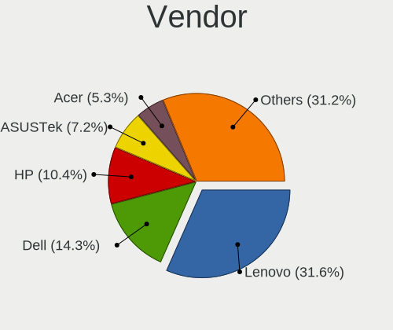
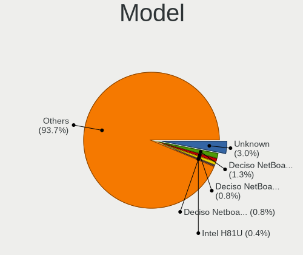
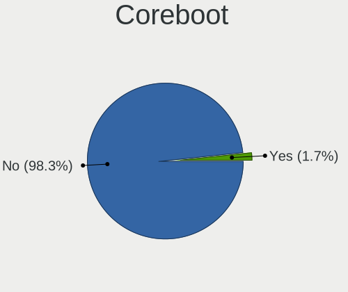
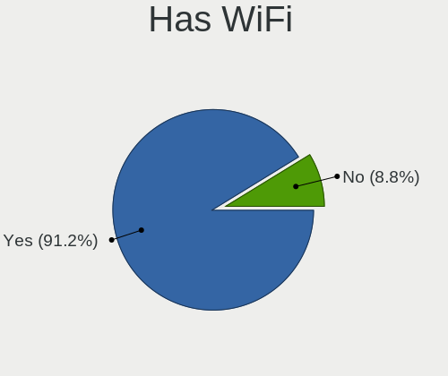
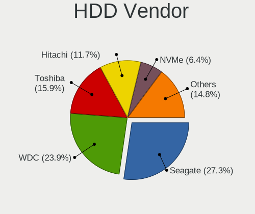
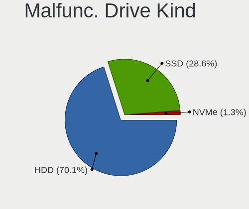
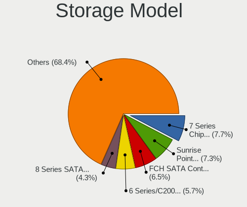
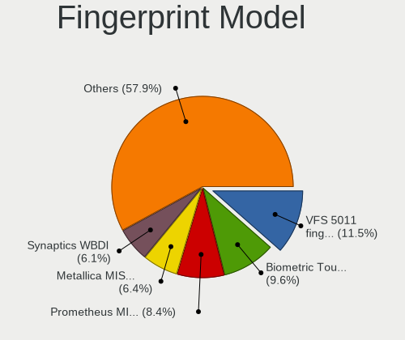

BSD - Tested Hardware & Statistics (Notebooks)
----------------------------------------------

A project to collect tested hardware configurations for BSD.

Anyone can contribute to this report by the [hw-probe](https://github.com/linuxhw/hw-probe/blob/master/INSTALL.BSD.md) tool:

    hw-probe -all -upload

Please contribute! Especially if your hardware is rare.

This report is for real hardware. Report for virtual hardware: [TestCoverage_VE](https://github.com/bsdhw/TestCoverage_VE)

Contents
--------

* [ Test Cases ](#test-cases)

* [ System ](#system)
  - [ OS                       ](#os)
  - [ OS Family                ](#os-family)
  - [ Arch                     ](#arch)
  - [ DE                       ](#de)
  - [ Display Server           ](#display-server)
  - [ Display Manager          ](#display-manager)
  - [ OS Lang                  ](#os-lang)
  - [ Boot Mode                ](#boot-mode)
  - [ Filesystem               ](#filesystem)
  - [ Part. scheme             ](#part-scheme)

* [ Board ](#board)
  - [ Vendor                   ](#vendor)
  - [ Model                    ](#model)
  - [ Model Family             ](#model-family)
  - [ MFG Year                 ](#mfg-year)
  - [ Form Factor              ](#form-factor)
  - [ Coreboot                 ](#coreboot)
  - [ RAM Size                 ](#ram-size)
  - [ RAM Used                 ](#ram-used)
  - [ Total Drives             ](#total-drives)
  - [ Has CD-ROM               ](#has-cd-rom)
  - [ Has Ethernet             ](#has-ethernet)
  - [ Has WiFi                 ](#has-wifi)
  - [ Has Bluetooth            ](#has-bluetooth)

* [ Location ](#location)
  - [ Country                  ](#country)
  - [ City                     ](#city)

* [ Drives ](#drives)
  - [ Drive Vendor             ](#drive-vendor)
  - [ Drive Model              ](#drive-model)
  - [ HDD Vendor               ](#hdd-vendor)
  - [ SSD Vendor               ](#ssd-vendor)
  - [ Drive Kind               ](#drive-kind)
  - [ Drive Connector          ](#drive-connector)
  - [ Drive Size               ](#drive-size)
  - [ Space Total              ](#space-total)
  - [ Space Used               ](#space-used)
  - [ Malfunc. Drives          ](#malfunc-drives)
  - [ Malfunc. Drive Vendor    ](#malfunc-drive-vendor)
  - [ Malfunc. HDD Vendor      ](#malfunc-hdd-vendor)
  - [ Malfunc. Drive Kind      ](#malfunc-drive-kind)
  - [ Failed Drives            ](#failed-drives)
  - [ Failed Drive Vendor      ](#failed-drive-vendor)
  - [ Drive Status             ](#drive-status)

* [ Storage controller ](#storage-controller)
  - [ Storage Vendor           ](#storage-vendor)
  - [ Storage Model            ](#storage-model)
  - [ Storage Kind             ](#storage-kind)

* [ Processor ](#processor)
  - [ CPU Vendor               ](#cpu-vendor)
  - [ CPU Model                ](#cpu-model)
  - [ CPU Model Family         ](#cpu-model-family)
  - [ CPU Cores                ](#cpu-cores)
  - [ CPU Sockets              ](#cpu-sockets)
  - [ CPU Threads              ](#cpu-threads)
  - [ CPU Microarch            ](#cpu-microarch)

* [ Graphics ](#graphics)
  - [ GPU Vendor               ](#gpu-vendor)
  - [ GPU Model                ](#gpu-model)
  - [ GPU Combo                ](#gpu-combo)
  - [ GPU Driver               ](#gpu-driver)
  - [ GPU Memory               ](#gpu-memory)

* [ Monitor ](#monitor)
  - [ Monitor Vendor           ](#monitor-vendor)
  - [ Monitor Model            ](#monitor-model)
  - [ Monitor Resolution       ](#monitor-resolution)
  - [ Monitor Diagonal         ](#monitor-diagonal)
  - [ Monitor Width            ](#monitor-width)
  - [ Aspect Ratio             ](#aspect-ratio)
  - [ Monitor Area             ](#monitor-area)
  - [ Pixel Density            ](#pixel-density)
  - [ Multiple Monitors        ](#multiple-monitors)

* [ Network ](#network)
  - [ Net Controller Vendor    ](#net-controller-vendor)
  - [ Net Controller Model     ](#net-controller-model)
  - [ Wireless Vendor          ](#wireless-vendor)
  - [ Wireless Model           ](#wireless-model)
  - [ Ethernet Vendor          ](#ethernet-vendor)
  - [ Ethernet Model           ](#ethernet-model)
  - [ Net Controller Kind      ](#net-controller-kind)
  - [ Used Controller          ](#used-controller)
  - [ NICs                     ](#nics)
  - [ IPv6                     ](#ipv6)

* [ Bluetooth ](#bluetooth)
  - [ Bluetooth Vendor         ](#bluetooth-vendor)
  - [ Bluetooth Model          ](#bluetooth-model)

* [ Sound ](#sound)
  - [ Sound Vendor             ](#sound-vendor)
  - [ Sound Model              ](#sound-model)

* [ Memory ](#memory)
  - [ Memory Vendor            ](#memory-vendor)
  - [ Memory Model             ](#memory-model)
  - [ Memory Kind              ](#memory-kind)
  - [ Memory Form Factor       ](#memory-form-factor)
  - [ Memory Size              ](#memory-size)
  - [ Memory Speed             ](#memory-speed)

* [ Printers & scanners ](#printers--scanners)
  - [ Printer Vendor           ](#printer-vendor)
  - [ Printer Model            ](#printer-model)
  - [ Scanner Vendor           ](#scanner-vendor)
  - [ Scanner Model            ](#scanner-model)

* [ Camera ](#camera)
  - [ Camera Vendor            ](#camera-vendor)
  - [ Camera Model             ](#camera-model)

* [ Security ](#security)
  - [ Fingerprint Vendor       ](#fingerprint-vendor)
  - [ Fingerprint Model        ](#fingerprint-model)
  - [ Chipcard Vendor          ](#chipcard-vendor)
  - [ Chipcard Model           ](#chipcard-model)

* [ Unsupported ](#unsupported)
  - [ Unsupported Devices      ](#unsupported-devices)
  - [ Unsupported Device Types ](#unsupported-device-types)

Test Cases
----------

Total: 2771

| Vendor        | Model                       | Probe                                                     | Date         |
|---------------|-----------------------------|-----------------------------------------------------------|--------------|
| Samsung       | 750TDA                      | [a880b1f616](https://bsd-hardware.info/?probe=a880b1f616) | Nov 02, 2022 |
| Lenovo        | ThinkPad T450s 20BXCTO1W... | [7708c4bb19](https://bsd-hardware.info/?probe=7708c4bb19) | Nov 02, 2022 |
| Lenovo        | ThinkPad T450s 20BXCTO1W... | [22d3fc953a](https://bsd-hardware.info/?probe=22d3fc953a) | Nov 01, 2022 |
| Dell          | Latitude 5591               | [40957fa567](https://bsd-hardware.info/?probe=40957fa567) | Oct 31, 2022 |
| Lenovo        | ThinkPad A485 20MU000VUS    | [b816902c0b](https://bsd-hardware.info/?probe=b816902c0b) | Oct 31, 2022 |
| Lenovo        | ThinkPad X220 429043U       | [e5716f886a](https://bsd-hardware.info/?probe=e5716f886a) | Oct 30, 2022 |
| HP            | Pavilion g6                 | [c4e84b8104](https://bsd-hardware.info/?probe=c4e84b8104) | Oct 30, 2022 |
| Lenovo        | ThinkPad T420s 41742BU      | [34f0a2bc03](https://bsd-hardware.info/?probe=34f0a2bc03) | Oct 30, 2022 |
| Lenovo        | ThinkPad T470p 20J7S0BR0... | [2776d8c350](https://bsd-hardware.info/?probe=2776d8c350) | Oct 30, 2022 |
| Lenovo        | ThinkPad W530 24491A0       | [4a700f43f8](https://bsd-hardware.info/?probe=4a700f43f8) | Oct 30, 2022 |
| Lenovo        | ThinkPad T460 20FMS10N00    | [04ce25bd7f](https://bsd-hardware.info/?probe=04ce25bd7f) | Oct 29, 2022 |
| Samsung       | Q430/Q530                   | [fb98c8c797](https://bsd-hardware.info/?probe=fb98c8c797) | Oct 29, 2022 |
| Acer          | JM11-MS                     | [3ff8b20107](https://bsd-hardware.info/?probe=3ff8b20107) | Oct 29, 2022 |
| Fujitsu       | LIFEBOOK E752               | [e3c5057898](https://bsd-hardware.info/?probe=e3c5057898) | Oct 29, 2022 |
| Unknown       | Unknown                     | [2df5c5b434](https://bsd-hardware.info/?probe=2df5c5b434) | Oct 28, 2022 |
| Dell          | Inspiron 7720               | [6911e08b7e](https://bsd-hardware.info/?probe=6911e08b7e) | Oct 28, 2022 |
| Panasonic     | CF-53AAGHYDM                | [f2fafaa9e3](https://bsd-hardware.info/?probe=f2fafaa9e3) | Oct 27, 2022 |
| Apple         | MacBook4,1                  | [015f0a0a6d](https://bsd-hardware.info/?probe=015f0a0a6d) | Oct 27, 2022 |
| Matsushita... | CF-48V4KNDQM                | [d96fbc17b5](https://bsd-hardware.info/?probe=d96fbc17b5) | Oct 27, 2022 |
| Panasonic     | CF-52PFPBSFQ                | [088e0245af](https://bsd-hardware.info/?probe=088e0245af) | Oct 27, 2022 |
| Deciso        | NetBoard-A10                | [5d4c95dcac](https://bsd-hardware.info/?probe=5d4c95dcac) | Oct 26, 2022 |
| Matsushita... | CF-51RCVDNLM                | [6e8067d4d8](https://bsd-hardware.info/?probe=6e8067d4d8) | Oct 26, 2022 |
| Lenovo        | ThinkPad T420s 4174DL7      | [82d774e711](https://bsd-hardware.info/?probe=82d774e711) | Oct 26, 2022 |
| Lenovo        | ThinkPad T410 2537N24       | [b7a4ee06a6](https://bsd-hardware.info/?probe=b7a4ee06a6) | Oct 26, 2022 |
| Fujitsu       | LIFEBOOK E752               | [06e6c07e90](https://bsd-hardware.info/?probe=06e6c07e90) | Oct 25, 2022 |
| Samsung       | Q430/Q530                   | [4965215a13](https://bsd-hardware.info/?probe=4965215a13) | Oct 25, 2022 |
| Lenovo        | ThinkPad T430 2347GZU       | [f2236f17ee](https://bsd-hardware.info/?probe=f2236f17ee) | Oct 25, 2022 |
| ASUSTek       | 1000HE                      | [c4bbcf9537](https://bsd-hardware.info/?probe=c4bbcf9537) | Oct 24, 2022 |
| Intel         | H81U                        | [b0e1f80338](https://bsd-hardware.info/?probe=b0e1f80338) | Oct 24, 2022 |
| Lenovo        | ThinkPad X1 Carbon Gen 1... | [caad4323ba](https://bsd-hardware.info/?probe=caad4323ba) | Oct 23, 2022 |
| Dell          | Latitude 5591               | [58b577382a](https://bsd-hardware.info/?probe=58b577382a) | Oct 23, 2022 |
| ASUSTek       | K53TA                       | [521283b723](https://bsd-hardware.info/?probe=521283b723) | Oct 22, 2022 |
| Alienware     | m15                         | [3304a767ba](https://bsd-hardware.info/?probe=3304a767ba) | Oct 22, 2022 |
| Google        | Edgar                       | [318a750368](https://bsd-hardware.info/?probe=318a750368) | Oct 22, 2022 |
| Lenovo        | G500 20236                  | [8a4e3767e9](https://bsd-hardware.info/?probe=8a4e3767e9) | Oct 22, 2022 |
| Apple         | MacBookPro8,1               | [623594855a](https://bsd-hardware.info/?probe=623594855a) | Oct 22, 2022 |
| Dell          | Precision M4500             | [66ded228ea](https://bsd-hardware.info/?probe=66ded228ea) | Oct 20, 2022 |
| Acer          | Aspire E1-570               | [3d62c50607](https://bsd-hardware.info/?probe=3d62c50607) | Oct 20, 2022 |
| MSI           | PS63 Modern 8M              | [949e472db5](https://bsd-hardware.info/?probe=949e472db5) | Oct 19, 2022 |
| HP            | ENVY Laptop 13-aq0xxx       | [bc229efed9](https://bsd-hardware.info/?probe=bc229efed9) | Oct 18, 2022 |
| HP            | ENVY Laptop 13-aq0xxx       | [0a8b1f727f](https://bsd-hardware.info/?probe=0a8b1f727f) | Oct 17, 2022 |
| Lenovo        | ThinkPad T61 765912G        | [50c3c93790](https://bsd-hardware.info/?probe=50c3c93790) | Oct 17, 2022 |
| Acer          | Aspire A514-54              | [e057b613a0](https://bsd-hardware.info/?probe=e057b613a0) | Oct 17, 2022 |
| Lenovo        | XiaoXinPro-13API 2019 81... | [dfa08657fd](https://bsd-hardware.info/?probe=dfa08657fd) | Oct 16, 2022 |
| HP            | SpectreXT Pro 13-b000 PC    | [f45ea42873](https://bsd-hardware.info/?probe=f45ea42873) | Oct 16, 2022 |
| Dell          | Inspiron 15 5510            | [22881028bc](https://bsd-hardware.info/?probe=22881028bc) | Oct 16, 2022 |
| HP            | Laptop 15q-bu0xx            | [99c01654a2](https://bsd-hardware.info/?probe=99c01654a2) | Oct 15, 2022 |
| Lenovo        | ThinkPad T430 23446FP       | [6b15856d20](https://bsd-hardware.info/?probe=6b15856d20) | Oct 15, 2022 |
| Unknown       | Unknown                     | [3b7146c456](https://bsd-hardware.info/?probe=3b7146c456) | Oct 14, 2022 |
| Unknown       | Unknown                     | [1ad8d9e64c](https://bsd-hardware.info/?probe=1ad8d9e64c) | Oct 14, 2022 |
| Intel         | H81U                        | [9b212d2264](https://bsd-hardware.info/?probe=9b212d2264) | Oct 13, 2022 |
| Lenovo        | ThinkPad T440s 20AR003SM... | [df62882c3b](https://bsd-hardware.info/?probe=df62882c3b) | Oct 12, 2022 |
| Dell          | Latitude 5591               | [04f53f51c8](https://bsd-hardware.info/?probe=04f53f51c8) | Oct 12, 2022 |
| Lenovo        | ThinkPad E14 Gen 2 20T6S... | [a773a82ff4](https://bsd-hardware.info/?probe=a773a82ff4) | Oct 11, 2022 |
| Lenovo        | IdeaPad 3 15ADA05 81W1      | [dec7108b53](https://bsd-hardware.info/?probe=dec7108b53) | Oct 11, 2022 |
| Dell          | Latitude 5591               | [eda94b6c48](https://bsd-hardware.info/?probe=eda94b6c48) | Oct 11, 2022 |
| Acer          | Aspire 5336                 | [127ddc93fb](https://bsd-hardware.info/?probe=127ddc93fb) | Oct 10, 2022 |
| Acer          | Aspire E5-722G              | [7a4eb565fe](https://bsd-hardware.info/?probe=7a4eb565fe) | Oct 10, 2022 |
| MSI           | GL65 Leopard 10SFSK         | [2ea7c7f9a2](https://bsd-hardware.info/?probe=2ea7c7f9a2) | Oct 10, 2022 |
| Dell          | Latitude E6420              | [48c26d2a17](https://bsd-hardware.info/?probe=48c26d2a17) | Oct 10, 2022 |
| Fujitsu       | LIFEBOOK U904               | [3a86733538](https://bsd-hardware.info/?probe=3a86733538) | Oct 09, 2022 |
| TUXEDO        | InfinityBook S 15 Gen6      | [17d766d55a](https://bsd-hardware.info/?probe=17d766d55a) | Oct 08, 2022 |
| Lenovo        | ThinkPad T590 20N4CTO1WW    | [442a743538](https://bsd-hardware.info/?probe=442a743538) | Oct 08, 2022 |
| Lenovo        | ThinkPad X270 20HMS04P00    | [7647b7a0b2](https://bsd-hardware.info/?probe=7647b7a0b2) | Oct 07, 2022 |
| Acer          | Aspire ES1-523              | [92a125995f](https://bsd-hardware.info/?probe=92a125995f) | Oct 07, 2022 |
| Lenovo        | ThinkPad E14 Gen 2 20T6S... | [601029d3fc](https://bsd-hardware.info/?probe=601029d3fc) | Oct 06, 2022 |
| Lenovo        | IdeaPad 3 15ALC6 82KU       | [ce9cfa77aa](https://bsd-hardware.info/?probe=ce9cfa77aa) | Oct 05, 2022 |
| Acer          | Aspire F5-573               | [9c092c9cd7](https://bsd-hardware.info/?probe=9c092c9cd7) | Oct 05, 2022 |
| HP            | Compaq 6735s                | [f61208cfea](https://bsd-hardware.info/?probe=f61208cfea) | Oct 05, 2022 |
| HP            | Compaq 6735s                | [718126149c](https://bsd-hardware.info/?probe=718126149c) | Oct 05, 2022 |
| Acer          | TravelMate B115-M           | [86289a60aa](https://bsd-hardware.info/?probe=86289a60aa) | Oct 05, 2022 |
| Acer          | TravelMate B115-M           | [9f4642f6a5](https://bsd-hardware.info/?probe=9f4642f6a5) | Oct 05, 2022 |
| Dell          | Precision 5510              | [f69c9fb0ea](https://bsd-hardware.info/?probe=f69c9fb0ea) | Oct 04, 2022 |
| Dell          | Latitude E6420              | [07b078fdef](https://bsd-hardware.info/?probe=07b078fdef) | Oct 04, 2022 |
| Lenovo        | ThinkPad T410 2518C3U       | [627206d154](https://bsd-hardware.info/?probe=627206d154) | Oct 04, 2022 |
| Lenovo        | Legion 5 15IMH05 82AU       | [d89559e5c2](https://bsd-hardware.info/?probe=d89559e5c2) | Oct 03, 2022 |
| Toshiba       | NB300                       | [c18ae50101](https://bsd-hardware.info/?probe=c18ae50101) | Oct 03, 2022 |
| TUXEDO        | Aura 15 Gen1                | [e83d522905](https://bsd-hardware.info/?probe=e83d522905) | Oct 03, 2022 |
| Dell          | Precision M4500             | [6b987b43b1](https://bsd-hardware.info/?probe=6b987b43b1) | Oct 03, 2022 |
| TUXEDO        | Aura 15 Gen1                | [a49ac2701d](https://bsd-hardware.info/?probe=a49ac2701d) | Oct 02, 2022 |
| HP            | ProBook 4540s               | [df94757940](https://bsd-hardware.info/?probe=df94757940) | Oct 02, 2022 |
| Dell          | Precision M4800             | [0fcbdeeeb7](https://bsd-hardware.info/?probe=0fcbdeeeb7) | Oct 02, 2022 |
| HP            | 255 G8 Notebook PC          | [f9851a3257](https://bsd-hardware.info/?probe=f9851a3257) | Oct 01, 2022 |
| MSI           | GL65 Leopard 10SFSK         | [489567748e](https://bsd-hardware.info/?probe=489567748e) | Oct 01, 2022 |
| Lenovo        | ThinkPad E15 2ORES4XJ00     | [323a95e6a9](https://bsd-hardware.info/?probe=323a95e6a9) | Oct 01, 2022 |
| Deciso        | NetBoard-A10                | [9b95ddf7b9](https://bsd-hardware.info/?probe=9b95ddf7b9) | Oct 01, 2022 |
| IBM           | ThinkPad T43 18714AG        | [5fd9a63834](https://bsd-hardware.info/?probe=5fd9a63834) | Sep 30, 2022 |
| Kraftway      | KW10T                       | [db27da2e88](https://bsd-hardware.info/?probe=db27da2e88) | Sep 29, 2022 |
| Lenovo        | ThinkPad W530 2436CTO       | [6515a18552](https://bsd-hardware.info/?probe=6515a18552) | Sep 29, 2022 |
| Lenovo        | Legion Y540-17IRH 81Q4      | [62b9a56103](https://bsd-hardware.info/?probe=62b9a56103) | Sep 29, 2022 |
| Intel         | H81U                        | [fa8c32528a](https://bsd-hardware.info/?probe=fa8c32528a) | Sep 28, 2022 |
| Tactus        | GeoFlex 110                 | [0b93b5f915](https://bsd-hardware.info/?probe=0b93b5f915) | Sep 28, 2022 |
| Lenovo        | ThinkPad X61 Tablet 7763... | [1f37ebf2bb](https://bsd-hardware.info/?probe=1f37ebf2bb) | Sep 28, 2022 |
| Acer          | Swift SF313-52              | [83516dabac](https://bsd-hardware.info/?probe=83516dabac) | Sep 28, 2022 |
| Deciso        | OPNsense Appliance          | [659b695f09](https://bsd-hardware.info/?probe=659b695f09) | Sep 26, 2022 |
| Lenovo        | ThinkPad P53 20QNCTO1WW     | [b2024820d1](https://bsd-hardware.info/?probe=b2024820d1) | Sep 26, 2022 |
| Acer          | Swift SF313-52              | [6339e6b468](https://bsd-hardware.info/?probe=6339e6b468) | Sep 25, 2022 |
| Gigabyte      | GB-BSi5A-6200               | [c947635b8f](https://bsd-hardware.info/?probe=c947635b8f) | Sep 25, 2022 |
| Gigabyte      | GB-BSi5A-6200               | [533c7f35f1](https://bsd-hardware.info/?probe=533c7f35f1) | Sep 25, 2022 |
| IBM           | ThinkPad T40 23737CG        | [dfc9b64da2](https://bsd-hardware.info/?probe=dfc9b64da2) | Sep 25, 2022 |
| System76      | Gazelle                     | [d087321049](https://bsd-hardware.info/?probe=d087321049) | Sep 24, 2022 |
| Dell          | System Vostro 3750          | [166fbacd73](https://bsd-hardware.info/?probe=166fbacd73) | Sep 24, 2022 |
| Lenovo        | G475 20080                  | [fb07463a9a](https://bsd-hardware.info/?probe=fb07463a9a) | Sep 24, 2022 |
| Lenovo        | G475 20080                  | [c4b1acb6d1](https://bsd-hardware.info/?probe=c4b1acb6d1) | Sep 24, 2022 |
| System76      | Gazelle                     | [6d5d4f5021](https://bsd-hardware.info/?probe=6d5d4f5021) | Sep 24, 2022 |
| Lenovo        | ThinkPad T460p 20FW003PM... | [ac8e728222](https://bsd-hardware.info/?probe=ac8e728222) | Sep 24, 2022 |
| Deciso        | Netboard A20                | [388e27791d](https://bsd-hardware.info/?probe=388e27791d) | Sep 23, 2022 |
| Toshiba       | Satellite BE96-F299         | [15b93c9f4b](https://bsd-hardware.info/?probe=15b93c9f4b) | Sep 21, 2022 |
| Toshiba       | Satellite BE96-F299         | [9beae1547d](https://bsd-hardware.info/?probe=9beae1547d) | Sep 21, 2022 |
| Unknown       | Unknown                     | [fbd1af0e98](https://bsd-hardware.info/?probe=fbd1af0e98) | Sep 21, 2022 |
| Deciso        | NetBoard-A10                | [5cec3595a3](https://bsd-hardware.info/?probe=5cec3595a3) | Sep 21, 2022 |
| Acer          | Aspire E5-771               | [0a58077c49](https://bsd-hardware.info/?probe=0a58077c49) | Sep 20, 2022 |
| Toshiba       | PORTEGE R700                | [10b85eccae](https://bsd-hardware.info/?probe=10b85eccae) | Sep 19, 2022 |
| HP            | EliteBook 840 G3            | [322c8947b6](https://bsd-hardware.info/?probe=322c8947b6) | Sep 19, 2022 |
| HP            | EliteBook 840 G3            | [0307c109b5](https://bsd-hardware.info/?probe=0307c109b5) | Sep 19, 2022 |
| Lenovo        | ThinkPad X250 20CLS1WP01    | [1b75ee6295](https://bsd-hardware.info/?probe=1b75ee6295) | Sep 19, 2022 |
| Dell          | Precision 7710              | [4c4937d824](https://bsd-hardware.info/?probe=4c4937d824) | Sep 18, 2022 |
| HP            | Pavilion dv6700             | [f3058f97f9](https://bsd-hardware.info/?probe=f3058f97f9) | Sep 18, 2022 |
| Lenovo        | ThinkPad X250 20CL001GUS    | [2f1f82558e](https://bsd-hardware.info/?probe=2f1f82558e) | Sep 18, 2022 |
| Fujitsu       | LIFEBOOK A532               | [91e0f723ea](https://bsd-hardware.info/?probe=91e0f723ea) | Sep 18, 2022 |
| Lenovo        | G50-30 80G0                 | [da4bd87fee](https://bsd-hardware.info/?probe=da4bd87fee) | Sep 17, 2022 |
| ASUSTek       | X455LJ                      | [431ad10ab2](https://bsd-hardware.info/?probe=431ad10ab2) | Sep 17, 2022 |
| HP            | EliteBook 840 G3            | [7bf7249432](https://bsd-hardware.info/?probe=7bf7249432) | Sep 16, 2022 |
| Lenovo        | ThinkPad L420 7829WDY       | [a697be2aa9](https://bsd-hardware.info/?probe=a697be2aa9) | Sep 16, 2022 |
| IBM           | ThinkPad T43 18714AG        | [15a7e37cbf](https://bsd-hardware.info/?probe=15a7e37cbf) | Sep 15, 2022 |
| Deciso        | DEC2700 - OPNsense Appli... | [eee7bdda02](https://bsd-hardware.info/?probe=eee7bdda02) | Sep 15, 2022 |
| Google        | Peppy                       | [80ffa77224](https://bsd-hardware.info/?probe=80ffa77224) | Sep 15, 2022 |
| Lenovo        | ThinkPad X270 20HMS2LL00    | [12f6a8866f](https://bsd-hardware.info/?probe=12f6a8866f) | Sep 14, 2022 |
| Deciso        | DEC2700 - OPNsense Appli... | [9e6bd1263d](https://bsd-hardware.info/?probe=9e6bd1263d) | Sep 13, 2022 |
| Deciso        | Netboard A20                | [8af40be425](https://bsd-hardware.info/?probe=8af40be425) | Sep 13, 2022 |
| SIEMENS       | SIMATIC IPC127E             | [d16e38e6b2](https://bsd-hardware.info/?probe=d16e38e6b2) | Sep 12, 2022 |
| Dell          | Inspiron 15 3511            | [5abbba28de](https://bsd-hardware.info/?probe=5abbba28de) | Sep 11, 2022 |
| Dell          | XPS M1330                   | [d84548dd9b](https://bsd-hardware.info/?probe=d84548dd9b) | Sep 11, 2022 |
| Apple         | MacBook5,2                  | [79503c0635](https://bsd-hardware.info/?probe=79503c0635) | Sep 10, 2022 |
| Apple         | MacBook5,2                  | [9c7a64970c](https://bsd-hardware.info/?probe=9c7a64970c) | Sep 10, 2022 |
| Intel         | SandyBridge Platform        | [7c10326786](https://bsd-hardware.info/?probe=7c10326786) | Sep 09, 2022 |
| Toshiba       | Satellite A200              | [860aea3ce4](https://bsd-hardware.info/?probe=860aea3ce4) | Sep 08, 2022 |
| Dell          | Precision 7540              | [f39c0f4d92](https://bsd-hardware.info/?probe=f39c0f4d92) | Sep 08, 2022 |
| Dell          | Latitude 5310               | [6edf4d34fe](https://bsd-hardware.info/?probe=6edf4d34fe) | Sep 07, 2022 |
| Dell          | Latitude E5470              | [9e798cbfc8](https://bsd-hardware.info/?probe=9e798cbfc8) | Sep 07, 2022 |
| HP            | EliteBook 8570p             | [7c6751649b](https://bsd-hardware.info/?probe=7c6751649b) | Sep 07, 2022 |
| Lenovo        | ThinkPad T440 20B7S2LT00    | [5104875f94](https://bsd-hardware.info/?probe=5104875f94) | Sep 06, 2022 |
| Dell          | Vostro 5415                 | [ef6d4ee660](https://bsd-hardware.info/?probe=ef6d4ee660) | Sep 06, 2022 |
| Lenovo        | IdeaPad Gaming 3 15ACH6 ... | [4f31f81571](https://bsd-hardware.info/?probe=4f31f81571) | Sep 06, 2022 |
| ASUSTek       | VivoBook_ASUSLaptop X515... | [cffed92600](https://bsd-hardware.info/?probe=cffed92600) | Sep 06, 2022 |
| Dell          | Precision 7550              | [d2bf200529](https://bsd-hardware.info/?probe=d2bf200529) | Sep 06, 2022 |
| Dell          | XPS 13 9343                 | [ec74af083f](https://bsd-hardware.info/?probe=ec74af083f) | Sep 04, 2022 |
| Apple         | MacBookPro5,1               | [f4d84edb3b](https://bsd-hardware.info/?probe=f4d84edb3b) | Sep 04, 2022 |
| Lenovo        | ThinkPad X1 Extreme Gen ... | [72757feb65](https://bsd-hardware.info/?probe=72757feb65) | Sep 03, 2022 |
| Lenovo        | ThinkPad X1 Extreme Gen ... | [5d575c85d0](https://bsd-hardware.info/?probe=5d575c85d0) | Sep 03, 2022 |
| Deciso        | NetBoard-A10                | [3547d9da9c](https://bsd-hardware.info/?probe=3547d9da9c) | Sep 01, 2022 |
| Apple         | MacBookPro8,1               | [0ff0fc4c3b](https://bsd-hardware.info/?probe=0ff0fc4c3b) | Sep 01, 2022 |
| Dell          | Latitude E5550              | [867e56fb52](https://bsd-hardware.info/?probe=867e56fb52) | Sep 01, 2022 |
| TUXEDO        | Pulse 15 Gen2               | [91a1870b65](https://bsd-hardware.info/?probe=91a1870b65) | Sep 01, 2022 |
| Dell          | Precision 7710              | [339099bbf0](https://bsd-hardware.info/?probe=339099bbf0) | Sep 01, 2022 |
| Valve         | Jupiter                     | [4e58d828cc](https://bsd-hardware.info/?probe=4e58d828cc) | Sep 01, 2022 |
| Toshiba       | Satellite A300              | [ac185c104b](https://bsd-hardware.info/?probe=ac185c104b) | Aug 31, 2022 |
| Lenovo        | IdeaPad Gaming 3 15ACH6 ... | [fc259fcf3e](https://bsd-hardware.info/?probe=fc259fcf3e) | Aug 30, 2022 |
| Dell          | Precision 5540              | [0c5089634d](https://bsd-hardware.info/?probe=0c5089634d) | Aug 30, 2022 |
| Dell          | Precision 5540              | [afb80a84fb](https://bsd-hardware.info/?probe=afb80a84fb) | Aug 30, 2022 |
| HP            | Unknown                     | [7bd69ee984](https://bsd-hardware.info/?probe=7bd69ee984) | Aug 29, 2022 |
| Lenovo        | IdeaPad Gaming 3 15ACH6 ... | [a5c0fe3db8](https://bsd-hardware.info/?probe=a5c0fe3db8) | Aug 29, 2022 |
| Lenovo        | ThinkPad T420 4178A72       | [18a105546b](https://bsd-hardware.info/?probe=18a105546b) | Aug 29, 2022 |
| Lenovo        | ThinkPad T420 4178A72       | [1433351032](https://bsd-hardware.info/?probe=1433351032) | Aug 29, 2022 |
| Dell          | Latitude 7390               | [bc5eb8e237](https://bsd-hardware.info/?probe=bc5eb8e237) | Aug 29, 2022 |
| Dell          | Precision 7550              | [71f615178f](https://bsd-hardware.info/?probe=71f615178f) | Aug 27, 2022 |
| Toshiba       | Satellite S55t-B            | [df9971d3aa](https://bsd-hardware.info/?probe=df9971d3aa) | Aug 27, 2022 |
| ASUSTek       | VivoBook 15_ASUS Laptop ... | [2c7586b0ed](https://bsd-hardware.info/?probe=2c7586b0ed) | Aug 25, 2022 |
| ASUSTek       | VivoBook_ASUSLaptop X570... | [0466d87f04](https://bsd-hardware.info/?probe=0466d87f04) | Aug 25, 2022 |
| HP            | ENVY Notebook               | [7e33273132](https://bsd-hardware.info/?probe=7e33273132) | Aug 25, 2022 |
| Deciso        | NetBoard-A10                | [aefb2f4660](https://bsd-hardware.info/?probe=aefb2f4660) | Aug 24, 2022 |
| Lenovo        | Yoga Slim 7 Pro 14ACH5 8... | [fcfa6205d8](https://bsd-hardware.info/?probe=fcfa6205d8) | Aug 23, 2022 |
| Deciso        | Netboard A20                | [164274c6b4](https://bsd-hardware.info/?probe=164274c6b4) | Aug 22, 2022 |
| Lenovo        | IdeaPad 5 14ITL05 82FE      | [cc2a81fc1b](https://bsd-hardware.info/?probe=cc2a81fc1b) | Aug 21, 2022 |
| Lenovo        | IdeaPad Gaming 3 15ACH6 ... | [6184507a45](https://bsd-hardware.info/?probe=6184507a45) | Aug 21, 2022 |
| Lenovo        | ThinkPad A485 20MU000VUS    | [296e81dd9d](https://bsd-hardware.info/?probe=296e81dd9d) | Aug 21, 2022 |
| ASUSTek       | ZenBook UX325UA_UM325UA     | [692e2f0837](https://bsd-hardware.info/?probe=692e2f0837) | Aug 20, 2022 |
| Unknown       | Unknown                     | [1dfb3adb6b](https://bsd-hardware.info/?probe=1dfb3adb6b) | Aug 20, 2022 |
| Lenovo        | ThinkPad T480 20L50000GE    | [cd7d7d83ba](https://bsd-hardware.info/?probe=cd7d7d83ba) | Aug 20, 2022 |
| Lenovo        | ThinkPad X270 W10DG 20K5... | [7576399c3c](https://bsd-hardware.info/?probe=7576399c3c) | Aug 20, 2022 |
| Lenovo        | ThinkPad X260 20F5S10W0H    | [2e7d570822](https://bsd-hardware.info/?probe=2e7d570822) | Aug 20, 2022 |
| Lenovo        | ThinkPad X260 20F5S10W0H    | [7afa139f4f](https://bsd-hardware.info/?probe=7afa139f4f) | Aug 20, 2022 |
| HP            | Pavilion g6                 | [c146b538e1](https://bsd-hardware.info/?probe=c146b538e1) | Aug 20, 2022 |
| Lenovo        | ThinkPad A485 20MU000VUS    | [b79fa4531e](https://bsd-hardware.info/?probe=b79fa4531e) | Aug 20, 2022 |
| Lenovo        | ThinkPad 11e 4th Gen 20H... | [ba1ea734b1](https://bsd-hardware.info/?probe=ba1ea734b1) | Aug 19, 2022 |
| Lenovo        | IdeaPad 530S-14ARR 81H1     | [560213a2d6](https://bsd-hardware.info/?probe=560213a2d6) | Aug 19, 2022 |
| Deciso        | NetBoard-A20                | [7ec18da9e4](https://bsd-hardware.info/?probe=7ec18da9e4) | Aug 19, 2022 |
| ASUSTek       | ZenBook 14 UX410UFR         | [2bf0f0ef08](https://bsd-hardware.info/?probe=2bf0f0ef08) | Aug 19, 2022 |
| Google        | Peppy                       | [e2e0a1953d](https://bsd-hardware.info/?probe=e2e0a1953d) | Aug 18, 2022 |
| HP            | EliteBook 840 G3            | [28929cae10](https://bsd-hardware.info/?probe=28929cae10) | Aug 17, 2022 |
| Dell          | Studio 1537                 | [a185649600](https://bsd-hardware.info/?probe=a185649600) | Aug 17, 2022 |
| HP            | Victus by Gaming Laptop ... | [e09aa880f9](https://bsd-hardware.info/?probe=e09aa880f9) | Aug 16, 2022 |
| Lenovo        | ThinkPad X131e 33672K5      | [4cc4d44e43](https://bsd-hardware.info/?probe=4cc4d44e43) | Aug 15, 2022 |
| Intel         | Apollolake I Platform       | [8b6b08bc82](https://bsd-hardware.info/?probe=8b6b08bc82) | Aug 15, 2022 |
| ASUSTek       | TUF Gaming FX505DT_FX505... | [f8c10bf25a](https://bsd-hardware.info/?probe=f8c10bf25a) | Aug 15, 2022 |
| ASUSTek       | ZenBook UX325UA_UM325UA     | [c9bda4b49d](https://bsd-hardware.info/?probe=c9bda4b49d) | Aug 14, 2022 |
| Acer          | Aspire 4552G                | [a8f8e41c91](https://bsd-hardware.info/?probe=a8f8e41c91) | Aug 14, 2022 |
| Sony          | VGN-UX1XRN                  | [312df080a7](https://bsd-hardware.info/?probe=312df080a7) | Aug 14, 2022 |
| MSI           | GF63 Thin 9SC               | [dacea7c6be](https://bsd-hardware.info/?probe=dacea7c6be) | Aug 14, 2022 |
| Dell          | Inspiron 1545               | [e1a29d8008](https://bsd-hardware.info/?probe=e1a29d8008) | Aug 14, 2022 |
| Lenovo        | ThinkPad X1 Carbon 7th 2... | [2da32e59b0](https://bsd-hardware.info/?probe=2da32e59b0) | Aug 14, 2022 |
| Samsung       | NC210/NC110                 | [6c697b3312](https://bsd-hardware.info/?probe=6c697b3312) | Aug 13, 2022 |
| Alienware     | m15 R4                      | [769c5c43f3](https://bsd-hardware.info/?probe=769c5c43f3) | Aug 13, 2022 |
| Deciso        | NetBoard-A10                | [9d82dae644](https://bsd-hardware.info/?probe=9d82dae644) | Aug 11, 2022 |
| Lenovo        | ThinkPad R60e 0658W2M       | [45e44ad953](https://bsd-hardware.info/?probe=45e44ad953) | Aug 10, 2022 |
| HUAWEI        | BOM-WXX9                    | [4ba15a31d9](https://bsd-hardware.info/?probe=4ba15a31d9) | Aug 10, 2022 |
| TUXEDO        | Pulse 14 Gen1               | [5edf8a1bef](https://bsd-hardware.info/?probe=5edf8a1bef) | Aug 09, 2022 |
| ASUSTek       | F6A                         | [6626d18284](https://bsd-hardware.info/?probe=6626d18284) | Aug 08, 2022 |
| Dell          | XPS 13 9360                 | [1d342196fb](https://bsd-hardware.info/?probe=1d342196fb) | Aug 08, 2022 |
| HP            | ProBook 4540s               | [0a7891d53f](https://bsd-hardware.info/?probe=0a7891d53f) | Aug 06, 2022 |
| eMachines     | eME728                      | [96d745589c](https://bsd-hardware.info/?probe=96d745589c) | Aug 06, 2022 |
| Dell          | Inspiron 3581               | [f31cc32515](https://bsd-hardware.info/?probe=f31cc32515) | Aug 04, 2022 |
| Unknown       | Unknown                     | [7cbf489a64](https://bsd-hardware.info/?probe=7cbf489a64) | Aug 04, 2022 |
| Dell          | Inspiron 15-3567            | [cdc6bc6ef8](https://bsd-hardware.info/?probe=cdc6bc6ef8) | Aug 03, 2022 |
| Intel         | H81U                        | [b5e2598580](https://bsd-hardware.info/?probe=b5e2598580) | Aug 03, 2022 |
| Acer          | Aspire 5930                 | [4bd9ec4253](https://bsd-hardware.info/?probe=4bd9ec4253) | Aug 02, 2022 |
| Intel         | H81U                        | [8f50dbe259](https://bsd-hardware.info/?probe=8f50dbe259) | Aug 01, 2022 |
| Lenovo        | IdeaPad Gaming 3 15ARH05... | [d5e9213bb5](https://bsd-hardware.info/?probe=d5e9213bb5) | Aug 01, 2022 |
| HP            | EliteBook 850 G7 Noteboo... | [f603e648c7](https://bsd-hardware.info/?probe=f603e648c7) | Aug 01, 2022 |
| Lenovo        | ThinkPad T480 20L6S29E0T    | [546fa8380b](https://bsd-hardware.info/?probe=546fa8380b) | Aug 01, 2022 |
| Unknown       | Unknown                     | [3efcb47333](https://bsd-hardware.info/?probe=3efcb47333) | Jul 31, 2022 |
| Dell          | Inspiron 5559               | [13baedb59b](https://bsd-hardware.info/?probe=13baedb59b) | Jul 31, 2022 |
| HP            | EliteBook 8540w             | [0063369c40](https://bsd-hardware.info/?probe=0063369c40) | Jul 30, 2022 |
| Lenovo        | ThinkPad T61 7661GY9        | [7ab5339eee](https://bsd-hardware.info/?probe=7ab5339eee) | Jul 30, 2022 |
| ASUSTek       | VivoBook_ASUSLaptop X545... | [bf5cea4ab5](https://bsd-hardware.info/?probe=bf5cea4ab5) | Jul 30, 2022 |
| HP            | ProBook 430 G4              | [2a9d4e9b0b](https://bsd-hardware.info/?probe=2a9d4e9b0b) | Jul 30, 2022 |
| Apple         | MacBook6,1                  | [55ab4bc8d6](https://bsd-hardware.info/?probe=55ab4bc8d6) | Jul 29, 2022 |
| Acer          | Aspire E5-521G              | [dcc5d3116f](https://bsd-hardware.info/?probe=dcc5d3116f) | Jul 29, 2022 |
| Dell          | Latitude E7440              | [03497b7b2a](https://bsd-hardware.info/?probe=03497b7b2a) | Jul 27, 2022 |
| HP            | 250 G6 Notebook PC          | [511d057c70](https://bsd-hardware.info/?probe=511d057c70) | Jul 27, 2022 |
| Lenovo        | IdeaPad 330-15ARR 81D2      | [7b130fb168](https://bsd-hardware.info/?probe=7b130fb168) | Jul 27, 2022 |
| Dell          | Precision 5560              | [3dc82c6d91](https://bsd-hardware.info/?probe=3dc82c6d91) | Jul 23, 2022 |
| Lenovo        | IdeaPad S145-15API 81V7     | [e2a5a65135](https://bsd-hardware.info/?probe=e2a5a65135) | Jul 23, 2022 |
| HP            | ProBook 4730s               | [e70725dd32](https://bsd-hardware.info/?probe=e70725dd32) | Jul 23, 2022 |
| Lenovo        | G40-45 80E1                 | [6e31b5f45b](https://bsd-hardware.info/?probe=6e31b5f45b) | Jul 23, 2022 |
| Lenovo        | IdeaPad Y580 20132          | [3df3bd2f62](https://bsd-hardware.info/?probe=3df3bd2f62) | Jul 22, 2022 |
| Lenovo        | ThinkPad L450 20DSS1S402    | [b779706b7a](https://bsd-hardware.info/?probe=b779706b7a) | Jul 21, 2022 |
| Dell          | Studio XPS 1340             | [642da98e96](https://bsd-hardware.info/?probe=642da98e96) | Jul 21, 2022 |
| Lenovo        | ThinkPad L412 0585AD9       | [cba0fc2340](https://bsd-hardware.info/?probe=cba0fc2340) | Jul 20, 2022 |
| Lenovo        | ThinkPad X200 7458NP9       | [4192abf903](https://bsd-hardware.info/?probe=4192abf903) | Jul 20, 2022 |
| Lenovo        | ThinkPad X61s 76693KG       | [445446cc28](https://bsd-hardware.info/?probe=445446cc28) | Jul 18, 2022 |
| Deciso        | Netboard A20                | [2bc988b18a](https://bsd-hardware.info/?probe=2bc988b18a) | Jul 18, 2022 |
| HP            | OMEN by Laptop              | [25e43be096](https://bsd-hardware.info/?probe=25e43be096) | Jul 17, 2022 |
| Dell          | Inspiron 15-3567            | [15c5d9fdd9](https://bsd-hardware.info/?probe=15c5d9fdd9) | Jul 17, 2022 |
| Deciso        | Netboard A20                | [a4be4171b6](https://bsd-hardware.info/?probe=a4be4171b6) | Jul 17, 2022 |
| ASUSTek       | ZenBook UX325UA_UM325UA     | [9af051c79f](https://bsd-hardware.info/?probe=9af051c79f) | Jul 17, 2022 |
| Lenovo        | ThinkPad T480 20L6SB2N00    | [6c5c9eefc0](https://bsd-hardware.info/?probe=6c5c9eefc0) | Jul 17, 2022 |
| Dell          | Inspiron 3505               | [ead2595782](https://bsd-hardware.info/?probe=ead2595782) | Jul 17, 2022 |
| Sony          | VGN-NS21M_S                 | [c78caf8215](https://bsd-hardware.info/?probe=c78caf8215) | Jul 16, 2022 |
| HP            | EliteBook 8570p             | [978f01c546](https://bsd-hardware.info/?probe=978f01c546) | Jul 16, 2022 |
| Lenovo        | ThinkPad T480 20L6SB2N00    | [995a8a5e6f](https://bsd-hardware.info/?probe=995a8a5e6f) | Jul 16, 2022 |
| Lenovo        | ThinkPad T420 4236C92       | [4067ce2036](https://bsd-hardware.info/?probe=4067ce2036) | Jul 16, 2022 |
| Dell          | Inspiron MP061              | [56a7002cc5](https://bsd-hardware.info/?probe=56a7002cc5) | Jul 16, 2022 |
| HP            | Laptop 15-bs1xx             | [fe84e9fda5](https://bsd-hardware.info/?probe=fe84e9fda5) | Jul 15, 2022 |
| Dell          | XPS 13 7390                 | [d9efb0425b](https://bsd-hardware.info/?probe=d9efb0425b) | Jul 15, 2022 |
| Dell          | XPS 13 7390                 | [6e85a064f0](https://bsd-hardware.info/?probe=6e85a064f0) | Jul 15, 2022 |
| Apple         | MacBook4,1                  | [db03ba8975](https://bsd-hardware.info/?probe=db03ba8975) | Jul 14, 2022 |
| Dell          | Latitude E5450              | [5f1183ab0b](https://bsd-hardware.info/?probe=5f1183ab0b) | Jul 14, 2022 |
| Dell          | Latitude E5450              | [1080ed5654](https://bsd-hardware.info/?probe=1080ed5654) | Jul 14, 2022 |
| Lenovo        | ThinkPad X260 20F6S0KA00    | [117014d55f](https://bsd-hardware.info/?probe=117014d55f) | Jul 14, 2022 |
| Lenovo        | ThinkPad T495 20NJ0010PB    | [078888676a](https://bsd-hardware.info/?probe=078888676a) | Jul 13, 2022 |
| Deciso        | OPNsense Appliance          | [05fb88304d](https://bsd-hardware.info/?probe=05fb88304d) | Jul 13, 2022 |
| Apple         | MacBookAir5,2               | [894b6f82cf](https://bsd-hardware.info/?probe=894b6f82cf) | Jul 13, 2022 |
| ASUSTek       | VivoBook_ASUSLaptop X515... | [b09ba0c799](https://bsd-hardware.info/?probe=b09ba0c799) | Jul 12, 2022 |
| ASUSTek       | X751LB                      | [5c2ef28301](https://bsd-hardware.info/?probe=5c2ef28301) | Jul 12, 2022 |
| Deciso        | Netboard A20                | [743b330db3](https://bsd-hardware.info/?probe=743b330db3) | Jul 12, 2022 |
| Toshiba       | Satellite L305D             | [b0311b8175](https://bsd-hardware.info/?probe=b0311b8175) | Jul 12, 2022 |
| MSI           | GF63 Thin 10SC              | [139855ab73](https://bsd-hardware.info/?probe=139855ab73) | Jul 12, 2022 |
| ASUSTek       | VivoBook_ASUSLaptop E210... | [7081ddd59c](https://bsd-hardware.info/?probe=7081ddd59c) | Jul 11, 2022 |
| Acer          | Aspire E1-522               | [d680e0d05d](https://bsd-hardware.info/?probe=d680e0d05d) | Jul 10, 2022 |
| Toshiba       | Satellite L305D             | [ed950787b0](https://bsd-hardware.info/?probe=ed950787b0) | Jul 10, 2022 |
| HP            | Laptop 15-da0xxx            | [0434c94fad](https://bsd-hardware.info/?probe=0434c94fad) | Jul 09, 2022 |
| Unknown       | Unknown                     | [4ac86f5979](https://bsd-hardware.info/?probe=4ac86f5979) | Jul 09, 2022 |
| Acer          | Aspire E5-571G              | [56fae2295e](https://bsd-hardware.info/?probe=56fae2295e) | Jul 08, 2022 |
| Acer          | Nitro AN515-55              | [f98a69101e](https://bsd-hardware.info/?probe=f98a69101e) | Jul 08, 2022 |
| Samsung       | 340XAA/350XAA/550XAA        | [ba96a05e5c](https://bsd-hardware.info/?probe=ba96a05e5c) | Jul 08, 2022 |
| Fujitsu       | LIFEBOOK A555               | [1062220932](https://bsd-hardware.info/?probe=1062220932) | Jul 07, 2022 |
| Shuttle       | DS437                       | [d7b076918a](https://bsd-hardware.info/?probe=d7b076918a) | Jul 07, 2022 |
| Shuttle       | DS437                       | [9fe84a8c9d](https://bsd-hardware.info/?probe=9fe84a8c9d) | Jul 07, 2022 |
| Deciso        | Netboard A20                | [c70ba0979e](https://bsd-hardware.info/?probe=c70ba0979e) | Jul 07, 2022 |
| HP            | 250 G6 Notebook PC          | [bbe1d21883](https://bsd-hardware.info/?probe=bbe1d21883) | Jul 07, 2022 |
| Lenovo        | IdeaPad S12 20021,2959      | [c1bf998d6a](https://bsd-hardware.info/?probe=c1bf998d6a) | Jul 07, 2022 |
| Lenovo        | IdeaPad 5 Pro 16ACH6 82L... | [66543e9280](https://bsd-hardware.info/?probe=66543e9280) | Jul 07, 2022 |
| Dell          | Latitude E6420              | [c41c8ff4f4](https://bsd-hardware.info/?probe=c41c8ff4f4) | Jul 07, 2022 |
| Lenovo        | ThinkPad T470 20HD000MUK    | [866724656a](https://bsd-hardware.info/?probe=866724656a) | Jul 06, 2022 |
| Fujitsu       | LIFEBOOK A555               | [d9fd7e54cf](https://bsd-hardware.info/?probe=d9fd7e54cf) | Jul 06, 2022 |
| Unknown       | Unknown                     | [584ecf8423](https://bsd-hardware.info/?probe=584ecf8423) | Jul 05, 2022 |
| HP            | Laptop 15-bs1xx             | [b697848727](https://bsd-hardware.info/?probe=b697848727) | Jul 05, 2022 |
| Deciso        | NetBoard-A10                | [681bb27fbc](https://bsd-hardware.info/?probe=681bb27fbc) | Jul 04, 2022 |
| Star Labs     | LabTop                      | [390c4c4d55](https://bsd-hardware.info/?probe=390c4c4d55) | Jul 03, 2022 |
| Lenovo        | V580 20147                  | [0615e8260d](https://bsd-hardware.info/?probe=0615e8260d) | Jul 02, 2022 |
| Lenovo        | V580 20147                  | [6f1fd71366](https://bsd-hardware.info/?probe=6f1fd71366) | Jul 02, 2022 |
| Dell          | XPS 13 7390                 | [3c2e2da462](https://bsd-hardware.info/?probe=3c2e2da462) | Jul 02, 2022 |
| Dell          | XPS 13 7390                 | [b870cd3698](https://bsd-hardware.info/?probe=b870cd3698) | Jul 01, 2022 |
| LG Electro... | 17Z990-R.AAC9U1             | [5777cb6dc6](https://bsd-hardware.info/?probe=5777cb6dc6) | Jul 01, 2022 |
| Dell          | Inspiron 5515               | [dca437b993](https://bsd-hardware.info/?probe=dca437b993) | Jul 01, 2022 |
| Dell          | Inspiron 15-3552            | [8cdc3bd7ab](https://bsd-hardware.info/?probe=8cdc3bd7ab) | Jul 01, 2022 |
| Acer          | AOD260                      | [08dc464d1b](https://bsd-hardware.info/?probe=08dc464d1b) | Jun 30, 2022 |
| Lenovo        | ThinkPad T430s 2356CV6      | [20df9d5df2](https://bsd-hardware.info/?probe=20df9d5df2) | Jun 29, 2022 |
| HP            | EliteBook 850 G7 Noteboo... | [f573327012](https://bsd-hardware.info/?probe=f573327012) | Jun 29, 2022 |
| Unknown       | Unknown                     | [d9e6e5b83a](https://bsd-hardware.info/?probe=d9e6e5b83a) | Jun 29, 2022 |
| Deciso        | NetBoard-A10                | [ace8b06cd3](https://bsd-hardware.info/?probe=ace8b06cd3) | Jun 29, 2022 |
| System76      | Gazelle                     | [7e2dbb0a5b](https://bsd-hardware.info/?probe=7e2dbb0a5b) | Jun 28, 2022 |
| System76      | Gazelle                     | [8cb2a30786](https://bsd-hardware.info/?probe=8cb2a30786) | Jun 28, 2022 |
| Acer          | Aspire A114-33              | [d3659c85e9](https://bsd-hardware.info/?probe=d3659c85e9) | Jun 28, 2022 |
| Toshiba       | PORTEGE R700                | [d9c359c2ab](https://bsd-hardware.info/?probe=d9c359c2ab) | Jun 28, 2022 |
| ASUSTek       | K53TA                       | [6ce39c5e61](https://bsd-hardware.info/?probe=6ce39c5e61) | Jun 27, 2022 |
| Samsung       | R530/R730/R540              | [a4cd230718](https://bsd-hardware.info/?probe=a4cd230718) | Jun 27, 2022 |
| Lenovo        | ThinkPad T460 20FN004CUK    | [18b5875c95](https://bsd-hardware.info/?probe=18b5875c95) | Jun 26, 2022 |
| Lenovo        | ThinkPad T410 2522CS7       | [a1561dacb2](https://bsd-hardware.info/?probe=a1561dacb2) | Jun 26, 2022 |
| ASUSTek       | ZenBook UX325UA_UM325UA     | [bb3de13b1a](https://bsd-hardware.info/?probe=bb3de13b1a) | Jun 23, 2022 |
| ASUSTek       | X202E                       | [bdbe613858](https://bsd-hardware.info/?probe=bdbe613858) | Jun 22, 2022 |
| Lenovo        | ThinkPad X270 20HN001HUS    | [139e4817d7](https://bsd-hardware.info/?probe=139e4817d7) | Jun 21, 2022 |
| Lenovo        | ThinkPad R60e 0658W2M       | [8ad937beaa](https://bsd-hardware.info/?probe=8ad937beaa) | Jun 21, 2022 |
| Apple         | MacBook6,1                  | [a6d3cf9a30](https://bsd-hardware.info/?probe=a6d3cf9a30) | Jun 20, 2022 |
| Acer          | Aspire A315-34              | [90927fa85a](https://bsd-hardware.info/?probe=90927fa85a) | Jun 20, 2022 |
| Dell          | Latitude 5521               | [2c9d24a69e](https://bsd-hardware.info/?probe=2c9d24a69e) | Jun 19, 2022 |
| HP            | Unknown                     | [11ef8f9a92](https://bsd-hardware.info/?probe=11ef8f9a92) | Jun 19, 2022 |
| HP            | Compaq tc4400 (EN357UT#A... | [f4e4e3826b](https://bsd-hardware.info/?probe=f4e4e3826b) | Jun 19, 2022 |
| Fujitsu Si... | AMILO Li3710                | [6d4bc39638](https://bsd-hardware.info/?probe=6d4bc39638) | Jun 18, 2022 |
| Toshiba       | Satellite A300              | [e057898546](https://bsd-hardware.info/?probe=e057898546) | Jun 18, 2022 |
| Sony          | VGN-NS21M_S                 | [c9701a7ff5](https://bsd-hardware.info/?probe=c9701a7ff5) | Jun 18, 2022 |
| HP            | EliteBook 8440p             | [25d5a77b59](https://bsd-hardware.info/?probe=25d5a77b59) | Jun 17, 2022 |
| HP            | Pavilion Gaming Laptop 1... | [aaf7ed146a](https://bsd-hardware.info/?probe=aaf7ed146a) | Jun 16, 2022 |
| HP            | Pavilion Notebook           | [6116216a6d](https://bsd-hardware.info/?probe=6116216a6d) | Jun 15, 2022 |
| Deciso        | Netboard A20                | [8692e7d18b](https://bsd-hardware.info/?probe=8692e7d18b) | Jun 15, 2022 |
| Lenovo        | ThinkPad A485 20MU000VUS    | [43d7380492](https://bsd-hardware.info/?probe=43d7380492) | Jun 15, 2022 |
| Lenovo        | ThinkPad A485 20MU000VUS    | [a3e3500ca5](https://bsd-hardware.info/?probe=a3e3500ca5) | Jun 15, 2022 |
| Alienware     | M18xR2                      | [6d55881f6a](https://bsd-hardware.info/?probe=6d55881f6a) | Jun 15, 2022 |
| Dell          | Latitude E5420              | [524ab094e1](https://bsd-hardware.info/?probe=524ab094e1) | Jun 13, 2022 |
| Apple         | MacBook5,1                  | [8ba77d7208](https://bsd-hardware.info/?probe=8ba77d7208) | Jun 13, 2022 |
| ASUSTek       | ZenBook UX391FA_UX391FA     | [8825a49f37](https://bsd-hardware.info/?probe=8825a49f37) | Jun 13, 2022 |
| Lenovo        | G40-30 80FY                 | [f478f5edc1](https://bsd-hardware.info/?probe=f478f5edc1) | Jun 13, 2022 |
| Dell          | Latitude 7390               | [2b888ed291](https://bsd-hardware.info/?probe=2b888ed291) | Jun 12, 2022 |
| HP            | Laptop 15s-fq1xxx           | [380218b2c1](https://bsd-hardware.info/?probe=380218b2c1) | Jun 12, 2022 |
| Fujitsu Si... | AMILO Li3710                | [387bf3d18f](https://bsd-hardware.info/?probe=387bf3d18f) | Jun 12, 2022 |
| Lenovo        | ThinkPad X260 20F5S45W00    | [acfa5c94d5](https://bsd-hardware.info/?probe=acfa5c94d5) | Jun 12, 2022 |
| Fujitsu Si... | AMILO Li3710                | [edebcb2719](https://bsd-hardware.info/?probe=edebcb2719) | Jun 12, 2022 |
| Fujitsu       | LIFEBOOK A555               | [23d96bc669](https://bsd-hardware.info/?probe=23d96bc669) | Jun 11, 2022 |
| HP            | ProBook 4230s               | [8c853f8ca9](https://bsd-hardware.info/?probe=8c853f8ca9) | Jun 11, 2022 |
| Acer          | Aspire E5-571               | [4be2393c8d](https://bsd-hardware.info/?probe=4be2393c8d) | Jun 11, 2022 |
| HP            | EliteBook 830 G5            | [03cb6c6c7f](https://bsd-hardware.info/?probe=03cb6c6c7f) | Jun 09, 2022 |
| Dell          | Latitude E5420              | [aca711c5ec](https://bsd-hardware.info/?probe=aca711c5ec) | Jun 09, 2022 |
| Lenovo        | IdeaPad 130-15AST 81H5      | [9f33082ffa](https://bsd-hardware.info/?probe=9f33082ffa) | Jun 08, 2022 |
| Dell          | Precision M4800             | [4d77bb0082](https://bsd-hardware.info/?probe=4d77bb0082) | Jun 08, 2022 |
| Dell          | Latitude E5420              | [a3a9820968](https://bsd-hardware.info/?probe=a3a9820968) | Jun 07, 2022 |
| Lenovo        | ThinkPad T14 Gen 1 20S0C... | [56111732fd](https://bsd-hardware.info/?probe=56111732fd) | Jun 07, 2022 |
| Lenovo        | ThinkPad T14 Gen 1 20S0C... | [aeec87e07f](https://bsd-hardware.info/?probe=aeec87e07f) | Jun 06, 2022 |
| Lenovo        | ThinkPad T420 4236MY0       | [94095d4c11](https://bsd-hardware.info/?probe=94095d4c11) | Jun 06, 2022 |
| Dell          | Latitude 5410               | [3334ff3727](https://bsd-hardware.info/?probe=3334ff3727) | Jun 06, 2022 |
| Lenovo        | ThinkPad X220 4286CTO       | [cb98f3014e](https://bsd-hardware.info/?probe=cb98f3014e) | Jun 05, 2022 |
| Lenovo        | ThinkPad L530 24812TG       | [5b66684c4a](https://bsd-hardware.info/?probe=5b66684c4a) | Jun 05, 2022 |
| Lenovo        | ThinkPad Yoga 260 20FES1... | [73ab89b8f0](https://bsd-hardware.info/?probe=73ab89b8f0) | Jun 05, 2022 |
| Lenovo        | ThinkPad Yoga 260 20FES1... | [637f87f44e](https://bsd-hardware.info/?probe=637f87f44e) | Jun 05, 2022 |
| Dell          | Latitude 7490               | [18215740d1](https://bsd-hardware.info/?probe=18215740d1) | Jun 05, 2022 |
| Lenovo        | ThinkPad T440p 20AWS0DU0... | [8029eb2018](https://bsd-hardware.info/?probe=8029eb2018) | Jun 04, 2022 |
| HP            | Pavilion g4                 | [79d8ca2681](https://bsd-hardware.info/?probe=79d8ca2681) | Jun 04, 2022 |
| Unknown       | Unknown                     | [e4d449d8dc](https://bsd-hardware.info/?probe=e4d449d8dc) | Jun 04, 2022 |
| Lenovo        | ThinkPad T590 20N4CTO1WW    | [f3ad761457](https://bsd-hardware.info/?probe=f3ad761457) | Jun 04, 2022 |
| Dell          | Latitude E5500              | [b1cb5de914](https://bsd-hardware.info/?probe=b1cb5de914) | Jun 03, 2022 |
| ASUSTek       | X441UV                      | [c8906b438b](https://bsd-hardware.info/?probe=c8906b438b) | Jun 03, 2022 |
| Lenovo        | ThinkPad X250 20CLS23500    | [6a8b44bc47](https://bsd-hardware.info/?probe=6a8b44bc47) | Jun 03, 2022 |
| HP            | EliteBook 8570p             | [1067f6ab27](https://bsd-hardware.info/?probe=1067f6ab27) | Jun 03, 2022 |
| Apple         | MacBookPro11,4              | [29f1ef0cdc](https://bsd-hardware.info/?probe=29f1ef0cdc) | Jun 02, 2022 |
| Lenovo        | ThinkPad W520 4282AD4       | [40198abaa2](https://bsd-hardware.info/?probe=40198abaa2) | Jun 02, 2022 |
| Acer          | Nitro AN515-55              | [0cf6981a98](https://bsd-hardware.info/?probe=0cf6981a98) | Jun 02, 2022 |
| Dell          | Latitude 7490               | [22224f46f4](https://bsd-hardware.info/?probe=22224f46f4) | Jun 02, 2022 |
| GPD           | MicroPC                     | [a448570ff9](https://bsd-hardware.info/?probe=a448570ff9) | May 31, 2022 |
| Dell          | Inspiron 5559               | [283a074737](https://bsd-hardware.info/?probe=283a074737) | May 31, 2022 |
| Acer          | Aspire E5-576               | [138e9fdeb4](https://bsd-hardware.info/?probe=138e9fdeb4) | May 31, 2022 |
| GPD           | MicroPC                     | [0046ab7c9b](https://bsd-hardware.info/?probe=0046ab7c9b) | May 31, 2022 |
| HP            | Pavilion g6                 | [32854b73a5](https://bsd-hardware.info/?probe=32854b73a5) | May 30, 2022 |
| Lenovo        | IdeaPad 3 15IGL05 82BU      | [6a6450f264](https://bsd-hardware.info/?probe=6a6450f264) | May 30, 2022 |
| System76      | Galago Pro                  | [126ebc1522](https://bsd-hardware.info/?probe=126ebc1522) | May 29, 2022 |
| Apple         | MacBookPro5,3               | [3b03bdf595](https://bsd-hardware.info/?probe=3b03bdf595) | May 29, 2022 |
| Dell          | G5 5590                     | [86bac52410](https://bsd-hardware.info/?probe=86bac52410) | May 29, 2022 |
| Dell          | Latitude E6430              | [d7ced37bac](https://bsd-hardware.info/?probe=d7ced37bac) | May 29, 2022 |
| Lenovo        | ThinkPad X250 20CMS0FA00    | [5afeac632d](https://bsd-hardware.info/?probe=5afeac632d) | May 28, 2022 |
| AAEON         | GENE-SKU7                   | [adecd2a0fc](https://bsd-hardware.info/?probe=adecd2a0fc) | May 26, 2022 |
| Unknown       | Unknown                     | [3ff577e111](https://bsd-hardware.info/?probe=3ff577e111) | May 26, 2022 |
| Unknown       | Unknown                     | [9e2f16664a](https://bsd-hardware.info/?probe=9e2f16664a) | May 26, 2022 |
| Dell          | Inspiron 3505               | [cddd786b51](https://bsd-hardware.info/?probe=cddd786b51) | May 26, 2022 |
| Notebook      | N7x0WU                      | [37242aa9a3](https://bsd-hardware.info/?probe=37242aa9a3) | May 25, 2022 |
| Lenovo        | IdeaPad Y700-15ISK 80NV     | [1cc5f44e4a](https://bsd-hardware.info/?probe=1cc5f44e4a) | May 25, 2022 |
| Lenovo        | IdeaPad S510p 20298         | [c41aea0ea7](https://bsd-hardware.info/?probe=c41aea0ea7) | May 24, 2022 |
| TUXEDO        | Aura 15 Gen1                | [727f9708b4](https://bsd-hardware.info/?probe=727f9708b4) | May 24, 2022 |
| Lenovo        | IdeaPad Y700-17ISK 80Q0     | [9e2661b9e0](https://bsd-hardware.info/?probe=9e2661b9e0) | May 24, 2022 |
| Dell          | Latitude E6540              | [70871cf070](https://bsd-hardware.info/?probe=70871cf070) | May 24, 2022 |
| HP            | EliteBook 8530w             | [6401363886](https://bsd-hardware.info/?probe=6401363886) | May 23, 2022 |
| Deciso        | Netboard A20                | [eba0ffa870](https://bsd-hardware.info/?probe=eba0ffa870) | May 23, 2022 |
| Dell          | Precision M4800             | [6a703b66f8](https://bsd-hardware.info/?probe=6a703b66f8) | May 22, 2022 |
| Dell          | Latitude E7240              | [970234b430](https://bsd-hardware.info/?probe=970234b430) | May 22, 2022 |
| ASUSTek       | F50SL                       | [e26b522868](https://bsd-hardware.info/?probe=e26b522868) | May 22, 2022 |
| Deciso        | Netboard A20                | [1fe95544bd](https://bsd-hardware.info/?probe=1fe95544bd) | May 22, 2022 |
| Timi          | TM1701                      | [a28220d11f](https://bsd-hardware.info/?probe=a28220d11f) | May 22, 2022 |
| Lenovo        | IdeaPad Y700-15ISK 80NV     | [ddaca5356c](https://bsd-hardware.info/?probe=ddaca5356c) | May 21, 2022 |
| Lenovo        | ThinkPad X13 Gen 1 20UF0... | [cf5f498572](https://bsd-hardware.info/?probe=cf5f498572) | May 21, 2022 |
| HP            | EliteBook 8460p             | [b9350aeb55](https://bsd-hardware.info/?probe=b9350aeb55) | May 21, 2022 |
| Dell          | Studio 1747                 | [7ae292b282](https://bsd-hardware.info/?probe=7ae292b282) | May 21, 2022 |
| Dell          | Latitude 5520               | [cbc2c03fa1](https://bsd-hardware.info/?probe=cbc2c03fa1) | May 20, 2022 |
| HP            | Pavilion dv6                | [73e328ad87](https://bsd-hardware.info/?probe=73e328ad87) | May 20, 2022 |
| Dell          | XPS 13 9343                 | [44abecc1ef](https://bsd-hardware.info/?probe=44abecc1ef) | May 20, 2022 |
| ASUSTek       | 1001P                       | [6ffa9529a3](https://bsd-hardware.info/?probe=6ffa9529a3) | May 20, 2022 |
| ASUSTek       | 1001P                       | [2820584223](https://bsd-hardware.info/?probe=2820584223) | May 20, 2022 |
| Deciso        | Netboard A20                | [f78f6b9abb](https://bsd-hardware.info/?probe=f78f6b9abb) | May 20, 2022 |
| HP            | ProBook 455 G7              | [c6944afe69](https://bsd-hardware.info/?probe=c6944afe69) | May 19, 2022 |
| HP            | 255 G8 Notebook PC          | [004e039a23](https://bsd-hardware.info/?probe=004e039a23) | May 19, 2022 |
| HP            | 255 G8 Notebook PC          | [555a7733b7](https://bsd-hardware.info/?probe=555a7733b7) | May 19, 2022 |
| TUXEDO        | Aura 15 Gen1                | [1c84f0f722](https://bsd-hardware.info/?probe=1c84f0f722) | May 19, 2022 |
| Acer          | Aspire 5742                 | [b0ea5e7a5e](https://bsd-hardware.info/?probe=b0ea5e7a5e) | May 19, 2022 |
| Acer          | Aspire E1-522               | [23396b461f](https://bsd-hardware.info/?probe=23396b461f) | May 18, 2022 |
| TUXEDO        | Aura 15 Gen1                | [20814a930a](https://bsd-hardware.info/?probe=20814a930a) | May 18, 2022 |
| Lenovo        | ThinkPad L420 7854CTO       | [56cf502c2f](https://bsd-hardware.info/?probe=56cf502c2f) | May 18, 2022 |
| Lenovo        | ThinkPad T420s 41732AU      | [9d9ddcc409](https://bsd-hardware.info/?probe=9d9ddcc409) | May 18, 2022 |
| Lenovo        | ThinkPad X270 20HMCTO1WW    | [2d3de77101](https://bsd-hardware.info/?probe=2d3de77101) | May 18, 2022 |
| Lenovo        | ThinkPad E490 20N8CTO1WW    | [86866ce217](https://bsd-hardware.info/?probe=86866ce217) | May 17, 2022 |
| TUXEDO        | Aura 15 Gen1                | [115de395dd](https://bsd-hardware.info/?probe=115de395dd) | May 17, 2022 |
| Acer          | Aspire E1-522               | [55cda59c51](https://bsd-hardware.info/?probe=55cda59c51) | May 17, 2022 |
| TUXEDO        | InfinityBook13V3            | [fd081a3636](https://bsd-hardware.info/?probe=fd081a3636) | May 17, 2022 |
| Dell          | Precision M4800             | [6dc325b553](https://bsd-hardware.info/?probe=6dc325b553) | May 15, 2022 |
| ASUSTek       | K52F                        | [6e86ce2a12](https://bsd-hardware.info/?probe=6e86ce2a12) | May 15, 2022 |
| ASUSTek       | K52F                        | [4c12c55177](https://bsd-hardware.info/?probe=4c12c55177) | May 15, 2022 |
| Lenovo        | ThinkPad E14 Gen 2 20TA0... | [d2334d7be3](https://bsd-hardware.info/?probe=d2334d7be3) | May 14, 2022 |
| Dell          | Inspiron 15-3552            | [5e781a451d](https://bsd-hardware.info/?probe=5e781a451d) | May 12, 2022 |
| Lenovo        | ThinkPad X230 2325J67       | [3ee0f54d2f](https://bsd-hardware.info/?probe=3ee0f54d2f) | May 12, 2022 |
| Acer          | Aspire A715-42G             | [991f67362f](https://bsd-hardware.info/?probe=991f67362f) | May 12, 2022 |
| Unknown       | Unknown                     | [be0027caae](https://bsd-hardware.info/?probe=be0027caae) | May 12, 2022 |
| Lenovo        | ThinkPad X250 20CLS4WV08    | [0419c52079](https://bsd-hardware.info/?probe=0419c52079) | May 11, 2022 |
| Razer         | Blade 15 Base Model (Ear... | [34ac291019](https://bsd-hardware.info/?probe=34ac291019) | May 11, 2022 |
| Lenovo        | ThinkPad E14 Gen 2 20T60... | [64600e1c24](https://bsd-hardware.info/?probe=64600e1c24) | May 11, 2022 |
| Intel         | H81U                        | [550699602e](https://bsd-hardware.info/?probe=550699602e) | May 11, 2022 |
| Acer          | Aspire A715-42G             | [6dce802641](https://bsd-hardware.info/?probe=6dce802641) | May 10, 2022 |
| Lenovo        | ThinkPad T495s 20QKS1812... | [89db84f7ec](https://bsd-hardware.info/?probe=89db84f7ec) | May 10, 2022 |
| TUXEDO        | Aura 15 Gen1                | [49d1cd3009](https://bsd-hardware.info/?probe=49d1cd3009) | May 10, 2022 |
| Lenovo        | IdeaPad 310-15ISK 80SM      | [3ff916acf7](https://bsd-hardware.info/?probe=3ff916acf7) | May 09, 2022 |
| HP            | ProBook 4340s               | [6cc978f98f](https://bsd-hardware.info/?probe=6cc978f98f) | May 09, 2022 |
| Lenovo        | IdeaPad 310-15ISK 80SM      | [33367fe342](https://bsd-hardware.info/?probe=33367fe342) | May 09, 2022 |
| Deciso        | OPNsense Appliance          | [70c9fd07ac](https://bsd-hardware.info/?probe=70c9fd07ac) | May 09, 2022 |
| Dell          | Latitude 2100               | [40406069ee](https://bsd-hardware.info/?probe=40406069ee) | May 09, 2022 |
| Packard Be... | EasyNote_MX52-B-071         | [277c9e0a0a](https://bsd-hardware.info/?probe=277c9e0a0a) | May 08, 2022 |
| Dell          | Inspiron 5559               | [a7111b84cb](https://bsd-hardware.info/?probe=a7111b84cb) | May 08, 2022 |
| Lenovo        | ThinkPad E490 20N8CTO1WW    | [5259bc1933](https://bsd-hardware.info/?probe=5259bc1933) | May 08, 2022 |
| Lenovo        | ThinkPad X250 20CLS02V00    | [7e2771b8f6](https://bsd-hardware.info/?probe=7e2771b8f6) | May 08, 2022 |
| Lenovo        | ThinkPad E490 20N8CTO1WW    | [a69f0fefca](https://bsd-hardware.info/?probe=a69f0fefca) | May 07, 2022 |
| BESSTAR Te... | U820                        | [6f2aa2d02a](https://bsd-hardware.info/?probe=6f2aa2d02a) | May 07, 2022 |
| Unknown       | W1415A                      | [1b2c63a845](https://bsd-hardware.info/?probe=1b2c63a845) | May 07, 2022 |
| Dell          | Inspiron 15-7568            | [850df51257](https://bsd-hardware.info/?probe=850df51257) | May 06, 2022 |
| Fujitsu       | LIFEBOOK E752               | [3e60a82218](https://bsd-hardware.info/?probe=3e60a82218) | May 06, 2022 |
| Sony          | VGN-NW25GF_S                | [84b50ca3f1](https://bsd-hardware.info/?probe=84b50ca3f1) | May 06, 2022 |
| Lenovo        | ThinkPad X1 Carbon 3rd 2... | [015bf0fea4](https://bsd-hardware.info/?probe=015bf0fea4) | May 06, 2022 |
| Lenovo        | ThinkPad X220 42872WU       | [e99738632d](https://bsd-hardware.info/?probe=e99738632d) | May 06, 2022 |
| Intel         | H81U                        | [04646d1cc7](https://bsd-hardware.info/?probe=04646d1cc7) | May 05, 2022 |
| ASUSTek       | 1000HE                      | [a6393754b4](https://bsd-hardware.info/?probe=a6393754b4) | May 05, 2022 |
| Acer          | Aspire E1-570G              | [7fd31252a2](https://bsd-hardware.info/?probe=7fd31252a2) | May 04, 2022 |
| Toshiba       | Satellite P300              | [fca7b38039](https://bsd-hardware.info/?probe=fca7b38039) | May 04, 2022 |
| Lenovo        | B470 HuronRiver Platform    | [e0ef68c720](https://bsd-hardware.info/?probe=e0ef68c720) | May 04, 2022 |
| Dell          | Vostro 5590                 | [1f23973fb4](https://bsd-hardware.info/?probe=1f23973fb4) | May 04, 2022 |
| Matsushita... | CF-48V4KNDQM                | [774cab5326](https://bsd-hardware.info/?probe=774cab5326) | May 03, 2022 |
| Matsushita... | CF-51RCVDNLM                | [4b1abdd507](https://bsd-hardware.info/?probe=4b1abdd507) | May 03, 2022 |
| HP            | Pavilion m6                 | [c720817018](https://bsd-hardware.info/?probe=c720817018) | May 03, 2022 |
| Lenovo        | ThinkPad T410 2537N24       | [2884106c6b](https://bsd-hardware.info/?probe=2884106c6b) | May 03, 2022 |
| Lenovo        | ThinkPad T430 2347GZU       | [00ba6ca9f8](https://bsd-hardware.info/?probe=00ba6ca9f8) | May 03, 2022 |
| HP            | EliteBook 820 G2            | [3997ff79e4](https://bsd-hardware.info/?probe=3997ff79e4) | May 03, 2022 |
| Lenovo        | ThinkPad T420s 41742BU      | [6b77fe651f](https://bsd-hardware.info/?probe=6b77fe651f) | May 03, 2022 |
| SIEMENS       | SIMATIC IPC127E             | [334103ab86](https://bsd-hardware.info/?probe=334103ab86) | May 02, 2022 |
| Lenovo        | ThinkPad X220 429043U       | [f3c30a6190](https://bsd-hardware.info/?probe=f3c30a6190) | May 02, 2022 |
| Acer          | Aspire ES1-132              | [18426698ad](https://bsd-hardware.info/?probe=18426698ad) | May 02, 2022 |
| Deciso        | OPNsense Appliance          | [8a8db12cf2](https://bsd-hardware.info/?probe=8a8db12cf2) | May 02, 2022 |
| HP            | Pavilion g6                 | [4b8ee6729a](https://bsd-hardware.info/?probe=4b8ee6729a) | May 02, 2022 |
| Dell          | Latitude 7490               | [0d5b872ec1](https://bsd-hardware.info/?probe=0d5b872ec1) | May 02, 2022 |
| Dell          | Latitude 7490               | [03c97fe4d9](https://bsd-hardware.info/?probe=03c97fe4d9) | May 02, 2022 |
| HP            | ZBook 14                    | [a646255b51](https://bsd-hardware.info/?probe=a646255b51) | May 02, 2022 |
| Dell          | Latitude E5570              | [c214ce4ab0](https://bsd-hardware.info/?probe=c214ce4ab0) | May 01, 2022 |
| Acer          | Aspire A315-41              | [c59d8482e8](https://bsd-hardware.info/?probe=c59d8482e8) | May 01, 2022 |
| Panasonic     | CF-53AAGHYDM                | [abd8754907](https://bsd-hardware.info/?probe=abd8754907) | May 01, 2022 |
| Toshiba       | Satellite P25               | [6a920e9c8a](https://bsd-hardware.info/?probe=6a920e9c8a) | May 01, 2022 |
| Lenovo        | ThinkPad X240 20AMS1YG01    | [6e38eb1a4e](https://bsd-hardware.info/?probe=6e38eb1a4e) | May 01, 2022 |
| Lenovo        | B50-30 20382                | [5701dac149](https://bsd-hardware.info/?probe=5701dac149) | Apr 30, 2022 |
| Dell          | Precision 7730              | [bdb3e3d4ce](https://bsd-hardware.info/?probe=bdb3e3d4ce) | Apr 30, 2022 |
| Dell          | Latitude 7490               | [1586880dd7](https://bsd-hardware.info/?probe=1586880dd7) | Apr 30, 2022 |
| Lenovo        | ThinkPad X270 W10DG 20K5... | [f02e4345ff](https://bsd-hardware.info/?probe=f02e4345ff) | Apr 30, 2022 |
| Apple         | MacBookPro5,5               | [807676e010](https://bsd-hardware.info/?probe=807676e010) | Apr 30, 2022 |
| Apple         | MacBookPro5,5               | [4b5603b38b](https://bsd-hardware.info/?probe=4b5603b38b) | Apr 29, 2022 |
| Panasonic     | CF-52PFPBSFQ                | [1ce63e2214](https://bsd-hardware.info/?probe=1ce63e2214) | Apr 29, 2022 |
| HP            | Laptop 15-dw1xxx            | [7a212b5833](https://bsd-hardware.info/?probe=7a212b5833) | Apr 29, 2022 |
| Deciso        | DEC2700 - OPNsense Appli... | [22b192afca](https://bsd-hardware.info/?probe=22b192afca) | Apr 28, 2022 |
| Apple         | MacBookPro3,1               | [912d02aec2](https://bsd-hardware.info/?probe=912d02aec2) | Apr 28, 2022 |
| Lenovo        | ThinkPad T470 20HES0ES1F    | [f1f0676663](https://bsd-hardware.info/?probe=f1f0676663) | Apr 28, 2022 |
| Lenovo        | ThinkPad E490 20N8CTO1WW    | [30e267dd51](https://bsd-hardware.info/?probe=30e267dd51) | Apr 27, 2022 |
| HP            | Notebook                    | [eea4cff90b](https://bsd-hardware.info/?probe=eea4cff90b) | Apr 27, 2022 |
| Lenovo        | ThinkPad T420 4236BD5       | [867ed989e2](https://bsd-hardware.info/?probe=867ed989e2) | Apr 27, 2022 |
| Notebook      | N7x0WU                      | [b7c06932a3](https://bsd-hardware.info/?probe=b7c06932a3) | Apr 27, 2022 |
| MSI           | GF65 Thin 10SER             | [cedf98c955](https://bsd-hardware.info/?probe=cedf98c955) | Apr 26, 2022 |
| Framework     | Laptop                      | [5d6cb039ea](https://bsd-hardware.info/?probe=5d6cb039ea) | Apr 25, 2022 |
| MSI           | Modern 14 B11MOL            | [9a61443be9](https://bsd-hardware.info/?probe=9a61443be9) | Apr 25, 2022 |
| ASUSTek       | X550CC                      | [ece6d63cfb](https://bsd-hardware.info/?probe=ece6d63cfb) | Apr 25, 2022 |
| Dell          | Inspiron 5437               | [830ea686ab](https://bsd-hardware.info/?probe=830ea686ab) | Apr 24, 2022 |
| Apple         | MacBookPro8,3               | [e588c93d54](https://bsd-hardware.info/?probe=e588c93d54) | Apr 24, 2022 |
| Dell          | Latitude E6520              | [c4ae703add](https://bsd-hardware.info/?probe=c4ae703add) | Apr 23, 2022 |
| Dell          | Latitude 5290               | [11c3db8f1b](https://bsd-hardware.info/?probe=11c3db8f1b) | Apr 23, 2022 |
| Notebook      | W650DC,DD                   | [0f474b9ebb](https://bsd-hardware.info/?probe=0f474b9ebb) | Apr 23, 2022 |
| HP            | 2000                        | [e9599a9bc3](https://bsd-hardware.info/?probe=e9599a9bc3) | Apr 22, 2022 |
| HP            | ProBook 450 G2              | [c4f7b8a774](https://bsd-hardware.info/?probe=c4f7b8a774) | Apr 22, 2022 |
| Lenovo        | B570 1068FQG                | [a0d1f01226](https://bsd-hardware.info/?probe=a0d1f01226) | Apr 22, 2022 |
| DEXP          | NAVIS P100                  | [a9c8814bf8](https://bsd-hardware.info/?probe=a9c8814bf8) | Apr 22, 2022 |
| Lenovo        | ThinkPad X121e 3053A52      | [68d0bf2a99](https://bsd-hardware.info/?probe=68d0bf2a99) | Apr 22, 2022 |
| Dell          | Studio 1555                 | [6da8f97bcd](https://bsd-hardware.info/?probe=6da8f97bcd) | Apr 22, 2022 |
| TUXEDO        | Pulse 15 Gen1               | [b4a6761ab3](https://bsd-hardware.info/?probe=b4a6761ab3) | Apr 21, 2022 |
| ASUSTek       | X556UJ                      | [ca63749774](https://bsd-hardware.info/?probe=ca63749774) | Apr 19, 2022 |
| HP            | Notebook                    | [eaff4f0fbf](https://bsd-hardware.info/?probe=eaff4f0fbf) | Apr 19, 2022 |
| Deciso        | OPNsense Appliance          | [c78d18300d](https://bsd-hardware.info/?probe=c78d18300d) | Apr 18, 2022 |
| System76      | Lemur Pro                   | [bbeb7d48fa](https://bsd-hardware.info/?probe=bbeb7d48fa) | Apr 17, 2022 |
| Lenovo        | G51-35 80M8                 | [285328cb61](https://bsd-hardware.info/?probe=285328cb61) | Apr 16, 2022 |
| HUAWEI        | NBLL-WXX9                   | [d259128717](https://bsd-hardware.info/?probe=d259128717) | Apr 16, 2022 |
| Dell          | Latitude E5450              | [ca5eb083f9](https://bsd-hardware.info/?probe=ca5eb083f9) | Apr 16, 2022 |
| Sony          | SVZ1311C5E                  | [c1c429a7e6](https://bsd-hardware.info/?probe=c1c429a7e6) | Apr 15, 2022 |
| Lenovo        | ThinkPad X1 Carbon 3rd 2... | [eda0880c67](https://bsd-hardware.info/?probe=eda0880c67) | Apr 15, 2022 |
| Dell          | Latitude E6540              | [a3da09ae5e](https://bsd-hardware.info/?probe=a3da09ae5e) | Apr 15, 2022 |
| AMI           | Intel                       | [db87d63d35](https://bsd-hardware.info/?probe=db87d63d35) | Apr 15, 2022 |
| AMI           | Intel                       | [8dc710d126](https://bsd-hardware.info/?probe=8dc710d126) | Apr 14, 2022 |
| Lenovo        | ThinkPad X220 4291QT1       | [f7aa3576ae](https://bsd-hardware.info/?probe=f7aa3576ae) | Apr 13, 2022 |
| System76      | Lemur Pro                   | [276ee4e96e](https://bsd-hardware.info/?probe=276ee4e96e) | Apr 13, 2022 |
| Deciso        | Netboard A20                | [aa1f373bfb](https://bsd-hardware.info/?probe=aa1f373bfb) | Apr 12, 2022 |
| Dell          | Latitude E6440              | [eea29a3895](https://bsd-hardware.info/?probe=eea29a3895) | Apr 12, 2022 |
| TUXEDO        | Pulse 15 Gen1               | [0e836941e0](https://bsd-hardware.info/?probe=0e836941e0) | Apr 11, 2022 |
| Lenovo        | ThinkPad X201 3680MG1       | [a2b9975fe2](https://bsd-hardware.info/?probe=a2b9975fe2) | Apr 11, 2022 |
| Lenovo        | ThinkPad T460p 20FXS09D1... | [edbde611c3](https://bsd-hardware.info/?probe=edbde611c3) | Apr 11, 2022 |
| Deciso        | Netboard A20                | [d12cd9d1a1](https://bsd-hardware.info/?probe=d12cd9d1a1) | Apr 11, 2022 |
| Toshiba       | Satellite Pro T130          | [62dd51afcf](https://bsd-hardware.info/?probe=62dd51afcf) | Apr 11, 2022 |
| Datto         | 1000                        | [745e356caa](https://bsd-hardware.info/?probe=745e356caa) | Apr 11, 2022 |
| HP            | Notebook                    | [6a112cfe6c](https://bsd-hardware.info/?probe=6a112cfe6c) | Apr 11, 2022 |
| HP            | Notebook                    | [a31dd5f48d](https://bsd-hardware.info/?probe=a31dd5f48d) | Apr 11, 2022 |
| Apple         | MacBook5,1                  | [41d62dde7d](https://bsd-hardware.info/?probe=41d62dde7d) | Apr 10, 2022 |
| Apple         | MacBook5,1                  | [c5f7b5499a](https://bsd-hardware.info/?probe=c5f7b5499a) | Apr 10, 2022 |
| Lenovo        | ThinkPad X61 7675K2U        | [24f93b9532](https://bsd-hardware.info/?probe=24f93b9532) | Apr 10, 2022 |
| Lenovo        | ThinkPad X220 42872WU       | [3b7da460a2](https://bsd-hardware.info/?probe=3b7da460a2) | Apr 10, 2022 |
| Lenovo        | ThinkPad T495 20NJ0000US    | [c626b32508](https://bsd-hardware.info/?probe=c626b32508) | Apr 09, 2022 |
| Acer          | Swift SF114-32              | [7bc748ce7c](https://bsd-hardware.info/?probe=7bc748ce7c) | Apr 08, 2022 |
| ASUSTek       | 1001PX                      | [b47a498f2e](https://bsd-hardware.info/?probe=b47a498f2e) | Apr 08, 2022 |
| Panasonic     | CF-B11JWCYS                 | [6699d408ad](https://bsd-hardware.info/?probe=6699d408ad) | Apr 08, 2022 |
| Dell          | Vostro 1400                 | [7e0964d31d](https://bsd-hardware.info/?probe=7e0964d31d) | Apr 08, 2022 |
| Deciso        | Netboard A20                | [c6217643cc](https://bsd-hardware.info/?probe=c6217643cc) | Apr 07, 2022 |
| Gigabyte      | MMLP7AP-00                  | [8116ea4eac](https://bsd-hardware.info/?probe=8116ea4eac) | Apr 07, 2022 |
| HP            | Pavilion 11                 | [a13373b255](https://bsd-hardware.info/?probe=a13373b255) | Apr 07, 2022 |
| Deciso        | DEC2700 - OPNsense Appli... | [926afc7ac8](https://bsd-hardware.info/?probe=926afc7ac8) | Apr 07, 2022 |
| HP            | EliteBook 755 G3            | [f14d35a9d5](https://bsd-hardware.info/?probe=f14d35a9d5) | Apr 07, 2022 |
| Deciso        | Netboard A20                | [0829d5a85d](https://bsd-hardware.info/?probe=0829d5a85d) | Apr 06, 2022 |
| Dell          | Precision M4800             | [7a7968204a](https://bsd-hardware.info/?probe=7a7968204a) | Apr 06, 2022 |
| DNS           | W9x0LU                      | [8ac57e3b59](https://bsd-hardware.info/?probe=8ac57e3b59) | Apr 06, 2022 |
| Dell          | Latitude E5470              | [a7d087a428](https://bsd-hardware.info/?probe=a7d087a428) | Apr 05, 2022 |
| Timi          | TM1612                      | [0389c8d487](https://bsd-hardware.info/?probe=0389c8d487) | Apr 05, 2022 |
| TUXEDO        | Aura 15 Gen1                | [e72b47b6de](https://bsd-hardware.info/?probe=e72b47b6de) | Apr 04, 2022 |
| ASUSTek       | UX305UA                     | [3fb1786193](https://bsd-hardware.info/?probe=3fb1786193) | Apr 04, 2022 |
| HP            | EliteBook 8570p             | [0c73871c49](https://bsd-hardware.info/?probe=0c73871c49) | Apr 04, 2022 |
| Sony          | VGN-AW21S_B                 | [11edcb4e82](https://bsd-hardware.info/?probe=11edcb4e82) | Apr 03, 2022 |
| Lenovo        | ThinkPad X260 20F5S08Q00    | [1d1db3eab4](https://bsd-hardware.info/?probe=1d1db3eab4) | Apr 03, 2022 |
| BESSTAR Te... | U820                        | [91486df199](https://bsd-hardware.info/?probe=91486df199) | Apr 03, 2022 |
| VIT           | M2420                       | [108b4d79a6](https://bsd-hardware.info/?probe=108b4d79a6) | Apr 03, 2022 |
| LG Electro... | E300-A.CP20T                | [304701f666](https://bsd-hardware.info/?probe=304701f666) | Apr 02, 2022 |
| MSI           | Bravo 15 A4DDR              | [1868573e9a](https://bsd-hardware.info/?probe=1868573e9a) | Apr 02, 2022 |
| Lenovo        | ThinkPad T490s 20NX000DR... | [c052d7cab0](https://bsd-hardware.info/?probe=c052d7cab0) | Apr 01, 2022 |
| TUXEDO        | Aura 15 Gen1                | [1be95af210](https://bsd-hardware.info/?probe=1be95af210) | Apr 01, 2022 |
| Datto         | 1000                        | [5974640141](https://bsd-hardware.info/?probe=5974640141) | Mar 31, 2022 |
| Deciso        | OPNsense Appliance          | [cdd056df79](https://bsd-hardware.info/?probe=cdd056df79) | Mar 31, 2022 |
| HP            | Compaq 6510b (GF910AW#AB... | [a7bccf74e4](https://bsd-hardware.info/?probe=a7bccf74e4) | Mar 31, 2022 |
| Lenovo        | ThinkPad X260 20F5A28AUK    | [f53c625efd](https://bsd-hardware.info/?probe=f53c625efd) | Mar 30, 2022 |
| HUAWEI        | CREM-WXX9                   | [e750905413](https://bsd-hardware.info/?probe=e750905413) | Mar 29, 2022 |
| Fujitsu       | LIFEBOOK A544               | [e363c95c1c](https://bsd-hardware.info/?probe=e363c95c1c) | Mar 29, 2022 |
| ASUSTek       | VX6                         | [c077198e38](https://bsd-hardware.info/?probe=c077198e38) | Mar 29, 2022 |
| PCSTICK       | Unknown                     | [6f9f24b262](https://bsd-hardware.info/?probe=6f9f24b262) | Mar 29, 2022 |
| IBM           | 2658MNG                     | [e3a5a587fa](https://bsd-hardware.info/?probe=e3a5a587fa) | Mar 28, 2022 |
| ASUSTek       | X555LJ                      | [6bf51cc915](https://bsd-hardware.info/?probe=6bf51cc915) | Mar 28, 2022 |
| Deciso        | Netboard A20                | [51a8ceefee](https://bsd-hardware.info/?probe=51a8ceefee) | Mar 26, 2022 |
| Deciso        | Netboard A20                | [43a1f11ae0](https://bsd-hardware.info/?probe=43a1f11ae0) | Mar 26, 2022 |
| Dell          | Latitude E6540              | [41e5f63a69](https://bsd-hardware.info/?probe=41e5f63a69) | Mar 26, 2022 |
| Dell          | Latitude E6540              | [0ac0f8f1d8](https://bsd-hardware.info/?probe=0ac0f8f1d8) | Mar 26, 2022 |
| Deciso        | Netboard A20                | [835d6c060f](https://bsd-hardware.info/?probe=835d6c060f) | Mar 25, 2022 |
| Lenovo        | ThinkBook 14 G2 ARE 20VF    | [00213ecee9](https://bsd-hardware.info/?probe=00213ecee9) | Mar 25, 2022 |
| Deciso        | Netboard A20                | [5a6b66aa01](https://bsd-hardware.info/?probe=5a6b66aa01) | Mar 24, 2022 |
| Lenovo        | ThinkPad X200 745969G       | [086a58a68f](https://bsd-hardware.info/?probe=086a58a68f) | Mar 24, 2022 |
| Lenovo        | ThinkPad R60e 0658W2M       | [315573b63e](https://bsd-hardware.info/?probe=315573b63e) | Mar 24, 2022 |
| Lenovo        | XiaoXinPro-13ARE 2020 82... | [859a429ad0](https://bsd-hardware.info/?probe=859a429ad0) | Mar 24, 2022 |
| Lenovo        | ThinkPad X1 Extreme 20MF... | [1af600b3ae](https://bsd-hardware.info/?probe=1af600b3ae) | Mar 24, 2022 |
| Lenovo        | ThinkPad X230 2325BV9       | [d2a16f6102](https://bsd-hardware.info/?probe=d2a16f6102) | Mar 23, 2022 |
| Lenovo        | ThinkPad X13 Gen 1 20UF0... | [693d365311](https://bsd-hardware.info/?probe=693d365311) | Mar 23, 2022 |
| Notebook      | N13xWU                      | [8986953acd](https://bsd-hardware.info/?probe=8986953acd) | Mar 22, 2022 |
| Notebook      | N7x0WU                      | [b80f84aef1](https://bsd-hardware.info/?probe=b80f84aef1) | Mar 22, 2022 |
| Notebook      | N8xEJEK                     | [9a62677ea8](https://bsd-hardware.info/?probe=9a62677ea8) | Mar 22, 2022 |
| Dell          | Latitude E6500              | [5fad69bbf0](https://bsd-hardware.info/?probe=5fad69bbf0) | Mar 22, 2022 |
| Dell          | Latitude E6510              | [a040a1a04b](https://bsd-hardware.info/?probe=a040a1a04b) | Mar 22, 2022 |
| Dell          | Vostro 3490                 | [34956934f5](https://bsd-hardware.info/?probe=34956934f5) | Mar 22, 2022 |
| Dell          | Latitude E6530              | [9bc5fc70a7](https://bsd-hardware.info/?probe=9bc5fc70a7) | Mar 22, 2022 |
| Gateway       | NV55C                       | [a63381d681](https://bsd-hardware.info/?probe=a63381d681) | Mar 22, 2022 |
| Lenovo        | ThinkPad T14s Gen 2i 20W... | [6858ad2b12](https://bsd-hardware.info/?probe=6858ad2b12) | Mar 22, 2022 |
| Deciso        | Netboard A20                | [8ded6d9af6](https://bsd-hardware.info/?probe=8ded6d9af6) | Mar 21, 2022 |
| ASUSTek       | UX31E                       | [93655cdd83](https://bsd-hardware.info/?probe=93655cdd83) | Mar 21, 2022 |
| HP            | EliteBook 850 G3            | [1ae8321767](https://bsd-hardware.info/?probe=1ae8321767) | Mar 20, 2022 |
| HP            | EliteBook 8570p             | [7e1e137c8f](https://bsd-hardware.info/?probe=7e1e137c8f) | Mar 20, 2022 |
| Acer          | Swift SF314-42              | [6a579dca44](https://bsd-hardware.info/?probe=6a579dca44) | Mar 20, 2022 |
| Gateway       | NE56R                       | [87d177b9da](https://bsd-hardware.info/?probe=87d177b9da) | Mar 20, 2022 |
| Lenovo        | ThinkPad E490 20N8CTO1WW    | [0dbac1ca61](https://bsd-hardware.info/?probe=0dbac1ca61) | Mar 19, 2022 |
| Dell          | Latitude E7440              | [a776ebf7f4](https://bsd-hardware.info/?probe=a776ebf7f4) | Mar 19, 2022 |
| Toshiba       | Satellite Pro L40           | [5ff92a5bb3](https://bsd-hardware.info/?probe=5ff92a5bb3) | Mar 19, 2022 |
| Toshiba       | Satellite Pro L40           | [71a7b43ec6](https://bsd-hardware.info/?probe=71a7b43ec6) | Mar 19, 2022 |
| Acer          | Aspire A114-33              | [57765224eb](https://bsd-hardware.info/?probe=57765224eb) | Mar 18, 2022 |
| Lenovo        | ThinkPad X200 745969G       | [e973d1e806](https://bsd-hardware.info/?probe=e973d1e806) | Mar 18, 2022 |
| HP            | Pavilion dv6                | [dee0853f4b](https://bsd-hardware.info/?probe=dee0853f4b) | Mar 17, 2022 |
| Packard Be... | EasyNote TE69HW             | [851eea349f](https://bsd-hardware.info/?probe=851eea349f) | Mar 17, 2022 |
| Lenovo        | ThinkPad T460s 20FAS4KH0... | [dbb0e378d5](https://bsd-hardware.info/?probe=dbb0e378d5) | Mar 17, 2022 |
| Acer          | Aspire 4820T                | [1617262a28](https://bsd-hardware.info/?probe=1617262a28) | Mar 16, 2022 |
| Lenovo        | ThinkPad X220 4293B43       | [148a268a0f](https://bsd-hardware.info/?probe=148a268a0f) | Mar 16, 2022 |
| Acer          | Aspire A315-23              | [7fb743c654](https://bsd-hardware.info/?probe=7fb743c654) | Mar 15, 2022 |
| ASUSTek       | N50Vc                       | [883ded6cb1](https://bsd-hardware.info/?probe=883ded6cb1) | Mar 15, 2022 |
| Lenovo        | IdeaPad Y700-15ISK 80NV     | [dd57366224](https://bsd-hardware.info/?probe=dd57366224) | Mar 15, 2022 |
| Acer          | Aspire A114-33              | [6e7384f4cc](https://bsd-hardware.info/?probe=6e7384f4cc) | Mar 15, 2022 |
| Lenovo        | ThinkPad T420 4236MBU       | [8bd2318fb6](https://bsd-hardware.info/?probe=8bd2318fb6) | Mar 15, 2022 |
| Lenovo        | ThinkPad T410 2537BN8       | [bcd5bea2b7](https://bsd-hardware.info/?probe=bcd5bea2b7) | Mar 15, 2022 |
| HASEE Comp... | CW35S                       | [737c8bb48a](https://bsd-hardware.info/?probe=737c8bb48a) | Mar 14, 2022 |
| Lenovo        | ThinkPad T410 2537BN8       | [086f304f6d](https://bsd-hardware.info/?probe=086f304f6d) | Mar 14, 2022 |
| Gateway       | LT27                        | [6d1c6f8215](https://bsd-hardware.info/?probe=6d1c6f8215) | Mar 14, 2022 |
| HP            | Pavilion Laptop 15-cs0xx... | [ed0add65a3](https://bsd-hardware.info/?probe=ed0add65a3) | Mar 14, 2022 |
| Lenovo        | ThinkPad L440 20ASS0FP00    | [0fbc782835](https://bsd-hardware.info/?probe=0fbc782835) | Mar 14, 2022 |
| Dell          | Latitude E6540              | [e0576dd008](https://bsd-hardware.info/?probe=e0576dd008) | Mar 13, 2022 |
| Dell          | Inspiron 5502               | [9e440b5500](https://bsd-hardware.info/?probe=9e440b5500) | Mar 13, 2022 |
| Lenovo        | ThinkPad X201 32492EU       | [4a5ba4f3e4](https://bsd-hardware.info/?probe=4a5ba4f3e4) | Mar 13, 2022 |
| HP            | EliteBook 2530p             | [e5c8017afb](https://bsd-hardware.info/?probe=e5c8017afb) | Mar 12, 2022 |
| Apple         | MacBookPro12,1              | [e04a1b354c](https://bsd-hardware.info/?probe=e04a1b354c) | Mar 11, 2022 |
| Acer          | Aspire E1-421               | [cc83218496](https://bsd-hardware.info/?probe=cc83218496) | Mar 10, 2022 |
| Apple         | MacBookPro12,1              | [ac59621182](https://bsd-hardware.info/?probe=ac59621182) | Mar 10, 2022 |
| ASUSTek       | M51Sr                       | [936a577d1a](https://bsd-hardware.info/?probe=936a577d1a) | Mar 10, 2022 |
| Lenovo        | ThinkPad E580 20KSCTO1WW    | [be311b6a34](https://bsd-hardware.info/?probe=be311b6a34) | Mar 10, 2022 |
| Lenovo        | Yoga 330-11IGM 81A6         | [621ae0501b](https://bsd-hardware.info/?probe=621ae0501b) | Mar 10, 2022 |
| Lenovo        | Z50-70 20354                | [a1f85aff27](https://bsd-hardware.info/?probe=a1f85aff27) | Mar 10, 2022 |
| Lenovo        | IdeaPad N585                | [e22da97709](https://bsd-hardware.info/?probe=e22da97709) | Mar 10, 2022 |
| Lenovo        | Z50-70 20354                | [ab71ed7239](https://bsd-hardware.info/?probe=ab71ed7239) | Mar 10, 2022 |
| Itautec       | Infoway w7535               | [b55f9d1bfb](https://bsd-hardware.info/?probe=b55f9d1bfb) | Mar 09, 2022 |
| SIEMENS       | SIMATIC IPC127E             | [d1eb8226eb](https://bsd-hardware.info/?probe=d1eb8226eb) | Mar 08, 2022 |
| Lenovo        | Flex 2-15 20405             | [3b77055bd4](https://bsd-hardware.info/?probe=3b77055bd4) | Mar 07, 2022 |
| AEWIN         | CB-7979                     | [ec1e865bbd](https://bsd-hardware.info/?probe=ec1e865bbd) | Mar 07, 2022 |
| Dell          | G5 5590                     | [0871c1269b](https://bsd-hardware.info/?probe=0871c1269b) | Mar 07, 2022 |
| Lenovo        | ThinkPad T410 2537WEE       | [973ade9e4a](https://bsd-hardware.info/?probe=973ade9e4a) | Mar 07, 2022 |
| Lenovo        | ThinkPad X220 Tablet 429... | [dbd5c6e5e3](https://bsd-hardware.info/?probe=dbd5c6e5e3) | Mar 07, 2022 |
| HUAWEI        | BOD-WXX9                    | [65454bcc92](https://bsd-hardware.info/?probe=65454bcc92) | Mar 06, 2022 |
| ASUSTek       | ROG Zephyrus G14 GA402RJ... | [20cdc9d999](https://bsd-hardware.info/?probe=20cdc9d999) | Mar 06, 2022 |
| Lenovo        | ThinkPad T440s 20AQ006HU... | [2af47b6502](https://bsd-hardware.info/?probe=2af47b6502) | Mar 03, 2022 |
| Dell          | Vostro 3550                 | [4bc5573cf5](https://bsd-hardware.info/?probe=4bc5573cf5) | Mar 02, 2022 |
| Framework     | Laptop                      | [1f58e0594f](https://bsd-hardware.info/?probe=1f58e0594f) | Mar 01, 2022 |
| Intel         | H81U                        | [71068a0577](https://bsd-hardware.info/?probe=71068a0577) | Mar 01, 2022 |
| Dell          | Latitude D630               | [ae56d2cedd](https://bsd-hardware.info/?probe=ae56d2cedd) | Feb 28, 2022 |
| HP            | EliteBook Folio 9470m       | [e2cc942e3e](https://bsd-hardware.info/?probe=e2cc942e3e) | Feb 28, 2022 |
| Lenovo        | ThinkPad T440p 20AWS1JN0... | [cba9255f4a](https://bsd-hardware.info/?probe=cba9255f4a) | Feb 27, 2022 |
| Acer          | V5-131                      | [d175137636](https://bsd-hardware.info/?probe=d175137636) | Feb 27, 2022 |
| Dell          | Latitude E5440              | [b0314f9200](https://bsd-hardware.info/?probe=b0314f9200) | Feb 26, 2022 |
| Dell          | Inspiron 5559               | [c34e21ffd5](https://bsd-hardware.info/?probe=c34e21ffd5) | Feb 26, 2022 |
| HP            | Pavilion Notebook           | [e27a6f46fc](https://bsd-hardware.info/?probe=e27a6f46fc) | Feb 26, 2022 |
| Acer          | V5-131                      | [076ca78b3f](https://bsd-hardware.info/?probe=076ca78b3f) | Feb 25, 2022 |
| Dell          | Latitude E6430              | [fdde41404d](https://bsd-hardware.info/?probe=fdde41404d) | Feb 24, 2022 |
| Dell          | Latitude 7480               | [8a0388b49d](https://bsd-hardware.info/?probe=8a0388b49d) | Feb 23, 2022 |
| Lenovo        | ThinkPad X200 745969G       | [a4341268d0](https://bsd-hardware.info/?probe=a4341268d0) | Feb 23, 2022 |
| Shuttle       | DS77U                       | [1ca3d58dfc](https://bsd-hardware.info/?probe=1ca3d58dfc) | Feb 23, 2022 |
| Dell          | Latitude E4310              | [ba69f80b7f](https://bsd-hardware.info/?probe=ba69f80b7f) | Feb 22, 2022 |
| Apple         | MacBook4,1                  | [e0cf5200de](https://bsd-hardware.info/?probe=e0cf5200de) | Feb 22, 2022 |
| Lenovo        | ThinkPad T61 766301U        | [f5f25efdcc](https://bsd-hardware.info/?probe=f5f25efdcc) | Feb 22, 2022 |
| Dell          | Latitude 5591               | [d4d653fba8](https://bsd-hardware.info/?probe=d4d653fba8) | Feb 22, 2022 |
| Apple         | MacBook6,1                  | [d680290d84](https://bsd-hardware.info/?probe=d680290d84) | Feb 22, 2022 |
| Samsung       | 350V5C/350V5X/350V4C/350... | [51b0a953b5](https://bsd-hardware.info/?probe=51b0a953b5) | Feb 22, 2022 |
| Apple         | MacBook6,1                  | [304508ed18](https://bsd-hardware.info/?probe=304508ed18) | Feb 21, 2022 |
| Dell          | Vostro 3550                 | [11bed21472](https://bsd-hardware.info/?probe=11bed21472) | Feb 21, 2022 |
| Dell          | Latitude E5470              | [9e479e9c50](https://bsd-hardware.info/?probe=9e479e9c50) | Feb 21, 2022 |
| Acer          | Aspire A114-33              | [62f4e0a060](https://bsd-hardware.info/?probe=62f4e0a060) | Feb 21, 2022 |
| Samsung       | 350V5C/350V5X/350V4C/350... | [85441a65a9](https://bsd-hardware.info/?probe=85441a65a9) | Feb 21, 2022 |
| PCSTICK       | Unknown                     | [b76b5c9670](https://bsd-hardware.info/?probe=b76b5c9670) | Feb 21, 2022 |
| Acer          | Aspire A514-52              | [60f9683fb1](https://bsd-hardware.info/?probe=60f9683fb1) | Feb 21, 2022 |
| Dell          | Latitude 7480               | [f0e8e4a30a](https://bsd-hardware.info/?probe=f0e8e4a30a) | Feb 21, 2022 |
| Acer          | Aspire A114-33              | [da786acd84](https://bsd-hardware.info/?probe=da786acd84) | Feb 20, 2022 |
| Dell          | Inspiron 3537               | [932550132e](https://bsd-hardware.info/?probe=932550132e) | Feb 20, 2022 |
| Lenovo        | ThinkPad T61 766301U        | [6eec3232e2](https://bsd-hardware.info/?probe=6eec3232e2) | Feb 19, 2022 |
| Lenovo        | ThinkPad T460 20FNCTO1WW    | [deac163b52](https://bsd-hardware.info/?probe=deac163b52) | Feb 19, 2022 |
| Acer          | AO725                       | [f53f627e62](https://bsd-hardware.info/?probe=f53f627e62) | Feb 19, 2022 |
| Lenovo        | IdeaPad 110S-11IBR 80WG     | [2f90d5c2bd](https://bsd-hardware.info/?probe=2f90d5c2bd) | Feb 18, 2022 |
| Apple         | MacBookPro10,1              | [64ccf1e6a0](https://bsd-hardware.info/?probe=64ccf1e6a0) | Feb 18, 2022 |
| TUXEDO        | InfinityBook13V3            | [5a75db9142](https://bsd-hardware.info/?probe=5a75db9142) | Feb 17, 2022 |
| TUXEDO        | InfinityBook13V3            | [edc2c4ec36](https://bsd-hardware.info/?probe=edc2c4ec36) | Feb 17, 2022 |
| ASUSTek       | 1001PX                      | [d171d1ec99](https://bsd-hardware.info/?probe=d171d1ec99) | Feb 17, 2022 |
| Lenovo        | ThinkPad X250 20CLS59400    | [92333ad60b](https://bsd-hardware.info/?probe=92333ad60b) | Feb 17, 2022 |
| Lenovo        | ThinkPad T450 20BUS0VH08    | [bc2860431e](https://bsd-hardware.info/?probe=bc2860431e) | Feb 17, 2022 |
| Lenovo        | ThinkPad T450 20BUS0VH08    | [fa2cd8964e](https://bsd-hardware.info/?probe=fa2cd8964e) | Feb 17, 2022 |
| Samsung       | N100                        | [3125d76ba4](https://bsd-hardware.info/?probe=3125d76ba4) | Feb 16, 2022 |
| Lenovo        | V145-15AST 81MT             | [bc5296ee7d](https://bsd-hardware.info/?probe=bc5296ee7d) | Feb 16, 2022 |
| Lenovo        | Legion 5 15ARH05 82B5       | [1a13b7bfd1](https://bsd-hardware.info/?probe=1a13b7bfd1) | Feb 16, 2022 |
| Lenovo        | E31-80 80MX                 | [098afac660](https://bsd-hardware.info/?probe=098afac660) | Feb 16, 2022 |
| Lenovo        | ThinkPad T430 2349AK1       | [86fd351c81](https://bsd-hardware.info/?probe=86fd351c81) | Feb 16, 2022 |
| Acer          | Aspire 5750G                | [bd22fc8a49](https://bsd-hardware.info/?probe=bd22fc8a49) | Feb 15, 2022 |
| Acer          | Aspire A114-33              | [06887b10fd](https://bsd-hardware.info/?probe=06887b10fd) | Feb 15, 2022 |
| Lenovo        | Flex 2-15 20405             | [1e8904f4fc](https://bsd-hardware.info/?probe=1e8904f4fc) | Feb 15, 2022 |
| Acer          | V5-131                      | [2d5bfae3b4](https://bsd-hardware.info/?probe=2d5bfae3b4) | Feb 15, 2022 |
| Dell          | Latitude 3420               | [f1796d75ed](https://bsd-hardware.info/?probe=f1796d75ed) | Feb 14, 2022 |
| Jumper        | EZbook                      | [35869ff0db](https://bsd-hardware.info/?probe=35869ff0db) | Feb 14, 2022 |
| WOOKING       | X5                          | [1099e6c574](https://bsd-hardware.info/?probe=1099e6c574) | Feb 14, 2022 |
| Timi          | RedmiBook Pro 15            | [7716f59380](https://bsd-hardware.info/?probe=7716f59380) | Feb 14, 2022 |
| HP            | EliteBook 840 G3            | [f259f73c17](https://bsd-hardware.info/?probe=f259f73c17) | Feb 14, 2022 |
| Timi          | RedmiBook Pro 15            | [fdd0ab95ed](https://bsd-hardware.info/?probe=fdd0ab95ed) | Feb 14, 2022 |
| Apple         | MacBook5,2                  | [29756c2371](https://bsd-hardware.info/?probe=29756c2371) | Feb 13, 2022 |
| Lenovo        | Flex 2-15 20405             | [b77b926f9b](https://bsd-hardware.info/?probe=b77b926f9b) | Feb 13, 2022 |
| Lenovo        | ThinkPad X240 20AMS2QD0C    | [ae597455a4](https://bsd-hardware.info/?probe=ae597455a4) | Feb 13, 2022 |
| Lenovo        | ThinkPad X200 745969G       | [c024d383e7](https://bsd-hardware.info/?probe=c024d383e7) | Feb 13, 2022 |
| HP            | Laptop 15-db0xxx            | [766e62f699](https://bsd-hardware.info/?probe=766e62f699) | Feb 12, 2022 |
| HP            | Notebook                    | [1758596e26](https://bsd-hardware.info/?probe=1758596e26) | Feb 12, 2022 |
| Apple         | MacBookPro8,1               | [aa484c30a8](https://bsd-hardware.info/?probe=aa484c30a8) | Feb 12, 2022 |
| Deciso        | Netboard A20                | [4d8f19ba12](https://bsd-hardware.info/?probe=4d8f19ba12) | Feb 11, 2022 |
| Lenovo        | ThinkPad P51 20HHCTO1WW     | [e4f43cfcad](https://bsd-hardware.info/?probe=e4f43cfcad) | Feb 10, 2022 |
| MiTAC         | 5033                        | [54df5c9e9e](https://bsd-hardware.info/?probe=54df5c9e9e) | Feb 10, 2022 |
| ASUSTek       | X555LA                      | [28b3002182](https://bsd-hardware.info/?probe=28b3002182) | Feb 10, 2022 |
| ASUSTek       | 1215B                       | [1ccf85f60d](https://bsd-hardware.info/?probe=1ccf85f60d) | Feb 10, 2022 |
| ASUSTek       | X555LA                      | [9aa18b2e33](https://bsd-hardware.info/?probe=9aa18b2e33) | Feb 09, 2022 |
| ASUSTek       | A9T                         | [2962e2b02f](https://bsd-hardware.info/?probe=2962e2b02f) | Feb 09, 2022 |
| Notebook      | N7x0WU                      | [5063e8f546](https://bsd-hardware.info/?probe=5063e8f546) | Feb 08, 2022 |
| Apple         | MacBookPro4,1               | [d852363467](https://bsd-hardware.info/?probe=d852363467) | Feb 08, 2022 |
| Apple         | MacBookPro4,1               | [f05ce66a9a](https://bsd-hardware.info/?probe=f05ce66a9a) | Feb 08, 2022 |
| HP            | ProBook 445 G7              | [494195b923](https://bsd-hardware.info/?probe=494195b923) | Feb 08, 2022 |
| HP            | Pavilion Notebook           | [24f3a7da57](https://bsd-hardware.info/?probe=24f3a7da57) | Feb 07, 2022 |
| Lenovo        | G580 20150                  | [478714c7c9](https://bsd-hardware.info/?probe=478714c7c9) | Feb 07, 2022 |
| Acer          | Aspire E5-511G              | [b14c4c1ac5](https://bsd-hardware.info/?probe=b14c4c1ac5) | Feb 07, 2022 |
| TWINHEAD      | U12CT                       | [32247012ca](https://bsd-hardware.info/?probe=32247012ca) | Feb 06, 2022 |
| Lenovo        | ThinkPad X200 745969G       | [f107f7c1b1](https://bsd-hardware.info/?probe=f107f7c1b1) | Feb 06, 2022 |
| Deciso        | Netboard A20                | [a6b7d2d5e8](https://bsd-hardware.info/?probe=a6b7d2d5e8) | Feb 06, 2022 |
| Lenovo        | ThinkPad X250 20CMCTO1WW    | [4ba527dc9b](https://bsd-hardware.info/?probe=4ba527dc9b) | Feb 06, 2022 |
| System76      | Lemur Pro                   | [713b33351f](https://bsd-hardware.info/?probe=713b33351f) | Feb 06, 2022 |
| Notebook      | NS50_70MU                   | [3b3ff8b95d](https://bsd-hardware.info/?probe=3b3ff8b95d) | Feb 05, 2022 |
| Dell          | Latitude D630               | [b34db656b5](https://bsd-hardware.info/?probe=b34db656b5) | Feb 05, 2022 |
| Lenovo        | ThinkPad T440p 20AWS3RH0... | [a6c02e440b](https://bsd-hardware.info/?probe=a6c02e440b) | Feb 05, 2022 |
| Lenovo        | Yoga S730-13IWL 81J0        | [f333ed9201](https://bsd-hardware.info/?probe=f333ed9201) | Feb 05, 2022 |
| Sony          | VPCEB1J1E                   | [04c5ee02da](https://bsd-hardware.info/?probe=04c5ee02da) | Feb 05, 2022 |
| Dell          | Venue 11 Pro 7140           | [328f9e8d94](https://bsd-hardware.info/?probe=328f9e8d94) | Feb 04, 2022 |
| Lenovo        | G500s 20245                 | [41f9f804ac](https://bsd-hardware.info/?probe=41f9f804ac) | Feb 04, 2022 |
| HP            | EliteBook 6930p             | [d8fb34de12](https://bsd-hardware.info/?probe=d8fb34de12) | Feb 04, 2022 |
| Lenovo        | IdeaPad Gaming 3 15ARH05... | [e660899158](https://bsd-hardware.info/?probe=e660899158) | Feb 03, 2022 |
| Dell          | Latitude E7450              | [8a3867f171](https://bsd-hardware.info/?probe=8a3867f171) | Feb 03, 2022 |
| Deciso        | Netboard A20                | [8cd43fcfd1](https://bsd-hardware.info/?probe=8cd43fcfd1) | Feb 03, 2022 |
| HUAWEI        | MACHD-WXX9                  | [3debf6433b](https://bsd-hardware.info/?probe=3debf6433b) | Feb 02, 2022 |
| Lenovo        | ThinkPad X220 4291H77       | [dd4d3a9dcc](https://bsd-hardware.info/?probe=dd4d3a9dcc) | Feb 02, 2022 |
| HP            | Mini 210-1000               | [8a8bfdaee1](https://bsd-hardware.info/?probe=8a8bfdaee1) | Feb 02, 2022 |
| Dell          | Vostro 3550                 | [0b290f2ac3](https://bsd-hardware.info/?probe=0b290f2ac3) | Feb 02, 2022 |
| HP            | G62                         | [476193bfd0](https://bsd-hardware.info/?probe=476193bfd0) | Feb 01, 2022 |
| Lenovo        | Yoga S730-13IWL 81J0        | [c03bfe6a21](https://bsd-hardware.info/?probe=c03bfe6a21) | Feb 01, 2022 |
| Lenovo        | ThinkPad X200 745969G       | [f8476c0ea7](https://bsd-hardware.info/?probe=f8476c0ea7) | Feb 01, 2022 |
| Dell          | Vostro 3550                 | [97ef0862c2](https://bsd-hardware.info/?probe=97ef0862c2) | Feb 01, 2022 |
| Lenovo        | IdeaPad Gaming 3 15ARH05... | [cb0ebb96d5](https://bsd-hardware.info/?probe=cb0ebb96d5) | Feb 01, 2022 |
| Dell          | G3 3500                     | [536a7a1b38](https://bsd-hardware.info/?probe=536a7a1b38) | Jan 31, 2022 |
| Lenovo        | ThinkPad T480s 20L8S1GX0... | [556fcb7e5e](https://bsd-hardware.info/?probe=556fcb7e5e) | Jan 31, 2022 |
| MSI           | Summit E13FlipEvo A11MT     | [61e3f35ee8](https://bsd-hardware.info/?probe=61e3f35ee8) | Jan 31, 2022 |
| Lenovo        | ThinkPad T510 4384AJ6       | [70a56029e7](https://bsd-hardware.info/?probe=70a56029e7) | Jan 31, 2022 |
| HP            | Laptop 15-rb0xx             | [8e9a6cff62](https://bsd-hardware.info/?probe=8e9a6cff62) | Jan 31, 2022 |
| ASUSTek       | 1015PEM                     | [efea0efb2b](https://bsd-hardware.info/?probe=efea0efb2b) | Jan 31, 2022 |
| GPD           | G1621-02                    | [1970f517fd](https://bsd-hardware.info/?probe=1970f517fd) | Jan 30, 2022 |
| Sony          | VPCEB1J1E                   | [9151a22f13](https://bsd-hardware.info/?probe=9151a22f13) | Jan 30, 2022 |
| HP            | Notebook                    | [b0e0bc12c8](https://bsd-hardware.info/?probe=b0e0bc12c8) | Jan 30, 2022 |
| HP            | EliteBook 8570p             | [f47789d894](https://bsd-hardware.info/?probe=f47789d894) | Jan 29, 2022 |
| Apple         | MacBook4,1                  | [e89404ebed](https://bsd-hardware.info/?probe=e89404ebed) | Jan 29, 2022 |
| Samsung       | N150P/N210P/N220P           | [901a483718](https://bsd-hardware.info/?probe=901a483718) | Jan 29, 2022 |
| Lenovo        | ThinkPad X1 Carbon Gen 9... | [2d65265b52](https://bsd-hardware.info/?probe=2d65265b52) | Jan 29, 2022 |
| Apple         | MacBook5,2                  | [ee6e794728](https://bsd-hardware.info/?probe=ee6e794728) | Jan 29, 2022 |
| Acer          | Aspire 5930                 | [754db09c98](https://bsd-hardware.info/?probe=754db09c98) | Jan 28, 2022 |
| Deciso        | Netboard A20                | [43addbbe84](https://bsd-hardware.info/?probe=43addbbe84) | Jan 28, 2022 |
| Deciso        | Netboard A20                | [5f9588cc87](https://bsd-hardware.info/?probe=5f9588cc87) | Jan 27, 2022 |
| MSI           | GE76 Raider 10UG            | [b48b628936](https://bsd-hardware.info/?probe=b48b628936) | Jan 27, 2022 |
| ASUSTek       | ASUS TUF Gaming A15 FA50... | [11bbfce5d4](https://bsd-hardware.info/?probe=11bbfce5d4) | Jan 27, 2022 |
| Apple         | MacBookPro9,2               | [208819a667](https://bsd-hardware.info/?probe=208819a667) | Jan 27, 2022 |
| Dell          | Latitude 7280               | [089b61bb38](https://bsd-hardware.info/?probe=089b61bb38) | Jan 27, 2022 |
| Dell          | Inspiron 15 7000 Gaming     | [652e2e284f](https://bsd-hardware.info/?probe=652e2e284f) | Jan 26, 2022 |
| Lenovo        | IdeaPad L340-17IRH Gamin... | [b1d702812e](https://bsd-hardware.info/?probe=b1d702812e) | Jan 26, 2022 |
| MSI           | GE75 Raider 10SFS           | [48b172bfe8](https://bsd-hardware.info/?probe=48b172bfe8) | Jan 25, 2022 |
| MSI           | GE75 Raider 10SFS           | [306f312c47](https://bsd-hardware.info/?probe=306f312c47) | Jan 25, 2022 |
| Lenovo        | Y50-70 20378                | [1feb455e8c](https://bsd-hardware.info/?probe=1feb455e8c) | Jan 25, 2022 |
| Dell          | Inspiron 5555               | [e54be582a7](https://bsd-hardware.info/?probe=e54be582a7) | Jan 25, 2022 |
| MSI           | GT75VR 7RF                  | [db276eaa53](https://bsd-hardware.info/?probe=db276eaa53) | Jan 25, 2022 |
| HP            | Laptop 15-bw0xx             | [1c8f50f7eb](https://bsd-hardware.info/?probe=1c8f50f7eb) | Jan 24, 2022 |
| Lenovo        | IdeaPad L340-15IWL 81LG     | [bb6cc55d53](https://bsd-hardware.info/?probe=bb6cc55d53) | Jan 23, 2022 |
| Deciso        | Netboard A20                | [a25a10c535](https://bsd-hardware.info/?probe=a25a10c535) | Jan 22, 2022 |
| HP            | Pavilion Gaming Laptop 1... | [7859f220b9](https://bsd-hardware.info/?probe=7859f220b9) | Jan 22, 2022 |
| Acer          | Aspire ES1-311              | [83addddaa5](https://bsd-hardware.info/?probe=83addddaa5) | Jan 22, 2022 |
| MSI           | GF63 Thin 10SCSR            | [5b9c617dc8](https://bsd-hardware.info/?probe=5b9c617dc8) | Jan 22, 2022 |
| Dell          | Latitude E6540              | [529768f8c8](https://bsd-hardware.info/?probe=529768f8c8) | Jan 21, 2022 |
| Apple         | MacBookPro11,4              | [6d580e8270](https://bsd-hardware.info/?probe=6d580e8270) | Jan 21, 2022 |
| Dell          | Latitude E6540              | [f13972c935](https://bsd-hardware.info/?probe=f13972c935) | Jan 21, 2022 |
| Fujitsu       | CELSIUS H780                | [a173366c78](https://bsd-hardware.info/?probe=a173366c78) | Jan 21, 2022 |
| Toshiba       | Satellite L50-A             | [94b87158aa](https://bsd-hardware.info/?probe=94b87158aa) | Jan 21, 2022 |
| HP            | EliteBook 2560p             | [4d04ececbb](https://bsd-hardware.info/?probe=4d04ececbb) | Jan 19, 2022 |
| Fujitsu Si... | AMILO Li 2727               | [268e1621eb](https://bsd-hardware.info/?probe=268e1621eb) | Jan 18, 2022 |
| HP            | EliteBook 8570p             | [61406080a7](https://bsd-hardware.info/?probe=61406080a7) | Jan 18, 2022 |
| Lenovo        | Legion Y540-15IRH 81SX      | [384d2f888b](https://bsd-hardware.info/?probe=384d2f888b) | Jan 18, 2022 |
| HP            | Pavilion Gaming Laptop 1... | [1763a44db9](https://bsd-hardware.info/?probe=1763a44db9) | Jan 18, 2022 |
| Gateway       | NE56R                       | [a5aa8aa49a](https://bsd-hardware.info/?probe=a5aa8aa49a) | Jan 18, 2022 |
| Deciso        | Netboard A20                | [3559282047](https://bsd-hardware.info/?probe=3559282047) | Jan 18, 2022 |
| Jumper        | EZbook                      | [7d648bcdc7](https://bsd-hardware.info/?probe=7d648bcdc7) | Jan 17, 2022 |
| Lenovo        | ThinkPad T410 2522E38       | [2dbb2679f1](https://bsd-hardware.info/?probe=2dbb2679f1) | Jan 17, 2022 |
| Lenovo        | ThinkPad L570 W10DG 20JR... | [2aea9384ac](https://bsd-hardware.info/?probe=2aea9384ac) | Jan 17, 2022 |
| ASUSTek       | N50Vc                       | [468a2d7ab8](https://bsd-hardware.info/?probe=468a2d7ab8) | Jan 17, 2022 |
| Lenovo        | ThinkPad X1 Carbon 5th 2... | [c36023a724](https://bsd-hardware.info/?probe=c36023a724) | Jan 17, 2022 |
| Dell          | Latitude E5430 non-vPro     | [e795c7ec91](https://bsd-hardware.info/?probe=e795c7ec91) | Jan 17, 2022 |
| Fujitsu Si... | ESPRIMO Mobile V5535        | [f4c9b911fe](https://bsd-hardware.info/?probe=f4c9b911fe) | Jan 16, 2022 |
| Lenovo        | ThinkPad T440 20B7000PHV    | [9584ae69fa](https://bsd-hardware.info/?probe=9584ae69fa) | Jan 16, 2022 |
| Unknown       | Unknown                     | [699e8fdf32](https://bsd-hardware.info/?probe=699e8fdf32) | Jan 16, 2022 |
| ASUSTek       | VivoBook_ASUSLaptop X515... | [cf360a6098](https://bsd-hardware.info/?probe=cf360a6098) | Jan 16, 2022 |
| Acer          | Extensa 5635Z               | [d76873c5dd](https://bsd-hardware.info/?probe=d76873c5dd) | Jan 16, 2022 |
| Apple         | MacBookPro5,5               | [53b106bbb6](https://bsd-hardware.info/?probe=53b106bbb6) | Jan 16, 2022 |
| Lenovo        | ThinkPad R61 8935WCS        | [9cc0f26f6f](https://bsd-hardware.info/?probe=9cc0f26f6f) | Jan 16, 2022 |
| Acer          | TravelMate 8481TG           | [fae71f7e35](https://bsd-hardware.info/?probe=fae71f7e35) | Jan 15, 2022 |
| Lenovo        | ThinkPad X220 Tablet 429... | [5a585443b2](https://bsd-hardware.info/?probe=5a585443b2) | Jan 15, 2022 |
| HP            | Laptop 15-dw2xxx            | [a6d7796cea](https://bsd-hardware.info/?probe=a6d7796cea) | Jan 13, 2022 |
| Lenovo        | ThinkPad T460p 20FXS09D1... | [3ef1595af6](https://bsd-hardware.info/?probe=3ef1595af6) | Jan 13, 2022 |
| Acer          | V5-131                      | [e4d0f66ff8](https://bsd-hardware.info/?probe=e4d0f66ff8) | Jan 13, 2022 |
| Acer          | Aspire ES1-533              | [a9d2458de5](https://bsd-hardware.info/?probe=a9d2458de5) | Jan 13, 2022 |
| Dell          | Latitude 5510               | [a620d284cb](https://bsd-hardware.info/?probe=a620d284cb) | Jan 12, 2022 |
| Lenovo        | ThinkPad E480 20KN0048IA    | [1a2f28f5cc](https://bsd-hardware.info/?probe=1a2f28f5cc) | Jan 11, 2022 |
| Lenovo        | ThinkPad X250 20CL001GUS    | [4ae2360503](https://bsd-hardware.info/?probe=4ae2360503) | Jan 11, 2022 |
| HP            | EliteBook 2530p             | [42eb986a58](https://bsd-hardware.info/?probe=42eb986a58) | Jan 11, 2022 |
| Lenovo        | ThinkPad T470s W10DG 20J... | [6c895cb96f](https://bsd-hardware.info/?probe=6c895cb96f) | Jan 10, 2022 |
| Dell          | Latitude E6430              | [e18a4bc564](https://bsd-hardware.info/?probe=e18a4bc564) | Jan 10, 2022 |
| Dell          | Latitude E5430 non-vPro     | [877bb1b29f](https://bsd-hardware.info/?probe=877bb1b29f) | Jan 10, 2022 |
| Lenovo        | ThinkPad T440 20B7A0B7MS    | [be30041f4e](https://bsd-hardware.info/?probe=be30041f4e) | Jan 10, 2022 |
| Acer          | Aspire E5-476G              | [2a8624ee35](https://bsd-hardware.info/?probe=2a8624ee35) | Jan 10, 2022 |
| Lenovo        | ThinkPad X13 Gen 1 20T20... | [6836fc60f6](https://bsd-hardware.info/?probe=6836fc60f6) | Jan 09, 2022 |
| Dell          | Latitude E5510              | [5c6b94df97](https://bsd-hardware.info/?probe=5c6b94df97) | Jan 09, 2022 |
| Lenovo        | V130-15IGM 81HL             | [e0e7b21668](https://bsd-hardware.info/?probe=e0e7b21668) | Jan 09, 2022 |
| Sony          | VPCYB45JB                   | [cd18905620](https://bsd-hardware.info/?probe=cd18905620) | Jan 09, 2022 |
| Lenovo        | ThinkPad L450 20DSS1S402    | [3c27c8bf31](https://bsd-hardware.info/?probe=3c27c8bf31) | Jan 09, 2022 |
| Dell          | Inspiron N5110              | [19be37f181](https://bsd-hardware.info/?probe=19be37f181) | Jan 09, 2022 |
| Lenovo        | G480 20149                  | [adc6b44cc8](https://bsd-hardware.info/?probe=adc6b44cc8) | Jan 09, 2022 |
| Dell          | Latitude E6530              | [0fa21bcf23](https://bsd-hardware.info/?probe=0fa21bcf23) | Jan 09, 2022 |
| Dell          | Inspiron 3505               | [8d4b342fda](https://bsd-hardware.info/?probe=8d4b342fda) | Jan 08, 2022 |
| Dell          | Inspiron 3505               | [8cbe3d4581](https://bsd-hardware.info/?probe=8cbe3d4581) | Jan 08, 2022 |
| Lenovo        | ThinkPad X1 Carbon 5th 2... | [7aea2ccaa7](https://bsd-hardware.info/?probe=7aea2ccaa7) | Jan 08, 2022 |
| MSI           | GT75VR 7RF                  | [cca6cc3c0b](https://bsd-hardware.info/?probe=cca6cc3c0b) | Jan 07, 2022 |
| Lenovo        | G550 2958                   | [21407195e3](https://bsd-hardware.info/?probe=21407195e3) | Jan 07, 2022 |
| Lenovo        | ThinkPad E15 20RD0011MX     | [0fa4700d17](https://bsd-hardware.info/?probe=0fa4700d17) | Jan 07, 2022 |
| Dell          | Precision 7530              | [498bfe852c](https://bsd-hardware.info/?probe=498bfe852c) | Jan 07, 2022 |
| Unknown       | Unknown                     | [974e1f4e5e](https://bsd-hardware.info/?probe=974e1f4e5e) | Jan 07, 2022 |
| TUXEDO        | N14xWU                      | [4ac0707c49](https://bsd-hardware.info/?probe=4ac0707c49) | Jan 06, 2022 |
| HP            | Laptop 14-dk0xxx            | [e7b40f6e3b](https://bsd-hardware.info/?probe=e7b40f6e3b) | Jan 06, 2022 |
| Lenovo        | ThinkPad E14 Gen 3 20Y70... | [6c208c85a5](https://bsd-hardware.info/?probe=6c208c85a5) | Jan 06, 2022 |
| Apple         | MacBook5,1                  | [f0aeeb7f3c](https://bsd-hardware.info/?probe=f0aeeb7f3c) | Jan 05, 2022 |
| Notebook      | N15_17RD                    | [47c30b962d](https://bsd-hardware.info/?probe=47c30b962d) | Jan 05, 2022 |
| Dell          | XPS 15 9575                 | [e7925aa387](https://bsd-hardware.info/?probe=e7925aa387) | Jan 05, 2022 |
| Dell          | Latitude E5450              | [a05fbe1c26](https://bsd-hardware.info/?probe=a05fbe1c26) | Jan 05, 2022 |
| Framework     | Laptop                      | [324f0fdebc](https://bsd-hardware.info/?probe=324f0fdebc) | Jan 05, 2022 |
| Framework     | Laptop                      | [ba81f48282](https://bsd-hardware.info/?probe=ba81f48282) | Jan 05, 2022 |
| Lenovo        | ThinkPad L450 20DSS1S402    | [bf95cdeb53](https://bsd-hardware.info/?probe=bf95cdeb53) | Jan 04, 2022 |
| Unknown       | Unknown                     | [341401bb02](https://bsd-hardware.info/?probe=341401bb02) | Jan 04, 2022 |
| Dell          | Latitude E5450              | [c2ef231757](https://bsd-hardware.info/?probe=c2ef231757) | Jan 04, 2022 |
| HP            | EliteBook 8570p             | [1bbb37d4c6](https://bsd-hardware.info/?probe=1bbb37d4c6) | Jan 03, 2022 |
| HP            | EliteBook 820 G1            | [362940acbb](https://bsd-hardware.info/?probe=362940acbb) | Jan 03, 2022 |
| Dell          | Latitude 3400               | [41bf32aff1](https://bsd-hardware.info/?probe=41bf32aff1) | Jan 02, 2022 |
| Toshiba       | TECRA Z40-B                 | [d498fcd3f8](https://bsd-hardware.info/?probe=d498fcd3f8) | Jan 02, 2022 |
| ASUSTek       | U31SD                       | [a07366611d](https://bsd-hardware.info/?probe=a07366611d) | Jan 02, 2022 |
| Dell          | Inspiron 5558               | [3a239ea97a](https://bsd-hardware.info/?probe=3a239ea97a) | Jan 02, 2022 |
| Dell          | Latitude 7380               | [590b374836](https://bsd-hardware.info/?probe=590b374836) | Jan 02, 2022 |
| Dell          | Latitude E6540              | [f5a43a9f8b](https://bsd-hardware.info/?probe=f5a43a9f8b) | Jan 02, 2022 |
| Framework     | Laptop                      | [9c201bb573](https://bsd-hardware.info/?probe=9c201bb573) | Jan 01, 2022 |
| Lenovo        | ThinkPad X220 4293AF4       | [8c7992e557](https://bsd-hardware.info/?probe=8c7992e557) | Jan 01, 2022 |
| Deciso        | DEC2700 - OPNsense Appli... | [30590e8ccf](https://bsd-hardware.info/?probe=30590e8ccf) | Dec 31, 2021 |
| Lenovo        | IdeaPad 330-15IGM 81D1      | [87c8ee9b4c](https://bsd-hardware.info/?probe=87c8ee9b4c) | Dec 31, 2021 |
| Lenovo        | ThinkPad T480 20L5S1S000    | [0925acabe4](https://bsd-hardware.info/?probe=0925acabe4) | Dec 31, 2021 |
| Dell          | Latitude E6540              | [97d152656e](https://bsd-hardware.info/?probe=97d152656e) | Dec 31, 2021 |
| HP            | ProBook 655 G1              | [da312d7c14](https://bsd-hardware.info/?probe=da312d7c14) | Dec 30, 2021 |
| Acer          | Aspire 5742G                | [b77a4ee97c](https://bsd-hardware.info/?probe=b77a4ee97c) | Dec 30, 2021 |
| ASUSTek       | S550CA                      | [1263a5fb37](https://bsd-hardware.info/?probe=1263a5fb37) | Dec 29, 2021 |
| Lenovo        | ThinkPad E580 20KS005BRI    | [b533989df5](https://bsd-hardware.info/?probe=b533989df5) | Dec 29, 2021 |
| Deciso        | DEC2700 - OPNsense Appli... | [41aa655316](https://bsd-hardware.info/?probe=41aa655316) | Dec 29, 2021 |
| Unknown       | Unknown                     | [46e5f9b021](https://bsd-hardware.info/?probe=46e5f9b021) | Dec 29, 2021 |
| Dell          | Inspiron 3521               | [b246d110af](https://bsd-hardware.info/?probe=b246d110af) | Dec 28, 2021 |
| ASUSTek       | TUF GAMING FX504GD_FX80G... | [259b5cc7b2](https://bsd-hardware.info/?probe=259b5cc7b2) | Dec 28, 2021 |
| Lenovo        | ThinkBook 14 G3 ACL 21A2    | [42b4bcbcc2](https://bsd-hardware.info/?probe=42b4bcbcc2) | Dec 27, 2021 |
| Lenovo        | ThinkPad T460 20FMS75800    | [5f17e74f2f](https://bsd-hardware.info/?probe=5f17e74f2f) | Dec 27, 2021 |
| Lenovo        | ThinkBook 14 G3 ACL 21A2    | [695d7201d4](https://bsd-hardware.info/?probe=695d7201d4) | Dec 27, 2021 |
| Lenovo        | IdeaPad 330-15ARR 81D2      | [4bb84a33fa](https://bsd-hardware.info/?probe=4bb84a33fa) | Dec 26, 2021 |
| Acer          | Aspire 5742G                | [b650885b00](https://bsd-hardware.info/?probe=b650885b00) | Dec 24, 2021 |
| Acer          | TravelMate 5760G            | [46204b90d0](https://bsd-hardware.info/?probe=46204b90d0) | Dec 24, 2021 |
| Casper        | EXCALIBUR G900              | [539cf08655](https://bsd-hardware.info/?probe=539cf08655) | Dec 24, 2021 |
| Unknown       | Unknown                     | [db4d12babd](https://bsd-hardware.info/?probe=db4d12babd) | Dec 23, 2021 |
| Lenovo        | ThinkPad SL510 2847R96      | [b0a9802877](https://bsd-hardware.info/?probe=b0a9802877) | Dec 22, 2021 |
| Lenovo        | ThinkPad T410 2537EA8       | [8b457cd635](https://bsd-hardware.info/?probe=8b457cd635) | Dec 22, 2021 |
| Lenovo        | ThinkPad X250 20CLS1WP01    | [87bc0b8924](https://bsd-hardware.info/?probe=87bc0b8924) | Dec 22, 2021 |
| Toshiba       | Satellite C50-B             | [6b03a2c4c2](https://bsd-hardware.info/?probe=6b03a2c4c2) | Dec 22, 2021 |
| Samsung       | 305E4A/305E5A/305E7A        | [5188a12b26](https://bsd-hardware.info/?probe=5188a12b26) | Dec 21, 2021 |
| Lenovo        | ThinkPad X270 W10DG 20K5... | [2e1c585715](https://bsd-hardware.info/?probe=2e1c585715) | Dec 21, 2021 |
| Lenovo        | ThinkPad X270 20HMCTO1WW    | [efccc9b019](https://bsd-hardware.info/?probe=efccc9b019) | Dec 21, 2021 |
| Acer          | Aspire E1-421               | [b2aea3de1b](https://bsd-hardware.info/?probe=b2aea3de1b) | Dec 21, 2021 |
| HP            | Pavilion Gaming Laptop 1... | [4c22212c20](https://bsd-hardware.info/?probe=4c22212c20) | Dec 20, 2021 |
| HP            | Pavilion Gaming Laptop 1... | [1a193c7bf9](https://bsd-hardware.info/?probe=1a193c7bf9) | Dec 20, 2021 |
| Toshiba       | Satellite L550              | [977298a601](https://bsd-hardware.info/?probe=977298a601) | Dec 20, 2021 |
| ASUSTek       | N56VB                       | [f53b3fba5c](https://bsd-hardware.info/?probe=f53b3fba5c) | Dec 20, 2021 |
| HP            | 15 Notebook PC              | [1e888f2278](https://bsd-hardware.info/?probe=1e888f2278) | Dec 20, 2021 |
| Lenovo        | ThinkPad X280 20KF001UUS    | [5b9001009e](https://bsd-hardware.info/?probe=5b9001009e) | Dec 20, 2021 |
| Samsung       | 530XBB                      | [fe0adb59d8](https://bsd-hardware.info/?probe=fe0adb59d8) | Dec 20, 2021 |
| Samsung       | R720                        | [620195d4aa](https://bsd-hardware.info/?probe=620195d4aa) | Dec 20, 2021 |
| HP            | Compaq 15                   | [1e8b1ce39b](https://bsd-hardware.info/?probe=1e8b1ce39b) | Dec 20, 2021 |
| TOXIC by B... | 15CL872 1050TI              | [0a1683170a](https://bsd-hardware.info/?probe=0a1683170a) | Dec 20, 2021 |
| Lenovo        | IdeaPad 510-15IKB 80SV      | [6321f4bd3a](https://bsd-hardware.info/?probe=6321f4bd3a) | Dec 20, 2021 |
| Dell          | Latitude E5470              | [18470afd9d](https://bsd-hardware.info/?probe=18470afd9d) | Dec 19, 2021 |
| Lenovo        | G500 20236                  | [350def9eca](https://bsd-hardware.info/?probe=350def9eca) | Dec 19, 2021 |
| Lenovo        | IdeaPad 320S-13IKB 81AK     | [66b8fc8279](https://bsd-hardware.info/?probe=66b8fc8279) | Dec 18, 2021 |
| HP            | EliteBook Folio 9470m       | [b872e9b044](https://bsd-hardware.info/?probe=b872e9b044) | Dec 18, 2021 |
| Lenovo        | ThinkPad T440p 20AW007QM... | [9efeb9ee24](https://bsd-hardware.info/?probe=9efeb9ee24) | Dec 16, 2021 |
| Lenovo        | ThinkPad T590 20N4CTO1WW    | [4147a5824d](https://bsd-hardware.info/?probe=4147a5824d) | Dec 16, 2021 |
| HP            | ProBook 650 G5              | [d4ffc24c6f](https://bsd-hardware.info/?probe=d4ffc24c6f) | Dec 15, 2021 |
| Lenovo        | ThinkPad L470 20J40013US    | [32080a81c5](https://bsd-hardware.info/?probe=32080a81c5) | Dec 15, 2021 |
| Lenovo        | ThinkPad L470 20J40013US    | [e517ae0a82](https://bsd-hardware.info/?probe=e517ae0a82) | Dec 15, 2021 |
| Unknown       | Unknown                     | [aa872042e3](https://bsd-hardware.info/?probe=aa872042e3) | Dec 15, 2021 |
| Dell          | Inspiron 3521               | [d8bcea438a](https://bsd-hardware.info/?probe=d8bcea438a) | Dec 15, 2021 |
| ASUSTek       | 1005P                       | [4c43bd561f](https://bsd-hardware.info/?probe=4c43bd561f) | Dec 14, 2021 |
| Deciso        | Netboard A20                | [22eae64139](https://bsd-hardware.info/?probe=22eae64139) | Dec 14, 2021 |
| HP            | ZBook Studio G4             | [cdc6f54d97](https://bsd-hardware.info/?probe=cdc6f54d97) | Dec 14, 2021 |
| ASUSTek       | X502CA                      | [45f61ab19e](https://bsd-hardware.info/?probe=45f61ab19e) | Dec 14, 2021 |
| Intel         | SharkBay Platform           | [383d1e31c9](https://bsd-hardware.info/?probe=383d1e31c9) | Dec 14, 2021 |
| HP            | ProBook 440 G6              | [7a8a66430a](https://bsd-hardware.info/?probe=7a8a66430a) | Dec 13, 2021 |
| Lenovo        | ThinkPad Edge E430 3254A... | [0215354bfc](https://bsd-hardware.info/?probe=0215354bfc) | Dec 13, 2021 |
| Unknown       | Unknown                     | [eab0d6c6d3](https://bsd-hardware.info/?probe=eab0d6c6d3) | Dec 12, 2021 |
| Lenovo        | ThinkPad A285 20MW000JMH    | [ff53f0763c](https://bsd-hardware.info/?probe=ff53f0763c) | Dec 12, 2021 |
| Packard Be... | EasyNote_MX61-B-038         | [235d60060d](https://bsd-hardware.info/?probe=235d60060d) | Dec 12, 2021 |
| HP            | ProBook 440 G6              | [f3c014b120](https://bsd-hardware.info/?probe=f3c014b120) | Dec 12, 2021 |
| Unknown       | Unknown                     | [8c3ba89ddd](https://bsd-hardware.info/?probe=8c3ba89ddd) | Dec 12, 2021 |
| Lenovo        | ThinkPad Edge E430 3254A... | [990e05c219](https://bsd-hardware.info/?probe=990e05c219) | Dec 11, 2021 |
| Lenovo        | ThinkPad T420s 41742BU      | [a86326d049](https://bsd-hardware.info/?probe=a86326d049) | Dec 11, 2021 |
| HUAWEI        | KLVL-WXX9                   | [b7841e03f5](https://bsd-hardware.info/?probe=b7841e03f5) | Dec 11, 2021 |
| Unknown       | Unknown                     | [48d1f61478](https://bsd-hardware.info/?probe=48d1f61478) | Dec 10, 2021 |
| Unknown       | Unknown                     | [46b91a9c0c](https://bsd-hardware.info/?probe=46b91a9c0c) | Dec 10, 2021 |
| HP            | EliteBook 2560p             | [a064edad4b](https://bsd-hardware.info/?probe=a064edad4b) | Dec 10, 2021 |
| Lenovo        | ThinkPad T430s 2356JH4      | [0b6ab3ba1b](https://bsd-hardware.info/?probe=0b6ab3ba1b) | Dec 09, 2021 |
| Lenovo        | ThinkPad T590 20N4CTO1WW    | [eb69e83fbf](https://bsd-hardware.info/?probe=eb69e83fbf) | Dec 09, 2021 |
| Acer          | Aspire 5749Z                | [60a25af38c](https://bsd-hardware.info/?probe=60a25af38c) | Dec 09, 2021 |
| Framework     | Laptop                      | [46dec0c088](https://bsd-hardware.info/?probe=46dec0c088) | Dec 08, 2021 |
| Framework     | Laptop                      | [a8cd4dc680](https://bsd-hardware.info/?probe=a8cd4dc680) | Dec 08, 2021 |
| ASUSTek       | 1000                        | [da8689c840](https://bsd-hardware.info/?probe=da8689c840) | Dec 08, 2021 |
| Dell          | Precision M4300             | [08fe78379d](https://bsd-hardware.info/?probe=08fe78379d) | Dec 08, 2021 |
| Lenovo        | ThinkPad X220 42915CG       | [088facef28](https://bsd-hardware.info/?probe=088facef28) | Dec 08, 2021 |
| Toshiba       | Satellite P755              | [44818070a2](https://bsd-hardware.info/?probe=44818070a2) | Dec 08, 2021 |
| Dell          | G15 5510                    | [2da7a07664](https://bsd-hardware.info/?probe=2da7a07664) | Dec 07, 2021 |
| Deciso        | Netboard A20                | [593d123f0c](https://bsd-hardware.info/?probe=593d123f0c) | Dec 07, 2021 |
| Apple         | MacBookAir1,1               | [61c7028e83](https://bsd-hardware.info/?probe=61c7028e83) | Dec 07, 2021 |
| Lenovo        | ThinkPad X61 7675H7U        | [545cbe065d](https://bsd-hardware.info/?probe=545cbe065d) | Dec 06, 2021 |
| Lenovo        | ThinkPad T470s 20HGS18V0... | [a7b9f4a7f8](https://bsd-hardware.info/?probe=a7b9f4a7f8) | Dec 06, 2021 |
| Philco        | 10B                         | [a27148f35d](https://bsd-hardware.info/?probe=a27148f35d) | Dec 06, 2021 |
| Positivo      | C14CR01                     | [a33c158f9f](https://bsd-hardware.info/?probe=a33c158f9f) | Dec 05, 2021 |
| ASUSTek       | X202E                       | [7f4e6f4541](https://bsd-hardware.info/?probe=7f4e6f4541) | Dec 05, 2021 |
| ASUSTek       | UX31A                       | [9febab6c01](https://bsd-hardware.info/?probe=9febab6c01) | Dec 05, 2021 |
| HP            | Laptop 15-dw0xxx            | [4903f23b62](https://bsd-hardware.info/?probe=4903f23b62) | Dec 05, 2021 |
| TOXIC by B... | 15CL872 1050TI              | [4fbb430947](https://bsd-hardware.info/?probe=4fbb430947) | Dec 05, 2021 |
| ASUSTek       | 1215B                       | [6dbcac684f](https://bsd-hardware.info/?probe=6dbcac684f) | Dec 04, 2021 |
| Fujitsu       | LIFEBOOK A555               | [c501c5c75e](https://bsd-hardware.info/?probe=c501c5c75e) | Dec 04, 2021 |
| ASUSTek       | X540LA                      | [fa809be73f](https://bsd-hardware.info/?probe=fa809be73f) | Dec 04, 2021 |
| ASUSTek       | X540LA                      | [cf5fd87781](https://bsd-hardware.info/?probe=cf5fd87781) | Dec 04, 2021 |
| Acer          | Swift SF314-52              | [e3ece211a0](https://bsd-hardware.info/?probe=e3ece211a0) | Dec 03, 2021 |
| Samsung       | 530XBB                      | [8387645312](https://bsd-hardware.info/?probe=8387645312) | Dec 03, 2021 |
| Samsung       | 530XBB                      | [41d5f95889](https://bsd-hardware.info/?probe=41d5f95889) | Dec 03, 2021 |
| Lenovo        | ThinkPad T430s 2356JH4      | [b1377872cd](https://bsd-hardware.info/?probe=b1377872cd) | Dec 03, 2021 |
| Samsung       | 530XBB                      | [e1983c2353](https://bsd-hardware.info/?probe=e1983c2353) | Dec 03, 2021 |
| Lenovo        | ThinkPad 13 20GJCTO1WW      | [e4b923d500](https://bsd-hardware.info/?probe=e4b923d500) | Dec 02, 2021 |
| Lenovo        | ThinkPad X1 Carbon Gen 9... | [8f9e9ddde5](https://bsd-hardware.info/?probe=8f9e9ddde5) | Dec 02, 2021 |
| Samsung       | 530XBB                      | [b344605891](https://bsd-hardware.info/?probe=b344605891) | Dec 02, 2021 |
| ASUSTek       | X540LA                      | [0680188ca4](https://bsd-hardware.info/?probe=0680188ca4) | Dec 01, 2021 |
| Unknown       | Unknown                     | [5d1a3bbfe3](https://bsd-hardware.info/?probe=5d1a3bbfe3) | Nov 30, 2021 |
| Shuttle       | DS437                       | [b5d1bcffdb](https://bsd-hardware.info/?probe=b5d1bcffdb) | Nov 29, 2021 |
| ASUSTek       | 1015BX                      | [9e57263095](https://bsd-hardware.info/?probe=9e57263095) | Nov 29, 2021 |
| Alienware     | m15 R4                      | [a724a7d7c7](https://bsd-hardware.info/?probe=a724a7d7c7) | Nov 29, 2021 |
| HP            | Laptop 15-db0xxx            | [812c7f3e36](https://bsd-hardware.info/?probe=812c7f3e36) | Nov 29, 2021 |
| Lenovo        | ThinkPad T520 4243E51       | [82f5612822](https://bsd-hardware.info/?probe=82f5612822) | Nov 29, 2021 |
| Toshiba       | Satellite S55t-B            | [f6983391aa](https://bsd-hardware.info/?probe=f6983391aa) | Nov 28, 2021 |
| Lenovo        | ThinkPad X240 20AMS2QDOC    | [66cfdd2419](https://bsd-hardware.info/?probe=66cfdd2419) | Nov 27, 2021 |
| Lenovo        | ThinkPad R60e 0658W2M       | [91d67ba784](https://bsd-hardware.info/?probe=91d67ba784) | Nov 27, 2021 |
| Dell          | G15 5510                    | [8846b3fd69](https://bsd-hardware.info/?probe=8846b3fd69) | Nov 27, 2021 |
| Sony          | SVP13225SCBI                | [03ef84679c](https://bsd-hardware.info/?probe=03ef84679c) | Nov 27, 2021 |
| Dell          | Vostro 3500                 | [923a99fade](https://bsd-hardware.info/?probe=923a99fade) | Nov 27, 2021 |
| Lenovo        | ThinkPad W530 2447AV9       | [4e7fc367bc](https://bsd-hardware.info/?probe=4e7fc367bc) | Nov 27, 2021 |
| Shuttle       | DS437                       | [687fc514ba](https://bsd-hardware.info/?probe=687fc514ba) | Nov 27, 2021 |
| Unknown       | Unknown                     | [6d1fb7b4bb](https://bsd-hardware.info/?probe=6d1fb7b4bb) | Nov 27, 2021 |
| Shuttle       | DS437                       | [e65a62f5a5](https://bsd-hardware.info/?probe=e65a62f5a5) | Nov 27, 2021 |
| Lenovo        | ThinkPad X220 429043U       | [339779baad](https://bsd-hardware.info/?probe=339779baad) | Nov 26, 2021 |
| Lenovo        | IdeaPad 330-15ARR 81D2      | [ade9f77281](https://bsd-hardware.info/?probe=ade9f77281) | Nov 25, 2021 |
| Dell          | Latitude 5510               | [3da78c9445](https://bsd-hardware.info/?probe=3da78c9445) | Nov 24, 2021 |
| Acer          | Aspire E5-521G              | [5306253276](https://bsd-hardware.info/?probe=5306253276) | Nov 23, 2021 |
| Lenovo        | ThinkPad T430 2347G7G       | [66c64c1af9](https://bsd-hardware.info/?probe=66c64c1af9) | Nov 23, 2021 |
| Lenovo        | V310-14IKB 80T2             | [f5421b8fe0](https://bsd-hardware.info/?probe=f5421b8fe0) | Nov 23, 2021 |
| Acer          | Aspire 5560                 | [e117631726](https://bsd-hardware.info/?probe=e117631726) | Nov 22, 2021 |
| Lenovo        | ThinkPad E490 20N8CTO1WW    | [8b178d13c7](https://bsd-hardware.info/?probe=8b178d13c7) | Nov 22, 2021 |
| HP            | EliteBook 2560p             | [8fe8caf37d](https://bsd-hardware.info/?probe=8fe8caf37d) | Nov 21, 2021 |
| Alienware     | m15                         | [20afd3904b](https://bsd-hardware.info/?probe=20afd3904b) | Nov 21, 2021 |
| Acer          | Aspire A315-21              | [44c1f82bee](https://bsd-hardware.info/?probe=44c1f82bee) | Nov 20, 2021 |
| Deciso        | Netboard A20                | [6e7cf5b40b](https://bsd-hardware.info/?probe=6e7cf5b40b) | Nov 20, 2021 |
| Lenovo        | IdeaPad S130-14IGM 81J2     | [7330a6f958](https://bsd-hardware.info/?probe=7330a6f958) | Nov 20, 2021 |
| Dell          | Vostro 3500                 | [63443924f3](https://bsd-hardware.info/?probe=63443924f3) | Nov 19, 2021 |
| Lenovo        | ThinkPad X220 42915CG       | [d8628f80c0](https://bsd-hardware.info/?probe=d8628f80c0) | Nov 19, 2021 |
| HP            | Laptop 15s-du1xxx           | [8ebeac18ca](https://bsd-hardware.info/?probe=8ebeac18ca) | Nov 19, 2021 |
| Shuttle       | DS437                       | [0dc3d4619e](https://bsd-hardware.info/?probe=0dc3d4619e) | Nov 17, 2021 |
| Lenovo        | ThinkPad X1 Carbon Gen 9... | [ddfd14ef31](https://bsd-hardware.info/?probe=ddfd14ef31) | Nov 17, 2021 |
| Toshiba       | Satellite C640              | [2d60f00479](https://bsd-hardware.info/?probe=2d60f00479) | Nov 17, 2021 |
| Lenovo        | ThinkPad X1 Carbon Gen 9... | [ad4f0d967d](https://bsd-hardware.info/?probe=ad4f0d967d) | Nov 17, 2021 |
| Toshiba       | Satellite C640              | [89a9551487](https://bsd-hardware.info/?probe=89a9551487) | Nov 17, 2021 |
| HP            | EliteBook 8570p             | [822a2481bb](https://bsd-hardware.info/?probe=822a2481bb) | Nov 17, 2021 |
| Lenovo        | ThinkPad R60e 0658W2M       | [73774ed18e](https://bsd-hardware.info/?probe=73774ed18e) | Nov 16, 2021 |
| Acer          | AO722                       | [98b88ae138](https://bsd-hardware.info/?probe=98b88ae138) | Nov 15, 2021 |

...

System
------

OS
--

Installed operating systems

| Name                 | Notebooks | Percent |
|----------------------|-----------|---------|
| helloSystem 0.7.0    | 186       | 8.5%    |
| helloSystem 0.5.0    | 115       | 5.26%   |
| FreeBSD 13.0         | 111       | 5.07%   |
| helloSystem 0.4.0    | 92        | 4.2%    |
| OpenBSD 6.8          | 90        | 4.11%   |
| FreeBSD 13.1         | 82        | 3.75%   |
| helloSystem 0.6.0    | 71        | 3.24%   |
| FreeBSD 12.2         | 59        | 2.7%    |
| GhostBSD 20.04.02    | 58        | 2.65%   |
| FreeBSD 14.0-CURRENT | 56        | 2.56%   |
| OpenBSD 6.9          | 55        | 2.51%   |
| OpenBSD 7.0          | 50        | 2.29%   |
| helloSystem 0.8.0    | 47        | 2.15%   |
| OpenBSD 7.1          | 40        | 1.83%   |
| FreeBSD 13.0-p4      | 35        | 1.6%    |
| NomadBSD 1.3.2       | 34        | 1.55%   |
| FreeBSD 12.2-p2      | 34        | 1.55%   |
| NomadBSD 5806f915    | 32        | 1.46%   |
| FreeBSD 13.0-CURRENT | 31        | 1.42%   |
| GhostBSD 21.08.27    | 29        | 1.33%   |
| FreeBSD 13.0-STABLE  | 28        | 1.28%   |
| FreeBSD 12.1         | 28        | 1.28%   |
| FreeBSD 12.1-p8      | 26        | 1.19%   |
| FreeBSD 13.0-p5      | 25        | 1.14%   |
| OpenBSD 6.7          | 23        | 1.05%   |
| FreeBSD 13.0-p3      | 23        | 1.05%   |
| FreeBSD 12.2-p4      | 23        | 1.05%   |
| FreeBSD 12.1-p10     | 23        | 1.05%   |
| FreeBSD 13.1-p2      | 20        | 0.91%   |
| FreeBSD 12.1-p5      | 20        | 0.91%   |
| FreeBSD 13.0-p7      | 19        | 0.87%   |
| NomadBSD 1.4         | 18        | 0.82%   |
| FreeBSD 12.2-p3      | 18        | 0.82%   |
| FreeBSD 13.0-p2      | 17        | 0.78%   |
| OpenBSD 7.2          | 16        | 0.73%   |
| FreeBSD 12.1-STABLE  | 15        | 0.69%   |
| FreeBSD 12.1-p7      | 15        | 0.69%   |
| helloSystem 0.3.0    | 14        | 0.64%   |
| GhostBSD 22.01.12    | 13        | 0.59%   |
| FreeBSD 13.0-p6      | 13        | 0.59%   |

OS Family
---------

OS without a version

| Name        | Notebooks | Percent |
|-------------|-----------|---------|
| FreeBSD     | 763       | 40.24%  |
| helloSystem | 492       | 25.95%  |
| OpenBSD     | 226       | 11.92%  |
| OPNsense    | 155       | 8.18%   |
| GhostBSD    | 124       | 6.54%   |
| NomadBSD    | 93        | 4.91%   |
| NetBSD      | 16        | 0.84%   |
| HardenedBSD | 7         | 0.37%   |
| DragonFly   | 6         | 0.32%   |
| FuryBSD     | 5         | 0.26%   |
| MidnightBSD | 3         | 0.16%   |
| OS108       | 2         | 0.11%   |
| PC-BSD      | 1         | 0.05%   |
| MyBee       | 1         | 0.05%   |
| LibertyBSD  | 1         | 0.05%   |
| FuguIta     | 1         | 0.05%   |

Arch
----

OS architecture (x86_64, i586, etc.)

| Name   | Notebooks | Percent |
|--------|-----------|---------|
| amd64  | 1757      | 95.7%   |
| i386   | 75        | 4.08%   |
| macppc | 3         | 0.16%   |
| arm64  | 1         | 0.05%   |

DE
--

Desktop Environment

| Name          | Notebooks | Percent |
|---------------|-----------|---------|
| helloDesktop  | 523       | 26.92%  |
| Console       | 269       | 13.84%  |
| XFCE          | 216       | 11.12%  |
| fvwm          | 181       | 9.32%   |
| KDE5          | 166       | 8.54%   |
| MATE          | 148       | 7.62%   |
| Openbox       | 108       | 5.56%   |
| GNOME         | 85        | 4.37%   |
| TWM           | 82        | 4.22%   |
| i3            | 66        | 3.4%    |
| Cinnamon      | 18        | 0.93%   |
| AwesomeWM     | 14        | 0.72%   |
| LXQt          | 12        | 0.62%   |
| Fluxbox       | 9         | 0.46%   |
| LXDE          | 8         | 0.41%   |
| Enlightenment | 7         | 0.36%   |
| dwm           | 5         | 0.26%   |
| Lumina        | 4         | 0.21%   |
| GNUstep       | 3         | 0.15%   |
| ctwm          | 3         | 0.15%   |
| spectrwm      | 2         | 0.1%    |
| Picom         | 2         | 0.1%    |
| Mutter        | 2         | 0.1%    |
| IceWM         | 2         | 0.1%    |
| Awesome       | 2         | 0.1%    |
| Xfwm4         | 1         | 0.05%   |
| X-Cinnamon    | 1         | 0.05%   |
| StumpWM       | 1         | 0.05%   |
| iwm           | 1         | 0.05%   |
| Compton       | 1         | 0.05%   |
| CDE           | 1         | 0.05%   |

Display Server
--------------

X11 or Wayland

| Name    | Notebooks | Percent |
|---------|-----------|---------|
| X11     | 1549      | 83.46%  |
| Console | 287       | 15.46%  |
| Wayland | 20        | 1.08%   |

Display Manager
---------------

SDDM, LightDM, etc.

| Name    | Notebooks | Percent |
|---------|-----------|---------|
| SLiM    | 739       | 38.67%  |
| Console | 687       | 35.95%  |
| LightDM | 179       | 9.37%   |
| SDDM    | 163       | 8.53%   |
| XDM     | 69        | 3.61%   |
| GDM     | 64        | 3.35%   |
| Ly      | 7         | 0.37%   |
| PCDM    | 2         | 0.1%    |
| WDM     | 1         | 0.05%   |

OS Lang
-------

Language

| Lang             | Notebooks | Percent |
|------------------|-----------|---------|
| en_US            | 695       | 36.03%  |
| Unknown          | 590       | 30.59%  |
| C                | 378       | 19.6%   |
| ru_RU            | 44        | 2.28%   |
| de_DE            | 38        | 1.97%   |
| fr_FR            | 30        | 1.56%   |
| en_GB            | 29        | 1.5%    |
| zh_CN            | 15        | 0.78%   |
| pl_PL            | 10        | 0.52%   |
| es_ES            | 10        | 0.52%   |
| it_IT            | 8         | 0.41%   |
| en_CA            | 6         | 0.31%   |
| pt_BR            | 5         | 0.26%   |
| en_NZ            | 5         | 0.26%   |
| uk_UA            | 4         | 0.21%   |
| nb_NO            | 4         | 0.21%   |
| en_AU            | 4         | 0.21%   |
| ja_JP            | 3         | 0.16%   |
| en_US.US-ASCII   | 3         | 0.16%   |
| en_US.ISO8859-1  | 3         | 0.16%   |
| cs_CZ            | 3         | 0.16%   |
| hu_HU            | 2         | 0.1%    |
| es_CO            | 2         | 0.1%    |
| es_AR            | 2         | 0.1%    |
| en_SG            | 2         | 0.1%    |
| en_IE            | 2         | 0.1%    |
| de_DE.ISO8859-1  | 2         | 0.1%    |
| de_CH            | 2         | 0.1%    |
| zh_TW            | 1         | 0.05%   |
| zh_CN.GB2312     | 1         | 0.05%   |
| tr_TR            | 1         | 0.05%   |
| sv_SE            | 1         | 0.05%   |
| sl_SI            | 1         | 0.05%   |
| sk_SK            | 1         | 0.05%   |
| pt_PT            | 1         | 0.05%   |
| POSIX            | 1         | 0.05%   |
| nl_NL            | 1         | 0.05%   |
| ko_KR            | 1         | 0.05%   |
| it_IT.ISO8859-15 | 1         | 0.05%   |
| it_IT.ISO8859-1  | 1         | 0.05%   |

Boot Mode
---------

EFI or BIOS

| Mode | Notebooks | Percent |
|------|-----------|---------|
| EFI  | 1401      | 75.32%  |
| BIOS | 459       | 24.68%  |

Filesystem
----------

Type of filesystem

| Type    | Notebooks | Percent |
|---------|-----------|---------|
| Zfs     | 1016      | 53.61%  |
| Ufs     | 523       | 27.6%   |
| Ffs     | 228       | 12.03%  |
| Cd9660  | 122       | 6.44%   |
| Hammer2 | 5         | 0.26%   |
| Xfs     | 1         | 0.05%   |

Part. scheme
------------

Scheme of partitioning

| Type    | Notebooks | Percent |
|---------|-----------|---------|
| GPT     | 1588      | 85.61%  |
| MBR     | 240       | 12.94%  |
| Unknown | 23        | 1.24%   |
| BSD     | 4         | 0.22%   |

Board
-----

Vendor
------

Motherboard manufacturer

| Name                           | Notebooks | Percent |
|--------------------------------|-----------|---------|
| Lenovo                         | 610       | 33.26%  |
| Dell                           | 293       | 15.98%  |
| Hewlett-Packard                | 185       | 10.09%  |
| ASUSTek Computer               | 130       | 7.09%   |
| Acer                           | 103       | 5.62%   |
| Apple                          | 77        | 4.2%    |
| Toshiba                        | 45        | 2.45%   |
| Deciso                         | 40        | 2.18%   |
| Unknown                        | 35        | 1.91%   |
| Samsung Electronics            | 30        | 1.64%   |
| Sony                           | 27        | 1.47%   |
| MSI                            | 24        | 1.31%   |
| Fujitsu                        | 20        | 1.09%   |
| System76                       | 15        | 0.82%   |
| TUXEDO                         | 13        | 0.71%   |
| Notebook                       | 13        | 0.71%   |
| IBM                            | 13        | 0.71%   |
| Intel                          | 12        | 0.65%   |
| Panasonic                      | 11        | 0.6%    |
| HUAWEI                         | 11        | 0.6%    |
| Google                         | 8         | 0.44%   |
| Alienware                      | 7         | 0.38%   |
| Packard Bell                   | 6         | 0.33%   |
| Framework                      | 6         | 0.33%   |
| Gigabyte Technology            | 5         | 0.27%   |
| Gateway                        | 5         | 0.27%   |
| Fujitsu Siemens                | 5         | 0.27%   |
| Timi                           | 4         | 0.22%   |
| LG Electronics                 | 4         | 0.22%   |
| eMachines                      | 4         | 0.22%   |
| Shuttle                        | 3         | 0.16%   |
| Matsushita Electric Industrial | 3         | 0.16%   |
| Clevo                          | 3         | 0.16%   |
| BESSTAR Tech                   | 3         | 0.16%   |
| Avell High Performance         | 3         | 0.16%   |
| Schenker                       | 2         | 0.11%   |
| Razer                          | 2         | 0.11%   |
| NEC Computers                  | 2         | 0.11%   |
| Itautec                        | 2         | 0.11%   |
| GPD                            | 2         | 0.11%   |

Model
-----

Motherboard model

| Name                                | Notebooks | Percent |
|-------------------------------------|-----------|---------|
| Unknown                             | 43        | 2.34%   |
| Deciso Netboard A20                 | 21        | 1.15%   |
| Dell Latitude E7240                 | 7         | 0.38%   |
| Dell Latitude E6420                 | 7         | 0.38%   |
| Deciso NetBoard-A10                 | 7         | 0.38%   |
| Lenovo ThinkPad X200 745969G        | 6         | 0.33%   |
| Intel H81U                          | 6         | 0.33%   |
| HP EliteBook 840 G3                 | 6         | 0.33%   |
| Framework Laptop                    | 6         | 0.33%   |
| Dell Inspiron 3542                  | 6         | 0.33%   |
| Dell Inspiron 15-3567               | 6         | 0.33%   |
| Deciso OPNsense Appliance           | 6         | 0.33%   |
| Apple MacBookPro8,1                 | 6         | 0.33%   |
| Apple MacBook4,1                    | 6         | 0.33%   |
| Dell Precision M4800                | 5         | 0.27%   |
| Dell Latitude E6430                 | 5         | 0.27%   |
| Dell Latitude E5470                 | 5         | 0.27%   |
| Dell Inspiron 3521                  | 5         | 0.27%   |
| Deciso DEC2700 - OPNsense Appliance | 5         | 0.27%   |
| System76 Lemur Pro                  | 4         | 0.22%   |
| HP Pavilion g6                      | 4         | 0.22%   |
| HP Notebook                         | 4         | 0.22%   |
| Fujitsu LIFEBOOK A555               | 4         | 0.22%   |
| Dell XPS 13 9360                    | 4         | 0.22%   |
| Dell Precision 7710                 | 4         | 0.22%   |
| Dell Latitude E7440                 | 4         | 0.22%   |
| Dell Latitude E6540                 | 4         | 0.22%   |
| Dell Latitude E6530                 | 4         | 0.22%   |
| Dell Latitude E6410                 | 4         | 0.22%   |
| Dell Latitude E5570                 | 4         | 0.22%   |
| Dell Latitude E5420                 | 4         | 0.22%   |
| Dell Inspiron 3442                  | 4         | 0.22%   |
| Apple MacBookPro9,2                 | 4         | 0.22%   |
| Apple MacBookPro6,2                 | 4         | 0.22%   |
| Apple MacBookPro5,5                 | 4         | 0.22%   |
| Apple MacBook6,1                    | 4         | 0.22%   |
| Apple MacBook5,1                    | 4         | 0.22%   |
| System76 Gazelle                    | 3         | 0.16%   |
| Lenovo Yoga Slim 7 Pro 14ACH5 82MS  | 3         | 0.16%   |
| Lenovo ThinkPad X220 4286CTO        | 3         | 0.16%   |

Model Family
------------

Motherboard model prefix

| Name                  | Notebooks | Percent |
|-----------------------|-----------|---------|
| Lenovo ThinkPad       | 484       | 26.39%  |
| Dell Latitude         | 133       | 7.25%   |
| Dell Inspiron         | 78        | 4.25%   |
| Acer Aspire           | 70        | 3.82%   |
| Lenovo IdeaPad        | 48        | 2.62%   |
| Unknown               | 43        | 2.34%   |
| HP EliteBook          | 36        | 1.96%   |
| Toshiba Satellite     | 32        | 1.74%   |
| HP Pavilion           | 31        | 1.69%   |
| Dell Precision        | 30        | 1.64%   |
| HP ProBook            | 26        | 1.42%   |
| Dell XPS              | 21        | 1.15%   |
| Deciso Netboard       | 21        | 1.15%   |
| HP Laptop             | 20        | 1.09%   |
| Fujitsu LIFEBOOK      | 18        | 0.98%   |
| Dell Vostro           | 16        | 0.87%   |
| ASUS VivoBook         | 16        | 0.87%   |
| IBM ThinkPad          | 11        | 0.6%    |
| HP Compaq             | 11        | 0.6%    |
| Lenovo Yoga           | 10        | 0.55%   |
| Lenovo Legion         | 10        | 0.55%   |
| HP ZBook              | 10        | 0.55%   |
| Apple MacBookPro8     | 10        | 0.55%   |
| Apple MacBookPro5     | 9         | 0.49%   |
| Deciso NetBoard-A10   | 7         | 0.38%   |
| Intel H81U            | 6         | 0.33%   |
| HP 250                | 6         | 0.33%   |
| Framework Laptop      | 6         | 0.33%   |
| Dell Studio           | 6         | 0.33%   |
| Deciso OPNsense       | 6         | 0.33%   |
| ASUS ZenBook          | 6         | 0.33%   |
| Apple MacBook5        | 6         | 0.33%   |
| Apple MacBook4        | 6         | 0.33%   |
| Acer Extensa          | 6         | 0.33%   |
| TUXEDO Pulse          | 5         | 0.27%   |
| Toshiba PORTEGE       | 5         | 0.27%   |
| Packard Bell EasyNote | 5         | 0.27%   |
| HP OMEN               | 5         | 0.27%   |
| Deciso DEC2700        | 5         | 0.27%   |
| ASUS TUF              | 5         | 0.27%   |

MFG Year
--------

Motherboard manufacture year

| Year    | Notebooks | Percent |
|---------|-----------|---------|
| 2020    | 204       | 11.12%  |
| 2019    | 188       | 10.25%  |
| 2011    | 152       | 8.29%   |
| 2021    | 139       | 7.58%   |
| 2015    | 136       | 7.42%   |
| 2013    | 131       | 7.14%   |
| 2018    | 129       | 7.03%   |
| 2012    | 110       | 6%      |
| 2016    | 107       | 5.83%   |
| 2010    | 99        | 5.4%    |
| 2017    | 93        | 5.07%   |
| 2014    | 85        | 4.63%   |
| 2009    | 79        | 4.31%   |
| 2008    | 55        | 3%      |
| 2022    | 45        | 2.45%   |
| 2007    | 32        | 1.74%   |
| 2006    | 22        | 1.2%    |
| Unknown | 10        | 0.55%   |
| 2005    | 5         | 0.27%   |
| 2004    | 5         | 0.27%   |
| 2003    | 5         | 0.27%   |
| 2002    | 3         | 0.16%   |

Form Factor
-----------

Physical design of the computer

| Name     | Notebooks | Percent |
|----------|-----------|---------|
| Notebook | 1834      | 100%    |

Coreboot
--------

Have coreboot on board

| Used | Notebooks | Percent |
|------|-----------|---------|
| No   | 1810      | 98.69%  |
| Yes  | 24        | 1.31%   |

RAM Size
--------

Total RAM memory

| Size in GB  | Notebooks | Percent |
|-------------|-----------|---------|
| 8.01-16.0   | 671       | 36.19%  |
| 4.01-8.0    | 449       | 24.22%  |
| 16.01-24.0  | 406       | 21.9%   |
| 32.01-64.0  | 95        | 5.12%   |
| 2.01-3.0    | 91        | 4.91%   |
| 3.01-4.0    | 54        | 2.91%   |
| 0.51-1.0    | 23        | 1.24%   |
| 24.01-32.0  | 21        | 1.13%   |
| 1.01-2.0    | 19        | 1.02%   |
| 64.01-256.0 | 16        | 0.86%   |
| 0.01-0.5    | 8         | 0.43%   |
| 0           | 1         | 0.05%   |

RAM Used
--------

Used RAM memory

| Used GB     | Notebooks | Percent |
|-------------|-----------|---------|
| 0.01-0.5    | 1058      | 56.13%  |
| 0.51-1.0    | 513       | 27.21%  |
| 1.01-2.0    | 158       | 8.38%   |
| 2.01-3.0    | 56        | 2.97%   |
| 4.01-8.0    | 24        | 1.27%   |
| Unknown     | 21        | 1.11%   |
| 8.01-16.0   | 19        | 1.01%   |
| 0           | 18        | 0.95%   |
| 3.01-4.0    | 7         | 0.37%   |
| 24.01-32.0  | 4         | 0.21%   |
| 16.01-24.0  | 4         | 0.21%   |
| 32.01-64.0  | 2         | 0.11%   |
| 64.01-256.0 | 1         | 0.05%   |

Total Drives
------------

Number of drives on board

| Drives | Notebooks | Percent |
|--------|-----------|---------|
| 1      | 1368      | 72.65%  |
| 2      | 373       | 19.81%  |
| 0      | 83        | 4.41%   |
| 3      | 49        | 2.6%    |
| 4      | 10        | 0.53%   |

Has CD-ROM
----------

Has CD-ROM on board

| Presented | Notebooks | Percent |
|-----------|-----------|---------|
| No        | 1299      | 70.14%  |
| Yes       | 553       | 29.86%  |

Has Ethernet
------------

Has Ethernet on board

| Presented | Notebooks | Percent |
|-----------|-----------|---------|
| Yes       | 1606      | 87.52%  |
| No        | 229       | 12.48%  |

Has WiFi
--------

Has WiFi module

| Presented | Notebooks | Percent |
|-----------|-----------|---------|
| Yes       | 1715      | 93.31%  |
| No        | 123       | 6.69%   |

Has Bluetooth
-------------

Has Bluetooth module

| Presented | Notebooks | Percent |
|-----------|-----------|---------|
| Yes       | 1167      | 62.88%  |
| No        | 689       | 37.12%  |

Location
--------

Country
-------

Geographic location (country)

| Country     | Notebooks | Percent |
|-------------|-----------|---------|
| USA         | 366       | 19.78%  |
| Germany     | 212       | 11.46%  |
| Russia      | 120       | 6.49%   |
| France      | 93        | 5.03%   |
| UK          | 76        | 4.11%   |
| Brazil      | 69        | 3.73%   |
| China       | 54        | 2.92%   |
| Canada      | 53        | 2.86%   |
| Italy       | 52        | 2.81%   |
| Poland      | 49        | 2.65%   |
| Netherlands | 46        | 2.49%   |
| Ukraine     | 39        | 2.11%   |
| Spain       | 37        | 2%      |
| Australia   | 34        | 1.84%   |
| Switzerland | 31        | 1.68%   |
| India       | 30        | 1.62%   |
| Sweden      | 24        | 1.3%    |
| Austria     | 24        | 1.3%    |
| Indonesia   | 23        | 1.24%   |
| Japan       | 21        | 1.14%   |
| Norway      | 20        | 1.08%   |
| Finland     | 18        | 0.97%   |
| Czechia     | 18        | 0.97%   |
| Portugal    | 17        | 0.92%   |
| Mexico      | 17        | 0.92%   |
| Hungary     | 17        | 0.92%   |
| Denmark     | 14        | 0.76%   |
| Argentina   | 14        | 0.76%   |
| Romania     | 13        | 0.7%    |
| New Zealand | 12        | 0.65%   |
| Turkey      | 11        | 0.59%   |
| Philippines | 11        | 0.59%   |
| Latvia      | 11        | 0.59%   |
| Greece      | 11        | 0.59%   |
| Colombia    | 10        | 0.54%   |
| Bulgaria    | 10        | 0.54%   |
| Belgium     | 9         | 0.49%   |
| Croatia     | 8         | 0.43%   |
| Vietnam     | 7         | 0.38%   |
| Thailand    | 7         | 0.38%   |

City
----

Geographic location (city)

| City              | Notebooks | Percent |
|-------------------|-----------|---------|
| Moscow            | 38        | 1.92%   |
| Brooklyn          | 22        | 1.11%   |
| Berlin            | 22        | 1.11%   |
| Vienna            | 19        | 0.96%   |
| Paris             | 18        | 0.91%   |
| Zurich            | 15        | 0.76%   |
| St Petersburg     | 15        | 0.76%   |
| Kyiv              | 14        | 0.71%   |
| Montreal          | 13        | 0.66%   |
| Amsterdam         | 13        | 0.66%   |
| Warsaw            | 11        | 0.55%   |
| Riga              | 11        | 0.55%   |
| Rome              | 10        | 0.5%    |
| London            | 10        | 0.5%    |
| Jakarta           | 10        | 0.5%    |
| Seattle           | 9         | 0.45%   |
| Saint-Laurent     | 9         | 0.45%   |
| Frankfurt am Main | 9         | 0.45%   |
| Sydney            | 8         | 0.4%    |
| Portland          | 8         | 0.4%    |
| New York          | 8         | 0.4%    |
| Munich            | 8         | 0.4%    |
| Los Angeles       | 8         | 0.4%    |
| Athens            | 8         | 0.4%    |
| Vancouver         | 7         | 0.35%   |
| Madrid            | 7         | 0.35%   |
| Hamburg           | 7         | 0.35%   |
| Franconville      | 7         | 0.35%   |
| Dublin            | 7         | 0.35%   |
| Bucharest         | 7         | 0.35%   |
| Brighton          | 7         | 0.35%   |
| Barcelona         | 7         | 0.35%   |
| Vladivostok       | 6         | 0.3%    |
| Sofia             | 6         | 0.3%    |
| Oslo              | 6         | 0.3%    |
| Guangzhou         | 6         | 0.3%    |
| Gdansk            | 6         | 0.3%    |
| Chicago           | 6         | 0.3%    |
| Brisbane          | 6         | 0.3%    |
| Beijing           | 6         | 0.3%    |

Drives
------

Drive Vendor
------------

Hard drive vendors

| Vendor              | Notebooks | Drives | Percent |
|---------------------|-----------|--------|---------|
| Samsung Electronics | 385       | 510    | 18.09%  |
| WDC                 | 296       | 374    | 13.91%  |
| Seagate             | 198       | 247    | 9.3%    |
| Toshiba             | 152       | 206    | 7.14%   |
| Kingston            | 119       | 149    | 5.59%   |
| Crucial             | 109       | 136    | 5.12%   |
| SanDisk             | 107       | 128    | 5.03%   |
| Hitachi             | 82        | 97     | 3.85%   |
| Transcend           | 73        | 97     | 3.43%   |
| Intel               | 69        | 80     | 3.24%   |
| NVMe                | 56        | 76     | 2.63%   |
| HGST                | 45        | 71     | 2.11%   |
| SK hynix            | 42        | 49     | 1.97%   |
| Micron Technology   | 33        | 40     | 1.55%   |
| A-DATA Technology   | 33        | 42     | 1.55%   |
| Apple               | 26        | 27     | 1.22%   |
| Fujitsu             | 22        | 31     | 1.03%   |
| SPCC                | 18        | 21     | 0.85%   |
| PNY                 | 14        | 15     | 0.66%   |
| KingSpec            | 14        | 14     | 0.66%   |
| LITEON              | 12        | 16     | 0.56%   |
| KIOXIA              | 12        | 12     | 0.56%   |
| Phison              | 11        | 18     | 0.52%   |
| Corsair             | 10        | 10     | 0.47%   |
| China               | 10        | 12     | 0.47%   |
| Gigabyte Technology | 9         | 13     | 0.42%   |
| Patriot             | 8         | 11     | 0.38%   |
| OWC                 | 8         | 9      | 0.38%   |
| OCZ                 | 8         | 11     | 0.38%   |
| Intenso             | 8         | 9      | 0.38%   |
| Hewlett-Packard     | 8         | 11     | 0.38%   |
| Apacer              | 8         | 9      | 0.38%   |
| LITEONIT            | 7         | 7      | 0.33%   |
| Lexar               | 6         | 11     | 0.28%   |
| SSSTC               | 5         | 5      | 0.23%   |
| Silicon Motion      | 5         | 5      | 0.23%   |
| Netac               | 5         | 5      | 0.23%   |
| Kston               | 5         | 6      | 0.23%   |
| Hoodisk             | 5         | 6      | 0.23%   |
| Team                | 4         | 5      | 0.19%   |

Drive Model
-----------

Hard drive models

| Model                               | Notebooks | Percent |
|-------------------------------------|-----------|---------|
| Seagate ST1000LM035-1RK172 1TB      | 27        | 1.23%   |
| Kingston SA400S37240G 240GB         | 25        | 1.14%   |
| Toshiba MQ01ABD100 1TB              | 23        | 1.05%   |
| Transcend TS256GMTS952T2 256GB      | 21        | 0.96%   |
| Crucial CT500MX500SSD1 500GB        | 21        | 0.96%   |
| Samsung SSD 860 EVO 500GB           | 20        | 0.91%   |
| Seagate ST1000LM024 HN-M101MBB 1TB  | 19        | 0.87%   |
| Samsung SSD 850 EVO 250GB           | 18        | 0.82%   |
| Toshiba MQ01ABF050 500GB            | 17        | 0.77%   |
| Samsung SSD 850 EVO 500GB           | 14        | 0.64%   |
| HGST HTS721010A9E630 1TB            | 14        | 0.64%   |
| WDC WDS240G2G0A-00JH30 240GB        | 13        | 0.59%   |
| Transcend TS256GMTE652T2 256GB      | 13        | 0.59%   |
| Kingston SA400S37120G 120GB         | 12        | 0.55%   |
| Seagate ST500LT012-9WS142 500GB     | 11        | 0.5%    |
| Samsung SSD 860 EVO 250GB           | 11        | 0.5%    |
| Seagate ST9500325AS 500GB           | 10        | 0.46%   |
| Crucial CT240BX500SSD1 240GB        | 10        | 0.46%   |
| WDC WD1600BEVT-22ZCT0 160GB         | 9         | 0.41%   |
| Seagate ST9500420AS 500GB           | 9         | 0.41%   |
| Seagate ST9320423AS 320GB           | 9         | 0.41%   |
| Seagate ST500LT012-1DG142 500GB     | 9         | 0.41%   |
| Seagate ST1000LM048-2E7172 1TB      | 9         | 0.41%   |
| Kingston SV300S37A120G 120GB        | 9         | 0.41%   |
| Kingston SA400S37480G 480GB         | 9         | 0.41%   |
| HGST HTS725050A7E630 500GB          | 9         | 0.41%   |
| Crucial CT1000MX500SSD1 1TB         | 9         | 0.41%   |
| Toshiba MQ04ABF100 1TB              | 8         | 0.36%   |
| Seagate ST500LM021-1KJ152 500GB     | 8         | 0.36%   |
| Seagate ST1000LM049-2GH172 1TB      | 8         | 0.36%   |
| SanDisk SSD PLUS 240GB              | 8         | 0.36%   |
| Samsung SSD 970 EVO Plus 1TB        | 8         | 0.36%   |
| Samsung SSD 860 EVO 1TB             | 8         | 0.36%   |
| Samsung MZVLW256HEHP-000L7 256GB    | 8         | 0.36%   |
| NVMe WDC PC SN730 SDB 256GB         | 8         | 0.36%   |
| WDC WDS120G2G0A-00JH30 120GB        | 7         | 0.32%   |
| WDC WD10JPVX-22JC3T0 1TB            | 7         | 0.32%   |
| WDC PC SN730 SDBQNTY-1T00-1001 1TB  | 7         | 0.32%   |
| Seagate ST500LM012 HN-M500MBB 500GB | 7         | 0.32%   |
| Samsung SSD 970 EVO 500GB           | 7         | 0.32%   |

HDD Vendor
----------

Hard disk drive vendors

| Vendor              | Notebooks | Drives | Percent |
|---------------------|-----------|--------|---------|
| Seagate             | 198       | 247    | 27.42%  |
| WDC                 | 191       | 234    | 26.45%  |
| Toshiba             | 107       | 140    | 14.82%  |
| Hitachi             | 82        | 97     | 11.36%  |
| HGST                | 45        | 71     | 6.23%   |
| NVMe                | 40        | 53     | 5.54%   |
| Samsung Electronics | 26        | 29     | 3.6%    |
| Fujitsu             | 21        | 29     | 2.91%   |
| Apple               | 3         | 3      | 0.42%   |
| Generic             | 2         | 2      | 0.28%   |
| USB                 | 1         | 1      | 0.14%   |
| UFD 2.0             | 1         | 1      | 0.14%   |
| OPENBSD             | 1         | 1      | 0.14%   |
| Lexar               | 1         | 1      | 0.14%   |
| LDLC F6+            | 1         | 1      | 0.14%   |
| Jetflash            | 1         | 1      | 0.14%   |
| IBM/Hitachi         | 1         | 1      | 0.14%   |

SSD Vendor
----------

Solid state drive vendors

| Vendor              | Notebooks | Drives | Percent |
|---------------------|-----------|--------|---------|
| Samsung Electronics | 234       | 306    | 22.9%   |
| SanDisk             | 107       | 128    | 10.47%  |
| Kingston            | 100       | 127    | 9.78%   |
| Crucial             | 95        | 118    | 9.3%    |
| WDC                 | 55        | 70     | 5.38%   |
| Transcend           | 53        | 75     | 5.19%   |
| Intel               | 47        | 54     | 4.6%    |
| Apple               | 23        | 24     | 2.25%   |
| Toshiba             | 21        | 27     | 2.05%   |
| A-DATA Technology   | 20        | 27     | 1.96%   |
| Micron Technology   | 18        | 22     | 1.76%   |
| SK hynix            | 17        | 18     | 1.66%   |
| SPCC                | 16        | 18     | 1.57%   |
| KingSpec            | 14        | 14     | 1.37%   |
| PNY                 | 12        | 13     | 1.17%   |
| NVMe                | 12        | 14     | 1.17%   |
| LITEON              | 11        | 15     | 1.08%   |
| Corsair             | 10        | 10     | 0.98%   |
| China               | 10        | 12     | 0.98%   |
| Patriot             | 8         | 11     | 0.78%   |
| OWC                 | 8         | 9      | 0.78%   |
| OCZ                 | 8         | 11     | 0.78%   |
| Intenso             | 8         | 9      | 0.78%   |
| Apacer              | 8         | 9      | 0.78%   |
| LITEONIT            | 7         | 7      | 0.68%   |
| Hewlett-Packard     | 7         | 10     | 0.68%   |
| Gigabyte Technology | 7         | 10     | 0.68%   |
| Netac               | 5         | 5      | 0.49%   |
| Lexar               | 5         | 10     | 0.49%   |
| Kston               | 5         | 6      | 0.49%   |
| Hoodisk             | 5         | 6      | 0.49%   |
| Team                | 4         | 5      | 0.39%   |
| Plextor             | 4         | 4      | 0.39%   |
| Phison              | 4         | 5      | 0.39%   |
| Zheino              | 3         | 6      | 0.29%   |
| Mushkin             | 3         | 3      | 0.29%   |
| Leven               | 3         | 3      | 0.29%   |
| KingDian            | 3         | 3      | 0.29%   |
| Goodram             | 3         | 3      | 0.29%   |
| FORESEE             | 3         | 5      | 0.29%   |

Drive Kind
----------

HDD or SSD

| Kind | Notebooks | Drives | Percent |
|------|-----------|--------|---------|
| SSD  | 922       | 1273   | 46.59%  |
| HDD  | 680       | 912    | 34.36%  |
| NVMe | 377       | 506    | 19.05%  |

Drive Connector
---------------

SATA, SAS, NVMe, etc.

| Type | Notebooks | Drives | Percent |
|------|-----------|--------|---------|
| SATA | 1479      | 2185   | 79.69%  |
| NVMe | 377       | 506    | 20.31%  |

Drive Size
----------

Size of hard drive

| Size in TB      | Notebooks | Drives | Percent |
|-----------------|-----------|--------|---------|
| 0.01-0.5        | 1194      | 1657   | 75.09%  |
| 0.51-1.0        | 334       | 443    | 21.01%  |
| 1.01-2.0        | 55        | 76     | 3.46%   |
| 4.01-10.0       | 3         | 3      | 0.19%   |
| More than 100.0 | 1         | 1      | 0.06%   |
| 3.01-4.0        | 1         | 2      | 0.06%   |
| 2.01-3.0        | 1         | 2      | 0.06%   |
| 0               | 1         | 1      | 0.06%   |

Space Total
-----------

Amount of disk space available on the file system

| Size in GB     | Notebooks | Percent |
|----------------|-----------|---------|
| 101-250        | 611       | 31.48%  |
| 1-20           | 450       | 23.18%  |
| 251-500        | 393       | 20.25%  |
| 501-1000       | 180       | 9.27%   |
| 51-100         | 146       | 7.52%   |
| 21-50          | 106       | 5.46%   |
| 1001-2000      | 32        | 1.65%   |
| Unknown        | 20        | 1.03%   |
| 2001-3000      | 2         | 0.1%    |
| More than 3000 | 1         | 0.05%   |

Space Used
----------

Amount of used disk space

| Used GB        | Notebooks | Percent |
|----------------|-----------|---------|
| 1-20           | 1553      | 81.52%  |
| 21-50          | 171       | 8.98%   |
| 51-100         | 69        | 3.62%   |
| 101-250        | 65        | 3.41%   |
| Unknown        | 20        | 1.05%   |
| 251-500        | 17        | 0.89%   |
| 501-1000       | 9         | 0.47%   |
| More than 3000 | 1         | 0.05%   |

Malfunc. Drives
---------------

Drive models with a malfunction

| Model                               | Notebooks | Drives | Percent |
|-------------------------------------|-----------|--------|---------|
| Seagate ST500LT012-9WS142 500GB     | 9         | 13     | 2.65%   |
| Toshiba MQ01ABD100 1TB              | 8         | 8      | 2.35%   |
| Seagate ST9500420AS 500GB           | 7         | 9      | 2.06%   |
| Seagate ST1000LM024 HN-M101MBB 1TB  | 7         | 9      | 2.06%   |
| Toshiba MQ01ABF050 500GB            | 6         | 8      | 1.76%   |
| Seagate ST9320423AS 320GB           | 6         | 6      | 1.76%   |
| Seagate ST500LT012-1DG142 500GB     | 6         | 6      | 1.76%   |
| Seagate ST500LM021-1KJ152 500GB     | 6         | 6      | 1.76%   |
| HGST HTS725050A7E630 500GB          | 6         | 12     | 1.76%   |
| Seagate ST1000LM035-1RK172 1TB      | 5         | 6      | 1.47%   |
| Hitachi HTS541612J9SA00 120GB       | 5         | 5      | 1.47%   |
| Hitachi HTS545032B9A300 320GB       | 4         | 6      | 1.18%   |
| Toshiba MQ01ABD075 752GB            | 3         | 3      | 0.88%   |
| Toshiba MK3261GSYN 320GB            | 3         | 5      | 0.88%   |
| Seagate ST9500325AS 500GB           | 3         | 4      | 0.88%   |
| Seagate ST9320325AS 320GB           | 3         | 3      | 0.88%   |
| Seagate ST320LT007-9ZV142 320GB     | 3         | 3      | 0.88%   |
| Micron Technology 1100 SATA 256GB   | 3         | 3      | 0.88%   |
| Hitachi HTS545025B9SA02 250GB       | 3         | 5      | 0.88%   |
| HGST HTS721010A9E630 1TB            | 3         | 12     | 0.88%   |
| WDC WD6400BEVT-22A0RT0 640GB        | 2         | 2      | 0.59%   |
| WDC WD3200BPVT-80JJ5T0 320GB        | 2         | 2      | 0.59%   |
| WDC WD3200BPVT-75ZEST0 320GB        | 2         | 2      | 0.59%   |
| WDC WD3200BEVT-22ZCT0 320GB         | 2         | 2      | 0.59%   |
| WDC WD10JPVX-75JC3T0 1TB            | 2         | 2      | 0.59%   |
| WDC WD10JPVX-60JC3T0 1TB            | 2         | 2      | 0.59%   |
| Toshiba MQ01ACF032 320GB            | 2         | 2      | 0.59%   |
| Toshiba MQ01ABD032 320GB            | 2         | 3      | 0.59%   |
| Toshiba MK6475GSX 640GB             | 2         | 2      | 0.59%   |
| Toshiba MK5061GSYN 500GB            | 2         | 2      | 0.59%   |
| Toshiba MK3265GSXN 320GB            | 2         | 7      | 0.59%   |
| Toshiba MK2546GSX 250GB             | 2         | 2      | 0.59%   |
| SSSTC CVB-8D128-HP 128GB            | 2         | 2      | 0.59%   |
| Seagate ST9160821AS 160GB           | 2         | 2      | 0.59%   |
| Seagate ST9160412AS 160GB           | 2         | 2      | 0.59%   |
| Seagate ST500LM012 HN-M500MBB 500GB | 2         | 2      | 0.59%   |
| Seagate ST1000LM014-1EJ164 1TB      | 2         | 2      | 0.59%   |
| Samsung Electronics HM160HI 160GB   | 2         | 2      | 0.59%   |
| Kingston SV300S37A120G 120GB        | 2         | 2      | 0.59%   |
| Intel SSDSCKKF256G8H 256GB          | 2         | 5      | 0.59%   |

Malfunc. Drive Vendor
---------------------

Vendors of faulty drives

| Vendor              | Notebooks | Drives | Percent |
|---------------------|-----------|--------|---------|
| Seagate             | 83        | 104    | 24.78%  |
| Toshiba             | 50        | 67     | 14.93%  |
| Hitachi             | 46        | 53     | 13.73%  |
| WDC                 | 43        | 46     | 12.84%  |
| Samsung Electronics | 21        | 24     | 6.27%   |
| Intel               | 14        | 17     | 4.18%   |
| HGST                | 14        | 31     | 4.18%   |
| Kingston            | 13        | 14     | 3.88%   |
| SanDisk             | 8         | 9      | 2.39%   |
| Micron Technology   | 7         | 7      | 2.09%   |
| Fujitsu             | 5         | 8      | 1.49%   |
| Crucial             | 5         | 8      | 1.49%   |
| Corsair             | 3         | 3      | 0.9%    |
| Apple               | 3         | 3      | 0.9%    |
| A-DATA Technology   | 3         | 7      | 0.9%    |
| SSSTC               | 2         | 2      | 0.6%    |
| SK hynix            | 2         | 2      | 0.6%    |
| LITEON              | 2         | 2      | 0.6%    |
| China               | 2         | 3      | 0.6%    |
| Transcend           | 1         | 1      | 0.3%    |
| SMI                 | 1         | 1      | 0.3%    |
| Patriot             | 1         | 1      | 0.3%    |
| OCZ                 | 1         | 1      | 0.3%    |
| Kston               | 1         | 1      | 0.3%    |
| KingSpec            | 1         | 1      | 0.3%    |
| IBM/Hitachi         | 1         | 1      | 0.3%    |
| Hewlett-Packard     | 1         | 2      | 0.3%    |
| AGI                 | 1         | 1      | 0.3%    |

Malfunc. HDD Vendor
-------------------

Vendors of faulty HDD drives

| Vendor              | Notebooks | Drives | Percent |
|---------------------|-----------|--------|---------|
| Seagate             | 83        | 104    | 33.47%  |
| Toshiba             | 48        | 61     | 19.35%  |
| Hitachi             | 46        | 53     | 18.55%  |
| WDC                 | 42        | 45     | 16.94%  |
| HGST                | 14        | 31     | 5.65%   |
| Samsung Electronics | 8         | 10     | 3.23%   |
| Fujitsu             | 5         | 8      | 2.02%   |
| IBM/Hitachi         | 1         | 1      | 0.4%    |
| Apple               | 1         | 1      | 0.4%    |

Malfunc. Drive Kind
-------------------

Kinds of faulty drives

| Kind | Notebooks | Drives | Percent |
|------|-----------|--------|---------|
| HDD  | 239       | 314    | 73.31%  |
| SSD  | 82        | 101    | 25.15%  |
| NVMe | 5         | 5      | 1.53%   |

Failed Drives
-------------

Failed drive models

| Model                             | Notebooks | Drives | Percent |
|-----------------------------------|-----------|--------|---------|
| SanDisk pSSD 256GB                | 1         | 1      | 25%     |
| Samsung Electronics HM250JI 250GB | 1         | 1      | 25%     |
| HPE MK000480GWUGF 480GB           | 1         | 1      | 25%     |
| Hitachi HTS545025B9A300 250GB     | 1         | 1      | 25%     |

Failed Drive Vendor
-------------------

Failed drive vendors

| Vendor              | Notebooks | Drives | Percent |
|---------------------|-----------|--------|---------|
| SanDisk             | 1         | 1      | 25%     |
| Samsung Electronics | 1         | 1      | 25%     |
| HPE                 | 1         | 1      | 25%     |
| Hitachi             | 1         | 1      | 25%     |

Drive Status
------------

Number of failed and malfunc. drives

| Status   | Notebooks | Drives | Percent |
|----------|-----------|--------|---------|
| Works    | 1469      | 2171   | 78.56%  |
| Malfunc  | 325       | 420    | 17.38%  |
| Detected | 72        | 96     | 3.85%   |
| Failed   | 4         | 4      | 0.21%   |

Storage controller
------------------

Storage Vendor
--------------

Storage controller vendors

| Vendor                           | Notebooks | Percent |
|----------------------------------|-----------|---------|
| Intel                            | 1388      | 68.24%  |
| AMD                              | 178       | 8.75%   |
| Samsung Electronics              | 162       | 7.96%   |
| SanDisk                          | 69        | 3.39%   |
| SK hynix                         | 31        | 1.52%   |
| Toshiba                          | 23        | 1.13%   |
| Nvidia                           | 20        | 0.98%   |
| Kingston Technology Company      | 20        | 0.98%   |
| Unknown                          | 18        | 0.88%   |
| KIOXIA                           | 17        | 0.84%   |
| Phison Electronics               | 16        | 0.79%   |
| Micron Technology                | 16        | 0.79%   |
| Silicon Motion                   | 14        | 0.69%   |
| Micron/Crucial Technology        | 12        | 0.59%   |
| ADATA Technology                 | 9         | 0.44%   |
| Silicon Integrated Systems [SiS] | 6         | 0.29%   |
| Union Memory (Shenzhen)          | 5         | 0.25%   |
| Realtek Semiconductor            | 5         | 0.25%   |
| Lenovo                           | 5         | 0.25%   |
| JMicron Technology               | 5         | 0.25%   |
| Solid State Storage Technology   | 4         | 0.2%    |
| VIA Technologies                 | 2         | 0.1%    |
| MAXIO Technology (Hangzhou)      | 2         | 0.1%    |
| Marvell Technology Group         | 2         | 0.1%    |
| ULi Electronics                  | 1         | 0.05%   |
| Shenzhen Longsys Electronics     | 1         | 0.05%   |
| Lite-On Technology               | 1         | 0.05%   |
| Biwin Storage Technology         | 1         | 0.05%   |
| Apple                            | 1         | 0.05%   |

Storage Model
-------------

Storage controller models

| Model                                                                            | Notebooks | Percent |
|----------------------------------------------------------------------------------|-----------|---------|
| Intel 7 Series Chipset Family 6-port SATA Controller [AHCI mode]                 | 185       | 8.44%   |
| Intel Sunrise Point-LP SATA Controller [AHCI mode]                               | 166       | 7.57%   |
| Intel 6 Series/C200 Series Chipset Family 6 port Mobile SATA AHCI Controller     | 149       | 6.79%   |
| AMD FCH SATA Controller [AHCI mode]                                              | 147       | 6.7%    |
| Intel 8 Series SATA Controller 1 [AHCI mode]                                     | 106       | 4.83%   |
| Intel Wildcat Point-LP SATA Controller [AHCI Mode]                               | 93        | 4.24%   |
| Samsung NVMe SSD Controller SM981/PM981/PM983                                    | 85        | 3.88%   |
| Intel 82801IBM/IEM (ICH9M/ICH9M-E) 4 port SATA Controller [AHCI mode]            | 75        | 3.42%   |
| Intel 82801 Mobile SATA Controller [RAID mode]                                   | 73        | 3.33%   |
| Unknown                                                                          | 63        | 2.87%   |
| Intel 82801HM/HEM (ICH8M/ICH8M-E) SATA Controller [AHCI mode]                    | 53        | 2.42%   |
| Intel 82801HM/HEM (ICH8M/ICH8M-E) IDE Controller                                 | 53        | 2.42%   |
| Intel 5 Series/3400 Series Chipset 6 port SATA AHCI Controller                   | 45        | 2.05%   |
| Intel 8 Series/C220 Series Chipset Family 6-port SATA Controller 1 [AHCI mode]   | 42        | 1.92%   |
| Intel Cannon Lake Mobile PCH SATA AHCI Controller                                | 37        | 1.69%   |
| Intel 5 Series/3400 Series Chipset 4 port SATA AHCI Controller                   | 36        | 1.64%   |
| SanDisk WD Black SN750 / PC SN730 NVMe SSD                                       | 34        | 1.55%   |
| Samsung NVMe SSD Controller SM961/PM961/SM963                                    | 28        | 1.28%   |
| Intel HM170/QM170 Chipset SATA Controller [AHCI Mode]                            | 25        | 1.14%   |
| Intel Comet Lake SATA AHCI Controller                                            | 25        | 1.14%   |
| Intel 82801GBM/GHM (ICH7-M Family) SATA Controller [IDE mode]                    | 23        | 1.05%   |
| Intel 82801G (ICH7 Family) IDE Controller                                        | 23        | 1.05%   |
| AMD SB7x0/SB8x0/SB9x0 SATA Controller [AHCI mode]                                | 23        | 1.05%   |
| Intel Q170/Q150/B150/H170/H110/Z170/CM236 Chipset SATA Controller [AHCI Mode]    | 22        | 1%      |
| Intel NM10/ICH7 Family SATA Controller [AHCI mode]                               | 22        | 1%      |
| Intel 82801GBM/GHM (ICH7-M Family) SATA Controller [AHCI mode]                   | 22        | 1%      |
| Samsung NVMe SSD Controller 980                                                  | 21        | 0.96%   |
| Intel Cannon Point-LP SATA Controller [AHCI Mode]                                | 21        | 0.96%   |
| Nvidia MCP79 AHCI Controller                                                     | 20        | 0.91%   |
| Intel Atom/Celeron/Pentium Processor x5-E8000/J3xxx/N3xxx Series SATA Controller | 18        | 0.82%   |
| KIOXIA NVMe SSD Controller BG4                                                   | 16        | 0.73%   |
| Intel Atom Processor E3800 Series SATA AHCI Controller                           | 15        | 0.68%   |
| SanDisk WD Blue SN550 NVMe SSD                                                   | 14        | 0.64%   |
| Intel Celeron/Pentium Silver Processor SATA Controller                           | 14        | 0.64%   |
| Intel Celeron N3350/Pentium N4200/Atom E3900 Series SATA AHCI Controller         | 14        | 0.64%   |
| Samsung NVMe SSD Controller PM9A1/PM9A3/980PRO                                   | 13        | 0.59%   |
| Intel SSD Pro 7600p/760p/E 6100p Series                                          | 13        | 0.59%   |
| Intel 400 Series Chipset Family SATA AHCI Controller                             | 12        | 0.55%   |
| Intel 7 Series Chipset Family 4-port SATA Controller [IDE mode]                  | 11        | 0.5%    |
| Intel 7 Series Chipset Family 2-port SATA Controller [IDE mode]                  | 11        | 0.5%    |

Storage Kind
------------

Kind of storage controller (IDE, SATA, NVMe, SAS, ...)

| Kind | Notebooks | Percent |
|------|-----------|---------|
| SATA | 1415      | 66.93%  |
| NVMe | 420       | 19.87%  |
| IDE  | 200       | 9.46%   |
| RAID | 79        | 3.74%   |

Processor
---------

CPU Vendor
----------

Processor vendors

| Vendor       | Notebooks | Percent |
|--------------|-----------|---------|
| Intel        | 1588      | 86.45%  |
| AMD          | 243       | 13.23%  |
| PowerPC      | 2         | 0.11%   |
| ARM          | 1         | 0.05%   |
| 123456789ABC | 1         | 0.05%   |
| 11th         | 1         | 0.05%   |
| Unknown      | 1         | 0.05%   |

CPU Model
---------

Processor models

| Model                                   | Notebooks | Percent |
|-----------------------------------------|-----------|---------|
| Intel Core i5-2520M CPU @ 2.50GHz       | 50        | 2.7%    |
| Intel Core i5-3320M CPU @ 2.60GHz       | 39        | 2.11%   |
| Intel CPU Version                       | 35        | 1.89%   |
| Intel Core i5-6300U CPU @ 2.40GHz       | 30        | 1.62%   |
| Intel Core i5-5300U CPU @ 2.30GHz       | 29        | 1.57%   |
| Intel Core i7-8550U CPU @ 1.80GHz       | 24        | 1.3%    |
| Intel Core i5-8250U CPU @ 1.60GHz       | 24        | 1.3%    |
| Intel Core i5-7200U CPU @ 2.50GHz       | 24        | 1.3%    |
| Intel Core i5-5200U CPU @ 2.20GHz       | 24        | 1.3%    |
| Intel Core i7-8565U CPU @ 1.80GHz       | 22        | 1.19%   |
| Intel Core i5-6200U CPU @ 2.30GHz       | 22        | 1.19%   |
| Intel Core i7-3520M CPU @ 2.90GHz       | 19        | 1.03%   |
| Intel Core i7-10510U CPU @ 1.80GHz      | 18        | 0.97%   |
| Intel Core i5-3210M CPU @ 2.50GHz       | 18        | 0.97%   |
| Intel Core i5-10210U CPU @ 1.60GHz      | 18        | 0.97%   |
| Intel Core i7-7500U CPU @ 2.70GHz       | 17        | 0.92%   |
| Intel Core i5-4300U CPU @ 1.90GHz       | 17        | 0.92%   |
| Intel Core i5 CPU M 520 @ 2.40GHz       | 17        | 0.92%   |
| AMD Ryzen Embedded V1500B               | 17        | 0.92%   |
| Intel Core 2 Duo                        | 16        | 0.86%   |
| AMD EPYC 3201 8-Core Processor          | 16        | 0.86%   |
| Intel Core i7-6600U CPU @ 2.60GHz       | 15        | 0.81%   |
| Intel Core i5-4210U CPU @ 1.70GHz       | 15        | 0.81%   |
| Intel Core i3-6006U CPU @ 2.00GHz       | 15        | 0.81%   |
| Intel Core 2 Duo CPU P8600 @ 2.40GHz    | 15        | 0.81%   |
| Intel Core i7-8750H CPU @ 2.20GHz       | 14        | 0.76%   |
| Intel Core i5-4200U CPU @ 1.60GHz       | 14        | 0.76%   |
| Intel Core i7-5600U CPU @ 2.60GHz       | 13        | 0.7%    |
| Intel Core i7-4600U CPU @ 2.10GHz       | 13        | 0.7%    |
| Intel Core i7-10750H CPU @ 2.60GHz      | 13        | 0.7%    |
| Intel Core i5-8265U CPU @ 1.60GHz       | 13        | 0.7%    |
| Intel Core i5-2540M CPU @ 2.60GHz       | 13        | 0.7%    |
| Intel 11th Gen Core i7-1165G7 @ 2.80GHz | 13        | 0.7%    |
| AMD Ryzen 7 4800H with Radeon Graphics  | 13        | 0.7%    |
| Intel Core i7-9750H CPU @ 2.60GHz       | 12        | 0.65%   |
| Intel Core i5-3230M CPU @ 2.60GHz       | 12        | 0.65%   |
| Intel Core i3-4005U CPU @ 1.70GHz       | 12        | 0.65%   |
| Intel Core i5-7300U CPU @ 2.60GHz       | 11        | 0.59%   |
| Intel Core i7-7600U CPU @ 2.80GHz       | 10        | 0.54%   |
| Intel Core i7-6500U CPU @ 2.50GHz       | 10        | 0.54%   |

CPU Model Family
----------------

Processor model prefix

| Model                   | Notebooks | Percent |
|-------------------------|-----------|---------|
| Intel Core i5           | 568       | 30.82%  |
| Intel Core i7           | 418       | 22.68%  |
| Intel Core i3           | 134       | 7.27%   |
| Intel Core 2 Duo        | 123       | 6.67%   |
| Other                   | 100       | 5.43%   |
| Intel Celeron           | 83        | 4.5%    |
| AMD Ryzen 7             | 42        | 2.28%   |
| Intel Atom              | 38        | 2.06%   |
| AMD Ryzen 5             | 37        | 2.01%   |
| Intel Pentium           | 32        | 1.74%   |
| AMD EPYC                | 23        | 1.25%   |
| Intel Pentium M         | 18        | 0.98%   |
| AMD Ryzen Embedded      | 17        | 0.92%   |
| AMD A6                  | 17        | 0.92%   |
| Intel Core 2            | 15        | 0.81%   |
| Intel Genuine           | 14        | 0.76%   |
| AMD Ryzen 7 PRO         | 13        | 0.71%   |
| AMD Ryzen 3             | 11        | 0.6%    |
| Intel Xeon              | 10        | 0.54%   |
| AMD E                   | 9         | 0.49%   |
| Intel Pentium Silver    | 8         | 0.43%   |
| AMD A8                  | 8         | 0.43%   |
| AMD Ryzen 5 PRO         | 7         | 0.38%   |
| AMD E1                  | 7         | 0.38%   |
| AMD A4                  | 7         | 0.38%   |
| Intel Pentium Dual      | 6         | 0.33%   |
| Intel Core i9           | 6         | 0.33%   |
| AMD E2                  | 5         | 0.27%   |
| AMD A10                 | 5         | 0.27%   |
| Intel Pentium Dual-Core | 4         | 0.22%   |
| Intel Pentium 4         | 4         | 0.22%   |
| Intel Core m3           | 4         | 0.22%   |
| Intel Core M            | 4         | 0.22%   |
| Intel Celeron M         | 4         | 0.22%   |
| AMD C-50                | 4         | 0.22%   |
| Intel Core Duo          | 3         | 0.16%   |
| Intel 686-class         | 3         | 0.16%   |
| Intel Mobile Pentium 4  | 2         | 0.11%   |
| Intel Core Solo         | 2         | 0.11%   |
| Intel Celeron Dual-Core | 2         | 0.11%   |

CPU Cores
---------

Number of processor cores

| Number  | Notebooks | Percent |
|---------|-----------|---------|
| 2       | 957       | 51.9%   |
| 4       | 457       | 24.78%  |
| Unknown | 170       | 9.22%   |
| 8       | 96        | 5.21%   |
| 1       | 56        | 3.04%   |
| 6       | 54        | 2.93%   |
| 16      | 35        | 1.9%    |
| 12      | 17        | 0.92%   |
| 24      | 1         | 0.05%   |
| 20      | 1         | 0.05%   |

CPU Sockets
-----------

Number of sockets

| Number  | Notebooks | Percent |
|---------|-----------|---------|
| 1       | 1759      | 95.39%  |
| Unknown | 55        | 2.98%   |
| 2       | 30        | 1.63%   |

CPU Threads
-----------

Threads per core (Hyper-Threading)

| Number  | Notebooks | Percent |
|---------|-----------|---------|
| 2       | 1203      | 65.27%  |
| 1       | 438       | 23.77%  |
| Unknown | 202       | 10.96%  |

CPU Microarch
-------------

Microarchitecture

| Name            | Notebooks | Percent |
|-----------------|-----------|---------|
| KabyLake        | 311       | 16.89%  |
| IvyBridge       | 191       | 10.37%  |
| SandyBridge     | 175       | 9.51%   |
| Haswell         | 172       | 9.34%   |
| Skylake         | 131       | 7.12%   |
| Penryn          | 116       | 6.3%    |
| Broadwell       | 101       | 5.49%   |
| Westmere        | 85        | 4.62%   |
| Core            | 66        | 3.59%   |
| Zen             | 52        | 2.82%   |
| Bonnell         | 47        | 2.55%   |
| Silvermont      | 41        | 2.23%   |
| Zen 2           | 38        | 2.06%   |
| Unknown         | 38        | 2.06%   |
| Zen+            | 37        | 2.01%   |
| P6              | 30        | 1.63%   |
| TigerLake       | 29        | 1.58%   |
| CometLake       | 29        | 1.58%   |
| Bobcat          | 19        | 1.03%   |
| Goldmont plus   | 16        | 0.87%   |
| Puma            | 15        | 0.81%   |
| Goldmont        | 15        | 0.81%   |
| Excavator       | 15        | 0.81%   |
| Jaguar          | 12        | 0.65%   |
| IceLake         | 11        | 0.6%    |
| Zen 3           | 10        | 0.54%   |
| NetBurst        | 7         | 0.38%   |
| K10             | 7         | 0.38%   |
| Piledriver      | 6         | 0.33%   |
| K10 Llano       | 5         | 0.27%   |
| Nehalem         | 4         | 0.22%   |
| K8 Hammer       | 4         | 0.22%   |
| K8 & K10 hybrid | 3         | 0.16%   |
| Steamroller     | 2         | 0.11%   |
| Geode           | 1         | 0.05%   |

Graphics
--------

GPU Vendor
----------

Vendors of graphics cards

| Vendor                           | Notebooks | Percent |
|----------------------------------|-----------|---------|
| Intel                            | 1423      | 67.76%  |
| Nvidia                           | 359       | 17.1%   |
| AMD                              | 307       | 14.62%  |
| Silicon Integrated Systems [SiS] | 4         | 0.19%   |
| VIA Technologies                 | 2         | 0.1%    |
| Silicon Motion                   | 2         | 0.1%    |
| Trident Microsystems             | 1         | 0.05%   |
| S3 Graphics                      | 1         | 0.05%   |
| ATI                              | 1         | 0.05%   |

GPU Model
---------

Graphics card models

| Model                                                                                    | Notebooks | Percent |
|------------------------------------------------------------------------------------------|-----------|---------|
| Intel 3rd Gen Core processor Graphics Controller                                         | 178       | 8.12%   |
| Intel 2nd Generation Core Processor Family Integrated Graphics Controller                | 162       | 7.39%   |
| Intel Haswell-ULT Integrated Graphics Controller                                         | 117       | 5.34%   |
| Intel Skylake GT2 [HD Graphics 520]                                                      | 92        | 4.2%    |
| Intel HD Graphics 5500                                                                   | 88        | 4.01%   |
| Intel HD Graphics 620                                                                    | 70        | 3.19%   |
| Intel Core Processor Integrated Graphics Controller                                      | 66        | 3.01%   |
| Intel UHD Graphics 620                                                                   | 65        | 2.96%   |
| Intel Mobile 4 Series Chipset Integrated Graphics Controller                             | 62        | 2.83%   |
| Intel WhiskeyLake-U GT2 [UHD Graphics 620]                                               | 48        | 2.19%   |
| Intel CometLake-U GT2 [UHD Graphics]                                                     | 45        | 2.05%   |
| Intel 4th Gen Core Processor Integrated Graphics Controller                              | 45        | 2.05%   |
| Intel Mobile 945GM/GMS/GME, 943/940GML Express Integrated Graphics Controller            | 39        | 1.78%   |
| Intel Mobile GM965/GL960 Integrated Graphics Controller (secondary)                      | 38        | 1.73%   |
| Intel Mobile GM965/GL960 Integrated Graphics Controller (primary)                        | 38        | 1.73%   |
| Intel CoffeeLake-H GT2 [UHD Graphics 630]                                                | 37        | 1.69%   |
| AMD Renoir                                                                               | 37        | 1.69%   |
| AMD Picasso/Raven 2 [Radeon Vega Series / Radeon Vega Mobile Series]                     | 36        | 1.64%   |
| Intel TigerLake-LP GT2 [Iris Xe Graphics]                                                | 29        | 1.32%   |
| Intel HD Graphics 530                                                                    | 29        | 1.32%   |
| Intel Atom/Celeron/Pentium Processor x5-E8000/J3xxx/N3xxx Integrated Graphics Controller | 23        | 1.05%   |
| Intel Atom Processor D4xx/D5xx/N4xx/N5xx Integrated Graphics Controller                  | 23        | 1.05%   |
| Intel CometLake-H GT2 [UHD Graphics]                                                     | 22        | 1%      |
| Intel Mobile 945GSE Express Integrated Graphics Controller                               | 21        | 0.96%   |
| Nvidia GF117M [GeForce 610M/710M/810M/820M / GT 620M/625M/630M/720M]                     | 20        | 0.91%   |
| Intel Mobile 945GM/GMS, 943/940GML Express Integrated Graphics Controller                | 18        | 0.82%   |
| Intel HD Graphics 630                                                                    | 18        | 0.82%   |
| Nvidia TU117M [GeForce GTX 1650 Mobile / Max-Q]                                          | 17        | 0.78%   |
| Nvidia C79 [GeForce 9400M]                                                               | 17        | 0.78%   |
| Intel Atom Processor Z36xxx/Z37xxx Series Graphics & Display                             | 17        | 0.78%   |
| AMD Lucienne                                                                             | 15        | 0.68%   |
| Nvidia TU117M                                                                            | 13        | 0.59%   |
| Nvidia GP107M [GeForce GTX 1050 Mobile]                                                  | 12        | 0.55%   |
| Intel HD Graphics 500                                                                    | 12        | 0.55%   |
| AMD Stoney [Radeon R2/R3/R4/R5 Graphics]                                                 | 12        | 0.55%   |
| Nvidia TU116M [GeForce GTX 1660 Ti Mobile]                                               | 11        | 0.5%    |
| AMD Raven Ridge [Radeon Vega Series / Radeon Vega Mobile Series]                         | 11        | 0.5%    |
| AMD Mullins [Radeon R4/R5 Graphics]                                                      | 11        | 0.5%    |
| Nvidia GP108M [GeForce MX150]                                                            | 10        | 0.46%   |
| Nvidia GP107M [GeForce GTX 1050 Ti Mobile]                                               | 10        | 0.46%   |

GPU Combo
---------

Combinations of graphics cards

| Name                     | Notebooks | Percent |
|--------------------------|-----------|---------|
| 1 x Intel                | 974       | 52.85%  |
| Intel + Nvidia           | 233       | 12.64%  |
| 1 x AMD                  | 228       | 12.37%  |
| 2 x Intel                | 167       | 9.06%   |
| 1 x Nvidia               | 103       | 5.59%   |
| Intel + AMD              | 50        | 2.71%   |
| Other                    | 43        | 2.33%   |
| AMD + Nvidia             | 20        | 1.09%   |
| 2 x AMD                  | 9         | 0.49%   |
| 2 x Nvidia               | 5         | 0.27%   |
| 1 x SiS                  | 4         | 0.22%   |
| 1 x VIA                  | 2         | 0.11%   |
| 1 x Silicon Motion       | 2         | 0.11%   |
| 2 x Intel + 1 x Nvidia   | 1         | 0.05%   |
| 1 x Trident Microsystems | 1         | 0.05%   |
| 1 x S3 Graphics          | 1         | 0.05%   |

GPU Driver
----------

Free vs proprietary

| Driver      | Notebooks | Percent |
|-------------|-----------|---------|
| Free        | 1625      | 87.55%  |
| Proprietary | 116       | 6.25%   |
| Unknown     | 115       | 6.2%    |

GPU Memory
----------

Total video memory

| Size in GB | Notebooks | Percent |
|------------|-----------|---------|
| Unknown    | 1626      | 87.28%  |
| 0.01-0.5   | 107       | 5.74%   |
| 1.01-2.0   | 57        | 3.06%   |
| 0.51-1.0   | 35        | 1.88%   |
| 3.01-4.0   | 24        | 1.29%   |
| 5.01-6.0   | 6         | 0.32%   |
| 7.01-8.0   | 5         | 0.27%   |
| 2.01-3.0   | 3         | 0.16%   |

Monitor
-------

Monitor Vendor
--------------

Monitor vendors

| Vendor                  | Notebooks | Percent |
|-------------------------|-----------|---------|
| LG Display              | 287       | 19.63%  |
| AU Optronics            | 281       | 19.22%  |
| Chimei Innolux          | 174       | 11.9%   |
| BOE                     | 151       | 10.33%  |
| Samsung Electronics     | 128       | 8.76%   |
| Lenovo                  | 92        | 6.29%   |
| Apple                   | 45        | 3.08%   |
| Sharp                   | 30        | 2.05%   |
| Chi Mei Optoelectronics | 29        | 1.98%   |
| Dell                    | 22        | 1.5%    |
| InfoVision              | 20        | 1.37%   |
| Goldstar                | 15        | 1.03%   |
| Hewlett-Packard         | 14        | 0.96%   |
| PANDA                   | 13        | 0.89%   |
| Philips                 | 12        | 0.82%   |
| LG Philips              | 12        | 0.82%   |
| AOC                     | 12        | 0.82%   |
| BenQ                    | 10        | 0.68%   |
| Ancor Communications    | 9         | 0.62%   |
| Acer                    | 8         | 0.55%   |
| LGD                     | 7         | 0.48%   |
| HannStar                | 7         | 0.48%   |
| Panasonic               | 6         | 0.41%   |
| CSO                     | 6         | 0.41%   |
| CPT                     | 6         | 0.41%   |
| JDI                     | 5         | 0.34%   |
| Iiyama                  | 5         | 0.34%   |
| Toshiba                 | 4         | 0.27%   |
| Sceptre Tech            | 4         | 0.27%   |
| IBM                     | 4         | 0.27%   |
| Fujitsu Siemens         | 4         | 0.27%   |
| ViewSonic               | 3         | 0.21%   |
| Eizo                    | 3         | 0.21%   |
| Vizio                   | 2         | 0.14%   |
| Unknown                 | 2         | 0.14%   |
| Sony                    | 2         | 0.14%   |
| Nvidia                  | 2         | 0.14%   |
| Lenovo Group Limited    | 2         | 0.14%   |
| ASUSTek Computer        | 2         | 0.14%   |
| ___                     | 1         | 0.07%   |

Monitor Model
-------------

Monitor models

| Model                                                                | Notebooks | Percent |
|----------------------------------------------------------------------|-----------|---------|
| AU Optronics LCD Monitor AUO106C 1366x768 280x160mm 12.7-inch        | 21        | 1.43%   |
| LG Display LCD Monitor LGD02D8 1366x768 280x160mm 12.7-inch          | 14        | 0.95%   |
| LG Display LCD Monitor LGD02DC 1366x768 340x190mm 15.3-inch          | 11        | 0.75%   |
| Chimei Innolux LCD Monitor CMN14C9 1920x1080 310x170mm 13.9-inch     | 11        | 0.75%   |
| Lenovo LCD Monitor LEN4031 1280x800 300x190mm 14.0-inch              | 9         | 0.61%   |
| Lenovo LCD Monitor LEN4011 1280x800 260x170mm 12.2-inch              | 9         | 0.61%   |
| Samsung Electronics LCD Monitor SEC3047 1366x768 280x160mm 12.7-inch | 8         | 0.54%   |
| LG Display LCD Monitor LGD0437 1920x1080 280x160mm 12.7-inch         | 8         | 0.54%   |
| Lenovo LCD Monitor LEN40B2 1920x1080 340x190mm 15.3-inch             | 8         | 0.54%   |
| Lenovo LCD Monitor LEN4035 1280x800 300x190mm 14.0-inch              | 8         | 0.54%   |
| Lenovo LCD Monitor LEN4010 1280x800 260x160mm 12.0-inch              | 8         | 0.54%   |
| Chimei Innolux LCD Monitor CMN1132 1366x768 260x140mm 11.6-inch      | 8         | 0.54%   |
| AU Optronics LCD Monitor AUO313C 1366x768 310x170mm 13.9-inch        | 8         | 0.54%   |
| AU Optronics LCD Monitor AUO26EC 1366x768 340x190mm 15.3-inch        | 8         | 0.54%   |
| AU Optronics LCD Monitor AUO213E 1600x900 310x170mm 13.9-inch        | 8         | 0.54%   |
| Samsung Electronics LCD Monitor SEC5441 1366x768 300x170mm 13.6-inch | 7         | 0.48%   |
| LG Display LCD Monitor LGD03CD 1366x768 280x160mm 12.7-inch          | 7         | 0.48%   |
| Lenovo LCD Monitor LEN40B1 1600x900 350x190mm 15.7-inch              | 7         | 0.48%   |
| Lenovo LCD Monitor LEN4036 1440x900 300x190mm 14.0-inch              | 7         | 0.48%   |
| Chimei Innolux LCD Monitor CMN14D5 1920x1080 310x170mm 13.9-inch     | 7         | 0.48%   |
| Chimei Innolux LCD Monitor CMN14D4 1920x1080 310x170mm 13.9-inch     | 7         | 0.48%   |
| Chimei Innolux LCD Monitor CMN1482 1600x900 310x170mm 13.9-inch      | 7         | 0.48%   |
| AU Optronics LCD Monitor AUO71EC 1366x768 340x190mm 15.3-inch        | 7         | 0.48%   |
| AU Optronics LCD Monitor AUO38ED 1920x1080 340x190mm 15.3-inch       | 7         | 0.48%   |
| AU Optronics LCD Monitor AUO226D 1920x1080 280x160mm 12.7-inch       | 7         | 0.48%   |
| Samsung Electronics LCD Monitor SEC324C 1600x900 310x170mm 13.9-inch | 6         | 0.41%   |
| Panasonic VVX13F009G00 MEI96A2 1920x1080 290x170mm 13.2-inch         | 6         | 0.41%   |
| LG Display LCD Monitor LGD0521 1920x1080 310x170mm 13.9-inch         | 6         | 0.41%   |
| Lenovo LCD Monitor LEN40B0 1366x768 340x190mm 15.3-inch              | 6         | 0.41%   |
| Lenovo LCD Monitor LEN4000 1024x768 250x180mm 12.1-inch              | 6         | 0.41%   |
| BOE LCD Monitor BOE095F 2256x1504 280x190mm 13.3-inch                | 6         | 0.41%   |
| AU Optronics LCD Monitor AUO243D 1920x1080 310x170mm 13.9-inch       | 6         | 0.41%   |
| AU Optronics LCD Monitor AUO133D 1920x1080 310x170mm 13.9-inch       | 6         | 0.41%   |
| LG Display LCD Monitor LGD05FA 1920x1080 310x170mm 13.9-inch         | 5         | 0.34%   |
| LG Display LCD Monitor LGD0456 1366x768 340x190mm 15.3-inch          | 5         | 0.34%   |
| LG Display LCD Monitor LGD03ED 1366x768 280x160mm 12.7-inch          | 5         | 0.34%   |
| LG Display LCD Monitor LGD03AB 1366x768 340x190mm 15.3-inch          | 5         | 0.34%   |
| LG Display LCD Monitor LGD0353 1366x768 350x190mm 15.7-inch          | 5         | 0.34%   |
| HannStar LCD Monitor HSD03E9 1024x600 220x130mm 10.1-inch            | 5         | 0.34%   |
| Chimei Innolux LCD Monitor CMN15DB 1366x768 340x190mm 15.3-inch      | 5         | 0.34%   |

Monitor Resolution
------------------

Monitor screen resolution

| Resolution         | Notebooks | Percent |
|--------------------|-----------|---------|
| 1920x1080 (FHD)    | 499       | 34.99%  |
| 1366x768 (WXGA)    | 491       | 34.43%  |
| 1280x800 (WXGA)    | 98        | 6.87%   |
| 1600x900 (HD+)     | 93        | 6.52%   |
| 3840x2160 (4K)     | 43        | 3.02%   |
| 2560x1440 (QHD)    | 37        | 2.59%   |
| 1440x900 (WXGA+)   | 26        | 1.82%   |
| 1024x600           | 24        | 1.68%   |
| 1920x1200 (WUXGA)  | 16        | 1.12%   |
| 1280x1024 (SXGA)   | 11        | 0.77%   |
| 1680x1050 (WSXGA+) | 10        | 0.7%    |
| 3200x1800 (QHD+)   | 9         | 0.63%   |
| 2560x1080          | 8         | 0.56%   |
| 2256x1504          | 7         | 0.49%   |
| 2880x1620          | 6         | 0.42%   |
| 1024x768 (XGA)     | 6         | 0.42%   |
| 3440x1440          | 5         | 0.35%   |
| 2560x1600          | 5         | 0.35%   |
| 2880x1800          | 4         | 0.28%   |
| 1920x540           | 4         | 0.28%   |
| 3000x2000          | 3         | 0.21%   |
| Unknown            | 3         | 0.21%   |
| 2160x1440          | 2         | 0.14%   |
| 1400x1050          | 2         | 0.14%   |
| 1360x768           | 2         | 0.14%   |
| 720x1280           | 1         | 0.07%   |
| 5760x2160          | 1         | 0.07%   |
| 4480x1080          | 1         | 0.07%   |
| 3840x2400          | 1         | 0.07%   |
| 3840x1600          | 1         | 0.07%   |
| 3840x1200          | 1         | 0.07%   |
| 3520x1080          | 1         | 0.07%   |
| 3200x2000          | 1         | 0.07%   |
| 2240x1400          | 1         | 0.07%   |
| 1440x960           | 1         | 0.07%   |
| 1280x854           | 1         | 0.07%   |
| 1280x720 (HD)      | 1         | 0.07%   |

Monitor Diagonal
----------------

Diagonal size in inches

| Inches  | Notebooks | Percent |
|---------|-----------|---------|
| 15      | 494       | 33.81%  |
| 13      | 444       | 30.39%  |
| 12      | 145       | 9.92%   |
| 17      | 62        | 4.24%   |
| 14      | 50        | 3.42%   |
| 11      | 42        | 2.87%   |
| 24      | 40        | 2.74%   |
| 27      | 31        | 2.12%   |
| 23      | 24        | 1.64%   |
| 10      | 24        | 1.64%   |
| Unknown | 23        | 1.57%   |
| 21      | 11        | 0.75%   |
| 19      | 11        | 0.75%   |
| 34      | 9         | 0.62%   |
| 18      | 8         | 0.55%   |
| 31      | 7         | 0.48%   |
| 22      | 4         | 0.27%   |
| 9       | 4         | 0.27%   |
| 64      | 3         | 0.21%   |
| 29      | 3         | 0.21%   |
| 20      | 3         | 0.21%   |
| 42      | 2         | 0.14%   |
| 39      | 2         | 0.14%   |
| 16      | 2         | 0.14%   |
| 54      | 1         | 0.07%   |
| 49      | 1         | 0.07%   |
| 48      | 1         | 0.07%   |
| 43      | 1         | 0.07%   |
| 40      | 1         | 0.07%   |
| 37      | 1         | 0.07%   |
| 35      | 1         | 0.07%   |
| 33      | 1         | 0.07%   |
| 32      | 1         | 0.07%   |
| 28      | 1         | 0.07%   |
| 26      | 1         | 0.07%   |
| 8       | 1         | 0.07%   |
| 6       | 1         | 0.07%   |

Monitor Width
-------------

Physical width

| Width in mm | Notebooks | Percent |
|-------------|-----------|---------|
| 301-350     | 817       | 56.11%  |
| 201-300     | 387       | 26.58%  |
| 501-600     | 85        | 5.84%   |
| 351-400     | 65        | 4.46%   |
| 401-500     | 32        | 2.2%    |
| Unknown     | 23        | 1.58%   |
| 601-700     | 18        | 1.24%   |
| 701-800     | 11        | 0.76%   |
| 1001-1500   | 7         | 0.48%   |
| 801-900     | 5         | 0.34%   |
| 101-200     | 4         | 0.27%   |
| 901-1000    | 2         | 0.14%   |

Aspect Ratio
------------

Proportional relationship between the width and the height

| Ratio   | Notebooks | Percent |
|---------|-----------|---------|
| 16/9    | 1109      | 81.85%  |
| 16/10   | 161       | 11.88%  |
| 3/2     | 24        | 1.77%   |
| Unknown | 20        | 1.48%   |
| 21/9    | 14        | 1.03%   |
| 4/3     | 12        | 0.89%   |
| 5/4     | 11        | 0.81%   |
| 6/5     | 1         | 0.07%   |
| 3.18    | 1         | 0.07%   |
| 11/10   | 1         | 0.07%   |
| 1.96    | 1         | 0.07%   |

Monitor Area
------------

Area in inch

| Area in inch | Notebooks | Percent |
|----------------|-----------|---------|
| 81-90          | 413       | 28.23%  |
| 91-100         | 383       | 26.18%  |
| 61-70          | 145       | 9.91%   |
| 101-110        | 116       | 7.93%   |
| 71-80          | 75        | 5.13%   |
| 201-250        | 71        | 4.85%   |
| 121-130        | 52        | 3.55%   |
| 51-60          | 41        | 2.8%    |
| 301-350        | 34        | 2.32%   |
| 41-50          | 26        | 1.78%   |
| Unknown        | 23        | 1.57%   |
| 351-500        | 20        | 1.37%   |
| 151-200        | 14        | 0.96%   |
| 141-150        | 13        | 0.89%   |
| 251-300        | 10        | 0.68%   |
| 501-1000       | 8         | 0.55%   |
| 131-140        | 6         | 0.41%   |
| More than 1000 | 5         | 0.34%   |
| 1-40           | 4         | 0.27%   |
| 111-120        | 4         | 0.27%   |

Pixel Density
-------------

Pixels per inch

| Density       | Notebooks | Percent |
|---------------|-----------|---------|
| 121-160       | 612       | 42.47%  |
| 101-120       | 448       | 31.09%  |
| 51-100        | 191       | 13.25%  |
| 161-240       | 131       | 9.09%   |
| More than 240 | 34        | 2.36%   |
| Unknown       | 23        | 1.6%    |
| 1-50          | 2         | 0.14%   |

Multiple Monitors
-----------------

Total monitors connected

| Total | Notebooks | Percent |
|-------|-----------|---------|
| 1     | 1262      | 66.81%  |
| 0     | 478       | 25.3%   |
| 2     | 142       | 7.52%   |
| 3     | 6         | 0.32%   |
| 4     | 1         | 0.05%   |

Network
-------

Net Controller Vendor
---------------------

Controller vendors

| Vendor                            | Notebooks | Percent |
|-----------------------------------|-----------|---------|
| Intel                             | 1227      | 42.46%  |
| Realtek Semiconductor             | 693       | 23.98%  |
| Qualcomm Atheros                  | 372       | 12.87%  |
| Broadcom                          | 220       | 7.61%   |
| Marvell Technology Group          | 47        | 1.63%   |
| AMD                               | 40        | 1.38%   |
| Ralink Technology                 | 27        | 0.93%   |
| Ericsson Business Mobile Networks | 25        | 0.87%   |
| TP-Link                           | 23        | 0.8%    |
| Nvidia                            | 20        | 0.69%   |
| Edimax Technology                 | 20        | 0.69%   |
| Sierra Wireless                   | 16        | 0.55%   |
| Ralink                            | 16        | 0.55%   |
| Samsung Electronics               | 13        | 0.45%   |
| Xiaomi                            | 10        | 0.35%   |
| JMicron Technology                | 10        | 0.35%   |
| MediaTek                          | 8         | 0.28%   |
| Hewlett-Packard                   | 8         | 0.28%   |
| Huawei Technologies               | 7         | 0.24%   |
| Google                            | 7         | 0.24%   |
| Silicon Integrated Systems [SiS]  | 6         | 0.21%   |
| Dell                              | 6         | 0.21%   |
| D-Link System                     | 6         | 0.21%   |
| D-Link                            | 6         | 0.21%   |
| ASUSTek Computer                  | 5         | 0.17%   |
| Qualcomm Atheros Communications   | 4         | 0.14%   |
| Qualcomm                          | 4         | 0.14%   |
| NetGear                           | 4         | 0.14%   |
| Fibocom                           | 3         | 0.1%    |
| Apple                             | 3         | 0.1%    |
| VIA Technologies                  | 2         | 0.07%   |
| Realtek                           | 2         | 0.07%   |
| OPPO Electronics                  | 2         | 0.07%   |
| OnePlus Technology (Shenzhen)     | 2         | 0.07%   |
| Novatel Wireless                  | 2         | 0.07%   |
| Lenovo                            | 2         | 0.07%   |
| Atheros                           | 2         | 0.07%   |
| Van Ooijen Technische Informatica | 1         | 0.03%   |
| ULi Electronics                   | 1         | 0.03%   |
| Toshiba                           | 1         | 0.03%   |

Net Controller Model
--------------------

Controller models

| Model                                                                   | Notebooks | Percent |
|-------------------------------------------------------------------------|-----------|---------|
| Realtek RTL8111/8168/8411 PCI Express Gigabit Ethernet Controller       | 452       | 12.22%  |
| Intel 82579LM Gigabit Network Connection (Lewisville)                   | 166       | 4.49%   |
| Realtek RTL810xE PCI Express Fast Ethernet controller                   | 151       | 4.08%   |
| Intel Centrino Advanced-N 6205 [Taylor Peak]                            | 123       | 3.33%   |
| Intel Wireless 8265 / 8275                                              | 111       | 3%      |
| Intel Wireless 7260                                                     | 91        | 2.46%   |
| Intel Wireless 7265                                                     | 88        | 2.38%   |
| Intel Wireless 8260                                                     | 83        | 2.24%   |
| Qualcomm Atheros QCA9565 / AR9565 Wireless Network Adapter              | 67        | 1.81%   |
| Qualcomm Atheros AR9285 Wireless Network Adapter (PCI-Express)          | 59        | 1.6%    |
| Qualcomm Atheros AR9485 Wireless Network Adapter                        | 57        | 1.54%   |
| Intel Wi-Fi 6 AX200                                                     | 56        | 1.51%   |
| Intel Ethernet Connection I219-LM                                       | 46        | 1.24%   |
| Intel 82577LM Gigabit Network Connection                                | 43        | 1.16%   |
| Qualcomm Atheros QCA9377 802.11ac Wireless Network Adapter              | 42        | 1.14%   |
| Intel Ethernet Connection (3) I218-LM                                   | 42        | 1.14%   |
| Intel I210 Gigabit Network Connection                                   | 41        | 1.11%   |
| AMD Family 17h Processor 10 Gb Ethernet Controller Port 0               | 40        | 1.08%   |
| Realtek RTL8188EUS 802.11n Wireless Network Adapter                     | 39        | 1.05%   |
| Intel Ethernet Connection I218-LM                                       | 38        | 1.03%   |
| Intel Ethernet Connection (4) I219-LM                                   | 38        | 1.03%   |
| Intel Comet Lake PCH-LP CNVi WiFi                                       | 35        | 0.95%   |
| Intel Ethernet Connection I217-LM                                       | 32        | 0.87%   |
| Intel Cannon Point-LP CNVi [Wireless-AC]                                | 32        | 0.87%   |
| Realtek RTL8821CE 802.11ac PCIe Wireless Network Adapter                | 30        | 0.81%   |
| Intel Wireless-AC 9260                                                  | 30        | 0.81%   |
| Intel PRO/Wireless 3945ABG [Golan] Network Connection                   | 30        | 0.81%   |
| Intel Centrino Advanced-N 6200                                          | 30        | 0.81%   |
| Intel 82567LM Gigabit Network Connection                                | 30        | 0.81%   |
| Intel Wireless 3165                                                     | 29        | 0.78%   |
| Intel Centrino Ultimate-N 6300                                          | 29        | 0.78%   |
| Realtek RTL8188CE 802.11b/g/n WiFi Adapter                              | 26        | 0.7%    |
| Intel Cannon Lake PCH CNVi WiFi                                         | 26        | 0.7%    |
| Intel Ethernet Connection (4) I219-V                                    | 25        | 0.68%   |
| Intel Comet Lake PCH CNVi WiFi                                          | 25        | 0.68%   |
| Broadcom BCM4313 802.11bgn Wireless Network Adapter                     | 25        | 0.68%   |
| Qualcomm Atheros AR242x / AR542x Wireless Network Adapter (PCI-Express) | 22        | 0.59%   |
| Intel I211 Gigabit Network Connection                                   | 22        | 0.59%   |
| Intel Wi-Fi 6 AX201                                                     | 21        | 0.57%   |
| Intel PRO/Wireless 4965 AG or AGN [Kedron] Network Connection           | 21        | 0.57%   |

Wireless Vendor
---------------

Wireless vendors

| Vendor                          | Notebooks | Percent |
|---------------------------------|-----------|---------|
| Intel                           | 1076      | 56.9%   |
| Qualcomm Atheros                | 324       | 17.13%  |
| Realtek Semiconductor           | 186       | 9.84%   |
| Broadcom                        | 162       | 8.57%   |
| Ralink Technology               | 27        | 1.43%   |
| TP-Link                         | 23        | 1.22%   |
| Edimax Technology               | 20        | 1.06%   |
| Ralink                          | 16        | 0.85%   |
| Sierra Wireless                 | 14        | 0.74%   |
| MediaTek                        | 6         | 0.32%   |
| D-Link                          | 6         | 0.32%   |
| Dell                            | 5         | 0.26%   |
| D-Link System                   | 5         | 0.26%   |
| ASUSTek Computer                | 5         | 0.26%   |
| Qualcomm Atheros Communications | 4         | 0.21%   |
| NetGear                         | 4         | 0.21%   |
| Atheros                         | 2         | 0.11%   |
| Sagem                           | 1         | 0.05%   |
| Micro Star International        | 1         | 0.05%   |
| Mercucys                        | 1         | 0.05%   |
| IMC Networks                    | 1         | 0.05%   |
| BUFFALO                         | 1         | 0.05%   |
| AboCom Systems                  | 1         | 0.05%   |

Wireless Model
--------------

Wireless models

| Model                                                                   | Notebooks | Percent |
|-------------------------------------------------------------------------|-----------|---------|
| Intel Centrino Advanced-N 6205 [Taylor Peak]                            | 123       | 6.43%   |
| Intel Wireless 8265 / 8275                                              | 111       | 5.81%   |
| Intel Wireless 7260                                                     | 91        | 4.76%   |
| Intel Wireless 7265                                                     | 88        | 4.6%    |
| Intel Wireless 8260                                                     | 83        | 4.34%   |
| Qualcomm Atheros QCA9565 / AR9565 Wireless Network Adapter              | 67        | 3.5%    |
| Qualcomm Atheros AR9285 Wireless Network Adapter (PCI-Express)          | 59        | 3.09%   |
| Qualcomm Atheros AR9485 Wireless Network Adapter                        | 57        | 2.98%   |
| Intel Wi-Fi 6 AX200                                                     | 56        | 2.93%   |
| Qualcomm Atheros QCA9377 802.11ac Wireless Network Adapter              | 42        | 2.2%    |
| Realtek RTL8188EUS 802.11n Wireless Network Adapter                     | 39        | 2.04%   |
| Intel Comet Lake PCH-LP CNVi WiFi                                       | 35        | 1.83%   |
| Intel Cannon Point-LP CNVi [Wireless-AC]                                | 32        | 1.67%   |
| Realtek RTL8821CE 802.11ac PCIe Wireless Network Adapter                | 30        | 1.57%   |
| Intel Wireless-AC 9260                                                  | 30        | 1.57%   |
| Intel PRO/Wireless 3945ABG [Golan] Network Connection                   | 30        | 1.57%   |
| Intel Centrino Advanced-N 6200                                          | 30        | 1.57%   |
| Intel Wireless 3165                                                     | 29        | 1.52%   |
| Intel Centrino Ultimate-N 6300                                          | 28        | 1.46%   |
| Realtek RTL8188CE 802.11b/g/n WiFi Adapter                              | 26        | 1.36%   |
| Intel Cannon Lake PCH CNVi WiFi                                         | 26        | 1.36%   |
| Intel Comet Lake PCH CNVi WiFi                                          | 25        | 1.31%   |
| Broadcom BCM4313 802.11bgn Wireless Network Adapter                     | 25        | 1.31%   |
| Qualcomm Atheros AR242x / AR542x Wireless Network Adapter (PCI-Express) | 22        | 1.15%   |
| Intel Wi-Fi 6 AX201                                                     | 21        | 1.1%    |
| Intel PRO/Wireless 4965 AG or AGN [Kedron] Network Connection           | 21        | 1.1%    |
| Qualcomm Atheros AR928X Wireless Network Adapter (PCI-Express)          | 20        | 1.05%   |
| Intel WiFi Link 5100                                                    | 20        | 1.05%   |
| Intel Dual Band Wireless-AC 3165 Plus Bluetooth                         | 20        | 1.05%   |
| Intel Centrino Wireless-N 1000 [Condor Peak]                            | 20        | 1.05%   |
| Broadcom BCM43224 802.11a/b/g/n                                         | 20        | 1.05%   |
| Realtek RTL8723BE PCIe Wireless Network Adapter                         | 19        | 0.99%   |
| Intel Dual Band Wireless-AC 3168NGW [Stone Peak]                        | 19        | 0.99%   |
| Broadcom BCM4322 802.11a/b/g/n Wireless LAN Controller                  | 19        | 0.99%   |
| Qualcomm Atheros AR9462 Wireless Network Adapter                        | 18        | 0.94%   |
| Intel Centrino Advanced-N 6235                                          | 18        | 0.94%   |
| Broadcom BCM4331 802.11a/b/g/n                                          | 18        | 0.94%   |
| Qualcomm Atheros QCA6174 802.11ac Wireless Network Adapter              | 17        | 0.89%   |
| Intel Wireless 3160                                                     | 17        | 0.89%   |
| Intel Ultimate N WiFi Link 5300                                         | 16        | 0.84%   |

Ethernet Vendor
---------------

Ethernet vendors

| Vendor                           | Notebooks | Percent |
|----------------------------------|-----------|---------|
| Intel                            | 696       | 40.99%  |
| Realtek Semiconductor            | 618       | 36.4%   |
| Qualcomm Atheros                 | 103       | 6.07%   |
| Broadcom                         | 101       | 5.95%   |
| Marvell Technology Group         | 47        | 2.77%   |
| AMD                              | 40        | 2.36%   |
| Nvidia                           | 20        | 1.18%   |
| Samsung Electronics              | 13        | 0.77%   |
| Xiaomi                           | 10        | 0.59%   |
| JMicron Technology               | 10        | 0.59%   |
| Google                           | 7         | 0.41%   |
| Silicon Integrated Systems [SiS] | 5         | 0.29%   |
| Qualcomm                         | 4         | 0.24%   |
| Huawei Technologies              | 3         | 0.18%   |
| VIA Technologies                 | 2         | 0.12%   |
| Realtek                          | 2         | 0.12%   |
| OPPO Electronics                 | 2         | 0.12%   |
| OnePlus Technology (Shenzhen)    | 2         | 0.12%   |
| Novatel Wireless                 | 2         | 0.12%   |
| Lenovo                           | 2         | 0.12%   |
| Apple                            | 2         | 0.12%   |
| National Semiconductor           | 1         | 0.06%   |
| Microsoft                        | 1         | 0.06%   |
| ICS Advent                       | 1         | 0.06%   |
| HMD Global                       | 1         | 0.06%   |
| Attansic                         | 1         | 0.06%   |
| Aquantia                         | 1         | 0.06%   |
| 3Com                             | 1         | 0.06%   |

Ethernet Model
--------------

Ethernet models

| Model                                                             | Notebooks | Percent |
|-------------------------------------------------------------------|-----------|---------|
| Realtek RTL8111/8168/8411 PCI Express Gigabit Ethernet Controller | 452       | 26.45%  |
| Intel 82579LM Gigabit Network Connection (Lewisville)             | 166       | 9.71%   |
| Realtek RTL810xE PCI Express Fast Ethernet controller             | 151       | 8.84%   |
| Intel Ethernet Connection I219-LM                                 | 46        | 2.69%   |
| Intel 82577LM Gigabit Network Connection                          | 43        | 2.52%   |
| Intel Ethernet Connection (3) I218-LM                             | 42        | 2.46%   |
| Intel I210 Gigabit Network Connection                             | 41        | 2.4%    |
| AMD Family 17h Processor 10 Gb Ethernet Controller Port 0         | 40        | 2.34%   |
| Intel Ethernet Connection I218-LM                                 | 38        | 2.22%   |
| Intel Ethernet Connection (4) I219-LM                             | 38        | 2.22%   |
| Intel Ethernet Connection I217-LM                                 | 32        | 1.87%   |
| Intel 82567LM Gigabit Network Connection                          | 30        | 1.76%   |
| Intel Ethernet Connection (4) I219-V                              | 25        | 1.46%   |
| Intel I211 Gigabit Network Connection                             | 22        | 1.29%   |
| Nvidia MCP79 Ethernet                                             | 20        | 1.17%   |
| Intel Ethernet Connection (2) I219-LM                             | 20        | 1.17%   |
| Qualcomm Atheros AR8151 v2.0 Gigabit Ethernet                     | 17        | 0.99%   |
| Intel 82566MM Gigabit Network Connection                          | 16        | 0.94%   |
| Broadcom NetXtreme BCM57765 Gigabit Ethernet PCIe                 | 15        | 0.88%   |
| Qualcomm Atheros AR8152 v2.0 Fast Ethernet                        | 14        | 0.82%   |
| Intel Ethernet Connection I219-V                                  | 13        | 0.76%   |
| Intel Ethernet Connection (6) I219-V                              | 13        | 0.76%   |
| Marvell Group 88E8058 PCI-E Gigabit Ethernet Controller           | 12        | 0.7%    |
| Qualcomm Atheros AR8132 Fast Ethernet                             | 11        | 0.64%   |
| Intel Ethernet Connection (7) I219-LM                             | 11        | 0.64%   |
| Qualcomm Atheros AR8131 Gigabit Ethernet                          | 10        | 0.59%   |
| Marvell Group 88E8040 PCI-E Fast Ethernet Controller              | 10        | 0.59%   |
| Broadcom NetLink BCM57780 Gigabit Ethernet PCIe                   | 10        | 0.59%   |
| Realtek RTL-8100/8101L/8139 PCI Fast Ethernet Adapter             | 9         | 0.53%   |
| Qualcomm Atheros AR8162 Fast Ethernet                             | 9         | 0.53%   |
| Qualcomm Atheros AR8161 Gigabit Ethernet                          | 9         | 0.53%   |
| Intel Ethernet Connection (6) I219-LM                             | 9         | 0.53%   |
| Intel Ethernet Connection (3) I218-V                              | 9         | 0.53%   |
| Intel 82573L Gigabit Ethernet Controller                          | 9         | 0.53%   |
| Broadcom NetXtreme BCM5764M Gigabit Ethernet PCIe                 | 9         | 0.53%   |
| Broadcom NetLink BCM57785 Gigabit Ethernet PCIe                   | 9         | 0.53%   |
| Broadcom NetXtreme BCM57762 Gigabit Ethernet PCIe                 | 8         | 0.47%   |
| Broadcom NetXtreme BCM5751M Gigabit Ethernet PCI Express          | 8         | 0.47%   |
| Broadcom NetLink BCM5906M Fast Ethernet PCI Express               | 8         | 0.47%   |
| Samsung Galaxy series, misc. (tethering mode)                     | 7         | 0.41%   |

Net Controller Kind
-------------------

Ethernet, WiFi or modem

| Kind     | Notebooks | Percent |
|----------|-----------|---------|
| WiFi     | 1715      | 50.47%  |
| Ethernet | 1606      | 47.26%  |
| Modem    | 52        | 1.53%   |
| Unknown  | 25        | 0.74%   |

Used Controller
---------------

Currently used network controller

| Kind     | Notebooks | Percent |
|----------|-----------|---------|
| Ethernet | 1288      | 50.04%  |
| WiFi     | 1263      | 49.07%  |
| Modem    | 13        | 0.51%   |
| Unknown  | 10        | 0.39%   |

NICs
----

Total network controllers on board

| Total | Notebooks | Percent |
|-------|-----------|---------|
| 2     | 1446      | 78.59%  |
| 1     | 280       | 15.22%  |
| 6     | 41        | 2.23%   |
| 3     | 39        | 2.12%   |
| 5     | 17        | 0.92%   |
| 0     | 10        | 0.54%   |
| 8     | 3         | 0.16%   |
| 4     | 3         | 0.16%   |
| 7     | 1         | 0.05%   |

IPv6
----

IPv6 vs IPv4

| Used | Notebooks | Percent |
|------|-----------|---------|
| No   | 1719      | 92.27%  |
| Yes  | 144       | 7.73%   |

Bluetooth
---------

Bluetooth Vendor
----------------

Controller vendors

| Vendor                          | Notebooks | Percent |
|---------------------------------|-----------|---------|
| Intel                           | 623       | 52.75%  |
| Broadcom                        | 132       | 11.18%  |
| Qualcomm Atheros Communications | 81        | 6.86%   |
| Apple                           | 71        | 6.01%   |
| Realtek Semiconductor           | 58        | 4.91%   |
| IMC Networks                    | 44        | 3.73%   |
| Lite-On Technology              | 39        | 3.3%    |
| Foxconn / Hon Hai               | 33        | 2.79%   |
| Dell                            | 29        | 2.46%   |
| Hewlett-Packard                 | 20        | 1.69%   |
| Alps Electric                   | 15        | 1.27%   |
| ASUSTek Computer                | 11        | 0.93%   |
| Cambridge Silicon Radio         | 10        | 0.85%   |
| Ralink                          | 7         | 0.59%   |
| Realtek                         | 5         | 0.42%   |
| Toshiba                         | 2         | 0.17%   |
| Creative Technology             | 1         | 0.08%   |

Bluetooth Model
---------------

Controller models

| Model                                                       | Notebooks | Percent |
|-------------------------------------------------------------|-----------|---------|
| Intel Bluetooth wireless interface                          | 332       | 28.04%  |
| Intel Bluetooth 9460/9560 Jefferson Peak (JfP)              | 74        | 6.25%   |
| Intel AX201 Bluetooth                                       | 73        | 6.17%   |
| Intel AX200 Bluetooth                                       | 54        | 4.56%   |
| Broadcom BCM2045B (BDC-2.1)                                 | 45        | 3.8%    |
| Broadcom BCM20702 Bluetooth 4.0 [ThinkPad]                  | 44        | 3.72%   |
| Apple Bluetooth Host Controller                             | 39        | 3.29%   |
| Intel Centrino Bluetooth Wireless Transceiver               | 28        | 2.36%   |
| Intel Wireless-AC 9260 Bluetooth Adapter                    | 23        | 1.94%   |
| Intel Wireless-AC 3168 Bluetooth                            | 19        | 1.6%    |
| Qualcomm Atheros  QCA9377 Bluetooth 4.1                     | 18        | 1.52%   |
| Realtek  Bluetooth 4.2 Adapter                              | 15        | 1.27%   |
| Lite-On Atheros AR3012 Bluetooth                            | 14        | 1.18%   |
| Qualcomm Atheros AR9462 Bluetooth                           | 13        | 1.1%    |
| Foxconn / Hon Hai Bluetooth USB Module                      | 13        | 1.1%    |
| Apple Apple Broadcom Built-in Bluetooth                     | 13        | 1.1%    |
| Qualcomm Atheros AR3012 Bluetooth 4.0                       | 12        | 1.01%   |
| Dell DW375 Bluetooth Module                                 | 12        | 1.01%   |
| Lite-On Qualcomm Atheros QCA9377 Bluetooth                  | 10        | 0.84%   |
| Intel Centrino Advanced-N 6230 Bluetooth adapter            | 10        | 0.84%   |
| Dell Dell Wireless 380 Bluetooth 4.0 Module                 | 10        | 0.84%   |
| Cambridge Silicon Radio Bluetooth Dongle (HCI mode)         | 10        | 0.84%   |
| Broadcom BCM2045B (BDC-2) [Bluetooth Controller]            | 10        | 0.84%   |
| Realtek  Bluetooth Adapter                                  | 9         | 0.76%   |
| Realtek  Bluetooth 4.0 Adapter                              | 9         | 0.76%   |
| Qualcomm Atheros Dell Wireless 1707 Bluetooth 4.0 LE Device | 9         | 0.76%   |
| Intel AX210 Bluetooth                                       | 9         | 0.76%   |
| Apple Built-in iSight (no firmware loaded)                  | 9         | 0.76%   |
| Alps Electric UGTZ4 Bluetooth                               | 9         | 0.76%   |
| Realtek Bluetooth Radio                                     | 8         | 0.68%   |
| IMC Networks Realtek Bluetooth Adapter                      | 8         | 0.68%   |
| HP Broadcom 2070 Bluetooth Combo                            | 8         | 0.68%   |
| HP Bluetooth 2.0 Interface [Broadcom BCM2045]               | 8         | 0.68%   |
| Broadcom BCM2045B (BDC-2.1) [Bluetooth Controller]          | 8         | 0.68%   |
| Apple Built-in Bluetooth 2.0+EDR HCI                        | 8         | 0.68%   |
| Realtek RTL8723B Bluetooth                                  | 7         | 0.59%   |
| Ralink RT3290 Bluetooth                                     | 7         | 0.59%   |
| IMC Networks Atheros AR3012 Bluetooth 4.0 Adapter           | 7         | 0.59%   |
| Qualcomm Atheros QCA61x4 Bluetooth 4.0                      | 6         | 0.51%   |
| Qualcomm Atheros Dell Wireless 1820 Bluetooth 4.1LE         | 6         | 0.51%   |

Sound
-----

Sound Vendor
------------

Sound card vendors

| Vendor                                       | Notebooks | Percent |
|----------------------------------------------|-----------|---------|
| Intel                                        | 1539      | 75.93%  |
| AMD                                          | 279       | 13.76%  |
| Nvidia                                       | 139       | 6.86%   |
| Lenovo                                       | 11        | 0.54%   |
| Realtek Semiconductor                        | 7         | 0.35%   |
| Silicon Integrated Systems [SiS]             | 6         | 0.3%    |
| Logitech                                     | 5         | 0.25%   |
| GN Netcom                                    | 5         | 0.25%   |
| C-Media Electronics                          | 5         | 0.25%   |
| Texas Instruments                            | 3         | 0.15%   |
| SteelSeries ApS                              | 3         | 0.15%   |
| Plantronics                                  | 3         | 0.15%   |
| VIA Technologies                             | 2         | 0.1%    |
| JMTek                                        | 2         | 0.1%    |
| ESS Technology                               | 2         | 0.1%    |
| Creative Technology                          | 2         | 0.1%    |
| Zoran Co. Personal Media Division (Nogatech) | 1         | 0.05%   |
| XMOS                                         | 1         | 0.05%   |
| ULi Electronics                              | 1         | 0.05%   |
| Thesycon Systemsoftware & Consulting         | 1         | 0.05%   |
| Sony                                         | 1         | 0.05%   |
| RODE Microphones                             | 1         | 0.05%   |
| Microsoft                                    | 1         | 0.05%   |
| M-Audio                                      | 1         | 0.05%   |
| Generalplus Technology                       | 1         | 0.05%   |
| DSEA A/S                                     | 1         | 0.05%   |
| CMX Systems                                  | 1         | 0.05%   |
| Cambridge Silicon Radio                      | 1         | 0.05%   |
| Cambridge Audio                              | 1         | 0.05%   |
| Blue Microphones                             | 1         | 0.05%   |

Sound Model
-----------

Sound card models

| Model                                                                                             | Notebooks | Percent |
|---------------------------------------------------------------------------------------------------|-----------|---------|
| Intel Sunrise Point-LP HD Audio                                                                   | 237       | 9.63%   |
| Intel 7 Series/C216 Chipset Family High Definition Audio Controller                               | 205       | 8.33%   |
| Intel 6 Series/C200 Series Chipset Family High Definition Audio Controller                        | 156       | 6.34%   |
| AMD Family 17h/19h HD Audio Controller                                                            | 125       | 5.08%   |
| Intel Haswell-ULT HD Audio Controller                                                             | 116       | 4.71%   |
| Intel 8 Series HD Audio Controller                                                                | 115       | 4.67%   |
| Intel Broadwell-U Audio Controller                                                                | 101       | 4.1%    |
| Intel Wildcat Point-LP High Definition Audio Controller                                           | 96        | 3.9%    |
| Intel 5 Series/3400 Series Chipset High Definition Audio                                          | 91        | 3.7%    |
| Intel 82801I (ICH9 Family) HD Audio Controller                                                    | 83        | 3.37%   |
| Intel NM10/ICH7 Family High Definition Audio Controller                                           | 72        | 2.92%   |
| Intel 82801H (ICH8 Family) HD Audio Controller                                                    | 56        | 2.27%   |
| Intel 8 Series/C220 Series Chipset High Definition Audio Controller                               | 54        | 2.19%   |
| Intel Cannon Point-LP High Definition Audio Controller                                            | 52        | 2.11%   |
| AMD Renoir Radeon High Definition Audio Controller                                                | 52        | 2.11%   |
| Intel Cannon Lake PCH cAVS                                                                        | 49        | 1.99%   |
| Intel Comet Lake PCH-LP cAVS                                                                      | 45        | 1.83%   |
| AMD FCH Azalia Controller                                                                         | 44        | 1.79%   |
| Intel Xeon E3-1200 v3/4th Gen Core Processor HD Audio Controller                                  | 43        | 1.75%   |
| AMD Raven/Raven2/Fenghuang HDMI/DP Audio Controller                                               | 43        | 1.75%   |
| Intel 100 Series/C230 Series Chipset Family HD Audio Controller                                   | 32        | 1.3%    |
| Nvidia TU107 GeForce GTX 1650 High Definition Audio Controller                                    | 31        | 1.26%   |
| Intel Tiger Lake-LP Smart Sound Technology Audio Controller                                       | 30        | 1.22%   |
| AMD Kabini HDMI/DP Audio                                                                          | 30        | 1.22%   |
| Intel Comet Lake PCH cAVS                                                                         | 28        | 1.14%   |
| AMD SBx00 Azalia (Intel HDA)                                                                      | 28        | 1.14%   |
| AMD Family 17h (Models 00h-0fh) HD Audio Controller                                               | 25        | 1.02%   |
| Intel CM238 HD Audio Controller                                                                   | 22        | 0.89%   |
| Intel Atom/Celeron/Pentium Processor x5-E8000/J3xxx/N3xxx Series High Definition Audio Controller | 21        | 0.85%   |
| Nvidia MCP79 High Definition Audio                                                                | 20        | 0.81%   |
| Intel Celeron/Pentium Silver Processor High Definition Audio                                      | 16        | 0.65%   |
| Intel Atom Processor Z36xxx/Z37xxx Series High Definition Audio Controller                        | 16        | 0.65%   |
| AMD Wrestler HDMI Audio                                                                           | 16        | 0.65%   |
| Intel Celeron N3350/Pentium N4200/Atom E3900 Series Audio Cluster                                 | 15        | 0.61%   |
| AMD Family 15h (Models 60h-6fh) Audio Controller                                                  | 13        | 0.53%   |
| AMD High Definition Audio Controller                                                              | 12        | 0.49%   |
| Nvidia TU116 High Definition Audio Controller                                                     | 11        | 0.45%   |
| Intel Ice Lake-LP Smart Sound Technology Audio Controller                                         | 11        | 0.45%   |
| AMD RV710/730 HDMI Audio [Radeon HD 4000 series]                                                  | 11        | 0.45%   |
| Nvidia GT216 HDMI Audio Controller                                                                | 10        | 0.41%   |

Memory
------

Memory Vendor
-------------

Memory module vendors

| Vendor                                           | Notebooks | Percent |
|--------------------------------------------------|-----------|---------|
| Samsung Electronics                              | 525       | 26.66%  |
| SK hynix                                         | 405       | 20.57%  |
| Micron Technology                                | 189       | 9.6%    |
| Kingston                                         | 182       | 9.24%   |
| Unknown                                          | 164       | 8.33%   |
| Crucial                                          | 88        | 4.47%   |
| Elpida                                           | 57        | 2.89%   |
| Transcend                                        | 49        | 2.49%   |
| Ramaxel Technology                               | 45        | 2.29%   |
| Unknown                                          | 38        | 1.93%   |
| Nanya Technology                                 | 29        | 1.47%   |
| Corsair                                          | 27        | 1.37%   |
| A-DATA Technology                                | 27        | 1.37%   |
| Smart                                            | 20        | 1.02%   |
| G.Skill                                          | 13        | 0.66%   |
| Team                                             | 10        | 0.51%   |
| 48spaces                                         | 8         | 0.41%   |
| Unknown (ABCD)                                   | 7         | 0.36%   |
| Apacer                                           | 7         | 0.36%   |
| Teikon                                           | 6         | 0.3%    |
| PNY                                              | 6         | 0.3%    |
| GOODRAM                                          | 6         | 0.3%    |
| Neo Forza                                        | 5         | 0.25%   |
| Smart Brazil                                     | 4         | 0.2%    |
| Patriot                                          | 4         | 0.2%    |
| Avant                                            | 4         | 0.2%    |
| High Bridge                                      | 3         | 0.15%   |
| Goldkey                                          | 3         | 0.15%   |
| ASint Technology                                 | 3         | 0.15%   |
| V-GeN                                            | 2         | 0.1%    |
| Toshiba                                          | 2         | 0.1%    |
| Silicon Power                                    | 2         | 0.1%    |
| SHARETRONIC                                      | 2         | 0.1%    |
| Magnum Tech                                      | 2         | 0.1%    |
| KomputerBay                                      | 2         | 0.1%    |
| V-Color                                          | 1         | 0.05%   |
| Unknown (0x7F7F7F94FFFFFFFF)                     | 1         | 0.05%   |
| Unknown (0x4D342037305432383634515A332D43463720) | 1         | 0.05%   |
| Unknown (0x48594D503132355336344350382D53362020) | 1         | 0.05%   |
| Unknown (0x0809)                                 | 1         | 0.05%   |

Memory Model
------------

Memory module models

| Model                                                   | Notebooks | Percent |
|---------------------------------------------------------|-----------|---------|
| Samsung RAM M471B5273DH0-CH9 4GB SODIMM DDR3 1334MT/s   | 42        | 1.99%   |
| Unknown                                                 | 38        | 1.8%    |
| SK hynix RAM HMT41GS6BFR8A-PB 8GB SODIMM DDR3 1600MT/s  | 32        | 1.52%   |
| SK hynix RAM HMT451S6BFR8A-PB 4GB SODIMM DDR3 1600MT/s  | 31        | 1.47%   |
| SK hynix RAM HMT351S6CFR8C-PB 4GB SODIMM DDR3 1600MT/s  | 29        | 1.37%   |
| Samsung RAM M471B5273CH0-CH9 4GB SODIMM DDR3 1334MT/s   | 26        | 1.23%   |
| SK hynix RAM HMA81GS6AFR8N-UH 8GB SODIMM DDR4 2400MT/s  | 25        | 1.18%   |
| Samsung RAM M471B5173QH0-YK0 4GB SODIMM DDR3 1600MT/s   | 24        | 1.14%   |
| Samsung RAM M471A1K43CB1-CTD 8GB SODIMM DDR4 2667MT/s   | 24        | 1.14%   |
| Unknown RAM Module 2GB SODIMM DDR2 667MT/s              | 23        | 1.09%   |
| Samsung RAM M471B1G73QH0-YK0 8GB SODIMM DDR3 1867MT/s   | 22        | 1.04%   |
| Samsung RAM M471B5173DB0-YK0 4GB SODIMM DDR3 1600MT/s   | 19        | 0.9%    |
| Samsung RAM M471B1G73EB0-YK0 8GB SODIMM DDR3 1600MT/s   | 19        | 0.9%    |
| Samsung RAM M471B5273DH0-CK0 4GB SODIMM DDR3 1600MT/s   | 18        | 0.85%   |
| Transcend RAM TS1GLH64V6BL 8GB SODIMM DDR4 2667MT/s     | 17        | 0.8%    |
| Samsung RAM M471A5244CB0-CTD 4GB SODIMM DDR4 2667MT/s   | 17        | 0.8%    |
| SK hynix RAM HMT451S6AFR8A-PB 4GB SODIMM DDR3 1600MT/s  | 16        | 0.76%   |
| Samsung RAM M471A1K43CB1-CRC 8GB SODIMM DDR4 2400MT/s   | 15        | 0.71%   |
| Samsung RAM M471B5773CHS-CH9 2GB SODIMM DDR3 1333MT/s   | 13        | 0.62%   |
| Samsung RAM M471B1G73DB0-YK0 8GB SODIMM DDR3 1600MT/s   | 13        | 0.62%   |
| Micron RAM 8KTF51264HZ-1G6E1 4GB SODIMM DDR3 1600MT/s   | 13        | 0.62%   |
| Samsung RAM M471B5773DH0-CH9 2GB SODIMM DDR3 1334MT/s   | 12        | 0.57%   |
| Transcend RAM TS1GLH64V6B3 8GB SODIMM DDR4 1333MT/s     | 11        | 0.52%   |
| SK hynix RAM HMAA1GS6CJR6N-XN 8GB SODIMM DDR4 3200MT/s  | 11        | 0.52%   |
| SK hynix RAM HMA81GS6JJR8N-VK 8GB SODIMM DDR4 2667MT/s  | 11        | 0.52%   |
| Unknown RAM Module 2GB SODIMM DDR2                      | 10        | 0.47%   |
| SK hynix RAM HYMP125S64CP8-S6 2GB SODIMM DDR2 975MT/s   | 10        | 0.47%   |
| SK hynix RAM HMT351S6BFR8C-H9 4GB SODIMM DDR3 1334MT/s  | 10        | 0.47%   |
| Samsung RAM M471B5173EB0-YK0 4GB SODIMM DDR3 1600MT/s   | 10        | 0.47%   |
| Samsung RAM M471A1K43DB1-CWE 8GB SODIMM DDR4 3200MT/s   | 10        | 0.47%   |
| Samsung RAM M471A1K43BB1-CRC 8GB SODIMM DDR4 2400MT/s   | 10        | 0.47%   |
| Crucial RAM CT102464BF160B.M16 8GB SODIMM DDR3 1600MT/s | 10        | 0.47%   |
| Unknown RAM Module 1GB SODIMM DDR2 667MT/s              | 9         | 0.43%   |
| SK hynix RAM HMT351S6EFR8C-PB 4GB SODIMM DDR3 1600MT/s  | 9         | 0.43%   |
| SK hynix RAM HMT351S6EFR8A-PB 4GB SODIMM DDR3 1600MT/s  | 9         | 0.43%   |
| SK hynix RAM HMA851S6AFR6N-UH 4GB SODIMM DDR4 2400MT/s  | 9         | 0.43%   |
| Samsung RAM M471A2K43CB1-CTD 16GB SODIMM DDR4 2667MT/s  | 9         | 0.43%   |
| Samsung RAM M471A1G44AB0-CWE 8GB SODIMM DDR4 3200MT/s   | 9         | 0.43%   |
| Micron RAM 16KTF1G64HZ-1G6E1 8GB SODIMM DDR3 1600MT/s   | 9         | 0.43%   |
| Elpida RAM EBJ41UF8BCS0-DJ-F 4GB SODIMM DDR3 1333MT/s   | 9         | 0.43%   |

Memory Kind
-----------

Memory module kinds

| Kind    | Notebooks | Percent |
|---------|-----------|---------|
| DDR3    | 829       | 50.3%   |
| DDR4    | 539       | 32.71%  |
| DDR2    | 138       | 8.37%   |
| LPDDR3  | 47        | 2.85%   |
| DDR     | 25        | 1.52%   |
| LPDDR4  | 23        | 1.4%    |
| Unknown | 22        | 1.33%   |
| SDRAM   | 12        | 0.73%   |
| DRAM    | 8         | 0.49%   |
| RAM     | 2         | 0.12%   |
| LPDDR5  | 2         | 0.12%   |
| SRAM    | 1         | 0.06%   |

Memory Form Factor
------------------

Physical design of the memory module

| Name         | Notebooks | Percent |
|--------------|-----------|---------|
| SODIMM       | 1546      | 93.36%  |
| Row Of Chips | 62        | 3.74%   |
| Chip         | 34        | 2.05%   |
| Unknown      | 8         | 0.48%   |
| DIMM         | 6         | 0.36%   |

Memory Size
-----------

Memory module size

| Size  | Notebooks | Percent |
|-------|-----------|---------|
| 4096  | 638       | 34.96%  |
| 8192  | 581       | 31.84%  |
| 2048  | 324       | 17.75%  |
| 16384 | 164       | 8.99%   |
| 1024  | 72        | 3.95%   |
| 32768 | 22        | 1.21%   |
| 512   | 15        | 0.82%   |
| 256   | 6         | 0.33%   |
| 128   | 2         | 0.11%   |
| 2560  | 1         | 0.05%   |

Memory Speed
------------

Memory module speed

| Speed   | Notebooks | Percent |
|---------|-----------|---------|
| 1600    | 513       | 28.61%  |
| 2667    | 213       | 11.88%  |
| 1333    | 187       | 10.43%  |
| 2400    | 156       | 8.7%    |
| 3200    | 118       | 6.58%   |
| 2133    | 117       | 6.53%   |
| 1334    | 111       | 6.19%   |
| 667     | 86        | 4.8%    |
| Unknown | 61        | 3.4%    |
| 1067    | 54        | 3.01%   |
| 800     | 49        | 2.73%   |
| 1867    | 44        | 2.45%   |
| 533     | 21        | 1.17%   |
| 1066    | 15        | 0.84%   |
| 975     | 11        | 0.61%   |
| 4267    | 10        | 0.56%   |
| 1866    | 6         | 0.33%   |
| 4266    | 4         | 0.22%   |
| 1200    | 3         | 0.17%   |
| 333     | 3         | 0.17%   |
| 2933    | 2         | 0.11%   |
| 166     | 2         | 0.11%   |
| 6400    | 1         | 0.06%   |
| 4800    | 1         | 0.06%   |
| 2666    | 1         | 0.06%   |
| 666     | 1         | 0.06%   |
| 266     | 1         | 0.06%   |
| 200     | 1         | 0.06%   |
| 100     | 1         | 0.06%   |

Printers & scanners
-------------------

Printer Vendor
--------------

Printer device vendors

| Vendor              | Notebooks | Percent |
|---------------------|-----------|---------|
| ELGIN               | 2         | 66.67%  |
| Samsung Electronics | 1         | 33.33%  |

Printer Model
-------------

Printer device models

| Model                              | Notebooks | Percent |
|------------------------------------|-----------|---------|
| ELGIN L42PRO                       | 2         | 66.67%  |
| Samsung ML-1610 Mono Laser Printer | 1         | 33.33%  |

Scanner Vendor
--------------

Scanner device vendors

Zero info for selected period =(

Scanner Model
-------------

Scanner device models

Zero info for selected period =(

Camera
------

Camera Vendor
-------------

Camera device vendors

| Vendor                                 | Notebooks | Percent |
|----------------------------------------|-----------|---------|
| Chicony Electronics                    | 388       | 30.36%  |
| Acer                                   | 133       | 10.41%  |
| IMC Networks                           | 124       | 9.7%    |
| Realtek Semiconductor                  | 119       | 9.31%   |
| Microdia                               | 103       | 8.06%   |
| Sunplus Innovation Technology          | 75        | 5.87%   |
| Suyin                                  | 50        | 3.91%   |
| Lite-On Technology                     | 48        | 3.76%   |
| Quanta                                 | 27        | 2.11%   |
| Cheng Uei Precision Industry (Foxlink) | 26        | 2.03%   |
| Syntek                                 | 23        | 1.8%    |
| Apple                                  | 23        | 1.8%    |
| Lenovo                                 | 20        | 1.56%   |
| Silicon Motion                         | 19        | 1.49%   |
| Alcor Micro                            | 17        | 1.33%   |
| Ricoh                                  | 11        | 0.86%   |
| Luxvisions Innotech Limited            | 11        | 0.86%   |
| ALi                                    | 11        | 0.86%   |
| Logitech                               | 10        | 0.78%   |
| Importek                               | 8         | 0.63%   |
| Z-Star Microelectronics                | 7         | 0.55%   |
| Primax Electronics                     | 3         | 0.23%   |
| Intel                                  | 3         | 0.23%   |
| Unknown                                | 2         | 0.16%   |
| Tripath Technology                     | 2         | 0.16%   |
| Sonix Technology                       | 2         | 0.16%   |
| Pixart Imaging                         | 2         | 0.16%   |
| OmniVision Technologies                | 2         | 0.16%   |
| DigiTech                               | 2         | 0.16%   |
| ShineTech                              | 1         | 0.08%   |
| Holitech                               | 1         | 0.08%   |
| Genesys Logic                          | 1         | 0.08%   |
| Foxconn / Hon Hai                      | 1         | 0.08%   |
| Denron                                 | 1         | 0.08%   |
| Cubeternet                             | 1         | 0.08%   |
| Creative Technology                    | 1         | 0.08%   |

Camera Model
------------

Camera device models

| Model                                     | Notebooks | Percent |
|-------------------------------------------|-----------|---------|
| Chicony Integrated Camera                 | 121       | 9.39%   |
| Acer Integrated Camera                    | 60        | 4.65%   |
| Realtek Integrated_Webcam_HD              | 41        | 3.18%   |
| IMC Networks Integrated Camera            | 38        | 2.95%   |
| Chicony HD Webcam                         | 33        | 2.56%   |
| Lite-On Integrated Camera                 | 31        | 2.4%    |
| Microdia Integrated Webcam                | 28        | 2.17%   |
| Chicony Lenovo Integrated Camera (0.3MP)  | 27        | 2.09%   |
| Microdia Integrated_Webcam_HD             | 26        | 2.02%   |
| Sunplus Integrated_Webcam_HD              | 25        | 1.94%   |
| Realtek Realtek USB2.0 PC Camera          | 22        | 1.71%   |
| IMC Networks USB2.0 HD UVC WebCam         | 19        | 1.47%   |
| Acer Lenovo EasyCamera                    | 17        | 1.32%   |
| Chicony Chicony USB2.0 Camera             | 16        | 1.24%   |
| Chicony Integrated Camera (1280x720@30)   | 15        | 1.16%   |
| Apple FaceTime HD Camera                  | 15        | 1.16%   |
| Syntek Lenovo EasyCamera                  | 13        | 1.01%   |
| Lenovo Integrated Webcam [R5U877]         | 13        | 1.01%   |
| IMC Networks EasyCamera                   | 13        | 1.01%   |
| Chicony Integrated Camera [ThinkPad]      | 13        | 1.01%   |
| Chicony HP HD Webcam [Fixed]              | 12        | 0.93%   |
| Sunplus Laptop_Integrated_Webcam_FHD      | 11        | 0.85%   |
| IMC Networks USB2.0 VGA UVC WebCam        | 11        | 0.85%   |
| Realtek USB Camera                        | 10        | 0.78%   |
| Microdia Laptop_Integrated_Webcam_HD      | 9         | 0.7%    |
| Chicony ThinkPad T490 Webcam              | 9         | 0.7%    |
| Chicony Lenovo EasyCamera                 | 9         | 0.7%    |
| Acer ThinkPad Integrated Camera           | 9         | 0.7%    |
| Acer SunplusIT Integrated Camera          | 9         | 0.7%    |
| Acer Lenovo Integrated Webcam             | 9         | 0.7%    |
| Microdia Dell Laptop Integrated Webcam HD | 8         | 0.62%   |
| IMC Networks USB2.0 UVC HD Webcam         | 8         | 0.62%   |
| Chicony USB2.0 VGA UVC WebCam             | 8         | 0.62%   |
| Chicony USB2.0 HD UVC WebCam              | 8         | 0.62%   |
| ALi Gateway Webcam                        | 8         | 0.62%   |
| Sunplus HD WebCam                         | 7         | 0.54%   |
| Realtek Integrated Webcam                 | 7         | 0.54%   |
| Microdia Integrated Webcam HD             | 7         | 0.54%   |
| IMC Networks Integrated Webcam            | 7         | 0.54%   |
| Chicony FJ Camera                         | 7         | 0.54%   |

Security
--------

Fingerprint Vendor
------------------

Fingerprint sensor vendors

| Vendor                     | Notebooks | Percent |
|----------------------------|-----------|---------|
| Validity Sensors           | 142       | 38.8%   |
| Synaptics                  | 63        | 17.21%  |
| Upek                       | 48        | 13.11%  |
| AuthenTec                  | 34        | 9.29%   |
| Shenzhen Goodix Technology | 27        | 7.38%   |
| STMicroelectronics         | 25        | 6.83%   |
| Broadcom                   | 14        | 3.83%   |
| LighTuning Technology      | 6         | 1.64%   |
| Elan Microelectronics      | 3         | 0.82%   |
| Samsung Electronics        | 2         | 0.55%   |
| Next Biometrics            | 1         | 0.27%   |
| Focal-systems.Corp         | 1         | 0.27%   |

Fingerprint Model
-----------------

Fingerprint sensor models

| Model                                                                        | Notebooks | Percent |
|------------------------------------------------------------------------------|-----------|---------|
| Validity Sensors VFS 5011 fingerprint sensor                                 | 49        | 13.39%  |
| Upek Biometric Touchchip/Touchstrip Fingerprint Sensor                       | 45        | 12.3%   |
| Synaptics Prometheus MIS Touch Fingerprint Reader                            | 29        | 7.92%   |
| STMicroelectronics Fingerprint Reader                                        | 25        | 6.83%   |
| Validity Sensors Synaptics WBDI                                              | 24        | 6.56%   |
| Shenzhen Goodix Fingerprint Reader                                           | 19        | 5.19%   |
| Validity Sensors VFS495 Fingerprint Reader                                   | 18        | 4.92%   |
| Synaptics Metallica MIS Touch Fingerprint Reader                             | 17        | 4.64%   |
| Broadcom BCM5880 Secure Applications Processor with fingerprint swipe sensor | 14        | 3.83%   |
| Validity Sensors VFS7500 Touch Fingerprint Sensor                            | 12        | 3.28%   |
| Validity Sensors VFS5011 Fingerprint Reader                                  | 12        | 3.28%   |
| AuthenTec AES2810                                                            | 9         | 2.46%   |
| AuthenTec AES2501 Fingerprint Sensor                                         | 9         | 2.46%   |
| Shenzhen Goodix  Fingerprint Device                                          | 6         | 1.64%   |
| AuthenTec AuthenTec Inc. AES1660                                             | 6         | 1.64%   |
| Validity Sensors VFS491                                                      | 5         | 1.37%   |
| Validity Sensors VFS471 Fingerprint Reader                                   | 5         | 1.37%   |
| Synaptics Metallica MOH Touch Fingerprint Reader                             | 5         | 1.37%   |
| AuthenTec AES1600                                                            | 5         | 1.37%   |
| Validity Sensors VFS451 Fingerprint Reader                                   | 4         | 1.09%   |
| Validity Sensors Synaptics VFS7552 Touch Fingerprint Sensor with PurePrint   | 4         | 1.09%   |
| Synaptics  FS7604 Touch Fingerprint Sensor with PurePrint                    | 4         | 1.09%   |
| Unknown                                                                      | 4         | 1.09%   |
| Validity Sensors Swipe Fingerprint Sensor                                    | 3         | 0.82%   |
| Validity Sensors Fingerprint scanner                                         | 3         | 0.82%   |
| Upek TCS5B Fingerprint sensor                                                | 3         | 0.82%   |
| LighTuning ES603 Swipe Fingerprint Sensor                                    | 3         | 0.82%   |
| LighTuning EgisTec Touch Fingerprint Sensor                                  | 3         | 0.82%   |
| Elan ELAN WBF Fingerprint Sensor                                             | 3         | 0.82%   |
| Synaptics  WBDI                                                              | 2         | 0.55%   |
| Synaptics product 0x00be                                                     | 2         | 0.55%   |
| Shenzhen Goodix FingerPrint                                                  | 2         | 0.55%   |
| AuthenTec AuthenTec Inc. AES2660                                             | 2         | 0.55%   |
| AuthenTec AES2550 Fingerprint Sensor                                         | 2         | 0.55%   |
| Validity Sensors VFS301 Fingerprint Reader                                   | 1         | 0.27%   |
| Validity Sensors VFS Fingerprint sensor                                      | 1         | 0.27%   |
| Validity Sensors Synaptics VFS7552 Touch Fingerprint Sensor                  | 1         | 0.27%   |
| Samsung Fingerprint Sensor Device - 730B                                     | 1         | 0.27%   |
| Samsung Fingerprint Device                                                   | 1         | 0.27%   |
| Next Biometrics NB-2020-U Fingerprint Reader                                 | 1         | 0.27%   |

Chipcard Vendor
---------------

Chipcard module vendors

Zero info for selected period =(

Chipcard Model
--------------

Chipcard module models

Zero info for selected period =(

Unsupported
-----------

Unsupported Devices
-------------------

Total unsupported devices on board

| Total | Notebooks | Percent |
|-------|-----------|---------|
| 1     | 625       | 32.27%  |
| 2     | 573       | 29.58%  |
| 3     | 299       | 15.44%  |
| 0     | 250       | 12.91%  |
| 4     | 137       | 7.07%   |
| 5     | 33        | 1.7%    |
| 6     | 14        | 0.72%   |
| 7     | 4         | 0.21%   |
| 9     | 1         | 0.05%   |
| 8     | 1         | 0.05%   |

Unsupported Device Types
------------------------

Types of unsupported devices

| Type                     | Notebooks | Percent |
|--------------------------|-----------|---------|
| Communication controller | 1285      | 41.09%  |
| Bluetooth                | 410       | 13.11%  |
| Card reader              | 392       | 12.54%  |
| Net/wireless             | 377       | 12.06%  |
| Fingerprint reader       | 310       | 9.91%   |
| Firewire controller      | 144       | 4.61%   |
| Graphics card            | 62        | 1.98%   |
| Sound                    | 36        | 1.15%   |
| Storage                  | 35        | 1.12%   |
| Network                  | 25        | 0.8%    |
| Modem                    | 21        | 0.67%   |
| Net/ethernet             | 15        | 0.48%   |
| Storage/ata              | 6         | 0.19%   |
| Storage/raid             | 3         | 0.1%    |
| Storage/nvme             | 2         | 0.06%   |
| Storage/ide              | 2         | 0.06%   |
| Dvb card                 | 2         | 0.06%   |

