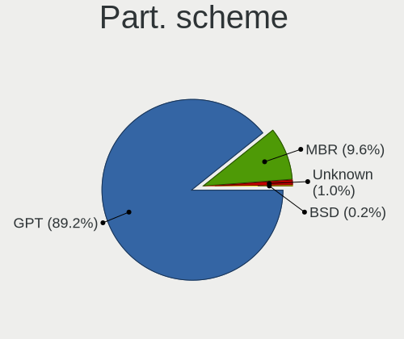
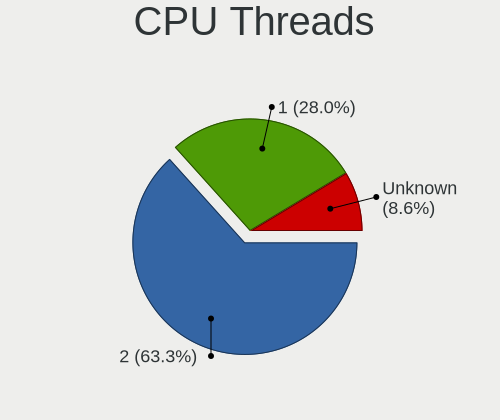
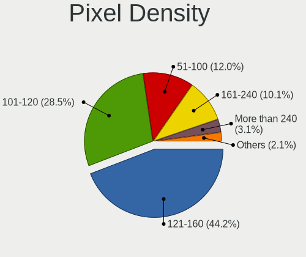
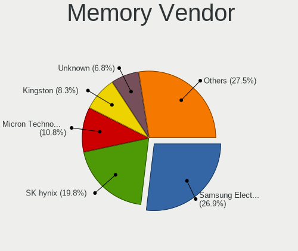
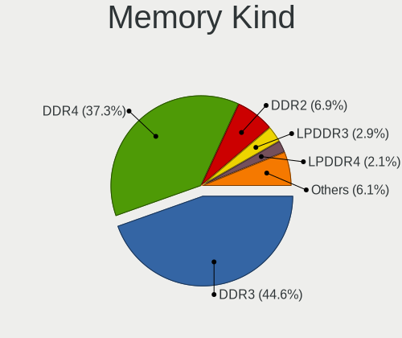

BSD - Tested Hardware & Statistics (Notebooks)
----------------------------------------------

A project to collect tested hardware configurations for BSD.

Anyone can contribute to this report by the [hw-probe](https://github.com/linuxhw/hw-probe/blob/master/INSTALL.BSD.md) tool:

    hw-probe -all -upload

Please contribute! Especially if your hardware is rare.

This report is for real hardware. Report for virtual hardware: [TestDays_VE](https://github.com/bsdhw/TestDays_VE)

Contents
--------

* [ Test Cases ](#test-cases)

* [ System ](#system)
  - [ OS                       ](#os)
  - [ OS Family                ](#os-family)
  - [ Arch                     ](#arch)
  - [ DE                       ](#de)
  - [ Display Server           ](#display-server)
  - [ Display Manager          ](#display-manager)
  - [ OS Lang                  ](#os-lang)
  - [ Boot Mode                ](#boot-mode)
  - [ Filesystem               ](#filesystem)
  - [ Part. scheme             ](#part-scheme)

* [ Board ](#board)
  - [ Vendor                   ](#vendor)
  - [ Model                    ](#model)
  - [ Model Family             ](#model-family)
  - [ MFG Year                 ](#mfg-year)
  - [ Form Factor              ](#form-factor)
  - [ Coreboot                 ](#coreboot)
  - [ RAM Size                 ](#ram-size)
  - [ RAM Used                 ](#ram-used)
  - [ Total Drives             ](#total-drives)
  - [ Has CD-ROM               ](#has-cd-rom)
  - [ Has Ethernet             ](#has-ethernet)
  - [ Has WiFi                 ](#has-wifi)
  - [ Has Bluetooth            ](#has-bluetooth)

* [ Location ](#location)
  - [ Country                  ](#country)
  - [ City                     ](#city)

* [ Drives ](#drives)
  - [ Drive Vendor             ](#drive-vendor)
  - [ Drive Model              ](#drive-model)
  - [ HDD Vendor               ](#hdd-vendor)
  - [ SSD Vendor               ](#ssd-vendor)
  - [ Drive Kind               ](#drive-kind)
  - [ Drive Connector          ](#drive-connector)
  - [ Drive Size               ](#drive-size)
  - [ Space Total              ](#space-total)
  - [ Space Used               ](#space-used)
  - [ Malfunc. Drives          ](#malfunc-drives)
  - [ Malfunc. Drive Vendor    ](#malfunc-drive-vendor)
  - [ Malfunc. HDD Vendor      ](#malfunc-hdd-vendor)
  - [ Malfunc. Drive Kind      ](#malfunc-drive-kind)
  - [ Failed Drives            ](#failed-drives)
  - [ Failed Drive Vendor      ](#failed-drive-vendor)
  - [ Drive Status             ](#drive-status)

* [ Storage controller ](#storage-controller)
  - [ Storage Vendor           ](#storage-vendor)
  - [ Storage Model            ](#storage-model)
  - [ Storage Kind             ](#storage-kind)

* [ Processor ](#processor)
  - [ CPU Vendor               ](#cpu-vendor)
  - [ CPU Model                ](#cpu-model)
  - [ CPU Model Family         ](#cpu-model-family)
  - [ CPU Cores                ](#cpu-cores)
  - [ CPU Sockets              ](#cpu-sockets)
  - [ CPU Threads              ](#cpu-threads)
  - [ CPU Microarch            ](#cpu-microarch)

* [ Graphics ](#graphics)
  - [ GPU Vendor               ](#gpu-vendor)
  - [ GPU Model                ](#gpu-model)
  - [ GPU Combo                ](#gpu-combo)
  - [ GPU Driver               ](#gpu-driver)
  - [ GPU Memory               ](#gpu-memory)

* [ Monitor ](#monitor)
  - [ Monitor Vendor           ](#monitor-vendor)
  - [ Monitor Model            ](#monitor-model)
  - [ Monitor Resolution       ](#monitor-resolution)
  - [ Monitor Diagonal         ](#monitor-diagonal)
  - [ Monitor Width            ](#monitor-width)
  - [ Aspect Ratio             ](#aspect-ratio)
  - [ Monitor Area             ](#monitor-area)
  - [ Pixel Density            ](#pixel-density)
  - [ Multiple Monitors        ](#multiple-monitors)

* [ Network ](#network)
  - [ Net Controller Vendor    ](#net-controller-vendor)
  - [ Net Controller Model     ](#net-controller-model)
  - [ Wireless Vendor          ](#wireless-vendor)
  - [ Wireless Model           ](#wireless-model)
  - [ Ethernet Vendor          ](#ethernet-vendor)
  - [ Ethernet Model           ](#ethernet-model)
  - [ Net Controller Kind      ](#net-controller-kind)
  - [ Used Controller          ](#used-controller)
  - [ NICs                     ](#nics)
  - [ IPv6                     ](#ipv6)

* [ Bluetooth ](#bluetooth)
  - [ Bluetooth Vendor         ](#bluetooth-vendor)
  - [ Bluetooth Model          ](#bluetooth-model)

* [ Sound ](#sound)
  - [ Sound Vendor             ](#sound-vendor)
  - [ Sound Model              ](#sound-model)

* [ Memory ](#memory)
  - [ Memory Vendor            ](#memory-vendor)
  - [ Memory Model             ](#memory-model)
  - [ Memory Kind              ](#memory-kind)
  - [ Memory Form Factor       ](#memory-form-factor)
  - [ Memory Size              ](#memory-size)
  - [ Memory Speed             ](#memory-speed)

* [ Printers & scanners ](#printers--scanners)
  - [ Printer Vendor           ](#printer-vendor)
  - [ Printer Model            ](#printer-model)
  - [ Scanner Vendor           ](#scanner-vendor)
  - [ Scanner Model            ](#scanner-model)

* [ Camera ](#camera)
  - [ Camera Vendor            ](#camera-vendor)
  - [ Camera Model             ](#camera-model)

* [ Security ](#security)
  - [ Fingerprint Vendor       ](#fingerprint-vendor)
  - [ Fingerprint Model        ](#fingerprint-model)
  - [ Chipcard Vendor          ](#chipcard-vendor)
  - [ Chipcard Model           ](#chipcard-model)

* [ Unsupported ](#unsupported)
  - [ Unsupported Devices      ](#unsupported-devices)
  - [ Unsupported Device Types ](#unsupported-device-types)

Test Cases
----------

Total: 3587

| Vendor        | Model                       | Probe                                                     | Date         |
|---------------|-----------------------------|-----------------------------------------------------------|--------------|
| Dell          | Inspiron 3180               | [cb769078b4](https://bsd-hardware.info/?probe=cb769078b4) | Jun 10, 2023 |
| Dell          | Inspiron 5593               | [8bedc249ea](https://bsd-hardware.info/?probe=8bedc249ea) | Jun 10, 2023 |
| Dell          | Inspiron 7548               | [c80bb80e8f](https://bsd-hardware.info/?probe=c80bb80e8f) | Jun 10, 2023 |
| Lenovo        | B40-30 80F10002BR           | [769c678314](https://bsd-hardware.info/?probe=769c678314) | Jun 10, 2023 |
| Lenovo        | ThinkPad T430 2347GR2       | [439e6a5034](https://bsd-hardware.info/?probe=439e6a5034) | Jun 10, 2023 |
| Unknown       | Unknown                     | [9afa1aea18](https://bsd-hardware.info/?probe=9afa1aea18) | Jun 10, 2023 |
| Lenovo        | ThinkBook 14 G4+ ARA 21D... | [27ba75252a](https://bsd-hardware.info/?probe=27ba75252a) | Jun 09, 2023 |
| Lenovo        | ThinkPad T480 20L6S5VP4C    | [b891388109](https://bsd-hardware.info/?probe=b891388109) | Jun 07, 2023 |
| ASUSTek       | 1015BX                      | [ad05aaf9fe](https://bsd-hardware.info/?probe=ad05aaf9fe) | Jun 07, 2023 |
| Deciso        | NetBoard-A20                | [0754642fe6](https://bsd-hardware.info/?probe=0754642fe6) | Jun 07, 2023 |
| Unknown       | Unknown                     | [422b9d51a7](https://bsd-hardware.info/?probe=422b9d51a7) | Jun 06, 2023 |
| Dell          | Inspiron 5559               | [fe5f99c4b0](https://bsd-hardware.info/?probe=fe5f99c4b0) | Jun 06, 2023 |
| Lenovo        | ThinkPad E15 Gen 4 21EDC... | [9f18b1b304](https://bsd-hardware.info/?probe=9f18b1b304) | Jun 06, 2023 |
| Lenovo        | ThinkPad T500 2082BNU       | [dedd066084](https://bsd-hardware.info/?probe=dedd066084) | Jun 06, 2023 |
| Lenovo        | ThinkPad E15 Gen 4 21EDC... | [85c18dbbb5](https://bsd-hardware.info/?probe=85c18dbbb5) | Jun 06, 2023 |
| Lenovo        | IdeaPad Slim 9 14ITL5 82... | [03e1e6d302](https://bsd-hardware.info/?probe=03e1e6d302) | Jun 05, 2023 |
| Deciso        | Netboard A20                | [eb03ae7215](https://bsd-hardware.info/?probe=eb03ae7215) | Jun 05, 2023 |
| Toshiba       | Satellite C70-B             | [cf9ed85e65](https://bsd-hardware.info/?probe=cf9ed85e65) | Jun 05, 2023 |
| Toshiba       | Satellite C70-B             | [fc66ebba25](https://bsd-hardware.info/?probe=fc66ebba25) | Jun 05, 2023 |
| Lenovo        | S10-3                       | [f874a66e78](https://bsd-hardware.info/?probe=f874a66e78) | Jun 05, 2023 |
| Lenovo        | S10-3                       | [b76483ab8b](https://bsd-hardware.info/?probe=b76483ab8b) | Jun 05, 2023 |
| HP            | Pavilion Laptop 15-eh1xx... | [e1a7d29d74](https://bsd-hardware.info/?probe=e1a7d29d74) | Jun 04, 2023 |
| HP            | Pavilion Laptop 15-eh1xx... | [d0d9de7cf3](https://bsd-hardware.info/?probe=d0d9de7cf3) | Jun 04, 2023 |
| Deciso        | NetBoard-A10                | [ab3919bc32](https://bsd-hardware.info/?probe=ab3919bc32) | Jun 04, 2023 |
| Lenovo        | B590 20208                  | [dc65d735c8](https://bsd-hardware.info/?probe=dc65d735c8) | Jun 04, 2023 |
| Unknown       | Unknown                     | [a243045cc3](https://bsd-hardware.info/?probe=a243045cc3) | Jun 04, 2023 |
| Dell          | G5 5505                     | [5a3c1f19a0](https://bsd-hardware.info/?probe=5a3c1f19a0) | Jun 03, 2023 |
| Lenovo        | ThinkPad X240 20AMS0250T    | [047c7b72b4](https://bsd-hardware.info/?probe=047c7b72b4) | Jun 02, 2023 |
| Panasonic     | CF-NX1GDHYS                 | [fb1f293997](https://bsd-hardware.info/?probe=fb1f293997) | Jun 02, 2023 |
| Deciso        | NetBoard-A20                | [48a63a2328](https://bsd-hardware.info/?probe=48a63a2328) | Jun 02, 2023 |
| Dell          | G5 5505                     | [1b10aecc38](https://bsd-hardware.info/?probe=1b10aecc38) | Jun 02, 2023 |
| HP            | EliteBook 8570p             | [22572f1df6](https://bsd-hardware.info/?probe=22572f1df6) | Jun 01, 2023 |
| Dell          | Inspiron 5559               | [330c08c388](https://bsd-hardware.info/?probe=330c08c388) | Jun 01, 2023 |
| Dell          | Inspiron 5559               | [53cf3cea13](https://bsd-hardware.info/?probe=53cf3cea13) | Jun 01, 2023 |
| Lenovo        | ThinkPad E495 20NE000BSP    | [0e02b323ee](https://bsd-hardware.info/?probe=0e02b323ee) | Jun 01, 2023 |
| Lenovo        | ThinkPad T15p Gen 3 21DA... | [8cc6299ba9](https://bsd-hardware.info/?probe=8cc6299ba9) | May 31, 2023 |
| Lenovo        | ThinkPad X270 20HMCTO1WW    | [b5f507c034](https://bsd-hardware.info/?probe=b5f507c034) | May 31, 2023 |
| HP            | Pavilion Notebook           | [1bb0436fe5](https://bsd-hardware.info/?probe=1bb0436fe5) | May 30, 2023 |
| IGEL Techn... | H830C                       | [01e377524a](https://bsd-hardware.info/?probe=01e377524a) | May 29, 2023 |
| Apple         | MacBookPro10,2              | [c274e2c9db](https://bsd-hardware.info/?probe=c274e2c9db) | May 29, 2023 |
| Dell          | System XPS L702X            | [f56d7090f9](https://bsd-hardware.info/?probe=f56d7090f9) | May 28, 2023 |
| Lenovo        | ThinkPad X13 Gen 1 20UGS... | [6701dce30e](https://bsd-hardware.info/?probe=6701dce30e) | May 28, 2023 |
| Dell          | Inspiron 5559               | [23cad3f06e](https://bsd-hardware.info/?probe=23cad3f06e) | May 28, 2023 |
| Deciso        | OPNsense Appliance          | [c47f62b522](https://bsd-hardware.info/?probe=c47f62b522) | May 28, 2023 |
| Fujitsu       | Unknown                     | [3b5c9ab914](https://bsd-hardware.info/?probe=3b5c9ab914) | May 27, 2023 |
| Toshiba       | NB250                       | [62c572e895](https://bsd-hardware.info/?probe=62c572e895) | May 27, 2023 |
| Lenovo        | ThinkPad P14s Gen 1 20S4... | [3944241750](https://bsd-hardware.info/?probe=3944241750) | May 27, 2023 |
| Tactus        | GeoFlex 110                 | [df93ad7e83](https://bsd-hardware.info/?probe=df93ad7e83) | May 27, 2023 |
| HP            | EliteBook 8570p             | [65376d6b42](https://bsd-hardware.info/?probe=65376d6b42) | May 27, 2023 |
| Acer          | Nitro AN515-42              | [adc687fcfe](https://bsd-hardware.info/?probe=adc687fcfe) | May 26, 2023 |
| Lenovo        | ThinkPad X140e 20BMS03E0... | [580c52399f](https://bsd-hardware.info/?probe=580c52399f) | May 25, 2023 |
| Deciso        | NetBoard-A20                | [0c5fd49340](https://bsd-hardware.info/?probe=0c5fd49340) | May 25, 2023 |
| Lenovo        | Yoga 2 Pro 20266            | [a2726e621b](https://bsd-hardware.info/?probe=a2726e621b) | May 25, 2023 |
| Timi          | TM1701                      | [1dd768a721](https://bsd-hardware.info/?probe=1dd768a721) | May 25, 2023 |
| Acer          | Nitro AN515-57              | [c39ea00de5](https://bsd-hardware.info/?probe=c39ea00de5) | May 25, 2023 |
| Dell          | System XPS L702X            | [857016be75](https://bsd-hardware.info/?probe=857016be75) | May 24, 2023 |
| Lenovo        | ThinkPad T430 2347CTO       | [68937b1686](https://bsd-hardware.info/?probe=68937b1686) | May 24, 2023 |
| Unknown       | Unknown                     | [3b4be5b07a](https://bsd-hardware.info/?probe=3b4be5b07a) | May 24, 2023 |
| HP            | EliteBook 8570p             | [a1a68c0f7d](https://bsd-hardware.info/?probe=a1a68c0f7d) | May 24, 2023 |
| Acer          | Aspire E5-573               | [7bcb7c96be](https://bsd-hardware.info/?probe=7bcb7c96be) | May 23, 2023 |
| ASUSTek       | K42Jc                       | [3da2928a08](https://bsd-hardware.info/?probe=3da2928a08) | May 23, 2023 |
| Dell          | Inspiron 5559               | [9a2c066dfa](https://bsd-hardware.info/?probe=9a2c066dfa) | May 23, 2023 |
| Lenovo        | ThinkPad X140e 20BMS03E0... | [84e3ac62d5](https://bsd-hardware.info/?probe=84e3ac62d5) | May 23, 2023 |
| HP            | EliteBook 8570p             | [b5f17b6bf8](https://bsd-hardware.info/?probe=b5f17b6bf8) | May 23, 2023 |
| Google        | Sentry                      | [107124dd66](https://bsd-hardware.info/?probe=107124dd66) | May 22, 2023 |
| Sony          | VPCEG15FB                   | [8777493861](https://bsd-hardware.info/?probe=8777493861) | May 21, 2023 |
| HP            | Pavilion Notebook           | [41ce3c5d11](https://bsd-hardware.info/?probe=41ce3c5d11) | May 21, 2023 |
| Apple         | MacBookPro10,1              | [643f7277de](https://bsd-hardware.info/?probe=643f7277de) | May 21, 2023 |
| HP            | ZBook 15 G3                 | [4965fc4251](https://bsd-hardware.info/?probe=4965fc4251) | May 21, 2023 |
| Acer          | Aspire A514-54              | [7aed9d938a](https://bsd-hardware.info/?probe=7aed9d938a) | May 21, 2023 |
| Dell          | Inspiron 5559               | [a87acae699](https://bsd-hardware.info/?probe=a87acae699) | May 21, 2023 |
| HP            | ProBook 455 G3              | [b6a6c91115](https://bsd-hardware.info/?probe=b6a6c91115) | May 21, 2023 |
| Lenovo        | ThinkPad 11e 20DAS0S300     | [44d30cfcf6](https://bsd-hardware.info/?probe=44d30cfcf6) | May 21, 2023 |
| Unknown       | Unknown                     | [2a2b4272f9](https://bsd-hardware.info/?probe=2a2b4272f9) | May 20, 2023 |
| Unknown       | Apple MacBook Pro (13-in... | [5e25a49c65](https://bsd-hardware.info/?probe=5e25a49c65) | May 20, 2023 |
| Packard Be... | EasyNote LJ65               | [36d3e7aaf7](https://bsd-hardware.info/?probe=36d3e7aaf7) | May 19, 2023 |
| HP            | EliteBook 8570p             | [70d54595c2](https://bsd-hardware.info/?probe=70d54595c2) | May 19, 2023 |
| Valve         | Jupiter                     | [7be0869603](https://bsd-hardware.info/?probe=7be0869603) | May 19, 2023 |
| Valve         | Jupiter                     | [ef56a2bd17](https://bsd-hardware.info/?probe=ef56a2bd17) | May 19, 2023 |
| Lenovo        | ThinkPad T560 20FJS03Q00    | [a2110471aa](https://bsd-hardware.info/?probe=a2110471aa) | May 18, 2023 |
| Deciso        | NetBoard-A20                | [313796fd3e](https://bsd-hardware.info/?probe=313796fd3e) | May 18, 2023 |
| Lenovo        | ThinkPad X201 3323BBG       | [7b529b0888](https://bsd-hardware.info/?probe=7b529b0888) | May 17, 2023 |
| Panasonic     | CF-30KAPAXAM                | [62910ad9d9](https://bsd-hardware.info/?probe=62910ad9d9) | May 17, 2023 |
| Dell          | Inspiron 5559               | [dca662fc41](https://bsd-hardware.info/?probe=dca662fc41) | May 16, 2023 |
| Lenovo        | ThinkPad T61 7659AS5        | [7732b2cfa7](https://bsd-hardware.info/?probe=7732b2cfa7) | May 15, 2023 |
| Dell          | Inspiron 3581               | [25c403ca33](https://bsd-hardware.info/?probe=25c403ca33) | May 15, 2023 |
| HP            | EliteBook 8570p             | [e252dc5ff2](https://bsd-hardware.info/?probe=e252dc5ff2) | May 15, 2023 |
| Lenovo        | ThinkPad T61 7659AS5        | [b6071c549a](https://bsd-hardware.info/?probe=b6071c549a) | May 15, 2023 |
| Dell          | Inspiron 3581               | [8d445a3fb3](https://bsd-hardware.info/?probe=8d445a3fb3) | May 14, 2023 |
| Sony          | SVF14A15CBB                 | [4ada2dca25](https://bsd-hardware.info/?probe=4ada2dca25) | May 14, 2023 |
| Lenovo        | ThinkPad T14s Gen 1 20UH... | [526906c806](https://bsd-hardware.info/?probe=526906c806) | May 14, 2023 |
| Alienware     | 17 R4                       | [df734c8e64](https://bsd-hardware.info/?probe=df734c8e64) | May 14, 2023 |
| Lenovo        | ThinkPad T14 Gen 1 20S1S... | [8aede62ca8](https://bsd-hardware.info/?probe=8aede62ca8) | May 14, 2023 |
| Lenovo        | B570e HuronRiver Platfor... | [256915976d](https://bsd-hardware.info/?probe=256915976d) | May 12, 2023 |
| TUXEDO        | Aura 15 Gen1                | [3d889e8b9b](https://bsd-hardware.info/?probe=3d889e8b9b) | May 11, 2023 |
| Intel         | HuronRiver Platform         | [83494ffd65](https://bsd-hardware.info/?probe=83494ffd65) | May 11, 2023 |
| Medion        | Major X10                   | [99228fd9da](https://bsd-hardware.info/?probe=99228fd9da) | May 10, 2023 |
| Deciso        | NetBoard-A10                | [37ee98e0b6](https://bsd-hardware.info/?probe=37ee98e0b6) | May 09, 2023 |
| Apple         | MacBook5,1                  | [da07885adb](https://bsd-hardware.info/?probe=da07885adb) | May 09, 2023 |
| Notebook      | N7x0WU                      | [7a646e185a](https://bsd-hardware.info/?probe=7a646e185a) | May 09, 2023 |
| MSI           | GE62 6QC                    | [7c3fd3c9ca](https://bsd-hardware.info/?probe=7c3fd3c9ca) | May 08, 2023 |
| Lenovo        | Yoga Slim 7 Pro 14ACH5 8... | [95695f78c5](https://bsd-hardware.info/?probe=95695f78c5) | May 08, 2023 |
| Lenovo        | ThinkPad T410 2537N24       | [6cd0f02045](https://bsd-hardware.info/?probe=6cd0f02045) | May 08, 2023 |
| Matsushita... | CF-48V4KNDQM                | [79f10d24d6](https://bsd-hardware.info/?probe=79f10d24d6) | May 07, 2023 |
| HP            | Laptop 14-bs0xx             | [98ea66d6e8](https://bsd-hardware.info/?probe=98ea66d6e8) | May 07, 2023 |
| Deciso        | OPNsense Appliance          | [2745eadfd9](https://bsd-hardware.info/?probe=2745eadfd9) | May 07, 2023 |
| ASUSTek       | 1000HE                      | [36214f8bed](https://bsd-hardware.info/?probe=36214f8bed) | May 07, 2023 |
| Lenovo        | ThinkPad T14 Gen 1 20UES... | [d2bd7a8764](https://bsd-hardware.info/?probe=d2bd7a8764) | May 07, 2023 |
| Acer          | V5-131                      | [9d3ba324bc](https://bsd-hardware.info/?probe=9d3ba324bc) | May 06, 2023 |
| Lenovo        | ThinkPad T500 205663G       | [d706da9400](https://bsd-hardware.info/?probe=d706da9400) | May 06, 2023 |
| Lenovo        | ThinkPad T480s 20L8A00KC... | [44ddee0eec](https://bsd-hardware.info/?probe=44ddee0eec) | May 06, 2023 |
| Panasonic     | CF-30KAPAXAM                | [1c918b79b0](https://bsd-hardware.info/?probe=1c918b79b0) | May 06, 2023 |
| Matsushita... | CF-51RCVDNLM                | [105a885451](https://bsd-hardware.info/?probe=105a885451) | May 05, 2023 |
| Lenovo        | ThinkPad T420s 41742BU      | [161fe49de4](https://bsd-hardware.info/?probe=161fe49de4) | May 05, 2023 |
| Lenovo        | ThinkPad X230 2325T4T       | [00303b7a59](https://bsd-hardware.info/?probe=00303b7a59) | May 05, 2023 |
| Lenovo        | ThinkPad X220 429043U       | [bb714a4350](https://bsd-hardware.info/?probe=bb714a4350) | May 05, 2023 |
| Lenovo        | ThinkPad X1 Carbon 4th 2... | [28e76d5531](https://bsd-hardware.info/?probe=28e76d5531) | May 04, 2023 |
| Lenovo        | ThinkPad T430 2347GZU       | [8c3f486dbc](https://bsd-hardware.info/?probe=8c3f486dbc) | May 03, 2023 |
| Apple         | MacBookPro11,5              | [45bffd3275](https://bsd-hardware.info/?probe=45bffd3275) | May 03, 2023 |
| Lenovo        | Flex 2-15 20405             | [3773da7851](https://bsd-hardware.info/?probe=3773da7851) | May 03, 2023 |
| Panasonic     | CF-52PFPBSFQ                | [e2c3df29b5](https://bsd-hardware.info/?probe=e2c3df29b5) | May 03, 2023 |
| HP            | Compaq Presario CQ50        | [f296048a29](https://bsd-hardware.info/?probe=f296048a29) | May 03, 2023 |
| Samsung       | NC110P/NC108P/NC111P        | [ea55a6fecf](https://bsd-hardware.info/?probe=ea55a6fecf) | May 02, 2023 |
| Apple         | MacBook5,1                  | [a5a1ca2ee6](https://bsd-hardware.info/?probe=a5a1ca2ee6) | May 02, 2023 |
| Panasonic     | CF-53AAGHYDM                | [c7daf17edb](https://bsd-hardware.info/?probe=c7daf17edb) | May 02, 2023 |
| Lenovo        | ThinkPad L450 20DSS1S402    | [f899593f61](https://bsd-hardware.info/?probe=f899593f61) | May 01, 2023 |
| Lenovo        | ThinkPad X270 W10DG 20K5... | [b09acffe7b](https://bsd-hardware.info/?probe=b09acffe7b) | May 01, 2023 |
| Lenovo        | ThinkPad X260 20F5S2GM00    | [c4af168c4a](https://bsd-hardware.info/?probe=c4af168c4a) | May 01, 2023 |
| Lenovo        | ThinkPad X270 W10DG 20K5... | [cf504f51df](https://bsd-hardware.info/?probe=cf504f51df) | May 01, 2023 |
| ReachingTe... | DreamQuest Pro 2022         | [afd28a7425](https://bsd-hardware.info/?probe=afd28a7425) | Apr 30, 2023 |
| Fujitsu       | LIFEBOOK E752               | [44ea9fb6ae](https://bsd-hardware.info/?probe=44ea9fb6ae) | Apr 30, 2023 |
| Dell          | Latitude E5570              | [98e3f9821b](https://bsd-hardware.info/?probe=98e3f9821b) | Apr 29, 2023 |
| HP            | ProBook 640 G4              | [7b44e1591f](https://bsd-hardware.info/?probe=7b44e1591f) | Apr 29, 2023 |
| Deciso        | NetBoard-A10                | [79c36f752c](https://bsd-hardware.info/?probe=79c36f752c) | Apr 28, 2023 |
| Deciso        | NetBoard-A20                | [baa443b8ea](https://bsd-hardware.info/?probe=baa443b8ea) | Apr 28, 2023 |
| Apple         | MacBookPro8,3               | [08e155a558](https://bsd-hardware.info/?probe=08e155a558) | Apr 27, 2023 |
| HP            | OMEN by Laptop 15-dc1xxx    | [fc81710889](https://bsd-hardware.info/?probe=fc81710889) | Apr 27, 2023 |
| Apple         | MacBook5,1                  | [52174cc0ba](https://bsd-hardware.info/?probe=52174cc0ba) | Apr 27, 2023 |
| Lenovo        | ThinkPad T470s W10DG 20J... | [692df89c1f](https://bsd-hardware.info/?probe=692df89c1f) | Apr 26, 2023 |
| Apple         | MacBook5,1                  | [4c7f33d6a9](https://bsd-hardware.info/?probe=4c7f33d6a9) | Apr 25, 2023 |
| Deciso        | NetBoard-A20                | [3d0f6b629d](https://bsd-hardware.info/?probe=3d0f6b629d) | Apr 25, 2023 |
| Shuttle       | DS437                       | [284decb573](https://bsd-hardware.info/?probe=284decb573) | Apr 25, 2023 |
| HP            | Pavilion Notebook           | [247810c987](https://bsd-hardware.info/?probe=247810c987) | Apr 24, 2023 |
| Samsung       | 340XAA/350XAA/550XAA        | [7caed06fdb](https://bsd-hardware.info/?probe=7caed06fdb) | Apr 24, 2023 |
| Google        | Peppy                       | [d162160498](https://bsd-hardware.info/?probe=d162160498) | Apr 24, 2023 |
| Fujitsu Si... | AMILO Li3710                | [214b0c30e0](https://bsd-hardware.info/?probe=214b0c30e0) | Apr 23, 2023 |
| HP            | Unknown                     | [e2aa3620b4](https://bsd-hardware.info/?probe=e2aa3620b4) | Apr 23, 2023 |
| Lenovo        | ThinkPad X270 20HMS06Q1D    | [2df7c991f0](https://bsd-hardware.info/?probe=2df7c991f0) | Apr 23, 2023 |
| Lenovo        | G500 20236                  | [e7387bfd6e](https://bsd-hardware.info/?probe=e7387bfd6e) | Apr 23, 2023 |
| Dell          | Inspiron 3421               | [ef4870410f](https://bsd-hardware.info/?probe=ef4870410f) | Apr 23, 2023 |
| HP            | Pavilion Notebook           | [243a9c2f22](https://bsd-hardware.info/?probe=243a9c2f22) | Apr 22, 2023 |
| Intel Clie... | LAPBC510                    | [68b1300903](https://bsd-hardware.info/?probe=68b1300903) | Apr 22, 2023 |
| HP            | Pavilion 17                 | [0f891b4377](https://bsd-hardware.info/?probe=0f891b4377) | Apr 21, 2023 |
| Lenovo        | ThinkPad W520 4270CTO       | [51f0a87f01](https://bsd-hardware.info/?probe=51f0a87f01) | Apr 21, 2023 |
| Lenovo        | Yoga Slim 7 14ITL05 82A3    | [93b498fb0c](https://bsd-hardware.info/?probe=93b498fb0c) | Apr 21, 2023 |
| HP            | OMEN by Laptop 15-dc1xxx    | [e17bcecec8](https://bsd-hardware.info/?probe=e17bcecec8) | Apr 21, 2023 |
| Dell          | Latitude 7280               | [254acb5df8](https://bsd-hardware.info/?probe=254acb5df8) | Apr 20, 2023 |
| HP            | EliteBook 8570p             | [6e82f69c4c](https://bsd-hardware.info/?probe=6e82f69c4c) | Apr 20, 2023 |
| Lenovo        | Legion 5 15ARH05 82B5       | [541f3e7f7e](https://bsd-hardware.info/?probe=541f3e7f7e) | Apr 20, 2023 |
| ReachingTe... | DreamQuest Pro 2022         | [c4b2619dda](https://bsd-hardware.info/?probe=c4b2619dda) | Apr 20, 2023 |
| Dell          | Precision 5510              | [7028fde527](https://bsd-hardware.info/?probe=7028fde527) | Apr 20, 2023 |
| Lenovo        | ThinkPad X201 3626WNP       | [d642970071](https://bsd-hardware.info/?probe=d642970071) | Apr 19, 2023 |
| Packard Be... | DOT SE                      | [f456e964db](https://bsd-hardware.info/?probe=f456e964db) | Apr 19, 2023 |
| Dell          | Latitude 7410               | [d5c047907d](https://bsd-hardware.info/?probe=d5c047907d) | Apr 19, 2023 |
| Acer          | V5-131                      | [4c2332c3b8](https://bsd-hardware.info/?probe=4c2332c3b8) | Apr 19, 2023 |
| HP            | Unknown                     | [941c021569](https://bsd-hardware.info/?probe=941c021569) | Apr 18, 2023 |
| HP            | Laptop 14-dk1xxx            | [464059d8b1](https://bsd-hardware.info/?probe=464059d8b1) | Apr 18, 2023 |
| Medion        | E15302                      | [f47f32e1cc](https://bsd-hardware.info/?probe=f47f32e1cc) | Apr 17, 2023 |
| Lenovo        | IdeaPad 3 14ITL05 81X7      | [b8d2c0d81d](https://bsd-hardware.info/?probe=b8d2c0d81d) | Apr 16, 2023 |
| Apple         | MacBookPro11,5              | [4f6fb0c095](https://bsd-hardware.info/?probe=4f6fb0c095) | Apr 16, 2023 |
| Apple         | MacBookPro11,5              | [052f95c2a9](https://bsd-hardware.info/?probe=052f95c2a9) | Apr 16, 2023 |
| Toshiba       | PORTEGE R700                | [8b196955ac](https://bsd-hardware.info/?probe=8b196955ac) | Apr 15, 2023 |
| Apple         | MacBook3,1                  | [74986a169a](https://bsd-hardware.info/?probe=74986a169a) | Apr 15, 2023 |
| Dell          | Inspiron 3542               | [4dfa2f0148](https://bsd-hardware.info/?probe=4dfa2f0148) | Apr 15, 2023 |
| Unknown       | Unknown                     | [c221bccd5d](https://bsd-hardware.info/?probe=c221bccd5d) | Apr 14, 2023 |
| Lenovo        | IdeaPad Gaming 3 15IHU6 ... | [b189b0988c](https://bsd-hardware.info/?probe=b189b0988c) | Apr 14, 2023 |
| Lenovo        | G570 20079                  | [0ebba481d1](https://bsd-hardware.info/?probe=0ebba481d1) | Apr 14, 2023 |
| Lenovo        | ThinkPad T440s 20ARA07PL... | [04ddab3620](https://bsd-hardware.info/?probe=04ddab3620) | Apr 14, 2023 |
| Lenovo        | ThinkPad R61 89208RU        | [e892cdffee](https://bsd-hardware.info/?probe=e892cdffee) | Apr 13, 2023 |
| F-Plus Mob... | FLAPTOP r                   | [3d7bf4205b](https://bsd-hardware.info/?probe=3d7bf4205b) | Apr 13, 2023 |
| HMT           | W041-TF-A-45                | [298d106fd1](https://bsd-hardware.info/?probe=298d106fd1) | Apr 13, 2023 |
| Google        | Terra                       | [ef1619f65f](https://bsd-hardware.info/?probe=ef1619f65f) | Apr 13, 2023 |
| Google        | Terra                       | [bf598bc5bf](https://bsd-hardware.info/?probe=bf598bc5bf) | Apr 13, 2023 |
| Samsung       | 370E4K                      | [c363d008bf](https://bsd-hardware.info/?probe=c363d008bf) | Apr 13, 2023 |
| TUXEDO        | Pulse 15 Gen1               | [bee20c6a4c](https://bsd-hardware.info/?probe=bee20c6a4c) | Apr 12, 2023 |
| Lenovo        | ThinkPad L540 20AUA34DJP    | [c7e40ee8ea](https://bsd-hardware.info/?probe=c7e40ee8ea) | Apr 12, 2023 |
| Lenovo        | ThinkPad X230 23257EP       | [e94085cd2d](https://bsd-hardware.info/?probe=e94085cd2d) | Apr 12, 2023 |
| Samsung       | N150/N210/N220              | [f6e5189f54](https://bsd-hardware.info/?probe=f6e5189f54) | Apr 11, 2023 |
| Lenovo        | ThinkPad X280 20KESB4T00    | [fb6c7b3b09](https://bsd-hardware.info/?probe=fb6c7b3b09) | Apr 11, 2023 |
| Lenovo        | ThinkPad X1 Carbon Gen 9... | [add8280600](https://bsd-hardware.info/?probe=add8280600) | Apr 11, 2023 |
| Lenovo        | ThinkPad L15 Gen 2 20X3C... | [0249b4e73f](https://bsd-hardware.info/?probe=0249b4e73f) | Apr 11, 2023 |
| Lenovo        | ThinkPad L540 20AUA34DJP    | [52aac5fc6f](https://bsd-hardware.info/?probe=52aac5fc6f) | Apr 11, 2023 |
| Unknown       | Unknown                     | [5bfbfb213e](https://bsd-hardware.info/?probe=5bfbfb213e) | Apr 09, 2023 |
| Fujitsu Si... | AMILO Li3710                | [6dabd5d84a](https://bsd-hardware.info/?probe=6dabd5d84a) | Apr 08, 2023 |
| Lenovo        | Yoga Slim 7 Pro 14ACH5 8... | [692b42afcd](https://bsd-hardware.info/?probe=692b42afcd) | Apr 08, 2023 |
| Lenovo        | ThinkPad X1 Carbon 34487... | [cec90ddd1b](https://bsd-hardware.info/?probe=cec90ddd1b) | Apr 08, 2023 |
| Lenovo        | Legion 5 Pro 16ACH6H 82J... | [f3ac765863](https://bsd-hardware.info/?probe=f3ac765863) | Apr 08, 2023 |
| Dell          | Latitude 7300               | [d036260cce](https://bsd-hardware.info/?probe=d036260cce) | Apr 08, 2023 |
| Dell          | XPS 13 9343                 | [8354aed46e](https://bsd-hardware.info/?probe=8354aed46e) | Apr 07, 2023 |
| Fujitsu       | CELSIUS H920                | [0551eecbcc](https://bsd-hardware.info/?probe=0551eecbcc) | Apr 06, 2023 |
| Acer          | Aspire 5250                 | [385751dbc3](https://bsd-hardware.info/?probe=385751dbc3) | Apr 06, 2023 |
| ASUSTek       | X200MA                      | [c30e92db89](https://bsd-hardware.info/?probe=c30e92db89) | Apr 06, 2023 |
| SIEMENS       | SIMATIC IPC127E             | [40a11e4c68](https://bsd-hardware.info/?probe=40a11e4c68) | Apr 06, 2023 |
| Fujitsu       | LIFEBOOK U810               | [3073cd605c](https://bsd-hardware.info/?probe=3073cd605c) | Apr 06, 2023 |
| Dell          | Inspiron 5567               | [a305360215](https://bsd-hardware.info/?probe=a305360215) | Apr 05, 2023 |
| IGEL Techn... | M340C                       | [6c8b2b7af7](https://bsd-hardware.info/?probe=6c8b2b7af7) | Apr 05, 2023 |
| Google        | Wolf                        | [2546416afd](https://bsd-hardware.info/?probe=2546416afd) | Apr 05, 2023 |
| HP            | Laptop 15-bw0xx             | [93ea83eef5](https://bsd-hardware.info/?probe=93ea83eef5) | Apr 03, 2023 |
| Fujitsu       | LIFEBOOK U810               | [c7718b4aa3](https://bsd-hardware.info/?probe=c7718b4aa3) | Apr 03, 2023 |
| Lenovo        | G570 20079                  | [76cc1653c3](https://bsd-hardware.info/?probe=76cc1653c3) | Apr 03, 2023 |
| Lenovo        | ThinkBook 14-IML 20RV       | [48b0a1024e](https://bsd-hardware.info/?probe=48b0a1024e) | Apr 02, 2023 |
| Apple         | MacBookPro12,1              | [640aad419a](https://bsd-hardware.info/?probe=640aad419a) | Apr 02, 2023 |
| Lenovo        | G50-30 80G0                 | [911a1723a2](https://bsd-hardware.info/?probe=911a1723a2) | Apr 02, 2023 |
| Lenovo        | ThinkPad T450s 20BW001KL... | [4f6a7e2739](https://bsd-hardware.info/?probe=4f6a7e2739) | Apr 02, 2023 |
| Lenovo        | ThinkPad T590 20N4001PUS    | [0b93ef8199](https://bsd-hardware.info/?probe=0b93ef8199) | Apr 02, 2023 |
| ASUSTek       | ASUS TUF Gaming A15 FA50... | [9bac0139f1](https://bsd-hardware.info/?probe=9bac0139f1) | Apr 01, 2023 |
| ASUSTek       | X58C                        | [dad28a9d36](https://bsd-hardware.info/?probe=dad28a9d36) | Apr 01, 2023 |
| Chuwi         | Unknown                     | [5e687fcc83](https://bsd-hardware.info/?probe=5e687fcc83) | Apr 01, 2023 |
| Fujitsu       | CELSIUS H920                | [e6300dc691](https://bsd-hardware.info/?probe=e6300dc691) | Mar 31, 2023 |
| DNS           | W9x0LU                      | [6539659387](https://bsd-hardware.info/?probe=6539659387) | Mar 31, 2023 |
| HMT           | W041-TF-A-45                | [666df5a7e0](https://bsd-hardware.info/?probe=666df5a7e0) | Mar 31, 2023 |
| Acer          | Aspire 5745DG               | [2b8bf9802e](https://bsd-hardware.info/?probe=2b8bf9802e) | Mar 31, 2023 |
| Lenovo        | ThinkPad X220 4290DK6       | [96c83a2846](https://bsd-hardware.info/?probe=96c83a2846) | Mar 31, 2023 |
| Deciso        | NetBoard-A20                | [33ca458105](https://bsd-hardware.info/?probe=33ca458105) | Mar 30, 2023 |
| Intel         | Intel                       | [75e9733afd](https://bsd-hardware.info/?probe=75e9733afd) | Mar 30, 2023 |
| Toshiba       | Satellite L675D             | [0bf578daec](https://bsd-hardware.info/?probe=0bf578daec) | Mar 30, 2023 |
| ASUSTek       | VivoBook_ASUS Laptop X50... | [ff14982ad9](https://bsd-hardware.info/?probe=ff14982ad9) | Mar 29, 2023 |
| Dell          | Latitude 5590               | [7e87d436df](https://bsd-hardware.info/?probe=7e87d436df) | Mar 29, 2023 |
| Google        | Stout                       | [d8346bb5da](https://bsd-hardware.info/?probe=d8346bb5da) | Mar 29, 2023 |
| Lenovo        | Yoga Slim 7 Pro 14ACH5 8... | [0af5cebe20](https://bsd-hardware.info/?probe=0af5cebe20) | Mar 29, 2023 |
| Lenovo        | ThinkPad X230 23255NG       | [2ef93a7621](https://bsd-hardware.info/?probe=2ef93a7621) | Mar 29, 2023 |
| Dell          | Inspiron 5547               | [4f4f6e06d7](https://bsd-hardware.info/?probe=4f4f6e06d7) | Mar 29, 2023 |
| Unknown       | Unknown                     | [2a50573c9f](https://bsd-hardware.info/?probe=2a50573c9f) | Mar 29, 2023 |
| Lenovo        | ThinkPad T540p 20BFS10W0... | [30c5fc2625](https://bsd-hardware.info/?probe=30c5fc2625) | Mar 29, 2023 |
| Irbis         | NB78                        | [471efbc788](https://bsd-hardware.info/?probe=471efbc788) | Mar 29, 2023 |
| Unknown       | Unknown                     | [ee06e14aa2](https://bsd-hardware.info/?probe=ee06e14aa2) | Mar 29, 2023 |
| Lenovo        | Yoga Slim 7 Pro 14ACH5 8... | [f4e450fed1](https://bsd-hardware.info/?probe=f4e450fed1) | Mar 29, 2023 |
| Lenovo        | IdeaPad 320-15ISK 80XH      | [dddf27cde4](https://bsd-hardware.info/?probe=dddf27cde4) | Mar 28, 2023 |
| Lenovo        | IdeaPad 320-15ISK 80XH      | [c2ba6aca7d](https://bsd-hardware.info/?probe=c2ba6aca7d) | Mar 28, 2023 |
| Lenovo        | IdeaPad Gaming 3 15ACH6 ... | [fb4eec9c34](https://bsd-hardware.info/?probe=fb4eec9c34) | Mar 27, 2023 |
| HP            | Pavilion dv6                | [ce2cc6852d](https://bsd-hardware.info/?probe=ce2cc6852d) | Mar 27, 2023 |
| Lenovo        | ThinkPad X1 Extreme 20MF... | [b4805cd318](https://bsd-hardware.info/?probe=b4805cd318) | Mar 27, 2023 |
| LG Electro... | COLUMBIA                    | [4872f6c377](https://bsd-hardware.info/?probe=4872f6c377) | Mar 27, 2023 |
| Dell          | Inspiron 7437               | [2c4de59558](https://bsd-hardware.info/?probe=2c4de59558) | Mar 27, 2023 |
| Lenovo        | IdeaPad S210 20256          | [2e22ee87c3](https://bsd-hardware.info/?probe=2e22ee87c3) | Mar 27, 2023 |
| Lenovo        | ThinkPad T410 2518A37       | [f5537face6](https://bsd-hardware.info/?probe=f5537face6) | Mar 27, 2023 |
| Lenovo        | ThinkPad T430 2349G5P       | [9ea67d3893](https://bsd-hardware.info/?probe=9ea67d3893) | Mar 27, 2023 |
| Dell          | Latitude 5420               | [4e22bbc131](https://bsd-hardware.info/?probe=4e22bbc131) | Mar 26, 2023 |
| LG Electro... | E500-L.A2M4A2               | [8dab794233](https://bsd-hardware.info/?probe=8dab794233) | Mar 26, 2023 |
| Dell          | Inspiron 5559               | [7652c9891e](https://bsd-hardware.info/?probe=7652c9891e) | Mar 26, 2023 |
| HP            | EliteBook Folio 9470m       | [ea2865cbf5](https://bsd-hardware.info/?probe=ea2865cbf5) | Mar 26, 2023 |
| Samsung       | R468/R418                   | [f620a5c6ec](https://bsd-hardware.info/?probe=f620a5c6ec) | Mar 25, 2023 |
| MouseCompu... | X5-aR5CEZAR-WA              | [b960dc3bde](https://bsd-hardware.info/?probe=b960dc3bde) | Mar 25, 2023 |
| Lenovo        | ThinkPad X220 4291AN9       | [1646bb53ab](https://bsd-hardware.info/?probe=1646bb53ab) | Mar 25, 2023 |
| Lenovo        | ThinkPad T470 W10DG 20JN... | [7df625b1df](https://bsd-hardware.info/?probe=7df625b1df) | Mar 25, 2023 |
| ASUSTek       | ASUS TUF Gaming A15 FA50... | [a46f77ccdc](https://bsd-hardware.info/?probe=a46f77ccdc) | Mar 25, 2023 |
| ASUSTek       | ASUS TUF Gaming A15 FA50... | [b64571464f](https://bsd-hardware.info/?probe=b64571464f) | Mar 25, 2023 |
| Lenovo        | ThinkPad X230 Tablet 343... | [8e798ca6ef](https://bsd-hardware.info/?probe=8e798ca6ef) | Mar 25, 2023 |
| eMachines     | eM350                       | [bb900ace2d](https://bsd-hardware.info/?probe=bb900ace2d) | Mar 25, 2023 |
| Alienware     | 14                          | [742d648570](https://bsd-hardware.info/?probe=742d648570) | Mar 25, 2023 |
| Acer          | AOD270                      | [73877008e9](https://bsd-hardware.info/?probe=73877008e9) | Mar 25, 2023 |
| Lenovo        | ThinkPad W541 20EF000NUS    | [34b156c20c](https://bsd-hardware.info/?probe=34b156c20c) | Mar 24, 2023 |
| MouseCompu... | X5-aR5CEZAR-WA              | [4cd1097c65](https://bsd-hardware.info/?probe=4cd1097c65) | Mar 24, 2023 |
| Intel         | H81U                        | [af9a6469c9](https://bsd-hardware.info/?probe=af9a6469c9) | Mar 24, 2023 |
| Dell          | G5 5587                     | [9b7714cbab](https://bsd-hardware.info/?probe=9b7714cbab) | Mar 24, 2023 |
| Dell          | G5 5587                     | [c118e0665f](https://bsd-hardware.info/?probe=c118e0665f) | Mar 24, 2023 |
| Dell          | Latitude 5500               | [8db518ef3d](https://bsd-hardware.info/?probe=8db518ef3d) | Mar 24, 2023 |
| Acer          | Aspire F5-573G              | [a8f794f3fb](https://bsd-hardware.info/?probe=a8f794f3fb) | Mar 24, 2023 |
| Acer          | Nitro AN515-53              | [a46e065fac](https://bsd-hardware.info/?probe=a46e065fac) | Mar 23, 2023 |
| Dell          | Inspiron 5559               | [f294f7ae04](https://bsd-hardware.info/?probe=f294f7ae04) | Mar 23, 2023 |
| Intel         | SandyBridge Platform        | [954a21f7de](https://bsd-hardware.info/?probe=954a21f7de) | Mar 23, 2023 |
| Lenovo        | ThinkPad T410 2518A37       | [42fffdf3f2](https://bsd-hardware.info/?probe=42fffdf3f2) | Mar 23, 2023 |
| Lenovo        | ThinkPad T61 7658CTO        | [f00e571f76](https://bsd-hardware.info/?probe=f00e571f76) | Mar 23, 2023 |
| Lenovo        | ThinkPad T430s 2356CV6      | [d9efc1e30b](https://bsd-hardware.info/?probe=d9efc1e30b) | Mar 22, 2023 |
| ASUSTek       | X71Vn                       | [6e96ea55ee](https://bsd-hardware.info/?probe=6e96ea55ee) | Mar 22, 2023 |
| Lenovo        | Yoga Slim 7 Pro 14ACH5 8... | [136a6641be](https://bsd-hardware.info/?probe=136a6641be) | Mar 21, 2023 |
| Lenovo        | ThinkPad X230 232578G       | [edf47cb2d4](https://bsd-hardware.info/?probe=edf47cb2d4) | Mar 21, 2023 |
| Lenovo        | ThinkPad T61 7659CA1        | [bba228ddc9](https://bsd-hardware.info/?probe=bba228ddc9) | Mar 20, 2023 |
| Lenovo        | G500 20236                  | [55dc82af1c](https://bsd-hardware.info/?probe=55dc82af1c) | Mar 20, 2023 |
| HUAWEI        | HVY-WXX9                    | [e1b5d66244](https://bsd-hardware.info/?probe=e1b5d66244) | Mar 20, 2023 |
| ASUSTek       | 1015PX                      | [d6c1199165](https://bsd-hardware.info/?probe=d6c1199165) | Mar 20, 2023 |
| Lenovo        | ThinkPad E595 20NF0002BM    | [83ee1d297d](https://bsd-hardware.info/?probe=83ee1d297d) | Mar 20, 2023 |
| ASUSTek       | K501UQ                      | [b7256fddbb](https://bsd-hardware.info/?probe=b7256fddbb) | Mar 19, 2023 |
| Apple         | MacBookPro5,1               | [9e300b5797](https://bsd-hardware.info/?probe=9e300b5797) | Mar 19, 2023 |
| MECHREVO S... | S1 Series                   | [58ae2c4605](https://bsd-hardware.info/?probe=58ae2c4605) | Mar 19, 2023 |
| Toshiba       | Satellite P300              | [81b7ca608e](https://bsd-hardware.info/?probe=81b7ca608e) | Mar 19, 2023 |
| Lenovo        | ThinkPad T520 4242PN3       | [3ea33f0cad](https://bsd-hardware.info/?probe=3ea33f0cad) | Mar 19, 2023 |
| ASUSTek       | G750JS                      | [bb6117addd](https://bsd-hardware.info/?probe=bb6117addd) | Mar 19, 2023 |
| Lenovo        | ThinkPad T470 W10DG 20JN... | [e35600705f](https://bsd-hardware.info/?probe=e35600705f) | Mar 19, 2023 |
| Samsung       | R520/R522/R620              | [096d52b83d](https://bsd-hardware.info/?probe=096d52b83d) | Mar 18, 2023 |
| Lenovo        | IdeaPad 330-15IKB 81DE      | [be9a45f529](https://bsd-hardware.info/?probe=be9a45f529) | Mar 18, 2023 |
| HP            | ProBook 640 G3              | [860471150b](https://bsd-hardware.info/?probe=860471150b) | Mar 18, 2023 |
| Lenovo        | IdeaPad 330-15IKB 81DE      | [a365a5b411](https://bsd-hardware.info/?probe=a365a5b411) | Mar 18, 2023 |
| Apple         | MacBook4,1                  | [6f2790802d](https://bsd-hardware.info/?probe=6f2790802d) | Mar 18, 2023 |
| Lenovo        | ThinkPad A275 20KCS07010    | [4d6daf66c1](https://bsd-hardware.info/?probe=4d6daf66c1) | Mar 18, 2023 |
| HP            | ProBook 450 G8 Notebook ... | [c83b0dda87](https://bsd-hardware.info/?probe=c83b0dda87) | Mar 18, 2023 |
| Fujitsu       | LIFEBOOK AH530              | [50a5ed6b41](https://bsd-hardware.info/?probe=50a5ed6b41) | Mar 18, 2023 |
| HP            | ProBook 450 G8 Notebook ... | [9ac4738956](https://bsd-hardware.info/?probe=9ac4738956) | Mar 18, 2023 |
| Dell          | Inspiron 5559               | [705ac0b37f](https://bsd-hardware.info/?probe=705ac0b37f) | Mar 18, 2023 |
| IGEL Techn... | M350C                       | [a04efafd2e](https://bsd-hardware.info/?probe=a04efafd2e) | Mar 18, 2023 |
| Dell          | Inspiron 5559               | [dcab531d1e](https://bsd-hardware.info/?probe=dcab531d1e) | Mar 18, 2023 |
| HP            | Pavilion dv5                | [113fe74799](https://bsd-hardware.info/?probe=113fe74799) | Mar 18, 2023 |
| IP3 Techno... | ACN1S                       | [d0761f4192](https://bsd-hardware.info/?probe=d0761f4192) | Mar 18, 2023 |
| HP            | EliteBook 850 G2            | [653dbe54a4](https://bsd-hardware.info/?probe=653dbe54a4) | Mar 18, 2023 |
| Lenovo        | ThinkPad X1 Carbon 6th 2... | [6d9c564a33](https://bsd-hardware.info/?probe=6d9c564a33) | Mar 17, 2023 |
| Intel         | S1200RP_SE                  | [5ae9400f0b](https://bsd-hardware.info/?probe=5ae9400f0b) | Mar 17, 2023 |
| Lenovo        | ThinkPad T440p              | [575123c3ac](https://bsd-hardware.info/?probe=575123c3ac) | Mar 17, 2023 |
| Dell          | Inspiron 3442               | [cbb9f6bfbb](https://bsd-hardware.info/?probe=cbb9f6bfbb) | Mar 17, 2023 |
| Dell          | Latitude E5570              | [8b9aa95420](https://bsd-hardware.info/?probe=8b9aa95420) | Mar 17, 2023 |
| Toshiba       | Satellite L40               | [2297dcb7e7](https://bsd-hardware.info/?probe=2297dcb7e7) | Mar 17, 2023 |
| Dell          | Latitude E5570              | [937a7c9385](https://bsd-hardware.info/?probe=937a7c9385) | Mar 17, 2023 |
| Lenovo        | ThinkPad X201 36801T6       | [decaf0c347](https://bsd-hardware.info/?probe=decaf0c347) | Mar 17, 2023 |
| OEGStone      | W54_55SU1,SUW               | [7a2b28c47f](https://bsd-hardware.info/?probe=7a2b28c47f) | Mar 17, 2023 |
| Lenovo        | ThinkPad X61s 7667WQS       | [f1351003d1](https://bsd-hardware.info/?probe=f1351003d1) | Mar 17, 2023 |
| Dell          | Inspiron 5557               | [ff199c6d21](https://bsd-hardware.info/?probe=ff199c6d21) | Mar 16, 2023 |
| HP            | Unknown                     | [0b79535c7f](https://bsd-hardware.info/?probe=0b79535c7f) | Mar 16, 2023 |
| ASUSTek       | 1001P                       | [76eae56ba3](https://bsd-hardware.info/?probe=76eae56ba3) | Mar 15, 2023 |
| OEGStone      | W54_55SU1,SUW               | [64316408f0](https://bsd-hardware.info/?probe=64316408f0) | Mar 15, 2023 |
| Samsung       | 305E4A/305E5A/305E7A        | [564b1ccce1](https://bsd-hardware.info/?probe=564b1ccce1) | Mar 15, 2023 |
| Acer          | Aspire E5-571G              | [ca34dac813](https://bsd-hardware.info/?probe=ca34dac813) | Mar 15, 2023 |
| Samsung       | 275E4E/275E5E               | [dd4f7ef594](https://bsd-hardware.info/?probe=dd4f7ef594) | Mar 15, 2023 |
| HP            | Pavilion TS Sleekbook 14    | [d57e5b1b88](https://bsd-hardware.info/?probe=d57e5b1b88) | Mar 15, 2023 |
| Acer          | Aspire V3-112P              | [104c10f9b0](https://bsd-hardware.info/?probe=104c10f9b0) | Mar 14, 2023 |
| Lenovo        | ThinkPad X270 W10DG 20K5... | [89a5ee25f9](https://bsd-hardware.info/?probe=89a5ee25f9) | Mar 14, 2023 |
| Acer          | TravelMate P249-G2-M        | [090f37a821](https://bsd-hardware.info/?probe=090f37a821) | Mar 14, 2023 |
| Dell          | Latitude D630               | [da1fa73418](https://bsd-hardware.info/?probe=da1fa73418) | Mar 14, 2023 |
| HP            | Laptop 14-bs0xx             | [cd76713b75](https://bsd-hardware.info/?probe=cd76713b75) | Mar 14, 2023 |
| Dynabook E... | Satellite Pro E10-G-101     | [c58a37ef03](https://bsd-hardware.info/?probe=c58a37ef03) | Mar 14, 2023 |
| Lenovo        | ThinkPad X1 Carbon 3448A... | [eaaf0fc8c7](https://bsd-hardware.info/?probe=eaaf0fc8c7) | Mar 14, 2023 |
| Toshiba       | Satellite L50-B             | [7052b38ba8](https://bsd-hardware.info/?probe=7052b38ba8) | Mar 14, 2023 |
| Lenovo        | ThinkPad L450 20DSS1S402    | [b4893ae18f](https://bsd-hardware.info/?probe=b4893ae18f) | Mar 14, 2023 |
| Toshiba       | Satellite A200              | [c49985d00b](https://bsd-hardware.info/?probe=c49985d00b) | Mar 13, 2023 |
| Lenovo        | ThinkPad P51 20HH001RMX     | [d9d7368322](https://bsd-hardware.info/?probe=d9d7368322) | Mar 13, 2023 |
| Dell          | Inspiron 5567               | [b878473783](https://bsd-hardware.info/?probe=b878473783) | Mar 13, 2023 |
| Acer          | Swift SF314-56              | [94c7da1b3f](https://bsd-hardware.info/?probe=94c7da1b3f) | Mar 13, 2023 |
| Acer          | Nitro AN515-55              | [e023282dcd](https://bsd-hardware.info/?probe=e023282dcd) | Mar 13, 2023 |
| Samsung       | R468/R418                   | [af44a29d38](https://bsd-hardware.info/?probe=af44a29d38) | Mar 13, 2023 |
| Dell          | Inspiron 7520               | [8b259d99ec](https://bsd-hardware.info/?probe=8b259d99ec) | Mar 13, 2023 |
| Lenovo        | ThinkPad X220 4286CTO       | [5ce3dfe4a2](https://bsd-hardware.info/?probe=5ce3dfe4a2) | Mar 13, 2023 |
| Lenovo        | ThinkPad X200 74591P0       | [882cc7fc62](https://bsd-hardware.info/?probe=882cc7fc62) | Mar 13, 2023 |
| ASUSTek       | G74Sx                       | [6b7cf8fcac](https://bsd-hardware.info/?probe=6b7cf8fcac) | Mar 13, 2023 |
| Lenovo        | ThinkPad E495 20NEA00QUS    | [8b112aa100](https://bsd-hardware.info/?probe=8b112aa100) | Mar 13, 2023 |
| Toshiba       | Satellite C845              | [0b680543b7](https://bsd-hardware.info/?probe=0b680543b7) | Mar 13, 2023 |
| Sony          | VGN-FZ19VN                  | [73809d943a](https://bsd-hardware.info/?probe=73809d943a) | Mar 13, 2023 |
| Dell          | Inspiron 5567               | [b2ef9ff3dc](https://bsd-hardware.info/?probe=b2ef9ff3dc) | Mar 12, 2023 |
| Fujitsu       | LIFEBOOK E736               | [1040a34321](https://bsd-hardware.info/?probe=1040a34321) | Mar 12, 2023 |
| ASUSTek       | ROG Zephyrus G14 GA402RK... | [9c1172aa29](https://bsd-hardware.info/?probe=9c1172aa29) | Mar 12, 2023 |
| HP            | Laptop 14-bs1xx             | [99446c8dd0](https://bsd-hardware.info/?probe=99446c8dd0) | Mar 12, 2023 |
| Lenovo        | ThinkPad X200 2024AY7       | [bb432faf36](https://bsd-hardware.info/?probe=bb432faf36) | Mar 12, 2023 |
| Lenovo        | ZIUS6                       | [d387825f01](https://bsd-hardware.info/?probe=d387825f01) | Mar 12, 2023 |
| Dell          | Latitude E6330              | [5c60cd3d04](https://bsd-hardware.info/?probe=5c60cd3d04) | Mar 12, 2023 |
| Lenovo        | ThinkPad T440p              | [6d372db804](https://bsd-hardware.info/?probe=6d372db804) | Mar 12, 2023 |
| Samsung       | 305E4A/305E5A/305E7A        | [5bcd236c4a](https://bsd-hardware.info/?probe=5bcd236c4a) | Mar 12, 2023 |
| Deciso        | OPNsense Appliance          | [faebab61f2](https://bsd-hardware.info/?probe=faebab61f2) | Mar 12, 2023 |
| Google        | Kohaku                      | [88491d298e](https://bsd-hardware.info/?probe=88491d298e) | Mar 12, 2023 |
| Acer          | Nitro AN515-54              | [6e97a003ec](https://bsd-hardware.info/?probe=6e97a003ec) | Mar 12, 2023 |
| Lenovo        | ThinkPad P52s 20LBS0FH00    | [80dd48bca9](https://bsd-hardware.info/?probe=80dd48bca9) | Mar 12, 2023 |
| Dell          | Precision 7720              | [01f5f21b76](https://bsd-hardware.info/?probe=01f5f21b76) | Mar 12, 2023 |
| Acer          | Swift SF314-42              | [aa89c48cb7](https://bsd-hardware.info/?probe=aa89c48cb7) | Mar 12, 2023 |
| Apple         | MacBookAir1,1               | [2142f08b3f](https://bsd-hardware.info/?probe=2142f08b3f) | Mar 12, 2023 |
| HP            | Laptop 15-bs1xx             | [1df045ffd0](https://bsd-hardware.info/?probe=1df045ffd0) | Mar 11, 2023 |
| Lenovo        | ThinkPad T480s 20L8002WM... | [aa70f61a87](https://bsd-hardware.info/?probe=aa70f61a87) | Mar 11, 2023 |
| Lenovo        | ThinkPad T460s 20FAS2BR0... | [56fa0d4656](https://bsd-hardware.info/?probe=56fa0d4656) | Mar 11, 2023 |
| Dell          | Latitude E5450              | [4bb2040221](https://bsd-hardware.info/?probe=4bb2040221) | Mar 11, 2023 |
| Lenovo        | ThinkPad L590 20Q7U04602    | [64a11e18da](https://bsd-hardware.info/?probe=64a11e18da) | Mar 11, 2023 |
| Star Labs     | StarBook                    | [80f6445f54](https://bsd-hardware.info/?probe=80f6445f54) | Mar 10, 2023 |
| Lenovo        | ThinkPad P52s 20LBS0FH00    | [a4366e53ba](https://bsd-hardware.info/?probe=a4366e53ba) | Mar 10, 2023 |
| Fujitsu       | FMVA532BSJ                  | [695e38d0ea](https://bsd-hardware.info/?probe=695e38d0ea) | Mar 10, 2023 |
| Intel         | Jasper Lake Client Platf... | [88de48013c](https://bsd-hardware.info/?probe=88de48013c) | Mar 10, 2023 |
| Intel         | Jasper Lake Client Platf... | [de93a79b7d](https://bsd-hardware.info/?probe=de93a79b7d) | Mar 10, 2023 |
| Lenovo        | ThinkPad T495 20NKS0HN1N    | [af190c38e9](https://bsd-hardware.info/?probe=af190c38e9) | Mar 10, 2023 |
| Lenovo        | ThinkPad T470 20HES0EV0A    | [dd6c3fa0f7](https://bsd-hardware.info/?probe=dd6c3fa0f7) | Mar 10, 2023 |
| Fujitsu       | CELSIUS H730                | [d2292bbcda](https://bsd-hardware.info/?probe=d2292bbcda) | Mar 10, 2023 |
| Fujitsu       | CELSIUS H730                | [223879138d](https://bsd-hardware.info/?probe=223879138d) | Mar 10, 2023 |
| Lenovo        | ThinkPad X230 23252G8       | [2ff46d6b7c](https://bsd-hardware.info/?probe=2ff46d6b7c) | Mar 10, 2023 |
| Lenovo        | ThinkPad X220 4286CTO       | [e5a43dd311](https://bsd-hardware.info/?probe=e5a43dd311) | Mar 10, 2023 |
| Lenovo        | ThinkPad P52s 20LBS0FH00    | [44a8bf8fbc](https://bsd-hardware.info/?probe=44a8bf8fbc) | Mar 10, 2023 |
| HP            | EliteBook 2530p             | [e70d97f7d6](https://bsd-hardware.info/?probe=e70d97f7d6) | Mar 09, 2023 |
| Lenovo        | ThinkPad E14 Gen 3 20Y70... | [278a2a11cd](https://bsd-hardware.info/?probe=278a2a11cd) | Mar 09, 2023 |
| Lenovo        | ThinkPad E14 Gen 3 20Y70... | [ef85735453](https://bsd-hardware.info/?probe=ef85735453) | Mar 09, 2023 |
| Dell          | Latitude D620               | [8b3ad4e8b9](https://bsd-hardware.info/?probe=8b3ad4e8b9) | Mar 09, 2023 |
| Dell          | Latitude D620               | [d42a8ee079](https://bsd-hardware.info/?probe=d42a8ee079) | Mar 09, 2023 |
| Samsung       | 750XEE                      | [47d2204f58](https://bsd-hardware.info/?probe=47d2204f58) | Mar 08, 2023 |
| Lenovo        | ThinkPad X230 2324A14       | [124b3bdb95](https://bsd-hardware.info/?probe=124b3bdb95) | Mar 08, 2023 |
| Clevo         | W240EL/W250ELQ/W270ELQ      | [aafc670aa7](https://bsd-hardware.info/?probe=aafc670aa7) | Mar 08, 2023 |
| Lenovo        | ThinkPad X1 Carbon 3444F... | [1a31b27b2a](https://bsd-hardware.info/?probe=1a31b27b2a) | Mar 08, 2023 |
| Lenovo        | IdeaPad 5 15ALC05 82LN      | [9466e6d4f4](https://bsd-hardware.info/?probe=9466e6d4f4) | Mar 07, 2023 |
| Deciso        | OPNsense Appliance          | [1cca4a556d](https://bsd-hardware.info/?probe=1cca4a556d) | Mar 07, 2023 |
| Lenovo        | ThinkPad T16 Gen 1 21BVC... | [1a2543f92f](https://bsd-hardware.info/?probe=1a2543f92f) | Mar 06, 2023 |
| ASUSTek       | 1201N                       | [5dc595eb79](https://bsd-hardware.info/?probe=5dc595eb79) | Mar 05, 2023 |
| ASUSTek       | 1201N                       | [daa787f637](https://bsd-hardware.info/?probe=daa787f637) | Mar 05, 2023 |
| Lenovo        | G400s 20244                 | [215f16c5d9](https://bsd-hardware.info/?probe=215f16c5d9) | Mar 05, 2023 |
| Lenovo        | IdeaPad 310-14IKB 80TU      | [8037475831](https://bsd-hardware.info/?probe=8037475831) | Mar 05, 2023 |
| HP            | EliteBook 2730p             | [3c404c9d20](https://bsd-hardware.info/?probe=3c404c9d20) | Mar 05, 2023 |
| Acer          | TravelMate TX50-G2          | [81ab6d240f](https://bsd-hardware.info/?probe=81ab6d240f) | Mar 05, 2023 |
| Lenovo        | ThinkPad T480 20L6S29E0T    | [6d7b30d2c4](https://bsd-hardware.info/?probe=6d7b30d2c4) | Mar 03, 2023 |
| ASUSTek       | ASUS TUF Gaming F15 FX50... | [f9db95d778](https://bsd-hardware.info/?probe=f9db95d778) | Mar 03, 2023 |
| HP            | G62                         | [18487b3ab2](https://bsd-hardware.info/?probe=18487b3ab2) | Mar 02, 2023 |
| Sony          | SVE1511C5E                  | [0e972db389](https://bsd-hardware.info/?probe=0e972db389) | Mar 02, 2023 |
| Sony          | SVE1511C5E                  | [6aa87871c2](https://bsd-hardware.info/?probe=6aa87871c2) | Mar 01, 2023 |
| Deciso        | NetBoard-A10                | [ca59a5e6f4](https://bsd-hardware.info/?probe=ca59a5e6f4) | Feb 28, 2023 |
| HP            | 240 G6 Notebook PC          | [d872652e25](https://bsd-hardware.info/?probe=d872652e25) | Feb 28, 2023 |
| Lenovo        | ThinkPad T430 2349S31       | [2b13f68cd6](https://bsd-hardware.info/?probe=2b13f68cd6) | Feb 28, 2023 |
| Lenovo        | ThinkPad T480s 20L7002CU... | [0e051e7291](https://bsd-hardware.info/?probe=0e051e7291) | Feb 27, 2023 |
| Notebook      | N2x0WU                      | [9545f36dee](https://bsd-hardware.info/?probe=9545f36dee) | Feb 27, 2023 |
| ASUSTek       | X541SA                      | [9d406d735e](https://bsd-hardware.info/?probe=9d406d735e) | Feb 26, 2023 |
| ASUSTek       | VivoBook_ASUSLaptop X509... | [115bd3bc38](https://bsd-hardware.info/?probe=115bd3bc38) | Feb 26, 2023 |
| HP            | EliteBook 8570p             | [1a4897cb53](https://bsd-hardware.info/?probe=1a4897cb53) | Feb 26, 2023 |
| Dell          | Inspiron 15 3515            | [b480a98b22](https://bsd-hardware.info/?probe=b480a98b22) | Feb 26, 2023 |
| Acer          | Aspire ES1-571              | [d736d59649](https://bsd-hardware.info/?probe=d736d59649) | Feb 26, 2023 |
| Acer          | Aspire ES1-571              | [48aa652a09](https://bsd-hardware.info/?probe=48aa652a09) | Feb 26, 2023 |
| Lenovo        | ThinkPad P51 20HH001RMX     | [59e609fbb2](https://bsd-hardware.info/?probe=59e609fbb2) | Feb 26, 2023 |
| Lenovo        | ThinkPad L14 Gen 3 21C5C... | [2ab690000c](https://bsd-hardware.info/?probe=2ab690000c) | Feb 25, 2023 |
| Lenovo        | ThinkPad L14 Gen 3 21C5C... | [ae0dc68ba6](https://bsd-hardware.info/?probe=ae0dc68ba6) | Feb 25, 2023 |
| Samsung       | 270E5K/270E5Q/271E5K/257... | [45549e4faf](https://bsd-hardware.info/?probe=45549e4faf) | Feb 25, 2023 |
| Toshiba       | dynabook R63/P              | [c41c3adfa4](https://bsd-hardware.info/?probe=c41c3adfa4) | Feb 25, 2023 |
| Lenovo        | ThinkPad T440s 20AQ005SU... | [7750c38cd0](https://bsd-hardware.info/?probe=7750c38cd0) | Feb 25, 2023 |
| Lenovo        | ThinkPad X1 Carbon 2nd 2... | [b3e56e9656](https://bsd-hardware.info/?probe=b3e56e9656) | Feb 25, 2023 |
| Dell          | Latitude 5591               | [fb33d7a0c4](https://bsd-hardware.info/?probe=fb33d7a0c4) | Feb 25, 2023 |
| HP            | EliteBook 840 G1            | [0480ce43f2](https://bsd-hardware.info/?probe=0480ce43f2) | Feb 24, 2023 |
| Lenovo        | ThinkPad T530 24297XG       | [97d9b10c8a](https://bsd-hardware.info/?probe=97d9b10c8a) | Feb 24, 2023 |
| HP            | EliteBook 8570p             | [1e548fa114](https://bsd-hardware.info/?probe=1e548fa114) | Feb 24, 2023 |
| ASUSTek       | VivoBook_ASUSLaptop E410... | [95c66df5a4](https://bsd-hardware.info/?probe=95c66df5a4) | Feb 24, 2023 |
| Lenovo        | ThinkPad L14 Gen 3 21C5C... | [aef791947c](https://bsd-hardware.info/?probe=aef791947c) | Feb 23, 2023 |
| Lenovo        | ThinkPad X280 20KFCTO1WW    | [3dae7e3ebb](https://bsd-hardware.info/?probe=3dae7e3ebb) | Feb 23, 2023 |
| Lenovo        | ThinkPad L14 Gen 3 21C5C... | [6669622646](https://bsd-hardware.info/?probe=6669622646) | Feb 23, 2023 |
| Deciso        | NetBoard-A20                | [d23ae47425](https://bsd-hardware.info/?probe=d23ae47425) | Feb 23, 2023 |
| Plaisio       | Turbo X                     | [e0a8a02bb9](https://bsd-hardware.info/?probe=e0a8a02bb9) | Feb 23, 2023 |
| Lenovo        | ThinkPad T440 20B60061MB    | [16a141cc35](https://bsd-hardware.info/?probe=16a141cc35) | Feb 23, 2023 |
| HP            | EliteBook 840 G1            | [77c17e4a2f](https://bsd-hardware.info/?probe=77c17e4a2f) | Feb 22, 2023 |
| Lenovo        | ThinkPad T460 20FMS06V00    | [7d7fa2bbc9](https://bsd-hardware.info/?probe=7d7fa2bbc9) | Feb 22, 2023 |
| Lenovo        | ThinkPad T440 20B60061MB    | [4867945cfb](https://bsd-hardware.info/?probe=4867945cfb) | Feb 22, 2023 |
| Lenovo        | IdeaPad 3 14IML05 81WA      | [d04d402809](https://bsd-hardware.info/?probe=d04d402809) | Feb 21, 2023 |
| Deciso        | Netboard A20                | [25077b7e64](https://bsd-hardware.info/?probe=25077b7e64) | Feb 21, 2023 |
| HP            | ZBook 15 G3                 | [ff6ddb74bb](https://bsd-hardware.info/?probe=ff6ddb74bb) | Feb 21, 2023 |
| HP            | Victus by Laptop 16-e0xx... | [b2ed608da5](https://bsd-hardware.info/?probe=b2ed608da5) | Feb 21, 2023 |
| Lenovo        | ThinkPad L450 20DSS1S402    | [06e5309c55](https://bsd-hardware.info/?probe=06e5309c55) | Feb 20, 2023 |
| Lenovo        | ThinkPad T410 2537B94       | [9f9cb3e201](https://bsd-hardware.info/?probe=9f9cb3e201) | Feb 19, 2023 |
| Lenovo        | ThinkPad T460 20FMS3320G    | [c85f94d574](https://bsd-hardware.info/?probe=c85f94d574) | Feb 19, 2023 |
| Acer          | Aspire E1-421               | [db00abb833](https://bsd-hardware.info/?probe=db00abb833) | Feb 19, 2023 |
| Fujitsu Si... | ESPRIMO Mobile V5535        | [92bca4d026](https://bsd-hardware.info/?probe=92bca4d026) | Feb 19, 2023 |
| Lenovo        | G400s 20244                 | [f2c258a0ae](https://bsd-hardware.info/?probe=f2c258a0ae) | Feb 19, 2023 |
| Lenovo        | ThinkPad T520 4243F39       | [d8ba5b3157](https://bsd-hardware.info/?probe=d8ba5b3157) | Feb 19, 2023 |
| Gigabyte      | GB-BSi3A-6100               | [e7ef795b9b](https://bsd-hardware.info/?probe=e7ef795b9b) | Feb 19, 2023 |
| Gigabyte      | GB-BSi3A-6100               | [cd2273037f](https://bsd-hardware.info/?probe=cd2273037f) | Feb 19, 2023 |
| Acer          | Aspire 7738                 | [e61cd20061](https://bsd-hardware.info/?probe=e61cd20061) | Feb 18, 2023 |
| Lenovo        | ThinkPad T520 4243F39       | [820596f359](https://bsd-hardware.info/?probe=820596f359) | Feb 18, 2023 |
| Lenovo        | ThinkPad X1 Carbon Gen 9... | [63b73012e6](https://bsd-hardware.info/?probe=63b73012e6) | Feb 18, 2023 |
| HP            | EliteBook 8570p             | [1ba2a827d9](https://bsd-hardware.info/?probe=1ba2a827d9) | Feb 18, 2023 |
| Lenovo        | ThinkPad W520 427638U       | [baa0e928a8](https://bsd-hardware.info/?probe=baa0e928a8) | Feb 18, 2023 |
| Dell          | Inspiron 5767               | [39b4581223](https://bsd-hardware.info/?probe=39b4581223) | Feb 18, 2023 |
| Lenovo        | ThinkPad T61p 6457UN2       | [67b2e8db2b](https://bsd-hardware.info/?probe=67b2e8db2b) | Feb 18, 2023 |
| Dell          | Inspiron 5767               | [fd58d235b3](https://bsd-hardware.info/?probe=fd58d235b3) | Feb 18, 2023 |
| Lenovo        | ThinkPad T61p 6457UN2       | [f7646f9d7f](https://bsd-hardware.info/?probe=f7646f9d7f) | Feb 18, 2023 |
| IGEL Techn... | H830C                       | [069249225f](https://bsd-hardware.info/?probe=069249225f) | Feb 17, 2023 |
| Lenovo        | ThinkPad R60e 0658W2M       | [dba66ebfb5](https://bsd-hardware.info/?probe=dba66ebfb5) | Feb 17, 2023 |
| Lenovo        | ThinkPad T430u 33522D5      | [d5bbbb8cbe](https://bsd-hardware.info/?probe=d5bbbb8cbe) | Feb 17, 2023 |
| Apple         | MacBookPro11,1              | [673f6c0a01](https://bsd-hardware.info/?probe=673f6c0a01) | Feb 17, 2023 |
| Google        | Lulu                        | [cf598483cf](https://bsd-hardware.info/?probe=cf598483cf) | Feb 17, 2023 |
| Lenovo        | ThinkPad 13 20GJCTO1WW      | [59713ca193](https://bsd-hardware.info/?probe=59713ca193) | Feb 15, 2023 |
| TUXEDO        | InfinityBook Pro 14 Gen6    | [0f4dd9a9bc](https://bsd-hardware.info/?probe=0f4dd9a9bc) | Feb 15, 2023 |
| Deciso        | OPNsense Appliance          | [1eda4c5b48](https://bsd-hardware.info/?probe=1eda4c5b48) | Feb 15, 2023 |
| Deciso        | NetBoard-A20                | [ffc9e123b4](https://bsd-hardware.info/?probe=ffc9e123b4) | Feb 14, 2023 |
| Deciso        | Netboard A20                | [7c91a0f01b](https://bsd-hardware.info/?probe=7c91a0f01b) | Feb 14, 2023 |
| Lenovo        | ThinkPad T430 2347FV6       | [cf016ce514](https://bsd-hardware.info/?probe=cf016ce514) | Feb 14, 2023 |
| HP            | OMEN by Gaming Laptop 16... | [00142b4e4c](https://bsd-hardware.info/?probe=00142b4e4c) | Feb 14, 2023 |
| MECHREVO S... | S1 Series                   | [26c3b9bf4f](https://bsd-hardware.info/?probe=26c3b9bf4f) | Feb 14, 2023 |
| MECHREVO S... | S1 Series                   | [1d948a1a23](https://bsd-hardware.info/?probe=1d948a1a23) | Feb 14, 2023 |
| ASUSTek       | ASUS TUF Gaming A15 FA50... | [c176577762](https://bsd-hardware.info/?probe=c176577762) | Feb 14, 2023 |
| Lenovo        | ThinkPad T520 4243F39       | [9137c7933c](https://bsd-hardware.info/?probe=9137c7933c) | Feb 13, 2023 |
| Acer          | Aspire one V1.05            | [eec371a28f](https://bsd-hardware.info/?probe=eec371a28f) | Feb 13, 2023 |
| Dell          | Inspiron 5567               | [df5f01d72e](https://bsd-hardware.info/?probe=df5f01d72e) | Feb 13, 2023 |
| Panasonic     | CF-30KAPAXAM                | [f686e3756c](https://bsd-hardware.info/?probe=f686e3756c) | Feb 13, 2023 |
| Shuttle       | DS437T                      | [9a16ad9fec](https://bsd-hardware.info/?probe=9a16ad9fec) | Feb 12, 2023 |
| Alienware     | m15                         | [3ab3e4b671](https://bsd-hardware.info/?probe=3ab3e4b671) | Feb 12, 2023 |
| HP            | ProBook 450 G2              | [acff807555](https://bsd-hardware.info/?probe=acff807555) | Feb 12, 2023 |
| Lenovo        | ThinkPad W520 42844DG       | [d341f3c6f6](https://bsd-hardware.info/?probe=d341f3c6f6) | Feb 11, 2023 |
| Lenovo        | ThinkPad X1 Carbon 7th 2... | [8d49d50738](https://bsd-hardware.info/?probe=8d49d50738) | Feb 11, 2023 |
| Unknown       | Unknown                     | [c2735d8120](https://bsd-hardware.info/?probe=c2735d8120) | Feb 11, 2023 |
| Apple         | MacBookAir6,1               | [96fa5325d1](https://bsd-hardware.info/?probe=96fa5325d1) | Feb 11, 2023 |
| Acer          | Aspire A315-58              | [81827ccbca](https://bsd-hardware.info/?probe=81827ccbca) | Feb 10, 2023 |
| MSI           | GF76 12UE                   | [371f734e07](https://bsd-hardware.info/?probe=371f734e07) | Feb 10, 2023 |
| Lenovo        | ThinkPad X1 Carbon 6th 2... | [a9928bd16e](https://bsd-hardware.info/?probe=a9928bd16e) | Feb 10, 2023 |
| Lenovo        | IdeaPad Y700-15ISK 80NV     | [0c9cf4e002](https://bsd-hardware.info/?probe=0c9cf4e002) | Feb 09, 2023 |
| Lenovo        | IdeaPad Y700-15ISK 80NV     | [ca1e51a042](https://bsd-hardware.info/?probe=ca1e51a042) | Feb 09, 2023 |
| Sony          | SVF1421E4E                  | [d0a9e97993](https://bsd-hardware.info/?probe=d0a9e97993) | Feb 09, 2023 |
| HP            | Laptop 14-df0xxx            | [1dc503f21d](https://bsd-hardware.info/?probe=1dc503f21d) | Feb 09, 2023 |
| Acer          | Aspire 4739Z                | [1e97a0b938](https://bsd-hardware.info/?probe=1e97a0b938) | Feb 09, 2023 |
| HP            | Pavilion dv6                | [d6c8ad1034](https://bsd-hardware.info/?probe=d6c8ad1034) | Feb 08, 2023 |
| ASUSTek       | N76VZ                       | [3b7e2ee70b](https://bsd-hardware.info/?probe=3b7e2ee70b) | Feb 08, 2023 |
| ASUSTek       | K84L                        | [d58c178c51](https://bsd-hardware.info/?probe=d58c178c51) | Feb 08, 2023 |
| HP            | Notebook                    | [507e85c092](https://bsd-hardware.info/?probe=507e85c092) | Feb 08, 2023 |
| ASUSTek       | 1201N                       | [3f44d6ed3f](https://bsd-hardware.info/?probe=3f44d6ed3f) | Feb 08, 2023 |
| ASUSTek       | ASUS TUF Gaming F15 FX50... | [f3b0d5ac82](https://bsd-hardware.info/?probe=f3b0d5ac82) | Feb 08, 2023 |
| Lenovo        | IdeaPad 5 14ITL05 82FE      | [4fc5363829](https://bsd-hardware.info/?probe=4fc5363829) | Feb 07, 2023 |
| Framework     | Laptop (12th Gen Intel C... | [4d69517a13](https://bsd-hardware.info/?probe=4d69517a13) | Feb 07, 2023 |
| Panasonic     | CF-30KAPAXAM                | [baa7612257](https://bsd-hardware.info/?probe=baa7612257) | Feb 07, 2023 |
| Lenovo        | IdeaPad 3 15IML05 82BS      | [3345f50844](https://bsd-hardware.info/?probe=3345f50844) | Feb 06, 2023 |
| HP            | Notebook                    | [8d8e5c294a](https://bsd-hardware.info/?probe=8d8e5c294a) | Feb 06, 2023 |
| SLIMBOOK      | PROX-AMD5                   | [8083410c50](https://bsd-hardware.info/?probe=8083410c50) | Feb 06, 2023 |
| Lenovo        | ThinkPad P15 Gen 2i 20YQ... | [78a978a8d4](https://bsd-hardware.info/?probe=78a978a8d4) | Feb 06, 2023 |
| Lenovo        | IdeaPad Gaming 3 15IHU6 ... | [ef722fc37b](https://bsd-hardware.info/?probe=ef722fc37b) | Feb 06, 2023 |
| HP            | Victus by Gaming Laptop ... | [b97af82e5c](https://bsd-hardware.info/?probe=b97af82e5c) | Feb 05, 2023 |
| Lenovo        | ThinkPad X1 Carbon 3448A... | [80f8e59cab](https://bsd-hardware.info/?probe=80f8e59cab) | Feb 05, 2023 |
| HP            | 650                         | [48099613ec](https://bsd-hardware.info/?probe=48099613ec) | Feb 05, 2023 |
| HP            | Pavilion Laptop 14-bf0xx    | [a98d28355d](https://bsd-hardware.info/?probe=a98d28355d) | Feb 05, 2023 |
| Deciso        | OPNsense Appliance          | [62452eaaaa](https://bsd-hardware.info/?probe=62452eaaaa) | Feb 05, 2023 |
| HP            | 2000                        | [7c997ce022](https://bsd-hardware.info/?probe=7c997ce022) | Feb 05, 2023 |
| Samsung       | 700T1C                      | [91d5c568d1](https://bsd-hardware.info/?probe=91d5c568d1) | Feb 05, 2023 |
| Lenovo        | IdeaPad 3 15ITL6 82H8       | [c771b7daf4](https://bsd-hardware.info/?probe=c771b7daf4) | Feb 05, 2023 |
| Toshiba       | PORTEGE Z930                | [5462140da0](https://bsd-hardware.info/?probe=5462140da0) | Feb 05, 2023 |
| Notebook      | NV4XMB,ME,MZ                | [8a2bba8635](https://bsd-hardware.info/?probe=8a2bba8635) | Feb 05, 2023 |
| Deciso        | OPNsense Appliance          | [96df89832f](https://bsd-hardware.info/?probe=96df89832f) | Feb 04, 2023 |
| Lenovo        | ThinkPad P50 20EN0008GE     | [8cb09e34ec](https://bsd-hardware.info/?probe=8cb09e34ec) | Feb 04, 2023 |
| Lenovo        | G70-70 80HW006AGE           | [a52e13cf4e](https://bsd-hardware.info/?probe=a52e13cf4e) | Feb 04, 2023 |
| Lenovo        | B50-80 80EW                 | [97da411601](https://bsd-hardware.info/?probe=97da411601) | Feb 04, 2023 |
| Lenovo        | B50-80 80EW                 | [a8ec146fc6](https://bsd-hardware.info/?probe=a8ec146fc6) | Feb 04, 2023 |
| Lenovo        | IdeaPad Gaming 3 15IHU6 ... | [0232c45faa](https://bsd-hardware.info/?probe=0232c45faa) | Feb 04, 2023 |
| Lenovo        | ThinkPad P14s Gen 3 21AK... | [b7a491a010](https://bsd-hardware.info/?probe=b7a491a010) | Feb 03, 2023 |
| Lenovo        | ThinkPad T520 4243F39       | [c0a6490fc8](https://bsd-hardware.info/?probe=c0a6490fc8) | Feb 03, 2023 |
| ASUSTek       | ASUS TUF Gaming F15 FX50... | [d36789c493](https://bsd-hardware.info/?probe=d36789c493) | Feb 02, 2023 |
| Lenovo        | ThinkPad T460 20FMS04200    | [3178015cd3](https://bsd-hardware.info/?probe=3178015cd3) | Feb 02, 2023 |
| Monster       | ABRA A7 V11.2               | [3e58da5c30](https://bsd-hardware.info/?probe=3e58da5c30) | Feb 02, 2023 |
| Unknown       | Unknown                     | [a7d54d41c8](https://bsd-hardware.info/?probe=a7d54d41c8) | Feb 02, 2023 |
| Monster       | ABRA A7 V11.2               | [3309453ed5](https://bsd-hardware.info/?probe=3309453ed5) | Feb 02, 2023 |
| HP            | Mini 210-1000               | [eaabd2a89d](https://bsd-hardware.info/?probe=eaabd2a89d) | Feb 02, 2023 |
| Lenovo        | ThinkPad E14 20RA0036RT     | [941da31f26](https://bsd-hardware.info/?probe=941da31f26) | Feb 02, 2023 |
| ASUSTek       | ASUS TUF Gaming F15 FX50... | [a54516414a](https://bsd-hardware.info/?probe=a54516414a) | Feb 01, 2023 |
| Lenovo        | ThinkPad T460p 20FW0018A... | [932e722b2d](https://bsd-hardware.info/?probe=932e722b2d) | Feb 01, 2023 |
| HP            | ENVY TS m6 Sleekbook        | [402494618a](https://bsd-hardware.info/?probe=402494618a) | Feb 01, 2023 |
| Unknown       | Unknown                     | [4cae5c6bb7](https://bsd-hardware.info/?probe=4cae5c6bb7) | Feb 01, 2023 |
| HP            | ENVY TS m6 Sleekbook        | [63d90da096](https://bsd-hardware.info/?probe=63d90da096) | Feb 01, 2023 |
| Acer          | Aspire ES1-520              | [efac696b1a](https://bsd-hardware.info/?probe=efac696b1a) | Jan 31, 2023 |
| MSI           | Modern 15 A5M               | [afda1bcf60](https://bsd-hardware.info/?probe=afda1bcf60) | Jan 31, 2023 |
| Lenovo        | ThinkPad X1 Carbon 3rd 2... | [341bae363a](https://bsd-hardware.info/?probe=341bae363a) | Jan 31, 2023 |
| Lenovo        | ThinkPad X1 Carbon 5th 2... | [0b48f96d1e](https://bsd-hardware.info/?probe=0b48f96d1e) | Jan 31, 2023 |
| F-Plus Mob... | FLAPTOP r                   | [c2f84d2103](https://bsd-hardware.info/?probe=c2f84d2103) | Jan 31, 2023 |
| F-Plus Mob... | FLAPTOP r                   | [165d435f30](https://bsd-hardware.info/?probe=165d435f30) | Jan 31, 2023 |
| HP            | EliteBook 8440p             | [d732f4d6c4](https://bsd-hardware.info/?probe=d732f4d6c4) | Jan 31, 2023 |
| MSI           | Modern 15 A5M               | [26d140b290](https://bsd-hardware.info/?probe=26d140b290) | Jan 31, 2023 |
| ASUSTek       | ASUS TUF Gaming F15 FX50... | [39ae8fb9c8](https://bsd-hardware.info/?probe=39ae8fb9c8) | Jan 30, 2023 |
| Lenovo        | ThinkPad X260 20F5S10W0H    | [bccdd2f331](https://bsd-hardware.info/?probe=bccdd2f331) | Jan 30, 2023 |
| Dell          | Precision 5540              | [de7ac2f8d1](https://bsd-hardware.info/?probe=de7ac2f8d1) | Jan 30, 2023 |
| HP            | Pavilion Notebook           | [75b9ef6ee6](https://bsd-hardware.info/?probe=75b9ef6ee6) | Jan 30, 2023 |
| Apple         | MacBookAir5,1               | [eeed92ab62](https://bsd-hardware.info/?probe=eeed92ab62) | Jan 29, 2023 |
| Lenovo        | ThinkPad X1 Carbon 3448A... | [6da773c078](https://bsd-hardware.info/?probe=6da773c078) | Jan 29, 2023 |
| Lenovo        | Legion 5 15ARH05 82B5       | [21398109dc](https://bsd-hardware.info/?probe=21398109dc) | Jan 29, 2023 |
| Lenovo        | Legion 5 15ARH05 82B5       | [2098b8808d](https://bsd-hardware.info/?probe=2098b8808d) | Jan 29, 2023 |
| IGEL Techn... | H830C                       | [322cc6bc3b](https://bsd-hardware.info/?probe=322cc6bc3b) | Jan 29, 2023 |
| Razer         | Blade Stealth               | [c0b9641604](https://bsd-hardware.info/?probe=c0b9641604) | Jan 29, 2023 |
| Lenovo        | IdeaPad 110-14AST 80TQ      | [aed5292edc](https://bsd-hardware.info/?probe=aed5292edc) | Jan 28, 2023 |
| Packard Be... | DOT S                       | [09a2057767](https://bsd-hardware.info/?probe=09a2057767) | Jan 28, 2023 |
| Razer         | Blade Stealth               | [14760d0c64](https://bsd-hardware.info/?probe=14760d0c64) | Jan 28, 2023 |
| Acer          | Aspire one V1.05            | [1cbfce4d7e](https://bsd-hardware.info/?probe=1cbfce4d7e) | Jan 28, 2023 |
| Lenovo        | ThinkPad T14 Gen 2a 20XK... | [d5f06d91db](https://bsd-hardware.info/?probe=d5f06d91db) | Jan 28, 2023 |
| HP            | Laptop 14s-fq1xxx           | [1603f38c4c](https://bsd-hardware.info/?probe=1603f38c4c) | Jan 28, 2023 |
| Lenovo        | ThinkPad T460 20FMS06V00    | [6914f6aab5](https://bsd-hardware.info/?probe=6914f6aab5) | Jan 28, 2023 |
| Lenovo        | ThinkPad E585 20KV0010US    | [9cfe2dd858](https://bsd-hardware.info/?probe=9cfe2dd858) | Jan 28, 2023 |
| Acer          | ES1-131-C2BM                | [400ef90a79](https://bsd-hardware.info/?probe=400ef90a79) | Jan 28, 2023 |
| Deciso        | NetBoard-A10                | [5b226a942e](https://bsd-hardware.info/?probe=5b226a942e) | Jan 27, 2023 |
| F-Plus Mob... | FLAPTOP r                   | [448f9265f2](https://bsd-hardware.info/?probe=448f9265f2) | Jan 27, 2023 |
| F-Plus Mob... | FLAPTOP r                   | [512bf8f61d](https://bsd-hardware.info/?probe=512bf8f61d) | Jan 27, 2023 |
| Dell          | Latitude 5400               | [a266199ace](https://bsd-hardware.info/?probe=a266199ace) | Jan 27, 2023 |
| Acer          | Aspire E3-112               | [513c7ff4be](https://bsd-hardware.info/?probe=513c7ff4be) | Jan 27, 2023 |
| Google        | Kefka                       | [83771661c6](https://bsd-hardware.info/?probe=83771661c6) | Jan 27, 2023 |
| Deciso        | Netboard A20                | [07de4617d2](https://bsd-hardware.info/?probe=07de4617d2) | Jan 26, 2023 |
| Lenovo        | B50-80 80EW                 | [7cbd8c5cbd](https://bsd-hardware.info/?probe=7cbd8c5cbd) | Jan 26, 2023 |
| HP            | EliteBook 840 G3            | [92c676e033](https://bsd-hardware.info/?probe=92c676e033) | Jan 26, 2023 |
| Google        | Cave                        | [76ac12f1e2](https://bsd-hardware.info/?probe=76ac12f1e2) | Jan 25, 2023 |
| Lenovo        | IdeaPad Y700-15ISK 80NV     | [4eb4e63a2c](https://bsd-hardware.info/?probe=4eb4e63a2c) | Jan 25, 2023 |
| HP            | EliteBook 2560p             | [80c808de34](https://bsd-hardware.info/?probe=80c808de34) | Jan 25, 2023 |
| Timi          | TM1607                      | [57113d2886](https://bsd-hardware.info/?probe=57113d2886) | Jan 25, 2023 |
| Lenovo        | ThinkBook 14-IIL 20SL       | [afeb216c1e](https://bsd-hardware.info/?probe=afeb216c1e) | Jan 25, 2023 |
| Lenovo        | G500 20236                  | [081d22fbe2](https://bsd-hardware.info/?probe=081d22fbe2) | Jan 24, 2023 |
| Lenovo        | G500 20236                  | [a35053ad38](https://bsd-hardware.info/?probe=a35053ad38) | Jan 24, 2023 |
| Lenovo        | ThinkPad X220 4291WF5       | [24544f4a94](https://bsd-hardware.info/?probe=24544f4a94) | Jan 24, 2023 |
| MSI           | PS63 Modern 8M              | [f740e313e5](https://bsd-hardware.info/?probe=f740e313e5) | Jan 24, 2023 |
| Lenovo        | ThinkPad T430 2342AG4       | [b5e972d19a](https://bsd-hardware.info/?probe=b5e972d19a) | Jan 24, 2023 |
| Timi          | TM1607                      | [27db14fdbd](https://bsd-hardware.info/?probe=27db14fdbd) | Jan 24, 2023 |
| Fujitsu       | LIFEBOOK S935               | [5c07c1a47e](https://bsd-hardware.info/?probe=5c07c1a47e) | Jan 24, 2023 |
| Dell          | XPS 13 9310                 | [7319560506](https://bsd-hardware.info/?probe=7319560506) | Jan 24, 2023 |
| Dell          | Latitude 3540               | [a180a149f5](https://bsd-hardware.info/?probe=a180a149f5) | Jan 24, 2023 |
| Deciso        | NetBoard-A20                | [0a40a0b8e2](https://bsd-hardware.info/?probe=0a40a0b8e2) | Jan 24, 2023 |
| Deciso        | NetBoard-A20                | [211bc64e5e](https://bsd-hardware.info/?probe=211bc64e5e) | Jan 24, 2023 |
| Dell          | Latitude 5580               | [90cd22ad55](https://bsd-hardware.info/?probe=90cd22ad55) | Jan 24, 2023 |
| Toshiba       | PORTEGE Z930                | [476203ee86](https://bsd-hardware.info/?probe=476203ee86) | Jan 23, 2023 |
| Apple         | MacBookPro9,2               | [aaccb6df1a](https://bsd-hardware.info/?probe=aaccb6df1a) | Jan 23, 2023 |
| Toshiba       | PORTEGE Z930                | [4af2cc1909](https://bsd-hardware.info/?probe=4af2cc1909) | Jan 23, 2023 |
| ASUSTek       | K50IN                       | [6f7a8f3338](https://bsd-hardware.info/?probe=6f7a8f3338) | Jan 23, 2023 |
| Medion        | S14409                      | [9a44efb64c](https://bsd-hardware.info/?probe=9a44efb64c) | Jan 23, 2023 |
| Lenovo        | ThinkPad W541 20EF000NUS    | [200a92d510](https://bsd-hardware.info/?probe=200a92d510) | Jan 23, 2023 |
| Star Labs     | StarBook                    | [d222f381b0](https://bsd-hardware.info/?probe=d222f381b0) | Jan 23, 2023 |
| Star Labs     | StarBook                    | [045d4bb6e8](https://bsd-hardware.info/?probe=045d4bb6e8) | Jan 23, 2023 |
| Dell          | Inspiron 15-7568            | [44e36adfa4](https://bsd-hardware.info/?probe=44e36adfa4) | Jan 23, 2023 |
| Lenovo        | ThinkPad S1 Yoga 20CD003... | [17fd94a4c0](https://bsd-hardware.info/?probe=17fd94a4c0) | Jan 23, 2023 |
| Dell          | Inspiron 3442               | [8b137bca84](https://bsd-hardware.info/?probe=8b137bca84) | Jan 23, 2023 |
| Timi          | TM1607                      | [7636a0ef8f](https://bsd-hardware.info/?probe=7636a0ef8f) | Jan 23, 2023 |
| Timi          | TM1607                      | [1ca46404a1](https://bsd-hardware.info/?probe=1ca46404a1) | Jan 23, 2023 |
| Samsung       | 340XAA/350XAA/550XAA        | [881e97e41c](https://bsd-hardware.info/?probe=881e97e41c) | Jan 23, 2023 |
| Acer          | Aspire ES1-533              | [d2652b76cf](https://bsd-hardware.info/?probe=d2652b76cf) | Jan 22, 2023 |
| Dell          | Latitude E6400              | [dcc804a61f](https://bsd-hardware.info/?probe=dcc804a61f) | Jan 22, 2023 |
| Dell          | Latitude E6400              | [9dd8d0184f](https://bsd-hardware.info/?probe=9dd8d0184f) | Jan 22, 2023 |
| Lenovo        | ThinkPad T440p 20AN007FG... | [0883806434](https://bsd-hardware.info/?probe=0883806434) | Jan 22, 2023 |
| Lenovo        | ThinkPad P50 20EN0041MX     | [c27f1f53f2](https://bsd-hardware.info/?probe=c27f1f53f2) | Jan 22, 2023 |
| HP            | Laptop 15-bs0xx             | [7bd5f0c2e9](https://bsd-hardware.info/?probe=7bd5f0c2e9) | Jan 22, 2023 |
| Unknown       | Unknown                     | [8511097117](https://bsd-hardware.info/?probe=8511097117) | Jan 22, 2023 |
| Panasonic     | CF-C1BWFAZ1M                | [d129d929ac](https://bsd-hardware.info/?probe=d129d929ac) | Jan 22, 2023 |
| Lenovo        | ThinkPad P51 20HH001RMX     | [ab38c51298](https://bsd-hardware.info/?probe=ab38c51298) | Jan 22, 2023 |
| Unknown       | Unknown                     | [d5d2ce1b39](https://bsd-hardware.info/?probe=d5d2ce1b39) | Jan 22, 2023 |
| Acer          | Aspire ES1-571              | [a17d96dde0](https://bsd-hardware.info/?probe=a17d96dde0) | Jan 22, 2023 |
| Lenovo        | IdeaPad 110-14AST 80TQ      | [8ae819f673](https://bsd-hardware.info/?probe=8ae819f673) | Jan 21, 2023 |
| Datto         | 1000                        | [3d2880dd30](https://bsd-hardware.info/?probe=3d2880dd30) | Jan 21, 2023 |
| Lenovo        | ThinkPad T61 64644YG        | [3497ee2fcc](https://bsd-hardware.info/?probe=3497ee2fcc) | Jan 21, 2023 |
| Lenovo        | ThinkPad X1 Carbon Gen 9... | [1d040b684b](https://bsd-hardware.info/?probe=1d040b684b) | Jan 21, 2023 |
| TUXEDO        | Aura 15 Gen1                | [e6ad419f5e](https://bsd-hardware.info/?probe=e6ad419f5e) | Jan 20, 2023 |
| Lenovo        | B50-80 80EW                 | [fa42e2faf7](https://bsd-hardware.info/?probe=fa42e2faf7) | Jan 20, 2023 |
| Acer          | TravelMate B311-31          | [dc3f072645](https://bsd-hardware.info/?probe=dc3f072645) | Jan 19, 2023 |
| Dell          | Precision 5540              | [683769b797](https://bsd-hardware.info/?probe=683769b797) | Jan 19, 2023 |
| Datto         | Unknown                     | [0b70f2b2b0](https://bsd-hardware.info/?probe=0b70f2b2b0) | Jan 18, 2023 |
| Unknown       | Unknown                     | [cbdab56490](https://bsd-hardware.info/?probe=cbdab56490) | Jan 18, 2023 |
| Datto         | 1000                        | [c2abd24ed6](https://bsd-hardware.info/?probe=c2abd24ed6) | Jan 18, 2023 |
| Intel         | H81U                        | [08d2539153](https://bsd-hardware.info/?probe=08d2539153) | Jan 18, 2023 |
| Unknown       | Unknown                     | [4ccf28379a](https://bsd-hardware.info/?probe=4ccf28379a) | Jan 17, 2023 |
| Intel         | H81U                        | [fe47328dd0](https://bsd-hardware.info/?probe=fe47328dd0) | Jan 17, 2023 |
| Lenovo        | ThinkPad E15 Gen 4 21EDC... | [dcdf55f06e](https://bsd-hardware.info/?probe=dcdf55f06e) | Jan 17, 2023 |
| Apple         | MacBookAir7,2               | [d8007634f3](https://bsd-hardware.info/?probe=d8007634f3) | Jan 17, 2023 |
| Lenovo        | B40-70 80F30005BR           | [17333d88cf](https://bsd-hardware.info/?probe=17333d88cf) | Jan 17, 2023 |
| Lenovo        | IdeaPad 5 14ALC05 82LM      | [78327c664e](https://bsd-hardware.info/?probe=78327c664e) | Jan 16, 2023 |
| HP            | Pavilion dv6                | [9d87e4009a](https://bsd-hardware.info/?probe=9d87e4009a) | Jan 16, 2023 |
| HP            | ProBook 455 G7              | [600f7f4f4f](https://bsd-hardware.info/?probe=600f7f4f4f) | Jan 16, 2023 |
| HP            | ZBook 15 G4                 | [e98d329586](https://bsd-hardware.info/?probe=e98d329586) | Jan 15, 2023 |
| HP            | ZBook 15 G4                 | [86875f01c2](https://bsd-hardware.info/?probe=86875f01c2) | Jan 15, 2023 |
| HP            | Pavilion dv6                | [e42082b1c1](https://bsd-hardware.info/?probe=e42082b1c1) | Jan 15, 2023 |
| Lenovo        | ThinkPad A485 20MVS0LG00    | [247370372d](https://bsd-hardware.info/?probe=247370372d) | Jan 15, 2023 |
| Lenovo        | B590 20208                  | [e4c2272546](https://bsd-hardware.info/?probe=e4c2272546) | Jan 15, 2023 |
| Deciso        | NetBoard-A10                | [624bfd62b5](https://bsd-hardware.info/?probe=624bfd62b5) | Jan 15, 2023 |
| Unknown       | Unknown                     | [c85b254f84](https://bsd-hardware.info/?probe=c85b254f84) | Jan 15, 2023 |
| Lenovo        | Legion S7 15ACH6 82K8       | [ad094a458b](https://bsd-hardware.info/?probe=ad094a458b) | Jan 14, 2023 |
| Lenovo        | ThinkPad E14 Gen 4 21EB0... | [ced6c29193](https://bsd-hardware.info/?probe=ced6c29193) | Jan 14, 2023 |
| Lenovo        | ThinkPad P15v Gen 2i 21A... | [035f9afc5d](https://bsd-hardware.info/?probe=035f9afc5d) | Jan 14, 2023 |
| Lenovo        | ThinkPad P15v Gen 2i 21A... | [9ded9cc6ec](https://bsd-hardware.info/?probe=9ded9cc6ec) | Jan 14, 2023 |
| HP            | Presario V2000 (EZ621UA#... | [847af5b70f](https://bsd-hardware.info/?probe=847af5b70f) | Jan 14, 2023 |
| HP            | Pavilion g6                 | [ceb79702f2](https://bsd-hardware.info/?probe=ceb79702f2) | Jan 13, 2023 |
| Dell          | Latitude E6420              | [cb7b02c421](https://bsd-hardware.info/?probe=cb7b02c421) | Jan 11, 2023 |
| Lenovo        | ThinkPad X220 4291LF6       | [25cddb26c3](https://bsd-hardware.info/?probe=25cddb26c3) | Jan 11, 2023 |
| Datto         | 1000                        | [ab1aa0f250](https://bsd-hardware.info/?probe=ab1aa0f250) | Jan 11, 2023 |
| Razer         | Blade Stealth               | [2464314a65](https://bsd-hardware.info/?probe=2464314a65) | Jan 11, 2023 |
| Lenovo        | ThinkPad T410 2518C3U       | [82e9263905](https://bsd-hardware.info/?probe=82e9263905) | Jan 11, 2023 |
| Lenovo        | B50-80 80EW                 | [ef45a319a3](https://bsd-hardware.info/?probe=ef45a319a3) | Jan 11, 2023 |
| Lenovo        | Legion S7 15ACH6 82K8       | [9bda43254c](https://bsd-hardware.info/?probe=9bda43254c) | Jan 10, 2023 |
| HP            | 2000                        | [7f29899321](https://bsd-hardware.info/?probe=7f29899321) | Jan 09, 2023 |
| Acer          | Aspire A514-54              | [470fa4f28a](https://bsd-hardware.info/?probe=470fa4f28a) | Jan 09, 2023 |
| Dell          | Inspiron 5558               | [97b65880b0](https://bsd-hardware.info/?probe=97b65880b0) | Jan 09, 2023 |
| Lenovo        | G50-80 80E5                 | [549b75038e](https://bsd-hardware.info/?probe=549b75038e) | Jan 08, 2023 |
| Lenovo        | G50-80 80E5                 | [5e81493c8d](https://bsd-hardware.info/?probe=5e81493c8d) | Jan 08, 2023 |
| Deciso        | OPNsense Appliance          | [cc421d80b4](https://bsd-hardware.info/?probe=cc421d80b4) | Jan 08, 2023 |
| Lenovo        | ThinkPad T480 20L5CTO1WW    | [4014cc42ed](https://bsd-hardware.info/?probe=4014cc42ed) | Jan 08, 2023 |
| Dell          | XPS 13 9310                 | [e56cfbdedc](https://bsd-hardware.info/?probe=e56cfbdedc) | Jan 08, 2023 |
| Dell          | XPS 13 9310                 | [db483e3d46](https://bsd-hardware.info/?probe=db483e3d46) | Jan 08, 2023 |
| Lenovo        | B50-80 80EW                 | [b8f49b8d19](https://bsd-hardware.info/?probe=b8f49b8d19) | Jan 07, 2023 |
| Lenovo        | ThinkPad T400 2764CTO       | [26f8459193](https://bsd-hardware.info/?probe=26f8459193) | Jan 06, 2023 |
| Dell          | Latitude E6430              | [45f592a66f](https://bsd-hardware.info/?probe=45f592a66f) | Jan 06, 2023 |
| Deciso        | Netboard A20                | [3ff47d2ce0](https://bsd-hardware.info/?probe=3ff47d2ce0) | Jan 06, 2023 |
| Dell          | Latitude E6430              | [1c4bec17bb](https://bsd-hardware.info/?probe=1c4bec17bb) | Jan 06, 2023 |
| SLIMBOOK      | ESSENTIAL-15-11             | [3f758732d3](https://bsd-hardware.info/?probe=3f758732d3) | Jan 05, 2023 |
| HP            | EliteBook 8570p             | [17f5e2e3d2](https://bsd-hardware.info/?probe=17f5e2e3d2) | Jan 04, 2023 |
| Lenovo        | G50-70 20351                | [6a1ff80054](https://bsd-hardware.info/?probe=6a1ff80054) | Jan 04, 2023 |
| Lenovo        | ThinkPad T430 23446FP       | [a1517b13f6](https://bsd-hardware.info/?probe=a1517b13f6) | Jan 04, 2023 |
| Deciso        | NetBoard-A10                | [21c60a4db8](https://bsd-hardware.info/?probe=21c60a4db8) | Jan 04, 2023 |
| SLIMBOOK      | PROX-AMD5                   | [aa6c483d4f](https://bsd-hardware.info/?probe=aa6c483d4f) | Jan 03, 2023 |
| Lenovo        | ThinkPad T61 64644YG        | [0657433463](https://bsd-hardware.info/?probe=0657433463) | Jan 03, 2023 |
| Lenovo        | ThinkPad T460s 20FAS3L00... | [ef6972d07a](https://bsd-hardware.info/?probe=ef6972d07a) | Jan 03, 2023 |
| Intel         | Milstead Platform           | [21ec3118ef](https://bsd-hardware.info/?probe=21ec3118ef) | Jan 02, 2023 |
| Notebook      | NS5x_NS7xPU                 | [7dc1fdfadb](https://bsd-hardware.info/?probe=7dc1fdfadb) | Jan 02, 2023 |
| Alienware     | m15 R4                      | [1438237430](https://bsd-hardware.info/?probe=1438237430) | Jan 02, 2023 |
| Lenovo        | ThinkPad T410 2518C3U       | [3b0ef08599](https://bsd-hardware.info/?probe=3b0ef08599) | Jan 01, 2023 |
| Lenovo        | ThinkPad X280 20KFCTO1WW    | [a9b3805c0b](https://bsd-hardware.info/?probe=a9b3805c0b) | Jan 01, 2023 |
| Lenovo        | IdeaPad L340-17IWL 81M0     | [22c4a06468](https://bsd-hardware.info/?probe=22c4a06468) | Dec 31, 2022 |
| Deciso        | OPNsense Appliance          | [21e1293019](https://bsd-hardware.info/?probe=21e1293019) | Dec 31, 2022 |
| Lenovo        | ThinkPad T410 2518C3U       | [c791e3e3fd](https://bsd-hardware.info/?probe=c791e3e3fd) | Dec 30, 2022 |
| ASUSTek       | ASUS EXPERTBOOK B9450FA_... | [d5fa6c651c](https://bsd-hardware.info/?probe=d5fa6c651c) | Dec 30, 2022 |
| Lenovo        | IdeaPad 330-15IKB 81DE      | [956499202e](https://bsd-hardware.info/?probe=956499202e) | Dec 30, 2022 |
| Deciso        | OPNsense Appliance          | [8b4c84d972](https://bsd-hardware.info/?probe=8b4c84d972) | Dec 30, 2022 |
| Timi          | Redmi Book Pro 14 2022      | [ce5e882952](https://bsd-hardware.info/?probe=ce5e882952) | Dec 28, 2022 |
| Google        | Peppy                       | [e063619f03](https://bsd-hardware.info/?probe=e063619f03) | Dec 27, 2022 |
| Apple         | MacBookAir5,1               | [0d398d5c59](https://bsd-hardware.info/?probe=0d398d5c59) | Dec 27, 2022 |
| Deciso        | OPNsense Appliance          | [3fc9a4fd5c](https://bsd-hardware.info/?probe=3fc9a4fd5c) | Dec 26, 2022 |
| Deciso        | NetBoard-A10                | [b09ff8826c](https://bsd-hardware.info/?probe=b09ff8826c) | Dec 26, 2022 |
| Lenovo        | IdeaPad 330-15IKB 81DE      | [883dbf15e4](https://bsd-hardware.info/?probe=883dbf15e4) | Dec 25, 2022 |
| Star Labs     | Lite                        | [9ad15636dd](https://bsd-hardware.info/?probe=9ad15636dd) | Dec 25, 2022 |
| Alienware     | m15 R4                      | [deaef8f0ef](https://bsd-hardware.info/?probe=deaef8f0ef) | Dec 24, 2022 |
| Tactus        | GeoFlex 110                 | [955c355b47](https://bsd-hardware.info/?probe=955c355b47) | Dec 23, 2022 |
| Toshiba       | Satellite BE96-F299         | [ca475dd1d0](https://bsd-hardware.info/?probe=ca475dd1d0) | Dec 23, 2022 |
| TUXEDO        | InfinityBook Pro 14 Gen6    | [b38d32b139](https://bsd-hardware.info/?probe=b38d32b139) | Dec 23, 2022 |
| Sony          | VPCSB11FX                   | [966183e570](https://bsd-hardware.info/?probe=966183e570) | Dec 23, 2022 |
| Lenovo        | ThinkPad T480 20L6S13100    | [67daa912fa](https://bsd-hardware.info/?probe=67daa912fa) | Dec 23, 2022 |
| Dell          | Vostro 1400                 | [087a3d269f](https://bsd-hardware.info/?probe=087a3d269f) | Dec 23, 2022 |
| Acer          | Aspire ES1-533              | [570b96d0f7](https://bsd-hardware.info/?probe=570b96d0f7) | Dec 23, 2022 |
| Deciso        | OPNsense Appliance          | [062fb4cccd](https://bsd-hardware.info/?probe=062fb4cccd) | Dec 23, 2022 |
| Lenovo        | Yoga 710-11IKB 80V6         | [1d3ccd1fe6](https://bsd-hardware.info/?probe=1d3ccd1fe6) | Dec 22, 2022 |
| Dell          | Inspiron 15-3552            | [eea4262af2](https://bsd-hardware.info/?probe=eea4262af2) | Dec 22, 2022 |
| Dell          | Inspiron 15-3552            | [cae00eb4d6](https://bsd-hardware.info/?probe=cae00eb4d6) | Dec 22, 2022 |
| Lenovo        | Legion Y530-15ICH 81FV      | [527bf6bbe4](https://bsd-hardware.info/?probe=527bf6bbe4) | Dec 22, 2022 |
| Lenovo        | ThinkPad T60 1951A47        | [e254601f07](https://bsd-hardware.info/?probe=e254601f07) | Dec 21, 2022 |
| TUXEDO        | Pulse 15 Gen1               | [af2a9d1a42](https://bsd-hardware.info/?probe=af2a9d1a42) | Dec 20, 2022 |
| Unknown       | Unknown                     | [364b3758b6](https://bsd-hardware.info/?probe=364b3758b6) | Dec 20, 2022 |
| Lenovo        | ThinkPad T490 20N2CTO1WW    | [32207ea5d9](https://bsd-hardware.info/?probe=32207ea5d9) | Dec 19, 2022 |
| Lenovo        | ThinkPad T530 2392AQU       | [9a3cbe1893](https://bsd-hardware.info/?probe=9a3cbe1893) | Dec 19, 2022 |
| HUAWEI        | CREM-WXX9                   | [ced12f0b41](https://bsd-hardware.info/?probe=ced12f0b41) | Dec 19, 2022 |
| Lenovo        | ThinkPad A485 20MVS0LG00    | [683591700f](https://bsd-hardware.info/?probe=683591700f) | Dec 19, 2022 |
| Lenovo        | ThinkPad X200 Tablet 744... | [ea686f63f5](https://bsd-hardware.info/?probe=ea686f63f5) | Dec 19, 2022 |
| Framework     | Laptop                      | [9dcd3592db](https://bsd-hardware.info/?probe=9dcd3592db) | Dec 19, 2022 |
| Dell          | Precision M4800             | [b7a834c4d0](https://bsd-hardware.info/?probe=b7a834c4d0) | Dec 18, 2022 |
| Dell          | Latitude E6430              | [b8f950de05](https://bsd-hardware.info/?probe=b8f950de05) | Dec 17, 2022 |
| HP            | EliteBook 8570p             | [7cf06451fd](https://bsd-hardware.info/?probe=7cf06451fd) | Dec 17, 2022 |
| Dell          | Latitude E6430              | [8d92a4e37e](https://bsd-hardware.info/?probe=8d92a4e37e) | Dec 17, 2022 |
| Lenovo        | ThinkPad T460 20FN002JUS    | [3a9623cfb4](https://bsd-hardware.info/?probe=3a9623cfb4) | Dec 16, 2022 |
| Lenovo        | ThinkPad T460 20FN002JUS    | [0314add226](https://bsd-hardware.info/?probe=0314add226) | Dec 16, 2022 |
| Lenovo        | ThinkPad X1 Extreme Gen ... | [d19db2828c](https://bsd-hardware.info/?probe=d19db2828c) | Dec 16, 2022 |
| Lenovo        | B50-80 80EW                 | [e6778fa5fd](https://bsd-hardware.info/?probe=e6778fa5fd) | Dec 15, 2022 |
| ASUSTek       | K50IN                       | [b8bfdec836](https://bsd-hardware.info/?probe=b8bfdec836) | Dec 15, 2022 |
| Intel         | H81U                        | [fab3eecc66](https://bsd-hardware.info/?probe=fab3eecc66) | Dec 15, 2022 |
| Dell          | Latitude 5400               | [639993a130](https://bsd-hardware.info/?probe=639993a130) | Dec 15, 2022 |
| Dell          | Latitude 5400               | [5b9eb16e5e](https://bsd-hardware.info/?probe=5b9eb16e5e) | Dec 15, 2022 |
| HUAWEI        | KLVL-WXXW                   | [55f876d83f](https://bsd-hardware.info/?probe=55f876d83f) | Dec 15, 2022 |
| Lenovo        | G510 20238                  | [e5c4d51eab](https://bsd-hardware.info/?probe=e5c4d51eab) | Dec 15, 2022 |
| Intel         | H81U                        | [fe1c3cb754](https://bsd-hardware.info/?probe=fe1c3cb754) | Dec 14, 2022 |
| Lenovo        | B50-80 80EW                 | [9551c57fc3](https://bsd-hardware.info/?probe=9551c57fc3) | Dec 14, 2022 |
| Dell          | Vostro 15-3568              | [6fc0671dc6](https://bsd-hardware.info/?probe=6fc0671dc6) | Dec 14, 2022 |
| HP            | ProBook 430 G7              | [0e2278affa](https://bsd-hardware.info/?probe=0e2278affa) | Dec 14, 2022 |
| HP            | ProBook 440 G8 Notebook ... | [babe4bb620](https://bsd-hardware.info/?probe=babe4bb620) | Dec 13, 2022 |
| Lenovo        | ThinkPad T440p 20AWS0Y40... | [ce2b20b3a9](https://bsd-hardware.info/?probe=ce2b20b3a9) | Dec 13, 2022 |
| Lenovo        | ThinkPad T440p 20AWS0Y40... | [7463e05c88](https://bsd-hardware.info/?probe=7463e05c88) | Dec 12, 2022 |
| HP            | Pavilion dv4                | [ee94a86a43](https://bsd-hardware.info/?probe=ee94a86a43) | Dec 12, 2022 |
| HP            | EliteBook 8570p             | [64c92d49d9](https://bsd-hardware.info/?probe=64c92d49d9) | Dec 12, 2022 |
| Lenovo        | ThinkPad X1 Carbon Gen 1... | [809da57d90](https://bsd-hardware.info/?probe=809da57d90) | Dec 11, 2022 |
| Acer          | Swift SF114-34              | [0be43b76d1](https://bsd-hardware.info/?probe=0be43b76d1) | Dec 11, 2022 |
| HP            | EliteBook 8570p             | [6d10b2a0b4](https://bsd-hardware.info/?probe=6d10b2a0b4) | Dec 11, 2022 |
| Apple         | MacBook3,1                  | [7aef0a996b](https://bsd-hardware.info/?probe=7aef0a996b) | Dec 10, 2022 |
| Apple         | MacBookPro14,1              | [5234a39100](https://bsd-hardware.info/?probe=5234a39100) | Dec 10, 2022 |
| ASUSTek       | ZenBook UX325UA_UM325UA     | [2048ff5f71](https://bsd-hardware.info/?probe=2048ff5f71) | Dec 09, 2022 |
| HP            | 2000                        | [5414b7c943](https://bsd-hardware.info/?probe=5414b7c943) | Dec 09, 2022 |
| Deciso        | NetBoard-A10                | [79b2a5d3a5](https://bsd-hardware.info/?probe=79b2a5d3a5) | Dec 08, 2022 |
| Deciso        | NetBoard-A10                | [575d201794](https://bsd-hardware.info/?probe=575d201794) | Dec 07, 2022 |
| HP            | 245 G6                      | [49ce6aa725](https://bsd-hardware.info/?probe=49ce6aa725) | Dec 07, 2022 |
| DFI           | BE17X(170/171/173)          | [9822160345](https://bsd-hardware.info/?probe=9822160345) | Dec 05, 2022 |
| Acer          | Swift SF114-34              | [2c560bad00](https://bsd-hardware.info/?probe=2c560bad00) | Dec 05, 2022 |
| Google        | Lick                        | [8099b2df21](https://bsd-hardware.info/?probe=8099b2df21) | Dec 04, 2022 |
| Google        | Lick                        | [9eb2abcdcc](https://bsd-hardware.info/?probe=9eb2abcdcc) | Dec 03, 2022 |
| Google        | Lars                        | [4130b19cfa](https://bsd-hardware.info/?probe=4130b19cfa) | Dec 03, 2022 |
| Lenovo        | ThinkPad X250 20CLS5BU00    | [10619ac217](https://bsd-hardware.info/?probe=10619ac217) | Dec 03, 2022 |
| Apple         | MacBookPro14,1              | [ddeb9befdf](https://bsd-hardware.info/?probe=ddeb9befdf) | Dec 03, 2022 |
| HASEE Comp... | N95XKP6                     | [0bc2996a6d](https://bsd-hardware.info/?probe=0bc2996a6d) | Dec 02, 2022 |
| Dell          | Latitude 5590               | [0a17f04eba](https://bsd-hardware.info/?probe=0a17f04eba) | Dec 02, 2022 |
| Panasonic     | CF-54-1                     | [0c5820ea0d](https://bsd-hardware.info/?probe=0c5820ea0d) | Dec 01, 2022 |
| Dell          | Inspiron 3442               | [529cbab9aa](https://bsd-hardware.info/?probe=529cbab9aa) | Dec 01, 2022 |
| Acidanther... | MacBookPro15,1              | [57c3a4005a](https://bsd-hardware.info/?probe=57c3a4005a) | Dec 01, 2022 |
| HP            | Laptop 14s-fq0xxx           | [920a2fe2e9](https://bsd-hardware.info/?probe=920a2fe2e9) | Nov 30, 2022 |
| Panasonic     | CF-31-5                     | [7047afaaf4](https://bsd-hardware.info/?probe=7047afaaf4) | Nov 30, 2022 |
| GPD           | P3 MAX                      | [4a467c9616](https://bsd-hardware.info/?probe=4a467c9616) | Nov 30, 2022 |
| Apple         | MacBookPro8,1               | [3dd9e3557c](https://bsd-hardware.info/?probe=3dd9e3557c) | Nov 30, 2022 |
| Lenovo        | ThinkPad T430 2347G7G       | [640540cd67](https://bsd-hardware.info/?probe=640540cd67) | Nov 29, 2022 |
| HP            | Laptop 14s-fq0xxx           | [9618eb0cbe](https://bsd-hardware.info/?probe=9618eb0cbe) | Nov 29, 2022 |
| Acer          | TravelMate B115-M           | [13e318fec2](https://bsd-hardware.info/?probe=13e318fec2) | Nov 29, 2022 |
| Lenovo        | ThinkPad T460 20FMS0XL23    | [bc7585ec56](https://bsd-hardware.info/?probe=bc7585ec56) | Nov 28, 2022 |
| Toshiba       | TECRA Z40-C-12Z             | [149e5c3de3](https://bsd-hardware.info/?probe=149e5c3de3) | Nov 28, 2022 |
| Apple         | MacBook5,1                  | [3541df7dd2](https://bsd-hardware.info/?probe=3541df7dd2) | Nov 27, 2022 |
| Dell          | Inspiron 5558               | [10bece0518](https://bsd-hardware.info/?probe=10bece0518) | Nov 27, 2022 |
| HP            | EliteBook 8570p             | [3ad7cec298](https://bsd-hardware.info/?probe=3ad7cec298) | Nov 26, 2022 |
| Acer          | Aspire 5738                 | [067e8e4d58](https://bsd-hardware.info/?probe=067e8e4d58) | Nov 26, 2022 |
| Lenovo        | ThinkPad T430 23446FP       | [6c2ef140be](https://bsd-hardware.info/?probe=6c2ef140be) | Nov 25, 2022 |
| Dell          | Vostro 3501                 | [61f8a35700](https://bsd-hardware.info/?probe=61f8a35700) | Nov 25, 2022 |
| Sony          | SVP1321V9RB                 | [932facd689](https://bsd-hardware.info/?probe=932facd689) | Nov 25, 2022 |
| Dell          | Latitude D610               | [6ef8d8137b](https://bsd-hardware.info/?probe=6ef8d8137b) | Nov 24, 2022 |
| Deciso        | OPNsense Appliance          | [0bbf4f46e7](https://bsd-hardware.info/?probe=0bbf4f46e7) | Nov 24, 2022 |
| ASUSTek       | K55VD                       | [6fa29c4e4d](https://bsd-hardware.info/?probe=6fa29c4e4d) | Nov 24, 2022 |
| Deciso        | OPNsense Appliance          | [75a7bf9b27](https://bsd-hardware.info/?probe=75a7bf9b27) | Nov 24, 2022 |
| HP            | Pavilion Gaming Laptop 1... | [3c11fc31b2](https://bsd-hardware.info/?probe=3c11fc31b2) | Nov 24, 2022 |
| Samsung       | 300E4C/300E5C/300E7C        | [e32a104392](https://bsd-hardware.info/?probe=e32a104392) | Nov 24, 2022 |
| Samsung       | 300E4C/300E5C/300E7C        | [a4d92a3b73](https://bsd-hardware.info/?probe=a4d92a3b73) | Nov 23, 2022 |
| Dell          | XPS 13 9343                 | [8ec61db3f0](https://bsd-hardware.info/?probe=8ec61db3f0) | Nov 22, 2022 |
| ASUSTek       | ZenBook UX434FL_UX434FL     | [56bc3b04fd](https://bsd-hardware.info/?probe=56bc3b04fd) | Nov 21, 2022 |
| Lenovo        | ThinkPad X230 2325T4T       | [f0cc17c7eb](https://bsd-hardware.info/?probe=f0cc17c7eb) | Nov 21, 2022 |
| HP            | ProBook 4540s               | [6dce896f40](https://bsd-hardware.info/?probe=6dce896f40) | Nov 20, 2022 |
| Lenovo        | ThinkPad X270 W10DG 20K5... | [8257d11669](https://bsd-hardware.info/?probe=8257d11669) | Nov 20, 2022 |
| Deciso        | NetBoard-A10                | [20058331ef](https://bsd-hardware.info/?probe=20058331ef) | Nov 19, 2022 |
| Lenovo        | Legion Y530-15ICH 81FV      | [eaf4ec693e](https://bsd-hardware.info/?probe=eaf4ec693e) | Nov 19, 2022 |
| Samsung       | 3570R/370R/470R/450R/510... | [7691355396](https://bsd-hardware.info/?probe=7691355396) | Nov 18, 2022 |
| Dell          | Latitude D630               | [1c600cc283](https://bsd-hardware.info/?probe=1c600cc283) | Nov 18, 2022 |
| Acer          | Aspire 5251                 | [046bc722cb](https://bsd-hardware.info/?probe=046bc722cb) | Nov 16, 2022 |
| HP            | EliteBook 8570p             | [436a2d30f6](https://bsd-hardware.info/?probe=436a2d30f6) | Nov 16, 2022 |
| Acer          | Aspire 5251                 | [c9eb0051ed](https://bsd-hardware.info/?probe=c9eb0051ed) | Nov 16, 2022 |
| Dell          | Vostro 3550                 | [2aeadb4dfc](https://bsd-hardware.info/?probe=2aeadb4dfc) | Nov 14, 2022 |
| Lenovo        | Yoga Slim 7 Pro 14ACH5 O... | [4c83122cc0](https://bsd-hardware.info/?probe=4c83122cc0) | Nov 14, 2022 |
| ASUSTek       | ZenBook UX431DA_UM431DA     | [7650f7619d](https://bsd-hardware.info/?probe=7650f7619d) | Nov 14, 2022 |
| Medion        | E15415                      | [e467080570](https://bsd-hardware.info/?probe=e467080570) | Nov 13, 2022 |
| Lenovo        | ThinkPad X1 Carbon 3448A... | [1d2be7d46a](https://bsd-hardware.info/?probe=1d2be7d46a) | Nov 13, 2022 |
| Dell          | Latitude E7240              | [ea99621380](https://bsd-hardware.info/?probe=ea99621380) | Nov 12, 2022 |
| Google        | Akemi                       | [2d8e99f0c2](https://bsd-hardware.info/?probe=2d8e99f0c2) | Nov 12, 2022 |
| Lenovo        | ThinkPad X1 Carbon 4th 2... | [4044f32351](https://bsd-hardware.info/?probe=4044f32351) | Nov 12, 2022 |
| Deciso        | Netboard A20                | [0320675a86](https://bsd-hardware.info/?probe=0320675a86) | Nov 10, 2022 |
| Dell          | Inspiron 3421               | [5c37012f33](https://bsd-hardware.info/?probe=5c37012f33) | Nov 10, 2022 |
| Deciso        | NetBoard-A20                | [61157ac2b6](https://bsd-hardware.info/?probe=61157ac2b6) | Nov 10, 2022 |
| Lenovo        | ThinkPad X260 20F5S2GM00    | [b8874a6df3](https://bsd-hardware.info/?probe=b8874a6df3) | Nov 10, 2022 |
| Deciso        | NetBoard-A10                | [1fc6403341](https://bsd-hardware.info/?probe=1fc6403341) | Nov 08, 2022 |
| Lenovo        | ThinkPad X270 20HMCTO1WW    | [9f15cb8acc](https://bsd-hardware.info/?probe=9f15cb8acc) | Nov 08, 2022 |
| HP            | EliteBook 840 G3            | [5807159f51](https://bsd-hardware.info/?probe=5807159f51) | Nov 08, 2022 |
| ASUSTek       | TUF Gaming FX504GD_FX80G... | [2294352c5a](https://bsd-hardware.info/?probe=2294352c5a) | Nov 08, 2022 |
| HP            | ProBook 4540s               | [9c4be9deab](https://bsd-hardware.info/?probe=9c4be9deab) | Nov 07, 2022 |
| ASUSTek       | ZenBook UX325UA_UM325UA     | [45316a9769](https://bsd-hardware.info/?probe=45316a9769) | Nov 07, 2022 |
| Lenovo        | ThinkPad X270 W10DG 20K5... | [e8aea441aa](https://bsd-hardware.info/?probe=e8aea441aa) | Nov 06, 2022 |
| Lenovo        | IdeaPad 110-15ACL 80TJ      | [c4fd2595e6](https://bsd-hardware.info/?probe=c4fd2595e6) | Nov 06, 2022 |
| Lenovo        | ThinkPad T430 23446FP       | [1373bd7f3e](https://bsd-hardware.info/?probe=1373bd7f3e) | Nov 05, 2022 |
| HP            | ProBook 4540s               | [7596b602c6](https://bsd-hardware.info/?probe=7596b602c6) | Nov 05, 2022 |
| Dell          | Precision M4500             | [ab63467f38](https://bsd-hardware.info/?probe=ab63467f38) | Nov 03, 2022 |
| Deciso        | NetBoard-A20                | [9c133326c9](https://bsd-hardware.info/?probe=9c133326c9) | Nov 03, 2022 |
| HP            | Laptop 15-da0xxx            | [72d95a4938](https://bsd-hardware.info/?probe=72d95a4938) | Nov 03, 2022 |
| Samsung       | 750TDA                      | [a880b1f616](https://bsd-hardware.info/?probe=a880b1f616) | Nov 02, 2022 |
| Lenovo        | ThinkPad T450s 20BXCTO1W... | [7708c4bb19](https://bsd-hardware.info/?probe=7708c4bb19) | Nov 02, 2022 |
| Lenovo        | ThinkPad T450s 20BXCTO1W... | [22d3fc953a](https://bsd-hardware.info/?probe=22d3fc953a) | Nov 01, 2022 |
| Dell          | Latitude 5591               | [40957fa567](https://bsd-hardware.info/?probe=40957fa567) | Oct 31, 2022 |
| Lenovo        | ThinkPad A485 20MU000VUS    | [b816902c0b](https://bsd-hardware.info/?probe=b816902c0b) | Oct 31, 2022 |
| Lenovo        | ThinkPad X220 429043U       | [e5716f886a](https://bsd-hardware.info/?probe=e5716f886a) | Oct 30, 2022 |
| HP            | Pavilion g6                 | [c4e84b8104](https://bsd-hardware.info/?probe=c4e84b8104) | Oct 30, 2022 |
| Lenovo        | ThinkPad T420s 41742BU      | [34f0a2bc03](https://bsd-hardware.info/?probe=34f0a2bc03) | Oct 30, 2022 |
| Lenovo        | ThinkPad T470p 20J7S0BR0... | [2776d8c350](https://bsd-hardware.info/?probe=2776d8c350) | Oct 30, 2022 |
| Lenovo        | ThinkPad W530 24491A0       | [4a700f43f8](https://bsd-hardware.info/?probe=4a700f43f8) | Oct 30, 2022 |
| Lenovo        | ThinkPad T460 20FMS10N00    | [04ce25bd7f](https://bsd-hardware.info/?probe=04ce25bd7f) | Oct 29, 2022 |
| Samsung       | Q430/Q530                   | [fb98c8c797](https://bsd-hardware.info/?probe=fb98c8c797) | Oct 29, 2022 |
| Acer          | JM11-MS                     | [3ff8b20107](https://bsd-hardware.info/?probe=3ff8b20107) | Oct 29, 2022 |
| Fujitsu       | LIFEBOOK E752               | [e3c5057898](https://bsd-hardware.info/?probe=e3c5057898) | Oct 29, 2022 |
| Unknown       | Unknown                     | [2df5c5b434](https://bsd-hardware.info/?probe=2df5c5b434) | Oct 28, 2022 |
| Dell          | Inspiron 7720               | [6911e08b7e](https://bsd-hardware.info/?probe=6911e08b7e) | Oct 28, 2022 |
| Panasonic     | CF-53AAGHYDM                | [f2fafaa9e3](https://bsd-hardware.info/?probe=f2fafaa9e3) | Oct 27, 2022 |
| Apple         | MacBook4,1                  | [015f0a0a6d](https://bsd-hardware.info/?probe=015f0a0a6d) | Oct 27, 2022 |
| Matsushita... | CF-48V4KNDQM                | [d96fbc17b5](https://bsd-hardware.info/?probe=d96fbc17b5) | Oct 27, 2022 |
| Panasonic     | CF-52PFPBSFQ                | [088e0245af](https://bsd-hardware.info/?probe=088e0245af) | Oct 27, 2022 |
| Deciso        | NetBoard-A10                | [5d4c95dcac](https://bsd-hardware.info/?probe=5d4c95dcac) | Oct 26, 2022 |
| Matsushita... | CF-51RCVDNLM                | [6e8067d4d8](https://bsd-hardware.info/?probe=6e8067d4d8) | Oct 26, 2022 |
| Lenovo        | ThinkPad T420s 4174DL7      | [82d774e711](https://bsd-hardware.info/?probe=82d774e711) | Oct 26, 2022 |
| Lenovo        | ThinkPad T410 2537N24       | [b7a4ee06a6](https://bsd-hardware.info/?probe=b7a4ee06a6) | Oct 26, 2022 |
| Fujitsu       | LIFEBOOK E752               | [06e6c07e90](https://bsd-hardware.info/?probe=06e6c07e90) | Oct 25, 2022 |
| Samsung       | Q430/Q530                   | [4965215a13](https://bsd-hardware.info/?probe=4965215a13) | Oct 25, 2022 |
| Lenovo        | ThinkPad T430 2347GZU       | [f2236f17ee](https://bsd-hardware.info/?probe=f2236f17ee) | Oct 25, 2022 |
| ASUSTek       | 1000HE                      | [c4bbcf9537](https://bsd-hardware.info/?probe=c4bbcf9537) | Oct 24, 2022 |
| Intel         | H81U                        | [b0e1f80338](https://bsd-hardware.info/?probe=b0e1f80338) | Oct 24, 2022 |
| Lenovo        | ThinkPad X1 Carbon Gen 1... | [caad4323ba](https://bsd-hardware.info/?probe=caad4323ba) | Oct 23, 2022 |
| Dell          | Latitude 5591               | [58b577382a](https://bsd-hardware.info/?probe=58b577382a) | Oct 23, 2022 |
| ASUSTek       | K53TA                       | [521283b723](https://bsd-hardware.info/?probe=521283b723) | Oct 22, 2022 |
| Alienware     | m15                         | [3304a767ba](https://bsd-hardware.info/?probe=3304a767ba) | Oct 22, 2022 |
| Google        | Edgar                       | [318a750368](https://bsd-hardware.info/?probe=318a750368) | Oct 22, 2022 |
| Lenovo        | G500 20236                  | [8a4e3767e9](https://bsd-hardware.info/?probe=8a4e3767e9) | Oct 22, 2022 |
| Apple         | MacBookPro8,1               | [623594855a](https://bsd-hardware.info/?probe=623594855a) | Oct 22, 2022 |
| Dell          | Precision M4500             | [66ded228ea](https://bsd-hardware.info/?probe=66ded228ea) | Oct 20, 2022 |
| Acer          | Aspire E1-570               | [3d62c50607](https://bsd-hardware.info/?probe=3d62c50607) | Oct 20, 2022 |
| MSI           | PS63 Modern 8M              | [949e472db5](https://bsd-hardware.info/?probe=949e472db5) | Oct 19, 2022 |
| HP            | ENVY Laptop 13-aq0xxx       | [bc229efed9](https://bsd-hardware.info/?probe=bc229efed9) | Oct 18, 2022 |
| HP            | ENVY Laptop 13-aq0xxx       | [0a8b1f727f](https://bsd-hardware.info/?probe=0a8b1f727f) | Oct 17, 2022 |
| Lenovo        | ThinkPad T61 765912G        | [50c3c93790](https://bsd-hardware.info/?probe=50c3c93790) | Oct 17, 2022 |
| Acer          | Aspire A514-54              | [e057b613a0](https://bsd-hardware.info/?probe=e057b613a0) | Oct 17, 2022 |
| Lenovo        | XiaoXinPro-13API 2019 81... | [dfa08657fd](https://bsd-hardware.info/?probe=dfa08657fd) | Oct 16, 2022 |
| HP            | SpectreXT Pro 13-b000 PC    | [f45ea42873](https://bsd-hardware.info/?probe=f45ea42873) | Oct 16, 2022 |
| Dell          | Inspiron 15 5510            | [22881028bc](https://bsd-hardware.info/?probe=22881028bc) | Oct 16, 2022 |
| HP            | Laptop 15q-bu0xx            | [99c01654a2](https://bsd-hardware.info/?probe=99c01654a2) | Oct 15, 2022 |
| Lenovo        | ThinkPad T430 23446FP       | [6b15856d20](https://bsd-hardware.info/?probe=6b15856d20) | Oct 15, 2022 |
| Unknown       | Unknown                     | [3b7146c456](https://bsd-hardware.info/?probe=3b7146c456) | Oct 14, 2022 |
| Unknown       | Unknown                     | [1ad8d9e64c](https://bsd-hardware.info/?probe=1ad8d9e64c) | Oct 14, 2022 |
| Intel         | H81U                        | [9b212d2264](https://bsd-hardware.info/?probe=9b212d2264) | Oct 13, 2022 |
| Lenovo        | ThinkPad T440s 20AR003SM... | [df62882c3b](https://bsd-hardware.info/?probe=df62882c3b) | Oct 12, 2022 |
| Dell          | Latitude 5591               | [04f53f51c8](https://bsd-hardware.info/?probe=04f53f51c8) | Oct 12, 2022 |
| Lenovo        | ThinkPad E14 Gen 2 20T6S... | [a773a82ff4](https://bsd-hardware.info/?probe=a773a82ff4) | Oct 11, 2022 |
| Lenovo        | IdeaPad 3 15ADA05 81W1      | [dec7108b53](https://bsd-hardware.info/?probe=dec7108b53) | Oct 11, 2022 |
| Dell          | Latitude 5591               | [eda94b6c48](https://bsd-hardware.info/?probe=eda94b6c48) | Oct 11, 2022 |
| Acer          | Aspire 5336                 | [127ddc93fb](https://bsd-hardware.info/?probe=127ddc93fb) | Oct 10, 2022 |
| Acer          | Aspire E5-722G              | [7a4eb565fe](https://bsd-hardware.info/?probe=7a4eb565fe) | Oct 10, 2022 |
| MSI           | GL65 Leopard 10SFSK         | [2ea7c7f9a2](https://bsd-hardware.info/?probe=2ea7c7f9a2) | Oct 10, 2022 |
| Dell          | Latitude E6420              | [48c26d2a17](https://bsd-hardware.info/?probe=48c26d2a17) | Oct 10, 2022 |
| Fujitsu       | LIFEBOOK U904               | [3a86733538](https://bsd-hardware.info/?probe=3a86733538) | Oct 09, 2022 |
| TUXEDO        | InfinityBook S 15 Gen6      | [17d766d55a](https://bsd-hardware.info/?probe=17d766d55a) | Oct 08, 2022 |
| Lenovo        | ThinkPad T590 20N4CTO1WW    | [442a743538](https://bsd-hardware.info/?probe=442a743538) | Oct 08, 2022 |
| Lenovo        | ThinkPad X270 20HMS04P00    | [7647b7a0b2](https://bsd-hardware.info/?probe=7647b7a0b2) | Oct 07, 2022 |
| Acer          | Aspire ES1-523              | [92a125995f](https://bsd-hardware.info/?probe=92a125995f) | Oct 07, 2022 |
| Lenovo        | ThinkPad E14 Gen 2 20T6S... | [601029d3fc](https://bsd-hardware.info/?probe=601029d3fc) | Oct 06, 2022 |
| Lenovo        | IdeaPad 3 15ALC6 82KU       | [ce9cfa77aa](https://bsd-hardware.info/?probe=ce9cfa77aa) | Oct 05, 2022 |
| Acer          | Aspire F5-573               | [9c092c9cd7](https://bsd-hardware.info/?probe=9c092c9cd7) | Oct 05, 2022 |
| HP            | Compaq 6735s                | [f61208cfea](https://bsd-hardware.info/?probe=f61208cfea) | Oct 05, 2022 |
| HP            | Compaq 6735s                | [718126149c](https://bsd-hardware.info/?probe=718126149c) | Oct 05, 2022 |
| Acer          | TravelMate B115-M           | [86289a60aa](https://bsd-hardware.info/?probe=86289a60aa) | Oct 05, 2022 |
| Acer          | TravelMate B115-M           | [9f4642f6a5](https://bsd-hardware.info/?probe=9f4642f6a5) | Oct 05, 2022 |
| Dell          | Precision 5510              | [f69c9fb0ea](https://bsd-hardware.info/?probe=f69c9fb0ea) | Oct 04, 2022 |
| Dell          | Latitude E6420              | [07b078fdef](https://bsd-hardware.info/?probe=07b078fdef) | Oct 04, 2022 |
| Lenovo        | ThinkPad T410 2518C3U       | [627206d154](https://bsd-hardware.info/?probe=627206d154) | Oct 04, 2022 |
| Lenovo        | Legion 5 15IMH05 82AU       | [d89559e5c2](https://bsd-hardware.info/?probe=d89559e5c2) | Oct 03, 2022 |
| Toshiba       | NB300                       | [c18ae50101](https://bsd-hardware.info/?probe=c18ae50101) | Oct 03, 2022 |
| TUXEDO        | Aura 15 Gen1                | [e83d522905](https://bsd-hardware.info/?probe=e83d522905) | Oct 03, 2022 |
| Dell          | Precision M4500             | [6b987b43b1](https://bsd-hardware.info/?probe=6b987b43b1) | Oct 03, 2022 |
| TUXEDO        | Aura 15 Gen1                | [a49ac2701d](https://bsd-hardware.info/?probe=a49ac2701d) | Oct 02, 2022 |
| HP            | ProBook 4540s               | [df94757940](https://bsd-hardware.info/?probe=df94757940) | Oct 02, 2022 |
| Dell          | Precision M4800             | [0fcbdeeeb7](https://bsd-hardware.info/?probe=0fcbdeeeb7) | Oct 02, 2022 |
| HP            | 255 G8 Notebook PC          | [f9851a3257](https://bsd-hardware.info/?probe=f9851a3257) | Oct 01, 2022 |
| MSI           | GL65 Leopard 10SFSK         | [489567748e](https://bsd-hardware.info/?probe=489567748e) | Oct 01, 2022 |
| Lenovo        | ThinkPad E15 2ORES4XJ00     | [323a95e6a9](https://bsd-hardware.info/?probe=323a95e6a9) | Oct 01, 2022 |
| Deciso        | OPNsense Appliance          | [9b95ddf7b9](https://bsd-hardware.info/?probe=9b95ddf7b9) | Oct 01, 2022 |
| IBM           | ThinkPad T43 18714AG        | [5fd9a63834](https://bsd-hardware.info/?probe=5fd9a63834) | Sep 30, 2022 |
| Kraftway      | KW10T                       | [db27da2e88](https://bsd-hardware.info/?probe=db27da2e88) | Sep 29, 2022 |
| Lenovo        | ThinkPad W530 2436CTO       | [6515a18552](https://bsd-hardware.info/?probe=6515a18552) | Sep 29, 2022 |
| Lenovo        | Legion Y540-17IRH 81Q4      | [62b9a56103](https://bsd-hardware.info/?probe=62b9a56103) | Sep 29, 2022 |
| Intel         | H81U                        | [fa8c32528a](https://bsd-hardware.info/?probe=fa8c32528a) | Sep 28, 2022 |
| Tactus        | GeoFlex 110                 | [0b93b5f915](https://bsd-hardware.info/?probe=0b93b5f915) | Sep 28, 2022 |
| Lenovo        | ThinkPad X61 Tablet 7763... | [1f37ebf2bb](https://bsd-hardware.info/?probe=1f37ebf2bb) | Sep 28, 2022 |
| Acer          | Swift SF313-52              | [83516dabac](https://bsd-hardware.info/?probe=83516dabac) | Sep 28, 2022 |
| Deciso        | OPNsense Appliance          | [659b695f09](https://bsd-hardware.info/?probe=659b695f09) | Sep 26, 2022 |
| Lenovo        | ThinkPad P53 20QNCTO1WW     | [b2024820d1](https://bsd-hardware.info/?probe=b2024820d1) | Sep 26, 2022 |
| Acer          | Swift SF313-52              | [6339e6b468](https://bsd-hardware.info/?probe=6339e6b468) | Sep 25, 2022 |
| Gigabyte      | GB-BSi5A-6200               | [c947635b8f](https://bsd-hardware.info/?probe=c947635b8f) | Sep 25, 2022 |
| Gigabyte      | GB-BSi5A-6200               | [533c7f35f1](https://bsd-hardware.info/?probe=533c7f35f1) | Sep 25, 2022 |
| IBM           | ThinkPad T40 23737CG        | [dfc9b64da2](https://bsd-hardware.info/?probe=dfc9b64da2) | Sep 25, 2022 |
| System76      | Gazelle                     | [d087321049](https://bsd-hardware.info/?probe=d087321049) | Sep 24, 2022 |
| Dell          | System Vostro 3750          | [166fbacd73](https://bsd-hardware.info/?probe=166fbacd73) | Sep 24, 2022 |
| Lenovo        | G475 20080                  | [fb07463a9a](https://bsd-hardware.info/?probe=fb07463a9a) | Sep 24, 2022 |
| Lenovo        | G475 20080                  | [c4b1acb6d1](https://bsd-hardware.info/?probe=c4b1acb6d1) | Sep 24, 2022 |
| System76      | Gazelle                     | [6d5d4f5021](https://bsd-hardware.info/?probe=6d5d4f5021) | Sep 24, 2022 |
| Lenovo        | ThinkPad T460p 20FW003PM... | [ac8e728222](https://bsd-hardware.info/?probe=ac8e728222) | Sep 24, 2022 |
| Deciso        | Netboard A20                | [388e27791d](https://bsd-hardware.info/?probe=388e27791d) | Sep 23, 2022 |
| Toshiba       | Satellite BE96-F299         | [15b93c9f4b](https://bsd-hardware.info/?probe=15b93c9f4b) | Sep 21, 2022 |
| Toshiba       | Satellite BE96-F299         | [9beae1547d](https://bsd-hardware.info/?probe=9beae1547d) | Sep 21, 2022 |
| Unknown       | Unknown                     | [fbd1af0e98](https://bsd-hardware.info/?probe=fbd1af0e98) | Sep 21, 2022 |
| Deciso        | OPNsense Appliance          | [5cec3595a3](https://bsd-hardware.info/?probe=5cec3595a3) | Sep 21, 2022 |
| Acer          | Aspire E5-771               | [0a58077c49](https://bsd-hardware.info/?probe=0a58077c49) | Sep 20, 2022 |
| Toshiba       | PORTEGE R700                | [10b85eccae](https://bsd-hardware.info/?probe=10b85eccae) | Sep 19, 2022 |
| HP            | EliteBook 840 G3            | [322c8947b6](https://bsd-hardware.info/?probe=322c8947b6) | Sep 19, 2022 |
| HP            | EliteBook 840 G3            | [0307c109b5](https://bsd-hardware.info/?probe=0307c109b5) | Sep 19, 2022 |
| Lenovo        | ThinkPad X250 20CLS1WP01    | [1b75ee6295](https://bsd-hardware.info/?probe=1b75ee6295) | Sep 19, 2022 |
| Dell          | Precision 7710              | [4c4937d824](https://bsd-hardware.info/?probe=4c4937d824) | Sep 18, 2022 |
| HP            | Pavilion dv6700             | [f3058f97f9](https://bsd-hardware.info/?probe=f3058f97f9) | Sep 18, 2022 |
| Lenovo        | ThinkPad X250 20CL001GUS    | [2f1f82558e](https://bsd-hardware.info/?probe=2f1f82558e) | Sep 18, 2022 |
| Fujitsu       | LIFEBOOK A532               | [91e0f723ea](https://bsd-hardware.info/?probe=91e0f723ea) | Sep 18, 2022 |
| Lenovo        | G50-30 80G0                 | [da4bd87fee](https://bsd-hardware.info/?probe=da4bd87fee) | Sep 17, 2022 |
| ASUSTek       | X455LJ                      | [431ad10ab2](https://bsd-hardware.info/?probe=431ad10ab2) | Sep 17, 2022 |
| HP            | EliteBook 840 G3            | [7bf7249432](https://bsd-hardware.info/?probe=7bf7249432) | Sep 16, 2022 |
| Lenovo        | ThinkPad L420 7829WDY       | [a697be2aa9](https://bsd-hardware.info/?probe=a697be2aa9) | Sep 16, 2022 |
| IBM           | ThinkPad T43 18714AG        | [15a7e37cbf](https://bsd-hardware.info/?probe=15a7e37cbf) | Sep 15, 2022 |
| Deciso        | DEC2700 - OPNsense Appli... | [eee7bdda02](https://bsd-hardware.info/?probe=eee7bdda02) | Sep 15, 2022 |
| Google        | Peppy                       | [80ffa77224](https://bsd-hardware.info/?probe=80ffa77224) | Sep 15, 2022 |
| Lenovo        | ThinkPad X270 20HMS2LL00    | [12f6a8866f](https://bsd-hardware.info/?probe=12f6a8866f) | Sep 14, 2022 |
| Deciso        | DEC2700 - OPNsense Appli... | [9e6bd1263d](https://bsd-hardware.info/?probe=9e6bd1263d) | Sep 13, 2022 |
| Deciso        | Netboard A20                | [8af40be425](https://bsd-hardware.info/?probe=8af40be425) | Sep 13, 2022 |
| SIEMENS       | SIMATIC IPC127E             | [d16e38e6b2](https://bsd-hardware.info/?probe=d16e38e6b2) | Sep 12, 2022 |
| Dell          | Inspiron 15 3511            | [5abbba28de](https://bsd-hardware.info/?probe=5abbba28de) | Sep 11, 2022 |
| Dell          | XPS M1330                   | [d84548dd9b](https://bsd-hardware.info/?probe=d84548dd9b) | Sep 11, 2022 |
| Apple         | MacBook5,2                  | [79503c0635](https://bsd-hardware.info/?probe=79503c0635) | Sep 10, 2022 |
| Apple         | MacBook5,2                  | [9c7a64970c](https://bsd-hardware.info/?probe=9c7a64970c) | Sep 10, 2022 |
| Intel         | SandyBridge Platform        | [7c10326786](https://bsd-hardware.info/?probe=7c10326786) | Sep 09, 2022 |
| Toshiba       | Satellite A200              | [860aea3ce4](https://bsd-hardware.info/?probe=860aea3ce4) | Sep 08, 2022 |
| Dell          | Precision 7540              | [f39c0f4d92](https://bsd-hardware.info/?probe=f39c0f4d92) | Sep 08, 2022 |
| Dell          | Latitude 5310               | [6edf4d34fe](https://bsd-hardware.info/?probe=6edf4d34fe) | Sep 07, 2022 |
| Dell          | Latitude E5470              | [9e798cbfc8](https://bsd-hardware.info/?probe=9e798cbfc8) | Sep 07, 2022 |
| HP            | EliteBook 8570p             | [7c6751649b](https://bsd-hardware.info/?probe=7c6751649b) | Sep 07, 2022 |
| Lenovo        | ThinkPad T440 20B7S2LT00    | [5104875f94](https://bsd-hardware.info/?probe=5104875f94) | Sep 06, 2022 |
| Dell          | Vostro 5415                 | [ef6d4ee660](https://bsd-hardware.info/?probe=ef6d4ee660) | Sep 06, 2022 |
| Lenovo        | IdeaPad Gaming 3 15ACH6 ... | [4f31f81571](https://bsd-hardware.info/?probe=4f31f81571) | Sep 06, 2022 |
| ASUSTek       | VivoBook_ASUSLaptop X515... | [cffed92600](https://bsd-hardware.info/?probe=cffed92600) | Sep 06, 2022 |
| Dell          | Precision 7550              | [d2bf200529](https://bsd-hardware.info/?probe=d2bf200529) | Sep 06, 2022 |
| Dell          | XPS 13 9343                 | [ec74af083f](https://bsd-hardware.info/?probe=ec74af083f) | Sep 04, 2022 |
| Apple         | MacBookPro5,1               | [f4d84edb3b](https://bsd-hardware.info/?probe=f4d84edb3b) | Sep 04, 2022 |
| Lenovo        | ThinkPad X1 Extreme Gen ... | [72757feb65](https://bsd-hardware.info/?probe=72757feb65) | Sep 03, 2022 |
| Lenovo        | ThinkPad X1 Extreme Gen ... | [5d575c85d0](https://bsd-hardware.info/?probe=5d575c85d0) | Sep 03, 2022 |
| Deciso        | NetBoard-A10                | [3547d9da9c](https://bsd-hardware.info/?probe=3547d9da9c) | Sep 01, 2022 |
| Apple         | MacBookPro8,1               | [0ff0fc4c3b](https://bsd-hardware.info/?probe=0ff0fc4c3b) | Sep 01, 2022 |
| Dell          | Latitude E5550              | [867e56fb52](https://bsd-hardware.info/?probe=867e56fb52) | Sep 01, 2022 |
| TUXEDO        | Pulse 15 Gen2               | [91a1870b65](https://bsd-hardware.info/?probe=91a1870b65) | Sep 01, 2022 |
| Dell          | Precision 7710              | [339099bbf0](https://bsd-hardware.info/?probe=339099bbf0) | Sep 01, 2022 |
| Valve         | Jupiter                     | [4e58d828cc](https://bsd-hardware.info/?probe=4e58d828cc) | Sep 01, 2022 |
| Toshiba       | Satellite A300              | [ac185c104b](https://bsd-hardware.info/?probe=ac185c104b) | Aug 31, 2022 |
| Lenovo        | IdeaPad Gaming 3 15ACH6 ... | [fc259fcf3e](https://bsd-hardware.info/?probe=fc259fcf3e) | Aug 30, 2022 |
| Dell          | Precision 5540              | [0c5089634d](https://bsd-hardware.info/?probe=0c5089634d) | Aug 30, 2022 |
| Dell          | Precision 5540              | [afb80a84fb](https://bsd-hardware.info/?probe=afb80a84fb) | Aug 30, 2022 |
| HP            | Unknown                     | [7bd69ee984](https://bsd-hardware.info/?probe=7bd69ee984) | Aug 29, 2022 |
| Lenovo        | IdeaPad Gaming 3 15ACH6 ... | [a5c0fe3db8](https://bsd-hardware.info/?probe=a5c0fe3db8) | Aug 29, 2022 |
| Lenovo        | ThinkPad T420 4178A72       | [18a105546b](https://bsd-hardware.info/?probe=18a105546b) | Aug 29, 2022 |
| Lenovo        | ThinkPad T420 4178A72       | [1433351032](https://bsd-hardware.info/?probe=1433351032) | Aug 29, 2022 |
| Dell          | Latitude 7390               | [bc5eb8e237](https://bsd-hardware.info/?probe=bc5eb8e237) | Aug 29, 2022 |
| Dell          | Precision 7550              | [71f615178f](https://bsd-hardware.info/?probe=71f615178f) | Aug 27, 2022 |
| Toshiba       | Satellite S55t-B            | [df9971d3aa](https://bsd-hardware.info/?probe=df9971d3aa) | Aug 27, 2022 |
| ASUSTek       | VivoBook 15_ASUS Laptop ... | [2c7586b0ed](https://bsd-hardware.info/?probe=2c7586b0ed) | Aug 25, 2022 |
| ASUSTek       | VivoBook_ASUSLaptop X570... | [0466d87f04](https://bsd-hardware.info/?probe=0466d87f04) | Aug 25, 2022 |
| HP            | ENVY Notebook               | [7e33273132](https://bsd-hardware.info/?probe=7e33273132) | Aug 25, 2022 |
| Deciso        | NetBoard-A10                | [aefb2f4660](https://bsd-hardware.info/?probe=aefb2f4660) | Aug 24, 2022 |
| Lenovo        | Yoga Slim 7 Pro 14ACH5 8... | [fcfa6205d8](https://bsd-hardware.info/?probe=fcfa6205d8) | Aug 23, 2022 |
| Deciso        | Netboard A20                | [164274c6b4](https://bsd-hardware.info/?probe=164274c6b4) | Aug 22, 2022 |
| Lenovo        | IdeaPad 5 14ITL05 82FE      | [cc2a81fc1b](https://bsd-hardware.info/?probe=cc2a81fc1b) | Aug 21, 2022 |
| Lenovo        | IdeaPad Gaming 3 15ACH6 ... | [6184507a45](https://bsd-hardware.info/?probe=6184507a45) | Aug 21, 2022 |
| Lenovo        | ThinkPad A485 20MU000VUS    | [296e81dd9d](https://bsd-hardware.info/?probe=296e81dd9d) | Aug 21, 2022 |
| ASUSTek       | ZenBook UX325UA_UM325UA     | [692e2f0837](https://bsd-hardware.info/?probe=692e2f0837) | Aug 20, 2022 |
| Unknown       | Unknown                     | [1dfb3adb6b](https://bsd-hardware.info/?probe=1dfb3adb6b) | Aug 20, 2022 |
| Lenovo        | ThinkPad T480 20L50000GE    | [cd7d7d83ba](https://bsd-hardware.info/?probe=cd7d7d83ba) | Aug 20, 2022 |
| Lenovo        | ThinkPad X270 W10DG 20K5... | [7576399c3c](https://bsd-hardware.info/?probe=7576399c3c) | Aug 20, 2022 |
| Lenovo        | ThinkPad X260 20F5S10W0H    | [2e7d570822](https://bsd-hardware.info/?probe=2e7d570822) | Aug 20, 2022 |
| Lenovo        | ThinkPad X260 20F5S10W0H    | [7afa139f4f](https://bsd-hardware.info/?probe=7afa139f4f) | Aug 20, 2022 |
| HP            | Pavilion g6                 | [c146b538e1](https://bsd-hardware.info/?probe=c146b538e1) | Aug 20, 2022 |
| Lenovo        | ThinkPad A485 20MU000VUS    | [b79fa4531e](https://bsd-hardware.info/?probe=b79fa4531e) | Aug 20, 2022 |

...

System
------

OS
--

Installed operating systems

| Name                 | Notebooks | Percent |
|----------------------|-----------|---------|
| helloSystem 0.7.0    | 223       | 7.86%   |
| helloSystem 0.8.0    | 133       | 4.69%   |
| helloSystem 0.8.1    | 126       | 4.44%   |
| helloSystem 0.5.0    | 116       | 4.09%   |
| FreeBSD 13.1         | 113       | 3.98%   |
| FreeBSD 13.0         | 111       | 3.91%   |
| helloSystem 0.4.0    | 92        | 3.24%   |
| OpenBSD 6.8          | 90        | 3.17%   |
| FreeBSD 14.0-CURRENT | 72        | 2.54%   |
| helloSystem 0.6.0    | 71        | 2.5%    |
| FreeBSD 12.2         | 59        | 2.08%   |
| GhostBSD 20.04.02    | 58        | 2.04%   |
| OpenBSD 7.2          | 56        | 1.97%   |
| OpenBSD 6.9          | 55        | 1.94%   |
| OpenBSD 7.0          | 50        | 1.76%   |
| OpenBSD 7.1          | 41        | 1.44%   |
| FreeBSD 13.1-p5      | 41        | 1.44%   |
| FreeBSD 13.0-p4      | 35        | 1.23%   |
| NomadBSD 1.3.2       | 34        | 1.2%    |
| FreeBSD 13.2         | 34        | 1.2%    |
| FreeBSD 12.2-p2      | 34        | 1.2%    |
| NomadBSD 5806f915    | 32        | 1.13%   |
| FreeBSD 13.0-CURRENT | 31        | 1.09%   |
| OpenBSD 7.3          | 29        | 1.02%   |
| GhostBSD 21.08.27    | 29        | 1.02%   |
| FreeBSD 13.0-STABLE  | 28        | 0.99%   |
| FreeBSD 12.1         | 28        | 0.99%   |
| FreeBSD 12.1-p8      | 26        | 0.92%   |
| FreeBSD 13.0-p5      | 25        | 0.88%   |
| OpenBSD 6.7          | 23        | 0.81%   |
| FreeBSD 13.0-p3      | 23        | 0.81%   |
| FreeBSD 12.2-p4      | 23        | 0.81%   |
| FreeBSD 12.1-p10     | 23        | 0.81%   |
| FreeBSD 13.1-p7      | 22        | 0.78%   |
| FreeBSD 13.1-p2      | 21        | 0.74%   |
| FreeBSD 12.1-p5      | 20        | 0.7%    |
| FreeBSD 13.0-p7      | 19        | 0.67%   |
| NomadBSD 1.4         | 18        | 0.63%   |
| FreeBSD 12.2-p3      | 18        | 0.63%   |
| helloSystem 0.8.2    | 17        | 0.6%    |

OS Family
---------

OS without a version

| Name        | Notebooks | Percent |
|-------------|-----------|---------|
| FreeBSD     | 915       | 37.45%  |
| helloSystem | 736       | 30.13%  |
| OpenBSD     | 275       | 11.26%  |
| OPNsense    | 210       | 8.6%    |
| GhostBSD    | 148       | 6.06%   |
| NomadBSD    | 107       | 4.38%   |
| NetBSD      | 20        | 0.82%   |
| HardenedBSD | 7         | 0.29%   |
| FuryBSD     | 6         | 0.25%   |
| DragonFly   | 6         | 0.25%   |
| MidnightBSD | 4         | 0.16%   |
| FuguIta     | 4         | 0.16%   |
| OS108       | 2         | 0.08%   |
| PC-BSD      | 1         | 0.04%   |
| MyBee       | 1         | 0.04%   |
| LibertyBSD  | 1         | 0.04%   |

Arch
----

OS architecture (x86_64, i586, etc.)

| Name   | Notebooks | Percent |
|--------|-----------|---------|
| amd64  | 2280      | 96.24%  |
| i386   | 84        | 3.55%   |
| macppc | 3         | 0.13%   |
| arm64  | 2         | 0.08%   |

DE
--

Desktop Environment

| Name          | Notebooks | Percent |
|---------------|-----------|---------|
| helloDesktop  | 809       | 32.35%  |
| Console       | 345       | 13.79%  |
| XFCE          | 272       | 10.88%  |
| KDE5          | 207       | 8.28%   |
| MATE          | 181       | 7.24%   |
| fvwm          | 181       | 7.24%   |
| Openbox       | 116       | 4.64%   |
| GNOME         | 106       | 4.24%   |
| TWM           | 87        | 3.48%   |
| i3            | 76        | 3.04%   |
| Cinnamon      | 19        | 0.76%   |
| AwesomeWM     | 15        | 0.6%    |
| LXQt          | 14        | 0.56%   |
| Fluxbox       | 11        | 0.44%   |
| Enlightenment | 9         | 0.36%   |
| LXDE          | 8         | 0.32%   |
| xinitrc       | 6         | 0.24%   |
| Lumina        | 5         | 0.2%    |
| DWM           | 5         | 0.2%    |
| IceWM         | 4         | 0.16%   |
| ctwm          | 4         | 0.16%   |
| GNUstep       | 3         | 0.12%   |
| spectrwm      | 2         | 0.08%   |
| Picom         | 2         | 0.08%   |
| Mutter        | 2         | 0.08%   |
| Awesome       | 2         | 0.08%   |
| Xfwm4         | 1         | 0.04%   |
| X-Cinnamon    | 1         | 0.04%   |
| Window Maker  | 1         | 0.04%   |
| sway          | 1         | 0.04%   |
| StumpWM       | 1         | 0.04%   |
| sdorfehs      | 1         | 0.04%   |
| iwm           | 1         | 0.04%   |
| Compton       | 1         | 0.04%   |
| CDE           | 1         | 0.04%   |
| Budgie        | 1         | 0.04%   |

Display Server
--------------

X11 or Wayland

| Name    | Notebooks | Percent |
|---------|-----------|---------|
| X11     | 2000      | 83.58%  |
| Console | 365       | 15.25%  |
| Wayland | 28        | 1.17%   |

Display Manager
---------------

SDDM, LightDM, etc.

| Name    | Notebooks | Percent |
|---------|-----------|---------|
| SLiM    | 1003      | 40.71%  |
| Console | 848       | 34.42%  |
| SDDM    | 221       | 8.97%   |
| LightDM | 221       | 8.97%   |
| XDM     | 83        | 3.37%   |
| GDM     | 72        | 2.92%   |
| Ly      | 13        | 0.53%   |
| PCDM    | 2         | 0.08%   |
| WDM     | 1         | 0.04%   |

OS Lang
-------

Language

| Lang            | Notebooks | Percent |
|-----------------|-----------|---------|
| en_US           | 839       | 33.63%  |
| Unknown         | 711       | 28.5%   |
| C               | 488       | 19.56%  |
| ru_RU           | 67        | 2.69%   |
| fr_FR           | 56        | 2.24%   |
| en              | 50        | 2%      |
| de_DE           | 49        | 1.96%   |
| en_GB           | 36        | 1.44%   |
| es_ES           | 21        | 0.84%   |
| zh_CN           | 20        | 0.8%    |
| pl_PL           | 15        | 0.6%    |
| pt_BR           | 13        | 0.52%   |
| it_IT           | 9         | 0.36%   |
| en_CA           | 7         | 0.28%   |
| ru              | 6         | 0.24%   |
| pt              | 6         | 0.24%   |
| de              | 6         | 0.24%   |
| en_NZ           | 5         | 0.2%    |
| en_AU           | 5         | 0.2%    |
| cs_CZ           | 5         | 0.2%    |
| uk_UA           | 4         | 0.16%   |
| nb_NO           | 4         | 0.16%   |
| ja_JP           | 4         | 0.16%   |
| es              | 4         | 0.16%   |
| ko_KR           | 3         | 0.12%   |
| fi_FI           | 3         | 0.12%   |
| en_US.US-ASCII  | 3         | 0.12%   |
| en_US.ISO8859-1 | 3         | 0.12%   |
| tr_TR           | 2         | 0.08%   |
| nl_NL           | 2         | 0.08%   |
| it              | 2         | 0.08%   |
| hu_HU           | 2         | 0.08%   |
| fr              | 2         | 0.08%   |
| es_CO           | 2         | 0.08%   |
| es_AR           | 2         | 0.08%   |
| en_SG           | 2         | 0.08%   |
| en_IE           | 2         | 0.08%   |
| de_DE.ISO8859-1 | 2         | 0.08%   |
| de_CH           | 2         | 0.08%   |
| zh_TW           | 1         | 0.04%   |

Boot Mode
---------

EFI or BIOS

| Mode | Notebooks | Percent |
|------|-----------|---------|
| EFI  | 1884      | 78.7%   |
| BIOS | 510       | 21.3%   |

Filesystem
----------

Type of filesystem

| Type    | Notebooks | Percent |
|---------|-----------|---------|
| Zfs     | 1309      | 53.49%  |
| Ufs     | 599       | 24.48%  |
| Ffs     | 280       | 11.44%  |
| Cd9660  | 252       | 10.3%   |
| Hammer2 | 5         | 0.2%    |
| Xfs     | 1         | 0.04%   |
| Nfs     | 1         | 0.04%   |

Part. scheme
------------

Scheme of partitioning

| Type    | Notebooks | Percent |
|---------|-----------|---------|
| GPT     | 2088      | 87.36%  |
| MBR     | 273       | 11.42%  |
| Unknown | 24        | 1%      |
| BSD     | 5         | 0.21%   |

Board
-----

Vendor
------

Motherboard manufacturer

| Name                           | Notebooks | Percent |
|--------------------------------|-----------|---------|
| Lenovo                         | 787       | 33.25%  |
| Dell                           | 349       | 14.74%  |
| Hewlett-Packard                | 243       | 10.27%  |
| ASUSTek Computer               | 158       | 6.68%   |
| Acer                           | 133       | 5.62%   |
| Apple                          | 94        | 3.97%   |
| Deciso                         | 60        | 2.53%   |
| Toshiba                        | 56        | 2.37%   |
| Unknown                        | 48        | 2.03%   |
| Samsung Electronics            | 43        | 1.82%   |
| Sony                           | 33        | 1.39%   |
| MSI                            | 28        | 1.18%   |
| Fujitsu                        | 28        | 1.18%   |
| Intel                          | 21        | 0.89%   |
| Google                         | 21        | 0.89%   |
| TUXEDO                         | 17        | 0.72%   |
| Panasonic                      | 16        | 0.68%   |
| Notebook                       | 16        | 0.68%   |
| System76                       | 15        | 0.63%   |
| HUAWEI                         | 14        | 0.59%   |
| IBM                            | 13        | 0.55%   |
| Packard Bell                   | 9         | 0.38%   |
| Framework                      | 8         | 0.34%   |
| Alienware                      | 8         | 0.34%   |
| Timi                           | 7         | 0.3%    |
| LG Electronics                 | 6         | 0.25%   |
| Gigabyte Technology            | 6         | 0.25%   |
| Fujitsu Siemens                | 6         | 0.25%   |
| Shuttle                        | 5         | 0.21%   |
| Medion                         | 5         | 0.21%   |
| Gateway                        | 5         | 0.21%   |
| eMachines                      | 5         | 0.21%   |
| Star Labs                      | 4         | 0.17%   |
| SLIMBOOK                       | 4         | 0.17%   |
| Datto                          | 4         | 0.17%   |
| Clevo                          | 4         | 0.17%   |
| Razer                          | 3         | 0.13%   |
| Matsushita Electric Industrial | 3         | 0.13%   |
| IGEL Technology                | 3         | 0.13%   |
| GPD                            | 3         | 0.13%   |

Model
-----

Motherboard model

| Name                                | Notebooks | Percent |
|-------------------------------------|-----------|---------|
| Unknown                             | 60        | 2.53%   |
| Deciso Netboard A20                 | 21        | 0.89%   |
| Deciso NetBoard-A10                 | 16        | 0.68%   |
| Deciso OPNsense Appliance           | 10        | 0.42%   |
| Intel H81U                          | 9         | 0.38%   |
| HP EliteBook 840 G3                 | 8         | 0.34%   |
| Dell Latitude E7240                 | 8         | 0.34%   |
| Dell Latitude E6420                 | 8         | 0.34%   |
| Deciso NetBoard-A20                 | 8         | 0.34%   |
| Framework Laptop                    | 7         | 0.3%    |
| Dell Latitude E6430                 | 7         | 0.3%    |
| Dell Inspiron 3542                  | 7         | 0.3%    |
| Dell Inspiron 3442                  | 7         | 0.3%    |
| Apple MacBook4,1                    | 7         | 0.3%    |
| Lenovo ThinkPad X200 745969G        | 6         | 0.25%   |
| HP Pavilion dv6                     | 6         | 0.25%   |
| HP Notebook                         | 6         | 0.25%   |
| Dell Latitude E5570                 | 6         | 0.25%   |
| Dell Inspiron 15-3567               | 6         | 0.25%   |
| Apple MacBookPro8,1                 | 6         | 0.25%   |
| Apple MacBook5,1                    | 6         | 0.25%   |
| HP Pavilion Notebook                | 5         | 0.21%   |
| HP Pavilion g6                      | 5         | 0.21%   |
| HP 2000                             | 5         | 0.21%   |
| Dell Precision M4800                | 5         | 0.21%   |
| Dell Latitude E5470                 | 5         | 0.21%   |
| Dell Latitude 5400                  | 5         | 0.21%   |
| Dell Inspiron 3521                  | 5         | 0.21%   |
| Deciso DEC2700 - OPNsense Appliance | 5         | 0.21%   |
| Apple MacBookPro9,2                 | 5         | 0.21%   |
| Apple MacBookAir5,1                 | 5         | 0.21%   |
| TUXEDO Pulse 15 Gen1                | 4         | 0.17%   |
| System76 Lemur Pro                  | 4         | 0.17%   |
| Lenovo Yoga Slim 7 Pro 14ACH5 82MS  | 4         | 0.17%   |
| Lenovo ThinkPad X220 4286CTO        | 4         | 0.17%   |
| Lenovo ThinkPad T490 20N2CTO1WW     | 4         | 0.17%   |
| HP EliteBook 8570p                  | 4         | 0.17%   |
| Google Peppy                        | 4         | 0.17%   |
| Fujitsu LIFEBOOK A555               | 4         | 0.17%   |
| Dell XPS 13 9360                    | 4         | 0.17%   |

Model Family
------------

Motherboard model prefix

| Name                | Notebooks | Percent |
|---------------------|-----------|---------|
| Lenovo ThinkPad     | 615       | 25.98%  |
| Dell Latitude       | 157       | 6.63%   |
| Dell Inspiron       | 98        | 4.14%   |
| Acer Aspire         | 87        | 3.68%   |
| Lenovo IdeaPad      | 68        | 2.87%   |
| Unknown             | 60        | 2.53%   |
| HP EliteBook        | 45        | 1.9%    |
| HP Pavilion         | 44        | 1.86%   |
| Toshiba Satellite   | 38        | 1.61%   |
| HP ProBook          | 35        | 1.48%   |
| Dell Precision      | 34        | 1.44%   |
| HP Laptop           | 30        | 1.27%   |
| Dell XPS            | 24        | 1.01%   |
| Fujitsu LIFEBOOK    | 22        | 0.93%   |
| Deciso Netboard     | 21        | 0.89%   |
| Dell Vostro         | 19        | 0.8%    |
| ASUS VivoBook       | 19        | 0.8%    |
| Deciso NetBoard-A10 | 16        | 0.68%   |
| Lenovo Yoga         | 15        | 0.63%   |
| Lenovo Legion       | 14        | 0.59%   |
| HP ZBook            | 12        | 0.51%   |
| HP Compaq           | 12        | 0.51%   |
| IBM ThinkPad        | 11        | 0.46%   |
| Deciso OPNsense     | 10        | 0.42%   |
| Apple MacBookPro8   | 10        | 0.42%   |
| Intel H81U          | 9         | 0.38%   |
| Apple MacBookPro5   | 9         | 0.38%   |
| Framework Laptop    | 8         | 0.34%   |
| Deciso NetBoard-A20 | 8         | 0.34%   |
| ASUS ZenBook        | 8         | 0.34%   |
| ASUS ASUS           | 8         | 0.34%   |
| Apple MacBookPro11  | 8         | 0.34%   |
| Apple MacBook5      | 8         | 0.34%   |
| Acer TravelMate     | 8         | 0.34%   |
| Acer Swift          | 8         | 0.34%   |
| Acer Nitro          | 8         | 0.34%   |
| TUXEDO Pulse        | 7         | 0.3%    |
| Toshiba PORTEGE     | 7         | 0.3%    |
| HP OMEN             | 7         | 0.3%    |
| Apple MacBook4      | 7         | 0.3%    |

MFG Year
--------

Motherboard manufacture year

| Year    | Notebooks | Percent |
|---------|-----------|---------|
| 2020    | 237       | 10.01%  |
| 2019    | 224       | 9.46%   |
| 2021    | 193       | 8.15%   |
| 2011    | 179       | 7.56%   |
| 2018    | 164       | 6.93%   |
| 2013    | 161       | 6.8%    |
| 2015    | 159       | 6.72%   |
| 2012    | 149       | 6.29%   |
| 2016    | 142       | 6%      |
| 2022    | 140       | 5.91%   |
| 2014    | 120       | 5.07%   |
| 2010    | 118       | 4.99%   |
| 2017    | 114       | 4.82%   |
| 2009    | 92        | 3.89%   |
| 2008    | 70        | 2.96%   |
| 2007    | 42        | 1.77%   |
| 2006    | 24        | 1.01%   |
| Unknown | 11        | 0.46%   |
| 2023    | 9         | 0.38%   |
| 2005    | 6         | 0.25%   |
| 2004    | 5         | 0.21%   |
| 2003    | 5         | 0.21%   |
| 2002    | 3         | 0.13%   |

Form Factor
-----------

Physical design of the computer

| Name     | Notebooks | Percent |
|----------|-----------|---------|
| Notebook | 2367      | 100%    |

Coreboot
--------

Have coreboot on board

| Used | Notebooks | Percent |
|------|-----------|---------|
| No   | 2323      | 98.14%  |
| Yes  | 44        | 1.86%   |

RAM Size
--------

Total RAM memory

| Size in GB  | Notebooks | Percent |
|-------------|-----------|---------|
| 8.01-16.0   | 867       | 36.19%  |
| 4.01-8.0    | 572       | 23.87%  |
| 16.01-24.0  | 535       | 22.33%  |
| 32.01-64.0  | 131       | 5.47%   |
| 2.01-3.0    | 118       | 4.92%   |
| 3.01-4.0    | 61        | 2.55%   |
| 24.01-32.0  | 31        | 1.29%   |
| 0.51-1.0    | 26        | 1.09%   |
| 64.01-256.0 | 25        | 1.04%   |
| 1.01-2.0    | 21        | 0.88%   |
| 0.01-0.5    | 8         | 0.33%   |
| 0           | 1         | 0.04%   |

RAM Used
--------

Used RAM memory

| Used GB     | Notebooks | Percent |
|-------------|-----------|---------|
| 0.01-0.5    | 1355      | 55.9%   |
| 0.51-1.0    | 663       | 27.35%  |
| 1.01-2.0    | 226       | 9.32%   |
| 2.01-3.0    | 70        | 2.89%   |
| 4.01-8.0    | 25        | 1.03%   |
| Unknown     | 25        | 1.03%   |
| 8.01-16.0   | 20        | 0.83%   |
| 0           | 20        | 0.83%   |
| 3.01-4.0    | 9         | 0.37%   |
| 24.01-32.0  | 4         | 0.17%   |
| 16.01-24.0  | 4         | 0.17%   |
| 32.01-64.0  | 2         | 0.08%   |
| 64.01-256.0 | 1         | 0.04%   |

Total Drives
------------

Number of drives on board

| Drives | Notebooks | Percent |
|--------|-----------|---------|
| 1      | 1770      | 72.99%  |
| 2      | 457       | 18.85%  |
| 0      | 121       | 4.99%   |
| 3      | 66        | 2.72%   |
| 4      | 10        | 0.41%   |
| 58     | 1         | 0.04%   |

Has CD-ROM
----------

Has CD-ROM on board

| Presented | Notebooks | Percent |
|-----------|-----------|---------|
| No        | 1718      | 71.94%  |
| Yes       | 670       | 28.06%  |

Has Ethernet
------------

Has Ethernet on board

| Presented | Notebooks | Percent |
|-----------|-----------|---------|
| Yes       | 2036      | 85.98%  |
| No        | 332       | 14.02%  |

Has WiFi
--------

Has WiFi module

| Presented | Notebooks | Percent |
|-----------|-----------|---------|
| Yes       | 2205      | 93%     |
| No        | 166       | 7%      |

Has Bluetooth
-------------

Has Bluetooth module

| Presented | Notebooks | Percent |
|-----------|-----------|---------|
| Yes       | 1548      | 64.69%  |
| No        | 845       | 35.31%  |

Location
--------

Country
-------

Geographic location (country)

| Country     | Notebooks | Percent |
|-------------|-----------|---------|
| USA         | 463       | 19.4%   |
| Germany     | 263       | 11.02%  |
| Russia      | 164       | 6.87%   |
| France      | 121       | 5.07%   |
| Brazil      | 95        | 3.98%   |
| UK          | 91        | 3.81%   |
| Poland      | 76        | 3.19%   |
| Canada      | 75        | 3.14%   |
| China       | 69        | 2.89%   |
| Spain       | 62        | 2.6%    |
| Italy       | 62        | 2.6%    |
| Netherlands | 61        | 2.56%   |
| Indonesia   | 42        | 1.76%   |
| Ukraine     | 41        | 1.72%   |
| Australia   | 40        | 1.68%   |
| India       | 36        | 1.51%   |
| Switzerland | 34        | 1.42%   |
| Sweden      | 32        | 1.34%   |
| Austria     | 31        | 1.3%    |
| Romania     | 25        | 1.05%   |
| Czechia     | 25        | 1.05%   |
| Japan       | 24        | 1.01%   |
| Hungary     | 23        | 0.96%   |
| Norway      | 22        | 0.92%   |
| Mexico      | 22        | 0.92%   |
| Finland     | 20        | 0.84%   |
| Portugal    | 19        | 0.8%    |
| Bulgaria    | 16        | 0.67%   |
| Turkey      | 15        | 0.63%   |
| Argentina   | 15        | 0.63%   |
| Greece      | 14        | 0.59%   |
| Denmark     | 14        | 0.59%   |
| Colombia    | 13        | 0.54%   |
| Belgium     | 13        | 0.54%   |
| Philippines | 12        | 0.5%    |
| New Zealand | 12        | 0.5%    |
| Latvia      | 11        | 0.46%   |
| Vietnam     | 10        | 0.42%   |
| Ireland     | 10        | 0.42%   |
| Slovakia    | 9         | 0.38%   |

City
----

Geographic location (city)

| City              | Notebooks | Percent |
|-------------------|-----------|---------|
| Moscow            | 61        | 2.37%   |
| Berlin            | 28        | 1.09%   |
| Vienna            | 26        | 1.01%   |
| Montreal          | 24        | 0.93%   |
| Paris             | 22        | 0.85%   |
| Brooklyn          | 22        | 0.85%   |
| St Petersburg     | 19        | 0.74%   |
| Zurich            | 17        | 0.66%   |
| Warsaw            | 16        | 0.62%   |
| Jakarta           | 16        | 0.62%   |
| Saint-Laurent     | 14        | 0.54%   |
| Kyiv              | 14        | 0.54%   |
| Amsterdam         | 14        | 0.54%   |
| Seattle           | 12        | 0.47%   |
| Rome              | 12        | 0.47%   |
| Madrid            | 12        | 0.47%   |
| Sydney            | 11        | 0.43%   |
| Riga              | 11        | 0.43%   |
| Munich            | 11        | 0.43%   |
| Portland          | 10        | 0.39%   |
| London            | 10        | 0.39%   |
| Frankfurt am Main | 10        | 0.39%   |
| Dublin            | 10        | 0.39%   |
| New York          | 9         | 0.35%   |
| Los Angeles       | 9         | 0.35%   |
| Bucharest         | 9         | 0.35%   |
| Wroclaw           | 8         | 0.31%   |
| Sao Paulo         | 8         | 0.31%   |
| Krakow            | 8         | 0.31%   |
| Budapest          | 8         | 0.31%   |
| Brighton          | 8         | 0.31%   |
| Barcelona         | 8         | 0.31%   |
| Athens            | 8         | 0.31%   |
| Vilnius           | 7         | 0.27%   |
| Vancouver         | 7         | 0.27%   |
| Sofia             | 7         | 0.27%   |
| Shanghai          | 7         | 0.27%   |
| Milan             | 7         | 0.27%   |
| Hamburg           | 7         | 0.27%   |
| Guangzhou         | 7         | 0.27%   |

Drives
------

Drive Vendor
------------

Hard drive vendors

| Vendor              | Notebooks | Drives | Percent |
|---------------------|-----------|--------|---------|
| Samsung Electronics | 476       | 635    | 17.47%  |
| WDC                 | 349       | 448    | 12.81%  |
| Seagate             | 241       | 300    | 8.85%   |
| Toshiba             | 193       | 270    | 7.09%   |
| Kingston            | 167       | 206    | 6.13%   |
| SanDisk             | 136       | 159    | 4.99%   |
| Crucial             | 136       | 180    | 4.99%   |
| Transcend           | 102       | 142    | 3.74%   |
| Hitachi             | 102       | 122    | 3.74%   |
| Intel               | 86        | 108    | 3.16%   |
| NVMe                | 78        | 105    | 2.86%   |
| SK hynix            | 57        | 67     | 2.09%   |
| HGST                | 56        | 129    | 2.06%   |
| Micron Technology   | 43        | 51     | 1.58%   |
| A-DATA Technology   | 43        | 59     | 1.58%   |
| Apple               | 35        | 37     | 1.28%   |
| Fujitsu             | 23        | 32     | 0.84%   |
| SPCC                | 22        | 27     | 0.81%   |
| PNY                 | 21        | 23     | 0.77%   |
| KIOXIA              | 18        | 18     | 0.66%   |
| Phison              | 17        | 24     | 0.62%   |
| KingSpec            | 16        | 19     | 0.59%   |
| China               | 16        | 18     | 0.59%   |
| Gigabyte Technology | 15        | 20     | 0.55%   |
| LITEON              | 13        | 18     | 0.48%   |
| Patriot             | 11        | 14     | 0.4%    |
| OCZ                 | 11        | 15     | 0.4%    |
| Intenso             | 11        | 12     | 0.4%    |
| Corsair             | 11        | 11     | 0.4%    |
| FORESEE             | 10        | 12     | 0.37%   |
| Apacer              | 10        | 12     | 0.37%   |
| SSSTC               | 9         | 9      | 0.33%   |
| OWC                 | 9         | 10     | 0.33%   |
| Hewlett-Packard     | 9         | 12     | 0.33%   |
| Silicon Motion      | 7         | 7      | 0.26%   |
| Netac               | 7         | 7      | 0.26%   |
| LITEONIT            | 7         | 7      | 0.26%   |
| Lexar               | 7         | 13     | 0.26%   |
| Team                | 6         | 7      | 0.22%   |
| Plextor             | 6         | 6      | 0.22%   |

Drive Model
-----------

Hard drive models

| Model                               | Notebooks | Percent |
|-------------------------------------|-----------|---------|
| Kingston SA400S37240G 240GB         | 37        | 1.32%   |
| Seagate ST1000LM035-1RK172 1TB      | 33        | 1.17%   |
| Transcend TS256GMTS952T2 256GB      | 28        | 1%      |
| Toshiba MQ01ABD100 1TB              | 28        | 1%      |
| Seagate ST1000LM024 HN-M101MBB 1TB  | 23        | 0.82%   |
| Samsung SSD 860 EVO 500GB           | 23        | 0.82%   |
| Crucial CT500MX500SSD1 500GB        | 22        | 0.78%   |
| Transcend TS256GMTE652T2 256GB      | 20        | 0.71%   |
| Toshiba MQ01ABF050 500GB            | 20        | 0.71%   |
| Samsung SSD 850 EVO 250GB           | 20        | 0.71%   |
| Kingston SA400S37120G 120GB         | 16        | 0.57%   |
| HGST HTS721010A9E630 1TB            | 16        | 0.57%   |
| Samsung SSD 850 EVO 500GB           | 15        | 0.53%   |
| HGST HTS725050A7E630 500GB          | 14        | 0.5%    |
| WDC WDS240G2G0A-00JH30 240GB        | 13        | 0.46%   |
| Seagate ST500LT012-9WS142 500GB     | 13        | 0.46%   |
| Samsung SSD 860 EVO 250GB           | 13        | 0.46%   |
| Crucial CT1000MX500SSD1 1TB         | 13        | 0.46%   |
| Toshiba MQ04ABF100 1TB              | 12        | 0.43%   |
| Seagate ST9500325AS 500GB           | 12        | 0.43%   |
| Kingston SA400S37480G 480GB         | 12        | 0.43%   |
| Seagate ST500LT012-1DG142 500GB     | 11        | 0.39%   |
| SanDisk SSD PLUS 240GB              | 11        | 0.39%   |
| Kingston SV300S37A120G 120GB        | 11        | 0.39%   |
| WDC WD1600BEVT-22ZCT0 160GB         | 10        | 0.36%   |
| Seagate ST9500420AS 500GB           | 10        | 0.36%   |
| Samsung SSD 970 EVO Plus 1TB        | 10        | 0.36%   |
| Samsung SSD 860 EVO 1TB             | 10        | 0.36%   |
| Samsung MZVLW256HEHP-000L7 256GB    | 10        | 0.36%   |
| Crucial CT240BX500SSD1 240GB        | 10        | 0.36%   |
| Seagate ST9320423AS 320GB           | 9         | 0.32%   |
| Seagate ST1000LM049-2GH172 1TB      | 9         | 0.32%   |
| Seagate ST1000LM048-2E7172 1TB      | 9         | 0.32%   |
| Intel SSDPEKKF256G8L 256GB          | 9         | 0.32%   |
| Crucial CT480BX500SSD1 480GB        | 9         | 0.32%   |
| WDC WD10JPVX-22JC3T0 1TB            | 8         | 0.28%   |
| Transcend TS128GMTE110S 128GB       | 8         | 0.28%   |
| Seagate ST500LM021-1KJ152 500GB     | 8         | 0.28%   |
| Seagate ST500LM012 HN-M500MBB 500GB | 8         | 0.28%   |
| Samsung SSD 840 EVO 250GB           | 8         | 0.28%   |

HDD Vendor
----------

Hard disk drive vendors

| Vendor                                 | Notebooks | Drives | Percent |
|----------------------------------------|-----------|--------|---------|
| Seagate                                | 240       | 299    | 27.21%  |
| WDC                                    | 221       | 278    | 25.06%  |
| Toshiba                                | 138       | 191    | 15.65%  |
| Hitachi                                | 102       | 122    | 11.56%  |
| HGST                                   | 56        | 129    | 6.35%   |
| NVMe                                   | 54        | 71     | 6.12%   |
| Samsung Electronics                    | 30        | 34     | 3.4%    |
| Fujitsu                                | 22        | 30     | 2.49%   |
| Apple                                  | 3         | 3      | 0.34%   |
| Product:              USB Flash Memory | 2         | 2      | 0.23%   |
| Lexar                                  | 2         | 2      | 0.23%   |
| Generic                                | 2         | 2      | 0.23%   |
| Verbatim                               | 1         | 1      | 0.11%   |
| USB                                    | 1         | 1      | 0.11%   |
| UFD 2.0                                | 1         | 1      | 0.11%   |
| SMI                                    | 1         | 1      | 0.11%   |
| OPENBSD                                | 1         | 1      | 0.11%   |
| LDLC F6+                               | 1         | 1      | 0.11%   |
| Jetflash                               | 1         | 1      | 0.11%   |
| IBM/Hitachi                            | 1         | 1      | 0.11%   |
| HPE                                    | 1         | 5      | 0.11%   |
| General                                | 1         | 1      | 0.11%   |

SSD Vendor
----------

Solid state drive vendors

| Vendor              | Notebooks | Drives | Percent |
|---------------------|-----------|--------|---------|
| Samsung Electronics | 280       | 368    | 21.56%  |
| Kingston            | 142       | 175    | 10.93%  |
| SanDisk             | 135       | 158    | 10.39%  |
| Crucial             | 115       | 149    | 8.85%   |
| Transcend           | 70        | 106    | 5.39%   |
| WDC                 | 63        | 81     | 4.85%   |
| Intel               | 53        | 71     | 4.08%   |
| Apple               | 32        | 34     | 2.46%   |
| Toshiba             | 26        | 32     | 2%      |
| A-DATA Technology   | 25        | 36     | 1.92%   |
| SK hynix            | 22        | 23     | 1.69%   |
| NVMe                | 21        | 24     | 1.62%   |
| Micron Technology   | 21        | 25     | 1.62%   |
| SPCC                | 20        | 24     | 1.54%   |
| PNY                 | 19        | 21     | 1.46%   |
| KingSpec            | 16        | 19     | 1.23%   |
| China               | 16        | 18     | 1.23%   |
| LITEON              | 12        | 17     | 0.92%   |
| Patriot             | 11        | 14     | 0.85%   |
| OCZ                 | 11        | 15     | 0.85%   |
| Intenso             | 11        | 12     | 0.85%   |
| Corsair             | 11        | 11     | 0.85%   |
| Gigabyte Technology | 10        | 13     | 0.77%   |
| Apacer              | 10        | 12     | 0.77%   |
| OWC                 | 9         | 10     | 0.69%   |
| Hewlett-Packard     | 8         | 11     | 0.62%   |
| Netac               | 7         | 7      | 0.54%   |
| LITEONIT            | 7         | 7      | 0.54%   |
| Team                | 6         | 7      | 0.46%   |
| Plextor             | 6         | 6      | 0.46%   |
| Goodram             | 6         | 6      | 0.46%   |
| Phison              | 5         | 6      | 0.38%   |
| Lexar               | 5         | 11     | 0.38%   |
| Kston               | 5         | 7      | 0.38%   |
| Hoodisk             | 5         | 6      | 0.38%   |
| Zheino              | 4         | 7      | 0.31%   |
| Mushkin             | 4         | 4      | 0.31%   |
| FORESEE             | 4         | 6      | 0.31%   |
| Leven               | 3         | 3      | 0.23%   |
| KingDian            | 3         | 3      | 0.23%   |

Drive Kind
----------

HDD or SSD

| Kind | Notebooks | Drives | Percent |
|------|-----------|--------|---------|
| SSD  | 1173      | 1638   | 46.31%  |
| HDD  | 828       | 1177   | 32.69%  |
| NVMe | 532       | 710    | 21%     |

Drive Connector
---------------

SATA, SAS, NVMe, etc.

| Type | Notebooks | Drives | Percent |
|------|-----------|--------|---------|
| SATA | 1844      | 2815   | 77.61%  |
| NVMe | 532       | 710    | 22.39%  |

Drive Size
----------

Size of hard drive

| Size in TB      | Notebooks | Drives | Percent |
|-----------------|-----------|--------|---------|
| 0.01-0.5        | 1488      | 2095   | 75.08%  |
| 0.51-1.0        | 413       | 563    | 20.84%  |
| 1.01-2.0        | 70        | 97     | 3.53%   |
| 3.01-4.0        | 3         | 51     | 0.15%   |
| 4.01-10.0       | 3         | 3      | 0.15%   |
| More than 100.0 | 2         | 2      | 0.1%    |
| 2.01-3.0        | 2         | 3      | 0.1%    |
| 0               | 1         | 1      | 0.05%   |

Space Total
-----------

Amount of disk space available on the file system

| Size in GB     | Notebooks | Percent |
|----------------|-----------|---------|
| 101-250        | 784       | 31.33%  |
| 1-20           | 594       | 23.74%  |
| 251-500        | 503       | 20.1%   |
| 501-1000       | 226       | 9.03%   |
| 51-100         | 193       | 7.71%   |
| 21-50          | 135       | 5.4%    |
| 1001-2000      | 41        | 1.64%   |
| Unknown        | 22        | 0.88%   |
| 2001-3000      | 3         | 0.12%   |
| More than 3000 | 1         | 0.04%   |

Space Used
----------

Amount of used disk space

| Used GB        | Notebooks | Percent |
|----------------|-----------|---------|
| 1-20           | 2046      | 83.31%  |
| 21-50          | 204       | 8.31%   |
| 51-100         | 81        | 3.3%    |
| 101-250        | 71        | 2.89%   |
| Unknown        | 22        | 0.9%    |
| 251-500        | 20        | 0.81%   |
| 501-1000       | 11        | 0.45%   |
| More than 3000 | 1         | 0.04%   |

Malfunc. Drives
---------------

Drive models with a malfunction

| Model                              | Notebooks | Drives | Percent |
|------------------------------------|-----------|--------|---------|
| Toshiba MQ01ABD100 1TB             | 11        | 12     | 2.63%   |
| Seagate ST500LT012-9WS142 500GB    | 10        | 14     | 2.39%   |
| HGST HTS725050A7E630 500GB         | 9         | 15     | 2.15%   |
| Seagate ST9500420AS 500GB          | 8         | 10     | 1.91%   |
| Seagate ST1000LM024 HN-M101MBB 1TB | 8         | 10     | 1.91%   |
| Toshiba MQ01ABF050 500GB           | 6         | 8      | 1.43%   |
| Seagate ST9320423AS 320GB          | 6         | 6      | 1.43%   |
| Seagate ST500LT012-1DG142 500GB    | 6         | 6      | 1.43%   |
| Seagate ST500LM021-1KJ152 500GB    | 6         | 6      | 1.43%   |
| Seagate ST9500325AS 500GB          | 5         | 7      | 1.19%   |
| Seagate ST1000LM035-1RK172 1TB     | 5         | 6      | 1.19%   |
| Hitachi HTS541612J9SA00 120GB      | 5         | 5      | 1.19%   |
| Toshiba MK3261GSYN 320GB           | 4         | 6      | 0.95%   |
| Seagate ST9320325AS 320GB          | 4         | 4      | 0.95%   |
| Hitachi HTS545050B9A300 500GB      | 4         | 5      | 0.95%   |
| Hitachi HTS545032B9A300 320GB      | 4         | 6      | 0.95%   |
| Toshiba MQ01ABD075 752GB           | 3         | 3      | 0.72%   |
| Toshiba MQ01ABD032 320GB           | 3         | 4      | 0.72%   |
| Seagate ST9160412AS 160GB          | 3         | 3      | 0.72%   |
| Seagate ST320LT020-9YG142 320GB    | 3         | 4      | 0.72%   |
| Seagate ST320LT007-9ZV142 320GB    | 3         | 3      | 0.72%   |
| SanDisk SSD PLUS 240GB             | 3         | 3      | 0.72%   |
| Micron Technology 1100 SATA 256GB  | 3         | 3      | 0.72%   |
| Kingston SA400S37240G 240GB        | 3         | 3      | 0.72%   |
| Intel SSDSC2BF180A4L 180GB         | 3         | 3      | 0.72%   |
| Hitachi HTS547550A9E384 500GB      | 3         | 3      | 0.72%   |
| Hitachi HTS545050A7E380 500GB      | 3         | 3      | 0.72%   |
| Hitachi HTS545025B9SA02 250GB      | 3         | 5      | 0.72%   |
| HGST HTS721010A9E630 1TB           | 3         | 19     | 0.72%   |
| WDC WD6400BEVT-22A0RT0 640GB       | 2         | 2      | 0.48%   |
| WDC WD3200BPVT-80JJ5T0 320GB       | 2         | 2      | 0.48%   |
| WDC WD3200BPVT-75ZEST0 320GB       | 2         | 2      | 0.48%   |
| WDC WD3200BEVT-22ZCT0 320GB        | 2         | 2      | 0.48%   |
| WDC WD10JPVX-75JC3T0 1TB           | 2         | 2      | 0.48%   |
| WDC WD10JPVX-60JC3T1 1TB           | 2         | 2      | 0.48%   |
| WDC WD10JPVX-60JC3T0 1TB           | 2         | 2      | 0.48%   |
| Toshiba MQ04ABF100 1TB             | 2         | 2      | 0.48%   |
| Toshiba MQ01ACF032 320GB           | 2         | 4      | 0.48%   |
| Toshiba MK6475GSX 640GB            | 2         | 3      | 0.48%   |
| Toshiba MK5061GSYN 500GB           | 2         | 2      | 0.48%   |

Malfunc. Drive Vendor
---------------------

Vendors of faulty drives

| Vendor              | Notebooks | Drives | Percent |
|---------------------|-----------|--------|---------|
| Seagate             | 100       | 127    | 24.15%  |
| Toshiba             | 62        | 86     | 14.98%  |
| Hitachi             | 56        | 65     | 13.53%  |
| WDC                 | 51        | 54     | 12.32%  |
| Samsung Electronics | 27        | 30     | 6.52%   |
| Kingston            | 22        | 24     | 5.31%   |
| HGST                | 20        | 46     | 4.83%   |
| Intel               | 16        | 19     | 3.86%   |
| SanDisk             | 10        | 11     | 2.42%   |
| Micron Technology   | 7         | 7      | 1.69%   |
| Crucial             | 7         | 11     | 1.69%   |
| Fujitsu             | 5         | 8      | 1.21%   |
| Apple               | 4         | 4      | 0.97%   |
| A-DATA Technology   | 4         | 9      | 0.97%   |
| SK hynix            | 3         | 3      | 0.72%   |
| Corsair             | 3         | 3      | 0.72%   |
| SSSTC               | 2         | 2      | 0.48%   |
| OCZ                 | 2         | 2      | 0.48%   |
| LITEON              | 2         | 2      | 0.48%   |
| China               | 2         | 3      | 0.48%   |
| Transcend           | 1         | 1      | 0.24%   |
| SMI                 | 1         | 1      | 0.24%   |
| Patriot             | 1         | 1      | 0.24%   |
| Kston               | 1         | 1      | 0.24%   |
| KingSpec            | 1         | 1      | 0.24%   |
| IBM/Hitachi         | 1         | 1      | 0.24%   |
| Hewlett-Packard     | 1         | 2      | 0.24%   |
| Fanxiang            | 1         | 1      | 0.24%   |
| AGI                 | 1         | 1      | 0.24%   |

Malfunc. HDD Vendor
-------------------

Vendors of faulty HDD drives

| Vendor              | Notebooks | Drives | Percent |
|---------------------|-----------|--------|---------|
| Seagate             | 100       | 127    | 33%     |
| Toshiba             | 60        | 80     | 19.8%   |
| Hitachi             | 56        | 65     | 18.48%  |
| WDC                 | 50        | 53     | 16.5%   |
| HGST                | 20        | 46     | 6.6%    |
| Samsung Electronics | 10        | 12     | 3.3%    |
| Fujitsu             | 5         | 8      | 1.65%   |
| IBM/Hitachi         | 1         | 1      | 0.33%   |
| Apple               | 1         | 1      | 0.33%   |

Malfunc. Drive Kind
-------------------

Kinds of faulty drives

| Kind | Notebooks | Drives | Percent |
|------|-----------|--------|---------|
| HDD  | 292       | 393    | 72.46%  |
| SSD  | 106       | 128    | 26.3%   |
| NVMe | 5         | 5      | 1.24%   |

Failed Drives
-------------

Failed drive models

| Model                             | Notebooks | Drives | Percent |
|-----------------------------------|-----------|--------|---------|
| SanDisk pSSD 128GB                | 2         | 2      | 33.33%  |
| Samsung Electronics HM500JJ 500GB | 1         | 1      | 16.67%  |
| Samsung Electronics HM250JI 250GB | 1         | 1      | 16.67%  |
| HPE MK000480GWUGF 480GB           | 1         | 1      | 16.67%  |
| Hitachi HTS545025B9A300 250GB     | 1         | 1      | 16.67%  |

Failed Drive Vendor
-------------------

Failed drive vendors

| Vendor              | Notebooks | Drives | Percent |
|---------------------|-----------|--------|---------|
| SanDisk             | 2         | 2      | 33.33%  |
| Samsung Electronics | 2         | 2      | 33.33%  |
| HPE                 | 1         | 1      | 16.67%  |
| Hitachi             | 1         | 1      | 16.67%  |

Drive Status
------------

Number of failed and malfunc. drives

| Status   | Notebooks | Drives | Percent |
|----------|-----------|--------|---------|
| Works    | 1885      | 2861   | 78.87%  |
| Malfunc  | 402       | 526    | 16.82%  |
| Detected | 97        | 132    | 4.06%   |
| Failed   | 6         | 6      | 0.25%   |

Storage controller
------------------

Storage Vendor
--------------

Storage controller vendors

| Vendor                                  | Notebooks | Percent |
|-----------------------------------------|-----------|---------|
| Intel                                   | 1740      | 66.03%  |
| AMD                                     | 230       | 8.73%   |
| Samsung Electronics                     | 220       | 8.35%   |
| SanDisk                                 | 97        | 3.68%   |
| SK hynix                                | 42        | 1.59%   |
| Transcend                               | 29        | 1.1%    |
| Toshiba                                 | 29        | 1.1%    |
| Kingston Technology Company             | 29        | 1.1%    |
| Phison Electronics                      | 28        | 1.06%   |
| Nvidia                                  | 24        | 0.91%   |
| Micron Technology                       | 24        | 0.91%   |
| Micron/Crucial Technology               | 21        | 0.8%    |
| KIOXIA                                  | 21        | 0.8%    |
| Silicon Motion                          | 19        | 0.72%   |
| ADATA Technology                        | 15        | 0.57%   |
| Solid State Storage Technology          | 8         | 0.3%    |
| Silicon Integrated Systems [SiS]        | 8         | 0.3%    |
| Realtek Semiconductor                   | 7         | 0.27%   |
| Union Memory (Shenzhen)                 | 6         | 0.23%   |
| Marvell Technology Group                | 6         | 0.23%   |
| Lenovo                                  | 6         | 0.23%   |
| Shenzhen Longsys Electronics            | 5         | 0.19%   |
| JMicron Technology                      | 5         | 0.19%   |
| Shenzhen Unionmemory Information System | 3         | 0.11%   |
| MAXIO Technology (Hangzhou)             | 3         | 0.11%   |
| Biwin Storage Technology                | 3         | 0.11%   |
| VIA Technologies                        | 2         | 0.08%   |
| ULi Electronics                         | 1         | 0.04%   |
| Lite-On Technology                      | 1         | 0.04%   |
| INNOGRIT                                | 1         | 0.04%   |
| Broadcom / LSI                          | 1         | 0.04%   |
| Apple                                   | 1         | 0.04%   |

Storage Model
-------------

Storage controller models

| Model                                                                            | Notebooks | Percent |
|----------------------------------------------------------------------------------|-----------|---------|
| Intel 7 Series Chipset Family 6-port SATA Controller [AHCI mode]                 | 237       | 8.36%   |
| Intel Sunrise Point-LP SATA Controller [AHCI mode]                               | 213       | 7.51%   |
| AMD FCH SATA Controller [AHCI mode]                                              | 191       | 6.74%   |
| Intel 6 Series/C200 Series Chipset Family 6 port Mobile SATA AHCI Controller     | 178       | 6.28%   |
| Intel 8 Series SATA Controller 1 [AHCI mode]                                     | 139       | 4.9%    |
| Intel Wildcat Point-LP SATA Controller [AHCI Mode]                               | 112       | 3.95%   |
| Samsung NVMe SSD Controller SM981/PM981/PM983                                    | 103       | 3.63%   |
| Intel 82801IBM/IEM (ICH9M/ICH9M-E) 4 port SATA Controller [AHCI mode]            | 92        | 3.25%   |
| Intel 82801 Mobile SATA Controller [RAID mode]                                   | 86        | 3.03%   |
| Intel 82801HM/HEM (ICH8M/ICH8M-E) SATA Controller [AHCI mode]                    | 68        | 2.4%    |
| Intel 82801HM/HEM (ICH8M/ICH8M-E) IDE Controller                                 | 67        | 2.36%   |
| Unknown                                                                          | 62        | 2.19%   |
| Intel 8 Series/C220 Series Chipset Family 6-port SATA Controller 1 [AHCI mode]   | 53        | 1.87%   |
| Intel 5 Series/3400 Series Chipset 6 port SATA AHCI Controller                   | 51        | 1.8%    |
| Intel Cannon Lake Mobile PCH SATA AHCI Controller                                | 44        | 1.55%   |
| SanDisk WD Black SN750 / PC SN730 NVMe SSD                                       | 42        | 1.48%   |
| Intel 5 Series/3400 Series Chipset 4 port SATA AHCI Controller                   | 42        | 1.48%   |
| Samsung NVMe SSD Controller 980                                                  | 38        | 1.34%   |
| Samsung NVMe SSD Controller SM961/PM961/SM963                                    | 34        | 1.2%    |
| Intel Comet Lake SATA AHCI Controller                                            | 33        | 1.16%   |
| Intel Q170/Q150/B150/H170/H110/Z170/CM236 Chipset SATA Controller [AHCI Mode]    | 29        | 1.02%   |
| Intel NM10/ICH7 Family SATA Controller [AHCI mode]                               | 29        | 1.02%   |
| Intel HM170/QM170 Chipset SATA Controller [AHCI Mode]                            | 28        | 0.99%   |
| AMD SB7x0/SB8x0/SB9x0 SATA Controller [AHCI mode]                                | 27        | 0.95%   |
| Intel Cannon Point-LP SATA Controller [AHCI Mode]                                | 26        | 0.92%   |
| Intel 82801G (ICH7 Family) IDE Controller                                        | 26        | 0.92%   |
| Samsung NVMe SSD Controller PM9A1/PM9A3/980PRO                                   | 24        | 0.85%   |
| Micron NVMe Storage Controller                                                   | 24        | 0.85%   |
| Intel 82801GBM/GHM (ICH7-M Family) SATA Controller [IDE mode]                    | 24        | 0.85%   |
| Intel 82801GBM/GHM (ICH7-M Family) SATA Controller [AHCI mode]                   | 24        | 0.85%   |
| Nvidia MCP79 AHCI Controller                                                     | 23        | 0.81%   |
| Intel Atom Processor E3800 Series SATA AHCI Controller                           | 23        | 0.81%   |
| Intel Atom/Celeron/Pentium Processor x5-E8000/J3xxx/N3xxx Series SATA Controller | 22        | 0.78%   |
| SanDisk WD Blue SN550 NVMe SSD                                                   | 19        | 0.67%   |
| Intel SSD Pro 7600p/760p/E 6100p Series                                          | 19        | 0.67%   |
| Intel Celeron/Pentium Silver Processor SATA Controller                           | 19        | 0.67%   |
| KIOXIA NVMe SSD Controller BG4                                                   | 18        | 0.63%   |
| Intel Celeron N3350/Pentium N4200/Atom E3900 Series SATA AHCI Controller         | 17        | 0.6%    |
| Intel 400 Series Chipset Family SATA AHCI Controller                             | 15        | 0.53%   |
| Samsung SM951 AHCI                                                               | 14        | 0.49%   |

Storage Kind
------------

Kind of storage controller (IDE, SATA, NVMe, SAS, ...)

| Kind | Notebooks | Percent |
|------|-----------|---------|
| SATA | 1787      | 65.6%   |
| NVMe | 594       | 21.81%  |
| IDE  | 242       | 8.88%   |
| RAID | 100       | 3.67%   |
| SAS  | 1         | 0.04%   |

Processor
---------

CPU Vendor
----------

Processor vendors

| Vendor       | Notebooks | Percent |
|--------------|-----------|---------|
| Intel        | 2021      | 85.27%  |
| AMD          | 342       | 14.43%  |
| PowerPC      | 2         | 0.08%   |
| Unknown      | 2         | 0.08%   |
| ARM          | 1         | 0.04%   |
| 123456789ABC | 1         | 0.04%   |
| 11th         | 1         | 0.04%   |

CPU Model
---------

Processor models

| Model                                   | Notebooks | Percent |
|-----------------------------------------|-----------|---------|
| Intel Core i5-2520M CPU @ 2.50GHz       | 61        | 2.56%   |
| Intel Core i5-3320M CPU @ 2.60GHz       | 51        | 2.14%   |
| Intel Core i5-6300U CPU @ 2.40GHz       | 46        | 1.93%   |
| Intel CPU Version                       | 41        | 1.72%   |
| Intel Core i5-5300U CPU @ 2.30GHz       | 35        | 1.47%   |
| Intel Core i5-8250U CPU @ 1.60GHz       | 32        | 1.34%   |
| Intel Core i5-7200U CPU @ 2.50GHz       | 29        | 1.22%   |
| Intel Core i5-5200U CPU @ 2.20GHz       | 29        | 1.22%   |
| Intel Core i5-6200U CPU @ 2.30GHz       | 28        | 1.17%   |
| Intel Core i7-8550U CPU @ 1.80GHz       | 27        | 1.13%   |
| AMD Ryzen Embedded V1500B               | 27        | 1.13%   |
| Intel Core i7-8565U CPU @ 1.80GHz       | 26        | 1.09%   |
| Intel Core i5-10210U CPU @ 1.60GHz      | 26        | 1.09%   |
| Intel Core i5-4210U CPU @ 1.70GHz       | 23        | 0.97%   |
| AMD EPYC 3201 8-Core Processor          | 23        | 0.97%   |
| Intel Core i7-3520M CPU @ 2.90GHz       | 22        | 0.92%   |
| Intel Core i5-3210M CPU @ 2.50GHz       | 22        | 0.92%   |
| Intel Core i7-7500U CPU @ 2.70GHz       | 21        | 0.88%   |
| Intel Core i5-4300U CPU @ 1.90GHz       | 20        | 0.84%   |
| Intel Core i7-10510U CPU @ 1.80GHz      | 19        | 0.8%    |
| Intel Core i5 CPU M 520 @ 2.40GHz       | 19        | 0.8%    |
| Intel Core 2 Duo                        | 19        | 0.8%    |
| Intel Core i7-6600U CPU @ 2.60GHz       | 18        | 0.76%   |
| Intel Core i5-4200U CPU @ 1.60GHz       | 18        | 0.76%   |
| Intel Core i3-6006U CPU @ 2.00GHz       | 18        | 0.76%   |
| Intel 11th Gen Core i7-1165G7 @ 2.80GHz | 18        | 0.76%   |
| Intel Core i5-8265U CPU @ 1.60GHz       | 17        | 0.71%   |
| Intel Core i3-4005U CPU @ 1.70GHz       | 17        | 0.71%   |
| Intel Core 2 Duo CPU P8600 @ 2.40GHz    | 17        | 0.71%   |
| AMD Ryzen 7 4800H with Radeon Graphics  | 17        | 0.71%   |
| Intel Core i7-8750H CPU @ 2.20GHz       | 16        | 0.67%   |
| Intel Core i7-5600U CPU @ 2.60GHz       | 15        | 0.63%   |
| Intel Core i7-10750H CPU @ 2.60GHz      | 15        | 0.63%   |
| Intel Core i5-7300U CPU @ 2.60GHz       | 15        | 0.63%   |
| Intel Core i5-2540M CPU @ 2.60GHz       | 15        | 0.63%   |
| Intel 11th Gen Core i5-1135G7 @ 2.40GHz | 15        | 0.63%   |
| Intel Core i7-4600U CPU @ 2.10GHz       | 14        | 0.59%   |
| Intel Core i5-3230M CPU @ 2.60GHz       | 14        | 0.59%   |
| Intel Core i7-9750H CPU @ 2.60GHz       | 13        | 0.55%   |
| Intel Core i5-8350U CPU @ 1.70GHz       | 13        | 0.55%   |

CPU Model Family
----------------

Processor model prefix

| Model                   | Notebooks | Percent |
|-------------------------|-----------|---------|
| Intel Core i5           | 726       | 30.56%  |
| Intel Core i7           | 503       | 21.17%  |
| Intel Core i3           | 166       | 6.99%   |
| Other                   | 155       | 6.52%   |
| Intel Core 2 Duo        | 149       | 6.27%   |
| Intel Celeron           | 126       | 5.3%    |
| AMD Ryzen 7             | 67        | 2.82%   |
| AMD Ryzen 5             | 54        | 2.27%   |
| Intel Atom              | 49        | 2.06%   |
| Intel Pentium           | 43        | 1.81%   |
| AMD EPYC                | 33        | 1.39%   |
| AMD Ryzen Embedded      | 28        | 1.18%   |
| Intel Pentium M         | 20        | 0.84%   |
| AMD A6                  | 18        | 0.76%   |
| Intel Genuine           | 16        | 0.67%   |
| Intel Core 2            | 16        | 0.67%   |
| AMD Ryzen 7 PRO         | 15        | 0.63%   |
| Intel Xeon              | 14        | 0.59%   |
| AMD Ryzen 3             | 12        | 0.51%   |
| Intel Pentium Silver    | 11        | 0.46%   |
| AMD Ryzen 5 PRO         | 11        | 0.46%   |
| AMD E1                  | 11        | 0.46%   |
| AMD E                   | 10        | 0.42%   |
| AMD A8                  | 10        | 0.42%   |
| Intel Pentium Dual      | 8         | 0.34%   |
| AMD A10                 | 8         | 0.34%   |
| AMD A4                  | 7         | 0.29%   |
| Intel Pentium Dual-Core | 6         | 0.25%   |
| Intel Core m3           | 6         | 0.25%   |
| Intel Core i9           | 6         | 0.25%   |
| AMD E2                  | 5         | 0.21%   |
| Intel Pentium 4         | 4         | 0.17%   |
| Intel Core M            | 4         | 0.17%   |
| Intel Core Duo          | 4         | 0.17%   |
| Intel Celeron M         | 4         | 0.17%   |
| AMD GX                  | 4         | 0.17%   |
| AMD C-50                | 4         | 0.17%   |
| Intel 686-class         | 3         | 0.13%   |
| AMD Ryzen 9             | 3         | 0.13%   |
| AMD C-60                | 3         | 0.13%   |

CPU Cores
---------

Number of processor cores

| Number  | Notebooks | Percent |
|---------|-----------|---------|
| 2       | 1215      | 51.09%  |
| 4       | 596       | 25.06%  |
| Unknown | 202       | 8.49%   |
| 8       | 130       | 5.47%   |
| 6       | 66        | 2.78%   |
| 1       | 66        | 2.78%   |
| 16      | 62        | 2.61%   |
| 12      | 32        | 1.35%   |
| 10      | 6         | 0.25%   |
| 20      | 2         | 0.08%   |
| 24      | 1         | 0.04%   |

CPU Sockets
-----------

Number of sockets

| Number  | Notebooks | Percent |
|---------|-----------|---------|
| 1       | 2278      | 95.84%  |
| Unknown | 63        | 2.65%   |
| 2       | 36        | 1.51%   |

CPU Threads
-----------

Threads per core (Hyper-Threading)

| Number  | Notebooks | Percent |
|---------|-----------|---------|
| 2       | 1524      | 64.11%  |
| 1       | 613       | 25.79%  |
| Unknown | 240       | 10.1%   |

CPU Microarch
-------------

Microarchitecture

| Name            | Notebooks | Percent |
|-----------------|-----------|---------|
| KabyLake        | 393       | 16.55%  |
| IvyBridge       | 243       | 10.24%  |
| Haswell         | 220       | 9.27%   |
| SandyBridge     | 213       | 8.97%   |
| Skylake         | 172       | 7.25%   |
| Penryn          | 138       | 5.81%   |
| Broadwell       | 124       | 5.22%   |
| Westmere        | 99        | 4.17%   |
| Core            | 84        | 3.54%   |
| Zen             | 76        | 3.2%    |
| Unknown         | 73        | 3.07%   |
| Bonnell         | 59        | 2.49%   |
| Silvermont      | 55        | 2.32%   |
| TigerLake       | 53        | 2.23%   |
| Zen 2           | 49        | 2.06%   |
| Zen+            | 47        | 1.98%   |
| P6              | 34        | 1.43%   |
| CometLake       | 33        | 1.39%   |
| Zen 3           | 29        | 1.22%   |
| Goldmont plus   | 24        | 1.01%   |
| Excavator       | 22        | 0.93%   |
| Bobcat          | 22        | 0.93%   |
| Goldmont        | 18        | 0.76%   |
| Puma            | 17        | 0.72%   |
| Jaguar          | 16        | 0.67%   |
| IceLake         | 15        | 0.63%   |
| K10             | 9         | 0.38%   |
| Piledriver      | 8         | 0.34%   |
| NetBurst        | 7         | 0.29%   |
| K10 Llano       | 6         | 0.25%   |
| K8 Hammer       | 5         | 0.21%   |
| Nehalem         | 4         | 0.17%   |
| Steamroller     | 3         | 0.13%   |
| K8 & K10 hybrid | 3         | 0.13%   |
| Geode           | 1         | 0.04%   |

Graphics
--------

GPU Vendor
----------

Vendors of graphics cards

| Vendor                           | Notebooks | Percent |
|----------------------------------|-----------|---------|
| Intel                            | 1825      | 67.37%  |
| Nvidia                           | 453       | 16.72%  |
| AMD                              | 416       | 15.36%  |
| Silicon Integrated Systems [SiS] | 6         | 0.22%   |
| Silicon Motion                   | 3         | 0.11%   |
| VIA Technologies                 | 2         | 0.07%   |
| Trident Microsystems             | 1         | 0.04%   |
| S3 Graphics                      | 1         | 0.04%   |
| Matrox Electronics Systems       | 1         | 0.04%   |
| ATI                              | 1         | 0.04%   |

GPU Model
---------

Graphics card models

| Model                                                                                    | Notebooks | Percent |
|------------------------------------------------------------------------------------------|-----------|---------|
| Intel 3rd Gen Core processor Graphics Controller                                         | 226       | 8%      |
| Intel 2nd Generation Core Processor Family Integrated Graphics Controller                | 197       | 6.98%   |
| Intel Haswell-ULT Integrated Graphics Controller                                         | 152       | 5.38%   |
| Intel Skylake GT2 [HD Graphics 520]                                                      | 122       | 4.32%   |
| Intel HD Graphics 5500                                                                   | 107       | 3.79%   |
| Intel HD Graphics 620                                                                    | 88        | 3.12%   |
| Intel UHD Graphics 620                                                                   | 86        | 3.05%   |
| Intel Core Processor Integrated Graphics Controller                                      | 77        | 2.73%   |
| Intel Mobile 4 Series Chipset Integrated Graphics Controller                             | 74        | 2.62%   |
| Intel WhiskeyLake-U GT2 [UHD Graphics 620]                                               | 61        | 2.16%   |
| Intel CometLake-U GT2 [UHD Graphics]                                                     | 56        | 1.98%   |
| Intel 4th Gen Core Processor Integrated Graphics Controller                              | 55        | 1.95%   |
| Intel Mobile GM965/GL960 Integrated Graphics Controller (secondary)                      | 52        | 1.84%   |
| Intel Mobile GM965/GL960 Integrated Graphics Controller (primary)                        | 52        | 1.84%   |
| Intel TigerLake-LP GT2 [Iris Xe Graphics]                                                | 50        | 1.77%   |
| AMD Renoir                                                                               | 48        | 1.7%    |
| Intel CoffeeLake-H GT2 [UHD Graphics 630]                                                | 47        | 1.66%   |
| AMD Picasso/Raven 2 [Radeon Vega Series / Radeon Vega Mobile Series]                     | 46        | 1.63%   |
| Intel Mobile 945GM/GMS/GME, 943/940GML Express Integrated Graphics Controller            | 43        | 1.52%   |
| Intel HD Graphics 530                                                                    | 34        | 1.2%    |
| Intel Atom/Celeron/Pentium Processor x5-E8000/J3xxx/N3xxx Integrated Graphics Controller | 29        | 1.03%   |
| Intel Atom Processor D4xx/D5xx/N4xx/N5xx Integrated Graphics Controller                  | 29        | 1.03%   |
| Intel CometLake-H GT2 [UHD Graphics]                                                     | 25        | 0.89%   |
| Intel Atom Processor Z36xxx/Z37xxx Series Graphics & Display                             | 25        | 0.89%   |
| Nvidia GF117M [GeForce 610M/710M/810M/820M / GT 620M/625M/630M/720M]                     | 23        | 0.81%   |
| AMD Lucienne                                                                             | 23        | 0.81%   |
| Intel Mobile 945GSE Express Integrated Graphics Controller                               | 22        | 0.78%   |
| Intel HD Graphics 630                                                                    | 22        | 0.78%   |
| Intel Mobile 945GM/GMS, 943/940GML Express Integrated Graphics Controller                | 21        | 0.74%   |
| AMD Cezanne [Radeon Vega Series / Radeon Vega Mobile Series]                             | 21        | 0.74%   |
| Nvidia TU117M [GeForce GTX 1650 Mobile / Max-Q]                                          | 19        | 0.67%   |
| Nvidia C79 [GeForce 9400M]                                                               | 19        | 0.67%   |
| Nvidia TU117M                                                                            | 17        | 0.6%    |
| AMD Stoney [Radeon R2/R3/R4/R5 Graphics]                                                 | 17        | 0.6%    |
| Intel GeminiLake [UHD Graphics 600]                                                      | 16        | 0.57%   |
| Nvidia GP107M [GeForce GTX 1050 Mobile]                                                  | 15        | 0.53%   |
| AMD Raven Ridge [Radeon Vega Series / Radeon Vega Mobile Series]                         | 15        | 0.53%   |
| Nvidia GP108M [GeForce MX150]                                                            | 14        | 0.5%    |
| Intel HD Graphics 500                                                                    | 14        | 0.5%    |
| Nvidia GP107M [GeForce GTX 1050 Ti Mobile]                                               | 13        | 0.46%   |

GPU Combo
---------

Combinations of graphics cards

| Name                     | Notebooks | Percent |
|--------------------------|-----------|---------|
| 1 x Intel                | 1253      | 52.62%  |
| 1 x AMD                  | 303       | 12.73%  |
| Intel + Nvidia           | 298       | 12.52%  |
| 2 x Intel                | 204       | 8.57%   |
| 1 x Nvidia               | 126       | 5.29%   |
| Intel + AMD              | 72        | 3.02%   |
| Other                    | 65        | 2.73%   |
| AMD + Nvidia             | 27        | 1.13%   |
| 2 x AMD                  | 12        | 0.5%    |
| 1 x SiS                  | 6         | 0.25%   |
| 2 x Nvidia               | 5         | 0.21%   |
| 1 x Silicon Motion       | 3         | 0.13%   |
| 1 x VIA                  | 2         | 0.08%   |
| 2 x Intel + 1 x Nvidia   | 1         | 0.04%   |
| 1 x Trident Microsystems | 1         | 0.04%   |
| 1 x S3 Graphics          | 1         | 0.04%   |
| Intel + AMD + 1 x Nvidia | 1         | 0.04%   |
| AMD + Matrox             | 1         | 0.04%   |

GPU Driver
----------

Free vs proprietary

| Driver      | Notebooks | Percent |
|-------------|-----------|---------|
| Free        | 2098      | 87.53%  |
| Unknown     | 151       | 6.3%    |
| Proprietary | 148       | 6.17%   |

GPU Memory
----------

Total video memory

| Size in GB | Notebooks | Percent |
|------------|-----------|---------|
| Unknown    | 2093      | 86.81%  |
| 0.01-0.5   | 152       | 6.3%    |
| 1.01-2.0   | 66        | 2.74%   |
| 0.51-1.0   | 49        | 2.03%   |
| 3.01-4.0   | 28        | 1.16%   |
| 7.01-8.0   | 10        | 0.41%   |
| 5.01-6.0   | 8         | 0.33%   |
| 2.01-3.0   | 4         | 0.17%   |
| 8.01-16.0  | 1         | 0.04%   |

Monitor
-------

Monitor Vendor
--------------

Monitor vendors

| Vendor                  | Notebooks | Percent |
|-------------------------|-----------|---------|
| AU Optronics            | 322       | 19.05%  |
| LG Display              | 317       | 18.76%  |
| Chimei Innolux          | 201       | 11.89%  |
| BOE                     | 186       | 11.01%  |
| Samsung Electronics     | 142       | 8.4%    |
| Lenovo                  | 100       | 5.92%   |
| Apple                   | 54        | 3.2%    |
| Sharp                   | 36        | 2.13%   |
| Chi Mei Optoelectronics | 35        | 2.07%   |
| Dell                    | 25        | 1.48%   |
| InfoVision              | 23        | 1.36%   |
| Hewlett-Packard         | 18        | 1.07%   |
| PANDA                   | 16        | 0.95%   |
| Goldstar                | 16        | 0.95%   |
| AOC                     | 16        | 0.95%   |
| LG Philips              | 14        | 0.83%   |
| Philips                 | 13        | 0.77%   |
| BenQ                    | 13        | 0.77%   |
| Acer                    | 11        | 0.65%   |
| Ancor Communications    | 10        | 0.59%   |
| LGD                     | 9         | 0.53%   |
| HannStar                | 8         | 0.47%   |
| CSO                     | 8         | 0.47%   |
| CPT                     | 7         | 0.41%   |
| Panasonic               | 6         | 0.36%   |
| Toshiba                 | 5         | 0.3%    |
| JDI                     | 5         | 0.3%    |
| Iiyama                  | 5         | 0.3%    |
| ViewSonic               | 4         | 0.24%   |
| Sceptre Tech            | 4         | 0.24%   |
| IBM                     | 4         | 0.24%   |
| Fujitsu Siemens         | 4         | 0.24%   |
| Unknown                 | 4         | 0.24%   |
| Lenovo Group Limited    | 3         | 0.18%   |
| Eizo                    | 3         | 0.18%   |
| ASUSTek Computer        | 3         | 0.18%   |
| Vizio                   | 2         | 0.12%   |
| Unknown                 | 2         | 0.12%   |
| Sony                    | 2         | 0.12%   |
| Nvidia                  | 2         | 0.12%   |

Monitor Model
-------------

Monitor models

| Model                                                                    | Notebooks | Percent |
|--------------------------------------------------------------------------|-----------|---------|
| AU Optronics LCD Monitor AUO106C 1366x768 280x160mm 12.7-inch            | 21        | 1.23%   |
| LG Display LCD Monitor LGD02D8 1366x768 280x160mm 12.7-inch              | 15        | 0.88%   |
| Chimei Innolux LCD Monitor CMN14C9 1920x1080 310x170mm 13.9-inch         | 12        | 0.71%   |
| LG Display LCD Monitor LGD02DC 1366x768 340x190mm 15.3-inch              | 11        | 0.65%   |
| Lenovo LCD Monitor LEN4031 1280x800 300x190mm 14.0-inch                  | 10        | 0.59%   |
| Lenovo LCD Monitor LEN4011 1280x800 260x160mm 12.0-inch                  | 10        | 0.59%   |
| Chimei Innolux LCD Monitor CMN1132 1366x768 260x140mm 11.6-inch          | 10        | 0.59%   |
| Lenovo LCD Monitor LEN4035 1280x800 300x190mm 14.0-inch                  | 9         | 0.53%   |
| AU Optronics LCD Monitor AUO313C 1366x768 310x170mm 13.9-inch            | 9         | 0.53%   |
| AU Optronics LCD Monitor AUO26EC 1366x768 340x190mm 15.3-inch            | 9         | 0.53%   |
| AU Optronics LCD Monitor AUO226D 1920x1080 280x160mm 12.7-inch           | 9         | 0.53%   |
| Samsung Electronics LCD Monitor SEC5441 1366x768 340x190mm 15.3-inch     | 8         | 0.47%   |
| Samsung Electronics LCD Monitor SEC3047 1366x768 280x160mm 12.7-inch     | 8         | 0.47%   |
| LG Display LCD Monitor LGD0437 1920x1080 280x160mm 12.7-inch             | 8         | 0.47%   |
| LG Display LCD Monitor LGD03CD 1366x768 280x160mm 12.7-inch              | 8         | 0.47%   |
| Lenovo LCD Monitor LEN40B2 1920x1080 340x190mm 15.3-inch                 | 8         | 0.47%   |
| Lenovo LCD Monitor LEN40B1 1600x900 340x190mm 15.3-inch                  | 8         | 0.47%   |
| Lenovo LCD Monitor LEN4010 1280x800 260x160mm 12.0-inch                  | 8         | 0.47%   |
| Chimei Innolux LCD Monitor CMN14D4 1920x1080 310x170mm 13.9-inch         | 8         | 0.47%   |
| AU Optronics LCD Monitor AUO71EC 1366x768 340x190mm 15.3-inch            | 8         | 0.47%   |
| AU Optronics LCD Monitor AUO213E 1600x900 310x170mm 13.9-inch            | 8         | 0.47%   |
| LG Display LCD Monitor LGD0521 1920x1080 310x170mm 13.9-inch             | 7         | 0.41%   |
| Lenovo LCD Monitor LEN4036 1440x900 300x190mm 14.0-inch                  | 7         | 0.41%   |
| Chimei Innolux LCD Monitor CMN14D5 1920x1080 310x170mm 13.9-inch         | 7         | 0.41%   |
| Chimei Innolux LCD Monitor CMN1482 1600x900 310x170mm 13.9-inch          | 7         | 0.41%   |
| BOE LCD Monitor BOE095F 2256x1504 280x190mm 13.3-inch                    | 7         | 0.41%   |
| AU Optronics LCD Monitor AUO38ED 1920x1080 340x190mm 15.3-inch           | 7         | 0.41%   |
| Samsung Electronics LCD Monitor SEC324C 1600x900 310x170mm 13.9-inch     | 6         | 0.35%   |
| Panasonic VVX13F009G00 MEI96A2 1920x1080 290x170mm 13.2-inch             | 6         | 0.35%   |
| LG Display LCD Monitor LGD0456 1366x768 340x190mm 15.3-inch              | 6         | 0.35%   |
| LG Display LCD Monitor LGD03ED 1366x768 280x160mm 12.7-inch              | 6         | 0.35%   |
| Lenovo LCD Monitor LEN40B0 1366x768 340x190mm 15.3-inch                  | 6         | 0.35%   |
| Lenovo LCD Monitor LEN4000 1024x768 250x180mm 12.1-inch                  | 6         | 0.35%   |
| HannStar HSD101PFW2 HSD03E9 1024x600 220x130mm 10.1-inch                 | 6         | 0.35%   |
| Chimei Innolux LCD Monitor CMN15DB 1366x768 340x190mm 15.3-inch          | 6         | 0.35%   |
| Chimei Innolux LCD Monitor CMN14B1 1920x1080 310x170mm 13.9-inch         | 6         | 0.35%   |
| Chimei Innolux LCD Monitor CMN1239 1920x1080 280x160mm 12.7-inch         | 6         | 0.35%   |
| Chi Mei Optoelectronics LCD Monitor CMO15A7 1366x768 350x190mm 15.7-inch | 6         | 0.35%   |
| BOE LCD Monitor BOE0742 1920x1080 310x170mm 13.9-inch                    | 6         | 0.35%   |
| AU Optronics LCD Monitor AUO315C 1366x768 260x140mm 11.6-inch            | 6         | 0.35%   |

Monitor Resolution
------------------

Monitor screen resolution

| Resolution         | Notebooks | Percent |
|--------------------|-----------|---------|
| 1920x1080 (FHD)    | 583       | 35.38%  |
| 1366x768 (WXGA)    | 555       | 33.68%  |
| 1280x800 (WXGA)    | 107       | 6.49%   |
| 1600x900 (HD+)     | 102       | 6.19%   |
| 3840x2160 (4K)     | 49        | 2.97%   |
| 2560x1440 (QHD)    | 48        | 2.91%   |
| 1440x900 (WXGA+)   | 30        | 1.82%   |
| 1024x600           | 28        | 1.7%    |
| 1920x1200 (WUXGA)  | 21        | 1.27%   |
| 1680x1050 (WSXGA+) | 13        | 0.79%   |
| 1280x1024 (SXGA)   | 12        | 0.73%   |
| 3200x1800 (QHD+)   | 10        | 0.61%   |
| 2880x1800          | 8         | 0.49%   |
| 2560x1600          | 8         | 0.49%   |
| 2560x1080          | 8         | 0.49%   |
| 2256x1504          | 8         | 0.49%   |
| 1024x768 (XGA)     | 7         | 0.42%   |
| 2880x1620          | 6         | 0.36%   |
| Unknown            | 6         | 0.36%   |
| 3440x1440          | 5         | 0.3%    |
| 1920x540           | 4         | 0.24%   |
| 3000x2000          | 3         | 0.18%   |
| 2160x1440          | 3         | 0.18%   |
| 3840x2400          | 2         | 0.12%   |
| 1400x1050          | 2         | 0.12%   |
| 1360x768           | 2         | 0.12%   |
| 9600x2160          | 1         | 0.06%   |
| 720x1280           | 1         | 0.06%   |
| 7040x1440          | 1         | 0.06%   |
| 5760x2160          | 1         | 0.06%   |
| 5760x1080          | 1         | 0.06%   |
| 4480x1080          | 1         | 0.06%   |
| 3840x1600          | 1         | 0.06%   |
| 3840x1200          | 1         | 0.06%   |
| 3840x1080          | 1         | 0.06%   |
| 3520x1080          | 1         | 0.06%   |
| 3200x2000          | 1         | 0.06%   |
| 2520x1680          | 1         | 0.06%   |
| 2240x1400          | 1         | 0.06%   |
| 1440x960           | 1         | 0.06%   |

Monitor Diagonal
----------------

Diagonal size in inches

| Inches  | Notebooks | Percent |
|---------|-----------|---------|
| 15      | 568       | 33.73%  |
| 13      | 511       | 30.34%  |
| 12      | 157       | 9.32%   |
| 17      | 65        | 3.86%   |
| 14      | 64        | 3.8%    |
| 11      | 54        | 3.21%   |
| 24      | 45        | 2.67%   |
| 27      | 36        | 2.14%   |
| Unknown | 36        | 2.14%   |
| 10      | 26        | 1.54%   |
| 23      | 25        | 1.48%   |
| 19      | 14        | 0.83%   |
| 21      | 13        | 0.77%   |
| 34      | 9         | 0.53%   |
| 31      | 9         | 0.53%   |
| 18      | 8         | 0.48%   |
| 9       | 6         | 0.36%   |
| 22      | 4         | 0.24%   |
| 64      | 3         | 0.18%   |
| 29      | 3         | 0.18%   |
| 26      | 3         | 0.18%   |
| 20      | 3         | 0.18%   |
| 16      | 3         | 0.18%   |
| 42      | 2         | 0.12%   |
| 40      | 2         | 0.12%   |
| 39      | 2         | 0.12%   |
| 54      | 1         | 0.06%   |
| 49      | 1         | 0.06%   |
| 48      | 1         | 0.06%   |
| 46      | 1         | 0.06%   |
| 43      | 1         | 0.06%   |
| 37      | 1         | 0.06%   |
| 35      | 1         | 0.06%   |
| 33      | 1         | 0.06%   |
| 32      | 1         | 0.06%   |
| 28      | 1         | 0.06%   |
| 8       | 1         | 0.06%   |
| 6       | 1         | 0.06%   |
| 5       | 1         | 0.06%   |

Monitor Width
-------------

Physical width

| Width in mm | Notebooks | Percent |
|-------------|-----------|---------|
| 301-350     | 946       | 56.34%  |
| 201-300     | 442       | 26.33%  |
| 501-600     | 97        | 5.78%   |
| 351-400     | 69        | 4.11%   |
| 401-500     | 36        | 2.14%   |
| Unknown     | 36        | 2.14%   |
| 601-700     | 21        | 1.25%   |
| 701-800     | 11        | 0.66%   |
| 1001-1500   | 8         | 0.48%   |
| 801-900     | 6         | 0.36%   |
| 101-200     | 4         | 0.24%   |
| 901-1000    | 2         | 0.12%   |
| 1-100       | 1         | 0.06%   |

Aspect Ratio
------------

Proportional relationship between the width and the height

| Ratio   | Notebooks | Percent |
|---------|-----------|---------|
| 16/9    | 1268      | 81.18%  |
| 16/10   | 188       | 12.04%  |
| Unknown | 33        | 2.11%   |
| 3/2     | 28        | 1.79%   |
| 4/3     | 14        | 0.9%    |
| 21/9    | 14        | 0.9%    |
| 5/4     | 12        | 0.77%   |
| 6/5     | 1         | 0.06%   |
| 3.18    | 1         | 0.06%   |
| 11/10   | 1         | 0.06%   |
| 1.96    | 1         | 0.06%   |
| 0.46    | 1         | 0.06%   |

Monitor Area
------------

Area in inch

| Area in inch | Notebooks | Percent |
|----------------|-----------|---------|
| 81-90          | 484       | 28.71%  |
| 91-100         | 444       | 26.33%  |
| 61-70          | 156       | 9.25%   |
| 101-110        | 130       | 7.71%   |
| 71-80          | 83        | 4.92%   |
| 201-250        | 77        | 4.57%   |
| 121-130        | 56        | 3.32%   |
| 51-60          | 53        | 3.14%   |
| 301-350        | 41        | 2.43%   |
| Unknown        | 36        | 2.14%   |
| 41-50          | 30        | 1.78%   |
| 351-500        | 22        | 1.3%    |
| 151-200        | 17        | 1.01%   |
| 141-150        | 13        | 0.77%   |
| 251-300        | 12        | 0.71%   |
| 501-1000       | 10        | 0.59%   |
| 131-140        | 6         | 0.36%   |
| 111-120        | 6         | 0.36%   |
| More than 1000 | 5         | 0.3%    |
| 1-40           | 5         | 0.3%    |

Pixel Density
-------------

Pixels per inch

| Density       | Notebooks | Percent |
|---------------|-----------|---------|
| 121-160       | 700       | 42.09%  |
| 101-120       | 512       | 30.79%  |
| 51-100        | 213       | 12.81%  |
| 161-240       | 153       | 9.2%    |
| More than 240 | 46        | 2.77%   |
| Unknown       | 36        | 2.16%   |
| 1-50          | 3         | 0.18%   |

Multiple Monitors
-----------------

Total monitors connected

| Total | Notebooks | Percent |
|-------|-----------|---------|
| 1     | 1657      | 67.99%  |
| 0     | 600       | 24.62%  |
| 2     | 172       | 7.06%   |
| 3     | 7         | 0.29%   |
| 4     | 1         | 0.04%   |

Network
-------

Net Controller Vendor
---------------------

Controller vendors

| Vendor                            | Notebooks | Percent |
|-----------------------------------|-----------|---------|
| Intel                             | 1579      | 42.51%  |
| Realtek Semiconductor             | 919       | 24.74%  |
| Qualcomm Atheros                  | 464       | 12.49%  |
| Broadcom                          | 265       | 7.14%   |
| AMD                               | 61        | 1.64%   |
| Marvell Technology Group          | 53        | 1.43%   |
| Ralink Technology                 | 32        | 0.86%   |
| Ericsson Business Mobile Networks | 32        | 0.86%   |
| TP-Link                           | 30        | 0.81%   |
| Sierra Wireless                   | 26        | 0.7%    |
| Edimax Technology                 | 23        | 0.62%   |
| Nvidia                            | 22        | 0.59%   |
| Ralink                            | 19        | 0.51%   |
| Samsung Electronics               | 18        | 0.48%   |
| MediaTek                          | 15        | 0.4%    |
| Xiaomi                            | 13        | 0.35%   |
| Dell                              | 13        | 0.35%   |
| Google                            | 12        | 0.32%   |
| JMicron Technology                | 11        | 0.3%    |
| Huawei Technologies               | 10        | 0.27%   |
| Hewlett-Packard                   | 9         | 0.24%   |
| Silicon Integrated Systems [SiS]  | 8         | 0.22%   |
| D-Link System                     | 8         | 0.22%   |
| NetGear                           | 6         | 0.16%   |
| D-Link                            | 6         | 0.16%   |
| Qualcomm Atheros Communications   | 5         | 0.13%   |
| ASUSTek Computer                  | 5         | 0.13%   |
| Qualcomm                          | 4         | 0.11%   |
| Apple                             | 4         | 0.11%   |
| Fibocom                           | 3         | 0.08%   |
| VIA Technologies                  | 2         | 0.05%   |
| Realtek                           | 2         | 0.05%   |
| OPPO Electronics                  | 2         | 0.05%   |
| OnePlus Technology (Shenzhen)     | 2         | 0.05%   |
| Novatel Wireless                  | 2         | 0.05%   |
| Lenovo                            | 2         | 0.05%   |
| BUFFALO                           | 2         | 0.05%   |
| Atheros                           | 2         | 0.05%   |
| Arduino SA                        | 2         | 0.05%   |
| Van Ooijen Technische Informatica | 1         | 0.03%   |

Net Controller Model
--------------------

Controller models

| Model                                                                   | Notebooks | Percent |
|-------------------------------------------------------------------------|-----------|---------|
| Realtek RTL8111/8168/8411 PCI Express Gigabit Ethernet Controller       | 598       | 12.62%  |
| Intel 82579LM Gigabit Network Connection (Lewisville)                   | 204       | 4.31%   |
| Realtek RTL810xE PCI Express Fast Ethernet controller                   | 194       | 4.09%   |
| Intel Centrino Advanced-N 6205 [Taylor Peak]                            | 148       | 3.12%   |
| Intel Wireless 8265 / 8275                                              | 136       | 2.87%   |
| Intel Wireless 7260                                                     | 115       | 2.43%   |
| Intel Wireless 8260                                                     | 110       | 2.32%   |
| Intel Wireless 7265                                                     | 108       | 2.28%   |
| Qualcomm Atheros QCA9565 / AR9565 Wireless Network Adapter              | 87        | 1.84%   |
| Qualcomm Atheros AR9285 Wireless Network Adapter (PCI-Express)          | 75        | 1.58%   |
| Intel Wi-Fi 6 AX200                                                     | 74        | 1.56%   |
| Qualcomm Atheros AR9485 Wireless Network Adapter                        | 73        | 1.54%   |
| Intel Ethernet Connection I219-LM                                       | 66        | 1.39%   |
| AMD Family 17h Processor 10 Gb Ethernet Controller Port 0               | 60        | 1.27%   |
| Intel I210 Gigabit Network Connection                                   | 55        | 1.16%   |
| Realtek RTL8188EUS 802.11n Wireless Network Adapter                     | 53        | 1.12%   |
| Intel Ethernet Connection (4) I219-LM                                   | 51        | 1.08%   |
| Intel Ethernet Connection (3) I218-LM                                   | 50        | 1.06%   |
| Qualcomm Atheros QCA9377 802.11ac Wireless Network Adapter              | 49        | 1.03%   |
| Intel 82577LM Gigabit Network Connection                                | 48        | 1.01%   |
| Intel Comet Lake PCH-LP CNVi WiFi                                       | 47        | 0.99%   |
| Intel Wi-Fi 6 AX201                                                     | 44        | 0.93%   |
| Intel Ethernet Connection I218-LM                                       | 44        | 0.93%   |
| Intel Cannon Point-LP CNVi [Wireless-AC]                                | 42        | 0.89%   |
| Intel Wireless 3165                                                     | 39        | 0.82%   |
| Intel Ethernet Connection I217-LM                                       | 38        | 0.8%    |
| Intel 82567LM Gigabit Network Connection                                | 38        | 0.8%    |
| Realtek RTL8821CE 802.11ac PCIe Wireless Network Adapter                | 37        | 0.78%   |
| Intel Wireless-AC 9260                                                  | 36        | 0.76%   |
| Intel PRO/Wireless 3945ABG [Golan] Network Connection                   | 36        | 0.76%   |
| Intel Centrino Ultimate-N 6300                                          | 35        | 0.74%   |
| Intel I211 Gigabit Network Connection                                   | 34        | 0.72%   |
| Broadcom BCM4313 802.11bgn Wireless Network Adapter                     | 33        | 0.7%    |
| Realtek RTL8188CE 802.11b/g/n WiFi Adapter                              | 32        | 0.68%   |
| Intel Centrino Advanced-N 6200                                          | 32        | 0.68%   |
| Intel Cannon Lake PCH CNVi WiFi                                         | 32        | 0.68%   |
| Intel Ethernet Connection (4) I219-V                                    | 30        | 0.63%   |
| Intel Dual Band Wireless-AC 3168NGW [Stone Peak]                        | 30        | 0.63%   |
| Qualcomm Atheros AR242x / AR542x Wireless Network Adapter (PCI-Express) | 29        | 0.61%   |
| Intel Comet Lake PCH CNVi WiFi                                          | 28        | 0.59%   |

Wireless Vendor
---------------

Wireless vendors

| Vendor                          | Notebooks | Percent |
|---------------------------------|-----------|---------|
| Intel                           | 1383      | 56.96%  |
| Qualcomm Atheros                | 407       | 16.76%  |
| Realtek Semiconductor           | 259       | 10.67%  |
| Broadcom                        | 199       | 8.2%    |
| Ralink Technology               | 32        | 1.32%   |
| TP-Link                         | 30        | 1.24%   |
| Edimax Technology               | 23        | 0.95%   |
| Sierra Wireless                 | 20        | 0.82%   |
| Ralink                          | 19        | 0.78%   |
| MediaTek                        | 13        | 0.54%   |
| D-Link System                   | 7         | 0.29%   |
| NetGear                         | 6         | 0.25%   |
| D-Link                          | 6         | 0.25%   |
| Qualcomm Atheros Communications | 5         | 0.21%   |
| Dell                            | 5         | 0.21%   |
| ASUSTek Computer                | 5         | 0.21%   |
| BUFFALO                         | 2         | 0.08%   |
| Atheros                         | 2         | 0.08%   |
| Sagem                           | 1         | 0.04%   |
| Micro Star International        | 1         | 0.04%   |
| Mercucys                        | 1         | 0.04%   |
| IMC Networks                    | 1         | 0.04%   |
| AboCom Systems                  | 1         | 0.04%   |

Wireless Model
--------------

Wireless models

| Model                                                                   | Notebooks | Percent |
|-------------------------------------------------------------------------|-----------|---------|
| Intel Centrino Advanced-N 6205 [Taylor Peak]                            | 148       | 6.02%   |
| Intel Wireless 8265 / 8275                                              | 136       | 5.53%   |
| Intel Wireless 7260                                                     | 115       | 4.68%   |
| Intel Wireless 8260                                                     | 110       | 4.48%   |
| Intel Wireless 7265                                                     | 108       | 4.39%   |
| Qualcomm Atheros QCA9565 / AR9565 Wireless Network Adapter              | 87        | 3.54%   |
| Qualcomm Atheros AR9285 Wireless Network Adapter (PCI-Express)          | 75        | 3.05%   |
| Intel Wi-Fi 6 AX200                                                     | 74        | 3.01%   |
| Qualcomm Atheros AR9485 Wireless Network Adapter                        | 73        | 2.97%   |
| Realtek RTL8188EUS 802.11n Wireless Network Adapter                     | 53        | 2.16%   |
| Qualcomm Atheros QCA9377 802.11ac Wireless Network Adapter              | 49        | 1.99%   |
| Intel Comet Lake PCH-LP CNVi WiFi                                       | 47        | 1.91%   |
| Intel Wi-Fi 6 AX201                                                     | 44        | 1.79%   |
| Intel Cannon Point-LP CNVi [Wireless-AC]                                | 42        | 1.71%   |
| Intel Wireless 3165                                                     | 39        | 1.59%   |
| Realtek RTL8821CE 802.11ac PCIe Wireless Network Adapter                | 37        | 1.51%   |
| Intel Wireless-AC 9260                                                  | 36        | 1.46%   |
| Intel PRO/Wireless 3945ABG [Golan] Network Connection                   | 36        | 1.46%   |
| Intel Centrino Ultimate-N 6300                                          | 34        | 1.38%   |
| Broadcom BCM4313 802.11bgn Wireless Network Adapter                     | 33        | 1.34%   |
| Realtek RTL8188CE 802.11b/g/n WiFi Adapter                              | 32        | 1.3%    |
| Intel Centrino Advanced-N 6200                                          | 32        | 1.3%    |
| Intel Cannon Lake PCH CNVi WiFi                                         | 32        | 1.3%    |
| Intel Dual Band Wireless-AC 3168NGW [Stone Peak]                        | 30        | 1.22%   |
| Qualcomm Atheros AR242x / AR542x Wireless Network Adapter (PCI-Express) | 29        | 1.18%   |
| Intel Comet Lake PCH CNVi WiFi                                          | 28        | 1.14%   |
| Intel PRO/Wireless 4965 AG or AGN [Kedron] Network Connection           | 26        | 1.06%   |
| Intel Centrino Wireless-N 1000 [Condor Peak]                            | 25        | 1.02%   |
| Realtek RTL8723BE PCIe Wireless Network Adapter                         | 24        | 0.98%   |
| Intel Wireless 3160                                                     | 24        | 0.98%   |
| Qualcomm Atheros AR928X Wireless Network Adapter (PCI-Express)          | 23        | 0.94%   |
| Intel WiFi Link 5100                                                    | 23        | 0.94%   |
| Broadcom BCM4322 802.11a/b/g/n Wireless LAN Controller                  | 23        | 0.94%   |
| Realtek RTL8822CE 802.11ac PCIe Wireless Network Adapter                | 22        | 0.9%    |
| Qualcomm Atheros AR9462 Wireless Network Adapter                        | 22        | 0.9%    |
| Intel Wi-Fi 6 AX210/AX211/AX411 160MHz                                  | 22        | 0.9%    |
| Intel Dual Band Wireless-AC 3165 Plus Bluetooth                         | 22        | 0.9%    |
| Broadcom BCM43224 802.11a/b/g/n                                         | 22        | 0.9%    |
| Intel Centrino Advanced-N 6235                                          | 21        | 0.85%   |
| Qualcomm Atheros QCA6174 802.11ac Wireless Network Adapter              | 20        | 0.81%   |

Ethernet Vendor
---------------

Ethernet vendors

| Vendor                                 | Notebooks | Percent |
|----------------------------------------|-----------|---------|
| Intel                                  | 883       | 40.94%  |
| Realtek Semiconductor                  | 812       | 37.64%  |
| Qualcomm Atheros                       | 124       | 5.75%   |
| Broadcom                               | 112       | 5.19%   |
| AMD                                    | 60        | 2.78%   |
| Marvell Technology Group               | 53        | 2.46%   |
| Nvidia                                 | 22        | 1.02%   |
| Samsung Electronics                    | 18        | 0.83%   |
| Xiaomi                                 | 13        | 0.6%    |
| JMicron Technology                     | 11        | 0.51%   |
| Google                                 | 9         | 0.42%   |
| Silicon Integrated Systems [SiS]       | 7         | 0.32%   |
| Qualcomm                               | 4         | 0.19%   |
| Huawei Technologies                    | 4         | 0.19%   |
| Apple                                  | 3         | 0.14%   |
| VIA Technologies                       | 2         | 0.09%   |
| Realtek                                | 2         | 0.09%   |
| OPPO Electronics                       | 2         | 0.09%   |
| OnePlus Technology (Shenzhen)          | 2         | 0.09%   |
| Novatel Wireless                       | 2         | 0.09%   |
| MediaTek                               | 2         | 0.09%   |
| Lenovo                                 | 2         | 0.09%   |
| Sony Ericsson Mobile Communications AB | 1         | 0.05%   |
| National Semiconductor                 | 1         | 0.05%   |
| Microsoft                              | 1         | 0.05%   |
| ICS Advent                             | 1         | 0.05%   |
| HMD Global                             | 1         | 0.05%   |
| Attansic                               | 1         | 0.05%   |
| Aquantia                               | 1         | 0.05%   |
| 3Com                                   | 1         | 0.05%   |

Ethernet Model
--------------

Ethernet models

| Model                                                             | Notebooks | Percent |
|-------------------------------------------------------------------|-----------|---------|
| Realtek RTL8111/8168/8411 PCI Express Gigabit Ethernet Controller | 598       | 27.52%  |
| Intel 82579LM Gigabit Network Connection (Lewisville)             | 204       | 9.39%   |
| Realtek RTL810xE PCI Express Fast Ethernet controller             | 194       | 8.93%   |
| Intel Ethernet Connection I219-LM                                 | 66        | 3.04%   |
| AMD Family 17h Processor 10 Gb Ethernet Controller Port 0         | 60        | 2.76%   |
| Intel I210 Gigabit Network Connection                             | 55        | 2.53%   |
| Intel Ethernet Connection (4) I219-LM                             | 51        | 2.35%   |
| Intel Ethernet Connection (3) I218-LM                             | 50        | 2.3%    |
| Intel 82577LM Gigabit Network Connection                          | 48        | 2.21%   |
| Intel Ethernet Connection I218-LM                                 | 44        | 2.02%   |
| Intel Ethernet Connection I217-LM                                 | 38        | 1.75%   |
| Intel 82567LM Gigabit Network Connection                          | 38        | 1.75%   |
| Intel I211 Gigabit Network Connection                             | 34        | 1.56%   |
| Intel Ethernet Connection (4) I219-V                              | 30        | 1.38%   |
| Intel Ethernet Connection (2) I219-LM                             | 24        | 1.1%    |
| Nvidia MCP79 Ethernet                                             | 22        | 1.01%   |
| Qualcomm Atheros AR8152 v2.0 Fast Ethernet                        | 21        | 0.97%   |
| Intel 82566MM Gigabit Network Connection                          | 21        | 0.97%   |
| Qualcomm Atheros AR8151 v2.0 Gigabit Ethernet                     | 18        | 0.83%   |
| Intel Ethernet Connection I219-V                                  | 17        | 0.78%   |
| Intel Ethernet Connection (6) I219-V                              | 16        | 0.74%   |
| Broadcom NetXtreme BCM57765 Gigabit Ethernet PCIe                 | 16        | 0.74%   |
| Marvell Group 88E8058 PCI-E Gigabit Ethernet Controller           | 15        | 0.69%   |
| Qualcomm Atheros AR8132 Fast Ethernet                             | 13        | 0.6%    |
| Intel Ethernet Connection (6) I219-LM                             | 13        | 0.6%    |
| Realtek RTL-8100/8101L/8139 PCI Fast Ethernet Adapter             | 12        | 0.55%   |
| Intel Ethernet Connection (7) I219-LM                             | 12        | 0.55%   |
| Intel 82574L Gigabit Network Connection                           | 12        | 0.55%   |
| Samsung Galaxy series, misc. (tethering mode)                     | 11        | 0.51%   |
| Marvell Group 88E8040 PCI-E Fast Ethernet Controller              | 11        | 0.51%   |
| Broadcom NetLink BCM57780 Gigabit Ethernet PCIe                   | 11        | 0.51%   |
| Qualcomm Atheros AR8161 Gigabit Ethernet                          | 10        | 0.46%   |
| Qualcomm Atheros AR8131 Gigabit Ethernet                          | 10        | 0.46%   |
| Intel Ethernet Connection (3) I218-V                              | 10        | 0.46%   |
| Intel 82573L Gigabit Ethernet Controller                          | 10        | 0.46%   |
| Qualcomm Atheros QCA8172 Fast Ethernet                            | 9         | 0.41%   |
| Qualcomm Atheros AR8162 Fast Ethernet                             | 9         | 0.41%   |
| Intel Ethernet Connection (10) I219-V                             | 9         | 0.41%   |
| Broadcom NetXtreme BCM57762 Gigabit Ethernet PCIe                 | 9         | 0.41%   |
| Broadcom NetXtreme BCM5764M Gigabit Ethernet PCIe                 | 9         | 0.41%   |

Net Controller Kind
-------------------

Ethernet, WiFi or modem

| Kind     | Notebooks | Percent |
|----------|-----------|---------|
| WiFi     | 2205      | 50.71%  |
| Ethernet | 2036      | 46.83%  |
| Modem    | 59        | 1.36%   |
| Unknown  | 48        | 1.1%    |

Used Controller
---------------

Currently used network controller

| Kind     | Notebooks | Percent |
|----------|-----------|---------|
| WiFi     | 1539      | 50.23%  |
| Ethernet | 1502      | 49.02%  |
| Modem    | 13        | 0.42%   |
| Unknown  | 10        | 0.33%   |

NICs
----

Total network controllers on board

| Total | Notebooks | Percent |
|-------|-----------|---------|
| 2     | 1818      | 76.61%  |
| 1     | 397       | 16.73%  |
| 6     | 57        | 2.4%    |
| 3     | 52        | 2.19%   |
| 5     | 27        | 1.14%   |
| 0     | 14        | 0.59%   |
| 8     | 3         | 0.13%   |
| 4     | 3         | 0.13%   |
| 10    | 1         | 0.04%   |
| 7     | 1         | 0.04%   |

IPv6
----

IPv6 vs IPv4

| Used | Notebooks | Percent |
|------|-----------|---------|
| No   | 2215      | 92.1%   |
| Yes  | 190       | 7.9%    |

Bluetooth
---------

Bluetooth Vendor
----------------

Controller vendors

| Vendor                          | Notebooks | Percent |
|---------------------------------|-----------|---------|
| Intel                           | 847       | 54.05%  |
| Broadcom                        | 162       | 10.34%  |
| Qualcomm Atheros Communications | 109       | 6.96%   |
| Realtek Semiconductor           | 88        | 5.62%   |
| Apple                           | 87        | 5.55%   |
| IMC Networks                    | 53        | 3.38%   |
| Foxconn / Hon Hai               | 52        | 3.32%   |
| Lite-On Technology              | 43        | 2.74%   |
| Dell                            | 31        | 1.98%   |
| Hewlett-Packard                 | 24        | 1.53%   |
| Alps Electric                   | 18        | 1.15%   |
| Cambridge Silicon Radio         | 15        | 0.96%   |
| ASUSTek Computer                | 14        | 0.89%   |
| Ralink                          | 9         | 0.57%   |
| Skylight Digital                | 6         | 0.38%   |
| Toshiba                         | 2         | 0.13%   |
| Creative Technology             | 2         | 0.13%   |
| TP-Link                         | 1         | 0.06%   |
| Taiyo Yuden                     | 1         | 0.06%   |
| Opticis                         | 1         | 0.06%   |
| Esel International              | 1         | 0.06%   |
| Askey Computer                  | 1         | 0.06%   |

Bluetooth Model
---------------

Controller models

| Model                                                       | Notebooks | Percent |
|-------------------------------------------------------------|-----------|---------|
| Intel Bluetooth wireless interface                          | 434       | 27.64%  |
| Intel AX201 Bluetooth                                       | 112       | 7.13%   |
| Intel Bluetooth 9460/9560 Jefferson Peak (JfP)              | 100       | 6.37%   |
| Intel AX200 Bluetooth                                       | 71        | 4.52%   |
| Broadcom BCM20702 Bluetooth 4.0 [ThinkPad]                  | 56        | 3.57%   |
| Broadcom BCM2045B (BDC-2.1)                                 | 50        | 3.18%   |
| Apple Bluetooth Host Controller                             | 48        | 3.06%   |
| Intel Centrino Bluetooth Wireless Transceiver               | 32        | 2.04%   |
| Intel Wireless-AC 3168 Bluetooth                            | 30        | 1.91%   |
| Intel Wireless-AC 9260 Bluetooth Adapter                    | 29        | 1.85%   |
| Realtek Bluetooth Adapter                                   | 26        | 1.66%   |
| Qualcomm Atheros AR3012 Bluetooth 4.0                       | 23        | 1.46%   |
| Qualcomm Atheros QCA9377 Bluetooth 4.1                      | 22        | 1.4%    |
| Intel AX210 Bluetooth                                       | 21        | 1.34%   |
| Qualcomm Atheros AR9462 Bluetooth                           | 17        | 1.08%   |
| Foxconn / Hon Hai Bluetooth USB Module                      | 17        | 1.08%   |
| Cambridge Silicon Radio Bluetooth Dongle (HCI mode)         | 15        | 0.96%   |
| Broadcom BCM2045B (BDC-2) [Bluetooth Controller]            | 15        | 0.96%   |
| Realtek  Bluetooth 4.2 Adapter                              | 14        | 0.89%   |
| Lite-On Atheros AR3012 Bluetooth                            | 14        | 0.89%   |
| Apple Broadcom Built-in Bluetooth                           | 14        | 0.89%   |
| Intel Centrino Advanced-N 6230 Bluetooth adapter            | 12        | 0.76%   |
| Dell DW375 Bluetooth Module                                 | 12        | 0.76%   |
| Apple Built-in iSight (no firmware loaded)                  | 12        | 0.76%   |
| Alps Electric UGTZ4 Bluetooth                               | 12        | 0.76%   |
| Realtek Bluetooth 4.0 Adapter                               | 11        | 0.7%    |
| Lite-On Qualcomm Atheros QCA9377 Bluetooth                  | 11        | 0.7%    |
| IMC Networks Realtek Bluetooth Adapter                      | 11        | 0.7%    |
| HP Bluetooth 2.0 Interface [Broadcom BCM2045]               | 11        | 0.7%    |
| Dell Dell Wireless 380 Bluetooth 4.0 Module                 | 11        | 0.7%    |
| Broadcom BCM2045B (BDC-2.1) [Bluetooth Controller]          | 11        | 0.7%    |
| Qualcomm Atheros Dell Wireless 1707 Bluetooth 4.0 LE Device | 10        | 0.64%   |
| Apple Built-in Bluetooth 2.0+EDR HCI                        | 10        | 0.64%   |
| Realtek RTL8723B Bluetooth                                  | 9         | 0.57%   |
| Ralink RT3290 Bluetooth                                     | 9         | 0.57%   |
| HP Broadcom 2070 Bluetooth Combo                            | 9         | 0.57%   |
| IMC Networks Qualcomm Atheros Bluetooth 4.0 + HS            | 8         | 0.51%   |
| IMC Networks Bluetooth module                               | 8         | 0.51%   |
| Realtek RTL8822BE Bluetooth 4.2 Adapter                     | 7         | 0.45%   |
| Realtek RTL8821A Bluetooth                                  | 7         | 0.45%   |

Sound
-----

Sound Vendor
------------

Sound card vendors

| Vendor                                       | Notebooks | Percent |
|----------------------------------------------|-----------|---------|
| Intel                                        | 1958      | 74.85%  |
| AMD                                          | 387       | 14.79%  |
| Nvidia                                       | 175       | 6.69%   |
| Lenovo                                       | 14        | 0.54%   |
| Silicon Integrated Systems [SiS]             | 8         | 0.31%   |
| Texas Instruments                            | 7         | 0.27%   |
| Realtek Semiconductor                        | 7         | 0.27%   |
| GN Netcom                                    | 7         | 0.27%   |
| Logitech                                     | 6         | 0.23%   |
| C-Media Electronics                          | 6         | 0.23%   |
| SteelSeries ApS                              | 3         | 0.11%   |
| Plantronics                                  | 3         | 0.11%   |
| Kingston Technology                          | 3         | 0.11%   |
| Creative Technology                          | 3         | 0.11%   |
| Zoran Co. Personal Media Division (Nogatech) | 2         | 0.08%   |
| VIA Technologies                             | 2         | 0.08%   |
| JMTek                                        | 2         | 0.08%   |
| Generalplus Technology                       | 2         | 0.08%   |
| ESS Technology                               | 2         | 0.08%   |
| CMX Systems                                  | 2         | 0.08%   |
| ASUSTek Computer                             | 2         | 0.08%   |
| XMOS                                         | 1         | 0.04%   |
| ULi Electronics                              | 1         | 0.04%   |
| Thesycon Systemsoftware & Consulting         | 1         | 0.04%   |
| Sony                                         | 1         | 0.04%   |
| RODE Microphones                             | 1         | 0.04%   |
| Phison Electronics                           | 1         | 0.04%   |
| Microsoft                                    | 1         | 0.04%   |
| M-Audio                                      | 1         | 0.04%   |
| Hewlett-Packard                              | 1         | 0.04%   |
| Elitegroup Computer Systems (ECS)            | 1         | 0.04%   |
| DSEA A/S                                     | 1         | 0.04%   |
| Conexant Systems                             | 1         | 0.04%   |
| Cambridge Silicon Radio                      | 1         | 0.04%   |
| Cambridge Audio                              | 1         | 0.04%   |
| Blue Microphones                             | 1         | 0.04%   |

Sound Model
-----------

Sound card models

| Model                                                                                             | Notebooks | Percent |
|---------------------------------------------------------------------------------------------------|-----------|---------|
| Intel Sunrise Point-LP HD Audio                                                                   | 312       | 9.78%   |
| Intel 7 Series/C216 Chipset Family High Definition Audio Controller                               | 258       | 8.09%   |
| AMD Family 17h/19h HD Audio Controller                                                            | 189       | 5.92%   |
| Intel 6 Series/C200 Series Chipset Family High Definition Audio Controller                        | 187       | 5.86%   |
| Intel Haswell-ULT HD Audio Controller                                                             | 150       | 4.7%    |
| Intel 8 Series HD Audio Controller                                                                | 150       | 4.7%    |
| Intel Broadwell-U Audio Controller                                                                | 124       | 3.89%   |
| Intel Wildcat Point-LP High Definition Audio Controller                                           | 118       | 3.7%    |
| Intel 5 Series/3400 Series Chipset High Definition Audio                                          | 105       | 3.29%   |
| Intel 82801I (ICH9 Family) HD Audio Controller                                                    | 100       | 3.13%   |
| AMD Renoir Radeon High Definition Audio Controller                                                | 86        | 2.7%    |
| Intel NM10/ICH7 Family High Definition Audio Controller                                           | 84        | 2.63%   |
| Intel 82801H (ICH8 Family) HD Audio Controller                                                    | 74        | 2.32%   |
| Intel Cannon Point-LP High Definition Audio Controller                                            | 65        | 2.04%   |
| Intel 8 Series/C220 Series Chipset High Definition Audio Controller                               | 65        | 2.04%   |
| Intel Cannon Lake PCH cAVS                                                                        | 60        | 1.88%   |
| Intel Comet Lake PCH-LP cAVS                                                                      | 57        | 1.79%   |
| AMD Raven/Raven2/Fenghuang HDMI/DP Audio Controller                                               | 57        | 1.79%   |
| AMD FCH Azalia Controller                                                                         | 55        | 1.72%   |
| Intel Tiger Lake-LP Smart Sound Technology Audio Controller                                       | 54        | 1.69%   |
| Intel Xeon E3-1200 v3/4th Gen Core Processor HD Audio Controller                                  | 53        | 1.66%   |
| Intel 100 Series/C230 Series Chipset Family HD Audio Controller                                   | 38        | 1.19%   |
| Nvidia TU107 GeForce GTX 1650 High Definition Audio Controller                                    | 37        | 1.16%   |
| AMD Kabini HDMI/DP Audio                                                                          | 37        | 1.16%   |
| AMD Family 17h (Models 00h-0fh) HD Audio Controller                                               | 35        | 1.1%    |
| Intel Comet Lake PCH cAVS                                                                         | 32        | 1%      |
| AMD SBx00 Azalia (Intel HDA)                                                                      | 32        | 1%      |
| Intel CM238 HD Audio Controller                                                                   | 27        | 0.85%   |
| Intel Atom/Celeron/Pentium Processor x5-E8000/J3xxx/N3xxx Series High Definition Audio Controller | 27        | 0.85%   |
| Nvidia MCP79 High Definition Audio                                                                | 24        | 0.75%   |
| Intel Celeron/Pentium Silver Processor High Definition Audio                                      | 24        | 0.75%   |
| Intel Atom Processor Z36xxx/Z37xxx Series High Definition Audio Controller                        | 24        | 0.75%   |
| AMD Family 15h (Models 60h-6fh) Audio Controller                                                  | 20        | 0.63%   |
| Intel Celeron N3350/Pentium N4200/Atom E3900 Series Audio Cluster                                 | 18        | 0.56%   |
| AMD Wrestler HDMI Audio                                                                           | 18        | 0.56%   |
| AMD High Definition Audio Controller                                                              | 17        | 0.53%   |
| Intel Ice Lake-LP Smart Sound Technology Audio Controller                                         | 15        | 0.47%   |
| Intel Alder Lake PCH-P High Definition Audio Controller                                           | 15        | 0.47%   |
| Nvidia GT216 HDMI Audio Controller                                                                | 13        | 0.41%   |
| AMD RV710/730 HDMI Audio [Radeon HD 4000 series]                                                  | 13        | 0.41%   |

Memory
------

Memory Vendor
-------------

Memory module vendors

| Vendor              | Notebooks | Percent |
|---------------------|-----------|---------|
| Samsung Electronics | 685       | 26.97%  |
| SK hynix            | 517       | 20.35%  |
| Micron Technology   | 251       | 9.88%   |
| Kingston            | 222       | 8.74%   |
| Unknown             | 199       | 7.83%   |
| Crucial             | 103       | 4.06%   |
| Transcend           | 73        | 2.87%   |
| Unknown             | 71        | 2.8%    |
| Elpida              | 66        | 2.6%    |
| Ramaxel Technology  | 60        | 2.36%   |
| A-DATA Technology   | 39        | 1.54%   |
| Nanya Technology    | 37        | 1.46%   |
| Corsair             | 32        | 1.26%   |
| Smart               | 26        | 1.02%   |
| G.Skill             | 19        | 0.75%   |
| Team                | 12        | 0.47%   |
| Unknown (ABCD)      | 10        | 0.39%   |
| 48spaces            | 9         | 0.35%   |
| PNY                 | 8         | 0.31%   |
| Teikon              | 7         | 0.28%   |
| GOODRAM             | 7         | 0.28%   |
| Apacer              | 7         | 0.28%   |
| Smart Brazil        | 5         | 0.2%    |
| Neo Forza           | 5         | 0.2%    |
| Avant               | 5         | 0.2%    |
| Patriot             | 4         | 0.16%   |
| High Bridge         | 4         | 0.16%   |
| ASint Technology    | 4         | 0.16%   |
| Goldkey             | 3         | 0.12%   |
| V-GeN               | 2         | 0.08%   |
| Toshiba             | 2         | 0.08%   |
| Super Talent        | 2         | 0.08%   |
| Silicon Power       | 2         | 0.08%   |
| SHARETRONIC         | 2         | 0.08%   |
| Sesame              | 2         | 0.08%   |
| PUSKILL             | 2         | 0.08%   |
| Magnum Tech         | 2         | 0.08%   |
| KomputerBay         | 2         | 0.08%   |
| GSkill              | 2         | 0.08%   |
| V-Color             | 1         | 0.04%   |

Memory Model
------------

Memory module models

| Model                                                       | Notebooks | Percent |
|-------------------------------------------------------------|-----------|---------|
| Unknown                                                     | 71        | 2.62%   |
| Samsung RAM M471B5273DH0-CH9 4GB SODIMM DDR3 1334MT/s       | 45        | 1.66%   |
| SK hynix RAM HMT451S6BFR8A-PB 4GB SODIMM DDR3 1600MT/s      | 42        | 1.55%   |
| SK hynix RAM HMT351S6CFR8C-PB 4GB SODIMM DDR3 1600MT/s      | 37        | 1.36%   |
| Samsung RAM M471B5173QH0-YK0 4GB SODIMM DDR3 1600MT/s       | 37        | 1.36%   |
| SK hynix RAM HMT41GS6BFR8A-PB 8GB SODIMM DDR3 1600MT/s      | 36        | 1.33%   |
| SK hynix RAM HMA81GS6AFR8N-UH 8GB SODIMM DDR4 2400MT/s      | 33        | 1.22%   |
| Unknown RAM Module 2GB SODIMM DDR2 667MT/s                  | 32        | 1.18%   |
| Transcend RAM TS1GLH64V6BL 8GB SODIMM DDR4 2667MT/s         | 32        | 1.18%   |
| Samsung RAM M471B5273CH0-CH9 4GB SODIMM DDR3 1334MT/s       | 29        | 1.07%   |
| Samsung RAM M471B1G73QH0-YK0 8GB SODIMM DDR3 1867MT/s       | 29        | 1.07%   |
| Samsung RAM M471A1K43CB1-CTD 8GB SODIMM DDR4 2667MT/s       | 26        | 0.96%   |
| Samsung RAM M471B5173DB0-YK0 4GB SODIMM DDR3 1600MT/s       | 23        | 0.85%   |
| Samsung RAM M471B1G73EB0-YK0 8GB SODIMM DDR3 1600MT/s       | 23        | 0.85%   |
| Samsung RAM M471A1K43CB1-CRC 8GB SODIMM DDR4 2400MT/s       | 22        | 0.81%   |
| Samsung RAM M471B5273DH0-CK0 8GB SODIMM DDR3 1600MT/s       | 20        | 0.74%   |
| Samsung RAM M471A5244CB0-CTD 4GB SODIMM DDR4 2667MT/s       | 20        | 0.74%   |
| Micron RAM 8KTF51264HZ-1G6E1 4GB SODIMM DDR3 1600MT/s       | 18        | 0.66%   |
| SK hynix RAM HMT451S6AFR8A-PB 4GB SODIMM DDR3 1600MT/s      | 17        | 0.63%   |
| Samsung RAM M471B1G73DB0-YK0 8GB SODIMM DDR3 1600MT/s       | 17        | 0.63%   |
| Samsung RAM M471B5773CHS-CH9 2GB SODIMM 1333MT/s            | 16        | 0.59%   |
| Samsung RAM M471B5773DH0-CH9 2GB SODIMM DDR3 1334MT/s       | 15        | 0.55%   |
| Samsung RAM M471A1K43BB1-CRC 8GB SODIMM DDR4 2400MT/s       | 15        | 0.55%   |
| Samsung RAM M471A5244CB0-CRC 4GB SODIMM DDR4 2400MT/s       | 14        | 0.52%   |
| Unknown RAM Module 1GB SODIMM DDR2 667MT/s                  | 13        | 0.48%   |
| SK hynix RAM HMA81GS6CJR8N-VK 8GB SODIMM DDR4 2667MT/s      | 13        | 0.48%   |
| Samsung RAM M471A1G44AB0-CWE 8GB SODIMM DDR4 3200MT/s       | 13        | 0.48%   |
| SK hynix RAM HMAA1GS6CJR6N-XN 8GB SODIMM DDR4 3200MT/s      | 12        | 0.44%   |
| SK hynix RAM HMA81GS6JJR8N-VK 8GB SODIMM DDR4 2667MT/s      | 12        | 0.44%   |
| Samsung RAM M471A5244CB0-CWE 4GB SODIMM DDR4 3200MT/s       | 12        | 0.44%   |
| Samsung RAM M471A1K43DB1-CTD 8GB SODIMM DDR4 2667MT/s       | 12        | 0.44%   |
| Crucial RAM CT102464BF160B.M16 8GB SODIMM DDR3 1600MT/s     | 12        | 0.44%   |
| Unknown RAM Module 2GB SODIMM DDR2                          | 11        | 0.41%   |
| Transcend RAM TS1GLH64V6B3 8GB SODIMM DDR4 1333MT/s         | 11        | 0.41%   |
| SK hynix RAM HMT351S6BFR8C-H9 4GB SODIMM DDR3 1334MT/s      | 11        | 0.41%   |
| SK hynix RAM HMA851S6AFR6N-UH 4GB SODIMM DDR4 2400MT/s      | 11        | 0.41%   |
| Samsung RAM M471B5673FH0-CF8 2GB SODIMM DDR3 1067MT/s       | 11        | 0.41%   |
| Samsung RAM M471A1K43DB1-CWE 8GB SODIMM DDR4 3200MT/s       | 11        | 0.41%   |
| Samsung RAM M471A1G44AB0-CWE 8GB Row Of Chips DDR4 3200MT/s | 11        | 0.41%   |
| Elpida RAM EBJ41UF8BCS0-DJ-F 4GB SODIMM DDR3 1334MT/s       | 11        | 0.41%   |

Memory Kind
-----------

Memory module kinds

| Kind    | Notebooks | Percent |
|---------|-----------|---------|
| DDR3    | 1032      | 48.27%  |
| DDR4    | 741       | 34.66%  |
| DDR2    | 168       | 7.86%   |
| LPDDR3  | 61        | 2.85%   |
| LPDDR4  | 39        | 1.82%   |
| Unknown | 28        | 1.31%   |
| DDR     | 26        | 1.22%   |
| SDRAM   | 18        | 0.84%   |
| DRAM    | 9         | 0.42%   |
| DDR5    | 7         | 0.33%   |
| LPDDR5  | 6         | 0.28%   |
| RAM     | 2         | 0.09%   |
| SRAM    | 1         | 0.05%   |

Memory Form Factor
------------------

Physical design of the memory module

| Name         | Notebooks | Percent |
|--------------|-----------|---------|
| SODIMM       | 1978      | 91.91%  |
| Row Of Chips | 100       | 4.65%   |
| Chip         | 47        | 2.18%   |
| Unknown      | 17        | 0.79%   |
| DIMM         | 10        | 0.46%   |

Memory Size
-----------

Memory module size

| Size  | Notebooks | Percent |
|-------|-----------|---------|
| 4096  | 805       | 34.01%  |
| 8192  | 788       | 33.29%  |
| 2048  | 413       | 17.45%  |
| 16384 | 222       | 9.38%   |
| 1024  | 85        | 3.59%   |
| 32768 | 30        | 1.27%   |
| 512   | 15        | 0.63%   |
| 256   | 6         | 0.25%   |
| 128   | 2         | 0.08%   |
| 2560  | 1         | 0.04%   |

Memory Speed
------------

Memory module speed

| Speed   | Notebooks | Percent |
|---------|-----------|---------|
| 1600    | 640       | 27.78%  |
| 2667    | 285       | 12.37%  |
| 1333    | 218       | 9.46%   |
| 2400    | 207       | 8.98%   |
| 3200    | 186       | 8.07%   |
| 2133    | 151       | 6.55%   |
| 1334    | 135       | 5.86%   |
| 667     | 112       | 4.86%   |
| Unknown | 72        | 3.13%   |
| 1067    | 68        | 2.95%   |
| 1867    | 62        | 2.69%   |
| 800     | 53        | 2.3%    |
| 533     | 23        | 1%      |
| 4267    | 20        | 0.87%   |
| 1066    | 17        | 0.74%   |
| 975     | 11        | 0.48%   |
| 4800    | 7         | 0.3%    |
| 4266    | 5         | 0.22%   |
| 2048    | 5         | 0.22%   |
| 1866    | 5         | 0.22%   |
| 6400    | 4         | 0.17%   |
| 1200    | 4         | 0.17%   |
| 333     | 3         | 0.13%   |
| 3733    | 2         | 0.09%   |
| 2933    | 2         | 0.09%   |
| 166     | 2         | 0.09%   |
| 1596    | 1         | 0.04%   |
| 666     | 1         | 0.04%   |
| 266     | 1         | 0.04%   |
| 200     | 1         | 0.04%   |
| 100     | 1         | 0.04%   |

Printers & scanners
-------------------

Printer Vendor
--------------

Printer device vendors

| Vendor              | Notebooks | Percent |
|---------------------|-----------|---------|
| ELGIN               | 2         | 50%     |
| Samsung Electronics | 1         | 25%     |
| Hewlett-Packard     | 1         | 25%     |

Printer Model
-------------

Printer device models

| Model                              | Notebooks | Percent |
|------------------------------------|-----------|---------|
| ELGIN L42PRO                       | 2         | 50%     |
| Samsung ML-1610 Mono Laser Printer | 1         | 25%     |
| HP LaserJet 1020                   | 1         | 25%     |

Scanner Vendor
--------------

Scanner device vendors

Zero info for selected period =(

Scanner Model
-------------

Scanner device models

Zero info for selected period =(

Camera
------

Camera Vendor
-------------

Camera device vendors

| Vendor                                 | Notebooks | Percent |
|----------------------------------------|-----------|---------|
| Chicony Electronics                    | 492       | 29.85%  |
| Bison Electronics                      | 182       | 11.04%  |
| IMC Networks                           | 163       | 9.89%   |
| Realtek Semiconductor                  | 142       | 8.62%   |
| Microdia                               | 142       | 8.62%   |
| Sunplus Innovation Technology          | 93        | 5.64%   |
| Suyin                                  | 60        | 3.64%   |
| Lite-On Technology                     | 58        | 3.52%   |
| Cheng Uei Precision Industry (Foxlink) | 38        | 2.31%   |
| Quanta                                 | 36        | 2.18%   |
| Syntek                                 | 35        | 2.12%   |
| Apple                                  | 27        | 1.64%   |
| Silicon Motion                         | 26        | 1.58%   |
| Lenovo                                 | 24        | 1.46%   |
| Luxvisions Innotech Limited            | 20        | 1.21%   |
| Alcor Micro                            | 20        | 1.21%   |
| ALi                                    | 13        | 0.79%   |
| Z-Star Microelectronics                | 11        | 0.67%   |
| Ricoh                                  | 11        | 0.67%   |
| Logitech                               | 11        | 0.67%   |
| Importek                               | 8         | 0.49%   |
| Supreme Electronics                    | 4         | 0.24%   |
| Shenzhen Kingcome Optoelectronic       | 3         | 0.18%   |
| Primax Electronics                     | 3         | 0.18%   |
| Intel                                  | 3         | 0.18%   |
| USB Camera                             | 2         | 0.12%   |
| Unknown                                | 2         | 0.12%   |
| Tripath Technology                     | 2         | 0.12%   |
| Pixart Imaging                         | 2         | 0.12%   |
| OmniVision Technologies                | 2         | 0.12%   |
| Jiangxi Shinetech Optical              | 2         | 0.12%   |
| DigiTech                               | 2         | 0.12%   |
| Y Media                                | 1         | 0.06%   |
| SIMPLO Technology                      | 1         | 0.06%   |
| Nanchang BYD Electronics               | 1         | 0.06%   |
| Goodong Industry                       | 1         | 0.06%   |
| Genesys Logic                          | 1         | 0.06%   |
| Foxconn / Hon Hai                      | 1         | 0.06%   |
| Denron                                 | 1         | 0.06%   |
| Cubeternet                             | 1         | 0.06%   |

Camera Model
------------

Camera device models

| Model                                         | Notebooks | Percent |
|-----------------------------------------------|-----------|---------|
| Chicony Integrated Camera                     | 148       | 8.89%   |
| Bison Integrated Camera                       | 87        | 5.23%   |
| IMC Networks Integrated Camera                | 53        | 3.19%   |
| Microdia Integrated_Webcam_HD                 | 41        | 2.46%   |
| Realtek Integrated_Webcam_HD                  | 40        | 2.4%    |
| Lite-On Integrated Camera                     | 39        | 2.34%   |
| Chicony HD WebCam                             | 36        | 2.16%   |
| Microdia Integrated Webcam                    | 34        | 2.04%   |
| Chicony Lenovo Integrated Camera (0.3MP)      | 34        | 2.04%   |
| Sunplus Integrated_Webcam_HD                  | 26        | 1.56%   |
| Realtek USB 2.0 PC Camera                     | 23        | 1.38%   |
| Bison Lenovo EasyCamera                       | 23        | 1.38%   |
| Chicony Integrated Camera (1280x720@30)       | 22        | 1.32%   |
| IMC Networks Realtek PC Camera                | 19        | 1.14%   |
| IMC Networks EasyCamera                       | 19        | 1.14%   |
| Chicony Integrated Camera [ThinkPad]          | 17        | 1.02%   |
| Apple FaceTime HD Camera                      | 16        | 0.96%   |
| Chicony Realtek DMFT RGB                      | 15        | 0.9%    |
| Bison SunplusIT Integrated Camera             | 15        | 0.9%    |
| Syntek Lenovo EasyCamera                      | 14        | 0.84%   |
| Lenovo Integrated Webcam [R5U877]             | 14        | 0.84%   |
| Chicony Integrated IR Camera                  | 14        | 0.84%   |
| Chicony HP HD Webcam [Fixed]                  | 14        | 0.84%   |
| Sunplus Laptop_Integrated_Webcam_FHD          | 12        | 0.72%   |
| Chicony Lenovo EasyCamera                     | 12        | 0.72%   |
| Chicony Chicony USB2.0 Camera                 | 12        | 0.72%   |
| Bison ThinkPad Integrated Camera              | 12        | 0.72%   |
| Syntek EasyCamera                             | 11        | 0.66%   |
| Realtek USB Camera                            | 11        | 0.66%   |
| Microdia Dell Laptop Integrated Webcam HD     | 11        | 0.66%   |
| Chicony FJ Camera                             | 11        | 0.66%   |
| Bison Lenovo Integrated Webcam                | 11        | 0.66%   |
| Luxvisions Innotech Limited Integrated Camera | 10        | 0.6%    |
| IMC Networks Realtek DMFT RGB                 | 10        | 0.6%    |
| IMC Networks Integrated Webcam                | 10        | 0.6%    |
| Suyin Integrated_Webcam_HD                    | 9         | 0.54%   |
| Sunplus HD WebCam                             | 9         | 0.54%   |
| Microdia Laptop_Integrated_Webcam_HD          | 9         | 0.54%   |
| Lenovo Integrated Webcam                      | 9         | 0.54%   |
| Chicony USB2.0 VGA UVC WebCam                 | 9         | 0.54%   |

Security
--------

Fingerprint Vendor
------------------

Fingerprint sensor vendors

| Vendor                     | Notebooks | Percent |
|----------------------------|-----------|---------|
| Validity Sensors           | 174       | 37.02%  |
| Synaptics                  | 88        | 18.72%  |
| Upek                       | 56        | 11.91%  |
| AuthenTec                  | 43        | 9.15%   |
| Shenzhen Goodix Technology | 37        | 7.87%   |
| STMicroelectronics         | 26        | 5.53%   |
| Broadcom                   | 15        | 3.19%   |
| LighTuning Technology      | 12        | 2.55%   |
| Elan Microelectronics      | 11        | 2.34%   |
| FocalTech Systems          | 5         | 1.06%   |
| Samsung Electronics        | 2         | 0.43%   |
| Next Biometrics            | 1         | 0.21%   |

Fingerprint Model
-----------------

Fingerprint sensor models

| Model                                                                        | Notebooks | Percent |
|------------------------------------------------------------------------------|-----------|---------|
| Validity Sensors VFS 5011 fingerprint sensor                                 | 59        | 12.55%  |
| Upek Biometric Touchchip/Touchstrip Fingerprint Sensor                       | 53        | 11.28%  |
| Synaptics Prometheus MIS Touch Fingerprint Reader                            | 38        | 8.09%   |
| Shenzhen Goodix Fingerprint Reader                                           | 29        | 6.17%   |
| Validity Sensors Synaptics WBDI                                              | 28        | 5.96%   |
| Synaptics Metallica MIS Touch Fingerprint Reader                             | 26        | 5.53%   |
| STMicroelectronics Fingerprint Reader                                        | 26        | 5.53%   |
| Validity Sensors VFS495 Fingerprint Reader                                   | 22        | 4.68%   |
| Validity Sensors VFS7500 Touch Fingerprint Sensor                            | 16        | 3.4%    |
| Validity Sensors VFS5011 Fingerprint Reader                                  | 15        | 3.19%   |
| Broadcom BCM5880 Secure Applications Processor with fingerprint swipe sensor | 15        | 3.19%   |
| AuthenTec AES2810                                                            | 13        | 2.77%   |
| Elan Fingerprint Sensor                                                      | 11        | 2.34%   |
| AuthenTec AES2501 Fingerprint Sensor                                         | 10        | 2.13%   |
| LighTuning EgisTec Touch Fingerprint Sensor                                  | 8         | 1.7%    |
| AuthenTec AES1660                                                            | 8         | 1.7%    |
| Validity Sensors VFS491                                                      | 6         | 1.28%   |
| Validity Sensors VFS471 Fingerprint Reader                                   | 6         | 1.28%   |
| Synaptics FS7604 Touch Fingerprint Sensor with PurePrint                     | 6         | 1.28%   |
| AuthenTec AES1600                                                            | 6         | 1.28%   |
| Validity Sensors Fingerprint scanner                                         | 5         | 1.06%   |
| Synaptics Metallica MOH Touch Fingerprint Reader                             | 5         | 1.06%   |
| Shenzhen Goodix  Fingerprint Device                                          | 5         | 1.06%   |
| Validity Sensors VFS451 Fingerprint Reader                                   | 4         | 0.85%   |
| Validity Sensors Synaptics VFS7552 Touch Fingerprint Sensor with PurePrint   | 4         | 0.85%   |
| Synaptics WBDI Fingerprint Reader USB 086                                    | 4         | 0.85%   |
| Synaptics WBDI                                                               | 4         | 0.85%   |
| FocalTech Systems Fingerprint Reader                                         | 4         | 0.85%   |
| Validity Sensors VFS Fingerprint sensor                                      | 3         | 0.64%   |
| Validity Sensors Swipe Fingerprint Sensor                                    | 3         | 0.64%   |
| Upek TCS5B Fingerprint sensor                                                | 3         | 0.64%   |
| Shenzhen Goodix Fingerprint Reader SGX                                       | 3         | 0.64%   |
| LighTuning ES603 Swipe Fingerprint Sensor                                    | 3         | 0.64%   |
| AuthenTec AES2660                                                            | 3         | 0.64%   |
| Synaptics UWP WBDI Device                                                    | 2         | 0.43%   |
| Synaptics UWP WBDI                                                           | 2         | 0.43%   |
| Samsung CanvasBio Fingerprint Reader                                         | 2         | 0.43%   |
| AuthenTec AES2550 Fingerprint Sensor                                         | 2         | 0.43%   |
| Validity Sensors VFS301 Fingerprint Reader                                   | 1         | 0.21%   |
| Validity Sensors VFS101 Fingerprint Reader                                   | 1         | 0.21%   |

Chipcard Vendor
---------------

Chipcard module vendors

Zero info for selected period =(

Chipcard Model
--------------

Chipcard module models

Zero info for selected period =(

Unsupported
-----------

Unsupported Devices
-------------------

Total unsupported devices on board

| Total | Notebooks | Percent |
|-------|-----------|---------|
| 1     | 820       | 32.96%  |
| 2     | 711       | 28.58%  |
| 3     | 386       | 15.51%  |
| 0     | 343       | 13.79%  |
| 4     | 165       | 6.63%   |
| 5     | 42        | 1.69%   |
| 6     | 14        | 0.56%   |
| 7     | 5         | 0.2%    |
| 9     | 1         | 0.04%   |
| 8     | 1         | 0.04%   |

Unsupported Device Types
------------------------

Types of unsupported devices

| Type                     | Notebooks | Percent |
|--------------------------|-----------|---------|
| Communication controller | 1646      | 41.91%  |
| Bluetooth                | 536       | 13.65%  |
| Card reader              | 470       | 11.97%  |
| Net/wireless             | 466       | 11.87%  |
| Fingerprint reader       | 399       | 10.16%  |
| Firewire controller      | 157       | 4%      |
| Graphics card            | 72        | 1.83%   |
| Sound                    | 46        | 1.17%   |
| Storage                  | 41        | 1.04%   |
| Network                  | 38        | 0.97%   |
| Modem                    | 22        | 0.56%   |
| Net/ethernet             | 17        | 0.43%   |
| Storage/ata              | 8         | 0.2%    |
| Storage/raid             | 3         | 0.08%   |
| Storage/nvme             | 2         | 0.05%   |
| Storage/ide              | 2         | 0.05%   |
| Dvb card                 | 2         | 0.05%   |

