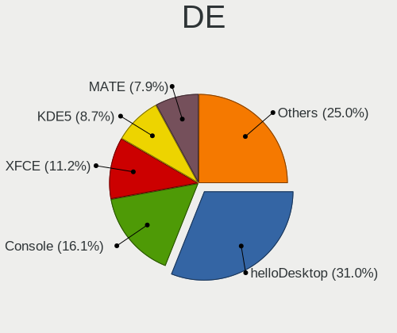
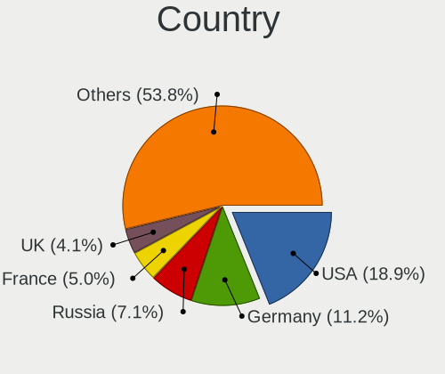
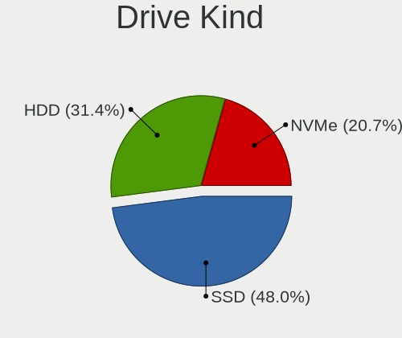
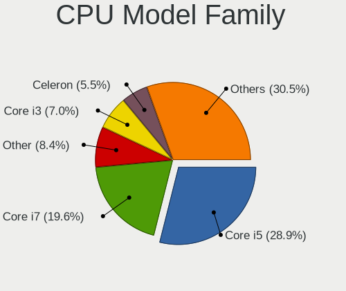
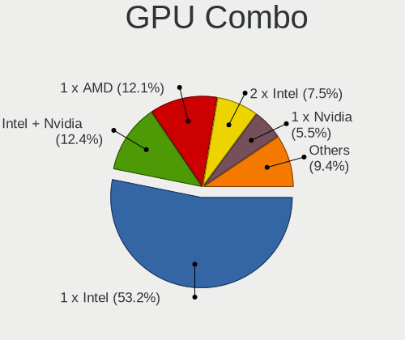
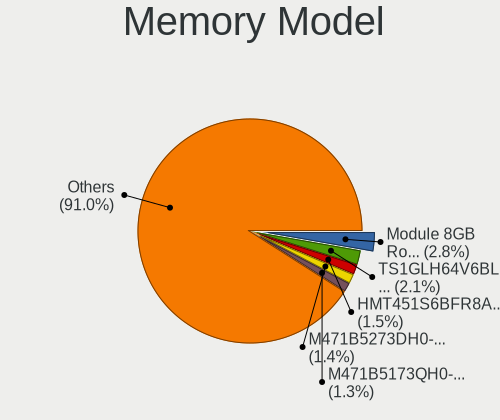
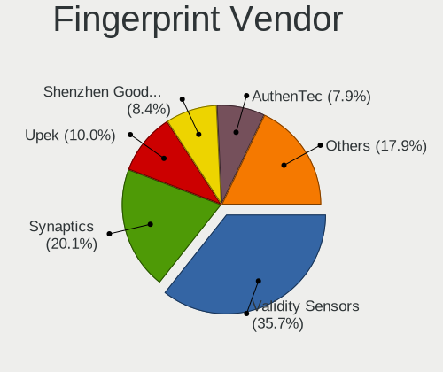

BSD - Tested Hardware & Statistics (Notebooks)
----------------------------------------------

A project to collect tested hardware configurations for BSD.

Anyone can contribute to this report by the [hw-probe](https://github.com/linuxhw/hw-probe/blob/master/INSTALL.BSD.md) tool:

    hw-probe -all -upload

Please contribute! Especially if your hardware is rare.

This report is for real hardware. Report for virtual hardware: [TestDays_VE](https://github.com/bsdhw/TestDays_VE)

Contents
--------

* [ Test Cases ](#test-cases)

* [ System ](#system)
  - [ OS                       ](#os)
  - [ OS Family                ](#os-family)
  - [ Arch                     ](#arch)
  - [ DE                       ](#de)
  - [ Display Server           ](#display-server)
  - [ Display Manager          ](#display-manager)
  - [ OS Lang                  ](#os-lang)
  - [ Boot Mode                ](#boot-mode)
  - [ Filesystem               ](#filesystem)
  - [ Part. scheme             ](#part-scheme)

* [ Board ](#board)
  - [ Vendor                   ](#vendor)
  - [ Model                    ](#model)
  - [ Model Family             ](#model-family)
  - [ MFG Year                 ](#mfg-year)
  - [ Form Factor              ](#form-factor)
  - [ Coreboot                 ](#coreboot)
  - [ RAM Size                 ](#ram-size)
  - [ RAM Used                 ](#ram-used)
  - [ Total Drives             ](#total-drives)
  - [ Has CD-ROM               ](#has-cd-rom)
  - [ Has Ethernet             ](#has-ethernet)
  - [ Has WiFi                 ](#has-wifi)
  - [ Has Bluetooth            ](#has-bluetooth)

* [ Location ](#location)
  - [ Country                  ](#country)
  - [ City                     ](#city)

* [ Drives ](#drives)
  - [ Drive Vendor             ](#drive-vendor)
  - [ Drive Model              ](#drive-model)
  - [ HDD Vendor               ](#hdd-vendor)
  - [ SSD Vendor               ](#ssd-vendor)
  - [ Drive Kind               ](#drive-kind)
  - [ Drive Connector          ](#drive-connector)
  - [ Drive Size               ](#drive-size)
  - [ Space Total              ](#space-total)
  - [ Space Used               ](#space-used)
  - [ Malfunc. Drives          ](#malfunc-drives)
  - [ Malfunc. Drive Vendor    ](#malfunc-drive-vendor)
  - [ Malfunc. HDD Vendor      ](#malfunc-hdd-vendor)
  - [ Malfunc. Drive Kind      ](#malfunc-drive-kind)
  - [ Failed Drives            ](#failed-drives)
  - [ Failed Drive Vendor      ](#failed-drive-vendor)
  - [ Drive Status             ](#drive-status)

* [ Storage controller ](#storage-controller)
  - [ Storage Vendor           ](#storage-vendor)
  - [ Storage Model            ](#storage-model)
  - [ Storage Kind             ](#storage-kind)

* [ Processor ](#processor)
  - [ CPU Vendor               ](#cpu-vendor)
  - [ CPU Model                ](#cpu-model)
  - [ CPU Model Family         ](#cpu-model-family)
  - [ CPU Cores                ](#cpu-cores)
  - [ CPU Sockets              ](#cpu-sockets)
  - [ CPU Threads              ](#cpu-threads)
  - [ CPU Microarch            ](#cpu-microarch)

* [ Graphics ](#graphics)
  - [ GPU Vendor               ](#gpu-vendor)
  - [ GPU Model                ](#gpu-model)
  - [ GPU Combo                ](#gpu-combo)
  - [ GPU Driver               ](#gpu-driver)
  - [ GPU Memory               ](#gpu-memory)

* [ Monitor ](#monitor)
  - [ Monitor Vendor           ](#monitor-vendor)
  - [ Monitor Model            ](#monitor-model)
  - [ Monitor Resolution       ](#monitor-resolution)
  - [ Monitor Diagonal         ](#monitor-diagonal)
  - [ Monitor Width            ](#monitor-width)
  - [ Aspect Ratio             ](#aspect-ratio)
  - [ Monitor Area             ](#monitor-area)
  - [ Pixel Density            ](#pixel-density)
  - [ Multiple Monitors        ](#multiple-monitors)

* [ Network ](#network)
  - [ Net Controller Vendor    ](#net-controller-vendor)
  - [ Net Controller Model     ](#net-controller-model)
  - [ Wireless Vendor          ](#wireless-vendor)
  - [ Wireless Model           ](#wireless-model)
  - [ Ethernet Vendor          ](#ethernet-vendor)
  - [ Ethernet Model           ](#ethernet-model)
  - [ Net Controller Kind      ](#net-controller-kind)
  - [ Used Controller          ](#used-controller)
  - [ NICs                     ](#nics)
  - [ IPv6                     ](#ipv6)

* [ Bluetooth ](#bluetooth)
  - [ Bluetooth Vendor         ](#bluetooth-vendor)
  - [ Bluetooth Model          ](#bluetooth-model)

* [ Sound ](#sound)
  - [ Sound Vendor             ](#sound-vendor)
  - [ Sound Model              ](#sound-model)

* [ Memory ](#memory)
  - [ Memory Vendor            ](#memory-vendor)
  - [ Memory Model             ](#memory-model)
  - [ Memory Kind              ](#memory-kind)
  - [ Memory Form Factor       ](#memory-form-factor)
  - [ Memory Size              ](#memory-size)
  - [ Memory Speed             ](#memory-speed)

* [ Printers & scanners ](#printers--scanners)
  - [ Printer Vendor           ](#printer-vendor)
  - [ Printer Model            ](#printer-model)
  - [ Scanner Vendor           ](#scanner-vendor)
  - [ Scanner Model            ](#scanner-model)

* [ Camera ](#camera)
  - [ Camera Vendor            ](#camera-vendor)
  - [ Camera Model             ](#camera-model)

* [ Security ](#security)
  - [ Fingerprint Vendor       ](#fingerprint-vendor)
  - [ Fingerprint Model        ](#fingerprint-model)
  - [ Chipcard Vendor          ](#chipcard-vendor)
  - [ Chipcard Model           ](#chipcard-model)

* [ Unsupported ](#unsupported)
  - [ Unsupported Devices      ](#unsupported-devices)
  - [ Unsupported Device Types ](#unsupported-device-types)

Test Cases
----------

Total: 5367

| Vendor        | Model                       | Probe                                                     | Date         |
|---------------|-----------------------------|-----------------------------------------------------------|--------------|
| Lenovo        | ThinkPad T480s 20L8S7T30... | [3ae6ff393d](https://bsd-hardware.info/?probe=3ae6ff393d) | Jan 05, 2025 |
| Lenovo        | ThinkPad T480s 20L8S7T30... | [1a06e00ecf](https://bsd-hardware.info/?probe=1a06e00ecf) | Jan 05, 2025 |
| Lenovo        | IdeaPad S145-15API 81V7     | [4bd0423b13](https://bsd-hardware.info/?probe=4bd0423b13) | Jan 05, 2025 |
| Infinix       | YL51A5                      | [de145e7ce4](https://bsd-hardware.info/?probe=de145e7ce4) | Jan 05, 2025 |
| Dell          | Latitude E5520              | [e8415a5758](https://bsd-hardware.info/?probe=e8415a5758) | Jan 05, 2025 |
| HP            | OMEN by Transcend Gaming... | [4cc5cf0eab](https://bsd-hardware.info/?probe=4cc5cf0eab) | Jan 04, 2025 |
| HP            | Unknown                     | [babd844cfb](https://bsd-hardware.info/?probe=babd844cfb) | Jan 04, 2025 |
| Acer          | Aspire A514-54              | [adaff2786e](https://bsd-hardware.info/?probe=adaff2786e) | Jan 04, 2025 |
| HP            | Unknown                     | [54cd46759e](https://bsd-hardware.info/?probe=54cd46759e) | Jan 03, 2025 |
| HP            | EliteBook 840 G3            | [5e09879203](https://bsd-hardware.info/?probe=5e09879203) | Jan 03, 2025 |
| Dell          | Inspiron 3476               | [3dc38e6815](https://bsd-hardware.info/?probe=3dc38e6815) | Jan 03, 2025 |
| ASUSTek       | K53BY                       | [4b6604e875](https://bsd-hardware.info/?probe=4b6604e875) | Jan 03, 2025 |
| ASUSTek       | K53BY                       | [dac2953ae0](https://bsd-hardware.info/?probe=dac2953ae0) | Jan 03, 2025 |
| Apple         | MacBookPro11,4              | [f990a4641f](https://bsd-hardware.info/?probe=f990a4641f) | Jan 03, 2025 |
| Dell          | Latitude E7250              | [dbff7c2ebb](https://bsd-hardware.info/?probe=dbff7c2ebb) | Jan 02, 2025 |
| youyeetoo     | X1 SBC                      | [645ba05e41](https://bsd-hardware.info/?probe=645ba05e41) | Jan 02, 2025 |
| Lenovo        | ThinkBook 15 G2 ITL 20VE    | [c6697164fc](https://bsd-hardware.info/?probe=c6697164fc) | Jan 02, 2025 |
| Unknown       | Unknown                     | [1d7ea0d455](https://bsd-hardware.info/?probe=1d7ea0d455) | Jan 02, 2025 |
| Deciso        | NetBoard-A10                | [3ce7f19f0b](https://bsd-hardware.info/?probe=3ce7f19f0b) | Jan 02, 2025 |
| Framework     | Laptop 16 (AMD Ryzen 704... | [587525ebab](https://bsd-hardware.info/?probe=587525ebab) | Jan 02, 2025 |
| Lenovo        | ThinkPad X220 Tablet 429... | [5270850f20](https://bsd-hardware.info/?probe=5270850f20) | Jan 02, 2025 |
| Lenovo        | ThinkPad T420s 417153U      | [f3220cb60d](https://bsd-hardware.info/?probe=f3220cb60d) | Jan 02, 2025 |
| Dell          | Precision 7540              | [481eeb3296](https://bsd-hardware.info/?probe=481eeb3296) | Jan 02, 2025 |
| Sony          | VGN-NS21M_S                 | [ab610fe8e7](https://bsd-hardware.info/?probe=ab610fe8e7) | Jan 01, 2025 |
| Sony          | VGN-NS21M_S                 | [b848c2ce3e](https://bsd-hardware.info/?probe=b848c2ce3e) | Jan 01, 2025 |
| ASUSTek       | K53BY                       | [7e68090b10](https://bsd-hardware.info/?probe=7e68090b10) | Dec 31, 2024 |
| Dell          | Inspiron 3421               | [0cae3b71cd](https://bsd-hardware.info/?probe=0cae3b71cd) | Dec 31, 2024 |
| Dell          | Latitude 7390               | [12d707eac2](https://bsd-hardware.info/?probe=12d707eac2) | Dec 31, 2024 |
| Lenovo        | IdeaPad 320-15IKB Touch ... | [ed15ca801e](https://bsd-hardware.info/?probe=ed15ca801e) | Dec 30, 2024 |
| HP            | Presario CQ57               | [97f4e3b3f9](https://bsd-hardware.info/?probe=97f4e3b3f9) | Dec 30, 2024 |
| TUXEDO        | InfinityBook Pro AMD Gen... | [b880be6d5f](https://bsd-hardware.info/?probe=b880be6d5f) | Dec 30, 2024 |
| Lenovo        | ThinkBook 14 G6 IRL 21KG    | [221e1f01f4](https://bsd-hardware.info/?probe=221e1f01f4) | Dec 29, 2024 |
| Lenovo        | V15-ADA 82C7                | [62c66a5499](https://bsd-hardware.info/?probe=62c66a5499) | Dec 29, 2024 |
| Lenovo        | V15-ADA 82C7                | [67ea149c61](https://bsd-hardware.info/?probe=67ea149c61) | Dec 29, 2024 |
| HUAWEI        | MRGFG-XX                    | [e23afd3be3](https://bsd-hardware.info/?probe=e23afd3be3) | Dec 29, 2024 |
| HUAWEI        | MRGFG-XX                    | [6095e2193f](https://bsd-hardware.info/?probe=6095e2193f) | Dec 29, 2024 |
| Deciso        | Netboard A20                | [8fab4ef775](https://bsd-hardware.info/?probe=8fab4ef775) | Dec 29, 2024 |
| Lenovo        | IdeaPad 320-14IKB 80YF      | [81977dc6c5](https://bsd-hardware.info/?probe=81977dc6c5) | Dec 28, 2024 |
| HUAWEI        | KPL-W0X                     | [51514fe0c0](https://bsd-hardware.info/?probe=51514fe0c0) | Dec 28, 2024 |
| HUAWEI        | KPL-W0X                     | [7d9a498768](https://bsd-hardware.info/?probe=7d9a498768) | Dec 28, 2024 |
| Lenovo        | ThinkPad T490 20N20028US    | [609bd09ed4](https://bsd-hardware.info/?probe=609bd09ed4) | Dec 28, 2024 |
| Radio Vict... | A24Win8                     | [f85030bb1a](https://bsd-hardware.info/?probe=f85030bb1a) | Dec 27, 2024 |
| Radio Vict... | A24Win8                     | [17813c478e](https://bsd-hardware.info/?probe=17813c478e) | Dec 27, 2024 |
| Dell          | Latitude 5500               | [36b6d99530](https://bsd-hardware.info/?probe=36b6d99530) | Dec 26, 2024 |
| Dell          | Precision M2800             | [176ae44ed3](https://bsd-hardware.info/?probe=176ae44ed3) | Dec 25, 2024 |
| Lenovo        | ThinkPad X270 20HN0015MX    | [66b1686a32](https://bsd-hardware.info/?probe=66b1686a32) | Dec 25, 2024 |
| Lenovo        | ThinkPad T480 20L6S29D1V    | [c074abf948](https://bsd-hardware.info/?probe=c074abf948) | Dec 25, 2024 |
| Lenovo        | ThinkPad T430 2344BPU       | [1432f4e11c](https://bsd-hardware.info/?probe=1432f4e11c) | Dec 25, 2024 |
| Gateway       | LT40                        | [7546fc1fd0](https://bsd-hardware.info/?probe=7546fc1fd0) | Dec 25, 2024 |
| Dell          | Latitude D620               | [df7fa9c810](https://bsd-hardware.info/?probe=df7fa9c810) | Dec 25, 2024 |
| HUAWEI        | KPL-W0X                     | [ac7b8b09f0](https://bsd-hardware.info/?probe=ac7b8b09f0) | Dec 24, 2024 |
| Deciso        | OPNsense Appliance          | [5185740988](https://bsd-hardware.info/?probe=5185740988) | Dec 24, 2024 |
| Dell          | Precision 5510              | [ebf00fc632](https://bsd-hardware.info/?probe=ebf00fc632) | Dec 24, 2024 |
| Lenovo        | ThinkPad P14s Gen 1 20Y1... | [6eebafd5ad](https://bsd-hardware.info/?probe=6eebafd5ad) | Dec 24, 2024 |
| Apple         | MacBookPro8,3               | [af06d6afc4](https://bsd-hardware.info/?probe=af06d6afc4) | Dec 24, 2024 |
| Dell          | Inspiron 3458               | [c90d1d5857](https://bsd-hardware.info/?probe=c90d1d5857) | Dec 24, 2024 |
| Lenovo        | ThinkPad T430 2342CTO       | [10ab9145d9](https://bsd-hardware.info/?probe=10ab9145d9) | Dec 24, 2024 |
| Dell          | XPS 9320                    | [659b5961cc](https://bsd-hardware.info/?probe=659b5961cc) | Dec 23, 2024 |
| Unknown       | Unknown                     | [4c4387237d](https://bsd-hardware.info/?probe=4c4387237d) | Dec 23, 2024 |
| Deciso        | Netboard A20                | [932588d77a](https://bsd-hardware.info/?probe=932588d77a) | Dec 22, 2024 |
| Acer          | Aspire A315-510P            | [757979fc58](https://bsd-hardware.info/?probe=757979fc58) | Dec 22, 2024 |
| IGEL Techn... | H830C                       | [8865063b5a](https://bsd-hardware.info/?probe=8865063b5a) | Dec 21, 2024 |
| Lenovo        | ThinkPad X201 3626HMG       | [9fe06419eb](https://bsd-hardware.info/?probe=9fe06419eb) | Dec 21, 2024 |
| Lenovo        | ThinkPad X201 3626HMG       | [86efb87e9e](https://bsd-hardware.info/?probe=86efb87e9e) | Dec 21, 2024 |
| Dell          | Latitude 5420               | [89370a8376](https://bsd-hardware.info/?probe=89370a8376) | Dec 21, 2024 |
| HP            | Pavilion 15                 | [9d1a480f9d](https://bsd-hardware.info/?probe=9d1a480f9d) | Dec 19, 2024 |
| Lenovo        | ThinkBook 14 G2 ARE 20VF    | [1aec80e256](https://bsd-hardware.info/?probe=1aec80e256) | Dec 18, 2024 |
| Razer         | Blade 16 - RZ09-0510        | [be6f32ce1d](https://bsd-hardware.info/?probe=be6f32ce1d) | Dec 17, 2024 |
| HP            | 2000                        | [0705a401f8](https://bsd-hardware.info/?probe=0705a401f8) | Dec 16, 2024 |
| HP            | ProBook 4430s               | [45102636ac](https://bsd-hardware.info/?probe=45102636ac) | Dec 16, 2024 |
| HP            | EliteBook 840 G2            | [e70fd95a13](https://bsd-hardware.info/?probe=e70fd95a13) | Dec 16, 2024 |
| ASUSTek       | 900                         | [a4c9546642](https://bsd-hardware.info/?probe=a4c9546642) | Dec 15, 2024 |
| Lenovo        | ThinkPad T490 20N3S61A13    | [150320a6b1](https://bsd-hardware.info/?probe=150320a6b1) | Dec 15, 2024 |
| HP            | Laptop 14-dq2xxx            | [fc481181a6](https://bsd-hardware.info/?probe=fc481181a6) | Dec 14, 2024 |
| Deciso        | NetBoard-A10_Gen.3          | [9f6f476877](https://bsd-hardware.info/?probe=9f6f476877) | Dec 14, 2024 |
| Lenovo        | ThinkPad X1 Carbon Gen 9... | [1f7a60f418](https://bsd-hardware.info/?probe=1f7a60f418) | Dec 13, 2024 |
| Apple         | MacBookPro11,1              | [0aea251037](https://bsd-hardware.info/?probe=0aea251037) | Dec 13, 2024 |
| Unknown       | Unknown                     | [e02dd09c46](https://bsd-hardware.info/?probe=e02dd09c46) | Dec 12, 2024 |
| IBM           | ThinkPad T43 1871F1G        | [1fc4bc2661](https://bsd-hardware.info/?probe=1fc4bc2661) | Dec 12, 2024 |
| Lenovo        | ThinkPad X60s 1704R8G       | [cad87ee9a5](https://bsd-hardware.info/?probe=cad87ee9a5) | Dec 12, 2024 |
| Lenovo        | ThinkBook 15 G2 ITL 20VE    | [aa6a6969b9](https://bsd-hardware.info/?probe=aa6a6969b9) | Dec 12, 2024 |
| Lenovo        | ThinkPad X250 20CLS14400    | [d3a7de0e4b](https://bsd-hardware.info/?probe=d3a7de0e4b) | Dec 12, 2024 |
| Lenovo        | ThinkBook 15 G2 ITL 20VE    | [cfc56b5602](https://bsd-hardware.info/?probe=cfc56b5602) | Dec 11, 2024 |
| Deciso        | NetBoard-A20                | [d253682d99](https://bsd-hardware.info/?probe=d253682d99) | Dec 10, 2024 |
| Lenovo        | ThinkPad T495 20NKS01Y00    | [08608b8653](https://bsd-hardware.info/?probe=08608b8653) | Dec 10, 2024 |
| Framework     | Laptop 16 (AMD Ryzen 704... | [9f9235fcd6](https://bsd-hardware.info/?probe=9f9235fcd6) | Dec 10, 2024 |
| Unknown       | Unknown                     | [0fa7499053](https://bsd-hardware.info/?probe=0fa7499053) | Dec 09, 2024 |
| Acer          | Aspire 5755G                | [474ddb6777](https://bsd-hardware.info/?probe=474ddb6777) | Dec 08, 2024 |
| Deciso        | Netboard A20                | [7a9c98faa1](https://bsd-hardware.info/?probe=7a9c98faa1) | Dec 08, 2024 |
| Alienware     | m15 R6                      | [9060b1741b](https://bsd-hardware.info/?probe=9060b1741b) | Dec 08, 2024 |
| Acer          | Extensa 215-33              | [79a63f2804](https://bsd-hardware.info/?probe=79a63f2804) | Dec 07, 2024 |
| Acer          | Extensa 215-33              | [3d830ad581](https://bsd-hardware.info/?probe=3d830ad581) | Dec 07, 2024 |
| Timi          | TM1703                      | [6af452297e](https://bsd-hardware.info/?probe=6af452297e) | Dec 07, 2024 |
| ASUSTek       | N550JV                      | [43db70e6e9](https://bsd-hardware.info/?probe=43db70e6e9) | Dec 07, 2024 |
| Apple         | MacBookAir6,2               | [bf94f894cb](https://bsd-hardware.info/?probe=bf94f894cb) | Dec 07, 2024 |
| Apple         | MacBookAir6,2               | [831f538244](https://bsd-hardware.info/?probe=831f538244) | Dec 06, 2024 |
| HP            | EliteBook 840 G2            | [65370691ec](https://bsd-hardware.info/?probe=65370691ec) | Dec 06, 2024 |
| Lenovo        | ThinkPad T495 20NKS01Y00    | [4e006e39f5](https://bsd-hardware.info/?probe=4e006e39f5) | Dec 06, 2024 |
| Deciso        | Netboard A20                | [02f8326943](https://bsd-hardware.info/?probe=02f8326943) | Dec 06, 2024 |
| Framework     | Laptop 16 (AMD Ryzen 704... | [ebaa050586](https://bsd-hardware.info/?probe=ebaa050586) | Dec 06, 2024 |
| Dell          | Inspiron 5737               | [d63af5805c](https://bsd-hardware.info/?probe=d63af5805c) | Dec 05, 2024 |
| Deciso        | NetBoard-A20                | [664484892c](https://bsd-hardware.info/?probe=664484892c) | Dec 05, 2024 |
| Notebook      | N7x0WU                      | [d9312fac72](https://bsd-hardware.info/?probe=d9312fac72) | Dec 05, 2024 |
| Sony          | SVE11115ELW                 | [6a33a5005f](https://bsd-hardware.info/?probe=6a33a5005f) | Dec 05, 2024 |
| Dell          | Latitude 5591               | [fd917cf2f0](https://bsd-hardware.info/?probe=fd917cf2f0) | Dec 04, 2024 |
| HP            | 250 G3                      | [102fa9b597](https://bsd-hardware.info/?probe=102fa9b597) | Dec 04, 2024 |
| Dell          | Precision 5510              | [928a571c76](https://bsd-hardware.info/?probe=928a571c76) | Dec 03, 2024 |
| TUXEDO        | Pulse 14 Gen3               | [56a08b7475](https://bsd-hardware.info/?probe=56a08b7475) | Dec 03, 2024 |
| Dell          | Latitude E6540              | [7e1c664559](https://bsd-hardware.info/?probe=7e1c664559) | Dec 03, 2024 |
| HP            | Victus by Laptop 16-d0xx... | [196fb6634a](https://bsd-hardware.info/?probe=196fb6634a) | Dec 03, 2024 |
| Dell          | Latitude 5591               | [9515359a66](https://bsd-hardware.info/?probe=9515359a66) | Dec 03, 2024 |
| Alienware     | m15 R6                      | [477e29857e](https://bsd-hardware.info/?probe=477e29857e) | Dec 03, 2024 |
| Lenovo        | ThinkPad X1 Carbon 7th 2... | [b659f5f797](https://bsd-hardware.info/?probe=b659f5f797) | Dec 03, 2024 |
| Deciso        | NetBoard-A10_Gen.3          | [449237e52a](https://bsd-hardware.info/?probe=449237e52a) | Dec 03, 2024 |
| Fujitsu       | LIFEBOOK U727               | [804be89553](https://bsd-hardware.info/?probe=804be89553) | Dec 02, 2024 |
| Alienware     | m15 R6                      | [b19c3ccd89](https://bsd-hardware.info/?probe=b19c3ccd89) | Dec 02, 2024 |
| Sony          | VGN-FZ11MR                  | [0d1d0647c3](https://bsd-hardware.info/?probe=0d1d0647c3) | Dec 01, 2024 |
| HP            | ENVY 15                     | [c83ef9f375](https://bsd-hardware.info/?probe=c83ef9f375) | Nov 30, 2024 |
| Dell          | Precision 7730              | [57ea84435b](https://bsd-hardware.info/?probe=57ea84435b) | Nov 29, 2024 |
| HP            | ProBook 430 G2              | [9cfdbbc839](https://bsd-hardware.info/?probe=9cfdbbc839) | Nov 29, 2024 |
| Deciso        | NetBoard-A10_Gen.3          | [c97d6bf769](https://bsd-hardware.info/?probe=c97d6bf769) | Nov 29, 2024 |
| Framework     | Laptop 13 (Intel Core Ul... | [2bd04e188a](https://bsd-hardware.info/?probe=2bd04e188a) | Nov 29, 2024 |
| Framework     | Laptop 13 (Intel Core Ul... | [41ab1da986](https://bsd-hardware.info/?probe=41ab1da986) | Nov 29, 2024 |
| Lenovo        | ThinkPad X1 Carbon Gen 9... | [b6aaae01ed](https://bsd-hardware.info/?probe=b6aaae01ed) | Nov 29, 2024 |
| Sony          | VGN-FZ11MR                  | [9d737dbace](https://bsd-hardware.info/?probe=9d737dbace) | Nov 28, 2024 |
| Dell          | Latitude 5320               | [aeca583292](https://bsd-hardware.info/?probe=aeca583292) | Nov 27, 2024 |
| Lenovo        | Legion Slim 5 16IRH8 83D... | [208feb98b3](https://bsd-hardware.info/?probe=208feb98b3) | Nov 26, 2024 |
| Lenovo        | Legion Slim 5 16IRH8 83D... | [1f1948481c](https://bsd-hardware.info/?probe=1f1948481c) | Nov 26, 2024 |
| HP            | ZBook 17 G2                 | [c8d95da1f8](https://bsd-hardware.info/?probe=c8d95da1f8) | Nov 26, 2024 |
| Lenovo        | ThinkPad E14 Gen 3 20Y7C... | [7a03bbeb04](https://bsd-hardware.info/?probe=7a03bbeb04) | Nov 25, 2024 |
| Lenovo        | ThinkPad E14 Gen 3 20Y7C... | [36ab98d9df](https://bsd-hardware.info/?probe=36ab98d9df) | Nov 25, 2024 |
| Deciso        | NetBoard-A20                | [5ab919a780](https://bsd-hardware.info/?probe=5ab919a780) | Nov 25, 2024 |
| Dell          | Latitude E5440              | [289f3c134f](https://bsd-hardware.info/?probe=289f3c134f) | Nov 24, 2024 |
| Apple         | MacBookPro8,1               | [dc3d4a1f8d](https://bsd-hardware.info/?probe=dc3d4a1f8d) | Nov 24, 2024 |
| HP            | EliteBook 840 G5            | [1abb405f84](https://bsd-hardware.info/?probe=1abb405f84) | Nov 24, 2024 |
| HP            | Pavilion g6                 | [25f47fd8d4](https://bsd-hardware.info/?probe=25f47fd8d4) | Nov 24, 2024 |
| Acer          | Nitro AN515-46              | [d66960aa84](https://bsd-hardware.info/?probe=d66960aa84) | Nov 24, 2024 |
| Fujitsu       | LIFEBOOK T730               | [577dc596e5](https://bsd-hardware.info/?probe=577dc596e5) | Nov 23, 2024 |
| Fujitsu       | LIFEBOOK T730               | [b5cfe0c0b2](https://bsd-hardware.info/?probe=b5cfe0c0b2) | Nov 23, 2024 |
| HP            | 255 G7 Notebook PC          | [9422dbf997](https://bsd-hardware.info/?probe=9422dbf997) | Nov 22, 2024 |
| Deciso        | NetBoard-A20                | [85c8370a30](https://bsd-hardware.info/?probe=85c8370a30) | Nov 22, 2024 |
| GPD           | MicroPC                     | [dac20acac9](https://bsd-hardware.info/?probe=dac20acac9) | Nov 22, 2024 |
| Deciso        | NetBoard-A20                | [3ec1ba816d](https://bsd-hardware.info/?probe=3ec1ba816d) | Nov 22, 2024 |
| Unknown       | Unknown                     | [c5db5961d4](https://bsd-hardware.info/?probe=c5db5961d4) | Nov 20, 2024 |
| HP            | G62                         | [e7c43bf813](https://bsd-hardware.info/?probe=e7c43bf813) | Nov 20, 2024 |
| HP            | G62                         | [2452e5dec0](https://bsd-hardware.info/?probe=2452e5dec0) | Nov 20, 2024 |
| Deciso        | NetBoard-A20                | [d3e65107db](https://bsd-hardware.info/?probe=d3e65107db) | Nov 19, 2024 |
| Lenovo        | ThinkPad T430 2344DUC       | [63d0cde972](https://bsd-hardware.info/?probe=63d0cde972) | Nov 19, 2024 |
| Samsung       | 535U3C                      | [615b4a9430](https://bsd-hardware.info/?probe=615b4a9430) | Nov 18, 2024 |
| Samsung       | 530XBB                      | [9d6127f039](https://bsd-hardware.info/?probe=9d6127f039) | Nov 18, 2024 |
| Lenovo        | Legion Slim 5 16IRH8 83D... | [ab3ba2edf5](https://bsd-hardware.info/?probe=ab3ba2edf5) | Nov 18, 2024 |
| Lenovo        | Legion Slim 5 16IRH8 83D... | [2a9c5b1e5c](https://bsd-hardware.info/?probe=2a9c5b1e5c) | Nov 18, 2024 |
| Notebook      | NL40_50CU                   | [9b197cd6fc](https://bsd-hardware.info/?probe=9b197cd6fc) | Nov 18, 2024 |
| Notebook      | NL40_50CU                   | [88b9892dd2](https://bsd-hardware.info/?probe=88b9892dd2) | Nov 18, 2024 |
| Dell          | Vostro 3400                 | [65071f6e52](https://bsd-hardware.info/?probe=65071f6e52) | Nov 18, 2024 |
| HP            | ProBook 440 G7              | [fc3020f308](https://bsd-hardware.info/?probe=fc3020f308) | Nov 18, 2024 |
| Lenovo        | Legion Pro 5 16IRX9 83DF    | [3fa8964010](https://bsd-hardware.info/?probe=3fa8964010) | Nov 18, 2024 |
| Lenovo        | ThinkPad E595 20NFCTO1WW    | [b16a33c476](https://bsd-hardware.info/?probe=b16a33c476) | Nov 17, 2024 |
| Lenovo        | ThinkPad X270 W10DG 20K5... | [317947a879](https://bsd-hardware.info/?probe=317947a879) | Nov 16, 2024 |
| Dell          | Precision M4800             | [437d5c965b](https://bsd-hardware.info/?probe=437d5c965b) | Nov 15, 2024 |
| Dell          | Precision M4800             | [b586c78d26](https://bsd-hardware.info/?probe=b586c78d26) | Nov 15, 2024 |
| Lenovo        | IdeaPad U410                | [545bec78ee](https://bsd-hardware.info/?probe=545bec78ee) | Nov 14, 2024 |
| Standard      | Unknown                     | [a56385a000](https://bsd-hardware.info/?probe=a56385a000) | Nov 14, 2024 |
| Notebook      | V3xxENx                     | [bb5a62f653](https://bsd-hardware.info/?probe=bb5a62f653) | Nov 14, 2024 |
| Panasonic     | CFSX4-1                     | [2bfe5665da](https://bsd-hardware.info/?probe=2bfe5665da) | Nov 14, 2024 |
| Deciso        | NetBoard-A10_Gen.3          | [8b34dd537f](https://bsd-hardware.info/?probe=8b34dd537f) | Nov 13, 2024 |
| Lenovo        | ThinkPad T530 2392AQU       | [b614df64c1](https://bsd-hardware.info/?probe=b614df64c1) | Nov 13, 2024 |
| Lenovo        | ThinkPad T530 2392AQU       | [4f62b90287](https://bsd-hardware.info/?probe=4f62b90287) | Nov 13, 2024 |
| HP            | EliteBook 840 G1            | [8d3420db99](https://bsd-hardware.info/?probe=8d3420db99) | Nov 13, 2024 |
| Panasonic     | CFSX4-1                     | [3b6c29e294](https://bsd-hardware.info/?probe=3b6c29e294) | Nov 13, 2024 |
| Toshiba       | Satellite L655              | [dc1b79d2f5](https://bsd-hardware.info/?probe=dc1b79d2f5) | Nov 13, 2024 |
| Toshiba       | Satellite L655              | [8a36444ca1](https://bsd-hardware.info/?probe=8a36444ca1) | Nov 13, 2024 |
| ASUSTek       | K54C                        | [4f0c073344](https://bsd-hardware.info/?probe=4f0c073344) | Nov 12, 2024 |
| HP            | Laptop 15t-dy200            | [bb0b650de5](https://bsd-hardware.info/?probe=bb0b650de5) | Nov 11, 2024 |
| Acer          | Nitro AN515-42              | [0cd9c4bf36](https://bsd-hardware.info/?probe=0cd9c4bf36) | Nov 11, 2024 |
| ICL           | S1411 G2R                   | [988f54b681](https://bsd-hardware.info/?probe=988f54b681) | Nov 11, 2024 |
| Dell          | Inspiron 5559               | [4044711f14](https://bsd-hardware.info/?probe=4044711f14) | Nov 10, 2024 |
| Lenovo        | ThinkPad T480 20L6S0AG03    | [1015e10354](https://bsd-hardware.info/?probe=1015e10354) | Nov 10, 2024 |
| Shuttle       | DS57U                       | [32c044d7d9](https://bsd-hardware.info/?probe=32c044d7d9) | Nov 10, 2024 |
| Apple         | MacBookPro8,3               | [f3bbee2559](https://bsd-hardware.info/?probe=f3bbee2559) | Nov 10, 2024 |
| Lenovo        | ThinkPad E14 Gen 4 21E30... | [58bb75f0db](https://bsd-hardware.info/?probe=58bb75f0db) | Nov 10, 2024 |
| HP            | OMEN by Transcend Gaming... | [213d36f877](https://bsd-hardware.info/?probe=213d36f877) | Nov 10, 2024 |
| Lenovo        | ThinkPad T490 20N3SFCE00    | [f5e420121b](https://bsd-hardware.info/?probe=f5e420121b) | Nov 10, 2024 |
| ASUSTek       | VivoBook S13 X330FA_S330... | [4bcf1051ee](https://bsd-hardware.info/?probe=4bcf1051ee) | Nov 09, 2024 |
| HASEE Comp... | HEC41                       | [2d874f67ae](https://bsd-hardware.info/?probe=2d874f67ae) | Nov 08, 2024 |
| HP            | Mini 210-1000               | [2e6b2f7727](https://bsd-hardware.info/?probe=2e6b2f7727) | Nov 08, 2024 |
| Unknown       | Unknown                     | [5bd09820d9](https://bsd-hardware.info/?probe=5bd09820d9) | Nov 07, 2024 |
| Deciso        | OPNsense Appliance          | [f10f897c2a](https://bsd-hardware.info/?probe=f10f897c2a) | Nov 07, 2024 |
| Lenovo        | ThinkPad T470p 20J6003DG... | [aa3a0567b3](https://bsd-hardware.info/?probe=aa3a0567b3) | Nov 07, 2024 |
| ASUSTek       | G75VW                       | [2ede0a1468](https://bsd-hardware.info/?probe=2ede0a1468) | Nov 06, 2024 |
| HP            | Laptop 14-cf2xxx            | [b5a01ca528](https://bsd-hardware.info/?probe=b5a01ca528) | Nov 05, 2024 |
| Deciso        | NetBoard-A20                | [6161c59ddd](https://bsd-hardware.info/?probe=6161c59ddd) | Nov 04, 2024 |
| Deciso        | OPNsense Appliance          | [853823751f](https://bsd-hardware.info/?probe=853823751f) | Nov 03, 2024 |
| Lenovo        | ThinkPad T14 Gen 3 21CF0... | [7aa93cd8ba](https://bsd-hardware.info/?probe=7aa93cd8ba) | Nov 03, 2024 |
| Lenovo        | ThinkPad E14 Gen 2 20TA0... | [b4adfdddc6](https://bsd-hardware.info/?probe=b4adfdddc6) | Nov 03, 2024 |
| Apple         | MacBook7,1                  | [056bc64a0c](https://bsd-hardware.info/?probe=056bc64a0c) | Nov 03, 2024 |
| Lenovo        | ThinkPad P51 20HHCTO1WW     | [fa70f945fe](https://bsd-hardware.info/?probe=fa70f945fe) | Nov 03, 2024 |
| ASUSTek       | GL752VW                     | [efc1d86951](https://bsd-hardware.info/?probe=efc1d86951) | Nov 02, 2024 |
| Deciso        | NetBoard-A20                | [48f5da11ca](https://bsd-hardware.info/?probe=48f5da11ca) | Nov 02, 2024 |
| Sony          | SVS1312J3EW                 | [3451ac064b](https://bsd-hardware.info/?probe=3451ac064b) | Nov 02, 2024 |
| Seco          | UDOO x86                    | [16eb7b7498](https://bsd-hardware.info/?probe=16eb7b7498) | Nov 02, 2024 |
| HP            | Pavilion 15                 | [c9e7f09cd1](https://bsd-hardware.info/?probe=c9e7f09cd1) | Nov 02, 2024 |
| Unknown       | Unknown                     | [57c6faa7cc](https://bsd-hardware.info/?probe=57c6faa7cc) | Nov 01, 2024 |
| ASUSTek       | VivoBook_ASUSLaptop X140... | [90c3811006](https://bsd-hardware.info/?probe=90c3811006) | Nov 01, 2024 |
| ASUSTek       | VivoBook_ASUSLaptop X140... | [a137d76671](https://bsd-hardware.info/?probe=a137d76671) | Nov 01, 2024 |
| Google        | Morphius                    | [d7948b7b2a](https://bsd-hardware.info/?probe=d7948b7b2a) | Oct 31, 2024 |
| Positivo      | H14BT58                     | [b54614c603](https://bsd-hardware.info/?probe=b54614c603) | Oct 31, 2024 |
| Acer          | Aspire 5755G                | [fddb380732](https://bsd-hardware.info/?probe=fddb380732) | Oct 31, 2024 |
| Google        | Morphius                    | [192655d2b9](https://bsd-hardware.info/?probe=192655d2b9) | Oct 31, 2024 |
| Deciso        | NetBoard-A10_Gen.3          | [42d346a4b2](https://bsd-hardware.info/?probe=42d346a4b2) | Oct 31, 2024 |
| Deciso        | NetBoard-A10_Gen.3          | [0f2bd2dd8a](https://bsd-hardware.info/?probe=0f2bd2dd8a) | Oct 30, 2024 |
| ASUSTek       | VivoBook_ASUSLaptop X513... | [3eedf19995](https://bsd-hardware.info/?probe=3eedf19995) | Oct 30, 2024 |
| Deciso        | NetBoard-A20                | [c48c73ac00](https://bsd-hardware.info/?probe=c48c73ac00) | Oct 30, 2024 |
| Lenovo        | ThinkPad X280 20KES2VQ00    | [d864971168](https://bsd-hardware.info/?probe=d864971168) | Oct 30, 2024 |
| HP            | Pavilion Notebook           | [4609004e3e](https://bsd-hardware.info/?probe=4609004e3e) | Oct 30, 2024 |
| Deciso        | NetBoard-A20                | [9a4bbbaaea](https://bsd-hardware.info/?probe=9a4bbbaaea) | Oct 30, 2024 |
| Unknown       | Unknown                     | [46a5a36c7d](https://bsd-hardware.info/?probe=46a5a36c7d) | Oct 29, 2024 |
| ASUSTek       | X453SA                      | [51933883d6](https://bsd-hardware.info/?probe=51933883d6) | Oct 29, 2024 |
| Apple         | MacBook5,2                  | [959da1d116](https://bsd-hardware.info/?probe=959da1d116) | Oct 29, 2024 |
| HP            | G62                         | [2903fbd041](https://bsd-hardware.info/?probe=2903fbd041) | Oct 29, 2024 |
| Deciso        | NetBoard-A20                | [e15b909cc5](https://bsd-hardware.info/?probe=e15b909cc5) | Oct 28, 2024 |
| Schenker      | SLIM15 SSL15L19             | [e2f93ce841](https://bsd-hardware.info/?probe=e2f93ce841) | Oct 28, 2024 |
| Dell          | Latitude 5490               | [aa1887b2e7](https://bsd-hardware.info/?probe=aa1887b2e7) | Oct 28, 2024 |
| Acer          | Aspire ES1-512              | [7027c4efd5](https://bsd-hardware.info/?probe=7027c4efd5) | Oct 28, 2024 |
| Sony          | SVS1312J3EW                 | [c96da35c3f](https://bsd-hardware.info/?probe=c96da35c3f) | Oct 28, 2024 |
| MSI           | Modern 15 A5M               | [c26a915201](https://bsd-hardware.info/?probe=c26a915201) | Oct 27, 2024 |
| LG Electro... | 14Z90Q-G.AH75A2             | [8cfb5020e9](https://bsd-hardware.info/?probe=8cfb5020e9) | Oct 27, 2024 |
| Lenovo        | Yoga 900S-12ISK 80ML        | [c16eee5fcc](https://bsd-hardware.info/?probe=c16eee5fcc) | Oct 27, 2024 |
| Gigabyte      | AERO 15WV8                  | [8b197de6cf](https://bsd-hardware.info/?probe=8b197de6cf) | Oct 26, 2024 |
| Lenovo        | ThinkPad X200 745496U       | [324b718161](https://bsd-hardware.info/?probe=324b718161) | Oct 26, 2024 |
| Panasonic     | CF-52PFPBSFQ                | [96e9c16dc5](https://bsd-hardware.info/?probe=96e9c16dc5) | Oct 26, 2024 |
| HP            | Laptop 15s-eq2xxx           | [cd3af9a100](https://bsd-hardware.info/?probe=cd3af9a100) | Oct 25, 2024 |
| Lenovo        | ThinkPad E470 20H1002FLM    | [d11900e726](https://bsd-hardware.info/?probe=d11900e726) | Oct 25, 2024 |
| HP            | ProBook 455 15.6 inch G9... | [e76040ded0](https://bsd-hardware.info/?probe=e76040ded0) | Oct 25, 2024 |
| Lenovo        | ThinkPad X201T 3093A79      | [9f1d2db1a6](https://bsd-hardware.info/?probe=9f1d2db1a6) | Oct 25, 2024 |
| Deciso        | OPNsense Appliance          | [dca49cf4c7](https://bsd-hardware.info/?probe=dca49cf4c7) | Oct 25, 2024 |
| Panasonic     | CFSZ6-2                     | [db3492b574](https://bsd-hardware.info/?probe=db3492b574) | Oct 25, 2024 |
| Deciso        | NetBoard-A20                | [503208f52b](https://bsd-hardware.info/?probe=503208f52b) | Oct 25, 2024 |
| Deciso        | NetBoard-A20                | [8bede3f5d2](https://bsd-hardware.info/?probe=8bede3f5d2) | Oct 25, 2024 |
| HUAWEI        | HVY-WXX9                    | [b8a1806d8a](https://bsd-hardware.info/?probe=b8a1806d8a) | Oct 25, 2024 |
| Deciso        | NetBoard-A10_Gen.3          | [bd9a89adda](https://bsd-hardware.info/?probe=bd9a89adda) | Oct 24, 2024 |
| Deciso        | NetBoard-A10                | [98c9b9552b](https://bsd-hardware.info/?probe=98c9b9552b) | Oct 24, 2024 |
| Dell          | Latitude 7490               | [46b2b68262](https://bsd-hardware.info/?probe=46b2b68262) | Oct 24, 2024 |
| Lenovo        | ThinkPad T420 4236MA3       | [1fe30aef50](https://bsd-hardware.info/?probe=1fe30aef50) | Oct 24, 2024 |
| Dell          | XPS 13 7390                 | [ac396bece7](https://bsd-hardware.info/?probe=ac396bece7) | Oct 23, 2024 |
| HP            | 250 15.6 inch G9 Noteboo... | [4a1456a0fa](https://bsd-hardware.info/?probe=4a1456a0fa) | Oct 22, 2024 |
| ASUSTek       | 1000HE                      | [1a04fd3a79](https://bsd-hardware.info/?probe=1a04fd3a79) | Oct 22, 2024 |
| Unknown       | Unknown                     | [43c3d622d9](https://bsd-hardware.info/?probe=43c3d622d9) | Oct 21, 2024 |
| Matsushita... | CF-51RCVDNLM                | [d911fcdc27](https://bsd-hardware.info/?probe=d911fcdc27) | Oct 21, 2024 |
| Lenovo        | ThinkPad T480 20L6S0AG03    | [20962fde91](https://bsd-hardware.info/?probe=20962fde91) | Oct 20, 2024 |
| Lenovo        | ThinkPad Edge E545 20B20... | [934ff561a5](https://bsd-hardware.info/?probe=934ff561a5) | Oct 20, 2024 |
| Dell          | Latitude 5290 2-in-1        | [ddd11037f6](https://bsd-hardware.info/?probe=ddd11037f6) | Oct 20, 2024 |
| Lenovo        | ThinkPad W530 24491A0       | [6c6e16db1a](https://bsd-hardware.info/?probe=6c6e16db1a) | Oct 19, 2024 |
| Panasonic     | CF-54-1                     | [2c0a3bc2e3](https://bsd-hardware.info/?probe=2c0a3bc2e3) | Oct 18, 2024 |
| Lenovo        | ThinkPad L470 W10DG 20JV... | [a56783d219](https://bsd-hardware.info/?probe=a56783d219) | Oct 18, 2024 |
| HP            | EliteBook 820 G3            | [5ac0371f28](https://bsd-hardware.info/?probe=5ac0371f28) | Oct 18, 2024 |
| HP            | EliteBook 820 G3            | [553b42ed1a](https://bsd-hardware.info/?probe=553b42ed1a) | Oct 18, 2024 |
| Apple         | MacBookAir4,1               | [fc2968d698](https://bsd-hardware.info/?probe=fc2968d698) | Oct 18, 2024 |
| Dell          | Inspiron 13-7368            | [2dc255b034](https://bsd-hardware.info/?probe=2dc255b034) | Oct 17, 2024 |
| HP            | Unknown                     | [254f5a847c](https://bsd-hardware.info/?probe=254f5a847c) | Oct 17, 2024 |
| Micro Comp... | Venus series                | [6b1b07cf5a](https://bsd-hardware.info/?probe=6b1b07cf5a) | Oct 17, 2024 |
| Lenovo        | IdeaPad U410                | [c6d54f56a4](https://bsd-hardware.info/?probe=c6d54f56a4) | Oct 16, 2024 |
| Acer          | Aspire V5-531               | [31a71a6cb4](https://bsd-hardware.info/?probe=31a71a6cb4) | Oct 15, 2024 |
| Lenovo        | ThinkPad T490 20N2S0QE00    | [4ea2230818](https://bsd-hardware.info/?probe=4ea2230818) | Oct 15, 2024 |
| Deciso        | NetBoard-A20                | [72b527ad33](https://bsd-hardware.info/?probe=72b527ad33) | Oct 15, 2024 |
| Lenovo        | ThinkPad X280 20KF001UUS    | [b63d757906](https://bsd-hardware.info/?probe=b63d757906) | Oct 14, 2024 |
| HP            | EliteBook 840 G3            | [4e4e2da2fc](https://bsd-hardware.info/?probe=4e4e2da2fc) | Oct 14, 2024 |
| Lenovo        | ThinkPad X250 20CLA455CD    | [875eeb5304](https://bsd-hardware.info/?probe=875eeb5304) | Oct 14, 2024 |
| Lenovo        | ThinkPad E490 20N9S48S00    | [6df8b611a2](https://bsd-hardware.info/?probe=6df8b611a2) | Oct 14, 2024 |
| Lenovo        | ThinkPad T490 20N2S0QE00    | [b7f189a238](https://bsd-hardware.info/?probe=b7f189a238) | Oct 14, 2024 |
| Lenovo        | ThinkPad T410 2537N24       | [e7b0a90d19](https://bsd-hardware.info/?probe=e7b0a90d19) | Oct 13, 2024 |
| Lenovo        | IdeaPad 310-15ISK 80SM      | [d8ae2f1df2](https://bsd-hardware.info/?probe=d8ae2f1df2) | Oct 13, 2024 |
| Dell          | XPS 13 7390                 | [425f5093f7](https://bsd-hardware.info/?probe=425f5093f7) | Oct 13, 2024 |
| HP            | 250 15.6 inch G9 Noteboo... | [29ab309c41](https://bsd-hardware.info/?probe=29ab309c41) | Oct 12, 2024 |
| GPD           | P2 MAX                      | [884f11539a](https://bsd-hardware.info/?probe=884f11539a) | Oct 12, 2024 |
| ASUSTek       | ASUS TUF Gaming A16 FA60... | [c926ec5baf](https://bsd-hardware.info/?probe=c926ec5baf) | Oct 11, 2024 |
| Deciso        | NetBoard-A10_Gen.3          | [9c0970e29d](https://bsd-hardware.info/?probe=9c0970e29d) | Oct 11, 2024 |
| Lenovo        | ThinkPad X260 20F5S2GM00    | [dbdce5230f](https://bsd-hardware.info/?probe=dbdce5230f) | Oct 11, 2024 |
| HP            | 250 15.6 inch G9 Noteboo... | [1b0b42530b](https://bsd-hardware.info/?probe=1b0b42530b) | Oct 11, 2024 |
| HP            | 250 15.6 inch G9 Noteboo... | [1c29a0f0a3](https://bsd-hardware.info/?probe=1c29a0f0a3) | Oct 11, 2024 |
| Panasonic     | CF-53AAGHYDM                | [bbda83e57b](https://bsd-hardware.info/?probe=bbda83e57b) | Oct 10, 2024 |
| Apple         | MacBookPro11,1              | [7fef5366cf](https://bsd-hardware.info/?probe=7fef5366cf) | Oct 10, 2024 |
| Fujitsu       | LIFEBOOK E752               | [01fa981bc4](https://bsd-hardware.info/?probe=01fa981bc4) | Oct 10, 2024 |
| Lenovo        | ThinkPad X270 W10DG 20K5... | [37252abbb6](https://bsd-hardware.info/?probe=37252abbb6) | Oct 09, 2024 |
| Lenovo        | ThinkPad T430 2347GZU       | [075e5d2557](https://bsd-hardware.info/?probe=075e5d2557) | Oct 08, 2024 |
| ASUSTek       | X510UNR                     | [33388f232b](https://bsd-hardware.info/?probe=33388f232b) | Oct 08, 2024 |
| Gigabyte      | AORUS 16X ASG               | [0a05bfa1e3](https://bsd-hardware.info/?probe=0a05bfa1e3) | Oct 08, 2024 |
| Lenovo        | ThinkPad T14 Gen 1 20S1S... | [1b5dcf47fe](https://bsd-hardware.info/?probe=1b5dcf47fe) | Oct 07, 2024 |
| Lenovo        | ThinkPad W530 24491A0       | [37cb237ce2](https://bsd-hardware.info/?probe=37cb237ce2) | Oct 07, 2024 |
| Medion        | S15449                      | [b7a0fc4f21](https://bsd-hardware.info/?probe=b7a0fc4f21) | Oct 06, 2024 |
| Lenovo        | ThinkPad T495 20NJ0008US    | [12b6d4abf3](https://bsd-hardware.info/?probe=12b6d4abf3) | Oct 06, 2024 |
| Notebook      | NL40_50CU                   | [680cd09351](https://bsd-hardware.info/?probe=680cd09351) | Oct 06, 2024 |
| Lenovo        | ThinkPad W530 24491A0       | [74e780b044](https://bsd-hardware.info/?probe=74e780b044) | Oct 05, 2024 |
| Lenovo        | ThinkPad P14s Gen 1 20Y1... | [52ca4ac8cd](https://bsd-hardware.info/?probe=52ca4ac8cd) | Oct 05, 2024 |
| Lenovo        | ThinkPad P14s Gen 1 20Y1... | [402e2d6b51](https://bsd-hardware.info/?probe=402e2d6b51) | Oct 05, 2024 |
| Lenovo        | ThinkPad E16 Gen 1 21JT0... | [869d37ac5e](https://bsd-hardware.info/?probe=869d37ac5e) | Oct 04, 2024 |
| System76      | Pangolin                    | [956c014a4d](https://bsd-hardware.info/?probe=956c014a4d) | Oct 04, 2024 |
| Deciso        | DEC2700 - OPNsense Appli... | [1d5b951541](https://bsd-hardware.info/?probe=1d5b951541) | Oct 04, 2024 |
| Lenovo        | ThinkPad P73 20QRCTO1WW     | [7ca711991e](https://bsd-hardware.info/?probe=7ca711991e) | Oct 03, 2024 |
| Lenovo        | ThinkPad X1 Carbon 6th 2... | [bbc44a72cc](https://bsd-hardware.info/?probe=bbc44a72cc) | Oct 03, 2024 |
| HP            | EliteBook 840 G3            | [b4f6d6a1f9](https://bsd-hardware.info/?probe=b4f6d6a1f9) | Oct 03, 2024 |
| HP            | EliteBook 840 G3            | [56d22f4ec1](https://bsd-hardware.info/?probe=56d22f4ec1) | Oct 03, 2024 |
| Panasonic     | CFSZ6-2                     | [52aa021161](https://bsd-hardware.info/?probe=52aa021161) | Oct 03, 2024 |
| Unknown       | Unknown                     | [4bf5e24b71](https://bsd-hardware.info/?probe=4bf5e24b71) | Oct 03, 2024 |
| Panasonic     | CFSZ6-2                     | [3c534a62ac](https://bsd-hardware.info/?probe=3c534a62ac) | Oct 03, 2024 |
| HP            | 255 15.6 inch G9 Noteboo... | [370c96e120](https://bsd-hardware.info/?probe=370c96e120) | Oct 02, 2024 |
| HP            | 255 15.6 inch G9 Noteboo... | [71dbda24c3](https://bsd-hardware.info/?probe=71dbda24c3) | Oct 02, 2024 |
| HP            | 255 15.6 inch G9 Noteboo... | [4713dcbd2c](https://bsd-hardware.info/?probe=4713dcbd2c) | Oct 02, 2024 |
| Acer          | Aspire A515-45              | [3e03a4540a](https://bsd-hardware.info/?probe=3e03a4540a) | Oct 02, 2024 |
| ASUSTek       | VivoBook 15_ASUS Laptop ... | [5d35565dad](https://bsd-hardware.info/?probe=5d35565dad) | Oct 02, 2024 |
| Dell          | Latitude 5440               | [8add6da490](https://bsd-hardware.info/?probe=8add6da490) | Oct 01, 2024 |
| Unknown       | Unknown                     | [52b783d430](https://bsd-hardware.info/?probe=52b783d430) | Oct 01, 2024 |
| Dell          | Latitude E7250              | [025ea9ef12](https://bsd-hardware.info/?probe=025ea9ef12) | Sep 30, 2024 |
| Framework     | Laptop (13th Gen Intel C... | [a103b74d47](https://bsd-hardware.info/?probe=a103b74d47) | Sep 30, 2024 |
| Framework     | Laptop (13th Gen Intel C... | [538ac0af8c](https://bsd-hardware.info/?probe=538ac0af8c) | Sep 30, 2024 |
| Framework     | Laptop (13th Gen Intel C... | [dcfdda02ff](https://bsd-hardware.info/?probe=dcfdda02ff) | Sep 30, 2024 |
| Dell          | Latitude E6220              | [caad1e11d1](https://bsd-hardware.info/?probe=caad1e11d1) | Sep 30, 2024 |
| Lenovo        | ThinkPad P51 20HHCTO1WW     | [c1a712cb6a](https://bsd-hardware.info/?probe=c1a712cb6a) | Sep 30, 2024 |
| Apple         | MacBookPro11,1              | [b9eba86e8e](https://bsd-hardware.info/?probe=b9eba86e8e) | Sep 29, 2024 |
| Acer          | Aspire VN7-571G             | [e67b6464df](https://bsd-hardware.info/?probe=e67b6464df) | Sep 29, 2024 |
| Datto         | Unknown                     | [84a22f341f](https://bsd-hardware.info/?probe=84a22f341f) | Sep 29, 2024 |
| Sony          | VGN-FZ19VN                  | [a5e398c41f](https://bsd-hardware.info/?probe=a5e398c41f) | Sep 28, 2024 |
| TUXEDO        | Aura 15 Gen1                | [0f0cf20fe9](https://bsd-hardware.info/?probe=0f0cf20fe9) | Sep 28, 2024 |
| Apple         | MacBookPro8,3               | [15c24e17a2](https://bsd-hardware.info/?probe=15c24e17a2) | Sep 28, 2024 |
| Lenovo        | ThinkPad P14s Gen 1 20Y1... | [833762523c](https://bsd-hardware.info/?probe=833762523c) | Sep 28, 2024 |
| ASUSTek       | ASUS TUF Gaming A15 FA50... | [127d44b4fc](https://bsd-hardware.info/?probe=127d44b4fc) | Sep 28, 2024 |
| Dell          | G3 3579                     | [1725db4da9](https://bsd-hardware.info/?probe=1725db4da9) | Sep 27, 2024 |
| Dell          | Latitude E7250              | [2dfb20ed35](https://bsd-hardware.info/?probe=2dfb20ed35) | Sep 27, 2024 |
| Lenovo        | ThinkPad X230 2325WMM       | [06cb50192c](https://bsd-hardware.info/?probe=06cb50192c) | Sep 27, 2024 |
| Dell          | Precision M4600             | [b64ebca386](https://bsd-hardware.info/?probe=b64ebca386) | Sep 27, 2024 |
| Notebook      | NL40_50CU                   | [95fbcd46d1](https://bsd-hardware.info/?probe=95fbcd46d1) | Sep 26, 2024 |
| Lenovo        | IdeaPad 100-15IBY 80MJ      | [9ea21fa783](https://bsd-hardware.info/?probe=9ea21fa783) | Sep 26, 2024 |
| Acer          | Aspire 4820                 | [2ba56db0c4](https://bsd-hardware.info/?probe=2ba56db0c4) | Sep 26, 2024 |
| Dell          | System XPS L702X            | [5a0e1971a2](https://bsd-hardware.info/?probe=5a0e1971a2) | Sep 26, 2024 |
| HP            | ZBook 17 G2                 | [24de39a693](https://bsd-hardware.info/?probe=24de39a693) | Sep 26, 2024 |
| MSI           | PS63 Modern 8M              | [fc39fcb987](https://bsd-hardware.info/?probe=fc39fcb987) | Sep 26, 2024 |
| Lenovo        | ThinkPad T480s 20L8SAG00... | [f6d1411def](https://bsd-hardware.info/?probe=f6d1411def) | Sep 25, 2024 |
| Apple         | MacBookPro11,4              | [df7c99c150](https://bsd-hardware.info/?probe=df7c99c150) | Sep 25, 2024 |
| Framework     | Laptop                      | [db5ecf38bc](https://bsd-hardware.info/?probe=db5ecf38bc) | Sep 25, 2024 |
| Deciso        | DEC2700 - OPNsense Appli... | [999fa3b31b](https://bsd-hardware.info/?probe=999fa3b31b) | Sep 25, 2024 |
| Dell          | Inspiron 5559               | [cebd0ef1e3](https://bsd-hardware.info/?probe=cebd0ef1e3) | Sep 25, 2024 |
| MSI           | Prestige 15 A10SC           | [6cdde2a1ab](https://bsd-hardware.info/?probe=6cdde2a1ab) | Sep 25, 2024 |
| HP            | EliteBook 8440p             | [4ca237f74c](https://bsd-hardware.info/?probe=4ca237f74c) | Sep 24, 2024 |
| Apple         | MacBookPro11,4              | [5138a61509](https://bsd-hardware.info/?probe=5138a61509) | Sep 24, 2024 |
| Google        | Dragonair                   | [47b39b3760](https://bsd-hardware.info/?probe=47b39b3760) | Sep 23, 2024 |
| Lenovo        | Yoga 900S-12ISK 80ML        | [8836aa08ec](https://bsd-hardware.info/?probe=8836aa08ec) | Sep 23, 2024 |
| Deciso        | NetBoard-A10_Gen.3          | [f1eadfeb56](https://bsd-hardware.info/?probe=f1eadfeb56) | Sep 23, 2024 |
| NEC Comput... | PC-LL750HS6R                | [edd3f8e3e6](https://bsd-hardware.info/?probe=edd3f8e3e6) | Sep 23, 2024 |
| Dell          | Vostro 5490                 | [32de340e28](https://bsd-hardware.info/?probe=32de340e28) | Sep 23, 2024 |
| Apple         | MacBook6,1                  | [6b5e02a63b](https://bsd-hardware.info/?probe=6b5e02a63b) | Sep 22, 2024 |
| Dell          | Precision M4800             | [e44c7842b3](https://bsd-hardware.info/?probe=e44c7842b3) | Sep 22, 2024 |
| Dell          | Latitude 5591               | [7f45ab1b0c](https://bsd-hardware.info/?probe=7f45ab1b0c) | Sep 21, 2024 |
| Dell          | Latitude E6440              | [cfabb27e7a](https://bsd-hardware.info/?probe=cfabb27e7a) | Sep 21, 2024 |
| Deciso        | NetBoard-A20                | [0e3030f76f](https://bsd-hardware.info/?probe=0e3030f76f) | Sep 20, 2024 |
| MSI           | GF63 Thin 10SC              | [b10913dd8e](https://bsd-hardware.info/?probe=b10913dd8e) | Sep 20, 2024 |
| Lenovo        | ThinkPad T450s 20BWS2FQ0... | [8a1f8b7ead](https://bsd-hardware.info/?probe=8a1f8b7ead) | Sep 20, 2024 |
| Micro Comp... | Venus series                | [ccd74590c5](https://bsd-hardware.info/?probe=ccd74590c5) | Sep 20, 2024 |
| Google        | Dragonair                   | [ec1f3c073b](https://bsd-hardware.info/?probe=ec1f3c073b) | Sep 20, 2024 |
| Dell          | Latitude E6540              | [e8bdb7007b](https://bsd-hardware.info/?probe=e8bdb7007b) | Sep 19, 2024 |
| Lenovo        | ThinkPad L14 Gen 1 20U50... | [8657f5a0d9](https://bsd-hardware.info/?probe=8657f5a0d9) | Sep 19, 2024 |
| Lenovo        | IdeaPad Gaming 3 15ACH6 ... | [14457d4dfe](https://bsd-hardware.info/?probe=14457d4dfe) | Sep 19, 2024 |
| Lenovo        | IdeaPad 320-15IAP 80XR      | [c993d0a7ec](https://bsd-hardware.info/?probe=c993d0a7ec) | Sep 18, 2024 |
| HP            | ZBook 17 G2                 | [fbfc038a2d](https://bsd-hardware.info/?probe=fbfc038a2d) | Sep 18, 2024 |
| Lenovo        | IdeaPad Gaming 3 15IMH05... | [9aea4f42bc](https://bsd-hardware.info/?probe=9aea4f42bc) | Sep 18, 2024 |
| Lenovo        | ThinkPad T420 41786UU       | [81062d2bf1](https://bsd-hardware.info/?probe=81062d2bf1) | Sep 17, 2024 |
| Unknown       | Unknown                     | [74eaa92b4b](https://bsd-hardware.info/?probe=74eaa92b4b) | Sep 17, 2024 |
| ASUSTek       | F3E                         | [cbed34c50d](https://bsd-hardware.info/?probe=cbed34c50d) | Sep 17, 2024 |
| Deciso        | NetBoard-A20                | [0a6fab17d1](https://bsd-hardware.info/?probe=0a6fab17d1) | Sep 17, 2024 |
| Apple         | MacBookPro8,1               | [a809727aca](https://bsd-hardware.info/?probe=a809727aca) | Sep 17, 2024 |
| Lenovo        | IdeaPad 1 15AMN7 82VG       | [f2a74cd513](https://bsd-hardware.info/?probe=f2a74cd513) | Sep 17, 2024 |
| Deciso        | NetBoard-A20                | [7baab244e1](https://bsd-hardware.info/?probe=7baab244e1) | Sep 16, 2024 |
| Deciso        | NetBoard-A10_Gen.3          | [feed8732f7](https://bsd-hardware.info/?probe=feed8732f7) | Sep 16, 2024 |
| Lenovo        | ThinkPad E480 20KN0048IA    | [d8315913b0](https://bsd-hardware.info/?probe=d8315913b0) | Sep 16, 2024 |
| Unknown       | Unknown                     | [a76921a478](https://bsd-hardware.info/?probe=a76921a478) | Sep 16, 2024 |
| Dell          | Inspiron 15 3525            | [ab6af4bbcd](https://bsd-hardware.info/?probe=ab6af4bbcd) | Sep 15, 2024 |
| Lenovo        | Yoga 900S-12ISK 80ML        | [41254dde12](https://bsd-hardware.info/?probe=41254dde12) | Sep 15, 2024 |
| Acer          | Aspire VX5-591G             | [82e530d2c7](https://bsd-hardware.info/?probe=82e530d2c7) | Sep 14, 2024 |
| ASUSTek       | VivoBook_ASUSLaptop X150... | [c5e1346269](https://bsd-hardware.info/?probe=c5e1346269) | Sep 14, 2024 |
| Unknown       | Unknown                     | [7bf84c291d](https://bsd-hardware.info/?probe=7bf84c291d) | Sep 14, 2024 |
| Intel         | H81U                        | [cf10eba128](https://bsd-hardware.info/?probe=cf10eba128) | Sep 14, 2024 |
| Dell          | Latitude 5591               | [99f8e55057](https://bsd-hardware.info/?probe=99f8e55057) | Sep 14, 2024 |
| Dell          | Latitude 5591               | [618f474b5c](https://bsd-hardware.info/?probe=618f474b5c) | Sep 14, 2024 |
| Dell          | Latitude E6540              | [14fbf15794](https://bsd-hardware.info/?probe=14fbf15794) | Sep 13, 2024 |
| ASUSTek       | X540SC                      | [6eb57b9354](https://bsd-hardware.info/?probe=6eb57b9354) | Sep 13, 2024 |
| Deciso        | NetBoard-A20                | [2cad072780](https://bsd-hardware.info/?probe=2cad072780) | Sep 12, 2024 |
| Micro Comp... | Venus series                | [94b5d826b4](https://bsd-hardware.info/?probe=94b5d826b4) | Sep 12, 2024 |
| Dell          | Latitude E7440              | [0e95a909ad](https://bsd-hardware.info/?probe=0e95a909ad) | Sep 11, 2024 |
| HP            | Mini 210-1000               | [5271409065](https://bsd-hardware.info/?probe=5271409065) | Sep 11, 2024 |
| Framework     | Laptop                      | [c374e02dcb](https://bsd-hardware.info/?probe=c374e02dcb) | Sep 11, 2024 |
| SIEMENS       | SIMATIC IPC127E             | [c02f558e2b](https://bsd-hardware.info/?probe=c02f558e2b) | Sep 11, 2024 |
| HP            | Pavilion dv6500             | [012d5b1541](https://bsd-hardware.info/?probe=012d5b1541) | Sep 10, 2024 |
| Framework     | Laptop 13 (AMD Ryzen 704... | [854819dc14](https://bsd-hardware.info/?probe=854819dc14) | Sep 10, 2024 |
| HP            | Pavilion dv6500             | [d5fb091f0e](https://bsd-hardware.info/?probe=d5fb091f0e) | Sep 09, 2024 |
| Lenovo        | ThinkPad P17 Gen 1 20SN0... | [5c1dfe489a](https://bsd-hardware.info/?probe=5c1dfe489a) | Sep 08, 2024 |
| Lenovo        | ThinkPad T470 W10DG 20JN... | [99f8df70a7](https://bsd-hardware.info/?probe=99f8df70a7) | Sep 08, 2024 |
| Framework     | Laptop (13th Gen Intel C... | [8f49a75dc6](https://bsd-hardware.info/?probe=8f49a75dc6) | Sep 07, 2024 |
| HP            | ZBook 17 G2                 | [a0946e4145](https://bsd-hardware.info/?probe=a0946e4145) | Sep 07, 2024 |
| Panasonic     | CFSX4-1                     | [545a918b07](https://bsd-hardware.info/?probe=545a918b07) | Sep 07, 2024 |
| Google        | Dragonair                   | [d49059cd45](https://bsd-hardware.info/?probe=d49059cd45) | Sep 06, 2024 |
| Panasonic     | CF-C1BT02EGE                | [e2dcfb8821](https://bsd-hardware.info/?probe=e2dcfb8821) | Sep 06, 2024 |
| Lenovo        | IdeaPad 100S-14IBR 80R9     | [2fd4b148bb](https://bsd-hardware.info/?probe=2fd4b148bb) | Sep 06, 2024 |
| Lenovo        | ThinkPad P14s Gen 1 20Y1... | [c6c35c6a96](https://bsd-hardware.info/?probe=c6c35c6a96) | Sep 05, 2024 |
| Lenovo        | ThinkPad P14s Gen 1 20Y1... | [cd17d71b66](https://bsd-hardware.info/?probe=cd17d71b66) | Sep 05, 2024 |
| 10ZiG Tech... | 6000q                       | [b73e2b66f3](https://bsd-hardware.info/?probe=b73e2b66f3) | Sep 04, 2024 |
| Lenovo        | ThinkPad T480 20L6SCEE0G    | [19a5aed9cd](https://bsd-hardware.info/?probe=19a5aed9cd) | Sep 02, 2024 |
| Lenovo        | ThinkPad A285 20MXS01R00    | [0c27cded03](https://bsd-hardware.info/?probe=0c27cded03) | Sep 01, 2024 |
| Lenovo        | ThinkPad A285 20MXS01R00    | [9c548c9ffb](https://bsd-hardware.info/?probe=9c548c9ffb) | Sep 01, 2024 |
| Lenovo        | ThinkPad T580 20L90024GE    | [5fcf7e4608](https://bsd-hardware.info/?probe=5fcf7e4608) | Sep 01, 2024 |
| Apple         | MacBookPro8,2               | [c0d6563b06](https://bsd-hardware.info/?probe=c0d6563b06) | Sep 01, 2024 |
| Lenovo        | ThinkPad T470s W10DG 20J... | [8c91d180a9](https://bsd-hardware.info/?probe=8c91d180a9) | Aug 31, 2024 |
| Lenovo        | Yoga 900S-12ISK 80ML        | [ce0404f7c9](https://bsd-hardware.info/?probe=ce0404f7c9) | Aug 31, 2024 |
| HP            | Stream Notebook             | [7d427180ae](https://bsd-hardware.info/?probe=7d427180ae) | Aug 30, 2024 |
| ASUSTek       | VivoBook_ASUSLaptop X150... | [bca7dbbacf](https://bsd-hardware.info/?probe=bca7dbbacf) | Aug 30, 2024 |
| Deciso        | OPNsense Appliance          | [9fbd21afba](https://bsd-hardware.info/?probe=9fbd21afba) | Aug 29, 2024 |
| ASUSTek       | UX305FA                     | [8f27558fdf](https://bsd-hardware.info/?probe=8f27558fdf) | Aug 29, 2024 |
| Dell          | Inspiron 15 3525            | [b95aee85a8](https://bsd-hardware.info/?probe=b95aee85a8) | Aug 29, 2024 |
| Deciso        | OPNsense Appliance          | [6b86f89fa8](https://bsd-hardware.info/?probe=6b86f89fa8) | Aug 28, 2024 |
| HP            | EliteBook 840 G1            | [d2acf5ba58](https://bsd-hardware.info/?probe=d2acf5ba58) | Aug 27, 2024 |
| Samsung       | 530U3C/530U4C/532U3C        | [f78f3487b8](https://bsd-hardware.info/?probe=f78f3487b8) | Aug 27, 2024 |
| Acer          | Aspire 5551                 | [861d3a83cc](https://bsd-hardware.info/?probe=861d3a83cc) | Aug 27, 2024 |
| Lenovo        | ThinkPad T420 4236GW8       | [8c20a09638](https://bsd-hardware.info/?probe=8c20a09638) | Aug 27, 2024 |
| Samsung       | 530U3C/530U4C/532U3C        | [d5e4a58748](https://bsd-hardware.info/?probe=d5e4a58748) | Aug 27, 2024 |
| Acer          | Aspire 5551                 | [07da5932a6](https://bsd-hardware.info/?probe=07da5932a6) | Aug 27, 2024 |
| Framework     | Laptop (13th Gen Intel C... | [beffed77d6](https://bsd-hardware.info/?probe=beffed77d6) | Aug 26, 2024 |
| Panasonic     | CFSV7-3                     | [e4b6778e3d](https://bsd-hardware.info/?probe=e4b6778e3d) | Aug 26, 2024 |
| Notebook      | NV4xPZ                      | [329e26918b](https://bsd-hardware.info/?probe=329e26918b) | Aug 26, 2024 |
| Dell          | Studio 1537                 | [552e42fd5f](https://bsd-hardware.info/?probe=552e42fd5f) | Aug 25, 2024 |
| HP            | Laptop 15s-eq2xxx           | [0253c7a9c5](https://bsd-hardware.info/?probe=0253c7a9c5) | Aug 25, 2024 |
| Lenovo        | ThinkPad X250 20CMCTO1WW    | [403fdba0ec](https://bsd-hardware.info/?probe=403fdba0ec) | Aug 25, 2024 |
| HP            | EliteBook 2570p             | [facf720e84](https://bsd-hardware.info/?probe=facf720e84) | Aug 24, 2024 |
| Dell          | Latitude 3520               | [2b4c8140e2](https://bsd-hardware.info/?probe=2b4c8140e2) | Aug 24, 2024 |
| Unknown       | Unknown                     | [d5ae4936d4](https://bsd-hardware.info/?probe=d5ae4936d4) | Aug 24, 2024 |
| Lenovo        | ThinkPad X1 Carbon 4th 2... | [91106574a4](https://bsd-hardware.info/?probe=91106574a4) | Aug 24, 2024 |
| Panasonic     | CFSX4-1                     | [afe54c104a](https://bsd-hardware.info/?probe=afe54c104a) | Aug 24, 2024 |
| Deciso        | NetBoard-A10_Gen.3          | [272dd56725](https://bsd-hardware.info/?probe=272dd56725) | Aug 22, 2024 |
| Dell          | Latitude 5414               | [0f9d0c49d2](https://bsd-hardware.info/?probe=0f9d0c49d2) | Aug 22, 2024 |
| Deciso        | OPNsense Appliance          | [5eeb077668](https://bsd-hardware.info/?probe=5eeb077668) | Aug 22, 2024 |
| Acer          | Aspire A514-52              | [69ff95eed9](https://bsd-hardware.info/?probe=69ff95eed9) | Aug 22, 2024 |
| Lenovo        | Yoga 900S-12ISK 80ML        | [a0abac7ab7](https://bsd-hardware.info/?probe=a0abac7ab7) | Aug 21, 2024 |
| Fujitsu       | LIFEBOOK E752               | [1be0ff70bb](https://bsd-hardware.info/?probe=1be0ff70bb) | Aug 21, 2024 |
| ' '           | Unknown                     | [ad1210fffc](https://bsd-hardware.info/?probe=ad1210fffc) | Aug 21, 2024 |
| Lenovo        | Yoga 300-11IBR 80M1         | [d74ebfd0d0](https://bsd-hardware.info/?probe=d74ebfd0d0) | Aug 19, 2024 |
| Unknown       | Unknown                     | [7dbe7b6eaf](https://bsd-hardware.info/?probe=7dbe7b6eaf) | Aug 19, 2024 |
| Lenovo        | ThinkPad X230 23255RG       | [b79ae8b113](https://bsd-hardware.info/?probe=b79ae8b113) | Aug 18, 2024 |
| Lenovo        | ThinkPad T580 20LAS5DA00    | [501ea0cf32](https://bsd-hardware.info/?probe=501ea0cf32) | Aug 17, 2024 |
| Intelbras     | S41ILx                      | [85e9cf50b4](https://bsd-hardware.info/?probe=85e9cf50b4) | Aug 16, 2024 |
| Acer          | TravelMate P653-MG          | [dc474eaaca](https://bsd-hardware.info/?probe=dc474eaaca) | Aug 16, 2024 |
| ASUSTek       | VivoBook_ASUSLaptop X512... | [424a038d10](https://bsd-hardware.info/?probe=424a038d10) | Aug 16, 2024 |
| eMachines     | eM250                       | [98c37607a3](https://bsd-hardware.info/?probe=98c37607a3) | Aug 16, 2024 |
| ASUSTek       | 1215N                       | [0970f34b42](https://bsd-hardware.info/?probe=0970f34b42) | Aug 15, 2024 |
| Datto         | 1000                        | [ff45190084](https://bsd-hardware.info/?probe=ff45190084) | Aug 15, 2024 |
| ASUSTek       | VivoBook_ASUSLaptop X512... | [ffdc8ec717](https://bsd-hardware.info/?probe=ffdc8ec717) | Aug 15, 2024 |
| Lenovo        | ThinkPad T580 20LAS5DA00    | [eb06fa3657](https://bsd-hardware.info/?probe=eb06fa3657) | Aug 14, 2024 |
| Fujitsu       | LIFEBOOK U727               | [d3eb2cd128](https://bsd-hardware.info/?probe=d3eb2cd128) | Aug 14, 2024 |
| Deciso        | Netboard A20                | [4f0184edb9](https://bsd-hardware.info/?probe=4f0184edb9) | Aug 12, 2024 |
| Deciso        | Netboard A20                | [ea92f3755c](https://bsd-hardware.info/?probe=ea92f3755c) | Aug 12, 2024 |
| HP            | ProBook 640 G2              | [fa5e1f0cae](https://bsd-hardware.info/?probe=fa5e1f0cae) | Aug 11, 2024 |
| HP            | EliteBook 8440p             | [d2e93eb2d7](https://bsd-hardware.info/?probe=d2e93eb2d7) | Aug 11, 2024 |
| Apple         | MacBookAir7,2               | [a7587990e0](https://bsd-hardware.info/?probe=a7587990e0) | Aug 11, 2024 |
| ASUSTek       | X541UAK                     | [35a1818a41](https://bsd-hardware.info/?probe=35a1818a41) | Aug 11, 2024 |
| Deciso        | DEC2700 - OPNsense Appli... | [ead51ad07e](https://bsd-hardware.info/?probe=ead51ad07e) | Aug 10, 2024 |
| Lenovo        | ThinkPad T580 20LAS5DA00    | [fb7569f1d6](https://bsd-hardware.info/?probe=fb7569f1d6) | Aug 10, 2024 |
| Deciso        | OPNsense Appliance          | [f9c65cab62](https://bsd-hardware.info/?probe=f9c65cab62) | Aug 10, 2024 |
| HP            | Pavilion 17                 | [ae76b7e522](https://bsd-hardware.info/?probe=ae76b7e522) | Aug 10, 2024 |
| HP            | EliteBook 840 G6            | [9ae98f134a](https://bsd-hardware.info/?probe=9ae98f134a) | Aug 09, 2024 |
| Lenovo        | ThinkBook 14 G6 IRL 21KG    | [be844f9c6e](https://bsd-hardware.info/?probe=be844f9c6e) | Aug 09, 2024 |
| Lenovo        | ThinkPad X270 20HMA04EJP    | [d515224367](https://bsd-hardware.info/?probe=d515224367) | Aug 09, 2024 |
| Lenovo        | ThinkPad T520 4243FS9       | [664d48690e](https://bsd-hardware.info/?probe=664d48690e) | Aug 08, 2024 |
| IGEL Techn... | H830C                       | [ae0bd27802](https://bsd-hardware.info/?probe=ae0bd27802) | Aug 08, 2024 |
| Deciso        | Netboard A20                | [2d3c497337](https://bsd-hardware.info/?probe=2d3c497337) | Aug 07, 2024 |
| Lenovo        | ThinkPad T480s 20L8S6JH0... | [5f5e0baa4e](https://bsd-hardware.info/?probe=5f5e0baa4e) | Aug 05, 2024 |
| Lenovo        | ThinkPad X230 Tablet 343... | [482cba9f2f](https://bsd-hardware.info/?probe=482cba9f2f) | Aug 05, 2024 |
| Lenovo        | ThinkPad T490 20N3S51700    | [7c1dc95eda](https://bsd-hardware.info/?probe=7c1dc95eda) | Aug 04, 2024 |
| Deciso        | NetBoard-A20                | [6e2d4de700](https://bsd-hardware.info/?probe=6e2d4de700) | Aug 04, 2024 |
| PC Special... | L140CU                      | [41e8ed9ff2](https://bsd-hardware.info/?probe=41e8ed9ff2) | Aug 04, 2024 |
| Dell          | Inspiron 5559               | [55e351abed](https://bsd-hardware.info/?probe=55e351abed) | Aug 03, 2024 |
| Dell          | Studio 1535                 | [def6732820](https://bsd-hardware.info/?probe=def6732820) | Aug 03, 2024 |
| ASUSTek       | VivoBook_ASUSLaptop X512... | [578dc2d4a6](https://bsd-hardware.info/?probe=578dc2d4a6) | Aug 03, 2024 |
| Lenovo        | ThinkPad X260 20F5S10W0H    | [ed6539c0d5](https://bsd-hardware.info/?probe=ed6539c0d5) | Aug 03, 2024 |
| Lenovo        | ThinkPad T480 20L6SDA400    | [2cc969595a](https://bsd-hardware.info/?probe=2cc969595a) | Aug 02, 2024 |
| Panasonic     | CFSX4-1                     | [78d6d40878](https://bsd-hardware.info/?probe=78d6d40878) | Aug 02, 2024 |
| Deciso        | Netboard A20                | [7acf15f622](https://bsd-hardware.info/?probe=7acf15f622) | Aug 02, 2024 |
| Unknown       | Unknown                     | [207a85a15d](https://bsd-hardware.info/?probe=207a85a15d) | Aug 02, 2024 |
| Unknown       | Unknown                     | [a11ba2df03](https://bsd-hardware.info/?probe=a11ba2df03) | Aug 01, 2024 |
| HP            | ProBook 430 G2              | [af3d093448](https://bsd-hardware.info/?probe=af3d093448) | Jul 31, 2024 |
| Fujitsu       | CELSIUS H710                | [dc35b855e5](https://bsd-hardware.info/?probe=dc35b855e5) | Jul 31, 2024 |
| Lenovo        | ThinkPad X61 Tablet 7762... | [74d35cb262](https://bsd-hardware.info/?probe=74d35cb262) | Jul 30, 2024 |
| Apple         | MacBookPro14,1              | [e7cfb93b94](https://bsd-hardware.info/?probe=e7cfb93b94) | Jul 29, 2024 |
| Lenovo        | ThinkPad X230 23066CC       | [fad7a780db](https://bsd-hardware.info/?probe=fad7a780db) | Jul 29, 2024 |
| Lenovo        | IdeaPad 320-15AST 80XV      | [14634a95c5](https://bsd-hardware.info/?probe=14634a95c5) | Jul 29, 2024 |
| Lenovo        | ThinkPad T580 20LAS1KA00    | [7809ec60bf](https://bsd-hardware.info/?probe=7809ec60bf) | Jul 28, 2024 |
| Apple         | MacBookPro14,1              | [8ab282bab2](https://bsd-hardware.info/?probe=8ab282bab2) | Jul 28, 2024 |
| Dell          | XPS 13 9343                 | [f7837f7b55](https://bsd-hardware.info/?probe=f7837f7b55) | Jul 28, 2024 |
| Dell          | XPS 13 9343                 | [9053a69af6](https://bsd-hardware.info/?probe=9053a69af6) | Jul 28, 2024 |
| Lenovo        | ThinkPad T480s 20L8S6JH0... | [1ab89ce2c3](https://bsd-hardware.info/?probe=1ab89ce2c3) | Jul 28, 2024 |
| Unknown       | Unknown                     | [442554f2bd](https://bsd-hardware.info/?probe=442554f2bd) | Jul 27, 2024 |
| Acer          | E5-572G-57VZ                | [f4c2bf9852](https://bsd-hardware.info/?probe=f4c2bf9852) | Jul 27, 2024 |
| Lenovo        | ThinkPad T470s 20HGS3RV0... | [271f4b1030](https://bsd-hardware.info/?probe=271f4b1030) | Jul 27, 2024 |
| Lenovo        | ThinkPad T470s 20HGS3RV0... | [a5fe1bd04d](https://bsd-hardware.info/?probe=a5fe1bd04d) | Jul 27, 2024 |
| Apple         | MacBookPro11,4              | [6bade1eaf8](https://bsd-hardware.info/?probe=6bade1eaf8) | Jul 26, 2024 |
| Lenovo        | ThinkPad X260 20F6005LUS    | [e23e2f1aaa](https://bsd-hardware.info/?probe=e23e2f1aaa) | Jul 26, 2024 |
| Samsung       | 300E4C/300E5C/300E7C        | [2bad6a4269](https://bsd-hardware.info/?probe=2bad6a4269) | Jul 26, 2024 |
| Toshiba       | QOSMIO F60                  | [fadd162caa](https://bsd-hardware.info/?probe=fadd162caa) | Jul 25, 2024 |
| Unknown       | Unknown                     | [1b10a0f29a](https://bsd-hardware.info/?probe=1b10a0f29a) | Jul 25, 2024 |
| Lenovo        | ThinkPad X1 Carbon 2nd 2... | [3d93b160f7](https://bsd-hardware.info/?probe=3d93b160f7) | Jul 25, 2024 |
| Lenovo        | ThinkPad X260 20F60097US    | [248dd70da2](https://bsd-hardware.info/?probe=248dd70da2) | Jul 25, 2024 |
| Dell          | XPS 13 9343                 | [c979e064f1](https://bsd-hardware.info/?probe=c979e064f1) | Jul 25, 2024 |
| HP            | ProBook 6470b               | [80be308f90](https://bsd-hardware.info/?probe=80be308f90) | Jul 24, 2024 |
| Fujitsu       | LIFEBOOK U727               | [9987b28027](https://bsd-hardware.info/?probe=9987b28027) | Jul 24, 2024 |
| Deciso        | NetBoard-A10_Gen.3          | [8bae65bb0d](https://bsd-hardware.info/?probe=8bae65bb0d) | Jul 24, 2024 |
| Aquarius      | NE356                       | [9692d33611](https://bsd-hardware.info/?probe=9692d33611) | Jul 24, 2024 |
| Unknown       | Unknown                     | [462a87d038](https://bsd-hardware.info/?probe=462a87d038) | Jul 24, 2024 |
| Lenovo        | V580c 20160                 | [1dd14bc1d9](https://bsd-hardware.info/?probe=1dd14bc1d9) | Jul 24, 2024 |
| Dell          | Latitude 3410               | [c5b69d8cf7](https://bsd-hardware.info/?probe=c5b69d8cf7) | Jul 23, 2024 |
| Framework     | Laptop (12th Gen Intel C... | [cc3b04bc73](https://bsd-hardware.info/?probe=cc3b04bc73) | Jul 23, 2024 |
| Google        | Akemi                       | [039591ce70](https://bsd-hardware.info/?probe=039591ce70) | Jul 23, 2024 |
| Unknown       | Unknown                     | [341bc14d4f](https://bsd-hardware.info/?probe=341bc14d4f) | Jul 22, 2024 |
| HP            | EliteBook 820 G3            | [e04d83bf57](https://bsd-hardware.info/?probe=e04d83bf57) | Jul 22, 2024 |
| Deciso        | DEC2700 - OPNsense Appli... | [bcbdd06498](https://bsd-hardware.info/?probe=bcbdd06498) | Jul 21, 2024 |
| Deciso        | NetBoard-A10                | [2ad32efd81](https://bsd-hardware.info/?probe=2ad32efd81) | Jul 21, 2024 |
| Lenovo        | ThinkPad P14s Gen 1 20Y1... | [b671ec6c8d](https://bsd-hardware.info/?probe=b671ec6c8d) | Jul 21, 2024 |
| HP            | Pavilion dv7                | [5178909b84](https://bsd-hardware.info/?probe=5178909b84) | Jul 21, 2024 |
| Lenovo        | ThinkPad P1 Gen 6 21FWS2... | [bf0783a496](https://bsd-hardware.info/?probe=bf0783a496) | Jul 20, 2024 |
| Lenovo        | ThinkPad E14 Gen 5 21JK0... | [3183ea3c76](https://bsd-hardware.info/?probe=3183ea3c76) | Jul 20, 2024 |
| HP            | Pavilion g6                 | [19ddfa696d](https://bsd-hardware.info/?probe=19ddfa696d) | Jul 20, 2024 |
| HP            | ProBook 440 G7              | [4c1681ce44](https://bsd-hardware.info/?probe=4c1681ce44) | Jul 19, 2024 |
| HP            | ProBook 440 G7              | [672a6d3ada](https://bsd-hardware.info/?probe=672a6d3ada) | Jul 19, 2024 |
| HP            | Laptop 15-bs0xx             | [1b5a45541a](https://bsd-hardware.info/?probe=1b5a45541a) | Jul 19, 2024 |
| Lenovo        | ThinkPad X1 Carbon 6th 2... | [2d169fbf2d](https://bsd-hardware.info/?probe=2d169fbf2d) | Jul 18, 2024 |
| Lenovo        | ThinkPad X1 Carbon 6th 2... | [898dbbc136](https://bsd-hardware.info/?probe=898dbbc136) | Jul 18, 2024 |
| Lenovo        | ThinkPad T400 6475FA4       | [ebe23829a9](https://bsd-hardware.info/?probe=ebe23829a9) | Jul 18, 2024 |
| HP            | Compaq Presario CQ71        | [88a0868c03](https://bsd-hardware.info/?probe=88a0868c03) | Jul 18, 2024 |
| Deciso        | NetBoard-A10_Gen.3          | [b9206448e2](https://bsd-hardware.info/?probe=b9206448e2) | Jul 17, 2024 |
| Samsung       | 300E4C/300E5C/300E7C        | [c043693b87](https://bsd-hardware.info/?probe=c043693b87) | Jul 17, 2024 |
| Deciso        | NetBoard-A20                | [033c8e1046](https://bsd-hardware.info/?probe=033c8e1046) | Jul 17, 2024 |
| Deciso        | Netboard A20                | [88ee8f326e](https://bsd-hardware.info/?probe=88ee8f326e) | Jul 17, 2024 |
| Toshiba       | Satellite S50D-A            | [42d990a580](https://bsd-hardware.info/?probe=42d990a580) | Jul 16, 2024 |
| ASUSTek       | X550CC                      | [edd7342aa3](https://bsd-hardware.info/?probe=edd7342aa3) | Jul 16, 2024 |
| HP            | Pavilion Gaming Laptop 1... | [b66947b74a](https://bsd-hardware.info/?probe=b66947b74a) | Jul 16, 2024 |
| Lenovo        | ThinkPad X230 Tablet 343... | [a41f95a475](https://bsd-hardware.info/?probe=a41f95a475) | Jul 14, 2024 |
| Valve         | Jupiter                     | [e236d32d37](https://bsd-hardware.info/?probe=e236d32d37) | Jul 14, 2024 |
| Deciso        | NetBoard-A20                | [9e78e19ba3](https://bsd-hardware.info/?probe=9e78e19ba3) | Jul 14, 2024 |
| Lenovo        | ThinkPad X200 7459WT6       | [fa49267388](https://bsd-hardware.info/?probe=fa49267388) | Jul 13, 2024 |
| TUXEDO        | Pulse 14 Gen3               | [3400ac8782](https://bsd-hardware.info/?probe=3400ac8782) | Jul 13, 2024 |
| HP            | Compaq Presario CQ71        | [45d3874955](https://bsd-hardware.info/?probe=45d3874955) | Jul 13, 2024 |
| Lenovo        | ThinkPad X220 429137G       | [f6d3e4a448](https://bsd-hardware.info/?probe=f6d3e4a448) | Jul 13, 2024 |
| Deciso        | NetBoard-A20                | [190d52ebe5](https://bsd-hardware.info/?probe=190d52ebe5) | Jul 13, 2024 |
| Lenovo        | ThinkBook 14-IIL 20SL       | [0232a3609d](https://bsd-hardware.info/?probe=0232a3609d) | Jul 12, 2024 |
| Lenovo        | ThinkBook 14-IIL 20SL       | [3f63a359bd](https://bsd-hardware.info/?probe=3f63a359bd) | Jul 12, 2024 |
| IGEL Techn... | M350C                       | [79957869db](https://bsd-hardware.info/?probe=79957869db) | Jul 12, 2024 |
| HP            | EliteBook 820 G1            | [0de2223643](https://bsd-hardware.info/?probe=0de2223643) | Jul 11, 2024 |
| ASUSTek       | X551MA                      | [30209d394a](https://bsd-hardware.info/?probe=30209d394a) | Jul 11, 2024 |
| Dell          | Precision 3561              | [8e7a5bcecd](https://bsd-hardware.info/?probe=8e7a5bcecd) | Jul 11, 2024 |
| Deciso        | NetBoard-A20                | [d8778a01da](https://bsd-hardware.info/?probe=d8778a01da) | Jul 10, 2024 |
| Dell          | Latitude 7280               | [f6f77a8b31](https://bsd-hardware.info/?probe=f6f77a8b31) | Jul 10, 2024 |
| Lenovo        | ThinkPad X220 429137G       | [1e0500cb46](https://bsd-hardware.info/?probe=1e0500cb46) | Jul 09, 2024 |
| Lenovo        | IdeaPad 3 15ALC6 82KU       | [0529ba7873](https://bsd-hardware.info/?probe=0529ba7873) | Jul 09, 2024 |
| Apple         | PowerBook6,8                | [91910550d4](https://bsd-hardware.info/?probe=91910550d4) | Jul 09, 2024 |
| Lenovo        | ThinkPad E16 Gen 1 21JNC... | [3ecc86438d](https://bsd-hardware.info/?probe=3ecc86438d) | Jul 08, 2024 |
| Dell          | Inspiron 15-3567            | [7a5e3b5861](https://bsd-hardware.info/?probe=7a5e3b5861) | Jul 07, 2024 |
| Lenovo        | ThinkPad X230 2325SCM       | [8406cad5be](https://bsd-hardware.info/?probe=8406cad5be) | Jul 06, 2024 |
| ASUSTek       | U50Vg                       | [02c8f9cdf5](https://bsd-hardware.info/?probe=02c8f9cdf5) | Jul 06, 2024 |
| Panasonic     | CFSX4-1                     | [2bba859d5a](https://bsd-hardware.info/?probe=2bba859d5a) | Jul 06, 2024 |
| Unknown       | Unknown                     | [d424bffcf6](https://bsd-hardware.info/?probe=d424bffcf6) | Jul 04, 2024 |
| Lenovo        | ThinkPad T14 Gen 1 20UES... | [ca7824f89c](https://bsd-hardware.info/?probe=ca7824f89c) | Jul 04, 2024 |
| Dell          | Latitude 7280               | [ad0933e8bd](https://bsd-hardware.info/?probe=ad0933e8bd) | Jul 04, 2024 |
| Lenovo        | ThinkPad X220 429137G       | [2d398edd49](https://bsd-hardware.info/?probe=2d398edd49) | Jul 02, 2024 |
| Lenovo        | ThinkPad X220 429137G       | [c78a57178a](https://bsd-hardware.info/?probe=c78a57178a) | Jul 02, 2024 |
| Unknown       | Unknown                     | [c721b3078e](https://bsd-hardware.info/?probe=c721b3078e) | Jul 02, 2024 |
| Dell          | Latitude 7280               | [28a70adb15](https://bsd-hardware.info/?probe=28a70adb15) | Jul 02, 2024 |
| Dell          | Latitude D630               | [aab009eec7](https://bsd-hardware.info/?probe=aab009eec7) | Jul 01, 2024 |
| Apple         | MacBookPro14,1              | [41adaa07be](https://bsd-hardware.info/?probe=41adaa07be) | Jun 30, 2024 |
| Lenovo        | IdeaPad 1 14ADA05 82GW      | [e58b83e10d](https://bsd-hardware.info/?probe=e58b83e10d) | Jun 30, 2024 |
| Dell          | Inspiron 3501               | [058d42521c](https://bsd-hardware.info/?probe=058d42521c) | Jun 29, 2024 |
| Framework     | Laptop 16 (AMD Ryzen 704... | [e27538e64c](https://bsd-hardware.info/?probe=e27538e64c) | Jun 28, 2024 |
| Lenovo        | ThinkPad X220 429137G       | [f8dbb73971](https://bsd-hardware.info/?probe=f8dbb73971) | Jun 27, 2024 |
| Dell          | Inspiron 3542               | [8ca5137564](https://bsd-hardware.info/?probe=8ca5137564) | Jun 27, 2024 |
| Dell          | Inspiron 3542               | [2b8c7918dc](https://bsd-hardware.info/?probe=2b8c7918dc) | Jun 27, 2024 |
| Dell          | Inspiron 3584               | [d68624f694](https://bsd-hardware.info/?probe=d68624f694) | Jun 27, 2024 |
| HP            | Laptop 15s-fq4xxx           | [da144e0424](https://bsd-hardware.info/?probe=da144e0424) | Jun 27, 2024 |
| Deciso        | NetBoard-A20                | [ce6e248577](https://bsd-hardware.info/?probe=ce6e248577) | Jun 26, 2024 |
| Lenovo        | M30-70 20446                | [fd24cae390](https://bsd-hardware.info/?probe=fd24cae390) | Jun 26, 2024 |
| Lenovo        | M30-70 20446                | [e9a1a61239](https://bsd-hardware.info/?probe=e9a1a61239) | Jun 26, 2024 |
| Lenovo        | M30-70 20446                | [babc2efc9e](https://bsd-hardware.info/?probe=babc2efc9e) | Jun 26, 2024 |
| Lenovo        | M30-70 20446                | [0251872176](https://bsd-hardware.info/?probe=0251872176) | Jun 26, 2024 |
| HP            | ZBook 17 G3                 | [6b15cd05af](https://bsd-hardware.info/?probe=6b15cd05af) | Jun 26, 2024 |
| Lenovo        | ThinkBook 16 G6 IRL 21KH    | [ddb6ff92c1](https://bsd-hardware.info/?probe=ddb6ff92c1) | Jun 26, 2024 |
| F-Plus Mob... | FLAPTOP r                   | [a82831432b](https://bsd-hardware.info/?probe=a82831432b) | Jun 25, 2024 |
| IGEL Techn... | H830C                       | [8f800ac3ac](https://bsd-hardware.info/?probe=8f800ac3ac) | Jun 25, 2024 |
| Lenovo        | ThinkPad X230 Tablet 343... | [0a40ae675f](https://bsd-hardware.info/?probe=0a40ae675f) | Jun 24, 2024 |
| Deciso        | NetBoard-A20                | [9df4dc04cd](https://bsd-hardware.info/?probe=9df4dc04cd) | Jun 22, 2024 |
| Acer          | Aspire V3-372               | [aa282936fa](https://bsd-hardware.info/?probe=aa282936fa) | Jun 22, 2024 |
| Dell          | XPS 15 9560                 | [f3b5f883fb](https://bsd-hardware.info/?probe=f3b5f883fb) | Jun 21, 2024 |
| Deciso        | NetBoard-A10_Gen.3          | [cb664834ff](https://bsd-hardware.info/?probe=cb664834ff) | Jun 21, 2024 |
| Deciso        | NetBoard-A20                | [a6261fd253](https://bsd-hardware.info/?probe=a6261fd253) | Jun 20, 2024 |
| Deciso        | Netboard A20                | [e8bddba50c](https://bsd-hardware.info/?probe=e8bddba50c) | Jun 20, 2024 |
| HP            | Victus by Laptop 16-d1xx... | [66efc0232a](https://bsd-hardware.info/?probe=66efc0232a) | Jun 20, 2024 |
| Acer          | TravelMate B311-31          | [5b03e6f7ec](https://bsd-hardware.info/?probe=5b03e6f7ec) | Jun 20, 2024 |
| HP            | Laptop 14-cf1xxx            | [a0118881e6](https://bsd-hardware.info/?probe=a0118881e6) | Jun 20, 2024 |
| HP            | Laptop 14-cf1xxx            | [70254105eb](https://bsd-hardware.info/?probe=70254105eb) | Jun 19, 2024 |
| Lenovo        | ThinkPad X1 Extreme 2nd ... | [a74ac046b0](https://bsd-hardware.info/?probe=a74ac046b0) | Jun 19, 2024 |
| ASUSTek       | VivoBook_ASUSLaptop X512... | [0d82249e6b](https://bsd-hardware.info/?probe=0d82249e6b) | Jun 18, 2024 |
| Maibenben     | MaiBook M                   | [e6ab2b3bf7](https://bsd-hardware.info/?probe=e6ab2b3bf7) | Jun 18, 2024 |
| HP            | Pavilion 15                 | [36a75dbcf3](https://bsd-hardware.info/?probe=36a75dbcf3) | Jun 18, 2024 |
| ASUSTek       | VivoBook_ASUSLaptop X512... | [fb23c3c64b](https://bsd-hardware.info/?probe=fb23c3c64b) | Jun 18, 2024 |
| Lenovo        | IdeaPad 1 14ADA05 82GW      | [68ba6aaac3](https://bsd-hardware.info/?probe=68ba6aaac3) | Jun 18, 2024 |
| Intel         | H81U                        | [7d91f84df6](https://bsd-hardware.info/?probe=7d91f84df6) | Jun 18, 2024 |
| 10ZiG Tech... | 6000q                       | [2a1970f9cd](https://bsd-hardware.info/?probe=2a1970f9cd) | Jun 17, 2024 |
| ASUSTek       | 1001P                       | [757aec0ac5](https://bsd-hardware.info/?probe=757aec0ac5) | Jun 17, 2024 |
| Micro Comp... | Venus series                | [4194358814](https://bsd-hardware.info/?probe=4194358814) | Jun 17, 2024 |
| ASUSTek       | X540LA                      | [0e87e95b25](https://bsd-hardware.info/?probe=0e87e95b25) | Jun 17, 2024 |
| Lenovo        | ThinkPad X260 20F5A28AUK    | [e41fe01667](https://bsd-hardware.info/?probe=e41fe01667) | Jun 16, 2024 |
| Lenovo        | ThinkPad T470 W10DG 20JN... | [3589bb8629](https://bsd-hardware.info/?probe=3589bb8629) | Jun 16, 2024 |
| Acer          | TravelMate B311-31          | [5a2eaacf36](https://bsd-hardware.info/?probe=5a2eaacf36) | Jun 16, 2024 |
| HP            | Pavilion dv6500             | [49f31626da](https://bsd-hardware.info/?probe=49f31626da) | Jun 16, 2024 |
| Acer          | TravelMate P214-52          | [6ff322bb68](https://bsd-hardware.info/?probe=6ff322bb68) | Jun 15, 2024 |
| Acer          | TravelMate P214-52          | [2ecfeb9814](https://bsd-hardware.info/?probe=2ecfeb9814) | Jun 15, 2024 |
| Lenovo        | ThinkPad T14 Gen 3 21CF0... | [67cec80204](https://bsd-hardware.info/?probe=67cec80204) | Jun 15, 2024 |
| Dell          | Latitude E6410              | [30f7b05dcf](https://bsd-hardware.info/?probe=30f7b05dcf) | Jun 15, 2024 |
| HP            | EliteBook 8540p             | [cad0e50ea5](https://bsd-hardware.info/?probe=cad0e50ea5) | Jun 14, 2024 |
| Lenovo        | ThinkPad X250 20CMCTO1WW    | [bbc7b223f1](https://bsd-hardware.info/?probe=bbc7b223f1) | Jun 14, 2024 |
| Fujitsu       | LIFEBOOK LH532              | [096152e5dc](https://bsd-hardware.info/?probe=096152e5dc) | Jun 13, 2024 |
| Fujitsu       | LIFEBOOK LH532              | [763cd9a9e3](https://bsd-hardware.info/?probe=763cd9a9e3) | Jun 13, 2024 |
| ASUSTek       | X551MA                      | [4cfbb83bb6](https://bsd-hardware.info/?probe=4cfbb83bb6) | Jun 12, 2024 |
| Deciso        | Netboard A20                | [c9880ca7ee](https://bsd-hardware.info/?probe=c9880ca7ee) | Jun 12, 2024 |
| TUXEDO        | Pulse 15 Gen1               | [863d61d71e](https://bsd-hardware.info/?probe=863d61d71e) | Jun 12, 2024 |
| TUXEDO        | Pulse 15 Gen1               | [77a2048193](https://bsd-hardware.info/?probe=77a2048193) | Jun 12, 2024 |
| Framework     | Laptop                      | [f43baabeee](https://bsd-hardware.info/?probe=f43baabeee) | Jun 12, 2024 |
| Fujitsu       | CELSIUS H710                | [93308d8e8e](https://bsd-hardware.info/?probe=93308d8e8e) | Jun 11, 2024 |
| Apple         | MacBookPro11,4              | [3988badee2](https://bsd-hardware.info/?probe=3988badee2) | Jun 11, 2024 |
| ASUSTek       | K53E                        | [33bac1bf13](https://bsd-hardware.info/?probe=33bac1bf13) | Jun 10, 2024 |
| Notebook      | W740SU                      | [31be7db967](https://bsd-hardware.info/?probe=31be7db967) | Jun 09, 2024 |
| Lenovo        | ThinkPad T530 2429GL9       | [acc2537d8d](https://bsd-hardware.info/?probe=acc2537d8d) | Jun 08, 2024 |
| Lenovo        | IdeaPad 5 14ALC05 82LM      | [b8dc419264](https://bsd-hardware.info/?probe=b8dc419264) | Jun 08, 2024 |
| Fujitsu       | LIFEBOOK E751               | [c4e275f1a2](https://bsd-hardware.info/?probe=c4e275f1a2) | Jun 08, 2024 |
| Lenovo        | ThinkBook 16 G6 IRL 21KH    | [8f7f98fc18](https://bsd-hardware.info/?probe=8f7f98fc18) | Jun 07, 2024 |
| ASUSTek       | VivoBook_ASUSLaptop M140... | [290910cd2c](https://bsd-hardware.info/?probe=290910cd2c) | Jun 07, 2024 |
| Aquarius      | NE355                       | [3dce660a88](https://bsd-hardware.info/?probe=3dce660a88) | Jun 07, 2024 |
| Lenovo        | ThinkPad X250 20CLA455CD    | [8efeb91994](https://bsd-hardware.info/?probe=8efeb91994) | Jun 07, 2024 |
| Deciso        | NetBoard-A10_Gen.3          | [e2a13da073](https://bsd-hardware.info/?probe=e2a13da073) | Jun 06, 2024 |
| Dell          | Precision 7520              | [48232bd1d6](https://bsd-hardware.info/?probe=48232bd1d6) | Jun 06, 2024 |
| Notebook      | N7x0WU                      | [61e6b811dd](https://bsd-hardware.info/?probe=61e6b811dd) | Jun 06, 2024 |
| Aquarius      | NE355                       | [61ecb77716](https://bsd-hardware.info/?probe=61ecb77716) | Jun 06, 2024 |
| ASUSTek       | X555LAB                     | [cc126b0787](https://bsd-hardware.info/?probe=cc126b0787) | Jun 06, 2024 |
| ASUSTek       | X555LAB                     | [20959ef447](https://bsd-hardware.info/?probe=20959ef447) | Jun 05, 2024 |
| Maibenben     | MaiBook M                   | [6be90cf12e](https://bsd-hardware.info/?probe=6be90cf12e) | Jun 05, 2024 |
| Acer          | TravelMate P653-MG          | [f00a8363c2](https://bsd-hardware.info/?probe=f00a8363c2) | Jun 05, 2024 |
| ASUSTek       | X555UJ                      | [df9f681ce9](https://bsd-hardware.info/?probe=df9f681ce9) | Jun 05, 2024 |
| Toshiba       | Satellite C800D             | [3b26adb52f](https://bsd-hardware.info/?probe=3b26adb52f) | Jun 05, 2024 |
| ASUSTek       | X455LD                      | [2ed45b3a24](https://bsd-hardware.info/?probe=2ed45b3a24) | Jun 05, 2024 |
| Google        | Astronaut                   | [7d888b2dd9](https://bsd-hardware.info/?probe=7d888b2dd9) | Jun 05, 2024 |
| Lenovo        | ThinkPad E14 Gen 5 21JK0... | [f07fafed9c](https://bsd-hardware.info/?probe=f07fafed9c) | Jun 04, 2024 |
| Lenovo        | ThinkPad T470 20HD000EMX    | [40ab3ce43b](https://bsd-hardware.info/?probe=40ab3ce43b) | Jun 03, 2024 |
| Fujitsu       | LIFEBOOK U747               | [a1086cd874](https://bsd-hardware.info/?probe=a1086cd874) | Jun 03, 2024 |
| HP            | ProBook 6550b               | [8c0329672d](https://bsd-hardware.info/?probe=8c0329672d) | Jun 03, 2024 |
| Deciso        | NetBoard-A20                | [e30ed0bb29](https://bsd-hardware.info/?probe=e30ed0bb29) | Jun 03, 2024 |
| Lenovo        | ThinkPad E495 20NECTO1WW    | [b11a20d476](https://bsd-hardware.info/?probe=b11a20d476) | Jun 02, 2024 |
| Sony          | SVF1521G6EW                 | [b977d6f1e0](https://bsd-hardware.info/?probe=b977d6f1e0) | Jun 02, 2024 |
| Dell          | Latitude E7250              | [b5504e5573](https://bsd-hardware.info/?probe=b5504e5573) | Jun 02, 2024 |
| Dell          | Latitude 7440               | [5f2fdfaf4f](https://bsd-hardware.info/?probe=5f2fdfaf4f) | Jun 02, 2024 |
| HP            | Laptop 15-gw0xxx            | [03970270a7](https://bsd-hardware.info/?probe=03970270a7) | Jun 01, 2024 |
| Lenovo        | G550 20023                  | [cb5ba2b818](https://bsd-hardware.info/?probe=cb5ba2b818) | Jun 01, 2024 |
| Micro Comp... | Venus series                | [474260b268](https://bsd-hardware.info/?probe=474260b268) | Jun 01, 2024 |
| Lenovo        | ThinkPad T460 20FMA09CGE    | [f65532b888](https://bsd-hardware.info/?probe=f65532b888) | Jun 01, 2024 |
| Dell          | Inspiron 15 3525            | [08918d8cb5](https://bsd-hardware.info/?probe=08918d8cb5) | May 31, 2024 |
| TUXEDO        | Pulse 15 Gen1               | [76cd424940](https://bsd-hardware.info/?probe=76cd424940) | May 31, 2024 |
| Lenovo        | ThinkBook 14 G2 ARE 20VF    | [f5d17502cb](https://bsd-hardware.info/?probe=f5d17502cb) | May 29, 2024 |
| Lenovo        | ThinkPad E495 20NECTO1WW    | [e8b73c0891](https://bsd-hardware.info/?probe=e8b73c0891) | May 29, 2024 |
| HP            | Laptop 14s-dy5xxx           | [76d2f8d955](https://bsd-hardware.info/?probe=76d2f8d955) | May 28, 2024 |
| ICL           | S1523 G1R                   | [3217562505](https://bsd-hardware.info/?probe=3217562505) | May 28, 2024 |
| ASUSTek       | N50Vc                       | [69d37366c1](https://bsd-hardware.info/?probe=69d37366c1) | May 27, 2024 |
| Lenovo        | G560 0679                   | [50faff095e](https://bsd-hardware.info/?probe=50faff095e) | May 27, 2024 |
| Lenovo        | ThinkPad YOGA260 20FES2X... | [e49d3164c9](https://bsd-hardware.info/?probe=e49d3164c9) | May 26, 2024 |
| Toshiba       | Satellite A110              | [df367f56ee](https://bsd-hardware.info/?probe=df367f56ee) | May 26, 2024 |
| Samsung       | 300E4C/300E5C/300E7C        | [1a92f5398f](https://bsd-hardware.info/?probe=1a92f5398f) | May 26, 2024 |
| Fujitsu       | LIFEBOOK S751               | [4edc2b9cba](https://bsd-hardware.info/?probe=4edc2b9cba) | May 26, 2024 |
| ASUSTek       | VivoBook_ASUSLaptop X412... | [7738e5ded1](https://bsd-hardware.info/?probe=7738e5ded1) | May 25, 2024 |
| Lenovo        | ThinkPad T460 20FMA09CGE    | [0ce512e3ba](https://bsd-hardware.info/?probe=0ce512e3ba) | May 25, 2024 |
| Deciso        | NetBoard-A20                | [ce91493709](https://bsd-hardware.info/?probe=ce91493709) | May 24, 2024 |
| HP            | Pavilion dv6                | [0ed63d3ed2](https://bsd-hardware.info/?probe=0ed63d3ed2) | May 24, 2024 |
| Matsushita... | CF-48V4KNDQM                | [9297aa94a7](https://bsd-hardware.info/?probe=9297aa94a7) | May 24, 2024 |
| HP            | Compaq Presario CQ71        | [ddf13477d5](https://bsd-hardware.info/?probe=ddf13477d5) | May 24, 2024 |
| Thomson       | N15C                        | [45c095d0c8](https://bsd-hardware.info/?probe=45c095d0c8) | May 23, 2024 |
| ASUSTek       | UX410UAR                    | [263af3de44](https://bsd-hardware.info/?probe=263af3de44) | May 23, 2024 |
| Apple         | MacBookPro11,1              | [9ee71f878e](https://bsd-hardware.info/?probe=9ee71f878e) | May 23, 2024 |
| Apple         | MacBookPro11,1              | [1a6b006807](https://bsd-hardware.info/?probe=1a6b006807) | May 23, 2024 |
| Samsung       | R530/R730/R540              | [255bd5e2ff](https://bsd-hardware.info/?probe=255bd5e2ff) | May 23, 2024 |
| HP            | ZBook 17 G2                 | [6c9cc5620b](https://bsd-hardware.info/?probe=6c9cc5620b) | May 22, 2024 |
| Dell          | Inspiron 1545               | [84bb977e77](https://bsd-hardware.info/?probe=84bb977e77) | May 22, 2024 |
| Dell          | Inspiron 1545               | [6fa29eb23c](https://bsd-hardware.info/?probe=6fa29eb23c) | May 22, 2024 |
| HP            | EliteBook 840 G2            | [ac725cc2bd](https://bsd-hardware.info/?probe=ac725cc2bd) | May 22, 2024 |
| HP            | OMEN by Laptop              | [7148244e3e](https://bsd-hardware.info/?probe=7148244e3e) | May 21, 2024 |
| Unknown       | Unknown                     | [7e05c3ee4b](https://bsd-hardware.info/?probe=7e05c3ee4b) | May 21, 2024 |
| Lenovo        | ThinkPad T430s 2355A61      | [3eb843c23a](https://bsd-hardware.info/?probe=3eb843c23a) | May 21, 2024 |
| Matsushita... | CF-51RCVDNLM                | [c20eb22761](https://bsd-hardware.info/?probe=c20eb22761) | May 21, 2024 |
| Lenovo        | ThinkPad T520 4243PC2       | [7e5cec4767](https://bsd-hardware.info/?probe=7e5cec4767) | May 20, 2024 |
| Lenovo        | ThinkPad T470 W10DG 20JN... | [9d43b94e3a](https://bsd-hardware.info/?probe=9d43b94e3a) | May 19, 2024 |
| Deciso        | NetBoard-A20                | [88b7811b6a](https://bsd-hardware.info/?probe=88b7811b6a) | May 19, 2024 |
| Gateway       | ID49C                       | [5c123882b9](https://bsd-hardware.info/?probe=5c123882b9) | May 19, 2024 |
| HP            | Compaq Presario CQ71        | [7646daa3c0](https://bsd-hardware.info/?probe=7646daa3c0) | May 19, 2024 |
| ASUSTek       | ASUS TUF Gaming A15 FA50... | [98429d1dc9](https://bsd-hardware.info/?probe=98429d1dc9) | May 19, 2024 |
| Intel         | H81U                        | [e5b2008487](https://bsd-hardware.info/?probe=e5b2008487) | May 19, 2024 |
| Alienware     | m16 R1                      | [4f607db6c3](https://bsd-hardware.info/?probe=4f607db6c3) | May 18, 2024 |
| Lenovo        | ThinkPad T520 4243PC2       | [753ac489b2](https://bsd-hardware.info/?probe=753ac489b2) | May 18, 2024 |
| Panasonic     | CFSX4-1                     | [0032ef2a58](https://bsd-hardware.info/?probe=0032ef2a58) | May 18, 2024 |
| ASUSTek       | X555LAB                     | [e39c22cfc5](https://bsd-hardware.info/?probe=e39c22cfc5) | May 18, 2024 |
| HP            | ProBook 440 G7              | [00e8ab26a3](https://bsd-hardware.info/?probe=00e8ab26a3) | May 18, 2024 |
| MSI           | GE62 6QC                    | [d8fe2ac91a](https://bsd-hardware.info/?probe=d8fe2ac91a) | May 18, 2024 |
| Unknown       | Unknown                     | [483c709b6c](https://bsd-hardware.info/?probe=483c709b6c) | May 17, 2024 |
| Deciso        | NetBoard-A20                | [121c0144ee](https://bsd-hardware.info/?probe=121c0144ee) | May 16, 2024 |
| Dell          | Inspiron 1545               | [e123332fb8](https://bsd-hardware.info/?probe=e123332fb8) | May 16, 2024 |
| Deciso        | NetBoard-A10_Gen.3          | [da3cc4d9de](https://bsd-hardware.info/?probe=da3cc4d9de) | May 15, 2024 |
| Lenovo        | ThinkPad T495 20NJ0008US    | [dc41ec80ef](https://bsd-hardware.info/?probe=dc41ec80ef) | May 14, 2024 |
| Sony          | VPCSB3Q9E                   | [103114e640](https://bsd-hardware.info/?probe=103114e640) | May 14, 2024 |
| Acer          | TravelMate B118-M           | [c8e5ce4e55](https://bsd-hardware.info/?probe=c8e5ce4e55) | May 14, 2024 |
| Sony          | VPCSB3Q9E                   | [081979c837](https://bsd-hardware.info/?probe=081979c837) | May 13, 2024 |
| Apple         | PowerBook6,8                | [d0f3a361a3](https://bsd-hardware.info/?probe=d0f3a361a3) | May 13, 2024 |
| Deciso        | NetBoard-A10                | [9dbb0ae3f2](https://bsd-hardware.info/?probe=9dbb0ae3f2) | May 12, 2024 |
| Apple         | PowerBook6,8                | [272fd15611](https://bsd-hardware.info/?probe=272fd15611) | May 12, 2024 |
| Dell          | Inspiron 1545               | [d5f43a27aa](https://bsd-hardware.info/?probe=d5f43a27aa) | May 12, 2024 |
| Deciso        | NetBoard-A20                | [e1ae5157f7](https://bsd-hardware.info/?probe=e1ae5157f7) | May 12, 2024 |
| Acer          | TravelMate B118-M           | [66fbf7ab6c](https://bsd-hardware.info/?probe=66fbf7ab6c) | May 12, 2024 |
| Dell          | Inspiron 1545               | [3c3432b2c0](https://bsd-hardware.info/?probe=3c3432b2c0) | May 11, 2024 |
| ASUSTek       | 1000HE                      | [65db5ea354](https://bsd-hardware.info/?probe=65db5ea354) | May 11, 2024 |
| Deciso        | NetBoard-A20                | [141ad63c29](https://bsd-hardware.info/?probe=141ad63c29) | May 10, 2024 |
| Lenovo        | ThinkPad T440 20B7S0W900    | [e3b9c9632c](https://bsd-hardware.info/?probe=e3b9c9632c) | May 10, 2024 |
| Infinix       | INBook X1                   | [847a9cb112](https://bsd-hardware.info/?probe=847a9cb112) | May 10, 2024 |
| Lenovo        | ThinkPad T480 20L6SDG900    | [5d8a5c86b1](https://bsd-hardware.info/?probe=5d8a5c86b1) | May 09, 2024 |
| Lenovo        | ThinkPad T480 20L6SDG900    | [f8b7f38969](https://bsd-hardware.info/?probe=f8b7f38969) | May 09, 2024 |
| Acer          | TravelMate B118-M           | [68d9d26fe5](https://bsd-hardware.info/?probe=68d9d26fe5) | May 09, 2024 |
| Acer          | TravelMate B118-M           | [216637ad84](https://bsd-hardware.info/?probe=216637ad84) | May 08, 2024 |
| Lenovo        | ThinkPad T530 2394EE9       | [9bc81955aa](https://bsd-hardware.info/?probe=9bc81955aa) | May 08, 2024 |
| Lenovo        | ThinkPad T530 2394EE9       | [651bd2de24](https://bsd-hardware.info/?probe=651bd2de24) | May 08, 2024 |
| Alienware     | Area-51m A00                | [53d5d4eb1e](https://bsd-hardware.info/?probe=53d5d4eb1e) | May 07, 2024 |
| Unknown       | X133                        | [524b7e6d8e](https://bsd-hardware.info/?probe=524b7e6d8e) | May 07, 2024 |
| Dell          | XPS 13 9360                 | [c9ad91fc61](https://bsd-hardware.info/?probe=c9ad91fc61) | May 07, 2024 |
| Lenovo        | ThinkPad X1 Nano Gen 1 2... | [b97dcbade6](https://bsd-hardware.info/?probe=b97dcbade6) | May 07, 2024 |
| Lenovo        | ThinkPad W520 4284GZ1       | [0990e7253e](https://bsd-hardware.info/?probe=0990e7253e) | May 07, 2024 |
| Acer          | Aspire R3-131T              | [dec4102ec0](https://bsd-hardware.info/?probe=dec4102ec0) | May 07, 2024 |
| Deciso        | NetBoard-A10                | [3ae8150618](https://bsd-hardware.info/?probe=3ae8150618) | May 06, 2024 |
| Dell          | Precision 7560              | [62956576cd](https://bsd-hardware.info/?probe=62956576cd) | May 06, 2024 |
| Lenovo        | ThinkPad X240 20AMS3FY00    | [1dc74d60e6](https://bsd-hardware.info/?probe=1dc74d60e6) | May 06, 2024 |
| Apple         | MacBookPro8,1               | [23e113910f](https://bsd-hardware.info/?probe=23e113910f) | May 05, 2024 |
| Apple         | MacBookPro8,1               | [55560acf02](https://bsd-hardware.info/?probe=55560acf02) | May 05, 2024 |
| Lenovo        | ThinkPad L420 7827W27       | [5231c79a27](https://bsd-hardware.info/?probe=5231c79a27) | May 05, 2024 |
| Apple         | MacBook4,1                  | [5916d9274d](https://bsd-hardware.info/?probe=5916d9274d) | May 05, 2024 |
| Lenovo        | ThinkPad P1 Gen 4i 20Y4S... | [f67c0c6b18](https://bsd-hardware.info/?probe=f67c0c6b18) | May 05, 2024 |
| Micro Comp... | Venus series                | [11184b32bb](https://bsd-hardware.info/?probe=11184b32bb) | May 05, 2024 |
| Lenovo        | Legion 5 Pro 16ACH6H 82J... | [89a61aca01](https://bsd-hardware.info/?probe=89a61aca01) | May 04, 2024 |
| Lenovo        | ThinkPad T15p Gen 1 20TN... | [5f31e6dc7e](https://bsd-hardware.info/?probe=5f31e6dc7e) | May 04, 2024 |
| Apple         | MacBookPro5,5               | [ffd31a143f](https://bsd-hardware.info/?probe=ffd31a143f) | May 04, 2024 |
| Panasonic     | CF-54-1                     | [00de332c2c](https://bsd-hardware.info/?probe=00de332c2c) | May 04, 2024 |
| Dell          | Latitude 7390               | [b9b511f4d6](https://bsd-hardware.info/?probe=b9b511f4d6) | May 04, 2024 |
| HP            | ZBook 17 G2                 | [8558fc6b60](https://bsd-hardware.info/?probe=8558fc6b60) | May 04, 2024 |
| Chuwi         | GemiBook Pro                | [2656d00123](https://bsd-hardware.info/?probe=2656d00123) | May 03, 2024 |
| Dell          | Precision 3571              | [d8015bf7e8](https://bsd-hardware.info/?probe=d8015bf7e8) | May 03, 2024 |
| MSI           | GE75 Raider 10SFS           | [227924f274](https://bsd-hardware.info/?probe=227924f274) | May 03, 2024 |
| Panasonic     | CF-52PFPBSFQ                | [48423bbece](https://bsd-hardware.info/?probe=48423bbece) | May 03, 2024 |
| Lenovo        | B40-30 80F1                 | [98be66c2e6](https://bsd-hardware.info/?probe=98be66c2e6) | May 03, 2024 |
| MSI           | GE75 Raider 10SFS           | [cda74e2f91](https://bsd-hardware.info/?probe=cda74e2f91) | May 02, 2024 |
| Dell          | Inspiron 15-3552            | [0a47152038](https://bsd-hardware.info/?probe=0a47152038) | May 02, 2024 |
| Dell          | Precision 7560              | [2f6e45641d](https://bsd-hardware.info/?probe=2f6e45641d) | May 02, 2024 |
| Apple         | PowerBook6,8                | [fa66040f75](https://bsd-hardware.info/?probe=fa66040f75) | May 02, 2024 |
| ASUSTek       | X202E                       | [0ed385a36d](https://bsd-hardware.info/?probe=0ed385a36d) | May 02, 2024 |
| Apple         | MacBookAir6,2               | [a9ec0cba48](https://bsd-hardware.info/?probe=a9ec0cba48) | May 02, 2024 |
| Dell          | Latitude 7490               | [e55889ef1e](https://bsd-hardware.info/?probe=e55889ef1e) | May 02, 2024 |
| Micro Comp... | Venus series                | [0fe27dcf5d](https://bsd-hardware.info/?probe=0fe27dcf5d) | May 01, 2024 |
| HP            | 255 G8 Notebook PC          | [4878c18c8a](https://bsd-hardware.info/?probe=4878c18c8a) | May 01, 2024 |
| Lenovo        | ThinkPad E490 20N9S48S00    | [f70fb4bd81](https://bsd-hardware.info/?probe=f70fb4bd81) | May 01, 2024 |
| Deciso        | NetBoard-A20                | [c04565ec24](https://bsd-hardware.info/?probe=c04565ec24) | Apr 30, 2024 |
| Lenovo        | ThinkPad X1 Carbon Gen 1... | [49d6f53542](https://bsd-hardware.info/?probe=49d6f53542) | Apr 30, 2024 |
| Dell          | XPS 13 9360                 | [26185f189e](https://bsd-hardware.info/?probe=26185f189e) | Apr 30, 2024 |
| Unknown       | Unknown                     | [3c24648eb3](https://bsd-hardware.info/?probe=3c24648eb3) | Apr 30, 2024 |
| Deciso        | NetBoard-A20                | [1b9bcc1b41](https://bsd-hardware.info/?probe=1b9bcc1b41) | Apr 30, 2024 |
| Lenovo        | ThinkPad T470 20HES18R05    | [9b76000646](https://bsd-hardware.info/?probe=9b76000646) | Apr 30, 2024 |
| HP            | EliteBook 2560p             | [bb6303ed5b](https://bsd-hardware.info/?probe=bb6303ed5b) | Apr 29, 2024 |
| Acer          | Aspire 5551                 | [ee15a7d2b5](https://bsd-hardware.info/?probe=ee15a7d2b5) | Apr 29, 2024 |
| Lenovo        | ThinkPad T410 2537N24       | [04370189ed](https://bsd-hardware.info/?probe=04370189ed) | Apr 29, 2024 |
| DFI           | Unknown                     | [1348838d15](https://bsd-hardware.info/?probe=1348838d15) | Apr 28, 2024 |
| Apple         | MacBookAir6,2               | [26a2dbed23](https://bsd-hardware.info/?probe=26a2dbed23) | Apr 28, 2024 |
| Apple         | MacBookAir6,2               | [126d9918f3](https://bsd-hardware.info/?probe=126d9918f3) | Apr 28, 2024 |
| Apple         | MacBookAir6,2               | [5bb2644b89](https://bsd-hardware.info/?probe=5bb2644b89) | Apr 28, 2024 |
| Lenovo        | ThinkPad A485 20MU000VUS    | [0323476838](https://bsd-hardware.info/?probe=0323476838) | Apr 28, 2024 |
| Lenovo        | ThinkPad T430 2347GZU       | [f49f1b3ac2](https://bsd-hardware.info/?probe=f49f1b3ac2) | Apr 28, 2024 |
| Lenovo        | Legion Y7000P 81HC          | [3dff76a9dd](https://bsd-hardware.info/?probe=3dff76a9dd) | Apr 27, 2024 |
| HP            | ZBook 15 G6                 | [95aadf59d9](https://bsd-hardware.info/?probe=95aadf59d9) | Apr 27, 2024 |
| ASUSTek       | K43E                        | [19049c7899](https://bsd-hardware.info/?probe=19049c7899) | Apr 27, 2024 |
| Lenovo        | Legion Pro 5 16ARX8 82WM    | [1c5398a208](https://bsd-hardware.info/?probe=1c5398a208) | Apr 26, 2024 |
| Apple         | MacBookAir6,2               | [2b066c44b9](https://bsd-hardware.info/?probe=2b066c44b9) | Apr 26, 2024 |
| Apple         | MacBookAir6,2               | [a206641c60](https://bsd-hardware.info/?probe=a206641c60) | Apr 26, 2024 |
| System76      | Pangolin                    | [d47c9a5d44](https://bsd-hardware.info/?probe=d47c9a5d44) | Apr 26, 2024 |
| Panasonic     | CFSX4-1                     | [58c0214ae8](https://bsd-hardware.info/?probe=58c0214ae8) | Apr 25, 2024 |
| Apple         | MacBookPro10,1              | [ae0802fcda](https://bsd-hardware.info/?probe=ae0802fcda) | Apr 25, 2024 |
| Dell          | Latitude 7490               | [510590d1c7](https://bsd-hardware.info/?probe=510590d1c7) | Apr 24, 2024 |
| Lenovo        | ThinkPad X270 W10DG 20K5... | [bf89bc5c69](https://bsd-hardware.info/?probe=bf89bc5c69) | Apr 24, 2024 |
| HP            | ProBook 440 G2              | [459837155f](https://bsd-hardware.info/?probe=459837155f) | Apr 24, 2024 |
| Unknown       | Unknown                     | [6016137c6c](https://bsd-hardware.info/?probe=6016137c6c) | Apr 24, 2024 |
| Lenovo        | ThinkPad X280 20KFCTO1WW    | [d76cb40918](https://bsd-hardware.info/?probe=d76cb40918) | Apr 23, 2024 |
| Lenovo        | ThinkPad X220 429135G       | [b681d0b406](https://bsd-hardware.info/?probe=b681d0b406) | Apr 23, 2024 |
| Deciso        | NetBoard-A20                | [0546076798](https://bsd-hardware.info/?probe=0546076798) | Apr 23, 2024 |
| Lenovo        | ThinkPad X1 Extreme 2nd ... | [7ae4c9320c](https://bsd-hardware.info/?probe=7ae4c9320c) | Apr 23, 2024 |
| Lenovo        | ThinkPad X260 20F5S2GM00    | [8a37e6930f](https://bsd-hardware.info/?probe=8a37e6930f) | Apr 23, 2024 |
| Panasonic     | CF-53AAGHYDM                | [3eac3d5a68](https://bsd-hardware.info/?probe=3eac3d5a68) | Apr 23, 2024 |
| Deciso        | NetBoard-A20                | [c64fcd31dd](https://bsd-hardware.info/?probe=c64fcd31dd) | Apr 23, 2024 |
| ASUSTek       | K43E                        | [cf2e60227c](https://bsd-hardware.info/?probe=cf2e60227c) | Apr 22, 2024 |
| Lenovo        | ThinkBook 16 G5+ APH 21K... | [428f8cd2c7](https://bsd-hardware.info/?probe=428f8cd2c7) | Apr 22, 2024 |
| Apple         | MacBookAir4,1               | [a6e153110d](https://bsd-hardware.info/?probe=a6e153110d) | Apr 22, 2024 |
| Lenovo        | ThinkPad X1 Carbon 6th 2... | [4f57a0fe86](https://bsd-hardware.info/?probe=4f57a0fe86) | Apr 22, 2024 |
| Notebook      | NV4XMB,ME,MZ                | [bf1d7a54d1](https://bsd-hardware.info/?probe=bf1d7a54d1) | Apr 22, 2024 |
| Lenovo        | ThinkPad T440 20B7S01V00    | [3008b64c82](https://bsd-hardware.info/?probe=3008b64c82) | Apr 22, 2024 |
| Dell          | Precision 7680              | [4987815b22](https://bsd-hardware.info/?probe=4987815b22) | Apr 21, 2024 |
| Lenovo        | B51-30 80LK                 | [c1435ee19d](https://bsd-hardware.info/?probe=c1435ee19d) | Apr 21, 2024 |
| Lenovo        | ThinkPad T400 6474E18       | [fcd3339ec5](https://bsd-hardware.info/?probe=fcd3339ec5) | Apr 21, 2024 |
| Lenovo        | ThinkPad T530 23942U1       | [a3b075c680](https://bsd-hardware.info/?probe=a3b075c680) | Apr 21, 2024 |
| HP            | OMEN by Laptop              | [e2bce481c8](https://bsd-hardware.info/?probe=e2bce481c8) | Apr 21, 2024 |
| Lenovo        | ThinkPad X230 Tablet 343... | [2400099ef5](https://bsd-hardware.info/?probe=2400099ef5) | Apr 19, 2024 |
| Lenovo        | ThinkPad X230 Tablet 343... | [0a6e2a3b33](https://bsd-hardware.info/?probe=0a6e2a3b33) | Apr 18, 2024 |
| Deciso        | NetBoard-A20                | [82519e798c](https://bsd-hardware.info/?probe=82519e798c) | Apr 18, 2024 |
| Deciso        | NetBoard-A10_Gen.3          | [c2e1f3af3b](https://bsd-hardware.info/?probe=c2e1f3af3b) | Apr 18, 2024 |
| Unknown       | Unknown                     | [5886bb9659](https://bsd-hardware.info/?probe=5886bb9659) | Apr 18, 2024 |
| F-Plus Mob... | FLAPTOP r                   | [150e135ba6](https://bsd-hardware.info/?probe=150e135ba6) | Apr 18, 2024 |
| SLIMBOOK      | PROX14-AMD                  | [b874667e73](https://bsd-hardware.info/?probe=b874667e73) | Apr 17, 2024 |
| ASUSTek       | VivoBook_ASUSLaptop X740... | [20d7b596db](https://bsd-hardware.info/?probe=20d7b596db) | Apr 17, 2024 |
| Lenovo        | IdeaPad 500S-14ISK 80Q3     | [ec41825788](https://bsd-hardware.info/?probe=ec41825788) | Apr 17, 2024 |
| Apple         | MacBookPro8,1               | [6778d6844d](https://bsd-hardware.info/?probe=6778d6844d) | Apr 17, 2024 |
| LG Electro... | 17Z90Q-K.AAC7U1             | [8e3f536127](https://bsd-hardware.info/?probe=8e3f536127) | Apr 16, 2024 |
| Apple         | MacBookAir6,2               | [fc810b38b1](https://bsd-hardware.info/?probe=fc810b38b1) | Apr 16, 2024 |
| Samsung       | 340XAA/350XAA/550XAA        | [0de254980a](https://bsd-hardware.info/?probe=0de254980a) | Apr 16, 2024 |
| Lenovo        | ThinkPad T460 20FMA09CGE    | [c7219eb82e](https://bsd-hardware.info/?probe=c7219eb82e) | Apr 15, 2024 |
| ASUSTek       | VivoBook S14 X430UA         | [12764b3dba](https://bsd-hardware.info/?probe=12764b3dba) | Apr 14, 2024 |
| Lenovo        | ThinkPad E550 20DF005VRT    | [5c50bf1b60](https://bsd-hardware.info/?probe=5c50bf1b60) | Apr 14, 2024 |
| Dell          | Latitude 7490               | [38f6023f20](https://bsd-hardware.info/?probe=38f6023f20) | Apr 14, 2024 |
| Dell          | Vostro 3350                 | [abe739e6c2](https://bsd-hardware.info/?probe=abe739e6c2) | Apr 13, 2024 |
| Timi          | TM1612                      | [c139dfdf05](https://bsd-hardware.info/?probe=c139dfdf05) | Apr 13, 2024 |
| ASUSTek       | VivoBook_ASUSLaptop X512... | [a818576415](https://bsd-hardware.info/?probe=a818576415) | Apr 13, 2024 |
| HUAWEI        | MRGFG-XX                    | [94b19fd1c0](https://bsd-hardware.info/?probe=94b19fd1c0) | Apr 13, 2024 |
| Lenovo        | ThinkPad E490 20N9S48S00    | [a755c9e288](https://bsd-hardware.info/?probe=a755c9e288) | Apr 13, 2024 |
| ASUSTek       | N76VZ                       | [c1af06bf99](https://bsd-hardware.info/?probe=c1af06bf99) | Apr 12, 2024 |
| Lenovo        | ThinkBook 16 G6+ IMH 21L... | [7ae1277ce9](https://bsd-hardware.info/?probe=7ae1277ce9) | Apr 12, 2024 |
| HP            | ProBook 645 G3              | [ea10ac1f83](https://bsd-hardware.info/?probe=ea10ac1f83) | Apr 12, 2024 |
| Sony          | VGN-FZ4000E                 | [f3d6322ab6](https://bsd-hardware.info/?probe=f3d6322ab6) | Apr 12, 2024 |
| Lenovo        | ThinkPad T400 6475FA4       | [4318a318e5](https://bsd-hardware.info/?probe=4318a318e5) | Apr 11, 2024 |
| Dell          | Latitude 7490               | [e2af0367f5](https://bsd-hardware.info/?probe=e2af0367f5) | Apr 11, 2024 |
| Acer          | Aspire A314-35              | [6d4fa8616c](https://bsd-hardware.info/?probe=6d4fa8616c) | Apr 09, 2024 |
| System76      | Pangolin                    | [faa2fc0480](https://bsd-hardware.info/?probe=faa2fc0480) | Apr 09, 2024 |
| System76      | Pangolin                    | [e6feb0adcc](https://bsd-hardware.info/?probe=e6feb0adcc) | Apr 09, 2024 |
| Dell          | Latitude E5530 non-vPro     | [227f0ffb18](https://bsd-hardware.info/?probe=227f0ffb18) | Apr 09, 2024 |
| ASUSTek       | VivoBook_ASUSLaptop X512... | [d8288ba73a](https://bsd-hardware.info/?probe=d8288ba73a) | Apr 09, 2024 |
| Lenovo        | ThinkPad S5-S531 20B0000... | [cf65a95f23](https://bsd-hardware.info/?probe=cf65a95f23) | Apr 08, 2024 |
| Lenovo        | ThinkPad S5-S531 20B0000... | [bea4d85189](https://bsd-hardware.info/?probe=bea4d85189) | Apr 08, 2024 |
| Unknown       | Unknown                     | [ac12463cc2](https://bsd-hardware.info/?probe=ac12463cc2) | Apr 08, 2024 |
| Lenovo        | ThinkPad T470 20HES18R05    | [e081ad3727](https://bsd-hardware.info/?probe=e081ad3727) | Apr 08, 2024 |
| Apple         | MacBookAir7,2               | [435faeda9e](https://bsd-hardware.info/?probe=435faeda9e) | Apr 07, 2024 |
| ASUSTek       | VivoBook_ASUSLaptop X512... | [a26013b913](https://bsd-hardware.info/?probe=a26013b913) | Apr 05, 2024 |
| F-Plus Mob... | FLAPTOP r                   | [21768f1b7a](https://bsd-hardware.info/?probe=21768f1b7a) | Apr 04, 2024 |
| Unknown       | AHP958                      | [69cf299159](https://bsd-hardware.info/?probe=69cf299159) | Apr 04, 2024 |
| Dell          | XPS 15 7590                 | [1458ea15f4](https://bsd-hardware.info/?probe=1458ea15f4) | Apr 04, 2024 |
| Lenovo        | ThinkPad X260 20F60093US    | [3b7eee9621](https://bsd-hardware.info/?probe=3b7eee9621) | Apr 04, 2024 |
| Deciso        | NetBoard-A20                | [f6d9d3eaf2](https://bsd-hardware.info/?probe=f6d9d3eaf2) | Apr 03, 2024 |
| Samsung       | 100NZC                      | [2b36397928](https://bsd-hardware.info/?probe=2b36397928) | Apr 03, 2024 |
| Acer          | Aspire V5-431               | [9abe9b5007](https://bsd-hardware.info/?probe=9abe9b5007) | Apr 03, 2024 |
| Deciso        | NetBoard-A10                | [659c975065](https://bsd-hardware.info/?probe=659c975065) | Apr 02, 2024 |
| Dell          | Latitude E5540              | [108e2acb98](https://bsd-hardware.info/?probe=108e2acb98) | Apr 01, 2024 |
| Lenovo        | ThinkPad W530 2447GH2       | [0cb3f41765](https://bsd-hardware.info/?probe=0cb3f41765) | Apr 01, 2024 |
| Lenovo        | ThinkPad E15 Gen 4 21EDC... | [0ae72ec0ff](https://bsd-hardware.info/?probe=0ae72ec0ff) | Mar 31, 2024 |
| Deciso        | NetBoard-A20                | [0b84a8b2a6](https://bsd-hardware.info/?probe=0b84a8b2a6) | Mar 31, 2024 |
| Shuttle       | DS77U                       | [1d7eca66fe](https://bsd-hardware.info/?probe=1d7eca66fe) | Mar 31, 2024 |
| ASUSTek       | K43E                        | [f35f5d82f5](https://bsd-hardware.info/?probe=f35f5d82f5) | Mar 31, 2024 |
| Dell          | Latitude 5480               | [ba2a2a829e](https://bsd-hardware.info/?probe=ba2a2a829e) | Mar 31, 2024 |
| Apple         | MacBookAir3,1               | [b6dc892e24](https://bsd-hardware.info/?probe=b6dc892e24) | Mar 31, 2024 |
| Apple         | MacBookAir3,1               | [4a80e4b570](https://bsd-hardware.info/?probe=4a80e4b570) | Mar 31, 2024 |
| Apple         | MacBookAir7,2               | [a596a6f2fc](https://bsd-hardware.info/?probe=a596a6f2fc) | Mar 30, 2024 |
| Lenovo        | V15 G3 IAP 82TT             | [202a277c32](https://bsd-hardware.info/?probe=202a277c32) | Mar 29, 2024 |
| HUAWEI        | BOHB-WAX9                   | [b46f6ead5d](https://bsd-hardware.info/?probe=b46f6ead5d) | Mar 28, 2024 |
| Acer          | Aspire 4730Z                | [18c48b4f53](https://bsd-hardware.info/?probe=18c48b4f53) | Mar 28, 2024 |
| Toshiba       | Satellite C645              | [a5d1838130](https://bsd-hardware.info/?probe=a5d1838130) | Mar 28, 2024 |
| Shuttle       | DS77U                       | [b065bf5918](https://bsd-hardware.info/?probe=b065bf5918) | Mar 27, 2024 |
| Acer          | Aspire 7730Z                | [7ee3036a24](https://bsd-hardware.info/?probe=7ee3036a24) | Mar 27, 2024 |
| Fujitsu       | LIFEBOOK U727               | [76e6dff995](https://bsd-hardware.info/?probe=76e6dff995) | Mar 27, 2024 |
| Lenovo        | N22 80S6                    | [7f8b876a83](https://bsd-hardware.info/?probe=7f8b876a83) | Mar 26, 2024 |
| Lenovo        | ThinkPad T14s Gen 1 20T0... | [6891d04d9b](https://bsd-hardware.info/?probe=6891d04d9b) | Mar 26, 2024 |
| Apple         | MacBookAir7,2               | [a5003ca56a](https://bsd-hardware.info/?probe=a5003ca56a) | Mar 25, 2024 |
| Lenovo        | G510 20238                  | [faf771068a](https://bsd-hardware.info/?probe=faf771068a) | Mar 25, 2024 |
| Dell          | Latitude 5580               | [b1969a4408](https://bsd-hardware.info/?probe=b1969a4408) | Mar 25, 2024 |
| MSI           | MS-N014                     | [372cc157f0](https://bsd-hardware.info/?probe=372cc157f0) | Mar 24, 2024 |
| Micro Comp... | Venus series                | [8733a604dc](https://bsd-hardware.info/?probe=8733a604dc) | Mar 24, 2024 |
| ASUSTek       | VivoBook_ASUSLaptop X509... | [0fbac8264b](https://bsd-hardware.info/?probe=0fbac8264b) | Mar 23, 2024 |
| eMachines     | E525                        | [3c06a422b8](https://bsd-hardware.info/?probe=3c06a422b8) | Mar 23, 2024 |
| HP            | OMEN Laptop 15-ek0xxx       | [f4dde6ddf5](https://bsd-hardware.info/?probe=f4dde6ddf5) | Mar 22, 2024 |
| ASUSTek       | ASUS TUF Gaming F15 FX50... | [25a92fc367](https://bsd-hardware.info/?probe=25a92fc367) | Mar 22, 2024 |
| Deciso        | NetBoard-A20                | [f5341b37b3](https://bsd-hardware.info/?probe=f5341b37b3) | Mar 21, 2024 |
| Deciso        | OPNsense Appliance          | [8283ee7c1b](https://bsd-hardware.info/?probe=8283ee7c1b) | Mar 21, 2024 |
| Lenovo        | ThinkPad X1 Carbon 5th 2... | [6e8c7ec804](https://bsd-hardware.info/?probe=6e8c7ec804) | Mar 21, 2024 |
| Deciso        | DEC2700 - OPNsense Appli... | [7617a6faa1](https://bsd-hardware.info/?probe=7617a6faa1) | Mar 19, 2024 |
| Lenovo        | Legion 5 Pro 16ACH6H 82J... | [db1d3cd098](https://bsd-hardware.info/?probe=db1d3cd098) | Mar 19, 2024 |
| ASUSTek       | X550CA                      | [ff92192d22](https://bsd-hardware.info/?probe=ff92192d22) | Mar 19, 2024 |
| HP            | ZBook 17 G2                 | [8a5397997e](https://bsd-hardware.info/?probe=8a5397997e) | Mar 18, 2024 |
| ASUSTek       | K52JT                       | [c774d0e3a0](https://bsd-hardware.info/?probe=c774d0e3a0) | Mar 18, 2024 |
| HP            | EliteBook 8470p             | [51841c9dfd](https://bsd-hardware.info/?probe=51841c9dfd) | Mar 17, 2024 |
| Dell          | Latitude D830               | [832440d0c3](https://bsd-hardware.info/?probe=832440d0c3) | Mar 17, 2024 |
| Google        | Cave                        | [d9df48c781](https://bsd-hardware.info/?probe=d9df48c781) | Mar 16, 2024 |
| Apple         | MacBookPro11,1              | [58369a2ff3](https://bsd-hardware.info/?probe=58369a2ff3) | Mar 16, 2024 |
| Lenovo        | G580 20150                  | [1a072e681a](https://bsd-hardware.info/?probe=1a072e681a) | Mar 15, 2024 |
| Lenovo        | ThinkPad X220 429147U       | [0644799933](https://bsd-hardware.info/?probe=0644799933) | Mar 15, 2024 |
| Acer          | Aspire 4730Z                | [c2025d1b60](https://bsd-hardware.info/?probe=c2025d1b60) | Mar 15, 2024 |
| Lenovo        | IdeaPad 500-14ISK 80NS      | [34ab895e86](https://bsd-hardware.info/?probe=34ab895e86) | Mar 15, 2024 |
| Maibenben     | MaiBook M                   | [48e337257c](https://bsd-hardware.info/?probe=48e337257c) | Mar 14, 2024 |
| Apple         | MacBookAir7,2               | [58cc0f695b](https://bsd-hardware.info/?probe=58cc0f695b) | Mar 14, 2024 |
| ASUSTek       | K43E                        | [1bcbc3c82b](https://bsd-hardware.info/?probe=1bcbc3c82b) | Mar 14, 2024 |
| Dell          | Inspiron 15 3511            | [7ac9f4bd85](https://bsd-hardware.info/?probe=7ac9f4bd85) | Mar 14, 2024 |
| Lenovo        | IdeaPad 3 15ITL6 82MD       | [e97bd00aad](https://bsd-hardware.info/?probe=e97bd00aad) | Mar 13, 2024 |
| TULPAR        | A5 V20.3                    | [476d91b2cf](https://bsd-hardware.info/?probe=476d91b2cf) | Mar 13, 2024 |
| Lenovo        | Legion Pro 5 16ARX8 82WM    | [4b52e91e24](https://bsd-hardware.info/?probe=4b52e91e24) | Mar 13, 2024 |
| Acer          | Aspire V5-573G              | [59445c5f19](https://bsd-hardware.info/?probe=59445c5f19) | Mar 12, 2024 |
| Framework     | Laptop                      | [2c49c1b561](https://bsd-hardware.info/?probe=2c49c1b561) | Mar 12, 2024 |
| Lenovo        | ThinkPad T420 4236JY2       | [0111e4442e](https://bsd-hardware.info/?probe=0111e4442e) | Mar 11, 2024 |
| Acer          | Nitro AN16-41               | [6ffc9c7b00](https://bsd-hardware.info/?probe=6ffc9c7b00) | Mar 11, 2024 |
| Lenovo        | Legion 5 Pro 16ARH7H 82R... | [6b569c8620](https://bsd-hardware.info/?probe=6b569c8620) | Mar 11, 2024 |
| ASUSTek       | ROG Zephyrus G14 GA401QM... | [93771fbea1](https://bsd-hardware.info/?probe=93771fbea1) | Mar 11, 2024 |
| ASUSTek       | ASUS TUF Gaming A15 FA50... | [322c6ac646](https://bsd-hardware.info/?probe=322c6ac646) | Mar 11, 2024 |
| MSI           | Bravo 15 C7VFKP             | [4efb48cb1c](https://bsd-hardware.info/?probe=4efb48cb1c) | Mar 11, 2024 |
| Lenovo        | ThinkPad X260 20F60097US    | [5fa2016fc1](https://bsd-hardware.info/?probe=5fa2016fc1) | Mar 11, 2024 |
| Acer          | Aspire A514-54              | [926fbd1fcf](https://bsd-hardware.info/?probe=926fbd1fcf) | Mar 11, 2024 |
| Lenovo        | ThinkPad T470s W10DG 20J... | [0ceb5cfbf8](https://bsd-hardware.info/?probe=0ceb5cfbf8) | Mar 10, 2024 |
| Samsung       | 300E5EV/300E4EV/270E5EV/... | [fd60868096](https://bsd-hardware.info/?probe=fd60868096) | Mar 10, 2024 |
| Deciso        | NetBoard-A20                | [1840f71538](https://bsd-hardware.info/?probe=1840f71538) | Mar 10, 2024 |
| Dell          | Latitude E6220              | [5a42aa442f](https://bsd-hardware.info/?probe=5a42aa442f) | Mar 09, 2024 |
| Lenovo        | ThinkPad X1 Carbon 6th 2... | [637e2678c5](https://bsd-hardware.info/?probe=637e2678c5) | Mar 09, 2024 |
| Lenovo        | ThinkPad X1 Carbon 6th 2... | [f6e67c7e6e](https://bsd-hardware.info/?probe=f6e67c7e6e) | Mar 09, 2024 |
| HP            | Compaq Presario C700        | [ae4a5bc366](https://bsd-hardware.info/?probe=ae4a5bc366) | Mar 09, 2024 |
| Deciso        | NetBoard-A20                | [2e0ce432cb](https://bsd-hardware.info/?probe=2e0ce432cb) | Mar 07, 2024 |
| Lenovo        | ThinkPad T14 Gen 2a 20XK... | [7158ba18d1](https://bsd-hardware.info/?probe=7158ba18d1) | Mar 07, 2024 |
| Dell          | XPS 13 9305                 | [7cc4588e07](https://bsd-hardware.info/?probe=7cc4588e07) | Mar 07, 2024 |
| Dell          | Latitude 7220 Rugged Ext... | [d882577127](https://bsd-hardware.info/?probe=d882577127) | Mar 07, 2024 |
| Google        | Droid                       | [47f0dcc73c](https://bsd-hardware.info/?probe=47f0dcc73c) | Mar 06, 2024 |
| Lenovo        | ThinkPad X260 20F5S10W0H    | [ba0295b8ea](https://bsd-hardware.info/?probe=ba0295b8ea) | Mar 05, 2024 |
| HUAWEI        | CREFG-XX                    | [b16b7180ee](https://bsd-hardware.info/?probe=b16b7180ee) | Mar 05, 2024 |
| ASUSTek       | VivoBook_ASUSLaptop S560... | [fa7a3ad31d](https://bsd-hardware.info/?probe=fa7a3ad31d) | Mar 05, 2024 |
| Lenovo        | ThinkPad T490 20N3S4PX02    | [0dc4820d7e](https://bsd-hardware.info/?probe=0dc4820d7e) | Mar 05, 2024 |
| Lenovo        | ThinkPad T490 20N3S4PX02    | [c3f8fdaebb](https://bsd-hardware.info/?probe=c3f8fdaebb) | Mar 05, 2024 |
| Lenovo        | ThinkPad T480s 20L8S45W0... | [6c6fcc3427](https://bsd-hardware.info/?probe=6c6fcc3427) | Mar 04, 2024 |
| Lenovo        | ThinkBook 15 G4 IAP 21DJ    | [a716cc542a](https://bsd-hardware.info/?probe=a716cc542a) | Mar 04, 2024 |
| Maibenben     | MaiBook X series            | [2a58491971](https://bsd-hardware.info/?probe=2a58491971) | Mar 03, 2024 |
| Lenovo        | IdeaPad Y700-17ISK 80Q0     | [3653895b8e](https://bsd-hardware.info/?probe=3653895b8e) | Mar 03, 2024 |
| Dell          | Inspiron 5559               | [2010f287bf](https://bsd-hardware.info/?probe=2010f287bf) | Mar 03, 2024 |
| ASUSTek       | K52JT                       | [c5462e962c](https://bsd-hardware.info/?probe=c5462e962c) | Mar 03, 2024 |
| Toshiba       | Satellite P300              | [3ecfa61763](https://bsd-hardware.info/?probe=3ecfa61763) | Mar 03, 2024 |
| Lenovo        | ThinkPad X230 23254S6       | [cae99ac427](https://bsd-hardware.info/?probe=cae99ac427) | Mar 03, 2024 |
| Acer          | Aspire A715-75G             | [415aa43c5c](https://bsd-hardware.info/?probe=415aa43c5c) | Mar 02, 2024 |
| Apple         | MacBookPro8,3               | [89647876db](https://bsd-hardware.info/?probe=89647876db) | Mar 02, 2024 |
| Lenovo        | ThinkPad T480s 20L8S45W0... | [b35f962bce](https://bsd-hardware.info/?probe=b35f962bce) | Mar 01, 2024 |
| HP            | Notebook                    | [15839305ee](https://bsd-hardware.info/?probe=15839305ee) | Mar 01, 2024 |
| ASUSTek       | X550EA                      | [42b10a3b6a](https://bsd-hardware.info/?probe=42b10a3b6a) | Mar 01, 2024 |
| Panasonic     | CFSX4-1                     | [5821783809](https://bsd-hardware.info/?probe=5821783809) | Mar 01, 2024 |
| Lenovo        | ThinkPad T495 20NJ0000US    | [052c7d6fdf](https://bsd-hardware.info/?probe=052c7d6fdf) | Mar 01, 2024 |
| Deciso        | NetBoard-A10                | [7f1440d0dd](https://bsd-hardware.info/?probe=7f1440d0dd) | Feb 28, 2024 |
| Itautec       | Infoway                     | [35399f6e75](https://bsd-hardware.info/?probe=35399f6e75) | Feb 28, 2024 |
| Lenovo        | ThinkPad X270 W10DG 20K5... | [9c88473675](https://bsd-hardware.info/?probe=9c88473675) | Feb 27, 2024 |
| Lenovo        | B40-30 80F1                 | [9e435212e2](https://bsd-hardware.info/?probe=9e435212e2) | Feb 27, 2024 |
| Deciso        | NetBoard-A20                | [7c73382c9d](https://bsd-hardware.info/?probe=7c73382c9d) | Feb 26, 2024 |
| Lenovo        | ThinkBook 15 G4 IAP 21DJ    | [4d63500465](https://bsd-hardware.info/?probe=4d63500465) | Feb 26, 2024 |
| IP3 Techno... | ARN39E                      | [e6405ae506](https://bsd-hardware.info/?probe=e6405ae506) | Feb 26, 2024 |
| Apple         | MacBookPro12,1              | [736c13e863](https://bsd-hardware.info/?probe=736c13e863) | Feb 25, 2024 |
| Dell          | Precision M4800             | [2fb6088a6c](https://bsd-hardware.info/?probe=2fb6088a6c) | Feb 25, 2024 |
| Dell          | Precision M4800             | [8b92089beb](https://bsd-hardware.info/?probe=8b92089beb) | Feb 25, 2024 |
| ASUSTek       | X550EA                      | [a49aa7d3d8](https://bsd-hardware.info/?probe=a49aa7d3d8) | Feb 24, 2024 |
| Acer          | Aspire A315-22              | [809d582231](https://bsd-hardware.info/?probe=809d582231) | Feb 24, 2024 |
| Lenovo        | G50-80 80E5                 | [518698bce2](https://bsd-hardware.info/?probe=518698bce2) | Feb 24, 2024 |
| Lenovo        | ThinkPad X220 4290KV8       | [9bc55d7f8a](https://bsd-hardware.info/?probe=9bc55d7f8a) | Feb 23, 2024 |
| Dell          | Inspiron 5559               | [ac72a9a34a](https://bsd-hardware.info/?probe=ac72a9a34a) | Feb 23, 2024 |
| HP            | ProBook 450 G3              | [8e96322919](https://bsd-hardware.info/?probe=8e96322919) | Feb 22, 2024 |
| HP            | ProBook 430 G4              | [9d55da54e7](https://bsd-hardware.info/?probe=9d55da54e7) | Feb 22, 2024 |
| Dell          | Latitude E7250              | [ffc8dcf395](https://bsd-hardware.info/?probe=ffc8dcf395) | Feb 22, 2024 |
| Deciso        | NetBoard-A10                | [0b83b42575](https://bsd-hardware.info/?probe=0b83b42575) | Feb 22, 2024 |
| Lenovo        | XiaoXinAir 14+ ACN 2021 ... | [5702ec8e8e](https://bsd-hardware.info/?probe=5702ec8e8e) | Feb 22, 2024 |
| Dell          | Latitude E6540              | [92ba9b26e1](https://bsd-hardware.info/?probe=92ba9b26e1) | Feb 21, 2024 |
| Deciso        | NetBoard-A10                | [85eddb97a1](https://bsd-hardware.info/?probe=85eddb97a1) | Feb 21, 2024 |
| HP            | Laptop 15-bs0xx             | [d64816723d](https://bsd-hardware.info/?probe=d64816723d) | Feb 20, 2024 |
| Infinix       | INBook X1                   | [dd3185320b](https://bsd-hardware.info/?probe=dd3185320b) | Feb 20, 2024 |
| Lenovo        | IdeaPad S145-15AST 81N3     | [3cd6bbf6be](https://bsd-hardware.info/?probe=3cd6bbf6be) | Feb 19, 2024 |
| Dell          | Precision 7520              | [bd40dd5305](https://bsd-hardware.info/?probe=bd40dd5305) | Feb 19, 2024 |
| Intel         | Jasper Lake Client Platf... | [6a041adf7a](https://bsd-hardware.info/?probe=6a041adf7a) | Feb 19, 2024 |
| Lenovo        | ThinkPad T410 2518A37       | [b2515cf7fb](https://bsd-hardware.info/?probe=b2515cf7fb) | Feb 19, 2024 |
| Dell          | Latitude E5510              | [4155c54a6c](https://bsd-hardware.info/?probe=4155c54a6c) | Feb 19, 2024 |
| Dell          | Latitude E5510              | [1bc1ac66c3](https://bsd-hardware.info/?probe=1bc1ac66c3) | Feb 18, 2024 |
| Dell          | Latitude E6430              | [1f9f417c2f](https://bsd-hardware.info/?probe=1f9f417c2f) | Feb 18, 2024 |
| ASUSTek       | VivoBook_ASUSLaptop X350... | [a7aada8678](https://bsd-hardware.info/?probe=a7aada8678) | Feb 17, 2024 |
| Deciso        | NetBoard-A20                | [ebbe4a0d21](https://bsd-hardware.info/?probe=ebbe4a0d21) | Feb 17, 2024 |
| ASUSTek       | VivoBook_ASUS Laptop E21... | [fb1f5f8545](https://bsd-hardware.info/?probe=fb1f5f8545) | Feb 16, 2024 |
| Dell          | Vostro 15-3568              | [cc65de13e8](https://bsd-hardware.info/?probe=cc65de13e8) | Feb 16, 2024 |
| Dell          | Latitude E7470              | [3a08bc08be](https://bsd-hardware.info/?probe=3a08bc08be) | Feb 15, 2024 |
| Google        | Ultima                      | [732adeb5e4](https://bsd-hardware.info/?probe=732adeb5e4) | Feb 15, 2024 |
| Shuttle       | NC02U                       | [d559b380f0](https://bsd-hardware.info/?probe=d559b380f0) | Feb 14, 2024 |
| Dell          | Inspiron 3558               | [e0e665c1b5](https://bsd-hardware.info/?probe=e0e665c1b5) | Feb 13, 2024 |
| Lenovo        | ThinkPad T470 20HES0EV0A    | [05ecc99fe8](https://bsd-hardware.info/?probe=05ecc99fe8) | Feb 13, 2024 |
| MSI           | MS-N014                     | [f731e6df0a](https://bsd-hardware.info/?probe=f731e6df0a) | Feb 13, 2024 |
| Lenovo        | ThinkPad T450 20BU000GUS    | [e1d99a4966](https://bsd-hardware.info/?probe=e1d99a4966) | Feb 13, 2024 |
| ASUSTek       | ASUS TUF Gaming A16 FA61... | [5306df5921](https://bsd-hardware.info/?probe=5306df5921) | Feb 12, 2024 |
| Notebook      | N960Kx                      | [4e83c12f96](https://bsd-hardware.info/?probe=4e83c12f96) | Feb 12, 2024 |
| Sony          | Unknown                     | [c0013719ab](https://bsd-hardware.info/?probe=c0013719ab) | Feb 12, 2024 |
| Sony          | Unknown                     | [a17ecdd804](https://bsd-hardware.info/?probe=a17ecdd804) | Feb 12, 2024 |

...

System
------

OS
--

Installed operating systems

| Name                 | Notebooks | Percent |
|----------------------|-----------|---------|
| helloSystem 0.8.1    | 299       | 7.02%   |
| helloSystem 0.7.0    | 227       | 5.33%   |
| helloSystem 0.8.0    | 134       | 3.14%   |
| helloSystem 0.5.0    | 116       | 2.72%   |
| FreeBSD 13.1         | 115       | 2.7%    |
| FreeBSD 13.0         | 111       | 2.6%    |
| helloSystem 0.9.0    | 92        | 2.16%   |
| helloSystem 0.4.0    | 92        | 2.16%   |
| OpenBSD 6.8          | 91        | 2.14%   |
| FreeBSD 14.0         | 77        | 1.81%   |
| FreeBSD 14.0-CURRENT | 75        | 1.76%   |
| FreeBSD 13.2         | 75        | 1.76%   |
| helloSystem 0.6.0    | 74        | 1.74%   |
| FreeBSD 14.1         | 61        | 1.43%   |
| FreeBSD 12.2         | 59        | 1.38%   |
| OpenBSD 7.2          | 58        | 1.36%   |
| GhostBSD 20.04.02    | 58        | 1.36%   |
| OpenBSD 6.9          | 55        | 1.29%   |
| OpenBSD 7.3          | 52        | 1.22%   |
| OpenBSD 7.0          | 51        | 1.2%    |
| OpenBSD 7.5          | 45        | 1.06%   |
| OpenBSD 7.1          | 43        | 1.01%   |
| FreeBSD 13.1-p5      | 41        | 0.96%   |
| OpenBSD 7.4          | 39        | 0.92%   |
| FreeBSD 13.0-p4      | 35        | 0.82%   |
| NomadBSD 1.3.2       | 34        | 0.8%    |
| helloSystem 0.8.2    | 34        | 0.8%    |
| FreeBSD 12.2-p2      | 34        | 0.8%    |
| FreeBSD 14.2         | 33        | 0.77%   |
| NomadBSD 5806f915    | 32        | 0.75%   |
| FreeBSD 13.0-CURRENT | 31        | 0.73%   |
| FreeBSD 14.0-p6      | 30        | 0.7%    |
| GhostBSD 21.08.27    | 29        | 0.68%   |
| FreeBSD 14.1-p5      | 28        | 0.66%   |
| FreeBSD 13.0-STABLE  | 28        | 0.66%   |
| FreeBSD 12.1         | 28        | 0.66%   |
| NomadBSD 20221130    | 27        | 0.63%   |
| FreeBSD 15.0-CURRENT | 26        | 0.61%   |
| FreeBSD 12.1-p8      | 26        | 0.61%   |
| OpenBSD 7.6          | 25        | 0.59%   |

OS Family
---------

OS without a version

| Name        | Notebooks | Percent |
|-------------|-----------|---------|
| FreeBSD     | 1367      | 38.2%   |
| helloSystem | 1002      | 28%     |
| OPNsense    | 375       | 10.48%  |
| OpenBSD     | 362       | 10.11%  |
| GhostBSD    | 241       | 6.73%   |
| NomadBSD    | 152       | 4.25%   |
| NetBSD      | 41        | 1.15%   |
| HardenedBSD | 9         | 0.25%   |
| DragonFly   | 8         | 0.22%   |
| FuryBSD     | 6         | 0.17%   |
| FuguIta     | 5         | 0.14%   |
| MidnightBSD | 4         | 0.11%   |
| OS108       | 2         | 0.06%   |
| MyBee       | 2         | 0.06%   |
| pfSense     | 1         | 0.03%   |
| PC-BSD      | 1         | 0.03%   |
| LibertyBSD  | 1         | 0.03%   |

Arch
----

OS architecture (x86_64, i586, etc.)

| Name   | Notebooks | Percent |
|--------|-----------|---------|
| amd64  | 3345      | 96.98%  |
| i386   | 97        | 2.81%   |
| macppc | 5         | 0.14%   |
| arm64  | 2         | 0.06%   |

DE
--

Desktop Environment

| Name          | Notebooks | Percent |
|---------------|-----------|---------|
| helloDesktop  | 1141      | 31.03%  |
| Console       | 592       | 16.1%   |
| XFCE          | 413       | 11.23%  |
| KDE5          | 321       | 8.73%   |
| MATE          | 292       | 7.94%   |
| fvwm          | 184       | 5%      |
| GNOME         | 154       | 4.19%   |
| Openbox       | 147       | 4%      |
| TWM           | 131       | 3.56%   |
| i3            | 100       | 2.72%   |
| LXQt          | 29        | 0.79%   |
| Cinnamon      | 27        | 0.73%   |
| AwesomeWM     | 19        | 0.52%   |
| Fluxbox       | 14        | 0.38%   |
| Enlightenment | 11        | 0.3%    |
| dwm           | 10        | 0.27%   |
| LXDE          | 9         | 0.24%   |
| xinitrc       | 8         | 0.22%   |
| ICEWM         | 6         | 0.16%   |
| Picom         | 5         | 0.14%   |
| Lumina        | 5         | 0.14%   |
| CTWM          | 5         | 0.14%   |
| wlroots       | 4         | 0.11%   |
| KDE           | 4         | 0.11%   |
| iwm           | 4         | 0.11%   |
| Hyprland      | 4         | 0.11%   |
| GNUstep       | 4         | 0.11%   |
| Budgie        | 4         | 0.11%   |
| X-Cinnamon    | 3         | 0.08%   |
| spectrwm      | 3         | 0.08%   |
| Window Maker  | 2         | 0.05%   |
| Wayfire       | 2         | 0.05%   |
| sway          | 2         | 0.05%   |
| stumpwm       | 2         | 0.05%   |
| Mutter        | 2         | 0.05%   |
| KDE6          | 2         | 0.05%   |
| Compton       | 2         | 0.05%   |
| Awesome       | 2         | 0.05%   |
| Xfwm4         | 1         | 0.03%   |
| WindowMaker   | 1         | 0.03%   |

Display Server
--------------

X11 or Wayland

| Name    | Notebooks | Percent |
|---------|-----------|---------|
| X11     | 2816      | 80.71%  |
| Console | 604       | 17.31%  |
| Wayland | 69        | 1.98%   |

Display Manager
---------------

SDDM, LightDM, etc.

| Name    | Notebooks | Percent |
|---------|-----------|---------|
| SLiM    | 1299      | 36%     |
| Console | 1292      | 35.81%  |
| SDDM    | 393       | 10.89%  |
| LightDM | 393       | 10.89%  |
| XDM     | 110       | 3.05%   |
| GDM     | 94        | 2.61%   |
| Ly      | 24        | 0.67%   |
| PCDM    | 2         | 0.06%   |
| WDM     | 1         | 0.03%   |

OS Lang
-------

Language

| Lang            | Notebooks | Percent |
|-----------------|-----------|---------|
| Unknown         | 1086      | 29.7%   |
| en_US           | 1047      | 28.64%  |
| C               | 836       | 22.87%  |
| ru_RU           | 107       | 2.93%   |
| fr_FR           | 92        | 2.52%   |
| de_DE           | 82        | 2.24%   |
| en              | 51        | 1.39%   |
| es_ES           | 49        | 1.34%   |
| en_GB           | 46        | 1.26%   |
| zh_CN           | 28        | 0.77%   |
| pl_PL           | 23        | 0.63%   |
| pt_BR           | 22        | 0.6%    |
| it_IT           | 22        | 0.6%    |
| en_CA           | 9         | 0.25%   |
| nl_NL           | 8         | 0.22%   |
| de              | 8         | 0.22%   |
| zh_TW           | 7         | 0.19%   |
| ru              | 7         | 0.19%   |
| en_AU           | 7         | 0.19%   |
| pt              | 6         | 0.16%   |
| fi_FI           | 6         | 0.16%   |
| cs_CZ           | 6         | 0.16%   |
| tr_TR           | 5         | 0.14%   |
| ja_JP           | 5         | 0.14%   |
| en_NZ           | 5         | 0.14%   |
| uk_UA           | 4         | 0.11%   |
| nb_NO           | 4         | 0.11%   |
| es              | 4         | 0.11%   |
| en_US.ISO8859-1 | 4         | 0.11%   |
| de_CH           | 4         | 0.11%   |
| pt_PT           | 3         | 0.08%   |
| ko_KR           | 3         | 0.08%   |
| hu_HU           | 3         | 0.08%   |
| es_AR           | 3         | 0.08%   |
| en_US.US-ASCII  | 3         | 0.08%   |
| sv_SE           | 2         | 0.05%   |
| jp_JP           | 2         | 0.05%   |
| it              | 2         | 0.05%   |
| fr              | 2         | 0.05%   |
| es_MX           | 2         | 0.05%   |

Boot Mode
---------

EFI or BIOS

| Mode | Notebooks | Percent |
|------|-----------|---------|
| EFI  | 2856      | 81.72%  |
| BIOS | 639       | 18.28%  |

Filesystem
----------

Type of filesystem

| Type    | Notebooks | Percent |
|---------|-----------|---------|
| Zfs     | 1979      | 55.16%  |
| Ufs     | 841       | 23.44%  |
| Cd9660  | 390       | 10.87%  |
| Ffs     | 369       | 10.28%  |
| Hammer2 | 7         | 0.2%    |
| Xfs     | 1         | 0.03%   |
| Nfs     | 1         | 0.03%   |

Part. scheme
------------

Scheme of partitioning

| Type    | Notebooks | Percent |
|---------|-----------|---------|
| GPT     | 3109      | 89.24%  |
| MBR     | 333       | 9.56%   |
| Unknown | 34        | 0.98%   |
| BSD     | 8         | 0.23%   |

Board
-----

Vendor
------

Motherboard manufacturer

| Name                             | Notebooks | Percent |
|----------------------------------|-----------|---------|
| Lenovo                           | 1089      | 31.61%  |
| Dell                             | 492       | 14.28%  |
| Hewlett-Packard                  | 360       | 10.45%  |
| ASUSTek Computer                 | 247       | 7.17%   |
| Acer                             | 181       | 5.25%   |
| Apple                            | 148       | 4.3%    |
| Deciso                           | 135       | 3.92%   |
| Unknown                          | 84        | 2.44%   |
| Toshiba                          | 68        | 1.97%   |
| Samsung Electronics              | 58        | 1.68%   |
| Sony                             | 41        | 1.19%   |
| Fujitsu                          | 39        | 1.13%   |
| MSI                              | 38        | 1.1%    |
| Google                           | 32        | 0.93%   |
| Intel                            | 26        | 0.75%   |
| Panasonic                        | 24        | 0.7%    |
| Notebook                         | 23        | 0.67%   |
| HUAWEI                           | 22        | 0.64%   |
| Framework                        | 22        | 0.64%   |
| TUXEDO                           | 21        | 0.61%   |
| System76                         | 17        | 0.49%   |
| IBM                              | 15        | 0.44%   |
| Alienware                        | 12        | 0.35%   |
| Timi                             | 10        | 0.29%   |
| Shuttle                          | 10        | 0.29%   |
| LG Electronics                   | 10        | 0.29%   |
| Packard Bell                     | 9         | 0.26%   |
| Gigabyte Technology              | 8         | 0.23%   |
| Gateway                          | 8         | 0.23%   |
| Fujitsu Siemens                  | 8         | 0.23%   |
| eMachines                        | 8         | 0.23%   |
| Star Labs                        | 7         | 0.2%    |
| Razer                            | 6         | 0.17%   |
| Medion                           | 6         | 0.17%   |
| GPD                              | 6         | 0.17%   |
| Datto                            | 6         | 0.17%   |
| SLIMBOOK                         | 5         | 0.15%   |
| Micro Computer (HK) Tech Limited | 5         | 0.15%   |
| IGEL Technology                  | 5         | 0.15%   |
| F-Plus Mobile                    | 5         | 0.15%   |

Model
-----

Motherboard model

| Name                                 | Notebooks | Percent |
|--------------------------------------|-----------|---------|
| Unknown                              | 105       | 3.05%   |
| Deciso NetBoard-A20                  | 44        | 1.28%   |
| Deciso NetBoard-A10                  | 28        | 0.81%   |
| Deciso Netboard A20                  | 27        | 0.78%   |
| Intel H81U                           | 13        | 0.38%   |
| Deciso NetBoard-A10_Gen.3            | 13        | 0.38%   |
| HP EliteBook 840 G3                  | 12        | 0.35%   |
| Deciso DEC2700 - OPNsense Appliance  | 12        | 0.35%   |
| Framework Laptop                     | 11        | 0.32%   |
| Deciso OPNsense Appliance            | 11        | 0.32%   |
| HP Notebook                          | 10        | 0.29%   |
| Dell Latitude E6420                  | 10        | 0.29%   |
| Dell XPS 13 9360                     | 9         | 0.26%   |
| Dell Latitude E7240                  | 9         | 0.26%   |
| Dell Latitude E6430                  | 9         | 0.26%   |
| Apple MacBookPro9,2                  | 9         | 0.26%   |
| Apple MacBookPro8,1                  | 9         | 0.26%   |
| HP Pavilion g6                       | 8         | 0.23%   |
| Dell Inspiron 3542                   | 8         | 0.23%   |
| Dell Inspiron 3442                   | 8         | 0.23%   |
| Apple MacBookAir6,2                  | 8         | 0.23%   |
| Apple MacBook5,1                     | 8         | 0.23%   |
| Apple MacBook4,1                     | 8         | 0.23%   |
| HP Pavilion dv6                      | 7         | 0.2%    |
| HP 2000                              | 7         | 0.2%    |
| Dell Precision M4800                 | 7         | 0.2%    |
| Dell Latitude E6540                  | 7         | 0.2%    |
| Dell Inspiron 15-3567                | 7         | 0.2%    |
| Apple MacBookPro11,1                 | 7         | 0.2%    |
| Apple MacBookAir7,2                  | 7         | 0.2%    |
| Lenovo ThinkPad X200 745969G         | 6         | 0.17%   |
| HP Pavilion Notebook                 | 6         | 0.17%   |
| Dell Latitude E5570                  | 6         | 0.17%   |
| Dell Latitude 7490                   | 6         | 0.17%   |
| Dell Latitude 7280                   | 6         | 0.17%   |
| TUXEDO Pulse 15 Gen1                 | 5         | 0.15%   |
| Micro (HK) Tech Limited Venus series | 5         | 0.15%   |
| Lenovo ThinkPad X220 4286CTO         | 5         | 0.15%   |
| F-Plus Mobile FLAPTOP r              | 5         | 0.15%   |
| Dell XPS 13 9343                     | 5         | 0.15%   |

Model Family
------------

Motherboard model prefix

| Name                | Notebooks | Percent |
|---------------------|-----------|---------|
| Lenovo ThinkPad     | 835       | 24.24%  |
| Dell Latitude       | 222       | 6.44%   |
| Dell Inspiron       | 126       | 3.66%   |
| Acer Aspire         | 119       | 3.45%   |
| Lenovo IdeaPad      | 107       | 3.11%   |
| Unknown             | 105       | 3.05%   |
| HP EliteBook        | 71        | 2.06%   |
| HP Pavilion         | 62        | 1.8%    |
| Dell Precision      | 54        | 1.57%   |
| HP ProBook          | 50        | 1.45%   |
| Toshiba Satellite   | 46        | 1.34%   |
| HP Laptop           | 46        | 1.34%   |
| Deciso NetBoard-A20 | 44        | 1.28%   |
| Dell XPS            | 41        | 1.19%   |
| Deciso NetBoard-A10 | 41        | 1.19%   |
| ASUS VivoBook       | 40        | 1.16%   |
| Fujitsu LIFEBOOK    | 31        | 0.9%    |
| Deciso Netboard     | 27        | 0.78%   |
| Lenovo Legion       | 26        | 0.75%   |
| Dell Vostro         | 26        | 0.75%   |
| Framework Laptop    | 22        | 0.64%   |
| Lenovo Yoga         | 21        | 0.61%   |
| HP Compaq           | 17        | 0.49%   |
| ASUS ASUS           | 17        | 0.49%   |
| Apple MacBookPro8   | 16        | 0.46%   |
| Apple MacBookPro11  | 16        | 0.46%   |
| Acer TravelMate     | 16        | 0.46%   |
| Lenovo ThinkBook    | 15        | 0.44%   |
| HP ZBook            | 15        | 0.44%   |
| Intel H81U          | 13        | 0.38%   |
| IBM ThinkPad        | 13        | 0.38%   |
| HP OMEN             | 13        | 0.38%   |
| Deciso DEC2700      | 12        | 0.35%   |
| Acer Nitro          | 12        | 0.35%   |
| Deciso OPNsense     | 11        | 0.32%   |
| Apple MacBookPro9   | 11        | 0.32%   |
| Apple MacBook5      | 11        | 0.32%   |
| TUXEDO Pulse        | 10        | 0.29%   |
| HP Notebook         | 10        | 0.29%   |
| ASUS ZenBook        | 10        | 0.29%   |

MFG Year
--------

Motherboard manufacture year

| Year    | Notebooks | Percent |
|---------|-----------|---------|
| 2020    | 326       | 9.46%   |
| 2021    | 314       | 9.11%   |
| 2019    | 281       | 8.16%   |
| 2022    | 241       | 7%      |
| 2011    | 239       | 6.94%   |
| 2013    | 237       | 6.88%   |
| 2018    | 224       | 6.5%    |
| 2016    | 207       | 6.01%   |
| 2012    | 203       | 5.89%   |
| 2015    | 202       | 5.86%   |
| 2017    | 170       | 4.93%   |
| 2014    | 160       | 4.64%   |
| 2010    | 158       | 4.59%   |
| 2023    | 116       | 3.37%   |
| 2009    | 116       | 3.37%   |
| 2008    | 91        | 2.64%   |
| 2007    | 50        | 1.45%   |
| 2024    | 47        | 1.36%   |
| 2006    | 28        | 0.81%   |
| Unknown | 13        | 0.38%   |
| 2005    | 9         | 0.26%   |
| 2004    | 5         | 0.15%   |
| 2003    | 5         | 0.15%   |
| 2002    | 3         | 0.09%   |

Form Factor
-----------

Physical design of the computer

| Name     | Notebooks | Percent |
|----------|-----------|---------|
| Notebook | 3445      | 100%    |

Coreboot
--------

Have coreboot on board

| Used | Notebooks | Percent |
|------|-----------|---------|
| No   | 3387      | 98.32%  |
| Yes  | 58        | 1.68%   |

RAM Size
--------

Total RAM memory

| Size in GB  | Notebooks | Percent |
|-------------|-----------|---------|
| 8.01-16.0   | 1270      | 36.23%  |
| 16.01-24.0  | 835       | 23.82%  |
| 4.01-8.0    | 759       | 21.65%  |
| 32.01-64.0  | 236       | 6.73%   |
| 2.01-3.0    | 155       | 4.42%   |
| 3.01-4.0    | 81        | 2.31%   |
| 64.01-256.0 | 59        | 1.68%   |
| 24.01-32.0  | 44        | 1.26%   |
| 0.51-1.0    | 32        | 0.91%   |
| 1.01-2.0    | 24        | 0.68%   |
| 0.01-0.5    | 9         | 0.26%   |
| 0           | 1         | 0.03%   |

RAM Used
--------

Used RAM memory

| Used GB     | Notebooks | Percent |
|-------------|-----------|---------|
| 0.01-0.5    | 1871      | 52.79%  |
| 0.51-1.0    | 1014      | 28.61%  |
| 1.01-2.0    | 387       | 10.92%  |
| 2.01-3.0    | 110       | 3.1%    |
| Unknown     | 46        | 1.3%    |
| 4.01-8.0    | 42        | 1.19%   |
| 0           | 25        | 0.71%   |
| 8.01-16.0   | 21        | 0.59%   |
| 3.01-4.0    | 17        | 0.48%   |
| 24.01-32.0  | 4         | 0.11%   |
| 16.01-24.0  | 4         | 0.11%   |
| 32.01-64.0  | 2         | 0.06%   |
| 64.01-256.0 | 1         | 0.03%   |

Total Drives
------------

Number of drives on board

| Drives | Notebooks | Percent |
|--------|-----------|---------|
| 1      | 2445      | 68.18%  |
| 2      | 598       | 16.68%  |
| 0      | 453       | 12.63%  |
| 3      | 77        | 2.15%   |
| 4      | 12        | 0.33%   |
| 58     | 1         | 0.03%   |

Has CD-ROM
----------

Has CD-ROM on board

| Presented | Notebooks | Percent |
|-----------|-----------|---------|
| No        | 2582      | 74.28%  |
| Yes       | 894       | 25.72%  |

Has Ethernet
------------

Has Ethernet on board

| Presented | Notebooks | Percent |
|-----------|-----------|---------|
| Yes       | 2905      | 84.28%  |
| No        | 542       | 15.72%  |

Has WiFi
--------

Has WiFi module

| Presented | Notebooks | Percent |
|-----------|-----------|---------|
| Yes       | 3153      | 91.23%  |
| No        | 303       | 8.77%   |

Has Bluetooth
-------------

Has Bluetooth module

| Presented | Notebooks | Percent |
|-----------|-----------|---------|
| Yes       | 2317      | 66.45%  |
| No        | 1170      | 33.55%  |

Location
--------

Country
-------

Geographic location (country)

| Country     | Notebooks | Percent |
|-------------|-----------|---------|
| USA         | 656       | 18.88%  |
| Germany     | 390       | 11.22%  |
| Russia      | 246       | 7.08%   |
| France      | 173       | 4.98%   |
| UK          | 141       | 4.06%   |
| Brazil      | 129       | 3.71%   |
| Canada      | 110       | 3.17%   |
| Poland      | 107       | 3.08%   |
| Spain       | 102       | 2.94%   |
| China       | 91        | 2.62%   |
| Italy       | 87        | 2.5%    |
| Netherlands | 79        | 2.27%   |
| Australia   | 66        | 1.9%    |
| Switzerland | 65        | 1.87%   |
| Indonesia   | 57        | 1.64%   |
| India       | 57        | 1.64%   |
| Ukraine     | 44        | 1.27%   |
| Sweden      | 44        | 1.27%   |
| Hungary     | 41        | 1.18%   |
| Mexico      | 36        | 1.04%   |
| Czechia     | 36        | 1.04%   |
| Austria     | 36        | 1.04%   |
| Romania     | 33        | 0.95%   |
| Japan       | 30        | 0.86%   |
| Finland     | 30        | 0.86%   |
| Argentina   | 30        | 0.86%   |
| Turkey      | 29        | 0.83%   |
| Portugal    | 25        | 0.72%   |
| Norway      | 25        | 0.72%   |
| Bulgaria    | 25        | 0.72%   |
| Belgium     | 23        | 0.66%   |
| Denmark     | 20        | 0.58%   |
| Taiwan      | 18        | 0.52%   |
| Vietnam     | 17        | 0.49%   |
| Croatia     | 17        | 0.49%   |
| New Zealand | 16        | 0.46%   |
| Greece      | 16        | 0.46%   |
| Colombia    | 16        | 0.46%   |
| Lithuania   | 15        | 0.43%   |
| Chile       | 15        | 0.43%   |

City
----

Geographic location (city)

| City              | Notebooks | Percent |
|-------------------|-----------|---------|
| Moscow            | 101       | 2.67%   |
| Berlin            | 37        | 0.98%   |
| St Petersburg     | 32        | 0.85%   |
| Paris             | 31        | 0.82%   |
| Zurich            | 30        | 0.79%   |
| Vienna            | 30        | 0.79%   |
| Montreal          | 27        | 0.71%   |
| Brooklyn          | 24        | 0.63%   |
| Sydney            | 22        | 0.58%   |
| Jakarta           | 22        | 0.58%   |
| Warsaw            | 18        | 0.48%   |
| Madrid            | 18        | 0.48%   |
| Budapest          | 18        | 0.48%   |
| Amsterdam         | 17        | 0.45%   |
| Seattle           | 16        | 0.42%   |
| Sao Paulo         | 16        | 0.42%   |
| Saint-Laurent     | 16        | 0.42%   |
| Munich            | 16        | 0.42%   |
| Rome              | 14        | 0.37%   |
| Portland          | 14        | 0.37%   |
| Kyiv              | 14        | 0.37%   |
| Frankfurt am Main | 14        | 0.37%   |
| Los Angeles       | 13        | 0.34%   |
| Istanbul          | 13        | 0.34%   |
| Chicago           | 13        | 0.34%   |
| Wroclaw           | 12        | 0.32%   |
| New York          | 12        | 0.32%   |
| Milan             | 12        | 0.32%   |
| London            | 12        | 0.32%   |
| Krakow            | 12        | 0.32%   |
| Hamburg           | 12        | 0.32%   |
| Sofia             | 11        | 0.29%   |
| Riga              | 11        | 0.29%   |
| Prague            | 11        | 0.29%   |
| Melbourne         | 11        | 0.29%   |
| Dublin            | 11        | 0.29%   |
| Vilnius           | 10        | 0.26%   |
| Bucharest         | 10        | 0.26%   |
| Brisbane          | 10        | 0.26%   |
| Bengaluru         | 10        | 0.26%   |

Drives
------

Drive Vendor
------------

Hard drive vendors

| Vendor              | Notebooks | Drives | Percent |
|---------------------|-----------|--------|---------|
| Samsung Electronics | 623       | 835    | 17%     |
| WDC                 | 424       | 566    | 11.57%  |
| Seagate             | 313       | 403    | 8.54%   |
| Toshiba             | 250       | 344    | 6.82%   |
| Kingston            | 232       | 287    | 6.33%   |
| Transcend           | 178       | 276    | 4.86%   |
| SanDisk             | 177       | 214    | 4.83%   |
| Crucial             | 171       | 236    | 4.67%   |
| Hitachi             | 133       | 159    | 3.63%   |
| Intel               | 121       | 147    | 3.3%    |
| NVMe                | 101       | 135    | 2.76%   |
| SK hynix            | 81        | 94     | 2.21%   |
| HGST                | 71        | 162    | 1.94%   |
| Apple               | 64        | 72     | 1.75%   |
| Micron Technology   | 61        | 72     | 1.66%   |
| A-DATA Technology   | 61        | 81     | 1.66%   |
| SPCC                | 31        | 42     | 0.85%   |
| Fujitsu             | 30        | 41     | 0.82%   |
| PNY                 | 28        | 43     | 0.76%   |
| Phison              | 22        | 30     | 0.6%    |
| Intenso             | 22        | 23     | 0.6%    |
| LITEON              | 21        | 29     | 0.57%   |
| Gigabyte Technology | 21        | 28     | 0.57%   |
| KIOXIA              | 20        | 20     | 0.55%   |
| KingSpec            | 20        | 24     | 0.55%   |
| China               | 20        | 22     | 0.55%   |
| FORESEE             | 19        | 25     | 0.52%   |
| Patriot             | 16        | 20     | 0.44%   |
| Apacer              | 15        | 21     | 0.41%   |
| SSSTC               | 13        | 15     | 0.35%   |
| OCZ                 | 13        | 17     | 0.35%   |
| Hewlett-Packard     | 12        | 15     | 0.33%   |
| Corsair             | 12        | 14     | 0.33%   |
| LITEONIT            | 11        | 11     | 0.3%    |
| Lexar               | 11        | 19     | 0.3%    |
| Team                | 10        | 12     | 0.27%   |
| Silicon Motion      | 10        | 11     | 0.27%   |
| OWC                 | 10        | 11     | 0.27%   |
| GOODRAM             | 9         | 9      | 0.25%   |
| Netac               | 8         | 8      | 0.22%   |

Drive Model
-----------

Hard drive models

| Model                              | Notebooks | Percent |
|------------------------------------|-----------|---------|
| Kingston SA400S37240G 240GB        | 48        | 1.27%   |
| Transcend TS256GMTS952T2 256GB     | 41        | 1.08%   |
| Seagate ST1000LM035-1RK172 1TB     | 37        | 0.98%   |
| Toshiba MQ01ABD100 1TB             | 32        | 0.84%   |
| Seagate ST1000LM024 HN-M101MBB 1TB | 31        | 0.82%   |
| Toshiba MQ01ABF050 500GB           | 29        | 0.77%   |
| Samsung SSD 860 EVO 500GB          | 29        | 0.77%   |
| Samsung SSD 850 EVO 250GB          | 26        | 0.69%   |
| Crucial CT500MX500SSD1 500GB       | 26        | 0.69%   |
| Transcend TS256GMTE710T 256GB      | 25        | 0.66%   |
| Transcend TS256GMTE652T2 256GB     | 24        | 0.63%   |
| Kingston SA400S37120G 120GB        | 21        | 0.55%   |
| Samsung SSD 860 EVO 250GB          | 20        | 0.53%   |
| HGST HTS721010A9E630 1TB           | 20        | 0.53%   |
| WDC WDS240G2G0A-00JH30 240GB       | 18        | 0.48%   |
| Seagate ST500LT012-1DG142 500GB    | 18        | 0.48%   |
| Kingston SV300S37A120G 120GB       | 17        | 0.45%   |
| Crucial CT1000MX500SSD1 1TB        | 17        | 0.45%   |
| Seagate ST9500325AS 500GB          | 16        | 0.42%   |
| Samsung SSD 850 EVO 500GB          | 16        | 0.42%   |
| Kingston SA400S37480G 480GB        | 16        | 0.42%   |
| Toshiba MQ04ABF100 1TB             | 15        | 0.4%    |
| HGST HTS725050A7E630 500GB         | 15        | 0.4%    |
| Crucial CT240BX500SSD1 240GB       | 15        | 0.4%    |
| Seagate ST500LT012-9WS142 500GB    | 14        | 0.37%   |
| Crucial CT480BX500SSD1 480GB       | 14        | 0.37%   |
| Samsung SSD 860 EVO 1TB            | 13        | 0.34%   |
| Transcend TS128GMTE110S 128GB      | 12        | 0.32%   |
| Seagate ST9500420AS 500GB          | 12        | 0.32%   |
| SanDisk SSD PLUS 240GB             | 12        | 0.32%   |
| Samsung SSD 970 EVO Plus 1TB       | 12        | 0.32%   |
| Samsung SSD 840 EVO 250GB          | 12        | 0.32%   |
| Samsung MZVLW256HEHP-000L7 256GB   | 12        | 0.32%   |
| Intel SSDPEKKF256G8L 256GB         | 12        | 0.32%   |
| WDC WDS500G2B0A-00SM50 500GB       | 10        | 0.26%   |
| WDC WD1600BEVT-22ZCT0 160GB        | 10        | 0.26%   |
| Seagate ST9320423AS 320GB          | 10        | 0.26%   |
| Seagate ST500LM021-1KJ152 500GB    | 10        | 0.26%   |
| Seagate ST1000LM049-2GH172 1TB     | 10        | 0.26%   |
| NVMe WDC PC SN730 SDB 256GB        | 10        | 0.26%   |

HDD Vendor
----------

Hard disk drive vendors

| Vendor                                 | Notebooks | Drives | Percent |
|----------------------------------------|-----------|--------|---------|
| Seagate                                | 311       | 401    | 27.28%  |
| WDC                                    | 273       | 362    | 23.95%  |
| Toshiba                                | 181       | 242    | 15.88%  |
| Hitachi                                | 133       | 159    | 11.67%  |
| NVMe                                   | 73        | 95     | 6.4%    |
| HGST                                   | 71        | 162    | 6.23%   |
| Samsung Electronics                    | 36        | 40     | 3.16%   |
| Fujitsu                                | 29        | 39     | 2.54%   |
| Apple                                  | 7         | 7      | 0.61%   |
| Generic                                | 5         | 5      | 0.44%   |
| JetFlash                               | 4         | 4      | 0.35%   |
| Product:              USB Flash Memory | 2         | 2      | 0.18%   |
| Product:              USB DISK 2.0     | 2         | 2      | 0.18%   |
| Lexar                                  | 2         | 3      | 0.18%   |
| Verbatim                               | 1         | 1      | 0.09%   |
| USB                                    | 1         | 1      | 0.09%   |
| UFD 2.0                                | 1         | 1      | 0.09%   |
| SMI                                    | 1         | 1      | 0.09%   |
| OPENBSD                                | 1         | 1      | 0.09%   |
| Maxtor                                 | 1         | 1      | 0.09%   |
| LDLC F6+                               | 1         | 1      | 0.09%   |
| Intenso                                | 1         | 1      | 0.09%   |
| IBM/Hitachi                            | 1         | 1      | 0.09%   |
| HPE                                    | 1         | 5      | 0.09%   |
| General                                | 1         | 1      | 0.09%   |

SSD Vendor
----------

Solid state drive vendors

| Vendor              | Notebooks | Drives | Percent |
|---------------------|-----------|--------|---------|
| Samsung Electronics | 368       | 488    | 20.4%   |
| Kingston            | 197       | 246    | 10.92%  |
| SanDisk             | 176       | 213    | 9.76%   |
| Crucial             | 144       | 196    | 7.98%   |
| Transcend           | 105       | 180    | 5.82%   |
| WDC                 | 76        | 102    | 4.21%   |
| Intel               | 76        | 96     | 4.21%   |
| Apple               | 57        | 65     | 3.16%   |
| A-DATA Technology   | 41        | 56     | 2.27%   |
| SK hynix            | 37        | 38     | 2.05%   |
| Micron Technology   | 35        | 42     | 1.94%   |
| Toshiba             | 32        | 45     | 1.77%   |
| SPCC                | 28        | 37     | 1.55%   |
| PNY                 | 26        | 41     | 1.44%   |
| NVMe                | 25        | 29     | 1.39%   |
| LITEON              | 20        | 28     | 1.11%   |
| KingSpec            | 20        | 24     | 1.11%   |
| China               | 20        | 22     | 1.11%   |
| Intenso             | 19        | 20     | 1.05%   |
| Patriot             | 16        | 20     | 0.89%   |
| Gigabyte Technology | 16        | 20     | 0.89%   |
| Apacer              | 15        | 21     | 0.83%   |
| OCZ                 | 13        | 17     | 0.72%   |
| FORESEE             | 12        | 18     | 0.67%   |
| Corsair             | 12        | 14     | 0.67%   |
| LITEONIT            | 11        | 11     | 0.61%   |
| Team                | 10        | 12     | 0.55%   |
| OWC                 | 10        | 11     | 0.55%   |
| Hewlett-Packard     | 10        | 13     | 0.55%   |
| Lexar               | 9         | 16     | 0.5%    |
| GOODRAM             | 9         | 9      | 0.5%    |
| Netac               | 8         | 8      | 0.44%   |
| Dogfish             | 8         | 10     | 0.44%   |
| Phison              | 7         | 8      | 0.39%   |
| Plextor             | 6         | 7      | 0.33%   |
| Kston               | 6         | 8      | 0.33%   |
| Hoodisk             | 6         | 7      | 0.33%   |
| BIWIN               | 5         | 7      | 0.28%   |
| Zheino              | 4         | 7      | 0.22%   |
| Mushkin             | 4         | 4      | 0.22%   |

Drive Kind
----------

HDD or SSD

| Kind | Notebooks | Drives | Percent |
|------|-----------|--------|---------|
| SSD  | 1635      | 2347   | 47.96%  |
| HDD  | 1070      | 1538   | 31.39%  |
| NVMe | 704       | 947    | 20.65%  |

Drive Connector
---------------

SATA, SAS, NVMe, etc.

| Type | Notebooks | Drives | Percent |
|------|-----------|--------|---------|
| SATA | 2494      | 3885   | 77.99%  |
| NVMe | 704       | 947    | 22.01%  |

Drive Size
----------

Size of hard drive

| Size in TB      | Notebooks | Drives | Percent |
|-----------------|-----------|--------|---------|
| 0.01-0.5        | 2022      | 2889   | 75.31%  |
| 0.51-1.0        | 554       | 802    | 20.63%  |
| 1.01-2.0        | 95        | 131    | 3.54%   |
| 3.01-4.0        | 5         | 53     | 0.19%   |
| 4.01-10.0       | 5         | 5      | 0.19%   |
| 2.01-3.0        | 2         | 3      | 0.07%   |
| More than 100.0 | 1         | 1      | 0.04%   |
| 0               | 1         | 1      | 0.04%   |

Space Total
-----------

Amount of disk space available on the file system

| Size in GB     | Notebooks | Percent |
|----------------|-----------|---------|
| 101-250        | 1203      | 32.83%  |
| 1-20           | 780       | 21.29%  |
| 251-500        | 740       | 20.2%   |
| 501-1000       | 333       | 9.09%   |
| 51-100         | 303       | 8.27%   |
| 21-50          | 199       | 5.43%   |
| 1001-2000      | 69        | 1.88%   |
| Unknown        | 26        | 0.71%   |
| More than 3000 | 6         | 0.16%   |
| 2001-3000      | 5         | 0.14%   |

Space Used
----------

Amount of used disk space

| Used GB        | Notebooks | Percent |
|----------------|-----------|---------|
| 1-20           | 2986      | 83.31%  |
| 21-50          | 304       | 8.48%   |
| 51-100         | 121       | 3.38%   |
| 101-250        | 101       | 2.82%   |
| 251-500        | 31        | 0.86%   |
| Unknown        | 26        | 0.73%   |
| 501-1000       | 13        | 0.36%   |
| More than 3000 | 1         | 0.03%   |
| 1001-2000      | 1         | 0.03%   |

Malfunc. Drives
---------------

Drive models with a malfunction

| Model                                | Notebooks | Drives | Percent |
|--------------------------------------|-----------|--------|---------|
| Toshiba MQ01ABD100 1TB               | 12        | 13     | 2.11%   |
| Seagate ST500LT012-9WS142 500GB      | 11        | 15     | 1.93%   |
| Seagate ST1000LM024 HN-M101MBB 1TB   | 11        | 15     | 1.93%   |
| Toshiba MQ01ABF050 500GB             | 9         | 11     | 1.58%   |
| Seagate ST9500420AS 500GB            | 9         | 11     | 1.58%   |
| Seagate ST9500325AS 500GB            | 9         | 15     | 1.58%   |
| Seagate ST500LT012-1DG142 500GB      | 9         | 10     | 1.58%   |
| Hitachi HTS541612J9SA00 120GB        | 9         | 9      | 1.58%   |
| HGST HTS725050A7E630 500GB           | 9         | 15     | 1.58%   |
| Seagate ST500LM021-1KJ152 500GB      | 8         | 10     | 1.41%   |
| Seagate ST9320423AS 320GB            | 6         | 8      | 1.05%   |
| Seagate ST9320325AS 320GB            | 6         | 6      | 1.05%   |
| Seagate ST320LT007-9ZV142 320GB      | 6         | 6      | 1.05%   |
| Seagate ST1000LM035-1RK172 1TB       | 6         | 7      | 1.05%   |
| HGST HTS541010A9E680 1TB             | 6         | 8      | 1.05%   |
| Hitachi HTS547550A9E384 500GB        | 5         | 6      | 0.88%   |
| Hitachi HTS545050B9A300 500GB        | 5         | 6      | 0.88%   |
| HGST HTS721010A9E630 1TB             | 5         | 27     | 0.88%   |
| WDC WD10JPVX-60JC3T0 1TB             | 4         | 4      | 0.7%    |
| Toshiba MK3261GSYN 320GB             | 4         | 6      | 0.7%    |
| Seagate ST9250315AS 250GB            | 4         | 6      | 0.7%    |
| Kingston SV300S37A120G 120GB         | 4         | 5      | 0.7%    |
| Intel SSDSC2BF180A4L 180GB           | 4         | 4      | 0.7%    |
| Hitachi HTS545050A7E380 500GB        | 4         | 4      | 0.7%    |
| Hitachi HTS545032B9A300 320GB        | 4         | 6      | 0.7%    |
| HGST HTS545050A7E380 500GB           | 4         | 5      | 0.7%    |
| Toshiba THNSNK256GVN8 M.2 2280 256GB | 3         | 11     | 0.53%   |
| Toshiba MQ01ACF032 320GB             | 3         | 5      | 0.53%   |
| Toshiba MQ01ABD075 752GB             | 3         | 3      | 0.53%   |
| Toshiba MQ01ABD050 500GB             | 3         | 4      | 0.53%   |
| Toshiba MQ01ABD032 320GB             | 3         | 4      | 0.53%   |
| SSSTC CVB-8D128-HP 128GB             | 3         | 3      | 0.53%   |
| SK hynix SC210 mSATA 256GB           | 3         | 3      | 0.53%   |
| Seagate ST9160821AS 160GB            | 3         | 3      | 0.53%   |
| Seagate ST9160412AS 160GB            | 3         | 3      | 0.53%   |
| Seagate ST750LM022 HN-M750MBB 752GB  | 3         | 3      | 0.53%   |
| Seagate ST500LM000-1EJ162 500GB      | 3         | 4      | 0.53%   |
| Seagate ST320LT020-9YG142 320GB      | 3         | 4      | 0.53%   |
| SanDisk SSD PLUS 240GB               | 3         | 3      | 0.53%   |
| Samsung Electronics HM160HI 160GB    | 3         | 3      | 0.53%   |

Malfunc. Drive Vendor
---------------------

Vendors of faulty drives

| Vendor              | Notebooks | Drives | Percent |
|---------------------|-----------|--------|---------|
| Seagate             | 135       | 176    | 23.98%  |
| Toshiba             | 84        | 114    | 14.92%  |
| Hitachi             | 73        | 86     | 12.97%  |
| WDC                 | 65        | 71     | 11.55%  |
| Samsung Electronics | 34        | 40     | 6.04%   |
| HGST                | 29        | 64     | 5.15%   |
| Kingston            | 27        | 30     | 4.8%    |
| Intel               | 24        | 28     | 4.26%   |
| Micron Technology   | 13        | 13     | 2.31%   |
| SanDisk             | 12        | 13     | 2.13%   |
| SK hynix            | 10        | 10     | 1.78%   |
| Crucial             | 8         | 12     | 1.42%   |
| Fujitsu             | 7         | 10     | 1.24%   |
| Apple               | 7         | 7      | 1.24%   |
| A-DATA Technology   | 4         | 12     | 0.71%   |
| SSSTC               | 3         | 3      | 0.53%   |
| OCZ                 | 3         | 3      | 0.53%   |
| LITEON              | 3         | 3      | 0.53%   |
| Corsair             | 3         | 3      | 0.53%   |
| Transcend           | 2         | 2      | 0.36%   |
| Fanxiang            | 2         | 3      | 0.36%   |
| China               | 2         | 3      | 0.36%   |
| SMI                 | 1         | 1      | 0.18%   |
| ShiJi               | 1         | 1      | 0.18%   |
| Patriot             | 1         | 1      | 0.18%   |
| Netac               | 1         | 1      | 0.18%   |
| Lenovo              | 1         | 1      | 0.18%   |
| Kston               | 1         | 1      | 0.18%   |
| KingSpec            | 1         | 1      | 0.18%   |
| JWX                 | 1         | 1      | 0.18%   |
| Intenso             | 1         | 1      | 0.18%   |
| IBM/Hitachi         | 1         | 1      | 0.18%   |
| Hewlett-Packard     | 1         | 2      | 0.18%   |
| Apacer              | 1         | 1      | 0.18%   |
| AGI                 | 1         | 1      | 0.18%   |

Malfunc. HDD Vendor
-------------------

Vendors of faulty HDD drives

| Vendor              | Notebooks | Drives | Percent |
|---------------------|-----------|--------|---------|
| Seagate             | 135       | 176    | 33.92%  |
| Toshiba             | 79        | 101    | 19.85%  |
| Hitachi             | 73        | 86     | 18.34%  |
| WDC                 | 60        | 66     | 15.08%  |
| HGST                | 29        | 64     | 7.29%   |
| Samsung Electronics | 12        | 14     | 3.02%   |
| Fujitsu             | 7         | 10     | 1.76%   |
| Apple               | 2         | 2      | 0.5%    |
| IBM/Hitachi         | 1         | 1      | 0.25%   |

Malfunc. Drive Kind
-------------------

Kinds of faulty drives

| Kind | Notebooks | Drives | Percent |
|------|-----------|--------|---------|
| HDD  | 385       | 520    | 70.13%  |
| SSD  | 157       | 193    | 28.6%   |
| NVMe | 7         | 7      | 1.28%   |

Failed Drives
-------------

Failed drive models

| Model                             | Notebooks | Drives | Percent |
|-----------------------------------|-----------|--------|---------|
| SanDisk pSSD 16GB                 | 3         | 3      | 30%     |
| Transcend TS128GMTE110S 128GB     | 2         | 2      | 20%     |
| Samsung Electronics HM500JJ 500GB | 1         | 1      | 10%     |
| Samsung Electronics HM250JI 250GB | 1         | 1      | 10%     |
| Intel SSDSCKKF512G8 SATA 512GB    | 1         | 1      | 10%     |
| HPE MK000480GWUGF 480GB           | 1         | 1      | 10%     |
| Hitachi HTS545025B9A300 250GB     | 1         | 1      | 10%     |

Failed Drive Vendor
-------------------

Failed drive vendors

| Vendor              | Notebooks | Drives | Percent |
|---------------------|-----------|--------|---------|
| SanDisk             | 3         | 3      | 30%     |
| Transcend           | 2         | 2      | 20%     |
| Samsung Electronics | 2         | 2      | 20%     |
| Intel               | 1         | 1      | 10%     |
| HPE                 | 1         | 1      | 10%     |
| Hitachi             | 1         | 1      | 10%     |

Drive Status
------------

Number of failed and malfunc. drives

| Status   | Notebooks | Drives | Percent |
|----------|-----------|--------|---------|
| Works    | 2555      | 3920   | 78.81%  |
| Malfunc  | 545       | 720    | 16.81%  |
| Detected | 132       | 182    | 4.07%   |
| Failed   | 10        | 10     | 0.31%   |

Storage controller
------------------

Storage Vendor
--------------

Storage controller vendors

| Vendor                                  | Notebooks | Percent |
|-----------------------------------------|-----------|---------|
| Intel                                   | 2399      | 61.94%  |
| Samsung Electronics                     | 355       | 9.17%   |
| AMD                                     | 312       | 8.06%   |
| Sandisk                                 | 172       | 4.44%   |
| Transcend                               | 86        | 2.22%   |
| SK hynix                                | 72        | 1.86%   |
| Kingston Technology Company             | 52        | 1.34%   |
| Phison Electronics                      | 45        | 1.16%   |
| Micron Technology                       | 44        | 1.14%   |
| Toshiba                                 | 42        | 1.08%   |
| Micron/Crucial Technology               | 41        | 1.06%   |
| KIOXIA                                  | 40        | 1.03%   |
| Nvidia                                  | 37        | 0.96%   |
| Silicon Motion                          | 32        | 0.83%   |
| ADATA Technology                        | 23        | 0.59%   |
| Solid State Storage Technology          | 15        | 0.39%   |
| MAXIO Technology (Hangzhou)             | 14        | 0.36%   |
| Realtek Semiconductor                   | 13        | 0.34%   |
| Shenzhen Longsys Electronics            | 12        | 0.31%   |
| Marvell Technology Group                | 12        | 0.31%   |
| Silicon Integrated Systems [SiS]        | 8         | 0.21%   |
| Lenovo                                  | 8         | 0.21%   |
| Union Memory (Shenzhen)                 | 7         | 0.18%   |
| Shenzhen Unionmemory Information System | 7         | 0.18%   |
| JMicron Technology                      | 5         | 0.13%   |
| Biwin Storage Technology                | 5         | 0.13%   |
| Seagate Technology                      | 3         | 0.08%   |
| INNOGRIT                                | 3         | 0.08%   |
| VIA Technologies                        | 2         | 0.05%   |
| ULi Electronics                         | 1         | 0.03%   |
| Netac Technology                        | 1         | 0.03%   |
| Lite-On Technology                      | 1         | 0.03%   |
| Broadcom / LSI                          | 1         | 0.03%   |
| ASMedia Technology                      | 1         | 0.03%   |
| Apple                                   | 1         | 0.03%   |
| Unknown                                 | 1         | 0.03%   |

Storage Model
-------------

Storage controller models

| Model                                                                            | Notebooks | Percent |
|----------------------------------------------------------------------------------|-----------|---------|
| Intel 7 Series Chipset Family 6-port SATA Controller [AHCI mode]                 | 320       | 7.71%   |
| Intel Sunrise Point-LP SATA Controller [AHCI mode]                               | 304       | 7.33%   |
| AMD FCH SATA Controller [AHCI mode]                                              | 270       | 6.51%   |
| Intel 6 Series/C200 Series Chipset Family 6 port Mobile SATA AHCI Controller     | 238       | 5.73%   |
| Intel 8 Series SATA Controller 1 [AHCI mode]                                     | 180       | 4.34%   |
| Intel Wildcat Point-LP SATA Controller [AHCI Mode]                               | 158       | 3.81%   |
| Samsung NVMe SSD Controller SM981/PM981/PM983                                    | 148       | 3.57%   |
| Intel 82801 Mobile SATA Controller [RAID mode]                                   | 124       | 2.99%   |
| Intel 82801IBM/IEM (ICH9M/ICH9M-E) 4 port SATA Controller [AHCI mode]            | 119       | 2.87%   |
| Intel 82801HM/HEM (ICH8M/ICH8M-E) SATA Controller [AHCI mode]                    | 83        | 2%      |
| Intel 82801HM/HEM (ICH8M/ICH8M-E) IDE Controller                                 | 82        | 1.98%   |
| Samsung NVMe SSD Controller 980 (DRAM-less)                                      | 68        | 1.64%   |
| Intel 8 Series/C220 Series Chipset Family 6-port SATA Controller 1 [AHCI mode]   | 68        | 1.64%   |
| Intel 5 Series/3400 Series Chipset 6 port SATA AHCI Controller                   | 64        | 1.54%   |
| Intel 5 Series/3400 Series Chipset 4 port SATA AHCI Controller                   | 61        | 1.47%   |
| SanDisk Extreme Pro / WD Black SN750 / PC SN730 / Red SN700 NVMe SSD             | 58        | 1.4%    |
| Intel Cannon Lake Mobile PCH SATA AHCI Controller                                | 56        | 1.35%   |
| Samsung NVMe SSD Controller PM9A1/PM9A3/980PRO                                   | 48        | 1.16%   |
| Intel Comet Lake SATA AHCI Controller                                            | 47        | 1.13%   |
| Samsung NVMe SSD Controller SM961/PM961/SM963                                    | 45        | 1.08%   |
| Transcend NVMe PCIe SSD 220S/240S/MTE710T                                        | 44        | 1.06%   |
| Intel NM10/ICH7 Family SATA Controller [AHCI mode]                               | 41        | 0.99%   |
| Intel Q170/Q150/B150/H170/H110/Z170/CM236 Chipset SATA Controller [AHCI Mode]    | 39        | 0.94%   |
| Transcend NVMe PCIe SSD 110S/112S/120S/MTE300S/MTE400S/MTE652T2 (DRAM-less)      | 38        | 0.92%   |
| Intel HM170/QM170 Chipset SATA Controller [AHCI Mode]                            | 37        | 0.89%   |
| Intel Atom/Celeron/Pentium Processor x5-E8000/J3xxx/N3xxx Series SATA Controller | 36        | 0.87%   |
| Intel Atom Processor E3800 Series SATA AHCI Controller                           | 35        | 0.84%   |
| Intel Volume Management Device NVMe RAID Controller                              | 33        | 0.8%    |
| Intel Cannon Point-LP SATA Controller [AHCI Mode]                                | 31        | 0.75%   |
| Intel 82801G (ICH7 Family) IDE Controller                                        | 31        | 0.75%   |
| AMD SB7x0/SB8x0/SB9x0 SATA Controller [AHCI mode]                                | 31        | 0.75%   |
| Intel Celeron/Pentium Silver Processor SATA Controller                           | 30        | 0.72%   |
| Nvidia MCP79 AHCI Controller                                                     | 29        | 0.7%    |
| Intel 82801GBM/GHM (ICH7-M Family) SATA Controller [IDE mode]                    | 28        | 0.67%   |
| Intel 82801GBM/GHM (ICH7-M Family) SATA Controller [AHCI mode]                   | 28        | 0.67%   |
| SanDisk Ultra 3D / WD PC SN530, IX SN530, Blue SN550 NVMe SSD (DRAM-less)        | 27        | 0.65%   |
| SK hynix Gold P31/BC711/PC711 NVMe Solid State Drive                             | 26        | 0.63%   |
| KIOXIA NVMe SSD Controller BG4 (DRAM-less)                                       | 26        | 0.63%   |
| Intel SSD DC P4101/Pro 7600p/760p/E 6100p Series                                 | 25        | 0.6%    |
| Intel SSD 660P Series                                                            | 24        | 0.58%   |

Storage Kind
------------

Kind of storage controller (IDE, SATA, NVMe, SAS, ...)

| Kind | Notebooks | Percent |
|------|-----------|---------|
| SATA | 2459      | 62%     |
| NVMe | 1045      | 26.35%  |
| IDE  | 294       | 7.41%   |
| RAID | 167       | 4.21%   |
| SAS  | 1         | 0.03%   |

Processor
---------

CPU Vendor
----------

Processor vendors

| Vendor       | Notebooks | Percent |
|--------------|-----------|---------|
| Intel        | 2874      | 83.3%   |
| AMD          | 566       | 16.41%  |
| PowerPC      | 3         | 0.09%   |
| Unknown      | 3         | 0.09%   |
| 11th         | 2         | 0.06%   |
| ARM          | 1         | 0.03%   |
| 123456789ABC | 1         | 0.03%   |

CPU Model
---------

Processor models

| Model                                   | Notebooks | Percent |
|-----------------------------------------|-----------|---------|
| Intel Core i5-2520M CPU @ 2.50GHz       | 75        | 2.16%   |
| Intel Core i5-6300U CPU @ 2.40GHz       | 62        | 1.79%   |
| Intel Core i5-3320M CPU @ 2.60GHz       | 62        | 1.79%   |
| AMD Ryzen Embedded V1500B               | 60        | 1.73%   |
| AMD EPYC 3201 8-Core Processor          | 58        | 1.67%   |
| Intel CPU Version                       | 49        | 1.41%   |
| Intel Core i5-5300U CPU @ 2.30GHz       | 47        | 1.35%   |
| Intel Core i5-7200U CPU @ 2.50GHz       | 45        | 1.3%    |
| Intel Core i5-8250U CPU @ 1.60GHz       | 42        | 1.21%   |
| Intel Core i5-6200U CPU @ 2.30GHz       | 42        | 1.21%   |
| Intel Core i7-8550U CPU @ 1.80GHz       | 41        | 1.18%   |
| Intel Core i5-5200U CPU @ 2.20GHz       | 40        | 1.15%   |
| Intel 11th Gen Core i5-1135G7 @ 2.40GHz | 35        | 1.01%   |
| Intel Core i5-10210U CPU @ 1.60GHz      | 34        | 0.98%   |
| Intel Core i5-4210U CPU @ 1.70GHz       | 33        | 0.95%   |
| Intel Core i5-3210M CPU @ 2.50GHz       | 33        | 0.95%   |
| Intel Core i7-8565U CPU @ 1.80GHz       | 32        | 0.92%   |
| Intel Core i5-7300U CPU @ 2.60GHz       | 29        | 0.84%   |
| Intel Core i7-3520M CPU @ 2.90GHz       | 28        | 0.81%   |
| Intel Core i5-4300U CPU @ 1.90GHz       | 28        | 0.81%   |
| Intel Core i7-6600U CPU @ 2.60GHz       | 27        | 0.78%   |
| Intel 11th Gen Core i7-1165G7 @ 2.80GHz | 27        | 0.78%   |
| Intel Core i7-10510U CPU @ 1.80GHz      | 26        | 0.75%   |
| Intel Core 2 Duo CPU P8600 @ 2.40GHz    | 25        | 0.72%   |
| Intel Core i7-7500U CPU @ 2.70GHz       | 23        | 0.66%   |
| Intel Core i5-8265U CPU @ 1.60GHz       | 23        | 0.66%   |
| Intel Core i5 CPU M 520 @ 2.40GHz       | 23        | 0.66%   |
| Intel Core i3-6006U CPU @ 2.00GHz       | 23        | 0.66%   |
| Intel Core 2 Duo                        | 23        | 0.66%   |
| Intel Core i5-8350U CPU @ 1.70GHz       | 22        | 0.63%   |
| Intel Core i3-4005U CPU @ 1.70GHz       | 22        | 0.63%   |
| Intel Core i7-8650U CPU @ 1.90GHz       | 21        | 0.6%    |
| Intel Core i5-4200U CPU @ 1.60GHz       | 21        | 0.6%    |
| Intel Core i5-3230M CPU @ 2.60GHz       | 21        | 0.6%    |
| AMD Ryzen 7 4800H with Radeon Graphics  | 21        | 0.6%    |
| Intel Core i7-8750H CPU @ 2.20GHz       | 20        | 0.58%   |
| Intel Core i7-5600U CPU @ 2.60GHz       | 19        | 0.55%   |
| Intel Core i7-10750H CPU @ 2.60GHz      | 19        | 0.55%   |
| Intel Core i7-9750H CPU @ 2.60GHz       | 18        | 0.52%   |
| Intel Core i7-5500U CPU @ 2.40GHz       | 18        | 0.52%   |

CPU Model Family
----------------

Processor model prefix

| Model                   | Notebooks | Percent |
|-------------------------|-----------|---------|
| Intel Core i5           | 1001      | 28.93%  |
| Intel Core i7           | 678       | 19.6%   |
| Other                   | 292       | 8.44%   |
| Intel Core i3           | 242       | 6.99%   |
| Intel Celeron           | 192       | 5.55%   |
| Intel Core 2 Duo        | 186       | 5.38%   |
| AMD Ryzen 7             | 111       | 3.21%   |
| AMD Ryzen 5             | 90        | 2.6%    |
| AMD EPYC                | 75        | 2.17%   |
| Intel Pentium           | 69        | 1.99%   |
| Intel Atom              | 67        | 1.94%   |
| AMD Ryzen Embedded      | 62        | 1.79%   |
| AMD Ryzen 7 PRO         | 25        | 0.72%   |
| Intel Pentium M         | 24        | 0.69%   |
| AMD A6                  | 22        | 0.64%   |
| Intel Xeon              | 21        | 0.61%   |
| Intel Genuine           | 21        | 0.61%   |
| Intel Core 2            | 21        | 0.61%   |
| AMD Ryzen 3             | 21        | 0.61%   |
| AMD Ryzen 9             | 16        | 0.46%   |
| AMD Ryzen 5 PRO         | 15        | 0.43%   |
| AMD E1                  | 14        | 0.4%    |
| Intel Pentium Silver    | 13        | 0.38%   |
| AMD E                   | 12        | 0.35%   |
| Intel Pentium Dual      | 11        | 0.32%   |
| Intel Core i9           | 11        | 0.32%   |
| AMD A8                  | 11        | 0.32%   |
| AMD A4                  | 11        | 0.32%   |
| Intel Pentium Dual-Core | 10        | 0.29%   |
| AMD A10                 | 10        | 0.29%   |
| Intel Core m3           | 9         | 0.26%   |
| AMD E2                  | 8         | 0.23%   |
| AMD Athlon              | 8         | 0.23%   |
| Intel Core m7           | 5         | 0.14%   |
| Intel Core M            | 5         | 0.14%   |
| Intel Core Duo          | 5         | 0.14%   |
| Intel Celeron M         | 5         | 0.14%   |
| Intel 686-class         | 5         | 0.14%   |
| AMD GX                  | 5         | 0.14%   |
| AMD C-50                | 5         | 0.14%   |

CPU Cores
---------

Number of processor cores

| Number  | Notebooks | Percent |
|---------|-----------|---------|
| 2       | 1692      | 48.73%  |
| 4       | 887       | 25.55%  |
| Unknown | 254       | 7.32%   |
| 8       | 239       | 6.88%   |
| 16      | 120       | 3.46%   |
| 6       | 102       | 2.94%   |
| 1       | 80        | 2.3%    |
| 12      | 67        | 1.93%   |
| 10      | 14        | 0.4%    |
| 20      | 8         | 0.23%   |
| 32      | 4         | 0.12%   |
| 24      | 2         | 0.06%   |
| 22      | 1         | 0.03%   |
| 9       | 1         | 0.03%   |
| 5       | 1         | 0.03%   |

CPU Sockets
-----------

Number of sockets

| Number  | Notebooks | Percent |
|---------|-----------|---------|
| 1       | 3334      | 96.33%  |
| Unknown | 79        | 2.28%   |
| 2       | 48        | 1.39%   |

CPU Threads
-----------

Threads per core (Hyper-Threading)

| Number  | Notebooks | Percent |
|---------|-----------|---------|
| 2       | 2196      | 63.34%  |
| 1       | 972       | 28.04%  |
| Unknown | 299       | 8.62%   |

CPU Microarch
-------------

Microarchitecture

| Name            | Notebooks | Percent |
|-----------------|-----------|---------|
| KabyLake        | 556       | 16.07%  |
| IvyBridge       | 319       | 9.22%   |
| Haswell         | 299       | 8.64%   |
| SandyBridge     | 294       | 8.5%    |
| Skylake         | 244       | 7.05%   |
| Unknown         | 222       | 6.42%   |
| Penryn          | 179       | 5.17%   |
| Broadwell       | 179       | 5.17%   |
| Zen             | 160       | 4.62%   |
| Westmere        | 131       | 3.79%   |
| Core            | 106       | 3.06%   |
| TigerLake       | 102       | 2.95%   |
| Silvermont      | 87        | 2.51%   |
| Bonnell         | 75        | 2.17%   |
| Zen 2           | 68        | 1.97%   |
| Zen+            | 66        | 1.91%   |
| Zen 3           | 54        | 1.56%   |
| CometLake       | 43        | 1.24%   |
| P6              | 41        | 1.18%   |
| Goldmont plus   | 38        | 1.1%    |
| Excavator       | 29        | 0.84%   |
| Bobcat          | 28        | 0.81%   |
| Goldmont        | 23        | 0.66%   |
| IceLake         | 22        | 0.64%   |
| Puma            | 18        | 0.52%   |
| Jaguar          | 18        | 0.52%   |
| Piledriver      | 12        | 0.35%   |
| K10             | 11        | 0.32%   |
| Nehalem         | 8         | 0.23%   |
| K10 Llano       | 8         | 0.23%   |
| NetBurst        | 7         | 0.2%    |
| K8 Hammer       | 6         | 0.17%   |
| Steamroller     | 3         | 0.09%   |
| K8 & K10 hybrid | 3         | 0.09%   |
| Geode           | 1         | 0.03%   |

Graphics
--------

GPU Vendor
----------

Vendors of graphics cards

| Vendor                           | Notebooks | Percent |
|----------------------------------|-----------|---------|
| Intel                            | 2620      | 67.4%   |
| Nvidia                           | 666       | 17.13%  |
| AMD                              | 586       | 15.08%  |
| Silicon Integrated Systems [SiS] | 6         | 0.15%   |
| Silicon Motion                   | 3         | 0.08%   |
| VIA Technologies                 | 2         | 0.05%   |
| Trident Microsystems             | 1         | 0.03%   |
| S3 Graphics                      | 1         | 0.03%   |
| Matrox Electronics Systems       | 1         | 0.03%   |
| ATI                              | 1         | 0.03%   |

GPU Model
---------

Graphics card models

| Model                                                                                    | Notebooks | Percent |
|------------------------------------------------------------------------------------------|-----------|---------|
| Intel 3rd Gen Core processor Graphics Controller                                         | 297       | 7.36%   |
| Intel 2nd Generation Core Processor Family Integrated Graphics Controller                | 275       | 6.81%   |
| Intel Haswell-ULT Integrated Graphics Controller                                         | 210       | 5.2%    |
| Intel Skylake GT2 [HD Graphics 520]                                                      | 171       | 4.24%   |
| Intel HD Graphics 5500                                                                   | 149       | 3.69%   |
| Intel UHD Graphics 620                                                                   | 134       | 3.32%   |
| Intel HD Graphics 620                                                                    | 125       | 3.1%    |
| Intel Core Processor Integrated Graphics Controller                                      | 103       | 2.55%   |
| Intel Mobile 4 Series Chipset Integrated Graphics Controller                             | 96        | 2.38%   |
| Intel TigerLake-LP GT2 [Iris Xe Graphics]                                                | 91        | 2.25%   |
| Intel WhiskeyLake-U GT2 [UHD Graphics 620]                                               | 82        | 2.03%   |
| Intel CometLake-U GT2 [UHD Graphics]                                                     | 77        | 1.91%   |
| Intel 4th Gen Core Processor Integrated Graphics Controller                              | 72        | 1.78%   |
| AMD Picasso/Raven 2 [Radeon Vega Series / Radeon Vega Mobile Series]                     | 68        | 1.68%   |
| AMD Renoir [Radeon Vega Series / Radeon Vega Mobile Series]                              | 66        | 1.63%   |
| Intel CoffeeLake-H GT2 [UHD Graphics 630]                                                | 65        | 1.61%   |
| Intel Mobile GM965/GL960 Integrated Graphics Controller (secondary)                      | 63        | 1.56%   |
| Intel Mobile GM965/GL960 Integrated Graphics Controller (primary)                        | 63        | 1.56%   |
| Intel Mobile 945GM/GMS/GME, 943/940GML Express Integrated Graphics Controller            | 50        | 1.24%   |
| Nvidia TU117M [GeForce GTX 1650 Mobile / Max-Q]                                          | 49        | 1.21%   |
| Intel Atom/Celeron/Pentium Processor x5-E8000/J3xxx/N3xxx Integrated Graphics Controller | 48        | 1.19%   |
| Intel HD Graphics 530                                                                    | 43        | 1.07%   |
| Intel Atom Processor D4xx/D5xx/N4xx/N5xx Integrated Graphics Controller                  | 41        | 1.02%   |
| AMD Lucienne                                                                             | 39        | 0.97%   |
| Intel Atom Processor Z36xxx/Z37xxx Series Graphics & Display                             | 38        | 0.94%   |
| AMD Cezanne [Radeon Vega Series / Radeon Vega Mobile Series]                             | 32        | 0.79%   |
| Nvidia GF117M [GeForce 610M/710M/810M/820M / GT 620M/625M/630M/720M]                     | 31        | 0.77%   |
| Intel HD Graphics 630                                                                    | 31        | 0.77%   |
| Intel CometLake-H GT2 [UHD Graphics]                                                     | 31        | 0.77%   |
| Intel GeminiLake [UHD Graphics 600]                                                      | 28        | 0.69%   |
| Intel Mobile 945GM/GMS, 943/940GML Express Integrated Graphics Controller                | 27        | 0.67%   |
| Intel Alder Lake-P GT2 [Iris Xe Graphics]                                                | 27        | 0.67%   |
| Intel Mobile 945GSE Express Integrated Graphics Controller                               | 23        | 0.57%   |
| AMD Stoney [Radeon R2/R3/R4/R5 Graphics]                                                 | 23        | 0.57%   |
| Nvidia GP107M [GeForce GTX 1050 Mobile]                                                  | 22        | 0.54%   |
| Nvidia C79 [GeForce 9400M]                                                               | 22        | 0.54%   |
| AMD Raven Ridge [Radeon Vega Series / Radeon Vega Mobile Series]                         | 21        | 0.52%   |
| Nvidia GP108M [GeForce MX150]                                                            | 19        | 0.47%   |
| Intel Raptor Lake-P [Iris Xe Graphics]                                                   | 19        | 0.47%   |
| AMD Rembrandt [Radeon 680M]                                                              | 18        | 0.45%   |

GPU Combo
---------

Combinations of graphics cards

| Name                     | Notebooks | Percent |
|--------------------------|-----------|---------|
| 1 x Intel                | 1843      | 53.16%  |
| Intel + Nvidia           | 429       | 12.37%  |
| 1 x AMD                  | 420       | 12.11%  |
| 2 x Intel                | 259       | 7.47%   |
| 1 x Nvidia               | 190       | 5.48%   |
| Other                    | 140       | 4.04%   |
| Intel + AMD              | 92        | 2.65%   |
| AMD + Nvidia             | 49        | 1.41%   |
| 2 x AMD                  | 23        | 0.66%   |
| 1 x SiS                  | 6         | 0.17%   |
| 2 x Nvidia               | 5         | 0.14%   |
| 1 x Silicon Motion       | 3         | 0.09%   |
| 2 x Intel + 1 x Nvidia   | 2         | 0.06%   |
| 1 x VIA                  | 2         | 0.06%   |
| 1 x Trident Microsystems | 1         | 0.03%   |
| 1 x S3 Graphics          | 1         | 0.03%   |
| Intel + AMD + 1 x Nvidia | 1         | 0.03%   |
| AMD + Matrox             | 1         | 0.03%   |

GPU Driver
----------

Free vs proprietary

| Driver      | Notebooks | Percent |
|-------------|-----------|---------|
| Free        | 3027      | 86.66%  |
| Unknown     | 249       | 7.13%   |
| Proprietary | 217       | 6.21%   |

GPU Memory
----------

Total video memory

| Size in GB | Notebooks | Percent |
|------------|-----------|---------|
| Unknown    | 3055      | 86.96%  |
| 0.01-0.5   | 211       | 6.01%   |
| 1.01-2.0   | 101       | 2.88%   |
| 0.51-1.0   | 64        | 1.82%   |
| 3.01-4.0   | 42        | 1.2%    |
| 5.01-6.0   | 18        | 0.51%   |
| 7.01-8.0   | 15        | 0.43%   |
| 2.01-3.0   | 4         | 0.11%   |
| 8.01-16.0  | 3         | 0.09%   |

Monitor
-------

Monitor Vendor
--------------

Monitor vendors

| Vendor                  | Notebooks | Percent |
|-------------------------|-----------|---------|
| AU Optronics            | 485       | 19.49%  |
| LG Display              | 415       | 16.67%  |
| BOE                     | 324       | 13.02%  |
| Chimei Innolux          | 308       | 12.37%  |
| Samsung Electronics     | 205       | 8.24%   |
| Lenovo                  | 122       | 4.9%    |
| Apple                   | 93        | 3.74%   |
| Sharp                   | 63        | 2.53%   |
| Chi Mei Optoelectronics | 50        | 2.01%   |
| Dell                    | 38        | 1.53%   |
| InfoVision              | 36        | 1.45%   |
| Goldstar                | 27        | 1.08%   |
| Hewlett-Packard         | 22        | 0.88%   |
| PANDA                   | 21        | 0.84%   |
| CSO                     | 20        | 0.8%    |
| LG Philips              | 19        | 0.76%   |
| AOC                     | 19        | 0.76%   |
| BenQ                    | 17        | 0.68%   |
| Acer                    | 14        | 0.56%   |
| Philips                 | 13        | 0.52%   |
| HannStar                | 13        | 0.52%   |
| Ancor Communications    | 13        | 0.52%   |
| LGD                     | 9         | 0.36%   |
| Iiyama                  | 8         | 0.32%   |
| CPT                     | 8         | 0.32%   |
| Panasonic               | 7         | 0.28%   |
| Unknown                 | 7         | 0.28%   |
| ViewSonic               | 6         | 0.24%   |
| JDI                     | 6         | 0.24%   |
| IBM                     | 6         | 0.24%   |
| HKC                     | 6         | 0.24%   |
| BOE Technology Group    | 6         | 0.24%   |
| Toshiba                 | 5         | 0.2%    |
| TMX                     | 4         | 0.16%   |
| Sceptre Tech            | 4         | 0.16%   |
| Lenovo Group Limited    | 4         | 0.16%   |
| Fujitsu Siemens         | 4         | 0.16%   |
| Unknown                 | 3         | 0.12%   |
| Sony                    | 3         | 0.12%   |
| Nvidia                  | 3         | 0.12%   |

Monitor Model
-------------

Monitor models

| Model                                                                | Notebooks | Percent |
|----------------------------------------------------------------------|-----------|---------|
| AU Optronics LCD Monitor AUO106C 1366x768 280x160mm 12.7-inch        | 31        | 1.24%   |
| LG Display LCD Monitor LGD02D8 1366x768 280x160mm 12.7-inch          | 24        | 0.96%   |
| Chimei Innolux LCD Monitor CMN14C9 1920x1080 310x170mm 13.9-inch     | 16        | 0.64%   |
| LG Display LCD Monitor LGD02DC 1366x768 340x190mm 15.3-inch          | 13        | 0.52%   |
| Chimei Innolux LCD Monitor CMN14D4 1920x1080 310x170mm 13.9-inch     | 13        | 0.52%   |
| AU Optronics LCD Monitor AUO226D 1920x1080 280x160mm 12.7-inch       | 13        | 0.52%   |
| Lenovo LCD Monitor LEN4011 1280x800 260x160mm 12.0-inch              | 12        | 0.48%   |
| Chimei Innolux LCD Monitor CMN1132 1366x768 260x140mm 11.6-inch      | 12        | 0.48%   |
| BOE LCD Monitor BOE095F 2256x1504 280x190mm 13.3-inch                | 12        | 0.48%   |
| Samsung Electronics LCD Monitor SEC3047 1366x768 280x160mm 12.7-inch | 11        | 0.44%   |
| Lenovo LCD Monitor LEN40B1 1600x900 350x190mm 15.7-inch              | 11        | 0.44%   |
| Lenovo LCD Monitor LEN4010 1280x800 260x160mm 12.0-inch              | 11        | 0.44%   |
| AU Optronics LCD Monitor AUO38ED 1920x1080 340x190mm 15.3-inch       | 11        | 0.44%   |
| AU Optronics LCD Monitor AUO243D 1920x1080 310x170mm 13.9-inch       | 11        | 0.44%   |
| AU Optronics LCD Monitor AUO213E 1600x900 310x170mm 13.9-inch        | 11        | 0.44%   |
| Samsung Electronics LCD Monitor SEC5441 1280x800 330x210mm 15.4-inch | 10        | 0.4%    |
| Lenovo LCD Monitor LEN40B2 1920x1080 340x190mm 15.3-inch             | 10        | 0.4%    |
| Lenovo LCD Monitor LEN4035 1280x800 300x190mm 14.0-inch              | 10        | 0.4%    |
| Lenovo LCD Monitor LEN4031 1280x800 300x190mm 14.0-inch              | 10        | 0.4%    |
| AU Optronics LCD Monitor AUO313C 1366x768 310x170mm 13.9-inch        | 10        | 0.4%    |
| AU Optronics LCD Monitor AUO26EC 1366x768 340x190mm 15.3-inch        | 10        | 0.4%    |
| Samsung Electronics LCD Monitor SEC324C 1600x900 310x170mm 13.9-inch | 9         | 0.36%   |
| LG Display LCD Monitor LGD0521 1920x1080 310x170mm 13.9-inch         | 9         | 0.36%   |
| Chimei Innolux LCD Monitor CMN15F5 1920x1080 340x190mm 15.3-inch     | 9         | 0.36%   |
| Chimei Innolux LCD Monitor CMN15CA 1366x768 340x190mm 15.3-inch      | 9         | 0.36%   |
| AU Optronics LCD Monitor AUO71EC 1366x768 340x190mm 15.3-inch        | 9         | 0.36%   |
| AU Optronics LCD Monitor AUO403D 1920x1080 310x170mm 13.9-inch       | 9         | 0.36%   |
| LG Display LCD Monitor LGD05FA 1920x1080 310x170mm 13.9-inch         | 8         | 0.32%   |
| LG Display LCD Monitor LGD0437 1920x1080 280x160mm 12.7-inch         | 8         | 0.32%   |
| LG Display LCD Monitor LGD03ED 1366x768 280x160mm 12.7-inch          | 8         | 0.32%   |
| LG Display LCD Monitor LGD03CD 1366x768 280x160mm 12.7-inch          | 8         | 0.32%   |
| Lenovo LCD Monitor LEN4036 1440x900 300x190mm 14.0-inch              | 8         | 0.32%   |
| HannStar LCD Monitor HSD03E9 1024x600 220x130mm 10.1-inch            | 8         | 0.32%   |
| Chimei Innolux LCD Monitor CMN15DB 1366x768 340x190mm 15.3-inch      | 8         | 0.32%   |
| Chimei Innolux LCD Monitor CMN14D5 1920x1080 310x170mm 13.9-inch     | 8         | 0.32%   |
| Chimei Innolux LCD Monitor CMN14B1 1920x1080 310x170mm 13.9-inch     | 8         | 0.32%   |
| AU Optronics LCD Monitor AUO2E3C 1366x768 310x170mm 13.9-inch        | 8         | 0.32%   |
| AU Optronics LCD Monitor AUO22EC 1366x768 340x190mm 15.3-inch        | 8         | 0.32%   |
| AU Optronics LCD Monitor AUO21ED 1920x1080 340x190mm 15.3-inch       | 8         | 0.32%   |
| AU Optronics LCD Monitor AUO133D 1920x1080 310x170mm 13.9-inch       | 8         | 0.32%   |

Monitor Resolution
------------------

Monitor screen resolution

| Resolution         | Notebooks | Percent |
|--------------------|-----------|---------|
| 1920x1080 (FHD)    | 903       | 37.33%  |
| 1366x768 (WXGA)    | 787       | 32.53%  |
| 1280x800 (WXGA)    | 131       | 5.42%   |
| 1600x900 (HD+)     | 129       | 5.33%   |
| 2560x1440 (QHD)    | 71        | 2.94%   |
| 3840x2160 (4K)     | 69        | 2.85%   |
| 1440x900 (WXGA+)   | 49        | 2.03%   |
| 1920x1200 (WUXGA)  | 45        | 1.86%   |
| 1024x600           | 37        | 1.53%   |
| 2560x1600          | 36        | 1.49%   |
| 2256x1504          | 17        | 0.7%    |
| 1680x1050 (WSXGA+) | 17        | 0.7%    |
| 2880x1800          | 16        | 0.66%   |
| 1280x1024 (SXGA)   | 16        | 0.66%   |
| 3200x1800 (QHD+)   | 14        | 0.58%   |
| 2560x1080          | 11        | 0.45%   |
| 1024x768 (XGA)     | 7         | 0.29%   |
| Unknown            | 6         | 0.25%   |
| 3440x1440          | 5         | 0.21%   |
| 3840x2400          | 4         | 0.17%   |
| 2160x1440          | 4         | 0.17%   |
| 1920x540           | 4         | 0.17%   |
| 3000x2000          | 3         | 0.12%   |
| 1400x1050          | 3         | 0.12%   |
| 1360x768           | 3         | 0.12%   |
| 5760x2160          | 2         | 0.08%   |
| 3120x2080          | 2         | 0.08%   |
| 2240x1400          | 2         | 0.08%   |
| 2160x1350          | 2         | 0.08%   |
| 1920x1280          | 2         | 0.08%   |
| 1280x854           | 2         | 0.08%   |
| 9600x2160          | 1         | 0.04%   |
| 720x1280           | 1         | 0.04%   |
| 7040x1440          | 1         | 0.04%   |
| 5760x1080          | 1         | 0.04%   |
| 5440x1080          | 1         | 0.04%   |
| 4480x1080          | 1         | 0.04%   |
| 3840x1600          | 1         | 0.04%   |
| 3840x1200          | 1         | 0.04%   |
| 3840x1080          | 1         | 0.04%   |

Monitor Diagonal
----------------

Diagonal size in inches

| Inches  | Notebooks | Percent |
|---------|-----------|---------|
| 15      | 838       | 33.83%  |
| 13      | 784       | 31.65%  |
| 12      | 227       | 9.16%   |
| 17      | 99        | 4%      |
| 14      | 94        | 3.79%   |
| 11      | 79        | 3.19%   |
| 24      | 61        | 2.46%   |
| 27      | 54        | 2.18%   |
| Unknown | 47        | 1.9%    |
| 10      | 34        | 1.37%   |
| 23      | 33        | 1.33%   |
| 21      | 19        | 0.77%   |
| 19      | 18        | 0.73%   |
| 34      | 11        | 0.44%   |
| 31      | 10        | 0.4%    |
| 18      | 10        | 0.4%    |
| 16      | 9         | 0.36%   |
| 9       | 7         | 0.28%   |
| 40      | 6         | 0.24%   |
| 22      | 5         | 0.2%    |
| 64      | 3         | 0.12%   |
| 29      | 3         | 0.12%   |
| 26      | 3         | 0.12%   |
| 20      | 3         | 0.12%   |
| 42      | 2         | 0.08%   |
| 39      | 2         | 0.08%   |
| 32      | 2         | 0.08%   |
| 28      | 2         | 0.08%   |
| 54      | 1         | 0.04%   |
| 52      | 1         | 0.04%   |
| 49      | 1         | 0.04%   |
| 48      | 1         | 0.04%   |
| 46      | 1         | 0.04%   |
| 43      | 1         | 0.04%   |
| 37      | 1         | 0.04%   |
| 35      | 1         | 0.04%   |
| 33      | 1         | 0.04%   |
| 8       | 1         | 0.04%   |
| 6       | 1         | 0.04%   |
| 5       | 1         | 0.04%   |

Monitor Width
-------------

Physical width

| Width in mm | Notebooks | Percent |
|-------------|-----------|---------|
| 301-350     | 1413      | 57.25%  |
| 201-300     | 651       | 26.38%  |
| 501-600     | 137       | 5.55%   |
| 351-400     | 110       | 4.46%   |
| 401-500     | 47        | 1.9%    |
| Unknown     | 47        | 1.9%    |
| 601-700     | 23        | 0.93%   |
| 701-800     | 14        | 0.57%   |
| 801-900     | 10        | 0.41%   |
| 1001-1500   | 9         | 0.36%   |
| 101-200     | 4         | 0.16%   |
| 901-1000    | 2         | 0.08%   |
| 1-100       | 1         | 0.04%   |

Aspect Ratio
------------

Proportional relationship between the width and the height

| Ratio   | Notebooks | Percent |
|---------|-----------|---------|
| 16/9    | 1861      | 80.35%  |
| 16/10   | 292       | 12.61%  |
| 3/2     | 62        | 2.68%   |
| Unknown | 45        | 1.94%   |
| 4/3     | 18        | 0.78%   |
| 21/9    | 17        | 0.73%   |
| 5/4     | 15        | 0.65%   |
| 6/5     | 1         | 0.04%   |
| 3.88    | 1         | 0.04%   |
| 3.18    | 1         | 0.04%   |
| 11/10   | 1         | 0.04%   |
| 1.96    | 1         | 0.04%   |
| 0.46    | 1         | 0.04%   |

Monitor Area
------------

Area in inch

| Area in inch | Notebooks | Percent |
|----------------|-----------|---------|
| 81-90          | 743       | 30%     |
| 91-100         | 633       | 25.56%  |
| 61-70          | 221       | 8.92%   |
| 101-110        | 195       | 7.87%   |
| 71-80          | 123       | 4.97%   |
| 201-250        | 105       | 4.24%   |
| 121-130        | 86        | 3.47%   |
| 51-60          | 78        | 3.15%   |
| 301-350        | 59        | 2.38%   |
| Unknown        | 47        | 1.9%    |
| 41-50          | 39        | 1.57%   |
| 111-120        | 35        | 1.41%   |
| 351-500        | 26        | 1.05%   |
| 151-200        | 22        | 0.89%   |
| 141-150        | 15        | 0.61%   |
| 251-300        | 14        | 0.57%   |
| 501-1000       | 14        | 0.57%   |
| 131-140        | 10        | 0.4%    |
| More than 1000 | 6         | 0.24%   |
| 1-40           | 6         | 0.24%   |

Pixel Density
-------------

Pixels per inch

| Density       | Notebooks | Percent |
|---------------|-----------|---------|
| 121-160       | 1082      | 44.16%  |
| 101-120       | 699       | 28.53%  |
| 51-100        | 293       | 11.96%  |
| 161-240       | 248       | 10.12%  |
| More than 240 | 76        | 3.1%    |
| Unknown       | 47        | 1.92%   |
| 1-50          | 5         | 0.2%    |

Multiple Monitors
-----------------

Total monitors connected

| Total | Notebooks | Percent |
|-------|-----------|---------|
| 1     | 2347      | 66.04%  |
| 0     | 966       | 27.18%  |
| 2     | 229       | 6.44%   |
| 3     | 11        | 0.31%   |
| 4     | 1         | 0.03%   |

Network
-------

Net Controller Vendor
---------------------

Controller vendors

| Vendor                                 | Notebooks | Percent |
|----------------------------------------|-----------|---------|
| Intel                                  | 2314      | 42.65%  |
| Realtek Semiconductor                  | 1338      | 24.66%  |
| Qualcomm Atheros                       | 622       | 11.47%  |
| Broadcom                               | 382       | 7.04%   |
| AMD                                    | 136       | 2.51%   |
| Marvell Technology Group               | 68        | 1.25%   |
| TP-Link                                | 49        | 0.9%    |
| Ralink Technology                      | 44        | 0.81%   |
| MediaTek                               | 41        | 0.76%   |
| Sierra Wireless                        | 39        | 0.72%   |
| Ericsson Business Mobile Networks      | 37        | 0.68%   |
| Samsung Electronics                    | 35        | 0.65%   |
| Nvidia                                 | 30        | 0.55%   |
| Ralink                                 | 28        | 0.52%   |
| Edimax Technology                      | 27        | 0.5%    |
| Dell                                   | 22        | 0.41%   |
| Xiaomi                                 | 20        | 0.37%   |
| Google                                 | 17        | 0.31%   |
| JMicron Technology                     | 15        | 0.28%   |
| Hewlett-Packard                        | 15        | 0.28%   |
| Huawei Technologies                    | 11        | 0.2%    |
| D-Link System                          | 10        | 0.18%   |
| Qualcomm                               | 9         | 0.17%   |
| Silicon Integrated Systems [SiS]       | 8         | 0.15%   |
| NetGear                                | 8         | 0.15%   |
| D-Link                                 | 8         | 0.15%   |
| ASUSTek Computer                       | 8         | 0.15%   |
| Qualcomm Technologies                  | 7         | 0.13%   |
| Qualcomm Atheros Communications        | 7         | 0.13%   |
| Apple                                  | 7         | 0.13%   |
| Lenovo                                 | 6         | 0.11%   |
| Motorola PCS                           | 5         | 0.09%   |
| OPPO Electronics                       | 4         | 0.07%   |
| Fibocom                                | 4         | 0.07%   |
| ZTE WCDMA Technologies MSM             | 2         | 0.04%   |
| VIA Technologies                       | 2         | 0.04%   |
| Sony Ericsson Mobile Communications AB | 2         | 0.04%   |
| Realtek                                | 2         | 0.04%   |
| OnePlus Technology (Shenzhen)          | 2         | 0.04%   |
| Novatel Wireless                       | 2         | 0.04%   |

Net Controller Model
--------------------

Controller models

| Model                                                                  | Notebooks | Percent |
|------------------------------------------------------------------------|-----------|---------|
| Realtek RTL8111/8168/8211/8411 PCI Express Gigabit Ethernet Controller | 864       | 12.61%  |
| Intel 82579LM Gigabit Network Connection (Lewisville)                  | 264       | 3.85%   |
| Realtek RTL810xE PCI Express Fast Ethernet controller                  | 262       | 3.82%   |
| Intel Wireless 8265 / 8275                                             | 211       | 3.08%   |
| Intel Centrino Advanced-N 6205 [Taylor Peak]                           | 187       | 2.73%   |
| Intel Wireless 7265                                                    | 156       | 2.28%   |
| Intel Wireless 8260                                                    | 151       | 2.2%    |
| Intel Wireless 7260                                                    | 147       | 2.15%   |
| AMD XGMAC 10GbE Controller                                             | 135       | 1.97%   |
| Intel Wi-Fi 6 AX200                                                    | 116       | 1.69%   |
| Qualcomm Atheros QCA9565 / AR9565 Wireless Network Adapter             | 112       | 1.63%   |
| Qualcomm Atheros AR9285 Wireless Network Adapter (PCI-Express)         | 107       | 1.56%   |
| Qualcomm Atheros AR9485 Wireless Network Adapter                       | 96        | 1.4%    |
| Intel Ethernet Connection I219-LM                                      | 93        | 1.36%   |
| Intel I210 Gigabit Network Connection                                  | 92        | 1.34%   |
| Intel Ethernet Connection (4) I219-LM                                  | 88        | 1.28%   |
| Intel Wi-Fi 6 AX201                                                    | 85        | 1.24%   |
| Realtek RTL8188EUS 802.11n Wireless Network Adapter                    | 75        | 1.09%   |
| Intel Ethernet Connection (3) I218-LM                                  | 71        | 1.04%   |
| Intel Wi-Fi 6E(802.11ax) AX210/AX1675* 2x2 [Typhoon Peak]              | 69        | 1.01%   |
| Qualcomm Atheros QCA9377 802.11ac Wireless Network Adapter             | 65        | 0.95%   |
| Intel Comet Lake PCH-LP CNVi WiFi                                      | 64        | 0.93%   |
| Intel Ethernet Connection I218-LM                                      | 62        | 0.9%    |
| Intel 82577LM Gigabit Network Connection                               | 62        | 0.9%    |
| Intel Cannon Point-LP CNVi [Wireless-AC]                               | 59        | 0.86%   |
| Realtek RTL8821CE 802.11ac PCIe Wireless Network Adapter               | 53        | 0.77%   |
| Intel I211 Gigabit Network Connection                                  | 53        | 0.77%   |
| Intel Wireless 3165                                                    | 52        | 0.76%   |
| Broadcom BCM4313 802.11bgn Wireless Network Adapter                    | 51        | 0.74%   |
| Intel Ethernet Connection (4) I219-V                                   | 49        | 0.72%   |
| Intel Ethernet Connection I217-LM                                      | 48        | 0.7%    |
| Intel Centrino Ultimate-N 6300                                         | 47        | 0.69%   |
| Intel PRO/Wireless 3945ABG [Golan] Network Connection                  | 46        | 0.67%   |
| Intel Wi-Fi 5(802.11ac) Wireless-AC 9x6x [Thunder Peak]                | 44        | 0.64%   |
| Intel 82567LM Gigabit Network Connection                               | 42        | 0.61%   |
| Intel Centrino Advanced-N 6200                                         | 41        | 0.6%    |
| Intel Cannon Lake PCH CNVi WiFi                                        | 41        | 0.6%    |
| Intel Ethernet Controller I225-V                                       | 38        | 0.55%   |
| Realtek RTL8822CE 802.11ac PCIe Wireless Network Adapter               | 37        | 0.54%   |
| Realtek RTL8188CE 802.11b/g/n WiFi Adapter                             | 37        | 0.54%   |

Wireless Vendor
---------------

Wireless vendors

| Vendor                          | Notebooks | Percent |
|---------------------------------|-----------|---------|
| Intel                           | 1977      | 56.84%  |
| Qualcomm Atheros                | 546       | 15.7%   |
| Realtek Semiconductor           | 372       | 10.7%   |
| Broadcom                        | 298       | 8.57%   |
| TP-Link                         | 49        | 1.41%   |
| Ralink Technology               | 44        | 1.27%   |
| MediaTek                        | 37        | 1.06%   |
| Sierra Wireless                 | 29        | 0.83%   |
| Ralink                          | 28        | 0.81%   |
| Edimax Technology               | 27        | 0.78%   |
| Dell                            | 13        | 0.37%   |
| D-Link System                   | 9         | 0.26%   |
| NetGear                         | 8         | 0.23%   |
| D-Link                          | 8         | 0.23%   |
| ASUSTek Computer                | 8         | 0.23%   |
| Qualcomm Technologies           | 7         | 0.2%    |
| Qualcomm Atheros Communications | 7         | 0.2%    |
| IMC Networks                    | 2         | 0.06%   |
| BUFFALO                         | 2         | 0.06%   |
| Atheros                         | 2         | 0.06%   |
| ZyXEL Communications            | 1         | 0.03%   |
| Sagem                           | 1         | 0.03%   |
| Micro Star International        | 1         | 0.03%   |
| Mercucys                        | 1         | 0.03%   |
| AboCom Systems                  | 1         | 0.03%   |

Wireless Model
--------------

Wireless models

| Model                                                                   | Notebooks | Percent |
|-------------------------------------------------------------------------|-----------|---------|
| Intel Wireless 8265 / 8275                                              | 211       | 5.98%   |
| Intel Centrino Advanced-N 6205 [Taylor Peak]                            | 187       | 5.3%    |
| Intel Wireless 7265                                                     | 156       | 4.42%   |
| Intel Wireless 8260                                                     | 151       | 4.28%   |
| Intel Wireless 7260                                                     | 147       | 4.16%   |
| Intel Wi-Fi 6 AX200                                                     | 116       | 3.29%   |
| Qualcomm Atheros QCA9565 / AR9565 Wireless Network Adapter              | 112       | 3.17%   |
| Qualcomm Atheros AR9285 Wireless Network Adapter (PCI-Express)          | 107       | 3.03%   |
| Qualcomm Atheros AR9485 Wireless Network Adapter                        | 96        | 2.72%   |
| Intel Wi-Fi 6 AX201                                                     | 85        | 2.41%   |
| Realtek RTL8188EUS 802.11n Wireless Network Adapter                     | 75        | 2.12%   |
| Intel Wi-Fi 6E(802.11ax) AX210/AX1675* 2x2 [Typhoon Peak]               | 69        | 1.95%   |
| Qualcomm Atheros QCA9377 802.11ac Wireless Network Adapter              | 65        | 1.84%   |
| Intel Comet Lake PCH-LP CNVi WiFi                                       | 64        | 1.81%   |
| Intel Cannon Point-LP CNVi [Wireless-AC]                                | 59        | 1.67%   |
| Realtek RTL8821CE 802.11ac PCIe Wireless Network Adapter                | 53        | 1.5%    |
| Intel Wireless 3165                                                     | 52        | 1.47%   |
| Broadcom BCM4313 802.11bgn Wireless Network Adapter                     | 51        | 1.44%   |
| Intel PRO/Wireless 3945ABG [Golan] Network Connection                   | 46        | 1.3%    |
| Intel Centrino Ultimate-N 6300                                          | 46        | 1.3%    |
| Intel Wi-Fi 5(802.11ac) Wireless-AC 9x6x [Thunder Peak]                 | 44        | 1.25%   |
| Intel Centrino Advanced-N 6200                                          | 41        | 1.16%   |
| Intel Cannon Lake PCH CNVi WiFi                                         | 41        | 1.16%   |
| Realtek RTL8822CE 802.11ac PCIe Wireless Network Adapter                | 37        | 1.05%   |
| Realtek RTL8188CE 802.11b/g/n WiFi Adapter                              | 37        | 1.05%   |
| Qualcomm Atheros AR9462 Wireless Network Adapter                        | 35        | 0.99%   |
| Intel Comet Lake PCH CNVi WiFi                                          | 35        | 0.99%   |
| Realtek RTL8723BE PCIe Wireless Network Adapter                         | 34        | 0.96%   |
| Intel Wireless 3160                                                     | 34        | 0.96%   |
| Intel Dual Band Wireless-AC 3168NGW [Stone Peak]                        | 34        | 0.96%   |
| Broadcom BCM43224 802.11a/b/g/n                                         | 34        | 0.96%   |
| Qualcomm Atheros QCA6174 802.11ac Wireless Network Adapter              | 33        | 0.93%   |
| Qualcomm Atheros AR242x / AR542x Wireless Network Adapter (PCI-Express) | 33        | 0.93%   |
| Intel PRO/Wireless 4965 AG or AGN [Kedron] Network Connection           | 32        | 0.91%   |
| Broadcom BCM4331 802.11a/b/g/n                                          | 32        | 0.91%   |
| Broadcom BCM4322 802.11a/b/g/n Wireless LAN Controller                  | 31        | 0.88%   |
| Qualcomm Atheros AR928X Wireless Network Adapter (PCI-Express)          | 30        | 0.85%   |
| Broadcom BCM4360 802.11ac Dual Band Wireless Network Adapter            | 30        | 0.85%   |
| Intel Dual Band Wireless-AC 3165 Plus Bluetooth                         | 29        | 0.82%   |
| Intel Centrino Wireless-N 1000 [Condor Peak]                            | 29        | 0.82%   |

Ethernet Vendor
---------------

Ethernet vendors

| Vendor                                 | Notebooks | Percent |
|----------------------------------------|-----------|---------|
| Intel                                  | 1284      | 40.85%  |
| Realtek Semiconductor                  | 1166      | 37.1%   |
| Qualcomm Atheros                       | 159       | 5.06%   |
| Broadcom                               | 156       | 4.96%   |
| AMD                                    | 135       | 4.3%    |
| Marvell Technology Group               | 68        | 2.16%   |
| Samsung Electronics                    | 35        | 1.11%   |
| Nvidia                                 | 30        | 0.95%   |
| Xiaomi                                 | 20        | 0.64%   |
| JMicron Technology                     | 15        | 0.48%   |
| Google                                 | 10        | 0.32%   |
| Qualcomm                               | 9         | 0.29%   |
| Silicon Integrated Systems [SiS]       | 7         | 0.22%   |
| Lenovo                                 | 6         | 0.19%   |
| Motorola PCS                           | 5         | 0.16%   |
| Huawei Technologies                    | 5         | 0.16%   |
| Apple                                  | 5         | 0.16%   |
| OPPO Electronics                       | 4         | 0.13%   |
| MediaTek                               | 4         | 0.13%   |
| VIA Technologies                       | 2         | 0.06%   |
| Sony Ericsson Mobile Communications AB | 2         | 0.06%   |
| Realtek                                | 2         | 0.06%   |
| OnePlus Technology (Shenzhen)          | 2         | 0.06%   |
| Novatel Wireless                       | 2         | 0.06%   |
| ZTE WCDMA Technologies MSM             | 1         | 0.03%   |
| T & A Mobile Phones                    | 1         | 0.03%   |
| Suzhou Motorcomm Electronic Technology | 1         | 0.03%   |
| National Semiconductor                 | 1         | 0.03%   |
| Microsoft                              | 1         | 0.03%   |
| ICS Advent                             | 1         | 0.03%   |
| HMD Global                             | 1         | 0.03%   |
| Attansic                               | 1         | 0.03%   |
| Aquantia                               | 1         | 0.03%   |
| 3Com                                   | 1         | 0.03%   |

Ethernet Model
--------------

Ethernet models

| Model                                                                  | Notebooks | Percent |
|------------------------------------------------------------------------|-----------|---------|
| Realtek RTL8111/8168/8211/8411 PCI Express Gigabit Ethernet Controller | 864       | 27.18%  |
| Intel 82579LM Gigabit Network Connection (Lewisville)                  | 264       | 8.3%    |
| Realtek RTL810xE PCI Express Fast Ethernet controller                  | 262       | 8.24%   |
| AMD XGMAC 10GbE Controller                                             | 135       | 4.25%   |
| Intel Ethernet Connection I219-LM                                      | 93        | 2.93%   |
| Intel I210 Gigabit Network Connection                                  | 92        | 2.89%   |
| Intel Ethernet Connection (4) I219-LM                                  | 88        | 2.77%   |
| Intel Ethernet Connection (3) I218-LM                                  | 71        | 2.23%   |
| Intel Ethernet Connection I218-LM                                      | 62        | 1.95%   |
| Intel 82577LM Gigabit Network Connection                               | 62        | 1.95%   |
| Intel I211 Gigabit Network Connection                                  | 53        | 1.67%   |
| Intel Ethernet Connection (4) I219-V                                   | 49        | 1.54%   |
| Intel Ethernet Connection I217-LM                                      | 48        | 1.51%   |
| Intel 82567LM Gigabit Network Connection                               | 42        | 1.32%   |
| Intel Ethernet Controller I225-V                                       | 38        | 1.2%    |
| Intel Ethernet Connection (2) I219-LM                                  | 30        | 0.94%   |
| Nvidia MCP79 Ethernet                                                  | 27        | 0.85%   |
| Broadcom NetXtreme BCM57765 Gigabit Ethernet PCIe                      | 27        | 0.85%   |
| Qualcomm Atheros AR8152 v2.0 Fast Ethernet                             | 26        | 0.82%   |
| Qualcomm Atheros AR8151 v2.0 Gigabit Ethernet                          | 24        | 0.75%   |
| Intel 82574L Gigabit Network Connection                                | 24        | 0.75%   |
| Samsung Galaxy series, misc. (tethering mode)                          | 23        | 0.72%   |
| Intel Ethernet Connection I219-V                                       | 23        | 0.72%   |
| Intel 82566MM Gigabit Network Connection                               | 23        | 0.72%   |
| Intel Ethernet Connection (6) I219-V                                   | 22        | 0.69%   |
| Intel Ethernet Connection (6) I219-LM                                  | 20        | 0.63%   |
| Marvell Group 88E8040 PCI-E Fast Ethernet Controller                   | 18        | 0.57%   |
| Intel Ethernet Connection (7) I219-LM                                  | 18        | 0.57%   |
| Qualcomm Atheros AR8132 Fast Ethernet                                  | 17        | 0.53%   |
| Marvell Group 88E8058 PCI-E Gigabit Ethernet Controller                | 16        | 0.5%    |
| Broadcom NetXtreme BCM5764M Gigabit Ethernet PCIe                      | 16        | 0.5%    |
| Xiaomi Mi/Redmi series (RNDIS)                                         | 14        | 0.44%   |
| Realtek RTL-8100/8101L/8139 PCI Fast Ethernet Adapter                  | 14        | 0.44%   |
| Qualcomm Atheros AR8162 Fast Ethernet                                  | 14        | 0.44%   |
| Broadcom NetXtreme BCM57762 Gigabit Ethernet PCIe                      | 14        | 0.44%   |
| Broadcom NetLink BCM57780 Gigabit Ethernet PCIe                        | 14        | 0.44%   |
| Qualcomm Atheros AR8131 Gigabit Ethernet                               | 13        | 0.41%   |
| Intel 82573L Gigabit Ethernet Controller                               | 13        | 0.41%   |
| Samsung GT-I9070 (network tethering, USB debugging enabled)            | 12        | 0.38%   |
| Qualcomm Atheros AR8161 Gigabit Ethernet                               | 12        | 0.38%   |

Net Controller Kind
-------------------

Ethernet, WiFi or modem

| Kind     | Notebooks | Percent |
|----------|-----------|---------|
| WiFi     | 3153      | 50.83%  |
| Ethernet | 2905      | 46.83%  |
| Unknown  | 73        | 1.18%   |
| Modem    | 72        | 1.16%   |

Used Controller
---------------

Currently used network controller

| Kind     | Notebooks | Percent |
|----------|-----------|---------|
| WiFi     | 2083      | 51.32%  |
| Ethernet | 1951      | 48.07%  |
| Modem    | 13        | 0.32%   |
| Unknown  | 12        | 0.3%    |

NICs
----

Total network controllers on board

| Total | Notebooks | Percent |
|-------|-----------|---------|
| 2     | 2515      | 72.75%  |
| 1     | 643       | 18.6%   |
| 6     | 113       | 3.27%   |
| 3     | 86        | 2.49%   |
| 5     | 60        | 1.74%   |
| 0     | 21        | 0.61%   |
| 8     | 8         | 0.23%   |
| 4     | 6         | 0.17%   |
| 9     | 2         | 0.06%   |
| 7     | 2         | 0.06%   |
| 10    | 1         | 0.03%   |

IPv6
----

IPv6 vs IPv4

| Used | Notebooks | Percent |
|------|-----------|---------|
| No   | 3187      | 90.8%   |
| Yes  | 323       | 9.2%    |

Bluetooth
---------

Bluetooth Vendor
----------------

Controller vendors

| Vendor                          | Notebooks | Percent |
|---------------------------------|-----------|---------|
| Intel                           | 1300      | 55.3%   |
| Broadcom                        | 215       | 9.15%   |
| Qualcomm Atheros Communications | 149       | 6.34%   |
| Realtek Semiconductor           | 141       | 6%      |
| Apple                           | 139       | 5.91%   |
| IMC Networks                    | 85        | 3.62%   |
| Foxconn / Hon Hai               | 72        | 3.06%   |
| Lite-On Technology              | 67        | 2.85%   |
| Dell                            | 43        | 1.83%   |
| Hewlett-Packard                 | 33        | 1.4%    |
| Cambridge Silicon Radio         | 21        | 0.89%   |
| Alps Electric                   | 19        | 0.81%   |
| ASUSTek Computer                | 17        | 0.72%   |
| Ralink                          | 12        | 0.51%   |
| Skylight Digital                | 7         | 0.3%    |
| MediaTek                        | 7         | 0.3%    |
| USI                             | 4         | 0.17%   |
| TP-Link                         | 4         | 0.17%   |
| Toshiba                         | 3         | 0.13%   |
| Taiyo Yuden                     | 2         | 0.09%   |
| Fujitsu                         | 2         | 0.09%   |
| Creative Technology             | 2         | 0.09%   |
| Askey Computer                  | 2         | 0.09%   |
| Shenzhen Goodix Technology      | 1         | 0.04%   |
| Ralink Technology               | 1         | 0.04%   |
| Opticis                         | 1         | 0.04%   |
| Esel International              | 1         | 0.04%   |
| Chicony Electronics             | 1         | 0.04%   |

Bluetooth Model
---------------

Controller models

| Model                                                       | Notebooks | Percent |
|-------------------------------------------------------------|-----------|---------|
| Intel Bluetooth wireless interface                          | 638       | 27.03%  |
| Intel AX201 Bluetooth                                       | 181       | 7.67%   |
| Intel Bluetooth 9460/9560 Jefferson Peak (JfP)              | 146       | 6.19%   |
| Intel AX200 Bluetooth                                       | 110       | 4.66%   |
| Apple Bluetooth Host Controller                             | 77        | 3.26%   |
| Broadcom BCM20702 Bluetooth 4.0 [ThinkPad]                  | 74        | 3.14%   |
| Intel AX210 Bluetooth                                       | 66        | 2.8%    |
| Broadcom BCM2045B (BDC-2.1)                                 | 63        | 2.67%   |
| Realtek Bluetooth Adapter                                   | 47        | 1.99%   |
| Intel Centrino Bluetooth Wireless Transceiver               | 43        | 1.82%   |
| Intel Wireless-AC 9260 Bluetooth Adapter                    | 35        | 1.48%   |
| Intel AX211 Bluetooth                                       | 35        | 1.48%   |
| Intel Wireless-AC 3168 Bluetooth                            | 34        | 1.44%   |
| Qualcomm Atheros AR3012 Bluetooth 4.0                       | 33        | 1.4%    |
| Qualcomm Atheros QCA9377 Bluetooth 4.1                      | 30        | 1.27%   |
| Apple Broadcom Built-in Bluetooth                           | 30        | 1.27%   |
| Foxconn / Hon Hai Bluetooth USB Module                      | 22        | 0.93%   |
| Qualcomm Atheros AR9462 Bluetooth                           | 21        | 0.89%   |
| Cambridge Silicon Radio Bluetooth Dongle (HCI mode)         | 21        | 0.89%   |
| Realtek  Bluetooth 4.2 Adapter                              | 20        | 0.85%   |
| Lite-On Atheros AR3012 Bluetooth                            | 20        | 0.85%   |
| IMC Networks Realtek Bluetooth Adapter                      | 19        | 0.81%   |
| Dell DW375 Bluetooth Module                                 | 18        | 0.76%   |
| Broadcom BCM2045B (BDC-2) [Bluetooth Controller]            | 18        | 0.76%   |
| Apple Built-in Bluetooth 2.0+EDR HCI                        | 17        | 0.72%   |
| Realtek Bluetooth 4.0 Adapter                               | 16        | 0.68%   |
| HP Bluetooth 2.0 Interface [Broadcom BCM2045]               | 16        | 0.68%   |
| Realtek Bluetooth 4.2 Adapter                               | 15        | 0.64%   |
| Dell Dell Wireless 380 Bluetooth 4.0 Module                 | 15        | 0.64%   |
| Broadcom BCM2045B (BDC-2.1) [Bluetooth Controller]          | 15        | 0.64%   |
| Apple Built-in iSight (no firmware loaded)                  | 15        | 0.64%   |
| Intel Centrino Advanced-N 6230 Bluetooth adapter            | 14        | 0.59%   |
| Lite-On Qualcomm Atheros QCA9377 Bluetooth                  | 13        | 0.55%   |
| IMC Networks Qualcomm Atheros Bluetooth 4.0 + HS            | 13        | 0.55%   |
| Ralink RT3290 Bluetooth                                     | 12        | 0.51%   |
| Qualcomm Atheros QCA61x4 Bluetooth 4.0                      | 12        | 0.51%   |
| Qualcomm Atheros Dell Wireless 1707 Bluetooth 4.0 LE Device | 12        | 0.51%   |
| Alps Electric UGTZ4 Bluetooth                               | 12        | 0.51%   |
| Realtek RTL8723B Bluetooth                                  | 11        | 0.47%   |
| IMC Networks Atheros AR3012 Bluetooth 4.0 Adapter           | 11        | 0.47%   |

Sound
-----

Sound Vendor
------------

Sound card vendors

| Vendor                                       | Notebooks | Percent |
|----------------------------------------------|-----------|---------|
| Intel                                        | 2787      | 73.42%  |
| AMD                                          | 594       | 15.65%  |
| Nvidia                                       | 275       | 7.24%   |
| Lenovo                                       | 22        | 0.58%   |
| Realtek Semiconductor                        | 12        | 0.32%   |
| C-Media Electronics                          | 12        | 0.32%   |
| Texas Instruments                            | 9         | 0.24%   |
| Logitech                                     | 9         | 0.24%   |
| Silicon Integrated Systems [SiS]             | 8         | 0.21%   |
| GN Netcom                                    | 8         | 0.21%   |
| SteelSeries ApS                              | 5         | 0.13%   |
| Plantronics                                  | 5         | 0.13%   |
| ASUSTek Computer                             | 5         | 0.13%   |
| Zoran Co. Personal Media Division (Nogatech) | 4         | 0.11%   |
| Creative Technology                          | 4         | 0.11%   |
| Kingston Technology                          | 3         | 0.08%   |
| JMTek                                        | 3         | 0.08%   |
| Generalplus Technology                       | 3         | 0.08%   |
| VIA Technologies                             | 2         | 0.05%   |
| Microsoft                                    | 2         | 0.05%   |
| Focusrite-Novation                           | 2         | 0.05%   |
| ESS Technology                               | 2         | 0.05%   |
| CMX Systems                                  | 2         | 0.05%   |
| Cambridge Silicon Radio                      | 2         | 0.05%   |
| XMOS                                         | 1         | 0.03%   |
| ULi Electronics                              | 1         | 0.03%   |
| Thesycon Systemsoftware & Consulting         | 1         | 0.03%   |
| Sony                                         | 1         | 0.03%   |
| RODE Microphones                             | 1         | 0.03%   |
| PS Audio                                     | 1         | 0.03%   |
| Phison Electronics                           | 1         | 0.03%   |
| No brand                                     | 1         | 0.03%   |
| M-Audio                                      | 1         | 0.03%   |
| Hewlett-Packard                              | 1         | 0.03%   |
| Elitegroup Computer Systems (ECS)            | 1         | 0.03%   |
| DSEA A/S                                     | 1         | 0.03%   |
| Conexant Systems                             | 1         | 0.03%   |
| Cambridge Audio                              | 1         | 0.03%   |
| Blue Microphones                             | 1         | 0.03%   |
| Apogee Electronics                           | 1         | 0.03%   |

Sound Model
-----------

Sound card models

| Model                                                                                             | Notebooks | Percent |
|---------------------------------------------------------------------------------------------------|-----------|---------|
| Intel Sunrise Point-LP HD Audio                                                                   | 459       | 9.89%   |
| Intel 7 Series/C216 Chipset Family High Definition Audio Controller                               | 343       | 7.39%   |
| AMD Family 17h/19h/1ah HD Audio Controller                                                        | 342       | 7.37%   |
| Intel 6 Series/C200 Series Chipset Family High Definition Audio Controller                        | 252       | 5.43%   |
| Intel 8 Series HD Audio Controller                                                                | 208       | 4.48%   |
| Intel Haswell-ULT HD Audio Controller                                                             | 207       | 4.46%   |
| Intel Broadwell-U Audio Controller                                                                | 179       | 3.86%   |
| Intel Wildcat Point-LP High Definition Audio Controller                                           | 171       | 3.68%   |
| Intel 5 Series/3400 Series Chipset High Definition Audio                                          | 140       | 3.02%   |
| AMD Renoir Radeon High Definition Audio Controller                                                | 139       | 2.99%   |
| Intel 82801I (ICH9 Family) HD Audio Controller                                                    | 130       | 2.8%    |
| Intel NM10/ICH7 Family High Definition Audio Controller                                           | 108       | 2.33%   |
| Intel Tiger Lake-LP Smart Sound Technology Audio Controller                                       | 103       | 2.22%   |
| Intel 82801H (ICH8 Family) HD Audio Controller                                                    | 90        | 1.94%   |
| Intel Cannon Point-LP High Definition Audio Controller                                            | 87        | 1.87%   |
| Intel 8 Series/C220 Series Chipset High Definition Audio Controller                               | 87        | 1.87%   |
| AMD Raven/Raven2/Fenghuang HDMI/DP Audio Controller                                               | 85        | 1.83%   |
| Intel Cannon Lake PCH cAVS                                                                        | 81        | 1.74%   |
| Intel Comet Lake PCH-LP cAVS                                                                      | 80        | 1.72%   |
| Intel Xeon E3-1200 v3/4th Gen Core Processor HD Audio Controller                                  | 70        | 1.51%   |
| AMD FCH Azalia Controller                                                                         | 68        | 1.46%   |
| AMD Family 17h (Models 00h-0fh) HD Audio Controller                                               | 53        | 1.14%   |
| Intel 100 Series/C230 Series Chipset Family HD Audio Controller                                   | 51        | 1.1%    |
| Nvidia TU107 GeForce GTX 1650 High Definition Audio Controller                                    | 49        | 1.06%   |
| Intel Atom/Celeron/Pentium Processor x5-E8000/J3xxx/N3xxx Series High Definition Audio Controller | 46        | 0.99%   |
| AMD Kabini HDMI/DP Audio                                                                          | 41        | 0.88%   |
| Intel Comet Lake PCH cAVS                                                                         | 39        | 0.84%   |
| Intel Alder Lake PCH-P High Definition Audio Controller                                           | 39        | 0.84%   |
| AMD Rembrandt Radeon High Definition Audio Controller                                             | 39        | 0.84%   |
| Intel Celeron/Pentium Silver Processor High Definition Audio                                      | 38        | 0.82%   |
| Intel CM238 HD Audio Controller                                                                   | 37        | 0.8%    |
| Intel Atom Processor Z36xxx/Z37xxx Series High Definition Audio Controller                        | 36        | 0.78%   |
| AMD SBx00 Azalia (Intel HDA)                                                                      | 36        | 0.78%   |
| Nvidia MCP79 High Definition Audio                                                                | 30        | 0.65%   |
| AMD Family 15h (Models 60h-6fh) Audio Controller                                                  | 27        | 0.58%   |
| Intel Raptor Lake-P/U/H cAVS                                                                      | 25        | 0.54%   |
| Intel Celeron N3350/Pentium N4200/Atom E3900 Series Audio Cluster                                 | 23        | 0.5%    |
| AMD Wrestler HDMI Audio                                                                           | 23        | 0.5%    |
| AMD High Definition Audio Controller                                                              | 23        | 0.5%    |
| Intel Ice Lake-LP Smart Sound Technology Audio Controller                                         | 22        | 0.47%   |

Memory
------

Memory Vendor
-------------

Memory module vendors

| Vendor              | Notebooks | Percent |
|---------------------|-----------|---------|
| Samsung Electronics | 1011      | 26.89%  |
| SK hynix            | 743       | 19.76%  |
| Micron Technology   | 406       | 10.8%   |
| Kingston            | 312       | 8.3%    |
| Unknown             | 254       | 6.76%   |
| Crucial             | 174       | 4.63%   |
| Transcend           | 151       | 4.02%   |
| Unknown             | 111       | 2.95%   |
| Elpida              | 93        | 2.47%   |
| Ramaxel Technology  | 85        | 2.26%   |
| A-DATA Technology   | 66        | 1.76%   |
| Nanya Technology    | 48        | 1.28%   |
| Corsair             | 38        | 1.01%   |
| Smart               | 36        | 0.96%   |
| G.Skill             | 26        | 0.69%   |
| Team                | 18        | 0.48%   |
| Unknown (ABCD)      | 17        | 0.45%   |
| Apacer              | 11        | 0.29%   |
| 48spaces            | 11        | 0.29%   |
| PNY                 | 10        | 0.27%   |
| Teikon              | 9         | 0.24%   |
| GOODRAM             | 8         | 0.21%   |
| Avant               | 7         | 0.19%   |
| ASint Technology    | 7         | 0.19%   |
| Smart Brazil        | 6         | 0.16%   |
| Patriot             | 6         | 0.16%   |
| High Bridge         | 6         | 0.16%   |
| Goldkey             | 6         | 0.16%   |
| Neo Forza           | 5         | 0.13%   |
| SHARETRONIC         | 4         | 0.11%   |
| Silicon Power       | 3         | 0.08%   |
| Qimonda             | 3         | 0.08%   |
| PUSKILL             | 3         | 0.08%   |
| Magnum Tech         | 3         | 0.08%   |
| GSkill              | 3         | 0.08%   |
| V-GeN               | 2         | 0.05%   |
| Toshiba             | 2         | 0.05%   |
| Timetec             | 2         | 0.05%   |
| Super Talent        | 2         | 0.05%   |
| Sesame              | 2         | 0.05%   |

Memory Model
------------

Memory module models

| Model                                                            | Notebooks | Percent |
|------------------------------------------------------------------|-----------|---------|
| Unknown                                                          | 111       | 2.77%   |
| Transcend RAM TS1GLH64V6BL 8GB SODIMM DDR4 2667MT/s              | 83        | 2.07%   |
| SK hynix RAM HMT451S6BFR8A-PB 4GB SODIMM DDR3 1600MT/s           | 59        | 1.47%   |
| Samsung RAM M471B5273DH0-CH9 4GB SODIMM DDR3 1334MT/s            | 56        | 1.4%    |
| Samsung RAM M471B5173QH0-YK0 4GB SODIMM DDR3 1600MT/s            | 53        | 1.32%   |
| SK hynix RAM HMT41GS6BFR8A-PB 8GB SODIMM DDR3 1600MT/s           | 49        | 1.22%   |
| SK hynix RAM HMT351S6CFR8C-PB 4GB SODIMM DDR3 1600MT/s           | 45        | 1.12%   |
| SK hynix RAM HMA81GS6AFR8N-UH 8GB SODIMM DDR4 2400MT/s           | 44        | 1.1%    |
| Unknown RAM Module 2GB SODIMM DDR2 667MT/s                       | 42        | 1.05%   |
| Samsung RAM M471B5173DB0-YK0 4GB SODIMM DDR3 1600MT/s            | 38        | 0.95%   |
| Samsung RAM M471B5273CH0-CH9 4GB SODIMM DDR3 1334MT/s            | 36        | 0.9%    |
| Samsung RAM M471B1G73QH0-YK0 8GB SODIMM DDR3 1867MT/s            | 35        | 0.87%   |
| Samsung RAM M471A1K43CB1-CTD 8GB SODIMM DDR4 2667MT/s            | 30        | 0.75%   |
| Samsung RAM M471B5273DH0-CK0 8GB SODIMM DDR3 1600MT/s            | 29        | 0.72%   |
| Samsung RAM M471B1G73EB0-YK0 8GB SODIMM DDR3 1600MT/s            | 29        | 0.72%   |
| Samsung RAM M471A1K43CB1-CRC 8GB SODIMM DDR4 2667MT/s            | 27        | 0.67%   |
| Samsung RAM M471B1G73DB0-YK0 8GB SODIMM DDR3 1600MT/s            | 25        | 0.62%   |
| Samsung RAM M471A5244CB0-CTD 4GB SODIMM DDR4 2667MT/s            | 24        | 0.6%    |
| Samsung RAM M471A1K43BB1-CRC 8GB SODIMM DDR4 2400MT/s            | 24        | 0.6%    |
| Micron RAM 8KTF51264HZ-1G6E1 4GB SODIMM DDR3 1600MT/s            | 24        | 0.6%    |
| Samsung RAM M471A5244CB0-CRC 4GB SODIMM DDR4 2400MT/s            | 23        | 0.57%   |
| SK hynix RAM HMA81GS6CJR8N-VK 8GB SODIMM DDR4 2667MT/s           | 21        | 0.52%   |
| Samsung RAM M471B5173EB0-YK0 4GB SODIMM DDR3 1600MT/s            | 21        | 0.52%   |
| Samsung RAM M471A1G44AB0-CWE 8GB SODIMM DDR4 3200MT/s            | 21        | 0.52%   |
| Crucial RAM CT102464BF160B.M16 8GB SODIMM DDR3 1600MT/s          | 21        | 0.52%   |
| SK hynix RAM HMT451S6AFR8A-PB 4GB SODIMM DDR3 1600MT/s           | 20        | 0.5%    |
| Samsung RAM M471A5244CB0-CWE 4GB SODIMM DDR4 3200MT/s            | 19        | 0.47%   |
| Samsung RAM M471A1K43DB1-CTD 8GB SODIMM DDR4 2667MT/s            | 19        | 0.47%   |
| Unknown RAM Module 1GB SODIMM DDR2 667MT/s                       | 18        | 0.45%   |
| Samsung RAM M471B5773CHS-CH9 2GB SODIMM DDR3 1333MT/s            | 18        | 0.45%   |
| Unknown RAM Module 2GB SODIMM DDR2                               | 17        | 0.42%   |
| SK hynix RAM HMA851S6AFR6N-UH 4GB SODIMM DDR4 2400MT/s           | 17        | 0.42%   |
| Samsung RAM M471A1G44BB0-CWE 8GB SODIMM DDR4 3200MT/s            | 17        | 0.42%   |
| Micron RAM 16KTF1G64HZ-1G6E1 8GB SODIMM DDR3 1600MT/s            | 17        | 0.42%   |
| Unknown RAM Module 8GB SODIMM DDR3 1600MT/s                      | 16        | 0.4%    |
| Unknown (ABCD) RAM 123456789012345678 4GB SODIMM LPDDR4 2400MT/s | 16        | 0.4%    |
| Transcend RAM TS1GLH64V6B3 8GB SODIMM DDR4 1333MT/s              | 16        | 0.4%    |
| Samsung RAM M471B5773DH0-CH9 2GB SODIMM DDR3 1334MT/s            | 16        | 0.4%    |
| Samsung RAM M471A1G44AB0-CWE 8GB Row Of Chips DDR4 3200MT/s      | 16        | 0.4%    |
| Micron RAM 4ATF1G64HZ-3G2E1 8GB SODIMM DDR4 3200MT/s             | 16        | 0.4%    |

Memory Kind
-----------

Memory module kinds

| Kind    | Notebooks | Percent |
|---------|-----------|---------|
| DDR3    | 1409      | 44.59%  |
| DDR4    | 1178      | 37.28%  |
| DDR2    | 219       | 6.93%   |
| LPDDR3  | 93        | 2.94%   |
| LPDDR4  | 67        | 2.12%   |
| DDR5    | 54        | 1.71%   |
| LPDDR5  | 38        | 1.2%    |
| Unknown | 36        | 1.14%   |
| DDR     | 32        | 1.01%   |
| SDRAM   | 22        | 0.7%    |
| DRAM    | 9         | 0.28%   |
| RAM     | 2         | 0.06%   |
| SRAM    | 1         | 0.03%   |

Memory Form Factor
------------------

Physical design of the memory module

| Name            | Notebooks | Percent |
|-----------------|-----------|---------|
| SODIMM          | 2898      | 91.22%  |
| Row Of Chips    | 181       | 5.7%    |
| Chip            | 56        | 1.76%   |
| Unknown         | 23        | 0.72%   |
| DIMM            | 18        | 0.57%   |
| Proprietary Car | 1         | 0.03%   |

Memory Size
-----------

Memory module size

| Size  | Notebooks | Percent |
|-------|-----------|---------|
| 8192  | 1202      | 34.2%   |
| 4096  | 1136      | 32.32%  |
| 2048  | 557       | 15.85%  |
| 16384 | 395       | 11.24%  |
| 1024  | 115       | 3.27%   |
| 32768 | 83        | 2.36%   |
| 512   | 16        | 0.46%   |
| 256   | 6         | 0.17%   |
| 128   | 2         | 0.06%   |
| 65536 | 1         | 0.03%   |
| 49152 | 1         | 0.03%   |
| 2560  | 1         | 0.03%   |

Memory Speed
------------

Memory module speed

| Speed   | Notebooks | Percent |
|---------|-----------|---------|
| 1600    | 930       | 27.21%  |
| 2667    | 461       | 13.49%  |
| 3200    | 364       | 10.65%  |
| 2400    | 294       | 8.6%    |
| 1333    | 288       | 8.43%   |
| 2133    | 197       | 5.76%   |
| 1334    | 178       | 5.21%   |
| 667     | 136       | 3.98%   |
| Unknown | 87        | 2.55%   |
| 1067    | 85        | 2.49%   |
| 1867    | 79        | 2.31%   |
| 800     | 79        | 2.31%   |
| 4267    | 30        | 0.88%   |
| 6400    | 28        | 0.82%   |
| 4800    | 28        | 0.82%   |
| 5600    | 27        | 0.79%   |
| 533     | 26        | 0.76%   |
| 1066    | 25        | 0.73%   |
| 975     | 18        | 0.53%   |
| 4266    | 9         | 0.26%   |
| 3733    | 7         | 0.2%    |
| 2048    | 6         | 0.18%   |
| 4000    | 5         | 0.15%   |
| 1866    | 5         | 0.15%   |
| 1200    | 4         | 0.12%   |
| 1639    | 3         | 0.09%   |
| 333     | 3         | 0.09%   |
| 7500    | 2         | 0.06%   |
| 2933    | 2         | 0.06%   |
| 400     | 2         | 0.06%   |
| 266     | 2         | 0.06%   |
| 166     | 2         | 0.06%   |
| 2800    | 1         | 0.03%   |
| 2666    | 1         | 0.03%   |
| 1596    | 1         | 0.03%   |
| 666     | 1         | 0.03%   |
| 200     | 1         | 0.03%   |
| 100     | 1         | 0.03%   |

Printers & scanners
-------------------

Printer Vendor
--------------

Printer device vendors

| Vendor              | Notebooks | Percent |
|---------------------|-----------|---------|
| ELGIN               | 2         | 33.33%  |
| Samsung Electronics | 1         | 16.67%  |
| Prolific Technology | 1         | 16.67%  |
| Hewlett-Packard     | 1         | 16.67%  |
| Brother Industries  | 1         | 16.67%  |

Printer Model
-------------

Printer device models

| Model                              | Notebooks | Percent |
|------------------------------------|-----------|---------|
| ELGIN L42PRO                       | 2         | 33.33%  |
| Samsung ML-1610 Mono Laser Printer | 1         | 16.67%  |
| Prolific PL2305 Parallel Port      | 1         | 16.67%  |
| HP LaserJet 1020                   | 1         | 16.67%  |
| Brother HL-L2340D series           | 1         | 16.67%  |

Scanner Vendor
--------------

Scanner device vendors

| Vendor | Notebooks | Percent |
|--------|-----------|---------|
| Canon  | 1         | 100%    |

Scanner Model
-------------

Scanner device models

| Model                   | Notebooks | Percent |
|-------------------------|-----------|---------|
| Canon CanoScan LiDE 120 | 1         | 100%    |

Camera
------

Camera Vendor
-------------

Camera device vendors

| Vendor                                 | Notebooks | Percent |
|----------------------------------------|-----------|---------|
| Chicony Electronics                    | 681       | 28.57%  |
| Bison Electronics                      | 267       | 11.2%   |
| IMC Networks                           | 234       | 9.82%   |
| Microdia                               | 206       | 8.64%   |
| Realtek Semiconductor                  | 200       | 8.39%   |
| Sunplus Innovation Technology          | 142       | 5.96%   |
| Lite-On Technology                     | 81        | 3.4%    |
| Suyin                                  | 76        | 3.19%   |
| Quanta                                 | 59        | 2.47%   |
| Syntek                                 | 58        | 2.43%   |
| Cheng Uei Precision Industry (Foxlink) | 58        | 2.43%   |
| Apple                                  | 46        | 1.93%   |
| Luxvisions Innotech Limited            | 41        | 1.72%   |
| Silicon Motion                         | 36        | 1.51%   |
| Lenovo                                 | 30        | 1.26%   |
| Alcor Micro                            | 28        | 1.17%   |
| Z-Star Microelectronics                | 16        | 0.67%   |
| ALi                                    | 16        | 0.67%   |
| Ricoh                                  | 15        | 0.63%   |
| Logitech                               | 13        | 0.55%   |
| Importek                               | 11        | 0.46%   |
| Shenzhen Kingcome Optoelectronic       | 9         | 0.38%   |
| Supreme Electronics                    | 8         | 0.34%   |
| Jiangxi Shinetech Optical              | 6         | 0.25%   |
| Primax Electronics                     | 4         | 0.17%   |
| Intel                                  | 4         | 0.17%   |
| DigiTech                               | 4         | 0.17%   |
| USB Camera                             | 3         | 0.13%   |
| Unknown (3730304233343731345430)       | 3         | 0.13%   |
| Tripath Technology                     | 3         | 0.13%   |
| OmniVision Technologies                | 3         | 0.13%   |
| Framework                              | 3         | 0.13%   |
| Unknown                                | 2         | 0.08%   |
| Pixart Imaging                         | 2         | 0.08%   |
| Genesys Logic                          | 2         | 0.08%   |
| Foxconn / Hon Hai                      | 2         | 0.08%   |
| DX-240124-XH                           | 2         | 0.08%   |
| Cubeternet                             | 2         | 0.08%   |
| Y Media                                | 1         | 0.04%   |
| SunplusIT                              | 1         | 0.04%   |

Camera Model
------------

Camera device models

| Model                                         | Notebooks | Percent |
|-----------------------------------------------|-----------|---------|
| Chicony integrated camera                     | 216       | 8.97%   |
| Bison Integrated Camera                       | 121       | 5.03%   |
| Microdia Integrated_Webcam_HD                 | 71        | 2.95%   |
| IMC Networks Integrated Camera                | 71        | 2.95%   |
| Lite-On Integrated Camera                     | 52        | 2.16%   |
| Sunplus Integrated_Webcam_HD                  | 51        | 2.12%   |
| Chicony HD WebCam                             | 49        | 2.04%   |
| Chicony Lenovo Integrated Camera (0.3MP)      | 47        | 1.95%   |
| Realtek Integrated_Webcam_HD                  | 46        | 1.91%   |
| Microdia Integrated Webcam                    | 46        | 1.91%   |
| IMC Networks Realtek PC Camera                | 34        | 1.41%   |
| Realtek USB 2.0 PC Camera                     | 31        | 1.29%   |
| Chicony Integrated Camera (1280x720@30)       | 29        | 1.2%    |
| Bison Lenovo EasyCamera                       | 29        | 1.2%    |
| Bison SunplusIT Integrated Camera             | 28        | 1.16%   |
| IMC Networks EasyCamera                       | 27        | 1.12%   |
| Apple FaceTime HD Camera                      | 26        | 1.08%   |
| Chicony Integrated Camera [ThinkPad]          | 22        | 0.91%   |
| Bison ThinkPad Integrated Camera              | 22        | 0.91%   |
| Syntek Integrated Camera                      | 21        | 0.87%   |
| Syntek Lenovo EasyCamera                      | 19        | 0.79%   |
| Realtek USB Camera                            | 19        | 0.79%   |
| Luxvisions Innotech Limited Integrated Camera | 19        | 0.79%   |
| Chicony Integrated IR Camera                  | 18        | 0.75%   |
| Chicony FJ Camera                             | 17        | 0.71%   |
| Lenovo Integrated Webcam [R5U877]             | 16        | 0.66%   |
| Chicony HP HD Webcam [Fixed]                  | 16        | 0.66%   |
| Sunplus Laptop_Integrated_Webcam_FHD          | 15        | 0.62%   |
| Chicony Realtek DMFT RGB                      | 15        | 0.62%   |
| Chicony Chicony USB2.0 Camera                 | 15        | 0.62%   |
| Syntek EasyCamera                             | 14        | 0.58%   |
| Quanta HP TrueVision HD Camera                | 14        | 0.58%   |
| Chicony USB2.0 HD UVC WebCam                  | 14        | 0.58%   |
| Chicony Lenovo EasyCamera                     | 14        | 0.58%   |
| Chicony EasyCamera                            | 14        | 0.58%   |
| Bison Lenovo Integrated Webcam                | 14        | 0.58%   |
| IMC Networks UVC VGA Webcam                   | 13        | 0.54%   |
| Chicony thinkpad t430s camera                 | 13        | 0.54%   |
| Bison HD Webcam                               | 13        | 0.54%   |
| Microdia Laptop_Integrated_Webcam_HD          | 12        | 0.5%    |

Security
--------

Fingerprint Vendor
------------------

Fingerprint sensor vendors

| Vendor                     | Notebooks | Percent |
|----------------------------|-----------|---------|
| Validity Sensors           | 245       | 35.66%  |
| Synaptics                  | 138       | 20.09%  |
| Upek                       | 69        | 10.04%  |
| Shenzhen Goodix Technology | 58        | 8.44%   |
| AuthenTec                  | 54        | 7.86%   |
| STMicroelectronics         | 33        | 4.8%    |
| Elan Microelectronics      | 33        | 4.8%    |
| Broadcom                   | 21        | 3.06%   |
| LighTuning Technology      | 16        | 2.33%   |
| FocalTech Systems          | 12        | 1.75%   |
| Fingerprint Cards          | 4         | 0.58%   |
| Samsung Electronics        | 3         | 0.44%   |
| Next Biometrics            | 1         | 0.15%   |

Fingerprint Model
-----------------

Fingerprint sensor models

| Model                                                                        | Notebooks | Percent |
|------------------------------------------------------------------------------|-----------|---------|
| Validity Sensors VFS 5011 fingerprint sensor                                 | 79        | 11.5%   |
| Upek Biometric Touchchip/Touchstrip Fingerprint Sensor                       | 66        | 9.61%   |
| Synaptics Prometheus MIS Touch Fingerprint Reader                            | 58        | 8.44%   |
| Synaptics Metallica MIS Touch Fingerprint Reader                             | 44        | 6.4%    |
| Validity Sensors Synaptics WBDI                                              | 42        | 6.11%   |
| Shenzhen Goodix Fingerprint Reader                                           | 42        | 6.11%   |
| Validity Sensors VFS495 Fingerprint Reader                                   | 33        | 4.8%    |
| STMicroelectronics Fingerprint Reader                                        | 33        | 4.8%    |
| Elan Fingerprint Sensor                                                      | 30        | 4.37%   |
| Validity Sensors VFS7500 Touch Fingerprint Sensor                            | 23        | 3.35%   |
| Broadcom BCM5880 Secure Applications Processor with fingerprint swipe sensor | 21        | 3.06%   |
| Validity Sensors VFS5011 Fingerprint Reader                                  | 19        | 2.77%   |
| AuthenTec AES2810                                                            | 17        | 2.47%   |
| AuthenTec AES2501 Fingerprint Sensor                                         | 13        | 1.89%   |
| Synaptics Metallica MOH Touch Fingerprint Reader                             | 9         | 1.31%   |
| Shenzhen Goodix  Fingerprint Device                                          | 9         | 1.31%   |
| FocalTech Systems Fingerprint Reader                                         | 9         | 1.31%   |
| Validity Sensors VFS491                                                      | 8         | 1.16%   |
| LighTuning EgisTec Touch Fingerprint Sensor                                  | 8         | 1.16%   |
| AuthenTec AES1660                                                            | 8         | 1.16%   |
| Validity Sensors Fingerprint scanner                                         | 7         | 1.02%   |
| Synaptics FS7604 Touch Fingerprint Sensor with PurePrint                     | 7         | 1.02%   |
| Shenzhen Goodix Fingerprint Reader SGX                                       | 7         | 1.02%   |
| LighTuning ES603 Swipe Fingerprint Sensor                                    | 7         | 1.02%   |
| AuthenTec AES1600                                                            | 7         | 1.02%   |
| Validity Sensors VFS471 Fingerprint Reader                                   | 6         | 0.87%   |
| Validity Sensors VFS451 Fingerprint Reader                                   | 6         | 0.87%   |
| Validity Sensors Swipe Fingerprint Sensor                                    | 6         | 0.87%   |
| Synaptics WBDI Fingerprint Reader USB 086                                    | 5         | 0.73%   |
| Synaptics WBDI                                                               | 5         | 0.73%   |
| Validity Sensors VFS7552 Touch Fingerprint Sensor                            | 4         | 0.58%   |
| Validity Sensors Synaptics VFS7552 Touch Fingerprint Sensor with PurePrint   | 4         | 0.58%   |
| Fingerprint Cards FPC Fingerprint Reader                                     | 4         | 0.58%   |
| AuthenTec AES2660                                                            | 4         | 0.58%   |
| Validity Sensors VFS101 Fingerprint Reader                                   | 3         | 0.44%   |
| Validity Sensors VFS Fingerprint sensor                                      | 3         | 0.44%   |
| Upek TCS5B Fingerprint sensor                                                | 3         | 0.44%   |
| Synaptics UWP WBDI Device                                                    | 3         | 0.44%   |
| Synaptics Fingerprint reader [HP G6]                                         | 3         | 0.44%   |
| Samsung CanvasBio Fingerprint Reader                                         | 3         | 0.44%   |

Chipcard Vendor
---------------

Chipcard module vendors

Zero info for selected period =(

Chipcard Model
--------------

Chipcard module models

Zero info for selected period =(

Unsupported
-----------

Unsupported Devices
-------------------

Total unsupported devices on board

| Total | Notebooks | Percent |
|-------|-----------|---------|
| 1     | 1161      | 32.05%  |
| 2     | 1053      | 29.06%  |
| 3     | 576       | 15.9%   |
| 0     | 532       | 14.68%  |
| 4     | 215       | 5.93%   |
| 5     | 61        | 1.68%   |
| 6     | 17        | 0.47%   |
| 7     | 6         | 0.17%   |
| 9     | 1         | 0.03%   |
| 8     | 1         | 0.03%   |

Unsupported Device Types
------------------------

Types of unsupported devices

| Type                     | Notebooks | Percent |
|--------------------------|-----------|---------|
| Communication controller | 2368      | 42.28%  |
| Bluetooth                | 848       | 15.14%  |
| Net/wireless             | 660       | 11.78%  |
| Card reader              | 594       | 10.61%  |
| Fingerprint reader       | 589       | 10.52%  |
| Firewire controller      | 209       | 3.73%   |
| Graphics card            | 90        | 1.61%   |
| Sound                    | 69        | 1.23%   |
| Storage                  | 55        | 0.98%   |
| Network                  | 50        | 0.89%   |
| Net/ethernet             | 27        | 0.48%   |
| Modem                    | 24        | 0.43%   |
| Storage/ata              | 9         | 0.16%   |
| Storage/raid             | 3         | 0.05%   |
| Storage/nvme             | 2         | 0.04%   |
| Storage/ide              | 2         | 0.04%   |
| Dvb card                 | 2         | 0.04%   |

